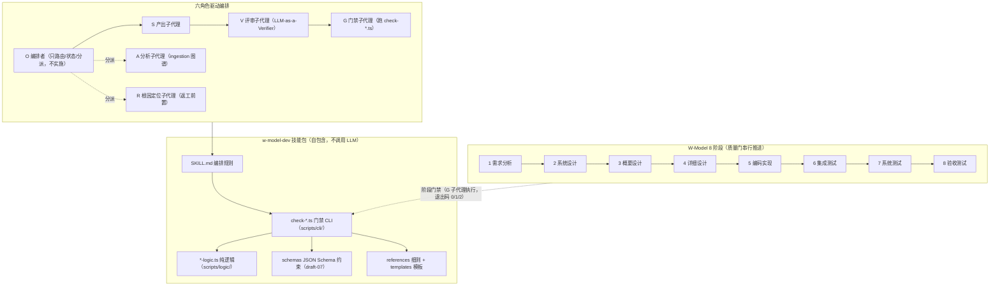

# W-Model AI Assistant Skill

[](w-model-dev/schemas/)
[](config/.eslintrc.cjs)

> **TL;DR**：基于 AI 辅助编码与 LLM-as-a-Verifier 的 W 开发模型闭环工作技能。
> 把软件工程 W 模型（需求 → 设计 → 编码 → 测试）的 8 个阶段编排为可执行的 `/wm` 命令，
> 自动维护需求跟踪矩阵（RTM）、在验收阶段触发工件质量门检查。
> 与普通 skill 的区别：脚本只做结构化门禁、**不调用 LLM**；LLM 评审由外部 Agent 按提示词执行。
> 开始：拷贝 `w-model-dev/` 到你的 Agent skills 目录 → 仓库根 `npm install` → `npm run self-test`。

**当前版本**：`41.19.0`（活跃迭代中，版本演进与历史变更见 [CHANGELOG.md](./CHANGELOG.md)；41.0.0 之前历史见 [CHANGELOG-archive.md](./CHANGELOG-archive.md)）

**健康指标**（2026-08-18 实测）：

| 指标 | 结果 |
|---|---|
| Self-test（samples 回归基线） | ✅ 256/256 |
| Vitest（门禁脚本单元测试） | ✅ 47 files / 723 tests |
| Vitest coverage（logic/+lib/ 阈值） | ✅ stmts 75 / branch 65 / funcs 85 / lines 75 |
| TypeScript strict（`tsc -p config/tsconfig.json`） | ✅ 0 错误 |
| Security scan（eslint-plugin-security） | ✅ baseline 一致 |
| Pre-push 门禁（本地 CI） | ✅ 17 项全通过（Git Bash 与 WSL 双平台实测） |

**CI 策略**：本项目**不集成云端 CI（GitHub Actions / GitLab CI）**，本地 git `pre-push` hook 为**唯一门禁**——`git push` 时自动跑 self-test + 各门禁脚本 + vitest 全量 + 安全扫描 + npm audit（high 以上漏洞阻断；网络不可达或 registry 不支持 audit endpoint 时自动跳过），任一不符即中止推送。`git push --no-verify` 跳过门禁视为**破坏契约**，仅限紧急情况且后果自负（`.githooks/pre-push` 头部有显式警告）。克隆后首次 `npm install` 自动启用钩子（`postinstall` 自动执行 `git config core.hooksPath .githooks`，仅当 `.githooks/` 存在时；失败仅 warn 不阻断 install）；如需手动重置执行 `npm run setup:hooks`。Windows 用 Git Bash、WSL 直接跑均可；跨平台运行前自动补装对应平台原生二进制（[`.githooks/ensure-platform-deps.sh`](./.githooks/ensure-platform-deps.sh)）。历史原因见 [CHANGELOG.md](./CHANGELOG.md)「CI 改为本地推送前门禁」节（远程 runner 无法分配）。

## 架构总览

W 模型将开发与测试设计同步推进，8 个阶段串行推进并由确定性门禁脚本守住阶段边界；技能包内部按「编排 → 门禁 → 纯逻辑 → 约束/细则」分层，六角色（O/A/S/V/G/R）驱动编排。



### W 模型 8 阶段 × 门禁对应

每阶段完成时，G 子代理跑对应门禁脚本并回填退出码证据；退出码语义全表统一为 **0 = 通过 / 1 = 校验失败 / 2 = 输入错误（ERROR_JSON）**：

| 阶段 | 产出工件 | 门禁脚本（`w-model-dev/scripts/cli/`） | 退出码语义 |
|---|---|---|---|
| 1 需求分析 | 需求规格（主模板 + 6 子模板）、验收测试设计、RTM、图谱 REQ 节点、TLA+ L1、BDD L1 | `check-requirement-graph.ts --phase=1`、`check-requirement-coverage.ts`、`check-tla-model.ts --phase=1`、`check-bdd-model.ts --phase=1` | 0/1/2 |
| 2 系统设计 | 系统设计文档（+ 6 子模板）、系统测试设计、RTM、图谱 SD 节点、TLA+ L2、BDD L2 | `check-requirement-graph.ts --phase=2`、`check-tla-model.ts --phase=2 --graph=`、`check-bdd-model.ts --phase=2 --graph=` | 0/1/2 |
| 3 概要设计 | 接口设计文档（+ 6 子模板）、集成测试设计、RTM、图谱 INTF 节点、TLA+ L3、BDD L3 | `check-requirement-graph.ts --phase=3`、`check-tla-model.ts --phase=3 --graph=`、`check-bdd-model.ts --phase=3 --graph=` | 0/1/2 |
| 4 详细设计 | 详细设计文档（+ 6 子模板）、单元测试设计、RTM、图谱 DD 节点、TLA+ L3/L4、BDD L4 | `check-requirement-graph.ts --phase=4`、`check-tla-model.ts --phase=4 --graph=`、`check-bdd-model.ts --phase=4 --graph=`、`check-artifact-gate.ts --phase=4 --spec-dir=` | 0/1/2（零违反硬约束才放行进编码） |
| 5 编码实现 | 实现代码、单元测试执行结果、RTM `codeModule` 回填、codegraph 查询落盘、opsx 制品 | `check-verifier-output.ts`、`check-code-tla-consistency.ts`、`check-design-contract-consistency.ts`、`check-artifact-gate.ts --phase=5` | 0/1/2 |
| 6 集成测试 | 集成测试执行结果、测试报告、RTM `integrationTest` 回填 | `check-verifier-output.ts`、`check-artifact-gate.ts --phase=6`、`check-bdd-model.ts --phase=6` | 0/1/2 |
| 7 系统测试 | 系统测试执行结果、性能/安全报告、RTM `systemTest` 回填 | `check-verifier-output.ts`、`check-artifact-gate.ts --phase=7`、`check-bdd-model.ts --phase=7` | 0/1/2 |
| 8 验收测试 | 验收测试执行结果、归档产物、RTM `acceptanceTest` 回填 | `check-verifier-output.ts`、`check-artifact-gate.ts`（终检，默认 `--phase=8`）、`check-archive-integrity.ts` | 0/1/2 |

> 每个阶段门放行前，G 还须跑 5 项闭环脚本（`check-budget.ts` / `check-run-log.ts` / `check-maturity.ts` / `check-checkpoint.ts` / `check-preventive-review.ts`）+ `check-role-dispatch.ts` + `check-signature-chain.ts`；阶段 5-8 附加 `check-codegraph-queries.ts` / `check-opsx-artifacts.ts`；阶段 8 终检另含 `check-openspec-archive.ts`。完整分派矩阵见 [dispatch-matrix.md](./w-model-dev/references/dispatch-matrix.md)。

## 快速上手

### AI Agent 安装

将 [`w-model-dev/`](./w-model-dev) 目录拷贝到你的 AI Agent（Trae / Claude Code 等）的 skills 目录即可。**Skill 资产零依赖**：`SKILL.md` 定义触发条件与编排，`references/` / `templates/` / `examples/` / `subagent/` / `schemas/` 按需加载，纯 Markdown 无需 Node.js 或 npm。

```bash
# 拷贝 skill 目录到 agent 的 skills 位置（路径以你的 agent 为准）
cp -r w-model-dev /path/to/agent/skills/w-model-dev
```

安装后，agent 在用户提及 W 模型或 `/wm` 命令时自动激活本技能。详细步骤与验证方法见 [docs/INSTALL.md](./docs/INSTALL.md)。

### 运行门禁校验脚本

技能包内的校验脚本（`w-model-dev/scripts/cli/*.ts`）是自包含的 TypeScript，由外部 Agent 在阶段门评审时直接执行。脚本依赖 [tsx](https://tsx.is/) + 少量 devDependencies（在仓库根目录 `npm install` 一次）：

- **runtime devDep**：`ajv` + `ajv-formats` — JSON Schema (draft-07) 强约束，由 `schema-loader.ts` 在 `*-logic.ts` 顶部自动 import
- **devDep（仅安全扫描用）**：`eslint-plugin-security` + `@typescript-eslint/*` — 由 `security-scan.ts` 调用
- **runtime**：`tsx`（运行 ESM TypeScript）

```bash
# 首次：在仓库根目录安装 devDependencies（ajv / eslint-plugin-security / tsx 等）
npm install

# 用 npm run 快捷脚本：
npm run check:verifier -- <output.json>     # 退出码 0/1/2
npm run check:gate -- [project-dir]         # 退出码 0/1/2
npm run check:graph -- <graph.json> [--phase=1|2|3|4]  # 图谱结构门禁，退出码 0/1/2
npm run check:tla -- <tla-manifest.json> [--phase=1|2|3|4] [--spec=<id>]  # TLA+ 行为门禁，退出码 0/1/2
npm run check:coverage -- <coverage.json> [--graph=] [--out-of-scope=] [--exemptions=]  # 阶段 1 需求覆盖分析门禁，退出码 0/1/2
npm run check:exemption -- <exemption.json>  # 豁免审批门禁（S→R→V→人类四阶段），退出码 0/1/2
npm run self-test                           # 退出码 0/1（256 条样本回归基线）
npm run doctor                              # 环境自检（node/tsx/ajv 等就绪性，退出码 0/1/2）
npm run lint:security                       # 安全扫描 + baseline 比对，退出码 0/1
npm run format                              # prettier 格式化（w-model-dev/scripts/**/*.ts + config/ + scripts/*.cjs，幂等）

# 或用 npx tsx 直接调用：
npx tsx w-model-dev/scripts/cli/check-verifier-output.ts <output.json>
npx tsx w-model-dev/scripts/cli/check-artifact-gate.ts [project-dir]
npx tsx w-model-dev/scripts/cli/check-requirement-graph.ts <graph.json> [--phase=1|2|3|4]
npx tsx w-model-dev/scripts/cli/check-tla-model.ts <tla-manifest.json> [--phase=1|2|3|4]
npx tsx w-model-dev/scripts/cli/check-code-tla-consistency.ts --manifest=<path> --graph=<path> --rtm=<path> --src=<dir>  # 代码-TLA+ 一致性回归，退出码 0/1/2
npx tsx w-model-dev/scripts/cli/self-test.ts
```

> 脚本不调用任何 LLM，仅做结构化门禁判定。
> `self-test.ts` 是校验逻辑的回归基线：每次修改 `*-logic.ts` 后必须跑通，新增校验项需同步增加样本（详见 [`scripts/__tests__/README.md`](./w-model-dev/scripts/__tests__/README.md) coverage 矩阵）。
> 「I have X, I want Y → use Z」工具路由见 [`references/toolbox.md`](./w-model-dev/references/toolbox.md)。
> 门禁脚本增强历史已并入 [CHANGELOG.md](./CHANGELOG.md)，此处不再重复。

### 完整教程：从克隆到跑通一次阶段门禁

以下 5 步可从零跑通本仓库的完整校验链路：

**步骤 1：克隆仓库**

```bash
git clone <仓库地址> w-model-skill-pack && cd w-model-skill-pack
```

**步骤 2：安装依赖并启用本地 git 钩子**

```bash
npm install         # 安装 tsx / ajv / eslint-plugin-security 等 devDependencies；postinstall 自动启用本地钩子（等价于 git config core.hooksPath .githooks）
npm run setup:hooks # （可选）如需手动重置/确认钩子配置，执行一次；等价于 git config core.hooksPath .githooks
```

> 克隆后首次 `npm install` 即自动启用钩子（`postinstall` 检测 `.githooks/` 存在后配置 `core.hooksPath`，失败仅 warn 不阻断 install）。不启用钩子不影响手动跑门禁；但未启用时 `git push` 不会自动校验（门禁契约见上方「CI 策略」）。

**步骤 3：跑样本回归基线**

```bash
npm run self-test
```

`self-test.ts` 以 `w-model-dev/scripts/samples/` 下 **256 条端到端样本**回归全部 `*-logic.ts` 的通过 / 失败 / 输入错误三态，期望退出码 0。每次修改校验逻辑后必须跑通（新增校验项需同步增加样本，详见 [`scripts/__tests__/README.md`](./w-model-dev/scripts/__tests__/README.md) coverage 矩阵）。

**步骤 4：跑本地 pre-push 门禁（17 项）**

```bash
npm run prepush
```

等价于 `bash .githooks/pre-push --force`，强制跑 17 项门禁：self-test 回归、check:verifier / check:gate 退出码语义抽查、check-bdd-model 有效/无效样本、check:coverage、check:exemption、check-signature-chain、security-scan、vitest 全量（47 files / 723 tests）、npm audit（high 以上阻断；网络不可达或 registry 不支持 audit endpoint 自动跳过）、check-docs-consistency、samples 覆盖矩阵（check-samples-coverage）、prettier 格式一致性、tsc 类型检查。任一失败即中止。

**步骤 5：跑通一次阶段门禁（以阶段 4 详细设计为例）**

阶段 4 的 G 门禁组合（详见上方「W 模型 8 阶段 × 门禁对应」表）：

| 门禁 | 命令（`w-model-dev/scripts/cli/`） | 校验内容 |
|---|---|---|
| 图谱结构门禁 | `check-requirement-graph.ts --phase=4` | 连通 / 单根 / 父唯一 / DD 节点 realizes 校验，**零违反硬约束** |
| TLA+ 行为门禁 | `check-tla-model.ts --phase=4 --graph=<graph.json>` | 文件头 + 层次一致性 + SANY 语法 + TLC 模型检查 |
| BDD 行为门禁 | `check-bdd-model.ts --phase=4` | D1-D8（头标注 / Gherkin / 状态机七要素 / BDD↔TLA+ 等价 / RTM 映射等） |
| 工件质量门 | `check-artifact-gate.ts --phase 4` | RTM 结构 + REQ 行 `designDoc` 回填 + （可选）详细设计文档结构 |

**输入工件（项目根下 `.w-model/` 目录）**：

| 工件 | 阶段 4 要求 |
|---|---|
| `rtm.json` | ✅ 必读；REQ 行 `designDoc` 非空（NFR/CON 行登记 `designDoc`），`coverageStatus` 与字段一致 |
| `ingestion/graph.json`（或 `consolidated-phase4.json`） | ✅ 图谱门禁单独读；`check-artifact-gate.ts` 按 `ingestion/` 优先级自动发现 |
| `tla-manifest.json` + `.tla` / `.cfg` | ✅ 阶段 1-4 必产；存在时工件质量门自动联动 `check-tla-model.ts` |
| `bdd-manifest.json` + `.feature` | ✅ 阶段 1-4 必产；存在时工件质量门自动联动 `check-bdd-model.ts` |
| `docs/phase4-detailed/*-detailed-design.md` 等 | 结构校验时传 `--spec-dir=docs/phase4-detailed`（SSOT 头 + 6 引用块 + DoD ≥ 8 项） |

**`rtm.json` 最小示例**（阶段 4 相关字段）：

```json
{
  "rows": [
    { "requirementId": "REQ-001", "description": "用户注册", "designDoc": "DD-001", "coverageStatus": "部分" },
    { "requirementId": "REQ-002", "description": "用户登录", "designDoc": "DD-002", "coverageStatus": "部分" }
  ],
  "executionSummary": {
    "unitTest":        { "total": 0, "passed": 0, "failed": 0, "pending": 0, "coverage": 0 },
    "integrationTest": { "total": 0, "passed": 0, "failed": 0, "pending": 0, "coverage": 0 },
    "systemTest":      { "total": 0, "passed": 0, "failed": 0, "pending": 0, "coverage": 0 },
    "acceptanceTest":  { "total": 0, "passed": 0, "failed": 0, "pending": 0, "coverage": 0 }
  }
}
```

**命令行**：

```bash
# 阶段 4 工件质量门（--phase 4 与 --phase=4 等价；不传项目目录默认当前目录 cwd）
npx tsx w-model-dev/scripts/cli/check-artifact-gate.ts --phase 4 <项目目录>

# 追加详细设计文档结构校验（SSOT 头 + 6 引用块 + DoD 清单）
npx tsx w-model-dev/scripts/cli/check-artifact-gate.ts --phase 4 --spec-dir=docs/phase4-detailed <项目目录>
```

**预期输出与退出码解读**：

| 退出码 | 含义 | 输出形态 | 处置 |
|---|---|---|---|
| 0 | 通过 | stdout 结构化报告 + 末尾 `GATE_JSON` 摘要（`exitCode: 0`、`passed: true`） | 阶段 4 零违反硬约束达成，进入用户 CHECKPOINT；放行后进阶段 5 编码 |
| 1 | 校验失败 | stdout 报告 + `violations` 列表 + `GATE_JSON`（`exitCode: 1`） | 分派 R 根因定位 → V 复审 → S-fix 返工 → 重跑门禁；退出码 1/2 一律不得放行 |
| 2 | 输入错误 | stderr `✗ [CATEGORY] <message>` + stdout 单行 `ERROR_JSON` | 修正输入（参数 / 文件路径 / JSON 格式）后重跑 |

**ERROR_JSON 示例**（exit 2，机器可读；`ERROR_JSON.exitCode` 与进程退出码强一致，防伪三层机制见 SSoT §10E）：

```
✗ [ARG_INVALID] 参数非法 --phase=99 [rule=P0-1]: 须为 1-8 的整数
ERROR_JSON {"category":"ARG_INVALID","message":"参数非法 --phase=99","exitCode":2,"rule":"P0-1"}
```

6 类错误类别（ARG_INVALID / FILE_NOT_FOUND / FILE_PARSE / FILE_READ / STRUCTURE_INVALID / UNEXPECTED）与 ERROR_JSON 约定的完整定义见 [command-reference.md](./w-model-dev/references/command-reference.md)「错误码与 ERROR_JSON 约定」节。

## 核心能力

- **W 模型 8 阶段编排**：需求分析 → 系统设计 → 概要设计 → 详细设计 → 编码实现 → 集成测试 → 系统测试 → 验收测试
- **编排者最小化（Orchestrator Minimization）**：编排者（O）只做编排（路由 / 状态读写 / CHECKPOINT 等待 / 分派子代理 / 持久化 / 只读脚本）；任何实施动作必须由子代理（S 产出 / V 评审 / G 门禁 / R 根因定位）执行。详见 [subagent-delegation.md](./w-model-dev/references/subagent-delegation.md)
- **LLM-as-a-Verifier（V 子代理执行）**：基于 [arXiv:2607.05391](https://arxiv.org/abs/2607.05391) 的连续评分 [0,1]（4 位小数）+ 三维度验证（粒度 / 重复 / 分解）+ PPT 排序；技能提供提示词与输出 Schema，V 子代理执行 LLM 调用（即「外部 Agent」），技能用校验脚本防漂移；编排者不得自评。详见 [verifier-spec.md](./w-model-dev/references/verifier-spec.md)
- **Agent Personas（评审角色提示词）**：4 个 W 模型适配 Persona（code-reviewer / test-engineer / security-auditor / performance-auditor）+ 28 个人格文件（engineering / testing / design / product / project 5 类，选型矩阵见 [subagent-persona-matrix.md](./w-model-dev/references/subagent-persona-matrix.md)）；Persona 文件本身是 Markdown，不调用 LLM
- **五轴评审 + Severity 标签**：Correctness / Readability / Architecture / Security / Performance 五轴评审 + Severity 标签（Critical / Required / Optional / Nit / FYI）
- **负面知识库**：8 条核心操作行为 + 10 条失败模式 F1~F10（行为退化，命中不回退但登记，见 [operation-behaviors.md](./w-model-dev/references/operation-behaviors.md)）+ 48 条流程反模式（流程破坏，命中即回退）+ 运维失败模式 O1~O6（见 SSoT §4A.2a）。完整清单见 [anti-patterns.md](./w-model-dev/references/anti-patterns.md)
- **项目级 Definition of Done**：7 维度（测试 / 行为 / 文档 / RTM / 状态 / 理解证据 / 签名链完整性）的每次变更日常标准，与阶段门质量门互补
- **RTM 自动维护**：从项目状态自动重建需求跟踪矩阵，双向追溯需求 ↔ 设计 ↔ 代码 ↔ 四级测试
- **状态持久化**：JSON 文件存储（`.w-model/*.json`），跨多轮交互保持上下文；JSON Schema (draft-07) 强约束
- **工件质量门**：RTM 需求覆盖率 100% + 四级测试全部通过才允许交付；单元测试代码覆盖率阈值 ≥ 80%
- **返工循环：R 根因定位者 + S 兼 F 修复者**：V/G 不通过后，必先分派 R 产出 `RootCauseReport`，经 V 复审 + G 门禁通过后，S 兼 F 携报告执行修复。正常路径 `S → V → G → 下一阶段`，返工路径 `V/G 不通过 → R 定位 → V 复审 → G 门禁 → S-fix 修复 → V → G → 下一阶段`。详见 [root-cause-locator.md](./w-model-dev/references/root-cause-locator.md)
- **TLA+ 层次化状态机建模 + 代码-TLA+ 一致性回归**：阶段 1-4 用 TLA+ 建模（L1-L3+ 层次化），G 子代理跑 `check-tla-model.ts` 校验 SANY 语法 + TLC 模型检查；阶段 5 G 子代理跑 `check-code-tla-consistency.ts` 四维度校验（SD→codeModule 映射 / 代码状态转移 / Next 分支对应 / 断言覆盖不变式）
- **BDD 行为建模与验收夹具**：阶段 1-4 用 Cucumber.js + Gherkin 产出 L1-L4 分层 features（与 TLA+ 层次对齐）；阶段 5 以 L4 features 作为 TDD 夹具，阶段 6/7/8 执行 L3/L2/L1 cucumber scenarios。G 子代理跑 `check-bdd-model.ts` 7 维度校验
- **PPT 排序算法**：O(N×k) 复杂度的概率枢轴锦标赛，用于测试用例优先级排序
- **采用路径（Greenfield vs Brownfield）**：新项目 Day 0 跑全流程 vs 存量项目增量验证优先，见 [采用路径指南](./docs/adoption-guide.md)
- **Loop 3 事件驱动循环**（L2+ 激活）：棕地维护场景的事件接驳——消费方自行实现 webhook/cron 触发器写入 `event-ingress.jsonl`，编排者 O 按事件类型路由到单阶段。详见 [event-ingress-guide.md](w-model-dev/references/event-ingress-guide.md)
- **Loop 4 爬坡循环**：分析 run-log 产出 HarnessImprovementReport 改进信号，人审后手动应用。保持「技能自演化不在本仓库」原则。详见 [hill-climbing-guide.md](w-model-dev/references/hill-climbing-guide.md)
- **SkillOpt 方法论吸收**：吸收 [microsoft/SkillOpt](https://github.com/microsoft/SkillOpt)「bounded edit + validation gate」方法论，对技能/模板/参考/脚本 4 类资产做离线进化。详见 [skillopt-adoption.md](w-model-dev/references/skillopt-adoption.md)
- **codegraph 修改前影响分析**（阶段 5-8）：S-coding 在 Edit/Write 任何代码/测试文件前，须先调用 `codegraph_explore` 查询目标符号的 callers/callees/blast radius。与 code-TLA+ 一致性校验（修改后回归）互补：前者预防、后者回归
- **OpenSpec opsx 三段式 S 分派**（阶段 5-8）：S-explore（思路探索）→ S-propose（规格级变更规划+S-tickets 拆解）→ S-coding（按 tickets frontier 逐片编码），每段产物跑 R3×3 + V 评审
- **单轴下限 R13**：Verifier 评审 passed 判据收紧为 `qualityLevel∈{A,B} && 所有 subCriterion.score ≥ 0.70`，杜绝「加权平均掩盖单轴失败」
- **阶段 1 迷雾登记册（Fog of War）**：需求分析引入「REQ 入学锐利性测试」+ 迷雾登记册文本节 + 毕业机制（毕业成 REQ / 判 Out of Scope / 豁免审批）。详见 [phase-1-requirements.md](./w-model-dev/references/phase-1-requirements.md)「迷雾登记册（Fog of War）」节
- **阶段设计级产物**：阶段 1-4 产出升级为主模板 + 每阶段 6 独立子模板（跨阶段去重后共 10 种：glossary / traceability-matrix / behavior-spec / discipline-dod / uml-modeling 等），主文档引用块串联；门禁新增对应结构校验。详见 [SSoT §10.7](./docs/skill-design-document_SSoT.md) 与 `w-model-dev/templates/`
- **四源吸收（软件设计哲学 / 凤凰架构 / GoF 设计模式 / 失控）**：吸收《软件设计哲学》设计判据与战略式编程、《凤凰架构》架构决策框架与可观测性三支柱、GoF 23 设计模式目录、《失控》蜂群共识与受控的失控——落地为设计判据条目、方案权衡列、决策矩阵、模式目录与机制说理层（爬山法/约束创造/满意化/不连续系统穷举）。吸收决策记录见 [decision-log/absorptions.md](./docs/changes/decision-log/absorptions.md)

## 架构原则与外部工具边界

本技能遵循「技能包只包含提示词、参考、模板，里面的脚本只做门禁，不涉及 LLM」的架构原则。

| 能力 | 归属 | 实现位置 |
|---|---|---|
| W 模型阶段编排、RTM 维护、状态管理 | 技能内 | `w-model-dev/SKILL.md`（编排逻辑，Agent 执行）+ `w-model-dev/references/*`（阶段细则） |
| 工件质量门 | 技能内（脚本只做门禁） | `w-model-dev/scripts/logic/gate-logic.ts` + `w-model-dev/scripts/cli/check-artifact-gate.ts` |
| LLM-as-a-Verifier 评审（三维度 / 连续评分 / PPT / 子标准） | 技能内提供提示词与 Schema，外部 Agent 执行 | `w-model-dev/references/verifier-spec.md` + `w-model-dev/scripts/cli/check-verifier-output.ts` |
| LLM 推理本身 | 外部 | 由外部 Agent（Trae / Claude 等）自行调用其 LLM |
| 技能自演化（Rollout / Reflect / Edit / Skill Lift 评估） | 外部（工具运行）+ 技能内（方法论吸收） | 工具运行：[SkillOpt](https://github.com/microsoft/SkillOpt) / [darwin-skill](https://github.com/alchaincyf/darwin-skill)；方法论吸收：[skillopt-adoption.md](w-model-dev/references/skillopt-adoption.md) |
| codegraph（符号级影响分析） | 外部（MCP 工具） | 宿主 Agent MCP 工具 `codegraph_explore`，阶段 5-8 修改前预防查询 |
| OpenSpec opsx（规格驱动变更管理） | 外部（CLI 工具） | 宿主 Agent CLI `/opsx:explore` `/opsx:propose` `/opsx:apply` `/opsx:archive`，阶段 5-8 规划层 |

详见 SSoT [§3.3 技能架构原则与外部工具边界](./docs/skill-design-document_SSoT.md)。

## 命令一览

| 命令 | 说明 |
|---|---|
| `/wm analyze <需求描述>` | 需求分析，同步产出验收测试设计 |
| `/wm design type=<架构\|概要\|详细>` | 设计阶段，同步产出对应测试设计 |
| `/wm code <功能描述>` | 编码实现，同步产出单元测试用例（不自动标记通过） |
| `/wm test type=<单元\|集成\|系统\|验收> result=<pass\|fail>` | 回填指定类型测试真实执行结果 |
| `/wm review <目标ID或文件路径>` | 返回结构化评审指引（指向 `verifier-spec.md` + `check-verifier-output.ts`，不内置 LLM） |
| `/wm status` | 查看当前阶段、进度、RTM 覆盖率（脚本化，由 `wm-status.ts` 输出） |
| `/wm metrics` | 流程度量报告（动作/角色/结果分布、返工、预算 burn rate、killSwitch 预警） |
| `/wm help` | 显示帮助 |
| `/wm reset` | 重置项目（保留元信息，清空实体） |
| `/wm export [输出目录]` | 导出项目 JSON + RTM Markdown |
| `/wm import <文件路径>` | 从 JSON 导入项目 |
| `/wm hill-climbing` | 分析 run-log 产出 HarnessImprovementReport（改进信号，人审后手动应用；L2+ 项目） |

只读报告脚本（均不写状态、退出码 0/2）：

| 脚本 | 说明 |
|---|---|
| `wm-status.ts` | 状态快照（当前阶段/进度/RTM 覆盖/四级测试/最近动作/下一步建议） |
| `metrics-report.ts` | 流程度量报告（动作/角色/结果分布、返工、预算 burn rate、killSwitch 预警） |

## 项目结构

```
.
├── w-model-dev/                  # Skill 资产（标准 skill 结构，自包含、可独立拷贝分发）
│   ├── SKILL.md                  # Skill 定义（YAML frontmatter + 编排 + 架构定位 + 核心操作行为）
│   ├── references/               # 阶段细则与规范（按需加载；完整列表见 references/ 目录）
│   │   ├── phase-1-requirements.md … phase-8-acceptance-test.md  # 8 阶段细则
│   │   ├── anti-patterns.md      # 负面知识库：48 条流程反模式（F1~F10 失败模式见 operation-behaviors.md；O1~O6 运维失败模式见 SSoT §4A.2a）
│   │   ├── workflow.md           # 完整工作流程（流程图 + 阶段并行表 + 阶段门评审）
│   │   ├── verifier-spec.md      # LLM-as-a-Verifier 评审规范（提示词 + Schema + 子标准 + 五轴评审）
│   │   ├── subagent-delegation.md # 编排者-子代理边界（O/A/S/V/G/R 六类核心角色 + R-iceberg 变体 + 分派模板 + 回填契约）
│   │   ├── dispatch-matrix.md    # 阶段 × 角色 × S 变体 × 产物 × reference × check 脚本总览矩阵
│   │   ├── command-reference.md  # /wm 命令参考
│   │   ├── glossary.md           # 术语权威表（15+ 术语 + _Avoid_ 别名治理）
│   │   ├── toolbox.md            # 工具箱决策表（I have X → use Z）
│   │   └── …（graph-guide / tla-plus-guide / bdd-guide / rtm-guide / data-models / quality-standards / definition-of-done / operational-recovery / event-ingress-guide / hill-climbing-guide / skillopt-adoption / subagent-persona-matrix / signature-chain-guide / root-cause-locator / ingestion-chunk / ingestion-cross / agent-personas / bdd-review-checklist / bdd-syntax-reference / bdd-patterns-examples / estimation-guide / context-management-guide / code-smells-checklist / concurrency-guide / design-patterns-catalog / refactoring-catalog）
│   ├── subagent/                 # 28 个评审 persona Markdown 文件（engineering / testing / design / product / project 5 类，按需读取，不调用 LLM）
│   ├── schemas/                  # 20 份 JSON Schema (draft-07) 文件（verifier-output / rtm / project / budget / run-log / maturity / checkpoint-log / tla-manifest / graph / rootcause-report / hill-climbing-report / event-ingress / code-tla-manifest / bdd-manifest / coverage / exemption / signature-chain / preventive-review / design-contract / iceberg-sweep）
│   ├── tools/                    # tla2tools.jar（TLA+ 门禁运行时依赖：check-tla-model.ts 执行 SANY/TLC 时加载）
│   ├── scripts/                  # 只做门禁 / 校验，不调用 LLM（自包含，依赖 tsx + devDeps：ajv / eslint-plugin-security 等）
│   │   ├── cli/                  # 门禁与工具 CLI 入口：check-*.ts + self-test/security-scan/wm-status/metrics-report/ensure-codegraph-opsx/wm-write/doctor/plan-chunks
│   │   ├── logic/                # 纯逻辑层：*-logic.ts + schema-loader/plan-chunks-logic（纯分块规划）
│   │   ├── lib/                  # 通用工具与 IO 辅助：cli-error/gate-report/parse-phase/read-json-or-exit/safe-json/artifact-gate-assets/uat-path-mapping/tla-clean-trace 等
│   │   ├── samples/              # 端到端样本（各门禁脚本 valid/bad 样本集 + README.md 覆盖矩阵，check-samples-coverage 门禁核对）
│   │   └── __tests__/            # vitest 单元测试（47 个 .test.ts / 723 tests）
│   ├── skill-metadata.json       # 版本号镜像（与 SKILL.md frontmatter `version` 双写，__tests__/skill-metadata.test.ts 回归校验）
│   ├── templates/                # 文档模板（需求 / 设计 / 测试 / RTM 等）
│   └── examples/                 # 交互示例（4 份伪示例对话 + 5 份 stage 编排示例 + real-run-evidence.md 真实命令证据）
├── docs/                         # 设计文档（统一存放；docs/api/ 为 typedoc 生成物，gitignored 不入库）
│   ├── skill-design-document_SSoT.md           # 设计文档（单一事实来源 SSoT）
│   ├── skill-design-document.md                # 旧版设计文档指针（已废弃独立维护，见文件头部声明）
│   ├── adoption-guide.md                       # 采用路径指南（Greenfield vs Brownfield；SSoT §11A 为权威定义）
│   ├── llm-verifier-integration-design.md      # LLM Verifier 集成设计（指针文档）
│   ├── tla-plus-modeling-design.md             # TLA+ 层次化建模设计
│   ├── ingestion-graph-convergence-design.md   # ingestion 与图谱收敛设计
│   ├── information-flow-validation-design.md   # 信息流校验设计（黑洞/奇迹/死模块）
│   ├── loop-engineering-adoption-design.md     # Loop 工程采用设计
│   ├── INSTALL.md                              # AI Agent 安装指南
│   ├── user-guide.md                           # 用户指南（docsify 站点首页）
│   ├── troubleshooting.md                      # 排障手册（校验失败排查 / 依赖巡检 / 门禁降级）
│   ├── index.html + _sidebar.md                # docsify 站点入口与侧边栏（npm run docs:site）
│   ├── superpowers/                            # 内部规划目录（specs/ + plans/，不参与门禁、非面向用户）
│   └── changes/                                # archive/（端到端调测归档 round15/19/20×2/23）+ decision-log/（轮次 → 版本决策记录）
├── eval/                         # 外部工具（darwin-skill）评估产物归档，不属技能包
│   ├── w-model-dev-test-prompts.json           # 评估测试场景（15 条：典型 / 歧义 / 反误触发 / 正向）
│   └── w-model-dev-results.tsv                 # 评估历史记录（得分轨迹）
├── config/                       # 工程配置集中目录（prettier.config.cjs / vitest.config.ts / tsconfig.json / .eslintrc.cjs / .eslintignore）
├── scripts/setup-hooks.cjs       # 一次性启用 pre-push 钩子（npm run setup:hooks，写入本地 .git/config）
├── .eslintsecurity-baseline.json # security-scan baseline v2（内容敏感指纹豁免清单；--regenerate 重生成）
├── .githooks/pre-push            # 本地推送前门禁（17 项，替代远程 CI；w-model-dev/**、README.md / AGENTS.md / CONTRIBUTING.md / package.json、docs/*.md 变更时触发）
├── AGENTS.md                     # AI Agent 仓库导航（与 README 互补，聚焦 Agent 行动事实集）
├── package.json                  # 声明 tsx + devDeps（ajv / eslint-plugin-security 等）+ npm run 快捷脚本（private，不发布）
├── CHANGELOG.md                  # 变更日志
├── CONTRIBUTING.md               # 贡献指南
└── README.md                     # 项目导航
```

> 编排逻辑由 `w-model-dev/SKILL.md` 承载，Agent 读取后用自身工具执行；不内置任何
> TypeScript 引擎、npm 包或编程式 SDK。`/wm` 命令、状态持久化、RTM 维护均由 Agent
> 按 `SKILL.md` 与 `references/` 在项目内（`.w-model/*.json`）完成。
> 历史端到端调测产物已归档至 `docs/changes/archive/`，**不参与 `/wm` 命令编排**，也不会被 `check-*-gate.ts` 读取。

## 参考实现（已归档）

端到端调测归档（按时间倒序）：

- [`docs/changes/archive/2026-07-30-round23-w-model-8-phase-validation/`](./docs/changes/archive/2026-07-30-round23-w-model-8-phase-validation/)
- [`docs/changes/archive/2026-07-28-round20-w-model-8-phase-validation/`](./docs/changes/archive/2026-07-28-round20-w-model-8-phase-validation/)
- [`docs/changes/archive/2026-07-27-round19-w-model-8-phase-validation/`](./docs/changes/archive/2026-07-27-round19-w-model-8-phase-validation/)
- [`docs/changes/archive/2026-07-26-round15-end-to-end-test/`](./docs/changes/archive/2026-07-26-round15-end-to-end-test/)

> 完整调测细节与各轮对比见归档目录与 [CHANGELOG.md](./CHANGELOG.md)。
> 归档目录是参考实现，**不参与 `/wm` 命令编排**，也不会被 `check-*-gate.ts` 读取。Agent 在向用户解释 W 模型实际产出形态、阶段产物颗粒度、测试用例设计粒度时可指向上述归档。

## 相关文档

> `eval/` 目录为外部工具评估产物，**不属技能包**，不参与 `/wm` 编排，修改技能包时无需关注。

- [设计文档（SSoT）](./docs/skill-design-document_SSoT.md) - 单一事实来源
- [旧版设计文档（指针）](./docs/skill-design-document.md) - 已废弃独立维护，指向 SSoT
- [Skill 定义](./w-model-dev/SKILL.md) - AI 助理触发命令与阶段流
- [LLM-as-a-Verifier 评审规范](./w-model-dev/references/verifier-spec.md) - 提示词 + Schema + 子标准 + 五轴评审
- [Agent Personas](./w-model-dev/references/agent-personas.md) - 4 个评审角色提示词（code-reviewer / test-engineer / security-auditor / performance-auditor）
- [反例与失败模式](./w-model-dev/references/anti-patterns.md) - 48 条流程反模式（F1~F10 失败模式见 [operation-behaviors.md](./w-model-dev/references/operation-behaviors.md)，O1~O6 运维失败模式见 SSoT §4A.2a）
- [编排者-子代理边界](./w-model-dev/references/subagent-delegation.md) - O/A/S/V/G/R 六类核心角色 + R-iceberg 变体 + 分派模板 + 回填契约
- [根因定位者方法论](./w-model-dev/references/root-cause-locator.md) - R 角色 4 种根因分析方法（5-Why / 鱼骨图 / 缺陷链追溯 / 上游回溯）
- [Persona 选型矩阵](./w-model-dev/references/subagent-persona-matrix.md) - R-lead / V-lead 多角度 persona 选择矩阵
- [阶段 × 角色 × 脚本总览](./w-model-dev/references/dispatch-matrix.md) - 编排者分派前必读矩阵
- [ingestion 子流程：分块分析](./w-model-dev/references/ingestion-chunk.md) - A 子代理分块分析细则（阶段 1–4）
- [ingestion 子流程：交叉合并与图谱演进](./w-model-dev/references/ingestion-cross.md) - A 子代理合并建图 + 收敛循环（阶段 1–4）
- [图谱门禁与收敛准则](./w-model-dev/references/graph-guide.md) - check-requirement-graph.ts 用法 + 收敛判定
- [TLA+ 层次化状态机建模](./w-model-dev/references/tla-plus-guide.md) - check-tla-model.ts 用法 + 层级模型 + SANY/TLC 门禁
- [BDD 建模指南](./w-model-dev/references/bdd-guide.md) - L1-L4 分层 features + 状态机七要素 + BDD↔TLA+ 协作
- [项目级 DoD](./w-model-dev/references/definition-of-done.md) - 每次变更的日常标准（7 维度）
- [术语权威表](./w-model-dev/references/glossary.md) - 15+ 术语 + `_Avoid_` 别名治理
- [工具箱决策表](./w-model-dev/references/toolbox.md) - I have X → use Z
- [采用路径指南](./docs/adoption-guide.md) - Greenfield vs Brownfield（SSoT §11A 为权威定义）
- [用户指南](./docs/user-guide.md) - 校验失败排查思路（退出码 0/1/2）/ 规则依据 / 修复建议 / 依赖巡检流程（人工 npm audit + npm outdated）
- [排障手册](./docs/troubleshooting.md) - FAQ（Windows 非 Git Bash / --no-verify 契约 / node_modules / baseline 指纹）+ 环境问题矩阵
- [ingestion 与图谱收敛设计](./docs/ingestion-graph-convergence-design.md) - A 角色 / graph.json / check-requirement-graph.ts 权威设计文档
- [信息流校验设计](./docs/information-flow-validation-design.md) - 黑洞/奇迹/死模块门禁 + EXT-IN/EXT-OUT 边界节点
- [TLA+ 层次化建模设计](./docs/tla-plus-modeling-design.md) - L1–L6 层级模型 + 文件头规范 + SANY/TLC 门禁
- [LLM Verifier 集成设计](./docs/llm-verifier-integration-design.md) - 指针文档
- [Loop 工程采用设计](./docs/loop-engineering-adoption-design.md) - 运维层与成熟度阶梯采纳设计增量
- [AI Agent 安装指南](./docs/INSTALL.md)
- [Agent 仓库导航](./AGENTS.md) - 面向 AI Agent 的最小事实集
- [变更日志](./CHANGELOG.md)（41.0.0 之前历史：[CHANGELOG-archive.md](./CHANGELOG-archive.md)）
- [贡献指南](./CONTRIBUTING.md)

## License

MIT
