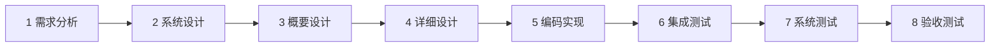

# W-Model AI Assistant Skill

[](w-model-dev/schemas/)
[](config/.eslintrc.cjs)

> **一句话**：让 AI 编程助手按正规软件开发流程干活的技能包。把研发流程拆成 8 个阶段，
> 每个阶段都有明确的产出物和一道「验收门」；门禁是确定性脚本（退出码 `0` 通过 / `1` 校验失败 / `2` 输入错误），
> 评审由外部 Agent 按提示词执行——**技能包本身不调用任何 LLM**。
> 两个独立入口：想检查仓库脚本是否健康，走 [验证仓库](#验证仓库)；想把这套流程装进你的 AI 助手，走 [安装 Skill](#安装-skill)。两者不是同一条命令链。

**它解决什么问题？**

AI 助手写代码很容易「差不多就行」：跳段、凭感觉、说不清依据。W-Model 给出一套可执行的流程纪律：

- **不跳步**：需求 → 系统设计 → 概要设计 → 详细设计 → 编码 → 集成测试 → 系统测试 → 验收测试，8 个阶段有序推进；
- **不被感觉骗**：每个阶段的产出物都要过脚本门禁（不是 AI 拍脑袋打分），门禁不通过就不能进入下一阶段；
- **测试只认真结果**：测试用例必须真实执行后回填 `result=pass|fail`，任何人不允许「声称通过」；
- **全程可追溯**：需求跟踪矩阵（RTM）自动维护，需求 ↔ 设计 ↔ 代码 ↔ 四级测试双向可查；
- **管流程的人不亲自动手**：编排者（O）只负责调度、记录和等待确认，实际产出与把关全部由子代理（S 产出 / V 评审 / G 门禁 / R 根因定位 / A 分析）承担。

**当前版本**：`42.2.1`（变更历史见 [CHANGELOG.md](./CHANGELOG.md)；41.0.0 之前见 [CHANGELOG-archive.md](./CHANGELOG-archive.md)）

**健康指标**（全部门禁实测通过，怎么验证见下方「CI 策略」与「快速上手」）：

| 指标                               | 结果                  |
| ---------------------------------- | --------------------- |
| Self-test（340 条样本回归基线）    | ✅ 340/340            |
| 门禁脚本单元测试（vitest）         | ✅ 以当前命令输出为准 |
| TypeScript 类型检查（strict）      | ✅ 0 错误             |
| 安全扫描（eslint-plugin-security） | ✅ baseline 一致      |
| 推送前门禁（本地 CI，18 项）       | ✅ 全通过             |

## 两条上手路径

这个仓库只有两个用途：**验证仓库健康**，或者**把 Skill 装进你的 AI 助手**。两者不是同一条命令链，按需二选一。

**单一权威文案**：**仓库验证**命令的唯一权威是本页下方 [验证仓库](#验证仓库) 的命令块；**Skill 安装**的唯一权威是 [docs/INSTALL.md](./docs/INSTALL.md) §2 前置条件 + §3 标准安装。两处互不复述——本页其余位置与安装/验证入口文档（[docs/INSTALL.md](./docs/INSTALL.md)、[AGENTS.md](./AGENTS.md)、[CONTRIBUTING.md](./CONTRIBUTING.md)、[docs/adoption-guide.md](./docs/adoption-guide.md)）讲这两条路线时一律指向对应权威、不复制命令（复制块会各自过期，需改时先改权威再让消费者指向）。L0 自包含资产（`w-model-dev/references/quickstart.md`）随技能包单独分发，无法依赖包外 README，其 L1 上手块保留自身命令。

## 验证仓库

只检查仓库脚本和依赖是否健康，不会安装到任何 Agent。需要 Node.js ≥ 20 与 Git；命令必须从仓库根目录执行。PowerShell 5.1 请逐行执行，不要使用 `&&`：

```bash
git clone https://github.com/WangHHY110001001/Software_Engineering_W_Development_Model_Skills_Pack.git w-model-skill-pack
cd w-model-skill-pack
npm install
npm run self-test
npm run doctor
```

Bash 和 PowerShell 7 可以用命令简写；`self-test` 与 `doctor` 在 PowerShell 或 Windows Terminal 都能跑，不要求 Git Bash。Git Bash 仅在运行 `pre-push` 或平台依赖检查时需要。

> **注意：** `npm install` 的 postinstall 会在本仓库启用推送前门禁（等价于 `git config core.hooksPath .githooks`），这只是仓库验证的本地配置副作用，与 Skill 激活无关。如果你原本配置过自定义 hook 路径、担心被覆盖，安装前先备份：

> Bash：
>
> ```bash
> git config --local --get core.hooksPath > .git/hooksPath.previous
> status=$?
> if [ "$status" -eq 1 ]; then : > .git/hooksPath.previous; elif [ "$status" -ne 0 ]; then exit "$status"; fi
> chmod 600 .git/hooksPath.previous
> ```
>
> PowerShell 5.1：
>
> ```powershell
> git config --local --get core.hooksPath > .git/hooksPath.previous
> $readStatus = $LASTEXITCODE
> if ($readStatus -eq 1) { Set-Content -Path .git/hooksPath.previous -Value '' } elseif ($readStatus -ne 0) { throw "无法读取 core.hooksPath，退出码 $readStatus" }
> ```
>
> 备份文件只保存在本地 `.git/`，不得提交；请确认文件权限，空文件表示「原先未设值」。需要撤销本地覆盖时，Bash 使用：
>
> ```bash
> if [ -s .git/hooksPath.previous ]; then git config --local core.hooksPath "$(cat .git/hooksPath.previous)"; else git config --local --unset core.hooksPath; fi
> ```
>
> PowerShell 5.1 使用：
>
> ```powershell
> $previousHooksPath = (Get-Content -Raw .git/hooksPath.previous).Trim()
> if ([string]::IsNullOrWhiteSpace($previousHooksPath)) { git config --local --unset core.hooksPath } else { git config --local core.hooksPath $previousHooksPath }
> ```
>
> 只有备份文件为空（原先未设值）时才执行 `--unset`；不要把空值当作有效路径。完整说明见 [docs/INSTALL.md](./docs/INSTALL.md)。

## 安装 Skill

安装命令与目标路径的唯一权威是 `docs/INSTALL.md` §3 标准安装，本页不再复制命令（与上文「单一权威文案」一致）；目标 skills 路径以具体 Agent 官方文档为准，`.agent` 不是通用路径，切勿照抄。

**Skill 资产是纯 Markdown，零依赖**（不要求 Node.js / npm，脚本依赖只属于仓库）。安装后，支持技能发现机制的 Agent 会在你提到 W 模型或输入 `/wm` 命令时激活它。详细步骤见 [docs/INSTALL.md](./docs/INSTALL.md)。

## 它是怎么工作的

### 8 阶段流水线



每个阶段同步产出三类东西：**阶段文档 + 对应级别的测试设计 + RTM（需求跟踪矩阵）更新**。阶段完成时跑门禁脚本，用统一退出码 `0 = 通过 / 1 = 校验失败 / 2 = 输入错误` 判定，通过后才能进入下一阶段。

### 六种角色（核心：编排者最小化）

| 角色           | 职责                                                                           |
| -------------- | ------------------------------------------------------------------------------ |
| **O 编排者**   | 只做路由 / 状态读写 / 等待核对点 / 分派子代理 / 持久化，**不亲自产出任何东西** |
| **A 分析**     | 把需求切块分析（ingestion），构建需求图谱                                      |
| **S 产出**     | 实际写文档、写代码、写测试                                                     |
| **V 评审**     | 按评审规范提示词对产出做 LLM 评审（由外部 Agent 执行）                         |
| **G 门禁**     | 运行 `check-*.ts` 门禁脚本，采集退出码作为证据                                 |
| **R 根因定位** | 门禁不通过时，先定位根因（5-Why / 鱼骨图 / 缺陷链 / 上游回溯）再返工           |

为什么要这样分？—— 干活和把关的人分开，评审不吃「自己写的东西自己觉得很对」的亏。角色与分派规则见 [subagent-delegation.md](./w-model-dev/references/subagent-delegation.md)，评审提示词见 [verifier-spec.md](./w-model-dev/references/verifier-spec.md)。

### 反模式与红线（负面知识库）

- 48 条流程反模式（命中即回退），见 [hard-constraints.md](./w-model-dev/references/hard-constraints.md)；
- 8 条核心操作行为 + 失败模式（命中登记不回退），见 [operation-behaviors.md](./w-model-dev/references/operation-behaviors.md)；
- 项目级完成定义（DoD）7 维度（测试 / 行为 / 文档 / RTM / 状态 / 理解证据 / 签名链完整性），见 [quick-self-check.md](./w-model-dev/references/quick-self-check.md)。

## 快速上手

### W 模型 8 阶段 × 门禁对应

| 阶段       | 主要产出                                                 | 主要门禁脚本（`w-model-dev/scripts/cli/`）                                                                                              |
| ---------- | -------------------------------------------------------- | --------------------------------------------------------------------------------------------------------------------------------------- |
| 1 需求分析 | 需求规格 + 验收测试设计 + RTM + 需求图谱 + TLA+/BDD 初稿 | `check-requirement-graph.ts --phase=1`、`check-requirement-coverage.ts`、`check-tla-model.ts`、`check-bdd-model.ts`                     |
| 2 系统设计 | 系统设计文档 + 系统测试设计 + RTM + 图谱 SD 节点         | `check-requirement-graph.ts --phase=2`、`check-tla-model.ts`、`check-bdd-model.ts`                                                      |
| 3 概要设计 | 接口设计文档 + 集成测试设计 + RTM + 图谱 INTF 节点       | `check-requirement-graph.ts --phase=3`、`check-tla-model.ts`、`check-bdd-model.ts`                                                      |
| 4 详细设计 | 详细设计文档 + 单元测试设计 + RTM + 图谱 DD 节点         | 同阶段 3 + `check-artifact-gate.ts --phase=4`（零违反硬约束才放行）                                                                     |
| 5 编码实现 | 实现代码 + 单元测试执行结果 + RTM codeModule 回填        | `check-verifier-output.ts`、`check-code-tla-consistency.ts`、`check-design-contract-consistency.ts`、`check-artifact-gate.ts --phase=5` |
| 6 集成测试 | 集成测试执行结果 + 测试报告                              | `check-verifier-output.ts`、`check-artifact-gate.ts --phase=6`、`check-bdd-model.ts --phase=6`                                          |
| 7 系统测试 | 系统测试执行结果 + 性能/安全报告                         | `check-verifier-output.ts`、`check-artifact-gate.ts --phase=7`、`check-bdd-model.ts --phase=7`                                          |
| 8 验收测试 | 验收测试执行结果 + 归档产物                              | `check-verifier-output.ts`、`check-artifact-gate.ts`（终检）、`check-archive-integrity.ts`                                              |

> 阶段门放行前，G 还须跑 5 项闭环脚本（`check-budget.ts` / `check-run-log.ts` / `check-maturity.ts` / `check-checkpoint.ts` / `check-preventive-review.ts`）+ `check-role-dispatch.ts` + `check-signature-chain.ts`；阶段 5-8 附加 `check-codegraph-queries.ts` / `check-opsx-artifacts.ts`。完整分派矩阵见 [subagent-delegation.md](./w-model-dev/references/subagent-delegation.md)。

### 常用命令（在 Agent 会话里使用）

| 命令                                                         | 作用                                                                       |
| ------------------------------------------------------------ | -------------------------------------------------------------------------- |
| `/wm analyze <需求描述>`                                     | 需求分析，同步产出验收测试设计                                             |
| `/wm design type=<架构\|概要\|详细>`                         | 设计阶段，同步产出对应测试设计                                             |
| `/wm code <功能描述>`                                        | 编码实现，同步产出单元测试用例（不自动标记通过）                           |
| `/wm test type=<单元\|集成\|系统\|验收> result=<pass\|fail>` | 回填指定类型测试的**真实执行结果**                                         |
| `/wm review <目标>`                                          | 返回结构化评审指引（由 V 子代理执行，不内置 LLM）                          |
| `/wm code-health <P1\|P2\|P3\|P4>`                           | 代码健康治理 Phase 1–4（只读发现 → 人工授权 → 受控可回滚应用；campaign 归档已实现） |
| `/wm status` / `/wm metrics`                                 | 查看阶段进度 / 流程度量（只读脚本）                                        |
| `/wm export` / `/wm import`                                  | 导出 / 导入项目 JSON + RTM Markdown                                        |
| `/wm help` / `/wm reset`                                     | 帮助 / 重置项目（保留元信息）                                              |

### 手动跑门禁脚本

仓库里的门禁脚本是自包含 TypeScript，可在仓库根目录用 npm 快捷脚本或 `npx tsx` 直接执行：

```bash
# 仓库验证入口命令（npm install / npm run self-test）见上文「验证仓库」快速开始块；此处不重复，避免两处过期
npm run check:gate -- [项目目录]              # 工件质量门（退出码 0/1/2）
npm run check:graph -- <graph.json> --phase=1 # 图谱结构门禁
npm run check:tla -- <manifest.json>          # TLA+ 行为门禁
npm run doctor                                # 环境自检
npm run audit:l0-links                        # 默认审计 w-model-dev（结构化 0/1/2）
npm run audit:l0-links -- --root=<skill-root>  # 显式审计 skill 包根目录
npm run format                                # 按 prettier 格式化脚本代码
```

退出码约定：`0 = 通过 / 1 = 校验失败 / 2 = 输入错误`。一次完整阶段门禁的演练示例、`rtm.json` 最小格式与退出码详解读法见 [docs/user-guide.md](./docs/user-guide.md)。

## 核心能力

- **8 阶段编排**：需求 → 设计 → 编码 → 四级测试 → 验收，阶段门由确定性脚本守住。
- **LLM 只当评审、不当裁判**：V 评审由外部 Agent 按提示词执行并输出结构化 JSON，脚本校验输出格式防漂移；技能包自身零 LLM 调用。
- **编排者最小化**：O 只调度不实施，防止「裁判兼运动员」（违反命中反模式）。
- **返工必先定位根因**：门禁不过 → R 根因定位 → V 复审 → S 返工，禁止直接返工（见 [root-cause-locator.md](./w-model-dev/references/root-cause-locator.md)）。
- **RTM 自动维护**：需求 ↔ 设计 ↔ 代码 ↔ 四级测试双向追溯，覆盖率 100% 才允许交付。
- **TLA+ 层次化建模 + BDD 行为建模**：设计阶段用形式化方法把关键行为「讲清楚、可检查」，编码后用一致性回归守住（见 [tla-plus.md](./w-model-dev/references/tla-plus.md)、[bdd.md](./w-model-dev/references/bdd.md)）。
- **负面知识库**：48 条流程反模式 + 8 条核心操作行为 + 失败模式，把踩过的坑变成纪律。
- **代码健康治理（`/wm code-health`）**：Phase 1–4 只读发现 → 七维度 gap → 受保护测试 inventory → 重复簇与抽象 guard；发现不是结论、coverage 仅信号，删除/抽象必须有人类授权 + HEAD-tracked 证据 + 可回滚（见 [code-health-governance.md](./w-model-dev/references/code-health-governance.md)）。
- **评审人格库**：内置 28 个人格文件（工程 / 测试 / 设计 / 产品 / 项目 5 类），按 [agent-personas.md](./w-model-dev/references/agent-personas.md) 选型多角度评审。
- **采用路径**：新项目从 Day 0 跑全流程，存量项目增量验证优先（见 [docs/adoption-guide.md](./docs/adoption-guide.md)）。
- **状态持久化**：`.w-model/*.json` 跨多轮交互保持上下文，34 份 JSON Schema 约束文件保证格式一致。
- **外部工具集成**：codegraph 修改前影响分析、OpenSpec 规格驱动变更、SkillOpt 方法论吸收（详见 [SSoT](./docs/skill-design-document_SSoT.md)）。

## 项目结构

```
.
├── w-model-dev/                  # Skill 资产本体（纯 Markdown，可整目录拷贝分发）
│   ├── SKILL.md                  # 技能定义：触发条件 + /wm 编排规则 + 版本号
│   ├── references/               # 43 份阶段细则与规范（按需加载，禁止一次性全读）
│   ├── subagent/                 # 28 个人格文件（评审视角预设，不调用 LLM）
│   ├── templates/                # 各阶段产出文档模板
│   ├── examples/                 # 交互示例
│   ├── schemas/                  # 34 份 JSON Schema 约束文件
│   ├── tools/                    # tla2tools.jar（TLA+ 门禁运行时依赖）
│   ├── scripts/                  # 门禁脚本（只做校验，不调用 LLM）
│   │   ├── cli/                  #   命令入口：check-*.ts + self-test / doctor / wm-status 等
│   │   ├── logic/                #   纯校验逻辑（不做 IO）
│   │   ├── lib/ samples/ __tests__/
│   └── skill-metadata.json       # 版本号镜像（与 SKILL.md 双写，防漂移）
├── docs/                         # 设计文档（SSoT）+ 安装/用户/排障指南 + 变更归档
├── eval/                         # 外部工具（darwin-skill）评估产物归档，不属技能包
├── config/                       # prettier / vitest / tsconfig / eslint 配置
├── scripts/setup-hooks.cjs       # 一次性启用本地推送门禁（npm run setup:hooks）
├── .githooks/pre-push            # 本地 CI：18 项门禁（含 eval 语料断言），git push 时自动执行
├── AGENTS.md                     # 面向 AI Agent 的仓库导航（与 README 互补）
├── package.json                  # tsx + devDeps 声明 + npm run 快捷脚本
├── CHANGELOG.md                  # 变更日志
├── CONTRIBUTING.md               # 贡献指南
└── README.md                     # 本文件（人类可读导航）
```

## 本地生成物与审计证据

`coverage/`、`.zcode/` 与 `.w-model/` 是 **Git 忽略** 的本地生成物：它们是运行期状态与审计证据，默认不随 Git 交付，也不应强制提交。上面说的 `.w-model/` 证据协议，指的是：**默认不交付**（本地生成，不随 repo 走），**显式导出**时才生成证据包。

需要交付审计证据时，分两步走：

1. 先用 `npm run wm:verify-evidence-source -- <project-dir>`（底层脚本 `wm-verify-evidence-source.ts`）校验并写入 source-bound provenance（`evidence-provenance.schema.json` 登记受控本机的 provenance）；
2. 再运行 `npm run wm:export-evidence -- <project-dir> <output-dir>`，导出脱敏、带 SHA-256 manifest 的证据包。

几点边界说清楚：

- 导出只从 `.w-model/` 下的白名单目录（gate-logs / verifier-outputs / signature-chains / codegraph-queries / run-log.jsonl）取数，**不含项目源码**、`.zcode/`、`coverage/` 或 `docs/changes/archive/` 内容；JSON/JSONL/Markdown 中的敏感字段与绝对路径会被脱敏。
- `npm run wm:export-evidence --verify` 默认只做 **package-only** 校验；只有传 `--source-project <project-dir>` 才做 **source-bound** 重验。
- 受控本机 provenance 通过当前 HEAD、source hash、运行身份和门禁测量提供流程完整性——它**不是密码学签名**，也不构成**第三方不可抵赖证明**；package-only 校验不能表述为 verified source 证据。
- 导出与 producer+verify 都**不会自动提交或发布**，导出后仍须按项目**安全策略审阅**。
- 受 Git 跟踪的受控历史归档在 `docs/changes/archive/`，与本地 `.w-model/` 是两回事。

## CI 策略

本项目**不集成云端 CI（GitHub Actions / GitLab CI）**，本地 git `pre-push` hook 是**唯一门禁**：`git push` 时自动跑 self-test + 各门禁脚本 + vitest 全量 + 安全扫描 + npm audit（high 以上漏洞阻断；网络瞬态错误（DNS 解析失败、连接被重置/拒绝、超时、HTTP 429/5xx、socket hang up 等）或 registry 不支持 audit endpoint 时自动跳过；漏洞报告、JSON 解析与权限错误仍然阻断），任一不符即中止推送。历史原因见 [CHANGELOG.md](./CHANGELOG.md)。

- **触发范围以 git push 写入 stdin 的 ref 行判定**（每行 `<local ref> <local sha> <remote ref> <remote sha>` 四字段，支持多 ref 聚合）：local sha 全零 = 删除远端 ref（跳过该行）；remote sha 全零 = 全新分支（经 `git merge-base --fork-point` / merge-base 建立可证明基线，均不可证明或退化为推送尖本身时降级经 remote-tracking 排除集枚举证明——remote 名经白名单与 `git remote get-url` 验证后执行 `git log -m --name-only --pretty=format: <local_sha> --not --remotes=<remote>`，`-m` 确保合并提交按父逐个列出避免空 diff 漏检；三级全部失败才 → fail-closed 跑全部门禁）；任一 ref 行解析失败 → fail-closed；全部行均为删除（delete-only）→ 放行跳过；stdin 为空（非 git push 触发）→ 回退 `HEAD@{push}` 相对 `HEAD` 的 diff，回退失败同样 fail-closed。变更路径命中（`w-model-dev/**`、根级 README/AGENTS/CONTRIBUTING/`.gitignore`/`.eslintsecurity-baseline.json`/`package.json`/`package-lock.json`、`config/**`、`scripts/**`、`.githooks/**`、`docs/*.md`——bash case 模式 `*` 跨 `/`，实测含 `docs/` 任意层级）才跑门禁。
- **`git push --no-verify` 视为破坏契约**：跳过门禁仅限紧急情况且后果自负（`.githooks/pre-push` 头部有显式警告）。
- 克隆后首次 `npm install` 自动启用钩子；需要手动重置执行 `npm run setup:hooks`。
- pre-push **不会自动安装** `node_modules`：缺依赖时 exit 1 并提示；平台依赖检查走 `npm run platform-deps:check` / `npm run platform-deps:install`（后者仅在显式调用时于受控 staging 安装缺失平台包）。
- Windows 用 Git Bash、WSL 直接跑均可；Windows 与 WSL 不要在同一个 checkout 混用 `node_modules`。

## 相关文档

- [设计文档（SSoT）](./docs/skill-design-document_SSoT.md) — 全部设计决策的单一事实来源
- [Skill 定义](./w-model-dev/SKILL.md) — 触发条件与 `/wm` 命令规则
- [安装指南](./docs/INSTALL.md) — 仓库验证 + 安装到各类 Agent
- [采用路径指南](./docs/adoption-guide.md) — 新项目 vs 存量项目
- [使用指南](./docs/user-guide.md) — 怎么用 / 退出码怎么读
- [排障手册](./docs/troubleshooting.md) — 常见失败排查 FAQ
- [评审规范（LLM-as-a-Verifier）](./w-model-dev/references/verifier-spec.md)
- [角色与分派](./w-model-dev/references/subagent-delegation.md)
- [根因定位方法论](./w-model-dev/references/root-cause-locator.md)
- [评审人格库](./w-model-dev/references/agent-personas.md)
- [反模式与硬约束](./w-model-dev/references/hard-constraints.md)
- [操作行为与失败模式](./w-model-dev/references/operation-behaviors.md)
- [完成定义（DoD）](./w-model-dev/references/quick-self-check.md)
- [TLA+ 建模门禁](./w-model-dev/references/tla-plus.md) / [BDD 建模门禁](./w-model-dev/references/bdd.md)
- [术语与约定](./w-model-dev/references/conventions.md)
- [Agent 仓库导航](./AGENTS.md) — 面向 AI Agent 的最小事实集
- [变更日志](./CHANGELOG.md) / [贡献指南](./CONTRIBUTING.md)

参考实现（已归档的端到端调测证据）：[round23](./docs/changes/archive/2026-07-30-round23-w-model-8-phase-validation/) · [round20](./docs/changes/archive/2026-07-28-round20-w-model-8-phase-validation/) · [round19](./docs/changes/archive/2026-07-27-round19-w-model-8-phase-validation/) · [round15](./docs/changes/archive/2026-07-26-round15-end-to-end-test/)

## License

MIT
