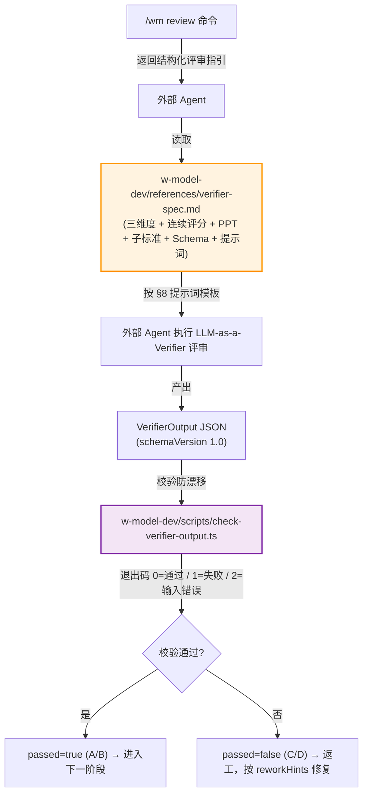

# LLM-as-a-Verifier 融入 W-Model 技能（指针文档）

> **权威性说明（重要）**：本文件不再作为 LLM-as-a-Verifier 的实现规范。
> 架构重构后，本技能不再内置 LLM 调用，原 `src/core/*`（`scoring-engine.ts` / `verification-framework.ts` / `ppt-ranker.ts` / `w-model-enhancer.ts` / `llm-client.ts` / `meta-skill-config.ts`）等实现均已删除。
>
> LLM-as-a-Verifier 评审的**权威规范**以 [`w-model-dev/references/verifier-spec.md`](../w-model-dev/references/verifier-spec.md) 为准：
> - 三维度验证 / 连续评分 `[0,1]` / PPT 排序 / 子标准定义 / 输出 Schema / 提示词模板 → `verifier-spec.md`
> - 评审执行方式（外部 Agent 按提示词执行）→ `verifier-spec.md` §8
> - 输出 JSON 防漂移校验 → [`w-model-dev/scripts/check-verifier-output.ts`](../w-model-dev/scripts/check-verifier-output.ts)（纯逻辑单点事实源 [`verifier-logic.ts`](../w-model-dev/scripts/verifier-logic.ts)）
> - 在 SSoT 中的定位 → [`skill-design-document_SSoT.md`](./skill-design-document_SSoT.md) §7.6（评审规范摘要）/ §3.3（架构原则与外部工具边界）/ §10.5（工件质量门）
>
> 本文件仅保留为**历史背景与设计动机**说明，不再独立维护实现细节。与 `verifier-spec.md` 不一致处，以 `verifier-spec.md` 为准。

---

## 1. 为什么需要 LLM-as-a-Verifier

W 模型每个阶段产物的阶段门评审，传统方式采用「通过 / 不通过」二值判断，存在三大痛点：

1. **评审机制粗糙**：无法量化评审质量差异（如 70 分与 80 分都被评为「不通过」），评审结果波动大，平局率高导致无法区分优质方案与普通方案。
2. **测试用例评估离散**：测试执行结果仅为「通过 / 失败 / 待执行」，无法评估测试用例质量（边界覆盖、异常处理完整性），测试优先级排序缺乏量化依据。
3. **需求 / 代码验证粒度不足**：需求覆盖状态仅为「已覆盖 / 未覆盖」，代码审查报告为静态 checklist，缺乏连续评分与重构优先级量化。

LLM-as-a-Verifier（论文 arXiv:2607.05391，Stanford + UC Berkeley + NVIDIA Research）提出三大支柱来解决上述问题，本技能保留了这三大学术思想，但**实现方式改为「提示词描述算法 + 外部 Agent 执行」**，不在技能内置 LLM 调用：

| 支柱 | 学术思想 | 本技能的实现方式 |
|---|---|---|
| 连续评分（Continuous Scoring） | 用 scoring token logits 分布期望值取代离散分数，平局率降至接近 0% | `verifier-spec.md` §4 以提示词描述 logits 期望值算法与文本回退算法，子标准分数取值 `[0,1]` 连续浮点（保留 4 位小数），由外部 Agent 执行 |
| 三维度验证（Three-Dimension Verification） | 评分粒度 + 重复评估 + 标准分解 | `verifier-spec.md` §3 规定：≥3 个子标准独立打分；重复评估默认 3 次、方差 ≤ 0.10；每个子标准须含 `evidence` 引用目标内具体片段 |
| PPT 排序（Probabilistic Pivot Tournament） | O(N×k) 复杂度的概率枢轴锦标赛，取代 O(N²) 全比较 | `verifier-spec.md` §5 以提示词描述 PPT 算法（默认 `k=5` / `temperature=4.0`），多候选场景输出 `ranking` 字段，由外部 Agent 执行 |

---

## 2. 实现方式：外部 Agent 执行 + 校验脚本防漂移

本技能遵循「技能包只包含提示词、参考、模板，里面的脚本只做门禁，不涉及 LLM」的架构原则。LLM-as-a-Verifier 是技能内部各阶段产物校验流程的一部分，通过提示词方式让外部 Agent 实现：

关键设计要点：

- **`/wm review` 不调用 LLM**：命令仅根据目标 ID 识别 `targetKind`（`requirement` / `design` / `testcase` / `file`），提示对应的子标准集合，并指引外部 Agent 加载 `verifier-spec.md` §8 提示词模板、再调用校验脚本。
- **提示词与校验脚本同源**：`verifier-spec.md` §6 定义输出 Schema、§7 定义子标准集合；`w-model-dev/scripts/verifier-logic.ts` 是同一套 Schema 与子标准的纯逻辑单点事实源，`check-verifier-output.ts` 是其 CLI 包装。两者指向同一份事实源，避免提示词与校验漂移。
- **校验项**：schemaVersion、meta 字段、子标准名称与权重（不得改动）、`score ∈ [0,1]`、`rawScores.length = repeatTimes`、`variance ≤ 阈值`、`evidence` 非空、综合分数 = `Σ(score*weight)`、质量等级与综合分数映射一致、`passed = (A or B)`、`passed=false` 时 `reworkHints` 非空、`ranking`（可选）类型合法。

---

## 3. 输出 Schema 与质量等级（摘要）

完整 Schema 见 `verifier-spec.md` §6。要点：

- **综合分数**：`compositeScore ∈ [0,1]`，由子标准分数加权平均得出。
- **质量等级映射**：`[0.85,1.0]=A` / `[0.70,0.85)=B` / `[0.50,0.70)=C` / `[0,0.50)=D`。
- **通过判定**：`passed = (qualityLevel === 'A' || qualityLevel === 'B')`，即综合分数 ≥ 0.70 视为通过阶段门。

> 历史版本曾采用 1-20 分制与 `excellent / good / acceptable / poor / unacceptable` 五档等级，对应 `src/core/scoring-engine.ts` 的 `determineQualityLevel`。该实现已删除，现行规范统一采用 `[0,1]` 连续分数与 A/B/C/D 四档等级。

---

## 4. 与外部技能演化工具的关系

LLM-as-a-Verifier 评审规范只覆盖「阶段产物校验流程」，是 W 模型技能**内部**的产物质量保障。

技能**演化**（根据评审结果迭代技能本身的提示词 / 模板 / 子标准）由外部工具完成，不在本技能内：

- [SkillOpt](https://github.com/microsoft/SkillOpt)（微软）：Rollout → Reflect → Edit → Gate → Commit 训练循环
- [darwin-skill](https://github.com/alchaincyf/darwin-skill)：基于进化算法的技能搜索与筛选

外部演化工具可消费本规范产出的 `VerifierOutput` JSON 作为训练信号，但本技能本身不包含任何演化逻辑、轨迹分析、Rollout 记录、Skill Lift 评估等内容。详见 SSoT §3.3（架构原则与外部工具边界）与 §12.4（外部演化工具协作）。

---

## 5. 相关文档

| 用途 | 位置 |
|---|---|
| LLM-as-a-Verifier 权威规范（提示词 + Schema + 子标准 + PPT） | [../w-model-dev/references/verifier-spec.md](../w-model-dev/references/verifier-spec.md) |
| 输出校验纯逻辑（单点事实源） | [../w-model-dev/scripts/verifier-logic.ts](../w-model-dev/scripts/verifier-logic.ts) |
| 输出校验 CLI（防外部 Agent 输出漂移） | [../w-model-dev/scripts/check-verifier-output.ts](../w-model-dev/scripts/check-verifier-output.ts) |
| 设计文档 SSoT（§7.6 评审规范 / §3.3 架构边界 / §10.5 工件质量门） | [./skill-design-document_SSoT.md](./skill-design-document_SSoT.md) |
| Skill 定义（`/wm review` 命令编排） | [../w-model-dev/SKILL.md](../w-model-dev/SKILL.md) |

---

## 参考文献

1. Jacky Kwok et al. "LLM-as-a-Verifier: A General-Purpose Verification Framework." arXiv:2607.05391, 2026. Stanford University + UC Berkeley + NVIDIA Research.
2. 性能数据（论文）：Terminal-Bench V2 (86.5%)、SWE-Bench Verified (78.2%)、RoboRewardBench (87.4%)、MedAgentBench (73.3%)。
3. 相关技术：Test-Time Scaling、Reward Modeling、Active Learning。
