# W开发模型AI辅助技能设计文档（SSoT）

## 1. 项目概述

### 1.1 项目名称
**W-Model AI Assistant Skill** - 基于AI辅助编码技术的W开发模型闭环工作技能

### 1.2 项目定位
本技能旨在利用AI辅助编码技术，实现软件工程中W开发模型的全流程闭环管理，将开发与测试并行推进，提升软件开发效率和质量。

### 1.3 核心目标
- 实现W模型中开发与测试的并行协作
- 通过AI技术自动化各阶段的文档生成、代码编写和测试设计
- 构建完整的软件开发生命周期闭环
- 提升开发者的工作效率和软件产品质量

### 1.4 文档定位
本文档为W-Model AI Assistant Skill的**单一事实来源（Single Source of Truth, SSoT）**，包含所有设计决策、需求定义、测试用例、集成规范和验收标准。所有相关团队和系统均应以本文档为准。

> **架构重构说明（重要）**：本技能已完成架构纯化——**单纯的编排 + 校验脚本技能**，不包含任何编程式接入（无 TypeScript 引擎、无 npm 包、无 SDK）。技能包只包含提示词、参考、模板，里面的脚本只做门禁，不涉及 LLM 调用。
> 据此，本文档已移除技能演化机制与轨迹分析相关章节（原第 14 章「技能演化机制」、原第 15 章「技能评估标准」、原 §7.7 / §7.8 数据模型、原 §12.4「第四阶段（自演化版）」等），并移除全部 `src/` 编程式引擎（`/wm` 命令、状态持久化、RTM 维护改由 Agent 读取 `w-model-dev/SKILL.md` 后用自身工具执行）。
> LLM-as-a-Verifier 评审由外部 Agent 按提示词执行（规范见 [`w-model-dev/references/verifier-spec.md`](../w-model-dev/references/verifier-spec.md)）；
> 技能自演化由外部工具完成（[SkillOpt](https://github.com/microsoft/SkillOpt) / [darwin-skill](https://github.com/alchaincyf/darwin-skill)）。

---

## 2. W模型理论基础

### 2.1 W模型定义
W模型由Evolutif公司提出，是对V模型的扩展和演进。它由两个相互关联、同步进行的"V"字型结构组成：
- **左V（开发侧）**：需求分析 → 系统设计 → 概要设计 → 详细设计 → 编码
- **右V（测试侧）**：验收测试设计 → 系统测试设计 → 集成测试设计 → 单元测试设计 → 测试执行

### 2.2 W模型核心特点
| 特点 | 描述 |
|------|------|
| 开发与测试并行 | 测试活动在开发早期即启动，与开发同步推进 |
| 全生命周期测试 | 覆盖需求测试、设计测试、单元测试、集成测试、系统测试等 |
| 测试对象扩展 | 测试对象不仅是程序，还包括需求和设计文档 |
| 缺陷早发现 | 尽早发现需求或设计缺陷，降低修复成本 |

### 2.3 W模型与其他模型对比
| 模型 | 核心特点 | 适用场景 |
|------|----------|----------|
| 瀑布模型 | 线性阶段式开发，测试后置 | 需求明确、稳定的项目 |
| V模型 | 开发与测试对应，但测试在编码后执行 | 需求明确、变更较少的项目 |
| W模型 | 开发与测试并行，测试前置 | 需求相对稳定、需保证质量的项目 |
| 敏捷模型 | 快速迭代、持续交付 | 需求频繁变更的项目 |

### 2.4 W模型优势与局限性
**优势**：
- 测试提前介入，缺陷早发现，降低修复成本
- 测试覆盖更全面，减少后期风险
- 结构清晰，易于管理和跟踪
- 全面提升团队质量意识

**局限性**：
- 灵活性差，难以应对需求频繁变更
- 文档依赖重，文档质量直接决定项目成败
- 初期投入大，需要前期设计和测试规划

---

## 3. 技能架构设计

### 3.1 整体架构

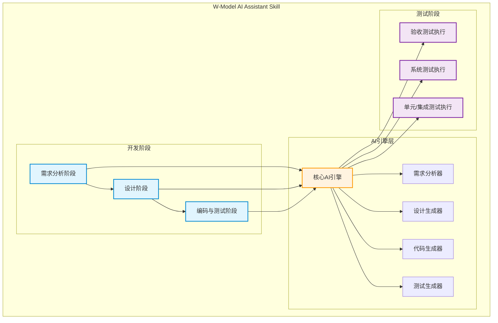

### 3.2 核心模块设计

#### 3.2.1 需求分析模块

**功能描述**：将自然语言需求转化为结构化的需求规格说明书，并同步设计验收测试用例

**输入**：
- 用户自然语言需求描述
- 业务背景信息

**输出**：
- 《需求规格说明书》
- 验收测试用例设计文档
- 需求风险评估报告

**AI能力应用**：
- 自然语言理解与结构化提取
- 需求完整性检查
- 需求冲突检测
- 验收测试用例自动生成

**测试用例设计**：

| 用例ID | 测试场景 | 输入 | 预期输出 | 优先级 |
|--------|----------|------|----------|--------|
| TC-REQ-001 | 自然语言需求解析 | "我需要一个用户登录功能" | 结构化需求，包含功能描述、输入输出、验收标准 | 高 |
| TC-REQ-002 | 复杂需求分解 | "在线商城系统，支持用户注册、商品浏览、购物车和订单功能" | 分解为4个独立模块需求 | 高 |
| TC-REQ-003 | 需求完整性检查 | "用户登录功能"（缺少密码策略） | 提示缺少密码复杂度要求 | 高 |
| TC-REQ-004 | 需求冲突检测 | "用户登录需要邮箱验证" AND "用户登录不需要验证" | 检测到冲突并提示 | 高 |
| TC-REQ-005 | 验收测试用例生成 | 完整需求描述 | 生成对应的验收测试用例 | 高 |

**验收标准**：
- 需求规格说明书符合模板规范
- 验收测试用例覆盖所有功能点
- 需求风险评估报告包含风险等级和缓解措施

#### 3.2.2 设计阶段模块

**功能描述**：基于需求文档进行系统架构设计和详细设计，并同步设计系统测试和集成测试用例

**子模块**：
- **系统设计子模块**：生成系统架构图、技术选型建议、模块划分方案
- **详细设计子模块**：生成类图、数据库设计、接口定义
- **测试设计子模块**：同步生成系统测试用例和集成测试用例

**AI能力应用**：
- 架构设计建议生成
- UML图自动生成
- 接口定义文档生成
- 测试用例设计

**测试用例设计**：

| 用例ID | 测试场景 | 输入 | 预期输出 | 优先级 |
|--------|----------|------|----------|--------|
| TC-DES-001 | 系统架构设计 | 需求规格说明书 | 完整架构图、技术选型、模块划分 | 高 |
| TC-DES-002 | 类图生成 | 详细需求描述 | 符合UML规范的类图 | 高 |
| TC-DES-003 | 数据库设计 | 数据需求 | ER图、表结构定义、索引设计 | 高 |
| TC-DES-004 | 接口定义 | 模块交互需求 | 接口文档、参数定义、返回值 | 高 |
| TC-DES-005 | 系统测试用例生成 | 系统设计文档 | 覆盖系统级功能的测试用例 | 高 |
| TC-DES-006 | 集成测试用例生成 | 接口定义文档 | 覆盖模块间交互的测试用例 | 高 |

**验收标准**：
- 架构设计符合技术选型原则
- UML图符合规范
- 接口定义完整，包含输入输出和错误处理
- 测试用例覆盖关键路径

#### 3.2.3 编码与单元测试模块

**功能描述**：根据详细设计文档生成代码，并同步生成和执行单元测试

**输入**：
- 详细设计文档
- 技术栈要求

**输出**：
- 完整代码实现
- 单元测试用例
- 测试覆盖率报告

**AI能力应用**：
- 代码自动生成
- 代码质量检查
- 单元测试用例生成
- 测试执行与报告生成

**测试用例设计**：

| 用例ID | 测试场景 | 输入 | 预期输出 | 优先级 |
|--------|----------|------|----------|--------|
| TC-COD-001 | 代码生成 | 详细设计文档 | 可编译运行的代码 | 高 |
| TC-COD-002 | 代码质量检查 | 生成的代码 | 无语法错误、符合代码规范 | 高 |
| TC-COD-003 | 单元测试生成 | 代码文件 | 覆盖核心逻辑的单元测试用例 | 高 |
| TC-COD-004 | 测试覆盖率 | 执行单元测试 | 覆盖率 ≥ 80% | 高 |
| TC-COD-005 | 边界条件处理 | 边界输入 | 正确处理并返回预期结果 | 中 |

**验收标准**：
- 代码可编译通过
- 代码规范检查通过（ESLint/Prettier）
- 单元测试覆盖率 ≥ 80%
- 测试报告清晰，包含通过率和覆盖率

#### 3.2.4 集成测试模块

**功能描述**：验证模块间的交互正确性

**输入**：
- 集成测试设计文档
- 已完成的模块代码

**输出**：
- 集成测试执行结果
- 接口兼容性报告

**AI能力应用**：
- 集成测试用例执行
- 接口调用验证
- 测试结果分析

**测试用例设计**：

| 用例ID | 测试场景 | 输入 | 预期输出 | 优先级 |
|--------|----------|------|----------|--------|
| TC-INT-001 | 接口调用验证 | 合法请求参数 | 返回预期结果，状态码200 | 高 |
| TC-INT-002 | 接口参数校验 | 非法参数 | 返回错误信息，状态码400 | 高 |
| TC-INT-003 | 模块间数据传递 | 跨模块调用 | 数据正确传递和处理 | 高 |
| TC-INT-004 | 接口性能测试 | 高并发请求 | 响应时间 < 500ms | 中 |
| TC-INT-005 | 接口兼容性 | 不同版本接口 | 向后兼容或提示版本升级 | 中 |

**验收标准**：
- 所有接口调用验证通过
- 参数校验逻辑正确
- 模块间数据传递无误
- 接口性能满足要求

#### 3.2.5 系统测试模块

**功能描述**：在模拟真实环境下验证系统整体功能

**输入**：
- 系统测试设计文档
- 完整系统代码

**输出**：
- 系统测试报告
- 性能测试结果
- 安全测试结果

**AI能力应用**：
- 自动化测试执行
- 性能测试脚本生成
- 安全漏洞检测

**测试用例设计**：

| 用例ID | 测试场景 | 输入 | 预期输出 | 优先级 |
|--------|----------|------|----------|--------|
| TC-SYS-001 | 端到端功能测试 | 完整业务流程 | 流程顺利完成，数据正确 | 高 |
| TC-SYS-002 | 性能测试 | 模拟高负载 | 系统响应时间 < 2s，无崩溃 | 高 |
| TC-SYS-003 | 安全测试 | 常见攻击向量 | 无安全漏洞，防御有效 | 高 |
| TC-SYS-004 | 兼容性测试 | 不同浏览器/设备 | 功能正常显示和使用 | 中 |
| TC-SYS-005 | 可靠性测试 | 长时间运行 | 系统稳定，无内存泄漏 | 中 |

**验收标准**：
- 端到端测试全部通过
- 性能指标达到预期
- 安全检测无高危漏洞
- 兼容性测试通过

#### 3.2.6 验收测试模块

**功能描述**：确认软件是否满足最初的需求规格

**输入**：
- 验收测试设计文档
- 完整系统

**输出**：
- 验收测试报告
- 用户确认结果

**AI能力应用**：
- 验收测试用例执行
- 用户需求匹配验证

**测试用例设计**：

| 用例ID | 测试场景 | 输入 | 预期输出 | 优先级 |
|--------|----------|------|----------|--------|
| TC-UAT-001 | 需求匹配验证 | 原始需求描述 | 系统功能与需求一致 | 高 |
| TC-UAT-002 | 用户场景测试 | 用户真实操作流程 | 流程顺畅，符合预期 | 高 |
| TC-UAT-003 | 验收标准验证 | 验收标准列表 | 每项标准均满足 | 高 |
| TC-UAT-004 | 文档完整性 | 交付文档列表 | 文档齐全，格式规范 | 中 |

**验收标准**：
- 所有验收测试用例通过
- 用户确认系统满足需求
- 交付文档完整
- 系统可正常部署和运行

### 3.3 技能架构原则与外部工具边界（重要）

本技能遵循「技能包只包含提示词、参考、模板，里面的脚本只做门禁，不涉及 LLM」的架构原则。该原则决定技能包内部与外部的明确边界：

| 能力 | 归属 | 实现位置 |
|---|---|---|
| W 模型阶段编排、RTM 维护、状态管理 | 技能内 | `w-model-dev/SKILL.md`（编排逻辑，Agent 执行）+ `w-model-dev/references/*`（阶段细则） |
| 阶段产物门禁（工件质量门） | 技能内（脚本只做门禁） | `w-model-dev/scripts/gate-logic.ts` + `check-artifact-gate.ts` |
| LLM-as-a-Verifier 评审（三维度验证 / 连续评分 / PPT / 子标准） | **技能内提供提示词与输出 Schema，外部 Agent 执行** | `w-model-dev/references/verifier-spec.md`（提示词）+ `scripts/check-verifier-output.ts`（校验） |
| LLM 推理本身 | **外部** | 由外部 Agent（Trae / Claude / Cursor 等）自行调用其 LLM 完成 |
| 技能自演化（Rollout / Reflect / Edit / Skill Lift 评估 / 轨迹分析） | **外部** | [SkillOpt](https://github.com/microsoft/SkillOpt) / [darwin-skill](https://github.com/alchaincyf/darwin-skill) |

要点：
- **技能本身不内置 LLM 调用**。阶段产物的 LLM-as-a-Verifier 评审通过提示词方式让外部 Agent 执行，技能只提供提示词 + 输出 Schema + 校验脚本（防外部 Agent 输出漂移）。`/wm review` 命令仅返回结构化评审指引，不直接调用 LLM。
- **LLM-as-a-Verifier 属于技能内部各阶段产物校验流程的一部分**，是 W 模型阶段门评审的实现方式，并非独立的「LLM 引擎」模块。
- **技能本身不包含演化机制与轨迹分析**。技能演化（Rollout / Reflect / Edit / Skill Lift 评估）由外部工具（SkillOpt / darwin-skill）完成，它们可消费本技能产出的 `VerifierOutput` JSON 作为训练信号。

---

## 4. 技能工作流程

### 4.1 完整工作流程

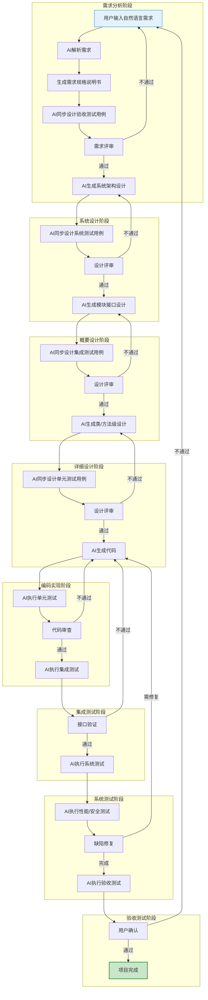

### 4.2 W模型并行流程

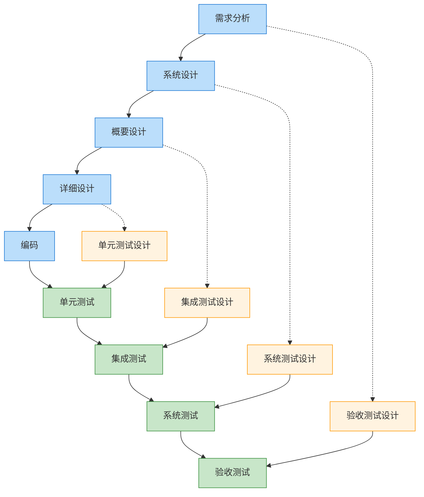

### 4.3 核心交互模式

#### 4.3.1 需求分析交互
```
用户: 我需要一个在线商城系统，支持用户注册、商品浏览、购物车和订单功能
AI: 正在分析需求...
AI: 已生成《需求规格说明书》，包含以下模块：
    1. 用户管理模块
    2. 商品管理模块
    3. 购物车模块
    4. 订单管理模块
AI: 已同步生成验收测试用例，涵盖50+测试场景
```

#### 4.3.2 设计阶段交互
```
用户: 请进行系统架构设计
AI: 正在进行架构设计...
AI: 技术选型建议：
    - 前端: React + TypeScript
    - 后端: Node.js + Express
    - 数据库: MongoDB + Redis
AI: 已生成系统架构图和模块接口定义
AI: 已同步生成系统测试用例，覆盖各模块集成场景
```

#### 4.3.3 编码阶段交互
```
用户: 请实现用户注册功能
AI: 正在生成代码...
AI: 已生成以下文件：
    - src/controllers/userController.ts
    - src/services/userService.ts
    - src/models/User.ts
    - src/routes/userRoutes.ts
AI: 已生成单元测试用例，覆盖率95%
AI: 执行测试中...测试通过
```

---

## 5. AI能力集成策略

### 5.1 自然语言处理能力
- **需求解析**：将非结构化自然语言转化为结构化需求
- **意图识别**：理解用户开发意图和技术偏好
- **文档生成**：自动生成各类技术文档

### 5.2 代码生成能力
- **代码生成**：根据设计文档生成高质量代码
- **代码补全**：智能补全代码片段
- **代码重构**：优化现有代码结构

### 5.3 测试生成能力
- **测试用例生成**：根据需求和设计自动生成测试用例
- **测试执行**：自动执行测试并生成报告
- **测试覆盖率分析**：分析测试覆盖情况

### 5.4 智能审查能力
- **代码审查**：检查代码质量、安全漏洞
- **文档审查**：验证文档完整性和一致性
- **需求追踪**：确保代码实现与需求一致

---

## 6. 技能接口设计

### 6.1 核心命令

| 命令 | 功能描述 | 参数 | 返回值 |
|------|----------|------|--------|
| `/wm analyze` | 需求分析 | `input`: 需求描述 | 需求规格说明书、验收测试用例 |
| `/wm design` | 系统设计 | `type`: 设计类型(架构/详细) | 设计文档、测试用例 |
| `/wm code` | 代码生成 | `feature`: 功能描述 | 代码文件、单元测试 |
| `/wm test` | 测试执行 | `type`: 测试类型(单元/集成/系统) | 测试报告 |
| `/wm review` | LLM 评审指引 | `target`: 需求/设计/测试用例 ID 或文件路径 | 结构化评审指引（指向 `verifier-spec.md` + `check-verifier-output.ts`，不内置 LLM） |
| `/wm status` | 项目状态 | 无 | 当前阶段、完成进度 |

### 6.2 辅助命令

| 命令 | 功能描述 |
|------|----------|
| `/wm help` | 显示帮助信息 |
| `/wm reset` | 重置当前项目状态 |
| `/wm export` | 导出项目文档 |
| `/wm import` | 导入现有项目 |

### 6.3 接口调用流程

> 本技能无编程式接入。`/wm` 命令由 Agent 读取 `SKILL.md` 后用自身工具执行，状态与 RTM 持久化到项目内 `.w-model/*.json`。

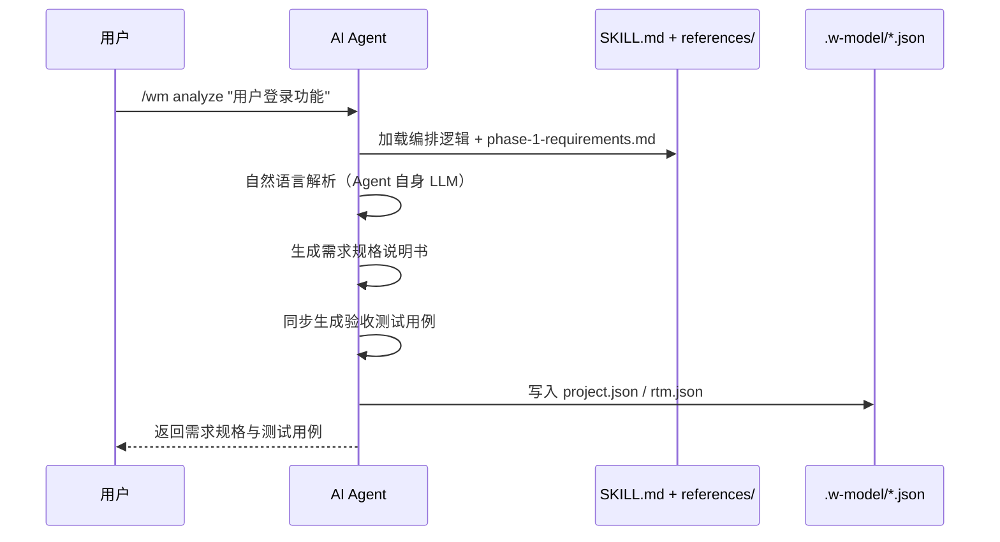

---

## 7. 数据模型设计

### 7.1 项目数据模型

```typescript
interface Project {
  id: string;
  name: string;
  description: string;
  status: '需求分析' | '系统设计' | '概要设计' | '详细设计' | '编码' | '集成测试' | '系统测试' | '验收测试';
  techStack: {
    frontend: string[];
    backend: string[];
    database: string[];
    others: string[];
  };
  createdAt: Date;
  updatedAt: Date;
}
```

### 7.2 需求数据模型

```typescript
interface Requirement {
  id: string;
  projectId: string;
  title: string;
  description: string;
  type: '功能需求' | '非功能需求' | '约束需求';
  priority: '高' | '中' | '低';
  acceptanceCriteria: string[];
  testCases: TestCase[];
  status: '待开发' | '开发中' | '已完成' | '已验证';
}
```

### 7.3 设计数据模型

```typescript
interface Design {
  id: string;
  projectId: string;
  type: '系统设计' | '概要设计' | '详细设计';
  content: string;
  diagrams: Diagram[];
  testCases: TestCase[];
  createdAt: Date;
}
```

### 7.4 测试用例数据模型

```typescript
interface TestCase {
  id: string;
  projectId: string;
  type: '验收测试' | '系统测试' | '集成测试' | '单元测试';
  title: string;
  description: string;
  steps: string[];
  expectedResult: string;
  status: '待执行' | '通过' | '失败';
  priority: '高' | '中' | '低';
}
```

### 7.5 数据模型关系图

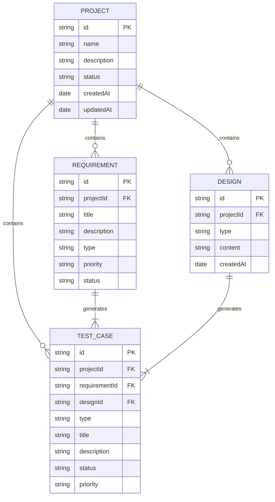

### 7.6 LLM-as-a-Verifier 评审规范（外部 Agent 执行）

> 历史版本曾在此定义 `VerificationResult` / `ContinuousScoringEngine` / `LLMClient` / `LLMResponse` / `VerifierConfig` 等 TypeScript 类型。
> 架构重构后，本技能不再内置 LLM 调用，上述类型与对应实现（`src/core/scoring-engine.ts` / `verification-framework.ts` / `ppt-ranker.ts` / `llm-client.ts` 等）均已删除。

LLM-as-a-Verifier 评审由外部 Agent 按提示词执行，**本节不再定义 LLM 相关类型**。权威规范定义在 [`w-model-dev/references/verifier-spec.md`](../w-model-dev/references/verifier-spec.md)，要点如下：

- **适用目标类型**：`requirement` / `design` / `testcase` / `file`，各自对应一组子标准与权重。
- **三维度验证**：评分粒度（≥3 个子标准，连续评分 `[0,1]` 保留 4 位小数）/ 重复评估（默认 3 次，方差 ≤ 0.10）/ 标准分解（每个子标准须含 `evidence` 引用目标内具体片段）。
- **连续评分实现**：logits 期望值（A/B/C/D 四档 token 概率加权）或文本回退（解析字母 + ±0.05 稳定扰动），Agent 在 `meta.scoringMethod` 标注实际方法。
- **PPT 排序**：多候选场景按 PPT 算法（默认 `k=5` / `temperature=4.0`）输出 `ranking` 字段。
- **输出 Schema**：`schemaVersion="1.0"` + `meta` + `subCriteria[]` + `compositeScore[0,1]` + `qualityLevel(A/B/C/D)` + `summary` + `passed` + 可选 `reworkHints` / `ranking`。
- **质量等级映射**：`[0.85,1.0]=A` / `[0.70,0.85)=B` / `[0.50,0.70)=C` / `[0,0.50)=D`；`passed = (A or B)`。
- **防漂移校验**：外部 Agent 输出 JSON 后必须调用 `w-model-dev/scripts/check-verifier-output.ts` 校验（退出码 `0=通过 / 1=校验失败 / 2=输入错误`）。校验纯逻辑单点事实源为 `w-model-dev/scripts/verifier-logic.ts`。
- **与外部演化工具的关系**：本规范只覆盖「阶段产物校验流程」，是技能内部的产物质量保障；技能演化（Rollout / Reflect / Edit / Skill Lift）由外部 SkillOpt / darwin-skill 完成，可消费本规范产出的 `VerifierOutput` JSON 作为训练信号。

`/wm review <target>` 命令（见 §6）仅返回结构化评审指引——根据目标 ID 识别 `targetKind`，提示对应的子标准集合，并指引外部 Agent 加载 `verifier-spec.md` §8 提示词模板执行评审、再调用校验脚本。命令本身不调用 LLM。

---

## 8. 技术实现方案

### 8.1 技术栈选择

本技能是单纯的编排 + 校验脚本技能，无运行时框架与数据库：

| 层次 | 技术 | 理由 |
|------|------|------|
| 编排载体 | Markdown（`SKILL.md` + `references/`） | 人类与 Agent 双可读，按需加载 |
| 校验脚本 | TypeScript（自包含，仅依赖 `tsx`） | 类型安全的纯函数门禁判定，不调用 LLM |
| 文档模板 | Markdown（`templates/`） | 易于阅读和版本控制 |
| LLM 推理 | 外部 Agent 自身的 LLM | 技能不内置 LLM 调用 |
| 状态持久化 | JSON 文件（`.w-model/*.json`） | 跨多轮交互保持上下文，Agent 直接读写 |

### 8.2 核心算法设计

#### 8.2.1 需求解析算法

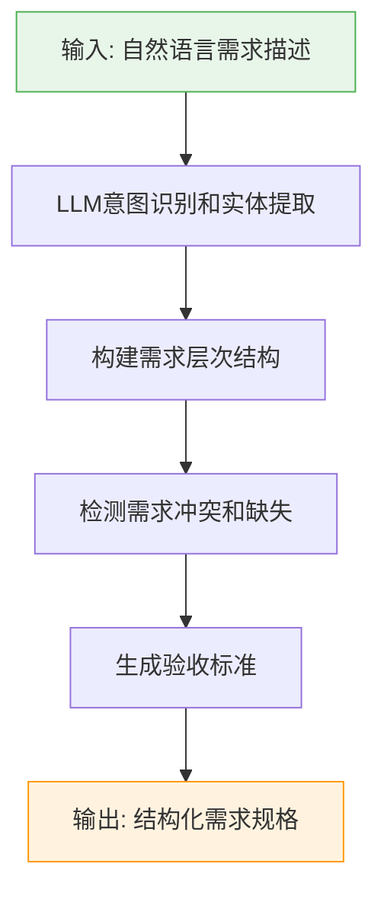

#### 8.2.2 测试用例生成算法

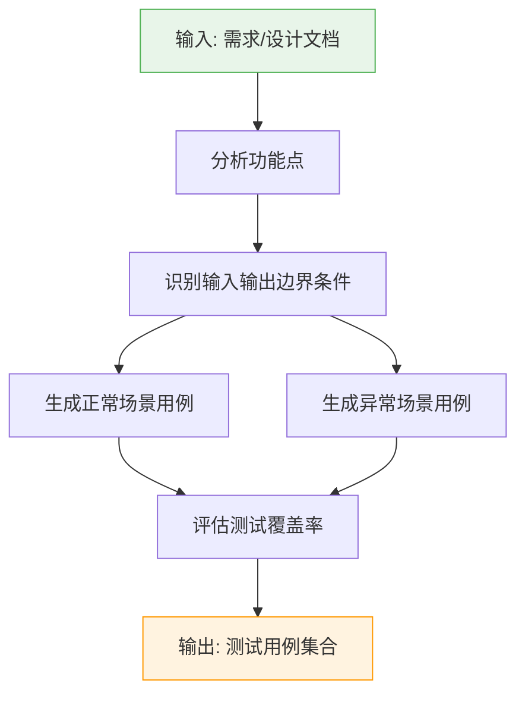

#### 8.2.3 代码生成算法

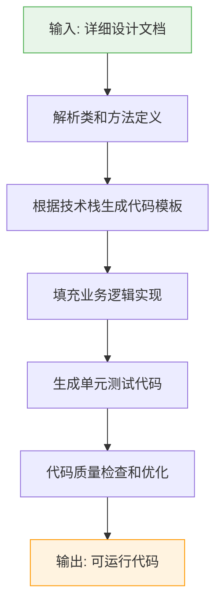

---

## 9. 需求跟踪矩阵（RTM）

### 9.1 RTM结构

| 需求ID | 需求描述 | 设计文档 | 代码模块 | 单元测试 | 集成测试 | 系统测试 | 验收测试 | 覆盖状态 |
|--------|----------|----------|----------|----------|----------|----------|----------|----------|
| REQ-001 | 用户注册功能 | SD-3.2.1 | userController.ts | UT-001 | IT-001 | ST-001 | UAT-001 | 100% |
| REQ-002 | 用户登录功能 | SD-3.2.2 | authService.ts | UT-002 | IT-002 | ST-002 | UAT-002 | 100% |
| REQ-003 | 商品浏览功能 | SD-3.3.1 | productController.ts | UT-003 | IT-003 | ST-003 | UAT-003 | 100% |
| REQ-004 | 购物车功能 | SD-3.3.2 | cartService.ts | UT-004 | IT-004 | ST-004 | UAT-004 | 100% |
| REQ-005 | 订单管理功能 | SD-3.4.1 | orderController.ts | UT-005 | IT-005 | ST-005 | UAT-005 | 100% |

### 9.2 RTM跟踪方向

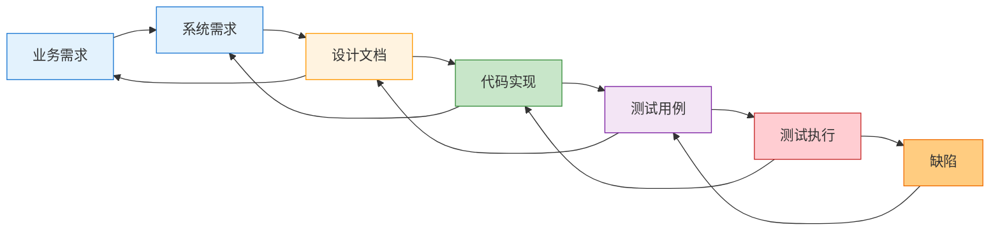

### 9.3 RTM维护规则

1. **变更同步**：每次需求或设计变更必须同步更新RTM
2. **覆盖检查**：定期检查需求覆盖率，确保100%覆盖
3. **优先级标记**：根据需求优先级确定测试优先级
4. **状态追踪**：实时更新测试执行状态
5. **缺陷关联**：将缺陷与对应的需求和测试用例关联

---

## 10. 质量保障体系

### 10.1 代码质量标准
- 代码覆盖率 ≥ 80%
- 代码规范检查（ESLint/Prettier）
- 安全漏洞扫描
- 性能指标监控

### 10.2 文档质量标准
- 文档完整性检查
- 文档一致性验证
- 版本控制管理

### 10.3 测试质量标准
- 测试用例评审机制
- 测试覆盖率分析
- 缺陷追踪管理

### 10.4 质量保障流程

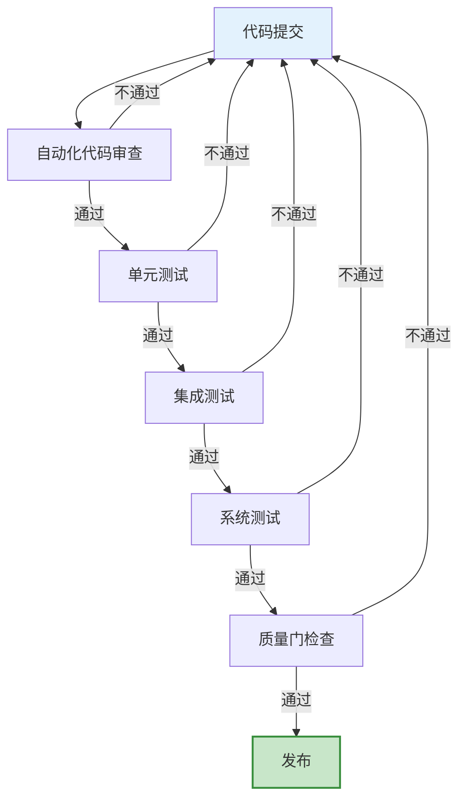

### 10.5 工件质量门（Artifact Gate）

> 架构重构说明：历史版本在此区分「工件质量门」与「技能验证门」两类质量门。
> 重构后，**技能验证门已移除**——技能演化（Skill Lift 评估、Rollout / Reflect / Edit 等）不再内置技能包，
> 由外部工具（[SkillOpt](https://github.com/microsoft/SkillOpt) / [darwin-skill](https://github.com/alchaincyf/darwin-skill)）完成。
> 对应地 `w-model-dev/scripts/check-skill-gate.ts`、`w-model-dev/META-SKILL.md`、
> `src/evolution/skill-optimizer.ts`、`src/eval/skill-lift.ts` 等均已删除。
> 本节仅保留「工件质量门」。

| 维度 | 工件质量门（Artifact Gate） |
|---|---|
| 评估对象 | W 模型产出物（需求 / 设计 / 代码 / 测试用例）对应的 RTM 覆盖与测试执行结果 |
| 触发时机 | 验收测试阶段（`/wm test type=验收`） |
| 判定逻辑 | RTM 覆盖率 100% 且四级测试（单元 / 集成 / 系统 / 验收）全部通过 |
| 判定逻辑实现（单点事实源） | `w-model-dev/scripts/gate-logic.ts` `checkArtifactGate()` |
| Agent CLI 入口 | `w-model-dev/scripts/check-artifact-gate.ts` |
| 失败后果 | 返工回到编码阶段 |
| 数据来源 | 真实测试执行结果（`/wm test result=pass\|fail` 回填） |

**门禁脚本与 Markdown 的配合**：门禁判定逻辑沉入技能包内 `w-model-dev/scripts/gate-logic.ts`（纯函数、自包含、不依赖任何外部模块），保证技能包可独立分发给 TRAE / Claude 等 Agent。Agent 在质量门检查点直接执行脚本获取确定性判定，而非靠 LLM 自行估算：

```bash
# 退出码 0=通过 / 1=未通过 / 2=输入错误；stdout 末尾输出 GATE_JSON {...} 供 Agent 解析
npx tsx w-model-dev/scripts/check-artifact-gate.ts [project-dir]
```

`references/quality-standards.md` 以 Markdown 描述质量标准（人类可读），与脚本互为参照但不再承载判定逻辑。

**关键约束**：工件质量门的有效性依赖真实测试结果回填。`/wm test` 命令不得自动将测试标记为通过——必须由上游 AI / 测试运行器执行真实测试后通过 `result=pass|fail` 参数回填，否则质量门形同虚设。

---

## 10A. SSoT ↔ 实现追溯表

> 本节是 W 模型 RTM 思想在文档层面的自我应用：每个设计章节标注其实现位置，建立双向追溯。
>
> 架构重构后，技能包纯化为「编排 + 校验脚本」，`src/` 编程式引擎整体移除（不再列入 `src/commands/*` / `src/state/*` / `src/types/*` / `src/core/*` / `src/evolution/*` / `src/eval/*`）。编排逻辑由 `w-model-dev/SKILL.md` 承载并由 Agent 执行；状态 / RTM / 测试结果由 Agent 维护到项目内 `.w-model/*.json`。技能演化相关能力由外部 SkillOpt / darwin-skill 提供，不在本表内。

| SSoT 章节 | 设计内容 | 实现位置 | 一致性 |
|---|---|---|---|
| 3.2.1 需求分析模块 | 需求解析、验收测试生成 | `w-model-dev/SKILL.md` `/wm analyze` 编排 + `references/phase-1-requirements.md` | 编排完整（状态登记 + 测试用例设计由 Agent 执行；AI 解析由 Agent 自身 LLM 完成） |
| 3.2.2 设计阶段模块 | 架构 / 概要 / 详细设计 + 对应测试设计 | `w-model-dev/SKILL.md` `/wm design` 编排 + `references/phase-2/3-*.md` | 编排完整（文档生成由 Agent 完成） |
| 3.2.3 编码与单元测试 | 代码生成、单元测试用例生成 | `w-model-dev/SKILL.md` `/wm code` 编排 + `references/phase-4/5-*.md` | 编排完整（不自动标记通过，需 `result` 回填） |
| 3.2.4-3.2.6 测试模块 | 集成 / 系统 / 验收测试执行 | `w-model-dev/SKILL.md` `/wm test` 编排 + `references/phase-6/7/8-*.md` | 完整（支持 `result=pass\|fail` 回填） |
| 3.3 架构原则与外部工具边界 | 技能不内置 LLM / 演化由外部完成、无编程式接入 | `w-model-dev/SKILL.md`「架构定位」节 + `w-model-dev/references/verifier-spec.md` | 完整 |
| 6 命令接口 | 10 个 `/wm` 命令 | `w-model-dev/SKILL.md`「命令接口」（编排，Agent 执行） | 完整 |
| 7 数据模型 | Project / Requirement / Design / TestCase / RTM | `w-model-dev/references/data-models.md`（Agent 维护 `.w-model/*.json` 的 schema） | 完整 |
| 7.6 LLM-as-a-Verifier 评审规范 | 三维度验证 / 连续评分 / PPT / 子标准 / 输出 Schema / 提示词模板 | `w-model-dev/references/verifier-spec.md`（规范）+ `w-model-dev/scripts/verifier-logic.ts`（校验纯逻辑）+ `w-model-dev/scripts/check-verifier-output.ts`（CLI 校验） | 完整（LLM 推理由外部 Agent 执行） |
| 8 技术实现方案 | 需求解析 / 测试用例生成 / 代码生成算法 | 上游 AI 按提示词执行（`w-model-dev/references/phase-*.md`） | 完整（算法由提示词承载，技能不内置 LLM） |
| 9 RTM | 需求跟踪矩阵 | `w-model-dev/references/rtm-guide.md` + `templates/rtm.md`（Agent 维护） | 完整 |
| 10 质量保障 | 工件质量门 | 判定逻辑：`w-model-dev/scripts/gate-logic.ts`（单点事实源）；CLI：`w-model-dev/scripts/check-artifact-gate.ts` | 完整（见 10.5，门禁逻辑已沉入技能包） |

---

## 11. 部署与集成方案

### 11.1 部署方式

本技能是**单纯的编排 + 校验脚本技能**，无独立部署物。技能资产（`w-model-dev/` 目录）作为纯文件分发给 AI Agent 使用：

- **Agent 分发**：将 `w-model-dev/` 拷贝到目标 Agent 的 skills 目录（详见 [`docs/INSTALL.md`](./INSTALL.md)），无需构建、无需服务进程。
- **校验脚本**：`w-model-dev/scripts/*.ts` 由 Agent 在阶段门评审时直接 `npx tsx` 执行，无后端服务。

### 11.2 外部集成（消费方自行实现）

下列集成本技能不提供，由消费方（IDE 插件、CI/CD 流水线、项目管理工具等）按需在外部实现，调用技能的 `/wm` 命令编排或门禁脚本：

- **IDE 集成**：由 Trae / VS Code / JetBrains 等客户端作为 Skill 加载
- **CI/CD 集成**：在 GitHub Actions / GitLab CI 中通过 Agent 调用 `check-artifact-gate.ts` 作为质量门
- **项目管理工具集成**：由外部适配层将 RTM 同步到 Jira / Notion

### 11.3 集成架构

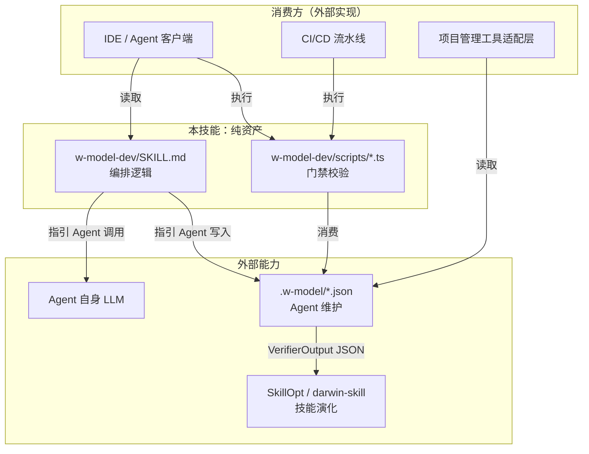

---

## 12. 发展规划

### 12.1 第一阶段（基础版）
- 实现需求分析和测试设计的AI辅助
- 支持代码生成和单元测试生成
- 提供基本的项目状态管理

### 12.2 第二阶段（进阶版）
- 实现完整的W模型全流程闭环
- 支持集成测试和系统测试自动化
- 提供代码审查和质量分析功能

### 12.3 第三阶段（高级版）
- 支持多项目并行管理
- 提供团队协作功能
- 集成DevOps流程
- 支持智能缺陷预测和预防

### 12.4 外部演化工具协作

> 历史版本曾在此规划「第四阶段（自演化版）」，由内置 `SkillOptimizer` / `SkillLiftEvaluator` 完成技能自演化。
> 架构重构后，**技能演化已移出技能包**，由外部工具完成。本技能不再包含 Rollout / Reflect / Edit / Skill Lift 评估等内容。

本技能与外部演化工具的协作方式：

- 本技能产出的 `VerifierOutput` JSON（由外部 Agent 按 `verifier-spec.md` 执行评审、`check-verifier-output.ts` 校验产出）可作为外部演化工具的训练信号。
- 推荐的外部演化工具：
  - [SkillOpt](https://github.com/microsoft/SkillOpt)（微软）：提供 Rollout → Reflect → Edit → Gate → Commit 训练循环
  - [darwin-skill](https://github.com/alchaincyf/darwin-skill)：提供基于进化算法的技能搜索与筛选
- 多 Agent 框架适配（LangGraph / AutoGen / CrewAI 等）与 MCP Server 化等规划仍可推进，但均以「技能只提供提示词 + 模板 + 门禁脚本」为前提，不在技能内引入 LLM 调用或轨迹分析。

### 12.5 路线图

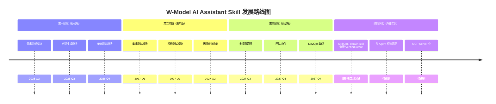

---

## 14. 技能演化机制（已移除）

> 架构重构后，技能自演化（Rollout / Reflect / Edit / Skill Lift 评估 / 训练日志 / 双时间尺度 / 可训练状态边界 / 验证门等）已**整章移除**。
> 历史版本曾由内置 `SkillOptimizer`（`src/evolution/skill-optimizer.ts`）+ `MetaSkillConfig`（`src/core/meta-skill-config.ts`）+ `w-model-dev/META-SKILL.md` 实现，
> 这些文件均已删除。技能演化现由外部工具完成：
> - [SkillOpt](https://github.com/microsoft/SkillOpt)（微软）：Rollout → Reflect → Edit → Gate → Commit 训练循环
> - [darwin-skill](https://github.com/alchaincyf/darwin-skill)：基于进化算法的技能搜索与筛选
>
> 外部演化工具可消费本技能产出的 `VerifierOutput` JSON（见 §7.6）作为训练信号。
> 与外部工具的协作方式见 §12.4，参考文献见 §16.3。

---

## 15. 技能评估标准（已移除）

> 架构重构后，技能本身的评估（ACES Skill Lift / SkillsBench 三条件对照 / SkillLearnBench 三级评估 / 留出任务集 / 确定性 verifier 优先等）已**整章移除**。
> 历史版本曾由内置 `SkillLiftEvaluator`（`src/eval/skill-lift.ts`）实现，该文件已删除。
> 技能评估现由外部工具完成（[SkillOpt](https://github.com/microsoft/SkillOpt) / [darwin-skill](https://github.com/alchaincyf/darwin-skill)），
> 相关学术基准（ACES / SkillsBench / SkillLearnBench）的引用见 §16.3。
>
> 本技能只保留**工件质量门**（§10.5）作为技能内部的产物质量保障。

---

## 16. 参考文献

### 16.1 W 模型与软件工程基础

1. 软件开发常见模型（瀑布模型、V模型、W模型、敏捷开发模型）. CSDN博客. https://blog.csdn.net/yao_zhuang/article/details/114273475
2. W模型和瀑布模型与"V"模式开发模型有何异同？. 阿里云开发者社区. https://developer.aliyun.com/article/1566339
3. 软件开发测试的W模型：构建高质量产品的坚实蓝图. 掘金. https://juejin.cn/post/7551997631112822794
4. 测试视角下的软件工程：需求、开发模型与测试模型. 腾讯云开发者社区. https://cloud.tencent.com/developer/article/2582288
5. 软件测试模型对比：V模型、W模型、H模型与敏捷测试. 51CTO. https://rk.51cto.com/article/633281.html
6. AI大模型如何重塑软件开发流程. CSDN博客. https://blog.csdn.net/cooldream2009/article/details/149217195
7. 超越Vibe Coding —— AI 辅助编程进阶指南. 掘金. https://juejin.cn/post/7637710008821481499
8. Requirements Traceability Matrix (RTM): The Complete Guide. https://getbestest.com/blog/requirements-traceability-matrix-guide/
9. What is Requirements Traceability Matrix (RTM) in Testing?. https://www.guru99.com/traceability-matrix.html
10. 需求跟踪深度解析：架构师视角下的全链路追溯体系. https://blog.csdn.net/ZxqSoftWare/article/details/149282779

### 16.2 LLM-as-a-Verifier（§7.6 评审规范）

11. LLM-as-a-Verifier: A General-Purpose Verification Framework. arXiv:2607.05391. Stanford University + UC Berkeley + NVIDIA Research.
12. LLM-as-a-Judge: 本技能的评审规范见 [`w-model-dev/references/verifier-spec.md`](../w-model-dev/references/verifier-spec.md)（三维度验证 / 连续评分 / PPT / 子标准 / 输出 Schema / 提示词模板），SSoT §7.6 为摘要。历史集成设计见 `llm-verifier-integration-design.md`（仅作背景，不作为权威来源）。
13. PPT (Probabilistic Pivot Tournament): O(N×k) 复杂度排名算法，本技能在 `verifier-spec.md` §5 以提示词描述，由外部 Agent 执行；不再内置 `src/core/ppt-ranker.ts`。

### 16.3 外部技能演化工具

> 技能演化与评估已移出技能包（原第 14 章 / 第 15 章已移除）。下列工具 / 基准由外部消费本技能产出的 `VerifierOutput` JSON，不在技能内置：
> - 训练循环与 Skill Lift 评估 → SkillOpt / darwin-skill
> - 技能评估基准 → ACES / SkillsBench / SkillLearnBench
> - 多候选排序算法 → PPT（已纳入 `verifier-spec.md` 提示词，见 §16.2）

14. SkillOpt: 把技能文档视为可训练外部状态，通过 Rollout → Reflect → Edit → Gate 闭环优化。Microsoft Research. https://github.com/microsoft/SkillOpt （SkillsBench 实证：自生成技能平均 -1.3pp，必须搭配验证门）
15. darwin-skill: 基于进化算法的技能搜索与筛选。 https://github.com/alchaincyf/darwin-skill
16. MetaSkill-Evolve: 5 组件元技能（ψ/σ/α/π/ε）+ 双时间尺度（快循环任务技能 + 慢循环元技能）。
17. ACES (Agentic Capability Evaluation via Skill Lift): with-skill vs without-skill 配对试验差值。
18. SkillsBench: 三条件对照（no-skill / curated-skill / self-generated-skill）。
19. SkillLearnBench: 三级评估（规格质量 / 轨迹分析 / 任务结果）。

---

## 附录

### A. 技能命令速查

| 命令 | 功能 |
|------|------|
| `/wm analyze <需求>` | 分析需求并生成规格说明 |
| `/wm design [type]` | 生成系统/详细设计文档 |
| `/wm code <功能>` | 生成代码和单元测试 |
| `/wm test [type]` | 执行指定类型测试 |
| `/wm review <目标>` | 返回 LLM 评审指引（指向 verifier-spec.md，由外部 Agent 执行） |
| `/wm status` | 查看项目状态 |
| `/wm help` | 显示帮助 |

### B. 测试类型对应关系

| 开发阶段 | 对应测试类型 | 测试目的 |
|----------|-------------|----------|
| 需求分析 | 验收测试设计 | 验证系统是否满足用户需求 |
| 系统设计 | 系统测试设计 | 验证系统整体功能和性能 |
| 概要设计 | 集成测试设计 | 验证模块间交互正确性 |
| 详细设计 | 单元测试设计 | 验证单个模块功能正确性 |
| 编码实现 | 单元测试执行 | 验证代码实现正确性 |
| 集成阶段 | 集成测试执行 | 验证模块集成正确性 |
| 系统阶段 | 系统测试执行 | 验证系统整体质量 |
| 验收阶段 | 验收测试执行 | 用户确认系统满足需求 |

### C. 验收检查清单

- [ ] 需求规格说明书完整
- [ ] 设计文档完整且符合规范
- [ ] 代码实现完成且通过编译
- [ ] 单元测试覆盖率 ≥ 80%
- [ ] 集成测试全部通过
- [ ] 系统测试全部通过
- [ ] 安全测试无高危漏洞
- [ ] 性能测试达标
- [ ] 验收测试通过
- [ ] 用户确认签字
- [ ] 交付文档齐全