# W开发模型AI辅助技能设计文档（SSoT）

## 1. 项目概述

### 1.1 项目名称
**W-Model AI Assistant Skill** - 基于AI辅助编码技术的W开发模型闭环工作技能

### 1.2 项目定位
本技能旨在利用AI辅助编码技术，实现软件工程中W开发模型的全流程闭环管理，将开发与测试并行推进，提升软件开发效率和质量。

### 1.3 核心目标
- 实现W模型中开发与测试的并行协作
- 通过AI技术自动化各阶段的文档生成、代码编写和测试设计
- 构建完整的软件开发生命周期闭环
- 提升开发者的工作效率和软件产品质量

### 1.4 文档定位
本文档为W-Model AI Assistant Skill的**单一事实来源（Single Source of Truth, SSoT）**，包含所有设计决策、需求定义、测试用例、集成规范和验收标准。所有相关团队和系统均应以本文档为准。

> **参考实现**：本技能的设计已由 [`w-model-dev-demo/`](../w-model-dev-demo)（博客系统后端，Express + TypeScript）端到端调测验证，8 阶段全流程闭环、四级测试全通过、工件质量门放行、用户 `confirm` 归档。详见 §10B。

> **架构重构说明（重要）**：本技能已完成架构纯化——**单纯的编排 + 校验脚本技能**，不包含任何编程式接入（无 TypeScript 引擎、无 npm 包、无 SDK）。技能包只包含提示词、参考、模板，里面的脚本只做门禁，不涉及 LLM 调用。
> 据此，本文档已移除技能演化机制与轨迹分析相关章节（原第 14 章「技能演化机制」、原第 15 章「技能评估标准」、原 §7.7 / §7.8 数据模型、原 §12.4「第四阶段（自演化版）」等），并移除全部 `src/` 编程式引擎（`/wm` 命令、状态持久化、RTM 维护改由 Agent 读取 `w-model-dev/SKILL.md` 后用自身工具执行）。
> LLM-as-a-Verifier 评审由外部 Agent 按提示词执行（规范见 [`w-model-dev/references/verifier-spec.md`](../w-model-dev/references/verifier-spec.md)）；
> 技能自演化由外部工具完成（[SkillOpt](https://github.com/microsoft/SkillOpt) / [darwin-skill](https://github.com/alchaincyf/darwin-skill)）。

---

## 2. W模型理论基础

### 2.1 W模型定义
W模型由Evolutif公司提出，是对V模型的扩展和演进。它由两个相互关联、同步进行的"V"字型结构组成：
- **左V（开发侧）**：需求分析 → 系统设计 → 概要设计 → 详细设计 → 编码
- **右V（测试侧）**：验收测试设计 → 系统测试设计 → 集成测试设计 → 单元测试设计 → 测试执行

### 2.2 W模型核心特点
| 特点 | 描述 |
|------|------|
| 开发与测试并行 | 测试活动在开发早期即启动，与开发同步推进 |
| 全生命周期测试 | 覆盖需求测试、设计测试、单元测试、集成测试、系统测试等 |
| 测试对象扩展 | 测试对象不仅是程序，还包括需求和设计文档 |
| 缺陷早发现 | 尽早发现需求或设计缺陷，降低修复成本 |

### 2.3 W模型与其他模型对比
| 模型 | 核心特点 | 适用场景 |
|------|----------|----------|
| 瀑布模型 | 线性阶段式开发，测试后置 | 需求明确、稳定的项目 |
| V模型 | 开发与测试对应，但测试在编码后执行 | 需求明确、变更较少的项目 |
| W模型 | 开发与测试并行，测试前置 | 需求相对稳定、需保证质量的项目 |
| 敏捷模型 | 快速迭代、持续交付 | 需求频繁变更的项目 |

### 2.4 W模型优势与局限性
**优势**：
- 测试提前介入，缺陷早发现，降低修复成本
- 测试覆盖更全面，减少后期风险
- 结构清晰，易于管理和跟踪
- 全面提升团队质量意识

**局限性**：
- 灵活性差，难以应对需求频繁变更
- 文档依赖重，文档质量直接决定项目成败
- 初期投入大，需要前期设计和测试规划

---

## 3. 技能架构设计

### 3.1 整体架构

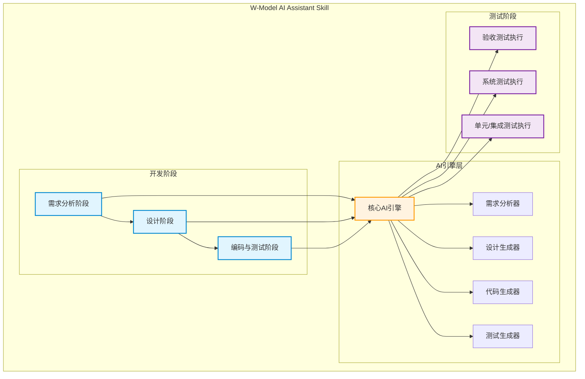

### 3.2 核心模块设计

> **去重约定**：本节只描述各核心模块的**设计层面边界**（功能、输入输出、AI 能力应用）。
> 各模块的详细阶段产物、测试用例设计表、验收标准清单、RTM 登记规则、阶段门评审等内容
> 由 [`w-model-dev/references/phase-N-*.md`](../w-model-dev/references/) 各阶段文档维护，
> 本节不再重复，仅以指针引用。测试用例 ID 命名规则（`UT/IT/ST/UAT-NNN` 运行时用例 vs
> `TC-<PHASE>-NNN` 阶段产物验证用例）见 [`rtm-guide.md`](../w-model-dev/references/rtm-guide.md)。

#### 3.2.1 需求分析模块

**功能描述**：将自然语言需求转化为结构化的需求规格说明书，并同步设计验收测试用例

**输入**：
- 用户自然语言需求描述
- 业务背景信息

**输出**：
- 《需求规格说明书》
- 验收测试用例设计文档
- 需求风险评估报告

**AI能力应用**：
- 自然语言理解与结构化提取
- 需求完整性检查
- 需求冲突检测
- 验收测试用例自动生成

> 详细阶段产物、测试用例设计表（TC-REQ-001~005）、验收标准：
> 见 [`phase-1-requirements.md`](../w-model-dev/references/phase-1-requirements.md)。

#### 3.2.2 设计阶段模块

**功能描述**：基于需求文档进行系统架构设计和详细设计，并同步设计系统测试和集成测试用例

**子模块**：
- **系统设计子模块**：生成系统架构图、技术选型建议、模块划分方案
- **详细设计子模块**：生成类图、数据库设计、接口定义
- **测试设计子模块**：同步生成系统测试用例和集成测试用例

**AI能力应用**：
- 架构设计建议生成
- UML图自动生成
- 接口定义文档生成
- 测试用例设计

> 详细阶段产物、测试用例设计表（TC-DES-001~006）、验收标准：
> 见 [`phase-2-system-design.md`](../w-model-dev/references/phase-2-system-design.md) /
> [`phase-3-outline-design.md`](../w-model-dev/references/phase-3-outline-design.md) /
> [`phase-4-detailed-design.md`](../w-model-dev/references/phase-4-detailed-design.md)。

#### 3.2.3 编码与单元测试模块

**功能描述**：根据详细设计文档生成代码，并同步生成和执行单元测试

**输入**：
- 详细设计文档
- 技术栈要求

**输出**：
- 完整代码实现
- 单元测试用例
- 测试覆盖率报告

**AI能力应用**：
- 代码自动生成
- 代码质量检查
- 单元测试用例生成
- 测试执行与报告生成

> 详细阶段产物、测试用例设计表（TC-COD-001~005）、验收标准（含单元测试代码覆盖率 ≥ 80%）：
> 见 [`phase-5-coding.md`](../w-model-dev/references/phase-5-coding.md)。

#### 3.2.4 集成测试模块

**功能描述**：验证模块间的交互正确性

**输入**：
- 集成测试设计文档
- 已完成的模块代码

**输出**：
- 集成测试执行结果
- 接口兼容性报告

**AI能力应用**：
- 集成测试用例执行
- 接口调用验证
- 测试结果分析

> 详细阶段产物、运行时测试用例（IT-001~005）、验收标准：
> 见 [`phase-6-integration-test.md`](../w-model-dev/references/phase-6-integration-test.md)。

#### 3.2.5 系统测试模块

**功能描述**：在模拟真实环境下验证系统整体功能

**输入**：
- 系统测试设计文档
- 完整系统代码

**输出**：
- 系统测试报告
- 性能测试结果
- 安全测试结果

**AI能力应用**：
- 自动化测试执行
- 性能测试脚本生成
- 安全漏洞检测

> 详细阶段产物、运行时测试用例（ST-001~005）、验收标准：
> 见 [`phase-7-system-test.md`](../w-model-dev/references/phase-7-system-test.md)。

#### 3.2.6 验收测试模块

**功能描述**：确认软件是否满足最初的需求规格

**输入**：
- 验收测试设计文档
- 完整系统

**输出**：
- 验收测试报告
- 用户确认结果

**AI能力应用**：
- 验收测试用例执行
- 用户需求匹配验证

> 详细阶段产物、运行时测试用例（UAT-001~004）、验收标准、项目级验收检查清单：
> 见 [`phase-8-acceptance-test.md`](../w-model-dev/references/phase-8-acceptance-test.md)。

### 3.3 技能架构原则与外部工具边界（重要）

本技能遵循「技能包只包含提示词、参考、模板，里面的脚本只做门禁，不涉及 LLM」的架构原则。该原则决定技能包内部与外部的明确边界：

| 能力 | 归属 | 实现位置 |
|---|---|---|
| W 模型阶段编排、RTM 维护、状态管理 | 技能内 | `w-model-dev/SKILL.md`（编排逻辑，Agent 执行）+ `w-model-dev/references/*`（阶段细则） |
| 阶段产物门禁（工件质量门） | 技能内（脚本只做门禁） | `w-model-dev/scripts/gate-logic.ts` + `check-artifact-gate.ts` |
| LLM-as-a-Verifier 评审（三维度验证 / 连续评分 / PPT / 子标准） | **技能内提供提示词与输出 Schema，外部 Agent 执行** | `w-model-dev/references/verifier-spec.md`（提示词）+ `scripts/check-verifier-output.ts`（校验） |
| LLM 推理本身 | **外部** | 由外部 Agent（Trae / Claude / Cursor 等）自行调用其 LLM 完成 |
| 技能自演化（Rollout / Reflect / Edit / Skill Lift 评估 / 轨迹分析） | **外部** | [SkillOpt](https://github.com/microsoft/SkillOpt) / [darwin-skill](https://github.com/alchaincyf/darwin-skill) |

要点：
- **技能本身不内置 LLM 调用**。阶段产物的 LLM-as-a-Verifier 评审通过提示词方式让外部 Agent 执行，技能只提供提示词 + 输出 Schema + 校验脚本（防外部 Agent 输出漂移）。`/wm review` 命令仅返回结构化评审指引，不直接调用 LLM。
- **LLM-as-a-Verifier 属于技能内部各阶段产物校验流程的一部分**，是 W 模型阶段门评审的实现方式，并非独立的「LLM 引擎」模块。
- **技能本身不包含演化机制与轨迹分析**。技能演化（Rollout / Reflect / Edit / Skill Lift 评估）由外部工具（SkillOpt / darwin-skill）完成，它们可消费本技能产出的 `VerifierOutput` JSON 作为训练信号。

---

### 3.4 编排者-子代理边界（Orchestrator-Subagent Boundary）

> 本节为「编排者最小化」原则的权威定义。与 §3.3「外部工具边界」互补：§3.3 划定**技能包与外部 LLM/演化工具**的边界，本节划定**编排者与实施动作**的边界。
> 实现位置：[`w-model-dev/references/subagent-delegation.md`](../w-model-dev/references/subagent-delegation.md) 为可执行细则；[`w-model-dev/SKILL.md`](../w-model-dev/SKILL.md)「编排者-子代理边界」节为编排摘要。
> 强制等级：违反本节命中反模式 #10「编排者越权实施」（见 [`w-model-dev/references/anti-patterns.md`](../w-model-dev/references/anti-patterns.md)），**命中即回退到当前阶段起点**。

#### 3.4.1 设计目标

编排者工作最小化：编排者只负责**编排**（路由 / 状态读写 / CHECKPOINT 等待 / 分派子代理 / 持久化 / 只读脚本），任何**实施动作**（修改、编码、调测、分析、修正、验证产出）必须由子代理执行。这样做的理由：

1. **上下文隔离**：编排者上下文不被产物内容污染，保留用于全局协调。
2. **评审独立性**：评审子代理不接触产出子代理的内部推理，避免自产自评漂移。
3. **可追溯**：每个产物/评审/门禁结果可归属到具体子代理调用，便于回退与审计。
4. **与现有架构一致**：`verifier-spec.md` §7.6「LLM-as-a-Verifier 由外部 Agent 执行」与 `agent-personas.md` Persona 体系天然映射为 V 子代理；门禁脚本由 G 子代理跑，保留「技能不内置 LLM」原则。

#### 3.4.2 角色划分（五层子代理 + 编排者：O / A / S / V / G / R；F 由 S 兼任）

| 角色 | 简称 | 职责 | 允许动作 | 禁止动作 |
|---|---|---|---|---|
| **编排者** | O | 路由、状态读写、CHECKPOINT 等待、分派子代理、持久化 | 读 `.w-model/*.json`、跑 `check-verifier-output.ts` / `check-artifact-gate.ts` 看退出码（只读）、`git status`、`ls`、向用户展示证据 | 写代码、改文档、产出 `VerifierOutput` JSON、生成测试用例、改 RTM 实体（产出 / 评审 / 门禁结果内容） |
| **产出子代理** | S | 生成阶段开发产物 + 同步测试设计 + 更新 RTM 实体 +（阶段 1–4）产出 TLA+ 层次化状态机规格（`.tla` + `.cfg` + `tla-manifest.json` 实体） | 写文件、跑测试运行器（仅产出阶段）、改 `.w-model/rtm.json` 实体、写 `tla/*.tla` / `tla/*.cfg` / `.w-model/tla-manifest.json` | 跑 `check-verifier-output.ts` / `check-artifact-gate.ts` / `check-tla-model.ts`、越阶段产出、产出占位/简化/错误 TLA+ 实现（反模式 #16） |
| **评审子代理** | V | 按 [`agent-personas.md`](../w-model-dev/references/agent-personas.md) + [`verifier-spec.md`](../w-model-dev/references/verifier-spec.md) §8 产出 `VerifierOutput` JSON；含 TLA+ 规格与需求/设计的语义一致性评审 | 读产物文件（含 `.tla`）、产出 JSON 评审 | 跑门禁脚本、改产物文件、改 RTM |
| **门禁子代理** | G | 跑 `check-verifier-output.ts` / `check-artifact-gate.ts` / `check-tla-model.ts`（阶段 1–4） + 回填证据摘要 | 跑门禁脚本、读 GATE_JSON / Verifier JSON / TLA_JSON、产出证据摘要字符串 | 改产物文件、产出 `VerifierOutput` JSON、改 RTM 实体、改 `.tla` / `tla-manifest.json` 实体 |
| **分析子代理** | A | 分块分析、交叉合并、图谱演进（阶段 1–4 活跃） | 读原始文档分块 / S 产出的正式文档、写 `.w-model/ingestion/<chunk-id>.{md,json}`、合并建图产出 `consolidated.json` + `cross-analysis-report.md` + `reworkHints`、通过晋升 `consolidated.json` 更新 `graph.json` | 跑 `check-requirement-graph.ts`（G 负责）、写正式阶段产物、改 `project.status`、越阶段产出、删除前阶段已通过的图谱节点 |
| **根因定位子代理** | R | 接收 V/G 的 `reworkHints` + 失败产物 + 上游产物，运用根因分析方法论定位缺陷根因，产出 `RootCauseReport`（含根因链、上游缺陷标记、修复建议、防御措施） | 读失败产物文件 + 上游产物、读 V 的 `VerifierOutput` JSON + G 的 GATE_JSON、运用根因分析方法（5-Why / 鱼骨图 / 缺陷链追溯 / 上游回溯）、产出 `RootCauseReport` JSON + `.md` 报告文件、标记 `upstreamDefect`、作为 R-lead 分派 R-persona 子代理（并行或串行均可）并聚合产出 | 改任何产物文件（由 S 修复）、跑门禁脚本（由 G 负责）、改 RTM 实体、改 `project.status`、跨阶段定位（仅当前阶段产物 + 上游回溯标记）、评审其他角色产出 |

> **修复者 F 由 S 兼任**：F 不是新角色，是 S 在返工场景下「携带 R 报告作为额外输入执行修复」的模式。S 首次产出时不带 R 报告；返工时必带已通过 V 复审 + G 门禁的 R 报告（见反模式 #18/#19）。
>
> **只读脚本例外**：编排者可执行 `npx tsx w-model-dev/scripts/check-*.ts`、`git status`、`ls` 等确定性只读命令以核验状态/展示证据，但不得**写入或修改**任何产物/评审/RTM 内容。门禁脚本本身为确定性 TypeScript，不含 LLM 调用，编排者跑它仅用于"看退出码"，不构成实施。

#### 3.4.3 每阶段分派时序（统一）

```
O: 路由 + 读状态 + 检查前置产物 + 加载最小引用集（SKILL.md + 当前阶段 phase-N）
O: 🔴 CHECKPOINT · 项目初始化（首次）或阶段进入确认
  ↓ 分派 S
S: 产出开发文档 + 同步测试设计 + 更新 RTM 实体 → 返回 {产物路径, RTM diff}
  ↓ 分派 V
V: 按 targetKind 路由 Persona → 产出 VerifierOutput JSON
  ↓ 分派 G
G: npx tsx w-model-dev/scripts/check-verifier-output.ts "<json>" → 返回 {exitCode, qualityLevel, passed, reworkHints}
O: 若 exitCode ≠ 0 或 qualityLevel ∈ {C,D} → 分派 S 返工（带 reworkHints），重走 V → G
O: 若通过 → 🔴 CHECKPOINT · 阶段门放行（编排者展示 G 子代理返回的证据给用户）
O: 用户放行 → 编排者更新 project.status → 进入下一阶段
```

阶段 8 终检额外分派 G 跑 `check-artifact-gate.ts`，退出码 0 + 用户确认 → 发布。

阶段 1–4 额外分派 G 跑 `check-tla-model.ts`（TLA+ 行为门禁，见 §10.8）：S 产出 `.tla` + `.cfg` + `tla-manifest.json` 实体后，G 跑脚本校验 SANY 语法 + TLC 模型检查 + 文件头/层次/拆解一致性，退出码 0 才放行；阶段 4 TLA+ 零违反 ∧ 图谱零违反（`check-requirement-graph.ts`）才放行进阶段 5 编码。

#### 3.4.4 与现有约束的兼容性

- **约束 4「真实执行」**：G 子代理跑脚本 + 回填退出码 = 真实执行，不冲突。
- **约束 6「按需加载」**：子代理按需加载对应 `phase-N-*.md`，编排者只加载 `SKILL.md` + 状态文件，加载面更窄。
- **约束 2「阶段门放行」**：G 子代理返回证据 → 编排者展示给用户 → CHECKPOINT 等待，不冲突。
- **`verifier-spec.md` §7.6「外部 Agent 执行」**：V 子代理即「外部 Agent」，边界一致。
- **`agent-personas.md` 4 个 Persona**：V 子代理按 `targetKind` 选用，无改动。
- **技能不内置 LLM**：V 子代理由编排者通过宿主 Agent 的子代理机制（如 Task 工具）启动，技能包自身仍只含提示词 + 脚本，不引入 LLM 调用。

#### 3.4.5 强制约束

编排者不得直接执行以下任何动作（命中即触发反模式 #10，回到当前阶段起点重做）：

1. 用 `Write` / `Edit` 写或修改任何阶段产物文件（需求规格 / 设计文档 / 代码 / 测试用例 / 测试报告 / 评审报告）。
2. 直接产出 `VerifierOutput` JSON 内容（评审必须分派 V 子代理）。
3. 修改 `.w-model/rtm.json` 实体字段（需求 / 设计 / 测试用例 / 执行结果；编排者只可更新 `project.status` 与 `updatedAt`）。
4. 生成测试用例代码或业务代码。
5. 跳过 S → V → G 顺序（如编排者自评自审）。

编排者**允许**的动作：
- 读 `.w-model/project.json` / `.w-model/rtm.json` / `.w-model/budget.json` / `.w-model/run-log.jsonl` / `.w-model/maturity.json`；
- 跑 `check-verifier-output.ts` / `check-artifact-gate.ts` 看**退出码**（用于向用户展示或路由判定，不替代 G 子代理的回填职责）；
- `git status` / `ls` / `Read` 等只读核验；
- 在 CHECKPOINT 暂停等待用户决定；
- 用户放行后更新 `project.status` 与 `updatedAt`；
- **维护 budget.json / run-log.jsonl / maturity.json**（状态读写+持久化，非实施；见 §10C / §10D）：项目初始化创建三文件、每次子代理返回/门禁执行/CHECKPOINT 放行后 append run-log、预算检查、成熟度判定与升降级。

---

## 4. 技能工作流程

### 4.1 完整工作流程

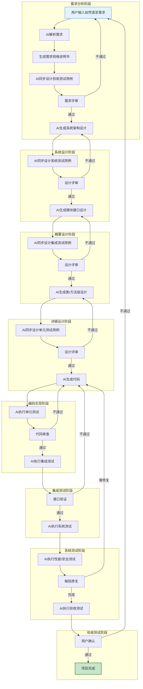

### 4.2 W模型并行流程

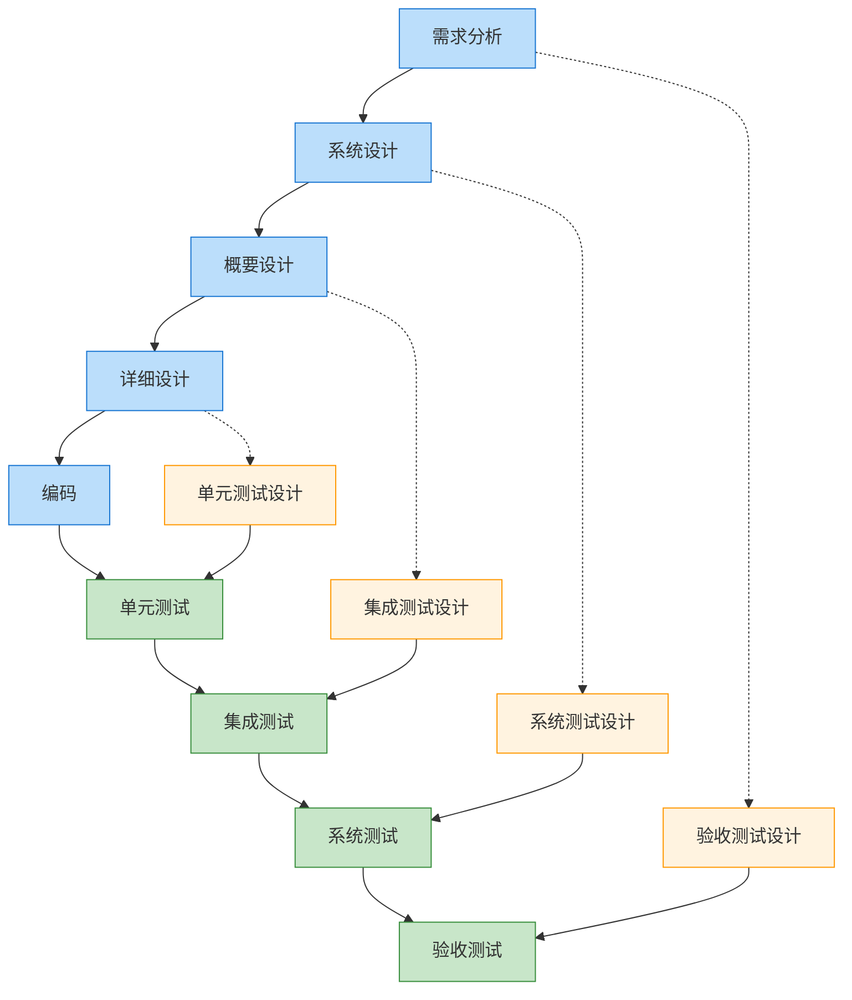

### 4.3 核心交互模式

#### 4.3.1 需求分析交互
```
用户: 我需要一个在线商城系统，支持用户注册、商品浏览、购物车和订单功能
AI: 正在分析需求...
AI: 已生成《需求规格说明书》，包含以下模块：
    1. 用户管理模块
    2. 商品管理模块
    3. 购物车模块
    4. 订单管理模块
AI: 已同步生成验收测试用例，涵盖50+测试场景
```

#### 4.3.2 设计阶段交互
```
用户: 请进行系统架构设计
AI: 正在进行架构设计...
AI: 技术选型建议：
    - 前端: React + TypeScript
    - 后端: Node.js + Express
    - 数据库: MongoDB + Redis
AI: 已生成系统架构图和模块接口定义
AI: 已同步生成系统测试用例，覆盖各模块集成场景
```

#### 4.3.3 编码阶段交互
```
用户: 请实现用户注册功能
AI: 正在生成代码...
AI: 已生成以下文件：
    - src/controllers/userController.ts
    - src/services/userService.ts
    - src/models/User.ts
    - src/routes/userRoutes.ts
AI: 已生成单元测试用例，单元测试代码覆盖率 95%
AI: 执行测试中...测试通过
```

### 4.4 ingestion 子流程与图谱收敛（阶段 1–4）

> 阶段 1–4（需求分析 → 系统设计 → 概要设计 → 详细设计）在原 S→V→G 阶段门基础上**叠加** ingestion 子流程：由 A 角色（分析子代理，§3.4.2）分块并行分析 + 多轮交叉合并，维护演进图谱 `graph.json`，由 G 跑 `check-requirement-graph.ts` 做结构连通性门禁。ingestion 是叠加而非替代——原 phase-N 的 V 评审 + `check-verifier-output.ts` + 阶段门 CHECKPOINT 全部保留。

**统一路径**（差异仅在「A→S 还是 S→A」与「提取的节点类型」）：

- **阶段 1（A→S）**：`plan-chunks` → 并行 A-chunk 提取 REQ 节点 → A-cross 合并 → G 跑 `check-requirement-graph.ts --phase=1`（连通 + 单根）→ 收敛循环 → S 读 `graph.json` 产出需求规格 + 验收测试。
- **阶段 2/3/4（S→A）**：S 先产出正式设计文档 → A-chunk 分块提取 SD/INTF/DD 节点 → A-evolve 图谱演进 → G 跑 `check-requirement-graph.ts --phase=N`（递增追溯项：implements/defines/realizes）→ 收敛循环 → V 评审 → G 跑 `check-verifier-output.ts`。
- **阶段 4 硬约束**：`--phase=4` 零违反（DD realizes 全覆盖）才放行进阶段 5 编码。

ingestion 引入两个新 CHECKPOINT（规划确认 / 收敛确认），均不可绕过（约束 2）。收敛判定由 G 跑脚本退出码决定，不由 A 的 LLM 输出决定（约束 4，反模式 #12）。完整设计见 [`docs/ingestion-graph-convergence-design.md`](./ingestion-graph-convergence-design.md)；可执行细则见 [`w-model-dev/references/ingestion-chunk.md`](../w-model-dev/references/ingestion-chunk.md) / [`ingestion-cross.md`](../w-model-dev/references/ingestion-cross.md) / [`graph-guide.md`](../w-model-dev/references/graph-guide.md)。

---

## 4A. 核心操作行为与失败模式

> 吸收自 [addyosmani/agent-skills](https://github.com/addyosmani/agent-skills) `using-agent-skills` 元技能的 Core Operating Behaviors 与 Failure Modes。
> 适配 W 模型语境：保留「不可违反的约束」（§4 与 [`SKILL.md`](../w-model-dev/SKILL.md)「不可违反的约束」节）作为硬性规则，本节为跨阶段的「日常操作准则」。
> 详细反模式与门禁脚本对应关系见 [`w-model-dev/references/anti-patterns.md`](../w-model-dev/references/anti-patterns.md)。

### 4A.1 六条核心操作行为

以下行为在 W 模型 8 阶段全程适用，与「不可违反的约束」互补：约束是「不可越界」的红线，操作行为是「主动遵守」的准则。

| # | 行为 | 在 W 模型中的具体表现 |
|---|---|---|
| 1 | **Surface Assumptions（显式声明假设）** | `/wm analyze` 进入阶段 1 前、`/wm design` 选型前、`/wm code` 生成前，显式列出对需求 / 架构 / 范围的假设；不得静默填补歧义需求 |
| 2 | **Manage Confusion Actively（主动管理困惑）** | 遇到 RTM 不一致、上游产物缺失、跨阶段术语冲突时：STOP → 命名具体困惑 → 向用户提出澄清问题 → 等待解决；禁止「猜一个推进」 |
| 3 | **Push Back When Warranted（必要时反驳）** | 当用户的选择与硬约束冲突（如要求跳过 CHECKPOINT / 估算覆盖率放行）时：直接指出问题 → 量化代价 → 提出替代方案 → 接受用户在完整信息下的覆盖决策 |
| 4 | **Enforce Simplicity（强制简洁）** | 编码前自问「能否更少行？抽象是否物有所值？资深工程师是否会问『为何不直接……』」；1000 行能 100 行完成即失败 |
| 5 | **Maintain Scope Discipline（保持范围纪律）** | 只动该动的；不删除看不懂的注释、不顺手清理无关代码、不重构相邻系统、不删除「看似无用」的代码除非显式批准、不加规格外「看似有用」的功能 |
| 6 | **Verify, Don't Assume（验证而非假设）** | 每个阶段都必须有验证证据（测试通过 / 脚本退出码 / 运行时数据）；「看起来对了」永远不够；§10.5 工件质量门是验证的最后一道闸 |

### 4A.2 失败模式清单

以下 10 条失败模式是「看似高效实则埋坑」的典型，与 [`anti-patterns.md`](../w-model-dev/references/anti-patterns.md) 的 19 条流程反模式互补：反模式是「流程破坏」，失败模式是「行为退化」。

| # | 失败模式 | 与 W 模型反例的关系 |
|---|---|---|
| F1 | 静默假设未检查就推进 | 与 #9（谎报状态）互补：#9 是结果撒谎，F1 是过程撒谎 |
| F2 | 困惑时不暂停、硬猜推进 | 与 #8（越过 CHECKPOINT）互补：#8 是显式节点越过，F2 是隐式困惑越过 |
| F3 | 注意到不一致但不指出 | 与 #4（评审未通过悄悄小修）互补：#4 是评审后，F3 是评审中 |
| F4 | 非显然决策不呈现 tradeoff | — |
| F5 | 对明显有问题的方案 sycophantic「当然可以」 | 与 §4A.1 第 3 条直接对应 |
| F6 | 过度复杂化代码与 API | 与 §4A.1 第 4 条直接对应 |
| F7 | 修改任务外的代码或注释 | 与 §4A.1 第 5 条直接对应 |
| F8 | 删除未完全理解的代码 | 与 §4A.1 第 5 条直接对应 |
| F9 | 因「显而易见」而无规格就编码 | 与 W 模型「测试设计前置」冲突 |
| F10 | 因「看起来对」跳过验证 | 与 #3（估算质量门）/ #6（估算 RTM 覆盖率）互补 |

> F1~F10 命中时不触发门禁脚本回退（它们不是流程反模式），但应在阶段产物的「备注」节或评审报告的 `reworkHints` 中标注。Agent 重复命中同一失败模式 ≥2 次时，应在 SSoT §10B.4 或 [`anti-patterns.md`](../w-model-dev/references/anti-patterns.md)「实现层经验教训」节登记为新教训。

### 4A.2a 运维失败模式清单（O1~O6）

> 吸收自 [cobusgreyling/loop-engineering](https://github.com/cobusgreyling/loop-engineering) `docs/failure-modes.md`，适配 W 模型语境。
> 与 19 条流程反模式（#1~#19）+ 10 条行为退化（F1~F10）互补：反模式是流程破坏，失败模式是行为退化，运维失败模式是运行健康问题。
> O 系列命中**不触发脚本回退**（与 F1~F10 同级），但应在 run-log 的 note 字段标注，并在阶段产物「备注」节或评审报告 reworkHints 中记录。

| # | 失败模式 | 症状 | 与现有反模式/失败模式的关系 | 缓解措施 |
|---|---|---|---|---|
| O1 | Token Burn（子代理链对空/噪声 triage 全跑） | 单阶段 token 消耗异常高；ingestion 对低信息量输入仍全跑 A-chunk×N | 与 F10（跳过验证）互补：F10 是不验证，O1 是过度验证 | 预算检查（§10D）+ 早退：triage 发现空输入时 A-chunk 数=1；budgetBurnRate 触发 kill switch |
| O2 | State Rot（状态文件引用已合并/已废弃产物） | rtm.json/graph.json 引用已删除文件或已废弃 ID | 与 #9（谎报状态）互补：#9 是状态造假，O2 是状态腐烂 | 每阶段门 G 子代理校验产物路径存活（`ls`/`git status`）；ID 失活 → 标记并 prune |
| O3 | Verifier Theater（V 子代理"looks good"但 CI 挂） | V 评审 passed=true qualityLevel=A 但下游测试失败 | 与 #1（跳过评审）对立面：评审走了形式 | 强化 verifier-spec §1 设计原则：V 默认拒绝姿态（"find reasons to reject"）；V 须引用具体 evidence 非空泛；G 校验 evidence 非空 |
| O4 | Comprehension Debt Spiral（用户橡皮图章 CHECKPOINT） | 用户对所有 CHECKPOINT 输入"确认"无修改意见；阶段产物无人理解 | 与 F5（sycophantic）互补：F5 是 Agent 奉承用户，O4 是用户奉承 Agent | 理解证据机制（§10.6 第六维度）：放行前须填 acknowledgedDecisions ≥1 关键决策；空确认视为 O4 命中 |
| O5 | Cognitive Surrender（"循环处理了"无设计意见） | 用户放弃对设计/架构的意见；全权委托 Agent | 与 §4A.1 第 3 条（Push Back）对立面 | 阶段 2/4 设计 CHECKPOINT 强制用户提出 ≥1 修改意见或替代方案；无意见视为 O5 命中 |
| O6 | Escalation Failure（attempt cap 触发但无人被通知） | 返工达 maxReworkRounds 但用户未被告知；循环卡死 | 与 #8（越过 CHECKPOINT）互补：#8 是显式越过，O6 是隐式卡死 | attempt cap 触发 → run-log append escalate 记录 + 强制 🔴 CHECKPOINT 展示返工历史 |

> O 系列命中不回退，但应在 run-log 的 note 字段标注（如 note="O1 Token Burn"），并在阶段产物「备注」节或评审报告 reworkHints 中记录。O4/O5 直接关联 CHECKPOINT 有效性，命中时拒绝放行。

### 4A.2b 返工循环反模式扩展（#18 / #19）

> 伴随根因定位者（R）角色引入，在现有 17 条流程反模式（#1~#17，见 [`anti-patterns.md`](../w-model-dev/references/anti-patterns.md)）基础上新增 #18/#19，守护返工循环「必经 R 根因定位」与「R 报告必经 V 复审 + G 门禁」两条硬约束。命中即回退到当前阶段起点。
> 权威定义见 [`w-model-dev/references/anti-patterns.md`](../w-model-dev/references/anti-patterns.md) + [根因定位者设计 spec](./superpowers/specs/2026-07-24-root-cause-locator-and-fixer-roles-design.md) §7.1。

| # | 反模式 | 危害 | 正确做法 |
|---|---|---|---|
| 18 | 跳过 R 直接分派 S 返工（V/G 不通过后直接 S-fix，未经 R 根因定位） | 修复针对症状不针对根因，同问题反复出现；缺陷链未追溯，上游缺陷被掩盖 | V/G 不通过 → 必须先分派 R 定位 → V 复审根因 → G 门禁 → S-fix 携 R 报告修复 |
| 19 | R 报告未经 V 复审直接交 S 修复 | 根因准确性无独立保证，S 基于错误根因修复，浪费一轮返工 | R 产出后必须经 V 复审 + G 门禁（check-rootcause-report.ts exitCode=0）才可分派 S-fix |

> #18/#19 命中即回退（与 #1~#17 同级流程反模式）。R 方法论与多角度分析机制详见 §6.4.5 与 [`root-cause-locator.md`](../w-model-dev/references/root-cause-locator.md)；R 报告校验门禁详见 §10.9。

### 4A.3 与现有约束的关系

- **「不可违反的约束」（[`SKILL.md`](../w-model-dev/SKILL.md)）** 是硬红线，命中即触发阶段回退；由门禁脚本或 CHECKPOINT 强制。
- **「核心操作行为」（本节 §4A.1）** 是日常准则，违反不立即触发回退但会降低产物质量；由 Agent 自检或 LLM-as-a-Verifier 在评审中标注。
- **「流程反模式」（[`anti-patterns.md`](../w-model-dev/references/anti-patterns.md) 19 条，含返工循环 #18/#19）** 是流程破坏，命中即回退；与门禁脚本退出码精确对应。
- **「失败模式」（本节 §4A.2 F1~F10）** 是行为退化，命中不回退但应记录；与反模式互补。
- **「运维失败模式」（本节 §4A.2a O1~O6）** 是运行健康问题，命中不回退但应标注；由预算检查（O1/O6）/路径存活校验（O2）/V-G 矛盾检测（O3）/理解证据机制（O4/O5）协同检测。

三层互补架构：流程反模式（层 1，流程是否走对）→ 行为退化（层 2，Agent 行为是否健康）→ 运维失败模式（层 3，运行是否健康）。

实现位置：[`w-model-dev/references/anti-patterns.md`](../w-model-dev/references/anti-patterns.md)「失败模式清单」节（F1~F10）+「运维失败模式清单」节（O1~O6）+ [`w-model-dev/SKILL.md`](../w-model-dev/SKILL.md)「核心操作行为」节。

---

## 5. AI能力集成策略

### 5.1 自然语言处理能力
- **需求解析**：将非结构化自然语言转化为结构化需求
- **意图识别**：理解用户开发意图和技术偏好
- **文档生成**：自动生成各类技术文档

### 5.2 代码生成能力
- **代码生成**：根据设计文档生成高质量代码
- **代码补全**：智能补全代码片段
- **代码重构**：优化现有代码结构

### 5.3 测试生成能力
- **测试用例生成**：根据需求和设计自动生成测试用例
- **测试执行**：自动执行测试并生成报告
- **测试覆盖率分析**：分析测试覆盖情况

### 5.4 智能审查能力
- **代码审查**：检查代码质量、安全漏洞
- **文档审查**：验证文档完整性和一致性
- **需求追踪**：确保代码实现与需求一致

---

## 6. 技能接口设计

### 6.0 触发边界

技能采用“歧义时询问”的触发策略：

- 用户显式使用 `/wm`、提及 W-model / W 模型 / W 开发模型，或明确要求 RTM、阶段门/质量门、开发与测试并行时，直接启用。
- 用户只要求“完整流程”“从需求到交付”或“全生命周期开发”，但未出现上述 W 模型信号时，先询问是否采用 W 模型；确认前不创建 `.w-model/` 或产出 W 模型工件。
- 普通需求、设计、编码、测试、缺陷修复和技术解释不启用本技能。

该边界在保持技能可发现性的同时防止普通软件任务被强制升级为 8 阶段流程。

### 6.1 核心命令

| 命令 | 功能描述 | 参数 | 产出 |
|------|----------|------|--------|
| `/wm analyze` | 需求分析 | `input`: 需求描述 | 需求规格说明书、验收测试用例 |
| `/wm design` | 系统设计 | `type`: 设计类型(架构/概要/详细) | 设计文档、测试用例 |
| `/wm code` | 代码生成 | `feature`: 功能描述 | 代码文件、单元测试 |
| `/wm test` | 测试执行与回填 | `type`: 测试类型(单元/集成/系统/验收)；`result`: pass/fail（必填，真实回填） | 测试报告 |
| `/wm review` | LLM 评审指引 | `target`: 需求/设计/测试用例 ID 或文件路径 | 结构化评审指引（指向 `verifier-spec.md` + `check-verifier-output.ts`，不内置 LLM） |
| `/wm status` | 项目状态 | 无 | 当前阶段、完成进度、RTM 覆盖率 |

### 6.2 辅助命令

| 命令 | 功能描述 |
|------|----------|
| `/wm help` | 显示帮助信息 |
| `/wm reset` | 重置当前项目状态 |
| `/wm export` | 导出项目文档 |
| `/wm import` | 导入现有项目 |

### 6.3 接口调用流程

> 本技能无编程式接入。`/wm` 命令由 Agent 读取 `SKILL.md` 后用自身工具执行，状态与 RTM 持久化到项目内 `.w-model/*.json`。

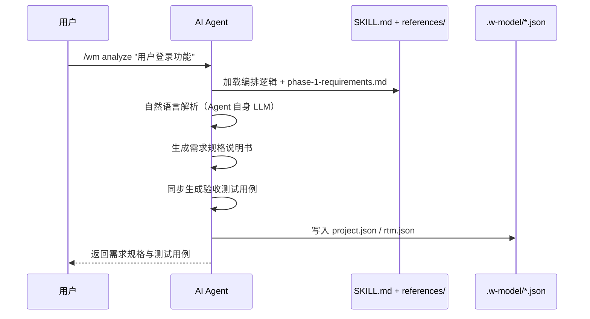

### 6.4 Agent Personas（评审角色提示词）

> 吸收自 [addyosmani/agent-skills](https://github.com/addyosmani/agent-skills) `agents/` 目录。
> 适配 W 模型语境：技能不内置 LLM 调用（§3.3 硬约束），故 Persona 是「供外部 Agent 在执行 `/wm review` 时采用的角色提示词」，由 Agent 自身 LLM 加载执行，技能本身不调用 LLM。
> 与 §7.6 LLM-as-a-Verifier 评审规范的关系：§7.6 定义评审的「输出 Schema 与校验脚本」，本节定义评审的「角色视角与关注点」——二者互补，Persona 不替代 Schema。
> 实现位置：[`w-model-dev/references/agent-personas.md`](../w-model-dev/references/agent-personas.md)（提示词，不调用 LLM）。

#### 6.4.1 三层架构（Skill / Persona / Command）

吸收 addyosmani `docs/agents.md` 的三层模型，适配 W 模型语境：

| 层 | 是什么 | W 模型中的例子 | 组合角色 |
|---|---|---|---|
| **Skill**（技能） | 带步骤与退出标准的工作流 | `w-model-dev`（编排 + 8 阶段 + 阶段门 + 工件质量门） | 「如何做」——在 Persona 内部被引用 |
| **Persona**（角色） | 单一角色 + 单一视角 + 单一输出格式 | `code-reviewer` / `test-engineer` / `security-auditor` / `performance-auditor` | 「谁来做」——采用一种视角产出报告 |
| **Command**（命令） | 用户面向的入口 | `/wm review <target>` | 「何时做」——按 `targetKind` 路由到对应 Persona |

要点（吸收 addyosmani 规则并适配）：

1. **Persona 不调用其他 Persona**：组合由命令或用户完成。在 W 模型中由 `/wm review` 根据 `targetKind` 路由；`code-reviewer` 发现安全问题时不直接调用 `security-auditor`，而是在 `reworkHints` 中标注「建议 security-auditor 深审」。
2. **Persona 可引用技能**：Persona 在评审中可加载 [`verifier-spec.md`](../w-model-dev/references/verifier-spec.md)（评审规范）或 [`definition-of-done.md`](../w-model-dev/references/definition-of-done.md)（DoD 标准）作为「如何做」的依据。
3. **每个 Persona 文件以「组合」节结尾**：声明在 W 模型中的直接调用场景、经 `/wm review` 调用场景、禁止从其他 Persona 调用。

#### 6.4.2 W 模型适配的 4 个 Persona

| Persona | 角色定位 | W 模型阶段 | 主要 `targetKind` | 输出格式 |
|---|---|---|---|---|
| **code-reviewer** | 资深工程师，五轴代码审查 | 阶段 5 编码 | `file` | Critical / Required / Optional / Nit / FYI 分级发现项 + 复审结论 |
| **test-engineer** | QA 工程师，测试策略与覆盖率分析 | 阶段 4 详细设计（单测设计）/ 阶段 6 集成测试 / 阶段 7 系统测试 | `testcase` | 覆盖率缺口清单 + Prove-It 测试 + 优先级（Critical / High / Medium / Low） |
| **security-auditor** | 安全工程师，OWASP + STRIDE 威胁建模 | 阶段 7 系统测试（安全子项） | `file` / `design` | Critical / High / Medium / Low / Info 分级漏洞 + PoC + 修复建议 |
| **performance-auditor** | 性能工程师，性能基线与回归 | 阶段 7 系统测试（性能子项） | `file` / `design` | Critical / High / Medium / Low / Info 分级瓶颈 + Metric-Honesty Rule（禁止编造指标） |

> 性能 Persona 借鉴 addyosmani `web-performance-auditor`，但**适配 W 模型后端场景**：默认无 Lighthouse / CrUX 工件时退化为「源代码结构反模式扫描」，所有发现标注 `potential impact`；只有当用户提供 k6 / JMeter 等工具产出 JSON 时才填入 measured 值。这是 addyosmani「Metric-Honesty Rule」的直接吸收。

#### 6.4.3 与 §7.6 LLM-as-a-Verifier 的关系

| 维度 | §7.6 LLM-as-a-Verifier | §6.4 Agent Personas |
|---|---|---|
| 关注点 | 评审输出的「结构与有效性」 | 评审执行的「角色与视角」 |
| 定义内容 | 输出 Schema（`subCriteria[]` / `compositeScore` / `qualityLevel` / `passed` / `reworkHints`）+ 校验脚本（`check-verifier-output.ts`） | 角色提示词（关注点清单 + 严重等级 + 输出模板） |
| 强制性 | JSON Schema 强制（脚本校验） | 软性约定（提示词，不调用 LLM） |
| 互补关系 | Persona 产出的 JSON 必须满足 §7.6 Schema | Persona 决定 JSON 中发现项的内容与质量 |

`/wm review <target>` 命令的路由逻辑：

1. 识别 `target` 的 `targetKind`（`requirement` / `design` / `testcase` / `file`）；
2. 若 `targetKind=file`：默认路由到 `code-reviewer`；如文件涉及安全敏感面（auth / 加密 / 输入校验），同时建议 `security-auditor` 深审；如涉及性能（热点循环 / DB 查询），建议 `performance-auditor` 深审；
3. 若 `targetKind=testcase`：路由到 `test-engineer`；
4. 若 `targetKind=design`：默认走 §7.6 通用评审，但如设计涉及安全架构，建议 `security-auditor` 深审；
5. 评审产出 JSON 后必须执行 `check-verifier-output.ts` 校验。

> 「建议深审」不是自动调用：Persona 不互相调用（§6.4.1 规则 1）。建议在评审报告的 `reworkHints` 中以「[建议 security-auditor 深审] xxx」前缀形式呈现，由用户或后续 `/wm review` 显式触发。

#### 6.4.4 R（根因定位者）角色定义

> 伴随返工循环根因定位者（R）角色引入，本节为 R 角色的权威定义（与 §3.4.2 角色表的 R 行互补：§3.4.2 为编排摘要，本节为完整定义）。
> R 不是评审 Persona（§6.4.2 的 4 个 Persona 仍仅服务于 V 子代理），而是独立的诊断子代理角色；R 不调用 Persona，Persona 不调用 R。
> 权威定义见 [根因定位者设计 spec](./superpowers/specs/2026-07-24-root-cause-locator-and-fixer-roles-design.md) §1.1。

**R（Root Cause Locator）角色定义**：

| 维度 | 定义 |
|---|---|
| **简称** | R（Root Cause Locator） |
| **职责** | 接收 V/G 的 `reworkHints` + 失败产物 + 上游产物，运用根因分析方法论定位缺陷根因，产出 `RootCauseReport`（含根因链、上游缺陷标记、修复建议、防御措施） |
| **允许动作** | ① 读失败产物文件 + 上游产物（需求/设计/代码/测试/TLA+/graph.json）；② 读 V 的 `VerifierOutput` JSON + G 的 GATE_JSON；③ 运用根因分析方法（5-Why / 鱼骨图 / 缺陷链追溯 / 上游回溯）；④ 产出 `RootCauseReport` JSON + `.md` 报告文件；⑤ 标记 `upstreamDefect`（若根因为上游需求/设计缺陷）；⑥ 作为 R-lead 分派 R-persona 子代理（并行或串行均可）并聚合产出 |
| **禁止动作** | ① 改任何产物文件（由 S 修复）；② 跑门禁脚本（由 G 负责）；③ 改 RTM 实体；④ 改 `project.status`；⑤ 跨阶段定位（仅定位当前阶段产物的缺陷根因，上游回溯仅标记不修改）；⑥ 评审其他角色产出 |

**F（Fixer）角色定义**（由 S 兼任，非新角色）：

| 维度 | 定义 |
|---|---|
| **简称** | F（Fixer） |
| **承担者** | **由现有 S 子代理兼任**（S 在返工场景下接受 R 报告作为额外输入，执行修复） |
| **职责** | 接收 R 的 `RootCauseReport`（已经 V 复审通过），按 `fixRecommendation` 修复产物，同步更新 RTM 实体 |
| **允许动作** | ① S 的全部允许动作；② 读 R 的 `RootCauseReport`；③ 按 `fixRecommendation` 修改产物；④ 在返工记录中标注「修复依据：R 报告 `<reportId>`」 |
| **禁止动作** | ① 无视 R 报告自行修复（必须以 R 报告为依据）；② 跳过 R 直接返工（命中反模式 #18） |

> R 与 V 的区别：V 评审「产物是否符合标准」（发现 what）；R 诊断「产物为何不符合标准」（追溯 why）。V 输出 `reworkHints`（现象）；R 输出 `RootCauseReport`（根因链）。
> R 与 A 的区别：A 分析「原始文档→图谱」的结构化（阶段 1-4 ingestion）；R 分析「失败产物→根因」的诊断（全阶段返工）。两者活动领域不同。

#### 6.4.5 R 方法论与多角度机制

R 子代理的方法论详见 [root-cause-locator.md](../w-model-dev/references/root-cause-locator.md)。多角度分析机制（并行/串行均可）详见 spec §9.2 与 [subagent-persona-matrix.md](../w-model-dev/references/subagent-persona-matrix.md)。

> R 方法论含 4 种根因分析方法（5-Why / 鱼骨图 / 缺陷链追溯 / 上游回溯）+ 方法选择规则 + 5 条产出质量标准（根因可证伪 / 禁止现象当根因 / fixRecommendation 针对根因 / prevention 可执行 / upstreamDefect 附证据）。
> 多角度机制本质是「多角度」而非「并行」：宿主支持并行子代理时并行分派 N 个 R-persona，仅支持串行时依次分派（等价合法），单会话无子代理时 R-lead 多轮切换 persona（降级）。三种分派方式的产出结构、聚合规则、归档要求、run-log 记录完全一致。

---

## 7. 数据模型设计

### 7.1 项目数据模型

```typescript
interface Project {
  id: string;
  name: string;
  description: string;
  status: '需求分析' | '系统设计' | '概要设计' | '详细设计' | '编码' | '集成测试' | '系统测试' | '验收测试' | '项目完成';
  techStack: {
    frontend: string[];
    backend: string[];
    database: string[];
    others: string[];
  };
  createdAt: Date;
  updatedAt: Date;
}
```

### 7.2 需求数据模型

```typescript
interface Requirement {
  id: string;
  projectId: string;
  title: string;
  description: string;
  type: '功能需求' | '非功能需求' | '约束需求';
  priority: '高' | '中' | '低';
  acceptanceCriteria: string[];
  testCases: TestCase[];
  status: '待开发' | '开发中' | '已完成' | '已验证';
}
```

### 7.3 设计数据模型

```typescript
interface Design {
  id: string;
  projectId: string;
  type: '系统设计' | '概要设计' | '详细设计';
  content: string;
  diagrams: Diagram[];
  testCases: TestCase[];
  createdAt: Date;
}
```

### 7.4 测试用例数据模型

```typescript
interface TestCase {
  id: string;
  projectId: string;
  type: '验收测试' | '系统测试' | '集成测试' | '单元测试';
  title: string;
  description: string;
  steps: string[];
  expectedResult: string;
  status: '待执行' | '通过' | '失败';
  priority: '高' | '中' | '低';
}
```

### 7.5 数据模型关系图

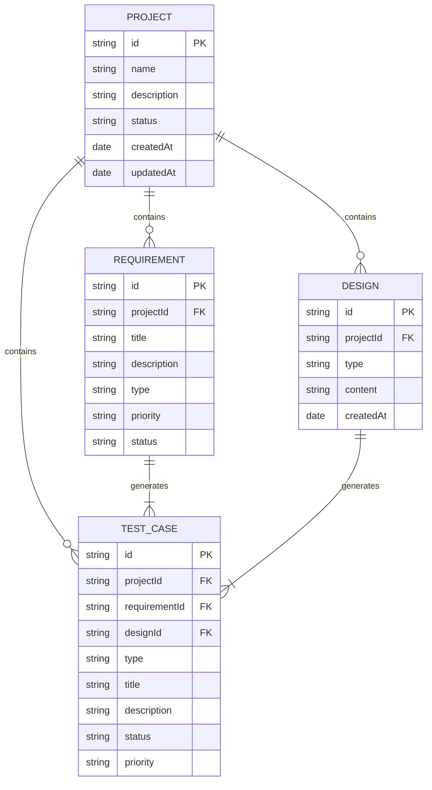

### 7.6 LLM-as-a-Verifier 评审规范（外部 Agent 执行）

> 历史版本曾在此定义 `VerificationResult` / `ContinuousScoringEngine` / `LLMClient` / `LLMResponse` / `VerifierConfig` 等 TypeScript 类型。
> 架构重构后，本技能不再内置 LLM 调用，上述类型与对应实现（`src/core/scoring-engine.ts` / `verification-framework.ts` / `ppt-ranker.ts` / `llm-client.ts` 等）均已删除。

LLM-as-a-Verifier 评审由外部 Agent 按提示词执行，**本节不再定义 LLM 相关类型**。权威规范定义在 [`w-model-dev/references/verifier-spec.md`](../w-model-dev/references/verifier-spec.md)，要点如下：

- **适用目标类型**：`requirement` / `design` / `testcase` / `file`，各自对应一组子标准与权重。
- **三维度验证**：评分粒度（≥3 个子标准，连续评分 `[0,1]` 保留 4 位小数）/ 重复评估（默认 3 次，方差 ≤ 0.10）/ 标准分解（每个子标准须含 `evidence` 引用目标内具体片段）。
- **连续评分实现**：logits 期望值（A/B/C/D 四档 token 概率加权）或文本回退（解析字母 + ±0.05 稳定扰动），Agent 在 `meta.scoringMethod` 标注实际方法。
- **PPT 排序**：多候选场景按 PPT 算法（默认 `k=5` / `temperature=4.0`）输出 `ranking` 字段。
- **输出 Schema**：`schemaVersion="1.0"` + `meta` + `subCriteria[]` + `compositeScore[0,1]` + `qualityLevel(A/B/C/D)` + `summary` + `passed` + 可选 `reworkHints` / `ranking`。
- **质量等级映射**：`[0.85,1.0]=A` / `[0.70,0.85)=B` / `[0.50,0.70)=C` / `[0,0.50)=D`；`passed = (A or B)`。
- **五轴评审与严重等级标签**（吸收自 [addyosmani/agent-skills](https://github.com/addyosmani/agent-skills) `code-review-and-quality` 技能）：代码评审（`targetKind=file`）的子标准按五轴（Correctness / Readability / Security / Architecture / Performance）组织发现项；每条发现项标注 Severity（Critical / Required / Nit / Optional / FYI），使作者区分必修与可选。详细子标准映射与 Structural Remedies 见 [`w-model-dev/references/verifier-spec.md`](../w-model-dev/references/verifier-spec.md) §7.4A。
- **防漂移校验**：外部 Agent 输出 JSON 后必须调用 `w-model-dev/scripts/check-verifier-output.ts` 校验（退出码 `0=通过 / 1=校验失败 / 2=输入错误`）。校验纯逻辑单点事实源为 `w-model-dev/scripts/verifier-logic.ts`。
- **与外部演化工具的关系**：本规范只覆盖「阶段产物校验流程」，是技能内部的产物质量保障；技能演化（Rollout / Reflect / Edit / Skill Lift）由外部 SkillOpt / darwin-skill 完成，可消费本规范产出的 `VerifierOutput` JSON 作为训练信号。

`/wm review <target>` 命令（见 §6）仅返回结构化评审指引——根据目标 ID 识别 `targetKind`，提示对应的子标准集合，并指引外部 Agent 加载 `verifier-spec.md` §8 提示词模板执行评审、再调用校验脚本。命令本身不调用 LLM。

### 7.7 graph.json schema（ingestion 子流程产物）

> 阶段 1–4 ingestion 子流程产出的**结构层**图谱 schema。权威定义见 [`docs/ingestion-graph-convergence-design.md`](./ingestion-graph-convergence-design.md) §2.4；本节为摘要，与该设计文档双向追溯。
>
> **与 `rtm.json` 的分工**（设计文档 §2.7）：`graph.json` 管结构拓扑（节点/边/连通/单根/跨阶段追溯），由 A-chunk/A-cross/A-evolve 维护，G 跑 `check-requirement-graph.ts` 校验；`rtm.json` 管追溯矩阵（需求-设计-代码-测试映射），由 S 按现有 `rtm-guide.md` 维护，G 跑 `check-artifact-gate.ts`（阶段 8 终检）。两者并存，各自独立校验，互不替代。

```json
{
  "version": 1,
  "project": "<project-id>",
  "currentPhase": 1,
  "rootId": "REQ-ROOT | null",
  "nodes": [<节点>],
  "edges": [{"from":"<id>","to":"<id>","type":"<边类型>"}],
  "analysisRounds": [
    {"phase":1,"round":1,"timestamp":"...","violations":[],"converged":true}
  ]
}
```

要点：
- **节点类型**（每阶段一种，设计文档 §2.1）：阶段 1 `REQ` / 阶段 2 `SD` / 阶段 3 `INTF` / 阶段 4 `DD`；另含边界节点 `EXT-IN`（合法外部信息源，DFD terminator）/ `EXT-OUT`（合法外部信息汇），二者豁免黑洞/奇迹判定且不参与 `parent` 单根树。节点 schema 统一含 `id` / `type` / `phase` / `sourcePath` / `summary` 等字段（设计文档 §2.2）。
- **边类型**（设计文档 §2.3）：结构边 `parent`（同阶段树形）/ `implements`（SD→REQ）/ `defines`（SD→INTF）/ `realizes`（DD→INTF or DD→SD）；信息流边 `produces` / `consumes`（方向=信息流方向，`from`=来源 `to`=去向，两类方向语义相同仅强调视角不同）。
- **信息流边与边界节点**用于黑洞/奇迹/死模块校验，与结构边正交（不参与 `parent` 单根树但参与整体连通性 BFS），详见 [`information-flow-validation-design.md`](./information-flow-validation-design.md)。
- **收敛循环**：A-cross/A-evolve 把 `consolidated.json` 作为 `graph.json` 候选态写入，G 跑 `check-requirement-graph.ts` 校验；`passed=true` 才晋升为正式 `graph.json`（设计文档 §2.6）。
- **阶段 4 硬约束**：`--phase=4` 零违反（结构违反 + 信息流违反均空）才放行进阶段 5 编码（见 §4.4）。
- **维护边界**：A 子代理产出（含晋升 `consolidated.json` → `graph.json`）；编排者不写；S 不改图谱节点。违反命中反模式 #11（见 [`w-model-dev/references/anti-patterns.md`](../w-model-dev/references/anti-patterns.md)）。

### 7.8 tla-manifest.json schema（TLA+ 行为层产物）

> 阶段 1–4 TLA+ 层次化状态机建模产出的**行为层**图谱 schema。权威定义见 [`docs/tla-plus-modeling-design.md`](./tla-plus-modeling-design.md) §2；本节为摘要，与该设计文档双向追溯。
>
> **与 `graph.json` / `rtm.json` 的分工**：`tla-manifest.json` 管动态行为（状态机/不变式/死锁），由 S 产出 .tla + .cfg 后维护，G 跑 `check-tla-model.ts` 校验；`graph.json` 管静态结构拓扑；`rtm.json` 管追溯矩阵。三者并存，各自独立校验，互不替代。

```json
{
  "version": 1,
  "project": "<project-id>",
  "currentPhase": 1,
  "tools": { "jarPath": "w-model-dev/tools/tla2tools.jar", "javaMinVersion": 11 },
  "specs": [{
    "id": "L1_blog_system",
    "level": "L1",
    "phase": 1,
    "system": "blog-system",
    "requirementIds": ["REQ-001"],
    "designRef": "docs/requirement-spec.md#§3",
    "tlaPath": "tla/L1_blog_system.tla",
    "cfgPath": "tla/L1_blog_system.cfg",
    "parent": null,
    "siblings": [],
    "children": ["tla/L2_auth_subsystem.tla"],
    "variableCombination": 240,
    "decompositionDecision": "kept-below-threshold",
    "syntaxChecked": true,
    "tlcChecked": true,
    "deadlockFree": true,
    "invariantsHold": true,
    "stateExplosion": false
  }],
  "checkRounds": []
}
```

要点：
- **层级模型**（设计文档 §1.1）：L1 系统内外交互 / L2 子系统内部行为+同级交互 / L3 原子化子系统行为 / L4+ 递归拆解。每个下级子系统可视为独立系统继续拆解。
- **拆解判定**（设计文档 §1.1）：变量组合数 >1k 考虑拆，>1w 必须拆（`decompositionDecision` 字段记录决策）。
- **文件头规范**（设计文档 §1.2）：每个 `.tla` 文件须含 8 个 `@` 字段（`@system`/`@requirement`/`@design`/`@parent`/`@sibling`/`@child`/`@level`/`@phase`），`check-tla-model.ts` 校验完整性与双向一致性。
- **行为校验**（设计文档 §3）：SANY 语法检查 → TLC 模型检查（无死锁/不变式违反/状态爆炸）；编码调试顺序为硬约束（反模式 #14）。
- **阶段 4 硬约束**：`--phase=4` TLA+ 零违反 + 图谱零违反才放行进阶段 5 编码。
- **维护边界**：S 子代理产出（.tla + .cfg + manifest 实体）；G 子代理跑 `check-tla-model.ts` 校验；编排者不写。TLA+ 不接受占位/简化/错误实现（反模式 #16）；建模须符合需求和设计，符合后仍有问题须修正需求/设计并回退重跑（反模式 #17）。
- **工具链**：Java ≥ 11（外部）+ `tla2tools.jar`（技能内置 `w-model-dev/tools/tla2tools.jar`，含 SANY + TLC + PlusCal）。
- **checkRounds 语义**（与 [`w-model-dev/references/tla-plus-guide.md`](../w-model-dev/references/tla-plus-guide.md) 双向追溯）：记录每轮 `check-tla-model.ts` 校验结果（含 violations 摘要与 round 编号）；`violations` 跨轮须单调递减（设计文档 §3.4）；与 `run-log.jsonl` R3（返工动作完整性）交叉校验——每轮 checkRound 须对应 run-log 中一条返工记录；无返工（首次即收敛）填 `[]`。

---

## 8. 技术实现方案

### 8.1 技术栈选择

本技能是单纯的编排 + 校验脚本技能，无运行时框架与数据库：

| 层次 | 技术 | 理由 |
|------|------|------|
| 编排载体 | Markdown（`SKILL.md` + `references/`） | 人类与 Agent 双可读，按需加载 |
| 校验脚本 | TypeScript（自包含，仅依赖 `tsx`） | 类型安全的纯函数门禁判定，不调用 LLM |
| 文档模板 | Markdown（`templates/`） | 易于阅读和版本控制 |
| LLM 推理 | 外部 Agent 自身的 LLM | 技能不内置 LLM 调用 |
| 状态持久化 | JSON 文件（`.w-model/*.json`） | 跨多轮交互保持上下文，Agent 直接读写 |

### 8.2 核心算法设计

#### 8.2.1 需求解析算法

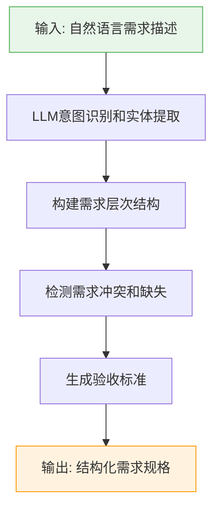

#### 8.2.2 测试用例生成算法

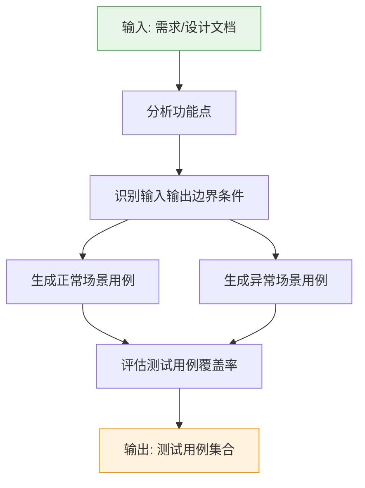

#### 8.2.3 代码生成算法

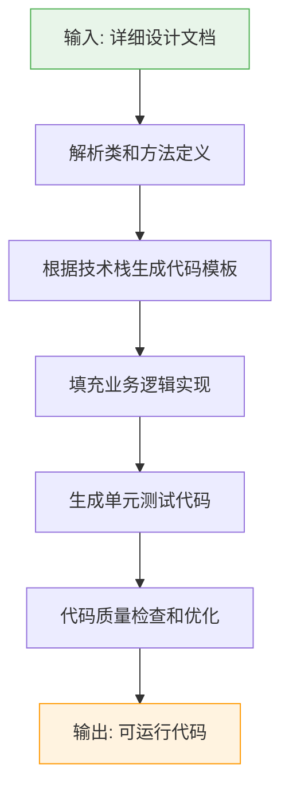

---

## 9. 需求跟踪矩阵（RTM）

### 9.1 RTM结构

| 需求ID | 需求描述 | 设计文档 | 代码模块 | 单元测试 | 集成测试 | 系统测试 | 验收测试 | 覆盖状态 |
|--------|----------|----------|----------|----------|----------|----------|----------|----------|
| REQ-001 | 用户注册功能 | SD-3.2.1 | userController.ts | UT-001 | IT-001 | ST-001 | UAT-001 | 100% |
| REQ-002 | 用户登录功能 | SD-3.2.2 | authService.ts | UT-002 | IT-002 | ST-002 | UAT-002 | 100% |
| REQ-003 | 商品浏览功能 | SD-3.3.1 | productController.ts | UT-003 | IT-003 | ST-003 | UAT-003 | 100% |
| REQ-004 | 购物车功能 | SD-3.3.2 | cartService.ts | UT-004 | IT-004 | ST-004 | UAT-004 | 100% |
| REQ-005 | 订单管理功能 | SD-3.4.1 | orderController.ts | UT-005 | IT-005 | ST-005 | UAT-005 | 100% |

### 9.2 RTM跟踪方向

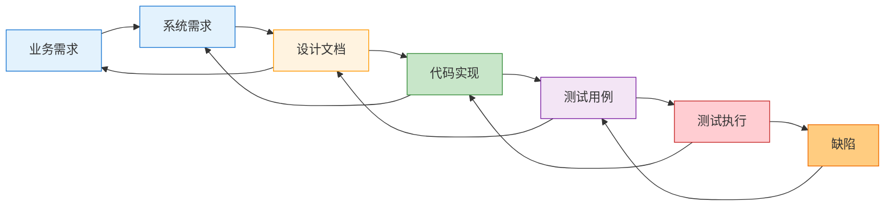

### 9.3 RTM维护规则

1. **变更同步**：每次需求或设计变更必须同步更新RTM
2. **覆盖检查**：定期检查需求覆盖率，确保100%覆盖
3. **优先级标记**：根据需求优先级确定测试优先级
4. **状态追踪**：实时更新测试执行状态
5. **缺陷关联**：将缺陷与对应的需求和测试用例关联

---

## 10. 质量保障体系

### 10.1 代码质量标准
- 单元测试代码覆盖率 ≥ 80%
- 代码规范检查（ESLint/Prettier）
- 安全漏洞扫描
- 性能指标监控

### 10.2 文档质量标准
- 文档完整性检查
- 文档一致性验证
- 版本控制管理

### 10.3 测试质量标准
- 测试用例评审机制
- 测试覆盖率分析
- 缺陷追踪管理

### 10.4 质量保障流程

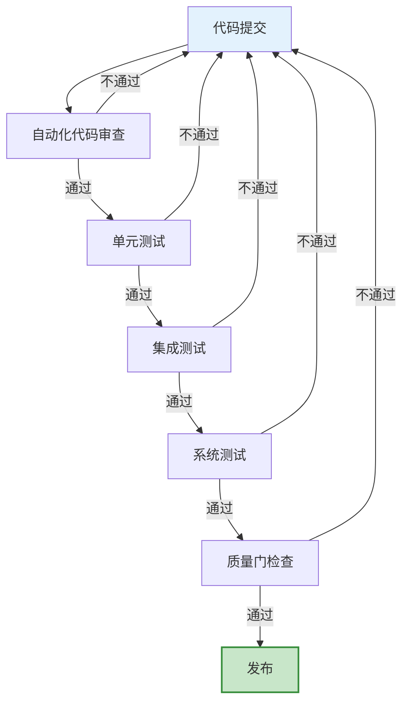

### 10.5 工件质量门（Artifact Gate）

> 架构重构说明：历史版本在此区分「工件质量门」与「技能验证门」两类质量门。
> 重构后，**技能验证门已移除**——技能演化（Skill Lift 评估、Rollout / Reflect / Edit 等）不再内置技能包，
> 由外部工具（[SkillOpt](https://github.com/microsoft/SkillOpt) / [darwin-skill](https://github.com/alchaincyf/darwin-skill)）完成。
> 对应地 `w-model-dev/scripts/check-skill-gate.ts`、`w-model-dev/META-SKILL.md`、
> `src/evolution/skill-optimizer.ts`、`src/eval/skill-lift.ts` 等均已删除。
> 本节仅保留「工件质量门」。

| 维度 | 工件质量门（Artifact Gate） |
|---|---|
| 评估对象 | W 模型产出物（需求 / 设计 / 代码 / 测试用例）对应的 RTM 覆盖与测试执行结果 |
| 触发时机 | 验收测试阶段（`/wm test type=验收`） |
| 判定逻辑 | RTM 覆盖率 100% 且四级测试（单元 / 集成 / 系统 / 验收）全部通过 |
| 判定逻辑实现（单点事实源） | `w-model-dev/scripts/gate-logic.ts` `checkArtifactGate()` |
| Agent CLI 入口 | `w-model-dev/scripts/check-artifact-gate.ts` |
| 失败后果 | 返工回到编码阶段 |
| 数据来源 | 真实测试执行结果（`/wm test result=pass\|fail` 回填） |

**门禁脚本与 Markdown 的配合**：门禁判定逻辑沉入技能包内 `w-model-dev/scripts/gate-logic.ts`（纯函数、自包含、不依赖任何外部模块），保证技能包可独立分发给 TRAE / Claude 等 Agent。Agent 在质量门检查点直接执行脚本获取确定性判定，而非靠 LLM 自行估算：

```bash
# 退出码 0=通过 / 1=未通过 / 2=输入错误；stdout 末尾输出 GATE_JSON {...} 供 Agent 解析
npx tsx w-model-dev/scripts/check-artifact-gate.ts [project-dir]
```

`references/quality-standards.md` 以 Markdown 描述质量标准（人类可读），与脚本互为参照但不再承载判定逻辑。

**关键约束**：工件质量门的有效性依赖真实测试结果回填。`/wm test` 命令不得自动将测试标记为通过——必须由上游 AI / 测试运行器执行真实测试后通过 `result=pass|fail` 参数回填，否则质量门形同虚设。

### 10.6 项目级 Definition of Done（每次变更的日常标准）

> 吸收自 [addyosmani/agent-skills](https://github.com/addyosmani/agent-skills) `references/definition-of-done.md`。
> 与 §10.5 工件质量门互补：工件质量门是「验收阶段的硬门禁」（退出码 0 才放行），DoD 是「每次变更的日常标准」（每个 `/wm code` / `/wm test` 后自检）。
> 实现位置：[`w-model-dev/references/definition-of-done.md`](../w-model-dev/references/definition-of-done.md)。

DoD 不替代阶段产物的验收标准（见各 [`phase-N-*.md`](../w-model-dev/references/)），而是项目级跨阶段的标准：

| 维度 | 标准 | 验证方式 | 不通过 → 动作 |
|---|---|---|---|
| 测试 | 全部测试通过，无回归 | 测试运行器退出码 0；新增/修改代码须配套测试 | 当场补测试或修复回归 |
| 行为 | 运行时验证行为符合规格 | 手动或自动化验证关键路径，不得仅凭单测通过 | 补运行时验证 |
| 文档 | 涉及 API / 接口 / 数据模型的变更须同步更新文档 | `git diff` 包含相关 `docs/` 与 `templates/` 更新 | 补文档更新 |
| RTM | 需求 / 设计 / 代码 / 测试映射同步 | `.w-model/rtm.json` 字段无空缺；覆盖率不下降 | 补登记 RTM 字段 |
| 状态 | `Project.status` / `Requirement.status` 如实反映 | 字段值与磁盘产物一致 | 修正 `status` 字段 |
| **理解证据** | 阶段门放行须有用户理解证据 | run-log acknowledgedDecisions 非空且含 ≥1 关键决策摘要（非"确认"/"同意"） | 拒绝放行；要求用户填入理解证据（O4 命中） |

> 第六维度「理解证据」吸收自 [cobusgreyling/loop-engineering](https://github.com/cobusgreyling/loop-engineering) `docs/concepts.md` 的 Comprehension Debt 概念，对抗用户对阶段产物 rubber-stamp。放行 ≠ 理解；acknowledgedDecisions 非空才算放行。

第六维度「理解证据」细化子项（6.1~6.3，由 `check-checkpoint.ts` 强制校验）：

- **6.1 acknowledgedDecisions 非空且含具体技术决策**：`acknowledgedDecisions` 数组须非空，且每条须为具体技术决策摘要（如「选用 JWT 而非 session」「数据模型增加 `deletedAt` 软删字段」），不得为「继续」「确认」「同意」「无意见」等泛化词——泛化词命中 `check-checkpoint.ts` R2 黑名单 → 视为 O4 命中，拒绝放行。
- **6.2 evidence 可追溯**：评审 `VerifierOutput` 的 `subCriteria[].evidence` 字段引用产物时须标注「路径+行号」（如 `docs/system-design.md#L42-L58`），不得仅引用文件名或泛指「见设计文档」；无行号定位 → `check-checkpoint.ts` 视为证据不可追溯，拒绝放行。
- **6.3 跨阶段证据一致性**：后阶段 `evidence` 不得否定前阶段已放行项——若阶段 N 评审 evidence 与阶段 N-1 已放行决策矛盾（如阶段 2 设计否定了阶段 1 已确认的 REQ 优先级），须显式回退修正前阶段产物并重跑，不得在后阶段静默推翻；`check-checkpoint.ts` 交叉比对历史 checkpoint 记录，发现矛盾未回退 → 拒绝放行。

DoD 与工件质量门的关系：

- DoD 是「日常标准」：每次 `/wm code` 或 `/wm test` 后自检，不通过则当场修复。
- 工件质量门是「验收门禁」：阶段 8 验收时执行 `check-artifact-gate.ts`，退出码 0 才放行。
- 二者不互替：DoD 通过不代表工件质量门通过；工件质量门通过要求 DoD 在全程被遵守。

### 10.7 图谱门禁（check-requirement-graph.ts）

> 阶段 1–4 ingestion 子流程的结构连通性门禁，与 §10.5 工件质量门（阶段 8 终检）互补。权威定义见 [`docs/ingestion-graph-convergence-design.md`](./ingestion-graph-convergence-design.md) §3；本节为摘要，与该设计文档双向追溯。
>
> 实现位置：[`w-model-dev/scripts/check-requirement-graph.ts`](../w-model-dev/scripts/check-requirement-graph.ts)（CLI）+ [`w-model-dev/scripts/graph-logic.ts`](../w-model-dev/scripts/graph-logic.ts)（校验纯逻辑，单点事实源）。
> 触发方：G 子代理在每轮 A-cross/A-evolve 产出 `consolidated.json` 后跑（编排者不跑，反模式 #10）。

**CLI 接口**：

```bash
# 退出码 0=通过 / 1=校验失败 / 2=输入错误；stdout 输出 JSON 证据摘要（与 check-verifier-output.ts 同构）
npx tsx w-model-dev/scripts/check-requirement-graph.ts "<graph.json or consolidated.json>" [--phase=1|2|3|4]
```

**校验算法**（确定性，无 LLM；设计文档 §3.2）：

1. **连通性**：从任一节点 BFS，`connectedComponents = 1` 才通过；否则记录 `isolatedNodes`。
2. **单根**：入边 `type=parent` 为 0 的节点数 `roots.length = 1` 才通过（边界节点 `EXT-IN`/`EXT-OUT` 豁免，不计入 `roots`）。
3. **父唯一性**：每个非根节点的 `parent` 入边数 = 1；`0` → `orphan`，`>1` → `multiParent`，均 fail。
4. **阶段递进追溯**（"门禁同步收敛"的核心）：
   - `phase ≥ 2`：每个 SD 节点出边 `implements ≥ 1`，否则 `SD_without_implements++`
   - `phase ≥ 3`：每个 INTF 节点入边 `defines ≥ 1`，否则 `INTF_without_defines++`
   - `phase ≥ 4`：每个 DD 节点出边 `realizes ≥ 1`，否则 `DD_without_realizes++`
5. **信息流校验**（与结构校验正交，详见 [`information-flow-validation-design.md`](./information-flow-validation-design.md)）：
   - 构建 `produces`/`consumes` 有向子图（方向=信息流方向，`to=n` 即流入 `n`，`from=n` 即流出 `n`）；
   - 对业务节点（`REQ`/`SD`/`INTF`/`DD`，`phase ≤ 当前`）统计 `inFlow`（`to=n` 的边数）/ `outFlow`（`from=n` 的边数）：
     - `in=0 ∧ out=0` → `deadModules`（死模块：无信息流经）
     - `in=0 ∧ out>0` → `miracles`（奇迹：只出不进，信息凭空产生）
     - `in>0 ∧ out=0` → `blackHoles`（黑洞：只进不出，信息消失）
   - 边界完整性（阶段 1 起）：`EXT-IN ≥ 1 ∧ EXT-OUT ≥ 1`，否则 `boundary.complete=false`。
6. **汇总**：`passed = (connectedComponents=1) ∧ (isolatedNodes=[]) ∧ (roots.length=1) ∧ (orphans=[]) ∧ (multiParent=[]) ∧ (所有追溯违反=0) ∧ dataflowOk`，其中 `dataflowOk = (blackHoles=[]) ∧ (miracles=[]) ∧ (deadModules=[]) ∧ boundary.complete`。

**收敛准则**（设计文档 §3.4）：`passed=true`（零违反）即收敛；`violations` 跨轮应单调递减，不降反升则分派 A 返工而非加轮；`round = MAX_ROUNDS(5)` 未收敛 → 🔴 CHECKPOINT 介入（展示 violations + reworkHints，用户决定补漏/强制接受标注/取消）。

**信息流跨阶段收敛**：阶段 1 REQ 信息流闭合（严格，与结构连通同级）；阶段 2/3/4 SD/INTF/DD 各自无黑洞/奇迹/死模块；阶段 4 信息流零违反 + 结构零违反才放行进编码。

**关键约束**：
- **阶段 4 硬约束**：`--phase=4` 信息流零违反 ∧ 结构零违反（DD `realizes` 全覆盖）才放行进阶段 5 编码（见 §4.4）。
- **收敛判定由 G 退出码决定，不由 A 的 LLM 输出决定**（约束 4，反模式 #12）；A 的 `reworkHints` 仅作指引。
- **ingestion 收敛确认 CHECKPOINT 不可绕过**（约束 2，反模式 #11）。
- 守护反模式 #11（ingestion 跳过图谱校验）/ #12（A 自评收敛），见 [`w-model-dev/references/anti-patterns.md`](../w-model-dev/references/anti-patterns.md)。

### 10.8 TLA+ 行为门禁（check-tla-model.ts）

> 阶段 1–4 TLA+ 层次化状态机建模的**行为正确性门禁**，与 §10.7 图谱门禁（结构层 + 信息流层）正交。权威定义见 [`docs/tla-plus-modeling-design.md`](./tla-plus-modeling-design.md) §3；本节为摘要，与该设计文档双向追溯。
>
> 实现位置：[`w-model-dev/scripts/check-tla-model.ts`](../w-model-dev/scripts/check-tla-model.ts)（CLI）+ [`w-model-dev/scripts/tla-logic.ts`](../w-model-dev/scripts/tla-logic.ts)（校验纯逻辑，单点事实源）。
> 触发方：G 子代理在 S 产出 `.tla` + `.cfg` + `tla-manifest.json` 后跑（编排者不跑，反模式 #10）。

**CLI 接口**：

```bash
# 退出码 0=通过 / 1=校验失败 / 2=输入错误；stdout 输出 TLA_JSON 证据摘要（与 check-requirement-graph.ts 同构）
npx tsx w-model-dev/scripts/check-tla-model.ts "<tla-manifest.json>" [--phase=1|2|3|4|5|6|7|8] [--spec=<id>] [--skip-tlc]
```

**校验算法**（确定性，无 LLM；设计文档 §3.1）：

1. **环境就绪**：`java -version` ≥ 11（捕获 stderr，因 `java -version` 在退出码 0 时写 stderr）；技能内置 `w-model-dev/tools/tla2tools.jar` 存在。环境失败 → `environmentOk=false`，整体 `passed=false`，退出码 1。
2. **manifest 结构校验**：`version` / `currentPhase` / `tools` / `specs` 字段齐全；`tools.jarPath` / `tools.javaMinVersion` 合法。结构失败 → 退出码 2。
3. **规格字段校验**：每个 spec 的 `id` / `level` / `phase` / `system` / `requirementIds` / `designRef` / `tlaPath` / `cfgPath` / `parent` / `siblings` / `children` / `variableCombination` / `decompositionDecision` / `syntaxChecked` / `tlcChecked` / `deadlockFree` / `invariantsHold` / `stateExplosion` 字段齐全且类型合法。
4. **文件头校验**（每个 spec）：读取 `.tla` 文件内容，`parseTlaHeader()` 解析 8 个 `@` 字段，`validateHeader()` 比对 manifest 中 spec 声明——`@system` / `@requirement` / `@design` / `@parent` / `@sibling` / `@child` / `@level` / `@phase` 八字段须全部存在且与 manifest 一致（`null` ↔ `null` / 空数组；逗号列表集合须相等）。违反 → `headerViolations++`。
5. **层次一致性校验**（设计文档 §3.1 步骤 3）：`checkHierarchy()` 校验 parent/child 双向（A.parent=B ⇒ B.children 含 A；A.children 含 C ⇒ C.parent=A）+ sibling 双向（A.siblings 含 B ⇒ B.siblings 含 A）+ 有且仅有一个 L1 根（`parent=null ∧ level=L1`）+ 层级单调（子规格 `level` = 父规格 `level` + 1）。违反 → `hierarchyViolations++`。
6. **拆解决策校验**（设计文档 §3.1 步骤 4 / §1.1）：`checkDecomposition()` 校验 `variableCombination > MUST_SPLIT_THRESHOLD(10000)` 必须 `decompositionDecision='split-done'`，否则违反；`> CONSIDER_SPLIT_THRESHOLD(1000)` 且 `kept-below-threshold` 为警告（不导致失败）。违反 → `decompositionViolations++`。
7. **轨迹/状态文件清理**（设计文档 §3.4）：每个 spec 校验前删除 `*.dump` / `*.out` / `states/` 目录，避免旧轨迹污染本轮 TLC。实测 TLC 2.19 产物落在 `states/<YY-MM-DD-HH-MM-SS>/` 下（含 `<Module>.st` / `<Module>-0.st` 状态文件与 `<Module>_0.fp` / `<Module>_1.fp` 指纹文件），默认不产生 `.dump` / `.out`。
8. **SANY 语法检查**（设计文档 §3.1 步骤 6，硬约束顺序；cwd 置为 `.tla` 所在目录）：`java -cp <jarPath> tla2sany.SANY <spec>.tla`，捕获 stdout。实测退出码 **0=成功 / 11=语法错误**（输出走 stdout，含 `Fatal errors while parsing` 等错误消息）。语法失败 → `syntaxErrors++`，**跳过该 spec 的 TLC**（反模式 #14 守护），该 spec 标 `syntaxChecked=false`。
9. **TLC 模型检查**（仅 SANY 通过且未 `--skip-tlc` 时；cwd 置为 `.tla` 所在目录）：`java -cp <jarPath> tlc2.TLC -nowarning -cleanup -config <spec>.cfg <moduleName>`，捕获 stdout。
   - `-nowarning`：抑制 GC 建议警告（输出更干净）。
   - `-cleanup`：TLC 自身在运行前清理 `states/` 目录（与步骤 7 互补，双保险）。
   - `<moduleName>` 为 `.tla` 文件名去后缀（如 `L1_blog_system.tla` → `L1_blog_system`），**非** `.tla` 路径。
   - 实测退出码 **0=成功 / 11=死锁 / 12=不变式违反**。解析结果：
     - `Error: Deadlock reached.` → `deadlockViolations++`，`deadlockFree=false`
     - `Error: Invariant <Inv> is violated.` → `invariantViolations++`，`invariantsHold=false`
     - `out of memory` / `states ... exceeds ... exceeded` / `too many` → `stateExplosionSpecs++`，`stateExplosion=true`
     - `Model checking completed. No error has been found.` → 通过
10. **汇总**：`passed = environmentOk ∧ (headerViolations=[]) ∧ (hierarchyViolations=[]) ∧ (decompositionViolations=[]) ∧ (syntaxErrors=[]) ∧ (deadlockViolations=[]) ∧ (invariantViolations=[]) ∧ (stateExplosionSpecs=[])`。

**收敛准则**（设计文档 §3.4）：`passed=true`（零违反）即收敛；`violations` 跨轮应单调递减；`round = MAX_ROUNDS(5)` 未收敛 → 🔴 CHECKPOINT 介入（展示 violations，用户决定修正 .tla / 修正需求或设计并回退重跑 / 强制接受标注 / 取消）。

**跨阶段收敛**（设计文档 §4，硬约束）：

| 阶段 | TLA+ 建模范围 | 强度 |
|---|---|---|
| 1 | L1 系统内外交互抽象（单 L1 根规格） | 严格（SANY 通过 + TLC 通过 + 无死锁/不变式违反/状态爆炸） |
| 2 | + L2 子系统内部行为 + 同级交互抽象 | 硬约束 |
| 3 | + L3 原子化子系统行为抽象 | 硬约束 |
| 4 | + L4+ 递归拆解；`--phase=4` TLA+ 零违反 ∧ 图谱零违反才放行进阶段 5 编码 | **硬约束零违反** |
| 5–8 | `tla-manifest.json` 冻结只读；TLA+ 不变式作为测试 oracle（编码与测试须与不变式一致）；阶段5 须通过 check-code-tla-consistency.ts 代码-TLA+ 一致性回归 | 冻结只读 + 一致性回归 |

**关键约束**：
- **阶段 4 硬约束**：`--phase=4` TLA+ 零违反 ∧ 图谱零违反（结构 + 信息流）才放行进阶段 5 编码（见 §4.4）。
- **编码调试顺序为硬约束**：SANY 语法检查未通过的 spec 不得跑 TLC（反模式 #14 守护）；CLI 在 SANY 失败时跳过该 spec 的 TLC。
- **轨迹/状态文件须先清理**：每轮校验前删除 `*.dump` / `*.out` / `states/`（设计文档 §3.4）；TLC 命令行 `-cleanup` 标志提供双保险。
- **TLA+ 不接受占位/简化/错误实现**（反模式 #16）：`.tla` 须为完整规格，不得用 `Skip` / `UNCHANGED` 等占位掩盖未建模行为。
- **TLA+ 建模须符合需求和设计**（反模式 #17）：若规格已符合需求/设计但 TLC 仍失败，须修正需求或对应级别设计并**回退重跑**，不得通过放宽不变式绕过。
- **收敛判定由 G 退出码决定，不由 S 的 LLM 输出决定**（约束 4，反模式 #12 同源）；S 的 `reworkHints` 仅作指引。
- **门禁确认 CHECKPOINT 不可绕过**（约束 2，反模式 #11 同源）。
- 守护反模式 #14（跳过 SANY 直接 TLC）/ #15（死锁/不变式违反放行）/ #16（占位/简化/错误实现）/ #17（建模不符需求/设计不回退），见 [`w-model-dev/references/anti-patterns.md`](../w-model-dev/references/anti-patterns.md)。

**追加行为门禁校验项**（在上述校验算法 1~10 之外，`check-tla-model.ts` 须额外强制；任一违反 → exitCode=1）：

- **SD 覆盖率**：每个 SD 节点（graph.json 中 `type=SD`）须被至少一个 TLA+ spec 覆盖——即 `tla-manifest.json.specs[]` 中存在某 spec 的 `requirementIds` 或 `designRef` 引用该 SD 节点（或其所属 REQ/INTF）；存在未被任何 spec 覆盖的 SD 节点 → `sdCoverageViolation`，exitCode=1。
- **cfg-tla 一致性**：每个 `.cfg` 文件的 `INVARIANTS`（`INVARIANT` 行声明的不变式名集合）须与对应 `.tla` 文件中 `BusinessInvariant` 集合（`THEOREM`/`ASSUME`/显式不变式定义）一致——`INVARIANTS` 多于 `.tla` 定义（引用了不存在的不变式）或少于 `.tla` 定义（遗漏校验）均 → `cfgTlaMismatch`，exitCode=1。
- **cfg 结构**：`.cfg` 文件禁止含 `MODULE` 声明（`MODULE` 属 `.tla` 头部，混入 `.cfg` 会触发 TLC 解析错误）；`INVARIANT` 行格式须合法（`INVARIANT <Name>`，`<Name>` 为合法 TLA+ 标识符，禁止空值/表达式/注释尾随）——违反 → `cfgStructureViolation`，exitCode=1。
- **代码状态转移一致性**（check-code-tla-consistency.ts 维度3）：代码状态转移须与 TLA+ `Next` 分支对应——违反 → exitCode=1。
- **代码断言覆盖不变式**（check-code-tla-consistency.ts 维度4）：代码断言须覆盖 TLA+ 不变式——违反 → exitCode=1。
- **SD-codeModule 对应**（check-code-tla-consistency.ts 维度1 + check-artifact-gate.ts 终检）：每个 SD 子系统须有对应 codeModule——违反 → exitCode=1。

### 10.8.1 代码-TLA+ 一致性回归（check-code-tla-consistency.ts）

> 阶段 5（编码）的**代码与 TLA+ 规格一致性回归门禁**，将 TLA+ 资产作为状态机验证器回归编码产物。与 §10.8 TLA+ 行为门禁（阶段 1-4）互补：行为门禁校验 TLA+ 规格自身正确性，一致性回归校验代码是否符合 TLA+ 规格。
>
> 实现位置：[`w-model-dev/scripts/check-code-tla-consistency.ts`](../w-model-dev/scripts/check-code-tla-consistency.ts)（CLI）+ [`w-model-dev/scripts/code-tla-logic.ts`](../w-model-dev/scripts/code-tla-logic.ts)（校验纯逻辑，单点事实源）。
> 触发方：G 子代理在 S 产出代码后跑（编排者不跑，反模式 #10）。

**CLI 接口**：

```bash
# 退出码 0=通过 / 1=校验失败；stdout 输出 CODE_TLA_JSON 证据摘要
npx tsx w-model-dev/scripts/check-code-tla-consistency.ts \
  --manifest=<tla-manifest.json> \
  --graph=<graph.json> \
  --rtm=<rtm.json> \
  --src=<src-dir>
```

**四维度校验算法**（确定性，无 LLM；使用 TypeScript Compiler API 解析 AST）：

1. **维度1：SD→codeModule 映射完整性**（`checkSdToCodeModule`）：读取 `graph.json` 中所有 `type=SD` 节点，核验 `rtm.json` 中每个 SD 节点均有对应 `codeModule` 映射（多段匹配：SD id 分段后任一段长度≥2 出现在 codeModule 路径中）。违反 → `sdToCodeModule` 维度失败。
2. **维度2：代码状态转移抽取**（`extractCodeStateTransfers` + `checkCodeStateTransfer`）：用 `ts.createSourceFile` 解析 `src/` 下所有 `.ts` 文件 AST，抽取 `BinaryExpression(=)` 赋值语句与 `IfStatement` / `SwitchStatement` 条件分支；无赋值则维度失败（代码无状态转移）。
3. **维度3：Next 分支对应**（`checkNextBranchCoverage`）：正则抽取 TLA+ `Next` 分支动作名，驼峰匹配代码方法名（如 `Logout` → `logout`，`StartNewArticle` → `startNewArticle`）；每个 Next 分支须有对应代码方法。违反 → `nextBranchCoverage` 维度失败。
4. **维度4：断言覆盖不变式**（`checkInvariantCoverage`）：抽取 `.tla` 文件 `BusinessInvariant` 子不变式名，匹配代码中 `assert` / `invariant` / `require` 调用；宽松策略——有断言即认为覆盖。违反 → `invariantCoverage` 维度失败。
5. **汇总**：`passed = 维度1.passed ∧ 维度2.passed ∧ 维度3.passed ∧ 维度4.passed`。

**触发时机**：阶段 5（编码）S 产出代码后，G 子代理额外分派跑 `check-code-tla-consistency.ts`，退出码 0 才放行进阶段 6（集成测试）。阶段 5-8 `tla-manifest.json` 冻结只读，TLA+ 不变式作为测试 oracle。

**与其它门禁的协同**：
- 维度1 与 `check-artifact-gate.ts` 终检的 SD→codeModule 校验双向守护（两处均校验，任一失败即阻断）。
- 维度2/3/4 是 `check-code-tla-consistency.ts` 独有，补充行为层一致性校验。
- `self-test.ts` 含 5 条 code-TLA+ 样本（3 合规 + 2 违规），纳入回归基线。

### 10.9 根因报告门禁（check-rootcause-report.ts）

> 返工循环中 R 子代理产出的 `RootCauseReport` 校验门禁，与 §10.5 工件质量门（阶段 8 终检）/ §10.7 图谱门禁 / §10.8 TLA+ 行为门禁互补：前三者校验阶段产物，本节校验返工路径的根因报告。权威定义见 [根因定位者设计 spec](./superpowers/specs/2026-07-24-root-cause-locator-and-fixer-roles-design.md) §4 RootCauseReport Schema 与 R1-R10 校验规则。
>
> 实现位置：[`w-model-dev/scripts/check-rootcause-report.ts`](../w-model-dev/scripts/check-rootcause-report.ts)（CLI）+ 校验纯逻辑（单点事实源，与 `check-verifier-output.ts` 平级）。
> 触发方：G 子代理在 V 复审根因报告（`targetKind=rootcause`）通过后跑（编排者不跑，反模式 #10）。

**CLI 接口**：

```bash
# 退出码 0=通过 / 1=校验失败 / 2=输入错误；stdout 输出 ROOTCAUSE_JSON 证据摘要（与 check-verifier-output.ts 同构）
npx tsx w-model-dev/scripts/check-rootcause-report.ts "<rootcause-report.json>"
```

**校验规则（R1-R10，确定性，无 LLM）**：

| 规则 | 校验内容 | 失败动作 |
|---|---|---|
| R1 | Schema 完整性：所有必填字段非空 | 退出码 1 |
| R2 | `rootCauseChain` 长度 ∈ [2, 5]，每步 `evidence` 非空 | 退出码 1 |
| R3 | `rootCause.falsifiabilityCheck` 非空且含假设句式（「若...则...」） | 退出码 1 |
| R4 | `fixRecommendation` 每条含 `target`/`location`/`action`/`rationale` 四字段 | 退出码 1 |
| R5 | `prevention` 每条含 `scope`/`measure`/`owner` 三字段 | 退出码 1 |
| R6 | `upstreamDefect.present=true` 时，`upstreamPhase`/`upstreamArtifactId`/`defectDescription` 非空 | 退出码 1 |
| R7 | `qualityLevel ∈ {A,B,C,D}`，`passed` 与 `qualityLevel` 一致（A/B→true，C/D→false） | 退出码 1 |
| R8 | `meta.reportId` 格式 `^RC-[a-z0-9]+-\d+-\d+$` | 退出码 1 |
| R9 | 多角度场景（dispatchMode ∈ {parallel, serial, degraded}）：附录 PartialReport 路径非空 | 退出码 1 |
| R10 | 多角度场景：reality-checker persona 的 confidence ≥ 0.5 | 退出码 1 |

**退出码**：`0=通过 / 1=校验失败 / 2=输入错误`（与现有脚本约定一致）。

**关键约束**：
- **G 子代理在 V 复审根因报告后跑此脚本，exitCode=0 才可分派 S-fix 修复**（反模式 #19 守护：R 报告未经 V 复审 + G 门禁直接交 S 修复）。
- **校验纯逻辑，不含 LLM 调用**（约束 4 真实执行）；R 的 `qualityLevel`/`passed` 自评仅作指引，最终由 G 退出码 + V 复审决定。
- **门禁确认 CHECKPOINT 不可绕过**（约束 2，反模式 #11 同源）。
- 守护反模式 #18（跳过 R 直接 S 返工）/ #19（R 报告未 V 复审直接 S 修复），见 [`w-model-dev/references/anti-patterns.md`](../w-model-dev/references/anti-patterns.md) + §4A.2b。

---

## 10C. 自主成熟度阶梯（L0~L3）

> 吸收自 [cobusgreyling/loop-engineering](https://github.com/cobusgreyling/loop-engineering) `docs/loop-design-checklist.md` 的 L0~L3 成熟度阶梯，适配 W 模型语境。
> 与 §10D 成本预算与运行日志互补：成熟度决定 CHECKPOINT 放行策略，成本预算决定何时暂停。
> 实现位置：[`w-model-dev/references/operational-recovery.md`](../w-model-dev/references/operational-recovery.md)「成熟度与 CHECKPOINT 放行」节 + [`w-model-dev/references/data-models.md`](../w-model-dev/references/data-models.md)（maturity schema）。
> 设计依据：[`docs/loop-engineering-adoption-design.md`](./loop-engineering-adoption-design.md) §2。

### 10C.1 设计动机

当前每个 🔴 CHECKPOINT 都等用户，等于强制最高介入度（L0）。大项目/成熟团队无法"毕业"，CHECKPOINT 密度成为瓶颈。loop-engineering 的 L0~L3 阶梯按成熟度选择性激活 CHECKPOINT，使团队可渐进到低介入度。

**关键约束**：不违反约束 2（CHECKPOINT 不可绕过）——L3 仍保留高风险路径人工 gate，只是低风险 CHECKPOINT 自动放行。

### 10C.2 CHECKPOINT 分类

现有 🔴 CHECKPOINT 分为两类，按成熟度选择性激活：

| CHECKPOINT 类型 | 示例 | L0 | L1 | L2 | L3 |
|---|---|---|---|---|---|
| **决策型**（设计方向/技术选型/范围变更） | 项目初始化、阶段进入确认、设计选型、ingestion 规划确认 | ✅ 等用户 | ✅ 等用户 | ✅ 等用户 | ✅ 等用户（高风险路径强制） |
| **操作型**（已跑脚本/已执行测试/已产出产物） | 阶段门放行（V 评审通过 + G 退出码 0）、ingestion 收敛确认（G 退出码 0）、测试结果回填确认 | ✅ 等用户 | ⚡ 自动放行 | ⚡ 自动放行 | ⚡ 自动放行 |

> 「决策型」始终等用户（L3 亦然）——设计方向不可自动决定。「操作型」在 L1+ 可自动放行——已有脚本退出码作为客观证据，人工确认是冗余。

### 10C.3 L0~L3 放行矩阵

| 级别 | 决策型 CHECKPOINT | 操作型 CHECKPOINT | 返工循环 | 发布门 | 解锁条件 |
|---|---|---|---|---|---|
| **L0（默认，新项目/棕地）** | ✅ 等用户 | ✅ 等用户 | ✅ 每次返工都暂停询问 | ✅ 等用户 | 项目初始化即默认 L0 |
| **L1（操作确认自动化）** | ✅ 等用户 | ⚡ 自动放行（脚本退出码=0 即放行，run-log 记录） | ✅ 每次返工都暂停询问 | ✅ 等用户 | L0 稳定运行 ≥1 个完整 8 阶段周期，无 O 系列失败模式命中 |
| **L2（返工自主化）** | ✅ 等用户 | ⚡ 自动放行 | ⚡ 阶段 5-7 返工可自主（带 attempt cap=maxReworkRounds，超限升级） | ✅ 等用户 | L1 稳定运行 ≥2 周，attempt cap 达标率 ≥80%，无 Token Burn/O3 Verifier Theater |
| **L3（高风险路径外的全自主）** | ✅ 等用户（仅高风险路径：auth/加密/发布/架构变更） | ⚡ 自动放行 | ⚡ 全阶段返工可自主（带 attempt cap） | ✅ 等用户（发布门始终 attended） | L2 稳定运行 ≥2 周，误判率 ≤10%，用户显式申请升级 |

### 10C.4 L3 高风险路径定义（强制人工 gate，不可自动放行）

| 高风险路径 | 触发条件 | 强制动作 |
|---|---|---|
| 认证/授权相关 | 阶段 4 详细设计涉及 auth 模块 / 阶段 5 编码涉及 auth 文件 | 决策型 CHECKPOINT 等用户 |
| 加密/密钥相关 | 涉及 JWT_SECRET / 密码哈希 / 加密算法选型 | 决策型 CHECKPOINT 等用户 |
| 发布放行 | 阶段 8 验收终检 + check-artifact-gate.ts | 始终 attended（L3 亦然） |
| 架构变更 | 技术栈增删 / 模块边界变更 / 数据模型 schema 变更 | 决策型 CHECKPOINT 等用户 |
| TLA+ 建模不符需求/设计（反模式 #17） | TLC 发现违反且规格忠实于需求/设计 | 决策型 CHECKPOINT 等用户（须回退修正需求/设计） |

### 10C.5 maturity.json Schema

> 编排者 O 在项目初始化（`/wm analyze` 首次）时创建，类比 `project.json`/`rtm.json`/`budget.json`。schema 权威定义见 [`data-models.md`](../w-model-dev/references/data-models.md)。

```typescript
interface MaturityConfig {
  schemaVersion: '1.0';
  projectId: string;
  level: 'L0' | 'L1' | 'L2' | 'L3';
  leveledUpAt: string;
  unlockConditions: {
    stableDays: number;
    completedCycles: number;
    attemptCapRate: number;
    misjudgeRate: number;
    operationalFailures: number;
  };
  history: Array<{ from: string; to: string; at: string; reason: string }>;
  downgradeTriggers: {
    operationalFailureStreak: number;
    userRequested: boolean;
  };
}
```

### 10C.6 编排者成熟度判定逻辑（确定性，无 LLM）

编排者 O 在每个 🔴 CHECKPOINT 处读取 maturity.json，按当前 level 决定 CHECKPOINT 类型：

1. 读取 maturity.json.level
2. 识别当前 CHECKPOINT 类型（决策型 / 操作型）
3. 查 L0~L3 放行矩阵：✅ 等用户 → 执行 CHECKPOINT 暂停；⚡ 自动放行 → 跳过暂停，run-log append 记录
4. 检查高风险路径（仅 L3）：命中高风险路径表 → 即使 L3 也强制决策型 CHECKPOINT
5. 升级判定（每次阶段 8 完成后）：汇总 unlockConditions，若全部达标 → 询问用户是否升级（决策型 CHECKPOINT，不可自动升级）
6. 降级判定（每次 O 系列失败模式命中后）：若 operationalFailures ≥ downgradeTriggers.operationalFailureStreak → 自动降级到 L0

**关键约束**：

- **L1+ 自动放行是操作型 CHECKPOINT 的选择性激活，非绕过**（约束 2）：自动放行仍在 run-log 记录 action=checkpoint outcome=success，保留可追溯性。
- **决策型 CHECKPOINT 在所有级别均等用户**：设计方向不可自动决定。
- **升级不可自动**：升级是决策型 CHECKPOINT，须用户显式确认。
- **降级可自动**：O 系列失败模式连续命中触发自动降级回 L0。

### 10C.7 阶段完成计数与强制校验（check-maturity.ts）

> 历史缺陷：Shell Agent 项目实跑暴露成熟度阶梯的 `unlockConditions.completedCycles` 此前无强制递增机制——编排者可漏更导致成熟度判定失真，成熟度升降级失去客观依据。本节确立阶段完成计数的强制校验。
> 实现位置：[`w-model-dev/scripts/check-maturity.ts`](../w-model-dev/scripts/check-maturity.ts)（CLI 校验，确定性无 LLM）。

- **阶段完成计数强制递增**：项目每完成一阶段（run-log.jsonl 追加 `action=checkpoint` 且 `outcome=success` 记录后），编排者 O 须将 `maturity.json.unlockConditions.completedCycles` +1；漏更 → 计数滞后。
- **check-maturity.ts 强制校验**：`check-maturity.ts` 须交叉校验 `maturity.json.unlockConditions.completedCycles` 与 run-log.jsonl 中 `action=checkpoint ∧ outcome=success` 记录数——`completedCycles < 实际 checkpoint success 数` 即滞后 → 退出码 1。
- **滞后即不放行**：校验发现计数滞后时，编排者 O 不得放行当前阶段门（反模式 #9 谎报状态守护）；须先补更 `completedCycles` 再重跑校验至退出码 0。

---

## 10D. 成本预算与运行日志

> 吸收自 [cobusgreyling/loop-engineering](https://github.com/cobusgreyling/loop-engineering) `docs/operating-loops.md` 的 loop-budget + loop-run-log + kill switch 概念，适配 W 模型语境。
> 与 §10C 成熟度阶梯互补：成本预算决定何时暂停，成熟度决定 CHECKPOINT 放行策略。
> 实现位置：[`w-model-dev/references/operational-recovery.md`](../w-model-dev/references/operational-recovery.md)「成本预算与运行日志」节 + [`w-model-dev/references/data-models.md`](../w-model-dev/references/data-models.md)（budget / run-log schema）。
> 设计依据：[`docs/loop-engineering-adoption-design.md`](./loop-engineering-adoption-design.md) §1。

### 10D.1 设计动机

一次 W 模型 8 阶段全跑 = 多子代理 × 8 阶段 + ingestion 收敛轮 + TLA+ 建模，成本可观且完全不可见。`operational-recovery.md` 只覆盖异常恢复（JSON 损坏/并发写入/技术栈漂移），不覆盖成本预算与 kill switch。

**关键取舍**：不引入 LLM 估算 token（避免约束 4 同源风险）。tokensEstimate 由宿主 Agent 报告实际消耗，技能只做声明 + 暂停判定。

### 10D.2 budget.json Schema

> 编排者 O 在项目初始化（`/wm analyze` 首次）时创建。用户可在任意时刻编辑调整。schema 权威定义见 [`data-models.md`](../w-model-dev/references/data-models.md)。

```typescript
interface BudgetConfig {
  schemaVersion: '1.0';
  projectId: string;
  createdAt: string;
  updatedAt: string;
  perPhase: {
    maxTokens: number;
    maxSubagentSpawns: number;
    maxReworkRounds: number;
  };
  project: {
    maxTokensTotal: number;
    maxTokensPerSession: number;
  };
  onExceed: 'pause' | 'notify' | 'halt';
  killSwitch: {
    consecutiveReworks: number;
    budgetBurnRate: number;
    tlaReworks: number;
  };
}
```

- `onExceed=pause`：暂停后续子代理分派，🔴 CHECKPOINT · 预算告警，等用户决定（增预算/降范围/取消）
- `onExceed=notify`：仅在 run-log 记录告警，继续执行（适合 L2+ 自主度）
- `onExceed=halt`：立即停止当前阶段推进，回退到阶段起点（最保守，L0 默认）

### 10D.3 run-log.jsonl Schema

> Append-only JSON Lines 格式，每行一条记录。编排者 O 在每个子代理分派返回后与每个阶段门/质量门完成后 append 一条。

```typescript
interface RunLogEntry {
  runId: string;
  timestamp: string;
  phase: number;
  phaseName: string;
  action: 'chunk' | 'cross' | 'evolve' | 'produce' | 'review' | 'gate' | 'tla-gate' | 'graph-gate' | 'test' | 'checkpoint' | 'rework' | 'rollback';
  role: 'O' | 'A' | 'S' | 'V' | 'G';
  duration_s: number;
  tokens: number;          // 由宿主 Agent 报告实际消耗；无值时填 0 并标注 estimated:false
  estimated: boolean;      // true=LLM估算（违反约束4，应避免）；false=实际报告
  subagentSpawns: number;
  gateExitCode: number | null;
  outcome: 'success' | 'fail' | 'rework' | 'escalate' | 'blocked' | 'cancelled';
  acknowledgedDecisions?: string[];  // 阶段门放行时用户填写的理解证据（§10.6 第六维度）
  note?: string;
  artifacts?: string[];
}
```

### 10D.4 编排者维护职责（O 角色扩展，不改 S/V/G 边界）

> 在 §3.4.5「编排者允许的动作」新增「预算与日志维护」项，与现有「读 .w-model/*.json」「跑只读脚本看退出码」并列。仍属"状态读写+持久化"允许动作，非实施。

| 时机 | O 的动作 |
|---|---|
| 项目初始化（`/wm analyze` 首次） | 创建 `.w-model/budget.json`（默认值）+ 创建空 `.w-model/run-log.jsonl` |
| 每次子代理分派返回后 | append 一条 RunLogEntry（action 对应角色动作） |
| 每个门禁脚本执行后 | append 一条 RunLogEntry（gateExitCode 填实际退出码） |
| 每个 🔴 CHECKPOINT 放行后 | append 一条 RunLogEntry（action=checkpoint，acknowledgedDecisions 填用户输入） |
| 每次返工/回退后 | append 一条 RunLogEntry（action=rework/rollback，note 填原因） |
| 预算检查点（每阶段门后） | 读 budget.json + 累计本阶段 run-log tokens，若超 maxTokens 或触发 killSwitch → 按 onExceed 处置 |

### 10D.5 预算检查逻辑（确定性，无 LLM）

编排者 O 在阶段门放行前执行：

1. 读取 budget.json
2. 汇总 run-log.jsonl 中本阶段（phase=N）所有记录的 tokens 总和 = phaseTokensUsed
3. 汇总 run-log.jsonl 中本阶段 subagentSpawns 总和 = phaseSpawns
4. 汇总 run-log.jsonl 中全项目 tokens 总和 = projectTokensUsed
5. 判定：超 maxTokens / maxSubagentSpawns / maxTokensTotal → 触发告警；killSwitch 任一条件满足 → 触发 kill switch
6. 按 onExceed 处置：pause（🔴 CHECKPOINT）/ notify（run-log 记录）/ halt（回退阶段起点）

### 10D.6 关键约束

- **不引入 LLM 估算**（约束 4）：tokensEstimate 由宿主 Agent 报告实际消耗（estimated=false）；estimated=true 违反约束4，应避免。
- **预算检查不替代门禁脚本**（反模式 #3/#6）：预算超限触发的是暂停/告警，不是放行/否决；放行仍由 G 子代理退出码决定。
- **kill switch 是暂停不是终止**：触发 kill switch 后须 🔴 CHECKPOINT 展示消耗明细，由用户决定增预算/降范围/取消。
- **run-log 是 append-only**：不得修改历史记录；损坏行跳过并记录 note，不停止流程。

### 10D.7 预算与运行日志强制校验项（check-budget.ts / check-run-log.ts）

> 历史缺陷：Shell Agent 项目阶段 1–3 实跑暴露预算与运行日志为「纸面机制」——`budget.updatedAt` 不更新、killSwitch 触发无告警、run-log 缺类、返工无记录，且无脚本强制校验，闭环机制失效。本节确立强制校验项。
> 实现位置：[`w-model-dev/scripts/check-budget.ts`](../w-model-dev/scripts/check-budget.ts) + [`w-model-dev/scripts/check-run-log.ts`](../w-model-dev/scripts/check-run-log.ts)（CLI 校验，确定性无 LLM）。

- **预算更新时戳**：每个阶段门放行前，`budget.json.updatedAt` 须更新为当前时间戳（证明预算检查已执行，非沿用历史值）；未更新 → `check-budget.ts` 退出码 1。
- **killSwitch 告警**：killSwitch 任一触发条件满足（`consecutiveReworks` / `budgetBurnRate` / `tlaReworks`）时须产出告警（run-log 记录 + 🔴 CHECKPOINT 展示消耗明细），不得静默；`check-budget.ts` 校验 killSwitch 触发但 run-log 无对应告警记录 → 退出码 1。
- **运行日志 4 类动作完备**：每个阶段 run-log.jsonl 须含 `chunk` / `cross` / `gate` / `checkpoint` 4 类动作记录（阶段 1–4 ingestion 含 `chunk`/`cross`；所有阶段含 `gate`/`checkpoint`）；缺类 → `check-run-log.ts` 退出码 1。
- **返工须有 rework 记录**：任一返工发生后，run-log 须追加 `action=rework` 记录（`note` 填原因）；返工发生但无 `rework` 记录 → `check-run-log.ts` 退出码 1。
- **强制校验脚本**：`check-budget.ts`（预算更新时戳 + killSwitch 告警）与 `check-run-log.ts`（4 类动作 + rework 记录 + §10E 交叉校验）须在每个阶段门由 G 子代理执行；任一退出码 ≠ 0 → O 不得放行（反模式 #3/#6/#9 守护）。

---

## 10E. 门禁退出码不可伪（gate-logs 存档与交叉校验）

> 历史缺陷：Shell Agent 项目阶段 1–3 实跑暴露「门禁脚本退出码可被伪造/丢失」——G 子代理只回填退出码摘要却不存档 stdout，编排者无法交叉核验 `run-log.gateExitCode` 与脚本真实输出是否一致，导致门禁形同虚设。本节确立退出码不可伪的三层防线。
> 实现位置：各 `w-model-dev/scripts/check-*.ts`（exitCode 字段）+ G 子代理存档职责 + [`w-model-dev/scripts/check-run-log.ts`](../w-model-dev/scripts/check-run-log.ts)（交叉校验 CLI，确定性无 LLM）。

**强制校验项**（E.1~E.4，任一层失败 → exitCode=1，O 不得放行）：

- **E.1 各 check-*.ts 的 JSON 摘要须含 exitCode 字段，与 process.exit() 强一致**：每个门禁脚本 stdout 末尾的证据摘要（`GATE_JSON` / `TLA_JSON` / `GRAPH_JSON` 等）须显式含 `exitCode` 字段，且与脚本最终 `process.exit(code)` 调用的码值完全一致；字段缺失或二者不一致 → 视为校验失败（exitCode=1）。
- **E.2 G 子代理须将脚本 stdout 完整存档到 `.w-model/gate-logs/phaseN-<script>.log`**：G 子代理跑完每个 `check-*.ts` 后，须把脚本 stdout 原样（含证据摘要 JSON 行）落盘到 `.w-model/gate-logs/phaseN-<script>.log`（如 `phase1-check-tla-model.log`），作为不可篡改的执行凭证；编排者 O 不得放行无对应 gate-log 的阶段门。
- **E.3 check-run-log.ts 交叉校验 run-log.gateExitCode 与 gate-logs 存档一致**：`check-run-log.ts` 须读取本阶段所有 `gate-logs/phaseN-*.log`，解析其中的 `exitCode`，与 run-log.jsonl 中对应 `action ∈ {gate, tla-gate, graph-gate}` 记录的 `gateExitCode` 逐一比对；任一不一致 → exitCode=1。
- **E.4 任一层校验失败 → exitCode=1，O 不得放行**：E.1（脚本自身 exitCode 字段缺失/不一致）、E.2（gate-log 缺失）、E.3（run-log 与 gate-log 不一致）三层中任一失败，`check-run-log.ts` 须返回退出码 1，编排者 O 不得放行该阶段门（反模式 #9 谎报状态守护）。

---

## 10.10 系统层级树与多层图谱

> 历史缺陷：Shell Agent 项目阶段 1–3 实跑暴露「graph.json 仅有同阶段 `parent` 树，缺乏跨阶段系统层级树与多层图谱语义」——REQ/SD/INTF/DD 节点各自孤立成林，无法表达「系统根 → 子系统根 → 接口根」的层级依附，也无法承载横切治理/协作/派生关系。本节确立系统层级树 + 7 层图谱模型。
> 实现位置：[`docs/ingestion-graph-convergence-design.md`](./ingestion-graph-convergence-design.md)（结构层扩展）+ [`w-model-dev/scripts/graph-logic.ts`](../w-model-dev/scripts/graph-logic.ts)（校验纯逻辑，单点事实源）+ [`w-model-dev/scripts/check-requirement-graph.ts`](../w-model-dev/scripts/check-requirement-graph.ts)（CLI）。

### 10.10.1 系统层级树

跨阶段的结构主干，由 `parent` 边构成（与同阶段 parent 树正交但兼容）：

- **根 = 系统级 REQ 节点**（如 `REQ-001`），`type=REQ`，为系统层级树唯一根（系统根）。
- **子系统根 = SD 节点**，通过 `parent` 边依附系统根（`SD.parent → REQ` 系统根）。
- **接口根 = INTF 节点**，通过 `parent` 边依附子系统根（`INTF.parent → SD` 子系统根）。
- **层级单调**：`parent` 边（父→子）只能连接相邻层级，且 **子节点 Level = 父节点 Level + 1**（`REQ=L0` / `SD=L1` / `INTF=L2` / `DD=L3`，即边方向 L0→L1→L2→L3 单调递增），禁止跨层或逆向依附；违反 → `hierarchyTreeViolation`，`check-requirement-graph.ts` 退出码 1。

### 10.10.2 多层图谱（7 层）

在系统层级树之上叠加 7 层正交图谱，各层边类型独立校验：

| # | 层 | 边类型 | 语义 | 校验要点 |
|---|---|---|---|---|
| 1 | 结构层 | `parent` | 系统层级树依附（见 §10.10.1） | 单根、父唯一、层级单调 |
| 2 | 依赖层 | `depends-on` | 节点间依赖（SD→SD / INTF→INTF） | 禁止环依赖；依赖目标须存在 |
| 3 | 追溯层 | `implements` / `defines` / `realizes` | 跨阶段追溯（SD→REQ / SD→INTF / DD→INTF or DD→SD） | 阶段递进追溯（见 §10.7 校验算法 4） |
| 4 | 信息流层 | `produces` | 信息流向 | 黑洞/奇迹/死模块校验；**根节点豁免死模块**（系统根无入流合法） |
| 5 | 治理层 | `governs` | 横切治理（如安全治理节点 governs 多个子系统） | 横切边不依附层级树（见 §10.10.3） |
| 6 | 协作层 | `collaborates-with` | 对等协作（子系统间对等交互） | 无向语义；两端须对等层级 |
| 7 | 派生层 | `derives` | 派生规格（如 TLA+ spec derives 自设计节点） | 派生源须存在；派生不替代追溯 |

### 10.10.3 横切设计承载

横切边（`governs` / `collaborates-with` / `derives`，即第 5/6/7 层）的承载规则：

- **横切边不依附系统层级树**：横切边两端节点不通过 `parent` 依附，独立于结构层。
- **横切边两端节点须存在于层级树**：两端节点须已在系统层级树中登记（REQ/SD/INTF/DD 之一），但不构成 `parent` 关系。
- **横切边不替代追溯**：被治理子系统的 `parent` 仍是系统根（治理是横切叠加，不改变结构依附）；追溯层（`implements`/`defines`/`realizes`）与横切层并存，互不替代。

---

## 10A. SSoT ↔ 实现追溯表

> 本节是 W 模型 RTM 思想在文档层面的自我应用：每个设计章节标注其实现位置，建立双向追溯。
>
> 架构重构后，技能包纯化为「编排 + 校验脚本」，`src/` 编程式引擎整体移除（不再列入 `src/commands/*` / `src/state/*` / `src/types/*` / `src/core/*` / `src/evolution/*` / `src/eval/*`）。编排逻辑由 `w-model-dev/SKILL.md` 承载并由 Agent 执行；状态 / RTM / 测试结果由 Agent 维护到项目内 `.w-model/*.json`。技能演化相关能力由外部 SkillOpt / darwin-skill 提供，不在本表内。

| SSoT 章节 | 设计内容 | 实现位置 | 一致性 |
|---|---|---|---|
| 3.2.1 需求分析模块 | 需求解析、验收测试生成 | `w-model-dev/SKILL.md` `/wm analyze` 编排 + `references/phase-1-requirements.md` | 编排完整（状态登记 + 测试用例设计由 Agent 执行；AI 解析由 Agent 自身 LLM 完成） |
| 3.2.2 设计阶段模块 | 架构 / 概要 / 详细设计 + 对应测试设计 | `w-model-dev/SKILL.md` `/wm design` 编排 + `references/phase-2/3-*.md` | 编排完整（文档生成由 Agent 完成） |
| 3.2.3 编码与单元测试 | 代码生成、单元测试用例生成 | `w-model-dev/SKILL.md` `/wm code` 编排 + `references/phase-4/5-*.md` | 编排完整（不自动标记通过，需 `result` 回填） |
| 3.2.4-3.2.6 测试模块 | 集成 / 系统 / 验收测试执行 | `w-model-dev/SKILL.md` `/wm test` 编排 + `references/phase-6/7/8-*.md` | 完整（支持 `result=pass\|fail` 回填） |
| 3.3 架构原则与外部工具边界 | 技能不内置 LLM / 演化由外部完成、无编程式接入 | `w-model-dev/SKILL.md`「架构定位」节 + `w-model-dev/references/verifier-spec.md` | 完整 |
| 3.4 编排者-子代理边界 | 编排者最小化（O/A/S/V/G/R 六角色，A 为阶段 1–4 分析子代理，R 为返工循环根因定位，F 由 S 兼任）+ 反模式 #10/#11/#12/#18/#19 守护 | `w-model-dev/SKILL.md`「编排者-子代理边界」节 + `w-model-dev/references/subagent-delegation.md`（角色/分派/回填契约）+ `w-model-dev/references/anti-patterns.md` #10/#11/#12/#18/#19 + `ingestion-chunk.md` / `ingestion-cross.md` / `graph-guide.md` | 完整（编排者只读例外 + G 子代理回填证据 + 编排者不得越权实施 + A 子代理图谱演进 + G 跑 `check-requirement-graph.ts` 守护 #11/#12 + R 返工根因定位守护 #18/#19） |
| 4A 核心操作行为与失败模式 | 6 条核心操作行为 + 10 条失败模式（F1~F10）+ 6 条运维失败模式（O1~O6）+ 返工循环反模式 #18/#19（§4A.2b）+ 与约束/反例的关系 | `w-model-dev/SKILL.md`「核心操作行为」节 + `w-model-dev/references/anti-patterns.md`「失败模式清单」节（F1~F10）+「运维失败模式清单」节（O1~O6）+「返工循环反模式」节（#18/#19） | 完整（F1~F10 吸收自 addyosmani/agent-skills；O1~O6 吸收自 cobusgreyling/loop-engineering `docs/failure-modes.md`，适配 W 模型语境；#18/#19 守护返工必经 R 根因定位） |
| 6 命令接口 | 10 个 `/wm` 命令 | `w-model-dev/SKILL.md`「命令接口」+「指令（执行规则）§5 `/wm test` 回填机制 + §6 辅助命令执行规则」（编排，Agent 执行） | 完整 |
| 6.4 Agent Personas | code-reviewer / test-engineer / security-auditor / performance-auditor 角色提示词 + R（根因定位者）角色定义（§6.4.4）+ R 方法论引用（§6.4.5） | `w-model-dev/references/agent-personas.md`（提示词，不调用 LLM）+ `w-model-dev/references/root-cause-locator.md`（R 方法论）+ `w-model-dev/references/subagent-persona-matrix.md`（多角度矩阵） | 完整（吸收自 addyosmani/agent-skills `agents/`，由 `/wm review` 路由；R 为独立诊断子代理，不调用 Persona） |
| 7 数据模型 | Project / Requirement / Design / TestCase / RTM | `w-model-dev/references/data-models.md`（Agent 维护 `.w-model/*.json` 的 schema） | 完整 |
| 7.6 LLM-as-a-Verifier 评审规范 | 三维度验证 / 连续评分 / PPT / 子标准 / 输出 Schema / 提示词模板 / 五轴评审 / Severity 标签 / Structural Remedies | `w-model-dev/references/verifier-spec.md`（规范，含 §7.4A 五轴+Severity+Remedies）+ `w-model-dev/scripts/verifier-logic.ts`（校验纯逻辑）+ `w-model-dev/scripts/check-verifier-output.ts`（CLI 校验） | 完整（LLM 推理由外部 Agent 执行；五轴+Severity 吸收自 addyosmani/agent-skills `code-review-and-quality`） |
| 7.7 graph.json schema | ingestion 子流程结构层图谱（节点/边/连通/单根/跨阶段追溯 + 信息流边与边界节点） | `docs/ingestion-graph-convergence-design.md` §2.4（权威定义）+ `docs/information-flow-validation-design.md`（信息流层）+ `w-model-dev/references/graph-guide.md` + `w-model-dev/references/ingestion-chunk.md` / `ingestion-cross.md` | 完整（与 `rtm.json` 分工：结构层 vs 追溯层，各自独立校验；信息流边与边界节点用于黑洞/奇迹/死模块校验） |
| 7.8 tla-manifest.json schema | TLA+ 层次化状态机建模行为层产物（specs/层级/拆解决策/文件头/SANY+TLC 结果） | `docs/tla-plus-modeling-design.md` §2（权威定义）+ `w-model-dev/references/tla-plus-guide.md` + `w-model-dev/templates/tla-spec-template.md` | 完整（与 `graph.json`/`rtm.json` 分工：行为层 vs 结构层 vs 追溯层，三者并存各自独立校验；S 产出 .tla+.cfg+manifest，G 跑 `check-tla-model.ts` 校验） |
| 8 技术实现方案 | 需求解析 / 测试用例生成 / 代码生成算法 | 上游 AI 按提示词执行（`w-model-dev/references/phase-*.md`） | 完整（算法由提示词承载，技能不内置 LLM） |
| 9 RTM | 需求跟踪矩阵 | `w-model-dev/references/rtm-guide.md` + `templates/rtm.md`（Agent 维护） | 完整 |
| 10 质量保障 | 工件质量门 | 判定逻辑：`w-model-dev/scripts/gate-logic.ts`（单点事实源）；CLI：`w-model-dev/scripts/check-artifact-gate.ts` | 完整（见 10.5，门禁逻辑已沉入技能包） |
| 10.6 项目级 Definition of Done | 每次变更的日常标准（测试 / 行为 / 文档 / RTM / 状态 / 理解证据） | `w-model-dev/references/definition-of-done.md` | 完整（吸收自 addyosmani/agent-skills `references/definition-of-done.md`；第六维度「理解证据」吸收自 cobusgreyling/loop-engineering `docs/concepts.md` Comprehension Debt，与 §10.5 工件质量门互补） |
| 10.7 图谱门禁 | 阶段 1–4 ingestion 子流程结构连通性门禁（连通/单根/父唯一/阶段递进追溯 + 信息流校验：黑洞/奇迹/死模块/边界完整性） | `docs/ingestion-graph-convergence-design.md` §3（权威定义）+ `docs/information-flow-validation-design.md`（信息流层）+ `w-model-dev/scripts/graph-logic.ts`（校验纯逻辑，含 `DataflowViolations`/`BoundaryInfo`）+ `w-model-dev/scripts/check-requirement-graph.ts`（CLI）+ `w-model-dev/references/graph-guide.md` | 完整（与 §10.5 工件质量门互补：结构层阶段 1–4 vs 追溯层阶段 8 终检；信息流校验与结构校验正交；守护反模式 #11/#12/#13） |
| 10.8 TLA+ 行为门禁 | 阶段 1–4 TLA+ 层次化状态机建模行为正确性门禁（环境/manifest/文件头/层次一致性/拆解决策/SANY 语法/TLC 模型检查） | `docs/tla-plus-modeling-design.md` §3（权威定义）+ `w-model-dev/scripts/tla-logic.ts`（校验纯逻辑，含 `parseTlaHeader`/`validateHeader`/`checkHierarchy`/`checkDecomposition`）+ `w-model-dev/scripts/check-tla-model.ts`（CLI）+ `w-model-dev/references/tla-plus-guide.md` | 完整（与 §10.7 图谱门禁正交：行为层 vs 结构层+信息流层；阶段 4 TLA+ 零违反 ∧ 图谱零违反才放行进编码；守护反模式 #14/#15/#16/#17） |
| 10.8.1 代码-TLA+ 一致性回归 | 阶段 5 代码与 TLA+ 规格一致性回归门禁（四维度：SD→codeModule 映射 / 代码状态转移抽取 / Next 分支对应 / 断言覆盖不变式） | `w-model-dev/scripts/code-tla-logic.ts`（校验纯逻辑，含 `checkSdToCodeModule`/`extractCodeStateTransfers`/`checkNextBranchCoverage`/`checkInvariantCoverage`）+ `w-model-dev/scripts/check-code-tla-consistency.ts`（CLI，使用 TypeScript Compiler API 解析 AST） | 完整（与 §10.8 TLA+ 行为门禁互补：行为门禁校验 TLA+ 规格自身，一致性回归校验代码是否符合 TLA+ 规格；维度1 与 `check-artifact-gate.ts` 终检双向守护；`self-test.ts` 含 5 条样本） |
| 10.9 根因报告门禁 | 返工循环 R 子代理 `RootCauseReport` 校验门禁（R1-R10：Schema 完整性 / 根因链 / 可证伪假设 / fixRecommendation / prevention / upstreamDefect / qualityLevel / reportId / 多角度 PartialReport / reality-checker confidence） | `w-model-dev/scripts/check-rootcause-report.ts`（CLI，与 `check-verifier-output.ts` 平级）+ 校验纯逻辑（单点事实源） | 完整（G 子代理在 V 复审根因报告后跑，exitCode=0 才可分派 S-fix；守护反模式 #18/#19；详见 [根因定位者设计 spec](./superpowers/specs/2026-07-24-root-cause-locator-and-fixer-roles-design.md) §4） |
| 10C 自主成熟度阶梯 | L0~L3 成熟度 + CHECKPOINT 放行矩阵（决策型始终 attended，操作型按级别自动放行）+ 高风险路径强制人工 gate + maturity.json schema + 升级/降级逻辑 | `docs/loop-engineering-adoption-design.md` §2（权威定义）+ `w-model-dev/references/operational-recovery.md`「成熟度与 CHECKPOINT 放行」节 + `w-model-dev/references/data-models.md`（maturity schema） | 完整（吸收自 cobusgreyling/loop-engineering `docs/loop-design-checklist.md` L0~L3 阶梯；不违反约束2：L1+ 自动放行是操作型 CHECKPOINT 选择性激活，非绕过；L3 高风险路径强制人工 gate） |
| 10D 成本预算与运行日志 | budget.json（perPhase/project 预算 + killSwitch + onExceed）+ run-log.jsonl（append-only 运行历史 + acknowledgedDecisions）+ 编排者预算检查逻辑 | `docs/loop-engineering-adoption-design.md` §1（权威定义）+ `w-model-dev/references/operational-recovery.md`「成本预算与运行日志」节 + `w-model-dev/references/data-models.md`（budget / run-log schema） | 完整（吸收自 cobusgreyling/loop-engineering `docs/operating-loops.md` loop-budget + loop-run-log + kill switch；不引入 LLM 估算 token，由宿主 Agent 报告实际消耗，遵守约束4） |
| 11A 采用路径 | greenfield vs brownfield 引入 W 模型 | `docs/adoption-guide.md` | 完整（吸收自 addyosmani/agent-skills `docs/adoption-guide.md`） |

---

## 10B. 参考实现（端到端调测验证）

> 本节记录对 W 模型 8 阶段编排 + LLM-as-a-Verifier 阶段门 + 工件质量门的端到端调测验证结论。
> 参考实现位于 [`w-model-dev-demo/`](../w-model-dev-demo)，是一个博客系统后端（blog-system-demo），用于具象验证本 SSoT 所述设计在真实项目中的可执行性。

### 10B.1 项目概况

| 项 | 内容 |
|---|---|
| 项目名 | 博客系统后端（blog-system-demo） |
| 技术栈 | Node.js ≥20 / Express 4 / TypeScript 5（严格模式）/ zod 3 / jsonwebtoken 9 / bcrypt 5 / vitest 1 + supertest / cross-env 7 |
| 存储方式 | 内存 Map（无外部 DB 依赖，便于端到端调测） |
| 调测轮次 | 五轮：2026-07-20（首轮）→ 2026-07-21（第二轮）→ 2026-07-23（第三/四轮）→ 2026-07-24（第五轮，编排者-子代理分派模式） |
| 当前状态 | **已归档**（2026-07-24 用户 `confirm`） |
| 调测模式 | self-as-verifier（Agent 按本技能编排自驱完成 8 阶段，每阶段跑质量门） |
| 范围 | 用户认证（注册 / 登录 / 登出 / JWT）+ 文章 CRUD（作者隔离）+ 公开浏览 + 评论 |

### 10B.2 8 阶段产出对应

| W 模型阶段 | 产出位置 | 同步测试设计 |
|---|---|---|
| 1 需求分析 | [`docs/requirement-spec.md`](../w-model-dev-demo/docs/requirement-spec.md) | 验收测试用例索引（UAT-001~015） |
| 2 系统设计 | [`docs/system-design.md`](../w-model-dev-demo/docs/system-design.md) | 系统测试用例索引（ST-001~022） |
| 3 概要设计 | [`docs/outline-design.md`](../w-model-dev-demo/docs/outline-design.md) | 集成测试用例索引（IT-001~021） |
| 4 详细设计 | [`docs/detailed-design.md`](../w-model-dev-demo/docs/detailed-design.md) | 单元测试用例（UT-001~077） |
| 5 编码 | [`src/`](../w-model-dev-demo/src) | 单元测试执行（77/77 通过，覆盖率 99.37% lines / 92.66% branches / 100% functions） |
| 6 集成测试 | [`docs/integration-test-report.md`](../w-model-dev-demo/docs/integration-test-report.md) | 21/21 通过（含缺陷修正，见 §10B.4） |
| 7 系统测试 | [`docs/system-test-report.md`](../w-model-dev-demo/docs/system-test-report.md) + [`tests/perf/k6-load-test.js`](../w-model-dev-demo/tests/perf/k6-load-test.js) | 22/22 通过 + k6 性能基线脚本就绪 |
| 8 验收测试 | [`docs/acceptance-test-report.md`](../w-model-dev-demo/docs/acceptance-test-report.md) | 15/15 通过，RTM 覆盖率 100%，用户 `confirm` 归档 |

### 10B.3 调测结论摘要

| 指标 | 目标 | 实测（2026-07-24 第五轮） | 是否达标 |
|---|---|---|---|
| 单元测试通过率 | 100% | 77/77（100%） | ✅ |
| 单元测试代码覆盖率（lines） | ≥ 80%（NFR-004） | 99.37% | ✅ |
| 单元测试代码覆盖率（branches） | ≥ 80%（NFR-004） | 92.66% | ✅ |
| 单元测试代码覆盖率（functions） | ≥ 80%（NFR-004） | 100% | ✅ |
| 集成测试通过率 | 100% | 21/21（100%） | ✅ |
| 系统测试通过率 | 100% | 22/22（100%） | ✅ |
| 验收测试通过率 | 100% | 15/15（100%） | ✅ |
| RTM 需求覆盖率 | 100% | 5/5（100%） | ✅ |
| 阶段门评审 | 8 阶段全部放行 | 8/8（qualityLevel 均为 A，compositeScore 0.9015~0.922） | ✅ |
| 图谱校验 | 阶段 1-4 退出码 0 | 35 节点 141 边，信息流零违反 | ✅ |
| TLA+ 行为门禁 | 阶段 1-4 退出码 0 | 8 规格（1 L1 + 4 L2 + 3 L3），零死锁/不变式违反 | ✅ |
| 代码-TLA+ 一致性回归 | 阶段 5 退出码 0 | 四维度全通过（SD→codeModule / 代码状态转移 / Next 分支 / 不变式覆盖） | ✅ |
| 工件质量门（`check-artifact-gate.ts`） | 退出码 0 | 通过（退出码 0） | ✅ |
| 性能基线 | P95 ≤ 200ms（NFR-002） | vitest 内近似采样 P95=60.76ms | ✅ |
| 安全约束（JWT 过期 / 作者隔离 / 输入校验 / 孤儿数据） | 全部覆盖 | 4/4 | ✅ |
| TypeScript 严格编译（`tsc --noEmit`） | 0 错误（NFR-003） | 退出码 0 | ✅ |
| 自检基线（`npm run self-test`） | 退出码 0 | 66/66 通过（含 5 条 code-TLA+ 用例） | ✅ |
| 用户确认 | 真实用户在验收报告 §9 填入 | `confirm`（2026-07-24） | ✅ |

### 10B.4 过程中发现的缺陷与修正（累计 5 项）

| # | 缺陷 | 触发阶段 | 根因 | 修正 | 验证 |
|---|---|---|---|---|---|
| 1 | 首轮 4 个集成测试失败：NotFoundError / ForbiddenError 未被中间件捕获，表现为 Unhandled Rejection | 阶段 6（集成测试），2026-07-20 首轮 | Express 4 不自动捕获 async handler 抛出的 rejected promise | 新建 [`src/utils/async-handler.ts`](../w-model-dev-demo/src/utils/async-handler.ts) 包装器，包裹 `auth-routes.ts` / `article-routes.ts` / `comment-routes.ts` 全部路由 | 重跑 6/6 通过 |
| 2 | JWT_SECRET 缺失导致 4 个测试套件加载失败（user-service / auth-middleware / integration / system / acceptance 全挂） | 2026-07-21 回归发现 | [`src/utils/env.ts`](../w-model-dev-demo/src/utils/env.ts) 在 import 阶段即抛错，连锁导致所有间接依赖 user-service 的测试套件在 `collect` 阶段失败 | `package.json` 所有 test 脚本统一用 `cross-env JWT_SECRET=test-secret-blog-demo` 注入 | 全部测试套件正常加载 |
| 3 | ArticleService 类型导出消失：`src/services/comment-service.ts` 报 TS2724 | 2026-07-21 回归发现 | [`src/services/article-service.ts`](../w-model-dev-demo/src/services/article-service.ts) 改为内部 `class ArticleService`（无 `export`）+ `export const articleService` 实例，导致 `import type { ArticleService }` 类型丢失 | 恢复 `export class ArticleService`，与 `export const articleService` 共存 | `tsc --noEmit` 退出码 0 |
| 4 | vitest mock 与 express NextFunction 类型不兼容：`next.mock.calls[0][0]` 报 TS2339 | 2026-07-21 回归发现 | `vi.fn() as unknown as NextFunction` 断言丢失 vitest mock 类型；vitest 1.6 类型定义与 express 4 类型定义存在兼容性问题 | 用 `(next as ReturnType<typeof vi.fn>).mock.calls[0][0]` 等带类型断言访问 | `tsc --noEmit` 退出码 0 |
| 5 | check-artifact-gate.ts 缺 exitCode 字段，导致 check-run-log.ts R6 交叉校验无法提取退出码 | 阶段 8（验收测试），2026-07-24 第五轮发现 | `check-artifact-gate.ts` 是唯一未在 `GATE_JSON` 输出中包含 `exitCode` 字段的门禁脚本 | 与其它 7 个 `check-*.ts` 脚本对齐：计算 `const exitCode = result.passed ? 0 : 1`，写入 `GATE_JSON` 并 `process.exit(exitCode)`；`check-run-log.ts` 的 `extractExitCode` 模式数组增加 `GATE_JSON` 标记识别 | `npm run self-test` 全通过 |

> 缺陷 1 已纳入 [`w-model-dev/references/anti-patterns.md`](../w-model-dev/references/anti-patterns.md)「实现层经验教训」节。
> 缺陷 2/3/4 是 2026-07-21 从零重建过程中通过回归测试发现的工程配置问题，已通过工程配置修复固化到 demo 的 `package.json` / `tsconfig.json` 与源码中，供后续项目在阶段 5（编码）参考。
> 缺陷 5 是 2026-07-24 第五轮编排者-子代理分派模式重跑过程中发现的门禁脚本一致性缺陷，已修复并纳入 self-test 回归基线。

### 10B.5 与 SSoT 设计章节的映射

参考实现验证了以下 SSoT 设计章节在真实项目中的可执行性：

| SSoT 章节 | 验证点 | 验证结果 |
|---|---|---|
| §3.2 模块设计 | 4 模块划分（认证 / 文章 / 评论 / 公共层） | ✅ M-001~M-004 全部落地 |
| §4 工作流程 | 8 阶段顺序 + 阶段门评审 | ✅ 全部走通（五轮验证） |
| §6 命令接口 | `/wm analyze` / `design` / `code` / `test` / `review` / `status` | ✅ 编排可用 |
| §9 RTM | 双向追溯 + 覆盖率 100% | ✅ 5/5 需求 100% 覆盖 |
| §10 质量保障 | 工件质量门（§10.5） | ✅ 退出码 0 |
| §7.6 LLM-as-a-Verifier | 阶段门评审流程 | ✅ 8 阶段全部放行 |
| §10.7 图谱门禁 | 阶段 1-4 结构 + 信息流校验 | ✅ 35 节点 141 边，零违反 |
| §10.8 TLA+ 行为门禁 | 阶段 1-4 SANY + TLC + 层次一致性 | ✅ 8 规格全通过，零死锁/不变式违反 |
| §10.8 代码-TLA+ 一致性回归 | 阶段 5 四维度校验 | ✅ SD→codeModule / 代码状态转移 / Next 分支 / 不变式覆盖全通过 |

### 10B.6 边界声明

- `w-model-dev-demo/` 是**参考实现**，不是技能运行时依赖：不参与 `/wm` 命令编排，也不被 `check-*-gate.ts` 读取。
- 调测结论仅验证本 SSoT 所述设计的可执行性，不构成对其他项目场景的承诺。
- demo 自身的 `package.json` 独立于仓库根 `package.json`（demo 引入 express / bcrypt / jsonwebtoken / zod / vitest / cross-env 等业务依赖，与根 `package.json` 仅声明 `tsx` 不同）。
- 内存存储是已知限制（重启数据丢失），详见 [`w-model-dev-demo/docs/requirement-spec.md`](../w-model-dev-demo/docs/requirement-spec.md) RISK-001。
- k6 是独立二进制工具，不能通过 npm 安装；`tests/perf/k6-load-test.js` 需用户先按 [`tests/perf/README.md`](../w-model-dev-demo/tests/perf/README.md) 安装 k6 后独立运行，不纳入 `npm test` 自动化链路。

---

## 11. 部署与集成方案

### 11.1 部署方式

本技能是**单纯的编排 + 校验脚本技能**，无独立部署物。技能资产（`w-model-dev/` 目录）作为纯文件分发给 AI Agent 使用：

- **Agent 分发**：将 `w-model-dev/` 拷贝到目标 Agent 的 skills 目录（详见 [`docs/INSTALL.md`](./INSTALL.md)），无需构建、无需服务进程。
- **校验脚本**：`w-model-dev/scripts/*.ts` 由 Agent 在阶段门评审时直接 `npx tsx` 执行，无后端服务。

### 11.2 外部集成（消费方自行实现）

下列集成本技能不提供，由消费方（IDE 插件、CI/CD 流水线、项目管理工具等）按需在外部实现，调用技能的 `/wm` 命令编排或门禁脚本：

- **IDE 集成**：由 Trae / VS Code / JetBrains 等客户端作为 Skill 加载
- **CI/CD 集成**：在 GitHub Actions / GitLab CI 中通过 Agent 调用 `check-artifact-gate.ts` 作为质量门
- **项目管理工具集成**：由外部适配层将 RTM 同步到 Jira / Notion

### 11.3 集成架构

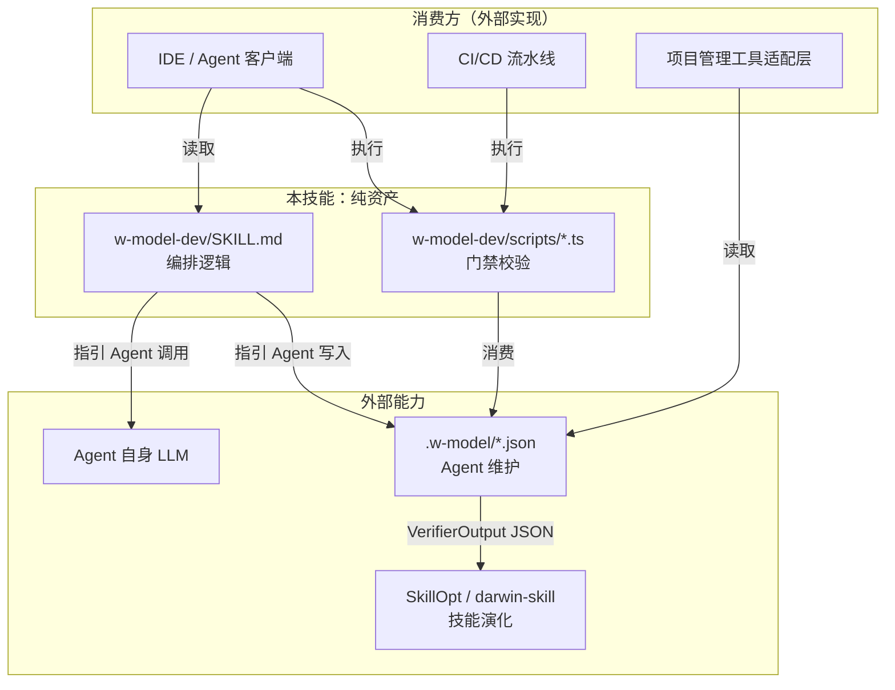

## 11A. 采用路径（Greenfield vs Brownfield）

> 吸收自 [addyosmani/agent-skills](https://github.com/addyosmani/agent-skills) `docs/adoption-guide.md`。
> 适配 W 模型语境：W 模型 8 阶段流程在不同代码库成熟度下采用不同引入策略——绿地项目可 Day 0 全流程启用，棕地项目须增量验证优先。
> 实现位置：[`docs/adoption-guide.md`](./adoption-guide.md)（人类可读的采用指南，不参与门禁判定）。

### 11A.1 路径选择信号

| 信号 | Greenfield（绿地） | Brownfield（棕地） |
|---|---|---|
| 代码库年龄 | 数天至数周 | 数月至数年 |
| 测试覆盖率 | Day 0 可控 | 不均匀，部分区域无测试 |
| 约定 | 随开发定义 | 已存在，常未文档化 |
| 团队习惯 | 形成中 | 已固化（好坏皆然） |
| Agent 错误改动风险 | 影响面小 | 可能破坏无人记得如何修复的部分 |
| **采用策略** | **Day 0 全流程启用** | **增量、验证优先** |

> 处于两者之间（年轻项目但已上线）→ 按棕地路径起步并加速，最终收敛到同一稳态。

### 11A.2 路径 A：Greenfield — Day 0 全流程

新项目是最佳场景：无遗留行为需保留，质量门成本几乎为零且从首次提交开始复利。

**Day 0：安装与初始化**

1. 按 [`docs/INSTALL.md`](./INSTALL.md) 安装 `w-model-dev/` 到目标 Agent 的 skills 目录。
2. 首次启用执行 `/wm analyze`，触发 §4A.1「显式声明假设」：列出对需求 / 技术栈 / 范围的假设，等用户确认。
3. 创建 `.w-model/` 持久化目录，初始化 `project.json` / `rtm.json`。

**Day 0：按 W 模型 8 阶段顺序执行**

```
/wm analyze    →  需求规格 + 验收测试设计       (阶段 1)
/wm design type=架构  →  系统设计 + 系统测试设计  (阶段 2)
/wm design type=概要  →  概要设计 + 集成测试设计  (阶段 3)
/wm design type=详细  →  详细设计 + 单元测试设计  (阶段 4)
/wm code        →  代码 + 单元测试执行            (阶段 5)
/wm test type=集成  →  集成测试                    (阶段 6)
/wm test type=系统  →  系统测试 + 性能 + 安全      (阶段 7)
/wm test type=验收  →  验收测试 + 工件质量门       (阶段 8)
```

每个阶段门评审由外部 Agent 按 §7.6 + §6.4 执行；每个 🔴 CHECKPOINT 必须等用户确认（不可绕过）。

**从 Day 0 起视为常开：**

- **测试设计前置**（§4 约束 1）：阶段 1–4 的开发产物完成后立即产出对应测试设计。
- **RTM 维护**（§4 约束 3）：每次产物变更同步更新 `.w-model/rtm.json`。
- **真实执行**（§4 约束 4）：不得估算覆盖率或测试结果，必须执行真实测试 / 脚本并回填。

**项目成长后追加：**

| 触发条件 | 追加动作 |
|---|---|
| 首个对外 API 或模块边界 | 调用 `code-reviewer` Persona 评审接口设计 |
| 首次涉及认证 / 加密 / 输入校验 | 调用 `security-auditor` Persona 深审 |
| 首次涉及性能热点循环 / DB 查询 | 调用 `performance-auditor` Persona + 准备 k6 基线脚本 |
| 首次 CI 流水线 | 在 CI 中调用 `check-artifact-gate.ts` 作为质量门 |
| 首次部署到生产 | 执行 §10.5 工件质量门 + 用户确认归档 |

**Greenfield 反模式：**

- **跳过 `/wm analyze` 因为「只是个原型」**：原型会变成产品。需求规格是此代码库最便宜的产物。
- **一次性加载全部 `references/`**：违反 §4 约束 6「按需加载」，污染上下文。按阶段加载，由 SKILL.md 路由。
- **推迟性能基线到「有东西可测」**：阶段 7 系统测试前必须准备 k6 脚本，否则违反 §10.5 工件质量门「性能指标达标」要求。

### 11A.3 路径 B：Brownfield — 增量、验证优先

棕地代码库的风险剖面反转：危险不是「建错东西」，而是「改了无人完整定义过的东西」。因此采用顺序从「读和保护」开始，最后才到「改」。

**Phase 1：上下文与只读技能**

目标：Agent 在修改任何东西前先理解代码库。

1. **项目规则文件优先**：在仓库根 `AGENTS.md` / `CLAUDE.md` 描述真实约定（代码中的，不是 wiki 中的）——构建 / 测试命令、目录含义、已知雷区（「不要碰 `legacy/billing`，无测试 + 三个已知 workaround」）。
2. **`/wm review` on 进来的改动**：评审零风险且立即可用——五轴评审与 Severity 标签在任何 PR 上都可用，与代码库状态无关。
3. **`/wm test type=单元 result=fail` for 既存 bug**：执行五步 triage（重现 → 定位 → 缩减 → 修复 → 加守卫），「加守卫」步骤开始建立你没有的回归测试套件。
4. **§4A.1 行为 3「Push Back」作为安全网**：遗留代码正是「不熟悉的代码 + 错误代价高」的场景。Agent 对遗留系统工作方式的自信声明须经 §7.6 评审验证后再提交。

**Phase 2：先测试后改动**

目标：Agent 将触及的每个区域先加安全网。

- **选择性应用测试设计前置**：不追求全局覆盖率，追求「计划改动处」的覆盖率。对未测试的遗留行为写**特征化测试（characterization tests）**——锁定当前行为（无论对错）后再改。
- **`code-reviewer` on 最差热点**：Chesterton's Fence 是操作原则——Persona 强制 Agent 先理解代码存在的原因再动手。行为保持不变的简化 + 特征化测试是让遗留代码可改的最低风险路径。
- **小原子提交**：~100 行的提交在棕地更重要——改老代码破坏微妙行为时，可二分定位；2000 行「现代化」提交则不可。

**Phase 3：新工作跑全流程**

目标：双速采用，遗留代码留在 Phase 1–2；新功能获得 Greenfield 待遇。

- 老代码库中的新功能？`/wm analyze → /wm design → /wm code → /wm test`。`/wm analyze` 的边界声明节是声明「新功能可触碰 / 不可触碰哪些遗留面」的地方。
- **`security-auditor` at 接缝**：当代码必须与遗留代码对话时，按边界契约设计接口。Hyrum's Law 在数年代码库中不是理论——每个可观察行为（包括 bug）都有人依赖。
- **`security-auditor` as 审计 → 然后作为门**：先在现有攻击面（auth / 输入处理 / 依赖）跑一次，归档发现，然后对新改动强制执行。

**Phase 4：偿还债务、废弃、观测**

- 阶段 8 验收后，将「废弃与迁移」作为下一周期目标：用受控方式缩小遗留面而非仅包裹它。
- 沿实际调试路径回填可观测性：结构化日志 + RED 指标优先放在 Top 事件源上。
- 性能优化在回归重要时启动——`performance-auditor` 的「Measure-First」规则防止「优化从未是瓶颈的代码」这一遗留陷阱。

**Brownfield 反模式：**

- **「大爆炸」采用**：在遗留代码库 Day 0 加载完整 8 阶段流程会为已存在的代码产出规格，并在无安全网下重构。必须分阶段。
- **让 Agent 重构未测试代码**：无特征化测试，不重构。这是棕地采用中最昂贵的捷径。
- **跳过项目规则文件因为「代码就是文档」**：Agent 会从它碰巧读到的最差文件推断约定。告诉它真实的。
- **将遗留系统行为默认视为错误**：Chesterton's Fence：那个奇怪的 retry 循环可能是承重的。先理解，再改。
- **无棘轮**：采用应使质量单调提升——每个 Phase 加一道不再撤回的门。如果一个月后你说不出「现在有什么是强制执行而之前不是的」，采用已停滞。

### 11A.4 两条路径的收敛

两条路径终态相同：新工作跑全 8 阶段、常开 RTM 维护与真实执行、阶段门评审在合并前、`references/` 按阶段加载而非批量。Greenfield 在数天内到达；Brownfield 在约一个季度内到达，差异正是老代码库从未有的安全网（上下文 / 特征化测试 / 边界）。

| 维度 | Greenfield | Brownfield |
|---|---|---|
| 首次加载的技能 | `w-model-dev` + `/wm analyze` | 项目规则文件 + `/wm review` |
| 首次交付的价值 | 规格化、测试先行的首个功能 | 零风险评审与更安全的 bug 修复 |
| 测试设计前置姿态 | 从首次提交全启用 | 选择性：在计划改动处前置 |
| 重构规则 | 罕见（无东西可重构） | 特征化测试先行，永远 |
| 最高风险反模式 | 跳过 `/wm analyze` | 重构未测试代码 |
| 到达全流程时间 | Day 0 | 约一个季度，中间双速 |

---

## 12. 发展规划

### 12.1 第一阶段（基础版）
- 实现需求分析和测试设计的AI辅助
- 支持代码生成和单元测试生成
- 提供基本的项目状态管理

### 12.2 第二阶段（进阶版）
- 实现完整的W模型全流程闭环
- 支持集成测试和系统测试自动化
- 提供代码审查和质量分析功能

### 12.3 第三阶段（高级版）
- 支持多项目并行管理
- 提供团队协作功能
- 集成DevOps流程
- 支持智能缺陷预测和预防

### 12.4 外部演化工具协作

> 历史版本曾在此规划「第四阶段（自演化版）」，由内置 `SkillOptimizer` / `SkillLiftEvaluator` 完成技能自演化。
> 架构重构后，**技能演化已移出技能包**，由外部工具完成。本技能不再包含 Rollout / Reflect / Edit / Skill Lift 评估等内容。

本技能与外部演化工具的协作方式：

- 本技能产出的 `VerifierOutput` JSON（由外部 Agent 按 `verifier-spec.md` 执行评审、`check-verifier-output.ts` 校验产出）可作为外部演化工具的训练信号。
- 推荐的外部演化工具：
  - [SkillOpt](https://github.com/microsoft/SkillOpt)（微软）：提供 Rollout → Reflect → Edit → Gate → Commit 训练循环
  - [darwin-skill](https://github.com/alchaincyf/darwin-skill)：提供基于进化算法的技能搜索与筛选
- 多 Agent 框架适配（LangGraph / AutoGen / CrewAI 等）与 MCP Server 化等规划仍可推进，但均以「技能只提供提示词 + 模板 + 门禁脚本」为前提，不在技能内引入 LLM 调用或轨迹分析。

### 12.5 路线图

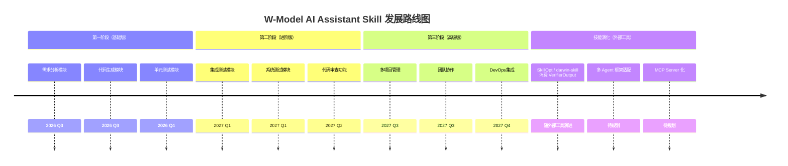

---

## 14. 技能演化机制（已移除）

> 架构重构后，技能自演化（Rollout / Reflect / Edit / Skill Lift 评估 / 训练日志 / 双时间尺度 / 可训练状态边界 / 验证门等）已**整章移除**。
> 历史版本曾由内置 `SkillOptimizer`（`src/evolution/skill-optimizer.ts`）+ `MetaSkillConfig`（`src/core/meta-skill-config.ts`）+ `w-model-dev/META-SKILL.md` 实现，
> 这些文件均已删除。技能演化现由外部工具完成：
> - [SkillOpt](https://github.com/microsoft/SkillOpt)（微软）：Rollout → Reflect → Edit → Gate → Commit 训练循环
> - [darwin-skill](https://github.com/alchaincyf/darwin-skill)：基于进化算法的技能搜索与筛选
>
> 外部演化工具可消费本技能产出的 `VerifierOutput` JSON（见 §7.6）作为训练信号。
> 与外部工具的协作方式见 §12.4，参考文献见 §16.3。

---

## 15. 技能评估标准（已移除）

> 架构重构后，技能本身的评估（ACES Skill Lift / SkillsBench 三条件对照 / SkillLearnBench 三级评估 / 留出任务集 / 确定性 verifier 优先等）已**整章移除**。
> 历史版本曾由内置 `SkillLiftEvaluator`（`src/eval/skill-lift.ts`）实现，该文件已删除。
> 技能评估现由外部工具完成（[SkillOpt](https://github.com/microsoft/SkillOpt) / [darwin-skill](https://github.com/alchaincyf/darwin-skill)），
> 相关学术基准（ACES / SkillsBench / SkillLearnBench）的引用见 §16.3。
>
> 本技能只保留**工件质量门**（§10.5）作为技能内部的产物质量保障。

---

## 16. 参考文献

### 16.1 W 模型与软件工程基础

1. 软件开发常见模型（瀑布模型、V模型、W模型、敏捷开发模型）. CSDN博客. https://blog.csdn.net/yao_zhuang/article/details/114273475
2. W模型和瀑布模型与"V"模式开发模型有何异同？. 阿里云开发者社区. https://developer.aliyun.com/article/1566339
3. 软件开发测试的W模型：构建高质量产品的坚实蓝图. 掘金. https://juejin.cn/post/7551997631112822794
4. 测试视角下的软件工程：需求、开发模型与测试模型. 腾讯云开发者社区. https://cloud.tencent.com/developer/article/2582288
5. 软件测试模型对比：V模型、W模型、H模型与敏捷测试. 51CTO. https://rk.51cto.com/article/633281.html
6. AI大模型如何重塑软件开发流程. CSDN博客. https://blog.csdn.net/cooldream2009/article/details/149217195
7. 超越Vibe Coding —— AI 辅助编程进阶指南. 掘金. https://juejin.cn/post/7637710008821481499
8. Requirements Traceability Matrix (RTM): The Complete Guide. https://getbestest.com/blog/requirements-traceability-matrix-guide/
9. What is Requirements Traceability Matrix (RTM) in Testing?. https://www.guru99.com/traceability-matrix.html
10. 需求跟踪深度解析：架构师视角下的全链路追溯体系. https://blog.csdn.net/ZxqSoftWare/article/details/149282779

### 16.2 LLM-as-a-Verifier（§7.6 评审规范）

11. LLM-as-a-Verifier: A General-Purpose Verification Framework. arXiv:2607.05391. Stanford University + UC Berkeley + NVIDIA Research.
12. LLM-as-a-Judge: 本技能的评审规范见 [`w-model-dev/references/verifier-spec.md`](../w-model-dev/references/verifier-spec.md)（三维度验证 / 连续评分 / PPT / 子标准 / 输出 Schema / 提示词模板），SSoT §7.6 为摘要。历史集成设计见 `llm-verifier-integration-design.md`（仅作背景，不作为权威来源）。
13. PPT (Probabilistic Pivot Tournament): O(N×k) 复杂度排名算法，本技能在 `verifier-spec.md` §5 以提示词描述，由外部 Agent 执行；不再内置 `src/core/ppt-ranker.ts`。

### 16.3 外部技能演化工具

> 技能演化与评估已移出技能包（原第 14 章 / 第 15 章已移除）。下列工具 / 基准由外部消费本技能产出的 `VerifierOutput` JSON，不在技能内置：
> - 训练循环与 Skill Lift 评估 → SkillOpt / darwin-skill
> - 技能评估基准 → ACES / SkillsBench / SkillLearnBench
> - 多候选排序算法 → PPT（已纳入 `verifier-spec.md` 提示词，见 §16.2）

14. SkillOpt: 把技能文档视为可训练外部状态，通过 Rollout → Reflect → Edit → Gate 闭环优化。Microsoft Research. https://github.com/microsoft/SkillOpt （SkillsBench 实证：自生成技能平均 -1.3pp，必须搭配验证门）
15. darwin-skill: 基于进化算法的技能搜索与筛选。 https://github.com/alchaincyf/darwin-skill
16. MetaSkill-Evolve: 5 组件元技能（ψ/σ/α/π/ε）+ 双时间尺度（快循环任务技能 + 慢循环元技能）。
17. ACES (Agentic Capability Evaluation via Skill Lift): with-skill vs without-skill 配对试验差值。
18. SkillsBench: 三条件对照（no-skill / curated-skill / self-generated-skill）。
19. SkillLearnBench: 三级评估（规格质量 / 轨迹分析 / 任务结果）。

---

## 附录

### A. 技能命令速查

| 命令 | 功能 |
|------|------|
| `/wm analyze <需求>` | 分析需求并生成规格说明 |
| `/wm design type=<架构\|概要\|详细>` | 生成对应类型设计文档 |
| `/wm code <功能>` | 生成代码和单元测试 |
| `/wm test type=<单元\|集成\|系统\|验收> result=<pass\|fail>` | 执行指定类型测试并真实回填结果 |
| `/wm review <目标>` | 返回 LLM 评审指引（指向 verifier-spec.md，由外部 Agent 执行） |
| `/wm status` | 查看项目状态（当前阶段、RTM 覆盖率、四级测试汇总） |
| `/wm help` | 显示帮助 |
| `/wm reset` | 重置当前项目状态（保留元信息，清空实体） |
| `/wm export [输出目录]` | 导出项目 JSON + RTM Markdown |
| `/wm import <文件路径>` | 从 JSON 导入项目 |

### B. 测试类型对应关系

| 开发阶段 | 对应测试类型 | 测试目的 |
|----------|-------------|----------|
| 需求分析 | 验收测试设计 | 验证系统是否满足用户需求 |
| 系统设计 | 系统测试设计 | 验证系统整体功能和性能 |
| 概要设计 | 集成测试设计 | 验证模块间交互正确性 |
| 详细设计 | 单元测试设计 | 验证单个模块功能正确性 |
| 编码实现 | 单元测试执行 | 验证代码实现正确性 |
| 集成阶段 | 集成测试执行 | 验证模块集成正确性 |
| 系统阶段 | 系统测试执行 | 验证系统整体质量 |
| 验收阶段 | 验收测试执行 | 用户确认系统满足需求 |

### C. 验收检查清单

- [ ] 需求规格说明书完整
- [ ] 设计文档完整且符合规范
- [ ] 代码实现完成且通过编译
- [ ] 单元测试代码覆盖率 ≥ 80%
- [ ] 集成测试全部通过
- [ ] 系统测试全部通过
- [ ] 安全测试无高危漏洞
- [ ] 性能测试达标
- [ ] 验收测试通过
- [ ] 用户确认签字
- [ ] 交付文档齐全