# W开发模型AI辅助技能设计文档（SSoT）

## 1. 项目概述

### 1.1 项目名称
**W-Model AI Assistant Skill** - 基于AI辅助编码技术的W开发模型闭环工作技能

### 1.2 项目定位
本技能旨在利用AI辅助编码技术，实现软件工程中W开发模型的全流程闭环管理，将开发与测试并行推进，提升软件开发效率和质量。

### 1.3 核心目标
- 实现W模型中开发与测试的并行协作
- 通过AI技术自动化各阶段的文档生成、代码编写和测试设计
- 构建完整的软件开发生命周期闭环
- 提升开发者的工作效率和软件产品质量

### 1.4 文档定位
本文档为W-Model AI Assistant Skill的**单一事实来源（Single Source of Truth, SSoT）**，包含所有设计决策、需求定义、测试用例、集成规范和验收标准。所有相关团队和系统均应以本文档为准。

---

## 2. W模型理论基础

### 2.1 W模型定义
W模型由Evolutif公司提出，是对V模型的扩展和演进。它由两个相互关联、同步进行的"V"字型结构组成：
- **左V（开发侧）**：需求分析 → 系统设计 → 概要设计 → 详细设计 → 编码
- **右V（测试侧）**：验收测试设计 → 系统测试设计 → 集成测试设计 → 单元测试设计 → 测试执行

### 2.2 W模型核心特点
| 特点 | 描述 |
|------|------|
| 开发与测试并行 | 测试活动在开发早期即启动，与开发同步推进 |
| 全生命周期测试 | 覆盖需求测试、设计测试、单元测试、集成测试、系统测试等 |
| 测试对象扩展 | 测试对象不仅是程序，还包括需求和设计文档 |
| 缺陷早发现 | 尽早发现需求或设计缺陷，降低修复成本 |

### 2.3 W模型与其他模型对比
| 模型 | 核心特点 | 适用场景 |
|------|----------|----------|
| 瀑布模型 | 线性阶段式开发，测试后置 | 需求明确、稳定的项目 |
| V模型 | 开发与测试对应，但测试在编码后执行 | 需求明确、变更较少的项目 |
| W模型 | 开发与测试并行，测试前置 | 需求相对稳定、需保证质量的项目 |
| 敏捷模型 | 快速迭代、持续交付 | 需求频繁变更的项目 |

### 2.4 W模型优势与局限性
**优势**：
- 测试提前介入，缺陷早发现，降低修复成本
- 测试覆盖更全面，减少后期风险
- 结构清晰，易于管理和跟踪
- 全面提升团队质量意识

**局限性**：
- 灵活性差，难以应对需求频繁变更
- 文档依赖重，文档质量直接决定项目成败
- 初期投入大，需要前期设计和测试规划

---

## 3. 技能架构设计

### 3.1 整体架构

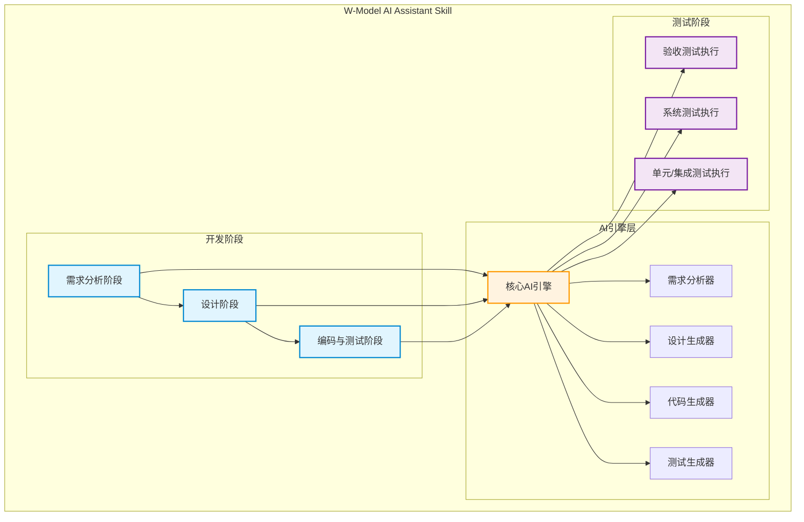

### 3.2 核心模块设计

#### 3.2.1 需求分析模块

**功能描述**：将自然语言需求转化为结构化的需求规格说明书，并同步设计验收测试用例

**输入**：
- 用户自然语言需求描述
- 业务背景信息

**输出**：
- 《需求规格说明书》
- 验收测试用例设计文档
- 需求风险评估报告

**AI能力应用**：
- 自然语言理解与结构化提取
- 需求完整性检查
- 需求冲突检测
- 验收测试用例自动生成

**测试用例设计**：

| 用例ID | 测试场景 | 输入 | 预期输出 | 优先级 |
|--------|----------|------|----------|--------|
| TC-REQ-001 | 自然语言需求解析 | "我需要一个用户登录功能" | 结构化需求，包含功能描述、输入输出、验收标准 | 高 |
| TC-REQ-002 | 复杂需求分解 | "在线商城系统，支持用户注册、商品浏览、购物车和订单功能" | 分解为4个独立模块需求 | 高 |
| TC-REQ-003 | 需求完整性检查 | "用户登录功能"（缺少密码策略） | 提示缺少密码复杂度要求 | 高 |
| TC-REQ-004 | 需求冲突检测 | "用户登录需要邮箱验证" AND "用户登录不需要验证" | 检测到冲突并提示 | 高 |
| TC-REQ-005 | 验收测试用例生成 | 完整需求描述 | 生成对应的验收测试用例 | 高 |

**验收标准**：
- 需求规格说明书符合模板规范
- 验收测试用例覆盖所有功能点
- 需求风险评估报告包含风险等级和缓解措施

#### 3.2.2 设计阶段模块

**功能描述**：基于需求文档进行系统架构设计和详细设计，并同步设计系统测试和集成测试用例

**子模块**：
- **系统设计子模块**：生成系统架构图、技术选型建议、模块划分方案
- **详细设计子模块**：生成类图、数据库设计、接口定义
- **测试设计子模块**：同步生成系统测试用例和集成测试用例

**AI能力应用**：
- 架构设计建议生成
- UML图自动生成
- 接口定义文档生成
- 测试用例设计

**测试用例设计**：

| 用例ID | 测试场景 | 输入 | 预期输出 | 优先级 |
|--------|----------|------|----------|--------|
| TC-DES-001 | 系统架构设计 | 需求规格说明书 | 完整架构图、技术选型、模块划分 | 高 |
| TC-DES-002 | 类图生成 | 详细需求描述 | 符合UML规范的类图 | 高 |
| TC-DES-003 | 数据库设计 | 数据需求 | ER图、表结构定义、索引设计 | 高 |
| TC-DES-004 | 接口定义 | 模块交互需求 | 接口文档、参数定义、返回值 | 高 |
| TC-DES-005 | 系统测试用例生成 | 系统设计文档 | 覆盖系统级功能的测试用例 | 高 |
| TC-DES-006 | 集成测试用例生成 | 接口定义文档 | 覆盖模块间交互的测试用例 | 高 |

**验收标准**：
- 架构设计符合技术选型原则
- UML图符合规范
- 接口定义完整，包含输入输出和错误处理
- 测试用例覆盖关键路径

#### 3.2.3 编码与单元测试模块

**功能描述**：根据详细设计文档生成代码，并同步生成和执行单元测试

**输入**：
- 详细设计文档
- 技术栈要求

**输出**：
- 完整代码实现
- 单元测试用例
- 测试覆盖率报告

**AI能力应用**：
- 代码自动生成
- 代码质量检查
- 单元测试用例生成
- 测试执行与报告生成

**测试用例设计**：

| 用例ID | 测试场景 | 输入 | 预期输出 | 优先级 |
|--------|----------|------|----------|--------|
| TC-COD-001 | 代码生成 | 详细设计文档 | 可编译运行的代码 | 高 |
| TC-COD-002 | 代码质量检查 | 生成的代码 | 无语法错误、符合代码规范 | 高 |
| TC-COD-003 | 单元测试生成 | 代码文件 | 覆盖核心逻辑的单元测试用例 | 高 |
| TC-COD-004 | 测试覆盖率 | 执行单元测试 | 覆盖率 ≥ 80% | 高 |
| TC-COD-005 | 边界条件处理 | 边界输入 | 正确处理并返回预期结果 | 中 |

**验收标准**：
- 代码可编译通过
- 代码规范检查通过（ESLint/Prettier）
- 单元测试覆盖率 ≥ 80%
- 测试报告清晰，包含通过率和覆盖率

#### 3.2.4 集成测试模块

**功能描述**：验证模块间的交互正确性

**输入**：
- 集成测试设计文档
- 已完成的模块代码

**输出**：
- 集成测试执行结果
- 接口兼容性报告

**AI能力应用**：
- 集成测试用例执行
- 接口调用验证
- 测试结果分析

**测试用例设计**：

| 用例ID | 测试场景 | 输入 | 预期输出 | 优先级 |
|--------|----------|------|----------|--------|
| TC-INT-001 | 接口调用验证 | 合法请求参数 | 返回预期结果，状态码200 | 高 |
| TC-INT-002 | 接口参数校验 | 非法参数 | 返回错误信息，状态码400 | 高 |
| TC-INT-003 | 模块间数据传递 | 跨模块调用 | 数据正确传递和处理 | 高 |
| TC-INT-004 | 接口性能测试 | 高并发请求 | 响应时间 < 500ms | 中 |
| TC-INT-005 | 接口兼容性 | 不同版本接口 | 向后兼容或提示版本升级 | 中 |

**验收标准**：
- 所有接口调用验证通过
- 参数校验逻辑正确
- 模块间数据传递无误
- 接口性能满足要求

#### 3.2.5 系统测试模块

**功能描述**：在模拟真实环境下验证系统整体功能

**输入**：
- 系统测试设计文档
- 完整系统代码

**输出**：
- 系统测试报告
- 性能测试结果
- 安全测试结果

**AI能力应用**：
- 自动化测试执行
- 性能测试脚本生成
- 安全漏洞检测

**测试用例设计**：

| 用例ID | 测试场景 | 输入 | 预期输出 | 优先级 |
|--------|----------|------|----------|--------|
| TC-SYS-001 | 端到端功能测试 | 完整业务流程 | 流程顺利完成，数据正确 | 高 |
| TC-SYS-002 | 性能测试 | 模拟高负载 | 系统响应时间 < 2s，无崩溃 | 高 |
| TC-SYS-003 | 安全测试 | 常见攻击向量 | 无安全漏洞，防御有效 | 高 |
| TC-SYS-004 | 兼容性测试 | 不同浏览器/设备 | 功能正常显示和使用 | 中 |
| TC-SYS-005 | 可靠性测试 | 长时间运行 | 系统稳定，无内存泄漏 | 中 |

**验收标准**：
- 端到端测试全部通过
- 性能指标达到预期
- 安全检测无高危漏洞
- 兼容性测试通过

#### 3.2.6 验收测试模块

**功能描述**：确认软件是否满足最初的需求规格

**输入**：
- 验收测试设计文档
- 完整系统

**输出**：
- 验收测试报告
- 用户确认结果

**AI能力应用**：
- 验收测试用例执行
- 用户需求匹配验证

**测试用例设计**：

| 用例ID | 测试场景 | 输入 | 预期输出 | 优先级 |
|--------|----------|------|----------|--------|
| TC-UAT-001 | 需求匹配验证 | 原始需求描述 | 系统功能与需求一致 | 高 |
| TC-UAT-002 | 用户场景测试 | 用户真实操作流程 | 流程顺畅，符合预期 | 高 |
| TC-UAT-003 | 验收标准验证 | 验收标准列表 | 每项标准均满足 | 高 |
| TC-UAT-004 | 文档完整性 | 交付文档列表 | 文档齐全，格式规范 | 中 |

**验收标准**：
- 所有验收测试用例通过
- 用户确认系统满足需求
- 交付文档完整
- 系统可正常部署和运行

---

## 4. 技能工作流程

### 4.1 完整工作流程

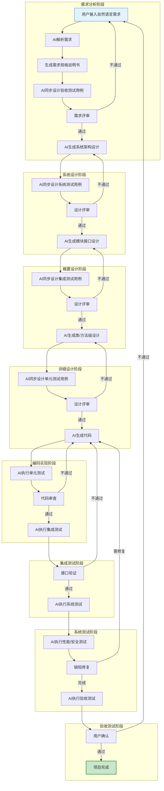

### 4.2 W模型并行流程

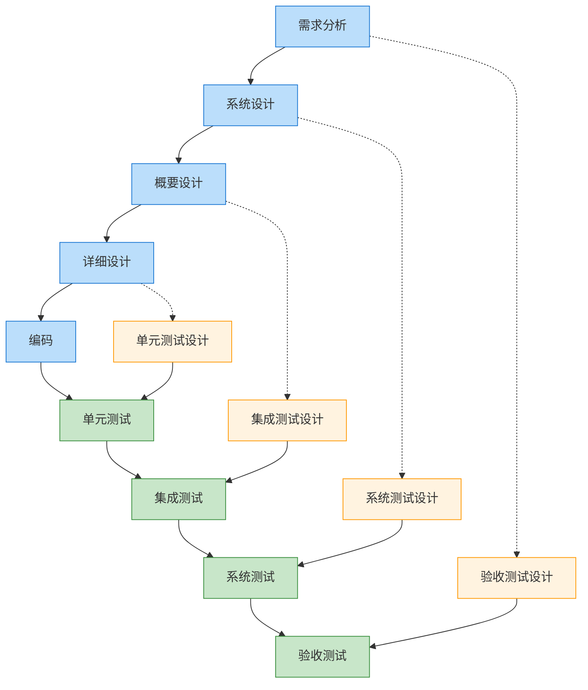

### 4.3 核心交互模式

#### 4.3.1 需求分析交互
```
用户: 我需要一个在线商城系统，支持用户注册、商品浏览、购物车和订单功能
AI: 正在分析需求...
AI: 已生成《需求规格说明书》，包含以下模块：
    1. 用户管理模块
    2. 商品管理模块
    3. 购物车模块
    4. 订单管理模块
AI: 已同步生成验收测试用例，涵盖50+测试场景
```

#### 4.3.2 设计阶段交互
```
用户: 请进行系统架构设计
AI: 正在进行架构设计...
AI: 技术选型建议：
    - 前端: React + TypeScript
    - 后端: Node.js + Express
    - 数据库: MongoDB + Redis
AI: 已生成系统架构图和模块接口定义
AI: 已同步生成系统测试用例，覆盖各模块集成场景
```

#### 4.3.3 编码阶段交互
```
用户: 请实现用户注册功能
AI: 正在生成代码...
AI: 已生成以下文件：
    - src/controllers/userController.ts
    - src/services/userService.ts
    - src/models/User.ts
    - src/routes/userRoutes.ts
AI: 已生成单元测试用例，覆盖率95%
AI: 执行测试中...测试通过
```

---

## 5. AI能力集成策略

### 5.1 自然语言处理能力
- **需求解析**：将非结构化自然语言转化为结构化需求
- **意图识别**：理解用户开发意图和技术偏好
- **文档生成**：自动生成各类技术文档

### 5.2 代码生成能力
- **代码生成**：根据设计文档生成高质量代码
- **代码补全**：智能补全代码片段
- **代码重构**：优化现有代码结构

### 5.3 测试生成能力
- **测试用例生成**：根据需求和设计自动生成测试用例
- **测试执行**：自动执行测试并生成报告
- **测试覆盖率分析**：分析测试覆盖情况

### 5.4 智能审查能力
- **代码审查**：检查代码质量、安全漏洞
- **文档审查**：验证文档完整性和一致性
- **需求追踪**：确保代码实现与需求一致

---

## 6. 技能接口设计

### 6.1 核心命令

| 命令 | 功能描述 | 参数 | 返回值 |
|------|----------|------|--------|
| `/wm analyze` | 需求分析 | `input`: 需求描述 | 需求规格说明书、验收测试用例 |
| `/wm design` | 系统设计 | `type`: 设计类型(架构/详细) | 设计文档、测试用例 |
| `/wm code` | 代码生成 | `feature`: 功能描述 | 代码文件、单元测试 |
| `/wm test` | 测试执行 | `type`: 测试类型(单元/集成/系统) | 测试报告 |
| `/wm review` | 代码审查 | `path`: 文件路径 | 审查报告、优化建议 |
| `/wm status` | 项目状态 | 无 | 当前阶段、完成进度 |

### 6.2 辅助命令

| 命令 | 功能描述 |
|------|----------|
| `/wm help` | 显示帮助信息 |
| `/wm reset` | 重置当前项目状态 |
| `/wm export` | 导出项目文档 |
| `/wm import` | 导入现有项目 |

### 6.3 接口调用流程

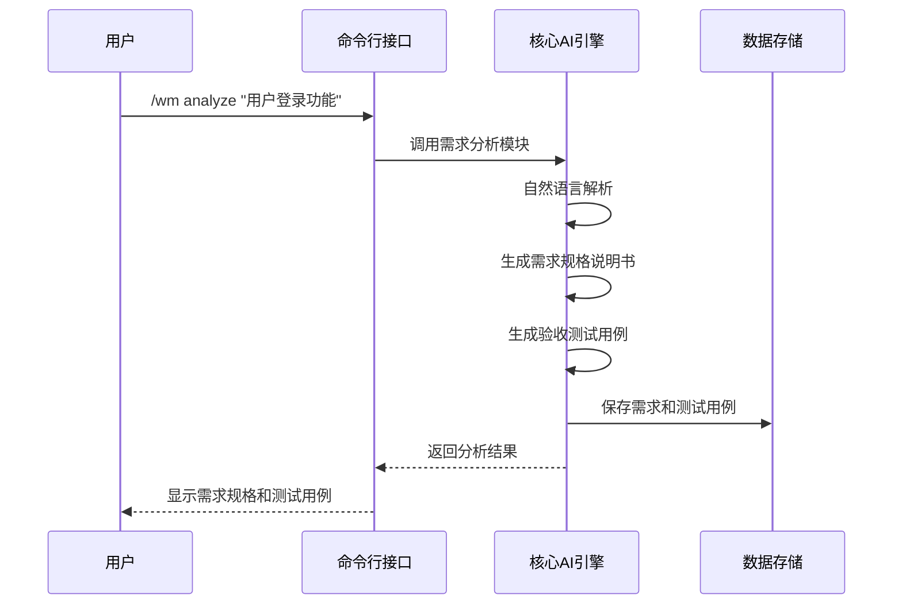

---

## 7. 数据模型设计

### 7.1 项目数据模型

```typescript
interface Project {
  id: string;
  name: string;
  description: string;
  status: '需求分析' | '系统设计' | '概要设计' | '详细设计' | '编码' | '集成测试' | '系统测试' | '验收测试';
  techStack: {
    frontend: string[];
    backend: string[];
    database: string[];
    others: string[];
  };
  createdAt: Date;
  updatedAt: Date;
}
```

### 7.2 需求数据模型

```typescript
interface Requirement {
  id: string;
  projectId: string;
  title: string;
  description: string;
  type: '功能需求' | '非功能需求' | '约束需求';
  priority: '高' | '中' | '低';
  acceptanceCriteria: string[];
  testCases: TestCase[];
  status: '待开发' | '开发中' | '已完成' | '已验证';
}
```

### 7.3 设计数据模型

```typescript
interface Design {
  id: string;
  projectId: string;
  type: '系统设计' | '概要设计' | '详细设计';
  content: string;
  diagrams: Diagram[];
  testCases: TestCase[];
  createdAt: Date;
}
```

### 7.4 测试用例数据模型

```typescript
interface TestCase {
  id: string;
  projectId: string;
  type: '验收测试' | '系统测试' | '集成测试' | '单元测试';
  title: string;
  description: string;
  steps: string[];
  expectedResult: string;
  status: '待执行' | '通过' | '失败';
  priority: '高' | '中' | '低';
}
```

### 7.5 数据模型关系图

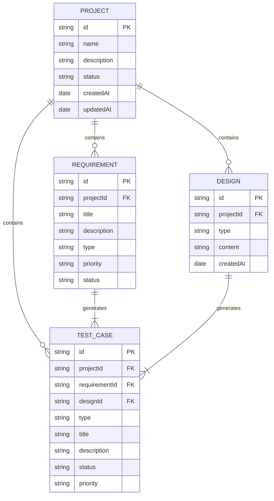

### 7.6 LLM-as-a-Verifier 数据模型（补全）

> 原第 7 章仅定义 Project / Requirement / Design / TestCase 四类业务实体，
> 未涵盖项目核心能力「LLM-as-a-Verifier」相关的数据模型，导致设计↔实现追溯断裂。
> 本节补全，对应 `src/types/index.ts` 第 87-211 行及新增的元技能 / 演化 / 评估类型。

```typescript
/** 验证结果：单次三维度验证的产出 */
interface VerificationResult {
  finalScore: number;          // 加权聚合的连续评分（1-20）
  confidence: number;          // 置信度 0-1（受方差影响）
  qualityLevel: QualityLevel;  // 离散质量等级
  subScores: Record<string, number>;  // 子标准 → 分数
  dimensions?: VerificationDimension; // 三维度明细
}

type QualityLevel = 'excellent' | 'good' | 'acceptable' | 'poor' | 'unacceptable';

interface VerificationDimension {
  granularity: { range: { min: number; max: number }; labels: string[]; granularityLevel: number };
  repeatedEvaluation: { times: number; varianceThreshold: number; aggregationMethod: 'mean' | 'median' | 'weighted' };
  criteriaDecomposition: { originalCriteria: string; subCriteria: SubCriterion[]; weights: number[] };
}

interface SubCriterion { id: string; description: string; scoringPrompt: string; weight: number; }

/** 连续评分引擎契约 */
interface ContinuousScoringEngine {
  computeContinuousScore(prompt: string, target: unknown, range?: { min: number; max: number }): Promise<number>;
}

/** LLM 客户端抽象（解耦 verifier 与具体 SDK） */
interface LLMClient {
  generate(prompt: string, options?: LLMGenerateOptions): Promise<LLMResponse>;
}
interface LLMClientConfig {
  model: string;
  apiKey?: string;
  baseURL?: string;
  supportsLogits?: boolean;  // 决定是否触发上层 fallback
}
interface LLMResponse {
  text: string;
  logits?: number[][];       // 原生 logits（可选）
  supportsLogits: boolean;
}

/** Verifier 配置 */
interface VerifierConfig {
  llm: LLMClientConfig;
  temperature?: number;
  continuousScoring?: { enabled: boolean; scoreRange: { min: number; max: number } };
  threeDimensions?: { granularity: { level: number; adaptive: boolean }; repeatedEvaluation: { defaultTimes: number; varianceThreshold: number } };
  pptRanking?: { enabled: boolean; defaultPivotCount: number };
  fallbackStrategy: 'text-parse' | 'logits' | 'hybrid';
}
```

### 7.7 元技能与演化数据模型（新增，对应第 14 章）

```typescript
/** 元技能配置：可被 SkillOptimizer 演化的可训练外部状态 */
interface MetaSkillConfig {
  version: string;
  scoreRange: { min: number; max: number };
  phases: {
    requirement: MetaSkillPhaseConfig;
    design: MetaSkillPhaseConfig;
    testCase: MetaSkillPhaseConfig;
  };
}
interface MetaSkillPhaseConfig {
  phase: 'requirement' | 'design' | 'testCase';
  subCriteria: MetaSubCriterion[];   // 原 w-model-enhancer 硬编码，现可演化
  repeatedTimes: number;              // 原硬编码 5
  varianceThreshold: number;          // 原硬编码 0.1
  aggregationMethod: 'mean' | 'median' | 'weighted';
}

/** SkillOpt 训练循环数据模型 */
interface RolloutEvidence {       // 一次 /wm 全流程的证据
  taskId: string;
  qualityGatePassed: boolean;
  rtmCoverage: number;
  phaseRollbacks: number;
  verificationScores: Array<{ phase: string; entityId: string; finalScore: number; subScores: Record<string, number> }>;
  failedSubCriteria: string[];    // reflect minibatch 输入
}
interface SkillEdit {             // 候选编辑（add/delete/replace）
  op: 'add' | 'delete' | 'replace';
  targetFile: string;
  anchor: string;                 // 格式：<phase>.<subId>.<field>
  content?: string;
  rationale: string;
  budgetCost: number;             // 文本学习率消耗
}
interface SkillEvolutionConfig {
  epochs: number;
  batchSize: number;
  editBudget: number;             // 文本学习率
  validationGateEnabled: boolean; // 强制 true（SkillsBench 实证）
  protectedRegions: ProtectedRegion[];
  heldOutTaskIds: string[];
}
```

### 7.8 技能评估数据模型（新增，对应第 15 章）

```typescript
type EvalCondition = 'no-skill' | 'curated-skill' | 'self-generated-skill';

interface SkillLiftResult {       // ACES 配对试验差值
  taskId: string;
  condition: EvalCondition;
  withSkill: { qualityGatePassed: boolean; rtmCoverage: number; avgVerifierScore: number; phaseRollbacks: number };
  baseline: { qualityGatePassed: boolean; rtmCoverage: number; avgVerifierScore: number; phaseRollbacks: number };
  lift: { qualityGateDelta: number; rtmCoverageDelta: number; avgScoreDelta: number; rollbackDelta: number };
}

interface ThreeLevelEvalResult {  // SkillLearnBench 三级评估
  taskId: string;
  level1SpecQuality: { coverage: number; executability: number; safety: number };  // 规格质量
  level2Trajectory: { skillUsageRate: number; trajectoryAlignment: number };        // 轨迹分析
  level3Outcome: { passed: boolean; qualityGatePassed: boolean; rtmCoverage: number }; // 任务结果
}

interface SkillEvalReport {
  skillHash: string;
  condition: EvalCondition;
  taskCount: number;
  meanSkillLift: number;          // > 0 才接受候选
  positiveLiftRate: number;
  threeLevelSummary: { meanCoverage: number; meanSkillUsageRate: number; passRate: number };
  perTask: SkillLiftResult[];
}
```

---

## 8. 技术实现方案

### 8.1 技术栈选择

| 层次 | 技术 | 理由 |
|------|------|------|
| 语言 | TypeScript | 类型安全、生态丰富 |
| 框架 | Node.js | 轻量高效、适合工具类应用 |
| 数据库 | SQLite | 轻量级、无需额外部署 |
| AI接口 | 大语言模型API | 支持自然语言处理和代码生成 |
| 文档生成 | Markdown | 易于阅读和版本控制 |

### 8.2 核心算法设计

#### 8.2.1 需求解析算法

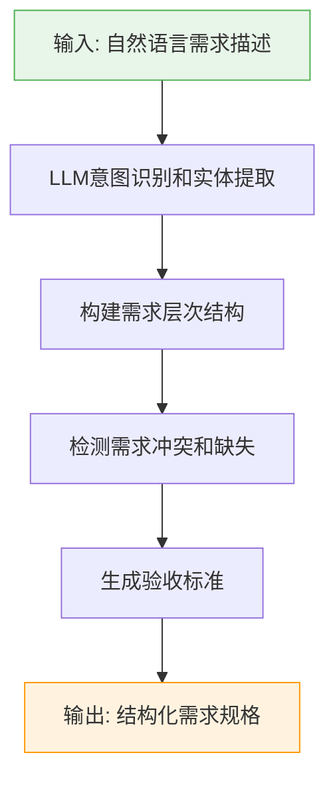

#### 8.2.2 测试用例生成算法

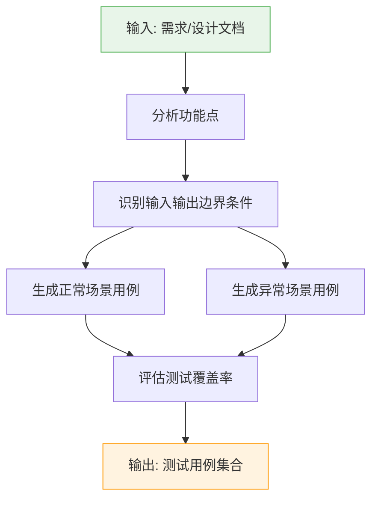

#### 8.2.3 代码生成算法

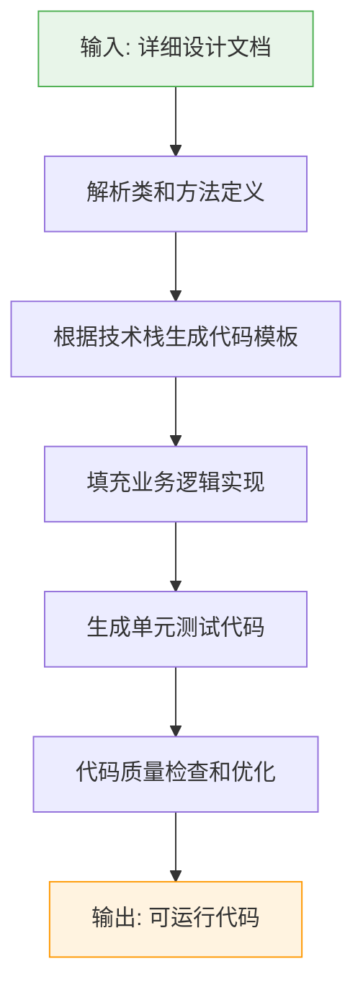

---

## 9. 需求跟踪矩阵（RTM）

### 9.1 RTM结构

| 需求ID | 需求描述 | 设计文档 | 代码模块 | 单元测试 | 集成测试 | 系统测试 | 验收测试 | 覆盖状态 |
|--------|----------|----------|----------|----------|----------|----------|----------|----------|
| REQ-001 | 用户注册功能 | SD-3.2.1 | userController.ts | UT-001 | IT-001 | ST-001 | UAT-001 | 100% |
| REQ-002 | 用户登录功能 | SD-3.2.2 | authService.ts | UT-002 | IT-002 | ST-002 | UAT-002 | 100% |
| REQ-003 | 商品浏览功能 | SD-3.3.1 | productController.ts | UT-003 | IT-003 | ST-003 | UAT-003 | 100% |
| REQ-004 | 购物车功能 | SD-3.3.2 | cartService.ts | UT-004 | IT-004 | ST-004 | UAT-004 | 100% |
| REQ-005 | 订单管理功能 | SD-3.4.1 | orderController.ts | UT-005 | IT-005 | ST-005 | UAT-005 | 100% |

### 9.2 RTM跟踪方向

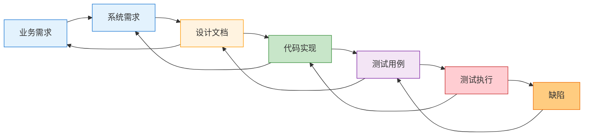

### 9.3 RTM维护规则

1. **变更同步**：每次需求或设计变更必须同步更新RTM
2. **覆盖检查**：定期检查需求覆盖率，确保100%覆盖
3. **优先级标记**：根据需求优先级确定测试优先级
4. **状态追踪**：实时更新测试执行状态
5. **缺陷关联**：将缺陷与对应的需求和测试用例关联

---

## 10. 质量保障体系

### 10.1 代码质量标准
- 代码覆盖率 ≥ 80%
- 代码规范检查（ESLint/Prettier）
- 安全漏洞扫描
- 性能指标监控

### 10.2 文档质量标准
- 文档完整性检查
- 文档一致性验证
- 版本控制管理

### 10.3 测试质量标准
- 测试用例评审机制
- 测试覆盖率分析
- 缺陷追踪管理

### 10.4 质量保障流程

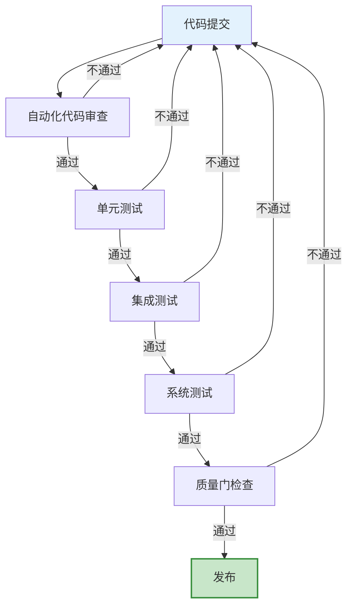

### 10.5 两类质量门（重要区分）

本技能存在两类性质完全不同的「质量门」，不可混淆：

| 维度 | 工件质量门（Artifact Gate） | 技能验证门（Skill Validation Gate） |
|---|---|---|
| 评估对象 | W 模型产出物（需求 / 设计 / 代码 / 测试用例） | 技能文档本身（SKILL.md / MetaSkillConfig） |
| 触发时机 | 验收测试阶段（`/wm test type=验收`） | SkillOptimizer 演化候选评估时 |
| 判定逻辑 | RTM 覆盖率 100% 且四级测试全部通过 | 留出集 `meanSkillLift > 0`（严格正提升） |
| 判定逻辑实现（单点事实源） | `w-model-dev/scripts/gate-logic.ts` `checkArtifactGate()` | `w-model-dev/scripts/gate-logic.ts` `checkSkillGate()` |
| Agent CLI 入口 | `w-model-dev/scripts/check-artifact-gate.ts` | `w-model-dev/scripts/check-skill-gate.ts` |
| SDK 委托方 | `src/state/rtm-manager.ts` `isQualityGatePassed()` → `checkArtifactGate` | `src/evolution/skill-optimizer.ts` `evaluateGate()` → `checkSkillGate`（Skill Lift 数值由 `src/eval/skill-lift.ts` 计算） |
| 失败后果 | 返工回到编码阶段 | 拒绝候选技能，保留当前配置 |
| 数据来源 | 真实测试执行结果（`/wm test result=pass\|fail` 回填） | with-skill vs without-skill 配对试验 |

**门禁脚本与 Markdown 的配合**：门禁判定逻辑沉入技能包内 `w-model-dev/scripts/gate-logic.ts`（纯函数、自包含、不依赖 `src/`），保证技能包可独立分发给 TRAE / Claude 等 Agent。两类调用方共用同一份事实源：
- **CLI 调用方（Agent）**：执行 `npx tsx w-model-dev/scripts/check-{artifact,skill}-gate.ts`，退出码 `0=通过 / 1=未通过 / 2=输入错误`，stdout 末尾输出 `GATE_JSON {...}` 供程序化解析。
- **SDK 调用方（编程式）**：`src/state/rtm-manager.ts` 与 `src/evolution/skill-optimizer.ts` import 并委托至同一纯函数，确保 CLI 与 SDK 判定结果完全一致，避免逻辑漂移。

`references/quality-standards.md` 以 Markdown 描述质量标准（人类可读），与脚本互为参照但不再承载判定逻辑。

**关键约束**：工件质量门的有效性依赖真实测试结果回填。`/wm test` 命令不得自动将测试标记为通过——必须由上游 AI / 测试运行器执行真实测试后通过 `result=pass|fail` 参数回填，否则质量门形同虚设（这是 SkillOpt Rollout 收集失败 minibatch 的前提）。

---

## 10A. SSoT ↔ 实现追溯表

> 本节是 W 模型 RTM 思想在文档层面的自我应用：每个设计章节标注其实现位置，建立双向追溯。
> 与 `w-model-dev/SKILL.md` 的「实现位置」表互为参照。

| SSoT 章节 | 设计内容 | 实现位置 | 一致性 |
|---|---|---|---|
| 3.2.1 需求分析模块 | 需求解析、验收测试生成 | `src/commands/router.ts` `analyze` 命令 | 部分实现（状态登记 + 占位测试，AI 解析由上游填充） |
| 3.2.2 设计阶段模块 | 架构 / 概要 / 详细设计 + 对应测试设计 | `src/commands/router.ts` `design` 命令 | 部分实现（文档占位，AI 生成由上游填充） |
| 3.2.3 编码与单元测试 | 代码生成、单元测试用例生成 | `src/commands/router.ts` `code` 命令 | 部分实现（不自动标记通过，需 `result` 回填） |
| 3.2.4-3.2.6 测试模块 | 集成 / 系统 / 验收测试执行 | `src/commands/router.ts` `test` 命令 | 完整（支持 `result=pass\|fail` 回填） |
| 6 命令接口 | 10 个 `/wm` 命令 | `src/commands/router.ts` | 完整 |
| 7 数据模型 | Project / Requirement / Design / TestCase / **Verifier 类型** | `src/types/index.ts` | 完整（见 7.6） |
| 8 技术实现方案 | LLM-as-a-Verifier 算法 | `src/core/scoring-engine.ts` + `verification-framework.ts` + `ppt-ranker.ts` | 完整 |
| 9 RTM | 需求跟踪矩阵 | `src/state/rtm-manager.ts` | 完整 |
| 10 质量保障 | 工件质量门 + 技能验证门 | 判定逻辑：`w-model-dev/scripts/gate-logic.ts`（单点事实源）；SDK 委托方：`src/state/rtm-manager.ts` + `src/evolution/skill-optimizer.ts`；Skill Lift 计算：`src/eval/skill-lift.ts`；CLI：`w-model-dev/scripts/check-*-gate.ts` | 完整（见 10.5，门禁逻辑已沉入技能包） |
| 7.6 + 8 LLM Verifier | LLMClient 抽象与连续评分实现 | `src/core/llm-client.ts` + `src/core/scoring-engine.ts` | 完整（数据模型见 7.6，算法见 8） |
| 14 技能演化机制 | SkillOpt ReflectTrainer | `src/evolution/skill-optimizer.ts`（Gate 阶段委托至 `w-model-dev/scripts/gate-logic.ts` `checkSkillGate`） | 完整 |
| 15 技能评估标准 | Skill Lift / 三级评估 | `src/eval/skill-lift.ts` | 完整 |

---

## 11. 部署与集成方案

### 11.1 部署方式
- 本地部署：作为IDE插件或命令行工具
- 云端部署：作为Web服务提供API接口

### 11.2 集成方式
- IDE集成：支持VS Code、JetBrains等主流IDE
- CI/CD集成：与GitHub Actions、GitLab CI等集成
- 项目管理工具集成：与Jira、Notion等集成

### 11.3 集成架构

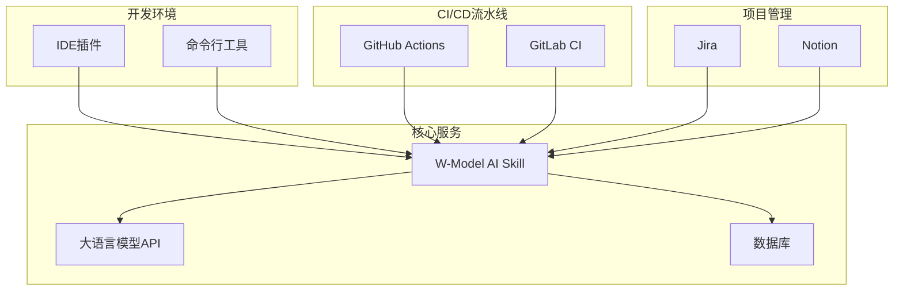

---

## 12. 发展规划

### 12.1 第一阶段（基础版）
- 实现需求分析和测试设计的AI辅助
- 支持代码生成和单元测试生成
- 提供基本的项目状态管理

### 12.2 第二阶段（进阶版）
- 实现完整的W模型全流程闭环
- 支持集成测试和系统测试自动化
- 提供代码审查和质量分析功能

### 12.3 第三阶段（高级版）
- 支持多项目并行管理
- 提供团队协作功能
- 集成DevOps流程
- 支持智能缺陷预测和预防

### 12.4 第四阶段（自演化版）

> 对应第 14 章「技能演化机制」与第 15 章「技能评估标准」。本阶段把技能本身从「静态文档」升级为「可训练外部状态」。

- **技能自演化**：落地 `SkillOptimizer` 的 SkillOpt ReflectTrainer 训练循环（Rollout → Reflect → Edit → Gate → Commit），使 `MetaSkillConfig` 的子标准权重 / 评估次数 / 方差阈值可基于实证演化
- **技能评估基准建设**：构建 `DEFAULT_HELD_OUT_TASKS` 之外的真实留出 benchmark 集（≥30 个项目），覆盖登录/库存/支付/权限/报表等典型场景，支撑 Skill Lift 度量
- **多 Agent 框架适配**：将 `RolloutExecutor` / `GateEvaluator` / `EvalRunExecutor` 三个接口适配到主流多 Agent 框架（如 LangGraph / AutoGen / CrewAI），使 W 模型技能可作为子图嵌入更大规模 Agent 编排
- **MCP Server 化**：把 `/wm` 命令族暴露为 MCP（Model Context Protocol）Server，供 Claude / Cursor / Trae 等支持 MCP 的客户端直接调用，技能演化产物可通过 MCP 资源同步

### 12.5 路线图

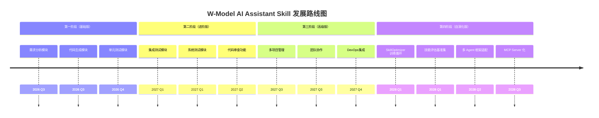

---

## 14. 技能演化机制

> 本章定义 W-Model AI Assistant Skill 的**自演化能力**：把技能文档（`SKILL.md` / `references/` / `MetaSkillConfig`）视为可训练外部状态，通过闭环优化持续提升技能本身的质量。
>
> 理论来源：微软 SkillOpt（Rollout → Reflect → Edit → Gate）、MetaSkill-Evolve（双时间尺度元技能）。
> 数据模型见 §7.7；代码实现见 `src/evolution/skill-optimizer.ts`；可训练状态清单见 `w-model-dev/META-SKILL.md`。

### 14.1 设计动机

原 `WModelVerifierEnhancer` 的三个 `verify*` 方法将子标准集合、重复评估次数、方差阈值**硬编码在方法体内**，导致：

1. 子标准权重无法根据实证调整（如发现「需求完整性」权重过低无法阻挡不充分需求）
2. 评估次数与方差阈值无法跨项目复用经验
3. 违背 MetaSkill-Evolve 核心思想——「改进流程本身」应成为第一类可优化对象

本章将这些参数上提为 `MetaSkillConfig`（可训练外部状态），并由 `SkillOptimizer` 通过训练循环演化。

### 14.2 可训练状态边界（Trainable vs Protected）

参照 SkillOpt 的 protected region 机制，技能状态分为两类：

| 类别 | 区域 | 可演化内容 | 演化频率 |
|---|---|---|---|
| 可训练 | `src/core/meta-skill-config.ts` | 子标准权重 / 评估次数 / 方差阈值 / scoringPrompt | 慢循环 |
| 可训练 | `w-model-dev/references/phase-*.md` | 阶段指引（程序性知识） | 快循环 |
| 可训练 | `w-model-dev/SKILL.md` 非保护章节 | 阶段流转说明 / 命令示例 | 快循环 |
| **受保护** | `w-model-dev/SKILL.md` §2.1「核心约束」 | W 模型不可变骨架（并行/阶段门/RTM/质量门/SSoT/最小必要信息） | 不可编辑 |
| **受保护** | `src/types/index.ts` | 类型契约（修改破坏编译） | 不可编辑 |
| **受保护** | `src/commands/router.ts` 命令注册表 | 命令接口契约 | 不可编辑 |
| **受保护** | `src/state/*` 持久化结构 | 数据兼容性 | 不可编辑 |

`SkillEvolutionConfig.protectedRegions` 在运行时强制此约束：`SkillOptimizer.isProtected()` 会过滤任何指向受保护区域的 `SkillEdit`。

### 14.3 SkillOpt ReflectTrainer 训练循环

训练循环类比神经网络训练：

| 神经网络训练 | SkillOpt 训练 |
|---|---|
| 模型权重 | 技能文档（可训练状态） |
| forward | 跑一次 `/wm` 全流程（Rollout） |
| loss | `VerificationResult` 分数 / 质量门失败原因 |
| 梯度下降 | optimizer LLM 产出 `SkillEdit`（add/delete/replace） |
| 学习率 | `editBudget`（每轮最大字符编辑预算） |
| 验证集 | 留出 benchmark 项目集（`heldOutTaskIds`） |
| 动量 | epoch 边界的纵向指导（写入 protected 区域之外） |

#### 14.3.1 五阶段循环

```
for epoch in 1..N:
  1. Rollout     —— 在训练集上跑 /wm 全流程，收集 RolloutEvidence
  2. Reflect     —— 分离成功 / 失败 minibatch，optimizer LLM 诊断失败子标准
  3. Edit        —— 产出 SkillEdit 列表（add/delete/replace），受 editBudget 约束
  4. Gate        —— 在留出集上测 Skill Lift，严格提升才接受候选
  5. Commit      —— 通过则 setMetaSkillConfig / 写回 references
```

各阶段契约（对应 `src/evolution/skill-optimizer.ts`）：

| 阶段 | 入口方法 | 输入 | 产物 |
|---|---|---|---|
| Rollout | `RolloutExecutor.run(taskId, metaSkill)` | 训练任务 ID + 当前配置 | `RolloutEvidence[]`（含 `failedSubCriteria`） |
| Reflect | `SkillOptimizer.reflectAndEdit()` | 失败 + 成功 minibatch | reflect prompt + optimizer LLM 响应 |
| Edit | `SkillOptimizer.parseEdits()` + `applyEdit()` | LLM 响应 + 候选配置 | `SkillEdit[]` 已应用（受 budget 约束） |
| Gate | `GateEvaluator.evaluate(candidate, heldOutTaskIds)` | 候选配置 + 留出集 | `GateResult`（`skillLift` + `accepted`） |
| Commit | `train()` 主循环 | `GateResult.accepted=true` | `setMetaSkillConfig(candidate)` |

#### 14.3.2 Reflect prompt 契约

optimizer LLM 接收结构化输入，输出**纯 JSON 数组**：

```json
[
  {
    "op": "replace",
    "targetFile": "src/core/meta-skill-config.ts",
    "anchor": "requirement.completeness.weight",
    "content": "0.30",
    "rationale": "完整性权重过低导致需求描述不充分",
    "budgetCost": 4
  }
]
```

`anchor` 格式：
- `<phase>.<field>`：阶段级字段（`repeatedTimes` / `varianceThreshold`）
- `<phase>.<subId>.<field>`：子标准级字段（`weight` / `scoringPrompt`）

`SkillOptimizer.applyEdit()` 仅支持这四种可训练字段，其他字段编辑被静默忽略。

### 14.4 文本学习率（editBudget）

每轮最大字符编辑预算，对应 SkillOpt 的「学习率」。建议：

| 循环类型 | editBudget | 可编辑范围 |
|---|---|---|
| 元技能慢循环 | 500 | 仅改权重 / 阈值 / prompt 措辞 |
| 任务技能快循环 | 2000 | 可改 `references/phase-*.md` 整段 |

`SkillOptimizer.reflectAndEdit()` 在应用编辑前检查 `remainingBudget`，超预算的编辑被跳过。

### 14.5 验证门（Validation Gate）—— 强制启用

**关键约束**：`SkillEvolutionConfig.validationGateEnabled` **必须为 `true`**。

SkillsBench 实证发现：模型自生成技能平均 **-1.3pp**（负向），必须搭配验证门才能采纳候选。`SkillOptimizer.evaluateGate()` 在 `validationGateEnabled=false` 时虽提供「强制接受」分支（仅实验用），但生产环境必须启用。

接受条件：候选在留出集上的 `meanSkillLift > 0`（严格正提升）。`<= 0` 的候选被拒绝并记录 `rejectionReason`，当前配置保留不变。

### 14.6 双时间尺度（MetaSkill-Evolve）

| 循环 | 频率 | 对象 | 产物 |
|---|---|---|---|
| 快循环 | 每次 `/wm` 命令后 | `references/phase-*.md` | 阶段指引精炼（任务技能） |
| 慢循环 | 每完成 N 个项目 | `META-SKILL.md` + `meta-skill-config.ts` | 子标准权重 / 评估次数调整（元技能） |

快循环由 SkillOpt-Sleep 模式触发（人工审阅日志后批量应用），慢循环由 `SkillOptimizer.train()` 自动执行。

### 14.7 训练日志与可审计性

`SkillOptimizer` 全程记录 `TrainingLogEntry[]`，每个 epoch 的每个阶段（rollout/reflect/edit/gate/commit）均落日志，含 `metrics`（rtmCoverage / phaseRollbacks / skillLift）。

`persistLogs(dir)` 将日志写回 `skill-optimizer-logs.json`，供：
- SkillOpt-Sleep 模式人工审阅
- 训练回放与归因分析
- 演化决策的可审计追溯

### 14.8 与工件质量门的关系（重要）

技能演化机制依赖工件质量门（§10.5）的真实失败信号：

- `RolloutEvidence.failedSubCriteria` 来自 `VerificationResult.subScores`（低于 12 分视为失败，见 `extractFailedSubCriteria()`）
- 若 `/wm test` 自动标记测试通过（占位实现），`qualityGatePassed` 恒为 `true`，失败 minibatch 为空，演化循环跳过（`failures.length === 0` 分支）

因此 §10.5 中「`/wm test` 不得自动标记通过」的约束是技能演化的**前提条件**——这是占位实现必须移除的根本原因。

---

## 15. 技能评估标准

> 本章定义如何评估**技能本身的有效性**（而非工件质量）。
>
> 理论来源：ACES Skill Lift、SkillsBench、SkillLearnBench。
> 数据模型见 §7.8；代码实现见 `src/eval/skill-lift.ts`。

### 15.1 设计动机

现有基准只评估「模型本身」或「工件质量」，无法回答关键问题：

> 引入 W-Model AI Assistant Skill 后，相比不使用技能，**质量门通过率 / RTM 覆盖率 / verifier 分数提升了多少**？

本章通过配对试验量化技能带来的增量（Skill Lift），并辅以三条件对照与三级评估，构成完整的技能评估体系。

### 15.2 三类评估标准

| 标准 | 来源 | 评估问题 | 实现 |
|---|---|---|---|
| A. Skill Lift | ACES | with-skill vs without-skill 的指标差值 | `evaluateTaskLift()` |
| B. 三条件对照 | SkillsBench | no-skill / curated-skill / self-generated-skill 的横向对比 | `evaluateBatch()` |
| C. 三级评估 | SkillLearnBench | 规格质量 / 轨迹对齐 / 任务结果 | `evaluateThreeLevel()` |

### 15.3 标准 A：Skill Lift（ACES 配对试验）

#### 15.3.1 配对设计

对每个评估任务 `EvalTask`，跑两次 `/wm` 全流程：

| 运行 | 注入 | 度量 |
|---|---|---|
| baseline | 不注入 `WModelVerifierEnhancer`（without-skill） | `qualityGatePassed` / `rtmCoverage` / `avgVerifierScore=0` / `phaseRollbacks` |
| with-skill | 注入 verifier（携带技能） | 同上，`avgVerifierScore` 取真实分数 |

`SkillLiftResult.lift` 记录四个差值：`qualityGateDelta` / `rtmCoverageDelta` / `avgScoreDelta` / `rollbackDelta`（负值表示回退减少，是正向）。

#### 15.3.2 综合指标聚合

`evaluateBatch()` 把每个任务的 lift 折算为标量：

```
liftScalar = qualityGateDelta + rtmCoverageDelta/100 + avgScoreDelta/20 - rollbackDelta*0.1
```

`meanSkillLift` 为任务集均值，`positiveLiftRate` 为正向 lift 任务占比。

### 15.4 标准 B：SkillsBench 三条件对照

`EvalCondition` 三值对应三种实验条件：

| 条件 | 含义 | 用途 |
|---|---|---|
| `no-skill` | 不使用任何技能 | 基线 |
| `curated-skill` | 人工策展的技能（当前 `DEFAULT_META_SKILL_CONFIG`） | 验证策展技能有效性 |
| `self-generated-skill` | `SkillOptimizer` 演化产出的技能 | 验证自演化是否带来增量 |

`SkillEvalReport.condition` 记录评估条件，便于横向对比三者的 `meanSkillLift`。

### 15.5 标准 C：SkillLearnBench 三级评估

`evaluateThreeLevel()` 从三个层级评估技能质量：

| 层级 | 指标 | 计算方式 |
|---|---|---|
| Level 1 规格质量 | `coverage` | 子标准覆盖度（默认 16 条，`min(count/16, 1)`） |
| Level 1 规格质量 | `executability` | 有 `deterministicVerifier` 视为 1.0，否则 0.7 |
| Level 1 规格质量 | `safety` | 默认配置不含危险操作，恒 1.0 |
| Level 2 轨迹分析 | `skillUsageRate` | `/wm` 命令在轨迹中的占比 |
| Level 2 轨迹分析 | `trajectoryAlignment` | 与 `expectedPhases` 对齐度 |
| Level 3 任务结果 | `passed` | `withSkill.qualityGatePassed` |
| Level 3 任务结果 | `qualityGatePassed` / `rtmCoverage` | 取自 with-skill 运行 |

`SkillEvalReport.threeLevelSummary` 聚合为 `meanCoverage` / `meanSkillUsageRate` / `passRate`。

### 15.6 确定性 verifier 优先原则

**关键约束**：Skill Lift 决策应优先使用 `EvalTask.deterministicVerifier`，避免 LLM-as-judge 方差。

SkillsBench 实证发现自生成技能平均 -1.3pp，若度量本身有方差，将无法区分真实提升与噪声。因此：
- `EvalTask.deterministicVerifier` 字段优先于 `WModelVerifierEnhancer`
- `evaluateThreeLevel()` 中 `executability` 对有确定性 verifier 的任务给满分 1.0

### 15.7 留出任务集（heldOutTaskIds）

`DEFAULT_HELD_OUT_TASKS` 定义三个留出 benchmark 任务（登录 / 库存 / 支付），覆盖典型业务场景。这些任务**不参与训练**，仅用于 Gate 评估，防止演化过拟合训练集。

`SkillEvolutionConfig.heldOutTaskIds` 与 `DEFAULT_HELD_OUT_TASKS` 应保持一致，真实场景应从 fixtures 加载更大规模留出集。

### 15.8 与技能演化（第 14 章）的对接

第 14 章的 `GateEvaluator` 由本章的 `SkillLiftEvaluator` 实现：

```
SkillOptimizer.evaluateGate()
  → GateEvaluator.evaluate(candidate, heldOutTaskIds)
    → SkillLiftEvaluator.evaluateBatch()  （在留出集上）
      → 返回 { skillLift, perTaskResults }
  → accepted = (skillLift > 0)
```

`createMetaSkillGateEvaluator()` 工厂封装此对接：用候选配置构造新 enhancer，在留出集上跑 rollout，计算与基线（`DEFAULT_META_SKILL_CONFIG`）的 Skill Lift。

### 15.9 评估报告消费方

`SkillEvalReport` 的消费方：

| 消费方 | 用途 | 关注字段 |
|---|---|---|
| `SkillOptimizer` | 决定候选采纳 | `meanSkillLift > 0` |
| 人工审阅 | 评估技能质量 | `threeLevelSummary` / `positiveLiftRate` |
| SkillsBench 对照 | 三条件横向对比 | `condition` / `meanSkillLift` |
| 训练日志归因 | 解释演化决策 | `perTask` / `skillHash` |

---

## 16. 参考文献

### 16.1 W 模型与软件工程基础

1. 软件开发常见模型（瀑布模型、V模型、W模型、敏捷开发模型）. CSDN博客. https://blog.csdn.net/yao_zhuang/article/details/114273475
2. W模型和瀑布模型与"V"模式开发模型有何异同？. 阿里云开发者社区. https://developer.aliyun.com/article/1566339
3. 软件开发测试的W模型：构建高质量产品的坚实蓝图. 掘金. https://juejin.cn/post/7551997631112822794
4. 测试视角下的软件工程：需求、开发模型与测试模型. 腾讯云开发者社区. https://cloud.tencent.com/developer/article/2582288
5. 软件测试模型对比：V模型、W模型、H模型与敏捷测试. 51CTO. https://rk.51cto.com/article/633281.html
6. AI大模型如何重塑软件开发流程. CSDN博客. https://blog.csdn.net/cooldream2009/article/details/149217195
7. 超越Vibe Coding —— AI 辅助编程进阶指南. 掘金. https://juejin.cn/post/7637710008821481499
8. Requirements Traceability Matrix (RTM): The Complete Guide. https://getbestest.com/blog/requirements-traceability-matrix-guide/
9. What is Requirements Traceability Matrix (RTM) in Testing?. https://www.guru99.com/traceability-matrix.html
10. 需求跟踪深度解析：架构师视角下的全链路追溯体系. https://blog.csdn.net/ZxqSoftWare/article/details/149282779

### 16.2 LLM-as-a-Verifier（第 8 章 / §7.6 数据模型）

11. LLM-as-a-Verifier: A General-Purpose Verification Framework. arXiv:2607.05391. Stanford University + UC Berkeley + NVIDIA Research.
12. LLM-as-a-Judge: 项目内集成设计见 `llm-verifier-integration-design.md`，权威定义以 SSoT §7.6 + §8 为准。

### 16.3 技能演化与评估（第 14 章 / 第 15 章）

13. SkillOpt: 把技能文档视为可训练外部状态，通过 Rollout → Reflect → Edit → Gate 闭环优化。Microsoft Research. （SkillsBench 实证：自生成技能平均 -1.3pp，必须搭配验证门）
14. MetaSkill-Evolve: 5 组件元技能（ψ/σ/α/π/ε）+ 双时间尺度（快循环任务技能 + 慢循环元技能）。
15. ACES (Agentic Capability Evaluation via Skill Lift): with-skill vs without-skill 配对试验差值。
16. SkillsBench: 三条件对照（no-skill / curated-skill / self-generated-skill）。
17. SkillLearnBench: 三级评估（规格质量 / 轨迹分析 / 任务结果）。
18. PPT (Probabilistic Pivot Tournament): O(N×k) 复杂度排名算法，见 `src/core/ppt-ranker.ts`。

---

## 附录

### A. 技能命令速查

| 命令 | 功能 |
|------|------|
| `/wm analyze <需求>` | 分析需求并生成规格说明 |
| `/wm design [type]` | 生成系统/详细设计文档 |
| `/wm code <功能>` | 生成代码和单元测试 |
| `/wm test [type]` | 执行指定类型测试 |
| `/wm review <文件>` | 审查代码质量 |
| `/wm status` | 查看项目状态 |
| `/wm help` | 显示帮助 |

### B. 测试类型对应关系

| 开发阶段 | 对应测试类型 | 测试目的 |
|----------|-------------|----------|
| 需求分析 | 验收测试设计 | 验证系统是否满足用户需求 |
| 系统设计 | 系统测试设计 | 验证系统整体功能和性能 |
| 概要设计 | 集成测试设计 | 验证模块间交互正确性 |
| 详细设计 | 单元测试设计 | 验证单个模块功能正确性 |
| 编码实现 | 单元测试执行 | 验证代码实现正确性 |
| 集成阶段 | 集成测试执行 | 验证模块集成正确性 |
| 系统阶段 | 系统测试执行 | 验证系统整体质量 |
| 验收阶段 | 验收测试执行 | 用户确认系统满足需求 |

### C. 验收检查清单

- [ ] 需求规格说明书完整
- [ ] 设计文档完整且符合规范
- [ ] 代码实现完成且通过编译
- [ ] 单元测试覆盖率 ≥ 80%
- [ ] 集成测试全部通过
- [ ] 系统测试全部通过
- [ ] 安全测试无高危漏洞
- [ ] 性能测试达标
- [ ] 验收测试通过
- [ ] 用户确认签字
- [ ] 交付文档齐全