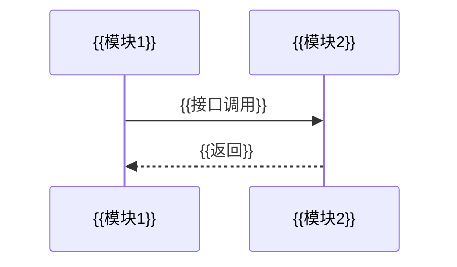

# Phase 3 概要设计产出达到设计文档级别 — 实施计划（小轮 B / 38.1.0）

> **For agentic workers:** REQUIRED SUB-SKILL: Use superpowers:subagent-driven-development (recommended) or superpowers:executing-plans to implement this plan task-by-task. Steps use checkbox (`- [ ]`) syntax for tracking.

**Goal:** 把 W 模型技能包 Phase 3（概要设计）产出提升到 DESIGN.md 级别的结构严谨性：6 项增强内容拆为独立产物文件（主模板引用块串联），通过门禁脚本可机械核验，严守阶段边界（不落类/方法级）。

**Architecture:** 三层联动——模板层（主模板 interface-design.md 重构 + 6 独立子模板）、参考层（phase-3-outline-design.md 算法扩步 + FM-OD-01~05 + 禁止行为 #6/#7/#8）、门禁层（check-requirement-graph.ts 新增 R11/R12 + check-artifact-gate.ts --phase=3 结构校验，复用小轮 A 的 checkPhaseSpecStructure 泛化）。严守概要设计域边界，不侵入 Phase 4。

**Tech Stack:** Markdown 模板/参考、TypeScript（tsx runtime + ajv）、vitest、self-test.ts 回归基线、mermaid（UML 建模）。

**Spec:** [2026-08-09-design-phases-level-enhancement-design.md](../specs/2026-08-09-design-phases-level-enhancement-design.md) §3.2

**命名约定**：Phase 3 产物带 `{module}-` 前缀（遵循 [directory-conventions.md](file:///d:/w_skill_opt/Software_Engineering_W_Development_Model_Skills_Pack/w-model-dev/references/directory-conventions.md) §1），位于 `docs/phase3-outline/`；独立产物命名为 `{module}-interface-contract.md` / `{module}-glossary.md` / `{module}-traceability-matrix.md` / `{module}-behavior-spec.md` / `{module}-discipline-dod.md` / `{module}-uml-modeling.md`，主文档 `{module}-interface-design.md` 引用块指向同目录。子模板放 `templates/interface-design/` 目录（与主模板 `templates/interface-design.md` 同名目录）。

**批次与约束**：4 批串行（模板→参考→门禁→同步），每批完成后父代理回归。**禁止并行修改**。所有脚本改动须 `npm run self-test` + `npx vitest run` 全通过 + TypeScript strict 0 错误。版本号三处一致 38.1.0。

---

## 文件结构

| 文件 | 动作 | 职责 |
|---|---|---|
| `w-model-dev/templates/interface-design.md` | 重构 | 主模板：§0 SSOT 头 + 保留 §1-§3/路由约束 + 新增引用块节 |
| `w-model-dev/templates/interface-design/interface-contract.md` | 新增 | 接口契约子模板 |
| `w-model-dev/templates/interface-design/glossary.md` | 新增 | 术语表子模板 |
| `w-model-dev/templates/interface-design/traceability-matrix.md` | 新增 | 追踪矩阵子模板 |
| `w-model-dev/templates/interface-design/behavior-spec.md` | 新增 | 行为规格模型（L3 引用）子模板 |
| `w-model-dev/templates/interface-design/discipline-dod.md` | 新增 | 工程纪律与 DoD 子模板 |
| `w-model-dev/templates/interface-design/uml-modeling.md` | 新增 | UML 模块级建模子模板 |
| `w-model-dev/references/phase-3-outline-design.md` | 修改 | 算法增步骤 + FM-OD-01~05 + 禁止行为 #6/#7/#8 + 返工路径 + 验收标准 + 执行方法论表 + 输出节 |
| `w-model-dev/scripts/graph-logic.ts` | 修改 | 新增 R11/R12 校验函数 |
| `w-model-dev/scripts/check-requirement-graph.ts` | 修改 | CLI `--spec-dir` phase=3 分支 |
| `w-model-dev/scripts/gate-logic.ts` | 修改 | PHASE_SPEC_LAYOUT 加 phase=3 + modulePrefix 提取泛化 |
| `w-model-dev/scripts/check-artifact-gate.ts` | 修改 | phase=3 调用结构校验（确认参数传递） |
| `w-model-dev/scripts/samples/graph/` | 新增 | R11/R12 各 1 valid + 1 bad（4 条） |
| `w-model-dev/scripts/samples/gate/` | 新增 | phase=3 结构校验 1 valid + 3 bad（4 条） |
| `w-model-dev/scripts/self-test.ts` | 修改 | 基线 233→241 |
| `w-model-dev/scripts/__tests__/graph-logic.test.ts` | 修改 | R11/R12 单测 |
| `w-model-dev/scripts/__tests__/gate-enhancement.test.ts` | 修改 | phase=3 结构校验单测 |
| `w-model-dev/references/verifier-spec.md` | 修改 | V 评审新增项 |
| `w-model-dev/SKILL.md` | 修改 | 阶段路由表 Phase 3 行 + 快速自检清单 + 版本号 |
| `w-model-dev/skill-metadata.json` | 修改 | 版本号镜像 |
| `package.json` | 修改 | 版本号 |
| `docs/skill-design-document_SSoT.md` | 修改 | §3.4.xx 条目 + §10A 追溯表 |
| `AGENTS.md` | 修改 | §1 第 38 轮小轮 B 条目 |
| `CHANGELOG.md` | 修改 | [38.1.0] 条目 |
| `README.md` | 修改 | 能力 bullet（如有） |

---

## 批 1：模板层（主模板 + 6 独立子模板）

### Task 1: 主模板 interface-design.md 重构（§0 SSOT 头 + 引用块）

**Files:**
- Modify: `w-model-dev/templates/interface-design.md`（全部重写）

- [ ] **Step 1: 阅读现有主模板全文**

Run: `Read w-model-dev/templates/interface-design.md`
Expected: 确认现有节（文档信息 / 1 模块调用关系 / 2 接口定义 / 3 集成测试用例索引 / 路由注册顺序约束）

> **节号保留约束**：`phase-3-outline-design.md` 引用 `templates/interface-design.md`「路由注册顺序约束」节（Round 24 引入），无 `:§N` 数字跨引用（已 Grep 确认）。为安全保留 §1-§3 编号，新增引用块节追加为 §4+ 与附录 A。

- [ ] **Step 2: 重写主模板文件**

```markdown
# 接口设计文档

> **模板版本**：v2.0（第 38 轮设计级别增强：§0 SSOT 头 + 6 独立产物文件引用块）
> 套用本模板时，引用块指向同目录独立文件，独立文件套用
> `templates/interface-design/` 下对应子模板。产出物见
> `references/phase-3-outline-design.md` §执行方法论。

## 文档信息

- 项目名称：{{项目名称}}
- 文档版本：{{v1.0}}
- 编制日期：{{YYYY-MM-DD}}
- 关联系统设计文档：{{system-design 路径}}

## 0. 文档定位与 SSOT 头

> **文档版本**：v{{1.0}}（{{YYYY-MM-DD}} 首版）
> **SSOT 声明**：本接口设计文档为阶段 3（概要设计）的唯一设计事实来源。设计变更须经
>   阶段门评审 / 上游系统设计变更回流，不得无痕修改。
> **自身校验**：本文档以结构完整性为准——引用块指向的独立文件存在、
>   {{module}}-interface-contract.md 接口契约与主文档 §2 接口定义一一对应、
>   {{module}}-traceability-matrix.md 字段与主文档 §2 接口定义一致、
>   {{module}}-uml-modeling.md mermaid 块配平。
> **禁止占位词**：TBD/TODO/undefined/待补建/待定 不得进入正式交付；`待定` 仅允许出现在非目标显式标注中。
> **与系统设计关系**：本文档承接阶段 2《系统设计文档》（模块划分/子系统清单），模块接口契约由本文档承载；
>   类/方法级设计事实由阶段 4 产出的详细设计文档承载，不在本文档描述。
> **行为规格承接**：L3 行为规格由独立 `.feature` 文件承载（bdd-guide.md §2 头规范管），
>   本文档引用块指向的 behavior-spec.md 定义引用关系，不内联 feature 块。

## 1. 模块调用关系

```mermaid
graph LR
    {{模块调用关系}}
```

> 每个模块间调用须标注接口名 + 数据流向；存在循环依赖时必须重新划分模块边界（FM-OD-03）。

## 2. 接口定义

### 2.1 {{InterfaceName}}

- 提供方模块：{{M-001}}
- 消费方模块：{{M-002}}
- 协议：{{HTTP / gRPC / 函数调用}}

#### 接口 1：{{接口名 / 路径}}

- 方法：{{GET/POST/函数签名}}
- 描述：{{接口描述}}

**请求参数**

| 参数 | 位置 | 类型 | 必填 | 校验规则 | 说明 |
|---|---|---|---|---|---|
| {{param}} | body/query | {{string}} | 是 | {{}} | {{}} |

**返回值**

| 字段 | 类型 | 说明 |
|---|---|---|
| {{code}} | {{number}} | {{状态码}} |
| {{data}} | {{object}} | {{业务数据}} |

**错误码**

| 错误码 | 含义 | 触发条件 |
|---|---|---|
| 400 | 参数错误 | {{}} |
| 200 | 成功 | {{}} |

**示例**

```json
// 请求
{{request example}}
// 响应
{{response example}}
```

> 接口契约细节（含错误码分层 4xx/5xx/业务三段位 + 接口契约 Schema 10 字段）详见
> [{{module}}-interface-contract.md](./{{module}}-interface-contract.md)。

## 3. 集成测试用例索引

> 详细用例见对应测试用例文档。

| 用例 ID | 关联接口 | 场景 | 优先级 |
|---|---|---|---|
| IT-001 | {{InterfaceName}} | {{合法调用}} | 高 |
| IT-002 | {{InterfaceName}} | {{非法参数}} | 高 |

## 4. 核心概念与术语

> 术语表详见 [{{module}}-glossary.md](./{{module}}-glossary.md)
> （接口域术语子集，引用 references/glossary.md 权威表）。

## 5. 概要设计追踪矩阵

> 追踪矩阵详见 [{{module}}-traceability-matrix.md](./{{module}}-traceability-matrix.md)
> （INTF×SD 8 字段表 + 测试层级承接矩阵，仅集成/验收列填实）。

## 6. 行为规格模型（L3）

> 行为规格模型详见 [{{module}}-behavior-spec.md](./{{module}}-behavior-spec.md)
> （引用 L3 .feature 文件关系，不内联 feature 块）。

## 7. Phase 3 工程纪律与 DoD

> Phase 3 工程纪律与 DoD 详见 [{{module}}-discipline-dod.md](./{{module}}-discipline-dod.md)
> （§1 阶段纪律 + §2 DoD 可勾选清单）。

## 8. 设计边界与非目标

- {{非目标 1}}（例：本设计不覆盖类/方法级实现细节，详细设计由阶段 4 承载）
- {{非目标 2}}
- …

## 附录 A. UML 模块级建模

> UML 模块级建模详见 [{{module}}-uml-modeling.md](./{{module}}-uml-modeling.md)
> （包图 / 序列图 / 通信图，mermaid）。

## 路由注册顺序约束

> 对应 Round 24 P2 问题 5。路由注册顺序错误会导致参数路径拦截静态路径、鉴权失效等问题。

### 注册顺序规则

1. **静态路径先于参数路径**：`/users/me` 须先于 `/users/:id` 注册，否则 `/users/me` 会被 `/users/:id` 拦截（`id="me"`）
2. **鉴权路由先于公开路由**：须鉴权的路由须先注册鉴权中间件，再注册公开路由
3. **具体路径先于通配路径**：`/api/v1/users` 须先于 `/api/*` 注册

### 路由注册顺序表模板

| 注册顺序 | HTTP 方法 | 路径 | 鉴权 | 中间件 | 说明 |
|---|---|---|---|---|---|
| 1 | GET | /health | 否 | - | 健康检查（公开） |
| 2 | POST | /auth/login | 否 | rateLimit | 登录（限流） |
| 3 | GET | /users/me | 是 | auth, rateLimit | 当前用户信息（须鉴权） |
| 4 | GET | /users/:id | 是 | auth | 用户详情（参数路径，须在 /me 之后） |
| 5 | GET | /api/* | 是 | auth | API 通配（须在具体路径之后） |

### 校验

路由注册顺序由 V 评审与 G 门禁人工校验（无自动脚本）。违反命中反模式 #36。
```

> **注意**：主模板节号保持既有 §1-§3 编号体系不变。6 个引用块节追加为 **§4 核心概念与术语 / §5 概要设计追踪矩阵 / §6 行为规格模型（L3）/ §7 Phase 3 工程纪律与 DoD / §8 设计边界与非目标 / 附录 A. UML 模块级建模**；「路由注册顺序约束」节保留在附录 A 之后（既有位置语义）。门禁按引用块文件名校验，不依赖节号。

- [ ] **Step 3: 自检模板结构**

Run: `Grep '^## ' w-model-dev/templates/interface-design.md`
Expected: 含 `0. 文档定位与 SSOT 头`、`4. 核心概念与术语`、`5. 概要设计追踪矩阵`、`6. 行为规格模型（L3）`、`7. Phase 3 工程纪律与 DoD`、`8. 设计边界与非目标`、`附录 A. UML 模块级建模` 引用块节；`1. 模块调用关系` / `2. 接口定义` / `3. 集成测试用例索引` / `路由注册顺序约束` 保留

- [ ] **Step 4: 提交**

```bash
git add w-model-dev/templates/interface-design.md
git commit -m "feat(templates): interface-design 主模板重构（§0 SSOT 头 + 6 独立文件引用块，保留 §1-§3 节号）"
```

---

### Task 2: 接口契约子模板 interface-contract.md

**Files:**
- Create: `w-model-dev/templates/interface-design/interface-contract.md`

- [ ] **Step 1: 创建子模板文件**

```markdown
# 接口契约（Interface Contract）

> 对应 DESIGN.md §13.5/§13.7 接口契约 + 错误码分层 + 调用关系。模块接口级设计：
> 接口签名 / 参数 / 返回值 / 错误码 / 调用关系。
> **阶段边界**：本文件只产模块接口级契约，不落类/方法实现（阶段 4），越界即返工（FM-OD-06）。
> 模板版本：v1.0（第 38 轮）。主文档引用块：`> 接口契约细节详见 [{{module}}-interface-contract.md](./{{module}}-interface-contract.md)`。

## 1. 接口契约清单

| 接口名 | 提供方模块 | 消费方模块 | 协议 | 对应 SD |
|---|---|---|---|---|
| {{createOrder}} | M-{{xx}} | M-{{xx}} | HTTP / gRPC / 函数调用 | SD-{{xx}} |

> 强制：接口与主文档 §2 接口定义一一对应；对应 SD 与 phase2 追踪矩阵一致（R11 门禁校验）。

## 2. 接口契约 Schema（每接口 10 字段）

| 字段 | 必填 | 示例 |
|---|:---:|---|
| 接口名 | ✅ | `createOrder` |
| 路径 / 触发器 | ✅ | `POST /api/v1/orders` / `event:order.created` |
| 参数名 | ✅ | `userId`, `items[]` |
| 参数类型 | ✅ | `string(uuid)`, `array<Item>` |
| 必填 | ✅ | `true` / `false` |
| 默认值 | ⬜ | `currency="CNY"` |
| 约束 | ✅ | `len(userId)=36`, `items.length ∈ [1,100]` |
| 示例 | ✅ | `{"userId":"...","items":[{"sku":"A1","qty":2}]}` |
| 返回值结构 | ✅ | `{code, message, data: {orderId, status}}` |
| 错误码集合 | ✅ | `40001, 40002, 50001` |

## 3. 调用关系图

```mermaid
graph LR
    {{M-001}} -->|{{接口名}}| {{M-002}}
```

> 每个模块间调用须标注接口名 + 数据流向；循环依赖 → FM-OD-03。

## 4. 错误码分层

| 段位 | 范围 | 含义 | 示例 |
|---|---|---|---|
| 4xx | 40000-49999 | 客户端错误（参数/认证/权限） | `40001 参数缺失`, `40101 未授权`, `40301 禁止访问` |
| 5xx | 50000-59999 | 服务端错误（DB/依赖/未知） | `50001 DB 超时`, `50201 下游服务不可用` |
| 业务 | 60000-69999 | 业务规则错误（库存/状态机/风控） | `60001 库存不足`, `60002 订单状态非法` |

> 强制：每条错误码须配套 `code` + `message` + `httpStatus` + `retryable` 四元组；缺则 FM-OD-02。
```

- [ ] **Step 2: 自检**

Run: `Read w-model-dev/templates/interface-design/interface-contract.md`
Expected: 含「接口契约清单」「接口契约 Schema（每接口 10 字段）」「调用关系图」「错误码分层」+ 阶段边界声明

- [ ] **Step 3: 提交**

```bash
git add w-model-dev/templates/interface-design/interface-contract.md
git commit -m "feat(templates): 新增接口契约子模板 interface-contract.md"
```

---

### Task 3: 术语表子模板 glossary.md

**Files:**
- Create: `w-model-dev/templates/interface-design/glossary.md`

- [ ] **Step 1: 创建子模板文件**

```markdown
# 术语表（Glossary）

> 对应 DESIGN.md §3 核心概念与术语。接口域术语子集；全量术语权威表见 `references/glossary.md`，
> 本文件仅收录本项目接口域新引入/易混淆术语，引用权威表编号。
> **阶段边界**：只收接口域术语（契约/错误码/调用关系/协议等），类级术语由阶段 4 术语表承接。
> 模板版本：v1.0（第 38 轮）。主文档引用块：`> 术语表详见 [{{module}}-glossary.md](./{{module}}-glossary.md)`。

## 术语表

| 术语 | 定义 | 来源引用（references/glossary.md 或设计原文） |
|---|---|---|
| {{术语}} | {{定义}} | {{来源}} |

> 强制：每条术语有定义 + 来源引用；与 `references/glossary.md` 权威表冲突时以权威表为准并在此标注差异。
```

- [ ] **Step 2: 自检**

Run: `Read w-model-dev/templates/interface-design/glossary.md`
Expected: 含术语表 + 来源引用列 + 权威表优先级声明 + 阶段边界声明

- [ ] **Step 3: 提交**

```bash
git add w-model-dev/templates/interface-design/glossary.md
git commit -m "feat(templates): 新增术语表子模板 glossary.md"
```

---

### Task 4: 追踪矩阵子模板 traceability-matrix.md

**Files:**
- Create: `w-model-dev/templates/interface-design/traceability-matrix.md`

- [ ] **Step 1: 创建子模板文件**

```markdown
# 概要设计追踪矩阵（Traceability Matrix）

> 对应 DESIGN.md §2.1.1 需求条目化追踪矩阵。Phase 3 适配：INTF 编号 → 主文档 §2 接口定义。
> **阶段边界**：本文件是概要设计级追踪（INTF×SD），类级（DD×INTF）追踪由阶段 4 承接。
> 模板版本：v1.0（第 38 轮）。主文档引用块：`> 追踪矩阵详见 [{{module}}-traceability-matrix.md](./{{module}}-traceability-matrix.md)`。

## 1. INTF×SD 8 字段表

| INTF 编号 | 对应 SD 编号 | 优先级 | 设计落点§ | 涉及子系统 | 实现状态 | 验收关联 | 逐条验收判据 |
|---|---|---|---|---|---|---|---|
| INTF-{{xx}} | SD-{{xx}} | P0 | {{主文档 §2 接口定义}} | S-{{xx}} | {{设计完成/待编码}} | {{IT-NNN / UAT-NNN}} | {{可判定表达式}} |

> 强制：`设计落点§` 指向主文档 §2 接口定义；`对应 SD 编号` 与 phase2 追踪矩阵一致（R11 门禁校验）。

## 2. 需求×测试层级承接矩阵

| 需求号 | 单元 | 集成 | 系统端到端 | 验收 |
|---|---|---|---|---|
| REQ-{{xxx}} | ―（pending 阶段 5） | ● IT-{{NNN}} | ● ST-{{NNN}} | ● UAT-{{NNN}} + 判据 |
| NFR-{{xxx}} | ― | ● IT-{{NNN}} | ● ST-{{NNN}} | ● UAT-{{NNN}} + 双字段判据 |

> 矩阵每格 ●/― 为设计事实的测试层级承接归属；Phase 3 仅集成/验收列填实，
> 单元列 pending 由阶段 4 回填 RTM 时同步（主文档 §3 集成测试用例索引 + RTM 登记）。
```

- [ ] **Step 2: 自检**

Run: `Read w-model-dev/templates/interface-design/traceability-matrix.md`
Expected: 含 §1 字段表（8 列）+ §2 测试层级承接矩阵（5 列）+ pending 语义声明 + 阶段边界声明

- [ ] **Step 3: 提交**

```bash
git add w-model-dev/templates/interface-design/traceability-matrix.md
git commit -m "feat(templates): 新增追踪矩阵子模板 traceability-matrix.md"
```

---

### Task 5: 行为规格模型子模板 behavior-spec.md

**Files:**
- Create: `w-model-dev/templates/interface-design/behavior-spec.md`

- [ ] **Step 1: 创建子模板文件**

```markdown
# 行为规格模型（Behavior Spec，L3）

> 对应 DESIGN.md §7 行为规格模型。**本文件仅定义引用关系，不内联 feature 块、不定义文档级头规范**——
> `.feature` 文件由 `references/bdd-guide.md` §2 头规范管（@req/@design/@designIds/@system/@tla-spec/@state-machine 等 10 字段），
> `bdd-manifest.json` 登记 feature 资产。**阶段边界**：本文件只定义 L3（模块接口级）行为规格引用，L4 由阶段 4 承接。
> 模板版本：v1.0（第 38 轮）。主文档引用块：`> 行为规格模型详见 [{{module}}-behavior-spec.md](./{{module}}-behavior-spec.md)`。

## 1. L3 行为规格角色

- L3 行为规格在概要设计阶段的角色：以可执行场景（Given/When/Then）验证模块接口行为可被验收
- 行为规格与接口契约互补：行为规格验证"接口行为如何被接受"，接口契约定义"接口如何组织"
- 行为规格不替代接口契约，也不替代 TLA+ 行为正确性基准（.tla 文件）

## 2. 与 .feature 文件的引用关系

| INTF / 模块对 | 对应 .feature 文件 | 关键场景（Scenario 名） | bdd-manifest 登记 |
|---|---|---|---|
| INTF-{{xx}} | `features/L3/{{system}}_{{subsystem}}_{{atom}}-{{num}}.feature` | {{Scenario 名}} | {{是/否}} |

> 强制：每个 L3 行为规格条目列出对应 .feature 文件路径；`.feature` 文件存在性由 `check-bdd-model.ts` D1-D7 校验。

## 3. 与接口设计文档的关系

- 行为规格条目须能回溯到主文档 §2 接口定义 / phase2 系统设计（无孤儿行为规格）
- 行为规格新增/变更须同步主文档 §5 追踪矩阵 + RTM 登记，禁止只改 .feature 不回填
```

- [ ] **Step 2: 自检**

Run: `Read w-model-dev/templates/interface-design/behavior-spec.md`
Expected: 含「不内联 feature 块」声明 + 引用关系表 + 强制回溯声明 + 阶段边界声明

- [ ] **Step 3: 提交**

```bash
git add w-model-dev/templates/interface-design/behavior-spec.md
git commit -m "feat(templates): 新增行为规格模型子模板 behavior-spec.md"
```

---

### Task 6: 工程纪律与 DoD 子模板 discipline-dod.md

**Files:**
- Create: `w-model-dev/templates/interface-design/discipline-dod.md`

- [ ] **Step 1: 创建子模板文件**

```markdown
# Phase 3 工程纪律与 Definition of Done（DoD）

> 对应 DESIGN.md §2.4 工程纪律 + §2.4.6 DoD 可勾选清单。Phase 3 收敛子集；完整工程宪法见 `SKILL.md`，
> 项目级 DoD 见 `references/definition-of-done.md`。
> **阶段边界**：本文件只约束概要设计阶段纪律，类级纪律由阶段 4 的 discipline-dod.md 承接。
> 模板版本：v1.0（第 38 轮）。主文档引用块：`> Phase 3 工程纪律与 DoD 详见 [{{module}}-discipline-dod.md](./{{module}}-discipline-dod.md)`。

## 1. 概要设计阶段纪律

- 设计事实以本模块主文档为 SSOT，变更须经阶段门评审 / 上游系统设计变更回流（见主文档 §0）
- 禁止深入类/方法内部实现（FM-OD-06），类/方法级设计属阶段 4
- 接口契约须按 Schema 10 字段填写完整，缺一项即返工（FM-OD-01）
- 错误码须覆盖 4xx/5xx/业务三段位且每码含 code+message+httpStatus+retryable 四元组（FM-OD-02）
- 禁止占位词进入正式交付（见主文档 §0）

## 2. DoD 可勾选清单

- [ ] 功能与语义：接口契约满足系统设计模块划分，无语义悖反
- [ ] 结构性校验：§1/§4/§5/§6/§7/附录 A 引用块指向文件存在、接口与主文档 §2 对应、追踪矩阵字段一致、mermaid 块配平
- [ ] 证据充分：接口契约 Schema 10 字段齐全、错误码三段位 + 四元组、验收判据可量化
- [ ] 无循环依赖：调用关系 DFS 三色染色无环（FM-OD-03 闭合）
- [ ] 无占位词：TBD/TODO/undefined/待补建/待定 不在正式交付中
- [ ] 图谱校验通过：`check-requirement-graph.ts --phase=3` 退出码 0
- [ ] BDD/TLA+ 门禁通过：`check-bdd-model.ts --phase=3` + `check-tla-model.ts` 退出码 0
- [ ] 记录与审计：变更在文末变更记录留痕
```

> **DoD 门禁**：`check-artifact-gate.ts --phase=3` 校验本文件 `- [ ]` 项 ≥ 8 条（Task 13 Step 3 实现）。

- [ ] **Step 2: 自检**

Run: `Grep -- '- \[ \]' w-model-dev/templates/interface-design/discipline-dod.md | Measure-Object -Line`
Expected: 8（DoD 清单 8 项）

- [ ] **Step 3: 提交**

```bash
git add w-model-dev/templates/interface-design/discipline-dod.md
git commit -m "feat(templates): 新增工程纪律与 DoD 子模板 discipline-dod.md"
```

---

### Task 7: UML 模块级建模子模板 uml-modeling.md

**Files:**
- Create: `w-model-dev/templates/interface-design/uml-modeling.md`

- [ ] **Step 1: 创建子模板文件**

```markdown
# UML 模块级建模（UML Module-Level Modeling）

> 对应 DESIGN.md 附录 A UML 2.0 系统建模图表集（模块级子集）。模块级建模仅包图 + 序列图 + 通信图；
> 系统级图表（部署图/顶层组件图）由阶段 2 承接，类级图表（类图/ER 图/状态机图）由阶段 4 承接，不在此重复。
> **阶段边界**：本文件只产模块级 UML，越界即返工（FM-OD-06）。
> 模板版本：v1.0（第 38 轮）。主文档引用块：`> UML 模块级建模详见 [{{module}}-uml-modeling.md](./{{module}}-uml-modeling.md)`。

## A.1 包图

> 模块/包依赖。包 = 主文档 §2 接口定义的模块分组（FM-OD-04 检测信号）。

```mermaid
graph TB
  {{包1}} --> {{包2}}
```

## A.2 序列图

> 模块间交互时序。交互 = 主文档 §2 接口定义的接口调用（FM-OD-04 检测信号）。
> 注：mermaid 无独立序列图语法，用 `sequenceDiagram` 表达交互时序。



## A.3 通信图

> 模块间通信结构。通信链路 = 主文档 §1 模块调用关系的调用链（FM-OD-04 检测信号）。

```mermaid
graph LR
  {{模块1}} -->|{{接口名}}| {{模块2}}
  {{模块2}} -->|{{接口名}}| {{模块3}}
```

> 门禁：`check-requirement-graph.ts` R12 校验本文件 mermaid 块首尾定界行一一配对（Task 11 Step 3 实现）。
```

> **注意**：模板内嵌代码块示例时，外层需转义（模板文件中用 `\`\`\`mermaid` 转义示例块）；实际产物文件中为正常 mermaid 块。

- [ ] **Step 2: 自检**

Run: `Grep -- '```mermaid' w-model-dev/templates/interface-design/uml-modeling.md | Measure-Object -Line`
Expected: 3（A.1/A.2/A.3 三图）

- [ ] **Step 3: 提交**

```bash
git add w-model-dev/templates/interface-design/uml-modeling.md
git commit -m "feat(templates): 新增 UML 模块级建模子模板 uml-modeling.md"
```

---

### Task 8: 批 1 父代理回归

- [ ] **Step 1: 验证 6 子模板齐全 + 主模板引用块完整**

Run: `Glob 'w-model-dev/templates/interface-design/*.md'`
Expected: 6 个文件（interface-contract/glossary/traceability-matrix/behavior-spec/discipline-dod/uml-modeling）

Run: `Grep '详见 \[.*\.md\]' w-model-dev/templates/interface-design.md`
Expected: 6 处引用块，分别指向 6 个子模板对应产物文件名（interface-contract.md/glossary.md/traceability-matrix.md/behavior-spec.md/discipline-dod.md/uml-modeling.md）

Run: `Grep '^## ' w-model-dev/templates/interface-design.md`
Expected: §1-§3 既有节号保留 + §4-§8/附录 A 新增引用块节 + 路由注册顺序约束保留

- [ ] **Step 2: 提交批 1 汇总（如还有未提交改动）**

```bash
git add w-model-dev/templates/
git commit -m "feat(templates): 批1完成——主模板重构 + 6 独立子模板"
```

---

## 批 2：参考层（phase-3-outline-design.md 扩展）

### Task 9: phase-3-outline-design.md 算法扩步 + 失败模式 + 禁止行为 + 验收标准

**Files:**
- Modify: `w-model-dev/references/phase-3-outline-design.md`

- [ ] **Step 1: 阅读现有文件结构**

Run: `Read w-model-dev/references/phase-3-outline-design.md`
Expected: 确认现有节（功能描述/输入/输出/AI 能力/执行方法论/接口契约 Schema 模板/字段命名对齐/跨模块数据源/错误码分层/边界条件/测试用例设计/seam/并行任务/RTM/ingestion/验收标准/阶段门/禁止行为 #1-5/返工路径/退出状态/路由顺序约束）

- [ ] **Step 2: 输出节补充独立产物说明**

在 §输出 的「- 集成测试用例设计文档」行之后追加：

```markdown
- 独立产物文件（第 38 轮新增，主文档引用块指向，均位于 `docs/phase3-outline/`，带 `{module}-` 前缀）：
  - `{module}-interface-contract.md`：接口契约（接口清单 + Schema 10 字段 + 调用关系图 + 错误码分层）
  - `{module}-glossary.md`：术语表（接口域子集）
  - `{module}-traceability-matrix.md`：概要设计追踪矩阵（INTF×SD 8 字段 + 测试层级矩阵）
  - `{module}-behavior-spec.md`：行为规格模型（L3 .feature 引用关系）
  - `{module}-discipline-dod.md`：工程纪律与 DoD 可勾选清单
  - `{module}-uml-modeling.md`：UML 模块级建模（包图/序列图/通信图）
```

- [ ] **Step 3: 新增「概要设计算法」节（在功能描述之后插入）**

```text
## 概要设计算法

  1. 接口识别与契约定义
     ├─ 基于系统设计模块划分，产出 docs/phase3-outline/{module}-interface-contract.md（接口清单 + Schema 10 字段 + 错误码分层）
     ├─ 主文档 §2 引用块指向 interface-contract.md
     ├─ 失败: 接口契约缺 Schema 字段 / 错误码缺段位 → 回步骤 1（FM-OD-01）
     └─ 成功: 接口契约完整，主文档 §2 接口定义与之对应
  2. 调用关系建模
     ├─ 产出 interface-contract.md 调用关系图（模块间调用 + 数据流标注）
     ├─ 主文档 §1 模块调用关系与之对应
     ├─ 失败: 循环依赖 → 列出环路径重新划分（FM-OD-03）
     └─ 成功: 调用关系无环，主文档 §1 对应
  3. 字段语义对齐与数据源选择
     ├─ 字段命名与业务语义对齐（followerId/followeeId 而非 userId/bloggerId）
     ├─ 跨模块调用显式声明 store 选择
     ├─ 失败: 字段语义模糊且无 Implementation Decisions 说明 → 回步骤 3（FM-OD-02）
     └─ 成功: 字段语义清晰，store 选择与 schema 一致
  4. 术语建模（第 38 轮新增）
     ├─ 产出 docs/phase3-outline/{module}-glossary.md（接口域术语子集）
     ├─ 主模板 §4 引用块指向 glossary.md
     └─ 成功: glossary.md 产出，引用块成立
  5. UML 模块级建模（第 38 轮新增）
     ├─ 产出 docs/phase3-outline/{module}-uml-modeling.md（包图/序列图/通信图）
     ├─ 主模板附录 A 引用块指向 uml-modeling.md
     ├─ 失败: 图与主文档 §1/§2 不对应 → 回步骤 5 对齐（FM-OD-04）
     └─ 成功: 三图产出，mermaid 块配平
  6. 追踪矩阵与行为规格引用（第 38 轮新增）
     ├─ 产出 docs/phase3-outline/{module}-traceability-matrix.md（INTF×SD 8 字段 + 测试层级矩阵）
     ├─ 产出 docs/phase3-outline/{module}-behavior-spec.md（L3 .feature 引用关系）
     ├─ 主模板 §5/§6 引用块指向上述独立文件
     ├─ 失败: 追踪矩阵字段与步骤 1/2 不一致 → 回步骤 6 对齐（FM-OD-05）
     └─ 成功: traceability-matrix.md + behavior-spec.md 产出，引用块成立
  7. Phase 3 工程纪律与 DoD（第 38 轮新增）
     ├─ 产出 docs/phase3-outline/{module}-discipline-dod.md（DoD 清单 ≥ 8 项）
     ├─ 主模板 §7 引用块指向 discipline-dod.md
     └─ 成功: DoD 清单产出，引用块成立
```

- [ ] **Step 4: 执行方法论表新增产出物行**

在 §执行方法论 的产出物处追加：

```markdown
| 接口契约 | 套用 `templates/interface-design/interface-contract.md` | `docs/phase3-outline/{module}-interface-contract.md` |
| 术语表 | 套用 `templates/interface-design/glossary.md` | `docs/phase3-outline/{module}-glossary.md` |
| UML 模块级建模 | 套用 `templates/interface-design/uml-modeling.md`，mermaid 三图 | `docs/phase3-outline/{module}-uml-modeling.md` |
| 概要设计追踪矩阵 | 套用 `templates/interface-design/traceability-matrix.md` | `docs/phase3-outline/{module}-traceability-matrix.md` |
| 行为规格模型（L3） | 套用 `templates/interface-design/behavior-spec.md`（引用 .feature，不内联） | `docs/phase3-outline/{module}-behavior-spec.md` |
| 工程纪律与 DoD | 套用 `templates/interface-design/discipline-dod.md` | `docs/phase3-outline/{module}-discipline-dod.md` |
| 主设计文档 | 套用 `templates/interface-design.md`（骨架 + 引用块指向上述 6 文件） | `docs/phase3-outline/{module}-interface-design.md` |
```

- [ ] **Step 5: 新增失败模式矩阵（FM-OD-01~05）**

在 §边界条件与异常处理 之后追加：

```markdown
## 失败模式矩阵（第 38 轮新增）

| 编号 | 失败模式 | 检测信号 | 处置 |
|---|---|---|---|
| FM-OD-01 | 接口契约缺 Schema 字段 / 错误码缺段位 | interface-contract.md 接口缺 Schema 10 字段之一；错误码缺 4xx/5xx/业务之一 | 回步骤 1 补全契约字段与错误码 |
| FM-OD-02 | 字段语义模糊 / ADR 缺上下文后果 | 字段命名与业务语义不对应且无 Implementation Decisions 说明 | 回步骤 3 补全字段映射或对齐命名 |
| FM-OD-03 | 模块循环依赖 | 调用关系 DFS 三色染色检测到环 | 回步骤 2 重新划分边界 |
| FM-OD-04 | UML 建模与接口/调用关系脱节 | uml-modeling.md 图与主文档 §1/§2 不对应 | 回步骤 5 对齐 UML 建模 |
| FM-OD-05 | 追踪矩阵字段不一致 | traceability-matrix.md 与主文档 §2/phase2 追踪矩阵不一致 | 回步骤 6 对齐追踪矩阵字段 |
```

> 注：FM-OD-06（越过阶段边界落类/方法级）为越界检测信号，见禁止行为 #8 与返工路径，不单列于上表。

- [ ] **Step 6: 新增禁止行为 #6/#7/#8**

在禁止行为表（#5 行之后）追加：

```markdown
| 6 | 追踪矩阵字段与主文档 §2 接口定义 / phase2 追踪矩阵不一致 | 步骤 6 须对齐 traceability-matrix.md（FM-OD-05） |
| 7 | UML 图表与接口/调用关系脱节 | uml-modeling.md 三图须对应主文档 §1/§2（FM-OD-04） |
| 8 | 越过阶段边界落类/方法级实现 | 类/方法级设计属阶段 4，本阶段只产模块接口级（FM-OD-06 禁止越界） |
```

- [ ] **Step 7: 返工路径补充**

在 §返工路径 追加：

```markdown
- 接口契约缺字段/错误码（FM-OD-01）→ 回步骤 1 补全
- 字段语义模糊（FM-OD-02）→ 回步骤 3 补全映射
- 循环依赖（FM-OD-03）→ 回步骤 2 重新划分
- UML 脱节（FM-OD-04）→ 回步骤 5 对齐
- 追踪矩阵不一致（FM-OD-05）→ 回步骤 6 对齐
- 越界落类/方法级（FM-OD-06）→ 移除越界内容，移交阶段 4
```

- [ ] **Step 8: 验收标准补充**

在 §验收标准 追加 4 条：

```markdown
- [ ] {module}-interface-contract.md + {module}-glossary.md 已产出，主文档 §2/§4 引用块成立
- [ ] {module}-traceability-matrix.md（INTF×SD + 测试层级矩阵）与主文档 §2/phase2 矩阵一致，主文档 §5 引用块成立
- [ ] {module}-uml-modeling.md 三图与主文档 §1/§2 对应、mermaid 块配平，主文档附录 A 引用块成立
- [ ] {module}-behavior-spec.md + {module}-discipline-dod.md 已产出，主文档 §6/§7 引用块成立
```

- [ ] **Step 9: 提交**

```bash
git add w-model-dev/references/phase-3-outline-design.md
git commit -m "docs(references): phase-3 算法扩步 + FM-OD-01~05 + 禁止行为 #6/#7/#8"
```

---

### Task 10: 批 2 父代理回归

- [ ] **Step 1: 一致性核对**

Run: `Grep 'FM-OD-0[1-6]\|禁止行为 #[678]\|步骤 [1-7]' w-model-dev/references/phase-3-outline-design.md`
Expected: 各出现且编号连续（FM-OD-01~06、禁止行为 #6/#7/#8、步骤 1-7）

Run: `Grep 'interface-contract.md\|glossary.md\|traceability-matrix.md\|behavior-spec.md\|discipline-dod.md\|uml-modeling.md' w-model-dev/references/phase-3-outline-design.md`
Expected: 6 个产物名在算法/执行方法论/输出节/验收标准中一致出现

- [ ] **Step 2: 提交批 2 汇总（如还有未提交改动）**

```bash
git add w-model-dev/references/
git commit -m "docs(references): 批2完成——phase-3 参考层扩展"
```

---

## 批 3：门禁层（脚本扩展）

### Task 11: graph-logic.ts 新增 R11/R12 校验

**Files:**
- Modify: `w-model-dev/scripts/graph-logic.ts`

- [ ] **Step 1: 阅读现有 R9/R10 区**

Run: `Grep 'checkDesignSpecEnhance' w-model-dev/scripts/graph-logic.ts`
Expected: 定位小轮 A 的 checkDesignSpecEnhance（R9/R10）函数末尾

- [ ] **Step 2: 新增 checkOutlineSpecEnhance 函数（R11/R12，第 38 轮小轮 B）**

在文件末尾追加：

```typescript

export interface OutlineSpecEnhanceViolations {
  r11: string[];
  r12: string[];
}

/** R11 概要设计追踪矩阵一致性 + R12 UML mermaid 配平（第 38 轮小轮 B）
 *  @param traceMatrixContent  {module}-traceability-matrix.md 内容
 *  @param designDocContent    主文档 {module}-interface-design.md 内容（用于 §2 接口定义校验）
 *  @param umlContent          {module}-uml-modeling.md 内容
 *  @param sdTraceIds          phase2 追踪矩阵 SD 编号集合（可选，为空则跳过 phase2 侧校验）
 */
export function checkOutlineSpecEnhance(
  traceMatrixContent: string,
  designDocContent: string,
  umlContent: string,
  sdTraceIds?: Set<string>,
): OutlineSpecEnhanceViolations {
  const v: OutlineSpecEnhanceViolations = { r11: [], r12: [] };
  // R12: mermaid 块配平（先于 R11，轻量）
  const mb = countMermaidBlocks(umlContent);
  if (!mb.balanced) {
    v.r12.push(`R12 UML mermaid 块配平失败：pairs=${mb.pairs} 但定界未配对`);
  }
  if (mb.pairs === 0) {
    v.r12.push('R12 UML mermaid 块缺失：uml-modeling.md 无 ```mermaid 代码块');
  }
  // R11: 追踪矩阵一致性
  const hasSection2 = /^##\s+2[.\s]/m.test(designDocContent);
  if (!hasSection2) v.r11.push('R11 追踪矩阵一致性失败：主文档缺 §2 接口定义节');
  const rows = parseMarkdownTable(traceMatrixContent);
  if (rows.length === 0) {
    v.r11.push('R11 追踪矩阵为空：traceability-matrix.md 无数据行');
    return v;
  }
  for (const row of rows) {
    const intf = row['INTF 编号'] ?? '';
    const sd = row['对应 SD 编号'] ?? '';
    const loc = row['设计落点§'] ?? '';
    if (intf && !/^INTF-/.test(intf)) v.r11.push(`R11 INTF 编号格式失败：${intf}`);
    if (sd && !/^SD-/.test(sd)) v.r11.push(`R11 对应 SD 编号格式失败：${sd}`);
    if (loc && !/^§?\s*\d/.test(loc)) v.r11.push(`R11 设计落点§ 引用失败：${intf} → ${loc}（须指向主文档 §2 接口定义）`);
    if (sdTraceIds && sd && !sdTraceIds.has(sd)) v.r11.push(`R11 phase2 追踪矩阵 SD 缺失：${sd}`);
  }
  return v;
}
```

- [ ] **Step 3: TypeScript 编译检查**

Run: `npx tsc --noEmit -p tsconfig.json`
Expected: 0 错误

- [ ] **Step 4: 提交**

```bash
git add w-model-dev/scripts/graph-logic.ts
git commit -m "feat(scripts): graph-logic 新增 R11/R12 校验（Phase 3 概要设计）"
```

---

### Task 12: check-requirement-graph.ts CLI phase=3 分支

**Files:**
- Modify: `w-model-dev/scripts/check-requirement-graph.ts`

- [ ] **Step 1: 阅读现有 phase=2 分支**

Run: `Grep 'phase === 2' w-model-dev/scripts/check-requirement-graph.ts`
Expected: 定位小轮 A 的 phase=2 分支（--spec-dir 解析区 + 结果合并区）

- [ ] **Step 2: 扩展 --spec-dir 解析为 phase=2/3 分发**

将 `if (phase === 2) {` 改为 `if (phase === 2 || phase === 3) {`，并在该分支内按 phase 选择主文档后缀与校验函数：

```typescript
      if (phase === 2 || phase === 3) {
        // 第 38 轮：Phase 2/3 module 前缀 glob 匹配（每类恰 1 个文件）
        const mainSuffix = phase === 2 ? '-system-design.md' : '-interface-design.md';
        const mainFile = readdirSync(specDir).find(f => f.endsWith(mainSuffix));
        const traceFile = readdirSync(specDir).find(f => f.endsWith('-traceability-matrix.md'));
        const umlFile = readdirSync(specDir).find(f => f.endsWith('-uml-modeling.md'));
        const traceContent = traceFile ? readOrEmpty(path.join(specDir, traceFile)) : '';
        const umlContent = umlFile ? readOrEmpty(path.join(specDir, umlFile)) : '';
        if (phase === 2) {
          designEnhanceViolations = checkDesignSpecEnhance(
            traceContent,
            mainFile ? readOrEmpty(path.join(specDir, mainFile)) : '',
            umlContent,
            rtmRows ? new Set(rtmRows.map(r => r.requirementId)) : undefined,
          );
        } else {
          // phase=3：SD 集合从 graph.json SD 节点提取
          const sdIds = Array.isArray((parsed as GraphShape)?.nodes)
            ? new Set((parsed as GraphShape).nodes.filter(n => n.type === 'SD').map(n => n.id))
            : undefined;
          outlineEnhanceViolations = checkOutlineSpecEnhance(
            traceContent,
            mainFile ? readOrEmpty(path.join(specDir, mainFile)) : '',
            umlContent,
            sdIds,
          );
        }
        // 引用块完整性：主文档引用块指向的 6 文件须存在（以主文档 module 前缀核对）
        const pushRefError = (rule: 'r9' | 'r11', msg: string): void => {
          if (phase === 2) designEnhanceViolations?.r9.push(msg);
          else outlineEnhanceViolations?.r11.push(msg);
        };
        if (mainFile) {
          const module = mainFile.slice(0, -mainSuffix.length);
          const subRefs = phase === 2
            ? ['system-architecture', 'glossary', 'traceability-matrix', 'behavior-spec', 'discipline-dod', 'uml-modeling']
            : ['interface-contract', 'glossary', 'traceability-matrix', 'behavior-spec', 'discipline-dod', 'uml-modeling'];
          for (const sub of subRefs) {
            if (!fs.existsSync(path.join(specDir, `${module}-${sub}.md`))) {
              pushRefError(phase === 2 ? 'r9' : 'r11', `R${phase === 2 ? 9 : 11} 引用块断裂：主文档引用 ${module}-${sub}.md 但文件不存在`);
            }
          }
          if (readdirSync(specDir).filter(f => f.endsWith(mainSuffix)).length !== 1) {
            pushRefError(phase === 2 ? 'r9' : 'r11', `R${phase === 2 ? 9 : 11} module 前缀匹配失败：主文档须恰 1 个 *${mainSuffix}`);
          }
        } else {
          pushRefError(phase === 2 ? 'r9' : 'r11', `R${phase === 2 ? 9 : 11} module 前缀匹配失败：未找到 *${mainSuffix} 主文档`);
        }
      }
```

> **注意**：需在声明区追加 `let outlineEnhanceViolations: OutlineSpecEnhanceViolations | undefined;`，import 追加 `checkOutlineSpecEnhance` + `type OutlineSpecEnhanceViolations`。

- [ ] **Step 3: 结果合并区追加**

在 `if (designEnhanceViolations)` 块之后追加：

```typescript
  if (outlineEnhanceViolations) {
    for (const msg of outlineEnhanceViolations.r11) result.violations.push(msg);
    for (const msg of outlineEnhanceViolations.r12) result.violations.push(msg);
    recalculatePassed(result, false);
  }
```

- [ ] **Step 4: 用法注释更新**

```text
 * 用法（第 38 轮小轮 B 新增 R11/R12）：
 *   npx tsx w-model-dev/scripts/check-requirement-graph.ts <graph.json> --phase=3 --spec-dir=docs/phase3-outline
 *     --spec-dir  Phase 3 时按 *-interface-design.md / *-traceability-matrix.md / *-uml-modeling.md 匹配
```

- [ ] **Step 5: 编译 + 回归验证**

Run: `npx tsc --noEmit -p tsconfig.json` → 0 错误
Run: `npm run self-test` → 退出码 0（既有样本无回归）

- [ ] **Step 6: 提交**

```bash
git add w-model-dev/scripts/check-requirement-graph.ts
git commit -m "feat(scripts): check-requirement-graph --spec-dir 支持 Phase 3 module 前缀 glob + R11/R12"
```

---

### Task 13: gate-logic.ts PHASE_SPEC_LAYOUT 加 phase=3 + modulePrefix 泛化

**Files:**
- Modify: `w-model-dev/scripts/gate-logic.ts`
- Modify: `w-model-dev/scripts/check-artifact-gate.ts`（确认）

- [ ] **Step 1: 阅读现有 PHASE_SPEC_LAYOUT 与 checkPhaseSpecStructure**

Run: `Read w-model-dev/scripts/gate-logic.ts`（300-369 行）
Expected: 确认 layout 结构 + modulePrefix 提取硬编码 `-system-design\.md$`（line 348）

- [ ] **Step 2: PHASE_SPEC_LAYOUT 追加 phase=3**

```typescript
const PHASE_SPEC_LAYOUT: Record<number, { mainSuffix: string; refs: string[] }> = {
  1: {
    mainSuffix: 'requirement-spec.md',
    refs: ['system-context.md', 'glossary.md', 'traceability-matrix.md', 'behavior-spec.md', 'discipline-dod.md', 'uml-modeling.md'],
  },
  2: {
    mainSuffix: '-system-design.md',
    refs: ['system-architecture', 'glossary', 'traceability-matrix', 'behavior-spec', 'discipline-dod', 'uml-modeling'],
  },
  3: {
    mainSuffix: '-interface-design.md',
    refs: ['interface-contract', 'glossary', 'traceability-matrix', 'behavior-spec', 'discipline-dod', 'uml-modeling'],
  },
};
```

- [ ] **Step 3: modulePrefix 提取泛化**

将 line 348 的硬编码替换为通用提取（对 phase 2/3 均适用）：

```typescript
  // module 前缀提取（phase≥2 时用于引用文件名校对，通用去掉主文档后缀）
  const modulePrefix = phase === 1 ? '' : path.basename(mainPath).slice(0, -layout.mainSuffix.length);
```

- [ ] **Step 4: 更新注释**

将函数 JSDoc `@param phase  1 或 2（3/4 由后续小轮扩展）` 改为 `@param phase  1/2/3（4 由后续小轮扩展）`；`不支持的 phase=${phase}（当前支持 1/2）` 改为 `（当前支持 1/2/3）`；`phase=2 按 *-system-design.md glob` 注释改为 `phase≥2 按 *{mainSuffix} glob`。

- [ ] **Step 5: check-artifact-gate.ts 确认**

Run: `Grep 'checkArtifactGate(matrix' w-model-dev/scripts/check-artifact-gate.ts`
Expected: phaseOption + specDir 已传入（小轮 A 已确认），无需改动

- [ ] **Step 6: 编译 + 回归**

Run: `npx tsc --noEmit -p tsconfig.json` → 0 错误
Run: `npm run self-test` → 退出码 0（Phase 1/2 结构校验行为不变）

- [ ] **Step 7: 提交**

```bash
git add w-model-dev/scripts/gate-logic.ts
git commit -m "feat(scripts): gate PHASE_SPEC_LAYOUT 加 phase=3 + modulePrefix 提取泛化"
```

---

### Task 14: samples + self-test 基线 + vitest 单测

**Files:**
- Create: `w-model-dev/scripts/samples/graph/valid-outline-enhance.json`、`bad-outline-r11.json`、`bad-outline-r12.json`
- Create: `w-model-dev/scripts/samples/gate/valid-phase3-spec-structure.json`、`bad-phase3-refs-missing.json`、`bad-phase3-ssot-header.json`、`bad-phase3-dod-incomplete.json`
- Modify: `w-model-dev/scripts/self-test.ts`
- Modify: `w-model-dev/scripts/__tests__/graph-logic.test.ts`
- Modify: `w-model-dev/scripts/__tests__/gate-enhancement.test.ts`

- [ ] **Step 1: 创建 graph samples（R11/R12）**

`w-model-dev/scripts/samples/graph/valid-outline-enhance.json`：

```json
{
  "sampleType": "graph-outline-enhance",
  "description": "R11/R12 通过样本：traceability-matrix.md 字段合法 + uml-modeling.md mermaid 块配平",
  "expectedPassed": true,
  "traceabilityMatrix": "| INTF 编号 | 对应 SD 编号 | 优先级 | 设计落点§ | 涉及子系统 | 实现状态 | 验收关联 | 逐条验收判据 |\n|---|---|---|---|---|---|---|---|\n| INTF-001 | SD-001 | P0 | §2.1 | S-01 | 设计完成 | IT-001 | 响应 < 2s |\n| INTF-002 | SD-002 | P0 | §2.2 | S-02 | 设计完成 | IT-002 | 可用性 >= 99% |\n\n## 2. 需求×测试层级承接矩阵\n\n| 需求号 | 单元 | 集成 | 系统端到端 | 验收 |\n|---|---|---|---|---|\n| REQ-001 | ―（pending 阶段 5） | ● IT-001 | ● ST-001 | ● UAT-001 |\n",
  "umlModeling": "```mermaid\ngraph TB\n  A((module)) --> B(module)\n```\n```mermaid\nsequenceDiagram\n  A->>B: call\n```\n",
  "designDocContent": "## 2. 接口定义\n\n### 2.1 createOrder\n"
}
```

`w-model-dev/scripts/samples/graph/bad-outline-r11.json`：

```json
{
  "sampleType": "graph-outline-enhance",
  "description": "R11 失败样本：INTF 编号非法 + 设计落点§ 非法",
  "expectedPassed": false,
  "expectedReasonPatterns": ["R11 INTF 编号格式失败", "R11 设计落点§ 引用失败"],
  "traceabilityMatrix": "| INTF 编号 | 对应 SD 编号 | 优先级 | 设计落点§ | 涉及子系统 | 实现状态 | 验收关联 | 逐条验收判据 |\n|---|---|---|---|---|---|---|---|\n| DD-001 | SD-001 | P0 | xxx | S-01 | 设计完成 | IT-001 | 响应 < 2s |\n",
  "umlModeling": "```mermaid\ngraph TB\n  A((module)) --> B(module)\n```\n",
  "designDocContent": "## 2. 接口定义\n"
}
```

`w-model-dev/scripts/samples/graph/bad-outline-r12.json`：

```json
{
  "sampleType": "graph-outline-enhance",
  "description": "R12 失败样本：mermaid 块未配平",
  "expectedPassed": false,
  "expectedReasonPatterns": ["R12 UML mermaid 块配平失败"],
  "traceabilityMatrix": "| INTF 编号 | 对应 SD 编号 | 优先级 | 设计落点§ | 涉及子系统 | 实现状态 | 验收关联 | 逐条验收判据 |\n|---|---|---|---|---|---|---|---|\n| INTF-001 | SD-001 | P0 | §2.1 | S-01 | 设计完成 | IT-001 | 响应 < 2s |\n",
  "umlModeling": "```mermaid\ngraph TB\n  A((module)) --> B(module)\n```\n```mermaid\nsequenceDiagram\n  A->>B: call\n",
  "designDocContent": "## 2. 接口定义\n"
}
```

`w-model-dev/scripts/samples/graph/bad-outline-missing-section2.json`（覆盖 R11 的 hasSection2 分支）：

```json
{
  "sampleType": "graph-outline-enhance",
  "description": "R11 失败样本：主文档缺 §2 接口定义节",
  "expectedPassed": false,
  "expectedReasonPatterns": ["R11 追踪矩阵一致性失败：主文档缺 §2 接口定义节"],
  "traceabilityMatrix": "| INTF 编号 | 对应 SD 编号 | 优先级 | 设计落点§ | 涉及子系统 | 实现状态 | 验收关联 | 逐条验收判据 |\n|---|---|---|---|---|---|---|---|\n| INTF-001 | SD-001 | P0 | §2.1 | S-01 | 设计完成 | IT-001 | 响应 < 2s |\n",
  "umlModeling": "```mermaid\ngraph TB\n  A((module)) --> B(module)\n```\n",
  "designDocContent": "## 1. 模块调用关系\n"
}
```

- [ ] **Step 2: 创建 gate samples（phase=3 结构校验）**

`valid-phase3-spec-structure.json`（mainDoc: `blog-system-interface-design.md`，refFiles 6 个 `blog-system-{interface-contract,glossary,traceability-matrix,behavior-spec,discipline-dod,uml-modeling}.md`，specContent 含 §0 四项 + 6 引用块 `./blog-system-xxx.md`，dodContent 9 项）。

`bad-phase3-refs-missing.json`：refFiles 缺 `blog-system-uml-modeling.md` + specContent 缺对应引用块行。
`bad-phase3-ssot-header.json`：specContent 缺「自身校验」。
`bad-phase3-dod-incomplete.json`：dodContent 仅 5 项。

> bad 变体沿用 valid 字段结构（mainDoc/specContent/refFiles/dodContent），仅按上述差异修改。

- [ ] **Step 3: self-test.ts 基线 233→241 注册**

新增两个样本集合并追加到入口（参照小轮 A 的 DESIGN_ENHANCE_CASES / PHASE2_SPEC_STRUCTURE_CASES 模式）：

```typescript
// ==================== Phase 3 概要设计增强（第 38 轮小轮 B） ====================

interface OutlineEnhanceCase {
  file: string;
  expectedPassed: boolean;
  expectedReasonPatterns?: RegExp[];
  description: string;
}

const OUTLINE_ENHANCE_CASES: OutlineEnhanceCase[] = [
  { file: 'valid-outline-enhance.json', expectedPassed: true, description: 'R11/R12 通过：INTF 字段合法 + mermaid 配平' },
  { file: 'bad-outline-r11.json', expectedPassed: false, expectedReasonPatterns: [/R11 INTF 编号格式失败/, /R11 设计落点§ 引用失败/], description: 'R11 失败：INTF 编号非法 + 落点§ 非法' },
  { file: 'bad-outline-r12.json', expectedPassed: false, expectedReasonPatterns: [/R12 UML mermaid 块配平失败/], description: 'R12 失败：mermaid 块未配平' },
  { file: 'bad-outline-missing-section2.json', expectedPassed: false, expectedReasonPatterns: [/R11 追踪矩阵一致性失败：主文档缺 §2 接口定义节/], description: 'R11 失败：主文档缺 §2 接口定义节' },
];

interface Phase3SpecStructureCase {
  file: string;
  expectedPassed: boolean;
  expectedReasonPatterns?: RegExp[];
  description: string;
}

const PHASE3_SPEC_STRUCTURE_CASES: Phase3SpecStructureCase[] = [
  { file: 'valid-phase3-spec-structure.json', expectedPassed: true, description: 'Phase 3 结构校验通过：6 引用块 + SSOT 头 + DoD 9 项' },
  { file: 'bad-phase3-refs-missing.json', expectedPassed: false, expectedReasonPatterns: [/引用文件不存在 blog-system-uml-modeling.md/], description: 'Phase 3 结构校验失败：引用文件缺失' },
  { file: 'bad-phase3-ssot-header.json', expectedPassed: false, expectedReasonPatterns: [/§0 SSOT 头缺「自身校验」/], description: 'Phase 3 结构校验失败：SSOT 头缺声明' },
  { file: 'bad-phase3-dod-incomplete.json', expectedPassed: false, expectedReasonPatterns: [/DoD 清单仅 5 项/], description: 'Phase 3 结构校验失败：DoD 清单 < 8' },
];
```

新增 runner（参照 runDesignEnhanceCases / runPhase2SpecStructureCases，喂给 `checkOutlineSpecEnhance(parsed.traceabilityMatrix, parsed.designDocContent, parsed.umlModeling)` 与 `checkPhaseSpecStructure(3, dir, fsStub)`）。

在 `main()` 的 Promise.all + all 数组 + 控制台计数追加 `runOutlineEnhanceCases` / `runPhase3SpecStructureCases`；import 追加 `checkOutlineSpecEnhance`（graph-logic）。

> **注意**：基线以 `npm run self-test` 实际输出为准——当前 233，本轮新增 8 条样本（4 graph：valid/bad-r11/bad-r12/bad-missing-section2 + 4 gate），最终 **241**（233+8，对齐小轮 A 经验：valid 共享 + 3 bad graph + 4 bad/gate = 8 条样本）。若实际输出非 241，以实际为准记录。

- [ ] **Step 4: vitest 单测**

`__tests__/graph-logic.test.ts` 追加（import 合并到既有）：

```typescript
describe('R11 概要设计追踪矩阵一致性', () => {
  it('合法矩阵通过', () => {
    const v = checkOutlineSpecEnhance(
      '| INTF 编号 | 对应 SD 编号 | 设计落点§ |\n|---|---|---|\n| INTF-001 | SD-001 | §2.1 |\n',
      '## 2. 接口定义\n',
      '```mermaid\ngraph TB\n  A --> B\n```\n',
    );
    expect(v.r11).toEqual([]);
  });
  it('INTF 编号非法报 R11', () => {
    const v = checkOutlineSpecEnhance(
      '| INTF 编号 | 对应 SD 编号 | 设计落点§ |\n|---|---|---|\n| DD-001 | SD-001 | §2.1 |\n',
      '## 2. 接口定义\n',
      '',
    );
    expect(v.r11.some(m => m.includes('INTF 编号格式'))).toBe(true);
  });
  it('主文档缺 §2 接口定义节报 R11', () => {
    const v = checkOutlineSpecEnhance(
      '| INTF 编号 | 对应 SD 编号 | 设计落点§ |\n|---|---|---|\n| INTF-001 | SD-001 | §2.1 |\n',
      '## 1. 模块调用关系\n',
      '',
    );
    expect(v.r11.some(m => m.includes('主文档缺 §2 接口定义节'))).toBe(true);
  });
});

describe('R12 UML mermaid 块配平', () => {
  it('未配平报 R12', () => {
    const v = checkOutlineSpecEnhance('', '', '```mermaid\na\n');
    expect(v.r12.some(m => m.includes('配平'))).toBe(true);
  });
});
```

`__tests__/gate-enhancement.test.ts` 追加（import 合并到既有 checkPhaseSpecStructure）：

```typescript
describe('Phase 3 概要设计结构校验', () => {
  it('引用块齐全 + SSOT 头 + DoD≥8 通过', () => {
    const files: Record<string, string> = {};
    const refs = ['blog-system-interface-contract.md', 'blog-system-glossary.md', 'blog-system-traceability-matrix.md', 'blog-system-behavior-spec.md', 'blog-system-discipline-dod.md', 'blog-system-uml-modeling.md'];
    let spec = refs.map(r => `> 详见 [x](./${r})`).join('\n');
    spec += '\n> **文档版本**\n> **SSOT 声明**\n> **自身校验**\n> **禁止占位词**\n';
    for (const r of refs) files[`docs/phase3-outline/${r}`] = '';
    files['docs/phase3-outline/blog-system-interface-design.md'] = spec;
    files['docs/phase3-outline/blog-system-discipline-dod.md'] = Array(9).fill('- [ ] x').join('\n');
    const v = checkPhaseSpecStructure(3, 'docs/phase3-outline', mkFs(files));
    expect([...v.refs, ...v.ssot, ...v.dod]).toEqual([]);
  });

  it('引用文件缺失报 refs', () => {
    const files: Record<string, string> = {};
    files['docs/phase3-outline/blog-system-interface-design.md'] = '> 详见 [x](./blog-system-uml-modeling.md)\n> **文档版本**\n> **SSOT 声明**\n> **自身校验**\n> **禁止占位词**\n';
    files['docs/phase3-outline/blog-system-discipline-dod.md'] = Array(9).fill('- [ ] x').join('\n');
    const v = checkPhaseSpecStructure(3, 'docs/phase3-outline', mkFs(files));
    expect(v.refs.length).toBeGreaterThan(0);
  });

  it('主文档 glob 零个报 refs', () => {
    const files: Record<string, string> = {};
    files['docs/phase3-outline/blog-system-discipline-dod.md'] = Array(9).fill('- [ ] x').join('\n');
    const v = checkPhaseSpecStructure(3, 'docs/phase3-outline', mkFs(files));
    expect(v.refs.some(m => m.includes('主文档 glob'))).toBe(true);
  });
});
```

> **注意**：mkFs 复用小轮 A 已注入的 readdirSync 版本（gate-enhancement.test.ts 顶部已有）。

- [ ] **Step 5: 全量回归**

Run: `cd w-model-dev && npm run self-test` → 退出码 0，基线 241 全通过（若实际数字不同以实际为准）
Run: `npx vitest run scripts/__tests__/` → 全部通过
Run: `npx tsc --noEmit -p tsconfig.json` → 0 错误

- [ ] **Step 6: 提交**

```bash
git add w-model-dev/scripts/samples/ w-model-dev/scripts/self-test.ts w-model-dev/scripts/__tests__/
git commit -m "test(scripts): R11/R12 + phase=3 结构校验 samples/self-test/vitest（基线 233→241）"
```

---

### Task 15: 批 3 父代理回归

- [ ] **Step 1: 全量门禁验证**

Run: `cd w-model-dev && npm run self-test && npx vitest run && npx tsc --noEmit`
Expected: 全部通过，0 错误

Run: 手工构造临时 Phase 3 产物目录（含 `{module}-interface-design.md` + 6 独立文件）跑 R11/R12 + gate 结构校验
Expected: 退出码 0

- [ ] **Step 2: 提交批 3 汇总（如还有未提交改动）**

```bash
git add w-model-dev/scripts/
git commit -m "feat(scripts): 批3完成——R11/R12 + phase=3 结构校验 + 回归基线 241"
```

---

## 批 4：同步层（verifier-spec / SKILL / SSoT / 版本号 / 顶层文档）

### Task 16: verifier-spec.md 评审新增项

**Files:**
- Modify: `w-model-dev/references/verifier-spec.md`

- [ ] **Step 1: 定位 completeness 维度阶段 3 处**

Run: `Grep '阶段 2 系统设计结构完整性' w-model-dev/references/verifier-spec.md`
Expected: 定位第 38 轮小轮 A 加的 Phase 2 评审项

- [ ] **Step 2: 追加 Phase 3 评审项**

```markdown
- 阶段 3 概要设计结构完整性（第 38 轮小轮 B）：
  - 主文档 §2/§4/§5/§6/§7/附录 A 引用块指向的 6 个独立文件（interface-contract / glossary / traceability-matrix / behavior-spec / discipline-dod / uml-modeling）均存在且内容非空
  - traceability-matrix.md 字段与主文档 §2 接口定义 / phase2 追踪矩阵一致（对应 R11 门禁）
  - uml-modeling.md mermaid 三图配平且与主文档 §1/§2 对应（对应 R12 门禁）
  - discipline-dod.md DoD 清单 ≥ 8 项且已勾选核对
  - 未越过阶段边界落类/方法级实现（FM-OD-06 检测）
```

- [ ] **Step 3: 提交**

```bash
git add w-model-dev/references/verifier-spec.md
git commit -m "docs(references): verifier-spec completeness 维度新增 Phase 3 结构评审项"
```

---

### Task 17: SKILL.md + skill-metadata.json + package.json 版本号 38.1.0

**Files:**
- Modify: `w-model-dev/SKILL.md`
- Modify: `w-model-dev/skill-metadata.json`
- Modify: `package.json`

- [ ] **Step 1: SKILL.md 三处更新**

frontmatter：`version: 38.1.0`

阶段路由表 Phase 3 行下方追加（参照小轮 A 风格）：

```markdown
- **第 38 轮小轮 B 设计级别增强**：阶段 3（概要设计）：套用 templates/interface-design.md 主模板 + 6 独立子模板（templates/interface-design/），产出 docs/phase3-outline/ 下 {module}-interface-design.md + {module}-interface-contract.md + {module}-glossary.md + {module}-traceability-matrix.md + {module}-behavior-spec.md + {module}-discipline-dod.md + {module}-uml-modeling.md；G 门禁 check-requirement-graph.ts --phase=3 --spec-dir=docs/phase3-outline（R11/R12）+ check-artifact-gate.ts --phase=3 --spec-dir=docs/phase3-outline（结构校验）
```

快速自检清单追加：

```markdown
- [ ] **Phase 3 概要设计**：6 独立产物文件齐全、引用块成立、DoD 清单 ≥ 8 项
```

- [ ] **Step 2: skill-metadata.json + package.json 版本号**

均改为 `38.1.0`。

- [ ] **Step 3: 版本号一致性核验**

Run: `Grep '"version"' package.json w-model-dev/skill-metadata.json; Grep '^version:' w-model-dev/SKILL.md`
Expected: 三处均为 38.1.0

- [ ] **Step 4: 提交**

```bash
git add w-model-dev/SKILL.md w-model-dev/skill-metadata.json package.json
git commit -m "chore: 版本号三处一致 38.1.0（第 38 轮小轮 B Phase 3 设计级增强）"
```

---

### Task 18: SSoT + AGENTS.md + CHANGELOG.md + README.md

**Files:**
- Modify: `docs/skill-design-document_SSoT.md`
- Modify: `AGENTS.md`
- Modify: `CHANGELOG.md`
- Modify: `README.md`

- [ ] **Step 1: SSoT 新增 §3.4.37 条目**

在 §3.4.36（小轮 A）之后追加：

```markdown
#### 第 38 轮·小轮 B（2026-08-09）：Phase 3 概要设计设计级增强（SSoT §3.4.37）

| 维度 | 内容 |
|---|---|
| 触发 | 用户要求系统设计/概要设计/详细设计产出达到 DESIGN.md 级别结构严谨性（分三小轮，本轮为小轮 B：Phase 3） |
| 修正方案 | 方案 A 全要素对齐：模板 + 参考 + 门禁三层联动，严守概要设计域边界（不落类/方法级） |
| 新增模板 | 6 独立子模板（templates/interface-design/：interface-contract / glossary / traceability-matrix / behavior-spec / discipline-dod / uml-modeling）+ 主模板 interface-design.md 重构（§0 SSOT 头 + 引用块，保留 §1-§3 节号与路由约束节） |
| 参考扩展 | phase-3-outline-design.md 算法增步骤 1-7 + FM-OD-01~05 + 禁止行为 #6/#7/#8 + 返工路径 + 验收标准 |
| 门禁扩展 | check-requirement-graph.ts 新增 R11（INTF 追踪矩阵一致性）/R12（UML mermaid 配平）+ --spec-dir 支持 phase=3 glob；check-artifact-gate.ts phase=3 新增结构校验（checkPhaseSpecStructure PHASE_SPEC_LAYOUT 加 phase=3 + modulePrefix 提取泛化） |
| 阶段边界 | Phase 3 只产模块接口级（接口契约/调用关系/错误码），FM-OD-06 拦截越界落类/方法级 |
| self-test | 基线 233→241 |
| 版本号 | 38.1.0（三处一致） |
```

§10A 追溯表追加一行：`| §3.4.37 | 第 38 轮 Phase 3 设计级增强（小轮 B） |`

- [ ] **Step 2: AGENTS.md §1 新增小轮 B 条目**

```markdown
- **第 38 轮 Phase 3 设计级增强（小轮 B）**：阶段 3 概要设计产出升级——主模板 + 6 独立子模板（interface-contract/glossary/traceability-matrix/behavior-spec/discipline-dod/uml-modeling），主文档引用块串联，保留既有 §1-§3 节号与路由约束节；`check-requirement-graph.ts` 新增 R11/R12（--spec-dir 支持 phase=3 glob），`check-artifact-gate.ts --phase=3` 新增引用块/SSOT/DoD 校验。反模式总数 44 不变（仅 phase-3-outline-design.md 内 FM-OD-01~05 + 禁止行为 #6/#7/#8）。详见 SSoT §3.4.37。
```

- [ ] **Step 3: CHANGELOG.md [38.1.0] 条目**

```markdown
## [38.1.0] - 2026-08-09

### Added
- Phase 3 概要设计 6 独立子模板（interface-contract / glossary / traceability-matrix / behavior-spec / discipline-dod / uml-modeling）
- check-requirement-graph.ts R11（INTF 追踪矩阵一致性）/ R12（UML mermaid 块配平）+ --spec-dir 支持 phase=3 glob
- check-artifact-gate.ts --phase=3 引用块完整性 / §0 SSOT 头 / DoD 清单校验

### Changed
- interface-design.md 主模板重构（§0 SSOT 头 + 引用块串联，保留 §1-§3 既有节号）
- phase-3-outline-design.md 算法增步骤 1-7 + FM-OD-01~05 + 禁止行为 #6/#7/#8
- verifier-spec.md completeness 维度新增 Phase 3 结构评审项
- self-test 基线 233→241；版本号 38.0.0 → 38.1.0
```

- [ ] **Step 4: README.md 能力 bullet（如有）**

Run: `Grep 'Phase 2\|阶段 2\|概要设计' README.md`，在 Phase 2 bullet 后追加「Phase 3 概要设计设计文档级结构：6 独立产物 + 引用块 + 门禁核验（R11/R12 + 结构校验）」。

- [ ] **Step 5: 全量回归**

Run: `cd w-model-dev && npm run self-test && npx vitest run` → 全通过

- [ ] **Step 6: 提交**

```bash
git add docs/skill-design-document_SSoT.md AGENTS.md CHANGELOG.md README.md
git commit -m "docs: SSoT/AGENTS/CHANGELOG/README 第 38 轮小轮 B 同步（38.1.0）"
```

---

### Task 19: 批 4 父代理回归 + 计划验收

- [ ] **Step 1: 版本号三处一致 + 引用可达**

Run: `Grep '"version"' package.json w-model-dev/skill-metadata.json; Grep '^version:' w-model-dev/SKILL.md`
Expected: 38.1.0 × 3

Run: `Grep 'templates/interface-design/' w-model-dev/SKILL.md w-model-dev/references/phase-3-outline-design.md w-model-dev/references/verifier-spec.md`
Expected: 引用一致

- [ ] **Step 2: 全量门禁终检**

Run: `cd w-model-dev && npm run self-test && npx vitest run && npx tsc --noEmit`
Expected: 退出码 0，0 错误，基线 241

Run: `npx tsx w-model-dev/scripts/security-scan.ts`（若 baseline 需重生成则执行 `--regenerate` 后提交）
Expected: 0 新增

- [ ] **Step 3: 完成声明**

向用户汇报：批 1-4 全部完成，self-test 241 / vitest / tsc strict 全通过，版本号 38.1.0 三处一致，Phase 3 概要设计设计级增强交付。小轮 C（Phase 4 详细设计，38.2.0）待用户确认后启动。

---

## Self-Review 对照表

| Spec 章节要求 | 对应 Task | 覆盖 |
|---|---|---|
| 主模板重构（§0 SSOT 头 + 引用块 + 保留 §1-§3） | Task 1 | ✅ |
| 6 独立子模板（interface-contract/glossary/traceability-matrix/behavior-spec/discipline-dod/uml-modeling） | Task 2-7 | ✅ |
| phase-3 算法增步骤 1-7 + 执行方法论表 | Task 9 Step 2/3/4 | ✅ |
| FM-OD-01~05 + 禁止行为 #6/#7/#8 + 返工路径 | Task 9 Step 5/6/7 | ✅ |
| 验收标准补充 4 条 | Task 9 Step 8 | ✅ |
| check-requirement-graph R11/R12 + --spec-dir phase=3 glob | Task 11/12 | ✅ |
| gate phase=3 结构校验（PHASE_SPEC_LAYOUT + modulePrefix 泛化） | Task 13 | ✅ |
| samples 8 条 + self-test 233→241 + vitest | Task 14 | ✅ |
| verifier-spec 评审新增项 | Task 16 | ✅ |
| SKILL/skill-metadata/package 版本号 38.1.0 | Task 17 | ✅ |
| SSoT/AGENTS/CHANGELOG/README | Task 18 | ✅ |
| 批间父代理回归 + 全量门禁 | Task 8/10/15/19 | ✅ |
| 阶段边界红线（不落类/方法级，FM-OD-06） | Task 2-7 子模板边界标注 + Task 9 禁止行为 #8 + Task 16 V 评审 | ✅ |
| 主模板节号保留（§1-§3 + 路由约束节） | Task 1 节号保留 + Task 19 引用核验 | ✅ |
| 命名遵循 directory-conventions §1（{module}- 前缀） | 计划头声明 + Task 9/12/13 使用 {module}- 前缀 | ✅ |
