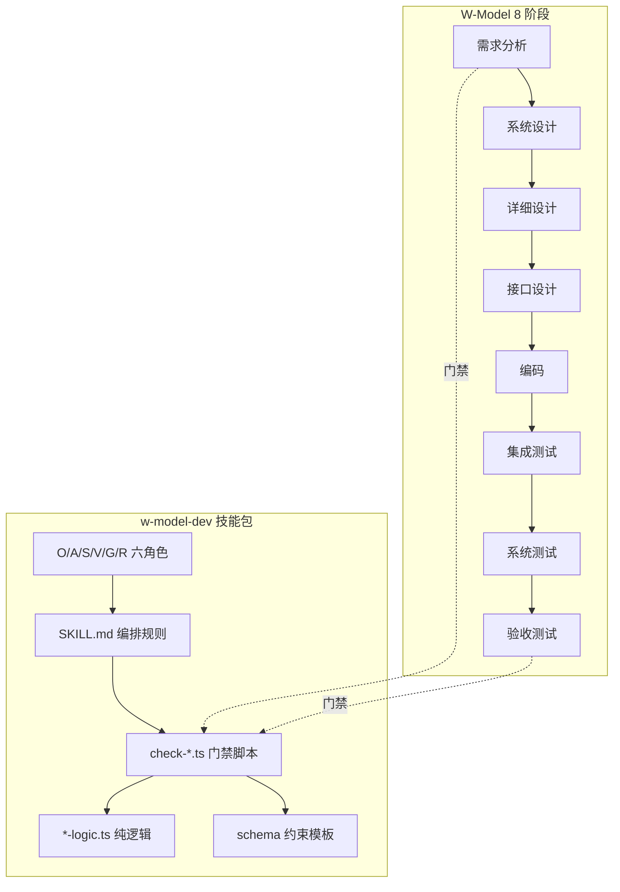

# Batch P0 实施计划：scripts 重组 / check-artifact-gate 拆分 / 错误处理 / README / 文档治理

> **For agentic workers:** REQUIRED SUB-SKILL: Use superpowers:subagent-driven-development (recommended) or superpowers:executing-plans to implement this plan task-by-task. Steps use checkbox (`- [ ]`) syntax for tracking.

**Goal:** 完成 P0 级 6 项修正（A1 拆分 check-artifact-gate / A2a CliError 扩展 / A3 README 重构 / A4 文档单事实源 / A5 根目录规整 / A6 scripts 四层重组）。

**Architecture:** 先做 A6 纯搬迁重组（不改逻辑），跑通全量回归后做 A1 逻辑拆分；A2a 向后兼容扩展 CliError；A3/A4/A5 为文档层修正。每步遵循 spec（`docs/superpowers/specs/2026-08-11-p0-p2-fixes-design.md`）。

**Tech Stack:** TypeScript (strict, ESM)、tsx、vitest、Node 20、Git Bash（重组命令用 bash，替换用 PowerShell）。

**基线（执行前核实）**：`npm run self-test`（约 250 样本）、`npx vitest run`（35 files / 530 tests）、`npx tsc --noEmit`、`npm run check:docs-consistency`、`npm run lint:security` 全部 exit 0。

---

## Task 0: 基线核实（前置）

**Files:** 无

- [ ] **Step 1: 记录基线**

Run:
```bash
npm run self-test; echo "self-test exit=$LASTEXITCODE"
npx vitest run 2>&1 | Select-String -Pattern "Test Files|Tests"
npx tsc --noEmit; echo "tsc exit=$LASTEXITCODE"
npm run check:docs-consistency; echo "docs exit=$LASTEXITCODE"
```
Expected: self-test / docs-consistency exit 0；vitest 输出 35 files 与 tests 数；tsc 无错误。**记录实际数字作为本批回归对照基线。**

- [ ] **Step 2: 确认当前 git 状态干净**

Run: `git status --porcelain`
Expected: 无未提交变更（或确认可提交后继续）。

## Task 1: A6-1 scripts 四层重组（纯搬迁）

**Files:**
- 搬迁：`w-model-dev/scripts/` → `w-model-dev/scripts/{cli,logic}/`
- 保留原位：`w-model-dev/scripts/{lib,samples,__tests__}/`

- [ ] **Step 1: 建目录并搬迁 CLI 层**

Run (Git Bash)：
```bash
cd w-model-dev/scripts
mkdir -p cli logic
git mv check-*.ts cli/                 # 25 个 check-*.ts（含 check-docs-consistency.ts 自身）
git mv wm-status.ts metrics-report.ts security-scan.ts self-test.ts ensure-codegraph-opsx.ts cli/
```
Expected: 命令无报错；`ls cli/` 显示 30 个文件。

- [ ] **Step 2: 搬迁逻辑层**

Run (Git Bash)：
```bash
cd w-model-dev/scripts
git mv *-logic.ts logic/               # 全部 *-logic.ts（含 docs-consistency-logic.ts）
git mv schema-loader.ts plan-chunks.ts logic/
```
Expected: `ls logic/` 显示全部逻辑层文件；`ls scripts/` 只剩 `cli/ logic/ lib/ samples/ __tests__/` 4 个目录。

- [ ] **Step 3: 验证搬迁完整性**

Run: `git status --porcelain | Select-String "renamed" | Measure-Object`
Expected: 约 30+ 条 renamed（搬迁不产生 delete/add 对）。确认 `cli-error.ts` 仍在 `lib/`、`__tests__/` 35 个测试文件未动。

## Task 2: A6-2 修正跨层 import 相对路径

**Files:**
- 全部 `w-model-dev/scripts/cli/*.ts`、`w-model-dev/scripts/logic/*.ts`

- [ ] **Step 1: 修正 cli/ 层 import（logic 依赖）**

Run (PowerShell, cwd=`w-model-dev/scripts/cli`)：
```powershell
Get-ChildItem *.ts | ForEach-Object {
  $c = Get-Content $_.FullName -Raw
  $c = $c -replace "from '\./([\w-]+-logic)\.js'", "from '../logic/$1.js'"
  $c = $c -replace "from '\./schema-loader\.js'", "from '../logic/schema-loader.js'"
  $c = $c -replace "from '\./plan-chunks\.js'", "from '../logic/plan-chunks.js'"
  Set-Content $_.FullName $c -NoNewline
}
```
Run: `git diff --stat`
Expected: 每个 check-*.ts 的 `./xxx-logic.js` 变 `../logic/xxx-logic.js`。

- [ ] **Step 2: 修正 cli/ 层 import（lib 依赖）**

Run (PowerShell, cwd=`w-model-dev/scripts/cli`)：
```powershell
Get-ChildItem *.ts | ForEach-Object {
  $c = Get-Content $_.FullName -Raw
  $c = $c -replace "from '\./lib/([\w-]+)\.js'", "from '../lib/$1.js'"
  Set-Content $_.FullName $c -NoNewline
}
```
Expected: `./lib/xxx.js` → `../lib/xxx.js`。

- [ ] **Step 3: 修正 logic/ 层 import（lib 依赖）**

Run (PowerShell, cwd=`w-model-dev/scripts/logic`)：
```powershell
Get-ChildItem *.ts | ForEach-Object {
  $c = Get-Content $_.FullName -Raw
  $c = $c -replace "from '\./lib/([\w-]+)\.js'", "from '../lib/$1.js'"
  Set-Content $_.FullName $c -NoNewline
}
```
Expected: logic 层 `./lib/xxx.js` → `../lib/xxx.js`；logic 层之间的 `./xxx-logic.js` 保持不动。

- [ ] **Step 4: 残留检查**

Run: `Select-String -Path w-model-dev/scripts/cli/*.ts -Pattern "from '\./([\w-]+-logic|lib|schema-loader|plan-chunks)\.js'"` 
Expected: 无匹配（残留均为合法 `./check-xxx.js` 同层引用）。

## Task 3: A6-3 修正 __tests__/ import 路径

**Files:** `w-model-dev/scripts/__tests__/*.test.ts`（29 处 / 23 个文件）

- [ ] **Step 1: 批量替换测试 import**

Run (PowerShell, cwd=`w-model-dev/scripts/__tests__`)：
```powershell
Get-ChildItem *.test.ts | ForEach-Object {
  $c = Get-Content $_.FullName -Raw
  $c = $c -replace "from '\.\./([\w-]+-logic)\.js'", "from '../logic/$1.js'"
  $c = $c -replace "from '\.\./(check-[\w-]+)\.js'", "from '../cli/$1.js'"
  $c = $c -replace "from '\.\./(schema-loader|plan-chunks)\.js'", "from '../logic/$1.js'"
  Set-Content $_.FullName $c -NoNewline
}
```
Expected: 29 处 import 全部改为新路径（重点验证 `gate-enhancement.test.ts` 的 `../logic/gate-logic.js`、`tla-clean-trace.test.ts` 的 `../cli/check-tla-model.js`）。

- [ ] **Step 2: 运行 vitest 验证**

Run: `npx vitest run`
Expected: **35 files / 530 tests 全部通过**。若有失败，检查对应测试文件的 import 路径。

## Task 4: A6-4 修正 self-test.ts（skillRoot / samplesDir / import）

**Files:** `w-model-dev/scripts/cli/self-test.ts`

- [ ] **Step 1: 修正 skillRoot 与 samplesDir**

[spec R2/R3](file:///d:/w_skill_opt/Software_Engineering_W_Development_Model_Skills_Pack/docs/superpowers/specs/2026-08-11-p0-p2-fixes-design.md) 要求。读取当前 2975-2977 行，修改为：

```ts
const here = path.dirname(fileURLToPath(import.meta.url));
const samplesDir = path.join(here, '..', 'samples');
const skillRoot = path.join(here, '..', '..');
```

- [ ] **Step 2: 修正内部 logic import（PowerShell, cwd=`w-model-dev/scripts/cli`）**

```powershell
$c = Get-Content self-test.ts -Raw
$c = $c -replace "from '\./([\w-]+-logic)\.js'", "from '../logic/$1.js'"
$c = $c -replace "from '\./schema-loader\.js'", "from '../logic/schema-loader.js'"
$c = $c -replace "from '\./lib/([\w-]+)\.js'", "from '../lib/$1.js'"
Set-Content self-test.ts $c -NoNewline
```
注意：`./check-xxx.js` 引用（同 cli/ 目录）**保持不动**（如 `./check-artifact-gate.js`）。

- [ ] **Step 3: 运行 self-test 验证版本三地方程式**

Run: `npx tsx w-model-dev/scripts/cli/self-test.ts`
Expected: 全部样本通过；**METADATA 用例（skill-metadata 一致性）通过**（证明 skillRoot 修正正确）。

## Task 5: A6-5 修正 .githooks/pre-push 路径

**Files:** `.githooks/pre-push`

- [ ] **Step 1: 替换脚本路径引用**

Run (PowerShell)：
```powershell
$c = Get-Content .githooks/pre-push -Raw
$c = $c -replace "w-model-dev/scripts/cli/check-", "w-model-dev/scripts/cli/check-"
$c = $c -replace "w-model-dev/scripts/security-scan\.ts", "w-model-dev/scripts/cli/security-scan.ts"
$c = $c -replace "w-model-dev/scripts/self-test\.ts", "w-model-dev/scripts/cli/self-test.ts"
$c = $c -replace "w-model-dev/scripts/wm-status\.ts", "w-model-dev/scripts/cli/wm-status.ts"
$c = $c -replace "w-model-dev/scripts/metrics-report\.ts", "w-model-dev/scripts/cli/metrics-report.ts"
Set-Content .githooks/pre-push $c -NoNewline
```
注意：`w-model-dev/scripts/samples/` 路径 **保持不变**（samples 未迁移）。

- [ ] **Step 2: 运行 prepush 验证 14 项门禁**

Run: `npm run prepush`
Expected: 14 项门禁全部通过（含 self-test / vitest / docs-consistency / security-scan / tsc）。

## Task 6: A6-6 修正 check-docs-consistency.ts 统计路径

**Files:** `w-model-dev/scripts/cli/check-docs-consistency.ts`（含自身）

- [ ] **Step 1: 修改 readdir 统计路径**

[spec T9](file:///d:/w_skill_opt/Software_Engineering_W_Development_Model_Skills_Pack/docs/superpowers/specs/2026-08-11-p0-p2-fixes-design.md) 要求。修改第 76 行：

```ts
const checkScriptCount = readdirSync(join(root, 'w-model-dev/scripts/cli')).filter((f) => /^check-.*\.ts$/.test(f)).length; // 含 check-docs-consistency 自身 = 25
```
**数量不变（30），勿改 EXPECTED.exit2ScriptCount 常量与 AGENTS.md「30 个脚本」文本**（docs-consistency-logic.ts:49 的 EXPECTED 不动）。

- [ ] **Step 2: 运行 docs-consistency 验证**

Run: `npm run check:docs-consistency`
Expected: exit 0。若报「实测 exit-2 脚本数应为 30」，检查 cli/ 目录是否有文件遗漏。

## Task 7: A6-7 修正 package.json scripts 路径

**Files:** `package.json`

- [ ] **Step 1: 替换 scripts 路径**

Run (PowerShell)：
```powershell
$c = Get-Content package.json -Raw
$c = $c -replace "w-model-dev/scripts/(check|self-test|security-scan|wm-status|metrics-report|ensure-codegraph-opsx)", "w-model-dev/scripts/cli/$1"
Set-Content package.json $c -NoNewline
```
Expected: `self-test`/`check:verifier`/`check:gate`/`check:graph`/`check:tla`/`check:coverage`/`check:exemption`/`lint:security`/`wm:status`/`wm:metrics`/`check:docs-consistency` 全部指向 `w-model-dev/scripts/cli/`。

- [ ] **Step 2: 验证**

Run: `npm run check:gate -- --help`（或任一 check 脚本）
Expected: 无 "Cannot find module" 错误。

## Task 8: A6-8 修正文档引用（100+ 处）

**Files:** README.md / AGENTS.md / `w-model-dev/SKILL.md` / `w-model-dev/references/*.md` / `docs/*.md` / CONTRIBUTING.md / CHANGELOG.md / `.cursor/skills/*`（若存在）

- [ ] **Step 1: 定位全部 scripts 路径引用**

Run: `Select-String -Path README.md,AGENTS.md,w-model-dev/SKILL.md,w-model-dev/references/*.md,docs/*.md,docs/**/*.md,CONTRIBUTING.md,CHANGELOG.md -Pattern "w-model-dev/scripts/[a-z-]+\.ts" | Select-Object Path,LineNumber | Format-Table -AutoSize`
Expected: 列出全部引用点（预计 100+ 处）。

- [ ] **Step 2: 逐文件替换（排除 samples 目录引用）**

Run (PowerShell, 仓库根)：
```powershell
$files = Get-ChildItem -Recurse -Include *.md | Where-Object { $_.FullName -notmatch 'node_modules|\.git' }
foreach ($f in $files) {
  $c = Get-Content $f.FullName -Raw
  $new = $c -replace "w-model-dev/scripts/cli/check-", "w-model-dev/scripts/cli/check-"
  $new = $new -replace "w-model-dev/scripts/(self-test|security-scan|wm-status|metrics-report|ensure-codegraph-opsx)\.ts", "w-model-dev/scripts/cli/$1.ts"
  $new = $new -replace "w-model-dev/scripts/([\w-]+-logic)\.ts", "w-model-dev/scripts/logic/$1.ts"
  $new = $new -replace "w-model-dev/scripts/(schema-loader|plan-chunks)\.ts", "w-model-dev/scripts/logic/$1.ts"
  if ($new -ne $c) { Set-Content $f.FullName $new -NoNewline; Write-Output "updated: $($f.FullName)" }
}
```
Expected: 所有 `.ts` 引用更新；`w-model-dev/scripts/samples/` 与 `w-model-dev/scripts/__tests__/` 引用**不被改动**（正则不匹配）。

- [ ] **Step 3: 残留检查**

Run: `Select-String -Path README.md,AGENTS.md,w-model-dev/SKILL.md -Pattern "w-model-dev/scripts/(?!cli|logic|lib|samples|__tests__)"`
Expected: 无匹配（除 samples/__tests__ 外无裸 scripts 引用）。

## Task 9: A6-9 全量回归

- [ ] **Step 1: 跑全量门禁**

Run: `npm run prepush`
Expected: 14 项全部通过，且与 Task 0 基线一致（样本数 / 用例数不减少）。

- [ ] **Step 2: Commit**

```bash
git add w-model-dev/scripts .githooks package.json README.md AGENTS.md w-model-dev/SKILL.md w-model-dev/references docs CONTRIBUTING.md CHANGELOG.md
git commit -m "refactor(scripts): split scripts into cli/logic/lib layers and sync all path references"
```

## Task 10: A1 拆分 check-artifact-gate.ts（486 行）

**Files:**
- Create: `w-model-dev/scripts/lib/phase-doc-map.ts`
- Create: `w-model-dev/scripts/cli/artifact-gate-assets.ts`
- Create: `w-model-dev/scripts/cli/uat-path-mapping.ts`
- Modify: `w-model-dev/scripts/cli/check-artifact-gate.ts`

- [ ] **Step 1: 抽取 PHASE_DOC_MAP 到 lib/phase-doc-map.ts**

从 check-artifact-gate.ts 迁出 `PHASE_DOC_MAP` 常量与 `resolvePhaseDoc` 函数（含其类型定义），新建：

```ts
/** 阶段 → 文档映射常量（SSoT：SKILL.md「阶段产物」节）。key 为阶段编号字符串 */
export const PHASE_DOC_MAP: Readonly<Record<string, string[]>> = {
  // 从原文件原样复制（含全部阶段条目）
};

export function resolvePhaseDoc(phase: string): string[] {
  return PHASE_DOC_MAP[phase] ?? [];
}
```
原 check-artifact-gate.ts 改为 `import { PHASE_DOC_MAP, resolvePhaseDoc } from '../lib/phase-doc-map.js'` 并删除本地定义。

- [ ] **Step 2: 抽取 graph/tla/bdd 资产读取到 cli/artifact-gate-assets.ts**

从 check-artifact-gate.ts 迁出：ingestion 目录扫描、`tla-manifest.json` 读取、`bdd-manifest.json` 读取 + features/SM 校验辅助函数。导出签名与原内部函数一致，新建文件：

```ts
import { readFileSync } from 'node:fs';
import { join } from 'node:path';
// 从原文件原样迁入各函数（如 discoverGraphAssets、loadTlaManifest、loadBddManifest 等，按原函数名导出）
```

- [ ] **Step 3: 抽取 uat-path-mapping 到 cli/uat-path-mapping.ts**

从 check-artifact-gate.ts 迁出 `parseUatPathMappingFromContent` / `checkUatPathMappingContent`。**兼容性关键（spec R4）**：self-test.ts:78 `import { checkUatPathMappingContent } from './check-artifact-gate.js'` 必须继续有效，故 check-artifact-gate.ts 需 re-export：

```ts
export { checkUatPathMappingContent } from './uat-path-mapping.js';
```

- [ ] **Step 4: 主文件瘦身**

check-artifact-gate.ts 仅保留：参数解析、资产装配（调用 artifact-gate-assets 的读取函数）、gate-logic 调用、结果合并、printGateReport 输出。删除迁出的函数体。

- [ ] **Step 5: 验证**

Run:
```bash
npx tsc --noEmit; echo "tsc=$LASTEXITCODE"
npx vitest run; echo "vitest=$LASTEXITCODE"
npx tsx w-model-dev/scripts/cli/self-test.ts; echo "self-test=$LASTEXITCODE"
(Get-Content w-model-dev/scripts/cli/check-artifact-gate.ts).Count
```
Expected: tsc/vitest/self-test 全过；check-artifact-gate.ts 行数 **< 250**。

- [ ] **Step 6: Commit**

```bash
git add w-model-dev/scripts/cli w-model-dev/scripts/lib
git commit -m "refactor(gate): split check-artifact-gate into phase-doc-map/artifact-gate-assets/uat-path-mapping modules"
```

## Task 11: A2a 扩展 CliError（rule / field 字段）

**Files:**
- Modify: `w-model-dev/scripts/lib/cli-error.ts`
- Modify: `w-model-dev/scripts/__tests__/cli-error.test.ts`（已存在，勿新建）

- [ ] **Step 1: 扩展 CliError 接口与输出**

修改 cli-error.ts：

```ts
export interface CliError {
  category: ErrorCategory;
  message: string;
  exitCode: 0 | 1 | 2;
  file?: string;
  rule?: string;        // 违规规则链，如 'P0-1' / 'R1-R5' / 'D7'
  field?: string;       // 具体字段位置，如 'requirements[3].id'
  detail?: string;
}
```

`formatCliError` 人类可读消息附加规则段：
```ts
export function formatCliError(e: CliError): string {
  const head = `✗ [${e.category}] ${e.message}`;
  const rule = e.rule ? ` [rule=${e.rule}]` : '';
  const tail = e.file || e.detail;
  return tail ? `${head}${rule}: ${tail}` : `${head}${rule}`;
}
```

`printErrorJson` 输出含 rule/field（缺失省略，向后兼容）：
```ts
export function printErrorJson(e: CliError): void {
  const json: Record<string, unknown> = { category: e.category, message: e.message, exitCode: e.exitCode };
  if (e.file !== undefined) json.file = e.file;
  if (e.rule !== undefined) json.rule = e.rule;
  if (e.field !== undefined) json.field = e.field;
  console.log(`ERROR_JSON ${JSON.stringify(json)}`);
}
```

- [ ] **Step 2: 扩展 cli-error.test.ts 用例**

在现有 describe 块中追加：

```ts
it('ERROR_JSON 含 rule/field 字段', () => {
  const calls: string[] = [];
  const spy = vi.spyOn(console, 'log').mockImplementation((s: string) => { calls.push(s); });
  printErrorJson({ category: 'ARG_INVALID', message: 'm', exitCode: 2, rule: 'P0-1', field: 'rtm[0].id' });
  spy.mockRestore();
  expect(calls[0]).toContain('"rule":"P0-1"');
  expect(calls[0]).toContain('"field":"rtm[0].id"');
});

it('缺失 rule/field 时 ERROR_JSON 省略', () => {
  const calls: string[] = [];
  const spy = vi.spyOn(console, 'log').mockImplementation((s: string) => { calls.push(s); });
  printErrorJson({ category: 'ARG_INVALID', message: 'm', exitCode: 2 });
  spy.mockRestore();
  expect(calls[0]).not.toContain('"rule"');
  expect(calls[0]).not.toContain('"field"');
});

it('formatCliError 附加 [rule=...] 段', () => {
  expect(formatCliError({ category: 'ARG_INVALID', message: 'm', exitCode: 2, rule: 'P0-1' })).toBe('✗ [ARG_INVALID] m [rule=P0-1]');
});
```
（若文件未 import `vi`，在顶部 `import { describe, it, expect, vi } from 'vitest';`）

- [ ] **Step 3: 全仓 exitWithError 补 rule/field（已知场景）**

对每个 check-*.ts 的 `exitWithError({category: 'ARG_INVALID', ...})` 补 `rule: 'P0-1'`、`FILE_NOT_FOUND` 补 `rule: 'P0-2'`、`SCHEMA_INVALID`/`STRUCTURE_INVALID` 补 `rule: 'P0-3'`；无明确规则 ID 的场景保持留空。**仅补已知 3 类，不逐场景编造**（spec S4）。

- [ ] **Step 4: 验证 + Commit**

Run: `npx vitest run; npx tsc --noEmit`
```bash
git add w-model-dev/scripts/lib/cli-error.ts w-model-dev/scripts/__tests__/cli-error.test.ts w-model-dev/scripts/cli
git commit -m "feat(error): add rule/field to CliError with backward-compatible ERROR_JSON"
```

## Task 12: A3 重构 README.md

**Files:** `README.md`

- [ ] **Step 1: 新增 Mermaid 架构图（README 头部下方）**

在 README 开头的「相关文档」节之前插入：

```markdown
## 架构总览


（GitHub 可渲染；本地编辑器不支持 mermaid 时按代码块查看）

- [ ] **Step 2: 新增 W 模型 8 阶段 × 门禁对应表**

在架构图后新增表格，每行：阶段 | 产出工件 | 门禁脚本 | 退出码语义。8 行内容参考 `w-model-dev/references/command-reference.md` 与各 check-*.ts 头部注释填写（阶段 1 对应 check-requirement-graph/check-artifact-gate --phase 1 等）。

- [ ] **Step 3: 新增快速入门教程节**

从「克隆 → `npm install` → `npm run setup:hooks` → 运行 `npm run self-test` → 跑通一次阶段 4 门禁」逐步展开，含：
- 输入工件格式示例（`.w-model/` 下 rtm.json 最小示例）
- 命令行样例与预期输出
- 退出码 0/1/2 含义解读
- 典型场景：`npx tsx w-model-dev/scripts/cli/check-artifact-gate.ts --phase 4`

- [ ] **Step 4: 更新健康指标表与 CI 策略声明**

将 README 中现有「健康指标」（vitest files / self-test 数 / 样本数）同步为执行时实际基线；CI 策略声明明确「本项目不集成云端 CI，本地 pre-push 为唯一门禁」。

- [ ] **Step 5: 验证 + Commit**

Run: `npm run check:docs-consistency`
Expected: exit 0（README 是 REQUIRED_PATHS 之一，内容需与 docs-consistency 计数一致）。
```bash
git add README.md
git commit -m "docs(readme): add architecture diagram, phase-gate matrix and quickstart tutorial"
```

## Task 13: A4 文档单事实源治理

**Files:** `w-model-dev/SKILL.md`、`w-model-dev/references/toolbox.md`、`w-model-dev/references/dispatch-matrix.md`、`docs/skill-design-document.md` 等

- [ ] **Step 1: 冗余梳理**

对比 SKILL.md / toolbox.md / dispatch-matrix.md 三者的命令接口与角色分派段落，将 toolbox.md 的「命令速查表」、dispatch-matrix.md 的「角色分派矩阵」保留为细则，SKILL.md 中仅保留核心编排逻辑 + 命令接口**引用**（相对链接指向 references/ 对应文档）。

- [ ] **Step 2: 废弃文档标记（先引用核查，spec R8/T6）**

对每个候选废弃文档（如 `docs/llm-verifier-integration-design.md`）：
1. Run: `Select-String -Path README.md,AGENTS.md,w-model-dev/scripts/**/*.ts -Pattern "llm-verifier-integration-design"` 核查引用。
2. 若被 REQUIRED_PATHS / DESIGN_DOC_NAMES 强制（见 [check-docs-consistency.ts:36-44](file:///d:/w_skill_opt/Software_Engineering_W_Development_Model_Skills_Pack/w-model-dev/scripts/cli/check-docs-consistency.ts#L36-L44)）——**不得移除**，仅可加头部声明且不得含 FORBIDDEN_TARGETKIND 词。
3. 仅对无活跃引用的文档加废弃声明：
```markdown
> **DEPRECATED**（废弃时间：2026-08-11）— 本文档已由 `<最新文档路径>` 取代，请勿继续引用。
```

- [ ] **Step 3: 验证 + Commit**

Run: `npm run check:docs-consistency`
```bash
git add w-model-dev/SKILL.md w-model-dev/references docs
git commit -m "docs(sso): dedupe rule docs into references and mark deprecated docs"
```

## Task 14: A5 根目录与 docs 规整

**Files:** `README.md`、`AGENTS.md`

- [ ] **Step 1: eval/ 边界标注**

在 README「相关文档」与 AGENTS.md 中新增：
```markdown
> `eval/` 目录为外部工具评估产物，**不属技能包**，不参与 `/wm` 编排，修改技能包时无需关注。
```

- [ ] **Step 2: docs/ 导航完整性**

检查 docs/ 下所有 .md 均在 README「相关文档」有入口（缺失则补链接）。CHANGELOG/CONTRIBUTING/LICENSE 保持根目录。

- [ ] **Step 3: Commit**

```bash
git add README.md AGENTS.md
git commit -m "docs(eval): mark eval/ as non-skill boundary in README and AGENTS"
```

## Task 15: Batch P0 收尾回归

- [ ] **Step 1: 全量门禁 + CHANGELOG**

Run: `npm run prepush`
Expected: 14 项全过。
在 CHANGELOG.md 追加 P0 批次条目（conventional commit 风格，列出 A1/A2a/A3/A4/A5/A6 变更）。

```bash
git add CHANGELOG.md
git commit -m "docs(changelog): record batch P0 fixes"
```

- [ ] **Step 2: 对照 spec 检查**

对照 [spec §2 Batch P0](file:///d:/w_skill_opt/Software_Engineering_W_Development_Model_Skills_Pack/docs/superpowers/specs/2026-08-11-p0-p2-fixes-design.md) 逐项确认 A1/A2a/A3/A4/A5/A6 均已落实且回归通过。确认后进入 Batch P1。
