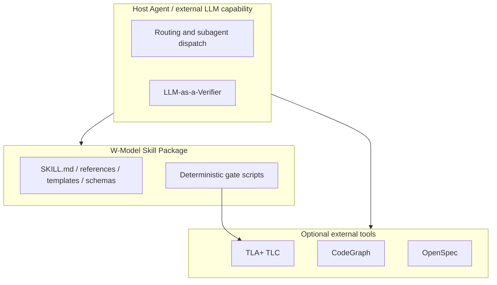

# 批次 C：文档、示例与采用体验实现计划

> **面向 AI 代理的工作者：** 必需子技能：使用 `subagent-driven-development`（推荐）或 `executing-plans` 逐任务实现此计划。步骤使用复选框（`- [ ]`）语法来跟踪进度。

**目标：** 让 SSoT、Persona 示例、文档门禁和新手路径准确描述当前技能包边界，并让所有示例可由真实门禁验证。

**架构：** SSoT 从“内置 AI 引擎”叙述改为技能包/宿主 Agent/外部工具三边界模型；完整 Verifier 示例移动为可执行 fixture；README 分离仓库验证与 Agent 安装；docs-consistency 覆盖 SSoT 内链。

**技术栈：** Markdown、Mermaid、JSON、Vitest、现有 check-verifier-output/check-docs-consistency CLI。

---

## 文件结构

- 修改：`docs/skill-design-document_SSoT.md` — 修链接和架构边界图。
- 修改：`w-model-dev/references/agent-personas.md` — 移除失效完整 JSON，改链接说明。
- 创建：`w-model-dev/scripts/samples/verifier/persona-{code,test,security,performance}.json` — 真实可通过 fixture。
- 修改：`w-model-dev/scripts/self-test.ts` — 注册新 fixture。
- 修改：`w-model-dev/scripts/samples/README.md` — 样本矩阵登记。
- 修改：`w-model-dev/scripts/__tests__/docs-consistency-logic.test.ts`、创建或修改 `verifier-logic.test.ts` — 文档链接和 Persona fixture 回归。
- 修改：`README.md`、`docs/INSTALL.md`、`docs/adoption-guide.md`、`AGENTS.md`、`CONTRIBUTING.md`、`CHANGELOG.md`。

### 任务 C1：修复 SSoT 内链并重画架构边界

**文件：**
- 修改：`docs/skill-design-document_SSoT.md:68-108,397-399`
- 测试：`docs-consistency-logic.test.ts`

- [ ] **步骤 1：写失败的内链测试**

利用批次 B 注入 SSoT 的 linkDocs，为三个路径断链断言构造真实仓库 fixture。断言：
```text
../CHANGELOG.md
../CHANGELOG-archive.md
./changes/decision-log/README.md
```
存在且 `runDocConsistencyChecks` 无 internal-link violation。

- [ ] **步骤 2：运行确认失败**

```bash
npx vitest run --config config/vitest.config.ts w-model-dev/scripts/__tests__/docs-consistency-logic.test.ts
npm run check:docs-consistency
```
预期：SSoT 三条错误 `../../` 路径导致失败。

- [ ] **步骤 3：修正三个路径**

在 SSoT 第 397-399 行按基于 `docs/` 的相对路径替换为上述三个路径；不得把根文档移动或建立冗余副本规避错误。

- [ ] **步骤 4：更新 Mermaid 图和相邻叙述**

替换内部“AI引擎层”子图为三边界图：



图下文字必须明确：技能包不含 LLM SDK、模型调用、业务 `src/` 或编程式 AI 引擎；外部 Agent 是宿主能力，不属于技能包。

- [ ] **步骤 5：验证并提交**

```bash
npm run check:docs-consistency
npx vitest run --config config/vitest.config.ts w-model-dev/scripts/__tests__/docs-consistency-logic.test.ts
git add docs/skill-design-document_SSoT.md w-model-dev/scripts/__tests__/docs-consistency-logic.test.ts
git commit -m "fix(docs): align SSoT links and external agent boundary"
```

### 任务 C2：用真实 Verifier fixture 替换 Persona JSON 样例

**文件：**
- 创建：`w-model-dev/scripts/samples/verifier/persona-code-reviewer.json`
- 创建：`w-model-dev/scripts/samples/verifier/persona-test-engineer.json`
- 创建：`w-model-dev/scripts/samples/verifier/persona-security-auditor.json`
- 创建：`w-model-dev/scripts/samples/verifier/persona-performance-auditor.json`
- 修改：`w-model-dev/references/agent-personas.md:125-153,232-260,354-382,500-538`
- 修改：`self-test.ts`、`samples/README.md`、`verifier-logic.test.ts`

- [ ] **步骤 1：生成并验证最小完整 fixture 的失败基线**

先在测试中读取四个预期路径并执行 `checkVerifierOutput`。在文件尚未创建时断言失败；或先把现有文档示例抽取为临时 JSON，断言 schema 失败以记录迁移动机。

- [ ] **步骤 2：创建四个完整通过样本**

每个 fixture 使用 `verifier-output.schema.json` 当前字段：

```json
{
  "schemaVersion": "1.0",
  "meta": {
    "targetKind": "code",
    "target": "example.ts",
    "reviewedAt": "2026-08-19T00:00:00.000Z",
    "agent": "code-reviewer",
    "scoringMethod": "text-parse",
    "repeatTimes": 3,
    "varianceThreshold": 0.05
  }
}
```

每个 subCriterion 必须有合法 name、weight、score、三项 rawScores、真实 variance 和 `path:Lline` 或 `path:§section` evidence。权重和为 1，composite score 与公式一致，summary 至少 50 字符且含关键决策/结构/遗留风险。使用一个合法 targetKind，不能写 `code | design`。若 `passed=true`，不得含阻断性 rework hint。

- [ ] **步骤 3：缩减 Markdown 示例**

Persona 文档不再内嵌完整 JSON。每段改为：字段/Persona 使用说明 + 指向对应 fixture 的相对链接 + “该样本由 `check-verifier-output` 回归验证”的说明。performance 的 mode、scorecard 等扩展信息改为 narrative，不放入 VerifierOutput 根对象。

- [ ] **步骤 4：注册样本和测试**

在 self-test 加入四个有效 Verifier 样本；在 samples README 矩阵登记；在 verifier 单测逐个读取 fixture，断言 `passed=true` 和 `reasons=[]`。

- [ ] **步骤 5：运行实际 CLI、全量测试和提交**

```bash
for f in w-model-dev/scripts/samples/verifier/persona-*.json; do
  npx tsx w-model-dev/scripts/cli/check-verifier-output.ts "$f" --json || exit 1
done
npm run self-test
npm test
npm run check:samples-coverage
npm run check:docs-consistency
git add w-model-dev/references/agent-personas.md w-model-dev/scripts/samples/verifier w-model-dev/scripts/samples/README.md w-model-dev/scripts/self-test.ts w-model-dev/scripts/__tests__
git commit -m "fix(persona): replace stale verifier JSON examples"
```

### 任务 C3：拆分仓库验证与 Skill 安装入口

**文件：**
- 修改：`README.md:10,79-159`
- 修改：`docs/INSTALL.md:23-155,237-251`
- 修改：`docs/adoption-guide.md:8-34`
- 修改：`AGENTS.md`、`CONTRIBUTING.md`

- [ ] **步骤 1：写文档一致性测试**

在 docs-consistency 相关测试或专用文档测试中断言 README 有两个独立标题：`验证仓库` 与 `安装 Skill`；断言 `npm run doctor` 出现在验证仓库流程；断言 `postinstall` / `core.hooksPath` 披露存在。

- [ ] **步骤 2：运行确认失败**

运行文档测试，预期 FAIL：当前 README 混合路径。

- [ ] **步骤 3：重写 README 首屏和教程**

A 路径必须按如下顺序：

```text
Git clone → 进入仓库根目录 → npm install → npm run self-test → npm run doctor
```

B 路径只讲 Agent 安装。添加 Node ≥20、Git、首次安装联网、从根目录运行的要求。提供 PowerShell 5.1 两行命令，不使用 `&&`；提供 Bash/PowerShell 7 简写。用项目真实 canonical clone URL；若仓库没有可验证 canonical URL，不编造 URL，而是明确要求维护者在发布配置中注入该值并将其列为发布阻断项。

- [ ] **步骤 4：披露 hook 与平台边界**

在安装前说明 `npm install` 的 postinstall 会设置本仓库 `core.hooksPath=.githooks`；说明检查、取消和恢复命令。说明 self-test/doctor 可在 PowerShell 运行；pre-push 及平台补装脚本需要 Bash。提醒 Windows 与 WSL 不要对同一 checkout 混用 node_modules。

- [ ] **步骤 5：同步 INSTALL、adoption、AGENTS 与 CONTRIBUTING**

INSTALL 引用 README 的两条入口，不再把 `$env:USERPROFILE\.agent` 作为通用 Agent 路径；adoption-guide 的 Day 0 先验证仓库再安装 Agent；AGENTS/CONTRIBUTING 记录 hook 副作用和显式平台补装命令。

- [ ] **步骤 6：验证和提交**

```bash
npm run check:docs-consistency
npm test
npm run prepush
git add README.md docs/INSTALL.md docs/adoption-guide.md AGENTS.md CONTRIBUTING.md CHANGELOG.md w-model-dev/scripts/__tests__
git commit -m "docs: separate repository verification from skill installation"
```

### 任务 C4：批次 C 验收

- [ ] **步骤 1：运行直接证据命令**

```bash
npm run check:docs-consistency
npm run check:gate -- --validate-templates
for f in w-model-dev/scripts/samples/verifier/persona-*.json; do
  npx tsx w-model-dev/scripts/cli/check-verifier-output.ts "$f" --json || exit 1
done
```

预期：全部 exit 0，SSoT 三链接均可解析，四个 Persona fixture 都通过。

- [ ] **步骤 2：运行全量验收与提交批次说明**

```bash
npm test
npm run typecheck
npm run prepush
git status --short
```

预期：所有验证通过；仅本批次预期文件变更存在。提交必要 CHANGELOG 收尾：

```bash
git add CHANGELOG.md
git commit -m "docs: record documentation and verifier example remediation"
```
