# 详细设计文档

> 阶段 4（详细设计）产出。套用 `templates/detailed-design.md` 模板。
> 博客系统后端（blog-system-demo-r35）。
> 输入：`docs/phase3-outline/blog-system-interface-design.md`（阶段 3 接口设计，22 接口契约）；图谱：`.w-model/ingestion/graph.json`（72 节点）；RTM：`.w-model/rtm.json`（32 行）。
> 同步产出：`docs/phase4-detailed/blog-system-unit-test.md`（58 条 UT 单元测试用例）；RTM 已补登（`.w-model/rtm.json`，designDoc 详细设计引用 + unitTest）。

## 文档信息

- 项目名称：博客系统后端（blog-system-demo-r35）
- 文档版本：v1.0
- 编制日期：2026-08-07
- 编制者：W 模型 S-doc 子代理（产出变体）
- 关联接口设计文档：`docs/phase3-outline/blog-system-interface-design.md`
- 关联系统设计文档：`docs/phase2-design/blog-system-system-design.md`
- 关联需求文档：`docs/phase1-requirements/requirement-spec.md`

## 0. 阶段 3 reworkHints Required 处置

> 依据 `.w-model/preventive-reviews/3-security.json`、`3-reliability.json` 的 Required 级发现，在详细设计层显式处置；每一处置均有 DD 落点与 UT 落点（详见 `blog-system-unit-test.md`）。

### 0.1 处置总表

| # | reworkHint（阶段 3 预防性评审） | 严重级 | 详细设计处置 | DD 落点 | UT 落点 |
|---|---|---|---|---|---|
| RH-01 | CON-004 审计日志不得含明文凭据未闭环（3-security #1，阶段 1 Required 延续） | Required | AuditLog 字段设计显式排除 password/token/请求体凭据；auditMiddleware 仅提取白名单字段；UT 负向断言「审计记录不含 password/token」 | DD-043、DD-049 | UT-043、UT-049 |
| RH-02 | AuthFlow BDD @invariants `none => registered` 与 TLA+ `ActiveTokenRequiresRegistered` 方向相反（3-reliability #1） | Required | DD 状态定义（§0.2）：令牌状态机 none→active→expired，不变式方向对齐 TLA+ 为 `active => registered ∧ expired => registered`；BDD @invariants 修正方向由 S-bdd 负责 | DD-002、DD-041、DD-046 | UT-041、UT-046、UT-051、UT-056 |
| RH-03 | CommentFlow TLA+ DeleteComment 转移不可达（deletionAuthorized 无使能动作）（3-reliability #2） | Required | DD 授权上下文（§0.3）：deleteComment 前置条件显式定义「文章作者删除上下文」（等价 AuthorizeDeletion 使能动作），使删除在代码层可达 | DD-018 | UT-018、UT-053 |
| RH-04 | 模块调用关系图边集合缺 SD-003→SD-001、SD-006→SD-001（3-reliability #3） | Required | 跨模块调用与数据源声明（§1.3）显式补列 SD-003→SD-001（评论作者/文章作者/关注双方身份校验）与 SD-006→SD-001（RSS 博主存在性）；图边写入 `.w-model/ingestion/graph.json` 由 A-evolve 阶段 4 ingestion 子流程执行（本子代理不写 graph.json，见分工） | DD-018/019/020、DD-037 | UT-018/020/024/030、UT-052 |

### 0.2 状态定义（RH-02：AuthFlow BDD 不变式方向落地）

> 对齐 `tla/specs/level3/L3_BlogSystemAuthFlow.tla` 的 `ActiveTokenRequiresRegistered`（`tokenState # "none" => registered`），并将 BDD `@invariants` 方向修正为与之一致。

**JWT 令牌状态机（DD 状态定义）**

| 状态 | 含义 | 进入条件 | 退出条件 |
|---|---|---|---|
| `none` | 未签发令牌 | 初始态（用户刚注册，未登录） | `issueToken` 成功 → `active` |
| `active` | 令牌有效（24h 内，CON-003） | `authService.issueToken`（注册后/登录时签发） | 时间流逝 `exp − now > 86400s` → `expired`（由 `jwtUtil.verify` 检测） |
| `expired` | 令牌已过期 | `active` 且 `now > exp` | `reLogin` 重签新令牌 → `active` |

**代码层不变式（方向 = TLA+ 一致，非 BDD 原 `none => registered`）**

- `active ⇒ registered`：能签发有效令牌的用户必然已注册（`issueToken` 前置：userId 存在于 user store）
- `expired ⇒ registered`：过期令牌的持有者必然曾注册
- `tokenState = none` 时**不**要求 `registered`（匿名访问/未登录态）
- 非法态禁态：`active ∧ ¬registered` 不可达（`issueToken` 先查 user store，不存在则 40401/50001）

**落点**：DD-002 `authService.issueToken/login` 后置条件；DD-046 `jwtUtil.verify`（exp 判定 → 40102）；DD-041 `authMiddleware`（缺失/伪造 → 40101，过期 → 40102）。BDD `@invariants` 文案修正（`active => registered` + `expired => registered`）由 S-bdd 在 L4 feature 设计阶段落实。

### 0.3 授权上下文（RH-03：CommentFlow DeleteComment 可达性落地）

> 对齐 `tla/specs/level3/L3_BlogSystemCommentFlow.tla` 的 `deletionAuthorized` 守卫，在代码层补「AuthorizeDeletion 等价使能动作」：删除不再不可达。

**`commentService.deleteComment` 授权上下文定义**

| 要素 | 定义 |
|---|---|
| 上下文使能动作（AuthorizeDeletion） | 读取目标文章 `article.authorId`（经 DD-007 `articleService.getPublishedArticleById`，数据源 = article store）；读取操作者 `token.sub = actorId`（经 DD-041 authMiddleware） |
| 授权判定 | `deletionAuthorized := (actorId === article.authorId)`；两者均在 **user store** 校验身份存在性（跨模块经 SD-001 服务方法，P7-002 约束：authorId 为 user 实体主键） |
| 未授权 | `deletionAuthorized = FALSE` → 抛 40301，评论不删除（对应 BDD-L3-016 越权删除被拒） |
| 已授权 | `deletionAuthorized = TRUE` → 执行删除，返回 204（对应 BDD-L3-015 作者删除可达） |

**落点**：DD-018 `commentService.deleteComment` 前置条件 =「目标文章存在且已发布 ∧ actorId 已认证 ∧ deletionAuthorized（作者身份比对）」；后置 = 评论删除 + 级联（回复一并删除）。

### 0.4 调用图边同步（RH-04）

阶段 3 接口设计 §4 已声明「归属校验 INTF-012/014: SD-003 → SD-001」「博主存在性 INTF-021: SD-006 → SD-001」，但 §1 图与 graph.json 未同步。详细设计在 §1.3 跨模块调用声明中显式补全该两条依赖边；**图边写入 graph.json 由 A-evolve 阶段 4 ingestion 执行**（本子代理按分工不写 `.w-model/ingestion/graph.json`）。补边后依赖边集合仍无环（SD-006→SD-003→SD-002→SD-001→SD-007 与 SD-004→SD-005→…，均单向向下）。

## 1. 类设计

### 1.1 类图

> 50 个设计项（DD-001~DD-050）覆盖 7 子系统；图中展示类/模块间继承（Store 接口实现）、关联（控制器→服务→存储）与依赖（跨模块服务调用、横切依赖）。方法级定义见 §1.2。

```mermaid
classDiagram
    direction LR

    %% ============ SD-007 基础设施（横切） ============
    class AppFactory {
        <<SD-007>>
        +createApp(deps) Express
        +eventBus 进程内事件总线
    }
    class Store~T~ {
        <<interface>>
        +create(record) T
        +findById(id) T
        +findAll() T[]
        +update(id, patch) T
        +delete(id) void
    }
    class authMiddleware {
        <<DD-041>>
        +authenticate(req,res,next) void
        +requireBlogger(req,res,next) void
    }
    class rateLimitMiddleware {
        <<DD-042>>
        +rateLimit(opts) Middleware
    }
    class auditMiddleware {
        <<DD-043>>
        +audit(actionType) Middleware
    }
    class errorMiddleware {
        <<DD-044>>
        +errorHandler(err,req,res,next) void
    }
    class asyncHandler {
        <<DD-045>>
        +wrap(handler) Middleware
    }
    class jwtUtil {
        <<DD-046>>
        +sign(payload) string
        +verify(token) Payload
    }
    class validationUtil {
        <<DD-047>>
        +parse(schema, input) Result
        +mapError(e) BizError
    }
    class storeFactory {
        <<DD-048>>
        +createStores() StoreContainer
        +begin() Tx
        +commit(tx) void
        +rollback(tx) void
    }
    class AuditLogStore {
        <<DD-049>>
        +append(log) void
        +list(filter) AuditLog[]
        +prune(before) number
    }

    %% ============ SD-001 用户身份 ============
    class AuthController {
        <<DD-001>>
        +register(req,res) void
        +login(req,res) void
        +applyBlogger(req,res) void
        +getProfile(req,res) void
        +updateProfile(req,res) void
        +changePassword(req,res) void
    }
    class authService {
        <<DD-002>>
        +register(input) User
        +login(identifier, password) Session
        +applyBlogger(userId) User
    }
    class profileService {
        <<DD-003>>
        +getProfile(userId) User
        +updateProfile(userId, patch) User
        +changePassword(userId, old, nw) void
    }
    class UserStore {
        <<DD-004>>
        +create(u) User
        +findByEmail(e) User
        +findByUsername(n) User
        +findById(id) User
        +updateRole(id, role) User
    }

    %% ============ SD-002 内容发布 ============
    class ArticleController {
        <<DD-005>>
        +createArticle / publishArticle / archiveArticle
        +unarchiveArticle / updateArticle / deleteArticle
        +listMyArticles
    }
    class MetadataController {
        <<DD-006>>
        +createTag / listTags / createCategory / listCategories
    }
    class articleService {
        <<DD-007>>
        +createArticle(authorId, input) Article
        +publishArticle(articleId, authorId) Article
        +archiveArticle(articleId, authorId) Article
        +unarchiveArticle(articleId, authorId) Article
        +updateArticle(articleId, authorId, patch) Article
        +deleteArticle(articleId, authorId) void
        +listMyArticles(authorId, status, p) Page
        +getPublishedArticleById(id) Article
        +listPublishedArticles(f, p) Page
    }
    class articleStateMachine {
        <<DD-008>>
        +transition(state, action) Status
        +canTransition(state, action) boolean
    }
    class tagService {
        <<DD-009>>
        +createTag(name, actorId) Tag
        +listTags() Tag[]
        +filterByTag(name, p) Page
    }
    class categoryService {
        <<DD-010>>
        +createCategory(name, parentId, actorId) Category
        +listCategories() Category[]
        +filterByCategory(id, p) Page
    }
    class ArticleStore {
        <<DD-011>>
    }
    class TagStore {
        <<DD-012>>
    }
    class CategoryStore {
        <<DD-013>>
    }

    %% ============ SD-003 读者互动 ============
    class BrowseController {
        <<DD-014>>
        +listArticles / getArticle
    }
    class CommentController {
        <<DD-015>>
        +createComment / listComments / deleteComment / replyComment
    }
    class InteractionController {
        <<DD-016>>
        +like / unlike / favorite / unfavorite / listMyFavorites
        +follow / unfollow / getFeed
    }
    class articleBrowseService {
        <<DD-017>>
        +listPublishedArticles(f, p) Page
        +getPublishedArticleDetail(id, clientIp) Detail
    }
    class commentService {
        <<DD-018>>
        +createComment(articleId, authorId, content, parentId) Comment
        +listComments(articleId, p) Page
        +deleteComment(articleId, commentId, actorId) void
        +replyComment(articleId, parentId, authorId, content) Comment
    }
    class likeService {
        <<DD-019>>
        +likeArticle / unlikeArticle / favoriteArticle / unfavoriteArticle
        +listMyFavorites / countLikes / countFavorites
    }
    class followService {
        <<DD-020>>
        +followBlogger / unfollowBlogger / getFeed
    }
    class CommentStore {
        <<DD-021>>
    }
    class LikeStore {
        <<DD-022>>
    }
    class FavoriteStore {
        <<DD-023>>
    }
    class FollowStore {
        <<DD-024>>
    }

    %% ============ SD-004 发现推荐 ============
    class DiscoveryController {
        <<DD-025>>
        +getHotArticles / getRecommendations / searchArticles
    }
    class hotService {
        <<DD-026>>
        +getHotArticles(limit) HotItem[]
    }
    class recommendService {
        <<DD-027>>
        +getRecommendations(userId?, limit) Item[]
    }
    class searchService {
        <<DD-028>>
        +searchArticles(q, p) Page
        +syncIndex(event) void
    }
    class SearchIndexStore {
        <<DD-029>>
    }

    %% ============ SD-005 统计通知 ============
    class StatsController {
        <<DD-030>>
        +getBloggerStats / listNotifications / markNotificationRead
    }
    class readingStatService {
        <<DD-031>>
        +recordView(articleId, clientIp) void
        +getViewCount(articleId) number
        +getViews7d(articleIds) Map
        +getTrend7d(articleIds) Trend[]
    }
    class bloggerStatsService {
        <<DD-032>>
        +getBloggerStats(bloggerId) Stats
    }
    class notificationService {
        <<DD-033>>
        +onArticlePublished / onCommentCreated / onArticleLiked / onFollowCreated
        +listNotifications / markNotificationRead
    }
    class ReadingRecordStore {
        <<DD-034>>
    }
    class NotificationStore {
        <<DD-035>>
    }

    %% ============ SD-006 订阅集成 ============
    class IntegrationController {
        <<DD-036>>
        +getBloggerRss / createWebhook / listWebhooks / deleteWebhook
    }
    class rssService {
        <<DD-037>>
        +getBloggerRss(bloggerId) string
    }
    class webhookService {
        <<DD-038>>
        +createWebhook / listWebhooks / deleteWebhook
        +deliverWebhook(deliveryId) void
        +onArticlePublished / onCommentCreated
    }
    class WebhookConfigStore {
        <<DD-039>>
    }
    class WebhookDeliveryStore {
        <<DD-040>>
    }

    %% ============ 继承（Store 接口实现） ============
    UserStore ..|> Store
    ArticleStore ..|> Store
    TagStore ..|> Store
    CategoryStore ..|> Store
    CommentStore ..|> Store
    LikeStore ..|> Store
    FavoriteStore ..|> Store
    FollowStore ..|> Store
    ReadingRecordStore ..|> Store
    NotificationStore ..|> Store
    WebhookConfigStore ..|> Store
    WebhookDeliveryStore ..|> Store
    AuditLogStore ..|> Store
    SearchIndexStore ..|> Store

    %% ============ 控制器 → 服务（关联） ============
    AuthController --> authService
    AuthController --> profileService
    ArticleController --> articleService
    MetadataController --> tagService
    MetadataController --> categoryService
    BrowseController --> articleBrowseService
    CommentController --> commentService
    InteractionController --> likeService
    InteractionController --> followService
    DiscoveryController --> hotService
    DiscoveryController --> recommendService
    DiscoveryController --> searchService
    StatsController --> readingStatService
    StatsController --> bloggerStatsService
    StatsController --> notificationService
    IntegrationController --> rssService
    IntegrationController --> webhookService

    %% ============ 服务 → 存储（关联） ============
    authService --> UserStore
    profileService --> UserStore
    articleService --> ArticleStore
    articleService --> TagStore
    articleService --> CategoryStore
    tagService --> TagStore
    categoryService --> CategoryStore
    articleBrowseService --> ArticleStore
    commentService --> CommentStore
    likeService --> LikeStore
    likeService --> FavoriteStore
    followService --> FollowStore
    hotService --> ReadingRecordStore
    recommendService --> ReadingRecordStore
    readingStatService --> ReadingRecordStore
    bloggerStatsService --> ReadingRecordStore
    notificationService --> NotificationStore
    webhookService --> WebhookConfigStore
    webhookService --> WebhookDeliveryStore
    rssService --> ArticleStore
    auditMiddleware --> AuditLogStore
    searchService --> SearchIndexStore

    %% ============ 跨模块服务依赖（依赖） ============
    articleService ..> authService : 博主/归属校验（user store，SD-002→SD-001）
    articleBrowseService ..> articleService : 已发布文章读取（SD-003→SD-002）
    commentService ..> articleService : 文章存在/状态（SD-003→SD-002）
    commentService ..> authService : 作者身份（SD-003→SD-001）
    likeService ..> articleService : 文章校验（SD-003→SD-002）
    followService ..> articleService : feed 文章（SD-003→SD-002）
    followService ..> authService : follower/followee 身份（SD-003→SD-001）
    hotService ..> readingStatService : 7 天阅读统计（SD-004→SD-005）
    hotService ..> articleService : 文章数据（SD-004→SD-002）
    recommendService ..> readingStatService : 标签偏好（SD-004→SD-005）
    recommendService ..> articleService : 文章数据（SD-004→SD-002）
    searchService ..> articleService : 文章明细（SD-004→SD-002）
    bloggerStatsService ..> articleService : 文章数（SD-005→SD-002）
    bloggerStatsService ..> commentService : 评论数（SD-005→SD-003）
    rssService ..> articleService : 已发布文章（SD-006→SD-002）
    rssService ..> authService : 博主存在性（SD-006→SD-001）
    notificationService ..> articleService : 事件源（SD-005→SD-002）
    notificationService ..> commentService : 事件源（SD-005→SD-003）
    webhookService ..> articleService : 事件源（SD-006→SD-002）
    webhookService ..> commentService : 事件源（SD-006→SD-003）

    %% ============ 横切依赖（全部 → SD-007） ============
    authService ..> jwtUtil
    authService ..> validationUtil
    articleService ..> storeFactory
    webhookService ..> storeFactory
    AppFactory --> authMiddleware
    AppFactory --> rateLimitMiddleware
    AppFactory --> auditMiddleware
    AppFactory --> errorMiddleware
    AppFactory --> asyncHandler
```



### 1.2 类定义（方法级定义：签名 / 职责 / 前置条件 / 后置条件 / 异常）

> 每个设计项含：职责、属性、方法表、装配点、测试 seam。装配点 = Express 中间件链/路由注册位置（对应接口设计 §5 路由注册顺序 29 条）；测试 seam = 单元测试钩住点（第 22 轮「设计项→装配点→测试 seam 三者一致性」）。字段命名与阶段 3 接口设计保持业务语义对齐（见 §7 Implementation Decisions）。

#### DD-001 AuthController（SD-001 · 路由处理）

- 职责：身份域路由处理器，仅做参数透传（校验委托 validationUtil、业务委托 authService/profileService、响应组装），不含业务规则（NFR-005）。
- 属性：`authService: authService`；`profileService: profileService`；`validationUtil: validationUtil`。
- 方法：

| 方法 | 签名 | 职责 | 前置条件 | 后置条件 | 异常 |
|---|---|---|---|---|---|
| register | `(req, res): Promise<void>` | 校验 body → authService.register → 201 响应 | body 已过 zod 校验；限流未超 | 201 `{code:0,data:{userId,...}}` | 40001/40002/40901（经 errorMiddleware 统一出） |
| login | `(req, res): Promise<void>` | 校验 body → authService.login → 200 响应 | body 已过 zod 校验；限流未超 | 200 `{code:0,data:{token,expiresIn,user}}` | 40101/42901 |
| applyBlogger | `(req, res): Promise<void>` | 取 `req.user.userId` → authService.applyBlogger → 200 | authMiddleware 已认证（req.user 存在） | 200 `{code:0,data:{userId,role:'blogger',updatedAt}}` | 40101/40102 |
| getProfile | `(req, res): Promise<void>` | 取 `req.user.userId` → profileService.getProfile → 200 | 已认证 | 200 资料 JSON | 40101/40102 |
| updateProfile | `(req, res): Promise<void>` | 校验 patch → profileService.updateProfile → 200 | 已认证；patch 至少一项 | 200 更新后资料 | 40001/40002 |
| changePassword | `(req, res): Promise<void>` | 校验 body → profileService.changePassword → 200 | 已认证；old≠new | 200 `{code:0,data:{updated:true}}` | 40001/60002 |

- 装配点：`GET/PATCH /api/users/me`、`PUT /api/users/me/password`、`POST /api/users/me/blogger`（路由注册顺序第 4/5/6 位，静态路径先于 `/api/users/:id/follow`）。
- 测试 seam：类公共方法（实例化依赖注入 mock service 后直调）。

#### DD-002 authService（SD-001 · 业务逻辑）

- 职责：注册/登录/博主申请核心业务；bcrypt 加盐哈希（NFR-002）、JWT 签发（CON-003）、凭据错误统一 40101 防枚举；令牌状态机（RH-02 §0.2）。
- 属性：`userStore: UserStore`；`jwtUtil: jwtUtil`；`bcrypt`（bcryptjs 2.x）。
- 方法：

| 方法 | 签名 | 职责 | 前置条件 | 后置条件 | 异常 |
|---|---|---|---|---|---|
| register | `(input: {username,email,password}): Promise<User>` | 唯一性校验（username/email）→ bcrypt 哈希 → 写入 user store → 返回 User（**不含 passwordHash**） | input 已通过 zod 校验；username/email 未被占用 | 新 User 落库（role=reader）；passwordHash 以 bcrypt 存储；**响应/存储均不含明文密码** | 40901（唯一冲突）/50001 |
| login | `(identifier, password): Promise<Session>` | 按用户名或邮箱查用户 → bcrypt 比对 → 签发 JWT | identifier ∈ [3,64]；password ∈ [8,64] | `{token, expiresIn:86400, user}`；令牌状态 none→active（§0.2） | 40101（凭据错误统一，不区分账号/密码）；42901 由中间件拦 |
| applyBlogger | `(userId): Promise<User>` | 角色 reader→blogger（幂等：已是 blogger 直接返回 200） | userId 存在（user store） | 用户 role 更新为 blogger | 40401/50001 |
| issueToken | `(userId): Promise<string>` | jwtUtil.sign `{sub:userId}`，有效期 24h | **前置不变式：userId 必须已注册（user store 存在）→ `active ⇒ registered`（§0.2）** | 返回 JWT；`exp−iat ≤ 86400s` | 40401/50001 |

- 装配点：由 AuthController/ArticleController 等经服务方法消费；事件：无。
- 测试 seam：类公共方法（mock user store / jwtUtil 依赖注入）。

#### DD-003 profileService（SD-001 · 业务逻辑）

- 职责：资料查看/更新、修改密码（原密码校验 60002）。
- 属性：`userStore: UserStore`；`bcrypt`。
- 方法：

| 方法 | 签名 | 职责 | 前置条件 | 后置条件 | 异常 |
|---|---|---|---|---|---|
| getProfile | `(userId): Promise<User>` | 返回本人资料（不含 passwordHash） | userId 存在 | 200 资料 | 40401/50001 |
| updateProfile | `(userId, patch: {nickname?,bio?,avatarUrl?}): Promise<User>` | 校验字段（nickname 1~32 / bio ≤200 / avatarUrl http(s)）→ 更新，未传字段保留 | userId 存在；patch 至少一项 | 资料更新；**未传字段保持不变** | 40001/40002/40401 |
| changePassword | `(userId, oldPassword, newPassword): Promise<void>` | 校验原密码 → 新密码重新 bcrypt 存储 | old≠new；原密码匹配 | 密码哈希更新 | **60002**（原密码不匹配）/40001 |

- 装配点：`GET/PATCH /api/users/me`、`PUT /api/users/me/password`。
- 测试 seam：类公共方法（mock user store）。

#### DD-004 UserStore（SD-001 · 内存存储）

- 职责：User 实体内存存储（Map 容器），`email`/`username` 唯一索引；blogger 为 `role='blogger'` 过滤视图（非独立实体，§7 ID-1）。
- 属性：`map: Map<string, User>`；`emailIndex: Map<string,string>`；`usernameIndex: Map<string,string>`；`seq: number`（自增主键 `u_xxxx`）。
- 方法：

| 方法 | 签名 | 职责 | 前置条件 | 后置条件 | 异常 |
|---|---|---|---|---|---|
| create | `(user): User` | 写入 + 唯一索引维护 | email/username 未占用 | 落库返回带 id 的 User | 40901（唯一冲突） |
| findByEmail | `(email): User\|null` | 按邮箱索引查 | — | — | — |
| findByUsername | `(username): User\|null` | 按用户名索引查 | — | — | — |
| findById | `(id): User\|null` | 主键查 | — | 不存在返回 null（不抛 404，语义上抛由服务层） | — |
| update | `(id, patch): User` | 更新资料字段 | id 存在 | 返回更新后 User | 40401 |
| updateRole | `(id, role): User` | role 变更（reader↔blogger） | id 存在 | 返回更新后 User | 40401 |

- 装配点：经 storeFactory（DD-048）实例化注入；仅 SD-001 服务直访（NFR-005）。
- 测试 seam：独立实例（内存容器），无需 mock。

#### DD-005 ArticleController（SD-002 · 路由处理）

- 职责：文章域路由处理器（创建/发布/归档/取消归档/更新/删除/我的列表），业务委托 articleService。
- 属性：`articleService`；`validationUtil`。
- 方法：

| 方法 | 签名 | 职责 | 前置条件 | 后置条件 | 异常 |
|---|---|---|---|---|---|
| createArticle | `(req,res)` | 校验 → articleService.createArticle → 201 | 已认证且 role=blogger（requireBlogger） | 201 draft 文章 | 40001/40301/40401 |
| publishArticle | `(req,res)` | → articleService.publishArticle → 200 | 已认证（博主归属由服务层校验） | 200 published | 40301/40401/60001 |
| archiveArticle / unarchiveArticle | `(req,res)` | → articleService 对应方法 → 200 | 已认证 | 200 archived/draft | 40301/40401/60001 |
| updateArticle | `(req,res)` | → articleService.updateArticle → 200 | 已认证；内容字段至少一项 | 200（published 编辑后置回 draft） | 40301/40401/40001 |
| deleteArticle | `(req,res)` | → articleService.deleteArticle → 204 | 已认证 | 204 无 body（audit 中间件留痕） | 40301/40401/60001 |
| listMyArticles | `(req,res)` | → articleService.listMyArticles → 200 | 已认证（博主） | 200 分页列表 | 40002/40101 |

- 装配点：`POST /api/articles`（顺序 11）、`POST /api/articles/:id/publish|archive|unarchive`（12-14）、`PUT/DELETE /api/articles/:id`（15）、`GET /api/blogger/articles`（16）。
- 测试 seam：类公共方法（mock articleService）。

#### DD-006 MetadataController（SD-002 · 路由处理）

- 职责：标签/分类路由处理器（创建须博主、查询公开）。
- 属性：`tagService`；`categoryService`。
- 方法：

| 方法 | 签名 | 职责 | 前置条件 | 后置条件 | 异常 |
|---|---|---|---|---|---|
| createTag | `(req,res)` | → tagService.createTag → 201 | 已认证博主 | 201 Tag | 40301/40901 |
| listTags | `(req,res)` | → tagService.listTags → 200 | 公开 | 200 标签列表 | — |
| createCategory | `(req,res)` | → categoryService.createCategory → 201 | 已认证博主 | 201 Category（含 depth） | 40301/40401/40901/60003 |
| listCategories | `(req,res)` | → categoryService.listCategories → 200 | 公开 | 200 分类列表 | — |

- 装配点：`POST/GET /api/tags`、`POST/GET /api/categories`（顺序 17）。
- 测试 seam：类公共方法（mock 服务）。

#### DD-007 articleService（SD-002 · 业务逻辑）

- 职责：文章生命周期核心业务（创建/发布/归档/更新/删除/列表）；博主/归属校验经 SD-001（user store，P7-002）；事件触发 `article.published`/`article.updated`（事件模型 §0.5 接口设计）；跨模块只读方法供 SD-003/004/005/006 消费。
- 属性：`articleStore`；`tagStore`；`categoryStore`；`articleStateMachine`；`authService`（跨模块，user store 校验博主/归属）；`eventBus`（装配注入）。
- 方法：

| 方法 | 签名 | 职责 | 前置条件 | 后置条件 | 异常 |
|---|---|---|---|---|---|
| createArticle | `(authorId, input:{title,body,summary?,tags?,categoryId?}): Promise<Article>` | 博主校验（跨模块 user store：`token.sub=authorId` 且 role=blogger）→ 标签/分类存在性校验（tag/category store）→ 落库 status=draft | authorId 为博主；tags/categoryId 存在 | 新 Article（draft）落库 | **40301**（非博主）/40401/40001/40002 |
| publishArticle | `(articleId, authorId): Promise<Article>` | 归属校验（本人）→ 状态机 draft→published → 事务提交 → 触发 `article.published` 事件 | authorId 为文章作者；状态可迁移 | status=published、publishedAt 落库；事件已发出 | 40301/40401/**60001** |
| archiveArticle | `(articleId, authorId)` | 状态机 published→archived | 本人文章；published 态 | status=archived | 40301/40401/60001（draft→archived 非法） |
| unarchiveArticle | `(articleId, authorId)` | 状态机 archived→draft | 本人文章；archived 态 | status=draft | 40301/40401/60001 |
| updateArticle | `(articleId, authorId, patch)` | 归属校验 → 更新内容；若原状态 published → 置回 draft（REQ-012 语义）→ 触发 `article.updated`（索引同步） | 本人文章；patch 至少一项 | 内容更新；published 编辑后置回 draft | 40301/40401/40001 |
| deleteArticle | `(articleId, authorId): Promise<void>` | 状态机：仅 draft 可删（204）；published/archived 删除 → 60001（仅可归档）；删除审计留痕（CON-004） | 本人文章；status=draft | 文章删除 | **60001**（published/archived 删除）/40301/40401 |
| listMyArticles | `(authorId, status?, page, pageSize)` | 本人文章按状态筛选分页 | page ≥1、1≤pageSize≤50 | 分页列表（草稿+已发布+归档） | 40002 |
| getPublishedArticleById | `(id): Promise<Article>` | **跨模块只读**：供 SD-003/004/006 读已发布文章（数据源 = article store） | — | 返回 published 文章；非 published 返回 null（40402 语义由调用方转译） | — |
| listPublishedArticles | `(filters, page, pageSize)` | **跨模块只读**：按 categoryId/tag/keyword 筛选已发布文章分页 | 分页合法 | 分页列表（不含草稿/归档） | 40002 |

- 装配点：经各控制器消费；事件 `article.published`/`article.updated` 经 AppFactory（DD-050）装配订阅（SD-005 通知、SD-006 Webhook、SD-004 索引）。
- 测试 seam：类公共方法（mock 各 store + authService）。

#### DD-008 articleStateMachine（SD-002 · 业务规则）

- 职责：文章状态机唯一裁决者（REQ-013）：`draft→published→archived`；非法迁移抛 60001（archived→published 直跳、draft→archived、删除已发布文章等）。
- 属性：`transitions: Record<Status, Action[]>`（合法动作表）。
- 方法：

| 方法 | 签名 | 职责 | 前置条件 | 后置条件 | 异常 |
|---|---|---|---|---|---|
| canTransition | `(state: Status, action: Action): boolean` | 查询合法迁移表 | action ∈ {create,publish,archive,unarchive,update,delete} | 返回是否可迁移（纯函数） | — |
| transition | `(state, action): Status` | 裁决状态迁移 | `canTransition(state, action)=true` | 返回新状态 | **60001**（非法迁移：archived→published 直跳 / draft→archived / published|archived 删除） |

**状态定义（DD 层，对齐 L3 ArticleState TLA+ 与 BDD）**：`draft`（可编辑/可发布/可删除）→ `published`（读者可见/可归档/可编辑置回 draft）→ `archived`（可取消归档回 draft）；终态语义 = 「生命周期可结束端点」非吸收态（阶段 3 reliability Nit 语义约定）。合法迁移表：`draft --publish--> published`；`published --archive--> archived`；`archived --unarchive--> draft`；`published --update--> draft`；`draft --delete--> (删除)`；`draft/archived --update--> draft`。

- 装配点：articleService 内部调用（纯领域对象，无 Express 装配）。
- 测试 seam：独立实例（无依赖，纯函数）。

#### DD-009 tagService（SD-002 · 业务逻辑）

- 职责：标签唯一性（重名 40901）、列表、按标签筛选已发布文章。
- 属性：`tagStore`；`articleStore`（本模块筛选）。
- 方法：

| 方法 | 签名 | 职责 | 前置条件 | 后置条件 | 异常 |
|---|---|---|---|---|---|
| createTag | `(name, actorId)` | 名称唯一性校验（tag store）→ 写入 | actorId 为博主（40301 由控制器/中间件校验）；name ∈ [1,32] | 新 Tag | 40901/40001 |
| listTags | `(): Tag[]` | 全量列表（公开） | — | 标签列表 | — |
| filterByTag | `(name, page, pageSize)` | 按标签名筛选**已发布**文章（article store 反查） | 分页合法 | 分页文章列表（草稿/归档不可见） | 40002 |

- 装配点：`POST/GET /api/tags`；`GET /api/articles?tag=`（经 articleService.listPublishedArticles 组合）。
- 测试 seam：类公共方法（mock tagStore/articleStore）。

#### DD-010 categoryService（SD-002 · 业务逻辑）

- 职责：分类唯一性（同级重名 40901）、嵌套（深度 ≤3 层，60003）、按分类浏览已发布文章。
- 属性：`categoryStore`。
- 方法：

| 方法 | 签名 | 职责 | 前置条件 | 后置条件 | 异常 |
|---|---|---|---|---|---|
| createCategory | `(name, parentId, actorId)` | parentId 存在性（40401）→ 计算深度（computeDepth，根=1）→ 同级重名校验（40901）→ 写入 | actorId 为博主；深度 ≤3 | 新 Category（含 depth） | 40401/**60003**（>3 层）/40901 |
| listCategories | `(): Category[]` | 全量列表（含 depth） | — | 分类列表 | — |
| filterByCategory | `(categoryId, page, pageSize)` | 按分类浏览已发布文章（article store） | 分页合法 | 分页文章列表 | 40002 |
| computeDepth | `(categoryId): number` | 沿 parentId 链计算层级（根=1） | — | 深度值（>3 触发 60003） | — |

- 装配点：`POST/GET /api/categories`；`GET /api/articles?categoryId=`。
- 测试 seam：类公共方法（mock categoryStore）。

#### DD-011 ArticleStore（SD-002 · 内存存储）

- 职责：Article 实体存储 + 检索索引（作者/状态/分类/标签/关键词/发布时间）。
- 属性：`map`；`byAuthor: Map<authorId, Set<id>>`；`byStatus: Map<status, Set<id>>`；`byCategory: Map<categoryId, Set<id>>`；`byTag: Map<tagName, Set<id>>`；`seq`。
- 方法（继承 Store 接口 CRUD + 检索）：

| 方法 | 签名 | 职责 | 前置条件 | 后置条件 | 异常 |
|---|---|---|---|---|---|
| create / findById / update / delete | Store 接口 | 基础 CRUD + 索引维护 | — | — | — |
| listByAuthorAndStatus | `(authorId, status?, page, pageSize)` | 博主文章列表（DD-007 listMyArticles 数据源） | 分页合法 | 分页结果 | 40002 |
| filterPublished | `(filters:{categoryId?,tag?,keyword?}, page, pageSize)` | 已发布文章筛选（含关键词模糊匹配） | 分页合法 | 分页结果 | 40002 |
| findByAuthor | `(authorId): Article[]` | 供 RSS/统计聚合 | — | 作者全部文章 | — |

- 装配点：storeFactory 实例化；仅 SD-002 服务直访。
- 测试 seam：独立实例。

#### DD-012 TagStore（SD-002 · 内存存储）

- 职责：Tag 实体存储，`name` 唯一索引。
- 方法：`create`（重名 40901）、`findByName`（不存在返回 null）、`list`、`findById`（Store 接口）。
- 装配点：storeFactory 实例化；仅 SD-002 服务直访。
- 测试 seam：独立实例。

#### DD-013 CategoryStore（SD-002 · 内存存储）

- 职责：Category 实体存储（树形），`(parentId, name)` 同级唯一索引。
- 方法：`create`（同级重名 40901）、`findById`、`findByName`、`listByParent`、`list`。
- 装配点：storeFactory 实例化；仅 SD-002 服务直访。
- 测试 seam：独立实例。

#### DD-014 BrowseController（SD-003 · 路由处理）

- 职责：公开浏览路由（列表/详情），业务委托 articleBrowseService。
- 方法：`listArticles(req,res)`（组合筛选参数 → service）；`getArticle(req,res)`（路径 id + clientIp 注入 → service → 200 详情；40402 防枚举）。
- 装配点：`GET /api/articles`（顺序 9）；`GET /api/articles/:id`（顺序 10，须在 `/hot` 之后）。
- 测试 seam：类公共方法。

#### DD-015 CommentController（SD-003 · 路由处理）

- 职责：评论路由（发表/列表/删除/回复）。
- 方法：`createComment`、`listComments`、`deleteComment`（非作者 40301 由服务层判定）、`replyComment`。
- 装配点：`POST/GET /api/articles/:id/comments`（18）；`POST .../:cid/reply`（19，静态子路径先于 DELETE）；`DELETE .../:cid`（20）。
- 测试 seam：类公共方法。

#### DD-016 InteractionController（SD-003 · 路由处理）

- 职责：点赞/收藏/关注/feed 路由处理器。
- 方法：`likeArticle`、`unlikeArticle`、`favoriteArticle`、`unfavoriteArticle`、`listMyFavorites`、`followBlogger`、`unfollowBlogger`、`getFeed`（均取 `req.user.userId`，路径参数校验）。
- 装配点：`POST/DELETE /api/articles/:id/like|/favorite`（21）；`GET /api/me/favorites`、`GET /api/me/feed`（22）；`POST/DELETE /api/users/:id/follow`（7，在 `/me` 静态路径之后）。
- 测试 seam：类公共方法。

#### DD-017 articleBrowseService（SD-003 · 业务逻辑）

- 职责：公开浏览（列表/详情）；详情 40402 防枚举（草稿/归档对读者不可见）；详情访问触发 `reading.viewed` 事件（REQ-024 副作用，同 IP 5 分钟窗口去重由 SD-005 消费）。
- 属性：`articleService`（跨模块，article store）；`eventBus`。
- 方法：

| 方法 | 签名 | 职责 | 前置条件 | 后置条件 | 异常 |
|---|---|---|---|---|---|
| listPublishedArticles | `(filters, page, pageSize)` | 经 articleService.listPublishedArticles 仅取已发布 | 分页合法 | 分页列表（含 viewCount/likeCount/favoriteCount 聚合） | 40002 |
| getPublishedArticleDetail | `(articleId, clientIp)` | 读取已发布文章 → 不存在/草稿/归档统一 40402（防枚举）→ 触发 `reading.viewed` 事件（数据源 = ReadingRecord store 由 SD-005 消费，无环） | articleId 存在且 published | 200 详情（正文+作者+阅读量）；事件已 emit | 40401/40402 |

- 装配点：BrowseController 调用；`reading.viewed` 事件订阅由 AppFactory 装配（→ readingStatService.recordView）。
- 测试 seam：类公共方法（mock articleService + eventBus）。

#### DD-018 commentService（SD-003 · 业务逻辑）

- 职责：评论创建/列表/删除/回复；发表即自动审核通过（REQ-018）；删除授权上下文（RH-03 §0.3）；触发 `comment.created` 事件。
- 属性：`commentStore`；`articleService`（跨模块文章校验）；`authService`（跨模块作者身份）；`eventBus`。
- 方法：

| 方法 | 签名 | 职责 | 前置条件 | 后置条件 | 异常 |
|---|---|---|---|---|---|
| createComment | `(articleId, authorId, content, parentId?)` | 文章存在且**已发布**（跨模块 article store）→ parentId 须属于同一文章（40002）→ 写入 → 触发 `comment.created` | 已认证；content ∈ [1,2000]；文章 published | 评论落库（立即可见）；事件已 emit | 40401/40402/40002/40101 |
| listComments | `(articleId, page, pageSize)` | 公开分页列表（createdAt 降序） | 文章存在 | 分页评论列表 | 40401 |
| deleteComment | `(articleId, commentId, actorId): Promise<void>` | **授权上下文（RH-03）**：读文章 authorId（经 articleService）→ `deletionAuthorized := (actorId === article.authorId)` → 授权则删除（含其回复级联），否则 40301 | 文章存在；actorId 已认证；deletionAuthorized=TRUE | 评论删除 204（无 body） | **40301**（非文章作者）/40401 |
| replyComment | `(articleId, parentId, authorId, content)` | 校验 parentId 属于该文章 → 写回复 → 触发 `comment.created`（被回复通知类型 REPLY） | 文章 published；parentId 属于该文章 | 回复落库；事件已 emit | 40401/40002 |

- 装配点：CommentController 调用；`comment.created` 订阅 → SD-005 notificationService / SD-006 webhookService。
- 测试 seam：类公共方法（mock commentStore/articleService + eventBus）。

#### DD-019 likeService（SD-003 · 业务逻辑）

- 职责：点赞/收藏（幂等，REQ-019）；计数聚合供详情；首次点赞触发 `article.liked`。
- 属性：`likeStore`；`favoriteStore`；`articleService`（跨模块校验）；`eventBus`。
- 方法：

| 方法 | 签名 | 职责 | 前置条件 | 后置条件 | 异常 |
|---|---|---|---|---|---|
| likeArticle | `(articleId, userId)` | 文章校验（存在且 published）→ like store 写入（幂等：已存在返回 200 不重复计数）→ 首次触发 `article.liked` | 已认证；文章 published | liked=true；计数不重复 +1 | 40401/40402 |
| unlikeArticle | `(articleId, userId)` | 幂等移除 | 已认证 | liked=false | 40401 |
| favoriteArticle / unfavoriteArticle | `(articleId, userId)` | 同 like 幂等语义 | 已认证；文章 published | favorited=true/false | 40401/40402 |
| listMyFavorites | `(userId, page, pageSize)` | 本人收藏列表（含文章标题/摘要） | 已认证 | 分页收藏列表 | 40002 |
| countLikes / countFavorites | `(articleId): number` | 计数聚合（供详情/列表） | — | 计数 | — |

- 装配点：InteractionController 调用；`article.liked` 订阅 → SD-005 通知。
- 测试 seam：类公共方法（mock likeStore/favoriteStore + eventBus）。

#### DD-020 followService（SD-003 · 业务逻辑）

- 职责：关注/取关（幂等）；禁止自关注（40002）；followee 须为博主（40002）；feed 按 publishedAt 降序；取关后不再推送；触发 `follow.created` 事件。
- 属性：`followStore`；`authService`（跨模块：follower/followee 身份校验，**user store**，P7-002）；`articleService`（跨模块：feed 文章）；`eventBus`。
- 方法：

| 方法 | 签名 | 职责 | 前置条件 | 后置条件 | 异常 |
|---|---|---|---|---|---|
| followBlogger | `(followerId, followeeId)` | 身份校验（follower=token.sub；followee 存在且 role=blogger，user store）→ 自关注拒绝 → 写入（幂等）→ `follow.created` 事件 | followerId≠followeeId；followee 为博主 | 关注关系落库 | **40002**（自关注/非博主）/40401 |
| unfollowBlogger | `(followerId, followeeId)` | 幂等移除 | 已认证 | 关注关系移除（feed 不再推送） | 40401 |
| getFeed | `(userId, page, pageSize)` | 已关注博主最新**已发布**文章（publishedAt 降序，跨模块 article store） | 已认证 | 分页 feed | 40002 |

- 装配点：InteractionController 调用；`follow.created` 订阅 → SD-005（关注博主发文通知 NEW_ARTICLE）。
- 测试 seam：类公共方法（mock followStore/authService/articleService + eventBus）。

#### DD-021 CommentStore（SD-003 · 内存存储）

- 职责：Comment 实体存储（树形 parentId），按文章分页查询（createdAt 降序）。
- 方法：`create`、`findById`、`listByArticle(articleId, page, pageSize)`、`listReplies(commentId)`（级联删除）、`countByArticleIds(ids): Map`（统计聚合）。
- 装配点：storeFactory 实例化；仅 SD-003 服务直访。
- 测试 seam：独立实例。

#### DD-022 LikeStore（SD-003 · 内存存储）

- 职责：Like 实体存储，`(userId, articleId)` 唯一索引（幂等）。
- 方法：`add`（重复返回已存在）、`remove`、`findByUserAndArticle`、`countByArticle`、`listByArticle`。
- 装配点：storeFactory 实例化；仅 SD-003 服务直访。
- 测试 seam：独立实例。

#### DD-023 FavoriteStore（SD-003 · 内存存储）

- 职责：Favorite 实体存储，`(userId, articleId)` 唯一索引。
- 方法：`add`、`remove`、`findByUserAndArticle`、`listByUser(userId, page, pageSize)`、`countByArticle`。
- 装配点：storeFactory 实例化；仅 SD-003 服务直访。
- 测试 seam：独立实例。

#### DD-024 FollowStore（SD-003 · 内存存储）

- 职责：Follow 实体存储，`(followerId, followeeId)` 唯一索引。
- 方法：`add`、`remove`、`findByFollowerAndFollowee`、`listFolloweeIdsByFollower`、`listFollowers(followeeId)`。
- 装配点：storeFactory 实例化；仅 SD-003 服务直访。
- 测试 seam：独立实例。

#### DD-025 DiscoveryController（SD-004 · 路由处理）

- 职责：热门/推荐/搜索路由处理器。
- 方法：`getHotArticles`（limit ∈ [1,50] 校验）、`getRecommendations`（可选 JWT：有效→个性化；无效 40101；无→匿名）、`searchArticles`（q ∈ [1,100]）。
- 装配点：`GET /api/articles/hot`（顺序 8，静态先于 `/:id`）；`GET /api/me/recommendations`（23）；`GET /api/search`（24）。
- 测试 seam：类公共方法。

#### DD-026 hotService（SD-004 · 业务逻辑）

- 职责：近 7 天阅读量降序 Top N（REQ-021）；跨模块消费 ReadingRecord（经 SD-005）与 article（经 SD-002）。
- 属性：`readingStatService`（跨模块）；`articleService`（跨模块）。
- 方法：

| 方法 | 签名 | 职责 | 前置条件 | 后置条件 | 异常 |
|---|---|---|---|---|---|
| getHotArticles | `(limit: number): HotItem[]` | 近 7 天（`viewedAt ≥ now−7d`）各文章阅读量聚合（数据源 = ReadingRecord store 经 SD-005 服务方法）→ 与已发布文章集合求交 → 降序取 Top N（N=min(limit, 实际)） | 1 ≤ limit ≤ 50 | `[{articleId, title, summary, viewCount7d, publishedAt}]` | 40002/50001 |

- 装配点：DiscoveryController 调用。
- 测试 seam：类公共方法（mock readingStatService/articleService）。

#### DD-027 recommendService（SD-004 · 业务逻辑）

- 职责：个性化推荐（REQ-022）：携带有效 JWT → 阅读历史标签偏好推荐；无 JWT/无历史（冷启动）→ 回退热门；结果去重（不含已读）。
- 属性：`readingStatService`（跨模块）；`articleService`（跨模块）；`hotService`（本模块回退）。
- 方法：

| 方法 | 签名 | 职责 | 前置条件 | 后置条件 | 异常 |
|---|---|---|---|---|---|
| getRecommendations | `(userId: string\|undefined, limit): Item[]` | 有 userId 且存在阅读历史：聚合标签偏好（ReadingRecord 经 SD-005）→ 匹配相似已发布文章（含至少一个偏好标签，按命中数降序）；无历史/无 userId：冷启动回退热门 Top N；推荐结果排除已读文章并去重 | 1 ≤ limit ≤ 50 | `[{articleId, title, summary, reason:'tag-preference'\|'hot-fallback', score}]` | 40002/40101（无效 JWT 由 authMiddleware 拦）/50001 |

- 装配点：DiscoveryController 调用。
- 测试 seam：类公共方法（mock readingStatService/articleService）。

#### DD-028 searchService（SD-004 · 业务逻辑）

- 职责：全文搜索（REQ-023）：标题+正文+摘要+标签四字段索引，相关性排序（标题>标签>摘要>正文），仅已发布；订阅 `article.published`/`article.updated` 事件同步索引。
- 属性：`searchIndexStore`；`articleService`（跨模块明细）。
- 方法：

| 方法 | 签名 | 职责 | 前置条件 | 后置条件 | 异常 |
|---|---|---|---|---|---|
| searchArticles | `(q, page, pageSize)` | 索引检索（四字段权重计分）→ 关联文章明细（仅已发布）→ 相关性降序分页 | 1 ≤ len(q) ≤ 100；分页合法 | `[{articleId, title, summary, score}]` | 40002/50001 |
| syncIndex | `(event: {type, articleId})` | 订阅 `article.published`/`article.updated`：将已发布文章四字段写入索引；`article.archived`/删除 → 移除索引（保证仅已发布可检索） | 事件已 emit | 索引同步（草稿/归档不入索引） | — |

- 装配点：DiscoveryController 调用；`article.published`/`article.updated` 事件订阅由 AppFactory 装配。
- 测试 seam：类公共方法（mock searchIndexStore/articleService）。

#### DD-029 SearchIndexStore（SD-004 · 内存存储）

- 职责：四字段拼接倒排索引（词 → 文章 id 列表 + 字段权重分）。
- 方法：`index(articleId, fields)`、`remove(articleId)`、`query(q, page, pageSize): {id, score}[]`（空关键词返回空）。
- 装配点：storeFactory 实例化；仅 SD-004 服务直访。
- 测试 seam：独立实例。

#### DD-030 StatsController（SD-005 · 路由处理）

- 职责：博主统计面板 + 通知列表/已读路由处理器。
- 方法：`getBloggerStats`（requireBlogger）、`listNotifications`（unreadOnly 过滤）、`markNotificationRead`（他人通知 40401 防枚举）。
- 装配点：`GET /api/blogger/stats`（25）；`GET /api/me/notifications`、`PATCH /api/me/notifications/:id/read`（26）。
- 测试 seam：类公共方法。

#### DD-031 readingStatService（SD-005 · 业务逻辑）

- 职责：阅读统计（REQ-024）：订阅 `reading.viewed` 事件，同 `clientIp+articleId` 5 分钟窗口去重写入 ReadingRecord store（窗口参数化，D-05 阶段 3 确认=5 分钟）；聚合查询供热门/推荐/面板。
- 属性：`readingRecordStore`；`eventBus`（订阅）。
- 方法：

| 方法 | 签名 | 职责 | 前置条件 | 后置条件 | 异常 |
|---|---|---|---|---|---|
| recordView | `(articleId, clientIp): void` | 去重判定（同 IP+文章 5 分钟窗口内已记录则不写入）→ 写入 ReadingRecord | `reading.viewed` 事件已 emit | 窗口内仅 1 条记录（去重）；窗口外新增记录 | — |
| getViewCount | `(articleId): number` | 累计阅读量（去重后） | — | 计数 | — |
| getViews7d | `(articleIds): Map<articleId, number>` | 近 7 天阅读量聚合（供热门） | — | Map 计数 | — |
| getTrend7d | `(articleIds): Trend[]` | 近 7 天每日阅读趋势（7 项数组，无记录日期补 0） | — | `[{date, views}×7]` | — |

- 装配点：`reading.viewed` 事件订阅（AppFactory 装配）；StatsController/热门/推荐经服务方法消费。
- 测试 seam：类公共方法（mock readingRecordStore；事件总线 stub）。

#### DD-032 bloggerStatsService（SD-005 · 业务逻辑）

- 职责：博主统计面板（REQ-025）：文章数（全部状态）/总阅读量（去重）/总评论数/近 7 天趋势。
- 属性：`articleService`（跨模块文章数）；`commentService`（跨模块评论数）；`readingStatService`（本模块阅读量/趋势）。
- 方法：

| 方法 | 签名 | 职责 | 前置条件 | 后置条件 | 异常 |
|---|---|---|---|---|---|
| getBloggerStats | `(bloggerId): Stats` | 聚合：文章数（article store 经 SD-002）、评论数（comment store 经 SD-003）、阅读量/趋势（ReadingRecord store 本模块） | bloggerId 为博主（40301 由中间件拦） | `{articleCount, totalViews, totalComments, trend[7]}` | 40301/50001 |

- 装配点：StatsController 调用。
- 测试 seam：类公共方法（mock 三个依赖服务）。

#### DD-033 notificationService（SD-005 · 业务逻辑）

- 职责：通知（REQ-026）：订阅 `article.published`（NEW_ARTICLE）/`comment.created`（REPLY）/`article.liked`（LIKE）/`follow.created`（关注博主发文）四类事件产生通知；列表/标记已读（幂等；他人通知 40401 防枚举）。
- 属性：`notificationStore`；`authService`（跨模块 actor 名）；`eventBus`（订阅）。
- 方法：

| 方法 | 签名 | 职责 | 前置条件 | 后置条件 | 异常 |
|---|---|---|---|---|---|
| onArticlePublished | `(event)` | 为关注该博主的粉丝生成 NEW_ARTICLE 通知 | 事件已 emit | 通知落库 | — |
| onCommentCreated | `(event)` | 文章作者收到 REPLY 通知（回复者 actor 名经 user store） | 事件已 emit | 通知落库 | — |
| onArticleLiked | `(event)` | 文章作者收到 LIKE 通知 | 事件已 emit | 通知落库 | — |
| onFollowCreated | `(event)` | followee（博主）收到 NEW_FOLLOWER（关注博主发文语义） | 事件已 emit | 通知落库 | — |
| listNotifications | `(userId, page, pageSize, unreadOnly?)` | 本人通知分页（createdAt 降序） | 已认证 | 分页通知列表 | 40002 |
| markNotificationRead | `(userId, notificationId)` | 归属校验（他人通知 40401 防枚举）→ 置已读（幂等） | 已认证；通知属于本人 | read=true | **40401**（他人通知）/50001 |

- 装配点：四类事件订阅（AppFactory 装配）；StatsController 调用列表/已读。
- 测试 seam：类公共方法（mock notificationStore + 事件 stub）。

#### DD-034 ReadingRecordStore（SD-005 · 内存存储）

- 职责：ReadingRecord 实体存储；去重判定（clientIp+articleId+时间窗口）；聚合计数。
- 方法：`add(record)`、`isDuplicated(clientIp, articleId, windowMs): boolean`、`countByArticle(id)`、`countByArticleSince(ids, since)`、`countTrend(articleIds, days)`、`tagPreference(userId): TagScore[]`（按阅读历史聚合标签偏好）。
- 装配点：storeFactory 实例化；仅 SD-005 服务直访。
- 测试 seam：独立实例（可注入假时钟测窗口）。

#### DD-035 NotificationStore（SD-005 · 内存存储）

- 职责：Notification 实体存储；按用户分页（unreadOnly 过滤）；已读幂等更新。
- 方法：`create`、`listByUser(userId, page, pageSize, unreadOnly?)`、`markRead(id)`、`findById(id)`。
- 装配点：storeFactory 实例化；仅 SD-005 服务直访。
- 测试 seam：独立实例。

#### DD-036 IntegrationController（SD-006 · 路由处理）

- 职责：RSS + Webhook 路由处理器。
- 方法：`getBloggerRss`（公开，无认证，返回 `application/rss+xml`）、`createWebhook`（requireBlogger）、`listWebhooks`、`deleteWebhook`。
- 装配点：`GET /api/bloggers/:id/rss`（顺序 27）；`POST/GET/DELETE /api/me/webhooks`（28）。
- 测试 seam：类公共方法。

#### DD-037 rssService（SD-006 · 业务逻辑）

- 职责：RSS 2.0 源生成（REQ-027）：博主存在性校验（跨模块 user store，40401）；仅已发布文章（article store 经 SD-002）；XML 转义安全。
- 属性：`authService`（跨模块博主存在性）；`articleService`（跨模块已发布文章）。
- 方法：

| 方法 | 签名 | 职责 | 前置条件 | 后置条件 | 异常 |
|---|---|---|---|---|---|
| getBloggerRss | `(bloggerId): string` | 校验博主存在且 role=blogger（user store 经 SD-001，40401）→ 取该博主已发布文章（article store 经 SD-002）→ 生成 RSS 2.0 XML（channel: title/link/description；item: title/link/description/pubDate；**草稿/归档不暴露**） | bloggerId 为博主 | `application/rss+xml` 文档 | 40401/50001 |

- 装配点：IntegrationController 调用。
- 测试 seam：类公共方法（mock authService/articleService；XML 字符串断言）。

#### DD-038 webhookService（SD-006 · 业务逻辑）

- 职责：Webhook 配置管理 + 事件分发（REQ-028/NFR-003）：HMAC-SHA256 事件签名、`X-Blog-Event`/`X-Blog-Timestamp` 头、失败指数退避重试 ≤3 次、最终失败写入 WebhookDelivery store。
- 属性：`webhookConfigStore`；`webhookDeliveryStore`；`hmac`（crypto）；`fetch`（出站 HTTP，测试注入 stub）。
- 方法：

| 方法 | 签名 | 职责 | 前置条件 | 后置条件 | 异常 |
|---|---|---|---|---|---|
| createWebhook | `(ownerId, url, events, secret?)` | 校验 url 为 http(s)（40002，SSRF 范围声明）；events ⊆ {article.published, comment.created}；同 owner+url+event 去重（40901）；secret 默认服务端生成 | ownerId 为博主 | WebhookConfig 落库（201 返回含 secret） | 40002/40901/40301 |
| listWebhooks | `(ownerId)` | 本人配置列表 | 已认证 | 列表 | — |
| deleteWebhook | `(ownerId, webhookId)` | 归属校验删除 | 已认证；本人配置 | 204 | 40401 |
| deliverWebhook | `(deliveryId): Promise<void>` | 出站 POST：头 `X-Blog-Signature: HMAC-SHA256(body, secret)`、`X-Blog-Event`、`X-Blog-Timestamp`；失败指数退避重试 ≤3 次（attempts++）；最终失败置 status=failed 并记 lastError（WebhookDelivery store） | 投递记录存在 | 成功置 delivered；失败重试后置 failed（含 attempts/lastError） | 50201（下游不可达，记录于 delivery） |
| onArticlePublished / onCommentCreated | `(event)` | 匹配事件类型配置 → 创建投递记录 → 触发 deliverWebhook | 事件已 emit | 投递记录入 WebhookDelivery store | — |

- 装配点：`article.published`/`comment.created` 事件订阅（AppFactory 装配）；IntegrationController 调用配置管理。
- 测试 seam：类公共方法（fetch stub 注入；mock 两 store；假定时器测退避）。

#### DD-039 WebhookConfigStore（SD-006 · 内存存储）

- 职责：WebhookConfig 实体存储；`(ownerId, url, event)` 唯一索引。
- 方法：`create`（重复 40901）、`listByOwner`、`findById`、`delete`、`matchByEvent(ownerId, event)`（分发匹配）。
- 装配点：storeFactory 实例化；仅 SD-006 服务直访。
- 测试 seam：独立实例。

#### DD-040 WebhookDeliveryStore（SD-006 · 内存存储）

- 职责：WebhookDelivery 实体存储（状态 pending→delivering→delivered/failed，attempts，lastError）。
- 方法：`create`、`updateStatus(id, status, attempts?, lastError?)`、`findById`、`listByWebhook`。
- 装配点：storeFactory 实例化；仅 SD-006 服务直访。
- 测试 seam：独立实例。

#### DD-041 authMiddleware（SD-007 · 横切中间件）

- 职责：JWT 认证（CON-003/NFR-002）：Bearer 解析 → jwtUtil.verify → `req.user={userId, role}`；过期 40102；缺失/伪造 40101；`requireBlogger` 角色守卫（40301）。
- 属性：`jwtUtil`。
- 方法：

| 方法 | 签名 | 职责 | 前置条件 | 后置条件 | 异常 |
|---|---|---|---|---|---|
| authenticate | `(req,res,next)` | 解析 `Authorization: Bearer` → verify → 挂载 req.user | 需认证路由已挂载 | `req.user` 就绪 | **40101**（缺失/无效/伪造）、**40102**（exp 已过，对应 §0.2 `active→expired`） |
| requireBlogger | `(req,res,next)` | req.user.role === 'blogger' 判定 | authenticate 已通过 | 放行 | **40301**（非博主） |

- 装配点：`app.use(..., authMiddleware.authenticate)` 挂载于需认证路由前（顺序 4-7、11-16、18-23、25-28）；requireBlogger 挂载于博主专属路由（顺序 11、16、19、25、28）。
- 测试 seam：独立实例（req/res/next 桩 + mock jwtUtil）。

#### DD-042 rateLimitMiddleware（SD-007 · 横切中间件）

- 职责：IP 滑动窗口限流（NFR-006）：认证接口 10 次/分/IP、通用 API 100 次/分/IP（阈值可配置，测试窗口缩小）；超限 42901。
- 属性：`counters: Map<key, {count, windowStart}>`（RateLimitCounter 实体）。
- 方法：

| 方法 | 签名 | 职责 | 前置条件 | 后置条件 | 异常 |
|---|---|---|---|---|---|
| rateLimit | `(opts: {limit, windowMs}): Middleware` | 工厂：按 `clientIp+routeKey` 计数滑动窗口；窗口内超限 → 42901；窗口重置后清零放行 | 已挂载于目标路由 | 计数更新或 429 拦截 | **42901** |

- 装配点：`app.use('/api/auth/*', rateLimit({limit:10, windowMs:60s}))`（顺序 2-3）；通用 `app.use('/api/*', rateLimit({limit:100, windowMs:60s}))`（全部 API 前置）。
- 测试 seam：独立实例（假时钟注入）。

#### DD-043 auditMiddleware（SD-007 · 横切中间件）

- 职责：审计留痕（CON-004，**RH-01 处置**）：登录/发布/删除三类关键操作写 AuditLog（保留 ≥90 天）；**显式排除 password/token/请求体凭据**——仅记录白名单字段。
- 属性：`auditLogStore`。
- 方法：

| 方法 | 签名 | 职责 | 前置条件 | 后置条件 | 异常 |
|---|---|---|---|---|---|
| audit | `(actionType: 'login'\|'publish'\|'delete') => Middleware` | 请求完成后写入 AuditLog：`{actionType, actorId, resourceType, resourceId, result, httpStatus, clientIp, requestId, createdAt}`；**禁止记录 req.body 全文、password、token、Authorization 头**（反模式 #43 防护） | 挂载于关键操作路由 | AuditLog 落库（无敏感字段） | —（审计失败不阻断业务，记 error 日志） |

- 装配点：`POST /api/auth/login`（顺序 3）、`POST /api/articles`（11）、`POST /api/articles/:id/publish`（12）、`DELETE /api/articles/:id`（15）等。
- 测试 seam：独立实例（mock auditLogStore；断言日志不含敏感字段）。

#### DD-044 errorMiddleware（SD-007 · 横切中间件）

- 职责：统一错误响应（CON-002）：`{ error: { code, message } }`；业务错误码目录映射（40001~60003）；未映射异常 → 50001 通用文案（**禁止 unwrapped 堆栈/内部类名直出**）。
- 方法：

| 方法 | 签名 | 职责 | 前置条件 | 后置条件 | 异常 |
|---|---|---|---|---|---|
| errorHandler | `(err, req, res, next)` | 识别 BizError（错误码目录）→ 映射 httpStatus → 统一结构；未知异常 → 50001 + 服务端日志记录（不响应堆栈） | 中间件链末尾挂载 | 统一错误响应 | — |

- 装配点：`app.use(errorMiddleware.errorHandler)`（最后挂载，兜底；顺序 29 后）。
- 测试 seam：独立实例（构造各类错误入参断言响应）。

#### DD-045 asyncHandler（SD-007 · 工具）

- 职责：async 路由处理器异常包装（避免 Express 4 无法捕获 async 拒绝）。
- 方法：`wrap(handler): Middleware`——捕获 Promise 拒绝 → next(err)。
- 装配点：全部路由处理器经 `asyncHandler.wrap` 注册。
- 测试 seam：纯函数（直接调用断言 next 收到 err）。

#### DD-046 jwtUtil（SD-007 · 工具）

- 职责：JWT 签名/校验（CON-003）：HS256、24h 有效期、密钥仅从环境变量 `JWT_SECRET` 读取（禁止硬编码，NFR-002）；测试环境注入 `JWT_SECRET=test-*`。
- 方法：

| 方法 | 签名 | 职责 | 前置条件 | 后置条件 | 异常 |
|---|---|---|---|---|---|
| sign | `(payload): string` | `jwt.sign(payload, JWT_SECRET, {algorithm:'HS256', expiresIn:'24h'})` | JWT_SECRET 已注入 | token 且 `exp−iat ≤ 86400s` | 50001（密钥缺失） |
| verify | `(token): Payload` | 验签 + exp 判定 | token 非空 | 返回 `{sub, role, iat, exp}` | **40101**（签名非法/伪造）、**40102**（过期，§0.2 `active→expired`） |

- 装配点：authService.issueToken（sign）、authMiddleware（verify）。
- 测试 seam：纯函数（注入测试密钥）。

#### DD-047 validationUtil（SD-007 · 工具）

- 职责：zod schema 校验与统一错误码映射（CON-002）：缺失/类型不符/格式非法 → 40001；取值越界（分页/长度/枚举）→ 40002；JSON 解析失败 → 40003。
- 方法：

| 方法 | 签名 | 职责 | 前置条件 | 后置条件 | 异常 |
|---|---|---|---|---|---|
| parse | `(schema, input): Result` | 执行 zod safeParse | schema 已定义 | 返回解析结果或 BizError | 40001/40002/40003（经 mapError） |
| mapError | `(zodError): BizError` | 错误分类映射（type 不符/越界/格式） | zodError 非空 | 错误码目录中的 BizError | — |

- 装配点：各控制器/路由处理器 body/query/params 校验。
- 测试 seam：纯函数（构造非法输入断言错误码）。

#### DD-048 storeFactory（SD-007 · 存储基座）

- 职责：内存存储基座（CON-001）：工厂创建全部 store 实例（依赖注入容器）；txManager 进程内事务（NFR-003：begin/commit/rollback，快照回滚保证发布/删除一致性）。
- 属性：`container: Map<storeName, Store>`。
- 方法：

| 方法 | 签名 | 职责 | 前置条件 | 后置条件 | 异常 |
|---|---|---|---|---|---|
| createStores | `(): StoreContainer` | 实例化 14 个 store（User/Article/Tag/Category/Comment/Like/Favorite/Follow/ReadingRecord/Notification/WebhookConfig/WebhookDelivery/AuditLog/SearchIndex）并注册容器 | — | 容器就绪（含 storeFactory 引用） | 50001（重复初始化） |
| begin | `(): Tx` | 开启事务（记录受影响 store 变更前快照） | — | Tx 上下文 | — |
| commit | `(tx): void` | 提交（丢弃快照） | tx 未提交/回滚 | 变更生效 | — |
| rollback | `(tx): void` | 回滚（恢复快照） | tx 未提交 | 变更撤销（一致性，NFR-003） | — |

- 装配点：AppFactory 装配时创建并注入全部服务。
- 测试 seam：独立实例（多 store 联合事务断言）。

#### DD-049 AuditLogStore（SD-007 · 内存存储）

- 职责：AuditLog 实体存储（CON-004，**RH-01 处置**）：**字段白名单 `{id, actionType, actorId, resourceType, resourceId, result, httpStatus, clientIp, requestId, createdAt}`——schema 中不存在 password/token/请求体字段**；保留 ≥90 天（prune 按 createdAt 清理）。
- 方法：

| 方法 | 签名 | 职责 | 前置条件 | 后置条件 | 异常 |
|---|---|---|---|---|---|
| append | `(log): void` | 写入（字段类型约束保证不含凭据） | log 字段 ∈ 白名单 | 落库 | 50001 |
| list | `(filter): AuditLog[]` | 按 actionType/actorId/时间过滤查询 | — | 记录列表 | — |
| prune | `(before: Date): number` | 删除 createdAt < before 的旧日志（≥90 天保留策略） | — | 返回删除条数 | — |

- 装配点：storeFactory 实例化；仅 auditMiddleware 直访。
- 测试 seam：独立实例。

#### DD-050 AppFactory（SD-007 · 应用装配）

- 职责：Express 应用工厂（测试 seam 直连入口）：中间件链装配（rateLimit → validate → auth → audit → routes → errorHandler，阶段 2 §5 顺序）+ 路由注册顺序（接口设计 §5 的 29 条）+ 事件总线（EventBus：on/emit 同步分发）订阅装配（SD-005 通知、SD-006 Webhook、SD-004 索引）。
- 属性：`eventBus: EventBus`；`stores: StoreContainer`；`services: ServiceContainer`。
- 方法：

| 方法 | 签名 | 职责 | 前置条件 | 后置条件 | 异常 |
|---|---|---|---|---|---|
| createApp | `(deps?): Express` | 构建中间件链与全部路由（静态路径先于参数路径：`/api/articles/hot` 先于 `/:id`、`/api/users/me/*` 先于 `/:id/follow`）；注册事件订阅；兜底 404 与 errorHandler | storeFactory 已初始化 | 就绪 Express 实例 | 50001（装配失败） |

- 装配点：`src/index.ts` 入口启动；系统/集成/验收测试 supertest 直连。
- 测试 seam：HTTP 层（supertest 直连 createApp()，不启端口）。

### 1.3 跨模块调用与数据源（store）选择声明汇总

> 与阶段 3 接口设计 §4 完全一致（**不得在详细设计阶段变更 store 选择**）；显式补全 RH-04 要求的两条边（加粗行）。依赖方向恒为消费方 → 提供方；事件方向为产生方 → 消费方（订阅），无环。

| 跨模块调用 | 消费方（DD）→ 提供方 | 所用 store | 校验依据 |
|---|---|---|---|
| 博主权限校验 | DD-007 articleService → SD-001 | **user store**（role 过滤视图，经 authService 服务方法） | 创建/发布/管理文章须 role=blogger，`token.sub=userId` 对齐 |
| 归属校验 | DD-007/DD-018 → SD-001 | **user store**（经 authService 服务方法） | 资源所有者 userId 比对 |
| **归属校验（RH-04 补边）** | **DD-018 commentService → SD-001** | **user store** | 评论作者/文章作者身份（INTF-012） |
| **身份校验（RH-04 补边）** | **DD-019 likeService、DD-020 followService → SD-001** | **user store** | 点赞用户、follower/followee 均为 user 实体子集（INTF-013/014，P7-002） |
| 文章读取/存在性 | DD-017/018/019 → SD-002 | **article store**（经 articleService） | 评论/点赞/收藏/浏览须文章存在且 published |
| 文章数据 | DD-026/027/028 → SD-002 | **article store**（经 articleService） | 热门/推荐/搜索只含 published |
| 阅读统计 | DD-026/027 → SD-005 | **ReadingRecord store**（经 readingStatService） | 7 天阅读量 / 标签偏好历史 |
| 阅读事件写入 | DD-017 emit `reading.viewed` → DD-031（SD-005 订阅） | **ReadingRecord store**（SD-005 所有权） | 去重写入 |
| 通知事件源 | DD-007/018/019/020 emit → DD-033（SD-005 订阅） | **notification store**（SD-005 所有权） | 订阅 article.published/comment.created/article.liked/follow.created |
| RSS 文章源 | DD-037 rssService → SD-002 | **article store**（经 articleService） | 仅 published |
| **博主存在性（RH-04 补边）** | **DD-037 rssService → SD-001** | **user store**（经 authService 服务方法） | RSS 博主须 role=blogger（INTF-021） |
| Webhook 事件源 | DD-007/018 emit → DD-038（SD-006 订阅） | **WebhookConfig/Delivery store**（SD-006 所有权） | 订阅 article.published/comment.created |
| 评论数聚合 | DD-032 bloggerStatsService → SD-003 | **comment store**（经 commentService） | 本博文章评论计数 |
| 索引同步 | DD-007 emit `article.updated` → DD-028 syncIndex（SD-004 订阅） | **SearchIndex**（SD-004 所有权） | 仅已发布可检索 |

## 2. 数据库设计（内存实体）

> CON-001 内存存储：Map 容器承载 15 个实体（含 2 个派生视图实体，见 §7 ID-2/ID-3）。主键均为字符串（`u_/a_/t_/c_/cm_/l_/f_/fl_/r_/n_/wh_/wd_/au_/s_` 前缀自增）；「索引」为内存 Map/Set 辅助结构。

### 2.1 ER 图

```mermaid
erDiagram
    USER ||--o{ ARTICLE : "authorId 撰写"
    USER ||--o{ COMMENT : "authorId 发表"
    USER ||--o{ LIKE : "userId 点赞"
    USER ||--o{ FAVORITE : "userId 收藏"
    USER ||--o{ FOLLOW : "followerId 发起"
    USER ||--o{ FOLLOW : "followeeId 被关注"
    USER ||--o{ NOTIFICATION : "userId 接收"
    USER ||--o{ AUDITLOG : "actorId 操作"
    USER ||--o{ WEBHOOKCONFIG : "ownerId 配置"
    USER ||--o{ READINGRECORD : "阅读者(匿名 clientIp)"
    BLOGGER ||--o{ RSSSOURCE : "bloggerId 生成(派生)"
    ARTICLE ||--o{ COMMENT : "articleId 归属"
    ARTICLE ||--o{ LIKE : "articleId 被点赞"
    ARTICLE ||--o{ FAVORITE : "articleId 被收藏"
    ARTICLE ||--o{ READINGRECORD : "articleId 被阅读"
    ARTICLE ||--o{ NOTIFICATION : "articleId 关联(可选)"
    ARTICLE }o--|| CATEGORY : "categoryId 归类"
    ARTICLE }o--o{ TAG : "tags[] 打标"
    COMMENT }o--|| COMMENT : "parentId 回复"
    CATEGORY }o--|| CATEGORY : "parentId 嵌套(≤3层)"
    WEBHOOKCONFIG ||--o{ WEBHOOKDELIVERY : "webhookId 投递"

    USER {
        string id PK
        string username UK
        string email UK
        string passwordHash "bcrypt,不含明文"
        string nickname
        string bio
        string avatarUrl
        string role "reader|blogger"
        datetime createdAt
    }
    BLOGGER {
        string bloggerId PK "=userId,派生视图"
        string username
        string email
        string bio
        string avatarUrl
        datetime createdAt
    }
    ARTICLE {
        string id PK
        string authorId FK "→USER.id"
        string title
        string body
        string summary
        string categoryId FK "→CATEGORY.id"
        string status "draft|published|archived"
        string[] tags "→TAG.name(数组承载)"
        datetime publishedAt
        datetime createdAt
        datetime updatedAt
    }
    TAG {
        string id PK
        string name UK
        datetime createdAt
    }
    CATEGORY {
        string id PK
        string parentId FK "→CATEGORY.id"
        string name
        int depth "根=1,≤3"
        datetime createdAt
    }
    COMMENT {
        string id PK
        string articleId FK "→ARTICLE.id"
        string authorId FK "→USER.id"
        string parentId FK "→COMMENT.id"
        string content
        datetime createdAt
    }
    LIKE {
        string id PK
        string userId FK "→USER.id"
        string articleId FK "→ARTICLE.id"
        datetime createdAt
    }
    FAVORITE {
        string id PK
        string userId FK "→USER.id"
        string articleId FK "→ARTICLE.id"
        datetime createdAt
    }
    FOLLOW {
        string id PK
        string followerId FK "→USER.id"
        string followeeId FK "→USER.id"
        datetime createdAt
    }
    READINGRECORD {
        string id PK
        string articleId FK "→ARTICLE.id"
        string clientIp
        datetime viewedAt "窗口去重键"
    }
    NOTIFICATION {
        string id PK
        string userId FK "→USER.id"
        string type "REPLY|LIKE|NEW_ARTICLE|NEW_FOLLOWER"
        string articleId FK "→ARTICLE.id(可选)"
        string actorId FK "→USER.id"
        string actorName
        string content
        boolean read
        datetime createdAt
    }
    RSSSOURCE {
        string bloggerId PK "=bloggerId,派生视图"
        string title "channel title"
        string link
        string description
        datetime pubDate "最新发布"
    }
    WEBHOOKCONFIG {
        string id PK
        string ownerId FK "→USER.id"
        string url
        string[] events "⊆{article.published,comment.created}"
        string secret "HMAC 密钥,服务端生成"
        datetime createdAt
    }
    WEBHOOKDELIVERY {
        string id PK
        string webhookId FK "→WEBHOOKCONFIG.id"
        string event
        string payload
        string status "pending|delivering|delivered|failed"
        int attempts "≤3"
        string lastError
        datetime createdAt
        datetime updatedAt
    }
    AUDITLOG {
        string id PK
        string actionType "login|publish|delete"
        string actorId FK "→USER.id"
        string resourceType
        string resourceId
        string result "success|failure"
        int httpStatus
        string clientIp
        string requestId
        datetime createdAt "保留≥90天"
    }
```



### 2.2 表结构（15 实体）

> 字段/约束与阶段 3 接口契约字段命名业务语义对齐（§7）；`passwordHash` 为 bcrypt 输出（60 字符），**全链路（存储/响应/审计）不含明文密码**（NFR-002/RH-01）。

| 实体 | 关键字段 | 主键/外键 | 唯一约束 | 说明 |
|---|---|---|---|---|
| User | id, username, email, passwordHash, nickname, bio, avatarUrl, role, createdAt | PK=id | username、email 唯一 | role ∈ {reader, blogger}；blogger 非独立实体 |
| Blogger（派生视图） | bloggerId=userId, username, email, bio, avatarUrl, createdAt | PK=bloggerId（FK→User.id） | — | `User.role='blogger'` 过滤子集，不独立存储（§7 ID-2） |
| Article | id, authorId, title, body, summary, categoryId, status, tags[], publishedAt, createdAt, updatedAt | PK=id；FK=authorId→User.id、categoryId→Category.id | — | status ∈ {draft, published, archived}；tags[] 数组承载 N:M |
| Tag | id, name, createdAt | PK=id | name 唯一 | 重名 40901 |
| Category | id, parentId, name, depth, createdAt | PK=id；FK=parentId→Category.id | (parentId, name) 同级唯一 | 嵌套深度 ≤3（60003） |
| Comment | id, articleId, authorId, parentId, content, createdAt | PK=id；FK=articleId→Article.id、authorId→User.id、parentId→Comment.id | — | parentId 须属同一文章（40002） |
| Like | id, userId, articleId, createdAt | PK=id；FK 双外键 | (userId, articleId) 唯一 | 幂等 |
| Favorite | id, userId, articleId, createdAt | PK=id；FK 双外键 | (userId, articleId) 唯一 | 幂等 |
| Follow | id, followerId, followeeId, createdAt | PK=id；FK 双外键 | (followerId, followeeId) 唯一 | 禁止自关注（40002） |
| ReadingRecord | id, articleId, clientIp, viewedAt | PK=id；FK=articleId→Article.id | (clientIp, articleId, 5min 窗口) 去重 | 去重窗口参数化（D-05=5 分钟） |
| Notification | id, userId, type, articleId, actorId, actorName, content, read, createdAt | PK=id；FK=userId→User.id、actorId→User.id、articleId→Article.id(可选) | — | 类型 REPLY/LIKE/NEW_ARTICLE/NEW_FOLLOWER |
| RssSource（派生视图） | bloggerId, title, link, description, pubDate | PK=bloggerId（FK→Blogger.bloggerId） | — | RSS 2.0 源按需生成，不独立存储（§7 ID-3） |
| WebhookConfig | id, ownerId, url, events[], secret, createdAt | PK=id；FK=ownerId→User.id | (ownerId, url, event) 去重 | secret 服务端生成；url 须 http(s) |
| WebhookDelivery | id, webhookId, event, payload, status, attempts, lastError, createdAt, updatedAt | PK=id；FK=webhookId→WebhookConfig.id | — | attempts ≤3（NFR-003） |
| AuditLog | id, actionType, actorId, resourceType, resourceId, result, httpStatus, clientIp, requestId, createdAt | PK=id；FK=actorId→User.id | — | **字段白名单不含 password/token（RH-01）**；保留 ≥90 天 |

### 2.3 索引设计

| 索引名 | 字段 | 类型 | 用途 |
|---|---|---|---|
| uq_user_email | email | 唯一 | 注册邮箱唯一（40901）；登录查询 |
| uq_user_username | username | 唯一 | 注册用户名唯一（40901）；登录查询 |
| idx_user_role | role | 普通 | Blogger 派生视图过滤（role='blogger'） |
| idx_article_author_status | authorId + status | 普通 | 博主文章列表（listMyArticles） |
| idx_article_status_publishedAt | status + publishedAt | 普通 | 已发布列表分页/feed/RSS 排序 |
| idx_article_category_status | categoryId + status | 普通 | 按分类浏览已发布 |
| idx_article_tag_status | tag（tags[] 反查） + status | 普通 | 按标签筛选已发布 |
| uq_tag_name | name | 唯一 | 标签重名 40901 |
| uq_category_sibling | parentId + name | 唯一 | 同级分类重名 40901 |
| idx_category_parent | parentId | 普通 | 嵌套深度计算（computeDepth） |
| idx_comment_article_createdAt | articleId + createdAt | 普通 | 评论分页（降序） |
| idx_comment_parent | parentId | 普通 | 回复级联删除 |
| uq_like_user_article | userId + articleId | 唯一 | 点赞幂等（40901 语义防重复） |
| uq_favorite_user_article | userId + articleId | 唯一 | 收藏幂等 |
| uq_follow_pair | followerId + followeeId | 唯一 | 关注幂等 |
| idx_follow_follower | followerId | 普通 | feed 关注列表 |
| idx_follow_followee | followeeId | 普通 | 粉丝列表/发文通知 |
| idx_reading_dedup | clientIp + articleId + viewedAt | 普通 | 5 分钟窗口去重（D-05） |
| idx_reading_article_viewedAt | articleId + viewedAt | 普通 | 7 天阅读量/趋势聚合 |
| idx_notification_user | userId + read + createdAt | 普通 | 通知列表（unreadOnly） |
| uq_webhook_owner_url_event | ownerId + url + event | 唯一 | Webhook 去重 40901 |
| idx_webhookdelivery_webhook | webhookId + status | 普通 | 投递记录/重试查询 |
| idx_audit_actor_time | actorId + createdAt | 普通 | 审计查询/90 天清理 |
| idx_audit_action | actionType + createdAt | 普通 | 关键操作审计检索 |
| idx_search_index | 词 → articleId（四字段权重） | 倒排 | 全文搜索（DD-029） |

## 3. 单元测试用例索引

> 详细用例见 `docs/phase4-detailed/blog-system-unit-test.md`（58 条，UT-001~UT-058 连续编号）。

| 用例 ID | 关联类/方法 | 场景 | 优先级 |
|---|---|---|---|
| UT-001 | AuthController.register | 注册成功 201 透传 | 高 |
| UT-002 | authService.register | 注册成功：bcrypt 哈希、响应无 password | 高 |
| UT-003 | profileService.changePassword | 原密码错误 → 60002 | 高 |
| UT-004 | UserStore.create | email 唯一冲突 → 40901 | 高 |
| UT-005 | ArticleController.createArticle | 非博主创建 → 40301 | 高 |
| UT-006 | MetadataController.createCategory | 分类深度 >3 → 60003 | 中 |
| UT-007 | articleService.createArticle | 标签不存在 → 40401 | 高 |
| UT-008 | articleStateMachine.transition | draft→published 合法迁移 | 高 |
| UT-009 | tagService.createTag | 重名 → 40901 | 中 |
| UT-010 | categoryService.createCategory | 同级重名 → 40901 | 中 |
| UT-011 | ArticleStore | 分页越界 → 40002 | 中 |
| UT-012 | TagStore.findByName | 不存在 → null | 中 |
| UT-013 | CategoryStore | 根分类（parentId=null）创建 | 中 |
| UT-014 | BrowseController.getArticle | 草稿对读者 → 40402 | 高 |
| UT-015 | CommentController.createComment | 未认证 → 40101 | 高 |
| UT-016 | InteractionController.followBlogger | 自关注 → 40002 | 高 |
| UT-017 | articleBrowseService | 详情触发 reading.viewed 事件 | 高 |
| UT-018 | commentService.deleteComment | 文章作者删除成功（授权上下文 RH-03） | 高 |
| UT-019 | likeService.likeArticle | 重复点赞幂等 | 高 |
| UT-020 | followService.followBlogger | followee 非博主 → 40002 | 高 |
| UT-021 | CommentStore.listByArticle | createdAt 降序分页 | 中 |
| UT-022 | LikeStore.countByArticle | 计数正确 | 中 |
| UT-023 | FavoriteStore.listByUser | 仅本人收藏 | 中 |
| UT-024 | FollowStore | 空关注列表 | 中 |
| UT-025 | DiscoveryController.getHotArticles | limit 越界 → 40002 | 中 |
| UT-026 | hotService.getHotArticles | 近 7 天窗口 Top N | 高 |
| UT-027 | recommendService.getRecommendations | 冷启动回退热门 | 高 |
| UT-028 | searchService.searchArticles | 四字段命中 + 相关性排序 | 高 |
| UT-029 | SearchIndexStore.query | 空关键词空结果 | 中 |
| UT-030 | StatsController.getBloggerStats | 非博主 → 40301 | 中 |
| UT-031 | readingStatService.recordView | 同 IP 5 分钟去重 | 高 |
| UT-032 | bloggerStatsService.getBloggerStats | 四项聚合 + 趋势补 0 | 高 |
| UT-033 | notificationService.onCommentCreated | comment.created → REPLY 通知 | 高 |
| UT-034 | ReadingRecordStore.isDuplicated | 窗口判定 | 中 |
| UT-035 | NotificationStore.listByUser | unreadOnly 过滤 | 中 |
| UT-036 | IntegrationController.createWebhook | url 非 http(s) → 40002 | 中 |
| UT-037 | rssService.getBloggerRss | 仅已发布文章入 RSS | 高 |
| UT-038 | webhookService.deliverWebhook | 失败重试 ≤3 + 失败记录 | 高 |
| UT-039 | WebhookConfigStore.create | 同 url+event 重复 → 40901 | 中 |
| UT-040 | WebhookDeliveryStore.updateStatus | 状态流转 | 中 |
| UT-041 | authMiddleware.authenticate | 无 token 40101 / 过期 40102（RH-02） | 高 |
| UT-042 | rateLimitMiddleware.rateLimit | 第 11 次 42901 / 窗口重置放行 | 高 |
| UT-043 | auditMiddleware.audit | 留痕且不含 password/token（RH-01） | 高 |
| UT-044 | errorMiddleware.errorHandler | 未映射异常 → 50001 通用文案 | 高 |
| UT-045 | asyncHandler.wrap | async 抛错 → next(err) | 高 |
| UT-046 | jwtUtil.sign/verify | HS256 24h 有效期（CON-003） | 高 |
| UT-047 | validationUtil.parse | 类型不符 40001 / 越界 40002 | 高 |
| UT-048 | storeFactory / txManager | 全 store 实例 + 事务原子性 | 高 |
| UT-049 | AuditLogStore | append + prune ≥90 天 | 中 |
| UT-050 | AppFactory.createApp | 中间件链顺序 + 静态路径优先 | 高 |
| UT-051 | authService.login | 凭据错误统一 40101 防枚举 | 高 |
| UT-052 | articleStateMachine.transition | archived→published 直跳 → 60001 | 高 |
| UT-053 | commentService.deleteComment | 非文章作者 → 40301 | 高 |
| UT-054 | readingStatService.recordView | 窗口外重复访问 +1（边界） | 中 |
| UT-055 | webhookService.deliverWebhook | HMAC 签名头正确 | 高 |
| UT-056 | jwtUtil.verify | 篡改签名 → 40101 | 高 |
| UT-057 | recommendService.getRecommendations | 标签偏好推荐 + 已读去重 | 中 |
| UT-058 | searchService.syncIndex | 草稿不入索引（仅已发布可检索） | 中 |

## 4. 测试 seam 决策

### 单元测试 seam

- DD-001~DD-011、DD-014~DD-020、DD-025~DD-038：seam = **类公共方法**（依赖注入 mock store / mock 跨模块服务 / mock eventBus 后直调）
- DD-004、DD-011~013、DD-021~024、DD-029、DD-034~035、DD-039~040、DD-049：seam = **store 独立实例**（内存容器，真实数据断言；时间窗口类注入假时钟）
- DD-041~DD-044：seam = **中间件独立实例**（构造 req/res/next 桩；DD-042 注入假时钟；DD-043 mock AuditLogStore）
- DD-045~DD-047：seam = **纯函数**（直接调用断言返回值/异常）
- DD-048：seam = **独立实例**（createStores + begin/commit/rollback 联合断言）
- DD-050：seam = **HTTP 层**（supertest 直连 createApp()，不启端口——与阶段 2/3 选定 seam 复用）

### 选定 seam

- 单元测试主 seam：**代码公共 API（类/模块公共方法）**——绝大多数 DD 复用代码公共 API 即 seam
- 复用阶段 2/3 seam 的部分：seam-HTTP（DD-050 AppFactory，supertest 直连 app 工厂，不启端口）、seam-STORE（store 独立实例数据准备/快照断言）
- 不复用阶段 2/3 seam 的部分：无（单元层全部经公共 API / store 实例钩住）

### 理由

- 为什么单元测试不引入新 seam：to-spec 原则——单元层「最高 seam」= 函数/类的公共 API（业务服务方法、store CRUD、中间件工厂、纯工具函数），理想零新 seam；本项目全部 50 个 DD 均可经公共方法或 store 实例钩住，无需测试专用注入点
- 例外情况（内部状态机私有转移）：DD-008 articleStateMachine 与 DD-040 投递状态机的**内部转移**不经代码测试 seam 覆盖，改由 TLA+ 不变式断言（L3 ArticleState/WebhookRetry spec）与 BDD 状态机场景协同约束（阶段 3 产物），代码层仅测公共 `transition/updateStatus` 接口（约束 9 TLA+ 行为门禁协同，不在代码层引入 seam）
- 并发竞态（共享状态）：限流计数、阅读去重窗口等共享状态用例以假时钟 + 顺序调用模拟边界，不做真实并发注入（进程内单线程事件循环，Node 语义保证）

## 5. 设计项 → 装配点 → 测试 seam 一致性

> 第 22 轮 R3 可靠性审查项：每个设计项显式声明装配点与测试 seam；「装配点为空但 seam 为 HTTP 层」即 finding。下表为关键装配项核对（完整清单见 §1.2 各 DD 尾部）。

| 设计项 | 装配点（Express 中间件链/路由） | 测试 seam | 一致性 |
|---|---|---|---|
| DD-041 authMiddleware | `app.use(authenticate)` 于需认证路由前（顺序 4-7/11-16/18-23/25-28） | 独立实例（req/res 桩） | ✅ 有装配点，seam 为实例级非 HTTP |
| DD-042 rateLimitMiddleware | `app.use('/api/auth/*', rateLimit(10/min))`（顺序 2-3）+ `app.use('/api/*', rateLimit(100/min))`（通用前置） | 独立实例（假时钟） | ✅ |
| DD-043 auditMiddleware | 登录（3）/发布（11-12）/删除（15）路由挂载 | 独立实例（mock AuditLogStore） | ✅ |
| DD-044 errorMiddleware | `app.use(errorHandler)` 链末尾（兜底） | 独立实例（构造错误入参） | ✅ |
| DD-045 asyncHandler | 全部路由处理器注册包装 | 纯函数 | ✅ |
| DD-046 jwtUtil | authService.issueToken / authMiddleware 注入 | 纯函数（测试密钥） | ✅ |
| DD-047 validationUtil | 各路由 body/query/params 校验 | 纯函数 | ✅ |
| DD-048 storeFactory/txManager | AppFactory 装配初始化 | 独立实例 | ✅ |
| DD-049 AuditLogStore | storeFactory 实例化，auditMiddleware 注入 | 独立实例 | ✅ |
| DD-050 AppFactory | `src/index.ts` 启动入口 | HTTP 层（supertest 直连，与阶段 2/3 同 seam） | ✅ |

## 6. RTM codeModule 列映射方向（阶段 5 编码）

> 阶段 5 编码按 `SD-x.y.z:src/path/to/file.ts` 格式回填 RTM `codeModule` 列（REQ 行正则 `^SD-[\d.]+:src/.+\.ts$`；NFR/CON 行 `src/...` 或 `横切`）。本表为映射方向（阶段 5 编码时的登记值）。

### 6.1 src 目录映射（对齐阶段 2 §5）

```text
src/
├── index.ts                       # 入口（DD-050 装配启动）
├── app.ts                         # AppFactory（DD-050）
├── middlewares/                   # DD-041~044
│   ├── authMiddleware.ts / rateLimitMiddleware.ts / auditMiddleware.ts / errorMiddleware.ts
├── routes/
│   ├── identity/authController.ts          # DD-001
│   ├── content/articleController.ts        # DD-005
│   ├── content/metadataController.ts       # DD-006
│   ├── interaction/browseController.ts     # DD-014
│   ├── interaction/commentController.ts    # DD-015
│   ├── interaction/interactionController.ts# DD-016
│   ├── discovery/discoveryController.ts    # DD-025
│   ├── stats/statsController.ts            # DD-030
│   └── integration/integrationController.ts# DD-036
├── services/
│   ├── identity/{authService,profileService}.ts              # DD-002/003
│   ├── content/{articleService,articleStateMachine,tagService,categoryService}.ts  # DD-007~010
│   ├── interaction/{articleBrowseService,commentService,likeService,followService}.ts  # DD-017~020
│   ├── discovery/{hotService,recommendService,searchService}.ts  # DD-026~028
│   ├── stats/{readingStatService,bloggerStatsService,notificationService}.ts  # DD-031~033
│   └── integration/{rssService,webhookService}.ts            # DD-037/038
├── stores/                        # DD-004/011~013/021~024/029/034~035/039~040/048~049
│   ├── storeFactory.ts（含 txManager）/ userStore.ts / articleStore.ts / tagStore.ts
│   ├── categoryStore.ts / commentStore.ts / likeStore.ts / favoriteStore.ts
│   ├── followStore.ts / readingRecordStore.ts / notificationStore.ts
│   ├── webhookConfigStore.ts / webhookDeliveryStore.ts / auditLogStore.ts / searchIndexStore.ts
├── utils/                         # DD-045~047
│   ├── asyncHandler.ts / jwtUtil.ts / validationUtil.ts
└── types/index.ts                 # 领域模型类型（15 实体）
```

### 6.2 RTM 行 → codeModule 建议值

| RTM 行 | codeModule（阶段 5 登记值） |
|---|---|
| REQ-007 | `SD-5.1.1:src/services/identity/authService.ts` |
| REQ-008 | `SD-5.1.2:src/services/identity/authService.ts` |
| REQ-009 | `SD-5.1.3:src/services/identity/authService.ts` |
| REQ-010 | `SD-5.1.4:src/services/identity/profileService.ts` |
| REQ-011 | `SD-5.2.1:src/services/content/articleService.ts` |
| REQ-012 | `SD-5.2.2:src/services/content/articleService.ts` |
| REQ-013 | `SD-5.2.3:src/services/content/articleStateMachine.ts` |
| REQ-014 | `SD-5.2.4:src/services/content/articleService.ts` |
| REQ-015 | `SD-5.2.5:src/services/content/tagService.ts` |
| REQ-016 | `SD-5.2.6:src/services/content/categoryService.ts` |
| REQ-017 | `SD-5.3.1:src/services/interaction/articleBrowseService.ts` |
| REQ-018 | `SD-5.3.2:src/services/interaction/commentService.ts` |
| REQ-019 | `SD-5.3.3:src/services/interaction/likeService.ts` |
| REQ-020 | `SD-5.3.4:src/services/interaction/followService.ts` |
| REQ-021 | `SD-5.4.1:src/services/discovery/hotService.ts` |
| REQ-022 | `SD-5.4.2:src/services/discovery/recommendService.ts` |
| REQ-023 | `SD-5.4.3:src/services/discovery/searchService.ts` |
| REQ-024 | `SD-5.5.1:src/services/stats/readingStatService.ts` |
| REQ-025 | `SD-5.5.2:src/services/stats/bloggerStatsService.ts` |
| REQ-026 | `SD-5.5.3:src/services/stats/notificationService.ts` |
| REQ-027 | `SD-5.6.1:src/services/integration/rssService.ts` |
| REQ-028 | `SD-5.6.2:src/services/integration/webhookService.ts` |
| NFR-001 | `src/app.ts` |
| NFR-002 | `src/middlewares/authMiddleware.ts` |
| NFR-003 | `src/stores/storeFactory.ts` |
| NFR-004 | `横切`（覆盖率门禁，见 UT 全量） |
| NFR-005 | `横切`（分层结构断言） |
| NFR-006 | `src/middlewares/rateLimitMiddleware.ts` |
| CON-001 | `src/stores/storeFactory.ts` |
| CON-002 | `src/middlewares/errorMiddleware.ts` |
| CON-003 | `src/utils/jwtUtil.ts` |
| CON-004 | `src/middlewares/auditMiddleware.ts` |

## 7. Implementation Decisions（字段命名与技术约束映射）

> R3 审查项：字段命名与 phase-3 概要设计保持业务语义对齐；因技术约束产生的映射显式声明，不静默变更 store 选择。

| ID | 决策 | 说明 |
|---|---|---|
| ID-1 | Blogger 不建模为独立存储实体 | `Blogger = User.role='blogger'` 过滤视图（`bloggerId === userId`），ER 图含 Blogger 实体仅为语义视图标注（§2.1）；`authorId`/`followeeId` 等字段校验一律在 user store 执行（§1.3） |
| ID-2 | RssSource 为派生视图实体 | RSS 源由 rssService 按需生成（无独立存储），ER 图标注 `bloggerId=userId` 派生；字段 title/link/description/pubDate 派生自已发布 Article 子集 |
| ID-3 | Article–Tag 多对多由 `Article.tags: string[]` 数组承载 | 内存实现（CON-001）以数组字段 + Tag 名称唯一索引表达 N:M，Tag 筛选走 `byTag` 反查索引（§2.3 idx_article_tag_status） |
| ID-4 | 事件总线（EventBus）内聚于 AppFactory | 进程内同步分发（on/emit），订阅装配（SD-005 通知、SD-006 Webhook、SD-004 索引）在 DD-050 createApp 完成；依赖方向恒为消费方→产生方，无环 |
| ID-5 | 审计日志字段白名单（RH-01） | AuditLog schema 仅含 actionType/actorId/resourceType/resourceId/result/httpStatus/clientIp/requestId/createdAt，无 password/token/请求体字段；若技术演进需新增字段须先回补本决策 |
| ID-6 | 令牌状态机（RH-02） | `none→active→expired`，不变式 `active⇒registered ∧ expired⇒registered`，与 L3 AuthFlow TLA+ 一致；BDD @invariants 文案修正由 S-bdd 落实（L4 feature 阶段） |
| ID-7 | 分页参数默认值 | page=1、pageSize=20（1≤pageSize≤50），越界 40002（阶段 3 §0.2 一致） |
| ID-8 | 去重窗口参数化 | 同 IP 阅读去重窗口默认 5 分钟（D-05 阶段 3 确认），经配置注入（测试可缩小） |
