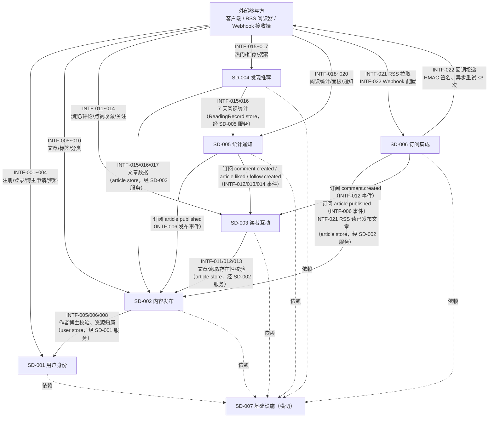

# 接口设计文档

> 阶段 3（概要设计）产出。套用 `templates/interface-design.md` 模板。
> 博客系统后端（blog-system-demo-r35）。
> 输入：`docs/phase2-design/blog-system-system-design.md`（阶段 2 系统设计，7 子系统 + 22 接口方向）；图谱：`.w-model/ingestion/graph.json`（72 节点）。
> 同步产出：`docs/phase3-outline/blog-system-integration-test.md`（30 条 IT 集成测试用例）；RTM 已补登（`.w-model/rtm.json`，32 行 designDoc 接口引用 + integrationTest）。

## 文档信息

- 项目名称：博客系统后端（blog-system-demo-r35）
- 文档版本：v1.0
- 编制日期：2026-08-07
- 编制者：W 模型 S-doc 子代理（产出变体）
- 关联系统设计文档：`docs/phase2-design/blog-system-system-design.md`
- 关联需求文档：`docs/phase1-requirements/requirement-spec.md`

## 0. 通用约定

### 0.1 响应与错误契约（CON-002）

- 全部接口 RESTful + JSON（INTF-021 RSS 例外：返回 `application/rss+xml`）。
- **成功响应**：`{ code: 0, message: "ok", data: <payload> }`（204 无 body）。
- **错误响应**：`{ error: { code, message } }`，其中 `code` 为业务错误码（数字），`httpStatus` 为 HTTP 状态码。
- 每个错误码配套 `code + message + httpStatus + retryable` 四元组（见 §0.3）。

### 0.2 分页与排序通用参数

| 参数 | 位置 | 类型 | 必填 | 默认值 | 约束 |
|---|---|---|---|---|---|
| `page` | query | `number` | 否 | `1` | `1 ≤ page`，越界按 40002 |
| `pageSize` | query | `number` | 否 | `20` | `1 ≤ pageSize ≤ 50`，越界按 40002 |

分页返回统一结构：`data: { items: [...], total, page, pageSize }`。

### 0.3 错误码全集（SD-007 统一错误处理，分层约定）

| 错误码 | message | httpStatus | retryable | 触发条件 |
|---|---|---|---|---|
| 40001 | 参数缺失或类型错误 | 400 | false | zod 校验失败（缺失/类型不符/格式非法） |
| 40002 | 参数取值越界 | 400 | false | 分页越界、长度超限、枚举值非法等取值类约束 |
| 40003 | 请求体 JSON 解析失败 | 400 | false | Content-Type 非 JSON 或 body 语法错误 |
| 40101 | 未认证：缺少或无效 JWT | 401 | false | 未携带令牌 / 签名非法 / 伪造令牌 |
| 40102 | 令牌已过期 | 401 | false | `exp` 已过（JWT 有效期 24h，CON-003） |
| 40301 | 权限不足 | 403 | false | 非博主操作博主资源 / 非资源所有者 |
| 40401 | 资源不存在 | 404 | false | 用户/文章/评论/通知/标签/分类/Webhook 配置不存在 |
| 40402 | 文章对读者不可见 | 404 | false | 草稿/归档文章对读者隐藏（防枚举泄露） |
| 40901 | 资源唯一性冲突 | 409 | false | 邮箱/用户名/标签/分类重名 |
| 42901 | 请求过于频繁 | 429 | true | 认证接口 10 次/分/IP、通用 100 次/分/IP（NFR-006） |
| 50001 | 服务端内部错误 | 500 | true | 未预期异常 / 存储错误 |
| 50201 | 下游服务不可用 | 502 | true | Webhook 回调目标不可达（异步投递失败记录） |
| 60001 | 文章状态机非法流转 | 409 | false | `archived→published` 直跳、删除已发布文章、`draft→archived` 等非法迁移 |
| 60002 | 原密码校验失败 | 400 | false | 修改密码时 `oldPassword` 不匹配 |
| 60003 | 分类嵌套深度超限 | 400 | false | 分类层级 > 3 层 |

> 每个接口契约的「错误码集合」均从本全集取子集，覆盖 4xx（客户端）/5xx（服务端）/6xxxx（业务）三段位；成功返回 `code: 0`。

### 0.4 跨模块数据源（store）选择约束（预防 P7-002/P7-003 类缺陷）

- **实体映射**：`User` 实体含 `role ∈ {reader, blogger}`；**blogger 不是独立实体**，而是 `User.role='blogger'` 的过滤子集（`bloggerId === userId`）。因此本系统不存在独立 blogger store，凡文档提及「blogger 校验」一律在 **user store**（按 `role` 字段过滤）执行；`token.sub = userId` 与 user store 主键天然对齐。
- 跨模块调用**禁止直访对方 store 实例**（NFR-005），一律经对方服务方法消费；本文档每个跨模块调用显式声明所用 store（见各契约「约束/备注」字段与 §5 汇总表）。
- 遵循「schema 一致」：`follower`/`followee`/`blogger` 均为 `user` 实体子集 → 在 **user store** 校验；`comment.articleId`/`article.authorId` 引用 `article` 实体主键 → 在 **article store** 校验（经 SD-002 服务方法）。

### 0.5 事件模型（模块间数据流载体，无反向依赖）

| 事件名 | 产生方 | 消费方 | 对应接口 |
|---|---|---|---|
| `reading.viewed` | SD-003 详情浏览（INTF-011/018） | SD-005 阅读统计 | INTF-018 |
| `article.published` | SD-002 发布成功（INTF-006） | SD-005 通知、SD-006 Webhook | INTF-006 |
| `comment.created` | SD-003 评论/回复（INTF-012） | SD-005 通知、SD-006 Webhook | INTF-012 |
| `article.liked` | SD-003 点赞（INTF-013） | SD-005 通知 | INTF-013 |
| `follow.created` | SD-003 关注（INTF-014） | SD-005 通知（关注博主发文） | INTF-014 |

> 依赖方向恒为「消费方 → 产生方」（订阅方依赖事件源模块的公共导出），与阶段 2 依赖图一致，无环。

## 1. 模块调用关系



> **无环验证（DFS 三色染色）**：依赖边集合 = {SD002→SD001, SD003→SD002, SD004→SD005, SD004→SD002, SD005→SD002, SD005→SD003, SD006→SD002, SD006→SD003} + 全部→SD007。按依赖方向遍历：SD006→SD003→SD002→SD001→SD007，SD004→SD005→SD003/SD002→…，无任何节点回到自身或祖先（无灰节点重访），判定无环。所有模块对 SD-007 的依赖为横切治理（`governs`），不构成业务环。

## 2. 接口定义

> 每个接口按「接口契约 Schema 模板」10 字段（接口名 / 路径 / 参数名 / 参数类型 / 必填 / 默认值 / 约束 / 示例 / 返回值结构 / 错误码集合）完整填写。
> 「约束」字段同时承载**跨模块数据源（store）声明**与业务/技术约束；「关联」行给出 INTF ↔ REQ ↔ SD 追溯。

---

### 2.1 INTF-001 注册

| 契约字段 | 内容 |
|---|---|
| 接口名 | `register` |
| 路径 / 触发器 | `POST /api/auth/register` |
| 参数名 | `username`, `email`, `password` |
| 参数类型 | `string` / `string(email)` / `string(min 8)` |
| 必填 | `username:true`, `email:true`, `password:true` |
| 默认值 | — |
| 约束 | `len(username) ∈ [3,32]` 且匹配 `^[A-Za-z0-9_]+$`；`email` 须 RFC5322 邮箱格式；`len(password) ∈ [8,64]`；邮箱、用户名全局唯一（重复 40901）；密码 bcrypt 加盐存储（NFR-002），响应与存储均不含明文密码；限流 10 次/分/IP（NFR-006）。**store 声明**：SD-001 user store（唯一性校验 + 写入，无跨模块） |
| 示例 | `{"username":"reader1","email":"r1@example.com","password":"Passw0rd!x"}` |
| 返回值结构 | `{ code: 0, message: "ok", data: { userId, username, email, role, createdAt } }` |
| 错误码集合 | `40001, 40002, 40003, 40901, 42901, 50001` |

- 提供方模块：SD-001（authService）
- 消费方模块：外部客户端
- 协议：HTTP
- 关联：REQ-007 / SD-001

**请求参数明细**

| 参数 | 位置 | 类型 | 必填 | 校验规则 | 说明 |
|---|---|---|---|---|---|
| username | body | string | 是 | 3~32 位字母数字下划线 | 登录名（唯一） |
| email | body | string | 是 | 邮箱格式 | 唯一标识，冲突 40901 |
| password | body | string | 是 | 8~64 位 | bcrypt 哈希存储 |

**错误码**

| 错误码 | 含义 | 触发条件 |
|---|---|---|
| 40001/40002 | 参数错误 | 缺失、格式非法、长度越界 |
| 40003 | JSON 解析失败 | body 非 JSON |
| 40901 | 邮箱/用户名已存在 | 唯一性冲突 |
| 42901 | 限流 | 同一 IP 超 10 次/分 |
| 50001 | 服务端错误 | 存储/内部异常 |

**示例**

```json
// 请求
POST /api/auth/register
{ "username": "reader1", "email": "r1@example.com", "password": "Passw0rd!x" }
// 响应 201
{ "code": 0, "message": "ok", "data": { "userId": "u_0001", "username": "reader1", "email": "r1@example.com", "role": "reader", "createdAt": "2026-08-07T10:00:00.000Z" } }
// 错误 409
{ "error": { "code": 40901, "message": "email already exists" } }
```

---

### 2.2 INTF-002 登录

| 契约字段 | 内容 |
|---|---|
| 接口名 | `login` |
| 路径 / 触发器 | `POST /api/auth/login` |
| 参数名 | `identifier`, `password` |
| 参数类型 | `string` / `string` |
| 必填 | `identifier:true`, `password:true` |
| 默认值 | — |
| 约束 | `identifier` 可为用户名或邮箱（`len ∈ [3,64]`）；`password` 8~64；凭据错误统一 40101（不区分「用户名不存在/密码错误」防枚举）；成功签发 JWT（HS256，`exp−iat ≤ 86400s`，CON-003）；限流 10 次/分/IP（NFR-006）。**store 声明**：SD-001 user store（凭据校验，无跨模块） |
| 示例 | `{"identifier":"r1@example.com","password":"Passw0rd!x"}` |
| 返回值结构 | `{ code: 0, message: "ok", data: { token, expiresIn, user: { userId, username, role } } }` |
| 错误码集合 | `40001, 40002, 40003, 40101, 42901, 50001` |

- 提供方模块：SD-001（authService）
- 消费方模块：外部客户端
- 协议：HTTP
- 关联：REQ-008 / SD-001

**示例**

```json
// 请求
POST /api/auth/login
{ "identifier": "r1@example.com", "password": "Passw0rd!x" }
// 响应 200
{ "code": 0, "message": "ok", "data": { "token": "<jwt>", "expiresIn": 86400, "user": { "userId": "u_0001", "username": "reader1", "role": "reader" } } }
// 错误 401
{ "error": { "code": 40101, "message": "invalid credentials" } }
```

---

### 2.3 INTF-003 申请成为博主

| 契约字段 | 内容 |
|---|---|
| 接口名 | `applyBlogger` |
| 路径 / 触发器 | `POST /api/users/me/blogger` |
| 参数名 | —（无 body；身份取 `Authorization: Bearer <JWT>`） |
| 参数类型 | — |
| 必填 | — |
| 默认值 | — |
| 约束 | 须携带有效 JWT（缺失/无效 40101，过期 40102）；`role: reader → blogger`（幂等：已是 blogger 返回 200 不报错）；读者发文越权 40301 由 INTF-005 校验。**store 声明**：SD-001 user store（`token.sub=userId` 对齐 user store 主键） |
| 示例 | `POST /api/users/me/blogger`（带 Bearer token，无 body） |
| 返回值结构 | `{ code: 0, message: "ok", data: { userId, role: "blogger", updatedAt } }` |
| 错误码集合 | `40101, 40102, 50001` |

- 提供方模块：SD-001（authService）
- 消费方模块：外部客户端
- 协议：HTTP
- 关联：REQ-009 / SD-001

---

### 2.4 INTF-004 用户资料

| 契约字段 | 内容 |
|---|---|
| 接口名 | `getProfile` / `updateProfile` / `changePassword` |
| 路径 / 触发器 | `GET /api/users/me`；`PATCH /api/users/me`；`PUT /api/users/me/password` |
| 参数名 | GET：—；PATCH：`nickname`, `bio`, `avatarUrl`；PUT：`oldPassword`, `newPassword` |
| 参数类型 | GET：—；PATCH：`string(optional)` × 3；PUT：`string` × 2 |
| 必填 | GET：—；PATCH：全部 `false`（至少传一项）；PUT：`oldPassword:true`, `newPassword:true` |
| 默认值 | PATCH 未传字段保持不变 |
| 约束 | `nickname` 1~32；`bio` 0~200；`avatarUrl` 须 `http(s)` URL；`len(oldPassword|newPassword) ∈ [8,64]` 且 `newPassword ≠ oldPassword`；`oldPassword` 不匹配 60002；新密码重新 bcrypt 存储。**store 声明**：SD-001 user store（`token.sub=userId` 对齐） |
| 示例 | PATCH：`{"nickname":"博主小张","avatarUrl":"https://cdn.example.com/a.png"}`；PUT：`{"oldPassword":"Passw0rd!x","newPassword":"NewPassw0rd!y"}` |
| 返回值结构 | GET 200：`{ code:0, data: { userId, username, email, nickname, bio, avatarUrl, role, createdAt } }`；PATCH 200：同上（更新后）；PUT 200：`{ code:0, data: { updated: true } }` |
| 错误码集合 | `40001, 40002, 40003, 40101, 40102, 60002, 50001` |

- 提供方模块：SD-001（profileService）
- 消费方模块：外部客户端
- 协议：HTTP
- 关联：REQ-010 / SD-001

**路由注册顺序**：`GET/PATCH /api/users/me` 与 `PUT /api/users/me/password` 均为静态路径，须先于参数路径 `POST/DELETE /api/users/:id/follow`（INTF-014）注册，否则 `:id="me"` 会被静态路径拦截错配。

---

### 2.5 INTF-005 创建文章

| 契约字段 | 内容 |
|---|---|
| 接口名 | `createArticle` |
| 路径 / 触发器 | `POST /api/articles` |
| 参数名 | `title`, `body`, `summary`, `tags[]`, `categoryId` |
| 参数类型 | `string` / `string` / `string(optional)` / `array<string>` / `string(uuid, optional)` |
| 必填 | `title:true`, `body:true`, `summary:false`, `tags:false`, `categoryId:false` |
| 默认值 | `tags=[]`, `summary=""` |
| 约束 | `len(title) ∈ [1,200]`；`len(body) ∈ [1,50000]`；`len(summary) ≤ 500`；`tags.length ∈ [0,10]` 且每项 `len ∈ [1,32]`、无重复；`tags` 与 `categoryId` 须已存在（不存在 40401）；作者须 `role=blogger`（否则 40301）。**store 声明（跨模块）**：作者博主校验 → **user store**（经 SD-001 服务方法，`token.sub=userId` 对齐）；标签/分类存在性 → **tag store / category store**（SD-002 本模块）；写入 → **article store**（SD-002） |
| 示例 | `{"title":"W 模型实践","body":"…正文…","summary":"概要","tags":["W模型","工程化"],"categoryId":"c_0001"}` |
| 返回值结构 | `{ code: 0, message: "ok", data: { articleId, title, summary, status: "draft", tags, categoryId, author: { userId, username }, createdAt } }` |
| 错误码集合 | `40001, 40002, 40003, 40101, 40102, 40301, 40401, 50001` |

- 提供方模块：SD-002（articleService）
- 消费方模块：外部客户端（博主）
- 协议：HTTP
- 关联：REQ-011 / SD-002（跨模块调用 SD-001）

---

### 2.6 INTF-006 发布文章

| 契约字段 | 内容 |
|---|---|
| 接口名 | `publishArticle` |
| 路径 / 触发器 | `POST /api/articles/:id/publish` |
| 参数名 | `id`（路径） |
| 参数类型 | `string(uuid)` |
| 必填 | `true` |
| 默认值 | — |
| 约束 | `id` 须为本人文章（越权 40301，归属校验）；状态机：`draft→published`；已 `published` 可更新后重新发布（幂等 200）；`archived→published` 直跳 60001；发布成功提交进程内事务（NFR-003）后触发 `article.published` 事件（Webhook/通知消费，SD-006/SD-005 订阅）；审计留痕（CON-004）。**store 声明（跨模块）**：文章读取/状态迁移 → **article store**（SD-002）；归属校验（作者 userId）→ **user store**（经 SD-001 服务方法） |
| 示例 | `POST /api/articles/a_1001/publish`（带 Bearer token） |
| 返回值结构 | `{ code: 0, message: "ok", data: { articleId, status: "published", publishedAt } }` |
| 错误码集合 | `40001, 40101, 40102, 40301, 40401, 60001, 50001` |

- 提供方模块：SD-002（articleService / articleStateMachine）
- 消费方模块：外部客户端（博主）；事件消费方 SD-005/SD-006
- 协议：HTTP + 进程内事件
- 关联：REQ-012 / SD-002（事件出向 SD-005、SD-006）

---

### 2.7 INTF-007 归档 / 取消归档

| 契约字段 | 内容 |
|---|---|
| 接口名 | `archiveArticle` / `unarchiveArticle` |
| 路径 / 触发器 | `POST /api/articles/:id/archive`；`POST /api/articles/:id/unarchive` |
| 参数名 | `id`（路径） |
| 参数类型 | `string(uuid)` |
| 必填 | `true` |
| 默认值 | — |
| 约束 | 状态机（REQ-013）：`archive` 仅允许 `published→archived`（`draft→archived` 60001）；`unarchive` 仅允许 `archived→draft`；`archived→published` 直跳 60001（须先 unarchive 回 draft 再 publish）；越权 40301。**store 声明**：**article store**（SD-002 本模块）；归属校验 → **user store**（经 SD-001 服务方法） |
| 示例 | `POST /api/articles/a_1001/archive`（带 Bearer token） |
| 返回值结构 | `{ code: 0, message: "ok", data: { articleId, status: "archived" \| "draft" } }` |
| 错误码集合 | `40001, 40101, 40102, 40301, 40401, 60001, 50001` |

- 提供方模块：SD-002（articleService / articleStateMachine）
- 消费方模块：外部客户端（博主）
- 协议：HTTP
- 关联：REQ-013 / SD-002

---

### 2.8 INTF-008 管理文章

| 契约字段 | 内容 |
|---|---|
| 接口名 | `listMyArticles` / `updateArticle` / `deleteArticle` |
| 路径 / 触发器 | `GET /api/blogger/articles`；`PUT /api/articles/:id`；`DELETE /api/articles/:id` |
| 参数名 | GET：`status`, `page`, `pageSize`；PUT：`id`（路径）+ `title|body|summary|tags|categoryId`；DELETE：`id`（路径） |
| 参数类型 | GET：`string(enum, optional)` ×1 + `number` ×2；PUT：`string(uuid)` + 可选字段；DELETE：`string(uuid)` |
| 必填 | GET：全部 `false`；PUT：`id:true`，内容字段至少一项；DELETE：`id:true` |
| 默认值 | GET：`status=全部`, `page=1`, `pageSize=20` |
| 约束 | GET 仅返回本人文章（草稿+已发布+归档，按状态筛选）；PUT 仅本人文章（越权 40301），编辑 `published` 文章后状态置回 `draft`（须重新发布，REQ-012「更新后重新发布」语义）；DELETE 仅 `draft`（204），`published/archived` 删除 60001（仅可归档）；删除审计留痕（CON-004）。**store 声明（跨模块）**：文章 → **article store**（SD-002）；归属校验 → **user store**（经 SD-001 服务方法） |
| 示例 | GET：`/api/blogger/articles?status=draft&page=1`；PUT：`{"title":"更新标题"}`；DELETE：`/api/articles/a_1002` |
| 返回值结构 | GET 200：`{ code:0, data: { items:[{ articleId, title, status, updatedAt, publishedAt }], total, page, pageSize } }`；PUT 200：`{ code:0, data: { articleId, title, status, updatedAt } }`；DELETE 204：无 body |
| 错误码集合 | `40001, 40002, 40101, 40102, 40301, 40401, 60001, 50001` |

- 提供方模块：SD-002（articleService）
- 消费方模块：外部客户端（博主）
- 协议：HTTP
- 关联：REQ-014 / SD-002（跨模块调用 SD-001）

---

### 2.9 INTF-009 标签

| 契约字段 | 内容 |
|---|---|
| 接口名 | `createTag` / `listTags` / `filterByTag` |
| 路径 / 触发器 | `POST /api/tags`；`GET /api/tags`；`GET /api/articles?tag=<name>` |
| 参数名 | POST：`name`；GET：— / `tag`（query） |
| 参数类型 | `string` / — / `string` |
| 必填 | POST：`name:true`；GET：`tag:true`（筛选场景） |
| 默认值 | — |
| 约束 | POST：`len(name) ∈ [1,32]`、名称唯一（重名 40901）、须博主（40301）；`GET /api/tags` 公开返回全部标签；`GET /api/articles?tag=` 公开按标签筛选**已发布**文章（分页复用 INTF-011 契约，草稿/归档不可见 40402 语义）。**store 声明（跨模块）**：标签 → **tag store**（SD-002）；文章筛选 → **article store**（SD-002 本模块，无跨模块） |
| 示例 | POST：`{"name":"W模型"}`；GET：`/api/articles?tag=W模型&page=1` |
| 返回值结构 | POST 201：`{ code:0, data: { tagId, name, createdAt } }`；GET /api/tags 200：`{ code:0, data: { items:[{ tagId, name }] } }`；筛选 200：`{ code:0, data: { items:[...], total, page, pageSize } }` |
| 错误码集合 | `40001, 40002, 40003, 40101, 40102, 40301, 40901, 50001` |

- 提供方模块：SD-002（tagService）
- 消费方模块：外部客户端（创建需博主，查询公开）
- 协议：HTTP
- 关联：REQ-015 / SD-002

---

### 2.10 INTF-010 分类

| 契约字段 | 内容 |
|---|---|
| 接口名 | `createCategory` / `listCategories` / `filterByCategory` |
| 路径 / 触发器 | `POST /api/categories`；`GET /api/categories`；`GET /api/articles?categoryId=<id>` |
| 参数名 | POST：`name`, `parentId`；GET：— / `categoryId`（query） |
| 参数类型 | `string` / `string(uuid, optional)` / — / `string(uuid)` |
| 必填 | POST：`name:true`, `parentId:false`；GET：`categoryId:true`（筛选场景） |
| 默认值 | `parentId=null`（根分类） |
| 约束 | `len(name) ∈ [1,64]`；嵌套深度 ≤3 层（根=1，超限 60003）；同级重名 40901；`parentId` 不存在 40401；创建须博主（40301）；`GET /api/articles?categoryId=` 公开按分类浏览**已发布**文章（分页复用 INTF-011）。**store 声明（跨模块）**：分类 → **category store**（SD-002）；文章筛选 → **article store**（SD-002 本模块） |
| 示例 | POST：`{"name":"工程实践","parentId":"c_0001"}`；GET：`/api/articles?categoryId=c_0001&page=1` |
| 返回值结构 | POST 201：`{ code:0, data: { categoryId, name, parentId, depth, createdAt } }`；GET 200：`{ code:0, data: { items:[{ categoryId, name, parentId, depth }] } }`；筛选 200：分页文章列表 |
| 错误码集合 | `40001, 40002, 40003, 40101, 40102, 40301, 40401, 40901, 60003, 50001` |

- 提供方模块：SD-002（categoryService）
- 消费方模块：外部客户端（创建需博主，查询公开）
- 协议：HTTP
- 关联：REQ-016 / SD-002

---

### 2.11 INTF-011 浏览文章

| 契约字段 | 内容 |
|---|---|
| 接口名 | `listArticles` / `getArticle` |
| 路径 / 触发器 | `GET /api/articles?page=&pageSize=&categoryId=&tag=&keyword=`；`GET /api/articles/:id` |
| 参数名 | 列表：`page`, `pageSize`, `categoryId`, `tag`, `keyword`；详情：`id`（路径） |
| 参数类型 | 列表：`number` ×2 + `string(uuid, optional)` + `string(optional)` ×2；详情：`string(uuid)` |
| 必填 | 列表：全部 `false`；详情：`id:true` |
| 默认值 | `page=1`, `pageSize=20` |
| 约束 | 列表仅返回**已发布**文章（草稿/归档 40402 语义——不出现于列表）；按 `categoryId`/`tag`/`keyword` 组合筛选；详情含正文+作者信息+阅读量，草稿/归档对读者 40402（防枚举）；详情访问触发阅读量 +1（同 IP 5 分钟窗口去重，INTF-018 副作用，REQ-024）。**store 声明（跨模块）**：文章读取 → **article store**（经 SD-002 articleService 服务方法，SD-003 不直访 store）；阅读事件 → SD-005 **ReadingRecord store**（经 `reading.viewed` 事件，消费方 SD-005 依赖 SD-003，无环） |
| 示例 | 列表：`GET /api/articles?categoryId=c_0001&tag=W模型&page=1&pageSize=20`；详情：`GET /api/articles/a_1001` |
| 返回值结构 | 列表 200：`{ code:0, data: { items:[{ articleId, title, summary, author:{userId,username}, tags, category, viewCount, likeCount, favoriteCount, publishedAt }], total, page, pageSize } }`；详情 200：`{ code:0, data: { articleId, title, body, summary, author:{userId,username,bio}, tags, category, viewCount, likeCount, favoriteCount, publishedAt } }` |
| 错误码集合 | `40001, 40002, 40401, 40402, 50001` |

- 提供方模块：SD-003（articleBrowseService）
- 消费方模块：外部客户端（公开）
- 协议：HTTP + 进程内事件（`reading.viewed`）
- 关联：REQ-017、REQ-024 / SD-003（跨模块调用 SD-002；阅读事件流向 SD-005）

**路由注册顺序**：静态路径 `GET /api/articles/hot`（INTF-015）与 `GET /api/articles/:id` 共存时，`/api/articles/hot` 必须先注册，否则 `:id="hot"` 拦截。

---

### 2.12 INTF-012 评论

| 契约字段 | 内容 |
|---|---|
| 接口名 | `createComment` / `listComments` / `deleteComment` / `replyComment` |
| 路径 / 触发器 | `POST /api/articles/:id/comments`；`GET /api/articles/:id/comments?page=&pageSize=`；`DELETE /api/articles/:id/comments/:cid`；`POST /api/articles/:id/comments/:cid/reply` |
| 参数名 | POST：`content`, `parentId`；列表：`page`, `pageSize`；DELETE：`cid`（路径）；回复：`cid`（路径）+ `content` |
| 参数类型 | `string` / `string(uuid, optional)` / `number` ×2 / `string(uuid)` / `string(uuid)` + `string` |
| 必填 | POST：`content:true`, `parentId:false`；列表：全部 `false`；DELETE：`cid:true`；回复：`content:true` |
| 默认值 | `parentId=null`（顶层评论） |
| 约束 | POST/回复：须 JWT（40101/40102）、`len(content) ∈ [1,2000]`、文章须存在且**已发布**（草稿 40401/40402）、`parentId` 指向的评论须属于同一文章（否则 40002）；发表即自动审核通过立即可见（REQ-018）；创建后触发 `comment.created` 事件（通知/Webhook 消费）；DELETE：仅文章作者可删（非作者 40301），删除 204；列表公开分页。**store 声明（跨模块）**：评论写入 → **comment store**（SD-003）；文章存在性/状态校验 → **article store**（经 SD-002 服务方法）；评论作者/文章作者身份 → **user store**（经 SD-001 服务方法） |
| 示例 | POST：`{"content":"不错的文章"}`；回复：`POST /api/articles/a_1001/comments/c_9001/reply {"content":"谢谢"}` |
| 返回值结构 | POST/回复 201：`{ code:0, data: { commentId, articleId, authorId, authorName, content, parentId, createdAt } }`；列表 200：`{ code:0, data: { items:[...], total, page, pageSize } }`；DELETE 204：无 body |
| 错误码集合 | `40001, 40002, 40003, 40101, 40102, 40301, 40401, 40402, 50001` |

- 提供方模块：SD-003（commentService）
- 消费方模块：外部客户端（发表/删除需 JWT，列表公开）；事件消费方 SD-005/SD-006
- 协议：HTTP + 进程内事件（`comment.created`）
- 关联：REQ-018 / SD-003（跨模块调用 SD-002、SD-001）

**路由注册顺序**：`POST /api/articles/:id/comments/:cid/reply` 与 `DELETE /api/articles/:id/comments/:cid` 的 `:cid` 参数路径须在静态回复子路径之后注册（Express 按注册顺序匹配），静态优先。

---

### 2.13 INTF-013 点赞 / 收藏

| 契约字段 | 内容 |
|---|---|
| 接口名 | `likeArticle` / `unlikeArticle` / `favoriteArticle` / `unfavoriteArticle` / `listMyFavorites` |
| 路径 / 触发器 | `POST /api/articles/:id/like`；`DELETE /api/articles/:id/like`；`POST /api/articles/:id/favorite`；`DELETE /api/articles/:id/favorite`；`GET /api/me/favorites?page=&pageSize=` |
| 参数名 | `id`（路径）；收藏列表：`page`, `pageSize` |
| 参数类型 | `string(uuid)` / `number` ×2 |
| 必填 | `id:true`；列表：全部 `false` |
| 默认值 | `page=1`, `pageSize=20` |
| 约束 | 点赞/收藏均**幂等**（重复 POST 返回 200 不重复计数，REQ-019）；须 JWT（40101/40102）；文章须存在且已发布（40401/40402）；点赞首次触发 `article.liked` 事件（被点赞通知）；收藏列表仅返回本人收藏；详情接口（INTF-011）返回 `likeCount/favoriteCount` 聚合值。**store 声明（跨模块）**：点赞/收藏 → **like store / favorite store**（SD-003）；文章校验 → **article store**（经 SD-002 服务方法）；用户身份 → **user store**（经 SD-001 服务方法） |
| 示例 | `POST /api/articles/a_1001/like`（带 Bearer token） |
| 返回值结构 | 点赞/收藏 200：`{ code:0, data: { articleId, liked: true \| false, favorited: true \| false } }`；收藏列表 200：`{ code:0, data: { items:[{ articleId, title, summary, favoritedAt }], total, page, pageSize } }` |
| 错误码集合 | `40001, 40002, 40101, 40102, 40401, 40402, 50001` |

- 提供方模块：SD-003（likeService）
- 消费方模块：外部客户端；事件消费方 SD-005
- 协议：HTTP + 进程内事件（`article.liked`）
- 关联：REQ-019 / SD-003（跨模块调用 SD-002）

---

### 2.14 INTF-014 关注 / Feed

| 契约字段 | 内容 |
|---|---|
| 接口名 | `followBlogger` / `unfollowBlogger` / `getFeed` |
| 路径 / 触发器 | `POST /api/users/:id/follow`；`DELETE /api/users/:id/follow`；`GET /api/me/feed?page=&pageSize=` |
| 参数名 | `id`（路径，= followeeId）；feed：`page`, `pageSize` |
| 参数类型 | `string(uuid)` / `number` ×2 |
| 必填 | `id:true`；feed：全部 `false` |
| 默认值 | `page=1`, `pageSize=20` |
| 约束 | **字段命名业务语义对齐**：`followerId` 取 `token.sub`（当前用户），`followeeId` 取路径 `:id`（被关注博主）；`followeeId` 须存在且 `role=blogger`（非博主 40002、不存在 40401）；**禁止关注自己**（`followerId === followeeId` → 40002）；关注/取关均幂等（重复操作 200）；取关后 feed 不再推送（REQ-020）；feed 返回已关注博主的最新**已发布**文章（按 `publishedAt` 降序）。**store 声明（跨模块）**：关注关系 → **follow store**（SD-003）；follower/followee 身份校验 → **user store**（经 SD-001 服务方法；P7-002 约束：follower/followee 均为 user 实体子集，不得在 blogger store 校验）；feed 文章 → **article store**（经 SD-002 服务方法） |
| 示例 | `POST /api/users/u_0002/follow`（带 Bearer token，`u_0002` 为博主） |
| 返回值结构 | 关注 200：`{ code:0, data: { followerId, followeeId, followedAt } }`；取关 200：`{ code:0, data: { unfollowed: true } }`；feed 200：`{ code:0, data: { items:[{ articleId, title, summary, author, publishedAt }], total, page, pageSize } }` |
| 错误码集合 | `40001, 40002, 40101, 40102, 40401, 50001` |

- 提供方模块：SD-003（followService）
- 消费方模块：外部客户端
- 协议：HTTP
- 关联：REQ-020 / SD-003（跨模块调用 SD-001、SD-002）

**路由注册顺序**：`POST /api/users/me/blogger`（INTF-003）、`GET/PATCH /api/users/me`（INTF-004）为静态路径，须先于 `POST/DELETE /api/users/:id/follow` 注册。

---

### 2.15 INTF-015 热门文章

| 契约字段 | 内容 |
|---|---|
| 接口名 | `getHotArticles` |
| 路径 / 触发器 | `GET /api/articles/hot?limit=` |
| 参数名 | `limit` |
| 参数类型 | `number` |
| 必填 | `false` |
| 默认值 | `limit=10` |
| 约束 | `limit ∈ [1,50]`（越界 40002）；按最近 7 天（`publishedAt ≤ now` 且 `viewedAt ≥ now−7d`）阅读量降序取 Top N；仅含**已发布**文章；`limit` 超实际数量时返回实际数。**store 声明（跨模块）**：阅读统计 → **ReadingRecord store**（经 SD-005 readingStatService 服务方法，SD-004 不直访 store）；文章数据 → **article store**（经 SD-002 服务方法） |
| 示例 | `GET /api/articles/hot?limit=5` |
| 返回值结构 | `{ code: 0, message: "ok", data: { items: [{ articleId, title, summary, viewCount7d, publishedAt }], generatedAt } }` |
| 错误码集合 | `40001, 40002, 50001` |

- 提供方模块：SD-004（hotService）
- 消费方模块：外部客户端（公开）
- 协议：HTTP
- 关联：REQ-021 / SD-004（跨模块调用 SD-005、SD-002）

---

### 2.16 INTF-016 个性化推荐

| 契约字段 | 内容 |
|---|---|
| 接口名 | `getRecommendations` |
| 路径 / 触发器 | `GET /api/me/recommendations?limit=` |
| 参数名 | `limit`；`Authorization`（可选） |
| 参数类型 | `number` / `string(header, optional)` |
| 必填 | `false` / `false` |
| 默认值 | `limit=10` |
| 约束 | 携带有效 JWT：按该用户阅读历史标签偏好（`reading.viewed` 记录聚合）推荐相似**已发布**文章；携带无效 JWT 40101；未携带 JWT 或无阅读历史（冷启动）：回退热门 Top N（REQ-022）；推荐结果不含本人已读且重复文章去重；`limit ∈ [1,50]`。**store 声明（跨模块）**：阅读历史 → **ReadingRecord store**（经 SD-005 服务方法）；文章/标签数据 → **article store / tag store**（经 SD-002 服务方法） |
| 示例 | `GET /api/me/recommendations?limit=10`（可带 Bearer token） |
| 返回值结构 | `{ code: 0, message: "ok", data: { items: [{ articleId, title, summary, reason: "tag-preference" \| "hot-fallback", score }] } }` |
| 错误码集合 | `40001, 40002, 40101, 50001` |

- 提供方模块：SD-004（recommendService）
- 消费方模块：外部客户端（公开，可选 JWT）
- 协议：HTTP
- 关联：REQ-022 / SD-004（跨模块调用 SD-005、SD-002）

---

### 2.17 INTF-017 全文搜索

| 契约字段 | 内容 |
|---|---|
| 接口名 | `searchArticles` |
| 路径 / 触发器 | `GET /api/search?q=&page=&pageSize=` |
| 参数名 | `q`, `page`, `pageSize` |
| 参数类型 | `string` / `number` / `number` |
| 必填 | `q:true`；`page:false`, `pageSize:false` |
| 默认值 | `page=1`, `pageSize=20` |
| 约束 | `len(q) ∈ [1,100]`（空白/超长 40002）；对标题+正文+摘要+标签四字段拼接索引检索（REQ-023）；仅含**已发布**文章；结果按相关性降序（命中字段权重：标题 > 标签 > 摘要 > 正文）；分页返回 `total`。**store 声明（跨模块）**：**SearchIndex**（SD-004 只读消费；SD-002 发布/编辑时经 `article.published`/`article.updated` 事件同步索引，消费方 SD-004 依赖 SD-002，无环）；文章明细 → **article store**（经 SD-002 服务方法） |
| 示例 | `GET /api/search?q=W模型&page=1&pageSize=20` |
| 返回值结构 | `{ code: 0, message: "ok", data: { items: [{ articleId, title, summary, score }], total, page, pageSize } }` |
| 错误码集合 | `40001, 40002, 50001` |

- 提供方模块：SD-004（searchService）
- 消费方模块：外部客户端（公开）
- 协议：HTTP
- 关联：REQ-023 / SD-004（跨模块调用 SD-002）

---

### 2.18 INTF-018 阅读统计（副作用契约）

| 契约字段 | 内容 |
|---|---|
| 接口名 | `recordReading`（副作用，与 INTF-011 详情同端点） |
| 路径 / 触发器 | `GET /api/articles/:id`（阅读量副作用，事件 `reading.viewed`） |
| 参数名 | `id`（路径）；`clientIp`（取自请求方 IP，服务端解析） |
| 参数类型 | `string(uuid)` / `string` |
| 必填 | `id:true`（clientIp 服务端注入） |
| 默认值 | — |
| 约束 | 详情访问时阅读量 +1（REQ-024）；**同 IP 短窗口去重**：同一 `clientIp + articleId` 在 5 分钟窗口内重复访问不重复计数（窗口时长参数化，D-05 阶段 3 确认 = 5 分钟）；去重状态存 **ReadingRecord store**；响应 `viewCount` 由 SD-005 聚合返回。**store 声明（跨模块）**：SD-003 详情浏览触发 `reading.viewed` 事件 → SD-005 readingStatService 订阅并写入 **ReadingRecord store**（消费方 SD-005 依赖 SD-003，无环；SD-003 不依赖 SD-005） |
| 示例 | `GET /api/articles/a_1001`（clientIp=127.0.0.1）→ 首次 +1，5 分钟内重复访问不变 |
| 返回值结构 | 与 INTF-011 详情一致，`data.viewCount` 为去重后累计值 |
| 错误码集合 | `40001, 40002, 40401, 40402, 50001` |

- 提供方模块：SD-005（readingStatService，订阅 SD-003 事件）
- 消费方模块：SD-003（事件产生方）
- 协议：进程内事件
- 关联：REQ-024 / SD-005（跨模块调用 SD-003 事件源）

---

### 2.19 INTF-019 博主统计面板

| 契约字段 | 内容 |
|---|---|
| 接口名 | `getBloggerStats` |
| 路径 / 触发器 | `GET /api/blogger/stats` |
| 参数名 | —（身份取 Bearer JWT） |
| 参数类型 | — |
| 必填 | — |
| 默认值 | — |
| 约束 | 须博主（40301）；返回本人：文章数（全部状态）、总阅读量（去重后）、总评论数（本博文章下）、近 7 天每日阅读趋势（7 项数组，无记录日期补 0）。**store 声明（跨模块）**：文章数 → **article store**（经 SD-002 服务方法）；评论数 → **comment store**（经 SD-003 服务方法）；阅读量/趋势 → **ReadingRecord store**（SD-005 本模块） |
| 示例 | `GET /api/blogger/stats`（带 Bearer token） |
| 返回值结构 | `{ code: 0, message: "ok", data: { articleCount, totalViews, totalComments, trend: [{ date, views } × 7] } }` |
| 错误码集合 | `40101, 40102, 40301, 50001` |

- 提供方模块：SD-005（bloggerStatsService）
- 消费方模块：外部客户端（博主）
- 协议：HTTP
- 关联：REQ-025 / SD-005（跨模块调用 SD-002、SD-003）

---

### 2.20 INTF-020 通知

| 契约字段 | 内容 |
|---|---|
| 接口名 | `listNotifications` / `markNotificationRead` |
| 路径 / 触发器 | `GET /api/me/notifications?page=&pageSize=&unreadOnly=`；`PATCH /api/me/notifications/:id/read` |
| 参数名 | 列表：`page`, `pageSize`, `unreadOnly`；已读：`id`（路径） |
| 参数类型 | `number` ×2 / `boolean(optional)`；`string(uuid)` |
| 必填 | 列表：全部 `false`；已读：`id:true` |
| 默认值 | `page=1`, `pageSize=20`, `unreadOnly=false` |
| 约束 | 通知仅本人可见（他人通知 40401 防枚举）；类型 `REPLY`（被回复）/ `LIKE`（被点赞）/ `NEW_ARTICLE`（关注博主发文）；标记已读幂等（重复 PATCH 200）；列表按 `createdAt` 降序。**store 声明（跨模块）**：**notification store**（SD-005 本模块）；事件来源为 SD-003（`comment.created`/`article.liked`/`follow.created`）与 SD-002（`article.published`），SD-005 订阅产生方事件（消费方依赖产生方，无环） |
| 示例 | 列表：`GET /api/me/notifications?unreadOnly=true`；已读：`PATCH /api/me/notifications/n_5001/read` |
| 返回值结构 | 列表 200：`{ code:0, data: { items:[{ notificationId, type, articleId, actorId, actorName, content, read, createdAt }], total, page, pageSize } }`；已读 200：`{ code:0, data: { notificationId, read: true } }` |
| 错误码集合 | `40001, 40002, 40101, 40102, 40401, 50001` |

- 提供方模块：SD-005（notificationService）
- 消费方模块：外部客户端
- 协议：HTTP + 进程内事件（订阅 SD-002/SD-003）
- 关联：REQ-026 / SD-005（跨模块调用 SD-002、SD-003 事件源）

---

### 2.21 INTF-021 RSS 订阅源

| 契约字段 | 内容 |
|---|---|
| 接口名 | `getBloggerRss` |
| 路径 / 触发器 | `GET /api/bloggers/:id/rss` |
| 参数名 | `id`（路径，博主 userId） |
| 参数类型 | `string(uuid)` |
| 必填 | `true` |
| 默认值 | — |
| 约束 | 公开接口（无认证，RSS 阅读器拉取）；博主须存在且 `role=blogger`（否则 40401）；仅含该博主**已发布**文章（草稿/归档不暴露，REQ-027）；返回 RSS 2.0 XML（`Content-Type: application/rss+xml`）：channel 含 `<title>`（博主名）、`<link>`、`<description>`；item 含 `<title>/<link>/<description>`（摘要）/`<pubDate>`（发布时间）。**store 声明（跨模块）**：博主存在性 → **user store**（经 SD-001 服务方法）；已发布文章 → **article store**（经 SD-002 服务方法） |
| 示例 | `GET /api/bloggers/u_0002/rss` |
| 返回值结构 | 200 `application/rss+xml`：RSS 2.0 XML 文档（非 JSON，CON-002 例外） |
| 错误码集合 | `40001, 40401, 50001` |

- 提供方模块：SD-006（rssService）
- 消费方模块：外部 RSS 阅读器（公开）
- 协议：HTTP（XML 响应）
- 关联：REQ-027 / SD-006（跨模块调用 SD-002、SD-001）

---

### 2.22 INTF-022 Webhook 配置与分发

| 契约字段 | 内容 |
|---|---|
| 接口名 | `createWebhook` / `listWebhooks` / `deleteWebhook` |
| 路径 / 触发器 | `POST /api/me/webhooks`；`GET /api/me/webhooks`；`DELETE /api/me/webhooks/:webhookId` |
| 参数名 | POST：`url`, `events[]`, `secret`；列表：—；删除：`webhookId`（路径） |
| 参数类型 | `string(url)` / `array<string(enum)>` / `string(optional)` / `string(uuid)` |
| 必填 | POST：`url:true`, `events:true`, `secret:false`；列表：—；删除：`webhookId:true` |
| 默认值 | `secret=服务端生成`；`events` 默认全量 |
| 约束 | 须博主（40301）；`url` 须 `http(s)`（40002 拒绝非 http(s)，防 SSRF 于 demo 范围仅本地回调）；`events ⊆ {article.published, comment.created}`（非法枚举 40002）；同一博主同 `url+event` 去重（重复 40901）；触发：SD-002 发布成功 / SD-003 评论创建后，SD-006 订阅事件分发回调——请求头 `X-Blog-Signature: HMAC-SHA256(body, secret)`、`X-Blog-Event`、`X-Blog-Timestamp`；回调失败自动重试 ≤3 次（指数退避，NFR-003），最终失败写入 **WebhookDelivery store** 失败记录（含状态/attempts/lastError）。**store 声明（跨模块）**：配置/投递 → **WebhookConfig store / WebhookDelivery store**（SD-006 本模块）；事件源为 SD-002（`article.published`）与 SD-003（`comment.created`），SD-006 订阅（消费方依赖产生方，无环） |
| 示例 | POST：`{"url":"http://127.0.0.1:9000/hook","events":["article.published"]}` |
| 返回值结构 | POST 201：`{ code:0, data: { webhookId, url, events, secret, createdAt } }`；列表 200：`{ code:0, data: { items:[...] } }`；DELETE 204：无 body |
| 错误码集合 | `40001, 40002, 40003, 40101, 40102, 40301, 40401, 40901, 50001, 50201` |

- 提供方模块：SD-006（webhookService）
- 消费方模块：外部客户端（博主）；外部回调接收端（出站，INTF-022 回调投递）
- 协议：HTTP + 进程内事件（订阅 SD-002/SD-003）
- 关联：REQ-028 / SD-006（跨模块调用 SD-002、SD-003 事件源；NFR-003）

---

## 3. 字段命名业务语义对齐

> R3 可靠性审查项。凡字段命名与业务语义存在映射歧义处，均在下方显式声明；无歧义字段（如 `followerId/followeeId`）直接采用业务语义命名。

| 字段 | 业务语义 | 命名说明 |
|---|---|---|
| `followerId` / `followeeId` | 关注关系双方 | ✅ 直接采用业务语义命名（INTF-014）：`followerId` = 发起关注者（`token.sub`），`followeeId` = 被关注博主（路径 `:id`） |
| `articleId` / `commentId` / `notificationId` / `tagId` / `categoryId` / `webhookId` | 各域资源主键 | ✅ 资源名 + `Id`，与 store 主键一致 |
| `authorId`（文章/评论） | 内容作者（user 实体） | ✅ 命名 `authorId` 而非 `bloggerId`：作者既可为博主（文章）也可为任意注册用户（评论），语义为 user 实体主键；与 `token.sub=userId` 对齐 |
| `actorId`（通知） | 触发通知的操作者 | ✅ 业务语义明确：`actorId` 是产生事件的操作者（user 主键） |
| `identifier`（登录） | 用户名或邮箱二选一 | ✅ 登录场景的语义化命名（INTF-002），避免 `username/email` 二选一的歧义 |
| `parentId`（评论/分类） | 回复目标 / 父分类 | ✅ 通用树形结构语义命名 |
| `clientIp` | 阅读去重维度 | ✅ 服务端注入字段，语义 = 请求方 IP |
| `role` | `reader` / `blogger` | ✅ 用户角色枚举；**blogger 为 user 实体 role 子集**（`bloggerId === userId`） |

**Implementation Decisions（技术约束映射）**：
1. 本系统 Blogger 不建模为独立实体（阶段 2 SD-001 领域实体仅 `User`），凡业务语义上的「blogger store」一律映射为 **user store 的 `role='blogger'` 过滤视图**；因此 `authorId`/`followeeId` 等看似「博主」的字段，其校验一律在 **user store** 执行（见 §0.4），与 `token.sub=userId` 对齐，规避 P7-002/P7-003 类「store 误用」缺陷。
2. 若后续演进为独立 Blogger 实体（技术约束变化），须在本文档 §3 与 Implementation Decisions 同步更新字段映射，不得静默改变 store 选择。

## 4. 跨模块数据源（store）选择声明汇总

> 每个跨模块调用显式声明所用 store；「经 X 服务方法」表示禁止直访 store 实例（NFR-005），一律消费方调用提供方服务。

| 跨模块调用 | 接口 | 消费方 → 提供方 | 所用 store | 校验依据 |
|---|---|---|---|---|
| 博主权限校验 | INTF-005/006/008 | SD-002 → SD-001 | **user store**（role 过滤视图） | 创建/发布/管理文章须 `role=blogger`，`token.sub=userId` 对齐 |
| 归属校验 | INTF-006/007/008/012/014 | SD-002/SD-003 → SD-001 | **user store** | 资源所有者 userId 比对 |
| 文章读取/存在性 | INTF-011/012/013 | SD-003 → SD-002 | **article store**（经 articleService） | 评论/点赞/收藏/浏览须文章存在且 published |
| 文章数据 | INTF-015/016/017 | SD-004 → SD-002 | **article store**（经 articleService） | 热门/推荐/搜索只含 published |
| 阅读统计 | INTF-015/016 | SD-004 → SD-005 | **ReadingRecord store**（经 readingStatService） | 7 天阅读量 / 标签偏好历史 |
| 阅读事件写入 | INTF-018 | SD-005 ← SD-003（事件） | **ReadingRecord store**（SD-005 所有权） | `reading.viewed` 去重写入 |
| 通知事件源 | INTF-020 | SD-005 ← SD-002/SD-003（事件） | **notification store**（SD-005 所有权） | 订阅 `article.published`/`comment.created`/`article.liked`/`follow.created` |
| RSS 文章源 | INTF-021 | SD-006 → SD-002 | **article store**（经 articleService） | 仅 published |
| Webhook 事件源 | INTF-022 | SD-006 ← SD-002/SD-003（事件） | **WebhookConfig/Delivery store**（SD-006 所有权） | 订阅 `article.published`/`comment.created` |
| 博主存在性 | INTF-021 | SD-006 → SD-001 | **user store** | RSS 博主须 role=blogger |
| 评论数聚合 | INTF-019 | SD-005 → SD-003 | **comment store**（经 commentService） | 本博文章评论计数 |

> 依赖方向恒为消费方 → 提供方；事件方向为产生方 → 消费方（订阅），均无反向依赖（§1 无环验证）。

## 5. 路由注册顺序约束

> 对应 Round 24 P2 问题 5 与反模式 #36。Express 按注册顺序匹配，静态路径须先于参数路径。

| 注册顺序 | HTTP 方法 | 路径 | 鉴权 | 中间件 | 说明 |
|---|---|---|---|---|---|
| 1 | GET | /api/health | 否 | - | 健康检查（公开） |
| 2 | POST | /api/auth/register | 否 | rateLimit(10/min), validate, audit | INTF-001 |
| 3 | POST | /api/auth/login | 否 | rateLimit(10/min), validate, audit | INTF-002 |
| 4 | GET/PATCH | /api/users/me | 是 | auth, validate | INTF-004（静态，先于 `:id`） |
| 5 | PUT | /api/users/me/password | 是 | auth, validate | INTF-004（静态） |
| 6 | POST | /api/users/me/blogger | 是 | auth, audit | INTF-003（静态） |
| 7 | POST/DELETE | /api/users/:id/follow | 是 | auth, validate | INTF-014（参数路径，须在 /me 之后） |
| 8 | GET | /api/articles/hot | 否 | validate | INTF-015（静态，须先于 `:id`） |
| 9 | GET | /api/articles | 否 | validate | INTF-011 列表（静态集合路径） |
| 10 | GET | /api/articles/:id | 否 | validate | INTF-011 详情 / INTF-018 副作用（参数路径） |
| 11 | POST | /api/articles | 是 | auth, validate, audit | INTF-005（博主） |
| 12 | POST | /api/articles/:id/publish | 是 | auth, audit | INTF-006（参数路径） |
| 13 | POST | /api/articles/:id/archive | 是 | auth | INTF-007 |
| 14 | POST | /api/articles/:id/unarchive | 是 | auth | INTF-007 |
| 15 | PUT/DELETE | /api/articles/:id | 是 | auth, audit(删除) | INTF-008（参数路径，与 8-14 无冲突） |
| 16 | GET | /api/blogger/articles | 是 | auth | INTF-008 列表（静态） |
| 17 | POST/GET | /api/tags、/api/categories | 创建 auth | validate | INTF-009/010 |
| 18 | POST/GET | /api/articles/:id/comments | 发表 auth | validate | INTF-012（集合） |
| 19 | POST | /api/articles/:id/comments/:cid/reply | 是 | auth, validate | INTF-012（静态回复子路径先于 DELETE 参数） |
| 20 | DELETE | /api/articles/:id/comments/:cid | 是 | auth | INTF-012（参数路径，在 reply 之后） |
| 21 | POST/DELETE | /api/articles/:id/like、/favorite | 是 | auth | INTF-013 |
| 22 | GET | /api/me/favorites、/api/me/feed | 是 | auth | INTF-013/014（静态 /me/*） |
| 23 | GET | /api/me/recommendations | 可选 | auth(optional) | INTF-016 |
| 24 | GET | /api/search | 否 | validate | INTF-017 |
| 25 | GET | /api/blogger/stats | 是 | auth | INTF-019 |
| 26 | GET/PATCH | /api/me/notifications、/api/me/notifications/:id/read | 是 | auth | INTF-020 |
| 27 | GET | /api/bloggers/:id/rss | 否 | - | INTF-021（参数路径） |
| 28 | POST/GET/DELETE | /api/me/webhooks | 是 | auth, validate | INTF-022（静态 /me/webhooks；DELETE 参数子路径在后） |
| 29 | — | /api/* | — | — | 兜底 404（在全部具体路径之后） |

> 鉴权中间件先于公开路由注册（auth 挂载于需认证路由前）；错误处理中间件最后挂载（errorHandler 兜底，CON-002 统一结构）。

## 6. 测试 seam 决策

> 吸收 to-spec seam-first 方法论。模块交互级 seam 决策服务于阶段 6 集成测试执行；本阶段定「在哪测」，`blog-system-integration-test.md` 定「测什么」。

### 模块交互 seam

- 模块对（SD-001↔SD-002、SD-002↔SD-003、SD-003↔SD-005、SD-004↔SD-005、SD-002/SD-003↔SD-006）：seam = **模块公共导出（服务方法 + 事件订阅接口）**，不深入私有方法
- 跨模块数据流（事件 `article.published` / `comment.created` / `article.liked` / `reading.viewed`）：seam = **事件订阅回调 + 消费方 store 快照断言**
- 外部契约：seam = HTTP 接口层（supertest 直连 Express app 工厂）

### 选定 seam

- 集成测试主 seam：**seam-HTTP**（复用阶段 2 选定 seam——集成测试经 HTTP 断言跨模块行为，与 ST 同 seam，零新增）
- 复用阶段 2 seam 的部分：seam-HTTP（supertest 直连 app 工厂，不启端口）、seam-STORE（种子数据准备：预置用户/博主/文章/标签/分类；事件断言：WebhookDelivery store 快照、Notification store 快照）
- 新增 seam：无（禁止为覆盖率引入 mock 中间件链等新 seam）

### 理由

- 为什么在模块边界而非系统边界测：集成测试聚焦「跨模块数据是否正确传递、返回结构是否符合契约、异常是否按错误码 fallback」——HTTP 层是模块边界的公共观测点，与阶段 6 执行方式一致
- 为什么现有模块接口优于新建测试专用接口：模块服务方法即最高 seam，事件订阅是架构内既有机制，非测试专用注入

## 7. 集成测试用例索引

> 详细用例见 `docs/phase3-outline/blog-system-integration-test.md`（30 条，IT-001~IT-030 连续编号）。

| 用例 ID | 关联接口 | 场景 | 优先级 |
|---|---|---|---|
| IT-001 | INTF-001/002/003 | 注册→登录→申请博主 + 邮箱唯一 409 + 错误凭据 401 | 高 |
| IT-002 | INTF-001/002 | 登录限流 10 次/分 → 429 | 高 |
| IT-003 | INTF-005 | 创建文章非博主 403（跨模块博主校验） | 高 |
| IT-004 | INTF-005/009 | 标签/分类不存在 404 + 标签重名 409 | 高 |
| IT-005 | INTF-006/007 | 发布/归档状态机非法流转 60001 | 高 |
| IT-006 | INTF-006/022 | 发布→Webhook 回调成功（HMAC 验签） | 高 |
| IT-007 | INTF-006/022 | Webhook 回调失败重试 ≤3 次 + 失败记录 | 高 |
| IT-008 | INTF-012/022 | 评论→Webhook comment.created 分发 | 高 |
| IT-009 | INTF-007 | 归档→取消归档 状态机回 draft | 高 |
| IT-010 | INTF-008 | 删除已发布 409 / 删草稿 204 | 高 |
| IT-011 | INTF-011 | 列表/详情 草稿归档对读者不可见 | 高 |
| IT-012 | INTF-011/018 | 详情阅读量 +1 同 IP 5 分钟去重 | 高 |
| IT-013 | INTF-012 | 评论未认证 401 / 草稿文章不可评论 | 高 |
| IT-014 | INTF-012 | 评论删除非作者 403 | 高 |
| IT-015 | INTF-012/020 | 回复→被回复通知 | 高 |
| IT-016 | INTF-013/020 | 点赞幂等 + 被点赞通知 | 高 |
| IT-017 | INTF-013 | 收藏/取消/收藏列表 幂等 | 中 |
| IT-018 | INTF-014 | 关注自关注 400 / 关注不存在 404 / 关注非博主 | 高 |
| IT-019 | INTF-014 | 关注→发布→feed；取关后不再推送 | 高 |
| IT-020 | INTF-015 | 热门 7 天阅读量 Top N（跨模块统计） | 高 |
| IT-021 | INTF-016 | 推荐标签偏好 vs 冷启动热门回退 | 中 |
| IT-022 | INTF-017 | 搜索四字段命中 + 分页 + 相关性 | 中 |
| IT-023 | INTF-019 | 博主统计面板跨模块聚合 | 中 |
| IT-024 | INTF-020 | 通知分页 + 标记已读 + 他人通知 404 | 高 |
| IT-025 | INTF-021 | RSS 只含已发布文章 | 中 |
| IT-026 | INTF-001~022 | 统一参数校验 40001/40002/60003（抽样） | 高 |
| IT-027 | 全部 | 统一错误响应结构 CON-002 | 高 |
| IT-028 | INTF-002/005 | 令牌过期 40102 → 重新登录 | 高 |
| IT-029 | INTF-008 | 越权修改/删除他人文章 403 | 高 |
| IT-030 | INTF-002/006/008 | 审计日志 登录/发布/删除留痕（CON-004） | 中 |
