# 需求规格说明书

> 阶段 1（需求分析）产出。博客系统后端（blog-system-demo-r35）。
> 输入：`docs/input-requirements.md`；图谱：`.w-model/ingestion/graph.json`（43 节点，G 校验 exitCode=0）。
> 同步产出：`docs/phase1-requirements/acceptance-test-design.md`（73 条 UAT）+ `docs/uat-path-mapping.md`；RTM 已登记（`.w-model/rtm.json`，32 行）。

## 文档信息

- 项目名称：博客系统后端（blog-system-demo-r35）
- 文档版本：v1.0
- 编制日期：2026-08-07
- 编制者：W 模型 S-doc 子代理（产出变体）

## 1. 问题陈述与背景

### 1.1 项目背景

构建一个博客系统后端服务（blog-system-demo），为多博主、多读者提供内容发布与消费能力：读者可浏览/搜索/订阅内容并参与评论、点赞、收藏、关注等互动；博主可发布与管理文章、维护标签与分类、查看统计；系统提供 RSS 订阅、Webhook 集成、通知与阅读统计等能力。本轮为 W 模型第 35 轮端到端调测，验证技能包 34.0.0 版全部门禁脚本端到端可用。

### 1.2 项目目标

- 交付 22 个功能需求（REQ-007~REQ-028）+ 6 个非功能需求（NFR-001~006）+ 4 个约束需求（CON-001~004）对应的后端 RESTful API。
- 同步设计 73 条验收测试用例（UAT-001~073），覆盖正常/异常/边界/NFR/CON 全场景，阶段 8 执行。
- 建立需求→验收测试→（阶段 2-8 逐步回填设计/代码/各级测试）双向可追溯 RTM（32 行）。

### 1.3 范围

- 包含：用户与身份（注册/登录/博主认证/资料）、内容发布（创建/发布/状态机/管理/标签/分类）、读者互动（浏览/评论/点赞收藏/关注）、发现与推荐（热门/个性化推荐/全文搜索）、统计与通知（阅读统计/博主面板/通知）、订阅与集成（RSS/Webhook）、以及性能/安全/可靠性/代码质量/可维护性/限流 NFR 与技术栈/接口契约/认证/审计日志 CON。
- 不包含：见 §8 Out of Scope（前端页面、附件上传、多租户、消息推送、付费订阅/广告等显式排除）。

## 2. 解决方案概述

- 技术栈：Node.js + Express 4 + TypeScript 5（strict）；存储为进程内内存实现（Map 容器 + 进程内事务）；辅助库 vitest / supertest / zod / jsonwebtoken / bcryptjs。
- 总体架构：三层分层（HTTP 路由层 → 服务层 → 存储层），认证/限流/审计以 Express 中间件横切；Webhook 事件分发与 RSS 生成挂载于内容发布链路。
- 关键取舍：
  - 内存存储换取零外部依赖（demo 范围）；一致性以进程内事务保证，进程重启即数据丢失——显式声明于 §8。
  - 全文检索使用进程内索引（标题+正文+摘要+标签拼接索引），不引入外部搜索引擎。
  - 阅读统计去重采用同 IP 短时间窗口（窗口时长在阶段 3 接口设计确认，默认 5 分钟，属参数取值待定不构成迷雾）。
  - Webhook 回调同步触发、异步重试（最多 3 次）并留存失败记录。
  - JWT（24h 有效期）承载认证态；密码 bcrypt 加盐哈希；密钥经 `JWT_SECRET` 环境变量注入，禁止硬编码。

## 3. User Stories

> 覆盖正常/异常/边界/NFR/CON 全场景；每条对应 ≥1 个 REQ 行（RTM 可追溯）。

**身份域（REQ-007~REQ-010）**

1. As a 读者/博主, I want 注册账号（用户名+邮箱+密码）, so that 拥有系统身份（US-01 → REQ-007）。
2. As a 注册用户, I want 用用户名或邮箱+密码登录并获取 JWT, so that 登录后免重复认证（US-02 → REQ-008）。
3. As a 注册用户, I want 登录失败时得到明确错误, so that 可纠正凭据（US-03 → REQ-008，异常）。
4. As a 已登录用户, I want token 过期后访问受保护资源被拒并提示重新登录, so that 会话安全（US-04 → REQ-008、CON-003，边界）。
5. As a 注册用户, I want 申请成为博主, so that 获得文章发布权限（US-05 → REQ-009）。
6. As a 普通读者, I want 尝试发布文章时被拒绝, so that 权限边界清晰（US-06 → REQ-009，异常）。
7. As a 用户, I want 查看/修改自己的昵称、简介、头像 URL, so that 个人资料可维护（US-07 → REQ-010）。
8. As a 用户, I want 修改密码时校验原密码, so that 账户安全（US-08 → REQ-010，异常：原密码错误被拒）。

**内容发布域（REQ-011~REQ-016）**

9. As a 博主, I want 创建含标题/正文/摘要/标签/分类的文章, so that 内容进入草稿状态（US-09 → REQ-011）。
10. As a 博主, I want 将草稿发布上线, so that 读者可见（US-10 → REQ-012）。
11. As a 博主, I want 更新已发布文章后重新发布, so that 内容可迭代（US-11 → REQ-012）。
12. As a 博主, I want 文章按 draft→published→archived 流转, so that 生命周期受控（US-12 → REQ-013）。
13. As a 博主, I want 归档文章不可直接再发布（须先取消归档回 draft）, so that 状态机约束成立（US-13 → REQ-013，边界）。
14. As a 博主, I want 删除草稿、归档已发布文章（不可删除）, so that 内容管理符合约束（US-14 → REQ-013、REQ-014，异常/边界）。
15. As a 博主, I want 查看文章列表（草稿+已发布）并编辑文章, so that 内容可管理（US-15 → REQ-014）。
16. As a 博主, I want 创建唯一名称标签并为文章打标签、按标签筛选, so that 内容可组织（US-16 → REQ-015）。
17. As a 博主, I want 创建嵌套分类（深度≤3 层）、文章归属分类, so that 内容可归类（US-17 → REQ-016）。
18. As a 博主, I want 创建超过 3 层深度的分类时被拒绝, so that 分类深度约束成立（US-18 → REQ-016，边界）。

**读者互动域（REQ-017~REQ-020）**

19. As a 读者, I want 分页浏览已发布文章并按分类/标签/关键词查找, so that 内容可发现（US-19 → REQ-017）。
20. As a 读者, I want 查看文章详情（正文+作者信息）, so that 内容可消费（US-20 → REQ-017）。
21. As a 注册用户, I want 发表评论（审核自动通过）, so that 参与讨论（US-21 → REQ-018）。
22. As a 文章作者, I want 删除自己文章下的评论并回复评论, so that 评论区可管理（US-22 → REQ-018，异常：他人无权删除）。
23. As a 注册用户, I want 对文章点赞、收藏并查看收藏列表, so that 表达喜好（US-23 → REQ-019）。
24. As a 注册用户, I want 重复点赞不重复计数, so that 计数准确（US-24 → REQ-019，边界/幂等）。
25. As a 注册用户, I want 关注博主后在其 feed 中看到新文章, so that 内容持续跟进（US-25 → REQ-020）。
26. As a 注册用户, I want 取消关注后不再推送, so that 关注关系可控（US-26 → REQ-020）。

**发现与推荐域（REQ-021~REQ-023）**

27. As a 读者, I want 查看最近 7 天阅读量 Top N 热门文章, so that 热门内容可见（US-27 → REQ-021）。
28. As a 读者, I want 根据阅读历史（标签偏好）获得相似文章推荐, so that 发现个性化内容（US-28 → REQ-022）。
29. As a 无历史读者, I want 推荐回退为热门文章, so that 冷启动可推荐（US-29 → REQ-022，边界）。
30. As a 读者, I want 按关键词全文检索（标题+正文+摘要+标签）并分页、按相关性排序, so that 内容可检索（US-30 → REQ-023）。

**统计与通知域（REQ-024~REQ-026）**

31. As a 读者/博主, I want 文章详情返回阅读量且每次访问+1, so that 热度可度量（US-31 → REQ-024）。
32. As a 系统, I want 同 IP 短时间窗口内重复访问不重复计数, so that 阅读量防刷（US-32 → REQ-024，边界）。
33. As a 博主, I want 查看文章数/总阅读量/总评论数/近 7 天趋势, so that 创作效果可见（US-33 → REQ-025）。
34. As a 用户, I want 被回复/被点赞/关注博主发文时收到通知并可标记已读, so that 互动不遗漏（US-34 → REQ-026）。

**订阅与集成域（REQ-027~REQ-028）**

35. As a 读者/外部阅读器, I want 订阅博主 RSS 源（标题/链接/摘要/发布时间）, so that 站外订阅（US-35 → REQ-027）。
36. As a 博主, I want 文章发布/评论新增时触发 Webhook 回调（带事件签名、失败重试 3 次）, so that 外部系统集成（US-36 → REQ-028）。
37. As a 博主, I want Webhook 回调失败时系统自动重试且留存失败记录, so that 集成可靠性（US-37 → REQ-028、NFR-003，异常）。

**NFR / CON 场景（US-38~US-46）**

38. As a 运维, I want 常规 API 响应 P95 ≤ 200ms（生产目标）, so that 体验稳定（US-38 → NFR-001）。
39. As a 运维, I want 密码 bcrypt 存储、JWT 密钥环境变量注入、API 校验 JWT, so that 安全合规（US-39 → NFR-002、CON-003）。
40. As a 运维, I want 关键操作（发布/Webhook）失败可重试并有失败记录、进程内事务保证一致, so that 可靠性可预期（US-40 → NFR-003）。
41. As a 工程团队, I want 单元测试行覆盖率 ≥ 80%, so that 质量基线成立（US-41 → NFR-004）。
42. As a 工程团队, I want 代码分层（路由/服务/存储）且禁止跨模块直访存储, so that 可维护性成立（US-42 → NFR-005）。
43. As a 运维, I want 认证接口限流 10 次/分钟/IP、通用 API 限流 100 次/分钟/IP 且超限返回 429, so that 防滥用（US-43 → NFR-006）。
44. As a 工程团队, I want 仅使用 Node.js+Express 4+TS 5+内存存储、不引入外部数据库, so that 技术栈约束成立（US-44 → CON-001）。
45. As a 工程团队, I want 全部接口 RESTful + JSON、错误响应统一 `{ error: { code, message } }`, so that 接口契约统一（US-45 → CON-002）。
46. As a 运维, I want JWT 有效期 24 小时且密钥经 `JWT_SECRET` 注入（测试环境用测试密钥）, so that 认证约束成立（US-46 → CON-003）。
47. As a 运维, I want 关键操作（登录/发布/删除）记录审计日志且保留 ≥90 天, so that 可审计（US-47 → CON-004）。

## 3.5 需求清单

> 功能需求编号与 graph.json 节点 ID **严格一致**：22 个功能需求 = 图谱 REQ-007~REQ-028（level=3 feature）。
> 图谱 29 个 REQ 节点中其余为结构节点：REQ-000（level=1 系统根）、REQ-001~REQ-006（level=2 module），不单列为功能需求行（见 §4 层级树）。
> 清单与 RTM 32 行（REQ-007~028 × 22 + NFR-001~006 × 6 + CON-001~004 × 4）一一对应。

### 功能需求（22）

| 需求 ID | 名称 | 优先级 | level | 描述（摘要） | 对应输入章节 |
|---|---|---|---|---|---|
| REQ-007 | 用户注册 | P0 | 3 | 读者与博主注册账号，提供用户名/邮箱/密码；密码加密存储、邮箱唯一 | §1 用户与身份 |
| REQ-008 | 用户登录 | P0 | 3 | 凭用户名/邮箱+密码登录，签发带过期时间的 JWT；过期后重新登录 | §1 用户与身份 |
| REQ-009 | 博主认证 | P0 | 3 | 注册用户申请成为博主获得发布权限；读者无发布权限；博主仅可管理自己的文章 | §1 用户与身份 |
| REQ-010 | 用户资料管理 | P1 | 3 | 查看/修改昵称、简介、头像 URL；修改密码校验原密码 | §1 用户与身份 |
| REQ-011 | 创建文章 | P0 | 3 | 博主创建含标题/正文/摘要/标签/分类的文章，创建后为草稿 | §2 内容发布 |
| REQ-012 | 发布文章 | P0 | 3 | 草稿发布上线对读者可见；已发布文章可更新后重新发布 | §2 内容发布 |
| REQ-013 | 文章状态机 | P1 | 3 | draft→published→archived；已归档不可再发布（先取消归档回 draft）；已发布不可删除 | §2 内容发布 |
| REQ-014 | 管理文章 | P1 | 3 | 查看文章列表（草稿+已发布）、编辑文章、删除草稿；删除已发布仅可归档 | §2 内容发布 |
| REQ-015 | 标签管理 | P1 | 3 | 创建名称唯一标签、为文章打标签、按标签筛选文章 | §2 内容发布 |
| REQ-016 | 分类管理 | P1 | 3 | 创建名称唯一分类、支持嵌套（深度≤3 层）、文章归属分类、按分类浏览 | §2 内容发布 |
| REQ-017 | 浏览文章 | P0 | 3 | 列表/分页浏览已发布文章；按分类/标签/关键词查找；详情含正文与作者信息 | §3 读者互动 |
| REQ-018 | 评论 | P0 | 3 | 注册用户发表评论（审核自动通过）；作者可删除自己文章下的评论；支持回复 | §3 读者互动 |
| REQ-019 | 点赞收藏 | P1 | 3 | 点赞/收藏文章；详情展示点赞数与收藏数；查看自己的收藏列表 | §3 读者互动 |
| REQ-020 | 关注博主 | P1 | 3 | 关注博主后 feed 出现其新文章；取消关注后不再推送 | §3 读者互动 |
| REQ-021 | 热门文章 | P2 | 3 | 按最近 7 天阅读量排序展示 Top N（默认 Top 10） | §4 发现与推荐 |
| REQ-022 | 个性化推荐 | P2 | 3 | 按阅读历史（标签偏好）推荐相似文章；无历史时推荐热门文章 | §4 发现与推荐 |
| REQ-023 | 全文搜索 | P2 | 3 | 关键词全文检索（标题+正文+摘要+标签），分页与相关性排序 | §4 发现与推荐 |
| REQ-024 | 阅读统计 | P1 | 3 | 记录阅读量并在详情返回；每次详情访问+1（同 IP 短时间窗口去重） | §5 统计与通知 |
| REQ-025 | 博主统计面板 | P2 | 3 | 查看文章数/总阅读量/总评论数/近 7 天趋势 | §5 统计与通知 |
| REQ-026 | 通知 | P1 | 3 | 被回复/被点赞/关注博主发文产生通知；查看列表并标记已读 | §5 统计与通知 |
| REQ-027 | RSS 订阅 | P2 | 3 | 每个博主提供 RSS 源（标题/链接/摘要/发布时间），读者可订阅 | §6 订阅与集成 |
| REQ-028 | Webhook | P2 | 3 | 文章发布/评论新增触发博主配置的回调（带事件签名），失败重试 3 次 | §6 订阅与集成 |

### 非功能需求（6）

| 需求 ID | 名称 | 优先级 | level | 描述 | targetValue（生产目标） | testThreshold（测试基线） |
|---|---|---|---|---|---|---|
| NFR-001 | 性能 | P1 | 4 | 常规 API 响应时间 P95 ≤ 200ms（生产目标）；测试环境单接口基线放宽 | P95 ≤ 200ms（生产） | P95 ≤ 2000ms（测试/验收环境基线，10 倍放宽，因 CI/验收环境资源受限） |
| NFR-002 | 安全 | P0 | 4 | 密码 bcrypt 加盐哈希；JWT 密钥环境变量注入不得硬编码；API 校验 JWT 有效性 | 密码不落明文；密钥无硬编码；未授权访问 401（生产） | 测试环境使用注入测试密钥（JWT_SECRET=test-*），行为同生产 |
| NFR-003 | 可靠性 | P1 | 1 | 关键操作（发布/Webhook）具备重试与失败记录；进程内事务保证一致性 | 发布/Webhook 失败可重试（最多 3 次）且有失败记录（生产） | 测试环境以本地 mock 回调验证重试与失败记录落盘 |
| NFR-004 | 代码质量 | P1 | 4 | 单元测试代码行覆盖率 ≥ 80% | 行覆盖率 ≥ 80%（生产仓库门禁） | vitest coverage 报告 ≥ 80%（测试环境同阈值） |
| NFR-005 | 可维护性 | P2 | 2 | 模块化分层（路由/服务/存储）；命名遵循领域术语；禁止跨模块直访存储实例 | 分层结构可静态校验、跨层引用违规 0（生产） | 测试环境以代码结构断言（依赖检查）验证 |
| NFR-006 | API 限流 | P1 | 4 | 认证接口（登录/注册）限流 10 次/分钟/IP；通用 API 限流 100 次/分钟/IP；超限 429 | 10/100 次每分钟每 IP（生产阈值） | 测试环境阈值可配置（缩小窗口便于测试），超限返回 429 语义一致 |

### 约束需求（4）

| 需求 ID | 名称 | 优先级 | level | 描述 |
|---|---|---|---|---|
| CON-001 | 技术栈约束 | P0 | 1 | 后端仅使用 Node.js + Express 4 + TypeScript 5；存储为内存实现；不得引入外部数据库 |
| CON-002 | 接口契约 | P0 | 1 | 全部接口 RESTful 风格、JSON 请求/响应；错误响应统一 `{ error: { code, message } }` |
| CON-003 | 认证约束 | P0 | 4 | JWT 令牌有效期 24 小时；密钥由环境变量 `JWT_SECRET` 注入；测试环境使用注入的测试密钥 |
| CON-004 | 审计日志保留 | P1 | 4 | 关键操作（登录/发布/删除）记录审计日志，日志保留至少 90 天 |

## 4. 需求层级树【维度1】

> REQ 内部 4 层：domain（level=1）→ module（level=2）→ feature（level=3）→ acceptance（level=4）。
> 本项目：REQ 树 3 层（L1=REQ-000 系统根 → L2=REQ-001~006 模块 → L3=REQ-007~028 功能），L4 验收级由 NFR/CON 可量化项承担（与 cross-analysis-report §4.1 一致，L4 REQ 节点 0 个）。

### 4.1 层级树图

```mermaid
graph TD
  REQ-000["REQ-000 博客系统后端（系统根）(level=1)"]
  REQ-001["REQ-001 用户与身份(level=2)"]
  REQ-002["REQ-002 内容发布(level=2)"]
  REQ-003["REQ-003 读者互动(level=2)"]
  REQ-004["REQ-004 发现与推荐(level=2)"]
  REQ-005["REQ-005 统计与通知(level=2)"]
  REQ-006["REQ-006 订阅与集成(level=2)"]
  REQ-007["REQ-007 用户注册(level=3)"] --> REQ-001
  REQ-008["REQ-008 用户登录(level=3)"] --> REQ-001
  REQ-009["REQ-009 博主认证(level=3)"] --> REQ-001
  REQ-010["REQ-010 用户资料管理(level=3)"] --> REQ-001
  REQ-011["REQ-011 创建文章(level=3)"] --> REQ-002
  REQ-012["REQ-012 发布文章(level=3)"] --> REQ-002
  REQ-013["REQ-013 文章状态机(level=3)"] --> REQ-002
  REQ-014["REQ-014 管理文章(level=3)"] --> REQ-002
  REQ-015["REQ-015 标签管理(level=3)"] --> REQ-002
  REQ-016["REQ-016 分类管理(level=3)"] --> REQ-002
  REQ-017["REQ-017 浏览文章(level=3)"] --> REQ-003
  REQ-018["REQ-018 评论(level=3)"] --> REQ-003
  REQ-019["REQ-019 点赞收藏(level=3)"] --> REQ-003
  REQ-020["REQ-020 关注博主(level=3)"] --> REQ-003
  REQ-021["REQ-021 热门文章(level=3)"] --> REQ-004
  REQ-022["REQ-022 个性化推荐(level=3)"] --> REQ-004
  REQ-023["REQ-023 全文搜索(level=3)"] --> REQ-004
  REQ-024["REQ-024 阅读统计(level=3)"] --> REQ-005
  REQ-025["REQ-025 博主统计面板(level=3)"] --> REQ-005
  REQ-026["REQ-026 通知(level=3)"] --> REQ-005
  REQ-027["REQ-027 RSS 订阅(level=3)"] --> REQ-006
  REQ-028["REQ-028 Webhook(level=3)"] --> REQ-006
  REQ-000 --> REQ-001
  REQ-000 --> REQ-002
  REQ-000 --> REQ-003
  REQ-000 --> REQ-004
  REQ-000 --> REQ-005
  REQ-000 --> REQ-006
```

### 4.2 层级节点表

> **强制项**：每个 REQ/NFR/CON 节点均出现；level 字段与 graph.json 严格一致；level≥2 节点 reqGroup 指向 level=1 祖先（全部为 REQ-000）。
> NFR/CON 节点无 REQ parent 边（graph.json 中以 cross-cuts 边挂载，见 §6.2），按「横切治理类可挂 level=1 domain 下」规则 parent 记 REQ-000。

| 需求 ID | level | priority | reqGroup | parent | 类型 | 描述 | 验收标准 |
|---|---|---|---|---|---|---|---|
| REQ-000 | 1 | P0 | REQ-000 | — | domain | 博客系统后端（系统根）：为多博主、多读者提供内容发布与消费能力 | —（结构节点） |
| REQ-001 | 2 | P0 | REQ-000 | REQ-000 | module | 用户与身份：注册/登录/博主认证/资料管理能力集合 | —（module 节点，由 L3 子节点承担验收） |
| REQ-002 | 2 | P0 | REQ-000 | REQ-000 | module | 内容发布：创建/发布/状态机/管理/标签/分类能力集合 | —（module 节点） |
| REQ-003 | 2 | P0 | REQ-000 | REQ-000 | module | 读者互动：浏览/评论/点赞收藏/关注能力集合 | —（module 节点） |
| REQ-004 | 2 | P0 | REQ-000 | REQ-000 | module | 发现与推荐：热门/推荐/搜索能力集合 | —（module 节点） |
| REQ-005 | 2 | P0 | REQ-000 | REQ-000 | module | 统计与通知：阅读统计/博主面板/通知能力集合 | —（module 节点） |
| REQ-006 | 2 | P0 | REQ-000 | REQ-000 | module | 订阅与集成：RSS/Webhook 能力集合 | —（module 节点） |
| REQ-007 | 3 | P0 | REQ-000 | REQ-001 | feature | 用户注册：用户名+邮箱+密码，密码加密存储、邮箱唯一 | 注册成功 201+用户对象；重复邮箱 409+唯一性错误码；密码存储为 bcrypt 哈希（见 NFR-002） |
| REQ-008 | 3 | P0 | REQ-000 | REQ-001 | feature | 用户登录：用户名/邮箱+密码登录，签发带过期时间的 JWT | 登录成功 200+JWT；错误凭据 401；token 过期访问需认证接口 401 |
| REQ-009 | 3 | P0 | REQ-000 | REQ-001 | feature | 博主认证：申请成为博主获得发布权限；读者无发布权限；博主仅管理自己的文章 | 申请成功返回 200+角色变更；读者创建文章 403；越权管理他人文章 403 |
| REQ-010 | 3 | P1 | REQ-000 | REQ-001 | feature | 用户资料管理：昵称/简介/头像 URL 查看修改；修改密码校验原密码 | 资料修改 200+最新资料；原密码错误 400；未认证访问 401 |
| REQ-011 | 3 | P0 | REQ-000 | REQ-002 | feature | 创建文章：标题/正文/摘要/标签/分类，创建后 draft | 创建成功 201+status=draft；非博主 403；缺必填字段 400 |
| REQ-012 | 3 | P0 | REQ-000 | REQ-002 | feature | 发布文章：草稿发布上线；已发布可更新后重新发布 | 发布成功 200+status=published 且读者可见；更新后重新发布生效 |
| REQ-013 | 3 | P1 | REQ-000 | REQ-002 | feature | 文章状态机：draft→published→archived；归档不可再发布；已发布不可删除 | 状态迁移合法时 200；非法迁移（archived→published 直跳）400；DELETE 已发布 409/400（仅可归档） |
| REQ-014 | 3 | P1 | REQ-000 | REQ-002 | feature | 管理文章：列表/编辑/删除草稿；删除已发布仅归档 | 列表含草稿+已发布且分页正确；编辑 200；删除草稿 204；越权 403 |
| REQ-015 | 3 | P1 | REQ-000 | REQ-002 | feature | 标签管理：名称唯一标签、打标签、按标签筛选 | 创建 201；重复名称 409；按标签筛选返回正确文章集 |
| REQ-016 | 3 | P1 | REQ-000 | REQ-002 | feature | 分类管理：唯一名称、嵌套 ≤3 层、文章归属、按分类浏览 | 创建 201；嵌套 >3 层 400；重复名称 409 |
| REQ-017 | 3 | P0 | REQ-000 | REQ-003 | feature | 浏览文章：分页浏览已发布；分类/标签/关键词查找；详情含正文+作者 | 列表仅含 published 且分页字段正确；详情 200；草稿对读者 404 |
| REQ-018 | 3 | P0 | REQ-000 | REQ-003 | feature | 评论：发表（审核自动通过）、作者删除自己文章下评论、支持回复 | 评论发表 201 且立即可见；未登录 401；非作者删除 403 |
| REQ-019 | 3 | P1 | REQ-000 | REQ-003 | feature | 点赞收藏：点赞/收藏、详情展示计数、收藏列表 | 点赞 200 且计数+1；重复点赞幂等；收藏列表返回收藏文章 |
| REQ-020 | 3 | P1 | REQ-000 | REQ-003 | feature | 关注博主：关注后 feed 出新文章；取消后不再推送 | 关注 200；feed 含新发布文章；取消后 feed 不含其后新文 |
| REQ-021 | 3 | P2 | REQ-000 | REQ-004 | feature | 热门文章：7 天阅读量 Top N（默认 10） | 返回按 7 天阅读量降序 Top10；空数据返回空列表 |
| REQ-022 | 3 | P2 | REQ-000 | REQ-004 | feature | 个性化推荐：标签偏好推荐；无历史回退热门 | 有历史返回相似文章且含偏好标签权重；无历史返回热门列表 |
| REQ-023 | 3 | P2 | REQ-000 | REQ-004 | feature | 全文搜索：标题+正文+摘要+标签检索，分页+相关性排序 | 关键词命中四字段；分页正确；无结果返回空列表 |
| REQ-024 | 3 | P1 | REQ-000 | REQ-005 | feature | 阅读统计：详情访问+1（同 IP 短窗口去重），详情返回阅读量 | 访问后计数+1 且响应含阅读量；同 IP 窗口内重复访问不累加 |
| REQ-025 | 3 | P2 | REQ-000 | REQ-005 | feature | 博主统计面板：文章数/总阅读量/总评论数/7 天趋势 | 返回四项统计且数值与数据一致；趋势含 7 个时间点 |
| REQ-026 | 3 | P1 | REQ-000 | REQ-005 | feature | 通知：被回复/被点赞/关注发文产生；列表+标记已读 | 三类事件产生通知；列表分页；标记已读后状态更新 |
| REQ-027 | 3 | P2 | REQ-000 | REQ-006 | feature | RSS 订阅：博主 RSS 源（标题/链接/摘要/发布时间） | RSS 返回合法 XML 且含四字段；草稿不在 RSS 中 |
| REQ-028 | 3 | P2 | REQ-000 | REQ-006 | feature | Webhook：发布/评论触发回调（事件签名），失败重试 3 次 | 回调收到事件且签名可验；失败自动重试 3 次并留存记录 |
| NFR-001 | 4 | P1 | REQ-000 | REQ-000 | NFR | 性能：常规 API P95 ≤ 200ms（生产目标），测试基线 ≤ 2000ms | 验收环境 P95 ≤ 2000ms；生产目标 P95 ≤ 200ms（双字段见 §3.5） |
| NFR-002 | 4 | P0 | REQ-000 | REQ-000 | NFR | 安全：bcrypt 存储、JWT_SECRET 环境变量注入、API 校验 JWT | 存储层无明文密码；错误密钥签发 token 访问 401 |
| NFR-003 | 1 | P1 | REQ-000 | REQ-000 | NFR | 可靠性：发布/Webhook 重试与失败记录；进程内事务一致性 | Webhook 失败重试 ≤3 次且有失败记录；发布不产生部分状态 |
| NFR-004 | 4 | P1 | REQ-000 | REQ-000 | NFR | 代码质量：单元测试行覆盖率 ≥ 80% | vitest coverage 行覆盖率 ≥ 80% |
| NFR-005 | 2 | P2 | REQ-000 | REQ-000 | NFR | 可维护性：分层（路由/服务/存储），禁止跨模块直访存储 | 结构断言通过：服务层不直访其他模块存储实例 |
| NFR-006 | 4 | P1 | REQ-000 | REQ-000 | NFR | API 限流：认证 10 次/分钟/IP，通用 100 次/分钟/IP，超限 429 | 超限响应 429+限流错误码 |
| CON-001 | 1 | P0 | REQ-000 | REQ-000 | CON | 技术栈：Node.js+Express 4+TS 5+内存存储，无外部数据库 | 依赖清单无外部数据库；存储为进程内实现 |
| CON-002 | 1 | P0 | REQ-000 | REQ-000 | CON | 接口契约：RESTful+JSON；错误统一 `{ error: { code, message } }` | 错误响应体结构符合统一结构 |
| CON-003 | 4 | P0 | REQ-000 | REQ-000 | CON | 认证约束：JWT 24h；JWT_SECRET 环境变量注入 | 签发 token exp−iat ≤ 24h；密钥不硬编码 |
| CON-004 | 4 | P1 | REQ-000 | REQ-000 | CON | 审计日志：登录/发布/删除记录，保留 ≥90 天 | 三类操作均有审计记录；保留策略 ≥90 天 |

### 4.3 层级规则

- **level 单调**：沿 parent 链 level 严格递增（REQ-000=1 → REQ-001~006=2 → REQ-007~028=3），与 graph.json 校验结果一致（违反 0 条）。
- **单根**：level=1 节点仅 REQ-000（系统根），每 level≥2 节点有且仅有一个 parent（graph.json 校验 multiParent=0）。
- **reqGroup 一致**：全部 level≥2 REQ/NFR/CON 节点 reqGroup=REQ-000（指向唯一 level=1 祖先），与 graph.json 一致。
- **验收标准可量化**：L3 feature 节点验收标准均为可验证断言（状态码/计数/时间窗/阈值），无「快速/友好」等主观词（见 §4.2 验收标准列）。
- **NFR/CON 入树**：NFR/CON 节点标注 level（L1/L2/L4 按 graph.json）并挂 REQ-000 下；L4 验收级由 NFR/CON 可量化项承担（REQ 树无 L4 节点，与 cross-analysis-report §4.1 一致，说明：本项目功能粒度在 L3 已可精确陈述，无需再拆 L4 acceptance 节点）。

## 5. 候选子系统划分（REQ-group）【维度2】

> level=1 REQ 即 REQ-group 候选。本项目唯一 level=1 节点为 REQ-000（系统根），故 GROUP-001 以 REQ-000 为根（与 cross-analysis-report §5 一致）。
> 正式子系统划分待阶段 2 系统设计决策；本节仅产出候选清单。

### 5.1 REQ-group 清单

> **强制项**：1 个 group（对应唯一 level=1 REQ-000），包含全部 6 个 module。

| group ID | 对应 level=1 REQ | group 名称 | 包含 module（level=2） | 候选子系统说明 |
|---|---|---|---|---|
| GROUP-001 | REQ-000 | 博客系统后端（系统根） | REQ-001, REQ-002, REQ-003, REQ-004, REQ-005, REQ-006 | 六大模块各自具备独立业务边界与数据所有权，阶段 2 候选拆分 6 个业务子系统 + 若干横切子系统（认证/限流/审计/Webhook 分发） |

### 5.2 group 划分依据

- 唯一 group 以系统根 REQ-000 收敛：本项目为单进程内存存储的单体后端，业务上六大模块共享同一部署单元（进程内数据），不构成独立部署边界。
- module 间数据所有权清晰：用户数据（REQ-001）→ 内容数据（REQ-002）→ 互动数据（REQ-003）→ 统计/通知数据（REQ-005）单向消费，无环依赖（graph.json depends-on 无环校验通过）。
- 横切关注点（JWT 认证、限流、审计日志、Webhook 分发）不归属任一 module，阶段 2 候选抽为独立横切子系统（与 NFR/CON 横切治理登记对应，见 §12.1）。

### 5.3 待阶段 2 决策事项

- GROUP-001 下六大模块是否各自独立为 SD 子系统（SD-001~SD-006），还是按域合并（如「内容域」合并 内容发布+读者互动）。
- 横切关注点（认证 JWT / API 限流 / 审计日志 / Webhook 分发器 / 错误处理中间件）是否抽为独立 SD 子系统（将决定 NFR/CON 行的 `designDoc` SD 清单最终取值）。
- 标签/分类是否独立子系统，还是归属内容发布子系统（当前候选：归属 REQ-002）。

## 6. 需求交叉逻辑矩阵【维度3】

> 四类边与 graph.json 严格一致（depends-on=23、precedes=6、conflicts-with=0、cross-cuts=20；源数据：cross-analysis-report §6）。

### 6.1 依赖逻辑（depends-on）

> A depends-on B：A 的实现依赖 B 先行提供能力/数据。共 23 条（全部为 REQ→REQ）。

| 源 REQ | 目标 REQ | 依赖类型 | 说明 |
|---|---|---|---|
| REQ-008 | REQ-007 | data | 登录依赖注册产生的用户账户数据 |
| REQ-009 | REQ-008 | auth | 博主认证依赖登录会话（JWT 身份） |
| REQ-010 | REQ-007 | data | 资料管理依赖注册产生的用户数据 |
| REQ-011 | REQ-015 | data | 创建文章依赖标签数据 |
| REQ-011 | REQ-016 | data | 创建文章依赖分类数据 |
| REQ-012 | REQ-011 | data | 发布依赖已创建的文章实体 |
| REQ-012 | REQ-013 | impl | 发布依赖状态机流转能力 |
| REQ-014 | REQ-013 | impl | 管理操作依赖状态机约束 |
| REQ-017 | REQ-012 | data | 浏览依赖已发布文章数据 |
| REQ-017 | REQ-015 | data | 按标签筛选依赖标签数据 |
| REQ-017 | REQ-016 | data | 按分类浏览依赖分类数据 |
| REQ-018 | REQ-017 | data | 评论依赖文章详情数据 |
| REQ-019 | REQ-017 | data | 点赞收藏依赖文章数据 |
| REQ-020 | REQ-007 | data | 关注依赖注册产生的用户数据 |
| REQ-021 | REQ-024 | data | 热门排序依赖阅读统计数据 |
| REQ-022 | REQ-024 | data | 推荐依赖阅读历史（阅读统计） |
| REQ-023 | REQ-012 | data | 搜索依赖已发布文章数据 |
| REQ-025 | REQ-024 | data | 统计面板依赖阅读统计数据 |
| REQ-026 | REQ-018 | data | 通知依赖评论事件 |
| REQ-026 | REQ-020 | data | 通知依赖关注关系与发文事件 |
| REQ-027 | REQ-012 | data | RSS 依赖已发布文章数据 |
| REQ-028 | REQ-012 | data | Webhook 依赖发布事件 |
| REQ-028 | REQ-018 | data | Webhook 依赖评论新增事件 |

### 6.2 横切关注点（cross-cuts）

> A cross-cuts B：A 横切影响 B。共 20 条（NFR/CON 横切治理 REQ，与 graph.json 双向一致）。

| 源 REQ | 目标 REQ | 横切类型 | 说明 |
|---|---|---|---|
| NFR-001 | REQ-017 | 性能 | 性能治理 浏览文章 |
| NFR-001 | REQ-023 | 性能 | 性能治理 全文搜索 |
| NFR-001 | REQ-022 | 性能 | 性能治理 个性化推荐 |
| NFR-002 | REQ-007 | 安全 | 安全治理 用户注册（bcrypt） |
| NFR-002 | REQ-008 | 安全 | 安全治理 用户登录（JWT 校验） |
| NFR-002 | REQ-009 | 安全 | 安全治理 博主认证 |
| NFR-002 | REQ-010 | 安全 | 安全治理 用户资料管理 |
| NFR-003 | REQ-012 | 可靠性 | 可靠性治理 发布文章（事务） |
| NFR-003 | REQ-028 | 可靠性 | 可靠性治理 Webhook（重试） |
| NFR-004 | REQ-000 | 代码质量 | 代码质量治理 全系统（覆盖率基线） |
| NFR-005 | REQ-000 | 可维护性 | 可维护性治理 全系统（分层约束） |
| NFR-006 | REQ-007 | 限流 | API 限流治理 用户注册（认证接口 10 次/分钟） |
| NFR-006 | REQ-008 | 限流 | API 限流治理 用户登录（认证接口 10 次/分钟） |
| CON-001 | REQ-000 | 技术栈 | 技术栈约束 全系统（Node/Express/TS/内存存储） |
| CON-002 | REQ-000 | 接口契约 | 接口契约约束 全系统（RESTful+JSON+统一错误结构） |
| CON-003 | REQ-008 | 认证约束 | 认证约束治理 用户登录（JWT 24h） |
| CON-003 | REQ-009 | 认证约束 | 认证约束治理 博主认证（JWT 24h） |
| CON-004 | REQ-008 | 审计 | 审计日志治理 用户登录 |
| CON-004 | REQ-012 | 审计 | 审计日志治理 发布文章 |
| CON-004 | REQ-014 | 审计 | 审计日志治理 管理文章（删除） |

### 6.3 冲突互斥（conflicts-with）

无——本阶段未识别 conflicts-with 边，原因：需求解析算法步骤 3 对输入全文执行冲突检测，未发现互斥/矛盾描述（FM-3D-06 处置记录 0 条）；无需豁免审批（与 cross-analysis-report §6.3 一致）。

### 6.4 时序优先级（precedes）

> A precedes B：A 须先于 B 交付/上线。共 6 条（交付时序链：注册→登录→博主认证→创建→发布→浏览→评论）。

| 源 REQ | 目标 REQ | 时序约束 | 说明 |
|---|---|---|---|
| REQ-007 | REQ-008 | delivery | 注册先于登录交付（登录依赖账户） |
| REQ-008 | REQ-009 | delivery | 登录先于博主认证交付（认证依赖会话） |
| REQ-009 | REQ-011 | delivery | 博主认证先于创建文章交付（发布权限前置） |
| REQ-011 | REQ-012 | delivery | 创建先于发布交付 |
| REQ-012 | REQ-017 | delivery | 发布先于浏览交付（读者可见前提） |
| REQ-017 | REQ-018 | delivery | 浏览先于评论交付（评论挂载于文章） |

### 6.5 交叉逻辑总览

| 边类型 | 数量 | 是否含异常项 | 异常项处置 |
|---|---|---|---|
| depends-on | 23 | 否（无环，graph.json 校验通过） | — |
| cross-cuts | 20 | 否 | — |
| conflicts-with | 0 | 否 | —（无冲突对，无需处置） |
| precedes | 6 | 否（无环） | — |

## 7. 需求覆盖分析【维度4】

### 7.1 stakeholder 覆盖矩阵

| stakeholder | 关联 REQ | 是否全覆盖 | 缺失项 |
|---|---|---|---|
| 最终用户（读者） | REQ-008, REQ-017~REQ-024, REQ-026, REQ-027 | ✅ | — |
| 内容创作者（博主） | REQ-007~REQ-016, REQ-025, REQ-028 | ✅ | — |
| 运维/部署 | NFR-001, NFR-002, NFR-003, NFR-006, CON-003, CON-004 | ✅ | — |
| 工程团队 | NFR-004, NFR-005, CON-001, CON-002 | ✅ | — |
| 外部集成方（RSS 阅读器 / Webhook 接收端） | REQ-027, REQ-028, EXT-OUT-002 | ✅ | — |

### 7.2 业务场景覆盖矩阵

| 场景类型 | 关联 REQ | 是否覆盖 | 缺失项 |
|---|---|---|---|
| 正常场景 | REQ-007~REQ-028（全部功能主路径，UAT 正常用例） | ✅ | — |
| 异常场景 | REQ-007~REQ-028（401/403/404/409/429/400 等，UAT 异常用例） | ✅ | — |
| 边界场景 | REQ-008（token 过期）、REQ-013（状态机非法流转）、REQ-016（分类深度>3 层）、REQ-019（重复点赞幂等）、REQ-022（无历史回退）、REQ-024（同 IP 去重）、NFR-006（限流阈值） | ✅ | — |
| NFR 场景 | NFR-001~NFR-006（性能/安全/可靠性/质量/可维护性/限流 UAT） | ✅ | — |
| CON 场景 | CON-001~CON-004（技术栈/契约/认证/审计 UAT） | ✅ | — |

### 7.3 需求类型覆盖矩阵

| 需求类型 | 关联 REQ | 是否覆盖 | 缺失项 |
|---|---|---|---|
| 功能需求（FR） | REQ-007~REQ-028（22 个） | ✅ | — |
| 非功能需求（NFR） | NFR-001~NFR-006（6 个） | ✅ | — |
| 约束需求（CON） | CON-001~CON-004（4 个） | ✅ | — |

### 7.4 NFR/CON 横切覆盖矩阵

| NFR/CON ID | 横切的 SD/feature 清单 | 是否挂载 | 缺失项 |
|---|---|---|---|
| NFR-001 | REQ-017, REQ-022, REQ-023 | ✅ | — |
| NFR-002 | REQ-007, REQ-008, REQ-009, REQ-010 | ✅ | — |
| NFR-003 | REQ-012, REQ-028 | ✅ | — |
| NFR-004 | 全局（REQ-000） | ✅ | — |
| NFR-005 | 全局（REQ-000） | ✅ | — |
| NFR-006 | REQ-007, REQ-008 | ✅ | — |
| CON-001 | 全局（REQ-000） | ✅ | — |
| CON-002 | 全局（REQ-000） | ✅ | — |
| CON-003 | REQ-008, REQ-009 | ✅ | — |
| CON-004 | REQ-008, REQ-012, REQ-014 | ✅ | — |

> NFR/CON 已在 RTM `designDoc` 字段登记横切 SD 清单（NFR 行）或「横切」（CON 行），见 §12.1 与 `.w-model/rtm.json`。

### 7.5 覆盖率指标汇总

> **强制项**：每维度覆盖率 100%，无未达标项（无豁免需求，无需 FM-4D-01/02/03/05 审批）。

| 覆盖维度 | 覆盖率 | 是否达标 | 未达标处置 |
|---|---|---|---|
| stakeholder 覆盖 | 100% | ✅ | — |
| 业务场景覆盖 | 100% | ✅ | — |
| 需求类型覆盖 | 100% | ✅ | — |
| NFR/CON 横切覆盖 | 100% | ✅ | — |

## 8. Out of Scope

> 显式声明排除的功能/场景；覆盖缺失项须在此声明。本项目无覆盖缺失（§7 四维度 100%），以下为输入文档明确的 Out of Scope 与 demo 范围外子系统声明。

- **前端页面/管理后台**：本轮仅后端 API，不产出任何前端页面、管理后台 UI 或对应端点（如 `GET /admin/*`、静态资源端点）。原因：demo 范围为后端服务。
- **图片/附件上传存储**：不提供上传端点（如 `POST /api/uploads`）与对象存储能力。原因：无外部存储依赖（CON-001）。
- **多租户隔离**：单系统实例，不提供租户管理端点（如 `/api/tenants/*`）。原因：范围外（输入文档显式声明）。
- **消息推送**：不提供移动端推送通道端点（如 `/api/push/*`）。原因：范围外（输入文档显式声明）。
- **付费订阅 / 广告系统**：不提供订阅支付、广告相关端点。原因：范围外（输入文档显式声明）。
- **demo 范围外子系统显式声明**（第 22 轮 P1-3 修正）：Web 前端子系统、管理后台子系统、对象存储子系统、消息推送子系统、多租户子系统、支付/广告子系统均不在本 demo 交付范围；验收测试设计已对照本声明标记 N/A 用例（见 `acceptance-test-design.md`「N/A 用例（Out of Scope 对照）」节，附缺失端点名与原因注释）。
- **持久化数据库**：不引入外部数据库（CON-001）；进程重启数据丢失为内存存储的既定取舍（NFR-003 以进程内事务保证运行期一致性）。
- **覆盖缺失声明**：无（§7 覆盖矩阵无缺失项，无需豁免审批；conflicts-with 0 条，无冲突豁免）。

## 8.5 Not yet specified（迷雾登记册）

无——本阶段未识别尚无法精确陈述的 in-scope 需求。依据：A-chunk 提取执行锐利性测试后，`cross-analysis-report.md` §7 登记 0 迷雾项（chunk-001 迷雾清单为空）。个别参数待定项（热门 Top N 的 N 值默认 10、阅读统计去重窗口时长、feed 聚合范围、RSS 条目上限）属「参数取值待阶段 3 接口设计确认」的默认值固化范畴，问题本身可精确陈述，不构成迷雾（禁将本可精确陈述的需求塞入迷雾册，FM-3D-07）。本阶段无未终结迷雾项。

## 9. Implementation Decisions

- **分层架构**：HTTP 路由层（Express Router）→ 服务层（业务逻辑）→ 存储层（内存存储库），依赖单向；禁止服务层跨模块直访存储实例（NFR-005）。
- **认证**：JWT（有效期 24h，CON-003）经认证中间件解析校验，挂载于需认证路由；密码 bcrypt 加盐哈希（NFR-002）；`JWT_SECRET` 环境变量注入，测试环境注入测试密钥（CON-003）。
- **限流**：Express 限流中间件按 IP 计数，认证接口（登录/注册）10 次/分钟、通用 API 100 次/分钟，超限返回 429（NFR-006）；阈值参数化以支持测试环境缩短窗口。
- **错误契约**：统一错误响应 `{ error: { code, message } }`，code 为机器可读错误码（CON-002）。
- **领域建模**：User / Article（draft|published|archived 状态机）/ Comment（支持回复）/ Tag / Category（嵌套 ≤3 层）/ Like / Favorite / Follow / Notification / ReadingRecord / WebhookConfig / AuditLog。
- **阅读统计**：详情访问时记录阅读事件，同 IP 短时间窗口（默认 5 分钟，阶段 3 确认）去重后计数 +1（REQ-024）。
- **推荐与热门**：推荐按用户标签偏好权重召回；无历史回退热门（REQ-022）；热门按 7 天阅读量排序 Top N（默认 10）（REQ-021）。
- **Webhook**：文章发布/评论新增时触发博主配置回调，事件负载带 HMAC 事件签名，失败异步重试最多 3 次并留存失败记录（REQ-028、NFR-003）。
- **审计日志**：登录/发布/删除三类关键操作写审计日志，保留策略 ≥90 天（CON-004，demo 以日志文件/进程内滚动实现）。

## 10. Testing Decisions

- **验收测试 seam**：以 supertest 直连 Express 应用实例发起 HTTP 请求（不启真实端口），端到端断言状态码/响应体/副作用（存储态变化）；选择依据：验收测试须覆盖 HTTP 契约（CON-002），且内存存储支持进程内直连、无外部依赖。
- **测试数据准备**：存储层支持种子数据注入（预创建用户/博主/文章/标签/分类/评论/阅读记录），每用例独立数据隔离；认证用例预创建「普通用户」「博主」两类固定账号（避免第 21 轮调测发现的管理员场景未预创建问题）。
- **认证失效测试**（禁止行为 #12 合规）：token 过期/篡改验证一律选用**需要认证的接口**（如 `GET /api/users/me`），禁止用公开接口测认证失效。
- **限流测试**：限流阈值参数化（测试环境缩小窗口/阈值），避免 100 次/分钟真实打满；超限断言 429。
- **性能测试**：验收环境基线 P95 ≤ 2000ms（NFR-001 testThreshold，10 倍放宽）；生产目标 200ms 由 targetValue 登记、不作为验收环境断言阈值。
- **覆盖断言**：NFR-004 以 vitest coverage 报告断言行覆盖率 ≥80%；NFR-005 以结构断言（依赖方向检查）验证。
- **参考既有测试**：本项目为 demo 新项目无历史测试；测试组织与命名遵循技能包 `samples/` 与 phase-8-acceptance-test.md 约定（UAT-NNN 编号、前置条件分析节）。
- **Out of Scope 对照**：验收测试设计对照 §8 标记 N/A 用例并附缺失端点名与原因注释（R3 完整性维度校验项）。

## 11. 风险与缓解

### 11.1 需求完整性检查

| 检查项 | 状态 | 说明 |
|---|---|---|
| 功能需求闭环 | ✅ | 输入六大部分（身份/内容/互动/发现/统计通知/订阅集成）映射 22 个功能需求全覆盖，无孤儿功能点 |
| 非功能需求覆盖 | ✅ | 6 项 NFR 全部可量化（双字段），无「性能良好/高可用」等不可测量表述 |
| 冲突检测 | ✅ | 冲突检测 0 冲突；depends-on/precedes 无环；层级缺根/orphan/multiParent 均 0（G 图谱校验 exitCode=0） |

### 11.2 风险评估

| 风险 ID | 风险描述 | 等级 | 缓解措施 |
|---|---|---|---|
| RISK-001 | JWT 密钥硬编码/泄漏导致会话伪造 | 高 | `JWT_SECRET` 环境变量强制注入（CON-003）；测试密钥与生产分离；UAT-063/072 覆盖错误密钥与有效期断言 |
| RISK-002 | 越权访问（读者发文章、博主管理他人文章、删除他人评论） | 高 | 资源归属校验统一收敛于服务层；UAT-008/009/014/035 等异常用例覆盖 403 断言 |
| RISK-003 | 内存存储进程重启丢数据 | 中 | demo 范围显式声明（§8）；进程内事务保证运行期一致性（NFR-003）；后续轮次可选迁移持久化 |
| RISK-004 | 性能基线测试环境抖动误判 | 中 | NFR-001 双字段：测试基线放宽至 2000ms（10 倍），生产目标 200ms 不用于验收环境断言 |
| RISK-005 | 限流按 IP 计数误伤同 IP 多用户 | 中 | 限流策略文档化（NFR-006）；429 错误码明确；阈值可配置便于实测校准 |
| RISK-006 | Webhook 回调目标不可达导致集成失败 | 中 | 失败自动重试 3 次 + 失败记录留存（NFR-003）；demo 用本地 mock 回调接收端 |
| RISK-007 | 参数待定项（Top N、去重窗口、feed 范围、RSS 上限）默认值未对齐预期 | 低 | 默认值按输入文档固化并在规格标注；阶段 3 接口设计确认后同步回填 |
| RISK-008 | 验收用例规模（73 条）致阶段 8 执行耗时 | 低 | 用例按优先级分级；每用例独立种子数据可并行执行；supertest 直连无端口开销 |

## 12. RTM 登记

> 详细用例见 `docs/phase1-requirements/acceptance-test-design.md`；RTM 维护规则见 `references/rtm-guide.md`；本表为 REQ→UAT 汇总映射，完整 32 行登记见 `.w-model/rtm.json`。

| 需求 ID | 关联验收用例 | 场景 | 优先级 |
|---|---|---|---|
| REQ-007 | UAT-001, UAT-002, UAT-003 | 注册 正常/异常/边界 | 高 |
| REQ-008 | UAT-004, UAT-005, UAT-006 | 登录 正常/异常/边界 | 高 |
| REQ-009 | UAT-007, UAT-008, UAT-009 | 博主认证 正常/异常 | 高 |
| REQ-010 | UAT-010, UAT-011, UAT-012 | 资料 正常/异常 | 高 |
| REQ-011 | UAT-013, UAT-014 | 创建文章 正常/异常 | 高 |
| REQ-012 | UAT-015, UAT-016, UAT-017 | 发布 正常/异常 | 高 |
| REQ-013 | UAT-018, UAT-019, UAT-020, UAT-021 | 状态机 正常/异常/边界 | 高 |
| REQ-014 | UAT-022, UAT-023, UAT-024 | 管理 正常/异常 | 高 |
| REQ-015 | UAT-025, UAT-026 | 标签 正常/异常 | 中 |
| REQ-016 | UAT-027, UAT-028, UAT-029 | 分类 正常/边界 | 中 |
| REQ-017 | UAT-030, UAT-031, UAT-032 | 浏览 正常/边界 | 高 |
| REQ-018 | UAT-033, UAT-034, UAT-035 | 评论 正常/异常 | 高 |
| REQ-019 | UAT-036, UAT-037, UAT-038 | 点赞收藏 正常/边界 | 中 |
| REQ-020 | UAT-039, UAT-040 | 关注 正常/异常 | 中 |
| REQ-021 | UAT-041, UAT-042 | 热门 正常/边界 | 中 |
| REQ-022 | UAT-043, UAT-044 | 推荐 正常/边界 | 中 |
| REQ-023 | UAT-045, UAT-046 | 搜索 正常/边界 | 中 |
| REQ-024 | UAT-047, UAT-048, UAT-049 | 阅读统计 正常/边界 | 中 |
| REQ-025 | UAT-050, UAT-051 | 统计面板 正常/边界 | 中 |
| REQ-026 | UAT-052, UAT-053, UAT-054 | 通知 正常/异常 | 中 |
| REQ-027 | UAT-055, UAT-056 | RSS 正常/边界 | 中 |
| REQ-028 | UAT-057, UAT-058, UAT-059 | Webhook 正常/异常 | 中 |
| NFR-001 | UAT-060, UAT-061 | 性能 双字段基线 | 中 |
| NFR-002 | UAT-062, UAT-063 | 安全 存储/JWT | 高 |
| NFR-003 | UAT-064, UAT-065 | 可靠性 事务/重试 | 中 |
| NFR-004 | UAT-066 | 代码质量 覆盖率 | 中 |
| NFR-005 | UAT-067 | 可维护性 分层 | 中 |
| NFR-006 | UAT-068, UAT-069 | 限流 认证/通用 | 中 |
| CON-001 | UAT-070 | 技术栈约束 | 高 |
| CON-002 | UAT-071 | 接口契约 | 高 |
| CON-003 | UAT-072 | 认证约束 | 高 |
| CON-004 | UAT-073 | 审计日志 | 中 |

### 12.1 NFR/CON 横切治理字段登记

| 行类型 | `designDoc` 登记要求 | 本项目登记值（`.w-model/rtm.json`） |
|---|---|---|
| NFR-001~006 | 登记横切 SD 清单（多 SD 逗号分隔，阶段 2 将按实际 SD 编号复核） | NFR-001=`SD-003,SD-004`；NFR-002=`SD-001`；NFR-003=`SD-002,SD-006`；NFR-004=`SD-001,SD-002,SD-003,SD-004,SD-005,SD-006`；NFR-005=`SD-001,SD-002,SD-003,SD-004,SD-005,SD-006`；NFR-006=`SD-001` |
| CON-001~004 | 登记 `designDoc="横切"` | CON-001~CON-004 均=`横切` |

> 阶段 1 门禁：`check-artifact-gate.ts --phase=1` 校验 NFR/CON 行 `designDoc` 非空——已满足。
> SD 编号映射说明（阶段 1 预登记，阶段 2 复核）：按 module 顺序候选 SD-001=用户与身份、SD-002=内容发布、SD-003=读者互动、SD-004=发现与推荐、SD-005=统计与通知、SD-006=订阅与集成；若阶段 2 拆分横切子系统（认证/限流/审计/Webhook），对应 NFR 的 SD 清单将追加/调整。

### NFR 性能基线双字段（第 24 轮）

| NFR-ID | 类型 | 描述 | targetValue | testThreshold |
|---|---|---|---|---|
| NFR-001 | 性能 | 常规 API 响应时间 P95 | ≤ 200ms（生产） | ≤ 2000ms（测试/验收环境基线，10 倍放宽） |
| NFR-002 | 安全 | 密码存储/JWT 密钥/请求校验 | bcrypt 哈希存储、`JWT_SECRET` 注入、未授权 401（生产） | 测试环境注入测试密钥，行为同生产 |
| NFR-003 | 可靠性 | 关键操作重试与失败记录 | 发布/Webhook 失败重试 ≤3 次且留存记录（生产） | mock 回调验证重试与失败记录（测试环境） |
| NFR-004 | 代码质量 | 单元测试行覆盖率 | ≥ 80%（生产仓库门禁） | ≥ 80%（vitest coverage，同阈值） |
| NFR-005 | 可维护性 | 分层与依赖方向 | 跨层/跨模块违规 0（生产） | 结构断言通过（测试环境） |
| NFR-006 | API 限流 | 认证/通用限流阈值 | 10 / 100 次每分钟每 IP（生产） | 阈值可配置，超限 429 语义一致（测试环境） |

> 说明：`targetValue` 为生产硬性目标；`testThreshold` 为测试环境放宽基线（放宽原因：CI/验收环境资源受限）；测试环境类型定义待阶段 7 `system-test.md`「性能度量环境声明」节确认。
