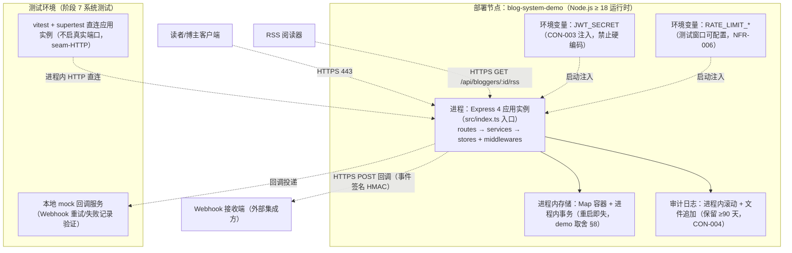
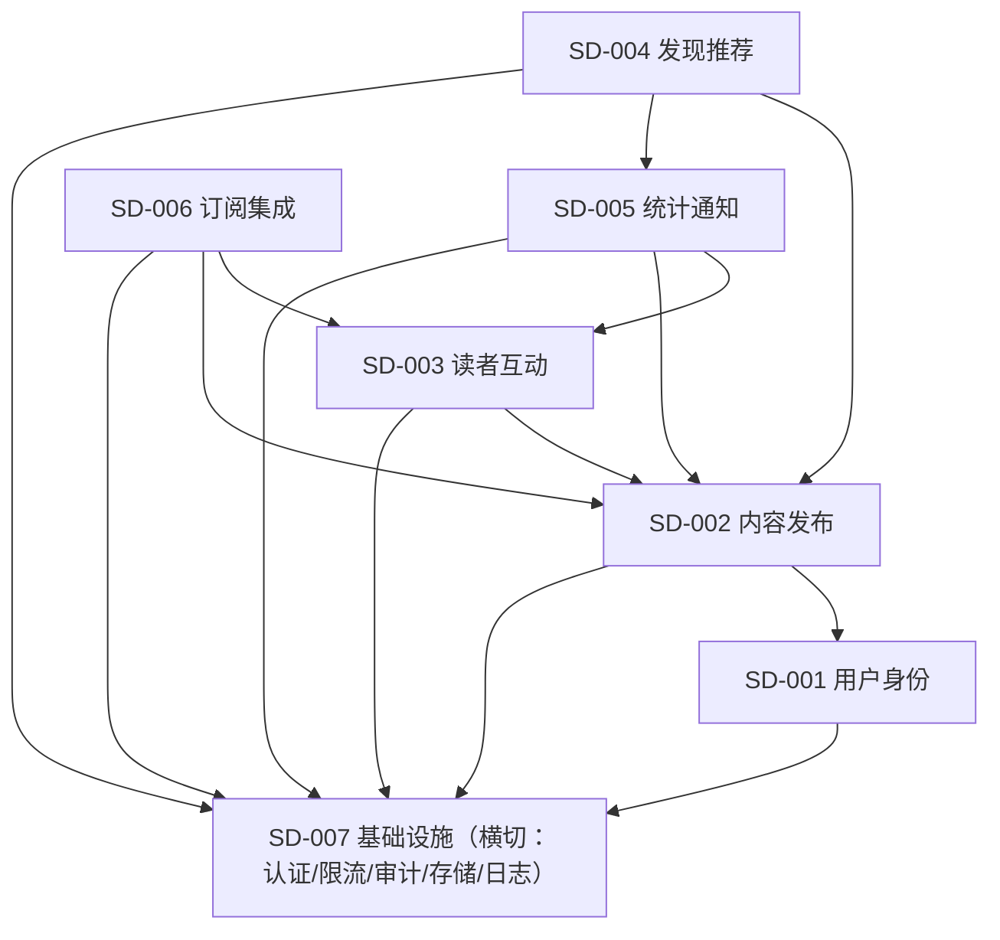

# 系统设计文档

> 阶段 2（系统设计）产出。套用 `templates/system-design.md` 模板。
> 博客系统后端（blog-system-demo-r35）。
> 输入：`docs/phase1-requirements/requirement-spec.md`（阶段 1 需求规格，22 REQ + 6 NFR + 4 CON）；图谱：`.w-model/ingestion/graph.json`（43 节点）。
> 同步产出：`docs/phase2-design/blog-system-system-test.md`（40 条 ST 系统测试用例）；RTM 已补登（`.w-model/rtm.json`，32 行 designDoc + systemTest）。

## 文档信息

- 项目名称：博客系统后端（blog-system-demo-r35）
- 文档版本：v1.0
- 编制日期：2026-08-07
- 编制者：W 模型 S-doc 子代理（产出变体）
- 关联需求文档：`docs/phase1-requirements/requirement-spec.md`

## 1. 系统架构

### 1.1 C4 组件图（Container + Component 级）

> 分层视角：边界层（横切中间件）→ 路由层 → 服务层 → 存储层；数据流以 `-.->` 标注（HTTP 同步 / 进程内调用 / 事件触发）。

```mermaid
graph TD
    subgraph Client["外部参与方（C4 Container 级）"]
        C1["读者/博主客户端<br/>HTTP REST + JSON"]
        C2["RSS 阅读器"]
        C3["Webhook 接收端<br/>（mock 回调服务）"]
    end

    subgraph Edge["边界层：SD-007 基础设施（横切中间件）"]
        M1["限流中间件<br/>IP 计数：认证 10 次/分、通用 100 次/分 → 429"]
        M2["认证中间件<br/>JWT 解析/有效期校验（24h，CON-003）"]
        M3["审计中间件<br/>登录/发布/删除留痕（CON-004）"]
        M4["错误处理中间件<br/>{ error: { code, message } }（CON-002）"]
        M5["请求体校验<br/>zod schema（RESTful + JSON）"]
    end

    subgraph Routes["路由层（Express Router，仅做参数透传）"]
        R1["身份路由<br/>SD-001"]
        R2["内容发布路由<br/>SD-002"]
        R3["读者互动路由<br/>SD-003"]
        R4["发现推荐路由<br/>SD-004"]
        R5["统计通知路由<br/>SD-005"]
        R6["订阅集成路由<br/>SD-006"]
    end

    subgraph Services["服务层（业务逻辑与领域规则）"]
        S1["用户身份服务<br/>注册/登录/博主认证/资料"]
        S2["内容发布服务<br/>文章状态机/标签/分类"]
        S3["读者互动服务<br/>浏览/评论/点赞收藏/关注"]
        S4["发现推荐服务<br/>热门/推荐/全文搜索"]
        S5["统计通知服务<br/>阅读统计/面板/通知"]
        S6["订阅集成服务<br/>RSS 生成/Webhook 分发"]
    end

    subgraph Stores["存储层：SD-007 内存存储基座（Map 容器 + 进程内事务）"]
        D1["UserStore"]
        D2["ArticleStore / TagStore / CategoryStore"]
        D3["CommentStore / LikeStore / FavoriteStore / FollowStore"]
        D4["ReadingRecordStore / NotificationStore"]
        D5["WebhookConfigStore / WebhookDeliveryStore / AuditLogStore"]
        D6["SearchIndex（标题+正文+摘要+标签拼接索引）"]
        D7["进程内事务管理器（一致性，NFR-003）"]
    end

    C1 -. "HTTP JSON 请求（含 JWT）" .-> M1
    M1 -. "放行" .-> M5
    M5 -. "校验通过" .-> M2
    M2 -. "认证态挂载 req.user" .-> M3
    M3 -. "放行/留痕" .-> M4
    M4 -. "分发到路由" .-> R1
    M4 -. "分发到路由" .-> R2
    M4 -. "分发到路由" .-> R3
    M4 -. "分发到路由" .-> R4
    M4 -. "分发到路由" .-> R5
    M4 -. "分发到路由" .-> R6
    R1 -. "调用服务方法" .-> S1
    R2 -. "调用服务方法" .-> S2
    R3 -. "调用服务方法" .-> S3
    R4 -. "调用服务方法" .-> S4
    R5 -. "调用服务方法" .-> S5
    R6 -. "调用服务方法" .-> S6
    S1 -. "读写实体（依赖 SD-007 存储基座）" .-> D1
    S2 -. "读写实体" .-> D2
    S3 -. "读写实体" .-> D3
    S5 -. "读写实体" .-> D4
    S6 -. "读写配置与投递记录" .-> D5
    S4 -. "查询索引" .-> D6
    S1 -. "事务提交" .-> D7
    S2 -. "事务提交" .-> D7
    S6 -. "发布/评论事件触发回调（HMAC 签名，异步重试≤3 次）" .-> C3
    C2 -. "GET RSS（无认证，公开源）" .-> R6
    R6 -. "生成 RSS XML" .-> S6
    S6 -. "读取已发布文章" .-> S2
    S4 -. "读取阅读统计数据" .-> S5
    S5 -. "读取文章/评论事件" .-> S2
    S5 -. "读取评论/关注事件" .-> S3
```



### 1.2 部署图

> 节点 + 进程 + 数据流。单进程单体部署（CON-001 内存存储、无外部数据库），dev/test/ci 同构。



### 1.3 架构风格说明

- **风格**：分层单体（Layered Monolith）——边界层（横切中间件）→ 路由层 → 服务层 → 存储层，依赖单向（NFR-005 禁止跨模块直访存储实例）。
- **选型理由**：
  - 需求规模：22 个功能需求、单部署单元（CON-001 内存存储）→ 微服务/事件驱动架构引入分布式一致性、进程间通信复杂度，与 demo 范围（进程内事务保证一致性，NFR-003）不匹配；
  - 需求规格 §2 已确立三层分层 + 中间件横切（认证/限流/审计）+ Webhook/RSS 挂载于内容发布链路的总体架构，本设计延续并细化；
  - 横切关注点（认证/限流/审计/错误契约）以 Express 中间件收敛于边界层，避免业务子系统重复实现（NFR-005 可维护性、CON-002 契约统一）。
- **模块组织**：7 个子系统（SD-001~SD-007）对应 6 大业务 module（REQ-001~006）+ 1 个横切基础设施子系统，子系统间按 depends-on 单向消费、无环（见 §3.3 依赖图）。

### 1.4 数据流说明

| 数据流 | 路径 | 类型 | 说明 |
|---|---|---|---|
| 认证数据流 | C1 → M1 → M5 → M2 → M3 → M4 → R* → S* | 同步 HTTP | 客户端带 JWT（CON-003），边界层限流→校验→认证→审计→路由→服务 |
| 文章发布链路 | R2 → S2（事务）→ S6（Webhook 事件）→ C3 | 同步 + 异步 | 发布成功提交事务后触发 Webhook 事件分发（失败异步重试 ≤3 次，NFR-003） |
| RSS 拉取 | C2 → R6 → S6 → S2（已发布文章） | 同步 HTTP | 仅含 published 文章（REQ-027），草稿/归档不暴露 |
| 统计联动 | C1 → R5/R4 → S5（阅读记录）→ S4（热门/推荐） | 同步 HTTP | 详情访问写阅读记录（同 IP 窗口去重），热门/推荐消费阅读统计（REQ-021/022/024） |
| 通知事件 | S3（评论/点赞）→ S5（通知） | 进程内同步 | 被回复/被点赞/关注发文三类事件产生通知（REQ-026） |

## 2. 技术选型

> 按「技术选型决策矩阵」5 维度评分（1=差 / 5=优），总分 = 5 维求和（满分 25）；并列时按「可维护性 > 成熟度 > 适用性」破局。候选清单 + 每项评分 + 总分 + 选型理由，全部有评分依据。

### 2.1 后端框架：Express 4 vs Fastify 4 vs Koa 2

| 候选 | 适用性 | 成熟度 | 可维护性 | 引入成本 | 风险敞口 | 总分 |
|---|---|---|---|---|---|---|
| **Express 4** ✅ | 5 | 5 | 5 | 5 | 4 | **24** |
| Fastify 4 | 4 | 4 | 4 | 3 | 5 | 20 |
| Koa 2 | 4 | 4 | 4 | 3 | 4 | 19 |

- 评分依据：Express 4 中间件生态与技能包教程一致、满足 RESTful 路由需求（CON-002）；成熟度 Node 事实标准（≥3 生产案例、6 个月内有 release）；LTS 文档齐全 1 周可运维；零新运行时且 CON-001 显式约束；替换 Fastify 需重写路由与中间件适配（风险 4）。
- **选型**：Express 4。理由：CON-001 硬约束 + 生态/文档与团队既有经验对齐，评分显著领先。

### 2.2 开发语言：TypeScript 5（strict）vs JavaScript（ES2022）

| 候选 | 适用性 | 成熟度 | 可维护性 | 引入成本 | 风险敞口 | 总分 |
|---|---|---|---|---|---|---|
| **TypeScript 5 strict** ✅ | 5 | 5 | 5 | 4 | 4 | **23** |
| JavaScript | 3 | 5 | 3 | 5 | 5 | 21 |

- 评分依据：领域模型（User/Article/Comment/Tag/Category 等）类型化支撑 NFR-005 可维护性与 NFR-002 安全（编译期防误传敏感字段）；项目已含 tsconfig + vitest + tsx 基础（引入成本 4，需编译步骤）；替换回 JS 成本低但失去类型契约。
- **选型**：TypeScript 5 strict。理由：CON-001 约束 + 领域类型契约是 NFR-005 静态校验的前提。

### 2.3 存储：进程内内存 Map（自研 store 层）vs SQLite vs LowDB

| 候选 | 适用性 | 成熟度 | 可维护性 | 引入成本 | 风险敞口 | 总分 |
|---|---|---|---|---|---|---|
| **内存 Map store** ✅ | 5 | 5 | 4 | 5 | 4 | **23** |
| SQLite | 2 | 5 | 4 | 2 | 3 | 16 |
| LowDB | 3 | 3 | 3 | 3 | 3 | 15 |

- 评分依据：内存 Map 零外部依赖、满足进程内事务一致性（NFR-003）且为 CON-001 显式约束（适用性 5）；Node 原生无安装（引入成本 5）；SQLite 引入原生依赖并违反 CON-001（适用性 2）。
- **选型**：进程内内存 Map（经 Store 接口抽象）。理由：CON-001 硬约束；store 层抽象保留后续迁移持久化的低风险路径（风险敞口 4）。

### 2.4 认证令牌：jsonwebtoken vs jose vs 自研

| 候选 | 适用性 | 成熟度 | 可维护性 | 引入成本 | 风险敞口 | 总分 |
|---|---|---|---|---|---|---|
| **jsonwebtoken** ✅ | 5 | 5 | 5 | 4 | 4 | **23** |
| jose | 4 | 4 | 4 | 3 | 4 | 19 |
| 自研签名 | 2 | 1 | 2 | 5 | 2 | 12 |

- 评分依据：jsonwebtoken 覆盖 HS256 + exp 有效期校验（CON-003 24h）、NPM 周下载量级成熟、API 稳定文档全；自研签名不满足 NFR-002 安全（成熟度 1、风险敞口 2——加密实现错误代价高）。
- **选型**：jsonwebtoken。理由：需求规格 §2 已列辅助库 + 生产案例成熟、安全默认正确。

### 2.5 密码哈希：bcryptjs vs bcrypt vs argon2

| 候选 | 适用性 | 成熟度 | 可维护性 | 引入成本 | 风险敞口 | 总分 |
|---|---|---|---|---|---|---|
| **bcryptjs** ✅ | 5 | 5 | 5 | 5 | 4 | **24** |
| bcrypt | 4 | 5 | 4 | 2 | 4 | 19 |
| argon2 | 4 | 4 | 4 | 2 | 4 | 18 |

- 评分依据：bcryptjs 纯 JS 无原生编译、CI 环境零 node-gyp 依赖（引入成本 5），加盐哈希满足 NFR-002；bcrypt/argon2 需原生编译（引入成本 2），在 Windows/CI 环境引入风险。
- **选型**：bcryptjs。理由：需求规格已列 + 零原生依赖与 CI 兼容性最佳，安全性等同 bcrypt。

### 2.6 参数校验：zod vs joi vs ajv

| 候选 | 适用性 | 成熟度 | 可维护性 | 引入成本 | 风险敞口 | 总分 |
|---|---|---|---|---|---|---|
| **zod** ✅ | 5 | 4 | 5 | 4 | 4 | **22** |
| joi | 4 | 5 | 4 | 4 | 4 | 21 |
| ajv | 3 | 5 | 3 | 4 | 4 | 19 |

- 评分依据：zod 与 TypeScript 类型推导零成本集成（strict 模式推导精确类型）、错误信息可映射统一错误码（CON-002，适用性 5）；成熟度 4（活跃维护、生产案例充足）；joi 生态更老但 TS 集成弱于 zod。
- **选型**：zod。理由：TS-first 类型契约与 NFR-005 一致性最佳，需求规格已列。

### 2.7 测试框架：vitest + supertest vs jest + supertest

| 候选 | 适用性 | 成熟度 | 可维护性 | 引入成本 | 风险敞口 | 总分 |
|---|---|---|---|---|---|---|
| **vitest + supertest** ✅ | 5 | 4 | 4 | 5 | 4 | **22** |
| jest + supertest | 4 | 5 | 4 | 3 | 4 | 20 |

- 评分依据：项目已含 vitest.config.ts + supertest（引入成本 5，零新装）；ESM/TS 原生支持免 babel 转译；vitest 覆盖率报告支撑 NFR-004（≥80% 断言）。
- **选型**：vitest + supertest。理由：现有 CI 基线兼容 + 系统测试 seam（seam-HTTP）与阶段 1 验收测试同工具链。

### 2.8 选型汇总

| 层次 | 技术 | 版本 | 总分 | 选型理由 |
|---|---|---|---|---|
| 后端框架 | Node.js + Express 4 | 4.x | 24 | CON-001 硬约束 + 中间件生态对齐 |
| 语言 | TypeScript（strict） | 5.x | 23 | 领域类型契约支撑 NFR-005/002 |
| 存储 | 进程内内存 Map（Store 接口抽象） | — | 23 | CON-001 + 进程内事务（NFR-003） |
| 认证 | jsonwebtoken | 9.x | 23 | HS256 + exp 校验，生产案例成熟 |
| 密码哈希 | bcryptjs | 2.x | 24 | 纯 JS 零原生依赖，加盐哈希（NFR-002） |
| 校验 | zod | 3.x | 22 | TS 类型推导 + 统一错误码映射（CON-002） |
| 测试 | vitest + supertest | 2.x / 7.x | 22 | 现有 CI 基线 + 系统测试 seam 同工具链 |

## 3. 模块划分

### 3.1 子系统清单（SD-001~SD-007，与 R23 架构对齐）

> 7 个子系统：6 个业务子系统对应需求层级树 6 大 module（REQ-001~006），1 个横切基础设施子系统承载认证/限流/审计/存储/日志。

| 子系统 ID | 子系统名 | 职责 | 承载 REQ | 关联 module |
|---|---|---|---|---|
| SD-001 | 用户身份子系统 | 注册、登录（JWT 签发）、博主认证、资料管理与密码修改；用户数据所有权 | REQ-007~010 | REQ-001 |
| SD-002 | 内容发布子系统 | 文章创建/发布/状态机（draft→published→archived）/管理、标签、分类；文章/标签/分类数据所有权 | REQ-011~016 | REQ-002 |
| SD-003 | 读者互动子系统 | 浏览（列表/详情/筛选）、评论（含回复与作者删除）、点赞收藏（幂等）、关注与 feed | REQ-017~020 | REQ-003 |
| SD-004 | 发现推荐子系统 | 热门（7 天阅读量 Top N）、个性化推荐（标签偏好，冷启动回退热门）、全文搜索（四字段索引 + 相关性排序） | REQ-021~023 | REQ-004 |
| SD-005 | 统计通知子系统 | 阅读统计（详情访问 +1、同 IP 短窗口去重）、博主统计面板（四项 + 7 天趋势）、通知（三类事件 + 已读） | REQ-024~026 | REQ-005 |
| SD-006 | 订阅集成子系统 | RSS 源生成（已发布文章四字段）、Webhook 配置与事件分发（HMAC 签名、失败重试 ≤3 次、失败记录） | REQ-027~028 | REQ-006 |
| SD-007 | 基础设施子系统（横切） | 认证中间件（JWT 解析，CON-003）、限流中间件（10/100 次每分每 IP，NFR-006）、审计中间件（登录/发布/删除，CON-004）、统一错误处理（CON-002）、内存存储基座（Map 容器 + 进程内事务，CON-001/NFR-003）、日志、配置注入（JWT_SECRET）、zod 校验工具 | NFR-001~006、CON-001~004（横切治理） | —（横切） |

### 3.2 子系统内部结构（每个 SD 含 routes/services/stores 三层 + 领域模型）

| 子系统 | 领域实体（存储所有权） | 核心服务 | 对外接口（方向） |
|---|---|---|---|
| SD-001 | User | authService / profileService | 注册、登录、博主申请、资料（INTF-001~004） |
| SD-002 | Article / Tag / Category | articleService / tagService / categoryService / articleStateMachine | 创建、发布、状态机、管理、标签、分类（INTF-005~010） |
| SD-003 | Comment / Like / Favorite / Follow | articleBrowseService / commentService / likeService / followService | 浏览、评论、点赞收藏、关注（INTF-011~014） |
| SD-004 | SearchIndex（只读消费） | hotService / recommendService / searchService | 热门、推荐、搜索（INTF-015~017） |
| SD-005 | ReadingRecord / Notification | readingStatService / bloggerStatsService / notificationService | 阅读统计、面板、通知（INTF-018~020） |
| SD-006 | WebhookConfig / WebhookDelivery | rssService / webhookService | RSS、Webhook（INTF-021~022） |
| SD-007 | AuditLog / RateLimitCounter | authMiddleware / rateLimitMiddleware / auditMiddleware / errorMiddleware / storeFactory / txManager | 横切（无独立对外接口，全部经中间件） |

### 3.3 子系统依赖图（模块职责边界，非架构图）



- 依赖方向与需求图谱 depends-on 23 条一致（如 REQ-012 发布 depends-on REQ-011 → SD-002 内部；REQ-021/022 depends-on REQ-024 → SD-004 → SD-005），无环（图谱无环校验通过，`madge --circular` 检测留待阶段 5 代码产出后由 G 执行）。
- 横切依赖收敛：全部业务子系统仅依赖 SD-007 提供的存储基座与中间件能力，禁止业务子系统间直访对方 store 实例（NFR-005）。

## 4. 接口设计方向（INTF-001~022）

> RESTful 概述（阶段 3 概要设计细化契约：请求/响应 schema、分页参数、错误码枚举）。路径为设计约定端点，实际路径以阶段 3/阶段 5 为准。

| INTF ID | 方法+路径（方向） | 概要 | 认证 | 关联 REQ |
|---|---|---|---|---|
| INTF-001 | POST /api/auth/register | 注册（用户名/邮箱/密码，bcrypt 存储，邮箱唯一 409） | 公开 | REQ-007 |
| INTF-002 | POST /api/auth/login | 登录（用户名或邮箱+密码 → JWT 24h；错误凭据 401） | 公开（限流 10/分/IP） | REQ-008 |
| INTF-003 | POST /api/users/me/blogger | 申请成为博主（角色变更 200；读者发文章 403 由 INTF-005 校验） | JWT | REQ-009 |
| INTF-004 | GET/PATCH /api/users/me；PUT /api/users/me/password | 资料查看/修改；修改密码校验原密码（错误 400） | JWT | REQ-010 |
| INTF-005 | POST /api/articles | 创建文章（标题/正文/摘要/标签/分类 → draft 201；非博主 403） | JWT（博主） | REQ-011 |
| INTF-006 | POST /api/articles/:id/publish | 发布草稿（published 200，读者可见；更新后重新发布） | JWT（博主） | REQ-012 |
| INTF-007 | POST /api/articles/:id/archive；/unarchive | 归档/取消归档（archived→published 直跳 400） | JWT（博主） | REQ-013 |
| INTF-008 | GET /api/blogger/articles；PUT/DELETE /api/articles/:id | 文章列表（草稿+已发布）/编辑/删除（删草稿 204；删已发布 409 仅可归档；越权 403） | JWT（博主） | REQ-014 |
| INTF-009 | POST/GET /api/tags；GET /api/articles?tag= | 创建唯一标签（重名 409）、列表、按标签筛选 | 创建需 JWT；查询公开 | REQ-015 |
| INTF-010 | POST/GET /api/categories；GET /api/articles?category= | 创建嵌套分类（深度 ≤3 层，超深 400，重名 409）、列表、按分类浏览 | 创建需 JWT；查询公开 | REQ-016 |
| INTF-011 | GET /api/articles?page=&category=&tag=&keyword=；GET /api/articles/:id | 分页浏览已发布（草稿对读者 404）；详情含正文+作者+阅读量 | 公开 | REQ-017、REQ-024 |
| INTF-012 | POST/GET /api/articles/:id/comments；DELETE /api/articles/:id/comments/:cid | 评论发表（201 立即可见）、列表、作者删除（非作者 403）、回复 | 发表/删除需 JWT；列表公开 | REQ-018 |
| INTF-013 | POST /api/articles/:id/like；/favorite；GET /api/me/favorites | 点赞（重复幂等）、收藏、收藏列表；详情返回点赞/收藏数 | JWT | REQ-019 |
| INTF-014 | POST/DELETE /api/users/:id/follow；GET /api/me/feed | 关注/取消关注、feed（关注博主新文章） | JWT | REQ-020 |
| INTF-015 | GET /api/articles/hot?limit= | 7 天阅读量降序 Top N（默认 10） | 公开 | REQ-021 |
| INTF-016 | GET /api/me/recommendations | 标签偏好推荐；无历史回退热门 | 公开（可选 JWT） | REQ-022 |
| INTF-017 | GET /api/search?q=&page= | 全文搜索（标题+正文+摘要+标签），分页+相关性排序 | 公开 | REQ-023 |
| INTF-018 | GET /api/articles/:id（阅读量副作用）| 详情访问阅读量 +1（同 IP 短窗口去重），响应含阅读量 | 公开 | REQ-024 |
| INTF-019 | GET /api/blogger/stats | 文章数/总阅读量/总评论数/近 7 天趋势 | JWT（博主） | REQ-025 |
| INTF-020 | GET /api/me/notifications；PATCH /api/me/notifications/:id/read | 通知列表（分页）、标记已读 | JWT | REQ-026 |
| INTF-021 | GET /api/bloggers/:id/rss | 博主 RSS 源（标题/链接/摘要/发布时间 XML；无草稿） | 公开 | REQ-027 |
| INTF-022 | POST/GET/DELETE /api/me/webhooks | Webhook 配置；发布/评论事件触发回调（HMAC 签名，失败重试 ≤3 次+失败记录） | JWT（博主） | REQ-028 |

> 横切接口契约（CON-002）：全部接口 JSON 请求/响应；错误响应统一 `{ error: { code, message } }`；未认证 401、越权 403、资源不存在 404、冲突 409、参数错误 400、限流 429（NFR-006）。

## 5. 分层架构与代码组织

> 分层：routes → services → stores + middlewares + utils（需求规格 §9 Implementation Decisions + NFR-005）。

| 层 | 目录（设计方向） | 职责 | 约束 |
|---|---|---|---|
| 边界层 | `src/middlewares/` | auth / rateLimit / audit / errorHandler / validate | 横切逻辑只允许在中间件实现；路由不写限流/认证逻辑 |
| 路由层 | `src/routes/{identity,content,interaction,discovery,stats,integration}/` | HTTP 参数解析、调用服务、响应组装 | 不含业务规则；只做透传（NFR-005） |
| 服务层 | `src/services/{identity,content,interaction,discovery,stats,integration}/` | 业务规则、权限校验（资源归属）、事务编排、事件触发 | 禁止跨模块直访存储实例（NFR-005） |
| 存储层 | `src/stores/` | Map 容器 + 索引 + 进程内事务（storeFactory/txManager） | 唯一允许持有存储实例的层 |
| 工具层 | `src/utils/` | jwt 签名/校验、bcrypt 哈希、HMAC 事件签名、错误码枚举、分页/时间窗口工具 | 无状态纯函数 |

```text
src/
├── index.ts                 # 应用装配（中间件挂载顺序：rateLimit→validate→auth→audit→routes→errorHandler）
├── app.ts                   # Express 应用工厂（测试 seam 直连入口）
├── middlewares/             # auth / rateLimit / audit / errorHandler / validate（SD-007）
├── routes/                  # 六域路由（SD-001~SD-006）
├── services/                # 六域服务（SD-001~SD-006）
├── stores/                  # 内存存储基座 + 事务管理器（SD-007）
├── utils/                   # jwt / bcrypt / hmac / errors / pagination / window（SD-007）
└── types/                   # 领域模型类型（User/Article/Comment/Tag/Category/Like/Favorite/Follow/Notification/ReadingRecord/WebhookConfig/AuditLog）
```

- 中间件挂载顺序（Express 中间件链）：限流 → 请求体校验 → 认证（挂载于需认证路由）→ 审计（登录/发布/删除）→ 路由分发 → 统一错误处理（兜底）。
- 循环依赖防护：路由层仅依赖服务层接口，服务层仅依赖存储层接口与本模块 store；跨子系统数据消费一律经对方服务方法（如 SD-006 RSS 经 SD-002 articleService 读已发布文章），禁止反向依赖（§3.3 图）。

## 6. 部署架构

- 环境说明：

| 环境 | 部署方式 | 关键配置 | 用途 |
|---|---|---|---|
| dev/test | 本机 `npx tsx src/index.ts` + vitest 直连 app 工厂 | `JWT_SECRET=test-*`（CON-003）、限流窗口缩小（NFR-006） | 阶段 5-7 开发与系统测试 |
| ci | `npm ci && npm test`（vitest 直连，不启端口） | 同上 + coverage 报告（NFR-004 ≥80%） | 门禁 |
| prod（目标） | 单进程容器（Docker，Node 18+）启动 `dist/index.js` | `JWT_SECRET` 从编排平台注入；审计日志卷挂载（≥90 天，CON-004） | 生产 |

- 部署图见 §1.2；单进程无外部依赖（CON-001），数据流经 HTTP 边界进出，Webhook 出站回调为唯一外部出站流量（REQ-028）。

## 7. 测试 seam 决策

> 吸收 to-spec seam-first testing 方法论（第 10 轮外部技能吸收）。seam 决策服务于阶段 7 系统测试执行：本阶段定「在哪测」，`blog-system-system-test.md` 定「测什么」。

### 候选 seam 列表

- **seam-HTTP**：Express 应用工厂实例 + supertest 直连发起 HTTP 请求（不启真实端口）— 钩住点：HTTP 接口层（进程内模块导出 `app`）
- **seam-PROC**：真实端口启动完整进程（`node dist/index.js` + fetch）— 钩住点：进程边界
- **seam-STORE**：内存 store 实例注入（种子数据准备、统计快照断言）— 钩住点：模块导出（服务层/store 层）
- **seam-CLI**：npm scripts 入口 — 钩住点：CLI（本项目无独立 CLI，无意义）

### 选定 seam

- 系统测试主 seam：**seam-HTTP**（最高 seam，理由：覆盖最广——全部 40 条 ST 均可经 HTTP 断言契约（CON-002）、状态码、响应体与副作用；最稳定——不启端口免端口竞争；最少新 seam——阶段 1 验收测试已采用同一 seam，工具链 vitest+supertest 零新增）
- 系统测试辅 seam：**seam-STORE**（仅当主 seam 无法覆盖时启用：性能基线（ST-029~031）需注入规模化种子数据、阅读统计去重（ST-020）需直接构造时间窗口数据、NFR-003 事务一致性（ST-039）需检查存储快照——这些经 store 层准备/断言数据，断言本身仍走 HTTP）

### 理由

- **为什么 seam-HTTP 是最高 seam**：系统层"最高 seam"= 外部可观测点（HTTP API）。CON-002 要求全部接口 RESTful+JSON+统一错误结构，只有 HTTP seam 能端到端验证契约；supertest 直连 app 工厂在进程内完成请求，无端口/进程管理开销，CI 可并行。
- **为什么现有 seam 优于新建 seam**：阶段 1 验收测试已用 supertest 直连（需求规格 §10 Testing Decisions），系统测试复用同一 seam，符合 to-spec「fewer seams better」；跨阶段同一 seam 使阶段 7 可直接沿用阶段 2 用例结构。
- **新建 seam 的代价与收益**：不新建 seam。seam-STORE 属于既有模块导出（存储基座本身是架构内组件，非新引入测试专用 seam）；禁止为"覆盖率"在系统层引入新 seam（如 mock 中间件链），违反 few-seams 原则。

## 8. 系统测试用例索引

> 详细用例见 `docs/phase2-design/blog-system-system-test.md`（40 条，ST-001~ST-040 连续编号）。

| 用例 ID | 关联模块/SD | 场景 | 类型 | 优先级 |
|---|---|---|---|---|
| ST-001 | SD-001/SD-002/SD-003 | 注册→登录→申请博主→创建→发布→浏览 全链路 | 端到端 | 高 |
| ST-002 | SD-002/SD-003/SD-005 | 发布→评论→回复→被回复通知 端到端 | 端到端 | 高 |
| ST-003 | SD-003/SD-005 | 关注→发文→feed→发文通知 端到端 | 端到端 | 高 |
| ST-004 | SD-003/SD-005/SD-004 | 详情访问→阅读统计→热门/推荐 数据联动 | 端到端 | 高 |
| ST-005 | SD-002/SD-006 | 发布→Webhook 回调→RSS 更新 端到端 | 端到端 | 高 |
| ST-006~ST-028 | SD-001~SD-007 | 跨模块集成（认证/越权/状态机/标签分类/评论/点赞/关注/热门/推荐/搜索/统计/通知/RSS/Webhook/错误契约/审计/限流） | 跨模块集成 | 高/中 |
| ST-029~ST-031 | SD-003/SD-004 | 性能基线：浏览/搜索/推荐 P95 ≤ 2000ms | 性能基线（TC-DES-008 型） | 高 |
| ST-032~ST-035 | SD-007/SD-001 | 安全基线：注入/XSS/密码存储/JWT 密钥 | 安全基线（TC-DES-009 型） | 高 |
| ST-036~ST-040 | SD-001/SD-002/SD-007 | 边界异常：重复邮箱/密码错误/分页边界/事务一致性/分类重名 | 边界异常 | 高/中 |

## 9. 设计决策与风险

| # | 设计决策 | 依据 | 风险与缓解 |
|---|---|---|---|
| D-01 | 单体分层 + 7 子系统（SD-001~007） | 需求规模 + CON-001 内存存储（§1.3） | 子系统边界漂移 → NFR-005 结构断言（阶段 5） |
| D-02 | 横切收敛于 SD-007 中间件 | NFR-002/005/006、CON-002/003/004 | 中间件顺序错乱 → 装配顺序固定（§5）并经 ST-006/025~028 验证 |
| D-03 | 内存存储以进程内事务保证一致性 | NFR-003 + §8 数据丢失取舍 | 重启丢数据（RISK-003）→ demo 范围显式声明，ST-039 验证运行期一致性 |
| D-04 | Webhook 同步触发、异步重试 ≤3 次 + 失败记录 | NFR-003 + 输入文档 | 回调不可达（RISK-006）→ 本地 mock 回调 + ST-024 |
| D-05 | 阅读统计同 IP 短窗口去重（默认 5 分钟，阶段 3 确认） | 输入文档参数待定项 | RISK-007 → 参数化配置，阶段 3 回填 |
| D-06 | 系统测试 seam 复用阶段 1 验收 seam（seam-HTTP） | to-spec few-seams + 需求规格 §10 | 无新 seam 引入成本；seam-STORE 仅作数据准备辅 seam |
| D-07 | 性能基线双字段（生产 200ms / 测试 2000ms） | NFR-001 testThreshold（10 倍放宽） | RISK-004 环境抖动 → ST-029~031 按测试基线断言 |

> 关联需求规格 §11.2 风险登记：RISK-001~008 的缓解措施均在设计中落实（JWT_SECRET 注入 D-02、越权校验收敛服务层 §5、内存存储取舍 D-03、性能双字段 D-07、限流参数化 §6、Webhook mock D-04、参数待定 D-05、用例分级 §8）。
