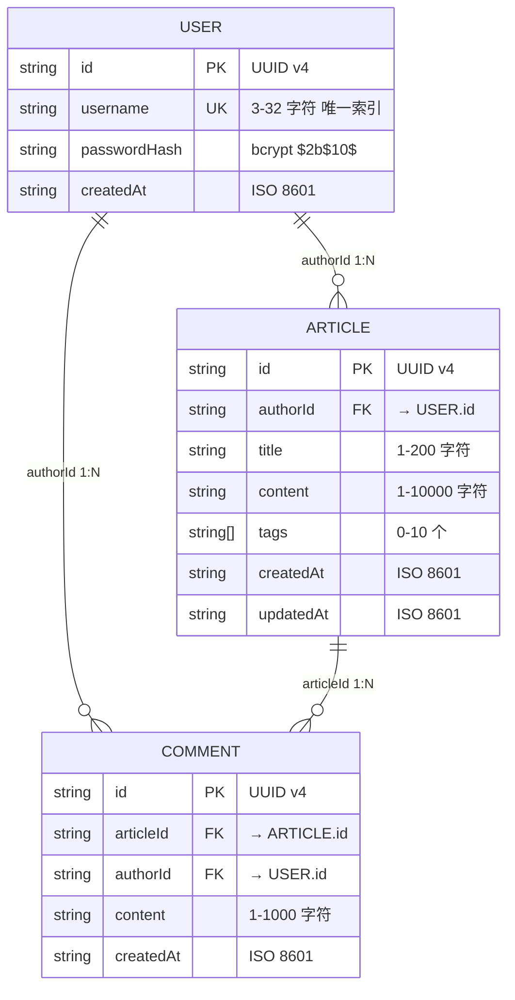
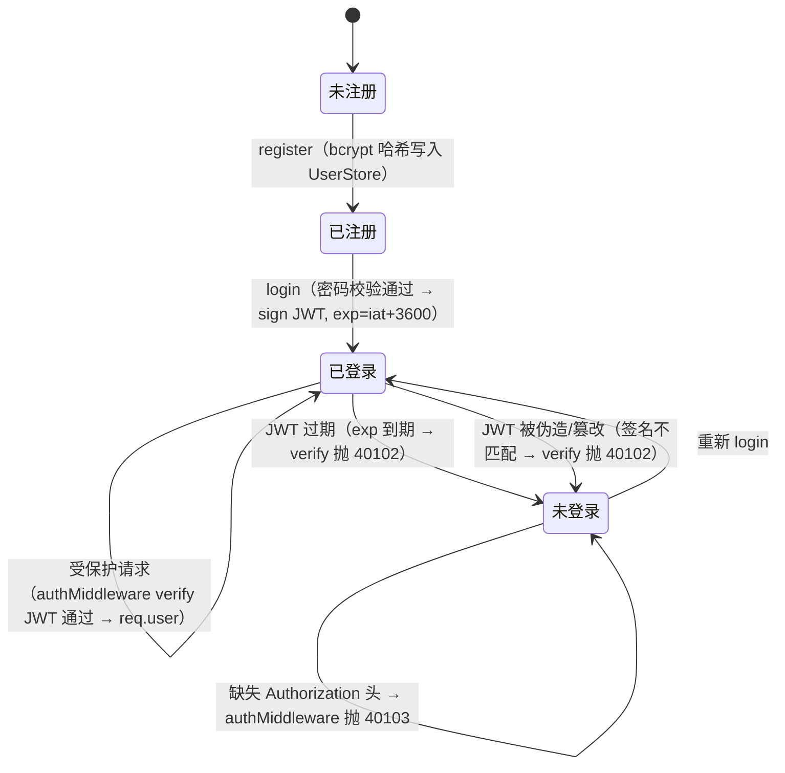
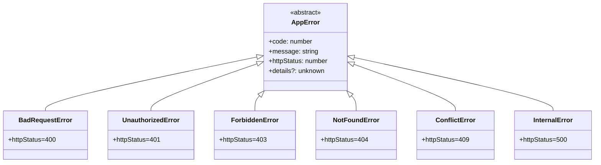

# 详细设计文档

> 阶段 4（详细设计）产出。W 模型右 V 同步产出单元测试设计。
> 本文件内嵌单元测试用例设计（UT-001~053），不再外挂独立测试用例文件。
> 承接概要设计（`docs/outline-design.md` §3 接口契约 INTF-001~012），细化类 / 方法内部实现。

## 文档信息

- 项目名称：blog-system-demo
- 文档版本：v1.0
- 编制日期：2026-07-23
- 编制者：W-Model Agent（self-as-verifier 回归调测）
- 关联需求文档：`docs/requirement-spec.md`
- 关联系统设计：`docs/system-design.md`（§3 模块划分 SD-001~008、§7 错误码规范）
- 关联概要设计：`docs/outline-design.md`（§3 接口契约 INTF-001~012）

## 1. 设计目标

承接概要设计（INTF-001~012 接口签名），细化到类 / 方法级实现：

- 定义每个类的字段、方法签名、前置 / 后置条件、异常、副作用
- 定义内存数据模型（User / Article / Comment）与索引
- 定义 JWT 会话状态机（签发 / 校验 / 过期）
- 定义错误处理策略（AppError 类层级 + 错误码映射 + 中间件统一捕获）
- 设计单元测试场景（UT-001~053），覆盖正常路径 + 边界 + 异常，作为阶段 5 编码时 `tests/unit/*.test.ts` 的设计基础

**设计边界**：本阶段只定义方法签名与逻辑分支，不写可执行代码（属阶段 5 编码职责）。

## 2. 类设计

### 2.1 类图

```mermaid
classDiagram
    class AppError {
        <<abstract>>
        +code: number
        +message: string
        +httpStatus: number
        +details?: unknown
        +constructor(code, message, details?)
    }
    class BadRequestError { +httpStatus = 400 }
    class UnauthorizedError { +httpStatus = 401 }
    class ForbiddenError { +httpStatus = 403 }
    class NotFoundError { +httpStatus = 404 }
    class ConflictError { +httpStatus = 409 }
    AppError <|-- BadRequestError
    AppError <|-- UnauthorizedError
    AppError <|-- ForbiddenError
    AppError <|-- NotFoundError
    AppError <|-- ConflictError

    class UserStore {
        -users: Map~string,User~
        -usernameIndex: Map~string,string~
        +insert(user: User): void
        +findByUsername(name: string): User|undefined
        +findById(id: string): User|undefined
        +clear(): void
        +size(): number
    }
    class ArticleStore {
        -articles: Map~string,Article~
        +insert(article: Article): void
        +findById(id: string): Article|null
        +update(id: string, patch: Partial~Article~): Article|null
        +delete(id: string): boolean
        +findAll(page, pageSize): {items, total}
        +clear(): void
    }
    class CommentStore {
        -comments: Map~string,Comment~
        +insert(comment: Comment): void
        +findById(id: string): Comment|null
        +delete(id: string): boolean
        +findByArticleId(articleId: string): Comment[]
        +clear(): void
    }

    class PasswordHasher {
        -COST: 10
        +hash(plain: string): Promise~string~
        +compare(plain, hash): Promise~boolean~
        +getRounds(hash: string): number
    }
    class JwtService {
        -getSecret(): string
        +sign(payload: JwtPayload, expiresIn?): string
        +verify(token: string): JwtPayload
    }
    class AuthService {
        +register(input: RegisterInput): Promise~{userId,username}~
        +login(input: LoginInput): Promise~{token,expiresIn}~
        +verifyToken(token: string): Promise~{userId,username}~
    }
    class ArticleService {
        +create(input, authorId): Promise~Article~
        +update(articleId, input, authorId): Promise~Article~
        +delete(articleId, authorId): Promise~void~
        +getById(articleId): Promise~ArticleDetail~
        +list(page, pageSize): Promise~Page~
    }
    class CommentService {
        +create(articleId, input, authorId): Promise~Comment~
        +delete(commentId, authorId): Promise~void~
        +listByArticle(articleId): Promise~Comment[]~
    }

    class AuthController {
        +register(req, res, next): Promise~void~
        +login(req, res, next): Promise~void~
    }
    class ArticleController {
        +create(req, res, next): Promise~void~
        +update(req, res, next): Promise~void~
        +remove(req, res, next): Promise~void~
        +getById(req, res, next): Promise~void~
        +list(req, res, next): Promise~void~
    }
    class CommentController {
        +create(req, res, next): Promise~void~
        +remove(req, res, next): Promise~void~
    }

    class AuthMiddleware {
        +authenticate(req, res, next): void
    }
    class ValidateRequest {
        +validate(schema): RequestHandler
    }
    class ErrorHandler {
        +handle(err, req, res, next): void
    }
    class AsyncHandler {
        +wrap(fn): RequestHandler
    }

    AuthService --> PasswordHasher : 调用
    AuthService --> JwtService : 调用
    AuthService --> UserStore : 调用
    ArticleService --> ArticleStore : 调用
    ArticleService --> CommentStore : 聚合评论
    CommentService --> CommentStore : 调用
    CommentService --> ArticleService : 文章存在性校验
    AuthMiddleware --> JwtService : 校验
    AuthController --> AuthService
    ArticleController --> ArticleService
    CommentController --> CommentService
    ErrorHandler ..> AppError : 序列化
```

### 2.2 类型定义（src/types.ts）

```typescript
export interface User {
  id: string;            // UUID v4
  username: string;      // 3-32 字符，唯一
  passwordHash: string;  // bcrypt $2b$10$...
  createdAt: string;     // ISO 8601
}

export interface Article {
  id: string;            // UUID v4
  authorId: string;      // = JWT.userId
  title: string;         // 1-200 字符
  content: string;       // 1-10000 字符
  tags: string[];        // 0-10 个
  createdAt: string;     // ISO 8601
  updatedAt: string;     // ISO 8601，更新时 > createdAt
}

export interface Comment {
  id: string;            // UUID v4
  articleId: string;     // 外键 → Article.id
  authorId: string;      // = JWT.userId
  content: string;       // 1-1000 字符
  createdAt: string;     // ISO 8601
}

export interface ArticleDetail extends Article {
  comments: Comment[];   // 按 createdAt 升序
}

export interface JwtPayload {
  userId: string;
  username: string;
}
```

### 2.3 类定义（方法级）

> 每个方法含签名 / 职责 / 前置条件 / 后置条件 / 异常 / 副作用。

#### 2.3.1 UserStore（realizes INTF-010，defines SD-007）

- 职责：用户内存存储，维护 `users` Map + `usernameIndex` 唯一索引
- 属性：

| 属性 | 类型 | 说明 |
|---|---|---|
| users | `Map<string, User>` | id → User 主存储 |
| usernameIndex | `Map<string, string>` | username → id 唯一索引 |

- 方法：

| 方法 | 签名 | 职责 | 前置条件 | 后置条件 | 异常 | 副作用 |
|---|---|---|---|---|---|---|
| insert | `(user: User): void` | 写入用户 + 建立索引 | user.id / user.username 非空 | users.size++ , usernameIndex 含该 username | ConflictError(40901) 若 username 已存在 | 内存 Map 写入 |
| findByUsername | `(username: string): User \| undefined` | 按用户名查 | username 非空 | 返回 User 或 undefined | 无 | 无（只读） |
| findById | `(id: string): User \| undefined` | 按 id 查 | id 非空 | 返回 User 或 undefined | 无 | 无（只读） |
| clear | `(): void` | 清空存储（测试用） | 无 | users.size=0 | 无 | 内存 Map 清空 |
| size | `(): number` | 返回用户数 | 无 | 返回当前 size | 无 | 无 |

#### 2.3.2 ArticleStore（realizes INTF-011，defines SD-007）

- 职责：文章内存存储，findAll 按 createdAt 降序分页
- 属性：

| 属性 | 类型 | 说明 |
|---|---|---|
| articles | `Map<string, Article>` | id → Article 主存储 |

- 方法：

| 方法 | 签名 | 职责 | 前置条件 | 后置条件 | 异常 | 副作用 |
|---|---|---|---|---|---|---|
| insert | `(article: Article): void` | 写入文章 | article.id 非空 | articles.size++ | 无 | 内存 Map 写入 |
| findById | `(id: string): Article \| null` | 按 id 查 | id 非空 | 返回 Article 或 null | 无 | 无 |
| update | `(id: string, patch: Partial<Article>): Article \| null` | 部分更新 | id 存在 | updatedAt 刷新；返回更新后 Article；不存在返回 null | 无 | 内存 Map 覆写 |
| delete | `(id: string): boolean` | 按 id 删 | id 非空 | 存在返回 true 并 size--；不存在返回 false | 无 | 内存 Map 删除 |
| findAll | `(page: number, pageSize: number): { items: Article[]; total: number }` | 分页查询 | page≥1, 1≤pageSize≤100 | 按 createdAt 降序；items 为当前页；total 为总数 | 无（越界由 Service 校验） | 无 |
| clear | `(): void` | 清空（测试用） | 无 | articles.size=0 | 无 | 内存 Map 清空 |

#### 2.3.3 CommentStore（realizes INTF-012，defines SD-007）

- 职责：评论内存存储，findByArticleId 按 createdAt 升序
- 属性：

| 属性 | 类型 | 说明 |
|---|---|---|
| comments | `Map<string, Comment>` | id → Comment 主存储 |

- 方法：

| 方法 | 签名 | 职责 | 前置条件 | 后置条件 | 异常 | 副作用 |
|---|---|---|---|---|---|---|
| insert | `(comment: Comment): void` | 写入评论 | comment.id 非空 | comments.size++ | 无 | 内存 Map 写入 |
| findById | `(id: string): Comment \| null` | 按 id 查 | id 非空 | 返回 Comment 或 null | 无 | 无 |
| delete | `(id: string): boolean` | 按 id 删 | id 非空 | 存在返回 true；不存在返回 false | 无 | 内存 Map 删除 |
| findByArticleId | `(articleId: string): Comment[]` | 按文章查 | articleId 非空 | 按 createdAt 升序；无评论返回空数组 | 无 | 无 |
| clear | `(): void` | 清空（测试用） | 无 | comments.size=0 | 无 | 内存 Map 清空 |

#### 2.3.4 PasswordHasher（realizes INTF-004，defines SD-005）

- 职责：bcrypt 密码哈希封装，cost=10
- 常量：`COST = 10`
- 方法：

| 方法 | 签名 | 职责 | 前置条件 | 后置条件 | 异常 | 副作用 |
|---|---|---|---|---|---|---|
| hash | `(plain: string): Promise<string>` | 哈希明文密码 | plain 非空 | 返回 `$2b$10$...` 格式 hash；hash ≠ plain | InternalError(50001) 若 bcrypt 失败 | 无（纯计算） |
| compare | `(plain: string, hash: string): Promise<boolean>` | 校验密码 | plain / hash 非空 | 匹配返回 true；否则 false | InternalError(50001) | 无 |
| getRounds | `(hash: string): number` | 读取 cost | hash 合法 bcrypt 格式 | 返回 10 | 无 | 无 |

#### 2.3.5 JwtService（realizes INTF-005，defines SD-005）

- 职责：JWT 签发 / 校验，HS256，exp=iat+3600
- 方法：

| 方法 | 签名 | 职责 | 前置条件 | 后置条件 | 异常 | 副作用 |
|---|---|---|---|---|---|---|
| getSecret | `(): string`（私有） | 读取密钥 | 无 | 返回 process.env.JWT_SECRET | InternalError(50001) 若缺失 | 无 |
| sign | `(payload: JwtPayload, expiresIn=3600): string` | 签发 token | JWT_SECRET 已配置 | 返回三段式 JWT；exp=iat+3600 | InternalError(50001) | 无 |
| verify | `(token: string): JwtPayload` | 校验 token | token 非空 | 合法返回 payload；过期/伪造抛 40102 | UnauthorizedError(40102) | 无 |

#### 2.3.6 AuthService（realizes INTF-001，defines SD-001）

- 职责：注册（bcrypt 哈希）/ 登录（颁发 JWT）/ token 校验
- 依赖：UserStore、PasswordHasher、JwtService
- 方法：

| 方法 | 签名 | 职责 | 前置条件 | 后置条件 | 异常 | 副作用 |
|---|---|---|---|---|---|---|
| register | `(input: RegisterInput): Promise<{userId, username}>` | 注册新用户 | input 经 zod 校验（username 3-32, password≥8+字母+数字） | UserStore 写入新 User（passwordHash 为 bcrypt）；返回 userId(UUID) | ConflictError(40901) 用户名已存在 | UserStore.insert |
| login | `(input: LoginInput): Promise<{token, expiresIn:3600}>` | 登录颁发 JWT | input 经 zod 校验 | 返回 JWT（exp=iat+3600） | UnauthorizedError(40101) 用户名或密码错误（不区分用户名不存在与密码错误） | 无 |
| verifyToken | `(token: string): Promise<{userId, username}>` | 校验 JWT | token 非空 | 合法返回 payload | UnauthorizedError(40102) | 无 |

#### 2.3.7 ArticleService（realizes INTF-002，defines SD-002 + SD-003）

- 职责：文章 CRUD + 作者隔离校验 + 评论聚合
- 依赖：ArticleStore、CommentStore（聚合评论）
- 方法：

| 方法 | 签名 | 职责 | 前置条件 | 后置条件 | 异常 | 副作用 |
|---|---|---|---|---|---|---|
| create | `(input: ArticleCreateInput, authorId: string): Promise<Article>` | 创建文章 | input 经 zod 校验；authorId 来自 JWT | ArticleStore 写入；返回 Article（authorId=JWT.userId） | 无 | ArticleStore.insert |
| update | `(articleId: string, input: ArticleUpdateInput, authorId: string): Promise<Article>` | 更新文章 | input 经 zod 校验；authorId 来自 JWT | 返回更新后 Article（updatedAt>createdAt） | NotFoundError(40401) 不存在；ForbiddenError(40301) 非作者 | ArticleStore.update |
| delete | `(articleId: string, authorId: string): Promise<void>` | 删除文章 | authorId 来自 JWT | ArticleStore 删除；后续 getById 返回 40401 | NotFoundError(40401)；ForbiddenError(40301) | ArticleStore.delete |
| getById | `(articleId: string): Promise<ArticleDetail>` | 查文章详情 + 评论聚合 | articleId 非空 | 返回 Article + comments[]（按 createdAt 升序） | NotFoundError(40401) | 无（读） |
| list | `(page: number, pageSize: number): Promise<Page>` | 分页列表 | page≥1, 1≤pageSize≤100 | 按 createdAt 降序；返回 {items,total,page,pageSize} | BadRequestError(40001) 越界 | 无 |

#### 2.3.8 CommentService（realizes INTF-003，defines SD-004）

- 职责：评论增删查 + 文章存在性校验
- 依赖：CommentStore、ArticleService（校验文章存在）
- 方法：

| 方法 | 签名 | 职责 | 前置条件 | 后置条件 | 异常 | 副作用 |
|---|---|---|---|---|---|---|
| create | `(articleId: string, input: CommentCreateInput, authorId: string): Promise<Comment>` | 发表评论 | input 经 zod 校验；authorId 来自 JWT | 文章存在则 CommentStore 写入；返回 Comment | NotFoundError(40401) 文章不存在 | CommentStore.insert |
| delete | `(commentId: string, authorId: string): Promise<void>` | 删除评论 | authorId 来自 JWT | CommentStore 删除 | NotFoundError(40401)；ForbiddenError(40301) 非作者 | CommentStore.delete |
| listByArticle | `(articleId: string): Promise<Comment[]>` | 查文章评论 | articleId 非空 | 按 createdAt 升序；无评论返回空数组 | 无 | 无 |

#### 2.3.9 AuthMiddleware（realizes INTF-006，defines SD-005）

- 职责：从 `Authorization: Bearer <token>` 提取并校验 JWT，设置 `req.user`
- 方法：

| 方法 | 签名 | 职责 | 前置条件 | 后置条件 | 异常 | 副作用 |
|---|---|---|---|---|---|---|
| authenticate | `(req, res, next): void` | 鉴权中间件 | 挂载于受保护路由 | 合法则 `req.user={userId,username}` 并 `next()` | UnauthorizedError(40103) 缺失令牌；UnauthorizedError(40102) 无效/过期 | 设置 req.user |

#### 2.3.10 ValidateRequest（realizes INTF-007，defines SD-006）

- 职责：zod schema 请求校验中间件工厂
- 方法：

| 方法 | 签名 | 职责 | 前置条件 | 后置条件 | 异常 | 副作用 |
|---|---|---|---|---|---|---|
| validate | `(schema: z.ZodSchema<T>): RequestHandler` | 校验 req.body/query/params | schema 非空 | 合法则 `req.body` 替换为强类型 DTO 并 `next()` | BadRequestError(40001) + zod details | 覆写 req.body |

#### 2.3.11 ErrorHandler（realizes INTF-008，defines SD-008）

- 职责：Express error middleware（4 参数），统一序列化错误
- 方法：

| 方法 | 签名 | 职责 | 前置条件 | 后置条件 | 异常 | 副作用 |
|---|---|---|---|---|---|---|
| handle | `(err, req, res, next): void` | 错误兜底 | 挂载于路由链末尾 | AppError 子类按 `err.httpStatus + err.code` 序列化 `{code, message, details?}`；非 AppError 映射 50001；不泄露堆栈 | 无（终止响应） | `res.status().json()` |

#### 2.3.12 AsyncHandler（realizes INTF-009，defines SD-008）

- 职责：包装 async controller，捕获 Promise rejection 转发 errorHandler
- 方法：

| 方法 | 签名 | 职责 | 前置条件 | 后置条件 | 异常 | 副作用 |
|---|---|---|---|---|---|---|
| wrap | `(fn: (req,res,next)=>Promise<unknown>): RequestHandler` | async 包装 | fn 为 async 函数 | resolve 正常；reject → `next(err)` 透传 errorHandler | 透传被包装函数异常 | 无 |

#### 2.3.13 AuthController（HTTP 适配层，调用 INTF-001）

- 职责：认证 HTTP 适配，调用 AuthService
- 方法：

| 方法 | 签名 | 职责 | 前置条件 | 后置条件 | 异常 | 副作用 |
|---|---|---|---|---|---|---|
| register | `(req, res, next): Promise<void>` | POST /auth/register | validateRequest 已校验 body | `res.status(201).json({userId, username})` | 透传 AuthService 错误 | 无 |
| login | `(req, res, next): Promise<void>` | POST /auth/login | validateRequest 已校验 body | `res.status(200).json({token, expiresIn:3600})` | 透传 AuthService 错误 | 无 |

#### 2.3.14 ArticleController（HTTP 适配层，调用 INTF-002）

- 方法：

| 方法 | 签名 | 职责 | 前置条件 | 后置条件 | 异常 | 副作用 |
|---|---|---|---|---|---|---|
| create | `(req, res, next): Promise<void>` | POST /articles | authMiddleware + validateRequest | `res.status(201).json(article)` | 透传 | 无 |
| update | `(req, res, next): Promise<void>` | PUT /articles/:id | authMiddleware + validateRequest | `res.status(200).json(article)` | 透传 | 无 |
| remove | `(req, res, next): Promise<void>` | DELETE /articles/:id | authMiddleware | `res.status(204).end()` | 透传 | 无 |
| getById | `(req, res, next): Promise<void>` | GET /articles/:id | validateRequest(params) | `res.status(200).json(articleDetail)` | 透传 | 无 |
| list | `(req, res, next): Promise<void>` | GET /articles | validateRequest(query) | `res.status(200).json(page)` | 透传 | 无 |

#### 2.3.15 CommentController（HTTP 适配层，调用 INTF-003）

- 方法：

| 方法 | 签名 | 职责 | 前置条件 | 后置条件 | 异常 | 副作用 |
|---|---|---|---|---|---|---|
| create | `(req, res, next): Promise<void>` | POST /articles/:id/comments | authMiddleware + validateRequest | `res.status(201).json(comment)` | 透传 | 无 |
| remove | `(req, res, next): Promise<void>` | DELETE /comments/:commentId | authMiddleware | `res.status(204).end()` | 透传 | 无 |

## 3. 数据模型设计（内存存储）

> 内存 Map 存储（无持久化），NFR-004 可测试性约束：单元测试仅依赖内存隔离，每个 store 提供 `clear()` 方法。

### 3.1 ER 图



### 3.2 表结构（内存 Map 等价）

#### User

| 字段 | 类型 | 约束 | 说明 |
|---|---|---|---|
| id | string | PK | UUID v4 |
| username | string | UK（唯一索引） | 3-32 字符 |
| passwordHash | string | 非空 | bcrypt $2b$10$，无明文 password 字段 |
| createdAt | string | 非空 | ISO 8601 |

#### Article

| 字段 | 类型 | 约束 | 说明 |
|---|---|---|---|
| id | string | PK | UUID v4 |
| authorId | string | FK → User.id | 来自 JWT，禁止 body 传入 |
| title | string | 非空 | 1-200 字符 |
| content | string | 非空 | 1-10000 字符 |
| tags | string[] | | 0-10 个 |
| createdAt | string | 非空 | ISO 8601 |
| updatedAt | string | 非空 | ISO 8601，更新时 > createdAt |

#### Comment

| 字段 | 类型 | 约束 | 说明 |
|---|---|---|---|
| id | string | PK | UUID v4 |
| articleId | string | FK → Article.id | 文章存在性校验 |
| authorId | string | FK → User.id | 来自 JWT |
| content | string | 非空 | 1-1000 字符 |
| createdAt | string | 非空 | ISO 8601 |

### 3.3 索引设计

| 索引名 | 所属 Store | 字段 | 类型 | 用途 |
|---|---|---|---|---|
| usernameIndex | UserStore | username | 唯一 | O(1) 按用户名查重 / 登录查找 |
| users (主) | UserStore | id | 主键 | O(1) 按 id 查 |
| articles (主) | ArticleStore | id | 主键 | O(1) 按 id 查 / update / delete |
| comments (主) | CommentStore | id | 主键 | O(1) 按 id 查 / delete |
| —（线性扫描+排序） | ArticleStore | createdAt | 排序 | findAll 按 createdAt 降序（内存规模 ≤1万，O(n log n) 可达 P95≤200ms） |
| —（线性扫描+过滤+排序） | CommentStore | articleId + createdAt | 复合 | findByArticleId 按 articleId 过滤 + createdAt 升序 |

## 4. 状态机（JWT 会话）

文章无状态机（纯 CRUD）。用户会话通过 JWT 管理，状态机如下：



**JWT 签发流程**（JwtService.sign）：
1. 读取 `process.env.JWT_SECRET`，缺失抛 InternalError(50001)
2. 构造 payload `{userId, username}` + `exp = iat + 3600`
3. `jwt.sign(payload, secret, {algorithm: 'HS256', expiresIn: 3600})`
4. 返回三段式 token（header.payload.signature）

**JWT 校验流程**（JwtService.verify / AuthMiddleware.authenticate）：
1. 从 `Authorization: Bearer <token>` 提取 token；缺失/非 Bearer 前缀 → 40103
2. `jwt.verify(token, secret)`；过期/签名无效/格式错误 → 40102
3. 合法则 payload 注入 `req.user = {userId, username}`，`next()`

## 5. 错误处理策略

### 5.1 AppError 类层级



### 5.2 错误码映射

| 错误码 | httpStatus | AppError 子类 | 触发场景 | 触发模块 |
|---|---|---|---|---|
| 40001 | 400 | BadRequestError | zod 参数校验失败 | ValidateRequest |
| 40101 | 401 | UnauthorizedError | 用户名或密码错误 | AuthService.login |
| 40102 | 401 | UnauthorizedError | JWT 已过期或无效 | JwtService.verify / AuthMiddleware |
| 40103 | 401 | UnauthorizedError | 未提供认证令牌 | AuthMiddleware |
| 40301 | 403 | ForbiddenError | 非作者操作 | ArticleService.update/delete, CommentService.delete |
| 40401 | 404 | NotFoundError | 资源不存在 | ArticleService.*, CommentService.* |
| 40901 | 409 | ConflictError | 用户名已存在 | UserStore.insert / AuthService.register |
| 50001 | 500 | InternalError | 服务器内部错误（兜底） | ErrorHandler 兜底非 AppError |

### 5.3 中间件统一捕获

- **AsyncHandler.wrap**：包装所有 async controller，捕获 Promise rejection → `next(err)`
- **ErrorHandler.handle**（4 参数 error middleware，挂载于路由链末尾）：
  - `err instanceof AppError` → `res.status(err.httpStatus).json({code: err.code, message: err.message, details?: err.details})`
  - 非 AppError → `res.status(500).json({code: 50001, message: '服务器内部错误'})`，**不泄露堆栈**
  - 所有错误均经此中间件序列化，Controller / Service 不捕获异常（只 throw）

## 6. 单元测试设计（UT-001~053）

> 阶段 4 只设计测试场景，不写可执行代码（阶段 5 编码时落地为 `tests/unit/*.test.ts`）。
> 每个用例含 `expect()` 断言设计，覆盖正常路径 + 边界（空/null/极值/越界/类型不符）+ 异常。
> 单元测试仅依赖内存隔离（每个 store 的 `clear()`），不依赖外部服务。

### 6.1 Store 层（UT-001~011）

| UT ID | 被测方法 | 场景 | 输入 | 预期输出（断言） | 优先级 |
|---|---|---|---|---|---|
| UT-001 | UserStore.insert | 正常写入 + 索引建立 | `{id:'u1',username:'alice',passwordHash:'$2b$10$x',createdAt:'t'}` | `expect(size()).toBe(1)`; `expect(findByUsername('alice')?.id).toBe('u1')` | 高 |
| UT-002 | UserStore.insert | 用户名冲突 | 先 insert alice，再 insert 同 username 不同 id | `expect(() => insert(...)).toThrow(ConflictError)`; `expect(err.code).toBe(40901)` | 高 |
| UT-003 | UserStore.findByUsername | 命中/未命中 | insert alice 后查 alice；查 bob | 命中 `expect(user.username).toBe('alice')`；未命中 `expect(findByUsername('bob')).toBeUndefined()` | 高 |
| UT-004 | UserStore.findById | 命中/未命中 | insert 后查存在的 id；查不存在的 id | 命中返回 User；未命中 `expect(findById('nope')).toBeUndefined()` | 高 |
| UT-005 | ArticleStore.insert+findById | 往返一致性 | insert 一篇文章 | `expect(findById(id)?.title).toBe('Hello')`；`expect(findById('nope')).toBeNull()` | 高 |
| UT-006 | ArticleStore.update | 存在更新/不存在返回 null | 存在 id 更新 title；不存在 id 更新 | 存在 `expect(updated.title).toBe('v2')` 且 `expect(updated.updatedAt > updated.createdAt).toBe(true)`；不存在 `expect(update('nope',...)).toBeNull()` | 高 |
| UT-007 | ArticleStore.delete | 存在删除/不存在返回 false | 存在 id 删除；不存在 id 删除 | 存在 `expect(delete(id)).toBe(true)` 且 `expect(findById(id)).toBeNull()`；不存在 `expect(delete('nope')).toBe(false)` | 高 |
| UT-008 | ArticleStore.findAll | 按 createdAt 降序分页 + 越界 | 插入 3 篇（不同 createdAt），page=1,pageSize=2；page=2；page=5(越界) | page=1 返回 items.length=2 且按降序 `expect(items[0].createdAt > items[1].createdAt).toBe(true)`；page=2 返回 1 条；越界 `expect(items.length).toBe(0)`; `expect(total).toBe(3)` | 高 |
| UT-009 | CommentStore.insert+findById | 往返一致性 | insert 一条评论 | `expect(findById(id)?.content).toBe('Nice')`；`expect(findById('nope')).toBeNull()` | 高 |
| UT-010 | CommentStore.delete | 存在删除/不存在返回 false | 同 UT-007 模式 | 存在 `expect(delete(id)).toBe(true)`；不存在 `expect(delete('nope')).toBe(false)` | 高 |
| UT-011 | CommentStore.findByArticleId | 按 createdAt 升序 + 空结果 | 插入 2 条评论（不同 createdAt）同 articleId；查不存在 articleId | `expect(results.length).toBe(2)`; `expect(results[0].createdAt < results[1].createdAt).toBe(true)`；空 `expect(findByArticleId('nope')).toEqual([])` | 高 |

### 6.2 AuthService（UT-012~020）

| UT ID | 被测方法 | 场景 | 输入 | 预期输出（断言） | 优先级 |
|---|---|---|---|---|---|
| UT-012 | AuthService.register | 正常注册返回 userId | `{username:'alice',password:'Passw0rd!'}` | `expect(result.userId).toMatch(uuidRegex)`; `expect(result.username).toBe('alice')` | 高 |
| UT-013 | AuthService.register | 用户名已存在抛 40901 | 先注册 alice，再注册同 username | `expect(() => register(...)).rejects.toThrow(ConflictError)`; `expect(err.code).toBe(40901)` | 高 |
| UT-014 | AuthService.register | 密码哈希存储无明文 + cost=10 | 注册后读 UserStore 内部 | `expect(user.passwordHash).toMatch(/^\$2b\$10\$/)`; `expect(user.passwordHash).not.toContain('Passw0rd')`; `expect(getRounds(user.passwordHash)).toBe(10)`; `expect('password' in user).toBe(false)` | 高 |
| UT-015 | AuthService.login | 正常返回 token | 先注册再 login | `expect(result.token.split('.').length).toBe(3)`; `expect(result.expiresIn).toBe(3600)` | 高 |
| UT-016 | AuthService.login | 用户不存在抛 40101 | login 未注册用户 | `expect(() => login(...)).rejects.toThrow(UnauthorizedError)`; `expect(err.code).toBe(40101)` | 高 |
| UT-017 | AuthService.login | 密码错误抛 40101 | 注册后用错误密码 login | `expect(() => login(...)).rejects.toThrow(UnauthorizedError)`; `expect(err.code).toBe(40101)` | 高 |
| UT-018 | AuthService.login | 错误码文案一致不泄露存在性 | 用户不存在 vs 密码错误 | 两者 `expect(err.code).toBe(40101)` 且 `expect(err.message).toBe(同一文案)` | 高 |
| UT-019 | AuthService.verifyToken | 合法 token 返回 payload | login 拿 token 后 verify | `expect(payload.userId).toBe(注册返回 userId)`; `expect(payload.username).toBe('alice')` | 高 |
| UT-020 | AuthService.verifyToken | 过期/伪造 token 抛 40102 | 伪造 token 字符串；过期 token | `expect(() => verifyToken('fake.token.here')).rejects.toThrow(UnauthorizedError)`; `expect(err.code).toBe(40102)` | 高 |

### 6.3 ArticleService（UT-021~031）

| UT ID | 被测方法 | 场景 | 输入 | 预期输出（断言） | 优先级 |
|---|---|---|---|---|---|
| UT-021 | ArticleService.create | 正常创建 authorId=JWT | `{title:'Hello',content:'Body',tags:['intro']}, authorId='u1'` | `expect(article.id).toMatch(uuid)`; `expect(article.authorId).toBe('u1')`; `expect(article.tags).toEqual(['intro'])` | 高 |
| UT-022 | ArticleService.update | 作者匹配返回更新后 | 自己文章 update title | `expect(updated.title).toBe('v2')`; `expect(updated.updatedAt > updated.createdAt).toBe(true)` | 高 |
| UT-023 | ArticleService.update | 非作者抛 40301 | alice 文章，bob update | `expect(() => update(...,'bob')).rejects.toThrow(ForbiddenError)`; `expect(err.code).toBe(40301)` | 高 |
| UT-024 | ArticleService.update | 文章不存在抛 40401 | update 不存在 id | `expect(() => update('nope',...,'u1')).rejects.toThrow(NotFoundError)`; `expect(err.code).toBe(40401)` | 高 |
| UT-025 | ArticleService.delete | 作者匹配返回 void | 自己文章 delete | `expect(await delete(id,'u1')).toBeUndefined()`; `expect(articleStore.findById(id)).toBeNull()` | 高 |
| UT-026 | ArticleService.delete | 非作者抛 40301 | bob 删 alice 文章 | `expect(() => delete(id,'bob')).rejects.toThrow(ForbiddenError)`; `expect(err.code).toBe(40301)` | 高 |
| UT-027 | ArticleService.delete | 文章不存在抛 40401 | delete 不存在 id | `expect(() => delete('nope','u1')).rejects.toThrow(NotFoundError)`; `expect(err.code).toBe(40401)` | 高 |
| UT-028 | ArticleService.getById | 存在返回文章+评论聚合 | 文章下有 2 条评论 | `expect(detail.id).toBe(id)`; `expect(detail.comments.length).toBe(2)`; `expect(detail.comments[0].createdAt < detail.comments[1].createdAt).toBe(true)` | 高 |
| UT-029 | ArticleService.getById | 不存在抛 40401 | getById 不存在 id | `expect(() => getById('nope')).rejects.toThrow(NotFoundError)`; `expect(err.code).toBe(40401)` | 高 |
| UT-030 | ArticleService.list | 正常分页按 createdAt 降序 | 3 篇文章，page=1,pageSize=2 | `expect(page.items.length).toBe(2)`; `expect(page.total).toBe(3)`; `expect(page.items[0].createdAt > page.items[1].createdAt).toBe(true)` | 高 |
| UT-031 | ArticleService.list | 越界抛 40001 | page=0；pageSize=200 | `expect(() => list(0,10)).toThrow(BadRequestError)`; `expect(err.code).toBe(40001)`; `expect(() => list(1,200)).toThrow(BadRequestError)` | 高 |

### 6.4 CommentService（UT-032~037）

| UT ID | 被测方法 | 场景 | 输入 | 预期输出（断言） | 优先级 |
|---|---|---|---|---|---|
| UT-032 | CommentService.create | 文章存在返回评论 | 存在文章 + `{content:'Nice'}` | `expect(comment.id).toMatch(uuid)`; `expect(comment.authorId).toBe('u1')`; `expect(comment.articleId).toBe(articleId)` | 高 |
| UT-033 | CommentService.create | 文章不存在抛 40401 | 不存在 articleId | `expect(() => create('nope',...,'u1')).rejects.toThrow(NotFoundError)`; `expect(err.code).toBe(40401)`; `expect(commentStore.size).toBe(0)`（无脏数据） | 高 |
| UT-034 | CommentService.delete | 作者匹配返回 void | 自己评论 delete | `expect(await delete(id,'u1')).toBeUndefined()`; `expect(commentStore.findById(id)).toBeNull()` | 高 |
| UT-035 | CommentService.delete | 非作者抛 40301 | bob 删 alice 评论 | `expect(() => delete(id,'bob')).rejects.toThrow(ForbiddenError)`; `expect(err.code).toBe(40301)` | 高 |
| UT-036 | CommentService.delete | 评论不存在抛 40401 | delete 不存在 id | `expect(() => delete('nope','u1')).rejects.toThrow(NotFoundError)`; `expect(err.code).toBe(40401)` | 高 |
| UT-037 | CommentService.listByArticle | 返回评论按 createdAt 升序 | 文章下 2 条评论 | `expect(results.length).toBe(2)`; `expect(results[0].createdAt < results[1].createdAt).toBe(true)` | 高 |

### 6.5 PasswordHasher（UT-038~040）

| UT ID | 被测方法 | 场景 | 输入 | 预期输出（断言） | 优先级 |
|---|---|---|---|---|---|
| UT-038 | PasswordHasher.hash | 返回 $2b$10$ 格式 + 无明文 | `'Passw0rd!'` | `expect(hash).toMatch(/^\$2b\$10\$/)`; `expect(hash).not.toContain('Passw0rd')` | 高 |
| UT-039 | PasswordHasher.compare | 正确密码 true / 错误密码 false | hash('Passw0rd!') 后 compare | `expect(await compare('Passw0rd!', hash)).toBe(true)`; `expect(await compare('wrong', hash)).toBe(false)` | 高 |
| UT-040 | PasswordHasher.getRounds | cost=10 | hash 后 getRounds | `expect(getRounds(hash)).toBe(10)` | 高 |

### 6.6 JwtService（UT-041~044）

| UT ID | 被测方法 | 场景 | 输入 | 预期输出（断言） | 优先级 |
|---|---|---|---|---|---|
| UT-041 | JwtService.sign | 返回三段式 + exp=iat+3600 | `{userId:'u1',username:'alice'}` | `expect(token.split('.').length).toBe(3)`; 解码 payload `expect(payload.exp - payload.iat).toBe(3600)` | 高 |
| UT-042 | JwtService.verify | 合法返回 payload | sign 后 verify | `expect(payload.userId).toBe('u1')`; `expect(payload.username).toBe('alice')` | 高 |
| UT-043 | JwtService.verify | 过期/伪造抛 40102 | 伪造 token；过期 token（exp=now-1） | `expect(() => verify('fake.x.y')).toThrow(UnauthorizedError)`; `expect(err.code).toBe(40102)` | 高 |
| UT-044 | JwtService.sign | 密钥缺失抛 50001 | 删除 process.env.JWT_SECRET | `expect(() => sign(...)).toThrow(InternalError)`; `expect(err.code).toBe(50001)` | 高 |

### 6.7 中间件与工具（UT-045~050）

| UT ID | 被测方法 | 场景 | 输入 | 预期输出（断言） | 优先级 |
|---|---|---|---|---|---|
| UT-045 | AuthMiddleware.authenticate | 缺失/非 Bearer 抛 40103 | 无 Authorization 头；`Authorization: Basic xxx` | `expect(next).toHaveBeenCalledWith(UnauthorizedError)`; `expect(err.code).toBe(40103)` | 高 |
| UT-046 | AuthMiddleware.authenticate | 合法 token 设置 req.user + next | `Authorization: Bearer <合法token>` | `expect(req.user.userId).toBe('u1')`; `expect(next).toHaveBeenCalled()`（无错误） | 高 |
| UT-047 | AuthMiddleware.authenticate | 无效 token 抛 40102 | `Authorization: Bearer fake.token.here` | `expect(next).toHaveBeenCalledWith(UnauthorizedError)`; `expect(err.code).toBe(40102)` | 高 |
| UT-048 | ValidateRequest.validate | 合法 body 替换为 DTO / 非法抛 40001 + details | 合法 body；缺字段 body | 合法 `expect(req.body).toEqual(DTO)` 且 next 调用；非法 `expect(next).toHaveBeenCalledWith(BadRequestError)`; `expect(err.code).toBe(40001)`; `expect(err.details).toBeDefined()`（zod 明细） | 高 |
| UT-049 | ErrorHandler.handle | AppError 按 status+code 序列化 / 非 AppError→50001 / 不泄露堆栈 | NotFoundError(40401)；普通 Error('boom') | AppError `expect(res.status).toBeCalledWith(404)`; `expect(json.code).toBe(40401)`；普通 `expect(res.status).toBeCalledWith(500)`; `expect(json.code).toBe(50001)`; `expect(json.message).not.toContain('stack')` | 高 |
| UT-050 | AsyncHandler.wrap | resolve 正常 / reject 转发 next(err) | async fn resolve；async fn throw | resolve `expect(next).not.toHaveBeenCalled()`；reject `expect(next).toHaveBeenCalledWith(err)` | 高 |

### 6.8 Controller 层（UT-051~053）

| UT ID | 被测方法 | 场景 | 输入 | 预期输出（断言） | 优先级 |
|---|---|---|---|---|---|
| UT-051 | AuthController.register/login | register 201 / login 200 | mock AuthService，验证 res.status + json | register `expect(res.status).toBeCalledWith(201)`; `expect(json.userId).toBeDefined()`；login `expect(res.status).toBeCalledWith(200)`; `expect(json.token).toBeDefined()`; `expect(json.expiresIn).toBe(3600)` | 中 |
| UT-052 | ArticleController.* | create 201 / update 200 / delete 204 / getById 200+comments / list 200+分页 | mock ArticleService | create `201`；update `200`；delete `204`；getById `200` 且 `json.comments` 定义；list `200` 且 `json.items/pageSize` 定义 | 中 |
| UT-053 | CommentController.create/remove | create 201 / remove 204 | mock CommentService | create `expect(res.status).toBeCalledWith(201)`; `expect(json.commentId).toBeDefined()`；remove `expect(res.status).toBeCalledWith(204)` | 中 |

### 6.9 单元测试覆盖说明

- **功能点覆盖**：12 个 DD 设计单元全部有对应 UT（Store 11 + Auth 9 + Article 11 + Comment 6 + Hasher 3 + Jwt 4 + Middleware 6 + Controller 3 = 53 条）
- **边界条件必覆盖清单**：
  - 空输入：UT-011（findByArticleId 空结果）、UT-008（findAll 越界空 items）
  - null：UT-005/006/009（findById 不存在返回 null）、UT-006（update 不存在返回 null）
  - 极值（MAX/MIN）：UT-031（pageSize=200 上限）、UT-008（page 越界）
  - 越界（±1）：UT-031（page=0）、UT-008（page=5 超总页数）
  - 类型不符：UT-048（zod 校验缺字段 / 类型错误 → 40001）
  - 并发竞态：内存 Map 单线程事件循环无竞态；JWT 签发/校验无共享可变状态
- **错误码全覆盖**：40001 / 40101 / 40102 / 40103 / 40301 / 40401 / 40901 / 50001 均有对应 UT 断言
- **mock 隔离方案**：Store 层用真实内存 Map（每个测试前 `clear()`）；Service 层用真实 Store；Controller 层 mock Service（验证 HTTP 适配）；JwtService 测试用临时 `process.env.JWT_SECRET` 并在 afterEach 恢复
- **覆盖率目标**：分支 / 行 / 函数 / 语句覆盖均 ≥ 80%（NFR-004），阶段 5 编码后由 `npx vitest --coverage` 验证

## 7. DD 与 INTF 追溯映射

| DD ID | 类 / 模块 | realizes（INTF） | defines（SD） | 关联需求 |
|---|---|---|---|---|
| DD-001 | UserStore | INTF-010 | SD-007 | NFR-004 |
| DD-002 | ArticleStore | INTF-011 | SD-007 | NFR-004 |
| DD-003 | CommentStore | INTF-012 | SD-007 | NFR-004 |
| DD-004 | AuthService | INTF-001 | SD-001 | REQ-001 |
| DD-005 | ArticleService | INTF-002 | SD-002, SD-003 | REQ-002, REQ-003 |
| DD-006 | CommentService | INTF-003 | SD-004 | REQ-004 |
| DD-007 | PasswordHasher | INTF-004 | SD-005 | NFR-001 |
| DD-008 | JwtService | INTF-005 | SD-005 | NFR-001 |
| DD-009 | AuthMiddleware | INTF-006 | SD-005 | NFR-001 |
| DD-010 | ValidateRequest | INTF-007 | SD-006 | NFR-003 |
| DD-011 | ErrorHandler | INTF-008 | SD-008 | NFR-002 |
| DD-012 | AsyncHandler | INTF-009 | SD-008 | NFR-002 |

> Controller（AuthController / ArticleController / CommentController）为 HTTP 适配层，在类图与方法定义中完整描述，其设计追溯通过 consumes 对应 Service INTF 体现，不单独建 DD 图谱节点（无独立 INTF 契约）。

## 8. 阶段 4 自检清单

- [x] 类图符合 UML 规范（Mermaid classDiagram，含继承 / 关联 / 依赖）
- [x] ER 图含字段 / 主键 / 外键 / 唯一索引 / 复合索引（Mermaid erDiagram）
- [x] 方法级定义含签名 / 职责 / 前置条件 / 后置条件 / 异常 / 副作用（15 个类全覆盖）
- [x] 状态机定义 JWT 会话签发 / 校验 / 过期流程
- [x] 错误处理策略含 AppError 类层级 + 错误码映射表 + 中间件统一捕获
- [x] 单元测试用例覆盖核心逻辑与边界条件（UT-001~053，53 条，每条含 expect() 断言设计）
- [x] 边界条件必覆盖清单全命中（空 / null / 极值 / 越界 / 类型不符）
- [x] DD 与 INTF 追溯映射完整（12 个 DD realizes 12 个 INTF）
- [x] RTM 已补登详细设计 DD-001~012 + 单元测试 UT-001~053

## 9. 阶段完成摘要

- 产物路径：
  - `docs/detailed-design.md`（本文件，含类图 / ER 图 / 方法定义 / 状态机 / 错误处理 / UT 设计）
  - `.w-model/rtm.json`（补登 designs DD-001~012 + tests.unit UT-001~053）
  - `.w-model/ingestion/consolidated.json`（阶段 4 图谱，新增 12 DD 节点 + realizes + parent + 信息流边）
  - `.w-model/ingestion/convergence-report.json`（收敛轮次与最终状态）
- 图谱状态：check-requirement-graph.ts --phase=4 退出码 0，DD_without_realizes=0，信息流零违反（无黑洞/奇迹/死模块），边界完整
- 验证证据：12 个 DD 节点均有 realizes 追溯边；15 个类方法级定义完整；53 条 UT 覆盖正常+边界+异常；错误码 8 个全覆盖
- 阻塞项：无
- 下一步：进入阶段 5（编码实现），UT 场景落地为 tests/unit/*.test.ts
