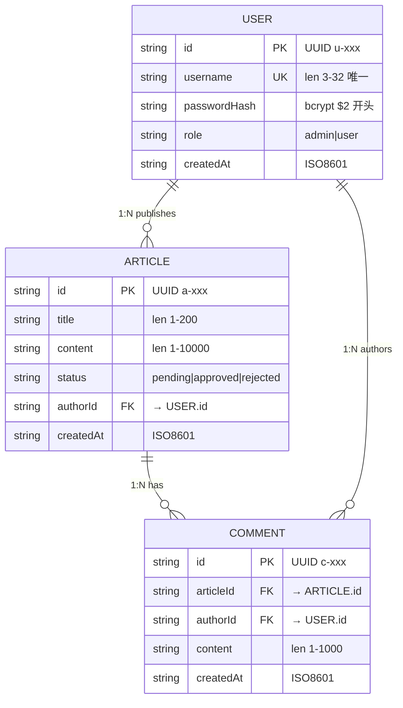

# 详细设计文档

> 阶段 4（详细设计）产出。套用 `templates/detailed-design.md` 模板填充。
> 聚焦类/方法级设计 + 数据模型 + DD 节点定义，同步产出单元测试用例（见 `docs/unit-test-cases.md`）。

## 文档信息

- 项目名称：blog-system-demo
- 文档版本：v1.0
- 编制日期：2026-07-24
- 关联接口设计文档：docs/outline-design.md
- 关联系统设计文档：docs/system-design.md
- 关联需求文档：docs/requirement-spec.md

## 1. 类设计

### 1.1 类图

```mermaid
classDiagram
    class AuthController {
        +register(req: Request): Promise~Response~
        +login(req: Request): Promise~Response~
    }

    class ArticleController {
        +publishArticle(req: Request): Promise~Response~
        +listArticles(req: Request): Promise~Response~
        +getArticle(req: Request): Promise~Response~
        +reviewArticle(req: Request): Promise~Response~
    }

    class CommentController {
        +addComment(req: Request): Promise~Response~
        +listComments(req: Request): Promise~Response~
    }

    class AuthService {
        -userService: UserService
        -jwtUtil: JwtUtil
        -passwordUtil: PasswordUtil
        +register(username: string, password: string): Result~{userId}~
        +login(username: string, password: string): Result~{token, role}~
    }

    class ArticleService {
        -userService: UserService
        -articleStore: ArticleStore
        +publish(authorId: string, title: string, content: string): Result~{articleId, status}~
        +list(role: string): Result~Article[]~
        +getById(id: string, role: string): Result~Article~
    }

    class CommentService {
        -articleService: ArticleService
        -commentStore: CommentStore
        +add(articleId: string, authorId: string, content: string): Result~{commentId}~
        +listByArticle(articleId: string): Result~Comment[]~
    }

    class UserService {
        -userStore: UserStore
        +saveUser(user: User): Result~void~
        +findById(userId: string): Result~User|null~
        +findByUsername(username: string): Result~User|null~
    }

    class ReviewService {
        -articleStore: ArticleStore
        +review(articleId: string, action: string, reviewerId: string): Result~{status}~
    }

    class ArticleStore {
        -store: Map~string, Article~
        +save(article: Article): void
        +findById(id: string): Article|null
        +findAll(): Article[]
        +updateStatus(id: string, status: string): void
    }

    class CommentStore {
        -store: Map~string, Comment~
        +save(comment: Comment): void
        +findByArticle(articleId: string): Comment[]
    }

    class UserStore {
        -store: Map~string, User~
        -usernameIndex: Map~string, string~
        +save(user: User): void
        +findById(userId: string): User|null
        +findByUsername(username: string): User|null
    }

    class AuthMiddleware {
        -jwtUtil: JwtUtil
        +authenticate(req: Request, res: Response, next: NextFunction): void
        +requireAdmin(req: Request, res: Response, next: NextFunction): void
    }

    class ValidateMiddleware {
        +validate(schema: ZodSchema): RequestHandler
    }

    class ErrorMiddleware {
        +handleError(err: Error, req: Request, res: Response, next: NextFunction): void
    }

    class JwtUtil {
        -secret: string
        -expiresIn: string
        +sign(payload: JwtPayload): string
        +verify(token: string): JwtPayload
    }

    class PasswordUtil {
        -costFactor: number
        +hash(password: string): string
        +compare(password: string, hash: string): boolean
    }

    class AsyncHandler {
        +wrap(fn: RequestHandler): RequestHandler
    }

    AuthController --> AuthService : delegates
    ArticleController --> ArticleService : delegates
    ArticleController --> ReviewService : delegates
    CommentController --> CommentService : delegates
    AuthService --> UserService : depends-on
    AuthService --> JwtUtil : uses
    AuthService --> PasswordUtil : uses
    ArticleService --> UserService : depends-on
    ArticleService --> ArticleStore : depends-on
    CommentService --> ArticleService : depends-on
    CommentService --> CommentStore : depends-on
    ReviewService --> ArticleStore : depends-on
    UserService --> UserStore : depends-on
    AuthMiddleware --> JwtUtil : uses
```

### 1.2 类定义

#### AuthController（DD-AUTH-CTRL）

- 职责：处理认证 HTTP 请求（注册/登录），编排 AuthService 调用并返回 HTTP 响应
- parent INTF：INTF-AUTH-API
- 关联 REQ：REQ-002

| 方法 | 签名 | 职责 | 前置条件 | 后置条件 | 异常 |
|---|---|---|---|---|---|
| register | `(req: Request): Promise<Response>` | 从 req.body 提取 username/password，调用 AuthService.register，返回 201 + userId | zod 校验已通过（validate 中间件） | 返回 `{ code:0, data:{userId,username} }` 或错误 JSON | 60001 用户名已存在 → 409；50001 存储错误 → 500 |
| login | `(req: Request): Promise<Response>` | 从 req.body 提取 username/password，调用 AuthService.login，返回 200 + token | zod 校验已通过 | 返回 `{ code:0, data:{token,role} }` 或错误 JSON | 40101 凭证错误 → 401；50001 存储错误 → 500 |

#### ArticleController（DD-ARTICLE-CTRL）

- 职责：处理文章 HTTP 请求（发布/列表/详情/审核），编排 ArticleService 与 ReviewService
- parent INTF：INTF-ARTICLE-API
- 关联 REQ：REQ-003, REQ-005

| 方法 | 签名 | 职责 | 前置条件 | 后置条件 | 异常 |
|---|---|---|---|---|---|
| publishArticle | `(req: Request): Promise<Response>` | 从 req.body + req.user 提取数据，调用 ArticleService.publish | JWT 鉴权通过（req.user.userId 存在）；zod 校验通过 | 返回 `{ code:0, data:{articleId,status:'pending',createdAt} }` | 40101 未授权 → 401；50001 存储错误 → 500 |
| listArticles | `(req: Request): Promise<Response>` | 从 req.user.role 提取角色，调用 ArticleService.list | 无鉴权要求（role 默认 user） | 返回 `{ code:0, data:{articles:[...]} }` | 50001 存储错误 → 500 |
| getArticle | `(req: Request): Promise<Response>` | 从 req.params.id + req.user.role 调用 ArticleService.getById | 无鉴权要求 | 返回 `{ code:0, data:{articleId,title,content,status,authorId} }` | 40401 不存在 → 404；40301 禁止访问 → 403；50001 存储错误 → 500 |
| reviewArticle | `(req: Request): Promise<Response>` | 从 req.params.id + req.body.action + req.user 调用 ReviewService.review | JWT 鉴权 + admin 角色校验通过；zod 校验通过 | 返回 `{ code:0, data:{articleId,status} }` | 40301 非 admin → 403；40401 不存在 → 404；60002 状态非法 → 409；50001 存储错误 → 500 |

#### CommentController（DD-COMMENT-CTRL）

- 职责：处理评论 HTTP 请求（添加/查询），编排 CommentService
- parent INTF：INTF-COMMENT-API
- 关联 REQ：REQ-004

| 方法 | 签名 | 职责 | 前置条件 | 后置条件 | 异常 |
|---|---|---|---|---|---|
| addComment | `(req: Request): Promise<Response>` | 从 req.params.id + req.body.content + req.user 调用 CommentService.add | JWT 鉴权通过；zod 校验通过 | 返回 `{ code:0, data:{commentId,articleId,createdAt} }` | 40101 未授权 → 401；40401 文章不存在 → 404；60002 状态不允许 → 409；50001 存储错误 → 500 |
| listComments | `(req: Request): Promise<Response>` | 从 req.params.id 调用 CommentService.listByArticle | 无鉴权要求 | 返回 `{ code:0, data:{comments:[...]} }` | 40401 文章不存在 → 404；50001 存储错误 → 500 |

#### AuthService（DD-AUTH-SVC）

- 职责：认证业务逻辑——密码 bcrypt 哈希、JWT 签发、用户凭证校验
- parent INTF：INTF-AUTH-SERVICE
- 关联 REQ：REQ-002
- 依赖：UserService, JwtUtil, PasswordUtil

| 方法 | 签名 | 职责 | 前置条件 | 后置条件 | 异常 |
|---|---|---|---|---|---|
| register | `(username: string, password: string): Result<{userId}>` | 校验用户名唯一性，bcrypt 哈希密码，通过 UserService 存入 UserStore | username len∈[3,32], password len∈[6,128] | 返回 `{userId}`；UserStore 含新用户且 passwordHash 以 `$2` 开头 | 60001 用户名已存在；50001 存储错误 |
| login | `(username: string, password: string): Result<{token,role}>` | 查找用户，bcrypt 比对密码，签发 JWT | username/password 非空 | 返回 `{token, role}`；token 由 JwtUtil.sign 生成 | 40101 凭证错误；50001 存储错误 |

#### ArticleService（DD-ARTICLE-SVC）

- 职责：文章业务逻辑——发布、列表查询（角色过滤）、详情查询
- parent INTF：INTF-ARTICLE-SERVICE
- 关联 REQ：REQ-003
- 依赖：UserService, ArticleStore

| 方法 | 签名 | 职责 | 前置条件 | 后置条件 | 异常 |
|---|---|---|---|---|---|
| publish | `(authorId: string, title: string, content: string): Result<{articleId,status}>` | 生成 articleId，创建 Article 对象（status=pending），存入 ArticleStore | title len∈[1,200], content len∈[1,10000], authorId 非空 | 返回 `{articleId, status:'pending'}`；ArticleStore 含新文章 | 50001 存储错误 |
| list | `(role: string): Result<Article[]>` | 从 ArticleStore.findAll 获取全部文章；role=user 时过滤 rejected | role∈['admin','user'] | 返回 Article[]；user 角色不含 rejected 文章 | 50001 存储错误 |
| getById | `(id: string, role: string): Result<Article>` | 从 ArticleStore.findById 获取；role=user 且 status=rejected 时拒绝 | id 非空 | 返回 Article | 40401 不存在；40301 禁止访问；50001 存储错误 |

#### CommentService（DD-COMMENT-SVC）

- 职责：评论业务逻辑——添加评论（含文章存在性校验）、查询评论列表
- parent INTF：INTF-COMMENT-SERVICE
- 关联 REQ：REQ-004
- 依赖：ArticleService, CommentStore

| 方法 | 签名 | 职责 | 前置条件 | 后置条件 | 异常 |
|---|---|---|---|---|---|
| add | `(articleId: string, authorId: string, content: string): Result<{commentId}>` | 调用 ArticleService.getById 校验文章存在且非 rejected，生成 commentId，存入 CommentStore | content len∈[1,1000], authorId 非空 | 返回 `{commentId}`；CommentStore 含新评论 | 40401 文章不存在；60002 状态不允许；50001 存储错误 |
| listByArticle | `(articleId: string): Result<Comment[]>` | 校验文章存在性，从 CommentStore.findByArticle 获取评论列表 | articleId 非空 | 返回 Comment[] | 40401 文章不存在；50001 存储错误 |

#### UserService（DD-USER-SVC）

- 职责：用户业务逻辑——用户存储、角色判定、用户查找
- parent INTF：INTF-USER-SERVICE
- 关联 REQ：REQ-001, REQ-002
- 依赖：UserStore

| 方法 | 签名 | 职责 | 前置条件 | 后置条件 | 异常 |
|---|---|---|---|---|---|
| saveUser | `(user: User): Result<void>` | 校验用户名唯一性，存入 UserStore | username 唯一 | UserStore 含新用户 | 60001 用户名已存在；50001 存储错误 |
| findById | `(userId: string): Result<User|null>` | 从 UserStore.findById 查找 | userId 非空 | 返回 User 或 null | 50001 存储错误 |
| findByUsername | `(username: string): Result<User|null>` | 从 UserStore.findByUsername 查找 | username 非空 | 返回 User 或 null | 50001 存储错误 |

#### ReviewService（DD-REVIEW-SVC）

- 职责：审核业务逻辑——管理员审核文章状态流转
- parent INTF：INTF-REVIEW-SERVICE
- 关联 REQ：REQ-005
- 依赖：ArticleStore

| 方法 | 签名 | 职责 | 前置条件 | 后置条件 | 异常 |
|---|---|---|---|---|---|
| review | `(articleId: string, action: 'approve'|'reject', reviewerId: string): Result<{status}>` | 校验文章存在且 status=pending，调用 ArticleStore.updateStatus 更新状态 | action∈['approve','reject'], reviewerId 非空 | 返回 `{status:'approved'|'rejected'}`；ArticleStore 文章状态已更新 | 40401 不存在；60002 状态非 pending；50001 存储错误 |

#### ArticleStore（DD-ARTICLE-STORE）

- 职责：文章内存存储封装——Map 读写、状态更新
- parent INTF：INTF-ARTICLE-STORE
- 关联 REQ：REQ-003, REQ-005

| 方法 | 签名 | 职责 | 前置条件 | 后置条件 | 异常 |
|---|---|---|---|---|---|
| save | `(article: Article): void` | 将 article 存入 Map（key=article.id） | id 唯一 | Map 含该 article | 50001 存储错误（id 冲突） |
| findById | `(id: string): Article|null` | 按 id 查找 | id 非空 | 返回 Article 或 null | - |
| findAll | `(): Article[]` | 返回全部文章 | - | 返回 Article[] | - |
| updateStatus | `(id: string, status: string): void` | 更新指定文章状态 | status∈['pending','approved','rejected'] | Map 中该文章 status 已更新 | 40401 不存在 |

#### CommentStore（DD-COMMENT-STORE）

- 职责：评论内存存储封装——Map 读写
- parent INTF：INTF-COMMENT-STORE
- 关联 REQ：REQ-004

| 方法 | 签名 | 职责 | 前置条件 | 后置条件 | 异常 |
|---|---|---|---|---|---|
| save | `(comment: Comment): void` | 将 comment 存入 Map（key=comment.id） | id 唯一 | Map 含该 comment | 50001 存储错误 |
| findByArticle | `(articleId: string): Comment[]` | 按 articleId 过滤评论 | articleId 非空 | 返回 Comment[] | - |

#### UserStore（DD-USER-STORE）

- 职责：用户内存存储封装——Map 读写 + username 索引
- parent INTF：INTF-USER-STORE
- 关联 REQ：REQ-002

| 方法 | 签名 | 职责 | 前置条件 | 后置条件 | 异常 |
|---|---|---|---|---|---|
| save | `(user: User): void` | 将 user 存入 Map（key=user.id）+ 更新 usernameIndex | username 唯一 | Map 含该 user；usernameIndex 含映射 | 60001 用户名已存在 |
| findById | `(userId: string): User|null` | 按 userId 查找 | userId 非空 | 返回 User 或 null | - |
| findByUsername | `(username: string): User|null` | 按 username 索引查找 | username 非空 | 返回 User 或 null | - |

#### AuthMiddleware（DD-AUTH-MW）

- 职责：JWT 鉴权中间件 + admin 角色守卫
- parent INTF：INTF-AUTH-API
- 关联 REQ：REQ-002（NFR-002 JWT 鉴权）
- 依赖：JwtUtil

| 方法 | 签名 | 职责 | 前置条件 | 后置条件 | 异常 |
|---|---|---|---|---|---|
| authenticate | `(req: Request, res: Response, next: NextFunction): void` | 从 Authorization 头提取 Bearer token，JwtUtil.verify 校验，注入 req.user={userId,role} | Authorization 头存在 | req.user 注入 userId/role；调用 next() | 40101 未授权 → 401（无头/token 无效） |
| requireAdmin | `(req: Request, res: Response, next: NextFunction): void` | 校验 req.user.role==='admin' | authenticate 已执行（req.user 存在） | 调用 next() | 40301 禁止访问 → 403（非 admin） |

#### ValidateMiddleware（DD-VALIDATE-MW）

- 职责：zod schema 请求体校验中间件工厂
- parent INTF：INTF-AUTH-API
- 关联 REQ：REQ-002（NFR-003 输入校验）

| 方法 | 签名 | 职责 | 前置条件 | 后置条件 | 异常 |
|---|---|---|---|---|---|
| validate | `(schema: ZodSchema): RequestHandler` | 返回中间件：用 schema.parse 校验 req.body，通过后替换 req.body 为解析结果 | schema 已定义 | req.body 为 zod 解析后的安全数据；调用 next() | 40001 参数缺失/格式非法 → 400 |

#### ErrorMiddleware（DD-ERROR-MW）

- 职责：全局错误处理中间件，捕获异常并统一返回错误 JSON
- parent INTF：INTF-AUTH-API
- 关联 REQ：REQ-001（全局错误码覆盖）

| 方法 | 签名 | 职责 | 前置条件 | 后置条件 | 异常 |
|---|---|---|---|---|---|
| handleError | `(err: Error, req: Request, res: Response, next: NextFunction): void` | 捕获传递到错误中间件的异常，按错误类型映射 HTTP 状态码与 code | Express 错误中间件链注册 | 返回错误 JSON `{code, message}` | 400/401/403/404/409/500 按错误类型映射 |

#### JwtUtil（DD-JWT-UTIL）

- 职责：JWT 签发与验证工具
- parent INTF：INTF-AUTH-SERVICE
- 关联 REQ：REQ-002（NFR-002 JWT 鉴权）

| 方法 | 签名 | 职责 | 前置条件 | 后置条件 | 异常 |
|---|---|---|---|---|---|
| sign | `(payload: JwtPayload): string` | 用 JWT_SECRET 签发 token，过期时间 1h | payload 含 userId/role | 返回 JWT 字符串 | - |
| verify | `(token: string): JwtPayload` | 验证 token 签名与有效期 | token 非空 | 返回 payload 或抛出无效 token 异常 | 40101 token 无效/过期 |

#### PasswordUtil（DD-PASSWORD-UTIL）

- 职责：bcrypt 密码哈希与比对工具
- parent INTF：INTF-AUTH-SERVICE
- 关联 REQ：REQ-002（NFR-001 bcrypt 哈希）

| 方法 | 签名 | 职责 | 前置条件 | 后置条件 | 异常 |
|---|---|---|---|---|---|
| hash | `(password: string): string` | bcrypt 哈希密码，cost factor=10 | password 非空 | 返回 `$2` 开头的哈希字符串 | - |
| compare | `(password: string, hash: string): boolean` | bcrypt 比对明文与哈希 | password/hash 非空 | 返回 true/false | - |

#### AsyncHandler（DD-ASYNC-UTIL）

- 职责：异步控制器包装器，捕获 Promise 拒绝并传递给错误中间件
- parent INTF：INTF-AUTH-API
- 关联 REQ：REQ-001（全局错误处理）

| 方法 | 签名 | 职责 | 前置条件 | 后置条件 | 异常 |
|---|---|---|---|---|---|
| wrap | `(fn: RequestHandler): RequestHandler` | 包装 async 控制器，捕获 reject 传递给 next(err) | fn 为 async 函数 | 返回包装后的 RequestHandler；异常自动传递到错误中间件 | - |

## 2. 数据模型设计

### 2.1 ER 图



### 2.2 内存存储结构

> 使用 TypeScript Map<K, V> 作为内存存储，无外部数据库。进程重启数据丢失（RISK-001）。

#### UserStore 存储结构

| 存储 | 类型 | 键 | 值 | 用途 |
|---|---|---|---|---|
| store | `Map<string, User>` | userId | User 对象 | 主存储，按 ID 快速查找 |
| usernameIndex | `Map<string, string>` | username | userId | 用户名唯一性校验 + 按用户名快速查找 |

#### ArticleStore 存储结构

| 存储 | 类型 | 键 | 值 | 用途 |
|---|---|---|---|---|
| store | `Map<string, Article>` | articleId | Article 对象 | 主存储，按 ID 查找/更新状态 |

#### CommentStore 存储结构

| 存储 | 类型 | 键 | 值 | 用途 |
|---|---|---|---|---|
| store | `Map<string, Comment>` | commentId | Comment 对象 | 主存储；findByArticle 遍历过滤 articleId |

### 2.3 数据类型定义

```typescript
// 用户实体
interface User {
  id: string;            // UUID，格式 "u-<timestamp>-<random>"
  username: string;      // 用户名，len [3, 32]，字母数字下划线
  passwordHash: string;  // bcrypt 哈希，以 "$2" 开头
  role: 'admin' | 'user';
  createdAt: string;     // ISO8601 时间戳
}

// 文章实体
interface Article {
  id: string;            // UUID，格式 "a-<timestamp>-<random>"
  title: string;         // 标题，len [1, 200]
  content: string;       // 正文，len [1, 10000]
  status: 'pending' | 'approved' | 'rejected';
  authorId: string;      // 作者 ID → User.id
  createdAt: string;     // ISO8601 时间戳
}

// 评论实体
interface Comment {
  id: string;            // UUID，格式 "c-<timestamp>-<random>"
  articleId: string;     // 文章 ID → Article.id
  authorId: string;      // 作者 ID → User.id
  content: string;       // 评论内容，len [1, 1000]
  createdAt: string;     // ISO8601 时间戳
}

// JWT 载荷
interface JwtPayload {
  userId: string;
  role: 'admin' | 'user';
}

// 统一响应结构
interface ApiResponse<T> {
  code: number;          // 0=成功，非 0=错误码
  message: string;
  data?: T;
}

// 服务层 Result 类型
type Result<T> = { ok: true; data: T } | { ok: false; code: number; message: string };
```

### 2.4 索引设计

| 存储类 | 索引名 | 字段 | 类型 | 用途 |
|---|---|---|---|---|
| UserStore | usernameIndex | username | 唯一索引 | 用户名唯一性校验 + O(1) 按用户名查找 |
| ArticleStore | - | id | 主键（Map key） | O(1) 按 ID 查找 |
| CommentStore | - | id | 主键（Map key） | O(1) 按 ID 查找；findByArticle 为 O(n) 遍历 |

## 3. DD 节点定义

> 每个 DD 节点 parent=对应 INTF（层级单调 INTF=L2→DD=L3），realizes 边指向 INTF。
> DD 节点清单与 graph.json 中 DD 节点一一对应。

### 3.1 DD 节点清单

| DD ID | 类名 | parent INTF | realizes → INTF | 关联 REQ | sourceArtifact |
|---|---|---|---|---|---|
| DD-AUTH-CTRL | AuthController | INTF-AUTH-API | INTF-AUTH-API | REQ-002 | docs/detailed-design.md#§1.2-AuthController |
| DD-ARTICLE-CTRL | ArticleController | INTF-ARTICLE-API | INTF-ARTICLE-API | REQ-003, REQ-005 | docs/detailed-design.md#§1.2-ArticleController |
| DD-COMMENT-CTRL | CommentController | INTF-COMMENT-API | INTF-COMMENT-API | REQ-004 | docs/detailed-design.md#§1.2-CommentController |
| DD-AUTH-SVC | AuthService | INTF-AUTH-SERVICE | INTF-AUTH-SERVICE | REQ-002 | docs/detailed-design.md#§1.2-AuthService |
| DD-ARTICLE-SVC | ArticleService | INTF-ARTICLE-SERVICE | INTF-ARTICLE-SERVICE | REQ-003 | docs/detailed-design.md#§1.2-ArticleService |
| DD-COMMENT-SVC | CommentService | INTF-COMMENT-SERVICE | INTF-COMMENT-SERVICE | REQ-004 | docs/detailed-design.md#§1.2-CommentService |
| DD-USER-SVC | UserService | INTF-USER-SERVICE | INTF-USER-SERVICE | REQ-001, REQ-002 | docs/detailed-design.md#§1.2-UserService |
| DD-REVIEW-SVC | ReviewService | INTF-REVIEW-SERVICE | INTF-REVIEW-SERVICE | REQ-005 | docs/detailed-design.md#§1.2-ReviewService |
| DD-ARTICLE-STORE | ArticleStore | INTF-ARTICLE-STORE | INTF-ARTICLE-STORE | REQ-003, REQ-005 | docs/detailed-design.md#§1.2-ArticleStore |
| DD-COMMENT-STORE | CommentStore | INTF-COMMENT-STORE | INTF-COMMENT-STORE | REQ-004 | docs/detailed-design.md#§1.2-CommentStore |
| DD-USER-STORE | UserStore | INTF-USER-STORE | INTF-USER-STORE | REQ-002 | docs/detailed-design.md#§1.2-UserStore |
| DD-AUTH-MW | AuthMiddleware | INTF-AUTH-API | INTF-AUTH-API | REQ-002 | docs/detailed-design.md#§1.2-AuthMiddleware |
| DD-VALIDATE-MW | ValidateMiddleware | INTF-AUTH-API | INTF-AUTH-API | REQ-002 | docs/detailed-design.md#§1.2-ValidateMiddleware |
| DD-ERROR-MW | ErrorMiddleware | INTF-AUTH-API | INTF-AUTH-API | REQ-001 | docs/detailed-design.md#§1.2-ErrorMiddleware |
| DD-JWT-UTIL | JwtUtil | INTF-AUTH-SERVICE | INTF-AUTH-SERVICE | REQ-002 | docs/detailed-design.md#§1.2-JwtUtil |
| DD-PASSWORD-UTIL | PasswordUtil | INTF-AUTH-SERVICE | INTF-AUTH-SERVICE | REQ-002 | docs/detailed-design.md#§1.2-PasswordUtil |
| DD-ASYNC-UTIL | AsyncHandler | INTF-AUTH-API | INTF-AUTH-API | REQ-001 | docs/detailed-design.md#§1.2-AsyncHandler |

### 3.2 DD 信息流（produces 边）

> DD 节点在信息流层（graph 第 4 层）通过 produces 边形成请求-响应链路。

```
EXT-IN-001 → DD-VALIDATE-MW → DD-*-CTRL（校验通过后传递请求）
EXT-IN-001 → DD-AUTH-MW → DD-ARTICLE-CTRL / DD-COMMENT-CTRL（鉴权通过后传递请求）
DD-*-CTRL → DD-*-SVC（控制器委托服务层）
DD-*-SVC → DD-*-STORE（服务层访问存储层）
DD-*-STORE → DD-*-SVC（存储层返回数据）
DD-*-SVC → DD-UTIL（服务层调用工具类）
DD-UTIL → DD-*-SVC（工具类返回结果）
DD-*-CTRL → DD-ERROR-MW（异常传递到错误中间件）
DD-ERROR-MW → EXT-OUT-001（错误响应输出）
DD-*-CTRL → EXT-OUT-001（成功响应输出）
```

## 4. 单元测试用例索引

> 详细用例见 `docs/unit-test-cases.md`。

| 用例 ID | 关联类/方法 | 场景 | 优先级 |
|---|---|---|---|
| UT-001 | AuthController.register | 注册正向：返回 201 + userId | 高 |
| UT-002 | AuthController.register | 注册异常：用户名已存在 60001 | 高 |
| UT-003 | AuthController.login | 登录正向：返回 200 + token | 高 |
| UT-004 | AuthController.login | 登录异常：密码错误 40101 | 高 |
| UT-005 | ArticleController.publishArticle | 发布正向：返回 201 + articleId | 高 |
| UT-006 | ArticleController.listArticles | 列表正向：普通用户过滤 rejected | 高 |
| UT-007 | ArticleController.getArticle | 详情异常：rejected 文章普通用户 403 | 高 |
| UT-008 | CommentController.addComment | 评论正向：返回 201 + commentId | 高 |
| UT-009 | CommentController.addComment | 评论异常：文章不存在 404 | 高 |
| UT-010 | AuthService.register | 注册正向：bcrypt 哈希存储 | 高 |
| UT-011 | AuthService.login | 登录正向：JWT 签发 | 高 |
| UT-012 | ArticleService.publish | 发布正向：status=pending | 高 |
| UT-013 | ArticleService.list | 列表过滤：user 角色不含 rejected | 高 |
| UT-014 | CommentService.add | 评论校验：文章状态 rejected 60002 | 高 |
| UT-015 | UserService.saveUser | 用户存储：用户名唯一性校验 | 高 |
| UT-016 | ReviewService.review | 审核正向：pending→approved | 高 |
| UT-017 | ArticleStore.save/updateStatus | 存储读写 + 状态更新 | 中 |
| UT-018 | UserStore.findByUsername | username 索引查找 | 中 |
| UT-019 | AuthMiddleware.authenticate | JWT 校验正向 | 高 |
| UT-020 | AuthMiddleware.requireAdmin | 非 admin 返回 403 | 高 |
| UT-021 | ValidateMiddleware.validate | zod 校验异常返回 400 | 高 |
| UT-022 | ErrorMiddleware.handleError | 错误码映射 4xx/5xx/业务 | 中 |
| UT-023 | JwtUtil.sign/verify | JWT 签发与验证 | 高 |
| UT-024 | PasswordUtil.hash/compare | bcrypt 哈希与比对 | 高 |
| UT-025 | AsyncHandler.wrap | 异步异常捕获传递 | 中 |

## 5. 验收自检

- [x] UML 类图符合规范（Mermaid classDiagram，含继承/关联/依赖关系）
- [x] 数据模型设计含表结构、字段、索引、关系（ER 图 + Map 存储结构 + 索引设计）
- [x] 方法级定义含签名、职责、前置条件、后置条件、异常
- [x] 单元测试用例覆盖核心逻辑与边界条件（25 条用例，覆盖正常/异常/边界）
- [x] RTM 已补登详细设计与单元测试映射
- [x] 每个 DD 节点有 parent=对应 INTF + realizes 边（§3.1）
