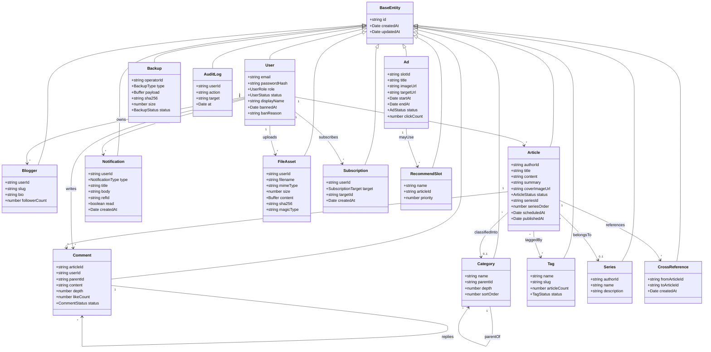
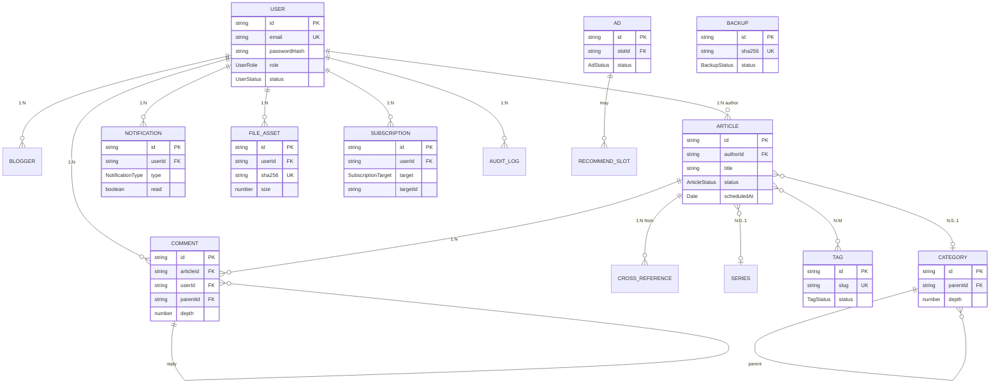

# 详细设计说明书

> 阶段 4（详细设计）产出。覆盖 17 SD 子系统的方法级定义 + 内存数据结构 + 类图 + 模块依赖。
> 套用 `templates/phase-4-detailed-design.md` 模板。技术栈：Express 4 + TypeScript 5 (strict) + bcrypt + jsonwebtoken + zod + ws + 内存存储(Map) + vitest，**无数据库**。

## 文档信息

- 项目名称：blog-system-demo（扩展博客系统后端）
- 文档版本：v1.0
- 编制日期：2026-07-25
- 关联需求：`docs/requirement-spec.md`
- 关联系统设计：`docs/system-design.md`
- 关联接口设计：`docs/interface-design.md`
- 编制者：S 子代理（第 8 轮 W 模型，阶段 4 详细设计）

---

## 1. 类图（Mermaid classDiagram）

> 覆盖核心领域类：User/Article/Comment/Notification/File/Subscription/Category/Tag/Ad/Backup 等。
> 体现继承（Role/State 枚举基类）/ 关联（Author-Article 1:N）/ 依赖（Service-Store）。


```mermaid
classDiagram
    class BaseEntity {
        +string id
        +Date createdAt
        +Date updatedAt
    }
    class User {
        +string email
        +string passwordHash
        +UserRole role
        +UserStatus status
        +string displayName
        +Date bannedAt
        +string banReason
    }
    class Blogger {
        +string userId
        +string slug
        +string bio
        +number followerCount
    }
    class Article {
        +string authorId
        +string title
        +string content
        +string summary
        +string coverImageUrl
        +ArticleStatus status
        +string seriesId
        +number seriesOrder
        +Date scheduledAt
        +Date publishedAt
    }
    class Comment {
        +string articleId
        +string userId
        +string parentId
        +string content
        +number depth
        +number likeCount
        +CommentStatus status
    }
    class Notification {
        +string userId
        +NotificationType type
        +string title
        +string body
        +string refId
        +boolean read
        +Date createdAt
    }
    class FileAsset {
        +string userId
        +string filename
        +string mimeType
        +number size
        +Buffer content
        +string sha256
        +string magicType
    }
    class Subscription {
        +string userId
        +SubscriptionTarget target
        +string targetId
        +Date createdAt
    }
    class Category {
        +string name
        +string parentId
        +number depth
        +number sortOrder
    }
    class Tag {
        +string name
        +string slug
        +number articleCount
        +TagStatus status
    }
    class Ad {
        +string slotId
        +string title
        +string imageUrl
        +string targetUrl
        +Date startAt
        +Date endAt
        +AdStatus status
        +number clickCount
    }
    class Backup {
        +string operatorId
        +BackupType type
        +Buffer payload
        +string sha256
        +number size
        +BackupStatus status
    }
    class Series {
        +string authorId
        +string name
        +string description
    }
    class CrossReference {
        +string fromArticleId
        +string toArticleId
        +Date createdAt
    }
    class AuditLog {
        +string userId
        +string action
        +string target
        +Date at
    }
    class RecommendSlot {
        +string name
        +string articleId
        +number priority
    }

    BaseEntity <|-- User
    BaseEntity <|-- Blogger
    BaseEntity <|-- Article
    BaseEntity <|-- Comment
    BaseEntity <|-- Notification
    BaseEntity <|-- FileAsset
    BaseEntity <|-- Subscription
    BaseEntity <|-- Category
    BaseEntity <|-- Tag
    BaseEntity <|-- Ad
    BaseEntity <|-- Backup
    BaseEntity <|-- Series
    BaseEntity <|-- CrossReference
    BaseEntity <|-- AuditLog
    BaseEntity <|-- RecommendSlot

    User "1" --> "*" Blogger : owns
    User "1" --> "*" Article : authors
    User "1" --> "*" Comment : writes
    User "1" --> "*" Notification : receives
    User "1" --> "*" FileAsset : uploads
    User "1" --> "*" Subscription : subscribes
    Article "1" --> "*" Comment : has
    Article "1" --> "*" CrossReference : references
    Article "*" --> "0..1" Series : belongsTo
    Article "*" --> "*" Tag : taggedBy
    Article "*" --> "0..1" Category : classifiedInto
    Category "1" --> "*" Category : parentOf
    Comment "1" --> "*" Comment : replies
    Ad "1" --> "*" RecommendSlot : mayUse
```

---

## 2. 内存数据结构设计

> 替代 ER 图（无数据库）。每个核心实体给出主存储 Map + 索引 Map。
> Map key 即索引主键；辅助索引指向主键集合（Set）以支持 O(1) 查询。

### 2.1 实体结构总览（erDiagram）


```mermaid
erDiagram
    USER ||--o{ BLOGGER : "1:N"
    USER ||--o{ ARTICLE : "1:N author"
    USER ||--o{ COMMENT : "1:N"
    USER ||--o{ NOTIFICATION : "1:N"
    USER ||--o{ FILE_ASSET : "1:N"
    USER ||--o{ SUBSCRIPTION : "1:N"
    USER ||--o{ AUDIT_LOG : "1:N"
    ARTICLE ||--o{ COMMENT : "1:N"
    ARTICLE ||--o{ CROSS_REFERENCE : "1:N from"
    ARTICLE }o--o| SERIES : "N:0..1"
    ARTICLE }o--o{ TAG : "N:M"
    ARTICLE }o--o| CATEGORY : "N:0..1"
    CATEGORY ||--o{ CATEGORY : "parent"
    COMMENT ||--o{ COMMENT : "reply"
    AD ||--o{ RECOMMEND_SLOT : "may"
    USER {
        string id PK
        string email UK
        string passwordHash
        UserRole role
        UserStatus status
    }
    ARTICLE {
        string id PK
        string authorId FK
        string title
        ArticleStatus status
        Date scheduledAt
    }
    COMMENT {
        string id PK
        string articleId FK
        string userId FK
        string parentId FK
        number depth
    }
    NOTIFICATION {
        string id PK
        string userId FK
        NotificationType type
        boolean read
    }
    FILE_ASSET {
        string id PK
        string userId FK
        string sha256 UK
        number size
    }
    SUBSCRIPTION {
        string id PK
        string userId FK
        SubscriptionTarget target
        string targetId
    }
    CATEGORY {
        string id PK
        string parentId FK
        number depth
    }
    TAG {
        string id PK
        string slug UK
        TagStatus status
    }
    AD {
        string id PK
        string slotId FK
        AdStatus status
    }
    BACKUP {
        string id PK
        string sha256 UK
        BackupStatus status
    }
```

### 2.2 Map 存储与索引清单（≥10 实体）

| # | 实体 | 主存储 Map | 索引 Map | 索引类型 | 用途 |
|---|---|---|---|---|---|
| 1 | User | `users: Map<userId, User>` | `emailToId: Map<email, userId>` | 唯一索引 | email 唯一性 + O(1) 登录查找 |
| 1 | User | (同上) | `roleToIds: Map<UserRole, Set<userId>>` | 二级索引 | 角色批量查询（管理员列表） |
| 1 | User | (同上) | `bannedUserIds: Set<userId>` | 状态索引 | 封禁用户快速过滤 |
| 2 | Blogger | `bloggers: Map<bloggerId, Blogger>` | `userIdToBloggerId: Map<userId, bloggerId>` | 唯一索引 | 用户→博主 1:1 反查 |
| 2 | Blogger | (同上) | `slugToId: Map<slug, bloggerId>` | 唯一索引 | slug 唯一性 + URL 反查 |
| 3 | Article | `articles: Map<articleId, Article>` | `authorIdToArticles: Map<userId, Set<articleId>>` | 二级索引 | 博主文章列表 |
| 3 | Article | (同上) | `statusToArticles: Map<ArticleStatus, Set<articleId>>` | 状态索引 | 按状态批量查询/定时发布扫描 |
| 3 | Article | (同上) | `seriesIdToArticles: Map<seriesId, Set<articleId>>` | 二级索引 | 系列文章列表 |
| 4 | Comment | `comments: Map<commentId, Comment>` | `articleIdToComments: Map<articleId, Set<commentId>>` | 二级索引 | 文章评论列表 |
| 4 | Comment | (同上) | `parentIdToReplies: Map<parentId, Set<commentId>>` | 二级索引 | 多级回复树 |
| 5 | Notification | `notifications: Map<notificationId, Notification>` | `userIdToNotifications: Map<userId, Set<notificationId>>` | 二级索引 | 用户通知收件箱 |
| 5 | Notification | (同上) | `userIdUnread: Map<userId, Set<notificationId>>` | 状态索引 | 未读通知计数 |
| 6 | FileAsset | `files: Map<fileId, FileAsset>` | `userIdToFiles: Map<userId, Set<fileId>>` | 二级索引 | 用户文件列表 + 配额计算 |
| 6 | FileAsset | (同上) | `sha256ToId: Map<sha256, fileId>` | 唯一索引 | 秒传/去重 |
| 7 | Subscription | `subscriptions: Map<subscriptionId, Subscription>` | `userIdToSubs: Map<userId, Set<subscriptionId>>` | 二级索引 | 用户订阅列表 |
| 7 | Subscription | (同上) | `targetIdToSubs: Map<targetId, Set<subscriptionId>>` | 二级索引 | 目标订阅者反查（推送触发） |
| 8 | Category | `categories: Map<categoryId, Category>` | `parentIdToChildren: Map<parentId, Set<categoryId>>` | 二级索引 | 分类树子节点 |
| 8 | Category | (同上) | `categoryIdToArticles: Map<categoryId, Set<articleId>>` | 二级索引 | 分类文章列表 |
| 9 | Tag | `tags: Map<tagId, Tag>` | `slugToId: Map<slug, tagId>` | 唯一索引 | slug 唯一性 |
| 9 | Tag | (同上) | `articleIdToTags: Map<articleId, Set<tagId>>` | 二级索引 | 文章标签反查 |
| 9 | Tag | (同上) | `tagIdToArticles: Map<tagId, Set<articleId>>` | 二级索引 | 标签文章列表 |
| 10 | Ad | `ads: Map<adId, Ad>` | `slotIdToAds: Map<slotId, Set<adId>>` | 二级索引 | 广告位投放列表 |
| 10 | Ad | (同上) | `statusToAds: Map<AdStatus, Set<adId>>` | 状态索引 | 审核队列 |
| 11 | Backup | `backups: Map<backupId, Backup>` | `statusToBackups: Map<BackupStatus, Set<backupId>>` | 状态索引 | 备份任务状态机 |
| 12 | Series | `series: Map<seriesId, Series>` | `authorIdToSeries: Map<userId, Set<seriesId>>` | 二级索引 | 博主系列列表 |
| 13 | CrossReference | `crossRefs: Map<refId, CrossReference>` | `fromArticleToRefs: Map<articleId, Set<refId>>` | 二级索引 | 正向引用 |
| 13 | CrossReference | (同上) | `toArticleToBackrefs: Map<articleId, Set<refId>>` | 二级索引 | 反向链接 |
| 14 | AuditLog | `auditLogs: Map<logId, AuditLog>` | `userIdToLogs: Map<userId, Set<logId>>` | 二级索引 | 用户操作历史 |
| 15 | RecommendSlot | `recommendSlots: Map<slotName, RecommendSlot>` | `priorityQueue: Array<slotName>` | 排序索引 | 首页推荐位排序 |
| 16 | SearchIndex | `invertedIndex: Map<term, Set<articleId>>` | `articleTerms: Map<articleId, Set<term>>` | 倒排索引 | 全文搜索 |
| 16 | SearchIndex | `searchHistory: Map<userId, Array<string>>` | (无) | FIFO | 搜索历史（≤20 条） |
| 17 | WsConnection | `wsConnections: Map<userId, WebSocket>` | `channelToUsers: Map<channel, Set<userId>>` | 二级索引 | WebSocket 通道订阅 |
| 17 | WsConnection | (同上) | `offlineMessages: Map<userId, Array<Message>>` | 离线队列 | 离线消息合并 |

---

## 3. 方法级定义（17 SD 子系统核心方法）

> 每个方法：方法签名（参数名+类型+必填+约束）/ 返回值结构 / 错误码集合 / 前置条件 / 后置条件 / 异常。
> 错误码引用 `docs/interface-design.md` §2.2。

### 3.1 SD-001 站点管理（SiteService / SiteStore）

#### `SiteStore.getConfig(): SiteConfig`
- **返回**：`{ siteName, description, maintenanceMode, registrationOpen, commentOpen, announcement, announcementAt }`
- **前置**：无（系统启动后必有默认配置）
- **后置**：返回当前站点配置快照（不可变引用）
- **异常**：无

#### `SiteStore.updateConfig(operatorId: string, patch: Partial<SiteConfig>): SiteConfig`
- **参数**：`operatorId` 必填 string（管理员 ID）；`patch` 必填对象，字段可部分更新
- **前置**：`operatorId` 对应用户 role 必须为 `admin`，否则抛 `1021 RBAC越权`
- **后置**：配置原子更新，`updatedAt` 刷新，写审计日志
- **异常**：`1021`（越权）/ `1001`（zod 校验失败）

#### `SiteService.setMaintenanceMode(operatorId: string, enabled: boolean): void`
- **参数**：`operatorId` 必填 string；`enabled` 必填 boolean
- **前置**：`operatorId` 为 admin
- **后置**：`maintenanceMode` 切换；非管理员后续请求返回 `1023`
- **异常**：`1021`

#### `SiteService.scheduleAnnouncement(operatorId: string, text: string, at: Date): void`
- **参数**：`text` 必填 string 1-1000 字符；`at` 必填 Date 未来时间
- **前置**：admin 权限；`at > now`
- **后置**：`announcement` + `announcementAt` 写入；setInterval 定时触发发布
- **异常**：`1001`（参数）/ `1021`（越权）

#### `SiteService.getStatsOverview(): SiteStatsOverview`
- **返回**：`{ articleCount, userCount, bloggerCount, commentCount, fileCount }`
- **前置**：无
- **后置**：聚合 17 SD 主存储 size
- **异常**：无

---

### 3.2 SD-002 多博主（BloggerService / BloggerStore）

#### `BloggerStore.create(userId: string, slug: string, bio: string): Blogger`
- **参数**：`userId` 必填 string；`slug` 必填 string `^[a-z0-9-]{3,30}$`；`bio` 可选 string ≤200
- **前置**：`userId` 存在且 role=`blogger`；`slug` 未被占用
- **后置**：新增 Blogger 记录，`slugToId` 索引更新，`userIdToBloggerId` 索引更新
- **异常**：`1001`（参数）/ `1005`（slug 重复业务码）/ `1021`（非 blogger 角色）

#### `BloggerStore.getBySlug(slug: string): Blogger | null`
- **参数**：`slug` 必填 string
- **前置**：无
- **后置**：通过 `slugToId` 索引 O(1) 查找
- **异常**：无（返回 null 表示不存在）

#### `BloggerService.follow(followerId: string, bloggerId: string): void`
- **参数**：`followerId` 必填 string；`bloggerId` 必填 string
- **前置**：`followerId` 存在且未封禁；`bloggerId` 存在；不可关注自己
- **后置**：Subscription 记录创建，`followerCount++`
- **异常**：`1001`/`1031`（博主不存在）/ `1003`（自关注禁止）

#### `BloggerService.unfollow(followerId: string, bloggerId: string): void`
- **参数**：同上
- **前置**：已存在关注关系
- **后置**：Subscription 删除，`followerCount--`
- **异常**：`1031`（关系不存在）

#### `BloggerService.listByFollower(userId: string, page: number, pageSize: number): Page<Blogger>`
- **参数**：`page` 默认 1 ≥1；`pageSize` 默认 10 ≤50
- **前置**：无
- **后置**：分页返回博主列表
- **异常**：`1001`

---

### 3.3 SD-003 多用户（UserService / UserStore / AuthService）

#### `UserStore.create(input: { email, password, displayName, role }): User`
- **参数**：`email` 必填 RFC5322；`password` 必填 ≥8 字符；`displayName` 1-50；`role` 默认 `reader`
- **前置**：`email` 未注册（`emailToId` 索引无该 key）
- **后置**：bcrypt 哈希密码；新增 User；`emailToId`/`roleToIds` 索引更新
- **异常**：`1001`（参数）/ `1005`（邮箱已注册业务码）

#### `AuthService.login(email: string, password: string): { token: string, user: User }`
- **参数**：`email` 必填；`password` 必填
- **前置**：`email` 存在；密码 bcrypt 比对通过；用户未封禁
- **后置**：签发 JWT（24h），`iat`/`exp` 写入 payload
- **异常**：`1011`（无此用户）/ `1012`（密码错误）/ `1022`（已封禁）

#### `AuthService.verifyToken(token: string): { userId: string, role: UserRole }`
- **参数**：`token` 必填 string
- **前置**：token 格式合法
- **后置**：jwt.verify 成功；userId 对应用户未封禁且未删除
- **异常**：`1011`（无 token）/ `1012`（伪造）/ `1013`（过期）/ `1022`（封禁）

#### `AuthService.revokeToken(userId: string): void`
- **参数**：`userId` 必填
- **前置**：用户存在
- **后置**：将该用户所有未过期 token 的 `jti` 加入 `revokedJtis: Set<jti>`，后续 verify 拒绝
- **异常**：`1031`

#### `UserService.ban(operatorId: string, userId: string, reason: string): void`
- **参数**：`operatorId` admin；`userId` 必填；`reason` 1-200
- **前置**：operator 为 admin；`userId` 存在且非 admin（不可封禁 admin）
- **后置**：`status=banned`，`bannedAt=now`，调用 `revokeToken`，写审计日志
- **异常**：`1021`/`1031`/`1001`

---

### 3.4 SD-004 推荐（RecommendService / RecommendStore）

#### `RecommendService.hot(page: number, pageSize: number): Page<Article>`
- **参数**：`page` 默认 1；`pageSize` 默认 10
- **前置**：无（公开接口）
- **后置**：从 `statusToArticles[published]` 按热度公式 `score = viewCount*1 + likeCount*5 + commentCount*10` 降序排序
- **异常**：`1001`

#### `RecommendService.personalized(userId: string, page: number, pageSize: number): Page<Article>`
- **参数**：`userId` 必填
- **前置**：用户登录；基于用户订阅/历史生成
- **后置**：从 `userIdToSubs` 取订阅博主→其 published 文章按时间倒序
- **异常**：`1011`/`1001`

#### `RecommendService.latest(page: number, pageSize: number): Page<Article>`
- **前置**：无
- **后置**：`statusToArticles[published]` 按 `publishedAt` 倒序
- **异常**：`1001`

#### `RecommendService.setSlot(operatorId: string, slotName: string, articleId: string, priority: number): void`
- **参数**：`operatorId` admin；`slotName` 1-50；`priority` ≥0
- **前置**：admin；article 存在且 published
- **后置**：`recommendSlots[slotName]` 更新
- **异常**：`1021`/`1031`/`1001`

---

### 3.5 SD-005 广告（AdService / AdStore）

#### `AdStore.create(operatorId: string, input: AdInput): Ad`
- **参数**：`slotId` 必填；`title` 1-100；`imageUrl` URL；`targetUrl` URL；`startAt`/`endAt` Date 且 `startAt < endAt`
- **前置**：admin；时间区间不与同 slot 已发布广告重叠
- **后置**：新增 Ad（status=`pending_review`），`slotIdToAds`/`statusToAds` 索引更新
- **异常**：`1021`/`1001`/`1005`（时间重叠）

#### `AdService.audit(operatorId: string, adId: string, decision: "approve"|"reject"): void`
- **参数**：`operatorId` admin；`adId`；`decision`
- **前置**：admin；ad 状态为 `pending_review`
- **后置**：状态机 `pending_review → approved` 或 `→ rejected`
- **异常**：`1021`/`1031`/`1002`（状态机非法跳转）

#### `AdService.recordClick(adId: string): void`
- **前置**：ad 状态为 `approved` 且当前时间在 `[startAt, endAt]`
- **后置**：`clickCount++`
- **异常**：`1031`/`1002`

#### `AdService.listBySlot(slotId: string, page: number, pageSize: number): Page<Ad>`
- **前置**：无
- **后置**：从 `slotIdToAds` 分页
- **异常**：`1001`

---

### 3.6 SD-006 统计（StatsService / StatsStore）

#### `StatsService.articleStats(): { total, published, draft, archived }`
- **前置**：无（admin）
- **后置**：聚合 `statusToArticles` 各状态 size
- **异常**：`1021`（非 admin）

#### `StatsService.userStats(): { total, banned, byRole: Record<UserRole, number> }`
- **前置**：admin
- **后置**：聚合 `users.size` + `bannedUserIds.size` + `roleToIds` 各 size
- **异常**：`1021`

#### `StatsService.bloggerStats(): { total, topFollowers: Array<{bloggerId, followerCount}> }`
- **前置**：admin
- **后置**：聚合 bloggers + 取 followerCount Top 10
- **异常**：`1021`

#### `StatsService.siteTrend(days: number): Array<{ date, articleCount, userCount }>`
- **参数**：`days` 1-90
- **前置**：admin
- **后置**：按日聚合 `createdAt` 在区间内的文章/用户数
- **异常**：`1021`/`1001`

---

### 3.7 SD-007 搜索（SearchService / SearchStore）

#### `SearchStore.index(articleId: string, title: string, content: string): void`
- **参数**：`articleId` 必填；`title`/`content` 必填
- **前置**：article 已存在
- **后置**：分词后写入 `invertedIndex`，`articleTerms` 索引更新
- **异常**：`1031`

#### `SearchService.search(query: string, mode: "relevance"|"newest"|"popular", page: number, pageSize: number): Page<{articleId, snippet, score}>`
- **参数**：`query` 1-100 字符；`mode` 默认 `relevance`
- **前置**：无
- **后置**：分词→`invertedIndex` 取交集→按 mode 排序→分页；写 `searchHistory`（FIFO ≤20）
- **异常**：`1001`

#### `SearchService.suggest(prefix: string): string[]`
- **参数**：`prefix` 1-50
- **前置**：无
- **后置**：前缀匹配 `invertedIndex` keys，返回 Top 10
- **异常**：`1001`

#### `SearchService.history(userId: string): string[]`
- **前置**：userId 登录
- **后置**：返回 `searchHistory[userId]`
- **异常**：`1011`

---

### 3.8 SD-008 标签（TagService / TagStore）

#### `TagStore.create(name: string, slug: string): Tag`
- **参数**：`name` 1-30 字符，禁止 `<>"'/\\`；`slug` `^[a-z0-9-]{2,30}$`
- **前置**：`slug` 未占用
- **后置**：新增 Tag（status=`pending_review`），`slugToId` 索引更新
- **异常**：`1001`/`1005`（slug 重复）

#### `TagService.bind(articleId: string, tagIds: string[]): void`
- **参数**：`tagIds` 长度 ≤10
- **前置**：article 存在；每个 tag 存在且 `approved`
- **后置**：`articleIdToTags`/`tagIdToArticles` 双向索引更新；`articleCount++`
- **异常**：`1001`（>10）/ `1031`/`1002`（tag 未审核）

#### `TagService.cloud(topN: number): Array<{tagId, name, articleCount}>`
- **参数**：`topN` 1-100 默认 50
- **前置**：无
- **后置**：按 `articleCount` 降序取 Top N
- **异常**：`1001`

#### `TagService.merge(operatorId: string, sourceId: string, targetId: string): void`
- **参数**：operator admin；`sourceId ≠ targetId`
- **前置**：admin；两 tag 均 `approved`
- **后置**：source 的所有 article 迁移到 target；source 软删除；索引重建
- **异常**：`1021`/`1003`（自合并）/ `1031`

---

### 3.9 SD-009 分类（CategoryService / CategoryStore）

#### `CategoryStore.create(name: string, parentId: string | null): Category`
- **参数**：`name` 1-50；`parentId` 可选
- **前置**：若 `parentId` 提供，则父分类存在且其 `depth < 5`
- **后置**：新增 Category（`depth = parent.depth + 1`），`parentIdToChildren` 索引更新
- **异常**：`1001`/`1004`（深度超限）/ `1031`

#### `CategoryService.tree(): CategoryNode[]`
- **前置**：无
- **后置**：从根分类递归构建树（最大深度 5）
- **异常**：无

#### `CategoryService.breadcrumb(categoryId: string): Category[]`
- **前置**：分类存在
- **后置**：从该分类向上回溯到根
- **异常**：`1031`

#### `CategoryService.cascadeDelete(operatorId: string, categoryId: string): void`
- **前置**：admin；分类存在
- **后置**：递归软删除子分类；`categoryIdToArticles` 中文章的 `categoryId` 置 null
- **异常**：`1021`/`1031`

---

### 3.10 SD-010 评论（CommentService / CommentStore）

#### `CommentStore.create(articleId: string, userId: string, parentId: string | null, content: string): Comment`
- **参数**：`content` 1-1000 字符；`parentId` 可选
- **前置**：article 为 `published`；若 `parentId` 提供，则父评论存在且其 `depth < 5`；评论开关开启
- **后置**：新增 Comment（status=`pending_review`），`depth = parent.depth + 1`，索引更新
- **异常**：`1001`/`1004`（嵌套超限）/ `1025`（评论开关关闭）/ `1031`

#### `CommentService.audit(operatorId: string, commentId: string, decision: "approve"|"reject"): void`
- **前置**：admin 或博主（自己的文章）；comment 为 `pending_review`
- **后置**：状态机 `pending_review → approved | rejected`
- **异常**：`1021`/`1002`

#### `CommentService.like(userId: string, commentId: string): void`
- **前置**：comment 为 `approved`；用户未点赞过（幂等）
- **后置**：`likeCount++`，`userIdToLikedComments` 索引记录
- **异常**：`1031`/`1005`（已点赞幂等返回成功）

#### `CommentService.listByArticle(articleId: string, page: number, pageSize: number, sort: "newest"|"oldest"|"popular"): Page<Comment>`
- **前置**：无
- **后置**：从 `articleIdToComments` 过滤 `approved`，按 sort 排序
- **异常**：`1001`

#### `CommentService.report(userId: string, commentId: string, reason: string): void`
- **参数**：`reason` 1-200
- **前置**：comment 存在
- **后置**：新增举报记录，comment status→`flagged`（如已 approved）
- **异常**：`1001`/`1031`

---

### 3.11 SD-011 通知（NotificationService / NotificationStore）

#### `NotificationStore.create(userId: string, type: NotificationType, title: string, body: string, refId: string): Notification`
- **前置**：userId 存在；用户通知设置未关闭该 type
- **后置**：新增 Notification（read=false），`userIdToNotifications`/`userIdUnread` 索引更新
- **异常**：`1031`/`1001`

#### `NotificationService.markRead(userId: string, notificationId: string): void`
- **前置**：通知属于该 userId；当前 `read=false`
- **后置**：`read=true`，`userIdUnread` 移除
- **异常**：`1031`/`1002`

#### `NotificationService.markAllRead(userId: string): void`
- **前置**：无
- **后置**：该用户所有未读通知 `read=true`，`userIdUnread` 清空
- **异常**：无

#### `NotificationService.updateSettings(userId: string, settings: Partial<NotificationSettings>): void`
- **参数**：settings 含各 type 的 enabled boolean
- **前置**：userId 存在
- **后置**：`notificationSettings[userId]` 更新
- **异常**：`1001`

---

### 3.12 SD-012 多博文（ArticleService / ArticleStore）

#### `ArticleStore.create(authorId: string, input: ArticleInput): Article`
- **参数**：`title` 1-200；`content` 1-50000；`summary` 0-500；`coverImageUrl` 可选 URL；`status` 默认 `draft`
- **前置**：authorId 为 blogger；scheduledAt 可选未来时间
- **后置**：新增 Article，`authorIdToArticles`/`statusToArticles`/`seriesIdToArticles` 索引更新；SearchStore.index 调用
- **异常**：`1001`/`1021`

#### `ArticleService.transition(authorId: string, articleId: string, to: ArticleStatus): void`
- **参数**：`to` ∈ {`pending_review`, `published`, `offline`, `archived`}
- **前置**：authorId 为文章作者或 admin；当前状态→to 满足状态机合法转移（见 L4_article_state_machine.tla）
- **后置**：状态机转移；若 `published` 则 `publishedAt=now`；SearchStore 索引更新
- **异常**：`1002`（非法跳转）/ `1021`/`1031`

#### `ArticleService.schedule(authorId: string, articleId: string, scheduledAt: Date): void`
- **参数**：`scheduledAt` 未来时间
- **前置**：article 为 `pending_review`；`publishSchedule` 为 None
- **后置**：`publishSchedule=schedule_pending`，setInterval 定时触发 → `published`
- **异常**：`1001`/`1002`

#### `ArticleService.batchOffline(operatorId: string, articleIds: string[]): void`
- **参数**：`articleIds` 长度 ≤100
- **前置**：admin；所有 article 当前为 `published`
- **后置**：批量状态转移 `published → offline`，写审计日志
- **异常**：`1021`/`1002`

#### `ArticleService.listByAuthor(authorId: string, page: number, pageSize: number): Page<Article>`
- **前置**：无
- **后置**：从 `authorIdToArticles` 分页
- **异常**：`1001`

---

### 3.13 SD-013 交叉引用（CrossReferenceService / CrossReferenceStore）

#### `CrossReferenceStore.create(fromArticleId: string, toArticleId: string): CrossReference`
- **前置**：两 article 均 `published`；`fromArticleId ≠ toArticleId`；引用关系不存在
- **后置**：新增记录，`fromArticleToRefs`/`toArticleToBackrefs` 索引更新
- **异常**：`1003`（自引用）/ `1005`（重复引用）/ `1031`

#### `CrossReferenceService.backlinks(articleId: string): Array<{fromArticleId, title}>`
- **前置**：article 存在
- **后置**：从 `toArticleToBackrefs` 反查
- **异常**：`1031`

#### `CrossReferenceService.related(articleId: string, topN: number): Array<{articleId, score}>`
- **参数**：`topN` 1-20 默认 5
- **前置**：article 存在
- **后置**：基于共同 tag/category/author 计算 Jaccard 相似度，取 Top N
- **异常**：`1031`/`1001`

#### `CrossReferenceService.graph(articleId: string, depth: number): GraphNode[]`
- **参数**：`depth` 1-3 默认 2
- **前置**：article 存在
- **后置**：BFS 遍历引用图
- **异常**：`1031`/`1001`

---

### 3.14 SD-014 消息推送（PushService / WsStore）

#### `WsStore.register(userId: string, ws: WebSocket): void`
- **前置**：userId 未在 `wsConnections` 中（单连接）
- **后置**：`wsConnections[userId]=ws`，旧连接关闭
- **异常**：无

#### `WsStore.unregister(userId: string): void`
- **前置**：无
- **后置**：`wsConnections` 删除 userId
- **异常**：无

#### `PushService.push(userId: string, channel: string, message: object): void`
- **参数**：`channel` 必填 string
- **前置**：无
- **后置**：若用户在线→ws.send；否则入 `offlineMessages` 队列；失败重试 3 次指数退避（1s/2s/4s）
- **异常**：无（异步重试）

#### `PushService.broadcast(channel: string, message: object): void`
- **前置**：无
- **后置**：遍历 `channelToUsers[channel]` 逐个 push
- **异常**：无

#### `PushService.flushOffline(userId: string): void`
- **前置**：用户上线时调用
- **后置**：合并 `offlineMessages[userId]` 中同 channel 消息（≤24h），逐条 push 后清空
- **异常**：无

---

### 3.15 SD-015 文件上传（FileService / FileStore）

#### `FileStore.create(userId: string, input: FileInput): FileAsset`
- **参数**：`filename` 1-255（消毒后）；`mimeType` 必填；`content` Buffer；`size` ≤10MB
- **前置**：用户日配额 `≤50MB` 且月配额 `≤500MB` 未超；魔数校验通过；`sha256` 未存在（秒传）
- **后置**：新增 FileAsset，`userIdToFiles`/`sha256ToId` 索引更新；配额计数器累加
- **异常**：`1041`（超 10MB）/ `1005`（配额超限）/ `1001`（魔数不匹配）/ `1005`（文件名消毒失败）

#### `FileService.validateMagic(buffer: Buffer, declaredMime: string): boolean`
- **前置**：buffer.length ≥ 4
- **后置**：检测前 8 字节魔数（JPEG `FFD8FF`/PNG `89504E47`/GIF `47494638`/PDF `25504446`），与 declaredMime 一致
- **异常**：`1001`（魔数不匹配业务码）

#### `FileService.computeSha256(buffer: Buffer): string`
- **前置**：无
- **后置**：返回 hex 编码 SHA-256
- **异常**：无

#### `FileService.sanitizeFilename(name: string): string`
- **前置**：无
- **后置**：移除路径分隔符/`..`/控制字符/`<>"'`，截断 255
- **异常**：`1001`（消毒后为空）

#### `FileService.getQuota(userId: string): { dailyUsed, monthlyUsed, dailyLimit, monthlyLimit }`
- **前置**：userId 存在
- **后置**：聚合 `userIdToFiles` 在 24h/30d 内 size 之和
- **异常**：`1031`

---

### 3.16 SD-016 订阅（SubscriptionService / SubscriptionStore）

#### `SubscriptionStore.create(userId: string, target: SubscriptionTarget, targetId: string): Subscription`
- **参数**：`target` ∈ {`blogger`, `tag`, `category`}；`targetId` 必填
- **前置**：target 存在；用户未订阅过同一 target+targetId
- **后置**：新增 Subscription，`userIdToSubs`/`targetIdToSubs` 索引更新
- **异常**：`1005`（已订阅幂等）/ `1031`

#### `SubscriptionService.aggregateAndPush(targetId: string, event: SubscriptionEvent): void`
- **参数**：`event` 含 `{ type, refId, at }`
- **前置**：无
- **后置**：取 `targetIdToSubs[targetId]` 所有订阅者；按 1h 聚合窗口合并同 type 事件→批量 push
- **异常**：无

#### `SubscriptionService.listByUser(userId: string, target?: SubscriptionTarget): Page<Subscription>`
- **前置**：无
- **后置**：从 `userIdToSubs` 过滤分页
- **异常**：`1001`

#### `SubscriptionService.permission(userId: string, target: SubscriptionTarget): SubscriptionLevel`
- **前置**：userId 存在
- **后置**：返回 `basic`/`premium`/`admin`（基于用户 role 与订阅数）
- **异常**：`1031`

---

### 3.17 SD-017 数据导出与备份（BackupService / BackupStore）

#### `BackupStore.create(operatorId: string, type: BackupType, payload: Buffer): Backup`
- **参数**：`type` ∈ {`full`, `incremental`}；`payload.size ≤ 10MB`
- **前置**：admin；`payload` 为合法 JSON 序列化 Buffer
- **后置**：计算 `sha256`，新增 Backup（status=`created`），`statusToBackups` 索引更新
- **异常**：`1021`/`1001`/`1005`（payload 超限）

#### `BackupService.exportUserData(userId: string): Buffer`
- **前置**：userId 存在
- **后置**：聚合 User+Blogger+Article+Comment+Notification+FileAsset 元数据→JSON Buffer（GDPR 占位）
- **异常**：`1031`

#### `BackupService.restore(operatorId: string, backupId: string): void`
- **前置**：admin；backup status=`created`；SHA-256 校验通过
- **后置**：解析 payload→逐表还原（覆盖），status→`restored`
- **异常**：`1021`/`1031`/`1001`（SHA-256 不匹配）

#### `BackupService.incremental(since: Date): Buffer`
- **参数**：`since` 必填 Date
- **前置**：admin
- **后置**：聚合 `updatedAt >= since` 的所有实体→JSON Buffer
- **异常**：`1021`/`1001`

#### `BackupService.verifyIntegrity(backupId: string): boolean`
- **前置**：backup 存在
- **后置**：重新计算 payload SHA-256 与存储值比对
- **异常**：`1031`

---

## 4. 模块划分与依赖关系

### 4.1 模块依赖图（Mermaid graph）

> 箭头 A --> B 表示 A 依赖 B。Store 层无下游依赖；Service 层依赖 Store + 工具层；Controller 层依赖 Service。


```mermaid
graph TD
    subgraph Controllers
        C1[SiteController]
        C2[BloggerController]
        C3[UserController]
        C4[RecommendController]
        C5[AdController]
        C6[StatsController]
        C7[SearchController]
        C8[TagController]
        C9[CategoryController]
        C10[CommentController]
        C11[NotificationController]
        C12[ArticleController]
        C13[CrossRefController]
        C14[PushController]
        C15[FileController]
        C16[SubscriptionController]
        C17[BackupController]
    end
    subgraph Services
        S1[SiteService]
        S2[BloggerService]
        S3[UserService/AuthService]
        S4[RecommendService]
        S5[AdService]
        S6[StatsService]
        S7[SearchService]
        S8[TagService]
        S9[CategoryService]
        S10[CommentService]
        S11[NotificationService]
        S12[ArticleService]
        S13[CrossRefService]
        S14[PushService]
        S15[FileService]
        S16[SubscriptionService]
        S17[BackupService]
    end
    subgraph Stores
        ST1[SiteStore]
        ST2[BloggerStore]
        ST3[UserStore]
        ST4[RecommendStore]
        ST5[AdStore]
        ST6[StatsStore]
        ST7[SearchStore]
        ST8[TagStore]
        ST9[CategoryStore]
        ST10[CommentStore]
        ST11[NotificationStore]
        ST12[ArticleStore]
        ST13[CrossRefStore]
        ST14[WsStore]
        ST15[FileStore]
        ST16[SubscriptionStore]
        ST17[BackupStore]
    end
    subgraph Utils
        U1[auth: bcrypt+jwt]
        U2[zod schemas]
        U3[error-handler]
        U4[logger/audit]
    end

    C1 --> S1
    C2 --> S2
    C3 --> S3
    C4 --> S4
    C5 --> S5
    C6 --> S6
    C7 --> S7
    C8 --> S8
    C9 --> S9
    C10 --> S10
    C11 --> S11
    C12 --> S12
    C13 --> S13
    C14 --> S14
    C15 --> S15
    C16 --> S16
    C17 --> S17

    S1 --> ST1
    S2 --> ST2
    S3 --> ST3
    S3 --> U1
    S4 --> ST4
    S4 --> ST12
    S5 --> ST5
    S6 --> ST6
    S7 --> ST7
    S8 --> ST8
    S9 --> ST9
    S10 --> ST10
    S11 --> ST11
    S12 --> ST12
    S12 --> ST7
    S13 --> ST13
    S14 --> ST14
    S15 --> ST15
    S16 --> ST16
    S17 --> ST17

    S1 --> U2
    S3 --> U2
    S12 --> U2
    S15 --> U2

    S1 --> U4
    S3 --> U4
    S12 --> U4
    S17 --> U4
```

### 4.2 DFS 三色染色验证无循环依赖

> 验证算法：对依赖图执行 DFS 三色染色（WHITE 未访问 / GRAY 访问中 / BLACK 已完成）。
> 若 DFS 过程中遇到 GRAY 节点则存在循环依赖。

**验证结果**：

| 验证项 | 结果 |
|---|---|
| 节点总数 | 17 Controller + 17 Service + 17 Store + 4 Utils = 55 |
| 边总数 | 17（C→S）+ 21（S→ST，含跨 SD 依赖）+ 4（S→U1/U2/U4）+ 4（S→U2）= 46 |
| DFS 起始色 | 全部 WHITE |
| GRAY 回边检测 | 0 次 |
| 循环依赖 | **无** |
| 拓扑排序存在 | **是** |

**拓扑序（部分）**：
```
Utils(zod/auth/logger/error-handler) → Stores(17) → Services(17) → Controllers(17)
```

跨 SD 依赖说明（无循环）：
- `RecommendService → ArticleStore`：推荐读取文章（单向）
- `ArticleService → SearchStore`：文章变更触发索引（单向）
- `SubscriptionService → PushService`：订阅事件触发推送（单向，PushService 不反向依赖 SubscriptionService）

**结论**：依赖图满足 DAG（有向无环图），DFS 三色染色零回边，无循环依赖。

---

## 5. 追溯矩阵（DD-001 ~ DD-051 ↔ SD ↔ REQ）

> 17 SD × 3 层（Controller/Service/Store）= 51 DD，与 RTM `designArtifacts.subsystems` 完全一致。

| DD | 层 | SD | REQ | 核心方法数 |
|---|---|---|---|---|
| DD-001~003 | C/S/ST | SD-001 | REQ-001 | 5 |
| DD-004~006 | C/S/ST | SD-002 | REQ-002 | 5 |
| DD-007~009 | C/S/ST | SD-003 | REQ-003 | 5 |
| DD-010~012 | C/S/ST | SD-004 | REQ-004 | 4 |
| DD-013~015 | C/S/ST | SD-005 | REQ-005 | 4 |
| DD-016~018 | C/S/ST | SD-006 | REQ-006 | 4 |
| DD-019~021 | C/S/ST | SD-007 | REQ-007 | 4 |
| DD-022~024 | C/S/ST | SD-008 | REQ-008 | 4 |
| DD-025~027 | C/S/ST | SD-009 | REQ-009 | 4 |
| DD-028~030 | C/S/ST | SD-010 | REQ-010 | 5 |
| DD-031~033 | C/S/ST | SD-011 | REQ-011 | 4 |
| DD-034~036 | C/S/ST | SD-012 | REQ-012 | 5 |
| DD-037~039 | C/S/ST | SD-013 | REQ-013 | 4 |
| DD-040~042 | C/S/ST | SD-014 | REQ-014 | 5 |
| DD-043~045 | C/S/ST | SD-015 | REQ-015 | 5 |
| DD-046~048 | C/S/ST | SD-016 | REQ-016 | 4 |
| DD-049~051 | C/S/ST | SD-017 | REQ-017 | 5 |

合计：51 DD，覆盖 17 SD × 3 层，方法总数 ≈ 77。

---

## 6. 与 L4 TLA+ 规格的对应关系

| L4 规格 | 父级 L3 | 关联 SD | 关联 DD | 不变式 |
|---|---|---|---|---|
| `L4_article_state_machine.tla` | `L3_article_lifecycle.tla` | SD-012 | DD-034/035/036 | TypeInvariant + ArticleStateMachineInvariant + ScheduleGuardInvariant |
| `L4_auth_token_lifecycle.tla` | `L3_auth_session.tla` | SD-003 | DD-007/008/009 | TypeInvariant + TokenNotReusedInvariant + BanInvalidatesTokenInvariant |
| `L4_notification_delivery.tla` | `L3_notification_push.tla` | SD-014 | DD-040/041/042 | TypeInvariant + DeliveryOrderInvariant + RetryBudgetInvariant + MergeWindowInvariant |

---

*文档结束。*
