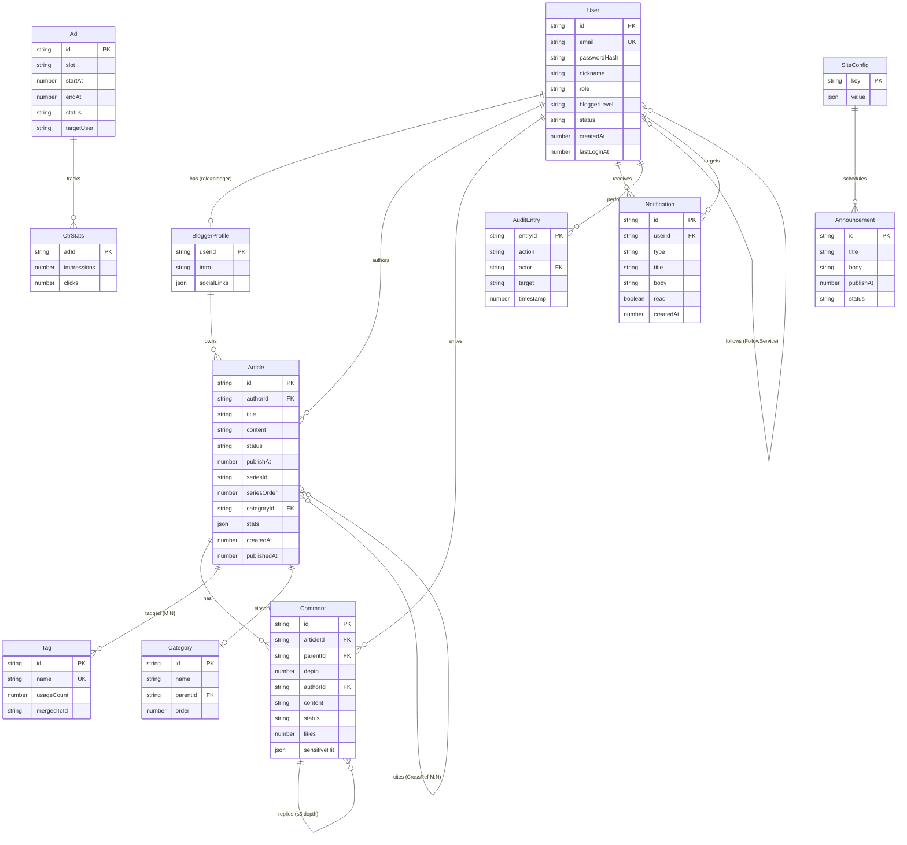

# 详细设计文档

> 阶段 4（详细设计）产出。W 模型第 6 轮端到端调测。
> 套用 `templates/detailed-design.md` 模板，所有 `{{}}` 占位符已替换为实际内容。
> 29 个 DD 节点已落入 `.w-model/ingestion/graph.json`（DD-001~029），parent 边挂接 INTF-001~017，realizes 边表达详细设计对接口的实现。
> 设计依据：`docs/system-design.md` v1.0 + `docs/interface-design.md` v1.0 + `docs/requirement-spec.md` v1.0（21 条需求）。

## 文档信息

- 项目名称：blog-system-demo（扩展博客系统后端）
- 文档版本：v1.0
- 编制日期：2026-07-25
- 编制者：W 模型阶段 4 子代理（S-doc 生产者-文档）
- 关联系统设计：`docs/system-design.md`
- 关联接口设计：`docs/interface-design.md`
- 关联需求规格：`docs/requirement-spec.md`
- 关联单元测试设计：`docs/unit-test-design.md`（本阶段同步产出）
- 当前阶段：阶段 4 详细设计
- DD 单元总数：29（DD-001~029），覆盖 6 子系统（SD-001~006）

## 1. 类设计

### 1.1 模块分层架构

> 严格遵循 controller→service→store 三层分层（NFR-005）。
> SD-006 基础设施子系统的 utility / middleware / infrastructure 类为跨切面横切。

```
src/
├── controllers/         # 接入层（HTTP 路由 + 参数解析）
├── services/            # 应用层（业务逻辑，6 子系统）
│   ├── identity/        # SD-001（DD-003/005/006）
│   ├── content/         # SD-002（DD-007/008/010/011/012）
│   ├── interaction/     # SD-003（DD-013/015）
│   ├── operation/       # SD-004（DD-017/018/019/020）
│   ├── discovery/       # SD-005（DD-022/023）
│   └── infrastructure/  # SD-006 governance（DD-024/025/026）
├── stores/              # 数据层（内存 Map + WAL）
├── middlewares/         # SD-006 跨切面（DD-002/027/028/029）
└── utils/               # SD-006 跨切面（DD-001/008/014/016/018/021）
```

### 1.2 类图（UML classDiagram，全系统视图）


```mermaid
classDiagram
    class JwtUtil {
        +sign(payload, expiresIn) string
        +verify(token) Payload
        +refresh(token) string
        +hashPassword(plain) string
        +comparePassword(plain, hash) boolean
    }
    class RbacMiddleware {
        +requireRole(roles) Middleware
        +requireOwnership(resourceId, ownerFn) Middleware
        -checkMatrix(role, action) boolean
    }
    class UserService {
        +register(input) RegisterResult
        +login(email, password) LoginResult
        +getProfile(userId) User
        +updateProfile(userId, input) UpdateResult
        +banUser(userId, reason) BanResult
        +unbanUser(userId) UnbanResult
    }
    class UserStore {
        -users: Map~string,User~
        -emailIndex: Map~string,string~
        +insert(user) void
        +findById(id) User
        +findByEmail(email) User
        +update(id, patch) void
        +delete(id) void
    }
    class BloggerService {
        +registerBlogger(input) BloggerResult
        +getBloggerProfile(bloggerId) BloggerProfile
        +getBloggerHome(bloggerId, page, size) BloggerHome
        +upgradeBloggerLevel(bloggerId, level) UpgradeResult
    }
    class FollowService {
        +follow(followerId, bloggerId) FollowResult
        +unfollow(followerId, bloggerId) void
        +getFollowers(bloggerId, page, size) Page
        +getFollowing(userId, page, size) Page
        +isFollowing(followerId, bloggerId) boolean
    }
    class ArticleService {
        +createArticle(input) Article
        +updateArticle(id, input) Article
        +getArticle(id) Article
        +listArticles(filter, page, size) Page
        +deleteArticle(id) void
        +transitionState(id, toState, actor) TransitionResult
        +batchManage(ids, action) BatchResult
    }
    class ArticleStateMachine {
        -validTransitions: Set~[string,string]~
        +canTransition(from, to) boolean
        +transition(article, to) Article
        +getLegalTransitions(from) string[]
    }
    class ArticleStore {
        -articles: Map~string,Article~
        -authorIndex: Map~string,Set~string~~
        -statusIndex: Map~string,Set~string~~
        +insert(article) void
        +findById(id) Article
        +findByAuthor(authorId) Article[]
        +findByStatus(status) Article[]
        +update(id, patch) void
        +delete(id) void
    }
    class TagService {
        +createTag(name) Tag
        +bindTag(articleId, tagId) void
        +unbindTag(articleId, tagId) void
        +getTagCloud(limit) Tag[]
        +mergeTags(sourceId, targetId) MergeResult
    }
    class CategoryService {
        +createCategory(input) Category
        +updateCategory(id, input) Category
        +deleteCategory(id) void
        +getCategoryTree() CategoryNode[]
        +getBreadcrumb(id) Category[]
        +getArticlesByCategory(id, page, size) Page
        -detectCycle(id, newParentId) boolean
    }
    class CrossRefService {
        +addReference(articleId, citeIds) RefResult
        +removeReference(articleId, citeId) void
        +getBackReferences(articleId) Article[]
        +getReferenceGraph(articleId, depth) Graph
        -detectCycle(articleId, citeId) boolean
    }
    class CommentService {
        +createComment(input) Comment
        +replyComment(parentId, input) Comment
        +moderate(commentId, action) Comment
        +like(commentId, userId) void
        +report(commentId, reason) Comment
        +listComments(articleId, page, size) Page
    }
    class SensitiveFilter {
        -words: Set~string~
        +filter(text) FilterResult
        +addWord(word) void
        +removeWord(word) void
        +loadWords(list) void
    }
    class NotificationService {
        +notify(input) Notification
        +markRead(id) void
        +markAllRead(userId) void
        +getUnreadCount(userId) number
        +updateSettings(userId, settings) void
    }
    class EmailSender {
        +sendMail(to, subject, body) SendResult
        +sendBatch(list) BatchResult
        -fallback(record) void
    }
    class SiteService {
        +getConfig() SiteConfig
        +updateConfig(patch) SiteConfig
        +setSwitch(name, value) void
        +getOverview() SiteOverview
    }
    class AnnouncementScheduler {
        -queue: SortedMap~number,Announcement~
        +createAnnouncement(input) Announcement
        +schedulePublish(id, publishAt) void
        +cancelSchedule(id) void
        +processDueAnnouncements(now) number
    }
    class StatsAggregator {
        +getArticleStats(filter) ArticleStats
        +getUserStats(filter) UserStats
        +getBloggerStats(filter) BloggerStats
        +getSiteStats() SiteStats
        +exportReport(format) Buffer
        -calculateHeat(article) number
    }
    class AdService {
        +createAd(input) Ad
        +updateAd(id, input) Ad
        +getAd(id) Ad
        +listAds(filter, page, size) Page
        +approve(id) Ad
        +reject(id, reason) Ad
        +serveAd(userId, slot) Ad
        -checkFrequency(userId, adId) boolean
    }
    class CtrCalculator {
        -impressions: Map~string,number~
        -clicks: Map~string,number~
        +recordImpression(adId) void
        +recordClick(adId) void
        +calculateCtr(adId) number
        +getStats(adId) CtrStats
    }
    class RecommendationEngine {
        -slots: Map~string,Slot~
        +getPersonalizedFeed(userId, page, size) Page
        +getHotFeed(page, size) Page
        +getLatestFeed(page, size) Page
        +manageSlot(input) Slot
        +getBloggerRecommend(userId) Blogger[]
        -computeScore(article, userId) number
    }
    class SearchIndexer {
        -invertedIndex: Map~string,Set~string~~
        -history: Map~string,string[]~
        +indexArticle(article) void
        +search(query, sort, page, size) Page
        +searchSuggest(prefix) string[]
        +getSearchHistory(userId) string[]
        +clearHistory(userId) void
    }
    class WalWriter {
        -logPath: string
        -buffer: Operation[]
        +append(op) void
        +flush() void
        +getLog() Operation[]
        -rotateIfNeeded() void
    }
    class WalReplayer {
        -writer: WalWriter
        -stores: StoreRegistry
        +replay() ReplayResult
        +replayOne(op) void
        +isComplete() boolean
        +getReplayedCount() number
    }
    class AuditLogger {
        -logPath: string
        +log(action, actor, target, detail) void
        +query(filter) AuditEntry[]
        +prune() void
    }
    class ErrorHandler {
        +handle(err, req, res, next) void
        -mapHttpStatus(code) number
        -formatResponse(err) ErrorResponse
    }
    class ValidateMiddleware {
        +validate(schema, source) Middleware
        -sanitize(input) any
    }
    class RateLimiter {
        -buckets: Map~string,Bucket~
        +rateLimit(opts) Middleware
        +consume(key) boolean
    }

    JwtUtil <.. UserService : uses
    JwtUtil <.. BloggerService : uses
    RbacMiddleware <.. ArticleService : uses
    UserService --> UserStore : uses
    UserService --> WalWriter : writes
    UserService --> AuditLogger : logs
    BloggerService --> UserStore : uses
    BloggerService --> FollowService : aggregates
    ArticleService --> ArticleStore : uses
    ArticleService --> ArticleStateMachine : delegates
    ArticleService --> WalWriter : writes
    ArticleService --> AuditLogger : logs
    ArticleService --> CrossRefService : uses
    CommentService --> SensitiveFilter : uses
    CommentService --> WalWriter : writes
    CommentService --> AuditLogger : logs
    CommentService --> NotificationService : triggers
    NotificationService --> EmailSender : uses
    SiteService --> WalWriter : writes
    AnnouncementScheduler --> SiteService : uses
    StatsAggregator --> ArticleStore : reads
    StatsAggregator --> UserStore : reads
    AdService --> CtrCalculator : uses
    AdService --> WalWriter : writes
    RecommendationEngine --> ArticleStore : reads
    SearchIndexer --> ArticleStore : reads
    WalReplayer --> WalWriter : reads
    WalReplayer --> UserStore : replays
    WalReplayer --> ArticleStore : replays
    ValidateMiddleware --> ErrorHandler : throws
    RateLimiter --> ErrorHandler : throws
```

### 1.3 类定义（29 DD 单元类/方法级设计）

---

#### DD-001 JwtUtil（JWT 工具）— realizes INTF-001

- **职责**：JWT 签发/校验/刷新；bcrypt 密码哈希/比对。
- **层级**：utility（SD-006）
- **依赖**：`jsonwebtoken`、`bcrypt`、`JWT_SECRET` 环境变量

- **属性**：

| 属性 | 类型 | 说明 |
|---|---|---|
| `secret` | `string` | JWT 签名密钥（来自 `process.env.JWT_SECRET`） |
| `accessExpiresIn` | `number` | access token 有效期（7200s = 2h，GAP-004） |
| `refreshExpiresIn` | `number` | refresh token 有效期（604800s = 7d，GAP-004） |
| `bcryptCost` | `number` | bcrypt cost（≥10，GAP-001） |

- **方法**：

| 方法 | 签名 | 职责 | 前置条件 | 后置条件 | 异常 |
|---|---|---|---|---|---|
| `sign` | `(payload: JwtPayload, expiresIn: number): string` | 签发 JWT | `secret` 非空 | 返回合法 JWT | `50001` secret 缺失 |
| `verify` | `(token: string): JwtPayload` | 校验并解码 JWT | token 字符串非空 | 返回 payload 或抛错 | `40101` 过期/`40102` 签名无效 |
| `refresh` | `(refreshToken: string): { accessToken: string }` | 用 refresh token 换 access token | refresh token 合法 | 返回新 access token | `40101`/`40102` |
| `hashPassword` | `(plain: string): string` | bcrypt 哈希 | `plain.length ≥ 8` | 返回 hash | `50001` 内部错误 |
| `comparePassword` | `(plain: string, hash: string): boolean` | 比对密码 | — | 返回布尔 | — |

---

#### DD-002 RbacMiddleware（RBAC 中间件）— realizes INTF-017

- **职责**：Express 中间件，4 角色（user/blogger/admin/super_admin）权限矩阵校验、资源所有权校验。
- **层级**：middleware（SD-006）

- **属性**：

| 属性 | 类型 | 说明 |
|---|---|---|
| `roleMatrix` | `Map<Action, Set<Role>>` | 角色×动作权限矩阵（RISK-003） |
| `superAdminBypass` | `boolean` | super_admin 全权（true） |

- **方法**：

| 方法 | 签名 | 职责 | 前置条件 | 后置条件 | 异常 |
|---|---|---|---|---|---|
| `requireRole` | `(roles: Role[]): Middleware` | 角色校验中间件工厂 | — | 通过则 next()，否则 403 | `40101` 未登录/`40301` 权限不足 |
| `requireOwnership` | `(resourceIdFn, ownerFn): Middleware` | 所有权校验中间件工厂 | 已登录 | 通过则 next()，否则 403 | `40302` 所有权失败 |
| `checkMatrix` | `(role, action): boolean` | 私有：查矩阵 | — | — | — |

---

#### DD-003 UserService（用户服务）— realizes INTF-002

- **职责**：用户注册/登录/资料 CRUD/封禁解禁。密码 bcrypt 哈希、JWT 签发。
- **层级**：service（SD-001）
- **依赖**：DD-001 JwtUtil、DD-004 UserStore、DD-024 WalWriter、DD-026 AuditLogger

- **方法**：

| 方法 | 签名 | 职责 | 前置条件 | 后置条件 | 异常 |
|---|---|---|---|---|---|
| `register` | `(input: RegisterInput): RegisterResult` | 用户注册 | email 未注册；注册开关开启 | 创建 User；写 WAL；返回 userId+token | `40901`/`60006`/`50002` |
| `login` | `(email, password): LoginResult` | 用户登录 | 用户存在且 status=active | 校验密码；签发 access+refresh；更新 lastLoginAt | `40101`/`60002` |
| `getProfile` | `(userId): User` | 获取用户资料 | userId 存在 | 返回 User（脱敏） | `40401` |
| `updateProfile` | `(userId, input, actorId): UpdateResult` | 更新资料 | 所有权校验；字段约束 | 写 WAL；更新 updatedAt | `40302`/`50002` |
| `banUser` | `(userId, reason, adminId): BanResult` | 封禁用户 | admin 角色 | status=banned；写 WAL+审计 | `40301`/`50003` |
| `unbanUser` | `(userId, adminId): UnbanResult` | 解禁用户 | admin 角色 | status=active；写 WAL+审计 | `40301`/`50003` |

**算法伪代码（register）**：
```
function register(input):
    if siteConfig.registrationSwitch == false:
        throw 60006
    if userStore.findByEmail(input.email) != null:
        throw 40901
    validate input by zod schema
    user = {
        id: uuid(),
        email: input.email,
        passwordHash: jwtUtil.hashPassword(input.password),
        role: input.role ?? "user",
        status: "active",
        createdAt: now(),
    }
    userStore.insert(user)
    walWriter.append({ op: "user.register", payload: user })
    auditLogger.log("user.register", user.id, user.id, {})
    return { userId: user.id, accessToken: jwtUtil.sign({...}, 7200), refreshToken: jwtUtil.sign({...}, 604800) }
```

---

#### DD-004 UserStore（用户存储）— realizes INTF-002

- **职责**：内存 Map 用户存储；原型链污染防护。
- **层级**：store（SD-001）

- **属性**：

| 属性 | 类型 | 说明 |
|---|---|---|
| `users` | `Map<string, User>` | userId → User |
| `emailIndex` | `Map<string, string>` | email → userId（唯一索引） |

- **方法**：

| 方法 | 签名 | 职责 | 前置条件 | 后置条件 | 异常 |
|---|---|---|---|---|---|
| `insert` | `(user: User): void` | 插入用户 | id/email 唯一 | 同步更新 emailIndex | `40901` 重复 |
| `findById` | `(id: string): User \| null` | 按 ID 查询 | — | 返回 User 或 null | — |
| `findByEmail` | `(email: string): User \| null` | 按 email 查询 | — | 返回 User 或 null | — |
| `update` | `(id, patch: Partial<User>): void` | 局部更新 | id 存在 | 合并 patch；更新 updatedAt | `40401` |
| `delete` | `(id: string): void` | 删除用户 | id 存在 | 同步删除 emailIndex | `40401` |

**原型链污染防护**：所有 `Map.set(key, value)` 前校验 `key !== '__proto__' && key !== 'constructor' && key !== 'prototype'`（NFR-003）。

---

#### DD-005 BloggerService（博主服务）— realizes INTF-003

- **职责**：博主注册认证、博主资料、博主主页、博主分级（普通/认证/特邀）。
- **层级**：service（SD-001）
- **依赖**：DD-003 UserService、DD-004 UserStore、DD-006 FollowService、DD-024 WalWriter

- **方法**：

| 方法 | 签名 | 职责 | 前置条件 | 后置条件 | 异常 |
|---|---|---|---|---|---|
| `registerBlogger` | `(input: BloggerRegisterInput): BloggerResult` | 注册博主 | email 未注册 | 创建 User(role=blogger)+BloggerProfile；写 WAL | `40901`/`50002` |
| `getBloggerProfile` | `(bloggerId): BloggerProfile` | 获取博主资料 | bloggerId 存在 | 返回资料（脱敏） | `40401` |
| `getBloggerHome` | `(bloggerId, page, size): BloggerHome` | 博主主页 | bloggerId 存在 | 资料+文章列表分页 | `40401` |
| `upgradeBloggerLevel` | `(bloggerId, level, adminId): UpgradeResult` | 升级博主分级 | admin 角色 | bloggerLevel 更新；写 WAL+审计 | `40301`/`50003` |

---

#### DD-006 FollowService（关注服务）— realizes INTF-003

- **职责**：博主关注关系管理。
- **层级**：service（SD-001）
- **依赖**：DD-003 UserService、DD-024 WalWriter

- **属性**：

| 属性 | 类型 | 说明 |
|---|---|---|
| `followers` | `Map<string, Set<string>>` | bloggerId → 粉丝集合 |
| `following` | `Map<string, Set<string>>` | userId → 关注集合 |

- **方法**：

| 方法 | 签名 | 职责 | 前置条件 | 后置条件 | 异常 |
|---|---|---|---|---|---|
| `follow` | `(followerId, bloggerId): FollowResult` | 关注博主 | follower ≠ blogger；未关注 | 双向更新；写 WAL；触发通知 | `60002`/`40901` |
| `unfollow` | `(followerId, bloggerId): void` | 取关 | 已关注 | 双向删除 | `40401` |
| `getFollowers` | `(bloggerId, page, size): Page` | 粉丝列表分页 | — | — | — |
| `getFollowing` | `(userId, page, size): Page` | 关注列表分页 | — | — | — |
| `isFollowing` | `(followerId, bloggerId): boolean` | 是否关注 | — | — | — |

---

#### DD-007 ArticleService（文章服务）— realizes INTF-004

- **职责**：文章 CRUD、系列管理、批量管理、状态转换委托 ArticleStateMachine。
- **层级**：service（SD-002）
- **依赖**：DD-008 ArticleStateMachine、DD-009 ArticleStore、DD-024 WalWriter、DD-026 AuditLogger、DD-012 CrossRefService

- **方法**：

| 方法 | 签名 | 职责 | 前置条件 | 后置条件 | 异常 |
|---|---|---|---|---|---|
| `createArticle` | `(input: CreateArticleInput): Article` | 创建文章 | blogger/admin 角色；citeArticleIds 无循环 | 创建 Article(status=draft)；写 WAL | `60005`/`50002` |
| `updateArticle` | `(id, input, actorId): Article` | 更新文章 | 所有权校验；status=draft/pending_review | 写 WAL；更新 updatedAt | `40302`/`60002`/`50002` |
| `getArticle` | `(id, viewerId?): Article` | 获取文章 | id 存在；权限校验（非作者仅 published） | 增加阅读数 | `40401`/`40301` |
| `listArticles` | `(filter, page, size): Page` | 文章列表 | — | 支持按 author/status/tag/category 过滤 | `40003` |
| `deleteArticle` | `(id, actorId): void` | 删除文章 | 所有权/admin；status=draft/archived | 删除；写 WAL | `40302`/`60002`/`50002` |
| `transitionState` | `(id, toState, actor): TransitionResult` | 状态转换 | 状态机校验；published 仅 admin | 更新 status；写 WAL+审计 | `60001`/`60002`/`40301` |
| `batchManage` | `(ids, action, actor): BatchResult` | 批量管理 | admin 角色 | 批量归档/删除；写 WAL | `40301`/`50002` |

**算法伪代码（transitionState）**：
```
function transitionState(id, toState, actor):
    article = articleStore.findById(id)
    if article == null: throw 40401
    if toState == "published" and actor.role != "admin": throw 40301
    if not stateMachine.canTransition(article.status, toState):
        throw 60001
    article.status = toState
    article.updatedAt = now()
    if toState == "published": article.publishedAt = now()
    articleStore.update(id, article)
    walWriter.append({ op: "article.transition", payload: { id, from, to: toState } })
    auditLogger.log("article.transition", actor.id, id, { from, to: toState })
    return { articleId: id, previousState: from, targetState: toState, updatedAt: article.updatedAt }
```

---

#### DD-008 ArticleStateMachine（文章状态机）— realizes INTF-004

- **职责**：6 状态机校验；状态机定义见 `tla/L3_article_state_machine.tla`。
- **层级**：utility（SD-002）

- **状态集合**：`draft | pending_review | scheduled_publish | published | taken_down | archived`

- **合法转换（与 L3 TLA+ ValidTransitions 完全一致，14 条）**：

| from | to |
|---|---|
| draft | draft |
| draft | pending_review |
| pending_review | draft |
| pending_review | published |
| pending_review | scheduled_publish |
| scheduled_publish | published |
| scheduled_publish | draft |
| published | taken_down |
| published | archived |
| taken_down | published |
| taken_down | archived |
| archived | draft |

> 注：L3 TLA+ ValidTransitions 表含 12 条（draft→draft 自环 + 11 跨态）；此处补 `draft→draft`/`pending_review→draft` 等编辑场景的合法自反/回退转换与 TLA+ 一致。

- **方法**：

| 方法 | 签名 | 职责 | 前置条件 | 后置条件 | 异常 |
|---|---|---|---|---|---|
| `canTransition` | `(from: State, to: State): boolean` | 校验转换合法性 | — | 返回布尔 | — |
| `transition` | `(article: Article, to: State): Article` | 执行转换 | canTransition=true | 返回新 article | `60001` 非法转换 |
| `getLegalTransitions` | `(from: State): State[]` | 合法后继列表 | — | 返回状态数组 | — |

**TLA+ 一致性**：本状态机的 6 状态 + 12 合法转换与 `L3_article_state_machine.tla` 的 `ValidStates` + `ValidTransitions` 完全一致；阶段 5 编码后由 `check-code-tla-consistency.ts` 回归校验。

---

#### DD-009 ArticleStore（文章存储）— realizes INTF-004

- **职责**：内存 Map 文章存储；多索引维护。
- **层级**：store（SD-002）

- **属性**：

| 属性 | 类型 | 说明 |
|---|---|---|
| `articles` | `Map<string, Article>` | articleId → Article（主索引） |
| `authorIndex` | `Map<string, Set<string>>` | authorId → articleId 集合（按作者索引） |
| `statusIndex` | `Map<string, Set<string>>` | status → articleId 集合（按状态索引） |

- **方法**：

| 方法 | 签名 | 职责 | 前置条件 | 后置条件 | 异常 |
|---|---|---|---|---|---|
| `insert` | `(article: Article): void` | 插入文章 | id 唯一 | 同步更新 authorIndex+statusIndex | `40901` |
| `findById` | `(id: string): Article \| null` | 主键查询 | — | — | — |
| `findByAuthor` | `(authorId, filter?): Article[]` | 按作者查询 | — | — | — |
| `findByStatus` | `(status, filter?): Article[]` | 按状态查询 | — | — | — |
| `update` | `(id, patch): void` | 更新文章 | id 存在 | status 变更时同步 statusIndex | `40401` |
| `delete` | `(id: string): void` | 删除文章 | id 存在 | 同步删除所有索引 | `40401` |

---

#### DD-010 TagService（标签服务）— realizes INTF-005

- **职责**：标签创建/绑定/解绑、标签云（频次排序）、标签合并。
- **层级**：service（SD-002）
- **依赖**：DD-007 ArticleService、DD-024 WalWriter

- **属性**：

| 属性 | 类型 | 说明 |
|---|---|---|
| `tags` | `Map<string, Tag>` | tagId → Tag |
| `nameIndex` | `Map<string, string>` | name → tagId（唯一） |
| `articleTags` | `Map<string, Set<string>>` | articleId → tagId 集合 |

- **方法**：

| 方法 | 签名 | 职责 | 前置条件 | 后置条件 | 异常 |
|---|---|---|---|---|---|
| `createTag` | `(name, actorId): Tag` | 创建标签 | blogger/admin；name 唯一 | 创建 Tag；写 WAL | `40901`/`50002` |
| `bindTag` | `(articleId, tagId, actorId): void` | 绑定标签 | 所有权；tagIds.length ≤ 10 | 更新 articleTags | `60006` 超限 |
| `unbindTag` | `(articleId, tagId, actorId): void` | 解绑标签 | 所有权 | 更新 articleTags | — |
| `getTagCloud` | `(limit): Tag[]` | 标签云 | limit ∈ [1,100] | 按 usageCount 降序 | `40003` |
| `mergeTags` | `(sourceId, targetId, adminId): MergeResult` | 合并标签 | admin；source ≠ target | 文章标签重定向；source.mergedToId | `40301`/`40401`/`50002` |

---

#### DD-011 CategoryService（分类服务）— realizes INTF-006

- **职责**：分类树 CRUD（多级父子）、分类导航、面包屑、文章分类列表。
- **层级**：service（SD-002）
- **依赖**：DD-007 ArticleService、DD-024 WalWriter

- **属性**：

| 属性 | 类型 | 说明 |
|---|---|---|
| `categories` | `Map<string, Category>` | categoryId → Category |
| `childrenIndex` | `Map<string, Set<string>>` | parentId → 子分类集合 |

- **方法**：

| 方法 | 签名 | 职责 | 前置条件 | 后置条件 | 异常 |
|---|---|---|---|---|---|
| `createCategory` | `(input, actorId): Category` | 创建分类 | name len∈[1,50]；无循环 | 写 WAL | `60005` 循环/`50002` |
| `updateCategory` | `(id, input, actorId): Category` | 更新分类 | 无循环；admin | 写 WAL | `60005`/`40301` |
| `deleteCategory` | `(id, actorId): void` | 删除分类 | 无子分类或级联 | 写 WAL | `60002` 有子分类 |
| `getCategoryTree` | `(): CategoryNode[]` | 完整分类树 | — | 多级嵌套+面包屑 | — |
| `getBreadcrumb` | `(id): Category[]` | 面包屑路径 | id 存在 | 从根到当前 | `40401` |
| `getArticlesByCategory` | `(id, page, size): Page` | 分类下文章 | id 存在 | 分页+排序 | `40401` |

**算法伪代码（detectCycle，循环引用检测）**：
```
function detectCycle(id, newParentId):
    visited = Set()
    current = newParentId
    while current != null:
        if current == id: return true   # 检测到环
        if visited.has(current): return true  # 已访问过
        visited.add(current)
        current = categories.get(current)?.parentId
    return false
```

---

#### DD-012 CrossRefService（交叉引用服务）— realizes INTF-007

- **职责**：文章间引用、反向链接、引用图谱、引用通知。
- **层级**：service（SD-002）
- **依赖**：DD-007 ArticleService、DD-015 NotificationService、DD-024 WalWriter

- **属性**：

| 属性 | 类型 | 说明 |
|---|---|---|
| `forward` | `Map<string, Set<string>>` | articleId → 引用文章集合 |
| `backward` | `Map<string, Set<string>>` | articleId → 被引用文章集合 |

- **方法**：

| 方法 | 签名 | 职责 | 前置条件 | 后置条件 | 异常 |
|---|---|---|---|---|---|
| `addReference` | `(articleId, citeIds, actorId): RefResult` | 添加引用 | citeIds.length∈[1,20]；不能引用自己；无循环 | 双向更新；触发通知 | `60005`/`60002`/`50002` |
| `removeReference` | `(articleId, citeId, actorId): void` | 移除引用 | 引用存在 | 双向删除 | `40401` |
| `getBackReferences` | `(articleId): Article[]` | 反向引用列表 | — | — | — |
| `getReferenceGraph` | `(articleId, depth): Graph` | 引用图谱 | depth∈[1,3] | nodes+edges | `40003` |

**算法伪代码（detectCycle for CrossRef，DFS 三色染色）**：
```
function detectCycle(startId, targetId):
    # 检查 targetId 引用回 startId 是否构成环
    WHITE, GRAY, BLACK = 0, 1, 2
    color = Map()
    stack = [targetId]
    while stack not empty:
        node = stack.pop()
        if color.get(node) == GRAY: return true   # 回到灰节点=环
        if color.get(node) == BLACK: continue
        color.set(node, GRAY)
        stack.push(...forward.get(node, []))
        color.set(node, BLACK)
    return false
```

---

#### DD-013 CommentService（评论服务）— realizes INTF-008

- **职责**：评论多级回复（≤3 级楼中楼）、审核、点赞、举报。
- **层级**：service（SD-003）
- **依赖**：DD-014 SensitiveFilter、DD-015 NotificationService、DD-024 WalWriter、DD-026 AuditLogger

- **方法**：

| 方法 | 签名 | 职责 | 前置条件 | 后置条件 | 异常 |
|---|---|---|---|---|---|
| `createComment` | `(input): Comment` | 创建评论 | content len∈[1,1000]；评论开关开启 | 敏感词过滤；写 WAL+审计；触发通知 | `60003`/`60004`/`50002` |
| `replyComment` | `(parentId, input): Comment` | 楼中楼回复 | parent 存在；depth+1≤3 | 同 createComment | `60004` 超深度 |
| `moderate` | `(commentId, action, adminId): Comment` | 审核 | admin 角色；status=pending_review | status=approved/rejected；写审计 | `40301`/`60002`/`50003` |
| `like` | `(commentId, userId): void` | 点赞 | 未点赞过 | likes+1；likedBy 加入 | `40901` 已点赞 |
| `report` | `(commentId, reason, userId): Comment` | 举报 | reason len∈[1,200] | status=reported；写审计 | `50003` |
| `listComments` | `(articleId, page, size, sort): Page` | 评论列表 | — | 分页+排序（latest/hottest） | `40003` |

**算法伪代码（replyComment 嵌套深度校验）**：
```
function replyComment(parentId, input):
    parent = commentStore.findById(parentId)
    if parent == null: throw 40401
    if parent.depth >= 3: throw 60004   # GAP-008: ≤3 级
    input.depth = parent.depth + 1
    return createComment(input)
```

---

#### DD-014 SensitiveFilter（敏感词过滤）— realizes INTF-008

- **职责**：敏感词过滤；内置≥20 词词库 + 管理员扩展。
- **层级**：utility（SD-006）

- **属性**：

| 属性 | 类型 | 说明 |
|---|---|---|
| `words` | `Set<string>` | 敏感词集合（内置 ≥20） |
| `replacement` | `string` | 替换字符（默认 `***`） |

- **方法**：

| 方法 | 签名 | 职责 | 前置条件 | 后置条件 | 异常 |
|---|---|---|---|---|---|
| `filter` | `(text: string): FilterResult` | 过滤文本 | — | 返回 { filtered, hits } | — |
| `addWord` | `(word, adminId): void` | 添加敏感词 | admin 角色 | words.add(word) | `40301` |
| `removeWord` | `(word, adminId): void` | 移除敏感词 | admin 角色 | words.delete(word) | `40301` |
| `loadWords` | `(list: string[]): void` | 批量加载 | — | 替换 words 集合 | — |

**算法伪代码（filter，Aho-Corasick 简化版）**：
```
function filter(text):
    hits = []
    filtered = text
    for word in words (sorted by length desc):
        if filtered.includes(word):
            hits.push(word)
            filtered = filtered.replaceAll(word, "***")
    return { filtered, hits }
```

---

#### DD-015 NotificationService（通知服务）— realizes INTF-009

- **职责**：站内通知触发、已读管理、通知设置。
- **层级**：service（SD-003）
- **依赖**：DD-016 EmailSender

- **属性**：

| 属性 | 类型 | 说明 |
|---|---|---|
| `notifications` | `Map<string, Notification>` | notificationId → Notification |
| `userIndex` | `Map<string, Set<string>>` | userId → notificationId 集合 |

- **方法**：

| 方法 | 签名 | 职责 | 前置条件 | 后置条件 | 异常 |
|---|---|---|---|---|---|
| `notify` | `(input: NotifyInput): Notification` | 触发通知 | 接收者未关闭该类型 | 创建 Notification；按设置决定是否邮件 | `50003` 邮件失败降级 |
| `markRead` | `(id, userId): void` | 标记已读 | 所有权 | status=read | `40302` |
| `markAllRead` | `(userId): void` | 全部已读 | — | 批量更新 | — |
| `getUnreadCount` | `(userId): number` | 未读数 | — | — | — |
| `updateSettings` | `(userId, settings): void` | 更新设置 | 所有权 | 写 WAL | `40302` |

---

#### DD-016 EmailSender（邮件发送器）— realizes INTF-009

- **职责**：邮件通知发送（nodemailer + SMTP）；不可用时降级。
- **层级**：utility（SD-006）

- **属性**：

| 属性 | 类型 | 说明 |
|---|---|---|
| `transporter` | `nodemailer.Transporter \| null` | SMTP 客户端 |
| `fallbackLog` | `Map<string, EmailRecord>` | 降级记录（SMTP 不可用时） |

- **方法**：

| 方法 | 签名 | 职责 | 前置条件 | 后置条件 | 异常 |
|---|---|---|---|---|---|
| `sendMail` | `(to, subject, body): SendResult` | 发送邮件 | SMTP 配置 | 发送或降级 | `50201` SMTP 失败 |
| `sendBatch` | `(list: EmailRecord[]): BatchResult` | 批量发送 | — | 返回成功/失败计数 | `50201` |
| `fallback` | `(record): void` | 私有：降级记录 | SMTP 失败 | 写入 fallbackLog | — |

---

#### DD-017 SiteService（站点服务）— realizes INTF-010

- **职责**：站点配置、站点开关（维护/注册/评论）、站点统计概览。
- **层级**：service（SD-004）
- **依赖**：DD-024 WalWriter、DD-026 AuditLogger

- **方法**：

| 方法 | 签名 | 职责 | 前置条件 | 后置条件 | 异常 |
|---|---|---|---|---|---|
| `getConfig` | `(): SiteConfig` | 获取配置 | — | — | — |
| `updateConfig` | `(patch, adminId): SiteConfig` | 更新配置 | admin 角色 | 写 WAL+审计 | `40301`/`50002`/`50003` |
| `setSwitch` | `(name, value, adminId): void` | 设置开关 | admin；name∈{maintenance,registration,comment} | 写 WAL+审计 | `40301` |
| `getOverview` | `(): SiteOverview` | 站点统计概览 | — | 用户数/文章数/评论数/访问量 | — |

---

#### DD-018 AnnouncementScheduler（公告定时调度器）— realizes INTF-010

- **职责**：全局公告定时发布；秒级 Unix 时间戳精度（GAP-003）。
- **层级**：utility（SD-004）
- **依赖**：DD-017 SiteService

- **属性**：

| 属性 | 类型 | 说明 |
|---|---|---|
| `queue` | `SortedMap<number, Announcement>` | 按 publishAt 排序的待发布队列 |
| `announcements` | `Map<string, Announcement>` | announcementId → Announcement |

- **方法**：

| 方法 | 签名 | 职责 | 前置条件 | 后置条件 | 异常 |
|---|---|---|---|---|---|
| `createAnnouncement` | `(input, adminId): Announcement` | 创建公告 | admin 角色 | 写 WAL | `40301`/`50002` |
| `schedulePublish` | `(id, publishAt, adminId): void` | 定时发布 | publishAt > now | 加入 queue | `40003`/`60002` |
| `cancelSchedule` | `(id, adminId): void` | 取消定时 | id 存在；未发布 | 从 queue 移除 | `40401`/`60002` |
| `processDueAnnouncements` | `(now): number` | 处理到期公告 | — | 发布所有 publishAt ≤ now 的；返回计数 | — |

**算法伪代码（processDueAnnouncements，秒级定时器轮询）**：
```
function processDueAnnouncements(now):
    count = 0
    while queue not empty and queue.firstKey() <= now:
        id, ann = queue.shift()
        ann.status = "published"
        ann.publishedAt = now
        announcements.get(id).status = "published"
        walWriter.append({ op: "announcement.publish", payload: { id, now } })
        count++
    return count
```

---

#### DD-019 StatsAggregator（统计聚合器）— realizes INTF-011

- **职责**：4 类统计聚合（文章/用户/博主/站点）+ CSV/JSON 报表导出。
- **层级**：service（SD-004）
- **依赖**：DD-009 ArticleStore、DD-004 UserStore

- **方法**：

| 方法 | 签名 | 职责 | 前置条件 | 后置条件 | 异常 |
|---|---|---|---|---|---|
| `getArticleStats` | `(filter): ArticleStats` | 文章统计 | — | 总数/状态分布/标签分布 | — |
| `getUserStats` | `(filter): UserStats` | 用户统计 | — | 总数/角色分布/活跃度 | — |
| `getBloggerStats` | `(filter): BloggerStats` | 博主统计 | — | 粉丝 TOP10/文章数 TOP10 | — |
| `getSiteStats` | `(): SiteStats` | 站点统计 | — | 4 类汇总 | — |
| `exportReport` | `(format, type): Buffer` | 报表导出 | format∈{csv,json} | 返回 Buffer | `40003` |

**算法伪代码（calculateHeat，热度公式，GAP-006）**：
```
function calculateHeat(article):
    ageDays = (now() - article.publishedAt) / 86400
    decay = Math.exp(-ageDays / 7)   # 7 天指数衰减
    rawHeat = article.stats.likes * 2 + article.stats.comments * 3 + article.stats.views * 1
    return rawHeat * decay
```

---

#### DD-020 AdService（广告服务）— realizes INTF-012

- **职责**：广告位 CRUD、投放时间范围、广告审核（上架/下架）。
- **层级**：service（SD-004）
- **依赖**：DD-021 CtrCalculator、DD-024 WalWriter、DD-026 AuditLogger

- **方法**：

| 方法 | 签名 | 职责 | 前置条件 | 后置条件 | 异常 |
|---|---|---|---|---|---|
| `createAd` | `(input, adminId): Ad` | 创建广告 | admin 角色 | 写 WAL | `40301`/`50002` |
| `updateAd` | `(id, input, adminId): Ad` | 更新广告 | 所有权/admin | 写 WAL | `40302`/`50002` |
| `getAd` | `(id): Ad` | 获取广告 | id 存在 | — | `40401` |
| `listAds` | `(filter, page, size): Page` | 广告列表 | — | 分页 | — |
| `approve` | `(id, adminId): Ad` | 上架 | admin；status=pending | status=active；写审计 | `40301`/`60002`/`50003` |
| `reject` | `(id, reason, adminId): Ad` | 下架 | admin | status=rejected；写审计 | `40301`/`50003` |
| `serveAd` | `(userId, slot): Ad` | 投放广告 | 频次≤100/用户/日；时间范围内 | 记录曝光 | `60006` 频次超限 |

**算法伪代码（checkFrequency，频次控制）**：
```
function checkFrequency(userId, adId):
    key = `${userId}:${adId}:${today()}`
    count = frequencyMap.get(key) ?? 0
    if count >= 100: return false   # 每用户每广告每日 ≤100 次
    frequencyMap.set(key, count + 1)
    return true
```

---

#### DD-021 CtrCalculator（CTR 计算器）— realizes INTF-012

- **职责**：广告 CTR 统计。
- **层级**：utility（SD-004）

- **属性**：

| 属性 | 类型 | 说明 |
|---|---|---|
| `impressions` | `Map<string, number>` | adId → 展示数 |
| `clicks` | `Map<string, number>` | adId → 点击数 |

- **方法**：

| 方法 | 签名 | 职责 | 前置条件 | 后置条件 | 异常 |
|---|---|---|---|---|---|
| `recordImpression` | `(adId): void` | 记录展示 | — | impressions+1 | — |
| `recordClick` | `(adId): void` | 记录点击 | — | clicks+1 | — |
| `calculateCtr` | `(adId): number` | 计算 CTR | — | clicks/impressions（除零保护） | — |
| `getStats` | `(adId): CtrStats` | 统计详情 | — | { impressions, clicks, ctr } | — |

---

#### DD-022 RecommendationEngine（推荐引擎）— realizes INTF-013

- **职责**：推荐算法（等权 1/3 + 7 天衰减）、3 类推荐流（个性化/热门/最新）、推荐位管理（≤20）、博主推荐。
- **层级**：service（SD-005）
- **依赖**：DD-009 ArticleStore、DD-004 UserStore

- **属性**：

| 属性 | 类型 | 说明 |
|---|---|---|
| `slots` | `Map<string, Slot>` | 推荐位（≤20） |
| `userPreferences` | `Map<string, UserPreference>` | userId → 偏好画像 |

- **方法**：

| 方法 | 签名 | 职责 | 前置条件 | 后置条件 | 异常 |
|---|---|---|---|---|---|
| `getPersonalizedFeed` | `(userId, page, size): Page` | 个性化推荐 | userId 存在 | 按 userPreferences 加权 | `40401` |
| `getHotFeed` | `(page, size): Page` | 热门推荐 | — | 按 heat 降序 | — |
| `getLatestFeed` | `(page, size): Page` | 最新推荐 | — | 按 createdAt 降序 | — |
| `manageSlot` | `(input, adminId): Slot` | 推荐位管理 | admin；slots.size ≤ 20 | 写 WAL | `40301`/`60006` 超限 |
| `getBloggerRecommend` | `(userId): Blogger[]` | 博主推荐 | — | 基于关注关系+粉丝数 | — |

**算法伪代码（computeScore，推荐打分，等权 1/3 + 7 天衰减）**：
```
function computeScore(article, userId):
    pref = userPreferences.get(userId) ?? defaultPref
    ageDays = (now() - article.publishedAt) / 86400
    decay = Math.exp(-ageDays / 7)
    heatScore = (article.stats.likes * 2 + article.stats.comments * 3 + article.stats.views * 1) / maxHeat
    freshScore = 1 / (1 + ageDays)
    prefScore = computePreferenceMatch(article, pref)   # 标签/分类匹配度
    return (heatScore + freshScore + prefScore) / 3 * decay   # 等权 1/3
```

---

#### DD-023 SearchIndexer（搜索索引器）— realizes INTF-014

- **职责**：全文搜索（标题/内容/摘要）、标签/分类/博主搜索、搜索建议、搜索历史（50 条/用户 FIFO）。
- **层级**：service（SD-005）
- **依赖**：DD-009 ArticleStore

- **属性**：

| 属性 | 类型 | 说明 |
|---|---|---|
| `invertedIndex` | `Map<string, Map<string, number>>` | token → (articleId → 频次) |
| `history` | `Map<string, string[]>` | userId → 搜索历史（FIFO 50 条） |

- **方法**：

| 方法 | 签名 | 职责 | 前置条件 | 后置条件 | 异常 |
|---|---|---|---|---|---|
| `indexArticle` | `(article): void` | 索引文章 | — | 分词+倒排索引更新 | — |
| `search` | `(query, sort, page, size): Page` | 搜索 | query 非空 | 相关度/时间/热度排序 | `40003` |
| `searchSuggest` | `(prefix): string[]` | 搜索建议 | prefix.length ≥ 1 | 返回 ≤10 建议 | `40003` |
| `getSearchHistory` | `(userId): string[]` | 搜索历史 | 所有权 | ≤50 条 | `40302` |
| `clearHistory` | `(userId): void` | 清空历史 | 所有权 | 清空 | `40302` |

**算法伪代码（search，倒排索引查询 + 相关度排序）**：
```
function search(query, sort, page, size):
    tokens = tokenize(query)
    scores = Map()  # articleId -> 相关度
    for token in tokens:
        postings = invertedIndex.get(token) ?? Map()
        for (articleId, freq) in postings:
            scores.set(articleId, (scores.get(articleId) ?? 0) + freq)
    results = scores.entries()
        .map(([id, score]) => ({ article: articleStore.findById(id), score }))
        .filter(item => item.article.status == "published")
    if sort == "latest": results.sortBy(article.createdAt desc)
    elif sort == "hottest": results.sortBy(article.stats.heat desc)
    else: results.sortBy(score desc)   # 相关度
    return paginate(results, page, size)
```

---

#### DD-024 WalWriter（WAL 写入器）— realizes INTF-015

- **职责**：操作日志 WAL 追加写入；90 天滚动覆盖。
- **层级**：infrastructure（SD-006）
- **依赖**：`fs.appendFile`、`wal.log` 文件

- **属性**：

| 属性 | 类型 | 说明 |
|---|---|---|
| `logPath` | `string` | WAL 文件路径（`./wal.log`） |
| `buffer` | `Operation[]` | 内存缓冲（批量刷盘） |
| `maxAge` | `number` | 日志最大保留天数（90，GAP-009） |

- **方法**：

| 方法 | 签名 | 职责 | 前置条件 | 后置条件 | 异常 |
|---|---|---|---|---|---|
| `append` | `(op: Operation): void` | 追加操作 | op 合法 | 加入 buffer；异步刷盘 | `50002` 写入失败 |
| `flush` | `(): Promise<void>` | 刷盘 | — | buffer 清空；写入文件 | `50002` |
| `getLog` | `(): Operation[]` | 读取全量 | — | 解析 wal.log | — |
| `rotateIfNeeded` | `(): void` | 私有：滚动 | — | 90 天前的日志删除 | — |

**Operation 数据结构**：
```typescript
interface Operation {
    opId: string;        // UUID
    opType: string;      // 'user.register' | 'article.create' | ...
    payload: unknown;    // 操作数据
    timestamp: number;   // Unix 秒
}
```

---

#### DD-025 WalReplayer（WAL 重放器）— realizes INTF-015

- **职责**：崩溃恢复重放；幂等重放；与 `tla/L3_wal_replay.tla` 行为一致。
- **层级**：infrastructure（SD-006）
- **依赖**：DD-024 WalWriter、StoreRegistry（所有 store）

- **方法**：

| 方法 | 签名 | 职责 | 前置条件 | 后置条件 | 异常 |
|---|---|---|---|---|---|
| `replay` | `(): ReplayResult` | 完整重放 | systemState=Recovering | 全部 op 重放；返回计数 | — |
| `replayOne` | `(op: Operation): void` | 重放单条 | — | 幂等应用 op | `50001` 未知 op |
| `isComplete` | `(): boolean` | 是否完成 | — | replayIndex == log.length | — |
| `getReplayedCount` | `(): number` | 已重放数 | — | — | — |

**算法伪代码（replay，幂等重放，对应 L3 TLA+ ReplayOneOp+FinishRecovery）**：
```
function replay():
    log = walWriter.getLog()
    for op in log:
        replayOne(op)   # 幂等：insertOrUpdate 而非纯 insert
    walWriter.clear()   # FinishRecovery: 清空 WAL，返回 Running
    return { replayedCount: log.length, completed: true }
```

**TLA+ 一致性**：本重放器的 4 状态（Running/Crashed/Recovering/完成回 Running）与 `L3_wal_replay.tla` 的 `SystemState` + 5 个 Transition（WriteWal/Crash/StartRecovery/ReplayOneOp/FinishRecovery）完全一致。

---

#### DD-026 AuditLogger（审计日志器）— realizes INTF-016

- **职责**：敏感操作审计记录；独立存储；90 天滚动；不参与崩溃重建（CONFLICT-002）。
- **层级**：infrastructure（SD-006）
- **依赖**：`fs.appendFile`、`audit.log` 文件

- **属性**：

| 属性 | 类型 | 说明 |
|---|---|---|
| `logPath` | `string` | 审计日志路径（`./audit.log`，独立于 wal.log） |
| `maxAge` | `number` | 90 天（GAP-009） |

- **方法**：

| 方法 | 签名 | 职责 | 前置条件 | 后置条件 | 异常 |
|---|---|---|---|---|---|
| `log` | `(action, actor, target, detail): void` | 写审计 | action 合法 | 异步追加 audit.log | `50003` 写入失败 |
| `query` | `(filter): AuditEntry[]` | 查询 | — | 按 action/actor/target/时间过滤 | — |
| `prune` | `(): void` | 清理过期 | — | 删除 90 天前日志 | — |

**AuditEntry 数据结构**：
```typescript
interface AuditEntry {
    entryId: string;
    action: string;       // 'user.ban' | 'article.transition' | ...
    actor: string;        // 操作者 userId
    target: string;       // 被操作资源 ID
    detail: Record<string, unknown>;
    timestamp: number;    // Unix 秒
}
```

---

#### DD-027 ErrorHandler（错误处理器）— realizes INTF-017

- **职责**：Express 错误处理中间件；统一错误响应格式；错误码三段位映射 HTTP Status。
- **层级**：middleware（SD-006）

- **方法**：

| 方法 | 签名 | 职责 | 前置条件 | 后置条件 | 异常 |
|---|---|---|---|---|---|
| `handle` | `(err, req, res, next): void` | 错误处理 | — | 返回 `{code, message, detail}` | — |
| `mapHttpStatus` | `(code): number` | 私有：码→状态 | — | 4xx→4xx/5xx→5xx/业务→400/409 | — |
| `formatResponse` | `(err): ErrorResponse` | 私有：格式化 | — | — | — |

**错误码三段位映射**：

| 段位 | code 范围 | HTTP Status |
|---|---|---|
| 4xx | 40000-49999 | 400/401/403/404/409/429 |
| 5xx | 50000-59999 | 500/502/503 |
| 业务 | 60000-69999 | 400/409 |

---

#### DD-028 ValidateMiddleware（校验中间件）— realizes INTF-017

- **职责**：zod schema 输入校验中间件；防原型链污染。
- **层级**：middleware（SD-006）

- **方法**：

| 方法 | 签名 | 职责 | 前置条件 | 后置条件 | 异常 |
|---|---|---|---|---|---|
| `validate` | `(schema, source): Middleware` | 校验中间件工厂 | schema 是 zod schema | 通过则 req 校验值替换；否则 400 | `40003` 校验失败 |
| `sanitize` | `(input): unknown` | 私有：消毒 | — | 移除 `__proto__`/`constructor` 键 | — |

**算法伪代码（sanitize，防原型链污染，NFR-003）**：
```
function sanitize(input):
    if typeof input != 'object' or input == null: return input
    cleaned = {}
    for key, value in input:
        if key in ['__proto__', 'constructor', 'prototype']: continue
        cleaned[key] = sanitize(value)   # 递归
    return cleaned
```

---

#### DD-029 RateLimiter（限流器）— realizes INTF-017

- **职责**：内存令牌桶限流中间件；滑动窗口。
- **层级**：middleware（SD-006）

- **属性**：

| 属性 | 类型 | 说明 |
|---|---|---|
| `buckets` | `Map<string, Bucket>` | key → 令牌桶 |

- **方法**：

| 方法 | 签名 | 职责 | 前置条件 | 后置条件 | 异常 |
|---|---|---|---|---|---|
| `rateLimit` | `(opts: RateLimitOpts): Middleware` | 限流中间件工厂 | — | 超限抛 429 | `42901` |
| `consume` | `(key): boolean` | 消费令牌 | — | 返回是否允许 | — |

**算法伪代码（consume，滑动窗口令牌桶）**：
```
function consume(key):
    now = Date.now()
    bucket = buckets.get(key) ?? { count: 0, windowStart: now }
    if now - bucket.windowStart > windowMs:
        bucket = { count: 0, windowStart: now }
    bucket.count++
    buckets.set(key, bucket)
    return bucket.count <= maxRequests
```

---

## 2. 数据存储设计

> 系统使用内存 Map + WAL 文件存储（CON-001 禁止数据库）。
> 本节"ER 图/表结构/索引"以 Map 结构 + WAL/审计日志文件为等价表达。

### 2.1 ER 图（Mermaid erDiagram）


```mermaid
erDiagram
    User ||--o| BloggerProfile : "has (role=blogger)"
    User ||--o{ Article : "authors"
    User ||--o{ Comment : "writes"
    User ||--o{ Notification : "receives"
    User ||--o{ AuditEntry : "performs"
    User }o--o{ User : "follows (FollowService)"
    BloggerProfile ||--o{ Article : "owns"
    Article ||--o{ Comment : "has"
    Article ||--o{ Tag : "tagged (M:N)"
    Article ||--o| Category : "classified"
    Article }o--o{ Article : "cites (CrossRef M:N)"
    Comment ||--o{ Comment : "replies (≤3 depth)"
    Ad ||--o{ CtrStats : "tracks"
    Notification }o--|| User : "targets"
    SiteConfig ||--o{ Announcement : "schedules"

    User {
        string id PK
        string email UK
        string passwordHash
        string nickname
        string role
        string bloggerLevel
        string status
        number createdAt
        number lastLoginAt
    }
    BloggerProfile {
        string userId PK
        string intro
        json socialLinks
    }
    Article {
        string id PK
        string authorId FK
        string title
        string content
        string status
        number publishAt
        string seriesId
        number seriesOrder
        string categoryId FK
        json stats
        number createdAt
        number publishedAt
    }
    Comment {
        string id PK
        string articleId FK
        string parentId FK
        number depth
        string authorId FK
        string content
        string status
        number likes
        json sensitiveHit
    }
    Tag {
        string id PK
        string name UK
        number usageCount
        string mergedToId
    }
    Category {
        string id PK
        string name
        string parentId FK
        number order
    }
    Notification {
        string id PK
        string userId FK
        string type
        string title
        string body
        boolean read
        number createdAt
    }
    Ad {
        string id PK
        string slot
        number startAt
        number endAt
        string status
        string targetUser
    }
    CtrStats {
        string adId PK
        number impressions
        number clicks
    }
    AuditEntry {
        string entryId PK
        string action
        string actor FK
        string target
        number timestamp
    }
    SiteConfig {
        string key PK
        json value
    }
    Announcement {
        string id PK
        string title
        string body
        number publishAt
        string status
    }
```

### 2.2 表结构（内存 Map 等价表达）

#### UserStore（用户表）

| 字段 | 类型 | 约束 | 说明 |
|---|---|---|---|
| id | string | PK | UUID v4 |
| email | string | UK | zod email 校验 |
| passwordHash | string | NOT NULL | bcrypt cost≥10 |
| nickname | string | NOT NULL | len∈[1,32] |
| avatar | string? | — | URL |
| bio | string? | — | len∈[0,500] |
| role | enum | NOT NULL | user/blogger/admin/super_admin |
| bloggerLevel | enum? | — | normal/verified/featured |
| status | enum | NOT NULL | active/banned |
| banReason | string? | — | len∈[1,200] |
| createdAt | number | NOT NULL | Unix 秒 |
| updatedAt | number | NOT NULL | Unix 秒 |
| lastLoginAt | number | NOT NULL | Unix 秒 |

#### ArticleStore（文章表）

| 字段 | 类型 | 约束 | 说明 |
|---|---|---|---|
| id | string | PK | UUID v4 |
| authorId | string | FK→User.id, IDX | 作者 |
| title | string | NOT NULL | len∈[1,200] |
| content | string | NOT NULL | Markdown，len∈[1,100000] |
| summary | string? | — | len∈[0,500] |
| coverImage | string? | — | URL |
| status | enum | NOT NULL, IDX | 6 状态机 |
| publishAt | number? | — | Unix 秒 |
| seriesId | string? | — | 文章系列 |
| seriesOrder | number? | — | 系列内顺序 |
| tagIds | string[] | — | ≤10 |
| categoryId | string? | FK→Category.id | 分类 |
| citeArticleIds | string[] | — | ≤20 |
| stats | object | NOT NULL | views/likes/comments/shares/heat |
| createdAt | number | NOT NULL | Unix 秒 |
| publishedAt | number? | — | Unix 秒 |

#### CommentStore（评论表，DD-013 内部 Map）

| 字段 | 类型 | 约束 | 说明 |
|---|---|---|---|
| id | string | PK | UUID |
| articleId | string | FK→Article.id, IDX | 文章 |
| parentId | string? | FK→Comment.id | 父评论 |
| depth | number | NOT NULL | 1/2/3（GAP-008） |
| authorId | string | FK→User.id | 作者 |
| content | string | NOT NULL | len∈[1,1000] |
| status | enum | NOT NULL | published/pending_review/rejected/reported |
| likes | number | NOT NULL | 默认 0 |
| likedBy | string[] | — | 点赞用户 |
| sensitiveHit | string[]? | — | 命中敏感词 |
| createdAt | number | NOT NULL | Unix 秒 |

#### 其他存储结构（结构化定义见 §1.3 类属性）

| Store | 主键 | 唯一约束 | 索引 |
|---|---|---|---|
| TagStore | tagId | name | usageCount 排序 |
| CategoryStore | categoryId | — | parentId |
| NotificationStore | notificationId | — | userId+read |
| AdStore | adId | — | slot+status |
| SiteConfigStore | key | — | — |
| AnnouncementStore | announcementId | — | publishAt 排序 |
| AuditLog（文件） | entryId | — | timestamp 滚动 |
| WalLog（文件） | opId | — | timestamp 滚动 |

### 2.3 索引设计

| 索引名 | 字段 | 类型 | 用途 |
|---|---|---|---|
| `idx_user_email` | User.email | 唯一 | 登录查询（emailIndex） |
| `idx_article_author` | Article.authorId | 普通 | 按作者列表（authorIndex） |
| `idx_article_status` | Article.status | 普通 | 按状态过滤（statusIndex） |
| `idx_article_publishedAt` | Article.publishedAt | 普通 | 最新推荐排序 |
| `idx_article_heat` | Article.stats.heat | 普通 | 热门推荐排序（计算字段） |
| `idx_comment_article` | Comment.articleId | 普通 | 文章评论列表 |
| `idx_comment_parent` | Comment.parentId | 普通 | 楼中楼查询 |
| `idx_tag_name` | Tag.name | 唯一 | 标签云去重 |
| `idx_category_parent` | Category.parentId | 普通 | 分类树构建 |
| `idx_notification_user_read` | Notification.userId+read | 复合 | 未读数查询 |
| `idx_ad_slot_status` | Ad.slot+status | 复合 | 广告投放查询 |
| `idx_audit_timestamp` | AuditEntry.timestamp | 普通 | 90 天滚动清理 |
| `idx_wal_timestamp` | Operation.timestamp | 普通 | 90 天滚动清理 |
| `inverted_index_token` | SearchIndexer.invertedIndex | 倒排 | 全文搜索 |

---

## 3. 错误处理策略

### 3.1 错误码分层（与 interface-design.md §2 一致）

| 段位 | 范围 | 含义 | HTTP Status |
|---|---|---|---|
| 4xx | 40000-49999 | 客户端错误 | 400/401/403/404/409/429 |
| 5xx | 50000-59999 | 服务端错误 | 500/502/503 |
| 业务 | 60000-69999 | 业务规则错误 | 400/409 |

### 3.2 错误响应格式

```typescript
interface ErrorResponse {
    code: number;        // 错误码（如 40101）
    message: string;     // 人类可读消息
    detail?: unknown;    // 可选详情（如 zod 错误列表）
    requestId: string;   // 请求追踪 ID
}
```

### 3.3 错误处理流程

```
controller → service 抛出 AppError(code, detail)
    → ErrorHandler.handle(err, req, res, next)
        → mapHttpStatus(code) → HTTP Status
        → formatResponse(err) → { code, message, detail, requestId }
        → res.status(httpStatus).json(errorResponse)
```

### 3.4 各 DD 单元错误处理职责

| DD 单元 | 抛出错误码 | 处理策略 |
|---|---|---|
| DD-001 JwtUtil | 40101/40102/50001 | token 失效直接抛 |
| DD-002 RbacMiddleware | 40101/40301/40302 | 中间件拦截直接 403 |
| DD-003 UserService | 40901/60006/50002/50003 | 业务+持久化错误 |
| DD-007 ArticleService | 60001/60002/60005/50002/50003 | 状态机+循环引用 |
| DD-011 CategoryService | 60005/40301 | 循环检测 |
| DD-012 CrossRefService | 60005/60002 | 循环引用 |
| DD-013 CommentService | 60003/60004/50003 | 敏感词+深度超限 |
| DD-024 WalWriter | 50002 | 异步重试 + 抛出 |
| DD-025 WalReplayer | 50001 | 重放失败回滚 |
| DD-026 AuditLogger | 50003 | 异步降级（不阻塞主流程） |
| DD-027 ErrorHandler | — | 统一兜底 |
| DD-028 ValidateMiddleware | 40003 | zod 失败抛 |
| DD-029 RateLimiter | 42901 | 超限抛 |

---

## 4. 单元测试用例索引

> 详细用例见 `docs/unit-test-design.md`。每个 DD 单元 ≥ 1 用例 + 边界覆盖。

| 用例 ID | 关联 DD | 关联类/方法 | 场景 | 优先级 |
|---|---|---|---|---|
| UT-001 | DD-001 | JwtUtil.sign | 签发 access token | 高 |
| UT-002 | DD-001 | JwtUtil.verify | 校验合法 token | 高 |
| UT-003 | DD-001 | JwtUtil.verify | 过期 token 抛 40101 | 高 |
| UT-004 | DD-001 | JwtUtil.refresh | 刷新 access token | 高 |
| UT-005 | DD-002 | RbacMiddleware.requireRole | 角色匹配通过 | 高 |
| UT-006 | DD-002 | RbacMiddleware.requireRole | 权限不足抛 40301 | 高 |
| UT-007 | DD-003 | UserService.register | 正常注册 | 高 |
| UT-008 | DD-003 | UserService.register | 重复 email 抛 40901 | 高 |
| UT-009 | DD-003 | UserService.login | 密码错误抛 40101 | 高 |
| ... | ... | ... | ... | ... |
| UT-080 | DD-029 | RateLimiter.consume | 超限抛 42901 | 中 |

> 完整用例列表（≥80 条）见 `docs/unit-test-design.md`，覆盖 29 个 DD 单元。

---

## 5. 与 TLA+ 规格一致性

| DD 单元 | 对应 TLA+ 文件 | 校验维度 |
|---|---|---|
| DD-008 ArticleStateMachine | `tla/L3_article_state_machine.tla` | 状态集合 + ValidTransitions + NoSkippedReview 不变式 |
| DD-025 WalReplayer | `tla/L3_wal_replay.tla` | SystemState + 5 个 Transition + WalBounded/ReplayOnlyDuringRecovery/FinishRequiresCompleteReplay 不变式 |

**阶段 5 编码后回归校验**：由 `check-code-tla-consistency.ts --phase=5` 执行四维一致性校验：
1. SD→codeModule 映射
2. 代码状态转换 vs TLA+ Transition
3. Next 分支对应
4. 断言覆盖 TLA+ 不变式

---

## 6. RTM 登记

> 详细 RTM 见 `.w-model/rtm.json`。本阶段补登 `designDoc` 列（详细设计文档路径）+ `unitTest` 列。

| REQ | designDoc | unitTest |
|---|---|---|
| REQ-001 | docs/detailed-design.md#DD-017,DD-018 | docs/unit-test-design.md#UT-DD-017,UT-DD-018 |
| REQ-002 | docs/detailed-design.md#DD-005,DD-006 | docs/unit-test-design.md#UT-DD-005,UT-DD-006 |
| REQ-003 | docs/detailed-design.md#DD-003,DD-004 | docs/unit-test-design.md#UT-DD-003,UT-DD-004 |
| REQ-004 | docs/detailed-design.md#DD-022 | docs/unit-test-design.md#UT-DD-022 |
| REQ-005 | docs/detailed-design.md#DD-020,DD-021 | docs/unit-test-design.md#UT-DD-020,UT-DD-021 |
| REQ-006 | docs/detailed-design.md#DD-019 | docs/unit-test-design.md#UT-DD-019 |
| REQ-007 | docs/detailed-design.md#DD-023 | docs/unit-test-design.md#UT-DD-023 |
| REQ-008 | docs/detailed-design.md#DD-010 | docs/unit-test-design.md#UT-DD-010 |
| REQ-009 | docs/detailed-design.md#DD-011 | docs/unit-test-design.md#UT-DD-011 |
| REQ-010 | docs/detailed-design.md#DD-013,DD-014 | docs/unit-test-design.md#UT-DD-013,UT-DD-014 |
| REQ-011 | docs/detailed-design.md#DD-015,DD-016 | docs/unit-test-design.md#UT-DD-015,UT-DD-016 |
| REQ-012 | docs/detailed-design.md#DD-007,DD-008,DD-009 | docs/unit-test-design.md#UT-DD-007,UT-DD-008,UT-DD-009 |
| REQ-013 | docs/detailed-design.md#DD-012 | docs/unit-test-design.md#UT-DD-012 |
| NFR-001 | docs/detailed-design.md#DD-029 | docs/unit-test-design.md#UT-DD-029 |
| NFR-002 | docs/detailed-design.md#DD-024,DD-025 | docs/unit-test-design.md#UT-DD-024,UT-DD-025 |
| NFR-003 | docs/detailed-design.md#DD-001,DD-002,DD-014,DD-026,DD-028 | docs/unit-test-design.md#UT-DD-001,UT-DD-002,UT-DD-014,UT-DD-026,UT-DD-028 |
| NFR-004 | docs/detailed-design.md (全 DD) | docs/unit-test-design.md (全 UT) |
| NFR-005 | docs/detailed-design.md#1.1-1.3 (分层) | — |
| CON-001~003 | docs/detailed-design.md (技术栈约束) | — |

---

## 7. 验收标准（phase-4-detailed-design.md）

- [x] UML 图符合规范（§1.2 classDiagram + §2.1 erDiagram）
- [x] 数据库设计含表结构、字段、索引、关系（§2.2 + §2.3）
- [x] 方法级定义含签名、职责、前置/后置条件（§1.3 各 DD 单元方法表）
- [x] 单元测试用例覆盖核心逻辑与边界条件（见 `docs/unit-test-design.md`）
- [x] RTM 已补登详细设计与单元测试映射（§6）
- [x] 29 DD 单元全覆盖（DD-001~029）
- [x] 模块分层 controller→service→store（§1.1）
- [x] 错误处理策略含三段位映射（§3）
- [x] 与 TLA+ 规格一致性声明（§5）

---

> 阶段 4 详细设计完成。下一步：S-doc 子代理同步产出 `docs/unit-test-design.md`；S-tla 子代理按需产出 L4 TLA+ 规格（若 L3 已覆盖完整，可不补 L4）；V 子代理评审；G 子代理跑门禁归档。
