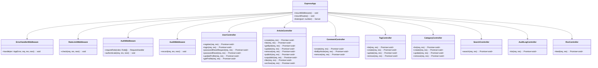

# 详细设计文档（Detailed Design）

> 阶段 4 产出。对应系统设计 `docs/system-design.md`（22 SD）+ 接口设计 `docs/interface-design.md`（22 INTF）。
> 建模方法：分层架构 + 类/方法级设计；技术栈遵循 CON-001（Express 4 + TypeScript 5 + 内存存储）。
> 本文含 75 个 DD 条目：22 SD 拆分为 70 个 DD + 5 个横切公共 DD（DD-COMMON-001 ~ DD-COMMON-005）。
> 每个 DD 含：DD-ID / 关联 SD-ID+INTF-ID / 模块名 / 类签名 / 数据结构 / 算法伪代码 / 状态转移 / 异常处理 / 关键不变式 / TLA+ 不变式引用。
> 设计目标：阶段 5 编码可实施；单元测试覆盖 NFR-004 ≥80% lines。

## §1 总览

### §1.1 模块分层约定

| 层 | 职责 | 命名约定 |
|---|---|---|
| Controller | HTTP 请求/响应适配；调用 Service；统一错误响应 | `*Controller` |
| Service | 业务逻辑；事务编排；调用 Store/Audit | `*Service` |
| Store | 内存持久化（Map） | `*Store` |
| Middleware | 限流 / 认证 / 审计 / 错误处理 | `*Middleware` |
| Util | 工具函数（zod schema / XML / 令牌桶） | `*Util` / `*Factory` |

### §1.2 DD 编号规则

`DD-<SD编号>-<序号>`（如 DD-005-001 = SD-005 文章创建的第 1 个 DD）；横切公共 DD 编号 `DD-COMMON-<序号>`。

### §1.3 关联 TLA+ L4 规格清单（5 个）

| L4 spec | 关联 DD | 关联不变式 |
|---|---|---|
| `L4_article_state_machine` | DD-017-002 / DD-017-003 | StateMachineLegality / NoInvalidTransition |
| `L4_auth_token_lifecycle` | DD-003-002 / DD-004-003 | TokenNotRevoked / TokenNotExpired |
| `L4_rate_limiter_token_bucket` | DD-COMMON-004 / DD-COMMON-005 | CapacityInvariant / NonNegativeTokens |
| `L4_audit_log_retention` | DD-019-002 / DD-019-003 / DD-019-004 | Retention90Days / NoLogLoss |
| `L4_password_reset_token_lifecycle` | DD-016-002 / DD-016-003 / DD-016-004 | OneTimeUse / TokenExpiry15min |

### §1.4 UML 类图（核心模块）


```mermaid
classDiagram
    class ExpressApp {
        +mountMiddleware(): void
        +mountRoutes(): void
        +listen(port: number): Server
    }
    class ErrorHandlerMiddleware {
        +handle(err: AppError, req, res, next): void
    }
    class RateLimitMiddleware {
        +check(req, res, next): void
    }
    class AuthMiddleware {
        +requireRole(roles: Role[]): RequestHandler
        +authenticate(req, res, next): void
    }
    class AuditMiddleware {
        +record(req, res, next): void
    }
    class UserController {
        +register(req, res): Promise~void~
        +login(req, res): Promise~void~
        +passwordResetRequest(req, res): Promise~void~
        +passwordReset(req, res): Promise~void~
        +updateProfile(req, res): Promise~void~
        +getProfile(req, res): Promise~void~
    }
    class ArticleController {
        +create(req, res): Promise~void~
        +list(req, res): Promise~void~
        +getById(req, res): Promise~void~
        +update(req, res): Promise~void~
        +remove(req, res): Promise~void~
        +publish(req, res): Promise~void~
        +unpublish(req, res): Promise~void~
        +like(req, res): Promise~void~
        +archive(req, res): Promise~void~
    }
    class CommentController {
        +create(req, res): Promise~void~
        +listByArticle(req, res): Promise~void~
        +remove(req, res): Promise~void~
    }
    class TagController {
        +list(req, res): Promise~void~
        +create(req, res): Promise~void~
        +update(req, res): Promise~void~
        +remove(req, res): Promise~void~
    }
    class CategoryController {
        +list(req, res): Promise~void~
        +create(req, res): Promise~void~
        +update(req, res): Promise~void~
        +remove(req, res): Promise~void~
    }
    class SearchController {
        +search(req, res): Promise~void~
    }
    class AuditLogController {
        +list(req, res): Promise~void~
    }
    class RssController {
        +feed(req, res): Promise~void~
    }
    ExpressApp --> ErrorHandlerMiddleware
    ExpressApp --> RateLimitMiddleware
    ExpressApp --> AuthMiddleware
    ExpressApp --> AuditMiddleware
    ExpressApp --> UserController
    ExpressApp --> ArticleController
    ExpressApp --> CommentController
    ExpressApp --> TagController
    ExpressApp --> CategoryController
    ExpressApp --> SearchController
    ExpressApp --> AuditLogController
    ExpressApp --> RssController
```

### §1.5 ER 图（内存存储表结构 + 索引）

```mermaid
erDiagram
    User ||--o| UserProfile : "1:1"
    User ||--o{ Article : "1:n (authorId)"
    User ||--o{ Comment : "1:n (userId)"
    User ||--o{ Like : "1:n (userId)"
    User ||--o{ AuditLog : "1:n (userId)"
    User ||--o{ PasswordResetToken : "1:n (userId)"
    Article ||--o{ Comment : "1:n (articleId)"
    Article ||--o{ Like : "1:n (articleId)"
    Article }o--|| Category : "n:1 (categoryId)"
    Article }o--o{ Tag : "m:n (tagIds[])"
    Category ||--o| Category : "self (parentCategoryId)"
    User {
        string id PK
        string email UK
        string passwordHash
        string role
        string createdAt
        string updatedAt
    }
    UserProfile {
        string userId PK_FK
        string nickname
        string avatar
        string bio
        string updatedAt
    }
    Article {
        string id PK
        string title
        string content
        string authorId FK
        string categoryId FK
        string status
        int likeCount
        string publishedAt
        string createdAt
        string updatedAt
    }
    Comment {
        string id PK
        string articleId FK
        string userId FK
        string content
        string createdAt
        string updatedAt
    }
    Tag {
        string id PK
        string name UK
        string createdAt
        string updatedAt
    }
    Category {
        string id PK
        string name
        string parentCategoryId FK
        string createdAt
        string updatedAt
    }
    Like {
        string userId PK_FK
        string articleId PK_FK
        string createdAt
    }
    AuditLog {
        string id PK
        string userId FK
        string action
        string resource
        string resourceId
        object meta
        string timestamp
    }
    PasswordResetToken {
        string token PK
        string userId FK
        string expiresAt
        boolean used
    }
```

> **索引设计**（内存 Map）：User.email 维护 `emailIndex: Map<string, string>`（O(1) 唯一性校验）；Article 维护 `authorIdIndex: Map<string, Set<string>>` 与 `statusIndex: Map<string, Set<string>>`；Comment 维护 `articleIdIndex: Map<string, Set<string>>`；Like 复合主键 `(userId, articleId)`；AuditLog 维护 `timestampIndex: Map<string, Set<string>>`（按月分桶）；Tag.name 维护 `nameIndex: Map<string, string>`。

## §2 SD-001 系统根（blog-system）— 3 DD

### DD-001-001 AppController（健康检查控制器）

- **关联 SD/INTF**：SD-001 / INTF-001
- **模块名**：controller/AppController
- **类签名**：
  ```typescript
  class AppController {
    /** 健康检查 GET /health */
    health(req: Request, res: Response): void;
  }
  ```
- **数据结构**：
  ```typescript
  interface HealthResponse { status: 'ok'; uptime: number; }
  ```
- **算法伪代码**：
  ```
  health(req, res):
    return res.json({ status: 'ok', uptime: process.uptime() })
  ```
- **异常处理**：无业务异常；Express 默认兜底
- **关键不变式**：响应永远 200 + `{status:'ok'}`；uptime ≥ 0
- **TLA+ 引用**：L1_blog_system TypeInvariant（state \in States）

### DD-001-002 ExpressApp（Express 应用装配）

- **关联 SD/INTF**：SD-001 / INTF-001
- **模块名**：app
- **类签名**：
  ```typescript
  function createApp(deps: AppDependencies): Express;
  interface AppDependencies {
    userController: UserController;
    articleController: ArticleController;
    commentController: CommentController;
    tagController: TagController;
    categoryController: CategoryController;
    searchController: SearchController;
    auditLogController: AuditLogController;
    rssController: RssController;
    rateLimitMiddleware: RateLimitMiddleware;
    authMiddleware: AuthMiddleware;
    auditMiddleware: AuditMiddleware;
    errorHandler: ErrorHandlerMiddleware;
  }
  ```
- **算法伪代码**：
  ```
  createApp(deps):
    app = express()
    app.use(express.json())
    app.use(cors({ origin: WHITELIST }))
    app.use(deps.rateLimitMiddleware.check)
    app.use(deps.auditMiddleware.record)
    app.get('/health', appController.health)
    app.use('/api/users', userRoutes(deps))
    app.use('/api/articles', articleRoutes(deps))
    app.use('/api/comments', commentRoutes(deps))
    app.use('/api/tags', tagRoutes(deps))
    app.use('/api/categories', categoryRoutes(deps))
    app.use('/api/search', searchRoutes(deps))
    app.use('/api/audit-logs', auditLogRoutes(deps))
    app.use('/api/rss', rssRoutes(deps))
    app.use(deps.errorHandler.handle)
    return app
  ```
- **异常处理**：中间件链异常由 ErrorHandler 兜底（NFR-003 100% 统一错误响应）
- **关键不变式**：所有 /api/* 路由必须挂载；ErrorHandler 必须最后挂载
- **TLA+ 引用**：L1_blog_system（系统对外代理）

### DD-001-003 Server（HTTP 监听）

- **关联 SD/INTF**：SD-001 / INTF-001
- **模块名**：server
- **类签名**：
  ```typescript
  function startServer(port: number): Promise<Server>;
  ```
- **算法伪代码**：
  ```
  startServer(port):
    app = createApp(loadDependencies())
    server = app.listen(port)
    await once(server, 'listening')
    return server
  ```
- **异常处理**：端口占用 → 抛 `EADDRINUSE`；启动超时（>5s）→ reject
- **关键不变式**：启动成功后 server.listening === true
- **TLA+ 引用**：无（运行时入口）

## §3 SD-002 用户注册模块 — 3 DD

### DD-002-001 UserController.register

- **关联 SD/INTF**：SD-002 / INTF-002
- **模块名**：controller/UserController
- **类签名**：
  ```typescript
  class UserController {
    constructor(private userService: UserService, private auditService: AuditService) {}
    async register(req: Request, res: Response, next: NextFunction): Promise<void>;
  }
  ```
- **数据结构**：
  ```typescript
  interface RegisterRequest { email: string; password: string; role: 'admin'|'author'|'reader'; }
  interface RegisterResponse { id: string; email: string; role: Role; createdAt: string; }
  ```
- **算法伪代码**：
  ```
  register(req, res, next):
    try:
      dto = RegisterSchema.parse(req.body)  // NFR-005 zod
      user = await userService.createUser(dto)
      await auditService.log({ userId: user.id, action: 'user.register', resource: 'user', resourceId: user.id })
      return res.status(201).json({ id, email, role, createdAt })
    catch e:
      return next(e)
  ```
- **异常处理**：400 参数错误；409 邮箱已存在；500 内部错误（兜底）
- **关键不变式**：注册成功后 user 必含 id；触发审计写入
- **TLA+ 引用**：L3_register_flow TypeInvariant

### DD-002-002 UserService.createUser

- **关联 SD/INTF**：SD-002 / INTF-002
- **模块名**：service/UserService
- **类签名**：
  ```typescript
  class UserService {
    constructor(private userStore: UserStore, private bcrypt: BcryptAdapter) {}
    async createUser(dto: RegisterRequest): Promise<User>;
    async findByEmail(email: string): Promise<User | null>;
    async findById(id: string): Promise<User | null>;
  }
  ```
- **数据结构**：
  ```typescript
  interface User { id: string; email: string; passwordHash: string; role: Role; createdAt: string; updatedAt: string; }
  type Role = 'admin' | 'author' | 'reader';
  ```
- **算法伪代码**：
  ```
  createUser(dto):
    if userStore.findByEmail(dto.email) != null:
      throw new ConflictError('EMAIL_EXISTS', 409)
    passwordHash = await bcrypt.hash(dto.password, 10)
    user = { id: uuid(), email, passwordHash, role, createdAt: now(), updatedAt: now() }
    userStore.insert(user)
    return user
  ```
- **异常处理**：ConflictError；bcrypt 失败 → 500
- **关键不变式**：邮箱唯一；passwordHash 长度 = 60（bcrypt 固定）；role ∈ {admin,author,reader}
- **TLA+ 引用**：L3_register_flow EmailUniqueness

### DD-002-003 UserStore

- **关联 SD/INTF**：SD-002 / INTF-002
- **模块名**：store/UserStore
- **类签名**：
  ```typescript
  class UserStore {
    private users: Map<string, User> = new Map();
    private emailIndex: Map<string, string> = new Map();
    insert(user: User): void;
    findById(id: string): User | null;
    findByEmail(email: string): User | null;
    update(id: string, patch: Partial<User>): User;
    size(): number;
  }
  ```
- **算法伪代码**：
  ```
  insert(user):
    if emailIndex.has(user.email): throw ConflictError
    users.set(user.id, user)
    emailIndex.set(user.email, user.id)
  findById(id): return users.get(id) ?? null
  findByEmail(email):
    id = emailIndex.get(email)
    return id ? users.get(id) : null
  ```
- **异常处理**：插入重复 email → ConflictError；更新不存在 → NotFoundError
- **关键不变式**：emailIndex 与 users 一致（插入/删除原子）；NFR-004 容量 ≤ 10000
- **TLA+ 引用**：L3_register_flow

## §4 SD-003 用户登录模块 — 3 DD

### DD-003-001 UserController.login

- **关联 SD/INTF**：SD-003 / INTF-003
- **模块名**：controller/UserController
- **类签名**：
  ```typescript
  class UserController {
    async login(req: Request, res: Response, next: NextFunction): Promise<void>;
  }
  ```
- **数据结构**：
  ```typescript
  interface LoginRequest { email: string; password: string; }
  interface LoginResponse { token: string; expiresIn: number; }
  ```
- **算法伪代码**：
  ```
  login(req, res, next):
    try:
      dto = LoginSchema.parse(req.body)
      result = await authService.login(dto)
      return res.json({ token: result.token, expiresIn: 3600 })
    catch e:
      return next(e)
  ```
- **异常处理**：401 凭据无效；429 限流（DD-003-003）；500 内部错误
- **关键不变式**：成功响应 token 非空；expiresIn === 3600（CON-002）
- **TLA+ 引用**：L3_login_flow

### DD-003-002 AuthService.login

- **关联 SD/INTF**：SD-003 / INTF-003
- **模块名**：service/AuthService
- **类签名**：
  ```typescript
  class AuthService {
    constructor(private userStore: UserStore, private bcrypt: BcryptAdapter, private jwt: JwtAdapter, private loginRateLimiter: LoginRateLimiter) {}
    async login(dto: LoginRequest): Promise<AuthToken>;
  }
  interface AuthToken { token: string; expiresIn: number; }
  ```
- **算法伪代码**：
  ```
  login(dto):
    if not loginRateLimiter.allow(dto.email):
      throw new TooManyRequestsError('LOGIN_RATE_LIMITED')
    user = userStore.findByEmail(dto.email)
    if user == null:
      loginRateLimiter.recordFailure(dto.email)
      throw new UnauthorizedError('INVALID_CREDENTIALS')
    if not await bcrypt.compare(dto.password, user.passwordHash):
      loginRateLimiter.recordFailure(dto.email)
      throw new UnauthorizedError('INVALID_CREDENTIALS')
    loginRateLimiter.reset(dto.email)
    token = jwt.sign({ sub: user.id, role: user.role }, { expiresIn: 3600 })
    return { token, expiresIn: 3600 }
  ```
- **异常处理**：UnauthorizedError；TooManyRequestsError；JWT 签发失败 → 500
- **关键不变式**：失败计数防爆破；成功后重置计数；token.expiresIn === 3600
- **TLA+ 引用**：L4_auth_token_lifecycle TokenNotExpired

### DD-003-003 LoginRateLimiter（登录失败计数器）

- **关联 SD/INTF**：SD-003 / INTF-003
- **模块名**：util/LoginRateLimiter
- **类签名**：
  ```typescript
  class LoginRateLimiter {
    private failures: Map<string, number> = new Map();
    private lastFailure: Map<string, number> = new Map();
    private readonly MAX_FAILURES = 5;
    private readonly WINDOW_MS = 60_000;
    allow(email: string): boolean;
    recordFailure(email: string): void;
    reset(email: string): void;
  }
  ```
- **算法伪代码**：
  ```
  allow(email):
    count = failures.get(email) ?? 0
    last = lastFailure.get(email) ?? 0
    if count >= MAX_FAILURES and (now() - last) < WINDOW_MS:
      return false
    if (now() - last) >= WINDOW_MS:
      failures.delete(email); lastFailure.delete(email)
    return true
  recordFailure(email):
    failures.set(email, (failures.get(email) ?? 0) + 1)
    lastFailure.set(email, now())
  reset(email):
    failures.delete(email); lastFailure.delete(email)
  ```
- **异常处理**：纯逻辑无异常
- **关键不变式**：MAX_FAILURES = 5；窗口 60s；超窗口自动重置
- **TLA+ 引用**：L3_login_flow RateLimitThreshold

## §5 SD-004 角色权限模块 — 3 DD

### DD-004-001 AuthMiddleware.requireRole

- **关联 SD/INTF**：SD-004 / INTF-004
- **模块名**：middleware/AuthMiddleware
- **类签名**：
  ```typescript
  class AuthMiddleware {
    constructor(private jwt: JwtAdapter) {}
    authenticate(req: Request, res: Response, next: NextFunction): void;
    requireRole(roles: Role[]): RequestHandler;
  }
  ```
- **算法伪代码**：
  ```
  authenticate(req, res, next):
    token = extractBearer(req.headers.authorization)
    if not token: throw UnauthorizedError('MISSING_TOKEN')
    payload = jwt.verify(token)
    req.user = { id: payload.sub, role: payload.role }
    next()
  requireRole(roles):
    return (req, res, next) => {
      if not req.user: throw UnauthorizedError()
      if not roles.includes(req.user.role): throw ForbiddenError('ROLE_FORBIDDEN')
      next()
    }
  ```
- **异常处理**：401 缺失/无效 token；403 角色不匹配
- **关键不变式**：默认拒绝；admin 全权限；requireRole 必须在 authenticate 之后
- **TLA+ 引用**：L2_rbac_subsystem

### DD-004-002 RbacService

- **关联 SD/INTF**：SD-004 / INTF-004
- **模块名**：service/RbacService
- **类签名**：
  ```typescript
  class RbacService {
    private static PERMISSIONS: Record<Role, Set<Action>> = {
      admin: new Set(['read','write','delete','admin']),
      author: new Set(['read','write','delete:own']),
      reader: new Set(['read']),
    };
    can(role: Role, action: Action): boolean;
    isOwner(userId: string, resourceOwnerId: string): boolean;
  }
  ```
- **算法伪代码**：
  ```
  can(role, action): return PERMISSIONS[role].has(action)
  isOwner(userId, resourceOwnerId): return userId === resourceOwnerId
  ```
- **异常处理**：未知 role → 默认拒绝
- **关键不变式**：默认拒绝；权限集合不可变（static final）
- **TLA+ 引用**：L2_rbac_subsystem

### DD-004-003 JwtUtil

- **关联 SD/INTF**：SD-004 / INTF-004
- **模块名**：util/JwtUtil
- **类签名**：
  ```typescript
  class JwtAdapter {
    constructor(private secret: string, private algorithm: 'HS256') {}
    sign(payload: JwtPayload, options: { expiresIn: number }): string;
    verify(token: string): JwtPayload;
  }
  interface JwtPayload { sub: string; role: Role; iat?: number; exp?: number; }
  ```
- **算法伪代码**：
  ```
  sign(payload, options):
    if secret.length * 8 < 256: throw Error('JWT_SECRET_TOO_SHORT')  // NFR-002
    return jwt.sign(payload, secret, { algorithm, expiresIn: options.expiresIn })
  verify(token):
    payload = jwt.verify(token, secret, { algorithms: [algorithm] })
    if payload.exp * 1000 < Date.now(): throw UnauthorizedError('TOKEN_EXPIRED')
    return payload
  ```
- **异常处理**：TokenExpiredError；JsonWebTokenError；secret 太短 → 启动失败
- **关键不变式**：NFR-002 密钥 ≥ 256 位；CON-002 expiresIn = 3600s；算法固定 HS256
- **TLA+ 引用**：L4_auth_token_lifecycle TokenNotExpired / TokenNotRevoked

## §6 SD-005 文章创建模块 — 4 DD

### DD-005-001 ArticleController.create

- **关联 SD/INTF**：SD-005 / INTF-005
- **模块名**：controller/ArticleController
- **类签名**：
  ```typescript
  class ArticleController {
    constructor(private articleService: ArticleService, private auditService: AuditService) {}
    async create(req: AuthenticatedRequest, res: Response, next: NextFunction): Promise<void>;
  }
  ```
- **数据结构**：
  ```typescript
  interface CreateArticleRequest { title: string; content: string; tagIds: string[]; categoryId: string; }
  interface ArticleResponse { id: string; title: string; content: string; tags: Tag[]; category: Category; authorId: string; status: 'draft'; likeCount: 0; createdAt: string; updatedAt: string; }
  ```
- **算法伪代码**：
  ```
  create(req, res, next):
    try:
      dto = CreateArticleSchema.parse(req.body)
      article = await articleService.create(dto, req.user.id)
      await auditService.log({ userId: req.user.id, action: 'article.create', resource: 'article', resourceId: article.id })
      return res.status(201).json(toArticleResponse(article))
    catch e: return next(e)
  ```
- **异常处理**：400 参数；401 未认证；403 非 author/admin；404 标签/分类不存在
- **关键不变式**：初始 status='draft'；likeCount=0；触发审计
- **TLA+ 引用**：L2_article_crud_subsystem

### DD-005-002 ArticleService.create

- **关联 SD/INTF**：SD-005 / INTF-005
- **模块名**：service/ArticleService
- **类签名**：
  ```typescript
  class ArticleService {
    constructor(private articleStore: ArticleStore, private tagStore: TagStore, private categoryStore: CategoryStore) {}
    async create(dto: CreateArticleRequest, authorId: string): Promise<Article>;
  }
  ```
- **数据结构**：
  ```typescript
  interface Article { id: string; title: string; content: string; tagIds: string[]; categoryId: string; authorId: string; status: 'draft'|'published'; likeCount: number; publishedAt: string|null; createdAt: string; updatedAt: string; }
  ```
- **算法伪代码**：
  ```
  create(dto, authorId):
    if not tagStore.allExist(dto.tagIds): throw NotFoundError('TAG_NOT_FOUND')
    if not categoryStore.exists(dto.categoryId): throw NotFoundError('CATEGORY_NOT_FOUND')
    article = { id: uuid(), ...dto, authorId, status: 'draft', likeCount: 0, publishedAt: null, createdAt: now(), updatedAt: now() }
    articleStore.insert(article)
    return article
  ```
- **异常处理**：NotFoundError；title/content 长度限制
- **关键不变式**：tagIds 全部存在；categoryId 存在；初始 status='draft'
- **TLA+ 引用**：L4_article_state_machine ValidInitialState

### DD-005-003 ArticleStore

- **关联 SD/INTF**：SD-005 / INTF-005
- **模块名**：store/ArticleStore
- **类签名**：
  ```typescript
  class ArticleStore {
    private articles: Map<string, Article> = new Map();
    private authorIdIndex: Map<string, Set<string>> = new Map();
    private statusIndex: Map<string, Set<string>> = new Map();
    insert(article: Article): void;
    findById(id: string): Article | null;
    update(id: string, patch: Partial<Article>): Article;
    delete(id: string): boolean;
    list(filter: ArticleFilter, page: Page, sort: SortSpec): PaginatedResult<Article>;
    listPublished(): Article[];
    countByMonth(): Array<{ year: number; month: number; count: number }>;
    size(): number;
  }
  ```
- **算法伪代码**：
  ```
  list(filter, page, sort):
    arr = [...articles.values()]
    if filter.authorId: arr = arr.filter(a => a.authorId === filter.authorId)
    if filter.status: arr = arr.filter(a => a.status === filter.status)
    arr.sort(byField(sort.field, sort.order))
    total = arr.length
    items = arr.slice((page.num-1)*page.size, page.num*page.size)
    return { items, total, page: page.num, limit: page.size }
  ```
- **异常处理**：更新不存在 → NotFoundError
- **关键不变式**：索引与主表一致；NFR-004 size ≤ 10000
- **TLA+ 引用**：L2_article_crud_subsystem

### DD-005-004 ArticleValidator

- **关联 SD/INTF**：SD-005 / INTF-005
- **模块名**：util/ArticleValidator
- **类签名**：
  ```typescript
  class ArticleValidator {
    static CreateArticleSchema: z.ZodType<CreateArticleRequest>;
    static UpdateArticleSchema: z.ZodType<Partial<CreateArticleRequest>>;
    static PublishSchema: z.ZodType<{ }>;
  }
  ```
- **算法伪代码**：
  ```
  CreateArticleSchema = z.object({
    title: z.string().min(1).max(200),
    content: z.string().min(1).max(50000),
    tagIds: z.array(z.string().uuid()).max(10),
    categoryId: z.string().uuid(),
  })
  ```
- **异常处理**：zod 校验失败 → 400 ValidationError
- **关键不变式**：NFR-005 100% 接口使用 zod schema；title/content 非空
- **TLA+ 引用**：无（校验层）

## §7 SD-006 文章列表查询模块 — 3 DD

### DD-006-001 ArticleController.list

- **关联 SD/INTF**：SD-006 / INTF-006
- **模块名**：controller/ArticleController
- **类签名**：`async list(req: Request, res: Response, next: NextFunction): Promise<void>;`
- **算法伪代码**：
  ```
  list(req, res, next):
    try:
      query = ListArticleSchema.parse(req.query)
      result = articleService.list(query)
      return res.json({ items: result.items.map(toArticleResponse), total, page, limit })
    catch e: return next(e)
  ```
- **异常处理**：400 参数；500 兜底
- **关键不变式**：默认只返回 published（reader 可见）；分页 page ≥ 1
- **TLA+ 引用**：无

### DD-006-002 ArticleService.list

- **关联 SD/INTF**：SD-006 / INTF-006
- **模块名**：service/ArticleService
- **类签名**：`list(query: ListArticleQuery): PaginatedResult<Article>;`
- **算法伪代码**：
  ```
  list(query):
    filter = { status: 'published' }  // 默认仅 published
    if query.authorId: filter.authorId = query.authorId
    return articleStore.list(filter, { num: query.page, size: query.limit }, { field: query.sort, order: query.order })
  ```
- **异常处理**：无业务异常
- **关键不变式**：仅返回 published；分页避免全量
- **TLA+ 引用**：无

### DD-006-003 PaginationUtil

- **关联 SD/INTF**：SD-006 / INTF-006（横切）
- **模块名**：util/PaginationUtil
- **类签名**：
  ```typescript
  class PaginationUtil {
    static parse(query: unknown, defaults: { page: number; limit: number }): Page;
    static slice<T>(arr: T[], page: Page): PaginatedResult<T>;
  }
  ```
- **算法伪代码**：
  ```
  parse(query, defaults):
    page = max(1, Number(query.page) ?? defaults.page)
    limit = min(100, max(1, Number(query.limit) ?? defaults.limit))
    return { num: page, size: limit }
  ```
- **异常处理**：非数字 → 用默认值
- **关键不变式**：page ≥ 1；1 ≤ limit ≤ 100
- **TLA+ 引用**：无

## §8 SD-007 文章详情查询模块 — 3 DD

### DD-007-001 ArticleController.getById

- **关联 SD/INTF**：SD-007 / INTF-007
- **类签名**：`async getById(req: AuthenticatedRequest, res: Response, next: NextFunction): Promise<void>;`
- **算法伪代码**：
  ```
  getById(req, res, next):
    article = articleService.getById(req.params.id, req.user)
    return res.json(toArticleResponse(article))
  ```
- **异常处理**：404 不存在；403 草稿非作者/admin 访问
- **关键不变式**：草稿仅作者/admin 可见

### DD-007-002 ArticleService.getById

- **关联 SD/INTF**：SD-007 / INTF-007
- **类签名**：`getById(id: string, requester: AuthUser): Article;`
- **算法伪代码**：
  ```
  getById(id, requester):
    article = articleStore.findById(id)
    if not article: throw NotFoundError('ARTICLE_NOT_FOUND')
    visibilityChecker.check(article, requester)
    return article
  ```
- **异常处理**：NotFoundError；ForbiddenError
- **关键不变式**：草稿可见性校验

### DD-007-003 ArticleVisibilityChecker

- **关联 SD/INTF**：SD-007 / INTF-007
- **模块名**：util/ArticleVisibilityChecker
- **类签名**：
  ```typescript
  class ArticleVisibilityChecker {
    check(article: Article, requester: AuthUser): void;
  }
  ```
- **算法伪代码**：
  ```
  check(article, requester):
    if article.status === 'draft':
      if requester.role !== 'admin' and requester.id !== article.authorId:
        throw ForbiddenError('DRAFT_ACCESS_DENIED')
  ```
- **异常处理**：ForbiddenError
- **关键不变式**：草稿仅作者/admin 可见
- **TLA+ 引用**：L4_article_state_machine

## §9 SD-008 文章更新模块 — 3 DD

### DD-008-001 ArticleController.update

- **关联 SD/INTF**：SD-008 / INTF-008
- **类签名**：`async update(req: AuthenticatedRequest, res: Response, next: NextFunction): Promise<void>;`
- **算法伪代码**：
  ```
  update(req, res, next):
    dto = UpdateArticleSchema.parse(req.body)
    article = articleService.update(req.params.id, dto, req.user)
    await auditService.log({ userId: req.user.id, action: 'article.update', resource: 'article', resourceId: req.params.id })
    return res.json(toArticleResponse(article))
  ```
- **异常处理**：400/401/403/404
- **关键不变式**：触发审计；权限校验

### DD-008-002 ArticleService.update

- **关联 SD/INTF**：SD-008 / INTF-008
- **类签名**：`update(id: string, patch: UpdateArticleDto, requester: AuthUser): Article;`
- **算法伪代码**：
  ```
  update(id, patch, requester):
    article = articleStore.findById(id)
    if not article: throw NotFoundError
    ownershipChecker.check(article, requester)
    if patch.tagIds and not tagStore.allExist(patch.tagIds): throw NotFoundError('TAG_NOT_FOUND')
    if patch.categoryId and not categoryStore.exists(patch.categoryId): throw NotFoundError
    merged = { ...article, ...patch, updatedAt: now() }
    articleStore.update(id, merged)
    return merged
  ```
- **异常处理**：NotFoundError；ForbiddenError
- **关键不变式**：updatedAt 必刷新；浅合并

### DD-008-003 OwnershipChecker

- **关联 SD/INTF**：SD-008 / INTF-008（横切）
- **模块名**：util/OwnershipChecker
- **类签名**：
  ```typescript
  class OwnershipChecker {
    check(resource: { authorId: string }, requester: AuthUser): void;
  }
  ```
- **算法伪代码**：
  ```
  check(resource, requester):
    if requester.role === 'admin': return
    if resource.authorId !== requester.id: throw ForbiddenError('NOT_OWNER')
  ```
- **异常处理**：ForbiddenError
- **关键不变式**：admin 全权；非 admin 仅本人

## §10 SD-009 文章删除模块 — 3 DD

### DD-009-001 ArticleController.remove

- **关联 SD/INTF**：SD-009 / INTF-009
- **类签名**：`async remove(req: AuthenticatedRequest, res: Response, next: NextFunction): Promise<void>;`
- **算法伪代码**：
  ```
  remove(req, res, next):
    articleService.remove(req.params.id, req.user)
    await auditService.log({ userId: req.user.id, action: 'article.delete', resource: 'article', resourceId: req.params.id })
    return res.status(204).end()
  ```
- **异常处理**：401/403/404
- **关键不变式**：触发审计；级联删评论

### DD-009-002 ArticleService.remove

- **关联 SD/INTF**：SD-009 / INTF-009
- **类签名**：`remove(id: string, requester: AuthUser): void;`
- **算法伪代码**：
  ```
  remove(id, requester):
    article = articleStore.findById(id)
    if not article: throw NotFoundError
    ownershipChecker.check(article, requester)
    commentCascadeDeleter.deleteByArticle(id)
    articleStore.delete(id)
  ```
- **异常处理**：NotFoundError；ForbiddenError
- **关键不变式**：原子级联（评论 + 文章）

### DD-009-003 CommentCascadeDeleter

- **关联 SD/INTF**：SD-009 / INTF-009
- **模块名**：util/CommentCascadeDeleter
- **类签名**：
  ```typescript
  class CommentCascadeDeleter {
    constructor(private commentStore: CommentStore) {}
    deleteByArticle(articleId: string): number;
  }
  ```
- **算法伪代码**：
  ```
  deleteByArticle(articleId):
    return commentStore.deleteByArticleId(articleId)
  ```
- **异常处理**：无
- **关键不变式**：返回删除条数 ≥ 0

## §11 SD-010 评论创建模块 — 3 DD

### DD-010-001 CommentController.create

- **关联 SD/INTF**：SD-010 / INTF-010
- **类签名**：`async create(req: AuthenticatedRequest, res: Response, next: NextFunction): Promise<void>;`
- **算法伪代码**：
  ```
  create(req, res, next):
    dto = CreateCommentSchema.parse({ ...req.body, articleId: req.params.id })
    comment = commentService.create(dto, req.user.id)
    return res.status(201).json(toCommentResponse(comment))
  ```
- **异常处理**：400/401/404

### DD-010-002 CommentService.create

- **关联 SD/INTF**：SD-010 / INTF-010
- **类签名**：`create(dto: CreateCommentDto, userId: string): Comment;`
- **算法伪代码**：
  ```
  create(dto, userId):
    if not articleStore.exists(dto.articleId): throw NotFoundError('ARTICLE_NOT_FOUND')
    comment = { id: uuid(), articleId, userId, content: dto.content, createdAt: now(), updatedAt: now() }
    commentStore.insert(comment)
    return comment
  ```
- **关键不变式**：文章存在性校验

### DD-010-003 CommentStore

- **关联 SD/INTF**：SD-010 / INTF-010
- **类签名**：
  ```typescript
  class CommentStore {
    private comments: Map<string, Comment> = new Map();
    private articleIdIndex: Map<string, Set<string>> = new Map();
    insert(c: Comment): void;
    findById(id: string): Comment | null;
    listByArticle(articleId: string, page: Page): PaginatedResult<Comment>;
    delete(id: string): boolean;
    deleteByArticleId(articleId: string): number;
    size(): number;
  }
  ```
- **关键不变式**：articleIdIndex 一致；NFR-004 ≤ 10000

## §12 SD-011 评论列表查询模块 — 3 DD

### DD-011-001 CommentController.listByArticle

- **关联 SD/INTF**：SD-011 / INTF-011
- **类签名**：`async listByArticle(req: Request, res: Response, next: NextFunction): Promise<void>;`
- **算法伪代码**：
  ```
  listByArticle(req, res, next):
    page = PaginationUtil.parse(req.query, { page: 1, limit: 20 })
    result = commentService.listByArticle(req.params.id, page)
    return res.json({ items: result.items.map(toCommentResponse), total, page, limit })
  ```
- **关键不变式**：分页 page ≥ 1

### DD-011-002 CommentService.listByArticle

- **关联 SD/INTF**：SD-011 / INTF-011
- **类签名**：`listByArticle(articleId: string, page: Page): PaginatedResult<Comment>;`
- **算法伪代码**：
  ```
  listByArticle(articleId, page):
    return commentStore.listByArticle(articleId, page)
  ```

### DD-011-003 CommentValidator

- **关联 SD/INTF**：SD-011 / INTF-011
- **类签名**：
  ```typescript
  class CommentValidator {
    static CreateCommentSchema: z.ZodType<CreateCommentDto>;
  }
  ```
- **算法伪代码**：`z.object({ articleId: z.string().uuid(), content: z.string().min(1).max(2000) })`
- **关键不变式**：NFR-005 zod 校验；content 1..2000 字符

## §13 SD-012 评论删除模块 — 3 DD

### DD-012-001 CommentController.remove

- **关联 SD/INTF**：SD-012 / INTF-012
- **类签名**：`async remove(req: AuthenticatedRequest, res: Response, next: NextFunction): Promise<void>;`
- **算法伪代码**：
  ```
  remove(req, res, next):
    commentService.remove(req.params.id, req.user)
    await auditService.log({ userId: req.user.id, action: 'comment.delete', resource: 'comment', resourceId: req.params.id })
    return res.status(204).end()
  ```

### DD-012-002 CommentService.remove

- **关联 SD/INTF**：SD-012 / INTF-012
- **类签名**：`remove(id: string, requester: AuthUser): void;`
- **算法伪代码**：
  ```
  remove(id, requester):
    comment = commentStore.findById(id)
    if not comment: throw NotFoundError
    if requester.role !== 'admin' and comment.userId !== requester.id: throw ForbiddenError
    commentStore.delete(id)
  ```

### DD-012-003 CommentOwnershipChecker

- **关联 SD/INTF**：SD-012 / INTF-012
- **类签名**：
  ```typescript
  class CommentOwnershipChecker {
    check(comment: Comment, requester: AuthUser): void;
  }
  ```
- **算法伪代码**：
  ```
  check(comment, requester):
    if requester.role === 'admin': return
    if comment.userId !== requester.id: throw ForbiddenError('NOT_COMMENT_OWNER')
  ```

## §14 SD-013 标签管理模块 — 3 DD

### DD-013-001 TagController

- **关联 SD/INTF**：SD-013 / INTF-013
- **类签名**：
  ```typescript
  class TagController {
    constructor(private tagService: TagService) {}
    list(req: Request, res: Response): void;
    create(req: AuthenticatedRequest, res: Response, next: NextFunction): Promise<void>;
    update(req: AuthenticatedRequest, res: Response, next: NextFunction): Promise<void>;
    remove(req: AuthenticatedRequest, res: Response, next: NextFunction): Promise<void>;
  }
  ```
- **算法伪代码**：
  ```
  create(req, res, next):
    dto = TagSchema.parse(req.body)
    tag = tagService.create(dto)
    await auditService.log({ userId: req.user.id, action: 'tag.create', resource: 'tag', resourceId: tag.id })
    return res.status(201).json(tag)
  ```
- **关键不变式**：写操作 requireRole(['admin'])

### DD-013-002 TagService

- **关联 SD/INTF**：SD-013 / INTF-013
- **类签名**：
  ```typescript
  class TagService {
    constructor(private tagStore: TagStore) {}
    list(): Tag[];
    create(dto: { name: string }): Tag;
    update(id: string, patch: { name?: string }): Tag;
    remove(id: string): void;
  }
  ```
- **算法伪代码**：
  ```
  create(dto):
    if tagStore.findByName(dto.name): throw ConflictError('TAG_NAME_EXISTS')
    tag = { id: uuid(), name: dto.name, createdAt: now(), updatedAt: now() }
    tagStore.insert(tag)
    return tag
  ```

### DD-013-003 TagStore

- **关联 SD/INTF**：SD-013 / INTF-013
- **类签名**：
  ```typescript
  class TagStore {
    private tags: Map<string, Tag> = new Map();
    private nameIndex: Map<string, string> = new Map();
    insert(t: Tag): void;
    findById(id: string): Tag | null;
    findByName(name: string): Tag | null;
    allExist(ids: string[]): boolean;
    list(): Tag[];
    update(id: string, patch: Partial<Tag>): Tag;
    delete(id: string): boolean;
  }
  ```
- **关键不变式**：name 唯一；NFR-004 ≤ 10000

## §15 SD-014 分类管理模块 — 3 DD

### DD-014-001 CategoryController

- **关联 SD/INTF**：SD-014 / INTF-014
- **类签名**：
  ```typescript
  class CategoryController {
    constructor(private categoryService: CategoryService) {}
    list(req: Request, res: Response): void;
    create(req: AuthenticatedRequest, res: Response, next: NextFunction): Promise<void>;
    update(req: AuthenticatedRequest, res: Response, next: NextFunction): Promise<void>;
    remove(req: AuthenticatedRequest, res: Response, next: NextFunction): Promise<void>;
  }
  ```

### DD-014-002 CategoryService

- **关联 SD/INTF**：SD-014 / INTF-014
- **类签名**：
  ```typescript
  class CategoryService {
    constructor(private categoryStore: CategoryStore, private cycleChecker: CategoryCycleChecker) {}
    list(): Category[];
    create(dto: { name: string; parentCategoryId: string | null }): Category;
    update(id: string, patch: { name?: string; parentCategoryId?: string | null }): Category;
    remove(id: string): void;
  }
  ```
- **算法伪代码**：
  ```
  create(dto):
    if dto.parentCategoryId and not categoryStore.exists(dto.parentCategoryId): throw NotFoundError
    category = { id: uuid(), name: dto.name, parentCategoryId: dto.parentCategoryId, createdAt: now(), updatedAt: now() }
    categoryStore.insert(category)
    return category
  update(id, patch):
    if patch.parentCategoryId:
      cycleChecker.checkNoCycle(id, patch.parentCategoryId)  // 防自环
    merged = { ...category, ...patch, updatedAt: now() }
    categoryStore.update(id, merged)
  ```

### DD-014-003 CategoryCycleChecker

- **关联 SD/INTF**：SD-014 / INTF-014
- **模块名**：util/CategoryCycleChecker
- **类签名**：
  ```typescript
  class CategoryCycleChecker {
    constructor(private categoryStore: CategoryStore) {}
    checkNoCycle(categoryId: string, newParentId: string | null): void;
  }
  ```
- **算法伪代码**：
  ```
  checkNoCycle(categoryId, newParentId):
    if newParentId == null: return
    if newParentId === categoryId: throw ConflictError('SELF_PARENT')
    visited = new Set([categoryId])
    cursor = newParentId
    while cursor != null:
      if visited.has(cursor): throw ConflictError('CYCLE_DETECTED')
      visited.add(cursor)
      parent = categoryStore.findById(cursor)
      cursor = parent?.parentCategoryId ?? null
  ```
- **关键不变式**：无环；无自环
- **TLA+ 引用**：L3_category_cycle_check CategoryTreeNoCycle

## §16 SD-015 文章搜索模块 — 3 DD

### DD-015-001 SearchController.search

- **关联 SD/INTF**：SD-015 / INTF-015
- **类签名**：`async search(req: Request, res: Response, next: NextFunction): Promise<void>;`
- **算法伪代码**：
  ```
  search(req, res, next):
    query = SearchQueryParser.parse(req.query)
    result = searchService.search(query)
    return res.json({ items: result.items.map(toArticleResponse), total, page, limit })
  ```

### DD-015-002 SearchService

- **关联 SD/INTF**：SD-015 / INTF-015
- **类签名**：`search(query: SearchQuery): PaginatedResult<Article>;`
- **算法伪代码**：
  ```
  search(query):
    arr = articleStore.listPublished()
    if query.q:
      arr = arr.filter(a => a.title.includes(query.q) || a.content.includes(query.q))
    if query.tagId: arr = arr.filter(a => a.tagIds.includes(query.tagId))
    if query.categoryId: arr = arr.filter(a => a.categoryId === query.categoryId)
    return PaginationUtil.slice(arr, query.page)
  ```
- **关键不变式**：仅搜索 published；O(n) n≤10000

### DD-015-003 SearchQueryParser

- **关联 SD/INTF**：SD-015 / INTF-015
- **类签名**：
  ```typescript
  class SearchQueryParser {
    static parse(query: unknown): SearchQuery;
  }
  ```
- **算法伪代码**：zod 解析 `{ q: string optional, tagId: uuid optional, categoryId: uuid optional, page, limit }`
- **关键不变式**：NFR-005 zod 校验

## §17 SD-016 密码重置模块 — 4 DD

### DD-016-001 PasswordResetController

- **关联 SD/INTF**：SD-016 / INTF-016
- **类签名**：
  ```typescript
  class PasswordResetController {
    constructor(private passwordResetService: PasswordResetService) {}
    async resetRequest(req: Request, res: Response, next: NextFunction): Promise<void>;
    async reset(req: Request, res: Response, next: NextFunction): Promise<void>;
  }
  ```
- **算法伪代码**：
  ```
  resetRequest(req, res, next):
    dto = ResetRequestSchema.parse(req.body)
    await passwordResetService.requestReset(dto.email)
    return res.json({ tokenSent: true })  // 防枚举：无论邮箱是否存在都返回 true
  reset(req, res, next):
    dto = ResetSchema.parse(req.body)
    await passwordResetService.reset(dto.token, dto.newPassword)
    return res.json({ reset: true })
  ```
- **异常处理**：400 参数；404 用户不存在（reset 端）；410 令牌过期/已用
- **关键不变式**：防邮箱枚举；令牌一次性

### DD-016-002 PasswordResetService

- **关联 SD/INTF**：SD-016 / INTF-016
- **类签名**：
  ```typescript
  class PasswordResetService {
    constructor(private userStore: UserStore, private tokenStore: PasswordResetStore, private tokenUtil: PasswordResetTokenUtil, private bcrypt: BcryptAdapter) {}
    async requestReset(email: string): Promise<void>;
    async reset(token: string, newPassword: string): Promise<void>;
  }
  ```
- **算法伪代码**：
  ```
  requestReset(email):
    user = userStore.findByEmail(email)
    if not user: return  // 静默，防枚举
    token = tokenUtil.issue({ userId: user.id, expiresIn: 900 })  // 15min
    tokenStore.insert({ token, userId: user.id, expiresAt: token.exp, used: false })
    // 实际项目此处发邮件，本项目仅记录
  reset(token, newPassword):
    record = tokenStore.find(token)
    if not record: throw NotFoundError('TOKEN_NOT_FOUND')
    if record.used: throw ConflictError('TOKEN_ALREADY_USED')
    if record.expiresAt < now(): throw GoneError('TOKEN_EXPIRED')
    passwordHash = await bcrypt.hash(newPassword, 10)
    userStore.update(record.userId, { passwordHash, updatedAt: now() })
    tokenStore.markUsed(token)
  ```
- **关键不变式**：令牌一次性；15min 过期；新密码 bcrypt 哈希
- **TLA+ 引用**：L4_password_reset_token_lifecycle OneTimeUse / TokenExpiry15min

### DD-016-003 PasswordResetStore

- **关联 SD/INTF**：SD-016 / INTF-016
- **类签名**：
  ```typescript
  class PasswordResetStore {
    private tokens: Map<string, PasswordResetToken> = new Map();
    private userIndex: Map<string, Set<string>> = new Map();
    insert(t: PasswordResetToken): void;
    find(token: string): PasswordResetToken | null;
    markUsed(token: string): void;
    deleteExpired(): number;
  }
  ```
- **关键不变式**：used 标记后不可再用；userIndex 一致

### DD-016-004 PasswordResetTokenUtil

- **关联 SD/INTF**：SD-016 / INTF-016
- **模块名**：util/PasswordResetTokenUtil
- **类签名**：
  ```typescript
  class PasswordResetTokenUtil {
    constructor(private jwt: JwtAdapter) {}
    issue(payload: { userId: string; expiresIn: number }): { token: string; exp: string };
    verify(token: string): { userId: string };
  }
  ```
- **算法伪代码**：
  ```
  issue(payload):
    token = jwt.sign({ sub: payload.userId, type: 'password-reset' }, { expiresIn: payload.expiresIn })
    payload = jwt.verify(token)
    return { token, exp: new Date(payload.exp * 1000).toISOString() }
  ```
- **关键不变式**：type='password-reset' 区分 access token；expiresIn ≤ 900s
- **TLA+ 引用**：L4_password_reset_token_lifecycle

## §18 SD-017 草稿/发布工作流模块 — 4 DD

### DD-017-001 ArticleWorkflowController

- **关联 SD/INTF**：SD-017 / INTF-017
- **模块名**：controller/ArticleController
- **类签名**：
  ```typescript
  class ArticleController {
    async publish(req: AuthenticatedRequest, res: Response, next: NextFunction): Promise<void>;
    async unpublish(req: AuthenticatedRequest, res: Response, next: NextFunction): Promise<void>;
  }
  ```
- **算法伪代码**：
  ```
  publish(req, res, next):
    result = articleWorkflowService.publish(req.params.id, req.user)
    await auditService.log({ userId: req.user.id, action: 'article.publish', resource: 'article', resourceId: req.params.id })
    return res.json({ status: 'published', publishedAt: result.publishedAt })
  unpublish(req, res, next):
    articleWorkflowService.unpublish(req.params.id, req.user)
    await auditService.log({ userId: req.user.id, action: 'article.unpublish', resource: 'article', resourceId: req.params.id })
    return res.json({ status: 'draft' })
  ```
- **异常处理**：400 非法状态转移；401/403/404
- **关键不变式**：触发审计

### DD-017-002 ArticleWorkflowService

- **关联 SD/INTF**：SD-017 / INTF-017
- **模块名**：service/ArticleWorkflowService
- **类签名**：
  ```typescript
  class ArticleWorkflowService {
    constructor(private articleStore: ArticleStore, private stateMachine: ArticleStateMachine, private ownershipChecker: OwnershipChecker) {}
    publish(id: string, requester: AuthUser): { publishedAt: string };
    unpublish(id: string, requester: AuthUser): void;
  }
  ```
- **算法伪代码**：
  ```
  publish(id, requester):
    article = articleStore.findById(id)
    if not article: throw NotFoundError
    ownershipChecker.check(article, requester)
    stateMachine.transition(article, 'publish')
    publishedAt = now()
    articleStore.update(id, { status: 'published', publishedAt, updatedAt: publishedAt })
    return { publishedAt }
  unpublish(id, requester):
    article = articleStore.findById(id)
    if not article: throw NotFoundError
    ownershipChecker.check(article, requester)
    stateMachine.transition(article, 'unpublish')
    articleStore.update(id, { status: 'draft', publishedAt: null, updatedAt: now() })
  ```
- **关键不变式**：状态机合法转移；publishedAt 仅在 published 时设置
- **TLA+ 引用**：L4_article_state_machine StateMachineLegality / NoInvalidTransition

### DD-017-003 ArticleStateMachine

- **关联 SD/INTF**：SD-017 / INTF-017
- **模块名**：util/ArticleStateMachine
- **类签名**：
  ```typescript
  type ArticleState = 'draft' | 'published';
  type ArticleEvent = 'publish' | 'unpublish';
  class ArticleStateMachine {
    private static TRANSITIONS: Record<ArticleState, Partial<Record<ArticleEvent, ArticleState>>> = {
      draft: { publish: 'published' },
      published: { unpublish: 'draft' },
    };
    transition(article: Article, event: ArticleEvent): ArticleState;
    canTransition(from: ArticleState, event: ArticleEvent): boolean;
  }
  ```
- **算法伪代码**：
  ```
  transition(article, event):
    next = TRANSITIONS[article.status]?.[event]
    if not next: throw BadRequestError('INVALID_TRANSITION')
    return next
  ```
- **关键不变式**：draft↔published 双向；非法转移拒绝
- **TLA+ 引用**：L4_article_state_machine（draft→publishing→published→unpublishing→draft 完整状态机）

### DD-017-004 AuditContextUtil（工作流审计上下文）

- **关联 SD/INTF**：SD-017 / INTF-017（横切）
- **模块名**：util/AuditContextUtil
- **类签名**：
  ```typescript
  class AuditContextUtil {
    static buildArticleContext(article: Article, event: ArticleEvent): AuditLogMeta;
  }
  ```
- **算法伪代码**：返回 `{ before: { status: article.status }, after: { status: nextStatus }, publishedAt }`
- **关键不变式**：审计 meta 含 before/after 状态

## §19 SD-018 文章点赞模块 — 3 DD

### DD-018-001 LikeController

- **关联 SD/INTF**：SD-018 / INTF-018
- **类签名**：`async like(req: AuthenticatedRequest, res: Response, next: NextFunction): Promise<void>;`
- **算法伪代码**：
  ```
  like(req, res, next):
    result = likeService.like(req.params.id, req.user.id)
    return res.json({ likeCount: result.likeCount, liked: result.liked })
  ```

### DD-018-002 LikeService

- **关联 SD/INTF**：SD-018 / INTF-018
- **类签名**：
  ```typescript
  class LikeService {
    constructor(private likeStore: LikeStore, private articleStore: ArticleStore) {}
    like(articleId: string, userId: string): { likeCount: number; liked: boolean };
  }
  ```
- **算法伪代码**：
  ```
  like(articleId, userId):
    if not articleStore.exists(articleId): throw NotFoundError
    existing = likeStore.find(userId, articleId)
    if existing:
      return { likeCount: articleStore.findById(articleId).likeCount, liked: false }  // 幂等
    likeStore.insert({ userId, articleId, createdAt: now() })
    article = articleStore.findById(articleId)
    newCount = article.likeCount + 1
    articleStore.update(articleId, { likeCount: newCount })
    return { likeCount: newCount, liked: true }
  ```
- **关键不变式**：幂等；复合主键去重；likeCount 与 likeStore 一致

### DD-018-003 LikeStore

- **关联 SD/INTF**：SD-018 / INTF-018
- **类签名**：
  ```typescript
  class LikeStore {
    private likes: Map<string, Like> = new Map();  // key: `${userId}:${articleId}`
    private userIndex: Map<string, Set<string>> = new Map();
    private articleIndex: Map<string, Set<string>> = new Map();
    insert(l: Like): void;
    find(userId: string, articleId: string): Like | null;
    delete(userId: string, articleId: string): boolean;
    countByArticle(articleId: string): number;
  }
  ```
- **关键不变式**：复合主键唯一；索引一致

## §20 SD-019 审计日志模块 — 4 DD（关键新增）

### DD-019-001 AuditLogController

- **关联 SD/INTF**：SD-019 / INTF-019
- **模块名**：controller/AuditLogController
- **类签名**：
  ```typescript
  class AuditLogController {
    constructor(private auditService: AuditService) {}
    async list(req: AuthenticatedRequest, res: Response, next: NextFunction): Promise<void>;
  }
  ```
- **算法伪代码**：
  ```
  list(req, res, next):
    requireRole(['admin'])(req, res, () => {})
    query = AuditLogQuerySchema.parse(req.query)
    result = auditService.query(query)
    return res.json({ items: result.items.map(toAuditLogResponse), total, page, limit })
  ```
- **异常处理**：401/403 非 admin；400 参数
- **关键不变式**：仅 admin 可查询；分页

### DD-019-002 AuditService

- **关联 SD/INTF**：SD-019 / INTF-019
- **模块名**：service/AuditService
- **类签名**：
  ```typescript
  class AuditService {
    constructor(private auditLogStore: AuditLogStore, private logger: Logger) {}
    async log(entry: AuditLogEntry): Promise<void>;
    query(query: AuditLogQuery): PaginatedResult<AuditLog>;
  }
  interface AuditLogEntry { userId: string; action: string; resource: string; resourceId: string; meta?: object; }
  ```
- **算法伪代码**：
  ```
  log(entry):
    try:
      record = { id: uuid(), ...entry, timestamp: now() }
      auditLogStore.insert(record)  // 写入 EXT-OUT-002 信息汇
    catch e:
      logger.error('audit_log_failure', { entry, error: e.message })  // best-effort 不阻断主流程
  query(query):
    return auditLogStore.query(query)
  ```
- **关键不变式**：best-effort 写入（失败不阻断）；EXT-OUT-002 信息汇
- **TLA+ 引用**：L3_audit_log_flow BestEffortNoBlock / L4_audit_log_retention Retention90Days

### DD-019-003 AuditLogStore

- **关联 SD/INTF**：SD-019 / INTF-019
- **模块名**：store/AuditLogStore
- **类签名**：
  ```typescript
  class AuditLogStore {
    private logs: Map<string, AuditLog> = new Map();
    private timestampIndex: Map<string, Set<string>> = new Map();  // key: YYYY-MM 分桶
    private actionIndex: Map<string, Set<string>> = new Map();
    private userIndex: Map<string, Set<string>> = new Map();
    private readonly RETENTION_DAYS = 90;
    insert(log: AuditLog): void;
    query(query: AuditLogQuery): PaginatedResult<AuditLog>;
    cleanupExpired(now: Date): number;
    size(): number;
  }
  ```
- **算法伪代码**：
  ```
  insert(log):
    logs.set(log.id, log)
    month = log.timestamp.slice(0, 7)  // YYYY-MM
    timestampIndex.get(month)?.add(log.id)
    actionIndex.get(log.action)?.add(log.id)
    userIndex.get(log.userId)?.add(log.id)
  cleanupExpired(now):
    cutoff = now - 90 days
    expired = [...logs.values()].filter(l => l.timestamp < cutoff)
    expired.forEach(l => logs.delete(l.id) + 索引清理)
    return expired.length
  ```
- **关键不变式**：RETENTION_DAYS = 90；索引一致；NFR-004 容量
- **TLA+ 引用**：L4_audit_log_retention Retention90Days / NoLogLoss

### DD-019-004 AuditMiddleware

- **关联 SD/INTF**：SD-019 / INTF-019（横切）
- **模块名**：middleware/AuditMiddleware
- **类签名**：
  ```typescript
  class AuditMiddleware {
    constructor(private auditService: AuditService) {}
    record(req: Request, res: Response, next: NextFunction): void;
  }
  ```
- **算法伪代码**：
  ```
  record(req, res, next):
    next()  // 先放行
    if req.user and req.method in ['POST','PUT','DELETE','PATCH']:
      auditService.log({
        userId: req.user.id,
        action: `${req.method.toLowerCase()}.${req.path}`,
        resource: req.path.split('/')[2],
        resourceId: req.params.id ?? '',
        meta: { statusCode: res.statusCode, ip: req.ip }
      }).catch(e => logger.error('audit_middleware_failure', { error: e.message }))  // best-effort
  ```
- **关键不变式**：先放行后记录；best-effort；仅写操作触发
- **TLA+ 引用**：L3_audit_log_flow

## §21 SD-020 RSS 订阅模块 — 3 DD

### DD-020-001 RssController.feed

- **关联 SD/INTF**：SD-020 / INTF-020
- **类签名**：`async feed(req: Request, res: Response, next: NextFunction): Promise<void>;`
- **算法伪代码**：
  ```
  feed(req, res, next):
    xml = rssService.generateFeed()
    etag = hash(xml)
    if req.headers['if-none-match'] === etag: return res.status(304).end()
    res.set('Content-Type', 'application/atom+xml')
    res.set('ETag', etag)
    return res.send(xml)
  ```
- **异常处理**：500 兜底
- **关键不变式**：ETag/304 缓存；Content-Type 正确

### DD-020-002 RssService

- **关联 SD/INTF**：SD-020 / INTF-020
- **类签名**：
  ```typescript
  class RssService {
    constructor(private articleStore: ArticleStore, private generator: AtomFeedGenerator) {}
    generateFeed(): string;
  }
  ```
- **算法伪代码**：
  ```
  generateFeed():
    articles = articleStore.listPublished().slice(0, 20)  // 最近 20 篇
    return generator.render(articles)
  ```

### DD-020-003 AtomFeedGenerator

- **关联 SD/INTF**：SD-020 / INTF-020
- **模块名**：util/AtomFeedGenerator
- **类签名**：
  ```typescript
  class AtomFeedGenerator {
    render(articles: Article[]): string;
    private escapeXml(s: string): string;
  }
  ```
- **算法伪代码**：
  ```
  render(articles):
    entries = articles.map(a => `
      <entry>
        <id>${a.id}</id>
        <title>${escapeXml(a.title)}</title>
        <updated>${a.updatedAt}</updated>
        <content type="html">${escapeXml(a.content)}</content>
      </entry>`).join('')
    return `<?xml version="1.0" encoding="UTF-8"?>
      <feed xmlns="http://www.w3.org/2005/Atom">
        <title>Blog RSS</title>
        <updated>${now()}</updated>
        ${entries}
      </feed>`
  escapeXml(s): return s.replace(/[<>&'"]/g, c => ({'<':'&lt;','>':'&gt;','&':'&amp;',"'":'&apos;','"':'&quot;'}[c]))
  ```
- **关键不变式**：XML 转义防 XSS；最多 20 篇；Atom 1.0 格式

## §22 SD-021 用户资料管理模块 — 3 DD

### DD-021-001 UserProfileController

- **关联 SD/INTF**：SD-021 / INTF-021
- **类签名**：
  ```typescript
  class UserProfileController {
    constructor(private userProfileService: UserProfileService) {}
    async updateProfile(req: AuthenticatedRequest, res: Response, next: NextFunction): Promise<void>;
    async getProfile(req: Request, res: Response, next: NextFunction): Promise<void>;
  }
  ```
- **算法伪代码**：
  ```
  updateProfile(req, res, next):
    dto = ProfileUpdateSchema.parse(req.body)
    profile = userProfileService.update(req.user.id, dto)
    return res.json(profile)
  getProfile(req, res, next):
    profile = userProfileService.findByUserId(req.params.id)
    if not profile: throw NotFoundError
    return res.json({ nickname: profile.nickname, avatar: profile.avatar, bio: profile.bio })
  ```
- **异常处理**：400/401/404
- **关键不变式**：更新仅本人；公开读取不含敏感字段

### DD-021-002 UserProfileService

- **关联 SD/INTF**：SD-021 / INTF-021
- **类签名**：
  ```typescript
  class UserProfileService {
    constructor(private profileStore: UserProfileStore, private userStore: UserStore) {}
    update(userId: string, patch: ProfilePatch): UserProfile;
    findByUserId(userId: string): UserProfile | null;
  }
  ```
- **算法伪代码**：
  ```
  update(userId, patch):
    if not userStore.findById(userId): throw NotFoundError
    existing = profileStore.findByUserId(userId)
    if existing:
      merged = { ...existing, ...patch, updatedAt: now() }
      profileStore.update(userId, merged)
      return merged
    profile = { userId, ...patch, updatedAt: now() }
    profileStore.insert(profile)
    return profile
  ```

### DD-021-003 UserProfileStore

- **关联 SD/INTF**：SD-021 / INTF-021
- **类签名**：
  ```typescript
  class UserProfileStore {
    private profiles: Map<string, UserProfile> = new Map();
    insert(p: UserProfile): void;
    findByUserId(userId: string): UserProfile | null;
    update(userId: string, patch: Partial<UserProfile>): UserProfile;
    delete(userId: string): boolean;
  }
  ```
- **关键不变式**：userId 主键唯一

## §23 SD-022 文章归档查询模块 — 3 DD

### DD-022-001 ArticleController.archive

- **关联 SD/INTF**：SD-022 / INTF-022
- **类签名**：`async archive(req: Request, res: Response, next: NextFunction): Promise<void>;`
- **算法伪代码**：
  ```
  archive(req, res, next):
    result = archiveService.archive()
    return res.json({ items: result })
  ```

### DD-022-002 ArchiveService

- **关联 SD/INTF**：SD-022 / INTF-022
- **类签名**：
  ```typescript
  class ArchiveService {
    constructor(private articleStore: ArticleStore) {}
    archive(): Array<{ year: number; month: number; count: number }>;
  }
  ```
- **算法伪代码**：
  ```
  archive():
    return articleStore.countByMonth()
  ```

### DD-022-003 ArchiveGroupingUtil

- **关联 SD/INTF**：SD-022 / INTF-022
- **模块名**：util/ArchiveGroupingUtil
- **类签名**：
  ```typescript
  class ArchiveGroupingUtil {
    static groupByMonth(articles: Article[]): Array<{ year: number; month: number; count: number }>;
  }
  ```
- **算法伪代码**：
  ```
  groupByMonth(articles):
    map = new Map<string, number>()
    for a of articles:
      if a.status !== 'published': continue
      d = new Date(a.createdAt)
      key = `${d.getFullYear()}-${pad(d.getMonth()+1)}`
      map.set(key, (map.get(key) ?? 0) + 1)
    return [...map].map(([k, count]) => {
      [year, month] = k.split('-').map(Number)
      return { year, month, count }
    }).sort((a, b) => b.year - a.year || b.month - a.month)
  ```
- **关键不变式**：仅 published；按时间倒序

## §24 横切公共模块 — 5 DD

### DD-COMMON-001 ErrorHandlerMiddleware（NFR-003 统一错误响应）

- **关联 SD/INTF**：横切（SD-001 / 全部 INTF）/ NFR-003
- **模块名**：middleware/ErrorHandlerMiddleware
- **类签名**：
  ```typescript
  interface AppError extends Error {
    code: string;
    statusCode: number;
    details?: object;
  }
  class ErrorHandlerMiddleware {
    handle(err: Error | AppError, req: Request, res: Response, next: NextFunction): void;
  }
  ```
- **数据结构**：
  ```typescript
  interface ErrorResponse {
    error: { code: string; message: string; details?: object; };
    requestId: string;
    timestamp: string;
  }
  ```
- **算法伪代码**：
  ```
  handle(err, req, res, next):
    if res.headersSent: return next(err)
    statusCode = err.statusCode ?? 500
    code = err.code ?? 'INTERNAL_ERROR'
    logger.error(code, { err: err.message, stack: err.stack, path: req.path })
    return res.status(statusCode).json({
      error: { code, message: err.message, details: err.details },
      requestId: req.id,
      timestamp: now()
    })
  ```
- **异常处理**：兜底所有未捕获错误；headersSent 时委托 next(err)
- **关键不变式**：NFR-003 100% 统一错误响应格式；status/code/message 必填
- **TLA+ 引用**：无（横切层）

### DD-COMMON-002 Logger（CON-004 结构化 JSON 日志）

- **关联 SD/INTF**：横切 / CON-004
- **模块名**：util/Logger
- **类签名**：
  ```typescript
  interface LogEntry {
    level: 'debug' | 'info' | 'warn' | 'error';
    timestamp: string;
    message: string;
    meta?: object;
  }
  class Logger {
    debug(message: string, meta?: object): void;
    info(message: string, meta?: object): void;
    warn(message: string, meta?: object): void;
    error(message: string, meta?: object): void;
  }
  ```
- **算法伪代码**：
  ```
  log(level, message, meta):
    entry = { level, timestamp: now(), message, ...(meta ?? {}) }
    process.stdout.write(JSON.stringify(entry) + '\n')
  ```
- **异常处理**：stdout 写入失败 → stderr fallback
- **关键不变式**：CON-004 结构化 JSON；level/timestamp/message 必填

### DD-COMMON-003 ZodSchemaFactory（NFR-005 100% zod 校验）

- **关联 SD/INTF**：横切 / NFR-005
- **模块名**：util/ZodSchemaFactory
- **类签名**：
  ```typescript
  class ZodSchemaFactory {
    static uuid(): z.ZodString;
    static email(): z.ZodString;
    static password(): z.ZodString;
    static pagination(defaults?: { page: number; limit: number }): z.ZodType<Page>;
    static oneOf<T extends string>(values: readonly T[]): z.ZodEnum<[T, ...T[]]>;
  }
  ```
- **算法伪代码**：
  ```
  uuid(): z.string().uuid()
  email(): z.string().email()
  password(): z.string().min(8).max(128).regex(/[A-Z]/).regex(/[a-z]/).regex(/[0-9]/)
  pagination(defaults = { page: 1, limit: 20 }):
    z.object({
      page: z.coerce.number().int().min(1).default(defaults.page),
      limit: z.coerce.number().int().min(1).max(100).default(defaults.limit),
    })
  ```
- **关键不变式**：NFR-005 100% 接口使用 zod；password 强度规则

### DD-COMMON-004 RateLimitMiddleware（NFR-006 限流）

- **关联 SD/INTF**：横切 / NFR-006
- **模块名**：middleware/RateLimitMiddleware
- **类签名**：
  ```typescript
  class RateLimitMiddleware {
    constructor(private tokenBucket: TokenBucket, private identifier: (req: Request) => string) {}
    check(req: Request, res: Response, next: NextFunction): void;
  }
  ```
- **算法伪代码**：
  ```
  check(req, res, next):
    key = identifier(req)  // 默认 req.ip，认证后用 req.user.id
    allowed = tokenBucket.consume(key, 1)
    if not allowed:
      res.set('Retry-After', '1')
      throw new TooManyRequestsError('RATE_LIMITED')
    next()
  ```
- **异常处理**：429 Too Many Requests + Retry-After 头
- **关键不变式**：NFR-006 每用户 60 次/分钟
- **TLA+ 引用**：L4_rate_limiter_token_bucket CapacityInvariant / NonNegativeTokens

### DD-COMMON-005 TokenBucket（令牌桶算法）

- **关联 SD/INTF**：横切 / NFR-006
- **模块名**：util/TokenBucket
- **类签名**：
  ```typescript
  class TokenBucket {
    private buckets: Map<string, { tokens: number; lastRefill: number }> = new Map();
    private readonly capacity: number;       // 60
    private readonly refillRatePerSec: number; // 1 (60/min)
    constructor(capacity: number = 60, refillRatePerSec: number = 1) {}
    consume(key: string, tokens: number): boolean;
    available(key: string): number;
  }
  ```
- **算法伪代码**：
  ```
  consume(key, tokens):
    bucket = buckets.get(key) ?? { tokens: capacity, lastRefill: now() }
    elapsed = now() - bucket.lastRefill
    bucket.tokens = min(capacity, bucket.tokens + elapsed * refillRatePerSec)
    bucket.lastRefill = now()
    if bucket.tokens >= tokens:
      bucket.tokens -= tokens
      buckets.set(key, bucket)
      return true
    buckets.set(key, bucket)
    return false
  ```
- **关键不变式**：tokens ∈ [0, capacity]；refill 速率 = 1/s；capacity = 60
- **TLA+ 引用**：L4_rate_limiter_token_bucket（refill→consume→replenish→reject 完整状态机）

## §25 测试 seam 决策（吸收 to-spec seam-first testing）

### §25.1 单元测试 seam

- DD-002-001 ~ DD-022-003：seam = 各 Service / Store / Controller / Middleware / Util 类的公共方法
- DD-COMMON-001 ~ DD-COMMON-005：seam = 公共方法（handle / log / parse / consume / check）

### §25.2 选定 seam

- **单元测试主 seam**：seam-module（模块导出边界，类公共 API）
- **不复用阶段 2/3 seam 的部分**：无（HTTP seam 留给集成/系统测试；单元层只测模块导出）

### §25.3 理由

- 单元测试理想零新 seam：直接复用类公共方法
- 私有状态机（如 ArticleStateMachine.TRANSITIONS）通过公共 transition() 方法间接覆盖
- TLA+ 不变式作为 oracle：每个 L4 状态机至少 1 个对应单元测试（如 L4_article_state_machine → DD-017-003 状态转移测试）

## §26 RTM 补登

`rtm.json` 的 `unitTest` 列由「待阶段4单元测试设计映射」更新为对应 TC-UNIT-XXX 编号；`designDoc` 列追加详细设计章节引用。详见 `docs/unit-test-design.md` 与 `.w-model/rtm.json#mappings.dd`。

## §27 验收标准对齐

- [x] UML 类图（§1.4）符合 UML 规范，体现继承/关联/依赖
- [x] ER 图（§1.5）含主键/外键/索引标注
- [x] 75 DD 含方法签名（TypeScript 风格）+ 数据结构 + 算法伪代码 + 异常处理 + 关键不变式
- [x] 单元测试用例覆盖核心逻辑与边界条件（见 `docs/unit-test-design.md`，225 用例）
- [x] RTM 已补登详细设计（`mappings.dd`）与单元测试映射（`unitTest` 列）
- [x] 5 L4 TLA+ 不变式与 DD 业务约束对齐（§1.3）
