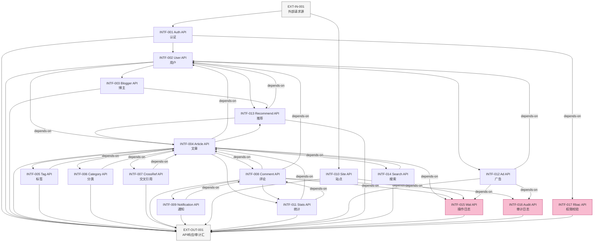

# 接口设计文档（概要设计）

> 阶段 3（概要设计）产出。W 模型第 6 轮端到端调测。
> 套用 `templates/interface-design.md` 模板，所有 `{{}}` 占位符已替换为实际内容。
> 17 个 INTF 节点已落入 `.w-model/ingestion/graph.json`（INTF-001~017），parent 边挂接 SD-001~006，defines 边表达子系统定义接口。
> 设计依据：`docs/system-design.md` v1.0 + `docs/requirement-spec.md` v1.0（21 条需求）。

## 文档信息

- 项目名称：blog-system-demo（扩展博客系统后端）
- 文档版本：v1.0
- 编制日期：2026-07-24
- 编制者：W 模型阶段 3 子代理（S-doc 生产者-文档）
- 关联系统设计：`docs/system-design.md`
- 关联需求规格：`docs/requirement-spec.md`
- 关联集成测试：`docs/integration-test-design.md`（本阶段同步产出）
- 接口总数：17 个 INTF 节点（INTF-001~017），覆盖 6 子系统（SD-001~006）

## 1. 接口总览

### 1.1 INTF 节点与子系统映射

| INTF ID | 接口名 | 所属子系统 | 关联需求 | defines 边来源 |
|---|---|---|---|---|
| INTF-001 | Auth API（认证接口） | SD-001 | REQ-002/REQ-003 | SD-001 defines INTF-001 |
| INTF-002 | User API（用户接口） | SD-001 | REQ-003 | SD-001 defines INTF-002 |
| INTF-003 | Blogger API（博主接口） | SD-001 | REQ-002 | SD-001 defines INTF-003 |
| INTF-004 | Article API（文章接口） | SD-002 | REQ-012 | SD-002 defines INTF-004 |
| INTF-005 | Tag API（标签接口） | SD-002 | REQ-008 | SD-002 defines INTF-005 |
| INTF-006 | Category API（分类接口） | SD-002 | REQ-009 | SD-002 defines INTF-006 |
| INTF-007 | CrossRef API（交叉引用接口） | SD-002 | REQ-013 | SD-002 defines INTF-007 |
| INTF-008 | Comment API（评论接口） | SD-003 | REQ-010 | SD-003 defines INTF-008 |
| INTF-009 | Notification API（通知接口） | SD-003 | REQ-011 | SD-003 defines INTF-009 |
| INTF-010 | Site API（站点接口） | SD-004 | REQ-001 | SD-004 defines INTF-010 |
| INTF-011 | Stats API（统计接口） | SD-004 | REQ-006 | SD-004 defines INTF-011 |
| INTF-012 | Ad API（广告接口） | SD-004 | REQ-005 | SD-004 defines INTF-012 |
| INTF-013 | Recommend API（推荐接口） | SD-005 | REQ-004 | SD-005 defines INTF-013 |
| INTF-014 | Search API（搜索接口） | SD-005 | REQ-007 | SD-005 defines INTF-014 |
| INTF-015 | Wal API（操作日志接口） | SD-006 | NFR-002 | SD-006 defines INTF-015 |
| INTF-016 | Audit API（审计日志接口） | SD-006 | NFR-003 | SD-006 defines INTF-016 |
| INTF-017 | Rbac API（权限校验接口） | SD-006 | NFR-003 | SD-006 defines INTF-017 |

### 1.2 接口调用关系图（Mermaid DAG，无循环依赖）

> 依赖方向遵循有向无环图（DAG），已通过 DFS 三色染色验证（白=未访问/灰=栈中/黑=已完成），遇灰节点即环。本图无环。

### 1.3 DFS 三色染色循环依赖检测

| 检测项 | 结果 | 说明 |
|---|---|---|
| 算法 | DFS 三色染色（白=未访问/灰=栈中/黑=已完成） | 遇灰节点即存在环 |
| 节点数 | 19（17 INTF + EXT-IN-001 + EXT-OUT-001） | — |
| 边数 | 41（21 depends-on + 17 produces→EXT-OUT + 2 EXT-IN→INTF + 1 顺次调用） | — |
| 环检测结果 | ✅ 无环 | DFS 遍历全部节点，无灰节点回访 |
| 拓扑排序 | EXT-IN→INTF-017→INTF-015/016→INTF-001→INTF-002→INTF-003/004/012/013→INTF-005/006/007/008/011/014→INTF-009/010→EXT-OUT | 层级清晰 |

## 2. 错误码分层约定

| 段位 | 范围 | 含义 | HTTP Status 前缀 |
|---|---|---|---|
| 4xx | 40000-49999 | 客户端错误（参数/认证/权限） | 400/401/403/404/409 |
| 5xx | 50000-59999 | 服务端错误（DB/依赖/未知） | 500/502/503 |
| 业务 | 60000-69999 | 业务规则错误（状态机/库存/风控） | 400/409 |

每条错误码配套四元组：`{code, message, httpStatus, retryable}`。

### 2.1 全局错误码表

| code | message | httpStatus | retryable | 段位 |
|---|---|---|:---:|---|
| 40001 | 参数缺失 | 400 | false | 4xx |
| 40002 | 参数类型错误 | 400 | false | 4xx |
| 40003 | 参数格式校验失败（zod） | 400 | false | 4xx |
| 40101 | 未授权（JWT 缺失/过期） | 401 | false | 4xx |
| 40102 | Token 刷新失败 | 401 | false | 4xx |
| 40301 | 禁止访问（RBAC 权限不足） | 403 | false | 4xx |
| 40302 | 资源所有权校验失败 | 403 | false | 4xx |
| 40401 | 资源不存在 | 404 | false | 4xx |
| 40901 | 资源冲突（唯一约束） | 409 | false | 4xx |
| 42901 | 请求过于频繁 | 429 | true | 4xx |
| 50001 | 服务端内部错误 | 500 | true | 5xx |
| 50002 | WAL 写入失败 | 500 | true | 5xx |
| 50003 | 审计日志写入失败 | 500 | true | 5xx |
| 50201 | 下游服务不可用（SMTP） | 502 | true | 5xx |
| 50301 | 系统维护模式 | 503 | true | 5xx |
| 60001 | 业务状态机非法转换 | 409 | false | 业务 |
| 60002 | 资源状态不允许操作 | 409 | false | 业务 |
| 60003 | 敏感词命中 | 400 | false | 业务 |
| 60004 | 嵌套深度超限 | 400 | false | 业务 |
| 60005 | 循环引用检测失败 | 400 | false | 业务 |
| 60006 | 配额超限 | 409 | false | 业务 |

---

## 3. SD-001 身份与访问子系统接口

### 3.1 INTF-001 Auth API（认证接口）

#### 3.1.1 用户注册

| 字段 | 内容 |
|---|---|
| 接口名 | `registerUser` |
| 路径 / 触发器 | `POST /api/v1/auth/register` |
| 参数名 | `email`, `password`, `nickname`, `role` |
| 参数类型 | `string(email)`, `string`, `string`, `"user"\|"blogger"` |
| 必填 | `true`, `true`, `true`, `false` |
| 默认值 | `role="user"` |
| 约束 | `email` zod email；`password` len≥8 含字母+数字；`nickname` len∈[1,32] |
| 示例 | `{"email":"a@b.com","password":"Pass1234","nickname":"alice","role":"user"}` |
| 返回值结构 | `{code:0,message:"ok",data:{userId,role,createdAt}}` |
| 错误码集合 | `40001,40002,40003,40901,50001,50002,60006` |

错误码四元组明细：

| code | message | httpStatus | retryable |
|---|---|---|:---:|
| 40001 | 邮箱/密码/昵称缺失 | 400 | false |
| 40003 | 邮箱格式非法/密码强度不足 | 400 | false |
| 40901 | 邮箱已注册 | 409 | false |
| 50002 | WAL 写入失败（注册写操作） | 500 | true |
| 60006 | 注册开关关闭（维护模式） | 409 | false |

#### 3.1.2 用户登录

| 字段 | 内容 |
|---|---|
| 接口名 | `login` |
| 路径 / 触发器 | `POST /api/v1/auth/login` |
| 参数名 | `email`, `password` |
| 参数类型 | `string(email)`, `string` |
| 必填 | `true`, `true` |
| 默认值 | — |
| 约束 | `email` zod email；`password` len∈[1,128] |
| 示例 | `{"email":"a@b.com","password":"Pass1234"}` |
| 返回值结构 | `{code:0,message:"ok",data:{accessToken,refreshToken,expiresIn:7200,role,userId}}` |
| 错误码集合 | `40001,40003,40101,50001,60002` |

错误码四元组明细：

| code | message | httpStatus | retryable |
|---|---|---|:---:|
| 40001 | 邮箱/密码缺失 | 400 | false |
| 40003 | 邮箱格式非法 | 400 | false |
| 40101 | 邮箱或密码错误 | 401 | false |
| 60002 | 用户已封禁（status=banned） | 409 | false |

#### 3.1.3 Token 刷新

| 字段 | 内容 |
|---|---|
| 接口名 | `refreshToken` |
| 路径 / 触发器 | `POST /api/v1/auth/refresh` |
| 参数名 | `refreshToken` |
| 参数类型 | `string(jwt)` |
| 必填 | `true` |
| 默认值 | — |
| 约束 | `refreshToken` JWT 合法且未过期（7 天有效期，GAP-004） |
| 示例 | `{"refreshToken":"eyJhbGciOi..."}` |
| 返回值结构 | `{code:0,message:"ok",data:{accessToken,expiresIn:7200}}` |
| 错误码集合 | `40001,40101,40102,50001` |

错误码四元组明细：

| code | message | httpStatus | retryable |
|---|---|---|:---:|
| 40101 | Refresh Token 缺失/过期 | 401 | false |
| 40102 | Refresh Token 签名无效 | 401 | false |

---

### 3.2 INTF-002 User API（用户接口）

#### 3.2.1 获取用户资料

| 字段 | 内容 |
|---|---|
| 接口名 | `getUserProfile` |
| 路径 / 触发器 | `GET /api/v1/users/:userId` |
| 参数名 | `userId`（path）, `accessToken`（header Authorization） |
| 参数类型 | `string(uuid)`, `string(jwt)` |
| 必填 | `true`, `true` |
| 默认值 | — |
| 约束 | `userId` UUID v4；`accessToken` 2h 有效（GAP-004） |
| 示例 | `GET /api/v1/users/550e8400-e29b-41d4-a716-446655440000` |
| 返回值结构 | `{code:0,message:"ok",data:{userId,email,nickname,avatar,bio,role,createdAt,lastLoginAt}}` |
| 错误码集合 | `40003,40101,40301,40401,50001` |

错误码四元组明细：

| code | message | httpStatus | retryable |
|---|---|---|:---:|
| 40003 | userId 格式非法（非 UUID） | 400 | false |
| 40401 | 用户不存在 | 404 | false |

#### 3.2.2 更新用户资料

| 字段 | 内容 |
|---|---|
| 接口名 | `updateUserProfile` |
| 路径 / 触发器 | `PATCH /api/v1/users/:userId` |
| 参数名 | `userId`（path）, `nickname`, `avatar`, `bio`, `accessToken` |
| 参数类型 | `string(uuid)`, `string?`, `string(url)?`, `string?`, `string(jwt)` |
| 必填 | `true`, `false`, `false`, `false`, `true` |
| 默认值 | — |
| 约束 | `nickname` len∈[1,32]；`avatar` URL 格式；`bio` len∈[0,500]；所有权校验（仅本人可改） |
| 示例 | `{"nickname":"alice2","bio":"writer"}` |
| 返回值结构 | `{code:0,message:"ok",data:{userId,updatedAt}}` |
| 错误码集合 | `40003,40101,40301,40302,40401,50001,50002` |

错误码四元组明细：

| code | message | httpStatus | retryable |
|---|---|---|:---:|
| 40302 | 仅本人可修改资料（所有权失败） | 403 | false |
| 50002 | WAL 写入失败 | 500 | true |

#### 3.2.3 封禁/解禁用户

| 字段 | 内容 |
|---|---|
| 接口名 | `banUser` |
| 路径 / 触发器 | `POST /api/v1/users/:userId/ban` |
| 参数名 | `userId`（path）, `reason`, `accessToken` |
| 参数类型 | `string(uuid)`, `string`, `string(jwt)` |
| 必填 | `true`, `true`, `true` |
| 默认值 | — |
| 约束 | `reason` len∈[1,200]；操作者 role∈{admin,super_admin}（INTF-017 RBAC 校验） |
| 示例 | `{"reason":"发布违规内容"}` |
| 返回值结构 | `{code:0,message:"ok",data:{userId,status:"banned",banAt}}` |
| 错误码集合 | `40001,40003,40101,40301,40401,50001,50002,50003` |

错误码四元组明细：

| code | message | httpStatus | retryable |
|---|---|---|:---:|
| 50003 | 审计日志写入失败（封禁属敏感操作） | 500 | true |

---

### 3.3 INTF-003 Blogger API（博主接口）

#### 3.3.1 获取博主主页

| 字段 | 内容 |
|---|---|
| 接口名 | `getBloggerProfile` |
| 路径 / 触发器 | `GET /api/v1/bloggers/:bloggerId` |
| 参数名 | `bloggerId`（path）, `page`, `pageSize`（query） |
| 参数类型 | `string(uuid)`, `number`, `number` |
| 必填 | `true`, `false`, `false` |
| 默认值 | `page=1`, `pageSize=10` |
| 约束 | `page` ≥1；`pageSize` ∈[1,50]；返回博主资料+文章列表分页 |
| 示例 | `GET /api/v1/bloggers/550e8400?page=1&pageSize=20` |
| 返回值结构 | `{code:0,message:"ok",data:{bloggerId,nickname,intro,socialLinks,followerCount,articles:{list,total,page,pageSize}}}` |
| 错误码集合 | `40003,40401,50001` |

#### 3.3.2 关注/取关博主

| 字段 | 内容 |
|---|---|
| 接口名 | `followBlogger` |
| 路径 / 触发器 | `POST /api/v1/bloggers/:bloggerId/follow` |
| 参数名 | `bloggerId`（path）, `action`, `accessToken` |
| 参数类型 | `string(uuid)`, `"follow"\|"unfollow"`, `string(jwt)` |
| 必填 | `true`, `true`, `true` |
| 默认值 | — |
| 约束 | 不能关注自己；触发通知（INTF-009）；写入 WAL（INTF-015） |
| 示例 | `{"action":"follow"}` |
| 返回值结构 | `{code:0,message:"ok",data:{following,followerCount}}` |
| 错误码集合 | `40003,40101,40301,40401,40901,50001,50002,60002` |

错误码四元组明细：

| code | message | httpStatus | retryable |
|---|---|---|:---:|
| 40901 | 重复关注 | 409 | false |
| 60002 | 不能关注自己 | 409 | false |

---

## 4. SD-002 内容管理子系统接口

### 4.1 INTF-004 Article API（文章接口）

#### 4.1.1 创建文章

| 字段 | 内容 |
|---|---|
| 接口名 | `createArticle` |
| 路径 / 触发器 | `POST /api/v1/articles` |
| 参数名 | `title`, `content`, `summary`, `coverImage`, `status`, `tagIds`, `categoryId`, `citeArticleIds`, `publishAt`, `accessToken` |
| 参数类型 | `string`, `string`, `string?`, `string(url)?`, `"draft"\|"pending_review"\|"scheduled_publish"`, `string[]?`, `string(uuid)?`, `string[]?`, `number?`, `string(jwt)` |
| 必填 | `true`, `true`, `false`, `false`, `true`, `false`, `false`, `false`, `false`, `true` |
| 默认值 | — |
| 约束 | `title` len∈[1,200]；`content` len∈[1,100000]；`status=scheduled_publish` 时 `publishAt` 必填且 >now；`tagIds.length`≤10；操作者 role=blogger/admin |
| 示例 | `{"title":"Hello","content":"# Hello World","status":"draft","tagIds":["t1"]}` |
| 返回值结构 | `{code:0,message:"ok",data:{articleId,status,createdAt}}` |
| 错误码集合 | `40001,40003,40101,40301,40401,50001,50002,60001,60005` |

错误码四元组明细：

| code | message | httpStatus | retryable |
|---|---|---|:---:|
| 60001 | 状态机非法转换（如 draft→published 跳过审核） | 409 | false |
| 60005 | citeArticleIds 含循环引用 | 400 | false |

#### 4.1.2 文章状态转换

| 字段 | 内容 |
|---|---|
| 接口名 | `transitionArticleState` |
| 路径 / 触发器 | `POST /api/v1/articles/:articleId/transition` |
| 参数名 | `articleId`（path）, `targetState`, `accessToken` |
| 参数类型 | `string(uuid)`, `"pending_review"\|"scheduled_publish"\|"published"\|"taken_down"\|"archived"`, `string(jwt)` |
| 必填 | `true`, `true`, `true` |
| 默认值 | — |
| 约束 | 遵循 6 态状态机 14 合法转换（system-design.md §7.2）；published 仅 admin 可触发；所有权校验（仅作者/admin） |
| 示例 | `{"targetState":"pending_review"}` |
| 返回值结构 | `{code:0,message:"ok",data:{articleId,previousState,targetState,updatedAt}}` |
| 错误码集合 | `40003,40101,40301,40302,40401,50001,50002,60001,60002` |

错误码四元组明细：

| code | message | httpStatus | retryable |
|---|---|---|:---:|
| 60001 | 非法状态转换（如 taken_down→published） | 409 | false |
| 60002 | 文章状态不允许此操作（如 archived 终态） | 409 | false |

#### 4.1.3 获取文章列表

| 字段 | 内容 |
|---|---|
| 接口名 | `listArticles` |
| 路径 / 触发器 | `GET /api/v1/articles` |
| 参数名 | `authorId`, `status`, `tagId`, `categoryId`, `page`, `pageSize`, `sort`（query） |
| 参数类型 | `string(uuid)?`, `string?`, `string(uuid)?`, `string(uuid)?`, `number`, `number`, `"latest"\|"hottest"` |
| 必填 | 全部 `false` |
| 默认值 | `page=1`, `pageSize=10`, `sort="latest"` |
| 约束 | `page`≥1；`pageSize`∈[1,50]；非作者仅返回 published |
| 示例 | `GET /api/v1/articles?authorId=u1&status=published&sort=hottest` |
| 返回值结构 | `{code:0,message:"ok",data:{list:Article[],total,page,pageSize}}` |
| 错误码集合 | `40003,50001` |

---

### 4.2 INTF-005 Tag API（标签接口）

#### 4.2.1 创建标签

| 字段 | 内容 |
|---|---|
| 接口名 | `createTag` |
| 路径 / 触发器 | `POST /api/v1/tags` |
| 参数名 | `name`, `accessToken` |
| 参数类型 | `string`, `string(jwt)` |
| 必填 | `true`, `true` |
| 默认值 | — |
| 约束 | `name` len∈[1,30] 且唯一；操作者 role∈{blogger,admin} |
| 示例 | `{"name":"TypeScript"}` |
| 返回值结构 | `{code:0,message:"ok",data:{tagId,name,usageCount:0,createdAt}}` |
| 错误码集合 | `40001,40003,40101,40301,40901,50001,50002` |

#### 4.2.2 标签云

| 字段 | 内容 |
|---|---|
| 接口名 | `getTagCloud` |
| 路径 / 触发器 | `GET /api/v1/tags/cloud` |
| 参数名 | `limit`（query） |
| 参数类型 | `number` |
| 必填 | `false` |
| 默认值 | `limit=50` |
| 约束 | `limit`∈[1,100]；按 usageCount 降序 |
| 示例 | `GET /api/v1/tags/cloud?limit=20` |
| 返回值结构 | `{code:0,message:"ok",data:{tags:[{tagId,name,usageCount}]}}` |
| 错误码集合 | `40003,50001` |

#### 4.2.3 合并标签

| 字段 | 内容 |
|---|---|
| 接口名 | `mergeTags` |
| 路径 / 触发器 | `POST /api/v1/tags/merge` |
| 参数名 | `sourceTagId`, `targetTagId`, `accessToken` |
| 参数类型 | `string(uuid)`, `string(uuid)`, `string(jwt)` |
| 必填 | `true`, `true`, `true` |
| 默认值 | — |
| 约束 | source≠target；操作者 role=admin；合并后文章标签重定向，source 置 mergedToId |
| 示例 | `{"sourceTagId":"t1","targetTagId":"t2"}` |
| 返回值结构 | `{code:0,message:"ok",data:{mergedCount,sourceTagId,targetTagId}}` |
| 错误码集合 | `40003,40101,40301,40401,40901,50001,50002,60002` |

---

### 4.3 INTF-006 Category API（分类接口）

#### 4.3.1 创建分类

| 字段 | 内容 |
|---|---|
| 接口名 | `createCategory` |
| 路径 / 触发器 | `POST /api/v1/categories` |
| 参数名 | `name`, `parentId`, `order`, `accessToken` |
| 参数类型 | `string`, `string(uuid)?`, `number`, `string(jwt)` |
| 必填 | `true`, `false`, `false`, `true` |
| 默认值 | `order=0` |
| 约束 | `name` len∈[1,50]；`parentId` 存在则挂接子分类；循环引用检测（UAT-026） |
| 示例 | `{"name":"前端","parentId":"c1"}` |
| 返回值结构 | `{code:0,message:"ok",data:{categoryId,name,parentId,order,createdAt}}` |
| 错误码集合 | `40003,40101,40301,40401,50001,50002,60005` |

错误码四元组明细：

| code | message | httpStatus | retryable |
|---|---|---|:---:|
| 60005 | 分类树循环引用检测失败 | 400 | false |

#### 4.3.2 分类树导航

| 字段 | 内容 |
|---|---|
| 接口名 | `getCategoryTree` |
| 路径 / 触发器 | `GET /api/v1/categories/tree` |
| 参数名 | — |
| 参数类型 | — |
| 必填 | — |
| 默认值 | — |
| 约束 | 返回完整多级树结构，含面包屑路径 |
| 示例 | `GET /api/v1/categories/tree` |
| 返回值结构 | `{code:0,message:"ok",data:{tree:[{categoryId,name,children:[...],breadcrumb}]}}` |
| 错误码集合 | `50001` |

---

### 4.4 INTF-007 CrossRef API（交叉引用接口）

#### 4.4.1 添加交叉引用

| 字段 | 内容 |
|---|---|
| 接口名 | `addCrossReference` |
| 路径 / 触发器 | `POST /api/v1/articles/:articleId/citations` |
| 参数名 | `articleId`（path）, `citeArticleIds`, `accessToken` |
| 参数类型 | `string(uuid)`, `string[]`, `string(jwt)` |
| 必填 | `true`, `true`, `true` |
| 默认值 | — |
| 约束 | `citeArticleIds.length`∈[1,20]；不能引用自己；循环引用检测；触发被引用通知（INTF-009） |
| 示例 | `{"citeArticleIds":["a2","a3"]}` |
| 返回值结构 | `{code:0,message:"ok",data:{articleId,citeArticleIds,notifiedAuthors}}` |
| 错误码集合 | `40003,40101,40301,40401,50001,50002,60002,60005` |

#### 4.4.2 引用图谱

| 字段 | 内容 |
|---|---|
| 接口名 | `getCitationGraph` |
| 路径 / 触发器 | `GET /api/v1/articles/:articleId/citations` |
| 参数名 | `articleId`（path）, `depth`（query） |
| 参数类型 | `string(uuid)`, `number` |
| 必填 | `true`, `false` |
| 默认值 | `depth=1` |
| 约束 | `depth`∈[1,3]；返回被引用数+引用其他文章数 |
| 示例 | `GET /api/v1/articles/a1/citations?depth=2` |
| 返回值结构 | `{code:0,message:"ok",data:{articleId,citedByCount,citingCount,graph:{nodes,edges}}}` |
| 错误码集合 | `40003,40401,50001` |

---

## 5. SD-003 互动子系统接口

### 5.1 INTF-008 Comment API（评论接口）

#### 5.1.1 创建评论

| 字段 | 内容 |
|---|---|
| 接口名 | `createComment` |
| 路径 / 触发器 | `POST /api/v1/articles/:articleId/comments` |
| 参数名 | `articleId`（path）, `content`, `parentId`, `accessToken` |
| 参数类型 | `string(uuid)`, `string`, `string(uuid)?`, `string(jwt)` |
| 必填 | `true`, `true`, `false`, `true` |
| 默认值 | — |
| 约束 | `content` len∈[1,1000]；`parentId` 存在则 depth=parent.depth+1 且 ≤3（GAP-008）；敏感词过滤（命中→status=pending_review）；触发通知（INTF-009）；写 WAL+审计 |
| 示例 | `{"content":"好文！","parentId":"c1"}` |
| 返回值结构 | `{code:0,message:"ok",data:{commentId,status,depth,sensitiveHit,createdAt}}` |
| 错误码集合 | `40001,40003,40101,40301,40401,50001,50002,50003,60003,60004` |

错误码四元组明细：

| code | message | httpStatus | retryable |
|---|---|---|:---:|
| 60003 | 命中敏感词（status=pending_review，附 sensitiveHit 列表） | 400 | false |
| 60004 | 评论嵌套深度超限（>3 级） | 400 | false |

#### 5.1.2 评论审核

| 字段 | 内容 |
|---|---|
| 接口名 | `moderateComment` |
| 路径 / 触发器 | `POST /api/v1/comments/:commentId/moderate` |
| 参数名 | `commentId`（path）, `action`, `accessToken` |
| 参数类型 | `string(uuid)`, `"approve"\|"reject"`, `string(jwt)` |
| 必填 | `true`, `true`, `true` |
| 默认值 | — |
| 约束 | 操作者 role∈{admin,super_admin}；comment.status=pending_review→approved/rejected；写审计 |
| 示例 | `{"action":"approve"}` |
| 返回值结构 | `{code:0,message:"ok",data:{commentId,status,updatedAt}}` |
| 错误码集合 | `40003,40101,40301,40401,50001,50002,50003,60001,60002` |

#### 5.1.3 评论点赞

| 字段 | 内容 |
|---|---|
| 接口名 | `likeComment` |
| 路径 / 触发器 | `POST /api/v1/comments/:commentId/like` |
| 参数名 | `commentId`（path）, `accessToken` |
| 参数类型 | `string(uuid)`, `string(jwt)` |
| 必填 | `true`, `true` |
| 默认值 | — |
| 约束 | 去重（likedBy 列表）；触发通知（INTF-009）；写 WAL |
| 示例 | `POST /api/v1/comments/c1/like` |
| 返回值结构 | `{code:0,message:"ok",data:{commentId,likes,liked:true}}` |
| 错误码集合 | `40003,40101,40301,40401,40901,50001,50002` |

---

### 5.2 INTF-009 Notification API（通知接口）

#### 5.2.1 获取通知列表

| 字段 | 内容 |
|---|---|
| 接口名 | `listNotifications` |
| 路径 / 触发器 | `GET /api/v1/notifications` |
| 参数名 | `type`, `read`, `page`, `pageSize`, `accessToken`（query+header） |
| 参数类型 | `string?`, `boolean?`, `number`, `number`, `string(jwt)` |
| 必填 | `false`, `false`, `false`, `false`, `true` |
| 默认值 | `page=1`, `pageSize=20` |
| 约束 | 仅返回当前用户通知；`type`∈{system,comment_reply,like,follow,audit_result,cited} |
| 示例 | `GET /api/v1/notifications?read=false&pageSize=10` |
| 返回值结构 | `{code:0,message:"ok",data:{list:Notification[],total,unreadCount,page,pageSize}}` |
| 错误码集合 | `40003,40101,50001` |

#### 5.2.2 标记通知已读

| 字段 | 内容 |
|---|---|
| 接口名 | `markNotificationRead` |
| 路径 / 触发器 | `POST /api/v1/notifications/:notificationId/read` |
| 参数名 | `notificationId`（path）, `accessToken` |
| 参数类型 | `string(uuid)`, `string(jwt)` |
| 必填 | `true`, `true` |
| 默认值 | — |
| 约束 | 所有权校验（仅接收方可标记）；支持「全部已读」via `POST /api/v1/notifications/read-all` |
| 示例 | `POST /api/v1/notifications/n1/read` |
| 返回值结构 | `{code:0,message:"ok",data:{notificationId,read:true,unreadCount}}` |
| 错误码集合 | `40003,40101,40302,40401,50001,50002` |

#### 5.2.3 更新通知设置

| 字段 | 内容 |
|---|---|
| 接口名 | `updateNotificationSettings` |
| 路径 / 触发器 | `PATCH /api/v1/notifications/settings` |
| 参数名 | `settings`, `accessToken` |
| 参数类型 | `NotificationSettings`, `string(jwt)` |
| 必填 | `true`, `true` |
| 默认值 | — |
| 约束 | settings 结构含 commentReply/like/follow/auditResult/cited + email 子对象；写 WAL |
| 示例 | `{"settings":{"commentReply":false,"email":{"auditResult":true}}}` |
| 返回值结构 | `{code:0,message:"ok",data:{updatedAt}}` |
| 错误码集合 | `40003,40101,50001,50002` |

---

## 6. SD-004 运营支撑子系统接口

### 6.1 INTF-010 Site API（站点接口）

#### 6.1.1 获取站点配置

| 字段 | 内容 |
|---|---|
| 接口名 | `getSiteConfig` |
| 路径 / 触发器 | `GET /api/v1/site/config` |
| 参数名 | — |
| 参数类型 | — |
| 必填 | — |
| 默认值 | — |
| 约束 | 公开接口（无需 JWT）；返回站点名/描述/Logo/备案/开关状态 |
| 示例 | `GET /api/v1/site/config` |
| 返回值结构 | `{code:0,message:"ok",data:{siteName,description,logo,icp,maintenanceMode,registrationEnabled,commentEnabled}}` |
| 错误码集合 | `50001` |

#### 6.1.2 更新站点配置

| 字段 | 内容 |
|---|---|
| 接口名 | `updateSiteConfig` |
| 路径 / 触发器 | `PUT /api/v1/site/config` |
| 参数名 | `siteName`, `description`, `logo`, `icp`, `maintenanceMode`, `registrationEnabled`, `commentEnabled`, `accessToken` |
| 参数类型 | `string`, `string`, `string(url)`, `string`, `boolean`, `boolean`, `boolean`, `string(jwt)` |
| 必填 | 全部 `false`（部分更新），`accessToken` `true` |
| 默认值 | — |
| 约束 | 操作者 role=super_admin；写 WAL（INTF-015）；写审计（INTF-016） |
| 示例 | `{"maintenanceMode":true}` |
| 返回值结构 | `{code:0,message:"ok",data:{updatedAt}}` |
| 错误码集合 | `40003,40101,40301,50001,50002,50003` |

#### 6.1.3 公告定时发布

| 字段 | 内容 |
|---|---|
| 接口名 | `createAnnouncement` |
| 路径 / 触发器 | `POST /api/v1/site/announcements` |
| 参数名 | `title`, `content`, `publishAt`, `accessToken` |
| 参数类型 | `string`, `string`, `number`, `string(jwt)` |
| 必填 | `true`, `true`, `true`, `true` |
| 默认值 | — |
| 约束 | `title` len∈[1,100]；`content` len∈[1,2000]；`publishAt` Unix 秒；操作者 role∈{admin,super_admin}；定时器秒级轮询（GAP-003） |
| 示例 | `{"title":"系统升级","content":"今晚22:00","publishAt":1753392000}` |
| 返回值结构 | `{code:0,message:"ok",data:{announcementId,publishAt,status:"scheduled"}}` |
| 错误码集合 | `40001,40003,40101,40301,50001,50002` |

---

### 6.2 INTF-011 Stats API（统计接口）

#### 6.2.1 文章统计

| 字段 | 内容 |
|---|---|
| 接口名 | `getArticleStats` |
| 路径 / 触发器 | `GET /api/v1/stats/articles` |
| 参数名 | `articleId`, `authorId`, `range`, `accessToken`（query+header） |
| 参数类型 | `string(uuid)?`, `string(uuid)?`, `"7d"\|"30d"\|"all"`, `string(jwt)` |
| 必填 | `false`, `false`, `false`, `true` |
| 默认值 | `range="7d"` |
| 约束 | 非管理员仅查看自己文章统计；返回阅读/点赞/评论/分享数 |
| 示例 | `GET /api/v1/stats/articles?authorId=u1&range=30d` |
| 返回值结构 | `{code:0,message:"ok",data:{totalArticles,totalViews,totalLikes,totalComments,totalShares,byDay:[{date,views,likes}]}}` |
| 错误码集合 | `40003,40101,40301,50001` |

#### 6.2.2 站点统计概览

| 字段 | 内容 |
|---|---|
| 接口名 | `getSiteStats` |
| 路径 / 触发器 | `GET /api/v1/stats/site` |
| 参数名 | `accessToken` |
| 参数类型 | `string(jwt)` |
| 必填 | `true` |
| 默认值 | — |
| 约束 | 操作者 role∈{admin,super_admin}；返回用户数/文章数/评论数/访问量 |
| 示例 | `GET /api/v1/stats/site` |
| 返回值结构 | `{code:0,message:"ok",data:{userCount,articleCount,commentCount,pageViews,uniqueVisitors}}` |
| 错误码集合 | `40101,40301,50001` |

#### 6.2.3 报表导出

| 字段 | 内容 |
|---|---|
| 接口名 | `exportStats` |
| 路径 / 触发器 | `GET /api/v1/stats/export` |
| 参数名 | `type`, `format`, `accessToken`（query+header） |
| 参数类型 | `"articles"\|"users"\|"bloggers"\|"site"`, `"csv"\|"json"`, `string(jwt)` |
| 必填 | `true`, `true`, `true` |
| 默认值 | — |
| 约束 | 操作者 role∈{admin,super_admin}；CSV 含 BOM 头；返回文件流 |
| 示例 | `GET /api/v1/stats/export?type=articles&format=csv` |
| 返回值结构 | `Content-Type: text/csv 或 application/json`，文件流 |
| 错误码集合 | `40003,40101,40301,50001` |

---

### 6.3 INTF-012 Ad API（广告接口）

#### 6.3.1 创建广告

| 字段 | 内容 |
|---|---|
| 接口名 | `createAd` |
| 路径 / 触发器 | `POST /api/v1/ads` |
| 参数名 | `slot`, `title`, `content`, `imageUrl`, `targetUrl`, `startAt`, `endAt`, `targetUserRoles`, `maxImpressionsPerUserPerDay`, `accessToken` |
| 参数类型 | `"sidebar"\|"in_article"\|"home_banner"`, `string`, `string`, `string(url)?`, `string(url)`, `number`, `number`, `string[]?`, `number`, `string(jwt)` |
| 必填 | `true`, `true`, `true`, `false`, `true`, `true`, `true`, `false`, `true`, `true` |
| 默认值 | `maxImpressionsPerUserPerDay=100` |
| 约束 | `title` len∈[1,100]；`startAt`<`endAt`；`maxImpressionsPerUserPerDay`≤100（GAP-012）；操作者 role∈{admin,super_admin}；写 WAL+审计 |
| 示例 | `{"slot":"sidebar","title":"新品","targetUrl":"https://x.com","startAt":1753392000,"endAt":1753478400,"maxImpressionsPerUserPerDay":50}` |
| 返回值结构 | `{code:0,message:"ok",data:{adId,status:"pending_review",createdAt}}` |
| 错误码集合 | `40001,40003,40101,40301,50001,50002,50003,60002,60006` |

错误码四元组明细：

| code | message | httpStatus | retryable |
|---|---|---|:---:|
| 60006 | maxImpressionsPerUserPerDay 超限（>100） | 409 | false |

#### 6.3.2 广告审核

| 字段 | 内容 |
|---|---|
| 接口名 | `moderateAd` |
| 路径 / 触发器 | `POST /api/v1/ads/:adId/moderate` |
| 参数名 | `adId`（path）, `action`, `accessToken` |
| 参数类型 | `string(uuid)`, `"approve"\|"reject"\|"take_down"`, `string(jwt)` |
| 必填 | `true`, `true`, `true` |
| 默认值 | — |
| 约束 | 操作者 role=super_admin；状态机 pending_review→approved/rejected；approved→taken_down |
| 示例 | `{"action":"approve"}` |
| 返回值结构 | `{code:0,message:"ok",data:{adId,status,updatedAt}}` |
| 错误码集合 | `40003,40101,40301,40401,50001,50002,50003,60001,60002` |

#### 6.3.3 广告投放（CTR 统计）

| 字段 | 内容 |
|---|---|
| 接口名 | `serveAd` |
| 路径 / 触发器 | `GET /api/v1/ads/serve` |
| 参数名 | `slot`, `accessToken`（query+header，可选） |
| 参数类型 | `"sidebar"\|"in_article"\|"home_banner"`, `string(jwt)?` |
| 必填 | `true`, `false` |
| 默认值 | — |
| 约束 | 返回当前时间范围内 approved 广告；按用户配额限流；记录 impressions+clicks |
| 示例 | `GET /api/v1/ads/serve?slot=sidebar` |
| 返回值结构 | `{code:0,message:"ok",data:{adId,title,imageUrl,targetUrl,impressionId}}` |
| 错误码集合 | `40003,50001,60006` |

---

## 7. SD-005 发现子系统接口

### 7.1 INTF-013 Recommend API（推荐接口）

#### 7.1.1 个性化推荐流

| 字段 | 内容 |
|---|---|
| 接口名 | `getPersonalizedFeed` |
| 路径 / 触发器 | `GET /api/v1/recommend/personalized` |
| 参数名 | `page`, `pageSize`, `accessToken`（query+header） |
| 参数类型 | `number`, `number`, `string(jwt)?` |
| 必填 | `false`, `false`, `false` |
| 默认值 | `page=1`, `pageSize=10` |
| 约束 | 算法等权 1/3（热度+新鲜度+用户偏好）+7 天衰减（GAP-006）；未登录返回热门流 |
| 示例 | `GET /api/v1/recommend/personalized?page=1` |
| 返回值结构 | `{code:0,message:"ok",data:{list:Article[],total,page,pageSize}}` |
| 错误码集合 | `40003,50001` |

#### 7.1.2 推荐位管理

| 字段 | 内容 |
|---|---|
| 接口名 | `manageRecommendSlot` |
| 路径 / 触发器 | `POST /api/v1/recommend/slots` |
| 参数名 | `slotName`, `articleId`, `order`, `accessToken` |
| 参数类型 | `string`, `string(uuid)`, `number`, `string(jwt)` |
| 必填 | `true`, `true`, `false`, `true` |
| 默认值 | `order=0` |
| 约束 | 推荐位总数≤20（GAP-011）；操作者 role∈{admin,super_admin} |
| 示例 | `{"slotName":"首页banner","articleId":"a1","order":1}` |
| 返回值结构 | `{code:0,message:"ok",data:{slotId,slotName,articleId,order}}` |
| 错误码集合 | `40003,40101,40301,40401,50001,50002,60006` |

错误码四元组明细：

| code | message | httpStatus | retryable |
|---|---|---|:---:|
| 60006 | 推荐位超限（>20） | 409 | false |

---

### 7.2 INTF-014 Search API（搜索接口）

#### 7.2.1 全文搜索

| 字段 | 内容 |
|---|---|
| 接口名 | `searchArticles` |
| 路径 / 触发器 | `GET /api/v1/search` |
| 参数名 | `q`, `type`, `sort`, `page`, `pageSize`, `accessToken`（query+header，可选） |
| 参数类型 | `string`, `"article"\|"tag"\|"category"\|"blogger"`, `"relevance"\|"latest"\|"hottest"`, `number`, `number`, `string(jwt)?` |
| 必填 | `true`, `false`, `false`, `false`, `false`, `false` |
| 默认值 | `type="article"`, `sort="relevance"`, `page=1`, `pageSize=10` |
| 约束 | `q` len∈[1,100]；P95≤500ms（NFR-001）；登录用户记录搜索历史（50 条 FIFO，GAP-010） |
| 示例 | `GET /api/v1/search?q=TypeScript&type=article&sort=relevance` |
| 返回值结构 | `{code:0,message:"ok",data:{list:SearchResult[],total,page,pageSize,tookMs}}` |
| 错误码集合 | `40001,40003,50001` |

#### 7.2.2 搜索建议

| 字段 | 内容 |
|---|---|
| 接口名 | `searchSuggest` |
| 路径 / 触发器 | `GET /api/v1/search/suggest` |
| 参数名 | `q`, `accessToken`（query+header，可选） |
| 参数类型 | `string`, `string(jwt)?` |
| 必填 | `true`, `false` |
| 默认值 | — |
| 约束 | `q` len∈[1,50]；返回≤10 条自动补全+热门搜索 |
| 示例 | `GET /api/v1/search/suggest?q=type` |
| 返回值结构 | `{code:0,message:"ok",data:{suggestions:string[],hotSearches:string[]}}` |
| 错误码集合 | `40003,50001` |

---

## 8. SD-006 基础设施子系统接口（governance）

### 8.1 INTF-015 Wal API（操作日志接口）

#### 8.1.1 追加 WAL 操作

| 字段 | 内容 |
|---|---|
| 接口名 | `appendWal` |
| 路径 / 触发器 | 内部调用 `walStore.append(op)`（非 HTTP，service 层调用） |
| 参数名 | `op` |
| 参数类型 | `{type:string,entity:string,entityId:string,payload:unknown,timestamp:number,userId:string}` |
| 必填 | `true` |
| 默认值 | — |
| 约束 | 仅 Running 状态可写（NFR-002）；`fs.appendFile` 异步追加；90 天滚动覆盖（GAP-009） |
| 示例 | `{type:"create",entity:"article",entityId:"a1",payload:{...},timestamp:1753392000,userId:"u1"}` |
| 返回值结构 | `{ok:boolean,sequence:number}` |
| 错误码集合 | `50002,50301` |

错误码四元组明细：

| code | message | httpStatus | retryable |
|---|---|---|:---:|
| 50002 | WAL 文件写入失败 | 500 | true |
| 50301 | 系统维护模式（Recovering 状态禁止写） | 503 | true |

#### 8.1.2 WAL 重放（崩溃恢复）

| 字段 | 内容 |
|---|---|
| 接口名 | `replayWal` |
| 路径 / 触发器 | 内部调用 `walStore.replay()`（启动时自动触发） |
| 参数名 | — |
| 参数类型 | — |
| 必填 | — |
| 默认值 | — |
| 约束 | 启动时读取 wal.log 逐条重放重建 Map 状态（NFR-002）；replayIndex 递增至 walLog 末尾；完成后清空 walLog |
| 示例 | — |
| 返回值结构 | `{replayed:number,durationMs:number}` |
| 错误码集合 | `50002` |

---

### 8.2 INTF-016 Audit API（审计日志接口）

#### 8.2.1 追加审计记录

| 字段 | 内容 |
|---|---|
| 接口名 | `appendAudit` |
| 路径 / 触发器 | 内部调用 `auditStore.append(entry)`（非 HTTP，中间件触发） |
| 参数名 | `entry` |
| 参数类型 | `{userId:string,action:string,targetType:string,targetId:string,ip:string,timestamp:number,result:"success"\|"failure"}` |
| 必填 | `true` |
| 默认值 | — |
| 约束 | 独立存储不参与崩溃重建（CONFLICT-002）；90 天滚动；允许 Running+Crashed 状态写入 |
| 示例 | `{userId:"u1",action:"ban_user",targetType:"user",targetId:"u2",ip:"1.2.3.4",timestamp:1753392000,result:"success"}` |
| 返回值结构 | `{ok:boolean}` |
| 错误码集合 | `50003` |

#### 8.2.2 查询审计日志

| 字段 | 内容 |
|---|---|
| 接口名 | `queryAuditLogs` |
| 路径 / 触发器 | `GET /api/v1/audit/logs` |
| 参数名 | `userId`, `action`, `startAt`, `endAt`, `page`, `pageSize`, `accessToken`（query+header） |
| 参数类型 | `string(uuid)?`, `string?`, `number?`, `number?`, `number`, `number`, `string(jwt)` |
| 必填 | 全部 `false`，`accessToken` `true` |
| 默认值 | `page=1`, `pageSize=20` |
| 约束 | 操作者 role=super_admin；仅审计权限 |
| 示例 | `GET /api/v1/audit/logs?userId=u1&action=ban_user` |
| 返回值结构 | `{code:0,message:"ok",data:{list:AuditEntry[],total,page,pageSize}}` |
| 错误码集合 | `40003,40101,40301,50001` |

---

### 8.3 INTF-017 Rbac API（权限校验接口）

#### 8.3.1 权限校验

| 字段 | 内容 |
|---|---|
| 接口名 | `checkPermission` |
| 路径 / 触发器 | 内部调用 `rbacMiddleware(req, resource, action)`（Express 中间件） |
| 参数名 | `userId`, `role`, `resource`, `action` |
| 参数类型 | `string(uuid)`, `"user"\|"blogger"\|"admin"\|"super_admin"`, `string`, `"read"\|"write"\|"delete"\|"admin"` |
| 必填 | `true`, `true`, `true`, `true` |
| 默认值 | — |
| 约束 | 4 角色权限矩阵（system-design.md §6）；resource∈{article,comment,user,blogger,site,ad,stats,audit,tag,category}；层级 user<blogger<admin<super_admin |
| 示例 | `checkPermission("u1","blogger","article","write")` |
| 返回值结构 | `{allowed:boolean,reason?:string}` |
| 错误码集合 | `40301,40302` |

#### 8.3.2 资源所有权校验

| 字段 | 内容 |
|---|---|
| 接口名 | `checkOwnership` |
| 路径 / 触发器 | 内部调用 `rbacUtil.checkOwnership(userId, resourceType, resourceId)` |
| 参数名 | `userId`, `resourceType`, `resourceId` |
| 参数类型 | `string(uuid)`, `"article"\|"comment"\|"user"`, `string(uuid)` |
| 必填 | `true`, `true`, `true` |
| 默认值 | — |
| 约束 | 校验资源 authorId/ownerId===userId；admin/super_admin 豁免所有权 |
| 示例 | `checkOwnership("u1","article","a1")` |
| 返回值结构 | `{owned:boolean}` |
| 错误码集合 | `40302,40401` |

---

## 9. RTM 登记（接口设计与集成测试映射）

| 需求 ID | 接口设计文档 | 接口节点 | 集成测试用例 |
|---|---|---|---|
| REQ-001 | interface-design.md §6.1 | INTF-010 | TC-DES-004/010/011 |
| REQ-002 | interface-design.md §3.1/§3.3 | INTF-001/003 | TC-DES-004/010/011 |
| REQ-003 | interface-design.md §3.1/§3.2 | INTF-001/002 | TC-DES-004/010/011 |
| REQ-004 | interface-design.md §7.1 | INTF-013 | TC-DES-004/011 |
| REQ-005 | interface-design.md §6.3 | INTF-012 | TC-DES-004/012 |
| REQ-006 | interface-design.md §6.2 | INTF-011 | TC-DES-004/011 |
| REQ-007 | interface-design.md §7.2 | INTF-014 | TC-DES-004/011 |
| REQ-008 | interface-design.md §4.2 | INTF-005 | TC-DES-004/010 |
| REQ-009 | interface-design.md §4.3 | INTF-006 | TC-DES-004/010 |
| REQ-010 | interface-design.md §5.1 | INTF-008 | TC-DES-004/010/011/012 |
| REQ-011 | interface-design.md §5.2 | INTF-009 | TC-DES-004/011 |
| REQ-012 | interface-design.md §4.1 | INTF-004 | TC-DES-004/010/011 |
| REQ-013 | interface-design.md §4.4 | INTF-007 | TC-DES-004/010 |
| NFR-002 | interface-design.md §8.1 | INTF-015 | TC-DES-012 |
| NFR-003 | interface-design.md §8.2/§8.3 | INTF-016/017 | TC-DES-012 |

## 10. 验收清单

- [x] 接口定义完整，每条契约按「接口契约 Schema 模板」10 字段填写
- [x] 错误码按「错误码分层约定」覆盖 4xx/5xx/业务三段位
- [x] 模块间调用关系清晰，无循环依赖（DFS 三色染色验证）
- [x] 集成测试用例覆盖关键模块交互路径（见 integration-test-design.md）
- [x] RTM 已补登接口设计与集成测试映射（§9）
- [x] 17 个 INTF 节点全部 defines 边覆盖（SD-001~006 defines INTF-001~017）
- [x] 调用关系图 Mermaid 无环（§1.2 + §1.3 DFS 验证）
