# 接口设计文档（Interface Design）

> 阶段 3 概要设计产出。对应阶段 2 系统设计 `docs/system-design.md`（22 SD）。
> 建模方法：分层接口契约 + RESTful API + 内部服务接口 + 事件接口。
> 本文含 22 个 INTF 条目（INTF-001 ~ INTF-022），逐条对应 SD-001 ~ SD-022。
> 同步产出：集成测试设计 `docs/integration-test-design.md`、图谱演化 `.w-model/graph.json`、TLA+ L3 原子行为规格 `tla/L3_*.tla`。

## §1 概述

### §1.1 设计目标

将阶段 2 的 22 个 SD 子系统设计转换为可调用、可测试、可演化的接口契约：

- **接口契约无歧义**：每个 INTF 提供端点、参数、返回值、错误码、调用方/被调用方、同步/异步语义
- **跨子系统调用清晰**：通过 INTF→INTF 依赖图显式标注，禁止循环依赖
- **测试可设计**：每条 INTF 直接派生集成测试用例（见 `docs/integration-test-design.md`）
- **信息流闭环**：每个 INTF 既是消费者（接收请求/上游数据）又是生产者（返回响应/触发下游）

### §1.2 接口类型分布

| 类型 | 数量 | INTF 编号 |
|---|---|---|
| REST API | 19 | INTF-001~003, 005~018, 020~022 |
| 内部服务接口（中间件 / Service 调用） | 3 | INTF-004（权限中间件）, INTF-019（审计内部 API）, INTF-021（用户资料内部校验） |
| 事件接口 | 0 | （第 9 轮不引入消息中间件，事件以同步函数调用模拟） |

### §1.3 22 INTF 总览

| INTF-ID | 接口名称 | 关联 SD | 关联 REQ | 端点数 | 接口类型 |
|---|---|---|---|---|---|
| INTF-001 | 系统根健康检查接口 | SD-001 | REQ-001 | 1 | REST |
| INTF-002 | 用户注册接口 | SD-002 | REQ-002 | 1 | REST |
| INTF-003 | 用户登录接口 | SD-003 | REQ-003 | 1 | REST |
| INTF-004 | 角色权限中间件接口 | SD-004 | REQ-004 | 1 | 内部服务 |
| INTF-005 | 文章创建接口 | SD-005 | REQ-005 | 1 | REST |
| INTF-006 | 文章列表查询接口 | SD-006 | REQ-006 | 1 | REST |
| INTF-007 | 文章详情查询接口 | SD-007 | REQ-007 | 1 | REST |
| INTF-008 | 文章更新接口 | SD-008 | REQ-008 | 1 | REST |
| INTF-009 | 文章删除接口 | SD-009 | REQ-009 | 1 | REST |
| INTF-010 | 评论创建接口 | SD-010 | REQ-010 | 1 | REST |
| INTF-011 | 评论列表查询接口 | SD-011 | REQ-011 | 1 | REST |
| INTF-012 | 评论删除接口 | SD-012 | REQ-012 | 1 | REST |
| INTF-013 | 标签管理接口 | SD-013 | REQ-013 | 4 | REST |
| INTF-014 | 分类管理接口 | SD-014 | REQ-014 | 4 | REST |
| INTF-015 | 文章搜索接口 | SD-015 | REQ-015 | 1 | REST |
| INTF-016 | 密码重置接口 | SD-016 | REQ-016 | 2 | REST |
| INTF-017 | 草稿/发布工作流接口 | SD-017 | REQ-017 | 2 | REST |
| INTF-018 | 文章点赞接口 | SD-018 | REQ-018 | 1 | REST |
| INTF-019 | 审计日志接口 | SD-019 | REQ-019 | 2 | REST + 内部服务 |
| INTF-020 | RSS 订阅接口 | SD-020 | REQ-020 | 3 | REST |
| INTF-021 | 用户资料接口 | SD-021 | REQ-021 | 2 | REST |
| INTF-022 | 文章归档接口 | SD-022 | REQ-022 | 1 | REST |

**端点总数**：1+1+1+1+1+1+1+1+1+1+1+1+4+4+1+2+2+1+2+3+2+1 = 33 端点

### §1.4 错误码分层约定

> 全局统一错误码段位（与 `docs/requirement-spec.md` §5 对齐，NFR-003 100% 统一错误响应）。

| 段位 | 范围 | 含义 | 示例 |
|---|---|---|---|
| 4xx | 40000-49999 | 客户端错误（参数/认证/权限/资源不存在） | 40001 参数缺失, 40101 未授权, 40301 禁止访问, 40401 资源不存在, 40901 资源冲突, 41001 令牌过期, 42901 限流 |
| 5xx | 50000-59999 | 服务端错误（DB/依赖/未知） | 50001 内存存储超时, 50201 下游服务不可用, 50301 XML 渲染失败 |
| 业务 | 60000-69999 | 业务规则错误（状态机/库存/约束违反） | 60001 非法状态转移, 60002 分类树成环, 60003 重复点赞, 60004 令牌已使用 |

**统一错误响应格式**（NFR-003）：

```json
{
  "code": 40001,
  "message": "参数缺失：email 必填",
  "httpStatus": 400,
  "retryable": false,
  "timestamp": "2026-07-26T10:00:00Z",
  "path": "/api/users/register"
}
```

每条错误码四元组：`code` + `message` + `httpStatus` + `retryable`。

### §1.5 调用关系图（Mermaid）

```mermaid
graph TD
    Client[HTTP 客户端]
    subgraph BlogSystem[博客系统后端]
        INTF001[INTF-001 健康检查]
        INTF002[INTF-002 注册]
        INTF003[INTF-003 登录]
        INTF004[INTF-004 权限中间件]
        INTF005[INTF-005 文章创建]
        INTF006[INTF-006 文章列表]
        INTF007[INTF-007 文章详情]
        INTF008[INTF-008 文章更新]
        INTF009[INTF-009 文章删除]
        INTF010[INTF-010 评论创建]
        INTF011[INTF-011 评论列表]
        INTF012[INTF-012 评论删除]
        INTF013[INTF-013 标签管理]
        INTF014[INTF-014 分类管理]
        INTF015[INTF-015 文章搜索]
        INTF016[INTF-016 密码重置]
        INTF017[INTF-017 草稿/发布工作流]
        INTF018[INTF-018 文章点赞]
        INTF019[INTF-019 审计日志]
        INTF020[INTF-020 RSS]
        INTF021[INTF-021 用户资料]
        INTF022[INTF-022 文章归档]
    end
    Client -->|HTTP| INTF001
    Client -->|HTTP| INTF002
    Client -->|HTTP| INTF003
    Client -->|HTTP| INTF005
    Client -->|HTTP| INTF006
    Client -->|HTTP| INTF007
    Client -->|HTTP| INTF008
    Client -->|HTTP| INTF009
    Client -->|HTTP| INTF010
    Client -->|HTTP| INTF011
    Client -->|HTTP| INTF012
    Client -->|HTTP| INTF013
    Client -->|HTTP| INTF014
    Client -->|HTTP| INTF015
    Client -->|HTTP| INTF016
    Client -->|HTTP| INTF017
    Client -->|HTTP| INTF018
    Client -->|HTTP| INTF019
    Client -->|HTTP| INTF020
    Client -->|HTTP| INTF021
    Client -->|HTTP| INTF022
    INTF004 -.->|保护| INTF005
    INTF004 -.->|保护| INTF008
    INTF004 -.->|保护| INTF009
    INTF004 -.->|保护| INTF012
    INTF004 -.->|保护| INTF013
    INTF004 -.->|保护| INTF014
    INTF004 -.->|保护| INTF017
    INTF004 -.->|保护| INTF019
    INTF005 -->|触发| INTF019
    INTF008 -->|触发| INTF019
    INTF009 -->|触发| INTF019
    INTF012 -->|触发| INTF019
    INTF017 -->|触发| INTF019
    INTF005 -->|消费| INTF013
    INTF005 -->|消费| INTF014
    INTF015 -->|消费| INTF005
    INTF015 -->|消费| INTF013
    INTF015 -->|消费| INTF014
    INTF020 -->|消费| INTF006
    INTF022 -->|消费| INTF006
    INTF017 -->|操作| INTF007
    INTF018 -->|操作| INTF007
```



**循环依赖检测**：DFS 三色染色（白=未访问/灰=栈中/黑=已完成）已执行，无灰边即无环。所有 INTF→INTF 依赖方向单向（创建→审计、查询→索引等），不存在 INTF-A→INTF-B→INTF-A 回路。

### §1.6 测试 seam 决策（沿用阶段 2 §5）

- **集成测试主 seam**：seam-http（HTTP API 边界）
- **集成测试辅 seam**：seam-module（INTF-004 权限中间件、INTF-019 内部审计调用）
- 理由：HTTP API 是 INTF 的最高 seam；INTF-004/019 作为内部服务接口需 seam-module 钩住以验证跨模块调用副作用

## §2 INTF 详细契约

### INTF-001 系统根健康检查接口

| 字段 | 值 |
|---|---|
| INTF-ID | INTF-001 |
| 关联 SD-ID | SD-001 |
| 关联 REQ-ID | REQ-001 |
| 接口名称 | `getHealth` |
| 接口类型 | REST API |
| 端点 | `GET /health` |
| 描述 | 健康检查端点，无认证，返回服务运行状态 |
| 请求参数 | 无 |
| 请求 schema | 无 |
| 响应 schema | `{status: "ok", timestamp: string, uptime: number}` |
| 成功响应 | 200 `{status:"ok", timestamp:"2026-07-26T10:00:00Z", uptime: 3600}` |
| 错误码集合 | 50001 服务端错误（罕见，仅进程崩溃前可能返回） |
| 调用方 | 监控系统 / 健康探针（EXT-IN-001） |
| 被调用方 | SD-001 Express App |
| 同步/异步 | 同步 |
| 示例 | `curl http://localhost:3000/health` |

### INTF-002 用户注册接口

| 字段 | 值 |
|---|---|
| INTF-ID | INTF-002 |
| 关联 SD-ID | SD-002 |
| 关联 REQ-ID | REQ-002 |
| 接口名称 | `registerUser` |
| 接口类型 | REST API |
| 端点 | `POST /api/users/register` |
| 描述 | 邮箱+密码+角色注册；bcrypt 哈希；邮箱唯一性校验 |
| 请求参数 | `email: string(uuid格式邮箱)`, `password: string`, `role: 'admin'\|'author'\|'reader'` |
| 必填 | email: true, password: true, role: true |
| 默认值 | role 默认 'reader' |
| 约束 | `email 邮箱格式`, `password.length ∈ [8, 64]`, `role ∈ {admin, author, reader}` |
| 请求 schema | `{email: string, password: string, role: 'admin'|'author'|'reader'}` |
| 响应 schema | `{id: string(uuid), email: string, role: string, createdAt: string(iso8601)}` |
| 成功响应 | 201 `{id:"550e8400-...", email:"a@b.com", role:"author", createdAt:"2026-07-26T10:00:00Z"}` |
| 错误码集合 | 40001 参数缺失/格式错误 (400, retryable=false), 40901 邮箱已存在 (409, retryable=false), 50001 服务端错误 (500, retryable=true) |
| 调用方 | HTTP 客户端（EXT-IN-001） |
| 被调用方 | SD-002 用户注册模块 → SD-004 角色权限模块（校验角色合法性） |
| 同步/异步 | 同步 |
| 示例 | `POST /api/users/register {"email":"a@b.com","password":"pass1234","role":"author"}` |

### INTF-003 用户登录接口

| 字段 | 值 |
|---|---|
| INTF-ID | INTF-003 |
| 关联 SD-ID | SD-003 |
| 关联 REQ-ID | REQ-003 |
| 接口名称 | `loginUser` |
| 接口类型 | REST API |
| 端点 | `POST /api/users/login` |
| 描述 | JWT 签发；密码比对；失败计数防爆破 |
| 请求参数 | `email: string`, `password: string` |
| 必填 | 全部必填 |
| 约束 | `email 邮箱格式`, `password.length ∈ [8, 64]` |
| 请求 schema | `{email: string, password: string}` |
| 响应 schema | `{token: string(jwt), expiresIn: number(秒)}` |
| 成功响应 | 200 `{token:"eyJ...", expiresIn:3600}` |
| 错误码集合 | 40001 参数错误 (400, false), 40101 凭据无效 (401, false), 42901 限流（5次失败/分钟） (429, true), 50001 服务端错误 (500, true) |
| 调用方 | HTTP 客户端（EXT-IN-001） |
| 被调用方 | SD-003 用户登录模块 → SD-002 用户存储 |
| 同步/异步 | 同步 |
| 示例 | `POST /api/users/login {"email":"a@b.com","password":"pass1234"}` |

### INTF-004 角色权限中间件接口

| 字段 | 值 |
|---|---|
| INTF-ID | INTF-004 |
| 关联 SD-ID | SD-004 |
| 关联 REQ-ID | REQ-004 |
| 接口名称 | `requireRole` |
| 接口类型 | 内部服务接口（Express 中间件） |
| 端点 | 中间件签名 `(roles: Role[]) => RequestHandler`，挂载于 `/api/articles`、`/api/comments`、`/api/tags`、`/api/categories`、`/api/audit-logs`、`/api/articles/:id/publish` 等 8 处 |
| 描述 | RBAC 三角色（admin/author/reader）；JWT payload.role 与 required roles 集合交集判定 |
| 请求参数 | `roles: Role[]`（必填，待校验角色集合） |
| 约束 | `roles ⊆ {admin, author, reader}`，`roles.length ≥ 1` |
| 请求 schema | 中间件入参 `{roles: Role[]}`；运行时从 `req.headers.authorization` 提取 JWT |
| 响应 schema | `next()`（通过）或 `res.status(401\|403).json({code, message, httpStatus, retryable})`（拒绝） |
| 成功响应 | `next()` 调用链继续 |
| 错误码集合 | 40101 未授权（无 token / token 过期） (401, false), 40301 禁止访问（角色不匹配） (403, false), 40102 token 无效签名 (401, false) |
| 调用方 | INTF-005/008/009/012/013/014/017/019 路由处理器 |
| 被调用方 | SD-004 角色权限模块 → SD-003 JWT 解码 |
| 同步/异步 | 同步（中间件链） |
| 示例 | `app.post('/api/articles', requireRole(['admin','author']), articleController.create)` |

### INTF-005 文章创建接口

| 字段 | 值 |
|---|---|
| INTF-ID | INTF-005 |
| 关联 SD-ID | SD-005 |
| 关联 REQ-ID | REQ-005 |
| 接口名称 | `createArticle` |
| 接口类型 | REST API |
| 端点 | `POST /api/articles` |
| 描述 | 标题+正文+标签+分类创建文章；初始状态 draft；触发审计日志 |
| 请求参数 | `title: string`, `content: string`, `tagIds: string[]`, `categoryId: string` |
| 必填 | title, content, categoryId 必填；tagIds 可空数组 |
| 约束 | `title.length ∈ [1, 200]`, `content.length ∈ [1, 100000]`, `tagIds.length ∈ [0, 20]` |
| 请求 schema | `{title: string, content: string, tagIds: string[], categoryId: string}` |
| 响应 schema | `{id: string, title: string, content: string, tags: Tag[], category: Category, authorId: string, status: 'draft', likeCount: 0, createdAt: string, updatedAt: string}` |
| 成功响应 | 201 `{id:"...", title:"...", content:"...", tags:[...], category:{...}, authorId:"...", status:"draft", likeCount:0, createdAt:"...", updatedAt:"..."}` |
| 错误码集合 | 40001 参数错误 (400, false), 40101 未授权 (401, false), 40301 禁止访问 (403, false), 40401 标签不存在 (404, false), 40402 分类不存在 (404, false), 50001 服务端错误 (500, true) |
| 调用方 | HTTP 客户端（认证 author/admin） |
| 被调用方 | SD-005 文章创建模块 → SD-013 标签校验 → SD-014 分类校验 → SD-019 审计日志（INTF-019 内部调用） |
| 同步/异步 | 同步；审计日志写入同步（失败不阻断主流程，仅记日志） |
| 示例 | `POST /api/articles {"title":"Hello","content":"World","tagIds":["t1"],"categoryId":"c1"}` |

### INTF-006 文章列表查询接口

| 字段 | 值 |
|---|---|
| INTF-ID | INTF-006 |
| 关联 SD-ID | SD-006 |
| 关联 REQ-ID | REQ-006 |
| 接口名称 | `listArticles` |
| 接口类型 | REST API |
| 端点 | `GET /api/articles` |
| 描述 | 分页+排序查询文章列表 |
| 请求参数 | `page: number`, `limit: number`, `sort: 'createdAt'\|'likeCount'`, `order: 'asc'\|'desc'` |
| 必填 | 全部可选 |
| 默认值 | `page=1, limit=20, sort=createdAt, order=desc` |
| 约束 | `page ≥ 1`, `limit ∈ [1, 100]`, `sort ∈ {createdAt, likeCount}`, `order ∈ {asc, desc}` |
| 请求 schema | query string |
| 响应 schema | `{items: Article[], total: number, page: number, limit: number}` |
| 成功响应 | 200 `{items:[...], total:42, page:1, limit:20}` |
| 错误码集合 | 40001 参数错误（page/limit 非数字） (400, false), 50001 服务端错误 (500, true) |
| 调用方 | HTTP 客户端（含 reader） |
| 被调用方 | SD-006 文章列表查询模块 |
| 同步/异步 | 同步 |
| 示例 | `GET /api/articles?page=1&limit=20&sort=createdAt&order=desc` |

### INTF-007 文章详情查询接口

| 字段 | 值 |
|---|---|
| INTF-ID | INTF-007 |
| 关联 SD-ID | SD-007 |
| 关联 REQ-ID | REQ-007 |
| 接口名称 | `getArticleById` |
| 接口类型 | REST API |
| 端点 | `GET /api/articles/:id` |
| 描述 | 按 ID 查询文章详情；草稿仅作者/admin 可见 |
| 请求参数 | `id: string(uuid)` (path) |
| 必填 | id 必填 |
| 约束 | `id 为 UUIDv4` |
| 请求 schema | path param |
| 响应 schema | `Article` 完整对象 |
| 成功响应 | 200 `{id, title, content, tags, category, authorId, status, likeCount, createdAt, updatedAt}` |
| 错误码集合 | 40401 文章不存在 (404, false), 40301 草稿无权访问 (403, false), 50001 服务端错误 (500, true) |
| 调用方 | HTTP 客户端（reader 可读 published；author/admin 可读 draft） |
| 被调用方 | SD-007 文章详情查询模块 → SD-004 权限校验（仅 draft） |
| 同步/异步 | 同步 |
| 示例 | `GET /api/articles/550e8400-...` |

### INTF-008 文章更新接口

| 字段 | 值 |
|---|---|
| INTF-ID | INTF-008 |
| 关联 SD-ID | SD-008 |
| 关联 REQ-ID | REQ-008 |
| 接口名称 | `updateArticle` |
| 接口类型 | REST API |
| 端点 | `PUT /api/articles/:id` |
| 描述 | 更新文章；权限校验（作者本人或 admin）；触发审计 |
| 请求参数 | `id: string` (path), `title?: string`, `content?: string`, `tagIds?: string[]`, `categoryId?: string` (body) |
| 必填 | id 必填；body 字段至少一个 |
| 约束 | 同 INTF-005 |
| 请求 schema | `{title?, content?, tagIds?, categoryId?}` |
| 响应 schema | `Article` 更新后完整对象 |
| 成功响应 | 200 `{...更新后的 Article}` |
| 错误码集合 | 40001 参数错误 (400, false), 40101 未授权 (401, false), 40301 禁止访问（非作者非 admin） (403, false), 40401 文章不存在 (404, false), 50001 服务端错误 (500, true) |
| 调用方 | HTTP 客户端（author/admin） |
| 被调用方 | SD-008 文章更新模块 → SD-004 权限 → SD-019 审计 |
| 同步/异步 | 同步 |
| 示例 | `PUT /api/articles/xxx {"title":"Updated"}` |

### INTF-009 文章删除接口

| 字段 | 值 |
|---|---|
| INTF-ID | INTF-009 |
| 关联 SD-ID | SD-009 |
| 关联 REQ-ID | REQ-009 |
| 接口名称 | `deleteArticle` |
| 接口类型 | REST API |
| 端点 | `DELETE /api/articles/:id` |
| 描述 | 删除文章；级联删除评论；权限校验；触发审计 |
| 请求参数 | `id: string` (path) |
| 必填 | id 必填 |
| 约束 | `id 为 UUIDv4` |
| 请求 schema | path param |
| 响应 schema | 无 body（204 状态码） |
| 成功响应 | 204 No Content |
| 错误码集合 | 40101 未授权 (401, false), 40301 禁止访问 (403, false), 40401 文章不存在 (404, false), 50001 服务端错误 (500, true) |
| 调用方 | HTTP 客户端（author/admin） |
| 被调用方 | SD-009 文章删除模块 → SD-004 权限 → SD-010 评论级联 → SD-019 审计 |
| 同步/异步 | 同步；级联删除评论同步执行 |
| 示例 | `DELETE /api/articles/xxx` |

### INTF-010 评论创建接口

| 字段 | 值 |
|---|---|
| INTF-ID | INTF-010 |
| 关联 SD-ID | SD-010 |
| 关联 REQ-ID | REQ-010 |
| 接口名称 | `createComment` |
| 接口类型 | REST API |
| 端点 | `POST /api/articles/:id/comments` |
| 描述 | 关联文章+用户创建评论 |
| 请求参数 | `id: string` (path, 文章 ID), `content: string` (body) |
| 必填 | 全部必填 |
| 约束 | `id 为 UUIDv4`, `content.length ∈ [1, 2000]` |
| 请求 schema | `{content: string}` |
| 响应 schema | `{id: string, articleId: string, userId: string, content: string, createdAt: string}` |
| 成功响应 | 201 `{id, articleId, userId, content, createdAt}` |
| 错误码集合 | 40001 参数错误 (400, false), 40101 未授权 (401, false), 40401 文章不存在 (404, false), 50001 服务端错误 (500, true) |
| 调用方 | HTTP 客户端（认证 admin/author/reader） |
| 被调用方 | SD-010 评论创建模块 → SD-007 文章存在性 → SD-002 用户存在性 |
| 同步/异步 | 同步 |
| 示例 | `POST /api/articles/xxx/comments {"content":"Nice"}` |

### INTF-011 评论列表查询接口

| 字段 | 值 |
|---|---|
| INTF-ID | INTF-011 |
| 关联 SD-ID | SD-011 |
| 关联 REQ-ID | REQ-011 |
| 接口名称 | `listCommentsByArticle` |
| 接口类型 | REST API |
| 端点 | `GET /api/articles/:id/comments` |
| 描述 | 按文章查询评论列表（分页） |
| 请求参数 | `id: string` (path), `page: number`, `limit: number` (query) |
| 必填 | id 必填 |
| 默认值 | `page=1, limit=20` |
| 约束 | `page ≥ 1`, `limit ∈ [1, 100]` |
| 请求 schema | path + query |
| 响应 schema | `{items: Comment[], total: number, page: number, limit: number}` |
| 成功响应 | 200 `{items:[...], total:5, page:1, limit:20}` |
| 错误码集合 | 40001 参数错误 (400, false), 40401 文章不存在 (404, false), 50001 服务端错误 (500, true) |
| 调用方 | HTTP 客户端（公开可读） |
| 被调用方 | SD-011 评论列表查询模块 → SD-007 文章存在性 |
| 同步/异步 | 同步 |
| 示例 | `GET /api/articles/xxx/comments?page=1&limit=20` |

### INTF-012 评论删除接口

| 字段 | 值 |
|---|---|
| INTF-ID | INTF-012 |
| 关联 SD-ID | SD-012 |
| 关联 REQ-ID | REQ-012 |
| 接口名称 | `deleteComment` |
| 接口类型 | REST API |
| 端点 | `DELETE /api/comments/:id` |
| 描述 | 删除评论；权限校验（评论作者本人或 admin）；触发审计 |
| 请求参数 | `id: string` (path) |
| 必填 | id 必填 |
| 约束 | `id 为 UUIDv4` |
| 请求 schema | path param |
| 响应 schema | 无 body |
| 成功响应 | 204 No Content |
| 错误码集合 | 40101 未授权 (401, false), 40301 禁止访问 (403, false), 40401 评论不存在 (404, false), 50001 服务端错误 (500, true) |
| 调用方 | HTTP 客户端（评论作者/admin） |
| 被调用方 | SD-012 评论删除模块 → SD-004 权限 → SD-019 审计 |
| 同步/异步 | 同步 |
| 示例 | `DELETE /api/comments/xxx` |

### INTF-013 标签管理接口

| 字段 | 值 |
|---|---|
| INTF-ID | INTF-013 |
| 关联 SD-ID | SD-013 |
| 关联 REQ-ID | REQ-013 |
| 接口名称 | `manageTags` (CRUD) |
| 接口类型 | REST API |
| 端点 | `GET /api/tags` / `POST /api/tags` / `PUT /api/tags/:id` / `DELETE /api/tags/:id` |
| 描述 | 标签 CRUD；写操作 admin only；name 唯一 |
| 请求参数 | GET: 无；POST: `{name: string}`；PUT: `{name?: string}`；DELETE: path `id` |
| 必填 | POST.name 必填；name 长度 [1, 50] |
| 约束 | `name 唯一`，`name.length ∈ [1, 50]` |
| 请求 schema | 见上 |
| 响应 schema | GET: `{items: Tag[]}`；POST: `Tag`；PUT: `Tag`；DELETE: 无 |
| 成功响应 | GET 200, POST 201, PUT 200, DELETE 204 |
| 错误码集合 | 40001 参数错误 (400, false), 40101 未授权 (401, false), 40301 禁止访问（非 admin 写） (403, false), 40401 标签不存在 (404, false), 40901 name 冲突 (409, false), 50001 服务端错误 (500, true) |
| 调用方 | HTTP 客户端（写：admin；读：所有角色） |
| 被调用方 | SD-013 标签管理模块 → SD-004 权限 |
| 同步/异步 | 同步 |
| 示例 | `POST /api/tags {"name":"TypeScript"}` |

### INTF-014 分类管理接口

| 字段 | 值 |
|---|---|
| INTF-ID | INTF-014 |
| 关联 SD-ID | SD-014 |
| 关联 REQ-ID | REQ-014 |
| 接口名称 | `manageCategories` (CRUD + 无环约束) |
| 接口类型 | REST API |
| 端点 | `GET /api/categories` / `POST /api/categories` / `PUT /api/categories/:id` / `DELETE /api/categories/:id` |
| 描述 | 分类 CRUD；分类树（parentCategoryId 可空）；无环约束（DFS 检测） |
| 请求参数 | POST: `{name: string, parentCategoryId?: string}`；PUT: `{name?, parentCategoryId?}` |
| 必填 | name 必填 |
| 约束 | `name.length ∈ [1, 50]`，`parentCategoryId 须存在且不形成环` |
| 请求 schema | 见上 |
| 响应 schema | `Category {id, name, parentCategoryId: string\|null, createdAt, updatedAt}` |
| 成功响应 | GET 200, POST 201, PUT 200, DELETE 204 |
| 错误码集合 | 40001 参数错误 (400, false), 40101 未授权 (401, false), 40301 禁止访问 (403, false), 40401 分类不存在 (404, false), 40901 name 冲突 (409, false), 60002 分类树成环 (400, false), 60005 分类被文章引用无法删除 (409, false), 50001 服务端错误 (500, true) |
| 调用方 | HTTP 客户端（写：admin；读：所有角色） |
| 被调用方 | SD-014 分类管理模块 → SD-004 权限 → 无环校验 DFS |
| 同步/异步 | 同步 |
| 示例 | `POST /api/categories {"name":"Frontend","parentCategoryId":null}` |

### INTF-015 文章搜索接口

| 字段 | 值 |
|---|---|
| INTF-ID | INTF-015 |
| 关联 SD-ID | SD-015 |
| 关联 REQ-ID | REQ-015 |
| 接口名称 | `searchArticles` |
| 接口类型 | REST API |
| 端点 | `GET /api/search` |
| 描述 | 关键词+标签+分类组合搜索；仅搜索已发布文章 |
| 请求参数 | `q: string`, `tagId?: string`, `categoryId?: string`, `page: number`, `limit: number` |
| 必填 | q 可空（空则全量过滤） |
| 默认值 | `page=1, limit=20` |
| 约束 | `q.length ∈ [0, 100]`, `page ≥ 1`, `limit ∈ [1, 100]` |
| 请求 schema | query string |
| 响应 schema | `{items: Article[], total: number, page: number, limit: number}` |
| 成功响应 | 200 `{items:[...], total:3, page:1, limit:20}` |
| 错误码集合 | 40001 参数错误 (400, false), 50001 服务端错误 (500, true) |
| 调用方 | HTTP 客户端（reader 可访问） |
| 被调用方 | SD-015 文章搜索模块 → SD-005 文章存储 → SD-013 标签 → SD-014 分类 |
| 同步/异步 | 同步；O(n) 线性扫描，n ≤ 10000（NFR-004） |
| 示例 | `GET /api/search?q=hello&tagId=t1&categoryId=c1` |

### INTF-016 密码重置接口

| 字段 | 值 |
|---|---|
| INTF-ID | INTF-016 |
| 关联 SD-ID | SD-016 |
| 关联 REQ-ID | REQ-016 |
| 接口名称 | `passwordResetRequest` / `passwordReset` |
| 接口类型 | REST API |
| 端点 | `POST /api/users/password/reset-request` + `POST /api/users/password/reset` |
| 描述 | 邮箱验证流程；JWT 短期令牌（15min）；令牌一次性使用；防邮箱枚举 |
| 请求参数 | reset-request: `{email: string}`；reset: `{token: string, newPassword: string}` |
| 必填 | 全部必填 |
| 约束 | `email 邮箱格式`, `newPassword.length ∈ [8, 64]`, `token 为 JWT` |
| 请求 schema | 见上 |
| 响应 schema | reset-request: `{tokenSent: boolean}`；reset: `{reset: boolean}` |
| 成功响应 | reset-request 200 `{tokenSent:true}`（无论邮箱是否存在）；reset 200 `{reset:true}` |
| 错误码集合 | 40001 参数错误 (400, false), 40401 用户不存在（reset 阶段，token 解码后校验） (404, false), 41001 令牌过期 (410, false), 60004 令牌已使用 (400, false), 50001 服务端错误 (500, true) |
| 调用方 | HTTP 客户端 |
| 被调用方 | SD-016 密码重置模块 → SD-002 用户存储 → SD-003 JWT |
| 同步/异步 | 同步 |
| 示例 | `POST /api/users/password/reset {"token":"eyJ...","newPassword":"newpass1234"}` |

### INTF-017 草稿/发布工作流接口

| 字段 | 值 |
|---|---|
| INTF-ID | INTF-017 |
| 关联 SD-ID | SD-017 |
| 关联 REQ-ID | REQ-017 |
| 接口名称 | `publishArticle` / `unpublishArticle` |
| 接口类型 | REST API |
| 端点 | `POST /api/articles/:id/publish` + `POST /api/articles/:id/unpublish` |
| 描述 | draft↔published 状态机；权限校验（作者本人或 admin）；触发审计 |
| 请求参数 | `id: string` (path) |
| 必填 | id 必填 |
| 约束 | `id 为 UUIDv4`，状态转移须合法 |
| 请求 schema | path param |
| 响应 schema | publish: `{status:'published', publishedAt: string}`；unpublish: `{status:'draft'}` |
| 成功响应 | publish 200 `{status:'published', publishedAt:'2026-07-26T10:00:00Z'}`；unpublish 200 `{status:'draft'}` |
| 错误码集合 | 40001 参数错误 (400, false), 40101 未授权 (401, false), 40301 禁止访问 (403, false), 40401 文章不存在 (404, false), 60001 非法状态转移（如已 published 再 publish） (400, false), 50001 服务端错误 (500, true) |
| 调用方 | HTTP 客户端（author/admin） |
| 被调用方 | SD-017 工作流模块 → SD-005 文章存储 → SD-004 权限 → SD-019 审计 |
| 同步/异步 | 同步 |
| 状态机 | draft → published (publish)；published → draft (unpublish)；其他转移返回 60001 |
| 示例 | `POST /api/articles/xxx/publish` |

### INTF-018 文章点赞接口

| 字段 | 值 |
|---|---|
| INTF-ID | INTF-018 |
| 关联 SD-ID | SD-018 |
| 关联 REQ-ID | REQ-018 |
| 接口名称 | `likeArticle` |
| 接口类型 | REST API |
| 端点 | `POST /api/articles/:id/like` |
| 描述 | 点赞去重+计数；幂等（重复点赞返回 liked:false） |
| 请求参数 | `id: string` (path) |
| 必填 | id 必填 |
| 约束 | `id 为 UUIDv4` |
| 请求 schema | path param；userId 从 JWT 提取 |
| 响应 schema | `{likeCount: number, liked: boolean}` |
| 成功响应 | 200 `{likeCount:42, liked:true}`（首次点赞）；200 `{likeCount:42, liked:false}`（重复点赞，幂等） |
| 错误码集合 | 40101 未授权 (401, false), 40401 文章不存在 (404, false), 50001 服务端错误 (500, true) |
| 调用方 | HTTP 客户端（认证 admin/author/reader） |
| 被调用方 | SD-018 点赞模块 → SD-007 文章存在性 → SD-002 用户存在性 |
| 同步/异步 | 同步；复合主键 (userId, articleId) 去重 |
| 示例 | `POST /api/articles/xxx/like` |

### INTF-019 审计日志接口 [新增 - 详细]

| 字段 | 值 |
|---|---|
| INTF-ID | INTF-019 |
| 关联 SD-ID | SD-019 |
| 关联 REQ-ID | REQ-019 |
| 接口名称 | `recordAuditLog` (内部) + `listAuditLogs` (REST) |
| 接口类型 | REST API + 内部服务接口（双模式） |
| 端点 | 内部：`auditService.log({userId, action, resource, resourceId, meta})`；REST：`GET /api/audit-logs` |
| 描述 | 记录关键操作（创建/更新/删除文章、评论、标签、分类、发布、登录等）；admin 查询审计日志；持久化到 EXT-OUT-002 |
| 请求参数 | 内部：`{userId: string, action: string, resource: string, resourceId: string, meta: object}`；REST：`page: number, limit: number, action?: string, userId?: string` |
| 必填 | 内部全部必填；REST page/limit 可选 |
| 默认值 | REST `page=1, limit=50` |
| 约束 | `action ∈ {create, update, delete, publish, unpublish, login, logout, register}`；`resource ∈ {article, comment, tag, category, user}` |
| 请求 schema | 内部 `{userId, action, resource, resourceId, meta}`；REST query string |
| 响应 schema | 内部：`{id: string, recordedAt: string}`；REST：`{items: AuditLog[], total: number, page: number, limit: number}` |
| AuditLog 数据模型 | `{id: string(uuid), userId: string, action: string, resource: string, resourceId: string, meta: object, timestamp: string(iso8601)}` |
| 成功响应 | 内部 200 `{id:"...", recordedAt:"..."}`；REST 200 `{items:[...], total:120, page:1, limit:50}` |
| 错误码集合 | 40001 参数错误（REST） (400, false), 40101 未授权 (401, false), 40301 禁止访问（非 admin 查询） (403, false), 50001 服务端错误（写入失败） (500, true) |
| 调用方 | 内部：INTF-005/008/009/012/017（同步调用 auditService.log）；REST：HTTP 客户端（admin） |
| 被调用方 | SD-019 审计日志模块 → EXT-OUT-002 审计日志输出 |
| 同步/异步 | 内部：同步（写入失败仅记 stderr，不阻断主流程）；REST：同步 |
| 关键不变式 | 1) `action ∈ 枚举集合`；2) `meta.timestamp 必填`；3) `userId 非空`；4) 写入失败不阻断业务（best-effort） |
| 持久化 | 内存 Map + EXT-OUT-002（结构化 JSON 行：`{level, timestamp, userId, action, resource, resourceId, meta}`） |
| 示例 | 内部：`auditService.log({userId:"u1", action:"create", resource:"article", resourceId:"a1", meta:{title:"Hello"}})`；REST：`GET /api/audit-logs?page=1&limit=50&action=create` |

### INTF-020 RSS 订阅接口 [新增 - 详细]

| 字段 | 值 |
|---|---|
| INTF-ID | INTF-020 |
| 关联 SD-ID | SD-020 |
| 关联 REQ-ID | REQ-020 |
| 接口名称 | `getRssFeed` / `getRssFeedBySite` / `getRssFeedByCategory` |
| 接口类型 | REST API（Atom XML 输出） |
| 端点 | `GET /api/rss`（全局）+ `GET /api/rss/category/:categoryId`（按分类）+ `GET /api/rss/tag/:tagId`（按标签） |
| 描述 | Atom 1.0 XML 格式输出已发布文章；支持条件请求（ETag / If-Modified-Since）；XML 转义防 XSS |
| 请求参数 | 全局无；按分类：`categoryId: string` (path)；按标签：`tagId: string` (path)；可选 `If-Modified-Since: string` (header), `If-None-Match: string` (header) |
| 必填 | path 参数必填 |
| 约束 | `categoryId/tagId 须存在` |
| 请求 schema | path + headers |
| 响应 schema | `Content-Type: application/atom+xml`；Atom 1.0 文档；或 304 无 body |
| 成功响应 | 200 + Atom XML：`<?xml version="1.0"?><feed xmlns="http://www.w3.org/2005/Atom"><title>Blog Feed</title><entry>...</entry></feed>`；304 Not Modified（条件请求命中） |
| 错误码集合 | 40401 分类/标签不存在 (404, false), 50001 服务端错误 (500, true), 50301 XML 渲染失败 (500, true) |
| 调用方 | RSS 阅读器 / HTTP 客户端（公开访问，无认证） |
| 被调用方 | SD-020 RSS 模块 → SD-006 文章列表（仅 published）→ SD-014 分类 / SD-013 标签 |
| 同步/异步 | 同步；O(n) n≤20 |
| 关键不变式 | 1) 仅返回 `status='published'` 文章；2) 取最近 20 篇；3) XML 转义所有用户输入字段（title/content snippet）；4) ETag 基于 content hash；5) `If-Modified-Since` 与最新 publishedAt 对比 |
| 缓存策略 | ETag: `W/"<sha256-of-body>"`；Cache-Control: `public, max-age=300`；Last-Modified: 最新文章 publishedAt |
| 示例 | `GET /api/rss` → 200 Atom XML；`GET /api/rss/category/c1` → 200 Atom XML（仅 c1 分类） |

### INTF-021 用户资料接口

| 字段 | 值 |
|---|---|
| INTF-ID | INTF-021 |
| 关联 SD-ID | SD-021 |
| 关联 REQ-ID | REQ-021 |
| 接口名称 | `updateUserProfile` / `getUserProfile` |
| 接口类型 | REST API + 内部服务接口（资料校验） |
| 端点 | `PUT /api/users/profile`（本人更新）+ `GET /api/users/:id/profile`（公开查询） |
| 描述 | 昵称+头像+简介管理；更新仅本人；公开读取不含敏感字段 |
| 请求参数 | PUT: `{nickname?: string, avatar?: string(url), bio?: string}`；GET: `id: string` (path) |
| 必填 | PUT 至少一个字段 |
| 约束 | `nickname.length ∈ [1, 50]`, `avatar 为 URL 格式`, `bio.length ∈ [0, 500]` |
| 请求 schema | PUT body / GET path |
| 响应 schema | `{userId: string, nickname: string, avatar: string, bio: string, updatedAt: string}` |
| 成功响应 | PUT 200 `{...更新后 Profile}`；GET 200 `{userId, nickname, avatar, bio, updatedAt}` |
| 错误码集合 | 40001 参数错误（昵称过长/头像非 URL） (400, false), 40101 未授权 (401, false), 40401 用户不存在 (404, false), 50001 服务端错误 (500, true) |
| 调用方 | PUT: HTTP 客户端（认证本人）；GET: HTTP 客户端（公开） |
| 被调用方 | SD-021 用户资料模块 → SD-002 用户存储 → SD-004 权限（PUT 仅本人） |
| 同步/异步 | 同步 |
| 示例 | `PUT /api/users/profile {"nickname":"Alice"}` |

### INTF-022 文章归档接口

| 字段 | 值 |
|---|---|
| INTF-ID | INTF-022 |
| 关联 SD-ID | SD-022 |
| 关联 REQ-ID | REQ-022 |
| 接口名称 | `getArticleArchive` |
| 接口类型 | REST API |
| 端点 | `GET /api/articles/archive` |
| 描述 | 按月份分组统计已发布文章 |
| 请求参数 | 无（可选 `year?: number`） |
| 必填 | 无 |
| 约束 | `year ∈ [2000, 2100]`（若提供） |
| 请求 schema | query string |
| 响应 schema | `{items: Array<{year: number, month: number, count: number}>}` |
| 成功响应 | 200 `{items:[{year:2026, month:7, count:15}, {year:2026, month:6, count:8}]}` |
| 错误码集合 | 40001 参数错误（year 非法） (400, false), 50001 服务端错误 (500, true) |
| 调用方 | HTTP 客户端（公开访问） |
| 被调用方 | SD-022 文章归档模块 → SD-006 文章列表（仅 published） |
| 同步/异步 | 同步；O(n) n≤10000 |
| 示例 | `GET /api/articles/archive?year=2026` |

## §3 信息流（与 graph.json produces 边对齐）

| 信息流 | from → to | 说明 |
|---|---|---|
| HTTP 请求 | EXT-IN-001 → INTF-001~003,005~022 | 客户端请求经 Router 进入各 INTF |
| 业务背景 | EXT-IN-002 → SD-001 → INTF-* | 需求背景驱动接口设计 |
| JSON 响应 | INTF-001~018,020~022 → EXT-OUT-001 | 统一响应格式输出 |
| 审计输出 | INTF-019 → EXT-OUT-002 | 审计日志持久化（独立信息汇） |
| 文章创建→审计 | INTF-005 → INTF-019 | 文章创建触发审计写入 |
| 文章更新→审计 | INTF-008 → INTF-019 | 文章更新触发审计写入 |
| 文章删除→审计 | INTF-009 → INTF-019 | 文章删除触发审计写入 |
| 评论删除→审计 | INTF-012 → INTF-019 | 评论删除触发审计写入 |
| 发布工作流→审计 | INTF-017 → INTF-019 | 发布/取消发布触发审计写入 |
| 文章创建→标签校验 | INTF-005 → INTF-013 | 创建时校验 tagIds 存在性 |
| 文章创建→分类校验 | INTF-005 → INTF-014 | 创建时校验 categoryId 存在性 |
| 搜索→文章索引 | INTF-015 → INTF-005/013/014 | 搜索消费文章+标签+分类数据 |
| RSS→文章列表 | INTF-020 → INTF-006 | RSS 消费已发布文章列表 |
| 归档→文章列表 | INTF-022 → INTF-006 | 归档消费已发布文章列表 |
| 工作流→文章详情 | INTF-017 → INTF-007 | publish/unpublish 操作前查询文章 |
| 点赞→文章详情 | INTF-018 → INTF-007 | 点赞前校验文章存在性 |

## §4 RTM 补登

`rtm.json` 新增 `mappings.intf` 节（22 INTF → SD → REQ 映射）+ `integrationTest` 列登记 TC-INT-* 用例 ID。详见 `.w-model/rtm.json`。

## §5 验收标准对齐

- [x] 22 INTF 完整定义，每条契约含 10 字段（接口名/路径/参数/类型/必填/默认值/约束/示例/返回值/错误码）
- [x] 错误码按 4xx/5xx/业务三段位分层（§1.4）
- [x] 调用关系图无循环依赖（§1.5 DFS 三色染色验证）
- [x] 集成测试用例覆盖关键模块交互路径（见 `docs/integration-test-design.md`）
- [x] RTM 已补登接口设计与集成测试映射（见 `.w-model/rtm.json`）
