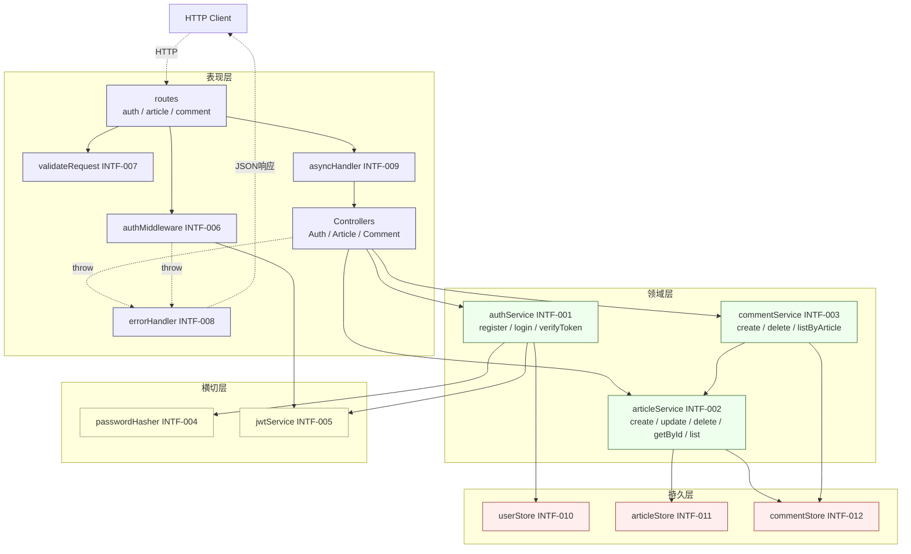

# 概要设计文档

> 阶段 3（概要设计）产出。W 模型右 V 同步产出集成测试设计。
> 本文件定义模块间接口契约（INTF-001~012）与调用关系，**不深入类 / 方法内部实现**（属阶段 4 详细设计职责）。
> 集成测试用例 IT-001~013 详见 `docs/integration-test-cases.md`。

## 文档信息

- 项目名称：blog-system-demo
- 文档版本：v1.0
- 编制日期：2026-07-23
- 编制者：W-Model Agent（self-as-verifier 回归调测）
- 关联需求文档：`docs/requirement-spec.md`
- 关联系统设计：`docs/system-design.md`（§3 模块划分 SD-001~008、§4 API 契约、§7 错误码规范）

## 1. 设计目标

承接系统设计（§3 模块划分 SD-001~008），细化模块间接口契约：

- 定义 Service / Store / Middleware / Utils 间对外接口签名（函数名 / 参数 / 返回类型 / 抛出错误）
- 明确模块调用关系与数据流向（routes → middleware → controllers → services → stores）
- 设计集成测试用例（IT-001~013）覆盖模块间交互

**设计边界**：本阶段只定义模块边界与接口契约，不深入类 / 方法内部实现（条件分支、算法细节、数据结构内部组织属阶段 4 详细设计）。

## 2. 接口设计原则

1. **依赖方向**：`routes → middleware → controllers → services → stores / utils`，单向依赖，禁止反向调用（ESLint `no-restricted-imports` 强制）
2. **错误传播**：Service 抛出 `HttpError` 子类（含 code + message + httpStatus），Controller 不捕获，由 `errorHandler` 中间件统一序列化为 `{code, message}` 响应
3. **DTO 边界**：`schemas/*` 用 zod 校验外部输入，校验后产出强类型 DTO；Service 入参为 DTO 而非 `unknown`
4. **作者隔离**：`authorId` 必须来自 JWT（`req.user.userId`），Controller / Service 不允许从 body 接收 authorId
5. **存储抽象**：Store 仅提供 CRUD 原语，业务规则（作者隔离、文章存在性校验）由 Service 强制
6. **错误码分层**：4xx（40001-49999 客户端错误）/ 5xx（50000-59999 服务端错误）/ 业务（本系统无独立业务段位，复用 4xx）

## 3. 模块接口契约清单

> 每条接口按「接口契约 Schema 模板」10 字段填写完整。接口 ID 与图谱 INTF 节点一一对应。
> 错误码含义见 `docs/system-design.md §7`：40001 参数错误 / 40101 密码错误 / 40102 JWT 无效 / 40103 缺失令牌 / 40301 非作者 / 40401 不存在 / 40901 冲突 / 50001 内部错误。

### 3.1 认证域接口（INTF-001，defines SD-001）

#### authService.register

| 字段 | 值 |
|---|---|
| 接口名 | `authService.register` |
| 路径 / 触发器 | `POST /api/v1/auth/register`（经 validateRequest 校验后调用） |
| 参数名 | `input` |
| 参数类型 | `{ username: string, password: string }`（RegisterInput DTO） |
| 必填 | `true` |
| 默认值 | 无 |
| 约束 | `username` 长度 3-32；`password` 长度 ≥8 + ≥1 字母 + ≥1 数字 |
| 示例 | `{"username":"alice","password":"Passw0rd!"}` |
| 返回值结构 | `Promise<{ userId: string, username: string }>`（userId 为 UUID v4） |
| 错误码集合 | `40001`（参数非法，由 validateRequest 前置拦截）、`40901`（用户名已存在）、`50001`（内部错误） |

#### authService.login

| 字段 | 值 |
|---|---|
| 接口名 | `authService.login` |
| 路径 / 触发器 | `POST /api/v1/auth/login` |
| 参数名 | `input` |
| 参数类型 | `{ username: string, password: string }`（LoginInput DTO） |
| 必填 | `true` |
| 默认值 | 无 |
| 约束 | 同 register；不区分用户名不存在与密码错误（安全） |
| 示例 | `{"username":"alice","password":"Passw0rd!"}` |
| 返回值结构 | `Promise<{ token: string, expiresIn: 3600 }>`（token 为 JWT 三段式，exp=iat+3600） |
| 错误码集合 | `40001`、`40101`（用户名或密码错误）、`50001` |

#### authService.verifyToken

| 字段 | 值 |
|---|---|
| 接口名 | `authService.verifyToken` |
| 路径 / 触发器 | `authMiddleware` 内部调用（每个受保护接口前置） |
| 参数名 | `token` |
| 参数类型 | `string`（JWT 三段式） |
| 必填 | `true` |
| 默认值 | 无 |
| 约束 | HS256 签名；密钥来自 `process.env.JWT_SECRET`；exp 未过期 |
| 示例 | `"eyJhbGciOiJIUzI1NiIs..."` |
| 返回值结构 | `Promise<{ userId: string, username: string }>`（JWT payload） |
| 错误码集合 | `40102`（JWT 已过期或无效）、`50001` |

### 3.2 文章管理域接口（INTF-002，defines SD-002 + SD-003）

#### articleService.create

| 字段 | 值 |
|---|---|
| 接口名 | `articleService.create` |
| 路径 / 触发器 | `POST /api/v1/articles`（经 authMiddleware + validateRequest） |
| 参数名 | `input`, `authorId` |
| 参数类型 | `{ title: string, content: string, tags: string[] }`, `string(uuid)` |
| 必填 | `true`, `true` |
| 默认值 | `tags=[]` |
| 约束 | `title` 1-200 字；`content` 1-10000 字；`tags` 0-10 个；`authorId` 来自 JWT |
| 示例 | `{"title":"Hello","content":"My post","tags":["intro"]}`, `"uuid-v4"` |
| 返回值结构 | `Promise<{ articleId: string, authorId: string, title: string, content: string, tags: string[], createdAt: string }>` |
| 错误码集合 | `40001`、`50001` |

#### articleService.update

| 字段 | 值 |
|---|---|
| 接口名 | `articleService.update` |
| 路径 / 触发器 | `PUT /api/v1/articles/:id`（经 authMiddleware + validateRequest） |
| 参数名 | `articleId`, `input`, `authorId` |
| 参数类型 | `string(uuid)`, `{ title?: string, content?: string, tags?: string[] }`, `string(uuid)` |
| 必填 | `true`, `false`, `true` |
| 默认值 | 无（仅更新传入字段） |
| 约束 | **作者隔离**：`article.authorId === authorId`，不匹配抛 40301；文章不存在抛 40401 |
| 示例 | `"uuid"`, `{"title":"Hello v2"}`, `"uuid"` |
| 返回值结构 | `Promise<Article>`（更新后文章，updatedAt > createdAt） |
| 错误码集合 | `40001`、`40301`（非作者）、`40401`（不存在）、`50001` |

#### articleService.delete

| 字段 | 值 |
|---|---|
| 接口名 | `articleService.delete` |
| 路径 / 触发器 | `DELETE /api/v1/articles/:id`（经 authMiddleware） |
| 参数名 | `articleId`, `authorId` |
| 参数类型 | `string(uuid)`, `string(uuid)` |
| 必填 | `true`, `true` |
| 默认值 | 无 |
| 约束 | **作者隔离**：不匹配抛 40301；不存在抛 40401；删除后 GET 返回 40401 |
| 示例 | `"uuid"`, `"uuid"` |
| 返回值结构 | `Promise<void>`（Controller 返回 204 空响应） |
| 错误码集合 | `40301`、`40401`、`50001` |

#### articleService.getById

| 字段 | 值 |
|---|---|
| 接口名 | `articleService.getById` |
| 路径 / 触发器 | `GET /api/v1/articles/:id`（无鉴权，公开浏览） |
| 参数名 | `articleId` |
| 参数类型 | `string(uuid)` |
| 必填 | `true` |
| 默认值 | 无 |
| 约束 | 返回文章详情 + 评论聚合（comments[] 按 createdAt 升序）；不存在抛 40401 |
| 示例 | `"uuid"` |
| 返回值结构 | `Promise<{ articleId, authorId, title, content, tags, createdAt, comments: Comment[] }>` |
| 错误码集合 | `40401`、`50001` |

#### articleService.list

| 字段 | 值 |
|---|---|
| 接口名 | `articleService.list` |
| 路径 / 触发器 | `GET /api/v1/articles`（无鉴权，公开浏览） |
| 参数名 | `page`, `pageSize` |
| 参数类型 | `number`, `number` |
| 必填 | `false`, `false` |
| 默认值 | `page=1`, `pageSize=10` |
| 约束 | `page ≥ 1`；`1 ≤ pageSize ≤ 100`；越界抛 40001；返回按 createdAt 降序 |
| 示例 | `1`, `10` |
| 返回值结构 | `Promise<{ items: Article[], total: number, page: number, pageSize: number }>` |
| 错误码集合 | `40001`（分页越界）、`50001` |

### 3.3 评论域接口（INTF-003，defines SD-004）

#### commentService.create

| 字段 | 值 |
|---|---|
| 接口名 | `commentService.create` |
| 路径 / 触发器 | `POST /api/v1/articles/:id/comments`（经 authMiddleware + validateRequest） |
| 参数名 | `articleId`, `input`, `authorId` |
| 参数类型 | `string(uuid)`, `{ content: string }`, `string(uuid)` |
| 必填 | `true`, `true`, `true` |
| 默认值 | 无 |
| 约束 | `content` 1-1000 字；**文章存在性校验**：articleId 不存在抛 40401；authorId 来自 JWT |
| 示例 | `"uuid"`, `{"content":"Nice post!"}`, `"uuid"` |
| 返回值结构 | `Promise<{ commentId: string, articleId: string, authorId: string, content: string, createdAt: string }>` |
| 错误码集合 | `40001`、`40401`（文章不存在）、`50001` |

#### commentService.delete

| 字段 | 值 |
|---|---|
| 接口名 | `commentService.delete` |
| 路径 / 触发器 | `DELETE /api/v1/comments/:commentId`（经 authMiddleware） |
| 参数名 | `commentId`, `authorId` |
| 参数类型 | `string(uuid)`, `string(uuid)` |
| 必填 | `true`, `true` |
| 默认值 | 无 |
| 约束 | **作者隔离**：`comment.authorId === authorId`，不匹配抛 40301；不存在抛 40401 |
| 示例 | `"uuid"`, `"uuid"` |
| 返回值结构 | `Promise<void>`（Controller 返回 204） |
| 错误码集合 | `40301`、`40401`、`50001` |

#### commentService.listByArticle

| 字段 | 值 |
|---|---|
| 接口名 | `commentService.listByArticle` |
| 路径 / 触发器 | `articleService.getById` 内部调用（聚合到文章详情） |
| 参数名 | `articleId` |
| 参数类型 | `string(uuid)` |
| 必填 | `true` |
| 默认值 | 无 |
| 约束 | 返回该文章下全部评论，按 createdAt 升序 |
| 示例 | `"uuid"` |
| 返回值结构 | `Promise<Comment[]>` |
| 错误码集合 | `50001` |

### 3.4 安全中间件接口（INTF-004 / INTF-005 / INTF-006，defines SD-005）

#### passwordHasher（INTF-004）

| 字段 | 值 |
|---|---|
| 接口名 | `passwordHasher.hash` / `passwordHasher.compare` |
| 路径 / 触发器 | `authService.register` / `authService.login` 内部调用 |
| 参数名 | `password` / `password, hash` |
| 参数类型 | `string` / `string, string` |
| 必填 | `true` / `true` |
| 默认值 | 无 |
| 约束 | bcrypt cost = 10；hash 格式 `$2b$10$`；明文不入日志 / 存储 |
| 示例 | `"Passw0rd!"` / `"Passw0rd!", "$2b$10$..."` |
| 返回值结构 | `Promise<string>`（hash）/ `Promise<boolean>`（匹配结果） |
| 错误码集合 | `50001`（内部错误） |

#### jwtService（INTF-005）

| 字段 | 值 |
|---|---|
| 接口名 | `jwtService.sign` / `jwtService.verify` |
| 路径 / 触发器 | `authService.login` / `authService.verifyToken` 内部调用 |
| 参数名 | `payload` / `token` |
| 参数类型 | `{ userId: string, username: string }` / `string` |
| 必填 | `true` / `true` |
| 默认值 | 无 |
| 约束 | HS256；exp = iat + 3600；密钥来自 `process.env.JWT_SECRET`（启动缺失即退出） |
| 示例 | `{"userId":"uuid","username":"alice"}` / `"eyJ..."` |
| 返回值结构 | `string`（token）/ `{ userId: string, username: string }`（payload） |
| 错误码集合 | `50001`（密钥缺失）；verify 失败由调用方映射为 `40102` |

#### authMiddleware（INTF-006）

| 字段 | 值 |
|---|---|
| 接口名 | `authMiddleware` |
| 路径 / 触发器 | Express middleware，挂载于受保护路由（POST/PUT/DELETE articles、POST/DELETE comments） |
| 参数名 | `req, res, next` |
| 参数类型 | `Request, Response, NextFunction` |
| 必填 | `true` |
| 默认值 | 无 |
| 约束 | 从 `Authorization: Bearer <token>` 提取 token；缺失抛 40103；无效 / 过期抛 40102；成功将 `req.user = { userId, username }` |
| 示例 | `Authorization: Bearer eyJ...` |
| 返回值结构 | `void`（调用 `next()` 或抛出 HttpError） |
| 错误码集合 | `40102`（JWT 无效）、`40103`（缺失令牌）、`50001` |

### 3.5 校验与类型接口（INTF-007，defines SD-006）

#### validateRequest

| 字段 | 值 |
|---|---|
| 接口名 | `validateRequest` |
| 路径 / 触发器 | Express middleware 工厂，挂载于所有公开接口（`validate(schema)`） |
| 参数名 | `schema` |
| 参数类型 | `z.ZodSchema<T>` |
| 必填 | `true` |
| 默认值 | 无 |
| 约束 | 校验 `req.body`（POST/PUT）或 `req.query`（GET 分页）；失败抛 40001 + zod 错误明细；成功将 `req.body` 替换为强类型 DTO |
| 示例 | `validate(ArticleCreateSchema)` |
| 返回值结构 | `RequestHandler`（Express middleware） |
| 错误码集合 | `40001`（参数校验失败）、`50001` |

### 3.6 性能保障接口（INTF-008 / INTF-009，defines SD-008）

#### errorHandler（INTF-008）

| 字段 | 值 |
|---|---|
| 接口名 | `errorHandler` |
| 路径 / 触发器 | Express error middleware（4 参数），挂载于路由链末尾 |
| 参数名 | `err, req, res, next` |
| 参数类型 | `Error, Request, Response, NextFunction` |
| 必填 | `true` |
| 默认值 | 无 |
| 约束 | `HttpError` 子类按 `err.httpStatus + err.code` 序列化；非 `HttpError` 统一映射为 50001；不泄露堆栈 |
| 示例 | `throw new ConflictError(40901, "用户名已存在")` |
| 返回值结构 | `void`（`res.status(httpStatus).json({ code, message })`） |
| 错误码集合 | 全部错误码（40001/40101/40102/40103/40301/40401/40901/50001） |

#### asyncHandler（INTF-009）

| 字段 | 值 |
|---|---|
| 接口名 | `asyncHandler` |
| 路径 / 触发器 | 包装 async controller，捕获 Promise rejection 转发至 errorHandler |
| 参数名 | `fn` |
| 参数类型 | `(req, res, next) => Promise<void>` |
| 必填 | `true` |
| 默认值 | 无 |
| 约束 | 捕获 controller 内所有 throw / reject，透传给 `next(err)` |
| 示例 | `asyncHandler(AuthController.register)` |
| 返回值结构 | `RequestHandler`（Express middleware） |
| 错误码集合 | 透传被包装函数的错误码 |

### 3.7 内存存储接口（INTF-010 / INTF-011 / INTF-012，defines SD-007）

#### userStore（INTF-010）

| 字段 | 值 |
|---|---|
| 接口名 | `userStore.insert` / `userStore.findByUsername` / `userStore.findById` |
| 路径 / 触发器 | `authService.register` / `authService.login` 内部调用 |
| 参数名 | `user` / `username` / `id` |
| 参数类型 | `User` / `string` / `string` |
| 必填 | `true` |
| 默认值 | 无 |
| 约束 | 内存 Map 存储；`username` 唯一索引；insert 冲突抛 40901；不含明文 password 字段 |
| 示例 | `{ id, username, passwordHash, createdAt }` |
| 返回值结构 | `User | undefined` |
| 错误码集合 | `40901`（用户名冲突）、`50001` |

#### articleStore（INTF-011）

| 字段 | 值 |
|---|---|
| 接口名 | `articleStore.insert` / `articleStore.findById` / `articleStore.update` / `articleStore.delete` / `articleStore.findAll` |
| 路径 / 触发器 | `articleService.*` 内部调用 |
| 参数名 | `article` / `id` / `id, patch` / `id` / `page, pageSize` |
| 参数类型 | `Article` / `string` / `string, Partial<Article>` / `string` / `number, number` |
| 必填 | `true` |
| 默认值 | 无 |
| 约束 | 内存 Map；findAll 按 createdAt 降序分页；update / delete 不存在返回 null（由 Service 映射 40401） |
| 示例 | `{ id, authorId, title, content, tags, createdAt, updatedAt }` |
| 返回值结构 | `Article | null` / `Article[]` / `{ items, total }` |
| 错误码集合 | `50001`（存在性 / 作者校验由 Service 强制） |

#### commentStore（INTF-012）

| 字段 | 值 |
|---|---|
| 接口名 | `commentStore.insert` / `commentStore.findById` / `commentStore.delete` / `commentStore.findByArticleId` |
| 路径 / 触发器 | `commentService.*` / `articleService.getById` 内部调用 |
| 参数名 | `comment` / `id` / `id` / `articleId` |
| 参数类型 | `Comment` / `string` / `string` / `string` |
| 必填 | `true` |
| 默认值 | 无 |
| 约束 | 内存 Map；findByArticleId 按 createdAt 升序；delete 不存在返回 false（由 Service 映射 40401） |
| 示例 | `{ id, articleId, authorId, content, createdAt }` |
| 返回值结构 | `Comment | null` / `boolean` / `Comment[]` |
| 错误码集合 | `50001` |

## 4. 模块调用关系图



**调用关系说明**：
- `routes → validateRequest → authMiddleware → asyncHandler → controllers`：请求进入表现层，先校验参数、再鉴权、async 包装后进入 controller
- `controllers → services`：controller 仅做 HTTP 适配，调用 service 业务逻辑
- `authService → passwordHasher / jwtService / userStore`：认证域调用横切工具与持久层
- `articleService → articleStore / commentStore`：文章详情聚合需查评论
- `commentService → commentStore` 且 `commentService → articleService`（文章存在性校验）：评论域依赖文章域校验文章存在
- `controllers / authMiddleware -.throw.-> errorHandler`：所有异常经 asyncHandler 透传至 errorHandler 统一序列化

**循环依赖检测（DFS 三色染色）**：
- `commentService → articleService`（校验文章存在）与 `articleService → commentStore`（聚合评论）构成跨域调用，但方向为 comment→article 单向，article 不回调 comment，**无循环依赖**。
- 持久层 stores 不 import services（依赖方向自上而下），**无反向依赖**。

## 5. 数据流

### 5.1 受保护接口数据流（以 POST /api/v1/articles 为例）

```
Client → routes/article.routes
  → validateRequest(ArticleCreateSchema)     [INTF-007] 校验 body → DTO 或抛 40001
  → authMiddleware                            [INTF-006] 提取 Bearer token
      → jwtService.verify(token)              [INTF-005] 解码 JWT → {userId, username} 或抛 40102
  → asyncHandler(ArticleController.create)    [INTF-009] 包装 async
  → articleService.create(dto, userId)        [INTF-002] 业务逻辑
      → articleStore.insert(article)          [INTF-011] 写入内存 Map
  → res.status(201).json(article)             响应
  ↑ 任意 throw → errorHandler                  [INTF-008] 序列化 {code, message}
```

### 5.2 公开接口数据流（以 GET /api/v1/articles/:id 为例）

```
Client → routes/article.routes
  → validateRequest(IdParamSchema)            [INTF-007] 校验 path id
  → asyncHandler(ArticleController.getById)   [INTF-009]
  → articleService.getById(articleId)         [INTF-002]
      → articleStore.findById(id)             [INTF-011] 查内存 Map
      → commentService.listByArticle(id)      [INTF-003] 聚合评论
          → commentStore.findByArticleId(id)  [INTF-012] 查评论
  → res.status(200).json({ ...article, comments })
  ↑ 不存在 → throw NotFoundError → errorHandler → 40401
```

### 5.3 认证数据流（POST /api/v1/auth/register）

```
Client → routes/auth.routes
  → validateRequest(AuthRegisterSchema)       [INTF-007] 校验 username/password
  → asyncHandler(AuthController.register)     [INTF-009]
  → authService.register(dto)                 [INTF-001]
      → userStore.findByUsername(username)    [INTF-010] 查重
      → passwordHasher.hash(password)         [INTF-004] bcrypt cost=10
      → userStore.insert(user)                [INTF-010] 写入
  → res.status(201).json({ userId, username })
  ↑ 用户名已存在 → throw ConflictError → errorHandler → 40901
```

## 6. 错误码分层覆盖

| 段位 | 范围 | 错误码 | 触发接口 | 说明 |
|---|---|---|---|---|
| 4xx | 40000-49999 | 40001 | validateRequest (INTF-007) | 参数校验失败（zod） |
| 4xx | | 40101 | authService.login (INTF-001) | 用户名或密码错误 |
| 4xx | | 40102 | authMiddleware (INTF-006) | JWT 已过期或无效 |
| 4xx | | 40103 | authMiddleware (INTF-006) | 未提供认证令牌 |
| 4xx | | 40301 | articleService.update/delete (INTF-002)、commentService.delete (INTF-003) | 非作者操作 |
| 4xx | | 40401 | articleService.* (INTF-002)、commentService.* (INTF-003) | 资源不存在 |
| 4xx | | 40901 | userStore.insert (INTF-010) 经 authService.register (INTF-001) | 用户名冲突 |
| 5xx | 50000-59999 | 50001 | errorHandler (INTF-008) 兜底 | 服务器内部错误 |
| 业务 | 60000-69999 | — | — | 本系统无独立业务段位（CRUD 无状态机 / 库存规则），复用 4xx |

> 错误码全局唯一（见 system-design.md §7），每条接口契约均定义错误码集合，覆盖 4xx / 5xx 两段位。

## 7. 接口与 SD 模块追溯映射

| 接口 ID | 接口名 | defines（SD 模块） | 关联需求 |
|---|---|---|---|
| INTF-001 | authService | SD-001 | REQ-001 |
| INTF-002 | articleService | SD-002, SD-003 | REQ-002, REQ-003 |
| INTF-003 | commentService | SD-004 | REQ-004 |
| INTF-004 | passwordHasher | SD-005 | NFR-001 |
| INTF-005 | jwtService | SD-005 | NFR-001 |
| INTF-006 | authMiddleware | SD-005 | NFR-001 |
| INTF-007 | validateRequest | SD-006 | NFR-003 |
| INTF-008 | errorHandler | SD-008 | NFR-002 |
| INTF-009 | asyncHandler | SD-008 | NFR-002 |
| INTF-010 | userStore | SD-007 | NFR-004 |
| INTF-011 | articleStore | SD-007 | NFR-004 |
| INTF-012 | commentStore | SD-007 | NFR-004 |

## 8. 集成测试用例索引

> 阶段 3 同步产出集成测试设计。本阶段只设计，不执行；执行在阶段 6（集成测试）。
> 详细用例见 `docs/integration-test-cases.md`。

| 用例 ID | 关联需求 | 测试场景 | 优先级 |
|---|---|---|---|
| IT-001 | REQ-001 | 注册→登录全链路（authService×userStore×passwordHasher×jwtService） | 高 |
| IT-002 | REQ-001 | 重复注册→40901（authService×userStore×errorHandler） | 高 |
| IT-003 | REQ-001 | 登录密码错误→40101（authService×passwordHasher×errorHandler） | 高 |
| IT-004 | REQ-002 | 创建文章全链路（authMiddleware×articleService×articleStore） | 高 |
| IT-005 | REQ-002 | 作者隔离-非作者修改/删除→40301（authMiddleware×articleService×errorHandler） | 高 |
| IT-006 | REQ-003 | 公开浏览列表+分页（articleService×articleStore） | 高 |
| IT-007 | REQ-003, REQ-004 | 文章详情+评论聚合（articleService×commentService×stores） | 高 |
| IT-008 | REQ-004 | 发表评论+文章存在性校验（authMiddleware×commentService×articleService） | 高 |
| IT-009 | REQ-004 | 删除评论-作者隔离→40301（authMiddleware×commentService×errorHandler） | 高 |
| IT-010 | REQ-004 | 评论对不存在文章→40401（commentService×articleService×errorHandler） | 中 |
| IT-011 | NFR-001 | 鉴权中间件-缺token/伪造/过期→40103/40102（authMiddleware×jwtService×errorHandler） | 高 |
| IT-012 | NFR-003 | zod参数校验-非法入参→40001（validateRequest×errorHandler） | 高 |
| IT-013 | NFR-001 | bcrypt哈希存储-cost=10+无明文（passwordHasher×userStore） | 高 |

### 8.1 集成测试覆盖说明

- **跨模块调用覆盖（TC-DES-011）**：IT-001（auth×store×utils）、IT-004（middleware×service×store）、IT-007（article×comment×stores）、IT-008（comment×article 跨域校验）
- **参数校验覆盖（TC-DES-010）**：IT-012（zod 非法入参 → 40001）
- **数据传递异常路径（TC-DES-012）**：IT-002（40901）、IT-003（40101）、IT-005（40301）、IT-010（40401）、IT-011（40102/40103）
- **错误码全覆盖**：40001 / 40101 / 40102 / 40103 / 40301 / 40401 / 40901
- **controller×service×store 全链路**：IT-001 / IT-004 / IT-006 / IT-007
- **middleware×controller**：IT-005 / IT-008 / IT-011
- 总计：13 条 IT，覆盖跨模块调用 + 参数校验 + 异常路径 + 安全基线

## 9. 阶段 3 自检清单

- [x] 接口契约完整（12 个 INTF，每条按 10 字段模板填写：接口名 / 路径 / 参数 / 类型 / 必填 / 默认值 / 约束 / 示例 / 返回值 / 错误码）
- [x] 错误码按分层约定覆盖 4xx（40001/40101/40102/40103/40301/40401/40901）/ 5xx（50001）两段位
- [x] 模块调用关系图清晰（Mermaid graph），含依赖方向标注，DFS 三色染色验证无循环依赖
- [x] 数据流覆盖受保护接口 / 公开接口 / 认证三类路径
- [x] 集成测试用例覆盖跨模块调用 + 参数校验 + 异常路径（13 条 IT）
- [x] 接口与 SD 模块追溯映射完整（INTF defines SD），RTM 已补登
- [x] 未深入类 / 方法内部实现（条件分支 / 算法细节留待阶段 4）

## 10. 阶段完成摘要

- 产物路径：
  - `docs/outline-design.md`（本文件）
  - `docs/integration-test-cases.md`（IT-001~013 详细用例）
  - `.w-model/rtm.json`（已补登 designs INTF-001~012 + tests.integration IT-001~013）
  - `.w-model/ingestion/consolidated.json`（阶段 3 图谱，check-requirement-graph.ts --phase=3 退出码 0）
- RTM 覆盖状态：designs 补登 INTF-001~012（每个 INTF defines 对应 SD）；integrationTests 登记 IT-001~013
- 验证证据：12 个 INTF 契约按 10 字段模板填写；调用关系图 DFS 验证无循环依赖；13 条 IT 覆盖跨模块 + 参数校验 + 异常路径；图谱 INTF 节点均有 defines 追溯边，信息流零违反
- 阻塞项：无
- 下一步：进入阶段 4（详细设计），同步产出单元测试设计
