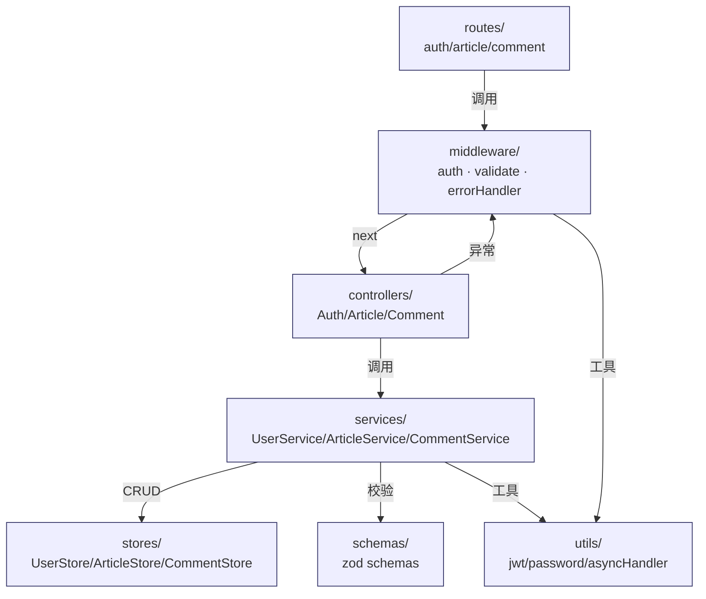

# 接口设计文档（概要设计）

> 阶段 3（概要设计）产出。W 模型右 V 同步产出集成测试设计。
> 本文件内嵌集成测试用例设计（IT-001~006），不再外挂独立测试用例文件。
> 本阶段只定义模块边界与接口契约，**不深入类 / 方法内部**（类 / 方法级设计属阶段 4）。

## 文档信息

- 项目名称：blog-system-demo
- 文档版本：v1.0
- 编制日期：2026-07-21
- 编制者：W-Model Agent
- 关联系统设计文档：`docs/system-design.md`

## 1. 模块调用关系

### 1.1 调用关系图（Mermaid graph）



### 1.2 依赖方向矩阵

| 调用方 ↓ \ 被调方 → | routes | middleware | controllers | services | stores | schemas | utils |
|---|:---:|:---:|:---:|:---:|:---:|:---:|:---:|
| routes | — | ✓ | ✓ | — | — | — | — |
| middleware | — | — | — | — | — | ✓ | ✓ |
| controllers | — | — | — | ✓ | — | — | ✓ |
| services | — | — | — | — | ✓ | ✓ | ✓ |
| stores | — | — | — | — | — | — | — |
| schemas | — | — | — | — | — | — | — |
| utils | — | — | — | — | — | — | — |

依赖方向严格自上而下；stores / schemas / utils 为底层无外部依赖。**禁止反向依赖**（如 stores import services）—— 通过 ESLint `no-restricted-imports` 在阶段 5 编码时强制。

### 1.3 循环依赖检测说明（DFS 三色染色）

检测算法：DFS 三色染色（白 = 未访问 / 灰 = 栈中 / 黑 = 已完成）；遇灰节点即环。

对模块依赖图执行检测：

```
DFS(routes)         → routes → middleware → schemas ✓ exit
                                       → utils ✓ exit
                    → routes → controllers → services → stores ✓ exit
                                                       → schemas ✓ exit
                                                       → utils ✓ exit
                                       → controllers → utils ✓ exit
DFS 结果：无环（环路径 = []）
```

| 节点 | 入度 | 出度 | 颜色序列 |
|---|:---:|:---:|---|
| routes | 0 | 2 | 白→灰→黑 |
| middleware | 1 | 2 | 白→灰→黑 |
| controllers | 1 | 2 | 白→灰→黑 |
| services | 1 | 3 | 白→灰→黑 |
| stores | 1 | 0 | 白→灰→黑 |
| schemas | 2 | 0 | 白→灰→黑 |
| utils | 3 | 0 | 白→灰→黑 |

**结论**：模块依赖图无环，可放行进入接口契约定义。若阶段 5 编码后通过 `npx -y madge --circular --extensions ts,js src` 检测到环，回阶段 3 重新划分模块边界（引入接口层或倒置依赖）。

## 2. 接口定义

> 每个接口契约按 10 字段 Schema 模板填写：方法 / 路径 / 请求 schema / 响应 schema / 错误码 / 认证 / 版本 / 限流 / 缓存 / 示例。

### 2.1 用户认证接口

#### 接口 1：用户注册

| 字段 | 值 |
|---|---|
| 方法 | `POST` |
| 路径 | `/api/v1/auth/register` |
| 请求 schema | `AuthRegisterSchema`：`{username: string(3..32, 字母数字下划线), password: string(min 8, 至少 1 字母 + 1 数字)}` |
| 响应 schema | `{userId: string(uuid), username: string}` |
| 错误码集合 | `40001 参数缺失/格式错误` / `40002 密码复杂度不足` / `40901 用户名已注册` |
| 认证 | 无（公开接口） |
| 版本 | `v1` |
| 限流 | 5 req/min/IP（防用户枚举与暴力注册） |
| 缓存 | 无 |
| 示例请求 | `POST /api/v1/auth/register` body: `{"username":"alice","password":"Passw0rd!"}` |
| 示例响应 | `201 Created` body: `{"userId":"550e8400-e29b-41d4-a716-446655440000","username":"alice"}` |

#### 接口 2：用户登录

| 字段 | 值 |
|---|---|
| 方法 | `POST` |
| 路径 | `/api/v1/auth/login` |
| 请求 schema | `AuthLoginSchema`：`{username: string, password: string}` |
| 响应 schema | `{token: string(jwt), expiresIn: 3600}` |
| 错误码集合 | `40001 参数缺失/格式错误` / `40101 用户名或密码错误` |
| 认证 | 无（公开接口） |
| 版本 | `v1` |
| 限流 | 10 req/min/IP |
| 缓存 | 无 |
| 示例请求 | `POST /api/v1/auth/login` body: `{"username":"alice","password":"Passw0rd!"}` |
| 示例响应 | `200 OK` body: `{"token":"eyJhbGciOiJIUzI1NiIs...","expiresIn":3600}` |

### 2.2 文章管理接口

#### 接口 3：创建文章

| 字段 | 值 |
|---|---|
| 方法 | `POST` |
| 路径 | `/api/v1/articles` |
| 请求 schema | `ArticleCreateSchema`：`{title: string(1..200), content: string(1..10000), tags?: string[](0..10)}` |
| 响应 schema | `{articleId: string(uuid), authorId: string(uuid), title: string, content: string, tags: string[], createdAt: ISO8601}` |
| 错误码集合 | `40001 参数缺失` / `40002 标题/内容长度越界` / `40103 未提供认证令牌` / `40102 JWT 已过期或无效` |
| 认证 | `Authorization: Bearer <token>`（必需） |
| 版本 | `v1` |
| 限流 | 30 req/min/user |
| 缓存 | 无 |
| 示例请求 | `POST /api/v1/articles` body: `{"title":"Hello","content":"World","tags":["intro"]}` |
| 示例响应 | `201 Created` body: `{"articleId":"...","authorId":"...","title":"Hello","content":"World","tags":["intro"],"createdAt":"2026-07-21T10:00:00Z"}` |

#### 接口 4：修改文章

| 字段 | 值 |
|---|---|
| 方法 | `PATCH` |
| 路径 | `/api/v1/articles/:id` |
| 请求 schema | `ArticleUpdateSchema`：`{title?: string(1..200), content?: string(1..10000), tags?: string[](0..10)}` |
| 响应 schema | `{articleId: string, authorId: string, title: string, content: string, tags: string[], createdAt: ISO8601, updatedAt: ISO8601}` |
| 错误码集合 | `40001 参数缺失` / `40002 长度越界` / `40102 JWT 无效` / `40103 未提供令牌` / `40301 无权操作他人文章` / `40401 文章不存在` |
| 认证 | `Authorization: Bearer <token>`（必需；且 authorId 须等于 JWT.userId） |
| 版本 | `v1` |
| 限流 | 30 req/min/user |
| 缓存 | 无 |
| 示例请求 | `PATCH /api/v1/articles/abc-123` body: `{"title":"Hello v2"}` |
| 示例响应 | `200 OK` body: `{"articleId":"abc-123","authorId":"...","title":"Hello v2","content":"World","tags":["intro"],"createdAt":"...","updatedAt":"2026-07-21T10:05:00Z"}` |

#### 接口 5：删除文章

| 字段 | 值 |
|---|---|
| 方法 | `DELETE` |
| 路径 | `/api/v1/articles/:id` |
| 请求 schema | 无 body |
| 响应 schema | 空（HTTP 204） |
| 错误码集合 | `40102 JWT 无效` / `40103 未提供令牌` / `40301 无权操作他人文章` / `40401 文章不存在` |
| 认证 | `Authorization: Bearer <token>`（必需；且 authorId 须等于 JWT.userId） |
| 版本 | `v1` |
| 限流 | 10 req/min/user |
| 缓存 | 无 |
| 示例请求 | `DELETE /api/v1/articles/abc-123` |
| 示例响应 | `204 No Content` 空 body |

#### 接口 6：获取文章详情（含评论聚合）

| 字段 | 值 |
|---|---|
| 方法 | `GET` |
| 路径 | `/api/v1/articles/:id` |
| 请求 schema | 路径参数 `id: string(uuid)` |
| 响应 schema | `{id: string, authorId: string, title: string, content: string, tags: string[], createdAt: ISO8601, updatedAt: ISO8601, comments: Comment[]}` |
| 错误码集合 | `40001 id 格式错误` / `40401 文章不存在` |
| 认证 | 无（公开接口） |
| 版本 | `v1` |
| 限流 | 100 req/min/IP |
| 缓存 | `Cache-Control: public, max-age=60`（1 分钟） |
| 示例请求 | `GET /api/v1/articles/abc-123` |
| 示例响应 | `200 OK` body: `{"id":"abc-123","authorId":"...","title":"Hello","content":"World","tags":["intro"],"createdAt":"...","updatedAt":"...","comments":[{"id":"c-1","authorId":"...","content":"Nice","createdAt":"..."}]}` |

#### 接口 7：分页浏览文章列表

| 字段 | 值 |
|---|---|
| 方法 | `GET` |
| 路径 | `/api/v1/articles` |
| 请求 schema | query: `{page?: int(≥1, default 1), pageSize?: int(1..100, default 10), tag?: string}` |
| 响应 schema | `{items: Article[], total: int, page: int, pageSize: int}` |
| 错误码集合 | `40001 page/pageSize 非整数或越界` |
| 认证 | 无（公开接口） |
| 版本 | `v1` |
| 限流 | 100 req/min/IP |
| 缓存 | `Cache-Control: public, max-age=60` |
| 示例请求 | `GET /api/v1/articles?page=1&pageSize=10` |
| 示例响应 | `200 OK` body: `{"items":[{...},{...}],"total":15,"page":1,"pageSize":10}` |

### 2.3 评论接口

#### 接口 8：发表评论

| 字段 | 值 |
|---|---|
| 方法 | `POST` |
| 路径 | `/api/v1/articles/:id/comments` |
| 请求 schema | `CommentCreateSchema`：`{content: string(1..1000)}`；路径参数 `id: string(uuid)` |
| 响应 schema | `{commentId: string(uuid), articleId: string, authorId: string, content: string, createdAt: ISO8601}` |
| 错误码集合 | `40001 参数缺失` / `40002 content 长度越界` / `40102 JWT 无效` / `40103 未提供令牌` / `40401 文章不存在` |
| 认证 | `Authorization: Bearer <token>`（必需；authorId 取自 JWT.userId，不取自 body） |
| 版本 | `v1` |
| 限流 | 60 req/min/user |
| 缓存 | 无 |
| 示例请求 | `POST /api/v1/articles/abc-123/comments` body: `{"content":"Nice post!"}` |
| 示例响应 | `201 Created` body: `{"commentId":"c-1","articleId":"abc-123","authorId":"...","content":"Nice post!","createdAt":"2026-07-21T10:10:00Z"}` |

#### 接口 9：获取文章评论列表

| 字段 | 值 |
|---|---|
| 方法 | `GET` |
| 路径 | `/api/v1/articles/:id/comments` |
| 请求 schema | 路径参数 `id: string(uuid)` |
| 响应 schema | `{items: Comment[], total: int}` |
| 错误码集合 | `40001 id 格式错误` / `40401 文章不存在` |
| 认证 | 无（公开接口） |
| 版本 | `v1` |
| 限流 | 100 req/min/IP |
| 缓存 | `Cache-Control: public, max-age=60` |
| 示例请求 | `GET /api/v1/articles/abc-123/comments` |
| 示例响应 | `200 OK` body: `{"items":[{"commentId":"c-1",...}],"total":1}` |

#### 接口 10：删除评论

| 字段 | 值 |
|---|---|
| 方法 | `DELETE` |
| 路径 | `/api/v1/articles/:id/comments/:commentId` |
| 请求 schema | 路径参数 `id: string(uuid)`、`commentId: string(uuid)` |
| 响应 schema | 空（HTTP 204） |
| 错误码集合 | `40102 JWT 无效` / `40103 未提供令牌` / `40301 无权删除他人评论` / `40401 文章或评论不存在` |
| 认证 | `Authorization: Bearer <token>`（必需；且 comment.authorId 须等于 JWT.userId） |
| 版本 | `v1` |
| 限流 | 10 req/min/user |
| 缓存 | 无 |
| 示例请求 | `DELETE /api/v1/articles/abc-123/comments/c-1` |
| 示例响应 | `204 No Content` 空 body |

## 3. 错误码分层约定

| 段位 | 范围 | 含义 | 错误码清单 |
|---|---|---|---|
| 4xx | 40000-49999 | 客户端错误（参数 / 认证 / 权限） | `40001 参数缺失或格式错误` / `40002 字段长度或类型越界` / `40101 用户名或密码错误` / `40102 JWT 已过期或无效` / `40103 未提供认证令牌` / `40301 无权操作他人资源` / `40401 资源不存在` / `40901 资源已存在（用户名已注册）` |
| 5xx | 50000-59999 | 服务端错误（依赖 / 未知） | `50001 内部错误` / `50002 内存存储写入失败` |
| 业务 | 60000-69999 | 业务规则错误（状态机 / 风控） | 本 demo 无业务错误码（无订单 / 库存场景）；保留段位供扩展 |

每条错误码配套 `code` + `message` + `httpStatus` + `retryable` 四元组：

| code | message | httpStatus | retryable |
|---|---|:---:|:---:|
| 40001 | 参数缺失或格式错误 | 400 | false |
| 40002 | 字段长度或类型越界 | 400 | false |
| 40101 | 用户名或密码错误 | 401 | false |
| 40102 | JWT 已过期或无效 | 401 | false |
| 40103 | 未提供认证令牌 | 401 | false |
| 40301 | 无权操作他人资源 | 403 | false |
| 40401 | 资源不存在 | 404 | false |
| 40901 | 资源已存在 | 409 | false |
| 50001 | 内部错误 | 500 | true |
| 50002 | 内存存储写入失败 | 500 | true |

## 4. 集成测试用例设计

> 阶段 3 同步产出集成测试设计。本阶段只设计，不执行；执行在阶段 6（集成测试）。
> 覆盖原则：必须覆盖 TC-DES-010（参数校验）/ TC-DES-011（跨模块调用）/ TC-DES-012（异常路径）三类强制场景。
> 集成测试使用 supertest + 真实 Express app 实例；不 mock 内部 Service / Store；每个测试用例 beforeEach 重置 Store 单例。

### 4.1 集成测试用例清单

| 用例 ID | 关联接口 | 场景 | 输入 | 预期输出 | 优先级 |
|---|---|---|---|---|---|
| IT-001 | 接口 1 | 合法参数注册成功 | `POST /api/v1/auth/register` body: `{"username":"alice","password":"Passw0rd!"}`；随后重复注册同用户名 | 第 1 次：HTTP 201；`res.body.userId` 匹配 UUID v4；`res.body.username === "alice"`；第 2 次：HTTP 409 + `code === 40901`；存储中 `passwordHash` 以 `$2b$10$` 开头 | 高 |
| IT-002 | 接口 1 | 非法参数（邮箱格式错误 / 密码弱 / 缺失字段） | 5 类非法输入：1) `{"username":"ab","password":"Passw0rd!"}`（用户名过短）；2) `{"username":"bob","password":"Ab1"}`（密码 < 8）；3) `{"username":"bob","password":"Password"}`（无数字）；4) `{"username":"bob","password":"12345678"}`（无字母）；5) `{"username":"bob"}`（缺 password） | 1) HTTP 400 + 40001；2-4) HTTP 400 + 40002；5) HTTP 400 + 40001；非法参数不写入存储（`userStore.findByUsername("bob")` 为 undefined） | 高 |
| IT-003 | 接口 2 + 3 | 登录后跨模块创建文章（认证传递） | `POST /api/v1/auth/login` 获取 token → `jwt.decode(token)` 校验 payload → `POST /api/v1/articles` Header: `Authorization: Bearer <token>` body: `{"title":"T1","content":"C1"}` | 登录返回 200 + token；payload.userId 与注册返回一致；创建文章返回 201；`res.body.authorId === payload.userId`（authorId 来自 JWT 而非 body）；`articleStore.findById` 返回文章且 authorId 一致 | 高 |
| IT-004 | 接口 3 + 8 + 6 | 文章服务 → 评论服务 → 详情聚合数据传递 | alice 登录后：1) `POST /api/v1/articles` 创建文章；2) `POST /api/v1/articles/:id/comments` body `{"content":"First!"}`；3) 同接口 body `{"content":"Second!"}`；4) `GET /api/v1/articles/:id` | 步骤 1-3 返回 201；步骤 4 返回 200；`res.body.comments.length === 2`；评论按 createdAt 升序：First → Second；`comments[0].authorId === alice.userId` | 高 |
| IT-005 | 接口 8 | 文章不存在异常路径 - 发表评论 | `POST /api/v1/articles/non-existent-uuid/comments` Bearer + `{"content":"Hi"}` | HTTP 404 + `code === 40401`；`commentStore.findByArticleId("non-existent-uuid")` 为 `[]`；stderr 无 Unhandled Rejection；进程未崩溃（异常经 asyncHandler → errorHandler 链路捕获） | 高 |
| IT-006 | 接口 5 + 6 + 9 | 删除文章后查询返回 404 异常路径 | 文章 X 存在且下有 2 条评论；`DELETE /api/v1/articles/:X`（作者 token）→ `GET /api/v1/articles/:X` → `GET /api/v1/articles/:X/comments` | DELETE 返回 204；后续 GET 详情返回 404 + 40401；GET 评论列表返回 404 + 40401；`articleStore.findById(":X")` 为 undefined；`commentStore.findByArticleId(":X")` 为 `[]`（评论随文章级联删除或不暴露） | 高 |

### 4.2 集成测试覆盖说明

- 参数校验覆盖（TC-DES-010）：IT-001 合法 + IT-002 非法 5 类（格式 / 长度 / 复杂度 / 缺失 / 类型）
- 跨模块调用覆盖（TC-DES-011）：IT-003（auth→article 认证传递）+ IT-004（article→comment→article 详情聚合）
- 异常路径覆盖（TC-DES-012）：IT-005（文章不存在发表评论 → 40401）+ IT-006（删除后查询 → 40401）
- 数据传递正确性：IT-003 authorId 注入 + IT-004 评论聚合 + 评论顺序
- 总计：6 条 IT，覆盖参数校验 + 跨模块 2 + 异常路径 2 + 数据传递 1

## 5. 阶段 3 自检清单

- [x] 接口定义完整，10 个接口契约全部按「10 字段 Schema 模板」填写
- [x] 错误码按「错误码分层约定」覆盖 4xx / 5xx / 业务三段位（业务段位本 demo 无用例但已声明保留段位）
- [x] 模块间调用关系清晰，无循环依赖（DFS 三色染色验证）
- [x] 集成测试用例覆盖关键模块交互路径（参数校验 + 跨模块 + 异常路径），共 6 条
- [x] RTM 已补登 outline-design 文档（见 `.w-model/rtm.json`）
- [x] 未越界深入类 / 方法内部（方法签名将在阶段 4 详细设计产出）

## 6. 阶段完成摘要

- 产物路径：
  - `docs/outline-design.md`（本文件，内嵌 IT-001~006）
  - `.w-model/rtm.json`（已补登 outline-design）
- RTM 覆盖状态：部分（designDoc 已填充；codeModule / UT / IT / ST / UAT 待后续阶段填充）
- 验证证据：10 个接口契约完整 + 10 个错误码 + DFS 三色染色无环 + 6 条 IT 覆盖参数校验 / 跨模块 / 异常路径
- 阻塞项：无
- 下一步：进入阶段 4（详细设计），同步产出单元测试设计
