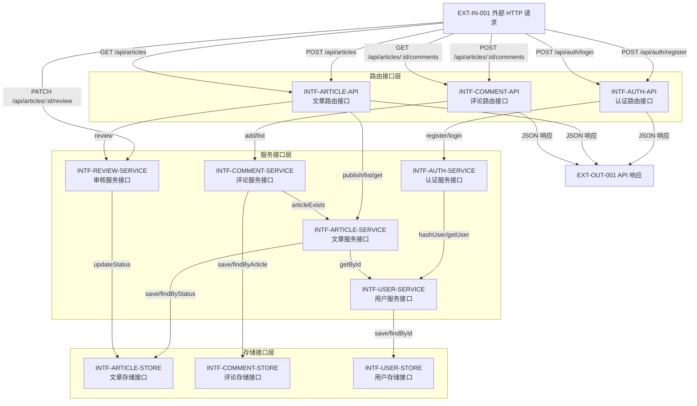

# 概要设计文档（接口设计）

> 阶段 3（概要设计）产出。套用 `templates/interface-design.md` 模板填充。
> 聚焦模块边界与接口契约，不深入类/方法内部（类/方法级设计属阶段 4 详细设计职责）。

## 文档信息

- 项目名称：blog-system-demo
- 文档版本：v1.0
- 编制日期：2026-07-24
- 关联系统设计文档：docs/system-design.md
- 关联需求文档：docs/requirement-spec.md

## 1. 模块调用关系

> 依赖方向自上而下单向，DFS 三色染色验证无循环依赖。
> 标注格式：`调用方 --接口名--> 被调用方`。



### 1.1 循环依赖检测（DFS 三色染色）

模块依赖邻接表（同层 INTF→INTF 依赖）：

| 调用方 | 被调用方 | 接口 |
|---|---|---|
| INTF-COMMENT-SERVICE | INTF-ARTICLE-SERVICE | articleExists |
| INTF-ARTICLE-SERVICE | INTF-USER-SERVICE | getUserById |
| INTF-AUTH-SERVICE | INTF-USER-SERVICE | getUser/saveUser |
| INTF-REVIEW-SERVICE | INTF-ARTICLE-STORE | updateStatus |

DFS 三色染色结果：白→灰→黑 全遍历，未发现灰边（回边），**无循环依赖**。依赖方向严格自上而下：API→Service→Store，Service 间依赖单向（comment→article→user，auth→user）。

## 2. INTF 节点定义

> 每个 INTF 节点 parent=对应 SD 节点，defines 边由 SD→INTF。节点 ID 格式 `INTF-<NNN>`。

### 2.1 INTF 节点清单

| INTF ID | parent SD | 层次 | 职责 | 关联 REQ |
|---|---|---|---|---|
| INTF-AUTH-API | SD-AUTH | 路由 | 认证路由：注册/登录 HTTP 端点 | REQ-002 |
| INTF-ARTICLE-API | SD-ARTICLE | 路由 | 文章路由：发布/列表/详情 HTTP 端点 | REQ-003 |
| INTF-COMMENT-API | SD-COMMENT | 路由 | 评论路由：添加/查询评论 HTTP 端点 | REQ-004 |
| INTF-AUTH-SERVICE | SD-AUTH | 服务 | 认证服务：密码哈希、JWT 签发 | REQ-002 |
| INTF-ARTICLE-SERVICE | SD-ARTICLE | 服务 | 文章服务：文章 CRUD、状态流转 | REQ-003 |
| INTF-COMMENT-SERVICE | SD-COMMENT | 服务 | 评论服务：评论 CRUD、文章存在性校验 | REQ-004 |
| INTF-USER-SERVICE | SD-AUTH | 服务 | 用户服务：用户存储、角色判定 | REQ-001, REQ-002 |
| INTF-REVIEW-SERVICE | SD-REVIEW | 服务 | 审核服务：管理员审核状态流转 | REQ-005 |
| INTF-ARTICLE-STORE | SD-ARTICLE | 存储 | 文章存储：Map 读写封装 | REQ-003, REQ-005 |
| INTF-COMMENT-STORE | SD-COMMENT | 存储 | 评论存储：Map 读写封装 | REQ-004 |
| INTF-USER-STORE | SD-AUTH | 存储 | 用户存储：Map 读写封装 | REQ-002 |

### 2.2 defines 边（SD→INTF）

| from (SD) | to (INTF) | 边类型 |
|---|---|---|
| SD-AUTH | INTF-AUTH-API | defines |
| SD-AUTH | INTF-AUTH-SERVICE | defines |
| SD-AUTH | INTF-USER-SERVICE | defines |
| SD-AUTH | INTF-USER-STORE | defines |
| SD-ARTICLE | INTF-ARTICLE-API | defines |
| SD-ARTICLE | INTF-ARTICLE-SERVICE | defines |
| SD-ARTICLE | INTF-ARTICLE-STORE | defines |
| SD-COMMENT | INTF-COMMENT-API | defines |
| SD-COMMENT | INTF-COMMENT-SERVICE | defines |
| SD-COMMENT | INTF-COMMENT-STORE | defines |
| SD-REVIEW | INTF-REVIEW-SERVICE | defines |

## 3. 接口契约定义

> 每条契约按「接口契约 Schema 模板」10 字段填写。错误码按「错误码分层约定」覆盖 4xx/5xx/业务三段位。

### 3.1 INTF-AUTH-API（认证路由接口）

#### 接口 1：register

- **接口名**：register
- **路径 / 触发器**：`POST /api/auth/register`
- **提供方模块**：INTF-AUTH-API（SD-AUTH）
- **消费方模块**：EXT-IN-001 → INTF-AUTH-API → INTF-AUTH-SERVICE
- **协议**：HTTP

| 参数名 | 参数类型 | 必填 | 默认值 | 约束 | 示例 |
|---|---|:---:|---|---|---|
| username | string | 是 | - | len ∈ [3, 32]，字母数字下划线 | `"alice"` |
| password | string | 是 | - | len ∈ [6, 128] | `"secret123"` |

**返回值结构**：`{ code: number, message: string, data: { userId: string, username: string } }`

**错误码集合**：

| 错误码 | 含义 | httpStatus | retryable | 触发条件 |
|---|---|:---:|:---:|---|
| 40001 | 参数缺失/格式非法 | 400 | 否 | username/password 为空或长度越界 |
| 60001 | 用户名已存在 | 409 | 否 | 注册时 username 已存在于存储 |
| 50001 | 服务端存储错误 | 500 | 是 | 存储层 Map 写入异常 |

**示例**：
```json
// 请求
{"username":"alice","password":"secret123"}
// 响应
{"code":0,"message":"注册成功","data":{"userId":"u-001","username":"alice"}}
```

#### 接口 2：login

- **接口名**：login
- **路径 / 触发器**：`POST /api/auth/login`
- **提供方模块**：INTF-AUTH-API（SD-AUTH）
- **消费方模块**：EXT-IN-001 → INTF-AUTH-API → INTF-AUTH-SERVICE
- **协议**：HTTP

| 参数名 | 参数类型 | 必填 | 默认值 | 约束 | 示例 |
|---|---|:---:|---|---|---|
| username | string | 是 | - | len ∈ [3, 32] | `"alice"` |
| password | string | 是 | - | len ∈ [6, 128] | `"secret123"` |

**返回值结构**：`{ code: number, message: string, data: { token: string, role: 'admin' | 'user' } }`

**错误码集合**：

| 错误码 | 含义 | httpStatus | retryable | 触发条件 |
|---|---|:---:|:---:|---|
| 40001 | 参数缺失/格式非法 | 400 | 否 | username/password 为空或长度越界 |
| 40101 | 用户名或密码错误 | 401 | 否 | 用户不存在或 bcrypt 比对失败 |
| 50001 | 服务端存储错误 | 500 | 是 | 存储层读取异常 |

**示例**：
```json
// 请求
{"username":"alice","password":"secret123"}
// 响应
{"code":0,"message":"登录成功","data":{"token":"eyJhbGciOi...","role":"user"}}
```

### 3.2 INTF-ARTICLE-API（文章路由接口）

#### 接口 3：publishArticle

- **接口名**：publishArticle
- **路径 / 触发器**：`POST /api/articles`
- **提供方模块**：INTF-ARTICLE-API（SD-ARTICLE）
- **消费方模块**：EXT-IN-001 → INTF-ARTICLE-API → INTF-ARTICLE-SERVICE
- **协议**：HTTP（需 JWT 鉴权中间件）

| 参数名 | 参数类型 | 必填 | 默认值 | 约束 | 示例 |
|---|---|:---:|---|---|---|
| Authorization | string(header) | 是 | - | `Bearer <JWT>` | `"Bearer eyJhbGci..."` |
| title | string | 是 | - | len ∈ [1, 200] | `"我的文章"` |
| content | string | 是 | - | len ∈ [1, 10000] | `"正文内容"` |

**返回值结构**：`{ code: number, message: string, data: { articleId: string, status: 'pending', createdAt: string } }`

**错误码集合**：

| 错误码 | 含义 | httpStatus | retryable | 触发条件 |
|---|---|:---:|:---:|---|
| 40001 | 参数缺失/格式非法 | 400 | 否 | title/content 为空或长度越界 |
| 40101 | 未授权（JWT 缺失/无效） | 401 | 否 | Authorization 头缺失或 JWT 校验失败 |
| 50001 | 服务端存储错误 | 500 | 是 | 存储层写入异常 |

#### 接口 4：listArticles

- **接口名**：listArticles
- **路径 / 触发器**：`GET /api/articles`
- **提供方模块**：INTF-ARTICLE-API（SD-ARTICLE）
- **消费方模块**：EXT-IN-001 → INTF-ARTICLE-API → INTF-ARTICLE-SERVICE
- **协议**：HTTP（无需鉴权，普通用户仅返回 approved）

| 参数名 | 参数类型 | 必填 | 默认值 | 约束 | 示例 |
|---|---|:---:|---|---|---|
| role | string(query) | 否 | `user` | `admin` \| `user`（由 JWT 解析） | `"user"` |

**返回值结构**：`{ code: number, message: string, data: { articles: Array<{ articleId: string, title: string, status: string, authorId: string }> } }`

**错误码集合**：

| 错误码 | 含义 | httpStatus | retryable | 触发条件 |
|---|---|:---:|:---:|---|
| 50001 | 服务端存储错误 | 500 | 是 | 存储层读取异常 |

> 普通用户（role=user）列表不返回 rejected 文章；管理员（role=admin）返回全部。

#### 接口 5：getArticle

- **接口名**：getArticle
- **路径 / 触发器**：`GET /api/articles/:id`
- **提供方模块**：INTF-ARTICLE-API（SD-ARTICLE）
- **消费方模块**：EXT-IN-001 → INTF-ARTICLE-API → INTF-ARTICLE-SERVICE
- **协议**：HTTP

| 参数名 | 参数类型 | 必填 | 默认值 | 约束 | 示例 |
|---|---|:---:|---|---|---|
| id | string(path) | 是 | - | UUID 格式 | `"a-001"` |
| role | string(query) | 否 | `user` | `admin` \| `user` | `"user"` |

**返回值结构**：`{ code: number, message: string, data: { articleId: string, title: string, content: string, status: string, authorId: string } }`

**错误码集合**：

| 错误码 | 含义 | httpStatus | retryable | 触发条件 |
|---|---|:---:|:---:|---|
| 40401 | 文章不存在 | 404 | 否 | id 不在存储中 |
| 40301 | 禁止访问 | 403 | 否 | 普通用户访问 rejected 文章 |
| 50001 | 服务端存储错误 | 500 | 是 | 存储层读取异常 |

### 3.3 INTF-COMMENT-API（评论路由接口）

#### 接口 6：addComment

- **接口名**：addComment
- **路径 / 触发器**：`POST /api/articles/:id/comments`
- **提供方模块**：INTF-COMMENT-API（SD-COMMENT）
- **消费方模块**：EXT-IN-001 → INTF-COMMENT-API → INTF-COMMENT-SERVICE → INTF-ARTICLE-SERVICE
- **协议**：HTTP（需 JWT 鉴权中间件）

| 参数名 | 参数类型 | 必填 | 默认值 | 约束 | 示例 |
|---|---|:---:|---|---|---|
| Authorization | string(header) | 是 | - | `Bearer <JWT>` | `"Bearer eyJhbGci..."` |
| id | string(path) | 是 | - | UUID 格式 | `"a-001"` |
| content | string(body) | 是 | - | len ∈ [1, 1000] | `"好文章"` |

**返回值结构**：`{ code: number, message: string, data: { commentId: string, articleId: string, createdAt: string } }`

**错误码集合**：

| 错误码 | 含义 | httpStatus | retryable | 触发条件 |
|---|---|:---:|:---:|---|
| 40001 | 参数缺失/格式非法 | 400 | 否 | content 为空或长度越界 |
| 40101 | 未授权 | 401 | 否 | JWT 缺失/无效 |
| 40401 | 文章不存在 | 404 | 否 | id 不在存储中（INTF-COMMENT-SERVICE→INTF-ARTICLE-SERVICE 校验） |
| 60002 | 文章状态不允许评论 | 409 | 否 | 文章状态为 rejected |
| 50001 | 服务端存储错误 | 500 | 是 | 存储层写入异常 |

#### 接口 7：listComments

- **接口名**：listComments
- **路径 / 触发器**：`GET /api/articles/:id/comments`
- **提供方模块**：INTF-COMMENT-API（SD-COMMENT）
- **消费方模块**：EXT-IN-001 → INTF-COMMENT-API → INTF-COMMENT-SERVICE
- **协议**：HTTP（无需鉴权）

| 参数名 | 参数类型 | 必填 | 默认值 | 约束 | 示例 |
|---|---|:---:|---|---|---|
| id | string(path) | 是 | - | UUID 格式 | `"a-001"` |

**返回值结构**：`{ code: number, message: string, data: { comments: Array<{ commentId: string, authorId: string, content: string, createdAt: string }> } }`

**错误码集合**：

| 错误码 | 含义 | httpStatus | retryable | 触发条件 |
|---|---|:---:|:---:|---|
| 40401 | 文章不存在 | 404 | 否 | id 不在存储中 |
| 50001 | 服务端存储错误 | 500 | 是 | 存储层读取异常 |

### 3.4 INTF-REVIEW-SERVICE（审核服务接口）

#### 接口 8：reviewArticle

- **接口名**：reviewArticle
- **路径 / 触发器**：`PATCH /api/articles/:id/review`
- **提供方模块**：INTF-REVIEW-SERVICE（SD-REVIEW）
- **消费方模块**：EXT-IN-001 → INTF-ARTICLE-API → INTF-REVIEW-SERVICE → INTF-ARTICLE-STORE
- **协议**：HTTP（需 JWT 鉴权 + admin 角色校验中间件）

| 参数名 | 参数类型 | 必填 | 默认值 | 约束 | 示例 |
|---|---|:---:|---|---|---|
| Authorization | string(header) | 是 | - | `Bearer <JWT>`，role=admin | `"Bearer eyJhbGci..."` |
| id | string(path) | 是 | - | UUID 格式 | `"a-001"` |
| action | string(body) | 是 | - | `approve` \| `reject` | `"approve"` |

**返回值结构**：`{ code: number, message: string, data: { articleId: string, status: 'approved' | 'rejected' } }`

**错误码集合**：

| 错误码 | 含义 | httpStatus | retryable | 触发条件 |
|---|---|:---:|:---:|---|
| 40001 | 参数缺失/格式非法 | 400 | 否 | action 非 approve/reject |
| 40101 | 未授权 | 401 | 否 | JWT 缺失/无效 |
| 40301 | 禁止访问 | 403 | 否 | 非 admin 角色调用审核 |
| 40401 | 文章不存在 | 404 | 否 | id 不在存储中 |
| 60002 | 文章状态非法 | 409 | 否 | 文章状态非 pending（不可重复审核） |
| 50001 | 服务端存储错误 | 500 | 是 | 存储层写入异常 |

### 3.5 服务层接口契约（函数调用协议）

> 服务层与存储层为函数调用（非 HTTP），契约以函数签名 + 参数/返回值类型 + 错误码描述。

#### INTF-AUTH-SERVICE

| 接口名 | 签名 | 参数约束 | 返回值 | 错误码集合 |
|---|---|---|---|---|
| register | `(username: string, password: string) => { userId: string }` | username len∈[3,32], password len∈[6,128] | `{ userId: string }` | 60001 用户名已存在, 50001 存储错误 |
| login | `(username: string, password: string) => { token: string, role: string }` | 同上 | `{ token: string, role: 'admin'\|'user' }` | 40101 凭证错误, 50001 存储错误 |

#### INTF-ARTICLE-SERVICE

| 接口名 | 签名 | 参数约束 | 返回值 | 错误码集合 |
|---|---|---|---|---|
| publish | `(authorId: string, title: string, content: string) => { articleId: string, status: 'pending' }` | title len∈[1,200], content len∈[1,10000] | `{ articleId: string, status: 'pending' }` | 50001 存储错误 |
| list | `(role: string) => Article[]` | role∈['admin','user'] | `Article[]`（user 过滤 rejected） | 50001 存储错误 |
| getById | `(id: string, role: string) => Article` | id 非空 | `Article` | 40401 不存在, 40301 禁止访问, 50001 存储错误 |

#### INTF-COMMENT-SERVICE

| 接口名 | 签名 | 参数约束 | 返回值 | 错误码集合 |
|---|---|---|---|---|
| add | `(articleId: string, authorId: string, content: string) => { commentId: string }` | content len∈[1,1000] | `{ commentId: string }` | 40401 文章不存在, 60002 状态不允许, 50001 存储错误 |
| listByArticle | `(articleId: string) => Comment[]` | articleId 非空 | `Comment[]` | 40401 文章不存在, 50001 存储错误 |

#### INTF-USER-SERVICE

| 接口名 | 签名 | 参数约束 | 返回值 | 错误码集合 |
|---|---|---|---|---|
| saveUser | `(user: User) => void` | username 唯一 | `void` | 60001 用户名已存在, 50001 存储错误 |
| findById | `(userId: string) => User \| null` | userId 非空 | `User \| null` | 50001 存储错误 |
| findByUsername | `(username: string) => User \| null` | username 非空 | `User \| null` | 50001 存储错误 |

#### INTF-REVIEW-SERVICE

| 接口名 | 签名 | 参数约束 | 返回值 | 错误码集合 |
|---|---|---|---|---|
| review | `(articleId: string, action: 'approve'\|'reject', reviewerId: string) => { status: string }` | action∈['approve','reject'] | `{ status: 'approved'\|'rejected' }` | 40401 不存在, 60002 状态非 pending, 50001 存储错误 |

#### INTF-ARTICLE-STORE

| 接口名 | 签名 | 参数约束 | 返回值 | 错误码集合 |
|---|---|---|---|---|
| save | `(article: Article) => void` | id 唯一 | `void` | 50001 存储错误 |
| findById | `(id: string) => Article \| null` | id 非空 | `Article \| null` | 50001 存储错误 |
| findAll | `() => Article[]` | - | `Article[]` | 50001 存储错误 |
| updateStatus | `(id: string, status: string) => void` | status∈['pending','approved','rejected'] | `void` | 40401 不存在, 50001 存储错误 |

#### INTF-COMMENT-STORE

| 接口名 | 签名 | 参数约束 | 返回值 | 错误码集合 |
|---|---|---|---|---|
| save | `(comment: Comment) => void` | id 唯一 | `void` | 50001 存储错误 |
| findByArticle | `(articleId: string) => Comment[]` | articleId 非空 | `Comment[]` | 50001 存储错误 |

#### INTF-USER-STORE

| 接口名 | 签名 | 参数约束 | 返回值 | 错误码集合 |
|---|---|---|---|---|
| save | `(user: User) => void` | username 唯一 | `void` | 60001 用户名已存在, 50001 存储错误 |
| findById | `(userId: string) => User \| null` | userId 非空 | `User \| null` | 50001 存储错误 |
| findByUsername | `(username: string) => User \| null` | username 非空 | `User \| null` | 50001 存储错误 |

## 4. 错误码分层约定

| 段位 | 范围 | 含义 | 已使用错误码 |
|---|---|---|---|
| 4xx | 40000-49999 | 客户端错误（参数/认证/权限） | 40001 参数缺失/格式非法, 40101 未授权, 40301 禁止访问, 40401 不存在 |
| 5xx | 50000-59999 | 服务端错误（DB/依赖/未知） | 50001 服务端存储错误 |
| 业务 | 60000-69999 | 业务规则错误（状态机/风控） | 60001 用户名已存在, 60002 状态非法 |

每条错误码均配套 `code` + `message` + `httpStatus` + `retryable` 四元组（见各接口错误码表）。

## 5. 中间件链契约

| 中间件 | 触发路由 | 职责 | 失败响应 |
|---|---|---|---|
| validate.middleware | 全部 POST/PATCH | zod schema 校验请求体 | 400 + 40001 |
| auth.middleware | POST /api/articles, POST /api/articles/:id/comments, PATCH /api/articles/:id/review | JWT 校验，注入 userId/role 到请求上下文 | 401 + 40101 |
| admin-guard（auth.middleware 扩展） | PATCH /api/articles/:id/review | 校验 role=admin | 403 + 40301 |
| error.handler | 全部路由 | 捕获异常，统一错误 JSON 响应 | 500 + 50001 |

## 6. 集成测试用例索引

> 详细用例见 `docs/integration-test-cases.md`。本阶段只设计，阶段 6 执行。

| 用例 ID | 关联接口 | 场景 | 优先级 |
|---|---|---|---|
| IT-001 | INTF-AUTH-API → INTF-AUTH-SERVICE → INTF-USER-SERVICE → INTF-USER-STORE | 注册正向：控制器→服务→存储链路贯通 | 高 |
| IT-002 | INTF-AUTH-API → INTF-AUTH-SERVICE | 注册异常：用户名已存在返回 60001 | 高 |
| IT-003 | INTF-AUTH-API → INTF-AUTH-SERVICE → INTF-USER-SERVICE | 登录正向：bcrypt 比对 + JWT 签发 | 高 |
| IT-004 | INTF-AUTH-API | 登录异常：密码错误返回 40101 | 高 |
| IT-005 | auth.middleware → INTF-ARTICLE-API → INTF-ARTICLE-SERVICE → INTF-ARTICLE-STORE | 发布正向：JWT 校验→文章发布→存储 | 高 |
| IT-006 | INTF-ARTICLE-API → INTF-ARTICLE-SERVICE | 发布异常：无 JWT 返回 40101 | 高 |
| IT-007 | INTF-ARTICLE-API → INTF-ARTICLE-SERVICE → INTF-ARTICLE-STORE | 查询正向：普通用户列表过滤 rejected | 高 |
| IT-008 | INTF-COMMENT-API → INTF-COMMENT-SERVICE → INTF-ARTICLE-SERVICE → INTF-COMMENT-STORE | 评论正向：文章存在性校验→评论存储 | 高 |
| IT-009 | INTF-COMMENT-SERVICE → INTF-ARTICLE-SERVICE | 评论异常：文章不存在返回 40401（跨模块调用） | 高 |
| IT-010 | INTF-ARTICLE-API → INTF-REVIEW-SERVICE → INTF-ARTICLE-STORE | 审核正向：admin 审核 pending→approved | 高 |
| IT-011 | INTF-REVIEW-SERVICE | 审核异常：非 admin 返回 40301 | 高 |
| IT-012 | INTF-REVIEW-SERVICE → INTF-ARTICLE-STORE | 审核异常：文章非 pending 返回 60002 | 高 |
| IT-013 | validate.middleware | 参数校验：非法输入返回 400 + 40001 | 高 |
| IT-014 | INTF-ARTICLE-SERVICE → INTF-ARTICLE-STORE | 存储异常 fallback：服务层捕获 50001 不崩溃 | 中 |

## 7. 验收自检

- [x] 接口定义完整，每条契约按「接口契约 Schema 模板」10 字段填写
- [x] 错误码按「错误码分层约定」覆盖 4xx/5xx/业务三段位
- [x] 模块间调用关系清晰，无循环依赖（DFS 三色染色验证，§1.1）
- [x] 集成测试用例覆盖关键模块交互路径（含参数校验 + 跨模块 + 异常路径）
- [x] 未深入类/方法内部（类/方法级设计属阶段 4）
- [x] 每个 INTF 节点有 parent=对应 SD + defines 边（§2.2）
