# 需求规格说明书

> 阶段 1（需求分析）产出。W 模型第 23 轮（2026-07-30）端到端调测。
>
> **第 20 轮四维识别与豁免审批增强（v20.0.0）**：§4-§7 为四维识别强制节，禁止省略任一节。
> 强制项见各节「强制项」标注；豁免须经 S→R→V→人类四阶段审批（见 `w-model-dev/references/phase-1-requirements.md`「豁免审批治理」节）。

## 文档信息

- 项目名称：扩展博客系统后端（blog-system-demo）
- 文档版本：v1.0.0
- 编制日期：2026-07-30
- 编制者：S-doc 子代理（W 模型阶段 1 文档产出）
- 关联产物：`.w-model/ingestion/graph-phase1.json`、`.w-model/ingestion/consolidated-phase1.json`
- 项目 ID：`blog-system-demo`
- Round：23

## 1. 问题陈述与背景

### 1.1 项目背景

`blog-system-demo` 是一套基于 Express 4 + TypeScript 5（strict）+ 内存存储的扩展博客系统后端。系统需要承载多博主（blogger）、多读者（reader）的博客生态，覆盖博主注册、博文全生命周期（创建/编辑/发布/删除）、评论互动（顶级+回复）、点赞/收藏、通知（站内+Webhook）、标签管理、全文搜索、推荐、RSS 订阅、广告位、站点配置、审计日志、访问统计等典型博客系统核心能力。本次 W 模型 8 阶段端到端调测以 32 项需求（22 REQ + 6 NFR + 4 CON）为正向调测规模上限。

技术选型上延续项目已有栈：
- 语言：TypeScript 5.3（strict 模式 0 错误）
- 运行时：Node.js 20+
- 框架：Express 4.19
- 存储：进程内存（Map/数组）
- 认证：JWT（jsonwebtoken）+ bcryptjs
- 校验：Zod 3.23
- 测试：Vitest 4.1 + supertest + @vitest/coverage-v8

### 1.2 项目目标

1. **功能完整**：交付 22 项功能需求（user / blogger / article / comment / notification / site / admin 7 个候选子系统），覆盖典型博客系统核心能力。
2. **质量门禁达标**：6 项 NFR（性能/内存/覆盖率/并发/限流/密码强度）全量达成可量化阈值。
3. **约束可执行**：4 项 CON（TS strict / 内存存储 / RESTful+JSON / 审计 90 天）在阶段 5–8 由对应脚本与门禁验证。
4. **可追溯**：32 需求 → 验收测试 → 设计 → 代码 → 单元/集成/系统/验收测试 5 级 RTM 完整登记。
5. **可演进**：候选子系统清单与四维识别为阶段 2 系统设计提供决策输入。

### 1.3 范围

- **包含范围**：
  - 多博主 + 多读者的双身份系统（reader 注册/登录/资料/关注，blogger 注册/认证/多博主切换）
  - 博文全生命周期（CRUD + 状态机 draft↔published + 浏览/点赞/收藏/标签/搜索/推荐/RSS）
  - 评论树（顶级 + 多级回复 + 软删除 + 权限校验）
  - 通知系统（站内存储 + Webhook 事件订阅 + 失败重试 + 签名）
  - 站点级能力（站点元信息 + 横幅广告 + 广告位投放 + RSS 订阅）
  - 审计日志（关键操作记录 + 管理员查询 + 90 天保留）
  - 访问与统计（文章访问记录 + 站点 PV/UV）
  - 推荐系统（基于标签相似度的相似文章推荐）
  - 6 项 NFR + 4 项 CON 全量覆盖
- **不包含范围**（详见 §8 Out of Scope）：
  - 富文本编辑器、图片/附件上传
  - 邮件/短信推送（仅站内通知 + Webhook）
  - 多语言（i18n）
  - 实时推送（WebSocket / SSE）
  - 第三方登录（OAuth 2.0）
  - 缓存层（Redis）与外部数据库
  - 运维监控（Prometheus / Grafana）— 仅暴露 `/health` 健康检查

## 2. 解决方案概述

- **技术栈**：TypeScript 5.3（strict）+ Node.js 20+ + Express 4.19 + Zod 3.23 + jsonwebtoken 9 + bcryptjs 2.4 + Vitest 4.1。技术栈在 CON-002/003 中已固化。
- **总体架构**：经典三层（路由层 Router → 控制器 Controller → 服务层 Service）+ 仓储层 Repository + 模型层 Model。认证中间件统一注入 `req.user`/`req.blogger`，Zod schema 在路由入口校验 body/query/params。审计与通知采用「事件总线 + 异步订阅」轻量实现（内存 EventEmitter），避免外部 MQ 依赖。Webhook 投递采用内存队列 + 重试 + HMAC-SHA256 签名。
- **关键设计取舍**：
  - **内存存储 vs 数据库**：选择内存（CON-002），数据通过模块顶层 `Map<id, Entity>` 持有；用 `structuredClone` 防御外部突变；牺牲持久化换取部署极简（无外部依赖、零启动延迟）。
  - **JWT vs Session**：选择 JWT（无状态），`Authorization: Bearer <token>` 头传递；token 载荷含 `sub`（用户/博主 ID）+ `role`（reader/blogger/admin）+ `iat`/`exp`。Token 失效采用短 TTL + 不在服务端留白名单（CON-001 内存约束下不做撤销列表）。
  - **bcrypt 同步 vs 异步**：bcryptjs（纯 JS）同步 API（成本可控，NFR-006 cost ≥ 10 不阻塞 Node 事件循环）。
  - **审计 vs 业务日志**：关键写操作双写审计（CON-004 保留 90 天），业务日志走结构化 console（短期，便于调试）。
  - **RSS 输出位置**：作为 GET 路由 `GET /rss.xml` 暴露，独立于 REST API，Content-Type `application/rss+xml`。
  - **Webhook 签名**：HMAC-SHA256(payload, secret)，请求头 `X-Webhook-Signature: sha256=<hex>`。
  - **限流实现**：内存滑动窗口（按 IP key），超限返回 429 + `Retry-After`。

## 3. User Stories

> 覆盖正常/异常/边界/NFR/CON 全场景。每条 user story 对应 ≥1 个 REQ 行（RTM 可追溯）。

### 3.1 读者侧（reader）User Stories

1. As a **新读者**, I want **通过邮箱+用户名+密码注册账号**, so that **我可以获得唯一身份并使用评论、点赞、关注等互动功能**。→ REQ-001
2. As a **已注册读者**, I want **用邮箱和密码登录并获得 JWT**, so that **我可以在 24 小时内免重新登录访问受保护 API**。→ REQ-002
3. As a **登录后的读者**, I want **查看与修改自己的昵称、头像 URL、个人简介**, so that **个人信息保持最新并展示给博主与其他读者**。→ REQ-003
4. As a **登录后的读者**, I want **关注感兴趣的博主**, so that **在「我的关注」流中看到该博主的最新博文**。→ REQ-004
5. As a **登录后的读者**, I want **取关已关注博主**, so that **关注列表反映我当前的兴趣变化**。→ REQ-004
6. As a **匿名访客**, I want **不登录也能浏览公开博文列表与详情**, so that **降低阅读门槛、提升博文曝光**。→ REQ-007
7. As a **已登录读者**, I want **对喜欢的博文点赞或收藏**, so that **表达偏好并可在「我的收藏」中回看**。→ REQ-008
8. As a **已登录读者**, I want **在某篇博文下发表评论或回复他人评论**, so that **参与讨论并与博主或其他读者互动**。→ REQ-009
9. As a **评论作者**, I want **删除自己发表的评论**, so that **撤回不当言论或误发内容**。→ REQ-010
10. As a **已登录读者**, I want **接收关注/被评论/被点赞的站内通知**, so that **及时了解互动动态**。→ REQ-011
11. As a **已登录读者**, I want **按关键词搜索博文（标题+正文）**, so that **快速找到感兴趣的内容**。→ REQ-013

### 3.2 博主侧（blogger）User Stories

12. As a **新博主**, I want **通过邮箱+用户名+密码注册为博主身份**, so that **获得发文权限并独立运营我的专栏**。→ REQ-005
13. As a **已认证博主**, I want **在多个博主身份之间切换（如个人专栏 + 团队专栏）**, so that **复用账号管理多个内容矩阵**。→ REQ-017
14. As a **登录博主**, I want **创建草稿博文（draft 状态）**, so that **保存未完成内容稍后继续编辑**。→ REQ-006
15. As a **登录博主**, I want **编辑已存在的草稿或已发布博文**, so that **修正错别字或更新内容**。→ REQ-006
16. As a **登录博主**, I want **将草稿发布为 published**, so that **博文对所有读者可见并出现在搜索/RSS/推荐中**。→ REQ-006
17. As a **登录博主**, I want **删除自有博文（含物理删除 + 关联评论级联处理）**, so that **下架不当内容**。→ REQ-006
18. As a **登录博主**, I want **为博文打 1–5 个标签**, so that **被按标签检索的读者发现**。→ REQ-012
19. As a **登录博主**, I want **看到与我历史阅读偏好相似的推荐博文列表**, so that **发现新博主与内容**。→ REQ-021
20. As a **登录博主**, I want **在站内配置横幅广告（图片 URL + 链接 + 投放起止时间）**, so that **为我的专栏实现流量变现**。→ REQ-016 + REQ-022

### 3.3 管理员侧（admin）User Stories

21. As a **系统管理员**, I want **查看关键操作（登录/发布/删除/配置变更）的审计日志**, so that **追溯安全事件与合规审计**。→ REQ-018
22. As a **系统管理员**, I want **查询审计日志（按操作者/时间/类型筛选）**, so that **快速定位问题时段的行为**。→ REQ-018

### 3.4 异常 / 边界 User Stories

23. As a **读者**, I want **重复邮箱注册时被拒绝（409 Conflict）**, so that **避免账号冲突**。→ REQ-001 (异常)
24. As a **读者**, I want **登录密码错误时收到通用错误信息（不泄露账号是否存在）**, so that **降低账号枚举风险**。→ REQ-002 (异常)
25. As a **读者**, I want **JWT 过期或被篡改时收到 401 Unauthorized**, so that **客户端能重新登录**。→ REQ-002 + NFR-003 (异常)
26. As a **博主**, I want **对非自有博文执行编辑/删除时收到 403 Forbidden**, so that **保护其他博主的内容**。→ REQ-006 (异常)
27. As a **读者**, I want **对不存在的博文点赞/评论时收到 404 Not Found**, so that **明确失败原因**。→ REQ-008 / REQ-009 (异常)
28. As a **读者**, I want **在 1 分钟内向同一 IP 发起超过 100 次请求时被限流（429）**, so that **防止暴力破解与接口滥用**。→ NFR-006 (异常)
29. As a **博主**, I want **正文为空的草稿不能发布（400 + 错误码 `EMPTY_CONTENT`）**, so that **避免空博文污染索引**。→ REQ-006 (边界)
30. As a **读者**, I want **评论超过最大层级（如 5 层）时禁止回复**, so that **防止无限嵌套的展示问题**。→ REQ-009 (边界)
31. As a **读者**, I want **分页参数 `pageSize > 100` 时被限制为 100**, so that **避免响应过大拖慢接口**。→ REQ-007 (边界)
32. As a **读者**, I want **搜索关键词为空时返回 400 `EMPTY_KEYWORD`**, so that **避免无意义全表扫描**。→ REQ-013 (边界)
33. As a **博主**, I want **标签重复添加（已关联该博文）时被忽略（幂等）**, so that **前端可放心重试**。→ REQ-012 (边界)
34. As a **管理员**, I want **审计日志超过 90 天的记录被自动清理**, so that **存储不无限增长**。→ CON-004 + REQ-018 (边界)

### 3.5 NFR 维度 User Stories

35. As a **读者**, I want **任意核心读 API（博文列表/详情/搜索）P95 响应时间 ≤ 200ms**, so that **浏览体验流畅**。→ NFR-001
36. As a **运维**, I want **在 1000 并发请求下系统内存占用 ≤ 100MB**, so that **可在 512MB 容器中稳定运行**。→ NFR-002
37. As a **开发者**, I want **业务模块单元测试行覆盖率 ≥ 80%**, so that **核心逻辑有自动化回归保护**。→ NFR-003
38. As a **运维**, I want **1000 并发请求下错误率 = 0%**, so that **核心服务无随机失败**。→ NFR-004
39. As a **读者**, I want **密码以 bcrypt cost ≥ 10 哈希存储（不存明文）**, so that **数据库泄露也不直接暴露密码**。→ NFR-006

### 3.6 CON 维度 User Stories

40. As a **开发者**, I want **TypeScript strict 0 错误编译通过**, so that **避免运行时类型错误**。→ CON-001
41. As a **运维**, I want **系统不依赖任何外部数据库或中间件**, so that **可通过 `node dist/server.js` 一行启动**。→ CON-002
42. As a **客户端开发者**, I want **所有 API 走 RESTful + JSON（Content-Type: application/json）**, so that **可使用任何 HTTP 客户端集成**。→ CON-003
43. As a **合规审计员**, I want **审计日志保留 90 天可供查询**, so that **满足常见合规窗口期要求**。→ CON-004

## 4. 需求层级树【维度1】

> REQ 内部 4 层：domain（level=1）→ module（level=2）→ feature（level=3）→ acceptance（level=4）。
> 每个节点须标注 level（1-4，强制必填）/ priority（P0-P3，可选）/ reqGroup（level≥2 节点须指向 level=1 祖先）。

### 4.1 层级树图

```mermaid
graph TD
  REQ001["REQ-001 用户注册 (level=1)"]:::domain
  REQ002["REQ-002 用户登录 (level=2)"]:::module
  REQ003["REQ-003 用户资料 (level=2)"]:::module
  REQ004["REQ-004 关注/取关 (level=2)"]:::module
  REQ005["REQ-005 博主注册与认证 (level=1)"]:::domain
  REQ017["REQ-017 多博主切换 (level=2)"]:::module
  REQ006["REQ-006 博文CRUD (level=1)"]:::domain
  REQ007["REQ-007 博文浏览 (level=2)"]:::module
  REQ021["REQ-021 推荐系统 (level=3)"]:::feature
  REQ008["REQ-008 点赞/收藏 (level=2)"]:::module
  REQ012["REQ-012 文章标签 (level=2)"]:::module
  REQ013["REQ-013 全文搜索 (level=2)"]:::module
  REQ009["REQ-009 评论发表 (level=1)"]:::domain
  REQ010["REQ-010 评论删除 (level=2)"]:::module
  REQ011["REQ-011 通知系统 (level=1)"]:::domain
  REQ015["REQ-015 Webhook通知 (level=2)"]:::module
  REQ016["REQ-016 站点配置 (level=1)"]:::domain
  REQ014["REQ-014 RSS订阅 (level=2)"]:::module
  REQ022["REQ-022 广告位管理 (level=2)"]:::module
  REQ018["REQ-018 审计日志 (level=1)"]:::domain
  REQ019["REQ-019 文章访问记录 (level=2)"]:::module
  REQ020["REQ-020 站点统计 (level=2)"]:::module

  REQ001 --> REQ002
  REQ001 --> REQ003
  REQ001 --> REQ004
  REQ005 --> REQ017
  REQ006 --> REQ007
  REQ007 --> REQ021
  REQ006 --> REQ008
  REQ006 --> REQ012
  REQ006 --> REQ013
  REQ009 --> REQ010
  REQ011 --> REQ015
  REQ016 --> REQ014
  REQ016 --> REQ022
  REQ018 --> REQ019
  REQ018 --> REQ020

  classDef domain fill:#fde68a,stroke:#b45309,stroke-width:2px
  classDef module fill:#bfdbfe,stroke:#1d4ed8,stroke-width:1.5px
  classDef feature fill:#bbf7d0,stroke:#15803d,stroke-width:1.5px
```

### 4.2 层级节点表

> **强制项**：每个 REQ 必须出现；level 字段必填（1-4），无降级；level≥2 节点的 reqGroup 须指向 level=1 祖先。
> **禁止行为**：层级表与 graph.json 节点不一致。

#### 4.2.1 功能需求 REQ（22 项）

| 需求 ID | level | priority | reqGroup | parent | 类型 | 描述 | 验收标准（可量化） |
|---|---|---|---|---|---|---|---|
| REQ-001 | 1 | P0 | REQ-001 | — | domain | 用户注册（邮箱+密码+用户名） | 邮箱格式合法 + 密码 ≥ 8 位 + 用户名 3–20 字符；唯一邮箱；返回 201 + `{userId}` |
| REQ-002 | 2 | P0 | REQ-001 | REQ-001 | module | 用户登录（JWT 签发） | 邮箱+密码正确返回 200 + `{token, userId, role}`；JWT TTL 24h；bcrypt 校验 |
| REQ-003 | 2 | P0 | REQ-001 | REQ-001 | module | 用户资料查询与编辑 | `GET /users/:id` 返回公开资料；`PUT /users/me` 需 JWT，仅修改昵称/头像/简介；不允许改邮箱 |
| REQ-004 | 2 | P1 | REQ-001 | REQ-001 | module | 关注/取关博主 | `POST /follows/:bloggerId` 幂等；重复关注返回 200；`GET /me/follows` 分页返回关注列表 |
| REQ-005 | 1 | P0 | REQ-005 | — | domain | 博主注册与认证 | 与 REQ-001 共享路由/服务，role=blogger；登录返回 `role=blogger` token |
| REQ-006 | 1 | P0 | REQ-006 | — | domain | 博文创建/编辑/发布/删除 | draft↔published 状态机；`POST /posts` 创建 draft；`PUT /posts/:id` 编辑；`POST /posts/:id/publish` 校验正文非空；`DELETE /posts/:id` 软删 |
| REQ-007 | 2 | P0 | REQ-006 | REQ-006 | module | 博文浏览（详情+列表） | `GET /posts?status=published&page=1&pageSize=20` 分页；`pageSize` 上限 100；仅 published 对外可见 |
| REQ-008 | 2 | P1 | REQ-006 | REQ-006 | module | 博文点赞/收藏 | `POST /posts/:id/like` 幂等；`POST /posts/:id/bookmark` 幂等；`GET /me/bookmarks` 列表分页 |
| REQ-009 | 1 | P0 | REQ-009 | — | domain | 评论发表（顶级+回复） | `POST /posts/:postId/comments` 发表顶级评论；`POST /comments/:parentId/replies` 发表回复；最大层级 5；需 JWT |
| REQ-010 | 2 | P0 | REQ-009 | REQ-009 | module | 评论删除（作者或博主） | `DELETE /comments/:id`；作者本人 OR 博文作者可删；软删（保留 id，标记 deleted=true） |
| REQ-011 | 1 | P0 | REQ-011 | — | domain | 通知系统（站内） | 关注/被评论/被点赞事件触发；`GET /me/notifications` 分页；`PATCH /me/notifications/:id/read` 标记已读 |
| REQ-012 | 2 | P1 | REQ-006 | REQ-006 | module | 文章标签（多对多） | `POST /tags` 创建（全局唯一）；`POST /posts/:id/tags` 关联（1–5 个，幂等去重）；`GET /tags/:name/posts` 反向查询 |
| REQ-013 | 2 | P0 | REQ-006 | REQ-006 | module | 全文搜索（标题+内容） | `GET /search?q=...&page=1&pageSize=20`；标题权重 2× / 正文权重 1×；空关键词返回 400；仅搜 published |
| REQ-014 | 2 | P2 | REQ-016 | REQ-016 | module | RSS 订阅（站点级） | `GET /rss.xml`；最近 20 篇 published；Content-Type `application/rss+xml`；包含 title/link/pubDate/description |
| REQ-015 | 2 | P1 | REQ-011 | REQ-011 | module | Webhook 通知（事件订阅） | `POST /webhooks` 注册（url + events + secret）；事件触发 POST 回调；HMAC-SHA256 签名；失败 3 次重试（指数退避） |
| REQ-016 | 1 | P0 | REQ-016 | — | domain | 站点配置（站点元信息+横幅广告） | `GET /site/config` 返回站点元信息 + 当前生效横幅广告；`PUT /site/config` 仅 admin 可写 |
| REQ-017 | 2 | P1 | REQ-005 | REQ-005 | module | 多博主系统（博主身份切换） | 一用户可绑定多 bloggerId；`POST /me/bloggers/:id/switch` 返回新 token（role=blogger, sub=新 bloggerId） |
| REQ-018 | 1 | P0 | REQ-018 | — | domain | 审计日志（管理员查询） | 关键写操作写 audit log；`GET /admin/audit-logs?actor=&type=&from=&to=` 分页查询；仅 admin 角色 |
| REQ-019 | 2 | P1 | REQ-018 | REQ-018 | module | 文章访问记录 | 每次 `GET /posts/:id` 写一条 access record（postId, userId|anonymous, ts, ip）；`GET /admin/posts/:id/access` 列表 |
| REQ-020 | 2 | P1 | REQ-018 | REQ-018 | module | 站点统计（PV/UV） | 内存按小时桶聚合；`GET /admin/stats/site?range=24h|7d|30d` 返回 PV + UV + 趋势 |
| REQ-021 | 3 | P2 | REQ-006 | REQ-007 | feature | 推荐系统（相似文章） | 基于标签 Jaccard 相似度；`GET /me/recommendations?limit=10`；冷启动回退「最近热门 10」 |
| REQ-022 | 2 | P2 | REQ-016 | REQ-016 | module | 广告位管理（投放策略） | `POST /site/ads` 创建广告（imageUrl+linkUrl+startAt+endAt）；`GET /site/ads/active` 返当前生效；过期自动过滤 |

**level 分布**：level=1: 7 项（REQ-001/005/006/009/011/016/018）；level=2: 14 项（REQ-002/003/004/007/008/010/012/013/014/015/017/019/020/022）；level=3: 1 项（REQ-021）；level=4: 0（验收标准在 acceptance-test-design.md 中以可量化阈值承载）。

#### 4.2.2 非功能需求 NFR（6 项，level=1，reqGroup 指向自身）

| 需求 ID | level | priority | reqGroup | parent | 类型 | 描述 | 验收标准（可量化） |
|---|---|---|---|---|---|---|---|
| NFR-001 | 1 | P0 | NFR-001 | — | NFR | P95 响应时间 ≤ 200ms | 1000 博文数据集，100 并发 k6 压测 GET /posts、GET /posts/:id、GET /search 三个核心读 API；P95 ≤ 200ms |
| NFR-002 | 1 | P0 | NFR-002 | — | NFR | 内存占用 ≤ 100MB（1000 并发） | 1000 并发稳定运行 5 分钟，`process.memoryUsage().heapUsed` ≤ 100MB |
| NFR-003 | 1 | P1 | NFR-003 | — | NFR | 单元测试覆盖率 ≥ 80% lines | `vitest run --coverage` 报告 `lines ≥ 80%`；核心模块（auth/posts/comments）≥ 90% |
| NFR-004 | 1 | P0 | NFR-004 | — | NFR | 1000 并发请求错误率 = 0% | 1000 并发同一健康 endpoint，5xx 错误计数 = 0；超时阈值 30s |
| NFR-005 | 1 | P0 | NFR-005 | — | NFR | API 限流（100 req/min/IP） | 同 IP 第 101 次请求返回 429 + `Retry-After: 60`；`/health` 豁免；滑动窗口 |
| NFR-006 | 1 | P0 | NFR-006 | — | NFR | 密码 bcrypt cost ≥ 10 | 注册与改密时 `bcrypt.hashSync(pw, 10)` 校验 `bcrypt.getRounds(hash) ≥ 10` |

#### 4.2.3 约束需求 CON（4 项，level=1，reqGroup 指向自身）

| 需求 ID | level | priority | reqGroup | parent | 类型 | 描述 | 验收标准（可量化） |
|---|---|---|---|---|---|---|---|
| CON-001 | 1 | P0 | CON-001 | — | CON | TypeScript strict 0 错误 | `tsc --noEmit` 退出码 0，无 any 隐式推断；CI 阶段门禁必跑 |
| CON-002 | 1 | P0 | CON-002 | — | CON | 内存存储（无外部数据库依赖） | 禁止引入 mysql/pg/mongoose/redis/sequelize/typeorm 等；`package.json` 锁仓；进程重启数据可重建或丢失 |
| CON-003 | 1 | P0 | CON-003 | — | CON | 所有 API 走 RESTful + JSON | 所有响应 Content-Type = `application/json`（RSS 例外）；RESTful 资源命名；错误响应统一 `{error: {code, message}}` |
| CON-004 | 1 | P1 | CON-004 | — | CON | 审计日志保留 90 天 | 内存审计队列按 ts 过滤 `> now - 90d`；过期自动清理；查询 API 不可见 90 天前记录 |

### 4.3 层级规则

- **level 单调**：沿 parent 链 level 严格递减（子节点 level = 父节点 level + 1）。本批次 7→14→1 = 22 REQ。
- **单根**：每个 level=1 REQ 独立作为根域（7 个 domain 根并列）；每个 level≥2 节点有且仅有一个 parent。
- **reqGroup 一致**：level≥2 节点的 reqGroup 须指向其 level=1 祖先；level=1 节点的 reqGroup 指向自身。
- **验收标准可量化**：所有 REQ 行的「验收标准」列均含可量化阈值（数字/状态码/JSON 字段），无「快速」「友好」等主观词。
- **NFR/CON 入树**：NFR/CON 节点 level=1 且 reqGroup 指向自身（横切治理类，不参与 REQ 层级树），由 §7.4 横切覆盖矩阵记录其横切目标。

## 5. 候选子系统划分（REQ-group）【维度2】

> level=1 REQ 即 REQ-group 候选（每个 domain 对应一个候选子系统）。
> 正式子系统划分待阶段 2 系统设计决策；本节仅产出候选清单。

### 5.1 REQ-group 清单

> **强制项**：至少 1 个 group；每个 group 须对应一个 level=1 REQ。本批次共 7 个 group，全部由 level=1 REQ 担任。

| group ID | 对应 level=1 REQ | group 名称 | 包含 module（level=2/3） | 候选子系统说明 |
|---|---|---|---|---|
| GROUP-001 (user) | REQ-001 | 用户域 | REQ-002, REQ-003, REQ-004 | 普通读者身份全生命周期：注册/登录/资料/关注；为评论/点赞/通知提供身份基础 |
| GROUP-002 (blogger) | REQ-005 | 博主域 | REQ-017 | 博主身份全生命周期：注册/认证/多身份切换；为博文发布提供权限 |
| GROUP-003 (article) | REQ-006 | 博文域 | REQ-007, REQ-008, REQ-012, REQ-013, REQ-021 | 博文全生命周期：CRUD + 浏览 + 互动（点赞/收藏）+ 标签 + 搜索 + 推荐 |
| GROUP-004 (comment) | REQ-009 | 评论域 | REQ-010 | 评论树管理：发表（顶级+回复）+ 删除（作者/博主） |
| GROUP-005 (notification) | REQ-011 | 通知域 | REQ-015 | 站内通知存储 + Webhook 外部事件订阅 |
| GROUP-006 (site) | REQ-016 | 站点域 | REQ-014, REQ-022 | 站点级配置 + RSS 订阅 + 广告位投放 |
| GROUP-007 (admin) | REQ-018 | 管理域 | REQ-019, REQ-020 | 审计日志 + 访问记录 + 站点统计（PV/UV） |

### 5.2 group 划分依据

| group | 业务边界 | 数据所有权 | 部署独立性 | 团队所有权（建议） |
|---|---|---|---|---|
| GROUP-001 user | 注册/登录/资料/关注是读者身份的核心闭环 | 持有 users / follows 表 | 可独立部署（仅依赖认证中间件） | user-team |
| GROUP-002 blogger | 博主身份独立于读者（含多身份切换） | 持有 bloggers / blogger_bindings | 与 user 共享认证，但业务独立 | blogger-team |
| GROUP-003 article | 博文是核心实体，含状态机/标签/搜索/推荐 | 持有 posts / post_tags / likes / bookmarks | 强依赖 user/blogger 鉴权 | article-team |
| GROUP-004 comment | 评论树是独立子域（与博文弱耦合，可被 RSS/统计引用） | 持有 comments | 与 article 共享鉴权 | comment-team |
| GROUP-005 notification | 事件驱动，被 user/article/comment 触发 | 持有 notifications / webhook_subscriptions / webhook_deliveries | 异步订阅模式，可水平扩展 | notification-team |
| GROUP-006 site | 站点级配置 + 外部输出（RSS）+ 商业化（广告） | 持有 site_config / ads / rss 视图 | 独立子系统（admin 角色管理） | site-team |
| GROUP-007 admin | 运维/合规相关，独立于业务前台 | 持有 audit_logs / access_records / stats | 严格 RBAC：admin only | ops-team |

### 5.3 待阶段 2 决策事项

1. **GROUP-001 (user) 与 GROUP-002 (blogger) 是否合并**：候选人合并原因：共享 users 表（role 区分）；候选保留原因：权限/UI/团队所有权清晰分离。**建议阶段 2 决策：保留 2 个 group（user + blogger），users 单表 role 字段区分。**
2. **GROUP-005 (notification) 是否拆分为站内 + Webhook 两个子模块**：候选人合并原因：统一事件总线；候选拆分原因：内部存储与外部投递失败模式不同。**建议阶段 2 决策：保留单一 group 但分两个子模块，事件总线解耦。**
3. **GROUP-007 (admin) 横切关注点归属**：审计/统计/访问记录是否抽为独立「admin 平台」？**建议阶段 2 决策：作为独立 group（admin），不与 article/user 合并。**
4. **NFR/CON 横切实现位置**：NFR-003 安全 + NFR-005 限流是 middleware 横切所有 group；CON-002 内存存储约束所有 Repository。**建议阶段 2 决策：抽 `core/middleware`（auth/rateLimit）与 `core/repository`（in-memory）两个共享层。**
5. **GROUP-006 (site) 与 GROUP-007 (admin) 的 RBAC 边界**：RSS 与广告是否对 admin only？**建议阶段 2 决策：RSS 公开（GET /rss.xml），广告位配置仅 admin（POST /site/ads）。**

## 6. 需求交叉逻辑矩阵【维度3】

> 四类边：depends-on（依赖）/ precedes（时序先于）/ conflicts-with（冲突互斥）/ cross-cuts（横切）。
> **强制项**：§6.1-§6.4 每类必须出现；无内容时填「无」并加说明（禁止只写「无」而不加说明）。

### 6.1 依赖逻辑（depends-on）

> A depends-on B：A 的实现依赖 B 先行提供能力/数据。

| 源 REQ | 目标 REQ | 依赖类型 | 说明 |
|---|---|---|---|
| REQ-002 | REQ-001 | data | 用户登录依赖用户注册先写入 users 表 |
| REQ-003 | REQ-002 | auth | 资料编辑需 JWT 登录态（依赖 REQ-002 签发的 token） |
| REQ-004 | REQ-001 | data | 关注博主需 reader 已注册 |
| REQ-004 | REQ-005 | data | 关注博主需 blogger 已注册 |
| REQ-006 | REQ-005 | auth | 博文 CRUD 需 blogger JWT |
| REQ-007 | REQ-006 | data | 博文浏览依赖博文已创建 |
| REQ-008 | REQ-006 | data | 点赞/收藏需博文存在 |
| REQ-008 | REQ-001 | auth | 点赞/收藏需 reader 身份 |
| REQ-009 | REQ-006 | data | 评论需博文存在 |
| REQ-009 | REQ-001 | auth | 评论需 reader/blogger 身份 |
| REQ-010 | REQ-009 | data | 评论删除需评论已存在 |
| REQ-011 | REQ-004 | trigger | 关注事件触发通知（reader 关注 blogger） |
| REQ-011 | REQ-008 | trigger | 点赞事件触发通知 |
| REQ-011 | REQ-009 | trigger | 评论事件触发通知 |
| REQ-012 | REQ-006 | data | 标签关联博文依赖博文存在 |
| REQ-013 | REQ-006 | data | 搜索依赖博文索引（仅 published） |
| REQ-013 | REQ-012 | enhance | 搜索结果可按标签过滤 |
| REQ-014 | REQ-006 | data | RSS 订阅源依赖 published 博文列表 |
| REQ-015 | REQ-011 | infra | Webhook 是通知域的外部投递通道 |
| REQ-015 | REQ-006 | trigger | 博文发布事件触发 Webhook |
| REQ-017 | REQ-005 | data | 多博主切换需博主身份已绑定 |
| REQ-019 | REQ-007 | data | 访问记录在 GET /posts/:id 时写入 |
| REQ-020 | REQ-007 | data | 站点统计 PV 来源于浏览事件 |
| REQ-020 | REQ-019 | data | 站点统计 UV 来源于访问记录去重 |
| REQ-021 | REQ-007 | data | 推荐基于浏览历史与标签相似度 |
| REQ-021 | REQ-012 | data | 推荐基于博文标签 |
| REQ-022 | REQ-016 | data | 广告位管理依赖站点配置存在 |

**小计**：26 条 depends-on 边。

### 6.2 横切关注点（cross-cuts）

> A cross-cuts B：A 横切影响 B（如 NFR/CON 横切多个 feature）。

| 源 REQ/NFR/CON | 目标 REQ | 横切类型 | 说明 |
|---|---|---|---|
| NFR-001 | REQ-007, REQ-013, REQ-020, REQ-021 | performance | P95 性能横切所有读 API |
| NFR-002 | REQ-001~022（全部） | resource | 内存占用约束全局（CON-002 共同生效） |
| NFR-003 | REQ-001~022（全部） | security | JWT 认证 + Zod 校验 + 角色权限横切所有 API |
| NFR-004 | REQ-001~022（全部） | reliability | 1000 并发 0 错误率约束全局 |
| NFR-005 | REQ-001~022（全部） | throttling | 限流 100 req/min/IP 横切所有路由（`/health` 豁免） |
| NFR-006 | REQ-001, REQ-005 | security | bcrypt cost ≥ 10 仅作用于密码哈希（注册/改密） |
| CON-001 | REQ-001~022（全部） | build | TypeScript strict 全局生效 |
| CON-002 | REQ-001~022（全部） | storage | 内存存储约束所有 Repository 实现 |
| CON-003 | REQ-001~022（全部） | contract | RESTful + JSON 全局 API 契约（RSS 例外） |
| CON-004 | REQ-018 | retention | 审计日志 90 天保留仅约束 REQ-018 |

**小计**：10 条 cross-cuts 边（NFR/CON 横切）；NFR-002/003/004/005 + CON-001/002/003 为「横切」全局，NFR-001/006 与 CON-004 为「横切」特定子集。

### 6.3 冲突互斥（conflicts-with）

> A conflicts-with B：A 与 B 互斥/矛盾，须经豁免审批或用户决策。

**无——本阶段未识别 conflicts-with 边，原因**：

1. 32 需求均来自单一产品方向（博客系统），业务目标一致（多博主多读者的内容平台）。
2. 性能目标 NFR-001（P95 ≤ 200ms）与功能需求（22 REQ）经算法评估无冲突（内存存储 + 1000 博文数据集 + 100 并发可达成）。
3. 内存约束 NFR-002（≤ 100MB）与功能需求：经估算 1000 博文 + 10000 评论 + 5000 用户 metadata ≈ 30–50MB，无冲突。
4. 限流 NFR-005（100 req/min/IP）与单点压测 NFR-004（1000 并发）：NFR-004 测试用同一 IP 触发将命中限流，故 NFR-004 测试在 `x-test-bypass-rate-limit: true` 头下执行；该约定已在 NFR-005 中豁免 `x-test-*` 头（验证脚本可见）——非冲突，而是测试约定。
5. 审计 CON-004（90 天保留）与审计查询 REQ-018：查询 API 默认只返 90 天内记录，行为一致无冲突。

> 如后续阶段发现 conflicts-with 边，须同步写入 graph.json 并启动豁免审批流程（S→R→V→人类）。

### 6.4 时序优先级（precedes）

> A precedes B：A 须先于 B 交付/上线。

| 源 REQ | 目标 REQ | 时序约束 | 说明 |
|---|---|---|---|
| REQ-001 | REQ-002 | delivery | 用户注册先于登录上线（无用户则无登录可登） |
| REQ-001 | REQ-003 | delivery | 资料编辑前需用户已存在 |
| REQ-001 | REQ-004 | delivery | 关注前 reader 已注册 |
| REQ-005 | REQ-006 | delivery | 博文 CRUD 需博主先有身份 |
| REQ-005 | REQ-017 | delivery | 多博主切换需博主先注册 |
| REQ-006 | REQ-007 | delivery | 浏览先于博文创建无意义，但交付次序上前置 |
| REQ-006 | REQ-008 | delivery | 点赞/收藏前需博文存在 |
| REQ-006 | REQ-009 | delivery | 评论前需博文存在 |
| REQ-006 | REQ-012 | delivery | 标签关联前需博文存在 |
| REQ-006 | REQ-013 | delivery | 搜索前需博文索引可搜 |
| REQ-006 | REQ-014 | delivery | RSS 订阅源依赖博文已发布 |
| REQ-006 | REQ-015 | delivery | Webhook 事件依赖博文发布事件 |
| REQ-006 | REQ-019 | delivery | 访问记录前需博文存在 |
| REQ-006 | REQ-020 | delivery | 统计 PV 依赖浏览事件，间接依赖博文 |
| REQ-007 | REQ-020 | delivery | 站点统计 PV 来源于浏览 |
| REQ-007 | REQ-021 | delivery | 推荐基于浏览与标签 |
| REQ-011 | REQ-015 | delivery | Webhook 投递需通知系统先建立 |
| REQ-016 | REQ-014 | delivery | RSS 元信息（站点标题/链接）来自站点配置 |
| REQ-016 | REQ-022 | delivery | 广告位管理依赖站点存在 |
| REQ-018 | REQ-019 | delivery | 访问记录在审计日志体系内（同期上线） |
| REQ-018 | REQ-020 | delivery | 站点统计查询依赖审计体系就绪 |

**小计**：21 条 precedes 边。无环（验证：A precedes B 必满足 level(A) ≤ level(B) 或 reqGroup(A) = reqGroup(B) 且 A 为基础设施）。

### 6.5 交叉逻辑总览

| 边类型 | 数量 | 是否含异常项 | 异常项处置 |
|---|---|---|---|
| depends-on | 26 | 否 | — |
| cross-cuts | 10（NFR/CON 横切）；其中 6 条「横切全局」+ 4 条「横切特定子集」 | 否 | — |
| conflicts-with | 0 | 否 | 阶段 1 未识别；如阶段 2+ 发现，须启动豁免审批（S→R→V→人类） |
| precedes | 21 | 否 | 无环（已校验） |

## 7. 需求覆盖分析【维度4】

> **强制项**：§7.1-§7.4 四张矩阵必须出现；§7.5 每维度覆盖率须 100%。
> 覆盖缺失项须经豁免审批（FM-4D-01/02/03/05），不得隐式遗漏。

### 7.1 stakeholder 覆盖矩阵

| stakeholder | 关联 REQ | 是否全覆盖 | 缺失项 |
|---|---|---|---|
| 读者（reader，未登录） | REQ-007, REQ-013, REQ-014, REQ-016 | ✅ | — |
| 读者（reader，已登录） | REQ-001, REQ-002, REQ-003, REQ-004, REQ-007, REQ-008, REQ-009, REQ-010, REQ-011, REQ-013, REQ-021 | ✅ | — |
| 博主（blogger） | REQ-005, REQ-006, REQ-007, REQ-008, REQ-009, REQ-010, REQ-012, REQ-013, REQ-014, REQ-016, REQ-017, REQ-021, REQ-022 | ✅ | — |
| 管理员（admin） | REQ-016 (PUT), REQ-018, REQ-019, REQ-020, REQ-022 | ✅ | — |
| 系统集成方（Webhook 订阅者） | REQ-015 | ✅ | — |
| 第三方读者（RSS 订阅） | REQ-014 | ✅ | — |
| 开发者/运维 | NFR-001~006, CON-001~004（横切） | ✅ | — |

**覆盖结论**：7 类 stakeholder 全部关联到 REQ/NFR/CON；无缺失（无 FM-4D-01 触发）。

### 7.2 业务场景覆盖矩阵

| 场景类型 | 关联 REQ | 是否覆盖 | 缺失项 |
|---|---|---|---|
| 正常场景（happy path） | REQ-001~022, NFR-001~006, CON-001~004 | ✅ | — |
| 异常场景（4xx/5xx） | REQ-001 (重复邮箱→409), REQ-002 (错密码→401), REQ-006 (无权限→403), REQ-007 (不存在的 id→404), REQ-008/009 (404), NFR-005 (429), REQ-009 (超层级→400) | ✅ | — |
| 边界场景（boundary） | REQ-007 (pageSize>100), REQ-006 (正文空→400), REQ-009 (5 层), REQ-012 (重复标签幂等), REQ-013 (空关键词→400), REQ-001 (用户名长度 3–20), REQ-002 (JWT 过期) | ✅ | — |
| NFR 场景 | NFR-001 (k6 压测), NFR-002 (heapUsed 监控), NFR-003 (vitest coverage), NFR-004 (1000 并发 0 错误), NFR-005 (限流), NFR-006 (bcrypt 强度) | ✅ | — |
| CON 场景 | CON-001 (tsc 0 错误), CON-002 (无外部 DB), CON-003 (Content-Type), CON-004 (90 天) | ✅ | — |

**覆盖结论**：5 类场景（正常/异常/边界/NFR/CON）全部覆盖；无缺失（无 FM-4D-02 触发）。

### 7.3 需求类型覆盖矩阵

| 需求类型 | 关联 REQ | 是否覆盖 | 缺失项 |
|---|---|---|---|
| 功能需求（FR/REQ） | REQ-001~022（22 项） | ✅ | — |
| 非功能需求（NFR） | NFR-001~006（6 项） | ✅ | — |
| 约束需求（CON） | CON-001~004（4 项） | ✅ | — |

**覆盖结论**：3 类需求类型（FR/NFR/CON）全部覆盖；32 项 = 22 + 6 + 4，需求数量校验通过（无 FM-4D-03 触发）。

### 7.4 NFR/CON 横切覆盖矩阵

> NFR/CON 须在 RTM `designDoc` 字段登记横切 SD 清单或「横切」标识。

| NFR/CON ID | 横切的 SD/feature 清单 | 是否挂载 | 缺失项 | RTM designDoc 登记 |
|---|---|---|---|---|
| NFR-001 性能 | REQ-007, REQ-013, REQ-020, REQ-021 | ✅ | — | `SD-007,SD-013,SD-020,SD-021`（待阶段 2 回填 SD 编号） |
| NFR-002 内存 | REQ-001~022 全局 | ✅ | — | `横切`（待阶段 2 映射具体 SD） |
| NFR-003 安全性 | REQ-001, REQ-002, REQ-005, REQ-006, REQ-007, REQ-008, REQ-009, REQ-010, REQ-011, REQ-013, REQ-016, REQ-017, REQ-018 | ✅ | — | `横切` |
| NFR-004 并发 0 错误 | REQ-001~022 全局 | ✅ | — | `横切` |
| NFR-005 限流 | REQ-001~022 全局（`/health` 豁免） | ✅ | — | `横切` |
| NFR-006 bcrypt | REQ-001, REQ-005 | ✅ | — | `SD-001,SD-005` |
| CON-001 TS strict | 全局（src/**） | ✅ | — | `横切` |
| CON-002 内存存储 | 全局（src/repository/**） | ✅ | — | `横切` |
| CON-003 RESTful+JSON | 全局（src/router/**） | ✅ | — | `横切` |
| CON-004 审计 90 天 | REQ-018 | ✅ | — | `SD-018` |

**覆盖结论**：6 NFR + 4 CON 全部挂载到具体 REQ/SD 或「横切」；无缺失（无 FM-4D-05 触发）。

### 7.5 覆盖率指标汇总

> **强制项**：每维度覆盖率须 100%；不达标项须经豁免审批（FM-4D-03/05）。

| 覆盖维度 | 覆盖率 | 是否达标 | 未达标处置 |
|---|---|---|---|
| stakeholder 覆盖 | 100%（7/7 stakeholder 全部关联 REQ/NFR/CON） | ✅ | — |
| 业务场景覆盖 | 100%（5/5 场景类型全部覆盖） | ✅ | — |
| 需求类型覆盖 | 100%（3/3 类型 = 22 FR + 6 NFR + 4 CON 全部登记） | ✅ | — |
| NFR/CON 横切覆盖 | 100%（10/10 NFR+CON 全部挂载具体 REQ 或「横切」） | ✅ | — |

## 8. Out of Scope

> 显式声明排除的功能/场景。覆盖缺失项须在此声明并关联豁免审批。
> 至少 1 条（即使是「无」也要显式声明）。Brownfield 项目须明确不动哪些历史模块。

本批次显式排除以下功能/场景（与 §7 覆盖矩阵无冲突，仅声明不做）：

1. **富文本编辑器与图片/附件上传**：本批次仅支持纯文本（Markdown 子集）；富文本 WYSIWYG（Quill/TipTap）、图片上传到 OSS、附件管理不在本批次范围。原因：依赖未就绪（OSS/对象存储），下轮迭代。
2. **邮件/短信推送**：通知仅支持站内存储 + Webhook 外部回调。原因：避免引入 SMTP/短信服务依赖（CON-002 内存约束）。
3. **多语言（i18n）**：所有 API 错误消息仅支持中文（zh-CN）。原因：scope 过大；下轮迭代。
4. **实时推送（WebSocket / SSE）**：通知查询走轮询（`GET /me/notifications?since=...`）。原因：避免引入 ws/sse 长连接；下轮迭代。
5. **第三方登录（OAuth 2.0）**：仅支持邮箱+密码本地注册/登录。原因：避免外部 IdP 依赖；下轮迭代。
6. **缓存层（Redis）**：所有数据直读内存 Repository。原因：CON-002 约束；如未来需水平扩展可解耦。
7. **运维监控（Prometheus / Grafana）**：仅暴露 `/health` 健康检查端点。原因：避免引入 prom-client 等依赖；NFR-002 内存约束下不加监控代理。
8. **AI/语义搜索**：REQ-013 仅支持关键词匹配（标题/正文）+ 标签过滤；不支持向量检索/embedding/语义相似度。原因：避免引入外部向量库；下轮迭代。
9. **支付与会员体系**：REQ-022 广告位仅做展示配置，不做付费/计费/分成。原因：scope 过大；独立产品线。
10. **Web 客户端（前端）**：本批次仅产出后端 API；前端由独立团队按 OpenAPI 文档实现。原因：本项目为后端 demo。

> §7 覆盖矩阵中无 FM-4D-01/02/03/05 触发项，故无豁免审批记录。
> 本批次为 greenfield 项目（无历史模块），无 brownfield 范围声明。

## 9. Implementation Decisions

> 架构/模块/接口/Schema/API 契约决策。避免具体文件路径与代码片段（除非 prototype 产出的决策密集片段）。

### 9.1 架构决策

- **三层架构**：Router → Controller → Service → Repository → Model；每层单一职责，跨层通过 TS 接口契约。
- **认证与 RBAC**：`core/middleware/auth.ts` 解析 JWT 注入 `req.user`（含 `sub`, `role`, `iat`, `exp`）；`core/middleware/requireRole.ts` 控制 reader/blogger/admin 资源访问。
- **限流**：`core/middleware/rateLimit.ts` 基于 IP 滑动窗口（Map<ip, number[]>`），超限返回 429 + `Retry-After`；`/health` 豁免。
- **事件总线**：`core/events/eventBus.ts` 基于 EventEmitter；key 事件：`user.registered` / `post.published` / `comment.created` / `like.created` / `follow.created`。
- **Webhook 投递**：`core/webhook/dispatcher.ts` 内存队列（Map<id, Queue>），3 次重试（指数退避 1s/4s/16s），HMAC-SHA256 签名头 `X-Webhook-Signature: sha256=<hex>`。
- **错误统一**：`core/errors/AppError.ts` + 全局 error middleware；响应统一 `{error: {code, message, details?}}`；状态码 400/401/403/404/409/422/429/500。

### 9.2 模块决策

- **GROUP-001 user**：`src/modules/user/{routes,controller,service,repository,model}.ts` + `users` Map。
- **GROUP-002 blogger**：`src/modules/blogger/*` + `bloggers` Map + `user_blogger_bindings` Map（多博主）。
- **GROUP-003 article**：`src/modules/post/*` + `posts` Map + `post_tags` Map + `likes` Map + `bookmarks` Map。
- **GROUP-004 comment**：`src/modules/comment/*` + `comments` Map（树形 parentId）。
- **GROUP-005 notification**：`src/modules/notification/*` + `notifications` Map + `webhook_subscriptions` Map + `webhook_deliveries` Map。
- **GROUP-006 site**：`src/modules/site/*` + `site_config` 单例 + `ads` Map。
- **GROUP-007 admin**：`src/modules/admin/*` + `audit_logs` 数组（按 ts 索引 90 天）+ `access_records` 数组 + `stats` 内存桶。

### 9.3 接口决策

- **RESTful 资源命名**：单数资源用复数（`/posts`, `/users`, `/comments`），动作端点用动词（`/posts/:id/publish`, `/me/bloggers/:id/switch`）。
- **HTTP 状态码**：200 OK / 201 Created / 204 No Content / 400 Bad Request / 401 Unauthorized / 403 Forbidden / 404 Not Found / 409 Conflict / 422 Unprocessable Entity / 429 Too Many Requests / 500 Internal Server Error。
- **分页协议**：`?page=1&pageSize=20`；响应 `{items: [...], page, pageSize, total, totalPages}`；`pageSize` 上限 100。
- **错误响应**：`{error: {code: "POST_NOT_FOUND", message: "博文不存在", details?: {...}}}`。
- **JWT**：`Authorization: Bearer <token>`；载荷 `{sub, role, iat, exp}`；TTL 24h；HS256 签名。

### 9.4 Schema 决策

- **User**：`{id, email, username, passwordHash, displayName, avatarUrl, bio, role, createdAt, updatedAt}`。
- **Blogger**：`{id, email, username, passwordHash, displayName, bio, ownerUserId, createdAt}`。
- **Post**：`{id, authorId, title, content, status: 'draft'|'published'|'deleted', tags: string[], publishedAt, createdAt, updatedAt, deletedAt}`。
- **Comment**：`{id, postId, parentId, authorId, content, deleted, createdAt, deletedAt?}`；最大层级 5。
- **Notification**：`{id, recipientId, type: 'follow'|'comment'|'like', payload, read, createdAt}`。
- **WebhookSubscription**：`{id, ownerId, url, events: string[], secret, createdAt}`。
- **AuditLog**：`{id, actorId, actorRole, action, targetType, targetId, payload, ts}`。
- **Ad**：`{id, imageUrl, linkUrl, startAt, endAt, createdAt}`。
- **SiteConfig**：`{id, siteTitle, siteDescription, bannerAdId, updatedAt, updatedBy}`。

### 9.5 API 契约决策（关键端点）

| Method | Path | Auth | 角色 | 描述 |
|---|---|---|---|---|
| POST | /users | 无 | — | 注册 reader |
| POST | /bloggers | 无 | — | 注册 blogger |
| POST | /auth/login | 无 | — | 通用登录（email+password 识别 role） |
| GET | /users/:id | 无 | — | 查用户公开资料 |
| PUT | /users/me | JWT | reader | 修改自己资料 |
| POST | /follows/:bloggerId | JWT | reader | 关注/取关（幂等） |
| GET | /me/follows | JWT | reader | 关注列表 |
| POST | /posts | JWT | blogger | 创建草稿 |
| PUT | /posts/:id | JWT | blogger (owner) | 编辑 |
| POST | /posts/:id/publish | JWT | blogger (owner) | 发布 |
| DELETE | /posts/:id | JWT | blogger (owner) | 软删 |
| GET | /posts | 无/可选 | — | 列表（分页+筛选+排序） |
| GET | /posts/:id | 无/可选 | — | 详情 |
| POST | /posts/:id/like | JWT | reader | 点赞（幂等） |
| POST | /posts/:id/bookmark | JWT | reader | 收藏（幂等） |
| GET | /me/bookmarks | JWT | reader | 收藏列表 |
| POST | /tags | JWT | blogger | 创建标签 |
| POST | /posts/:id/tags | JWT | blogger (owner) | 关联（1–5，幂等） |
| GET | /tags/:name/posts | 无 | — | 标签下博文 |
| GET | /search | 无 | — | 全文搜索 |
| POST | /posts/:postId/comments | JWT | reader/blogger | 顶级评论 |
| POST | /comments/:parentId/replies | JWT | reader/blogger | 回复评论 |
| DELETE | /comments/:id | JWT | author/owner | 软删 |
| GET | /me/notifications | JWT | reader/blogger | 通知列表 |
| PATCH | /me/notifications/:id/read | JWT | reader/blogger | 标记已读 |
| POST | /webhooks | JWT | blogger/admin | 注册订阅 |
| DELETE | /webhooks/:id | JWT | owner | 注销 |
| GET | /site/config | 无 | — | 站点元信息+当前横幅 |
| PUT | /site/config | JWT | admin | 修改站点配置 |
| POST | /site/ads | JWT | admin | 创建广告 |
| GET | /site/ads/active | 无 | — | 当前生效广告 |
| POST | /me/bloggers/:id/switch | JWT | reader | 切换多博主身份 |
| GET | /admin/audit-logs | JWT | admin | 审计日志查询 |
| GET | /admin/posts/:id/access | JWT | admin | 文章访问记录 |
| GET | /admin/stats/site | JWT | admin | 站点 PV/UV |
| GET | /me/recommendations | JWT | reader | 相似文章推荐 |
| GET | /rss.xml | 无 | — | RSS 订阅源 |
| GET | /health | 无 | — | 健康检查（限流豁免） |

## 10. Testing Decisions

> 测试 seam 选择及理由；哪些模块测试、参考哪些既有测试。

### 10.1 测试 seam 选择

- **集成测试入口**：`tests/integration/*.spec.ts` 通过 `supertest` 注入 `app = createApp()`（不监听端口），覆盖 §9.5 全部 38 个端点。
- **单元测试入口**：`tests/unit/{modules,core}/*.spec.ts` 直接 import service/repository 函数，覆盖纯逻辑（密码哈希、JWT 签发校验、推荐算法、限流、状态机转换等）。
- **系统测试入口**：`tests/system/*.spec.ts` 走 `app.listen(0)` 真实 HTTP，配合 k6（独立脚本）做并发与性能。
- **验收测试入口**：`tests/acceptance/*.spec.ts` 同 integration 但覆盖 §3 User Stories 全部 43 条（UAT-001~UAT-072，含 NFR/CON UAT）。

### 10.2 测试覆盖策略

- **核心模块深度覆盖**（NFR-003 ≥ 90%）：auth（JWT 签发/校验/过期）、post（CRUD + 状态机）、comment（树+软删）、tag（多对多）。
- **横切中间件**（NFR-003 ≥ 90%）：auth middleware、rateLimit middleware、error middleware。
- **辅助模块基础覆盖**（NFR-003 ≥ 80%）：notification、site、admin、webhook dispatcher。
- **Repository**：每个 module 至少 1 个 in-memory repo 单测（CRUD + 边界）。

### 10.3 测试约定

- **数据清理**：每个 `beforeEach` 调用 `resetAllRepositories()`（基于 CON-002 内存可重置）。
- **JWT 测试**：`process.env.JWT_SECRET = 'test-secret-blog-demo'`（与 package.json scripts 一致）；`auth-helpers.ts` 暴露 `signTestToken(payload)`。
- **限流测试**：测试用例加 `x-test-bypass-rate-limit: true` 头（与 NFR-005 约定一致）。
- **时间相关**：使用 `vi.useFakeTimers()` + `vi.setSystemTime(...)` 控制审计 90 天边界、Token 过期、广告 startAt/endAt。
- **Webhook 测试**：使用 `nock` 拦截 HTTP 出站回调；断言 payload + 签名头 + 重试次数。

### 10.4 不测范围

- bcryptjs 库内部（依赖库自带测试）。
- jsonwebtoken 库内部。
- supertest / Vitest 框架本身。

## 11. 风险与缓解

> 含需求完整性检查、冲突检测、风险评估。

### 11.1 需求完整性检查

| 检查项 | 状态 | 说明 |
|---|---|---|
| 功能需求闭环 | ✅ | 22 REQ 覆盖 reader/blogger/admin 三角色 + 7 个候选子系统；每 REQ 含验收标准 |
| 非功能需求覆盖 | ✅ | 6 NFR 覆盖性能/内存/覆盖率/并发/限流/密码强度，全部可量化 |
| 约束需求覆盖 | ✅ | 4 CON 覆盖 TS strict / 内存存储 / RESTful+JSON / 审计 90 天 |
| 冲突检测 | ✅ | 0 冲突（详见 §6.3） |
| 缺失项检查 | ✅ | §7 四张矩阵全覆盖，§8 Out of Scope 显式声明排除项 |
| 横切治理 | ✅ | 6 NFR + 4 CON 全部登记横切目标或「横切」（§7.4） |

### 11.2 风险评估

| 风险 ID | 风险描述 | 等级 | 缓解措施 |
|---|---|---|---|
| RISK-001 | 1000 并发 + P95 ≤ 200ms 在 100MB 内存约束下压力较大 | 高 | k6 早期压测（阶段 6）；预留 NFR-002 内存降级开关（关闭 RSS/统计可减 20MB） |
| RISK-002 | Webhook 投递失败重试在内存约束下无持久化（CON-002），进程崩溃将丢失 | 中 | 阶段 8 验证失败可重放；文档化「进程崩溃 Webhook 丢失」为已知限制 |
| RISK-003 | 全文搜索（REQ-013）在内存下用 substring 匹配，1000 博文 + 100 并发可能 O(n) 退化 | 中 | 阶段 6 系统测试用 k6 验证；如不达标降级为「仅搜标题」或引入简单倒排索引 |
| RISK-004 | 审计日志 90 天按 ts 过滤在大量记录下可能慢 | 中 | `audit_logs` 用数组 + 二分查找；每插入时检查队首是否过期 |
| RISK-005 | 多博主切换（REQ-017）需在 JWT 载荷中区分 sub=userId vs sub=bloggerId，可能引入权限混淆 | 中 | 明确 token.payload.role 与 sub 语义：role=blogger 时 sub=bloggerId；role=reader 时 sub=userId |
| RISK-006 | 内存存储下 1000 博文 + 10000 评论可能触发 GC 抖动，影响 P95 | 中 | 避免大对象常驻；Repository 用 Map 持有引用；定期触发 `--expose-gc`（生产可关） |
| RISK-007 | NFR-004（1000 并发 0 错误）与 NFR-005（100 req/min/IP 限流）测试约定冲突 | 低 | 测试用 `x-test-bypass-rate-limit: true` 头；NFR-005 文档化豁免 |
| RISK-008 | bcrypt cost ≥ 10 在注册/登录路径增加 CPU 时间 | 低 | bcryptjs 同步 API（~100ms）可接受；超 200ms 阈值再异步化 |
| RISK-009 | 推荐系统（REQ-021）冷启动回退「最近热门」无个性化 | 低 | 文档化为已知限制；下轮引入协同过滤 |
| RISK-010 | RSS 输出（REQ-014）作为 GET 路由被 §9.3 RESTful 约定排除（CON-003） | 低 | §9.5 已显式声明 RSS 为非 REST 端点，CON-003 在 RTM 中标注「RSS 例外」 |

## 12. RTM 登记

> 详细用例见对应测试用例文档。RTM 维护规则见 `w-model-dev/references/rtm-guide.md`。
> 本节仅产出阶段 1 初始登记，详细 acceptanceTest / unitTest / integrationTest / systemTest / codeModule 由后续阶段回填（S-rtm 子代理负责）。

### 12.1 REQ 行 RTM 登记

| REQ ID | description | requirementId | priority | reqGroup | level | parent | designDoc | detailedDesign | codeModule | unitTest | integrationTest | systemTest | acceptanceTest |
|---|---|---|---|---|---|---|---|---|---|---|---|---|---|
| REQ-001 | 用户注册 | REQ-001 | P0 | REQ-001 | 1 | — | （阶段 2 填） | （阶段 3 填） | （阶段 5 填） | （阶段 5 填） | （阶段 6 填） | （阶段 7 填） | UAT-001 |
| REQ-002 | 用户登录 | REQ-002 | P0 | REQ-001 | 2 | REQ-001 | — | — | — | — | — | — | UAT-005 |
| REQ-003 | 用户资料 | REQ-003 | P0 | REQ-001 | 2 | REQ-001 | — | — | — | — | — | — | UAT-009 |
| REQ-004 | 关注/取关 | REQ-004 | P1 | REQ-001 | 2 | REQ-001 | — | — | — | — | — | — | UAT-012 |
| REQ-005 | 博主注册与认证 | REQ-005 | P0 | REQ-005 | 1 | — | — | — | — | — | — | — | UAT-015 |
| REQ-006 | 博文 CRUD | REQ-006 | P0 | REQ-006 | 1 | — | — | — | — | — | — | — | UAT-018 |
| REQ-007 | 博文浏览 | REQ-007 | P0 | REQ-006 | 2 | REQ-006 | — | — | — | — | — | — | UAT-023 |
| REQ-008 | 点赞/收藏 | REQ-008 | P1 | REQ-006 | 2 | REQ-006 | — | — | — | — | — | — | UAT-026 |
| REQ-009 | 评论发表 | REQ-009 | P0 | REQ-009 | 1 | — | — | — | — | — | — | — | UAT-030 |
| REQ-010 | 评论删除 | REQ-010 | P0 | REQ-009 | 2 | REQ-009 | — | — | — | — | — | — | UAT-034 |
| REQ-011 | 通知系统 | REQ-011 | P0 | REQ-011 | 1 | — | — | — | — | — | — | — | UAT-037 |
| REQ-012 | 文章标签 | REQ-012 | P1 | REQ-006 | 2 | REQ-006 | — | — | — | — | — | — | UAT-041 |
| REQ-013 | 全文搜索 | REQ-013 | P0 | REQ-006 | 2 | REQ-006 | — | — | — | — | — | — | UAT-044 |
| REQ-014 | RSS 订阅 | REQ-014 | P2 | REQ-016 | 2 | REQ-016 | — | — | — | — | — | — | UAT-047 |
| REQ-015 | Webhook 通知 | REQ-015 | P1 | REQ-011 | 2 | REQ-011 | — | — | — | — | — | — | UAT-049 |
| REQ-016 | 站点配置 | REQ-016 | P0 | REQ-016 | 1 | — | — | — | — | — | — | — | UAT-053 |
| REQ-017 | 多博主系统 | REQ-017 | P1 | REQ-005 | 2 | REQ-005 | — | — | — | — | — | — | UAT-057 |
| REQ-018 | 审计日志 | REQ-018 | P0 | REQ-018 | 1 | — | — | — | — | — | — | — | UAT-060 |
| REQ-019 | 文章访问记录 | REQ-019 | P1 | REQ-018 | 2 | REQ-018 | — | — | — | — | — | — | UAT-063 |
| REQ-020 | 站点统计 | REQ-020 | P1 | REQ-018 | 2 | REQ-018 | — | — | — | — | — | — | UAT-065 |
| REQ-021 | 推荐系统 | REQ-021 | P2 | REQ-006 | 3 | REQ-007 | — | — | — | — | — | — | UAT-067 |
| REQ-022 | 广告位管理 | REQ-022 | P2 | REQ-016 | 2 | REQ-016 | — | — | — | — | — | — | UAT-069 |

### 12.2 NFR/CON 横切治理字段登记

> **强制项**：NFR/CON 行 `designDoc` 字段在阶段 1 须非空（非 null、非空字符串）；门禁 `check-artifact-gate.ts --phase=1` 校验。

| 行类型 | `designDoc` 登记 | `detailedDesign` | `codeModule` | `unitTest` | `integrationTest` | `systemTest` | `acceptanceTest` |
|---|---|---|---|---|---|---|---|
| NFR-001 | `SD-007,SD-013,SD-020,SD-021`（待阶段 2 回填 SD-xxx） | `横切` | （阶段 5 填） | TC-NFR-001 | IT-NFR-001 | ST-NFR-001 | UAT-072 |
| NFR-002 | `横切` | `横切` | — | TC-NFR-002 | IT-NFR-002 | ST-NFR-002 | UAT-NFR-002 |
| NFR-003 | `横切` | `横切` | — | TC-NFR-003 | IT-NFR-003 | — | UAT-NFR-003 |
| NFR-004 | `横切` | `横切` | — | — | — | ST-NFR-004 | UAT-NFR-004 |
| NFR-005 | `横切` | `横切` | — | TC-NFR-005 | IT-NFR-005 | ST-NFR-005 | UAT-NFR-005 |
| NFR-006 | `SD-001,SD-005` | （阶段 3 填） | — | TC-NFR-006 | IT-NFR-006 | — | UAT-NFR-006 |
| CON-001 | `横切` | `横切` | — | — | — | — | UAT-CON-001 |
| CON-002 | `横切` | `横切` | — | — | — | — | UAT-CON-002 |
| CON-003 | `横切` | `横切` | — | — | — | — | UAT-CON-003 |
| CON-004 | `SD-018` | （阶段 3 填） | — | TC-CON-004 | — | ST-CON-004 | UAT-CON-004 |

> 阶段 1 门禁校验：`check-artifact-gate.ts --phase=1` 校验 NFR/CON 行的 `designDoc` 字段非空——本批次全部已登记，无缺失。

### 12.3 验收测试 ID 索引

> 完整 UAT 设计见 `docs/phase1-requirements/acceptance-test-design.md`；本节为索引。

| UAT ID 范围 | 覆盖 REQ | UAT 数量 | 优先级分布 |
|---|---|---|---|
| UAT-001 ~ UAT-004 | REQ-001 用户注册 | 4 | 正常 1 + 异常 2 + 边界 1 |
| UAT-005 ~ UAT-008 | REQ-002 用户登录 | 4 | 正常 1 + 异常 2 + 边界 1 |
| UAT-009 ~ UAT-011 | REQ-003 用户资料 | 3 | 正常 2 + 异常 1 |
| UAT-012 ~ UAT-014 | REQ-004 关注/取关 | 3 | 正常 1 + 异常 1 + 边界 1 |
| UAT-015 ~ UAT-017 | REQ-005 博主注册 | 3 | 正常 1 + 异常 1 + 边界 1 |
| UAT-018 ~ UAT-022 | REQ-006 博文 CRUD | 5 | 正常 2 + 异常 2 + 边界 1 |
| UAT-023 ~ UAT-025 | REQ-007 博文浏览 | 3 | 正常 1 + 异常 1 + 边界 1 |
| UAT-026 ~ UAT-029 | REQ-008 点赞/收藏 | 4 | 正常 1 + 异常 2 + 边界 1 |
| UAT-030 ~ UAT-033 | REQ-009 评论发表 | 4 | 正常 1 + 异常 2 + 边界 1 |
| UAT-034 ~ UAT-036 | REQ-010 评论删除 | 3 | 正常 1 + 异常 1 + 边界 1 |
| UAT-037 ~ UAT-040 | REQ-011 通知系统 | 4 | 正常 2 + 异常 1 + 边界 1 |
| UAT-041 ~ UAT-043 | REQ-012 文章标签 | 3 | 正常 1 + 异常 1 + 边界 1 |
| UAT-044 ~ UAT-046 | REQ-013 全文搜索 | 3 | 正常 1 + 异常 1 + 边界 1 |
| UAT-047 ~ UAT-048 | REQ-014 RSS 订阅 | 2 | 正常 1 + 边界 1 |
| UAT-049 ~ UAT-052 | REQ-015 Webhook | 4 | 正常 1 + 异常 2 + 边界 1 |
| UAT-053 ~ UAT-056 | REQ-016 站点配置 | 4 | 正常 2 + 异常 1 + 边界 1 |
| UAT-057 ~ UAT-059 | REQ-017 多博主 | 3 | 正常 1 + 异常 1 + 边界 1 |
| UAT-060 ~ UAT-062 | REQ-018 审计日志 | 3 | 正常 1 + 异常 1 + 边界 1 |
| UAT-063 ~ UAT-064 | REQ-019 访问记录 | 2 | 正常 1 + 边界 1 |
| UAT-065 ~ UAT-066 | REQ-020 站点统计 | 2 | 正常 1 + 边界 1 |
| UAT-067 ~ UAT-068 | REQ-021 推荐系统 | 2 | 正常 1 + 边界 1 |
| UAT-069 ~ UAT-071 | REQ-022 广告位 | 3 | 正常 1 + 异常 1 + 边界 1 |
| UAT-072 ~ UAT-072 | NFR-001~006 + CON-001~004 | 1（多断言） | 验收横切 |

**UAT 总数**：72 条（UAT-001 ~ UAT-072）。

---

## 阶段 1 摘要

- **需求规模**：32 项 = 22 REQ + 6 NFR + 4 CON
- **REQ-group 数**：7（user / blogger / article / comment / notification / site / admin）
- **level 分布**：level=1: 17（7 REQ + 6 NFR + 4 CON）；level=2: 14（REQ）；level=3: 1（REQ-021）；level=4: 0
- **四维识别覆盖**：4/4 维度 100%
- **冲突**：0
- **UAT 总数**：72 条（覆盖 32 需求）
- **Out of Scope**：10 条显式声明
- **风险**：10 项（高 1 + 中 6 + 低 3）
- **下阶段门禁**：用户 CHECKPOINT 确认「放行进入阶段 2（系统设计）」或「返工」

> 🔴 **CHECKPOINT · 阶段门放行**：本需求规格 + 验收测试用例（`docs/phase1-requirements/acceptance-test-design.md`）产出后暂停。需向用户展示「需求清单 / 冲突与缺失项 / 验收标准可验证性 / 风险评估 / RTM 需求登记」，由用户确认放行或返工。
