# 需求规格说明书

> 阶段 1（需求分析）产出。博客系统后端（第 34 轮端到端调测）。
>
> **第 20 轮四维识别与豁免审批增强（v20.0.0）**：§4-§7 为四维识别强制节，禁止省略任一节。
> 强制项见各节「强制项」标注；豁免须经 S→R→V→人类四阶段审批（见 [phase-1-requirements.md](../../w-model-dev/references/phase-1-requirements.md)「豁免审批治理」节）。

## 文档信息

- 项目名称：博客系统后端（第 34 轮端到端调测，blog-system-demo-r34）
- 文档版本：v1.1（S-fix 修订，依据 RC-phase1-1-01 fixRecommendation）
- 编制日期：2026-08-07
- 编制者：S-doc（阶段 1 需求分析子代理，dispatchId=phase1-S-doc-01）；修订：S-fix（dispatchId=phase1-S-fix-01）

## 概述

### 背景

构建一个扩展博客系统后端，覆盖用户/博主/文章/评论/标签/分类/搜索/推荐/统计/通知/订阅/审计日志/RSS/Webhook/API 限流等领域。系统采用 Node.js + Express 4 + TypeScript 5 + 内存存储，配套 vitest/zod/jsonwebtoken/bcryptjs/supertest 测试与校验工具链。本需求规格用于第 34 轮 W 模型 8 阶段端到端调测，验证第 24-33 轮新增门禁端到端可用。

### 目标

- 提供完整的博客内容管理能力（文章/评论/标签/分类）
- 提供用户与博主身份体系（注册/登录/资料/关注/订阅）
- 提供内容发现能力（搜索/推荐/统计）
- 提供平台运营能力（通知/审计日志/RSS/Webhook 推送）
- 满足非功能要求（性能/安全/可靠性/覆盖率/内存/限流）与技术约束

### 范围

- 包含：用户、博主、文章、评论、标签、分类、搜索、推荐、统计、通知、订阅、审计日志、RSS、Webhook、API 限流（32 需求 = 22 REQ + 6 NFR + 4 CON）
- 不包含：前端界面、数据库持久化（采用内存存储）、第三方支付、多语言国际化、移动端推送

## 1. 需求列表

> 32 需求 = 22 REQ + 6 NFR + 4 CON。编号连续：REQ-001~REQ-022、NFR-001~NFR-006、CON-001~CON-004。
> 每项含：ID、标题、描述、类型、优先级、验收标准（可量化，禁止主观词）。

### 1.1 功能需求（REQ-001 ~ REQ-022）

| ID | 标题 | 类型 | 优先级 | 描述 | 验收标准 |
|---|---|---|---|---|---|
| REQ-001 | 用户注册 | FR | P0 | 访客以邮箱+密码注册成为系统用户，注册成功返回用户信息与访问令牌 | AC1：合法邮箱+≥6 位密码注册 → 201，响应含 userId/email/token；AC2：已注册邮箱重复注册 → 409 冲突；AC3：非法邮箱或密码 < 6 位 → 400 参数错误 |
| REQ-002 | 用户资料管理 | FR | P1 | 认证用户查看/更新个人资料（昵称、头像、简介等） | AC1：认证用户 GET/PUT 资料 → 200，更新字段持久化生效；AC2：未携带 token 访问 → 401；AC3：非法字段（昵称 > 32 字符等）→ 400 |
| REQ-003 | 用户登录与会话 | FR | P0 | 用户凭邮箱+密码登录换取 JWT，携带 JWT 访问受保护接口 | AC1：正确凭据 → 200 + JWT，该 JWT 可访问受保护接口；AC2：错误密码 → 401；AC3：无效/过期/伪造 token → 401 |
| REQ-004 | 博主身份管理 | FR | P0 | 认证用户开通博主身份并维护博主资料 | AC1：认证用户开通博主 → 201 博主信息；AC2：重复开通 → 409；AC3：未认证开通 → 401 |
| REQ-005 | 博主关注与粉丝 | FR | P1 | 用户关注/取关博主，博主可查看粉丝数 | AC1：关注博主 → 200，粉丝数 +1；重复关注幂等 → 200 粉丝数不变；AC2：取关 → 200，粉丝数 -1；AC3：关注不存在博主 → 404 |
| REQ-006 | 文章管理 | FR | P0 | 博主创建/查询/更新/删除文章 | AC1：博主创建文章 → 201，按 ID 可查询；AC2：非作者更新/删除 → 403；AC3：文章不存在 → 404；非法字段（标题/内容为空）→ 400 |
| REQ-007 | 文章发布与草稿 | FR | P1 | 文章可存为草稿或发布，状态在 draft/published 间流转 | AC1：保存草稿 → 状态 draft，公开列表不可见；AC2：发布 → 状态 published，公开列表可见；AC3：非作者修改状态 → 403 |
| REQ-008 | 文章浏览与阅读统计 | FR | P1 | 访客浏览公开文章，系统记录浏览量 | AC1：浏览公开文章 → 200 文章内容，浏览量 +1 并持久化；AC2：浏览不存在文章 → 404；AC3：访客浏览草稿 → 404（仅作者可见） |
| REQ-009 | 评论管理 | FR | P0 | 认证用户对文章发表评论，作者可删除自己的评论 | AC1：认证用户评论文章 → 201 评论；AC2：非评论作者删除 → 403；AC3：空评论或 > 1000 字符 → 400；文章不存在 → 404 |
| REQ-010 | 评论审核 | FR | P1 | 博主审核文章评论（通过/拒绝），控制评论可见性 | AC1：博主审核通过 → 评论公开可见；AC2：博主审核拒绝 → 评论隐藏；AC3：非博主审核 → 403 |
| REQ-011 | 标签管理 | FR | P1 | 标签创建/查询/删除，文章可关联标签 | AC1：创建标签 → 201；AC2：重复标签 → 409；AC3：删除被文章引用的标签 → 409（先解绑后删除） |
| REQ-012 | 分类管理 | FR | P1 | 分类创建/查询/更新/删除，支持父子层级 | AC1：创建分类（含 parent）→ 201；AC2：删除含文章的分类 → 409；AC3：parent 分类不存在 → 400 |
| REQ-013 | 文章搜索 | FR | P1 | 按关键词搜索文章（标题/内容/标签），支持分页 | AC1：关键词命中标题 → 200 结果列表（分页元数据）；AC2：无命中 → 200 空列表；AC3：空关键词 → 400 |
| REQ-014 | 内容推荐 | FR | P1 | 基于标签/浏览量向访客推荐文章 | AC1：请求推荐 → 200 推荐文章列表（≤ 10 条）；AC2：无内容 → 200 空列表；AC3：推荐结果不含草稿 |
| REQ-015 | 统计 | FR | P1 | 查询文章/博主维度统计（浏览量、评论数、文章数） | AC1：查询文章统计 → 200 浏览量/评论数正确；AC2：无浏览数据 → 0 而非 null；AC3：文章不存在 → 404 |
| REQ-016 | 通知 | FR | P1 | 评论/关注等事件生成通知，用户查询与标记已读 | AC1：收到评论/关注 → 通知入列，用户 GET 可查；AC2：标记已读 → 状态变为已读；AC3：查询他人通知 → 403 |
| REQ-017 | 订阅 | FR | P1 | 用户订阅/退订博主，接收其文章更新 | AC1：订阅博主 → 200 订阅关系建立；AC2：重复订阅幂等 → 200；AC3：退订 → 200；订阅不存在博主 → 404 |
| REQ-018 | 审计日志记录 | FR | P0 | 关键操作（登录/删除/配置变更）由中间件自动记录审计日志 | AC1：登录/删除文章/Webhook 配置变更 → 审计日志新增记录；AC2：记录含 actor/action/timestamp/详情字段；AC3：普通用户不可读审计日志 → 403 |
| REQ-019 | 审计日志查询 | FR | P1 | 管理员按条件筛选审计日志（action/actor/时间段），分页返回 | AC1：管理员查询 → 200 日志列表（分页）；AC2：按 action/actor/时间筛选 → 过滤结果正确；AC3：非管理员 → 403 |
| REQ-020 | RSS 订阅源 | FR | P1 | 生成系统级/博主级 RSS 订阅源（XML） | AC1：GET RSS → 200，Content-Type application/xml，XML 合法可解析；AC2：无文章 → 200 合法空源；AC3：请求不存在博主 RSS → 404 |
| REQ-021 | Webhook 配置 | FR | P1 | 博主创建/更新/删除 Webhook，文章发布等事件触发投递 | AC1：创建 Webhook → 201；文章发布事件触发 POST 投递到目标 URL；AC2：更新/删除 Webhook → 200；AC3：非法 URL 格式 → 400 |
| REQ-022 | Webhook 失败重试 | FR | P1 | 投递失败自动重试（固定次数 + 指数退避），失败超限标记 failed | AC1：投递失败 → 自动重试 ≤ 3 次，间隔指数退避；AC2：重试仍失败 → 标记 failed 停止重试；AC3：投递成功 → 不触发重试 |

### 1.2 非功能需求（NFR-001 ~ NFR-006）

| ID | 标题 | 类型 | 优先级 | 描述 | 验收标准 |
|---|---|---|---|---|---|
| NFR-001 | 性能：响应时间 | NFR | P0 | 核心 API（列表/详情/搜索）响应时间满足 P95 阈值 | AC1：P95 响应时间 ≤ 200ms（生产目标值）；AC2：测试环境阈值：CI ≤ 400ms / full-suite ≤ 300ms / isolated ≤ 250ms |
| NFR-002 | 安全：认证授权 | NFR | P0 | 受保护资源须认证授权；密码 bcrypt 哈希存储不存明文；JWT 签名密钥安全治理 | AC1：未认证访问受保护接口 → 401；越权访问（非资源所有者）→ 403；AC2：存储中的密码为 bcrypt 哈希，注册后可被比对成功；AC3：JWT 签名密钥 JWT_SECRET 经环境变量注入（process.env.JWT_SECRET），代码禁止硬编码默认值，生产环境禁用默认密钥，密钥泄漏不入日志 |
| NFR-003 | 可靠性：错误率 | NFR | P1 | 持续请求下 5xx 错误率为 0 | AC1：1000 次连续请求（混合读操作）错误率 = 0%（无 5xx） |
| NFR-004 | 代码覆盖率 | NFR | P1 | 单元测试行覆盖率达标 | AC1：单元测试行覆盖率 ≥ 80%（vitest coverage 实测） |
| NFR-005 | 内存使用 | NFR | P1 | 峰值内存可控 | AC1：1000 次请求后进程峰值内存 ≤ 100MB（生产目标值）；测试环境 ≤ 150MB |
| NFR-006 | API 限流 | NFR | P1 | 单 IP 请求速率限制，防滥用 | AC1：单 IP 速率 100 req/min，超限返回 429 并附 Retry-After 头 |

### 1.3 约束需求（CON-001 ~ CON-004）

| ID | 标题 | 类型 | 优先级 | 描述 | 验收标准 |
|---|---|---|---|---|---|
| CON-001 | 技术栈约束 | CON | P0 | 后端须采用 Node.js + Express 4 + TypeScript 5 | AC1：项目运行于 Node.js，路由基于 Express 4，源码为 TypeScript 5（tsc 编译通过）；禁止引入其他 Web 框架 |
| CON-002 | 内存存储约束 | CON | P1 | 数据存储于进程内存，无外部数据库 | AC1：不依赖外部数据库/中间件（启动无外部连接）；数据在进程内存中可读写 |
| CON-003 | 入参校验约束 | CON | P1 | 所有 API 入参采用 zod 声明式校验 | AC1：非法入参统一返回 400 与结构化错误体；校验逻辑基于 zod schema |
| CON-004 | 审计日志保留策略 | CON | P1 | 审计日志保留期可配置，超期清理 | AC1：保留期配置项存在（如 90 天）；模拟超期记录被清理/不可查 |

## 2. 验收标准

> 汇总 32 需求的验收标准映射（详细用例见 [acceptance-test-design.md](acceptance-test-design.md)）。
> NFR 性能基线双字段（第 24 轮）：targetValue 生产目标值 / testThreshold 测试环境基线。

| 需求 ID | 验收标准摘要 | 可验证性 | NFR targetValue | NFR testThreshold |
|---|---|---|---|---|
| REQ-001 | 注册 201/重复 409/非法 400 | ✅ 可量化 | — | — |
| REQ-002 | 资料 200/未认证 401/非法字段 400 | ✅ 可量化 | — | — |
| REQ-003 | 登录 200+JWT/错密 401/坏 token 401 | ✅ 可量化 | — | — |
| REQ-004 | 开通 201/重复 409/未认证 401 | ✅ 可量化 | — | — |
| REQ-005 | 关注 200 幂等/取关 200/不存在 404 | ✅ 可量化 | — | — |
| REQ-006 | 创建 201/非作者 403/不存在 404 | ✅ 可量化 | — | — |
| REQ-007 | 草稿不可见/发布可见/越权 403 | ✅ 可量化 | — | — |
| REQ-008 | 浏览 200 计数+1/不存在 404/草稿 404 | ✅ 可量化 | — | — |
| REQ-009 | 评论 201/非作者 403/空或超长 400/文章不存在 404 | ✅ 可量化 | — | — |
| REQ-010 | 通过可见/拒绝隐藏/越权 403 | ✅ 可量化 | — | — |
| REQ-011 | 创建 201/重复 409/引用中删除 409 | ✅ 可量化 | — | — |
| REQ-012 | 创建 201 层级/含文章删除 409/parent 不存在 400 | ✅ 可量化 | — | — |
| REQ-013 | 命中 200 分页/无命中空/空关键词 400 | ✅ 可量化 | — | — |
| REQ-014 | 推荐 ≤10 条/空列表/不含草稿 | ✅ 可量化 | — | — |
| REQ-015 | 统计正确/无数据 0/不存在 404 | ✅ 可量化 | — | — |
| REQ-016 | 事件入列可查/已读标记/他人 403 | ✅ 可量化 | — | — |
| REQ-017 | 订阅 200/幂等/退订 200/404 | ✅ 可量化 | — | — |
| REQ-018 | 关键操作入日志/字段完整/普通用户 403 | ✅ 可量化 | — | — |
| REQ-019 | 管理查询 200 分页/筛选正确/非管理 403 | ✅ 可量化 | — | — |
| REQ-020 | XML 200 合法/空源合法/不存在 404 | ✅ 可量化 | — | — |
| REQ-021 | 创建 201+触发投递/更新删除 200/非法 URL 400 | ✅ 可量化 | — | — |
| REQ-022 | 失败重试 ≤3 次退避/超限 failed/成功不重试 | ✅ 可量化 | — | — |
| NFR-001 | P95 响应时间达标 | ✅ 可量化 | P95 ≤ 200ms | CI ≤ 400ms / full-suite ≤ 300ms / isolated ≤ 250ms |
| NFR-002 | 401/403 拒绝 + bcrypt 哈希 + JWT_SECRET 环境变量注入 | ✅ 可量化 | 未授权 0 放行，密码 0 明文，密钥 0 硬编码/0 入日志 | 同生产 |
| NFR-003 | 1000 请求错误率 0% | ✅ 可量化 | 错误率 = 0% | = 0% |
| NFR-004 | 单元行覆盖率 ≥ 80% | ✅ 可量化 | ≥ 80% | ≥ 80% |
| NFR-005 | 峰值内存 ≤ 100MB | ✅ 可量化 | ≤ 100MB | ≤ 150MB |
| NFR-006 | 单 IP 100 req/min | ✅ 可量化 | 100 req/min，超限 429 | 100 req/min |
| CON-001 | Node.js + Express 4 + TS 5 编译运行 | ✅ 可验证 | — | — |
| CON-002 | 无外部数据库 | ✅ 可验证 | — | — |
| CON-003 | zod 校验，非法 400 | ✅ 可验证 | — | — |
| CON-004 | 保留期可配置 + 超期清理 | ✅ 可验证 | — | — |

## 3. User Stories

> 覆盖正常/异常/边界/NFR/CON 全场景。每条 user story 对应 ≥1 个 REQ 行（RTM 可追溯）。

1. As a 访客, I want 注册账号, so that 成为系统用户（REQ-001）
2. As a 用户, I want 登录并保持会话, so that 访问受保护资源（REQ-003）
3. As a 用户, I want 维护个人资料, so that 展示我的信息（REQ-002）
4. As a 博主, I want 管理我的博主身份, so that 发布内容（REQ-004）
5. As a 用户, I want 关注/取关博主, so that 跟踪其内容（REQ-005）
6. As a 博主, I want 创建/编辑/删除文章, so that 管理内容（REQ-006）
7. As a 博主, I want 保存草稿并发布, so that 控制发布节奏（REQ-007）
8. As a 访客, I want 浏览文章并记录阅读, so that 获取内容与阅读统计（REQ-008）
9. As a 用户, I want 发表/删除评论, so that 参与讨论（REQ-009）
10. As a 博主, I want 审核评论, so that 管控内容质量（REQ-010）
11. As a 博主, I want 管理标签, so that 组织内容（REQ-011）
12. As a 博主, I want 管理分类, so that 组织内容层级（REQ-012）
13. As a 访客, I want 搜索文章, so that 快速定位内容（REQ-013）
14. As a 访客, I want 获取推荐内容, so that 发现感兴趣文章（REQ-014）
15. As a 博主, I want 查看统计, so that 了解内容表现（REQ-015）
16. As a 用户, I want 接收通知, so that 知晓动态（REQ-016）
17. As a 用户, I want 订阅博主, so that 接收其更新（REQ-017）
18. As a 管理员, I want 记录审计日志, so that 追溯操作（REQ-018）
19. As a 管理员, I want 查询审计日志, so that 定位问题（REQ-019）
20. As a 访客, I want 获取 RSS 订阅源, so that 外部订阅内容（REQ-020）
21. As a 博主, I want 配置 Webhook, so that 事件外部通知（REQ-021）
22. As a 博主, I want Webhook 失败重试, so that 保证投递（REQ-022）
23. As a 用户, I want 系统快速响应, so that 良好体验（NFR-001）
24. As a 用户, I want 系统安全, so that 数据受保护（NFR-002）
25. As a 用户, I want 系统可靠, so that 服务稳定（NFR-003）
26. As a 开发者, I want 高代码覆盖率, so that 质量可控（NFR-004）
27. As a 运维, I want 内存可控, so that 稳定运行（NFR-005）
28. As a 运维, I want API 限流, so that 防滥用（NFR-006）
29. As a 开发者, I want 遵循技术栈约束, so that 可维护（CON-001）
30. As a 开发者, I want 内存存储约束, so that 零外部依赖（CON-002）
31. As a 开发者, I want 入参校验, so that 数据正确（CON-003）
32. As a 管理员, I want 审计日志保留策略, so that 合规（CON-004）

## 4. 需求层级树【维度1】

> 每个节点须标注 level（正整数，强制必填）/ priority（P0-P3，可选）/ reqGroup（level≥2 节点须指向 level=1 祖先）。
> 自适应层级深度：本项目 domain（level=1）→ module（level=2）两层，feature/acceptance 语义并入需求描述与验收标准（最小层级深度 = 2，符合极小项目规则）。

### 4.1 层级树图

```mermaid
graph TD
  REQ-001["REQ-001 用户域 (level=1)"] --> REQ-002["REQ-002 用户资料 (level=2)"]
  REQ-001 --> REQ-003["REQ-003 登录会话 (level=2)"]
  REQ-004["REQ-004 博主域 (level=1)"] --> REQ-005["REQ-005 关注/粉丝 (level=2)"]
  REQ-006["REQ-006 文章域 (level=1)"] --> REQ-007["REQ-007 发布/草稿 (level=2)"]
  REQ-006 --> REQ-008["REQ-008 浏览/阅读统计 (level=2)"]
  REQ-009["REQ-009 评论域 (level=1)"] --> REQ-010["REQ-010 评论审核 (level=2)"]
  REQ-011["REQ-011 标签域 (level=1)"]
  REQ-012["REQ-012 分类域 (level=1)"]
  REQ-013["REQ-013 搜索域 (level=1)"]
  REQ-014["REQ-014 推荐域 (level=1)"]
  REQ-015["REQ-015 统计域 (level=1)"]
  REQ-016["REQ-016 通知域 (level=1)"]
  REQ-017["REQ-017 订阅域 (level=1)"]
  REQ-018["REQ-018 审计日志域 (level=1)"] --> REQ-019["REQ-019 审计查询 (level=2)"]
  REQ-020["REQ-020 RSS 域 (level=1)"]
  REQ-021["REQ-021 Webhook 域 (level=1)"] --> REQ-022["REQ-022 Webhook 重试 (level=2)"]
```

### 4.2 层级节点表

> **强制项**：每个 REQ 必须出现；level 字段必填，无降级；level≥2 节点的 reqGroup 须指向 level=1 祖先；level=1 节点 reqGroup 指向自身。

| 需求 ID | level | priority | reqGroup | parent | 类型 | 描述 | 验收标准 |
|---|---|---|---|---|---|---|---|
| REQ-001 | 1 | P0 | REQ-001 | — | domain | 用户注册与认证域 | — |
| REQ-002 | 2 | P1 | REQ-001 | REQ-001 | module | 用户资料管理 | 见 §2 REQ-002 |
| REQ-003 | 2 | P0 | REQ-001 | REQ-001 | module | 用户登录与会话 | 见 §2 REQ-003 |
| REQ-004 | 1 | P0 | REQ-004 | — | domain | 博主管理域 | — |
| REQ-005 | 2 | P1 | REQ-004 | REQ-004 | module | 博主关注与粉丝 | 见 §2 REQ-005 |
| REQ-006 | 1 | P0 | REQ-006 | — | domain | 文章管理域 | — |
| REQ-007 | 2 | P1 | REQ-006 | REQ-006 | module | 文章发布与草稿 | 见 §2 REQ-007 |
| REQ-008 | 2 | P1 | REQ-006 | REQ-006 | module | 文章浏览与阅读统计 | 见 §2 REQ-008 |
| REQ-009 | 1 | P0 | REQ-009 | — | domain | 评论管理域 | — |
| REQ-010 | 2 | P1 | REQ-009 | REQ-009 | module | 评论审核 | 见 §2 REQ-010 |
| REQ-011 | 1 | P1 | REQ-011 | — | domain | 标签管理域 | — |
| REQ-012 | 1 | P1 | REQ-012 | — | domain | 分类管理域 | — |
| REQ-013 | 1 | P1 | REQ-013 | — | domain | 搜索域 | — |
| REQ-014 | 1 | P1 | REQ-014 | — | domain | 推荐域 | — |
| REQ-015 | 1 | P1 | REQ-015 | — | domain | 统计域 | — |
| REQ-016 | 1 | P1 | REQ-016 | — | domain | 通知域 | — |
| REQ-017 | 1 | P1 | REQ-017 | — | domain | 订阅域 | — |
| REQ-018 | 1 | P0 | REQ-018 | — | domain | 审计日志域 | — |
| REQ-019 | 2 | P1 | REQ-018 | REQ-018 | module | 审计日志查询 | 见 §2 REQ-019 |
| REQ-020 | 1 | P1 | REQ-020 | — | domain | RSS 订阅源域 | — |
| REQ-021 | 1 | P1 | REQ-021 | — | domain | Webhook 通知域 | — |
| REQ-022 | 2 | P1 | REQ-021 | REQ-021 | module | Webhook 失败重试 | 见 §2 REQ-022 |
| NFR-001 | 1 | P0 | NFR-001 | — | NFR | 性能：P95 响应时间 | P95 ≤ 200ms |
| NFR-002 | 1 | P0 | NFR-002 | — | NFR | 安全：认证/授权/密码哈希 | 未授权拒绝，密码哈希 |
| NFR-003 | 1 | P1 | NFR-003 | — | NFR | 可靠性：错误率 | 1000 请求错误率 = 0% |
| NFR-004 | 1 | P1 | NFR-004 | — | NFR | 代码覆盖率 | 单元行覆盖率 ≥ 80% |
| NFR-005 | 1 | P1 | NFR-005 | — | NFR | 内存使用 | 峰值 ≤ 100MB |
| NFR-006 | 1 | P1 | NFR-006 | — | NFR | API 限流 | 单 IP 100 req/min |
| CON-001 | 1 | P0 | CON-001 | — | CON | 技术栈约束 | Node.js + Express 4 + TS 5 |
| CON-002 | 1 | P1 | CON-002 | — | CON | 内存存储约束 | 无外部数据库 |
| CON-003 | 1 | P1 | CON-003 | — | CON | 入参校验约束 | zod 声明式校验 |
| CON-004 | 1 | P1 | CON-004 | — | CON | 审计日志保留策略 | 保留期可配置 |

### 4.3 层级规则

- **level 单调**：沿 parent 链 level 严格递减（子节点 level = 父节点 level + 1）。
- **单根**：level=1 节点可有多个（每个 domain 一个根），但每个 level≥2 节点有且仅有一个 parent。
- **reqGroup 一致**：level≥2 节点的 reqGroup 指向其 level=1 祖先；level=1 节点 reqGroup 指向自身。
- **验收标准可量化**：验收标准均含状态码/数值/布尔判定，禁止「快速」「友好」等主观词。
- **NFR/CON 入树**：NFR/CON 节点标注 level=1 并挂入层级树（横切治理类挂 level=1 domain 下）。

## 5. 候选子系统划分（REQ-group）【维度2】

> level=1 REQ 即 REQ-group 候选（每个 domain 对应一个候选子系统）。
> 正式子系统划分待阶段 2 系统设计决策；本节仅产出候选清单。

### 5.1 REQ-group 清单

> **强制项**：至少 1 个 group；每个 group 对应一个 level=1 REQ。

| group ID | 对应 level=1 REQ | group 名称 | 包含 module（level=2） | 候选子系统说明 |
|---|---|---|---|---|
| GROUP-001 | REQ-001 | 用户子系统 | REQ-002, REQ-003 | 用户身份与资料 |
| GROUP-002 | REQ-004 | 博主子系统 | REQ-005 | 博主身份与关注 |
| GROUP-003 | REQ-006 | 文章子系统 | REQ-007, REQ-008 | 文章内容与阅读 |
| GROUP-004 | REQ-009 | 评论子系统 | REQ-010 | 评论与审核 |
| GROUP-005 | REQ-011 | 标签子系统 | — | 标签管理 |
| GROUP-006 | REQ-012 | 分类子系统 | — | 分类管理 |
| GROUP-007 | REQ-013 | 搜索子系统 | — | 内容搜索 |
| GROUP-008 | REQ-014 | 推荐子系统 | — | 内容推荐 |
| GROUP-009 | REQ-015 | 统计子系统 | — | 数据统计 |
| GROUP-010 | REQ-016 | 通知子系统 | — | 用户通知 |
| GROUP-011 | REQ-017 | 订阅子系统 | — | 博主订阅 |
| GROUP-012 | REQ-018 | 审计日志子系统 | REQ-019 | 操作审计 |
| GROUP-013 | REQ-020 | RSS 子系统 | — | RSS 订阅源 |
| GROUP-014 | REQ-021 | Webhook 子系统 | REQ-022 | 事件外部通知 |
| GROUP-015 | NFR-001 | 性能横切 | — | 性能治理（横切） |
| GROUP-016 | NFR-002 | 安全横切 | — | 认证授权治理（横切） |
| GROUP-017 | NFR-006 | 限流横切 | — | API 限流治理（横切） |

### 5.2 group 划分依据

按业务边界与数据所有权划分：用户/博主/文章/评论为内容核心域，标签/分类为内容组织域，搜索/推荐/统计为内容发现域，通知/订阅为互动域，审计日志/RSS/Webhook 为平台运营域。每个 group 拥有独立数据所有权与业务语义。NFR-001/NFR-002/NFR-006 为横切治理候选（认证/限流/性能中间件）。

### 5.3 待阶段 2 决策事项

- 横切关注点（认证 NFR-002 / 限流 NFR-006 / 审计 REQ-018）是否抽为独立子系统
- GROUP-005（标签）与 GROUP-006（分类）是否合并为一个内容组织子系统
- GROUP-013（RSS）与 GROUP-014（Webhook）是否合并为外部集成子系统

## 6. 需求交叉逻辑矩阵【维度3】

> 四类边：depends-on（依赖）/ precedes（时序先于）/ conflicts-with（冲突互斥）/ cross-cuts（横切）。
> **强制项**：§6.1-§6.4 每类必须出现；无内容时填「无」并加说明。

### 6.1 依赖逻辑（depends-on）

> A depends-on B：A 的实现依赖 B 先行提供能力/数据。

| 源 REQ | 目标 REQ | 依赖类型 | 说明 |
|---|---|---|---|
| REQ-003 | REQ-001 | data | 登录依赖用户注册数据 |
| REQ-005 | REQ-004 | data | 关注依赖博主身份 |
| REQ-007 | REQ-006 | data | 发布依赖文章存储 |
| REQ-008 | REQ-006 | data | 浏览依赖文章数据 |
| REQ-010 | REQ-009 | data | 审核依赖评论数据 |
| REQ-013 | REQ-006 | data | 搜索依赖文章数据 |
| REQ-014 | REQ-006 | data | 推荐依赖文章数据 |
| REQ-015 | REQ-006 | data | 统计依赖文章数据 |
| REQ-016 | REQ-009 | data | 通知依赖评论事件 |
| REQ-017 | REQ-004 | data | 订阅依赖博主 |
| REQ-019 | REQ-018 | data | 审计查询依赖审计日志 |
| REQ-022 | REQ-021 | data | 重试依赖 Webhook 配置 |

### 6.2 横切关注点（cross-cuts）

> A cross-cuts B：A 横切影响 B（如 NFR/CON 横切多个 feature）。

| 源 REQ | 目标 REQ | 横切类型 | 说明 |
|---|---|---|---|
| NFR-001 | REQ-001~022 | performance | 性能 NFR 横切全部功能 |
| NFR-002 | REQ-001~022 | security | 安全 NFR 横切全部功能 |
| NFR-003 | REQ-001~022 | reliability | 可靠性 NFR 横切全部功能 |
| NFR-004 | REQ-001~022 | quality | 覆盖率 NFR 横切全部功能 |
| NFR-005 | REQ-001~022 | resource | 内存 NFR 横切全部功能 |
| NFR-006 | REQ-001~022 | rate-limit | 限流 NFR 横切全部 API |
| CON-001 | REQ-001~022 | tech-stack | 技术栈约束横切全部 |
| CON-002 | REQ-001~022 | storage | 内存存储约束横切全部 |
| CON-003 | REQ-001~022 | validation | 入参校验约束横切全部 |
| CON-004 | REQ-018, REQ-019 | retention | 审计保留约束横切审计域 |

### 6.3 冲突互斥（conflicts-with）

无——本阶段未识别 conflicts-with 边，原因：各需求域边界清晰、无互斥语义（如「文章公开可见」与「草稿仅作者可见」由 REQ-007 状态机统一管理，非冲突），未触发豁免审批。

### 6.4 时序优先级（precedes）

> A precedes B：A 须先于 B 交付/上线。

| 源 REQ | 目标 REQ | 时序约束 | 说明 |
|---|---|---|---|
| REQ-001 | REQ-003 | delivery | 用户注册先于登录上线 |
| REQ-004 | REQ-005 | delivery | 博主身份先于关注上线 |
| REQ-006 | REQ-007 | delivery | 文章存储先于发布上线 |
| REQ-018 | REQ-019 | delivery | 审计记录先于审计查询上线 |
| REQ-021 | REQ-022 | delivery | Webhook 配置先于重试上线 |

### 6.5 交叉逻辑总览

| 边类型 | 数量 | 是否含异常项 | 异常项处置 |
|---|---|---|---|
| depends-on | 12 | 否 | — |
| cross-cuts | 10 | 否 | — |
| conflicts-with | 0 | 否 | —（无冲突，无需豁免审批） |
| precedes | 5 | 否 | — |

## 7. 需求覆盖分析【维度4】

> **强制项**：§7.1-§7.4 四张矩阵必须出现；§7.5 每维度覆盖率须 100%。
> 覆盖缺失项须经豁免审批（FM-4D-01/02/03/05），不得隐式遗漏。

### 7.1 stakeholder 覆盖矩阵

| stakeholder | 关联 REQ | 是否全覆盖 | 缺失项 |
|---|---|---|---|
| 访客 | REQ-001, REQ-008, REQ-013, REQ-014, REQ-020 | ✅ | — |
| 用户 | REQ-002, REQ-003, REQ-005, REQ-009, REQ-016, REQ-017 | ✅ | — |
| 博主 | REQ-004, REQ-006, REQ-007, REQ-010, REQ-011, REQ-012, REQ-015, REQ-021, REQ-022 | ✅ | — |
| 管理员 | REQ-018, REQ-019, CON-004 | ✅ | — |
| 运维 | NFR-001, NFR-003, NFR-005, NFR-006 | ✅ | — |
| 开发者 | NFR-004, CON-001, CON-002, CON-003 | ✅ | — |

### 7.2 业务场景覆盖矩阵

> 场景类型覆盖由验收测试设计保证：REQ 行每项含正常/异常/边界用例；NFR/CON 行含指标验证与约束验证用例。

| 场景类型 | 关联 REQ | 是否覆盖 | 缺失项 |
|---|---|---|---|
| 正常场景 | REQ-001~022（UAT-001/004/007/... 各需求正常用例） | ✅ | — |
| 异常场景 | REQ-001~022（各需求异常用例） | ✅ | — |
| 边界场景 | REQ-001~022（各需求边界用例） | ✅ | — |
| 非功能场景 | NFR-001~006 | ✅ | — |
| 约束场景 | CON-001~004 | ✅ | — |

### 7.3 需求类型覆盖矩阵

| 需求类型 | 关联 REQ | 是否覆盖 | 缺失项 |
|---|---|---|---|
| 功能需求（FR） | REQ-001~022 | ✅ | — |
| 非功能需求（NFR） | NFR-001~006 | ✅ | — |
| 约束需求（CON） | CON-001~004 | ✅ | — |

### 7.4 NFR/CON 横切覆盖矩阵

> NFR/CON 须在 RTM `designDoc` 字段登记横切标识（见 [phase-1-requirements.md](../../w-model-dev/references/phase-1-requirements.md)「NFR/CON 横切治理字段登记」节；本阶段登记 `designDoc="横切"`，阶段 2 后回填具体 SD 清单）。

| NFR/CON ID | 横切的 SD/feature 清单 | 是否挂载 | 缺失项 |
|---|---|---|---|
| NFR-001 | REQ-001~022 | ✅ | — |
| NFR-002 | REQ-001~022 | ✅ | — |
| NFR-003 | REQ-001~022 | ✅ | — |
| NFR-004 | REQ-001~022 | ✅ | — |
| NFR-005 | REQ-001~022 | ✅ | — |
| NFR-006 | REQ-001~022 | ✅ | — |
| CON-001 | 横切（全局） | ✅ | — |
| CON-002 | 横切（全局） | ✅ | — |
| CON-003 | 横切（全局） | ✅ | — |
| CON-004 | REQ-018, REQ-019 | ✅ | — |

### 7.5 覆盖率指标汇总

> **强制项**：每维度覆盖率须 100%。

| 覆盖维度 | 覆盖率 | 是否达标 | 未达标处置 |
|---|---|---|---|
| stakeholder 覆盖 | 100%（6/6 stakeholder 均有关联 REQ） | ✅ | — |
| 业务场景覆盖 | 100%（正常/异常/边界/NFR/CON 全覆盖） | ✅ | — |
| 需求类型覆盖 | 100%（FR 22 / NFR 6 / CON 4） | ✅ | — |
| NFR/CON 横切覆盖 | 100%（6 NFR + 4 CON 全部挂载） | ✅ | — |

## 8. Out of Scope

> 显式声明排除的功能/场景。至少 1 条。覆盖缺失项须在此声明并关联豁免审批。

- 前端界面（Web/移动端 UI）—— 范围过大，本迭代仅后端 API
- 数据库持久化 —— 采用内存存储，持久化依赖未就绪
- 第三方支付/电商功能 —— 与博客系统无关
- 多语言国际化（i18n）—— 下轮迭代
- 移动端推送（APNs/FCM）—— 依赖未就绪
- 历史遗留模块 —— 本项目为全新构建，无历史模块需保留（Greenfield）

> demo 范围声明（第 22 轮 P1-3）：以上 Out of Scope 子系统（前端/持久化/支付/i18n/推送）无对应 API 端点，验收测试设计无 N/A 用例（无端点可映射），与本节声明一致（见 acceptance-test-design.md「N/A 用例说明」节）。

## 8.5 Not yet specified（迷雾登记册）

> 登记 in-scope 但尚无法精确陈述的需求。**强制项**：阶段末（CHECKPOINT 前）每项须有毕业处置结果。

| 迷雾项 ID | 模糊描述 | 疑点（无法精确陈述的部分） | 疑似范围归属（level=1 候选） | 毕业方向（REQ / Out of Scope / 豁免） | 毕业处置结果 |
|---|---|---|---|---|---|
| — | — | — | — | — | — |

无——本阶段未识别尚无法精确陈述的 in-scope 需求。全部 32 需求均通过 REQ 入学锐利性测试（能精确陈述需求的问题），无迷雾项入册，本阶段无未终结迷雾项。

## 9. Implementation/Testing Decisions

### Implementation Decisions

- 分层架构：Controller → Service → Store，职责分离，便于测试与替换
- 内存存储：以内存 Map/数组承载数据，零外部依赖，换取可测试性与可复现性
- JWT 无状态认证：jsonwebtoken 签发/校验，会话无服务端状态
- **JWT_SECRET 密钥管理（NFR-002 AC3 / UAT-091）**：JWT 签名密钥 JWT_SECRET 一律经环境变量注入（`process.env.JWT_SECRET`），代码内禁止硬编码默认值，生产环境未配置或使用默认密钥时拒绝启动；密钥值不得写入日志/错误输出/响应体
- **通知/通知类资源越权查询语义（REQ-016 AC3 / UAT-048）**：通知为私有资源，`GET /api/notifications` 仅返回当前认证用户自己的通知；任何通过 `userId` 等参数指定查询他人通知的请求 → **403 越权拒绝**（不做 200 隔离返回，统一以 403 显式拒绝，与 REQ-016 AC3 及 TLA+ `ManageNotification` 的 forbidden403 分支一致）
- bcryptjs 密码哈希：注册/登录时哈希与比对，不存明文
- zod 声明式入参校验：统一请求体/查询参数校验，错误结构归一化
- 中间件承载横切关注点：认证中间件、限流中间件、审计中间件
- API 契约：RESTful 风格，JSON 响应，统一错误结构（{error: {code, message}}）

### Testing Decisions

- 测试 seam：以 Service 层为单元测试主 seam，Store 层为内存实现便于隔离
- 验收测试：supertest 驱动 HTTP 层，覆盖 32 需求 × 正常+异常+边界场景（91 个 UAT 用例，见 acceptance-test-design.md；含 AC 级补全用例 UAT-087~091）
- 前置条件分析：每条验收用例声明认证状态/数据依赖/接口路径（禁止行为 #12/#13）
- 性能/可靠性/内存 NFR 验收：以系统测试阶段实测数据为准，验收阶段复核（NFR-001/003/005）
- 参考既有测试：vitest 单测 + supertest 集成，沿用既有博客 demo 测试模式

## 10. 风险与缓解

### 10.1 需求完整性检查

| 检查项 | 状态 | 说明 |
|---|---|---|
| 功能需求闭环 | ✅ | 22 REQ 覆盖全部功能域（用户/博主/文章/评论/标签/分类/搜索/推荐/统计/通知/订阅/审计/RSS/Webhook） |
| 非功能需求覆盖 | ✅ | 6 NFR 覆盖性能/安全/可靠性/覆盖率/内存/限流 |
| 冲突检测 | ✅ | 0 conflicts-with 冲突，无需豁免审批 |

### 10.2 风险评估

| 风险 ID | 风险描述 | 等级 | 缓解措施 |
|---|---|---|---|
| RISK-001 | 内存存储数据易失 | 中 | 明确 Out of Scope，测试环境可接受 |
| RISK-002 | 限流误伤正常用户 | 中 | 阈值可配置（NFR-006），验收覆盖边界场景（UAT-077/078） |
| RISK-003 | Webhook 投递失败 | 中 | 重试机制（REQ-022）+ 指数退避，验收覆盖失败路径 |
| RISK-004 | 审计日志膨胀 | 低 | 保留策略可配置（CON-004），验收覆盖清理逻辑 |
| RISK-005 | 订阅/关注数据一致性与幂等 | 中 | 验收覆盖重复订阅/重复关注幂等场景（UAT-014/050） |

## 11. RTM 登记

> 详细用例见 [acceptance-test-design.md](acceptance-test-design.md)。RTM 维护规则见 [rtm-guide.md](../../w-model-dev/references/rtm-guide.md)。
> RTM 实体已同步更新至 `.w-model/rtm.json`（32 行，acceptanceTest 列登记 UAT 用例 ID + BDD feature id，满足 D7 追溯）。

| 需求 ID | 需求描述 | 验收测试（UAT \| BDD feature） | 覆盖状态 |
|---|---|---|---|
| REQ-001 | 用户注册 | UAT-001~003 \| L1_blog_system-001 | 100% |
| REQ-002 | 用户资料管理 | UAT-004~006 \| L1_blog_system-001 | 100% |
| REQ-003 | 用户登录与会话 | UAT-007~009 \| L1_blog_system-001 | 100% |
| REQ-004 | 博主身份管理 | UAT-010~012 \| L1_blog_system-001 | 100% |
| REQ-005 | 博主关注与粉丝 | UAT-013~015, UAT-087 \| L1_blog_system-001 | 100% |
| REQ-006 | 文章管理 | UAT-016~018, UAT-088 \| L1_blog_system-002 | 100% |
| REQ-007 | 文章发布与草稿 | UAT-019~021 \| L1_blog_system-002 | 100% |
| REQ-008 | 文章浏览与阅读统计 | UAT-022~024 \| L1_blog_system-002 | 100% |
| REQ-009 | 评论管理 | UAT-025~027, UAT-089 \| L1_blog_system-002 | 100% |
| REQ-010 | 评论审核 | UAT-028~030 \| L1_blog_system-002 | 100% |
| REQ-011 | 标签管理 | UAT-031~033 \| L1_blog_system-002 | 100% |
| REQ-012 | 分类管理 | UAT-034~036 \| L1_blog_system-002 | 100% |
| REQ-013 | 文章搜索 | UAT-037~039 \| L1_blog_system-002 | 100% |
| REQ-014 | 内容推荐 | UAT-040~042 \| L1_blog_system-002 | 100% |
| REQ-015 | 统计 | UAT-043~045 \| L1_blog_system-002 | 100% |
| REQ-016 | 通知 | UAT-046~048 \| L1_blog_system-003 | 100% |
| REQ-017 | 订阅 | UAT-049~051, UAT-090 \| L1_blog_system-003 | 100% |
| REQ-018 | 审计日志记录 | UAT-052~054 \| L1_blog_system-003 | 100% |
| REQ-019 | 审计日志查询 | UAT-055~057 \| L1_blog_system-003 | 100% |
| REQ-020 | RSS 订阅源 | UAT-058~060 \| L1_blog_system-003 | 100% |
| REQ-021 | Webhook 配置 | UAT-061~063 \| L1_blog_system-003 | 100% |
| REQ-022 | Webhook 失败重试 | UAT-064~066 \| L1_blog_system-003 | 100% |
| NFR-001 | 性能：P95 响应时间 | UAT-067~068 | 100% |
| NFR-002 | 安全：认证授权 | UAT-069~070, UAT-091 | 100% |
| NFR-003 | 可靠性：错误率 | UAT-071~072 | 100% |
| NFR-004 | 代码覆盖率 | UAT-073~074 | 100% |
| NFR-005 | 内存使用 | UAT-075~076 | 100% |
| NFR-006 | API 限流 | UAT-077~078 | 100% |
| CON-001 | 技术栈约束 | UAT-079~080 | 100% |
| CON-002 | 内存存储约束 | UAT-081~082 | 100% |
| CON-003 | 入参校验约束 | UAT-083~084 | 100% |
| CON-004 | 审计日志保留策略 | UAT-085~086 | 100% |

### 11.1 NFR/CON 横切治理字段登记

| 行类型 | `designDoc` 登记要求 | 本阶段登记值 |
|---|---|---|
| `NFR-001~006` | 须登记横切 SD 清单（多 SD 用逗号分隔） | `"横切"`（阶段 1 SD 未划分，先登记横切标识；阶段 2 系统设计后回填 SD 清单） |
| `CON-001~004` | 须登记 `designDoc="横切"` | `"横切"` |

> 阶段 1 门禁校验：`check-artifact-gate.ts --phase=1` 校验 NFR/CON 行的 `designDoc` 字段非空（非 null、非空字符串），本阶段全部登记 `"横切"` 以满足门禁。

### 11.2 NFR 性能基线双字段（第 24 轮新增）

| NFR-ID | 类型 | 描述 | targetValue（生产目标值） | testThreshold（测试环境基线） |
|---|---|---|---|---|
| NFR-001 | 性能 | 各 API P95 响应时间 | ≤ 200ms | ≤ 400ms（CI）/ ≤ 300ms（full-suite）/ ≤ 250ms（isolated） |
| NFR-003 | 可靠性 | 1000 请求错误率 | = 0% | = 0%（CI） |
| NFR-005 | 内存 | 峰值内存 | ≤ 100MB | ≤ 150MB（CI） |
| NFR-006 | 限流 | 单 IP 请求速率 | 100 req/min | 100 req/min（CI） |
