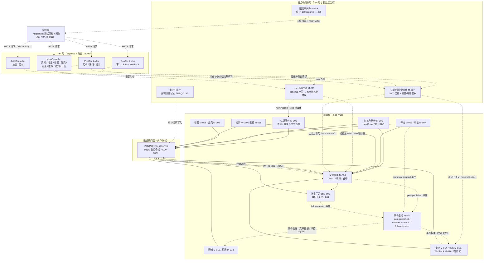
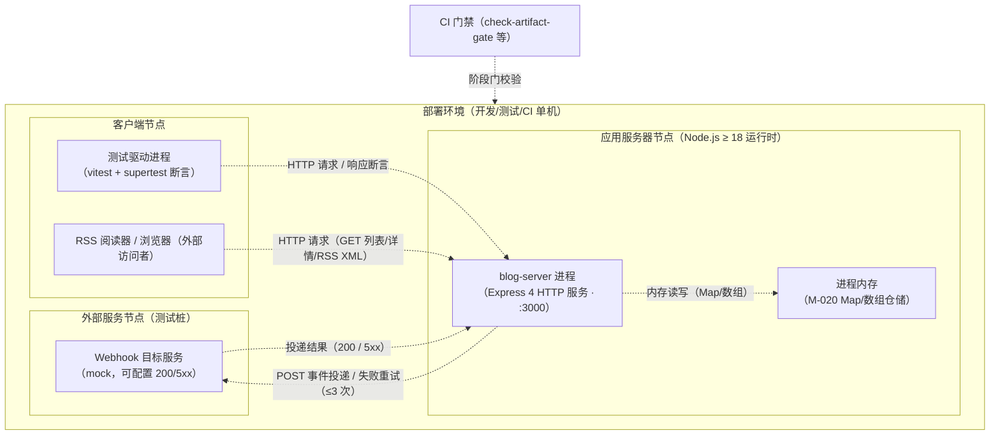

# 系统设计文档

> 阶段 2（系统设计）产出。博客系统后端（第 34 轮端到端调测，blog-system-demo-r34）。
> 依据 w-model-dev/references/phase-2-system-design.md 验收标准；技术选型按「技术选型决策矩阵」5 维度评分；测试 seam 决策按 to-spec seam-first 方法论。

## 文档信息

- 项目名称：博客系统后端（blog-system-demo-r34）
- 文档版本：v1.0
- 编制日期：2026-08-07
- 编制者：S-doc（阶段 2 系统设计子代理，dispatchId=phase2-S-doc-02）
- 关联需求文档：docs/phase1-requirements/requirement-spec.md（32 需求 = 22 REQ + 6 NFR + 4 CON）
- 关联验收测试设计：docs/phase1-requirements/acceptance-test-design.md（91 UAT 用例）
- 关联系统测试用例：docs/phase2-design/blog-system-system-test.md

## 1. 系统架构

### 1.1 架构图

> Mermaid C4 组件图（graph 视图实现 C4 Component 语义）：subgraph 体现分层（API 层 / 横切中间件层 / 服务层 / 数据访问层），实线 `-->` 为组件依赖/调用，虚线 `-.->` 为数据流标注（请求/响应/事件/读写，仅标注代表性数据流）。

> 图例：实线 `-->` = 组件依赖/调用关系；虚线 `-.->` = 数据流（HTTP 请求/响应、DTO、认证上下文、业务事件、内存读写）。认证/限流/审计/校验为横切中间件，位于 API 层与服务层之间，所有进入服务层的请求均经过。

### 1.2 架构风格说明

- **架构风格：分层单体（Layered Monolith）**。四个层次职责单一、依赖单向向下：
  - API 层（Express 4 路由 + Controller）：仅做 HTTP 协议适配（路径/状态码/响应结构），不含业务逻辑。
  - 横切中间件层：认证授权（NFR-002）、限流（NFR-006）、审计（REQ-018）、入参校验（CON-003）以中间件方式挂载，横切不侵入业务模块。
  - 服务层：承载全部业务规则（22 REQ），模块按业务域划分（M-001~M-016），通过进程内事件总线（M-021）解耦跨域事件（文章发布/评论/关注）。
  - 数据访问层：内存 Map/数组仓储（M-020），对服务层暴露仓储接口，隔离具体存储实现。
- **内存存储**（CON-002）：数据驻留进程内存，零外部数据库/中间件依赖；由数据访问层统一封装，未来若替换为持久化存储仅需重写 M-020，不影响服务层。
- **选择理由**：项目为单进程后端（22 REQ、15 业务域）、规模小、无前端/无外部依赖；分层单体在满足可测试性（supertest 驱动 HTTP seam）、可维护性（职责边界清晰）的同时引入成本最低；与阶段 7 系统测试（经 HTTP seam 全量驱动）契合。

## 2. 技术选型

### 2.1 决策矩阵说明

> 按 w-model-dev/references/phase-2-system-design.md「技术选型决策矩阵」：每个候选技术按 5 维度评分（1=差 / 5=优），加权汇总取最高分；并列时按「可维护性 > 成熟度 > 适用性」破局。
> 权重：适用性 25% / 成熟度 20% / 可维护性 20% / 引入成本 15% / 风险敞口 20%。评分前必答权衡问题：适用性（覆盖核心 QAR？有无功能缺口？）；成熟度（≥3 生产案例？最近 6 个月 commit/release？）；可维护性（1 周可独立运维？LTS？）；引入成本（新运行时？CI 兼容？）；风险敞口（1 年后替换的重写量？）。

### 2.2 Web 框架（候选：Express 4 / Fastify / Koa）

| 候选 | 适用性(25%) | 成熟度(20%) | 可维护性(20%) | 引入成本(15%) | 风险敞口(20%) | 加权总分 | 评分依据与一句话选型理由 |
|---|---|---|---|---|---|---|---|
| **Express 4**（选定） | 5 | 5 | 5 | 5 | 4 | **4.80** | 覆盖全部 QAR（中间件承载安全/限流/审计，路由适配性能场景）；全球最大社区、生产案例无数、6 个月内有持续 release（4.21.x 维护版）；文档海量 1 周可上手、随 Node LTS 生态维护；CON-001 已约束零新学习、CI 直接兼容；若替换需重写路由与中间件链，但生态迁移资料充分，风险可控 |
| Fastify | 4 | 4 | 4 | 3 | 3 | 3.65 | 性能强、schema 内建，但插件生态与路由模式与既有约束不兼容；生产案例≥3 但少于 Express；引入即违反 CON-001，学习与迁移成本高 |
| Koa | 3 | 4 | 3 | 3 | 3 | 3.20 | 洋葱模型简洁但无内置路由/中间件，需自行组合（功能缺口）；社区与文档弱于前两者；同样违反 CON-001 |

**结论**：Express 4 加权总分 4.80 最高（> Fastify 3.65、Koa 3.20），且唯一满足 CON-001「后端采用 Node.js + Express 4 + TypeScript 5，禁止其他 Web 框架」约束。选定 **Express 4**。

### 2.3 入参校验（候选：zod / joi）

| 候选 | 适用性(25%) | 成熟度(20%) | 可维护性(20%) | 引入成本(15%) | 风险敞口(20%) | 加权总分 | 评分依据与一句话选型理由 |
|---|---|---|---|---|---|---|---|
| **zod**（选定） | 5 | 4 | 5 | 5 | 4 | **4.60** | TS5 优先、schema 直接推导静态类型（与 TypeScript 5 契合，满足 CON-003 声明式校验）；社区活跃、生产案例多、近 6 个月持续发版；错误信息结构化便于统一 400 错误体；CON-003 已约束零额外引入；替换需重写全部 schema 但封装在 M-019，风险可控 |
| joi | 3 | 5 | 4 | 3 | 4 | 3.80 | 老牌成熟、文档好，但 JS 风格、与 TS 类型推导集成弱，且未在约束栈内，需新增依赖 |

**结论**：zod 4.60 > joi 3.80，且满足 CON-003「所有 API 入参采用 zod 声明式校验」。选定 **zod**。

### 2.4 认证（候选：jsonwebtoken / jose / passport-jwt）

| 候选 | 适用性(25%) | 成熟度(20%) | 可维护性(20%) | 引入成本(15%) | 风险敞口(20%) | 加权总分 | 评分依据与一句话选型理由 |
|---|---|---|---|---|---|---|---|
| **jsonwebtoken**（选定） | 5 | 5 | 5 | 5 | 4 | **4.80** | 签发/校验 API 直接覆盖 REQ-003（登录换 JWT、Bearer 鉴权）与 NFR-002（JWT_SECRET 环境变量注入）；Node 生态事实标准、生产案例无数；API 简单 1 周可运维；约束栈内已含，零新学习；替换仅重写 M-001/M-017 内封装层 |
| jose | 4 | 4 | 4 | 3 | 4 | 3.85 | 现代实现（支持 JWE/JWK）但 API 更底层，对本项目仅需 HS256 签发/校验，能力过剩 |
| passport-jwt | 3 | 4 | 3 | 3 | 3 | 3.20 | 需整入 passport 策略体系，对无第三方登录场景过重；引入成本与维护成本偏高 |

**结论**：jsonwebtoken 4.80 最高。选定 **jsonwebtoken**（配合 JWT_SECRET 环境变量注入 + 生产禁用默认密钥，见 NFR-002 AC3）。

### 2.5 存储（候选：内存 Map 结构 / SQLite / 文件 JSON）

| 候选 | 适用性(25%) | 成熟度(20%) | 可维护性(20%) | 引入成本(15%) | 风险敞口(20%) | 加权总分 | 评分依据与一句话选型理由 |
|---|---|---|---|---|---|---|---|
| **内存 Map 结构**（选定） | 5 | 4 | 5 | 5 | 4 | **4.60** | 满足 CON-002（零外部依赖、启动无外部连接）；Map/数组读写 O(1)/O(n) 覆盖 100 QPS 规模无性能缺口；JS 原生零运维、CI 直接兼容；替换为数据库仅重写 M-020 数据访问层 |
| SQLite | 3 | 5 | 3 | 2 | 3 | 3.25 | 成熟持久化但违反 CON-002；需引入 native 依赖（编译/部署风险），运维成本升高 |
| 文件 JSON | 3 | 3 | 3 | 4 | 4 | 3.35 | 无外部依赖但同步 I/O 阻塞性能差、并发写有竞态风险，需自研一致性处理 |

**结论**：内存 Map 4.60 最高，且唯一满足 CON-002。选定**内存 Map 结构**（按业务域建 Map：users/posts/comments/tags/categories/notifications/subscriptions/auditLogs/webhooks/bloggers，以自增 ID 主键 + 索引辅助）。

### 2.6 密码哈希（候选：bcryptjs / bcrypt(native) / argon2）

| 候选 | 适用性(25%) | 成熟度(20%) | 可维护性(20%) | 引入成本(15%) | 风险敞口(20%) | 加权总分 | 评分依据与一句话选型理由 |
|---|---|---|---|---|---|---|---|
| **bcryptjs**（选定） | 5 | 5 | 5 | 5 | 4 | **4.80** | 纯 JS 实现满足 NFR-002（密码不存明文）；生产案例无数；零 native 编译（Windows/Linux CI 一致）；约束栈内已含；替换仅改 M-001 哈希调用 |
| bcrypt（native） | 4 | 5 | 3 | 3 | 4 | 3.85 | 性能更优但需 node-gyp 编译，跨平台 CI 有失败风险，维护成本高 |
| argon2 | 4 | 4 | 3 | 3 | 3 | 3.45 | 算法更强但对本 demo 过重，native 依赖引入成本高 |

**结论**：bcryptjs 4.80 最高。选定 **bcryptjs**。

### 2.7 技术选型总表

| 层次 | 技术 | 版本 | 选型理由（一句话） |
|---|---|---|---|
| 后端框架 | Node.js + Express 4 | Node ≥ 18 / Express 4.21.x | 决策矩阵 4.80 分最高，唯一满足 CON-001 |
| 语言 | TypeScript 5 | 5.x | CON-001 约束，类型安全支撑可维护性 |
| 入参校验 | zod | 3.x | 决策矩阵 4.60 分，TS 类型推导 + CON-003 声明式校验 |
| 认证 | jsonwebtoken | 9.x | 决策矩阵 4.80 分，JWT 签发/校验 + NFR-002 密钥治理 |
| 密码哈希 | bcryptjs | 2.4.x | 决策矩阵 4.80 分，纯 JS 零编译，NFR-002 密码不存明文 |
| 存储 | 进程内存 Map/数组 | — | 决策矩阵 4.60 分，唯一满足 CON-002 零外部依赖 |
| 测试驱动 | vitest + supertest | vitest 2.x / supertest 7.x | 约束栈内置；supertest 驱动 HTTP seam 支持阶段 7 系统测试 |
| 运行时校验辅助 | tsc（编译期） | 随 TS5 | 编译门禁 + 类型级契约 |

## 3. 模块划分

> 模块 ID M-001~M-021。按业务域划分（用户/博主/文章/评论/标签/分类/搜索/推荐/统计/通知/订阅/审计/RSS/Webhook）+ 横切/基础设施模块。依赖方向单向向下（服务模块 → 横切 → 存储/事件总线底座），**无循环依赖**。

| 模块 ID | 模块名 | 职责 | 关联需求 |
|---|---|---|---|
| M-001 | 认证服务 | 注册/登录、JWT 签发与校验（访问令牌）、密码 bcrypt 哈希与比对 | REQ-001, REQ-003 |
| M-002 | 用户资料服务 | 认证用户查看/更新个人资料（昵称/头像/简介） | REQ-002 |
| M-003 | 博主子系统 | 博主身份开通/资料维护、关注/取关、粉丝计数（幂等） | REQ-004, REQ-005 |
| M-004 | 文章管理服务 | 文章 CRUD、草稿/发布状态流转（draft/published）、标签/分类关联 | REQ-006, REQ-007 |
| M-005 | 浏览与统计服务 | 浏览量记录（+1 持久化）、文章/博主维度统计（0 语义） | REQ-008, REQ-015 |
| M-006 | 评论服务 | 评论发表（作者可删）、长度/空值校验 | REQ-009 |
| M-007 | 评论审核服务 | 评论审核通过/拒绝，控制评论可见性 | REQ-010 |
| M-008 | 标签服务 | 标签创建/查询/删除、文章标签关联与解绑（引用保护） | REQ-011 |
| M-009 | 分类服务 | 分类创建/查询/更新/删除、父子层级、含文章删除保护 | REQ-012 |
| M-010 | 搜索服务 | 关键词搜索（标题/内容/标签）、分页元数据 | REQ-013 |
| M-011 | 推荐服务 | 基于标签/浏览量的推荐（≤10 条、不含草稿） | REQ-014 |
| M-012 | 通知服务 | 评论/关注事件生成通知、查询（仅本人）、标记已读（越权 403） | REQ-016 |
| M-013 | 订阅服务 | 订阅/退订博主（幂等）、订阅者接收文章更新 | REQ-017 |
| M-014 | 审计日志服务 | 关键操作审计记录（actor/action/timestamp/详情）、条件查询分页、保留期清理（CON-004） | REQ-018, REQ-019, CON-004 |
| M-015 | RSS 服务 | 系统级/博主级 RSS 订阅源 XML 生成 | REQ-020 |
| M-016 | Webhook 服务 | Webhook CRUD、文章发布事件投递、失败重试（≤3 次指数退避）与 failed 标记 | REQ-021, REQ-022 |
| M-017 | 认证/授权中间件 | JWT 校验、角色（管理员）与资源属主鉴权（横切） | NFR-002 |
| M-018 | 限流中间件 | 单 IP 100 req/min 计数、超限 429 + Retry-After（横切） | NFR-006 |
| M-019 | 入参校验（zod） | 统一 schema 校验、错误结构归一化 `{error:{code,message}}`（横切） | CON-003 |
| M-020 | 内存数据访问层 | 内存 Map/数组仓储、ID 生成、基础增删改查（基础层） | CON-002, NFR-005 |
| M-021 | 进程内事件总线 | 事件发布/订阅（post.published / comment.created / follow.created）（基础层） | 支撑 M-012/M-013/M-016 |

### 3.1 模块依赖（无循环依赖）

| 模块 | 依赖 | 说明 |
|---|---|---|
| M-001 | M-019, M-020 | 认证依赖校验与存储 |
| M-002 | M-001, M-020 | 资料依赖认证上下文 |
| M-003 | M-001, M-020, M-021 | 关注事件发布到事件总线 |
| M-004 | M-003, M-008, M-009, M-020, M-021 | 文章依赖博主/标签/分类，发布事件入总线 |
| M-005 | M-004, M-020 | 统计依赖文章数据 |
| M-006 | M-001, M-004, M-020, M-021 | 评论依赖文章与认证，评论事件入总线 |
| M-007 | M-003, M-006, M-020 | 审核依赖博主权限与评论数据 |
| M-008 | M-020 | 独立 |
| M-009 | M-020 | 独立 |
| M-010 | M-004, M-008, M-020 | 搜索依赖文章与标签 |
| M-011 | M-004, M-005, M-008, M-020 | 推荐依赖文章/浏览量/标签 |
| M-012 | M-001, M-020, M-021 | 通知订阅事件总线事件 |
| M-013 | M-001, M-020, M-021 | 订阅接收文章更新事件 |
| M-014 | M-001, M-020 | 审计依赖认证上下文与存储 |
| M-015 | M-003, M-004, M-020 | RSS 依赖文章与博主 |
| M-016 | M-020, M-021 | Webhook 订阅文章发布事件 |
| M-017 | M-001, M-020 | 中间件调用 JWT 校验 |
| M-018 | M-020 | 计数存储于内存 |
| M-019 | — | 无依赖（纯函数式 schema） |
| M-020 | — | 基础层，无依赖 |
| M-021 | — | 基础层，无依赖 |

**循环依赖检测**：依赖方向自顶向下单向（服务模块 → 横切/基础层），拓扑序 `M-019/M-020/M-021 → M-001 → M-002/M-003/M-014/M-017/M-018 → M-004 → M-005/M-006/M-010/M-015 → M-007/M-011/M-012/M-013/M-016`，无反向引用；人工拓扑核验无环（阶段 5 编码后由 G 以 `madge --circular` / dependency-cruiser 复核，见 phase-2-system-design.md 边界条件 fallback）。

## 4. 部署架构

> 单机部署：应用服务器节点内单进程承载全部 API；内存存储随进程驻留；Webhook 投递目标为外部/测试桩服务。

**运行与配置说明**：
- 端口：`:3000`（env `PORT` 可覆盖）。
- 环境变量：`JWT_SECRET`（必填，生产禁用默认值，见 NFR-002 AC3）、`AUDIT_RETENTION_DAYS`（默认 90，CON-004）、`RATE_LIMIT_MAX`（默认 100 req/min，NFR-006）。
- 数据生命周期：内存存储随进程启停，数据易失（RISK-001，验收/系统测试环境可接受，见 requirement-spec.md §10.2）。

## 5. 系统测试用例索引

> 详细用例见 docs/phase2-design/blog-system-system-test.md（13 条 ST + 5 条 TC-DES，阶段 7 执行）。

| 用例 ID | 关联模块 | 场景 | 优先级 |
|---|---|---|---|
| ST-001 | M-001, M-003, M-004, M-005, M-006, M-012 | 端到端全链路（注册→登录→开通博主→发布→浏览→评论→通知） | 高 |
| ST-002 | 横切（M-017/M-018/M-020） | 性能基线（100 QPS 持续 10min，P95 < 2s）+ 可靠性零 5xx + 峰值内存 | 高 |
| ST-003 | M-001, M-017, M-019 | 安全基线（SQL 注入 / XSS / CSRF / 越权 401-403） | 高 |
| ST-004 | M-001, M-002, M-004, M-017 | 认证+文章集成（未认证 401 / 越权 403 / 404） | 高 |
| ST-005 | M-006, M-007 | 评论+审核集成（可见性流转 / 400 / 404 / 403） | 高 |
| ST-006 | M-003, M-012, M-013 | 订阅+通知集成（关注/评论事件 → 通知 → 已读；越权 403） | 高 |
| ST-007 | M-014, M-015 | 审计+RSS 集成（记录/查询/权限；XML 合法/404） | 高 |
| ST-008 | M-016, M-021 | Webhook+重试集成（触发投递 / 重试 ≤3 次 / failed / 400） | 高 |
| ST-009 | M-018 | 限流 429（阈值内放行 / 超限 429 + Retry-After） | 高 |
| ST-010 | M-008, M-009 | 标签+分类集成（关联/解绑/层级/删除保护 409） | 高 |
| ST-011 | M-010, M-011 | 搜索+推荐集成（命中/分页/空关键词 400；推荐 ≤10 不含草稿） | 高 |
| ST-012 | M-005 | 浏览+统计集成（viewCount 持久化 / 0 语义 / 404） | 高 |
| ST-013 | M-019, M-020, M-014（+静态） | 约束与横切集成（CON-001/002/003 静态+行为验证；NFR-004 覆盖率复核） | 中 |

## 6. 测试 seam 决策

> 依据 to-spec seam-first testing 方法论（阶段 2 吸收，第 10 轮外部技能）：seam 决策回答「在哪测」，系统测试设计（§5 与系统测试用例文档）回答「测什么」。阶段 7 系统测试执行以本决策为基准，阶段 3 须显式引用（「复用阶段 2 seam 的部分」非空）。

### 6.1 候选 seam 列表

- **S1 HTTP API**：系统对外唯一公开契约面（REST 端点 + JSON/XML 响应），钩住点 = HTTP（supertest 直接驱动，无需真实端口；亦可通过监听端口压测）。
- **S2 模块导出**：服务层模块（M-001~M-016）的函数级直接调用，钩住点 = 模块导出（进程内调用，绕过 HTTP 层）。
- **S3 进程边界**：启动真实 blog-server 进程（`node dist/server.js`），经 TCP/HTTP 端口请求，钩住点 = 进程边界。

### 6.2 选定 seam

- 系统测试主 seam：**S1（HTTP API）**——系统层最高 seam（外部可观测点），覆盖最广（全部系统级场景：端到端/性能/安全/跨模块集成均可经 HTTP 表达）、最稳定（HTTP 契约固定，与需求验收标准的状态码/错误体一一对应）、最少新 seam（supertest 在阶段 1 验收测试设计已引入，零新增 seam）。
- 系统测试辅 seam：**无**（主 seam 全覆盖；性能压测（ST-002）同样经 HTTP 注入负载，不需要进程边界 seam 即可达到进程级真实性——单进程部署下 supertest 与真实端口等价）。

### 6.3 理由

- **为什么主 seam 是最高 seam**：系统层「最高 seam」= HTTP API / CLI / 进程边界等外部可观测点；本项目对外能力全部经 HTTP 暴露（无 CLI），HTTP API 是唯一且最高的 seam。
- **为什么现有 seam 优于新建 seam**：遵循 to-spec「fewer seams better」原则——S1 已由阶段 1 工具链（supertest）支撑，且 91 条 UAT 用例全部以 HTTP 路径设计（见 uat-path-mapping.md），系统测试复用同一 seam 可保持用例格式、前置条件（认证状态/数据依赖/接口路径）与断言语义一致，无需引入任何新 seam。
- **新建 seam 的代价与收益（如有新建）**：无新建。S2（模块导出）虽便于故障定位，但会绕过 HTTP 契约层，属于单元/集成测试层级的 seam（阶段 4/6 复用），在系统层引入反而降低端到端真实性；S3（进程边界）在本项目单进程部署下与 S1 语义等价，引入额外启动/清理成本而无收益，故不采用。
