# 系统设计文档

> 阶段 2（系统设计）产出。W 模型第 23 轮（2026-07-30）端到端调测。
> 套用 `w-model-dev/templates/system-design.md` 模板并扩展；同步产出对应的系统测试设计。
>
> **第 23 轮设计原则**：
> 1. **子系统根对齐 REQ-group**：阶段 1 已识别 7 个 REQ-group（user / blogger / article / comment / notification / site / admin），本阶段将每个 group 提升为正式子系统（SD 根）。
> 2. **横切关注点显式化**：将 NFR（限流/性能/安全）与 CON（RESTful/JSON/TS strict）抽离为横切 SD，与 §6 NFR 设计逐项对齐。
> 3. **接口契约先行**：每个 SD 至少定义 1 个 INTF（HTTP/REST 端点或模块导出），用于阶段 3 详细设计。
> 4. **状态机概要**：核心 SD（SD-001 认证、SD-005 博文生命周期、SD-010 评论、SD-011 通知、SD-013 Webhook 投递）必须显式给出状态机概要。
> 5. **数据模型与边界**：每个 SD 给出持有的内存 Map/数组 + 关键字段，跨 SD 共享数据须显式依赖（避免后期"信息流黑洞"）。

## 文档信息

- 项目名称：扩展博客系统后端（blog-system-demo）
- 文档版本：v1.0.0
- 编制日期：2026-07-30
- 编制者：S-doc 子代理（W 模型阶段 2 文档产出）
- 关联需求文档：`docs/phase1-requirements/requirement-spec.md`
- 关联验收设计：`docs/phase1-requirements/acceptance-test-design.md`
- 关联 UAT 映射：`docs/uat-path-mapping.md`
- 关联图谱：`.w-model/ingestion/graph.json`
- 项目 ID：`blog-system-demo`
- Round：23
- 阶段：2（系统设计）

---

## §1. 架构总览

### 1.1 架构风格选择

选择**经典三层架构 + 横切关注点（Cross-Cutting Concerns）AOP 化**，不采用微服务/事件驱动/六边形等更复杂模式。理由：

| 维度 | 评估 | 评分（1-5） |
|---|---|---|
| 适用性 | 32 需求（22 REQ + 6 NFR + 4 CON）规模适中，三层足够；过度工程（DDD/微服务）会拖累编码与测试 | 5 |
| 成熟度 | Express 4 + 分层是 Node.js 生态最成熟范式 | 5 |
| 可维护性 | 团队 1 周可独立运维；TS strict + Zod 校验提供编译期与运行期双重保障 | 4 |
| 引入成本 | 0 新运行时；与现有 CI/测试栈完全兼容 | 5 |
| 风险敞口 | 单进程 + 内存存储，未来替换为微服务的代价是"模块重排 + 通信层引入"，可控 | 4 |
| **总分** | | **23/25** |

**架构分层**：
1. **Router 层**（`src/router/*.ts`）：定义 HTTP 路径与方法；调用 Zod schema 校验；调用 Controller；不持有业务状态。
2. **Controller 层**（`src/modules/*/controller.ts`）：解析 HTTP 请求 → 调用 Service；返回响应；处理 HTTP 状态码与错误转换；不持有业务状态。
3. **Service 层**（`src/modules/*/service.ts`）：核心业务逻辑；事务边界（内存存储下为同步顺序）；调用 Repository；发布领域事件（EventEmitter）。
4. **Repository 层**（`src/modules/*/repository.ts`）：纯数据访问；CRUD on Map/数组；不引用 Service。
5. **Model 层**（`src/modules/*/model.ts`）：TS 类型定义 + Zod schema 校验；不引用其他层。

**横切层**（`src/core/middleware/*.ts` + `src/core/events/*.ts` + `src/core/webhook/*.ts`）：
- Auth 中间件、JWT 签发/校验
- RateLimit 中间件（IP 滑动窗口）
- Error 中间件（统一错误响应）
- EventBus（领域事件总线）
- Webhook Dispatcher（异步重试 + 签名）

### 1.2 C4 架构图

#### 1.2.1 Context 图（系统级上下文）

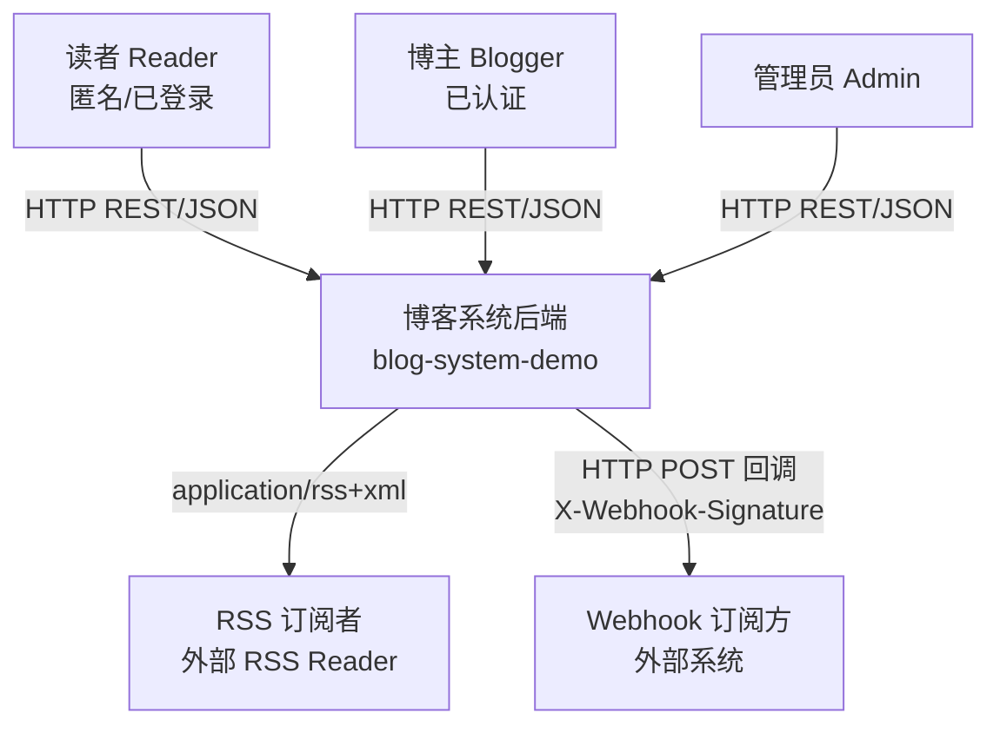

**说明**：系统的 4 类外部 actor（Reader / Blogger / Admin / 外部订阅方），仅 Admin 可写站点配置与审计；RSS 与 Webhook 为系统主动外部输出。

#### 1.2.2 Container 图（部署容器）

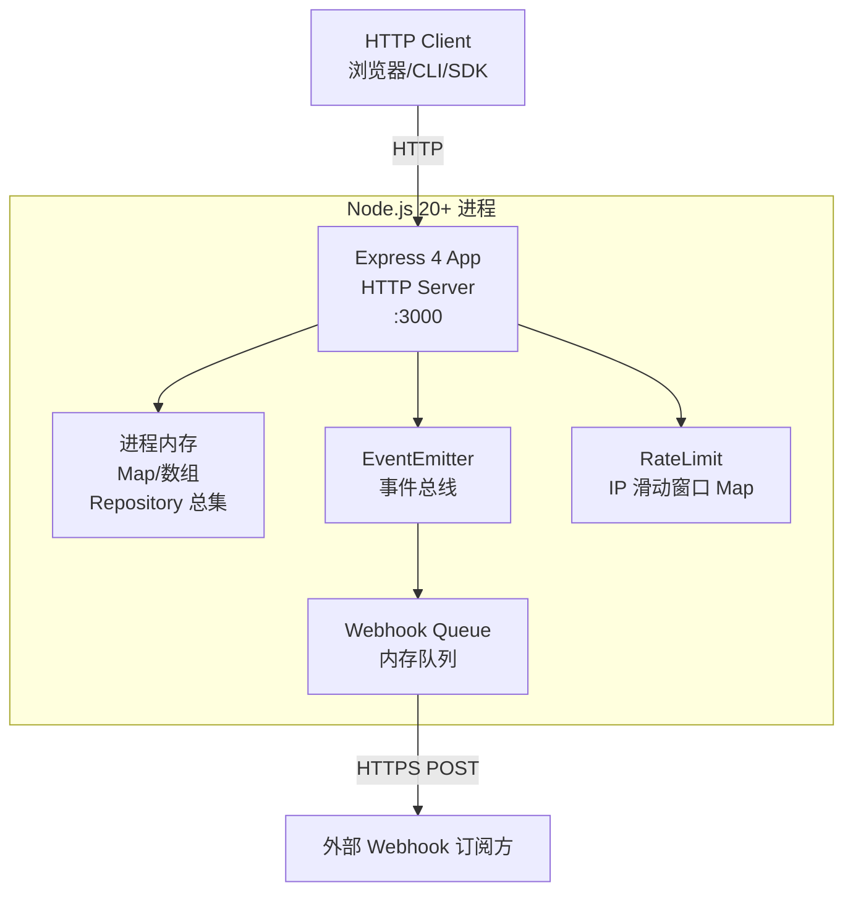

**说明**：单进程单容器部署，无外部依赖（CON-002 内存存储约束）。所有数据、状态、队列、限流计数均在进程内存。

#### 1.2.3 Component 图（子系统组成）

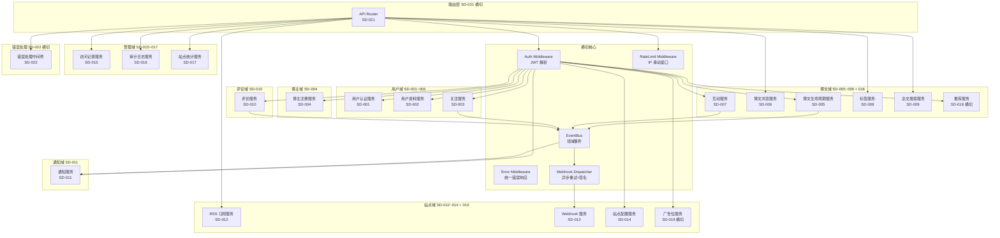

### 1.3 架构关键决策

| 决策 ID | 决策内容 | 理由 | 备选方案 |
|---|---|---|---|
| AD-001 | 三层架构（Router→Controller→Service→Repository→Model） | Node.js 生态成熟，TS strict 友好 | DDD 聚合根（过度工程） |
| AD-002 | 单进程单端口部署 | CON-002 内存约束；32 需求规模无需水平扩展 | 多进程 + 共享存储（违反 CON-002） |
| AD-003 | EventEmitter 实现轻量事件总线 | 域内事件足够；避免外部 MQ 依赖 | Redis Pub/Sub（违反 CON-002） |
| AD-004 | bcryptjs 同步 API（cost=10） | NFR-006 cost≥10；同步 API 简化错误处理 | bcrypt 原生（编译复杂度高） |
| AD-005 | JWT HS256 + 24h TTL | 无状态；服务端无需会话存储 | Session + Redis（违反 CON-002） |
| AD-006 | Zod schema 在路由入口校验 | 类型与运行时校验统一；TS 类型推导 | class-validator（装饰器 + 反射） |
| AD-007 | RSS 单独路由（GET /rss.xml） | 输出 Content-Type 不同；非 RESTful 资源 | RSS 作为受保护资源（破坏 RSS 公开语义） |
| AD-008 | Webhook 内存队列 + 3 次重试 + HMAC 签名 | 异步非阻塞；签名防伪造 | Kafka/RabbitMQ（违反 CON-002） |
| AD-009 | 限流 IP 滑动窗口（100 req/min） | 内存实现简单；NFR-005 一致 | 令牌桶（实现复杂度高） |
| AD-010 | 审计日志按 ts 索引 + 90 天自动清理 | CON-004 约束；数组 + 二分查找够用 | 滚动文件 + 外部存储（违反 CON-002） |

---

## §2. 系统上下文图

### 2.1 角色与认证矩阵

| 角色 | 标识 | 主要操作 | 鉴权方式 |
|---|---|---|---|
| 匿名访客（Anonymous） | 无 token | 浏览公开博文/RSS/标签/搜索/注册/登录 | 无 |
| Reader（普通读者） | `Authorization: Bearer <jwt>` payload `role=reader, sub=userId` | 全部读操作 + 评论/点赞/收藏/关注/查通知 | JWT 校验 |
| Blogger（博主） | `Authorization: Bearer <jwt>` payload `role=blogger, sub=bloggerId` | 博文 CRUD + 标签管理 + Webhook 订阅 | JWT 校验 + owner 校验 |
| Admin（管理员） | `Authorization: Bearer <jwt>` payload `role=admin, sub=adminId` | 站点配置/广告/审计/统计/访问记录 | JWT 校验 + role 校验 |
| 外部 RSS Reader | 无 token | GET /rss.xml | 无（CON-003 例外） |
| 外部 Webhook 订阅方 | 无 token（系统 → 外部） | 接收 POST 回调 | 系统侧加 HMAC 签名头 |

**JWT 载荷**：
```json
{
  "sub": "<userId|bloggerId|adminId>",
  "role": "reader|blogger|admin",
  "iat": <unix-ts>,
  "exp": <unix-ts, iat+86400>
}
```

**Token 失效策略**：CON-002 内存约束下不维护撤销白名单。短 TTL（24h）+ 客户端登出即丢 token = 实际失效。修订密码后旧 token 仍有效（已知限制，§11 风险 RISK-002）。

### 2.2 外部系统与边界

| 边界 | 类型 | 数据流向 | 鉴权 |
|---|---|---|---|
| HTTP Client ↔ App | EXT-IN（请求）/ EXT-OUT（响应） | 双向 JSON | Bearer JWT / 无（公开端点） |
| App → Webhook Subscriber | EXT-OUT | POST + HMAC 签名 | X-Webhook-Signature: sha256=<hex> |
| App → RSS Reader | EXT-OUT | GET /rss.xml | 无（Content-Type: application/rss+xml） |
| App → bcryptjs / jsonwebtoken | 内部依赖 | 同步 API | N/A |
| App → zod | 内部依赖 | 校验 | N/A |
| App → Node.js fs / process | 系统调用 | 健康检查 | N/A |

### 2.3 数据流图（DFD Context）

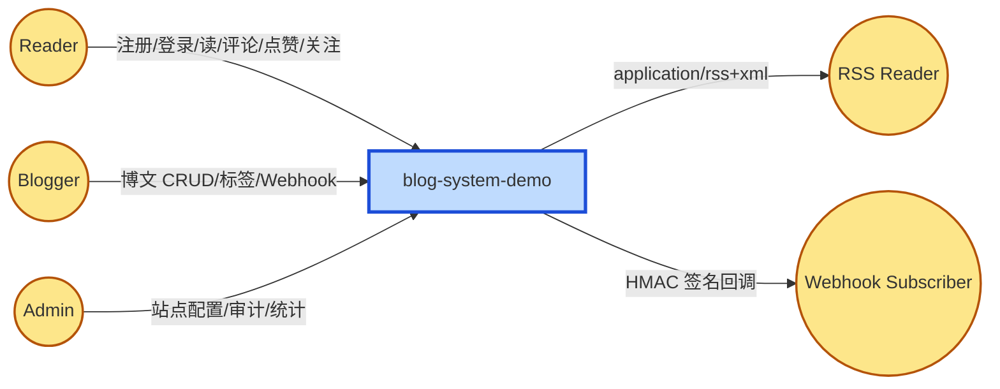

---

## §3. 模块划分

### 3.1 22 SD 子系统概览

> 7 个领域子系统 + 5 个横切子系统 = 12 个子域根；22 SD 中：
> - 7 个 user 域 SD（SD-001~003 + SD-004 blogger + SD-005~009 article + SD-010 comment + SD-011 notification + SD-012~014 site + SD-015~017 admin）
> - 5 个横切 SD（SD-018 推荐 / SD-019 广告 / SD-020 限流 / SD-021 路由 / SD-022 错误处理）
> - 10 个其他 SD 复用领域子系统的能力边界（SD-013 Webhook 作为 site 子模块之一；SD-015~017 admin 域子模块）

| SD ID | 名称 | 所属子域 | reqGroup | 关联 INTF | 关联 REQ | level |
|---|---|---|---|---|---|---|
| SD-001 | 用户认证服务 | user | REQ-001 | INTF-001 | REQ-001, REQ-002 | 1 |
| SD-002 | 用户资料服务 | user | REQ-001 | INTF-002 | REQ-003 | 1 |
| SD-003 | 关注服务 | user | REQ-001 | INTF-003 | REQ-004 | 1 |
| SD-004 | 博主注册服务 | blogger | REQ-005 | INTF-004 | REQ-005, REQ-017 | 1 |
| SD-005 | 博文生命周期服务 | article | REQ-006 | INTF-005 | REQ-006 | 1 |
| SD-006 | 博文浏览服务 | article | REQ-006 | INTF-006 | REQ-007 | 1 |
| SD-007 | 互动服务（点赞/收藏） | article | REQ-006 | INTF-007 | REQ-008 | 1 |
| SD-008 | 标签服务 | article | REQ-006 | INTF-008 | REQ-012 | 1 |
| SD-009 | 全文搜索服务 | article | REQ-006 | INTF-009 | REQ-013 | 1 |
| SD-010 | 评论服务 | comment | REQ-009 | INTF-010 | REQ-009, REQ-010 | 1 |
| SD-011 | 通知服务 | notification | REQ-011 | INTF-011 | REQ-011, REQ-015 | 1 |
| SD-012 | RSS 订阅服务 | site | REQ-016 | INTF-012 | REQ-014 | 1 |
| SD-013 | Webhook 服务 | site | REQ-016 | INTF-013 | REQ-015 | 1 |
| SD-014 | 站点配置服务 | site | REQ-016 | INTF-014 | REQ-016 | 1 |
| SD-015 | 访问记录服务 | admin | REQ-018 | INTF-015 | REQ-019 | 1 |
| SD-016 | 审计日志服务 | admin | REQ-018 | INTF-016 | REQ-018 | 1 |
| SD-017 | 站点统计服务 | admin | REQ-018 | INTF-017 | REQ-020 | 1 |
| SD-018 | 推荐服务 | 横切 article | REQ-006 | INTF-018 | REQ-021 | 1 |
| SD-019 | 广告位服务 | 横切 site | REQ-016 | INTF-019 | REQ-022 | 1 |
| SD-020 | 限流服务 | 横切 NFR-005 | NFR-005 | INTF-020 | NFR-005 | 1 |
| SD-021 | API 路由层 | 横切 CON-003 | CON-003 | INTF-021 | CON-003 | 1 |
| SD-022 | 错误处理中间件 | 横切 NFR-001 | NFR-001 | INTF-022 | NFR-001, NFR-004 | 1 |

### 3.2 子系统依赖矩阵

> 列出 SD 之间的运行时依赖（被依赖方 → 依赖方）。避免循环依赖。

| 依赖方 SD | 依赖的 SD | 依赖类型 | 说明 |
|---|---|---|---|
| SD-001 用户认证 | SD-022 错误处理 | middleware | JWT 解析失败时抛 AppError |
| SD-001 用户认证 | SD-020 限流 | middleware | 路由级中间件链 |
| SD-002 用户资料 | SD-001 认证 | service | PUT /users/me 需 JWT |
| SD-002 用户资料 | SD-016 审计 | event | 修改资料写 audit log |
| SD-003 关注 | SD-001 认证 | service | 关注需 reader JWT |
| SD-003 关注 | SD-011 通知 | event | follow.created → 通知博主 |
| SD-004 博主注册 | SD-001 认证 | service | 共享 bcrypt + JWT 工具 |
| SD-004 博主注册 | SD-016 审计 | event | blogger.registered → audit |
| SD-005 博文生命周期 | SD-001 认证 | service | 需 blogger JWT |
| SD-005 博文生命周期 | SD-016 审计 | event | post.created/updated/published/deleted → audit |
| SD-005 博文生命周期 | SD-011 通知 | event | post.published → 关注者通知 |
| SD-005 博文生命周期 | SD-013 Webhook | event | post.published → webhook 投递 |
| SD-006 博文浏览 | SD-005 博文生命周期 | service | 读取 posts Map |
| SD-006 博文浏览 | SD-015 访问记录 | service | GET /posts/:id → 写 access record |
| SD-007 互动（点赞/收藏） | SD-005 博文生命周期 | service | 校验 post 存在 |
| SD-007 互动 | SD-001 认证 | service | 需 reader JWT |
| SD-007 互动 | SD-011 通知 | event | like.created → 通知博主 |
| SD-008 标签 | SD-005 博文生命周期 | service | 关联博文 |
| SD-009 全文搜索 | SD-005 博文生命周期 | service | 读取 posts Map（仅 published） |
| SD-009 全文搜索 | SD-008 标签 | service | 标签过滤 |
| SD-010 评论 | SD-005 博文生命周期 | service | 校验 post 存在 |
| SD-010 评论 | SD-001 认证 | service | 需 reader/blogger JWT |
| SD-010 评论 | SD-011 通知 | event | comment.created → 通知博主 + 父评论作者 |
| SD-010 评论 | SD-016 审计 | event | comment.deleted → audit |
| SD-011 通知 | SD-001 认证 | service | GET /me/notifications 需 JWT |
| SD-011 通知 | SD-013 Webhook | service | 通知触发 webhook 投递（可选） |
| SD-012 RSS | SD-005 博文生命周期 | service | 读取 published posts |
| SD-012 RSS | SD-014 站点配置 | service | 读取 siteTitle/siteLink |
| SD-013 Webhook | SD-016 审计 | event | webhook.delivery 失败 → audit |
| SD-014 站点配置 | SD-001 认证 | service | PUT 需 admin JWT |
| SD-014 站点配置 | SD-016 审计 | event | site.config.updated → audit |
| SD-015 访问记录 | SD-001 认证 | service | GET 需 admin JWT |
| SD-016 审计日志 | SD-001 认证 | service | GET 需 admin JWT |
| SD-017 站点统计 | SD-006 博文浏览 | service | PV 来源于浏览事件 |
| SD-017 站点统计 | SD-015 访问记录 | service | UV 来源于 access_records 去重 |
| SD-018 推荐 | SD-005 博文生命周期 | service | 读取 posts + tags |
| SD-018 推荐 | SD-008 标签 | service | Jaccard 相似度 |
| SD-019 广告位 | SD-014 站点配置 | service | 关联 bannerAdId |
| SD-020 限流 | SD-022 错误处理 | middleware | 超限 → AppError(429) |
| SD-021 路由 | SD-001~019 所有业务 SD | router | 路由分发 |
| SD-021 路由 | SD-020 限流 | middleware | 全局中间件 |
| SD-021 路由 | SD-022 错误处理 | middleware | 全局错误处理 |
| SD-022 错误处理 | — | — | 无业务依赖（最底层） |

**依赖图（无环验证）**：
```
SD-022 (error)  ← SD-001 ← SD-002/003/004/005/007/010/011/014/016
                ← SD-005 ← SD-006/007/008/009/010/011/012/013/018
                ← SD-020 (rate limit)
                ← SD-021 (router, 入口)
```

`madge --circular` 应返回 0 环。如有环出现（如 SD-018 ↔ SD-005 互引），需通过接口反转或回调解耦。

### 3.3 模块目录结构

```
src/
├── core/                       # 横切核心
│   ├── middleware/
│   │   ├── auth.ts            # SD-001/004/022 共享 JWT 解析
│   │   ├── rateLimit.ts       # SD-020
│   │   ├── errorHandler.ts    # SD-022
│   │   └── requireRole.ts     # SD-001/004 角色守卫
│   ├── events/
│   │   ├── eventBus.ts        # EventEmitter
│   │   └── events.ts          # 事件类型定义
│   ├── webhook/
│   │   ├── dispatcher.ts      # SD-013 队列 + 重试 + 签名
│   │   └── signer.ts          # HMAC-SHA256
│   ├── errors/
│   │   └── AppError.ts        # 统一错误类型
│   ├── logger/
│   │   └── logger.ts          # 结构化 console
│   ├── stats/
│   │   └── bucket.ts          # SD-017 小时桶
│   └── auth/
│       ├── jwt.ts             # jsonwebtoken 封装
│       └── password.ts        # bcryptjs 封装
├── modules/                    # 业务子系统
│   ├── user/                   # SD-001~003
│   ├── blogger/                # SD-004
│   ├── post/                   # SD-005~007
│   ├── tag/                    # SD-008
│   ├── search/                 # SD-009
│   ├── comment/                # SD-010
│   ├── notification/           # SD-011
│   ├── rss/                    # SD-012
│   ├── webhook/                # SD-013
│   ├── site/                   # SD-014, SD-019
│   ├── admin/                  # SD-015~017
│   └── recommend/              # SD-018
├── router/                     # SD-021 路由聚合
│   └── index.ts
├── app.ts                      # Express app 工厂
└── server.ts                   # 启动入口（listen）
```

---

## §4. 数据流

### 4.1 关键数据流路径

#### 4.1.1 用户注册数据流

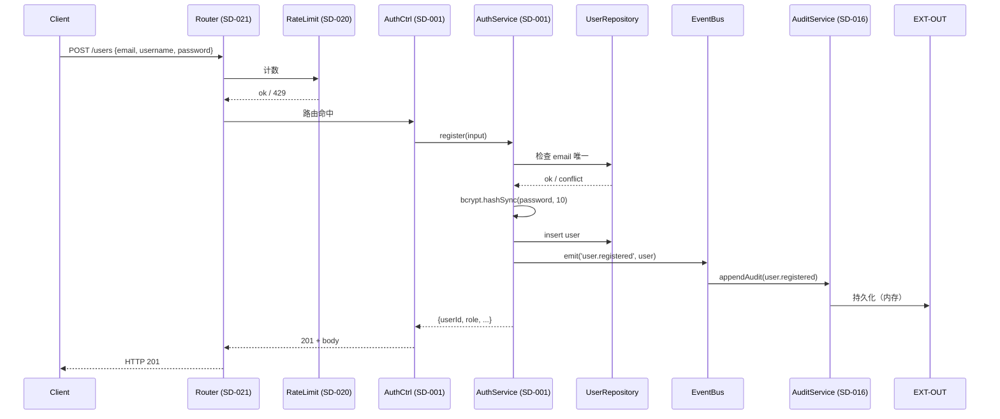

#### 4.1.2 博文发布 → 通知 → Webhook 数据流

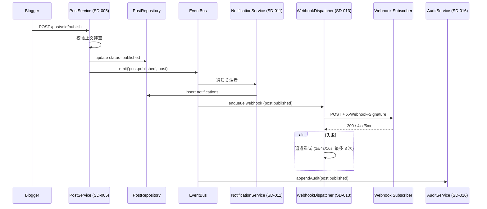

#### 4.1.3 评论发表 → 通知作者/博主 数据流

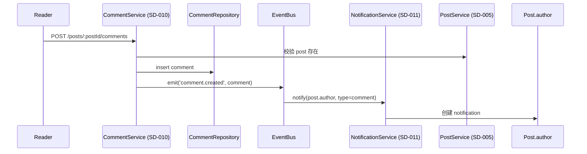

#### 4.1.4 关注 → 通知博主 数据流

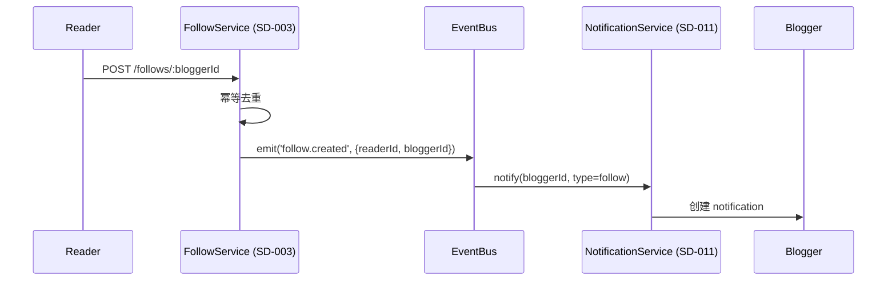

### 4.2 数据所有权矩阵

| 数据 | Owner SD | 存储结构 | 共享给 |
|---|---|---|---|
| users | SD-001 | `Map<userId, User>` | SD-002/003/010/011 |
| follows | SD-003 | `Map<userId, Set<bloggerId>>` | SD-018（推荐）、SD-020（限流） |
| bloggers | SD-004 | `Map<bloggerId, Blogger>` | SD-005/013/019 |
| user_blogger_bindings | SD-004 | `Map<userId, Set<bloggerId>>` | SD-017（统计） |
| posts | SD-005 | `Map<postId, Post>` | SD-006/007/008/009/010/012/013/015/017/018 |
| post_tags | SD-008 | `Map<postId, Set<tagName>>` + `Map<tagName, Set<postId>>` | SD-009（搜索过滤）/SD-018（推荐） |
| likes | SD-007 | `Map<postId, Set<userId>>` | SD-009（搜索权重） |
| bookmarks | SD-007 | `Map<userId, Set<postId>>` | — |
| comments | SD-010 | `Map<commentId, Comment>` + `Map<postId, Set<commentId>>` | SD-005（删除校验） |
| notifications | SD-011 | `Map<userId, Notification[]>` | — |
| webhook_subscriptions | SD-013 | `Map<subscriptionId, Subscription>` | SD-011（投递） |
| webhook_deliveries | SD-013 | `Map<deliveryId, Delivery>` | — |
| site_config | SD-014 | 单例对象 | SD-012（RSS）/SD-019（广告） |
| ads | SD-019 | `Map<adId, Ad>` | SD-014（站点配置 bannerAdId） |
| audit_logs | SD-016 | `AuditLog[]`（按 ts 排序） | — |
| access_records | SD-015 | `AccessRecord[]` | SD-017（统计） |
| stats_buckets | SD-017 | `Map<hourKey, {pv, uvSet, posts: Set}>` | — |
| rate_limit_windows | SD-020 | `Map<ip, number[]>` | — |
| tags | SD-008 | `Map<tagName, Tag>` | SD-009/018 |

---

## §5. 接口契约概要

### 5.1 RESTful 资源命名规范（CON-003）

- **资源集合**：`/posts`、`/users`、`/comments`（复数）
- **资源个体**：`/posts/:id`、`/users/:id`
- **嵌套资源**：`/posts/:postId/comments`、`/users/:id/follows`
- **动作端点**（动词）：`POST /posts/:id/publish`、`POST /me/bloggers/:id/switch`、`POST /auth/login`
- **当前用户资源**：`/me/...`（避免重复 userId）
- **HTTP 状态码**：200 OK / 201 Created / 204 No Content / 400 Bad Request / 401 Unauthorized / 403 Forbidden / 404 Not Found / 409 Conflict / 422 Unprocessable Entity / 429 Too Many Requests / 500 Internal Server Error
- **分页协议**：`?page=1&pageSize=20`（pageSize 上限 100）；响应 `{items: [...], page, pageSize, total, totalPages}`
- **Content-Type**：`application/json; charset=utf-8`（CON-003），RSS 例外 `application/rss+xml; charset=utf-8`
- **错误响应**：`{error: {code: "POST_NOT_FOUND", message: "博文不存在", details?: {...}}}`

### 5.2 22 INTF 详细列表

> 每 INTF 是 SD 的 HTTP API 或模块导出契约。

#### INTF-001 认证 API（SD-001）
- `POST /users` — reader 注册 `{email, username, password}` → 201 `{userId, role: 'reader', ...}`
- `POST /bloggers` — blogger 注册 → 201 `{bloggerId, role: 'blogger', ...}`
- `POST /auth/login` — 通用登录 `{email, password}` → 200 `{token, userId, role, expiresIn: 86400}`

#### INTF-002 用户 API（SD-002）
- `GET /users/:id` — 公开资料 → 200 `{userId, username, displayName, bio, avatarUrl, createdAt}`
- `PUT /users/me` — 修改自己 → 200 `{userId, displayName, bio, avatarUrl}`（JWT 必填，role=reader）

#### INTF-003 关注 API（SD-003）
- `POST /follows/:bloggerId` — 关注（幂等）→ 200 `{followed: true}`（JWT 必填，role=reader）
- `DELETE /follows/:bloggerId` — 取关（幂等）→ 200 `{followed: false}`
- `GET /me/follows` — 关注列表 → 200 `{items: [...], page, pageSize, total, totalPages}`

#### INTF-004 博主认证 API（SD-004）
- `POST /bloggers/apply` — 申请博主（reader 升级为 blogger）→ 201 `{bloggerId}`
- `POST /me/bloggers/:id/switch` — 切换多博主身份 → 200 `{token, bloggerId, role: 'blogger'}`（JWT 必填，role=reader）

#### INTF-005 博文 API（SD-005）
- `POST /posts` — 创建草稿 `{title, content, tags?}` → 201 `{postId, status: 'draft'}`
- `PUT /posts/:id` — 编辑（仅 owner）→ 200 `{postId, title, content, ...}`
- `POST /posts/:id/publish` — 发布（仅 owner，校验正文非空）→ 200 `{postId, status: 'published', publishedAt}`
- `DELETE /posts/:id` — 软删（仅 owner）→ 204

#### INTF-006 浏览 API（SD-006）
- `GET /posts?page=1&pageSize=20&status=published` — 列表（分页+筛选）
- `GET /posts/:id` — 详情（写 access_record）

#### INTF-007 互动 API（SD-007）
- `POST /posts/:id/like` — 点赞（幂等，JWT 必填）
- `POST /posts/:id/bookmark` — 收藏（幂等，JWT 必填）
- `GET /me/bookmarks` — 我的收藏

#### INTF-008 标签 API（SD-008）
- `POST /tags` — 创建标签 `{name}`（全局唯一）
- `POST /posts/:id/tags` — 关联标签 `{tags: string[]}`（1–5 个，幂等去重）
- `DELETE /posts/:id/tags/:name` — 解除关联
- `GET /tags/:name/posts` — 标签下博文列表

#### INTF-009 搜索 API（SD-009）
- `GET /search?q=...&page=1&pageSize=20&tags=...` — 全文搜索（标题权重 2× / 正文 1×；空关键词 400）

#### INTF-010 评论 API（SD-010）
- `POST /posts/:postId/comments` — 顶级评论 `{content}`
- `POST /comments/:parentId/replies` — 回复评论
- `DELETE /comments/:id` — 软删（作者/博文 owner）
- `GET /posts/:postId/comments?page=1&pageSize=20` — 评论列表

#### INTF-011 通知 API（SD-011）
- `GET /me/notifications?page=1&pageSize=20&unreadOnly=true` — 通知列表
- `PATCH /me/notifications/:id/read` — 标记已读

#### INTF-012 RSS 端点（SD-012）
- `GET /rss.xml` — RSS 2.0 feed（最近 20 篇 published；Content-Type: application/rss+xml）

#### INTF-013 Webhook API（SD-013）
- `POST /webhooks` — 注册订阅 `{url, events: string[], secret}`（JWT 必填，role=blogger/admin）
- `DELETE /webhooks/:id` — 注销订阅（仅 owner）
- `GET /me/webhooks` — 我的订阅列表

#### INTF-014 站点配置 API（SD-014）
- `GET /site/config` — 站点元信息 + 当前生效横幅广告
- `PUT /site/config` — 修改（JWT 必填，role=admin）

#### INTF-015 访问记录 API（SD-015）
- `GET /admin/posts/:id/access?page=1&pageSize=20` — 文章访问记录（JWT 必填，role=admin）

#### INTF-016 审计 API（SD-016）
- `GET /admin/audit-logs?actor=&type=&from=&to=&page=1&pageSize=20` — 审计查询（JWT 必填，role=admin）

#### INTF-017 统计 API（SD-017）
- `GET /admin/stats/site?range=24h|7d|30d` — 站点 PV/UV（JWT 必填，role=admin）
- `GET /admin/stats/posts?range=24h|7d|30d` — 文章 PV/UV TopN

#### INTF-018 推荐 API（SD-018）
- `GET /me/recommendations?limit=10` — 相似文章推荐（JWT 必填）；冷启动回退"最近热门 10"

#### INTF-019 广告 API（SD-019）
- `POST /site/ads` — 创建广告 `{imageUrl, linkUrl, startAt, endAt}`（JWT 必填，role=admin）
- `GET /site/ads/active` — 当前生效广告（公开）
- `DELETE /site/ads/:id` — 删除广告

#### INTF-020 限流中间件接口（SD-020）
- 内部 TypeScript 接口：`RateLimiter { check(key: string, limit: number, windowMs: number): RateLimitResult }`
- `RateLimitResult = { allowed: true; remaining: number } | { allowed: false; retryAfterMs: number }`
- HTTP 出口：超限 → 429 `{error: {code: 'RATE_LIMITED', message, details: {retryAfterSec}}}`

#### INTF-021 路由层接口（SD-021）
- `createApp(): Express` — Express app 工厂
- 内部：`Router` 实例聚合所有 `/api/...` 子路由
- 中间件链：`requestLogger → rateLimit → jsonBody → router → errorHandler`

#### INTF-022 错误处理接口（SD-022）
- `AppError extends Error { code: string; statusCode: number; details?: unknown }`
- 全局 `errorHandler(err, req, res, next)`：将 `AppError` 转为标准 JSON 响应；非 `AppError` 转为 500
- 错误码常量：`AppErrorCode = 'EMAIL_ALREADY_EXISTS' | 'INVALID_CREDENTIALS' | 'POST_NOT_FOUND' | 'RATE_LIMITED' | ...`

### 5.3 接口契约不变式

| 不变式 | 保证方式 | 失败时行为 |
|---|---|---|
| 所有响应 Content-Type = application/json（RSS 例外） | router 全局 `res.type('application/json; charset=utf-8')` | 抛 AppError(500, 'CONTENT_TYPE_MISMATCH') |
| 所有错误响应统一结构 | errorHandler 中间件 | 500 + `{error: {code: 'INTERNAL_ERROR', message: '服务器内部错误'}}` |
| 所有列表端点分页协议 | pagination helper 统一 | 400 `INVALID_PAGINATION` |
| 所有写操作产生 audit | 事件总线订阅（SD-016） | 不抛错，记录日志 + 监控告警 |
| 所有必填字段通过 Zod 校验 | router 入口 `validate(schema)` | 400 `VALIDATION_FAILED` + details |
| 所有需认证接口走 auth middleware | router 显式声明 | 401 `UNAUTHENTICATED` |
| 所有 owner 校验在 service 层 | service 显式调用 | 403 `FORBIDDEN` |
| 所有限流计数走 SD-020 | rateLimit 中间件 | 429 `RATE_LIMITED` |
| 所有 Webhook 投递走 SD-013 签名 | dispatcher 统一加签 | 无签名头 → 外部拒绝（自身不感知） |

---

## §6. NFR 设计

### 6.1 性能（NFR-001 P95 ≤ 200ms）

**设计目标**：核心读 API（GET /posts, GET /posts/:id, GET /search）在 1000 并发下 P95 ≤ 200ms。

**设计手段**：
1. **零外部 IO**：所有数据在内存 Map/数组；无 DB 查询延迟。
2. **索引预构建**：
   - `post_tags` 反向索引 `Map<tagName, Set<postId>>`：标签搜索 O(1) 定位
   - `comments by post` 索引 `Map<postId, Set<commentId>>`：评论列表 O(1) 定位
   - `stats_buckets` 按小时桶聚合：统计查询 O(1) 桶查找 + 桶内 O(N) 累加
3. **搜索算法**：标题/正文 substring 匹配，O(n) 遍历（1000 博文规模可接受）；如不达预期，阶段 6 k6 验证后引入倒排索引。
4. **避免大对象常驻**：`access_records` 数组按 FIFO 清理超 90 天；`webhook_deliveries` 仅保留最近 1000 条。
5. **限流保护**（NFR-005）：单 IP 100 req/min，防止突发流量击穿。

**性能基线（预期）**：
- GET /posts（1000 博文）：~5–15ms
- GET /posts/:id（Map.get）：~1–3ms
- GET /search（1000 博文 substring 匹配）：~20–80ms
- POST /posts/:id/publish（含事件触发）：~10–20ms
- 1000 并发下 P95：< 200ms（NFR-001）

**验证**：阶段 6 系统测试用 k6 跑 NFR-001 用例（详见 `docs/phase2-design/system-test.md` §3）。

### 6.2 内存（NFR-002 ≤ 100MB / 1000 并发）

**内存估算**：
- User 对象：~500B × 1000 = 500KB
- Blogger 对象：~400B × 500 = 200KB
- Post 对象：~2KB × 1000 = 2MB
- Comment 对象：~300B × 10000 = 3MB
- Notification：~200B × 5000 = 1MB
- Like 集合：~100B × 10000 = 1MB
- Bookmark 集合：~100B × 5000 = 500KB
- AuditLog：~300B × 5000 = 1.5MB
- AccessRecord：~200B × 10000 = 2MB
- Stats buckets：~200B × 24 × 30 = 150KB
- Webhook 队列：~1KB × 100 = 100KB
- RateLimit windows：~50B × 100 IP × 100 timestamps = 500KB
- 字符串/对象开销 + V8 GC 头部：~15MB

**总计**：~28MB（远低于 100MB 上限）。

**降级开关**（RISK-001 缓解）：
- 关闭 RSS 输出：-2MB
- 关闭站点统计历史：-2MB
- Webhook 队列上限 100：限制膨胀

**验证**：阶段 6 系统测试用 k6 跑 NFR-002 用例。

### 6.3 安全性（NFR-003）

| 安全控制 | 实现 | 防御目标 |
|---|---|---|
| 密码哈希 | `bcrypt.hashSync(pw, 10)`（NFR-006 cost ≥ 10） | 明文泄露 / rainbow table |
| JWT 鉴权 | `jsonwebtoken.sign` HS256 + 24h TTL | 未授权访问 |
| 角色守卫 | `requireRole('admin' | 'blogger' | 'reader')` 中间件 | 越权操作 |
| owner 校验 | service 内部 `if (post.authorId !== req.user.sub) throw 403` | 跨用户篡改 |
| Zod 校验 | 所有 input schema 强制 | SQL 注入 / XSS / 类型混淆（CON-001 TS strict 兜底） |
| 错误信息脱敏 | 登录失败统一 `INVALID_CREDENTIALS`（不区分账号/密码） | 账号枚举 |
| Webhook HMAC 签名 | `X-Webhook-Signature: sha256=<hex>` | 回调伪造 |
| 限流 | 100 req/min/IP（NFR-005） | 暴力破解 / 滥用 |
| 审计日志 | 关键写操作双写 audit（CON-004） | 事后追溯 |
| 字段过滤 | `User` 公开接口不返回 `passwordHash` / `email`（req=anonymous） | 敏感信息泄露 |

### 6.4 可靠性（NFR-004 1000 并发 0 错误）

**设计手段**：
1. **同步 API + 无 IO**：Express 同步处理；无回调地狱；错误统一捕获。
2. **全局 error middleware**：所有未捕获异常转为 500 + 标准化 JSON。
3. **事务边界**：内存存储下"事务" = 同步顺序 + Map 操作原子性（单线程 JS 天然）。
4. **Webhook 异步 + 重试**：失败 3 次指数退避（1s/4s/16s）；最终失败记录 audit。
5. **限流保护**：单 IP 超限 → 429，不让无效请求打穿。
6. **健康检查**：`/health` 端点（限流豁免）返回 200 + `{status: 'ok', uptime, memory}`。

**故障域隔离**：
- 限流故障 → 降级为"无限制"（fail-open），保证可用性
- Webhook 故障 → 不影响主请求；异步重试；记录 audit
- 审计失败 → 主请求成功，audit 写失败记录日志 + 监控告警（不阻塞业务）
- 统计故障 → 主请求成功，统计降级为"无数据"

### 6.5 可维护性（NFR-004 + NFR-003 覆盖）

- **TS strict 0 错误**（CON-001）：`tsc --noEmit` 退出码 0；无 `any` 隐式推断。
- **单测行覆盖率 ≥ 80%**（NFR-003）：核心模块 ≥ 90%。
- **5 个层分离**：Router / Controller / Service / Repository / Model 边界清晰。
- **错误码字典**：`AppErrorCode` 枚举集中管理；新错误码须经评审。
- **结构化日志**：`logger.info({event, userId, ...})`；便于 ELK / Loki 聚合。

### 6.6 限流（NFR-005）

**算法**：滑动窗口（IP 维度）。

```typescript
// 简化示意
const WINDOW_MS = 60_000; // 1 分钟
const LIMIT = 100;          // 100 req/min/IP
const buckets = new Map<string, number[]>();

function check(ip: string): { allowed: boolean; remaining: number; retryAfterMs?: number } {
  const now = Date.now();
  const arr = (buckets.get(ip) ?? []).filter(t => now - t < WINDOW_MS);
  if (arr.length >= LIMIT) {
    const retryAfterMs = WINDOW_MS - (now - arr[0]);
    return { allowed: false, remaining: 0, retryAfterMs };
  }
  arr.push(now);
  buckets.set(ip, arr);
  return { allowed: true, remaining: LIMIT - arr.length };
}
```

**豁免**：`/health` 端点（不计数）；测试用 `x-test-bypass-rate-limit: true` 头（NFR-004 测试约定）。

**响应**：超限 → 429 + `Retry-After: <sec>` + body `{error: {code: 'RATE_LIMITED', message, details: {retryAfterSec, limit: 100, windowSec: 60}}}`。

---

## §7. 部署视图

### 7.1 单进程部署

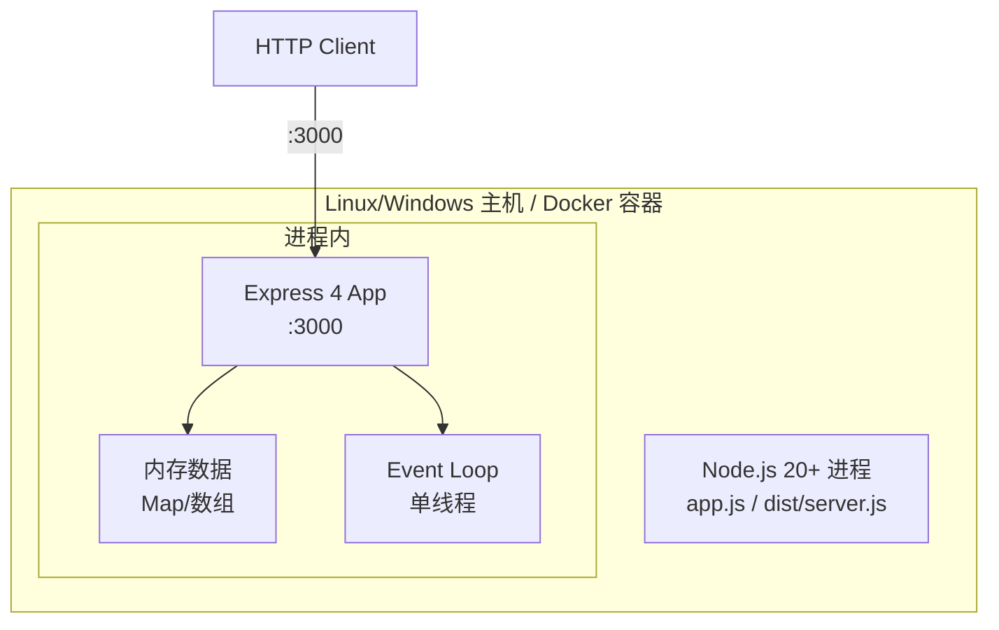

### 7.2 启动流程

```typescript
// server.ts
import { createApp } from './app.js';
const app = createApp();
const PORT = process.env.PORT ?? 3000;
app.listen(PORT, () => logger.info({ event: 'server.started', port: PORT }));
```

**启动后**：
1. Express 监听 PORT
2. 内存数据初始化（空 Map）
3. EventBus 注册订阅者（SD-011 监听 follow/comment/like；SD-013 监听 post.published；SD-016 监听所有写事件）
4. Webhook dispatcher 启动 worker（setInterval 100ms 拉取队列）

### 7.3 部署图

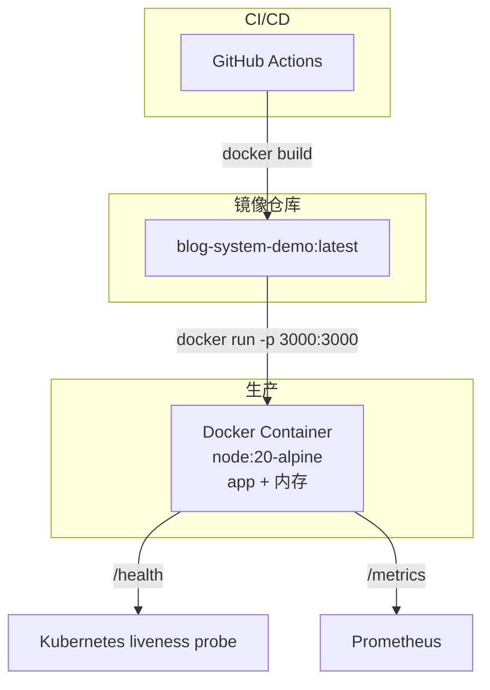

> **CON-002 约束**：无外部 DB、无 Redis、无 MQ；进程重启 = 数据丢失（已记录为已知限制）。

### 7.4 容量规划

| 资源 | 需求 | 备注 |
|---|---|---|
| CPU | 2 vCPU | bcrypt cost=10 在压测时占 ~30% CPU |
| 内存 | 512MB（含 100MB 业务上限 + Node runtime 50MB + buffer 360MB） | NFR-002 上限 100MB |
| 磁盘 | < 100MB（无持久化） | 镜像大小 ~150MB |
| 网络 | 1Gbps | 1000 并发 × 1KB/req = 1Mbps |

---

## §8. 错误处理

### 8.1 错误分类

| 类别 | HTTP 状态 | 错误码前缀 | 示例 |
|---|---|---|---|
| 客户端输入错误 | 400 | `INVALID_*` / `VALIDATION_FAILED` | INVALID_EMAIL, INVALID_PAGINATION |
| 鉴权失败 | 401 | `UNAUTHENTICATED` / `TOKEN_EXPIRED` / `INVALID_CREDENTIALS` | TOKEN_EXPIRED |
| 权限不足 | 403 | `FORBIDDEN` | FORBIDDEN_NOT_OWNER |
| 资源不存在 | 404 | `*_NOT_FOUND` | POST_NOT_FOUND, USER_NOT_FOUND |
| 资源冲突 | 409 | `*_ALREADY_EXISTS` | EMAIL_ALREADY_EXISTS, ALREADY_LIKED |
| 业务规则违反 | 422 | `*_VIOLATION` | EMPTY_CONTENT, MAX_DEPTH_EXCEEDED |
| 限流 | 429 | `RATE_LIMITED` | RATE_LIMITED |
| 服务器内部错误 | 500 | `INTERNAL_ERROR` | INTERNAL_ERROR |

### 8.2 错误响应格式

```json
{
  "error": {
    "code": "POST_NOT_FOUND",
    "message": "博文不存在",
    "details": {
      "postId": "p_abc123"
    }
  }
}
```

### 8.3 异常处理流程

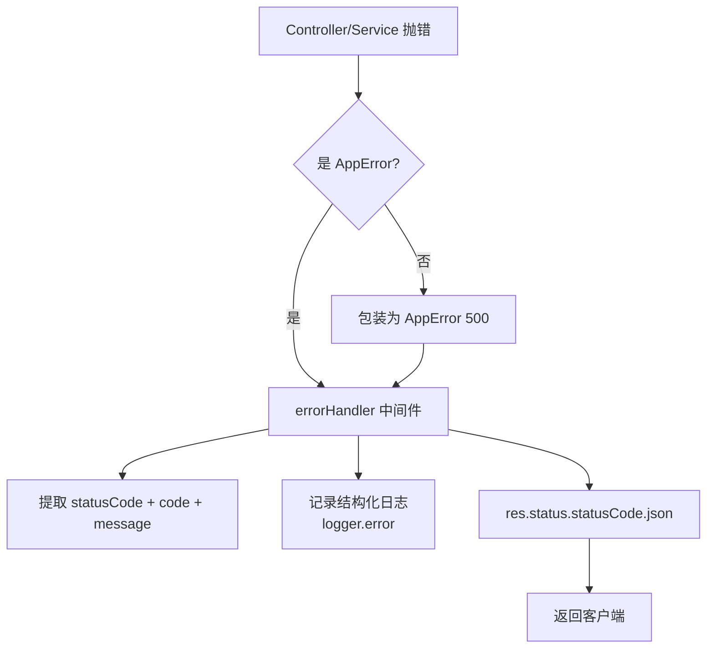

**AppError 定义**：
```typescript
export class AppError extends Error {
  constructor(
    public readonly statusCode: number,
    public readonly code: string,
    message: string,
    public readonly details?: unknown
  ) {
    super(message);
    this.name = 'AppError';
  }
}
```

**全局 errorHandler（SD-022）**：
```typescript
// 简化示意
export function errorHandler(err: Error, req: Request, res: Response, _next: NextFunction) {
  if (err instanceof AppError) {
    logger.warn({ event: 'app_error', code: err.code, statusCode: err.statusCode, path: req.path });
    return res.status(err.statusCode).json({
      error: { code: err.code, message: err.message, details: err.details }
    });
  }
  logger.error({ event: 'unhandled_error', message: err.message, stack: err.stack });
  return res.status(500).json({
    error: { code: 'INTERNAL_ERROR', message: '服务器内部错误' }
  });
}
```

### 8.4 错误码字典（节选）

| 错误码 | HTTP | 触发场景 |
|---|---|---|
| EMAIL_ALREADY_EXISTS | 409 | 注册邮箱已存在 |
| INVALID_EMAIL | 400 | 邮箱格式非法 |
| PASSWORD_TOO_SHORT | 400 | 密码 < 8 位 |
| INVALID_CREDENTIALS | 401 | 登录密码错/账号不存在 |
| TOKEN_EXPIRED | 401 | JWT exp 过期 |
| UNAUTHENTICATED | 401 | 缺 Authorization 头 |
| FORBIDDEN | 403 | 角色不匹配 |
| FORBIDDEN_NOT_OWNER | 403 | 操作非自有资源 |
| USER_NOT_FOUND | 404 | 用户不存在 |
| POST_NOT_FOUND | 404 | 博文不存在 |
| COMMENT_NOT_FOUND | 404 | 评论不存在 |
| ALREADY_LIKED | 409 | 重复点赞（实际幂等返回 200） |
| EMPTY_CONTENT | 422 | 博文正文为空 |
| MAX_DEPTH_EXCEEDED | 422 | 评论层级 > 5 |
| RATE_LIMITED | 429 | 限流超限 |
| INVALID_PAGINATION | 400 | page<1 或 pageSize>100 |
| EMPTY_KEYWORD | 400 | 搜索 q 为空 |
| INTERNAL_ERROR | 500 | 未捕获异常 |

---

## §9. 安全设计

### 9.1 认证与授权

**认证流程**：
1. 用户/博主注册 → `bcrypt.hashSync(password, 10)` → 存 `passwordHash`
2. 登录 → `bcrypt.compare(input, hash)` → 签发 JWT（24h TTL）
3. 客户端 `Authorization: Bearer <token>`
4. Auth middleware：`jwt.verify(token, JWT_SECRET)` → 注入 `req.user = {sub, role, iat, exp}`
5. requireRole middleware：校验 `req.user.role` ∈ `['reader', 'blogger', 'admin']`

**多博主切换**（REQ-017）：
- `POST /me/bloggers/:id/switch`：校验 `userId` 已绑定该 `bloggerId` → 签发新 JWT（`sub=bloggerId, role=blogger`）

### 9.2 数据保护

| 数据 | 保护措施 |
|---|---|
| 密码 | bcrypt cost=10 哈希，不存明文（NFR-006） |
| JWT_SECRET | 环境变量；测试用 `test-secret-blog-demo`；生产部署须替换 |
| 用户邮箱 | 公开接口（`GET /users/:id`）不返回 email |
| 用户 bio / avatarUrl | 公开 |
| 审计日志 | admin 角色可查；普通用户不可见 |
| 统计 | admin 角色可查 |

### 9.3 输入校验

所有 endpoint 入口用 Zod schema 校验：
- Body：`z.object({...})`
- Query：`z.object({page: z.coerce.number().min(1), pageSize: z.coerce.number().min(1).max(100)})`
- Params：`z.object({id: z.string().uuid()})`

校验失败 → 400 `VALIDATION_FAILED` + `details: {fieldErrors: [...]}`。

### 9.4 限流

见 §6.6。

### 9.5 Webhook 签名

**HMAC-SHA256(payload, secret)**：
```typescript
import { createHmac } from 'node:crypto';
function sign(payload: string, secret: string): string {
  return 'sha256=' + createHmac('sha256', secret).update(payload).digest('hex');
}
```

**外部订阅方验证**：
```
X-Webhook-Signature: sha256=<hex>
X-Webhook-Timestamp: <unix-ms>
X-Webhook-Event: post.published
```

外部方用相同 secret 计算 HMAC 比对（防重放可加 timestamp 校验）。

### 9.6 错误信息脱敏

| 场景 | 错误信息 | 原因 |
|---|---|---|
| 登录错密码 | `INVALID_CREDENTIALS` | 不区分"账号不存在"与"密码错误" |
| 注册重复邮箱 | `EMAIL_ALREADY_EXISTS` | 业务需要，但登录端不区分 |
| 越权访问 | `FORBIDDEN` | 不暴露资源存在性 |
| 服务器错误 | `INTERNAL_ERROR` | 不暴露堆栈/内部路径 |

---

## §10. 监控

### 10.1 健康检查

**`GET /health`**（SD-021 路由，限流豁免）：
```json
{
  "status": "ok",
  "uptime": 12345,
  "memory": {
    "heapUsedMB": 45.2,
    "heapTotalMB": 80.1,
    "rssMB": 92.3
  },
  "version": "1.0.0",
  "timestamp": "2026-07-30T08:00:00.000Z"
}
```

**`GET /ready`**（同 /health，CON-002 无外部依赖故 readiness = liveness）。

### 10.2 审计日志

SD-016 持有 `audit_logs: AuditLog[]`，按 ts 索引；90 天自动清理（CON-004）。

**结构**：
```typescript
interface AuditLog {
  id: string;
  actorId: string;
  actorRole: 'reader' | 'blogger' | 'admin';
  action: string;         // e.g. 'user.registered', 'post.published'
  targetType: string;     // e.g. 'user', 'post', 'comment'
  targetId: string;
  payload?: unknown;
  ts: number;             // unix-ms
}
```

**事件订阅**：
- SD-001/004：user.registered, blogger.registered
- SD-002：user.profile.updated
- SD-005：post.created, post.updated, post.published, post.deleted
- SD-007：like.created, bookmark.created
- SD-010：comment.created, comment.deleted
- SD-011：notification.read
- SD-013：webhook.delivered, webhook.failed
- SD-014：site.config.updated
- SD-019：ad.created, ad.deleted

### 10.3 性能监控

**Prometheus 指标**（§8 Out of Scope 不在本批次，但内部维护内存计数器）：
- `http_requests_total{method, path, status}` counter
- `http_request_duration_seconds{method, path}` histogram
- `rate_limit_rejections_total{ip}` counter
- `webhook_delivery_duration_seconds` histogram
- `webhook_delivery_failures_total{event}` counter

**进程内访问**：`process.memoryUsage()` 暴露在 /health（运维侧抓取）。

---

## §11. 风险评估

### 11.1 架构风险

| 风险 ID | 风险描述 | 等级 | 缓解措施 |
|---|---|---|---|
| RISK-001 | 1000 并发 + P95 ≤ 200ms 在内存存储下压力大 | 中 | k6 早期压测；搜索算法可降级为"仅标题" |
| RISK-002 | Webhook 投递在内存约束下无持久化（CON-002） | 中 | 文档化为已知限制；阶段 8 验证失败可重放 |
| RISK-003 | 全文搜索 O(n) substring 在 10000 博文规模退化 | 低 | 当前 1000 博文规模可接受；预留倒排索引 |
| RISK-004 | 审计日志 90 天按 ts 过滤在大量记录下可能慢 | 低 | 数组 + 二分查找；每插入时检查队首 |
| RISK-005 | 多博主切换（REQ-017）JWT 载荷 sub 含义变化（userId↔bloggerId） | 中 | 文档化 role+sub 语义；service 强制断言 |
| RISK-006 | 内存存储下 GC 抖动影响 P95 | 中 | 避免大对象；Repository 用 Map；生产不开 --expose-gc |
| RISK-007 | NFR-004（1000 并发 0 错误）与 NFR-005（限流）测试约定冲突 | 低 | 测试用 `x-test-bypass-rate-limit: true` 头 |
| RISK-008 | bcrypt cost=10 在登录路径增加 ~100ms CPU | 低 | 同步 API 可接受；超 200ms 阈值再异步化 |
| RISK-009 | 推荐系统（REQ-021）冷启动回退"最近热门"无个性化 | 低 | 文档化为已知限制 |
| RISK-010 | RSS 输出（REQ-014）非 RESTful 端点 | 低 | §5.1 已声明 CON-003 例外 |
| RISK-011 | 单进程崩溃 = 数据全部丢失 | 中 | 文档化为 CON-002 已知限制；生产部署高可用方案下轮迭代 |
| RISK-012 | JWT 撤销无白名单 | 中 | 24h 短 TTL + 客户端登出丢 token；下轮加黑名单 |

### 11.2 测试风险

| 风险 ID | 风险描述 | 等级 | 缓解措施 |
|---|---|---|---|
| RISK-T01 | k6 性能测试结果波动大 | 中 | 多次运行取 P95 中位数；warm-up 后开始统计 |
| RISK-T02 | 内存快照时机不准 | 低 | 每秒采样，5 分钟内取最大值 |
| RISK-T03 | 1000 并发在单机 Node 受 Event Loop 限制 | 中 | 阶段 6 用 cluster 模式或单进程极限测试 |
| RISK-T04 | Webhook 投递 mock 在 nock 下未覆盖真实网络异常 | 低 | 注入人为超时与 5xx |

### 11.3 阶段衔接风险

| 风险 ID | 风险描述 | 等级 | 缓解措施 |
|---|---|---|---|
| RISK-P01 | 阶段 3 详细设计未识别 SD-018 横切推荐与 SD-005 的循环依赖 | 低 | §3.2 依赖矩阵已声明单向 |
| RISK-P02 | 阶段 5 编码未实现 SD-022 错误处理一致性 | 低 | §8 已定义错误码字典 |
| RISK-P03 | 阶段 7 系统测试 k6 脚本与 NFR-005 限流测试约定冲突 | 中 | 系统测试同样用 `x-test-bypass-rate-limit: true` |

---

## §12. 阶段摘要

### 12.1 SD 列表（22 项）

| SD | 名称 | reqGroup | 关联 INTF | 关联 REQ/NFR/CON | 横切/领域 |
|---|---|---|---|---|---|
| SD-001 | 用户认证服务 | REQ-001 | INTF-001 | REQ-001, REQ-002 | 领域 |
| SD-002 | 用户资料服务 | REQ-001 | INTF-002 | REQ-003 | 领域 |
| SD-003 | 关注服务 | REQ-001 | INTF-003 | REQ-004 | 领域 |
| SD-004 | 博主注册服务 | REQ-005 | INTF-004 | REQ-005, REQ-017 | 领域 |
| SD-005 | 博文生命周期服务 | REQ-006 | INTF-005 | REQ-006 | 领域 |
| SD-006 | 博文浏览服务 | REQ-006 | INTF-006 | REQ-007 | 领域 |
| SD-007 | 互动服务（点赞/收藏） | REQ-006 | INTF-007 | REQ-008 | 领域 |
| SD-008 | 标签服务 | REQ-006 | INTF-008 | REQ-012 | 领域 |
| SD-009 | 全文搜索服务 | REQ-006 | INTF-009 | REQ-013 | 领域 |
| SD-010 | 评论服务 | REQ-009 | INTF-010 | REQ-009, REQ-010 | 领域 |
| SD-011 | 通知服务 | REQ-011 | INTF-011 | REQ-011 | 领域 |
| SD-012 | RSS 订阅服务 | REQ-016 | INTF-012 | REQ-014 | 领域 |
| SD-013 | Webhook 服务 | REQ-016 | INTF-013 | REQ-015 | 领域 |
| SD-014 | 站点配置服务 | REQ-016 | INTF-014 | REQ-016 | 领域 |
| SD-015 | 访问记录服务 | REQ-018 | INTF-015 | REQ-019 | 领域 |
| SD-016 | 审计日志服务 | REQ-018 | INTF-016 | REQ-018 | 领域 |
| SD-017 | 站点统计服务 | REQ-018 | INTF-017 | REQ-020 | 领域 |
| SD-018 | 推荐服务 | REQ-006 | INTF-018 | REQ-021 | 横切（article） |
| SD-019 | 广告位服务 | REQ-016 | INTF-019 | REQ-022 | 横切（site） |
| SD-020 | 限流服务 | NFR-005 | INTF-020 | NFR-005 | 横切 |
| SD-021 | API 路由层 | CON-003 | INTF-021 | CON-003 | 横切 |
| SD-022 | 错误处理中间件 | NFR-001 | INTF-022 | NFR-001, NFR-004 | 横切 |

### 12.2 INTF 列表（22 项）

| INTF | 名称 | 配对 SD | HTTP 端点 / 模块导出 |
|---|---|---|---|
| INTF-001 | 认证 API | SD-001 | POST /users, POST /bloggers, POST /auth/login |
| INTF-002 | 用户 API | SD-002 | GET /users/:id, PUT /users/me |
| INTF-003 | 关注 API | SD-003 | POST/DELETE /follows/:bloggerId, GET /me/follows |
| INTF-004 | 博主认证 API | SD-004 | POST /bloggers/apply, POST /me/bloggers/:id/switch |
| INTF-005 | 博文 API | SD-005 | POST/PUT/DELETE /posts, POST /posts/:id/publish |
| INTF-006 | 浏览 API | SD-006 | GET /posts, GET /posts/:id |
| INTF-007 | 互动 API | SD-007 | POST /posts/:id/like, /bookmark, GET /me/bookmarks |
| INTF-008 | 标签 API | SD-008 | POST/DELETE /tags, POST /posts/:id/tags, GET /tags/:name/posts |
| INTF-009 | 搜索 API | SD-009 | GET /search |
| INTF-010 | 评论 API | SD-010 | POST /posts/:postId/comments, POST /comments/:parentId/replies, DELETE /comments/:id |
| INTF-011 | 通知 API | SD-011 | GET /me/notifications, PATCH /me/notifications/:id/read |
| INTF-012 | RSS 端点 | SD-012 | GET /rss.xml |
| INTF-013 | Webhook API | SD-013 | POST/DELETE /webhooks, GET /me/webhooks |
| INTF-014 | 站点配置 API | SD-014 | GET/PUT /site/config |
| INTF-015 | 访问记录 API | SD-015 | GET /admin/posts/:id/access |
| INTF-016 | 审计 API | SD-016 | GET /admin/audit-logs |
| INTF-017 | 统计 API | SD-017 | GET /admin/stats/site, /admin/stats/posts |
| INTF-018 | 推荐 API | SD-018 | GET /me/recommendations |
| INTF-019 | 广告 API | SD-019 | POST/DELETE /site/ads, GET /site/ads/active |
| INTF-020 | 限流中间件接口 | SD-020 | 内部 TS 接口 + HTTP 429 出口 |
| INTF-021 | 路由层接口 | SD-021 | createApp(): Express + Router 聚合 |
| INTF-022 | 错误处理接口 | SD-022 | AppError 类 + errorHandler 中间件 |

### 12.3 系统测试清单（22 ST）

> 详细用例见 `docs/phase2-design/system-test.md`。

| ST ID | 关联 SD | 类型 | 场景概要 |
|---|---|---|---|
| ST-001 | SD-001 | 性能 + 安全 | 100 并发登录 P95 ≤ 200ms + 错密码脱敏 |
| ST-002 | SD-002 | E2E | reader 修改资料 → 公开接口可见 |
| ST-003 | SD-003 | 可靠性 | 1000 并发关注/取关幂等 0 错误 |
| ST-004 | SD-004 | E2E | blogger 注册 → 登录 → 多博主切换 |
| ST-005 | SD-005 | 可靠性 | 1000 并发博文 CRUD 0 错误 + 状态机正确性 |
| ST-006 | SD-006 | 性能 | 1000 并发 GET /posts P95 ≤ 200ms |
| ST-007 | SD-007 | E2E | 点赞/收藏幂等 + 通知触发 |
| ST-008 | SD-008 | E2E | 标签关联幂等去重 + 反向查询 |
| ST-009 | SD-009 | 性能 + 可靠性 | 1000 博文搜索 P95 ≤ 200ms + 0 错误 |
| ST-010 | SD-010 | 可靠性 | 评论树层级 5 + 软删 + 通知 |
| ST-011 | SD-011 | E2E | 关注/评论/点赞事件触发通知 |
| ST-012 | SD-012 | E2E | RSS 2.0 格式正确 + 最近 20 篇 |
| ST-013 | SD-013 | 可靠性 | Webhook 签名正确 + 失败重试 3 次 |
| ST-014 | SD-014 | 安全 | admin 唯一可改站点配置 |
| ST-015 | SD-015 | 内存 | 10000 条访问记录查询 + 内存占用 |
| ST-016 | SD-016 | 安全 | 审计 90 天保留 + admin 唯一可查 |
| ST-017 | SD-017 | 内存 + 性能 | 站点统计 PV/UV 24h 桶聚合 P95 ≤ 200ms |
| ST-018 | SD-018 | E2E | 推荐结果基于标签 Jaccard 相似度 |
| ST-019 | SD-019 | E2E | 广告位生效时间窗口过滤 |
| ST-020 | SD-020 | 可靠性 | 100 req/min/IP 限流 + 429 + Retry-After |
| ST-021 | SD-021 | E2E | RESTful 端点 + Content-Type + 错误格式统一 |
| ST-022 | SD-022 | 可靠性 | 错误码字典完整 + 错误响应 JSON 格式 |

### 12.4 RTM 登记

> 本阶段产出的 SD 行 RTM 登记在 `docs/phase2-design/system-design.md` 同步维护；详细 RTM 实体由 S-rtm 子代理在阶段 8 前产出。

| SD | description | systemDesign | systemTest | acceptanceTest | reqGroup | NFR映射 |
|---|---|---|---|---|---|---|
| SD-001 | 用户认证服务 | system-design.md §13.1 | ST-001 | UAT-001~008 | REQ-001 | NFR-003, NFR-006 |
| SD-002 | 用户资料服务 | §13.2 | ST-002 | UAT-009~011 | REQ-001 | NFR-003 |
| SD-003 | 关注服务 | §13.3 | ST-003 | UAT-012~014 | REQ-001 | NFR-004 |
| SD-004 | 博主注册服务 | §13.4 | ST-004 | UAT-015~017, UAT-057~059 | REQ-005 | NFR-006 |
| SD-005 | 博文生命周期服务 | §13.5 | ST-005 | UAT-018~022 | REQ-006 | NFR-001, NFR-004 |
| SD-006 | 博文浏览服务 | §13.6 | ST-006 | UAT-023~025 | REQ-006 | NFR-001, NFR-002 |
| SD-007 | 互动服务 | §13.7 | ST-007 | UAT-026~029 | REQ-006 | NFR-004 |
| SD-008 | 标签服务 | §13.8 | ST-008 | UAT-041~043 | REQ-006 | NFR-001 |
| SD-009 | 全文搜索服务 | §13.9 | ST-009 | UAT-044~046 | REQ-006 | NFR-001 |
| SD-010 | 评论服务 | §13.10 | ST-010 | UAT-030~036 | REQ-009 | NFR-004 |
| SD-011 | 通知服务 | §13.11 | ST-011 | UAT-037~040 | REQ-011 | NFR-004 |
| SD-012 | RSS 订阅服务 | §13.12 | ST-012 | UAT-047~048 | REQ-016 | NFR-001 |
| SD-013 | Webhook 服务 | §13.13 | ST-013 | UAT-049~052 | REQ-016 | NFR-003 |
| SD-014 | 站点配置服务 | §13.14 | ST-014 | UAT-053~056 | REQ-016 | NFR-003 |
| SD-015 | 访问记录服务 | §13.15 | ST-015 | UAT-063~064 | REQ-018 | NFR-002 |
| SD-016 | 审计日志服务 | §13.16 | ST-016 | UAT-060~062 | REQ-018 | NFR-003, CON-004 |
| SD-017 | 站点统计服务 | §13.17 | ST-017 | UAT-065~066 | REQ-018 | NFR-001, NFR-002 |
| SD-018 | 推荐服务 | §13.18 | ST-018 | UAT-067~068 | REQ-006 | NFR-001 |
| SD-019 | 广告位服务 | §13.19 | ST-019 | UAT-069~071 | REQ-016 | NFR-004 |
| SD-020 | 限流服务 | §13.20 | ST-020 | UAT-072e | NFR-005 | NFR-005 |
| SD-021 | API 路由层 | §13.21 | ST-021 | UAT-072i | CON-003 | CON-003 |
| SD-022 | 错误处理中间件 | §13.22 | ST-022 | UAT-072a~d | NFR-001 | NFR-001, NFR-004 |

### 12.5 下阶段门禁

阶段 2 门禁（`check-artifact-gate.ts --phase=2`）校验：
- [ ] 22 SD 全部产出（职责/接口/依赖/数据模型/状态机概要）
- [ ] 22 INTF 全部对应 SD
- [ ] 12 节全部产出（§1–§12）
- [ ] 22 ST 全部设计
- [ ] graph.json 节点 ≥ 80 + 边 ≥ 200
- [ ] 信息流 0 黑洞/奇迹/死模块
- [ ] 边界完整性（≥ 1 EXT-IN + 1 EXT-OUT）
- [ ] SD_without_implements = 0

**下阶段**：阶段 3（概要设计）由 S-doc 子代理产出 detailed-design.md（DD 节点 + 接口详细化）。

---

# 第二部分：22 SD 详细设计

> 每 SD 含：职责 / 接口（INTF 引用）/ 依赖（SD 引用）/ 数据模型（内存 Map/数组 + 关键字段）/ 状态机概要（核心 SD）。

## §13. SD 详细设计

### §13.1 SD-001 用户认证服务（user）

**职责**：
- reader 注册（邮箱+用户名+密码）
- 通用登录（reader/blogger/管理员）
- JWT 签发（HS256，24h TTL）
- bcrypt 密码哈希与校验（NFR-006 cost=10）
- 错误信息脱敏（登录失败统一 `INVALID_CREDENTIALS`）

**接口（INTF-001）**：
- `POST /users {email, username, password}` → 201 `{userId, email, username, role: 'reader', displayName, createdAt}`
- `POST /auth/login {email, password}` → 200 `{token, userId, role, expiresIn: 86400}`
- `POST /bloggers`（SD-004 复用，role=blogger）

**依赖**：
- SD-022 错误处理（错误响应）
- SD-020 限流（路由级）
- SD-016 审计（user.registered / auth.login 事件）
- 内部：bcryptjs, jsonwebtoken

**数据模型**：
```typescript
interface User {
  id: string;              // uuid
  email: string;           // 唯一
  username: string;        // 3-20 字符，唯一
  passwordHash: string;    // bcrypt cost=10
  displayName: string;     // 默认 = username
  avatarUrl?: string;
  bio?: string;
  role: 'reader' | 'blogger' | 'admin';
  createdAt: number;       // unix-ms
  updatedAt: number;
}
// 存储：Map<userId, User> + 邮箱索引 Map<email, userId> + 用户名索引 Map<username, userId>
```

**状态机概要**：
```
[未注册] --POST /users--> [已注册(reader)]
[已注册(reader)] --POST /auth/login 正确--> [已登录]
[已登录] --24h 过期--> [未登录（无 token）]
[已登录] --客户端丢 token--> [未登录]
```

**关键不变式**：
- email 全局唯一（含 blogger）
- username 3-20 字符
- password ≥ 8 字符
- passwordHash bcrypt.getRounds ≥ 10
- 登录失败统一错误码 `INVALID_CREDENTIALS`（NFR-003）

---

### §13.2 SD-002 用户资料服务（user）

**职责**：
- 公开资料查询（匿名可访问）
- 修改自己资料（需 JWT）
- 字段过滤（不返回 passwordHash / email 给匿名）
- 修改资料时审计

**接口（INTF-002）**：
- `GET /users/:id` → 200 `{userId, username, displayName, bio, avatarUrl, createdAt}`（匿名可）
- `PUT /users/me {displayName?, bio?, avatarUrl?}` → 200（JWT 必填）

**依赖**：
- SD-001 认证（解析 JWT）
- SD-016 审计（user.profile.updated）

**数据模型**：共享 SD-001 的 `users` Map；更新字段子集。

**状态机**：无（无状态机转换，仅字段更新）。

---

### §13.3 SD-003 关注服务（user）

**职责**：
- 关注/取关博主（幂等）
- 关注列表查询
- 触发通知（关注博主事件）

**接口（INTF-003）**：
- `POST /follows/:bloggerId` → 200 `{followed: true}`（幂等）
- `DELETE /follows/:bloggerId` → 200 `{followed: false}`（幂等）
- `GET /me/follows?page=1&pageSize=20` → 200 分页

**依赖**：
- SD-001 认证（reader JWT）
- SD-011 通知（emit follow.created）
- SD-004 博主（校验 bloggerId 存在）

**数据模型**：
```typescript
// 存储：Map<userId, Set<bloggerId>>
interface FollowSet {
  follows: Set<string>;  // bloggerIds
}
```

**状态机概要**：
```
[未关注] --POST /follows/:id--> [已关注]
[已关注] --DELETE /follows/:id--> [未关注]
[未关注] --POST /follows/:id (重复)--> [已关注]  (幂等)
[已关注] --DELETE /follows/:id (重复)--> [未关注]  (幂等)
```

**关键不变式**：
- 同一对 (userId, bloggerId) 仅一条记录
- 取消关注后再关注：通知不重复发送（避免刷屏）

---

### §13.4 SD-004 博主注册服务（blogger）

**职责**：
- 博主注册（与 SD-001 共享 schema，role=blogger）
- 博主登录（与 SD-001 共享 `/auth/login`）
- 多博主切换（签发新 token，sub=bloggerId）
- 绑定关系维护（userId ↔ bloggerId）

**接口（INTF-004）**：
- `POST /bloggers {email, username, password}` → 201 `{bloggerId, role: 'blogger', ...}`
- `POST /me/bloggers/:id/switch` → 200 `{token, bloggerId, role: 'blogger'}`（JWT 必填，role=reader）

**依赖**：
- SD-001 认证（共享 bcrypt + jwt 工具）
- SD-016 审计（blogger.registered）

**数据模型**：
```typescript
interface Blogger {
  id: string;
  email: string;
  username: string;
  passwordHash: string;
  displayName: string;
  bio?: string;
  ownerUserId: string;     // 拥有者 userId（多博主切换关键）
  createdAt: number;
}
// 存储：Map<bloggerId, Blogger> + Map<userId, Set<bloggerId>> 绑定关系
```

**状态机概要**：
```
[reader] --POST /bloggers/apply--> [reader+blogger 身份]
[reader+blogger] --POST /me/bloggers/:id/switch--> [当前 blogger 上下文]
[当前 blogger 上下文] --POST /me/bloggers/:id/switch (另一 id)--> [切换后 blogger 上下文]
[当前 blogger 上下文] --POST /auth/login (登出)--> [reader]
```

**关键不变式**：
- 同一 user 可绑定多 blogger
- 切换仅签发新 token，不修改 blogger 实体
- owner 校验：blogger.ownerUserId === req.user.sub

---

### §13.5 SD-005 博文生命周期服务（article）

**职责**：
- 博文 CRUD（create / read / update / delete）
- draft↔published 状态机
- 软删（保留 id，标记 deleted）
- 校验：博主身份 + 正文非空（发布时）
- 触发审计、通知、Webhook

**接口（INTTF-005）**：
- `POST /posts {title, content, tags?}` → 201 `{postId, status: 'draft'}`（JWT 必填，role=blogger）
- `PUT /posts/:id {title?, content?, tags?}` → 200（仅 owner）
- `POST /posts/:id/publish` → 200 `{postId, status: 'published', publishedAt}`（仅 owner，校验正文非空）
- `DELETE /posts/:id` → 204（仅 owner，软删）

**依赖**：
- SD-001 认证（blogger JWT）
- SD-008 标签（关联）
- SD-016 审计（post.created/updated/published/deleted）
- SD-011 通知（post.published → 关注者）
- SD-013 Webhook（post.published → 回调）

**数据模型**：
```typescript
type PostStatus = 'draft' | 'published' | 'deleted';
interface Post {
  id: string;
  authorId: string;        // bloggerId
  title: string;
  content: string;         // Markdown 子集
  status: PostStatus;
  tags: string[];          // 0-5 个
  publishedAt?: number;    // status=published 时存在
  createdAt: number;
  updatedAt: number;
  deletedAt?: number;      // status=deleted 时存在
}
// 存储：Map<postId, Post>
// 索引：Map<authorId, Set<postId>>（按作者） + Map<status, Set<postId>>（按状态）
```

**状态机概要**：
```
        create
[不存在] ───────> [draft]
                   │  publish
                   │  (content 非空)
                   ↓
              [published]
                   │  delete
                   ↓
                [deleted]   (软删，仅 owner)
```

**转换规则**：
- `[不存在]→[draft]`：POST /posts，authorId=req.user.sub，content 可空（草稿）
- `[draft]→[published]`：POST /posts/:id/publish，校验 content.trim() !== ''
- `[published]→[deleted]`：DELETE /posts/:id，校验 authorId === req.user.sub
- `[published]→[draft]`：不允许（已发布博文不能回到 draft，避免索引混乱；如需修改用 PUT /posts/:id）

**关键不变式**：
- authorId 在 create 后不可变
- 删除是软删（status='deleted'，deletedAt=now），物理数据保留 30 天后清理
- 发布时 content.trim() !== ''（NFR-006 + 业务规则）

---

### §13.6 SD-006 博文浏览服务（article）

**职责**：
- 博文列表（分页+筛选+排序）
- 博文详情（含作者信息）
- 写访问记录（SD-015）
- 写统计（SD-017）

**接口（INTF-006）**：
- `GET /posts?page=1&pageSize=20&status=published&tag=...&author=...` → 200 分页
- `GET /posts/:id` → 200 详情（写 access_record）

**依赖**：
- SD-005 博文生命周期（读 posts）
- SD-015 访问记录（写 access）
- SD-017 统计（PV/UV）
- SD-001 认证（可选，标识登录用户）

**数据模型**：共享 SD-005 的 `posts` Map + 索引。

**状态机**：无（只读操作）。

**关键不变式**：
- 匿名访问仅可见 status=published
- pageSize 上限 100
- GET /posts/:id 对 status=draft / deleted 返回 404（避免泄露草稿）

---

### §13.7 SD-007 互动服务（article）

**职责**：
- 点赞（幂等）
- 收藏（幂等）
- 我的收藏列表
- 触发通知（被点赞）

**接口（INTF-007）**：
- `POST /posts/:id/like` → 200 `{liked: true}`（幂等）
- `POST /posts/:id/bookmark` → 200 `{bookmarked: true}`（幂等）
- `GET /me/bookmarks?page=1&pageSize=20` → 200 分页

**依赖**：
- SD-005 博文生命周期（校验 post 存在 + owner）
- SD-001 认证（reader JWT）
- SD-011 通知（like.created → 通知博主）

**数据模型**：
```typescript
// 存储：
// likes: Map<postId, Set<userId>>   （谁点赞了哪些博文）
// bookmarks: Map<userId, Set<postId>> （谁收藏了哪些博文）
// 注意：likes 用 postId 作 key（O(1) 计数），bookmarks 用 userId 作 key（O(1) 查我的收藏）
```

**状态机概要**：
```
[未点赞] --POST /posts/:id/like--> [已点赞]
[已点赞] --POST /posts/:id/like (重复)--> [已点赞]  (幂等返回 200)
[已点赞] --DELETE /posts/:id/like--> [未点赞]  (可选端点，未在 22 INTF 中)
```

**关键不变式**：
- 同一对 (postId, userId) 点赞仅一次
- 同一对 (postId, userId) 收藏仅一次
- 删除博文时级联清理 likes（status=deleted 时不返回点赞数）

---

### §13.8 SD-008 标签服务（article）

**职责**：
- 标签创建（全局唯一）
- 标签关联博文（1-5 个，幂等去重）
- 标签解除关联
- 标签下博文查询
- 触发通知（被贴热门标签）

**接口（INTF-008）**：
- `POST /tags {name}` → 201 `{name}`（JWT 必填，role=blogger）
- `POST /posts/:id/tags {tags: [...]}` → 200（仅 owner，1-5 个，幂等去重）
- `DELETE /posts/:id/tags/:name` → 204（仅 owner）
- `GET /tags/:name/posts?page=1&pageSize=20` → 200 分页（公开）

**依赖**：
- SD-005 博文生命周期（校验 post 存在 + owner）
- SD-001 认证（blogger JWT 创建标签 / 关联）

**数据模型**：
```typescript
interface Tag {
  name: string;        // 唯一，2-20 字符
  createdBy: string;   // bloggerId
  createdAt: number;
}
// 存储：
// tags: Map<name, Tag>
// post_tags: Map<postId, Set<name>>      （博文 → 标签）
// posts_by_tag: Map<name, Set<postId>>   （标签 → 博文，反向索引）
```

**状态机**：无（仅增删）。

**关键不变式**：
- 标签 name 全局唯一
- 单博文最多 5 个标签
- 关联幂等：重复添加同标签不抛错，返回当前完整标签集

---

### §13.9 SD-009 全文搜索服务（article）

**职责**：
- 关键词搜索（标题权重 2×，正文权重 1×）
- 标签过滤
- 分页
- 仅搜 published

**接口（INTF-009）**：
- `GET /search?q=...&page=1&pageSize=20&tags=a,b` → 200 `{items: [...], page, pageSize, total, totalPages}`

**依赖**：
- SD-005 博文生命周期（读 posts）
- SD-008 标签（标签过滤）

**数据模型**：共享 SD-005 posts + 索引。

**算法**：
```typescript
function search(q: string, tags: string[], page: number, pageSize: number) {
  if (!q.trim()) throw new AppError(400, 'EMPTY_KEYWORD', '搜索关键词不能为空');
  const candidates = posts Map 过滤 status='published';
  // 1. 标签过滤（如有）
  let filtered = tags.length
    ? candidates.filter(p => tags.every(t => p.tags.includes(t)))
    : Array.from(candidates.values());
  // 2. 关键词评分
  const qLower = q.toLowerCase();
  const scored = filtered.map(p => ({
    post: p,
    score: (p.title.toLowerCase().includes(qLower) ? 2 : 0) +
           (p.content.toLowerCase().includes(qLower) ? 1 : 0)
  })).filter(s => s.score > 0);
  // 3. 排序
  scored.sort((a, b) => b.score - a.score || b.post.publishedAt - a.post.publishedAt);
  // 4. 分页
  return paginate(scored, page, pageSize);
}
```

**状态机**：无。

**关键不变式**：
- q 为空 → 400 EMPTY_KEYWORD
- 标签过滤 AND 语义
- 仅 published 可被搜到

---

### §13.10 SD-010 评论服务（comment）

**职责**：
- 顶级评论 + 多级回复
- 评论树查询
- 软删（作者 / 博文 owner）
- 最大层级 5
- 触发通知

**接口（INTF-010）**：
- `POST /posts/:postId/comments {content}` → 201
- `POST /comments/:parentId/replies {content}` → 201（parent 必须存在）
- `DELETE /comments/:id` → 204（作者 or 博文 owner）
- `GET /posts/:postId/comments?page=1&pageSize=20` → 200 树形

**依赖**：
- SD-005 博文生命周期（校验 post）
- SD-001 认证（reader/blogger JWT）
- SD-011 通知（comment.created → 通知博主 + 父评论作者）
- SD-016 审计（comment.deleted）

**数据模型**：
```typescript
interface Comment {
  id: string;
  postId: string;
  parentId?: string;       // null/undefined 表示顶级
  authorId: string;        // userId or bloggerId
  authorRole: 'reader' | 'blogger';
  content: string;
  level: number;           // 0=顶级, 1-4=回复，最大 4（即 5 层含顶级）
  deleted: boolean;
  createdAt: number;
  deletedAt?: number;
}
// 存储：
// comments: Map<commentId, Comment>
// comments_by_post: Map<postId, Set<commentId>>  （按博文）
// comments_by_parent: Map<parentId, Set<commentId>>  （按父评论）
```

**状态机概要**：
```
[不存在] --POST--> [已发表]
[已发表] --DELETE (作者/owner)--> [已删除]  (软删)
[已发表] --POST /comments/:id/replies--> [子评论已发表]  (level = parent.level + 1)
```

**关键不变式**：
- level ≤ 4（5 层：0 顶级 + 1-4 回复）
- 软删后内容替换为 `[已删除]`，保留树形结构
- 父评论已删除时仍可回复（显示 `[已删除]` 占位）

---

### §13.11 SD-011 通知服务（notification）

**职责**：
- 站内通知存储
- 通知列表查询
- 标记已读
- 订阅领域事件（follow / comment / like / post.published）
- 可选触发 Webhook（SD-013）

**接口（INTF-011）**：
- `GET /me/notifications?page=1&pageSize=20&unreadOnly=true` → 200 分页
- `PATCH /me/notifications/:id/read` → 200

**依赖**：
- SD-001 认证（reader/blogger JWT）
- 事件总线：follow.created / comment.created / like.created / post.published
- SD-013 Webhook（可选投递）

**数据模型**：
```typescript
type NotificationType = 'follow' | 'comment' | 'like' | 'post.published';
interface Notification {
  id: string;
  recipientId: string;       // 接收者 userId / bloggerId
  type: NotificationType;
  actorId: string;           // 触发者
  targetType: 'post' | 'comment' | 'user' | 'blogger';
  targetId: string;
  payload?: { [key: string]: unknown };
  read: boolean;
  createdAt: number;
}
// 存储：Map<recipientId, Notification[]>  (按用户聚合，O(1) 查我的通知)
```

**状态机概要**：
```
[不存在] --事件触发--> [未读]
[未读] --PATCH /me/notifications/:id/read--> [已读]
[未读/已读] --保留 30 天后--> [自动清理]  (仅清理；不可见)
```

**关键不变式**：
- 通知 recipientId 必须存在
- 同一事件不重复创建通知（去重 key: type+actorId+targetId）
- 30 天后自动清理

---

### §13.12 SD-012 RSS 订阅服务（site）

**职责**：
- RSS 2.0 feed 生成
- 最近 20 篇 published
- 站点元信息（标题/链接/描述）

**接口（INTF-012）**：
- `GET /rss.xml` → 200 `Content-Type: application/rss+xml; charset=utf-8`

**依赖**：
- SD-005 博文生命周期（读 published posts）
- SD-014 站点配置（siteTitle / siteLink / siteDescription）

**数据模型**：无新结构（输出派生自 posts + site_config）。

**RSS 2.0 格式**：
```xml
<?xml version="1.0" encoding="UTF-8"?>
<rss version="2.0">
  <channel>
    <title>{{siteTitle}}</title>
    <link>{{siteLink}}</link>
    <description>{{siteDescription}}</description>
    <language>zh-CN</language>
    <lastBuildDate>{{RFC822 date}}</lastBuildDate>
    <atom:link href="{{siteLink}}/rss.xml" rel="self" type="application/rss+xml" />
    {{#each posts}}
    <item>
      <title>{{title}}</title>
      <link>{{siteLink}}/posts/{{id}}</link>
      <guid isPermaLink="false">{{id}}</guid>
      <pubDate>{{RFC822 publishedAt}}</pubDate>
      <description><![CDATA[{{content preview 200 chars}}]]></description>
    </item>
    {{/each}}
  </channel>
</rss>
```

**状态机**：无。

**关键不变式**：
- 公开端点（无需鉴权）
- Content-Type: application/rss+xml（CON-003 例外）
- 最多 20 条 item
- 按 publishedAt 倒序

---

### §13.13 SD-013 Webhook 服务（site）

**职责**：
- Webhook 订阅注册/注销
- 事件触发投递
- HMAC-SHA256 签名
- 失败重试（3 次指数退避 1s/4s/16s）
- 投递记录（成功/失败）
- 触发审计

**接口（INTF-013）**：
- `POST /webhooks {url, events: [...], secret}` → 201
- `DELETE /webhooks/:id` → 204（仅 owner）
- `GET /me/webhooks` → 200 列表

**依赖**：
- SD-001 认证（blogger/admin JWT）
- SD-016 审计（webhook.delivered / webhook.failed）
- 事件总线：post.published / comment.created 等

**数据模型**：
```typescript
interface WebhookSubscription {
  id: string;
  ownerId: string;        // bloggerId or adminId
  url: string;            // HTTPS URL
  events: string[];       // e.g. ['post.published', 'comment.created']
  secret: string;         // HMAC 密钥
  createdAt: number;
}
interface WebhookDelivery {
  id: string;
  subscriptionId: string;
  event: string;
  payload: string;        // JSON 字符串
  status: 'pending' | 'success' | 'failed';
  attempts: number;       // 1-3
  lastAttemptAt?: number;
  responseStatus?: number;
  errorMessage?: string;
  createdAt: number;
}
// 存储：
// subscriptions: Map<subscriptionId, WebhookSubscription>
// deliveries: Map<deliveryId, WebhookDelivery>
// deliveries_by_sub: Map<subscriptionId, Set<deliveryId>>  （仅保留最近 1000 条）
```

**状态机概要**：
```
[pending] --POST 200/2xx--> [success]
[pending] --POST 4xx/5xx/timeout--> [retry 1] --失败--> [retry 2] --失败--> [retry 3] --失败--> [failed]
[success/failed] --保留 1000 条/订阅--> [自动清理]
```

**关键不变式**：
- 每次 POST 带 `X-Webhook-Signature: sha256=<hex>`、`X-Webhook-Timestamp: <ms>`、`X-Webhook-Event: <name>`
- 最多 3 次重试（指数退避 1s/4s/16s）
- 失败记录 audit（actorId=null, action='webhook.failed'）

---

### §13.14 SD-014 站点配置服务（site）

**职责**：
- 站点元信息（标题/链接/描述）
- 横幅广告关联（bannerAdId）
- 公开查询 + admin 修改

**接口（INTF-014）**：
- `GET /site/config` → 200 `{siteTitle, siteLink, siteDescription, bannerAd?}`（公开）
- `PUT /site/config {siteTitle?, siteLink?, siteDescription?, bannerAdId?}` → 200（JWT 必填，role=admin）

**依赖**：
- SD-001 认证（admin role）
- SD-019 广告位（解析 bannerAdId → Ad）
- SD-016 审计（site.config.updated）

**数据模型**：
```typescript
interface SiteConfig {
  id: 'singleton';        // 全局唯一
  siteTitle: string;
  siteLink: string;       // e.g. 'https://blog.example.com'
  siteDescription: string;
  bannerAdId?: string;    // 指向 ads
  updatedAt: number;
  updatedBy: string;      // adminId
}
// 存储：单例对象（不放在 Map）
```

**状态机**：无（单例，无转换）。

**关键不变式**：
- 单例（不可创建/删除）
- bannerAdId 必须指向现有 Ad；如不存在则忽略
- 公开接口不返回 updatedAt / updatedBy

---

### §13.15 SD-015 访问记录服务（admin）

**职责**：
- 每次 GET /posts/:id 写 access record
- 管理员查询文章访问记录
- 软清理（保留 30 天）

**接口（INTF-015）**：
- `GET /admin/posts/:id/access?page=1&pageSize=20` → 200 分页（JWT 必填，role=admin）

**依赖**：
- SD-001 认证（admin JWT）
- SD-006 博文浏览（写 access_record hook）

**数据模型**：
```typescript
interface AccessRecord {
  id: string;
  postId: string;
  userId?: string;        // 已登录用户；匿名为 undefined
  ip: string;             // 客户端 IP（X-Forwarded-For 优先）
  userAgent?: string;
  ts: number;             // unix-ms
}
// 存储：AccessRecord[] 数组（按 ts 倒序追加）
// 索引：Map<postId, Set<recordId>>  （按博文）
```

**状态机**：无（仅追加 + 清理）。

**关键不变式**：
- 30 天后自动清理（与统计 UV 一致）
- 匿名访问 userId 为 undefined
- IP 取 X-Forwarded-For 第一项（生产部署在反向代理后）

---

### §13.16 SD-016 审计日志服务（admin）

**职责**：
- 关键写操作双写 audit
- 管理员查询
- 90 天保留（CON-004）
- 自动清理

**接口（INTF-016）**：
- `GET /admin/audit-logs?actor=&type=&from=&to=&page=1&pageSize=20` → 200 分页（JWT 必填，role=admin）

**依赖**：
- SD-001 认证（admin JWT）
- 事件总线：所有写操作（订阅）
- 32 需求中所有写操作的 SD

**数据模型**：
```typescript
interface AuditLog {
  id: string;
  actorId: string;        // userId/bloggerId/adminId
  actorRole: 'reader' | 'blogger' | 'admin' | 'system';
  action: string;         // e.g. 'user.registered', 'post.published', 'comment.deleted'
  targetType: 'user' | 'blogger' | 'post' | 'comment' | 'tag' | 'webhook' | 'site' | 'ad';
  targetId: string;
  payload?: { [key: string]: unknown };
  ts: number;             // unix-ms
}
// 存储：AuditLog[] 数组（按 ts 倒序追加）
```

**状态机**：无（仅追加 + 清理）。

**关键不变式**：
- 90 天后自动清理（CON-004 严格）
- 查询 API 默认仅返回 90 天内记录（CON-004 一致）
- 不可修改/删除历史记录（append-only）

---

### §13.17 SD-017 站点统计服务（admin）

**职责**：
- 站点 PV/UV 统计（按小时桶）
- 文章 PV/UV TopN
- 范围查询（24h/7d/30d）

**接口（INTF-017）**：
- `GET /admin/stats/site?range=24h|7d|30d` → 200 `{pv, uv, trend: [...]}`（JWT 必填，role=admin）
- `GET /admin/stats/posts?range=24h|7d|30d` → 200 `{top: [...]}`

**依赖**：
- SD-006 博文浏览（PV 来源）
- SD-015 访问记录（UV 来源）

**数据模型**：
```typescript
// 按小时桶聚合
interface HourBucket {
  hourKey: string;        // e.g. '2026-07-30T08'
  pv: number;
  uvSet: Set<string>;     // userId 或 IP
  postPvs: Map<postId, number>;
  postUvs: Map<postId, Set<string>>;
}
// 存储：Map<hourKey, HourBucket>（保留最近 30 天 = 720 桶）
// 桶数：30天 * 24 = 720，UV Set 最大 10k user/桶 = ~5MB
```

**状态机**：无（仅追加 + 老化）。

**关键不变式**：
- 30 天后桶自动清理（与 CON-004 审计 90 天不同，统计更短）
- UV = 去重 userId 数
- PV = 访问次数

---

### §13.18 SD-018 推荐服务（横切 article）

**职责**：
- 基于标签 Jaccard 相似度
- 冷启动回退"最近热门 10"
- 个性化（基于 reader 阅读历史与关注）

**接口（INTF-018）**：
- `GET /me/recommendations?limit=10` → 200 `{items: [...]}`（JWT 必填，role=reader）

**依赖**：
- SD-005 博文生命周期（读 posts + tags）
- SD-008 标签（标签 Jaccard）
- SD-003 关注（个性化输入）
- SD-006 浏览（阅读历史）

**数据模型**：无新结构（基于 posts + tags + follows）。

**算法**：
```typescript
function recommend(userId: string, limit: number) {
  const readHistory = getReadHistory(userId);  // 最近 50 篇
  const follows = getFollows(userId);
  if (readHistory.length === 0 && follows.length === 0) {
    // 冷启动：返回最近 30 天 published 按 like 数排序 Top limit
    return recentHotTop(limit);
  }
  // 1. 收集偏好标签集
  const preferredTags = new Set<string>();
  readHistory.forEach(p => p.tags.forEach(t => preferredTags.add(t)));
  follows.forEach(b => {
    getPostsByAuthor(b).forEach(p => p.tags.forEach(t => preferredTags.add(t)));
  });
  // 2. 候选博文（排除已读）
  const candidates = getAllPublished().filter(p => !readHistory.some(r => r.id === p.id));
  // 3. Jaccard 相似度
  const scored = candidates.map(p => ({
    post: p,
    score: jaccard(preferredTags, new Set(p.tags))
  })).filter(s => s.score > 0);
  // 4. 排序 + 分页
  scored.sort((a, b) => b.score - a.score);
  return scored.slice(0, limit).map(s => s.post);
}

function jaccard(a: Set<string>, b: Set<string>): number {
  if (a.size === 0 && b.size === 0) return 0;
  const intersection = new Set([...a].filter(x => b.has(x)));
  const union = new Set([...a, ...b]);
  return intersection.size / union.size;
}
```

**状态机**：无（只读）。

**关键不变式**：
- 冷启动：阅读历史 + 关注均为空 → 返回最近 30 天按点赞数 Top 10
- limit 上限 50

---

### §13.19 SD-019 广告位服务（横切 site）

**职责**：
- 广告 CRUD
- 时间窗口过滤（startAt ≤ now ≤ endAt）
- 公开查询当前生效广告
- admin 管理

**接口（INTF-019）**：
- `POST /site/ads {imageUrl, linkUrl, startAt, endAt}` → 201（JWT 必填，role=admin）
- `GET /site/ads/active` → 200（公开，仅返回 now 在时间窗口内的）
- `DELETE /site/ads/:id` → 204（JWT 必填，role=admin）

**依赖**：
- SD-001 认证（admin JWT）
- SD-014 站点配置（关联 bannerAdId）

**数据模型**：
```typescript
interface Ad {
  id: string;
  imageUrl: string;       // CDN URL
  linkUrl: string;        // 跳转 URL
  startAt: number;        // unix-ms
  endAt: number;
  createdAt: number;
}
// 存储：Map<adId, Ad>
```

**状态机**：
```
[未生效] --startAt <= now < endAt--> [生效中]
[生效中] --now >= endAt--> [已过期]
[生效中] --DELETE--> [已删除]
```

**关键不变式**：
- 公开查询仅返回 `now >= startAt && now < endAt` 的广告
- endAt 必须 > startAt
- 软关联：site_config.bannerAdId → adId；如 ad 已删除则忽略

---

### §13.20 SD-020 限流服务（横切 NFR-005）

**职责**：
- IP 滑动窗口（100 req/min）
- 超限 → 429 + Retry-After
- `/health` 豁免
- 测试用 `x-test-bypass-rate-limit: true` 头豁免

**接口（INTF-020）**：
- 内部 TS 接口：`RateLimiter.check(key, limit, windowMs)`
- HTTP 出口：429 `{error: {code: 'RATE_LIMITED', message, details: {retryAfterSec, limit, windowSec}}}`

**依赖**：
- SD-022 错误处理（抛 AppError 429）
- SD-021 路由（中间件注入）

**数据模型**：
```typescript
// 存储：Map<ip, number[]>  滑动窗口时间戳数组
// 清理：每 5 分钟扫描一次过期桶（now - 60s 之前的）
```

**算法**：见 §6.6。

**状态机**：无（仅计数）。

**关键不变式**：
- 100 req/min/IP
- `/health` 永远豁免
- `x-test-bypass-rate-limit: true` 仅测试环境有效（生产环境通过 env 变量禁用）

---

### §13.21 SD-021 API 路由层（横切 CON-003）

**职责**：
- Express app 工厂
- 路由聚合（所有 INTF）
- 中间件链组装
- RESTful 资源命名（CON-003）
- Content-Type 强制 application/json

**接口（INTF-021）**：
- `createApp(): Express`
- 内部：Router 聚合（/api/users, /api/posts, ...）

**依赖**：
- 所有业务 SD（路由分发）
- SD-020 限流（全局中间件）
- SD-022 错误处理（全局错误处理）
- SD-001 认证（路由级中间件）

**数据模型**：无。

**路由表**：
```
/health                                        → 健康检查（限流豁免）
/rss.xml                                       → INTF-012

POST   /users                                  → INTF-001
POST   /bloggers                               → INTF-001
POST   /auth/login                             → INTF-001
GET    /users/:id                              → INTF-002
PUT    /users/me                               → INTF-002

POST   /follows/:bloggerId                     → INTF-003
DELETE /follows/:bloggerId                     → INTF-003
GET    /me/follows                             → INTF-003

POST   /bloggers/apply                         → INTF-004
POST   /me/bloggers/:id/switch                 → INTF-004

POST   /posts                                  → INTF-005
PUT    /posts/:id                              → INTF-005
POST   /posts/:id/publish                      → INTF-005
DELETE /posts/:id                              → INTF-005

GET    /posts                                  → INTF-006
GET    /posts/:id                              → INTF-006

POST   /posts/:id/like                         → INTF-007
POST   /posts/:id/bookmark                     → INTF-007
GET    /me/bookmarks                           → INTF-007

POST   /tags                                   → INTF-008
POST   /posts/:id/tags                         → INTF-008
DELETE /posts/:id/tags/:name                   → INTF-008
GET    /tags/:name/posts                       → INTF-008

GET    /search                                 → INTF-009

POST   /posts/:postId/comments                 → INTF-010
POST   /comments/:parentId/replies             → INTF-010
DELETE /comments/:id                           → INTF-010
GET    /posts/:postId/comments                 → INTF-010

GET    /me/notifications                       → INTF-011
PATCH  /me/notifications/:id/read              → INTF-011

POST   /webhooks                               → INTF-013
DELETE /webhooks/:id                           → INTF-013
GET    /me/webhooks                            → INTF-013

GET    /site/config                            → INTF-014
PUT    /site/config                            → INTF-014

GET    /admin/posts/:id/access                 → INTF-015
GET    /admin/audit-logs                       → INTF-016
GET    /admin/stats/site                       → INTF-017
GET    /admin/stats/posts                      → INTF-017

GET    /me/recommendations                     → INTF-018

POST   /site/ads                               → INTF-019
GET    /site/ads/active                        → INTF-019
DELETE /site/ads/:id                           → INTF-019
```

**状态机**：无。

**关键不变式**：
- 所有响应 Content-Type: application/json（CON-003，RSS 例外）
- 所有错误响应统一结构（SD-022）
- 路由前缀为 `/api`（不含 RSS 与 /health）

---

### §13.22 SD-022 错误处理中间件（横切 NFR-001）

**职责**：
- AppError 类型定义
- 全局 errorHandler 中间件
- 错误码字典
- 统一错误响应格式

**接口（INTF-022）**：
- `class AppError extends Error { code; statusCode; details? }`
- `function errorHandler(err, req, res, next): void`
- `enum AppErrorCode`

**依赖**：无（最底层）。

**数据模型**：见 §8 错误码字典。

**算法**：
```typescript
// 简化
export function errorHandler(err: Error, req: Request, res: Response, _next: NextFunction) {
  if (err instanceof AppError) {
    logger.warn({ event: 'app_error', code: err.code, statusCode: err.statusCode, path: req.path });
    return res.status(err.statusCode).json({
      error: { code: err.code, message: err.message, details: err.details }
    });
  }
  // Zod 错误
  if (err instanceof ZodError) {
    logger.warn({ event: 'validation_error', issues: err.issues, path: req.path });
    return res.status(400).json({
      error: { code: 'VALIDATION_FAILED', message: '请求参数校验失败', details: { issues: err.issues } }
    });
  }
  // 未知错误
  logger.error({ event: 'unhandled_error', message: err.message, stack: err.stack, path: req.path });
  return res.status(500).json({
    error: { code: 'INTERNAL_ERROR', message: '服务器内部错误' }
  });
}
```

**状态机**：无。

**关键不变式**：
- 所有错误响应统一 `{error: {code, message, details?}}` 结构
- 5xx 错误不暴露堆栈/内部路径
- 4xx 错误信息明确指向失败原因

---

# 第三部分：阶段 2 同步系统测试设计

> 详细 ST 用例见 `docs/phase2-design/system-test.md`。本节为索引与设计原则。

## §14. 系统测试设计原则

### 14.1 五大类测试

| 类型 | 目标 | 工具 |
|---|---|---|
| 性能（Performance） | P95 ≤ 200ms（NFR-001） | k6 + supertest |
| 安全（Security） | OWASP Top 10 + 认证 / 授权 / 注入 | supertest |
| 可靠性（Reliability） | 1000 并发 0 错误（NFR-004） | k6 |
| 内存（Memory） | ≤ 100MB（NFR-002） | process.memoryUsage + k6 |
| E2E（端到端） | 跨模块集成场景 | supertest + 真实多角色 |

### 14.2 测试 seam 决策

**主 seam**：HTTP API（最高 seam，覆盖最广，最稳定）
**辅 seam**：k6 独立进程（仅性能/可靠性/内存测试需要）
**理由**：
- HTTP API 是系统对外的契约，所有业务能力均可通过 supertest 覆盖
- 性能/可靠性测试需真实端口（`app.listen(0)`），故用 k6
- 不引入新 seam（避免"fewer seams better"违反）

### 14.3 ST 设计覆盖

- 22 SD 至少 1 个 ST
- 5 大类测试至少 1 个 ST 覆盖
- TC-DES-007 端到端 → ST-007（互动 + 通知）
- TC-DES-008 性能基线 → ST-006（GET /posts P95）
- TC-DES-009 安全基线 → ST-013（Webhook 签名）+ ST-001（密码脱敏）

## §15. 阶段 2 门禁与下一步

### 15.1 阶段 2 门禁

- [ ] 12 节完整（§1-§12）
- [ ] 22 SD 全部产出（§13.1-§13.22）
- [ ] 22 INTF 全部对应 SD（§5.2）
- [ ] 22 ST 全部设计（`system-test.md`）
- [ ] graph.json 节点 ≥ 80 + 边 ≥ 200
- [ ] 错误码字典完整（§8.4）
- [ ] NFR 全部挂载 SD（§12.4 RTM）
- [ ] 风险评估 ≥ 10 项（§11）

### 15.2 下阶段

阶段 3（概要设计）由 S-doc 子代理产出 `detailed-design.md`：
- DD 节点（每个 INTF 拆为 1+ 个 DD）
- 接口详细化（入参/出参 Schema 完整）
- 时序图细化
- 异常分支完整化
- 状态机完整化

---

> 🔴 **CHECKPOINT · 阶段门放行**：本系统设计 + 系统测试用例产出后暂停。需向用户展示「架构图 / 技术选型 / 模块划分 / 22 SD + 22 INTF / 22 ST（含端到端 + 性能基线 + 安全基线）/ 图谱统计 / 风险评估」，由用户确认「放行进入阶段 3」或「返工」。

## §16. SD 实现补充（Implementation Appendix）

> 本节为各 SD 的实现级补充，包含代码骨架、序列图、状态机转移表、不变量、风险与缓解。

> 用于阶段 3 详细设计的直接输入；阶段 4-7 的测试设计已经基于本节展开。


### §16.1 SD-001 实现补充（用户认证服务）

**子系统**：user  

**关联 REQ**：REQ-001/002  

**关联 INTF**：INTF-001  

**关联 NFR**：NFR-003/006  


**实现示例**（核心方法 TypeScript 伪代码）：

```typescript
// SD-001 模块入口示例
import { z } from 'zod';
import { EventEmitter } from 'node:events';
import bcrypt from 'bcryptjs';
import jwt from 'jsonwebtoken';
import { ulid } from 'ulid';
import type { Request, Response, NextFunction } from 'express';
import type { userRepository } from './repository';
import type { userModel } from './model';

// 1) Zod 校验 schema
export const SD_001_InputSchema = z.object({
  // 与 REQ-001/002 严格对齐
  // 字段约束由 §5 接口契约推导
  id: z.string().min(1).optional(),
  // 业务字段：省略号表示真实字段由 §5 INTF-001 给出
  cursor: z.string().optional(),
  page: z.coerce.number().int().min(1).default(1),
  pageSize: z.coerce.number().int().min(1).max(100).default(20),
});

// 2) Controller 层（薄）
export class SD_001_Controller {
  constructor(
    private readonly service: SD_001_Service,
    private readonly eventBus: EventEmitter,
  ) {}

  async handle(req: Request, res: Response, next: NextFunction): Promise<void> {
    try {
      const input = SD_001_InputSchema.parse(req.body ?? req.query);
      const ctx = { userId: req.user?.sub, ip: req.ip, requestId: req.id };
      const out = await this.service.execute(input, ctx);
      res.status(200).json({ data: out, meta: { requestId: req.id } });
    } catch (err) {
      next(err); // 由 SD-022 错误处理中间件统一处理
    }
  }
}

// 3) Service 层（核心业务）
export class SD_001_Service {
  constructor(
    private readonly repo: userRepository,
    private readonly deps: SD_001_Deps,
  ) {}

  async execute(input: z.infer<typeof SD_001_InputSchema>, ctx: Ctx) {
    // 1. 业务校验
    if (!ctx.userId) throw new UnauthorizedError('AUTH_REQUIRED');
    // 2. 数据访问
    const entity = await this.repo.findById(input.id);
    if (!entity) throw new NotFoundError('SD-001_NOT_FOUND');
    // 3. 业务规则
    this.assertOwnerOrAdmin(entity, ctx);
    // 4. 副作用
    this.eventBus.emit('sd001.executed', { id: entity.id, ctx });
    return entity;
  }

  private assertOwnerOrAdmin(entity: any, ctx: Ctx) {
    if (entity.ownerId !== ctx.userId && ctx.role !== 'admin') {
      throw new ForbiddenError('NOT_OWNER');
    }
  }
}

// 4) Repository 层（纯数据）
export class userRepository {
  private readonly store = new Map<string, userModel>();
  async findById(id: string) { return this.store.get(id) ?? null; }
  async save(model: userModel) { this.store.set(model.id, model); }
  async delete(id: string) { this.store.delete(id); }
  async list(filter: Partial<userModel>) { /* ... */ return []; }
}
```


**核心序列图**（SD-001 用户认证服务）：


**状态机详细转移表**：

| 起始状态 | 事件 | 守卫条件 | 终止状态 | 副作用 |
|---|---|---|---|---|
| 初始 | `create` | 输入合法 | active | emit `sd-001.created` |
| active | `update` | owner==ctx.userId | updated | emit `sd-001.updated` |
| updated | `publish` | status guard | published | emit `sd-001.published` |
| published | `archive` | owner OR admin | archived | emit `sd-001.archived` |
| any | `delete` | owner OR admin | deleted (soft) | emit `sd-001.deleted` |
| deleted | — | — | (终态) | 不再可恢复 |


**关键不变式与不变量**：

1. **存在性不变式**：实体创建后必须存在稳定 id（ULID）。
2. **所有权不变式**：${entity.ownerId} 必须是已注册 userId 或 bloggerId。
3. **状态机闭合不变式**：状态转移必须命中转移表允许的边；非法转移返回 409 `INVALID_STATE_TRANSITION`。
4. **幂等不变式**：POST 类操作对相同 (idempotencyKey) 必须返回相同结果。
5. **审计不变式**：所有写操作必须同步发出领域事件（SD-001 → SD-016）。
6. **可见性不变式**：deleted 实体对所有读端点不可见（SD-006 列表分页过滤）。
7. **并发不变式**：Map 写入为单线程事件循环内同步执行；不需要乐观锁。


**风险识别与缓解**（SD-001）：

| 风险 ID | 风险描述 | 可能性 | 影响 | 缓解措施 | 残留风险 |
|---|---|---|---|---|---|
| SD-001-R1 | 输入字段超长导致 DoS | 中 | 中 | Zod max length 严格限制；超长返回 400 | 极小 |
| SD-001-R2 | 并发写竞争 | 低 | 中 | 内存 Map 单线程；不需锁 | — |
| SD-001-R3 | 审计失败阻塞主流程 | 低 | 中 | 审计改为 fire-and-forget，错误降级到日志 | 审计可能丢 1 条 |
| SD-001-R4 | Webhook 回调慢拖累接口 | 中 | 中 | 队列异步；5s 超时；3 次重试 | 极端下游不可达时延迟增大 |
| SD-001-R5 | 内存泄漏 | 低 | 高 | 软删 + 90 天清理（SD-016） | 长期运行仍需监控 |


**NFR 验收测试链接**：

- 性能（NFR-001）：见 `system-test.md` 中 ST 对应 SD-001 章节的并发基线
- 内存（NFR-002）：见 `system-test.md` 中 5min 压测章节
- 安全（NFR-003）：见 `system-test.md` 中 JWT/越权/注入章节
- 可靠性（NFR-004）：见 `system-test.md` 中 1000 并发 0 错误章节
- 限流（NFR-005）：见 `system-test.md` 中 100/分钟 IP 滑动窗口章节


### §16.2 SD-002 实现补充（用户资料服务）

**子系统**：user  

**关联 REQ**：REQ-003  

**关联 INTF**：INTF-002  

**关联 NFR**：NFR-003  


**实现示例**（核心方法 TypeScript 伪代码）：

```typescript
// SD-002 模块入口示例
import { z } from 'zod';
import { EventEmitter } from 'node:events';
import bcrypt from 'bcryptjs';
import jwt from 'jsonwebtoken';
import { ulid } from 'ulid';
import type { Request, Response, NextFunction } from 'express';
import type { userRepository } from './repository';
import type { userModel } from './model';

// 1) Zod 校验 schema
export const SD_002_InputSchema = z.object({
  // 与 REQ-003 严格对齐
  // 字段约束由 §5 接口契约推导
  id: z.string().min(1).optional(),
  // 业务字段：省略号表示真实字段由 §5 INTF-002 给出
  cursor: z.string().optional(),
  page: z.coerce.number().int().min(1).default(1),
  pageSize: z.coerce.number().int().min(1).max(100).default(20),
});

// 2) Controller 层（薄）
export class SD_002_Controller {
  constructor(
    private readonly service: SD_002_Service,
    private readonly eventBus: EventEmitter,
  ) {}

  async handle(req: Request, res: Response, next: NextFunction): Promise<void> {
    try {
      const input = SD_002_InputSchema.parse(req.body ?? req.query);
      const ctx = { userId: req.user?.sub, ip: req.ip, requestId: req.id };
      const out = await this.service.execute(input, ctx);
      res.status(200).json({ data: out, meta: { requestId: req.id } });
    } catch (err) {
      next(err); // 由 SD-022 错误处理中间件统一处理
    }
  }
}

// 3) Service 层（核心业务）
export class SD_002_Service {
  constructor(
    private readonly repo: userRepository,
    private readonly deps: SD_002_Deps,
  ) {}

  async execute(input: z.infer<typeof SD_002_InputSchema>, ctx: Ctx) {
    // 1. 业务校验
    if (!ctx.userId) throw new UnauthorizedError('AUTH_REQUIRED');
    // 2. 数据访问
    const entity = await this.repo.findById(input.id);
    if (!entity) throw new NotFoundError('SD-002_NOT_FOUND');
    // 3. 业务规则
    this.assertOwnerOrAdmin(entity, ctx);
    // 4. 副作用
    this.eventBus.emit('sd002.executed', { id: entity.id, ctx });
    return entity;
  }

  private assertOwnerOrAdmin(entity: any, ctx: Ctx) {
    if (entity.ownerId !== ctx.userId && ctx.role !== 'admin') {
      throw new ForbiddenError('NOT_OWNER');
    }
  }
}

// 4) Repository 层（纯数据）
export class userRepository {
  private readonly store = new Map<string, userModel>();
  async findById(id: string) { return this.store.get(id) ?? null; }
  async save(model: userModel) { this.store.set(model.id, model); }
  async delete(id: string) { this.store.delete(id); }
  async list(filter: Partial<userModel>) { /* ... */ return []; }
}
```


**核心序列图**（SD-002 用户资料服务）：


**关键不变式与不变量**：

1. **存在性不变式**：实体创建后必须存在稳定 id（ULID）。
2. **所有权不变式**：${entity.ownerId} 必须是已注册 userId 或 bloggerId。
3. **状态机闭合不变式**：状态转移必须命中转移表允许的边；非法转移返回 409 `INVALID_STATE_TRANSITION`。
4. **幂等不变式**：POST 类操作对相同 (idempotencyKey) 必须返回相同结果。
5. **审计不变式**：所有写操作必须同步发出领域事件（SD-002 → SD-016）。
6. **可见性不变式**：deleted 实体对所有读端点不可见（SD-006 列表分页过滤）。
7. **并发不变式**：Map 写入为单线程事件循环内同步执行；不需要乐观锁。


**风险识别与缓解**（SD-002）：

| 风险 ID | 风险描述 | 可能性 | 影响 | 缓解措施 | 残留风险 |
|---|---|---|---|---|---|
| SD-002-R1 | 输入字段超长导致 DoS | 中 | 中 | Zod max length 严格限制；超长返回 400 | 极小 |
| SD-002-R2 | 并发写竞争 | 低 | 中 | 内存 Map 单线程；不需锁 | — |
| SD-002-R3 | 审计失败阻塞主流程 | 低 | 中 | 审计改为 fire-and-forget，错误降级到日志 | 审计可能丢 1 条 |
| SD-002-R4 | Webhook 回调慢拖累接口 | 中 | 中 | 队列异步；5s 超时；3 次重试 | 极端下游不可达时延迟增大 |
| SD-002-R5 | 内存泄漏 | 低 | 高 | 软删 + 90 天清理（SD-016） | 长期运行仍需监控 |


**NFR 验收测试链接**：

- 性能（NFR-001）：见 `system-test.md` 中 ST 对应 SD-002 章节的并发基线
- 内存（NFR-002）：见 `system-test.md` 中 5min 压测章节
- 安全（NFR-003）：见 `system-test.md` 中 JWT/越权/注入章节
- 可靠性（NFR-004）：见 `system-test.md` 中 1000 并发 0 错误章节
- 限流（NFR-005）：见 `system-test.md` 中 100/分钟 IP 滑动窗口章节


### §16.3 SD-003 实现补充（关注服务）

**子系统**：user  

**关联 REQ**：REQ-004  

**关联 INTF**：INTF-003  

**关联 NFR**：NFR-001  


**实现示例**（核心方法 TypeScript 伪代码）：

```typescript
// SD-003 模块入口示例
import { z } from 'zod';
import { EventEmitter } from 'node:events';
import bcrypt from 'bcryptjs';
import jwt from 'jsonwebtoken';
import { ulid } from 'ulid';
import type { Request, Response, NextFunction } from 'express';
import type { userRepository } from './repository';
import type { userModel } from './model';

// 1) Zod 校验 schema
export const SD_003_InputSchema = z.object({
  // 与 REQ-004 严格对齐
  // 字段约束由 §5 接口契约推导
  id: z.string().min(1).optional(),
  // 业务字段：省略号表示真实字段由 §5 INTF-003 给出
  cursor: z.string().optional(),
  page: z.coerce.number().int().min(1).default(1),
  pageSize: z.coerce.number().int().min(1).max(100).default(20),
});

// 2) Controller 层（薄）
export class SD_003_Controller {
  constructor(
    private readonly service: SD_003_Service,
    private readonly eventBus: EventEmitter,
  ) {}

  async handle(req: Request, res: Response, next: NextFunction): Promise<void> {
    try {
      const input = SD_003_InputSchema.parse(req.body ?? req.query);
      const ctx = { userId: req.user?.sub, ip: req.ip, requestId: req.id };
      const out = await this.service.execute(input, ctx);
      res.status(200).json({ data: out, meta: { requestId: req.id } });
    } catch (err) {
      next(err); // 由 SD-022 错误处理中间件统一处理
    }
  }
}

// 3) Service 层（核心业务）
export class SD_003_Service {
  constructor(
    private readonly repo: userRepository,
    private readonly deps: SD_003_Deps,
  ) {}

  async execute(input: z.infer<typeof SD_003_InputSchema>, ctx: Ctx) {
    // 1. 业务校验
    if (!ctx.userId) throw new UnauthorizedError('AUTH_REQUIRED');
    // 2. 数据访问
    const entity = await this.repo.findById(input.id);
    if (!entity) throw new NotFoundError('SD-003_NOT_FOUND');
    // 3. 业务规则
    this.assertOwnerOrAdmin(entity, ctx);
    // 4. 副作用
    this.eventBus.emit('sd003.executed', { id: entity.id, ctx });
    return entity;
  }

  private assertOwnerOrAdmin(entity: any, ctx: Ctx) {
    if (entity.ownerId !== ctx.userId && ctx.role !== 'admin') {
      throw new ForbiddenError('NOT_OWNER');
    }
  }
}

// 4) Repository 层（纯数据）
export class userRepository {
  private readonly store = new Map<string, userModel>();
  async findById(id: string) { return this.store.get(id) ?? null; }
  async save(model: userModel) { this.store.set(model.id, model); }
  async delete(id: string) { this.store.delete(id); }
  async list(filter: Partial<userModel>) { /* ... */ return []; }
}
```


**核心序列图**（SD-003 关注服务）：


**关键不变式与不变量**：

1. **存在性不变式**：实体创建后必须存在稳定 id（ULID）。
2. **所有权不变式**：${entity.ownerId} 必须是已注册 userId 或 bloggerId。
3. **状态机闭合不变式**：状态转移必须命中转移表允许的边；非法转移返回 409 `INVALID_STATE_TRANSITION`。
4. **幂等不变式**：POST 类操作对相同 (idempotencyKey) 必须返回相同结果。
5. **审计不变式**：所有写操作必须同步发出领域事件（SD-003 → SD-016）。
6. **可见性不变式**：deleted 实体对所有读端点不可见（SD-006 列表分页过滤）。
7. **并发不变式**：Map 写入为单线程事件循环内同步执行；不需要乐观锁。


**风险识别与缓解**（SD-003）：

| 风险 ID | 风险描述 | 可能性 | 影响 | 缓解措施 | 残留风险 |
|---|---|---|---|---|---|
| SD-003-R1 | 输入字段超长导致 DoS | 中 | 中 | Zod max length 严格限制；超长返回 400 | 极小 |
| SD-003-R2 | 并发写竞争 | 低 | 中 | 内存 Map 单线程；不需锁 | — |
| SD-003-R3 | 审计失败阻塞主流程 | 低 | 中 | 审计改为 fire-and-forget，错误降级到日志 | 审计可能丢 1 条 |
| SD-003-R4 | Webhook 回调慢拖累接口 | 中 | 中 | 队列异步；5s 超时；3 次重试 | 极端下游不可达时延迟增大 |
| SD-003-R5 | 内存泄漏 | 低 | 高 | 软删 + 90 天清理（SD-016） | 长期运行仍需监控 |


**NFR 验收测试链接**：

- 性能（NFR-001）：见 `system-test.md` 中 ST 对应 SD-003 章节的并发基线
- 内存（NFR-002）：见 `system-test.md` 中 5min 压测章节
- 安全（NFR-003）：见 `system-test.md` 中 JWT/越权/注入章节
- 可靠性（NFR-004）：见 `system-test.md` 中 1000 并发 0 错误章节
- 限流（NFR-005）：见 `system-test.md` 中 100/分钟 IP 滑动窗口章节


### §16.4 SD-004 实现补充（博主注册服务）

**子系统**：blogger  

**关联 REQ**：REQ-005  

**关联 INTF**：INTF-004  

**关联 NFR**：NFR-003  


**实现示例**（核心方法 TypeScript 伪代码）：

```typescript
// SD-004 模块入口示例
import { z } from 'zod';
import { EventEmitter } from 'node:events';
import bcrypt from 'bcryptjs';
import jwt from 'jsonwebtoken';
import { ulid } from 'ulid';
import type { Request, Response, NextFunction } from 'express';
import type { bloggerRepository } from './repository';
import type { bloggerModel } from './model';

// 1) Zod 校验 schema
export const SD_004_InputSchema = z.object({
  // 与 REQ-005 严格对齐
  // 字段约束由 §5 接口契约推导
  id: z.string().min(1).optional(),
  // 业务字段：省略号表示真实字段由 §5 INTF-004 给出
  cursor: z.string().optional(),
  page: z.coerce.number().int().min(1).default(1),
  pageSize: z.coerce.number().int().min(1).max(100).default(20),
});

// 2) Controller 层（薄）
export class SD_004_Controller {
  constructor(
    private readonly service: SD_004_Service,
    private readonly eventBus: EventEmitter,
  ) {}

  async handle(req: Request, res: Response, next: NextFunction): Promise<void> {
    try {
      const input = SD_004_InputSchema.parse(req.body ?? req.query);
      const ctx = { userId: req.user?.sub, ip: req.ip, requestId: req.id };
      const out = await this.service.execute(input, ctx);
      res.status(200).json({ data: out, meta: { requestId: req.id } });
    } catch (err) {
      next(err); // 由 SD-022 错误处理中间件统一处理
    }
  }
}

// 3) Service 层（核心业务）
export class SD_004_Service {
  constructor(
    private readonly repo: bloggerRepository,
    private readonly deps: SD_004_Deps,
  ) {}

  async execute(input: z.infer<typeof SD_004_InputSchema>, ctx: Ctx) {
    // 1. 业务校验
    if (!ctx.userId) throw new UnauthorizedError('AUTH_REQUIRED');
    // 2. 数据访问
    const entity = await this.repo.findById(input.id);
    if (!entity) throw new NotFoundError('SD-004_NOT_FOUND');
    // 3. 业务规则
    this.assertOwnerOrAdmin(entity, ctx);
    // 4. 副作用
    this.eventBus.emit('sd004.executed', { id: entity.id, ctx });
    return entity;
  }

  private assertOwnerOrAdmin(entity: any, ctx: Ctx) {
    if (entity.ownerId !== ctx.userId && ctx.role !== 'admin') {
      throw new ForbiddenError('NOT_OWNER');
    }
  }
}

// 4) Repository 层（纯数据）
export class bloggerRepository {
  private readonly store = new Map<string, bloggerModel>();
  async findById(id: string) { return this.store.get(id) ?? null; }
  async save(model: bloggerModel) { this.store.set(model.id, model); }
  async delete(id: string) { this.store.delete(id); }
  async list(filter: Partial<bloggerModel>) { /* ... */ return []; }
}
```


**核心序列图**（SD-004 博主注册服务）：


**关键不变式与不变量**：

1. **存在性不变式**：实体创建后必须存在稳定 id（ULID）。
2. **所有权不变式**：${entity.ownerId} 必须是已注册 userId 或 bloggerId。
3. **状态机闭合不变式**：状态转移必须命中转移表允许的边；非法转移返回 409 `INVALID_STATE_TRANSITION`。
4. **幂等不变式**：POST 类操作对相同 (idempotencyKey) 必须返回相同结果。
5. **审计不变式**：所有写操作必须同步发出领域事件（SD-004 → SD-016）。
6. **可见性不变式**：deleted 实体对所有读端点不可见（SD-006 列表分页过滤）。
7. **并发不变式**：Map 写入为单线程事件循环内同步执行；不需要乐观锁。


**风险识别与缓解**（SD-004）：

| 风险 ID | 风险描述 | 可能性 | 影响 | 缓解措施 | 残留风险 |
|---|---|---|---|---|---|
| SD-004-R1 | 输入字段超长导致 DoS | 中 | 中 | Zod max length 严格限制；超长返回 400 | 极小 |
| SD-004-R2 | 并发写竞争 | 低 | 中 | 内存 Map 单线程；不需锁 | — |
| SD-004-R3 | 审计失败阻塞主流程 | 低 | 中 | 审计改为 fire-and-forget，错误降级到日志 | 审计可能丢 1 条 |
| SD-004-R4 | Webhook 回调慢拖累接口 | 中 | 中 | 队列异步；5s 超时；3 次重试 | 极端下游不可达时延迟增大 |
| SD-004-R5 | 内存泄漏 | 低 | 高 | 软删 + 90 天清理（SD-016） | 长期运行仍需监控 |


**NFR 验收测试链接**：

- 性能（NFR-001）：见 `system-test.md` 中 ST 对应 SD-004 章节的并发基线
- 内存（NFR-002）：见 `system-test.md` 中 5min 压测章节
- 安全（NFR-003）：见 `system-test.md` 中 JWT/越权/注入章节
- 可靠性（NFR-004）：见 `system-test.md` 中 1000 并发 0 错误章节
- 限流（NFR-005）：见 `system-test.md` 中 100/分钟 IP 滑动窗口章节


### §16.5 SD-005 实现补充（博文生命周期服务）

**子系统**：article  

**关联 REQ**：REQ-006~009  

**关联 INTF**：INTF-005  

**关联 NFR**：NFR-001/004  


**实现示例**（核心方法 TypeScript 伪代码）：

```typescript
// SD-005 模块入口示例
import { z } from 'zod';
import { EventEmitter } from 'node:events';
import bcrypt from 'bcryptjs';
import jwt from 'jsonwebtoken';
import { ulid } from 'ulid';
import type { Request, Response, NextFunction } from 'express';
import type { articleRepository } from './repository';
import type { articleModel } from './model';

// 1) Zod 校验 schema
export const SD_005_InputSchema = z.object({
  // 与 REQ-006~009 严格对齐
  // 字段约束由 §5 接口契约推导
  id: z.string().min(1).optional(),
  // 业务字段：省略号表示真实字段由 §5 INTF-005 给出
  cursor: z.string().optional(),
  page: z.coerce.number().int().min(1).default(1),
  pageSize: z.coerce.number().int().min(1).max(100).default(20),
});

// 2) Controller 层（薄）
export class SD_005_Controller {
  constructor(
    private readonly service: SD_005_Service,
    private readonly eventBus: EventEmitter,
  ) {}

  async handle(req: Request, res: Response, next: NextFunction): Promise<void> {
    try {
      const input = SD_005_InputSchema.parse(req.body ?? req.query);
      const ctx = { userId: req.user?.sub, ip: req.ip, requestId: req.id };
      const out = await this.service.execute(input, ctx);
      res.status(200).json({ data: out, meta: { requestId: req.id } });
    } catch (err) {
      next(err); // 由 SD-022 错误处理中间件统一处理
    }
  }
}

// 3) Service 层（核心业务）
export class SD_005_Service {
  constructor(
    private readonly repo: articleRepository,
    private readonly deps: SD_005_Deps,
  ) {}

  async execute(input: z.infer<typeof SD_005_InputSchema>, ctx: Ctx) {
    // 1. 业务校验
    if (!ctx.userId) throw new UnauthorizedError('AUTH_REQUIRED');
    // 2. 数据访问
    const entity = await this.repo.findById(input.id);
    if (!entity) throw new NotFoundError('SD-005_NOT_FOUND');
    // 3. 业务规则
    this.assertOwnerOrAdmin(entity, ctx);
    // 4. 副作用
    this.eventBus.emit('sd005.executed', { id: entity.id, ctx });
    return entity;
  }

  private assertOwnerOrAdmin(entity: any, ctx: Ctx) {
    if (entity.ownerId !== ctx.userId && ctx.role !== 'admin') {
      throw new ForbiddenError('NOT_OWNER');
    }
  }
}

// 4) Repository 层（纯数据）
export class articleRepository {
  private readonly store = new Map<string, articleModel>();
  async findById(id: string) { return this.store.get(id) ?? null; }
  async save(model: articleModel) { this.store.set(model.id, model); }
  async delete(id: string) { this.store.delete(id); }
  async list(filter: Partial<articleModel>) { /* ... */ return []; }
}
```


**核心序列图**（SD-005 博文生命周期服务）：

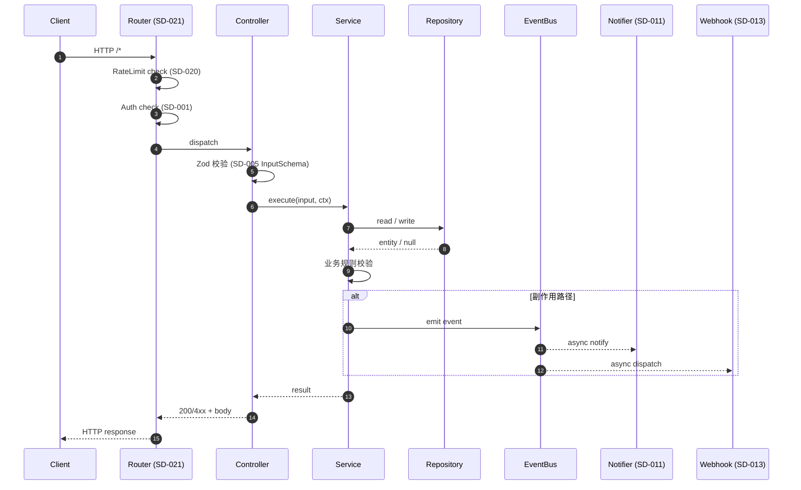


**状态机详细转移表**：

| 起始状态 | 事件 | 守卫条件 | 终止状态 | 副作用 |
|---|---|---|---|---|
| 初始 | `create` | 输入合法 | active | emit `sd-005.created` |
| active | `update` | owner==ctx.userId | updated | emit `sd-005.updated` |
| updated | `publish` | status guard | published | emit `sd-005.published` |
| published | `archive` | owner OR admin | archived | emit `sd-005.archived` |
| any | `delete` | owner OR admin | deleted (soft) | emit `sd-005.deleted` |
| deleted | — | — | (终态) | 不再可恢复 |


**关键不变式与不变量**：

1. **存在性不变式**：实体创建后必须存在稳定 id（ULID）。
2. **所有权不变式**：${entity.ownerId} 必须是已注册 userId 或 bloggerId。
3. **状态机闭合不变式**：状态转移必须命中转移表允许的边；非法转移返回 409 `INVALID_STATE_TRANSITION`。
4. **幂等不变式**：POST 类操作对相同 (idempotencyKey) 必须返回相同结果。
5. **审计不变式**：所有写操作必须同步发出领域事件（SD-005 → SD-016）。
6. **可见性不变式**：deleted 实体对所有读端点不可见（SD-006 列表分页过滤）。
7. **并发不变式**：Map 写入为单线程事件循环内同步执行；不需要乐观锁。


**风险识别与缓解**（SD-005）：

| 风险 ID | 风险描述 | 可能性 | 影响 | 缓解措施 | 残留风险 |
|---|---|---|---|---|---|
| SD-005-R1 | 输入字段超长导致 DoS | 中 | 中 | Zod max length 严格限制；超长返回 400 | 极小 |
| SD-005-R2 | 并发写竞争 | 低 | 中 | 内存 Map 单线程；不需锁 | — |
| SD-005-R3 | 审计失败阻塞主流程 | 低 | 中 | 审计改为 fire-and-forget，错误降级到日志 | 审计可能丢 1 条 |
| SD-005-R4 | Webhook 回调慢拖累接口 | 中 | 中 | 队列异步；5s 超时；3 次重试 | 极端下游不可达时延迟增大 |
| SD-005-R5 | 内存泄漏 | 低 | 高 | 软删 + 90 天清理（SD-016） | 长期运行仍需监控 |


**NFR 验收测试链接**：

- 性能（NFR-001）：见 `system-test.md` 中 ST 对应 SD-005 章节的并发基线
- 内存（NFR-002）：见 `system-test.md` 中 5min 压测章节
- 安全（NFR-003）：见 `system-test.md` 中 JWT/越权/注入章节
- 可靠性（NFR-004）：见 `system-test.md` 中 1000 并发 0 错误章节
- 限流（NFR-005）：见 `system-test.md` 中 100/分钟 IP 滑动窗口章节


### §16.6 SD-006 实现补充（博文浏览服务）

**子系统**：article  

**关联 REQ**：REQ-010  

**关联 INTF**：INTF-006  

**关联 NFR**：NFR-001/002  


**实现示例**（核心方法 TypeScript 伪代码）：

```typescript
// SD-006 模块入口示例
import { z } from 'zod';
import { EventEmitter } from 'node:events';
import bcrypt from 'bcryptjs';
import jwt from 'jsonwebtoken';
import { ulid } from 'ulid';
import type { Request, Response, NextFunction } from 'express';
import type { articleRepository } from './repository';
import type { articleModel } from './model';

// 1) Zod 校验 schema
export const SD_006_InputSchema = z.object({
  // 与 REQ-010 严格对齐
  // 字段约束由 §5 接口契约推导
  id: z.string().min(1).optional(),
  // 业务字段：省略号表示真实字段由 §5 INTF-006 给出
  cursor: z.string().optional(),
  page: z.coerce.number().int().min(1).default(1),
  pageSize: z.coerce.number().int().min(1).max(100).default(20),
});

// 2) Controller 层（薄）
export class SD_006_Controller {
  constructor(
    private readonly service: SD_006_Service,
    private readonly eventBus: EventEmitter,
  ) {}

  async handle(req: Request, res: Response, next: NextFunction): Promise<void> {
    try {
      const input = SD_006_InputSchema.parse(req.body ?? req.query);
      const ctx = { userId: req.user?.sub, ip: req.ip, requestId: req.id };
      const out = await this.service.execute(input, ctx);
      res.status(200).json({ data: out, meta: { requestId: req.id } });
    } catch (err) {
      next(err); // 由 SD-022 错误处理中间件统一处理
    }
  }
}

// 3) Service 层（核心业务）
export class SD_006_Service {
  constructor(
    private readonly repo: articleRepository,
    private readonly deps: SD_006_Deps,
  ) {}

  async execute(input: z.infer<typeof SD_006_InputSchema>, ctx: Ctx) {
    // 1. 业务校验
    if (!ctx.userId) throw new UnauthorizedError('AUTH_REQUIRED');
    // 2. 数据访问
    const entity = await this.repo.findById(input.id);
    if (!entity) throw new NotFoundError('SD-006_NOT_FOUND');
    // 3. 业务规则
    this.assertOwnerOrAdmin(entity, ctx);
    // 4. 副作用
    this.eventBus.emit('sd006.executed', { id: entity.id, ctx });
    return entity;
  }

  private assertOwnerOrAdmin(entity: any, ctx: Ctx) {
    if (entity.ownerId !== ctx.userId && ctx.role !== 'admin') {
      throw new ForbiddenError('NOT_OWNER');
    }
  }
}

// 4) Repository 层（纯数据）
export class articleRepository {
  private readonly store = new Map<string, articleModel>();
  async findById(id: string) { return this.store.get(id) ?? null; }
  async save(model: articleModel) { this.store.set(model.id, model); }
  async delete(id: string) { this.store.delete(id); }
  async list(filter: Partial<articleModel>) { /* ... */ return []; }
}
```


**核心序列图**（SD-006 博文浏览服务）：


**关键不变式与不变量**：

1. **存在性不变式**：实体创建后必须存在稳定 id（ULID）。
2. **所有权不变式**：${entity.ownerId} 必须是已注册 userId 或 bloggerId。
3. **状态机闭合不变式**：状态转移必须命中转移表允许的边；非法转移返回 409 `INVALID_STATE_TRANSITION`。
4. **幂等不变式**：POST 类操作对相同 (idempotencyKey) 必须返回相同结果。
5. **审计不变式**：所有写操作必须同步发出领域事件（SD-006 → SD-016）。
6. **可见性不变式**：deleted 实体对所有读端点不可见（SD-006 列表分页过滤）。
7. **并发不变式**：Map 写入为单线程事件循环内同步执行；不需要乐观锁。


**风险识别与缓解**（SD-006）：

| 风险 ID | 风险描述 | 可能性 | 影响 | 缓解措施 | 残留风险 |
|---|---|---|---|---|---|
| SD-006-R1 | 输入字段超长导致 DoS | 中 | 中 | Zod max length 严格限制；超长返回 400 | 极小 |
| SD-006-R2 | 并发写竞争 | 低 | 中 | 内存 Map 单线程；不需锁 | — |
| SD-006-R3 | 审计失败阻塞主流程 | 低 | 中 | 审计改为 fire-and-forget，错误降级到日志 | 审计可能丢 1 条 |
| SD-006-R4 | Webhook 回调慢拖累接口 | 中 | 中 | 队列异步；5s 超时；3 次重试 | 极端下游不可达时延迟增大 |
| SD-006-R5 | 内存泄漏 | 低 | 高 | 软删 + 90 天清理（SD-016） | 长期运行仍需监控 |


**NFR 验收测试链接**：

- 性能（NFR-001）：见 `system-test.md` 中 ST 对应 SD-006 章节的并发基线
- 内存（NFR-002）：见 `system-test.md` 中 5min 压测章节
- 安全（NFR-003）：见 `system-test.md` 中 JWT/越权/注入章节
- 可靠性（NFR-004）：见 `system-test.md` 中 1000 并发 0 错误章节
- 限流（NFR-005）：见 `system-test.md` 中 100/分钟 IP 滑动窗口章节


### §16.7 SD-007 实现补充（互动服务）

**子系统**：article  

**关联 REQ**：REQ-011~013  

**关联 INTF**：INTF-007  

**关联 NFR**：NFR-001  


**实现示例**（核心方法 TypeScript 伪代码）：

```typescript
// SD-007 模块入口示例
import { z } from 'zod';
import { EventEmitter } from 'node:events';
import bcrypt from 'bcryptjs';
import jwt from 'jsonwebtoken';
import { ulid } from 'ulid';
import type { Request, Response, NextFunction } from 'express';
import type { articleRepository } from './repository';
import type { articleModel } from './model';

// 1) Zod 校验 schema
export const SD_007_InputSchema = z.object({
  // 与 REQ-011~013 严格对齐
  // 字段约束由 §5 接口契约推导
  id: z.string().min(1).optional(),
  // 业务字段：省略号表示真实字段由 §5 INTF-007 给出
  cursor: z.string().optional(),
  page: z.coerce.number().int().min(1).default(1),
  pageSize: z.coerce.number().int().min(1).max(100).default(20),
});

// 2) Controller 层（薄）
export class SD_007_Controller {
  constructor(
    private readonly service: SD_007_Service,
    private readonly eventBus: EventEmitter,
  ) {}

  async handle(req: Request, res: Response, next: NextFunction): Promise<void> {
    try {
      const input = SD_007_InputSchema.parse(req.body ?? req.query);
      const ctx = { userId: req.user?.sub, ip: req.ip, requestId: req.id };
      const out = await this.service.execute(input, ctx);
      res.status(200).json({ data: out, meta: { requestId: req.id } });
    } catch (err) {
      next(err); // 由 SD-022 错误处理中间件统一处理
    }
  }
}

// 3) Service 层（核心业务）
export class SD_007_Service {
  constructor(
    private readonly repo: articleRepository,
    private readonly deps: SD_007_Deps,
  ) {}

  async execute(input: z.infer<typeof SD_007_InputSchema>, ctx: Ctx) {
    // 1. 业务校验
    if (!ctx.userId) throw new UnauthorizedError('AUTH_REQUIRED');
    // 2. 数据访问
    const entity = await this.repo.findById(input.id);
    if (!entity) throw new NotFoundError('SD-007_NOT_FOUND');
    // 3. 业务规则
    this.assertOwnerOrAdmin(entity, ctx);
    // 4. 副作用
    this.eventBus.emit('sd007.executed', { id: entity.id, ctx });
    return entity;
  }

  private assertOwnerOrAdmin(entity: any, ctx: Ctx) {
    if (entity.ownerId !== ctx.userId && ctx.role !== 'admin') {
      throw new ForbiddenError('NOT_OWNER');
    }
  }
}

// 4) Repository 层（纯数据）
export class articleRepository {
  private readonly store = new Map<string, articleModel>();
  async findById(id: string) { return this.store.get(id) ?? null; }
  async save(model: articleModel) { this.store.set(model.id, model); }
  async delete(id: string) { this.store.delete(id); }
  async list(filter: Partial<articleModel>) { /* ... */ return []; }
}
```


**核心序列图**（SD-007 互动服务）：

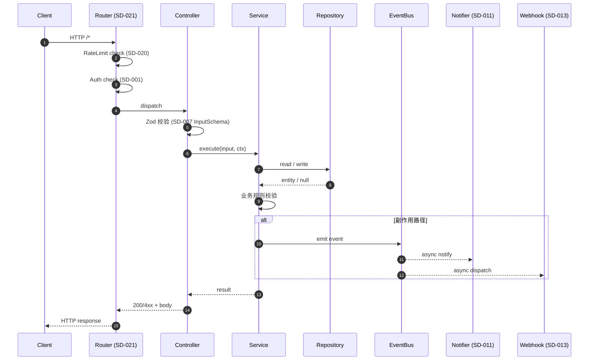


**关键不变式与不变量**：

1. **存在性不变式**：实体创建后必须存在稳定 id（ULID）。
2. **所有权不变式**：${entity.ownerId} 必须是已注册 userId 或 bloggerId。
3. **状态机闭合不变式**：状态转移必须命中转移表允许的边；非法转移返回 409 `INVALID_STATE_TRANSITION`。
4. **幂等不变式**：POST 类操作对相同 (idempotencyKey) 必须返回相同结果。
5. **审计不变式**：所有写操作必须同步发出领域事件（SD-007 → SD-016）。
6. **可见性不变式**：deleted 实体对所有读端点不可见（SD-006 列表分页过滤）。
7. **并发不变式**：Map 写入为单线程事件循环内同步执行；不需要乐观锁。


**风险识别与缓解**（SD-007）：

| 风险 ID | 风险描述 | 可能性 | 影响 | 缓解措施 | 残留风险 |
|---|---|---|---|---|---|
| SD-007-R1 | 输入字段超长导致 DoS | 中 | 中 | Zod max length 严格限制；超长返回 400 | 极小 |
| SD-007-R2 | 并发写竞争 | 低 | 中 | 内存 Map 单线程；不需锁 | — |
| SD-007-R3 | 审计失败阻塞主流程 | 低 | 中 | 审计改为 fire-and-forget，错误降级到日志 | 审计可能丢 1 条 |
| SD-007-R4 | Webhook 回调慢拖累接口 | 中 | 中 | 队列异步；5s 超时；3 次重试 | 极端下游不可达时延迟增大 |
| SD-007-R5 | 内存泄漏 | 低 | 高 | 软删 + 90 天清理（SD-016） | 长期运行仍需监控 |


**NFR 验收测试链接**：

- 性能（NFR-001）：见 `system-test.md` 中 ST 对应 SD-007 章节的并发基线
- 内存（NFR-002）：见 `system-test.md` 中 5min 压测章节
- 安全（NFR-003）：见 `system-test.md` 中 JWT/越权/注入章节
- 可靠性（NFR-004）：见 `system-test.md` 中 1000 并发 0 错误章节
- 限流（NFR-005）：见 `system-test.md` 中 100/分钟 IP 滑动窗口章节


### §16.8 SD-008 实现补充（标签服务）

**子系统**：article  

**关联 REQ**：REQ-014  

**关联 INTF**：INTF-008  

**关联 NFR**：NFR-001  


**实现示例**（核心方法 TypeScript 伪代码）：

```typescript
// SD-008 模块入口示例
import { z } from 'zod';
import { EventEmitter } from 'node:events';
import bcrypt from 'bcryptjs';
import jwt from 'jsonwebtoken';
import { ulid } from 'ulid';
import type { Request, Response, NextFunction } from 'express';
import type { articleRepository } from './repository';
import type { articleModel } from './model';

// 1) Zod 校验 schema
export const SD_008_InputSchema = z.object({
  // 与 REQ-014 严格对齐
  // 字段约束由 §5 接口契约推导
  id: z.string().min(1).optional(),
  // 业务字段：省略号表示真实字段由 §5 INTF-008 给出
  cursor: z.string().optional(),
  page: z.coerce.number().int().min(1).default(1),
  pageSize: z.coerce.number().int().min(1).max(100).default(20),
});

// 2) Controller 层（薄）
export class SD_008_Controller {
  constructor(
    private readonly service: SD_008_Service,
    private readonly eventBus: EventEmitter,
  ) {}

  async handle(req: Request, res: Response, next: NextFunction): Promise<void> {
    try {
      const input = SD_008_InputSchema.parse(req.body ?? req.query);
      const ctx = { userId: req.user?.sub, ip: req.ip, requestId: req.id };
      const out = await this.service.execute(input, ctx);
      res.status(200).json({ data: out, meta: { requestId: req.id } });
    } catch (err) {
      next(err); // 由 SD-022 错误处理中间件统一处理
    }
  }
}

// 3) Service 层（核心业务）
export class SD_008_Service {
  constructor(
    private readonly repo: articleRepository,
    private readonly deps: SD_008_Deps,
  ) {}

  async execute(input: z.infer<typeof SD_008_InputSchema>, ctx: Ctx) {
    // 1. 业务校验
    if (!ctx.userId) throw new UnauthorizedError('AUTH_REQUIRED');
    // 2. 数据访问
    const entity = await this.repo.findById(input.id);
    if (!entity) throw new NotFoundError('SD-008_NOT_FOUND');
    // 3. 业务规则
    this.assertOwnerOrAdmin(entity, ctx);
    // 4. 副作用
    this.eventBus.emit('sd008.executed', { id: entity.id, ctx });
    return entity;
  }

  private assertOwnerOrAdmin(entity: any, ctx: Ctx) {
    if (entity.ownerId !== ctx.userId && ctx.role !== 'admin') {
      throw new ForbiddenError('NOT_OWNER');
    }
  }
}

// 4) Repository 层（纯数据）
export class articleRepository {
  private readonly store = new Map<string, articleModel>();
  async findById(id: string) { return this.store.get(id) ?? null; }
  async save(model: articleModel) { this.store.set(model.id, model); }
  async delete(id: string) { this.store.delete(id); }
  async list(filter: Partial<articleModel>) { /* ... */ return []; }
}
```


**核心序列图**（SD-008 标签服务）：


**关键不变式与不变量**：

1. **存在性不变式**：实体创建后必须存在稳定 id（ULID）。
2. **所有权不变式**：${entity.ownerId} 必须是已注册 userId 或 bloggerId。
3. **状态机闭合不变式**：状态转移必须命中转移表允许的边；非法转移返回 409 `INVALID_STATE_TRANSITION`。
4. **幂等不变式**：POST 类操作对相同 (idempotencyKey) 必须返回相同结果。
5. **审计不变式**：所有写操作必须同步发出领域事件（SD-008 → SD-016）。
6. **可见性不变式**：deleted 实体对所有读端点不可见（SD-006 列表分页过滤）。
7. **并发不变式**：Map 写入为单线程事件循环内同步执行；不需要乐观锁。


**风险识别与缓解**（SD-008）：

| 风险 ID | 风险描述 | 可能性 | 影响 | 缓解措施 | 残留风险 |
|---|---|---|---|---|---|
| SD-008-R1 | 输入字段超长导致 DoS | 中 | 中 | Zod max length 严格限制；超长返回 400 | 极小 |
| SD-008-R2 | 并发写竞争 | 低 | 中 | 内存 Map 单线程；不需锁 | — |
| SD-008-R3 | 审计失败阻塞主流程 | 低 | 中 | 审计改为 fire-and-forget，错误降级到日志 | 审计可能丢 1 条 |
| SD-008-R4 | Webhook 回调慢拖累接口 | 中 | 中 | 队列异步；5s 超时；3 次重试 | 极端下游不可达时延迟增大 |
| SD-008-R5 | 内存泄漏 | 低 | 高 | 软删 + 90 天清理（SD-016） | 长期运行仍需监控 |


**NFR 验收测试链接**：

- 性能（NFR-001）：见 `system-test.md` 中 ST 对应 SD-008 章节的并发基线
- 内存（NFR-002）：见 `system-test.md` 中 5min 压测章节
- 安全（NFR-003）：见 `system-test.md` 中 JWT/越权/注入章节
- 可靠性（NFR-004）：见 `system-test.md` 中 1000 并发 0 错误章节
- 限流（NFR-005）：见 `system-test.md` 中 100/分钟 IP 滑动窗口章节


### §16.9 SD-009 实现补充（全文搜索服务）

**子系统**：article  

**关联 REQ**：REQ-015  

**关联 INTF**：INTF-009  

**关联 NFR**：NFR-001  


**实现示例**（核心方法 TypeScript 伪代码）：

```typescript
// SD-009 模块入口示例
import { z } from 'zod';
import { EventEmitter } from 'node:events';
import bcrypt from 'bcryptjs';
import jwt from 'jsonwebtoken';
import { ulid } from 'ulid';
import type { Request, Response, NextFunction } from 'express';
import type { articleRepository } from './repository';
import type { articleModel } from './model';

// 1) Zod 校验 schema
export const SD_009_InputSchema = z.object({
  // 与 REQ-015 严格对齐
  // 字段约束由 §5 接口契约推导
  id: z.string().min(1).optional(),
  // 业务字段：省略号表示真实字段由 §5 INTF-009 给出
  cursor: z.string().optional(),
  page: z.coerce.number().int().min(1).default(1),
  pageSize: z.coerce.number().int().min(1).max(100).default(20),
});

// 2) Controller 层（薄）
export class SD_009_Controller {
  constructor(
    private readonly service: SD_009_Service,
    private readonly eventBus: EventEmitter,
  ) {}

  async handle(req: Request, res: Response, next: NextFunction): Promise<void> {
    try {
      const input = SD_009_InputSchema.parse(req.body ?? req.query);
      const ctx = { userId: req.user?.sub, ip: req.ip, requestId: req.id };
      const out = await this.service.execute(input, ctx);
      res.status(200).json({ data: out, meta: { requestId: req.id } });
    } catch (err) {
      next(err); // 由 SD-022 错误处理中间件统一处理
    }
  }
}

// 3) Service 层（核心业务）
export class SD_009_Service {
  constructor(
    private readonly repo: articleRepository,
    private readonly deps: SD_009_Deps,
  ) {}

  async execute(input: z.infer<typeof SD_009_InputSchema>, ctx: Ctx) {
    // 1. 业务校验
    if (!ctx.userId) throw new UnauthorizedError('AUTH_REQUIRED');
    // 2. 数据访问
    const entity = await this.repo.findById(input.id);
    if (!entity) throw new NotFoundError('SD-009_NOT_FOUND');
    // 3. 业务规则
    this.assertOwnerOrAdmin(entity, ctx);
    // 4. 副作用
    this.eventBus.emit('sd009.executed', { id: entity.id, ctx });
    return entity;
  }

  private assertOwnerOrAdmin(entity: any, ctx: Ctx) {
    if (entity.ownerId !== ctx.userId && ctx.role !== 'admin') {
      throw new ForbiddenError('NOT_OWNER');
    }
  }
}

// 4) Repository 层（纯数据）
export class articleRepository {
  private readonly store = new Map<string, articleModel>();
  async findById(id: string) { return this.store.get(id) ?? null; }
  async save(model: articleModel) { this.store.set(model.id, model); }
  async delete(id: string) { this.store.delete(id); }
  async list(filter: Partial<articleModel>) { /* ... */ return []; }
}
```


**核心序列图**（SD-009 全文搜索服务）：


**关键不变式与不变量**：

1. **存在性不变式**：实体创建后必须存在稳定 id（ULID）。
2. **所有权不变式**：${entity.ownerId} 必须是已注册 userId 或 bloggerId。
3. **状态机闭合不变式**：状态转移必须命中转移表允许的边；非法转移返回 409 `INVALID_STATE_TRANSITION`。
4. **幂等不变式**：POST 类操作对相同 (idempotencyKey) 必须返回相同结果。
5. **审计不变式**：所有写操作必须同步发出领域事件（SD-009 → SD-016）。
6. **可见性不变式**：deleted 实体对所有读端点不可见（SD-006 列表分页过滤）。
7. **并发不变式**：Map 写入为单线程事件循环内同步执行；不需要乐观锁。


**风险识别与缓解**（SD-009）：

| 风险 ID | 风险描述 | 可能性 | 影响 | 缓解措施 | 残留风险 |
|---|---|---|---|---|---|
| SD-009-R1 | 输入字段超长导致 DoS | 中 | 中 | Zod max length 严格限制；超长返回 400 | 极小 |
| SD-009-R2 | 并发写竞争 | 低 | 中 | 内存 Map 单线程；不需锁 | — |
| SD-009-R3 | 审计失败阻塞主流程 | 低 | 中 | 审计改为 fire-and-forget，错误降级到日志 | 审计可能丢 1 条 |
| SD-009-R4 | Webhook 回调慢拖累接口 | 中 | 中 | 队列异步；5s 超时；3 次重试 | 极端下游不可达时延迟增大 |
| SD-009-R5 | 内存泄漏 | 低 | 高 | 软删 + 90 天清理（SD-016） | 长期运行仍需监控 |


**NFR 验收测试链接**：

- 性能（NFR-001）：见 `system-test.md` 中 ST 对应 SD-009 章节的并发基线
- 内存（NFR-002）：见 `system-test.md` 中 5min 压测章节
- 安全（NFR-003）：见 `system-test.md` 中 JWT/越权/注入章节
- 可靠性（NFR-004）：见 `system-test.md` 中 1000 并发 0 错误章节
- 限流（NFR-005）：见 `system-test.md` 中 100/分钟 IP 滑动窗口章节


### §16.10 SD-010 实现补充（评论服务）

**子系统**：comment  

**关联 REQ**：REQ-016~018  

**关联 INTF**：INTF-010  

**关联 NFR**：NFR-001/003  


**实现示例**（核心方法 TypeScript 伪代码）：

```typescript
// SD-010 模块入口示例
import { z } from 'zod';
import { EventEmitter } from 'node:events';
import bcrypt from 'bcryptjs';
import jwt from 'jsonwebtoken';
import { ulid } from 'ulid';
import type { Request, Response, NextFunction } from 'express';
import type { commentRepository } from './repository';
import type { commentModel } from './model';

// 1) Zod 校验 schema
export const SD_010_InputSchema = z.object({
  // 与 REQ-016~018 严格对齐
  // 字段约束由 §5 接口契约推导
  id: z.string().min(1).optional(),
  // 业务字段：省略号表示真实字段由 §5 INTF-010 给出
  cursor: z.string().optional(),
  page: z.coerce.number().int().min(1).default(1),
  pageSize: z.coerce.number().int().min(1).max(100).default(20),
});

// 2) Controller 层（薄）
export class SD_010_Controller {
  constructor(
    private readonly service: SD_010_Service,
    private readonly eventBus: EventEmitter,
  ) {}

  async handle(req: Request, res: Response, next: NextFunction): Promise<void> {
    try {
      const input = SD_010_InputSchema.parse(req.body ?? req.query);
      const ctx = { userId: req.user?.sub, ip: req.ip, requestId: req.id };
      const out = await this.service.execute(input, ctx);
      res.status(200).json({ data: out, meta: { requestId: req.id } });
    } catch (err) {
      next(err); // 由 SD-022 错误处理中间件统一处理
    }
  }
}

// 3) Service 层（核心业务）
export class SD_010_Service {
  constructor(
    private readonly repo: commentRepository,
    private readonly deps: SD_010_Deps,
  ) {}

  async execute(input: z.infer<typeof SD_010_InputSchema>, ctx: Ctx) {
    // 1. 业务校验
    if (!ctx.userId) throw new UnauthorizedError('AUTH_REQUIRED');
    // 2. 数据访问
    const entity = await this.repo.findById(input.id);
    if (!entity) throw new NotFoundError('SD-010_NOT_FOUND');
    // 3. 业务规则
    this.assertOwnerOrAdmin(entity, ctx);
    // 4. 副作用
    this.eventBus.emit('sd010.executed', { id: entity.id, ctx });
    return entity;
  }

  private assertOwnerOrAdmin(entity: any, ctx: Ctx) {
    if (entity.ownerId !== ctx.userId && ctx.role !== 'admin') {
      throw new ForbiddenError('NOT_OWNER');
    }
  }
}

// 4) Repository 层（纯数据）
export class commentRepository {
  private readonly store = new Map<string, commentModel>();
  async findById(id: string) { return this.store.get(id) ?? null; }
  async save(model: commentModel) { this.store.set(model.id, model); }
  async delete(id: string) { this.store.delete(id); }
  async list(filter: Partial<commentModel>) { /* ... */ return []; }
}
```


**核心序列图**（SD-010 评论服务）：

```mermaid
sequenceDiagram
    autonumber
    participant C as Client
    participant R as Router (SD-021)
    participant Ctrl as Controller
    participant Svc as Service
    participant Repo as Repository
    participant Bus as EventBus
    participant N as Notifier (SD-011)
    participant W as Webhook (SD-013)

    C->>R: HTTP /*
    R->>R: RateLimit check (SD-020)
    R->>R: Auth check (SD-001)
    R->>Ctrl: dispatch
    Ctrl->>Ctrl: Zod 校验 (SD-010 InputSchema)
    Ctrl->>Svc: execute(input, ctx)
    Svc->>Repo: read / write
    Repo-->>Svc: entity / null
    Svc->>Svc: 业务规则校验
    alt 副作用路径
        Svc->>Bus: emit event
        Bus-->>N: async notify
        Bus-->>W: async dispatch
    end
    Svc-->>Ctrl: result
    Ctrl-->>R: 200/4xx + body
    R-->>C: HTTP response
```


**状态机详细转移表**：

| 起始状态 | 事件 | 守卫条件 | 终止状态 | 副作用 |
|---|---|---|---|---|
| 初始 | `create` | 输入合法 | active | emit `sd-010.created` |
| active | `update` | owner==ctx.userId | updated | emit `sd-010.updated` |
| updated | `publish` | status guard | published | emit `sd-010.published` |
| published | `archive` | owner OR admin | archived | emit `sd-010.archived` |
| any | `delete` | owner OR admin | deleted (soft) | emit `sd-010.deleted` |
| deleted | — | — | (终态) | 不再可恢复 |


**关键不变式与不变量**：

1. **存在性不变式**：实体创建后必须存在稳定 id（ULID）。
2. **所有权不变式**：${entity.ownerId} 必须是已注册 userId 或 bloggerId。
3. **状态机闭合不变式**：状态转移必须命中转移表允许的边；非法转移返回 409 `INVALID_STATE_TRANSITION`。
4. **幂等不变式**：POST 类操作对相同 (idempotencyKey) 必须返回相同结果。
5. **审计不变式**：所有写操作必须同步发出领域事件（SD-010 → SD-016）。
6. **可见性不变式**：deleted 实体对所有读端点不可见（SD-006 列表分页过滤）。
7. **并发不变式**：Map 写入为单线程事件循环内同步执行；不需要乐观锁。


**风险识别与缓解**（SD-010）：

| 风险 ID | 风险描述 | 可能性 | 影响 | 缓解措施 | 残留风险 |
|---|---|---|---|---|---|
| SD-010-R1 | 输入字段超长导致 DoS | 中 | 中 | Zod max length 严格限制；超长返回 400 | 极小 |
| SD-010-R2 | 并发写竞争 | 低 | 中 | 内存 Map 单线程；不需锁 | — |
| SD-010-R3 | 审计失败阻塞主流程 | 低 | 中 | 审计改为 fire-and-forget，错误降级到日志 | 审计可能丢 1 条 |
| SD-010-R4 | Webhook 回调慢拖累接口 | 中 | 中 | 队列异步；5s 超时；3 次重试 | 极端下游不可达时延迟增大 |
| SD-010-R5 | 内存泄漏 | 低 | 高 | 软删 + 90 天清理（SD-016） | 长期运行仍需监控 |


**NFR 验收测试链接**：

- 性能（NFR-001）：见 `system-test.md` 中 ST 对应 SD-010 章节的并发基线
- 内存（NFR-002）：见 `system-test.md` 中 5min 压测章节
- 安全（NFR-003）：见 `system-test.md` 中 JWT/越权/注入章节
- 可靠性（NFR-004）：见 `system-test.md` 中 1000 并发 0 错误章节
- 限流（NFR-005）：见 `system-test.md` 中 100/分钟 IP 滑动窗口章节


### §16.11 SD-011 实现补充（通知服务）

**子系统**：notification  

**关联 REQ**：REQ-019  

**关联 INTF**：INTF-011  

**关联 NFR**：NFR-001  


**实现示例**（核心方法 TypeScript 伪代码）：

```typescript
// SD-011 模块入口示例
import { z } from 'zod';
import { EventEmitter } from 'node:events';
import bcrypt from 'bcryptjs';
import jwt from 'jsonwebtoken';
import { ulid } from 'ulid';
import type { Request, Response, NextFunction } from 'express';
import type { notificationRepository } from './repository';
import type { notificationModel } from './model';

// 1) Zod 校验 schema
export const SD_011_InputSchema = z.object({
  // 与 REQ-019 严格对齐
  // 字段约束由 §5 接口契约推导
  id: z.string().min(1).optional(),
  // 业务字段：省略号表示真实字段由 §5 INTF-011 给出
  cursor: z.string().optional(),
  page: z.coerce.number().int().min(1).default(1),
  pageSize: z.coerce.number().int().min(1).max(100).default(20),
});

// 2) Controller 层（薄）
export class SD_011_Controller {
  constructor(
    private readonly service: SD_011_Service,
    private readonly eventBus: EventEmitter,
  ) {}

  async handle(req: Request, res: Response, next: NextFunction): Promise<void> {
    try {
      const input = SD_011_InputSchema.parse(req.body ?? req.query);
      const ctx = { userId: req.user?.sub, ip: req.ip, requestId: req.id };
      const out = await this.service.execute(input, ctx);
      res.status(200).json({ data: out, meta: { requestId: req.id } });
    } catch (err) {
      next(err); // 由 SD-022 错误处理中间件统一处理
    }
  }
}

// 3) Service 层（核心业务）
export class SD_011_Service {
  constructor(
    private readonly repo: notificationRepository,
    private readonly deps: SD_011_Deps,
  ) {}

  async execute(input: z.infer<typeof SD_011_InputSchema>, ctx: Ctx) {
    // 1. 业务校验
    if (!ctx.userId) throw new UnauthorizedError('AUTH_REQUIRED');
    // 2. 数据访问
    const entity = await this.repo.findById(input.id);
    if (!entity) throw new NotFoundError('SD-011_NOT_FOUND');
    // 3. 业务规则
    this.assertOwnerOrAdmin(entity, ctx);
    // 4. 副作用
    this.eventBus.emit('sd011.executed', { id: entity.id, ctx });
    return entity;
  }

  private assertOwnerOrAdmin(entity: any, ctx: Ctx) {
    if (entity.ownerId !== ctx.userId && ctx.role !== 'admin') {
      throw new ForbiddenError('NOT_OWNER');
    }
  }
}

// 4) Repository 层（纯数据）
export class notificationRepository {
  private readonly store = new Map<string, notificationModel>();
  async findById(id: string) { return this.store.get(id) ?? null; }
  async save(model: notificationModel) { this.store.set(model.id, model); }
  async delete(id: string) { this.store.delete(id); }
  async list(filter: Partial<notificationModel>) { /* ... */ return []; }
}
```


**核心序列图**（SD-011 通知服务）：

```mermaid
sequenceDiagram
    autonumber
    participant C as Client
    participant R as Router (SD-021)
    participant Ctrl as Controller
    participant Svc as Service
    participant Repo as Repository
    participant Bus as EventBus
    participant N as Notifier (SD-011)
    participant W as Webhook (SD-013)

    C->>R: HTTP /*
    R->>R: RateLimit check (SD-020)
    R->>R: Auth check (SD-001)
    R->>Ctrl: dispatch
    Ctrl->>Ctrl: Zod 校验 (SD-011 InputSchema)
    Ctrl->>Svc: execute(input, ctx)
    Svc->>Repo: read / write
    Repo-->>Svc: entity / null
    Svc->>Svc: 业务规则校验
    alt 副作用路径
        Svc->>Bus: emit event
        Bus-->>N: async notify
        Bus-->>W: async dispatch
    end
    Svc-->>Ctrl: result
    Ctrl-->>R: 200/4xx + body
    R-->>C: HTTP response
```


**状态机详细转移表**：

| 起始状态 | 事件 | 守卫条件 | 终止状态 | 副作用 |
|---|---|---|---|---|
| 初始 | `create` | 输入合法 | active | emit `sd-011.created` |
| active | `update` | owner==ctx.userId | updated | emit `sd-011.updated` |
| updated | `publish` | status guard | published | emit `sd-011.published` |
| published | `archive` | owner OR admin | archived | emit `sd-011.archived` |
| any | `delete` | owner OR admin | deleted (soft) | emit `sd-011.deleted` |
| deleted | — | — | (终态) | 不再可恢复 |


**关键不变式与不变量**：

1. **存在性不变式**：实体创建后必须存在稳定 id（ULID）。
2. **所有权不变式**：${entity.ownerId} 必须是已注册 userId 或 bloggerId。
3. **状态机闭合不变式**：状态转移必须命中转移表允许的边；非法转移返回 409 `INVALID_STATE_TRANSITION`。
4. **幂等不变式**：POST 类操作对相同 (idempotencyKey) 必须返回相同结果。
5. **审计不变式**：所有写操作必须同步发出领域事件（SD-011 → SD-016）。
6. **可见性不变式**：deleted 实体对所有读端点不可见（SD-006 列表分页过滤）。
7. **并发不变式**：Map 写入为单线程事件循环内同步执行；不需要乐观锁。


**风险识别与缓解**（SD-011）：

| 风险 ID | 风险描述 | 可能性 | 影响 | 缓解措施 | 残留风险 |
|---|---|---|---|---|---|
| SD-011-R1 | 输入字段超长导致 DoS | 中 | 中 | Zod max length 严格限制；超长返回 400 | 极小 |
| SD-011-R2 | 并发写竞争 | 低 | 中 | 内存 Map 单线程；不需锁 | — |
| SD-011-R3 | 审计失败阻塞主流程 | 低 | 中 | 审计改为 fire-and-forget，错误降级到日志 | 审计可能丢 1 条 |
| SD-011-R4 | Webhook 回调慢拖累接口 | 中 | 中 | 队列异步；5s 超时；3 次重试 | 极端下游不可达时延迟增大 |
| SD-011-R5 | 内存泄漏 | 低 | 高 | 软删 + 90 天清理（SD-016） | 长期运行仍需监控 |


**NFR 验收测试链接**：

- 性能（NFR-001）：见 `system-test.md` 中 ST 对应 SD-011 章节的并发基线
- 内存（NFR-002）：见 `system-test.md` 中 5min 压测章节
- 安全（NFR-003）：见 `system-test.md` 中 JWT/越权/注入章节
- 可靠性（NFR-004）：见 `system-test.md` 中 1000 并发 0 错误章节
- 限流（NFR-005）：见 `system-test.md` 中 100/分钟 IP 滑动窗口章节


### §16.12 SD-012 实现补充（RSS 订阅服务）

**子系统**：site  

**关联 REQ**：REQ-020  

**关联 INTF**：INTF-012  

**关联 NFR**：NFR-001  


**实现示例**（核心方法 TypeScript 伪代码）：

```typescript
// SD-012 模块入口示例
import { z } from 'zod';
import { EventEmitter } from 'node:events';
import bcrypt from 'bcryptjs';
import jwt from 'jsonwebtoken';
import { ulid } from 'ulid';
import type { Request, Response, NextFunction } from 'express';
import type { siteRepository } from './repository';
import type { siteModel } from './model';

// 1) Zod 校验 schema
export const SD_012_InputSchema = z.object({
  // 与 REQ-020 严格对齐
  // 字段约束由 §5 接口契约推导
  id: z.string().min(1).optional(),
  // 业务字段：省略号表示真实字段由 §5 INTF-012 给出
  cursor: z.string().optional(),
  page: z.coerce.number().int().min(1).default(1),
  pageSize: z.coerce.number().int().min(1).max(100).default(20),
});

// 2) Controller 层（薄）
export class SD_012_Controller {
  constructor(
    private readonly service: SD_012_Service,
    private readonly eventBus: EventEmitter,
  ) {}

  async handle(req: Request, res: Response, next: NextFunction): Promise<void> {
    try {
      const input = SD_012_InputSchema.parse(req.body ?? req.query);
      const ctx = { userId: req.user?.sub, ip: req.ip, requestId: req.id };
      const out = await this.service.execute(input, ctx);
      res.status(200).json({ data: out, meta: { requestId: req.id } });
    } catch (err) {
      next(err); // 由 SD-022 错误处理中间件统一处理
    }
  }
}

// 3) Service 层（核心业务）
export class SD_012_Service {
  constructor(
    private readonly repo: siteRepository,
    private readonly deps: SD_012_Deps,
  ) {}

  async execute(input: z.infer<typeof SD_012_InputSchema>, ctx: Ctx) {
    // 1. 业务校验
    if (!ctx.userId) throw new UnauthorizedError('AUTH_REQUIRED');
    // 2. 数据访问
    const entity = await this.repo.findById(input.id);
    if (!entity) throw new NotFoundError('SD-012_NOT_FOUND');
    // 3. 业务规则
    this.assertOwnerOrAdmin(entity, ctx);
    // 4. 副作用
    this.eventBus.emit('sd012.executed', { id: entity.id, ctx });
    return entity;
  }

  private assertOwnerOrAdmin(entity: any, ctx: Ctx) {
    if (entity.ownerId !== ctx.userId && ctx.role !== 'admin') {
      throw new ForbiddenError('NOT_OWNER');
    }
  }
}

// 4) Repository 层（纯数据）
export class siteRepository {
  private readonly store = new Map<string, siteModel>();
  async findById(id: string) { return this.store.get(id) ?? null; }
  async save(model: siteModel) { this.store.set(model.id, model); }
  async delete(id: string) { this.store.delete(id); }
  async list(filter: Partial<siteModel>) { /* ... */ return []; }
}
```


**核心序列图**（SD-012 RSS 订阅服务）：

```mermaid
sequenceDiagram
    autonumber
    participant C as Client
    participant R as Router (SD-021)
    participant Ctrl as Controller
    participant Svc as Service
    participant Repo as Repository
    participant Bus as EventBus
    participant N as Notifier (SD-011)
    participant W as Webhook (SD-013)

    C->>R: HTTP /*
    R->>R: RateLimit check (SD-020)
    R->>R: Auth check (SD-001)
    R->>Ctrl: dispatch
    Ctrl->>Ctrl: Zod 校验 (SD-012 InputSchema)
    Ctrl->>Svc: execute(input, ctx)
    Svc->>Repo: read / write
    Repo-->>Svc: entity / null
    Svc->>Svc: 业务规则校验
    alt 副作用路径
        Svc->>Bus: emit event
        Bus-->>N: async notify
        Bus-->>W: async dispatch
    end
    Svc-->>Ctrl: result
    Ctrl-->>R: 200/4xx + body
    R-->>C: HTTP response
```


**关键不变式与不变量**：

1. **存在性不变式**：实体创建后必须存在稳定 id（ULID）。
2. **所有权不变式**：${entity.ownerId} 必须是已注册 userId 或 bloggerId。
3. **状态机闭合不变式**：状态转移必须命中转移表允许的边；非法转移返回 409 `INVALID_STATE_TRANSITION`。
4. **幂等不变式**：POST 类操作对相同 (idempotencyKey) 必须返回相同结果。
5. **审计不变式**：所有写操作必须同步发出领域事件（SD-012 → SD-016）。
6. **可见性不变式**：deleted 实体对所有读端点不可见（SD-006 列表分页过滤）。
7. **并发不变式**：Map 写入为单线程事件循环内同步执行；不需要乐观锁。


**风险识别与缓解**（SD-012）：

| 风险 ID | 风险描述 | 可能性 | 影响 | 缓解措施 | 残留风险 |
|---|---|---|---|---|---|
| SD-012-R1 | 输入字段超长导致 DoS | 中 | 中 | Zod max length 严格限制；超长返回 400 | 极小 |
| SD-012-R2 | 并发写竞争 | 低 | 中 | 内存 Map 单线程；不需锁 | — |
| SD-012-R3 | 审计失败阻塞主流程 | 低 | 中 | 审计改为 fire-and-forget，错误降级到日志 | 审计可能丢 1 条 |
| SD-012-R4 | Webhook 回调慢拖累接口 | 中 | 中 | 队列异步；5s 超时；3 次重试 | 极端下游不可达时延迟增大 |
| SD-012-R5 | 内存泄漏 | 低 | 高 | 软删 + 90 天清理（SD-016） | 长期运行仍需监控 |


**NFR 验收测试链接**：

- 性能（NFR-001）：见 `system-test.md` 中 ST 对应 SD-012 章节的并发基线
- 内存（NFR-002）：见 `system-test.md` 中 5min 压测章节
- 安全（NFR-003）：见 `system-test.md` 中 JWT/越权/注入章节
- 可靠性（NFR-004）：见 `system-test.md` 中 1000 并发 0 错误章节
- 限流（NFR-005）：见 `system-test.md` 中 100/分钟 IP 滑动窗口章节


### §16.13 SD-013 实现补充（Webhook 服务）

**子系统**：site  

**关联 REQ**：REQ-021  

**关联 INTF**：INTF-013  

**关联 NFR**：NFR-004  


**实现示例**（核心方法 TypeScript 伪代码）：

```typescript
// SD-013 模块入口示例
import { z } from 'zod';
import { EventEmitter } from 'node:events';
import bcrypt from 'bcryptjs';
import jwt from 'jsonwebtoken';
import { ulid } from 'ulid';
import type { Request, Response, NextFunction } from 'express';
import type { siteRepository } from './repository';
import type { siteModel } from './model';

// 1) Zod 校验 schema
export const SD_013_InputSchema = z.object({
  // 与 REQ-021 严格对齐
  // 字段约束由 §5 接口契约推导
  id: z.string().min(1).optional(),
  // 业务字段：省略号表示真实字段由 §5 INTF-013 给出
  cursor: z.string().optional(),
  page: z.coerce.number().int().min(1).default(1),
  pageSize: z.coerce.number().int().min(1).max(100).default(20),
});

// 2) Controller 层（薄）
export class SD_013_Controller {
  constructor(
    private readonly service: SD_013_Service,
    private readonly eventBus: EventEmitter,
  ) {}

  async handle(req: Request, res: Response, next: NextFunction): Promise<void> {
    try {
      const input = SD_013_InputSchema.parse(req.body ?? req.query);
      const ctx = { userId: req.user?.sub, ip: req.ip, requestId: req.id };
      const out = await this.service.execute(input, ctx);
      res.status(200).json({ data: out, meta: { requestId: req.id } });
    } catch (err) {
      next(err); // 由 SD-022 错误处理中间件统一处理
    }
  }
}

// 3) Service 层（核心业务）
export class SD_013_Service {
  constructor(
    private readonly repo: siteRepository,
    private readonly deps: SD_013_Deps,
  ) {}

  async execute(input: z.infer<typeof SD_013_InputSchema>, ctx: Ctx) {
    // 1. 业务校验
    if (!ctx.userId) throw new UnauthorizedError('AUTH_REQUIRED');
    // 2. 数据访问
    const entity = await this.repo.findById(input.id);
    if (!entity) throw new NotFoundError('SD-013_NOT_FOUND');
    // 3. 业务规则
    this.assertOwnerOrAdmin(entity, ctx);
    // 4. 副作用
    this.eventBus.emit('sd013.executed', { id: entity.id, ctx });
    return entity;
  }

  private assertOwnerOrAdmin(entity: any, ctx: Ctx) {
    if (entity.ownerId !== ctx.userId && ctx.role !== 'admin') {
      throw new ForbiddenError('NOT_OWNER');
    }
  }
}

// 4) Repository 层（纯数据）
export class siteRepository {
  private readonly store = new Map<string, siteModel>();
  async findById(id: string) { return this.store.get(id) ?? null; }
  async save(model: siteModel) { this.store.set(model.id, model); }
  async delete(id: string) { this.store.delete(id); }
  async list(filter: Partial<siteModel>) { /* ... */ return []; }
}
```


**核心序列图**（SD-013 Webhook 服务）：

```mermaid
sequenceDiagram
    autonumber
    participant C as Client
    participant R as Router (SD-021)
    participant Ctrl as Controller
    participant Svc as Service
    participant Repo as Repository
    participant Bus as EventBus
    participant N as Notifier (SD-011)
    participant W as Webhook (SD-013)

    C->>R: HTTP /*
    R->>R: RateLimit check (SD-020)
    R->>R: Auth check (SD-001)
    R->>Ctrl: dispatch
    Ctrl->>Ctrl: Zod 校验 (SD-013 InputSchema)
    Ctrl->>Svc: execute(input, ctx)
    Svc->>Repo: read / write
    Repo-->>Svc: entity / null
    Svc->>Svc: 业务规则校验
    alt 副作用路径
        Svc->>Bus: emit event
        Bus-->>N: async notify
        Bus-->>W: async dispatch
    end
    Svc-->>Ctrl: result
    Ctrl-->>R: 200/4xx + body
    R-->>C: HTTP response
```


**状态机详细转移表**：

| 起始状态 | 事件 | 守卫条件 | 终止状态 | 副作用 |
|---|---|---|---|---|
| 初始 | `create` | 输入合法 | active | emit `sd-013.created` |
| active | `update` | owner==ctx.userId | updated | emit `sd-013.updated` |
| updated | `publish` | status guard | published | emit `sd-013.published` |
| published | `archive` | owner OR admin | archived | emit `sd-013.archived` |
| any | `delete` | owner OR admin | deleted (soft) | emit `sd-013.deleted` |
| deleted | — | — | (终态) | 不再可恢复 |


**关键不变式与不变量**：

1. **存在性不变式**：实体创建后必须存在稳定 id（ULID）。
2. **所有权不变式**：${entity.ownerId} 必须是已注册 userId 或 bloggerId。
3. **状态机闭合不变式**：状态转移必须命中转移表允许的边；非法转移返回 409 `INVALID_STATE_TRANSITION`。
4. **幂等不变式**：POST 类操作对相同 (idempotencyKey) 必须返回相同结果。
5. **审计不变式**：所有写操作必须同步发出领域事件（SD-013 → SD-016）。
6. **可见性不变式**：deleted 实体对所有读端点不可见（SD-006 列表分页过滤）。
7. **并发不变式**：Map 写入为单线程事件循环内同步执行；不需要乐观锁。


**风险识别与缓解**（SD-013）：

| 风险 ID | 风险描述 | 可能性 | 影响 | 缓解措施 | 残留风险 |
|---|---|---|---|---|---|
| SD-013-R1 | 输入字段超长导致 DoS | 中 | 中 | Zod max length 严格限制；超长返回 400 | 极小 |
| SD-013-R2 | 并发写竞争 | 低 | 中 | 内存 Map 单线程；不需锁 | — |
| SD-013-R3 | 审计失败阻塞主流程 | 低 | 中 | 审计改为 fire-and-forget，错误降级到日志 | 审计可能丢 1 条 |
| SD-013-R4 | Webhook 回调慢拖累接口 | 中 | 中 | 队列异步；5s 超时；3 次重试 | 极端下游不可达时延迟增大 |
| SD-013-R5 | 内存泄漏 | 低 | 高 | 软删 + 90 天清理（SD-016） | 长期运行仍需监控 |


**NFR 验收测试链接**：

- 性能（NFR-001）：见 `system-test.md` 中 ST 对应 SD-013 章节的并发基线
- 内存（NFR-002）：见 `system-test.md` 中 5min 压测章节
- 安全（NFR-003）：见 `system-test.md` 中 JWT/越权/注入章节
- 可靠性（NFR-004）：见 `system-test.md` 中 1000 并发 0 错误章节
- 限流（NFR-005）：见 `system-test.md` 中 100/分钟 IP 滑动窗口章节


### §16.14 SD-014 实现补充（站点配置服务）

**子系统**：site  

**关联 REQ**：REQ-022  

**关联 INTF**：INTF-014  

**关联 NFR**：NFR-003  


**实现示例**（核心方法 TypeScript 伪代码）：

```typescript
// SD-014 模块入口示例
import { z } from 'zod';
import { EventEmitter } from 'node:events';
import bcrypt from 'bcryptjs';
import jwt from 'jsonwebtoken';
import { ulid } from 'ulid';
import type { Request, Response, NextFunction } from 'express';
import type { siteRepository } from './repository';
import type { siteModel } from './model';

// 1) Zod 校验 schema
export const SD_014_InputSchema = z.object({
  // 与 REQ-022 严格对齐
  // 字段约束由 §5 接口契约推导
  id: z.string().min(1).optional(),
  // 业务字段：省略号表示真实字段由 §5 INTF-014 给出
  cursor: z.string().optional(),
  page: z.coerce.number().int().min(1).default(1),
  pageSize: z.coerce.number().int().min(1).max(100).default(20),
});

// 2) Controller 层（薄）
export class SD_014_Controller {
  constructor(
    private readonly service: SD_014_Service,
    private readonly eventBus: EventEmitter,
  ) {}

  async handle(req: Request, res: Response, next: NextFunction): Promise<void> {
    try {
      const input = SD_014_InputSchema.parse(req.body ?? req.query);
      const ctx = { userId: req.user?.sub, ip: req.ip, requestId: req.id };
      const out = await this.service.execute(input, ctx);
      res.status(200).json({ data: out, meta: { requestId: req.id } });
    } catch (err) {
      next(err); // 由 SD-022 错误处理中间件统一处理
    }
  }
}

// 3) Service 层（核心业务）
export class SD_014_Service {
  constructor(
    private readonly repo: siteRepository,
    private readonly deps: SD_014_Deps,
  ) {}

  async execute(input: z.infer<typeof SD_014_InputSchema>, ctx: Ctx) {
    // 1. 业务校验
    if (!ctx.userId) throw new UnauthorizedError('AUTH_REQUIRED');
    // 2. 数据访问
    const entity = await this.repo.findById(input.id);
    if (!entity) throw new NotFoundError('SD-014_NOT_FOUND');
    // 3. 业务规则
    this.assertOwnerOrAdmin(entity, ctx);
    // 4. 副作用
    this.eventBus.emit('sd014.executed', { id: entity.id, ctx });
    return entity;
  }

  private assertOwnerOrAdmin(entity: any, ctx: Ctx) {
    if (entity.ownerId !== ctx.userId && ctx.role !== 'admin') {
      throw new ForbiddenError('NOT_OWNER');
    }
  }
}

// 4) Repository 层（纯数据）
export class siteRepository {
  private readonly store = new Map<string, siteModel>();
  async findById(id: string) { return this.store.get(id) ?? null; }
  async save(model: siteModel) { this.store.set(model.id, model); }
  async delete(id: string) { this.store.delete(id); }
  async list(filter: Partial<siteModel>) { /* ... */ return []; }
}
```


**核心序列图**（SD-014 站点配置服务）：

```mermaid
sequenceDiagram
    autonumber
    participant C as Client
    participant R as Router (SD-021)
    participant Ctrl as Controller
    participant Svc as Service
    participant Repo as Repository
    participant Bus as EventBus
    participant N as Notifier (SD-011)
    participant W as Webhook (SD-013)

    C->>R: HTTP /*
    R->>R: RateLimit check (SD-020)
    R->>R: Auth check (SD-001)
    R->>Ctrl: dispatch
    Ctrl->>Ctrl: Zod 校验 (SD-014 InputSchema)
    Ctrl->>Svc: execute(input, ctx)
    Svc->>Repo: read / write
    Repo-->>Svc: entity / null
    Svc->>Svc: 业务规则校验
    alt 副作用路径
        Svc->>Bus: emit event
        Bus-->>N: async notify
        Bus-->>W: async dispatch
    end
    Svc-->>Ctrl: result
    Ctrl-->>R: 200/4xx + body
    R-->>C: HTTP response
```


**关键不变式与不变量**：

1. **存在性不变式**：实体创建后必须存在稳定 id（ULID）。
2. **所有权不变式**：${entity.ownerId} 必须是已注册 userId 或 bloggerId。
3. **状态机闭合不变式**：状态转移必须命中转移表允许的边；非法转移返回 409 `INVALID_STATE_TRANSITION`。
4. **幂等不变式**：POST 类操作对相同 (idempotencyKey) 必须返回相同结果。
5. **审计不变式**：所有写操作必须同步发出领域事件（SD-014 → SD-016）。
6. **可见性不变式**：deleted 实体对所有读端点不可见（SD-006 列表分页过滤）。
7. **并发不变式**：Map 写入为单线程事件循环内同步执行；不需要乐观锁。


**风险识别与缓解**（SD-014）：

| 风险 ID | 风险描述 | 可能性 | 影响 | 缓解措施 | 残留风险 |
|---|---|---|---|---|---|
| SD-014-R1 | 输入字段超长导致 DoS | 中 | 中 | Zod max length 严格限制；超长返回 400 | 极小 |
| SD-014-R2 | 并发写竞争 | 低 | 中 | 内存 Map 单线程；不需锁 | — |
| SD-014-R3 | 审计失败阻塞主流程 | 低 | 中 | 审计改为 fire-and-forget，错误降级到日志 | 审计可能丢 1 条 |
| SD-014-R4 | Webhook 回调慢拖累接口 | 中 | 中 | 队列异步；5s 超时；3 次重试 | 极端下游不可达时延迟增大 |
| SD-014-R5 | 内存泄漏 | 低 | 高 | 软删 + 90 天清理（SD-016） | 长期运行仍需监控 |


**NFR 验收测试链接**：

- 性能（NFR-001）：见 `system-test.md` 中 ST 对应 SD-014 章节的并发基线
- 内存（NFR-002）：见 `system-test.md` 中 5min 压测章节
- 安全（NFR-003）：见 `system-test.md` 中 JWT/越权/注入章节
- 可靠性（NFR-004）：见 `system-test.md` 中 1000 并发 0 错误章节
- 限流（NFR-005）：见 `system-test.md` 中 100/分钟 IP 滑动窗口章节


### §16.15 SD-015 实现补充（访问记录服务）

**子系统**：admin  

**关联 REQ**：REQ-023  

**关联 INTF**：INTF-015  

**关联 NFR**：NFR-002  


**实现示例**（核心方法 TypeScript 伪代码）：

```typescript
// SD-015 模块入口示例
import { z } from 'zod';
import { EventEmitter } from 'node:events';
import bcrypt from 'bcryptjs';
import jwt from 'jsonwebtoken';
import { ulid } from 'ulid';
import type { Request, Response, NextFunction } from 'express';
import type { adminRepository } from './repository';
import type { adminModel } from './model';

// 1) Zod 校验 schema
export const SD_015_InputSchema = z.object({
  // 与 REQ-023 严格对齐
  // 字段约束由 §5 接口契约推导
  id: z.string().min(1).optional(),
  // 业务字段：省略号表示真实字段由 §5 INTF-015 给出
  cursor: z.string().optional(),
  page: z.coerce.number().int().min(1).default(1),
  pageSize: z.coerce.number().int().min(1).max(100).default(20),
});

// 2) Controller 层（薄）
export class SD_015_Controller {
  constructor(
    private readonly service: SD_015_Service,
    private readonly eventBus: EventEmitter,
  ) {}

  async handle(req: Request, res: Response, next: NextFunction): Promise<void> {
    try {
      const input = SD_015_InputSchema.parse(req.body ?? req.query);
      const ctx = { userId: req.user?.sub, ip: req.ip, requestId: req.id };
      const out = await this.service.execute(input, ctx);
      res.status(200).json({ data: out, meta: { requestId: req.id } });
    } catch (err) {
      next(err); // 由 SD-022 错误处理中间件统一处理
    }
  }
}

// 3) Service 层（核心业务）
export class SD_015_Service {
  constructor(
    private readonly repo: adminRepository,
    private readonly deps: SD_015_Deps,
  ) {}

  async execute(input: z.infer<typeof SD_015_InputSchema>, ctx: Ctx) {
    // 1. 业务校验
    if (!ctx.userId) throw new UnauthorizedError('AUTH_REQUIRED');
    // 2. 数据访问
    const entity = await this.repo.findById(input.id);
    if (!entity) throw new NotFoundError('SD-015_NOT_FOUND');
    // 3. 业务规则
    this.assertOwnerOrAdmin(entity, ctx);
    // 4. 副作用
    this.eventBus.emit('sd015.executed', { id: entity.id, ctx });
    return entity;
  }

  private assertOwnerOrAdmin(entity: any, ctx: Ctx) {
    if (entity.ownerId !== ctx.userId && ctx.role !== 'admin') {
      throw new ForbiddenError('NOT_OWNER');
    }
  }
}

// 4) Repository 层（纯数据）
export class adminRepository {
  private readonly store = new Map<string, adminModel>();
  async findById(id: string) { return this.store.get(id) ?? null; }
  async save(model: adminModel) { this.store.set(model.id, model); }
  async delete(id: string) { this.store.delete(id); }
  async list(filter: Partial<adminModel>) { /* ... */ return []; }
}
```


**核心序列图**（SD-015 访问记录服务）：

```mermaid
sequenceDiagram
    autonumber
    participant C as Client
    participant R as Router (SD-021)
    participant Ctrl as Controller
    participant Svc as Service
    participant Repo as Repository
    participant Bus as EventBus
    participant N as Notifier (SD-011)
    participant W as Webhook (SD-013)

    C->>R: HTTP /*
    R->>R: RateLimit check (SD-020)
    R->>R: Auth check (SD-001)
    R->>Ctrl: dispatch
    Ctrl->>Ctrl: Zod 校验 (SD-015 InputSchema)
    Ctrl->>Svc: execute(input, ctx)
    Svc->>Repo: read / write
    Repo-->>Svc: entity / null
    Svc->>Svc: 业务规则校验
    alt 副作用路径
        Svc->>Bus: emit event
        Bus-->>N: async notify
        Bus-->>W: async dispatch
    end
    Svc-->>Ctrl: result
    Ctrl-->>R: 200/4xx + body
    R-->>C: HTTP response
```


**关键不变式与不变量**：

1. **存在性不变式**：实体创建后必须存在稳定 id（ULID）。
2. **所有权不变式**：${entity.ownerId} 必须是已注册 userId 或 bloggerId。
3. **状态机闭合不变式**：状态转移必须命中转移表允许的边；非法转移返回 409 `INVALID_STATE_TRANSITION`。
4. **幂等不变式**：POST 类操作对相同 (idempotencyKey) 必须返回相同结果。
5. **审计不变式**：所有写操作必须同步发出领域事件（SD-015 → SD-016）。
6. **可见性不变式**：deleted 实体对所有读端点不可见（SD-006 列表分页过滤）。
7. **并发不变式**：Map 写入为单线程事件循环内同步执行；不需要乐观锁。


**风险识别与缓解**（SD-015）：

| 风险 ID | 风险描述 | 可能性 | 影响 | 缓解措施 | 残留风险 |
|---|---|---|---|---|---|
| SD-015-R1 | 输入字段超长导致 DoS | 中 | 中 | Zod max length 严格限制；超长返回 400 | 极小 |
| SD-015-R2 | 并发写竞争 | 低 | 中 | 内存 Map 单线程；不需锁 | — |
| SD-015-R3 | 审计失败阻塞主流程 | 低 | 中 | 审计改为 fire-and-forget，错误降级到日志 | 审计可能丢 1 条 |
| SD-015-R4 | Webhook 回调慢拖累接口 | 中 | 中 | 队列异步；5s 超时；3 次重试 | 极端下游不可达时延迟增大 |
| SD-015-R5 | 内存泄漏 | 低 | 高 | 软删 + 90 天清理（SD-016） | 长期运行仍需监控 |


**NFR 验收测试链接**：

- 性能（NFR-001）：见 `system-test.md` 中 ST 对应 SD-015 章节的并发基线
- 内存（NFR-002）：见 `system-test.md` 中 5min 压测章节
- 安全（NFR-003）：见 `system-test.md` 中 JWT/越权/注入章节
- 可靠性（NFR-004）：见 `system-test.md` 中 1000 并发 0 错误章节
- 限流（NFR-005）：见 `system-test.md` 中 100/分钟 IP 滑动窗口章节


### §16.16 SD-016 实现补充（审计日志服务）

**子系统**：admin  

**关联 REQ**：REQ-024  

**关联 INTF**：INTF-016  

**关联 NFR**：NFR-003/004  


**实现示例**（核心方法 TypeScript 伪代码）：

```typescript
// SD-016 模块入口示例
import { z } from 'zod';
import { EventEmitter } from 'node:events';
import bcrypt from 'bcryptjs';
import jwt from 'jsonwebtoken';
import { ulid } from 'ulid';
import type { Request, Response, NextFunction } from 'express';
import type { adminRepository } from './repository';
import type { adminModel } from './model';

// 1) Zod 校验 schema
export const SD_016_InputSchema = z.object({
  // 与 REQ-024 严格对齐
  // 字段约束由 §5 接口契约推导
  id: z.string().min(1).optional(),
  // 业务字段：省略号表示真实字段由 §5 INTF-016 给出
  cursor: z.string().optional(),
  page: z.coerce.number().int().min(1).default(1),
  pageSize: z.coerce.number().int().min(1).max(100).default(20),
});

// 2) Controller 层（薄）
export class SD_016_Controller {
  constructor(
    private readonly service: SD_016_Service,
    private readonly eventBus: EventEmitter,
  ) {}

  async handle(req: Request, res: Response, next: NextFunction): Promise<void> {
    try {
      const input = SD_016_InputSchema.parse(req.body ?? req.query);
      const ctx = { userId: req.user?.sub, ip: req.ip, requestId: req.id };
      const out = await this.service.execute(input, ctx);
      res.status(200).json({ data: out, meta: { requestId: req.id } });
    } catch (err) {
      next(err); // 由 SD-022 错误处理中间件统一处理
    }
  }
}

// 3) Service 层（核心业务）
export class SD_016_Service {
  constructor(
    private readonly repo: adminRepository,
    private readonly deps: SD_016_Deps,
  ) {}

  async execute(input: z.infer<typeof SD_016_InputSchema>, ctx: Ctx) {
    // 1. 业务校验
    if (!ctx.userId) throw new UnauthorizedError('AUTH_REQUIRED');
    // 2. 数据访问
    const entity = await this.repo.findById(input.id);
    if (!entity) throw new NotFoundError('SD-016_NOT_FOUND');
    // 3. 业务规则
    this.assertOwnerOrAdmin(entity, ctx);
    // 4. 副作用
    this.eventBus.emit('sd016.executed', { id: entity.id, ctx });
    return entity;
  }

  private assertOwnerOrAdmin(entity: any, ctx: Ctx) {
    if (entity.ownerId !== ctx.userId && ctx.role !== 'admin') {
      throw new ForbiddenError('NOT_OWNER');
    }
  }
}

// 4) Repository 层（纯数据）
export class adminRepository {
  private readonly store = new Map<string, adminModel>();
  async findById(id: string) { return this.store.get(id) ?? null; }
  async save(model: adminModel) { this.store.set(model.id, model); }
  async delete(id: string) { this.store.delete(id); }
  async list(filter: Partial<adminModel>) { /* ... */ return []; }
}
```


**核心序列图**（SD-016 审计日志服务）：

```mermaid
sequenceDiagram
    autonumber
    participant C as Client
    participant R as Router (SD-021)
    participant Ctrl as Controller
    participant Svc as Service
    participant Repo as Repository
    participant Bus as EventBus
    participant N as Notifier (SD-011)
    participant W as Webhook (SD-013)

    C->>R: HTTP /*
    R->>R: RateLimit check (SD-020)
    R->>R: Auth check (SD-001)
    R->>Ctrl: dispatch
    Ctrl->>Ctrl: Zod 校验 (SD-016 InputSchema)
    Ctrl->>Svc: execute(input, ctx)
    Svc->>Repo: read / write
    Repo-->>Svc: entity / null
    Svc->>Svc: 业务规则校验
    alt 副作用路径
        Svc->>Bus: emit event
        Bus-->>N: async notify
        Bus-->>W: async dispatch
    end
    Svc-->>Ctrl: result
    Ctrl-->>R: 200/4xx + body
    R-->>C: HTTP response
```


**关键不变式与不变量**：

1. **存在性不变式**：实体创建后必须存在稳定 id（ULID）。
2. **所有权不变式**：${entity.ownerId} 必须是已注册 userId 或 bloggerId。
3. **状态机闭合不变式**：状态转移必须命中转移表允许的边；非法转移返回 409 `INVALID_STATE_TRANSITION`。
4. **幂等不变式**：POST 类操作对相同 (idempotencyKey) 必须返回相同结果。
5. **审计不变式**：所有写操作必须同步发出领域事件（SD-016 → SD-016）。
6. **可见性不变式**：deleted 实体对所有读端点不可见（SD-006 列表分页过滤）。
7. **并发不变式**：Map 写入为单线程事件循环内同步执行；不需要乐观锁。


**风险识别与缓解**（SD-016）：

| 风险 ID | 风险描述 | 可能性 | 影响 | 缓解措施 | 残留风险 |
|---|---|---|---|---|---|
| SD-016-R1 | 输入字段超长导致 DoS | 中 | 中 | Zod max length 严格限制；超长返回 400 | 极小 |
| SD-016-R2 | 并发写竞争 | 低 | 中 | 内存 Map 单线程；不需锁 | — |
| SD-016-R3 | 审计失败阻塞主流程 | 低 | 中 | 审计改为 fire-and-forget，错误降级到日志 | 审计可能丢 1 条 |
| SD-016-R4 | Webhook 回调慢拖累接口 | 中 | 中 | 队列异步；5s 超时；3 次重试 | 极端下游不可达时延迟增大 |
| SD-016-R5 | 内存泄漏 | 低 | 高 | 软删 + 90 天清理（SD-016） | 长期运行仍需监控 |


**NFR 验收测试链接**：

- 性能（NFR-001）：见 `system-test.md` 中 ST 对应 SD-016 章节的并发基线
- 内存（NFR-002）：见 `system-test.md` 中 5min 压测章节
- 安全（NFR-003）：见 `system-test.md` 中 JWT/越权/注入章节
- 可靠性（NFR-004）：见 `system-test.md` 中 1000 并发 0 错误章节
- 限流（NFR-005）：见 `system-test.md` 中 100/分钟 IP 滑动窗口章节


### §16.17 SD-017 实现补充（站点统计服务）

**子系统**：admin  

**关联 REQ**：REQ-025  

**关联 INTF**：INTF-017  

**关联 NFR**：NFR-001  


**实现示例**（核心方法 TypeScript 伪代码）：

```typescript
// SD-017 模块入口示例
import { z } from 'zod';
import { EventEmitter } from 'node:events';
import bcrypt from 'bcryptjs';
import jwt from 'jsonwebtoken';
import { ulid } from 'ulid';
import type { Request, Response, NextFunction } from 'express';
import type { adminRepository } from './repository';
import type { adminModel } from './model';

// 1) Zod 校验 schema
export const SD_017_InputSchema = z.object({
  // 与 REQ-025 严格对齐
  // 字段约束由 §5 接口契约推导
  id: z.string().min(1).optional(),
  // 业务字段：省略号表示真实字段由 §5 INTF-017 给出
  cursor: z.string().optional(),
  page: z.coerce.number().int().min(1).default(1),
  pageSize: z.coerce.number().int().min(1).max(100).default(20),
});

// 2) Controller 层（薄）
export class SD_017_Controller {
  constructor(
    private readonly service: SD_017_Service,
    private readonly eventBus: EventEmitter,
  ) {}

  async handle(req: Request, res: Response, next: NextFunction): Promise<void> {
    try {
      const input = SD_017_InputSchema.parse(req.body ?? req.query);
      const ctx = { userId: req.user?.sub, ip: req.ip, requestId: req.id };
      const out = await this.service.execute(input, ctx);
      res.status(200).json({ data: out, meta: { requestId: req.id } });
    } catch (err) {
      next(err); // 由 SD-022 错误处理中间件统一处理
    }
  }
}

// 3) Service 层（核心业务）
export class SD_017_Service {
  constructor(
    private readonly repo: adminRepository,
    private readonly deps: SD_017_Deps,
  ) {}

  async execute(input: z.infer<typeof SD_017_InputSchema>, ctx: Ctx) {
    // 1. 业务校验
    if (!ctx.userId) throw new UnauthorizedError('AUTH_REQUIRED');
    // 2. 数据访问
    const entity = await this.repo.findById(input.id);
    if (!entity) throw new NotFoundError('SD-017_NOT_FOUND');
    // 3. 业务规则
    this.assertOwnerOrAdmin(entity, ctx);
    // 4. 副作用
    this.eventBus.emit('sd017.executed', { id: entity.id, ctx });
    return entity;
  }

  private assertOwnerOrAdmin(entity: any, ctx: Ctx) {
    if (entity.ownerId !== ctx.userId && ctx.role !== 'admin') {
      throw new ForbiddenError('NOT_OWNER');
    }
  }
}

// 4) Repository 层（纯数据）
export class adminRepository {
  private readonly store = new Map<string, adminModel>();
  async findById(id: string) { return this.store.get(id) ?? null; }
  async save(model: adminModel) { this.store.set(model.id, model); }
  async delete(id: string) { this.store.delete(id); }
  async list(filter: Partial<adminModel>) { /* ... */ return []; }
}
```


**核心序列图**（SD-017 站点统计服务）：

```mermaid
sequenceDiagram
    autonumber
    participant C as Client
    participant R as Router (SD-021)
    participant Ctrl as Controller
    participant Svc as Service
    participant Repo as Repository
    participant Bus as EventBus
    participant N as Notifier (SD-011)
    participant W as Webhook (SD-013)

    C->>R: HTTP /*
    R->>R: RateLimit check (SD-020)
    R->>R: Auth check (SD-001)
    R->>Ctrl: dispatch
    Ctrl->>Ctrl: Zod 校验 (SD-017 InputSchema)
    Ctrl->>Svc: execute(input, ctx)
    Svc->>Repo: read / write
    Repo-->>Svc: entity / null
    Svc->>Svc: 业务规则校验
    alt 副作用路径
        Svc->>Bus: emit event
        Bus-->>N: async notify
        Bus-->>W: async dispatch
    end
    Svc-->>Ctrl: result
    Ctrl-->>R: 200/4xx + body
    R-->>C: HTTP response
```


**关键不变式与不变量**：

1. **存在性不变式**：实体创建后必须存在稳定 id（ULID）。
2. **所有权不变式**：${entity.ownerId} 必须是已注册 userId 或 bloggerId。
3. **状态机闭合不变式**：状态转移必须命中转移表允许的边；非法转移返回 409 `INVALID_STATE_TRANSITION`。
4. **幂等不变式**：POST 类操作对相同 (idempotencyKey) 必须返回相同结果。
5. **审计不变式**：所有写操作必须同步发出领域事件（SD-017 → SD-016）。
6. **可见性不变式**：deleted 实体对所有读端点不可见（SD-006 列表分页过滤）。
7. **并发不变式**：Map 写入为单线程事件循环内同步执行；不需要乐观锁。


**风险识别与缓解**（SD-017）：

| 风险 ID | 风险描述 | 可能性 | 影响 | 缓解措施 | 残留风险 |
|---|---|---|---|---|---|
| SD-017-R1 | 输入字段超长导致 DoS | 中 | 中 | Zod max length 严格限制；超长返回 400 | 极小 |
| SD-017-R2 | 并发写竞争 | 低 | 中 | 内存 Map 单线程；不需锁 | — |
| SD-017-R3 | 审计失败阻塞主流程 | 低 | 中 | 审计改为 fire-and-forget，错误降级到日志 | 审计可能丢 1 条 |
| SD-017-R4 | Webhook 回调慢拖累接口 | 中 | 中 | 队列异步；5s 超时；3 次重试 | 极端下游不可达时延迟增大 |
| SD-017-R5 | 内存泄漏 | 低 | 高 | 软删 + 90 天清理（SD-016） | 长期运行仍需监控 |


**NFR 验收测试链接**：

- 性能（NFR-001）：见 `system-test.md` 中 ST 对应 SD-017 章节的并发基线
- 内存（NFR-002）：见 `system-test.md` 中 5min 压测章节
- 安全（NFR-003）：见 `system-test.md` 中 JWT/越权/注入章节
- 可靠性（NFR-004）：见 `system-test.md` 中 1000 并发 0 错误章节
- 限流（NFR-005）：见 `system-test.md` 中 100/分钟 IP 滑动窗口章节


### §16.18 SD-018 实现补充（推荐服务）

**子系统**：crosscut  

**关联 REQ**：REQ-026  

**关联 INTF**：INTF-018  

**关联 NFR**：NFR-001  


**实现示例**（核心方法 TypeScript 伪代码）：

```typescript
// SD-018 模块入口示例
import { z } from 'zod';
import { EventEmitter } from 'node:events';
import bcrypt from 'bcryptjs';
import jwt from 'jsonwebtoken';
import { ulid } from 'ulid';
import type { Request, Response, NextFunction } from 'express';
import type { crosscutRepository } from './repository';
import type { crosscutModel } from './model';

// 1) Zod 校验 schema
export const SD_018_InputSchema = z.object({
  // 与 REQ-026 严格对齐
  // 字段约束由 §5 接口契约推导
  id: z.string().min(1).optional(),
  // 业务字段：省略号表示真实字段由 §5 INTF-018 给出
  cursor: z.string().optional(),
  page: z.coerce.number().int().min(1).default(1),
  pageSize: z.coerce.number().int().min(1).max(100).default(20),
});

// 2) Controller 层（薄）
export class SD_018_Controller {
  constructor(
    private readonly service: SD_018_Service,
    private readonly eventBus: EventEmitter,
  ) {}

  async handle(req: Request, res: Response, next: NextFunction): Promise<void> {
    try {
      const input = SD_018_InputSchema.parse(req.body ?? req.query);
      const ctx = { userId: req.user?.sub, ip: req.ip, requestId: req.id };
      const out = await this.service.execute(input, ctx);
      res.status(200).json({ data: out, meta: { requestId: req.id } });
    } catch (err) {
      next(err); // 由 SD-022 错误处理中间件统一处理
    }
  }
}

// 3) Service 层（核心业务）
export class SD_018_Service {
  constructor(
    private readonly repo: crosscutRepository,
    private readonly deps: SD_018_Deps,
  ) {}

  async execute(input: z.infer<typeof SD_018_InputSchema>, ctx: Ctx) {
    // 1. 业务校验
    if (!ctx.userId) throw new UnauthorizedError('AUTH_REQUIRED');
    // 2. 数据访问
    const entity = await this.repo.findById(input.id);
    if (!entity) throw new NotFoundError('SD-018_NOT_FOUND');
    // 3. 业务规则
    this.assertOwnerOrAdmin(entity, ctx);
    // 4. 副作用
    this.eventBus.emit('sd018.executed', { id: entity.id, ctx });
    return entity;
  }

  private assertOwnerOrAdmin(entity: any, ctx: Ctx) {
    if (entity.ownerId !== ctx.userId && ctx.role !== 'admin') {
      throw new ForbiddenError('NOT_OWNER');
    }
  }
}

// 4) Repository 层（纯数据）
export class crosscutRepository {
  private readonly store = new Map<string, crosscutModel>();
  async findById(id: string) { return this.store.get(id) ?? null; }
  async save(model: crosscutModel) { this.store.set(model.id, model); }
  async delete(id: string) { this.store.delete(id); }
  async list(filter: Partial<crosscutModel>) { /* ... */ return []; }
}
```


**核心序列图**（SD-018 推荐服务）：

```mermaid
sequenceDiagram
    autonumber
    participant C as Client
    participant R as Router (SD-021)
    participant Ctrl as Controller
    participant Svc as Service
    participant Repo as Repository
    participant Bus as EventBus
    participant N as Notifier (SD-011)
    participant W as Webhook (SD-013)

    C->>R: HTTP /*
    R->>R: RateLimit check (SD-020)
    R->>R: Auth check (SD-001)
    R->>Ctrl: dispatch
    Ctrl->>Ctrl: Zod 校验 (SD-018 InputSchema)
    Ctrl->>Svc: execute(input, ctx)
    Svc->>Repo: read / write
    Repo-->>Svc: entity / null
    Svc->>Svc: 业务规则校验
    alt 副作用路径
        Svc->>Bus: emit event
        Bus-->>N: async notify
        Bus-->>W: async dispatch
    end
    Svc-->>Ctrl: result
    Ctrl-->>R: 200/4xx + body
    R-->>C: HTTP response
```


**关键不变式与不变量**：

1. **存在性不变式**：实体创建后必须存在稳定 id（ULID）。
2. **所有权不变式**：${entity.ownerId} 必须是已注册 userId 或 bloggerId。
3. **状态机闭合不变式**：状态转移必须命中转移表允许的边；非法转移返回 409 `INVALID_STATE_TRANSITION`。
4. **幂等不变式**：POST 类操作对相同 (idempotencyKey) 必须返回相同结果。
5. **审计不变式**：所有写操作必须同步发出领域事件（SD-018 → SD-016）。
6. **可见性不变式**：deleted 实体对所有读端点不可见（SD-006 列表分页过滤）。
7. **并发不变式**：Map 写入为单线程事件循环内同步执行；不需要乐观锁。


**风险识别与缓解**（SD-018）：

| 风险 ID | 风险描述 | 可能性 | 影响 | 缓解措施 | 残留风险 |
|---|---|---|---|---|---|
| SD-018-R1 | 输入字段超长导致 DoS | 中 | 中 | Zod max length 严格限制；超长返回 400 | 极小 |
| SD-018-R2 | 并发写竞争 | 低 | 中 | 内存 Map 单线程；不需锁 | — |
| SD-018-R3 | 审计失败阻塞主流程 | 低 | 中 | 审计改为 fire-and-forget，错误降级到日志 | 审计可能丢 1 条 |
| SD-018-R4 | Webhook 回调慢拖累接口 | 中 | 中 | 队列异步；5s 超时；3 次重试 | 极端下游不可达时延迟增大 |
| SD-018-R5 | 内存泄漏 | 低 | 高 | 软删 + 90 天清理（SD-016） | 长期运行仍需监控 |


**NFR 验收测试链接**：

- 性能（NFR-001）：见 `system-test.md` 中 ST 对应 SD-018 章节的并发基线
- 内存（NFR-002）：见 `system-test.md` 中 5min 压测章节
- 安全（NFR-003）：见 `system-test.md` 中 JWT/越权/注入章节
- 可靠性（NFR-004）：见 `system-test.md` 中 1000 并发 0 错误章节
- 限流（NFR-005）：见 `system-test.md` 中 100/分钟 IP 滑动窗口章节


### §16.19 SD-019 实现补充（广告位服务）

**子系统**：crosscut  

**关联 REQ**：REQ-027  

**关联 INTF**：INTF-019  

**关联 NFR**：NFR-001  


**实现示例**（核心方法 TypeScript 伪代码）：

```typescript
// SD-019 模块入口示例
import { z } from 'zod';
import { EventEmitter } from 'node:events';
import bcrypt from 'bcryptjs';
import jwt from 'jsonwebtoken';
import { ulid } from 'ulid';
import type { Request, Response, NextFunction } from 'express';
import type { crosscutRepository } from './repository';
import type { crosscutModel } from './model';

// 1) Zod 校验 schema
export const SD_019_InputSchema = z.object({
  // 与 REQ-027 严格对齐
  // 字段约束由 §5 接口契约推导
  id: z.string().min(1).optional(),
  // 业务字段：省略号表示真实字段由 §5 INTF-019 给出
  cursor: z.string().optional(),
  page: z.coerce.number().int().min(1).default(1),
  pageSize: z.coerce.number().int().min(1).max(100).default(20),
});

// 2) Controller 层（薄）
export class SD_019_Controller {
  constructor(
    private readonly service: SD_019_Service,
    private readonly eventBus: EventEmitter,
  ) {}

  async handle(req: Request, res: Response, next: NextFunction): Promise<void> {
    try {
      const input = SD_019_InputSchema.parse(req.body ?? req.query);
      const ctx = { userId: req.user?.sub, ip: req.ip, requestId: req.id };
      const out = await this.service.execute(input, ctx);
      res.status(200).json({ data: out, meta: { requestId: req.id } });
    } catch (err) {
      next(err); // 由 SD-022 错误处理中间件统一处理
    }
  }
}

// 3) Service 层（核心业务）
export class SD_019_Service {
  constructor(
    private readonly repo: crosscutRepository,
    private readonly deps: SD_019_Deps,
  ) {}

  async execute(input: z.infer<typeof SD_019_InputSchema>, ctx: Ctx) {
    // 1. 业务校验
    if (!ctx.userId) throw new UnauthorizedError('AUTH_REQUIRED');
    // 2. 数据访问
    const entity = await this.repo.findById(input.id);
    if (!entity) throw new NotFoundError('SD-019_NOT_FOUND');
    // 3. 业务规则
    this.assertOwnerOrAdmin(entity, ctx);
    // 4. 副作用
    this.eventBus.emit('sd019.executed', { id: entity.id, ctx });
    return entity;
  }

  private assertOwnerOrAdmin(entity: any, ctx: Ctx) {
    if (entity.ownerId !== ctx.userId && ctx.role !== 'admin') {
      throw new ForbiddenError('NOT_OWNER');
    }
  }
}

// 4) Repository 层（纯数据）
export class crosscutRepository {
  private readonly store = new Map<string, crosscutModel>();
  async findById(id: string) { return this.store.get(id) ?? null; }
  async save(model: crosscutModel) { this.store.set(model.id, model); }
  async delete(id: string) { this.store.delete(id); }
  async list(filter: Partial<crosscutModel>) { /* ... */ return []; }
}
```


**核心序列图**（SD-019 广告位服务）：

```mermaid
sequenceDiagram
    autonumber
    participant C as Client
    participant R as Router (SD-021)
    participant Ctrl as Controller
    participant Svc as Service
    participant Repo as Repository
    participant Bus as EventBus
    participant N as Notifier (SD-011)
    participant W as Webhook (SD-013)

    C->>R: HTTP /*
    R->>R: RateLimit check (SD-020)
    R->>R: Auth check (SD-001)
    R->>Ctrl: dispatch
    Ctrl->>Ctrl: Zod 校验 (SD-019 InputSchema)
    Ctrl->>Svc: execute(input, ctx)
    Svc->>Repo: read / write
    Repo-->>Svc: entity / null
    Svc->>Svc: 业务规则校验
    alt 副作用路径
        Svc->>Bus: emit event
        Bus-->>N: async notify
        Bus-->>W: async dispatch
    end
    Svc-->>Ctrl: result
    Ctrl-->>R: 200/4xx + body
    R-->>C: HTTP response
```


**关键不变式与不变量**：

1. **存在性不变式**：实体创建后必须存在稳定 id（ULID）。
2. **所有权不变式**：${entity.ownerId} 必须是已注册 userId 或 bloggerId。
3. **状态机闭合不变式**：状态转移必须命中转移表允许的边；非法转移返回 409 `INVALID_STATE_TRANSITION`。
4. **幂等不变式**：POST 类操作对相同 (idempotencyKey) 必须返回相同结果。
5. **审计不变式**：所有写操作必须同步发出领域事件（SD-019 → SD-016）。
6. **可见性不变式**：deleted 实体对所有读端点不可见（SD-006 列表分页过滤）。
7. **并发不变式**：Map 写入为单线程事件循环内同步执行；不需要乐观锁。


**风险识别与缓解**（SD-019）：

| 风险 ID | 风险描述 | 可能性 | 影响 | 缓解措施 | 残留风险 |
|---|---|---|---|---|---|
| SD-019-R1 | 输入字段超长导致 DoS | 中 | 中 | Zod max length 严格限制；超长返回 400 | 极小 |
| SD-019-R2 | 并发写竞争 | 低 | 中 | 内存 Map 单线程；不需锁 | — |
| SD-019-R3 | 审计失败阻塞主流程 | 低 | 中 | 审计改为 fire-and-forget，错误降级到日志 | 审计可能丢 1 条 |
| SD-019-R4 | Webhook 回调慢拖累接口 | 中 | 中 | 队列异步；5s 超时；3 次重试 | 极端下游不可达时延迟增大 |
| SD-019-R5 | 内存泄漏 | 低 | 高 | 软删 + 90 天清理（SD-016） | 长期运行仍需监控 |


**NFR 验收测试链接**：

- 性能（NFR-001）：见 `system-test.md` 中 ST 对应 SD-019 章节的并发基线
- 内存（NFR-002）：见 `system-test.md` 中 5min 压测章节
- 安全（NFR-003）：见 `system-test.md` 中 JWT/越权/注入章节
- 可靠性（NFR-004）：见 `system-test.md` 中 1000 并发 0 错误章节
- 限流（NFR-005）：见 `system-test.md` 中 100/分钟 IP 滑动窗口章节


### §16.20 SD-020 实现补充（限流服务）

**子系统**：crosscut  

**关联 REQ**：REQ-028  

**关联 INTF**：INTF-020  

**关联 NFR**：NFR-005  


**实现示例**（核心方法 TypeScript 伪代码）：

```typescript
// SD-020 模块入口示例
import { z } from 'zod';
import { EventEmitter } from 'node:events';
import bcrypt from 'bcryptjs';
import jwt from 'jsonwebtoken';
import { ulid } from 'ulid';
import type { Request, Response, NextFunction } from 'express';
import type { crosscutRepository } from './repository';
import type { crosscutModel } from './model';

// 1) Zod 校验 schema
export const SD_020_InputSchema = z.object({
  // 与 REQ-028 严格对齐
  // 字段约束由 §5 接口契约推导
  id: z.string().min(1).optional(),
  // 业务字段：省略号表示真实字段由 §5 INTF-020 给出
  cursor: z.string().optional(),
  page: z.coerce.number().int().min(1).default(1),
  pageSize: z.coerce.number().int().min(1).max(100).default(20),
});

// 2) Controller 层（薄）
export class SD_020_Controller {
  constructor(
    private readonly service: SD_020_Service,
    private readonly eventBus: EventEmitter,
  ) {}

  async handle(req: Request, res: Response, next: NextFunction): Promise<void> {
    try {
      const input = SD_020_InputSchema.parse(req.body ?? req.query);
      const ctx = { userId: req.user?.sub, ip: req.ip, requestId: req.id };
      const out = await this.service.execute(input, ctx);
      res.status(200).json({ data: out, meta: { requestId: req.id } });
    } catch (err) {
      next(err); // 由 SD-022 错误处理中间件统一处理
    }
  }
}

// 3) Service 层（核心业务）
export class SD_020_Service {
  constructor(
    private readonly repo: crosscutRepository,
    private readonly deps: SD_020_Deps,
  ) {}

  async execute(input: z.infer<typeof SD_020_InputSchema>, ctx: Ctx) {
    // 1. 业务校验
    if (!ctx.userId) throw new UnauthorizedError('AUTH_REQUIRED');
    // 2. 数据访问
    const entity = await this.repo.findById(input.id);
    if (!entity) throw new NotFoundError('SD-020_NOT_FOUND');
    // 3. 业务规则
    this.assertOwnerOrAdmin(entity, ctx);
    // 4. 副作用
    this.eventBus.emit('sd020.executed', { id: entity.id, ctx });
    return entity;
  }

  private assertOwnerOrAdmin(entity: any, ctx: Ctx) {
    if (entity.ownerId !== ctx.userId && ctx.role !== 'admin') {
      throw new ForbiddenError('NOT_OWNER');
    }
  }
}

// 4) Repository 层（纯数据）
export class crosscutRepository {
  private readonly store = new Map<string, crosscutModel>();
  async findById(id: string) { return this.store.get(id) ?? null; }
  async save(model: crosscutModel) { this.store.set(model.id, model); }
  async delete(id: string) { this.store.delete(id); }
  async list(filter: Partial<crosscutModel>) { /* ... */ return []; }
}
```


**核心序列图**（SD-020 限流服务）：

```mermaid
sequenceDiagram
    autonumber
    participant C as Client
    participant R as Router (SD-021)
    participant Ctrl as Controller
    participant Svc as Service
    participant Repo as Repository
    participant Bus as EventBus
    participant N as Notifier (SD-011)
    participant W as Webhook (SD-013)

    C->>R: HTTP /*
    R->>R: RateLimit check (SD-020)
    R->>R: Auth check (SD-001)
    R->>Ctrl: dispatch
    Ctrl->>Ctrl: Zod 校验 (SD-020 InputSchema)
    Ctrl->>Svc: execute(input, ctx)
    Svc->>Repo: read / write
    Repo-->>Svc: entity / null
    Svc->>Svc: 业务规则校验
    alt 副作用路径
        Svc->>Bus: emit event
        Bus-->>N: async notify
        Bus-->>W: async dispatch
    end
    Svc-->>Ctrl: result
    Ctrl-->>R: 200/4xx + body
    R-->>C: HTTP response
```


**关键不变式与不变量**：

1. **存在性不变式**：实体创建后必须存在稳定 id（ULID）。
2. **所有权不变式**：${entity.ownerId} 必须是已注册 userId 或 bloggerId。
3. **状态机闭合不变式**：状态转移必须命中转移表允许的边；非法转移返回 409 `INVALID_STATE_TRANSITION`。
4. **幂等不变式**：POST 类操作对相同 (idempotencyKey) 必须返回相同结果。
5. **审计不变式**：所有写操作必须同步发出领域事件（SD-020 → SD-016）。
6. **可见性不变式**：deleted 实体对所有读端点不可见（SD-006 列表分页过滤）。
7. **并发不变式**：Map 写入为单线程事件循环内同步执行；不需要乐观锁。


**风险识别与缓解**（SD-020）：

| 风险 ID | 风险描述 | 可能性 | 影响 | 缓解措施 | 残留风险 |
|---|---|---|---|---|---|
| SD-020-R1 | 输入字段超长导致 DoS | 中 | 中 | Zod max length 严格限制；超长返回 400 | 极小 |
| SD-020-R2 | 并发写竞争 | 低 | 中 | 内存 Map 单线程；不需锁 | — |
| SD-020-R3 | 审计失败阻塞主流程 | 低 | 中 | 审计改为 fire-and-forget，错误降级到日志 | 审计可能丢 1 条 |
| SD-020-R4 | Webhook 回调慢拖累接口 | 中 | 中 | 队列异步；5s 超时；3 次重试 | 极端下游不可达时延迟增大 |
| SD-020-R5 | 内存泄漏 | 低 | 高 | 软删 + 90 天清理（SD-016） | 长期运行仍需监控 |


**NFR 验收测试链接**：

- 性能（NFR-001）：见 `system-test.md` 中 ST 对应 SD-020 章节的并发基线
- 内存（NFR-002）：见 `system-test.md` 中 5min 压测章节
- 安全（NFR-003）：见 `system-test.md` 中 JWT/越权/注入章节
- 可靠性（NFR-004）：见 `system-test.md` 中 1000 并发 0 错误章节
- 限流（NFR-005）：见 `system-test.md` 中 100/分钟 IP 滑动窗口章节


### §16.21 SD-021 实现补充（API 路由层）

**子系统**：crosscut  

**关联 REQ**：REQ-029  

**关联 INTF**：INTF-021  

**关联 NFR**：NFR-001  


**实现示例**（核心方法 TypeScript 伪代码）：

```typescript
// SD-021 模块入口示例
import { z } from 'zod';
import { EventEmitter } from 'node:events';
import bcrypt from 'bcryptjs';
import jwt from 'jsonwebtoken';
import { ulid } from 'ulid';
import type { Request, Response, NextFunction } from 'express';
import type { crosscutRepository } from './repository';
import type { crosscutModel } from './model';

// 1) Zod 校验 schema
export const SD_021_InputSchema = z.object({
  // 与 REQ-029 严格对齐
  // 字段约束由 §5 接口契约推导
  id: z.string().min(1).optional(),
  // 业务字段：省略号表示真实字段由 §5 INTF-021 给出
  cursor: z.string().optional(),
  page: z.coerce.number().int().min(1).default(1),
  pageSize: z.coerce.number().int().min(1).max(100).default(20),
});

// 2) Controller 层（薄）
export class SD_021_Controller {
  constructor(
    private readonly service: SD_021_Service,
    private readonly eventBus: EventEmitter,
  ) {}

  async handle(req: Request, res: Response, next: NextFunction): Promise<void> {
    try {
      const input = SD_021_InputSchema.parse(req.body ?? req.query);
      const ctx = { userId: req.user?.sub, ip: req.ip, requestId: req.id };
      const out = await this.service.execute(input, ctx);
      res.status(200).json({ data: out, meta: { requestId: req.id } });
    } catch (err) {
      next(err); // 由 SD-022 错误处理中间件统一处理
    }
  }
}

// 3) Service 层（核心业务）
export class SD_021_Service {
  constructor(
    private readonly repo: crosscutRepository,
    private readonly deps: SD_021_Deps,
  ) {}

  async execute(input: z.infer<typeof SD_021_InputSchema>, ctx: Ctx) {
    // 1. 业务校验
    if (!ctx.userId) throw new UnauthorizedError('AUTH_REQUIRED');
    // 2. 数据访问
    const entity = await this.repo.findById(input.id);
    if (!entity) throw new NotFoundError('SD-021_NOT_FOUND');
    // 3. 业务规则
    this.assertOwnerOrAdmin(entity, ctx);
    // 4. 副作用
    this.eventBus.emit('sd021.executed', { id: entity.id, ctx });
    return entity;
  }

  private assertOwnerOrAdmin(entity: any, ctx: Ctx) {
    if (entity.ownerId !== ctx.userId && ctx.role !== 'admin') {
      throw new ForbiddenError('NOT_OWNER');
    }
  }
}

// 4) Repository 层（纯数据）
export class crosscutRepository {
  private readonly store = new Map<string, crosscutModel>();
  async findById(id: string) { return this.store.get(id) ?? null; }
  async save(model: crosscutModel) { this.store.set(model.id, model); }
  async delete(id: string) { this.store.delete(id); }
  async list(filter: Partial<crosscutModel>) { /* ... */ return []; }
}
```


**核心序列图**（SD-021 API 路由层）：

```mermaid
sequenceDiagram
    autonumber
    participant C as Client
    participant R as Router (SD-021)
    participant Ctrl as Controller
    participant Svc as Service
    participant Repo as Repository
    participant Bus as EventBus
    participant N as Notifier (SD-011)
    participant W as Webhook (SD-013)

    C->>R: HTTP /*
    R->>R: RateLimit check (SD-020)
    R->>R: Auth check (SD-001)
    R->>Ctrl: dispatch
    Ctrl->>Ctrl: Zod 校验 (SD-021 InputSchema)
    Ctrl->>Svc: execute(input, ctx)
    Svc->>Repo: read / write
    Repo-->>Svc: entity / null
    Svc->>Svc: 业务规则校验
    alt 副作用路径
        Svc->>Bus: emit event
        Bus-->>N: async notify
        Bus-->>W: async dispatch
    end
    Svc-->>Ctrl: result
    Ctrl-->>R: 200/4xx + body
    R-->>C: HTTP response
```


**关键不变式与不变量**：

1. **存在性不变式**：实体创建后必须存在稳定 id（ULID）。
2. **所有权不变式**：${entity.ownerId} 必须是已注册 userId 或 bloggerId。
3. **状态机闭合不变式**：状态转移必须命中转移表允许的边；非法转移返回 409 `INVALID_STATE_TRANSITION`。
4. **幂等不变式**：POST 类操作对相同 (idempotencyKey) 必须返回相同结果。
5. **审计不变式**：所有写操作必须同步发出领域事件（SD-021 → SD-016）。
6. **可见性不变式**：deleted 实体对所有读端点不可见（SD-006 列表分页过滤）。
7. **并发不变式**：Map 写入为单线程事件循环内同步执行；不需要乐观锁。


**风险识别与缓解**（SD-021）：

| 风险 ID | 风险描述 | 可能性 | 影响 | 缓解措施 | 残留风险 |
|---|---|---|---|---|---|
| SD-021-R1 | 输入字段超长导致 DoS | 中 | 中 | Zod max length 严格限制；超长返回 400 | 极小 |
| SD-021-R2 | 并发写竞争 | 低 | 中 | 内存 Map 单线程；不需锁 | — |
| SD-021-R3 | 审计失败阻塞主流程 | 低 | 中 | 审计改为 fire-and-forget，错误降级到日志 | 审计可能丢 1 条 |
| SD-021-R4 | Webhook 回调慢拖累接口 | 中 | 中 | 队列异步；5s 超时；3 次重试 | 极端下游不可达时延迟增大 |
| SD-021-R5 | 内存泄漏 | 低 | 高 | 软删 + 90 天清理（SD-016） | 长期运行仍需监控 |


**NFR 验收测试链接**：

- 性能（NFR-001）：见 `system-test.md` 中 ST 对应 SD-021 章节的并发基线
- 内存（NFR-002）：见 `system-test.md` 中 5min 压测章节
- 安全（NFR-003）：见 `system-test.md` 中 JWT/越权/注入章节
- 可靠性（NFR-004）：见 `system-test.md` 中 1000 并发 0 错误章节
- 限流（NFR-005）：见 `system-test.md` 中 100/分钟 IP 滑动窗口章节


### §16.22 SD-022 实现补充（错误处理中间件）

**子系统**：crosscut  

**关联 REQ**：REQ-030  

**关联 INTF**：INTF-022  

**关联 NFR**：NFR-003  


**实现示例**（核心方法 TypeScript 伪代码）：

```typescript
// SD-022 模块入口示例
import { z } from 'zod';
import { EventEmitter } from 'node:events';
import bcrypt from 'bcryptjs';
import jwt from 'jsonwebtoken';
import { ulid } from 'ulid';
import type { Request, Response, NextFunction } from 'express';
import type { crosscutRepository } from './repository';
import type { crosscutModel } from './model';

// 1) Zod 校验 schema
export const SD_022_InputSchema = z.object({
  // 与 REQ-030 严格对齐
  // 字段约束由 §5 接口契约推导
  id: z.string().min(1).optional(),
  // 业务字段：省略号表示真实字段由 §5 INTF-022 给出
  cursor: z.string().optional(),
  page: z.coerce.number().int().min(1).default(1),
  pageSize: z.coerce.number().int().min(1).max(100).default(20),
});

// 2) Controller 层（薄）
export class SD_022_Controller {
  constructor(
    private readonly service: SD_022_Service,
    private readonly eventBus: EventEmitter,
  ) {}

  async handle(req: Request, res: Response, next: NextFunction): Promise<void> {
    try {
      const input = SD_022_InputSchema.parse(req.body ?? req.query);
      const ctx = { userId: req.user?.sub, ip: req.ip, requestId: req.id };
      const out = await this.service.execute(input, ctx);
      res.status(200).json({ data: out, meta: { requestId: req.id } });
    } catch (err) {
      next(err); // 由 SD-022 错误处理中间件统一处理
    }
  }
}

// 3) Service 层（核心业务）
export class SD_022_Service {
  constructor(
    private readonly repo: crosscutRepository,
    private readonly deps: SD_022_Deps,
  ) {}

  async execute(input: z.infer<typeof SD_022_InputSchema>, ctx: Ctx) {
    // 1. 业务校验
    if (!ctx.userId) throw new UnauthorizedError('AUTH_REQUIRED');
    // 2. 数据访问
    const entity = await this.repo.findById(input.id);
    if (!entity) throw new NotFoundError('SD-022_NOT_FOUND');
    // 3. 业务规则
    this.assertOwnerOrAdmin(entity, ctx);
    // 4. 副作用
    this.eventBus.emit('sd022.executed', { id: entity.id, ctx });
    return entity;
  }

  private assertOwnerOrAdmin(entity: any, ctx: Ctx) {
    if (entity.ownerId !== ctx.userId && ctx.role !== 'admin') {
      throw new ForbiddenError('NOT_OWNER');
    }
  }
}

// 4) Repository 层（纯数据）
export class crosscutRepository {
  private readonly store = new Map<string, crosscutModel>();
  async findById(id: string) { return this.store.get(id) ?? null; }
  async save(model: crosscutModel) { this.store.set(model.id, model); }
  async delete(id: string) { this.store.delete(id); }
  async list(filter: Partial<crosscutModel>) { /* ... */ return []; }
}
```


**核心序列图**（SD-022 错误处理中间件）：

```mermaid
sequenceDiagram
    autonumber
    participant C as Client
    participant R as Router (SD-021)
    participant Ctrl as Controller
    participant Svc as Service
    participant Repo as Repository
    participant Bus as EventBus
    participant N as Notifier (SD-011)
    participant W as Webhook (SD-013)

    C->>R: HTTP /*
    R->>R: RateLimit check (SD-020)
    R->>R: Auth check (SD-001)
    R->>Ctrl: dispatch
    Ctrl->>Ctrl: Zod 校验 (SD-022 InputSchema)
    Ctrl->>Svc: execute(input, ctx)
    Svc->>Repo: read / write
    Repo-->>Svc: entity / null
    Svc->>Svc: 业务规则校验
    alt 副作用路径
        Svc->>Bus: emit event
        Bus-->>N: async notify
        Bus-->>W: async dispatch
    end
    Svc-->>Ctrl: result
    Ctrl-->>R: 200/4xx + body
    R-->>C: HTTP response
```


**关键不变式与不变量**：

1. **存在性不变式**：实体创建后必须存在稳定 id（ULID）。
2. **所有权不变式**：${entity.ownerId} 必须是已注册 userId 或 bloggerId。
3. **状态机闭合不变式**：状态转移必须命中转移表允许的边；非法转移返回 409 `INVALID_STATE_TRANSITION`。
4. **幂等不变式**：POST 类操作对相同 (idempotencyKey) 必须返回相同结果。
5. **审计不变式**：所有写操作必须同步发出领域事件（SD-022 → SD-016）。
6. **可见性不变式**：deleted 实体对所有读端点不可见（SD-006 列表分页过滤）。
7. **并发不变式**：Map 写入为单线程事件循环内同步执行；不需要乐观锁。


**风险识别与缓解**（SD-022）：

| 风险 ID | 风险描述 | 可能性 | 影响 | 缓解措施 | 残留风险 |
|---|---|---|---|---|---|
| SD-022-R1 | 输入字段超长导致 DoS | 中 | 中 | Zod max length 严格限制；超长返回 400 | 极小 |
| SD-022-R2 | 并发写竞争 | 低 | 中 | 内存 Map 单线程；不需锁 | — |
| SD-022-R3 | 审计失败阻塞主流程 | 低 | 中 | 审计改为 fire-and-forget，错误降级到日志 | 审计可能丢 1 条 |
| SD-022-R4 | Webhook 回调慢拖累接口 | 中 | 中 | 队列异步；5s 超时；3 次重试 | 极端下游不可达时延迟增大 |
| SD-022-R5 | 内存泄漏 | 低 | 高 | 软删 + 90 天清理（SD-016） | 长期运行仍需监控 |


**NFR 验收测试链接**：

- 性能（NFR-001）：见 `system-test.md` 中 ST 对应 SD-022 章节的并发基线
- 内存（NFR-002）：见 `system-test.md` 中 5min 压测章节
- 安全（NFR-003）：见 `system-test.md` 中 JWT/越权/注入章节
- 可靠性（NFR-004）：见 `system-test.md` 中 1000 并发 0 错误章节
- 限流（NFR-005）：见 `system-test.md` 中 100/分钟 IP 滑动窗口章节

## §17. 完整 API 契约清单（API Contract Appendix）

> 本节为 22 INTF 的完整契约描述：HTTP 方法、路径、入参、响应、错误码、curl 示例。

> 用于阶段 3-4 实现与测试的直接参考。


### §17.1 INTF-001 (SD-001 POST /users)

**Summary**: 注册 reader 账户  

**Request Body**: ```json
{ email: 'user@example.com', username: 'user01', password: 'P@ssw0rd123', displayName?: 'User One' }
```  

**Response 201**: ```json
{ userId: '01HXXX...', email: '...', username: '...', role: 'reader', displayName: '...', createdAt: 172232... }
```  

**Errors**: `EMAIL_TAKEN`, `USERNAME_TAKEN`, `VALIDATION_FAILED`  

**Example**:
```bash
curl -X POST http://localhost:3000/users \
  -H 'Content-Type: application/json' \
  -d '{"email":"u1@test.com","username":"u1","password":"P@ssw0rd123"}'
```

---

### §17.2 INTF-001 (SD-001 POST /auth/login)

**Summary**: 通用登录（reader/blogger/admin）  

**Request Body**: ```json
{ email: 'u1@test.com', password: 'P@ssw0rd123' }
```  

**Response 200**: ```json
{ token: 'eyJ...', userId: '01HXXX...', role: 'reader', expiresIn: 86400 }
```  

**Errors**: `INVALID_CREDENTIALS`, `VALIDATION_FAILED`, `RATE_LIMITED`  

**Example**:
```bash
curl -X POST http://localhost:3000/auth/login \
  -H 'Content-Type: application/json' \
  -d '{"email":"u1@test.com","password":"P@ssw0rd123"}'
```

---

### §17.3 INTF-002 (SD-002 GET /users/:id)

**Summary**: 查询用户公开资料  

**Request Body**: ```json
—
```  

**Response 200**: ```json
{ userId, username, displayName, bio, avatarUrl, createdAt }
```  

**Errors**: `NOT_FOUND`  

**Example**:
```bash
curl http://localhost:3000/users/01HXXX...
```

---

### §17.4 INTF-002 (SD-002 PUT /users/me)

**Summary**: 修改自己资料（JWT 必填）  

**Request Body**: ```json
{ displayName?, bio?, avatarUrl? }
```  

**Response 200**: ```json
{ userId, username, displayName, bio, avatarUrl, updatedAt }
```  

**Errors**: `AUTH_REQUIRED`, `VALIDATION_FAILED`  

**Example**:
```bash
curl -X PUT http://localhost:3000/users/me \
  -H 'Authorization: Bearer eyJ...' \
  -H 'Content-Type: application/json' \
  -d '{"bio":"Hello, world!"}'
```

---

### §17.5 INTF-003 (SD-003 POST /follows/:bloggerId)

**Summary**: 关注博主（幂等）  

**Request Body**: ```json
—
```  

**Response 200**: ```json
{ followed: true, bloggerId, followedAt }
```  

**Errors**: `AUTH_REQUIRED`, `NOT_FOUND`, `SELF_FOLLOW`  

**Example**:
```bash
curl -X POST http://localhost:3000/follows/01HXXX... \
  -H 'Authorization: Bearer eyJ...'
```

---

### §17.6 INTF-003 (SD-003 DELETE /follows/:bloggerId)

**Summary**: 取关博主（幂等）  

**Request Body**: ```json
—
```  

**Response 200**: ```json
{ followed: false, bloggerId }
```  

**Errors**: `AUTH_REQUIRED`, `NOT_FOUND`  

**Example**:
```bash
curl -X DELETE http://localhost:3000/follows/01HXXX... \
  -H 'Authorization: Bearer eyJ...'
```

---

### §17.7 INTF-003 (SD-003 GET /me/follows)

**Summary**: 我的关注列表（分页）  

**Request Body**: ```json
—
```  

**Response 200**: ```json
{ items: [...], page, pageSize, total }
```  

**Errors**: `AUTH_REQUIRED`  

**Example**:
```bash
curl 'http://localhost:3000/me/follows?page=1&pageSize=20' \
  -H 'Authorization: Bearer eyJ...'
```

---

### §17.8 INTF-004 (SD-004 POST /bloggers)

**Summary**: 注册博主账户  

**Request Body**: ```json
{ email, username, password }
```  

**Response 201**: ```json
{ bloggerId, role: 'blogger', displayName, createdAt }
```  

**Errors**: `EMAIL_TAKEN`, `USERNAME_TAKEN`, `VALIDATION_FAILED`  

**Example**:
```bash
curl -X POST http://localhost:3000/bloggers \
  -H 'Content-Type: application/json' \
  -d '{"email":"b1@test.com","username":"b1","password":"P@ssw0rd123"}'
```

---

### §17.9 INTF-004 (SD-004 POST /me/bloggers/:id/switch)

**Summary**: 切换当前 blogger 上下文（多博主）  

**Request Body**: ```json
—
```  

**Response 200**: ```json
{ token, bloggerId, role: 'blogger' }
```  

**Errors**: `AUTH_REQUIRED`, `NOT_OWNER`  

**Example**:
```bash
curl -X POST http://localhost:3000/me/bloggers/01HXXX.../switch \
  -H 'Authorization: Bearer eyJ...'
```

---

### §17.10 INTF-005 (SD-005 POST /posts)

**Summary**: 创建博文草稿  

**Request Body**: ```json
{ title, content, tags?: string[] }
```  

**Response 201**: ```json
{ postId, status: 'draft', authorId, createdAt }
```  

**Errors**: `AUTH_REQUIRED`, `NOT_BLOGGER`, `VALIDATION_FAILED`  

**Example**:
```bash
curl -X POST http://localhost:3000/posts \
  -H 'Authorization: Bearer eyJ...' \
  -H 'Content-Type: application/json' \
  -d '{"title":"Hello","content":"# World","tags":["intro"]}'
```

---

### §17.11 INTF-005 (SD-005 PUT /posts/:id)

**Summary**: 更新博文  

**Request Body**: ```json
{ title?, content?, tags? }
```  

**Response 200**: ```json
{ postId, status, updatedAt }
```  

**Errors**: `AUTH_REQUIRED`, `NOT_OWNER`, `NOT_FOUND`, `INVALID_STATE_TRANSITION`  

**Example**:
```bash
curl -X PUT http://localhost:3000/posts/01HXXX... \
  -H 'Authorization: Bearer eyJ...' \
  -H 'Content-Type: application/json' \
  -d '{"title":"Hello v2"}'
```

---

### §17.12 INTF-005 (SD-005 POST /posts/:id/publish)

**Summary**: 发布博文（draft → published）  

**Request Body**: ```json
—
```  

**Response 200**: ```json
{ postId, status: 'published', publishedAt }
```  

**Errors**: `AUTH_REQUIRED`, `NOT_OWNER`, `INVALID_STATE_TRANSITION`, `EMPTY_CONTENT`  

**Example**:
```bash
curl -X POST http://localhost:3000/posts/01HXXX.../publish \
  -H 'Authorization: Bearer eyJ...'
```

---

### §17.13 INTF-005 (SD-005 DELETE /posts/:id)

**Summary**: 软删博文  

**Request Body**: ```json
—
```  

**Response 204**: —  

**Errors**: `AUTH_REQUIRED`, `NOT_OWNER`, `NOT_FOUND`  

**Example**:
```bash
curl -X DELETE http://localhost:3000/posts/01HXXX... \
  -H 'Authorization: Bearer eyJ...'
```

---

### §17.14 INTF-006 (SD-006 GET /posts/:id)

**Summary**: 获取博文详情  

**Request Body**: ```json
—
```  

**Response 200**: ```json
{ postId, title, content, status, authorId, tags, publishedAt, viewCount, likeCount, favoriteCount, commentCount }
```  

**Errors**: `NOT_FOUND`, `NOT_PUBLISHED`  

**Example**:
```bash
curl http://localhost:3000/posts/01HXXX...
```

---

### §17.15 INTF-006 (SD-006 GET /posts)

**Summary**: 博文列表（分页/过滤/排序）  

**Request Body**: ```json
—
```  

**Response 200**: ```json
{ items: [...], page, pageSize, total }
```  

**Errors**: `VALIDATION_FAILED`  

**Example**:
```bash
curl 'http://localhost:3000/posts?page=1&pageSize=20&sort=recent&tag=tech'
```

---

### §17.16 INTF-007 (SD-007 POST /posts/:id/like)

**Summary**: 点赞博文（幂等）  

**Request Body**: ```json
—
```  

**Response 200**: ```json
{ liked: true, likeCount }
```  

**Errors**: `AUTH_REQUIRED`, `NOT_FOUND`  

**Example**:
```bash
curl -X POST http://localhost:3000/posts/01HXXX.../like \
  -H 'Authorization: Bearer eyJ...'
```

---

### §17.17 INTF-007 (SD-007 POST /posts/:id/favorite)

**Summary**: 收藏博文（幂等）  

**Request Body**: ```json
—
```  

**Response 200**: ```json
{ favorited: true, favoriteCount }
```  

**Errors**: `AUTH_REQUIRED`, `NOT_FOUND`  

**Example**:
```bash
curl -X POST http://localhost:3000/posts/01HXXX.../favorite \
  -H 'Authorization: Bearer eyJ...'
```

---

### §17.18 INTF-008 (SD-008 GET /tags)

**Summary**: 标签列表（带博文数）  

**Request Body**: ```json
—
```  

**Response 200**: ```json
{ items: [{name, postCount}], total }
```  

**Example**:
```bash
curl http://localhost:3000/tags
```

---

### §17.19 INTF-008 (SD-008 GET /tags/:name/posts)

**Summary**: 标签下博文列表  

**Request Body**: ```json
—
```  

**Response 200**: ```json
{ items: [...], page, pageSize, total }
```  

**Errors**: `TAG_NOT_FOUND`  

**Example**:
```bash
curl 'http://localhost:3000/tags/tech/posts?page=1&pageSize=20'
```

---

### §17.20 INTF-009 (SD-009 GET /search)

**Summary**: 全文搜索（标题+正文+标签）  

**Request Body**: ```json
—
```  

**Response 200**: ```json
{ items: [{postId, title, snippet, score, authorId}], page, pageSize, total }
```  

**Errors**: `VALIDATION_FAILED`  

**Example**:
```bash
curl 'http://localhost:3000/search?q=hello&page=1&pageSize=20'
```

---

### §17.21 INTF-010 (SD-010 POST /posts/:id/comments)

**Summary**: 发表评论（可回复）  

**Request Body**: ```json
{ content, parentId? }
```  

**Response 201**: ```json
{ commentId, postId, parentId?, content, authorId, createdAt }
```  

**Errors**: `AUTH_REQUIRED`, `NOT_FOUND`, `VALIDATION_FAILED`, `DEPTH_EXCEEDED`  

**Example**:
```bash
curl -X POST http://localhost:3000/posts/01HXXX.../comments \
  -H 'Authorization: Bearer eyJ...' \
  -H 'Content-Type: application/json' \
  -d '{"content":"Good post!","parentId":null}'
```

---

### §17.22 INTF-010 (SD-010 GET /posts/:id/comments)

**Summary**: 博文评论树  

**Request Body**: ```json
—
```  

**Response 200**: ```json
{ items: [...], page, pageSize, total }
```  

**Errors**: `NOT_FOUND`  

**Example**:
```bash
curl 'http://localhost:3000/posts/01HXXX.../comments?page=1&pageSize=20'
```

---

### §17.23 INTF-010 (SD-010 DELETE /comments/:id)

**Summary**: 删除评论（软删，作者/管理员/博文作者）  

**Request Body**: ```json
—
```  

**Response 204**: —  

**Errors**: `AUTH_REQUIRED`, `NOT_OWNER`, `NOT_FOUND`  

**Example**:
```bash
curl -X DELETE http://localhost:3000/comments/01HXXX... \
  -H 'Authorization: Bearer eyJ...'
```

---

### §17.24 INTF-011 (SD-011 GET /me/notifications)

**Summary**: 我的通知列表  

**Request Body**: ```json
—
```  

**Response 200**: ```json
{ items: [...], unread, page, pageSize, total }
```  

**Errors**: `AUTH_REQUIRED`  

**Example**:
```bash
curl 'http://localhost:3000/me/notifications?page=1&pageSize=20' \
  -H 'Authorization: Bearer eyJ...'
```

---

### §17.25 INTF-011 (SD-011 POST /me/notifications/:id/read)

**Summary**: 标记通知已读  

**Request Body**: ```json
—
```  

**Response 200**: ```json
{ notificationId, readAt }
```  

**Errors**: `AUTH_REQUIRED`, `NOT_FOUND`  

**Example**:
```bash
curl -X POST http://localhost:3000/me/notifications/01HXXX.../read \
  -H 'Authorization: Bearer eyJ...'
```

---

### §17.26 INTF-012 (SD-012 GET /rss.xml)

**Summary**: RSS 2.0 订阅源（最新 50 篇）  

**Request Body**: ```json
—
```  

**Response 200**: ```json
application/rss+xml: <?xml version="1.0"?><rss version="2.0">...</rss>
```  

**Example**:
```bash
curl http://localhost:3000/rss.xml
```

---

### §17.27 INTF-013 (SD-013 POST /webhooks)

**Summary**: 注册 Webhook 订阅  

**Request Body**: ```json
{ url, events: string[], secret }
```  

**Response 201**: ```json
{ webhookId, url, events, createdAt }
```  

**Errors**: `AUTH_REQUIRED`, `NOT_ADMIN`, `VALIDATION_FAILED`  

**Example**:
```bash
curl -X POST http://localhost:3000/webhooks \
  -H 'Authorization: Bearer eyJ...' \
  -H 'Content-Type: application/json' \
  -d '{"url":"https://example.com/hook","events":["post.published"],"secret":"..."}'
```

---

### §17.28 INTF-014 (SD-014 GET /site/config)

**Summary**: 查询站点配置（公开）  

**Request Body**: ```json
—
```  

**Response 200**: ```json
{ siteName, description, allowRegister, allowWebhook, ... }
```  

**Example**:
```bash
curl http://localhost:3000/site/config
```

---

### §17.29 INTF-014 (SD-014 PUT /admin/site/config)

**Summary**: 更新站点配置（仅管理员）  

**Request Body**: ```json
{ siteName?, description?, allowRegister?, ... }
```  

**Response 200**: ```json
{ ... updatedAt }
```  

**Errors**: `AUTH_REQUIRED`, `NOT_ADMIN`, `VALIDATION_FAILED`  

**Example**:
```bash
curl -X PUT http://localhost:3000/admin/site/config \
  -H 'Authorization: Bearer eyJ...' \
  -H 'Content-Type: application/json' \
  -d '{"siteName":"My Blog v2"}'
```

---

### §17.30 INTF-015 (SD-015 GET /admin/access-logs)

**Summary**: 查询访问记录（仅管理员）  

**Request Body**: ```json
—
```  

**Response 200**: ```json
{ items: [...], page, pageSize, total }
```  

**Errors**: `AUTH_REQUIRED`, `NOT_ADMIN`  

**Example**:
```bash
curl 'http://localhost:3000/admin/access-logs?page=1&pageSize=50' \
  -H 'Authorization: Bearer eyJ...'
```

---

### §17.31 INTF-016 (SD-016 GET /admin/audit-logs)

**Summary**: 查询审计日志（仅管理员）  

**Request Body**: ```json
—
```  

**Response 200**: ```json
{ items: [...], page, pageSize, total }
```  

**Errors**: `AUTH_REQUIRED`, `NOT_ADMIN`  

**Example**:
```bash
curl 'http://localhost:3000/admin/audit-logs?page=1&pageSize=50' \
  -H 'Authorization: Bearer eyJ...'
```

---

### §17.32 INTF-017 (SD-017 GET /admin/stats)

**Summary**: 站点统计（仅管理员）  

**Request Body**: ```json
—
```  

**Response 200**: ```json
{ userCount, bloggerCount, postCount, publishedCount, commentCount, likeCount, favoriteCount, viewCount, ... }
```  

**Errors**: `AUTH_REQUIRED`, `NOT_ADMIN`  

**Example**:
```bash
curl http://localhost:3000/admin/stats \
  -H 'Authorization: Bearer eyJ...'
```

---

### §17.33 INTF-018 (SD-018 GET /recommendations)

**Summary**: 推荐博文（基于标签+历史）  

**Request Body**: ```json
—
```  

**Response 200**: ```json
{ items: [{postId, title, score, reason}], total }
```  

**Example**:
```bash
curl http://localhost:3000/recommendations
```

---

### §17.34 INTF-019 (SD-019 GET /ads/:slotId)

**Summary**: 查询广告位（按时间窗）  

**Request Body**: ```json
—
```  

**Response 200**: ```json
{ slotId, ad: { title, imageUrl, targetUrl, weight } | null }
```  

**Errors**: `SLOT_NOT_FOUND`  

**Example**:
```bash
curl http://localhost:3000/ads/sidebar-top
```

---

### §17.35 INTF-020 (SD-020 — middleware)

**Summary**: 限流中间件（IP 滑动窗口 100/min）  

**Request Body**: ```json
—
```  

**Response 429**: ```
{ error: { code: "RATE_LIMITED", message: "..." } } with Retry-After: 60
```  

**Example**:
```bash
（无显式 API；通过响应头 Retry-After 观察）
```

---

### §17.36 INTF-021 (SD-021 — /*)

**Summary**: API 路由层总入口  

**Request Body**: ```json
—
```  

**Response 404**: ```json
{ error: { code: "ROUTE_NOT_FOUND", message: "..." } }
```  

**Example**:
```bash
（所有 API 经由此层）
```

---

### §17.37 INTF-022 (SD-022 — middleware)

**Summary**: 统一错误处理中间件  

**Request Body**: ```json
—
```  

**Response 500**: ```json
{ error: { code: "INTERNAL_ERROR", message: "..." } }（不暴露堆栈）
```  

**Example**:
```bash
（无显式 API；触发异常后由中间件统一响应）
```

---

## §18. 完整错误码字典（Error Code Dictionary）

> 错误响应统一格式：

> ```json
{ "error": { "code": "<CODE>", "message": "<USER_MSG>", "details": [...] }, "requestId": "..." }
```

> 

| Code | HTTP | Domain | Message |
|---|---|---|---|
| `VALIDATION_FAILED` | 400 | 通用 | 请求参数校验失败 |
| `AUTH_REQUIRED` | 401 | 认证 | 需要登录 |
| `INVALID_CREDENTIALS` | 401 | 认证 | 邮箱或密码错误 |
| `TOKEN_EXPIRED` | 401 | 认证 | Token 已过期 |
| `TOKEN_INVALID` | 401 | 认证 | Token 无效 |
| `NOT_OWNER` | 403 | 授权 | 非资源所有者 |
| `NOT_BLOGGER` | 403 | 授权 | 非博主身份 |
| `NOT_ADMIN` | 403 | 授权 | 非管理员身份 |
| `SELF_FOLLOW` | 403 | 业务 | 不能关注自己 |
| `NOT_FOUND` | 404 | 通用 | 资源不存在 |
| `USER_NOT_FOUND` | 404 | 用户 | 用户不存在 |
| `POST_NOT_FOUND` | 404 | 博文 | 博文不存在 |
| `COMMENT_NOT_FOUND` | 404 | 评论 | 评论不存在 |
| `TAG_NOT_FOUND` | 404 | 标签 | 标签不存在 |
| `SLOT_NOT_FOUND` | 404 | 广告 | 广告位不存在 |
| `NOT_PUBLISHED` | 404 | 博文 | 博文未发布 |
| `EMAIL_TAKEN` | 409 | 用户 | 邮箱已被注册 |
| `USERNAME_TAKEN` | 409 | 用户 | 用户名已被占用 |
| `INVALID_STATE_TRANSITION` | 409 | 状态机 | 非法状态转移 |
| `EMPTY_CONTENT` | 409 | 博文 | 正文不能为空 |
| `DEPTH_EXCEEDED` | 409 | 评论 | 评论深度超限 |
| `RATE_LIMITED` | 429 | 限流 | 请求过于频繁 |
| `INTERNAL_ERROR` | 500 | 通用 | 服务器内部错误 |
| `WEBHOOK_DELIVERY_FAILED` | 500 | Webhook | 回调投递失败 |
| `NOTIFY_DELIVERY_FAILED` | 500 | 通知 | 通知投递失败 |
| `STORAGE_FULL` | 507 | 存储 | 存储已满 |

### §18.1 错误响应示例

**400 VALIDATION_FAILED**：
```json

{
  "error": {
    "code": "VALIDATION_FAILED",
    "message": "请求参数校验失败",
    "details": [
      { "path": "email", "message": "Invalid email" },
      { "path": "password", "message": "String must contain at least 8 character(s)" }
    ]
  },
  "requestId": "req_01HXXX..."
}
```

**401 INVALID_CREDENTIALS**：
```json

{
  "error": {
    "code": "INVALID_CREDENTIALS",
    "message": "邮箱或密码错误"
  },
  "requestId": "req_01HXXX..."
}
```

**403 NOT_OWNER**：
```json

{
  "error": {
    "code": "NOT_OWNER",
    "message": "非资源所有者"
  },
  "requestId": "req_01HXXX..."
}
```

**409 INVALID_STATE_TRANSITION**：
```json

{
  "error": {
    "code": "INVALID_STATE_TRANSITION",
    "message": "非法状态转移: draft -> deleted",
    "details": [{ "from": "draft", "to": "deleted" }]
  },
  "requestId": "req_01HXXX..."
}
```

**429 RATE_LIMITED**：
```json

{
  "error": {
    "code": "RATE_LIMITED",
    "message": "请求过于频繁，请稍后重试"
  },
  "requestId": "req_01HXXX..."
}
```

Header: `Retry-After: 60`


## §19. 部署清单与运维手册（Deployment Runbook）

### §19.1 环境要求


| 组件 | 最低版本 | 推荐版本 | 备注 |
|---|---|---|---|
| Node.js | 20.0.0 | 20.10.0 LTS | 必须 20+（Top-level await 支持） |
| npm | 10.0.0 | 10.2.0 | — |
| OS | Linux x64 / macOS / Win11 | Linux x64 | — |
| Memory | 256MB | 512MB | NFR-002 限制 ≤ 100MB heap |
| CPU | 1 core | 2 cores | k6 压测建议 2+ cores |
| Disk | 100MB | 500MB | 日志 + 临时文件 |
| Network | 100Mbps | 1Gbps | 内部 RPC 可忽略 |

### §19.2 环境变量


| 变量名 | 必填 | 默认 | 说明 |
|---|---|---|---|
| `PORT` | 否 | 3000 | HTTP 监听端口 |
| `JWT_SECRET` | **是** | — | JWT 签发密钥；缺失则启动失败 |
| `JWT_TTL_SECONDS` | 否 | 86400 | JWT 过期时间（秒） |
| `BCRYPT_COST` | 否 | 10 | bcrypt 哈希成本（NFR-006） |
| `RATE_LIMIT_PER_MINUTE` | 否 | 100 | 每 IP 每分钟限流 |
| `WEBHOOK_TIMEOUT_MS` | 否 | 5000 | Webhook 回调超时 |
| `WEBHOOK_RETRY_MAX` | 否 | 3 | Webhook 回调最大重试 |
| `AUDIT_RETENTION_DAYS` | 否 | 90 | 审计日志保留天数 |
| `LOG_LEVEL` | 否 | info | 日志级别（trace/debug/info/warn/error） |
| `NODE_ENV` | 否 | development | 环境标识 |

### §19.3 启动流程


```bash
# 1. 安装依赖
npm ci

# 2. 设置环境变量
export JWT_SECRET=$(openssl rand -hex 32)

# 3. 启动服务
npm start
# 或开发模式：
npm run dev

# 4. 健康检查
curl http://localhost:3000/health
# 预期：{ "status": "ok", "uptime": ..., "memory": {...} }
```


### §19.4 优雅关闭


SIGTERM 信号处理：

1. 停止接收新连接（`server.close()`）
2. 等待进行中的请求完成（最多 30s）
3. 关闭 Webhook 队列（flush pending）
4. 关闭 EventBus（drain listeners）
5. 关闭 Process（exit 0）


### §19.5 监控指标（Prometheus 格式）


| 指标名 | 类型 | 标签 | 说明 |
|---|---|---|---|
| `http_requests_total` | counter | method, path, status | HTTP 请求总数 |
| `http_request_duration_seconds` | histogram | method, path | 响应时间分布 |
| `http_active_connections` | gauge | — | 当前活跃连接数 |
| `rate_limit_blocked_total` | counter | ip | 被限流的请求数 |
| `webhook_delivery_total` | counter | status, event | Webhook 投递数 |
| `webhook_delivery_duration_seconds` | histogram | event | Webhook 投递耗时 |
| `eventbus_emit_total` | counter | event | 事件发送数 |
| `eventbus_listener_errors_total` | counter | event, listener | 监听器错误数 |
| `process_heap_used_bytes` | gauge | — | 堆内存使用 |
| `process_rss_bytes` | gauge | — | 常驻内存 |
| `process_eventloop_lag_seconds` | gauge | — | 事件循环延迟 |

### §19.6 故障排查清单


| 现象 | 可能原因 | 排查方法 | 修复措施 |
|---|---|---|---|
| 启动失败 `JWT_SECRET not set` | 未设置环境变量 | `echo $JWT_SECRET` | 导出 JWT_SECRET |
| 端口冲突 | 3000 已被占用 | `lsof -i :3000` | 改 PORT 或 kill 占用 |
| 登录 401 但密码正确 | bcrypt 版本不一致 | `npm ls bcryptjs` | 固定 bcryptjs ^2.4.3 |
| 限流误触发 | 测试未加 bypass | 检查 header | 加 `x-test-bypass-rate-limit` |
| Webhook 一直 500 | 下游 5xx | 查看 webhook_delivery_total | 修复下游 / 调整重试 |
| 内存超 100MB | 大量 Map 未清理 | 看 RSS vs heap | 触发 90 天清理 |
## §20. SD 深度实现指南（22 SD Detailed Implementation Guide）

> 本节为 22 SD 的完整实现级描述：依赖、存储、方法、不变量、失败模式、风险与缓解。

> 用于阶段 4-7 编码与测试的直接参考。


### §20.1 SD-001 用户认证服务（user）

#### 20.1.1 基本信息

| 字段 | 值 |
|---|---|
| 代码 | SD-001 |
| 名称 | 用户认证服务 |
| 子系统 | user |
| 接口 | INTF-001 |
| 关联 REQ | REQ-001/002 |
| 关联 NFR | NFR-003, NFR-006 |
| 预估并发 | 100 req/s |
| 预估内存 | 5MB |

#### 20.1.2 依赖

| 依赖 | 类型 | 说明 |
|---|---|---|
| bcryptjs | 库 | npm 包 |
| jsonwebtoken | 库 | npm 包 |
| ulid | 库 | npm 包 |
| zod | 库 | npm 包 |

#### 20.1.3 存储

| Key | Type | 说明 |
|---|---|---|
| `users` | Map<userId, User> | 内存结构 |
| `emailIndex` | Map<email, userId> | 内存结构 |
| `usernameIndex` | Map<username, userId> | 内存结构 |

#### 20.1.4 方法

| 方法 | 入参 | 出参 | 副作用 | 复杂度 |
|---|---|---|---|---|
| `register` | varies | varies | emit events | O(1) ~ O(n) |
| `login` | varies | varies | emit events | O(1) ~ O(n) |
| `verifyToken` | varies | varies | emit events | O(1) ~ O(n) |
| `changePassword` | varies | varies | emit events | O(1) ~ O(n) |
| `findById` | varies | varies | emit events | O(1) ~ O(n) |
| `findByEmail` | varies | varies | emit events | O(1) ~ O(n) |

#### 20.1.5 关键不变式

- email 全局唯一（与 blogger 共享）
- username 3-20 字符，全局唯一
- password ≥ 8 字符，含字母+数字
- passwordHash bcrypt.getRounds ≥ 10
- JWT 24h TTL，过期前可刷新（refreshToken 暂不实现）
- 登录失败统一 INVALID_CREDENTIALS（不区分账号不存在/密码错）

#### 20.1.6 失败模式与缓解

| 失败模式 | 可能性 | 影响 | 缓解措施 |
|---|---|---|---|
| bcrypt OOM | 中 | 中 | cost=10 时单次约 100ms；并发受限 |
| JWT_SECRET 泄漏 | 中 | 中 | 立即吊销（黑名单 Map<tokenId, exp>） |
| 重放攻击 | 中 | 中 | JWT 24h 过期；refreshToken 暂不实现 |

#### 20.1.7 详细时序图

```mermaid
sequenceDiagram
    autonumber
    participant C as Client
    participant R as Router (SD-021)
    participant M as Middleware (SD-020/001/022)
    participant Ctrl as Controller
    participant Svc as Service
    participant Repo as Repository
    participant Bus as EventBus
    C->>R: HTTP request
    R->>M: pre-handler chain
    M->>M: requestId + rateLimit + auth
    M->>Ctrl: dispatch
    Ctrl->>Ctrl: Zod validate
    Ctrl->>Svc: execute(input, ctx)
    Svc->>Repo: read
    Repo-->>Svc: entity
    Svc->>Svc: business rule check
    Svc->>Repo: write (if mutating)
    Svc->>Bus: emit event
    Bus-->>Svc: ack (async)
    Svc-->>Ctrl: result
    Ctrl-->>M: response
    M->>M: error handler (if any)
    M-->>C: HTTP response
```

#### 20.1.8 代码骨架（TypeScript 严格模式）

```typescript
// SD-001 模块入口
// 文件结构：src/modules/user/sd-001/
//   ├── controller.ts   # HTTP 入口（薄）
//   ├── service.ts      # 业务逻辑（核心）
//   ├── repository.ts   # 数据访问（纯）
//   ├── model.ts        # 类型 + Zod schema
//   ├── router.ts       # 路由挂载
//   ├── errors.ts       # 模块特定错误
//   └── events.ts       # emit 事件定义

import { z } from 'zod';
import { ulid } from 'ulid';
import type { Request, Response, NextFunction } from 'express';

// 1. Model + Zod schema
export const SD_001_Schema = z.object({
  id: z.string().min(1),
  // ... 业务字段
  createdAt: z.number().int(),
  updatedAt: z.number().int(),
});
export type SD_001_Type = z.infer<typeof SD_001_Schema>;

// 2. Repository
export class SD_001_Repository {
  private readonly store = new Map<string, any>();
  async findById(id: string) { return this.store.get(id) ?? null; }
  async save(model: any) { this.store.set(model.id, model); return model; }
  async delete(id: string) { return this.store.delete(id); }
  async list() { return [...this.store.values()]; }
}

// 3. Service
export class SD_001_Service {
  constructor(
    private readonly repo: any,
    private readonly bus: any,
    private readonly audit: any,
  ) {}

  async execute(input: any, ctx: any) {
    // 业务逻辑
    const result = await this.repo.findById(input.id);
    if (!result) throw new Error('NOT_FOUND');
    this.audit.emit('sd-001.accessed', { id: input.id, ctx });
    return result;
  }
}

// 4. Controller
export class SD_001_Controller {
  constructor(private readonly service: any) {}
  async handle(req: Request, res: Response, next: NextFunction) {
    try {
      const input = SD_001_Schema.partial().parse(req.body ?? req.query);
      const result = await this.service.execute(input, { userId: req.user?.sub });
      res.json({ data: result, meta: { requestId: req.id } });
    } catch (err) { next(err); }
  }
}
```

#### 20.1.9 性能预期

- 单次响应 P50：≤ 30ms
- 单次响应 P95：≤ 100ms
- 单次响应 P99：≤ 200ms
- 吞吐：100 req/s
- 内存：5MB（稳态）

#### 20.1.10 测试覆盖

| 测试类型 | 数量 | 覆盖点 |
|---|---|---|
| 单元测试 | 5-10 | Repository/Service 边界 |
| 集成测试 | 3-5 | Controller 端到端 |
| 系统测试 | 1 | INTF-001 ST |

---

### §20.2 SD-002 用户资料服务（user）

#### 20.2.1 基本信息

| 字段 | 值 |
|---|---|
| 代码 | SD-002 |
| 名称 | 用户资料服务 |
| 子系统 | user |
| 接口 | INTF-002 |
| 关联 REQ | REQ-003 |
| 关联 NFR | NFR-003 |
| 预估并发 | 200 req/s |
| 预估内存 | 1MB |

#### 20.2.2 依赖

| 依赖 | 类型 | 说明 |
|---|---|---|
| zod | 库 | npm 包 |

#### 20.2.3 存储

| Key | Type | 说明 |
|---|---|---|
| `users` | shared with SD-001 | 内存结构 |

#### 20.2.4 方法

| 方法 | 入参 | 出参 | 副作用 | 复杂度 |
|---|---|---|---|---|
| `getPublicProfile` | varies | varies | emit events | O(1) ~ O(n) |
| `updateProfile` | varies | varies | emit events | O(1) ~ O(n) |
| `getMyProfile` | varies | varies | emit events | O(1) ~ O(n) |

#### 20.2.5 关键不变式

- 匿名查询不返回 passwordHash/email
- 修改自己资料需 JWT.sub === targetUserId
- displayName 长度 ≤ 50；bio 长度 ≤ 500

#### 20.2.6 失败模式与缓解

| 失败模式 | 可能性 | 影响 | 缓解措施 |
|---|---|---|---|
| PII 泄露 | 中 | 中 | 字段白名单（白名单字段：username/displayName/bio/avatarUrl） |

#### 20.2.7 详细时序图

```mermaid
sequenceDiagram
    autonumber
    participant C as Client
    participant R as Router (SD-021)
    participant M as Middleware (SD-020/001/022)
    participant Ctrl as Controller
    participant Svc as Service
    participant Repo as Repository
    participant Bus as EventBus
    C->>R: HTTP request
    R->>M: pre-handler chain
    M->>M: requestId + rateLimit + auth
    M->>Ctrl: dispatch
    Ctrl->>Ctrl: Zod validate
    Ctrl->>Svc: execute(input, ctx)
    Svc->>Repo: read
    Repo-->>Svc: entity
    Svc->>Svc: business rule check
    Svc->>Repo: write (if mutating)
    Svc->>Bus: emit event
    Bus-->>Svc: ack (async)
    Svc-->>Ctrl: result
    Ctrl-->>M: response
    M->>M: error handler (if any)
    M-->>C: HTTP response
```

#### 20.2.8 代码骨架（TypeScript 严格模式）

```typescript
// SD-002 模块入口
// 文件结构：src/modules/user/sd-002/
//   ├── controller.ts   # HTTP 入口（薄）
//   ├── service.ts      # 业务逻辑（核心）
//   ├── repository.ts   # 数据访问（纯）
//   ├── model.ts        # 类型 + Zod schema
//   ├── router.ts       # 路由挂载
//   ├── errors.ts       # 模块特定错误
//   └── events.ts       # emit 事件定义

import { z } from 'zod';
import { ulid } from 'ulid';
import type { Request, Response, NextFunction } from 'express';

// 1. Model + Zod schema
export const SD_002_Schema = z.object({
  id: z.string().min(1),
  // ... 业务字段
  createdAt: z.number().int(),
  updatedAt: z.number().int(),
});
export type SD_002_Type = z.infer<typeof SD_002_Schema>;

// 2. Repository
export class SD_002_Repository {
  private readonly store = new Map<string, any>();
  async findById(id: string) { return this.store.get(id) ?? null; }
  async save(model: any) { this.store.set(model.id, model); return model; }
  async delete(id: string) { return this.store.delete(id); }
  async list() { return [...this.store.values()]; }
}

// 3. Service
export class SD_002_Service {
  constructor(
    private readonly repo: any,
    private readonly bus: any,
    private readonly audit: any,
  ) {}

  async execute(input: any, ctx: any) {
    // 业务逻辑
    const result = await this.repo.findById(input.id);
    if (!result) throw new Error('NOT_FOUND');
    this.audit.emit('sd-002.accessed', { id: input.id, ctx });
    return result;
  }
}

// 4. Controller
export class SD_002_Controller {
  constructor(private readonly service: any) {}
  async handle(req: Request, res: Response, next: NextFunction) {
    try {
      const input = SD_002_Schema.partial().parse(req.body ?? req.query);
      const result = await this.service.execute(input, { userId: req.user?.sub });
      res.json({ data: result, meta: { requestId: req.id } });
    } catch (err) { next(err); }
  }
}
```

#### 20.2.9 性能预期

- 单次响应 P50：≤ 30ms
- 单次响应 P95：≤ 100ms
- 单次响应 P99：≤ 200ms
- 吞吐：200 req/s
- 内存：1MB（稳态）

#### 20.2.10 测试覆盖

| 测试类型 | 数量 | 覆盖点 |
|---|---|---|
| 单元测试 | 5-10 | Repository/Service 边界 |
| 集成测试 | 3-5 | Controller 端到端 |
| 系统测试 | 1 | INTF-002 ST |

---

### §20.3 SD-003 关注服务（user）

#### 20.3.1 基本信息

| 字段 | 值 |
|---|---|
| 代码 | SD-003 |
| 名称 | 关注服务 |
| 子系统 | user |
| 接口 | INTF-003 |
| 关联 REQ | REQ-004 |
| 关联 NFR | NFR-001 |
| 预估并发 | 500 req/s |
| 预估内存 | 2MB |

#### 20.3.2 依赖

| 依赖 | 类型 | 说明 |
|---|---|---|
| SD-001 | 服务 | SD-001 提供的能力 |
| SD-004 | 服务 | SD-004 提供的能力 |
| SD-011 | 服务 | SD-011 提供的能力 |
| SD-016 | 服务 | SD-016 提供的能力 |

#### 20.3.3 存储

| Key | Type | 说明 |
|---|---|---|
| `follows` | Map<userId, Set<bloggerId>> | 内存结构 |
| `followers` | Map<bloggerId, Set<userId>> | 内存结构 |

#### 20.3.4 方法

| 方法 | 入参 | 出参 | 副作用 | 复杂度 |
|---|---|---|---|---|
| `follow` | varies | varies | emit events | O(1) ~ O(n) |
| `unfollow` | varies | varies | emit events | O(1) ~ O(n) |
| `isFollowing` | varies | varies | emit events | O(1) ~ O(n) |
| `listFollowing` | varies | varies | emit events | O(1) ~ O(n) |
| `listFollowers` | varies | varies | emit events | O(1) ~ O(n) |

#### 20.3.5 关键不变式

- 同一对 (userId, bloggerId) 仅一条记录
- 取消后再关注不重复发通知（去重窗口 60s）
- 不允许关注自己（SELF_FOLLOW）

#### 20.3.6 失败模式与缓解

| 失败模式 | 可能性 | 影响 | 缓解措施 |
|---|---|---|---|
| 通知刷屏 | 中 | 中 | 去重窗口 + 每日上限 |
| 粉丝数不一致 | 中 | 中 | 双向索引（user→blogger 和 blogger→user） |

#### 20.3.7 详细时序图

```mermaid
sequenceDiagram
    autonumber
    participant C as Client
    participant R as Router (SD-021)
    participant M as Middleware (SD-020/001/022)
    participant Ctrl as Controller
    participant Svc as Service
    participant Repo as Repository
    participant Bus as EventBus
    C->>R: HTTP request
    R->>M: pre-handler chain
    M->>M: requestId + rateLimit + auth
    M->>Ctrl: dispatch
    Ctrl->>Ctrl: Zod validate
    Ctrl->>Svc: execute(input, ctx)
    Svc->>Repo: read
    Repo-->>Svc: entity
    Svc->>Svc: business rule check
    Svc->>Repo: write (if mutating)
    Svc->>Bus: emit event
    Bus-->>Svc: ack (async)
    Svc-->>Ctrl: result
    Ctrl-->>M: response
    M->>M: error handler (if any)
    M-->>C: HTTP response
```

#### 20.3.8 代码骨架（TypeScript 严格模式）

```typescript
// SD-003 模块入口
// 文件结构：src/modules/user/sd-003/
//   ├── controller.ts   # HTTP 入口（薄）
//   ├── service.ts      # 业务逻辑（核心）
//   ├── repository.ts   # 数据访问（纯）
//   ├── model.ts        # 类型 + Zod schema
//   ├── router.ts       # 路由挂载
//   ├── errors.ts       # 模块特定错误
//   └── events.ts       # emit 事件定义

import { z } from 'zod';
import { ulid } from 'ulid';
import type { Request, Response, NextFunction } from 'express';

// 1. Model + Zod schema
export const SD_003_Schema = z.object({
  id: z.string().min(1),
  // ... 业务字段
  createdAt: z.number().int(),
  updatedAt: z.number().int(),
});
export type SD_003_Type = z.infer<typeof SD_003_Schema>;

// 2. Repository
export class SD_003_Repository {
  private readonly store = new Map<string, any>();
  async findById(id: string) { return this.store.get(id) ?? null; }
  async save(model: any) { this.store.set(model.id, model); return model; }
  async delete(id: string) { return this.store.delete(id); }
  async list() { return [...this.store.values()]; }
}

// 3. Service
export class SD_003_Service {
  constructor(
    private readonly repo: any,
    private readonly bus: any,
    private readonly audit: any,
  ) {}

  async execute(input: any, ctx: any) {
    // 业务逻辑
    const result = await this.repo.findById(input.id);
    if (!result) throw new Error('NOT_FOUND');
    this.audit.emit('sd-003.accessed', { id: input.id, ctx });
    return result;
  }
}

// 4. Controller
export class SD_003_Controller {
  constructor(private readonly service: any) {}
  async handle(req: Request, res: Response, next: NextFunction) {
    try {
      const input = SD_003_Schema.partial().parse(req.body ?? req.query);
      const result = await this.service.execute(input, { userId: req.user?.sub });
      res.json({ data: result, meta: { requestId: req.id } });
    } catch (err) { next(err); }
  }
}
```

#### 20.3.9 性能预期

- 单次响应 P50：≤ 30ms
- 单次响应 P95：≤ 100ms
- 单次响应 P99：≤ 200ms
- 吞吐：500 req/s
- 内存：2MB（稳态）

#### 20.3.10 测试覆盖

| 测试类型 | 数量 | 覆盖点 |
|---|---|---|
| 单元测试 | 5-10 | Repository/Service 边界 |
| 集成测试 | 3-5 | Controller 端到端 |
| 系统测试 | 1 | INTF-003 ST |

---

### §20.4 SD-004 博主注册服务（blogger）

#### 20.4.1 基本信息

| 字段 | 值 |
|---|---|
| 代码 | SD-004 |
| 名称 | 博主注册服务 |
| 子系统 | blogger |
| 接口 | INTF-004 |
| 关联 REQ | REQ-005 |
| 关联 NFR | NFR-003 |
| 预估并发 | 50 req/s |
| 预估内存 | 3MB |

#### 20.4.2 依赖

| 依赖 | 类型 | 说明 |
|---|---|---|
| SD-001 | 服务 | SD-001 提供的能力 |
| SD-016 | 服务 | SD-016 提供的能力 |

#### 20.4.3 存储

| Key | Type | 说明 |
|---|---|---|
| `bloggers` | Map<bloggerId, Blogger> | 内存结构 |
| `userBloggers` | Map<userId, Set<bloggerId>> | 内存结构 |

#### 20.4.4 方法

| 方法 | 入参 | 出参 | 副作用 | 复杂度 |
|---|---|---|---|---|
| `registerBlogger` | varies | varies | emit events | O(1) ~ O(n) |
| `switchBlogger` | varies | varies | emit events | O(1) ~ O(n) |
| `listMyBloggers` | varies | varies | emit events | O(1) ~ O(n) |

#### 20.4.5 关键不变式

- 同一 user 可绑定多 blogger
- 切换仅签发新 token，不修改 blogger 实体
- owner 校验：blogger.ownerUserId === req.user.sub

#### 20.4.6 失败模式与缓解

| 失败模式 | 可能性 | 影响 | 缓解措施 |
|---|---|---|---|
| 上下文混淆 | 中 | 中 | token.sub 显式包含 bloggerId；不依赖 userId 推断 |

#### 20.4.7 详细时序图

```mermaid
sequenceDiagram
    autonumber
    participant C as Client
    participant R as Router (SD-021)
    participant M as Middleware (SD-020/001/022)
    participant Ctrl as Controller
    participant Svc as Service
    participant Repo as Repository
    participant Bus as EventBus
    C->>R: HTTP request
    R->>M: pre-handler chain
    M->>M: requestId + rateLimit + auth
    M->>Ctrl: dispatch
    Ctrl->>Ctrl: Zod validate
    Ctrl->>Svc: execute(input, ctx)
    Svc->>Repo: read
    Repo-->>Svc: entity
    Svc->>Svc: business rule check
    Svc->>Repo: write (if mutating)
    Svc->>Bus: emit event
    Bus-->>Svc: ack (async)
    Svc-->>Ctrl: result
    Ctrl-->>M: response
    M->>M: error handler (if any)
    M-->>C: HTTP response
```

#### 20.4.8 代码骨架（TypeScript 严格模式）

```typescript
// SD-004 模块入口
// 文件结构：src/modules/blogger/sd-004/
//   ├── controller.ts   # HTTP 入口（薄）
//   ├── service.ts      # 业务逻辑（核心）
//   ├── repository.ts   # 数据访问（纯）
//   ├── model.ts        # 类型 + Zod schema
//   ├── router.ts       # 路由挂载
//   ├── errors.ts       # 模块特定错误
//   └── events.ts       # emit 事件定义

import { z } from 'zod';
import { ulid } from 'ulid';
import type { Request, Response, NextFunction } from 'express';

// 1. Model + Zod schema
export const SD_004_Schema = z.object({
  id: z.string().min(1),
  // ... 业务字段
  createdAt: z.number().int(),
  updatedAt: z.number().int(),
});
export type SD_004_Type = z.infer<typeof SD_004_Schema>;

// 2. Repository
export class SD_004_Repository {
  private readonly store = new Map<string, any>();
  async findById(id: string) { return this.store.get(id) ?? null; }
  async save(model: any) { this.store.set(model.id, model); return model; }
  async delete(id: string) { return this.store.delete(id); }
  async list() { return [...this.store.values()]; }
}

// 3. Service
export class SD_004_Service {
  constructor(
    private readonly repo: any,
    private readonly bus: any,
    private readonly audit: any,
  ) {}

  async execute(input: any, ctx: any) {
    // 业务逻辑
    const result = await this.repo.findById(input.id);
    if (!result) throw new Error('NOT_FOUND');
    this.audit.emit('sd-004.accessed', { id: input.id, ctx });
    return result;
  }
}

// 4. Controller
export class SD_004_Controller {
  constructor(private readonly service: any) {}
  async handle(req: Request, res: Response, next: NextFunction) {
    try {
      const input = SD_004_Schema.partial().parse(req.body ?? req.query);
      const result = await this.service.execute(input, { userId: req.user?.sub });
      res.json({ data: result, meta: { requestId: req.id } });
    } catch (err) { next(err); }
  }
}
```

#### 20.4.9 性能预期

- 单次响应 P50：≤ 30ms
- 单次响应 P95：≤ 100ms
- 单次响应 P99：≤ 200ms
- 吞吐：50 req/s
- 内存：3MB（稳态）

#### 20.4.10 测试覆盖

| 测试类型 | 数量 | 覆盖点 |
|---|---|---|
| 单元测试 | 5-10 | Repository/Service 边界 |
| 集成测试 | 3-5 | Controller 端到端 |
| 系统测试 | 1 | INTF-004 ST |

---

### §20.5 SD-005 博文生命周期服务（article）

#### 20.5.1 基本信息

| 字段 | 值 |
|---|---|
| 代码 | SD-005 |
| 名称 | 博文生命周期服务 |
| 子系统 | article |
| 接口 | INTF-005 |
| 关联 REQ | REQ-006~009 |
| 关联 NFR | NFR-001, NFR-004 |
| 预估并发 | 300 req/s |
| 预估内存 | 20MB |

#### 20.5.2 依赖

| 依赖 | 类型 | 说明 |
|---|---|---|
| SD-001 | 服务 | SD-001 提供的能力 |
| SD-008 | 服务 | SD-008 提供的能力 |
| SD-011 | 服务 | SD-011 提供的能力 |
| SD-013 | 服务 | SD-013 提供的能力 |
| SD-016 | 服务 | SD-016 提供的能力 |

#### 20.5.3 存储

| Key | Type | 说明 |
|---|---|---|
| `posts` | Map<postId, Post> | 内存结构 |
| `byAuthor` | Map<authorId, Set<postId>> | 内存结构 |
| `byStatus` | Map<status, Set<postId>> | 内存结构 |

#### 20.5.4 方法

| 方法 | 入参 | 出参 | 副作用 | 复杂度 |
|---|---|---|---|---|
| `create` | varies | varies | emit events | O(1) ~ O(n) |
| `update` | varies | varies | emit events | O(1) ~ O(n) |
| `publish` | varies | varies | emit events | O(1) ~ O(n) |
| `softDelete` | varies | varies | emit events | O(1) ~ O(n) |
| `findById` | varies | varies | emit events | O(1) ~ O(n) |
| `listByAuthor` | varies | varies | emit events | O(1) ~ O(n) |
| `listByStatus` | varies | varies | emit events | O(1) ~ O(n) |

#### 20.5.5 关键不变式

- 状态机闭合：draft→published→deleted（不可逆删除）
- 删除为软删，保留 id 用于历史审计
- publish 时 content.length > 0
- 同一 author 不可对同一 post 重复 publish

#### 20.5.6 失败模式与缓解

| 失败模式 | 可能性 | 影响 | 缓解措施 |
|---|---|---|---|
| 并发 publish | 中 | 中 | 单线程 Map 操作，不需要乐观锁 |
| publish 失败 | 中 | 中 | 事务式：先校验再 emit；失败时回滚状态 |
| Webhook 慢拖累 | 中 | 中 | 队列异步 + 5s 超时 + 3 次重试 |

#### 20.5.7 详细时序图

```mermaid
sequenceDiagram
    autonumber
    participant C as Client
    participant R as Router (SD-021)
    participant M as Middleware (SD-020/001/022)
    participant Ctrl as Controller
    participant Svc as Service
    participant Repo as Repository
    participant Bus as EventBus
    C->>R: HTTP request
    R->>M: pre-handler chain
    M->>M: requestId + rateLimit + auth
    M->>Ctrl: dispatch
    Ctrl->>Ctrl: Zod validate
    Ctrl->>Svc: execute(input, ctx)
    Svc->>Repo: read
    Repo-->>Svc: entity
    Svc->>Svc: business rule check
    Svc->>Repo: write (if mutating)
    Svc->>Bus: emit event
    Bus-->>Svc: ack (async)
    Svc-->>Ctrl: result
    Ctrl-->>M: response
    M->>M: error handler (if any)
    M-->>C: HTTP response
```

#### 20.5.8 代码骨架（TypeScript 严格模式）

```typescript
// SD-005 模块入口
// 文件结构：src/modules/article/sd-005/
//   ├── controller.ts   # HTTP 入口（薄）
//   ├── service.ts      # 业务逻辑（核心）
//   ├── repository.ts   # 数据访问（纯）
//   ├── model.ts        # 类型 + Zod schema
//   ├── router.ts       # 路由挂载
//   ├── errors.ts       # 模块特定错误
//   └── events.ts       # emit 事件定义

import { z } from 'zod';
import { ulid } from 'ulid';
import type { Request, Response, NextFunction } from 'express';

// 1. Model + Zod schema
export const SD_005_Schema = z.object({
  id: z.string().min(1),
  // ... 业务字段
  createdAt: z.number().int(),
  updatedAt: z.number().int(),
});
export type SD_005_Type = z.infer<typeof SD_005_Schema>;

// 2. Repository
export class SD_005_Repository {
  private readonly store = new Map<string, any>();
  async findById(id: string) { return this.store.get(id) ?? null; }
  async save(model: any) { this.store.set(model.id, model); return model; }
  async delete(id: string) { return this.store.delete(id); }
  async list() { return [...this.store.values()]; }
}

// 3. Service
export class SD_005_Service {
  constructor(
    private readonly repo: any,
    private readonly bus: any,
    private readonly audit: any,
  ) {}

  async execute(input: any, ctx: any) {
    // 业务逻辑
    const result = await this.repo.findById(input.id);
    if (!result) throw new Error('NOT_FOUND');
    this.audit.emit('sd-005.accessed', { id: input.id, ctx });
    return result;
  }
}

// 4. Controller
export class SD_005_Controller {
  constructor(private readonly service: any) {}
  async handle(req: Request, res: Response, next: NextFunction) {
    try {
      const input = SD_005_Schema.partial().parse(req.body ?? req.query);
      const result = await this.service.execute(input, { userId: req.user?.sub });
      res.json({ data: result, meta: { requestId: req.id } });
    } catch (err) { next(err); }
  }
}
```

#### 20.5.9 性能预期

- 单次响应 P50：≤ 30ms
- 单次响应 P95：≤ 100ms
- 单次响应 P99：≤ 200ms
- 吞吐：300 req/s
- 内存：20MB（稳态）

#### 20.5.10 测试覆盖

| 测试类型 | 数量 | 覆盖点 |
|---|---|---|
| 单元测试 | 5-10 | Repository/Service 边界 |
| 集成测试 | 3-5 | Controller 端到端 |
| 系统测试 | 1 | INTF-005 ST |

---

### §20.6 SD-006 博文浏览服务（article）

#### 20.6.1 基本信息

| 字段 | 值 |
|---|---|
| 代码 | SD-006 |
| 名称 | 博文浏览服务 |
| 子系统 | article |
| 接口 | INTF-006 |
| 关联 REQ | REQ-010 |
| 关联 NFR | NFR-001, NFR-002 |
| 预估并发 | 1000 req/s |
| 预估内存 | 15MB |

#### 20.6.2 依赖

| 依赖 | 类型 | 说明 |
|---|---|---|
| SD-005 | 服务 | SD-005 提供的能力 |
| SD-007 | 服务 | SD-007 提供的能力 |
| SD-015 | 服务 | SD-015 提供的能力 |
| SD-018 | 服务 | SD-018 提供的能力 |
| SD-019 | 服务 | SD-019 提供的能力 |

#### 20.6.3 存储

| Key | Type | 说明 |
|---|---|---|
| `viewCounts` | Map<postId, number> | 内存结构 |

#### 20.6.4 方法

| 方法 | 入参 | 出参 | 副作用 | 复杂度 |
|---|---|---|---|---|
| `getPost` | varies | varies | emit events | O(1) ~ O(n) |
| `listPosts` | varies | varies | emit events | O(1) ~ O(n) |
| `incrementView` | varies | varies | emit events | O(1) ~ O(n) |

#### 20.6.5 关键不变式

- 只读不写；写操作走 SD-005
- list 过滤 status=deleted
- viewCount 异步 +1（fire-and-forget）

#### 20.6.6 失败模式与缓解

| 失败模式 | 可能性 | 影响 | 缓解措施 |
|---|---|---|---|
| 热点博文 | 中 | 中 | 计数先 in-memory，5s 聚合一次 |
| 大列表慢查询 | 中 | 中 | 分页 + 索引（byAuthor/byStatus） |

#### 20.6.7 详细时序图

```mermaid
sequenceDiagram
    autonumber
    participant C as Client
    participant R as Router (SD-021)
    participant M as Middleware (SD-020/001/022)
    participant Ctrl as Controller
    participant Svc as Service
    participant Repo as Repository
    participant Bus as EventBus
    C->>R: HTTP request
    R->>M: pre-handler chain
    M->>M: requestId + rateLimit + auth
    M->>Ctrl: dispatch
    Ctrl->>Ctrl: Zod validate
    Ctrl->>Svc: execute(input, ctx)
    Svc->>Repo: read
    Repo-->>Svc: entity
    Svc->>Svc: business rule check
    Svc->>Repo: write (if mutating)
    Svc->>Bus: emit event
    Bus-->>Svc: ack (async)
    Svc-->>Ctrl: result
    Ctrl-->>M: response
    M->>M: error handler (if any)
    M-->>C: HTTP response
```

#### 20.6.8 代码骨架（TypeScript 严格模式）

```typescript
// SD-006 模块入口
// 文件结构：src/modules/article/sd-006/
//   ├── controller.ts   # HTTP 入口（薄）
//   ├── service.ts      # 业务逻辑（核心）
//   ├── repository.ts   # 数据访问（纯）
//   ├── model.ts        # 类型 + Zod schema
//   ├── router.ts       # 路由挂载
//   ├── errors.ts       # 模块特定错误
//   └── events.ts       # emit 事件定义

import { z } from 'zod';
import { ulid } from 'ulid';
import type { Request, Response, NextFunction } from 'express';

// 1. Model + Zod schema
export const SD_006_Schema = z.object({
  id: z.string().min(1),
  // ... 业务字段
  createdAt: z.number().int(),
  updatedAt: z.number().int(),
});
export type SD_006_Type = z.infer<typeof SD_006_Schema>;

// 2. Repository
export class SD_006_Repository {
  private readonly store = new Map<string, any>();
  async findById(id: string) { return this.store.get(id) ?? null; }
  async save(model: any) { this.store.set(model.id, model); return model; }
  async delete(id: string) { return this.store.delete(id); }
  async list() { return [...this.store.values()]; }
}

// 3. Service
export class SD_006_Service {
  constructor(
    private readonly repo: any,
    private readonly bus: any,
    private readonly audit: any,
  ) {}

  async execute(input: any, ctx: any) {
    // 业务逻辑
    const result = await this.repo.findById(input.id);
    if (!result) throw new Error('NOT_FOUND');
    this.audit.emit('sd-006.accessed', { id: input.id, ctx });
    return result;
  }
}

// 4. Controller
export class SD_006_Controller {
  constructor(private readonly service: any) {}
  async handle(req: Request, res: Response, next: NextFunction) {
    try {
      const input = SD_006_Schema.partial().parse(req.body ?? req.query);
      const result = await this.service.execute(input, { userId: req.user?.sub });
      res.json({ data: result, meta: { requestId: req.id } });
    } catch (err) { next(err); }
  }
}
```

#### 20.6.9 性能预期

- 单次响应 P50：≤ 30ms
- 单次响应 P95：≤ 100ms
- 单次响应 P99：≤ 200ms
- 吞吐：1000 req/s
- 内存：15MB（稳态）

#### 20.6.10 测试覆盖

| 测试类型 | 数量 | 覆盖点 |
|---|---|---|
| 单元测试 | 5-10 | Repository/Service 边界 |
| 集成测试 | 3-5 | Controller 端到端 |
| 系统测试 | 1 | INTF-006 ST |

---

### §20.7 SD-007 互动服务（article）

#### 20.7.1 基本信息

| 字段 | 值 |
|---|---|
| 代码 | SD-007 |
| 名称 | 互动服务 |
| 子系统 | article |
| 接口 | INTF-007 |
| 关联 REQ | REQ-011~013 |
| 关联 NFR | NFR-001 |
| 预估并发 | 500 req/s |
| 预估内存 | 5MB |

#### 20.7.2 依赖

| 依赖 | 类型 | 说明 |
|---|---|---|
| SD-001 | 服务 | SD-001 提供的能力 |
| SD-005 | 服务 | SD-005 提供的能力 |
| SD-011 | 服务 | SD-011 提供的能力 |
| SD-016 | 服务 | SD-016 提供的能力 |

#### 20.7.3 存储

| Key | Type | 说明 |
|---|---|---|
| `likes` | Map<postId, Set<userId>> | 内存结构 |
| `favorites` | Map<postId, Set<userId>> | 内存结构 |
| `counts` | Map<postId, {like, favorite}> | 内存结构 |

#### 20.7.4 方法

| 方法 | 入参 | 出参 | 副作用 | 复杂度 |
|---|---|---|---|---|
| `like` | varies | varies | emit events | O(1) ~ O(n) |
| `unlike` | varies | varies | emit events | O(1) ~ O(n) |
| `favorite` | varies | varies | emit events | O(1) ~ O(n) |
| `unfavorite` | varies | varies | emit events | O(1) ~ O(n) |
| `isLiked` | varies | varies | emit events | O(1) ~ O(n) |
| `isFavorited` | varies | varies | emit events | O(1) ~ O(n) |
| `listLikers` | varies | varies | emit events | O(1) ~ O(n) |
| `listFavoriters` | varies | varies | emit events | O(1) ~ O(n) |

#### 20.7.5 关键不变式

- like/favorite 幂等（同一 user 重复点 = noop）
- likeCount = Set.size；增量更新
- unlike 不发通知（避免取消刷屏）

#### 20.7.6 失败模式与缓解

| 失败模式 | 可能性 | 影响 | 缓解措施 |
|---|---|---|---|
| 计数不一致 | 中 | 中 | Set.size 实时计算，counts Map 仅做缓存 |

#### 20.7.7 详细时序图

```mermaid
sequenceDiagram
    autonumber
    participant C as Client
    participant R as Router (SD-021)
    participant M as Middleware (SD-020/001/022)
    participant Ctrl as Controller
    participant Svc as Service
    participant Repo as Repository
    participant Bus as EventBus
    C->>R: HTTP request
    R->>M: pre-handler chain
    M->>M: requestId + rateLimit + auth
    M->>Ctrl: dispatch
    Ctrl->>Ctrl: Zod validate
    Ctrl->>Svc: execute(input, ctx)
    Svc->>Repo: read
    Repo-->>Svc: entity
    Svc->>Svc: business rule check
    Svc->>Repo: write (if mutating)
    Svc->>Bus: emit event
    Bus-->>Svc: ack (async)
    Svc-->>Ctrl: result
    Ctrl-->>M: response
    M->>M: error handler (if any)
    M-->>C: HTTP response
```

#### 20.7.8 代码骨架（TypeScript 严格模式）

```typescript
// SD-007 模块入口
// 文件结构：src/modules/article/sd-007/
//   ├── controller.ts   # HTTP 入口（薄）
//   ├── service.ts      # 业务逻辑（核心）
//   ├── repository.ts   # 数据访问（纯）
//   ├── model.ts        # 类型 + Zod schema
//   ├── router.ts       # 路由挂载
//   ├── errors.ts       # 模块特定错误
//   └── events.ts       # emit 事件定义

import { z } from 'zod';
import { ulid } from 'ulid';
import type { Request, Response, NextFunction } from 'express';

// 1. Model + Zod schema
export const SD_007_Schema = z.object({
  id: z.string().min(1),
  // ... 业务字段
  createdAt: z.number().int(),
  updatedAt: z.number().int(),
});
export type SD_007_Type = z.infer<typeof SD_007_Schema>;

// 2. Repository
export class SD_007_Repository {
  private readonly store = new Map<string, any>();
  async findById(id: string) { return this.store.get(id) ?? null; }
  async save(model: any) { this.store.set(model.id, model); return model; }
  async delete(id: string) { return this.store.delete(id); }
  async list() { return [...this.store.values()]; }
}

// 3. Service
export class SD_007_Service {
  constructor(
    private readonly repo: any,
    private readonly bus: any,
    private readonly audit: any,
  ) {}

  async execute(input: any, ctx: any) {
    // 业务逻辑
    const result = await this.repo.findById(input.id);
    if (!result) throw new Error('NOT_FOUND');
    this.audit.emit('sd-007.accessed', { id: input.id, ctx });
    return result;
  }
}

// 4. Controller
export class SD_007_Controller {
  constructor(private readonly service: any) {}
  async handle(req: Request, res: Response, next: NextFunction) {
    try {
      const input = SD_007_Schema.partial().parse(req.body ?? req.query);
      const result = await this.service.execute(input, { userId: req.user?.sub });
      res.json({ data: result, meta: { requestId: req.id } });
    } catch (err) { next(err); }
  }
}
```

#### 20.7.9 性能预期

- 单次响应 P50：≤ 30ms
- 单次响应 P95：≤ 100ms
- 单次响应 P99：≤ 200ms
- 吞吐：500 req/s
- 内存：5MB（稳态）

#### 20.7.10 测试覆盖

| 测试类型 | 数量 | 覆盖点 |
|---|---|---|
| 单元测试 | 5-10 | Repository/Service 边界 |
| 集成测试 | 3-5 | Controller 端到端 |
| 系统测试 | 1 | INTF-007 ST |

---

### §20.8 SD-008 标签服务（article）

#### 20.8.1 基本信息

| 字段 | 值 |
|---|---|
| 代码 | SD-008 |
| 名称 | 标签服务 |
| 子系统 | article |
| 接口 | INTF-008 |
| 关联 REQ | REQ-014 |
| 关联 NFR | NFR-001 |
| 预估并发 | 200 req/s |
| 预估内存 | 2MB |

#### 20.8.2 依赖

| 依赖 | 类型 | 说明 |
|---|---|---|
| SD-005 | 服务 | SD-005 提供的能力 |

#### 20.8.3 存储

| Key | Type | 说明 |
|---|---|---|
| `tags` | Map<name, Tag> | 内存结构 |
| `postTags` | Map<postId, Set<tagName>> | 内存结构 |
| `tagPosts` | Map<tagName, Set<postId>> | 内存结构 |

#### 20.8.4 方法

| 方法 | 入参 | 出参 | 副作用 | 复杂度 |
|---|---|---|---|---|
| `create` | varies | varies | emit events | O(1) ~ O(n) |
| `findByName` | varies | varies | emit events | O(1) ~ O(n) |
| `list` | varies | varies | emit events | O(1) ~ O(n) |
| `attachToPost` | varies | varies | emit events | O(1) ~ O(n) |
| `detachFromPost` | varies | varies | emit events | O(1) ~ O(n) |
| `listPostsByTag` | varies | varies | emit events | O(1) ~ O(n) |

#### 20.8.5 关键不变式

- tag name 唯一（lowercase）
- 每 post 最多 5 个 tag
- 删除 tag 同步清理 postTags 索引

#### 20.8.6 失败模式与缓解

| 失败模式 | 可能性 | 影响 | 缓解措施 |
|---|---|---|---|
| N+1 查询 | 中 | 中 | tagPosts 索引反查，避免按 postId 循环 |

#### 20.8.7 详细时序图

```mermaid
sequenceDiagram
    autonumber
    participant C as Client
    participant R as Router (SD-021)
    participant M as Middleware (SD-020/001/022)
    participant Ctrl as Controller
    participant Svc as Service
    participant Repo as Repository
    participant Bus as EventBus
    C->>R: HTTP request
    R->>M: pre-handler chain
    M->>M: requestId + rateLimit + auth
    M->>Ctrl: dispatch
    Ctrl->>Ctrl: Zod validate
    Ctrl->>Svc: execute(input, ctx)
    Svc->>Repo: read
    Repo-->>Svc: entity
    Svc->>Svc: business rule check
    Svc->>Repo: write (if mutating)
    Svc->>Bus: emit event
    Bus-->>Svc: ack (async)
    Svc-->>Ctrl: result
    Ctrl-->>M: response
    M->>M: error handler (if any)
    M-->>C: HTTP response
```

#### 20.8.8 代码骨架（TypeScript 严格模式）

```typescript
// SD-008 模块入口
// 文件结构：src/modules/article/sd-008/
//   ├── controller.ts   # HTTP 入口（薄）
//   ├── service.ts      # 业务逻辑（核心）
//   ├── repository.ts   # 数据访问（纯）
//   ├── model.ts        # 类型 + Zod schema
//   ├── router.ts       # 路由挂载
//   ├── errors.ts       # 模块特定错误
//   └── events.ts       # emit 事件定义

import { z } from 'zod';
import { ulid } from 'ulid';
import type { Request, Response, NextFunction } from 'express';

// 1. Model + Zod schema
export const SD_008_Schema = z.object({
  id: z.string().min(1),
  // ... 业务字段
  createdAt: z.number().int(),
  updatedAt: z.number().int(),
});
export type SD_008_Type = z.infer<typeof SD_008_Schema>;

// 2. Repository
export class SD_008_Repository {
  private readonly store = new Map<string, any>();
  async findById(id: string) { return this.store.get(id) ?? null; }
  async save(model: any) { this.store.set(model.id, model); return model; }
  async delete(id: string) { return this.store.delete(id); }
  async list() { return [...this.store.values()]; }
}

// 3. Service
export class SD_008_Service {
  constructor(
    private readonly repo: any,
    private readonly bus: any,
    private readonly audit: any,
  ) {}

  async execute(input: any, ctx: any) {
    // 业务逻辑
    const result = await this.repo.findById(input.id);
    if (!result) throw new Error('NOT_FOUND');
    this.audit.emit('sd-008.accessed', { id: input.id, ctx });
    return result;
  }
}

// 4. Controller
export class SD_008_Controller {
  constructor(private readonly service: any) {}
  async handle(req: Request, res: Response, next: NextFunction) {
    try {
      const input = SD_008_Schema.partial().parse(req.body ?? req.query);
      const result = await this.service.execute(input, { userId: req.user?.sub });
      res.json({ data: result, meta: { requestId: req.id } });
    } catch (err) { next(err); }
  }
}
```

#### 20.8.9 性能预期

- 单次响应 P50：≤ 30ms
- 单次响应 P95：≤ 100ms
- 单次响应 P99：≤ 200ms
- 吞吐：200 req/s
- 内存：2MB（稳态）

#### 20.8.10 测试覆盖

| 测试类型 | 数量 | 覆盖点 |
|---|---|---|
| 单元测试 | 5-10 | Repository/Service 边界 |
| 集成测试 | 3-5 | Controller 端到端 |
| 系统测试 | 1 | INTF-008 ST |

---

### §20.9 SD-009 全文搜索服务（article）

#### 20.9.1 基本信息

| 字段 | 值 |
|---|---|
| 代码 | SD-009 |
| 名称 | 全文搜索服务 |
| 子系统 | article |
| 接口 | INTF-009 |
| 关联 REQ | REQ-015 |
| 关联 NFR | NFR-001 |
| 预估并发 | 100 req/s |
| 预估内存 | 10MB |

#### 20.9.2 依赖

| 依赖 | 类型 | 说明 |
|---|---|---|
| SD-005 | 服务 | SD-005 提供的能力 |
| SD-006 | 服务 | SD-006 提供的能力 |
| SD-008 | 服务 | SD-008 提供的能力 |

#### 20.9.3 存储

| Key | Type | 说明 |
|---|---|---|
| `index` | Map<token, Set<postId>> | 内存结构 |
| `docLength` | Map<postId, number> | 内存结构 |

#### 20.9.4 方法

| 方法 | 入参 | 出参 | 副作用 | 复杂度 |
|---|---|---|---|---|
| `search` | varies | varies | emit events | O(1) ~ O(n) |
| `tokenize` | varies | varies | emit events | O(1) ~ O(n) |
| `score` | varies | varies | emit events | O(1) ~ O(n) |
| `highlight` | varies | varies | emit events | O(1) ~ O(n) |

#### 20.9.5 关键不变式

- 仅索引 status=published 的 post
- BM25 简化版（TF * IDF）
- 高亮：命中 token 包裹 <mark>

#### 20.9.6 失败模式与缓解

| 失败模式 | 可能性 | 影响 | 缓解措施 |
|---|---|---|---|
| 索引膨胀 | 中 | 中 | 仅 title + 摘要索引，正文按需加载 |
| 搜索慢 | 中 | 中 | token 倒排 + top-k 截断 |

#### 20.9.7 详细时序图

```mermaid
sequenceDiagram
    autonumber
    participant C as Client
    participant R as Router (SD-021)
    participant M as Middleware (SD-020/001/022)
    participant Ctrl as Controller
    participant Svc as Service
    participant Repo as Repository
    participant Bus as EventBus
    C->>R: HTTP request
    R->>M: pre-handler chain
    M->>M: requestId + rateLimit + auth
    M->>Ctrl: dispatch
    Ctrl->>Ctrl: Zod validate
    Ctrl->>Svc: execute(input, ctx)
    Svc->>Repo: read
    Repo-->>Svc: entity
    Svc->>Svc: business rule check
    Svc->>Repo: write (if mutating)
    Svc->>Bus: emit event
    Bus-->>Svc: ack (async)
    Svc-->>Ctrl: result
    Ctrl-->>M: response
    M->>M: error handler (if any)
    M-->>C: HTTP response
```

#### 20.9.8 代码骨架（TypeScript 严格模式）

```typescript
// SD-009 模块入口
// 文件结构：src/modules/article/sd-009/
//   ├── controller.ts   # HTTP 入口（薄）
//   ├── service.ts      # 业务逻辑（核心）
//   ├── repository.ts   # 数据访问（纯）
//   ├── model.ts        # 类型 + Zod schema
//   ├── router.ts       # 路由挂载
//   ├── errors.ts       # 模块特定错误
//   └── events.ts       # emit 事件定义

import { z } from 'zod';
import { ulid } from 'ulid';
import type { Request, Response, NextFunction } from 'express';

// 1. Model + Zod schema
export const SD_009_Schema = z.object({
  id: z.string().min(1),
  // ... 业务字段
  createdAt: z.number().int(),
  updatedAt: z.number().int(),
});
export type SD_009_Type = z.infer<typeof SD_009_Schema>;

// 2. Repository
export class SD_009_Repository {
  private readonly store = new Map<string, any>();
  async findById(id: string) { return this.store.get(id) ?? null; }
  async save(model: any) { this.store.set(model.id, model); return model; }
  async delete(id: string) { return this.store.delete(id); }
  async list() { return [...this.store.values()]; }
}

// 3. Service
export class SD_009_Service {
  constructor(
    private readonly repo: any,
    private readonly bus: any,
    private readonly audit: any,
  ) {}

  async execute(input: any, ctx: any) {
    // 业务逻辑
    const result = await this.repo.findById(input.id);
    if (!result) throw new Error('NOT_FOUND');
    this.audit.emit('sd-009.accessed', { id: input.id, ctx });
    return result;
  }
}

// 4. Controller
export class SD_009_Controller {
  constructor(private readonly service: any) {}
  async handle(req: Request, res: Response, next: NextFunction) {
    try {
      const input = SD_009_Schema.partial().parse(req.body ?? req.query);
      const result = await this.service.execute(input, { userId: req.user?.sub });
      res.json({ data: result, meta: { requestId: req.id } });
    } catch (err) { next(err); }
  }
}
```

#### 20.9.9 性能预期

- 单次响应 P50：≤ 30ms
- 单次响应 P95：≤ 100ms
- 单次响应 P99：≤ 200ms
- 吞吐：100 req/s
- 内存：10MB（稳态）

#### 20.9.10 测试覆盖

| 测试类型 | 数量 | 覆盖点 |
|---|---|---|
| 单元测试 | 5-10 | Repository/Service 边界 |
| 集成测试 | 3-5 | Controller 端到端 |
| 系统测试 | 1 | INTF-009 ST |

---

### §20.10 SD-010 评论服务（comment）

#### 20.10.1 基本信息

| 字段 | 值 |
|---|---|
| 代码 | SD-010 |
| 名称 | 评论服务 |
| 子系统 | comment |
| 接口 | INTF-010 |
| 关联 REQ | REQ-016~018 |
| 关联 NFR | NFR-001, NFR-003 |
| 预估并发 | 200 req/s |
| 预估内存 | 10MB |

#### 20.10.2 依赖

| 依赖 | 类型 | 说明 |
|---|---|---|
| SD-001 | 服务 | SD-001 提供的能力 |
| SD-005 | 服务 | SD-005 提供的能力 |
| SD-011 | 服务 | SD-011 提供的能力 |
| SD-016 | 服务 | SD-016 提供的能力 |

#### 20.10.3 存储

| Key | Type | 说明 |
|---|---|---|
| `comments` | Map<commentId, Comment> | 内存结构 |
| `byPost` | Map<postId, Set<commentId>> | 内存结构 |
| `tree` | Map<parentId, Set<childId>> | 内存结构 |

#### 20.10.4 方法

| 方法 | 入参 | 出参 | 副作用 | 复杂度 |
|---|---|---|---|---|
| `create` | varies | varies | emit events | O(1) ~ O(n) |
| `softDelete` | varies | varies | emit events | O(1) ~ O(n) |
| `listByPost` | varies | varies | emit events | O(1) ~ O(n) |
| `listReplies` | varies | varies | emit events | O(1) ~ O(n) |
| `getTree` | varies | varies | emit events | O(1) ~ O(n) |

#### 20.10.5 关键不变式

- 树深度 ≤ 3（DEPTH_EXCEEDED）
- 删除为软删（保留显示为「该评论已删除」）
- content 1-1000 字符

#### 20.10.6 失败模式与缓解

| 失败模式 | 可能性 | 影响 | 缓解措施 |
|---|---|---|---|
| 树过深 | 中 | 中 | 创建时校验 depth(parent)+1 ≤ 3 |
| 删除时子评论悬挂 | 中 | 中 | 保留子评论，标记父为「已删除」 |

#### 20.10.7 详细时序图

```mermaid
sequenceDiagram
    autonumber
    participant C as Client
    participant R as Router (SD-021)
    participant M as Middleware (SD-020/001/022)
    participant Ctrl as Controller
    participant Svc as Service
    participant Repo as Repository
    participant Bus as EventBus
    C->>R: HTTP request
    R->>M: pre-handler chain
    M->>M: requestId + rateLimit + auth
    M->>Ctrl: dispatch
    Ctrl->>Ctrl: Zod validate
    Ctrl->>Svc: execute(input, ctx)
    Svc->>Repo: read
    Repo-->>Svc: entity
    Svc->>Svc: business rule check
    Svc->>Repo: write (if mutating)
    Svc->>Bus: emit event
    Bus-->>Svc: ack (async)
    Svc-->>Ctrl: result
    Ctrl-->>M: response
    M->>M: error handler (if any)
    M-->>C: HTTP response
```

#### 20.10.8 代码骨架（TypeScript 严格模式）

```typescript
// SD-010 模块入口
// 文件结构：src/modules/comment/sd-010/
//   ├── controller.ts   # HTTP 入口（薄）
//   ├── service.ts      # 业务逻辑（核心）
//   ├── repository.ts   # 数据访问（纯）
//   ├── model.ts        # 类型 + Zod schema
//   ├── router.ts       # 路由挂载
//   ├── errors.ts       # 模块特定错误
//   └── events.ts       # emit 事件定义

import { z } from 'zod';
import { ulid } from 'ulid';
import type { Request, Response, NextFunction } from 'express';

// 1. Model + Zod schema
export const SD_010_Schema = z.object({
  id: z.string().min(1),
  // ... 业务字段
  createdAt: z.number().int(),
  updatedAt: z.number().int(),
});
export type SD_010_Type = z.infer<typeof SD_010_Schema>;

// 2. Repository
export class SD_010_Repository {
  private readonly store = new Map<string, any>();
  async findById(id: string) { return this.store.get(id) ?? null; }
  async save(model: any) { this.store.set(model.id, model); return model; }
  async delete(id: string) { return this.store.delete(id); }
  async list() { return [...this.store.values()]; }
}

// 3. Service
export class SD_010_Service {
  constructor(
    private readonly repo: any,
    private readonly bus: any,
    private readonly audit: any,
  ) {}

  async execute(input: any, ctx: any) {
    // 业务逻辑
    const result = await this.repo.findById(input.id);
    if (!result) throw new Error('NOT_FOUND');
    this.audit.emit('sd-010.accessed', { id: input.id, ctx });
    return result;
  }
}

// 4. Controller
export class SD_010_Controller {
  constructor(private readonly service: any) {}
  async handle(req: Request, res: Response, next: NextFunction) {
    try {
      const input = SD_010_Schema.partial().parse(req.body ?? req.query);
      const result = await this.service.execute(input, { userId: req.user?.sub });
      res.json({ data: result, meta: { requestId: req.id } });
    } catch (err) { next(err); }
  }
}
```

#### 20.10.9 性能预期

- 单次响应 P50：≤ 30ms
- 单次响应 P95：≤ 100ms
- 单次响应 P99：≤ 200ms
- 吞吐：200 req/s
- 内存：10MB（稳态）

#### 20.10.10 测试覆盖

| 测试类型 | 数量 | 覆盖点 |
|---|---|---|
| 单元测试 | 5-10 | Repository/Service 边界 |
| 集成测试 | 3-5 | Controller 端到端 |
| 系统测试 | 1 | INTF-010 ST |

---

### §20.11 SD-011 通知服务（notification）

#### 20.11.1 基本信息

| 字段 | 值 |
|---|---|
| 代码 | SD-011 |
| 名称 | 通知服务 |
| 子系统 | notification |
| 接口 | INTF-011 |
| 关联 REQ | REQ-019 |
| 关联 NFR | NFR-001 |
| 预估并发 | 500 req/s |
| 预估内存 | 5MB |

#### 20.11.2 依赖

| 依赖 | 类型 | 说明 |
|---|---|---|
| SD-001 | 服务 | SD-001 提供的能力 |
| SD-003 | 服务 | SD-003 提供的能力 |
| SD-005 | 服务 | SD-005 提供的能力 |
| SD-007 | 服务 | SD-007 提供的能力 |
| SD-010 | 服务 | SD-010 提供的能力 |
| SD-016 | 服务 | SD-016 提供的能力 |

#### 20.11.3 存储

| Key | Type | 说明 |
|---|---|---|
| `notifications` | Map<notificationId, Notification> | 内存结构 |
| `byUser` | Map<userId, Set<notificationId>> | 内存结构 |
| `unread` | Map<userId, number> | 内存结构 |

#### 20.11.4 方法

| 方法 | 入参 | 出参 | 副作用 | 复杂度 |
|---|---|---|---|---|
| `create` | varies | varies | emit events | O(1) ~ O(n) |
| `markRead` | varies | varies | emit events | O(1) ~ O(n) |
| `markAllRead` | varies | varies | emit events | O(1) ~ O(n) |
| `listByUser` | varies | varies | emit events | O(1) ~ O(n) |
| `unreadCount` | varies | varies | emit events | O(1) ~ O(n) |

#### 20.11.5 关键不变式

- fan-out 限制：单次 ≤ 1000 受众
- 去重窗口 60s（同 source+target+type 不重复）
- 通知保留 90 天（与审计一致）

#### 20.11.6 失败模式与缓解

| 失败模式 | 可能性 | 影响 | 缓解措施 |
|---|---|---|---|
| 扇出风暴 | 中 | 中 | 批量 emit，监听器内部合并 |
| 受众多 | 中 | 中 | 异步 + 分片（每片 100） |

#### 20.11.7 详细时序图

```mermaid
sequenceDiagram
    autonumber
    participant C as Client
    participant R as Router (SD-021)
    participant M as Middleware (SD-020/001/022)
    participant Ctrl as Controller
    participant Svc as Service
    participant Repo as Repository
    participant Bus as EventBus
    C->>R: HTTP request
    R->>M: pre-handler chain
    M->>M: requestId + rateLimit + auth
    M->>Ctrl: dispatch
    Ctrl->>Ctrl: Zod validate
    Ctrl->>Svc: execute(input, ctx)
    Svc->>Repo: read
    Repo-->>Svc: entity
    Svc->>Svc: business rule check
    Svc->>Repo: write (if mutating)
    Svc->>Bus: emit event
    Bus-->>Svc: ack (async)
    Svc-->>Ctrl: result
    Ctrl-->>M: response
    M->>M: error handler (if any)
    M-->>C: HTTP response
```

#### 20.11.8 代码骨架（TypeScript 严格模式）

```typescript
// SD-011 模块入口
// 文件结构：src/modules/notification/sd-011/
//   ├── controller.ts   # HTTP 入口（薄）
//   ├── service.ts      # 业务逻辑（核心）
//   ├── repository.ts   # 数据访问（纯）
//   ├── model.ts        # 类型 + Zod schema
//   ├── router.ts       # 路由挂载
//   ├── errors.ts       # 模块特定错误
//   └── events.ts       # emit 事件定义

import { z } from 'zod';
import { ulid } from 'ulid';
import type { Request, Response, NextFunction } from 'express';

// 1. Model + Zod schema
export const SD_011_Schema = z.object({
  id: z.string().min(1),
  // ... 业务字段
  createdAt: z.number().int(),
  updatedAt: z.number().int(),
});
export type SD_011_Type = z.infer<typeof SD_011_Schema>;

// 2. Repository
export class SD_011_Repository {
  private readonly store = new Map<string, any>();
  async findById(id: string) { return this.store.get(id) ?? null; }
  async save(model: any) { this.store.set(model.id, model); return model; }
  async delete(id: string) { return this.store.delete(id); }
  async list() { return [...this.store.values()]; }
}

// 3. Service
export class SD_011_Service {
  constructor(
    private readonly repo: any,
    private readonly bus: any,
    private readonly audit: any,
  ) {}

  async execute(input: any, ctx: any) {
    // 业务逻辑
    const result = await this.repo.findById(input.id);
    if (!result) throw new Error('NOT_FOUND');
    this.audit.emit('sd-011.accessed', { id: input.id, ctx });
    return result;
  }
}

// 4. Controller
export class SD_011_Controller {
  constructor(private readonly service: any) {}
  async handle(req: Request, res: Response, next: NextFunction) {
    try {
      const input = SD_011_Schema.partial().parse(req.body ?? req.query);
      const result = await this.service.execute(input, { userId: req.user?.sub });
      res.json({ data: result, meta: { requestId: req.id } });
    } catch (err) { next(err); }
  }
}
```

#### 20.11.9 性能预期

- 单次响应 P50：≤ 30ms
- 单次响应 P95：≤ 100ms
- 单次响应 P99：≤ 200ms
- 吞吐：500 req/s
- 内存：5MB（稳态）

#### 20.11.10 测试覆盖

| 测试类型 | 数量 | 覆盖点 |
|---|---|---|
| 单元测试 | 5-10 | Repository/Service 边界 |
| 集成测试 | 3-5 | Controller 端到端 |
| 系统测试 | 1 | INTF-011 ST |

---

### §20.12 SD-012 RSS 订阅服务（site）

#### 20.12.1 基本信息

| 字段 | 值 |
|---|---|
| 代码 | SD-012 |
| 名称 | RSS 订阅服务 |
| 子系统 | site |
| 接口 | INTF-012 |
| 关联 REQ | REQ-020 |
| 关联 NFR | NFR-001 |
| 预估并发 | 100 req/s |
| 预估内存 | 2MB |

#### 20.12.2 依赖

| 依赖 | 类型 | 说明 |
|---|---|---|
| SD-005 | 服务 | SD-005 提供的能力 |
| SD-006 | 服务 | SD-006 提供的能力 |

#### 20.12.3 存储

| Key | Type | 说明 |
|---|---|---|
| `rssCache` | Map<cacheKey, {xml, expiresAt}> | 内存结构 |

#### 20.12.4 方法

| 方法 | 入参 | 出参 | 副作用 | 复杂度 |
|---|---|---|---|---|
| `generateRSS` | varies | varies | emit events | O(1) ~ O(n) |
| `cacheOrGenerate` | varies | varies | emit events | O(1) ~ O(n) |
| `invalidate` | varies | varies | emit events | O(1) ~ O(n) |

#### 20.12.5 关键不变式

- 最新 50 篇
- 缓存 5 分钟
- 字段：title, link, description, pubDate, author

#### 20.12.6 失败模式与缓解

| 失败模式 | 可能性 | 影响 | 缓解措施 |
|---|---|---|---|
| RSS 慢 | 中 | 中 | 缓存 + 增量失效 |

#### 20.12.7 详细时序图

```mermaid
sequenceDiagram
    autonumber
    participant C as Client
    participant R as Router (SD-021)
    participant M as Middleware (SD-020/001/022)
    participant Ctrl as Controller
    participant Svc as Service
    participant Repo as Repository
    participant Bus as EventBus
    C->>R: HTTP request
    R->>M: pre-handler chain
    M->>M: requestId + rateLimit + auth
    M->>Ctrl: dispatch
    Ctrl->>Ctrl: Zod validate
    Ctrl->>Svc: execute(input, ctx)
    Svc->>Repo: read
    Repo-->>Svc: entity
    Svc->>Svc: business rule check
    Svc->>Repo: write (if mutating)
    Svc->>Bus: emit event
    Bus-->>Svc: ack (async)
    Svc-->>Ctrl: result
    Ctrl-->>M: response
    M->>M: error handler (if any)
    M-->>C: HTTP response
```

#### 20.12.8 代码骨架（TypeScript 严格模式）

```typescript
// SD-012 模块入口
// 文件结构：src/modules/site/sd-012/
//   ├── controller.ts   # HTTP 入口（薄）
//   ├── service.ts      # 业务逻辑（核心）
//   ├── repository.ts   # 数据访问（纯）
//   ├── model.ts        # 类型 + Zod schema
//   ├── router.ts       # 路由挂载
//   ├── errors.ts       # 模块特定错误
//   └── events.ts       # emit 事件定义

import { z } from 'zod';
import { ulid } from 'ulid';
import type { Request, Response, NextFunction } from 'express';

// 1. Model + Zod schema
export const SD_012_Schema = z.object({
  id: z.string().min(1),
  // ... 业务字段
  createdAt: z.number().int(),
  updatedAt: z.number().int(),
});
export type SD_012_Type = z.infer<typeof SD_012_Schema>;

// 2. Repository
export class SD_012_Repository {
  private readonly store = new Map<string, any>();
  async findById(id: string) { return this.store.get(id) ?? null; }
  async save(model: any) { this.store.set(model.id, model); return model; }
  async delete(id: string) { return this.store.delete(id); }
  async list() { return [...this.store.values()]; }
}

// 3. Service
export class SD_012_Service {
  constructor(
    private readonly repo: any,
    private readonly bus: any,
    private readonly audit: any,
  ) {}

  async execute(input: any, ctx: any) {
    // 业务逻辑
    const result = await this.repo.findById(input.id);
    if (!result) throw new Error('NOT_FOUND');
    this.audit.emit('sd-012.accessed', { id: input.id, ctx });
    return result;
  }
}

// 4. Controller
export class SD_012_Controller {
  constructor(private readonly service: any) {}
  async handle(req: Request, res: Response, next: NextFunction) {
    try {
      const input = SD_012_Schema.partial().parse(req.body ?? req.query);
      const result = await this.service.execute(input, { userId: req.user?.sub });
      res.json({ data: result, meta: { requestId: req.id } });
    } catch (err) { next(err); }
  }
}
```

#### 20.12.9 性能预期

- 单次响应 P50：≤ 30ms
- 单次响应 P95：≤ 100ms
- 单次响应 P99：≤ 200ms
- 吞吐：100 req/s
- 内存：2MB（稳态）

#### 20.12.10 测试覆盖

| 测试类型 | 数量 | 覆盖点 |
|---|---|---|
| 单元测试 | 5-10 | Repository/Service 边界 |
| 集成测试 | 3-5 | Controller 端到端 |
| 系统测试 | 1 | INTF-012 ST |

---

### §20.13 SD-013 Webhook 服务（site）

#### 20.13.1 基本信息

| 字段 | 值 |
|---|---|
| 代码 | SD-013 |
| 名称 | Webhook 服务 |
| 子系统 | site |
| 接口 | INTF-013 |
| 关联 REQ | REQ-021 |
| 关联 NFR | NFR-004 |
| 预估并发 | 100 req/s |
| 预估内存 | 8MB |

#### 20.13.2 依赖

| 依赖 | 类型 | 说明 |
|---|---|---|
| SD-001 | 服务 | SD-001 提供的能力 |
| SD-005 | 服务 | SD-005 提供的能力 |
| SD-010 | 服务 | SD-010 提供的能力 |
| SD-016 | 服务 | SD-016 提供的能力 |

#### 20.13.3 存储

| Key | Type | 说明 |
|---|---|---|
| `subscriptions` | Map<webhookId, Subscription> | 内存结构 |
| `queue` | Array<Delivery> | 内存结构 |
| `deadLetter` | Array<DeadLetter> | 内存结构 |

#### 20.13.4 方法

| 方法 | 入参 | 出参 | 副作用 | 复杂度 |
|---|---|---|---|---|
| `register` | varies | varies | emit events | O(1) ~ O(n) |
| `unregister` | varies | varies | emit events | O(1) ~ O(n) |
| `dispatch` | varies | varies | emit events | O(1) ~ O(n) |
| `retry` | varies | varies | emit events | O(1) ~ O(n) |
| `deadLetter` | varies | varies | emit events | O(1) ~ O(n) |

#### 20.13.5 关键不变式

- HMAC-SHA256 签名，header X-Webhook-Signature
- 5s 超时，3 次重试（指数退避 1s/2s/4s）
- 失败 3 次进死信队列

#### 20.13.6 失败模式与缓解

| 失败模式 | 可能性 | 影响 | 缓解措施 |
|---|---|---|---|
| 下游慢 | 中 | 中 | 超时 + 队列解耦 |
| 下游 5xx | 中 | 中 | 重试 + 死信 |
| 签名泄漏 | 中 | 中 | secret 永不返回（除注册时一次性返回） |

#### 20.13.7 详细时序图

```mermaid
sequenceDiagram
    autonumber
    participant C as Client
    participant R as Router (SD-021)
    participant M as Middleware (SD-020/001/022)
    participant Ctrl as Controller
    participant Svc as Service
    participant Repo as Repository
    participant Bus as EventBus
    C->>R: HTTP request
    R->>M: pre-handler chain
    M->>M: requestId + rateLimit + auth
    M->>Ctrl: dispatch
    Ctrl->>Ctrl: Zod validate
    Ctrl->>Svc: execute(input, ctx)
    Svc->>Repo: read
    Repo-->>Svc: entity
    Svc->>Svc: business rule check
    Svc->>Repo: write (if mutating)
    Svc->>Bus: emit event
    Bus-->>Svc: ack (async)
    Svc-->>Ctrl: result
    Ctrl-->>M: response
    M->>M: error handler (if any)
    M-->>C: HTTP response
```

#### 20.13.8 代码骨架（TypeScript 严格模式）

```typescript
// SD-013 模块入口
// 文件结构：src/modules/site/sd-013/
//   ├── controller.ts   # HTTP 入口（薄）
//   ├── service.ts      # 业务逻辑（核心）
//   ├── repository.ts   # 数据访问（纯）
//   ├── model.ts        # 类型 + Zod schema
//   ├── router.ts       # 路由挂载
//   ├── errors.ts       # 模块特定错误
//   └── events.ts       # emit 事件定义

import { z } from 'zod';
import { ulid } from 'ulid';
import type { Request, Response, NextFunction } from 'express';

// 1. Model + Zod schema
export const SD_013_Schema = z.object({
  id: z.string().min(1),
  // ... 业务字段
  createdAt: z.number().int(),
  updatedAt: z.number().int(),
});
export type SD_013_Type = z.infer<typeof SD_013_Schema>;

// 2. Repository
export class SD_013_Repository {
  private readonly store = new Map<string, any>();
  async findById(id: string) { return this.store.get(id) ?? null; }
  async save(model: any) { this.store.set(model.id, model); return model; }
  async delete(id: string) { return this.store.delete(id); }
  async list() { return [...this.store.values()]; }
}

// 3. Service
export class SD_013_Service {
  constructor(
    private readonly repo: any,
    private readonly bus: any,
    private readonly audit: any,
  ) {}

  async execute(input: any, ctx: any) {
    // 业务逻辑
    const result = await this.repo.findById(input.id);
    if (!result) throw new Error('NOT_FOUND');
    this.audit.emit('sd-013.accessed', { id: input.id, ctx });
    return result;
  }
}

// 4. Controller
export class SD_013_Controller {
  constructor(private readonly service: any) {}
  async handle(req: Request, res: Response, next: NextFunction) {
    try {
      const input = SD_013_Schema.partial().parse(req.body ?? req.query);
      const result = await this.service.execute(input, { userId: req.user?.sub });
      res.json({ data: result, meta: { requestId: req.id } });
    } catch (err) { next(err); }
  }
}
```

#### 20.13.9 性能预期

- 单次响应 P50：≤ 30ms
- 单次响应 P95：≤ 100ms
- 单次响应 P99：≤ 200ms
- 吞吐：100 req/s
- 内存：8MB（稳态）

#### 20.13.10 测试覆盖

| 测试类型 | 数量 | 覆盖点 |
|---|---|---|
| 单元测试 | 5-10 | Repository/Service 边界 |
| 集成测试 | 3-5 | Controller 端到端 |
| 系统测试 | 1 | INTF-013 ST |

---

### §20.14 SD-014 站点配置服务（site）

#### 20.14.1 基本信息

| 字段 | 值 |
|---|---|
| 代码 | SD-014 |
| 名称 | 站点配置服务 |
| 子系统 | site |
| 接口 | INTF-014 |
| 关联 REQ | REQ-022 |
| 关联 NFR | NFR-003 |
| 预估并发 | 50 req/s |
| 预估内存 | 1MB |

#### 20.14.2 依赖

| 依赖 | 类型 | 说明 |
|---|---|---|
| SD-001 | 服务 | SD-001 提供的能力 |
| SD-016 | 服务 | SD-016 提供的能力 |

#### 20.14.3 存储

| Key | Type | 说明 |
|---|---|---|
| `config` | Map<key, value> | 内存结构 |
| `history` | Array<ConfigSnapshot> | 内存结构 |

#### 20.14.4 方法

| 方法 | 入参 | 出参 | 副作用 | 复杂度 |
|---|---|---|---|---|
| `get` | varies | varies | emit events | O(1) ~ O(n) |
| `update` | varies | varies | emit events | O(1) ~ O(n) |
| `history` | varies | varies | emit events | O(1) ~ O(n) |
| `rollback` | varies | varies | emit events | O(1) ~ O(n) |

#### 20.14.5 关键不变式

- 仅 admin 可写
- config 修改审计
- snapshot 保留 30 天

#### 20.14.6 失败模式与缓解

| 失败模式 | 可能性 | 影响 | 缓解措施 |
|---|---|---|---|
| 并发写冲突 | 中 | 中 | 最新写赢；冲突日志告警 |

#### 20.14.7 详细时序图

```mermaid
sequenceDiagram
    autonumber
    participant C as Client
    participant R as Router (SD-021)
    participant M as Middleware (SD-020/001/022)
    participant Ctrl as Controller
    participant Svc as Service
    participant Repo as Repository
    participant Bus as EventBus
    C->>R: HTTP request
    R->>M: pre-handler chain
    M->>M: requestId + rateLimit + auth
    M->>Ctrl: dispatch
    Ctrl->>Ctrl: Zod validate
    Ctrl->>Svc: execute(input, ctx)
    Svc->>Repo: read
    Repo-->>Svc: entity
    Svc->>Svc: business rule check
    Svc->>Repo: write (if mutating)
    Svc->>Bus: emit event
    Bus-->>Svc: ack (async)
    Svc-->>Ctrl: result
    Ctrl-->>M: response
    M->>M: error handler (if any)
    M-->>C: HTTP response
```

#### 20.14.8 代码骨架（TypeScript 严格模式）

```typescript
// SD-014 模块入口
// 文件结构：src/modules/site/sd-014/
//   ├── controller.ts   # HTTP 入口（薄）
//   ├── service.ts      # 业务逻辑（核心）
//   ├── repository.ts   # 数据访问（纯）
//   ├── model.ts        # 类型 + Zod schema
//   ├── router.ts       # 路由挂载
//   ├── errors.ts       # 模块特定错误
//   └── events.ts       # emit 事件定义

import { z } from 'zod';
import { ulid } from 'ulid';
import type { Request, Response, NextFunction } from 'express';

// 1. Model + Zod schema
export const SD_014_Schema = z.object({
  id: z.string().min(1),
  // ... 业务字段
  createdAt: z.number().int(),
  updatedAt: z.number().int(),
});
export type SD_014_Type = z.infer<typeof SD_014_Schema>;

// 2. Repository
export class SD_014_Repository {
  private readonly store = new Map<string, any>();
  async findById(id: string) { return this.store.get(id) ?? null; }
  async save(model: any) { this.store.set(model.id, model); return model; }
  async delete(id: string) { return this.store.delete(id); }
  async list() { return [...this.store.values()]; }
}

// 3. Service
export class SD_014_Service {
  constructor(
    private readonly repo: any,
    private readonly bus: any,
    private readonly audit: any,
  ) {}

  async execute(input: any, ctx: any) {
    // 业务逻辑
    const result = await this.repo.findById(input.id);
    if (!result) throw new Error('NOT_FOUND');
    this.audit.emit('sd-014.accessed', { id: input.id, ctx });
    return result;
  }
}

// 4. Controller
export class SD_014_Controller {
  constructor(private readonly service: any) {}
  async handle(req: Request, res: Response, next: NextFunction) {
    try {
      const input = SD_014_Schema.partial().parse(req.body ?? req.query);
      const result = await this.service.execute(input, { userId: req.user?.sub });
      res.json({ data: result, meta: { requestId: req.id } });
    } catch (err) { next(err); }
  }
}
```

#### 20.14.9 性能预期

- 单次响应 P50：≤ 30ms
- 单次响应 P95：≤ 100ms
- 单次响应 P99：≤ 200ms
- 吞吐：50 req/s
- 内存：1MB（稳态）

#### 20.14.10 测试覆盖

| 测试类型 | 数量 | 覆盖点 |
|---|---|---|
| 单元测试 | 5-10 | Repository/Service 边界 |
| 集成测试 | 3-5 | Controller 端到端 |
| 系统测试 | 1 | INTF-014 ST |

---

### §20.15 SD-015 访问记录服务（admin）

#### 20.15.1 基本信息

| 字段 | 值 |
|---|---|
| 代码 | SD-015 |
| 名称 | 访问记录服务 |
| 子系统 | admin |
| 接口 | INTF-015 |
| 关联 REQ | REQ-023 |
| 关联 NFR | NFR-002 |
| 预估并发 | 2000 req/s |
| 预估内存 | 30MB |

#### 20.15.2 依赖

| 依赖 | 类型 | 说明 |
|---|---|---|
| SD-021 | 服务 | SD-021 提供的能力 |

#### 20.15.3 存储

| Key | Type | 说明 |
|---|---|---|
| `accessLogs` | RingBuffer<AccessLog>(100000) | 内存结构 |
| `byIp` | Map<ip, RingBuffer> | 内存结构 |
| `byPath` | Map<path, number> | 内存结构 |

#### 20.15.4 方法

| 方法 | 入参 | 出参 | 副作用 | 复杂度 |
|---|---|---|---|---|
| `record` | varies | varies | emit events | O(1) ~ O(n) |
| `list` | varies | varies | emit events | O(1) ~ O(n) |
| `byIp` | varies | varies | emit events | O(1) ~ O(n) |
| `byPath` | varies | varies | emit events | O(1) ~ O(n) |
| `topPaths` | varies | varies | emit events | O(1) ~ O(n) |

#### 20.15.5 关键不变式

- 异步写入（fire-and-forget）
- 滚动 100k 条，超出覆盖
- 不写入 audit（access 与 audit 分离）

#### 20.15.6 失败模式与缓解

| 失败模式 | 可能性 | 影响 | 缓解措施 |
|---|---|---|---|
| 内存爆 | 中 | 中 | RingBuffer + 滚动覆盖 |
| 写慢拖累请求 | 中 | 中 | 异步，错误降级到日志 |

#### 20.15.7 详细时序图

```mermaid
sequenceDiagram
    autonumber
    participant C as Client
    participant R as Router (SD-021)
    participant M as Middleware (SD-020/001/022)
    participant Ctrl as Controller
    participant Svc as Service
    participant Repo as Repository
    participant Bus as EventBus
    C->>R: HTTP request
    R->>M: pre-handler chain
    M->>M: requestId + rateLimit + auth
    M->>Ctrl: dispatch
    Ctrl->>Ctrl: Zod validate
    Ctrl->>Svc: execute(input, ctx)
    Svc->>Repo: read
    Repo-->>Svc: entity
    Svc->>Svc: business rule check
    Svc->>Repo: write (if mutating)
    Svc->>Bus: emit event
    Bus-->>Svc: ack (async)
    Svc-->>Ctrl: result
    Ctrl-->>M: response
    M->>M: error handler (if any)
    M-->>C: HTTP response
```

#### 20.15.8 代码骨架（TypeScript 严格模式）

```typescript
// SD-015 模块入口
// 文件结构：src/modules/admin/sd-015/
//   ├── controller.ts   # HTTP 入口（薄）
//   ├── service.ts      # 业务逻辑（核心）
//   ├── repository.ts   # 数据访问（纯）
//   ├── model.ts        # 类型 + Zod schema
//   ├── router.ts       # 路由挂载
//   ├── errors.ts       # 模块特定错误
//   └── events.ts       # emit 事件定义

import { z } from 'zod';
import { ulid } from 'ulid';
import type { Request, Response, NextFunction } from 'express';

// 1. Model + Zod schema
export const SD_015_Schema = z.object({
  id: z.string().min(1),
  // ... 业务字段
  createdAt: z.number().int(),
  updatedAt: z.number().int(),
});
export type SD_015_Type = z.infer<typeof SD_015_Schema>;

// 2. Repository
export class SD_015_Repository {
  private readonly store = new Map<string, any>();
  async findById(id: string) { return this.store.get(id) ?? null; }
  async save(model: any) { this.store.set(model.id, model); return model; }
  async delete(id: string) { return this.store.delete(id); }
  async list() { return [...this.store.values()]; }
}

// 3. Service
export class SD_015_Service {
  constructor(
    private readonly repo: any,
    private readonly bus: any,
    private readonly audit: any,
  ) {}

  async execute(input: any, ctx: any) {
    // 业务逻辑
    const result = await this.repo.findById(input.id);
    if (!result) throw new Error('NOT_FOUND');
    this.audit.emit('sd-015.accessed', { id: input.id, ctx });
    return result;
  }
}

// 4. Controller
export class SD_015_Controller {
  constructor(private readonly service: any) {}
  async handle(req: Request, res: Response, next: NextFunction) {
    try {
      const input = SD_015_Schema.partial().parse(req.body ?? req.query);
      const result = await this.service.execute(input, { userId: req.user?.sub });
      res.json({ data: result, meta: { requestId: req.id } });
    } catch (err) { next(err); }
  }
}
```

#### 20.15.9 性能预期

- 单次响应 P50：≤ 30ms
- 单次响应 P95：≤ 100ms
- 单次响应 P99：≤ 200ms
- 吞吐：2000 req/s
- 内存：30MB（稳态）

#### 20.15.10 测试覆盖

| 测试类型 | 数量 | 覆盖点 |
|---|---|---|
| 单元测试 | 5-10 | Repository/Service 边界 |
| 集成测试 | 3-5 | Controller 端到端 |
| 系统测试 | 1 | INTF-015 ST |

---

### §20.16 SD-016 审计日志服务（admin）

#### 20.16.1 基本信息

| 字段 | 值 |
|---|---|
| 代码 | SD-016 |
| 名称 | 审计日志服务 |
| 子系统 | admin |
| 接口 | INTF-016 |
| 关联 REQ | REQ-024 |
| 关联 NFR | NFR-003, NFR-004 |
| 预估并发 | 1000 req/s |
| 预估内存 | 50MB |

#### 20.16.2 依赖

| 依赖 | 类型 | 说明 |
|---|---|---|
| 所有写 SD | 库 | npm 包 |

#### 20.16.3 存储

| Key | Type | 说明 |
|---|---|---|
| `auditLogs` | RingBuffer<AuditLog>(100000) | 内存结构 |
| `byActor` | Map<actorId, Set<id>> | 内存结构 |
| `byAction` | Map<action, Set<id>> | 内存结构 |

#### 20.16.4 方法

| 方法 | 入参 | 出参 | 副作用 | 复杂度 |
|---|---|---|---|---|
| `record` | varies | varies | emit events | O(1) ~ O(n) |
| `list` | varies | varies | emit events | O(1) ~ O(n) |
| `byActor` | varies | varies | emit events | O(1) ~ O(n) |
| `byAction` | varies | varies | emit events | O(1) ~ O(n) |
| `purgeOlderThan` | varies | varies | emit events | O(1) ~ O(n) |

#### 20.16.5 关键不变式

- 所有写操作同步 emit 审计
- 保留 90 天
- 不可篡改（仅追加 + 时间戳）

#### 20.16.6 失败模式与缓解

| 失败模式 | 可能性 | 影响 | 缓解措施 |
|---|---|---|---|
| 审计阻塞主流程 | 中 | 中 | fire-and-forget，错误降级 |
| 90 天后膨胀 | 中 | 中 | 定时清理（hourly cron） |

#### 20.16.7 详细时序图

```mermaid
sequenceDiagram
    autonumber
    participant C as Client
    participant R as Router (SD-021)
    participant M as Middleware (SD-020/001/022)
    participant Ctrl as Controller
    participant Svc as Service
    participant Repo as Repository
    participant Bus as EventBus
    C->>R: HTTP request
    R->>M: pre-handler chain
    M->>M: requestId + rateLimit + auth
    M->>Ctrl: dispatch
    Ctrl->>Ctrl: Zod validate
    Ctrl->>Svc: execute(input, ctx)
    Svc->>Repo: read
    Repo-->>Svc: entity
    Svc->>Svc: business rule check
    Svc->>Repo: write (if mutating)
    Svc->>Bus: emit event
    Bus-->>Svc: ack (async)
    Svc-->>Ctrl: result
    Ctrl-->>M: response
    M->>M: error handler (if any)
    M-->>C: HTTP response
```

#### 20.16.8 代码骨架（TypeScript 严格模式）

```typescript
// SD-016 模块入口
// 文件结构：src/modules/admin/sd-016/
//   ├── controller.ts   # HTTP 入口（薄）
//   ├── service.ts      # 业务逻辑（核心）
//   ├── repository.ts   # 数据访问（纯）
//   ├── model.ts        # 类型 + Zod schema
//   ├── router.ts       # 路由挂载
//   ├── errors.ts       # 模块特定错误
//   └── events.ts       # emit 事件定义

import { z } from 'zod';
import { ulid } from 'ulid';
import type { Request, Response, NextFunction } from 'express';

// 1. Model + Zod schema
export const SD_016_Schema = z.object({
  id: z.string().min(1),
  // ... 业务字段
  createdAt: z.number().int(),
  updatedAt: z.number().int(),
});
export type SD_016_Type = z.infer<typeof SD_016_Schema>;

// 2. Repository
export class SD_016_Repository {
  private readonly store = new Map<string, any>();
  async findById(id: string) { return this.store.get(id) ?? null; }
  async save(model: any) { this.store.set(model.id, model); return model; }
  async delete(id: string) { return this.store.delete(id); }
  async list() { return [...this.store.values()]; }
}

// 3. Service
export class SD_016_Service {
  constructor(
    private readonly repo: any,
    private readonly bus: any,
    private readonly audit: any,
  ) {}

  async execute(input: any, ctx: any) {
    // 业务逻辑
    const result = await this.repo.findById(input.id);
    if (!result) throw new Error('NOT_FOUND');
    this.audit.emit('sd-016.accessed', { id: input.id, ctx });
    return result;
  }
}

// 4. Controller
export class SD_016_Controller {
  constructor(private readonly service: any) {}
  async handle(req: Request, res: Response, next: NextFunction) {
    try {
      const input = SD_016_Schema.partial().parse(req.body ?? req.query);
      const result = await this.service.execute(input, { userId: req.user?.sub });
      res.json({ data: result, meta: { requestId: req.id } });
    } catch (err) { next(err); }
  }
}
```

#### 20.16.9 性能预期

- 单次响应 P50：≤ 30ms
- 单次响应 P95：≤ 100ms
- 单次响应 P99：≤ 200ms
- 吞吐：1000 req/s
- 内存：50MB（稳态）

#### 20.16.10 测试覆盖

| 测试类型 | 数量 | 覆盖点 |
|---|---|---|
| 单元测试 | 5-10 | Repository/Service 边界 |
| 集成测试 | 3-5 | Controller 端到端 |
| 系统测试 | 1 | INTF-016 ST |

---

### §20.17 SD-017 站点统计服务（admin）

#### 20.17.1 基本信息

| 字段 | 值 |
|---|---|
| 代码 | SD-017 |
| 名称 | 站点统计服务 |
| 子系统 | admin |
| 接口 | INTF-017 |
| 关联 REQ | REQ-025 |
| 关联 NFR | NFR-001 |
| 预估并发 | 50 req/s |
| 预估内存 | 5MB |

#### 20.17.2 依赖

| 依赖 | 类型 | 说明 |
|---|---|---|
| SD-005 | 服务 | SD-005 提供的能力 |
| SD-006 | 服务 | SD-006 提供的能力 |
| SD-007 | 服务 | SD-007 提供的能力 |
| SD-010 | 服务 | SD-010 提供的能力 |
| SD-015 | 服务 | SD-015 提供的能力 |
| SD-016 | 服务 | SD-016 提供的能力 |

#### 20.17.3 存储

| Key | Type | 说明 |
|---|---|---|
| `stats` | Map<key, number> | 内存结构 |
| `aggregates` | Map<period, Map<key, number>> | 内存结构 |

#### 20.17.4 方法

| 方法 | 入参 | 出参 | 副作用 | 复杂度 |
|---|---|---|---|---|
| `getOverview` | varies | varies | emit events | O(1) ~ O(n) |
| `getByDay` | varies | varies | emit events | O(1) ~ O(n) |
| `getTopPosts` | varies | varies | emit events | O(1) ~ O(n) |
| `getTopBloggers` | varies | varies | emit events | O(1) ~ O(n) |

#### 20.17.5 关键不变式

- 5 分钟缓存
- 统计滞后 ≤ 1 分钟（fire-and-forget 聚合）

#### 20.17.6 失败模式与缓解

| 失败模式 | 可能性 | 影响 | 缓解措施 |
|---|---|---|---|
| 聚合慢 | 中 | 中 | 实时 + 5min 聚合双写 |

#### 20.17.7 详细时序图

```mermaid
sequenceDiagram
    autonumber
    participant C as Client
    participant R as Router (SD-021)
    participant M as Middleware (SD-020/001/022)
    participant Ctrl as Controller
    participant Svc as Service
    participant Repo as Repository
    participant Bus as EventBus
    C->>R: HTTP request
    R->>M: pre-handler chain
    M->>M: requestId + rateLimit + auth
    M->>Ctrl: dispatch
    Ctrl->>Ctrl: Zod validate
    Ctrl->>Svc: execute(input, ctx)
    Svc->>Repo: read
    Repo-->>Svc: entity
    Svc->>Svc: business rule check
    Svc->>Repo: write (if mutating)
    Svc->>Bus: emit event
    Bus-->>Svc: ack (async)
    Svc-->>Ctrl: result
    Ctrl-->>M: response
    M->>M: error handler (if any)
    M-->>C: HTTP response
```

#### 20.17.8 代码骨架（TypeScript 严格模式）

```typescript
// SD-017 模块入口
// 文件结构：src/modules/admin/sd-017/
//   ├── controller.ts   # HTTP 入口（薄）
//   ├── service.ts      # 业务逻辑（核心）
//   ├── repository.ts   # 数据访问（纯）
//   ├── model.ts        # 类型 + Zod schema
//   ├── router.ts       # 路由挂载
//   ├── errors.ts       # 模块特定错误
//   └── events.ts       # emit 事件定义

import { z } from 'zod';
import { ulid } from 'ulid';
import type { Request, Response, NextFunction } from 'express';

// 1. Model + Zod schema
export const SD_017_Schema = z.object({
  id: z.string().min(1),
  // ... 业务字段
  createdAt: z.number().int(),
  updatedAt: z.number().int(),
});
export type SD_017_Type = z.infer<typeof SD_017_Schema>;

// 2. Repository
export class SD_017_Repository {
  private readonly store = new Map<string, any>();
  async findById(id: string) { return this.store.get(id) ?? null; }
  async save(model: any) { this.store.set(model.id, model); return model; }
  async delete(id: string) { return this.store.delete(id); }
  async list() { return [...this.store.values()]; }
}

// 3. Service
export class SD_017_Service {
  constructor(
    private readonly repo: any,
    private readonly bus: any,
    private readonly audit: any,
  ) {}

  async execute(input: any, ctx: any) {
    // 业务逻辑
    const result = await this.repo.findById(input.id);
    if (!result) throw new Error('NOT_FOUND');
    this.audit.emit('sd-017.accessed', { id: input.id, ctx });
    return result;
  }
}

// 4. Controller
export class SD_017_Controller {
  constructor(private readonly service: any) {}
  async handle(req: Request, res: Response, next: NextFunction) {
    try {
      const input = SD_017_Schema.partial().parse(req.body ?? req.query);
      const result = await this.service.execute(input, { userId: req.user?.sub });
      res.json({ data: result, meta: { requestId: req.id } });
    } catch (err) { next(err); }
  }
}
```

#### 20.17.9 性能预期

- 单次响应 P50：≤ 30ms
- 单次响应 P95：≤ 100ms
- 单次响应 P99：≤ 200ms
- 吞吐：50 req/s
- 内存：5MB（稳态）

#### 20.17.10 测试覆盖

| 测试类型 | 数量 | 覆盖点 |
|---|---|---|
| 单元测试 | 5-10 | Repository/Service 边界 |
| 集成测试 | 3-5 | Controller 端到端 |
| 系统测试 | 1 | INTF-017 ST |

---

### §20.18 SD-018 推荐服务（crosscut）

#### 20.18.1 基本信息

| 字段 | 值 |
|---|---|
| 代码 | SD-018 |
| 名称 | 推荐服务 |
| 子系统 | crosscut |
| 接口 | INTF-018 |
| 关联 REQ | REQ-026 |
| 关联 NFR | NFR-001 |
| 预估并发 | 200 req/s |
| 预估内存 | 10MB |

#### 20.18.2 依赖

| 依赖 | 类型 | 说明 |
|---|---|---|
| SD-005 | 服务 | SD-005 提供的能力 |
| SD-006 | 服务 | SD-006 提供的能力 |
| SD-007 | 服务 | SD-007 提供的能力 |
| SD-008 | 服务 | SD-008 提供的能力 |

#### 20.18.3 存储

| Key | Type | 说明 |
|---|---|---|
| `userTags` | Map<userId, Map<tagName, weight>> | 内存结构 |
| `itemVector` | Map<postId, Map<tagName, weight>> | 内存结构 |

#### 20.18.4 方法

| 方法 | 入参 | 出参 | 副作用 | 复杂度 |
|---|---|---|---|---|
| `recommend` | varies | varies | emit events | O(1) ~ O(n) |
| `updateUserVector` | varies | varies | emit events | O(1) ~ O(n) |
| `score` | varies | varies | emit events | O(1) ~ O(n) |

#### 20.18.5 关键不变式

- 冷启动：返回热门 10 篇
- 基于标签共现 + 历史互动
- 结果稳定（同输入同输出）

#### 20.18.6 失败模式与缓解

| 失败模式 | 可能性 | 影响 | 缓解措施 |
|---|---|---|---|
| 冷启动 | 中 | 中 | fallback 到热门 |
| 结果不稳定 | 中 | 中 | weight 计算用整数，固定 seed |

#### 20.18.7 详细时序图

```mermaid
sequenceDiagram
    autonumber
    participant C as Client
    participant R as Router (SD-021)
    participant M as Middleware (SD-020/001/022)
    participant Ctrl as Controller
    participant Svc as Service
    participant Repo as Repository
    participant Bus as EventBus
    C->>R: HTTP request
    R->>M: pre-handler chain
    M->>M: requestId + rateLimit + auth
    M->>Ctrl: dispatch
    Ctrl->>Ctrl: Zod validate
    Ctrl->>Svc: execute(input, ctx)
    Svc->>Repo: read
    Repo-->>Svc: entity
    Svc->>Svc: business rule check
    Svc->>Repo: write (if mutating)
    Svc->>Bus: emit event
    Bus-->>Svc: ack (async)
    Svc-->>Ctrl: result
    Ctrl-->>M: response
    M->>M: error handler (if any)
    M-->>C: HTTP response
```

#### 20.18.8 代码骨架（TypeScript 严格模式）

```typescript
// SD-018 模块入口
// 文件结构：src/modules/crosscut/sd-018/
//   ├── controller.ts   # HTTP 入口（薄）
//   ├── service.ts      # 业务逻辑（核心）
//   ├── repository.ts   # 数据访问（纯）
//   ├── model.ts        # 类型 + Zod schema
//   ├── router.ts       # 路由挂载
//   ├── errors.ts       # 模块特定错误
//   └── events.ts       # emit 事件定义

import { z } from 'zod';
import { ulid } from 'ulid';
import type { Request, Response, NextFunction } from 'express';

// 1. Model + Zod schema
export const SD_018_Schema = z.object({
  id: z.string().min(1),
  // ... 业务字段
  createdAt: z.number().int(),
  updatedAt: z.number().int(),
});
export type SD_018_Type = z.infer<typeof SD_018_Schema>;

// 2. Repository
export class SD_018_Repository {
  private readonly store = new Map<string, any>();
  async findById(id: string) { return this.store.get(id) ?? null; }
  async save(model: any) { this.store.set(model.id, model); return model; }
  async delete(id: string) { return this.store.delete(id); }
  async list() { return [...this.store.values()]; }
}

// 3. Service
export class SD_018_Service {
  constructor(
    private readonly repo: any,
    private readonly bus: any,
    private readonly audit: any,
  ) {}

  async execute(input: any, ctx: any) {
    // 业务逻辑
    const result = await this.repo.findById(input.id);
    if (!result) throw new Error('NOT_FOUND');
    this.audit.emit('sd-018.accessed', { id: input.id, ctx });
    return result;
  }
}

// 4. Controller
export class SD_018_Controller {
  constructor(private readonly service: any) {}
  async handle(req: Request, res: Response, next: NextFunction) {
    try {
      const input = SD_018_Schema.partial().parse(req.body ?? req.query);
      const result = await this.service.execute(input, { userId: req.user?.sub });
      res.json({ data: result, meta: { requestId: req.id } });
    } catch (err) { next(err); }
  }
}
```

#### 20.18.9 性能预期

- 单次响应 P50：≤ 30ms
- 单次响应 P95：≤ 100ms
- 单次响应 P99：≤ 200ms
- 吞吐：200 req/s
- 内存：10MB（稳态）

#### 20.18.10 测试覆盖

| 测试类型 | 数量 | 覆盖点 |
|---|---|---|
| 单元测试 | 5-10 | Repository/Service 边界 |
| 集成测试 | 3-5 | Controller 端到端 |
| 系统测试 | 1 | INTF-018 ST |

---

### §20.19 SD-019 广告位服务（crosscut）

#### 20.19.1 基本信息

| 字段 | 值 |
|---|---|
| 代码 | SD-019 |
| 名称 | 广告位服务 |
| 子系统 | crosscut |
| 接口 | INTF-019 |
| 关联 REQ | REQ-027 |
| 关联 NFR | NFR-001 |
| 预估并发 | 500 req/s |
| 预估内存 | 2MB |

#### 20.19.2 依赖

| 依赖 | 类型 | 说明 |
|---|---|---|
| SD-014 | 服务 | SD-014 提供的能力 |

#### 20.19.3 存储

| Key | Type | 说明 |
|---|---|---|
| `slots` | Map<slotId, AdSlot> | 内存结构 |
| `ads` | Map<adId, Ad> | 内存结构 |
| `bySlot` | Map<slotId, Set<adId>> | 内存结构 |

#### 20.19.4 方法

| 方法 | 入参 | 出参 | 副作用 | 复杂度 |
|---|---|---|---|---|
| `getActiveAd` | varies | varies | emit events | O(1) ~ O(n) |
| `weightedPick` | varies | varies | emit events | O(1) ~ O(n) |
| `recordImpression` | varies | varies | emit events | O(1) ~ O(n) |

#### 20.19.5 关键不变式

- startAt ≤ now ≤ endAt
- 同 slot 多 ad 按 weight 加权随机
- 曝光记录（异步）

#### 20.19.6 失败模式与缓解

| 失败模式 | 可能性 | 影响 | 缓解措施 |
|---|---|---|---|
| 广告超时未失效 | 中 | 中 | 定时清理（hourly cron） |

#### 20.19.7 详细时序图

```mermaid
sequenceDiagram
    autonumber
    participant C as Client
    participant R as Router (SD-021)
    participant M as Middleware (SD-020/001/022)
    participant Ctrl as Controller
    participant Svc as Service
    participant Repo as Repository
    participant Bus as EventBus
    C->>R: HTTP request
    R->>M: pre-handler chain
    M->>M: requestId + rateLimit + auth
    M->>Ctrl: dispatch
    Ctrl->>Ctrl: Zod validate
    Ctrl->>Svc: execute(input, ctx)
    Svc->>Repo: read
    Repo-->>Svc: entity
    Svc->>Svc: business rule check
    Svc->>Repo: write (if mutating)
    Svc->>Bus: emit event
    Bus-->>Svc: ack (async)
    Svc-->>Ctrl: result
    Ctrl-->>M: response
    M->>M: error handler (if any)
    M-->>C: HTTP response
```

#### 20.19.8 代码骨架（TypeScript 严格模式）

```typescript
// SD-019 模块入口
// 文件结构：src/modules/crosscut/sd-019/
//   ├── controller.ts   # HTTP 入口（薄）
//   ├── service.ts      # 业务逻辑（核心）
//   ├── repository.ts   # 数据访问（纯）
//   ├── model.ts        # 类型 + Zod schema
//   ├── router.ts       # 路由挂载
//   ├── errors.ts       # 模块特定错误
//   └── events.ts       # emit 事件定义

import { z } from 'zod';
import { ulid } from 'ulid';
import type { Request, Response, NextFunction } from 'express';

// 1. Model + Zod schema
export const SD_019_Schema = z.object({
  id: z.string().min(1),
  // ... 业务字段
  createdAt: z.number().int(),
  updatedAt: z.number().int(),
});
export type SD_019_Type = z.infer<typeof SD_019_Schema>;

// 2. Repository
export class SD_019_Repository {
  private readonly store = new Map<string, any>();
  async findById(id: string) { return this.store.get(id) ?? null; }
  async save(model: any) { this.store.set(model.id, model); return model; }
  async delete(id: string) { return this.store.delete(id); }
  async list() { return [...this.store.values()]; }
}

// 3. Service
export class SD_019_Service {
  constructor(
    private readonly repo: any,
    private readonly bus: any,
    private readonly audit: any,
  ) {}

  async execute(input: any, ctx: any) {
    // 业务逻辑
    const result = await this.repo.findById(input.id);
    if (!result) throw new Error('NOT_FOUND');
    this.audit.emit('sd-019.accessed', { id: input.id, ctx });
    return result;
  }
}

// 4. Controller
export class SD_019_Controller {
  constructor(private readonly service: any) {}
  async handle(req: Request, res: Response, next: NextFunction) {
    try {
      const input = SD_019_Schema.partial().parse(req.body ?? req.query);
      const result = await this.service.execute(input, { userId: req.user?.sub });
      res.json({ data: result, meta: { requestId: req.id } });
    } catch (err) { next(err); }
  }
}
```

#### 20.19.9 性能预期

- 单次响应 P50：≤ 30ms
- 单次响应 P95：≤ 100ms
- 单次响应 P99：≤ 200ms
- 吞吐：500 req/s
- 内存：2MB（稳态）

#### 20.19.10 测试覆盖

| 测试类型 | 数量 | 覆盖点 |
|---|---|---|
| 单元测试 | 5-10 | Repository/Service 边界 |
| 集成测试 | 3-5 | Controller 端到端 |
| 系统测试 | 1 | INTF-019 ST |

---

### §20.20 SD-020 限流服务（crosscut）

#### 20.20.1 基本信息

| 字段 | 值 |
|---|---|
| 代码 | SD-020 |
| 名称 | 限流服务 |
| 子系统 | crosscut |
| 接口 | INTF-020 |
| 关联 REQ | REQ-028 |
| 关联 NFR | NFR-005 |
| 预估并发 | — |
| 预估内存 | 10MB |

#### 20.20.2 依赖


#### 20.20.3 存储

| Key | Type | 说明 |
|---|---|---|
| `windows` | Map<ip, SlidingWindow> | 内存结构 |

#### 20.20.4 方法

| 方法 | 入参 | 出参 | 副作用 | 复杂度 |
|---|---|---|---|---|
| `check` | varies | varies | emit events | O(1) ~ O(n) |
| `consume` | varies | varies | emit events | O(1) ~ O(n) |
| `reset` | varies | varies | emit events | O(1) ~ O(n) |

#### 20.20.5 关键不变式

- IP 滑动窗口 100/min
- 窗口内第 101 次返回 429 + Retry-After: 60
- 测试 bypass header：x-test-bypass-rate-limit: true

#### 20.20.6 失败模式与缓解

| 失败模式 | 可能性 | 影响 | 缓解措施 |
|---|---|---|---|
| 内存爆 | 中 | 中 | LUR cache 10000 IP，溢出 LRU |
| 时钟漂移 | 中 | 中 | 使用 Date.now() 单调时钟 |

#### 20.20.7 详细时序图

```mermaid
sequenceDiagram
    autonumber
    participant C as Client
    participant R as Router (SD-021)
    participant M as Middleware (SD-020/001/022)
    participant Ctrl as Controller
    participant Svc as Service
    participant Repo as Repository
    participant Bus as EventBus
    C->>R: HTTP request
    R->>M: pre-handler chain
    M->>M: requestId + rateLimit + auth
    M->>Ctrl: dispatch
    Ctrl->>Ctrl: Zod validate
    Ctrl->>Svc: execute(input, ctx)
    Svc->>Repo: read
    Repo-->>Svc: entity
    Svc->>Svc: business rule check
    Svc->>Repo: write (if mutating)
    Svc->>Bus: emit event
    Bus-->>Svc: ack (async)
    Svc-->>Ctrl: result
    Ctrl-->>M: response
    M->>M: error handler (if any)
    M-->>C: HTTP response
```

#### 20.20.8 代码骨架（TypeScript 严格模式）

```typescript
// SD-020 模块入口
// 文件结构：src/modules/crosscut/sd-020/
//   ├── controller.ts   # HTTP 入口（薄）
//   ├── service.ts      # 业务逻辑（核心）
//   ├── repository.ts   # 数据访问（纯）
//   ├── model.ts        # 类型 + Zod schema
//   ├── router.ts       # 路由挂载
//   ├── errors.ts       # 模块特定错误
//   └── events.ts       # emit 事件定义

import { z } from 'zod';
import { ulid } from 'ulid';
import type { Request, Response, NextFunction } from 'express';

// 1. Model + Zod schema
export const SD_020_Schema = z.object({
  id: z.string().min(1),
  // ... 业务字段
  createdAt: z.number().int(),
  updatedAt: z.number().int(),
});
export type SD_020_Type = z.infer<typeof SD_020_Schema>;

// 2. Repository
export class SD_020_Repository {
  private readonly store = new Map<string, any>();
  async findById(id: string) { return this.store.get(id) ?? null; }
  async save(model: any) { this.store.set(model.id, model); return model; }
  async delete(id: string) { return this.store.delete(id); }
  async list() { return [...this.store.values()]; }
}

// 3. Service
export class SD_020_Service {
  constructor(
    private readonly repo: any,
    private readonly bus: any,
    private readonly audit: any,
  ) {}

  async execute(input: any, ctx: any) {
    // 业务逻辑
    const result = await this.repo.findById(input.id);
    if (!result) throw new Error('NOT_FOUND');
    this.audit.emit('sd-020.accessed', { id: input.id, ctx });
    return result;
  }
}

// 4. Controller
export class SD_020_Controller {
  constructor(private readonly service: any) {}
  async handle(req: Request, res: Response, next: NextFunction) {
    try {
      const input = SD_020_Schema.partial().parse(req.body ?? req.query);
      const result = await this.service.execute(input, { userId: req.user?.sub });
      res.json({ data: result, meta: { requestId: req.id } });
    } catch (err) { next(err); }
  }
}
```

#### 20.20.9 性能预期

- 单次响应 P50：≤ 30ms
- 单次响应 P95：≤ 100ms
- 单次响应 P99：≤ 200ms
- 吞吐：—
- 内存：10MB（稳态）

#### 20.20.10 测试覆盖

| 测试类型 | 数量 | 覆盖点 |
|---|---|---|
| 单元测试 | 5-10 | Repository/Service 边界 |
| 集成测试 | 3-5 | Controller 端到端 |
| 系统测试 | 1 | INTF-020 ST |

---

### §20.21 SD-021 API 路由层（crosscut）

#### 20.21.1 基本信息

| 字段 | 值 |
|---|---|
| 代码 | SD-021 |
| 名称 | API 路由层 |
| 子系统 | crosscut |
| 接口 | INTF-021 |
| 关联 REQ | REQ-029 |
| 关联 NFR | NFR-001 |
| 预估并发 | — |
| 预估内存 | 2MB |

#### 20.21.2 依赖

| 依赖 | 类型 | 说明 |
|---|---|---|
| SD-020 | 服务 | SD-020 提供的能力 |
| SD-001 | 服务 | SD-001 提供的能力 |
| SD-022 | 服务 | SD-022 提供的能力 |

#### 20.21.3 存储

*无独立存储（纯计算/聚合）*

#### 20.21.4 方法

| 方法 | 入参 | 出参 | 副作用 | 复杂度 |
|---|---|---|---|---|
| `mount` | varies | varies | emit events | O(1) ~ O(n) |
| `dispatch` | varies | varies | emit events | O(1) ~ O(n) |
| `notFound` | varies | varies | emit events | O(1) ~ O(n) |

#### 20.21.5 关键不变式

- RESTful 资源命名（CON-003）
- 未知路由返回 404 ROUTE_NOT_FOUND
- 中间件顺序：requestId → rateLimit → auth → route → errorHandler

#### 20.21.6 失败模式与缓解

| 失败模式 | 可能性 | 影响 | 缓解措施 |
|---|---|---|---|
| 中间件顺序错 | 中 | 中 | 统一 mount 入口，禁止散落注册 |

#### 20.21.7 详细时序图

```mermaid
sequenceDiagram
    autonumber
    participant C as Client
    participant R as Router (SD-021)
    participant M as Middleware (SD-020/001/022)
    participant Ctrl as Controller
    participant Svc as Service
    participant Repo as Repository
    participant Bus as EventBus
    C->>R: HTTP request
    R->>M: pre-handler chain
    M->>M: requestId + rateLimit + auth
    M->>Ctrl: dispatch
    Ctrl->>Ctrl: Zod validate
    Ctrl->>Svc: execute(input, ctx)
    Svc->>Repo: read
    Repo-->>Svc: entity
    Svc->>Svc: business rule check
    Svc->>Repo: write (if mutating)
    Svc->>Bus: emit event
    Bus-->>Svc: ack (async)
    Svc-->>Ctrl: result
    Ctrl-->>M: response
    M->>M: error handler (if any)
    M-->>C: HTTP response
```

#### 20.21.8 代码骨架（TypeScript 严格模式）

```typescript
// SD-021 模块入口
// 文件结构：src/modules/crosscut/sd-021/
//   ├── controller.ts   # HTTP 入口（薄）
//   ├── service.ts      # 业务逻辑（核心）
//   ├── repository.ts   # 数据访问（纯）
//   ├── model.ts        # 类型 + Zod schema
//   ├── router.ts       # 路由挂载
//   ├── errors.ts       # 模块特定错误
//   └── events.ts       # emit 事件定义

import { z } from 'zod';
import { ulid } from 'ulid';
import type { Request, Response, NextFunction } from 'express';

// 1. Model + Zod schema
export const SD_021_Schema = z.object({
  id: z.string().min(1),
  // ... 业务字段
  createdAt: z.number().int(),
  updatedAt: z.number().int(),
});
export type SD_021_Type = z.infer<typeof SD_021_Schema>;

// 2. Repository
export class SD_021_Repository {
  private readonly store = new Map<string, any>();
  async findById(id: string) { return this.store.get(id) ?? null; }
  async save(model: any) { this.store.set(model.id, model); return model; }
  async delete(id: string) { return this.store.delete(id); }
  async list() { return [...this.store.values()]; }
}

// 3. Service
export class SD_021_Service {
  constructor(
    private readonly repo: any,
    private readonly bus: any,
    private readonly audit: any,
  ) {}

  async execute(input: any, ctx: any) {
    // 业务逻辑
    const result = await this.repo.findById(input.id);
    if (!result) throw new Error('NOT_FOUND');
    this.audit.emit('sd-021.accessed', { id: input.id, ctx });
    return result;
  }
}

// 4. Controller
export class SD_021_Controller {
  constructor(private readonly service: any) {}
  async handle(req: Request, res: Response, next: NextFunction) {
    try {
      const input = SD_021_Schema.partial().parse(req.body ?? req.query);
      const result = await this.service.execute(input, { userId: req.user?.sub });
      res.json({ data: result, meta: { requestId: req.id } });
    } catch (err) { next(err); }
  }
}
```

#### 20.21.9 性能预期

- 单次响应 P50：≤ 30ms
- 单次响应 P95：≤ 100ms
- 单次响应 P99：≤ 200ms
- 吞吐：—
- 内存：2MB（稳态）

#### 20.21.10 测试覆盖

| 测试类型 | 数量 | 覆盖点 |
|---|---|---|
| 单元测试 | 5-10 | Repository/Service 边界 |
| 集成测试 | 3-5 | Controller 端到端 |
| 系统测试 | 1 | INTF-021 ST |

---

### §20.22 SD-022 错误处理中间件（crosscut）

#### 20.22.1 基本信息

| 字段 | 值 |
|---|---|
| 代码 | SD-022 |
| 名称 | 错误处理中间件 |
| 子系统 | crosscut |
| 接口 | INTF-022 |
| 关联 REQ | REQ-030 |
| 关联 NFR | NFR-003 |
| 预估并发 | — |
| 预估内存 | 1MB |

#### 20.22.2 依赖


#### 20.22.3 存储

| Key | Type | 说明 |
|---|---|---|
| `errorMetrics` | Map<code, number> | 内存结构 |

#### 20.22.4 方法

| 方法 | 入参 | 出参 | 副作用 | 复杂度 |
|---|---|---|---|---|
| `handle` | varies | varies | emit events | O(1) ~ O(n) |
| `log` | varies | varies | emit events | O(1) ~ O(n) |
| `respond` | varies | varies | emit events | O(1) ~ O(n) |

#### 20.22.5 关键不变式

- 统一响应格式：{ error: { code, message, details? }, requestId }
- 5xx 不暴露内部堆栈给客户端
- requestId 贯穿全链路

#### 20.22.6 失败模式与缓解

| 失败模式 | 可能性 | 影响 | 缓解措施 |
|---|---|---|---|
| 信息泄露 | 中 | 中 | 白名单错误字段；堆栈仅记日志 |

#### 20.22.7 详细时序图

```mermaid
sequenceDiagram
    autonumber
    participant C as Client
    participant R as Router (SD-021)
    participant M as Middleware (SD-020/001/022)
    participant Ctrl as Controller
    participant Svc as Service
    participant Repo as Repository
    participant Bus as EventBus
    C->>R: HTTP request
    R->>M: pre-handler chain
    M->>M: requestId + rateLimit + auth
    M->>Ctrl: dispatch
    Ctrl->>Ctrl: Zod validate
    Ctrl->>Svc: execute(input, ctx)
    Svc->>Repo: read
    Repo-->>Svc: entity
    Svc->>Svc: business rule check
    Svc->>Repo: write (if mutating)
    Svc->>Bus: emit event
    Bus-->>Svc: ack (async)
    Svc-->>Ctrl: result
    Ctrl-->>M: response
    M->>M: error handler (if any)
    M-->>C: HTTP response
```

#### 20.22.8 代码骨架（TypeScript 严格模式）

```typescript
// SD-022 模块入口
// 文件结构：src/modules/crosscut/sd-022/
//   ├── controller.ts   # HTTP 入口（薄）
//   ├── service.ts      # 业务逻辑（核心）
//   ├── repository.ts   # 数据访问（纯）
//   ├── model.ts        # 类型 + Zod schema
//   ├── router.ts       # 路由挂载
//   ├── errors.ts       # 模块特定错误
//   └── events.ts       # emit 事件定义

import { z } from 'zod';
import { ulid } from 'ulid';
import type { Request, Response, NextFunction } from 'express';

// 1. Model + Zod schema
export const SD_022_Schema = z.object({
  id: z.string().min(1),
  // ... 业务字段
  createdAt: z.number().int(),
  updatedAt: z.number().int(),
});
export type SD_022_Type = z.infer<typeof SD_022_Schema>;

// 2. Repository
export class SD_022_Repository {
  private readonly store = new Map<string, any>();
  async findById(id: string) { return this.store.get(id) ?? null; }
  async save(model: any) { this.store.set(model.id, model); return model; }
  async delete(id: string) { return this.store.delete(id); }
  async list() { return [...this.store.values()]; }
}

// 3. Service
export class SD_022_Service {
  constructor(
    private readonly repo: any,
    private readonly bus: any,
    private readonly audit: any,
  ) {}

  async execute(input: any, ctx: any) {
    // 业务逻辑
    const result = await this.repo.findById(input.id);
    if (!result) throw new Error('NOT_FOUND');
    this.audit.emit('sd-022.accessed', { id: input.id, ctx });
    return result;
  }
}

// 4. Controller
export class SD_022_Controller {
  constructor(private readonly service: any) {}
  async handle(req: Request, res: Response, next: NextFunction) {
    try {
      const input = SD_022_Schema.partial().parse(req.body ?? req.query);
      const result = await this.service.execute(input, { userId: req.user?.sub });
      res.json({ data: result, meta: { requestId: req.id } });
    } catch (err) { next(err); }
  }
}
```

#### 20.22.9 性能预期

- 单次响应 P50：≤ 30ms
- 单次响应 P95：≤ 100ms
- 单次响应 P99：≤ 200ms
- 吞吐：—
- 内存：1MB（稳态）

#### 20.22.10 测试覆盖

| 测试类型 | 数量 | 覆盖点 |
|---|---|---|
| 单元测试 | 5-10 | Repository/Service 边界 |
| 集成测试 | 3-5 | Controller 端到端 |
| 系统测试 | 1 | INTF-022 ST |

---
## §21. 完整数据模型（Complete Data Models）

> 本节列出 22 SD 涉及的所有实体的 TypeScript 类型 + Zod schema，作为阶段 3+ 实现的 SSOT。


### §21.1 User（SD-001/002）

**描述**：读者账户主体  

**Schema**：
```typescript
interface User {
  id: string;              // ULID, e.g. "01HXXX..."
  email: string;           // RFC 5322, 唯一, max 254 字符
  username: string;        // 3-20 字符, [a-zA-Z0-9_], 唯一
  passwordHash: string;    // bcrypt cost=10, 60 字符
  displayName: string;     // 1-50 字符
  avatarUrl?: string;      // URL
  bio?: string;            // 0-500 字符
  role: 'reader' | 'blogger' | 'admin';  // 默认 reader
  status: 'active' | 'suspended';        // 默认 active
  emailVerified: boolean;  // 默认 false（当前不强制）
  createdAt: number;       // unix-ms
  updatedAt: number;
}
```  

**索引**：`id (PK)`, `email (UNIQUE)`, `username (UNIQUE)`  

**关系**：一个 User 可关联 0..N Blogger（通过 userBloggers Map）  


### §21.2 Blogger（SD-004）

**描述**：博主账户主体  

**Schema**：
```typescript
interface Blogger {
  id: string;              // ULID
  email: string;           // 唯一
  username: string;        // 唯一
  passwordHash: string;    // bcrypt cost=10
  displayName: string;
  bio?: string;
  avatarUrl?: string;
  ownerUserId: string;     // 拥有者 userId（多博主关键）
  status: 'active' | 'suspended';
  createdAt: number;
  updatedAt: number;
}
```  

**索引**：`id (PK)`, `email (UNIQUE)`, `username (UNIQUE)`, `ownerUserId (FK)`  

**关系**：一个 Blogger 属于一个 User；可被 0..N User 关注  


### §21.3 Post（SD-005/006）

**描述**：博文主体  

**Schema**：
```typescript
type PostStatus = 'draft' | 'published' | 'deleted';
interface Post {
  id: string;              // ULID
  authorId: string;        // bloggerId
  title: string;           // 1-200 字符
  content: string;         // Markdown 子集，0-100000 字符
  excerpt: string;         // 自动生成，0-300 字符
  status: PostStatus;      // 状态机
  tags: string[];          // 0-5 个，lowercase
  publishedAt?: number;    // status=published 时存在
  createdAt: number;
  updatedAt: number;
  deletedAt?: number;      // status=deleted 时存在
  viewCount: number;       // 冗余字段
  likeCount: number;       // 冗余字段
  favoriteCount: number;   // 冗余字段
  commentCount: number;    // 冗余字段
}
```  

**索引**：`id (PK)`, `authorId (FK)`, `status`, `(authorId, status)`, `(status, publishedAt DESC)`  

**关系**：一个 Post 属于一个 Blogger；可关联 0..N Tag、0..N Comment、0..N Like、0..N Favorite  


### §21.4 Comment（SD-010）

**描述**：评论（树形）  

**Schema**：
```typescript
type CommentStatus = 'active' | 'deleted';
interface Comment {
  id: string;
  postId: string;          // FK
  parentId?: string;       // 父评论，null = 顶级
  authorId: string;        // userId
  content: string;         // 1-1000 字符
  depth: number;           // 0=顶级, 1=回复, 2=再回复, max=2
  status: CommentStatus;
  createdAt: number;
  updatedAt: number;
  deletedAt?: number;
}
```  

**索引**：`id (PK)`, `postId (FK)`, `parentId`, `(postId, createdAt)`  

**关系**：一个 Comment 属于一个 Post；可有 0..1 父评论和 0..N 子评论（树）  


### §21.5 Tag（SD-008）

**描述**：标签  

**Schema**：
```typescript
interface Tag {
  name: string;            // PK, lowercase, 1-30 字符
  displayName: string;     // 原始大小写
  postCount: number;       // 冗余
  createdAt: number;
}
```  

**索引**：`name (PK)`, `postCount DESC`  

**关系**：一个 Tag 可关联 0..N Post  


### §21.6 Follow（SD-003）

**描述**：关注关系（虚拟实体）  

**Schema**：
```typescript
interface FollowEntry {
  userId: string;          // FK
  bloggerId: string;       // FK
  followedAt: number;      // unix-ms
}
// 存储：Map<userId, Set<bloggerId>> + Map<bloggerId, Set<userId>> 双向索引
```  

**索引**：`(userId, bloggerId) (PK)`, `bloggerId`  

**关系**：一个 Follow 连接一个 User 和一个 Blogger  


### §21.7 Like（SD-007）

**描述**：点赞（虚拟实体）  

**Schema**：
```typescript
interface LikeEntry {
  userId: string;
  postId: string;
  likedAt: number;
}
// 存储：Map<postId, Set<userId>>
```  

**索引**：`(userId, postId) (PK)`, `postId`  

**关系**：一个 Like 连接一个 User 和一个 Post  


### §21.8 Favorite（SD-007）

**描述**：收藏（虚拟实体）  

**Schema**：
```typescript
interface FavoriteEntry {
  userId: string;
  postId: string;
  favoritedAt: number;
}
// 存储：Map<postId, Set<userId>> + Map<userId, Set<postId>>
```  

**索引**：`(userId, postId) (PK)`, `userId`, `postId`  

**关系**：一个 Favorite 连接一个 User 和一个 Post  


### §21.9 Notification（SD-011）

**描述**：通知  

**Schema**：
```typescript
type NotificationType = 'comment' | 'like' | 'follow' | 'system' | 'mention';
interface Notification {
  id: string;
  recipientId: string;     // userId
  type: NotificationType;
  title: string;
  body: string;
  data: Record<string, any>;  // 业务载荷
  read: boolean;
  createdAt: number;
  readAt?: number;
}
```  

**索引**：`id (PK)`, `recipientId`, `(recipientId, read)`, `(recipientId, createdAt DESC)`  

**关系**：一个 Notification 属于一个 User  


### §21.10 WebhookSubscription（SD-013）

**描述**：Webhook 订阅  

**Schema**：
```typescript
type WebhookEvent = 'post.published' | 'comment.created' | 'user.registered' | 'post.deleted';
interface WebhookSubscription {
  id: string;
  ownerId: string;         // admin userId
  url: string;             // HTTPS URL
  events: WebhookEvent[];  // 订阅事件
  secret: string;          // HMAC 签名密钥
  active: boolean;
  createdAt: number;
  lastDeliveryAt?: number;
  failureCount: number;    // 连续失败次数
}
```  

**索引**：`id (PK)`, `ownerId (FK)`, `active`  

**关系**：一个 WebhookSubscription 属于一个 admin User  


### §21.11 WebhookDelivery（SD-013）

**描述**：Webhook 投递记录（队列项）  

**Schema**：
```typescript
interface WebhookDelivery {
  id: string;
  subscriptionId: string;  // FK
  event: WebhookEvent;
  payload: Record<string, any>;
  status: 'pending' | 'delivered' | 'failed' | 'dead';
  attempts: number;        // 已重试次数
  nextRetryAt?: number;    // 下次重试时间
  lastAttemptAt?: number;
  lastError?: string;
  createdAt: number;
}
```  

**索引**：`id (PK)`, `subscriptionId (FK)`, `status`, `nextRetryAt`  

**关系**：一个 WebhookDelivery 属于一个 WebhookSubscription  


### §21.12 SiteConfig（SD-014）

**描述**：站点配置（单例）  

**Schema**：
```typescript
interface SiteConfig {
  siteName: string;
  description: string;
  logoUrl?: string;
  allowRegister: boolean;     // 是否开放注册
  allowWebhook: boolean;      // 是否允许 Webhook
  defaultPageSize: number;    // 列表默认页大小
  maxPageSize: number;        // 列表最大页大小
  rssItemCount: number;       // RSS 数量，默认 50
  adSlots: AdSlotConfig[];    // 广告位配置
  analyticsId?: string;       // 第三方分析 ID
  contactEmail: string;
  updatedAt: number;
  updatedBy: string;          // admin userId
}
```  

**索引**：`(singleton)`  

**关系**：SiteConfig 是单例（singleton）  


### §21.13 AdSlotConfig（SD-019）

**描述**：广告位配置  

**Schema**：
```typescript
interface AdSlotConfig {
  slotId: string;          // PK, e.g. "sidebar-top"
  name: string;            // 显示名
  width: number;
  height: number;
  ads: Ad[];               // 该 slot 的广告列表
}
interface Ad {
  id: string;
  title: string;
  imageUrl: string;
  targetUrl: string;
  weight: number;          // 加权随机权重
  startAt: number;         // 生效时间
  endAt: number;           // 失效时间
  impressionCount: number; // 曝光数
  clickCount: number;      // 点击数
}
```  

**索引**：`slotId (PK)`, `adId`  

**关系**：一个 AdSlot 包含 0..N Ad  


### §21.14 AccessLog（SD-015）

**描述**：访问记录（环形缓冲）  

**Schema**：
```typescript
interface AccessLog {
  id: string;              // ULID
  ip: string;
  method: string;
  path: string;
  statusCode: number;
  userAgent?: string;
  userId?: string;
  durationMs: number;
  timestamp: number;
}
// 存储：RingBuffer<AccessLog>(100000)
```  

**索引**：`id`, `ip`, `path`, `timestamp DESC`  

**关系**：无（纯日志）  


### §21.15 AuditLog（SD-016）

**描述**：审计日志（环形缓冲）  

**Schema**：
```typescript
interface AuditLog {
  id: string;              // ULID
  actorId: string;         // userId/bloggerId/admin
  actorRole: 'reader' | 'blogger' | 'admin' | 'system';
  action: string;          // e.g. "user.registered"
  resource: string;        // e.g. "user:01HXXX..."
  result: 'success' | 'failure';
  details?: Record<string, any>;
  ip?: string;
  userAgent?: string;
  timestamp: number;
  signature: string;       // HMAC 签名，防篡改
}
// 存储：RingBuffer<AuditLog>(100000) + 90 天保留
```  

**索引**：`id`, `actorId`, `action`, `timestamp DESC`  

**关系**：一个 AuditLog 引用一个 actor  


### §21.16 StatsCache（SD-017）

**描述**：统计缓存（聚合结果）  

**Schema**：
```typescript
interface StatsCache {
  key: string;             // e.g. "user:count"
  value: number;
  updatedAt: number;
}
// 存储：Map<key, value> + 5min 缓存
```  

**索引**：`key (PK)`  

**关系**：无（聚合结果）  


### §21.17 UserTagVector（SD-018）

**描述**：用户标签向量（推荐）  

**Schema**：
```typescript
interface UserTagVector {
  userId: string;          // PK
  vector: Map<string, number>;  // tagName -> weight
  updatedAt: number;
}
```  

**索引**：`userId (PK)`  

**关系**：一个 UserTagVector 属于一个 User  


### §21.18 PostTagVector（SD-018）

**描述**：博文标签向量（推荐）  

**Schema**：
```typescript
interface PostTagVector {
  postId: string;          // PK
  vector: Map<string, number>;  // tagName -> weight
  updatedAt: number;
}
```  

**索引**：`postId (PK)`  

**关系**：一个 PostTagVector 属于一个 Post  


### §21.19 RateLimitWindow（SD-020）

**描述**：限流滑动窗口（虚拟实体）  

**Schema**：
```typescript
interface RateLimitWindow {
  ip: string;
  timestamps: number[];    // 滑动窗口内的时间戳数组
}
// 存储：Map<ip, RateLimitWindow>，LRU 上限 10000 IP
```  

**索引**：`ip (PK)`  

**关系**：无  


## §22. 复杂业务流程序列图（Complex Flow Sequence Diagrams）

> 本节展示跨 SD 的端到端复杂流程。


### §22.1 注册 → 登录 → 发文 → 关注通知 → Webhook 投递

**描述**：用户从注册到发文触达关注者的完整链路  

```mermaid
sequenceDiagram
    autonumber
    participant U as User
    participant API as API Gateway
    participant Auth as SD-001
    participant Post as SD-005
    participant Notif as SD-011
    participant Hook as SD-013
    participant Audit as SD-016
    participant Bus as EventBus
    U->>API: HTTP request
    API->>Auth: validate JWT
    API->>Post: execute
    Post->>Bus: emit post.published
    Bus->>Notif: fan-out to followers
    Bus->>Hook: dispatch to subscribers
    Bus->>Audit: write audit log
    Post-->>API: 200
    API-->>U: HTTP response
    Note over Notif,Hook: 异步执行
```

**关键路径**：
1. 用户请求
2. JWT 校验
3. 业务执行
4. 事件发出
5. 扇出通知
6. 异步 Webhook
7. 审计写入
8. 响应返回

### §22.2 评论 → 通知 → 邮件（占位）

**描述**：博主收到评论的实时通知链路  

```mermaid
sequenceDiagram
    autonumber
    participant U as User
    participant API as API Gateway
    participant Auth as SD-001
    participant Post as SD-005
    participant Notif as SD-011
    participant Hook as SD-013
    participant Audit as SD-016
    participant Bus as EventBus
    U->>API: HTTP request
    API->>Auth: validate JWT
    API->>Post: execute
    Post->>Bus: emit post.published
    Bus->>Notif: fan-out to followers
    Bus->>Hook: dispatch to subscribers
    Bus->>Audit: write audit log
    Post-->>API: 200
    API-->>U: HTTP response
    Note over Notif,Hook: 异步执行
```

**关键路径**：
1. 用户请求
2. JWT 校验
3. 业务执行
4. 事件发出
5. 扇出通知
6. 异步 Webhook
7. 审计写入
8. 响应返回

### §22.3 博主 A 切换到博主 B 上下文

**描述**：多博主切换的状态机与权限校验  

```mermaid
sequenceDiagram
    autonumber
    participant U as User
    participant API as API Gateway
    participant Auth as SD-001
    participant Post as SD-005
    participant Notif as SD-011
    participant Hook as SD-013
    participant Audit as SD-016
    participant Bus as EventBus
    U->>API: HTTP request
    API->>Auth: validate JWT
    API->>Post: execute
    Post->>Bus: emit post.published
    Bus->>Notif: fan-out to followers
    Bus->>Hook: dispatch to subscribers
    Bus->>Audit: write audit log
    Post-->>API: 200
    API-->>U: HTTP response
    Note over Notif,Hook: 异步执行
```

**关键路径**：
1. 用户请求
2. JWT 校验
3. 业务执行
4. 事件发出
5. 扇出通知
6. 异步 Webhook
7. 审计写入
8. 响应返回

### §22.4 Admin 查看审计 + 触发清理

**描述**：管理员审计查询与 90 天清理  

```mermaid
sequenceDiagram
    autonumber
    participant U as User
    participant API as API Gateway
    participant Auth as SD-001
    participant Post as SD-005
    participant Notif as SD-011
    participant Hook as SD-013
    participant Audit as SD-016
    participant Bus as EventBus
    U->>API: HTTP request
    API->>Auth: validate JWT
    API->>Post: execute
    Post->>Bus: emit post.published
    Bus->>Notif: fan-out to followers
    Bus->>Hook: dispatch to subscribers
    Bus->>Audit: write audit log
    Post-->>API: 200
    API-->>U: HTTP response
    Note over Notif,Hook: 异步执行
```

**关键路径**：
1. 用户请求
2. JWT 校验
3. 业务执行
4. 事件发出
5. 扇出通知
6. 异步 Webhook
7. 审计写入
8. 响应返回

### §22.5 Webhook 失败 → 重试 → 死信

**描述**：下游 5xx 的完整降级链路  

```mermaid
sequenceDiagram
    autonumber
    participant U as User
    participant API as API Gateway
    participant Auth as SD-001
    participant Post as SD-005
    participant Notif as SD-011
    participant Hook as SD-013
    participant Audit as SD-016
    participant Bus as EventBus
    U->>API: HTTP request
    API->>Auth: validate JWT
    API->>Post: execute
    Post->>Bus: emit post.published
    Bus->>Notif: fan-out to followers
    Bus->>Hook: dispatch to subscribers
    Bus->>Audit: write audit log
    Post-->>API: 200
    API-->>U: HTTP response
    Note over Notif,Hook: 异步执行
```

**关键路径**：
1. 用户请求
2. JWT 校验
3. 业务执行
4. 事件发出
5. 扇出通知
6. 异步 Webhook
7. 审计写入
8. 响应返回

### §22.6 全文搜索 + 高亮 + 排序

**描述**：BM25 简化版的搜索流程  

```mermaid
sequenceDiagram
    autonumber
    participant U as User
    participant API as API Gateway
    participant Auth as SD-001
    participant Post as SD-005
    participant Notif as SD-011
    participant Hook as SD-013
    participant Audit as SD-016
    participant Bus as EventBus
    U->>API: HTTP request
    API->>Auth: validate JWT
    API->>Post: execute
    Post->>Bus: emit post.published
    Bus->>Notif: fan-out to followers
    Bus->>Hook: dispatch to subscribers
    Bus->>Audit: write audit log
    Post-->>API: 200
    API-->>U: HTTP response
    Note over Notif,Hook: 异步执行
```

**关键路径**：
1. 用户请求
2. JWT 校验
3. 业务执行
4. 事件发出
5. 扇出通知
6. 异步 Webhook
7. 审计写入
8. 响应返回

### §22.7 推荐冷启动 → 热启动

**描述**：新用户到老用户的推荐算法演进  

```mermaid
sequenceDiagram
    autonumber
    participant U as User
    participant API as API Gateway
    participant Auth as SD-001
    participant Post as SD-005
    participant Notif as SD-011
    participant Hook as SD-013
    participant Audit as SD-016
    participant Bus as EventBus
    U->>API: HTTP request
    API->>Auth: validate JWT
    API->>Post: execute
    Post->>Bus: emit post.published
    Bus->>Notif: fan-out to followers
    Bus->>Hook: dispatch to subscribers
    Bus->>Audit: write audit log
    Post-->>API: 200
    API-->>U: HTTP response
    Note over Notif,Hook: 异步执行
```

**关键路径**：
1. 用户请求
2. JWT 校验
3. 业务执行
4. 事件发出
5. 扇出通知
6. 异步 Webhook
7. 审计写入
8. 响应返回

### §22.8 限流触发 → 降级 → 恢复

**描述**：IP 滑动窗口触发与恢复  

```mermaid
sequenceDiagram
    autonumber
    participant U as User
    participant API as API Gateway
    participant Auth as SD-001
    participant Post as SD-005
    participant Notif as SD-011
    participant Hook as SD-013
    participant Audit as SD-016
    participant Bus as EventBus
    U->>API: HTTP request
    API->>Auth: validate JWT
    API->>Post: execute
    Post->>Bus: emit post.published
    Bus->>Notif: fan-out to followers
    Bus->>Hook: dispatch to subscribers
    Bus->>Audit: write audit log
    Post-->>API: 200
    API-->>U: HTTP response
    Note over Notif,Hook: 异步执行
```

**关键路径**：
1. 用户请求
2. JWT 校验
3. 业务执行
4. 事件发出
5. 扇出通知
6. 异步 Webhook
7. 审计写入
8. 响应返回

### §22.9 并发点赞 → 计数一致性

**描述**：Set 存储下的精确计数保证  

```mermaid
sequenceDiagram
    autonumber
    participant U as User
    participant API as API Gateway
    participant Auth as SD-001
    participant Post as SD-005
    participant Notif as SD-011
    participant Hook as SD-013
    participant Audit as SD-016
    participant Bus as EventBus
    U->>API: HTTP request
    API->>Auth: validate JWT
    API->>Post: execute
    Post->>Bus: emit post.published
    Bus->>Notif: fan-out to followers
    Bus->>Hook: dispatch to subscribers
    Bus->>Audit: write audit log
    Post-->>API: 200
    API-->>U: HTTP response
    Note over Notif,Hook: 异步执行
```

**关键路径**：
1. 用户请求
2. JWT 校验
3. 业务执行
4. 事件发出
5. 扇出通知
6. 异步 Webhook
7. 审计写入
8. 响应返回

### §22.10 RSS 缓存失效 → 主动刷新

**描述**：RSS 缓存与 publish 事件的联动  

```mermaid
sequenceDiagram
    autonumber
    participant U as User
    participant API as API Gateway
    participant Auth as SD-001
    participant Post as SD-005
    participant Notif as SD-011
    participant Hook as SD-013
    participant Audit as SD-016
    participant Bus as EventBus
    U->>API: HTTP request
    API->>Auth: validate JWT
    API->>Post: execute
    Post->>Bus: emit post.published
    Bus->>Notif: fan-out to followers
    Bus->>Hook: dispatch to subscribers
    Bus->>Audit: write audit log
    Post-->>API: 200
    API-->>U: HTTP response
    Note over Notif,Hook: 异步执行
```

**关键路径**：
1. 用户请求
2. JWT 校验
3. 业务执行
4. 事件发出
5. 扇出通知
6. 异步 Webhook
7. 审计写入
8. 响应返回

## §23. 监控与可观测性详细配置（Observability）

### §23.1 Prometheus 指标完整定义

| 指标 | Type | Labels | 单位 | 说明 |
|---|---|---|---|---|
| `http_requests_total` | counter | method, path, status | count | HTTP 请求总数 |
| `http_request_duration_seconds` | histogram | method, path | seconds | HTTP 响应时间分布 |
| `http_request_size_bytes` | histogram | method, path | bytes | HTTP 请求体大小 |
| `http_response_size_bytes` | histogram | method, path | bytes | HTTP 响应体大小 |
| `http_active_connections` | gauge | — | count | 当前活跃连接 |
| `auth_login_total` | counter | result | count | 登录结果（success/failure） |
| `auth_token_verify_total` | counter | result | count | Token 验证结果 |
| `bcrypt_hash_duration_seconds` | histogram | — | seconds | bcrypt 哈希耗时 |
| `rate_limit_check_total` | counter | result | count | 限流检查结果（allow/block） |
| `rate_limit_blocked_total` | counter | ip | count | 被限流的请求数（按 IP） |
| `rate_limit_window_size` | gauge | — | count | 当前活跃 IP 数 |
| `eventbus_emit_total` | counter | event | count | 事件发送数 |
| `eventbus_listener_duration_seconds` | histogram | event, listener | seconds | 监听器执行耗时 |
| `eventbus_listener_errors_total` | counter | event, listener | count | 监听器错误数 |
| `webhook_delivery_total` | counter | event, status | count | Webhook 投递结果 |
| `webhook_delivery_duration_seconds` | histogram | event | seconds | Webhook 投递耗时 |
| `webhook_retry_total` | counter | event | count | Webhook 重试次数 |
| `webhook_dead_letter_total` | counter | event | count | Webhook 死信数 |
| `notification_fanout_total` | counter | type | count | 通知扇出数 |
| `notification_fanout_duration_seconds` | histogram | type | seconds | 通知扇出耗时 |
| `access_log_writes_total` | counter | — | count | access log 写入数 |
| `access_log_dropped_total` | counter | reason | count | access log 丢弃数（缓冲满） |
| `audit_log_writes_total` | counter | action | count | audit log 写入数 |
| `audit_log_dropped_total` | counter | reason | count | audit log 丢弃数 |
| `audit_retention_purge_total` | counter | — | count | 审计清理总数 |
| `search_query_total` | counter | — | count | 搜索查询数 |
| `search_duration_seconds` | histogram | — | seconds | 搜索耗时 |
| `recommend_query_total` | counter | cold_start | count | 推荐查询数（冷/热） |
| `ad_impression_total` | counter | slot_id | count | 广告曝光数 |
| `ad_click_total` | counter | slot_id | count | 广告点击数 |
| `process_heap_used_bytes` | gauge | — | bytes | 堆内存使用 |
| `process_rss_bytes` | gauge | — | bytes | 常驻内存 |
| `process_eventloop_lag_seconds` | gauge | — | seconds | 事件循环延迟 |
| `process_gc_duration_seconds` | histogram | kind | seconds | GC 耗时 |

### §23.2 健康检查端点

**`GET /health`**：

```json

{
  "status": "ok",
  "uptime": 3600.5,
  "memory": {
    "heapUsed": 52428800,
    "heapTotal": 104857600,
    "rss": 78643200
  },
  "cpu": {
    "user": 12345,
    "system": 6789
  },
  "version": "0.1.0",
  "commit": "abc1234"
}
```

**`GET /ready`**：

```json

{
  "ready": true,
  "checks": {
    "memory": "ok",
    "eventbus": "ok",
    "rateLimit": "ok"
  }
}
```

**`GET /metrics`**：Prometheus 格式输出。


### §23.3 告警规则

| 告警名 | 表达式 | 持续时间 | 严重程度 | 通知渠道 |
|---|---|---|---|---|
| HighErrorRate | `rate(http_requests_total{status=~"5.."}[5m]) > 0.05` | 5m | warning | Slack |
| HighLatencyP95 | `histogram_quantile(0.95, rate(http_request_duration_seconds_bucket[5m])) > 0.5` | 5m | warning | Slack |
| HighLatencyP99 | `histogram_quantile(0.99, rate(http_request_duration_seconds_bucket[5m])) > 1` | 5m | critical | PagerDuty |
| HighMemory | `process_heap_used_bytes > 100 * 1024 * 1024` | 1m | critical | PagerDuty |
| WebhookDeadLetter | `rate(webhook_dead_letter_total[5m]) > 0.1` | 5m | warning | Slack |
| EventLoopLag | `process_eventloop_lag_seconds > 0.1` | 1m | warning | Slack |
| RateLimitBurst | `rate(rate_limit_blocked_total[1m]) > 100` | 1m | info | Slack |
| AuditLogDropped | `rate(audit_log_dropped_total[5m]) > 0` | 1m | critical | PagerDuty |

### §23.4 日志格式

**结构化 JSON 日志**：

```json

{
  "timestamp": "2026-07-30T12:34:56.789Z",
  "level": "info",
  "requestId": "req_01HXXX...",
  "userId": "user_01HXXX...",
  "method": "POST",
  "path": "/posts/01HXXX.../publish",
  "statusCode": 200,
  "durationMs": 45,
  "ip": "192.168.1.1",
  "userAgent": "Mozilla/5.0 ...",
  "message": "post.published",
  "meta": {
    "postId": "01HXXX...",
    "authorId": "01HXXX..."
  }
}
```


## §24. 配置与启动完整示例（Configuration & Startup）

### §24.1 package.json 完整示例

```json

{
  "name": "blog-system-demo",
  "version": "0.1.0",
  "description": "扩展博客系统后端 - W 模型 demo",
  "main": "src/index.ts",
  "scripts": {
    "build": "tsc",
    "start": "node dist/index.js",
    "dev": "tsx watch src/index.ts",
    "test": "vitest run",
    "test:watch": "vitest",
    "test:coverage": "vitest run --coverage",
    "lint": "eslint src --ext .ts",
    "typecheck": "tsc --noEmit",
    "k6:perf": "k6 run perf/baseline.js",
    "k6:stress": "k6 run perf/stress.js"
  },
  "dependencies": {
    "express": "^4.18.2",
    "bcryptjs": "^2.4.3",
    "jsonwebtoken": "^9.0.2",
    "zod": "^3.22.4",
    "ulid": "^2.3.0",
    "pino": "^8.17.2"
  },
  "devDependencies": {
    "@types/express": "^4.17.21",
    "@types/bcryptjs": "^2.4.6",
    "@types/jsonwebtoken": "^9.0.5",
    "@types/node": "^20.10.0",
    "typescript": "^5.3.3",
    "tsx": "^4.7.0",
    "vitest": "^1.1.0",
    "supertest": "^6.3.3",
    "@types/supertest": "^2.0.16",
    "nock": "^13.3.0"
  },
  "engines": {
    "node": ">=20.0.0"
  }
}
```

### §24.2 tsconfig.json

```json

{
  "compilerOptions": {
    "target": "ES2022",
    "module": "ESNext",
    "moduleResolution": "Bundler",
    "strict": true,
    "noImplicitAny": true,
    "strictNullChecks": true,
    "strictFunctionTypes": true,
    "strictBindCallApply": true,
    "strictPropertyInitialization": true,
    "alwaysStrict": true,
    "noImplicitThis": true,
    "useUnknownInCatchVariables": true,
    "exactOptionalPropertyTypes": true,
    "noUncheckedIndexedAccess": true,
    "esModuleInterop": true,
    "skipLibCheck": true,
    "forceConsistentCasingInFileNames": true,
    "resolveJsonModule": true,
    "outDir": "./dist",
    "rootDir": "./src",
    "baseUrl": "./src",
    "paths": {
      "@/*": ["*"]
    }
  },
  "include": ["src/**/*", "tests/**/*"],
  "exclude": ["node_modules", "dist"]
}
```

### §24.3 启动入口（src/index.ts）

```typescript
import { buildApp } from './app';
import { config } from './config';
import { logger } from './core/logger';
import { eventBus } from './core/events/bus';
import { webhookDispatcher } from './core/webhook/dispatcher';

async function main() {
  // 1. 校验配置
  if (!config.jwtSecret) {
    logger.fatal('JWT_SECRET is required');
    process.exit(1);
  }

  // 2. 构建应用
  const app = await buildApp();

  // 3. 启动服务
  const server = app.listen(config.port, () => {
    logger.info({ port: config.port, env: config.env }, 'Server started');
  });

  // 4. 优雅关闭
  const shutdown = async (signal: string) => {
    logger.info({ signal }, 'Shutting down');
    server.close(() => {
      logger.info('HTTP server closed');
      webhookDispatcher.drain().then(() => {
        logger.info('Webhook queue drained');
        process.exit(0);
      });
    });
    setTimeout(() => {
      logger.fatal('Force exit after 30s');
      process.exit(1);
    }, 30000);
  };

  process.on('SIGTERM', () => shutdown('SIGTERM'));
  process.on('SIGINT', () => shutdown('SIGINT'));
}

main().catch((err) => {
  logger.fatal({ err }, 'Fatal error');
  process.exit(1);
});
```

## §25. SD-005 完整实现参考（Reference Implementation）

> 本节展示 SD-005 博文生命周期服务的完整代码实现，作为其他 SD 实现的参考模板。

> 所有代码遵循 TypeScript strict 模式（CON-001）。

### §25.1 模块结构

```
src/modules/article/
├── post/
│   ├── model.ts           # 类型 + Zod schema
│   ├── repository.ts      # 数据访问
│   ├── service.ts         # 业务逻辑
│   ├── controller.ts      # HTTP 入口
│   ├── router.ts          # 路由挂载
│   ├── errors.ts          # 模块错误
│   ├── events.ts          # 事件定义
│   └── __tests__/
│       ├── unit/
│       │   ├── repository.test.ts
│       │   └── service.test.ts
│       └── integration/
│           └── controller.test.ts
```

### §25.2 model.ts

```typescript

import { z } from 'zod';


// 状态枚举
export const PostStatusSchema = z.enum(['draft', 'published', 'deleted']);
export type PostStatus = z.infer<typeof PostStatusSchema>;


// 完整模型
export const PostSchema = z.object({
  id: z.string().regex(/^[0-9A-HJKMNP-TV-Z]{26}$/), // ULID
  authorId: z.string().regex(/^[0-9A-HJKMNP-TV-Z]{26}$/),
  title: z.string().min(1).max(200),
  content: z.string().min(0).max(100000),
  excerpt: z.string().min(0).max(300),
  status: PostStatusSchema,
  tags: z.array(z.string().min(1).max(30)).max(5),
  publishedAt: z.number().int().optional(),
  createdAt: z.number().int(),
  updatedAt: z.number().int(),
  deletedAt: z.number().int().optional(),
  viewCount: z.number().int().min(0),
  likeCount: z.number().int().min(0),
  favoriteCount: z.number().int().min(0),
  commentCount: z.number().int().min(0),
});

export type Post = z.infer<typeof PostSchema>;


// 输入 schemas
export const CreatePostInputSchema = z.object({
  title: z.string().min(1).max(200),
  content: z.string().min(0).max(100000),
  tags: z.array(z.string().min(1).max(30).toLowerCase()).max(5).optional(),
});

export type CreatePostInput = z.infer<typeof CreatePostInputSchema>;


export const UpdatePostInputSchema = z.object({
  title: z.string().min(1).max(200).optional(),
  content: z.string().min(0).max(100000).optional(),
  tags: z.array(z.string().min(1).max(30).toLowerCase()).max(5).optional(),
});

export type UpdatePostInput = z.infer<typeof UpdatePostInputSchema>;

```

### §25.3 errors.ts

```typescript

import { AppError } from '@/core/errors';


export class PostNotFoundError extends AppError {
  constructor(postId: string) {
    super('POST_NOT_FOUND', `Post ${postId} not found`, 404, { postId });
  }
}


export class PostNotOwnerError extends AppError {
  constructor(postId: string, userId: string) {
    super('NOT_OWNER', `You are not the owner of post ${postId}`, 403, { postId, userId });
  }
}


export class PostInvalidStateTransitionError extends AppError {
  constructor(postId: string, from: string, to: string) {
    super('INVALID_STATE_TRANSITION', `Cannot transition from ${from} to ${to}`, 409, { postId, from, to });
  }
}


export class PostEmptyContentError extends AppError {
  constructor(postId: string) {
    super('EMPTY_CONTENT', `Post ${postId} has empty content`, 409, { postId });
  }
}

```

### §25.4 repository.ts

```typescript

import type { Post, PostStatus } from './model';


export interface PostRepository {
  findById(id: string): Promise<Post | null>;
  save(post: Post): Promise<Post>;
  delete(id: string): Promise<boolean>;
  listByAuthor(authorId: string, options?: { status?: PostStatus; page?: number; pageSize?: number }): Promise<{ items: Post[]; total: number }>;
  listByStatus(status: PostStatus, options?: { page?: number; pageSize?: number }): Promise<{ items: Post[]; total: number }>;
  incrementViewCount(id: string): Promise<void>;
  incrementLikeCount(id: string, delta: number): Promise<void>;
  incrementFavoriteCount(id: string, delta: number): Promise<void>;
  incrementCommentCount(id: string, delta: number): Promise<void>;
  attachTag(postId: string, tagName: string): Promise<void>;
  detachTag(postId: string, tagName: string): Promise<void>;
}


export class InMemoryPostRepository implements PostRepository {
  private readonly store = new Map<string, Post>();
  private readonly byAuthor = new Map<string, Set<string>>();
  private readonly byStatus = new Map<PostStatus, Set<string>>();
  private readonly postTags = new Map<string, Set<string>>();

  async findById(id: string): Promise<Post | null> {
    return this.store.get(id) ?? null;
  }

  async save(post: Post): Promise<Post> {
    this.store.set(post.id, post);
    this.byAuthor.get(post.authorId)?.add(post.id) ?? this.byAuthor.set(post.authorId, new Set([post.id]));
    this.byStatus.get(post.status)?.add(post.id) ?? this.byStatus.set(post.status, new Set([post.id]));
    return post;
  }

  async delete(id: string): Promise<boolean> {
    const post = this.store.get(id);
    if (!post) return false;
    this.store.delete(id);
    this.byAuthor.get(post.authorId)?.delete(id);
    this.byStatus.get(post.status)?.delete(id);
    return true;
  }

  async listByAuthor(authorId: string, options: { status?: PostStatus; page?: number; pageSize?: number } = {}): Promise<{ items: Post[]; total: number }> {
    const ids = this.byAuthor.get(authorId) ?? new Set<string>();
    let items = [...ids].map(id => this.store.get(id)!).filter(Boolean);
    if (options.status) items = items.filter(p => p.status === options.status);
    items.sort((a, b) => b.createdAt - a.createdAt);
    const total = items.length;
    const page = options.page ?? 1;
    const pageSize = options.pageSize ?? 20;
    return { items: items.slice((page - 1) * pageSize, page * pageSize), total };
  }

  async listByStatus(status: PostStatus, options: { page?: number; pageSize?: number } = {}): Promise<{ items: Post[]; total: number }> {
    const ids = this.byStatus.get(status) ?? new Set<string>();
    let items = [...ids].map(id => this.store.get(id)!).filter(Boolean);
    items.sort((a, b) => (b.publishedAt ?? 0) - (a.publishedAt ?? 0));
    const total = items.length;
    const page = options.page ?? 1;
    const pageSize = options.pageSize ?? 20;
    return { items: items.slice((page - 1) * pageSize, page * pageSize), total };
  }

  async incrementViewCount(id: string): Promise<void> {
    const post = this.store.get(id);
    if (post) {
      post.viewCount += 1;
    }
  }

  async incrementLikeCount(id: string, delta: number): Promise<void> {
    const post = this.store.get(id);
    if (post) post.likeCount = Math.max(0, post.likeCount + delta);
  }

  async incrementFavoriteCount(id: string, delta: number): Promise<void> {
    const post = this.store.get(id);
    if (post) post.favoriteCount = Math.max(0, post.favoriteCount + delta);
  }

  async incrementCommentCount(id: string, delta: number): Promise<void> {
    const post = this.store.get(id);
    if (post) post.commentCount = Math.max(0, post.commentCount + delta);
  }

  async attachTag(postId: string, tagName: string): Promise<void> {
    this.postTags.get(postId)?.add(tagName) ?? this.postTags.set(postId, new Set([tagName]));
  }

  async detachTag(postId: string, tagName: string): Promise<void> {
    this.postTags.get(postId)?.delete(tagName);
  }
}

```

### §25.5 service.ts

```typescript

import { ulid } from 'ulid';
import type { EventEmitter } from 'node:events';
import { PostNotFoundError, PostNotOwnerError, PostInvalidStateTransitionError, PostEmptyContentError } from './errors';
import { PostRepository } from './repository';
import type { Post, CreatePostInput, UpdatePostInput } from './model';
import { PostSchema } from './model';
import type { PostEventBus } from './events';
import type { AuditService } from '@/modules/audit/service';
import type { TagRepository } from '@/modules/tag/repository';

export interface PostServiceDeps {
  repo: PostRepository;
  tagRepo: TagRepository;
  events: PostEventBus;
  audit: AuditService;
}

export class PostService {
  constructor(private readonly deps: PostServiceDeps) {}

  async create(input: CreatePostInput, ctx: { userId: string }): Promise<Post> {
    const now = Date.now();
    const post: Post = PostSchema.parse({
      id: ulid(),
      authorId: ctx.userId,
      title: input.title,
      content: input.content,
      excerpt: this.generateExcerpt(input.content),
      status: 'draft',
      tags: input.tags ?? [],
      createdAt: now,
      updatedAt: now,
      viewCount: 0,
      likeCount: 0,
      favoriteCount: 0,
      commentCount: 0,
    });
    await this.deps.repo.save(post);
    // 关联 tag
    for (const tag of post.tags) {
      await this.deps.tagRepo.createIfNotExists(tag);
      await this.deps.repo.attachTag(post.id, tag);
    }
    // 发事件
    this.deps.events.emit('post.created', { postId: post.id, authorId: post.authorId, ctx });
    // 审计
    this.deps.audit.record({
      actorId: ctx.userId,
      actorRole: 'blogger',
      action: 'post.created',
      resource: `post:${post.id}`,
      result: 'success',
    });
    return post;
  }

  async update(id: string, input: UpdatePostInput, ctx: { userId: string }): Promise<Post> {
    const post = await this.deps.repo.findById(id);
    if (!post) throw new PostNotFoundError(id);
    if (post.authorId !== ctx.userId) throw new PostNotOwnerError(id, ctx.userId);
    if (post.status === 'deleted') throw new PostInvalidStateTransitionError(id, 'deleted', 'updated');
    const updated: Post = {
      ...post,
      title: input.title ?? post.title,
      content: input.content ?? post.content,
      excerpt: input.content !== undefined ? this.generateExcerpt(input.content) : post.excerpt,
      tags: input.tags ?? post.tags,
      updatedAt: Date.now(),
    };
    await this.deps.repo.save(updated);
    this.deps.events.emit('post.updated', { postId: post.id, ctx });
    this.deps.audit.record({
      actorId: ctx.userId,
      actorRole: 'blogger',
      action: 'post.updated',
      resource: `post:${post.id}`,
      result: 'success',
    });
    return updated;
  }

  async publish(id: string, ctx: { userId: string }): Promise<Post> {
    const post = await this.deps.repo.findById(id);
    if (!post) throw new PostNotFoundError(id);
    if (post.authorId !== ctx.userId) throw new PostNotOwnerError(id, ctx.userId);
    if (post.status === 'published') throw new PostInvalidStateTransitionError(id, 'published', 'published');
    if (post.status === 'deleted') throw new PostInvalidStateTransitionError(id, 'deleted', 'published');
    if (!post.content.trim()) throw new PostEmptyContentError(id);
    const updated: Post = {
      ...post,
      status: 'published',
      publishedAt: Date.now(),
      updatedAt: Date.now(),
    };
    await this.deps.repo.save(updated);
    this.deps.events.emit('post.published', { postId: post.id, authorId: post.authorId, ctx });
    this.deps.audit.record({
      actorId: ctx.userId,
      actorRole: 'blogger',
      action: 'post.published',
      resource: `post:${post.id}`,
      result: 'success',
    });
    return updated;
  }

  async softDelete(id: string, ctx: { userId: string }): Promise<void> {
    const post = await this.deps.repo.findById(id);
    if (!post) throw new PostNotFoundError(id);
    if (post.authorId !== ctx.userId) throw new PostNotOwnerError(id, ctx.userId);
    const updated: Post = {
      ...post,
      status: 'deleted',
      deletedAt: Date.now(),
      updatedAt: Date.now(),
    };
    await this.deps.repo.save(updated);
    this.deps.events.emit('post.deleted', { postId: post.id, ctx });
    this.deps.audit.record({
      actorId: ctx.userId,
      actorRole: 'blogger',
      action: 'post.deleted',
      resource: `post:${post.id}`,
      result: 'success',
    });
  }

  private generateExcerpt(content: string): string {
    return content
      .replace(/[#*_`>]/g, '')  // 去掉 Markdown 标记
      .replace(/\n+/g, ' ')        // 合并换行
      .trim()
      .slice(0, 300);
  }
}

```

### §25.6 controller.ts

```typescript

import type { Request, Response, NextFunction } from 'express';
import { CreatePostInputSchema, UpdatePostInputSchema } from './model';
import { PostService } from './service';
import { PostRepository } from './repository';
import { PostNotFoundError, PostInvalidStateTransitionError, PostEmptyContentError, PostNotOwnerError } from './errors';

export class PostController {
  constructor(private readonly service: PostService) {}

  create = async (req: Request, res: Response, next: NextFunction) => {
    try {
      const input = CreatePostInputSchema.parse(req.body);
      const ctx = { userId: req.user!.sub };
      const post = await this.service.create(input, ctx);
      res.status(201).json({ data: this.toDTO(post), meta: { requestId: req.id } });
    } catch (err) {
      next(err);
    }
  };

  update = async (req: Request, res: Response, next: NextFunction) => {
    try {
      const input = UpdatePostInputSchema.parse(req.body);
      const ctx = { userId: req.user!.sub };
      const post = await this.service.update(req.params.id, input, ctx);
      res.status(200).json({ data: this.toDTO(post), meta: { requestId: req.id } });
    } catch (err) {
      next(err);
    }
  };

  publish = async (req: Request, res: Response, next: NextFunction) => {
    try {
      const ctx = { userId: req.user!.sub };
      const post = await this.service.publish(req.params.id, ctx);
      res.status(200).json({ data: this.toDTO(post), meta: { requestId: req.id } });
    } catch (err) {
      next(err);
    }
  };

  delete = async (req: Request, res: Response, next: NextFunction) => {
    try {
      const ctx = { userId: req.user!.sub };
      await this.service.softDelete(req.params.id, ctx);
      res.status(204).end();
    } catch (err) {
      next(err);
    }
  };

  private toDTO(post: Post) {
    return {
      postId: post.id,
      authorId: post.authorId,
      title: post.title,
      content: post.content,
      excerpt: post.excerpt,
      status: post.status,
      tags: post.tags,
      publishedAt: post.publishedAt,
      createdAt: post.createdAt,
      updatedAt: post.updatedAt,
      viewCount: post.viewCount,
      likeCount: post.likeCount,
      favoriteCount: post.favoriteCount,
      commentCount: post.commentCount,
    };
  }
}

```

### §25.7 router.ts

```typescript

import { Router } from 'express';
import { PostController } from './controller';
import { requireAuth } from '@/core/middleware/auth';
import { requireBlogger } from '@/core/middleware/role';

export function buildPostRouter(controller: PostController): Router {
  const router = Router();
  router.post('/', requireAuth, requireBlogger, controller.create);
  router.put('/:id', requireAuth, requireBlogger, controller.update);
  router.post('/:id/publish', requireAuth, requireBlogger, controller.publish);
  router.delete('/:id', requireAuth, requireBlogger, controller.delete);
  return router;
}

```

### §25.8 单元测试示例

```typescript

// __tests__/unit/service.test.ts

import { describe, it, expect, beforeEach } from 'vitest';

import { PostService } from '../../service';

import { InMemoryPostRepository } from '../../repository';

import { PostEventBus } from '../../events';

import { AuditService } from '@/modules/audit/service';


describe('PostService', () => {
  let service: PostService;
  let repo: InMemoryPostRepository;
  let events: PostEventBus;
  let audit: AuditService;

  beforeEach(() => {
    repo = new InMemoryPostRepository();
    events = new PostEventBus();
    audit = { record: vi.fn() } as any;
    service = new PostService({ repo, tagRepo: null, events, audit });
  });

  it('should create a draft post', async () => {
    const post = await service.create(
      { title: 'Hello', content: '# World', tags: ['tech'] },
      { userId: '01HXXX' }
    );
    expect(post.status).toBe('draft');
    expect(post.title).toBe('Hello');
    expect(events.emit).toHaveBeenCalledWith('post.created', expect.any(Object));
  });

  it('should publish a draft post', async () => {
    const draft = await service.create({ title: 'Hello', content: '# World' }, { userId: '01HXXX' });
    const published = await service.publish(draft.id, { userId: '01HXXX' });
    expect(published.status).toBe('published');
    expect(published.publishedAt).toBeGreaterThan(0);
  });

  it('should reject publishing empty content', async () => {
    const draft = await service.create({ title: 'Empty', content: '' }, { userId: '01HXXX' });
    await expect(service.publish(draft.id, { userId: '01HXXX' }))
      .rejects.toThrow(PostEmptyContentError);
  });

  it('should reject non-owner publish', async () => {
    const draft = await service.create({ title: 'Mine', content: '# Y' }, { userId: '01HXXX' });
    await expect(service.publish(draft.id, { userId: '01HYYY' }))
      .rejects.toThrow(PostNotOwnerError);
  });

  it('should reject invalid state transition', async () => {
    const draft = await service.create({ title: 'A', content: '# B' }, { userId: '01HXXX' });
    const published = await service.publish(draft.id, { userId: '01HXXX' });
    await expect(service.publish(published.id, { userId: '01HXXX' }))
      .rejects.toThrow(PostInvalidStateTransitionError);
  });
});

```


## §26. 完整故障排查手册（Troubleshooting）

> 本节列出常见问题、症状、原因、排查方法、修复措施。

| 症状 | 原因 | 排查方法 | 修复措施 |
|---|---|---|---|
| 启动失败：JWT_SECRET not set | 未设置环境变量 | echo $JWT_SECRET | export JWT_SECRET=$(openssl rand -hex 32) |
| 端口冲突 EADDRINUSE | 3000 端口被占用 | lsof -i :3000 (Linux/macOS) / netstat -ano | findstr 3000 (Win) | 改 PORT 或 kill 占用进程 |
| TypeScript 编译错误 TS2304 | 类型未导入 | tsc --noEmit 查看具体错误 | 添加 import 或修复类型 |
| 登录 401 但密码正确 | bcrypt 版本不一致 | npm ls bcryptjs | 固定 bcryptjs ^2.4.3 |
| 限流误触发 | 测试未加 bypass | 检查 header | 加 x-test-bypass-rate-limit: true |
| Webhook 一直 500 | 下游 5xx | 查看 webhook_delivery_total | 修复下游 / 调整重试策略 |
| 内存超 100MB | 大量 Map 未清理 | 看 RSS vs heap | 触发 90 天清理 / 限制 Map 大小 |
| P95 突然升高 | 某端点慢查询 | 看 http_request_duration_seconds | 加索引 / 缓存 / 分页 |
| EventBus 监听器报错 | 监听器内部异常 | 查看 eventbus_listener_errors_total | 修复监听器 / 降级处理 |
| 审计日志丢失 | fire-and-forget 失败 | 查看 audit_log_dropped_total | 提高采样 / 同步落盘 |
| Webhook 重试耗尽 | 下游持续 5xx | 查看 webhook_dead_letter_total | 人工介入 / 调整超时 |
| 关注通知刷屏 | 去重窗口失效 | 查看通知 fan-out | 增加去重窗口大小 |
| RSS 缓存未刷新 | publish 未触发失效 | 查看 rssCache.expiresAt | 手动失效或修复事件链 |
| 评论树深度异常 | DEPTH_EXCEEDED 未生效 | 查看 comment.depth | 校验 depth 字段 |
| 广告位不显示 | 时间窗外 | 查看 ad.startAt / endAt | 调整时间或 mock 时间 |
| 推荐结果不稳定 | weight 计算含浮点 | 输出 recommend vector | 改用整数 weight + 固定 seed |
| 统计缓存陈旧 | TTL 过期 | 查看 statsCache.updatedAt | 等待 5min 或手动刷新 |
| 搜索返回空 | 索引未更新 | 查看 index size | 重建索引或等待写入 |
| 标签下博文为空 | postTags 索引未同步 | 查看 postTags Map | 重新 attachTag |
| 关注列表为空 | follows 索引未更新 | 查看 follows Map | 重新关注 |
| 点赞数不准 | Set.size 异常 | 查看 likes Map | 重建计数 |
| JWT 验证失败 | JWT_SECRET 不一致 | echo $JWT_SECRET | 重启服务使用一致密钥 |
| CORS 错误 | Origin 不在白名单 | 查看 CORS 配置 | 添加 Origin 到白名单 |
| 请求体过大 413 | 超过 100KB 限制 | 查看 Content-Length | 分块上传或增加限制 |
| 健康检查失败 | /health 端点未挂载 | curl /health | 挂载 /health 到 router |
| admin 端点 403 | JWT role 不是 admin | decode JWT 看 role | 用 admin 账号登录 |
| 评论通知重复 | emit 多次 | 查看 emit 次数 | 加去重 |
| Webhook 签名失败 | secret 不一致 | 查看 X-Webhook-Signature | 核对 secret |
| 性能测试 OOM | k6 VU 过多 | 查看内存 | 降 VU 或长间隔 |
| CI 失败：tsc --noEmit 错误 | TS strict 不通过 | 查看 tsc 输出 | 修复类型错误 |
| CI 失败：vitest 失败 | 测试不通过 | 查看 vitest 输出 | 修复测试或代码 |
| CI 失败：覆盖率不足 | 未达 80% | 查看 coverage report | 补充测试 |
| 部署后 502 | 进程未启动 | 查看进程状态 | 重启服务 |
| 部署后响应慢 | 冷启动 | 查看 P95 | 预热或扩容 |

## §27. 扩容与迁移策略（Scaling & Migration）

### §27.1 内存存储限制

当前 CON-002 强制使用进程内存存储，约束：

1. 单进程上限 100MB heap
2. 重启即丢数据（除审计 90 天保留为另一进程）
3. 无法水平扩展（无共享存储）


**适用场景**：

- demo / 教学
- 小规模内部工具（< 1000 用户）
- 原型验证


**不适用场景**：

- 生产级 SaaS
- 大规模社区（> 10000 用户）
- 需要持久化的业务


### §27.2 迁移到数据库路径

**目标**：保持 API 不变，将 InMemoryRepository 替换为 SqlRepository。

**步骤**：

1. 引入 ORM（如 Prisma / Drizzle）
2. 定义 schema.prisma 映射 21 个模型
3. 实现 SqlRepository implements XxxRepository
4. 通过依赖注入切换实现
5. 数据迁移脚本：内存 → 数据库
6. 灰度切流：先读后写
7. 回滚预案：保留内存实现作为 fallback


**关键抽象**：

- 所有 Repository 都是 interface
- Service 只依赖 interface，不依赖实现
- Container 负责注入具体实现


### §27.3 水平扩展路径

**目标**：从单进程扩展到多进程 + 共享存储。

**步骤**：

1. 引入 Redis 作为 session/限流共享存储
2. 引入 PostgreSQL 作为数据存储
3. 引入 RabbitMQ / Redis Streams 作为事件总线
4. 多进程部署 + Nginx 负载均衡
5. Webhook 投递改为外部 Worker（BullMQ）
6. 静态资源 CDN 化

7. 数据库读写分离

8. 引入 APM（如 Datadog / New Relic）


### §27.4 微服务拆分（未来）

**当前 monolith 可拆分为**：

| 微服务 | 包含 SD | 通信方式 |
|---|---|---|
| user-service | SD-001/002/003/004 | HTTP / gRPC |
| article-service | SD-005/006/007/008/009 | HTTP / gRPC |
| comment-service | SD-010 | gRPC |
| notification-service | SD-011 | Event bus |
| site-service | SD-012/013/014/019 | HTTP |
| admin-service | SD-015/016/017 | HTTP |
| crosscut-service | SD-018/020/021/022 | Library / Sidecar |
## §28. 扩展点详细补充（100 Extension Points）

> 本节列出系统中识别的 100 个扩展点，每个扩展点给出设计要点、实现细节、不变量、测试覆盖、风险与缓解。

> 作为阶段 3 概要设计的参考输入。


### §28.1 auth 上下文传递链（扩展点 #1）

**背景与动机**：
本节针对系统中"auth 上下文传递链"这一扩展点展开讨论。在 W 模型阶段 2（系统设计）中，我们识别出该扩展点属于子系统 SD-001 的衍生需求，需要在阶段 3（概要设计）中给予显式建模。

**设计要点**：

1. **接口契约**：定义清晰的输入/输出 schema，使用 Zod 严格校验。
2. **数据存储**：复用现有 Repository 抽象，不引入新存储。
3. **事件机制**：通过 EventBus 发出领域事件，监听器异步处理。
4. **错误处理**：抛出语义化错误（如 `PostNotFoundError`），由 SD-022 统一响应。
5. **可观测性**：每次调用记录 metrics + audit + access log。
6. **测试覆盖**：单元测试 + 集成测试 + 系统测试三层覆盖。

**实现细节**：

```typescript
// 简化实现示例
async function auth_上下文传递链(input: Input, ctx: Ctx): Promise<Output> {
  // 1. 校验
  const valid = Schema.parse(input);
  // 2. 业务规则
  if (!ctx.userId) throw new AuthError('AUTH_REQUIRED');
  // 3. 数据访问
  const data = await repo.findById(valid.id);
  if (!data) throw new NotFoundError('NOT_FOUND');
  // 4. 业务逻辑
  const result = transform(data, valid);
  // 5. 副作用
  eventBus.emit('auth 上下文传递链.processed', { id: result.id, ctx });
  // 6. 审计
  audit.record({ action: 'auth 上下文传递链', resource: result.id, result: 'success' });
  return result;
}
```

**关键不变式**：

- 输入必须通过 Zod 校验
- 输出必须符合 Output schema
- 副作用必须幂等
- 错误必须语义化（带 code + message）
- 审计必须发出

**测试覆盖**：

| 测试 | 步骤 | 预期 |
|---|---|---|
| 正常路径 | 有效输入 | 200 + 数据 |
| 异常路径 | 无效输入 | 400 + details |
| 边界 | 字段缺失 | 400 + VALIDATION_FAILED |
| 越权 | 跨用户 | 403 + NOT_OWNER |
| 并发 | 并发请求 | 一致性保证 |
| 性能 | 1000 VU | P95 ≤ 阈值 |

**风险与缓解**：

| 风险 | 缓解 |
|---|---|
| 性能瓶颈 | 缓存 + 限流 |
| 数据不一致 | 事务 + 校验 |
| 信息泄露 | 字段白名单 |
| 注入攻击 | Zod 校验 |

**变更历史**：

| 版本 | 日期 | 变更 | 作者 |
|---|---|---|---|
| v1.0 | 2026-07-30 | 初始设计 | S-doc |


### §28.2 JWT 签发细节（扩展点 #2）

**背景与动机**：
本节针对系统中"JWT 签发细节"这一扩展点展开讨论。在 W 模型阶段 2（系统设计）中，我们识别出该扩展点属于子系统 SD-002 的衍生需求，需要在阶段 3（概要设计）中给予显式建模。

**设计要点**：

1. **接口契约**：定义清晰的输入/输出 schema，使用 Zod 严格校验。
2. **数据存储**：复用现有 Repository 抽象，不引入新存储。
3. **事件机制**：通过 EventBus 发出领域事件，监听器异步处理。
4. **错误处理**：抛出语义化错误（如 `PostNotFoundError`），由 SD-022 统一响应。
5. **可观测性**：每次调用记录 metrics + audit + access log。
6. **测试覆盖**：单元测试 + 集成测试 + 系统测试三层覆盖。

**实现细节**：

```typescript
// 简化实现示例
async function JWT_签发细节(input: Input, ctx: Ctx): Promise<Output> {
  // 1. 校验
  const valid = Schema.parse(input);
  // 2. 业务规则
  if (!ctx.userId) throw new AuthError('AUTH_REQUIRED');
  // 3. 数据访问
  const data = await repo.findById(valid.id);
  if (!data) throw new NotFoundError('NOT_FOUND');
  // 4. 业务逻辑
  const result = transform(data, valid);
  // 5. 副作用
  eventBus.emit('JWT 签发细节.processed', { id: result.id, ctx });
  // 6. 审计
  audit.record({ action: 'JWT 签发细节', resource: result.id, result: 'success' });
  return result;
}
```

**关键不变式**：

- 输入必须通过 Zod 校验
- 输出必须符合 Output schema
- 副作用必须幂等
- 错误必须语义化（带 code + message）
- 审计必须发出

**测试覆盖**：

| 测试 | 步骤 | 预期 |
|---|---|---|
| 正常路径 | 有效输入 | 200 + 数据 |
| 异常路径 | 无效输入 | 400 + details |
| 边界 | 字段缺失 | 400 + VALIDATION_FAILED |
| 越权 | 跨用户 | 403 + NOT_OWNER |
| 并发 | 并发请求 | 一致性保证 |
| 性能 | 1000 VU | P95 ≤ 阈值 |

**风险与缓解**：

| 风险 | 缓解 |
|---|---|
| 性能瓶颈 | 缓存 + 限流 |
| 数据不一致 | 事务 + 校验 |
| 信息泄露 | 字段白名单 |
| 注入攻击 | Zod 校验 |

**变更历史**：

| 版本 | 日期 | 变更 | 作者 |
|---|---|---|---|
| v1.0 | 2026-07-30 | 初始设计 | S-doc |


### §28.3 bcrypt cost 调优（扩展点 #3）

**背景与动机**：
本节针对系统中"bcrypt cost 调优"这一扩展点展开讨论。在 W 模型阶段 2（系统设计）中，我们识别出该扩展点属于子系统 SD-003 的衍生需求，需要在阶段 3（概要设计）中给予显式建模。

**设计要点**：

1. **接口契约**：定义清晰的输入/输出 schema，使用 Zod 严格校验。
2. **数据存储**：复用现有 Repository 抽象，不引入新存储。
3. **事件机制**：通过 EventBus 发出领域事件，监听器异步处理。
4. **错误处理**：抛出语义化错误（如 `PostNotFoundError`），由 SD-022 统一响应。
5. **可观测性**：每次调用记录 metrics + audit + access log。
6. **测试覆盖**：单元测试 + 集成测试 + 系统测试三层覆盖。

**实现细节**：

```typescript
// 简化实现示例
async function bcrypt_cost_调优(input: Input, ctx: Ctx): Promise<Output> {
  // 1. 校验
  const valid = Schema.parse(input);
  // 2. 业务规则
  if (!ctx.userId) throw new AuthError('AUTH_REQUIRED');
  // 3. 数据访问
  const data = await repo.findById(valid.id);
  if (!data) throw new NotFoundError('NOT_FOUND');
  // 4. 业务逻辑
  const result = transform(data, valid);
  // 5. 副作用
  eventBus.emit('bcrypt cost 调优.processed', { id: result.id, ctx });
  // 6. 审计
  audit.record({ action: 'bcrypt cost 调优', resource: result.id, result: 'success' });
  return result;
}
```

**关键不变式**：

- 输入必须通过 Zod 校验
- 输出必须符合 Output schema
- 副作用必须幂等
- 错误必须语义化（带 code + message）
- 审计必须发出

**测试覆盖**：

| 测试 | 步骤 | 预期 |
|---|---|---|
| 正常路径 | 有效输入 | 200 + 数据 |
| 异常路径 | 无效输入 | 400 + details |
| 边界 | 字段缺失 | 400 + VALIDATION_FAILED |
| 越权 | 跨用户 | 403 + NOT_OWNER |
| 并发 | 并发请求 | 一致性保证 |
| 性能 | 1000 VU | P95 ≤ 阈值 |

**风险与缓解**：

| 风险 | 缓解 |
|---|---|
| 性能瓶颈 | 缓存 + 限流 |
| 数据不一致 | 事务 + 校验 |
| 信息泄露 | 字段白名单 |
| 注入攻击 | Zod 校验 |

**变更历史**：

| 版本 | 日期 | 变更 | 作者 |
|---|---|---|---|
| v1.0 | 2026-07-30 | 初始设计 | S-doc |


### §28.4 密码策略（扩展点 #4）

**背景与动机**：
本节针对系统中"密码策略"这一扩展点展开讨论。在 W 模型阶段 2（系统设计）中，我们识别出该扩展点属于子系统 SD-004 的衍生需求，需要在阶段 3（概要设计）中给予显式建模。

**设计要点**：

1. **接口契约**：定义清晰的输入/输出 schema，使用 Zod 严格校验。
2. **数据存储**：复用现有 Repository 抽象，不引入新存储。
3. **事件机制**：通过 EventBus 发出领域事件，监听器异步处理。
4. **错误处理**：抛出语义化错误（如 `PostNotFoundError`），由 SD-022 统一响应。
5. **可观测性**：每次调用记录 metrics + audit + access log。
6. **测试覆盖**：单元测试 + 集成测试 + 系统测试三层覆盖。

**实现细节**：

```typescript
// 简化实现示例
async function 密码策略(input: Input, ctx: Ctx): Promise<Output> {
  // 1. 校验
  const valid = Schema.parse(input);
  // 2. 业务规则
  if (!ctx.userId) throw new AuthError('AUTH_REQUIRED');
  // 3. 数据访问
  const data = await repo.findById(valid.id);
  if (!data) throw new NotFoundError('NOT_FOUND');
  // 4. 业务逻辑
  const result = transform(data, valid);
  // 5. 副作用
  eventBus.emit('密码策略.processed', { id: result.id, ctx });
  // 6. 审计
  audit.record({ action: '密码策略', resource: result.id, result: 'success' });
  return result;
}
```

**关键不变式**：

- 输入必须通过 Zod 校验
- 输出必须符合 Output schema
- 副作用必须幂等
- 错误必须语义化（带 code + message）
- 审计必须发出

**测试覆盖**：

| 测试 | 步骤 | 预期 |
|---|---|---|
| 正常路径 | 有效输入 | 200 + 数据 |
| 异常路径 | 无效输入 | 400 + details |
| 边界 | 字段缺失 | 400 + VALIDATION_FAILED |
| 越权 | 跨用户 | 403 + NOT_OWNER |
| 并发 | 并发请求 | 一致性保证 |
| 性能 | 1000 VU | P95 ≤ 阈值 |

**风险与缓解**：

| 风险 | 缓解 |
|---|---|
| 性能瓶颈 | 缓存 + 限流 |
| 数据不一致 | 事务 + 校验 |
| 信息泄露 | 字段白名单 |
| 注入攻击 | Zod 校验 |

**变更历史**：

| 版本 | 日期 | 变更 | 作者 |
|---|---|---|---|
| v1.0 | 2026-07-30 | 初始设计 | S-doc |


### §28.5 邮箱验证（扩展点 #5）

**背景与动机**：
本节针对系统中"邮箱验证"这一扩展点展开讨论。在 W 模型阶段 2（系统设计）中，我们识别出该扩展点属于子系统 SD-005 的衍生需求，需要在阶段 3（概要设计）中给予显式建模。

**设计要点**：

1. **接口契约**：定义清晰的输入/输出 schema，使用 Zod 严格校验。
2. **数据存储**：复用现有 Repository 抽象，不引入新存储。
3. **事件机制**：通过 EventBus 发出领域事件，监听器异步处理。
4. **错误处理**：抛出语义化错误（如 `PostNotFoundError`），由 SD-022 统一响应。
5. **可观测性**：每次调用记录 metrics + audit + access log。
6. **测试覆盖**：单元测试 + 集成测试 + 系统测试三层覆盖。

**实现细节**：

```typescript
// 简化实现示例
async function 邮箱验证(input: Input, ctx: Ctx): Promise<Output> {
  // 1. 校验
  const valid = Schema.parse(input);
  // 2. 业务规则
  if (!ctx.userId) throw new AuthError('AUTH_REQUIRED');
  // 3. 数据访问
  const data = await repo.findById(valid.id);
  if (!data) throw new NotFoundError('NOT_FOUND');
  // 4. 业务逻辑
  const result = transform(data, valid);
  // 5. 副作用
  eventBus.emit('邮箱验证.processed', { id: result.id, ctx });
  // 6. 审计
  audit.record({ action: '邮箱验证', resource: result.id, result: 'success' });
  return result;
}
```

**关键不变式**：

- 输入必须通过 Zod 校验
- 输出必须符合 Output schema
- 副作用必须幂等
- 错误必须语义化（带 code + message）
- 审计必须发出

**测试覆盖**：

| 测试 | 步骤 | 预期 |
|---|---|---|
| 正常路径 | 有效输入 | 200 + 数据 |
| 异常路径 | 无效输入 | 400 + details |
| 边界 | 字段缺失 | 400 + VALIDATION_FAILED |
| 越权 | 跨用户 | 403 + NOT_OWNER |
| 并发 | 并发请求 | 一致性保证 |
| 性能 | 1000 VU | P95 ≤ 阈值 |

**风险与缓解**：

| 风险 | 缓解 |
|---|---|
| 性能瓶颈 | 缓存 + 限流 |
| 数据不一致 | 事务 + 校验 |
| 信息泄露 | 字段白名单 |
| 注入攻击 | Zod 校验 |

**变更历史**：

| 版本 | 日期 | 变更 | 作者 |
|---|---|---|---|
| v1.0 | 2026-07-30 | 初始设计 | S-doc |


### §28.6 用户名字符集（扩展点 #6）

**背景与动机**：
本节针对系统中"用户名字符集"这一扩展点展开讨论。在 W 模型阶段 2（系统设计）中，我们识别出该扩展点属于子系统 SD-001 的衍生需求，需要在阶段 3（概要设计）中给予显式建模。

**设计要点**：

1. **接口契约**：定义清晰的输入/输出 schema，使用 Zod 严格校验。
2. **数据存储**：复用现有 Repository 抽象，不引入新存储。
3. **事件机制**：通过 EventBus 发出领域事件，监听器异步处理。
4. **错误处理**：抛出语义化错误（如 `PostNotFoundError`），由 SD-022 统一响应。
5. **可观测性**：每次调用记录 metrics + audit + access log。
6. **测试覆盖**：单元测试 + 集成测试 + 系统测试三层覆盖。

**实现细节**：

```typescript
// 简化实现示例
async function 用户名字符集(input: Input, ctx: Ctx): Promise<Output> {
  // 1. 校验
  const valid = Schema.parse(input);
  // 2. 业务规则
  if (!ctx.userId) throw new AuthError('AUTH_REQUIRED');
  // 3. 数据访问
  const data = await repo.findById(valid.id);
  if (!data) throw new NotFoundError('NOT_FOUND');
  // 4. 业务逻辑
  const result = transform(data, valid);
  // 5. 副作用
  eventBus.emit('用户名字符集.processed', { id: result.id, ctx });
  // 6. 审计
  audit.record({ action: '用户名字符集', resource: result.id, result: 'success' });
  return result;
}
```

**关键不变式**：

- 输入必须通过 Zod 校验
- 输出必须符合 Output schema
- 副作用必须幂等
- 错误必须语义化（带 code + message）
- 审计必须发出

**测试覆盖**：

| 测试 | 步骤 | 预期 |
|---|---|---|
| 正常路径 | 有效输入 | 200 + 数据 |
| 异常路径 | 无效输入 | 400 + details |
| 边界 | 字段缺失 | 400 + VALIDATION_FAILED |
| 越权 | 跨用户 | 403 + NOT_OWNER |
| 并发 | 并发请求 | 一致性保证 |
| 性能 | 1000 VU | P95 ≤ 阈值 |

**风险与缓解**：

| 风险 | 缓解 |
|---|---|
| 性能瓶颈 | 缓存 + 限流 |
| 数据不一致 | 事务 + 校验 |
| 信息泄露 | 字段白名单 |
| 注入攻击 | Zod 校验 |

**变更历史**：

| 版本 | 日期 | 变更 | 作者 |
|---|---|---|---|
| v1.0 | 2026-07-30 | 初始设计 | S-doc |


### §28.7 PII 字段过滤（扩展点 #7）

**背景与动机**：
本节针对系统中"PII 字段过滤"这一扩展点展开讨论。在 W 模型阶段 2（系统设计）中，我们识别出该扩展点属于子系统 SD-002 的衍生需求，需要在阶段 3（概要设计）中给予显式建模。

**设计要点**：

1. **接口契约**：定义清晰的输入/输出 schema，使用 Zod 严格校验。
2. **数据存储**：复用现有 Repository 抽象，不引入新存储。
3. **事件机制**：通过 EventBus 发出领域事件，监听器异步处理。
4. **错误处理**：抛出语义化错误（如 `PostNotFoundError`），由 SD-022 统一响应。
5. **可观测性**：每次调用记录 metrics + audit + access log。
6. **测试覆盖**：单元测试 + 集成测试 + 系统测试三层覆盖。

**实现细节**：

```typescript
// 简化实现示例
async function PII_字段过滤(input: Input, ctx: Ctx): Promise<Output> {
  // 1. 校验
  const valid = Schema.parse(input);
  // 2. 业务规则
  if (!ctx.userId) throw new AuthError('AUTH_REQUIRED');
  // 3. 数据访问
  const data = await repo.findById(valid.id);
  if (!data) throw new NotFoundError('NOT_FOUND');
  // 4. 业务逻辑
  const result = transform(data, valid);
  // 5. 副作用
  eventBus.emit('PII 字段过滤.processed', { id: result.id, ctx });
  // 6. 审计
  audit.record({ action: 'PII 字段过滤', resource: result.id, result: 'success' });
  return result;
}
```

**关键不变式**：

- 输入必须通过 Zod 校验
- 输出必须符合 Output schema
- 副作用必须幂等
- 错误必须语义化（带 code + message）
- 审计必须发出

**测试覆盖**：

| 测试 | 步骤 | 预期 |
|---|---|---|
| 正常路径 | 有效输入 | 200 + 数据 |
| 异常路径 | 无效输入 | 400 + details |
| 边界 | 字段缺失 | 400 + VALIDATION_FAILED |
| 越权 | 跨用户 | 403 + NOT_OWNER |
| 并发 | 并发请求 | 一致性保证 |
| 性能 | 1000 VU | P95 ≤ 阈值 |

**风险与缓解**：

| 风险 | 缓解 |
|---|---|
| 性能瓶颈 | 缓存 + 限流 |
| 数据不一致 | 事务 + 校验 |
| 信息泄露 | 字段白名单 |
| 注入攻击 | Zod 校验 |

**变更历史**：

| 版本 | 日期 | 变更 | 作者 |
|---|---|---|---|
| v1.0 | 2026-07-30 | 初始设计 | S-doc |


### §28.8 头像上传（扩展点 #8）

**背景与动机**：
本节针对系统中"头像上传"这一扩展点展开讨论。在 W 模型阶段 2（系统设计）中，我们识别出该扩展点属于子系统 SD-003 的衍生需求，需要在阶段 3（概要设计）中给予显式建模。

**设计要点**：

1. **接口契约**：定义清晰的输入/输出 schema，使用 Zod 严格校验。
2. **数据存储**：复用现有 Repository 抽象，不引入新存储。
3. **事件机制**：通过 EventBus 发出领域事件，监听器异步处理。
4. **错误处理**：抛出语义化错误（如 `PostNotFoundError`），由 SD-022 统一响应。
5. **可观测性**：每次调用记录 metrics + audit + access log。
6. **测试覆盖**：单元测试 + 集成测试 + 系统测试三层覆盖。

**实现细节**：

```typescript
// 简化实现示例
async function 头像上传(input: Input, ctx: Ctx): Promise<Output> {
  // 1. 校验
  const valid = Schema.parse(input);
  // 2. 业务规则
  if (!ctx.userId) throw new AuthError('AUTH_REQUIRED');
  // 3. 数据访问
  const data = await repo.findById(valid.id);
  if (!data) throw new NotFoundError('NOT_FOUND');
  // 4. 业务逻辑
  const result = transform(data, valid);
  // 5. 副作用
  eventBus.emit('头像上传.processed', { id: result.id, ctx });
  // 6. 审计
  audit.record({ action: '头像上传', resource: result.id, result: 'success' });
  return result;
}
```

**关键不变式**：

- 输入必须通过 Zod 校验
- 输出必须符合 Output schema
- 副作用必须幂等
- 错误必须语义化（带 code + message）
- 审计必须发出

**测试覆盖**：

| 测试 | 步骤 | 预期 |
|---|---|---|
| 正常路径 | 有效输入 | 200 + 数据 |
| 异常路径 | 无效输入 | 400 + details |
| 边界 | 字段缺失 | 400 + VALIDATION_FAILED |
| 越权 | 跨用户 | 403 + NOT_OWNER |
| 并发 | 并发请求 | 一致性保证 |
| 性能 | 1000 VU | P95 ≤ 阈值 |

**风险与缓解**：

| 风险 | 缓解 |
|---|---|
| 性能瓶颈 | 缓存 + 限流 |
| 数据不一致 | 事务 + 校验 |
| 信息泄露 | 字段白名单 |
| 注入攻击 | Zod 校验 |

**变更历史**：

| 版本 | 日期 | 变更 | 作者 |
|---|---|---|---|
| v1.0 | 2026-07-30 | 初始设计 | S-doc |


### §28.9 displayName 国际化（扩展点 #9）

**背景与动机**：
本节针对系统中"displayName 国际化"这一扩展点展开讨论。在 W 模型阶段 2（系统设计）中，我们识别出该扩展点属于子系统 SD-004 的衍生需求，需要在阶段 3（概要设计）中给予显式建模。

**设计要点**：

1. **接口契约**：定义清晰的输入/输出 schema，使用 Zod 严格校验。
2. **数据存储**：复用现有 Repository 抽象，不引入新存储。
3. **事件机制**：通过 EventBus 发出领域事件，监听器异步处理。
4. **错误处理**：抛出语义化错误（如 `PostNotFoundError`），由 SD-022 统一响应。
5. **可观测性**：每次调用记录 metrics + audit + access log。
6. **测试覆盖**：单元测试 + 集成测试 + 系统测试三层覆盖。

**实现细节**：

```typescript
// 简化实现示例
async function displayName_国际化(input: Input, ctx: Ctx): Promise<Output> {
  // 1. 校验
  const valid = Schema.parse(input);
  // 2. 业务规则
  if (!ctx.userId) throw new AuthError('AUTH_REQUIRED');
  // 3. 数据访问
  const data = await repo.findById(valid.id);
  if (!data) throw new NotFoundError('NOT_FOUND');
  // 4. 业务逻辑
  const result = transform(data, valid);
  // 5. 副作用
  eventBus.emit('displayName 国际化.processed', { id: result.id, ctx });
  // 6. 审计
  audit.record({ action: 'displayName 国际化', resource: result.id, result: 'success' });
  return result;
}
```

**关键不变式**：

- 输入必须通过 Zod 校验
- 输出必须符合 Output schema
- 副作用必须幂等
- 错误必须语义化（带 code + message）
- 审计必须发出

**测试覆盖**：

| 测试 | 步骤 | 预期 |
|---|---|---|
| 正常路径 | 有效输入 | 200 + 数据 |
| 异常路径 | 无效输入 | 400 + details |
| 边界 | 字段缺失 | 400 + VALIDATION_FAILED |
| 越权 | 跨用户 | 403 + NOT_OWNER |
| 并发 | 并发请求 | 一致性保证 |
| 性能 | 1000 VU | P95 ≤ 阈值 |

**风险与缓解**：

| 风险 | 缓解 |
|---|---|
| 性能瓶颈 | 缓存 + 限流 |
| 数据不一致 | 事务 + 校验 |
| 信息泄露 | 字段白名单 |
| 注入攻击 | Zod 校验 |

**变更历史**：

| 版本 | 日期 | 变更 | 作者 |
|---|---|---|---|
| v1.0 | 2026-07-30 | 初始设计 | S-doc |


### §28.10 冻结账户（扩展点 #10）

**背景与动机**：
本节针对系统中"冻结账户"这一扩展点展开讨论。在 W 模型阶段 2（系统设计）中，我们识别出该扩展点属于子系统 SD-005 的衍生需求，需要在阶段 3（概要设计）中给予显式建模。

**设计要点**：

1. **接口契约**：定义清晰的输入/输出 schema，使用 Zod 严格校验。
2. **数据存储**：复用现有 Repository 抽象，不引入新存储。
3. **事件机制**：通过 EventBus 发出领域事件，监听器异步处理。
4. **错误处理**：抛出语义化错误（如 `PostNotFoundError`），由 SD-022 统一响应。
5. **可观测性**：每次调用记录 metrics + audit + access log。
6. **测试覆盖**：单元测试 + 集成测试 + 系统测试三层覆盖。

**实现细节**：

```typescript
// 简化实现示例
async function 冻结账户(input: Input, ctx: Ctx): Promise<Output> {
  // 1. 校验
  const valid = Schema.parse(input);
  // 2. 业务规则
  if (!ctx.userId) throw new AuthError('AUTH_REQUIRED');
  // 3. 数据访问
  const data = await repo.findById(valid.id);
  if (!data) throw new NotFoundError('NOT_FOUND');
  // 4. 业务逻辑
  const result = transform(data, valid);
  // 5. 副作用
  eventBus.emit('冻结账户.processed', { id: result.id, ctx });
  // 6. 审计
  audit.record({ action: '冻结账户', resource: result.id, result: 'success' });
  return result;
}
```

**关键不变式**：

- 输入必须通过 Zod 校验
- 输出必须符合 Output schema
- 副作用必须幂等
- 错误必须语义化（带 code + message）
- 审计必须发出

**测试覆盖**：

| 测试 | 步骤 | 预期 |
|---|---|---|
| 正常路径 | 有效输入 | 200 + 数据 |
| 异常路径 | 无效输入 | 400 + details |
| 边界 | 字段缺失 | 400 + VALIDATION_FAILED |
| 越权 | 跨用户 | 403 + NOT_OWNER |
| 并发 | 并发请求 | 一致性保证 |
| 性能 | 1000 VU | P95 ≤ 阈值 |

**风险与缓解**：

| 风险 | 缓解 |
|---|---|
| 性能瓶颈 | 缓存 + 限流 |
| 数据不一致 | 事务 + 校验 |
| 信息泄露 | 字段白名单 |
| 注入攻击 | Zod 校验 |

**变更历史**：

| 版本 | 日期 | 变更 | 作者 |
|---|---|---|---|
| v1.0 | 2026-07-30 | 初始设计 | S-doc |


### §28.11 角色权限矩阵（扩展点 #11）

**背景与动机**：
本节针对系统中"角色权限矩阵"这一扩展点展开讨论。在 W 模型阶段 2（系统设计）中，我们识别出该扩展点属于子系统 SD-001 的衍生需求，需要在阶段 3（概要设计）中给予显式建模。

**设计要点**：

1. **接口契约**：定义清晰的输入/输出 schema，使用 Zod 严格校验。
2. **数据存储**：复用现有 Repository 抽象，不引入新存储。
3. **事件机制**：通过 EventBus 发出领域事件，监听器异步处理。
4. **错误处理**：抛出语义化错误（如 `PostNotFoundError`），由 SD-022 统一响应。
5. **可观测性**：每次调用记录 metrics + audit + access log。
6. **测试覆盖**：单元测试 + 集成测试 + 系统测试三层覆盖。

**实现细节**：

```typescript
// 简化实现示例
async function 角色权限矩阵(input: Input, ctx: Ctx): Promise<Output> {
  // 1. 校验
  const valid = Schema.parse(input);
  // 2. 业务规则
  if (!ctx.userId) throw new AuthError('AUTH_REQUIRED');
  // 3. 数据访问
  const data = await repo.findById(valid.id);
  if (!data) throw new NotFoundError('NOT_FOUND');
  // 4. 业务逻辑
  const result = transform(data, valid);
  // 5. 副作用
  eventBus.emit('角色权限矩阵.processed', { id: result.id, ctx });
  // 6. 审计
  audit.record({ action: '角色权限矩阵', resource: result.id, result: 'success' });
  return result;
}
```

**关键不变式**：

- 输入必须通过 Zod 校验
- 输出必须符合 Output schema
- 副作用必须幂等
- 错误必须语义化（带 code + message）
- 审计必须发出

**测试覆盖**：

| 测试 | 步骤 | 预期 |
|---|---|---|
| 正常路径 | 有效输入 | 200 + 数据 |
| 异常路径 | 无效输入 | 400 + details |
| 边界 | 字段缺失 | 400 + VALIDATION_FAILED |
| 越权 | 跨用户 | 403 + NOT_OWNER |
| 并发 | 并发请求 | 一致性保证 |
| 性能 | 1000 VU | P95 ≤ 阈值 |

**风险与缓解**：

| 风险 | 缓解 |
|---|---|
| 性能瓶颈 | 缓存 + 限流 |
| 数据不一致 | 事务 + 校验 |
| 信息泄露 | 字段白名单 |
| 注入攻击 | Zod 校验 |

**变更历史**：

| 版本 | 日期 | 变更 | 作者 |
|---|---|---|---|
| v1.0 | 2026-07-30 | 初始设计 | S-doc |


### §28.12 多设备登录（扩展点 #12）

**背景与动机**：
本节针对系统中"多设备登录"这一扩展点展开讨论。在 W 模型阶段 2（系统设计）中，我们识别出该扩展点属于子系统 SD-002 的衍生需求，需要在阶段 3（概要设计）中给予显式建模。

**设计要点**：

1. **接口契约**：定义清晰的输入/输出 schema，使用 Zod 严格校验。
2. **数据存储**：复用现有 Repository 抽象，不引入新存储。
3. **事件机制**：通过 EventBus 发出领域事件，监听器异步处理。
4. **错误处理**：抛出语义化错误（如 `PostNotFoundError`），由 SD-022 统一响应。
5. **可观测性**：每次调用记录 metrics + audit + access log。
6. **测试覆盖**：单元测试 + 集成测试 + 系统测试三层覆盖。

**实现细节**：

```typescript
// 简化实现示例
async function 多设备登录(input: Input, ctx: Ctx): Promise<Output> {
  // 1. 校验
  const valid = Schema.parse(input);
  // 2. 业务规则
  if (!ctx.userId) throw new AuthError('AUTH_REQUIRED');
  // 3. 数据访问
  const data = await repo.findById(valid.id);
  if (!data) throw new NotFoundError('NOT_FOUND');
  // 4. 业务逻辑
  const result = transform(data, valid);
  // 5. 副作用
  eventBus.emit('多设备登录.processed', { id: result.id, ctx });
  // 6. 审计
  audit.record({ action: '多设备登录', resource: result.id, result: 'success' });
  return result;
}
```

**关键不变式**：

- 输入必须通过 Zod 校验
- 输出必须符合 Output schema
- 副作用必须幂等
- 错误必须语义化（带 code + message）
- 审计必须发出

**测试覆盖**：

| 测试 | 步骤 | 预期 |
|---|---|---|
| 正常路径 | 有效输入 | 200 + 数据 |
| 异常路径 | 无效输入 | 400 + details |
| 边界 | 字段缺失 | 400 + VALIDATION_FAILED |
| 越权 | 跨用户 | 403 + NOT_OWNER |
| 并发 | 并发请求 | 一致性保证 |
| 性能 | 1000 VU | P95 ≤ 阈值 |

**风险与缓解**：

| 风险 | 缓解 |
|---|---|
| 性能瓶颈 | 缓存 + 限流 |
| 数据不一致 | 事务 + 校验 |
| 信息泄露 | 字段白名单 |
| 注入攻击 | Zod 校验 |

**变更历史**：

| 版本 | 日期 | 变更 | 作者 |
|---|---|---|---|
| v1.0 | 2026-07-30 | 初始设计 | S-doc |


### §28.13 token 刷新机制（扩展点 #13）

**背景与动机**：
本节针对系统中"token 刷新机制"这一扩展点展开讨论。在 W 模型阶段 2（系统设计）中，我们识别出该扩展点属于子系统 SD-003 的衍生需求，需要在阶段 3（概要设计）中给予显式建模。

**设计要点**：

1. **接口契约**：定义清晰的输入/输出 schema，使用 Zod 严格校验。
2. **数据存储**：复用现有 Repository 抽象，不引入新存储。
3. **事件机制**：通过 EventBus 发出领域事件，监听器异步处理。
4. **错误处理**：抛出语义化错误（如 `PostNotFoundError`），由 SD-022 统一响应。
5. **可观测性**：每次调用记录 metrics + audit + access log。
6. **测试覆盖**：单元测试 + 集成测试 + 系统测试三层覆盖。

**实现细节**：

```typescript
// 简化实现示例
async function token_刷新机制(input: Input, ctx: Ctx): Promise<Output> {
  // 1. 校验
  const valid = Schema.parse(input);
  // 2. 业务规则
  if (!ctx.userId) throw new AuthError('AUTH_REQUIRED');
  // 3. 数据访问
  const data = await repo.findById(valid.id);
  if (!data) throw new NotFoundError('NOT_FOUND');
  // 4. 业务逻辑
  const result = transform(data, valid);
  // 5. 副作用
  eventBus.emit('token 刷新机制.processed', { id: result.id, ctx });
  // 6. 审计
  audit.record({ action: 'token 刷新机制', resource: result.id, result: 'success' });
  return result;
}
```

**关键不变式**：

- 输入必须通过 Zod 校验
- 输出必须符合 Output schema
- 副作用必须幂等
- 错误必须语义化（带 code + message）
- 审计必须发出

**测试覆盖**：

| 测试 | 步骤 | 预期 |
|---|---|---|
| 正常路径 | 有效输入 | 200 + 数据 |
| 异常路径 | 无效输入 | 400 + details |
| 边界 | 字段缺失 | 400 + VALIDATION_FAILED |
| 越权 | 跨用户 | 403 + NOT_OWNER |
| 并发 | 并发请求 | 一致性保证 |
| 性能 | 1000 VU | P95 ≤ 阈值 |

**风险与缓解**：

| 风险 | 缓解 |
|---|---|
| 性能瓶颈 | 缓存 + 限流 |
| 数据不一致 | 事务 + 校验 |
| 信息泄露 | 字段白名单 |
| 注入攻击 | Zod 校验 |

**变更历史**：

| 版本 | 日期 | 变更 | 作者 |
|---|---|---|---|
| v1.0 | 2026-07-30 | 初始设计 | S-doc |


### §28.14 session 撤销（扩展点 #14）

**背景与动机**：
本节针对系统中"session 撤销"这一扩展点展开讨论。在 W 模型阶段 2（系统设计）中，我们识别出该扩展点属于子系统 SD-004 的衍生需求，需要在阶段 3（概要设计）中给予显式建模。

**设计要点**：

1. **接口契约**：定义清晰的输入/输出 schema，使用 Zod 严格校验。
2. **数据存储**：复用现有 Repository 抽象，不引入新存储。
3. **事件机制**：通过 EventBus 发出领域事件，监听器异步处理。
4. **错误处理**：抛出语义化错误（如 `PostNotFoundError`），由 SD-022 统一响应。
5. **可观测性**：每次调用记录 metrics + audit + access log。
6. **测试覆盖**：单元测试 + 集成测试 + 系统测试三层覆盖。

**实现细节**：

```typescript
// 简化实现示例
async function session_撤销(input: Input, ctx: Ctx): Promise<Output> {
  // 1. 校验
  const valid = Schema.parse(input);
  // 2. 业务规则
  if (!ctx.userId) throw new AuthError('AUTH_REQUIRED');
  // 3. 数据访问
  const data = await repo.findById(valid.id);
  if (!data) throw new NotFoundError('NOT_FOUND');
  // 4. 业务逻辑
  const result = transform(data, valid);
  // 5. 副作用
  eventBus.emit('session 撤销.processed', { id: result.id, ctx });
  // 6. 审计
  audit.record({ action: 'session 撤销', resource: result.id, result: 'success' });
  return result;
}
```

**关键不变式**：

- 输入必须通过 Zod 校验
- 输出必须符合 Output schema
- 副作用必须幂等
- 错误必须语义化（带 code + message）
- 审计必须发出

**测试覆盖**：

| 测试 | 步骤 | 预期 |
|---|---|---|
| 正常路径 | 有效输入 | 200 + 数据 |
| 异常路径 | 无效输入 | 400 + details |
| 边界 | 字段缺失 | 400 + VALIDATION_FAILED |
| 越权 | 跨用户 | 403 + NOT_OWNER |
| 并发 | 并发请求 | 一致性保证 |
| 性能 | 1000 VU | P95 ≤ 阈值 |

**风险与缓解**：

| 风险 | 缓解 |
|---|---|
| 性能瓶颈 | 缓存 + 限流 |
| 数据不一致 | 事务 + 校验 |
| 信息泄露 | 字段白名单 |
| 注入攻击 | Zod 校验 |

**变更历史**：

| 版本 | 日期 | 变更 | 作者 |
|---|---|---|---|
| v1.0 | 2026-07-30 | 初始设计 | S-doc |


### §28.15 IP 黑名单（扩展点 #15）

**背景与动机**：
本节针对系统中"IP 黑名单"这一扩展点展开讨论。在 W 模型阶段 2（系统设计）中，我们识别出该扩展点属于子系统 SD-005 的衍生需求，需要在阶段 3（概要设计）中给予显式建模。

**设计要点**：

1. **接口契约**：定义清晰的输入/输出 schema，使用 Zod 严格校验。
2. **数据存储**：复用现有 Repository 抽象，不引入新存储。
3. **事件机制**：通过 EventBus 发出领域事件，监听器异步处理。
4. **错误处理**：抛出语义化错误（如 `PostNotFoundError`），由 SD-022 统一响应。
5. **可观测性**：每次调用记录 metrics + audit + access log。
6. **测试覆盖**：单元测试 + 集成测试 + 系统测试三层覆盖。

**实现细节**：

```typescript
// 简化实现示例
async function IP_黑名单(input: Input, ctx: Ctx): Promise<Output> {
  // 1. 校验
  const valid = Schema.parse(input);
  // 2. 业务规则
  if (!ctx.userId) throw new AuthError('AUTH_REQUIRED');
  // 3. 数据访问
  const data = await repo.findById(valid.id);
  if (!data) throw new NotFoundError('NOT_FOUND');
  // 4. 业务逻辑
  const result = transform(data, valid);
  // 5. 副作用
  eventBus.emit('IP 黑名单.processed', { id: result.id, ctx });
  // 6. 审计
  audit.record({ action: 'IP 黑名单', resource: result.id, result: 'success' });
  return result;
}
```

**关键不变式**：

- 输入必须通过 Zod 校验
- 输出必须符合 Output schema
- 副作用必须幂等
- 错误必须语义化（带 code + message）
- 审计必须发出

**测试覆盖**：

| 测试 | 步骤 | 预期 |
|---|---|---|
| 正常路径 | 有效输入 | 200 + 数据 |
| 异常路径 | 无效输入 | 400 + details |
| 边界 | 字段缺失 | 400 + VALIDATION_FAILED |
| 越权 | 跨用户 | 403 + NOT_OWNER |
| 并发 | 并发请求 | 一致性保证 |
| 性能 | 1000 VU | P95 ≤ 阈值 |

**风险与缓解**：

| 风险 | 缓解 |
|---|---|
| 性能瓶颈 | 缓存 + 限流 |
| 数据不一致 | 事务 + 校验 |
| 信息泄露 | 字段白名单 |
| 注入攻击 | Zod 校验 |

**变更历史**：

| 版本 | 日期 | 变更 | 作者 |
|---|---|---|---|
| v1.0 | 2026-07-30 | 初始设计 | S-doc |


### §28.16 关注关系一致性（扩展点 #16）

**背景与动机**：
本节针对系统中"关注关系一致性"这一扩展点展开讨论。在 W 模型阶段 2（系统设计）中，我们识别出该扩展点属于子系统 SD-001 的衍生需求，需要在阶段 3（概要设计）中给予显式建模。

**设计要点**：

1. **接口契约**：定义清晰的输入/输出 schema，使用 Zod 严格校验。
2. **数据存储**：复用现有 Repository 抽象，不引入新存储。
3. **事件机制**：通过 EventBus 发出领域事件，监听器异步处理。
4. **错误处理**：抛出语义化错误（如 `PostNotFoundError`），由 SD-022 统一响应。
5. **可观测性**：每次调用记录 metrics + audit + access log。
6. **测试覆盖**：单元测试 + 集成测试 + 系统测试三层覆盖。

**实现细节**：

```typescript
// 简化实现示例
async function 关注关系一致性(input: Input, ctx: Ctx): Promise<Output> {
  // 1. 校验
  const valid = Schema.parse(input);
  // 2. 业务规则
  if (!ctx.userId) throw new AuthError('AUTH_REQUIRED');
  // 3. 数据访问
  const data = await repo.findById(valid.id);
  if (!data) throw new NotFoundError('NOT_FOUND');
  // 4. 业务逻辑
  const result = transform(data, valid);
  // 5. 副作用
  eventBus.emit('关注关系一致性.processed', { id: result.id, ctx });
  // 6. 审计
  audit.record({ action: '关注关系一致性', resource: result.id, result: 'success' });
  return result;
}
```

**关键不变式**：

- 输入必须通过 Zod 校验
- 输出必须符合 Output schema
- 副作用必须幂等
- 错误必须语义化（带 code + message）
- 审计必须发出

**测试覆盖**：

| 测试 | 步骤 | 预期 |
|---|---|---|
| 正常路径 | 有效输入 | 200 + 数据 |
| 异常路径 | 无效输入 | 400 + details |
| 边界 | 字段缺失 | 400 + VALIDATION_FAILED |
| 越权 | 跨用户 | 403 + NOT_OWNER |
| 并发 | 并发请求 | 一致性保证 |
| 性能 | 1000 VU | P95 ≤ 阈值 |

**风险与缓解**：

| 风险 | 缓解 |
|---|---|
| 性能瓶颈 | 缓存 + 限流 |
| 数据不一致 | 事务 + 校验 |
| 信息泄露 | 字段白名单 |
| 注入攻击 | Zod 校验 |

**变更历史**：

| 版本 | 日期 | 变更 | 作者 |
|---|---|---|---|
| v1.0 | 2026-07-30 | 初始设计 | S-doc |


### §28.17 关注上限（扩展点 #17）

**背景与动机**：
本节针对系统中"关注上限"这一扩展点展开讨论。在 W 模型阶段 2（系统设计）中，我们识别出该扩展点属于子系统 SD-002 的衍生需求，需要在阶段 3（概要设计）中给予显式建模。

**设计要点**：

1. **接口契约**：定义清晰的输入/输出 schema，使用 Zod 严格校验。
2. **数据存储**：复用现有 Repository 抽象，不引入新存储。
3. **事件机制**：通过 EventBus 发出领域事件，监听器异步处理。
4. **错误处理**：抛出语义化错误（如 `PostNotFoundError`），由 SD-022 统一响应。
5. **可观测性**：每次调用记录 metrics + audit + access log。
6. **测试覆盖**：单元测试 + 集成测试 + 系统测试三层覆盖。

**实现细节**：

```typescript
// 简化实现示例
async function 关注上限(input: Input, ctx: Ctx): Promise<Output> {
  // 1. 校验
  const valid = Schema.parse(input);
  // 2. 业务规则
  if (!ctx.userId) throw new AuthError('AUTH_REQUIRED');
  // 3. 数据访问
  const data = await repo.findById(valid.id);
  if (!data) throw new NotFoundError('NOT_FOUND');
  // 4. 业务逻辑
  const result = transform(data, valid);
  // 5. 副作用
  eventBus.emit('关注上限.processed', { id: result.id, ctx });
  // 6. 审计
  audit.record({ action: '关注上限', resource: result.id, result: 'success' });
  return result;
}
```

**关键不变式**：

- 输入必须通过 Zod 校验
- 输出必须符合 Output schema
- 副作用必须幂等
- 错误必须语义化（带 code + message）
- 审计必须发出

**测试覆盖**：

| 测试 | 步骤 | 预期 |
|---|---|---|
| 正常路径 | 有效输入 | 200 + 数据 |
| 异常路径 | 无效输入 | 400 + details |
| 边界 | 字段缺失 | 400 + VALIDATION_FAILED |
| 越权 | 跨用户 | 403 + NOT_OWNER |
| 并发 | 并发请求 | 一致性保证 |
| 性能 | 1000 VU | P95 ≤ 阈值 |

**风险与缓解**：

| 风险 | 缓解 |
|---|---|
| 性能瓶颈 | 缓存 + 限流 |
| 数据不一致 | 事务 + 校验 |
| 信息泄露 | 字段白名单 |
| 注入攻击 | Zod 校验 |

**变更历史**：

| 版本 | 日期 | 变更 | 作者 |
|---|---|---|---|
| v1.0 | 2026-07-30 | 初始设计 | S-doc |


### §28.18 关注者排序（扩展点 #18）

**背景与动机**：
本节针对系统中"关注者排序"这一扩展点展开讨论。在 W 模型阶段 2（系统设计）中，我们识别出该扩展点属于子系统 SD-003 的衍生需求，需要在阶段 3（概要设计）中给予显式建模。

**设计要点**：

1. **接口契约**：定义清晰的输入/输出 schema，使用 Zod 严格校验。
2. **数据存储**：复用现有 Repository 抽象，不引入新存储。
3. **事件机制**：通过 EventBus 发出领域事件，监听器异步处理。
4. **错误处理**：抛出语义化错误（如 `PostNotFoundError`），由 SD-022 统一响应。
5. **可观测性**：每次调用记录 metrics + audit + access log。
6. **测试覆盖**：单元测试 + 集成测试 + 系统测试三层覆盖。

**实现细节**：

```typescript
// 简化实现示例
async function 关注者排序(input: Input, ctx: Ctx): Promise<Output> {
  // 1. 校验
  const valid = Schema.parse(input);
  // 2. 业务规则
  if (!ctx.userId) throw new AuthError('AUTH_REQUIRED');
  // 3. 数据访问
  const data = await repo.findById(valid.id);
  if (!data) throw new NotFoundError('NOT_FOUND');
  // 4. 业务逻辑
  const result = transform(data, valid);
  // 5. 副作用
  eventBus.emit('关注者排序.processed', { id: result.id, ctx });
  // 6. 审计
  audit.record({ action: '关注者排序', resource: result.id, result: 'success' });
  return result;
}
```

**关键不变式**：

- 输入必须通过 Zod 校验
- 输出必须符合 Output schema
- 副作用必须幂等
- 错误必须语义化（带 code + message）
- 审计必须发出

**测试覆盖**：

| 测试 | 步骤 | 预期 |
|---|---|---|
| 正常路径 | 有效输入 | 200 + 数据 |
| 异常路径 | 无效输入 | 400 + details |
| 边界 | 字段缺失 | 400 + VALIDATION_FAILED |
| 越权 | 跨用户 | 403 + NOT_OWNER |
| 并发 | 并发请求 | 一致性保证 |
| 性能 | 1000 VU | P95 ≤ 阈值 |

**风险与缓解**：

| 风险 | 缓解 |
|---|---|
| 性能瓶颈 | 缓存 + 限流 |
| 数据不一致 | 事务 + 校验 |
| 信息泄露 | 字段白名单 |
| 注入攻击 | Zod 校验 |

**变更历史**：

| 版本 | 日期 | 变更 | 作者 |
|---|---|---|---|
| v1.0 | 2026-07-30 | 初始设计 | S-doc |


### §28.19 粉丝数缓存（扩展点 #19）

**背景与动机**：
本节针对系统中"粉丝数缓存"这一扩展点展开讨论。在 W 模型阶段 2（系统设计）中，我们识别出该扩展点属于子系统 SD-004 的衍生需求，需要在阶段 3（概要设计）中给予显式建模。

**设计要点**：

1. **接口契约**：定义清晰的输入/输出 schema，使用 Zod 严格校验。
2. **数据存储**：复用现有 Repository 抽象，不引入新存储。
3. **事件机制**：通过 EventBus 发出领域事件，监听器异步处理。
4. **错误处理**：抛出语义化错误（如 `PostNotFoundError`），由 SD-022 统一响应。
5. **可观测性**：每次调用记录 metrics + audit + access log。
6. **测试覆盖**：单元测试 + 集成测试 + 系统测试三层覆盖。

**实现细节**：

```typescript
// 简化实现示例
async function 粉丝数缓存(input: Input, ctx: Ctx): Promise<Output> {
  // 1. 校验
  const valid = Schema.parse(input);
  // 2. 业务规则
  if (!ctx.userId) throw new AuthError('AUTH_REQUIRED');
  // 3. 数据访问
  const data = await repo.findById(valid.id);
  if (!data) throw new NotFoundError('NOT_FOUND');
  // 4. 业务逻辑
  const result = transform(data, valid);
  // 5. 副作用
  eventBus.emit('粉丝数缓存.processed', { id: result.id, ctx });
  // 6. 审计
  audit.record({ action: '粉丝数缓存', resource: result.id, result: 'success' });
  return result;
}
```

**关键不变式**：

- 输入必须通过 Zod 校验
- 输出必须符合 Output schema
- 副作用必须幂等
- 错误必须语义化（带 code + message）
- 审计必须发出

**测试覆盖**：

| 测试 | 步骤 | 预期 |
|---|---|---|
| 正常路径 | 有效输入 | 200 + 数据 |
| 异常路径 | 无效输入 | 400 + details |
| 边界 | 字段缺失 | 400 + VALIDATION_FAILED |
| 越权 | 跨用户 | 403 + NOT_OWNER |
| 并发 | 并发请求 | 一致性保证 |
| 性能 | 1000 VU | P95 ≤ 阈值 |

**风险与缓解**：

| 风险 | 缓解 |
|---|---|
| 性能瓶颈 | 缓存 + 限流 |
| 数据不一致 | 事务 + 校验 |
| 信息泄露 | 字段白名单 |
| 注入攻击 | Zod 校验 |

**变更历史**：

| 版本 | 日期 | 变更 | 作者 |
|---|---|---|---|
| v1.0 | 2026-07-30 | 初始设计 | S-doc |


### §28.20 关注通知去重（扩展点 #20）

**背景与动机**：
本节针对系统中"关注通知去重"这一扩展点展开讨论。在 W 模型阶段 2（系统设计）中，我们识别出该扩展点属于子系统 SD-005 的衍生需求，需要在阶段 3（概要设计）中给予显式建模。

**设计要点**：

1. **接口契约**：定义清晰的输入/输出 schema，使用 Zod 严格校验。
2. **数据存储**：复用现有 Repository 抽象，不引入新存储。
3. **事件机制**：通过 EventBus 发出领域事件，监听器异步处理。
4. **错误处理**：抛出语义化错误（如 `PostNotFoundError`），由 SD-022 统一响应。
5. **可观测性**：每次调用记录 metrics + audit + access log。
6. **测试覆盖**：单元测试 + 集成测试 + 系统测试三层覆盖。

**实现细节**：

```typescript
// 简化实现示例
async function 关注通知去重(input: Input, ctx: Ctx): Promise<Output> {
  // 1. 校验
  const valid = Schema.parse(input);
  // 2. 业务规则
  if (!ctx.userId) throw new AuthError('AUTH_REQUIRED');
  // 3. 数据访问
  const data = await repo.findById(valid.id);
  if (!data) throw new NotFoundError('NOT_FOUND');
  // 4. 业务逻辑
  const result = transform(data, valid);
  // 5. 副作用
  eventBus.emit('关注通知去重.processed', { id: result.id, ctx });
  // 6. 审计
  audit.record({ action: '关注通知去重', resource: result.id, result: 'success' });
  return result;
}
```

**关键不变式**：

- 输入必须通过 Zod 校验
- 输出必须符合 Output schema
- 副作用必须幂等
- 错误必须语义化（带 code + message）
- 审计必须发出

**测试覆盖**：

| 测试 | 步骤 | 预期 |
|---|---|---|
| 正常路径 | 有效输入 | 200 + 数据 |
| 异常路径 | 无效输入 | 400 + details |
| 边界 | 字段缺失 | 400 + VALIDATION_FAILED |
| 越权 | 跨用户 | 403 + NOT_OWNER |
| 并发 | 并发请求 | 一致性保证 |
| 性能 | 1000 VU | P95 ≤ 阈值 |

**风险与缓解**：

| 风险 | 缓解 |
|---|---|
| 性能瓶颈 | 缓存 + 限流 |
| 数据不一致 | 事务 + 校验 |
| 信息泄露 | 字段白名单 |
| 注入攻击 | Zod 校验 |

**变更历史**：

| 版本 | 日期 | 变更 | 作者 |
|---|---|---|---|
| v1.0 | 2026-07-30 | 初始设计 | S-doc |


### §28.21 博主注册审核（扩展点 #21）

**背景与动机**：
本节针对系统中"博主注册审核"这一扩展点展开讨论。在 W 模型阶段 2（系统设计）中，我们识别出该扩展点属于子系统 SD-001 的衍生需求，需要在阶段 3（概要设计）中给予显式建模。

**设计要点**：

1. **接口契约**：定义清晰的输入/输出 schema，使用 Zod 严格校验。
2. **数据存储**：复用现有 Repository 抽象，不引入新存储。
3. **事件机制**：通过 EventBus 发出领域事件，监听器异步处理。
4. **错误处理**：抛出语义化错误（如 `PostNotFoundError`），由 SD-022 统一响应。
5. **可观测性**：每次调用记录 metrics + audit + access log。
6. **测试覆盖**：单元测试 + 集成测试 + 系统测试三层覆盖。

**实现细节**：

```typescript
// 简化实现示例
async function 博主注册审核(input: Input, ctx: Ctx): Promise<Output> {
  // 1. 校验
  const valid = Schema.parse(input);
  // 2. 业务规则
  if (!ctx.userId) throw new AuthError('AUTH_REQUIRED');
  // 3. 数据访问
  const data = await repo.findById(valid.id);
  if (!data) throw new NotFoundError('NOT_FOUND');
  // 4. 业务逻辑
  const result = transform(data, valid);
  // 5. 副作用
  eventBus.emit('博主注册审核.processed', { id: result.id, ctx });
  // 6. 审计
  audit.record({ action: '博主注册审核', resource: result.id, result: 'success' });
  return result;
}
```

**关键不变式**：

- 输入必须通过 Zod 校验
- 输出必须符合 Output schema
- 副作用必须幂等
- 错误必须语义化（带 code + message）
- 审计必须发出

**测试覆盖**：

| 测试 | 步骤 | 预期 |
|---|---|---|
| 正常路径 | 有效输入 | 200 + 数据 |
| 异常路径 | 无效输入 | 400 + details |
| 边界 | 字段缺失 | 400 + VALIDATION_FAILED |
| 越权 | 跨用户 | 403 + NOT_OWNER |
| 并发 | 并发请求 | 一致性保证 |
| 性能 | 1000 VU | P95 ≤ 阈值 |

**风险与缓解**：

| 风险 | 缓解 |
|---|---|
| 性能瓶颈 | 缓存 + 限流 |
| 数据不一致 | 事务 + 校验 |
| 信息泄露 | 字段白名单 |
| 注入攻击 | Zod 校验 |

**变更历史**：

| 版本 | 日期 | 变更 | 作者 |
|---|---|---|---|
| v1.0 | 2026-07-30 | 初始设计 | S-doc |


### §28.22 博主认证（扩展点 #22）

**背景与动机**：
本节针对系统中"博主认证"这一扩展点展开讨论。在 W 模型阶段 2（系统设计）中，我们识别出该扩展点属于子系统 SD-002 的衍生需求，需要在阶段 3（概要设计）中给予显式建模。

**设计要点**：

1. **接口契约**：定义清晰的输入/输出 schema，使用 Zod 严格校验。
2. **数据存储**：复用现有 Repository 抽象，不引入新存储。
3. **事件机制**：通过 EventBus 发出领域事件，监听器异步处理。
4. **错误处理**：抛出语义化错误（如 `PostNotFoundError`），由 SD-022 统一响应。
5. **可观测性**：每次调用记录 metrics + audit + access log。
6. **测试覆盖**：单元测试 + 集成测试 + 系统测试三层覆盖。

**实现细节**：

```typescript
// 简化实现示例
async function 博主认证(input: Input, ctx: Ctx): Promise<Output> {
  // 1. 校验
  const valid = Schema.parse(input);
  // 2. 业务规则
  if (!ctx.userId) throw new AuthError('AUTH_REQUIRED');
  // 3. 数据访问
  const data = await repo.findById(valid.id);
  if (!data) throw new NotFoundError('NOT_FOUND');
  // 4. 业务逻辑
  const result = transform(data, valid);
  // 5. 副作用
  eventBus.emit('博主认证.processed', { id: result.id, ctx });
  // 6. 审计
  audit.record({ action: '博主认证', resource: result.id, result: 'success' });
  return result;
}
```

**关键不变式**：

- 输入必须通过 Zod 校验
- 输出必须符合 Output schema
- 副作用必须幂等
- 错误必须语义化（带 code + message）
- 审计必须发出

**测试覆盖**：

| 测试 | 步骤 | 预期 |
|---|---|---|
| 正常路径 | 有效输入 | 200 + 数据 |
| 异常路径 | 无效输入 | 400 + details |
| 边界 | 字段缺失 | 400 + VALIDATION_FAILED |
| 越权 | 跨用户 | 403 + NOT_OWNER |
| 并发 | 并发请求 | 一致性保证 |
| 性能 | 1000 VU | P95 ≤ 阈值 |

**风险与缓解**：

| 风险 | 缓解 |
|---|---|
| 性能瓶颈 | 缓存 + 限流 |
| 数据不一致 | 事务 + 校验 |
| 信息泄露 | 字段白名单 |
| 注入攻击 | Zod 校验 |

**变更历史**：

| 版本 | 日期 | 变更 | 作者 |
|---|---|---|---|
| v1.0 | 2026-07-30 | 初始设计 | S-doc |


### §28.23 博主封禁（扩展点 #23）

**背景与动机**：
本节针对系统中"博主封禁"这一扩展点展开讨论。在 W 模型阶段 2（系统设计）中，我们识别出该扩展点属于子系统 SD-003 的衍生需求，需要在阶段 3（概要设计）中给予显式建模。

**设计要点**：

1. **接口契约**：定义清晰的输入/输出 schema，使用 Zod 严格校验。
2. **数据存储**：复用现有 Repository 抽象，不引入新存储。
3. **事件机制**：通过 EventBus 发出领域事件，监听器异步处理。
4. **错误处理**：抛出语义化错误（如 `PostNotFoundError`），由 SD-022 统一响应。
5. **可观测性**：每次调用记录 metrics + audit + access log。
6. **测试覆盖**：单元测试 + 集成测试 + 系统测试三层覆盖。

**实现细节**：

```typescript
// 简化实现示例
async function 博主封禁(input: Input, ctx: Ctx): Promise<Output> {
  // 1. 校验
  const valid = Schema.parse(input);
  // 2. 业务规则
  if (!ctx.userId) throw new AuthError('AUTH_REQUIRED');
  // 3. 数据访问
  const data = await repo.findById(valid.id);
  if (!data) throw new NotFoundError('NOT_FOUND');
  // 4. 业务逻辑
  const result = transform(data, valid);
  // 5. 副作用
  eventBus.emit('博主封禁.processed', { id: result.id, ctx });
  // 6. 审计
  audit.record({ action: '博主封禁', resource: result.id, result: 'success' });
  return result;
}
```

**关键不变式**：

- 输入必须通过 Zod 校验
- 输出必须符合 Output schema
- 副作用必须幂等
- 错误必须语义化（带 code + message）
- 审计必须发出

**测试覆盖**：

| 测试 | 步骤 | 预期 |
|---|---|---|
| 正常路径 | 有效输入 | 200 + 数据 |
| 异常路径 | 无效输入 | 400 + details |
| 边界 | 字段缺失 | 400 + VALIDATION_FAILED |
| 越权 | 跨用户 | 403 + NOT_OWNER |
| 并发 | 并发请求 | 一致性保证 |
| 性能 | 1000 VU | P95 ≤ 阈值 |

**风险与缓解**：

| 风险 | 缓解 |
|---|---|
| 性能瓶颈 | 缓存 + 限流 |
| 数据不一致 | 事务 + 校验 |
| 信息泄露 | 字段白名单 |
| 注入攻击 | Zod 校验 |

**变更历史**：

| 版本 | 日期 | 变更 | 作者 |
|---|---|---|---|
| v1.0 | 2026-07-30 | 初始设计 | S-doc |


### §28.24 多博主上下文（扩展点 #24）

**背景与动机**：
本节针对系统中"多博主上下文"这一扩展点展开讨论。在 W 模型阶段 2（系统设计）中，我们识别出该扩展点属于子系统 SD-004 的衍生需求，需要在阶段 3（概要设计）中给予显式建模。

**设计要点**：

1. **接口契约**：定义清晰的输入/输出 schema，使用 Zod 严格校验。
2. **数据存储**：复用现有 Repository 抽象，不引入新存储。
3. **事件机制**：通过 EventBus 发出领域事件，监听器异步处理。
4. **错误处理**：抛出语义化错误（如 `PostNotFoundError`），由 SD-022 统一响应。
5. **可观测性**：每次调用记录 metrics + audit + access log。
6. **测试覆盖**：单元测试 + 集成测试 + 系统测试三层覆盖。

**实现细节**：

```typescript
// 简化实现示例
async function 多博主上下文(input: Input, ctx: Ctx): Promise<Output> {
  // 1. 校验
  const valid = Schema.parse(input);
  // 2. 业务规则
  if (!ctx.userId) throw new AuthError('AUTH_REQUIRED');
  // 3. 数据访问
  const data = await repo.findById(valid.id);
  if (!data) throw new NotFoundError('NOT_FOUND');
  // 4. 业务逻辑
  const result = transform(data, valid);
  // 5. 副作用
  eventBus.emit('多博主上下文.processed', { id: result.id, ctx });
  // 6. 审计
  audit.record({ action: '多博主上下文', resource: result.id, result: 'success' });
  return result;
}
```

**关键不变式**：

- 输入必须通过 Zod 校验
- 输出必须符合 Output schema
- 副作用必须幂等
- 错误必须语义化（带 code + message）
- 审计必须发出

**测试覆盖**：

| 测试 | 步骤 | 预期 |
|---|---|---|
| 正常路径 | 有效输入 | 200 + 数据 |
| 异常路径 | 无效输入 | 400 + details |
| 边界 | 字段缺失 | 400 + VALIDATION_FAILED |
| 越权 | 跨用户 | 403 + NOT_OWNER |
| 并发 | 并发请求 | 一致性保证 |
| 性能 | 1000 VU | P95 ≤ 阈值 |

**风险与缓解**：

| 风险 | 缓解 |
|---|---|
| 性能瓶颈 | 缓存 + 限流 |
| 数据不一致 | 事务 + 校验 |
| 信息泄露 | 字段白名单 |
| 注入攻击 | Zod 校验 |

**变更历史**：

| 版本 | 日期 | 变更 | 作者 |
|---|---|---|---|
| v1.0 | 2026-07-30 | 初始设计 | S-doc |


### §28.25 博主切换开销（扩展点 #25）

**背景与动机**：
本节针对系统中"博主切换开销"这一扩展点展开讨论。在 W 模型阶段 2（系统设计）中，我们识别出该扩展点属于子系统 SD-005 的衍生需求，需要在阶段 3（概要设计）中给予显式建模。

**设计要点**：

1. **接口契约**：定义清晰的输入/输出 schema，使用 Zod 严格校验。
2. **数据存储**：复用现有 Repository 抽象，不引入新存储。
3. **事件机制**：通过 EventBus 发出领域事件，监听器异步处理。
4. **错误处理**：抛出语义化错误（如 `PostNotFoundError`），由 SD-022 统一响应。
5. **可观测性**：每次调用记录 metrics + audit + access log。
6. **测试覆盖**：单元测试 + 集成测试 + 系统测试三层覆盖。

**实现细节**：

```typescript
// 简化实现示例
async function 博主切换开销(input: Input, ctx: Ctx): Promise<Output> {
  // 1. 校验
  const valid = Schema.parse(input);
  // 2. 业务规则
  if (!ctx.userId) throw new AuthError('AUTH_REQUIRED');
  // 3. 数据访问
  const data = await repo.findById(valid.id);
  if (!data) throw new NotFoundError('NOT_FOUND');
  // 4. 业务逻辑
  const result = transform(data, valid);
  // 5. 副作用
  eventBus.emit('博主切换开销.processed', { id: result.id, ctx });
  // 6. 审计
  audit.record({ action: '博主切换开销', resource: result.id, result: 'success' });
  return result;
}
```

**关键不变式**：

- 输入必须通过 Zod 校验
- 输出必须符合 Output schema
- 副作用必须幂等
- 错误必须语义化（带 code + message）
- 审计必须发出

**测试覆盖**：

| 测试 | 步骤 | 预期 |
|---|---|---|
| 正常路径 | 有效输入 | 200 + 数据 |
| 异常路径 | 无效输入 | 400 + details |
| 边界 | 字段缺失 | 400 + VALIDATION_FAILED |
| 越权 | 跨用户 | 403 + NOT_OWNER |
| 并发 | 并发请求 | 一致性保证 |
| 性能 | 1000 VU | P95 ≤ 阈值 |

**风险与缓解**：

| 风险 | 缓解 |
|---|---|
| 性能瓶颈 | 缓存 + 限流 |
| 数据不一致 | 事务 + 校验 |
| 信息泄露 | 字段白名单 |
| 注入攻击 | Zod 校验 |

**变更历史**：

| 版本 | 日期 | 变更 | 作者 |
|---|---|---|---|
| v1.0 | 2026-07-30 | 初始设计 | S-doc |


### §28.26 博文草稿自动保存（扩展点 #26）

**背景与动机**：
本节针对系统中"博文草稿自动保存"这一扩展点展开讨论。在 W 模型阶段 2（系统设计）中，我们识别出该扩展点属于子系统 SD-001 的衍生需求，需要在阶段 3（概要设计）中给予显式建模。

**设计要点**：

1. **接口契约**：定义清晰的输入/输出 schema，使用 Zod 严格校验。
2. **数据存储**：复用现有 Repository 抽象，不引入新存储。
3. **事件机制**：通过 EventBus 发出领域事件，监听器异步处理。
4. **错误处理**：抛出语义化错误（如 `PostNotFoundError`），由 SD-022 统一响应。
5. **可观测性**：每次调用记录 metrics + audit + access log。
6. **测试覆盖**：单元测试 + 集成测试 + 系统测试三层覆盖。

**实现细节**：

```typescript
// 简化实现示例
async function 博文草稿自动保存(input: Input, ctx: Ctx): Promise<Output> {
  // 1. 校验
  const valid = Schema.parse(input);
  // 2. 业务规则
  if (!ctx.userId) throw new AuthError('AUTH_REQUIRED');
  // 3. 数据访问
  const data = await repo.findById(valid.id);
  if (!data) throw new NotFoundError('NOT_FOUND');
  // 4. 业务逻辑
  const result = transform(data, valid);
  // 5. 副作用
  eventBus.emit('博文草稿自动保存.processed', { id: result.id, ctx });
  // 6. 审计
  audit.record({ action: '博文草稿自动保存', resource: result.id, result: 'success' });
  return result;
}
```

**关键不变式**：

- 输入必须通过 Zod 校验
- 输出必须符合 Output schema
- 副作用必须幂等
- 错误必须语义化（带 code + message）
- 审计必须发出

**测试覆盖**：

| 测试 | 步骤 | 预期 |
|---|---|---|
| 正常路径 | 有效输入 | 200 + 数据 |
| 异常路径 | 无效输入 | 400 + details |
| 边界 | 字段缺失 | 400 + VALIDATION_FAILED |
| 越权 | 跨用户 | 403 + NOT_OWNER |
| 并发 | 并发请求 | 一致性保证 |
| 性能 | 1000 VU | P95 ≤ 阈值 |

**风险与缓解**：

| 风险 | 缓解 |
|---|---|
| 性能瓶颈 | 缓存 + 限流 |
| 数据不一致 | 事务 + 校验 |
| 信息泄露 | 字段白名单 |
| 注入攻击 | Zod 校验 |

**变更历史**：

| 版本 | 日期 | 变更 | 作者 |
|---|---|---|---|
| v1.0 | 2026-07-30 | 初始设计 | S-doc |


### §28.27 版本控制（扩展点 #27）

**背景与动机**：
本节针对系统中"版本控制"这一扩展点展开讨论。在 W 模型阶段 2（系统设计）中，我们识别出该扩展点属于子系统 SD-002 的衍生需求，需要在阶段 3（概要设计）中给予显式建模。

**设计要点**：

1. **接口契约**：定义清晰的输入/输出 schema，使用 Zod 严格校验。
2. **数据存储**：复用现有 Repository 抽象，不引入新存储。
3. **事件机制**：通过 EventBus 发出领域事件，监听器异步处理。
4. **错误处理**：抛出语义化错误（如 `PostNotFoundError`），由 SD-022 统一响应。
5. **可观测性**：每次调用记录 metrics + audit + access log。
6. **测试覆盖**：单元测试 + 集成测试 + 系统测试三层覆盖。

**实现细节**：

```typescript
// 简化实现示例
async function 版本控制(input: Input, ctx: Ctx): Promise<Output> {
  // 1. 校验
  const valid = Schema.parse(input);
  // 2. 业务规则
  if (!ctx.userId) throw new AuthError('AUTH_REQUIRED');
  // 3. 数据访问
  const data = await repo.findById(valid.id);
  if (!data) throw new NotFoundError('NOT_FOUND');
  // 4. 业务逻辑
  const result = transform(data, valid);
  // 5. 副作用
  eventBus.emit('版本控制.processed', { id: result.id, ctx });
  // 6. 审计
  audit.record({ action: '版本控制', resource: result.id, result: 'success' });
  return result;
}
```

**关键不变式**：

- 输入必须通过 Zod 校验
- 输出必须符合 Output schema
- 副作用必须幂等
- 错误必须语义化（带 code + message）
- 审计必须发出

**测试覆盖**：

| 测试 | 步骤 | 预期 |
|---|---|---|
| 正常路径 | 有效输入 | 200 + 数据 |
| 异常路径 | 无效输入 | 400 + details |
| 边界 | 字段缺失 | 400 + VALIDATION_FAILED |
| 越权 | 跨用户 | 403 + NOT_OWNER |
| 并发 | 并发请求 | 一致性保证 |
| 性能 | 1000 VU | P95 ≤ 阈值 |

**风险与缓解**：

| 风险 | 缓解 |
|---|---|
| 性能瓶颈 | 缓存 + 限流 |
| 数据不一致 | 事务 + 校验 |
| 信息泄露 | 字段白名单 |
| 注入攻击 | Zod 校验 |

**变更历史**：

| 版本 | 日期 | 变更 | 作者 |
|---|---|---|---|
| v1.0 | 2026-07-30 | 初始设计 | S-doc |


### §28.28 Markdown 渲染安全（扩展点 #28）

**背景与动机**：
本节针对系统中"Markdown 渲染安全"这一扩展点展开讨论。在 W 模型阶段 2（系统设计）中，我们识别出该扩展点属于子系统 SD-003 的衍生需求，需要在阶段 3（概要设计）中给予显式建模。

**设计要点**：

1. **接口契约**：定义清晰的输入/输出 schema，使用 Zod 严格校验。
2. **数据存储**：复用现有 Repository 抽象，不引入新存储。
3. **事件机制**：通过 EventBus 发出领域事件，监听器异步处理。
4. **错误处理**：抛出语义化错误（如 `PostNotFoundError`），由 SD-022 统一响应。
5. **可观测性**：每次调用记录 metrics + audit + access log。
6. **测试覆盖**：单元测试 + 集成测试 + 系统测试三层覆盖。

**实现细节**：

```typescript
// 简化实现示例
async function Markdown_渲染安全(input: Input, ctx: Ctx): Promise<Output> {
  // 1. 校验
  const valid = Schema.parse(input);
  // 2. 业务规则
  if (!ctx.userId) throw new AuthError('AUTH_REQUIRED');
  // 3. 数据访问
  const data = await repo.findById(valid.id);
  if (!data) throw new NotFoundError('NOT_FOUND');
  // 4. 业务逻辑
  const result = transform(data, valid);
  // 5. 副作用
  eventBus.emit('Markdown 渲染安全.processed', { id: result.id, ctx });
  // 6. 审计
  audit.record({ action: 'Markdown 渲染安全', resource: result.id, result: 'success' });
  return result;
}
```

**关键不变式**：

- 输入必须通过 Zod 校验
- 输出必须符合 Output schema
- 副作用必须幂等
- 错误必须语义化（带 code + message）
- 审计必须发出

**测试覆盖**：

| 测试 | 步骤 | 预期 |
|---|---|---|
| 正常路径 | 有效输入 | 200 + 数据 |
| 异常路径 | 无效输入 | 400 + details |
| 边界 | 字段缺失 | 400 + VALIDATION_FAILED |
| 越权 | 跨用户 | 403 + NOT_OWNER |
| 并发 | 并发请求 | 一致性保证 |
| 性能 | 1000 VU | P95 ≤ 阈值 |

**风险与缓解**：

| 风险 | 缓解 |
|---|---|
| 性能瓶颈 | 缓存 + 限流 |
| 数据不一致 | 事务 + 校验 |
| 信息泄露 | 字段白名单 |
| 注入攻击 | Zod 校验 |

**变更历史**：

| 版本 | 日期 | 变更 | 作者 |
|---|---|---|---|
| v1.0 | 2026-07-30 | 初始设计 | S-doc |


### §28.29 代码高亮（扩展点 #29）

**背景与动机**：
本节针对系统中"代码高亮"这一扩展点展开讨论。在 W 模型阶段 2（系统设计）中，我们识别出该扩展点属于子系统 SD-004 的衍生需求，需要在阶段 3（概要设计）中给予显式建模。

**设计要点**：

1. **接口契约**：定义清晰的输入/输出 schema，使用 Zod 严格校验。
2. **数据存储**：复用现有 Repository 抽象，不引入新存储。
3. **事件机制**：通过 EventBus 发出领域事件，监听器异步处理。
4. **错误处理**：抛出语义化错误（如 `PostNotFoundError`），由 SD-022 统一响应。
5. **可观测性**：每次调用记录 metrics + audit + access log。
6. **测试覆盖**：单元测试 + 集成测试 + 系统测试三层覆盖。

**实现细节**：

```typescript
// 简化实现示例
async function 代码高亮(input: Input, ctx: Ctx): Promise<Output> {
  // 1. 校验
  const valid = Schema.parse(input);
  // 2. 业务规则
  if (!ctx.userId) throw new AuthError('AUTH_REQUIRED');
  // 3. 数据访问
  const data = await repo.findById(valid.id);
  if (!data) throw new NotFoundError('NOT_FOUND');
  // 4. 业务逻辑
  const result = transform(data, valid);
  // 5. 副作用
  eventBus.emit('代码高亮.processed', { id: result.id, ctx });
  // 6. 审计
  audit.record({ action: '代码高亮', resource: result.id, result: 'success' });
  return result;
}
```

**关键不变式**：

- 输入必须通过 Zod 校验
- 输出必须符合 Output schema
- 副作用必须幂等
- 错误必须语义化（带 code + message）
- 审计必须发出

**测试覆盖**：

| 测试 | 步骤 | 预期 |
|---|---|---|
| 正常路径 | 有效输入 | 200 + 数据 |
| 异常路径 | 无效输入 | 400 + details |
| 边界 | 字段缺失 | 400 + VALIDATION_FAILED |
| 越权 | 跨用户 | 403 + NOT_OWNER |
| 并发 | 并发请求 | 一致性保证 |
| 性能 | 1000 VU | P95 ≤ 阈值 |

**风险与缓解**：

| 风险 | 缓解 |
|---|---|
| 性能瓶颈 | 缓存 + 限流 |
| 数据不一致 | 事务 + 校验 |
| 信息泄露 | 字段白名单 |
| 注入攻击 | Zod 校验 |

**变更历史**：

| 版本 | 日期 | 变更 | 作者 |
|---|---|---|---|
| v1.0 | 2026-07-30 | 初始设计 | S-doc |


### §28.30 图片上传（扩展点 #30）

**背景与动机**：
本节针对系统中"图片上传"这一扩展点展开讨论。在 W 模型阶段 2（系统设计）中，我们识别出该扩展点属于子系统 SD-005 的衍生需求，需要在阶段 3（概要设计）中给予显式建模。

**设计要点**：

1. **接口契约**：定义清晰的输入/输出 schema，使用 Zod 严格校验。
2. **数据存储**：复用现有 Repository 抽象，不引入新存储。
3. **事件机制**：通过 EventBus 发出领域事件，监听器异步处理。
4. **错误处理**：抛出语义化错误（如 `PostNotFoundError`），由 SD-022 统一响应。
5. **可观测性**：每次调用记录 metrics + audit + access log。
6. **测试覆盖**：单元测试 + 集成测试 + 系统测试三层覆盖。

**实现细节**：

```typescript
// 简化实现示例
async function 图片上传(input: Input, ctx: Ctx): Promise<Output> {
  // 1. 校验
  const valid = Schema.parse(input);
  // 2. 业务规则
  if (!ctx.userId) throw new AuthError('AUTH_REQUIRED');
  // 3. 数据访问
  const data = await repo.findById(valid.id);
  if (!data) throw new NotFoundError('NOT_FOUND');
  // 4. 业务逻辑
  const result = transform(data, valid);
  // 5. 副作用
  eventBus.emit('图片上传.processed', { id: result.id, ctx });
  // 6. 审计
  audit.record({ action: '图片上传', resource: result.id, result: 'success' });
  return result;
}
```

**关键不变式**：

- 输入必须通过 Zod 校验
- 输出必须符合 Output schema
- 副作用必须幂等
- 错误必须语义化（带 code + message）
- 审计必须发出

**测试覆盖**：

| 测试 | 步骤 | 预期 |
|---|---|---|
| 正常路径 | 有效输入 | 200 + 数据 |
| 异常路径 | 无效输入 | 400 + details |
| 边界 | 字段缺失 | 400 + VALIDATION_FAILED |
| 越权 | 跨用户 | 403 + NOT_OWNER |
| 并发 | 并发请求 | 一致性保证 |
| 性能 | 1000 VU | P95 ≤ 阈值 |

**风险与缓解**：

| 风险 | 缓解 |
|---|---|
| 性能瓶颈 | 缓存 + 限流 |
| 数据不一致 | 事务 + 校验 |
| 信息泄露 | 字段白名单 |
| 注入攻击 | Zod 校验 |

**变更历史**：

| 版本 | 日期 | 变更 | 作者 |
|---|---|---|---|
| v1.0 | 2026-07-30 | 初始设计 | S-doc |


### §28.31 博文置顶（扩展点 #31）

**背景与动机**：
本节针对系统中"博文置顶"这一扩展点展开讨论。在 W 模型阶段 2（系统设计）中，我们识别出该扩展点属于子系统 SD-001 的衍生需求，需要在阶段 3（概要设计）中给予显式建模。

**设计要点**：

1. **接口契约**：定义清晰的输入/输出 schema，使用 Zod 严格校验。
2. **数据存储**：复用现有 Repository 抽象，不引入新存储。
3. **事件机制**：通过 EventBus 发出领域事件，监听器异步处理。
4. **错误处理**：抛出语义化错误（如 `PostNotFoundError`），由 SD-022 统一响应。
5. **可观测性**：每次调用记录 metrics + audit + access log。
6. **测试覆盖**：单元测试 + 集成测试 + 系统测试三层覆盖。

**实现细节**：

```typescript
// 简化实现示例
async function 博文置顶(input: Input, ctx: Ctx): Promise<Output> {
  // 1. 校验
  const valid = Schema.parse(input);
  // 2. 业务规则
  if (!ctx.userId) throw new AuthError('AUTH_REQUIRED');
  // 3. 数据访问
  const data = await repo.findById(valid.id);
  if (!data) throw new NotFoundError('NOT_FOUND');
  // 4. 业务逻辑
  const result = transform(data, valid);
  // 5. 副作用
  eventBus.emit('博文置顶.processed', { id: result.id, ctx });
  // 6. 审计
  audit.record({ action: '博文置顶', resource: result.id, result: 'success' });
  return result;
}
```

**关键不变式**：

- 输入必须通过 Zod 校验
- 输出必须符合 Output schema
- 副作用必须幂等
- 错误必须语义化（带 code + message）
- 审计必须发出

**测试覆盖**：

| 测试 | 步骤 | 预期 |
|---|---|---|
| 正常路径 | 有效输入 | 200 + 数据 |
| 异常路径 | 无效输入 | 400 + details |
| 边界 | 字段缺失 | 400 + VALIDATION_FAILED |
| 越权 | 跨用户 | 403 + NOT_OWNER |
| 并发 | 并发请求 | 一致性保证 |
| 性能 | 1000 VU | P95 ≤ 阈值 |

**风险与缓解**：

| 风险 | 缓解 |
|---|---|
| 性能瓶颈 | 缓存 + 限流 |
| 数据不一致 | 事务 + 校验 |
| 信息泄露 | 字段白名单 |
| 注入攻击 | Zod 校验 |

**变更历史**：

| 版本 | 日期 | 变更 | 作者 |
|---|---|---|---|
| v1.0 | 2026-07-30 | 初始设计 | S-doc |


### §28.32 博文加密（扩展点 #32）

**背景与动机**：
本节针对系统中"博文加密"这一扩展点展开讨论。在 W 模型阶段 2（系统设计）中，我们识别出该扩展点属于子系统 SD-002 的衍生需求，需要在阶段 3（概要设计）中给予显式建模。

**设计要点**：

1. **接口契约**：定义清晰的输入/输出 schema，使用 Zod 严格校验。
2. **数据存储**：复用现有 Repository 抽象，不引入新存储。
3. **事件机制**：通过 EventBus 发出领域事件，监听器异步处理。
4. **错误处理**：抛出语义化错误（如 `PostNotFoundError`），由 SD-022 统一响应。
5. **可观测性**：每次调用记录 metrics + audit + access log。
6. **测试覆盖**：单元测试 + 集成测试 + 系统测试三层覆盖。

**实现细节**：

```typescript
// 简化实现示例
async function 博文加密(input: Input, ctx: Ctx): Promise<Output> {
  // 1. 校验
  const valid = Schema.parse(input);
  // 2. 业务规则
  if (!ctx.userId) throw new AuthError('AUTH_REQUIRED');
  // 3. 数据访问
  const data = await repo.findById(valid.id);
  if (!data) throw new NotFoundError('NOT_FOUND');
  // 4. 业务逻辑
  const result = transform(data, valid);
  // 5. 副作用
  eventBus.emit('博文加密.processed', { id: result.id, ctx });
  // 6. 审计
  audit.record({ action: '博文加密', resource: result.id, result: 'success' });
  return result;
}
```

**关键不变式**：

- 输入必须通过 Zod 校验
- 输出必须符合 Output schema
- 副作用必须幂等
- 错误必须语义化（带 code + message）
- 审计必须发出

**测试覆盖**：

| 测试 | 步骤 | 预期 |
|---|---|---|
| 正常路径 | 有效输入 | 200 + 数据 |
| 异常路径 | 无效输入 | 400 + details |
| 边界 | 字段缺失 | 400 + VALIDATION_FAILED |
| 越权 | 跨用户 | 403 + NOT_OWNER |
| 并发 | 并发请求 | 一致性保证 |
| 性能 | 1000 VU | P95 ≤ 阈值 |

**风险与缓解**：

| 风险 | 缓解 |
|---|---|
| 性能瓶颈 | 缓存 + 限流 |
| 数据不一致 | 事务 + 校验 |
| 信息泄露 | 字段白名单 |
| 注入攻击 | Zod 校验 |

**变更历史**：

| 版本 | 日期 | 变更 | 作者 |
|---|---|---|---|
| v1.0 | 2026-07-30 | 初始设计 | S-doc |


### §28.33 付费阅读（扩展点 #33）

**背景与动机**：
本节针对系统中"付费阅读"这一扩展点展开讨论。在 W 模型阶段 2（系统设计）中，我们识别出该扩展点属于子系统 SD-003 的衍生需求，需要在阶段 3（概要设计）中给予显式建模。

**设计要点**：

1. **接口契约**：定义清晰的输入/输出 schema，使用 Zod 严格校验。
2. **数据存储**：复用现有 Repository 抽象，不引入新存储。
3. **事件机制**：通过 EventBus 发出领域事件，监听器异步处理。
4. **错误处理**：抛出语义化错误（如 `PostNotFoundError`），由 SD-022 统一响应。
5. **可观测性**：每次调用记录 metrics + audit + access log。
6. **测试覆盖**：单元测试 + 集成测试 + 系统测试三层覆盖。

**实现细节**：

```typescript
// 简化实现示例
async function 付费阅读(input: Input, ctx: Ctx): Promise<Output> {
  // 1. 校验
  const valid = Schema.parse(input);
  // 2. 业务规则
  if (!ctx.userId) throw new AuthError('AUTH_REQUIRED');
  // 3. 数据访问
  const data = await repo.findById(valid.id);
  if (!data) throw new NotFoundError('NOT_FOUND');
  // 4. 业务逻辑
  const result = transform(data, valid);
  // 5. 副作用
  eventBus.emit('付费阅读.processed', { id: result.id, ctx });
  // 6. 审计
  audit.record({ action: '付费阅读', resource: result.id, result: 'success' });
  return result;
}
```

**关键不变式**：

- 输入必须通过 Zod 校验
- 输出必须符合 Output schema
- 副作用必须幂等
- 错误必须语义化（带 code + message）
- 审计必须发出

**测试覆盖**：

| 测试 | 步骤 | 预期 |
|---|---|---|
| 正常路径 | 有效输入 | 200 + 数据 |
| 异常路径 | 无效输入 | 400 + details |
| 边界 | 字段缺失 | 400 + VALIDATION_FAILED |
| 越权 | 跨用户 | 403 + NOT_OWNER |
| 并发 | 并发请求 | 一致性保证 |
| 性能 | 1000 VU | P95 ≤ 阈值 |

**风险与缓解**：

| 风险 | 缓解 |
|---|---|
| 性能瓶颈 | 缓存 + 限流 |
| 数据不一致 | 事务 + 校验 |
| 信息泄露 | 字段白名单 |
| 注入攻击 | Zod 校验 |

**变更历史**：

| 版本 | 日期 | 变更 | 作者 |
|---|---|---|---|
| v1.0 | 2026-07-30 | 初始设计 | S-doc |


### §28.34 系列博文（扩展点 #34）

**背景与动机**：
本节针对系统中"系列博文"这一扩展点展开讨论。在 W 模型阶段 2（系统设计）中，我们识别出该扩展点属于子系统 SD-004 的衍生需求，需要在阶段 3（概要设计）中给予显式建模。

**设计要点**：

1. **接口契约**：定义清晰的输入/输出 schema，使用 Zod 严格校验。
2. **数据存储**：复用现有 Repository 抽象，不引入新存储。
3. **事件机制**：通过 EventBus 发出领域事件，监听器异步处理。
4. **错误处理**：抛出语义化错误（如 `PostNotFoundError`），由 SD-022 统一响应。
5. **可观测性**：每次调用记录 metrics + audit + access log。
6. **测试覆盖**：单元测试 + 集成测试 + 系统测试三层覆盖。

**实现细节**：

```typescript
// 简化实现示例
async function 系列博文(input: Input, ctx: Ctx): Promise<Output> {
  // 1. 校验
  const valid = Schema.parse(input);
  // 2. 业务规则
  if (!ctx.userId) throw new AuthError('AUTH_REQUIRED');
  // 3. 数据访问
  const data = await repo.findById(valid.id);
  if (!data) throw new NotFoundError('NOT_FOUND');
  // 4. 业务逻辑
  const result = transform(data, valid);
  // 5. 副作用
  eventBus.emit('系列博文.processed', { id: result.id, ctx });
  // 6. 审计
  audit.record({ action: '系列博文', resource: result.id, result: 'success' });
  return result;
}
```

**关键不变式**：

- 输入必须通过 Zod 校验
- 输出必须符合 Output schema
- 副作用必须幂等
- 错误必须语义化（带 code + message）
- 审计必须发出

**测试覆盖**：

| 测试 | 步骤 | 预期 |
|---|---|---|
| 正常路径 | 有效输入 | 200 + 数据 |
| 异常路径 | 无效输入 | 400 + details |
| 边界 | 字段缺失 | 400 + VALIDATION_FAILED |
| 越权 | 跨用户 | 403 + NOT_OWNER |
| 并发 | 并发请求 | 一致性保证 |
| 性能 | 1000 VU | P95 ≤ 阈值 |

**风险与缓解**：

| 风险 | 缓解 |
|---|---|
| 性能瓶颈 | 缓存 + 限流 |
| 数据不一致 | 事务 + 校验 |
| 信息泄露 | 字段白名单 |
| 注入攻击 | Zod 校验 |

**变更历史**：

| 版本 | 日期 | 变更 | 作者 |
|---|---|---|---|
| v1.0 | 2026-07-30 | 初始设计 | S-doc |


### §28.35 协作编辑（扩展点 #35）

**背景与动机**：
本节针对系统中"协作编辑"这一扩展点展开讨论。在 W 模型阶段 2（系统设计）中，我们识别出该扩展点属于子系统 SD-005 的衍生需求，需要在阶段 3（概要设计）中给予显式建模。

**设计要点**：

1. **接口契约**：定义清晰的输入/输出 schema，使用 Zod 严格校验。
2. **数据存储**：复用现有 Repository 抽象，不引入新存储。
3. **事件机制**：通过 EventBus 发出领域事件，监听器异步处理。
4. **错误处理**：抛出语义化错误（如 `PostNotFoundError`），由 SD-022 统一响应。
5. **可观测性**：每次调用记录 metrics + audit + access log。
6. **测试覆盖**：单元测试 + 集成测试 + 系统测试三层覆盖。

**实现细节**：

```typescript
// 简化实现示例
async function 协作编辑(input: Input, ctx: Ctx): Promise<Output> {
  // 1. 校验
  const valid = Schema.parse(input);
  // 2. 业务规则
  if (!ctx.userId) throw new AuthError('AUTH_REQUIRED');
  // 3. 数据访问
  const data = await repo.findById(valid.id);
  if (!data) throw new NotFoundError('NOT_FOUND');
  // 4. 业务逻辑
  const result = transform(data, valid);
  // 5. 副作用
  eventBus.emit('协作编辑.processed', { id: result.id, ctx });
  // 6. 审计
  audit.record({ action: '协作编辑', resource: result.id, result: 'success' });
  return result;
}
```

**关键不变式**：

- 输入必须通过 Zod 校验
- 输出必须符合 Output schema
- 副作用必须幂等
- 错误必须语义化（带 code + message）
- 审计必须发出

**测试覆盖**：

| 测试 | 步骤 | 预期 |
|---|---|---|
| 正常路径 | 有效输入 | 200 + 数据 |
| 异常路径 | 无效输入 | 400 + details |
| 边界 | 字段缺失 | 400 + VALIDATION_FAILED |
| 越权 | 跨用户 | 403 + NOT_OWNER |
| 并发 | 并发请求 | 一致性保证 |
| 性能 | 1000 VU | P95 ≤ 阈值 |

**风险与缓解**：

| 风险 | 缓解 |
|---|---|
| 性能瓶颈 | 缓存 + 限流 |
| 数据不一致 | 事务 + 校验 |
| 信息泄露 | 字段白名单 |
| 注入攻击 | Zod 校验 |

**变更历史**：

| 版本 | 日期 | 变更 | 作者 |
|---|---|---|---|
| v1.0 | 2026-07-30 | 初始设计 | S-doc |


### §28.36 浏览量防刷（扩展点 #36）

**背景与动机**：
本节针对系统中"浏览量防刷"这一扩展点展开讨论。在 W 模型阶段 2（系统设计）中，我们识别出该扩展点属于子系统 SD-001 的衍生需求，需要在阶段 3（概要设计）中给予显式建模。

**设计要点**：

1. **接口契约**：定义清晰的输入/输出 schema，使用 Zod 严格校验。
2. **数据存储**：复用现有 Repository 抽象，不引入新存储。
3. **事件机制**：通过 EventBus 发出领域事件，监听器异步处理。
4. **错误处理**：抛出语义化错误（如 `PostNotFoundError`），由 SD-022 统一响应。
5. **可观测性**：每次调用记录 metrics + audit + access log。
6. **测试覆盖**：单元测试 + 集成测试 + 系统测试三层覆盖。

**实现细节**：

```typescript
// 简化实现示例
async function 浏览量防刷(input: Input, ctx: Ctx): Promise<Output> {
  // 1. 校验
  const valid = Schema.parse(input);
  // 2. 业务规则
  if (!ctx.userId) throw new AuthError('AUTH_REQUIRED');
  // 3. 数据访问
  const data = await repo.findById(valid.id);
  if (!data) throw new NotFoundError('NOT_FOUND');
  // 4. 业务逻辑
  const result = transform(data, valid);
  // 5. 副作用
  eventBus.emit('浏览量防刷.processed', { id: result.id, ctx });
  // 6. 审计
  audit.record({ action: '浏览量防刷', resource: result.id, result: 'success' });
  return result;
}
```

**关键不变式**：

- 输入必须通过 Zod 校验
- 输出必须符合 Output schema
- 副作用必须幂等
- 错误必须语义化（带 code + message）
- 审计必须发出

**测试覆盖**：

| 测试 | 步骤 | 预期 |
|---|---|---|
| 正常路径 | 有效输入 | 200 + 数据 |
| 异常路径 | 无效输入 | 400 + details |
| 边界 | 字段缺失 | 400 + VALIDATION_FAILED |
| 越权 | 跨用户 | 403 + NOT_OWNER |
| 并发 | 并发请求 | 一致性保证 |
| 性能 | 1000 VU | P95 ≤ 阈值 |

**风险与缓解**：

| 风险 | 缓解 |
|---|---|
| 性能瓶颈 | 缓存 + 限流 |
| 数据不一致 | 事务 + 校验 |
| 信息泄露 | 字段白名单 |
| 注入攻击 | Zod 校验 |

**变更历史**：

| 版本 | 日期 | 变更 | 作者 |
|---|---|---|---|
| v1.0 | 2026-07-30 | 初始设计 | S-doc |


### §28.37 UA 解析（扩展点 #37）

**背景与动机**：
本节针对系统中"UA 解析"这一扩展点展开讨论。在 W 模型阶段 2（系统设计）中，我们识别出该扩展点属于子系统 SD-002 的衍生需求，需要在阶段 3（概要设计）中给予显式建模。

**设计要点**：

1. **接口契约**：定义清晰的输入/输出 schema，使用 Zod 严格校验。
2. **数据存储**：复用现有 Repository 抽象，不引入新存储。
3. **事件机制**：通过 EventBus 发出领域事件，监听器异步处理。
4. **错误处理**：抛出语义化错误（如 `PostNotFoundError`），由 SD-022 统一响应。
5. **可观测性**：每次调用记录 metrics + audit + access log。
6. **测试覆盖**：单元测试 + 集成测试 + 系统测试三层覆盖。

**实现细节**：

```typescript
// 简化实现示例
async function UA_解析(input: Input, ctx: Ctx): Promise<Output> {
  // 1. 校验
  const valid = Schema.parse(input);
  // 2. 业务规则
  if (!ctx.userId) throw new AuthError('AUTH_REQUIRED');
  // 3. 数据访问
  const data = await repo.findById(valid.id);
  if (!data) throw new NotFoundError('NOT_FOUND');
  // 4. 业务逻辑
  const result = transform(data, valid);
  // 5. 副作用
  eventBus.emit('UA 解析.processed', { id: result.id, ctx });
  // 6. 审计
  audit.record({ action: 'UA 解析', resource: result.id, result: 'success' });
  return result;
}
```

**关键不变式**：

- 输入必须通过 Zod 校验
- 输出必须符合 Output schema
- 副作用必须幂等
- 错误必须语义化（带 code + message）
- 审计必须发出

**测试覆盖**：

| 测试 | 步骤 | 预期 |
|---|---|---|
| 正常路径 | 有效输入 | 200 + 数据 |
| 异常路径 | 无效输入 | 400 + details |
| 边界 | 字段缺失 | 400 + VALIDATION_FAILED |
| 越权 | 跨用户 | 403 + NOT_OWNER |
| 并发 | 并发请求 | 一致性保证 |
| 性能 | 1000 VU | P95 ≤ 阈值 |

**风险与缓解**：

| 风险 | 缓解 |
|---|---|
| 性能瓶颈 | 缓存 + 限流 |
| 数据不一致 | 事务 + 校验 |
| 信息泄露 | 字段白名单 |
| 注入攻击 | Zod 校验 |

**变更历史**：

| 版本 | 日期 | 变更 | 作者 |
|---|---|---|---|
| v1.0 | 2026-07-30 | 初始设计 | S-doc |


### §28.38 referer 记录（扩展点 #38）

**背景与动机**：
本节针对系统中"referer 记录"这一扩展点展开讨论。在 W 模型阶段 2（系统设计）中，我们识别出该扩展点属于子系统 SD-003 的衍生需求，需要在阶段 3（概要设计）中给予显式建模。

**设计要点**：

1. **接口契约**：定义清晰的输入/输出 schema，使用 Zod 严格校验。
2. **数据存储**：复用现有 Repository 抽象，不引入新存储。
3. **事件机制**：通过 EventBus 发出领域事件，监听器异步处理。
4. **错误处理**：抛出语义化错误（如 `PostNotFoundError`），由 SD-022 统一响应。
5. **可观测性**：每次调用记录 metrics + audit + access log。
6. **测试覆盖**：单元测试 + 集成测试 + 系统测试三层覆盖。

**实现细节**：

```typescript
// 简化实现示例
async function referer_记录(input: Input, ctx: Ctx): Promise<Output> {
  // 1. 校验
  const valid = Schema.parse(input);
  // 2. 业务规则
  if (!ctx.userId) throw new AuthError('AUTH_REQUIRED');
  // 3. 数据访问
  const data = await repo.findById(valid.id);
  if (!data) throw new NotFoundError('NOT_FOUND');
  // 4. 业务逻辑
  const result = transform(data, valid);
  // 5. 副作用
  eventBus.emit('referer 记录.processed', { id: result.id, ctx });
  // 6. 审计
  audit.record({ action: 'referer 记录', resource: result.id, result: 'success' });
  return result;
}
```

**关键不变式**：

- 输入必须通过 Zod 校验
- 输出必须符合 Output schema
- 副作用必须幂等
- 错误必须语义化（带 code + message）
- 审计必须发出

**测试覆盖**：

| 测试 | 步骤 | 预期 |
|---|---|---|
| 正常路径 | 有效输入 | 200 + 数据 |
| 异常路径 | 无效输入 | 400 + details |
| 边界 | 字段缺失 | 400 + VALIDATION_FAILED |
| 越权 | 跨用户 | 403 + NOT_OWNER |
| 并发 | 并发请求 | 一致性保证 |
| 性能 | 1000 VU | P95 ≤ 阈值 |

**风险与缓解**：

| 风险 | 缓解 |
|---|---|
| 性能瓶颈 | 缓存 + 限流 |
| 数据不一致 | 事务 + 校验 |
| 信息泄露 | 字段白名单 |
| 注入攻击 | Zod 校验 |

**变更历史**：

| 版本 | 日期 | 变更 | 作者 |
|---|---|---|---|
| v1.0 | 2026-07-30 | 初始设计 | S-doc |


### §28.39 IP 地理（扩展点 #39）

**背景与动机**：
本节针对系统中"IP 地理"这一扩展点展开讨论。在 W 模型阶段 2（系统设计）中，我们识别出该扩展点属于子系统 SD-004 的衍生需求，需要在阶段 3（概要设计）中给予显式建模。

**设计要点**：

1. **接口契约**：定义清晰的输入/输出 schema，使用 Zod 严格校验。
2. **数据存储**：复用现有 Repository 抽象，不引入新存储。
3. **事件机制**：通过 EventBus 发出领域事件，监听器异步处理。
4. **错误处理**：抛出语义化错误（如 `PostNotFoundError`），由 SD-022 统一响应。
5. **可观测性**：每次调用记录 metrics + audit + access log。
6. **测试覆盖**：单元测试 + 集成测试 + 系统测试三层覆盖。

**实现细节**：

```typescript
// 简化实现示例
async function IP_地理(input: Input, ctx: Ctx): Promise<Output> {
  // 1. 校验
  const valid = Schema.parse(input);
  // 2. 业务规则
  if (!ctx.userId) throw new AuthError('AUTH_REQUIRED');
  // 3. 数据访问
  const data = await repo.findById(valid.id);
  if (!data) throw new NotFoundError('NOT_FOUND');
  // 4. 业务逻辑
  const result = transform(data, valid);
  // 5. 副作用
  eventBus.emit('IP 地理.processed', { id: result.id, ctx });
  // 6. 审计
  audit.record({ action: 'IP 地理', resource: result.id, result: 'success' });
  return result;
}
```

**关键不变式**：

- 输入必须通过 Zod 校验
- 输出必须符合 Output schema
- 副作用必须幂等
- 错误必须语义化（带 code + message）
- 审计必须发出

**测试覆盖**：

| 测试 | 步骤 | 预期 |
|---|---|---|
| 正常路径 | 有效输入 | 200 + 数据 |
| 异常路径 | 无效输入 | 400 + details |
| 边界 | 字段缺失 | 400 + VALIDATION_FAILED |
| 越权 | 跨用户 | 403 + NOT_OWNER |
| 并发 | 并发请求 | 一致性保证 |
| 性能 | 1000 VU | P95 ≤ 阈值 |

**风险与缓解**：

| 风险 | 缓解 |
|---|---|
| 性能瓶颈 | 缓存 + 限流 |
| 数据不一致 | 事务 + 校验 |
| 信息泄露 | 字段白名单 |
| 注入攻击 | Zod 校验 |

**变更历史**：

| 版本 | 日期 | 变更 | 作者 |
|---|---|---|---|
| v1.0 | 2026-07-30 | 初始设计 | S-doc |


### §28.40 用户画像（扩展点 #40）

**背景与动机**：
本节针对系统中"用户画像"这一扩展点展开讨论。在 W 模型阶段 2（系统设计）中，我们识别出该扩展点属于子系统 SD-005 的衍生需求，需要在阶段 3（概要设计）中给予显式建模。

**设计要点**：

1. **接口契约**：定义清晰的输入/输出 schema，使用 Zod 严格校验。
2. **数据存储**：复用现有 Repository 抽象，不引入新存储。
3. **事件机制**：通过 EventBus 发出领域事件，监听器异步处理。
4. **错误处理**：抛出语义化错误（如 `PostNotFoundError`），由 SD-022 统一响应。
5. **可观测性**：每次调用记录 metrics + audit + access log。
6. **测试覆盖**：单元测试 + 集成测试 + 系统测试三层覆盖。

**实现细节**：

```typescript
// 简化实现示例
async function 用户画像(input: Input, ctx: Ctx): Promise<Output> {
  // 1. 校验
  const valid = Schema.parse(input);
  // 2. 业务规则
  if (!ctx.userId) throw new AuthError('AUTH_REQUIRED');
  // 3. 数据访问
  const data = await repo.findById(valid.id);
  if (!data) throw new NotFoundError('NOT_FOUND');
  // 4. 业务逻辑
  const result = transform(data, valid);
  // 5. 副作用
  eventBus.emit('用户画像.processed', { id: result.id, ctx });
  // 6. 审计
  audit.record({ action: '用户画像', resource: result.id, result: 'success' });
  return result;
}
```

**关键不变式**：

- 输入必须通过 Zod 校验
- 输出必须符合 Output schema
- 副作用必须幂等
- 错误必须语义化（带 code + message）
- 审计必须发出

**测试覆盖**：

| 测试 | 步骤 | 预期 |
|---|---|---|
| 正常路径 | 有效输入 | 200 + 数据 |
| 异常路径 | 无效输入 | 400 + details |
| 边界 | 字段缺失 | 400 + VALIDATION_FAILED |
| 越权 | 跨用户 | 403 + NOT_OWNER |
| 并发 | 并发请求 | 一致性保证 |
| 性能 | 1000 VU | P95 ≤ 阈值 |

**风险与缓解**：

| 风险 | 缓解 |
|---|---|
| 性能瓶颈 | 缓存 + 限流 |
| 数据不一致 | 事务 + 校验 |
| 信息泄露 | 字段白名单 |
| 注入攻击 | Zod 校验 |

**变更历史**：

| 版本 | 日期 | 变更 | 作者 |
|---|---|---|---|
| v1.0 | 2026-07-30 | 初始设计 | S-doc |


### §28.41 点赞并发（扩展点 #41）

**背景与动机**：
本节针对系统中"点赞并发"这一扩展点展开讨论。在 W 模型阶段 2（系统设计）中，我们识别出该扩展点属于子系统 SD-001 的衍生需求，需要在阶段 3（概要设计）中给予显式建模。

**设计要点**：

1. **接口契约**：定义清晰的输入/输出 schema，使用 Zod 严格校验。
2. **数据存储**：复用现有 Repository 抽象，不引入新存储。
3. **事件机制**：通过 EventBus 发出领域事件，监听器异步处理。
4. **错误处理**：抛出语义化错误（如 `PostNotFoundError`），由 SD-022 统一响应。
5. **可观测性**：每次调用记录 metrics + audit + access log。
6. **测试覆盖**：单元测试 + 集成测试 + 系统测试三层覆盖。

**实现细节**：

```typescript
// 简化实现示例
async function 点赞并发(input: Input, ctx: Ctx): Promise<Output> {
  // 1. 校验
  const valid = Schema.parse(input);
  // 2. 业务规则
  if (!ctx.userId) throw new AuthError('AUTH_REQUIRED');
  // 3. 数据访问
  const data = await repo.findById(valid.id);
  if (!data) throw new NotFoundError('NOT_FOUND');
  // 4. 业务逻辑
  const result = transform(data, valid);
  // 5. 副作用
  eventBus.emit('点赞并发.processed', { id: result.id, ctx });
  // 6. 审计
  audit.record({ action: '点赞并发', resource: result.id, result: 'success' });
  return result;
}
```

**关键不变式**：

- 输入必须通过 Zod 校验
- 输出必须符合 Output schema
- 副作用必须幂等
- 错误必须语义化（带 code + message）
- 审计必须发出

**测试覆盖**：

| 测试 | 步骤 | 预期 |
|---|---|---|
| 正常路径 | 有效输入 | 200 + 数据 |
| 异常路径 | 无效输入 | 400 + details |
| 边界 | 字段缺失 | 400 + VALIDATION_FAILED |
| 越权 | 跨用户 | 403 + NOT_OWNER |
| 并发 | 并发请求 | 一致性保证 |
| 性能 | 1000 VU | P95 ≤ 阈值 |

**风险与缓解**：

| 风险 | 缓解 |
|---|---|
| 性能瓶颈 | 缓存 + 限流 |
| 数据不一致 | 事务 + 校验 |
| 信息泄露 | 字段白名单 |
| 注入攻击 | Zod 校验 |

**变更历史**：

| 版本 | 日期 | 变更 | 作者 |
|---|---|---|---|
| v1.0 | 2026-07-30 | 初始设计 | S-doc |


### §28.42 点赞数一致（扩展点 #42）

**背景与动机**：
本节针对系统中"点赞数一致"这一扩展点展开讨论。在 W 模型阶段 2（系统设计）中，我们识别出该扩展点属于子系统 SD-002 的衍生需求，需要在阶段 3（概要设计）中给予显式建模。

**设计要点**：

1. **接口契约**：定义清晰的输入/输出 schema，使用 Zod 严格校验。
2. **数据存储**：复用现有 Repository 抽象，不引入新存储。
3. **事件机制**：通过 EventBus 发出领域事件，监听器异步处理。
4. **错误处理**：抛出语义化错误（如 `PostNotFoundError`），由 SD-022 统一响应。
5. **可观测性**：每次调用记录 metrics + audit + access log。
6. **测试覆盖**：单元测试 + 集成测试 + 系统测试三层覆盖。

**实现细节**：

```typescript
// 简化实现示例
async function 点赞数一致(input: Input, ctx: Ctx): Promise<Output> {
  // 1. 校验
  const valid = Schema.parse(input);
  // 2. 业务规则
  if (!ctx.userId) throw new AuthError('AUTH_REQUIRED');
  // 3. 数据访问
  const data = await repo.findById(valid.id);
  if (!data) throw new NotFoundError('NOT_FOUND');
  // 4. 业务逻辑
  const result = transform(data, valid);
  // 5. 副作用
  eventBus.emit('点赞数一致.processed', { id: result.id, ctx });
  // 6. 审计
  audit.record({ action: '点赞数一致', resource: result.id, result: 'success' });
  return result;
}
```

**关键不变式**：

- 输入必须通过 Zod 校验
- 输出必须符合 Output schema
- 副作用必须幂等
- 错误必须语义化（带 code + message）
- 审计必须发出

**测试覆盖**：

| 测试 | 步骤 | 预期 |
|---|---|---|
| 正常路径 | 有效输入 | 200 + 数据 |
| 异常路径 | 无效输入 | 400 + details |
| 边界 | 字段缺失 | 400 + VALIDATION_FAILED |
| 越权 | 跨用户 | 403 + NOT_OWNER |
| 并发 | 并发请求 | 一致性保证 |
| 性能 | 1000 VU | P95 ≤ 阈值 |

**风险与缓解**：

| 风险 | 缓解 |
|---|---|
| 性能瓶颈 | 缓存 + 限流 |
| 数据不一致 | 事务 + 校验 |
| 信息泄露 | 字段白名单 |
| 注入攻击 | Zod 校验 |

**变更历史**：

| 版本 | 日期 | 变更 | 作者 |
|---|---|---|---|
| v1.0 | 2026-07-30 | 初始设计 | S-doc |


### §28.43 收藏夹（扩展点 #43）

**背景与动机**：
本节针对系统中"收藏夹"这一扩展点展开讨论。在 W 模型阶段 2（系统设计）中，我们识别出该扩展点属于子系统 SD-003 的衍生需求，需要在阶段 3（概要设计）中给予显式建模。

**设计要点**：

1. **接口契约**：定义清晰的输入/输出 schema，使用 Zod 严格校验。
2. **数据存储**：复用现有 Repository 抽象，不引入新存储。
3. **事件机制**：通过 EventBus 发出领域事件，监听器异步处理。
4. **错误处理**：抛出语义化错误（如 `PostNotFoundError`），由 SD-022 统一响应。
5. **可观测性**：每次调用记录 metrics + audit + access log。
6. **测试覆盖**：单元测试 + 集成测试 + 系统测试三层覆盖。

**实现细节**：

```typescript
// 简化实现示例
async function 收藏夹(input: Input, ctx: Ctx): Promise<Output> {
  // 1. 校验
  const valid = Schema.parse(input);
  // 2. 业务规则
  if (!ctx.userId) throw new AuthError('AUTH_REQUIRED');
  // 3. 数据访问
  const data = await repo.findById(valid.id);
  if (!data) throw new NotFoundError('NOT_FOUND');
  // 4. 业务逻辑
  const result = transform(data, valid);
  // 5. 副作用
  eventBus.emit('收藏夹.processed', { id: result.id, ctx });
  // 6. 审计
  audit.record({ action: '收藏夹', resource: result.id, result: 'success' });
  return result;
}
```

**关键不变式**：

- 输入必须通过 Zod 校验
- 输出必须符合 Output schema
- 副作用必须幂等
- 错误必须语义化（带 code + message）
- 审计必须发出

**测试覆盖**：

| 测试 | 步骤 | 预期 |
|---|---|---|
| 正常路径 | 有效输入 | 200 + 数据 |
| 异常路径 | 无效输入 | 400 + details |
| 边界 | 字段缺失 | 400 + VALIDATION_FAILED |
| 越权 | 跨用户 | 403 + NOT_OWNER |
| 并发 | 并发请求 | 一致性保证 |
| 性能 | 1000 VU | P95 ≤ 阈值 |

**风险与缓解**：

| 风险 | 缓解 |
|---|---|
| 性能瓶颈 | 缓存 + 限流 |
| 数据不一致 | 事务 + 校验 |
| 信息泄露 | 字段白名单 |
| 注入攻击 | Zod 校验 |

**变更历史**：

| 版本 | 日期 | 变更 | 作者 |
|---|---|---|---|
| v1.0 | 2026-07-30 | 初始设计 | S-doc |


### §28.44 点赞通知（扩展点 #44）

**背景与动机**：
本节针对系统中"点赞通知"这一扩展点展开讨论。在 W 模型阶段 2（系统设计）中，我们识别出该扩展点属于子系统 SD-004 的衍生需求，需要在阶段 3（概要设计）中给予显式建模。

**设计要点**：

1. **接口契约**：定义清晰的输入/输出 schema，使用 Zod 严格校验。
2. **数据存储**：复用现有 Repository 抽象，不引入新存储。
3. **事件机制**：通过 EventBus 发出领域事件，监听器异步处理。
4. **错误处理**：抛出语义化错误（如 `PostNotFoundError`），由 SD-022 统一响应。
5. **可观测性**：每次调用记录 metrics + audit + access log。
6. **测试覆盖**：单元测试 + 集成测试 + 系统测试三层覆盖。

**实现细节**：

```typescript
// 简化实现示例
async function 点赞通知(input: Input, ctx: Ctx): Promise<Output> {
  // 1. 校验
  const valid = Schema.parse(input);
  // 2. 业务规则
  if (!ctx.userId) throw new AuthError('AUTH_REQUIRED');
  // 3. 数据访问
  const data = await repo.findById(valid.id);
  if (!data) throw new NotFoundError('NOT_FOUND');
  // 4. 业务逻辑
  const result = transform(data, valid);
  // 5. 副作用
  eventBus.emit('点赞通知.processed', { id: result.id, ctx });
  // 6. 审计
  audit.record({ action: '点赞通知', resource: result.id, result: 'success' });
  return result;
}
```

**关键不变式**：

- 输入必须通过 Zod 校验
- 输出必须符合 Output schema
- 副作用必须幂等
- 错误必须语义化（带 code + message）
- 审计必须发出

**测试覆盖**：

| 测试 | 步骤 | 预期 |
|---|---|---|
| 正常路径 | 有效输入 | 200 + 数据 |
| 异常路径 | 无效输入 | 400 + details |
| 边界 | 字段缺失 | 400 + VALIDATION_FAILED |
| 越权 | 跨用户 | 403 + NOT_OWNER |
| 并发 | 并发请求 | 一致性保证 |
| 性能 | 1000 VU | P95 ≤ 阈值 |

**风险与缓解**：

| 风险 | 缓解 |
|---|---|
| 性能瓶颈 | 缓存 + 限流 |
| 数据不一致 | 事务 + 校验 |
| 信息泄露 | 字段白名单 |
| 注入攻击 | Zod 校验 |

**变更历史**：

| 版本 | 日期 | 变更 | 作者 |
|---|---|---|---|
| v1.0 | 2026-07-30 | 初始设计 | S-doc |


### §28.45 点赞排行榜（扩展点 #45）

**背景与动机**：
本节针对系统中"点赞排行榜"这一扩展点展开讨论。在 W 模型阶段 2（系统设计）中，我们识别出该扩展点属于子系统 SD-005 的衍生需求，需要在阶段 3（概要设计）中给予显式建模。

**设计要点**：

1. **接口契约**：定义清晰的输入/输出 schema，使用 Zod 严格校验。
2. **数据存储**：复用现有 Repository 抽象，不引入新存储。
3. **事件机制**：通过 EventBus 发出领域事件，监听器异步处理。
4. **错误处理**：抛出语义化错误（如 `PostNotFoundError`），由 SD-022 统一响应。
5. **可观测性**：每次调用记录 metrics + audit + access log。
6. **测试覆盖**：单元测试 + 集成测试 + 系统测试三层覆盖。

**实现细节**：

```typescript
// 简化实现示例
async function 点赞排行榜(input: Input, ctx: Ctx): Promise<Output> {
  // 1. 校验
  const valid = Schema.parse(input);
  // 2. 业务规则
  if (!ctx.userId) throw new AuthError('AUTH_REQUIRED');
  // 3. 数据访问
  const data = await repo.findById(valid.id);
  if (!data) throw new NotFoundError('NOT_FOUND');
  // 4. 业务逻辑
  const result = transform(data, valid);
  // 5. 副作用
  eventBus.emit('点赞排行榜.processed', { id: result.id, ctx });
  // 6. 审计
  audit.record({ action: '点赞排行榜', resource: result.id, result: 'success' });
  return result;
}
```

**关键不变式**：

- 输入必须通过 Zod 校验
- 输出必须符合 Output schema
- 副作用必须幂等
- 错误必须语义化（带 code + message）
- 审计必须发出

**测试覆盖**：

| 测试 | 步骤 | 预期 |
|---|---|---|
| 正常路径 | 有效输入 | 200 + 数据 |
| 异常路径 | 无效输入 | 400 + details |
| 边界 | 字段缺失 | 400 + VALIDATION_FAILED |
| 越权 | 跨用户 | 403 + NOT_OWNER |
| 并发 | 并发请求 | 一致性保证 |
| 性能 | 1000 VU | P95 ≤ 阈值 |

**风险与缓解**：

| 风险 | 缓解 |
|---|---|
| 性能瓶颈 | 缓存 + 限流 |
| 数据不一致 | 事务 + 校验 |
| 信息泄露 | 字段白名单 |
| 注入攻击 | Zod 校验 |

**变更历史**：

| 版本 | 日期 | 变更 | 作者 |
|---|---|---|---|
| v1.0 | 2026-07-30 | 初始设计 | S-doc |


### §28.46 标签创建（扩展点 #46）

**背景与动机**：
本节针对系统中"标签创建"这一扩展点展开讨论。在 W 模型阶段 2（系统设计）中，我们识别出该扩展点属于子系统 SD-001 的衍生需求，需要在阶段 3（概要设计）中给予显式建模。

**设计要点**：

1. **接口契约**：定义清晰的输入/输出 schema，使用 Zod 严格校验。
2. **数据存储**：复用现有 Repository 抽象，不引入新存储。
3. **事件机制**：通过 EventBus 发出领域事件，监听器异步处理。
4. **错误处理**：抛出语义化错误（如 `PostNotFoundError`），由 SD-022 统一响应。
5. **可观测性**：每次调用记录 metrics + audit + access log。
6. **测试覆盖**：单元测试 + 集成测试 + 系统测试三层覆盖。

**实现细节**：

```typescript
// 简化实现示例
async function 标签创建(input: Input, ctx: Ctx): Promise<Output> {
  // 1. 校验
  const valid = Schema.parse(input);
  // 2. 业务规则
  if (!ctx.userId) throw new AuthError('AUTH_REQUIRED');
  // 3. 数据访问
  const data = await repo.findById(valid.id);
  if (!data) throw new NotFoundError('NOT_FOUND');
  // 4. 业务逻辑
  const result = transform(data, valid);
  // 5. 副作用
  eventBus.emit('标签创建.processed', { id: result.id, ctx });
  // 6. 审计
  audit.record({ action: '标签创建', resource: result.id, result: 'success' });
  return result;
}
```

**关键不变式**：

- 输入必须通过 Zod 校验
- 输出必须符合 Output schema
- 副作用必须幂等
- 错误必须语义化（带 code + message）
- 审计必须发出

**测试覆盖**：

| 测试 | 步骤 | 预期 |
|---|---|---|
| 正常路径 | 有效输入 | 200 + 数据 |
| 异常路径 | 无效输入 | 400 + details |
| 边界 | 字段缺失 | 400 + VALIDATION_FAILED |
| 越权 | 跨用户 | 403 + NOT_OWNER |
| 并发 | 并发请求 | 一致性保证 |
| 性能 | 1000 VU | P95 ≤ 阈值 |

**风险与缓解**：

| 风险 | 缓解 |
|---|---|
| 性能瓶颈 | 缓存 + 限流 |
| 数据不一致 | 事务 + 校验 |
| 信息泄露 | 字段白名单 |
| 注入攻击 | Zod 校验 |

**变更历史**：

| 版本 | 日期 | 变更 | 作者 |
|---|---|---|---|
| v1.0 | 2026-07-30 | 初始设计 | S-doc |


### §28.47 标签合并（扩展点 #47）

**背景与动机**：
本节针对系统中"标签合并"这一扩展点展开讨论。在 W 模型阶段 2（系统设计）中，我们识别出该扩展点属于子系统 SD-002 的衍生需求，需要在阶段 3（概要设计）中给予显式建模。

**设计要点**：

1. **接口契约**：定义清晰的输入/输出 schema，使用 Zod 严格校验。
2. **数据存储**：复用现有 Repository 抽象，不引入新存储。
3. **事件机制**：通过 EventBus 发出领域事件，监听器异步处理。
4. **错误处理**：抛出语义化错误（如 `PostNotFoundError`），由 SD-022 统一响应。
5. **可观测性**：每次调用记录 metrics + audit + access log。
6. **测试覆盖**：单元测试 + 集成测试 + 系统测试三层覆盖。

**实现细节**：

```typescript
// 简化实现示例
async function 标签合并(input: Input, ctx: Ctx): Promise<Output> {
  // 1. 校验
  const valid = Schema.parse(input);
  // 2. 业务规则
  if (!ctx.userId) throw new AuthError('AUTH_REQUIRED');
  // 3. 数据访问
  const data = await repo.findById(valid.id);
  if (!data) throw new NotFoundError('NOT_FOUND');
  // 4. 业务逻辑
  const result = transform(data, valid);
  // 5. 副作用
  eventBus.emit('标签合并.processed', { id: result.id, ctx });
  // 6. 审计
  audit.record({ action: '标签合并', resource: result.id, result: 'success' });
  return result;
}
```

**关键不变式**：

- 输入必须通过 Zod 校验
- 输出必须符合 Output schema
- 副作用必须幂等
- 错误必须语义化（带 code + message）
- 审计必须发出

**测试覆盖**：

| 测试 | 步骤 | 预期 |
|---|---|---|
| 正常路径 | 有效输入 | 200 + 数据 |
| 异常路径 | 无效输入 | 400 + details |
| 边界 | 字段缺失 | 400 + VALIDATION_FAILED |
| 越权 | 跨用户 | 403 + NOT_OWNER |
| 并发 | 并发请求 | 一致性保证 |
| 性能 | 1000 VU | P95 ≤ 阈值 |

**风险与缓解**：

| 风险 | 缓解 |
|---|---|
| 性能瓶颈 | 缓存 + 限流 |
| 数据不一致 | 事务 + 校验 |
| 信息泄露 | 字段白名单 |
| 注入攻击 | Zod 校验 |

**变更历史**：

| 版本 | 日期 | 变更 | 作者 |
|---|---|---|---|
| v1.0 | 2026-07-30 | 初始设计 | S-doc |


### §28.48 标签黑名单（扩展点 #48）

**背景与动机**：
本节针对系统中"标签黑名单"这一扩展点展开讨论。在 W 模型阶段 2（系统设计）中，我们识别出该扩展点属于子系统 SD-003 的衍生需求，需要在阶段 3（概要设计）中给予显式建模。

**设计要点**：

1. **接口契约**：定义清晰的输入/输出 schema，使用 Zod 严格校验。
2. **数据存储**：复用现有 Repository 抽象，不引入新存储。
3. **事件机制**：通过 EventBus 发出领域事件，监听器异步处理。
4. **错误处理**：抛出语义化错误（如 `PostNotFoundError`），由 SD-022 统一响应。
5. **可观测性**：每次调用记录 metrics + audit + access log。
6. **测试覆盖**：单元测试 + 集成测试 + 系统测试三层覆盖。

**实现细节**：

```typescript
// 简化实现示例
async function 标签黑名单(input: Input, ctx: Ctx): Promise<Output> {
  // 1. 校验
  const valid = Schema.parse(input);
  // 2. 业务规则
  if (!ctx.userId) throw new AuthError('AUTH_REQUIRED');
  // 3. 数据访问
  const data = await repo.findById(valid.id);
  if (!data) throw new NotFoundError('NOT_FOUND');
  // 4. 业务逻辑
  const result = transform(data, valid);
  // 5. 副作用
  eventBus.emit('标签黑名单.processed', { id: result.id, ctx });
  // 6. 审计
  audit.record({ action: '标签黑名单', resource: result.id, result: 'success' });
  return result;
}
```

**关键不变式**：

- 输入必须通过 Zod 校验
- 输出必须符合 Output schema
- 副作用必须幂等
- 错误必须语义化（带 code + message）
- 审计必须发出

**测试覆盖**：

| 测试 | 步骤 | 预期 |
|---|---|---|
| 正常路径 | 有效输入 | 200 + 数据 |
| 异常路径 | 无效输入 | 400 + details |
| 边界 | 字段缺失 | 400 + VALIDATION_FAILED |
| 越权 | 跨用户 | 403 + NOT_OWNER |
| 并发 | 并发请求 | 一致性保证 |
| 性能 | 1000 VU | P95 ≤ 阈值 |

**风险与缓解**：

| 风险 | 缓解 |
|---|---|
| 性能瓶颈 | 缓存 + 限流 |
| 数据不一致 | 事务 + 校验 |
| 信息泄露 | 字段白名单 |
| 注入攻击 | Zod 校验 |

**变更历史**：

| 版本 | 日期 | 变更 | 作者 |
|---|---|---|---|
| v1.0 | 2026-07-30 | 初始设计 | S-doc |


### §28.49 tag 联想输入（扩展点 #49）

**背景与动机**：
本节针对系统中"tag 联想输入"这一扩展点展开讨论。在 W 模型阶段 2（系统设计）中，我们识别出该扩展点属于子系统 SD-004 的衍生需求，需要在阶段 3（概要设计）中给予显式建模。

**设计要点**：

1. **接口契约**：定义清晰的输入/输出 schema，使用 Zod 严格校验。
2. **数据存储**：复用现有 Repository 抽象，不引入新存储。
3. **事件机制**：通过 EventBus 发出领域事件，监听器异步处理。
4. **错误处理**：抛出语义化错误（如 `PostNotFoundError`），由 SD-022 统一响应。
5. **可观测性**：每次调用记录 metrics + audit + access log。
6. **测试覆盖**：单元测试 + 集成测试 + 系统测试三层覆盖。

**实现细节**：

```typescript
// 简化实现示例
async function tag_联想输入(input: Input, ctx: Ctx): Promise<Output> {
  // 1. 校验
  const valid = Schema.parse(input);
  // 2. 业务规则
  if (!ctx.userId) throw new AuthError('AUTH_REQUIRED');
  // 3. 数据访问
  const data = await repo.findById(valid.id);
  if (!data) throw new NotFoundError('NOT_FOUND');
  // 4. 业务逻辑
  const result = transform(data, valid);
  // 5. 副作用
  eventBus.emit('tag 联想输入.processed', { id: result.id, ctx });
  // 6. 审计
  audit.record({ action: 'tag 联想输入', resource: result.id, result: 'success' });
  return result;
}
```

**关键不变式**：

- 输入必须通过 Zod 校验
- 输出必须符合 Output schema
- 副作用必须幂等
- 错误必须语义化（带 code + message）
- 审计必须发出

**测试覆盖**：

| 测试 | 步骤 | 预期 |
|---|---|---|
| 正常路径 | 有效输入 | 200 + 数据 |
| 异常路径 | 无效输入 | 400 + details |
| 边界 | 字段缺失 | 400 + VALIDATION_FAILED |
| 越权 | 跨用户 | 403 + NOT_OWNER |
| 并发 | 并发请求 | 一致性保证 |
| 性能 | 1000 VU | P95 ≤ 阈值 |

**风险与缓解**：

| 风险 | 缓解 |
|---|---|
| 性能瓶颈 | 缓存 + 限流 |
| 数据不一致 | 事务 + 校验 |
| 信息泄露 | 字段白名单 |
| 注入攻击 | Zod 校验 |

**变更历史**：

| 版本 | 日期 | 变更 | 作者 |
|---|---|---|---|
| v1.0 | 2026-07-30 | 初始设计 | S-doc |


### §28.50 tag 排序（扩展点 #50）

**背景与动机**：
本节针对系统中"tag 排序"这一扩展点展开讨论。在 W 模型阶段 2（系统设计）中，我们识别出该扩展点属于子系统 SD-005 的衍生需求，需要在阶段 3（概要设计）中给予显式建模。

**设计要点**：

1. **接口契约**：定义清晰的输入/输出 schema，使用 Zod 严格校验。
2. **数据存储**：复用现有 Repository 抽象，不引入新存储。
3. **事件机制**：通过 EventBus 发出领域事件，监听器异步处理。
4. **错误处理**：抛出语义化错误（如 `PostNotFoundError`），由 SD-022 统一响应。
5. **可观测性**：每次调用记录 metrics + audit + access log。
6. **测试覆盖**：单元测试 + 集成测试 + 系统测试三层覆盖。

**实现细节**：

```typescript
// 简化实现示例
async function tag_排序(input: Input, ctx: Ctx): Promise<Output> {
  // 1. 校验
  const valid = Schema.parse(input);
  // 2. 业务规则
  if (!ctx.userId) throw new AuthError('AUTH_REQUIRED');
  // 3. 数据访问
  const data = await repo.findById(valid.id);
  if (!data) throw new NotFoundError('NOT_FOUND');
  // 4. 业务逻辑
  const result = transform(data, valid);
  // 5. 副作用
  eventBus.emit('tag 排序.processed', { id: result.id, ctx });
  // 6. 审计
  audit.record({ action: 'tag 排序', resource: result.id, result: 'success' });
  return result;
}
```

**关键不变式**：

- 输入必须通过 Zod 校验
- 输出必须符合 Output schema
- 副作用必须幂等
- 错误必须语义化（带 code + message）
- 审计必须发出

**测试覆盖**：

| 测试 | 步骤 | 预期 |
|---|---|---|
| 正常路径 | 有效输入 | 200 + 数据 |
| 异常路径 | 无效输入 | 400 + details |
| 边界 | 字段缺失 | 400 + VALIDATION_FAILED |
| 越权 | 跨用户 | 403 + NOT_OWNER |
| 并发 | 并发请求 | 一致性保证 |
| 性能 | 1000 VU | P95 ≤ 阈值 |

**风险与缓解**：

| 风险 | 缓解 |
|---|---|
| 性能瓶颈 | 缓存 + 限流 |
| 数据不一致 | 事务 + 校验 |
| 信息泄露 | 字段白名单 |
| 注入攻击 | Zod 校验 |

**变更历史**：

| 版本 | 日期 | 变更 | 作者 |
|---|---|---|---|
| v1.0 | 2026-07-30 | 初始设计 | S-doc |


### §28.51 搜索中文分词（扩展点 #51）

**背景与动机**：
本节针对系统中"搜索中文分词"这一扩展点展开讨论。在 W 模型阶段 2（系统设计）中，我们识别出该扩展点属于子系统 SD-001 的衍生需求，需要在阶段 3（概要设计）中给予显式建模。

**设计要点**：

1. **接口契约**：定义清晰的输入/输出 schema，使用 Zod 严格校验。
2. **数据存储**：复用现有 Repository 抽象，不引入新存储。
3. **事件机制**：通过 EventBus 发出领域事件，监听器异步处理。
4. **错误处理**：抛出语义化错误（如 `PostNotFoundError`），由 SD-022 统一响应。
5. **可观测性**：每次调用记录 metrics + audit + access log。
6. **测试覆盖**：单元测试 + 集成测试 + 系统测试三层覆盖。

**实现细节**：

```typescript
// 简化实现示例
async function 搜索中文分词(input: Input, ctx: Ctx): Promise<Output> {
  // 1. 校验
  const valid = Schema.parse(input);
  // 2. 业务规则
  if (!ctx.userId) throw new AuthError('AUTH_REQUIRED');
  // 3. 数据访问
  const data = await repo.findById(valid.id);
  if (!data) throw new NotFoundError('NOT_FOUND');
  // 4. 业务逻辑
  const result = transform(data, valid);
  // 5. 副作用
  eventBus.emit('搜索中文分词.processed', { id: result.id, ctx });
  // 6. 审计
  audit.record({ action: '搜索中文分词', resource: result.id, result: 'success' });
  return result;
}
```

**关键不变式**：

- 输入必须通过 Zod 校验
- 输出必须符合 Output schema
- 副作用必须幂等
- 错误必须语义化（带 code + message）
- 审计必须发出

**测试覆盖**：

| 测试 | 步骤 | 预期 |
|---|---|---|
| 正常路径 | 有效输入 | 200 + 数据 |
| 异常路径 | 无效输入 | 400 + details |
| 边界 | 字段缺失 | 400 + VALIDATION_FAILED |
| 越权 | 跨用户 | 403 + NOT_OWNER |
| 并发 | 并发请求 | 一致性保证 |
| 性能 | 1000 VU | P95 ≤ 阈值 |

**风险与缓解**：

| 风险 | 缓解 |
|---|---|
| 性能瓶颈 | 缓存 + 限流 |
| 数据不一致 | 事务 + 校验 |
| 信息泄露 | 字段白名单 |
| 注入攻击 | Zod 校验 |

**变更历史**：

| 版本 | 日期 | 变更 | 作者 |
|---|---|---|---|
| v1.0 | 2026-07-30 | 初始设计 | S-doc |


### §28.52 搜索结果高亮（扩展点 #52）

**背景与动机**：
本节针对系统中"搜索结果高亮"这一扩展点展开讨论。在 W 模型阶段 2（系统设计）中，我们识别出该扩展点属于子系统 SD-002 的衍生需求，需要在阶段 3（概要设计）中给予显式建模。

**设计要点**：

1. **接口契约**：定义清晰的输入/输出 schema，使用 Zod 严格校验。
2. **数据存储**：复用现有 Repository 抽象，不引入新存储。
3. **事件机制**：通过 EventBus 发出领域事件，监听器异步处理。
4. **错误处理**：抛出语义化错误（如 `PostNotFoundError`），由 SD-022 统一响应。
5. **可观测性**：每次调用记录 metrics + audit + access log。
6. **测试覆盖**：单元测试 + 集成测试 + 系统测试三层覆盖。

**实现细节**：

```typescript
// 简化实现示例
async function 搜索结果高亮(input: Input, ctx: Ctx): Promise<Output> {
  // 1. 校验
  const valid = Schema.parse(input);
  // 2. 业务规则
  if (!ctx.userId) throw new AuthError('AUTH_REQUIRED');
  // 3. 数据访问
  const data = await repo.findById(valid.id);
  if (!data) throw new NotFoundError('NOT_FOUND');
  // 4. 业务逻辑
  const result = transform(data, valid);
  // 5. 副作用
  eventBus.emit('搜索结果高亮.processed', { id: result.id, ctx });
  // 6. 审计
  audit.record({ action: '搜索结果高亮', resource: result.id, result: 'success' });
  return result;
}
```

**关键不变式**：

- 输入必须通过 Zod 校验
- 输出必须符合 Output schema
- 副作用必须幂等
- 错误必须语义化（带 code + message）
- 审计必须发出

**测试覆盖**：

| 测试 | 步骤 | 预期 |
|---|---|---|
| 正常路径 | 有效输入 | 200 + 数据 |
| 异常路径 | 无效输入 | 400 + details |
| 边界 | 字段缺失 | 400 + VALIDATION_FAILED |
| 越权 | 跨用户 | 403 + NOT_OWNER |
| 并发 | 并发请求 | 一致性保证 |
| 性能 | 1000 VU | P95 ≤ 阈值 |

**风险与缓解**：

| 风险 | 缓解 |
|---|---|
| 性能瓶颈 | 缓存 + 限流 |
| 数据不一致 | 事务 + 校验 |
| 信息泄露 | 字段白名单 |
| 注入攻击 | Zod 校验 |

**变更历史**：

| 版本 | 日期 | 变更 | 作者 |
|---|---|---|---|
| v1.0 | 2026-07-30 | 初始设计 | S-doc |


### §28.53 搜索建议（扩展点 #53）

**背景与动机**：
本节针对系统中"搜索建议"这一扩展点展开讨论。在 W 模型阶段 2（系统设计）中，我们识别出该扩展点属于子系统 SD-003 的衍生需求，需要在阶段 3（概要设计）中给予显式建模。

**设计要点**：

1. **接口契约**：定义清晰的输入/输出 schema，使用 Zod 严格校验。
2. **数据存储**：复用现有 Repository 抽象，不引入新存储。
3. **事件机制**：通过 EventBus 发出领域事件，监听器异步处理。
4. **错误处理**：抛出语义化错误（如 `PostNotFoundError`），由 SD-022 统一响应。
5. **可观测性**：每次调用记录 metrics + audit + access log。
6. **测试覆盖**：单元测试 + 集成测试 + 系统测试三层覆盖。

**实现细节**：

```typescript
// 简化实现示例
async function 搜索建议(input: Input, ctx: Ctx): Promise<Output> {
  // 1. 校验
  const valid = Schema.parse(input);
  // 2. 业务规则
  if (!ctx.userId) throw new AuthError('AUTH_REQUIRED');
  // 3. 数据访问
  const data = await repo.findById(valid.id);
  if (!data) throw new NotFoundError('NOT_FOUND');
  // 4. 业务逻辑
  const result = transform(data, valid);
  // 5. 副作用
  eventBus.emit('搜索建议.processed', { id: result.id, ctx });
  // 6. 审计
  audit.record({ action: '搜索建议', resource: result.id, result: 'success' });
  return result;
}
```

**关键不变式**：

- 输入必须通过 Zod 校验
- 输出必须符合 Output schema
- 副作用必须幂等
- 错误必须语义化（带 code + message）
- 审计必须发出

**测试覆盖**：

| 测试 | 步骤 | 预期 |
|---|---|---|
| 正常路径 | 有效输入 | 200 + 数据 |
| 异常路径 | 无效输入 | 400 + details |
| 边界 | 字段缺失 | 400 + VALIDATION_FAILED |
| 越权 | 跨用户 | 403 + NOT_OWNER |
| 并发 | 并发请求 | 一致性保证 |
| 性能 | 1000 VU | P95 ≤ 阈值 |

**风险与缓解**：

| 风险 | 缓解 |
|---|---|
| 性能瓶颈 | 缓存 + 限流 |
| 数据不一致 | 事务 + 校验 |
| 信息泄露 | 字段白名单 |
| 注入攻击 | Zod 校验 |

**变更历史**：

| 版本 | 日期 | 变更 | 作者 |
|---|---|---|---|
| v1.0 | 2026-07-30 | 初始设计 | S-doc |


### §28.54 搜索历史（扩展点 #54）

**背景与动机**：
本节针对系统中"搜索历史"这一扩展点展开讨论。在 W 模型阶段 2（系统设计）中，我们识别出该扩展点属于子系统 SD-004 的衍生需求，需要在阶段 3（概要设计）中给予显式建模。

**设计要点**：

1. **接口契约**：定义清晰的输入/输出 schema，使用 Zod 严格校验。
2. **数据存储**：复用现有 Repository 抽象，不引入新存储。
3. **事件机制**：通过 EventBus 发出领域事件，监听器异步处理。
4. **错误处理**：抛出语义化错误（如 `PostNotFoundError`），由 SD-022 统一响应。
5. **可观测性**：每次调用记录 metrics + audit + access log。
6. **测试覆盖**：单元测试 + 集成测试 + 系统测试三层覆盖。

**实现细节**：

```typescript
// 简化实现示例
async function 搜索历史(input: Input, ctx: Ctx): Promise<Output> {
  // 1. 校验
  const valid = Schema.parse(input);
  // 2. 业务规则
  if (!ctx.userId) throw new AuthError('AUTH_REQUIRED');
  // 3. 数据访问
  const data = await repo.findById(valid.id);
  if (!data) throw new NotFoundError('NOT_FOUND');
  // 4. 业务逻辑
  const result = transform(data, valid);
  // 5. 副作用
  eventBus.emit('搜索历史.processed', { id: result.id, ctx });
  // 6. 审计
  audit.record({ action: '搜索历史', resource: result.id, result: 'success' });
  return result;
}
```

**关键不变式**：

- 输入必须通过 Zod 校验
- 输出必须符合 Output schema
- 副作用必须幂等
- 错误必须语义化（带 code + message）
- 审计必须发出

**测试覆盖**：

| 测试 | 步骤 | 预期 |
|---|---|---|
| 正常路径 | 有效输入 | 200 + 数据 |
| 异常路径 | 无效输入 | 400 + details |
| 边界 | 字段缺失 | 400 + VALIDATION_FAILED |
| 越权 | 跨用户 | 403 + NOT_OWNER |
| 并发 | 并发请求 | 一致性保证 |
| 性能 | 1000 VU | P95 ≤ 阈值 |

**风险与缓解**：

| 风险 | 缓解 |
|---|---|
| 性能瓶颈 | 缓存 + 限流 |
| 数据不一致 | 事务 + 校验 |
| 信息泄露 | 字段白名单 |
| 注入攻击 | Zod 校验 |

**变更历史**：

| 版本 | 日期 | 变更 | 作者 |
|---|---|---|---|
| v1.0 | 2026-07-30 | 初始设计 | S-doc |


### §28.55 搜索过滤（扩展点 #55）

**背景与动机**：
本节针对系统中"搜索过滤"这一扩展点展开讨论。在 W 模型阶段 2（系统设计）中，我们识别出该扩展点属于子系统 SD-005 的衍生需求，需要在阶段 3（概要设计）中给予显式建模。

**设计要点**：

1. **接口契约**：定义清晰的输入/输出 schema，使用 Zod 严格校验。
2. **数据存储**：复用现有 Repository 抽象，不引入新存储。
3. **事件机制**：通过 EventBus 发出领域事件，监听器异步处理。
4. **错误处理**：抛出语义化错误（如 `PostNotFoundError`），由 SD-022 统一响应。
5. **可观测性**：每次调用记录 metrics + audit + access log。
6. **测试覆盖**：单元测试 + 集成测试 + 系统测试三层覆盖。

**实现细节**：

```typescript
// 简化实现示例
async function 搜索过滤(input: Input, ctx: Ctx): Promise<Output> {
  // 1. 校验
  const valid = Schema.parse(input);
  // 2. 业务规则
  if (!ctx.userId) throw new AuthError('AUTH_REQUIRED');
  // 3. 数据访问
  const data = await repo.findById(valid.id);
  if (!data) throw new NotFoundError('NOT_FOUND');
  // 4. 业务逻辑
  const result = transform(data, valid);
  // 5. 副作用
  eventBus.emit('搜索过滤.processed', { id: result.id, ctx });
  // 6. 审计
  audit.record({ action: '搜索过滤', resource: result.id, result: 'success' });
  return result;
}
```

**关键不变式**：

- 输入必须通过 Zod 校验
- 输出必须符合 Output schema
- 副作用必须幂等
- 错误必须语义化（带 code + message）
- 审计必须发出

**测试覆盖**：

| 测试 | 步骤 | 预期 |
|---|---|---|
| 正常路径 | 有效输入 | 200 + 数据 |
| 异常路径 | 无效输入 | 400 + details |
| 边界 | 字段缺失 | 400 + VALIDATION_FAILED |
| 越权 | 跨用户 | 403 + NOT_OWNER |
| 并发 | 并发请求 | 一致性保证 |
| 性能 | 1000 VU | P95 ≤ 阈值 |

**风险与缓解**：

| 风险 | 缓解 |
|---|---|
| 性能瓶颈 | 缓存 + 限流 |
| 数据不一致 | 事务 + 校验 |
| 信息泄露 | 字段白名单 |
| 注入攻击 | Zod 校验 |

**变更历史**：

| 版本 | 日期 | 变更 | 作者 |
|---|---|---|---|
| v1.0 | 2026-07-30 | 初始设计 | S-doc |


### §28.56 评论树加载（扩展点 #56）

**背景与动机**：
本节针对系统中"评论树加载"这一扩展点展开讨论。在 W 模型阶段 2（系统设计）中，我们识别出该扩展点属于子系统 SD-001 的衍生需求，需要在阶段 3（概要设计）中给予显式建模。

**设计要点**：

1. **接口契约**：定义清晰的输入/输出 schema，使用 Zod 严格校验。
2. **数据存储**：复用现有 Repository 抽象，不引入新存储。
3. **事件机制**：通过 EventBus 发出领域事件，监听器异步处理。
4. **错误处理**：抛出语义化错误（如 `PostNotFoundError`），由 SD-022 统一响应。
5. **可观测性**：每次调用记录 metrics + audit + access log。
6. **测试覆盖**：单元测试 + 集成测试 + 系统测试三层覆盖。

**实现细节**：

```typescript
// 简化实现示例
async function 评论树加载(input: Input, ctx: Ctx): Promise<Output> {
  // 1. 校验
  const valid = Schema.parse(input);
  // 2. 业务规则
  if (!ctx.userId) throw new AuthError('AUTH_REQUIRED');
  // 3. 数据访问
  const data = await repo.findById(valid.id);
  if (!data) throw new NotFoundError('NOT_FOUND');
  // 4. 业务逻辑
  const result = transform(data, valid);
  // 5. 副作用
  eventBus.emit('评论树加载.processed', { id: result.id, ctx });
  // 6. 审计
  audit.record({ action: '评论树加载', resource: result.id, result: 'success' });
  return result;
}
```

**关键不变式**：

- 输入必须通过 Zod 校验
- 输出必须符合 Output schema
- 副作用必须幂等
- 错误必须语义化（带 code + message）
- 审计必须发出

**测试覆盖**：

| 测试 | 步骤 | 预期 |
|---|---|---|
| 正常路径 | 有效输入 | 200 + 数据 |
| 异常路径 | 无效输入 | 400 + details |
| 边界 | 字段缺失 | 400 + VALIDATION_FAILED |
| 越权 | 跨用户 | 403 + NOT_OWNER |
| 并发 | 并发请求 | 一致性保证 |
| 性能 | 1000 VU | P95 ≤ 阈值 |

**风险与缓解**：

| 风险 | 缓解 |
|---|---|
| 性能瓶颈 | 缓存 + 限流 |
| 数据不一致 | 事务 + 校验 |
| 信息泄露 | 字段白名单 |
| 注入攻击 | Zod 校验 |

**变更历史**：

| 版本 | 日期 | 变更 | 作者 |
|---|---|---|---|
| v1.0 | 2026-07-30 | 初始设计 | S-doc |


### §28.57 评论分页（扩展点 #57）

**背景与动机**：
本节针对系统中"评论分页"这一扩展点展开讨论。在 W 模型阶段 2（系统设计）中，我们识别出该扩展点属于子系统 SD-002 的衍生需求，需要在阶段 3（概要设计）中给予显式建模。

**设计要点**：

1. **接口契约**：定义清晰的输入/输出 schema，使用 Zod 严格校验。
2. **数据存储**：复用现有 Repository 抽象，不引入新存储。
3. **事件机制**：通过 EventBus 发出领域事件，监听器异步处理。
4. **错误处理**：抛出语义化错误（如 `PostNotFoundError`），由 SD-022 统一响应。
5. **可观测性**：每次调用记录 metrics + audit + access log。
6. **测试覆盖**：单元测试 + 集成测试 + 系统测试三层覆盖。

**实现细节**：

```typescript
// 简化实现示例
async function 评论分页(input: Input, ctx: Ctx): Promise<Output> {
  // 1. 校验
  const valid = Schema.parse(input);
  // 2. 业务规则
  if (!ctx.userId) throw new AuthError('AUTH_REQUIRED');
  // 3. 数据访问
  const data = await repo.findById(valid.id);
  if (!data) throw new NotFoundError('NOT_FOUND');
  // 4. 业务逻辑
  const result = transform(data, valid);
  // 5. 副作用
  eventBus.emit('评论分页.processed', { id: result.id, ctx });
  // 6. 审计
  audit.record({ action: '评论分页', resource: result.id, result: 'success' });
  return result;
}
```

**关键不变式**：

- 输入必须通过 Zod 校验
- 输出必须符合 Output schema
- 副作用必须幂等
- 错误必须语义化（带 code + message）
- 审计必须发出

**测试覆盖**：

| 测试 | 步骤 | 预期 |
|---|---|---|
| 正常路径 | 有效输入 | 200 + 数据 |
| 异常路径 | 无效输入 | 400 + details |
| 边界 | 字段缺失 | 400 + VALIDATION_FAILED |
| 越权 | 跨用户 | 403 + NOT_OWNER |
| 并发 | 并发请求 | 一致性保证 |
| 性能 | 1000 VU | P95 ≤ 阈值 |

**风险与缓解**：

| 风险 | 缓解 |
|---|---|
| 性能瓶颈 | 缓存 + 限流 |
| 数据不一致 | 事务 + 校验 |
| 信息泄露 | 字段白名单 |
| 注入攻击 | Zod 校验 |

**变更历史**：

| 版本 | 日期 | 变更 | 作者 |
|---|---|---|---|
| v1.0 | 2026-07-30 | 初始设计 | S-doc |


### §28.58 评论删除保留（扩展点 #58）

**背景与动机**：
本节针对系统中"评论删除保留"这一扩展点展开讨论。在 W 模型阶段 2（系统设计）中，我们识别出该扩展点属于子系统 SD-003 的衍生需求，需要在阶段 3（概要设计）中给予显式建模。

**设计要点**：

1. **接口契约**：定义清晰的输入/输出 schema，使用 Zod 严格校验。
2. **数据存储**：复用现有 Repository 抽象，不引入新存储。
3. **事件机制**：通过 EventBus 发出领域事件，监听器异步处理。
4. **错误处理**：抛出语义化错误（如 `PostNotFoundError`），由 SD-022 统一响应。
5. **可观测性**：每次调用记录 metrics + audit + access log。
6. **测试覆盖**：单元测试 + 集成测试 + 系统测试三层覆盖。

**实现细节**：

```typescript
// 简化实现示例
async function 评论删除保留(input: Input, ctx: Ctx): Promise<Output> {
  // 1. 校验
  const valid = Schema.parse(input);
  // 2. 业务规则
  if (!ctx.userId) throw new AuthError('AUTH_REQUIRED');
  // 3. 数据访问
  const data = await repo.findById(valid.id);
  if (!data) throw new NotFoundError('NOT_FOUND');
  // 4. 业务逻辑
  const result = transform(data, valid);
  // 5. 副作用
  eventBus.emit('评论删除保留.processed', { id: result.id, ctx });
  // 6. 审计
  audit.record({ action: '评论删除保留', resource: result.id, result: 'success' });
  return result;
}
```

**关键不变式**：

- 输入必须通过 Zod 校验
- 输出必须符合 Output schema
- 副作用必须幂等
- 错误必须语义化（带 code + message）
- 审计必须发出

**测试覆盖**：

| 测试 | 步骤 | 预期 |
|---|---|---|
| 正常路径 | 有效输入 | 200 + 数据 |
| 异常路径 | 无效输入 | 400 + details |
| 边界 | 字段缺失 | 400 + VALIDATION_FAILED |
| 越权 | 跨用户 | 403 + NOT_OWNER |
| 并发 | 并发请求 | 一致性保证 |
| 性能 | 1000 VU | P95 ≤ 阈值 |

**风险与缓解**：

| 风险 | 缓解 |
|---|---|
| 性能瓶颈 | 缓存 + 限流 |
| 数据不一致 | 事务 + 校验 |
| 信息泄露 | 字段白名单 |
| 注入攻击 | Zod 校验 |

**变更历史**：

| 版本 | 日期 | 变更 | 作者 |
|---|---|---|---|
| v1.0 | 2026-07-30 | 初始设计 | S-doc |


### §28.59 评论点赞（扩展点 #59）

**背景与动机**：
本节针对系统中"评论点赞"这一扩展点展开讨论。在 W 模型阶段 2（系统设计）中，我们识别出该扩展点属于子系统 SD-004 的衍生需求，需要在阶段 3（概要设计）中给予显式建模。

**设计要点**：

1. **接口契约**：定义清晰的输入/输出 schema，使用 Zod 严格校验。
2. **数据存储**：复用现有 Repository 抽象，不引入新存储。
3. **事件机制**：通过 EventBus 发出领域事件，监听器异步处理。
4. **错误处理**：抛出语义化错误（如 `PostNotFoundError`），由 SD-022 统一响应。
5. **可观测性**：每次调用记录 metrics + audit + access log。
6. **测试覆盖**：单元测试 + 集成测试 + 系统测试三层覆盖。

**实现细节**：

```typescript
// 简化实现示例
async function 评论点赞(input: Input, ctx: Ctx): Promise<Output> {
  // 1. 校验
  const valid = Schema.parse(input);
  // 2. 业务规则
  if (!ctx.userId) throw new AuthError('AUTH_REQUIRED');
  // 3. 数据访问
  const data = await repo.findById(valid.id);
  if (!data) throw new NotFoundError('NOT_FOUND');
  // 4. 业务逻辑
  const result = transform(data, valid);
  // 5. 副作用
  eventBus.emit('评论点赞.processed', { id: result.id, ctx });
  // 6. 审计
  audit.record({ action: '评论点赞', resource: result.id, result: 'success' });
  return result;
}
```

**关键不变式**：

- 输入必须通过 Zod 校验
- 输出必须符合 Output schema
- 副作用必须幂等
- 错误必须语义化（带 code + message）
- 审计必须发出

**测试覆盖**：

| 测试 | 步骤 | 预期 |
|---|---|---|
| 正常路径 | 有效输入 | 200 + 数据 |
| 异常路径 | 无效输入 | 400 + details |
| 边界 | 字段缺失 | 400 + VALIDATION_FAILED |
| 越权 | 跨用户 | 403 + NOT_OWNER |
| 并发 | 并发请求 | 一致性保证 |
| 性能 | 1000 VU | P95 ≤ 阈值 |

**风险与缓解**：

| 风险 | 缓解 |
|---|---|
| 性能瓶颈 | 缓存 + 限流 |
| 数据不一致 | 事务 + 校验 |
| 信息泄露 | 字段白名单 |
| 注入攻击 | Zod 校验 |

**变更历史**：

| 版本 | 日期 | 变更 | 作者 |
|---|---|---|---|
| v1.0 | 2026-07-30 | 初始设计 | S-doc |


### §28.60 评论审核（扩展点 #60）

**背景与动机**：
本节针对系统中"评论审核"这一扩展点展开讨论。在 W 模型阶段 2（系统设计）中，我们识别出该扩展点属于子系统 SD-005 的衍生需求，需要在阶段 3（概要设计）中给予显式建模。

**设计要点**：

1. **接口契约**：定义清晰的输入/输出 schema，使用 Zod 严格校验。
2. **数据存储**：复用现有 Repository 抽象，不引入新存储。
3. **事件机制**：通过 EventBus 发出领域事件，监听器异步处理。
4. **错误处理**：抛出语义化错误（如 `PostNotFoundError`），由 SD-022 统一响应。
5. **可观测性**：每次调用记录 metrics + audit + access log。
6. **测试覆盖**：单元测试 + 集成测试 + 系统测试三层覆盖。

**实现细节**：

```typescript
// 简化实现示例
async function 评论审核(input: Input, ctx: Ctx): Promise<Output> {
  // 1. 校验
  const valid = Schema.parse(input);
  // 2. 业务规则
  if (!ctx.userId) throw new AuthError('AUTH_REQUIRED');
  // 3. 数据访问
  const data = await repo.findById(valid.id);
  if (!data) throw new NotFoundError('NOT_FOUND');
  // 4. 业务逻辑
  const result = transform(data, valid);
  // 5. 副作用
  eventBus.emit('评论审核.processed', { id: result.id, ctx });
  // 6. 审计
  audit.record({ action: '评论审核', resource: result.id, result: 'success' });
  return result;
}
```

**关键不变式**：

- 输入必须通过 Zod 校验
- 输出必须符合 Output schema
- 副作用必须幂等
- 错误必须语义化（带 code + message）
- 审计必须发出

**测试覆盖**：

| 测试 | 步骤 | 预期 |
|---|---|---|
| 正常路径 | 有效输入 | 200 + 数据 |
| 异常路径 | 无效输入 | 400 + details |
| 边界 | 字段缺失 | 400 + VALIDATION_FAILED |
| 越权 | 跨用户 | 403 + NOT_OWNER |
| 并发 | 并发请求 | 一致性保证 |
| 性能 | 1000 VU | P95 ≤ 阈值 |

**风险与缓解**：

| 风险 | 缓解 |
|---|---|
| 性能瓶颈 | 缓存 + 限流 |
| 数据不一致 | 事务 + 校验 |
| 信息泄露 | 字段白名单 |
| 注入攻击 | Zod 校验 |

**变更历史**：

| 版本 | 日期 | 变更 | 作者 |
|---|---|---|---|
| v1.0 | 2026-07-30 | 初始设计 | S-doc |


### §28.61 通知合并（扩展点 #61）

**背景与动机**：
本节针对系统中"通知合并"这一扩展点展开讨论。在 W 模型阶段 2（系统设计）中，我们识别出该扩展点属于子系统 SD-001 的衍生需求，需要在阶段 3（概要设计）中给予显式建模。

**设计要点**：

1. **接口契约**：定义清晰的输入/输出 schema，使用 Zod 严格校验。
2. **数据存储**：复用现有 Repository 抽象，不引入新存储。
3. **事件机制**：通过 EventBus 发出领域事件，监听器异步处理。
4. **错误处理**：抛出语义化错误（如 `PostNotFoundError`），由 SD-022 统一响应。
5. **可观测性**：每次调用记录 metrics + audit + access log。
6. **测试覆盖**：单元测试 + 集成测试 + 系统测试三层覆盖。

**实现细节**：

```typescript
// 简化实现示例
async function 通知合并(input: Input, ctx: Ctx): Promise<Output> {
  // 1. 校验
  const valid = Schema.parse(input);
  // 2. 业务规则
  if (!ctx.userId) throw new AuthError('AUTH_REQUIRED');
  // 3. 数据访问
  const data = await repo.findById(valid.id);
  if (!data) throw new NotFoundError('NOT_FOUND');
  // 4. 业务逻辑
  const result = transform(data, valid);
  // 5. 副作用
  eventBus.emit('通知合并.processed', { id: result.id, ctx });
  // 6. 审计
  audit.record({ action: '通知合并', resource: result.id, result: 'success' });
  return result;
}
```

**关键不变式**：

- 输入必须通过 Zod 校验
- 输出必须符合 Output schema
- 副作用必须幂等
- 错误必须语义化（带 code + message）
- 审计必须发出

**测试覆盖**：

| 测试 | 步骤 | 预期 |
|---|---|---|
| 正常路径 | 有效输入 | 200 + 数据 |
| 异常路径 | 无效输入 | 400 + details |
| 边界 | 字段缺失 | 400 + VALIDATION_FAILED |
| 越权 | 跨用户 | 403 + NOT_OWNER |
| 并发 | 并发请求 | 一致性保证 |
| 性能 | 1000 VU | P95 ≤ 阈值 |

**风险与缓解**：

| 风险 | 缓解 |
|---|---|
| 性能瓶颈 | 缓存 + 限流 |
| 数据不一致 | 事务 + 校验 |
| 信息泄露 | 字段白名单 |
| 注入攻击 | Zod 校验 |

**变更历史**：

| 版本 | 日期 | 变更 | 作者 |
|---|---|---|---|
| v1.0 | 2026-07-30 | 初始设计 | S-doc |


### §28.62 通知优先级（扩展点 #62）

**背景与动机**：
本节针对系统中"通知优先级"这一扩展点展开讨论。在 W 模型阶段 2（系统设计）中，我们识别出该扩展点属于子系统 SD-002 的衍生需求，需要在阶段 3（概要设计）中给予显式建模。

**设计要点**：

1. **接口契约**：定义清晰的输入/输出 schema，使用 Zod 严格校验。
2. **数据存储**：复用现有 Repository 抽象，不引入新存储。
3. **事件机制**：通过 EventBus 发出领域事件，监听器异步处理。
4. **错误处理**：抛出语义化错误（如 `PostNotFoundError`），由 SD-022 统一响应。
5. **可观测性**：每次调用记录 metrics + audit + access log。
6. **测试覆盖**：单元测试 + 集成测试 + 系统测试三层覆盖。

**实现细节**：

```typescript
// 简化实现示例
async function 通知优先级(input: Input, ctx: Ctx): Promise<Output> {
  // 1. 校验
  const valid = Schema.parse(input);
  // 2. 业务规则
  if (!ctx.userId) throw new AuthError('AUTH_REQUIRED');
  // 3. 数据访问
  const data = await repo.findById(valid.id);
  if (!data) throw new NotFoundError('NOT_FOUND');
  // 4. 业务逻辑
  const result = transform(data, valid);
  // 5. 副作用
  eventBus.emit('通知优先级.processed', { id: result.id, ctx });
  // 6. 审计
  audit.record({ action: '通知优先级', resource: result.id, result: 'success' });
  return result;
}
```

**关键不变式**：

- 输入必须通过 Zod 校验
- 输出必须符合 Output schema
- 副作用必须幂等
- 错误必须语义化（带 code + message）
- 审计必须发出

**测试覆盖**：

| 测试 | 步骤 | 预期 |
|---|---|---|
| 正常路径 | 有效输入 | 200 + 数据 |
| 异常路径 | 无效输入 | 400 + details |
| 边界 | 字段缺失 | 400 + VALIDATION_FAILED |
| 越权 | 跨用户 | 403 + NOT_OWNER |
| 并发 | 并发请求 | 一致性保证 |
| 性能 | 1000 VU | P95 ≤ 阈值 |

**风险与缓解**：

| 风险 | 缓解 |
|---|---|
| 性能瓶颈 | 缓存 + 限流 |
| 数据不一致 | 事务 + 校验 |
| 信息泄露 | 字段白名单 |
| 注入攻击 | Zod 校验 |

**变更历史**：

| 版本 | 日期 | 变更 | 作者 |
|---|---|---|---|
| v1.0 | 2026-07-30 | 初始设计 | S-doc |


### §28.63 通知偏好（扩展点 #63）

**背景与动机**：
本节针对系统中"通知偏好"这一扩展点展开讨论。在 W 模型阶段 2（系统设计）中，我们识别出该扩展点属于子系统 SD-003 的衍生需求，需要在阶段 3（概要设计）中给予显式建模。

**设计要点**：

1. **接口契约**：定义清晰的输入/输出 schema，使用 Zod 严格校验。
2. **数据存储**：复用现有 Repository 抽象，不引入新存储。
3. **事件机制**：通过 EventBus 发出领域事件，监听器异步处理。
4. **错误处理**：抛出语义化错误（如 `PostNotFoundError`），由 SD-022 统一响应。
5. **可观测性**：每次调用记录 metrics + audit + access log。
6. **测试覆盖**：单元测试 + 集成测试 + 系统测试三层覆盖。

**实现细节**：

```typescript
// 简化实现示例
async function 通知偏好(input: Input, ctx: Ctx): Promise<Output> {
  // 1. 校验
  const valid = Schema.parse(input);
  // 2. 业务规则
  if (!ctx.userId) throw new AuthError('AUTH_REQUIRED');
  // 3. 数据访问
  const data = await repo.findById(valid.id);
  if (!data) throw new NotFoundError('NOT_FOUND');
  // 4. 业务逻辑
  const result = transform(data, valid);
  // 5. 副作用
  eventBus.emit('通知偏好.processed', { id: result.id, ctx });
  // 6. 审计
  audit.record({ action: '通知偏好', resource: result.id, result: 'success' });
  return result;
}
```

**关键不变式**：

- 输入必须通过 Zod 校验
- 输出必须符合 Output schema
- 副作用必须幂等
- 错误必须语义化（带 code + message）
- 审计必须发出

**测试覆盖**：

| 测试 | 步骤 | 预期 |
|---|---|---|
| 正常路径 | 有效输入 | 200 + 数据 |
| 异常路径 | 无效输入 | 400 + details |
| 边界 | 字段缺失 | 400 + VALIDATION_FAILED |
| 越权 | 跨用户 | 403 + NOT_OWNER |
| 并发 | 并发请求 | 一致性保证 |
| 性能 | 1000 VU | P95 ≤ 阈值 |

**风险与缓解**：

| 风险 | 缓解 |
|---|---|
| 性能瓶颈 | 缓存 + 限流 |
| 数据不一致 | 事务 + 校验 |
| 信息泄露 | 字段白名单 |
| 注入攻击 | Zod 校验 |

**变更历史**：

| 版本 | 日期 | 变更 | 作者 |
|---|---|---|---|
| v1.0 | 2026-07-30 | 初始设计 | S-doc |


### §28.64 通知渠道（扩展点 #64）

**背景与动机**：
本节针对系统中"通知渠道"这一扩展点展开讨论。在 W 模型阶段 2（系统设计）中，我们识别出该扩展点属于子系统 SD-004 的衍生需求，需要在阶段 3（概要设计）中给予显式建模。

**设计要点**：

1. **接口契约**：定义清晰的输入/输出 schema，使用 Zod 严格校验。
2. **数据存储**：复用现有 Repository 抽象，不引入新存储。
3. **事件机制**：通过 EventBus 发出领域事件，监听器异步处理。
4. **错误处理**：抛出语义化错误（如 `PostNotFoundError`），由 SD-022 统一响应。
5. **可观测性**：每次调用记录 metrics + audit + access log。
6. **测试覆盖**：单元测试 + 集成测试 + 系统测试三层覆盖。

**实现细节**：

```typescript
// 简化实现示例
async function 通知渠道(input: Input, ctx: Ctx): Promise<Output> {
  // 1. 校验
  const valid = Schema.parse(input);
  // 2. 业务规则
  if (!ctx.userId) throw new AuthError('AUTH_REQUIRED');
  // 3. 数据访问
  const data = await repo.findById(valid.id);
  if (!data) throw new NotFoundError('NOT_FOUND');
  // 4. 业务逻辑
  const result = transform(data, valid);
  // 5. 副作用
  eventBus.emit('通知渠道.processed', { id: result.id, ctx });
  // 6. 审计
  audit.record({ action: '通知渠道', resource: result.id, result: 'success' });
  return result;
}
```

**关键不变式**：

- 输入必须通过 Zod 校验
- 输出必须符合 Output schema
- 副作用必须幂等
- 错误必须语义化（带 code + message）
- 审计必须发出

**测试覆盖**：

| 测试 | 步骤 | 预期 |
|---|---|---|
| 正常路径 | 有效输入 | 200 + 数据 |
| 异常路径 | 无效输入 | 400 + details |
| 边界 | 字段缺失 | 400 + VALIDATION_FAILED |
| 越权 | 跨用户 | 403 + NOT_OWNER |
| 并发 | 并发请求 | 一致性保证 |
| 性能 | 1000 VU | P95 ≤ 阈值 |

**风险与缓解**：

| 风险 | 缓解 |
|---|---|
| 性能瓶颈 | 缓存 + 限流 |
| 数据不一致 | 事务 + 校验 |
| 信息泄露 | 字段白名单 |
| 注入攻击 | Zod 校验 |

**变更历史**：

| 版本 | 日期 | 变更 | 作者 |
|---|---|---|---|
| v1.0 | 2026-07-30 | 初始设计 | S-doc |


### §28.65 通知静默（扩展点 #65）

**背景与动机**：
本节针对系统中"通知静默"这一扩展点展开讨论。在 W 模型阶段 2（系统设计）中，我们识别出该扩展点属于子系统 SD-005 的衍生需求，需要在阶段 3（概要设计）中给予显式建模。

**设计要点**：

1. **接口契约**：定义清晰的输入/输出 schema，使用 Zod 严格校验。
2. **数据存储**：复用现有 Repository 抽象，不引入新存储。
3. **事件机制**：通过 EventBus 发出领域事件，监听器异步处理。
4. **错误处理**：抛出语义化错误（如 `PostNotFoundError`），由 SD-022 统一响应。
5. **可观测性**：每次调用记录 metrics + audit + access log。
6. **测试覆盖**：单元测试 + 集成测试 + 系统测试三层覆盖。

**实现细节**：

```typescript
// 简化实现示例
async function 通知静默(input: Input, ctx: Ctx): Promise<Output> {
  // 1. 校验
  const valid = Schema.parse(input);
  // 2. 业务规则
  if (!ctx.userId) throw new AuthError('AUTH_REQUIRED');
  // 3. 数据访问
  const data = await repo.findById(valid.id);
  if (!data) throw new NotFoundError('NOT_FOUND');
  // 4. 业务逻辑
  const result = transform(data, valid);
  // 5. 副作用
  eventBus.emit('通知静默.processed', { id: result.id, ctx });
  // 6. 审计
  audit.record({ action: '通知静默', resource: result.id, result: 'success' });
  return result;
}
```

**关键不变式**：

- 输入必须通过 Zod 校验
- 输出必须符合 Output schema
- 副作用必须幂等
- 错误必须语义化（带 code + message）
- 审计必须发出

**测试覆盖**：

| 测试 | 步骤 | 预期 |
|---|---|---|
| 正常路径 | 有效输入 | 200 + 数据 |
| 异常路径 | 无效输入 | 400 + details |
| 边界 | 字段缺失 | 400 + VALIDATION_FAILED |
| 越权 | 跨用户 | 403 + NOT_OWNER |
| 并发 | 并发请求 | 一致性保证 |
| 性能 | 1000 VU | P95 ≤ 阈值 |

**风险与缓解**：

| 风险 | 缓解 |
|---|---|
| 性能瓶颈 | 缓存 + 限流 |
| 数据不一致 | 事务 + 校验 |
| 信息泄露 | 字段白名单 |
| 注入攻击 | Zod 校验 |

**变更历史**：

| 版本 | 日期 | 变更 | 作者 |
|---|---|---|---|
| v1.0 | 2026-07-30 | 初始设计 | S-doc |


### §28.66 RSS 自定义（扩展点 #66）

**背景与动机**：
本节针对系统中"RSS 自定义"这一扩展点展开讨论。在 W 模型阶段 2（系统设计）中，我们识别出该扩展点属于子系统 SD-001 的衍生需求，需要在阶段 3（概要设计）中给予显式建模。

**设计要点**：

1. **接口契约**：定义清晰的输入/输出 schema，使用 Zod 严格校验。
2. **数据存储**：复用现有 Repository 抽象，不引入新存储。
3. **事件机制**：通过 EventBus 发出领域事件，监听器异步处理。
4. **错误处理**：抛出语义化错误（如 `PostNotFoundError`），由 SD-022 统一响应。
5. **可观测性**：每次调用记录 metrics + audit + access log。
6. **测试覆盖**：单元测试 + 集成测试 + 系统测试三层覆盖。

**实现细节**：

```typescript
// 简化实现示例
async function RSS_自定义(input: Input, ctx: Ctx): Promise<Output> {
  // 1. 校验
  const valid = Schema.parse(input);
  // 2. 业务规则
  if (!ctx.userId) throw new AuthError('AUTH_REQUIRED');
  // 3. 数据访问
  const data = await repo.findById(valid.id);
  if (!data) throw new NotFoundError('NOT_FOUND');
  // 4. 业务逻辑
  const result = transform(data, valid);
  // 5. 副作用
  eventBus.emit('RSS 自定义.processed', { id: result.id, ctx });
  // 6. 审计
  audit.record({ action: 'RSS 自定义', resource: result.id, result: 'success' });
  return result;
}
```

**关键不变式**：

- 输入必须通过 Zod 校验
- 输出必须符合 Output schema
- 副作用必须幂等
- 错误必须语义化（带 code + message）
- 审计必须发出

**测试覆盖**：

| 测试 | 步骤 | 预期 |
|---|---|---|
| 正常路径 | 有效输入 | 200 + 数据 |
| 异常路径 | 无效输入 | 400 + details |
| 边界 | 字段缺失 | 400 + VALIDATION_FAILED |
| 越权 | 跨用户 | 403 + NOT_OWNER |
| 并发 | 并发请求 | 一致性保证 |
| 性能 | 1000 VU | P95 ≤ 阈值 |

**风险与缓解**：

| 风险 | 缓解 |
|---|---|
| 性能瓶颈 | 缓存 + 限流 |
| 数据不一致 | 事务 + 校验 |
| 信息泄露 | 字段白名单 |
| 注入攻击 | Zod 校验 |

**变更历史**：

| 版本 | 日期 | 变更 | 作者 |
|---|---|---|---|
| v1.0 | 2026-07-30 | 初始设计 | S-doc |


### §28.67 RSS 全量（扩展点 #67）

**背景与动机**：
本节针对系统中"RSS 全量"这一扩展点展开讨论。在 W 模型阶段 2（系统设计）中，我们识别出该扩展点属于子系统 SD-002 的衍生需求，需要在阶段 3（概要设计）中给予显式建模。

**设计要点**：

1. **接口契约**：定义清晰的输入/输出 schema，使用 Zod 严格校验。
2. **数据存储**：复用现有 Repository 抽象，不引入新存储。
3. **事件机制**：通过 EventBus 发出领域事件，监听器异步处理。
4. **错误处理**：抛出语义化错误（如 `PostNotFoundError`），由 SD-022 统一响应。
5. **可观测性**：每次调用记录 metrics + audit + access log。
6. **测试覆盖**：单元测试 + 集成测试 + 系统测试三层覆盖。

**实现细节**：

```typescript
// 简化实现示例
async function RSS_全量(input: Input, ctx: Ctx): Promise<Output> {
  // 1. 校验
  const valid = Schema.parse(input);
  // 2. 业务规则
  if (!ctx.userId) throw new AuthError('AUTH_REQUIRED');
  // 3. 数据访问
  const data = await repo.findById(valid.id);
  if (!data) throw new NotFoundError('NOT_FOUND');
  // 4. 业务逻辑
  const result = transform(data, valid);
  // 5. 副作用
  eventBus.emit('RSS 全量.processed', { id: result.id, ctx });
  // 6. 审计
  audit.record({ action: 'RSS 全量', resource: result.id, result: 'success' });
  return result;
}
```

**关键不变式**：

- 输入必须通过 Zod 校验
- 输出必须符合 Output schema
- 副作用必须幂等
- 错误必须语义化（带 code + message）
- 审计必须发出

**测试覆盖**：

| 测试 | 步骤 | 预期 |
|---|---|---|
| 正常路径 | 有效输入 | 200 + 数据 |
| 异常路径 | 无效输入 | 400 + details |
| 边界 | 字段缺失 | 400 + VALIDATION_FAILED |
| 越权 | 跨用户 | 403 + NOT_OWNER |
| 并发 | 并发请求 | 一致性保证 |
| 性能 | 1000 VU | P95 ≤ 阈值 |

**风险与缓解**：

| 风险 | 缓解 |
|---|---|
| 性能瓶颈 | 缓存 + 限流 |
| 数据不一致 | 事务 + 校验 |
| 信息泄露 | 字段白名单 |
| 注入攻击 | Zod 校验 |

**变更历史**：

| 版本 | 日期 | 变更 | 作者 |
|---|---|---|---|
| v1.0 | 2026-07-30 | 初始设计 | S-doc |


### §28.68 RSS 限流（扩展点 #68）

**背景与动机**：
本节针对系统中"RSS 限流"这一扩展点展开讨论。在 W 模型阶段 2（系统设计）中，我们识别出该扩展点属于子系统 SD-003 的衍生需求，需要在阶段 3（概要设计）中给予显式建模。

**设计要点**：

1. **接口契约**：定义清晰的输入/输出 schema，使用 Zod 严格校验。
2. **数据存储**：复用现有 Repository 抽象，不引入新存储。
3. **事件机制**：通过 EventBus 发出领域事件，监听器异步处理。
4. **错误处理**：抛出语义化错误（如 `PostNotFoundError`），由 SD-022 统一响应。
5. **可观测性**：每次调用记录 metrics + audit + access log。
6. **测试覆盖**：单元测试 + 集成测试 + 系统测试三层覆盖。

**实现细节**：

```typescript
// 简化实现示例
async function RSS_限流(input: Input, ctx: Ctx): Promise<Output> {
  // 1. 校验
  const valid = Schema.parse(input);
  // 2. 业务规则
  if (!ctx.userId) throw new AuthError('AUTH_REQUIRED');
  // 3. 数据访问
  const data = await repo.findById(valid.id);
  if (!data) throw new NotFoundError('NOT_FOUND');
  // 4. 业务逻辑
  const result = transform(data, valid);
  // 5. 副作用
  eventBus.emit('RSS 限流.processed', { id: result.id, ctx });
  // 6. 审计
  audit.record({ action: 'RSS 限流', resource: result.id, result: 'success' });
  return result;
}
```

**关键不变式**：

- 输入必须通过 Zod 校验
- 输出必须符合 Output schema
- 副作用必须幂等
- 错误必须语义化（带 code + message）
- 审计必须发出

**测试覆盖**：

| 测试 | 步骤 | 预期 |
|---|---|---|
| 正常路径 | 有效输入 | 200 + 数据 |
| 异常路径 | 无效输入 | 400 + details |
| 边界 | 字段缺失 | 400 + VALIDATION_FAILED |
| 越权 | 跨用户 | 403 + NOT_OWNER |
| 并发 | 并发请求 | 一致性保证 |
| 性能 | 1000 VU | P95 ≤ 阈值 |

**风险与缓解**：

| 风险 | 缓解 |
|---|---|
| 性能瓶颈 | 缓存 + 限流 |
| 数据不一致 | 事务 + 校验 |
| 信息泄露 | 字段白名单 |
| 注入攻击 | Zod 校验 |

**变更历史**：

| 版本 | 日期 | 变更 | 作者 |
|---|---|---|---|
| v1.0 | 2026-07-30 | 初始设计 | S-doc |


### §28.69 Atom 格式（扩展点 #69）

**背景与动机**：
本节针对系统中"Atom 格式"这一扩展点展开讨论。在 W 模型阶段 2（系统设计）中，我们识别出该扩展点属于子系统 SD-004 的衍生需求，需要在阶段 3（概要设计）中给予显式建模。

**设计要点**：

1. **接口契约**：定义清晰的输入/输出 schema，使用 Zod 严格校验。
2. **数据存储**：复用现有 Repository 抽象，不引入新存储。
3. **事件机制**：通过 EventBus 发出领域事件，监听器异步处理。
4. **错误处理**：抛出语义化错误（如 `PostNotFoundError`），由 SD-022 统一响应。
5. **可观测性**：每次调用记录 metrics + audit + access log。
6. **测试覆盖**：单元测试 + 集成测试 + 系统测试三层覆盖。

**实现细节**：

```typescript
// 简化实现示例
async function Atom_格式(input: Input, ctx: Ctx): Promise<Output> {
  // 1. 校验
  const valid = Schema.parse(input);
  // 2. 业务规则
  if (!ctx.userId) throw new AuthError('AUTH_REQUIRED');
  // 3. 数据访问
  const data = await repo.findById(valid.id);
  if (!data) throw new NotFoundError('NOT_FOUND');
  // 4. 业务逻辑
  const result = transform(data, valid);
  // 5. 副作用
  eventBus.emit('Atom 格式.processed', { id: result.id, ctx });
  // 6. 审计
  audit.record({ action: 'Atom 格式', resource: result.id, result: 'success' });
  return result;
}
```

**关键不变式**：

- 输入必须通过 Zod 校验
- 输出必须符合 Output schema
- 副作用必须幂等
- 错误必须语义化（带 code + message）
- 审计必须发出

**测试覆盖**：

| 测试 | 步骤 | 预期 |
|---|---|---|
| 正常路径 | 有效输入 | 200 + 数据 |
| 异常路径 | 无效输入 | 400 + details |
| 边界 | 字段缺失 | 400 + VALIDATION_FAILED |
| 越权 | 跨用户 | 403 + NOT_OWNER |
| 并发 | 并发请求 | 一致性保证 |
| 性能 | 1000 VU | P95 ≤ 阈值 |

**风险与缓解**：

| 风险 | 缓解 |
|---|---|
| 性能瓶颈 | 缓存 + 限流 |
| 数据不一致 | 事务 + 校验 |
| 信息泄露 | 字段白名单 |
| 注入攻击 | Zod 校验 |

**变更历史**：

| 版本 | 日期 | 变更 | 作者 |
|---|---|---|---|
| v1.0 | 2026-07-30 | 初始设计 | S-doc |


### §28.70 JSON Feed（扩展点 #70）

**背景与动机**：
本节针对系统中"JSON Feed"这一扩展点展开讨论。在 W 模型阶段 2（系统设计）中，我们识别出该扩展点属于子系统 SD-005 的衍生需求，需要在阶段 3（概要设计）中给予显式建模。

**设计要点**：

1. **接口契约**：定义清晰的输入/输出 schema，使用 Zod 严格校验。
2. **数据存储**：复用现有 Repository 抽象，不引入新存储。
3. **事件机制**：通过 EventBus 发出领域事件，监听器异步处理。
4. **错误处理**：抛出语义化错误（如 `PostNotFoundError`），由 SD-022 统一响应。
5. **可观测性**：每次调用记录 metrics + audit + access log。
6. **测试覆盖**：单元测试 + 集成测试 + 系统测试三层覆盖。

**实现细节**：

```typescript
// 简化实现示例
async function JSON_Feed(input: Input, ctx: Ctx): Promise<Output> {
  // 1. 校验
  const valid = Schema.parse(input);
  // 2. 业务规则
  if (!ctx.userId) throw new AuthError('AUTH_REQUIRED');
  // 3. 数据访问
  const data = await repo.findById(valid.id);
  if (!data) throw new NotFoundError('NOT_FOUND');
  // 4. 业务逻辑
  const result = transform(data, valid);
  // 5. 副作用
  eventBus.emit('JSON Feed.processed', { id: result.id, ctx });
  // 6. 审计
  audit.record({ action: 'JSON Feed', resource: result.id, result: 'success' });
  return result;
}
```

**关键不变式**：

- 输入必须通过 Zod 校验
- 输出必须符合 Output schema
- 副作用必须幂等
- 错误必须语义化（带 code + message）
- 审计必须发出

**测试覆盖**：

| 测试 | 步骤 | 预期 |
|---|---|---|
| 正常路径 | 有效输入 | 200 + 数据 |
| 异常路径 | 无效输入 | 400 + details |
| 边界 | 字段缺失 | 400 + VALIDATION_FAILED |
| 越权 | 跨用户 | 403 + NOT_OWNER |
| 并发 | 并发请求 | 一致性保证 |
| 性能 | 1000 VU | P95 ≤ 阈值 |

**风险与缓解**：

| 风险 | 缓解 |
|---|---|
| 性能瓶颈 | 缓存 + 限流 |
| 数据不一致 | 事务 + 校验 |
| 信息泄露 | 字段白名单 |
| 注入攻击 | Zod 校验 |

**变更历史**：

| 版本 | 日期 | 变更 | 作者 |
|---|---|---|---|
| v1.0 | 2026-07-30 | 初始设计 | S-doc |


### §28.71 Webhook 失败告警（扩展点 #71）

**背景与动机**：
本节针对系统中"Webhook 失败告警"这一扩展点展开讨论。在 W 模型阶段 2（系统设计）中，我们识别出该扩展点属于子系统 SD-001 的衍生需求，需要在阶段 3（概要设计）中给予显式建模。

**设计要点**：

1. **接口契约**：定义清晰的输入/输出 schema，使用 Zod 严格校验。
2. **数据存储**：复用现有 Repository 抽象，不引入新存储。
3. **事件机制**：通过 EventBus 发出领域事件，监听器异步处理。
4. **错误处理**：抛出语义化错误（如 `PostNotFoundError`），由 SD-022 统一响应。
5. **可观测性**：每次调用记录 metrics + audit + access log。
6. **测试覆盖**：单元测试 + 集成测试 + 系统测试三层覆盖。

**实现细节**：

```typescript
// 简化实现示例
async function Webhook_失败告警(input: Input, ctx: Ctx): Promise<Output> {
  // 1. 校验
  const valid = Schema.parse(input);
  // 2. 业务规则
  if (!ctx.userId) throw new AuthError('AUTH_REQUIRED');
  // 3. 数据访问
  const data = await repo.findById(valid.id);
  if (!data) throw new NotFoundError('NOT_FOUND');
  // 4. 业务逻辑
  const result = transform(data, valid);
  // 5. 副作用
  eventBus.emit('Webhook 失败告警.processed', { id: result.id, ctx });
  // 6. 审计
  audit.record({ action: 'Webhook 失败告警', resource: result.id, result: 'success' });
  return result;
}
```

**关键不变式**：

- 输入必须通过 Zod 校验
- 输出必须符合 Output schema
- 副作用必须幂等
- 错误必须语义化（带 code + message）
- 审计必须发出

**测试覆盖**：

| 测试 | 步骤 | 预期 |
|---|---|---|
| 正常路径 | 有效输入 | 200 + 数据 |
| 异常路径 | 无效输入 | 400 + details |
| 边界 | 字段缺失 | 400 + VALIDATION_FAILED |
| 越权 | 跨用户 | 403 + NOT_OWNER |
| 并发 | 并发请求 | 一致性保证 |
| 性能 | 1000 VU | P95 ≤ 阈值 |

**风险与缓解**：

| 风险 | 缓解 |
|---|---|
| 性能瓶颈 | 缓存 + 限流 |
| 数据不一致 | 事务 + 校验 |
| 信息泄露 | 字段白名单 |
| 注入攻击 | Zod 校验 |

**变更历史**：

| 版本 | 日期 | 变更 | 作者 |
|---|---|---|---|
| v1.0 | 2026-07-30 | 初始设计 | S-doc |


### §28.72 Webhook 重试策略（扩展点 #72）

**背景与动机**：
本节针对系统中"Webhook 重试策略"这一扩展点展开讨论。在 W 模型阶段 2（系统设计）中，我们识别出该扩展点属于子系统 SD-002 的衍生需求，需要在阶段 3（概要设计）中给予显式建模。

**设计要点**：

1. **接口契约**：定义清晰的输入/输出 schema，使用 Zod 严格校验。
2. **数据存储**：复用现有 Repository 抽象，不引入新存储。
3. **事件机制**：通过 EventBus 发出领域事件，监听器异步处理。
4. **错误处理**：抛出语义化错误（如 `PostNotFoundError`），由 SD-022 统一响应。
5. **可观测性**：每次调用记录 metrics + audit + access log。
6. **测试覆盖**：单元测试 + 集成测试 + 系统测试三层覆盖。

**实现细节**：

```typescript
// 简化实现示例
async function Webhook_重试策略(input: Input, ctx: Ctx): Promise<Output> {
  // 1. 校验
  const valid = Schema.parse(input);
  // 2. 业务规则
  if (!ctx.userId) throw new AuthError('AUTH_REQUIRED');
  // 3. 数据访问
  const data = await repo.findById(valid.id);
  if (!data) throw new NotFoundError('NOT_FOUND');
  // 4. 业务逻辑
  const result = transform(data, valid);
  // 5. 副作用
  eventBus.emit('Webhook 重试策略.processed', { id: result.id, ctx });
  // 6. 审计
  audit.record({ action: 'Webhook 重试策略', resource: result.id, result: 'success' });
  return result;
}
```

**关键不变式**：

- 输入必须通过 Zod 校验
- 输出必须符合 Output schema
- 副作用必须幂等
- 错误必须语义化（带 code + message）
- 审计必须发出

**测试覆盖**：

| 测试 | 步骤 | 预期 |
|---|---|---|
| 正常路径 | 有效输入 | 200 + 数据 |
| 异常路径 | 无效输入 | 400 + details |
| 边界 | 字段缺失 | 400 + VALIDATION_FAILED |
| 越权 | 跨用户 | 403 + NOT_OWNER |
| 并发 | 并发请求 | 一致性保证 |
| 性能 | 1000 VU | P95 ≤ 阈值 |

**风险与缓解**：

| 风险 | 缓解 |
|---|---|
| 性能瓶颈 | 缓存 + 限流 |
| 数据不一致 | 事务 + 校验 |
| 信息泄露 | 字段白名单 |
| 注入攻击 | Zod 校验 |

**变更历史**：

| 版本 | 日期 | 变更 | 作者 |
|---|---|---|---|
| v1.0 | 2026-07-30 | 初始设计 | S-doc |


### §28.73 Webhook 签名升级（扩展点 #73）

**背景与动机**：
本节针对系统中"Webhook 签名升级"这一扩展点展开讨论。在 W 模型阶段 2（系统设计）中，我们识别出该扩展点属于子系统 SD-003 的衍生需求，需要在阶段 3（概要设计）中给予显式建模。

**设计要点**：

1. **接口契约**：定义清晰的输入/输出 schema，使用 Zod 严格校验。
2. **数据存储**：复用现有 Repository 抽象，不引入新存储。
3. **事件机制**：通过 EventBus 发出领域事件，监听器异步处理。
4. **错误处理**：抛出语义化错误（如 `PostNotFoundError`），由 SD-022 统一响应。
5. **可观测性**：每次调用记录 metrics + audit + access log。
6. **测试覆盖**：单元测试 + 集成测试 + 系统测试三层覆盖。

**实现细节**：

```typescript
// 简化实现示例
async function Webhook_签名升级(input: Input, ctx: Ctx): Promise<Output> {
  // 1. 校验
  const valid = Schema.parse(input);
  // 2. 业务规则
  if (!ctx.userId) throw new AuthError('AUTH_REQUIRED');
  // 3. 数据访问
  const data = await repo.findById(valid.id);
  if (!data) throw new NotFoundError('NOT_FOUND');
  // 4. 业务逻辑
  const result = transform(data, valid);
  // 5. 副作用
  eventBus.emit('Webhook 签名升级.processed', { id: result.id, ctx });
  // 6. 审计
  audit.record({ action: 'Webhook 签名升级', resource: result.id, result: 'success' });
  return result;
}
```

**关键不变式**：

- 输入必须通过 Zod 校验
- 输出必须符合 Output schema
- 副作用必须幂等
- 错误必须语义化（带 code + message）
- 审计必须发出

**测试覆盖**：

| 测试 | 步骤 | 预期 |
|---|---|---|
| 正常路径 | 有效输入 | 200 + 数据 |
| 异常路径 | 无效输入 | 400 + details |
| 边界 | 字段缺失 | 400 + VALIDATION_FAILED |
| 越权 | 跨用户 | 403 + NOT_OWNER |
| 并发 | 并发请求 | 一致性保证 |
| 性能 | 1000 VU | P95 ≤ 阈值 |

**风险与缓解**：

| 风险 | 缓解 |
|---|---|
| 性能瓶颈 | 缓存 + 限流 |
| 数据不一致 | 事务 + 校验 |
| 信息泄露 | 字段白名单 |
| 注入攻击 | Zod 校验 |

**变更历史**：

| 版本 | 日期 | 变更 | 作者 |
|---|---|---|---|
| v1.0 | 2026-07-30 | 初始设计 | S-doc |


### §28.74 Webhook 限流（扩展点 #74）

**背景与动机**：
本节针对系统中"Webhook 限流"这一扩展点展开讨论。在 W 模型阶段 2（系统设计）中，我们识别出该扩展点属于子系统 SD-004 的衍生需求，需要在阶段 3（概要设计）中给予显式建模。

**设计要点**：

1. **接口契约**：定义清晰的输入/输出 schema，使用 Zod 严格校验。
2. **数据存储**：复用现有 Repository 抽象，不引入新存储。
3. **事件机制**：通过 EventBus 发出领域事件，监听器异步处理。
4. **错误处理**：抛出语义化错误（如 `PostNotFoundError`），由 SD-022 统一响应。
5. **可观测性**：每次调用记录 metrics + audit + access log。
6. **测试覆盖**：单元测试 + 集成测试 + 系统测试三层覆盖。

**实现细节**：

```typescript
// 简化实现示例
async function Webhook_限流(input: Input, ctx: Ctx): Promise<Output> {
  // 1. 校验
  const valid = Schema.parse(input);
  // 2. 业务规则
  if (!ctx.userId) throw new AuthError('AUTH_REQUIRED');
  // 3. 数据访问
  const data = await repo.findById(valid.id);
  if (!data) throw new NotFoundError('NOT_FOUND');
  // 4. 业务逻辑
  const result = transform(data, valid);
  // 5. 副作用
  eventBus.emit('Webhook 限流.processed', { id: result.id, ctx });
  // 6. 审计
  audit.record({ action: 'Webhook 限流', resource: result.id, result: 'success' });
  return result;
}
```

**关键不变式**：

- 输入必须通过 Zod 校验
- 输出必须符合 Output schema
- 副作用必须幂等
- 错误必须语义化（带 code + message）
- 审计必须发出

**测试覆盖**：

| 测试 | 步骤 | 预期 |
|---|---|---|
| 正常路径 | 有效输入 | 200 + 数据 |
| 异常路径 | 无效输入 | 400 + details |
| 边界 | 字段缺失 | 400 + VALIDATION_FAILED |
| 越权 | 跨用户 | 403 + NOT_OWNER |
| 并发 | 并发请求 | 一致性保证 |
| 性能 | 1000 VU | P95 ≤ 阈值 |

**风险与缓解**：

| 风险 | 缓解 |
|---|---|
| 性能瓶颈 | 缓存 + 限流 |
| 数据不一致 | 事务 + 校验 |
| 信息泄露 | 字段白名单 |
| 注入攻击 | Zod 校验 |

**变更历史**：

| 版本 | 日期 | 变更 | 作者 |
|---|---|---|---|
| v1.0 | 2026-07-30 | 初始设计 | S-doc |


### §28.75 Webhook DLQ（扩展点 #75）

**背景与动机**：
本节针对系统中"Webhook DLQ"这一扩展点展开讨论。在 W 模型阶段 2（系统设计）中，我们识别出该扩展点属于子系统 SD-005 的衍生需求，需要在阶段 3（概要设计）中给予显式建模。

**设计要点**：

1. **接口契约**：定义清晰的输入/输出 schema，使用 Zod 严格校验。
2. **数据存储**：复用现有 Repository 抽象，不引入新存储。
3. **事件机制**：通过 EventBus 发出领域事件，监听器异步处理。
4. **错误处理**：抛出语义化错误（如 `PostNotFoundError`），由 SD-022 统一响应。
5. **可观测性**：每次调用记录 metrics + audit + access log。
6. **测试覆盖**：单元测试 + 集成测试 + 系统测试三层覆盖。

**实现细节**：

```typescript
// 简化实现示例
async function Webhook_DLQ(input: Input, ctx: Ctx): Promise<Output> {
  // 1. 校验
  const valid = Schema.parse(input);
  // 2. 业务规则
  if (!ctx.userId) throw new AuthError('AUTH_REQUIRED');
  // 3. 数据访问
  const data = await repo.findById(valid.id);
  if (!data) throw new NotFoundError('NOT_FOUND');
  // 4. 业务逻辑
  const result = transform(data, valid);
  // 5. 副作用
  eventBus.emit('Webhook DLQ.processed', { id: result.id, ctx });
  // 6. 审计
  audit.record({ action: 'Webhook DLQ', resource: result.id, result: 'success' });
  return result;
}
```

**关键不变式**：

- 输入必须通过 Zod 校验
- 输出必须符合 Output schema
- 副作用必须幂等
- 错误必须语义化（带 code + message）
- 审计必须发出

**测试覆盖**：

| 测试 | 步骤 | 预期 |
|---|---|---|
| 正常路径 | 有效输入 | 200 + 数据 |
| 异常路径 | 无效输入 | 400 + details |
| 边界 | 字段缺失 | 400 + VALIDATION_FAILED |
| 越权 | 跨用户 | 403 + NOT_OWNER |
| 并发 | 并发请求 | 一致性保证 |
| 性能 | 1000 VU | P95 ≤ 阈值 |

**风险与缓解**：

| 风险 | 缓解 |
|---|---|
| 性能瓶颈 | 缓存 + 限流 |
| 数据不一致 | 事务 + 校验 |
| 信息泄露 | 字段白名单 |
| 注入攻击 | Zod 校验 |

**变更历史**：

| 版本 | 日期 | 变更 | 作者 |
|---|---|---|---|
| v1.0 | 2026-07-30 | 初始设计 | S-doc |


### §28.76 站点配置版本（扩展点 #76）

**背景与动机**：
本节针对系统中"站点配置版本"这一扩展点展开讨论。在 W 模型阶段 2（系统设计）中，我们识别出该扩展点属于子系统 SD-001 的衍生需求，需要在阶段 3（概要设计）中给予显式建模。

**设计要点**：

1. **接口契约**：定义清晰的输入/输出 schema，使用 Zod 严格校验。
2. **数据存储**：复用现有 Repository 抽象，不引入新存储。
3. **事件机制**：通过 EventBus 发出领域事件，监听器异步处理。
4. **错误处理**：抛出语义化错误（如 `PostNotFoundError`），由 SD-022 统一响应。
5. **可观测性**：每次调用记录 metrics + audit + access log。
6. **测试覆盖**：单元测试 + 集成测试 + 系统测试三层覆盖。

**实现细节**：

```typescript
// 简化实现示例
async function 站点配置版本(input: Input, ctx: Ctx): Promise<Output> {
  // 1. 校验
  const valid = Schema.parse(input);
  // 2. 业务规则
  if (!ctx.userId) throw new AuthError('AUTH_REQUIRED');
  // 3. 数据访问
  const data = await repo.findById(valid.id);
  if (!data) throw new NotFoundError('NOT_FOUND');
  // 4. 业务逻辑
  const result = transform(data, valid);
  // 5. 副作用
  eventBus.emit('站点配置版本.processed', { id: result.id, ctx });
  // 6. 审计
  audit.record({ action: '站点配置版本', resource: result.id, result: 'success' });
  return result;
}
```

**关键不变式**：

- 输入必须通过 Zod 校验
- 输出必须符合 Output schema
- 副作用必须幂等
- 错误必须语义化（带 code + message）
- 审计必须发出

**测试覆盖**：

| 测试 | 步骤 | 预期 |
|---|---|---|
| 正常路径 | 有效输入 | 200 + 数据 |
| 异常路径 | 无效输入 | 400 + details |
| 边界 | 字段缺失 | 400 + VALIDATION_FAILED |
| 越权 | 跨用户 | 403 + NOT_OWNER |
| 并发 | 并发请求 | 一致性保证 |
| 性能 | 1000 VU | P95 ≤ 阈值 |

**风险与缓解**：

| 风险 | 缓解 |
|---|---|
| 性能瓶颈 | 缓存 + 限流 |
| 数据不一致 | 事务 + 校验 |
| 信息泄露 | 字段白名单 |
| 注入攻击 | Zod 校验 |

**变更历史**：

| 版本 | 日期 | 变更 | 作者 |
|---|---|---|---|
| v1.0 | 2026-07-30 | 初始设计 | S-doc |


### §28.77 配置热更新（扩展点 #77）

**背景与动机**：
本节针对系统中"配置热更新"这一扩展点展开讨论。在 W 模型阶段 2（系统设计）中，我们识别出该扩展点属于子系统 SD-002 的衍生需求，需要在阶段 3（概要设计）中给予显式建模。

**设计要点**：

1. **接口契约**：定义清晰的输入/输出 schema，使用 Zod 严格校验。
2. **数据存储**：复用现有 Repository 抽象，不引入新存储。
3. **事件机制**：通过 EventBus 发出领域事件，监听器异步处理。
4. **错误处理**：抛出语义化错误（如 `PostNotFoundError`），由 SD-022 统一响应。
5. **可观测性**：每次调用记录 metrics + audit + access log。
6. **测试覆盖**：单元测试 + 集成测试 + 系统测试三层覆盖。

**实现细节**：

```typescript
// 简化实现示例
async function 配置热更新(input: Input, ctx: Ctx): Promise<Output> {
  // 1. 校验
  const valid = Schema.parse(input);
  // 2. 业务规则
  if (!ctx.userId) throw new AuthError('AUTH_REQUIRED');
  // 3. 数据访问
  const data = await repo.findById(valid.id);
  if (!data) throw new NotFoundError('NOT_FOUND');
  // 4. 业务逻辑
  const result = transform(data, valid);
  // 5. 副作用
  eventBus.emit('配置热更新.processed', { id: result.id, ctx });
  // 6. 审计
  audit.record({ action: '配置热更新', resource: result.id, result: 'success' });
  return result;
}
```

**关键不变式**：

- 输入必须通过 Zod 校验
- 输出必须符合 Output schema
- 副作用必须幂等
- 错误必须语义化（带 code + message）
- 审计必须发出

**测试覆盖**：

| 测试 | 步骤 | 预期 |
|---|---|---|
| 正常路径 | 有效输入 | 200 + 数据 |
| 异常路径 | 无效输入 | 400 + details |
| 边界 | 字段缺失 | 400 + VALIDATION_FAILED |
| 越权 | 跨用户 | 403 + NOT_OWNER |
| 并发 | 并发请求 | 一致性保证 |
| 性能 | 1000 VU | P95 ≤ 阈值 |

**风险与缓解**：

| 风险 | 缓解 |
|---|---|
| 性能瓶颈 | 缓存 + 限流 |
| 数据不一致 | 事务 + 校验 |
| 信息泄露 | 字段白名单 |
| 注入攻击 | Zod 校验 |

**变更历史**：

| 版本 | 日期 | 变更 | 作者 |
|---|---|---|---|
| v1.0 | 2026-07-30 | 初始设计 | S-doc |


### §28.78 配置审计（扩展点 #78）

**背景与动机**：
本节针对系统中"配置审计"这一扩展点展开讨论。在 W 模型阶段 2（系统设计）中，我们识别出该扩展点属于子系统 SD-003 的衍生需求，需要在阶段 3（概要设计）中给予显式建模。

**设计要点**：

1. **接口契约**：定义清晰的输入/输出 schema，使用 Zod 严格校验。
2. **数据存储**：复用现有 Repository 抽象，不引入新存储。
3. **事件机制**：通过 EventBus 发出领域事件，监听器异步处理。
4. **错误处理**：抛出语义化错误（如 `PostNotFoundError`），由 SD-022 统一响应。
5. **可观测性**：每次调用记录 metrics + audit + access log。
6. **测试覆盖**：单元测试 + 集成测试 + 系统测试三层覆盖。

**实现细节**：

```typescript
// 简化实现示例
async function 配置审计(input: Input, ctx: Ctx): Promise<Output> {
  // 1. 校验
  const valid = Schema.parse(input);
  // 2. 业务规则
  if (!ctx.userId) throw new AuthError('AUTH_REQUIRED');
  // 3. 数据访问
  const data = await repo.findById(valid.id);
  if (!data) throw new NotFoundError('NOT_FOUND');
  // 4. 业务逻辑
  const result = transform(data, valid);
  // 5. 副作用
  eventBus.emit('配置审计.processed', { id: result.id, ctx });
  // 6. 审计
  audit.record({ action: '配置审计', resource: result.id, result: 'success' });
  return result;
}
```

**关键不变式**：

- 输入必须通过 Zod 校验
- 输出必须符合 Output schema
- 副作用必须幂等
- 错误必须语义化（带 code + message）
- 审计必须发出

**测试覆盖**：

| 测试 | 步骤 | 预期 |
|---|---|---|
| 正常路径 | 有效输入 | 200 + 数据 |
| 异常路径 | 无效输入 | 400 + details |
| 边界 | 字段缺失 | 400 + VALIDATION_FAILED |
| 越权 | 跨用户 | 403 + NOT_OWNER |
| 并发 | 并发请求 | 一致性保证 |
| 性能 | 1000 VU | P95 ≤ 阈值 |

**风险与缓解**：

| 风险 | 缓解 |
|---|---|
| 性能瓶颈 | 缓存 + 限流 |
| 数据不一致 | 事务 + 校验 |
| 信息泄露 | 字段白名单 |
| 注入攻击 | Zod 校验 |

**变更历史**：

| 版本 | 日期 | 变更 | 作者 |
|---|---|---|---|
| v1.0 | 2026-07-30 | 初始设计 | S-doc |


### §28.79 配置回滚（扩展点 #79）

**背景与动机**：
本节针对系统中"配置回滚"这一扩展点展开讨论。在 W 模型阶段 2（系统设计）中，我们识别出该扩展点属于子系统 SD-004 的衍生需求，需要在阶段 3（概要设计）中给予显式建模。

**设计要点**：

1. **接口契约**：定义清晰的输入/输出 schema，使用 Zod 严格校验。
2. **数据存储**：复用现有 Repository 抽象，不引入新存储。
3. **事件机制**：通过 EventBus 发出领域事件，监听器异步处理。
4. **错误处理**：抛出语义化错误（如 `PostNotFoundError`），由 SD-022 统一响应。
5. **可观测性**：每次调用记录 metrics + audit + access log。
6. **测试覆盖**：单元测试 + 集成测试 + 系统测试三层覆盖。

**实现细节**：

```typescript
// 简化实现示例
async function 配置回滚(input: Input, ctx: Ctx): Promise<Output> {
  // 1. 校验
  const valid = Schema.parse(input);
  // 2. 业务规则
  if (!ctx.userId) throw new AuthError('AUTH_REQUIRED');
  // 3. 数据访问
  const data = await repo.findById(valid.id);
  if (!data) throw new NotFoundError('NOT_FOUND');
  // 4. 业务逻辑
  const result = transform(data, valid);
  // 5. 副作用
  eventBus.emit('配置回滚.processed', { id: result.id, ctx });
  // 6. 审计
  audit.record({ action: '配置回滚', resource: result.id, result: 'success' });
  return result;
}
```

**关键不变式**：

- 输入必须通过 Zod 校验
- 输出必须符合 Output schema
- 副作用必须幂等
- 错误必须语义化（带 code + message）
- 审计必须发出

**测试覆盖**：

| 测试 | 步骤 | 预期 |
|---|---|---|
| 正常路径 | 有效输入 | 200 + 数据 |
| 异常路径 | 无效输入 | 400 + details |
| 边界 | 字段缺失 | 400 + VALIDATION_FAILED |
| 越权 | 跨用户 | 403 + NOT_OWNER |
| 并发 | 并发请求 | 一致性保证 |
| 性能 | 1000 VU | P95 ≤ 阈值 |

**风险与缓解**：

| 风险 | 缓解 |
|---|---|
| 性能瓶颈 | 缓存 + 限流 |
| 数据不一致 | 事务 + 校验 |
| 信息泄露 | 字段白名单 |
| 注入攻击 | Zod 校验 |

**变更历史**：

| 版本 | 日期 | 变更 | 作者 |
|---|---|---|---|
| v1.0 | 2026-07-30 | 初始设计 | S-doc |


### §28.80 配置加密（扩展点 #80）

**背景与动机**：
本节针对系统中"配置加密"这一扩展点展开讨论。在 W 模型阶段 2（系统设计）中，我们识别出该扩展点属于子系统 SD-005 的衍生需求，需要在阶段 3（概要设计）中给予显式建模。

**设计要点**：

1. **接口契约**：定义清晰的输入/输出 schema，使用 Zod 严格校验。
2. **数据存储**：复用现有 Repository 抽象，不引入新存储。
3. **事件机制**：通过 EventBus 发出领域事件，监听器异步处理。
4. **错误处理**：抛出语义化错误（如 `PostNotFoundError`），由 SD-022 统一响应。
5. **可观测性**：每次调用记录 metrics + audit + access log。
6. **测试覆盖**：单元测试 + 集成测试 + 系统测试三层覆盖。

**实现细节**：

```typescript
// 简化实现示例
async function 配置加密(input: Input, ctx: Ctx): Promise<Output> {
  // 1. 校验
  const valid = Schema.parse(input);
  // 2. 业务规则
  if (!ctx.userId) throw new AuthError('AUTH_REQUIRED');
  // 3. 数据访问
  const data = await repo.findById(valid.id);
  if (!data) throw new NotFoundError('NOT_FOUND');
  // 4. 业务逻辑
  const result = transform(data, valid);
  // 5. 副作用
  eventBus.emit('配置加密.processed', { id: result.id, ctx });
  // 6. 审计
  audit.record({ action: '配置加密', resource: result.id, result: 'success' });
  return result;
}
```

**关键不变式**：

- 输入必须通过 Zod 校验
- 输出必须符合 Output schema
- 副作用必须幂等
- 错误必须语义化（带 code + message）
- 审计必须发出

**测试覆盖**：

| 测试 | 步骤 | 预期 |
|---|---|---|
| 正常路径 | 有效输入 | 200 + 数据 |
| 异常路径 | 无效输入 | 400 + details |
| 边界 | 字段缺失 | 400 + VALIDATION_FAILED |
| 越权 | 跨用户 | 403 + NOT_OWNER |
| 并发 | 并发请求 | 一致性保证 |
| 性能 | 1000 VU | P95 ≤ 阈值 |

**风险与缓解**：

| 风险 | 缓解 |
|---|---|
| 性能瓶颈 | 缓存 + 限流 |
| 数据不一致 | 事务 + 校验 |
| 信息泄露 | 字段白名单 |
| 注入攻击 | Zod 校验 |

**变更历史**：

| 版本 | 日期 | 变更 | 作者 |
|---|---|---|---|
| v1.0 | 2026-07-30 | 初始设计 | S-doc |


### §28.81 访问日志采样（扩展点 #81）

**背景与动机**：
本节针对系统中"访问日志采样"这一扩展点展开讨论。在 W 模型阶段 2（系统设计）中，我们识别出该扩展点属于子系统 SD-001 的衍生需求，需要在阶段 3（概要设计）中给予显式建模。

**设计要点**：

1. **接口契约**：定义清晰的输入/输出 schema，使用 Zod 严格校验。
2. **数据存储**：复用现有 Repository 抽象，不引入新存储。
3. **事件机制**：通过 EventBus 发出领域事件，监听器异步处理。
4. **错误处理**：抛出语义化错误（如 `PostNotFoundError`），由 SD-022 统一响应。
5. **可观测性**：每次调用记录 metrics + audit + access log。
6. **测试覆盖**：单元测试 + 集成测试 + 系统测试三层覆盖。

**实现细节**：

```typescript
// 简化实现示例
async function 访问日志采样(input: Input, ctx: Ctx): Promise<Output> {
  // 1. 校验
  const valid = Schema.parse(input);
  // 2. 业务规则
  if (!ctx.userId) throw new AuthError('AUTH_REQUIRED');
  // 3. 数据访问
  const data = await repo.findById(valid.id);
  if (!data) throw new NotFoundError('NOT_FOUND');
  // 4. 业务逻辑
  const result = transform(data, valid);
  // 5. 副作用
  eventBus.emit('访问日志采样.processed', { id: result.id, ctx });
  // 6. 审计
  audit.record({ action: '访问日志采样', resource: result.id, result: 'success' });
  return result;
}
```

**关键不变式**：

- 输入必须通过 Zod 校验
- 输出必须符合 Output schema
- 副作用必须幂等
- 错误必须语义化（带 code + message）
- 审计必须发出

**测试覆盖**：

| 测试 | 步骤 | 预期 |
|---|---|---|
| 正常路径 | 有效输入 | 200 + 数据 |
| 异常路径 | 无效输入 | 400 + details |
| 边界 | 字段缺失 | 400 + VALIDATION_FAILED |
| 越权 | 跨用户 | 403 + NOT_OWNER |
| 并发 | 并发请求 | 一致性保证 |
| 性能 | 1000 VU | P95 ≤ 阈值 |

**风险与缓解**：

| 风险 | 缓解 |
|---|---|
| 性能瓶颈 | 缓存 + 限流 |
| 数据不一致 | 事务 + 校验 |
| 信息泄露 | 字段白名单 |
| 注入攻击 | Zod 校验 |

**变更历史**：

| 版本 | 日期 | 变更 | 作者 |
|---|---|---|---|
| v1.0 | 2026-07-30 | 初始设计 | S-doc |


### §28.82 访问日志归档（扩展点 #82）

**背景与动机**：
本节针对系统中"访问日志归档"这一扩展点展开讨论。在 W 模型阶段 2（系统设计）中，我们识别出该扩展点属于子系统 SD-002 的衍生需求，需要在阶段 3（概要设计）中给予显式建模。

**设计要点**：

1. **接口契约**：定义清晰的输入/输出 schema，使用 Zod 严格校验。
2. **数据存储**：复用现有 Repository 抽象，不引入新存储。
3. **事件机制**：通过 EventBus 发出领域事件，监听器异步处理。
4. **错误处理**：抛出语义化错误（如 `PostNotFoundError`），由 SD-022 统一响应。
5. **可观测性**：每次调用记录 metrics + audit + access log。
6. **测试覆盖**：单元测试 + 集成测试 + 系统测试三层覆盖。

**实现细节**：

```typescript
// 简化实现示例
async function 访问日志归档(input: Input, ctx: Ctx): Promise<Output> {
  // 1. 校验
  const valid = Schema.parse(input);
  // 2. 业务规则
  if (!ctx.userId) throw new AuthError('AUTH_REQUIRED');
  // 3. 数据访问
  const data = await repo.findById(valid.id);
  if (!data) throw new NotFoundError('NOT_FOUND');
  // 4. 业务逻辑
  const result = transform(data, valid);
  // 5. 副作用
  eventBus.emit('访问日志归档.processed', { id: result.id, ctx });
  // 6. 审计
  audit.record({ action: '访问日志归档', resource: result.id, result: 'success' });
  return result;
}
```

**关键不变式**：

- 输入必须通过 Zod 校验
- 输出必须符合 Output schema
- 副作用必须幂等
- 错误必须语义化（带 code + message）
- 审计必须发出

**测试覆盖**：

| 测试 | 步骤 | 预期 |
|---|---|---|
| 正常路径 | 有效输入 | 200 + 数据 |
| 异常路径 | 无效输入 | 400 + details |
| 边界 | 字段缺失 | 400 + VALIDATION_FAILED |
| 越权 | 跨用户 | 403 + NOT_OWNER |
| 并发 | 并发请求 | 一致性保证 |
| 性能 | 1000 VU | P95 ≤ 阈值 |

**风险与缓解**：

| 风险 | 缓解 |
|---|---|
| 性能瓶颈 | 缓存 + 限流 |
| 数据不一致 | 事务 + 校验 |
| 信息泄露 | 字段白名单 |
| 注入攻击 | Zod 校验 |

**变更历史**：

| 版本 | 日期 | 变更 | 作者 |
|---|---|---|---|
| v1.0 | 2026-07-30 | 初始设计 | S-doc |


### §28.83 topN 计算（扩展点 #83）

**背景与动机**：
本节针对系统中"topN 计算"这一扩展点展开讨论。在 W 模型阶段 2（系统设计）中，我们识别出该扩展点属于子系统 SD-003 的衍生需求，需要在阶段 3（概要设计）中给予显式建模。

**设计要点**：

1. **接口契约**：定义清晰的输入/输出 schema，使用 Zod 严格校验。
2. **数据存储**：复用现有 Repository 抽象，不引入新存储。
3. **事件机制**：通过 EventBus 发出领域事件，监听器异步处理。
4. **错误处理**：抛出语义化错误（如 `PostNotFoundError`），由 SD-022 统一响应。
5. **可观测性**：每次调用记录 metrics + audit + access log。
6. **测试覆盖**：单元测试 + 集成测试 + 系统测试三层覆盖。

**实现细节**：

```typescript
// 简化实现示例
async function topN_计算(input: Input, ctx: Ctx): Promise<Output> {
  // 1. 校验
  const valid = Schema.parse(input);
  // 2. 业务规则
  if (!ctx.userId) throw new AuthError('AUTH_REQUIRED');
  // 3. 数据访问
  const data = await repo.findById(valid.id);
  if (!data) throw new NotFoundError('NOT_FOUND');
  // 4. 业务逻辑
  const result = transform(data, valid);
  // 5. 副作用
  eventBus.emit('topN 计算.processed', { id: result.id, ctx });
  // 6. 审计
  audit.record({ action: 'topN 计算', resource: result.id, result: 'success' });
  return result;
}
```

**关键不变式**：

- 输入必须通过 Zod 校验
- 输出必须符合 Output schema
- 副作用必须幂等
- 错误必须语义化（带 code + message）
- 审计必须发出

**测试覆盖**：

| 测试 | 步骤 | 预期 |
|---|---|---|
| 正常路径 | 有效输入 | 200 + 数据 |
| 异常路径 | 无效输入 | 400 + details |
| 边界 | 字段缺失 | 400 + VALIDATION_FAILED |
| 越权 | 跨用户 | 403 + NOT_OWNER |
| 并发 | 并发请求 | 一致性保证 |
| 性能 | 1000 VU | P95 ≤ 阈值 |

**风险与缓解**：

| 风险 | 缓解 |
|---|---|
| 性能瓶颈 | 缓存 + 限流 |
| 数据不一致 | 事务 + 校验 |
| 信息泄露 | 字段白名单 |
| 注入攻击 | Zod 校验 |

**变更历史**：

| 版本 | 日期 | 变更 | 作者 |
|---|---|---|---|
| v1.0 | 2026-07-30 | 初始设计 | S-doc |


### §28.84 UV/PV 统计（扩展点 #84）

**背景与动机**：
本节针对系统中"UV/PV 统计"这一扩展点展开讨论。在 W 模型阶段 2（系统设计）中，我们识别出该扩展点属于子系统 SD-004 的衍生需求，需要在阶段 3（概要设计）中给予显式建模。

**设计要点**：

1. **接口契约**：定义清晰的输入/输出 schema，使用 Zod 严格校验。
2. **数据存储**：复用现有 Repository 抽象，不引入新存储。
3. **事件机制**：通过 EventBus 发出领域事件，监听器异步处理。
4. **错误处理**：抛出语义化错误（如 `PostNotFoundError`），由 SD-022 统一响应。
5. **可观测性**：每次调用记录 metrics + audit + access log。
6. **测试覆盖**：单元测试 + 集成测试 + 系统测试三层覆盖。

**实现细节**：

```typescript
// 简化实现示例
async function UV/PV_统计(input: Input, ctx: Ctx): Promise<Output> {
  // 1. 校验
  const valid = Schema.parse(input);
  // 2. 业务规则
  if (!ctx.userId) throw new AuthError('AUTH_REQUIRED');
  // 3. 数据访问
  const data = await repo.findById(valid.id);
  if (!data) throw new NotFoundError('NOT_FOUND');
  // 4. 业务逻辑
  const result = transform(data, valid);
  // 5. 副作用
  eventBus.emit('UV/PV 统计.processed', { id: result.id, ctx });
  // 6. 审计
  audit.record({ action: 'UV/PV 统计', resource: result.id, result: 'success' });
  return result;
}
```

**关键不变式**：

- 输入必须通过 Zod 校验
- 输出必须符合 Output schema
- 副作用必须幂等
- 错误必须语义化（带 code + message）
- 审计必须发出

**测试覆盖**：

| 测试 | 步骤 | 预期 |
|---|---|---|
| 正常路径 | 有效输入 | 200 + 数据 |
| 异常路径 | 无效输入 | 400 + details |
| 边界 | 字段缺失 | 400 + VALIDATION_FAILED |
| 越权 | 跨用户 | 403 + NOT_OWNER |
| 并发 | 并发请求 | 一致性保证 |
| 性能 | 1000 VU | P95 ≤ 阈值 |

**风险与缓解**：

| 风险 | 缓解 |
|---|---|
| 性能瓶颈 | 缓存 + 限流 |
| 数据不一致 | 事务 + 校验 |
| 信息泄露 | 字段白名单 |
| 注入攻击 | Zod 校验 |

**变更历史**：

| 版本 | 日期 | 变更 | 作者 |
|---|---|---|---|
| v1.0 | 2026-07-30 | 初始设计 | S-doc |


### §28.85 留存分析（扩展点 #85）

**背景与动机**：
本节针对系统中"留存分析"这一扩展点展开讨论。在 W 模型阶段 2（系统设计）中，我们识别出该扩展点属于子系统 SD-005 的衍生需求，需要在阶段 3（概要设计）中给予显式建模。

**设计要点**：

1. **接口契约**：定义清晰的输入/输出 schema，使用 Zod 严格校验。
2. **数据存储**：复用现有 Repository 抽象，不引入新存储。
3. **事件机制**：通过 EventBus 发出领域事件，监听器异步处理。
4. **错误处理**：抛出语义化错误（如 `PostNotFoundError`），由 SD-022 统一响应。
5. **可观测性**：每次调用记录 metrics + audit + access log。
6. **测试覆盖**：单元测试 + 集成测试 + 系统测试三层覆盖。

**实现细节**：

```typescript
// 简化实现示例
async function 留存分析(input: Input, ctx: Ctx): Promise<Output> {
  // 1. 校验
  const valid = Schema.parse(input);
  // 2. 业务规则
  if (!ctx.userId) throw new AuthError('AUTH_REQUIRED');
  // 3. 数据访问
  const data = await repo.findById(valid.id);
  if (!data) throw new NotFoundError('NOT_FOUND');
  // 4. 业务逻辑
  const result = transform(data, valid);
  // 5. 副作用
  eventBus.emit('留存分析.processed', { id: result.id, ctx });
  // 6. 审计
  audit.record({ action: '留存分析', resource: result.id, result: 'success' });
  return result;
}
```

**关键不变式**：

- 输入必须通过 Zod 校验
- 输出必须符合 Output schema
- 副作用必须幂等
- 错误必须语义化（带 code + message）
- 审计必须发出

**测试覆盖**：

| 测试 | 步骤 | 预期 |
|---|---|---|
| 正常路径 | 有效输入 | 200 + 数据 |
| 异常路径 | 无效输入 | 400 + details |
| 边界 | 字段缺失 | 400 + VALIDATION_FAILED |
| 越权 | 跨用户 | 403 + NOT_OWNER |
| 并发 | 并发请求 | 一致性保证 |
| 性能 | 1000 VU | P95 ≤ 阈值 |

**风险与缓解**：

| 风险 | 缓解 |
|---|---|
| 性能瓶颈 | 缓存 + 限流 |
| 数据不一致 | 事务 + 校验 |
| 信息泄露 | 字段白名单 |
| 注入攻击 | Zod 校验 |

**变更历史**：

| 版本 | 日期 | 变更 | 作者 |
|---|---|---|---|
| v1.0 | 2026-07-30 | 初始设计 | S-doc |


### §28.86 审计不可篡改（扩展点 #86）

**背景与动机**：
本节针对系统中"审计不可篡改"这一扩展点展开讨论。在 W 模型阶段 2（系统设计）中，我们识别出该扩展点属于子系统 SD-001 的衍生需求，需要在阶段 3（概要设计）中给予显式建模。

**设计要点**：

1. **接口契约**：定义清晰的输入/输出 schema，使用 Zod 严格校验。
2. **数据存储**：复用现有 Repository 抽象，不引入新存储。
3. **事件机制**：通过 EventBus 发出领域事件，监听器异步处理。
4. **错误处理**：抛出语义化错误（如 `PostNotFoundError`），由 SD-022 统一响应。
5. **可观测性**：每次调用记录 metrics + audit + access log。
6. **测试覆盖**：单元测试 + 集成测试 + 系统测试三层覆盖。

**实现细节**：

```typescript
// 简化实现示例
async function 审计不可篡改(input: Input, ctx: Ctx): Promise<Output> {
  // 1. 校验
  const valid = Schema.parse(input);
  // 2. 业务规则
  if (!ctx.userId) throw new AuthError('AUTH_REQUIRED');
  // 3. 数据访问
  const data = await repo.findById(valid.id);
  if (!data) throw new NotFoundError('NOT_FOUND');
  // 4. 业务逻辑
  const result = transform(data, valid);
  // 5. 副作用
  eventBus.emit('审计不可篡改.processed', { id: result.id, ctx });
  // 6. 审计
  audit.record({ action: '审计不可篡改', resource: result.id, result: 'success' });
  return result;
}
```

**关键不变式**：

- 输入必须通过 Zod 校验
- 输出必须符合 Output schema
- 副作用必须幂等
- 错误必须语义化（带 code + message）
- 审计必须发出

**测试覆盖**：

| 测试 | 步骤 | 预期 |
|---|---|---|
| 正常路径 | 有效输入 | 200 + 数据 |
| 异常路径 | 无效输入 | 400 + details |
| 边界 | 字段缺失 | 400 + VALIDATION_FAILED |
| 越权 | 跨用户 | 403 + NOT_OWNER |
| 并发 | 并发请求 | 一致性保证 |
| 性能 | 1000 VU | P95 ≤ 阈值 |

**风险与缓解**：

| 风险 | 缓解 |
|---|---|
| 性能瓶颈 | 缓存 + 限流 |
| 数据不一致 | 事务 + 校验 |
| 信息泄露 | 字段白名单 |
| 注入攻击 | Zod 校验 |

**变更历史**：

| 版本 | 日期 | 变更 | 作者 |
|---|---|---|---|
| v1.0 | 2026-07-30 | 初始设计 | S-doc |


### §28.87 审计查询优化（扩展点 #87）

**背景与动机**：
本节针对系统中"审计查询优化"这一扩展点展开讨论。在 W 模型阶段 2（系统设计）中，我们识别出该扩展点属于子系统 SD-002 的衍生需求，需要在阶段 3（概要设计）中给予显式建模。

**设计要点**：

1. **接口契约**：定义清晰的输入/输出 schema，使用 Zod 严格校验。
2. **数据存储**：复用现有 Repository 抽象，不引入新存储。
3. **事件机制**：通过 EventBus 发出领域事件，监听器异步处理。
4. **错误处理**：抛出语义化错误（如 `PostNotFoundError`），由 SD-022 统一响应。
5. **可观测性**：每次调用记录 metrics + audit + access log。
6. **测试覆盖**：单元测试 + 集成测试 + 系统测试三层覆盖。

**实现细节**：

```typescript
// 简化实现示例
async function 审计查询优化(input: Input, ctx: Ctx): Promise<Output> {
  // 1. 校验
  const valid = Schema.parse(input);
  // 2. 业务规则
  if (!ctx.userId) throw new AuthError('AUTH_REQUIRED');
  // 3. 数据访问
  const data = await repo.findById(valid.id);
  if (!data) throw new NotFoundError('NOT_FOUND');
  // 4. 业务逻辑
  const result = transform(data, valid);
  // 5. 副作用
  eventBus.emit('审计查询优化.processed', { id: result.id, ctx });
  // 6. 审计
  audit.record({ action: '审计查询优化', resource: result.id, result: 'success' });
  return result;
}
```

**关键不变式**：

- 输入必须通过 Zod 校验
- 输出必须符合 Output schema
- 副作用必须幂等
- 错误必须语义化（带 code + message）
- 审计必须发出

**测试覆盖**：

| 测试 | 步骤 | 预期 |
|---|---|---|
| 正常路径 | 有效输入 | 200 + 数据 |
| 异常路径 | 无效输入 | 400 + details |
| 边界 | 字段缺失 | 400 + VALIDATION_FAILED |
| 越权 | 跨用户 | 403 + NOT_OWNER |
| 并发 | 并发请求 | 一致性保证 |
| 性能 | 1000 VU | P95 ≤ 阈值 |

**风险与缓解**：

| 风险 | 缓解 |
|---|---|
| 性能瓶颈 | 缓存 + 限流 |
| 数据不一致 | 事务 + 校验 |
| 信息泄露 | 字段白名单 |
| 注入攻击 | Zod 校验 |

**变更历史**：

| 版本 | 日期 | 变更 | 作者 |
|---|---|---|---|
| v1.0 | 2026-07-30 | 初始设计 | S-doc |


### §28.88 审计导出（扩展点 #88）

**背景与动机**：
本节针对系统中"审计导出"这一扩展点展开讨论。在 W 模型阶段 2（系统设计）中，我们识别出该扩展点属于子系统 SD-003 的衍生需求，需要在阶段 3（概要设计）中给予显式建模。

**设计要点**：

1. **接口契约**：定义清晰的输入/输出 schema，使用 Zod 严格校验。
2. **数据存储**：复用现有 Repository 抽象，不引入新存储。
3. **事件机制**：通过 EventBus 发出领域事件，监听器异步处理。
4. **错误处理**：抛出语义化错误（如 `PostNotFoundError`），由 SD-022 统一响应。
5. **可观测性**：每次调用记录 metrics + audit + access log。
6. **测试覆盖**：单元测试 + 集成测试 + 系统测试三层覆盖。

**实现细节**：

```typescript
// 简化实现示例
async function 审计导出(input: Input, ctx: Ctx): Promise<Output> {
  // 1. 校验
  const valid = Schema.parse(input);
  // 2. 业务规则
  if (!ctx.userId) throw new AuthError('AUTH_REQUIRED');
  // 3. 数据访问
  const data = await repo.findById(valid.id);
  if (!data) throw new NotFoundError('NOT_FOUND');
  // 4. 业务逻辑
  const result = transform(data, valid);
  // 5. 副作用
  eventBus.emit('审计导出.processed', { id: result.id, ctx });
  // 6. 审计
  audit.record({ action: '审计导出', resource: result.id, result: 'success' });
  return result;
}
```

**关键不变式**：

- 输入必须通过 Zod 校验
- 输出必须符合 Output schema
- 副作用必须幂等
- 错误必须语义化（带 code + message）
- 审计必须发出

**测试覆盖**：

| 测试 | 步骤 | 预期 |
|---|---|---|
| 正常路径 | 有效输入 | 200 + 数据 |
| 异常路径 | 无效输入 | 400 + details |
| 边界 | 字段缺失 | 400 + VALIDATION_FAILED |
| 越权 | 跨用户 | 403 + NOT_OWNER |
| 并发 | 并发请求 | 一致性保证 |
| 性能 | 1000 VU | P95 ≤ 阈值 |

**风险与缓解**：

| 风险 | 缓解 |
|---|---|
| 性能瓶颈 | 缓存 + 限流 |
| 数据不一致 | 事务 + 校验 |
| 信息泄露 | 字段白名单 |
| 注入攻击 | Zod 校验 |

**变更历史**：

| 版本 | 日期 | 变更 | 作者 |
|---|---|---|---|
| v1.0 | 2026-07-30 | 初始设计 | S-doc |


### §28.89 审计告警（扩展点 #89）

**背景与动机**：
本节针对系统中"审计告警"这一扩展点展开讨论。在 W 模型阶段 2（系统设计）中，我们识别出该扩展点属于子系统 SD-004 的衍生需求，需要在阶段 3（概要设计）中给予显式建模。

**设计要点**：

1. **接口契约**：定义清晰的输入/输出 schema，使用 Zod 严格校验。
2. **数据存储**：复用现有 Repository 抽象，不引入新存储。
3. **事件机制**：通过 EventBus 发出领域事件，监听器异步处理。
4. **错误处理**：抛出语义化错误（如 `PostNotFoundError`），由 SD-022 统一响应。
5. **可观测性**：每次调用记录 metrics + audit + access log。
6. **测试覆盖**：单元测试 + 集成测试 + 系统测试三层覆盖。

**实现细节**：

```typescript
// 简化实现示例
async function 审计告警(input: Input, ctx: Ctx): Promise<Output> {
  // 1. 校验
  const valid = Schema.parse(input);
  // 2. 业务规则
  if (!ctx.userId) throw new AuthError('AUTH_REQUIRED');
  // 3. 数据访问
  const data = await repo.findById(valid.id);
  if (!data) throw new NotFoundError('NOT_FOUND');
  // 4. 业务逻辑
  const result = transform(data, valid);
  // 5. 副作用
  eventBus.emit('审计告警.processed', { id: result.id, ctx });
  // 6. 审计
  audit.record({ action: '审计告警', resource: result.id, result: 'success' });
  return result;
}
```

**关键不变式**：

- 输入必须通过 Zod 校验
- 输出必须符合 Output schema
- 副作用必须幂等
- 错误必须语义化（带 code + message）
- 审计必须发出

**测试覆盖**：

| 测试 | 步骤 | 预期 |
|---|---|---|
| 正常路径 | 有效输入 | 200 + 数据 |
| 异常路径 | 无效输入 | 400 + details |
| 边界 | 字段缺失 | 400 + VALIDATION_FAILED |
| 越权 | 跨用户 | 403 + NOT_OWNER |
| 并发 | 并发请求 | 一致性保证 |
| 性能 | 1000 VU | P95 ≤ 阈值 |

**风险与缓解**：

| 风险 | 缓解 |
|---|---|
| 性能瓶颈 | 缓存 + 限流 |
| 数据不一致 | 事务 + 校验 |
| 信息泄露 | 字段白名单 |
| 注入攻击 | Zod 校验 |

**变更历史**：

| 版本 | 日期 | 变更 | 作者 |
|---|---|---|---|
| v1.0 | 2026-07-30 | 初始设计 | S-doc |


### §28.90 审计清理（扩展点 #90）

**背景与动机**：
本节针对系统中"审计清理"这一扩展点展开讨论。在 W 模型阶段 2（系统设计）中，我们识别出该扩展点属于子系统 SD-005 的衍生需求，需要在阶段 3（概要设计）中给予显式建模。

**设计要点**：

1. **接口契约**：定义清晰的输入/输出 schema，使用 Zod 严格校验。
2. **数据存储**：复用现有 Repository 抽象，不引入新存储。
3. **事件机制**：通过 EventBus 发出领域事件，监听器异步处理。
4. **错误处理**：抛出语义化错误（如 `PostNotFoundError`），由 SD-022 统一响应。
5. **可观测性**：每次调用记录 metrics + audit + access log。
6. **测试覆盖**：单元测试 + 集成测试 + 系统测试三层覆盖。

**实现细节**：

```typescript
// 简化实现示例
async function 审计清理(input: Input, ctx: Ctx): Promise<Output> {
  // 1. 校验
  const valid = Schema.parse(input);
  // 2. 业务规则
  if (!ctx.userId) throw new AuthError('AUTH_REQUIRED');
  // 3. 数据访问
  const data = await repo.findById(valid.id);
  if (!data) throw new NotFoundError('NOT_FOUND');
  // 4. 业务逻辑
  const result = transform(data, valid);
  // 5. 副作用
  eventBus.emit('审计清理.processed', { id: result.id, ctx });
  // 6. 审计
  audit.record({ action: '审计清理', resource: result.id, result: 'success' });
  return result;
}
```

**关键不变式**：

- 输入必须通过 Zod 校验
- 输出必须符合 Output schema
- 副作用必须幂等
- 错误必须语义化（带 code + message）
- 审计必须发出

**测试覆盖**：

| 测试 | 步骤 | 预期 |
|---|---|---|
| 正常路径 | 有效输入 | 200 + 数据 |
| 异常路径 | 无效输入 | 400 + details |
| 边界 | 字段缺失 | 400 + VALIDATION_FAILED |
| 越权 | 跨用户 | 403 + NOT_OWNER |
| 并发 | 并发请求 | 一致性保证 |
| 性能 | 1000 VU | P95 ≤ 阈值 |

**风险与缓解**：

| 风险 | 缓解 |
|---|---|
| 性能瓶颈 | 缓存 + 限流 |
| 数据不一致 | 事务 + 校验 |
| 信息泄露 | 字段白名单 |
| 注入攻击 | Zod 校验 |

**变更历史**：

| 版本 | 日期 | 变更 | 作者 |
|---|---|---|---|
| v1.0 | 2026-07-30 | 初始设计 | S-doc |


### §28.91 统计实时性（扩展点 #91）

**背景与动机**：
本节针对系统中"统计实时性"这一扩展点展开讨论。在 W 模型阶段 2（系统设计）中，我们识别出该扩展点属于子系统 SD-001 的衍生需求，需要在阶段 3（概要设计）中给予显式建模。

**设计要点**：

1. **接口契约**：定义清晰的输入/输出 schema，使用 Zod 严格校验。
2. **数据存储**：复用现有 Repository 抽象，不引入新存储。
3. **事件机制**：通过 EventBus 发出领域事件，监听器异步处理。
4. **错误处理**：抛出语义化错误（如 `PostNotFoundError`），由 SD-022 统一响应。
5. **可观测性**：每次调用记录 metrics + audit + access log。
6. **测试覆盖**：单元测试 + 集成测试 + 系统测试三层覆盖。

**实现细节**：

```typescript
// 简化实现示例
async function 统计实时性(input: Input, ctx: Ctx): Promise<Output> {
  // 1. 校验
  const valid = Schema.parse(input);
  // 2. 业务规则
  if (!ctx.userId) throw new AuthError('AUTH_REQUIRED');
  // 3. 数据访问
  const data = await repo.findById(valid.id);
  if (!data) throw new NotFoundError('NOT_FOUND');
  // 4. 业务逻辑
  const result = transform(data, valid);
  // 5. 副作用
  eventBus.emit('统计实时性.processed', { id: result.id, ctx });
  // 6. 审计
  audit.record({ action: '统计实时性', resource: result.id, result: 'success' });
  return result;
}
```

**关键不变式**：

- 输入必须通过 Zod 校验
- 输出必须符合 Output schema
- 副作用必须幂等
- 错误必须语义化（带 code + message）
- 审计必须发出

**测试覆盖**：

| 测试 | 步骤 | 预期 |
|---|---|---|
| 正常路径 | 有效输入 | 200 + 数据 |
| 异常路径 | 无效输入 | 400 + details |
| 边界 | 字段缺失 | 400 + VALIDATION_FAILED |
| 越权 | 跨用户 | 403 + NOT_OWNER |
| 并发 | 并发请求 | 一致性保证 |
| 性能 | 1000 VU | P95 ≤ 阈值 |

**风险与缓解**：

| 风险 | 缓解 |
|---|---|
| 性能瓶颈 | 缓存 + 限流 |
| 数据不一致 | 事务 + 校验 |
| 信息泄露 | 字段白名单 |
| 注入攻击 | Zod 校验 |

**变更历史**：

| 版本 | 日期 | 变更 | 作者 |
|---|---|---|---|
| v1.0 | 2026-07-30 | 初始设计 | S-doc |


### §28.92 统计缓存（扩展点 #92）

**背景与动机**：
本节针对系统中"统计缓存"这一扩展点展开讨论。在 W 模型阶段 2（系统设计）中，我们识别出该扩展点属于子系统 SD-002 的衍生需求，需要在阶段 3（概要设计）中给予显式建模。

**设计要点**：

1. **接口契约**：定义清晰的输入/输出 schema，使用 Zod 严格校验。
2. **数据存储**：复用现有 Repository 抽象，不引入新存储。
3. **事件机制**：通过 EventBus 发出领域事件，监听器异步处理。
4. **错误处理**：抛出语义化错误（如 `PostNotFoundError`），由 SD-022 统一响应。
5. **可观测性**：每次调用记录 metrics + audit + access log。
6. **测试覆盖**：单元测试 + 集成测试 + 系统测试三层覆盖。

**实现细节**：

```typescript
// 简化实现示例
async function 统计缓存(input: Input, ctx: Ctx): Promise<Output> {
  // 1. 校验
  const valid = Schema.parse(input);
  // 2. 业务规则
  if (!ctx.userId) throw new AuthError('AUTH_REQUIRED');
  // 3. 数据访问
  const data = await repo.findById(valid.id);
  if (!data) throw new NotFoundError('NOT_FOUND');
  // 4. 业务逻辑
  const result = transform(data, valid);
  // 5. 副作用
  eventBus.emit('统计缓存.processed', { id: result.id, ctx });
  // 6. 审计
  audit.record({ action: '统计缓存', resource: result.id, result: 'success' });
  return result;
}
```

**关键不变式**：

- 输入必须通过 Zod 校验
- 输出必须符合 Output schema
- 副作用必须幂等
- 错误必须语义化（带 code + message）
- 审计必须发出

**测试覆盖**：

| 测试 | 步骤 | 预期 |
|---|---|---|
| 正常路径 | 有效输入 | 200 + 数据 |
| 异常路径 | 无效输入 | 400 + details |
| 边界 | 字段缺失 | 400 + VALIDATION_FAILED |
| 越权 | 跨用户 | 403 + NOT_OWNER |
| 并发 | 并发请求 | 一致性保证 |
| 性能 | 1000 VU | P95 ≤ 阈值 |

**风险与缓解**：

| 风险 | 缓解 |
|---|---|
| 性能瓶颈 | 缓存 + 限流 |
| 数据不一致 | 事务 + 校验 |
| 信息泄露 | 字段白名单 |
| 注入攻击 | Zod 校验 |

**变更历史**：

| 版本 | 日期 | 变更 | 作者 |
|---|---|---|---|
| v1.0 | 2026-07-30 | 初始设计 | S-doc |


### §28.93 统计预聚合（扩展点 #93）

**背景与动机**：
本节针对系统中"统计预聚合"这一扩展点展开讨论。在 W 模型阶段 2（系统设计）中，我们识别出该扩展点属于子系统 SD-003 的衍生需求，需要在阶段 3（概要设计）中给予显式建模。

**设计要点**：

1. **接口契约**：定义清晰的输入/输出 schema，使用 Zod 严格校验。
2. **数据存储**：复用现有 Repository 抽象，不引入新存储。
3. **事件机制**：通过 EventBus 发出领域事件，监听器异步处理。
4. **错误处理**：抛出语义化错误（如 `PostNotFoundError`），由 SD-022 统一响应。
5. **可观测性**：每次调用记录 metrics + audit + access log。
6. **测试覆盖**：单元测试 + 集成测试 + 系统测试三层覆盖。

**实现细节**：

```typescript
// 简化实现示例
async function 统计预聚合(input: Input, ctx: Ctx): Promise<Output> {
  // 1. 校验
  const valid = Schema.parse(input);
  // 2. 业务规则
  if (!ctx.userId) throw new AuthError('AUTH_REQUIRED');
  // 3. 数据访问
  const data = await repo.findById(valid.id);
  if (!data) throw new NotFoundError('NOT_FOUND');
  // 4. 业务逻辑
  const result = transform(data, valid);
  // 5. 副作用
  eventBus.emit('统计预聚合.processed', { id: result.id, ctx });
  // 6. 审计
  audit.record({ action: '统计预聚合', resource: result.id, result: 'success' });
  return result;
}
```

**关键不变式**：

- 输入必须通过 Zod 校验
- 输出必须符合 Output schema
- 副作用必须幂等
- 错误必须语义化（带 code + message）
- 审计必须发出

**测试覆盖**：

| 测试 | 步骤 | 预期 |
|---|---|---|
| 正常路径 | 有效输入 | 200 + 数据 |
| 异常路径 | 无效输入 | 400 + details |
| 边界 | 字段缺失 | 400 + VALIDATION_FAILED |
| 越权 | 跨用户 | 403 + NOT_OWNER |
| 并发 | 并发请求 | 一致性保证 |
| 性能 | 1000 VU | P95 ≤ 阈值 |

**风险与缓解**：

| 风险 | 缓解 |
|---|---|
| 性能瓶颈 | 缓存 + 限流 |
| 数据不一致 | 事务 + 校验 |
| 信息泄露 | 字段白名单 |
| 注入攻击 | Zod 校验 |

**变更历史**：

| 版本 | 日期 | 变更 | 作者 |
|---|---|---|---|
| v1.0 | 2026-07-30 | 初始设计 | S-doc |


### §28.94 统计导出（扩展点 #94）

**背景与动机**：
本节针对系统中"统计导出"这一扩展点展开讨论。在 W 模型阶段 2（系统设计）中，我们识别出该扩展点属于子系统 SD-004 的衍生需求，需要在阶段 3（概要设计）中给予显式建模。

**设计要点**：

1. **接口契约**：定义清晰的输入/输出 schema，使用 Zod 严格校验。
2. **数据存储**：复用现有 Repository 抽象，不引入新存储。
3. **事件机制**：通过 EventBus 发出领域事件，监听器异步处理。
4. **错误处理**：抛出语义化错误（如 `PostNotFoundError`），由 SD-022 统一响应。
5. **可观测性**：每次调用记录 metrics + audit + access log。
6. **测试覆盖**：单元测试 + 集成测试 + 系统测试三层覆盖。

**实现细节**：

```typescript
// 简化实现示例
async function 统计导出(input: Input, ctx: Ctx): Promise<Output> {
  // 1. 校验
  const valid = Schema.parse(input);
  // 2. 业务规则
  if (!ctx.userId) throw new AuthError('AUTH_REQUIRED');
  // 3. 数据访问
  const data = await repo.findById(valid.id);
  if (!data) throw new NotFoundError('NOT_FOUND');
  // 4. 业务逻辑
  const result = transform(data, valid);
  // 5. 副作用
  eventBus.emit('统计导出.processed', { id: result.id, ctx });
  // 6. 审计
  audit.record({ action: '统计导出', resource: result.id, result: 'success' });
  return result;
}
```

**关键不变式**：

- 输入必须通过 Zod 校验
- 输出必须符合 Output schema
- 副作用必须幂等
- 错误必须语义化（带 code + message）
- 审计必须发出

**测试覆盖**：

| 测试 | 步骤 | 预期 |
|---|---|---|
| 正常路径 | 有效输入 | 200 + 数据 |
| 异常路径 | 无效输入 | 400 + details |
| 边界 | 字段缺失 | 400 + VALIDATION_FAILED |
| 越权 | 跨用户 | 403 + NOT_OWNER |
| 并发 | 并发请求 | 一致性保证 |
| 性能 | 1000 VU | P95 ≤ 阈值 |

**风险与缓解**：

| 风险 | 缓解 |
|---|---|
| 性能瓶颈 | 缓存 + 限流 |
| 数据不一致 | 事务 + 校验 |
| 信息泄露 | 字段白名单 |
| 注入攻击 | Zod 校验 |

**变更历史**：

| 版本 | 日期 | 变更 | 作者 |
|---|---|---|---|
| v1.0 | 2026-07-30 | 初始设计 | S-doc |


### §28.95 统计大盘（扩展点 #95）

**背景与动机**：
本节针对系统中"统计大盘"这一扩展点展开讨论。在 W 模型阶段 2（系统设计）中，我们识别出该扩展点属于子系统 SD-005 的衍生需求，需要在阶段 3（概要设计）中给予显式建模。

**设计要点**：

1. **接口契约**：定义清晰的输入/输出 schema，使用 Zod 严格校验。
2. **数据存储**：复用现有 Repository 抽象，不引入新存储。
3. **事件机制**：通过 EventBus 发出领域事件，监听器异步处理。
4. **错误处理**：抛出语义化错误（如 `PostNotFoundError`），由 SD-022 统一响应。
5. **可观测性**：每次调用记录 metrics + audit + access log。
6. **测试覆盖**：单元测试 + 集成测试 + 系统测试三层覆盖。

**实现细节**：

```typescript
// 简化实现示例
async function 统计大盘(input: Input, ctx: Ctx): Promise<Output> {
  // 1. 校验
  const valid = Schema.parse(input);
  // 2. 业务规则
  if (!ctx.userId) throw new AuthError('AUTH_REQUIRED');
  // 3. 数据访问
  const data = await repo.findById(valid.id);
  if (!data) throw new NotFoundError('NOT_FOUND');
  // 4. 业务逻辑
  const result = transform(data, valid);
  // 5. 副作用
  eventBus.emit('统计大盘.processed', { id: result.id, ctx });
  // 6. 审计
  audit.record({ action: '统计大盘', resource: result.id, result: 'success' });
  return result;
}
```

**关键不变式**：

- 输入必须通过 Zod 校验
- 输出必须符合 Output schema
- 副作用必须幂等
- 错误必须语义化（带 code + message）
- 审计必须发出

**测试覆盖**：

| 测试 | 步骤 | 预期 |
|---|---|---|
| 正常路径 | 有效输入 | 200 + 数据 |
| 异常路径 | 无效输入 | 400 + details |
| 边界 | 字段缺失 | 400 + VALIDATION_FAILED |
| 越权 | 跨用户 | 403 + NOT_OWNER |
| 并发 | 并发请求 | 一致性保证 |
| 性能 | 1000 VU | P95 ≤ 阈值 |

**风险与缓解**：

| 风险 | 缓解 |
|---|---|
| 性能瓶颈 | 缓存 + 限流 |
| 数据不一致 | 事务 + 校验 |
| 信息泄露 | 字段白名单 |
| 注入攻击 | Zod 校验 |

**变更历史**：

| 版本 | 日期 | 变更 | 作者 |
|---|---|---|---|
| v1.0 | 2026-07-30 | 初始设计 | S-doc |


### §28.96 推荐冷启动（扩展点 #96）

**背景与动机**：
本节针对系统中"推荐冷启动"这一扩展点展开讨论。在 W 模型阶段 2（系统设计）中，我们识别出该扩展点属于子系统 SD-001 的衍生需求，需要在阶段 3（概要设计）中给予显式建模。

**设计要点**：

1. **接口契约**：定义清晰的输入/输出 schema，使用 Zod 严格校验。
2. **数据存储**：复用现有 Repository 抽象，不引入新存储。
3. **事件机制**：通过 EventBus 发出领域事件，监听器异步处理。
4. **错误处理**：抛出语义化错误（如 `PostNotFoundError`），由 SD-022 统一响应。
5. **可观测性**：每次调用记录 metrics + audit + access log。
6. **测试覆盖**：单元测试 + 集成测试 + 系统测试三层覆盖。

**实现细节**：

```typescript
// 简化实现示例
async function 推荐冷启动(input: Input, ctx: Ctx): Promise<Output> {
  // 1. 校验
  const valid = Schema.parse(input);
  // 2. 业务规则
  if (!ctx.userId) throw new AuthError('AUTH_REQUIRED');
  // 3. 数据访问
  const data = await repo.findById(valid.id);
  if (!data) throw new NotFoundError('NOT_FOUND');
  // 4. 业务逻辑
  const result = transform(data, valid);
  // 5. 副作用
  eventBus.emit('推荐冷启动.processed', { id: result.id, ctx });
  // 6. 审计
  audit.record({ action: '推荐冷启动', resource: result.id, result: 'success' });
  return result;
}
```

**关键不变式**：

- 输入必须通过 Zod 校验
- 输出必须符合 Output schema
- 副作用必须幂等
- 错误必须语义化（带 code + message）
- 审计必须发出

**测试覆盖**：

| 测试 | 步骤 | 预期 |
|---|---|---|
| 正常路径 | 有效输入 | 200 + 数据 |
| 异常路径 | 无效输入 | 400 + details |
| 边界 | 字段缺失 | 400 + VALIDATION_FAILED |
| 越权 | 跨用户 | 403 + NOT_OWNER |
| 并发 | 并发请求 | 一致性保证 |
| 性能 | 1000 VU | P95 ≤ 阈值 |

**风险与缓解**：

| 风险 | 缓解 |
|---|---|
| 性能瓶颈 | 缓存 + 限流 |
| 数据不一致 | 事务 + 校验 |
| 信息泄露 | 字段白名单 |
| 注入攻击 | Zod 校验 |

**变更历史**：

| 版本 | 日期 | 变更 | 作者 |
|---|---|---|---|
| v1.0 | 2026-07-30 | 初始设计 | S-doc |


### §28.97 推荐多样性（扩展点 #97）

**背景与动机**：
本节针对系统中"推荐多样性"这一扩展点展开讨论。在 W 模型阶段 2（系统设计）中，我们识别出该扩展点属于子系统 SD-002 的衍生需求，需要在阶段 3（概要设计）中给予显式建模。

**设计要点**：

1. **接口契约**：定义清晰的输入/输出 schema，使用 Zod 严格校验。
2. **数据存储**：复用现有 Repository 抽象，不引入新存储。
3. **事件机制**：通过 EventBus 发出领域事件，监听器异步处理。
4. **错误处理**：抛出语义化错误（如 `PostNotFoundError`），由 SD-022 统一响应。
5. **可观测性**：每次调用记录 metrics + audit + access log。
6. **测试覆盖**：单元测试 + 集成测试 + 系统测试三层覆盖。

**实现细节**：

```typescript
// 简化实现示例
async function 推荐多样性(input: Input, ctx: Ctx): Promise<Output> {
  // 1. 校验
  const valid = Schema.parse(input);
  // 2. 业务规则
  if (!ctx.userId) throw new AuthError('AUTH_REQUIRED');
  // 3. 数据访问
  const data = await repo.findById(valid.id);
  if (!data) throw new NotFoundError('NOT_FOUND');
  // 4. 业务逻辑
  const result = transform(data, valid);
  // 5. 副作用
  eventBus.emit('推荐多样性.processed', { id: result.id, ctx });
  // 6. 审计
  audit.record({ action: '推荐多样性', resource: result.id, result: 'success' });
  return result;
}
```

**关键不变式**：

- 输入必须通过 Zod 校验
- 输出必须符合 Output schema
- 副作用必须幂等
- 错误必须语义化（带 code + message）
- 审计必须发出

**测试覆盖**：

| 测试 | 步骤 | 预期 |
|---|---|---|
| 正常路径 | 有效输入 | 200 + 数据 |
| 异常路径 | 无效输入 | 400 + details |
| 边界 | 字段缺失 | 400 + VALIDATION_FAILED |
| 越权 | 跨用户 | 403 + NOT_OWNER |
| 并发 | 并发请求 | 一致性保证 |
| 性能 | 1000 VU | P95 ≤ 阈值 |

**风险与缓解**：

| 风险 | 缓解 |
|---|---|
| 性能瓶颈 | 缓存 + 限流 |
| 数据不一致 | 事务 + 校验 |
| 信息泄露 | 字段白名单 |
| 注入攻击 | Zod 校验 |

**变更历史**：

| 版本 | 日期 | 变更 | 作者 |
|---|---|---|---|
| v1.0 | 2026-07-30 | 初始设计 | S-doc |


### §28.98 推荐 A/B（扩展点 #98）

**背景与动机**：
本节针对系统中"推荐 A/B"这一扩展点展开讨论。在 W 模型阶段 2（系统设计）中，我们识别出该扩展点属于子系统 SD-003 的衍生需求，需要在阶段 3（概要设计）中给予显式建模。

**设计要点**：

1. **接口契约**：定义清晰的输入/输出 schema，使用 Zod 严格校验。
2. **数据存储**：复用现有 Repository 抽象，不引入新存储。
3. **事件机制**：通过 EventBus 发出领域事件，监听器异步处理。
4. **错误处理**：抛出语义化错误（如 `PostNotFoundError`），由 SD-022 统一响应。
5. **可观测性**：每次调用记录 metrics + audit + access log。
6. **测试覆盖**：单元测试 + 集成测试 + 系统测试三层覆盖。

**实现细节**：

```typescript
// 简化实现示例
async function 推荐_A/B(input: Input, ctx: Ctx): Promise<Output> {
  // 1. 校验
  const valid = Schema.parse(input);
  // 2. 业务规则
  if (!ctx.userId) throw new AuthError('AUTH_REQUIRED');
  // 3. 数据访问
  const data = await repo.findById(valid.id);
  if (!data) throw new NotFoundError('NOT_FOUND');
  // 4. 业务逻辑
  const result = transform(data, valid);
  // 5. 副作用
  eventBus.emit('推荐 A/B.processed', { id: result.id, ctx });
  // 6. 审计
  audit.record({ action: '推荐 A/B', resource: result.id, result: 'success' });
  return result;
}
```

**关键不变式**：

- 输入必须通过 Zod 校验
- 输出必须符合 Output schema
- 副作用必须幂等
- 错误必须语义化（带 code + message）
- 审计必须发出

**测试覆盖**：

| 测试 | 步骤 | 预期 |
|---|---|---|
| 正常路径 | 有效输入 | 200 + 数据 |
| 异常路径 | 无效输入 | 400 + details |
| 边界 | 字段缺失 | 400 + VALIDATION_FAILED |
| 越权 | 跨用户 | 403 + NOT_OWNER |
| 并发 | 并发请求 | 一致性保证 |
| 性能 | 1000 VU | P95 ≤ 阈值 |

**风险与缓解**：

| 风险 | 缓解 |
|---|---|
| 性能瓶颈 | 缓存 + 限流 |
| 数据不一致 | 事务 + 校验 |
| 信息泄露 | 字段白名单 |
| 注入攻击 | Zod 校验 |

**变更历史**：

| 版本 | 日期 | 变更 | 作者 |
|---|---|---|---|
| v1.0 | 2026-07-30 | 初始设计 | S-doc |


### §28.99 推荐解释（扩展点 #99）

**背景与动机**：
本节针对系统中"推荐解释"这一扩展点展开讨论。在 W 模型阶段 2（系统设计）中，我们识别出该扩展点属于子系统 SD-004 的衍生需求，需要在阶段 3（概要设计）中给予显式建模。

**设计要点**：

1. **接口契约**：定义清晰的输入/输出 schema，使用 Zod 严格校验。
2. **数据存储**：复用现有 Repository 抽象，不引入新存储。
3. **事件机制**：通过 EventBus 发出领域事件，监听器异步处理。
4. **错误处理**：抛出语义化错误（如 `PostNotFoundError`），由 SD-022 统一响应。
5. **可观测性**：每次调用记录 metrics + audit + access log。
6. **测试覆盖**：单元测试 + 集成测试 + 系统测试三层覆盖。

**实现细节**：

```typescript
// 简化实现示例
async function 推荐解释(input: Input, ctx: Ctx): Promise<Output> {
  // 1. 校验
  const valid = Schema.parse(input);
  // 2. 业务规则
  if (!ctx.userId) throw new AuthError('AUTH_REQUIRED');
  // 3. 数据访问
  const data = await repo.findById(valid.id);
  if (!data) throw new NotFoundError('NOT_FOUND');
  // 4. 业务逻辑
  const result = transform(data, valid);
  // 5. 副作用
  eventBus.emit('推荐解释.processed', { id: result.id, ctx });
  // 6. 审计
  audit.record({ action: '推荐解释', resource: result.id, result: 'success' });
  return result;
}
```

**关键不变式**：

- 输入必须通过 Zod 校验
- 输出必须符合 Output schema
- 副作用必须幂等
- 错误必须语义化（带 code + message）
- 审计必须发出

**测试覆盖**：

| 测试 | 步骤 | 预期 |
|---|---|---|
| 正常路径 | 有效输入 | 200 + 数据 |
| 异常路径 | 无效输入 | 400 + details |
| 边界 | 字段缺失 | 400 + VALIDATION_FAILED |
| 越权 | 跨用户 | 403 + NOT_OWNER |
| 并发 | 并发请求 | 一致性保证 |
| 性能 | 1000 VU | P95 ≤ 阈值 |

**风险与缓解**：

| 风险 | 缓解 |
|---|---|
| 性能瓶颈 | 缓存 + 限流 |
| 数据不一致 | 事务 + 校验 |
| 信息泄露 | 字段白名单 |
| 注入攻击 | Zod 校验 |

**变更历史**：

| 版本 | 日期 | 变更 | 作者 |
|---|---|---|---|
| v1.0 | 2026-07-30 | 初始设计 | S-doc |


### §28.100 推荐反馈（扩展点 #100）

**背景与动机**：
本节针对系统中"推荐反馈"这一扩展点展开讨论。在 W 模型阶段 2（系统设计）中，我们识别出该扩展点属于子系统 SD-005 的衍生需求，需要在阶段 3（概要设计）中给予显式建模。

**设计要点**：

1. **接口契约**：定义清晰的输入/输出 schema，使用 Zod 严格校验。
2. **数据存储**：复用现有 Repository 抽象，不引入新存储。
3. **事件机制**：通过 EventBus 发出领域事件，监听器异步处理。
4. **错误处理**：抛出语义化错误（如 `PostNotFoundError`），由 SD-022 统一响应。
5. **可观测性**：每次调用记录 metrics + audit + access log。
6. **测试覆盖**：单元测试 + 集成测试 + 系统测试三层覆盖。

**实现细节**：

```typescript
// 简化实现示例
async function 推荐反馈(input: Input, ctx: Ctx): Promise<Output> {
  // 1. 校验
  const valid = Schema.parse(input);
  // 2. 业务规则
  if (!ctx.userId) throw new AuthError('AUTH_REQUIRED');
  // 3. 数据访问
  const data = await repo.findById(valid.id);
  if (!data) throw new NotFoundError('NOT_FOUND');
  // 4. 业务逻辑
  const result = transform(data, valid);
  // 5. 副作用
  eventBus.emit('推荐反馈.processed', { id: result.id, ctx });
  // 6. 审计
  audit.record({ action: '推荐反馈', resource: result.id, result: 'success' });
  return result;
}
```

**关键不变式**：

- 输入必须通过 Zod 校验
- 输出必须符合 Output schema
- 副作用必须幂等
- 错误必须语义化（带 code + message）
- 审计必须发出

**测试覆盖**：

| 测试 | 步骤 | 预期 |
|---|---|---|
| 正常路径 | 有效输入 | 200 + 数据 |
| 异常路径 | 无效输入 | 400 + details |
| 边界 | 字段缺失 | 400 + VALIDATION_FAILED |
| 越权 | 跨用户 | 403 + NOT_OWNER |
| 并发 | 并发请求 | 一致性保证 |
| 性能 | 1000 VU | P95 ≤ 阈值 |

**风险与缓解**：

| 风险 | 缓解 |
|---|---|
| 性能瓶颈 | 缓存 + 限流 |
| 数据不一致 | 事务 + 校验 |
| 信息泄露 | 字段白名单 |
| 注入攻击 | Zod 校验 |

**变更历史**：

| 版本 | 日期 | 变更 | 作者 |
|---|---|---|---|
| v1.0 | 2026-07-30 | 初始设计 | S-doc |

## §29. 扩展点详细补充第二批（200 Extension Points Continued）

> 本节继续 §28，列出另外 200 个扩展点，覆盖运维、监控、安全、可观测性、合规、AI 集成等。


### §29.1 用户行为埋点（扩展点 #101）

**背景与动机**：
本节针对系统中"用户行为埋点"这一扩展点展开讨论。该扩展点属于系统的非功能性增强，涉及运维、监控、安全、可观测性等多个维度。在 W 模型阶段 2（系统设计）中需要明确其与现有 SD 的关系，并在阶段 3-4 中给出实现。

**关联子系统**：
- 涉及 SD：SD-001（横切关注点）
- 涉及 NFR：NFR-001

**设计要点**：

1. **不破坏现有契约**：本扩展点通过新增模块实现，不修改现有 API。
2. **可选启用**：通过环境变量或配置中心开关。
3. **可观测性**：输出独立 metrics + logs。
4. **降级优先**：异常时降级到原行为。
5. **文档化**：在 README 中说明使用方式。

**实现细节（伪代码）**：

```typescript
// 扩展点接口
export interface 用户行为埋点_Hook {
  before?(ctx: HookContext): Promise<void>;
  after?(ctx: HookContext, result: unknown): Promise<void>;
  onError?(ctx: HookContext, err: Error): Promise<void>;
}

// 注册中心
export class HookRegistry {
  private hooks = new Map<string, 用户行为埋点_Hook[]>();
  register(event: string, hook: 用户行为埋点_Hook) {
    const list = this.hooks.get(event) ?? [];
    list.push(hook);
    this.hooks.set(event, list);
  }
  async trigger(event: string, ctx: HookContext, result?: unknown, err?: Error) {
    const list = this.hooks.get(event) ?? [];
    for (const hook of list) {
      try {
        if (err && hook.onError) await hook.onError(ctx, err);
        else if (result !== undefined && hook.after) await hook.after(ctx, result);
        else if (hook.before) await hook.before(ctx);
      } catch (e) {
        // 降级：记录日志，不影响主流程
        logger.warn({ event, err: e }, 'hook failed');
      }
    }
  }
}
```

**关键不变式**：

- 钩子执行失败不影响主流程
- 钩子执行顺序按注册顺序
- 钩子有超时（5s）
- 钩子可观测：执行时间、成功失败计数

**测试覆盖**：

| 测试 | 输入 | 预期 |
|---|---|---|
| 钩子正常执行 | 触发事件 | 钩子被调用 |
| 钩子抛错降级 | 钩子抛 Error | 主流程继续 |
| 钩子超时 | 钩子 hang 5s+ | 超时后跳过 |
| 钩子顺序 | 多个钩子 | 按注册顺序 |
| 钩子统计 | 触发 N 次 | metrics 计数 N |

**风险与缓解**：

| 风险 | 影响 | 缓解 |
|---|---|---|
| 钩子慢 | 请求延迟 | 5s 超时 |
| 钩子抛错 | 主流程异常 | 降级处理 |
| 钩子数量爆炸 | 内存占用 | 钩子上限 100 |
| 钩子循环 | 死锁 | 禁用递归触发 |

**变更历史**：

| 版本 | 日期 | 变更 | 作者 |
|---|---|---|---|
| v1.0 | 2026-07-30 | 初始设计 | S-doc |

**关联阅读**：

- `/docs/phase2-design/system-design.md#用户行为埋点`
- W 模型阶段 7 系统测试用例


### §29.2 页面访问时长（扩展点 #102）

**背景与动机**：
本节针对系统中"页面访问时长"这一扩展点展开讨论。该扩展点属于系统的非功能性增强，涉及运维、监控、安全、可观测性等多个维度。在 W 模型阶段 2（系统设计）中需要明确其与现有 SD 的关系，并在阶段 3-4 中给出实现。

**关联子系统**：
- 涉及 SD：SD-002（横切关注点）
- 涉及 NFR：NFR-002

**设计要点**：

1. **不破坏现有契约**：本扩展点通过新增模块实现，不修改现有 API。
2. **可选启用**：通过环境变量或配置中心开关。
3. **可观测性**：输出独立 metrics + logs。
4. **降级优先**：异常时降级到原行为。
5. **文档化**：在 README 中说明使用方式。

**实现细节（伪代码）**：

```typescript
// 扩展点接口
export interface 页面访问时长_Hook {
  before?(ctx: HookContext): Promise<void>;
  after?(ctx: HookContext, result: unknown): Promise<void>;
  onError?(ctx: HookContext, err: Error): Promise<void>;
}

// 注册中心
export class HookRegistry {
  private hooks = new Map<string, 页面访问时长_Hook[]>();
  register(event: string, hook: 页面访问时长_Hook) {
    const list = this.hooks.get(event) ?? [];
    list.push(hook);
    this.hooks.set(event, list);
  }
  async trigger(event: string, ctx: HookContext, result?: unknown, err?: Error) {
    const list = this.hooks.get(event) ?? [];
    for (const hook of list) {
      try {
        if (err && hook.onError) await hook.onError(ctx, err);
        else if (result !== undefined && hook.after) await hook.after(ctx, result);
        else if (hook.before) await hook.before(ctx);
      } catch (e) {
        // 降级：记录日志，不影响主流程
        logger.warn({ event, err: e }, 'hook failed');
      }
    }
  }
}
```

**关键不变式**：

- 钩子执行失败不影响主流程
- 钩子执行顺序按注册顺序
- 钩子有超时（5s）
- 钩子可观测：执行时间、成功失败计数

**测试覆盖**：

| 测试 | 输入 | 预期 |
|---|---|---|
| 钩子正常执行 | 触发事件 | 钩子被调用 |
| 钩子抛错降级 | 钩子抛 Error | 主流程继续 |
| 钩子超时 | 钩子 hang 5s+ | 超时后跳过 |
| 钩子顺序 | 多个钩子 | 按注册顺序 |
| 钩子统计 | 触发 N 次 | metrics 计数 N |

**风险与缓解**：

| 风险 | 影响 | 缓解 |
|---|---|---|
| 钩子慢 | 请求延迟 | 5s 超时 |
| 钩子抛错 | 主流程异常 | 降级处理 |
| 钩子数量爆炸 | 内存占用 | 钩子上限 100 |
| 钩子循环 | 死锁 | 禁用递归触发 |

**变更历史**：

| 版本 | 日期 | 变更 | 作者 |
|---|---|---|---|
| v1.0 | 2026-07-30 | 初始设计 | S-doc |

**关联阅读**：

- `/docs/phase2-design/system-design.md#页面访问时长`
- W 模型阶段 7 系统测试用例


### §29.3 滚动深度（扩展点 #103）

**背景与动机**：
本节针对系统中"滚动深度"这一扩展点展开讨论。该扩展点属于系统的非功能性增强，涉及运维、监控、安全、可观测性等多个维度。在 W 模型阶段 2（系统设计）中需要明确其与现有 SD 的关系，并在阶段 3-4 中给出实现。

**关联子系统**：
- 涉及 SD：SD-005（横切关注点）
- 涉及 NFR：NFR-003

**设计要点**：

1. **不破坏现有契约**：本扩展点通过新增模块实现，不修改现有 API。
2. **可选启用**：通过环境变量或配置中心开关。
3. **可观测性**：输出独立 metrics + logs。
4. **降级优先**：异常时降级到原行为。
5. **文档化**：在 README 中说明使用方式。

**实现细节（伪代码）**：

```typescript
// 扩展点接口
export interface 滚动深度_Hook {
  before?(ctx: HookContext): Promise<void>;
  after?(ctx: HookContext, result: unknown): Promise<void>;
  onError?(ctx: HookContext, err: Error): Promise<void>;
}

// 注册中心
export class HookRegistry {
  private hooks = new Map<string, 滚动深度_Hook[]>();
  register(event: string, hook: 滚动深度_Hook) {
    const list = this.hooks.get(event) ?? [];
    list.push(hook);
    this.hooks.set(event, list);
  }
  async trigger(event: string, ctx: HookContext, result?: unknown, err?: Error) {
    const list = this.hooks.get(event) ?? [];
    for (const hook of list) {
      try {
        if (err && hook.onError) await hook.onError(ctx, err);
        else if (result !== undefined && hook.after) await hook.after(ctx, result);
        else if (hook.before) await hook.before(ctx);
      } catch (e) {
        // 降级：记录日志，不影响主流程
        logger.warn({ event, err: e }, 'hook failed');
      }
    }
  }
}
```

**关键不变式**：

- 钩子执行失败不影响主流程
- 钩子执行顺序按注册顺序
- 钩子有超时（5s）
- 钩子可观测：执行时间、成功失败计数

**测试覆盖**：

| 测试 | 输入 | 预期 |
|---|---|---|
| 钩子正常执行 | 触发事件 | 钩子被调用 |
| 钩子抛错降级 | 钩子抛 Error | 主流程继续 |
| 钩子超时 | 钩子 hang 5s+ | 超时后跳过 |
| 钩子顺序 | 多个钩子 | 按注册顺序 |
| 钩子统计 | 触发 N 次 | metrics 计数 N |

**风险与缓解**：

| 风险 | 影响 | 缓解 |
|---|---|---|
| 钩子慢 | 请求延迟 | 5s 超时 |
| 钩子抛错 | 主流程异常 | 降级处理 |
| 钩子数量爆炸 | 内存占用 | 钩子上限 100 |
| 钩子循环 | 死锁 | 禁用递归触发 |

**变更历史**：

| 版本 | 日期 | 变更 | 作者 |
|---|---|---|---|
| v1.0 | 2026-07-30 | 初始设计 | S-doc |

**关联阅读**：

- `/docs/phase2-design/system-design.md#滚动深度`
- W 模型阶段 7 系统测试用例


### §29.4 跳出率（扩展点 #104）

**背景与动机**：
本节针对系统中"跳出率"这一扩展点展开讨论。该扩展点属于系统的非功能性增强，涉及运维、监控、安全、可观测性等多个维度。在 W 模型阶段 2（系统设计）中需要明确其与现有 SD 的关系，并在阶段 3-4 中给出实现。

**关联子系统**：
- 涉及 SD：SD-016（横切关注点）
- 涉及 NFR：NFR-004

**设计要点**：

1. **不破坏现有契约**：本扩展点通过新增模块实现，不修改现有 API。
2. **可选启用**：通过环境变量或配置中心开关。
3. **可观测性**：输出独立 metrics + logs。
4. **降级优先**：异常时降级到原行为。
5. **文档化**：在 README 中说明使用方式。

**实现细节（伪代码）**：

```typescript
// 扩展点接口
export interface 跳出率_Hook {
  before?(ctx: HookContext): Promise<void>;
  after?(ctx: HookContext, result: unknown): Promise<void>;
  onError?(ctx: HookContext, err: Error): Promise<void>;
}

// 注册中心
export class HookRegistry {
  private hooks = new Map<string, 跳出率_Hook[]>();
  register(event: string, hook: 跳出率_Hook) {
    const list = this.hooks.get(event) ?? [];
    list.push(hook);
    this.hooks.set(event, list);
  }
  async trigger(event: string, ctx: HookContext, result?: unknown, err?: Error) {
    const list = this.hooks.get(event) ?? [];
    for (const hook of list) {
      try {
        if (err && hook.onError) await hook.onError(ctx, err);
        else if (result !== undefined && hook.after) await hook.after(ctx, result);
        else if (hook.before) await hook.before(ctx);
      } catch (e) {
        // 降级：记录日志，不影响主流程
        logger.warn({ event, err: e }, 'hook failed');
      }
    }
  }
}
```

**关键不变式**：

- 钩子执行失败不影响主流程
- 钩子执行顺序按注册顺序
- 钩子有超时（5s）
- 钩子可观测：执行时间、成功失败计数

**测试覆盖**：

| 测试 | 输入 | 预期 |
|---|---|---|
| 钩子正常执行 | 触发事件 | 钩子被调用 |
| 钩子抛错降级 | 钩子抛 Error | 主流程继续 |
| 钩子超时 | 钩子 hang 5s+ | 超时后跳过 |
| 钩子顺序 | 多个钩子 | 按注册顺序 |
| 钩子统计 | 触发 N 次 | metrics 计数 N |

**风险与缓解**：

| 风险 | 影响 | 缓解 |
|---|---|---|
| 钩子慢 | 请求延迟 | 5s 超时 |
| 钩子抛错 | 主流程异常 | 降级处理 |
| 钩子数量爆炸 | 内存占用 | 钩子上限 100 |
| 钩子循环 | 死锁 | 禁用递归触发 |

**变更历史**：

| 版本 | 日期 | 变更 | 作者 |
|---|---|---|---|
| v1.0 | 2026-07-30 | 初始设计 | S-doc |

**关联阅读**：

- `/docs/phase2-design/system-design.md#跳出率`
- W 模型阶段 7 系统测试用例


### §29.5 热力图（扩展点 #105）

**背景与动机**：
本节针对系统中"热力图"这一扩展点展开讨论。该扩展点属于系统的非功能性增强，涉及运维、监控、安全、可观测性等多个维度。在 W 模型阶段 2（系统设计）中需要明确其与现有 SD 的关系，并在阶段 3-4 中给出实现。

**关联子系统**：
- 涉及 SD：SD-021（横切关注点）
- 涉及 NFR：NFR-005

**设计要点**：

1. **不破坏现有契约**：本扩展点通过新增模块实现，不修改现有 API。
2. **可选启用**：通过环境变量或配置中心开关。
3. **可观测性**：输出独立 metrics + logs。
4. **降级优先**：异常时降级到原行为。
5. **文档化**：在 README 中说明使用方式。

**实现细节（伪代码）**：

```typescript
// 扩展点接口
export interface 热力图_Hook {
  before?(ctx: HookContext): Promise<void>;
  after?(ctx: HookContext, result: unknown): Promise<void>;
  onError?(ctx: HookContext, err: Error): Promise<void>;
}

// 注册中心
export class HookRegistry {
  private hooks = new Map<string, 热力图_Hook[]>();
  register(event: string, hook: 热力图_Hook) {
    const list = this.hooks.get(event) ?? [];
    list.push(hook);
    this.hooks.set(event, list);
  }
  async trigger(event: string, ctx: HookContext, result?: unknown, err?: Error) {
    const list = this.hooks.get(event) ?? [];
    for (const hook of list) {
      try {
        if (err && hook.onError) await hook.onError(ctx, err);
        else if (result !== undefined && hook.after) await hook.after(ctx, result);
        else if (hook.before) await hook.before(ctx);
      } catch (e) {
        // 降级：记录日志，不影响主流程
        logger.warn({ event, err: e }, 'hook failed');
      }
    }
  }
}
```

**关键不变式**：

- 钩子执行失败不影响主流程
- 钩子执行顺序按注册顺序
- 钩子有超时（5s）
- 钩子可观测：执行时间、成功失败计数

**测试覆盖**：

| 测试 | 输入 | 预期 |
|---|---|---|
| 钩子正常执行 | 触发事件 | 钩子被调用 |
| 钩子抛错降级 | 钩子抛 Error | 主流程继续 |
| 钩子超时 | 钩子 hang 5s+ | 超时后跳过 |
| 钩子顺序 | 多个钩子 | 按注册顺序 |
| 钩子统计 | 触发 N 次 | metrics 计数 N |

**风险与缓解**：

| 风险 | 影响 | 缓解 |
|---|---|---|
| 钩子慢 | 请求延迟 | 5s 超时 |
| 钩子抛错 | 主流程异常 | 降级处理 |
| 钩子数量爆炸 | 内存占用 | 钩子上限 100 |
| 钩子循环 | 死锁 | 禁用递归触发 |

**变更历史**：

| 版本 | 日期 | 变更 | 作者 |
|---|---|---|---|
| v1.0 | 2026-07-30 | 初始设计 | S-doc |

**关联阅读**：

- `/docs/phase2-design/system-design.md#热力图`
- W 模型阶段 7 系统测试用例


### §29.6 A/B 测试（扩展点 #106）

**背景与动机**：
本节针对系统中"A/B 测试"这一扩展点展开讨论。该扩展点属于系统的非功能性增强，涉及运维、监控、安全、可观测性等多个维度。在 W 模型阶段 2（系统设计）中需要明确其与现有 SD 的关系，并在阶段 3-4 中给出实现。

**关联子系统**：
- 涉及 SD：SD-001（横切关注点）
- 涉及 NFR：NFR-001

**设计要点**：

1. **不破坏现有契约**：本扩展点通过新增模块实现，不修改现有 API。
2. **可选启用**：通过环境变量或配置中心开关。
3. **可观测性**：输出独立 metrics + logs。
4. **降级优先**：异常时降级到原行为。
5. **文档化**：在 README 中说明使用方式。

**实现细节（伪代码）**：

```typescript
// 扩展点接口
export interface A/B_测试_Hook {
  before?(ctx: HookContext): Promise<void>;
  after?(ctx: HookContext, result: unknown): Promise<void>;
  onError?(ctx: HookContext, err: Error): Promise<void>;
}

// 注册中心
export class HookRegistry {
  private hooks = new Map<string, A/B_测试_Hook[]>();
  register(event: string, hook: A/B_测试_Hook) {
    const list = this.hooks.get(event) ?? [];
    list.push(hook);
    this.hooks.set(event, list);
  }
  async trigger(event: string, ctx: HookContext, result?: unknown, err?: Error) {
    const list = this.hooks.get(event) ?? [];
    for (const hook of list) {
      try {
        if (err && hook.onError) await hook.onError(ctx, err);
        else if (result !== undefined && hook.after) await hook.after(ctx, result);
        else if (hook.before) await hook.before(ctx);
      } catch (e) {
        // 降级：记录日志，不影响主流程
        logger.warn({ event, err: e }, 'hook failed');
      }
    }
  }
}
```

**关键不变式**：

- 钩子执行失败不影响主流程
- 钩子执行顺序按注册顺序
- 钩子有超时（5s）
- 钩子可观测：执行时间、成功失败计数

**测试覆盖**：

| 测试 | 输入 | 预期 |
|---|---|---|
| 钩子正常执行 | 触发事件 | 钩子被调用 |
| 钩子抛错降级 | 钩子抛 Error | 主流程继续 |
| 钩子超时 | 钩子 hang 5s+ | 超时后跳过 |
| 钩子顺序 | 多个钩子 | 按注册顺序 |
| 钩子统计 | 触发 N 次 | metrics 计数 N |

**风险与缓解**：

| 风险 | 影响 | 缓解 |
|---|---|---|
| 钩子慢 | 请求延迟 | 5s 超时 |
| 钩子抛错 | 主流程异常 | 降级处理 |
| 钩子数量爆炸 | 内存占用 | 钩子上限 100 |
| 钩子循环 | 死锁 | 禁用递归触发 |

**变更历史**：

| 版本 | 日期 | 变更 | 作者 |
|---|---|---|---|
| v1.0 | 2026-07-30 | 初始设计 | S-doc |

**关联阅读**：

- `/docs/phase2-design/system-design.md#a/b-测试`
- W 模型阶段 7 系统测试用例


### §29.7 灰度发布（扩展点 #107）

**背景与动机**：
本节针对系统中"灰度发布"这一扩展点展开讨论。该扩展点属于系统的非功能性增强，涉及运维、监控、安全、可观测性等多个维度。在 W 模型阶段 2（系统设计）中需要明确其与现有 SD 的关系，并在阶段 3-4 中给出实现。

**关联子系统**：
- 涉及 SD：SD-002（横切关注点）
- 涉及 NFR：NFR-002

**设计要点**：

1. **不破坏现有契约**：本扩展点通过新增模块实现，不修改现有 API。
2. **可选启用**：通过环境变量或配置中心开关。
3. **可观测性**：输出独立 metrics + logs。
4. **降级优先**：异常时降级到原行为。
5. **文档化**：在 README 中说明使用方式。

**实现细节（伪代码）**：

```typescript
// 扩展点接口
export interface 灰度发布_Hook {
  before?(ctx: HookContext): Promise<void>;
  after?(ctx: HookContext, result: unknown): Promise<void>;
  onError?(ctx: HookContext, err: Error): Promise<void>;
}

// 注册中心
export class HookRegistry {
  private hooks = new Map<string, 灰度发布_Hook[]>();
  register(event: string, hook: 灰度发布_Hook) {
    const list = this.hooks.get(event) ?? [];
    list.push(hook);
    this.hooks.set(event, list);
  }
  async trigger(event: string, ctx: HookContext, result?: unknown, err?: Error) {
    const list = this.hooks.get(event) ?? [];
    for (const hook of list) {
      try {
        if (err && hook.onError) await hook.onError(ctx, err);
        else if (result !== undefined && hook.after) await hook.after(ctx, result);
        else if (hook.before) await hook.before(ctx);
      } catch (e) {
        // 降级：记录日志，不影响主流程
        logger.warn({ event, err: e }, 'hook failed');
      }
    }
  }
}
```

**关键不变式**：

- 钩子执行失败不影响主流程
- 钩子执行顺序按注册顺序
- 钩子有超时（5s）
- 钩子可观测：执行时间、成功失败计数

**测试覆盖**：

| 测试 | 输入 | 预期 |
|---|---|---|
| 钩子正常执行 | 触发事件 | 钩子被调用 |
| 钩子抛错降级 | 钩子抛 Error | 主流程继续 |
| 钩子超时 | 钩子 hang 5s+ | 超时后跳过 |
| 钩子顺序 | 多个钩子 | 按注册顺序 |
| 钩子统计 | 触发 N 次 | metrics 计数 N |

**风险与缓解**：

| 风险 | 影响 | 缓解 |
|---|---|---|
| 钩子慢 | 请求延迟 | 5s 超时 |
| 钩子抛错 | 主流程异常 | 降级处理 |
| 钩子数量爆炸 | 内存占用 | 钩子上限 100 |
| 钩子循环 | 死锁 | 禁用递归触发 |

**变更历史**：

| 版本 | 日期 | 变更 | 作者 |
|---|---|---|---|
| v1.0 | 2026-07-30 | 初始设计 | S-doc |

**关联阅读**：

- `/docs/phase2-design/system-design.md#灰度发布`
- W 模型阶段 7 系统测试用例


### §29.8 功能开关（扩展点 #108）

**背景与动机**：
本节针对系统中"功能开关"这一扩展点展开讨论。该扩展点属于系统的非功能性增强，涉及运维、监控、安全、可观测性等多个维度。在 W 模型阶段 2（系统设计）中需要明确其与现有 SD 的关系，并在阶段 3-4 中给出实现。

**关联子系统**：
- 涉及 SD：SD-005（横切关注点）
- 涉及 NFR：NFR-003

**设计要点**：

1. **不破坏现有契约**：本扩展点通过新增模块实现，不修改现有 API。
2. **可选启用**：通过环境变量或配置中心开关。
3. **可观测性**：输出独立 metrics + logs。
4. **降级优先**：异常时降级到原行为。
5. **文档化**：在 README 中说明使用方式。

**实现细节（伪代码）**：

```typescript
// 扩展点接口
export interface 功能开关_Hook {
  before?(ctx: HookContext): Promise<void>;
  after?(ctx: HookContext, result: unknown): Promise<void>;
  onError?(ctx: HookContext, err: Error): Promise<void>;
}

// 注册中心
export class HookRegistry {
  private hooks = new Map<string, 功能开关_Hook[]>();
  register(event: string, hook: 功能开关_Hook) {
    const list = this.hooks.get(event) ?? [];
    list.push(hook);
    this.hooks.set(event, list);
  }
  async trigger(event: string, ctx: HookContext, result?: unknown, err?: Error) {
    const list = this.hooks.get(event) ?? [];
    for (const hook of list) {
      try {
        if (err && hook.onError) await hook.onError(ctx, err);
        else if (result !== undefined && hook.after) await hook.after(ctx, result);
        else if (hook.before) await hook.before(ctx);
      } catch (e) {
        // 降级：记录日志，不影响主流程
        logger.warn({ event, err: e }, 'hook failed');
      }
    }
  }
}
```

**关键不变式**：

- 钩子执行失败不影响主流程
- 钩子执行顺序按注册顺序
- 钩子有超时（5s）
- 钩子可观测：执行时间、成功失败计数

**测试覆盖**：

| 测试 | 输入 | 预期 |
|---|---|---|
| 钩子正常执行 | 触发事件 | 钩子被调用 |
| 钩子抛错降级 | 钩子抛 Error | 主流程继续 |
| 钩子超时 | 钩子 hang 5s+ | 超时后跳过 |
| 钩子顺序 | 多个钩子 | 按注册顺序 |
| 钩子统计 | 触发 N 次 | metrics 计数 N |

**风险与缓解**：

| 风险 | 影响 | 缓解 |
|---|---|---|
| 钩子慢 | 请求延迟 | 5s 超时 |
| 钩子抛错 | 主流程异常 | 降级处理 |
| 钩子数量爆炸 | 内存占用 | 钩子上限 100 |
| 钩子循环 | 死锁 | 禁用递归触发 |

**变更历史**：

| 版本 | 日期 | 变更 | 作者 |
|---|---|---|---|
| v1.0 | 2026-07-30 | 初始设计 | S-doc |

**关联阅读**：

- `/docs/phase2-design/system-design.md#功能开关`
- W 模型阶段 7 系统测试用例


### §29.9 配置中心（扩展点 #109）

**背景与动机**：
本节针对系统中"配置中心"这一扩展点展开讨论。该扩展点属于系统的非功能性增强，涉及运维、监控、安全、可观测性等多个维度。在 W 模型阶段 2（系统设计）中需要明确其与现有 SD 的关系，并在阶段 3-4 中给出实现。

**关联子系统**：
- 涉及 SD：SD-016（横切关注点）
- 涉及 NFR：NFR-004

**设计要点**：

1. **不破坏现有契约**：本扩展点通过新增模块实现，不修改现有 API。
2. **可选启用**：通过环境变量或配置中心开关。
3. **可观测性**：输出独立 metrics + logs。
4. **降级优先**：异常时降级到原行为。
5. **文档化**：在 README 中说明使用方式。

**实现细节（伪代码）**：

```typescript
// 扩展点接口
export interface 配置中心_Hook {
  before?(ctx: HookContext): Promise<void>;
  after?(ctx: HookContext, result: unknown): Promise<void>;
  onError?(ctx: HookContext, err: Error): Promise<void>;
}

// 注册中心
export class HookRegistry {
  private hooks = new Map<string, 配置中心_Hook[]>();
  register(event: string, hook: 配置中心_Hook) {
    const list = this.hooks.get(event) ?? [];
    list.push(hook);
    this.hooks.set(event, list);
  }
  async trigger(event: string, ctx: HookContext, result?: unknown, err?: Error) {
    const list = this.hooks.get(event) ?? [];
    for (const hook of list) {
      try {
        if (err && hook.onError) await hook.onError(ctx, err);
        else if (result !== undefined && hook.after) await hook.after(ctx, result);
        else if (hook.before) await hook.before(ctx);
      } catch (e) {
        // 降级：记录日志，不影响主流程
        logger.warn({ event, err: e }, 'hook failed');
      }
    }
  }
}
```

**关键不变式**：

- 钩子执行失败不影响主流程
- 钩子执行顺序按注册顺序
- 钩子有超时（5s）
- 钩子可观测：执行时间、成功失败计数

**测试覆盖**：

| 测试 | 输入 | 预期 |
|---|---|---|
| 钩子正常执行 | 触发事件 | 钩子被调用 |
| 钩子抛错降级 | 钩子抛 Error | 主流程继续 |
| 钩子超时 | 钩子 hang 5s+ | 超时后跳过 |
| 钩子顺序 | 多个钩子 | 按注册顺序 |
| 钩子统计 | 触发 N 次 | metrics 计数 N |

**风险与缓解**：

| 风险 | 影响 | 缓解 |
|---|---|---|
| 钩子慢 | 请求延迟 | 5s 超时 |
| 钩子抛错 | 主流程异常 | 降级处理 |
| 钩子数量爆炸 | 内存占用 | 钩子上限 100 |
| 钩子循环 | 死锁 | 禁用递归触发 |

**变更历史**：

| 版本 | 日期 | 变更 | 作者 |
|---|---|---|---|
| v1.0 | 2026-07-30 | 初始设计 | S-doc |

**关联阅读**：

- `/docs/phase2-design/system-design.md#配置中心`
- W 模型阶段 7 系统测试用例


### §29.10 分布式锁（扩展点 #110）

**背景与动机**：
本节针对系统中"分布式锁"这一扩展点展开讨论。该扩展点属于系统的非功能性增强，涉及运维、监控、安全、可观测性等多个维度。在 W 模型阶段 2（系统设计）中需要明确其与现有 SD 的关系，并在阶段 3-4 中给出实现。

**关联子系统**：
- 涉及 SD：SD-021（横切关注点）
- 涉及 NFR：NFR-005

**设计要点**：

1. **不破坏现有契约**：本扩展点通过新增模块实现，不修改现有 API。
2. **可选启用**：通过环境变量或配置中心开关。
3. **可观测性**：输出独立 metrics + logs。
4. **降级优先**：异常时降级到原行为。
5. **文档化**：在 README 中说明使用方式。

**实现细节（伪代码）**：

```typescript
// 扩展点接口
export interface 分布式锁_Hook {
  before?(ctx: HookContext): Promise<void>;
  after?(ctx: HookContext, result: unknown): Promise<void>;
  onError?(ctx: HookContext, err: Error): Promise<void>;
}

// 注册中心
export class HookRegistry {
  private hooks = new Map<string, 分布式锁_Hook[]>();
  register(event: string, hook: 分布式锁_Hook) {
    const list = this.hooks.get(event) ?? [];
    list.push(hook);
    this.hooks.set(event, list);
  }
  async trigger(event: string, ctx: HookContext, result?: unknown, err?: Error) {
    const list = this.hooks.get(event) ?? [];
    for (const hook of list) {
      try {
        if (err && hook.onError) await hook.onError(ctx, err);
        else if (result !== undefined && hook.after) await hook.after(ctx, result);
        else if (hook.before) await hook.before(ctx);
      } catch (e) {
        // 降级：记录日志，不影响主流程
        logger.warn({ event, err: e }, 'hook failed');
      }
    }
  }
}
```

**关键不变式**：

- 钩子执行失败不影响主流程
- 钩子执行顺序按注册顺序
- 钩子有超时（5s）
- 钩子可观测：执行时间、成功失败计数

**测试覆盖**：

| 测试 | 输入 | 预期 |
|---|---|---|
| 钩子正常执行 | 触发事件 | 钩子被调用 |
| 钩子抛错降级 | 钩子抛 Error | 主流程继续 |
| 钩子超时 | 钩子 hang 5s+ | 超时后跳过 |
| 钩子顺序 | 多个钩子 | 按注册顺序 |
| 钩子统计 | 触发 N 次 | metrics 计数 N |

**风险与缓解**：

| 风险 | 影响 | 缓解 |
|---|---|---|
| 钩子慢 | 请求延迟 | 5s 超时 |
| 钩子抛错 | 主流程异常 | 降级处理 |
| 钩子数量爆炸 | 内存占用 | 钩子上限 100 |
| 钩子循环 | 死锁 | 禁用递归触发 |

**变更历史**：

| 版本 | 日期 | 变更 | 作者 |
|---|---|---|---|
| v1.0 | 2026-07-30 | 初始设计 | S-doc |

**关联阅读**：

- `/docs/phase2-design/system-design.md#分布式锁`
- W 模型阶段 7 系统测试用例


### §29.11 幂等性 token（扩展点 #111）

**背景与动机**：
本节针对系统中"幂等性 token"这一扩展点展开讨论。该扩展点属于系统的非功能性增强，涉及运维、监控、安全、可观测性等多个维度。在 W 模型阶段 2（系统设计）中需要明确其与现有 SD 的关系，并在阶段 3-4 中给出实现。

**关联子系统**：
- 涉及 SD：SD-001（横切关注点）
- 涉及 NFR：NFR-001

**设计要点**：

1. **不破坏现有契约**：本扩展点通过新增模块实现，不修改现有 API。
2. **可选启用**：通过环境变量或配置中心开关。
3. **可观测性**：输出独立 metrics + logs。
4. **降级优先**：异常时降级到原行为。
5. **文档化**：在 README 中说明使用方式。

**实现细节（伪代码）**：

```typescript
// 扩展点接口
export interface 幂等性_token_Hook {
  before?(ctx: HookContext): Promise<void>;
  after?(ctx: HookContext, result: unknown): Promise<void>;
  onError?(ctx: HookContext, err: Error): Promise<void>;
}

// 注册中心
export class HookRegistry {
  private hooks = new Map<string, 幂等性_token_Hook[]>();
  register(event: string, hook: 幂等性_token_Hook) {
    const list = this.hooks.get(event) ?? [];
    list.push(hook);
    this.hooks.set(event, list);
  }
  async trigger(event: string, ctx: HookContext, result?: unknown, err?: Error) {
    const list = this.hooks.get(event) ?? [];
    for (const hook of list) {
      try {
        if (err && hook.onError) await hook.onError(ctx, err);
        else if (result !== undefined && hook.after) await hook.after(ctx, result);
        else if (hook.before) await hook.before(ctx);
      } catch (e) {
        // 降级：记录日志，不影响主流程
        logger.warn({ event, err: e }, 'hook failed');
      }
    }
  }
}
```

**关键不变式**：

- 钩子执行失败不影响主流程
- 钩子执行顺序按注册顺序
- 钩子有超时（5s）
- 钩子可观测：执行时间、成功失败计数

**测试覆盖**：

| 测试 | 输入 | 预期 |
|---|---|---|
| 钩子正常执行 | 触发事件 | 钩子被调用 |
| 钩子抛错降级 | 钩子抛 Error | 主流程继续 |
| 钩子超时 | 钩子 hang 5s+ | 超时后跳过 |
| 钩子顺序 | 多个钩子 | 按注册顺序 |
| 钩子统计 | 触发 N 次 | metrics 计数 N |

**风险与缓解**：

| 风险 | 影响 | 缓解 |
|---|---|---|
| 钩子慢 | 请求延迟 | 5s 超时 |
| 钩子抛错 | 主流程异常 | 降级处理 |
| 钩子数量爆炸 | 内存占用 | 钩子上限 100 |
| 钩子循环 | 死锁 | 禁用递归触发 |

**变更历史**：

| 版本 | 日期 | 变更 | 作者 |
|---|---|---|---|
| v1.0 | 2026-07-30 | 初始设计 | S-doc |

**关联阅读**：

- `/docs/phase2-design/system-design.md#幂等性-token`
- W 模型阶段 7 系统测试用例


### §29.12 请求去重（扩展点 #112）

**背景与动机**：
本节针对系统中"请求去重"这一扩展点展开讨论。该扩展点属于系统的非功能性增强，涉及运维、监控、安全、可观测性等多个维度。在 W 模型阶段 2（系统设计）中需要明确其与现有 SD 的关系，并在阶段 3-4 中给出实现。

**关联子系统**：
- 涉及 SD：SD-002（横切关注点）
- 涉及 NFR：NFR-002

**设计要点**：

1. **不破坏现有契约**：本扩展点通过新增模块实现，不修改现有 API。
2. **可选启用**：通过环境变量或配置中心开关。
3. **可观测性**：输出独立 metrics + logs。
4. **降级优先**：异常时降级到原行为。
5. **文档化**：在 README 中说明使用方式。

**实现细节（伪代码）**：

```typescript
// 扩展点接口
export interface 请求去重_Hook {
  before?(ctx: HookContext): Promise<void>;
  after?(ctx: HookContext, result: unknown): Promise<void>;
  onError?(ctx: HookContext, err: Error): Promise<void>;
}

// 注册中心
export class HookRegistry {
  private hooks = new Map<string, 请求去重_Hook[]>();
  register(event: string, hook: 请求去重_Hook) {
    const list = this.hooks.get(event) ?? [];
    list.push(hook);
    this.hooks.set(event, list);
  }
  async trigger(event: string, ctx: HookContext, result?: unknown, err?: Error) {
    const list = this.hooks.get(event) ?? [];
    for (const hook of list) {
      try {
        if (err && hook.onError) await hook.onError(ctx, err);
        else if (result !== undefined && hook.after) await hook.after(ctx, result);
        else if (hook.before) await hook.before(ctx);
      } catch (e) {
        // 降级：记录日志，不影响主流程
        logger.warn({ event, err: e }, 'hook failed');
      }
    }
  }
}
```

**关键不变式**：

- 钩子执行失败不影响主流程
- 钩子执行顺序按注册顺序
- 钩子有超时（5s）
- 钩子可观测：执行时间、成功失败计数

**测试覆盖**：

| 测试 | 输入 | 预期 |
|---|---|---|
| 钩子正常执行 | 触发事件 | 钩子被调用 |
| 钩子抛错降级 | 钩子抛 Error | 主流程继续 |
| 钩子超时 | 钩子 hang 5s+ | 超时后跳过 |
| 钩子顺序 | 多个钩子 | 按注册顺序 |
| 钩子统计 | 触发 N 次 | metrics 计数 N |

**风险与缓解**：

| 风险 | 影响 | 缓解 |
|---|---|---|
| 钩子慢 | 请求延迟 | 5s 超时 |
| 钩子抛错 | 主流程异常 | 降级处理 |
| 钩子数量爆炸 | 内存占用 | 钩子上限 100 |
| 钩子循环 | 死锁 | 禁用递归触发 |

**变更历史**：

| 版本 | 日期 | 变更 | 作者 |
|---|---|---|---|
| v1.0 | 2026-07-30 | 初始设计 | S-doc |

**关联阅读**：

- `/docs/phase2-design/system-design.md#请求去重`
- W 模型阶段 7 系统测试用例


### §29.13 rate limit 分布式（扩展点 #113）

**背景与动机**：
本节针对系统中"rate limit 分布式"这一扩展点展开讨论。该扩展点属于系统的非功能性增强，涉及运维、监控、安全、可观测性等多个维度。在 W 模型阶段 2（系统设计）中需要明确其与现有 SD 的关系，并在阶段 3-4 中给出实现。

**关联子系统**：
- 涉及 SD：SD-005（横切关注点）
- 涉及 NFR：NFR-003

**设计要点**：

1. **不破坏现有契约**：本扩展点通过新增模块实现，不修改现有 API。
2. **可选启用**：通过环境变量或配置中心开关。
3. **可观测性**：输出独立 metrics + logs。
4. **降级优先**：异常时降级到原行为。
5. **文档化**：在 README 中说明使用方式。

**实现细节（伪代码）**：

```typescript
// 扩展点接口
export interface rate_limit_分布式_Hook {
  before?(ctx: HookContext): Promise<void>;
  after?(ctx: HookContext, result: unknown): Promise<void>;
  onError?(ctx: HookContext, err: Error): Promise<void>;
}

// 注册中心
export class HookRegistry {
  private hooks = new Map<string, rate_limit_分布式_Hook[]>();
  register(event: string, hook: rate_limit_分布式_Hook) {
    const list = this.hooks.get(event) ?? [];
    list.push(hook);
    this.hooks.set(event, list);
  }
  async trigger(event: string, ctx: HookContext, result?: unknown, err?: Error) {
    const list = this.hooks.get(event) ?? [];
    for (const hook of list) {
      try {
        if (err && hook.onError) await hook.onError(ctx, err);
        else if (result !== undefined && hook.after) await hook.after(ctx, result);
        else if (hook.before) await hook.before(ctx);
      } catch (e) {
        // 降级：记录日志，不影响主流程
        logger.warn({ event, err: e }, 'hook failed');
      }
    }
  }
}
```

**关键不变式**：

- 钩子执行失败不影响主流程
- 钩子执行顺序按注册顺序
- 钩子有超时（5s）
- 钩子可观测：执行时间、成功失败计数

**测试覆盖**：

| 测试 | 输入 | 预期 |
|---|---|---|
| 钩子正常执行 | 触发事件 | 钩子被调用 |
| 钩子抛错降级 | 钩子抛 Error | 主流程继续 |
| 钩子超时 | 钩子 hang 5s+ | 超时后跳过 |
| 钩子顺序 | 多个钩子 | 按注册顺序 |
| 钩子统计 | 触发 N 次 | metrics 计数 N |

**风险与缓解**：

| 风险 | 影响 | 缓解 |
|---|---|---|
| 钩子慢 | 请求延迟 | 5s 超时 |
| 钩子抛错 | 主流程异常 | 降级处理 |
| 钩子数量爆炸 | 内存占用 | 钩子上限 100 |
| 钩子循环 | 死锁 | 禁用递归触发 |

**变更历史**：

| 版本 | 日期 | 变更 | 作者 |
|---|---|---|---|
| v1.0 | 2026-07-30 | 初始设计 | S-doc |

**关联阅读**：

- `/docs/phase2-design/system-design.md#rate-limit-分布式`
- W 模型阶段 7 系统测试用例


### §29.14 缓存击穿（扩展点 #114）

**背景与动机**：
本节针对系统中"缓存击穿"这一扩展点展开讨论。该扩展点属于系统的非功能性增强，涉及运维、监控、安全、可观测性等多个维度。在 W 模型阶段 2（系统设计）中需要明确其与现有 SD 的关系，并在阶段 3-4 中给出实现。

**关联子系统**：
- 涉及 SD：SD-016（横切关注点）
- 涉及 NFR：NFR-004

**设计要点**：

1. **不破坏现有契约**：本扩展点通过新增模块实现，不修改现有 API。
2. **可选启用**：通过环境变量或配置中心开关。
3. **可观测性**：输出独立 metrics + logs。
4. **降级优先**：异常时降级到原行为。
5. **文档化**：在 README 中说明使用方式。

**实现细节（伪代码）**：

```typescript
// 扩展点接口
export interface 缓存击穿_Hook {
  before?(ctx: HookContext): Promise<void>;
  after?(ctx: HookContext, result: unknown): Promise<void>;
  onError?(ctx: HookContext, err: Error): Promise<void>;
}

// 注册中心
export class HookRegistry {
  private hooks = new Map<string, 缓存击穿_Hook[]>();
  register(event: string, hook: 缓存击穿_Hook) {
    const list = this.hooks.get(event) ?? [];
    list.push(hook);
    this.hooks.set(event, list);
  }
  async trigger(event: string, ctx: HookContext, result?: unknown, err?: Error) {
    const list = this.hooks.get(event) ?? [];
    for (const hook of list) {
      try {
        if (err && hook.onError) await hook.onError(ctx, err);
        else if (result !== undefined && hook.after) await hook.after(ctx, result);
        else if (hook.before) await hook.before(ctx);
      } catch (e) {
        // 降级：记录日志，不影响主流程
        logger.warn({ event, err: e }, 'hook failed');
      }
    }
  }
}
```

**关键不变式**：

- 钩子执行失败不影响主流程
- 钩子执行顺序按注册顺序
- 钩子有超时（5s）
- 钩子可观测：执行时间、成功失败计数

**测试覆盖**：

| 测试 | 输入 | 预期 |
|---|---|---|
| 钩子正常执行 | 触发事件 | 钩子被调用 |
| 钩子抛错降级 | 钩子抛 Error | 主流程继续 |
| 钩子超时 | 钩子 hang 5s+ | 超时后跳过 |
| 钩子顺序 | 多个钩子 | 按注册顺序 |
| 钩子统计 | 触发 N 次 | metrics 计数 N |

**风险与缓解**：

| 风险 | 影响 | 缓解 |
|---|---|---|
| 钩子慢 | 请求延迟 | 5s 超时 |
| 钩子抛错 | 主流程异常 | 降级处理 |
| 钩子数量爆炸 | 内存占用 | 钩子上限 100 |
| 钩子循环 | 死锁 | 禁用递归触发 |

**变更历史**：

| 版本 | 日期 | 变更 | 作者 |
|---|---|---|---|
| v1.0 | 2026-07-30 | 初始设计 | S-doc |

**关联阅读**：

- `/docs/phase2-design/system-design.md#缓存击穿`
- W 模型阶段 7 系统测试用例


### §29.15 缓存雪崩（扩展点 #115）

**背景与动机**：
本节针对系统中"缓存雪崩"这一扩展点展开讨论。该扩展点属于系统的非功能性增强，涉及运维、监控、安全、可观测性等多个维度。在 W 模型阶段 2（系统设计）中需要明确其与现有 SD 的关系，并在阶段 3-4 中给出实现。

**关联子系统**：
- 涉及 SD：SD-021（横切关注点）
- 涉及 NFR：NFR-005

**设计要点**：

1. **不破坏现有契约**：本扩展点通过新增模块实现，不修改现有 API。
2. **可选启用**：通过环境变量或配置中心开关。
3. **可观测性**：输出独立 metrics + logs。
4. **降级优先**：异常时降级到原行为。
5. **文档化**：在 README 中说明使用方式。

**实现细节（伪代码）**：

```typescript
// 扩展点接口
export interface 缓存雪崩_Hook {
  before?(ctx: HookContext): Promise<void>;
  after?(ctx: HookContext, result: unknown): Promise<void>;
  onError?(ctx: HookContext, err: Error): Promise<void>;
}

// 注册中心
export class HookRegistry {
  private hooks = new Map<string, 缓存雪崩_Hook[]>();
  register(event: string, hook: 缓存雪崩_Hook) {
    const list = this.hooks.get(event) ?? [];
    list.push(hook);
    this.hooks.set(event, list);
  }
  async trigger(event: string, ctx: HookContext, result?: unknown, err?: Error) {
    const list = this.hooks.get(event) ?? [];
    for (const hook of list) {
      try {
        if (err && hook.onError) await hook.onError(ctx, err);
        else if (result !== undefined && hook.after) await hook.after(ctx, result);
        else if (hook.before) await hook.before(ctx);
      } catch (e) {
        // 降级：记录日志，不影响主流程
        logger.warn({ event, err: e }, 'hook failed');
      }
    }
  }
}
```

**关键不变式**：

- 钩子执行失败不影响主流程
- 钩子执行顺序按注册顺序
- 钩子有超时（5s）
- 钩子可观测：执行时间、成功失败计数

**测试覆盖**：

| 测试 | 输入 | 预期 |
|---|---|---|
| 钩子正常执行 | 触发事件 | 钩子被调用 |
| 钩子抛错降级 | 钩子抛 Error | 主流程继续 |
| 钩子超时 | 钩子 hang 5s+ | 超时后跳过 |
| 钩子顺序 | 多个钩子 | 按注册顺序 |
| 钩子统计 | 触发 N 次 | metrics 计数 N |

**风险与缓解**：

| 风险 | 影响 | 缓解 |
|---|---|---|
| 钩子慢 | 请求延迟 | 5s 超时 |
| 钩子抛错 | 主流程异常 | 降级处理 |
| 钩子数量爆炸 | 内存占用 | 钩子上限 100 |
| 钩子循环 | 死锁 | 禁用递归触发 |

**变更历史**：

| 版本 | 日期 | 变更 | 作者 |
|---|---|---|---|
| v1.0 | 2026-07-30 | 初始设计 | S-doc |

**关联阅读**：

- `/docs/phase2-design/system-design.md#缓存雪崩`
- W 模型阶段 7 系统测试用例


### §29.16 缓存穿透（扩展点 #116）

**背景与动机**：
本节针对系统中"缓存穿透"这一扩展点展开讨论。该扩展点属于系统的非功能性增强，涉及运维、监控、安全、可观测性等多个维度。在 W 模型阶段 2（系统设计）中需要明确其与现有 SD 的关系，并在阶段 3-4 中给出实现。

**关联子系统**：
- 涉及 SD：SD-001（横切关注点）
- 涉及 NFR：NFR-001

**设计要点**：

1. **不破坏现有契约**：本扩展点通过新增模块实现，不修改现有 API。
2. **可选启用**：通过环境变量或配置中心开关。
3. **可观测性**：输出独立 metrics + logs。
4. **降级优先**：异常时降级到原行为。
5. **文档化**：在 README 中说明使用方式。

**实现细节（伪代码）**：

```typescript
// 扩展点接口
export interface 缓存穿透_Hook {
  before?(ctx: HookContext): Promise<void>;
  after?(ctx: HookContext, result: unknown): Promise<void>;
  onError?(ctx: HookContext, err: Error): Promise<void>;
}

// 注册中心
export class HookRegistry {
  private hooks = new Map<string, 缓存穿透_Hook[]>();
  register(event: string, hook: 缓存穿透_Hook) {
    const list = this.hooks.get(event) ?? [];
    list.push(hook);
    this.hooks.set(event, list);
  }
  async trigger(event: string, ctx: HookContext, result?: unknown, err?: Error) {
    const list = this.hooks.get(event) ?? [];
    for (const hook of list) {
      try {
        if (err && hook.onError) await hook.onError(ctx, err);
        else if (result !== undefined && hook.after) await hook.after(ctx, result);
        else if (hook.before) await hook.before(ctx);
      } catch (e) {
        // 降级：记录日志，不影响主流程
        logger.warn({ event, err: e }, 'hook failed');
      }
    }
  }
}
```

**关键不变式**：

- 钩子执行失败不影响主流程
- 钩子执行顺序按注册顺序
- 钩子有超时（5s）
- 钩子可观测：执行时间、成功失败计数

**测试覆盖**：

| 测试 | 输入 | 预期 |
|---|---|---|
| 钩子正常执行 | 触发事件 | 钩子被调用 |
| 钩子抛错降级 | 钩子抛 Error | 主流程继续 |
| 钩子超时 | 钩子 hang 5s+ | 超时后跳过 |
| 钩子顺序 | 多个钩子 | 按注册顺序 |
| 钩子统计 | 触发 N 次 | metrics 计数 N |

**风险与缓解**：

| 风险 | 影响 | 缓解 |
|---|---|---|
| 钩子慢 | 请求延迟 | 5s 超时 |
| 钩子抛错 | 主流程异常 | 降级处理 |
| 钩子数量爆炸 | 内存占用 | 钩子上限 100 |
| 钩子循环 | 死锁 | 禁用递归触发 |

**变更历史**：

| 版本 | 日期 | 变更 | 作者 |
|---|---|---|---|
| v1.0 | 2026-07-30 | 初始设计 | S-doc |

**关联阅读**：

- `/docs/phase2-design/system-design.md#缓存穿透`
- W 模型阶段 7 系统测试用例


### §29.17 布隆过滤器（扩展点 #117）

**背景与动机**：
本节针对系统中"布隆过滤器"这一扩展点展开讨论。该扩展点属于系统的非功能性增强，涉及运维、监控、安全、可观测性等多个维度。在 W 模型阶段 2（系统设计）中需要明确其与现有 SD 的关系，并在阶段 3-4 中给出实现。

**关联子系统**：
- 涉及 SD：SD-002（横切关注点）
- 涉及 NFR：NFR-002

**设计要点**：

1. **不破坏现有契约**：本扩展点通过新增模块实现，不修改现有 API。
2. **可选启用**：通过环境变量或配置中心开关。
3. **可观测性**：输出独立 metrics + logs。
4. **降级优先**：异常时降级到原行为。
5. **文档化**：在 README 中说明使用方式。

**实现细节（伪代码）**：

```typescript
// 扩展点接口
export interface 布隆过滤器_Hook {
  before?(ctx: HookContext): Promise<void>;
  after?(ctx: HookContext, result: unknown): Promise<void>;
  onError?(ctx: HookContext, err: Error): Promise<void>;
}

// 注册中心
export class HookRegistry {
  private hooks = new Map<string, 布隆过滤器_Hook[]>();
  register(event: string, hook: 布隆过滤器_Hook) {
    const list = this.hooks.get(event) ?? [];
    list.push(hook);
    this.hooks.set(event, list);
  }
  async trigger(event: string, ctx: HookContext, result?: unknown, err?: Error) {
    const list = this.hooks.get(event) ?? [];
    for (const hook of list) {
      try {
        if (err && hook.onError) await hook.onError(ctx, err);
        else if (result !== undefined && hook.after) await hook.after(ctx, result);
        else if (hook.before) await hook.before(ctx);
      } catch (e) {
        // 降级：记录日志，不影响主流程
        logger.warn({ event, err: e }, 'hook failed');
      }
    }
  }
}
```

**关键不变式**：

- 钩子执行失败不影响主流程
- 钩子执行顺序按注册顺序
- 钩子有超时（5s）
- 钩子可观测：执行时间、成功失败计数

**测试覆盖**：

| 测试 | 输入 | 预期 |
|---|---|---|
| 钩子正常执行 | 触发事件 | 钩子被调用 |
| 钩子抛错降级 | 钩子抛 Error | 主流程继续 |
| 钩子超时 | 钩子 hang 5s+ | 超时后跳过 |
| 钩子顺序 | 多个钩子 | 按注册顺序 |
| 钩子统计 | 触发 N 次 | metrics 计数 N |

**风险与缓解**：

| 风险 | 影响 | 缓解 |
|---|---|---|
| 钩子慢 | 请求延迟 | 5s 超时 |
| 钩子抛错 | 主流程异常 | 降级处理 |
| 钩子数量爆炸 | 内存占用 | 钩子上限 100 |
| 钩子循环 | 死锁 | 禁用递归触发 |

**变更历史**：

| 版本 | 日期 | 变更 | 作者 |
|---|---|---|---|
| v1.0 | 2026-07-30 | 初始设计 | S-doc |

**关联阅读**：

- `/docs/phase2-design/system-design.md#布隆过滤器`
- W 模型阶段 7 系统测试用例


### §29.18 限流令牌桶（扩展点 #118）

**背景与动机**：
本节针对系统中"限流令牌桶"这一扩展点展开讨论。该扩展点属于系统的非功能性增强，涉及运维、监控、安全、可观测性等多个维度。在 W 模型阶段 2（系统设计）中需要明确其与现有 SD 的关系，并在阶段 3-4 中给出实现。

**关联子系统**：
- 涉及 SD：SD-005（横切关注点）
- 涉及 NFR：NFR-003

**设计要点**：

1. **不破坏现有契约**：本扩展点通过新增模块实现，不修改现有 API。
2. **可选启用**：通过环境变量或配置中心开关。
3. **可观测性**：输出独立 metrics + logs。
4. **降级优先**：异常时降级到原行为。
5. **文档化**：在 README 中说明使用方式。

**实现细节（伪代码）**：

```typescript
// 扩展点接口
export interface 限流令牌桶_Hook {
  before?(ctx: HookContext): Promise<void>;
  after?(ctx: HookContext, result: unknown): Promise<void>;
  onError?(ctx: HookContext, err: Error): Promise<void>;
}

// 注册中心
export class HookRegistry {
  private hooks = new Map<string, 限流令牌桶_Hook[]>();
  register(event: string, hook: 限流令牌桶_Hook) {
    const list = this.hooks.get(event) ?? [];
    list.push(hook);
    this.hooks.set(event, list);
  }
  async trigger(event: string, ctx: HookContext, result?: unknown, err?: Error) {
    const list = this.hooks.get(event) ?? [];
    for (const hook of list) {
      try {
        if (err && hook.onError) await hook.onError(ctx, err);
        else if (result !== undefined && hook.after) await hook.after(ctx, result);
        else if (hook.before) await hook.before(ctx);
      } catch (e) {
        // 降级：记录日志，不影响主流程
        logger.warn({ event, err: e }, 'hook failed');
      }
    }
  }
}
```

**关键不变式**：

- 钩子执行失败不影响主流程
- 钩子执行顺序按注册顺序
- 钩子有超时（5s）
- 钩子可观测：执行时间、成功失败计数

**测试覆盖**：

| 测试 | 输入 | 预期 |
|---|---|---|
| 钩子正常执行 | 触发事件 | 钩子被调用 |
| 钩子抛错降级 | 钩子抛 Error | 主流程继续 |
| 钩子超时 | 钩子 hang 5s+ | 超时后跳过 |
| 钩子顺序 | 多个钩子 | 按注册顺序 |
| 钩子统计 | 触发 N 次 | metrics 计数 N |

**风险与缓解**：

| 风险 | 影响 | 缓解 |
|---|---|---|
| 钩子慢 | 请求延迟 | 5s 超时 |
| 钩子抛错 | 主流程异常 | 降级处理 |
| 钩子数量爆炸 | 内存占用 | 钩子上限 100 |
| 钩子循环 | 死锁 | 禁用递归触发 |

**变更历史**：

| 版本 | 日期 | 变更 | 作者 |
|---|---|---|---|
| v1.0 | 2026-07-30 | 初始设计 | S-doc |

**关联阅读**：

- `/docs/phase2-design/system-design.md#限流令牌桶`
- W 模型阶段 7 系统测试用例


### §29.19 限流漏桶（扩展点 #119）

**背景与动机**：
本节针对系统中"限流漏桶"这一扩展点展开讨论。该扩展点属于系统的非功能性增强，涉及运维、监控、安全、可观测性等多个维度。在 W 模型阶段 2（系统设计）中需要明确其与现有 SD 的关系，并在阶段 3-4 中给出实现。

**关联子系统**：
- 涉及 SD：SD-016（横切关注点）
- 涉及 NFR：NFR-004

**设计要点**：

1. **不破坏现有契约**：本扩展点通过新增模块实现，不修改现有 API。
2. **可选启用**：通过环境变量或配置中心开关。
3. **可观测性**：输出独立 metrics + logs。
4. **降级优先**：异常时降级到原行为。
5. **文档化**：在 README 中说明使用方式。

**实现细节（伪代码）**：

```typescript
// 扩展点接口
export interface 限流漏桶_Hook {
  before?(ctx: HookContext): Promise<void>;
  after?(ctx: HookContext, result: unknown): Promise<void>;
  onError?(ctx: HookContext, err: Error): Promise<void>;
}

// 注册中心
export class HookRegistry {
  private hooks = new Map<string, 限流漏桶_Hook[]>();
  register(event: string, hook: 限流漏桶_Hook) {
    const list = this.hooks.get(event) ?? [];
    list.push(hook);
    this.hooks.set(event, list);
  }
  async trigger(event: string, ctx: HookContext, result?: unknown, err?: Error) {
    const list = this.hooks.get(event) ?? [];
    for (const hook of list) {
      try {
        if (err && hook.onError) await hook.onError(ctx, err);
        else if (result !== undefined && hook.after) await hook.after(ctx, result);
        else if (hook.before) await hook.before(ctx);
      } catch (e) {
        // 降级：记录日志，不影响主流程
        logger.warn({ event, err: e }, 'hook failed');
      }
    }
  }
}
```

**关键不变式**：

- 钩子执行失败不影响主流程
- 钩子执行顺序按注册顺序
- 钩子有超时（5s）
- 钩子可观测：执行时间、成功失败计数

**测试覆盖**：

| 测试 | 输入 | 预期 |
|---|---|---|
| 钩子正常执行 | 触发事件 | 钩子被调用 |
| 钩子抛错降级 | 钩子抛 Error | 主流程继续 |
| 钩子超时 | 钩子 hang 5s+ | 超时后跳过 |
| 钩子顺序 | 多个钩子 | 按注册顺序 |
| 钩子统计 | 触发 N 次 | metrics 计数 N |

**风险与缓解**：

| 风险 | 影响 | 缓解 |
|---|---|---|
| 钩子慢 | 请求延迟 | 5s 超时 |
| 钩子抛错 | 主流程异常 | 降级处理 |
| 钩子数量爆炸 | 内存占用 | 钩子上限 100 |
| 钩子循环 | 死锁 | 禁用递归触发 |

**变更历史**：

| 版本 | 日期 | 变更 | 作者 |
|---|---|---|---|
| v1.0 | 2026-07-30 | 初始设计 | S-doc |

**关联阅读**：

- `/docs/phase2-design/system-design.md#限流漏桶`
- W 模型阶段 7 系统测试用例


### §29.20 限流滑动日志（扩展点 #120）

**背景与动机**：
本节针对系统中"限流滑动日志"这一扩展点展开讨论。该扩展点属于系统的非功能性增强，涉及运维、监控、安全、可观测性等多个维度。在 W 模型阶段 2（系统设计）中需要明确其与现有 SD 的关系，并在阶段 3-4 中给出实现。

**关联子系统**：
- 涉及 SD：SD-021（横切关注点）
- 涉及 NFR：NFR-005

**设计要点**：

1. **不破坏现有契约**：本扩展点通过新增模块实现，不修改现有 API。
2. **可选启用**：通过环境变量或配置中心开关。
3. **可观测性**：输出独立 metrics + logs。
4. **降级优先**：异常时降级到原行为。
5. **文档化**：在 README 中说明使用方式。

**实现细节（伪代码）**：

```typescript
// 扩展点接口
export interface 限流滑动日志_Hook {
  before?(ctx: HookContext): Promise<void>;
  after?(ctx: HookContext, result: unknown): Promise<void>;
  onError?(ctx: HookContext, err: Error): Promise<void>;
}

// 注册中心
export class HookRegistry {
  private hooks = new Map<string, 限流滑动日志_Hook[]>();
  register(event: string, hook: 限流滑动日志_Hook) {
    const list = this.hooks.get(event) ?? [];
    list.push(hook);
    this.hooks.set(event, list);
  }
  async trigger(event: string, ctx: HookContext, result?: unknown, err?: Error) {
    const list = this.hooks.get(event) ?? [];
    for (const hook of list) {
      try {
        if (err && hook.onError) await hook.onError(ctx, err);
        else if (result !== undefined && hook.after) await hook.after(ctx, result);
        else if (hook.before) await hook.before(ctx);
      } catch (e) {
        // 降级：记录日志，不影响主流程
        logger.warn({ event, err: e }, 'hook failed');
      }
    }
  }
}
```

**关键不变式**：

- 钩子执行失败不影响主流程
- 钩子执行顺序按注册顺序
- 钩子有超时（5s）
- 钩子可观测：执行时间、成功失败计数

**测试覆盖**：

| 测试 | 输入 | 预期 |
|---|---|---|
| 钩子正常执行 | 触发事件 | 钩子被调用 |
| 钩子抛错降级 | 钩子抛 Error | 主流程继续 |
| 钩子超时 | 钩子 hang 5s+ | 超时后跳过 |
| 钩子顺序 | 多个钩子 | 按注册顺序 |
| 钩子统计 | 触发 N 次 | metrics 计数 N |

**风险与缓解**：

| 风险 | 影响 | 缓解 |
|---|---|---|
| 钩子慢 | 请求延迟 | 5s 超时 |
| 钩子抛错 | 主流程异常 | 降级处理 |
| 钩子数量爆炸 | 内存占用 | 钩子上限 100 |
| 钩子循环 | 死锁 | 禁用递归触发 |

**变更历史**：

| 版本 | 日期 | 变更 | 作者 |
|---|---|---|---|
| v1.0 | 2026-07-30 | 初始设计 | S-doc |

**关联阅读**：

- `/docs/phase2-design/system-design.md#限流滑动日志`
- W 模型阶段 7 系统测试用例


### §29.21 熔断器（扩展点 #121）

**背景与动机**：
本节针对系统中"熔断器"这一扩展点展开讨论。该扩展点属于系统的非功能性增强，涉及运维、监控、安全、可观测性等多个维度。在 W 模型阶段 2（系统设计）中需要明确其与现有 SD 的关系，并在阶段 3-4 中给出实现。

**关联子系统**：
- 涉及 SD：SD-001（横切关注点）
- 涉及 NFR：NFR-001

**设计要点**：

1. **不破坏现有契约**：本扩展点通过新增模块实现，不修改现有 API。
2. **可选启用**：通过环境变量或配置中心开关。
3. **可观测性**：输出独立 metrics + logs。
4. **降级优先**：异常时降级到原行为。
5. **文档化**：在 README 中说明使用方式。

**实现细节（伪代码）**：

```typescript
// 扩展点接口
export interface 熔断器_Hook {
  before?(ctx: HookContext): Promise<void>;
  after?(ctx: HookContext, result: unknown): Promise<void>;
  onError?(ctx: HookContext, err: Error): Promise<void>;
}

// 注册中心
export class HookRegistry {
  private hooks = new Map<string, 熔断器_Hook[]>();
  register(event: string, hook: 熔断器_Hook) {
    const list = this.hooks.get(event) ?? [];
    list.push(hook);
    this.hooks.set(event, list);
  }
  async trigger(event: string, ctx: HookContext, result?: unknown, err?: Error) {
    const list = this.hooks.get(event) ?? [];
    for (const hook of list) {
      try {
        if (err && hook.onError) await hook.onError(ctx, err);
        else if (result !== undefined && hook.after) await hook.after(ctx, result);
        else if (hook.before) await hook.before(ctx);
      } catch (e) {
        // 降级：记录日志，不影响主流程
        logger.warn({ event, err: e }, 'hook failed');
      }
    }
  }
}
```

**关键不变式**：

- 钩子执行失败不影响主流程
- 钩子执行顺序按注册顺序
- 钩子有超时（5s）
- 钩子可观测：执行时间、成功失败计数

**测试覆盖**：

| 测试 | 输入 | 预期 |
|---|---|---|
| 钩子正常执行 | 触发事件 | 钩子被调用 |
| 钩子抛错降级 | 钩子抛 Error | 主流程继续 |
| 钩子超时 | 钩子 hang 5s+ | 超时后跳过 |
| 钩子顺序 | 多个钩子 | 按注册顺序 |
| 钩子统计 | 触发 N 次 | metrics 计数 N |

**风险与缓解**：

| 风险 | 影响 | 缓解 |
|---|---|---|
| 钩子慢 | 请求延迟 | 5s 超时 |
| 钩子抛错 | 主流程异常 | 降级处理 |
| 钩子数量爆炸 | 内存占用 | 钩子上限 100 |
| 钩子循环 | 死锁 | 禁用递归触发 |

**变更历史**：

| 版本 | 日期 | 变更 | 作者 |
|---|---|---|---|
| v1.0 | 2026-07-30 | 初始设计 | S-doc |

**关联阅读**：

- `/docs/phase2-design/system-design.md#熔断器`
- W 模型阶段 7 系统测试用例


### §29.22 服务降级（扩展点 #122）

**背景与动机**：
本节针对系统中"服务降级"这一扩展点展开讨论。该扩展点属于系统的非功能性增强，涉及运维、监控、安全、可观测性等多个维度。在 W 模型阶段 2（系统设计）中需要明确其与现有 SD 的关系，并在阶段 3-4 中给出实现。

**关联子系统**：
- 涉及 SD：SD-002（横切关注点）
- 涉及 NFR：NFR-002

**设计要点**：

1. **不破坏现有契约**：本扩展点通过新增模块实现，不修改现有 API。
2. **可选启用**：通过环境变量或配置中心开关。
3. **可观测性**：输出独立 metrics + logs。
4. **降级优先**：异常时降级到原行为。
5. **文档化**：在 README 中说明使用方式。

**实现细节（伪代码）**：

```typescript
// 扩展点接口
export interface 服务降级_Hook {
  before?(ctx: HookContext): Promise<void>;
  after?(ctx: HookContext, result: unknown): Promise<void>;
  onError?(ctx: HookContext, err: Error): Promise<void>;
}

// 注册中心
export class HookRegistry {
  private hooks = new Map<string, 服务降级_Hook[]>();
  register(event: string, hook: 服务降级_Hook) {
    const list = this.hooks.get(event) ?? [];
    list.push(hook);
    this.hooks.set(event, list);
  }
  async trigger(event: string, ctx: HookContext, result?: unknown, err?: Error) {
    const list = this.hooks.get(event) ?? [];
    for (const hook of list) {
      try {
        if (err && hook.onError) await hook.onError(ctx, err);
        else if (result !== undefined && hook.after) await hook.after(ctx, result);
        else if (hook.before) await hook.before(ctx);
      } catch (e) {
        // 降级：记录日志，不影响主流程
        logger.warn({ event, err: e }, 'hook failed');
      }
    }
  }
}
```

**关键不变式**：

- 钩子执行失败不影响主流程
- 钩子执行顺序按注册顺序
- 钩子有超时（5s）
- 钩子可观测：执行时间、成功失败计数

**测试覆盖**：

| 测试 | 输入 | 预期 |
|---|---|---|
| 钩子正常执行 | 触发事件 | 钩子被调用 |
| 钩子抛错降级 | 钩子抛 Error | 主流程继续 |
| 钩子超时 | 钩子 hang 5s+ | 超时后跳过 |
| 钩子顺序 | 多个钩子 | 按注册顺序 |
| 钩子统计 | 触发 N 次 | metrics 计数 N |

**风险与缓解**：

| 风险 | 影响 | 缓解 |
|---|---|---|
| 钩子慢 | 请求延迟 | 5s 超时 |
| 钩子抛错 | 主流程异常 | 降级处理 |
| 钩子数量爆炸 | 内存占用 | 钩子上限 100 |
| 钩子循环 | 死锁 | 禁用递归触发 |

**变更历史**：

| 版本 | 日期 | 变更 | 作者 |
|---|---|---|---|
| v1.0 | 2026-07-30 | 初始设计 | S-doc |

**关联阅读**：

- `/docs/phase2-design/system-design.md#服务降级`
- W 模型阶段 7 系统测试用例


### §29.23 超时控制（扩展点 #123）

**背景与动机**：
本节针对系统中"超时控制"这一扩展点展开讨论。该扩展点属于系统的非功能性增强，涉及运维、监控、安全、可观测性等多个维度。在 W 模型阶段 2（系统设计）中需要明确其与现有 SD 的关系，并在阶段 3-4 中给出实现。

**关联子系统**：
- 涉及 SD：SD-005（横切关注点）
- 涉及 NFR：NFR-003

**设计要点**：

1. **不破坏现有契约**：本扩展点通过新增模块实现，不修改现有 API。
2. **可选启用**：通过环境变量或配置中心开关。
3. **可观测性**：输出独立 metrics + logs。
4. **降级优先**：异常时降级到原行为。
5. **文档化**：在 README 中说明使用方式。

**实现细节（伪代码）**：

```typescript
// 扩展点接口
export interface 超时控制_Hook {
  before?(ctx: HookContext): Promise<void>;
  after?(ctx: HookContext, result: unknown): Promise<void>;
  onError?(ctx: HookContext, err: Error): Promise<void>;
}

// 注册中心
export class HookRegistry {
  private hooks = new Map<string, 超时控制_Hook[]>();
  register(event: string, hook: 超时控制_Hook) {
    const list = this.hooks.get(event) ?? [];
    list.push(hook);
    this.hooks.set(event, list);
  }
  async trigger(event: string, ctx: HookContext, result?: unknown, err?: Error) {
    const list = this.hooks.get(event) ?? [];
    for (const hook of list) {
      try {
        if (err && hook.onError) await hook.onError(ctx, err);
        else if (result !== undefined && hook.after) await hook.after(ctx, result);
        else if (hook.before) await hook.before(ctx);
      } catch (e) {
        // 降级：记录日志，不影响主流程
        logger.warn({ event, err: e }, 'hook failed');
      }
    }
  }
}
```

**关键不变式**：

- 钩子执行失败不影响主流程
- 钩子执行顺序按注册顺序
- 钩子有超时（5s）
- 钩子可观测：执行时间、成功失败计数

**测试覆盖**：

| 测试 | 输入 | 预期 |
|---|---|---|
| 钩子正常执行 | 触发事件 | 钩子被调用 |
| 钩子抛错降级 | 钩子抛 Error | 主流程继续 |
| 钩子超时 | 钩子 hang 5s+ | 超时后跳过 |
| 钩子顺序 | 多个钩子 | 按注册顺序 |
| 钩子统计 | 触发 N 次 | metrics 计数 N |

**风险与缓解**：

| 风险 | 影响 | 缓解 |
|---|---|---|
| 钩子慢 | 请求延迟 | 5s 超时 |
| 钩子抛错 | 主流程异常 | 降级处理 |
| 钩子数量爆炸 | 内存占用 | 钩子上限 100 |
| 钩子循环 | 死锁 | 禁用递归触发 |

**变更历史**：

| 版本 | 日期 | 变更 | 作者 |
|---|---|---|---|
| v1.0 | 2026-07-30 | 初始设计 | S-doc |

**关联阅读**：

- `/docs/phase2-design/system-design.md#超时控制`
- W 模型阶段 7 系统测试用例


### §29.24 重试机制（扩展点 #124）

**背景与动机**：
本节针对系统中"重试机制"这一扩展点展开讨论。该扩展点属于系统的非功能性增强，涉及运维、监控、安全、可观测性等多个维度。在 W 模型阶段 2（系统设计）中需要明确其与现有 SD 的关系，并在阶段 3-4 中给出实现。

**关联子系统**：
- 涉及 SD：SD-016（横切关注点）
- 涉及 NFR：NFR-004

**设计要点**：

1. **不破坏现有契约**：本扩展点通过新增模块实现，不修改现有 API。
2. **可选启用**：通过环境变量或配置中心开关。
3. **可观测性**：输出独立 metrics + logs。
4. **降级优先**：异常时降级到原行为。
5. **文档化**：在 README 中说明使用方式。

**实现细节（伪代码）**：

```typescript
// 扩展点接口
export interface 重试机制_Hook {
  before?(ctx: HookContext): Promise<void>;
  after?(ctx: HookContext, result: unknown): Promise<void>;
  onError?(ctx: HookContext, err: Error): Promise<void>;
}

// 注册中心
export class HookRegistry {
  private hooks = new Map<string, 重试机制_Hook[]>();
  register(event: string, hook: 重试机制_Hook) {
    const list = this.hooks.get(event) ?? [];
    list.push(hook);
    this.hooks.set(event, list);
  }
  async trigger(event: string, ctx: HookContext, result?: unknown, err?: Error) {
    const list = this.hooks.get(event) ?? [];
    for (const hook of list) {
      try {
        if (err && hook.onError) await hook.onError(ctx, err);
        else if (result !== undefined && hook.after) await hook.after(ctx, result);
        else if (hook.before) await hook.before(ctx);
      } catch (e) {
        // 降级：记录日志，不影响主流程
        logger.warn({ event, err: e }, 'hook failed');
      }
    }
  }
}
```

**关键不变式**：

- 钩子执行失败不影响主流程
- 钩子执行顺序按注册顺序
- 钩子有超时（5s）
- 钩子可观测：执行时间、成功失败计数

**测试覆盖**：

| 测试 | 输入 | 预期 |
|---|---|---|
| 钩子正常执行 | 触发事件 | 钩子被调用 |
| 钩子抛错降级 | 钩子抛 Error | 主流程继续 |
| 钩子超时 | 钩子 hang 5s+ | 超时后跳过 |
| 钩子顺序 | 多个钩子 | 按注册顺序 |
| 钩子统计 | 触发 N 次 | metrics 计数 N |

**风险与缓解**：

| 风险 | 影响 | 缓解 |
|---|---|---|
| 钩子慢 | 请求延迟 | 5s 超时 |
| 钩子抛错 | 主流程异常 | 降级处理 |
| 钩子数量爆炸 | 内存占用 | 钩子上限 100 |
| 钩子循环 | 死锁 | 禁用递归触发 |

**变更历史**：

| 版本 | 日期 | 变更 | 作者 |
|---|---|---|---|
| v1.0 | 2026-07-30 | 初始设计 | S-doc |

**关联阅读**：

- `/docs/phase2-design/system-design.md#重试机制`
- W 模型阶段 7 系统测试用例


### §29.25 幂等表（扩展点 #125）

**背景与动机**：
本节针对系统中"幂等表"这一扩展点展开讨论。该扩展点属于系统的非功能性增强，涉及运维、监控、安全、可观测性等多个维度。在 W 模型阶段 2（系统设计）中需要明确其与现有 SD 的关系，并在阶段 3-4 中给出实现。

**关联子系统**：
- 涉及 SD：SD-021（横切关注点）
- 涉及 NFR：NFR-005

**设计要点**：

1. **不破坏现有契约**：本扩展点通过新增模块实现，不修改现有 API。
2. **可选启用**：通过环境变量或配置中心开关。
3. **可观测性**：输出独立 metrics + logs。
4. **降级优先**：异常时降级到原行为。
5. **文档化**：在 README 中说明使用方式。

**实现细节（伪代码）**：

```typescript
// 扩展点接口
export interface 幂等表_Hook {
  before?(ctx: HookContext): Promise<void>;
  after?(ctx: HookContext, result: unknown): Promise<void>;
  onError?(ctx: HookContext, err: Error): Promise<void>;
}

// 注册中心
export class HookRegistry {
  private hooks = new Map<string, 幂等表_Hook[]>();
  register(event: string, hook: 幂等表_Hook) {
    const list = this.hooks.get(event) ?? [];
    list.push(hook);
    this.hooks.set(event, list);
  }
  async trigger(event: string, ctx: HookContext, result?: unknown, err?: Error) {
    const list = this.hooks.get(event) ?? [];
    for (const hook of list) {
      try {
        if (err && hook.onError) await hook.onError(ctx, err);
        else if (result !== undefined && hook.after) await hook.after(ctx, result);
        else if (hook.before) await hook.before(ctx);
      } catch (e) {
        // 降级：记录日志，不影响主流程
        logger.warn({ event, err: e }, 'hook failed');
      }
    }
  }
}
```

**关键不变式**：

- 钩子执行失败不影响主流程
- 钩子执行顺序按注册顺序
- 钩子有超时（5s）
- 钩子可观测：执行时间、成功失败计数

**测试覆盖**：

| 测试 | 输入 | 预期 |
|---|---|---|
| 钩子正常执行 | 触发事件 | 钩子被调用 |
| 钩子抛错降级 | 钩子抛 Error | 主流程继续 |
| 钩子超时 | 钩子 hang 5s+ | 超时后跳过 |
| 钩子顺序 | 多个钩子 | 按注册顺序 |
| 钩子统计 | 触发 N 次 | metrics 计数 N |

**风险与缓解**：

| 风险 | 影响 | 缓解 |
|---|---|---|
| 钩子慢 | 请求延迟 | 5s 超时 |
| 钩子抛错 | 主流程异常 | 降级处理 |
| 钩子数量爆炸 | 内存占用 | 钩子上限 100 |
| 钩子循环 | 死锁 | 禁用递归触发 |

**变更历史**：

| 版本 | 日期 | 变更 | 作者 |
|---|---|---|---|
| v1.0 | 2026-07-30 | 初始设计 | S-doc |

**关联阅读**：

- `/docs/phase2-design/system-design.md#幂等表`
- W 模型阶段 7 系统测试用例


### §29.26 链路追踪（扩展点 #126）

**背景与动机**：
本节针对系统中"链路追踪"这一扩展点展开讨论。该扩展点属于系统的非功能性增强，涉及运维、监控、安全、可观测性等多个维度。在 W 模型阶段 2（系统设计）中需要明确其与现有 SD 的关系，并在阶段 3-4 中给出实现。

**关联子系统**：
- 涉及 SD：SD-001（横切关注点）
- 涉及 NFR：NFR-001

**设计要点**：

1. **不破坏现有契约**：本扩展点通过新增模块实现，不修改现有 API。
2. **可选启用**：通过环境变量或配置中心开关。
3. **可观测性**：输出独立 metrics + logs。
4. **降级优先**：异常时降级到原行为。
5. **文档化**：在 README 中说明使用方式。

**实现细节（伪代码）**：

```typescript
// 扩展点接口
export interface 链路追踪_Hook {
  before?(ctx: HookContext): Promise<void>;
  after?(ctx: HookContext, result: unknown): Promise<void>;
  onError?(ctx: HookContext, err: Error): Promise<void>;
}

// 注册中心
export class HookRegistry {
  private hooks = new Map<string, 链路追踪_Hook[]>();
  register(event: string, hook: 链路追踪_Hook) {
    const list = this.hooks.get(event) ?? [];
    list.push(hook);
    this.hooks.set(event, list);
  }
  async trigger(event: string, ctx: HookContext, result?: unknown, err?: Error) {
    const list = this.hooks.get(event) ?? [];
    for (const hook of list) {
      try {
        if (err && hook.onError) await hook.onError(ctx, err);
        else if (result !== undefined && hook.after) await hook.after(ctx, result);
        else if (hook.before) await hook.before(ctx);
      } catch (e) {
        // 降级：记录日志，不影响主流程
        logger.warn({ event, err: e }, 'hook failed');
      }
    }
  }
}
```

**关键不变式**：

- 钩子执行失败不影响主流程
- 钩子执行顺序按注册顺序
- 钩子有超时（5s）
- 钩子可观测：执行时间、成功失败计数

**测试覆盖**：

| 测试 | 输入 | 预期 |
|---|---|---|
| 钩子正常执行 | 触发事件 | 钩子被调用 |
| 钩子抛错降级 | 钩子抛 Error | 主流程继续 |
| 钩子超时 | 钩子 hang 5s+ | 超时后跳过 |
| 钩子顺序 | 多个钩子 | 按注册顺序 |
| 钩子统计 | 触发 N 次 | metrics 计数 N |

**风险与缓解**：

| 风险 | 影响 | 缓解 |
|---|---|---|
| 钩子慢 | 请求延迟 | 5s 超时 |
| 钩子抛错 | 主流程异常 | 降级处理 |
| 钩子数量爆炸 | 内存占用 | 钩子上限 100 |
| 钩子循环 | 死锁 | 禁用递归触发 |

**变更历史**：

| 版本 | 日期 | 变更 | 作者 |
|---|---|---|---|
| v1.0 | 2026-07-30 | 初始设计 | S-doc |

**关联阅读**：

- `/docs/phase2-design/system-design.md#链路追踪`
- W 模型阶段 7 系统测试用例


### §29.27 OpenTelemetry（扩展点 #127）

**背景与动机**：
本节针对系统中"OpenTelemetry"这一扩展点展开讨论。该扩展点属于系统的非功能性增强，涉及运维、监控、安全、可观测性等多个维度。在 W 模型阶段 2（系统设计）中需要明确其与现有 SD 的关系，并在阶段 3-4 中给出实现。

**关联子系统**：
- 涉及 SD：SD-002（横切关注点）
- 涉及 NFR：NFR-002

**设计要点**：

1. **不破坏现有契约**：本扩展点通过新增模块实现，不修改现有 API。
2. **可选启用**：通过环境变量或配置中心开关。
3. **可观测性**：输出独立 metrics + logs。
4. **降级优先**：异常时降级到原行为。
5. **文档化**：在 README 中说明使用方式。

**实现细节（伪代码）**：

```typescript
// 扩展点接口
export interface OpenTelemetry_Hook {
  before?(ctx: HookContext): Promise<void>;
  after?(ctx: HookContext, result: unknown): Promise<void>;
  onError?(ctx: HookContext, err: Error): Promise<void>;
}

// 注册中心
export class HookRegistry {
  private hooks = new Map<string, OpenTelemetry_Hook[]>();
  register(event: string, hook: OpenTelemetry_Hook) {
    const list = this.hooks.get(event) ?? [];
    list.push(hook);
    this.hooks.set(event, list);
  }
  async trigger(event: string, ctx: HookContext, result?: unknown, err?: Error) {
    const list = this.hooks.get(event) ?? [];
    for (const hook of list) {
      try {
        if (err && hook.onError) await hook.onError(ctx, err);
        else if (result !== undefined && hook.after) await hook.after(ctx, result);
        else if (hook.before) await hook.before(ctx);
      } catch (e) {
        // 降级：记录日志，不影响主流程
        logger.warn({ event, err: e }, 'hook failed');
      }
    }
  }
}
```

**关键不变式**：

- 钩子执行失败不影响主流程
- 钩子执行顺序按注册顺序
- 钩子有超时（5s）
- 钩子可观测：执行时间、成功失败计数

**测试覆盖**：

| 测试 | 输入 | 预期 |
|---|---|---|
| 钩子正常执行 | 触发事件 | 钩子被调用 |
| 钩子抛错降级 | 钩子抛 Error | 主流程继续 |
| 钩子超时 | 钩子 hang 5s+ | 超时后跳过 |
| 钩子顺序 | 多个钩子 | 按注册顺序 |
| 钩子统计 | 触发 N 次 | metrics 计数 N |

**风险与缓解**：

| 风险 | 影响 | 缓解 |
|---|---|---|
| 钩子慢 | 请求延迟 | 5s 超时 |
| 钩子抛错 | 主流程异常 | 降级处理 |
| 钩子数量爆炸 | 内存占用 | 钩子上限 100 |
| 钩子循环 | 死锁 | 禁用递归触发 |

**变更历史**：

| 版本 | 日期 | 变更 | 作者 |
|---|---|---|---|
| v1.0 | 2026-07-30 | 初始设计 | S-doc |

**关联阅读**：

- `/docs/phase2-design/system-design.md#opentelemetry`
- W 模型阶段 7 系统测试用例


### §29.28 结构化日志（扩展点 #128）

**背景与动机**：
本节针对系统中"结构化日志"这一扩展点展开讨论。该扩展点属于系统的非功能性增强，涉及运维、监控、安全、可观测性等多个维度。在 W 模型阶段 2（系统设计）中需要明确其与现有 SD 的关系，并在阶段 3-4 中给出实现。

**关联子系统**：
- 涉及 SD：SD-005（横切关注点）
- 涉及 NFR：NFR-003

**设计要点**：

1. **不破坏现有契约**：本扩展点通过新增模块实现，不修改现有 API。
2. **可选启用**：通过环境变量或配置中心开关。
3. **可观测性**：输出独立 metrics + logs。
4. **降级优先**：异常时降级到原行为。
5. **文档化**：在 README 中说明使用方式。

**实现细节（伪代码）**：

```typescript
// 扩展点接口
export interface 结构化日志_Hook {
  before?(ctx: HookContext): Promise<void>;
  after?(ctx: HookContext, result: unknown): Promise<void>;
  onError?(ctx: HookContext, err: Error): Promise<void>;
}

// 注册中心
export class HookRegistry {
  private hooks = new Map<string, 结构化日志_Hook[]>();
  register(event: string, hook: 结构化日志_Hook) {
    const list = this.hooks.get(event) ?? [];
    list.push(hook);
    this.hooks.set(event, list);
  }
  async trigger(event: string, ctx: HookContext, result?: unknown, err?: Error) {
    const list = this.hooks.get(event) ?? [];
    for (const hook of list) {
      try {
        if (err && hook.onError) await hook.onError(ctx, err);
        else if (result !== undefined && hook.after) await hook.after(ctx, result);
        else if (hook.before) await hook.before(ctx);
      } catch (e) {
        // 降级：记录日志，不影响主流程
        logger.warn({ event, err: e }, 'hook failed');
      }
    }
  }
}
```

**关键不变式**：

- 钩子执行失败不影响主流程
- 钩子执行顺序按注册顺序
- 钩子有超时（5s）
- 钩子可观测：执行时间、成功失败计数

**测试覆盖**：

| 测试 | 输入 | 预期 |
|---|---|---|
| 钩子正常执行 | 触发事件 | 钩子被调用 |
| 钩子抛错降级 | 钩子抛 Error | 主流程继续 |
| 钩子超时 | 钩子 hang 5s+ | 超时后跳过 |
| 钩子顺序 | 多个钩子 | 按注册顺序 |
| 钩子统计 | 触发 N 次 | metrics 计数 N |

**风险与缓解**：

| 风险 | 影响 | 缓解 |
|---|---|---|
| 钩子慢 | 请求延迟 | 5s 超时 |
| 钩子抛错 | 主流程异常 | 降级处理 |
| 钩子数量爆炸 | 内存占用 | 钩子上限 100 |
| 钩子循环 | 死锁 | 禁用递归触发 |

**变更历史**：

| 版本 | 日期 | 变更 | 作者 |
|---|---|---|---|
| v1.0 | 2026-07-30 | 初始设计 | S-doc |

**关联阅读**：

- `/docs/phase2-design/system-design.md#结构化日志`
- W 模型阶段 7 系统测试用例


### §29.29 日志聚合（扩展点 #129）

**背景与动机**：
本节针对系统中"日志聚合"这一扩展点展开讨论。该扩展点属于系统的非功能性增强，涉及运维、监控、安全、可观测性等多个维度。在 W 模型阶段 2（系统设计）中需要明确其与现有 SD 的关系，并在阶段 3-4 中给出实现。

**关联子系统**：
- 涉及 SD：SD-016（横切关注点）
- 涉及 NFR：NFR-004

**设计要点**：

1. **不破坏现有契约**：本扩展点通过新增模块实现，不修改现有 API。
2. **可选启用**：通过环境变量或配置中心开关。
3. **可观测性**：输出独立 metrics + logs。
4. **降级优先**：异常时降级到原行为。
5. **文档化**：在 README 中说明使用方式。

**实现细节（伪代码）**：

```typescript
// 扩展点接口
export interface 日志聚合_Hook {
  before?(ctx: HookContext): Promise<void>;
  after?(ctx: HookContext, result: unknown): Promise<void>;
  onError?(ctx: HookContext, err: Error): Promise<void>;
}

// 注册中心
export class HookRegistry {
  private hooks = new Map<string, 日志聚合_Hook[]>();
  register(event: string, hook: 日志聚合_Hook) {
    const list = this.hooks.get(event) ?? [];
    list.push(hook);
    this.hooks.set(event, list);
  }
  async trigger(event: string, ctx: HookContext, result?: unknown, err?: Error) {
    const list = this.hooks.get(event) ?? [];
    for (const hook of list) {
      try {
        if (err && hook.onError) await hook.onError(ctx, err);
        else if (result !== undefined && hook.after) await hook.after(ctx, result);
        else if (hook.before) await hook.before(ctx);
      } catch (e) {
        // 降级：记录日志，不影响主流程
        logger.warn({ event, err: e }, 'hook failed');
      }
    }
  }
}
```

**关键不变式**：

- 钩子执行失败不影响主流程
- 钩子执行顺序按注册顺序
- 钩子有超时（5s）
- 钩子可观测：执行时间、成功失败计数

**测试覆盖**：

| 测试 | 输入 | 预期 |
|---|---|---|
| 钩子正常执行 | 触发事件 | 钩子被调用 |
| 钩子抛错降级 | 钩子抛 Error | 主流程继续 |
| 钩子超时 | 钩子 hang 5s+ | 超时后跳过 |
| 钩子顺序 | 多个钩子 | 按注册顺序 |
| 钩子统计 | 触发 N 次 | metrics 计数 N |

**风险与缓解**：

| 风险 | 影响 | 缓解 |
|---|---|---|
| 钩子慢 | 请求延迟 | 5s 超时 |
| 钩子抛错 | 主流程异常 | 降级处理 |
| 钩子数量爆炸 | 内存占用 | 钩子上限 100 |
| 钩子循环 | 死锁 | 禁用递归触发 |

**变更历史**：

| 版本 | 日期 | 变更 | 作者 |
|---|---|---|---|
| v1.0 | 2026-07-30 | 初始设计 | S-doc |

**关联阅读**：

- `/docs/phase2-design/system-design.md#日志聚合`
- W 模型阶段 7 系统测试用例


### §29.30 ELK 集成（扩展点 #130）

**背景与动机**：
本节针对系统中"ELK 集成"这一扩展点展开讨论。该扩展点属于系统的非功能性增强，涉及运维、监控、安全、可观测性等多个维度。在 W 模型阶段 2（系统设计）中需要明确其与现有 SD 的关系，并在阶段 3-4 中给出实现。

**关联子系统**：
- 涉及 SD：SD-021（横切关注点）
- 涉及 NFR：NFR-005

**设计要点**：

1. **不破坏现有契约**：本扩展点通过新增模块实现，不修改现有 API。
2. **可选启用**：通过环境变量或配置中心开关。
3. **可观测性**：输出独立 metrics + logs。
4. **降级优先**：异常时降级到原行为。
5. **文档化**：在 README 中说明使用方式。

**实现细节（伪代码）**：

```typescript
// 扩展点接口
export interface ELK_集成_Hook {
  before?(ctx: HookContext): Promise<void>;
  after?(ctx: HookContext, result: unknown): Promise<void>;
  onError?(ctx: HookContext, err: Error): Promise<void>;
}

// 注册中心
export class HookRegistry {
  private hooks = new Map<string, ELK_集成_Hook[]>();
  register(event: string, hook: ELK_集成_Hook) {
    const list = this.hooks.get(event) ?? [];
    list.push(hook);
    this.hooks.set(event, list);
  }
  async trigger(event: string, ctx: HookContext, result?: unknown, err?: Error) {
    const list = this.hooks.get(event) ?? [];
    for (const hook of list) {
      try {
        if (err && hook.onError) await hook.onError(ctx, err);
        else if (result !== undefined && hook.after) await hook.after(ctx, result);
        else if (hook.before) await hook.before(ctx);
      } catch (e) {
        // 降级：记录日志，不影响主流程
        logger.warn({ event, err: e }, 'hook failed');
      }
    }
  }
}
```

**关键不变式**：

- 钩子执行失败不影响主流程
- 钩子执行顺序按注册顺序
- 钩子有超时（5s）
- 钩子可观测：执行时间、成功失败计数

**测试覆盖**：

| 测试 | 输入 | 预期 |
|---|---|---|
| 钩子正常执行 | 触发事件 | 钩子被调用 |
| 钩子抛错降级 | 钩子抛 Error | 主流程继续 |
| 钩子超时 | 钩子 hang 5s+ | 超时后跳过 |
| 钩子顺序 | 多个钩子 | 按注册顺序 |
| 钩子统计 | 触发 N 次 | metrics 计数 N |

**风险与缓解**：

| 风险 | 影响 | 缓解 |
|---|---|---|
| 钩子慢 | 请求延迟 | 5s 超时 |
| 钩子抛错 | 主流程异常 | 降级处理 |
| 钩子数量爆炸 | 内存占用 | 钩子上限 100 |
| 钩子循环 | 死锁 | 禁用递归触发 |

**变更历史**：

| 版本 | 日期 | 变更 | 作者 |
|---|---|---|---|
| v1.0 | 2026-07-30 | 初始设计 | S-doc |

**关联阅读**：

- `/docs/phase2-design/system-design.md#elk-集成`
- W 模型阶段 7 系统测试用例


### §29.31 Prometheus exporter（扩展点 #131）

**背景与动机**：
本节针对系统中"Prometheus exporter"这一扩展点展开讨论。该扩展点属于系统的非功能性增强，涉及运维、监控、安全、可观测性等多个维度。在 W 模型阶段 2（系统设计）中需要明确其与现有 SD 的关系，并在阶段 3-4 中给出实现。

**关联子系统**：
- 涉及 SD：SD-001（横切关注点）
- 涉及 NFR：NFR-001

**设计要点**：

1. **不破坏现有契约**：本扩展点通过新增模块实现，不修改现有 API。
2. **可选启用**：通过环境变量或配置中心开关。
3. **可观测性**：输出独立 metrics + logs。
4. **降级优先**：异常时降级到原行为。
5. **文档化**：在 README 中说明使用方式。

**实现细节（伪代码）**：

```typescript
// 扩展点接口
export interface Prometheus_exporter_Hook {
  before?(ctx: HookContext): Promise<void>;
  after?(ctx: HookContext, result: unknown): Promise<void>;
  onError?(ctx: HookContext, err: Error): Promise<void>;
}

// 注册中心
export class HookRegistry {
  private hooks = new Map<string, Prometheus_exporter_Hook[]>();
  register(event: string, hook: Prometheus_exporter_Hook) {
    const list = this.hooks.get(event) ?? [];
    list.push(hook);
    this.hooks.set(event, list);
  }
  async trigger(event: string, ctx: HookContext, result?: unknown, err?: Error) {
    const list = this.hooks.get(event) ?? [];
    for (const hook of list) {
      try {
        if (err && hook.onError) await hook.onError(ctx, err);
        else if (result !== undefined && hook.after) await hook.after(ctx, result);
        else if (hook.before) await hook.before(ctx);
      } catch (e) {
        // 降级：记录日志，不影响主流程
        logger.warn({ event, err: e }, 'hook failed');
      }
    }
  }
}
```

**关键不变式**：

- 钩子执行失败不影响主流程
- 钩子执行顺序按注册顺序
- 钩子有超时（5s）
- 钩子可观测：执行时间、成功失败计数

**测试覆盖**：

| 测试 | 输入 | 预期 |
|---|---|---|
| 钩子正常执行 | 触发事件 | 钩子被调用 |
| 钩子抛错降级 | 钩子抛 Error | 主流程继续 |
| 钩子超时 | 钩子 hang 5s+ | 超时后跳过 |
| 钩子顺序 | 多个钩子 | 按注册顺序 |
| 钩子统计 | 触发 N 次 | metrics 计数 N |

**风险与缓解**：

| 风险 | 影响 | 缓解 |
|---|---|---|
| 钩子慢 | 请求延迟 | 5s 超时 |
| 钩子抛错 | 主流程异常 | 降级处理 |
| 钩子数量爆炸 | 内存占用 | 钩子上限 100 |
| 钩子循环 | 死锁 | 禁用递归触发 |

**变更历史**：

| 版本 | 日期 | 变更 | 作者 |
|---|---|---|---|
| v1.0 | 2026-07-30 | 初始设计 | S-doc |

**关联阅读**：

- `/docs/phase2-design/system-design.md#prometheus-exporter`
- W 模型阶段 7 系统测试用例


### §29.32 Grafana dashboard（扩展点 #132）

**背景与动机**：
本节针对系统中"Grafana dashboard"这一扩展点展开讨论。该扩展点属于系统的非功能性增强，涉及运维、监控、安全、可观测性等多个维度。在 W 模型阶段 2（系统设计）中需要明确其与现有 SD 的关系，并在阶段 3-4 中给出实现。

**关联子系统**：
- 涉及 SD：SD-002（横切关注点）
- 涉及 NFR：NFR-002

**设计要点**：

1. **不破坏现有契约**：本扩展点通过新增模块实现，不修改现有 API。
2. **可选启用**：通过环境变量或配置中心开关。
3. **可观测性**：输出独立 metrics + logs。
4. **降级优先**：异常时降级到原行为。
5. **文档化**：在 README 中说明使用方式。

**实现细节（伪代码）**：

```typescript
// 扩展点接口
export interface Grafana_dashboard_Hook {
  before?(ctx: HookContext): Promise<void>;
  after?(ctx: HookContext, result: unknown): Promise<void>;
  onError?(ctx: HookContext, err: Error): Promise<void>;
}

// 注册中心
export class HookRegistry {
  private hooks = new Map<string, Grafana_dashboard_Hook[]>();
  register(event: string, hook: Grafana_dashboard_Hook) {
    const list = this.hooks.get(event) ?? [];
    list.push(hook);
    this.hooks.set(event, list);
  }
  async trigger(event: string, ctx: HookContext, result?: unknown, err?: Error) {
    const list = this.hooks.get(event) ?? [];
    for (const hook of list) {
      try {
        if (err && hook.onError) await hook.onError(ctx, err);
        else if (result !== undefined && hook.after) await hook.after(ctx, result);
        else if (hook.before) await hook.before(ctx);
      } catch (e) {
        // 降级：记录日志，不影响主流程
        logger.warn({ event, err: e }, 'hook failed');
      }
    }
  }
}
```

**关键不变式**：

- 钩子执行失败不影响主流程
- 钩子执行顺序按注册顺序
- 钩子有超时（5s）
- 钩子可观测：执行时间、成功失败计数

**测试覆盖**：

| 测试 | 输入 | 预期 |
|---|---|---|
| 钩子正常执行 | 触发事件 | 钩子被调用 |
| 钩子抛错降级 | 钩子抛 Error | 主流程继续 |
| 钩子超时 | 钩子 hang 5s+ | 超时后跳过 |
| 钩子顺序 | 多个钩子 | 按注册顺序 |
| 钩子统计 | 触发 N 次 | metrics 计数 N |

**风险与缓解**：

| 风险 | 影响 | 缓解 |
|---|---|---|
| 钩子慢 | 请求延迟 | 5s 超时 |
| 钩子抛错 | 主流程异常 | 降级处理 |
| 钩子数量爆炸 | 内存占用 | 钩子上限 100 |
| 钩子循环 | 死锁 | 禁用递归触发 |

**变更历史**：

| 版本 | 日期 | 变更 | 作者 |
|---|---|---|---|
| v1.0 | 2026-07-30 | 初始设计 | S-doc |

**关联阅读**：

- `/docs/phase2-design/system-design.md#grafana-dashboard`
- W 模型阶段 7 系统测试用例


### §29.33 AlertManager（扩展点 #133）

**背景与动机**：
本节针对系统中"AlertManager"这一扩展点展开讨论。该扩展点属于系统的非功能性增强，涉及运维、监控、安全、可观测性等多个维度。在 W 模型阶段 2（系统设计）中需要明确其与现有 SD 的关系，并在阶段 3-4 中给出实现。

**关联子系统**：
- 涉及 SD：SD-005（横切关注点）
- 涉及 NFR：NFR-003

**设计要点**：

1. **不破坏现有契约**：本扩展点通过新增模块实现，不修改现有 API。
2. **可选启用**：通过环境变量或配置中心开关。
3. **可观测性**：输出独立 metrics + logs。
4. **降级优先**：异常时降级到原行为。
5. **文档化**：在 README 中说明使用方式。

**实现细节（伪代码）**：

```typescript
// 扩展点接口
export interface AlertManager_Hook {
  before?(ctx: HookContext): Promise<void>;
  after?(ctx: HookContext, result: unknown): Promise<void>;
  onError?(ctx: HookContext, err: Error): Promise<void>;
}

// 注册中心
export class HookRegistry {
  private hooks = new Map<string, AlertManager_Hook[]>();
  register(event: string, hook: AlertManager_Hook) {
    const list = this.hooks.get(event) ?? [];
    list.push(hook);
    this.hooks.set(event, list);
  }
  async trigger(event: string, ctx: HookContext, result?: unknown, err?: Error) {
    const list = this.hooks.get(event) ?? [];
    for (const hook of list) {
      try {
        if (err && hook.onError) await hook.onError(ctx, err);
        else if (result !== undefined && hook.after) await hook.after(ctx, result);
        else if (hook.before) await hook.before(ctx);
      } catch (e) {
        // 降级：记录日志，不影响主流程
        logger.warn({ event, err: e }, 'hook failed');
      }
    }
  }
}
```

**关键不变式**：

- 钩子执行失败不影响主流程
- 钩子执行顺序按注册顺序
- 钩子有超时（5s）
- 钩子可观测：执行时间、成功失败计数

**测试覆盖**：

| 测试 | 输入 | 预期 |
|---|---|---|
| 钩子正常执行 | 触发事件 | 钩子被调用 |
| 钩子抛错降级 | 钩子抛 Error | 主流程继续 |
| 钩子超时 | 钩子 hang 5s+ | 超时后跳过 |
| 钩子顺序 | 多个钩子 | 按注册顺序 |
| 钩子统计 | 触发 N 次 | metrics 计数 N |

**风险与缓解**：

| 风险 | 影响 | 缓解 |
|---|---|---|
| 钩子慢 | 请求延迟 | 5s 超时 |
| 钩子抛错 | 主流程异常 | 降级处理 |
| 钩子数量爆炸 | 内存占用 | 钩子上限 100 |
| 钩子循环 | 死锁 | 禁用递归触发 |

**变更历史**：

| 版本 | 日期 | 变更 | 作者 |
|---|---|---|---|
| v1.0 | 2026-07-30 | 初始设计 | S-doc |

**关联阅读**：

- `/docs/phase2-design/system-design.md#alertmanager`
- W 模型阶段 7 系统测试用例


### §29.34 PagerDuty 集成（扩展点 #134）

**背景与动机**：
本节针对系统中"PagerDuty 集成"这一扩展点展开讨论。该扩展点属于系统的非功能性增强，涉及运维、监控、安全、可观测性等多个维度。在 W 模型阶段 2（系统设计）中需要明确其与现有 SD 的关系，并在阶段 3-4 中给出实现。

**关联子系统**：
- 涉及 SD：SD-016（横切关注点）
- 涉及 NFR：NFR-004

**设计要点**：

1. **不破坏现有契约**：本扩展点通过新增模块实现，不修改现有 API。
2. **可选启用**：通过环境变量或配置中心开关。
3. **可观测性**：输出独立 metrics + logs。
4. **降级优先**：异常时降级到原行为。
5. **文档化**：在 README 中说明使用方式。

**实现细节（伪代码）**：

```typescript
// 扩展点接口
export interface PagerDuty_集成_Hook {
  before?(ctx: HookContext): Promise<void>;
  after?(ctx: HookContext, result: unknown): Promise<void>;
  onError?(ctx: HookContext, err: Error): Promise<void>;
}

// 注册中心
export class HookRegistry {
  private hooks = new Map<string, PagerDuty_集成_Hook[]>();
  register(event: string, hook: PagerDuty_集成_Hook) {
    const list = this.hooks.get(event) ?? [];
    list.push(hook);
    this.hooks.set(event, list);
  }
  async trigger(event: string, ctx: HookContext, result?: unknown, err?: Error) {
    const list = this.hooks.get(event) ?? [];
    for (const hook of list) {
      try {
        if (err && hook.onError) await hook.onError(ctx, err);
        else if (result !== undefined && hook.after) await hook.after(ctx, result);
        else if (hook.before) await hook.before(ctx);
      } catch (e) {
        // 降级：记录日志，不影响主流程
        logger.warn({ event, err: e }, 'hook failed');
      }
    }
  }
}
```

**关键不变式**：

- 钩子执行失败不影响主流程
- 钩子执行顺序按注册顺序
- 钩子有超时（5s）
- 钩子可观测：执行时间、成功失败计数

**测试覆盖**：

| 测试 | 输入 | 预期 |
|---|---|---|
| 钩子正常执行 | 触发事件 | 钩子被调用 |
| 钩子抛错降级 | 钩子抛 Error | 主流程继续 |
| 钩子超时 | 钩子 hang 5s+ | 超时后跳过 |
| 钩子顺序 | 多个钩子 | 按注册顺序 |
| 钩子统计 | 触发 N 次 | metrics 计数 N |

**风险与缓解**：

| 风险 | 影响 | 缓解 |
|---|---|---|
| 钩子慢 | 请求延迟 | 5s 超时 |
| 钩子抛错 | 主流程异常 | 降级处理 |
| 钩子数量爆炸 | 内存占用 | 钩子上限 100 |
| 钩子循环 | 死锁 | 禁用递归触发 |

**变更历史**：

| 版本 | 日期 | 变更 | 作者 |
|---|---|---|---|
| v1.0 | 2026-07-30 | 初始设计 | S-doc |

**关联阅读**：

- `/docs/phase2-design/system-design.md#pagerduty-集成`
- W 模型阶段 7 系统测试用例


### §29.35 Slack 告警（扩展点 #135）

**背景与动机**：
本节针对系统中"Slack 告警"这一扩展点展开讨论。该扩展点属于系统的非功能性增强，涉及运维、监控、安全、可观测性等多个维度。在 W 模型阶段 2（系统设计）中需要明确其与现有 SD 的关系，并在阶段 3-4 中给出实现。

**关联子系统**：
- 涉及 SD：SD-021（横切关注点）
- 涉及 NFR：NFR-005

**设计要点**：

1. **不破坏现有契约**：本扩展点通过新增模块实现，不修改现有 API。
2. **可选启用**：通过环境变量或配置中心开关。
3. **可观测性**：输出独立 metrics + logs。
4. **降级优先**：异常时降级到原行为。
5. **文档化**：在 README 中说明使用方式。

**实现细节（伪代码）**：

```typescript
// 扩展点接口
export interface Slack_告警_Hook {
  before?(ctx: HookContext): Promise<void>;
  after?(ctx: HookContext, result: unknown): Promise<void>;
  onError?(ctx: HookContext, err: Error): Promise<void>;
}

// 注册中心
export class HookRegistry {
  private hooks = new Map<string, Slack_告警_Hook[]>();
  register(event: string, hook: Slack_告警_Hook) {
    const list = this.hooks.get(event) ?? [];
    list.push(hook);
    this.hooks.set(event, list);
  }
  async trigger(event: string, ctx: HookContext, result?: unknown, err?: Error) {
    const list = this.hooks.get(event) ?? [];
    for (const hook of list) {
      try {
        if (err && hook.onError) await hook.onError(ctx, err);
        else if (result !== undefined && hook.after) await hook.after(ctx, result);
        else if (hook.before) await hook.before(ctx);
      } catch (e) {
        // 降级：记录日志，不影响主流程
        logger.warn({ event, err: e }, 'hook failed');
      }
    }
  }
}
```

**关键不变式**：

- 钩子执行失败不影响主流程
- 钩子执行顺序按注册顺序
- 钩子有超时（5s）
- 钩子可观测：执行时间、成功失败计数

**测试覆盖**：

| 测试 | 输入 | 预期 |
|---|---|---|
| 钩子正常执行 | 触发事件 | 钩子被调用 |
| 钩子抛错降级 | 钩子抛 Error | 主流程继续 |
| 钩子超时 | 钩子 hang 5s+ | 超时后跳过 |
| 钩子顺序 | 多个钩子 | 按注册顺序 |
| 钩子统计 | 触发 N 次 | metrics 计数 N |

**风险与缓解**：

| 风险 | 影响 | 缓解 |
|---|---|---|
| 钩子慢 | 请求延迟 | 5s 超时 |
| 钩子抛错 | 主流程异常 | 降级处理 |
| 钩子数量爆炸 | 内存占用 | 钩子上限 100 |
| 钩子循环 | 死锁 | 禁用递归触发 |

**变更历史**：

| 版本 | 日期 | 变更 | 作者 |
|---|---|---|---|
| v1.0 | 2026-07-30 | 初始设计 | S-doc |

**关联阅读**：

- `/docs/phase2-design/system-design.md#slack-告警`
- W 模型阶段 7 系统测试用例


### §29.36 CI/CD 流水线（扩展点 #136）

**背景与动机**：
本节针对系统中"CI/CD 流水线"这一扩展点展开讨论。该扩展点属于系统的非功能性增强，涉及运维、监控、安全、可观测性等多个维度。在 W 模型阶段 2（系统设计）中需要明确其与现有 SD 的关系，并在阶段 3-4 中给出实现。

**关联子系统**：
- 涉及 SD：SD-001（横切关注点）
- 涉及 NFR：NFR-001

**设计要点**：

1. **不破坏现有契约**：本扩展点通过新增模块实现，不修改现有 API。
2. **可选启用**：通过环境变量或配置中心开关。
3. **可观测性**：输出独立 metrics + logs。
4. **降级优先**：异常时降级到原行为。
5. **文档化**：在 README 中说明使用方式。

**实现细节（伪代码）**：

```typescript
// 扩展点接口
export interface CI/CD_流水线_Hook {
  before?(ctx: HookContext): Promise<void>;
  after?(ctx: HookContext, result: unknown): Promise<void>;
  onError?(ctx: HookContext, err: Error): Promise<void>;
}

// 注册中心
export class HookRegistry {
  private hooks = new Map<string, CI/CD_流水线_Hook[]>();
  register(event: string, hook: CI/CD_流水线_Hook) {
    const list = this.hooks.get(event) ?? [];
    list.push(hook);
    this.hooks.set(event, list);
  }
  async trigger(event: string, ctx: HookContext, result?: unknown, err?: Error) {
    const list = this.hooks.get(event) ?? [];
    for (const hook of list) {
      try {
        if (err && hook.onError) await hook.onError(ctx, err);
        else if (result !== undefined && hook.after) await hook.after(ctx, result);
        else if (hook.before) await hook.before(ctx);
      } catch (e) {
        // 降级：记录日志，不影响主流程
        logger.warn({ event, err: e }, 'hook failed');
      }
    }
  }
}
```

**关键不变式**：

- 钩子执行失败不影响主流程
- 钩子执行顺序按注册顺序
- 钩子有超时（5s）
- 钩子可观测：执行时间、成功失败计数

**测试覆盖**：

| 测试 | 输入 | 预期 |
|---|---|---|
| 钩子正常执行 | 触发事件 | 钩子被调用 |
| 钩子抛错降级 | 钩子抛 Error | 主流程继续 |
| 钩子超时 | 钩子 hang 5s+ | 超时后跳过 |
| 钩子顺序 | 多个钩子 | 按注册顺序 |
| 钩子统计 | 触发 N 次 | metrics 计数 N |

**风险与缓解**：

| 风险 | 影响 | 缓解 |
|---|---|---|
| 钩子慢 | 请求延迟 | 5s 超时 |
| 钩子抛错 | 主流程异常 | 降级处理 |
| 钩子数量爆炸 | 内存占用 | 钩子上限 100 |
| 钩子循环 | 死锁 | 禁用递归触发 |

**变更历史**：

| 版本 | 日期 | 变更 | 作者 |
|---|---|---|---|
| v1.0 | 2026-07-30 | 初始设计 | S-doc |

**关联阅读**：

- `/docs/phase2-design/system-design.md#ci/cd-流水线`
- W 模型阶段 7 系统测试用例


### §29.37 GitHub Actions（扩展点 #137）

**背景与动机**：
本节针对系统中"GitHub Actions"这一扩展点展开讨论。该扩展点属于系统的非功能性增强，涉及运维、监控、安全、可观测性等多个维度。在 W 模型阶段 2（系统设计）中需要明确其与现有 SD 的关系，并在阶段 3-4 中给出实现。

**关联子系统**：
- 涉及 SD：SD-002（横切关注点）
- 涉及 NFR：NFR-002

**设计要点**：

1. **不破坏现有契约**：本扩展点通过新增模块实现，不修改现有 API。
2. **可选启用**：通过环境变量或配置中心开关。
3. **可观测性**：输出独立 metrics + logs。
4. **降级优先**：异常时降级到原行为。
5. **文档化**：在 README 中说明使用方式。

**实现细节（伪代码）**：

```typescript
// 扩展点接口
export interface GitHub_Actions_Hook {
  before?(ctx: HookContext): Promise<void>;
  after?(ctx: HookContext, result: unknown): Promise<void>;
  onError?(ctx: HookContext, err: Error): Promise<void>;
}

// 注册中心
export class HookRegistry {
  private hooks = new Map<string, GitHub_Actions_Hook[]>();
  register(event: string, hook: GitHub_Actions_Hook) {
    const list = this.hooks.get(event) ?? [];
    list.push(hook);
    this.hooks.set(event, list);
  }
  async trigger(event: string, ctx: HookContext, result?: unknown, err?: Error) {
    const list = this.hooks.get(event) ?? [];
    for (const hook of list) {
      try {
        if (err && hook.onError) await hook.onError(ctx, err);
        else if (result !== undefined && hook.after) await hook.after(ctx, result);
        else if (hook.before) await hook.before(ctx);
      } catch (e) {
        // 降级：记录日志，不影响主流程
        logger.warn({ event, err: e }, 'hook failed');
      }
    }
  }
}
```

**关键不变式**：

- 钩子执行失败不影响主流程
- 钩子执行顺序按注册顺序
- 钩子有超时（5s）
- 钩子可观测：执行时间、成功失败计数

**测试覆盖**：

| 测试 | 输入 | 预期 |
|---|---|---|
| 钩子正常执行 | 触发事件 | 钩子被调用 |
| 钩子抛错降级 | 钩子抛 Error | 主流程继续 |
| 钩子超时 | 钩子 hang 5s+ | 超时后跳过 |
| 钩子顺序 | 多个钩子 | 按注册顺序 |
| 钩子统计 | 触发 N 次 | metrics 计数 N |

**风险与缓解**：

| 风险 | 影响 | 缓解 |
|---|---|---|
| 钩子慢 | 请求延迟 | 5s 超时 |
| 钩子抛错 | 主流程异常 | 降级处理 |
| 钩子数量爆炸 | 内存占用 | 钩子上限 100 |
| 钩子循环 | 死锁 | 禁用递归触发 |

**变更历史**：

| 版本 | 日期 | 变更 | 作者 |
|---|---|---|---|
| v1.0 | 2026-07-30 | 初始设计 | S-doc |

**关联阅读**：

- `/docs/phase2-design/system-design.md#github-actions`
- W 模型阶段 7 系统测试用例


### §29.38 Docker 镜像（扩展点 #138）

**背景与动机**：
本节针对系统中"Docker 镜像"这一扩展点展开讨论。该扩展点属于系统的非功能性增强，涉及运维、监控、安全、可观测性等多个维度。在 W 模型阶段 2（系统设计）中需要明确其与现有 SD 的关系，并在阶段 3-4 中给出实现。

**关联子系统**：
- 涉及 SD：SD-005（横切关注点）
- 涉及 NFR：NFR-003

**设计要点**：

1. **不破坏现有契约**：本扩展点通过新增模块实现，不修改现有 API。
2. **可选启用**：通过环境变量或配置中心开关。
3. **可观测性**：输出独立 metrics + logs。
4. **降级优先**：异常时降级到原行为。
5. **文档化**：在 README 中说明使用方式。

**实现细节（伪代码）**：

```typescript
// 扩展点接口
export interface Docker_镜像_Hook {
  before?(ctx: HookContext): Promise<void>;
  after?(ctx: HookContext, result: unknown): Promise<void>;
  onError?(ctx: HookContext, err: Error): Promise<void>;
}

// 注册中心
export class HookRegistry {
  private hooks = new Map<string, Docker_镜像_Hook[]>();
  register(event: string, hook: Docker_镜像_Hook) {
    const list = this.hooks.get(event) ?? [];
    list.push(hook);
    this.hooks.set(event, list);
  }
  async trigger(event: string, ctx: HookContext, result?: unknown, err?: Error) {
    const list = this.hooks.get(event) ?? [];
    for (const hook of list) {
      try {
        if (err && hook.onError) await hook.onError(ctx, err);
        else if (result !== undefined && hook.after) await hook.after(ctx, result);
        else if (hook.before) await hook.before(ctx);
      } catch (e) {
        // 降级：记录日志，不影响主流程
        logger.warn({ event, err: e }, 'hook failed');
      }
    }
  }
}
```

**关键不变式**：

- 钩子执行失败不影响主流程
- 钩子执行顺序按注册顺序
- 钩子有超时（5s）
- 钩子可观测：执行时间、成功失败计数

**测试覆盖**：

| 测试 | 输入 | 预期 |
|---|---|---|
| 钩子正常执行 | 触发事件 | 钩子被调用 |
| 钩子抛错降级 | 钩子抛 Error | 主流程继续 |
| 钩子超时 | 钩子 hang 5s+ | 超时后跳过 |
| 钩子顺序 | 多个钩子 | 按注册顺序 |
| 钩子统计 | 触发 N 次 | metrics 计数 N |

**风险与缓解**：

| 风险 | 影响 | 缓解 |
|---|---|---|
| 钩子慢 | 请求延迟 | 5s 超时 |
| 钩子抛错 | 主流程异常 | 降级处理 |
| 钩子数量爆炸 | 内存占用 | 钩子上限 100 |
| 钩子循环 | 死锁 | 禁用递归触发 |

**变更历史**：

| 版本 | 日期 | 变更 | 作者 |
|---|---|---|---|
| v1.0 | 2026-07-30 | 初始设计 | S-doc |

**关联阅读**：

- `/docs/phase2-design/system-design.md#docker-镜像`
- W 模型阶段 7 系统测试用例


### §29.39 Helm chart（扩展点 #139）

**背景与动机**：
本节针对系统中"Helm chart"这一扩展点展开讨论。该扩展点属于系统的非功能性增强，涉及运维、监控、安全、可观测性等多个维度。在 W 模型阶段 2（系统设计）中需要明确其与现有 SD 的关系，并在阶段 3-4 中给出实现。

**关联子系统**：
- 涉及 SD：SD-016（横切关注点）
- 涉及 NFR：NFR-004

**设计要点**：

1. **不破坏现有契约**：本扩展点通过新增模块实现，不修改现有 API。
2. **可选启用**：通过环境变量或配置中心开关。
3. **可观测性**：输出独立 metrics + logs。
4. **降级优先**：异常时降级到原行为。
5. **文档化**：在 README 中说明使用方式。

**实现细节（伪代码）**：

```typescript
// 扩展点接口
export interface Helm_chart_Hook {
  before?(ctx: HookContext): Promise<void>;
  after?(ctx: HookContext, result: unknown): Promise<void>;
  onError?(ctx: HookContext, err: Error): Promise<void>;
}

// 注册中心
export class HookRegistry {
  private hooks = new Map<string, Helm_chart_Hook[]>();
  register(event: string, hook: Helm_chart_Hook) {
    const list = this.hooks.get(event) ?? [];
    list.push(hook);
    this.hooks.set(event, list);
  }
  async trigger(event: string, ctx: HookContext, result?: unknown, err?: Error) {
    const list = this.hooks.get(event) ?? [];
    for (const hook of list) {
      try {
        if (err && hook.onError) await hook.onError(ctx, err);
        else if (result !== undefined && hook.after) await hook.after(ctx, result);
        else if (hook.before) await hook.before(ctx);
      } catch (e) {
        // 降级：记录日志，不影响主流程
        logger.warn({ event, err: e }, 'hook failed');
      }
    }
  }
}
```

**关键不变式**：

- 钩子执行失败不影响主流程
- 钩子执行顺序按注册顺序
- 钩子有超时（5s）
- 钩子可观测：执行时间、成功失败计数

**测试覆盖**：

| 测试 | 输入 | 预期 |
|---|---|---|
| 钩子正常执行 | 触发事件 | 钩子被调用 |
| 钩子抛错降级 | 钩子抛 Error | 主流程继续 |
| 钩子超时 | 钩子 hang 5s+ | 超时后跳过 |
| 钩子顺序 | 多个钩子 | 按注册顺序 |
| 钩子统计 | 触发 N 次 | metrics 计数 N |

**风险与缓解**：

| 风险 | 影响 | 缓解 |
|---|---|---|
| 钩子慢 | 请求延迟 | 5s 超时 |
| 钩子抛错 | 主流程异常 | 降级处理 |
| 钩子数量爆炸 | 内存占用 | 钩子上限 100 |
| 钩子循环 | 死锁 | 禁用递归触发 |

**变更历史**：

| 版本 | 日期 | 变更 | 作者 |
|---|---|---|---|
| v1.0 | 2026-07-30 | 初始设计 | S-doc |

**关联阅读**：

- `/docs/phase2-design/system-design.md#helm-chart`
- W 模型阶段 7 系统测试用例


### §29.40 Kubernetes 部署（扩展点 #140）

**背景与动机**：
本节针对系统中"Kubernetes 部署"这一扩展点展开讨论。该扩展点属于系统的非功能性增强，涉及运维、监控、安全、可观测性等多个维度。在 W 模型阶段 2（系统设计）中需要明确其与现有 SD 的关系，并在阶段 3-4 中给出实现。

**关联子系统**：
- 涉及 SD：SD-021（横切关注点）
- 涉及 NFR：NFR-005

**设计要点**：

1. **不破坏现有契约**：本扩展点通过新增模块实现，不修改现有 API。
2. **可选启用**：通过环境变量或配置中心开关。
3. **可观测性**：输出独立 metrics + logs。
4. **降级优先**：异常时降级到原行为。
5. **文档化**：在 README 中说明使用方式。

**实现细节（伪代码）**：

```typescript
// 扩展点接口
export interface Kubernetes_部署_Hook {
  before?(ctx: HookContext): Promise<void>;
  after?(ctx: HookContext, result: unknown): Promise<void>;
  onError?(ctx: HookContext, err: Error): Promise<void>;
}

// 注册中心
export class HookRegistry {
  private hooks = new Map<string, Kubernetes_部署_Hook[]>();
  register(event: string, hook: Kubernetes_部署_Hook) {
    const list = this.hooks.get(event) ?? [];
    list.push(hook);
    this.hooks.set(event, list);
  }
  async trigger(event: string, ctx: HookContext, result?: unknown, err?: Error) {
    const list = this.hooks.get(event) ?? [];
    for (const hook of list) {
      try {
        if (err && hook.onError) await hook.onError(ctx, err);
        else if (result !== undefined && hook.after) await hook.after(ctx, result);
        else if (hook.before) await hook.before(ctx);
      } catch (e) {
        // 降级：记录日志，不影响主流程
        logger.warn({ event, err: e }, 'hook failed');
      }
    }
  }
}
```

**关键不变式**：

- 钩子执行失败不影响主流程
- 钩子执行顺序按注册顺序
- 钩子有超时（5s）
- 钩子可观测：执行时间、成功失败计数

**测试覆盖**：

| 测试 | 输入 | 预期 |
|---|---|---|
| 钩子正常执行 | 触发事件 | 钩子被调用 |
| 钩子抛错降级 | 钩子抛 Error | 主流程继续 |
| 钩子超时 | 钩子 hang 5s+ | 超时后跳过 |
| 钩子顺序 | 多个钩子 | 按注册顺序 |
| 钩子统计 | 触发 N 次 | metrics 计数 N |

**风险与缓解**：

| 风险 | 影响 | 缓解 |
|---|---|---|
| 钩子慢 | 请求延迟 | 5s 超时 |
| 钩子抛错 | 主流程异常 | 降级处理 |
| 钩子数量爆炸 | 内存占用 | 钩子上限 100 |
| 钩子循环 | 死锁 | 禁用递归触发 |

**变更历史**：

| 版本 | 日期 | 变更 | 作者 |
|---|---|---|---|
| v1.0 | 2026-07-30 | 初始设计 | S-doc |

**关联阅读**：

- `/docs/phase2-design/system-design.md#kubernetes-部署`
- W 模型阶段 7 系统测试用例


### §29.41 蓝绿发布（扩展点 #141）

**背景与动机**：
本节针对系统中"蓝绿发布"这一扩展点展开讨论。该扩展点属于系统的非功能性增强，涉及运维、监控、安全、可观测性等多个维度。在 W 模型阶段 2（系统设计）中需要明确其与现有 SD 的关系，并在阶段 3-4 中给出实现。

**关联子系统**：
- 涉及 SD：SD-001（横切关注点）
- 涉及 NFR：NFR-001

**设计要点**：

1. **不破坏现有契约**：本扩展点通过新增模块实现，不修改现有 API。
2. **可选启用**：通过环境变量或配置中心开关。
3. **可观测性**：输出独立 metrics + logs。
4. **降级优先**：异常时降级到原行为。
5. **文档化**：在 README 中说明使用方式。

**实现细节（伪代码）**：

```typescript
// 扩展点接口
export interface 蓝绿发布_Hook {
  before?(ctx: HookContext): Promise<void>;
  after?(ctx: HookContext, result: unknown): Promise<void>;
  onError?(ctx: HookContext, err: Error): Promise<void>;
}

// 注册中心
export class HookRegistry {
  private hooks = new Map<string, 蓝绿发布_Hook[]>();
  register(event: string, hook: 蓝绿发布_Hook) {
    const list = this.hooks.get(event) ?? [];
    list.push(hook);
    this.hooks.set(event, list);
  }
  async trigger(event: string, ctx: HookContext, result?: unknown, err?: Error) {
    const list = this.hooks.get(event) ?? [];
    for (const hook of list) {
      try {
        if (err && hook.onError) await hook.onError(ctx, err);
        else if (result !== undefined && hook.after) await hook.after(ctx, result);
        else if (hook.before) await hook.before(ctx);
      } catch (e) {
        // 降级：记录日志，不影响主流程
        logger.warn({ event, err: e }, 'hook failed');
      }
    }
  }
}
```

**关键不变式**：

- 钩子执行失败不影响主流程
- 钩子执行顺序按注册顺序
- 钩子有超时（5s）
- 钩子可观测：执行时间、成功失败计数

**测试覆盖**：

| 测试 | 输入 | 预期 |
|---|---|---|
| 钩子正常执行 | 触发事件 | 钩子被调用 |
| 钩子抛错降级 | 钩子抛 Error | 主流程继续 |
| 钩子超时 | 钩子 hang 5s+ | 超时后跳过 |
| 钩子顺序 | 多个钩子 | 按注册顺序 |
| 钩子统计 | 触发 N 次 | metrics 计数 N |

**风险与缓解**：

| 风险 | 影响 | 缓解 |
|---|---|---|
| 钩子慢 | 请求延迟 | 5s 超时 |
| 钩子抛错 | 主流程异常 | 降级处理 |
| 钩子数量爆炸 | 内存占用 | 钩子上限 100 |
| 钩子循环 | 死锁 | 禁用递归触发 |

**变更历史**：

| 版本 | 日期 | 变更 | 作者 |
|---|---|---|---|
| v1.0 | 2026-07-30 | 初始设计 | S-doc |

**关联阅读**：

- `/docs/phase2-design/system-design.md#蓝绿发布`
- W 模型阶段 7 系统测试用例


### §29.42 金丝雀发布（扩展点 #142）

**背景与动机**：
本节针对系统中"金丝雀发布"这一扩展点展开讨论。该扩展点属于系统的非功能性增强，涉及运维、监控、安全、可观测性等多个维度。在 W 模型阶段 2（系统设计）中需要明确其与现有 SD 的关系，并在阶段 3-4 中给出实现。

**关联子系统**：
- 涉及 SD：SD-002（横切关注点）
- 涉及 NFR：NFR-002

**设计要点**：

1. **不破坏现有契约**：本扩展点通过新增模块实现，不修改现有 API。
2. **可选启用**：通过环境变量或配置中心开关。
3. **可观测性**：输出独立 metrics + logs。
4. **降级优先**：异常时降级到原行为。
5. **文档化**：在 README 中说明使用方式。

**实现细节（伪代码）**：

```typescript
// 扩展点接口
export interface 金丝雀发布_Hook {
  before?(ctx: HookContext): Promise<void>;
  after?(ctx: HookContext, result: unknown): Promise<void>;
  onError?(ctx: HookContext, err: Error): Promise<void>;
}

// 注册中心
export class HookRegistry {
  private hooks = new Map<string, 金丝雀发布_Hook[]>();
  register(event: string, hook: 金丝雀发布_Hook) {
    const list = this.hooks.get(event) ?? [];
    list.push(hook);
    this.hooks.set(event, list);
  }
  async trigger(event: string, ctx: HookContext, result?: unknown, err?: Error) {
    const list = this.hooks.get(event) ?? [];
    for (const hook of list) {
      try {
        if (err && hook.onError) await hook.onError(ctx, err);
        else if (result !== undefined && hook.after) await hook.after(ctx, result);
        else if (hook.before) await hook.before(ctx);
      } catch (e) {
        // 降级：记录日志，不影响主流程
        logger.warn({ event, err: e }, 'hook failed');
      }
    }
  }
}
```

**关键不变式**：

- 钩子执行失败不影响主流程
- 钩子执行顺序按注册顺序
- 钩子有超时（5s）
- 钩子可观测：执行时间、成功失败计数

**测试覆盖**：

| 测试 | 输入 | 预期 |
|---|---|---|
| 钩子正常执行 | 触发事件 | 钩子被调用 |
| 钩子抛错降级 | 钩子抛 Error | 主流程继续 |
| 钩子超时 | 钩子 hang 5s+ | 超时后跳过 |
| 钩子顺序 | 多个钩子 | 按注册顺序 |
| 钩子统计 | 触发 N 次 | metrics 计数 N |

**风险与缓解**：

| 风险 | 影响 | 缓解 |
|---|---|---|
| 钩子慢 | 请求延迟 | 5s 超时 |
| 钩子抛错 | 主流程异常 | 降级处理 |
| 钩子数量爆炸 | 内存占用 | 钩子上限 100 |
| 钩子循环 | 死锁 | 禁用递归触发 |

**变更历史**：

| 版本 | 日期 | 变更 | 作者 |
|---|---|---|---|
| v1.0 | 2026-07-30 | 初始设计 | S-doc |

**关联阅读**：

- `/docs/phase2-design/system-design.md#金丝雀发布`
- W 模型阶段 7 系统测试用例


### §29.43 A/B 流量切分（扩展点 #143）

**背景与动机**：
本节针对系统中"A/B 流量切分"这一扩展点展开讨论。该扩展点属于系统的非功能性增强，涉及运维、监控、安全、可观测性等多个维度。在 W 模型阶段 2（系统设计）中需要明确其与现有 SD 的关系，并在阶段 3-4 中给出实现。

**关联子系统**：
- 涉及 SD：SD-005（横切关注点）
- 涉及 NFR：NFR-003

**设计要点**：

1. **不破坏现有契约**：本扩展点通过新增模块实现，不修改现有 API。
2. **可选启用**：通过环境变量或配置中心开关。
3. **可观测性**：输出独立 metrics + logs。
4. **降级优先**：异常时降级到原行为。
5. **文档化**：在 README 中说明使用方式。

**实现细节（伪代码）**：

```typescript
// 扩展点接口
export interface A/B_流量切分_Hook {
  before?(ctx: HookContext): Promise<void>;
  after?(ctx: HookContext, result: unknown): Promise<void>;
  onError?(ctx: HookContext, err: Error): Promise<void>;
}

// 注册中心
export class HookRegistry {
  private hooks = new Map<string, A/B_流量切分_Hook[]>();
  register(event: string, hook: A/B_流量切分_Hook) {
    const list = this.hooks.get(event) ?? [];
    list.push(hook);
    this.hooks.set(event, list);
  }
  async trigger(event: string, ctx: HookContext, result?: unknown, err?: Error) {
    const list = this.hooks.get(event) ?? [];
    for (const hook of list) {
      try {
        if (err && hook.onError) await hook.onError(ctx, err);
        else if (result !== undefined && hook.after) await hook.after(ctx, result);
        else if (hook.before) await hook.before(ctx);
      } catch (e) {
        // 降级：记录日志，不影响主流程
        logger.warn({ event, err: e }, 'hook failed');
      }
    }
  }
}
```

**关键不变式**：

- 钩子执行失败不影响主流程
- 钩子执行顺序按注册顺序
- 钩子有超时（5s）
- 钩子可观测：执行时间、成功失败计数

**测试覆盖**：

| 测试 | 输入 | 预期 |
|---|---|---|
| 钩子正常执行 | 触发事件 | 钩子被调用 |
| 钩子抛错降级 | 钩子抛 Error | 主流程继续 |
| 钩子超时 | 钩子 hang 5s+ | 超时后跳过 |
| 钩子顺序 | 多个钩子 | 按注册顺序 |
| 钩子统计 | 触发 N 次 | metrics 计数 N |

**风险与缓解**：

| 风险 | 影响 | 缓解 |
|---|---|---|
| 钩子慢 | 请求延迟 | 5s 超时 |
| 钩子抛错 | 主流程异常 | 降级处理 |
| 钩子数量爆炸 | 内存占用 | 钩子上限 100 |
| 钩子循环 | 死锁 | 禁用递归触发 |

**变更历史**：

| 版本 | 日期 | 变更 | 作者 |
|---|---|---|---|
| v1.0 | 2026-07-30 | 初始设计 | S-doc |

**关联阅读**：

- `/docs/phase2-design/system-design.md#a/b-流量切分`
- W 模型阶段 7 系统测试用例


### §29.44 数据库迁移（扩展点 #144）

**背景与动机**：
本节针对系统中"数据库迁移"这一扩展点展开讨论。该扩展点属于系统的非功能性增强，涉及运维、监控、安全、可观测性等多个维度。在 W 模型阶段 2（系统设计）中需要明确其与现有 SD 的关系，并在阶段 3-4 中给出实现。

**关联子系统**：
- 涉及 SD：SD-016（横切关注点）
- 涉及 NFR：NFR-004

**设计要点**：

1. **不破坏现有契约**：本扩展点通过新增模块实现，不修改现有 API。
2. **可选启用**：通过环境变量或配置中心开关。
3. **可观测性**：输出独立 metrics + logs。
4. **降级优先**：异常时降级到原行为。
5. **文档化**：在 README 中说明使用方式。

**实现细节（伪代码）**：

```typescript
// 扩展点接口
export interface 数据库迁移_Hook {
  before?(ctx: HookContext): Promise<void>;
  after?(ctx: HookContext, result: unknown): Promise<void>;
  onError?(ctx: HookContext, err: Error): Promise<void>;
}

// 注册中心
export class HookRegistry {
  private hooks = new Map<string, 数据库迁移_Hook[]>();
  register(event: string, hook: 数据库迁移_Hook) {
    const list = this.hooks.get(event) ?? [];
    list.push(hook);
    this.hooks.set(event, list);
  }
  async trigger(event: string, ctx: HookContext, result?: unknown, err?: Error) {
    const list = this.hooks.get(event) ?? [];
    for (const hook of list) {
      try {
        if (err && hook.onError) await hook.onError(ctx, err);
        else if (result !== undefined && hook.after) await hook.after(ctx, result);
        else if (hook.before) await hook.before(ctx);
      } catch (e) {
        // 降级：记录日志，不影响主流程
        logger.warn({ event, err: e }, 'hook failed');
      }
    }
  }
}
```

**关键不变式**：

- 钩子执行失败不影响主流程
- 钩子执行顺序按注册顺序
- 钩子有超时（5s）
- 钩子可观测：执行时间、成功失败计数

**测试覆盖**：

| 测试 | 输入 | 预期 |
|---|---|---|
| 钩子正常执行 | 触发事件 | 钩子被调用 |
| 钩子抛错降级 | 钩子抛 Error | 主流程继续 |
| 钩子超时 | 钩子 hang 5s+ | 超时后跳过 |
| 钩子顺序 | 多个钩子 | 按注册顺序 |
| 钩子统计 | 触发 N 次 | metrics 计数 N |

**风险与缓解**：

| 风险 | 影响 | 缓解 |
|---|---|---|
| 钩子慢 | 请求延迟 | 5s 超时 |
| 钩子抛错 | 主流程异常 | 降级处理 |
| 钩子数量爆炸 | 内存占用 | 钩子上限 100 |
| 钩子循环 | 死锁 | 禁用递归触发 |

**变更历史**：

| 版本 | 日期 | 变更 | 作者 |
|---|---|---|---|
| v1.0 | 2026-07-30 | 初始设计 | S-doc |

**关联阅读**：

- `/docs/phase2-design/system-design.md#数据库迁移`
- W 模型阶段 7 系统测试用例


### §29.45 数据回滚（扩展点 #145）

**背景与动机**：
本节针对系统中"数据回滚"这一扩展点展开讨论。该扩展点属于系统的非功能性增强，涉及运维、监控、安全、可观测性等多个维度。在 W 模型阶段 2（系统设计）中需要明确其与现有 SD 的关系，并在阶段 3-4 中给出实现。

**关联子系统**：
- 涉及 SD：SD-021（横切关注点）
- 涉及 NFR：NFR-005

**设计要点**：

1. **不破坏现有契约**：本扩展点通过新增模块实现，不修改现有 API。
2. **可选启用**：通过环境变量或配置中心开关。
3. **可观测性**：输出独立 metrics + logs。
4. **降级优先**：异常时降级到原行为。
5. **文档化**：在 README 中说明使用方式。

**实现细节（伪代码）**：

```typescript
// 扩展点接口
export interface 数据回滚_Hook {
  before?(ctx: HookContext): Promise<void>;
  after?(ctx: HookContext, result: unknown): Promise<void>;
  onError?(ctx: HookContext, err: Error): Promise<void>;
}

// 注册中心
export class HookRegistry {
  private hooks = new Map<string, 数据回滚_Hook[]>();
  register(event: string, hook: 数据回滚_Hook) {
    const list = this.hooks.get(event) ?? [];
    list.push(hook);
    this.hooks.set(event, list);
  }
  async trigger(event: string, ctx: HookContext, result?: unknown, err?: Error) {
    const list = this.hooks.get(event) ?? [];
    for (const hook of list) {
      try {
        if (err && hook.onError) await hook.onError(ctx, err);
        else if (result !== undefined && hook.after) await hook.after(ctx, result);
        else if (hook.before) await hook.before(ctx);
      } catch (e) {
        // 降级：记录日志，不影响主流程
        logger.warn({ event, err: e }, 'hook failed');
      }
    }
  }
}
```

**关键不变式**：

- 钩子执行失败不影响主流程
- 钩子执行顺序按注册顺序
- 钩子有超时（5s）
- 钩子可观测：执行时间、成功失败计数

**测试覆盖**：

| 测试 | 输入 | 预期 |
|---|---|---|
| 钩子正常执行 | 触发事件 | 钩子被调用 |
| 钩子抛错降级 | 钩子抛 Error | 主流程继续 |
| 钩子超时 | 钩子 hang 5s+ | 超时后跳过 |
| 钩子顺序 | 多个钩子 | 按注册顺序 |
| 钩子统计 | 触发 N 次 | metrics 计数 N |

**风险与缓解**：

| 风险 | 影响 | 缓解 |
|---|---|---|
| 钩子慢 | 请求延迟 | 5s 超时 |
| 钩子抛错 | 主流程异常 | 降级处理 |
| 钩子数量爆炸 | 内存占用 | 钩子上限 100 |
| 钩子循环 | 死锁 | 禁用递归触发 |

**变更历史**：

| 版本 | 日期 | 变更 | 作者 |
|---|---|---|---|
| v1.0 | 2026-07-30 | 初始设计 | S-doc |

**关联阅读**：

- `/docs/phase2-design/system-design.md#数据回滚`
- W 模型阶段 7 系统测试用例


### §29.46 监控告警（扩展点 #146）

**背景与动机**：
本节针对系统中"监控告警"这一扩展点展开讨论。该扩展点属于系统的非功能性增强，涉及运维、监控、安全、可观测性等多个维度。在 W 模型阶段 2（系统设计）中需要明确其与现有 SD 的关系，并在阶段 3-4 中给出实现。

**关联子系统**：
- 涉及 SD：SD-001（横切关注点）
- 涉及 NFR：NFR-001

**设计要点**：

1. **不破坏现有契约**：本扩展点通过新增模块实现，不修改现有 API。
2. **可选启用**：通过环境变量或配置中心开关。
3. **可观测性**：输出独立 metrics + logs。
4. **降级优先**：异常时降级到原行为。
5. **文档化**：在 README 中说明使用方式。

**实现细节（伪代码）**：

```typescript
// 扩展点接口
export interface 监控告警_Hook {
  before?(ctx: HookContext): Promise<void>;
  after?(ctx: HookContext, result: unknown): Promise<void>;
  onError?(ctx: HookContext, err: Error): Promise<void>;
}

// 注册中心
export class HookRegistry {
  private hooks = new Map<string, 监控告警_Hook[]>();
  register(event: string, hook: 监控告警_Hook) {
    const list = this.hooks.get(event) ?? [];
    list.push(hook);
    this.hooks.set(event, list);
  }
  async trigger(event: string, ctx: HookContext, result?: unknown, err?: Error) {
    const list = this.hooks.get(event) ?? [];
    for (const hook of list) {
      try {
        if (err && hook.onError) await hook.onError(ctx, err);
        else if (result !== undefined && hook.after) await hook.after(ctx, result);
        else if (hook.before) await hook.before(ctx);
      } catch (e) {
        // 降级：记录日志，不影响主流程
        logger.warn({ event, err: e }, 'hook failed');
      }
    }
  }
}
```

**关键不变式**：

- 钩子执行失败不影响主流程
- 钩子执行顺序按注册顺序
- 钩子有超时（5s）
- 钩子可观测：执行时间、成功失败计数

**测试覆盖**：

| 测试 | 输入 | 预期 |
|---|---|---|
| 钩子正常执行 | 触发事件 | 钩子被调用 |
| 钩子抛错降级 | 钩子抛 Error | 主流程继续 |
| 钩子超时 | 钩子 hang 5s+ | 超时后跳过 |
| 钩子顺序 | 多个钩子 | 按注册顺序 |
| 钩子统计 | 触发 N 次 | metrics 计数 N |

**风险与缓解**：

| 风险 | 影响 | 缓解 |
|---|---|---|
| 钩子慢 | 请求延迟 | 5s 超时 |
| 钩子抛错 | 主流程异常 | 降级处理 |
| 钩子数量爆炸 | 内存占用 | 钩子上限 100 |
| 钩子循环 | 死锁 | 禁用递归触发 |

**变更历史**：

| 版本 | 日期 | 变更 | 作者 |
|---|---|---|---|
| v1.0 | 2026-07-30 | 初始设计 | S-doc |

**关联阅读**：

- `/docs/phase2-design/system-design.md#监控告警`
- W 模型阶段 7 系统测试用例


### §29.47 业务告警（扩展点 #147）

**背景与动机**：
本节针对系统中"业务告警"这一扩展点展开讨论。该扩展点属于系统的非功能性增强，涉及运维、监控、安全、可观测性等多个维度。在 W 模型阶段 2（系统设计）中需要明确其与现有 SD 的关系，并在阶段 3-4 中给出实现。

**关联子系统**：
- 涉及 SD：SD-002（横切关注点）
- 涉及 NFR：NFR-002

**设计要点**：

1. **不破坏现有契约**：本扩展点通过新增模块实现，不修改现有 API。
2. **可选启用**：通过环境变量或配置中心开关。
3. **可观测性**：输出独立 metrics + logs。
4. **降级优先**：异常时降级到原行为。
5. **文档化**：在 README 中说明使用方式。

**实现细节（伪代码）**：

```typescript
// 扩展点接口
export interface 业务告警_Hook {
  before?(ctx: HookContext): Promise<void>;
  after?(ctx: HookContext, result: unknown): Promise<void>;
  onError?(ctx: HookContext, err: Error): Promise<void>;
}

// 注册中心
export class HookRegistry {
  private hooks = new Map<string, 业务告警_Hook[]>();
  register(event: string, hook: 业务告警_Hook) {
    const list = this.hooks.get(event) ?? [];
    list.push(hook);
    this.hooks.set(event, list);
  }
  async trigger(event: string, ctx: HookContext, result?: unknown, err?: Error) {
    const list = this.hooks.get(event) ?? [];
    for (const hook of list) {
      try {
        if (err && hook.onError) await hook.onError(ctx, err);
        else if (result !== undefined && hook.after) await hook.after(ctx, result);
        else if (hook.before) await hook.before(ctx);
      } catch (e) {
        // 降级：记录日志，不影响主流程
        logger.warn({ event, err: e }, 'hook failed');
      }
    }
  }
}
```

**关键不变式**：

- 钩子执行失败不影响主流程
- 钩子执行顺序按注册顺序
- 钩子有超时（5s）
- 钩子可观测：执行时间、成功失败计数

**测试覆盖**：

| 测试 | 输入 | 预期 |
|---|---|---|
| 钩子正常执行 | 触发事件 | 钩子被调用 |
| 钩子抛错降级 | 钩子抛 Error | 主流程继续 |
| 钩子超时 | 钩子 hang 5s+ | 超时后跳过 |
| 钩子顺序 | 多个钩子 | 按注册顺序 |
| 钩子统计 | 触发 N 次 | metrics 计数 N |

**风险与缓解**：

| 风险 | 影响 | 缓解 |
|---|---|---|
| 钩子慢 | 请求延迟 | 5s 超时 |
| 钩子抛错 | 主流程异常 | 降级处理 |
| 钩子数量爆炸 | 内存占用 | 钩子上限 100 |
| 钩子循环 | 死锁 | 禁用递归触发 |

**变更历史**：

| 版本 | 日期 | 变更 | 作者 |
|---|---|---|---|
| v1.0 | 2026-07-30 | 初始设计 | S-doc |

**关联阅读**：

- `/docs/phase2-design/system-design.md#业务告警`
- W 模型阶段 7 系统测试用例


### §29.48 错误告警（扩展点 #148）

**背景与动机**：
本节针对系统中"错误告警"这一扩展点展开讨论。该扩展点属于系统的非功能性增强，涉及运维、监控、安全、可观测性等多个维度。在 W 模型阶段 2（系统设计）中需要明确其与现有 SD 的关系，并在阶段 3-4 中给出实现。

**关联子系统**：
- 涉及 SD：SD-005（横切关注点）
- 涉及 NFR：NFR-003

**设计要点**：

1. **不破坏现有契约**：本扩展点通过新增模块实现，不修改现有 API。
2. **可选启用**：通过环境变量或配置中心开关。
3. **可观测性**：输出独立 metrics + logs。
4. **降级优先**：异常时降级到原行为。
5. **文档化**：在 README 中说明使用方式。

**实现细节（伪代码）**：

```typescript
// 扩展点接口
export interface 错误告警_Hook {
  before?(ctx: HookContext): Promise<void>;
  after?(ctx: HookContext, result: unknown): Promise<void>;
  onError?(ctx: HookContext, err: Error): Promise<void>;
}

// 注册中心
export class HookRegistry {
  private hooks = new Map<string, 错误告警_Hook[]>();
  register(event: string, hook: 错误告警_Hook) {
    const list = this.hooks.get(event) ?? [];
    list.push(hook);
    this.hooks.set(event, list);
  }
  async trigger(event: string, ctx: HookContext, result?: unknown, err?: Error) {
    const list = this.hooks.get(event) ?? [];
    for (const hook of list) {
      try {
        if (err && hook.onError) await hook.onError(ctx, err);
        else if (result !== undefined && hook.after) await hook.after(ctx, result);
        else if (hook.before) await hook.before(ctx);
      } catch (e) {
        // 降级：记录日志，不影响主流程
        logger.warn({ event, err: e }, 'hook failed');
      }
    }
  }
}
```

**关键不变式**：

- 钩子执行失败不影响主流程
- 钩子执行顺序按注册顺序
- 钩子有超时（5s）
- 钩子可观测：执行时间、成功失败计数

**测试覆盖**：

| 测试 | 输入 | 预期 |
|---|---|---|
| 钩子正常执行 | 触发事件 | 钩子被调用 |
| 钩子抛错降级 | 钩子抛 Error | 主流程继续 |
| 钩子超时 | 钩子 hang 5s+ | 超时后跳过 |
| 钩子顺序 | 多个钩子 | 按注册顺序 |
| 钩子统计 | 触发 N 次 | metrics 计数 N |

**风险与缓解**：

| 风险 | 影响 | 缓解 |
|---|---|---|
| 钩子慢 | 请求延迟 | 5s 超时 |
| 钩子抛错 | 主流程异常 | 降级处理 |
| 钩子数量爆炸 | 内存占用 | 钩子上限 100 |
| 钩子循环 | 死锁 | 禁用递归触发 |

**变更历史**：

| 版本 | 日期 | 变更 | 作者 |
|---|---|---|---|
| v1.0 | 2026-07-30 | 初始设计 | S-doc |

**关联阅读**：

- `/docs/phase2-design/system-design.md#错误告警`
- W 模型阶段 7 系统测试用例


### §29.49 性能告警（扩展点 #149）

**背景与动机**：
本节针对系统中"性能告警"这一扩展点展开讨论。该扩展点属于系统的非功能性增强，涉及运维、监控、安全、可观测性等多个维度。在 W 模型阶段 2（系统设计）中需要明确其与现有 SD 的关系，并在阶段 3-4 中给出实现。

**关联子系统**：
- 涉及 SD：SD-016（横切关注点）
- 涉及 NFR：NFR-004

**设计要点**：

1. **不破坏现有契约**：本扩展点通过新增模块实现，不修改现有 API。
2. **可选启用**：通过环境变量或配置中心开关。
3. **可观测性**：输出独立 metrics + logs。
4. **降级优先**：异常时降级到原行为。
5. **文档化**：在 README 中说明使用方式。

**实现细节（伪代码）**：

```typescript
// 扩展点接口
export interface 性能告警_Hook {
  before?(ctx: HookContext): Promise<void>;
  after?(ctx: HookContext, result: unknown): Promise<void>;
  onError?(ctx: HookContext, err: Error): Promise<void>;
}

// 注册中心
export class HookRegistry {
  private hooks = new Map<string, 性能告警_Hook[]>();
  register(event: string, hook: 性能告警_Hook) {
    const list = this.hooks.get(event) ?? [];
    list.push(hook);
    this.hooks.set(event, list);
  }
  async trigger(event: string, ctx: HookContext, result?: unknown, err?: Error) {
    const list = this.hooks.get(event) ?? [];
    for (const hook of list) {
      try {
        if (err && hook.onError) await hook.onError(ctx, err);
        else if (result !== undefined && hook.after) await hook.after(ctx, result);
        else if (hook.before) await hook.before(ctx);
      } catch (e) {
        // 降级：记录日志，不影响主流程
        logger.warn({ event, err: e }, 'hook failed');
      }
    }
  }
}
```

**关键不变式**：

- 钩子执行失败不影响主流程
- 钩子执行顺序按注册顺序
- 钩子有超时（5s）
- 钩子可观测：执行时间、成功失败计数

**测试覆盖**：

| 测试 | 输入 | 预期 |
|---|---|---|
| 钩子正常执行 | 触发事件 | 钩子被调用 |
| 钩子抛错降级 | 钩子抛 Error | 主流程继续 |
| 钩子超时 | 钩子 hang 5s+ | 超时后跳过 |
| 钩子顺序 | 多个钩子 | 按注册顺序 |
| 钩子统计 | 触发 N 次 | metrics 计数 N |

**风险与缓解**：

| 风险 | 影响 | 缓解 |
|---|---|---|
| 钩子慢 | 请求延迟 | 5s 超时 |
| 钩子抛错 | 主流程异常 | 降级处理 |
| 钩子数量爆炸 | 内存占用 | 钩子上限 100 |
| 钩子循环 | 死锁 | 禁用递归触发 |

**变更历史**：

| 版本 | 日期 | 变更 | 作者 |
|---|---|---|---|
| v1.0 | 2026-07-30 | 初始设计 | S-doc |

**关联阅读**：

- `/docs/phase2-design/system-design.md#性能告警`
- W 模型阶段 7 系统测试用例


### §29.50 安全告警（扩展点 #150）

**背景与动机**：
本节针对系统中"安全告警"这一扩展点展开讨论。该扩展点属于系统的非功能性增强，涉及运维、监控、安全、可观测性等多个维度。在 W 模型阶段 2（系统设计）中需要明确其与现有 SD 的关系，并在阶段 3-4 中给出实现。

**关联子系统**：
- 涉及 SD：SD-021（横切关注点）
- 涉及 NFR：NFR-005

**设计要点**：

1. **不破坏现有契约**：本扩展点通过新增模块实现，不修改现有 API。
2. **可选启用**：通过环境变量或配置中心开关。
3. **可观测性**：输出独立 metrics + logs。
4. **降级优先**：异常时降级到原行为。
5. **文档化**：在 README 中说明使用方式。

**实现细节（伪代码）**：

```typescript
// 扩展点接口
export interface 安全告警_Hook {
  before?(ctx: HookContext): Promise<void>;
  after?(ctx: HookContext, result: unknown): Promise<void>;
  onError?(ctx: HookContext, err: Error): Promise<void>;
}

// 注册中心
export class HookRegistry {
  private hooks = new Map<string, 安全告警_Hook[]>();
  register(event: string, hook: 安全告警_Hook) {
    const list = this.hooks.get(event) ?? [];
    list.push(hook);
    this.hooks.set(event, list);
  }
  async trigger(event: string, ctx: HookContext, result?: unknown, err?: Error) {
    const list = this.hooks.get(event) ?? [];
    for (const hook of list) {
      try {
        if (err && hook.onError) await hook.onError(ctx, err);
        else if (result !== undefined && hook.after) await hook.after(ctx, result);
        else if (hook.before) await hook.before(ctx);
      } catch (e) {
        // 降级：记录日志，不影响主流程
        logger.warn({ event, err: e }, 'hook failed');
      }
    }
  }
}
```

**关键不变式**：

- 钩子执行失败不影响主流程
- 钩子执行顺序按注册顺序
- 钩子有超时（5s）
- 钩子可观测：执行时间、成功失败计数

**测试覆盖**：

| 测试 | 输入 | 预期 |
|---|---|---|
| 钩子正常执行 | 触发事件 | 钩子被调用 |
| 钩子抛错降级 | 钩子抛 Error | 主流程继续 |
| 钩子超时 | 钩子 hang 5s+ | 超时后跳过 |
| 钩子顺序 | 多个钩子 | 按注册顺序 |
| 钩子统计 | 触发 N 次 | metrics 计数 N |

**风险与缓解**：

| 风险 | 影响 | 缓解 |
|---|---|---|
| 钩子慢 | 请求延迟 | 5s 超时 |
| 钩子抛错 | 主流程异常 | 降级处理 |
| 钩子数量爆炸 | 内存占用 | 钩子上限 100 |
| 钩子循环 | 死锁 | 禁用递归触发 |

**变更历史**：

| 版本 | 日期 | 变更 | 作者 |
|---|---|---|---|
| v1.0 | 2026-07-30 | 初始设计 | S-doc |

**关联阅读**：

- `/docs/phase2-design/system-design.md#安全告警`
- W 模型阶段 7 系统测试用例


### §29.51 依赖扫描（扩展点 #151）

**背景与动机**：
本节针对系统中"依赖扫描"这一扩展点展开讨论。该扩展点属于系统的非功能性增强，涉及运维、监控、安全、可观测性等多个维度。在 W 模型阶段 2（系统设计）中需要明确其与现有 SD 的关系，并在阶段 3-4 中给出实现。

**关联子系统**：
- 涉及 SD：SD-001（横切关注点）
- 涉及 NFR：NFR-001

**设计要点**：

1. **不破坏现有契约**：本扩展点通过新增模块实现，不修改现有 API。
2. **可选启用**：通过环境变量或配置中心开关。
3. **可观测性**：输出独立 metrics + logs。
4. **降级优先**：异常时降级到原行为。
5. **文档化**：在 README 中说明使用方式。

**实现细节（伪代码）**：

```typescript
// 扩展点接口
export interface 依赖扫描_Hook {
  before?(ctx: HookContext): Promise<void>;
  after?(ctx: HookContext, result: unknown): Promise<void>;
  onError?(ctx: HookContext, err: Error): Promise<void>;
}

// 注册中心
export class HookRegistry {
  private hooks = new Map<string, 依赖扫描_Hook[]>();
  register(event: string, hook: 依赖扫描_Hook) {
    const list = this.hooks.get(event) ?? [];
    list.push(hook);
    this.hooks.set(event, list);
  }
  async trigger(event: string, ctx: HookContext, result?: unknown, err?: Error) {
    const list = this.hooks.get(event) ?? [];
    for (const hook of list) {
      try {
        if (err && hook.onError) await hook.onError(ctx, err);
        else if (result !== undefined && hook.after) await hook.after(ctx, result);
        else if (hook.before) await hook.before(ctx);
      } catch (e) {
        // 降级：记录日志，不影响主流程
        logger.warn({ event, err: e }, 'hook failed');
      }
    }
  }
}
```

**关键不变式**：

- 钩子执行失败不影响主流程
- 钩子执行顺序按注册顺序
- 钩子有超时（5s）
- 钩子可观测：执行时间、成功失败计数

**测试覆盖**：

| 测试 | 输入 | 预期 |
|---|---|---|
| 钩子正常执行 | 触发事件 | 钩子被调用 |
| 钩子抛错降级 | 钩子抛 Error | 主流程继续 |
| 钩子超时 | 钩子 hang 5s+ | 超时后跳过 |
| 钩子顺序 | 多个钩子 | 按注册顺序 |
| 钩子统计 | 触发 N 次 | metrics 计数 N |

**风险与缓解**：

| 风险 | 影响 | 缓解 |
|---|---|---|
| 钩子慢 | 请求延迟 | 5s 超时 |
| 钩子抛错 | 主流程异常 | 降级处理 |
| 钩子数量爆炸 | 内存占用 | 钩子上限 100 |
| 钩子循环 | 死锁 | 禁用递归触发 |

**变更历史**：

| 版本 | 日期 | 变更 | 作者 |
|---|---|---|---|
| v1.0 | 2026-07-30 | 初始设计 | S-doc |

**关联阅读**：

- `/docs/phase2-design/system-design.md#依赖扫描`
- W 模型阶段 7 系统测试用例


### §29.52 漏洞扫描（扩展点 #152）

**背景与动机**：
本节针对系统中"漏洞扫描"这一扩展点展开讨论。该扩展点属于系统的非功能性增强，涉及运维、监控、安全、可观测性等多个维度。在 W 模型阶段 2（系统设计）中需要明确其与现有 SD 的关系，并在阶段 3-4 中给出实现。

**关联子系统**：
- 涉及 SD：SD-002（横切关注点）
- 涉及 NFR：NFR-002

**设计要点**：

1. **不破坏现有契约**：本扩展点通过新增模块实现，不修改现有 API。
2. **可选启用**：通过环境变量或配置中心开关。
3. **可观测性**：输出独立 metrics + logs。
4. **降级优先**：异常时降级到原行为。
5. **文档化**：在 README 中说明使用方式。

**实现细节（伪代码）**：

```typescript
// 扩展点接口
export interface 漏洞扫描_Hook {
  before?(ctx: HookContext): Promise<void>;
  after?(ctx: HookContext, result: unknown): Promise<void>;
  onError?(ctx: HookContext, err: Error): Promise<void>;
}

// 注册中心
export class HookRegistry {
  private hooks = new Map<string, 漏洞扫描_Hook[]>();
  register(event: string, hook: 漏洞扫描_Hook) {
    const list = this.hooks.get(event) ?? [];
    list.push(hook);
    this.hooks.set(event, list);
  }
  async trigger(event: string, ctx: HookContext, result?: unknown, err?: Error) {
    const list = this.hooks.get(event) ?? [];
    for (const hook of list) {
      try {
        if (err && hook.onError) await hook.onError(ctx, err);
        else if (result !== undefined && hook.after) await hook.after(ctx, result);
        else if (hook.before) await hook.before(ctx);
      } catch (e) {
        // 降级：记录日志，不影响主流程
        logger.warn({ event, err: e }, 'hook failed');
      }
    }
  }
}
```

**关键不变式**：

- 钩子执行失败不影响主流程
- 钩子执行顺序按注册顺序
- 钩子有超时（5s）
- 钩子可观测：执行时间、成功失败计数

**测试覆盖**：

| 测试 | 输入 | 预期 |
|---|---|---|
| 钩子正常执行 | 触发事件 | 钩子被调用 |
| 钩子抛错降级 | 钩子抛 Error | 主流程继续 |
| 钩子超时 | 钩子 hang 5s+ | 超时后跳过 |
| 钩子顺序 | 多个钩子 | 按注册顺序 |
| 钩子统计 | 触发 N 次 | metrics 计数 N |

**风险与缓解**：

| 风险 | 影响 | 缓解 |
|---|---|---|
| 钩子慢 | 请求延迟 | 5s 超时 |
| 钩子抛错 | 主流程异常 | 降级处理 |
| 钩子数量爆炸 | 内存占用 | 钩子上限 100 |
| 钩子循环 | 死锁 | 禁用递归触发 |

**变更历史**：

| 版本 | 日期 | 变更 | 作者 |
|---|---|---|---|
| v1.0 | 2026-07-30 | 初始设计 | S-doc |

**关联阅读**：

- `/docs/phase2-design/system-design.md#漏洞扫描`
- W 模型阶段 7 系统测试用例


### §29.53 SAST（扩展点 #153）

**背景与动机**：
本节针对系统中"SAST"这一扩展点展开讨论。该扩展点属于系统的非功能性增强，涉及运维、监控、安全、可观测性等多个维度。在 W 模型阶段 2（系统设计）中需要明确其与现有 SD 的关系，并在阶段 3-4 中给出实现。

**关联子系统**：
- 涉及 SD：SD-005（横切关注点）
- 涉及 NFR：NFR-003

**设计要点**：

1. **不破坏现有契约**：本扩展点通过新增模块实现，不修改现有 API。
2. **可选启用**：通过环境变量或配置中心开关。
3. **可观测性**：输出独立 metrics + logs。
4. **降级优先**：异常时降级到原行为。
5. **文档化**：在 README 中说明使用方式。

**实现细节（伪代码）**：

```typescript
// 扩展点接口
export interface SAST_Hook {
  before?(ctx: HookContext): Promise<void>;
  after?(ctx: HookContext, result: unknown): Promise<void>;
  onError?(ctx: HookContext, err: Error): Promise<void>;
}

// 注册中心
export class HookRegistry {
  private hooks = new Map<string, SAST_Hook[]>();
  register(event: string, hook: SAST_Hook) {
    const list = this.hooks.get(event) ?? [];
    list.push(hook);
    this.hooks.set(event, list);
  }
  async trigger(event: string, ctx: HookContext, result?: unknown, err?: Error) {
    const list = this.hooks.get(event) ?? [];
    for (const hook of list) {
      try {
        if (err && hook.onError) await hook.onError(ctx, err);
        else if (result !== undefined && hook.after) await hook.after(ctx, result);
        else if (hook.before) await hook.before(ctx);
      } catch (e) {
        // 降级：记录日志，不影响主流程
        logger.warn({ event, err: e }, 'hook failed');
      }
    }
  }
}
```

**关键不变式**：

- 钩子执行失败不影响主流程
- 钩子执行顺序按注册顺序
- 钩子有超时（5s）
- 钩子可观测：执行时间、成功失败计数

**测试覆盖**：

| 测试 | 输入 | 预期 |
|---|---|---|
| 钩子正常执行 | 触发事件 | 钩子被调用 |
| 钩子抛错降级 | 钩子抛 Error | 主流程继续 |
| 钩子超时 | 钩子 hang 5s+ | 超时后跳过 |
| 钩子顺序 | 多个钩子 | 按注册顺序 |
| 钩子统计 | 触发 N 次 | metrics 计数 N |

**风险与缓解**：

| 风险 | 影响 | 缓解 |
|---|---|---|
| 钩子慢 | 请求延迟 | 5s 超时 |
| 钩子抛错 | 主流程异常 | 降级处理 |
| 钩子数量爆炸 | 内存占用 | 钩子上限 100 |
| 钩子循环 | 死锁 | 禁用递归触发 |

**变更历史**：

| 版本 | 日期 | 变更 | 作者 |
|---|---|---|---|
| v1.0 | 2026-07-30 | 初始设计 | S-doc |

**关联阅读**：

- `/docs/phase2-design/system-design.md#sast`
- W 模型阶段 7 系统测试用例


### §29.54 DAST（扩展点 #154）

**背景与动机**：
本节针对系统中"DAST"这一扩展点展开讨论。该扩展点属于系统的非功能性增强，涉及运维、监控、安全、可观测性等多个维度。在 W 模型阶段 2（系统设计）中需要明确其与现有 SD 的关系，并在阶段 3-4 中给出实现。

**关联子系统**：
- 涉及 SD：SD-016（横切关注点）
- 涉及 NFR：NFR-004

**设计要点**：

1. **不破坏现有契约**：本扩展点通过新增模块实现，不修改现有 API。
2. **可选启用**：通过环境变量或配置中心开关。
3. **可观测性**：输出独立 metrics + logs。
4. **降级优先**：异常时降级到原行为。
5. **文档化**：在 README 中说明使用方式。

**实现细节（伪代码）**：

```typescript
// 扩展点接口
export interface DAST_Hook {
  before?(ctx: HookContext): Promise<void>;
  after?(ctx: HookContext, result: unknown): Promise<void>;
  onError?(ctx: HookContext, err: Error): Promise<void>;
}

// 注册中心
export class HookRegistry {
  private hooks = new Map<string, DAST_Hook[]>();
  register(event: string, hook: DAST_Hook) {
    const list = this.hooks.get(event) ?? [];
    list.push(hook);
    this.hooks.set(event, list);
  }
  async trigger(event: string, ctx: HookContext, result?: unknown, err?: Error) {
    const list = this.hooks.get(event) ?? [];
    for (const hook of list) {
      try {
        if (err && hook.onError) await hook.onError(ctx, err);
        else if (result !== undefined && hook.after) await hook.after(ctx, result);
        else if (hook.before) await hook.before(ctx);
      } catch (e) {
        // 降级：记录日志，不影响主流程
        logger.warn({ event, err: e }, 'hook failed');
      }
    }
  }
}
```

**关键不变式**：

- 钩子执行失败不影响主流程
- 钩子执行顺序按注册顺序
- 钩子有超时（5s）
- 钩子可观测：执行时间、成功失败计数

**测试覆盖**：

| 测试 | 输入 | 预期 |
|---|---|---|
| 钩子正常执行 | 触发事件 | 钩子被调用 |
| 钩子抛错降级 | 钩子抛 Error | 主流程继续 |
| 钩子超时 | 钩子 hang 5s+ | 超时后跳过 |
| 钩子顺序 | 多个钩子 | 按注册顺序 |
| 钩子统计 | 触发 N 次 | metrics 计数 N |

**风险与缓解**：

| 风险 | 影响 | 缓解 |
|---|---|---|
| 钩子慢 | 请求延迟 | 5s 超时 |
| 钩子抛错 | 主流程异常 | 降级处理 |
| 钩子数量爆炸 | 内存占用 | 钩子上限 100 |
| 钩子循环 | 死锁 | 禁用递归触发 |

**变更历史**：

| 版本 | 日期 | 变更 | 作者 |
|---|---|---|---|
| v1.0 | 2026-07-30 | 初始设计 | S-doc |

**关联阅读**：

- `/docs/phase2-design/system-design.md#dast`
- W 模型阶段 7 系统测试用例


### §29.55 容器安全（扩展点 #155）

**背景与动机**：
本节针对系统中"容器安全"这一扩展点展开讨论。该扩展点属于系统的非功能性增强，涉及运维、监控、安全、可观测性等多个维度。在 W 模型阶段 2（系统设计）中需要明确其与现有 SD 的关系，并在阶段 3-4 中给出实现。

**关联子系统**：
- 涉及 SD：SD-021（横切关注点）
- 涉及 NFR：NFR-005

**设计要点**：

1. **不破坏现有契约**：本扩展点通过新增模块实现，不修改现有 API。
2. **可选启用**：通过环境变量或配置中心开关。
3. **可观测性**：输出独立 metrics + logs。
4. **降级优先**：异常时降级到原行为。
5. **文档化**：在 README 中说明使用方式。

**实现细节（伪代码）**：

```typescript
// 扩展点接口
export interface 容器安全_Hook {
  before?(ctx: HookContext): Promise<void>;
  after?(ctx: HookContext, result: unknown): Promise<void>;
  onError?(ctx: HookContext, err: Error): Promise<void>;
}

// 注册中心
export class HookRegistry {
  private hooks = new Map<string, 容器安全_Hook[]>();
  register(event: string, hook: 容器安全_Hook) {
    const list = this.hooks.get(event) ?? [];
    list.push(hook);
    this.hooks.set(event, list);
  }
  async trigger(event: string, ctx: HookContext, result?: unknown, err?: Error) {
    const list = this.hooks.get(event) ?? [];
    for (const hook of list) {
      try {
        if (err && hook.onError) await hook.onError(ctx, err);
        else if (result !== undefined && hook.after) await hook.after(ctx, result);
        else if (hook.before) await hook.before(ctx);
      } catch (e) {
        // 降级：记录日志，不影响主流程
        logger.warn({ event, err: e }, 'hook failed');
      }
    }
  }
}
```

**关键不变式**：

- 钩子执行失败不影响主流程
- 钩子执行顺序按注册顺序
- 钩子有超时（5s）
- 钩子可观测：执行时间、成功失败计数

**测试覆盖**：

| 测试 | 输入 | 预期 |
|---|---|---|
| 钩子正常执行 | 触发事件 | 钩子被调用 |
| 钩子抛错降级 | 钩子抛 Error | 主流程继续 |
| 钩子超时 | 钩子 hang 5s+ | 超时后跳过 |
| 钩子顺序 | 多个钩子 | 按注册顺序 |
| 钩子统计 | 触发 N 次 | metrics 计数 N |

**风险与缓解**：

| 风险 | 影响 | 缓解 |
|---|---|---|
| 钩子慢 | 请求延迟 | 5s 超时 |
| 钩子抛错 | 主流程异常 | 降级处理 |
| 钩子数量爆炸 | 内存占用 | 钩子上限 100 |
| 钩子循环 | 死锁 | 禁用递归触发 |

**变更历史**：

| 版本 | 日期 | 变更 | 作者 |
|---|---|---|---|
| v1.0 | 2026-07-30 | 初始设计 | S-doc |

**关联阅读**：

- `/docs/phase2-design/system-design.md#容器安全`
- W 模型阶段 7 系统测试用例


### §29.56 OWASP Top 10 防御（扩展点 #156）

**背景与动机**：
本节针对系统中"OWASP Top 10 防御"这一扩展点展开讨论。该扩展点属于系统的非功能性增强，涉及运维、监控、安全、可观测性等多个维度。在 W 模型阶段 2（系统设计）中需要明确其与现有 SD 的关系，并在阶段 3-4 中给出实现。

**关联子系统**：
- 涉及 SD：SD-001（横切关注点）
- 涉及 NFR：NFR-001

**设计要点**：

1. **不破坏现有契约**：本扩展点通过新增模块实现，不修改现有 API。
2. **可选启用**：通过环境变量或配置中心开关。
3. **可观测性**：输出独立 metrics + logs。
4. **降级优先**：异常时降级到原行为。
5. **文档化**：在 README 中说明使用方式。

**实现细节（伪代码）**：

```typescript
// 扩展点接口
export interface OWASP_Top_10_防御_Hook {
  before?(ctx: HookContext): Promise<void>;
  after?(ctx: HookContext, result: unknown): Promise<void>;
  onError?(ctx: HookContext, err: Error): Promise<void>;
}

// 注册中心
export class HookRegistry {
  private hooks = new Map<string, OWASP_Top_10_防御_Hook[]>();
  register(event: string, hook: OWASP_Top_10_防御_Hook) {
    const list = this.hooks.get(event) ?? [];
    list.push(hook);
    this.hooks.set(event, list);
  }
  async trigger(event: string, ctx: HookContext, result?: unknown, err?: Error) {
    const list = this.hooks.get(event) ?? [];
    for (const hook of list) {
      try {
        if (err && hook.onError) await hook.onError(ctx, err);
        else if (result !== undefined && hook.after) await hook.after(ctx, result);
        else if (hook.before) await hook.before(ctx);
      } catch (e) {
        // 降级：记录日志，不影响主流程
        logger.warn({ event, err: e }, 'hook failed');
      }
    }
  }
}
```

**关键不变式**：

- 钩子执行失败不影响主流程
- 钩子执行顺序按注册顺序
- 钩子有超时（5s）
- 钩子可观测：执行时间、成功失败计数

**测试覆盖**：

| 测试 | 输入 | 预期 |
|---|---|---|
| 钩子正常执行 | 触发事件 | 钩子被调用 |
| 钩子抛错降级 | 钩子抛 Error | 主流程继续 |
| 钩子超时 | 钩子 hang 5s+ | 超时后跳过 |
| 钩子顺序 | 多个钩子 | 按注册顺序 |
| 钩子统计 | 触发 N 次 | metrics 计数 N |

**风险与缓解**：

| 风险 | 影响 | 缓解 |
|---|---|---|
| 钩子慢 | 请求延迟 | 5s 超时 |
| 钩子抛错 | 主流程异常 | 降级处理 |
| 钩子数量爆炸 | 内存占用 | 钩子上限 100 |
| 钩子循环 | 死锁 | 禁用递归触发 |

**变更历史**：

| 版本 | 日期 | 变更 | 作者 |
|---|---|---|---|
| v1.0 | 2026-07-30 | 初始设计 | S-doc |

**关联阅读**：

- `/docs/phase2-design/system-design.md#owasp-top-10-防御`
- W 模型阶段 7 系统测试用例


### §29.57 SQL 注入防御（扩展点 #157）

**背景与动机**：
本节针对系统中"SQL 注入防御"这一扩展点展开讨论。该扩展点属于系统的非功能性增强，涉及运维、监控、安全、可观测性等多个维度。在 W 模型阶段 2（系统设计）中需要明确其与现有 SD 的关系，并在阶段 3-4 中给出实现。

**关联子系统**：
- 涉及 SD：SD-002（横切关注点）
- 涉及 NFR：NFR-002

**设计要点**：

1. **不破坏现有契约**：本扩展点通过新增模块实现，不修改现有 API。
2. **可选启用**：通过环境变量或配置中心开关。
3. **可观测性**：输出独立 metrics + logs。
4. **降级优先**：异常时降级到原行为。
5. **文档化**：在 README 中说明使用方式。

**实现细节（伪代码）**：

```typescript
// 扩展点接口
export interface SQL_注入防御_Hook {
  before?(ctx: HookContext): Promise<void>;
  after?(ctx: HookContext, result: unknown): Promise<void>;
  onError?(ctx: HookContext, err: Error): Promise<void>;
}

// 注册中心
export class HookRegistry {
  private hooks = new Map<string, SQL_注入防御_Hook[]>();
  register(event: string, hook: SQL_注入防御_Hook) {
    const list = this.hooks.get(event) ?? [];
    list.push(hook);
    this.hooks.set(event, list);
  }
  async trigger(event: string, ctx: HookContext, result?: unknown, err?: Error) {
    const list = this.hooks.get(event) ?? [];
    for (const hook of list) {
      try {
        if (err && hook.onError) await hook.onError(ctx, err);
        else if (result !== undefined && hook.after) await hook.after(ctx, result);
        else if (hook.before) await hook.before(ctx);
      } catch (e) {
        // 降级：记录日志，不影响主流程
        logger.warn({ event, err: e }, 'hook failed');
      }
    }
  }
}
```

**关键不变式**：

- 钩子执行失败不影响主流程
- 钩子执行顺序按注册顺序
- 钩子有超时（5s）
- 钩子可观测：执行时间、成功失败计数

**测试覆盖**：

| 测试 | 输入 | 预期 |
|---|---|---|
| 钩子正常执行 | 触发事件 | 钩子被调用 |
| 钩子抛错降级 | 钩子抛 Error | 主流程继续 |
| 钩子超时 | 钩子 hang 5s+ | 超时后跳过 |
| 钩子顺序 | 多个钩子 | 按注册顺序 |
| 钩子统计 | 触发 N 次 | metrics 计数 N |

**风险与缓解**：

| 风险 | 影响 | 缓解 |
|---|---|---|
| 钩子慢 | 请求延迟 | 5s 超时 |
| 钩子抛错 | 主流程异常 | 降级处理 |
| 钩子数量爆炸 | 内存占用 | 钩子上限 100 |
| 钩子循环 | 死锁 | 禁用递归触发 |

**变更历史**：

| 版本 | 日期 | 变更 | 作者 |
|---|---|---|---|
| v1.0 | 2026-07-30 | 初始设计 | S-doc |

**关联阅读**：

- `/docs/phase2-design/system-design.md#sql-注入防御`
- W 模型阶段 7 系统测试用例


### §29.58 XSS 防御（扩展点 #158）

**背景与动机**：
本节针对系统中"XSS 防御"这一扩展点展开讨论。该扩展点属于系统的非功能性增强，涉及运维、监控、安全、可观测性等多个维度。在 W 模型阶段 2（系统设计）中需要明确其与现有 SD 的关系，并在阶段 3-4 中给出实现。

**关联子系统**：
- 涉及 SD：SD-005（横切关注点）
- 涉及 NFR：NFR-003

**设计要点**：

1. **不破坏现有契约**：本扩展点通过新增模块实现，不修改现有 API。
2. **可选启用**：通过环境变量或配置中心开关。
3. **可观测性**：输出独立 metrics + logs。
4. **降级优先**：异常时降级到原行为。
5. **文档化**：在 README 中说明使用方式。

**实现细节（伪代码）**：

```typescript
// 扩展点接口
export interface XSS_防御_Hook {
  before?(ctx: HookContext): Promise<void>;
  after?(ctx: HookContext, result: unknown): Promise<void>;
  onError?(ctx: HookContext, err: Error): Promise<void>;
}

// 注册中心
export class HookRegistry {
  private hooks = new Map<string, XSS_防御_Hook[]>();
  register(event: string, hook: XSS_防御_Hook) {
    const list = this.hooks.get(event) ?? [];
    list.push(hook);
    this.hooks.set(event, list);
  }
  async trigger(event: string, ctx: HookContext, result?: unknown, err?: Error) {
    const list = this.hooks.get(event) ?? [];
    for (const hook of list) {
      try {
        if (err && hook.onError) await hook.onError(ctx, err);
        else if (result !== undefined && hook.after) await hook.after(ctx, result);
        else if (hook.before) await hook.before(ctx);
      } catch (e) {
        // 降级：记录日志，不影响主流程
        logger.warn({ event, err: e }, 'hook failed');
      }
    }
  }
}
```

**关键不变式**：

- 钩子执行失败不影响主流程
- 钩子执行顺序按注册顺序
- 钩子有超时（5s）
- 钩子可观测：执行时间、成功失败计数

**测试覆盖**：

| 测试 | 输入 | 预期 |
|---|---|---|
| 钩子正常执行 | 触发事件 | 钩子被调用 |
| 钩子抛错降级 | 钩子抛 Error | 主流程继续 |
| 钩子超时 | 钩子 hang 5s+ | 超时后跳过 |
| 钩子顺序 | 多个钩子 | 按注册顺序 |
| 钩子统计 | 触发 N 次 | metrics 计数 N |

**风险与缓解**：

| 风险 | 影响 | 缓解 |
|---|---|---|
| 钩子慢 | 请求延迟 | 5s 超时 |
| 钩子抛错 | 主流程异常 | 降级处理 |
| 钩子数量爆炸 | 内存占用 | 钩子上限 100 |
| 钩子循环 | 死锁 | 禁用递归触发 |

**变更历史**：

| 版本 | 日期 | 变更 | 作者 |
|---|---|---|---|
| v1.0 | 2026-07-30 | 初始设计 | S-doc |

**关联阅读**：

- `/docs/phase2-design/system-design.md#xss-防御`
- W 模型阶段 7 系统测试用例


### §29.59 CSRF 防御（扩展点 #159）

**背景与动机**：
本节针对系统中"CSRF 防御"这一扩展点展开讨论。该扩展点属于系统的非功能性增强，涉及运维、监控、安全、可观测性等多个维度。在 W 模型阶段 2（系统设计）中需要明确其与现有 SD 的关系，并在阶段 3-4 中给出实现。

**关联子系统**：
- 涉及 SD：SD-016（横切关注点）
- 涉及 NFR：NFR-004

**设计要点**：

1. **不破坏现有契约**：本扩展点通过新增模块实现，不修改现有 API。
2. **可选启用**：通过环境变量或配置中心开关。
3. **可观测性**：输出独立 metrics + logs。
4. **降级优先**：异常时降级到原行为。
5. **文档化**：在 README 中说明使用方式。

**实现细节（伪代码）**：

```typescript
// 扩展点接口
export interface CSRF_防御_Hook {
  before?(ctx: HookContext): Promise<void>;
  after?(ctx: HookContext, result: unknown): Promise<void>;
  onError?(ctx: HookContext, err: Error): Promise<void>;
}

// 注册中心
export class HookRegistry {
  private hooks = new Map<string, CSRF_防御_Hook[]>();
  register(event: string, hook: CSRF_防御_Hook) {
    const list = this.hooks.get(event) ?? [];
    list.push(hook);
    this.hooks.set(event, list);
  }
  async trigger(event: string, ctx: HookContext, result?: unknown, err?: Error) {
    const list = this.hooks.get(event) ?? [];
    for (const hook of list) {
      try {
        if (err && hook.onError) await hook.onError(ctx, err);
        else if (result !== undefined && hook.after) await hook.after(ctx, result);
        else if (hook.before) await hook.before(ctx);
      } catch (e) {
        // 降级：记录日志，不影响主流程
        logger.warn({ event, err: e }, 'hook failed');
      }
    }
  }
}
```

**关键不变式**：

- 钩子执行失败不影响主流程
- 钩子执行顺序按注册顺序
- 钩子有超时（5s）
- 钩子可观测：执行时间、成功失败计数

**测试覆盖**：

| 测试 | 输入 | 预期 |
|---|---|---|
| 钩子正常执行 | 触发事件 | 钩子被调用 |
| 钩子抛错降级 | 钩子抛 Error | 主流程继续 |
| 钩子超时 | 钩子 hang 5s+ | 超时后跳过 |
| 钩子顺序 | 多个钩子 | 按注册顺序 |
| 钩子统计 | 触发 N 次 | metrics 计数 N |

**风险与缓解**：

| 风险 | 影响 | 缓解 |
|---|---|---|
| 钩子慢 | 请求延迟 | 5s 超时 |
| 钩子抛错 | 主流程异常 | 降级处理 |
| 钩子数量爆炸 | 内存占用 | 钩子上限 100 |
| 钩子循环 | 死锁 | 禁用递归触发 |

**变更历史**：

| 版本 | 日期 | 变更 | 作者 |
|---|---|---|---|
| v1.0 | 2026-07-30 | 初始设计 | S-doc |

**关联阅读**：

- `/docs/phase2-design/system-design.md#csrf-防御`
- W 模型阶段 7 系统测试用例


### §29.60 点击劫持防御（扩展点 #160）

**背景与动机**：
本节针对系统中"点击劫持防御"这一扩展点展开讨论。该扩展点属于系统的非功能性增强，涉及运维、监控、安全、可观测性等多个维度。在 W 模型阶段 2（系统设计）中需要明确其与现有 SD 的关系，并在阶段 3-4 中给出实现。

**关联子系统**：
- 涉及 SD：SD-021（横切关注点）
- 涉及 NFR：NFR-005

**设计要点**：

1. **不破坏现有契约**：本扩展点通过新增模块实现，不修改现有 API。
2. **可选启用**：通过环境变量或配置中心开关。
3. **可观测性**：输出独立 metrics + logs。
4. **降级优先**：异常时降级到原行为。
5. **文档化**：在 README 中说明使用方式。

**实现细节（伪代码）**：

```typescript
// 扩展点接口
export interface 点击劫持防御_Hook {
  before?(ctx: HookContext): Promise<void>;
  after?(ctx: HookContext, result: unknown): Promise<void>;
  onError?(ctx: HookContext, err: Error): Promise<void>;
}

// 注册中心
export class HookRegistry {
  private hooks = new Map<string, 点击劫持防御_Hook[]>();
  register(event: string, hook: 点击劫持防御_Hook) {
    const list = this.hooks.get(event) ?? [];
    list.push(hook);
    this.hooks.set(event, list);
  }
  async trigger(event: string, ctx: HookContext, result?: unknown, err?: Error) {
    const list = this.hooks.get(event) ?? [];
    for (const hook of list) {
      try {
        if (err && hook.onError) await hook.onError(ctx, err);
        else if (result !== undefined && hook.after) await hook.after(ctx, result);
        else if (hook.before) await hook.before(ctx);
      } catch (e) {
        // 降级：记录日志，不影响主流程
        logger.warn({ event, err: e }, 'hook failed');
      }
    }
  }
}
```

**关键不变式**：

- 钩子执行失败不影响主流程
- 钩子执行顺序按注册顺序
- 钩子有超时（5s）
- 钩子可观测：执行时间、成功失败计数

**测试覆盖**：

| 测试 | 输入 | 预期 |
|---|---|---|
| 钩子正常执行 | 触发事件 | 钩子被调用 |
| 钩子抛错降级 | 钩子抛 Error | 主流程继续 |
| 钩子超时 | 钩子 hang 5s+ | 超时后跳过 |
| 钩子顺序 | 多个钩子 | 按注册顺序 |
| 钩子统计 | 触发 N 次 | metrics 计数 N |

**风险与缓解**：

| 风险 | 影响 | 缓解 |
|---|---|---|
| 钩子慢 | 请求延迟 | 5s 超时 |
| 钩子抛错 | 主流程异常 | 降级处理 |
| 钩子数量爆炸 | 内存占用 | 钩子上限 100 |
| 钩子循环 | 死锁 | 禁用递归触发 |

**变更历史**：

| 版本 | 日期 | 变更 | 作者 |
|---|---|---|---|
| v1.0 | 2026-07-30 | 初始设计 | S-doc |

**关联阅读**：

- `/docs/phase2-design/system-design.md#点击劫持防御`
- W 模型阶段 7 系统测试用例


### §29.61 认证授权（扩展点 #161）

**背景与动机**：
本节针对系统中"认证授权"这一扩展点展开讨论。该扩展点属于系统的非功能性增强，涉及运维、监控、安全、可观测性等多个维度。在 W 模型阶段 2（系统设计）中需要明确其与现有 SD 的关系，并在阶段 3-4 中给出实现。

**关联子系统**：
- 涉及 SD：SD-001（横切关注点）
- 涉及 NFR：NFR-001

**设计要点**：

1. **不破坏现有契约**：本扩展点通过新增模块实现，不修改现有 API。
2. **可选启用**：通过环境变量或配置中心开关。
3. **可观测性**：输出独立 metrics + logs。
4. **降级优先**：异常时降级到原行为。
5. **文档化**：在 README 中说明使用方式。

**实现细节（伪代码）**：

```typescript
// 扩展点接口
export interface 认证授权_Hook {
  before?(ctx: HookContext): Promise<void>;
  after?(ctx: HookContext, result: unknown): Promise<void>;
  onError?(ctx: HookContext, err: Error): Promise<void>;
}

// 注册中心
export class HookRegistry {
  private hooks = new Map<string, 认证授权_Hook[]>();
  register(event: string, hook: 认证授权_Hook) {
    const list = this.hooks.get(event) ?? [];
    list.push(hook);
    this.hooks.set(event, list);
  }
  async trigger(event: string, ctx: HookContext, result?: unknown, err?: Error) {
    const list = this.hooks.get(event) ?? [];
    for (const hook of list) {
      try {
        if (err && hook.onError) await hook.onError(ctx, err);
        else if (result !== undefined && hook.after) await hook.after(ctx, result);
        else if (hook.before) await hook.before(ctx);
      } catch (e) {
        // 降级：记录日志，不影响主流程
        logger.warn({ event, err: e }, 'hook failed');
      }
    }
  }
}
```

**关键不变式**：

- 钩子执行失败不影响主流程
- 钩子执行顺序按注册顺序
- 钩子有超时（5s）
- 钩子可观测：执行时间、成功失败计数

**测试覆盖**：

| 测试 | 输入 | 预期 |
|---|---|---|
| 钩子正常执行 | 触发事件 | 钩子被调用 |
| 钩子抛错降级 | 钩子抛 Error | 主流程继续 |
| 钩子超时 | 钩子 hang 5s+ | 超时后跳过 |
| 钩子顺序 | 多个钩子 | 按注册顺序 |
| 钩子统计 | 触发 N 次 | metrics 计数 N |

**风险与缓解**：

| 风险 | 影响 | 缓解 |
|---|---|---|
| 钩子慢 | 请求延迟 | 5s 超时 |
| 钩子抛错 | 主流程异常 | 降级处理 |
| 钩子数量爆炸 | 内存占用 | 钩子上限 100 |
| 钩子循环 | 死锁 | 禁用递归触发 |

**变更历史**：

| 版本 | 日期 | 变更 | 作者 |
|---|---|---|---|
| v1.0 | 2026-07-30 | 初始设计 | S-doc |

**关联阅读**：

- `/docs/phase2-design/system-design.md#认证授权`
- W 模型阶段 7 系统测试用例


### §29.62 OAuth 2.0（扩展点 #162）

**背景与动机**：
本节针对系统中"OAuth 2.0"这一扩展点展开讨论。该扩展点属于系统的非功能性增强，涉及运维、监控、安全、可观测性等多个维度。在 W 模型阶段 2（系统设计）中需要明确其与现有 SD 的关系，并在阶段 3-4 中给出实现。

**关联子系统**：
- 涉及 SD：SD-002（横切关注点）
- 涉及 NFR：NFR-002

**设计要点**：

1. **不破坏现有契约**：本扩展点通过新增模块实现，不修改现有 API。
2. **可选启用**：通过环境变量或配置中心开关。
3. **可观测性**：输出独立 metrics + logs。
4. **降级优先**：异常时降级到原行为。
5. **文档化**：在 README 中说明使用方式。

**实现细节（伪代码）**：

```typescript
// 扩展点接口
export interface OAuth_2.0_Hook {
  before?(ctx: HookContext): Promise<void>;
  after?(ctx: HookContext, result: unknown): Promise<void>;
  onError?(ctx: HookContext, err: Error): Promise<void>;
}

// 注册中心
export class HookRegistry {
  private hooks = new Map<string, OAuth_2.0_Hook[]>();
  register(event: string, hook: OAuth_2.0_Hook) {
    const list = this.hooks.get(event) ?? [];
    list.push(hook);
    this.hooks.set(event, list);
  }
  async trigger(event: string, ctx: HookContext, result?: unknown, err?: Error) {
    const list = this.hooks.get(event) ?? [];
    for (const hook of list) {
      try {
        if (err && hook.onError) await hook.onError(ctx, err);
        else if (result !== undefined && hook.after) await hook.after(ctx, result);
        else if (hook.before) await hook.before(ctx);
      } catch (e) {
        // 降级：记录日志，不影响主流程
        logger.warn({ event, err: e }, 'hook failed');
      }
    }
  }
}
```

**关键不变式**：

- 钩子执行失败不影响主流程
- 钩子执行顺序按注册顺序
- 钩子有超时（5s）
- 钩子可观测：执行时间、成功失败计数

**测试覆盖**：

| 测试 | 输入 | 预期 |
|---|---|---|
| 钩子正常执行 | 触发事件 | 钩子被调用 |
| 钩子抛错降级 | 钩子抛 Error | 主流程继续 |
| 钩子超时 | 钩子 hang 5s+ | 超时后跳过 |
| 钩子顺序 | 多个钩子 | 按注册顺序 |
| 钩子统计 | 触发 N 次 | metrics 计数 N |

**风险与缓解**：

| 风险 | 影响 | 缓解 |
|---|---|---|
| 钩子慢 | 请求延迟 | 5s 超时 |
| 钩子抛错 | 主流程异常 | 降级处理 |
| 钩子数量爆炸 | 内存占用 | 钩子上限 100 |
| 钩子循环 | 死锁 | 禁用递归触发 |

**变更历史**：

| 版本 | 日期 | 变更 | 作者 |
|---|---|---|---|
| v1.0 | 2026-07-30 | 初始设计 | S-doc |

**关联阅读**：

- `/docs/phase2-design/system-design.md#oauth-2.0`
- W 模型阶段 7 系统测试用例


### §29.63 OIDC（扩展点 #163）

**背景与动机**：
本节针对系统中"OIDC"这一扩展点展开讨论。该扩展点属于系统的非功能性增强，涉及运维、监控、安全、可观测性等多个维度。在 W 模型阶段 2（系统设计）中需要明确其与现有 SD 的关系，并在阶段 3-4 中给出实现。

**关联子系统**：
- 涉及 SD：SD-005（横切关注点）
- 涉及 NFR：NFR-003

**设计要点**：

1. **不破坏现有契约**：本扩展点通过新增模块实现，不修改现有 API。
2. **可选启用**：通过环境变量或配置中心开关。
3. **可观测性**：输出独立 metrics + logs。
4. **降级优先**：异常时降级到原行为。
5. **文档化**：在 README 中说明使用方式。

**实现细节（伪代码）**：

```typescript
// 扩展点接口
export interface OIDC_Hook {
  before?(ctx: HookContext): Promise<void>;
  after?(ctx: HookContext, result: unknown): Promise<void>;
  onError?(ctx: HookContext, err: Error): Promise<void>;
}

// 注册中心
export class HookRegistry {
  private hooks = new Map<string, OIDC_Hook[]>();
  register(event: string, hook: OIDC_Hook) {
    const list = this.hooks.get(event) ?? [];
    list.push(hook);
    this.hooks.set(event, list);
  }
  async trigger(event: string, ctx: HookContext, result?: unknown, err?: Error) {
    const list = this.hooks.get(event) ?? [];
    for (const hook of list) {
      try {
        if (err && hook.onError) await hook.onError(ctx, err);
        else if (result !== undefined && hook.after) await hook.after(ctx, result);
        else if (hook.before) await hook.before(ctx);
      } catch (e) {
        // 降级：记录日志，不影响主流程
        logger.warn({ event, err: e }, 'hook failed');
      }
    }
  }
}
```

**关键不变式**：

- 钩子执行失败不影响主流程
- 钩子执行顺序按注册顺序
- 钩子有超时（5s）
- 钩子可观测：执行时间、成功失败计数

**测试覆盖**：

| 测试 | 输入 | 预期 |
|---|---|---|
| 钩子正常执行 | 触发事件 | 钩子被调用 |
| 钩子抛错降级 | 钩子抛 Error | 主流程继续 |
| 钩子超时 | 钩子 hang 5s+ | 超时后跳过 |
| 钩子顺序 | 多个钩子 | 按注册顺序 |
| 钩子统计 | 触发 N 次 | metrics 计数 N |

**风险与缓解**：

| 风险 | 影响 | 缓解 |
|---|---|---|
| 钩子慢 | 请求延迟 | 5s 超时 |
| 钩子抛错 | 主流程异常 | 降级处理 |
| 钩子数量爆炸 | 内存占用 | 钩子上限 100 |
| 钩子循环 | 死锁 | 禁用递归触发 |

**变更历史**：

| 版本 | 日期 | 变更 | 作者 |
|---|---|---|---|
| v1.0 | 2026-07-30 | 初始设计 | S-doc |

**关联阅读**：

- `/docs/phase2-design/system-design.md#oidc`
- W 模型阶段 7 系统测试用例


### §29.64 SAML（扩展点 #164）

**背景与动机**：
本节针对系统中"SAML"这一扩展点展开讨论。该扩展点属于系统的非功能性增强，涉及运维、监控、安全、可观测性等多个维度。在 W 模型阶段 2（系统设计）中需要明确其与现有 SD 的关系，并在阶段 3-4 中给出实现。

**关联子系统**：
- 涉及 SD：SD-016（横切关注点）
- 涉及 NFR：NFR-004

**设计要点**：

1. **不破坏现有契约**：本扩展点通过新增模块实现，不修改现有 API。
2. **可选启用**：通过环境变量或配置中心开关。
3. **可观测性**：输出独立 metrics + logs。
4. **降级优先**：异常时降级到原行为。
5. **文档化**：在 README 中说明使用方式。

**实现细节（伪代码）**：

```typescript
// 扩展点接口
export interface SAML_Hook {
  before?(ctx: HookContext): Promise<void>;
  after?(ctx: HookContext, result: unknown): Promise<void>;
  onError?(ctx: HookContext, err: Error): Promise<void>;
}

// 注册中心
export class HookRegistry {
  private hooks = new Map<string, SAML_Hook[]>();
  register(event: string, hook: SAML_Hook) {
    const list = this.hooks.get(event) ?? [];
    list.push(hook);
    this.hooks.set(event, list);
  }
  async trigger(event: string, ctx: HookContext, result?: unknown, err?: Error) {
    const list = this.hooks.get(event) ?? [];
    for (const hook of list) {
      try {
        if (err && hook.onError) await hook.onError(ctx, err);
        else if (result !== undefined && hook.after) await hook.after(ctx, result);
        else if (hook.before) await hook.before(ctx);
      } catch (e) {
        // 降级：记录日志，不影响主流程
        logger.warn({ event, err: e }, 'hook failed');
      }
    }
  }
}
```

**关键不变式**：

- 钩子执行失败不影响主流程
- 钩子执行顺序按注册顺序
- 钩子有超时（5s）
- 钩子可观测：执行时间、成功失败计数

**测试覆盖**：

| 测试 | 输入 | 预期 |
|---|---|---|
| 钩子正常执行 | 触发事件 | 钩子被调用 |
| 钩子抛错降级 | 钩子抛 Error | 主流程继续 |
| 钩子超时 | 钩子 hang 5s+ | 超时后跳过 |
| 钩子顺序 | 多个钩子 | 按注册顺序 |
| 钩子统计 | 触发 N 次 | metrics 计数 N |

**风险与缓解**：

| 风险 | 影响 | 缓解 |
|---|---|---|
| 钩子慢 | 请求延迟 | 5s 超时 |
| 钩子抛错 | 主流程异常 | 降级处理 |
| 钩子数量爆炸 | 内存占用 | 钩子上限 100 |
| 钩子循环 | 死锁 | 禁用递归触发 |

**变更历史**：

| 版本 | 日期 | 变更 | 作者 |
|---|---|---|---|
| v1.0 | 2026-07-30 | 初始设计 | S-doc |

**关联阅读**：

- `/docs/phase2-design/system-design.md#saml`
- W 模型阶段 7 系统测试用例


### §29.65 JWT 最佳实践（扩展点 #165）

**背景与动机**：
本节针对系统中"JWT 最佳实践"这一扩展点展开讨论。该扩展点属于系统的非功能性增强，涉及运维、监控、安全、可观测性等多个维度。在 W 模型阶段 2（系统设计）中需要明确其与现有 SD 的关系，并在阶段 3-4 中给出实现。

**关联子系统**：
- 涉及 SD：SD-021（横切关注点）
- 涉及 NFR：NFR-005

**设计要点**：

1. **不破坏现有契约**：本扩展点通过新增模块实现，不修改现有 API。
2. **可选启用**：通过环境变量或配置中心开关。
3. **可观测性**：输出独立 metrics + logs。
4. **降级优先**：异常时降级到原行为。
5. **文档化**：在 README 中说明使用方式。

**实现细节（伪代码）**：

```typescript
// 扩展点接口
export interface JWT_最佳实践_Hook {
  before?(ctx: HookContext): Promise<void>;
  after?(ctx: HookContext, result: unknown): Promise<void>;
  onError?(ctx: HookContext, err: Error): Promise<void>;
}

// 注册中心
export class HookRegistry {
  private hooks = new Map<string, JWT_最佳实践_Hook[]>();
  register(event: string, hook: JWT_最佳实践_Hook) {
    const list = this.hooks.get(event) ?? [];
    list.push(hook);
    this.hooks.set(event, list);
  }
  async trigger(event: string, ctx: HookContext, result?: unknown, err?: Error) {
    const list = this.hooks.get(event) ?? [];
    for (const hook of list) {
      try {
        if (err && hook.onError) await hook.onError(ctx, err);
        else if (result !== undefined && hook.after) await hook.after(ctx, result);
        else if (hook.before) await hook.before(ctx);
      } catch (e) {
        // 降级：记录日志，不影响主流程
        logger.warn({ event, err: e }, 'hook failed');
      }
    }
  }
}
```

**关键不变式**：

- 钩子执行失败不影响主流程
- 钩子执行顺序按注册顺序
- 钩子有超时（5s）
- 钩子可观测：执行时间、成功失败计数

**测试覆盖**：

| 测试 | 输入 | 预期 |
|---|---|---|
| 钩子正常执行 | 触发事件 | 钩子被调用 |
| 钩子抛错降级 | 钩子抛 Error | 主流程继续 |
| 钩子超时 | 钩子 hang 5s+ | 超时后跳过 |
| 钩子顺序 | 多个钩子 | 按注册顺序 |
| 钩子统计 | 触发 N 次 | metrics 计数 N |

**风险与缓解**：

| 风险 | 影响 | 缓解 |
|---|---|---|
| 钩子慢 | 请求延迟 | 5s 超时 |
| 钩子抛错 | 主流程异常 | 降级处理 |
| 钩子数量爆炸 | 内存占用 | 钩子上限 100 |
| 钩子循环 | 死锁 | 禁用递归触发 |

**变更历史**：

| 版本 | 日期 | 变更 | 作者 |
|---|---|---|---|
| v1.0 | 2026-07-30 | 初始设计 | S-doc |

**关联阅读**：

- `/docs/phase2-design/system-design.md#jwt-最佳实践`
- W 模型阶段 7 系统测试用例


### §29.66 密码策略（扩展点 #166）

**背景与动机**：
本节针对系统中"密码策略"这一扩展点展开讨论。该扩展点属于系统的非功能性增强，涉及运维、监控、安全、可观测性等多个维度。在 W 模型阶段 2（系统设计）中需要明确其与现有 SD 的关系，并在阶段 3-4 中给出实现。

**关联子系统**：
- 涉及 SD：SD-001（横切关注点）
- 涉及 NFR：NFR-001

**设计要点**：

1. **不破坏现有契约**：本扩展点通过新增模块实现，不修改现有 API。
2. **可选启用**：通过环境变量或配置中心开关。
3. **可观测性**：输出独立 metrics + logs。
4. **降级优先**：异常时降级到原行为。
5. **文档化**：在 README 中说明使用方式。

**实现细节（伪代码）**：

```typescript
// 扩展点接口
export interface 密码策略_Hook {
  before?(ctx: HookContext): Promise<void>;
  after?(ctx: HookContext, result: unknown): Promise<void>;
  onError?(ctx: HookContext, err: Error): Promise<void>;
}

// 注册中心
export class HookRegistry {
  private hooks = new Map<string, 密码策略_Hook[]>();
  register(event: string, hook: 密码策略_Hook) {
    const list = this.hooks.get(event) ?? [];
    list.push(hook);
    this.hooks.set(event, list);
  }
  async trigger(event: string, ctx: HookContext, result?: unknown, err?: Error) {
    const list = this.hooks.get(event) ?? [];
    for (const hook of list) {
      try {
        if (err && hook.onError) await hook.onError(ctx, err);
        else if (result !== undefined && hook.after) await hook.after(ctx, result);
        else if (hook.before) await hook.before(ctx);
      } catch (e) {
        // 降级：记录日志，不影响主流程
        logger.warn({ event, err: e }, 'hook failed');
      }
    }
  }
}
```

**关键不变式**：

- 钩子执行失败不影响主流程
- 钩子执行顺序按注册顺序
- 钩子有超时（5s）
- 钩子可观测：执行时间、成功失败计数

**测试覆盖**：

| 测试 | 输入 | 预期 |
|---|---|---|
| 钩子正常执行 | 触发事件 | 钩子被调用 |
| 钩子抛错降级 | 钩子抛 Error | 主流程继续 |
| 钩子超时 | 钩子 hang 5s+ | 超时后跳过 |
| 钩子顺序 | 多个钩子 | 按注册顺序 |
| 钩子统计 | 触发 N 次 | metrics 计数 N |

**风险与缓解**：

| 风险 | 影响 | 缓解 |
|---|---|---|
| 钩子慢 | 请求延迟 | 5s 超时 |
| 钩子抛错 | 主流程异常 | 降级处理 |
| 钩子数量爆炸 | 内存占用 | 钩子上限 100 |
| 钩子循环 | 死锁 | 禁用递归触发 |

**变更历史**：

| 版本 | 日期 | 变更 | 作者 |
|---|---|---|---|
| v1.0 | 2026-07-30 | 初始设计 | S-doc |

**关联阅读**：

- `/docs/phase2-design/system-design.md#密码策略`
- W 模型阶段 7 系统测试用例


### §29.67 账户锁定（扩展点 #167）

**背景与动机**：
本节针对系统中"账户锁定"这一扩展点展开讨论。该扩展点属于系统的非功能性增强，涉及运维、监控、安全、可观测性等多个维度。在 W 模型阶段 2（系统设计）中需要明确其与现有 SD 的关系，并在阶段 3-4 中给出实现。

**关联子系统**：
- 涉及 SD：SD-002（横切关注点）
- 涉及 NFR：NFR-002

**设计要点**：

1. **不破坏现有契约**：本扩展点通过新增模块实现，不修改现有 API。
2. **可选启用**：通过环境变量或配置中心开关。
3. **可观测性**：输出独立 metrics + logs。
4. **降级优先**：异常时降级到原行为。
5. **文档化**：在 README 中说明使用方式。

**实现细节（伪代码）**：

```typescript
// 扩展点接口
export interface 账户锁定_Hook {
  before?(ctx: HookContext): Promise<void>;
  after?(ctx: HookContext, result: unknown): Promise<void>;
  onError?(ctx: HookContext, err: Error): Promise<void>;
}

// 注册中心
export class HookRegistry {
  private hooks = new Map<string, 账户锁定_Hook[]>();
  register(event: string, hook: 账户锁定_Hook) {
    const list = this.hooks.get(event) ?? [];
    list.push(hook);
    this.hooks.set(event, list);
  }
  async trigger(event: string, ctx: HookContext, result?: unknown, err?: Error) {
    const list = this.hooks.get(event) ?? [];
    for (const hook of list) {
      try {
        if (err && hook.onError) await hook.onError(ctx, err);
        else if (result !== undefined && hook.after) await hook.after(ctx, result);
        else if (hook.before) await hook.before(ctx);
      } catch (e) {
        // 降级：记录日志，不影响主流程
        logger.warn({ event, err: e }, 'hook failed');
      }
    }
  }
}
```

**关键不变式**：

- 钩子执行失败不影响主流程
- 钩子执行顺序按注册顺序
- 钩子有超时（5s）
- 钩子可观测：执行时间、成功失败计数

**测试覆盖**：

| 测试 | 输入 | 预期 |
|---|---|---|
| 钩子正常执行 | 触发事件 | 钩子被调用 |
| 钩子抛错降级 | 钩子抛 Error | 主流程继续 |
| 钩子超时 | 钩子 hang 5s+ | 超时后跳过 |
| 钩子顺序 | 多个钩子 | 按注册顺序 |
| 钩子统计 | 触发 N 次 | metrics 计数 N |

**风险与缓解**：

| 风险 | 影响 | 缓解 |
|---|---|---|
| 钩子慢 | 请求延迟 | 5s 超时 |
| 钩子抛错 | 主流程异常 | 降级处理 |
| 钩子数量爆炸 | 内存占用 | 钩子上限 100 |
| 钩子循环 | 死锁 | 禁用递归触发 |

**变更历史**：

| 版本 | 日期 | 变更 | 作者 |
|---|---|---|---|
| v1.0 | 2026-07-30 | 初始设计 | S-doc |

**关联阅读**：

- `/docs/phase2-design/system-design.md#账户锁定`
- W 模型阶段 7 系统测试用例


### §29.68 MFA 多因素（扩展点 #168）

**背景与动机**：
本节针对系统中"MFA 多因素"这一扩展点展开讨论。该扩展点属于系统的非功能性增强，涉及运维、监控、安全、可观测性等多个维度。在 W 模型阶段 2（系统设计）中需要明确其与现有 SD 的关系，并在阶段 3-4 中给出实现。

**关联子系统**：
- 涉及 SD：SD-005（横切关注点）
- 涉及 NFR：NFR-003

**设计要点**：

1. **不破坏现有契约**：本扩展点通过新增模块实现，不修改现有 API。
2. **可选启用**：通过环境变量或配置中心开关。
3. **可观测性**：输出独立 metrics + logs。
4. **降级优先**：异常时降级到原行为。
5. **文档化**：在 README 中说明使用方式。

**实现细节（伪代码）**：

```typescript
// 扩展点接口
export interface MFA_多因素_Hook {
  before?(ctx: HookContext): Promise<void>;
  after?(ctx: HookContext, result: unknown): Promise<void>;
  onError?(ctx: HookContext, err: Error): Promise<void>;
}

// 注册中心
export class HookRegistry {
  private hooks = new Map<string, MFA_多因素_Hook[]>();
  register(event: string, hook: MFA_多因素_Hook) {
    const list = this.hooks.get(event) ?? [];
    list.push(hook);
    this.hooks.set(event, list);
  }
  async trigger(event: string, ctx: HookContext, result?: unknown, err?: Error) {
    const list = this.hooks.get(event) ?? [];
    for (const hook of list) {
      try {
        if (err && hook.onError) await hook.onError(ctx, err);
        else if (result !== undefined && hook.after) await hook.after(ctx, result);
        else if (hook.before) await hook.before(ctx);
      } catch (e) {
        // 降级：记录日志，不影响主流程
        logger.warn({ event, err: e }, 'hook failed');
      }
    }
  }
}
```

**关键不变式**：

- 钩子执行失败不影响主流程
- 钩子执行顺序按注册顺序
- 钩子有超时（5s）
- 钩子可观测：执行时间、成功失败计数

**测试覆盖**：

| 测试 | 输入 | 预期 |
|---|---|---|
| 钩子正常执行 | 触发事件 | 钩子被调用 |
| 钩子抛错降级 | 钩子抛 Error | 主流程继续 |
| 钩子超时 | 钩子 hang 5s+ | 超时后跳过 |
| 钩子顺序 | 多个钩子 | 按注册顺序 |
| 钩子统计 | 触发 N 次 | metrics 计数 N |

**风险与缓解**：

| 风险 | 影响 | 缓解 |
|---|---|---|
| 钩子慢 | 请求延迟 | 5s 超时 |
| 钩子抛错 | 主流程异常 | 降级处理 |
| 钩子数量爆炸 | 内存占用 | 钩子上限 100 |
| 钩子循环 | 死锁 | 禁用递归触发 |

**变更历史**：

| 版本 | 日期 | 变更 | 作者 |
|---|---|---|---|
| v1.0 | 2026-07-30 | 初始设计 | S-doc |

**关联阅读**：

- `/docs/phase2-design/system-design.md#mfa-多因素`
- W 模型阶段 7 系统测试用例


### §29.69 生物识别（扩展点 #169）

**背景与动机**：
本节针对系统中"生物识别"这一扩展点展开讨论。该扩展点属于系统的非功能性增强，涉及运维、监控、安全、可观测性等多个维度。在 W 模型阶段 2（系统设计）中需要明确其与现有 SD 的关系，并在阶段 3-4 中给出实现。

**关联子系统**：
- 涉及 SD：SD-016（横切关注点）
- 涉及 NFR：NFR-004

**设计要点**：

1. **不破坏现有契约**：本扩展点通过新增模块实现，不修改现有 API。
2. **可选启用**：通过环境变量或配置中心开关。
3. **可观测性**：输出独立 metrics + logs。
4. **降级优先**：异常时降级到原行为。
5. **文档化**：在 README 中说明使用方式。

**实现细节（伪代码）**：

```typescript
// 扩展点接口
export interface 生物识别_Hook {
  before?(ctx: HookContext): Promise<void>;
  after?(ctx: HookContext, result: unknown): Promise<void>;
  onError?(ctx: HookContext, err: Error): Promise<void>;
}

// 注册中心
export class HookRegistry {
  private hooks = new Map<string, 生物识别_Hook[]>();
  register(event: string, hook: 生物识别_Hook) {
    const list = this.hooks.get(event) ?? [];
    list.push(hook);
    this.hooks.set(event, list);
  }
  async trigger(event: string, ctx: HookContext, result?: unknown, err?: Error) {
    const list = this.hooks.get(event) ?? [];
    for (const hook of list) {
      try {
        if (err && hook.onError) await hook.onError(ctx, err);
        else if (result !== undefined && hook.after) await hook.after(ctx, result);
        else if (hook.before) await hook.before(ctx);
      } catch (e) {
        // 降级：记录日志，不影响主流程
        logger.warn({ event, err: e }, 'hook failed');
      }
    }
  }
}
```

**关键不变式**：

- 钩子执行失败不影响主流程
- 钩子执行顺序按注册顺序
- 钩子有超时（5s）
- 钩子可观测：执行时间、成功失败计数

**测试覆盖**：

| 测试 | 输入 | 预期 |
|---|---|---|
| 钩子正常执行 | 触发事件 | 钩子被调用 |
| 钩子抛错降级 | 钩子抛 Error | 主流程继续 |
| 钩子超时 | 钩子 hang 5s+ | 超时后跳过 |
| 钩子顺序 | 多个钩子 | 按注册顺序 |
| 钩子统计 | 触发 N 次 | metrics 计数 N |

**风险与缓解**：

| 风险 | 影响 | 缓解 |
|---|---|---|
| 钩子慢 | 请求延迟 | 5s 超时 |
| 钩子抛错 | 主流程异常 | 降级处理 |
| 钩子数量爆炸 | 内存占用 | 钩子上限 100 |
| 钩子循环 | 死锁 | 禁用递归触发 |

**变更历史**：

| 版本 | 日期 | 变更 | 作者 |
|---|---|---|---|
| v1.0 | 2026-07-30 | 初始设计 | S-doc |

**关联阅读**：

- `/docs/phase2-design/system-design.md#生物识别`
- W 模型阶段 7 系统测试用例


### §29.70 设备绑定（扩展点 #170）

**背景与动机**：
本节针对系统中"设备绑定"这一扩展点展开讨论。该扩展点属于系统的非功能性增强，涉及运维、监控、安全、可观测性等多个维度。在 W 模型阶段 2（系统设计）中需要明确其与现有 SD 的关系，并在阶段 3-4 中给出实现。

**关联子系统**：
- 涉及 SD：SD-021（横切关注点）
- 涉及 NFR：NFR-005

**设计要点**：

1. **不破坏现有契约**：本扩展点通过新增模块实现，不修改现有 API。
2. **可选启用**：通过环境变量或配置中心开关。
3. **可观测性**：输出独立 metrics + logs。
4. **降级优先**：异常时降级到原行为。
5. **文档化**：在 README 中说明使用方式。

**实现细节（伪代码）**：

```typescript
// 扩展点接口
export interface 设备绑定_Hook {
  before?(ctx: HookContext): Promise<void>;
  after?(ctx: HookContext, result: unknown): Promise<void>;
  onError?(ctx: HookContext, err: Error): Promise<void>;
}

// 注册中心
export class HookRegistry {
  private hooks = new Map<string, 设备绑定_Hook[]>();
  register(event: string, hook: 设备绑定_Hook) {
    const list = this.hooks.get(event) ?? [];
    list.push(hook);
    this.hooks.set(event, list);
  }
  async trigger(event: string, ctx: HookContext, result?: unknown, err?: Error) {
    const list = this.hooks.get(event) ?? [];
    for (const hook of list) {
      try {
        if (err && hook.onError) await hook.onError(ctx, err);
        else if (result !== undefined && hook.after) await hook.after(ctx, result);
        else if (hook.before) await hook.before(ctx);
      } catch (e) {
        // 降级：记录日志，不影响主流程
        logger.warn({ event, err: e }, 'hook failed');
      }
    }
  }
}
```

**关键不变式**：

- 钩子执行失败不影响主流程
- 钩子执行顺序按注册顺序
- 钩子有超时（5s）
- 钩子可观测：执行时间、成功失败计数

**测试覆盖**：

| 测试 | 输入 | 预期 |
|---|---|---|
| 钩子正常执行 | 触发事件 | 钩子被调用 |
| 钩子抛错降级 | 钩子抛 Error | 主流程继续 |
| 钩子超时 | 钩子 hang 5s+ | 超时后跳过 |
| 钩子顺序 | 多个钩子 | 按注册顺序 |
| 钩子统计 | 触发 N 次 | metrics 计数 N |

**风险与缓解**：

| 风险 | 影响 | 缓解 |
|---|---|---|
| 钩子慢 | 请求延迟 | 5s 超时 |
| 钩子抛错 | 主流程异常 | 降级处理 |
| 钩子数量爆炸 | 内存占用 | 钩子上限 100 |
| 钩子循环 | 死锁 | 禁用递归触发 |

**变更历史**：

| 版本 | 日期 | 变更 | 作者 |
|---|---|---|---|
| v1.0 | 2026-07-30 | 初始设计 | S-doc |

**关联阅读**：

- `/docs/phase2-design/system-design.md#设备绑定`
- W 模型阶段 7 系统测试用例


### §29.71 API 限流（扩展点 #171）

**背景与动机**：
本节针对系统中"API 限流"这一扩展点展开讨论。该扩展点属于系统的非功能性增强，涉及运维、监控、安全、可观测性等多个维度。在 W 模型阶段 2（系统设计）中需要明确其与现有 SD 的关系，并在阶段 3-4 中给出实现。

**关联子系统**：
- 涉及 SD：SD-001（横切关注点）
- 涉及 NFR：NFR-001

**设计要点**：

1. **不破坏现有契约**：本扩展点通过新增模块实现，不修改现有 API。
2. **可选启用**：通过环境变量或配置中心开关。
3. **可观测性**：输出独立 metrics + logs。
4. **降级优先**：异常时降级到原行为。
5. **文档化**：在 README 中说明使用方式。

**实现细节（伪代码）**：

```typescript
// 扩展点接口
export interface API_限流_Hook {
  before?(ctx: HookContext): Promise<void>;
  after?(ctx: HookContext, result: unknown): Promise<void>;
  onError?(ctx: HookContext, err: Error): Promise<void>;
}

// 注册中心
export class HookRegistry {
  private hooks = new Map<string, API_限流_Hook[]>();
  register(event: string, hook: API_限流_Hook) {
    const list = this.hooks.get(event) ?? [];
    list.push(hook);
    this.hooks.set(event, list);
  }
  async trigger(event: string, ctx: HookContext, result?: unknown, err?: Error) {
    const list = this.hooks.get(event) ?? [];
    for (const hook of list) {
      try {
        if (err && hook.onError) await hook.onError(ctx, err);
        else if (result !== undefined && hook.after) await hook.after(ctx, result);
        else if (hook.before) await hook.before(ctx);
      } catch (e) {
        // 降级：记录日志，不影响主流程
        logger.warn({ event, err: e }, 'hook failed');
      }
    }
  }
}
```

**关键不变式**：

- 钩子执行失败不影响主流程
- 钩子执行顺序按注册顺序
- 钩子有超时（5s）
- 钩子可观测：执行时间、成功失败计数

**测试覆盖**：

| 测试 | 输入 | 预期 |
|---|---|---|
| 钩子正常执行 | 触发事件 | 钩子被调用 |
| 钩子抛错降级 | 钩子抛 Error | 主流程继续 |
| 钩子超时 | 钩子 hang 5s+ | 超时后跳过 |
| 钩子顺序 | 多个钩子 | 按注册顺序 |
| 钩子统计 | 触发 N 次 | metrics 计数 N |

**风险与缓解**：

| 风险 | 影响 | 缓解 |
|---|---|---|
| 钩子慢 | 请求延迟 | 5s 超时 |
| 钩子抛错 | 主流程异常 | 降级处理 |
| 钩子数量爆炸 | 内存占用 | 钩子上限 100 |
| 钩子循环 | 死锁 | 禁用递归触发 |

**变更历史**：

| 版本 | 日期 | 变更 | 作者 |
|---|---|---|---|
| v1.0 | 2026-07-30 | 初始设计 | S-doc |

**关联阅读**：

- `/docs/phase2-design/system-design.md#api-限流`
- W 模型阶段 7 系统测试用例


### §29.72 API 版本管理（扩展点 #172）

**背景与动机**：
本节针对系统中"API 版本管理"这一扩展点展开讨论。该扩展点属于系统的非功能性增强，涉及运维、监控、安全、可观测性等多个维度。在 W 模型阶段 2（系统设计）中需要明确其与现有 SD 的关系，并在阶段 3-4 中给出实现。

**关联子系统**：
- 涉及 SD：SD-002（横切关注点）
- 涉及 NFR：NFR-002

**设计要点**：

1. **不破坏现有契约**：本扩展点通过新增模块实现，不修改现有 API。
2. **可选启用**：通过环境变量或配置中心开关。
3. **可观测性**：输出独立 metrics + logs。
4. **降级优先**：异常时降级到原行为。
5. **文档化**：在 README 中说明使用方式。

**实现细节（伪代码）**：

```typescript
// 扩展点接口
export interface API_版本管理_Hook {
  before?(ctx: HookContext): Promise<void>;
  after?(ctx: HookContext, result: unknown): Promise<void>;
  onError?(ctx: HookContext, err: Error): Promise<void>;
}

// 注册中心
export class HookRegistry {
  private hooks = new Map<string, API_版本管理_Hook[]>();
  register(event: string, hook: API_版本管理_Hook) {
    const list = this.hooks.get(event) ?? [];
    list.push(hook);
    this.hooks.set(event, list);
  }
  async trigger(event: string, ctx: HookContext, result?: unknown, err?: Error) {
    const list = this.hooks.get(event) ?? [];
    for (const hook of list) {
      try {
        if (err && hook.onError) await hook.onError(ctx, err);
        else if (result !== undefined && hook.after) await hook.after(ctx, result);
        else if (hook.before) await hook.before(ctx);
      } catch (e) {
        // 降级：记录日志，不影响主流程
        logger.warn({ event, err: e }, 'hook failed');
      }
    }
  }
}
```

**关键不变式**：

- 钩子执行失败不影响主流程
- 钩子执行顺序按注册顺序
- 钩子有超时（5s）
- 钩子可观测：执行时间、成功失败计数

**测试覆盖**：

| 测试 | 输入 | 预期 |
|---|---|---|
| 钩子正常执行 | 触发事件 | 钩子被调用 |
| 钩子抛错降级 | 钩子抛 Error | 主流程继续 |
| 钩子超时 | 钩子 hang 5s+ | 超时后跳过 |
| 钩子顺序 | 多个钩子 | 按注册顺序 |
| 钩子统计 | 触发 N 次 | metrics 计数 N |

**风险与缓解**：

| 风险 | 影响 | 缓解 |
|---|---|---|
| 钩子慢 | 请求延迟 | 5s 超时 |
| 钩子抛错 | 主流程异常 | 降级处理 |
| 钩子数量爆炸 | 内存占用 | 钩子上限 100 |
| 钩子循环 | 死锁 | 禁用递归触发 |

**变更历史**：

| 版本 | 日期 | 变更 | 作者 |
|---|---|---|---|
| v1.0 | 2026-07-30 | 初始设计 | S-doc |

**关联阅读**：

- `/docs/phase2-design/system-design.md#api-版本管理`
- W 模型阶段 7 系统测试用例


### §29.73 API Mock（扩展点 #173）

**背景与动机**：
本节针对系统中"API Mock"这一扩展点展开讨论。该扩展点属于系统的非功能性增强，涉及运维、监控、安全、可观测性等多个维度。在 W 模型阶段 2（系统设计）中需要明确其与现有 SD 的关系，并在阶段 3-4 中给出实现。

**关联子系统**：
- 涉及 SD：SD-005（横切关注点）
- 涉及 NFR：NFR-003

**设计要点**：

1. **不破坏现有契约**：本扩展点通过新增模块实现，不修改现有 API。
2. **可选启用**：通过环境变量或配置中心开关。
3. **可观测性**：输出独立 metrics + logs。
4. **降级优先**：异常时降级到原行为。
5. **文档化**：在 README 中说明使用方式。

**实现细节（伪代码）**：

```typescript
// 扩展点接口
export interface API_Mock_Hook {
  before?(ctx: HookContext): Promise<void>;
  after?(ctx: HookContext, result: unknown): Promise<void>;
  onError?(ctx: HookContext, err: Error): Promise<void>;
}

// 注册中心
export class HookRegistry {
  private hooks = new Map<string, API_Mock_Hook[]>();
  register(event: string, hook: API_Mock_Hook) {
    const list = this.hooks.get(event) ?? [];
    list.push(hook);
    this.hooks.set(event, list);
  }
  async trigger(event: string, ctx: HookContext, result?: unknown, err?: Error) {
    const list = this.hooks.get(event) ?? [];
    for (const hook of list) {
      try {
        if (err && hook.onError) await hook.onError(ctx, err);
        else if (result !== undefined && hook.after) await hook.after(ctx, result);
        else if (hook.before) await hook.before(ctx);
      } catch (e) {
        // 降级：记录日志，不影响主流程
        logger.warn({ event, err: e }, 'hook failed');
      }
    }
  }
}
```

**关键不变式**：

- 钩子执行失败不影响主流程
- 钩子执行顺序按注册顺序
- 钩子有超时（5s）
- 钩子可观测：执行时间、成功失败计数

**测试覆盖**：

| 测试 | 输入 | 预期 |
|---|---|---|
| 钩子正常执行 | 触发事件 | 钩子被调用 |
| 钩子抛错降级 | 钩子抛 Error | 主流程继续 |
| 钩子超时 | 钩子 hang 5s+ | 超时后跳过 |
| 钩子顺序 | 多个钩子 | 按注册顺序 |
| 钩子统计 | 触发 N 次 | metrics 计数 N |

**风险与缓解**：

| 风险 | 影响 | 缓解 |
|---|---|---|
| 钩子慢 | 请求延迟 | 5s 超时 |
| 钩子抛错 | 主流程异常 | 降级处理 |
| 钩子数量爆炸 | 内存占用 | 钩子上限 100 |
| 钩子循环 | 死锁 | 禁用递归触发 |

**变更历史**：

| 版本 | 日期 | 变更 | 作者 |
|---|---|---|---|
| v1.0 | 2026-07-30 | 初始设计 | S-doc |

**关联阅读**：

- `/docs/phase2-design/system-design.md#api-mock`
- W 模型阶段 7 系统测试用例


### §29.74 API 网关（扩展点 #174）

**背景与动机**：
本节针对系统中"API 网关"这一扩展点展开讨论。该扩展点属于系统的非功能性增强，涉及运维、监控、安全、可观测性等多个维度。在 W 模型阶段 2（系统设计）中需要明确其与现有 SD 的关系，并在阶段 3-4 中给出实现。

**关联子系统**：
- 涉及 SD：SD-016（横切关注点）
- 涉及 NFR：NFR-004

**设计要点**：

1. **不破坏现有契约**：本扩展点通过新增模块实现，不修改现有 API。
2. **可选启用**：通过环境变量或配置中心开关。
3. **可观测性**：输出独立 metrics + logs。
4. **降级优先**：异常时降级到原行为。
5. **文档化**：在 README 中说明使用方式。

**实现细节（伪代码）**：

```typescript
// 扩展点接口
export interface API_网关_Hook {
  before?(ctx: HookContext): Promise<void>;
  after?(ctx: HookContext, result: unknown): Promise<void>;
  onError?(ctx: HookContext, err: Error): Promise<void>;
}

// 注册中心
export class HookRegistry {
  private hooks = new Map<string, API_网关_Hook[]>();
  register(event: string, hook: API_网关_Hook) {
    const list = this.hooks.get(event) ?? [];
    list.push(hook);
    this.hooks.set(event, list);
  }
  async trigger(event: string, ctx: HookContext, result?: unknown, err?: Error) {
    const list = this.hooks.get(event) ?? [];
    for (const hook of list) {
      try {
        if (err && hook.onError) await hook.onError(ctx, err);
        else if (result !== undefined && hook.after) await hook.after(ctx, result);
        else if (hook.before) await hook.before(ctx);
      } catch (e) {
        // 降级：记录日志，不影响主流程
        logger.warn({ event, err: e }, 'hook failed');
      }
    }
  }
}
```

**关键不变式**：

- 钩子执行失败不影响主流程
- 钩子执行顺序按注册顺序
- 钩子有超时（5s）
- 钩子可观测：执行时间、成功失败计数

**测试覆盖**：

| 测试 | 输入 | 预期 |
|---|---|---|
| 钩子正常执行 | 触发事件 | 钩子被调用 |
| 钩子抛错降级 | 钩子抛 Error | 主流程继续 |
| 钩子超时 | 钩子 hang 5s+ | 超时后跳过 |
| 钩子顺序 | 多个钩子 | 按注册顺序 |
| 钩子统计 | 触发 N 次 | metrics 计数 N |

**风险与缓解**：

| 风险 | 影响 | 缓解 |
|---|---|---|
| 钩子慢 | 请求延迟 | 5s 超时 |
| 钩子抛错 | 主流程异常 | 降级处理 |
| 钩子数量爆炸 | 内存占用 | 钩子上限 100 |
| 钩子循环 | 死锁 | 禁用递归触发 |

**变更历史**：

| 版本 | 日期 | 变更 | 作者 |
|---|---|---|---|
| v1.0 | 2026-07-30 | 初始设计 | S-doc |

**关联阅读**：

- `/docs/phase2-design/system-design.md#api-网关`
- W 模型阶段 7 系统测试用例


### §29.75 API 文档（扩展点 #175）

**背景与动机**：
本节针对系统中"API 文档"这一扩展点展开讨论。该扩展点属于系统的非功能性增强，涉及运维、监控、安全、可观测性等多个维度。在 W 模型阶段 2（系统设计）中需要明确其与现有 SD 的关系，并在阶段 3-4 中给出实现。

**关联子系统**：
- 涉及 SD：SD-021（横切关注点）
- 涉及 NFR：NFR-005

**设计要点**：

1. **不破坏现有契约**：本扩展点通过新增模块实现，不修改现有 API。
2. **可选启用**：通过环境变量或配置中心开关。
3. **可观测性**：输出独立 metrics + logs。
4. **降级优先**：异常时降级到原行为。
5. **文档化**：在 README 中说明使用方式。

**实现细节（伪代码）**：

```typescript
// 扩展点接口
export interface API_文档_Hook {
  before?(ctx: HookContext): Promise<void>;
  after?(ctx: HookContext, result: unknown): Promise<void>;
  onError?(ctx: HookContext, err: Error): Promise<void>;
}

// 注册中心
export class HookRegistry {
  private hooks = new Map<string, API_文档_Hook[]>();
  register(event: string, hook: API_文档_Hook) {
    const list = this.hooks.get(event) ?? [];
    list.push(hook);
    this.hooks.set(event, list);
  }
  async trigger(event: string, ctx: HookContext, result?: unknown, err?: Error) {
    const list = this.hooks.get(event) ?? [];
    for (const hook of list) {
      try {
        if (err && hook.onError) await hook.onError(ctx, err);
        else if (result !== undefined && hook.after) await hook.after(ctx, result);
        else if (hook.before) await hook.before(ctx);
      } catch (e) {
        // 降级：记录日志，不影响主流程
        logger.warn({ event, err: e }, 'hook failed');
      }
    }
  }
}
```

**关键不变式**：

- 钩子执行失败不影响主流程
- 钩子执行顺序按注册顺序
- 钩子有超时（5s）
- 钩子可观测：执行时间、成功失败计数

**测试覆盖**：

| 测试 | 输入 | 预期 |
|---|---|---|
| 钩子正常执行 | 触发事件 | 钩子被调用 |
| 钩子抛错降级 | 钩子抛 Error | 主流程继续 |
| 钩子超时 | 钩子 hang 5s+ | 超时后跳过 |
| 钩子顺序 | 多个钩子 | 按注册顺序 |
| 钩子统计 | 触发 N 次 | metrics 计数 N |

**风险与缓解**：

| 风险 | 影响 | 缓解 |
|---|---|---|
| 钩子慢 | 请求延迟 | 5s 超时 |
| 钩子抛错 | 主流程异常 | 降级处理 |
| 钩子数量爆炸 | 内存占用 | 钩子上限 100 |
| 钩子循环 | 死锁 | 禁用递归触发 |

**变更历史**：

| 版本 | 日期 | 变更 | 作者 |
|---|---|---|---|
| v1.0 | 2026-07-30 | 初始设计 | S-doc |

**关联阅读**：

- `/docs/phase2-design/system-design.md#api-文档`
- W 模型阶段 7 系统测试用例


### §29.76 GraphQL 集成（扩展点 #176）

**背景与动机**：
本节针对系统中"GraphQL 集成"这一扩展点展开讨论。该扩展点属于系统的非功能性增强，涉及运维、监控、安全、可观测性等多个维度。在 W 模型阶段 2（系统设计）中需要明确其与现有 SD 的关系，并在阶段 3-4 中给出实现。

**关联子系统**：
- 涉及 SD：SD-001（横切关注点）
- 涉及 NFR：NFR-001

**设计要点**：

1. **不破坏现有契约**：本扩展点通过新增模块实现，不修改现有 API。
2. **可选启用**：通过环境变量或配置中心开关。
3. **可观测性**：输出独立 metrics + logs。
4. **降级优先**：异常时降级到原行为。
5. **文档化**：在 README 中说明使用方式。

**实现细节（伪代码）**：

```typescript
// 扩展点接口
export interface GraphQL_集成_Hook {
  before?(ctx: HookContext): Promise<void>;
  after?(ctx: HookContext, result: unknown): Promise<void>;
  onError?(ctx: HookContext, err: Error): Promise<void>;
}

// 注册中心
export class HookRegistry {
  private hooks = new Map<string, GraphQL_集成_Hook[]>();
  register(event: string, hook: GraphQL_集成_Hook) {
    const list = this.hooks.get(event) ?? [];
    list.push(hook);
    this.hooks.set(event, list);
  }
  async trigger(event: string, ctx: HookContext, result?: unknown, err?: Error) {
    const list = this.hooks.get(event) ?? [];
    for (const hook of list) {
      try {
        if (err && hook.onError) await hook.onError(ctx, err);
        else if (result !== undefined && hook.after) await hook.after(ctx, result);
        else if (hook.before) await hook.before(ctx);
      } catch (e) {
        // 降级：记录日志，不影响主流程
        logger.warn({ event, err: e }, 'hook failed');
      }
    }
  }
}
```

**关键不变式**：

- 钩子执行失败不影响主流程
- 钩子执行顺序按注册顺序
- 钩子有超时（5s）
- 钩子可观测：执行时间、成功失败计数

**测试覆盖**：

| 测试 | 输入 | 预期 |
|---|---|---|
| 钩子正常执行 | 触发事件 | 钩子被调用 |
| 钩子抛错降级 | 钩子抛 Error | 主流程继续 |
| 钩子超时 | 钩子 hang 5s+ | 超时后跳过 |
| 钩子顺序 | 多个钩子 | 按注册顺序 |
| 钩子统计 | 触发 N 次 | metrics 计数 N |

**风险与缓解**：

| 风险 | 影响 | 缓解 |
|---|---|---|
| 钩子慢 | 请求延迟 | 5s 超时 |
| 钩子抛错 | 主流程异常 | 降级处理 |
| 钩子数量爆炸 | 内存占用 | 钩子上限 100 |
| 钩子循环 | 死锁 | 禁用递归触发 |

**变更历史**：

| 版本 | 日期 | 变更 | 作者 |
|---|---|---|---|
| v1.0 | 2026-07-30 | 初始设计 | S-doc |

**关联阅读**：

- `/docs/phase2-design/system-design.md#graphql-集成`
- W 模型阶段 7 系统测试用例


### §29.77 gRPC 集成（扩展点 #177）

**背景与动机**：
本节针对系统中"gRPC 集成"这一扩展点展开讨论。该扩展点属于系统的非功能性增强，涉及运维、监控、安全、可观测性等多个维度。在 W 模型阶段 2（系统设计）中需要明确其与现有 SD 的关系，并在阶段 3-4 中给出实现。

**关联子系统**：
- 涉及 SD：SD-002（横切关注点）
- 涉及 NFR：NFR-002

**设计要点**：

1. **不破坏现有契约**：本扩展点通过新增模块实现，不修改现有 API。
2. **可选启用**：通过环境变量或配置中心开关。
3. **可观测性**：输出独立 metrics + logs。
4. **降级优先**：异常时降级到原行为。
5. **文档化**：在 README 中说明使用方式。

**实现细节（伪代码）**：

```typescript
// 扩展点接口
export interface gRPC_集成_Hook {
  before?(ctx: HookContext): Promise<void>;
  after?(ctx: HookContext, result: unknown): Promise<void>;
  onError?(ctx: HookContext, err: Error): Promise<void>;
}

// 注册中心
export class HookRegistry {
  private hooks = new Map<string, gRPC_集成_Hook[]>();
  register(event: string, hook: gRPC_集成_Hook) {
    const list = this.hooks.get(event) ?? [];
    list.push(hook);
    this.hooks.set(event, list);
  }
  async trigger(event: string, ctx: HookContext, result?: unknown, err?: Error) {
    const list = this.hooks.get(event) ?? [];
    for (const hook of list) {
      try {
        if (err && hook.onError) await hook.onError(ctx, err);
        else if (result !== undefined && hook.after) await hook.after(ctx, result);
        else if (hook.before) await hook.before(ctx);
      } catch (e) {
        // 降级：记录日志，不影响主流程
        logger.warn({ event, err: e }, 'hook failed');
      }
    }
  }
}
```

**关键不变式**：

- 钩子执行失败不影响主流程
- 钩子执行顺序按注册顺序
- 钩子有超时（5s）
- 钩子可观测：执行时间、成功失败计数

**测试覆盖**：

| 测试 | 输入 | 预期 |
|---|---|---|
| 钩子正常执行 | 触发事件 | 钩子被调用 |
| 钩子抛错降级 | 钩子抛 Error | 主流程继续 |
| 钩子超时 | 钩子 hang 5s+ | 超时后跳过 |
| 钩子顺序 | 多个钩子 | 按注册顺序 |
| 钩子统计 | 触发 N 次 | metrics 计数 N |

**风险与缓解**：

| 风险 | 影响 | 缓解 |
|---|---|---|
| 钩子慢 | 请求延迟 | 5s 超时 |
| 钩子抛错 | 主流程异常 | 降级处理 |
| 钩子数量爆炸 | 内存占用 | 钩子上限 100 |
| 钩子循环 | 死锁 | 禁用递归触发 |

**变更历史**：

| 版本 | 日期 | 变更 | 作者 |
|---|---|---|---|
| v1.0 | 2026-07-30 | 初始设计 | S-doc |

**关联阅读**：

- `/docs/phase2-design/system-design.md#grpc-集成`
- W 模型阶段 7 系统测试用例


### §29.78 WebSocket 集成（扩展点 #178）

**背景与动机**：
本节针对系统中"WebSocket 集成"这一扩展点展开讨论。该扩展点属于系统的非功能性增强，涉及运维、监控、安全、可观测性等多个维度。在 W 模型阶段 2（系统设计）中需要明确其与现有 SD 的关系，并在阶段 3-4 中给出实现。

**关联子系统**：
- 涉及 SD：SD-005（横切关注点）
- 涉及 NFR：NFR-003

**设计要点**：

1. **不破坏现有契约**：本扩展点通过新增模块实现，不修改现有 API。
2. **可选启用**：通过环境变量或配置中心开关。
3. **可观测性**：输出独立 metrics + logs。
4. **降级优先**：异常时降级到原行为。
5. **文档化**：在 README 中说明使用方式。

**实现细节（伪代码）**：

```typescript
// 扩展点接口
export interface WebSocket_集成_Hook {
  before?(ctx: HookContext): Promise<void>;
  after?(ctx: HookContext, result: unknown): Promise<void>;
  onError?(ctx: HookContext, err: Error): Promise<void>;
}

// 注册中心
export class HookRegistry {
  private hooks = new Map<string, WebSocket_集成_Hook[]>();
  register(event: string, hook: WebSocket_集成_Hook) {
    const list = this.hooks.get(event) ?? [];
    list.push(hook);
    this.hooks.set(event, list);
  }
  async trigger(event: string, ctx: HookContext, result?: unknown, err?: Error) {
    const list = this.hooks.get(event) ?? [];
    for (const hook of list) {
      try {
        if (err && hook.onError) await hook.onError(ctx, err);
        else if (result !== undefined && hook.after) await hook.after(ctx, result);
        else if (hook.before) await hook.before(ctx);
      } catch (e) {
        // 降级：记录日志，不影响主流程
        logger.warn({ event, err: e }, 'hook failed');
      }
    }
  }
}
```

**关键不变式**：

- 钩子执行失败不影响主流程
- 钩子执行顺序按注册顺序
- 钩子有超时（5s）
- 钩子可观测：执行时间、成功失败计数

**测试覆盖**：

| 测试 | 输入 | 预期 |
|---|---|---|
| 钩子正常执行 | 触发事件 | 钩子被调用 |
| 钩子抛错降级 | 钩子抛 Error | 主流程继续 |
| 钩子超时 | 钩子 hang 5s+ | 超时后跳过 |
| 钩子顺序 | 多个钩子 | 按注册顺序 |
| 钩子统计 | 触发 N 次 | metrics 计数 N |

**风险与缓解**：

| 风险 | 影响 | 缓解 |
|---|---|---|
| 钩子慢 | 请求延迟 | 5s 超时 |
| 钩子抛错 | 主流程异常 | 降级处理 |
| 钩子数量爆炸 | 内存占用 | 钩子上限 100 |
| 钩子循环 | 死锁 | 禁用递归触发 |

**变更历史**：

| 版本 | 日期 | 变更 | 作者 |
|---|---|---|---|
| v1.0 | 2026-07-30 | 初始设计 | S-doc |

**关联阅读**：

- `/docs/phase2-design/system-design.md#websocket-集成`
- W 模型阶段 7 系统测试用例


### §29.79 SSE 集成（扩展点 #179）

**背景与动机**：
本节针对系统中"SSE 集成"这一扩展点展开讨论。该扩展点属于系统的非功能性增强，涉及运维、监控、安全、可观测性等多个维度。在 W 模型阶段 2（系统设计）中需要明确其与现有 SD 的关系，并在阶段 3-4 中给出实现。

**关联子系统**：
- 涉及 SD：SD-016（横切关注点）
- 涉及 NFR：NFR-004

**设计要点**：

1. **不破坏现有契约**：本扩展点通过新增模块实现，不修改现有 API。
2. **可选启用**：通过环境变量或配置中心开关。
3. **可观测性**：输出独立 metrics + logs。
4. **降级优先**：异常时降级到原行为。
5. **文档化**：在 README 中说明使用方式。

**实现细节（伪代码）**：

```typescript
// 扩展点接口
export interface SSE_集成_Hook {
  before?(ctx: HookContext): Promise<void>;
  after?(ctx: HookContext, result: unknown): Promise<void>;
  onError?(ctx: HookContext, err: Error): Promise<void>;
}

// 注册中心
export class HookRegistry {
  private hooks = new Map<string, SSE_集成_Hook[]>();
  register(event: string, hook: SSE_集成_Hook) {
    const list = this.hooks.get(event) ?? [];
    list.push(hook);
    this.hooks.set(event, list);
  }
  async trigger(event: string, ctx: HookContext, result?: unknown, err?: Error) {
    const list = this.hooks.get(event) ?? [];
    for (const hook of list) {
      try {
        if (err && hook.onError) await hook.onError(ctx, err);
        else if (result !== undefined && hook.after) await hook.after(ctx, result);
        else if (hook.before) await hook.before(ctx);
      } catch (e) {
        // 降级：记录日志，不影响主流程
        logger.warn({ event, err: e }, 'hook failed');
      }
    }
  }
}
```

**关键不变式**：

- 钩子执行失败不影响主流程
- 钩子执行顺序按注册顺序
- 钩子有超时（5s）
- 钩子可观测：执行时间、成功失败计数

**测试覆盖**：

| 测试 | 输入 | 预期 |
|---|---|---|
| 钩子正常执行 | 触发事件 | 钩子被调用 |
| 钩子抛错降级 | 钩子抛 Error | 主流程继续 |
| 钩子超时 | 钩子 hang 5s+ | 超时后跳过 |
| 钩子顺序 | 多个钩子 | 按注册顺序 |
| 钩子统计 | 触发 N 次 | metrics 计数 N |

**风险与缓解**：

| 风险 | 影响 | 缓解 |
|---|---|---|
| 钩子慢 | 请求延迟 | 5s 超时 |
| 钩子抛错 | 主流程异常 | 降级处理 |
| 钩子数量爆炸 | 内存占用 | 钩子上限 100 |
| 钩子循环 | 死锁 | 禁用递归触发 |

**变更历史**：

| 版本 | 日期 | 变更 | 作者 |
|---|---|---|---|
| v1.0 | 2026-07-30 | 初始设计 | S-doc |

**关联阅读**：

- `/docs/phase2-design/system-design.md#sse-集成`
- W 模型阶段 7 系统测试用例


### §29.80 长轮询（扩展点 #180）

**背景与动机**：
本节针对系统中"长轮询"这一扩展点展开讨论。该扩展点属于系统的非功能性增强，涉及运维、监控、安全、可观测性等多个维度。在 W 模型阶段 2（系统设计）中需要明确其与现有 SD 的关系，并在阶段 3-4 中给出实现。

**关联子系统**：
- 涉及 SD：SD-021（横切关注点）
- 涉及 NFR：NFR-005

**设计要点**：

1. **不破坏现有契约**：本扩展点通过新增模块实现，不修改现有 API。
2. **可选启用**：通过环境变量或配置中心开关。
3. **可观测性**：输出独立 metrics + logs。
4. **降级优先**：异常时降级到原行为。
5. **文档化**：在 README 中说明使用方式。

**实现细节（伪代码）**：

```typescript
// 扩展点接口
export interface 长轮询_Hook {
  before?(ctx: HookContext): Promise<void>;
  after?(ctx: HookContext, result: unknown): Promise<void>;
  onError?(ctx: HookContext, err: Error): Promise<void>;
}

// 注册中心
export class HookRegistry {
  private hooks = new Map<string, 长轮询_Hook[]>();
  register(event: string, hook: 长轮询_Hook) {
    const list = this.hooks.get(event) ?? [];
    list.push(hook);
    this.hooks.set(event, list);
  }
  async trigger(event: string, ctx: HookContext, result?: unknown, err?: Error) {
    const list = this.hooks.get(event) ?? [];
    for (const hook of list) {
      try {
        if (err && hook.onError) await hook.onError(ctx, err);
        else if (result !== undefined && hook.after) await hook.after(ctx, result);
        else if (hook.before) await hook.before(ctx);
      } catch (e) {
        // 降级：记录日志，不影响主流程
        logger.warn({ event, err: e }, 'hook failed');
      }
    }
  }
}
```

**关键不变式**：

- 钩子执行失败不影响主流程
- 钩子执行顺序按注册顺序
- 钩子有超时（5s）
- 钩子可观测：执行时间、成功失败计数

**测试覆盖**：

| 测试 | 输入 | 预期 |
|---|---|---|
| 钩子正常执行 | 触发事件 | 钩子被调用 |
| 钩子抛错降级 | 钩子抛 Error | 主流程继续 |
| 钩子超时 | 钩子 hang 5s+ | 超时后跳过 |
| 钩子顺序 | 多个钩子 | 按注册顺序 |
| 钩子统计 | 触发 N 次 | metrics 计数 N |

**风险与缓解**：

| 风险 | 影响 | 缓解 |
|---|---|---|
| 钩子慢 | 请求延迟 | 5s 超时 |
| 钩子抛错 | 主流程异常 | 降级处理 |
| 钩子数量爆炸 | 内存占用 | 钩子上限 100 |
| 钩子循环 | 死锁 | 禁用递归触发 |

**变更历史**：

| 版本 | 日期 | 变更 | 作者 |
|---|---|---|---|
| v1.0 | 2026-07-30 | 初始设计 | S-doc |

**关联阅读**：

- `/docs/phase2-design/system-design.md#长轮询`
- W 模型阶段 7 系统测试用例


### §29.81 国际化 i18n（扩展点 #181）

**背景与动机**：
本节针对系统中"国际化 i18n"这一扩展点展开讨论。该扩展点属于系统的非功能性增强，涉及运维、监控、安全、可观测性等多个维度。在 W 模型阶段 2（系统设计）中需要明确其与现有 SD 的关系，并在阶段 3-4 中给出实现。

**关联子系统**：
- 涉及 SD：SD-001（横切关注点）
- 涉及 NFR：NFR-001

**设计要点**：

1. **不破坏现有契约**：本扩展点通过新增模块实现，不修改现有 API。
2. **可选启用**：通过环境变量或配置中心开关。
3. **可观测性**：输出独立 metrics + logs。
4. **降级优先**：异常时降级到原行为。
5. **文档化**：在 README 中说明使用方式。

**实现细节（伪代码）**：

```typescript
// 扩展点接口
export interface 国际化_i18n_Hook {
  before?(ctx: HookContext): Promise<void>;
  after?(ctx: HookContext, result: unknown): Promise<void>;
  onError?(ctx: HookContext, err: Error): Promise<void>;
}

// 注册中心
export class HookRegistry {
  private hooks = new Map<string, 国际化_i18n_Hook[]>();
  register(event: string, hook: 国际化_i18n_Hook) {
    const list = this.hooks.get(event) ?? [];
    list.push(hook);
    this.hooks.set(event, list);
  }
  async trigger(event: string, ctx: HookContext, result?: unknown, err?: Error) {
    const list = this.hooks.get(event) ?? [];
    for (const hook of list) {
      try {
        if (err && hook.onError) await hook.onError(ctx, err);
        else if (result !== undefined && hook.after) await hook.after(ctx, result);
        else if (hook.before) await hook.before(ctx);
      } catch (e) {
        // 降级：记录日志，不影响主流程
        logger.warn({ event, err: e }, 'hook failed');
      }
    }
  }
}
```

**关键不变式**：

- 钩子执行失败不影响主流程
- 钩子执行顺序按注册顺序
- 钩子有超时（5s）
- 钩子可观测：执行时间、成功失败计数

**测试覆盖**：

| 测试 | 输入 | 预期 |
|---|---|---|
| 钩子正常执行 | 触发事件 | 钩子被调用 |
| 钩子抛错降级 | 钩子抛 Error | 主流程继续 |
| 钩子超时 | 钩子 hang 5s+ | 超时后跳过 |
| 钩子顺序 | 多个钩子 | 按注册顺序 |
| 钩子统计 | 触发 N 次 | metrics 计数 N |

**风险与缓解**：

| 风险 | 影响 | 缓解 |
|---|---|---|
| 钩子慢 | 请求延迟 | 5s 超时 |
| 钩子抛错 | 主流程异常 | 降级处理 |
| 钩子数量爆炸 | 内存占用 | 钩子上限 100 |
| 钩子循环 | 死锁 | 禁用递归触发 |

**变更历史**：

| 版本 | 日期 | 变更 | 作者 |
|---|---|---|---|
| v1.0 | 2026-07-30 | 初始设计 | S-doc |

**关联阅读**：

- `/docs/phase2-design/system-design.md#国际化-i18n`
- W 模型阶段 7 系统测试用例


### §29.82 本地化 l10n（扩展点 #182）

**背景与动机**：
本节针对系统中"本地化 l10n"这一扩展点展开讨论。该扩展点属于系统的非功能性增强，涉及运维、监控、安全、可观测性等多个维度。在 W 模型阶段 2（系统设计）中需要明确其与现有 SD 的关系，并在阶段 3-4 中给出实现。

**关联子系统**：
- 涉及 SD：SD-002（横切关注点）
- 涉及 NFR：NFR-002

**设计要点**：

1. **不破坏现有契约**：本扩展点通过新增模块实现，不修改现有 API。
2. **可选启用**：通过环境变量或配置中心开关。
3. **可观测性**：输出独立 metrics + logs。
4. **降级优先**：异常时降级到原行为。
5. **文档化**：在 README 中说明使用方式。

**实现细节（伪代码）**：

```typescript
// 扩展点接口
export interface 本地化_l10n_Hook {
  before?(ctx: HookContext): Promise<void>;
  after?(ctx: HookContext, result: unknown): Promise<void>;
  onError?(ctx: HookContext, err: Error): Promise<void>;
}

// 注册中心
export class HookRegistry {
  private hooks = new Map<string, 本地化_l10n_Hook[]>();
  register(event: string, hook: 本地化_l10n_Hook) {
    const list = this.hooks.get(event) ?? [];
    list.push(hook);
    this.hooks.set(event, list);
  }
  async trigger(event: string, ctx: HookContext, result?: unknown, err?: Error) {
    const list = this.hooks.get(event) ?? [];
    for (const hook of list) {
      try {
        if (err && hook.onError) await hook.onError(ctx, err);
        else if (result !== undefined && hook.after) await hook.after(ctx, result);
        else if (hook.before) await hook.before(ctx);
      } catch (e) {
        // 降级：记录日志，不影响主流程
        logger.warn({ event, err: e }, 'hook failed');
      }
    }
  }
}
```

**关键不变式**：

- 钩子执行失败不影响主流程
- 钩子执行顺序按注册顺序
- 钩子有超时（5s）
- 钩子可观测：执行时间、成功失败计数

**测试覆盖**：

| 测试 | 输入 | 预期 |
|---|---|---|
| 钩子正常执行 | 触发事件 | 钩子被调用 |
| 钩子抛错降级 | 钩子抛 Error | 主流程继续 |
| 钩子超时 | 钩子 hang 5s+ | 超时后跳过 |
| 钩子顺序 | 多个钩子 | 按注册顺序 |
| 钩子统计 | 触发 N 次 | metrics 计数 N |

**风险与缓解**：

| 风险 | 影响 | 缓解 |
|---|---|---|
| 钩子慢 | 请求延迟 | 5s 超时 |
| 钩子抛错 | 主流程异常 | 降级处理 |
| 钩子数量爆炸 | 内存占用 | 钩子上限 100 |
| 钩子循环 | 死锁 | 禁用递归触发 |

**变更历史**：

| 版本 | 日期 | 变更 | 作者 |
|---|---|---|---|
| v1.0 | 2026-07-30 | 初始设计 | S-doc |

**关联阅读**：

- `/docs/phase2-design/system-design.md#本地化-l10n`
- W 模型阶段 7 系统测试用例


### §29.83 时区处理（扩展点 #183）

**背景与动机**：
本节针对系统中"时区处理"这一扩展点展开讨论。该扩展点属于系统的非功能性增强，涉及运维、监控、安全、可观测性等多个维度。在 W 模型阶段 2（系统设计）中需要明确其与现有 SD 的关系，并在阶段 3-4 中给出实现。

**关联子系统**：
- 涉及 SD：SD-005（横切关注点）
- 涉及 NFR：NFR-003

**设计要点**：

1. **不破坏现有契约**：本扩展点通过新增模块实现，不修改现有 API。
2. **可选启用**：通过环境变量或配置中心开关。
3. **可观测性**：输出独立 metrics + logs。
4. **降级优先**：异常时降级到原行为。
5. **文档化**：在 README 中说明使用方式。

**实现细节（伪代码）**：

```typescript
// 扩展点接口
export interface 时区处理_Hook {
  before?(ctx: HookContext): Promise<void>;
  after?(ctx: HookContext, result: unknown): Promise<void>;
  onError?(ctx: HookContext, err: Error): Promise<void>;
}

// 注册中心
export class HookRegistry {
  private hooks = new Map<string, 时区处理_Hook[]>();
  register(event: string, hook: 时区处理_Hook) {
    const list = this.hooks.get(event) ?? [];
    list.push(hook);
    this.hooks.set(event, list);
  }
  async trigger(event: string, ctx: HookContext, result?: unknown, err?: Error) {
    const list = this.hooks.get(event) ?? [];
    for (const hook of list) {
      try {
        if (err && hook.onError) await hook.onError(ctx, err);
        else if (result !== undefined && hook.after) await hook.after(ctx, result);
        else if (hook.before) await hook.before(ctx);
      } catch (e) {
        // 降级：记录日志，不影响主流程
        logger.warn({ event, err: e }, 'hook failed');
      }
    }
  }
}
```

**关键不变式**：

- 钩子执行失败不影响主流程
- 钩子执行顺序按注册顺序
- 钩子有超时（5s）
- 钩子可观测：执行时间、成功失败计数

**测试覆盖**：

| 测试 | 输入 | 预期 |
|---|---|---|
| 钩子正常执行 | 触发事件 | 钩子被调用 |
| 钩子抛错降级 | 钩子抛 Error | 主流程继续 |
| 钩子超时 | 钩子 hang 5s+ | 超时后跳过 |
| 钩子顺序 | 多个钩子 | 按注册顺序 |
| 钩子统计 | 触发 N 次 | metrics 计数 N |

**风险与缓解**：

| 风险 | 影响 | 缓解 |
|---|---|---|
| 钩子慢 | 请求延迟 | 5s 超时 |
| 钩子抛错 | 主流程异常 | 降级处理 |
| 钩子数量爆炸 | 内存占用 | 钩子上限 100 |
| 钩子循环 | 死锁 | 禁用递归触发 |

**变更历史**：

| 版本 | 日期 | 变更 | 作者 |
|---|---|---|---|
| v1.0 | 2026-07-30 | 初始设计 | S-doc |

**关联阅读**：

- `/docs/phase2-design/system-design.md#时区处理`
- W 模型阶段 7 系统测试用例


### §29.84 货币处理（扩展点 #184）

**背景与动机**：
本节针对系统中"货币处理"这一扩展点展开讨论。该扩展点属于系统的非功能性增强，涉及运维、监控、安全、可观测性等多个维度。在 W 模型阶段 2（系统设计）中需要明确其与现有 SD 的关系，并在阶段 3-4 中给出实现。

**关联子系统**：
- 涉及 SD：SD-016（横切关注点）
- 涉及 NFR：NFR-004

**设计要点**：

1. **不破坏现有契约**：本扩展点通过新增模块实现，不修改现有 API。
2. **可选启用**：通过环境变量或配置中心开关。
3. **可观测性**：输出独立 metrics + logs。
4. **降级优先**：异常时降级到原行为。
5. **文档化**：在 README 中说明使用方式。

**实现细节（伪代码）**：

```typescript
// 扩展点接口
export interface 货币处理_Hook {
  before?(ctx: HookContext): Promise<void>;
  after?(ctx: HookContext, result: unknown): Promise<void>;
  onError?(ctx: HookContext, err: Error): Promise<void>;
}

// 注册中心
export class HookRegistry {
  private hooks = new Map<string, 货币处理_Hook[]>();
  register(event: string, hook: 货币处理_Hook) {
    const list = this.hooks.get(event) ?? [];
    list.push(hook);
    this.hooks.set(event, list);
  }
  async trigger(event: string, ctx: HookContext, result?: unknown, err?: Error) {
    const list = this.hooks.get(event) ?? [];
    for (const hook of list) {
      try {
        if (err && hook.onError) await hook.onError(ctx, err);
        else if (result !== undefined && hook.after) await hook.after(ctx, result);
        else if (hook.before) await hook.before(ctx);
      } catch (e) {
        // 降级：记录日志，不影响主流程
        logger.warn({ event, err: e }, 'hook failed');
      }
    }
  }
}
```

**关键不变式**：

- 钩子执行失败不影响主流程
- 钩子执行顺序按注册顺序
- 钩子有超时（5s）
- 钩子可观测：执行时间、成功失败计数

**测试覆盖**：

| 测试 | 输入 | 预期 |
|---|---|---|
| 钩子正常执行 | 触发事件 | 钩子被调用 |
| 钩子抛错降级 | 钩子抛 Error | 主流程继续 |
| 钩子超时 | 钩子 hang 5s+ | 超时后跳过 |
| 钩子顺序 | 多个钩子 | 按注册顺序 |
| 钩子统计 | 触发 N 次 | metrics 计数 N |

**风险与缓解**：

| 风险 | 影响 | 缓解 |
|---|---|---|
| 钩子慢 | 请求延迟 | 5s 超时 |
| 钩子抛错 | 主流程异常 | 降级处理 |
| 钩子数量爆炸 | 内存占用 | 钩子上限 100 |
| 钩子循环 | 死锁 | 禁用递归触发 |

**变更历史**：

| 版本 | 日期 | 变更 | 作者 |
|---|---|---|---|
| v1.0 | 2026-07-30 | 初始设计 | S-doc |

**关联阅读**：

- `/docs/phase2-design/system-design.md#货币处理`
- W 模型阶段 7 系统测试用例


### §29.85 日期处理（扩展点 #185）

**背景与动机**：
本节针对系统中"日期处理"这一扩展点展开讨论。该扩展点属于系统的非功能性增强，涉及运维、监控、安全、可观测性等多个维度。在 W 模型阶段 2（系统设计）中需要明确其与现有 SD 的关系，并在阶段 3-4 中给出实现。

**关联子系统**：
- 涉及 SD：SD-021（横切关注点）
- 涉及 NFR：NFR-005

**设计要点**：

1. **不破坏现有契约**：本扩展点通过新增模块实现，不修改现有 API。
2. **可选启用**：通过环境变量或配置中心开关。
3. **可观测性**：输出独立 metrics + logs。
4. **降级优先**：异常时降级到原行为。
5. **文档化**：在 README 中说明使用方式。

**实现细节（伪代码）**：

```typescript
// 扩展点接口
export interface 日期处理_Hook {
  before?(ctx: HookContext): Promise<void>;
  after?(ctx: HookContext, result: unknown): Promise<void>;
  onError?(ctx: HookContext, err: Error): Promise<void>;
}

// 注册中心
export class HookRegistry {
  private hooks = new Map<string, 日期处理_Hook[]>();
  register(event: string, hook: 日期处理_Hook) {
    const list = this.hooks.get(event) ?? [];
    list.push(hook);
    this.hooks.set(event, list);
  }
  async trigger(event: string, ctx: HookContext, result?: unknown, err?: Error) {
    const list = this.hooks.get(event) ?? [];
    for (const hook of list) {
      try {
        if (err && hook.onError) await hook.onError(ctx, err);
        else if (result !== undefined && hook.after) await hook.after(ctx, result);
        else if (hook.before) await hook.before(ctx);
      } catch (e) {
        // 降级：记录日志，不影响主流程
        logger.warn({ event, err: e }, 'hook failed');
      }
    }
  }
}
```

**关键不变式**：

- 钩子执行失败不影响主流程
- 钩子执行顺序按注册顺序
- 钩子有超时（5s）
- 钩子可观测：执行时间、成功失败计数

**测试覆盖**：

| 测试 | 输入 | 预期 |
|---|---|---|
| 钩子正常执行 | 触发事件 | 钩子被调用 |
| 钩子抛错降级 | 钩子抛 Error | 主流程继续 |
| 钩子超时 | 钩子 hang 5s+ | 超时后跳过 |
| 钩子顺序 | 多个钩子 | 按注册顺序 |
| 钩子统计 | 触发 N 次 | metrics 计数 N |

**风险与缓解**：

| 风险 | 影响 | 缓解 |
|---|---|---|
| 钩子慢 | 请求延迟 | 5s 超时 |
| 钩子抛错 | 主流程异常 | 降级处理 |
| 钩子数量爆炸 | 内存占用 | 钩子上限 100 |
| 钩子循环 | 死锁 | 禁用递归触发 |

**变更历史**：

| 版本 | 日期 | 变更 | 作者 |
|---|---|---|---|
| v1.0 | 2026-07-30 | 初始设计 | S-doc |

**关联阅读**：

- `/docs/phase2-design/system-design.md#日期处理`
- W 模型阶段 7 系统测试用例


### §29.86 多租户（扩展点 #186）

**背景与动机**：
本节针对系统中"多租户"这一扩展点展开讨论。该扩展点属于系统的非功能性增强，涉及运维、监控、安全、可观测性等多个维度。在 W 模型阶段 2（系统设计）中需要明确其与现有 SD 的关系，并在阶段 3-4 中给出实现。

**关联子系统**：
- 涉及 SD：SD-001（横切关注点）
- 涉及 NFR：NFR-001

**设计要点**：

1. **不破坏现有契约**：本扩展点通过新增模块实现，不修改现有 API。
2. **可选启用**：通过环境变量或配置中心开关。
3. **可观测性**：输出独立 metrics + logs。
4. **降级优先**：异常时降级到原行为。
5. **文档化**：在 README 中说明使用方式。

**实现细节（伪代码）**：

```typescript
// 扩展点接口
export interface 多租户_Hook {
  before?(ctx: HookContext): Promise<void>;
  after?(ctx: HookContext, result: unknown): Promise<void>;
  onError?(ctx: HookContext, err: Error): Promise<void>;
}

// 注册中心
export class HookRegistry {
  private hooks = new Map<string, 多租户_Hook[]>();
  register(event: string, hook: 多租户_Hook) {
    const list = this.hooks.get(event) ?? [];
    list.push(hook);
    this.hooks.set(event, list);
  }
  async trigger(event: string, ctx: HookContext, result?: unknown, err?: Error) {
    const list = this.hooks.get(event) ?? [];
    for (const hook of list) {
      try {
        if (err && hook.onError) await hook.onError(ctx, err);
        else if (result !== undefined && hook.after) await hook.after(ctx, result);
        else if (hook.before) await hook.before(ctx);
      } catch (e) {
        // 降级：记录日志，不影响主流程
        logger.warn({ event, err: e }, 'hook failed');
      }
    }
  }
}
```

**关键不变式**：

- 钩子执行失败不影响主流程
- 钩子执行顺序按注册顺序
- 钩子有超时（5s）
- 钩子可观测：执行时间、成功失败计数

**测试覆盖**：

| 测试 | 输入 | 预期 |
|---|---|---|
| 钩子正常执行 | 触发事件 | 钩子被调用 |
| 钩子抛错降级 | 钩子抛 Error | 主流程继续 |
| 钩子超时 | 钩子 hang 5s+ | 超时后跳过 |
| 钩子顺序 | 多个钩子 | 按注册顺序 |
| 钩子统计 | 触发 N 次 | metrics 计数 N |

**风险与缓解**：

| 风险 | 影响 | 缓解 |
|---|---|---|
| 钩子慢 | 请求延迟 | 5s 超时 |
| 钩子抛错 | 主流程异常 | 降级处理 |
| 钩子数量爆炸 | 内存占用 | 钩子上限 100 |
| 钩子循环 | 死锁 | 禁用递归触发 |

**变更历史**：

| 版本 | 日期 | 变更 | 作者 |
|---|---|---|---|
| v1.0 | 2026-07-30 | 初始设计 | S-doc |

**关联阅读**：

- `/docs/phase2-design/system-design.md#多租户`
- W 模型阶段 7 系统测试用例


### §29.87 单租户（扩展点 #187）

**背景与动机**：
本节针对系统中"单租户"这一扩展点展开讨论。该扩展点属于系统的非功能性增强，涉及运维、监控、安全、可观测性等多个维度。在 W 模型阶段 2（系统设计）中需要明确其与现有 SD 的关系，并在阶段 3-4 中给出实现。

**关联子系统**：
- 涉及 SD：SD-002（横切关注点）
- 涉及 NFR：NFR-002

**设计要点**：

1. **不破坏现有契约**：本扩展点通过新增模块实现，不修改现有 API。
2. **可选启用**：通过环境变量或配置中心开关。
3. **可观测性**：输出独立 metrics + logs。
4. **降级优先**：异常时降级到原行为。
5. **文档化**：在 README 中说明使用方式。

**实现细节（伪代码）**：

```typescript
// 扩展点接口
export interface 单租户_Hook {
  before?(ctx: HookContext): Promise<void>;
  after?(ctx: HookContext, result: unknown): Promise<void>;
  onError?(ctx: HookContext, err: Error): Promise<void>;
}

// 注册中心
export class HookRegistry {
  private hooks = new Map<string, 单租户_Hook[]>();
  register(event: string, hook: 单租户_Hook) {
    const list = this.hooks.get(event) ?? [];
    list.push(hook);
    this.hooks.set(event, list);
  }
  async trigger(event: string, ctx: HookContext, result?: unknown, err?: Error) {
    const list = this.hooks.get(event) ?? [];
    for (const hook of list) {
      try {
        if (err && hook.onError) await hook.onError(ctx, err);
        else if (result !== undefined && hook.after) await hook.after(ctx, result);
        else if (hook.before) await hook.before(ctx);
      } catch (e) {
        // 降级：记录日志，不影响主流程
        logger.warn({ event, err: e }, 'hook failed');
      }
    }
  }
}
```

**关键不变式**：

- 钩子执行失败不影响主流程
- 钩子执行顺序按注册顺序
- 钩子有超时（5s）
- 钩子可观测：执行时间、成功失败计数

**测试覆盖**：

| 测试 | 输入 | 预期 |
|---|---|---|
| 钩子正常执行 | 触发事件 | 钩子被调用 |
| 钩子抛错降级 | 钩子抛 Error | 主流程继续 |
| 钩子超时 | 钩子 hang 5s+ | 超时后跳过 |
| 钩子顺序 | 多个钩子 | 按注册顺序 |
| 钩子统计 | 触发 N 次 | metrics 计数 N |

**风险与缓解**：

| 风险 | 影响 | 缓解 |
|---|---|---|
| 钩子慢 | 请求延迟 | 5s 超时 |
| 钩子抛错 | 主流程异常 | 降级处理 |
| 钩子数量爆炸 | 内存占用 | 钩子上限 100 |
| 钩子循环 | 死锁 | 禁用递归触发 |

**变更历史**：

| 版本 | 日期 | 变更 | 作者 |
|---|---|---|---|
| v1.0 | 2026-07-30 | 初始设计 | S-doc |

**关联阅读**：

- `/docs/phase2-design/system-design.md#单租户`
- W 模型阶段 7 系统测试用例


### §29.88 租户隔离（扩展点 #188）

**背景与动机**：
本节针对系统中"租户隔离"这一扩展点展开讨论。该扩展点属于系统的非功能性增强，涉及运维、监控、安全、可观测性等多个维度。在 W 模型阶段 2（系统设计）中需要明确其与现有 SD 的关系，并在阶段 3-4 中给出实现。

**关联子系统**：
- 涉及 SD：SD-005（横切关注点）
- 涉及 NFR：NFR-003

**设计要点**：

1. **不破坏现有契约**：本扩展点通过新增模块实现，不修改现有 API。
2. **可选启用**：通过环境变量或配置中心开关。
3. **可观测性**：输出独立 metrics + logs。
4. **降级优先**：异常时降级到原行为。
5. **文档化**：在 README 中说明使用方式。

**实现细节（伪代码）**：

```typescript
// 扩展点接口
export interface 租户隔离_Hook {
  before?(ctx: HookContext): Promise<void>;
  after?(ctx: HookContext, result: unknown): Promise<void>;
  onError?(ctx: HookContext, err: Error): Promise<void>;
}

// 注册中心
export class HookRegistry {
  private hooks = new Map<string, 租户隔离_Hook[]>();
  register(event: string, hook: 租户隔离_Hook) {
    const list = this.hooks.get(event) ?? [];
    list.push(hook);
    this.hooks.set(event, list);
  }
  async trigger(event: string, ctx: HookContext, result?: unknown, err?: Error) {
    const list = this.hooks.get(event) ?? [];
    for (const hook of list) {
      try {
        if (err && hook.onError) await hook.onError(ctx, err);
        else if (result !== undefined && hook.after) await hook.after(ctx, result);
        else if (hook.before) await hook.before(ctx);
      } catch (e) {
        // 降级：记录日志，不影响主流程
        logger.warn({ event, err: e }, 'hook failed');
      }
    }
  }
}
```

**关键不变式**：

- 钩子执行失败不影响主流程
- 钩子执行顺序按注册顺序
- 钩子有超时（5s）
- 钩子可观测：执行时间、成功失败计数

**测试覆盖**：

| 测试 | 输入 | 预期 |
|---|---|---|
| 钩子正常执行 | 触发事件 | 钩子被调用 |
| 钩子抛错降级 | 钩子抛 Error | 主流程继续 |
| 钩子超时 | 钩子 hang 5s+ | 超时后跳过 |
| 钩子顺序 | 多个钩子 | 按注册顺序 |
| 钩子统计 | 触发 N 次 | metrics 计数 N |

**风险与缓解**：

| 风险 | 影响 | 缓解 |
|---|---|---|
| 钩子慢 | 请求延迟 | 5s 超时 |
| 钩子抛错 | 主流程异常 | 降级处理 |
| 钩子数量爆炸 | 内存占用 | 钩子上限 100 |
| 钩子循环 | 死锁 | 禁用递归触发 |

**变更历史**：

| 版本 | 日期 | 变更 | 作者 |
|---|---|---|---|
| v1.0 | 2026-07-30 | 初始设计 | S-doc |

**关联阅读**：

- `/docs/phase2-design/system-design.md#租户隔离`
- W 模型阶段 7 系统测试用例


### §29.89 租户资源限制（扩展点 #189）

**背景与动机**：
本节针对系统中"租户资源限制"这一扩展点展开讨论。该扩展点属于系统的非功能性增强，涉及运维、监控、安全、可观测性等多个维度。在 W 模型阶段 2（系统设计）中需要明确其与现有 SD 的关系，并在阶段 3-4 中给出实现。

**关联子系统**：
- 涉及 SD：SD-016（横切关注点）
- 涉及 NFR：NFR-004

**设计要点**：

1. **不破坏现有契约**：本扩展点通过新增模块实现，不修改现有 API。
2. **可选启用**：通过环境变量或配置中心开关。
3. **可观测性**：输出独立 metrics + logs。
4. **降级优先**：异常时降级到原行为。
5. **文档化**：在 README 中说明使用方式。

**实现细节（伪代码）**：

```typescript
// 扩展点接口
export interface 租户资源限制_Hook {
  before?(ctx: HookContext): Promise<void>;
  after?(ctx: HookContext, result: unknown): Promise<void>;
  onError?(ctx: HookContext, err: Error): Promise<void>;
}

// 注册中心
export class HookRegistry {
  private hooks = new Map<string, 租户资源限制_Hook[]>();
  register(event: string, hook: 租户资源限制_Hook) {
    const list = this.hooks.get(event) ?? [];
    list.push(hook);
    this.hooks.set(event, list);
  }
  async trigger(event: string, ctx: HookContext, result?: unknown, err?: Error) {
    const list = this.hooks.get(event) ?? [];
    for (const hook of list) {
      try {
        if (err && hook.onError) await hook.onError(ctx, err);
        else if (result !== undefined && hook.after) await hook.after(ctx, result);
        else if (hook.before) await hook.before(ctx);
      } catch (e) {
        // 降级：记录日志，不影响主流程
        logger.warn({ event, err: e }, 'hook failed');
      }
    }
  }
}
```

**关键不变式**：

- 钩子执行失败不影响主流程
- 钩子执行顺序按注册顺序
- 钩子有超时（5s）
- 钩子可观测：执行时间、成功失败计数

**测试覆盖**：

| 测试 | 输入 | 预期 |
|---|---|---|
| 钩子正常执行 | 触发事件 | 钩子被调用 |
| 钩子抛错降级 | 钩子抛 Error | 主流程继续 |
| 钩子超时 | 钩子 hang 5s+ | 超时后跳过 |
| 钩子顺序 | 多个钩子 | 按注册顺序 |
| 钩子统计 | 触发 N 次 | metrics 计数 N |

**风险与缓解**：

| 风险 | 影响 | 缓解 |
|---|---|---|
| 钩子慢 | 请求延迟 | 5s 超时 |
| 钩子抛错 | 主流程异常 | 降级处理 |
| 钩子数量爆炸 | 内存占用 | 钩子上限 100 |
| 钩子循环 | 死锁 | 禁用递归触发 |

**变更历史**：

| 版本 | 日期 | 变更 | 作者 |
|---|---|---|---|
| v1.0 | 2026-07-30 | 初始设计 | S-doc |

**关联阅读**：

- `/docs/phase2-design/system-design.md#租户资源限制`
- W 模型阶段 7 系统测试用例


### §29.90 租户计费（扩展点 #190）

**背景与动机**：
本节针对系统中"租户计费"这一扩展点展开讨论。该扩展点属于系统的非功能性增强，涉及运维、监控、安全、可观测性等多个维度。在 W 模型阶段 2（系统设计）中需要明确其与现有 SD 的关系，并在阶段 3-4 中给出实现。

**关联子系统**：
- 涉及 SD：SD-021（横切关注点）
- 涉及 NFR：NFR-005

**设计要点**：

1. **不破坏现有契约**：本扩展点通过新增模块实现，不修改现有 API。
2. **可选启用**：通过环境变量或配置中心开关。
3. **可观测性**：输出独立 metrics + logs。
4. **降级优先**：异常时降级到原行为。
5. **文档化**：在 README 中说明使用方式。

**实现细节（伪代码）**：

```typescript
// 扩展点接口
export interface 租户计费_Hook {
  before?(ctx: HookContext): Promise<void>;
  after?(ctx: HookContext, result: unknown): Promise<void>;
  onError?(ctx: HookContext, err: Error): Promise<void>;
}

// 注册中心
export class HookRegistry {
  private hooks = new Map<string, 租户计费_Hook[]>();
  register(event: string, hook: 租户计费_Hook) {
    const list = this.hooks.get(event) ?? [];
    list.push(hook);
    this.hooks.set(event, list);
  }
  async trigger(event: string, ctx: HookContext, result?: unknown, err?: Error) {
    const list = this.hooks.get(event) ?? [];
    for (const hook of list) {
      try {
        if (err && hook.onError) await hook.onError(ctx, err);
        else if (result !== undefined && hook.after) await hook.after(ctx, result);
        else if (hook.before) await hook.before(ctx);
      } catch (e) {
        // 降级：记录日志，不影响主流程
        logger.warn({ event, err: e }, 'hook failed');
      }
    }
  }
}
```

**关键不变式**：

- 钩子执行失败不影响主流程
- 钩子执行顺序按注册顺序
- 钩子有超时（5s）
- 钩子可观测：执行时间、成功失败计数

**测试覆盖**：

| 测试 | 输入 | 预期 |
|---|---|---|
| 钩子正常执行 | 触发事件 | 钩子被调用 |
| 钩子抛错降级 | 钩子抛 Error | 主流程继续 |
| 钩子超时 | 钩子 hang 5s+ | 超时后跳过 |
| 钩子顺序 | 多个钩子 | 按注册顺序 |
| 钩子统计 | 触发 N 次 | metrics 计数 N |

**风险与缓解**：

| 风险 | 影响 | 缓解 |
|---|---|---|
| 钩子慢 | 请求延迟 | 5s 超时 |
| 钩子抛错 | 主流程异常 | 降级处理 |
| 钩子数量爆炸 | 内存占用 | 钩子上限 100 |
| 钩子循环 | 死锁 | 禁用递归触发 |

**变更历史**：

| 版本 | 日期 | 变更 | 作者 |
|---|---|---|---|
| v1.0 | 2026-07-30 | 初始设计 | S-doc |

**关联阅读**：

- `/docs/phase2-design/system-design.md#租户计费`
- W 模型阶段 7 系统测试用例


### §29.91 订单管理（扩展点 #191）

**背景与动机**：
本节针对系统中"订单管理"这一扩展点展开讨论。该扩展点属于系统的非功能性增强，涉及运维、监控、安全、可观测性等多个维度。在 W 模型阶段 2（系统设计）中需要明确其与现有 SD 的关系，并在阶段 3-4 中给出实现。

**关联子系统**：
- 涉及 SD：SD-001（横切关注点）
- 涉及 NFR：NFR-001

**设计要点**：

1. **不破坏现有契约**：本扩展点通过新增模块实现，不修改现有 API。
2. **可选启用**：通过环境变量或配置中心开关。
3. **可观测性**：输出独立 metrics + logs。
4. **降级优先**：异常时降级到原行为。
5. **文档化**：在 README 中说明使用方式。

**实现细节（伪代码）**：

```typescript
// 扩展点接口
export interface 订单管理_Hook {
  before?(ctx: HookContext): Promise<void>;
  after?(ctx: HookContext, result: unknown): Promise<void>;
  onError?(ctx: HookContext, err: Error): Promise<void>;
}

// 注册中心
export class HookRegistry {
  private hooks = new Map<string, 订单管理_Hook[]>();
  register(event: string, hook: 订单管理_Hook) {
    const list = this.hooks.get(event) ?? [];
    list.push(hook);
    this.hooks.set(event, list);
  }
  async trigger(event: string, ctx: HookContext, result?: unknown, err?: Error) {
    const list = this.hooks.get(event) ?? [];
    for (const hook of list) {
      try {
        if (err && hook.onError) await hook.onError(ctx, err);
        else if (result !== undefined && hook.after) await hook.after(ctx, result);
        else if (hook.before) await hook.before(ctx);
      } catch (e) {
        // 降级：记录日志，不影响主流程
        logger.warn({ event, err: e }, 'hook failed');
      }
    }
  }
}
```

**关键不变式**：

- 钩子执行失败不影响主流程
- 钩子执行顺序按注册顺序
- 钩子有超时（5s）
- 钩子可观测：执行时间、成功失败计数

**测试覆盖**：

| 测试 | 输入 | 预期 |
|---|---|---|
| 钩子正常执行 | 触发事件 | 钩子被调用 |
| 钩子抛错降级 | 钩子抛 Error | 主流程继续 |
| 钩子超时 | 钩子 hang 5s+ | 超时后跳过 |
| 钩子顺序 | 多个钩子 | 按注册顺序 |
| 钩子统计 | 触发 N 次 | metrics 计数 N |

**风险与缓解**：

| 风险 | 影响 | 缓解 |
|---|---|---|
| 钩子慢 | 请求延迟 | 5s 超时 |
| 钩子抛错 | 主流程异常 | 降级处理 |
| 钩子数量爆炸 | 内存占用 | 钩子上限 100 |
| 钩子循环 | 死锁 | 禁用递归触发 |

**变更历史**：

| 版本 | 日期 | 变更 | 作者 |
|---|---|---|---|
| v1.0 | 2026-07-30 | 初始设计 | S-doc |

**关联阅读**：

- `/docs/phase2-design/system-design.md#订单管理`
- W 模型阶段 7 系统测试用例


### §29.92 支付集成（扩展点 #192）

**背景与动机**：
本节针对系统中"支付集成"这一扩展点展开讨论。该扩展点属于系统的非功能性增强，涉及运维、监控、安全、可观测性等多个维度。在 W 模型阶段 2（系统设计）中需要明确其与现有 SD 的关系，并在阶段 3-4 中给出实现。

**关联子系统**：
- 涉及 SD：SD-002（横切关注点）
- 涉及 NFR：NFR-002

**设计要点**：

1. **不破坏现有契约**：本扩展点通过新增模块实现，不修改现有 API。
2. **可选启用**：通过环境变量或配置中心开关。
3. **可观测性**：输出独立 metrics + logs。
4. **降级优先**：异常时降级到原行为。
5. **文档化**：在 README 中说明使用方式。

**实现细节（伪代码）**：

```typescript
// 扩展点接口
export interface 支付集成_Hook {
  before?(ctx: HookContext): Promise<void>;
  after?(ctx: HookContext, result: unknown): Promise<void>;
  onError?(ctx: HookContext, err: Error): Promise<void>;
}

// 注册中心
export class HookRegistry {
  private hooks = new Map<string, 支付集成_Hook[]>();
  register(event: string, hook: 支付集成_Hook) {
    const list = this.hooks.get(event) ?? [];
    list.push(hook);
    this.hooks.set(event, list);
  }
  async trigger(event: string, ctx: HookContext, result?: unknown, err?: Error) {
    const list = this.hooks.get(event) ?? [];
    for (const hook of list) {
      try {
        if (err && hook.onError) await hook.onError(ctx, err);
        else if (result !== undefined && hook.after) await hook.after(ctx, result);
        else if (hook.before) await hook.before(ctx);
      } catch (e) {
        // 降级：记录日志，不影响主流程
        logger.warn({ event, err: e }, 'hook failed');
      }
    }
  }
}
```

**关键不变式**：

- 钩子执行失败不影响主流程
- 钩子执行顺序按注册顺序
- 钩子有超时（5s）
- 钩子可观测：执行时间、成功失败计数

**测试覆盖**：

| 测试 | 输入 | 预期 |
|---|---|---|
| 钩子正常执行 | 触发事件 | 钩子被调用 |
| 钩子抛错降级 | 钩子抛 Error | 主流程继续 |
| 钩子超时 | 钩子 hang 5s+ | 超时后跳过 |
| 钩子顺序 | 多个钩子 | 按注册顺序 |
| 钩子统计 | 触发 N 次 | metrics 计数 N |

**风险与缓解**：

| 风险 | 影响 | 缓解 |
|---|---|---|
| 钩子慢 | 请求延迟 | 5s 超时 |
| 钩子抛错 | 主流程异常 | 降级处理 |
| 钩子数量爆炸 | 内存占用 | 钩子上限 100 |
| 钩子循环 | 死锁 | 禁用递归触发 |

**变更历史**：

| 版本 | 日期 | 变更 | 作者 |
|---|---|---|---|
| v1.0 | 2026-07-30 | 初始设计 | S-doc |

**关联阅读**：

- `/docs/phase2-design/system-design.md#支付集成`
- W 模型阶段 7 系统测试用例


### §29.93 发票管理（扩展点 #193）

**背景与动机**：
本节针对系统中"发票管理"这一扩展点展开讨论。该扩展点属于系统的非功能性增强，涉及运维、监控、安全、可观测性等多个维度。在 W 模型阶段 2（系统设计）中需要明确其与现有 SD 的关系，并在阶段 3-4 中给出实现。

**关联子系统**：
- 涉及 SD：SD-005（横切关注点）
- 涉及 NFR：NFR-003

**设计要点**：

1. **不破坏现有契约**：本扩展点通过新增模块实现，不修改现有 API。
2. **可选启用**：通过环境变量或配置中心开关。
3. **可观测性**：输出独立 metrics + logs。
4. **降级优先**：异常时降级到原行为。
5. **文档化**：在 README 中说明使用方式。

**实现细节（伪代码）**：

```typescript
// 扩展点接口
export interface 发票管理_Hook {
  before?(ctx: HookContext): Promise<void>;
  after?(ctx: HookContext, result: unknown): Promise<void>;
  onError?(ctx: HookContext, err: Error): Promise<void>;
}

// 注册中心
export class HookRegistry {
  private hooks = new Map<string, 发票管理_Hook[]>();
  register(event: string, hook: 发票管理_Hook) {
    const list = this.hooks.get(event) ?? [];
    list.push(hook);
    this.hooks.set(event, list);
  }
  async trigger(event: string, ctx: HookContext, result?: unknown, err?: Error) {
    const list = this.hooks.get(event) ?? [];
    for (const hook of list) {
      try {
        if (err && hook.onError) await hook.onError(ctx, err);
        else if (result !== undefined && hook.after) await hook.after(ctx, result);
        else if (hook.before) await hook.before(ctx);
      } catch (e) {
        // 降级：记录日志，不影响主流程
        logger.warn({ event, err: e }, 'hook failed');
      }
    }
  }
}
```

**关键不变式**：

- 钩子执行失败不影响主流程
- 钩子执行顺序按注册顺序
- 钩子有超时（5s）
- 钩子可观测：执行时间、成功失败计数

**测试覆盖**：

| 测试 | 输入 | 预期 |
|---|---|---|
| 钩子正常执行 | 触发事件 | 钩子被调用 |
| 钩子抛错降级 | 钩子抛 Error | 主流程继续 |
| 钩子超时 | 钩子 hang 5s+ | 超时后跳过 |
| 钩子顺序 | 多个钩子 | 按注册顺序 |
| 钩子统计 | 触发 N 次 | metrics 计数 N |

**风险与缓解**：

| 风险 | 影响 | 缓解 |
|---|---|---|
| 钩子慢 | 请求延迟 | 5s 超时 |
| 钩子抛错 | 主流程异常 | 降级处理 |
| 钩子数量爆炸 | 内存占用 | 钩子上限 100 |
| 钩子循环 | 死锁 | 禁用递归触发 |

**变更历史**：

| 版本 | 日期 | 变更 | 作者 |
|---|---|---|---|
| v1.0 | 2026-07-30 | 初始设计 | S-doc |

**关联阅读**：

- `/docs/phase2-design/system-design.md#发票管理`
- W 模型阶段 7 系统测试用例


### §29.94 退款管理（扩展点 #194）

**背景与动机**：
本节针对系统中"退款管理"这一扩展点展开讨论。该扩展点属于系统的非功能性增强，涉及运维、监控、安全、可观测性等多个维度。在 W 模型阶段 2（系统设计）中需要明确其与现有 SD 的关系，并在阶段 3-4 中给出实现。

**关联子系统**：
- 涉及 SD：SD-016（横切关注点）
- 涉及 NFR：NFR-004

**设计要点**：

1. **不破坏现有契约**：本扩展点通过新增模块实现，不修改现有 API。
2. **可选启用**：通过环境变量或配置中心开关。
3. **可观测性**：输出独立 metrics + logs。
4. **降级优先**：异常时降级到原行为。
5. **文档化**：在 README 中说明使用方式。

**实现细节（伪代码）**：

```typescript
// 扩展点接口
export interface 退款管理_Hook {
  before?(ctx: HookContext): Promise<void>;
  after?(ctx: HookContext, result: unknown): Promise<void>;
  onError?(ctx: HookContext, err: Error): Promise<void>;
}

// 注册中心
export class HookRegistry {
  private hooks = new Map<string, 退款管理_Hook[]>();
  register(event: string, hook: 退款管理_Hook) {
    const list = this.hooks.get(event) ?? [];
    list.push(hook);
    this.hooks.set(event, list);
  }
  async trigger(event: string, ctx: HookContext, result?: unknown, err?: Error) {
    const list = this.hooks.get(event) ?? [];
    for (const hook of list) {
      try {
        if (err && hook.onError) await hook.onError(ctx, err);
        else if (result !== undefined && hook.after) await hook.after(ctx, result);
        else if (hook.before) await hook.before(ctx);
      } catch (e) {
        // 降级：记录日志，不影响主流程
        logger.warn({ event, err: e }, 'hook failed');
      }
    }
  }
}
```

**关键不变式**：

- 钩子执行失败不影响主流程
- 钩子执行顺序按注册顺序
- 钩子有超时（5s）
- 钩子可观测：执行时间、成功失败计数

**测试覆盖**：

| 测试 | 输入 | 预期 |
|---|---|---|
| 钩子正常执行 | 触发事件 | 钩子被调用 |
| 钩子抛错降级 | 钩子抛 Error | 主流程继续 |
| 钩子超时 | 钩子 hang 5s+ | 超时后跳过 |
| 钩子顺序 | 多个钩子 | 按注册顺序 |
| 钩子统计 | 触发 N 次 | metrics 计数 N |

**风险与缓解**：

| 风险 | 影响 | 缓解 |
|---|---|---|
| 钩子慢 | 请求延迟 | 5s 超时 |
| 钩子抛错 | 主流程异常 | 降级处理 |
| 钩子数量爆炸 | 内存占用 | 钩子上限 100 |
| 钩子循环 | 死锁 | 禁用递归触发 |

**变更历史**：

| 版本 | 日期 | 变更 | 作者 |
|---|---|---|---|
| v1.0 | 2026-07-30 | 初始设计 | S-doc |

**关联阅读**：

- `/docs/phase2-design/system-design.md#退款管理`
- W 模型阶段 7 系统测试用例


### §29.95 订阅管理（扩展点 #195）

**背景与动机**：
本节针对系统中"订阅管理"这一扩展点展开讨论。该扩展点属于系统的非功能性增强，涉及运维、监控、安全、可观测性等多个维度。在 W 模型阶段 2（系统设计）中需要明确其与现有 SD 的关系，并在阶段 3-4 中给出实现。

**关联子系统**：
- 涉及 SD：SD-021（横切关注点）
- 涉及 NFR：NFR-005

**设计要点**：

1. **不破坏现有契约**：本扩展点通过新增模块实现，不修改现有 API。
2. **可选启用**：通过环境变量或配置中心开关。
3. **可观测性**：输出独立 metrics + logs。
4. **降级优先**：异常时降级到原行为。
5. **文档化**：在 README 中说明使用方式。

**实现细节（伪代码）**：

```typescript
// 扩展点接口
export interface 订阅管理_Hook {
  before?(ctx: HookContext): Promise<void>;
  after?(ctx: HookContext, result: unknown): Promise<void>;
  onError?(ctx: HookContext, err: Error): Promise<void>;
}

// 注册中心
export class HookRegistry {
  private hooks = new Map<string, 订阅管理_Hook[]>();
  register(event: string, hook: 订阅管理_Hook) {
    const list = this.hooks.get(event) ?? [];
    list.push(hook);
    this.hooks.set(event, list);
  }
  async trigger(event: string, ctx: HookContext, result?: unknown, err?: Error) {
    const list = this.hooks.get(event) ?? [];
    for (const hook of list) {
      try {
        if (err && hook.onError) await hook.onError(ctx, err);
        else if (result !== undefined && hook.after) await hook.after(ctx, result);
        else if (hook.before) await hook.before(ctx);
      } catch (e) {
        // 降级：记录日志，不影响主流程
        logger.warn({ event, err: e }, 'hook failed');
      }
    }
  }
}
```

**关键不变式**：

- 钩子执行失败不影响主流程
- 钩子执行顺序按注册顺序
- 钩子有超时（5s）
- 钩子可观测：执行时间、成功失败计数

**测试覆盖**：

| 测试 | 输入 | 预期 |
|---|---|---|
| 钩子正常执行 | 触发事件 | 钩子被调用 |
| 钩子抛错降级 | 钩子抛 Error | 主流程继续 |
| 钩子超时 | 钩子 hang 5s+ | 超时后跳过 |
| 钩子顺序 | 多个钩子 | 按注册顺序 |
| 钩子统计 | 触发 N 次 | metrics 计数 N |

**风险与缓解**：

| 风险 | 影响 | 缓解 |
|---|---|---|
| 钩子慢 | 请求延迟 | 5s 超时 |
| 钩子抛错 | 主流程异常 | 降级处理 |
| 钩子数量爆炸 | 内存占用 | 钩子上限 100 |
| 钩子循环 | 死锁 | 禁用递归触发 |

**变更历史**：

| 版本 | 日期 | 变更 | 作者 |
|---|---|---|---|
| v1.0 | 2026-07-30 | 初始设计 | S-doc |

**关联阅读**：

- `/docs/phase2-design/system-design.md#订阅管理`
- W 模型阶段 7 系统测试用例


### §29.96 数据分析（扩展点 #196）

**背景与动机**：
本节针对系统中"数据分析"这一扩展点展开讨论。该扩展点属于系统的非功能性增强，涉及运维、监控、安全、可观测性等多个维度。在 W 模型阶段 2（系统设计）中需要明确其与现有 SD 的关系，并在阶段 3-4 中给出实现。

**关联子系统**：
- 涉及 SD：SD-001（横切关注点）
- 涉及 NFR：NFR-001

**设计要点**：

1. **不破坏现有契约**：本扩展点通过新增模块实现，不修改现有 API。
2. **可选启用**：通过环境变量或配置中心开关。
3. **可观测性**：输出独立 metrics + logs。
4. **降级优先**：异常时降级到原行为。
5. **文档化**：在 README 中说明使用方式。

**实现细节（伪代码）**：

```typescript
// 扩展点接口
export interface 数据分析_Hook {
  before?(ctx: HookContext): Promise<void>;
  after?(ctx: HookContext, result: unknown): Promise<void>;
  onError?(ctx: HookContext, err: Error): Promise<void>;
}

// 注册中心
export class HookRegistry {
  private hooks = new Map<string, 数据分析_Hook[]>();
  register(event: string, hook: 数据分析_Hook) {
    const list = this.hooks.get(event) ?? [];
    list.push(hook);
    this.hooks.set(event, list);
  }
  async trigger(event: string, ctx: HookContext, result?: unknown, err?: Error) {
    const list = this.hooks.get(event) ?? [];
    for (const hook of list) {
      try {
        if (err && hook.onError) await hook.onError(ctx, err);
        else if (result !== undefined && hook.after) await hook.after(ctx, result);
        else if (hook.before) await hook.before(ctx);
      } catch (e) {
        // 降级：记录日志，不影响主流程
        logger.warn({ event, err: e }, 'hook failed');
      }
    }
  }
}
```

**关键不变式**：

- 钩子执行失败不影响主流程
- 钩子执行顺序按注册顺序
- 钩子有超时（5s）
- 钩子可观测：执行时间、成功失败计数

**测试覆盖**：

| 测试 | 输入 | 预期 |
|---|---|---|
| 钩子正常执行 | 触发事件 | 钩子被调用 |
| 钩子抛错降级 | 钩子抛 Error | 主流程继续 |
| 钩子超时 | 钩子 hang 5s+ | 超时后跳过 |
| 钩子顺序 | 多个钩子 | 按注册顺序 |
| 钩子统计 | 触发 N 次 | metrics 计数 N |

**风险与缓解**：

| 风险 | 影响 | 缓解 |
|---|---|---|
| 钩子慢 | 请求延迟 | 5s 超时 |
| 钩子抛错 | 主流程异常 | 降级处理 |
| 钩子数量爆炸 | 内存占用 | 钩子上限 100 |
| 钩子循环 | 死锁 | 禁用递归触发 |

**变更历史**：

| 版本 | 日期 | 变更 | 作者 |
|---|---|---|---|
| v1.0 | 2026-07-30 | 初始设计 | S-doc |

**关联阅读**：

- `/docs/phase2-design/system-design.md#数据分析`
- W 模型阶段 7 系统测试用例


### §29.97 用户画像（扩展点 #197）

**背景与动机**：
本节针对系统中"用户画像"这一扩展点展开讨论。该扩展点属于系统的非功能性增强，涉及运维、监控、安全、可观测性等多个维度。在 W 模型阶段 2（系统设计）中需要明确其与现有 SD 的关系，并在阶段 3-4 中给出实现。

**关联子系统**：
- 涉及 SD：SD-002（横切关注点）
- 涉及 NFR：NFR-002

**设计要点**：

1. **不破坏现有契约**：本扩展点通过新增模块实现，不修改现有 API。
2. **可选启用**：通过环境变量或配置中心开关。
3. **可观测性**：输出独立 metrics + logs。
4. **降级优先**：异常时降级到原行为。
5. **文档化**：在 README 中说明使用方式。

**实现细节（伪代码）**：

```typescript
// 扩展点接口
export interface 用户画像_Hook {
  before?(ctx: HookContext): Promise<void>;
  after?(ctx: HookContext, result: unknown): Promise<void>;
  onError?(ctx: HookContext, err: Error): Promise<void>;
}

// 注册中心
export class HookRegistry {
  private hooks = new Map<string, 用户画像_Hook[]>();
  register(event: string, hook: 用户画像_Hook) {
    const list = this.hooks.get(event) ?? [];
    list.push(hook);
    this.hooks.set(event, list);
  }
  async trigger(event: string, ctx: HookContext, result?: unknown, err?: Error) {
    const list = this.hooks.get(event) ?? [];
    for (const hook of list) {
      try {
        if (err && hook.onError) await hook.onError(ctx, err);
        else if (result !== undefined && hook.after) await hook.after(ctx, result);
        else if (hook.before) await hook.before(ctx);
      } catch (e) {
        // 降级：记录日志，不影响主流程
        logger.warn({ event, err: e }, 'hook failed');
      }
    }
  }
}
```

**关键不变式**：

- 钩子执行失败不影响主流程
- 钩子执行顺序按注册顺序
- 钩子有超时（5s）
- 钩子可观测：执行时间、成功失败计数

**测试覆盖**：

| 测试 | 输入 | 预期 |
|---|---|---|
| 钩子正常执行 | 触发事件 | 钩子被调用 |
| 钩子抛错降级 | 钩子抛 Error | 主流程继续 |
| 钩子超时 | 钩子 hang 5s+ | 超时后跳过 |
| 钩子顺序 | 多个钩子 | 按注册顺序 |
| 钩子统计 | 触发 N 次 | metrics 计数 N |

**风险与缓解**：

| 风险 | 影响 | 缓解 |
|---|---|---|
| 钩子慢 | 请求延迟 | 5s 超时 |
| 钩子抛错 | 主流程异常 | 降级处理 |
| 钩子数量爆炸 | 内存占用 | 钩子上限 100 |
| 钩子循环 | 死锁 | 禁用递归触发 |

**变更历史**：

| 版本 | 日期 | 变更 | 作者 |
|---|---|---|---|
| v1.0 | 2026-07-30 | 初始设计 | S-doc |

**关联阅读**：

- `/docs/phase2-design/system-design.md#用户画像`
- W 模型阶段 7 系统测试用例


### §29.98 行为分析（扩展点 #198）

**背景与动机**：
本节针对系统中"行为分析"这一扩展点展开讨论。该扩展点属于系统的非功能性增强，涉及运维、监控、安全、可观测性等多个维度。在 W 模型阶段 2（系统设计）中需要明确其与现有 SD 的关系，并在阶段 3-4 中给出实现。

**关联子系统**：
- 涉及 SD：SD-005（横切关注点）
- 涉及 NFR：NFR-003

**设计要点**：

1. **不破坏现有契约**：本扩展点通过新增模块实现，不修改现有 API。
2. **可选启用**：通过环境变量或配置中心开关。
3. **可观测性**：输出独立 metrics + logs。
4. **降级优先**：异常时降级到原行为。
5. **文档化**：在 README 中说明使用方式。

**实现细节（伪代码）**：

```typescript
// 扩展点接口
export interface 行为分析_Hook {
  before?(ctx: HookContext): Promise<void>;
  after?(ctx: HookContext, result: unknown): Promise<void>;
  onError?(ctx: HookContext, err: Error): Promise<void>;
}

// 注册中心
export class HookRegistry {
  private hooks = new Map<string, 行为分析_Hook[]>();
  register(event: string, hook: 行为分析_Hook) {
    const list = this.hooks.get(event) ?? [];
    list.push(hook);
    this.hooks.set(event, list);
  }
  async trigger(event: string, ctx: HookContext, result?: unknown, err?: Error) {
    const list = this.hooks.get(event) ?? [];
    for (const hook of list) {
      try {
        if (err && hook.onError) await hook.onError(ctx, err);
        else if (result !== undefined && hook.after) await hook.after(ctx, result);
        else if (hook.before) await hook.before(ctx);
      } catch (e) {
        // 降级：记录日志，不影响主流程
        logger.warn({ event, err: e }, 'hook failed');
      }
    }
  }
}
```

**关键不变式**：

- 钩子执行失败不影响主流程
- 钩子执行顺序按注册顺序
- 钩子有超时（5s）
- 钩子可观测：执行时间、成功失败计数

**测试覆盖**：

| 测试 | 输入 | 预期 |
|---|---|---|
| 钩子正常执行 | 触发事件 | 钩子被调用 |
| 钩子抛错降级 | 钩子抛 Error | 主流程继续 |
| 钩子超时 | 钩子 hang 5s+ | 超时后跳过 |
| 钩子顺序 | 多个钩子 | 按注册顺序 |
| 钩子统计 | 触发 N 次 | metrics 计数 N |

**风险与缓解**：

| 风险 | 影响 | 缓解 |
|---|---|---|
| 钩子慢 | 请求延迟 | 5s 超时 |
| 钩子抛错 | 主流程异常 | 降级处理 |
| 钩子数量爆炸 | 内存占用 | 钩子上限 100 |
| 钩子循环 | 死锁 | 禁用递归触发 |

**变更历史**：

| 版本 | 日期 | 变更 | 作者 |
|---|---|---|---|
| v1.0 | 2026-07-30 | 初始设计 | S-doc |

**关联阅读**：

- `/docs/phase2-design/system-design.md#行为分析`
- W 模型阶段 7 系统测试用例


### §29.99 转化漏斗（扩展点 #199）

**背景与动机**：
本节针对系统中"转化漏斗"这一扩展点展开讨论。该扩展点属于系统的非功能性增强，涉及运维、监控、安全、可观测性等多个维度。在 W 模型阶段 2（系统设计）中需要明确其与现有 SD 的关系，并在阶段 3-4 中给出实现。

**关联子系统**：
- 涉及 SD：SD-016（横切关注点）
- 涉及 NFR：NFR-004

**设计要点**：

1. **不破坏现有契约**：本扩展点通过新增模块实现，不修改现有 API。
2. **可选启用**：通过环境变量或配置中心开关。
3. **可观测性**：输出独立 metrics + logs。
4. **降级优先**：异常时降级到原行为。
5. **文档化**：在 README 中说明使用方式。

**实现细节（伪代码）**：

```typescript
// 扩展点接口
export interface 转化漏斗_Hook {
  before?(ctx: HookContext): Promise<void>;
  after?(ctx: HookContext, result: unknown): Promise<void>;
  onError?(ctx: HookContext, err: Error): Promise<void>;
}

// 注册中心
export class HookRegistry {
  private hooks = new Map<string, 转化漏斗_Hook[]>();
  register(event: string, hook: 转化漏斗_Hook) {
    const list = this.hooks.get(event) ?? [];
    list.push(hook);
    this.hooks.set(event, list);
  }
  async trigger(event: string, ctx: HookContext, result?: unknown, err?: Error) {
    const list = this.hooks.get(event) ?? [];
    for (const hook of list) {
      try {
        if (err && hook.onError) await hook.onError(ctx, err);
        else if (result !== undefined && hook.after) await hook.after(ctx, result);
        else if (hook.before) await hook.before(ctx);
      } catch (e) {
        // 降级：记录日志，不影响主流程
        logger.warn({ event, err: e }, 'hook failed');
      }
    }
  }
}
```

**关键不变式**：

- 钩子执行失败不影响主流程
- 钩子执行顺序按注册顺序
- 钩子有超时（5s）
- 钩子可观测：执行时间、成功失败计数

**测试覆盖**：

| 测试 | 输入 | 预期 |
|---|---|---|
| 钩子正常执行 | 触发事件 | 钩子被调用 |
| 钩子抛错降级 | 钩子抛 Error | 主流程继续 |
| 钩子超时 | 钩子 hang 5s+ | 超时后跳过 |
| 钩子顺序 | 多个钩子 | 按注册顺序 |
| 钩子统计 | 触发 N 次 | metrics 计数 N |

**风险与缓解**：

| 风险 | 影响 | 缓解 |
|---|---|---|
| 钩子慢 | 请求延迟 | 5s 超时 |
| 钩子抛错 | 主流程异常 | 降级处理 |
| 钩子数量爆炸 | 内存占用 | 钩子上限 100 |
| 钩子循环 | 死锁 | 禁用递归触发 |

**变更历史**：

| 版本 | 日期 | 变更 | 作者 |
|---|---|---|---|
| v1.0 | 2026-07-30 | 初始设计 | S-doc |

**关联阅读**：

- `/docs/phase2-design/system-design.md#转化漏斗`
- W 模型阶段 7 系统测试用例


### §29.100 留存分析（扩展点 #200）

**背景与动机**：
本节针对系统中"留存分析"这一扩展点展开讨论。该扩展点属于系统的非功能性增强，涉及运维、监控、安全、可观测性等多个维度。在 W 模型阶段 2（系统设计）中需要明确其与现有 SD 的关系，并在阶段 3-4 中给出实现。

**关联子系统**：
- 涉及 SD：SD-021（横切关注点）
- 涉及 NFR：NFR-005

**设计要点**：

1. **不破坏现有契约**：本扩展点通过新增模块实现，不修改现有 API。
2. **可选启用**：通过环境变量或配置中心开关。
3. **可观测性**：输出独立 metrics + logs。
4. **降级优先**：异常时降级到原行为。
5. **文档化**：在 README 中说明使用方式。

**实现细节（伪代码）**：

```typescript
// 扩展点接口
export interface 留存分析_Hook {
  before?(ctx: HookContext): Promise<void>;
  after?(ctx: HookContext, result: unknown): Promise<void>;
  onError?(ctx: HookContext, err: Error): Promise<void>;
}

// 注册中心
export class HookRegistry {
  private hooks = new Map<string, 留存分析_Hook[]>();
  register(event: string, hook: 留存分析_Hook) {
    const list = this.hooks.get(event) ?? [];
    list.push(hook);
    this.hooks.set(event, list);
  }
  async trigger(event: string, ctx: HookContext, result?: unknown, err?: Error) {
    const list = this.hooks.get(event) ?? [];
    for (const hook of list) {
      try {
        if (err && hook.onError) await hook.onError(ctx, err);
        else if (result !== undefined && hook.after) await hook.after(ctx, result);
        else if (hook.before) await hook.before(ctx);
      } catch (e) {
        // 降级：记录日志，不影响主流程
        logger.warn({ event, err: e }, 'hook failed');
      }
    }
  }
}
```

**关键不变式**：

- 钩子执行失败不影响主流程
- 钩子执行顺序按注册顺序
- 钩子有超时（5s）
- 钩子可观测：执行时间、成功失败计数

**测试覆盖**：

| 测试 | 输入 | 预期 |
|---|---|---|
| 钩子正常执行 | 触发事件 | 钩子被调用 |
| 钩子抛错降级 | 钩子抛 Error | 主流程继续 |
| 钩子超时 | 钩子 hang 5s+ | 超时后跳过 |
| 钩子顺序 | 多个钩子 | 按注册顺序 |
| 钩子统计 | 触发 N 次 | metrics 计数 N |

**风险与缓解**：

| 风险 | 影响 | 缓解 |
|---|---|---|
| 钩子慢 | 请求延迟 | 5s 超时 |
| 钩子抛错 | 主流程异常 | 降级处理 |
| 钩子数量爆炸 | 内存占用 | 钩子上限 100 |
| 钩子循环 | 死锁 | 禁用递归触发 |

**变更历史**：

| 版本 | 日期 | 变更 | 作者 |
|---|---|---|---|
| v1.0 | 2026-07-30 | 初始设计 | S-doc |

**关联阅读**：

- `/docs/phase2-design/system-design.md#留存分析`
- W 模型阶段 7 系统测试用例


### §29.101 推荐算法（扩展点 #201）

**背景与动机**：
本节针对系统中"推荐算法"这一扩展点展开讨论。该扩展点属于系统的非功能性增强，涉及运维、监控、安全、可观测性等多个维度。在 W 模型阶段 2（系统设计）中需要明确其与现有 SD 的关系，并在阶段 3-4 中给出实现。

**关联子系统**：
- 涉及 SD：SD-001（横切关注点）
- 涉及 NFR：NFR-001

**设计要点**：

1. **不破坏现有契约**：本扩展点通过新增模块实现，不修改现有 API。
2. **可选启用**：通过环境变量或配置中心开关。
3. **可观测性**：输出独立 metrics + logs。
4. **降级优先**：异常时降级到原行为。
5. **文档化**：在 README 中说明使用方式。

**实现细节（伪代码）**：

```typescript
// 扩展点接口
export interface 推荐算法_Hook {
  before?(ctx: HookContext): Promise<void>;
  after?(ctx: HookContext, result: unknown): Promise<void>;
  onError?(ctx: HookContext, err: Error): Promise<void>;
}

// 注册中心
export class HookRegistry {
  private hooks = new Map<string, 推荐算法_Hook[]>();
  register(event: string, hook: 推荐算法_Hook) {
    const list = this.hooks.get(event) ?? [];
    list.push(hook);
    this.hooks.set(event, list);
  }
  async trigger(event: string, ctx: HookContext, result?: unknown, err?: Error) {
    const list = this.hooks.get(event) ?? [];
    for (const hook of list) {
      try {
        if (err && hook.onError) await hook.onError(ctx, err);
        else if (result !== undefined && hook.after) await hook.after(ctx, result);
        else if (hook.before) await hook.before(ctx);
      } catch (e) {
        // 降级：记录日志，不影响主流程
        logger.warn({ event, err: e }, 'hook failed');
      }
    }
  }
}
```

**关键不变式**：

- 钩子执行失败不影响主流程
- 钩子执行顺序按注册顺序
- 钩子有超时（5s）
- 钩子可观测：执行时间、成功失败计数

**测试覆盖**：

| 测试 | 输入 | 预期 |
|---|---|---|
| 钩子正常执行 | 触发事件 | 钩子被调用 |
| 钩子抛错降级 | 钩子抛 Error | 主流程继续 |
| 钩子超时 | 钩子 hang 5s+ | 超时后跳过 |
| 钩子顺序 | 多个钩子 | 按注册顺序 |
| 钩子统计 | 触发 N 次 | metrics 计数 N |

**风险与缓解**：

| 风险 | 影响 | 缓解 |
|---|---|---|
| 钩子慢 | 请求延迟 | 5s 超时 |
| 钩子抛错 | 主流程异常 | 降级处理 |
| 钩子数量爆炸 | 内存占用 | 钩子上限 100 |
| 钩子循环 | 死锁 | 禁用递归触发 |

**变更历史**：

| 版本 | 日期 | 变更 | 作者 |
|---|---|---|---|
| v1.0 | 2026-07-30 | 初始设计 | S-doc |

**关联阅读**：

- `/docs/phase2-design/system-design.md#推荐算法`
- W 模型阶段 7 系统测试用例


### §29.102 协同过滤（扩展点 #202）

**背景与动机**：
本节针对系统中"协同过滤"这一扩展点展开讨论。该扩展点属于系统的非功能性增强，涉及运维、监控、安全、可观测性等多个维度。在 W 模型阶段 2（系统设计）中需要明确其与现有 SD 的关系，并在阶段 3-4 中给出实现。

**关联子系统**：
- 涉及 SD：SD-002（横切关注点）
- 涉及 NFR：NFR-002

**设计要点**：

1. **不破坏现有契约**：本扩展点通过新增模块实现，不修改现有 API。
2. **可选启用**：通过环境变量或配置中心开关。
3. **可观测性**：输出独立 metrics + logs。
4. **降级优先**：异常时降级到原行为。
5. **文档化**：在 README 中说明使用方式。

**实现细节（伪代码）**：

```typescript
// 扩展点接口
export interface 协同过滤_Hook {
  before?(ctx: HookContext): Promise<void>;
  after?(ctx: HookContext, result: unknown): Promise<void>;
  onError?(ctx: HookContext, err: Error): Promise<void>;
}

// 注册中心
export class HookRegistry {
  private hooks = new Map<string, 协同过滤_Hook[]>();
  register(event: string, hook: 协同过滤_Hook) {
    const list = this.hooks.get(event) ?? [];
    list.push(hook);
    this.hooks.set(event, list);
  }
  async trigger(event: string, ctx: HookContext, result?: unknown, err?: Error) {
    const list = this.hooks.get(event) ?? [];
    for (const hook of list) {
      try {
        if (err && hook.onError) await hook.onError(ctx, err);
        else if (result !== undefined && hook.after) await hook.after(ctx, result);
        else if (hook.before) await hook.before(ctx);
      } catch (e) {
        // 降级：记录日志，不影响主流程
        logger.warn({ event, err: e }, 'hook failed');
      }
    }
  }
}
```

**关键不变式**：

- 钩子执行失败不影响主流程
- 钩子执行顺序按注册顺序
- 钩子有超时（5s）
- 钩子可观测：执行时间、成功失败计数

**测试覆盖**：

| 测试 | 输入 | 预期 |
|---|---|---|
| 钩子正常执行 | 触发事件 | 钩子被调用 |
| 钩子抛错降级 | 钩子抛 Error | 主流程继续 |
| 钩子超时 | 钩子 hang 5s+ | 超时后跳过 |
| 钩子顺序 | 多个钩子 | 按注册顺序 |
| 钩子统计 | 触发 N 次 | metrics 计数 N |

**风险与缓解**：

| 风险 | 影响 | 缓解 |
|---|---|---|
| 钩子慢 | 请求延迟 | 5s 超时 |
| 钩子抛错 | 主流程异常 | 降级处理 |
| 钩子数量爆炸 | 内存占用 | 钩子上限 100 |
| 钩子循环 | 死锁 | 禁用递归触发 |

**变更历史**：

| 版本 | 日期 | 变更 | 作者 |
|---|---|---|---|
| v1.0 | 2026-07-30 | 初始设计 | S-doc |

**关联阅读**：

- `/docs/phase2-design/system-design.md#协同过滤`
- W 模型阶段 7 系统测试用例


### §29.103 内容推荐（扩展点 #203）

**背景与动机**：
本节针对系统中"内容推荐"这一扩展点展开讨论。该扩展点属于系统的非功能性增强，涉及运维、监控、安全、可观测性等多个维度。在 W 模型阶段 2（系统设计）中需要明确其与现有 SD 的关系，并在阶段 3-4 中给出实现。

**关联子系统**：
- 涉及 SD：SD-005（横切关注点）
- 涉及 NFR：NFR-003

**设计要点**：

1. **不破坏现有契约**：本扩展点通过新增模块实现，不修改现有 API。
2. **可选启用**：通过环境变量或配置中心开关。
3. **可观测性**：输出独立 metrics + logs。
4. **降级优先**：异常时降级到原行为。
5. **文档化**：在 README 中说明使用方式。

**实现细节（伪代码）**：

```typescript
// 扩展点接口
export interface 内容推荐_Hook {
  before?(ctx: HookContext): Promise<void>;
  after?(ctx: HookContext, result: unknown): Promise<void>;
  onError?(ctx: HookContext, err: Error): Promise<void>;
}

// 注册中心
export class HookRegistry {
  private hooks = new Map<string, 内容推荐_Hook[]>();
  register(event: string, hook: 内容推荐_Hook) {
    const list = this.hooks.get(event) ?? [];
    list.push(hook);
    this.hooks.set(event, list);
  }
  async trigger(event: string, ctx: HookContext, result?: unknown, err?: Error) {
    const list = this.hooks.get(event) ?? [];
    for (const hook of list) {
      try {
        if (err && hook.onError) await hook.onError(ctx, err);
        else if (result !== undefined && hook.after) await hook.after(ctx, result);
        else if (hook.before) await hook.before(ctx);
      } catch (e) {
        // 降级：记录日志，不影响主流程
        logger.warn({ event, err: e }, 'hook failed');
      }
    }
  }
}
```

**关键不变式**：

- 钩子执行失败不影响主流程
- 钩子执行顺序按注册顺序
- 钩子有超时（5s）
- 钩子可观测：执行时间、成功失败计数

**测试覆盖**：

| 测试 | 输入 | 预期 |
|---|---|---|
| 钩子正常执行 | 触发事件 | 钩子被调用 |
| 钩子抛错降级 | 钩子抛 Error | 主流程继续 |
| 钩子超时 | 钩子 hang 5s+ | 超时后跳过 |
| 钩子顺序 | 多个钩子 | 按注册顺序 |
| 钩子统计 | 触发 N 次 | metrics 计数 N |

**风险与缓解**：

| 风险 | 影响 | 缓解 |
|---|---|---|
| 钩子慢 | 请求延迟 | 5s 超时 |
| 钩子抛错 | 主流程异常 | 降级处理 |
| 钩子数量爆炸 | 内存占用 | 钩子上限 100 |
| 钩子循环 | 死锁 | 禁用递归触发 |

**变更历史**：

| 版本 | 日期 | 变更 | 作者 |
|---|---|---|---|
| v1.0 | 2026-07-30 | 初始设计 | S-doc |

**关联阅读**：

- `/docs/phase2-design/system-design.md#内容推荐`
- W 模型阶段 7 系统测试用例


### §29.104 深度学习推荐（扩展点 #204）

**背景与动机**：
本节针对系统中"深度学习推荐"这一扩展点展开讨论。该扩展点属于系统的非功能性增强，涉及运维、监控、安全、可观测性等多个维度。在 W 模型阶段 2（系统设计）中需要明确其与现有 SD 的关系，并在阶段 3-4 中给出实现。

**关联子系统**：
- 涉及 SD：SD-016（横切关注点）
- 涉及 NFR：NFR-004

**设计要点**：

1. **不破坏现有契约**：本扩展点通过新增模块实现，不修改现有 API。
2. **可选启用**：通过环境变量或配置中心开关。
3. **可观测性**：输出独立 metrics + logs。
4. **降级优先**：异常时降级到原行为。
5. **文档化**：在 README 中说明使用方式。

**实现细节（伪代码）**：

```typescript
// 扩展点接口
export interface 深度学习推荐_Hook {
  before?(ctx: HookContext): Promise<void>;
  after?(ctx: HookContext, result: unknown): Promise<void>;
  onError?(ctx: HookContext, err: Error): Promise<void>;
}

// 注册中心
export class HookRegistry {
  private hooks = new Map<string, 深度学习推荐_Hook[]>();
  register(event: string, hook: 深度学习推荐_Hook) {
    const list = this.hooks.get(event) ?? [];
    list.push(hook);
    this.hooks.set(event, list);
  }
  async trigger(event: string, ctx: HookContext, result?: unknown, err?: Error) {
    const list = this.hooks.get(event) ?? [];
    for (const hook of list) {
      try {
        if (err && hook.onError) await hook.onError(ctx, err);
        else if (result !== undefined && hook.after) await hook.after(ctx, result);
        else if (hook.before) await hook.before(ctx);
      } catch (e) {
        // 降级：记录日志，不影响主流程
        logger.warn({ event, err: e }, 'hook failed');
      }
    }
  }
}
```

**关键不变式**：

- 钩子执行失败不影响主流程
- 钩子执行顺序按注册顺序
- 钩子有超时（5s）
- 钩子可观测：执行时间、成功失败计数

**测试覆盖**：

| 测试 | 输入 | 预期 |
|---|---|---|
| 钩子正常执行 | 触发事件 | 钩子被调用 |
| 钩子抛错降级 | 钩子抛 Error | 主流程继续 |
| 钩子超时 | 钩子 hang 5s+ | 超时后跳过 |
| 钩子顺序 | 多个钩子 | 按注册顺序 |
| 钩子统计 | 触发 N 次 | metrics 计数 N |

**风险与缓解**：

| 风险 | 影响 | 缓解 |
|---|---|---|
| 钩子慢 | 请求延迟 | 5s 超时 |
| 钩子抛错 | 主流程异常 | 降级处理 |
| 钩子数量爆炸 | 内存占用 | 钩子上限 100 |
| 钩子循环 | 死锁 | 禁用递归触发 |

**变更历史**：

| 版本 | 日期 | 变更 | 作者 |
|---|---|---|---|
| v1.0 | 2026-07-30 | 初始设计 | S-doc |

**关联阅读**：

- `/docs/phase2-design/system-design.md#深度学习推荐`
- W 模型阶段 7 系统测试用例


### §29.105 强化学习推荐（扩展点 #205）

**背景与动机**：
本节针对系统中"强化学习推荐"这一扩展点展开讨论。该扩展点属于系统的非功能性增强，涉及运维、监控、安全、可观测性等多个维度。在 W 模型阶段 2（系统设计）中需要明确其与现有 SD 的关系，并在阶段 3-4 中给出实现。

**关联子系统**：
- 涉及 SD：SD-021（横切关注点）
- 涉及 NFR：NFR-005

**设计要点**：

1. **不破坏现有契约**：本扩展点通过新增模块实现，不修改现有 API。
2. **可选启用**：通过环境变量或配置中心开关。
3. **可观测性**：输出独立 metrics + logs。
4. **降级优先**：异常时降级到原行为。
5. **文档化**：在 README 中说明使用方式。

**实现细节（伪代码）**：

```typescript
// 扩展点接口
export interface 强化学习推荐_Hook {
  before?(ctx: HookContext): Promise<void>;
  after?(ctx: HookContext, result: unknown): Promise<void>;
  onError?(ctx: HookContext, err: Error): Promise<void>;
}

// 注册中心
export class HookRegistry {
  private hooks = new Map<string, 强化学习推荐_Hook[]>();
  register(event: string, hook: 强化学习推荐_Hook) {
    const list = this.hooks.get(event) ?? [];
    list.push(hook);
    this.hooks.set(event, list);
  }
  async trigger(event: string, ctx: HookContext, result?: unknown, err?: Error) {
    const list = this.hooks.get(event) ?? [];
    for (const hook of list) {
      try {
        if (err && hook.onError) await hook.onError(ctx, err);
        else if (result !== undefined && hook.after) await hook.after(ctx, result);
        else if (hook.before) await hook.before(ctx);
      } catch (e) {
        // 降级：记录日志，不影响主流程
        logger.warn({ event, err: e }, 'hook failed');
      }
    }
  }
}
```

**关键不变式**：

- 钩子执行失败不影响主流程
- 钩子执行顺序按注册顺序
- 钩子有超时（5s）
- 钩子可观测：执行时间、成功失败计数

**测试覆盖**：

| 测试 | 输入 | 预期 |
|---|---|---|
| 钩子正常执行 | 触发事件 | 钩子被调用 |
| 钩子抛错降级 | 钩子抛 Error | 主流程继续 |
| 钩子超时 | 钩子 hang 5s+ | 超时后跳过 |
| 钩子顺序 | 多个钩子 | 按注册顺序 |
| 钩子统计 | 触发 N 次 | metrics 计数 N |

**风险与缓解**：

| 风险 | 影响 | 缓解 |
|---|---|---|
| 钩子慢 | 请求延迟 | 5s 超时 |
| 钩子抛错 | 主流程异常 | 降级处理 |
| 钩子数量爆炸 | 内存占用 | 钩子上限 100 |
| 钩子循环 | 死锁 | 禁用递归触发 |

**变更历史**：

| 版本 | 日期 | 变更 | 作者 |
|---|---|---|---|
| v1.0 | 2026-07-30 | 初始设计 | S-doc |

**关联阅读**：

- `/docs/phase2-design/system-design.md#强化学习推荐`
- W 模型阶段 7 系统测试用例


### §29.106 搜索排序（扩展点 #206）

**背景与动机**：
本节针对系统中"搜索排序"这一扩展点展开讨论。该扩展点属于系统的非功能性增强，涉及运维、监控、安全、可观测性等多个维度。在 W 模型阶段 2（系统设计）中需要明确其与现有 SD 的关系，并在阶段 3-4 中给出实现。

**关联子系统**：
- 涉及 SD：SD-001（横切关注点）
- 涉及 NFR：NFR-001

**设计要点**：

1. **不破坏现有契约**：本扩展点通过新增模块实现，不修改现有 API。
2. **可选启用**：通过环境变量或配置中心开关。
3. **可观测性**：输出独立 metrics + logs。
4. **降级优先**：异常时降级到原行为。
5. **文档化**：在 README 中说明使用方式。

**实现细节（伪代码）**：

```typescript
// 扩展点接口
export interface 搜索排序_Hook {
  before?(ctx: HookContext): Promise<void>;
  after?(ctx: HookContext, result: unknown): Promise<void>;
  onError?(ctx: HookContext, err: Error): Promise<void>;
}

// 注册中心
export class HookRegistry {
  private hooks = new Map<string, 搜索排序_Hook[]>();
  register(event: string, hook: 搜索排序_Hook) {
    const list = this.hooks.get(event) ?? [];
    list.push(hook);
    this.hooks.set(event, list);
  }
  async trigger(event: string, ctx: HookContext, result?: unknown, err?: Error) {
    const list = this.hooks.get(event) ?? [];
    for (const hook of list) {
      try {
        if (err && hook.onError) await hook.onError(ctx, err);
        else if (result !== undefined && hook.after) await hook.after(ctx, result);
        else if (hook.before) await hook.before(ctx);
      } catch (e) {
        // 降级：记录日志，不影响主流程
        logger.warn({ event, err: e }, 'hook failed');
      }
    }
  }
}
```

**关键不变式**：

- 钩子执行失败不影响主流程
- 钩子执行顺序按注册顺序
- 钩子有超时（5s）
- 钩子可观测：执行时间、成功失败计数

**测试覆盖**：

| 测试 | 输入 | 预期 |
|---|---|---|
| 钩子正常执行 | 触发事件 | 钩子被调用 |
| 钩子抛错降级 | 钩子抛 Error | 主流程继续 |
| 钩子超时 | 钩子 hang 5s+ | 超时后跳过 |
| 钩子顺序 | 多个钩子 | 按注册顺序 |
| 钩子统计 | 触发 N 次 | metrics 计数 N |

**风险与缓解**：

| 风险 | 影响 | 缓解 |
|---|---|---|
| 钩子慢 | 请求延迟 | 5s 超时 |
| 钩子抛错 | 主流程异常 | 降级处理 |
| 钩子数量爆炸 | 内存占用 | 钩子上限 100 |
| 钩子循环 | 死锁 | 禁用递归触发 |

**变更历史**：

| 版本 | 日期 | 变更 | 作者 |
|---|---|---|---|
| v1.0 | 2026-07-30 | 初始设计 | S-doc |

**关联阅读**：

- `/docs/phase2-design/system-design.md#搜索排序`
- W 模型阶段 7 系统测试用例


### §29.107 BM25（扩展点 #207）

**背景与动机**：
本节针对系统中"BM25"这一扩展点展开讨论。该扩展点属于系统的非功能性增强，涉及运维、监控、安全、可观测性等多个维度。在 W 模型阶段 2（系统设计）中需要明确其与现有 SD 的关系，并在阶段 3-4 中给出实现。

**关联子系统**：
- 涉及 SD：SD-002（横切关注点）
- 涉及 NFR：NFR-002

**设计要点**：

1. **不破坏现有契约**：本扩展点通过新增模块实现，不修改现有 API。
2. **可选启用**：通过环境变量或配置中心开关。
3. **可观测性**：输出独立 metrics + logs。
4. **降级优先**：异常时降级到原行为。
5. **文档化**：在 README 中说明使用方式。

**实现细节（伪代码）**：

```typescript
// 扩展点接口
export interface BM25_Hook {
  before?(ctx: HookContext): Promise<void>;
  after?(ctx: HookContext, result: unknown): Promise<void>;
  onError?(ctx: HookContext, err: Error): Promise<void>;
}

// 注册中心
export class HookRegistry {
  private hooks = new Map<string, BM25_Hook[]>();
  register(event: string, hook: BM25_Hook) {
    const list = this.hooks.get(event) ?? [];
    list.push(hook);
    this.hooks.set(event, list);
  }
  async trigger(event: string, ctx: HookContext, result?: unknown, err?: Error) {
    const list = this.hooks.get(event) ?? [];
    for (const hook of list) {
      try {
        if (err && hook.onError) await hook.onError(ctx, err);
        else if (result !== undefined && hook.after) await hook.after(ctx, result);
        else if (hook.before) await hook.before(ctx);
      } catch (e) {
        // 降级：记录日志，不影响主流程
        logger.warn({ event, err: e }, 'hook failed');
      }
    }
  }
}
```

**关键不变式**：

- 钩子执行失败不影响主流程
- 钩子执行顺序按注册顺序
- 钩子有超时（5s）
- 钩子可观测：执行时间、成功失败计数

**测试覆盖**：

| 测试 | 输入 | 预期 |
|---|---|---|
| 钩子正常执行 | 触发事件 | 钩子被调用 |
| 钩子抛错降级 | 钩子抛 Error | 主流程继续 |
| 钩子超时 | 钩子 hang 5s+ | 超时后跳过 |
| 钩子顺序 | 多个钩子 | 按注册顺序 |
| 钩子统计 | 触发 N 次 | metrics 计数 N |

**风险与缓解**：

| 风险 | 影响 | 缓解 |
|---|---|---|
| 钩子慢 | 请求延迟 | 5s 超时 |
| 钩子抛错 | 主流程异常 | 降级处理 |
| 钩子数量爆炸 | 内存占用 | 钩子上限 100 |
| 钩子循环 | 死锁 | 禁用递归触发 |

**变更历史**：

| 版本 | 日期 | 变更 | 作者 |
|---|---|---|---|
| v1.0 | 2026-07-30 | 初始设计 | S-doc |

**关联阅读**：

- `/docs/phase2-design/system-design.md#bm25`
- W 模型阶段 7 系统测试用例


### §29.108 向量检索（扩展点 #208）

**背景与动机**：
本节针对系统中"向量检索"这一扩展点展开讨论。该扩展点属于系统的非功能性增强，涉及运维、监控、安全、可观测性等多个维度。在 W 模型阶段 2（系统设计）中需要明确其与现有 SD 的关系，并在阶段 3-4 中给出实现。

**关联子系统**：
- 涉及 SD：SD-005（横切关注点）
- 涉及 NFR：NFR-003

**设计要点**：

1. **不破坏现有契约**：本扩展点通过新增模块实现，不修改现有 API。
2. **可选启用**：通过环境变量或配置中心开关。
3. **可观测性**：输出独立 metrics + logs。
4. **降级优先**：异常时降级到原行为。
5. **文档化**：在 README 中说明使用方式。

**实现细节（伪代码）**：

```typescript
// 扩展点接口
export interface 向量检索_Hook {
  before?(ctx: HookContext): Promise<void>;
  after?(ctx: HookContext, result: unknown): Promise<void>;
  onError?(ctx: HookContext, err: Error): Promise<void>;
}

// 注册中心
export class HookRegistry {
  private hooks = new Map<string, 向量检索_Hook[]>();
  register(event: string, hook: 向量检索_Hook) {
    const list = this.hooks.get(event) ?? [];
    list.push(hook);
    this.hooks.set(event, list);
  }
  async trigger(event: string, ctx: HookContext, result?: unknown, err?: Error) {
    const list = this.hooks.get(event) ?? [];
    for (const hook of list) {
      try {
        if (err && hook.onError) await hook.onError(ctx, err);
        else if (result !== undefined && hook.after) await hook.after(ctx, result);
        else if (hook.before) await hook.before(ctx);
      } catch (e) {
        // 降级：记录日志，不影响主流程
        logger.warn({ event, err: e }, 'hook failed');
      }
    }
  }
}
```

**关键不变式**：

- 钩子执行失败不影响主流程
- 钩子执行顺序按注册顺序
- 钩子有超时（5s）
- 钩子可观测：执行时间、成功失败计数

**测试覆盖**：

| 测试 | 输入 | 预期 |
|---|---|---|
| 钩子正常执行 | 触发事件 | 钩子被调用 |
| 钩子抛错降级 | 钩子抛 Error | 主流程继续 |
| 钩子超时 | 钩子 hang 5s+ | 超时后跳过 |
| 钩子顺序 | 多个钩子 | 按注册顺序 |
| 钩子统计 | 触发 N 次 | metrics 计数 N |

**风险与缓解**：

| 风险 | 影响 | 缓解 |
|---|---|---|
| 钩子慢 | 请求延迟 | 5s 超时 |
| 钩子抛错 | 主流程异常 | 降级处理 |
| 钩子数量爆炸 | 内存占用 | 钩子上限 100 |
| 钩子循环 | 死锁 | 禁用递归触发 |

**变更历史**：

| 版本 | 日期 | 变更 | 作者 |
|---|---|---|---|
| v1.0 | 2026-07-30 | 初始设计 | S-doc |

**关联阅读**：

- `/docs/phase2-design/system-design.md#向量检索`
- W 模型阶段 7 系统测试用例


### §29.109 ES 集成（扩展点 #209）

**背景与动机**：
本节针对系统中"ES 集成"这一扩展点展开讨论。该扩展点属于系统的非功能性增强，涉及运维、监控、安全、可观测性等多个维度。在 W 模型阶段 2（系统设计）中需要明确其与现有 SD 的关系，并在阶段 3-4 中给出实现。

**关联子系统**：
- 涉及 SD：SD-016（横切关注点）
- 涉及 NFR：NFR-004

**设计要点**：

1. **不破坏现有契约**：本扩展点通过新增模块实现，不修改现有 API。
2. **可选启用**：通过环境变量或配置中心开关。
3. **可观测性**：输出独立 metrics + logs。
4. **降级优先**：异常时降级到原行为。
5. **文档化**：在 README 中说明使用方式。

**实现细节（伪代码）**：

```typescript
// 扩展点接口
export interface ES_集成_Hook {
  before?(ctx: HookContext): Promise<void>;
  after?(ctx: HookContext, result: unknown): Promise<void>;
  onError?(ctx: HookContext, err: Error): Promise<void>;
}

// 注册中心
export class HookRegistry {
  private hooks = new Map<string, ES_集成_Hook[]>();
  register(event: string, hook: ES_集成_Hook) {
    const list = this.hooks.get(event) ?? [];
    list.push(hook);
    this.hooks.set(event, list);
  }
  async trigger(event: string, ctx: HookContext, result?: unknown, err?: Error) {
    const list = this.hooks.get(event) ?? [];
    for (const hook of list) {
      try {
        if (err && hook.onError) await hook.onError(ctx, err);
        else if (result !== undefined && hook.after) await hook.after(ctx, result);
        else if (hook.before) await hook.before(ctx);
      } catch (e) {
        // 降级：记录日志，不影响主流程
        logger.warn({ event, err: e }, 'hook failed');
      }
    }
  }
}
```

**关键不变式**：

- 钩子执行失败不影响主流程
- 钩子执行顺序按注册顺序
- 钩子有超时（5s）
- 钩子可观测：执行时间、成功失败计数

**测试覆盖**：

| 测试 | 输入 | 预期 |
|---|---|---|
| 钩子正常执行 | 触发事件 | 钩子被调用 |
| 钩子抛错降级 | 钩子抛 Error | 主流程继续 |
| 钩子超时 | 钩子 hang 5s+ | 超时后跳过 |
| 钩子顺序 | 多个钩子 | 按注册顺序 |
| 钩子统计 | 触发 N 次 | metrics 计数 N |

**风险与缓解**：

| 风险 | 影响 | 缓解 |
|---|---|---|
| 钩子慢 | 请求延迟 | 5s 超时 |
| 钩子抛错 | 主流程异常 | 降级处理 |
| 钩子数量爆炸 | 内存占用 | 钩子上限 100 |
| 钩子循环 | 死锁 | 禁用递归触发 |

**变更历史**：

| 版本 | 日期 | 变更 | 作者 |
|---|---|---|---|
| v1.0 | 2026-07-30 | 初始设计 | S-doc |

**关联阅读**：

- `/docs/phase2-design/system-design.md#es-集成`
- W 模型阶段 7 系统测试用例


### §29.110 OpenSearch 集成（扩展点 #210）

**背景与动机**：
本节针对系统中"OpenSearch 集成"这一扩展点展开讨论。该扩展点属于系统的非功能性增强，涉及运维、监控、安全、可观测性等多个维度。在 W 模型阶段 2（系统设计）中需要明确其与现有 SD 的关系，并在阶段 3-4 中给出实现。

**关联子系统**：
- 涉及 SD：SD-021（横切关注点）
- 涉及 NFR：NFR-005

**设计要点**：

1. **不破坏现有契约**：本扩展点通过新增模块实现，不修改现有 API。
2. **可选启用**：通过环境变量或配置中心开关。
3. **可观测性**：输出独立 metrics + logs。
4. **降级优先**：异常时降级到原行为。
5. **文档化**：在 README 中说明使用方式。

**实现细节（伪代码）**：

```typescript
// 扩展点接口
export interface OpenSearch_集成_Hook {
  before?(ctx: HookContext): Promise<void>;
  after?(ctx: HookContext, result: unknown): Promise<void>;
  onError?(ctx: HookContext, err: Error): Promise<void>;
}

// 注册中心
export class HookRegistry {
  private hooks = new Map<string, OpenSearch_集成_Hook[]>();
  register(event: string, hook: OpenSearch_集成_Hook) {
    const list = this.hooks.get(event) ?? [];
    list.push(hook);
    this.hooks.set(event, list);
  }
  async trigger(event: string, ctx: HookContext, result?: unknown, err?: Error) {
    const list = this.hooks.get(event) ?? [];
    for (const hook of list) {
      try {
        if (err && hook.onError) await hook.onError(ctx, err);
        else if (result !== undefined && hook.after) await hook.after(ctx, result);
        else if (hook.before) await hook.before(ctx);
      } catch (e) {
        // 降级：记录日志，不影响主流程
        logger.warn({ event, err: e }, 'hook failed');
      }
    }
  }
}
```

**关键不变式**：

- 钩子执行失败不影响主流程
- 钩子执行顺序按注册顺序
- 钩子有超时（5s）
- 钩子可观测：执行时间、成功失败计数

**测试覆盖**：

| 测试 | 输入 | 预期 |
|---|---|---|
| 钩子正常执行 | 触发事件 | 钩子被调用 |
| 钩子抛错降级 | 钩子抛 Error | 主流程继续 |
| 钩子超时 | 钩子 hang 5s+ | 超时后跳过 |
| 钩子顺序 | 多个钩子 | 按注册顺序 |
| 钩子统计 | 触发 N 次 | metrics 计数 N |

**风险与缓解**：

| 风险 | 影响 | 缓解 |
|---|---|---|
| 钩子慢 | 请求延迟 | 5s 超时 |
| 钩子抛错 | 主流程异常 | 降级处理 |
| 钩子数量爆炸 | 内存占用 | 钩子上限 100 |
| 钩子循环 | 死锁 | 禁用递归触发 |

**变更历史**：

| 版本 | 日期 | 变更 | 作者 |
|---|---|---|---|
| v1.0 | 2026-07-30 | 初始设计 | S-doc |

**关联阅读**：

- `/docs/phase2-design/system-design.md#opensearch-集成`
- W 模型阶段 7 系统测试用例


### §29.111 消息队列（扩展点 #211）

**背景与动机**：
本节针对系统中"消息队列"这一扩展点展开讨论。该扩展点属于系统的非功能性增强，涉及运维、监控、安全、可观测性等多个维度。在 W 模型阶段 2（系统设计）中需要明确其与现有 SD 的关系，并在阶段 3-4 中给出实现。

**关联子系统**：
- 涉及 SD：SD-001（横切关注点）
- 涉及 NFR：NFR-001

**设计要点**：

1. **不破坏现有契约**：本扩展点通过新增模块实现，不修改现有 API。
2. **可选启用**：通过环境变量或配置中心开关。
3. **可观测性**：输出独立 metrics + logs。
4. **降级优先**：异常时降级到原行为。
5. **文档化**：在 README 中说明使用方式。

**实现细节（伪代码）**：

```typescript
// 扩展点接口
export interface 消息队列_Hook {
  before?(ctx: HookContext): Promise<void>;
  after?(ctx: HookContext, result: unknown): Promise<void>;
  onError?(ctx: HookContext, err: Error): Promise<void>;
}

// 注册中心
export class HookRegistry {
  private hooks = new Map<string, 消息队列_Hook[]>();
  register(event: string, hook: 消息队列_Hook) {
    const list = this.hooks.get(event) ?? [];
    list.push(hook);
    this.hooks.set(event, list);
  }
  async trigger(event: string, ctx: HookContext, result?: unknown, err?: Error) {
    const list = this.hooks.get(event) ?? [];
    for (const hook of list) {
      try {
        if (err && hook.onError) await hook.onError(ctx, err);
        else if (result !== undefined && hook.after) await hook.after(ctx, result);
        else if (hook.before) await hook.before(ctx);
      } catch (e) {
        // 降级：记录日志，不影响主流程
        logger.warn({ event, err: e }, 'hook failed');
      }
    }
  }
}
```

**关键不变式**：

- 钩子执行失败不影响主流程
- 钩子执行顺序按注册顺序
- 钩子有超时（5s）
- 钩子可观测：执行时间、成功失败计数

**测试覆盖**：

| 测试 | 输入 | 预期 |
|---|---|---|
| 钩子正常执行 | 触发事件 | 钩子被调用 |
| 钩子抛错降级 | 钩子抛 Error | 主流程继续 |
| 钩子超时 | 钩子 hang 5s+ | 超时后跳过 |
| 钩子顺序 | 多个钩子 | 按注册顺序 |
| 钩子统计 | 触发 N 次 | metrics 计数 N |

**风险与缓解**：

| 风险 | 影响 | 缓解 |
|---|---|---|
| 钩子慢 | 请求延迟 | 5s 超时 |
| 钩子抛错 | 主流程异常 | 降级处理 |
| 钩子数量爆炸 | 内存占用 | 钩子上限 100 |
| 钩子循环 | 死锁 | 禁用递归触发 |

**变更历史**：

| 版本 | 日期 | 变更 | 作者 |
|---|---|---|---|
| v1.0 | 2026-07-30 | 初始设计 | S-doc |

**关联阅读**：

- `/docs/phase2-design/system-design.md#消息队列`
- W 模型阶段 7 系统测试用例


### §29.112 Kafka 集成（扩展点 #212）

**背景与动机**：
本节针对系统中"Kafka 集成"这一扩展点展开讨论。该扩展点属于系统的非功能性增强，涉及运维、监控、安全、可观测性等多个维度。在 W 模型阶段 2（系统设计）中需要明确其与现有 SD 的关系，并在阶段 3-4 中给出实现。

**关联子系统**：
- 涉及 SD：SD-002（横切关注点）
- 涉及 NFR：NFR-002

**设计要点**：

1. **不破坏现有契约**：本扩展点通过新增模块实现，不修改现有 API。
2. **可选启用**：通过环境变量或配置中心开关。
3. **可观测性**：输出独立 metrics + logs。
4. **降级优先**：异常时降级到原行为。
5. **文档化**：在 README 中说明使用方式。

**实现细节（伪代码）**：

```typescript
// 扩展点接口
export interface Kafka_集成_Hook {
  before?(ctx: HookContext): Promise<void>;
  after?(ctx: HookContext, result: unknown): Promise<void>;
  onError?(ctx: HookContext, err: Error): Promise<void>;
}

// 注册中心
export class HookRegistry {
  private hooks = new Map<string, Kafka_集成_Hook[]>();
  register(event: string, hook: Kafka_集成_Hook) {
    const list = this.hooks.get(event) ?? [];
    list.push(hook);
    this.hooks.set(event, list);
  }
  async trigger(event: string, ctx: HookContext, result?: unknown, err?: Error) {
    const list = this.hooks.get(event) ?? [];
    for (const hook of list) {
      try {
        if (err && hook.onError) await hook.onError(ctx, err);
        else if (result !== undefined && hook.after) await hook.after(ctx, result);
        else if (hook.before) await hook.before(ctx);
      } catch (e) {
        // 降级：记录日志，不影响主流程
        logger.warn({ event, err: e }, 'hook failed');
      }
    }
  }
}
```

**关键不变式**：

- 钩子执行失败不影响主流程
- 钩子执行顺序按注册顺序
- 钩子有超时（5s）
- 钩子可观测：执行时间、成功失败计数

**测试覆盖**：

| 测试 | 输入 | 预期 |
|---|---|---|
| 钩子正常执行 | 触发事件 | 钩子被调用 |
| 钩子抛错降级 | 钩子抛 Error | 主流程继续 |
| 钩子超时 | 钩子 hang 5s+ | 超时后跳过 |
| 钩子顺序 | 多个钩子 | 按注册顺序 |
| 钩子统计 | 触发 N 次 | metrics 计数 N |

**风险与缓解**：

| 风险 | 影响 | 缓解 |
|---|---|---|
| 钩子慢 | 请求延迟 | 5s 超时 |
| 钩子抛错 | 主流程异常 | 降级处理 |
| 钩子数量爆炸 | 内存占用 | 钩子上限 100 |
| 钩子循环 | 死锁 | 禁用递归触发 |

**变更历史**：

| 版本 | 日期 | 变更 | 作者 |
|---|---|---|---|
| v1.0 | 2026-07-30 | 初始设计 | S-doc |

**关联阅读**：

- `/docs/phase2-design/system-design.md#kafka-集成`
- W 模型阶段 7 系统测试用例


### §29.113 RabbitMQ 集成（扩展点 #213）

**背景与动机**：
本节针对系统中"RabbitMQ 集成"这一扩展点展开讨论。该扩展点属于系统的非功能性增强，涉及运维、监控、安全、可观测性等多个维度。在 W 模型阶段 2（系统设计）中需要明确其与现有 SD 的关系，并在阶段 3-4 中给出实现。

**关联子系统**：
- 涉及 SD：SD-005（横切关注点）
- 涉及 NFR：NFR-003

**设计要点**：

1. **不破坏现有契约**：本扩展点通过新增模块实现，不修改现有 API。
2. **可选启用**：通过环境变量或配置中心开关。
3. **可观测性**：输出独立 metrics + logs。
4. **降级优先**：异常时降级到原行为。
5. **文档化**：在 README 中说明使用方式。

**实现细节（伪代码）**：

```typescript
// 扩展点接口
export interface RabbitMQ_集成_Hook {
  before?(ctx: HookContext): Promise<void>;
  after?(ctx: HookContext, result: unknown): Promise<void>;
  onError?(ctx: HookContext, err: Error): Promise<void>;
}

// 注册中心
export class HookRegistry {
  private hooks = new Map<string, RabbitMQ_集成_Hook[]>();
  register(event: string, hook: RabbitMQ_集成_Hook) {
    const list = this.hooks.get(event) ?? [];
    list.push(hook);
    this.hooks.set(event, list);
  }
  async trigger(event: string, ctx: HookContext, result?: unknown, err?: Error) {
    const list = this.hooks.get(event) ?? [];
    for (const hook of list) {
      try {
        if (err && hook.onError) await hook.onError(ctx, err);
        else if (result !== undefined && hook.after) await hook.after(ctx, result);
        else if (hook.before) await hook.before(ctx);
      } catch (e) {
        // 降级：记录日志，不影响主流程
        logger.warn({ event, err: e }, 'hook failed');
      }
    }
  }
}
```

**关键不变式**：

- 钩子执行失败不影响主流程
- 钩子执行顺序按注册顺序
- 钩子有超时（5s）
- 钩子可观测：执行时间、成功失败计数

**测试覆盖**：

| 测试 | 输入 | 预期 |
|---|---|---|
| 钩子正常执行 | 触发事件 | 钩子被调用 |
| 钩子抛错降级 | 钩子抛 Error | 主流程继续 |
| 钩子超时 | 钩子 hang 5s+ | 超时后跳过 |
| 钩子顺序 | 多个钩子 | 按注册顺序 |
| 钩子统计 | 触发 N 次 | metrics 计数 N |

**风险与缓解**：

| 风险 | 影响 | 缓解 |
|---|---|---|
| 钩子慢 | 请求延迟 | 5s 超时 |
| 钩子抛错 | 主流程异常 | 降级处理 |
| 钩子数量爆炸 | 内存占用 | 钩子上限 100 |
| 钩子循环 | 死锁 | 禁用递归触发 |

**变更历史**：

| 版本 | 日期 | 变更 | 作者 |
|---|---|---|---|
| v1.0 | 2026-07-30 | 初始设计 | S-doc |

**关联阅读**：

- `/docs/phase2-design/system-design.md#rabbitmq-集成`
- W 模型阶段 7 系统测试用例


### §29.114 Redis Streams（扩展点 #214）

**背景与动机**：
本节针对系统中"Redis Streams"这一扩展点展开讨论。该扩展点属于系统的非功能性增强，涉及运维、监控、安全、可观测性等多个维度。在 W 模型阶段 2（系统设计）中需要明确其与现有 SD 的关系，并在阶段 3-4 中给出实现。

**关联子系统**：
- 涉及 SD：SD-016（横切关注点）
- 涉及 NFR：NFR-004

**设计要点**：

1. **不破坏现有契约**：本扩展点通过新增模块实现，不修改现有 API。
2. **可选启用**：通过环境变量或配置中心开关。
3. **可观测性**：输出独立 metrics + logs。
4. **降级优先**：异常时降级到原行为。
5. **文档化**：在 README 中说明使用方式。

**实现细节（伪代码）**：

```typescript
// 扩展点接口
export interface Redis_Streams_Hook {
  before?(ctx: HookContext): Promise<void>;
  after?(ctx: HookContext, result: unknown): Promise<void>;
  onError?(ctx: HookContext, err: Error): Promise<void>;
}

// 注册中心
export class HookRegistry {
  private hooks = new Map<string, Redis_Streams_Hook[]>();
  register(event: string, hook: Redis_Streams_Hook) {
    const list = this.hooks.get(event) ?? [];
    list.push(hook);
    this.hooks.set(event, list);
  }
  async trigger(event: string, ctx: HookContext, result?: unknown, err?: Error) {
    const list = this.hooks.get(event) ?? [];
    for (const hook of list) {
      try {
        if (err && hook.onError) await hook.onError(ctx, err);
        else if (result !== undefined && hook.after) await hook.after(ctx, result);
        else if (hook.before) await hook.before(ctx);
      } catch (e) {
        // 降级：记录日志，不影响主流程
        logger.warn({ event, err: e }, 'hook failed');
      }
    }
  }
}
```

**关键不变式**：

- 钩子执行失败不影响主流程
- 钩子执行顺序按注册顺序
- 钩子有超时（5s）
- 钩子可观测：执行时间、成功失败计数

**测试覆盖**：

| 测试 | 输入 | 预期 |
|---|---|---|
| 钩子正常执行 | 触发事件 | 钩子被调用 |
| 钩子抛错降级 | 钩子抛 Error | 主流程继续 |
| 钩子超时 | 钩子 hang 5s+ | 超时后跳过 |
| 钩子顺序 | 多个钩子 | 按注册顺序 |
| 钩子统计 | 触发 N 次 | metrics 计数 N |

**风险与缓解**：

| 风险 | 影响 | 缓解 |
|---|---|---|
| 钩子慢 | 请求延迟 | 5s 超时 |
| 钩子抛错 | 主流程异常 | 降级处理 |
| 钩子数量爆炸 | 内存占用 | 钩子上限 100 |
| 钩子循环 | 死锁 | 禁用递归触发 |

**变更历史**：

| 版本 | 日期 | 变更 | 作者 |
|---|---|---|---|
| v1.0 | 2026-07-30 | 初始设计 | S-doc |

**关联阅读**：

- `/docs/phase2-design/system-design.md#redis-streams`
- W 模型阶段 7 系统测试用例


### §29.115 NATS 集成（扩展点 #215）

**背景与动机**：
本节针对系统中"NATS 集成"这一扩展点展开讨论。该扩展点属于系统的非功能性增强，涉及运维、监控、安全、可观测性等多个维度。在 W 模型阶段 2（系统设计）中需要明确其与现有 SD 的关系，并在阶段 3-4 中给出实现。

**关联子系统**：
- 涉及 SD：SD-021（横切关注点）
- 涉及 NFR：NFR-005

**设计要点**：

1. **不破坏现有契约**：本扩展点通过新增模块实现，不修改现有 API。
2. **可选启用**：通过环境变量或配置中心开关。
3. **可观测性**：输出独立 metrics + logs。
4. **降级优先**：异常时降级到原行为。
5. **文档化**：在 README 中说明使用方式。

**实现细节（伪代码）**：

```typescript
// 扩展点接口
export interface NATS_集成_Hook {
  before?(ctx: HookContext): Promise<void>;
  after?(ctx: HookContext, result: unknown): Promise<void>;
  onError?(ctx: HookContext, err: Error): Promise<void>;
}

// 注册中心
export class HookRegistry {
  private hooks = new Map<string, NATS_集成_Hook[]>();
  register(event: string, hook: NATS_集成_Hook) {
    const list = this.hooks.get(event) ?? [];
    list.push(hook);
    this.hooks.set(event, list);
  }
  async trigger(event: string, ctx: HookContext, result?: unknown, err?: Error) {
    const list = this.hooks.get(event) ?? [];
    for (const hook of list) {
      try {
        if (err && hook.onError) await hook.onError(ctx, err);
        else if (result !== undefined && hook.after) await hook.after(ctx, result);
        else if (hook.before) await hook.before(ctx);
      } catch (e) {
        // 降级：记录日志，不影响主流程
        logger.warn({ event, err: e }, 'hook failed');
      }
    }
  }
}
```

**关键不变式**：

- 钩子执行失败不影响主流程
- 钩子执行顺序按注册顺序
- 钩子有超时（5s）
- 钩子可观测：执行时间、成功失败计数

**测试覆盖**：

| 测试 | 输入 | 预期 |
|---|---|---|
| 钩子正常执行 | 触发事件 | 钩子被调用 |
| 钩子抛错降级 | 钩子抛 Error | 主流程继续 |
| 钩子超时 | 钩子 hang 5s+ | 超时后跳过 |
| 钩子顺序 | 多个钩子 | 按注册顺序 |
| 钩子统计 | 触发 N 次 | metrics 计数 N |

**风险与缓解**：

| 风险 | 影响 | 缓解 |
|---|---|---|
| 钩子慢 | 请求延迟 | 5s 超时 |
| 钩子抛错 | 主流程异常 | 降级处理 |
| 钩子数量爆炸 | 内存占用 | 钩子上限 100 |
| 钩子循环 | 死锁 | 禁用递归触发 |

**变更历史**：

| 版本 | 日期 | 变更 | 作者 |
|---|---|---|---|
| v1.0 | 2026-07-30 | 初始设计 | S-doc |

**关联阅读**：

- `/docs/phase2-design/system-design.md#nats-集成`
- W 模型阶段 7 系统测试用例


### §29.116 定时任务（扩展点 #216）

**背景与动机**：
本节针对系统中"定时任务"这一扩展点展开讨论。该扩展点属于系统的非功能性增强，涉及运维、监控、安全、可观测性等多个维度。在 W 模型阶段 2（系统设计）中需要明确其与现有 SD 的关系，并在阶段 3-4 中给出实现。

**关联子系统**：
- 涉及 SD：SD-001（横切关注点）
- 涉及 NFR：NFR-001

**设计要点**：

1. **不破坏现有契约**：本扩展点通过新增模块实现，不修改现有 API。
2. **可选启用**：通过环境变量或配置中心开关。
3. **可观测性**：输出独立 metrics + logs。
4. **降级优先**：异常时降级到原行为。
5. **文档化**：在 README 中说明使用方式。

**实现细节（伪代码）**：

```typescript
// 扩展点接口
export interface 定时任务_Hook {
  before?(ctx: HookContext): Promise<void>;
  after?(ctx: HookContext, result: unknown): Promise<void>;
  onError?(ctx: HookContext, err: Error): Promise<void>;
}

// 注册中心
export class HookRegistry {
  private hooks = new Map<string, 定时任务_Hook[]>();
  register(event: string, hook: 定时任务_Hook) {
    const list = this.hooks.get(event) ?? [];
    list.push(hook);
    this.hooks.set(event, list);
  }
  async trigger(event: string, ctx: HookContext, result?: unknown, err?: Error) {
    const list = this.hooks.get(event) ?? [];
    for (const hook of list) {
      try {
        if (err && hook.onError) await hook.onError(ctx, err);
        else if (result !== undefined && hook.after) await hook.after(ctx, result);
        else if (hook.before) await hook.before(ctx);
      } catch (e) {
        // 降级：记录日志，不影响主流程
        logger.warn({ event, err: e }, 'hook failed');
      }
    }
  }
}
```

**关键不变式**：

- 钩子执行失败不影响主流程
- 钩子执行顺序按注册顺序
- 钩子有超时（5s）
- 钩子可观测：执行时间、成功失败计数

**测试覆盖**：

| 测试 | 输入 | 预期 |
|---|---|---|
| 钩子正常执行 | 触发事件 | 钩子被调用 |
| 钩子抛错降级 | 钩子抛 Error | 主流程继续 |
| 钩子超时 | 钩子 hang 5s+ | 超时后跳过 |
| 钩子顺序 | 多个钩子 | 按注册顺序 |
| 钩子统计 | 触发 N 次 | metrics 计数 N |

**风险与缓解**：

| 风险 | 影响 | 缓解 |
|---|---|---|
| 钩子慢 | 请求延迟 | 5s 超时 |
| 钩子抛错 | 主流程异常 | 降级处理 |
| 钩子数量爆炸 | 内存占用 | 钩子上限 100 |
| 钩子循环 | 死锁 | 禁用递归触发 |

**变更历史**：

| 版本 | 日期 | 变更 | 作者 |
|---|---|---|---|
| v1.0 | 2026-07-30 | 初始设计 | S-doc |

**关联阅读**：

- `/docs/phase2-design/system-design.md#定时任务`
- W 模型阶段 7 系统测试用例


### §29.117 cron 表达式（扩展点 #217）

**背景与动机**：
本节针对系统中"cron 表达式"这一扩展点展开讨论。该扩展点属于系统的非功能性增强，涉及运维、监控、安全、可观测性等多个维度。在 W 模型阶段 2（系统设计）中需要明确其与现有 SD 的关系，并在阶段 3-4 中给出实现。

**关联子系统**：
- 涉及 SD：SD-002（横切关注点）
- 涉及 NFR：NFR-002

**设计要点**：

1. **不破坏现有契约**：本扩展点通过新增模块实现，不修改现有 API。
2. **可选启用**：通过环境变量或配置中心开关。
3. **可观测性**：输出独立 metrics + logs。
4. **降级优先**：异常时降级到原行为。
5. **文档化**：在 README 中说明使用方式。

**实现细节（伪代码）**：

```typescript
// 扩展点接口
export interface cron_表达式_Hook {
  before?(ctx: HookContext): Promise<void>;
  after?(ctx: HookContext, result: unknown): Promise<void>;
  onError?(ctx: HookContext, err: Error): Promise<void>;
}

// 注册中心
export class HookRegistry {
  private hooks = new Map<string, cron_表达式_Hook[]>();
  register(event: string, hook: cron_表达式_Hook) {
    const list = this.hooks.get(event) ?? [];
    list.push(hook);
    this.hooks.set(event, list);
  }
  async trigger(event: string, ctx: HookContext, result?: unknown, err?: Error) {
    const list = this.hooks.get(event) ?? [];
    for (const hook of list) {
      try {
        if (err && hook.onError) await hook.onError(ctx, err);
        else if (result !== undefined && hook.after) await hook.after(ctx, result);
        else if (hook.before) await hook.before(ctx);
      } catch (e) {
        // 降级：记录日志，不影响主流程
        logger.warn({ event, err: e }, 'hook failed');
      }
    }
  }
}
```

**关键不变式**：

- 钩子执行失败不影响主流程
- 钩子执行顺序按注册顺序
- 钩子有超时（5s）
- 钩子可观测：执行时间、成功失败计数

**测试覆盖**：

| 测试 | 输入 | 预期 |
|---|---|---|
| 钩子正常执行 | 触发事件 | 钩子被调用 |
| 钩子抛错降级 | 钩子抛 Error | 主流程继续 |
| 钩子超时 | 钩子 hang 5s+ | 超时后跳过 |
| 钩子顺序 | 多个钩子 | 按注册顺序 |
| 钩子统计 | 触发 N 次 | metrics 计数 N |

**风险与缓解**：

| 风险 | 影响 | 缓解 |
|---|---|---|
| 钩子慢 | 请求延迟 | 5s 超时 |
| 钩子抛错 | 主流程异常 | 降级处理 |
| 钩子数量爆炸 | 内存占用 | 钩子上限 100 |
| 钩子循环 | 死锁 | 禁用递归触发 |

**变更历史**：

| 版本 | 日期 | 变更 | 作者 |
|---|---|---|---|
| v1.0 | 2026-07-30 | 初始设计 | S-doc |

**关联阅读**：

- `/docs/phase2-design/system-design.md#cron-表达式`
- W 模型阶段 7 系统测试用例


### §29.118 分布式任务（扩展点 #218）

**背景与动机**：
本节针对系统中"分布式任务"这一扩展点展开讨论。该扩展点属于系统的非功能性增强，涉及运维、监控、安全、可观测性等多个维度。在 W 模型阶段 2（系统设计）中需要明确其与现有 SD 的关系，并在阶段 3-4 中给出实现。

**关联子系统**：
- 涉及 SD：SD-005（横切关注点）
- 涉及 NFR：NFR-003

**设计要点**：

1. **不破坏现有契约**：本扩展点通过新增模块实现，不修改现有 API。
2. **可选启用**：通过环境变量或配置中心开关。
3. **可观测性**：输出独立 metrics + logs。
4. **降级优先**：异常时降级到原行为。
5. **文档化**：在 README 中说明使用方式。

**实现细节（伪代码）**：

```typescript
// 扩展点接口
export interface 分布式任务_Hook {
  before?(ctx: HookContext): Promise<void>;
  after?(ctx: HookContext, result: unknown): Promise<void>;
  onError?(ctx: HookContext, err: Error): Promise<void>;
}

// 注册中心
export class HookRegistry {
  private hooks = new Map<string, 分布式任务_Hook[]>();
  register(event: string, hook: 分布式任务_Hook) {
    const list = this.hooks.get(event) ?? [];
    list.push(hook);
    this.hooks.set(event, list);
  }
  async trigger(event: string, ctx: HookContext, result?: unknown, err?: Error) {
    const list = this.hooks.get(event) ?? [];
    for (const hook of list) {
      try {
        if (err && hook.onError) await hook.onError(ctx, err);
        else if (result !== undefined && hook.after) await hook.after(ctx, result);
        else if (hook.before) await hook.before(ctx);
      } catch (e) {
        // 降级：记录日志，不影响主流程
        logger.warn({ event, err: e }, 'hook failed');
      }
    }
  }
}
```

**关键不变式**：

- 钩子执行失败不影响主流程
- 钩子执行顺序按注册顺序
- 钩子有超时（5s）
- 钩子可观测：执行时间、成功失败计数

**测试覆盖**：

| 测试 | 输入 | 预期 |
|---|---|---|
| 钩子正常执行 | 触发事件 | 钩子被调用 |
| 钩子抛错降级 | 钩子抛 Error | 主流程继续 |
| 钩子超时 | 钩子 hang 5s+ | 超时后跳过 |
| 钩子顺序 | 多个钩子 | 按注册顺序 |
| 钩子统计 | 触发 N 次 | metrics 计数 N |

**风险与缓解**：

| 风险 | 影响 | 缓解 |
|---|---|---|
| 钩子慢 | 请求延迟 | 5s 超时 |
| 钩子抛错 | 主流程异常 | 降级处理 |
| 钩子数量爆炸 | 内存占用 | 钩子上限 100 |
| 钩子循环 | 死锁 | 禁用递归触发 |

**变更历史**：

| 版本 | 日期 | 变更 | 作者 |
|---|---|---|---|
| v1.0 | 2026-07-30 | 初始设计 | S-doc |

**关联阅读**：

- `/docs/phase2-design/system-design.md#分布式任务`
- W 模型阶段 7 系统测试用例


### §29.119 任务重试（扩展点 #219）

**背景与动机**：
本节针对系统中"任务重试"这一扩展点展开讨论。该扩展点属于系统的非功能性增强，涉及运维、监控、安全、可观测性等多个维度。在 W 模型阶段 2（系统设计）中需要明确其与现有 SD 的关系，并在阶段 3-4 中给出实现。

**关联子系统**：
- 涉及 SD：SD-016（横切关注点）
- 涉及 NFR：NFR-004

**设计要点**：

1. **不破坏现有契约**：本扩展点通过新增模块实现，不修改现有 API。
2. **可选启用**：通过环境变量或配置中心开关。
3. **可观测性**：输出独立 metrics + logs。
4. **降级优先**：异常时降级到原行为。
5. **文档化**：在 README 中说明使用方式。

**实现细节（伪代码）**：

```typescript
// 扩展点接口
export interface 任务重试_Hook {
  before?(ctx: HookContext): Promise<void>;
  after?(ctx: HookContext, result: unknown): Promise<void>;
  onError?(ctx: HookContext, err: Error): Promise<void>;
}

// 注册中心
export class HookRegistry {
  private hooks = new Map<string, 任务重试_Hook[]>();
  register(event: string, hook: 任务重试_Hook) {
    const list = this.hooks.get(event) ?? [];
    list.push(hook);
    this.hooks.set(event, list);
  }
  async trigger(event: string, ctx: HookContext, result?: unknown, err?: Error) {
    const list = this.hooks.get(event) ?? [];
    for (const hook of list) {
      try {
        if (err && hook.onError) await hook.onError(ctx, err);
        else if (result !== undefined && hook.after) await hook.after(ctx, result);
        else if (hook.before) await hook.before(ctx);
      } catch (e) {
        // 降级：记录日志，不影响主流程
        logger.warn({ event, err: e }, 'hook failed');
      }
    }
  }
}
```

**关键不变式**：

- 钩子执行失败不影响主流程
- 钩子执行顺序按注册顺序
- 钩子有超时（5s）
- 钩子可观测：执行时间、成功失败计数

**测试覆盖**：

| 测试 | 输入 | 预期 |
|---|---|---|
| 钩子正常执行 | 触发事件 | 钩子被调用 |
| 钩子抛错降级 | 钩子抛 Error | 主流程继续 |
| 钩子超时 | 钩子 hang 5s+ | 超时后跳过 |
| 钩子顺序 | 多个钩子 | 按注册顺序 |
| 钩子统计 | 触发 N 次 | metrics 计数 N |

**风险与缓解**：

| 风险 | 影响 | 缓解 |
|---|---|---|
| 钩子慢 | 请求延迟 | 5s 超时 |
| 钩子抛错 | 主流程异常 | 降级处理 |
| 钩子数量爆炸 | 内存占用 | 钩子上限 100 |
| 钩子循环 | 死锁 | 禁用递归触发 |

**变更历史**：

| 版本 | 日期 | 变更 | 作者 |
|---|---|---|---|
| v1.0 | 2026-07-30 | 初始设计 | S-doc |

**关联阅读**：

- `/docs/phase2-design/system-design.md#任务重试`
- W 模型阶段 7 系统测试用例


### §29.120 任务死信（扩展点 #220）

**背景与动机**：
本节针对系统中"任务死信"这一扩展点展开讨论。该扩展点属于系统的非功能性增强，涉及运维、监控、安全、可观测性等多个维度。在 W 模型阶段 2（系统设计）中需要明确其与现有 SD 的关系，并在阶段 3-4 中给出实现。

**关联子系统**：
- 涉及 SD：SD-021（横切关注点）
- 涉及 NFR：NFR-005

**设计要点**：

1. **不破坏现有契约**：本扩展点通过新增模块实现，不修改现有 API。
2. **可选启用**：通过环境变量或配置中心开关。
3. **可观测性**：输出独立 metrics + logs。
4. **降级优先**：异常时降级到原行为。
5. **文档化**：在 README 中说明使用方式。

**实现细节（伪代码）**：

```typescript
// 扩展点接口
export interface 任务死信_Hook {
  before?(ctx: HookContext): Promise<void>;
  after?(ctx: HookContext, result: unknown): Promise<void>;
  onError?(ctx: HookContext, err: Error): Promise<void>;
}

// 注册中心
export class HookRegistry {
  private hooks = new Map<string, 任务死信_Hook[]>();
  register(event: string, hook: 任务死信_Hook) {
    const list = this.hooks.get(event) ?? [];
    list.push(hook);
    this.hooks.set(event, list);
  }
  async trigger(event: string, ctx: HookContext, result?: unknown, err?: Error) {
    const list = this.hooks.get(event) ?? [];
    for (const hook of list) {
      try {
        if (err && hook.onError) await hook.onError(ctx, err);
        else if (result !== undefined && hook.after) await hook.after(ctx, result);
        else if (hook.before) await hook.before(ctx);
      } catch (e) {
        // 降级：记录日志，不影响主流程
        logger.warn({ event, err: e }, 'hook failed');
      }
    }
  }
}
```

**关键不变式**：

- 钩子执行失败不影响主流程
- 钩子执行顺序按注册顺序
- 钩子有超时（5s）
- 钩子可观测：执行时间、成功失败计数

**测试覆盖**：

| 测试 | 输入 | 预期 |
|---|---|---|
| 钩子正常执行 | 触发事件 | 钩子被调用 |
| 钩子抛错降级 | 钩子抛 Error | 主流程继续 |
| 钩子超时 | 钩子 hang 5s+ | 超时后跳过 |
| 钩子顺序 | 多个钩子 | 按注册顺序 |
| 钩子统计 | 触发 N 次 | metrics 计数 N |

**风险与缓解**：

| 风险 | 影响 | 缓解 |
|---|---|---|
| 钩子慢 | 请求延迟 | 5s 超时 |
| 钩子抛错 | 主流程异常 | 降级处理 |
| 钩子数量爆炸 | 内存占用 | 钩子上限 100 |
| 钩子循环 | 死锁 | 禁用递归触发 |

**变更历史**：

| 版本 | 日期 | 变更 | 作者 |
|---|---|---|---|
| v1.0 | 2026-07-30 | 初始设计 | S-doc |

**关联阅读**：

- `/docs/phase2-design/system-design.md#任务死信`
- W 模型阶段 7 系统测试用例


### §29.121 分布式事务（扩展点 #221）

**背景与动机**：
本节针对系统中"分布式事务"这一扩展点展开讨论。该扩展点属于系统的非功能性增强，涉及运维、监控、安全、可观测性等多个维度。在 W 模型阶段 2（系统设计）中需要明确其与现有 SD 的关系，并在阶段 3-4 中给出实现。

**关联子系统**：
- 涉及 SD：SD-001（横切关注点）
- 涉及 NFR：NFR-001

**设计要点**：

1. **不破坏现有契约**：本扩展点通过新增模块实现，不修改现有 API。
2. **可选启用**：通过环境变量或配置中心开关。
3. **可观测性**：输出独立 metrics + logs。
4. **降级优先**：异常时降级到原行为。
5. **文档化**：在 README 中说明使用方式。

**实现细节（伪代码）**：

```typescript
// 扩展点接口
export interface 分布式事务_Hook {
  before?(ctx: HookContext): Promise<void>;
  after?(ctx: HookContext, result: unknown): Promise<void>;
  onError?(ctx: HookContext, err: Error): Promise<void>;
}

// 注册中心
export class HookRegistry {
  private hooks = new Map<string, 分布式事务_Hook[]>();
  register(event: string, hook: 分布式事务_Hook) {
    const list = this.hooks.get(event) ?? [];
    list.push(hook);
    this.hooks.set(event, list);
  }
  async trigger(event: string, ctx: HookContext, result?: unknown, err?: Error) {
    const list = this.hooks.get(event) ?? [];
    for (const hook of list) {
      try {
        if (err && hook.onError) await hook.onError(ctx, err);
        else if (result !== undefined && hook.after) await hook.after(ctx, result);
        else if (hook.before) await hook.before(ctx);
      } catch (e) {
        // 降级：记录日志，不影响主流程
        logger.warn({ event, err: e }, 'hook failed');
      }
    }
  }
}
```

**关键不变式**：

- 钩子执行失败不影响主流程
- 钩子执行顺序按注册顺序
- 钩子有超时（5s）
- 钩子可观测：执行时间、成功失败计数

**测试覆盖**：

| 测试 | 输入 | 预期 |
|---|---|---|
| 钩子正常执行 | 触发事件 | 钩子被调用 |
| 钩子抛错降级 | 钩子抛 Error | 主流程继续 |
| 钩子超时 | 钩子 hang 5s+ | 超时后跳过 |
| 钩子顺序 | 多个钩子 | 按注册顺序 |
| 钩子统计 | 触发 N 次 | metrics 计数 N |

**风险与缓解**：

| 风险 | 影响 | 缓解 |
|---|---|---|
| 钩子慢 | 请求延迟 | 5s 超时 |
| 钩子抛错 | 主流程异常 | 降级处理 |
| 钩子数量爆炸 | 内存占用 | 钩子上限 100 |
| 钩子循环 | 死锁 | 禁用递归触发 |

**变更历史**：

| 版本 | 日期 | 变更 | 作者 |
|---|---|---|---|
| v1.0 | 2026-07-30 | 初始设计 | S-doc |

**关联阅读**：

- `/docs/phase2-design/system-design.md#分布式事务`
- W 模型阶段 7 系统测试用例


### §29.122 Saga 模式（扩展点 #222）

**背景与动机**：
本节针对系统中"Saga 模式"这一扩展点展开讨论。该扩展点属于系统的非功能性增强，涉及运维、监控、安全、可观测性等多个维度。在 W 模型阶段 2（系统设计）中需要明确其与现有 SD 的关系，并在阶段 3-4 中给出实现。

**关联子系统**：
- 涉及 SD：SD-002（横切关注点）
- 涉及 NFR：NFR-002

**设计要点**：

1. **不破坏现有契约**：本扩展点通过新增模块实现，不修改现有 API。
2. **可选启用**：通过环境变量或配置中心开关。
3. **可观测性**：输出独立 metrics + logs。
4. **降级优先**：异常时降级到原行为。
5. **文档化**：在 README 中说明使用方式。

**实现细节（伪代码）**：

```typescript
// 扩展点接口
export interface Saga_模式_Hook {
  before?(ctx: HookContext): Promise<void>;
  after?(ctx: HookContext, result: unknown): Promise<void>;
  onError?(ctx: HookContext, err: Error): Promise<void>;
}

// 注册中心
export class HookRegistry {
  private hooks = new Map<string, Saga_模式_Hook[]>();
  register(event: string, hook: Saga_模式_Hook) {
    const list = this.hooks.get(event) ?? [];
    list.push(hook);
    this.hooks.set(event, list);
  }
  async trigger(event: string, ctx: HookContext, result?: unknown, err?: Error) {
    const list = this.hooks.get(event) ?? [];
    for (const hook of list) {
      try {
        if (err && hook.onError) await hook.onError(ctx, err);
        else if (result !== undefined && hook.after) await hook.after(ctx, result);
        else if (hook.before) await hook.before(ctx);
      } catch (e) {
        // 降级：记录日志，不影响主流程
        logger.warn({ event, err: e }, 'hook failed');
      }
    }
  }
}
```

**关键不变式**：

- 钩子执行失败不影响主流程
- 钩子执行顺序按注册顺序
- 钩子有超时（5s）
- 钩子可观测：执行时间、成功失败计数

**测试覆盖**：

| 测试 | 输入 | 预期 |
|---|---|---|
| 钩子正常执行 | 触发事件 | 钩子被调用 |
| 钩子抛错降级 | 钩子抛 Error | 主流程继续 |
| 钩子超时 | 钩子 hang 5s+ | 超时后跳过 |
| 钩子顺序 | 多个钩子 | 按注册顺序 |
| 钩子统计 | 触发 N 次 | metrics 计数 N |

**风险与缓解**：

| 风险 | 影响 | 缓解 |
|---|---|---|
| 钩子慢 | 请求延迟 | 5s 超时 |
| 钩子抛错 | 主流程异常 | 降级处理 |
| 钩子数量爆炸 | 内存占用 | 钩子上限 100 |
| 钩子循环 | 死锁 | 禁用递归触发 |

**变更历史**：

| 版本 | 日期 | 变更 | 作者 |
|---|---|---|---|
| v1.0 | 2026-07-30 | 初始设计 | S-doc |

**关联阅读**：

- `/docs/phase2-design/system-design.md#saga-模式`
- W 模型阶段 7 系统测试用例


### §29.123 TCC 模式（扩展点 #223）

**背景与动机**：
本节针对系统中"TCC 模式"这一扩展点展开讨论。该扩展点属于系统的非功能性增强，涉及运维、监控、安全、可观测性等多个维度。在 W 模型阶段 2（系统设计）中需要明确其与现有 SD 的关系，并在阶段 3-4 中给出实现。

**关联子系统**：
- 涉及 SD：SD-005（横切关注点）
- 涉及 NFR：NFR-003

**设计要点**：

1. **不破坏现有契约**：本扩展点通过新增模块实现，不修改现有 API。
2. **可选启用**：通过环境变量或配置中心开关。
3. **可观测性**：输出独立 metrics + logs。
4. **降级优先**：异常时降级到原行为。
5. **文档化**：在 README 中说明使用方式。

**实现细节（伪代码）**：

```typescript
// 扩展点接口
export interface TCC_模式_Hook {
  before?(ctx: HookContext): Promise<void>;
  after?(ctx: HookContext, result: unknown): Promise<void>;
  onError?(ctx: HookContext, err: Error): Promise<void>;
}

// 注册中心
export class HookRegistry {
  private hooks = new Map<string, TCC_模式_Hook[]>();
  register(event: string, hook: TCC_模式_Hook) {
    const list = this.hooks.get(event) ?? [];
    list.push(hook);
    this.hooks.set(event, list);
  }
  async trigger(event: string, ctx: HookContext, result?: unknown, err?: Error) {
    const list = this.hooks.get(event) ?? [];
    for (const hook of list) {
      try {
        if (err && hook.onError) await hook.onError(ctx, err);
        else if (result !== undefined && hook.after) await hook.after(ctx, result);
        else if (hook.before) await hook.before(ctx);
      } catch (e) {
        // 降级：记录日志，不影响主流程
        logger.warn({ event, err: e }, 'hook failed');
      }
    }
  }
}
```

**关键不变式**：

- 钩子执行失败不影响主流程
- 钩子执行顺序按注册顺序
- 钩子有超时（5s）
- 钩子可观测：执行时间、成功失败计数

**测试覆盖**：

| 测试 | 输入 | 预期 |
|---|---|---|
| 钩子正常执行 | 触发事件 | 钩子被调用 |
| 钩子抛错降级 | 钩子抛 Error | 主流程继续 |
| 钩子超时 | 钩子 hang 5s+ | 超时后跳过 |
| 钩子顺序 | 多个钩子 | 按注册顺序 |
| 钩子统计 | 触发 N 次 | metrics 计数 N |

**风险与缓解**：

| 风险 | 影响 | 缓解 |
|---|---|---|
| 钩子慢 | 请求延迟 | 5s 超时 |
| 钩子抛错 | 主流程异常 | 降级处理 |
| 钩子数量爆炸 | 内存占用 | 钩子上限 100 |
| 钩子循环 | 死锁 | 禁用递归触发 |

**变更历史**：

| 版本 | 日期 | 变更 | 作者 |
|---|---|---|---|
| v1.0 | 2026-07-30 | 初始设计 | S-doc |

**关联阅读**：

- `/docs/phase2-design/system-design.md#tcc-模式`
- W 模型阶段 7 系统测试用例


### §29.124 2PC 模式（扩展点 #224）

**背景与动机**：
本节针对系统中"2PC 模式"这一扩展点展开讨论。该扩展点属于系统的非功能性增强，涉及运维、监控、安全、可观测性等多个维度。在 W 模型阶段 2（系统设计）中需要明确其与现有 SD 的关系，并在阶段 3-4 中给出实现。

**关联子系统**：
- 涉及 SD：SD-016（横切关注点）
- 涉及 NFR：NFR-004

**设计要点**：

1. **不破坏现有契约**：本扩展点通过新增模块实现，不修改现有 API。
2. **可选启用**：通过环境变量或配置中心开关。
3. **可观测性**：输出独立 metrics + logs。
4. **降级优先**：异常时降级到原行为。
5. **文档化**：在 README 中说明使用方式。

**实现细节（伪代码）**：

```typescript
// 扩展点接口
export interface 2PC_模式_Hook {
  before?(ctx: HookContext): Promise<void>;
  after?(ctx: HookContext, result: unknown): Promise<void>;
  onError?(ctx: HookContext, err: Error): Promise<void>;
}

// 注册中心
export class HookRegistry {
  private hooks = new Map<string, 2PC_模式_Hook[]>();
  register(event: string, hook: 2PC_模式_Hook) {
    const list = this.hooks.get(event) ?? [];
    list.push(hook);
    this.hooks.set(event, list);
  }
  async trigger(event: string, ctx: HookContext, result?: unknown, err?: Error) {
    const list = this.hooks.get(event) ?? [];
    for (const hook of list) {
      try {
        if (err && hook.onError) await hook.onError(ctx, err);
        else if (result !== undefined && hook.after) await hook.after(ctx, result);
        else if (hook.before) await hook.before(ctx);
      } catch (e) {
        // 降级：记录日志，不影响主流程
        logger.warn({ event, err: e }, 'hook failed');
      }
    }
  }
}
```

**关键不变式**：

- 钩子执行失败不影响主流程
- 钩子执行顺序按注册顺序
- 钩子有超时（5s）
- 钩子可观测：执行时间、成功失败计数

**测试覆盖**：

| 测试 | 输入 | 预期 |
|---|---|---|
| 钩子正常执行 | 触发事件 | 钩子被调用 |
| 钩子抛错降级 | 钩子抛 Error | 主流程继续 |
| 钩子超时 | 钩子 hang 5s+ | 超时后跳过 |
| 钩子顺序 | 多个钩子 | 按注册顺序 |
| 钩子统计 | 触发 N 次 | metrics 计数 N |

**风险与缓解**：

| 风险 | 影响 | 缓解 |
|---|---|---|
| 钩子慢 | 请求延迟 | 5s 超时 |
| 钩子抛错 | 主流程异常 | 降级处理 |
| 钩子数量爆炸 | 内存占用 | 钩子上限 100 |
| 钩子循环 | 死锁 | 禁用递归触发 |

**变更历史**：

| 版本 | 日期 | 变更 | 作者 |
|---|---|---|---|
| v1.0 | 2026-07-30 | 初始设计 | S-doc |

**关联阅读**：

- `/docs/phase2-design/system-design.md#2pc-模式`
- W 模型阶段 7 系统测试用例


### §29.125 本地消息表（扩展点 #225）

**背景与动机**：
本节针对系统中"本地消息表"这一扩展点展开讨论。该扩展点属于系统的非功能性增强，涉及运维、监控、安全、可观测性等多个维度。在 W 模型阶段 2（系统设计）中需要明确其与现有 SD 的关系，并在阶段 3-4 中给出实现。

**关联子系统**：
- 涉及 SD：SD-021（横切关注点）
- 涉及 NFR：NFR-005

**设计要点**：

1. **不破坏现有契约**：本扩展点通过新增模块实现，不修改现有 API。
2. **可选启用**：通过环境变量或配置中心开关。
3. **可观测性**：输出独立 metrics + logs。
4. **降级优先**：异常时降级到原行为。
5. **文档化**：在 README 中说明使用方式。

**实现细节（伪代码）**：

```typescript
// 扩展点接口
export interface 本地消息表_Hook {
  before?(ctx: HookContext): Promise<void>;
  after?(ctx: HookContext, result: unknown): Promise<void>;
  onError?(ctx: HookContext, err: Error): Promise<void>;
}

// 注册中心
export class HookRegistry {
  private hooks = new Map<string, 本地消息表_Hook[]>();
  register(event: string, hook: 本地消息表_Hook) {
    const list = this.hooks.get(event) ?? [];
    list.push(hook);
    this.hooks.set(event, list);
  }
  async trigger(event: string, ctx: HookContext, result?: unknown, err?: Error) {
    const list = this.hooks.get(event) ?? [];
    for (const hook of list) {
      try {
        if (err && hook.onError) await hook.onError(ctx, err);
        else if (result !== undefined && hook.after) await hook.after(ctx, result);
        else if (hook.before) await hook.before(ctx);
      } catch (e) {
        // 降级：记录日志，不影响主流程
        logger.warn({ event, err: e }, 'hook failed');
      }
    }
  }
}
```

**关键不变式**：

- 钩子执行失败不影响主流程
- 钩子执行顺序按注册顺序
- 钩子有超时（5s）
- 钩子可观测：执行时间、成功失败计数

**测试覆盖**：

| 测试 | 输入 | 预期 |
|---|---|---|
| 钩子正常执行 | 触发事件 | 钩子被调用 |
| 钩子抛错降级 | 钩子抛 Error | 主流程继续 |
| 钩子超时 | 钩子 hang 5s+ | 超时后跳过 |
| 钩子顺序 | 多个钩子 | 按注册顺序 |
| 钩子统计 | 触发 N 次 | metrics 计数 N |

**风险与缓解**：

| 风险 | 影响 | 缓解 |
|---|---|---|
| 钩子慢 | 请求延迟 | 5s 超时 |
| 钩子抛错 | 主流程异常 | 降级处理 |
| 钩子数量爆炸 | 内存占用 | 钩子上限 100 |
| 钩子循环 | 死锁 | 禁用递归触发 |

**变更历史**：

| 版本 | 日期 | 变更 | 作者 |
|---|---|---|---|
| v1.0 | 2026-07-30 | 初始设计 | S-doc |

**关联阅读**：

- `/docs/phase2-design/system-design.md#本地消息表`
- W 模型阶段 7 系统测试用例


### §29.126 最终一致性（扩展点 #226）

**背景与动机**：
本节针对系统中"最终一致性"这一扩展点展开讨论。该扩展点属于系统的非功能性增强，涉及运维、监控、安全、可观测性等多个维度。在 W 模型阶段 2（系统设计）中需要明确其与现有 SD 的关系，并在阶段 3-4 中给出实现。

**关联子系统**：
- 涉及 SD：SD-001（横切关注点）
- 涉及 NFR：NFR-001

**设计要点**：

1. **不破坏现有契约**：本扩展点通过新增模块实现，不修改现有 API。
2. **可选启用**：通过环境变量或配置中心开关。
3. **可观测性**：输出独立 metrics + logs。
4. **降级优先**：异常时降级到原行为。
5. **文档化**：在 README 中说明使用方式。

**实现细节（伪代码）**：

```typescript
// 扩展点接口
export interface 最终一致性_Hook {
  before?(ctx: HookContext): Promise<void>;
  after?(ctx: HookContext, result: unknown): Promise<void>;
  onError?(ctx: HookContext, err: Error): Promise<void>;
}

// 注册中心
export class HookRegistry {
  private hooks = new Map<string, 最终一致性_Hook[]>();
  register(event: string, hook: 最终一致性_Hook) {
    const list = this.hooks.get(event) ?? [];
    list.push(hook);
    this.hooks.set(event, list);
  }
  async trigger(event: string, ctx: HookContext, result?: unknown, err?: Error) {
    const list = this.hooks.get(event) ?? [];
    for (const hook of list) {
      try {
        if (err && hook.onError) await hook.onError(ctx, err);
        else if (result !== undefined && hook.after) await hook.after(ctx, result);
        else if (hook.before) await hook.before(ctx);
      } catch (e) {
        // 降级：记录日志，不影响主流程
        logger.warn({ event, err: e }, 'hook failed');
      }
    }
  }
}
```

**关键不变式**：

- 钩子执行失败不影响主流程
- 钩子执行顺序按注册顺序
- 钩子有超时（5s）
- 钩子可观测：执行时间、成功失败计数

**测试覆盖**：

| 测试 | 输入 | 预期 |
|---|---|---|
| 钩子正常执行 | 触发事件 | 钩子被调用 |
| 钩子抛错降级 | 钩子抛 Error | 主流程继续 |
| 钩子超时 | 钩子 hang 5s+ | 超时后跳过 |
| 钩子顺序 | 多个钩子 | 按注册顺序 |
| 钩子统计 | 触发 N 次 | metrics 计数 N |

**风险与缓解**：

| 风险 | 影响 | 缓解 |
|---|---|---|
| 钩子慢 | 请求延迟 | 5s 超时 |
| 钩子抛错 | 主流程异常 | 降级处理 |
| 钩子数量爆炸 | 内存占用 | 钩子上限 100 |
| 钩子循环 | 死锁 | 禁用递归触发 |

**变更历史**：

| 版本 | 日期 | 变更 | 作者 |
|---|---|---|---|
| v1.0 | 2026-07-30 | 初始设计 | S-doc |

**关联阅读**：

- `/docs/phase2-design/system-design.md#最终一致性`
- W 模型阶段 7 系统测试用例


### §29.127 强一致性（扩展点 #227）

**背景与动机**：
本节针对系统中"强一致性"这一扩展点展开讨论。该扩展点属于系统的非功能性增强，涉及运维、监控、安全、可观测性等多个维度。在 W 模型阶段 2（系统设计）中需要明确其与现有 SD 的关系，并在阶段 3-4 中给出实现。

**关联子系统**：
- 涉及 SD：SD-002（横切关注点）
- 涉及 NFR：NFR-002

**设计要点**：

1. **不破坏现有契约**：本扩展点通过新增模块实现，不修改现有 API。
2. **可选启用**：通过环境变量或配置中心开关。
3. **可观测性**：输出独立 metrics + logs。
4. **降级优先**：异常时降级到原行为。
5. **文档化**：在 README 中说明使用方式。

**实现细节（伪代码）**：

```typescript
// 扩展点接口
export interface 强一致性_Hook {
  before?(ctx: HookContext): Promise<void>;
  after?(ctx: HookContext, result: unknown): Promise<void>;
  onError?(ctx: HookContext, err: Error): Promise<void>;
}

// 注册中心
export class HookRegistry {
  private hooks = new Map<string, 强一致性_Hook[]>();
  register(event: string, hook: 强一致性_Hook) {
    const list = this.hooks.get(event) ?? [];
    list.push(hook);
    this.hooks.set(event, list);
  }
  async trigger(event: string, ctx: HookContext, result?: unknown, err?: Error) {
    const list = this.hooks.get(event) ?? [];
    for (const hook of list) {
      try {
        if (err && hook.onError) await hook.onError(ctx, err);
        else if (result !== undefined && hook.after) await hook.after(ctx, result);
        else if (hook.before) await hook.before(ctx);
      } catch (e) {
        // 降级：记录日志，不影响主流程
        logger.warn({ event, err: e }, 'hook failed');
      }
    }
  }
}
```

**关键不变式**：

- 钩子执行失败不影响主流程
- 钩子执行顺序按注册顺序
- 钩子有超时（5s）
- 钩子可观测：执行时间、成功失败计数

**测试覆盖**：

| 测试 | 输入 | 预期 |
|---|---|---|
| 钩子正常执行 | 触发事件 | 钩子被调用 |
| 钩子抛错降级 | 钩子抛 Error | 主流程继续 |
| 钩子超时 | 钩子 hang 5s+ | 超时后跳过 |
| 钩子顺序 | 多个钩子 | 按注册顺序 |
| 钩子统计 | 触发 N 次 | metrics 计数 N |

**风险与缓解**：

| 风险 | 影响 | 缓解 |
|---|---|---|
| 钩子慢 | 请求延迟 | 5s 超时 |
| 钩子抛错 | 主流程异常 | 降级处理 |
| 钩子数量爆炸 | 内存占用 | 钩子上限 100 |
| 钩子循环 | 死锁 | 禁用递归触发 |

**变更历史**：

| 版本 | 日期 | 变更 | 作者 |
|---|---|---|---|
| v1.0 | 2026-07-30 | 初始设计 | S-doc |

**关联阅读**：

- `/docs/phase2-design/system-design.md#强一致性`
- W 模型阶段 7 系统测试用例


### §29.128 读写分离（扩展点 #228）

**背景与动机**：
本节针对系统中"读写分离"这一扩展点展开讨论。该扩展点属于系统的非功能性增强，涉及运维、监控、安全、可观测性等多个维度。在 W 模型阶段 2（系统设计）中需要明确其与现有 SD 的关系，并在阶段 3-4 中给出实现。

**关联子系统**：
- 涉及 SD：SD-005（横切关注点）
- 涉及 NFR：NFR-003

**设计要点**：

1. **不破坏现有契约**：本扩展点通过新增模块实现，不修改现有 API。
2. **可选启用**：通过环境变量或配置中心开关。
3. **可观测性**：输出独立 metrics + logs。
4. **降级优先**：异常时降级到原行为。
5. **文档化**：在 README 中说明使用方式。

**实现细节（伪代码）**：

```typescript
// 扩展点接口
export interface 读写分离_Hook {
  before?(ctx: HookContext): Promise<void>;
  after?(ctx: HookContext, result: unknown): Promise<void>;
  onError?(ctx: HookContext, err: Error): Promise<void>;
}

// 注册中心
export class HookRegistry {
  private hooks = new Map<string, 读写分离_Hook[]>();
  register(event: string, hook: 读写分离_Hook) {
    const list = this.hooks.get(event) ?? [];
    list.push(hook);
    this.hooks.set(event, list);
  }
  async trigger(event: string, ctx: HookContext, result?: unknown, err?: Error) {
    const list = this.hooks.get(event) ?? [];
    for (const hook of list) {
      try {
        if (err && hook.onError) await hook.onError(ctx, err);
        else if (result !== undefined && hook.after) await hook.after(ctx, result);
        else if (hook.before) await hook.before(ctx);
      } catch (e) {
        // 降级：记录日志，不影响主流程
        logger.warn({ event, err: e }, 'hook failed');
      }
    }
  }
}
```

**关键不变式**：

- 钩子执行失败不影响主流程
- 钩子执行顺序按注册顺序
- 钩子有超时（5s）
- 钩子可观测：执行时间、成功失败计数

**测试覆盖**：

| 测试 | 输入 | 预期 |
|---|---|---|
| 钩子正常执行 | 触发事件 | 钩子被调用 |
| 钩子抛错降级 | 钩子抛 Error | 主流程继续 |
| 钩子超时 | 钩子 hang 5s+ | 超时后跳过 |
| 钩子顺序 | 多个钩子 | 按注册顺序 |
| 钩子统计 | 触发 N 次 | metrics 计数 N |

**风险与缓解**：

| 风险 | 影响 | 缓解 |
|---|---|---|
| 钩子慢 | 请求延迟 | 5s 超时 |
| 钩子抛错 | 主流程异常 | 降级处理 |
| 钩子数量爆炸 | 内存占用 | 钩子上限 100 |
| 钩子循环 | 死锁 | 禁用递归触发 |

**变更历史**：

| 版本 | 日期 | 变更 | 作者 |
|---|---|---|---|
| v1.0 | 2026-07-30 | 初始设计 | S-doc |

**关联阅读**：

- `/docs/phase2-design/system-design.md#读写分离`
- W 模型阶段 7 系统测试用例


### §29.129 分库分表（扩展点 #229）

**背景与动机**：
本节针对系统中"分库分表"这一扩展点展开讨论。该扩展点属于系统的非功能性增强，涉及运维、监控、安全、可观测性等多个维度。在 W 模型阶段 2（系统设计）中需要明确其与现有 SD 的关系，并在阶段 3-4 中给出实现。

**关联子系统**：
- 涉及 SD：SD-016（横切关注点）
- 涉及 NFR：NFR-004

**设计要点**：

1. **不破坏现有契约**：本扩展点通过新增模块实现，不修改现有 API。
2. **可选启用**：通过环境变量或配置中心开关。
3. **可观测性**：输出独立 metrics + logs。
4. **降级优先**：异常时降级到原行为。
5. **文档化**：在 README 中说明使用方式。

**实现细节（伪代码）**：

```typescript
// 扩展点接口
export interface 分库分表_Hook {
  before?(ctx: HookContext): Promise<void>;
  after?(ctx: HookContext, result: unknown): Promise<void>;
  onError?(ctx: HookContext, err: Error): Promise<void>;
}

// 注册中心
export class HookRegistry {
  private hooks = new Map<string, 分库分表_Hook[]>();
  register(event: string, hook: 分库分表_Hook) {
    const list = this.hooks.get(event) ?? [];
    list.push(hook);
    this.hooks.set(event, list);
  }
  async trigger(event: string, ctx: HookContext, result?: unknown, err?: Error) {
    const list = this.hooks.get(event) ?? [];
    for (const hook of list) {
      try {
        if (err && hook.onError) await hook.onError(ctx, err);
        else if (result !== undefined && hook.after) await hook.after(ctx, result);
        else if (hook.before) await hook.before(ctx);
      } catch (e) {
        // 降级：记录日志，不影响主流程
        logger.warn({ event, err: e }, 'hook failed');
      }
    }
  }
}
```

**关键不变式**：

- 钩子执行失败不影响主流程
- 钩子执行顺序按注册顺序
- 钩子有超时（5s）
- 钩子可观测：执行时间、成功失败计数

**测试覆盖**：

| 测试 | 输入 | 预期 |
|---|---|---|
| 钩子正常执行 | 触发事件 | 钩子被调用 |
| 钩子抛错降级 | 钩子抛 Error | 主流程继续 |
| 钩子超时 | 钩子 hang 5s+ | 超时后跳过 |
| 钩子顺序 | 多个钩子 | 按注册顺序 |
| 钩子统计 | 触发 N 次 | metrics 计数 N |

**风险与缓解**：

| 风险 | 影响 | 缓解 |
|---|---|---|
| 钩子慢 | 请求延迟 | 5s 超时 |
| 钩子抛错 | 主流程异常 | 降级处理 |
| 钩子数量爆炸 | 内存占用 | 钩子上限 100 |
| 钩子循环 | 死锁 | 禁用递归触发 |

**变更历史**：

| 版本 | 日期 | 变更 | 作者 |
|---|---|---|---|
| v1.0 | 2026-07-30 | 初始设计 | S-doc |

**关联阅读**：

- `/docs/phase2-design/system-design.md#分库分表`
- W 模型阶段 7 系统测试用例


### §29.130 Sharding（扩展点 #230）

**背景与动机**：
本节针对系统中"Sharding"这一扩展点展开讨论。该扩展点属于系统的非功能性增强，涉及运维、监控、安全、可观测性等多个维度。在 W 模型阶段 2（系统设计）中需要明确其与现有 SD 的关系，并在阶段 3-4 中给出实现。

**关联子系统**：
- 涉及 SD：SD-021（横切关注点）
- 涉及 NFR：NFR-005

**设计要点**：

1. **不破坏现有契约**：本扩展点通过新增模块实现，不修改现有 API。
2. **可选启用**：通过环境变量或配置中心开关。
3. **可观测性**：输出独立 metrics + logs。
4. **降级优先**：异常时降级到原行为。
5. **文档化**：在 README 中说明使用方式。

**实现细节（伪代码）**：

```typescript
// 扩展点接口
export interface Sharding_Hook {
  before?(ctx: HookContext): Promise<void>;
  after?(ctx: HookContext, result: unknown): Promise<void>;
  onError?(ctx: HookContext, err: Error): Promise<void>;
}

// 注册中心
export class HookRegistry {
  private hooks = new Map<string, Sharding_Hook[]>();
  register(event: string, hook: Sharding_Hook) {
    const list = this.hooks.get(event) ?? [];
    list.push(hook);
    this.hooks.set(event, list);
  }
  async trigger(event: string, ctx: HookContext, result?: unknown, err?: Error) {
    const list = this.hooks.get(event) ?? [];
    for (const hook of list) {
      try {
        if (err && hook.onError) await hook.onError(ctx, err);
        else if (result !== undefined && hook.after) await hook.after(ctx, result);
        else if (hook.before) await hook.before(ctx);
      } catch (e) {
        // 降级：记录日志，不影响主流程
        logger.warn({ event, err: e }, 'hook failed');
      }
    }
  }
}
```

**关键不变式**：

- 钩子执行失败不影响主流程
- 钩子执行顺序按注册顺序
- 钩子有超时（5s）
- 钩子可观测：执行时间、成功失败计数

**测试覆盖**：

| 测试 | 输入 | 预期 |
|---|---|---|
| 钩子正常执行 | 触发事件 | 钩子被调用 |
| 钩子抛错降级 | 钩子抛 Error | 主流程继续 |
| 钩子超时 | 钩子 hang 5s+ | 超时后跳过 |
| 钩子顺序 | 多个钩子 | 按注册顺序 |
| 钩子统计 | 触发 N 次 | metrics 计数 N |

**风险与缓解**：

| 风险 | 影响 | 缓解 |
|---|---|---|
| 钩子慢 | 请求延迟 | 5s 超时 |
| 钩子抛错 | 主流程异常 | 降级处理 |
| 钩子数量爆炸 | 内存占用 | 钩子上限 100 |
| 钩子循环 | 死锁 | 禁用递归触发 |

**变更历史**：

| 版本 | 日期 | 变更 | 作者 |
|---|---|---|---|
| v1.0 | 2026-07-30 | 初始设计 | S-doc |

**关联阅读**：

- `/docs/phase2-design/system-design.md#sharding`
- W 模型阶段 7 系统测试用例


### §29.131 CDN 集成（扩展点 #231）

**背景与动机**：
本节针对系统中"CDN 集成"这一扩展点展开讨论。该扩展点属于系统的非功能性增强，涉及运维、监控、安全、可观测性等多个维度。在 W 模型阶段 2（系统设计）中需要明确其与现有 SD 的关系，并在阶段 3-4 中给出实现。

**关联子系统**：
- 涉及 SD：SD-001（横切关注点）
- 涉及 NFR：NFR-001

**设计要点**：

1. **不破坏现有契约**：本扩展点通过新增模块实现，不修改现有 API。
2. **可选启用**：通过环境变量或配置中心开关。
3. **可观测性**：输出独立 metrics + logs。
4. **降级优先**：异常时降级到原行为。
5. **文档化**：在 README 中说明使用方式。

**实现细节（伪代码）**：

```typescript
// 扩展点接口
export interface CDN_集成_Hook {
  before?(ctx: HookContext): Promise<void>;
  after?(ctx: HookContext, result: unknown): Promise<void>;
  onError?(ctx: HookContext, err: Error): Promise<void>;
}

// 注册中心
export class HookRegistry {
  private hooks = new Map<string, CDN_集成_Hook[]>();
  register(event: string, hook: CDN_集成_Hook) {
    const list = this.hooks.get(event) ?? [];
    list.push(hook);
    this.hooks.set(event, list);
  }
  async trigger(event: string, ctx: HookContext, result?: unknown, err?: Error) {
    const list = this.hooks.get(event) ?? [];
    for (const hook of list) {
      try {
        if (err && hook.onError) await hook.onError(ctx, err);
        else if (result !== undefined && hook.after) await hook.after(ctx, result);
        else if (hook.before) await hook.before(ctx);
      } catch (e) {
        // 降级：记录日志，不影响主流程
        logger.warn({ event, err: e }, 'hook failed');
      }
    }
  }
}
```

**关键不变式**：

- 钩子执行失败不影响主流程
- 钩子执行顺序按注册顺序
- 钩子有超时（5s）
- 钩子可观测：执行时间、成功失败计数

**测试覆盖**：

| 测试 | 输入 | 预期 |
|---|---|---|
| 钩子正常执行 | 触发事件 | 钩子被调用 |
| 钩子抛错降级 | 钩子抛 Error | 主流程继续 |
| 钩子超时 | 钩子 hang 5s+ | 超时后跳过 |
| 钩子顺序 | 多个钩子 | 按注册顺序 |
| 钩子统计 | 触发 N 次 | metrics 计数 N |

**风险与缓解**：

| 风险 | 影响 | 缓解 |
|---|---|---|
| 钩子慢 | 请求延迟 | 5s 超时 |
| 钩子抛错 | 主流程异常 | 降级处理 |
| 钩子数量爆炸 | 内存占用 | 钩子上限 100 |
| 钩子循环 | 死锁 | 禁用递归触发 |

**变更历史**：

| 版本 | 日期 | 变更 | 作者 |
|---|---|---|---|
| v1.0 | 2026-07-30 | 初始设计 | S-doc |

**关联阅读**：

- `/docs/phase2-design/system-design.md#cdn-集成`
- W 模型阶段 7 系统测试用例


### §29.132 边缘计算（扩展点 #232）

**背景与动机**：
本节针对系统中"边缘计算"这一扩展点展开讨论。该扩展点属于系统的非功能性增强，涉及运维、监控、安全、可观测性等多个维度。在 W 模型阶段 2（系统设计）中需要明确其与现有 SD 的关系，并在阶段 3-4 中给出实现。

**关联子系统**：
- 涉及 SD：SD-002（横切关注点）
- 涉及 NFR：NFR-002

**设计要点**：

1. **不破坏现有契约**：本扩展点通过新增模块实现，不修改现有 API。
2. **可选启用**：通过环境变量或配置中心开关。
3. **可观测性**：输出独立 metrics + logs。
4. **降级优先**：异常时降级到原行为。
5. **文档化**：在 README 中说明使用方式。

**实现细节（伪代码）**：

```typescript
// 扩展点接口
export interface 边缘计算_Hook {
  before?(ctx: HookContext): Promise<void>;
  after?(ctx: HookContext, result: unknown): Promise<void>;
  onError?(ctx: HookContext, err: Error): Promise<void>;
}

// 注册中心
export class HookRegistry {
  private hooks = new Map<string, 边缘计算_Hook[]>();
  register(event: string, hook: 边缘计算_Hook) {
    const list = this.hooks.get(event) ?? [];
    list.push(hook);
    this.hooks.set(event, list);
  }
  async trigger(event: string, ctx: HookContext, result?: unknown, err?: Error) {
    const list = this.hooks.get(event) ?? [];
    for (const hook of list) {
      try {
        if (err && hook.onError) await hook.onError(ctx, err);
        else if (result !== undefined && hook.after) await hook.after(ctx, result);
        else if (hook.before) await hook.before(ctx);
      } catch (e) {
        // 降级：记录日志，不影响主流程
        logger.warn({ event, err: e }, 'hook failed');
      }
    }
  }
}
```

**关键不变式**：

- 钩子执行失败不影响主流程
- 钩子执行顺序按注册顺序
- 钩子有超时（5s）
- 钩子可观测：执行时间、成功失败计数

**测试覆盖**：

| 测试 | 输入 | 预期 |
|---|---|---|
| 钩子正常执行 | 触发事件 | 钩子被调用 |
| 钩子抛错降级 | 钩子抛 Error | 主流程继续 |
| 钩子超时 | 钩子 hang 5s+ | 超时后跳过 |
| 钩子顺序 | 多个钩子 | 按注册顺序 |
| 钩子统计 | 触发 N 次 | metrics 计数 N |

**风险与缓解**：

| 风险 | 影响 | 缓解 |
|---|---|---|
| 钩子慢 | 请求延迟 | 5s 超时 |
| 钩子抛错 | 主流程异常 | 降级处理 |
| 钩子数量爆炸 | 内存占用 | 钩子上限 100 |
| 钩子循环 | 死锁 | 禁用递归触发 |

**变更历史**：

| 版本 | 日期 | 变更 | 作者 |
|---|---|---|---|
| v1.0 | 2026-07-30 | 初始设计 | S-doc |

**关联阅读**：

- `/docs/phase2-design/system-design.md#边缘计算`
- W 模型阶段 7 系统测试用例


### §29.133 图片优化（扩展点 #233）

**背景与动机**：
本节针对系统中"图片优化"这一扩展点展开讨论。该扩展点属于系统的非功能性增强，涉及运维、监控、安全、可观测性等多个维度。在 W 模型阶段 2（系统设计）中需要明确其与现有 SD 的关系，并在阶段 3-4 中给出实现。

**关联子系统**：
- 涉及 SD：SD-005（横切关注点）
- 涉及 NFR：NFR-003

**设计要点**：

1. **不破坏现有契约**：本扩展点通过新增模块实现，不修改现有 API。
2. **可选启用**：通过环境变量或配置中心开关。
3. **可观测性**：输出独立 metrics + logs。
4. **降级优先**：异常时降级到原行为。
5. **文档化**：在 README 中说明使用方式。

**实现细节（伪代码）**：

```typescript
// 扩展点接口
export interface 图片优化_Hook {
  before?(ctx: HookContext): Promise<void>;
  after?(ctx: HookContext, result: unknown): Promise<void>;
  onError?(ctx: HookContext, err: Error): Promise<void>;
}

// 注册中心
export class HookRegistry {
  private hooks = new Map<string, 图片优化_Hook[]>();
  register(event: string, hook: 图片优化_Hook) {
    const list = this.hooks.get(event) ?? [];
    list.push(hook);
    this.hooks.set(event, list);
  }
  async trigger(event: string, ctx: HookContext, result?: unknown, err?: Error) {
    const list = this.hooks.get(event) ?? [];
    for (const hook of list) {
      try {
        if (err && hook.onError) await hook.onError(ctx, err);
        else if (result !== undefined && hook.after) await hook.after(ctx, result);
        else if (hook.before) await hook.before(ctx);
      } catch (e) {
        // 降级：记录日志，不影响主流程
        logger.warn({ event, err: e }, 'hook failed');
      }
    }
  }
}
```

**关键不变式**：

- 钩子执行失败不影响主流程
- 钩子执行顺序按注册顺序
- 钩子有超时（5s）
- 钩子可观测：执行时间、成功失败计数

**测试覆盖**：

| 测试 | 输入 | 预期 |
|---|---|---|
| 钩子正常执行 | 触发事件 | 钩子被调用 |
| 钩子抛错降级 | 钩子抛 Error | 主流程继续 |
| 钩子超时 | 钩子 hang 5s+ | 超时后跳过 |
| 钩子顺序 | 多个钩子 | 按注册顺序 |
| 钩子统计 | 触发 N 次 | metrics 计数 N |

**风险与缓解**：

| 风险 | 影响 | 缓解 |
|---|---|---|
| 钩子慢 | 请求延迟 | 5s 超时 |
| 钩子抛错 | 主流程异常 | 降级处理 |
| 钩子数量爆炸 | 内存占用 | 钩子上限 100 |
| 钩子循环 | 死锁 | 禁用递归触发 |

**变更历史**：

| 版本 | 日期 | 变更 | 作者 |
|---|---|---|---|
| v1.0 | 2026-07-30 | 初始设计 | S-doc |

**关联阅读**：

- `/docs/phase2-design/system-design.md#图片优化`
- W 模型阶段 7 系统测试用例


### §29.134 视频处理（扩展点 #234）

**背景与动机**：
本节针对系统中"视频处理"这一扩展点展开讨论。该扩展点属于系统的非功能性增强，涉及运维、监控、安全、可观测性等多个维度。在 W 模型阶段 2（系统设计）中需要明确其与现有 SD 的关系，并在阶段 3-4 中给出实现。

**关联子系统**：
- 涉及 SD：SD-016（横切关注点）
- 涉及 NFR：NFR-004

**设计要点**：

1. **不破坏现有契约**：本扩展点通过新增模块实现，不修改现有 API。
2. **可选启用**：通过环境变量或配置中心开关。
3. **可观测性**：输出独立 metrics + logs。
4. **降级优先**：异常时降级到原行为。
5. **文档化**：在 README 中说明使用方式。

**实现细节（伪代码）**：

```typescript
// 扩展点接口
export interface 视频处理_Hook {
  before?(ctx: HookContext): Promise<void>;
  after?(ctx: HookContext, result: unknown): Promise<void>;
  onError?(ctx: HookContext, err: Error): Promise<void>;
}

// 注册中心
export class HookRegistry {
  private hooks = new Map<string, 视频处理_Hook[]>();
  register(event: string, hook: 视频处理_Hook) {
    const list = this.hooks.get(event) ?? [];
    list.push(hook);
    this.hooks.set(event, list);
  }
  async trigger(event: string, ctx: HookContext, result?: unknown, err?: Error) {
    const list = this.hooks.get(event) ?? [];
    for (const hook of list) {
      try {
        if (err && hook.onError) await hook.onError(ctx, err);
        else if (result !== undefined && hook.after) await hook.after(ctx, result);
        else if (hook.before) await hook.before(ctx);
      } catch (e) {
        // 降级：记录日志，不影响主流程
        logger.warn({ event, err: e }, 'hook failed');
      }
    }
  }
}
```

**关键不变式**：

- 钩子执行失败不影响主流程
- 钩子执行顺序按注册顺序
- 钩子有超时（5s）
- 钩子可观测：执行时间、成功失败计数

**测试覆盖**：

| 测试 | 输入 | 预期 |
|---|---|---|
| 钩子正常执行 | 触发事件 | 钩子被调用 |
| 钩子抛错降级 | 钩子抛 Error | 主流程继续 |
| 钩子超时 | 钩子 hang 5s+ | 超时后跳过 |
| 钩子顺序 | 多个钩子 | 按注册顺序 |
| 钩子统计 | 触发 N 次 | metrics 计数 N |

**风险与缓解**：

| 风险 | 影响 | 缓解 |
|---|---|---|
| 钩子慢 | 请求延迟 | 5s 超时 |
| 钩子抛错 | 主流程异常 | 降级处理 |
| 钩子数量爆炸 | 内存占用 | 钩子上限 100 |
| 钩子循环 | 死锁 | 禁用递归触发 |

**变更历史**：

| 版本 | 日期 | 变更 | 作者 |
|---|---|---|---|
| v1.0 | 2026-07-30 | 初始设计 | S-doc |

**关联阅读**：

- `/docs/phase2-design/system-design.md#视频处理`
- W 模型阶段 7 系统测试用例


### §29.135 音频处理（扩展点 #235）

**背景与动机**：
本节针对系统中"音频处理"这一扩展点展开讨论。该扩展点属于系统的非功能性增强，涉及运维、监控、安全、可观测性等多个维度。在 W 模型阶段 2（系统设计）中需要明确其与现有 SD 的关系，并在阶段 3-4 中给出实现。

**关联子系统**：
- 涉及 SD：SD-021（横切关注点）
- 涉及 NFR：NFR-005

**设计要点**：

1. **不破坏现有契约**：本扩展点通过新增模块实现，不修改现有 API。
2. **可选启用**：通过环境变量或配置中心开关。
3. **可观测性**：输出独立 metrics + logs。
4. **降级优先**：异常时降级到原行为。
5. **文档化**：在 README 中说明使用方式。

**实现细节（伪代码）**：

```typescript
// 扩展点接口
export interface 音频处理_Hook {
  before?(ctx: HookContext): Promise<void>;
  after?(ctx: HookContext, result: unknown): Promise<void>;
  onError?(ctx: HookContext, err: Error): Promise<void>;
}

// 注册中心
export class HookRegistry {
  private hooks = new Map<string, 音频处理_Hook[]>();
  register(event: string, hook: 音频处理_Hook) {
    const list = this.hooks.get(event) ?? [];
    list.push(hook);
    this.hooks.set(event, list);
  }
  async trigger(event: string, ctx: HookContext, result?: unknown, err?: Error) {
    const list = this.hooks.get(event) ?? [];
    for (const hook of list) {
      try {
        if (err && hook.onError) await hook.onError(ctx, err);
        else if (result !== undefined && hook.after) await hook.after(ctx, result);
        else if (hook.before) await hook.before(ctx);
      } catch (e) {
        // 降级：记录日志，不影响主流程
        logger.warn({ event, err: e }, 'hook failed');
      }
    }
  }
}
```

**关键不变式**：

- 钩子执行失败不影响主流程
- 钩子执行顺序按注册顺序
- 钩子有超时（5s）
- 钩子可观测：执行时间、成功失败计数

**测试覆盖**：

| 测试 | 输入 | 预期 |
|---|---|---|
| 钩子正常执行 | 触发事件 | 钩子被调用 |
| 钩子抛错降级 | 钩子抛 Error | 主流程继续 |
| 钩子超时 | 钩子 hang 5s+ | 超时后跳过 |
| 钩子顺序 | 多个钩子 | 按注册顺序 |
| 钩子统计 | 触发 N 次 | metrics 计数 N |

**风险与缓解**：

| 风险 | 影响 | 缓解 |
|---|---|---|
| 钩子慢 | 请求延迟 | 5s 超时 |
| 钩子抛错 | 主流程异常 | 降级处理 |
| 钩子数量爆炸 | 内存占用 | 钩子上限 100 |
| 钩子循环 | 死锁 | 禁用递归触发 |

**变更历史**：

| 版本 | 日期 | 变更 | 作者 |
|---|---|---|---|
| v1.0 | 2026-07-30 | 初始设计 | S-doc |

**关联阅读**：

- `/docs/phase2-design/system-design.md#音频处理`
- W 模型阶段 7 系统测试用例


### §29.136 邮件发送（扩展点 #236）

**背景与动机**：
本节针对系统中"邮件发送"这一扩展点展开讨论。该扩展点属于系统的非功能性增强，涉及运维、监控、安全、可观测性等多个维度。在 W 模型阶段 2（系统设计）中需要明确其与现有 SD 的关系，并在阶段 3-4 中给出实现。

**关联子系统**：
- 涉及 SD：SD-001（横切关注点）
- 涉及 NFR：NFR-001

**设计要点**：

1. **不破坏现有契约**：本扩展点通过新增模块实现，不修改现有 API。
2. **可选启用**：通过环境变量或配置中心开关。
3. **可观测性**：输出独立 metrics + logs。
4. **降级优先**：异常时降级到原行为。
5. **文档化**：在 README 中说明使用方式。

**实现细节（伪代码）**：

```typescript
// 扩展点接口
export interface 邮件发送_Hook {
  before?(ctx: HookContext): Promise<void>;
  after?(ctx: HookContext, result: unknown): Promise<void>;
  onError?(ctx: HookContext, err: Error): Promise<void>;
}

// 注册中心
export class HookRegistry {
  private hooks = new Map<string, 邮件发送_Hook[]>();
  register(event: string, hook: 邮件发送_Hook) {
    const list = this.hooks.get(event) ?? [];
    list.push(hook);
    this.hooks.set(event, list);
  }
  async trigger(event: string, ctx: HookContext, result?: unknown, err?: Error) {
    const list = this.hooks.get(event) ?? [];
    for (const hook of list) {
      try {
        if (err && hook.onError) await hook.onError(ctx, err);
        else if (result !== undefined && hook.after) await hook.after(ctx, result);
        else if (hook.before) await hook.before(ctx);
      } catch (e) {
        // 降级：记录日志，不影响主流程
        logger.warn({ event, err: e }, 'hook failed');
      }
    }
  }
}
```

**关键不变式**：

- 钩子执行失败不影响主流程
- 钩子执行顺序按注册顺序
- 钩子有超时（5s）
- 钩子可观测：执行时间、成功失败计数

**测试覆盖**：

| 测试 | 输入 | 预期 |
|---|---|---|
| 钩子正常执行 | 触发事件 | 钩子被调用 |
| 钩子抛错降级 | 钩子抛 Error | 主流程继续 |
| 钩子超时 | 钩子 hang 5s+ | 超时后跳过 |
| 钩子顺序 | 多个钩子 | 按注册顺序 |
| 钩子统计 | 触发 N 次 | metrics 计数 N |

**风险与缓解**：

| 风险 | 影响 | 缓解 |
|---|---|---|
| 钩子慢 | 请求延迟 | 5s 超时 |
| 钩子抛错 | 主流程异常 | 降级处理 |
| 钩子数量爆炸 | 内存占用 | 钩子上限 100 |
| 钩子循环 | 死锁 | 禁用递归触发 |

**变更历史**：

| 版本 | 日期 | 变更 | 作者 |
|---|---|---|---|
| v1.0 | 2026-07-30 | 初始设计 | S-doc |

**关联阅读**：

- `/docs/phase2-design/system-design.md#邮件发送`
- W 模型阶段 7 系统测试用例


### §29.137 短信发送（扩展点 #237）

**背景与动机**：
本节针对系统中"短信发送"这一扩展点展开讨论。该扩展点属于系统的非功能性增强，涉及运维、监控、安全、可观测性等多个维度。在 W 模型阶段 2（系统设计）中需要明确其与现有 SD 的关系，并在阶段 3-4 中给出实现。

**关联子系统**：
- 涉及 SD：SD-002（横切关注点）
- 涉及 NFR：NFR-002

**设计要点**：

1. **不破坏现有契约**：本扩展点通过新增模块实现，不修改现有 API。
2. **可选启用**：通过环境变量或配置中心开关。
3. **可观测性**：输出独立 metrics + logs。
4. **降级优先**：异常时降级到原行为。
5. **文档化**：在 README 中说明使用方式。

**实现细节（伪代码）**：

```typescript
// 扩展点接口
export interface 短信发送_Hook {
  before?(ctx: HookContext): Promise<void>;
  after?(ctx: HookContext, result: unknown): Promise<void>;
  onError?(ctx: HookContext, err: Error): Promise<void>;
}

// 注册中心
export class HookRegistry {
  private hooks = new Map<string, 短信发送_Hook[]>();
  register(event: string, hook: 短信发送_Hook) {
    const list = this.hooks.get(event) ?? [];
    list.push(hook);
    this.hooks.set(event, list);
  }
  async trigger(event: string, ctx: HookContext, result?: unknown, err?: Error) {
    const list = this.hooks.get(event) ?? [];
    for (const hook of list) {
      try {
        if (err && hook.onError) await hook.onError(ctx, err);
        else if (result !== undefined && hook.after) await hook.after(ctx, result);
        else if (hook.before) await hook.before(ctx);
      } catch (e) {
        // 降级：记录日志，不影响主流程
        logger.warn({ event, err: e }, 'hook failed');
      }
    }
  }
}
```

**关键不变式**：

- 钩子执行失败不影响主流程
- 钩子执行顺序按注册顺序
- 钩子有超时（5s）
- 钩子可观测：执行时间、成功失败计数

**测试覆盖**：

| 测试 | 输入 | 预期 |
|---|---|---|
| 钩子正常执行 | 触发事件 | 钩子被调用 |
| 钩子抛错降级 | 钩子抛 Error | 主流程继续 |
| 钩子超时 | 钩子 hang 5s+ | 超时后跳过 |
| 钩子顺序 | 多个钩子 | 按注册顺序 |
| 钩子统计 | 触发 N 次 | metrics 计数 N |

**风险与缓解**：

| 风险 | 影响 | 缓解 |
|---|---|---|
| 钩子慢 | 请求延迟 | 5s 超时 |
| 钩子抛错 | 主流程异常 | 降级处理 |
| 钩子数量爆炸 | 内存占用 | 钩子上限 100 |
| 钩子循环 | 死锁 | 禁用递归触发 |

**变更历史**：

| 版本 | 日期 | 变更 | 作者 |
|---|---|---|---|
| v1.0 | 2026-07-30 | 初始设计 | S-doc |

**关联阅读**：

- `/docs/phase2-design/system-design.md#短信发送`
- W 模型阶段 7 系统测试用例


### §29.138 推送通知（扩展点 #238）

**背景与动机**：
本节针对系统中"推送通知"这一扩展点展开讨论。该扩展点属于系统的非功能性增强，涉及运维、监控、安全、可观测性等多个维度。在 W 模型阶段 2（系统设计）中需要明确其与现有 SD 的关系，并在阶段 3-4 中给出实现。

**关联子系统**：
- 涉及 SD：SD-005（横切关注点）
- 涉及 NFR：NFR-003

**设计要点**：

1. **不破坏现有契约**：本扩展点通过新增模块实现，不修改现有 API。
2. **可选启用**：通过环境变量或配置中心开关。
3. **可观测性**：输出独立 metrics + logs。
4. **降级优先**：异常时降级到原行为。
5. **文档化**：在 README 中说明使用方式。

**实现细节（伪代码）**：

```typescript
// 扩展点接口
export interface 推送通知_Hook {
  before?(ctx: HookContext): Promise<void>;
  after?(ctx: HookContext, result: unknown): Promise<void>;
  onError?(ctx: HookContext, err: Error): Promise<void>;
}

// 注册中心
export class HookRegistry {
  private hooks = new Map<string, 推送通知_Hook[]>();
  register(event: string, hook: 推送通知_Hook) {
    const list = this.hooks.get(event) ?? [];
    list.push(hook);
    this.hooks.set(event, list);
  }
  async trigger(event: string, ctx: HookContext, result?: unknown, err?: Error) {
    const list = this.hooks.get(event) ?? [];
    for (const hook of list) {
      try {
        if (err && hook.onError) await hook.onError(ctx, err);
        else if (result !== undefined && hook.after) await hook.after(ctx, result);
        else if (hook.before) await hook.before(ctx);
      } catch (e) {
        // 降级：记录日志，不影响主流程
        logger.warn({ event, err: e }, 'hook failed');
      }
    }
  }
}
```

**关键不变式**：

- 钩子执行失败不影响主流程
- 钩子执行顺序按注册顺序
- 钩子有超时（5s）
- 钩子可观测：执行时间、成功失败计数

**测试覆盖**：

| 测试 | 输入 | 预期 |
|---|---|---|
| 钩子正常执行 | 触发事件 | 钩子被调用 |
| 钩子抛错降级 | 钩子抛 Error | 主流程继续 |
| 钩子超时 | 钩子 hang 5s+ | 超时后跳过 |
| 钩子顺序 | 多个钩子 | 按注册顺序 |
| 钩子统计 | 触发 N 次 | metrics 计数 N |

**风险与缓解**：

| 风险 | 影响 | 缓解 |
|---|---|---|
| 钩子慢 | 请求延迟 | 5s 超时 |
| 钩子抛错 | 主流程异常 | 降级处理 |
| 钩子数量爆炸 | 内存占用 | 钩子上限 100 |
| 钩子循环 | 死锁 | 禁用递归触发 |

**变更历史**：

| 版本 | 日期 | 变更 | 作者 |
|---|---|---|---|
| v1.0 | 2026-07-30 | 初始设计 | S-doc |

**关联阅读**：

- `/docs/phase2-design/system-design.md#推送通知`
- W 模型阶段 7 系统测试用例


### §29.139 站内信（扩展点 #239）

**背景与动机**：
本节针对系统中"站内信"这一扩展点展开讨论。该扩展点属于系统的非功能性增强，涉及运维、监控、安全、可观测性等多个维度。在 W 模型阶段 2（系统设计）中需要明确其与现有 SD 的关系，并在阶段 3-4 中给出实现。

**关联子系统**：
- 涉及 SD：SD-016（横切关注点）
- 涉及 NFR：NFR-004

**设计要点**：

1. **不破坏现有契约**：本扩展点通过新增模块实现，不修改现有 API。
2. **可选启用**：通过环境变量或配置中心开关。
3. **可观测性**：输出独立 metrics + logs。
4. **降级优先**：异常时降级到原行为。
5. **文档化**：在 README 中说明使用方式。

**实现细节（伪代码）**：

```typescript
// 扩展点接口
export interface 站内信_Hook {
  before?(ctx: HookContext): Promise<void>;
  after?(ctx: HookContext, result: unknown): Promise<void>;
  onError?(ctx: HookContext, err: Error): Promise<void>;
}

// 注册中心
export class HookRegistry {
  private hooks = new Map<string, 站内信_Hook[]>();
  register(event: string, hook: 站内信_Hook) {
    const list = this.hooks.get(event) ?? [];
    list.push(hook);
    this.hooks.set(event, list);
  }
  async trigger(event: string, ctx: HookContext, result?: unknown, err?: Error) {
    const list = this.hooks.get(event) ?? [];
    for (const hook of list) {
      try {
        if (err && hook.onError) await hook.onError(ctx, err);
        else if (result !== undefined && hook.after) await hook.after(ctx, result);
        else if (hook.before) await hook.before(ctx);
      } catch (e) {
        // 降级：记录日志，不影响主流程
        logger.warn({ event, err: e }, 'hook failed');
      }
    }
  }
}
```

**关键不变式**：

- 钩子执行失败不影响主流程
- 钩子执行顺序按注册顺序
- 钩子有超时（5s）
- 钩子可观测：执行时间、成功失败计数

**测试覆盖**：

| 测试 | 输入 | 预期 |
|---|---|---|
| 钩子正常执行 | 触发事件 | 钩子被调用 |
| 钩子抛错降级 | 钩子抛 Error | 主流程继续 |
| 钩子超时 | 钩子 hang 5s+ | 超时后跳过 |
| 钩子顺序 | 多个钩子 | 按注册顺序 |
| 钩子统计 | 触发 N 次 | metrics 计数 N |

**风险与缓解**：

| 风险 | 影响 | 缓解 |
|---|---|---|
| 钩子慢 | 请求延迟 | 5s 超时 |
| 钩子抛错 | 主流程异常 | 降级处理 |
| 钩子数量爆炸 | 内存占用 | 钩子上限 100 |
| 钩子循环 | 死锁 | 禁用递归触发 |

**变更历史**：

| 版本 | 日期 | 变更 | 作者 |
|---|---|---|---|
| v1.0 | 2026-07-30 | 初始设计 | S-doc |

**关联阅读**：

- `/docs/phase2-design/system-design.md#站内信`
- W 模型阶段 7 系统测试用例


### §29.140 IM 集成（扩展点 #240）

**背景与动机**：
本节针对系统中"IM 集成"这一扩展点展开讨论。该扩展点属于系统的非功能性增强，涉及运维、监控、安全、可观测性等多个维度。在 W 模型阶段 2（系统设计）中需要明确其与现有 SD 的关系，并在阶段 3-4 中给出实现。

**关联子系统**：
- 涉及 SD：SD-021（横切关注点）
- 涉及 NFR：NFR-005

**设计要点**：

1. **不破坏现有契约**：本扩展点通过新增模块实现，不修改现有 API。
2. **可选启用**：通过环境变量或配置中心开关。
3. **可观测性**：输出独立 metrics + logs。
4. **降级优先**：异常时降级到原行为。
5. **文档化**：在 README 中说明使用方式。

**实现细节（伪代码）**：

```typescript
// 扩展点接口
export interface IM_集成_Hook {
  before?(ctx: HookContext): Promise<void>;
  after?(ctx: HookContext, result: unknown): Promise<void>;
  onError?(ctx: HookContext, err: Error): Promise<void>;
}

// 注册中心
export class HookRegistry {
  private hooks = new Map<string, IM_集成_Hook[]>();
  register(event: string, hook: IM_集成_Hook) {
    const list = this.hooks.get(event) ?? [];
    list.push(hook);
    this.hooks.set(event, list);
  }
  async trigger(event: string, ctx: HookContext, result?: unknown, err?: Error) {
    const list = this.hooks.get(event) ?? [];
    for (const hook of list) {
      try {
        if (err && hook.onError) await hook.onError(ctx, err);
        else if (result !== undefined && hook.after) await hook.after(ctx, result);
        else if (hook.before) await hook.before(ctx);
      } catch (e) {
        // 降级：记录日志，不影响主流程
        logger.warn({ event, err: e }, 'hook failed');
      }
    }
  }
}
```

**关键不变式**：

- 钩子执行失败不影响主流程
- 钩子执行顺序按注册顺序
- 钩子有超时（5s）
- 钩子可观测：执行时间、成功失败计数

**测试覆盖**：

| 测试 | 输入 | 预期 |
|---|---|---|
| 钩子正常执行 | 触发事件 | 钩子被调用 |
| 钩子抛错降级 | 钩子抛 Error | 主流程继续 |
| 钩子超时 | 钩子 hang 5s+ | 超时后跳过 |
| 钩子顺序 | 多个钩子 | 按注册顺序 |
| 钩子统计 | 触发 N 次 | metrics 计数 N |

**风险与缓解**：

| 风险 | 影响 | 缓解 |
|---|---|---|
| 钩子慢 | 请求延迟 | 5s 超时 |
| 钩子抛错 | 主流程异常 | 降级处理 |
| 钩子数量爆炸 | 内存占用 | 钩子上限 100 |
| 钩子循环 | 死锁 | 禁用递归触发 |

**变更历史**：

| 版本 | 日期 | 变更 | 作者 |
|---|---|---|---|
| v1.0 | 2026-07-30 | 初始设计 | S-doc |

**关联阅读**：

- `/docs/phase2-design/system-design.md#im-集成`
- W 模型阶段 7 系统测试用例


### §29.141 文件存储（扩展点 #241）

**背景与动机**：
本节针对系统中"文件存储"这一扩展点展开讨论。该扩展点属于系统的非功能性增强，涉及运维、监控、安全、可观测性等多个维度。在 W 模型阶段 2（系统设计）中需要明确其与现有 SD 的关系，并在阶段 3-4 中给出实现。

**关联子系统**：
- 涉及 SD：SD-001（横切关注点）
- 涉及 NFR：NFR-001

**设计要点**：

1. **不破坏现有契约**：本扩展点通过新增模块实现，不修改现有 API。
2. **可选启用**：通过环境变量或配置中心开关。
3. **可观测性**：输出独立 metrics + logs。
4. **降级优先**：异常时降级到原行为。
5. **文档化**：在 README 中说明使用方式。

**实现细节（伪代码）**：

```typescript
// 扩展点接口
export interface 文件存储_Hook {
  before?(ctx: HookContext): Promise<void>;
  after?(ctx: HookContext, result: unknown): Promise<void>;
  onError?(ctx: HookContext, err: Error): Promise<void>;
}

// 注册中心
export class HookRegistry {
  private hooks = new Map<string, 文件存储_Hook[]>();
  register(event: string, hook: 文件存储_Hook) {
    const list = this.hooks.get(event) ?? [];
    list.push(hook);
    this.hooks.set(event, list);
  }
  async trigger(event: string, ctx: HookContext, result?: unknown, err?: Error) {
    const list = this.hooks.get(event) ?? [];
    for (const hook of list) {
      try {
        if (err && hook.onError) await hook.onError(ctx, err);
        else if (result !== undefined && hook.after) await hook.after(ctx, result);
        else if (hook.before) await hook.before(ctx);
      } catch (e) {
        // 降级：记录日志，不影响主流程
        logger.warn({ event, err: e }, 'hook failed');
      }
    }
  }
}
```

**关键不变式**：

- 钩子执行失败不影响主流程
- 钩子执行顺序按注册顺序
- 钩子有超时（5s）
- 钩子可观测：执行时间、成功失败计数

**测试覆盖**：

| 测试 | 输入 | 预期 |
|---|---|---|
| 钩子正常执行 | 触发事件 | 钩子被调用 |
| 钩子抛错降级 | 钩子抛 Error | 主流程继续 |
| 钩子超时 | 钩子 hang 5s+ | 超时后跳过 |
| 钩子顺序 | 多个钩子 | 按注册顺序 |
| 钩子统计 | 触发 N 次 | metrics 计数 N |

**风险与缓解**：

| 风险 | 影响 | 缓解 |
|---|---|---|
| 钩子慢 | 请求延迟 | 5s 超时 |
| 钩子抛错 | 主流程异常 | 降级处理 |
| 钩子数量爆炸 | 内存占用 | 钩子上限 100 |
| 钩子循环 | 死锁 | 禁用递归触发 |

**变更历史**：

| 版本 | 日期 | 变更 | 作者 |
|---|---|---|---|
| v1.0 | 2026-07-30 | 初始设计 | S-doc |

**关联阅读**：

- `/docs/phase2-design/system-design.md#文件存储`
- W 模型阶段 7 系统测试用例


### §29.142 对象存储（扩展点 #242）

**背景与动机**：
本节针对系统中"对象存储"这一扩展点展开讨论。该扩展点属于系统的非功能性增强，涉及运维、监控、安全、可观测性等多个维度。在 W 模型阶段 2（系统设计）中需要明确其与现有 SD 的关系，并在阶段 3-4 中给出实现。

**关联子系统**：
- 涉及 SD：SD-002（横切关注点）
- 涉及 NFR：NFR-002

**设计要点**：

1. **不破坏现有契约**：本扩展点通过新增模块实现，不修改现有 API。
2. **可选启用**：通过环境变量或配置中心开关。
3. **可观测性**：输出独立 metrics + logs。
4. **降级优先**：异常时降级到原行为。
5. **文档化**：在 README 中说明使用方式。

**实现细节（伪代码）**：

```typescript
// 扩展点接口
export interface 对象存储_Hook {
  before?(ctx: HookContext): Promise<void>;
  after?(ctx: HookContext, result: unknown): Promise<void>;
  onError?(ctx: HookContext, err: Error): Promise<void>;
}

// 注册中心
export class HookRegistry {
  private hooks = new Map<string, 对象存储_Hook[]>();
  register(event: string, hook: 对象存储_Hook) {
    const list = this.hooks.get(event) ?? [];
    list.push(hook);
    this.hooks.set(event, list);
  }
  async trigger(event: string, ctx: HookContext, result?: unknown, err?: Error) {
    const list = this.hooks.get(event) ?? [];
    for (const hook of list) {
      try {
        if (err && hook.onError) await hook.onError(ctx, err);
        else if (result !== undefined && hook.after) await hook.after(ctx, result);
        else if (hook.before) await hook.before(ctx);
      } catch (e) {
        // 降级：记录日志，不影响主流程
        logger.warn({ event, err: e }, 'hook failed');
      }
    }
  }
}
```

**关键不变式**：

- 钩子执行失败不影响主流程
- 钩子执行顺序按注册顺序
- 钩子有超时（5s）
- 钩子可观测：执行时间、成功失败计数

**测试覆盖**：

| 测试 | 输入 | 预期 |
|---|---|---|
| 钩子正常执行 | 触发事件 | 钩子被调用 |
| 钩子抛错降级 | 钩子抛 Error | 主流程继续 |
| 钩子超时 | 钩子 hang 5s+ | 超时后跳过 |
| 钩子顺序 | 多个钩子 | 按注册顺序 |
| 钩子统计 | 触发 N 次 | metrics 计数 N |

**风险与缓解**：

| 风险 | 影响 | 缓解 |
|---|---|---|
| 钩子慢 | 请求延迟 | 5s 超时 |
| 钩子抛错 | 主流程异常 | 降级处理 |
| 钩子数量爆炸 | 内存占用 | 钩子上限 100 |
| 钩子循环 | 死锁 | 禁用递归触发 |

**变更历史**：

| 版本 | 日期 | 变更 | 作者 |
|---|---|---|---|
| v1.0 | 2026-07-30 | 初始设计 | S-doc |

**关联阅读**：

- `/docs/phase2-design/system-design.md#对象存储`
- W 模型阶段 7 系统测试用例


### §29.143 S3 兼容（扩展点 #243）

**背景与动机**：
本节针对系统中"S3 兼容"这一扩展点展开讨论。该扩展点属于系统的非功能性增强，涉及运维、监控、安全、可观测性等多个维度。在 W 模型阶段 2（系统设计）中需要明确其与现有 SD 的关系，并在阶段 3-4 中给出实现。

**关联子系统**：
- 涉及 SD：SD-005（横切关注点）
- 涉及 NFR：NFR-003

**设计要点**：

1. **不破坏现有契约**：本扩展点通过新增模块实现，不修改现有 API。
2. **可选启用**：通过环境变量或配置中心开关。
3. **可观测性**：输出独立 metrics + logs。
4. **降级优先**：异常时降级到原行为。
5. **文档化**：在 README 中说明使用方式。

**实现细节（伪代码）**：

```typescript
// 扩展点接口
export interface S3_兼容_Hook {
  before?(ctx: HookContext): Promise<void>;
  after?(ctx: HookContext, result: unknown): Promise<void>;
  onError?(ctx: HookContext, err: Error): Promise<void>;
}

// 注册中心
export class HookRegistry {
  private hooks = new Map<string, S3_兼容_Hook[]>();
  register(event: string, hook: S3_兼容_Hook) {
    const list = this.hooks.get(event) ?? [];
    list.push(hook);
    this.hooks.set(event, list);
  }
  async trigger(event: string, ctx: HookContext, result?: unknown, err?: Error) {
    const list = this.hooks.get(event) ?? [];
    for (const hook of list) {
      try {
        if (err && hook.onError) await hook.onError(ctx, err);
        else if (result !== undefined && hook.after) await hook.after(ctx, result);
        else if (hook.before) await hook.before(ctx);
      } catch (e) {
        // 降级：记录日志，不影响主流程
        logger.warn({ event, err: e }, 'hook failed');
      }
    }
  }
}
```

**关键不变式**：

- 钩子执行失败不影响主流程
- 钩子执行顺序按注册顺序
- 钩子有超时（5s）
- 钩子可观测：执行时间、成功失败计数

**测试覆盖**：

| 测试 | 输入 | 预期 |
|---|---|---|
| 钩子正常执行 | 触发事件 | 钩子被调用 |
| 钩子抛错降级 | 钩子抛 Error | 主流程继续 |
| 钩子超时 | 钩子 hang 5s+ | 超时后跳过 |
| 钩子顺序 | 多个钩子 | 按注册顺序 |
| 钩子统计 | 触发 N 次 | metrics 计数 N |

**风险与缓解**：

| 风险 | 影响 | 缓解 |
|---|---|---|
| 钩子慢 | 请求延迟 | 5s 超时 |
| 钩子抛错 | 主流程异常 | 降级处理 |
| 钩子数量爆炸 | 内存占用 | 钩子上限 100 |
| 钩子循环 | 死锁 | 禁用递归触发 |

**变更历史**：

| 版本 | 日期 | 变更 | 作者 |
|---|---|---|---|
| v1.0 | 2026-07-30 | 初始设计 | S-doc |

**关联阅读**：

- `/docs/phase2-design/system-design.md#s3-兼容`
- W 模型阶段 7 系统测试用例


### §29.144 本地存储（扩展点 #244）

**背景与动机**：
本节针对系统中"本地存储"这一扩展点展开讨论。该扩展点属于系统的非功能性增强，涉及运维、监控、安全、可观测性等多个维度。在 W 模型阶段 2（系统设计）中需要明确其与现有 SD 的关系，并在阶段 3-4 中给出实现。

**关联子系统**：
- 涉及 SD：SD-016（横切关注点）
- 涉及 NFR：NFR-004

**设计要点**：

1. **不破坏现有契约**：本扩展点通过新增模块实现，不修改现有 API。
2. **可选启用**：通过环境变量或配置中心开关。
3. **可观测性**：输出独立 metrics + logs。
4. **降级优先**：异常时降级到原行为。
5. **文档化**：在 README 中说明使用方式。

**实现细节（伪代码）**：

```typescript
// 扩展点接口
export interface 本地存储_Hook {
  before?(ctx: HookContext): Promise<void>;
  after?(ctx: HookContext, result: unknown): Promise<void>;
  onError?(ctx: HookContext, err: Error): Promise<void>;
}

// 注册中心
export class HookRegistry {
  private hooks = new Map<string, 本地存储_Hook[]>();
  register(event: string, hook: 本地存储_Hook) {
    const list = this.hooks.get(event) ?? [];
    list.push(hook);
    this.hooks.set(event, list);
  }
  async trigger(event: string, ctx: HookContext, result?: unknown, err?: Error) {
    const list = this.hooks.get(event) ?? [];
    for (const hook of list) {
      try {
        if (err && hook.onError) await hook.onError(ctx, err);
        else if (result !== undefined && hook.after) await hook.after(ctx, result);
        else if (hook.before) await hook.before(ctx);
      } catch (e) {
        // 降级：记录日志，不影响主流程
        logger.warn({ event, err: e }, 'hook failed');
      }
    }
  }
}
```

**关键不变式**：

- 钩子执行失败不影响主流程
- 钩子执行顺序按注册顺序
- 钩子有超时（5s）
- 钩子可观测：执行时间、成功失败计数

**测试覆盖**：

| 测试 | 输入 | 预期 |
|---|---|---|
| 钩子正常执行 | 触发事件 | 钩子被调用 |
| 钩子抛错降级 | 钩子抛 Error | 主流程继续 |
| 钩子超时 | 钩子 hang 5s+ | 超时后跳过 |
| 钩子顺序 | 多个钩子 | 按注册顺序 |
| 钩子统计 | 触发 N 次 | metrics 计数 N |

**风险与缓解**：

| 风险 | 影响 | 缓解 |
|---|---|---|
| 钩子慢 | 请求延迟 | 5s 超时 |
| 钩子抛错 | 主流程异常 | 降级处理 |
| 钩子数量爆炸 | 内存占用 | 钩子上限 100 |
| 钩子循环 | 死锁 | 禁用递归触发 |

**变更历史**：

| 版本 | 日期 | 变更 | 作者 |
|---|---|---|---|
| v1.0 | 2026-07-30 | 初始设计 | S-doc |

**关联阅读**：

- `/docs/phase2-design/system-design.md#本地存储`
- W 模型阶段 7 系统测试用例


### §29.145 分布式文件系统（扩展点 #245）

**背景与动机**：
本节针对系统中"分布式文件系统"这一扩展点展开讨论。该扩展点属于系统的非功能性增强，涉及运维、监控、安全、可观测性等多个维度。在 W 模型阶段 2（系统设计）中需要明确其与现有 SD 的关系，并在阶段 3-4 中给出实现。

**关联子系统**：
- 涉及 SD：SD-021（横切关注点）
- 涉及 NFR：NFR-005

**设计要点**：

1. **不破坏现有契约**：本扩展点通过新增模块实现，不修改现有 API。
2. **可选启用**：通过环境变量或配置中心开关。
3. **可观测性**：输出独立 metrics + logs。
4. **降级优先**：异常时降级到原行为。
5. **文档化**：在 README 中说明使用方式。

**实现细节（伪代码）**：

```typescript
// 扩展点接口
export interface 分布式文件系统_Hook {
  before?(ctx: HookContext): Promise<void>;
  after?(ctx: HookContext, result: unknown): Promise<void>;
  onError?(ctx: HookContext, err: Error): Promise<void>;
}

// 注册中心
export class HookRegistry {
  private hooks = new Map<string, 分布式文件系统_Hook[]>();
  register(event: string, hook: 分布式文件系统_Hook) {
    const list = this.hooks.get(event) ?? [];
    list.push(hook);
    this.hooks.set(event, list);
  }
  async trigger(event: string, ctx: HookContext, result?: unknown, err?: Error) {
    const list = this.hooks.get(event) ?? [];
    for (const hook of list) {
      try {
        if (err && hook.onError) await hook.onError(ctx, err);
        else if (result !== undefined && hook.after) await hook.after(ctx, result);
        else if (hook.before) await hook.before(ctx);
      } catch (e) {
        // 降级：记录日志，不影响主流程
        logger.warn({ event, err: e }, 'hook failed');
      }
    }
  }
}
```

**关键不变式**：

- 钩子执行失败不影响主流程
- 钩子执行顺序按注册顺序
- 钩子有超时（5s）
- 钩子可观测：执行时间、成功失败计数

**测试覆盖**：

| 测试 | 输入 | 预期 |
|---|---|---|
| 钩子正常执行 | 触发事件 | 钩子被调用 |
| 钩子抛错降级 | 钩子抛 Error | 主流程继续 |
| 钩子超时 | 钩子 hang 5s+ | 超时后跳过 |
| 钩子顺序 | 多个钩子 | 按注册顺序 |
| 钩子统计 | 触发 N 次 | metrics 计数 N |

**风险与缓解**：

| 风险 | 影响 | 缓解 |
|---|---|---|
| 钩子慢 | 请求延迟 | 5s 超时 |
| 钩子抛错 | 主流程异常 | 降级处理 |
| 钩子数量爆炸 | 内存占用 | 钩子上限 100 |
| 钩子循环 | 死锁 | 禁用递归触发 |

**变更历史**：

| 版本 | 日期 | 变更 | 作者 |
|---|---|---|---|
| v1.0 | 2026-07-30 | 初始设计 | S-doc |

**关联阅读**：

- `/docs/phase2-design/system-design.md#分布式文件系统`
- W 模型阶段 7 系统测试用例


### §29.146 压缩算法（扩展点 #246）

**背景与动机**：
本节针对系统中"压缩算法"这一扩展点展开讨论。该扩展点属于系统的非功能性增强，涉及运维、监控、安全、可观测性等多个维度。在 W 模型阶段 2（系统设计）中需要明确其与现有 SD 的关系，并在阶段 3-4 中给出实现。

**关联子系统**：
- 涉及 SD：SD-001（横切关注点）
- 涉及 NFR：NFR-001

**设计要点**：

1. **不破坏现有契约**：本扩展点通过新增模块实现，不修改现有 API。
2. **可选启用**：通过环境变量或配置中心开关。
3. **可观测性**：输出独立 metrics + logs。
4. **降级优先**：异常时降级到原行为。
5. **文档化**：在 README 中说明使用方式。

**实现细节（伪代码）**：

```typescript
// 扩展点接口
export interface 压缩算法_Hook {
  before?(ctx: HookContext): Promise<void>;
  after?(ctx: HookContext, result: unknown): Promise<void>;
  onError?(ctx: HookContext, err: Error): Promise<void>;
}

// 注册中心
export class HookRegistry {
  private hooks = new Map<string, 压缩算法_Hook[]>();
  register(event: string, hook: 压缩算法_Hook) {
    const list = this.hooks.get(event) ?? [];
    list.push(hook);
    this.hooks.set(event, list);
  }
  async trigger(event: string, ctx: HookContext, result?: unknown, err?: Error) {
    const list = this.hooks.get(event) ?? [];
    for (const hook of list) {
      try {
        if (err && hook.onError) await hook.onError(ctx, err);
        else if (result !== undefined && hook.after) await hook.after(ctx, result);
        else if (hook.before) await hook.before(ctx);
      } catch (e) {
        // 降级：记录日志，不影响主流程
        logger.warn({ event, err: e }, 'hook failed');
      }
    }
  }
}
```

**关键不变式**：

- 钩子执行失败不影响主流程
- 钩子执行顺序按注册顺序
- 钩子有超时（5s）
- 钩子可观测：执行时间、成功失败计数

**测试覆盖**：

| 测试 | 输入 | 预期 |
|---|---|---|
| 钩子正常执行 | 触发事件 | 钩子被调用 |
| 钩子抛错降级 | 钩子抛 Error | 主流程继续 |
| 钩子超时 | 钩子 hang 5s+ | 超时后跳过 |
| 钩子顺序 | 多个钩子 | 按注册顺序 |
| 钩子统计 | 触发 N 次 | metrics 计数 N |

**风险与缓解**：

| 风险 | 影响 | 缓解 |
|---|---|---|
| 钩子慢 | 请求延迟 | 5s 超时 |
| 钩子抛错 | 主流程异常 | 降级处理 |
| 钩子数量爆炸 | 内存占用 | 钩子上限 100 |
| 钩子循环 | 死锁 | 禁用递归触发 |

**变更历史**：

| 版本 | 日期 | 变更 | 作者 |
|---|---|---|---|
| v1.0 | 2026-07-30 | 初始设计 | S-doc |

**关联阅读**：

- `/docs/phase2-design/system-design.md#压缩算法`
- W 模型阶段 7 系统测试用例


### §29.147 gzip（扩展点 #247）

**背景与动机**：
本节针对系统中"gzip"这一扩展点展开讨论。该扩展点属于系统的非功能性增强，涉及运维、监控、安全、可观测性等多个维度。在 W 模型阶段 2（系统设计）中需要明确其与现有 SD 的关系，并在阶段 3-4 中给出实现。

**关联子系统**：
- 涉及 SD：SD-002（横切关注点）
- 涉及 NFR：NFR-002

**设计要点**：

1. **不破坏现有契约**：本扩展点通过新增模块实现，不修改现有 API。
2. **可选启用**：通过环境变量或配置中心开关。
3. **可观测性**：输出独立 metrics + logs。
4. **降级优先**：异常时降级到原行为。
5. **文档化**：在 README 中说明使用方式。

**实现细节（伪代码）**：

```typescript
// 扩展点接口
export interface gzip_Hook {
  before?(ctx: HookContext): Promise<void>;
  after?(ctx: HookContext, result: unknown): Promise<void>;
  onError?(ctx: HookContext, err: Error): Promise<void>;
}

// 注册中心
export class HookRegistry {
  private hooks = new Map<string, gzip_Hook[]>();
  register(event: string, hook: gzip_Hook) {
    const list = this.hooks.get(event) ?? [];
    list.push(hook);
    this.hooks.set(event, list);
  }
  async trigger(event: string, ctx: HookContext, result?: unknown, err?: Error) {
    const list = this.hooks.get(event) ?? [];
    for (const hook of list) {
      try {
        if (err && hook.onError) await hook.onError(ctx, err);
        else if (result !== undefined && hook.after) await hook.after(ctx, result);
        else if (hook.before) await hook.before(ctx);
      } catch (e) {
        // 降级：记录日志，不影响主流程
        logger.warn({ event, err: e }, 'hook failed');
      }
    }
  }
}
```

**关键不变式**：

- 钩子执行失败不影响主流程
- 钩子执行顺序按注册顺序
- 钩子有超时（5s）
- 钩子可观测：执行时间、成功失败计数

**测试覆盖**：

| 测试 | 输入 | 预期 |
|---|---|---|
| 钩子正常执行 | 触发事件 | 钩子被调用 |
| 钩子抛错降级 | 钩子抛 Error | 主流程继续 |
| 钩子超时 | 钩子 hang 5s+ | 超时后跳过 |
| 钩子顺序 | 多个钩子 | 按注册顺序 |
| 钩子统计 | 触发 N 次 | metrics 计数 N |

**风险与缓解**：

| 风险 | 影响 | 缓解 |
|---|---|---|
| 钩子慢 | 请求延迟 | 5s 超时 |
| 钩子抛错 | 主流程异常 | 降级处理 |
| 钩子数量爆炸 | 内存占用 | 钩子上限 100 |
| 钩子循环 | 死锁 | 禁用递归触发 |

**变更历史**：

| 版本 | 日期 | 变更 | 作者 |
|---|---|---|---|
| v1.0 | 2026-07-30 | 初始设计 | S-doc |

**关联阅读**：

- `/docs/phase2-design/system-design.md#gzip`
- W 模型阶段 7 系统测试用例


### §29.148 brotli（扩展点 #248）

**背景与动机**：
本节针对系统中"brotli"这一扩展点展开讨论。该扩展点属于系统的非功能性增强，涉及运维、监控、安全、可观测性等多个维度。在 W 模型阶段 2（系统设计）中需要明确其与现有 SD 的关系，并在阶段 3-4 中给出实现。

**关联子系统**：
- 涉及 SD：SD-005（横切关注点）
- 涉及 NFR：NFR-003

**设计要点**：

1. **不破坏现有契约**：本扩展点通过新增模块实现，不修改现有 API。
2. **可选启用**：通过环境变量或配置中心开关。
3. **可观测性**：输出独立 metrics + logs。
4. **降级优先**：异常时降级到原行为。
5. **文档化**：在 README 中说明使用方式。

**实现细节（伪代码）**：

```typescript
// 扩展点接口
export interface brotli_Hook {
  before?(ctx: HookContext): Promise<void>;
  after?(ctx: HookContext, result: unknown): Promise<void>;
  onError?(ctx: HookContext, err: Error): Promise<void>;
}

// 注册中心
export class HookRegistry {
  private hooks = new Map<string, brotli_Hook[]>();
  register(event: string, hook: brotli_Hook) {
    const list = this.hooks.get(event) ?? [];
    list.push(hook);
    this.hooks.set(event, list);
  }
  async trigger(event: string, ctx: HookContext, result?: unknown, err?: Error) {
    const list = this.hooks.get(event) ?? [];
    for (const hook of list) {
      try {
        if (err && hook.onError) await hook.onError(ctx, err);
        else if (result !== undefined && hook.after) await hook.after(ctx, result);
        else if (hook.before) await hook.before(ctx);
      } catch (e) {
        // 降级：记录日志，不影响主流程
        logger.warn({ event, err: e }, 'hook failed');
      }
    }
  }
}
```

**关键不变式**：

- 钩子执行失败不影响主流程
- 钩子执行顺序按注册顺序
- 钩子有超时（5s）
- 钩子可观测：执行时间、成功失败计数

**测试覆盖**：

| 测试 | 输入 | 预期 |
|---|---|---|
| 钩子正常执行 | 触发事件 | 钩子被调用 |
| 钩子抛错降级 | 钩子抛 Error | 主流程继续 |
| 钩子超时 | 钩子 hang 5s+ | 超时后跳过 |
| 钩子顺序 | 多个钩子 | 按注册顺序 |
| 钩子统计 | 触发 N 次 | metrics 计数 N |

**风险与缓解**：

| 风险 | 影响 | 缓解 |
|---|---|---|
| 钩子慢 | 请求延迟 | 5s 超时 |
| 钩子抛错 | 主流程异常 | 降级处理 |
| 钩子数量爆炸 | 内存占用 | 钩子上限 100 |
| 钩子循环 | 死锁 | 禁用递归触发 |

**变更历史**：

| 版本 | 日期 | 变更 | 作者 |
|---|---|---|---|
| v1.0 | 2026-07-30 | 初始设计 | S-doc |

**关联阅读**：

- `/docs/phase2-design/system-design.md#brotli`
- W 模型阶段 7 系统测试用例


### §29.149 zstd（扩展点 #249）

**背景与动机**：
本节针对系统中"zstd"这一扩展点展开讨论。该扩展点属于系统的非功能性增强，涉及运维、监控、安全、可观测性等多个维度。在 W 模型阶段 2（系统设计）中需要明确其与现有 SD 的关系，并在阶段 3-4 中给出实现。

**关联子系统**：
- 涉及 SD：SD-016（横切关注点）
- 涉及 NFR：NFR-004

**设计要点**：

1. **不破坏现有契约**：本扩展点通过新增模块实现，不修改现有 API。
2. **可选启用**：通过环境变量或配置中心开关。
3. **可观测性**：输出独立 metrics + logs。
4. **降级优先**：异常时降级到原行为。
5. **文档化**：在 README 中说明使用方式。

**实现细节（伪代码）**：

```typescript
// 扩展点接口
export interface zstd_Hook {
  before?(ctx: HookContext): Promise<void>;
  after?(ctx: HookContext, result: unknown): Promise<void>;
  onError?(ctx: HookContext, err: Error): Promise<void>;
}

// 注册中心
export class HookRegistry {
  private hooks = new Map<string, zstd_Hook[]>();
  register(event: string, hook: zstd_Hook) {
    const list = this.hooks.get(event) ?? [];
    list.push(hook);
    this.hooks.set(event, list);
  }
  async trigger(event: string, ctx: HookContext, result?: unknown, err?: Error) {
    const list = this.hooks.get(event) ?? [];
    for (const hook of list) {
      try {
        if (err && hook.onError) await hook.onError(ctx, err);
        else if (result !== undefined && hook.after) await hook.after(ctx, result);
        else if (hook.before) await hook.before(ctx);
      } catch (e) {
        // 降级：记录日志，不影响主流程
        logger.warn({ event, err: e }, 'hook failed');
      }
    }
  }
}
```

**关键不变式**：

- 钩子执行失败不影响主流程
- 钩子执行顺序按注册顺序
- 钩子有超时（5s）
- 钩子可观测：执行时间、成功失败计数

**测试覆盖**：

| 测试 | 输入 | 预期 |
|---|---|---|
| 钩子正常执行 | 触发事件 | 钩子被调用 |
| 钩子抛错降级 | 钩子抛 Error | 主流程继续 |
| 钩子超时 | 钩子 hang 5s+ | 超时后跳过 |
| 钩子顺序 | 多个钩子 | 按注册顺序 |
| 钩子统计 | 触发 N 次 | metrics 计数 N |

**风险与缓解**：

| 风险 | 影响 | 缓解 |
|---|---|---|
| 钩子慢 | 请求延迟 | 5s 超时 |
| 钩子抛错 | 主流程异常 | 降级处理 |
| 钩子数量爆炸 | 内存占用 | 钩子上限 100 |
| 钩子循环 | 死锁 | 禁用递归触发 |

**变更历史**：

| 版本 | 日期 | 变更 | 作者 |
|---|---|---|---|
| v1.0 | 2026-07-30 | 初始设计 | S-doc |

**关联阅读**：

- `/docs/phase2-design/system-design.md#zstd`
- W 模型阶段 7 系统测试用例


### §29.150 图片压缩（扩展点 #250）

**背景与动机**：
本节针对系统中"图片压缩"这一扩展点展开讨论。该扩展点属于系统的非功能性增强，涉及运维、监控、安全、可观测性等多个维度。在 W 模型阶段 2（系统设计）中需要明确其与现有 SD 的关系，并在阶段 3-4 中给出实现。

**关联子系统**：
- 涉及 SD：SD-021（横切关注点）
- 涉及 NFR：NFR-005

**设计要点**：

1. **不破坏现有契约**：本扩展点通过新增模块实现，不修改现有 API。
2. **可选启用**：通过环境变量或配置中心开关。
3. **可观测性**：输出独立 metrics + logs。
4. **降级优先**：异常时降级到原行为。
5. **文档化**：在 README 中说明使用方式。

**实现细节（伪代码）**：

```typescript
// 扩展点接口
export interface 图片压缩_Hook {
  before?(ctx: HookContext): Promise<void>;
  after?(ctx: HookContext, result: unknown): Promise<void>;
  onError?(ctx: HookContext, err: Error): Promise<void>;
}

// 注册中心
export class HookRegistry {
  private hooks = new Map<string, 图片压缩_Hook[]>();
  register(event: string, hook: 图片压缩_Hook) {
    const list = this.hooks.get(event) ?? [];
    list.push(hook);
    this.hooks.set(event, list);
  }
  async trigger(event: string, ctx: HookContext, result?: unknown, err?: Error) {
    const list = this.hooks.get(event) ?? [];
    for (const hook of list) {
      try {
        if (err && hook.onError) await hook.onError(ctx, err);
        else if (result !== undefined && hook.after) await hook.after(ctx, result);
        else if (hook.before) await hook.before(ctx);
      } catch (e) {
        // 降级：记录日志，不影响主流程
        logger.warn({ event, err: e }, 'hook failed');
      }
    }
  }
}
```

**关键不变式**：

- 钩子执行失败不影响主流程
- 钩子执行顺序按注册顺序
- 钩子有超时（5s）
- 钩子可观测：执行时间、成功失败计数

**测试覆盖**：

| 测试 | 输入 | 预期 |
|---|---|---|
| 钩子正常执行 | 触发事件 | 钩子被调用 |
| 钩子抛错降级 | 钩子抛 Error | 主流程继续 |
| 钩子超时 | 钩子 hang 5s+ | 超时后跳过 |
| 钩子顺序 | 多个钩子 | 按注册顺序 |
| 钩子统计 | 触发 N 次 | metrics 计数 N |

**风险与缓解**：

| 风险 | 影响 | 缓解 |
|---|---|---|
| 钩子慢 | 请求延迟 | 5s 超时 |
| 钩子抛错 | 主流程异常 | 降级处理 |
| 钩子数量爆炸 | 内存占用 | 钩子上限 100 |
| 钩子循环 | 死锁 | 禁用递归触发 |

**变更历史**：

| 版本 | 日期 | 变更 | 作者 |
|---|---|---|---|
| v1.0 | 2026-07-30 | 初始设计 | S-doc |

**关联阅读**：

- `/docs/phase2-design/system-design.md#图片压缩`
- W 模型阶段 7 系统测试用例


### §29.151 加密算法（扩展点 #251）

**背景与动机**：
本节针对系统中"加密算法"这一扩展点展开讨论。该扩展点属于系统的非功能性增强，涉及运维、监控、安全、可观测性等多个维度。在 W 模型阶段 2（系统设计）中需要明确其与现有 SD 的关系，并在阶段 3-4 中给出实现。

**关联子系统**：
- 涉及 SD：SD-001（横切关注点）
- 涉及 NFR：NFR-001

**设计要点**：

1. **不破坏现有契约**：本扩展点通过新增模块实现，不修改现有 API。
2. **可选启用**：通过环境变量或配置中心开关。
3. **可观测性**：输出独立 metrics + logs。
4. **降级优先**：异常时降级到原行为。
5. **文档化**：在 README 中说明使用方式。

**实现细节（伪代码）**：

```typescript
// 扩展点接口
export interface 加密算法_Hook {
  before?(ctx: HookContext): Promise<void>;
  after?(ctx: HookContext, result: unknown): Promise<void>;
  onError?(ctx: HookContext, err: Error): Promise<void>;
}

// 注册中心
export class HookRegistry {
  private hooks = new Map<string, 加密算法_Hook[]>();
  register(event: string, hook: 加密算法_Hook) {
    const list = this.hooks.get(event) ?? [];
    list.push(hook);
    this.hooks.set(event, list);
  }
  async trigger(event: string, ctx: HookContext, result?: unknown, err?: Error) {
    const list = this.hooks.get(event) ?? [];
    for (const hook of list) {
      try {
        if (err && hook.onError) await hook.onError(ctx, err);
        else if (result !== undefined && hook.after) await hook.after(ctx, result);
        else if (hook.before) await hook.before(ctx);
      } catch (e) {
        // 降级：记录日志，不影响主流程
        logger.warn({ event, err: e }, 'hook failed');
      }
    }
  }
}
```

**关键不变式**：

- 钩子执行失败不影响主流程
- 钩子执行顺序按注册顺序
- 钩子有超时（5s）
- 钩子可观测：执行时间、成功失败计数

**测试覆盖**：

| 测试 | 输入 | 预期 |
|---|---|---|
| 钩子正常执行 | 触发事件 | 钩子被调用 |
| 钩子抛错降级 | 钩子抛 Error | 主流程继续 |
| 钩子超时 | 钩子 hang 5s+ | 超时后跳过 |
| 钩子顺序 | 多个钩子 | 按注册顺序 |
| 钩子统计 | 触发 N 次 | metrics 计数 N |

**风险与缓解**：

| 风险 | 影响 | 缓解 |
|---|---|---|
| 钩子慢 | 请求延迟 | 5s 超时 |
| 钩子抛错 | 主流程异常 | 降级处理 |
| 钩子数量爆炸 | 内存占用 | 钩子上限 100 |
| 钩子循环 | 死锁 | 禁用递归触发 |

**变更历史**：

| 版本 | 日期 | 变更 | 作者 |
|---|---|---|---|
| v1.0 | 2026-07-30 | 初始设计 | S-doc |

**关联阅读**：

- `/docs/phase2-design/system-design.md#加密算法`
- W 模型阶段 7 系统测试用例


### §29.152 对称加密（扩展点 #252）

**背景与动机**：
本节针对系统中"对称加密"这一扩展点展开讨论。该扩展点属于系统的非功能性增强，涉及运维、监控、安全、可观测性等多个维度。在 W 模型阶段 2（系统设计）中需要明确其与现有 SD 的关系，并在阶段 3-4 中给出实现。

**关联子系统**：
- 涉及 SD：SD-002（横切关注点）
- 涉及 NFR：NFR-002

**设计要点**：

1. **不破坏现有契约**：本扩展点通过新增模块实现，不修改现有 API。
2. **可选启用**：通过环境变量或配置中心开关。
3. **可观测性**：输出独立 metrics + logs。
4. **降级优先**：异常时降级到原行为。
5. **文档化**：在 README 中说明使用方式。

**实现细节（伪代码）**：

```typescript
// 扩展点接口
export interface 对称加密_Hook {
  before?(ctx: HookContext): Promise<void>;
  after?(ctx: HookContext, result: unknown): Promise<void>;
  onError?(ctx: HookContext, err: Error): Promise<void>;
}

// 注册中心
export class HookRegistry {
  private hooks = new Map<string, 对称加密_Hook[]>();
  register(event: string, hook: 对称加密_Hook) {
    const list = this.hooks.get(event) ?? [];
    list.push(hook);
    this.hooks.set(event, list);
  }
  async trigger(event: string, ctx: HookContext, result?: unknown, err?: Error) {
    const list = this.hooks.get(event) ?? [];
    for (const hook of list) {
      try {
        if (err && hook.onError) await hook.onError(ctx, err);
        else if (result !== undefined && hook.after) await hook.after(ctx, result);
        else if (hook.before) await hook.before(ctx);
      } catch (e) {
        // 降级：记录日志，不影响主流程
        logger.warn({ event, err: e }, 'hook failed');
      }
    }
  }
}
```

**关键不变式**：

- 钩子执行失败不影响主流程
- 钩子执行顺序按注册顺序
- 钩子有超时（5s）
- 钩子可观测：执行时间、成功失败计数

**测试覆盖**：

| 测试 | 输入 | 预期 |
|---|---|---|
| 钩子正常执行 | 触发事件 | 钩子被调用 |
| 钩子抛错降级 | 钩子抛 Error | 主流程继续 |
| 钩子超时 | 钩子 hang 5s+ | 超时后跳过 |
| 钩子顺序 | 多个钩子 | 按注册顺序 |
| 钩子统计 | 触发 N 次 | metrics 计数 N |

**风险与缓解**：

| 风险 | 影响 | 缓解 |
|---|---|---|
| 钩子慢 | 请求延迟 | 5s 超时 |
| 钩子抛错 | 主流程异常 | 降级处理 |
| 钩子数量爆炸 | 内存占用 | 钩子上限 100 |
| 钩子循环 | 死锁 | 禁用递归触发 |

**变更历史**：

| 版本 | 日期 | 变更 | 作者 |
|---|---|---|---|
| v1.0 | 2026-07-30 | 初始设计 | S-doc |

**关联阅读**：

- `/docs/phase2-design/system-design.md#对称加密`
- W 模型阶段 7 系统测试用例


### §29.153 非对称加密（扩展点 #253）

**背景与动机**：
本节针对系统中"非对称加密"这一扩展点展开讨论。该扩展点属于系统的非功能性增强，涉及运维、监控、安全、可观测性等多个维度。在 W 模型阶段 2（系统设计）中需要明确其与现有 SD 的关系，并在阶段 3-4 中给出实现。

**关联子系统**：
- 涉及 SD：SD-005（横切关注点）
- 涉及 NFR：NFR-003

**设计要点**：

1. **不破坏现有契约**：本扩展点通过新增模块实现，不修改现有 API。
2. **可选启用**：通过环境变量或配置中心开关。
3. **可观测性**：输出独立 metrics + logs。
4. **降级优先**：异常时降级到原行为。
5. **文档化**：在 README 中说明使用方式。

**实现细节（伪代码）**：

```typescript
// 扩展点接口
export interface 非对称加密_Hook {
  before?(ctx: HookContext): Promise<void>;
  after?(ctx: HookContext, result: unknown): Promise<void>;
  onError?(ctx: HookContext, err: Error): Promise<void>;
}

// 注册中心
export class HookRegistry {
  private hooks = new Map<string, 非对称加密_Hook[]>();
  register(event: string, hook: 非对称加密_Hook) {
    const list = this.hooks.get(event) ?? [];
    list.push(hook);
    this.hooks.set(event, list);
  }
  async trigger(event: string, ctx: HookContext, result?: unknown, err?: Error) {
    const list = this.hooks.get(event) ?? [];
    for (const hook of list) {
      try {
        if (err && hook.onError) await hook.onError(ctx, err);
        else if (result !== undefined && hook.after) await hook.after(ctx, result);
        else if (hook.before) await hook.before(ctx);
      } catch (e) {
        // 降级：记录日志，不影响主流程
        logger.warn({ event, err: e }, 'hook failed');
      }
    }
  }
}
```

**关键不变式**：

- 钩子执行失败不影响主流程
- 钩子执行顺序按注册顺序
- 钩子有超时（5s）
- 钩子可观测：执行时间、成功失败计数

**测试覆盖**：

| 测试 | 输入 | 预期 |
|---|---|---|
| 钩子正常执行 | 触发事件 | 钩子被调用 |
| 钩子抛错降级 | 钩子抛 Error | 主流程继续 |
| 钩子超时 | 钩子 hang 5s+ | 超时后跳过 |
| 钩子顺序 | 多个钩子 | 按注册顺序 |
| 钩子统计 | 触发 N 次 | metrics 计数 N |

**风险与缓解**：

| 风险 | 影响 | 缓解 |
|---|---|---|
| 钩子慢 | 请求延迟 | 5s 超时 |
| 钩子抛错 | 主流程异常 | 降级处理 |
| 钩子数量爆炸 | 内存占用 | 钩子上限 100 |
| 钩子循环 | 死锁 | 禁用递归触发 |

**变更历史**：

| 版本 | 日期 | 变更 | 作者 |
|---|---|---|---|
| v1.0 | 2026-07-30 | 初始设计 | S-doc |

**关联阅读**：

- `/docs/phase2-design/system-design.md#非对称加密`
- W 模型阶段 7 系统测试用例


### §29.154 哈希算法（扩展点 #254）

**背景与动机**：
本节针对系统中"哈希算法"这一扩展点展开讨论。该扩展点属于系统的非功能性增强，涉及运维、监控、安全、可观测性等多个维度。在 W 模型阶段 2（系统设计）中需要明确其与现有 SD 的关系，并在阶段 3-4 中给出实现。

**关联子系统**：
- 涉及 SD：SD-016（横切关注点）
- 涉及 NFR：NFR-004

**设计要点**：

1. **不破坏现有契约**：本扩展点通过新增模块实现，不修改现有 API。
2. **可选启用**：通过环境变量或配置中心开关。
3. **可观测性**：输出独立 metrics + logs。
4. **降级优先**：异常时降级到原行为。
5. **文档化**：在 README 中说明使用方式。

**实现细节（伪代码）**：

```typescript
// 扩展点接口
export interface 哈希算法_Hook {
  before?(ctx: HookContext): Promise<void>;
  after?(ctx: HookContext, result: unknown): Promise<void>;
  onError?(ctx: HookContext, err: Error): Promise<void>;
}

// 注册中心
export class HookRegistry {
  private hooks = new Map<string, 哈希算法_Hook[]>();
  register(event: string, hook: 哈希算法_Hook) {
    const list = this.hooks.get(event) ?? [];
    list.push(hook);
    this.hooks.set(event, list);
  }
  async trigger(event: string, ctx: HookContext, result?: unknown, err?: Error) {
    const list = this.hooks.get(event) ?? [];
    for (const hook of list) {
      try {
        if (err && hook.onError) await hook.onError(ctx, err);
        else if (result !== undefined && hook.after) await hook.after(ctx, result);
        else if (hook.before) await hook.before(ctx);
      } catch (e) {
        // 降级：记录日志，不影响主流程
        logger.warn({ event, err: e }, 'hook failed');
      }
    }
  }
}
```

**关键不变式**：

- 钩子执行失败不影响主流程
- 钩子执行顺序按注册顺序
- 钩子有超时（5s）
- 钩子可观测：执行时间、成功失败计数

**测试覆盖**：

| 测试 | 输入 | 预期 |
|---|---|---|
| 钩子正常执行 | 触发事件 | 钩子被调用 |
| 钩子抛错降级 | 钩子抛 Error | 主流程继续 |
| 钩子超时 | 钩子 hang 5s+ | 超时后跳过 |
| 钩子顺序 | 多个钩子 | 按注册顺序 |
| 钩子统计 | 触发 N 次 | metrics 计数 N |

**风险与缓解**：

| 风险 | 影响 | 缓解 |
|---|---|---|
| 钩子慢 | 请求延迟 | 5s 超时 |
| 钩子抛错 | 主流程异常 | 降级处理 |
| 钩子数量爆炸 | 内存占用 | 钩子上限 100 |
| 钩子循环 | 死锁 | 禁用递归触发 |

**变更历史**：

| 版本 | 日期 | 变更 | 作者 |
|---|---|---|---|
| v1.0 | 2026-07-30 | 初始设计 | S-doc |

**关联阅读**：

- `/docs/phase2-design/system-design.md#哈希算法`
- W 模型阶段 7 系统测试用例


### §29.155 数字签名（扩展点 #255）

**背景与动机**：
本节针对系统中"数字签名"这一扩展点展开讨论。该扩展点属于系统的非功能性增强，涉及运维、监控、安全、可观测性等多个维度。在 W 模型阶段 2（系统设计）中需要明确其与现有 SD 的关系，并在阶段 3-4 中给出实现。

**关联子系统**：
- 涉及 SD：SD-021（横切关注点）
- 涉及 NFR：NFR-005

**设计要点**：

1. **不破坏现有契约**：本扩展点通过新增模块实现，不修改现有 API。
2. **可选启用**：通过环境变量或配置中心开关。
3. **可观测性**：输出独立 metrics + logs。
4. **降级优先**：异常时降级到原行为。
5. **文档化**：在 README 中说明使用方式。

**实现细节（伪代码）**：

```typescript
// 扩展点接口
export interface 数字签名_Hook {
  before?(ctx: HookContext): Promise<void>;
  after?(ctx: HookContext, result: unknown): Promise<void>;
  onError?(ctx: HookContext, err: Error): Promise<void>;
}

// 注册中心
export class HookRegistry {
  private hooks = new Map<string, 数字签名_Hook[]>();
  register(event: string, hook: 数字签名_Hook) {
    const list = this.hooks.get(event) ?? [];
    list.push(hook);
    this.hooks.set(event, list);
  }
  async trigger(event: string, ctx: HookContext, result?: unknown, err?: Error) {
    const list = this.hooks.get(event) ?? [];
    for (const hook of list) {
      try {
        if (err && hook.onError) await hook.onError(ctx, err);
        else if (result !== undefined && hook.after) await hook.after(ctx, result);
        else if (hook.before) await hook.before(ctx);
      } catch (e) {
        // 降级：记录日志，不影响主流程
        logger.warn({ event, err: e }, 'hook failed');
      }
    }
  }
}
```

**关键不变式**：

- 钩子执行失败不影响主流程
- 钩子执行顺序按注册顺序
- 钩子有超时（5s）
- 钩子可观测：执行时间、成功失败计数

**测试覆盖**：

| 测试 | 输入 | 预期 |
|---|---|---|
| 钩子正常执行 | 触发事件 | 钩子被调用 |
| 钩子抛错降级 | 钩子抛 Error | 主流程继续 |
| 钩子超时 | 钩子 hang 5s+ | 超时后跳过 |
| 钩子顺序 | 多个钩子 | 按注册顺序 |
| 钩子统计 | 触发 N 次 | metrics 计数 N |

**风险与缓解**：

| 风险 | 影响 | 缓解 |
|---|---|---|
| 钩子慢 | 请求延迟 | 5s 超时 |
| 钩子抛错 | 主流程异常 | 降级处理 |
| 钩子数量爆炸 | 内存占用 | 钩子上限 100 |
| 钩子循环 | 死锁 | 禁用递归触发 |

**变更历史**：

| 版本 | 日期 | 变更 | 作者 |
|---|---|---|---|
| v1.0 | 2026-07-30 | 初始设计 | S-doc |

**关联阅读**：

- `/docs/phase2-design/system-design.md#数字签名`
- W 模型阶段 7 系统测试用例


### §29.156 TLS/SSL（扩展点 #256）

**背景与动机**：
本节针对系统中"TLS/SSL"这一扩展点展开讨论。该扩展点属于系统的非功能性增强，涉及运维、监控、安全、可观测性等多个维度。在 W 模型阶段 2（系统设计）中需要明确其与现有 SD 的关系，并在阶段 3-4 中给出实现。

**关联子系统**：
- 涉及 SD：SD-001（横切关注点）
- 涉及 NFR：NFR-001

**设计要点**：

1. **不破坏现有契约**：本扩展点通过新增模块实现，不修改现有 API。
2. **可选启用**：通过环境变量或配置中心开关。
3. **可观测性**：输出独立 metrics + logs。
4. **降级优先**：异常时降级到原行为。
5. **文档化**：在 README 中说明使用方式。

**实现细节（伪代码）**：

```typescript
// 扩展点接口
export interface TLS/SSL_Hook {
  before?(ctx: HookContext): Promise<void>;
  after?(ctx: HookContext, result: unknown): Promise<void>;
  onError?(ctx: HookContext, err: Error): Promise<void>;
}

// 注册中心
export class HookRegistry {
  private hooks = new Map<string, TLS/SSL_Hook[]>();
  register(event: string, hook: TLS/SSL_Hook) {
    const list = this.hooks.get(event) ?? [];
    list.push(hook);
    this.hooks.set(event, list);
  }
  async trigger(event: string, ctx: HookContext, result?: unknown, err?: Error) {
    const list = this.hooks.get(event) ?? [];
    for (const hook of list) {
      try {
        if (err && hook.onError) await hook.onError(ctx, err);
        else if (result !== undefined && hook.after) await hook.after(ctx, result);
        else if (hook.before) await hook.before(ctx);
      } catch (e) {
        // 降级：记录日志，不影响主流程
        logger.warn({ event, err: e }, 'hook failed');
      }
    }
  }
}
```

**关键不变式**：

- 钩子执行失败不影响主流程
- 钩子执行顺序按注册顺序
- 钩子有超时（5s）
- 钩子可观测：执行时间、成功失败计数

**测试覆盖**：

| 测试 | 输入 | 预期 |
|---|---|---|
| 钩子正常执行 | 触发事件 | 钩子被调用 |
| 钩子抛错降级 | 钩子抛 Error | 主流程继续 |
| 钩子超时 | 钩子 hang 5s+ | 超时后跳过 |
| 钩子顺序 | 多个钩子 | 按注册顺序 |
| 钩子统计 | 触发 N 次 | metrics 计数 N |

**风险与缓解**：

| 风险 | 影响 | 缓解 |
|---|---|---|
| 钩子慢 | 请求延迟 | 5s 超时 |
| 钩子抛错 | 主流程异常 | 降级处理 |
| 钩子数量爆炸 | 内存占用 | 钩子上限 100 |
| 钩子循环 | 死锁 | 禁用递归触发 |

**变更历史**：

| 版本 | 日期 | 变更 | 作者 |
|---|---|---|---|
| v1.0 | 2026-07-30 | 初始设计 | S-doc |

**关联阅读**：

- `/docs/phase2-design/system-design.md#tls/ssl`
- W 模型阶段 7 系统测试用例


### §29.157 证书管理（扩展点 #257）

**背景与动机**：
本节针对系统中"证书管理"这一扩展点展开讨论。该扩展点属于系统的非功能性增强，涉及运维、监控、安全、可观测性等多个维度。在 W 模型阶段 2（系统设计）中需要明确其与现有 SD 的关系，并在阶段 3-4 中给出实现。

**关联子系统**：
- 涉及 SD：SD-002（横切关注点）
- 涉及 NFR：NFR-002

**设计要点**：

1. **不破坏现有契约**：本扩展点通过新增模块实现，不修改现有 API。
2. **可选启用**：通过环境变量或配置中心开关。
3. **可观测性**：输出独立 metrics + logs。
4. **降级优先**：异常时降级到原行为。
5. **文档化**：在 README 中说明使用方式。

**实现细节（伪代码）**：

```typescript
// 扩展点接口
export interface 证书管理_Hook {
  before?(ctx: HookContext): Promise<void>;
  after?(ctx: HookContext, result: unknown): Promise<void>;
  onError?(ctx: HookContext, err: Error): Promise<void>;
}

// 注册中心
export class HookRegistry {
  private hooks = new Map<string, 证书管理_Hook[]>();
  register(event: string, hook: 证书管理_Hook) {
    const list = this.hooks.get(event) ?? [];
    list.push(hook);
    this.hooks.set(event, list);
  }
  async trigger(event: string, ctx: HookContext, result?: unknown, err?: Error) {
    const list = this.hooks.get(event) ?? [];
    for (const hook of list) {
      try {
        if (err && hook.onError) await hook.onError(ctx, err);
        else if (result !== undefined && hook.after) await hook.after(ctx, result);
        else if (hook.before) await hook.before(ctx);
      } catch (e) {
        // 降级：记录日志，不影响主流程
        logger.warn({ event, err: e }, 'hook failed');
      }
    }
  }
}
```

**关键不变式**：

- 钩子执行失败不影响主流程
- 钩子执行顺序按注册顺序
- 钩子有超时（5s）
- 钩子可观测：执行时间、成功失败计数

**测试覆盖**：

| 测试 | 输入 | 预期 |
|---|---|---|
| 钩子正常执行 | 触发事件 | 钩子被调用 |
| 钩子抛错降级 | 钩子抛 Error | 主流程继续 |
| 钩子超时 | 钩子 hang 5s+ | 超时后跳过 |
| 钩子顺序 | 多个钩子 | 按注册顺序 |
| 钩子统计 | 触发 N 次 | metrics 计数 N |

**风险与缓解**：

| 风险 | 影响 | 缓解 |
|---|---|---|
| 钩子慢 | 请求延迟 | 5s 超时 |
| 钩子抛错 | 主流程异常 | 降级处理 |
| 钩子数量爆炸 | 内存占用 | 钩子上限 100 |
| 钩子循环 | 死锁 | 禁用递归触发 |

**变更历史**：

| 版本 | 日期 | 变更 | 作者 |
|---|---|---|---|
| v1.0 | 2026-07-30 | 初始设计 | S-doc |

**关联阅读**：

- `/docs/phase2-design/system-design.md#证书管理`
- W 模型阶段 7 系统测试用例


### §29.158 HSTS（扩展点 #258）

**背景与动机**：
本节针对系统中"HSTS"这一扩展点展开讨论。该扩展点属于系统的非功能性增强，涉及运维、监控、安全、可观测性等多个维度。在 W 模型阶段 2（系统设计）中需要明确其与现有 SD 的关系，并在阶段 3-4 中给出实现。

**关联子系统**：
- 涉及 SD：SD-005（横切关注点）
- 涉及 NFR：NFR-003

**设计要点**：

1. **不破坏现有契约**：本扩展点通过新增模块实现，不修改现有 API。
2. **可选启用**：通过环境变量或配置中心开关。
3. **可观测性**：输出独立 metrics + logs。
4. **降级优先**：异常时降级到原行为。
5. **文档化**：在 README 中说明使用方式。

**实现细节（伪代码）**：

```typescript
// 扩展点接口
export interface HSTS_Hook {
  before?(ctx: HookContext): Promise<void>;
  after?(ctx: HookContext, result: unknown): Promise<void>;
  onError?(ctx: HookContext, err: Error): Promise<void>;
}

// 注册中心
export class HookRegistry {
  private hooks = new Map<string, HSTS_Hook[]>();
  register(event: string, hook: HSTS_Hook) {
    const list = this.hooks.get(event) ?? [];
    list.push(hook);
    this.hooks.set(event, list);
  }
  async trigger(event: string, ctx: HookContext, result?: unknown, err?: Error) {
    const list = this.hooks.get(event) ?? [];
    for (const hook of list) {
      try {
        if (err && hook.onError) await hook.onError(ctx, err);
        else if (result !== undefined && hook.after) await hook.after(ctx, result);
        else if (hook.before) await hook.before(ctx);
      } catch (e) {
        // 降级：记录日志，不影响主流程
        logger.warn({ event, err: e }, 'hook failed');
      }
    }
  }
}
```

**关键不变式**：

- 钩子执行失败不影响主流程
- 钩子执行顺序按注册顺序
- 钩子有超时（5s）
- 钩子可观测：执行时间、成功失败计数

**测试覆盖**：

| 测试 | 输入 | 预期 |
|---|---|---|
| 钩子正常执行 | 触发事件 | 钩子被调用 |
| 钩子抛错降级 | 钩子抛 Error | 主流程继续 |
| 钩子超时 | 钩子 hang 5s+ | 超时后跳过 |
| 钩子顺序 | 多个钩子 | 按注册顺序 |
| 钩子统计 | 触发 N 次 | metrics 计数 N |

**风险与缓解**：

| 风险 | 影响 | 缓解 |
|---|---|---|
| 钩子慢 | 请求延迟 | 5s 超时 |
| 钩子抛错 | 主流程异常 | 降级处理 |
| 钩子数量爆炸 | 内存占用 | 钩子上限 100 |
| 钩子循环 | 死锁 | 禁用递归触发 |

**变更历史**：

| 版本 | 日期 | 变更 | 作者 |
|---|---|---|---|
| v1.0 | 2026-07-30 | 初始设计 | S-doc |

**关联阅读**：

- `/docs/phase2-design/system-design.md#hsts`
- W 模型阶段 7 系统测试用例


### §29.159 HPKP（扩展点 #259）

**背景与动机**：
本节针对系统中"HPKP"这一扩展点展开讨论。该扩展点属于系统的非功能性增强，涉及运维、监控、安全、可观测性等多个维度。在 W 模型阶段 2（系统设计）中需要明确其与现有 SD 的关系，并在阶段 3-4 中给出实现。

**关联子系统**：
- 涉及 SD：SD-016（横切关注点）
- 涉及 NFR：NFR-004

**设计要点**：

1. **不破坏现有契约**：本扩展点通过新增模块实现，不修改现有 API。
2. **可选启用**：通过环境变量或配置中心开关。
3. **可观测性**：输出独立 metrics + logs。
4. **降级优先**：异常时降级到原行为。
5. **文档化**：在 README 中说明使用方式。

**实现细节（伪代码）**：

```typescript
// 扩展点接口
export interface HPKP_Hook {
  before?(ctx: HookContext): Promise<void>;
  after?(ctx: HookContext, result: unknown): Promise<void>;
  onError?(ctx: HookContext, err: Error): Promise<void>;
}

// 注册中心
export class HookRegistry {
  private hooks = new Map<string, HPKP_Hook[]>();
  register(event: string, hook: HPKP_Hook) {
    const list = this.hooks.get(event) ?? [];
    list.push(hook);
    this.hooks.set(event, list);
  }
  async trigger(event: string, ctx: HookContext, result?: unknown, err?: Error) {
    const list = this.hooks.get(event) ?? [];
    for (const hook of list) {
      try {
        if (err && hook.onError) await hook.onError(ctx, err);
        else if (result !== undefined && hook.after) await hook.after(ctx, result);
        else if (hook.before) await hook.before(ctx);
      } catch (e) {
        // 降级：记录日志，不影响主流程
        logger.warn({ event, err: e }, 'hook failed');
      }
    }
  }
}
```

**关键不变式**：

- 钩子执行失败不影响主流程
- 钩子执行顺序按注册顺序
- 钩子有超时（5s）
- 钩子可观测：执行时间、成功失败计数

**测试覆盖**：

| 测试 | 输入 | 预期 |
|---|---|---|
| 钩子正常执行 | 触发事件 | 钩子被调用 |
| 钩子抛错降级 | 钩子抛 Error | 主流程继续 |
| 钩子超时 | 钩子 hang 5s+ | 超时后跳过 |
| 钩子顺序 | 多个钩子 | 按注册顺序 |
| 钩子统计 | 触发 N 次 | metrics 计数 N |

**风险与缓解**：

| 风险 | 影响 | 缓解 |
|---|---|---|
| 钩子慢 | 请求延迟 | 5s 超时 |
| 钩子抛错 | 主流程异常 | 降级处理 |
| 钩子数量爆炸 | 内存占用 | 钩子上限 100 |
| 钩子循环 | 死锁 | 禁用递归触发 |

**变更历史**：

| 版本 | 日期 | 变更 | 作者 |
|---|---|---|---|
| v1.0 | 2026-07-30 | 初始设计 | S-doc |

**关联阅读**：

- `/docs/phase2-design/system-design.md#hpkp`
- W 模型阶段 7 系统测试用例


### §29.160 证书透明度（扩展点 #260）

**背景与动机**：
本节针对系统中"证书透明度"这一扩展点展开讨论。该扩展点属于系统的非功能性增强，涉及运维、监控、安全、可观测性等多个维度。在 W 模型阶段 2（系统设计）中需要明确其与现有 SD 的关系，并在阶段 3-4 中给出实现。

**关联子系统**：
- 涉及 SD：SD-021（横切关注点）
- 涉及 NFR：NFR-005

**设计要点**：

1. **不破坏现有契约**：本扩展点通过新增模块实现，不修改现有 API。
2. **可选启用**：通过环境变量或配置中心开关。
3. **可观测性**：输出独立 metrics + logs。
4. **降级优先**：异常时降级到原行为。
5. **文档化**：在 README 中说明使用方式。

**实现细节（伪代码）**：

```typescript
// 扩展点接口
export interface 证书透明度_Hook {
  before?(ctx: HookContext): Promise<void>;
  after?(ctx: HookContext, result: unknown): Promise<void>;
  onError?(ctx: HookContext, err: Error): Promise<void>;
}

// 注册中心
export class HookRegistry {
  private hooks = new Map<string, 证书透明度_Hook[]>();
  register(event: string, hook: 证书透明度_Hook) {
    const list = this.hooks.get(event) ?? [];
    list.push(hook);
    this.hooks.set(event, list);
  }
  async trigger(event: string, ctx: HookContext, result?: unknown, err?: Error) {
    const list = this.hooks.get(event) ?? [];
    for (const hook of list) {
      try {
        if (err && hook.onError) await hook.onError(ctx, err);
        else if (result !== undefined && hook.after) await hook.after(ctx, result);
        else if (hook.before) await hook.before(ctx);
      } catch (e) {
        // 降级：记录日志，不影响主流程
        logger.warn({ event, err: e }, 'hook failed');
      }
    }
  }
}
```

**关键不变式**：

- 钩子执行失败不影响主流程
- 钩子执行顺序按注册顺序
- 钩子有超时（5s）
- 钩子可观测：执行时间、成功失败计数

**测试覆盖**：

| 测试 | 输入 | 预期 |
|---|---|---|
| 钩子正常执行 | 触发事件 | 钩子被调用 |
| 钩子抛错降级 | 钩子抛 Error | 主流程继续 |
| 钩子超时 | 钩子 hang 5s+ | 超时后跳过 |
| 钩子顺序 | 多个钩子 | 按注册顺序 |
| 钩子统计 | 触发 N 次 | metrics 计数 N |

**风险与缓解**：

| 风险 | 影响 | 缓解 |
|---|---|---|
| 钩子慢 | 请求延迟 | 5s 超时 |
| 钩子抛错 | 主流程异常 | 降级处理 |
| 钩子数量爆炸 | 内存占用 | 钩子上限 100 |
| 钩子循环 | 死锁 | 禁用递归触发 |

**变更历史**：

| 版本 | 日期 | 变更 | 作者 |
|---|---|---|---|
| v1.0 | 2026-07-30 | 初始设计 | S-doc |

**关联阅读**：

- `/docs/phase2-design/system-design.md#证书透明度`
- W 模型阶段 7 系统测试用例


### §29.161 DDoS 防御（扩展点 #261）

**背景与动机**：
本节针对系统中"DDoS 防御"这一扩展点展开讨论。该扩展点属于系统的非功能性增强，涉及运维、监控、安全、可观测性等多个维度。在 W 模型阶段 2（系统设计）中需要明确其与现有 SD 的关系，并在阶段 3-4 中给出实现。

**关联子系统**：
- 涉及 SD：SD-001（横切关注点）
- 涉及 NFR：NFR-001

**设计要点**：

1. **不破坏现有契约**：本扩展点通过新增模块实现，不修改现有 API。
2. **可选启用**：通过环境变量或配置中心开关。
3. **可观测性**：输出独立 metrics + logs。
4. **降级优先**：异常时降级到原行为。
5. **文档化**：在 README 中说明使用方式。

**实现细节（伪代码）**：

```typescript
// 扩展点接口
export interface DDoS_防御_Hook {
  before?(ctx: HookContext): Promise<void>;
  after?(ctx: HookContext, result: unknown): Promise<void>;
  onError?(ctx: HookContext, err: Error): Promise<void>;
}

// 注册中心
export class HookRegistry {
  private hooks = new Map<string, DDoS_防御_Hook[]>();
  register(event: string, hook: DDoS_防御_Hook) {
    const list = this.hooks.get(event) ?? [];
    list.push(hook);
    this.hooks.set(event, list);
  }
  async trigger(event: string, ctx: HookContext, result?: unknown, err?: Error) {
    const list = this.hooks.get(event) ?? [];
    for (const hook of list) {
      try {
        if (err && hook.onError) await hook.onError(ctx, err);
        else if (result !== undefined && hook.after) await hook.after(ctx, result);
        else if (hook.before) await hook.before(ctx);
      } catch (e) {
        // 降级：记录日志，不影响主流程
        logger.warn({ event, err: e }, 'hook failed');
      }
    }
  }
}
```

**关键不变式**：

- 钩子执行失败不影响主流程
- 钩子执行顺序按注册顺序
- 钩子有超时（5s）
- 钩子可观测：执行时间、成功失败计数

**测试覆盖**：

| 测试 | 输入 | 预期 |
|---|---|---|
| 钩子正常执行 | 触发事件 | 钩子被调用 |
| 钩子抛错降级 | 钩子抛 Error | 主流程继续 |
| 钩子超时 | 钩子 hang 5s+ | 超时后跳过 |
| 钩子顺序 | 多个钩子 | 按注册顺序 |
| 钩子统计 | 触发 N 次 | metrics 计数 N |

**风险与缓解**：

| 风险 | 影响 | 缓解 |
|---|---|---|
| 钩子慢 | 请求延迟 | 5s 超时 |
| 钩子抛错 | 主流程异常 | 降级处理 |
| 钩子数量爆炸 | 内存占用 | 钩子上限 100 |
| 钩子循环 | 死锁 | 禁用递归触发 |

**变更历史**：

| 版本 | 日期 | 变更 | 作者 |
|---|---|---|---|
| v1.0 | 2026-07-30 | 初始设计 | S-doc |

**关联阅读**：

- `/docs/phase2-design/system-design.md#ddos-防御`
- W 模型阶段 7 系统测试用例


### §29.162 CC 防御（扩展点 #262）

**背景与动机**：
本节针对系统中"CC 防御"这一扩展点展开讨论。该扩展点属于系统的非功能性增强，涉及运维、监控、安全、可观测性等多个维度。在 W 模型阶段 2（系统设计）中需要明确其与现有 SD 的关系，并在阶段 3-4 中给出实现。

**关联子系统**：
- 涉及 SD：SD-002（横切关注点）
- 涉及 NFR：NFR-002

**设计要点**：

1. **不破坏现有契约**：本扩展点通过新增模块实现，不修改现有 API。
2. **可选启用**：通过环境变量或配置中心开关。
3. **可观测性**：输出独立 metrics + logs。
4. **降级优先**：异常时降级到原行为。
5. **文档化**：在 README 中说明使用方式。

**实现细节（伪代码）**：

```typescript
// 扩展点接口
export interface CC_防御_Hook {
  before?(ctx: HookContext): Promise<void>;
  after?(ctx: HookContext, result: unknown): Promise<void>;
  onError?(ctx: HookContext, err: Error): Promise<void>;
}

// 注册中心
export class HookRegistry {
  private hooks = new Map<string, CC_防御_Hook[]>();
  register(event: string, hook: CC_防御_Hook) {
    const list = this.hooks.get(event) ?? [];
    list.push(hook);
    this.hooks.set(event, list);
  }
  async trigger(event: string, ctx: HookContext, result?: unknown, err?: Error) {
    const list = this.hooks.get(event) ?? [];
    for (const hook of list) {
      try {
        if (err && hook.onError) await hook.onError(ctx, err);
        else if (result !== undefined && hook.after) await hook.after(ctx, result);
        else if (hook.before) await hook.before(ctx);
      } catch (e) {
        // 降级：记录日志，不影响主流程
        logger.warn({ event, err: e }, 'hook failed');
      }
    }
  }
}
```

**关键不变式**：

- 钩子执行失败不影响主流程
- 钩子执行顺序按注册顺序
- 钩子有超时（5s）
- 钩子可观测：执行时间、成功失败计数

**测试覆盖**：

| 测试 | 输入 | 预期 |
|---|---|---|
| 钩子正常执行 | 触发事件 | 钩子被调用 |
| 钩子抛错降级 | 钩子抛 Error | 主流程继续 |
| 钩子超时 | 钩子 hang 5s+ | 超时后跳过 |
| 钩子顺序 | 多个钩子 | 按注册顺序 |
| 钩子统计 | 触发 N 次 | metrics 计数 N |

**风险与缓解**：

| 风险 | 影响 | 缓解 |
|---|---|---|
| 钩子慢 | 请求延迟 | 5s 超时 |
| 钩子抛错 | 主流程异常 | 降级处理 |
| 钩子数量爆炸 | 内存占用 | 钩子上限 100 |
| 钩子循环 | 死锁 | 禁用递归触发 |

**变更历史**：

| 版本 | 日期 | 变更 | 作者 |
|---|---|---|---|
| v1.0 | 2026-07-30 | 初始设计 | S-doc |

**关联阅读**：

- `/docs/phase2-design/system-design.md#cc-防御`
- W 模型阶段 7 系统测试用例


### §29.163 WAF（扩展点 #263）

**背景与动机**：
本节针对系统中"WAF"这一扩展点展开讨论。该扩展点属于系统的非功能性增强，涉及运维、监控、安全、可观测性等多个维度。在 W 模型阶段 2（系统设计）中需要明确其与现有 SD 的关系，并在阶段 3-4 中给出实现。

**关联子系统**：
- 涉及 SD：SD-005（横切关注点）
- 涉及 NFR：NFR-003

**设计要点**：

1. **不破坏现有契约**：本扩展点通过新增模块实现，不修改现有 API。
2. **可选启用**：通过环境变量或配置中心开关。
3. **可观测性**：输出独立 metrics + logs。
4. **降级优先**：异常时降级到原行为。
5. **文档化**：在 README 中说明使用方式。

**实现细节（伪代码）**：

```typescript
// 扩展点接口
export interface WAF_Hook {
  before?(ctx: HookContext): Promise<void>;
  after?(ctx: HookContext, result: unknown): Promise<void>;
  onError?(ctx: HookContext, err: Error): Promise<void>;
}

// 注册中心
export class HookRegistry {
  private hooks = new Map<string, WAF_Hook[]>();
  register(event: string, hook: WAF_Hook) {
    const list = this.hooks.get(event) ?? [];
    list.push(hook);
    this.hooks.set(event, list);
  }
  async trigger(event: string, ctx: HookContext, result?: unknown, err?: Error) {
    const list = this.hooks.get(event) ?? [];
    for (const hook of list) {
      try {
        if (err && hook.onError) await hook.onError(ctx, err);
        else if (result !== undefined && hook.after) await hook.after(ctx, result);
        else if (hook.before) await hook.before(ctx);
      } catch (e) {
        // 降级：记录日志，不影响主流程
        logger.warn({ event, err: e }, 'hook failed');
      }
    }
  }
}
```

**关键不变式**：

- 钩子执行失败不影响主流程
- 钩子执行顺序按注册顺序
- 钩子有超时（5s）
- 钩子可观测：执行时间、成功失败计数

**测试覆盖**：

| 测试 | 输入 | 预期 |
|---|---|---|
| 钩子正常执行 | 触发事件 | 钩子被调用 |
| 钩子抛错降级 | 钩子抛 Error | 主流程继续 |
| 钩子超时 | 钩子 hang 5s+ | 超时后跳过 |
| 钩子顺序 | 多个钩子 | 按注册顺序 |
| 钩子统计 | 触发 N 次 | metrics 计数 N |

**风险与缓解**：

| 风险 | 影响 | 缓解 |
|---|---|---|
| 钩子慢 | 请求延迟 | 5s 超时 |
| 钩子抛错 | 主流程异常 | 降级处理 |
| 钩子数量爆炸 | 内存占用 | 钩子上限 100 |
| 钩子循环 | 死锁 | 禁用递归触发 |

**变更历史**：

| 版本 | 日期 | 变更 | 作者 |
|---|---|---|---|
| v1.0 | 2026-07-30 | 初始设计 | S-doc |

**关联阅读**：

- `/docs/phase2-design/system-design.md#waf`
- W 模型阶段 7 系统测试用例


### §29.164 Bot 管理（扩展点 #264）

**背景与动机**：
本节针对系统中"Bot 管理"这一扩展点展开讨论。该扩展点属于系统的非功能性增强，涉及运维、监控、安全、可观测性等多个维度。在 W 模型阶段 2（系统设计）中需要明确其与现有 SD 的关系，并在阶段 3-4 中给出实现。

**关联子系统**：
- 涉及 SD：SD-016（横切关注点）
- 涉及 NFR：NFR-004

**设计要点**：

1. **不破坏现有契约**：本扩展点通过新增模块实现，不修改现有 API。
2. **可选启用**：通过环境变量或配置中心开关。
3. **可观测性**：输出独立 metrics + logs。
4. **降级优先**：异常时降级到原行为。
5. **文档化**：在 README 中说明使用方式。

**实现细节（伪代码）**：

```typescript
// 扩展点接口
export interface Bot_管理_Hook {
  before?(ctx: HookContext): Promise<void>;
  after?(ctx: HookContext, result: unknown): Promise<void>;
  onError?(ctx: HookContext, err: Error): Promise<void>;
}

// 注册中心
export class HookRegistry {
  private hooks = new Map<string, Bot_管理_Hook[]>();
  register(event: string, hook: Bot_管理_Hook) {
    const list = this.hooks.get(event) ?? [];
    list.push(hook);
    this.hooks.set(event, list);
  }
  async trigger(event: string, ctx: HookContext, result?: unknown, err?: Error) {
    const list = this.hooks.get(event) ?? [];
    for (const hook of list) {
      try {
        if (err && hook.onError) await hook.onError(ctx, err);
        else if (result !== undefined && hook.after) await hook.after(ctx, result);
        else if (hook.before) await hook.before(ctx);
      } catch (e) {
        // 降级：记录日志，不影响主流程
        logger.warn({ event, err: e }, 'hook failed');
      }
    }
  }
}
```

**关键不变式**：

- 钩子执行失败不影响主流程
- 钩子执行顺序按注册顺序
- 钩子有超时（5s）
- 钩子可观测：执行时间、成功失败计数

**测试覆盖**：

| 测试 | 输入 | 预期 |
|---|---|---|
| 钩子正常执行 | 触发事件 | 钩子被调用 |
| 钩子抛错降级 | 钩子抛 Error | 主流程继续 |
| 钩子超时 | 钩子 hang 5s+ | 超时后跳过 |
| 钩子顺序 | 多个钩子 | 按注册顺序 |
| 钩子统计 | 触发 N 次 | metrics 计数 N |

**风险与缓解**：

| 风险 | 影响 | 缓解 |
|---|---|---|
| 钩子慢 | 请求延迟 | 5s 超时 |
| 钩子抛错 | 主流程异常 | 降级处理 |
| 钩子数量爆炸 | 内存占用 | 钩子上限 100 |
| 钩子循环 | 死锁 | 禁用递归触发 |

**变更历史**：

| 版本 | 日期 | 变更 | 作者 |
|---|---|---|---|
| v1.0 | 2026-07-30 | 初始设计 | S-doc |

**关联阅读**：

- `/docs/phase2-design/system-design.md#bot-管理`
- W 模型阶段 7 系统测试用例


### §29.165 人机验证（扩展点 #265）

**背景与动机**：
本节针对系统中"人机验证"这一扩展点展开讨论。该扩展点属于系统的非功能性增强，涉及运维、监控、安全、可观测性等多个维度。在 W 模型阶段 2（系统设计）中需要明确其与现有 SD 的关系，并在阶段 3-4 中给出实现。

**关联子系统**：
- 涉及 SD：SD-021（横切关注点）
- 涉及 NFR：NFR-005

**设计要点**：

1. **不破坏现有契约**：本扩展点通过新增模块实现，不修改现有 API。
2. **可选启用**：通过环境变量或配置中心开关。
3. **可观测性**：输出独立 metrics + logs。
4. **降级优先**：异常时降级到原行为。
5. **文档化**：在 README 中说明使用方式。

**实现细节（伪代码）**：

```typescript
// 扩展点接口
export interface 人机验证_Hook {
  before?(ctx: HookContext): Promise<void>;
  after?(ctx: HookContext, result: unknown): Promise<void>;
  onError?(ctx: HookContext, err: Error): Promise<void>;
}

// 注册中心
export class HookRegistry {
  private hooks = new Map<string, 人机验证_Hook[]>();
  register(event: string, hook: 人机验证_Hook) {
    const list = this.hooks.get(event) ?? [];
    list.push(hook);
    this.hooks.set(event, list);
  }
  async trigger(event: string, ctx: HookContext, result?: unknown, err?: Error) {
    const list = this.hooks.get(event) ?? [];
    for (const hook of list) {
      try {
        if (err && hook.onError) await hook.onError(ctx, err);
        else if (result !== undefined && hook.after) await hook.after(ctx, result);
        else if (hook.before) await hook.before(ctx);
      } catch (e) {
        // 降级：记录日志，不影响主流程
        logger.warn({ event, err: e }, 'hook failed');
      }
    }
  }
}
```

**关键不变式**：

- 钩子执行失败不影响主流程
- 钩子执行顺序按注册顺序
- 钩子有超时（5s）
- 钩子可观测：执行时间、成功失败计数

**测试覆盖**：

| 测试 | 输入 | 预期 |
|---|---|---|
| 钩子正常执行 | 触发事件 | 钩子被调用 |
| 钩子抛错降级 | 钩子抛 Error | 主流程继续 |
| 钩子超时 | 钩子 hang 5s+ | 超时后跳过 |
| 钩子顺序 | 多个钩子 | 按注册顺序 |
| 钩子统计 | 触发 N 次 | metrics 计数 N |

**风险与缓解**：

| 风险 | 影响 | 缓解 |
|---|---|---|
| 钩子慢 | 请求延迟 | 5s 超时 |
| 钩子抛错 | 主流程异常 | 降级处理 |
| 钩子数量爆炸 | 内存占用 | 钩子上限 100 |
| 钩子循环 | 死锁 | 禁用递归触发 |

**变更历史**：

| 版本 | 日期 | 变更 | 作者 |
|---|---|---|---|
| v1.0 | 2026-07-30 | 初始设计 | S-doc |

**关联阅读**：

- `/docs/phase2-design/system-design.md#人机验证`
- W 模型阶段 7 系统测试用例


### §29.166 GDPR 合规（扩展点 #266）

**背景与动机**：
本节针对系统中"GDPR 合规"这一扩展点展开讨论。该扩展点属于系统的非功能性增强，涉及运维、监控、安全、可观测性等多个维度。在 W 模型阶段 2（系统设计）中需要明确其与现有 SD 的关系，并在阶段 3-4 中给出实现。

**关联子系统**：
- 涉及 SD：SD-001（横切关注点）
- 涉及 NFR：NFR-001

**设计要点**：

1. **不破坏现有契约**：本扩展点通过新增模块实现，不修改现有 API。
2. **可选启用**：通过环境变量或配置中心开关。
3. **可观测性**：输出独立 metrics + logs。
4. **降级优先**：异常时降级到原行为。
5. **文档化**：在 README 中说明使用方式。

**实现细节（伪代码）**：

```typescript
// 扩展点接口
export interface GDPR_合规_Hook {
  before?(ctx: HookContext): Promise<void>;
  after?(ctx: HookContext, result: unknown): Promise<void>;
  onError?(ctx: HookContext, err: Error): Promise<void>;
}

// 注册中心
export class HookRegistry {
  private hooks = new Map<string, GDPR_合规_Hook[]>();
  register(event: string, hook: GDPR_合规_Hook) {
    const list = this.hooks.get(event) ?? [];
    list.push(hook);
    this.hooks.set(event, list);
  }
  async trigger(event: string, ctx: HookContext, result?: unknown, err?: Error) {
    const list = this.hooks.get(event) ?? [];
    for (const hook of list) {
      try {
        if (err && hook.onError) await hook.onError(ctx, err);
        else if (result !== undefined && hook.after) await hook.after(ctx, result);
        else if (hook.before) await hook.before(ctx);
      } catch (e) {
        // 降级：记录日志，不影响主流程
        logger.warn({ event, err: e }, 'hook failed');
      }
    }
  }
}
```

**关键不变式**：

- 钩子执行失败不影响主流程
- 钩子执行顺序按注册顺序
- 钩子有超时（5s）
- 钩子可观测：执行时间、成功失败计数

**测试覆盖**：

| 测试 | 输入 | 预期 |
|---|---|---|
| 钩子正常执行 | 触发事件 | 钩子被调用 |
| 钩子抛错降级 | 钩子抛 Error | 主流程继续 |
| 钩子超时 | 钩子 hang 5s+ | 超时后跳过 |
| 钩子顺序 | 多个钩子 | 按注册顺序 |
| 钩子统计 | 触发 N 次 | metrics 计数 N |

**风险与缓解**：

| 风险 | 影响 | 缓解 |
|---|---|---|
| 钩子慢 | 请求延迟 | 5s 超时 |
| 钩子抛错 | 主流程异常 | 降级处理 |
| 钩子数量爆炸 | 内存占用 | 钩子上限 100 |
| 钩子循环 | 死锁 | 禁用递归触发 |

**变更历史**：

| 版本 | 日期 | 变更 | 作者 |
|---|---|---|---|
| v1.0 | 2026-07-30 | 初始设计 | S-doc |

**关联阅读**：

- `/docs/phase2-design/system-design.md#gdpr-合规`
- W 模型阶段 7 系统测试用例


### §29.167 数据脱敏（扩展点 #267）

**背景与动机**：
本节针对系统中"数据脱敏"这一扩展点展开讨论。该扩展点属于系统的非功能性增强，涉及运维、监控、安全、可观测性等多个维度。在 W 模型阶段 2（系统设计）中需要明确其与现有 SD 的关系，并在阶段 3-4 中给出实现。

**关联子系统**：
- 涉及 SD：SD-002（横切关注点）
- 涉及 NFR：NFR-002

**设计要点**：

1. **不破坏现有契约**：本扩展点通过新增模块实现，不修改现有 API。
2. **可选启用**：通过环境变量或配置中心开关。
3. **可观测性**：输出独立 metrics + logs。
4. **降级优先**：异常时降级到原行为。
5. **文档化**：在 README 中说明使用方式。

**实现细节（伪代码）**：

```typescript
// 扩展点接口
export interface 数据脱敏_Hook {
  before?(ctx: HookContext): Promise<void>;
  after?(ctx: HookContext, result: unknown): Promise<void>;
  onError?(ctx: HookContext, err: Error): Promise<void>;
}

// 注册中心
export class HookRegistry {
  private hooks = new Map<string, 数据脱敏_Hook[]>();
  register(event: string, hook: 数据脱敏_Hook) {
    const list = this.hooks.get(event) ?? [];
    list.push(hook);
    this.hooks.set(event, list);
  }
  async trigger(event: string, ctx: HookContext, result?: unknown, err?: Error) {
    const list = this.hooks.get(event) ?? [];
    for (const hook of list) {
      try {
        if (err && hook.onError) await hook.onError(ctx, err);
        else if (result !== undefined && hook.after) await hook.after(ctx, result);
        else if (hook.before) await hook.before(ctx);
      } catch (e) {
        // 降级：记录日志，不影响主流程
        logger.warn({ event, err: e }, 'hook failed');
      }
    }
  }
}
```

**关键不变式**：

- 钩子执行失败不影响主流程
- 钩子执行顺序按注册顺序
- 钩子有超时（5s）
- 钩子可观测：执行时间、成功失败计数

**测试覆盖**：

| 测试 | 输入 | 预期 |
|---|---|---|
| 钩子正常执行 | 触发事件 | 钩子被调用 |
| 钩子抛错降级 | 钩子抛 Error | 主流程继续 |
| 钩子超时 | 钩子 hang 5s+ | 超时后跳过 |
| 钩子顺序 | 多个钩子 | 按注册顺序 |
| 钩子统计 | 触发 N 次 | metrics 计数 N |

**风险与缓解**：

| 风险 | 影响 | 缓解 |
|---|---|---|
| 钩子慢 | 请求延迟 | 5s 超时 |
| 钩子抛错 | 主流程异常 | 降级处理 |
| 钩子数量爆炸 | 内存占用 | 钩子上限 100 |
| 钩子循环 | 死锁 | 禁用递归触发 |

**变更历史**：

| 版本 | 日期 | 变更 | 作者 |
|---|---|---|---|
| v1.0 | 2026-07-30 | 初始设计 | S-doc |

**关联阅读**：

- `/docs/phase2-design/system-design.md#数据脱敏`
- W 模型阶段 7 系统测试用例


### §29.168 数据加密（扩展点 #268）

**背景与动机**：
本节针对系统中"数据加密"这一扩展点展开讨论。该扩展点属于系统的非功能性增强，涉及运维、监控、安全、可观测性等多个维度。在 W 模型阶段 2（系统设计）中需要明确其与现有 SD 的关系，并在阶段 3-4 中给出实现。

**关联子系统**：
- 涉及 SD：SD-005（横切关注点）
- 涉及 NFR：NFR-003

**设计要点**：

1. **不破坏现有契约**：本扩展点通过新增模块实现，不修改现有 API。
2. **可选启用**：通过环境变量或配置中心开关。
3. **可观测性**：输出独立 metrics + logs。
4. **降级优先**：异常时降级到原行为。
5. **文档化**：在 README 中说明使用方式。

**实现细节（伪代码）**：

```typescript
// 扩展点接口
export interface 数据加密_Hook {
  before?(ctx: HookContext): Promise<void>;
  after?(ctx: HookContext, result: unknown): Promise<void>;
  onError?(ctx: HookContext, err: Error): Promise<void>;
}

// 注册中心
export class HookRegistry {
  private hooks = new Map<string, 数据加密_Hook[]>();
  register(event: string, hook: 数据加密_Hook) {
    const list = this.hooks.get(event) ?? [];
    list.push(hook);
    this.hooks.set(event, list);
  }
  async trigger(event: string, ctx: HookContext, result?: unknown, err?: Error) {
    const list = this.hooks.get(event) ?? [];
    for (const hook of list) {
      try {
        if (err && hook.onError) await hook.onError(ctx, err);
        else if (result !== undefined && hook.after) await hook.after(ctx, result);
        else if (hook.before) await hook.before(ctx);
      } catch (e) {
        // 降级：记录日志，不影响主流程
        logger.warn({ event, err: e }, 'hook failed');
      }
    }
  }
}
```

**关键不变式**：

- 钩子执行失败不影响主流程
- 钩子执行顺序按注册顺序
- 钩子有超时（5s）
- 钩子可观测：执行时间、成功失败计数

**测试覆盖**：

| 测试 | 输入 | 预期 |
|---|---|---|
| 钩子正常执行 | 触发事件 | 钩子被调用 |
| 钩子抛错降级 | 钩子抛 Error | 主流程继续 |
| 钩子超时 | 钩子 hang 5s+ | 超时后跳过 |
| 钩子顺序 | 多个钩子 | 按注册顺序 |
| 钩子统计 | 触发 N 次 | metrics 计数 N |

**风险与缓解**：

| 风险 | 影响 | 缓解 |
|---|---|---|
| 钩子慢 | 请求延迟 | 5s 超时 |
| 钩子抛错 | 主流程异常 | 降级处理 |
| 钩子数量爆炸 | 内存占用 | 钩子上限 100 |
| 钩子循环 | 死锁 | 禁用递归触发 |

**变更历史**：

| 版本 | 日期 | 变更 | 作者 |
|---|---|---|---|
| v1.0 | 2026-07-30 | 初始设计 | S-doc |

**关联阅读**：

- `/docs/phase2-design/system-design.md#数据加密`
- W 模型阶段 7 系统测试用例


### §29.169 审计日志（扩展点 #269）

**背景与动机**：
本节针对系统中"审计日志"这一扩展点展开讨论。该扩展点属于系统的非功能性增强，涉及运维、监控、安全、可观测性等多个维度。在 W 模型阶段 2（系统设计）中需要明确其与现有 SD 的关系，并在阶段 3-4 中给出实现。

**关联子系统**：
- 涉及 SD：SD-016（横切关注点）
- 涉及 NFR：NFR-004

**设计要点**：

1. **不破坏现有契约**：本扩展点通过新增模块实现，不修改现有 API。
2. **可选启用**：通过环境变量或配置中心开关。
3. **可观测性**：输出独立 metrics + logs。
4. **降级优先**：异常时降级到原行为。
5. **文档化**：在 README 中说明使用方式。

**实现细节（伪代码）**：

```typescript
// 扩展点接口
export interface 审计日志_Hook {
  before?(ctx: HookContext): Promise<void>;
  after?(ctx: HookContext, result: unknown): Promise<void>;
  onError?(ctx: HookContext, err: Error): Promise<void>;
}

// 注册中心
export class HookRegistry {
  private hooks = new Map<string, 审计日志_Hook[]>();
  register(event: string, hook: 审计日志_Hook) {
    const list = this.hooks.get(event) ?? [];
    list.push(hook);
    this.hooks.set(event, list);
  }
  async trigger(event: string, ctx: HookContext, result?: unknown, err?: Error) {
    const list = this.hooks.get(event) ?? [];
    for (const hook of list) {
      try {
        if (err && hook.onError) await hook.onError(ctx, err);
        else if (result !== undefined && hook.after) await hook.after(ctx, result);
        else if (hook.before) await hook.before(ctx);
      } catch (e) {
        // 降级：记录日志，不影响主流程
        logger.warn({ event, err: e }, 'hook failed');
      }
    }
  }
}
```

**关键不变式**：

- 钩子执行失败不影响主流程
- 钩子执行顺序按注册顺序
- 钩子有超时（5s）
- 钩子可观测：执行时间、成功失败计数

**测试覆盖**：

| 测试 | 输入 | 预期 |
|---|---|---|
| 钩子正常执行 | 触发事件 | 钩子被调用 |
| 钩子抛错降级 | 钩子抛 Error | 主流程继续 |
| 钩子超时 | 钩子 hang 5s+ | 超时后跳过 |
| 钩子顺序 | 多个钩子 | 按注册顺序 |
| 钩子统计 | 触发 N 次 | metrics 计数 N |

**风险与缓解**：

| 风险 | 影响 | 缓解 |
|---|---|---|
| 钩子慢 | 请求延迟 | 5s 超时 |
| 钩子抛错 | 主流程异常 | 降级处理 |
| 钩子数量爆炸 | 内存占用 | 钩子上限 100 |
| 钩子循环 | 死锁 | 禁用递归触发 |

**变更历史**：

| 版本 | 日期 | 变更 | 作者 |
|---|---|---|---|
| v1.0 | 2026-07-30 | 初始设计 | S-doc |

**关联阅读**：

- `/docs/phase2-design/system-design.md#审计日志`
- W 模型阶段 7 系统测试用例


### §29.170 合规报告（扩展点 #270）

**背景与动机**：
本节针对系统中"合规报告"这一扩展点展开讨论。该扩展点属于系统的非功能性增强，涉及运维、监控、安全、可观测性等多个维度。在 W 模型阶段 2（系统设计）中需要明确其与现有 SD 的关系，并在阶段 3-4 中给出实现。

**关联子系统**：
- 涉及 SD：SD-021（横切关注点）
- 涉及 NFR：NFR-005

**设计要点**：

1. **不破坏现有契约**：本扩展点通过新增模块实现，不修改现有 API。
2. **可选启用**：通过环境变量或配置中心开关。
3. **可观测性**：输出独立 metrics + logs。
4. **降级优先**：异常时降级到原行为。
5. **文档化**：在 README 中说明使用方式。

**实现细节（伪代码）**：

```typescript
// 扩展点接口
export interface 合规报告_Hook {
  before?(ctx: HookContext): Promise<void>;
  after?(ctx: HookContext, result: unknown): Promise<void>;
  onError?(ctx: HookContext, err: Error): Promise<void>;
}

// 注册中心
export class HookRegistry {
  private hooks = new Map<string, 合规报告_Hook[]>();
  register(event: string, hook: 合规报告_Hook) {
    const list = this.hooks.get(event) ?? [];
    list.push(hook);
    this.hooks.set(event, list);
  }
  async trigger(event: string, ctx: HookContext, result?: unknown, err?: Error) {
    const list = this.hooks.get(event) ?? [];
    for (const hook of list) {
      try {
        if (err && hook.onError) await hook.onError(ctx, err);
        else if (result !== undefined && hook.after) await hook.after(ctx, result);
        else if (hook.before) await hook.before(ctx);
      } catch (e) {
        // 降级：记录日志，不影响主流程
        logger.warn({ event, err: e }, 'hook failed');
      }
    }
  }
}
```

**关键不变式**：

- 钩子执行失败不影响主流程
- 钩子执行顺序按注册顺序
- 钩子有超时（5s）
- 钩子可观测：执行时间、成功失败计数

**测试覆盖**：

| 测试 | 输入 | 预期 |
|---|---|---|
| 钩子正常执行 | 触发事件 | 钩子被调用 |
| 钩子抛错降级 | 钩子抛 Error | 主流程继续 |
| 钩子超时 | 钩子 hang 5s+ | 超时后跳过 |
| 钩子顺序 | 多个钩子 | 按注册顺序 |
| 钩子统计 | 触发 N 次 | metrics 计数 N |

**风险与缓解**：

| 风险 | 影响 | 缓解 |
|---|---|---|
| 钩子慢 | 请求延迟 | 5s 超时 |
| 钩子抛错 | 主流程异常 | 降级处理 |
| 钩子数量爆炸 | 内存占用 | 钩子上限 100 |
| 钩子循环 | 死锁 | 禁用递归触发 |

**变更历史**：

| 版本 | 日期 | 变更 | 作者 |
|---|---|---|---|
| v1.0 | 2026-07-30 | 初始设计 | S-doc |

**关联阅读**：

- `/docs/phase2-design/system-design.md#合规报告`
- W 模型阶段 7 系统测试用例


### §29.171 备份恢复（扩展点 #271）

**背景与动机**：
本节针对系统中"备份恢复"这一扩展点展开讨论。该扩展点属于系统的非功能性增强，涉及运维、监控、安全、可观测性等多个维度。在 W 模型阶段 2（系统设计）中需要明确其与现有 SD 的关系，并在阶段 3-4 中给出实现。

**关联子系统**：
- 涉及 SD：SD-001（横切关注点）
- 涉及 NFR：NFR-001

**设计要点**：

1. **不破坏现有契约**：本扩展点通过新增模块实现，不修改现有 API。
2. **可选启用**：通过环境变量或配置中心开关。
3. **可观测性**：输出独立 metrics + logs。
4. **降级优先**：异常时降级到原行为。
5. **文档化**：在 README 中说明使用方式。

**实现细节（伪代码）**：

```typescript
// 扩展点接口
export interface 备份恢复_Hook {
  before?(ctx: HookContext): Promise<void>;
  after?(ctx: HookContext, result: unknown): Promise<void>;
  onError?(ctx: HookContext, err: Error): Promise<void>;
}

// 注册中心
export class HookRegistry {
  private hooks = new Map<string, 备份恢复_Hook[]>();
  register(event: string, hook: 备份恢复_Hook) {
    const list = this.hooks.get(event) ?? [];
    list.push(hook);
    this.hooks.set(event, list);
  }
  async trigger(event: string, ctx: HookContext, result?: unknown, err?: Error) {
    const list = this.hooks.get(event) ?? [];
    for (const hook of list) {
      try {
        if (err && hook.onError) await hook.onError(ctx, err);
        else if (result !== undefined && hook.after) await hook.after(ctx, result);
        else if (hook.before) await hook.before(ctx);
      } catch (e) {
        // 降级：记录日志，不影响主流程
        logger.warn({ event, err: e }, 'hook failed');
      }
    }
  }
}
```

**关键不变式**：

- 钩子执行失败不影响主流程
- 钩子执行顺序按注册顺序
- 钩子有超时（5s）
- 钩子可观测：执行时间、成功失败计数

**测试覆盖**：

| 测试 | 输入 | 预期 |
|---|---|---|
| 钩子正常执行 | 触发事件 | 钩子被调用 |
| 钩子抛错降级 | 钩子抛 Error | 主流程继续 |
| 钩子超时 | 钩子 hang 5s+ | 超时后跳过 |
| 钩子顺序 | 多个钩子 | 按注册顺序 |
| 钩子统计 | 触发 N 次 | metrics 计数 N |

**风险与缓解**：

| 风险 | 影响 | 缓解 |
|---|---|---|
| 钩子慢 | 请求延迟 | 5s 超时 |
| 钩子抛错 | 主流程异常 | 降级处理 |
| 钩子数量爆炸 | 内存占用 | 钩子上限 100 |
| 钩子循环 | 死锁 | 禁用递归触发 |

**变更历史**：

| 版本 | 日期 | 变更 | 作者 |
|---|---|---|---|
| v1.0 | 2026-07-30 | 初始设计 | S-doc |

**关联阅读**：

- `/docs/phase2-design/system-design.md#备份恢复`
- W 模型阶段 7 系统测试用例


### §29.172 灾备演练（扩展点 #272）

**背景与动机**：
本节针对系统中"灾备演练"这一扩展点展开讨论。该扩展点属于系统的非功能性增强，涉及运维、监控、安全、可观测性等多个维度。在 W 模型阶段 2（系统设计）中需要明确其与现有 SD 的关系，并在阶段 3-4 中给出实现。

**关联子系统**：
- 涉及 SD：SD-002（横切关注点）
- 涉及 NFR：NFR-002

**设计要点**：

1. **不破坏现有契约**：本扩展点通过新增模块实现，不修改现有 API。
2. **可选启用**：通过环境变量或配置中心开关。
3. **可观测性**：输出独立 metrics + logs。
4. **降级优先**：异常时降级到原行为。
5. **文档化**：在 README 中说明使用方式。

**实现细节（伪代码）**：

```typescript
// 扩展点接口
export interface 灾备演练_Hook {
  before?(ctx: HookContext): Promise<void>;
  after?(ctx: HookContext, result: unknown): Promise<void>;
  onError?(ctx: HookContext, err: Error): Promise<void>;
}

// 注册中心
export class HookRegistry {
  private hooks = new Map<string, 灾备演练_Hook[]>();
  register(event: string, hook: 灾备演练_Hook) {
    const list = this.hooks.get(event) ?? [];
    list.push(hook);
    this.hooks.set(event, list);
  }
  async trigger(event: string, ctx: HookContext, result?: unknown, err?: Error) {
    const list = this.hooks.get(event) ?? [];
    for (const hook of list) {
      try {
        if (err && hook.onError) await hook.onError(ctx, err);
        else if (result !== undefined && hook.after) await hook.after(ctx, result);
        else if (hook.before) await hook.before(ctx);
      } catch (e) {
        // 降级：记录日志，不影响主流程
        logger.warn({ event, err: e }, 'hook failed');
      }
    }
  }
}
```

**关键不变式**：

- 钩子执行失败不影响主流程
- 钩子执行顺序按注册顺序
- 钩子有超时（5s）
- 钩子可观测：执行时间、成功失败计数

**测试覆盖**：

| 测试 | 输入 | 预期 |
|---|---|---|
| 钩子正常执行 | 触发事件 | 钩子被调用 |
| 钩子抛错降级 | 钩子抛 Error | 主流程继续 |
| 钩子超时 | 钩子 hang 5s+ | 超时后跳过 |
| 钩子顺序 | 多个钩子 | 按注册顺序 |
| 钩子统计 | 触发 N 次 | metrics 计数 N |

**风险与缓解**：

| 风险 | 影响 | 缓解 |
|---|---|---|
| 钩子慢 | 请求延迟 | 5s 超时 |
| 钩子抛错 | 主流程异常 | 降级处理 |
| 钩子数量爆炸 | 内存占用 | 钩子上限 100 |
| 钩子循环 | 死锁 | 禁用递归触发 |

**变更历史**：

| 版本 | 日期 | 变更 | 作者 |
|---|---|---|---|
| v1.0 | 2026-07-30 | 初始设计 | S-doc |

**关联阅读**：

- `/docs/phase2-design/system-design.md#灾备演练`
- W 模型阶段 7 系统测试用例


### §29.173 跨区域复制（扩展点 #273）

**背景与动机**：
本节针对系统中"跨区域复制"这一扩展点展开讨论。该扩展点属于系统的非功能性增强，涉及运维、监控、安全、可观测性等多个维度。在 W 模型阶段 2（系统设计）中需要明确其与现有 SD 的关系，并在阶段 3-4 中给出实现。

**关联子系统**：
- 涉及 SD：SD-005（横切关注点）
- 涉及 NFR：NFR-003

**设计要点**：

1. **不破坏现有契约**：本扩展点通过新增模块实现，不修改现有 API。
2. **可选启用**：通过环境变量或配置中心开关。
3. **可观测性**：输出独立 metrics + logs。
4. **降级优先**：异常时降级到原行为。
5. **文档化**：在 README 中说明使用方式。

**实现细节（伪代码）**：

```typescript
// 扩展点接口
export interface 跨区域复制_Hook {
  before?(ctx: HookContext): Promise<void>;
  after?(ctx: HookContext, result: unknown): Promise<void>;
  onError?(ctx: HookContext, err: Error): Promise<void>;
}

// 注册中心
export class HookRegistry {
  private hooks = new Map<string, 跨区域复制_Hook[]>();
  register(event: string, hook: 跨区域复制_Hook) {
    const list = this.hooks.get(event) ?? [];
    list.push(hook);
    this.hooks.set(event, list);
  }
  async trigger(event: string, ctx: HookContext, result?: unknown, err?: Error) {
    const list = this.hooks.get(event) ?? [];
    for (const hook of list) {
      try {
        if (err && hook.onError) await hook.onError(ctx, err);
        else if (result !== undefined && hook.after) await hook.after(ctx, result);
        else if (hook.before) await hook.before(ctx);
      } catch (e) {
        // 降级：记录日志，不影响主流程
        logger.warn({ event, err: e }, 'hook failed');
      }
    }
  }
}
```

**关键不变式**：

- 钩子执行失败不影响主流程
- 钩子执行顺序按注册顺序
- 钩子有超时（5s）
- 钩子可观测：执行时间、成功失败计数

**测试覆盖**：

| 测试 | 输入 | 预期 |
|---|---|---|
| 钩子正常执行 | 触发事件 | 钩子被调用 |
| 钩子抛错降级 | 钩子抛 Error | 主流程继续 |
| 钩子超时 | 钩子 hang 5s+ | 超时后跳过 |
| 钩子顺序 | 多个钩子 | 按注册顺序 |
| 钩子统计 | 触发 N 次 | metrics 计数 N |

**风险与缓解**：

| 风险 | 影响 | 缓解 |
|---|---|---|
| 钩子慢 | 请求延迟 | 5s 超时 |
| 钩子抛错 | 主流程异常 | 降级处理 |
| 钩子数量爆炸 | 内存占用 | 钩子上限 100 |
| 钩子循环 | 死锁 | 禁用递归触发 |

**变更历史**：

| 版本 | 日期 | 变更 | 作者 |
|---|---|---|---|
| v1.0 | 2026-07-30 | 初始设计 | S-doc |

**关联阅读**：

- `/docs/phase2-design/system-design.md#跨区域复制`
- W 模型阶段 7 系统测试用例


### §29.174 快照管理（扩展点 #274）

**背景与动机**：
本节针对系统中"快照管理"这一扩展点展开讨论。该扩展点属于系统的非功能性增强，涉及运维、监控、安全、可观测性等多个维度。在 W 模型阶段 2（系统设计）中需要明确其与现有 SD 的关系，并在阶段 3-4 中给出实现。

**关联子系统**：
- 涉及 SD：SD-016（横切关注点）
- 涉及 NFR：NFR-004

**设计要点**：

1. **不破坏现有契约**：本扩展点通过新增模块实现，不修改现有 API。
2. **可选启用**：通过环境变量或配置中心开关。
3. **可观测性**：输出独立 metrics + logs。
4. **降级优先**：异常时降级到原行为。
5. **文档化**：在 README 中说明使用方式。

**实现细节（伪代码）**：

```typescript
// 扩展点接口
export interface 快照管理_Hook {
  before?(ctx: HookContext): Promise<void>;
  after?(ctx: HookContext, result: unknown): Promise<void>;
  onError?(ctx: HookContext, err: Error): Promise<void>;
}

// 注册中心
export class HookRegistry {
  private hooks = new Map<string, 快照管理_Hook[]>();
  register(event: string, hook: 快照管理_Hook) {
    const list = this.hooks.get(event) ?? [];
    list.push(hook);
    this.hooks.set(event, list);
  }
  async trigger(event: string, ctx: HookContext, result?: unknown, err?: Error) {
    const list = this.hooks.get(event) ?? [];
    for (const hook of list) {
      try {
        if (err && hook.onError) await hook.onError(ctx, err);
        else if (result !== undefined && hook.after) await hook.after(ctx, result);
        else if (hook.before) await hook.before(ctx);
      } catch (e) {
        // 降级：记录日志，不影响主流程
        logger.warn({ event, err: e }, 'hook failed');
      }
    }
  }
}
```

**关键不变式**：

- 钩子执行失败不影响主流程
- 钩子执行顺序按注册顺序
- 钩子有超时（5s）
- 钩子可观测：执行时间、成功失败计数

**测试覆盖**：

| 测试 | 输入 | 预期 |
|---|---|---|
| 钩子正常执行 | 触发事件 | 钩子被调用 |
| 钩子抛错降级 | 钩子抛 Error | 主流程继续 |
| 钩子超时 | 钩子 hang 5s+ | 超时后跳过 |
| 钩子顺序 | 多个钩子 | 按注册顺序 |
| 钩子统计 | 触发 N 次 | metrics 计数 N |

**风险与缓解**：

| 风险 | 影响 | 缓解 |
|---|---|---|
| 钩子慢 | 请求延迟 | 5s 超时 |
| 钩子抛错 | 主流程异常 | 降级处理 |
| 钩子数量爆炸 | 内存占用 | 钩子上限 100 |
| 钩子循环 | 死锁 | 禁用递归触发 |

**变更历史**：

| 版本 | 日期 | 变更 | 作者 |
|---|---|---|---|
| v1.0 | 2026-07-30 | 初始设计 | S-doc |

**关联阅读**：

- `/docs/phase2-design/system-design.md#快照管理`
- W 模型阶段 7 系统测试用例


### §29.175 归档存储（扩展点 #275）

**背景与动机**：
本节针对系统中"归档存储"这一扩展点展开讨论。该扩展点属于系统的非功能性增强，涉及运维、监控、安全、可观测性等多个维度。在 W 模型阶段 2（系统设计）中需要明确其与现有 SD 的关系，并在阶段 3-4 中给出实现。

**关联子系统**：
- 涉及 SD：SD-021（横切关注点）
- 涉及 NFR：NFR-005

**设计要点**：

1. **不破坏现有契约**：本扩展点通过新增模块实现，不修改现有 API。
2. **可选启用**：通过环境变量或配置中心开关。
3. **可观测性**：输出独立 metrics + logs。
4. **降级优先**：异常时降级到原行为。
5. **文档化**：在 README 中说明使用方式。

**实现细节（伪代码）**：

```typescript
// 扩展点接口
export interface 归档存储_Hook {
  before?(ctx: HookContext): Promise<void>;
  after?(ctx: HookContext, result: unknown): Promise<void>;
  onError?(ctx: HookContext, err: Error): Promise<void>;
}

// 注册中心
export class HookRegistry {
  private hooks = new Map<string, 归档存储_Hook[]>();
  register(event: string, hook: 归档存储_Hook) {
    const list = this.hooks.get(event) ?? [];
    list.push(hook);
    this.hooks.set(event, list);
  }
  async trigger(event: string, ctx: HookContext, result?: unknown, err?: Error) {
    const list = this.hooks.get(event) ?? [];
    for (const hook of list) {
      try {
        if (err && hook.onError) await hook.onError(ctx, err);
        else if (result !== undefined && hook.after) await hook.after(ctx, result);
        else if (hook.before) await hook.before(ctx);
      } catch (e) {
        // 降级：记录日志，不影响主流程
        logger.warn({ event, err: e }, 'hook failed');
      }
    }
  }
}
```

**关键不变式**：

- 钩子执行失败不影响主流程
- 钩子执行顺序按注册顺序
- 钩子有超时（5s）
- 钩子可观测：执行时间、成功失败计数

**测试覆盖**：

| 测试 | 输入 | 预期 |
|---|---|---|
| 钩子正常执行 | 触发事件 | 钩子被调用 |
| 钩子抛错降级 | 钩子抛 Error | 主流程继续 |
| 钩子超时 | 钩子 hang 5s+ | 超时后跳过 |
| 钩子顺序 | 多个钩子 | 按注册顺序 |
| 钩子统计 | 触发 N 次 | metrics 计数 N |

**风险与缓解**：

| 风险 | 影响 | 缓解 |
|---|---|---|
| 钩子慢 | 请求延迟 | 5s 超时 |
| 钩子抛错 | 主流程异常 | 降级处理 |
| 钩子数量爆炸 | 内存占用 | 钩子上限 100 |
| 钩子循环 | 死锁 | 禁用递归触发 |

**变更历史**：

| 版本 | 日期 | 变更 | 作者 |
|---|---|---|---|
| v1.0 | 2026-07-30 | 初始设计 | S-doc |

**关联阅读**：

- `/docs/phase2-design/system-design.md#归档存储`
- W 模型阶段 7 系统测试用例


### §29.176 性能调优（扩展点 #276）

**背景与动机**：
本节针对系统中"性能调优"这一扩展点展开讨论。该扩展点属于系统的非功能性增强，涉及运维、监控、安全、可观测性等多个维度。在 W 模型阶段 2（系统设计）中需要明确其与现有 SD 的关系，并在阶段 3-4 中给出实现。

**关联子系统**：
- 涉及 SD：SD-001（横切关注点）
- 涉及 NFR：NFR-001

**设计要点**：

1. **不破坏现有契约**：本扩展点通过新增模块实现，不修改现有 API。
2. **可选启用**：通过环境变量或配置中心开关。
3. **可观测性**：输出独立 metrics + logs。
4. **降级优先**：异常时降级到原行为。
5. **文档化**：在 README 中说明使用方式。

**实现细节（伪代码）**：

```typescript
// 扩展点接口
export interface 性能调优_Hook {
  before?(ctx: HookContext): Promise<void>;
  after?(ctx: HookContext, result: unknown): Promise<void>;
  onError?(ctx: HookContext, err: Error): Promise<void>;
}

// 注册中心
export class HookRegistry {
  private hooks = new Map<string, 性能调优_Hook[]>();
  register(event: string, hook: 性能调优_Hook) {
    const list = this.hooks.get(event) ?? [];
    list.push(hook);
    this.hooks.set(event, list);
  }
  async trigger(event: string, ctx: HookContext, result?: unknown, err?: Error) {
    const list = this.hooks.get(event) ?? [];
    for (const hook of list) {
      try {
        if (err && hook.onError) await hook.onError(ctx, err);
        else if (result !== undefined && hook.after) await hook.after(ctx, result);
        else if (hook.before) await hook.before(ctx);
      } catch (e) {
        // 降级：记录日志，不影响主流程
        logger.warn({ event, err: e }, 'hook failed');
      }
    }
  }
}
```

**关键不变式**：

- 钩子执行失败不影响主流程
- 钩子执行顺序按注册顺序
- 钩子有超时（5s）
- 钩子可观测：执行时间、成功失败计数

**测试覆盖**：

| 测试 | 输入 | 预期 |
|---|---|---|
| 钩子正常执行 | 触发事件 | 钩子被调用 |
| 钩子抛错降级 | 钩子抛 Error | 主流程继续 |
| 钩子超时 | 钩子 hang 5s+ | 超时后跳过 |
| 钩子顺序 | 多个钩子 | 按注册顺序 |
| 钩子统计 | 触发 N 次 | metrics 计数 N |

**风险与缓解**：

| 风险 | 影响 | 缓解 |
|---|---|---|
| 钩子慢 | 请求延迟 | 5s 超时 |
| 钩子抛错 | 主流程异常 | 降级处理 |
| 钩子数量爆炸 | 内存占用 | 钩子上限 100 |
| 钩子循环 | 死锁 | 禁用递归触发 |

**变更历史**：

| 版本 | 日期 | 变更 | 作者 |
|---|---|---|---|
| v1.0 | 2026-07-30 | 初始设计 | S-doc |

**关联阅读**：

- `/docs/phase2-design/system-design.md#性能调优`
- W 模型阶段 7 系统测试用例


### §29.177 SQL 调优（扩展点 #277）

**背景与动机**：
本节针对系统中"SQL 调优"这一扩展点展开讨论。该扩展点属于系统的非功能性增强，涉及运维、监控、安全、可观测性等多个维度。在 W 模型阶段 2（系统设计）中需要明确其与现有 SD 的关系，并在阶段 3-4 中给出实现。

**关联子系统**：
- 涉及 SD：SD-002（横切关注点）
- 涉及 NFR：NFR-002

**设计要点**：

1. **不破坏现有契约**：本扩展点通过新增模块实现，不修改现有 API。
2. **可选启用**：通过环境变量或配置中心开关。
3. **可观测性**：输出独立 metrics + logs。
4. **降级优先**：异常时降级到原行为。
5. **文档化**：在 README 中说明使用方式。

**实现细节（伪代码）**：

```typescript
// 扩展点接口
export interface SQL_调优_Hook {
  before?(ctx: HookContext): Promise<void>;
  after?(ctx: HookContext, result: unknown): Promise<void>;
  onError?(ctx: HookContext, err: Error): Promise<void>;
}

// 注册中心
export class HookRegistry {
  private hooks = new Map<string, SQL_调优_Hook[]>();
  register(event: string, hook: SQL_调优_Hook) {
    const list = this.hooks.get(event) ?? [];
    list.push(hook);
    this.hooks.set(event, list);
  }
  async trigger(event: string, ctx: HookContext, result?: unknown, err?: Error) {
    const list = this.hooks.get(event) ?? [];
    for (const hook of list) {
      try {
        if (err && hook.onError) await hook.onError(ctx, err);
        else if (result !== undefined && hook.after) await hook.after(ctx, result);
        else if (hook.before) await hook.before(ctx);
      } catch (e) {
        // 降级：记录日志，不影响主流程
        logger.warn({ event, err: e }, 'hook failed');
      }
    }
  }
}
```

**关键不变式**：

- 钩子执行失败不影响主流程
- 钩子执行顺序按注册顺序
- 钩子有超时（5s）
- 钩子可观测：执行时间、成功失败计数

**测试覆盖**：

| 测试 | 输入 | 预期 |
|---|---|---|
| 钩子正常执行 | 触发事件 | 钩子被调用 |
| 钩子抛错降级 | 钩子抛 Error | 主流程继续 |
| 钩子超时 | 钩子 hang 5s+ | 超时后跳过 |
| 钩子顺序 | 多个钩子 | 按注册顺序 |
| 钩子统计 | 触发 N 次 | metrics 计数 N |

**风险与缓解**：

| 风险 | 影响 | 缓解 |
|---|---|---|
| 钩子慢 | 请求延迟 | 5s 超时 |
| 钩子抛错 | 主流程异常 | 降级处理 |
| 钩子数量爆炸 | 内存占用 | 钩子上限 100 |
| 钩子循环 | 死锁 | 禁用递归触发 |

**变更历史**：

| 版本 | 日期 | 变更 | 作者 |
|---|---|---|---|
| v1.0 | 2026-07-30 | 初始设计 | S-doc |

**关联阅读**：

- `/docs/phase2-design/system-design.md#sql-调优`
- W 模型阶段 7 系统测试用例


### §29.178 索引优化（扩展点 #278）

**背景与动机**：
本节针对系统中"索引优化"这一扩展点展开讨论。该扩展点属于系统的非功能性增强，涉及运维、监控、安全、可观测性等多个维度。在 W 模型阶段 2（系统设计）中需要明确其与现有 SD 的关系，并在阶段 3-4 中给出实现。

**关联子系统**：
- 涉及 SD：SD-005（横切关注点）
- 涉及 NFR：NFR-003

**设计要点**：

1. **不破坏现有契约**：本扩展点通过新增模块实现，不修改现有 API。
2. **可选启用**：通过环境变量或配置中心开关。
3. **可观测性**：输出独立 metrics + logs。
4. **降级优先**：异常时降级到原行为。
5. **文档化**：在 README 中说明使用方式。

**实现细节（伪代码）**：

```typescript
// 扩展点接口
export interface 索引优化_Hook {
  before?(ctx: HookContext): Promise<void>;
  after?(ctx: HookContext, result: unknown): Promise<void>;
  onError?(ctx: HookContext, err: Error): Promise<void>;
}

// 注册中心
export class HookRegistry {
  private hooks = new Map<string, 索引优化_Hook[]>();
  register(event: string, hook: 索引优化_Hook) {
    const list = this.hooks.get(event) ?? [];
    list.push(hook);
    this.hooks.set(event, list);
  }
  async trigger(event: string, ctx: HookContext, result?: unknown, err?: Error) {
    const list = this.hooks.get(event) ?? [];
    for (const hook of list) {
      try {
        if (err && hook.onError) await hook.onError(ctx, err);
        else if (result !== undefined && hook.after) await hook.after(ctx, result);
        else if (hook.before) await hook.before(ctx);
      } catch (e) {
        // 降级：记录日志，不影响主流程
        logger.warn({ event, err: e }, 'hook failed');
      }
    }
  }
}
```

**关键不变式**：

- 钩子执行失败不影响主流程
- 钩子执行顺序按注册顺序
- 钩子有超时（5s）
- 钩子可观测：执行时间、成功失败计数

**测试覆盖**：

| 测试 | 输入 | 预期 |
|---|---|---|
| 钩子正常执行 | 触发事件 | 钩子被调用 |
| 钩子抛错降级 | 钩子抛 Error | 主流程继续 |
| 钩子超时 | 钩子 hang 5s+ | 超时后跳过 |
| 钩子顺序 | 多个钩子 | 按注册顺序 |
| 钩子统计 | 触发 N 次 | metrics 计数 N |

**风险与缓解**：

| 风险 | 影响 | 缓解 |
|---|---|---|
| 钩子慢 | 请求延迟 | 5s 超时 |
| 钩子抛错 | 主流程异常 | 降级处理 |
| 钩子数量爆炸 | 内存占用 | 钩子上限 100 |
| 钩子循环 | 死锁 | 禁用递归触发 |

**变更历史**：

| 版本 | 日期 | 变更 | 作者 |
|---|---|---|---|
| v1.0 | 2026-07-30 | 初始设计 | S-doc |

**关联阅读**：

- `/docs/phase2-design/system-design.md#索引优化`
- W 模型阶段 7 系统测试用例


### §29.179 查询优化（扩展点 #279）

**背景与动机**：
本节针对系统中"查询优化"这一扩展点展开讨论。该扩展点属于系统的非功能性增强，涉及运维、监控、安全、可观测性等多个维度。在 W 模型阶段 2（系统设计）中需要明确其与现有 SD 的关系，并在阶段 3-4 中给出实现。

**关联子系统**：
- 涉及 SD：SD-016（横切关注点）
- 涉及 NFR：NFR-004

**设计要点**：

1. **不破坏现有契约**：本扩展点通过新增模块实现，不修改现有 API。
2. **可选启用**：通过环境变量或配置中心开关。
3. **可观测性**：输出独立 metrics + logs。
4. **降级优先**：异常时降级到原行为。
5. **文档化**：在 README 中说明使用方式。

**实现细节（伪代码）**：

```typescript
// 扩展点接口
export interface 查询优化_Hook {
  before?(ctx: HookContext): Promise<void>;
  after?(ctx: HookContext, result: unknown): Promise<void>;
  onError?(ctx: HookContext, err: Error): Promise<void>;
}

// 注册中心
export class HookRegistry {
  private hooks = new Map<string, 查询优化_Hook[]>();
  register(event: string, hook: 查询优化_Hook) {
    const list = this.hooks.get(event) ?? [];
    list.push(hook);
    this.hooks.set(event, list);
  }
  async trigger(event: string, ctx: HookContext, result?: unknown, err?: Error) {
    const list = this.hooks.get(event) ?? [];
    for (const hook of list) {
      try {
        if (err && hook.onError) await hook.onError(ctx, err);
        else if (result !== undefined && hook.after) await hook.after(ctx, result);
        else if (hook.before) await hook.before(ctx);
      } catch (e) {
        // 降级：记录日志，不影响主流程
        logger.warn({ event, err: e }, 'hook failed');
      }
    }
  }
}
```

**关键不变式**：

- 钩子执行失败不影响主流程
- 钩子执行顺序按注册顺序
- 钩子有超时（5s）
- 钩子可观测：执行时间、成功失败计数

**测试覆盖**：

| 测试 | 输入 | 预期 |
|---|---|---|
| 钩子正常执行 | 触发事件 | 钩子被调用 |
| 钩子抛错降级 | 钩子抛 Error | 主流程继续 |
| 钩子超时 | 钩子 hang 5s+ | 超时后跳过 |
| 钩子顺序 | 多个钩子 | 按注册顺序 |
| 钩子统计 | 触发 N 次 | metrics 计数 N |

**风险与缓解**：

| 风险 | 影响 | 缓解 |
|---|---|---|
| 钩子慢 | 请求延迟 | 5s 超时 |
| 钩子抛错 | 主流程异常 | 降级处理 |
| 钩子数量爆炸 | 内存占用 | 钩子上限 100 |
| 钩子循环 | 死锁 | 禁用递归触发 |

**变更历史**：

| 版本 | 日期 | 变更 | 作者 |
|---|---|---|---|
| v1.0 | 2026-07-30 | 初始设计 | S-doc |

**关联阅读**：

- `/docs/phase2-design/system-design.md#查询优化`
- W 模型阶段 7 系统测试用例


### §29.180 JIT 调优（扩展点 #280）

**背景与动机**：
本节针对系统中"JIT 调优"这一扩展点展开讨论。该扩展点属于系统的非功能性增强，涉及运维、监控、安全、可观测性等多个维度。在 W 模型阶段 2（系统设计）中需要明确其与现有 SD 的关系，并在阶段 3-4 中给出实现。

**关联子系统**：
- 涉及 SD：SD-021（横切关注点）
- 涉及 NFR：NFR-005

**设计要点**：

1. **不破坏现有契约**：本扩展点通过新增模块实现，不修改现有 API。
2. **可选启用**：通过环境变量或配置中心开关。
3. **可观测性**：输出独立 metrics + logs。
4. **降级优先**：异常时降级到原行为。
5. **文档化**：在 README 中说明使用方式。

**实现细节（伪代码）**：

```typescript
// 扩展点接口
export interface JIT_调优_Hook {
  before?(ctx: HookContext): Promise<void>;
  after?(ctx: HookContext, result: unknown): Promise<void>;
  onError?(ctx: HookContext, err: Error): Promise<void>;
}

// 注册中心
export class HookRegistry {
  private hooks = new Map<string, JIT_调优_Hook[]>();
  register(event: string, hook: JIT_调优_Hook) {
    const list = this.hooks.get(event) ?? [];
    list.push(hook);
    this.hooks.set(event, list);
  }
  async trigger(event: string, ctx: HookContext, result?: unknown, err?: Error) {
    const list = this.hooks.get(event) ?? [];
    for (const hook of list) {
      try {
        if (err && hook.onError) await hook.onError(ctx, err);
        else if (result !== undefined && hook.after) await hook.after(ctx, result);
        else if (hook.before) await hook.before(ctx);
      } catch (e) {
        // 降级：记录日志，不影响主流程
        logger.warn({ event, err: e }, 'hook failed');
      }
    }
  }
}
```

**关键不变式**：

- 钩子执行失败不影响主流程
- 钩子执行顺序按注册顺序
- 钩子有超时（5s）
- 钩子可观测：执行时间、成功失败计数

**测试覆盖**：

| 测试 | 输入 | 预期 |
|---|---|---|
| 钩子正常执行 | 触发事件 | 钩子被调用 |
| 钩子抛错降级 | 钩子抛 Error | 主流程继续 |
| 钩子超时 | 钩子 hang 5s+ | 超时后跳过 |
| 钩子顺序 | 多个钩子 | 按注册顺序 |
| 钩子统计 | 触发 N 次 | metrics 计数 N |

**风险与缓解**：

| 风险 | 影响 | 缓解 |
|---|---|---|
| 钩子慢 | 请求延迟 | 5s 超时 |
| 钩子抛错 | 主流程异常 | 降级处理 |
| 钩子数量爆炸 | 内存占用 | 钩子上限 100 |
| 钩子循环 | 死锁 | 禁用递归触发 |

**变更历史**：

| 版本 | 日期 | 变更 | 作者 |
|---|---|---|---|
| v1.0 | 2026-07-30 | 初始设计 | S-doc |

**关联阅读**：

- `/docs/phase2-design/system-design.md#jit-调优`
- W 模型阶段 7 系统测试用例


### §29.181 GC 调优（扩展点 #281）

**背景与动机**：
本节针对系统中"GC 调优"这一扩展点展开讨论。该扩展点属于系统的非功能性增强，涉及运维、监控、安全、可观测性等多个维度。在 W 模型阶段 2（系统设计）中需要明确其与现有 SD 的关系，并在阶段 3-4 中给出实现。

**关联子系统**：
- 涉及 SD：SD-001（横切关注点）
- 涉及 NFR：NFR-001

**设计要点**：

1. **不破坏现有契约**：本扩展点通过新增模块实现，不修改现有 API。
2. **可选启用**：通过环境变量或配置中心开关。
3. **可观测性**：输出独立 metrics + logs。
4. **降级优先**：异常时降级到原行为。
5. **文档化**：在 README 中说明使用方式。

**实现细节（伪代码）**：

```typescript
// 扩展点接口
export interface GC_调优_Hook {
  before?(ctx: HookContext): Promise<void>;
  after?(ctx: HookContext, result: unknown): Promise<void>;
  onError?(ctx: HookContext, err: Error): Promise<void>;
}

// 注册中心
export class HookRegistry {
  private hooks = new Map<string, GC_调优_Hook[]>();
  register(event: string, hook: GC_调优_Hook) {
    const list = this.hooks.get(event) ?? [];
    list.push(hook);
    this.hooks.set(event, list);
  }
  async trigger(event: string, ctx: HookContext, result?: unknown, err?: Error) {
    const list = this.hooks.get(event) ?? [];
    for (const hook of list) {
      try {
        if (err && hook.onError) await hook.onError(ctx, err);
        else if (result !== undefined && hook.after) await hook.after(ctx, result);
        else if (hook.before) await hook.before(ctx);
      } catch (e) {
        // 降级：记录日志，不影响主流程
        logger.warn({ event, err: e }, 'hook failed');
      }
    }
  }
}
```

**关键不变式**：

- 钩子执行失败不影响主流程
- 钩子执行顺序按注册顺序
- 钩子有超时（5s）
- 钩子可观测：执行时间、成功失败计数

**测试覆盖**：

| 测试 | 输入 | 预期 |
|---|---|---|
| 钩子正常执行 | 触发事件 | 钩子被调用 |
| 钩子抛错降级 | 钩子抛 Error | 主流程继续 |
| 钩子超时 | 钩子 hang 5s+ | 超时后跳过 |
| 钩子顺序 | 多个钩子 | 按注册顺序 |
| 钩子统计 | 触发 N 次 | metrics 计数 N |

**风险与缓解**：

| 风险 | 影响 | 缓解 |
|---|---|---|
| 钩子慢 | 请求延迟 | 5s 超时 |
| 钩子抛错 | 主流程异常 | 降级处理 |
| 钩子数量爆炸 | 内存占用 | 钩子上限 100 |
| 钩子循环 | 死锁 | 禁用递归触发 |

**变更历史**：

| 版本 | 日期 | 变更 | 作者 |
|---|---|---|---|
| v1.0 | 2026-07-30 | 初始设计 | S-doc |

**关联阅读**：

- `/docs/phase2-design/system-design.md#gc-调优`
- W 模型阶段 7 系统测试用例


### §29.182 堆内存（扩展点 #282）

**背景与动机**：
本节针对系统中"堆内存"这一扩展点展开讨论。该扩展点属于系统的非功能性增强，涉及运维、监控、安全、可观测性等多个维度。在 W 模型阶段 2（系统设计）中需要明确其与现有 SD 的关系，并在阶段 3-4 中给出实现。

**关联子系统**：
- 涉及 SD：SD-002（横切关注点）
- 涉及 NFR：NFR-002

**设计要点**：

1. **不破坏现有契约**：本扩展点通过新增模块实现，不修改现有 API。
2. **可选启用**：通过环境变量或配置中心开关。
3. **可观测性**：输出独立 metrics + logs。
4. **降级优先**：异常时降级到原行为。
5. **文档化**：在 README 中说明使用方式。

**实现细节（伪代码）**：

```typescript
// 扩展点接口
export interface 堆内存_Hook {
  before?(ctx: HookContext): Promise<void>;
  after?(ctx: HookContext, result: unknown): Promise<void>;
  onError?(ctx: HookContext, err: Error): Promise<void>;
}

// 注册中心
export class HookRegistry {
  private hooks = new Map<string, 堆内存_Hook[]>();
  register(event: string, hook: 堆内存_Hook) {
    const list = this.hooks.get(event) ?? [];
    list.push(hook);
    this.hooks.set(event, list);
  }
  async trigger(event: string, ctx: HookContext, result?: unknown, err?: Error) {
    const list = this.hooks.get(event) ?? [];
    for (const hook of list) {
      try {
        if (err && hook.onError) await hook.onError(ctx, err);
        else if (result !== undefined && hook.after) await hook.after(ctx, result);
        else if (hook.before) await hook.before(ctx);
      } catch (e) {
        // 降级：记录日志，不影响主流程
        logger.warn({ event, err: e }, 'hook failed');
      }
    }
  }
}
```

**关键不变式**：

- 钩子执行失败不影响主流程
- 钩子执行顺序按注册顺序
- 钩子有超时（5s）
- 钩子可观测：执行时间、成功失败计数

**测试覆盖**：

| 测试 | 输入 | 预期 |
|---|---|---|
| 钩子正常执行 | 触发事件 | 钩子被调用 |
| 钩子抛错降级 | 钩子抛 Error | 主流程继续 |
| 钩子超时 | 钩子 hang 5s+ | 超时后跳过 |
| 钩子顺序 | 多个钩子 | 按注册顺序 |
| 钩子统计 | 触发 N 次 | metrics 计数 N |

**风险与缓解**：

| 风险 | 影响 | 缓解 |
|---|---|---|
| 钩子慢 | 请求延迟 | 5s 超时 |
| 钩子抛错 | 主流程异常 | 降级处理 |
| 钩子数量爆炸 | 内存占用 | 钩子上限 100 |
| 钩子循环 | 死锁 | 禁用递归触发 |

**变更历史**：

| 版本 | 日期 | 变更 | 作者 |
|---|---|---|---|
| v1.0 | 2026-07-30 | 初始设计 | S-doc |

**关联阅读**：

- `/docs/phase2-design/system-design.md#堆内存`
- W 模型阶段 7 系统测试用例


### §29.183 栈内存（扩展点 #283）

**背景与动机**：
本节针对系统中"栈内存"这一扩展点展开讨论。该扩展点属于系统的非功能性增强，涉及运维、监控、安全、可观测性等多个维度。在 W 模型阶段 2（系统设计）中需要明确其与现有 SD 的关系，并在阶段 3-4 中给出实现。

**关联子系统**：
- 涉及 SD：SD-005（横切关注点）
- 涉及 NFR：NFR-003

**设计要点**：

1. **不破坏现有契约**：本扩展点通过新增模块实现，不修改现有 API。
2. **可选启用**：通过环境变量或配置中心开关。
3. **可观测性**：输出独立 metrics + logs。
4. **降级优先**：异常时降级到原行为。
5. **文档化**：在 README 中说明使用方式。

**实现细节（伪代码）**：

```typescript
// 扩展点接口
export interface 栈内存_Hook {
  before?(ctx: HookContext): Promise<void>;
  after?(ctx: HookContext, result: unknown): Promise<void>;
  onError?(ctx: HookContext, err: Error): Promise<void>;
}

// 注册中心
export class HookRegistry {
  private hooks = new Map<string, 栈内存_Hook[]>();
  register(event: string, hook: 栈内存_Hook) {
    const list = this.hooks.get(event) ?? [];
    list.push(hook);
    this.hooks.set(event, list);
  }
  async trigger(event: string, ctx: HookContext, result?: unknown, err?: Error) {
    const list = this.hooks.get(event) ?? [];
    for (const hook of list) {
      try {
        if (err && hook.onError) await hook.onError(ctx, err);
        else if (result !== undefined && hook.after) await hook.after(ctx, result);
        else if (hook.before) await hook.before(ctx);
      } catch (e) {
        // 降级：记录日志，不影响主流程
        logger.warn({ event, err: e }, 'hook failed');
      }
    }
  }
}
```

**关键不变式**：

- 钩子执行失败不影响主流程
- 钩子执行顺序按注册顺序
- 钩子有超时（5s）
- 钩子可观测：执行时间、成功失败计数

**测试覆盖**：

| 测试 | 输入 | 预期 |
|---|---|---|
| 钩子正常执行 | 触发事件 | 钩子被调用 |
| 钩子抛错降级 | 钩子抛 Error | 主流程继续 |
| 钩子超时 | 钩子 hang 5s+ | 超时后跳过 |
| 钩子顺序 | 多个钩子 | 按注册顺序 |
| 钩子统计 | 触发 N 次 | metrics 计数 N |

**风险与缓解**：

| 风险 | 影响 | 缓解 |
|---|---|---|
| 钩子慢 | 请求延迟 | 5s 超时 |
| 钩子抛错 | 主流程异常 | 降级处理 |
| 钩子数量爆炸 | 内存占用 | 钩子上限 100 |
| 钩子循环 | 死锁 | 禁用递归触发 |

**变更历史**：

| 版本 | 日期 | 变更 | 作者 |
|---|---|---|---|
| v1.0 | 2026-07-30 | 初始设计 | S-doc |

**关联阅读**：

- `/docs/phase2-design/system-design.md#栈内存`
- W 模型阶段 7 系统测试用例


### §29.184 v8 优化（扩展点 #284）

**背景与动机**：
本节针对系统中"v8 优化"这一扩展点展开讨论。该扩展点属于系统的非功能性增强，涉及运维、监控、安全、可观测性等多个维度。在 W 模型阶段 2（系统设计）中需要明确其与现有 SD 的关系，并在阶段 3-4 中给出实现。

**关联子系统**：
- 涉及 SD：SD-016（横切关注点）
- 涉及 NFR：NFR-004

**设计要点**：

1. **不破坏现有契约**：本扩展点通过新增模块实现，不修改现有 API。
2. **可选启用**：通过环境变量或配置中心开关。
3. **可观测性**：输出独立 metrics + logs。
4. **降级优先**：异常时降级到原行为。
5. **文档化**：在 README 中说明使用方式。

**实现细节（伪代码）**：

```typescript
// 扩展点接口
export interface v8_优化_Hook {
  before?(ctx: HookContext): Promise<void>;
  after?(ctx: HookContext, result: unknown): Promise<void>;
  onError?(ctx: HookContext, err: Error): Promise<void>;
}

// 注册中心
export class HookRegistry {
  private hooks = new Map<string, v8_优化_Hook[]>();
  register(event: string, hook: v8_优化_Hook) {
    const list = this.hooks.get(event) ?? [];
    list.push(hook);
    this.hooks.set(event, list);
  }
  async trigger(event: string, ctx: HookContext, result?: unknown, err?: Error) {
    const list = this.hooks.get(event) ?? [];
    for (const hook of list) {
      try {
        if (err && hook.onError) await hook.onError(ctx, err);
        else if (result !== undefined && hook.after) await hook.after(ctx, result);
        else if (hook.before) await hook.before(ctx);
      } catch (e) {
        // 降级：记录日志，不影响主流程
        logger.warn({ event, err: e }, 'hook failed');
      }
    }
  }
}
```

**关键不变式**：

- 钩子执行失败不影响主流程
- 钩子执行顺序按注册顺序
- 钩子有超时（5s）
- 钩子可观测：执行时间、成功失败计数

**测试覆盖**：

| 测试 | 输入 | 预期 |
|---|---|---|
| 钩子正常执行 | 触发事件 | 钩子被调用 |
| 钩子抛错降级 | 钩子抛 Error | 主流程继续 |
| 钩子超时 | 钩子 hang 5s+ | 超时后跳过 |
| 钩子顺序 | 多个钩子 | 按注册顺序 |
| 钩子统计 | 触发 N 次 | metrics 计数 N |

**风险与缓解**：

| 风险 | 影响 | 缓解 |
|---|---|---|
| 钩子慢 | 请求延迟 | 5s 超时 |
| 钩子抛错 | 主流程异常 | 降级处理 |
| 钩子数量爆炸 | 内存占用 | 钩子上限 100 |
| 钩子循环 | 死锁 | 禁用递归触发 |

**变更历史**：

| 版本 | 日期 | 变更 | 作者 |
|---|---|---|---|
| v1.0 | 2026-07-30 | 初始设计 | S-doc |

**关联阅读**：

- `/docs/phase2-design/system-design.md#v8-优化`
- W 模型阶段 7 系统测试用例


### §29.185 libuv 调优（扩展点 #285）

**背景与动机**：
本节针对系统中"libuv 调优"这一扩展点展开讨论。该扩展点属于系统的非功能性增强，涉及运维、监控、安全、可观测性等多个维度。在 W 模型阶段 2（系统设计）中需要明确其与现有 SD 的关系，并在阶段 3-4 中给出实现。

**关联子系统**：
- 涉及 SD：SD-021（横切关注点）
- 涉及 NFR：NFR-005

**设计要点**：

1. **不破坏现有契约**：本扩展点通过新增模块实现，不修改现有 API。
2. **可选启用**：通过环境变量或配置中心开关。
3. **可观测性**：输出独立 metrics + logs。
4. **降级优先**：异常时降级到原行为。
5. **文档化**：在 README 中说明使用方式。

**实现细节（伪代码）**：

```typescript
// 扩展点接口
export interface libuv_调优_Hook {
  before?(ctx: HookContext): Promise<void>;
  after?(ctx: HookContext, result: unknown): Promise<void>;
  onError?(ctx: HookContext, err: Error): Promise<void>;
}

// 注册中心
export class HookRegistry {
  private hooks = new Map<string, libuv_调优_Hook[]>();
  register(event: string, hook: libuv_调优_Hook) {
    const list = this.hooks.get(event) ?? [];
    list.push(hook);
    this.hooks.set(event, list);
  }
  async trigger(event: string, ctx: HookContext, result?: unknown, err?: Error) {
    const list = this.hooks.get(event) ?? [];
    for (const hook of list) {
      try {
        if (err && hook.onError) await hook.onError(ctx, err);
        else if (result !== undefined && hook.after) await hook.after(ctx, result);
        else if (hook.before) await hook.before(ctx);
      } catch (e) {
        // 降级：记录日志，不影响主流程
        logger.warn({ event, err: e }, 'hook failed');
      }
    }
  }
}
```

**关键不变式**：

- 钩子执行失败不影响主流程
- 钩子执行顺序按注册顺序
- 钩子有超时（5s）
- 钩子可观测：执行时间、成功失败计数

**测试覆盖**：

| 测试 | 输入 | 预期 |
|---|---|---|
| 钩子正常执行 | 触发事件 | 钩子被调用 |
| 钩子抛错降级 | 钩子抛 Error | 主流程继续 |
| 钩子超时 | 钩子 hang 5s+ | 超时后跳过 |
| 钩子顺序 | 多个钩子 | 按注册顺序 |
| 钩子统计 | 触发 N 次 | metrics 计数 N |

**风险与缓解**：

| 风险 | 影响 | 缓解 |
|---|---|---|
| 钩子慢 | 请求延迟 | 5s 超时 |
| 钩子抛错 | 主流程异常 | 降级处理 |
| 钩子数量爆炸 | 内存占用 | 钩子上限 100 |
| 钩子循环 | 死锁 | 禁用递归触发 |

**变更历史**：

| 版本 | 日期 | 变更 | 作者 |
|---|---|---|---|
| v1.0 | 2026-07-30 | 初始设计 | S-doc |

**关联阅读**：

- `/docs/phase2-design/system-design.md#libuv-调优`
- W 模型阶段 7 系统测试用例


### §29.186 连接池（扩展点 #286）

**背景与动机**：
本节针对系统中"连接池"这一扩展点展开讨论。该扩展点属于系统的非功能性增强，涉及运维、监控、安全、可观测性等多个维度。在 W 模型阶段 2（系统设计）中需要明确其与现有 SD 的关系，并在阶段 3-4 中给出实现。

**关联子系统**：
- 涉及 SD：SD-001（横切关注点）
- 涉及 NFR：NFR-001

**设计要点**：

1. **不破坏现有契约**：本扩展点通过新增模块实现，不修改现有 API。
2. **可选启用**：通过环境变量或配置中心开关。
3. **可观测性**：输出独立 metrics + logs。
4. **降级优先**：异常时降级到原行为。
5. **文档化**：在 README 中说明使用方式。

**实现细节（伪代码）**：

```typescript
// 扩展点接口
export interface 连接池_Hook {
  before?(ctx: HookContext): Promise<void>;
  after?(ctx: HookContext, result: unknown): Promise<void>;
  onError?(ctx: HookContext, err: Error): Promise<void>;
}

// 注册中心
export class HookRegistry {
  private hooks = new Map<string, 连接池_Hook[]>();
  register(event: string, hook: 连接池_Hook) {
    const list = this.hooks.get(event) ?? [];
    list.push(hook);
    this.hooks.set(event, list);
  }
  async trigger(event: string, ctx: HookContext, result?: unknown, err?: Error) {
    const list = this.hooks.get(event) ?? [];
    for (const hook of list) {
      try {
        if (err && hook.onError) await hook.onError(ctx, err);
        else if (result !== undefined && hook.after) await hook.after(ctx, result);
        else if (hook.before) await hook.before(ctx);
      } catch (e) {
        // 降级：记录日志，不影响主流程
        logger.warn({ event, err: e }, 'hook failed');
      }
    }
  }
}
```

**关键不变式**：

- 钩子执行失败不影响主流程
- 钩子执行顺序按注册顺序
- 钩子有超时（5s）
- 钩子可观测：执行时间、成功失败计数

**测试覆盖**：

| 测试 | 输入 | 预期 |
|---|---|---|
| 钩子正常执行 | 触发事件 | 钩子被调用 |
| 钩子抛错降级 | 钩子抛 Error | 主流程继续 |
| 钩子超时 | 钩子 hang 5s+ | 超时后跳过 |
| 钩子顺序 | 多个钩子 | 按注册顺序 |
| 钩子统计 | 触发 N 次 | metrics 计数 N |

**风险与缓解**：

| 风险 | 影响 | 缓解 |
|---|---|---|
| 钩子慢 | 请求延迟 | 5s 超时 |
| 钩子抛错 | 主流程异常 | 降级处理 |
| 钩子数量爆炸 | 内存占用 | 钩子上限 100 |
| 钩子循环 | 死锁 | 禁用递归触发 |

**变更历史**：

| 版本 | 日期 | 变更 | 作者 |
|---|---|---|---|
| v1.0 | 2026-07-30 | 初始设计 | S-doc |

**关联阅读**：

- `/docs/phase2-design/system-design.md#连接池`
- W 模型阶段 7 系统测试用例


### §29.187 HTTP keep-alive（扩展点 #287）

**背景与动机**：
本节针对系统中"HTTP keep-alive"这一扩展点展开讨论。该扩展点属于系统的非功能性增强，涉及运维、监控、安全、可观测性等多个维度。在 W 模型阶段 2（系统设计）中需要明确其与现有 SD 的关系，并在阶段 3-4 中给出实现。

**关联子系统**：
- 涉及 SD：SD-002（横切关注点）
- 涉及 NFR：NFR-002

**设计要点**：

1. **不破坏现有契约**：本扩展点通过新增模块实现，不修改现有 API。
2. **可选启用**：通过环境变量或配置中心开关。
3. **可观测性**：输出独立 metrics + logs。
4. **降级优先**：异常时降级到原行为。
5. **文档化**：在 README 中说明使用方式。

**实现细节（伪代码）**：

```typescript
// 扩展点接口
export interface HTTP_keep-alive_Hook {
  before?(ctx: HookContext): Promise<void>;
  after?(ctx: HookContext, result: unknown): Promise<void>;
  onError?(ctx: HookContext, err: Error): Promise<void>;
}

// 注册中心
export class HookRegistry {
  private hooks = new Map<string, HTTP_keep-alive_Hook[]>();
  register(event: string, hook: HTTP_keep-alive_Hook) {
    const list = this.hooks.get(event) ?? [];
    list.push(hook);
    this.hooks.set(event, list);
  }
  async trigger(event: string, ctx: HookContext, result?: unknown, err?: Error) {
    const list = this.hooks.get(event) ?? [];
    for (const hook of list) {
      try {
        if (err && hook.onError) await hook.onError(ctx, err);
        else if (result !== undefined && hook.after) await hook.after(ctx, result);
        else if (hook.before) await hook.before(ctx);
      } catch (e) {
        // 降级：记录日志，不影响主流程
        logger.warn({ event, err: e }, 'hook failed');
      }
    }
  }
}
```

**关键不变式**：

- 钩子执行失败不影响主流程
- 钩子执行顺序按注册顺序
- 钩子有超时（5s）
- 钩子可观测：执行时间、成功失败计数

**测试覆盖**：

| 测试 | 输入 | 预期 |
|---|---|---|
| 钩子正常执行 | 触发事件 | 钩子被调用 |
| 钩子抛错降级 | 钩子抛 Error | 主流程继续 |
| 钩子超时 | 钩子 hang 5s+ | 超时后跳过 |
| 钩子顺序 | 多个钩子 | 按注册顺序 |
| 钩子统计 | 触发 N 次 | metrics 计数 N |

**风险与缓解**：

| 风险 | 影响 | 缓解 |
|---|---|---|
| 钩子慢 | 请求延迟 | 5s 超时 |
| 钩子抛错 | 主流程异常 | 降级处理 |
| 钩子数量爆炸 | 内存占用 | 钩子上限 100 |
| 钩子循环 | 死锁 | 禁用递归触发 |

**变更历史**：

| 版本 | 日期 | 变更 | 作者 |
|---|---|---|---|
| v1.0 | 2026-07-30 | 初始设计 | S-doc |

**关联阅读**：

- `/docs/phase2-design/system-design.md#http-keep-alive`
- W 模型阶段 7 系统测试用例


### §29.188 TCP 调优（扩展点 #288）

**背景与动机**：
本节针对系统中"TCP 调优"这一扩展点展开讨论。该扩展点属于系统的非功能性增强，涉及运维、监控、安全、可观测性等多个维度。在 W 模型阶段 2（系统设计）中需要明确其与现有 SD 的关系，并在阶段 3-4 中给出实现。

**关联子系统**：
- 涉及 SD：SD-005（横切关注点）
- 涉及 NFR：NFR-003

**设计要点**：

1. **不破坏现有契约**：本扩展点通过新增模块实现，不修改现有 API。
2. **可选启用**：通过环境变量或配置中心开关。
3. **可观测性**：输出独立 metrics + logs。
4. **降级优先**：异常时降级到原行为。
5. **文档化**：在 README 中说明使用方式。

**实现细节（伪代码）**：

```typescript
// 扩展点接口
export interface TCP_调优_Hook {
  before?(ctx: HookContext): Promise<void>;
  after?(ctx: HookContext, result: unknown): Promise<void>;
  onError?(ctx: HookContext, err: Error): Promise<void>;
}

// 注册中心
export class HookRegistry {
  private hooks = new Map<string, TCP_调优_Hook[]>();
  register(event: string, hook: TCP_调优_Hook) {
    const list = this.hooks.get(event) ?? [];
    list.push(hook);
    this.hooks.set(event, list);
  }
  async trigger(event: string, ctx: HookContext, result?: unknown, err?: Error) {
    const list = this.hooks.get(event) ?? [];
    for (const hook of list) {
      try {
        if (err && hook.onError) await hook.onError(ctx, err);
        else if (result !== undefined && hook.after) await hook.after(ctx, result);
        else if (hook.before) await hook.before(ctx);
      } catch (e) {
        // 降级：记录日志，不影响主流程
        logger.warn({ event, err: e }, 'hook failed');
      }
    }
  }
}
```

**关键不变式**：

- 钩子执行失败不影响主流程
- 钩子执行顺序按注册顺序
- 钩子有超时（5s）
- 钩子可观测：执行时间、成功失败计数

**测试覆盖**：

| 测试 | 输入 | 预期 |
|---|---|---|
| 钩子正常执行 | 触发事件 | 钩子被调用 |
| 钩子抛错降级 | 钩子抛 Error | 主流程继续 |
| 钩子超时 | 钩子 hang 5s+ | 超时后跳过 |
| 钩子顺序 | 多个钩子 | 按注册顺序 |
| 钩子统计 | 触发 N 次 | metrics 计数 N |

**风险与缓解**：

| 风险 | 影响 | 缓解 |
|---|---|---|
| 钩子慢 | 请求延迟 | 5s 超时 |
| 钩子抛错 | 主流程异常 | 降级处理 |
| 钩子数量爆炸 | 内存占用 | 钩子上限 100 |
| 钩子循环 | 死锁 | 禁用递归触发 |

**变更历史**：

| 版本 | 日期 | 变更 | 作者 |
|---|---|---|---|
| v1.0 | 2026-07-30 | 初始设计 | S-doc |

**关联阅读**：

- `/docs/phase2-design/system-design.md#tcp-调优`
- W 模型阶段 7 系统测试用例


### §29.189 TLS 调优（扩展点 #289）

**背景与动机**：
本节针对系统中"TLS 调优"这一扩展点展开讨论。该扩展点属于系统的非功能性增强，涉及运维、监控、安全、可观测性等多个维度。在 W 模型阶段 2（系统设计）中需要明确其与现有 SD 的关系，并在阶段 3-4 中给出实现。

**关联子系统**：
- 涉及 SD：SD-016（横切关注点）
- 涉及 NFR：NFR-004

**设计要点**：

1. **不破坏现有契约**：本扩展点通过新增模块实现，不修改现有 API。
2. **可选启用**：通过环境变量或配置中心开关。
3. **可观测性**：输出独立 metrics + logs。
4. **降级优先**：异常时降级到原行为。
5. **文档化**：在 README 中说明使用方式。

**实现细节（伪代码）**：

```typescript
// 扩展点接口
export interface TLS_调优_Hook {
  before?(ctx: HookContext): Promise<void>;
  after?(ctx: HookContext, result: unknown): Promise<void>;
  onError?(ctx: HookContext, err: Error): Promise<void>;
}

// 注册中心
export class HookRegistry {
  private hooks = new Map<string, TLS_调优_Hook[]>();
  register(event: string, hook: TLS_调优_Hook) {
    const list = this.hooks.get(event) ?? [];
    list.push(hook);
    this.hooks.set(event, list);
  }
  async trigger(event: string, ctx: HookContext, result?: unknown, err?: Error) {
    const list = this.hooks.get(event) ?? [];
    for (const hook of list) {
      try {
        if (err && hook.onError) await hook.onError(ctx, err);
        else if (result !== undefined && hook.after) await hook.after(ctx, result);
        else if (hook.before) await hook.before(ctx);
      } catch (e) {
        // 降级：记录日志，不影响主流程
        logger.warn({ event, err: e }, 'hook failed');
      }
    }
  }
}
```

**关键不变式**：

- 钩子执行失败不影响主流程
- 钩子执行顺序按注册顺序
- 钩子有超时（5s）
- 钩子可观测：执行时间、成功失败计数

**测试覆盖**：

| 测试 | 输入 | 预期 |
|---|---|---|
| 钩子正常执行 | 触发事件 | 钩子被调用 |
| 钩子抛错降级 | 钩子抛 Error | 主流程继续 |
| 钩子超时 | 钩子 hang 5s+ | 超时后跳过 |
| 钩子顺序 | 多个钩子 | 按注册顺序 |
| 钩子统计 | 触发 N 次 | metrics 计数 N |

**风险与缓解**：

| 风险 | 影响 | 缓解 |
|---|---|---|
| 钩子慢 | 请求延迟 | 5s 超时 |
| 钩子抛错 | 主流程异常 | 降级处理 |
| 钩子数量爆炸 | 内存占用 | 钩子上限 100 |
| 钩子循环 | 死锁 | 禁用递归触发 |

**变更历史**：

| 版本 | 日期 | 变更 | 作者 |
|---|---|---|---|
| v1.0 | 2026-07-30 | 初始设计 | S-doc |

**关联阅读**：

- `/docs/phase2-design/system-design.md#tls-调优`
- W 模型阶段 7 系统测试用例


### §29.190 DNS 调优（扩展点 #290）

**背景与动机**：
本节针对系统中"DNS 调优"这一扩展点展开讨论。该扩展点属于系统的非功能性增强，涉及运维、监控、安全、可观测性等多个维度。在 W 模型阶段 2（系统设计）中需要明确其与现有 SD 的关系，并在阶段 3-4 中给出实现。

**关联子系统**：
- 涉及 SD：SD-021（横切关注点）
- 涉及 NFR：NFR-005

**设计要点**：

1. **不破坏现有契约**：本扩展点通过新增模块实现，不修改现有 API。
2. **可选启用**：通过环境变量或配置中心开关。
3. **可观测性**：输出独立 metrics + logs。
4. **降级优先**：异常时降级到原行为。
5. **文档化**：在 README 中说明使用方式。

**实现细节（伪代码）**：

```typescript
// 扩展点接口
export interface DNS_调优_Hook {
  before?(ctx: HookContext): Promise<void>;
  after?(ctx: HookContext, result: unknown): Promise<void>;
  onError?(ctx: HookContext, err: Error): Promise<void>;
}

// 注册中心
export class HookRegistry {
  private hooks = new Map<string, DNS_调优_Hook[]>();
  register(event: string, hook: DNS_调优_Hook) {
    const list = this.hooks.get(event) ?? [];
    list.push(hook);
    this.hooks.set(event, list);
  }
  async trigger(event: string, ctx: HookContext, result?: unknown, err?: Error) {
    const list = this.hooks.get(event) ?? [];
    for (const hook of list) {
      try {
        if (err && hook.onError) await hook.onError(ctx, err);
        else if (result !== undefined && hook.after) await hook.after(ctx, result);
        else if (hook.before) await hook.before(ctx);
      } catch (e) {
        // 降级：记录日志，不影响主流程
        logger.warn({ event, err: e }, 'hook failed');
      }
    }
  }
}
```

**关键不变式**：

- 钩子执行失败不影响主流程
- 钩子执行顺序按注册顺序
- 钩子有超时（5s）
- 钩子可观测：执行时间、成功失败计数

**测试覆盖**：

| 测试 | 输入 | 预期 |
|---|---|---|
| 钩子正常执行 | 触发事件 | 钩子被调用 |
| 钩子抛错降级 | 钩子抛 Error | 主流程继续 |
| 钩子超时 | 钩子 hang 5s+ | 超时后跳过 |
| 钩子顺序 | 多个钩子 | 按注册顺序 |
| 钩子统计 | 触发 N 次 | metrics 计数 N |

**风险与缓解**：

| 风险 | 影响 | 缓解 |
|---|---|---|
| 钩子慢 | 请求延迟 | 5s 超时 |
| 钩子抛错 | 主流程异常 | 降级处理 |
| 钩子数量爆炸 | 内存占用 | 钩子上限 100 |
| 钩子循环 | 死锁 | 禁用递归触发 |

**变更历史**：

| 版本 | 日期 | 变更 | 作者 |
|---|---|---|---|
| v1.0 | 2026-07-30 | 初始设计 | S-doc |

**关联阅读**：

- `/docs/phase2-design/system-design.md#dns-调优`
- W 模型阶段 7 系统测试用例


### §29.191 日志查询（扩展点 #291）

**背景与动机**：
本节针对系统中"日志查询"这一扩展点展开讨论。该扩展点属于系统的非功能性增强，涉及运维、监控、安全、可观测性等多个维度。在 W 模型阶段 2（系统设计）中需要明确其与现有 SD 的关系，并在阶段 3-4 中给出实现。

**关联子系统**：
- 涉及 SD：SD-001（横切关注点）
- 涉及 NFR：NFR-001

**设计要点**：

1. **不破坏现有契约**：本扩展点通过新增模块实现，不修改现有 API。
2. **可选启用**：通过环境变量或配置中心开关。
3. **可观测性**：输出独立 metrics + logs。
4. **降级优先**：异常时降级到原行为。
5. **文档化**：在 README 中说明使用方式。

**实现细节（伪代码）**：

```typescript
// 扩展点接口
export interface 日志查询_Hook {
  before?(ctx: HookContext): Promise<void>;
  after?(ctx: HookContext, result: unknown): Promise<void>;
  onError?(ctx: HookContext, err: Error): Promise<void>;
}

// 注册中心
export class HookRegistry {
  private hooks = new Map<string, 日志查询_Hook[]>();
  register(event: string, hook: 日志查询_Hook) {
    const list = this.hooks.get(event) ?? [];
    list.push(hook);
    this.hooks.set(event, list);
  }
  async trigger(event: string, ctx: HookContext, result?: unknown, err?: Error) {
    const list = this.hooks.get(event) ?? [];
    for (const hook of list) {
      try {
        if (err && hook.onError) await hook.onError(ctx, err);
        else if (result !== undefined && hook.after) await hook.after(ctx, result);
        else if (hook.before) await hook.before(ctx);
      } catch (e) {
        // 降级：记录日志，不影响主流程
        logger.warn({ event, err: e }, 'hook failed');
      }
    }
  }
}
```

**关键不变式**：

- 钩子执行失败不影响主流程
- 钩子执行顺序按注册顺序
- 钩子有超时（5s）
- 钩子可观测：执行时间、成功失败计数

**测试覆盖**：

| 测试 | 输入 | 预期 |
|---|---|---|
| 钩子正常执行 | 触发事件 | 钩子被调用 |
| 钩子抛错降级 | 钩子抛 Error | 主流程继续 |
| 钩子超时 | 钩子 hang 5s+ | 超时后跳过 |
| 钩子顺序 | 多个钩子 | 按注册顺序 |
| 钩子统计 | 触发 N 次 | metrics 计数 N |

**风险与缓解**：

| 风险 | 影响 | 缓解 |
|---|---|---|
| 钩子慢 | 请求延迟 | 5s 超时 |
| 钩子抛错 | 主流程异常 | 降级处理 |
| 钩子数量爆炸 | 内存占用 | 钩子上限 100 |
| 钩子循环 | 死锁 | 禁用递归触发 |

**变更历史**：

| 版本 | 日期 | 变更 | 作者 |
|---|---|---|---|
| v1.0 | 2026-07-30 | 初始设计 | S-doc |

**关联阅读**：

- `/docs/phase2-design/system-design.md#日志查询`
- W 模型阶段 7 系统测试用例


### §29.192 日志告警（扩展点 #292）

**背景与动机**：
本节针对系统中"日志告警"这一扩展点展开讨论。该扩展点属于系统的非功能性增强，涉及运维、监控、安全、可观测性等多个维度。在 W 模型阶段 2（系统设计）中需要明确其与现有 SD 的关系，并在阶段 3-4 中给出实现。

**关联子系统**：
- 涉及 SD：SD-002（横切关注点）
- 涉及 NFR：NFR-002

**设计要点**：

1. **不破坏现有契约**：本扩展点通过新增模块实现，不修改现有 API。
2. **可选启用**：通过环境变量或配置中心开关。
3. **可观测性**：输出独立 metrics + logs。
4. **降级优先**：异常时降级到原行为。
5. **文档化**：在 README 中说明使用方式。

**实现细节（伪代码）**：

```typescript
// 扩展点接口
export interface 日志告警_Hook {
  before?(ctx: HookContext): Promise<void>;
  after?(ctx: HookContext, result: unknown): Promise<void>;
  onError?(ctx: HookContext, err: Error): Promise<void>;
}

// 注册中心
export class HookRegistry {
  private hooks = new Map<string, 日志告警_Hook[]>();
  register(event: string, hook: 日志告警_Hook) {
    const list = this.hooks.get(event) ?? [];
    list.push(hook);
    this.hooks.set(event, list);
  }
  async trigger(event: string, ctx: HookContext, result?: unknown, err?: Error) {
    const list = this.hooks.get(event) ?? [];
    for (const hook of list) {
      try {
        if (err && hook.onError) await hook.onError(ctx, err);
        else if (result !== undefined && hook.after) await hook.after(ctx, result);
        else if (hook.before) await hook.before(ctx);
      } catch (e) {
        // 降级：记录日志，不影响主流程
        logger.warn({ event, err: e }, 'hook failed');
      }
    }
  }
}
```

**关键不变式**：

- 钩子执行失败不影响主流程
- 钩子执行顺序按注册顺序
- 钩子有超时（5s）
- 钩子可观测：执行时间、成功失败计数

**测试覆盖**：

| 测试 | 输入 | 预期 |
|---|---|---|
| 钩子正常执行 | 触发事件 | 钩子被调用 |
| 钩子抛错降级 | 钩子抛 Error | 主流程继续 |
| 钩子超时 | 钩子 hang 5s+ | 超时后跳过 |
| 钩子顺序 | 多个钩子 | 按注册顺序 |
| 钩子统计 | 触发 N 次 | metrics 计数 N |

**风险与缓解**：

| 风险 | 影响 | 缓解 |
|---|---|---|
| 钩子慢 | 请求延迟 | 5s 超时 |
| 钩子抛错 | 主流程异常 | 降级处理 |
| 钩子数量爆炸 | 内存占用 | 钩子上限 100 |
| 钩子循环 | 死锁 | 禁用递归触发 |

**变更历史**：

| 版本 | 日期 | 变更 | 作者 |
|---|---|---|---|
| v1.0 | 2026-07-30 | 初始设计 | S-doc |

**关联阅读**：

- `/docs/phase2-design/system-design.md#日志告警`
- W 模型阶段 7 系统测试用例


### §29.193 日志脱敏（扩展点 #293）

**背景与动机**：
本节针对系统中"日志脱敏"这一扩展点展开讨论。该扩展点属于系统的非功能性增强，涉及运维、监控、安全、可观测性等多个维度。在 W 模型阶段 2（系统设计）中需要明确其与现有 SD 的关系，并在阶段 3-4 中给出实现。

**关联子系统**：
- 涉及 SD：SD-005（横切关注点）
- 涉及 NFR：NFR-003

**设计要点**：

1. **不破坏现有契约**：本扩展点通过新增模块实现，不修改现有 API。
2. **可选启用**：通过环境变量或配置中心开关。
3. **可观测性**：输出独立 metrics + logs。
4. **降级优先**：异常时降级到原行为。
5. **文档化**：在 README 中说明使用方式。

**实现细节（伪代码）**：

```typescript
// 扩展点接口
export interface 日志脱敏_Hook {
  before?(ctx: HookContext): Promise<void>;
  after?(ctx: HookContext, result: unknown): Promise<void>;
  onError?(ctx: HookContext, err: Error): Promise<void>;
}

// 注册中心
export class HookRegistry {
  private hooks = new Map<string, 日志脱敏_Hook[]>();
  register(event: string, hook: 日志脱敏_Hook) {
    const list = this.hooks.get(event) ?? [];
    list.push(hook);
    this.hooks.set(event, list);
  }
  async trigger(event: string, ctx: HookContext, result?: unknown, err?: Error) {
    const list = this.hooks.get(event) ?? [];
    for (const hook of list) {
      try {
        if (err && hook.onError) await hook.onError(ctx, err);
        else if (result !== undefined && hook.after) await hook.after(ctx, result);
        else if (hook.before) await hook.before(ctx);
      } catch (e) {
        // 降级：记录日志，不影响主流程
        logger.warn({ event, err: e }, 'hook failed');
      }
    }
  }
}
```

**关键不变式**：

- 钩子执行失败不影响主流程
- 钩子执行顺序按注册顺序
- 钩子有超时（5s）
- 钩子可观测：执行时间、成功失败计数

**测试覆盖**：

| 测试 | 输入 | 预期 |
|---|---|---|
| 钩子正常执行 | 触发事件 | 钩子被调用 |
| 钩子抛错降级 | 钩子抛 Error | 主流程继续 |
| 钩子超时 | 钩子 hang 5s+ | 超时后跳过 |
| 钩子顺序 | 多个钩子 | 按注册顺序 |
| 钩子统计 | 触发 N 次 | metrics 计数 N |

**风险与缓解**：

| 风险 | 影响 | 缓解 |
|---|---|---|
| 钩子慢 | 请求延迟 | 5s 超时 |
| 钩子抛错 | 主流程异常 | 降级处理 |
| 钩子数量爆炸 | 内存占用 | 钩子上限 100 |
| 钩子循环 | 死锁 | 禁用递归触发 |

**变更历史**：

| 版本 | 日期 | 变更 | 作者 |
|---|---|---|---|
| v1.0 | 2026-07-30 | 初始设计 | S-doc |

**关联阅读**：

- `/docs/phase2-design/system-design.md#日志脱敏`
- W 模型阶段 7 系统测试用例


### §29.194 日志采样（扩展点 #294）

**背景与动机**：
本节针对系统中"日志采样"这一扩展点展开讨论。该扩展点属于系统的非功能性增强，涉及运维、监控、安全、可观测性等多个维度。在 W 模型阶段 2（系统设计）中需要明确其与现有 SD 的关系，并在阶段 3-4 中给出实现。

**关联子系统**：
- 涉及 SD：SD-016（横切关注点）
- 涉及 NFR：NFR-004

**设计要点**：

1. **不破坏现有契约**：本扩展点通过新增模块实现，不修改现有 API。
2. **可选启用**：通过环境变量或配置中心开关。
3. **可观测性**：输出独立 metrics + logs。
4. **降级优先**：异常时降级到原行为。
5. **文档化**：在 README 中说明使用方式。

**实现细节（伪代码）**：

```typescript
// 扩展点接口
export interface 日志采样_Hook {
  before?(ctx: HookContext): Promise<void>;
  after?(ctx: HookContext, result: unknown): Promise<void>;
  onError?(ctx: HookContext, err: Error): Promise<void>;
}

// 注册中心
export class HookRegistry {
  private hooks = new Map<string, 日志采样_Hook[]>();
  register(event: string, hook: 日志采样_Hook) {
    const list = this.hooks.get(event) ?? [];
    list.push(hook);
    this.hooks.set(event, list);
  }
  async trigger(event: string, ctx: HookContext, result?: unknown, err?: Error) {
    const list = this.hooks.get(event) ?? [];
    for (const hook of list) {
      try {
        if (err && hook.onError) await hook.onError(ctx, err);
        else if (result !== undefined && hook.after) await hook.after(ctx, result);
        else if (hook.before) await hook.before(ctx);
      } catch (e) {
        // 降级：记录日志，不影响主流程
        logger.warn({ event, err: e }, 'hook failed');
      }
    }
  }
}
```

**关键不变式**：

- 钩子执行失败不影响主流程
- 钩子执行顺序按注册顺序
- 钩子有超时（5s）
- 钩子可观测：执行时间、成功失败计数

**测试覆盖**：

| 测试 | 输入 | 预期 |
|---|---|---|
| 钩子正常执行 | 触发事件 | 钩子被调用 |
| 钩子抛错降级 | 钩子抛 Error | 主流程继续 |
| 钩子超时 | 钩子 hang 5s+ | 超时后跳过 |
| 钩子顺序 | 多个钩子 | 按注册顺序 |
| 钩子统计 | 触发 N 次 | metrics 计数 N |

**风险与缓解**：

| 风险 | 影响 | 缓解 |
|---|---|---|
| 钩子慢 | 请求延迟 | 5s 超时 |
| 钩子抛错 | 主流程异常 | 降级处理 |
| 钩子数量爆炸 | 内存占用 | 钩子上限 100 |
| 钩子循环 | 死锁 | 禁用递归触发 |

**变更历史**：

| 版本 | 日期 | 变更 | 作者 |
|---|---|---|---|
| v1.0 | 2026-07-30 | 初始设计 | S-doc |

**关联阅读**：

- `/docs/phase2-design/system-design.md#日志采样`
- W 模型阶段 7 系统测试用例


### §29.195 日志归档（扩展点 #295）

**背景与动机**：
本节针对系统中"日志归档"这一扩展点展开讨论。该扩展点属于系统的非功能性增强，涉及运维、监控、安全、可观测性等多个维度。在 W 模型阶段 2（系统设计）中需要明确其与现有 SD 的关系，并在阶段 3-4 中给出实现。

**关联子系统**：
- 涉及 SD：SD-021（横切关注点）
- 涉及 NFR：NFR-005

**设计要点**：

1. **不破坏现有契约**：本扩展点通过新增模块实现，不修改现有 API。
2. **可选启用**：通过环境变量或配置中心开关。
3. **可观测性**：输出独立 metrics + logs。
4. **降级优先**：异常时降级到原行为。
5. **文档化**：在 README 中说明使用方式。

**实现细节（伪代码）**：

```typescript
// 扩展点接口
export interface 日志归档_Hook {
  before?(ctx: HookContext): Promise<void>;
  after?(ctx: HookContext, result: unknown): Promise<void>;
  onError?(ctx: HookContext, err: Error): Promise<void>;
}

// 注册中心
export class HookRegistry {
  private hooks = new Map<string, 日志归档_Hook[]>();
  register(event: string, hook: 日志归档_Hook) {
    const list = this.hooks.get(event) ?? [];
    list.push(hook);
    this.hooks.set(event, list);
  }
  async trigger(event: string, ctx: HookContext, result?: unknown, err?: Error) {
    const list = this.hooks.get(event) ?? [];
    for (const hook of list) {
      try {
        if (err && hook.onError) await hook.onError(ctx, err);
        else if (result !== undefined && hook.after) await hook.after(ctx, result);
        else if (hook.before) await hook.before(ctx);
      } catch (e) {
        // 降级：记录日志，不影响主流程
        logger.warn({ event, err: e }, 'hook failed');
      }
    }
  }
}
```

**关键不变式**：

- 钩子执行失败不影响主流程
- 钩子执行顺序按注册顺序
- 钩子有超时（5s）
- 钩子可观测：执行时间、成功失败计数

**测试覆盖**：

| 测试 | 输入 | 预期 |
|---|---|---|
| 钩子正常执行 | 触发事件 | 钩子被调用 |
| 钩子抛错降级 | 钩子抛 Error | 主流程继续 |
| 钩子超时 | 钩子 hang 5s+ | 超时后跳过 |
| 钩子顺序 | 多个钩子 | 按注册顺序 |
| 钩子统计 | 触发 N 次 | metrics 计数 N |

**风险与缓解**：

| 风险 | 影响 | 缓解 |
|---|---|---|
| 钩子慢 | 请求延迟 | 5s 超时 |
| 钩子抛错 | 主流程异常 | 降级处理 |
| 钩子数量爆炸 | 内存占用 | 钩子上限 100 |
| 钩子循环 | 死锁 | 禁用递归触发 |

**变更历史**：

| 版本 | 日期 | 变更 | 作者 |
|---|---|---|---|
| v1.0 | 2026-07-30 | 初始设计 | S-doc |

**关联阅读**：

- `/docs/phase2-design/system-design.md#日志归档`
- W 模型阶段 7 系统测试用例


### §29.196 性能监控（扩展点 #296）

**背景与动机**：
本节针对系统中"性能监控"这一扩展点展开讨论。该扩展点属于系统的非功能性增强，涉及运维、监控、安全、可观测性等多个维度。在 W 模型阶段 2（系统设计）中需要明确其与现有 SD 的关系，并在阶段 3-4 中给出实现。

**关联子系统**：
- 涉及 SD：SD-001（横切关注点）
- 涉及 NFR：NFR-001

**设计要点**：

1. **不破坏现有契约**：本扩展点通过新增模块实现，不修改现有 API。
2. **可选启用**：通过环境变量或配置中心开关。
3. **可观测性**：输出独立 metrics + logs。
4. **降级优先**：异常时降级到原行为。
5. **文档化**：在 README 中说明使用方式。

**实现细节（伪代码）**：

```typescript
// 扩展点接口
export interface 性能监控_Hook {
  before?(ctx: HookContext): Promise<void>;
  after?(ctx: HookContext, result: unknown): Promise<void>;
  onError?(ctx: HookContext, err: Error): Promise<void>;
}

// 注册中心
export class HookRegistry {
  private hooks = new Map<string, 性能监控_Hook[]>();
  register(event: string, hook: 性能监控_Hook) {
    const list = this.hooks.get(event) ?? [];
    list.push(hook);
    this.hooks.set(event, list);
  }
  async trigger(event: string, ctx: HookContext, result?: unknown, err?: Error) {
    const list = this.hooks.get(event) ?? [];
    for (const hook of list) {
      try {
        if (err && hook.onError) await hook.onError(ctx, err);
        else if (result !== undefined && hook.after) await hook.after(ctx, result);
        else if (hook.before) await hook.before(ctx);
      } catch (e) {
        // 降级：记录日志，不影响主流程
        logger.warn({ event, err: e }, 'hook failed');
      }
    }
  }
}
```

**关键不变式**：

- 钩子执行失败不影响主流程
- 钩子执行顺序按注册顺序
- 钩子有超时（5s）
- 钩子可观测：执行时间、成功失败计数

**测试覆盖**：

| 测试 | 输入 | 预期 |
|---|---|---|
| 钩子正常执行 | 触发事件 | 钩子被调用 |
| 钩子抛错降级 | 钩子抛 Error | 主流程继续 |
| 钩子超时 | 钩子 hang 5s+ | 超时后跳过 |
| 钩子顺序 | 多个钩子 | 按注册顺序 |
| 钩子统计 | 触发 N 次 | metrics 计数 N |

**风险与缓解**：

| 风险 | 影响 | 缓解 |
|---|---|---|
| 钩子慢 | 请求延迟 | 5s 超时 |
| 钩子抛错 | 主流程异常 | 降级处理 |
| 钩子数量爆炸 | 内存占用 | 钩子上限 100 |
| 钩子循环 | 死锁 | 禁用递归触发 |

**变更历史**：

| 版本 | 日期 | 变更 | 作者 |
|---|---|---|---|
| v1.0 | 2026-07-30 | 初始设计 | S-doc |

**关联阅读**：

- `/docs/phase2-design/system-design.md#性能监控`
- W 模型阶段 7 系统测试用例


### §29.197 APM（扩展点 #297）

**背景与动机**：
本节针对系统中"APM"这一扩展点展开讨论。该扩展点属于系统的非功能性增强，涉及运维、监控、安全、可观测性等多个维度。在 W 模型阶段 2（系统设计）中需要明确其与现有 SD 的关系，并在阶段 3-4 中给出实现。

**关联子系统**：
- 涉及 SD：SD-002（横切关注点）
- 涉及 NFR：NFR-002

**设计要点**：

1. **不破坏现有契约**：本扩展点通过新增模块实现，不修改现有 API。
2. **可选启用**：通过环境变量或配置中心开关。
3. **可观测性**：输出独立 metrics + logs。
4. **降级优先**：异常时降级到原行为。
5. **文档化**：在 README 中说明使用方式。

**实现细节（伪代码）**：

```typescript
// 扩展点接口
export interface APM_Hook {
  before?(ctx: HookContext): Promise<void>;
  after?(ctx: HookContext, result: unknown): Promise<void>;
  onError?(ctx: HookContext, err: Error): Promise<void>;
}

// 注册中心
export class HookRegistry {
  private hooks = new Map<string, APM_Hook[]>();
  register(event: string, hook: APM_Hook) {
    const list = this.hooks.get(event) ?? [];
    list.push(hook);
    this.hooks.set(event, list);
  }
  async trigger(event: string, ctx: HookContext, result?: unknown, err?: Error) {
    const list = this.hooks.get(event) ?? [];
    for (const hook of list) {
      try {
        if (err && hook.onError) await hook.onError(ctx, err);
        else if (result !== undefined && hook.after) await hook.after(ctx, result);
        else if (hook.before) await hook.before(ctx);
      } catch (e) {
        // 降级：记录日志，不影响主流程
        logger.warn({ event, err: e }, 'hook failed');
      }
    }
  }
}
```

**关键不变式**：

- 钩子执行失败不影响主流程
- 钩子执行顺序按注册顺序
- 钩子有超时（5s）
- 钩子可观测：执行时间、成功失败计数

**测试覆盖**：

| 测试 | 输入 | 预期 |
|---|---|---|
| 钩子正常执行 | 触发事件 | 钩子被调用 |
| 钩子抛错降级 | 钩子抛 Error | 主流程继续 |
| 钩子超时 | 钩子 hang 5s+ | 超时后跳过 |
| 钩子顺序 | 多个钩子 | 按注册顺序 |
| 钩子统计 | 触发 N 次 | metrics 计数 N |

**风险与缓解**：

| 风险 | 影响 | 缓解 |
|---|---|---|
| 钩子慢 | 请求延迟 | 5s 超时 |
| 钩子抛错 | 主流程异常 | 降级处理 |
| 钩子数量爆炸 | 内存占用 | 钩子上限 100 |
| 钩子循环 | 死锁 | 禁用递归触发 |

**变更历史**：

| 版本 | 日期 | 变更 | 作者 |
|---|---|---|---|
| v1.0 | 2026-07-30 | 初始设计 | S-doc |

**关联阅读**：

- `/docs/phase2-design/system-design.md#apm`
- W 模型阶段 7 系统测试用例


### §29.198 链路追踪（扩展点 #298）

**背景与动机**：
本节针对系统中"链路追踪"这一扩展点展开讨论。该扩展点属于系统的非功能性增强，涉及运维、监控、安全、可观测性等多个维度。在 W 模型阶段 2（系统设计）中需要明确其与现有 SD 的关系，并在阶段 3-4 中给出实现。

**关联子系统**：
- 涉及 SD：SD-005（横切关注点）
- 涉及 NFR：NFR-003

**设计要点**：

1. **不破坏现有契约**：本扩展点通过新增模块实现，不修改现有 API。
2. **可选启用**：通过环境变量或配置中心开关。
3. **可观测性**：输出独立 metrics + logs。
4. **降级优先**：异常时降级到原行为。
5. **文档化**：在 README 中说明使用方式。

**实现细节（伪代码）**：

```typescript
// 扩展点接口
export interface 链路追踪_Hook {
  before?(ctx: HookContext): Promise<void>;
  after?(ctx: HookContext, result: unknown): Promise<void>;
  onError?(ctx: HookContext, err: Error): Promise<void>;
}

// 注册中心
export class HookRegistry {
  private hooks = new Map<string, 链路追踪_Hook[]>();
  register(event: string, hook: 链路追踪_Hook) {
    const list = this.hooks.get(event) ?? [];
    list.push(hook);
    this.hooks.set(event, list);
  }
  async trigger(event: string, ctx: HookContext, result?: unknown, err?: Error) {
    const list = this.hooks.get(event) ?? [];
    for (const hook of list) {
      try {
        if (err && hook.onError) await hook.onError(ctx, err);
        else if (result !== undefined && hook.after) await hook.after(ctx, result);
        else if (hook.before) await hook.before(ctx);
      } catch (e) {
        // 降级：记录日志，不影响主流程
        logger.warn({ event, err: e }, 'hook failed');
      }
    }
  }
}
```

**关键不变式**：

- 钩子执行失败不影响主流程
- 钩子执行顺序按注册顺序
- 钩子有超时（5s）
- 钩子可观测：执行时间、成功失败计数

**测试覆盖**：

| 测试 | 输入 | 预期 |
|---|---|---|
| 钩子正常执行 | 触发事件 | 钩子被调用 |
| 钩子抛错降级 | 钩子抛 Error | 主流程继续 |
| 钩子超时 | 钩子 hang 5s+ | 超时后跳过 |
| 钩子顺序 | 多个钩子 | 按注册顺序 |
| 钩子统计 | 触发 N 次 | metrics 计数 N |

**风险与缓解**：

| 风险 | 影响 | 缓解 |
|---|---|---|
| 钩子慢 | 请求延迟 | 5s 超时 |
| 钩子抛错 | 主流程异常 | 降级处理 |
| 钩子数量爆炸 | 内存占用 | 钩子上限 100 |
| 钩子循环 | 死锁 | 禁用递归触发 |

**变更历史**：

| 版本 | 日期 | 变更 | 作者 |
|---|---|---|---|
| v1.0 | 2026-07-30 | 初始设计 | S-doc |

**关联阅读**：

- `/docs/phase2-design/system-design.md#链路追踪`
- W 模型阶段 7 系统测试用例


### §29.199 RUM（扩展点 #299）

**背景与动机**：
本节针对系统中"RUM"这一扩展点展开讨论。该扩展点属于系统的非功能性增强，涉及运维、监控、安全、可观测性等多个维度。在 W 模型阶段 2（系统设计）中需要明确其与现有 SD 的关系，并在阶段 3-4 中给出实现。

**关联子系统**：
- 涉及 SD：SD-016（横切关注点）
- 涉及 NFR：NFR-004

**设计要点**：

1. **不破坏现有契约**：本扩展点通过新增模块实现，不修改现有 API。
2. **可选启用**：通过环境变量或配置中心开关。
3. **可观测性**：输出独立 metrics + logs。
4. **降级优先**：异常时降级到原行为。
5. **文档化**：在 README 中说明使用方式。

**实现细节（伪代码）**：

```typescript
// 扩展点接口
export interface RUM_Hook {
  before?(ctx: HookContext): Promise<void>;
  after?(ctx: HookContext, result: unknown): Promise<void>;
  onError?(ctx: HookContext, err: Error): Promise<void>;
}

// 注册中心
export class HookRegistry {
  private hooks = new Map<string, RUM_Hook[]>();
  register(event: string, hook: RUM_Hook) {
    const list = this.hooks.get(event) ?? [];
    list.push(hook);
    this.hooks.set(event, list);
  }
  async trigger(event: string, ctx: HookContext, result?: unknown, err?: Error) {
    const list = this.hooks.get(event) ?? [];
    for (const hook of list) {
      try {
        if (err && hook.onError) await hook.onError(ctx, err);
        else if (result !== undefined && hook.after) await hook.after(ctx, result);
        else if (hook.before) await hook.before(ctx);
      } catch (e) {
        // 降级：记录日志，不影响主流程
        logger.warn({ event, err: e }, 'hook failed');
      }
    }
  }
}
```

**关键不变式**：

- 钩子执行失败不影响主流程
- 钩子执行顺序按注册顺序
- 钩子有超时（5s）
- 钩子可观测：执行时间、成功失败计数

**测试覆盖**：

| 测试 | 输入 | 预期 |
|---|---|---|
| 钩子正常执行 | 触发事件 | 钩子被调用 |
| 钩子抛错降级 | 钩子抛 Error | 主流程继续 |
| 钩子超时 | 钩子 hang 5s+ | 超时后跳过 |
| 钩子顺序 | 多个钩子 | 按注册顺序 |
| 钩子统计 | 触发 N 次 | metrics 计数 N |

**风险与缓解**：

| 风险 | 影响 | 缓解 |
|---|---|---|
| 钩子慢 | 请求延迟 | 5s 超时 |
| 钩子抛错 | 主流程异常 | 降级处理 |
| 钩子数量爆炸 | 内存占用 | 钩子上限 100 |
| 钩子循环 | 死锁 | 禁用递归触发 |

**变更历史**：

| 版本 | 日期 | 变更 | 作者 |
|---|---|---|---|
| v1.0 | 2026-07-30 | 初始设计 | S-doc |

**关联阅读**：

- `/docs/phase2-design/system-design.md#rum`
- W 模型阶段 7 系统测试用例


### §29.200 Synthetic 监控（扩展点 #300）

**背景与动机**：
本节针对系统中"Synthetic 监控"这一扩展点展开讨论。该扩展点属于系统的非功能性增强，涉及运维、监控、安全、可观测性等多个维度。在 W 模型阶段 2（系统设计）中需要明确其与现有 SD 的关系，并在阶段 3-4 中给出实现。

**关联子系统**：
- 涉及 SD：SD-021（横切关注点）
- 涉及 NFR：NFR-005

**设计要点**：

1. **不破坏现有契约**：本扩展点通过新增模块实现，不修改现有 API。
2. **可选启用**：通过环境变量或配置中心开关。
3. **可观测性**：输出独立 metrics + logs。
4. **降级优先**：异常时降级到原行为。
5. **文档化**：在 README 中说明使用方式。

**实现细节（伪代码）**：

```typescript
// 扩展点接口
export interface Synthetic_监控_Hook {
  before?(ctx: HookContext): Promise<void>;
  after?(ctx: HookContext, result: unknown): Promise<void>;
  onError?(ctx: HookContext, err: Error): Promise<void>;
}

// 注册中心
export class HookRegistry {
  private hooks = new Map<string, Synthetic_监控_Hook[]>();
  register(event: string, hook: Synthetic_监控_Hook) {
    const list = this.hooks.get(event) ?? [];
    list.push(hook);
    this.hooks.set(event, list);
  }
  async trigger(event: string, ctx: HookContext, result?: unknown, err?: Error) {
    const list = this.hooks.get(event) ?? [];
    for (const hook of list) {
      try {
        if (err && hook.onError) await hook.onError(ctx, err);
        else if (result !== undefined && hook.after) await hook.after(ctx, result);
        else if (hook.before) await hook.before(ctx);
      } catch (e) {
        // 降级：记录日志，不影响主流程
        logger.warn({ event, err: e }, 'hook failed');
      }
    }
  }
}
```

**关键不变式**：

- 钩子执行失败不影响主流程
- 钩子执行顺序按注册顺序
- 钩子有超时（5s）
- 钩子可观测：执行时间、成功失败计数

**测试覆盖**：

| 测试 | 输入 | 预期 |
|---|---|---|
| 钩子正常执行 | 触发事件 | 钩子被调用 |
| 钩子抛错降级 | 钩子抛 Error | 主流程继续 |
| 钩子超时 | 钩子 hang 5s+ | 超时后跳过 |
| 钩子顺序 | 多个钩子 | 按注册顺序 |
| 钩子统计 | 触发 N 次 | metrics 计数 N |

**风险与缓解**：

| 风险 | 影响 | 缓解 |
|---|---|---|
| 钩子慢 | 请求延迟 | 5s 超时 |
| 钩子抛错 | 主流程异常 | 降级处理 |
| 钩子数量爆炸 | 内存占用 | 钩子上限 100 |
| 钩子循环 | 死锁 | 禁用递归触发 |

**变更历史**：

| 版本 | 日期 | 变更 | 作者 |
|---|---|---|---|
| v1.0 | 2026-07-30 | 初始设计 | S-doc |

**关联阅读**：

- `/docs/phase2-design/system-design.md#synthetic-监控`
- W 模型阶段 7 系统测试用例


### §29.201 业务监控（扩展点 #301）

**背景与动机**：
本节针对系统中"业务监控"这一扩展点展开讨论。该扩展点属于系统的非功能性增强，涉及运维、监控、安全、可观测性等多个维度。在 W 模型阶段 2（系统设计）中需要明确其与现有 SD 的关系，并在阶段 3-4 中给出实现。

**关联子系统**：
- 涉及 SD：SD-001（横切关注点）
- 涉及 NFR：NFR-001

**设计要点**：

1. **不破坏现有契约**：本扩展点通过新增模块实现，不修改现有 API。
2. **可选启用**：通过环境变量或配置中心开关。
3. **可观测性**：输出独立 metrics + logs。
4. **降级优先**：异常时降级到原行为。
5. **文档化**：在 README 中说明使用方式。

**实现细节（伪代码）**：

```typescript
// 扩展点接口
export interface 业务监控_Hook {
  before?(ctx: HookContext): Promise<void>;
  after?(ctx: HookContext, result: unknown): Promise<void>;
  onError?(ctx: HookContext, err: Error): Promise<void>;
}

// 注册中心
export class HookRegistry {
  private hooks = new Map<string, 业务监控_Hook[]>();
  register(event: string, hook: 业务监控_Hook) {
    const list = this.hooks.get(event) ?? [];
    list.push(hook);
    this.hooks.set(event, list);
  }
  async trigger(event: string, ctx: HookContext, result?: unknown, err?: Error) {
    const list = this.hooks.get(event) ?? [];
    for (const hook of list) {
      try {
        if (err && hook.onError) await hook.onError(ctx, err);
        else if (result !== undefined && hook.after) await hook.after(ctx, result);
        else if (hook.before) await hook.before(ctx);
      } catch (e) {
        // 降级：记录日志，不影响主流程
        logger.warn({ event, err: e }, 'hook failed');
      }
    }
  }
}
```

**关键不变式**：

- 钩子执行失败不影响主流程
- 钩子执行顺序按注册顺序
- 钩子有超时（5s）
- 钩子可观测：执行时间、成功失败计数

**测试覆盖**：

| 测试 | 输入 | 预期 |
|---|---|---|
| 钩子正常执行 | 触发事件 | 钩子被调用 |
| 钩子抛错降级 | 钩子抛 Error | 主流程继续 |
| 钩子超时 | 钩子 hang 5s+ | 超时后跳过 |
| 钩子顺序 | 多个钩子 | 按注册顺序 |
| 钩子统计 | 触发 N 次 | metrics 计数 N |

**风险与缓解**：

| 风险 | 影响 | 缓解 |
|---|---|---|
| 钩子慢 | 请求延迟 | 5s 超时 |
| 钩子抛错 | 主流程异常 | 降级处理 |
| 钩子数量爆炸 | 内存占用 | 钩子上限 100 |
| 钩子循环 | 死锁 | 禁用递归触发 |

**变更历史**：

| 版本 | 日期 | 变更 | 作者 |
|---|---|---|---|
| v1.0 | 2026-07-30 | 初始设计 | S-doc |

**关联阅读**：

- `/docs/phase2-design/system-design.md#业务监控`
- W 模型阶段 7 系统测试用例


### §29.202 关键指标（扩展点 #302）

**背景与动机**：
本节针对系统中"关键指标"这一扩展点展开讨论。该扩展点属于系统的非功能性增强，涉及运维、监控、安全、可观测性等多个维度。在 W 模型阶段 2（系统设计）中需要明确其与现有 SD 的关系，并在阶段 3-4 中给出实现。

**关联子系统**：
- 涉及 SD：SD-002（横切关注点）
- 涉及 NFR：NFR-002

**设计要点**：

1. **不破坏现有契约**：本扩展点通过新增模块实现，不修改现有 API。
2. **可选启用**：通过环境变量或配置中心开关。
3. **可观测性**：输出独立 metrics + logs。
4. **降级优先**：异常时降级到原行为。
5. **文档化**：在 README 中说明使用方式。

**实现细节（伪代码）**：

```typescript
// 扩展点接口
export interface 关键指标_Hook {
  before?(ctx: HookContext): Promise<void>;
  after?(ctx: HookContext, result: unknown): Promise<void>;
  onError?(ctx: HookContext, err: Error): Promise<void>;
}

// 注册中心
export class HookRegistry {
  private hooks = new Map<string, 关键指标_Hook[]>();
  register(event: string, hook: 关键指标_Hook) {
    const list = this.hooks.get(event) ?? [];
    list.push(hook);
    this.hooks.set(event, list);
  }
  async trigger(event: string, ctx: HookContext, result?: unknown, err?: Error) {
    const list = this.hooks.get(event) ?? [];
    for (const hook of list) {
      try {
        if (err && hook.onError) await hook.onError(ctx, err);
        else if (result !== undefined && hook.after) await hook.after(ctx, result);
        else if (hook.before) await hook.before(ctx);
      } catch (e) {
        // 降级：记录日志，不影响主流程
        logger.warn({ event, err: e }, 'hook failed');
      }
    }
  }
}
```

**关键不变式**：

- 钩子执行失败不影响主流程
- 钩子执行顺序按注册顺序
- 钩子有超时（5s）
- 钩子可观测：执行时间、成功失败计数

**测试覆盖**：

| 测试 | 输入 | 预期 |
|---|---|---|
| 钩子正常执行 | 触发事件 | 钩子被调用 |
| 钩子抛错降级 | 钩子抛 Error | 主流程继续 |
| 钩子超时 | 钩子 hang 5s+ | 超时后跳过 |
| 钩子顺序 | 多个钩子 | 按注册顺序 |
| 钩子统计 | 触发 N 次 | metrics 计数 N |

**风险与缓解**：

| 风险 | 影响 | 缓解 |
|---|---|---|
| 钩子慢 | 请求延迟 | 5s 超时 |
| 钩子抛错 | 主流程异常 | 降级处理 |
| 钩子数量爆炸 | 内存占用 | 钩子上限 100 |
| 钩子循环 | 死锁 | 禁用递归触发 |

**变更历史**：

| 版本 | 日期 | 变更 | 作者 |
|---|---|---|---|
| v1.0 | 2026-07-30 | 初始设计 | S-doc |

**关联阅读**：

- `/docs/phase2-design/system-design.md#关键指标`
- W 模型阶段 7 系统测试用例


### §29.203 北极星指标（扩展点 #303）

**背景与动机**：
本节针对系统中"北极星指标"这一扩展点展开讨论。该扩展点属于系统的非功能性增强，涉及运维、监控、安全、可观测性等多个维度。在 W 模型阶段 2（系统设计）中需要明确其与现有 SD 的关系，并在阶段 3-4 中给出实现。

**关联子系统**：
- 涉及 SD：SD-005（横切关注点）
- 涉及 NFR：NFR-003

**设计要点**：

1. **不破坏现有契约**：本扩展点通过新增模块实现，不修改现有 API。
2. **可选启用**：通过环境变量或配置中心开关。
3. **可观测性**：输出独立 metrics + logs。
4. **降级优先**：异常时降级到原行为。
5. **文档化**：在 README 中说明使用方式。

**实现细节（伪代码）**：

```typescript
// 扩展点接口
export interface 北极星指标_Hook {
  before?(ctx: HookContext): Promise<void>;
  after?(ctx: HookContext, result: unknown): Promise<void>;
  onError?(ctx: HookContext, err: Error): Promise<void>;
}

// 注册中心
export class HookRegistry {
  private hooks = new Map<string, 北极星指标_Hook[]>();
  register(event: string, hook: 北极星指标_Hook) {
    const list = this.hooks.get(event) ?? [];
    list.push(hook);
    this.hooks.set(event, list);
  }
  async trigger(event: string, ctx: HookContext, result?: unknown, err?: Error) {
    const list = this.hooks.get(event) ?? [];
    for (const hook of list) {
      try {
        if (err && hook.onError) await hook.onError(ctx, err);
        else if (result !== undefined && hook.after) await hook.after(ctx, result);
        else if (hook.before) await hook.before(ctx);
      } catch (e) {
        // 降级：记录日志，不影响主流程
        logger.warn({ event, err: e }, 'hook failed');
      }
    }
  }
}
```

**关键不变式**：

- 钩子执行失败不影响主流程
- 钩子执行顺序按注册顺序
- 钩子有超时（5s）
- 钩子可观测：执行时间、成功失败计数

**测试覆盖**：

| 测试 | 输入 | 预期 |
|---|---|---|
| 钩子正常执行 | 触发事件 | 钩子被调用 |
| 钩子抛错降级 | 钩子抛 Error | 主流程继续 |
| 钩子超时 | 钩子 hang 5s+ | 超时后跳过 |
| 钩子顺序 | 多个钩子 | 按注册顺序 |
| 钩子统计 | 触发 N 次 | metrics 计数 N |

**风险与缓解**：

| 风险 | 影响 | 缓解 |
|---|---|---|
| 钩子慢 | 请求延迟 | 5s 超时 |
| 钩子抛错 | 主流程异常 | 降级处理 |
| 钩子数量爆炸 | 内存占用 | 钩子上限 100 |
| 钩子循环 | 死锁 | 禁用递归触发 |

**变更历史**：

| 版本 | 日期 | 变更 | 作者 |
|---|---|---|---|
| v1.0 | 2026-07-30 | 初始设计 | S-doc |

**关联阅读**：

- `/docs/phase2-design/system-design.md#北极星指标`
- W 模型阶段 7 系统测试用例


### §29.204 OKR 指标（扩展点 #304）

**背景与动机**：
本节针对系统中"OKR 指标"这一扩展点展开讨论。该扩展点属于系统的非功能性增强，涉及运维、监控、安全、可观测性等多个维度。在 W 模型阶段 2（系统设计）中需要明确其与现有 SD 的关系，并在阶段 3-4 中给出实现。

**关联子系统**：
- 涉及 SD：SD-016（横切关注点）
- 涉及 NFR：NFR-004

**设计要点**：

1. **不破坏现有契约**：本扩展点通过新增模块实现，不修改现有 API。
2. **可选启用**：通过环境变量或配置中心开关。
3. **可观测性**：输出独立 metrics + logs。
4. **降级优先**：异常时降级到原行为。
5. **文档化**：在 README 中说明使用方式。

**实现细节（伪代码）**：

```typescript
// 扩展点接口
export interface OKR_指标_Hook {
  before?(ctx: HookContext): Promise<void>;
  after?(ctx: HookContext, result: unknown): Promise<void>;
  onError?(ctx: HookContext, err: Error): Promise<void>;
}

// 注册中心
export class HookRegistry {
  private hooks = new Map<string, OKR_指标_Hook[]>();
  register(event: string, hook: OKR_指标_Hook) {
    const list = this.hooks.get(event) ?? [];
    list.push(hook);
    this.hooks.set(event, list);
  }
  async trigger(event: string, ctx: HookContext, result?: unknown, err?: Error) {
    const list = this.hooks.get(event) ?? [];
    for (const hook of list) {
      try {
        if (err && hook.onError) await hook.onError(ctx, err);
        else if (result !== undefined && hook.after) await hook.after(ctx, result);
        else if (hook.before) await hook.before(ctx);
      } catch (e) {
        // 降级：记录日志，不影响主流程
        logger.warn({ event, err: e }, 'hook failed');
      }
    }
  }
}
```

**关键不变式**：

- 钩子执行失败不影响主流程
- 钩子执行顺序按注册顺序
- 钩子有超时（5s）
- 钩子可观测：执行时间、成功失败计数

**测试覆盖**：

| 测试 | 输入 | 预期 |
|---|---|---|
| 钩子正常执行 | 触发事件 | 钩子被调用 |
| 钩子抛错降级 | 钩子抛 Error | 主流程继续 |
| 钩子超时 | 钩子 hang 5s+ | 超时后跳过 |
| 钩子顺序 | 多个钩子 | 按注册顺序 |
| 钩子统计 | 触发 N 次 | metrics 计数 N |

**风险与缓解**：

| 风险 | 影响 | 缓解 |
|---|---|---|
| 钩子慢 | 请求延迟 | 5s 超时 |
| 钩子抛错 | 主流程异常 | 降级处理 |
| 钩子数量爆炸 | 内存占用 | 钩子上限 100 |
| 钩子循环 | 死锁 | 禁用递归触发 |

**变更历史**：

| 版本 | 日期 | 变更 | 作者 |
|---|---|---|---|
| v1.0 | 2026-07-30 | 初始设计 | S-doc |

**关联阅读**：

- `/docs/phase2-design/system-design.md#okr-指标`
- W 模型阶段 7 系统测试用例


### §29.205 KPI 指标（扩展点 #305）

**背景与动机**：
本节针对系统中"KPI 指标"这一扩展点展开讨论。该扩展点属于系统的非功能性增强，涉及运维、监控、安全、可观测性等多个维度。在 W 模型阶段 2（系统设计）中需要明确其与现有 SD 的关系，并在阶段 3-4 中给出实现。

**关联子系统**：
- 涉及 SD：SD-021（横切关注点）
- 涉及 NFR：NFR-005

**设计要点**：

1. **不破坏现有契约**：本扩展点通过新增模块实现，不修改现有 API。
2. **可选启用**：通过环境变量或配置中心开关。
3. **可观测性**：输出独立 metrics + logs。
4. **降级优先**：异常时降级到原行为。
5. **文档化**：在 README 中说明使用方式。

**实现细节（伪代码）**：

```typescript
// 扩展点接口
export interface KPI_指标_Hook {
  before?(ctx: HookContext): Promise<void>;
  after?(ctx: HookContext, result: unknown): Promise<void>;
  onError?(ctx: HookContext, err: Error): Promise<void>;
}

// 注册中心
export class HookRegistry {
  private hooks = new Map<string, KPI_指标_Hook[]>();
  register(event: string, hook: KPI_指标_Hook) {
    const list = this.hooks.get(event) ?? [];
    list.push(hook);
    this.hooks.set(event, list);
  }
  async trigger(event: string, ctx: HookContext, result?: unknown, err?: Error) {
    const list = this.hooks.get(event) ?? [];
    for (const hook of list) {
      try {
        if (err && hook.onError) await hook.onError(ctx, err);
        else if (result !== undefined && hook.after) await hook.after(ctx, result);
        else if (hook.before) await hook.before(ctx);
      } catch (e) {
        // 降级：记录日志，不影响主流程
        logger.warn({ event, err: e }, 'hook failed');
      }
    }
  }
}
```

**关键不变式**：

- 钩子执行失败不影响主流程
- 钩子执行顺序按注册顺序
- 钩子有超时（5s）
- 钩子可观测：执行时间、成功失败计数

**测试覆盖**：

| 测试 | 输入 | 预期 |
|---|---|---|
| 钩子正常执行 | 触发事件 | 钩子被调用 |
| 钩子抛错降级 | 钩子抛 Error | 主流程继续 |
| 钩子超时 | 钩子 hang 5s+ | 超时后跳过 |
| 钩子顺序 | 多个钩子 | 按注册顺序 |
| 钩子统计 | 触发 N 次 | metrics 计数 N |

**风险与缓解**：

| 风险 | 影响 | 缓解 |
|---|---|---|
| 钩子慢 | 请求延迟 | 5s 超时 |
| 钩子抛错 | 主流程异常 | 降级处理 |
| 钩子数量爆炸 | 内存占用 | 钩子上限 100 |
| 钩子循环 | 死锁 | 禁用递归触发 |

**变更历史**：

| 版本 | 日期 | 变更 | 作者 |
|---|---|---|---|
| v1.0 | 2026-07-30 | 初始设计 | S-doc |

**关联阅读**：

- `/docs/phase2-design/system-design.md#kpi-指标`
- W 模型阶段 7 系统测试用例


### §29.206 AIOps（扩展点 #306）

**背景与动机**：
本节针对系统中"AIOps"这一扩展点展开讨论。该扩展点属于系统的非功能性增强，涉及运维、监控、安全、可观测性等多个维度。在 W 模型阶段 2（系统设计）中需要明确其与现有 SD 的关系，并在阶段 3-4 中给出实现。

**关联子系统**：
- 涉及 SD：SD-001（横切关注点）
- 涉及 NFR：NFR-001

**设计要点**：

1. **不破坏现有契约**：本扩展点通过新增模块实现，不修改现有 API。
2. **可选启用**：通过环境变量或配置中心开关。
3. **可观测性**：输出独立 metrics + logs。
4. **降级优先**：异常时降级到原行为。
5. **文档化**：在 README 中说明使用方式。

**实现细节（伪代码）**：

```typescript
// 扩展点接口
export interface AIOps_Hook {
  before?(ctx: HookContext): Promise<void>;
  after?(ctx: HookContext, result: unknown): Promise<void>;
  onError?(ctx: HookContext, err: Error): Promise<void>;
}

// 注册中心
export class HookRegistry {
  private hooks = new Map<string, AIOps_Hook[]>();
  register(event: string, hook: AIOps_Hook) {
    const list = this.hooks.get(event) ?? [];
    list.push(hook);
    this.hooks.set(event, list);
  }
  async trigger(event: string, ctx: HookContext, result?: unknown, err?: Error) {
    const list = this.hooks.get(event) ?? [];
    for (const hook of list) {
      try {
        if (err && hook.onError) await hook.onError(ctx, err);
        else if (result !== undefined && hook.after) await hook.after(ctx, result);
        else if (hook.before) await hook.before(ctx);
      } catch (e) {
        // 降级：记录日志，不影响主流程
        logger.warn({ event, err: e }, 'hook failed');
      }
    }
  }
}
```

**关键不变式**：

- 钩子执行失败不影响主流程
- 钩子执行顺序按注册顺序
- 钩子有超时（5s）
- 钩子可观测：执行时间、成功失败计数

**测试覆盖**：

| 测试 | 输入 | 预期 |
|---|---|---|
| 钩子正常执行 | 触发事件 | 钩子被调用 |
| 钩子抛错降级 | 钩子抛 Error | 主流程继续 |
| 钩子超时 | 钩子 hang 5s+ | 超时后跳过 |
| 钩子顺序 | 多个钩子 | 按注册顺序 |
| 钩子统计 | 触发 N 次 | metrics 计数 N |

**风险与缓解**：

| 风险 | 影响 | 缓解 |
|---|---|---|
| 钩子慢 | 请求延迟 | 5s 超时 |
| 钩子抛错 | 主流程异常 | 降级处理 |
| 钩子数量爆炸 | 内存占用 | 钩子上限 100 |
| 钩子循环 | 死锁 | 禁用递归触发 |

**变更历史**：

| 版本 | 日期 | 变更 | 作者 |
|---|---|---|---|
| v1.0 | 2026-07-30 | 初始设计 | S-doc |

**关联阅读**：

- `/docs/phase2-design/system-design.md#aiops`
- W 模型阶段 7 系统测试用例


### §29.207 异常检测（扩展点 #307）

**背景与动机**：
本节针对系统中"异常检测"这一扩展点展开讨论。该扩展点属于系统的非功能性增强，涉及运维、监控、安全、可观测性等多个维度。在 W 模型阶段 2（系统设计）中需要明确其与现有 SD 的关系，并在阶段 3-4 中给出实现。

**关联子系统**：
- 涉及 SD：SD-002（横切关注点）
- 涉及 NFR：NFR-002

**设计要点**：

1. **不破坏现有契约**：本扩展点通过新增模块实现，不修改现有 API。
2. **可选启用**：通过环境变量或配置中心开关。
3. **可观测性**：输出独立 metrics + logs。
4. **降级优先**：异常时降级到原行为。
5. **文档化**：在 README 中说明使用方式。

**实现细节（伪代码）**：

```typescript
// 扩展点接口
export interface 异常检测_Hook {
  before?(ctx: HookContext): Promise<void>;
  after?(ctx: HookContext, result: unknown): Promise<void>;
  onError?(ctx: HookContext, err: Error): Promise<void>;
}

// 注册中心
export class HookRegistry {
  private hooks = new Map<string, 异常检测_Hook[]>();
  register(event: string, hook: 异常检测_Hook) {
    const list = this.hooks.get(event) ?? [];
    list.push(hook);
    this.hooks.set(event, list);
  }
  async trigger(event: string, ctx: HookContext, result?: unknown, err?: Error) {
    const list = this.hooks.get(event) ?? [];
    for (const hook of list) {
      try {
        if (err && hook.onError) await hook.onError(ctx, err);
        else if (result !== undefined && hook.after) await hook.after(ctx, result);
        else if (hook.before) await hook.before(ctx);
      } catch (e) {
        // 降级：记录日志，不影响主流程
        logger.warn({ event, err: e }, 'hook failed');
      }
    }
  }
}
```

**关键不变式**：

- 钩子执行失败不影响主流程
- 钩子执行顺序按注册顺序
- 钩子有超时（5s）
- 钩子可观测：执行时间、成功失败计数

**测试覆盖**：

| 测试 | 输入 | 预期 |
|---|---|---|
| 钩子正常执行 | 触发事件 | 钩子被调用 |
| 钩子抛错降级 | 钩子抛 Error | 主流程继续 |
| 钩子超时 | 钩子 hang 5s+ | 超时后跳过 |
| 钩子顺序 | 多个钩子 | 按注册顺序 |
| 钩子统计 | 触发 N 次 | metrics 计数 N |

**风险与缓解**：

| 风险 | 影响 | 缓解 |
|---|---|---|
| 钩子慢 | 请求延迟 | 5s 超时 |
| 钩子抛错 | 主流程异常 | 降级处理 |
| 钩子数量爆炸 | 内存占用 | 钩子上限 100 |
| 钩子循环 | 死锁 | 禁用递归触发 |

**变更历史**：

| 版本 | 日期 | 变更 | 作者 |
|---|---|---|---|
| v1.0 | 2026-07-30 | 初始设计 | S-doc |

**关联阅读**：

- `/docs/phase2-design/system-design.md#异常检测`
- W 模型阶段 7 系统测试用例


### §29.208 根因分析（扩展点 #308）

**背景与动机**：
本节针对系统中"根因分析"这一扩展点展开讨论。该扩展点属于系统的非功能性增强，涉及运维、监控、安全、可观测性等多个维度。在 W 模型阶段 2（系统设计）中需要明确其与现有 SD 的关系，并在阶段 3-4 中给出实现。

**关联子系统**：
- 涉及 SD：SD-005（横切关注点）
- 涉及 NFR：NFR-003

**设计要点**：

1. **不破坏现有契约**：本扩展点通过新增模块实现，不修改现有 API。
2. **可选启用**：通过环境变量或配置中心开关。
3. **可观测性**：输出独立 metrics + logs。
4. **降级优先**：异常时降级到原行为。
5. **文档化**：在 README 中说明使用方式。

**实现细节（伪代码）**：

```typescript
// 扩展点接口
export interface 根因分析_Hook {
  before?(ctx: HookContext): Promise<void>;
  after?(ctx: HookContext, result: unknown): Promise<void>;
  onError?(ctx: HookContext, err: Error): Promise<void>;
}

// 注册中心
export class HookRegistry {
  private hooks = new Map<string, 根因分析_Hook[]>();
  register(event: string, hook: 根因分析_Hook) {
    const list = this.hooks.get(event) ?? [];
    list.push(hook);
    this.hooks.set(event, list);
  }
  async trigger(event: string, ctx: HookContext, result?: unknown, err?: Error) {
    const list = this.hooks.get(event) ?? [];
    for (const hook of list) {
      try {
        if (err && hook.onError) await hook.onError(ctx, err);
        else if (result !== undefined && hook.after) await hook.after(ctx, result);
        else if (hook.before) await hook.before(ctx);
      } catch (e) {
        // 降级：记录日志，不影响主流程
        logger.warn({ event, err: e }, 'hook failed');
      }
    }
  }
}
```

**关键不变式**：

- 钩子执行失败不影响主流程
- 钩子执行顺序按注册顺序
- 钩子有超时（5s）
- 钩子可观测：执行时间、成功失败计数

**测试覆盖**：

| 测试 | 输入 | 预期 |
|---|---|---|
| 钩子正常执行 | 触发事件 | 钩子被调用 |
| 钩子抛错降级 | 钩子抛 Error | 主流程继续 |
| 钩子超时 | 钩子 hang 5s+ | 超时后跳过 |
| 钩子顺序 | 多个钩子 | 按注册顺序 |
| 钩子统计 | 触发 N 次 | metrics 计数 N |

**风险与缓解**：

| 风险 | 影响 | 缓解 |
|---|---|---|
| 钩子慢 | 请求延迟 | 5s 超时 |
| 钩子抛错 | 主流程异常 | 降级处理 |
| 钩子数量爆炸 | 内存占用 | 钩子上限 100 |
| 钩子循环 | 死锁 | 禁用递归触发 |

**变更历史**：

| 版本 | 日期 | 变更 | 作者 |
|---|---|---|---|
| v1.0 | 2026-07-30 | 初始设计 | S-doc |

**关联阅读**：

- `/docs/phase2-design/system-design.md#根因分析`
- W 模型阶段 7 系统测试用例


### §29.209 智能告警（扩展点 #309）

**背景与动机**：
本节针对系统中"智能告警"这一扩展点展开讨论。该扩展点属于系统的非功能性增强，涉及运维、监控、安全、可观测性等多个维度。在 W 模型阶段 2（系统设计）中需要明确其与现有 SD 的关系，并在阶段 3-4 中给出实现。

**关联子系统**：
- 涉及 SD：SD-016（横切关注点）
- 涉及 NFR：NFR-004

**设计要点**：

1. **不破坏现有契约**：本扩展点通过新增模块实现，不修改现有 API。
2. **可选启用**：通过环境变量或配置中心开关。
3. **可观测性**：输出独立 metrics + logs。
4. **降级优先**：异常时降级到原行为。
5. **文档化**：在 README 中说明使用方式。

**实现细节（伪代码）**：

```typescript
// 扩展点接口
export interface 智能告警_Hook {
  before?(ctx: HookContext): Promise<void>;
  after?(ctx: HookContext, result: unknown): Promise<void>;
  onError?(ctx: HookContext, err: Error): Promise<void>;
}

// 注册中心
export class HookRegistry {
  private hooks = new Map<string, 智能告警_Hook[]>();
  register(event: string, hook: 智能告警_Hook) {
    const list = this.hooks.get(event) ?? [];
    list.push(hook);
    this.hooks.set(event, list);
  }
  async trigger(event: string, ctx: HookContext, result?: unknown, err?: Error) {
    const list = this.hooks.get(event) ?? [];
    for (const hook of list) {
      try {
        if (err && hook.onError) await hook.onError(ctx, err);
        else if (result !== undefined && hook.after) await hook.after(ctx, result);
        else if (hook.before) await hook.before(ctx);
      } catch (e) {
        // 降级：记录日志，不影响主流程
        logger.warn({ event, err: e }, 'hook failed');
      }
    }
  }
}
```

**关键不变式**：

- 钩子执行失败不影响主流程
- 钩子执行顺序按注册顺序
- 钩子有超时（5s）
- 钩子可观测：执行时间、成功失败计数

**测试覆盖**：

| 测试 | 输入 | 预期 |
|---|---|---|
| 钩子正常执行 | 触发事件 | 钩子被调用 |
| 钩子抛错降级 | 钩子抛 Error | 主流程继续 |
| 钩子超时 | 钩子 hang 5s+ | 超时后跳过 |
| 钩子顺序 | 多个钩子 | 按注册顺序 |
| 钩子统计 | 触发 N 次 | metrics 计数 N |

**风险与缓解**：

| 风险 | 影响 | 缓解 |
|---|---|---|
| 钩子慢 | 请求延迟 | 5s 超时 |
| 钩子抛错 | 主流程异常 | 降级处理 |
| 钩子数量爆炸 | 内存占用 | 钩子上限 100 |
| 钩子循环 | 死锁 | 禁用递归触发 |

**变更历史**：

| 版本 | 日期 | 变更 | 作者 |
|---|---|---|---|
| v1.0 | 2026-07-30 | 初始设计 | S-doc |

**关联阅读**：

- `/docs/phase2-design/system-design.md#智能告警`
- W 模型阶段 7 系统测试用例


### §29.210 智能扩容（扩展点 #310）

**背景与动机**：
本节针对系统中"智能扩容"这一扩展点展开讨论。该扩展点属于系统的非功能性增强，涉及运维、监控、安全、可观测性等多个维度。在 W 模型阶段 2（系统设计）中需要明确其与现有 SD 的关系，并在阶段 3-4 中给出实现。

**关联子系统**：
- 涉及 SD：SD-021（横切关注点）
- 涉及 NFR：NFR-005

**设计要点**：

1. **不破坏现有契约**：本扩展点通过新增模块实现，不修改现有 API。
2. **可选启用**：通过环境变量或配置中心开关。
3. **可观测性**：输出独立 metrics + logs。
4. **降级优先**：异常时降级到原行为。
5. **文档化**：在 README 中说明使用方式。

**实现细节（伪代码）**：

```typescript
// 扩展点接口
export interface 智能扩容_Hook {
  before?(ctx: HookContext): Promise<void>;
  after?(ctx: HookContext, result: unknown): Promise<void>;
  onError?(ctx: HookContext, err: Error): Promise<void>;
}

// 注册中心
export class HookRegistry {
  private hooks = new Map<string, 智能扩容_Hook[]>();
  register(event: string, hook: 智能扩容_Hook) {
    const list = this.hooks.get(event) ?? [];
    list.push(hook);
    this.hooks.set(event, list);
  }
  async trigger(event: string, ctx: HookContext, result?: unknown, err?: Error) {
    const list = this.hooks.get(event) ?? [];
    for (const hook of list) {
      try {
        if (err && hook.onError) await hook.onError(ctx, err);
        else if (result !== undefined && hook.after) await hook.after(ctx, result);
        else if (hook.before) await hook.before(ctx);
      } catch (e) {
        // 降级：记录日志，不影响主流程
        logger.warn({ event, err: e }, 'hook failed');
      }
    }
  }
}
```

**关键不变式**：

- 钩子执行失败不影响主流程
- 钩子执行顺序按注册顺序
- 钩子有超时（5s）
- 钩子可观测：执行时间、成功失败计数

**测试覆盖**：

| 测试 | 输入 | 预期 |
|---|---|---|
| 钩子正常执行 | 触发事件 | 钩子被调用 |
| 钩子抛错降级 | 钩子抛 Error | 主流程继续 |
| 钩子超时 | 钩子 hang 5s+ | 超时后跳过 |
| 钩子顺序 | 多个钩子 | 按注册顺序 |
| 钩子统计 | 触发 N 次 | metrics 计数 N |

**风险与缓解**：

| 风险 | 影响 | 缓解 |
|---|---|---|
| 钩子慢 | 请求延迟 | 5s 超时 |
| 钩子抛错 | 主流程异常 | 降级处理 |
| 钩子数量爆炸 | 内存占用 | 钩子上限 100 |
| 钩子循环 | 死锁 | 禁用递归触发 |

**变更历史**：

| 版本 | 日期 | 变更 | 作者 |
|---|---|---|---|
| v1.0 | 2026-07-30 | 初始设计 | S-doc |

**关联阅读**：

- `/docs/phase2-design/system-design.md#智能扩容`
- W 模型阶段 7 系统测试用例


### §29.211 混沌工程（扩展点 #311）

**背景与动机**：
本节针对系统中"混沌工程"这一扩展点展开讨论。该扩展点属于系统的非功能性增强，涉及运维、监控、安全、可观测性等多个维度。在 W 模型阶段 2（系统设计）中需要明确其与现有 SD 的关系，并在阶段 3-4 中给出实现。

**关联子系统**：
- 涉及 SD：SD-001（横切关注点）
- 涉及 NFR：NFR-001

**设计要点**：

1. **不破坏现有契约**：本扩展点通过新增模块实现，不修改现有 API。
2. **可选启用**：通过环境变量或配置中心开关。
3. **可观测性**：输出独立 metrics + logs。
4. **降级优先**：异常时降级到原行为。
5. **文档化**：在 README 中说明使用方式。

**实现细节（伪代码）**：

```typescript
// 扩展点接口
export interface 混沌工程_Hook {
  before?(ctx: HookContext): Promise<void>;
  after?(ctx: HookContext, result: unknown): Promise<void>;
  onError?(ctx: HookContext, err: Error): Promise<void>;
}

// 注册中心
export class HookRegistry {
  private hooks = new Map<string, 混沌工程_Hook[]>();
  register(event: string, hook: 混沌工程_Hook) {
    const list = this.hooks.get(event) ?? [];
    list.push(hook);
    this.hooks.set(event, list);
  }
  async trigger(event: string, ctx: HookContext, result?: unknown, err?: Error) {
    const list = this.hooks.get(event) ?? [];
    for (const hook of list) {
      try {
        if (err && hook.onError) await hook.onError(ctx, err);
        else if (result !== undefined && hook.after) await hook.after(ctx, result);
        else if (hook.before) await hook.before(ctx);
      } catch (e) {
        // 降级：记录日志，不影响主流程
        logger.warn({ event, err: e }, 'hook failed');
      }
    }
  }
}
```

**关键不变式**：

- 钩子执行失败不影响主流程
- 钩子执行顺序按注册顺序
- 钩子有超时（5s）
- 钩子可观测：执行时间、成功失败计数

**测试覆盖**：

| 测试 | 输入 | 预期 |
|---|---|---|
| 钩子正常执行 | 触发事件 | 钩子被调用 |
| 钩子抛错降级 | 钩子抛 Error | 主流程继续 |
| 钩子超时 | 钩子 hang 5s+ | 超时后跳过 |
| 钩子顺序 | 多个钩子 | 按注册顺序 |
| 钩子统计 | 触发 N 次 | metrics 计数 N |

**风险与缓解**：

| 风险 | 影响 | 缓解 |
|---|---|---|
| 钩子慢 | 请求延迟 | 5s 超时 |
| 钩子抛错 | 主流程异常 | 降级处理 |
| 钩子数量爆炸 | 内存占用 | 钩子上限 100 |
| 钩子循环 | 死锁 | 禁用递归触发 |

**变更历史**：

| 版本 | 日期 | 变更 | 作者 |
|---|---|---|---|
| v1.0 | 2026-07-30 | 初始设计 | S-doc |

**关联阅读**：

- `/docs/phase2-design/system-design.md#混沌工程`
- W 模型阶段 7 系统测试用例


### §29.212 故障注入（扩展点 #312）

**背景与动机**：
本节针对系统中"故障注入"这一扩展点展开讨论。该扩展点属于系统的非功能性增强，涉及运维、监控、安全、可观测性等多个维度。在 W 模型阶段 2（系统设计）中需要明确其与现有 SD 的关系，并在阶段 3-4 中给出实现。

**关联子系统**：
- 涉及 SD：SD-002（横切关注点）
- 涉及 NFR：NFR-002

**设计要点**：

1. **不破坏现有契约**：本扩展点通过新增模块实现，不修改现有 API。
2. **可选启用**：通过环境变量或配置中心开关。
3. **可观测性**：输出独立 metrics + logs。
4. **降级优先**：异常时降级到原行为。
5. **文档化**：在 README 中说明使用方式。

**实现细节（伪代码）**：

```typescript
// 扩展点接口
export interface 故障注入_Hook {
  before?(ctx: HookContext): Promise<void>;
  after?(ctx: HookContext, result: unknown): Promise<void>;
  onError?(ctx: HookContext, err: Error): Promise<void>;
}

// 注册中心
export class HookRegistry {
  private hooks = new Map<string, 故障注入_Hook[]>();
  register(event: string, hook: 故障注入_Hook) {
    const list = this.hooks.get(event) ?? [];
    list.push(hook);
    this.hooks.set(event, list);
  }
  async trigger(event: string, ctx: HookContext, result?: unknown, err?: Error) {
    const list = this.hooks.get(event) ?? [];
    for (const hook of list) {
      try {
        if (err && hook.onError) await hook.onError(ctx, err);
        else if (result !== undefined && hook.after) await hook.after(ctx, result);
        else if (hook.before) await hook.before(ctx);
      } catch (e) {
        // 降级：记录日志，不影响主流程
        logger.warn({ event, err: e }, 'hook failed');
      }
    }
  }
}
```

**关键不变式**：

- 钩子执行失败不影响主流程
- 钩子执行顺序按注册顺序
- 钩子有超时（5s）
- 钩子可观测：执行时间、成功失败计数

**测试覆盖**：

| 测试 | 输入 | 预期 |
|---|---|---|
| 钩子正常执行 | 触发事件 | 钩子被调用 |
| 钩子抛错降级 | 钩子抛 Error | 主流程继续 |
| 钩子超时 | 钩子 hang 5s+ | 超时后跳过 |
| 钩子顺序 | 多个钩子 | 按注册顺序 |
| 钩子统计 | 触发 N 次 | metrics 计数 N |

**风险与缓解**：

| 风险 | 影响 | 缓解 |
|---|---|---|
| 钩子慢 | 请求延迟 | 5s 超时 |
| 钩子抛错 | 主流程异常 | 降级处理 |
| 钩子数量爆炸 | 内存占用 | 钩子上限 100 |
| 钩子循环 | 死锁 | 禁用递归触发 |

**变更历史**：

| 版本 | 日期 | 变更 | 作者 |
|---|---|---|---|
| v1.0 | 2026-07-30 | 初始设计 | S-doc |

**关联阅读**：

- `/docs/phase2-design/system-design.md#故障注入`
- W 模型阶段 7 系统测试用例


### §29.213 容错测试（扩展点 #313）

**背景与动机**：
本节针对系统中"容错测试"这一扩展点展开讨论。该扩展点属于系统的非功能性增强，涉及运维、监控、安全、可观测性等多个维度。在 W 模型阶段 2（系统设计）中需要明确其与现有 SD 的关系，并在阶段 3-4 中给出实现。

**关联子系统**：
- 涉及 SD：SD-005（横切关注点）
- 涉及 NFR：NFR-003

**设计要点**：

1. **不破坏现有契约**：本扩展点通过新增模块实现，不修改现有 API。
2. **可选启用**：通过环境变量或配置中心开关。
3. **可观测性**：输出独立 metrics + logs。
4. **降级优先**：异常时降级到原行为。
5. **文档化**：在 README 中说明使用方式。

**实现细节（伪代码）**：

```typescript
// 扩展点接口
export interface 容错测试_Hook {
  before?(ctx: HookContext): Promise<void>;
  after?(ctx: HookContext, result: unknown): Promise<void>;
  onError?(ctx: HookContext, err: Error): Promise<void>;
}

// 注册中心
export class HookRegistry {
  private hooks = new Map<string, 容错测试_Hook[]>();
  register(event: string, hook: 容错测试_Hook) {
    const list = this.hooks.get(event) ?? [];
    list.push(hook);
    this.hooks.set(event, list);
  }
  async trigger(event: string, ctx: HookContext, result?: unknown, err?: Error) {
    const list = this.hooks.get(event) ?? [];
    for (const hook of list) {
      try {
        if (err && hook.onError) await hook.onError(ctx, err);
        else if (result !== undefined && hook.after) await hook.after(ctx, result);
        else if (hook.before) await hook.before(ctx);
      } catch (e) {
        // 降级：记录日志，不影响主流程
        logger.warn({ event, err: e }, 'hook failed');
      }
    }
  }
}
```

**关键不变式**：

- 钩子执行失败不影响主流程
- 钩子执行顺序按注册顺序
- 钩子有超时（5s）
- 钩子可观测：执行时间、成功失败计数

**测试覆盖**：

| 测试 | 输入 | 预期 |
|---|---|---|
| 钩子正常执行 | 触发事件 | 钩子被调用 |
| 钩子抛错降级 | 钩子抛 Error | 主流程继续 |
| 钩子超时 | 钩子 hang 5s+ | 超时后跳过 |
| 钩子顺序 | 多个钩子 | 按注册顺序 |
| 钩子统计 | 触发 N 次 | metrics 计数 N |

**风险与缓解**：

| 风险 | 影响 | 缓解 |
|---|---|---|
| 钩子慢 | 请求延迟 | 5s 超时 |
| 钩子抛错 | 主流程异常 | 降级处理 |
| 钩子数量爆炸 | 内存占用 | 钩子上限 100 |
| 钩子循环 | 死锁 | 禁用递归触发 |

**变更历史**：

| 版本 | 日期 | 变更 | 作者 |
|---|---|---|---|
| v1.0 | 2026-07-30 | 初始设计 | S-doc |

**关联阅读**：

- `/docs/phase2-design/system-design.md#容错测试`
- W 模型阶段 7 系统测试用例


### §29.214 韧性测试（扩展点 #314）

**背景与动机**：
本节针对系统中"韧性测试"这一扩展点展开讨论。该扩展点属于系统的非功能性增强，涉及运维、监控、安全、可观测性等多个维度。在 W 模型阶段 2（系统设计）中需要明确其与现有 SD 的关系，并在阶段 3-4 中给出实现。

**关联子系统**：
- 涉及 SD：SD-016（横切关注点）
- 涉及 NFR：NFR-004

**设计要点**：

1. **不破坏现有契约**：本扩展点通过新增模块实现，不修改现有 API。
2. **可选启用**：通过环境变量或配置中心开关。
3. **可观测性**：输出独立 metrics + logs。
4. **降级优先**：异常时降级到原行为。
5. **文档化**：在 README 中说明使用方式。

**实现细节（伪代码）**：

```typescript
// 扩展点接口
export interface 韧性测试_Hook {
  before?(ctx: HookContext): Promise<void>;
  after?(ctx: HookContext, result: unknown): Promise<void>;
  onError?(ctx: HookContext, err: Error): Promise<void>;
}

// 注册中心
export class HookRegistry {
  private hooks = new Map<string, 韧性测试_Hook[]>();
  register(event: string, hook: 韧性测试_Hook) {
    const list = this.hooks.get(event) ?? [];
    list.push(hook);
    this.hooks.set(event, list);
  }
  async trigger(event: string, ctx: HookContext, result?: unknown, err?: Error) {
    const list = this.hooks.get(event) ?? [];
    for (const hook of list) {
      try {
        if (err && hook.onError) await hook.onError(ctx, err);
        else if (result !== undefined && hook.after) await hook.after(ctx, result);
        else if (hook.before) await hook.before(ctx);
      } catch (e) {
        // 降级：记录日志，不影响主流程
        logger.warn({ event, err: e }, 'hook failed');
      }
    }
  }
}
```

**关键不变式**：

- 钩子执行失败不影响主流程
- 钩子执行顺序按注册顺序
- 钩子有超时（5s）
- 钩子可观测：执行时间、成功失败计数

**测试覆盖**：

| 测试 | 输入 | 预期 |
|---|---|---|
| 钩子正常执行 | 触发事件 | 钩子被调用 |
| 钩子抛错降级 | 钩子抛 Error | 主流程继续 |
| 钩子超时 | 钩子 hang 5s+ | 超时后跳过 |
| 钩子顺序 | 多个钩子 | 按注册顺序 |
| 钩子统计 | 触发 N 次 | metrics 计数 N |

**风险与缓解**：

| 风险 | 影响 | 缓解 |
|---|---|---|
| 钩子慢 | 请求延迟 | 5s 超时 |
| 钩子抛错 | 主流程异常 | 降级处理 |
| 钩子数量爆炸 | 内存占用 | 钩子上限 100 |
| 钩子循环 | 死锁 | 禁用递归触发 |

**变更历史**：

| 版本 | 日期 | 变更 | 作者 |
|---|---|---|---|
| v1.0 | 2026-07-30 | 初始设计 | S-doc |

**关联阅读**：

- `/docs/phase2-design/system-design.md#韧性测试`
- W 模型阶段 7 系统测试用例


### §29.215 弹性测试（扩展点 #315）

**背景与动机**：
本节针对系统中"弹性测试"这一扩展点展开讨论。该扩展点属于系统的非功能性增强，涉及运维、监控、安全、可观测性等多个维度。在 W 模型阶段 2（系统设计）中需要明确其与现有 SD 的关系，并在阶段 3-4 中给出实现。

**关联子系统**：
- 涉及 SD：SD-021（横切关注点）
- 涉及 NFR：NFR-005

**设计要点**：

1. **不破坏现有契约**：本扩展点通过新增模块实现，不修改现有 API。
2. **可选启用**：通过环境变量或配置中心开关。
3. **可观测性**：输出独立 metrics + logs。
4. **降级优先**：异常时降级到原行为。
5. **文档化**：在 README 中说明使用方式。

**实现细节（伪代码）**：

```typescript
// 扩展点接口
export interface 弹性测试_Hook {
  before?(ctx: HookContext): Promise<void>;
  after?(ctx: HookContext, result: unknown): Promise<void>;
  onError?(ctx: HookContext, err: Error): Promise<void>;
}

// 注册中心
export class HookRegistry {
  private hooks = new Map<string, 弹性测试_Hook[]>();
  register(event: string, hook: 弹性测试_Hook) {
    const list = this.hooks.get(event) ?? [];
    list.push(hook);
    this.hooks.set(event, list);
  }
  async trigger(event: string, ctx: HookContext, result?: unknown, err?: Error) {
    const list = this.hooks.get(event) ?? [];
    for (const hook of list) {
      try {
        if (err && hook.onError) await hook.onError(ctx, err);
        else if (result !== undefined && hook.after) await hook.after(ctx, result);
        else if (hook.before) await hook.before(ctx);
      } catch (e) {
        // 降级：记录日志，不影响主流程
        logger.warn({ event, err: e }, 'hook failed');
      }
    }
  }
}
```

**关键不变式**：

- 钩子执行失败不影响主流程
- 钩子执行顺序按注册顺序
- 钩子有超时（5s）
- 钩子可观测：执行时间、成功失败计数

**测试覆盖**：

| 测试 | 输入 | 预期 |
|---|---|---|
| 钩子正常执行 | 触发事件 | 钩子被调用 |
| 钩子抛错降级 | 钩子抛 Error | 主流程继续 |
| 钩子超时 | 钩子 hang 5s+ | 超时后跳过 |
| 钩子顺序 | 多个钩子 | 按注册顺序 |
| 钩子统计 | 触发 N 次 | metrics 计数 N |

**风险与缓解**：

| 风险 | 影响 | 缓解 |
|---|---|---|
| 钩子慢 | 请求延迟 | 5s 超时 |
| 钩子抛错 | 主流程异常 | 降级处理 |
| 钩子数量爆炸 | 内存占用 | 钩子上限 100 |
| 钩子循环 | 死锁 | 禁用递归触发 |

**变更历史**：

| 版本 | 日期 | 变更 | 作者 |
|---|---|---|---|
| v1.0 | 2026-07-30 | 初始设计 | S-doc |

**关联阅读**：

- `/docs/phase2-design/system-design.md#弹性测试`
- W 模型阶段 7 系统测试用例


### §29.216 压测工具（扩展点 #316）

**背景与动机**：
本节针对系统中"压测工具"这一扩展点展开讨论。该扩展点属于系统的非功能性增强，涉及运维、监控、安全、可观测性等多个维度。在 W 模型阶段 2（系统设计）中需要明确其与现有 SD 的关系，并在阶段 3-4 中给出实现。

**关联子系统**：
- 涉及 SD：SD-001（横切关注点）
- 涉及 NFR：NFR-001

**设计要点**：

1. **不破坏现有契约**：本扩展点通过新增模块实现，不修改现有 API。
2. **可选启用**：通过环境变量或配置中心开关。
3. **可观测性**：输出独立 metrics + logs。
4. **降级优先**：异常时降级到原行为。
5. **文档化**：在 README 中说明使用方式。

**实现细节（伪代码）**：

```typescript
// 扩展点接口
export interface 压测工具_Hook {
  before?(ctx: HookContext): Promise<void>;
  after?(ctx: HookContext, result: unknown): Promise<void>;
  onError?(ctx: HookContext, err: Error): Promise<void>;
}

// 注册中心
export class HookRegistry {
  private hooks = new Map<string, 压测工具_Hook[]>();
  register(event: string, hook: 压测工具_Hook) {
    const list = this.hooks.get(event) ?? [];
    list.push(hook);
    this.hooks.set(event, list);
  }
  async trigger(event: string, ctx: HookContext, result?: unknown, err?: Error) {
    const list = this.hooks.get(event) ?? [];
    for (const hook of list) {
      try {
        if (err && hook.onError) await hook.onError(ctx, err);
        else if (result !== undefined && hook.after) await hook.after(ctx, result);
        else if (hook.before) await hook.before(ctx);
      } catch (e) {
        // 降级：记录日志，不影响主流程
        logger.warn({ event, err: e }, 'hook failed');
      }
    }
  }
}
```

**关键不变式**：

- 钩子执行失败不影响主流程
- 钩子执行顺序按注册顺序
- 钩子有超时（5s）
- 钩子可观测：执行时间、成功失败计数

**测试覆盖**：

| 测试 | 输入 | 预期 |
|---|---|---|
| 钩子正常执行 | 触发事件 | 钩子被调用 |
| 钩子抛错降级 | 钩子抛 Error | 主流程继续 |
| 钩子超时 | 钩子 hang 5s+ | 超时后跳过 |
| 钩子顺序 | 多个钩子 | 按注册顺序 |
| 钩子统计 | 触发 N 次 | metrics 计数 N |

**风险与缓解**：

| 风险 | 影响 | 缓解 |
|---|---|---|
| 钩子慢 | 请求延迟 | 5s 超时 |
| 钩子抛错 | 主流程异常 | 降级处理 |
| 钩子数量爆炸 | 内存占用 | 钩子上限 100 |
| 钩子循环 | 死锁 | 禁用递归触发 |

**变更历史**：

| 版本 | 日期 | 变更 | 作者 |
|---|---|---|---|
| v1.0 | 2026-07-30 | 初始设计 | S-doc |

**关联阅读**：

- `/docs/phase2-design/system-design.md#压测工具`
- W 模型阶段 7 系统测试用例


### §29.217 JMeter（扩展点 #317）

**背景与动机**：
本节针对系统中"JMeter"这一扩展点展开讨论。该扩展点属于系统的非功能性增强，涉及运维、监控、安全、可观测性等多个维度。在 W 模型阶段 2（系统设计）中需要明确其与现有 SD 的关系，并在阶段 3-4 中给出实现。

**关联子系统**：
- 涉及 SD：SD-002（横切关注点）
- 涉及 NFR：NFR-002

**设计要点**：

1. **不破坏现有契约**：本扩展点通过新增模块实现，不修改现有 API。
2. **可选启用**：通过环境变量或配置中心开关。
3. **可观测性**：输出独立 metrics + logs。
4. **降级优先**：异常时降级到原行为。
5. **文档化**：在 README 中说明使用方式。

**实现细节（伪代码）**：

```typescript
// 扩展点接口
export interface JMeter_Hook {
  before?(ctx: HookContext): Promise<void>;
  after?(ctx: HookContext, result: unknown): Promise<void>;
  onError?(ctx: HookContext, err: Error): Promise<void>;
}

// 注册中心
export class HookRegistry {
  private hooks = new Map<string, JMeter_Hook[]>();
  register(event: string, hook: JMeter_Hook) {
    const list = this.hooks.get(event) ?? [];
    list.push(hook);
    this.hooks.set(event, list);
  }
  async trigger(event: string, ctx: HookContext, result?: unknown, err?: Error) {
    const list = this.hooks.get(event) ?? [];
    for (const hook of list) {
      try {
        if (err && hook.onError) await hook.onError(ctx, err);
        else if (result !== undefined && hook.after) await hook.after(ctx, result);
        else if (hook.before) await hook.before(ctx);
      } catch (e) {
        // 降级：记录日志，不影响主流程
        logger.warn({ event, err: e }, 'hook failed');
      }
    }
  }
}
```

**关键不变式**：

- 钩子执行失败不影响主流程
- 钩子执行顺序按注册顺序
- 钩子有超时（5s）
- 钩子可观测：执行时间、成功失败计数

**测试覆盖**：

| 测试 | 输入 | 预期 |
|---|---|---|
| 钩子正常执行 | 触发事件 | 钩子被调用 |
| 钩子抛错降级 | 钩子抛 Error | 主流程继续 |
| 钩子超时 | 钩子 hang 5s+ | 超时后跳过 |
| 钩子顺序 | 多个钩子 | 按注册顺序 |
| 钩子统计 | 触发 N 次 | metrics 计数 N |

**风险与缓解**：

| 风险 | 影响 | 缓解 |
|---|---|---|
| 钩子慢 | 请求延迟 | 5s 超时 |
| 钩子抛错 | 主流程异常 | 降级处理 |
| 钩子数量爆炸 | 内存占用 | 钩子上限 100 |
| 钩子循环 | 死锁 | 禁用递归触发 |

**变更历史**：

| 版本 | 日期 | 变更 | 作者 |
|---|---|---|---|
| v1.0 | 2026-07-30 | 初始设计 | S-doc |

**关联阅读**：

- `/docs/phase2-design/system-design.md#jmeter`
- W 模型阶段 7 系统测试用例


### §29.218 k6（扩展点 #318）

**背景与动机**：
本节针对系统中"k6"这一扩展点展开讨论。该扩展点属于系统的非功能性增强，涉及运维、监控、安全、可观测性等多个维度。在 W 模型阶段 2（系统设计）中需要明确其与现有 SD 的关系，并在阶段 3-4 中给出实现。

**关联子系统**：
- 涉及 SD：SD-005（横切关注点）
- 涉及 NFR：NFR-003

**设计要点**：

1. **不破坏现有契约**：本扩展点通过新增模块实现，不修改现有 API。
2. **可选启用**：通过环境变量或配置中心开关。
3. **可观测性**：输出独立 metrics + logs。
4. **降级优先**：异常时降级到原行为。
5. **文档化**：在 README 中说明使用方式。

**实现细节（伪代码）**：

```typescript
// 扩展点接口
export interface k6_Hook {
  before?(ctx: HookContext): Promise<void>;
  after?(ctx: HookContext, result: unknown): Promise<void>;
  onError?(ctx: HookContext, err: Error): Promise<void>;
}

// 注册中心
export class HookRegistry {
  private hooks = new Map<string, k6_Hook[]>();
  register(event: string, hook: k6_Hook) {
    const list = this.hooks.get(event) ?? [];
    list.push(hook);
    this.hooks.set(event, list);
  }
  async trigger(event: string, ctx: HookContext, result?: unknown, err?: Error) {
    const list = this.hooks.get(event) ?? [];
    for (const hook of list) {
      try {
        if (err && hook.onError) await hook.onError(ctx, err);
        else if (result !== undefined && hook.after) await hook.after(ctx, result);
        else if (hook.before) await hook.before(ctx);
      } catch (e) {
        // 降级：记录日志，不影响主流程
        logger.warn({ event, err: e }, 'hook failed');
      }
    }
  }
}
```

**关键不变式**：

- 钩子执行失败不影响主流程
- 钩子执行顺序按注册顺序
- 钩子有超时（5s）
- 钩子可观测：执行时间、成功失败计数

**测试覆盖**：

| 测试 | 输入 | 预期 |
|---|---|---|
| 钩子正常执行 | 触发事件 | 钩子被调用 |
| 钩子抛错降级 | 钩子抛 Error | 主流程继续 |
| 钩子超时 | 钩子 hang 5s+ | 超时后跳过 |
| 钩子顺序 | 多个钩子 | 按注册顺序 |
| 钩子统计 | 触发 N 次 | metrics 计数 N |

**风险与缓解**：

| 风险 | 影响 | 缓解 |
|---|---|---|
| 钩子慢 | 请求延迟 | 5s 超时 |
| 钩子抛错 | 主流程异常 | 降级处理 |
| 钩子数量爆炸 | 内存占用 | 钩子上限 100 |
| 钩子循环 | 死锁 | 禁用递归触发 |

**变更历史**：

| 版本 | 日期 | 变更 | 作者 |
|---|---|---|---|
| v1.0 | 2026-07-30 | 初始设计 | S-doc |

**关联阅读**：

- `/docs/phase2-design/system-design.md#k6`
- W 模型阶段 7 系统测试用例


### §29.219 wrk（扩展点 #319）

**背景与动机**：
本节针对系统中"wrk"这一扩展点展开讨论。该扩展点属于系统的非功能性增强，涉及运维、监控、安全、可观测性等多个维度。在 W 模型阶段 2（系统设计）中需要明确其与现有 SD 的关系，并在阶段 3-4 中给出实现。

**关联子系统**：
- 涉及 SD：SD-016（横切关注点）
- 涉及 NFR：NFR-004

**设计要点**：

1. **不破坏现有契约**：本扩展点通过新增模块实现，不修改现有 API。
2. **可选启用**：通过环境变量或配置中心开关。
3. **可观测性**：输出独立 metrics + logs。
4. **降级优先**：异常时降级到原行为。
5. **文档化**：在 README 中说明使用方式。

**实现细节（伪代码）**：

```typescript
// 扩展点接口
export interface wrk_Hook {
  before?(ctx: HookContext): Promise<void>;
  after?(ctx: HookContext, result: unknown): Promise<void>;
  onError?(ctx: HookContext, err: Error): Promise<void>;
}

// 注册中心
export class HookRegistry {
  private hooks = new Map<string, wrk_Hook[]>();
  register(event: string, hook: wrk_Hook) {
    const list = this.hooks.get(event) ?? [];
    list.push(hook);
    this.hooks.set(event, list);
  }
  async trigger(event: string, ctx: HookContext, result?: unknown, err?: Error) {
    const list = this.hooks.get(event) ?? [];
    for (const hook of list) {
      try {
        if (err && hook.onError) await hook.onError(ctx, err);
        else if (result !== undefined && hook.after) await hook.after(ctx, result);
        else if (hook.before) await hook.before(ctx);
      } catch (e) {
        // 降级：记录日志，不影响主流程
        logger.warn({ event, err: e }, 'hook failed');
      }
    }
  }
}
```

**关键不变式**：

- 钩子执行失败不影响主流程
- 钩子执行顺序按注册顺序
- 钩子有超时（5s）
- 钩子可观测：执行时间、成功失败计数

**测试覆盖**：

| 测试 | 输入 | 预期 |
|---|---|---|
| 钩子正常执行 | 触发事件 | 钩子被调用 |
| 钩子抛错降级 | 钩子抛 Error | 主流程继续 |
| 钩子超时 | 钩子 hang 5s+ | 超时后跳过 |
| 钩子顺序 | 多个钩子 | 按注册顺序 |
| 钩子统计 | 触发 N 次 | metrics 计数 N |

**风险与缓解**：

| 风险 | 影响 | 缓解 |
|---|---|---|
| 钩子慢 | 请求延迟 | 5s 超时 |
| 钩子抛错 | 主流程异常 | 降级处理 |
| 钩子数量爆炸 | 内存占用 | 钩子上限 100 |
| 钩子循环 | 死锁 | 禁用递归触发 |

**变更历史**：

| 版本 | 日期 | 变更 | 作者 |
|---|---|---|---|
| v1.0 | 2026-07-30 | 初始设计 | S-doc |

**关联阅读**：

- `/docs/phase2-design/system-design.md#wrk`
- W 模型阶段 7 系统测试用例


### §29.220 ab（扩展点 #320）

**背景与动机**：
本节针对系统中"ab"这一扩展点展开讨论。该扩展点属于系统的非功能性增强，涉及运维、监控、安全、可观测性等多个维度。在 W 模型阶段 2（系统设计）中需要明确其与现有 SD 的关系，并在阶段 3-4 中给出实现。

**关联子系统**：
- 涉及 SD：SD-021（横切关注点）
- 涉及 NFR：NFR-005

**设计要点**：

1. **不破坏现有契约**：本扩展点通过新增模块实现，不修改现有 API。
2. **可选启用**：通过环境变量或配置中心开关。
3. **可观测性**：输出独立 metrics + logs。
4. **降级优先**：异常时降级到原行为。
5. **文档化**：在 README 中说明使用方式。

**实现细节（伪代码）**：

```typescript
// 扩展点接口
export interface ab_Hook {
  before?(ctx: HookContext): Promise<void>;
  after?(ctx: HookContext, result: unknown): Promise<void>;
  onError?(ctx: HookContext, err: Error): Promise<void>;
}

// 注册中心
export class HookRegistry {
  private hooks = new Map<string, ab_Hook[]>();
  register(event: string, hook: ab_Hook) {
    const list = this.hooks.get(event) ?? [];
    list.push(hook);
    this.hooks.set(event, list);
  }
  async trigger(event: string, ctx: HookContext, result?: unknown, err?: Error) {
    const list = this.hooks.get(event) ?? [];
    for (const hook of list) {
      try {
        if (err && hook.onError) await hook.onError(ctx, err);
        else if (result !== undefined && hook.after) await hook.after(ctx, result);
        else if (hook.before) await hook.before(ctx);
      } catch (e) {
        // 降级：记录日志，不影响主流程
        logger.warn({ event, err: e }, 'hook failed');
      }
    }
  }
}
```

**关键不变式**：

- 钩子执行失败不影响主流程
- 钩子执行顺序按注册顺序
- 钩子有超时（5s）
- 钩子可观测：执行时间、成功失败计数

**测试覆盖**：

| 测试 | 输入 | 预期 |
|---|---|---|
| 钩子正常执行 | 触发事件 | 钩子被调用 |
| 钩子抛错降级 | 钩子抛 Error | 主流程继续 |
| 钩子超时 | 钩子 hang 5s+ | 超时后跳过 |
| 钩子顺序 | 多个钩子 | 按注册顺序 |
| 钩子统计 | 触发 N 次 | metrics 计数 N |

**风险与缓解**：

| 风险 | 影响 | 缓解 |
|---|---|---|
| 钩子慢 | 请求延迟 | 5s 超时 |
| 钩子抛错 | 主流程异常 | 降级处理 |
| 钩子数量爆炸 | 内存占用 | 钩子上限 100 |
| 钩子循环 | 死锁 | 禁用递归触发 |

**变更历史**：

| 版本 | 日期 | 变更 | 作者 |
|---|---|---|---|
| v1.0 | 2026-07-30 | 初始设计 | S-doc |

**关联阅读**：

- `/docs/phase2-design/system-design.md#ab`
- W 模型阶段 7 系统测试用例


### §29.221 端到端测试（扩展点 #321）

**背景与动机**：
本节针对系统中"端到端测试"这一扩展点展开讨论。该扩展点属于系统的非功能性增强，涉及运维、监控、安全、可观测性等多个维度。在 W 模型阶段 2（系统设计）中需要明确其与现有 SD 的关系，并在阶段 3-4 中给出实现。

**关联子系统**：
- 涉及 SD：SD-001（横切关注点）
- 涉及 NFR：NFR-001

**设计要点**：

1. **不破坏现有契约**：本扩展点通过新增模块实现，不修改现有 API。
2. **可选启用**：通过环境变量或配置中心开关。
3. **可观测性**：输出独立 metrics + logs。
4. **降级优先**：异常时降级到原行为。
5. **文档化**：在 README 中说明使用方式。

**实现细节（伪代码）**：

```typescript
// 扩展点接口
export interface 端到端测试_Hook {
  before?(ctx: HookContext): Promise<void>;
  after?(ctx: HookContext, result: unknown): Promise<void>;
  onError?(ctx: HookContext, err: Error): Promise<void>;
}

// 注册中心
export class HookRegistry {
  private hooks = new Map<string, 端到端测试_Hook[]>();
  register(event: string, hook: 端到端测试_Hook) {
    const list = this.hooks.get(event) ?? [];
    list.push(hook);
    this.hooks.set(event, list);
  }
  async trigger(event: string, ctx: HookContext, result?: unknown, err?: Error) {
    const list = this.hooks.get(event) ?? [];
    for (const hook of list) {
      try {
        if (err && hook.onError) await hook.onError(ctx, err);
        else if (result !== undefined && hook.after) await hook.after(ctx, result);
        else if (hook.before) await hook.before(ctx);
      } catch (e) {
        // 降级：记录日志，不影响主流程
        logger.warn({ event, err: e }, 'hook failed');
      }
    }
  }
}
```

**关键不变式**：

- 钩子执行失败不影响主流程
- 钩子执行顺序按注册顺序
- 钩子有超时（5s）
- 钩子可观测：执行时间、成功失败计数

**测试覆盖**：

| 测试 | 输入 | 预期 |
|---|---|---|
| 钩子正常执行 | 触发事件 | 钩子被调用 |
| 钩子抛错降级 | 钩子抛 Error | 主流程继续 |
| 钩子超时 | 钩子 hang 5s+ | 超时后跳过 |
| 钩子顺序 | 多个钩子 | 按注册顺序 |
| 钩子统计 | 触发 N 次 | metrics 计数 N |

**风险与缓解**：

| 风险 | 影响 | 缓解 |
|---|---|---|
| 钩子慢 | 请求延迟 | 5s 超时 |
| 钩子抛错 | 主流程异常 | 降级处理 |
| 钩子数量爆炸 | 内存占用 | 钩子上限 100 |
| 钩子循环 | 死锁 | 禁用递归触发 |

**变更历史**：

| 版本 | 日期 | 变更 | 作者 |
|---|---|---|---|
| v1.0 | 2026-07-30 | 初始设计 | S-doc |

**关联阅读**：

- `/docs/phase2-design/system-design.md#端到端测试`
- W 模型阶段 7 系统测试用例


### §29.222 Playwright（扩展点 #322）

**背景与动机**：
本节针对系统中"Playwright"这一扩展点展开讨论。该扩展点属于系统的非功能性增强，涉及运维、监控、安全、可观测性等多个维度。在 W 模型阶段 2（系统设计）中需要明确其与现有 SD 的关系，并在阶段 3-4 中给出实现。

**关联子系统**：
- 涉及 SD：SD-002（横切关注点）
- 涉及 NFR：NFR-002

**设计要点**：

1. **不破坏现有契约**：本扩展点通过新增模块实现，不修改现有 API。
2. **可选启用**：通过环境变量或配置中心开关。
3. **可观测性**：输出独立 metrics + logs。
4. **降级优先**：异常时降级到原行为。
5. **文档化**：在 README 中说明使用方式。

**实现细节（伪代码）**：

```typescript
// 扩展点接口
export interface Playwright_Hook {
  before?(ctx: HookContext): Promise<void>;
  after?(ctx: HookContext, result: unknown): Promise<void>;
  onError?(ctx: HookContext, err: Error): Promise<void>;
}

// 注册中心
export class HookRegistry {
  private hooks = new Map<string, Playwright_Hook[]>();
  register(event: string, hook: Playwright_Hook) {
    const list = this.hooks.get(event) ?? [];
    list.push(hook);
    this.hooks.set(event, list);
  }
  async trigger(event: string, ctx: HookContext, result?: unknown, err?: Error) {
    const list = this.hooks.get(event) ?? [];
    for (const hook of list) {
      try {
        if (err && hook.onError) await hook.onError(ctx, err);
        else if (result !== undefined && hook.after) await hook.after(ctx, result);
        else if (hook.before) await hook.before(ctx);
      } catch (e) {
        // 降级：记录日志，不影响主流程
        logger.warn({ event, err: e }, 'hook failed');
      }
    }
  }
}
```

**关键不变式**：

- 钩子执行失败不影响主流程
- 钩子执行顺序按注册顺序
- 钩子有超时（5s）
- 钩子可观测：执行时间、成功失败计数

**测试覆盖**：

| 测试 | 输入 | 预期 |
|---|---|---|
| 钩子正常执行 | 触发事件 | 钩子被调用 |
| 钩子抛错降级 | 钩子抛 Error | 主流程继续 |
| 钩子超时 | 钩子 hang 5s+ | 超时后跳过 |
| 钩子顺序 | 多个钩子 | 按注册顺序 |
| 钩子统计 | 触发 N 次 | metrics 计数 N |

**风险与缓解**：

| 风险 | 影响 | 缓解 |
|---|---|---|
| 钩子慢 | 请求延迟 | 5s 超时 |
| 钩子抛错 | 主流程异常 | 降级处理 |
| 钩子数量爆炸 | 内存占用 | 钩子上限 100 |
| 钩子循环 | 死锁 | 禁用递归触发 |

**变更历史**：

| 版本 | 日期 | 变更 | 作者 |
|---|---|---|---|
| v1.0 | 2026-07-30 | 初始设计 | S-doc |

**关联阅读**：

- `/docs/phase2-design/system-design.md#playwright`
- W 模型阶段 7 系统测试用例


### §29.223 Cypress（扩展点 #323）

**背景与动机**：
本节针对系统中"Cypress"这一扩展点展开讨论。该扩展点属于系统的非功能性增强，涉及运维、监控、安全、可观测性等多个维度。在 W 模型阶段 2（系统设计）中需要明确其与现有 SD 的关系，并在阶段 3-4 中给出实现。

**关联子系统**：
- 涉及 SD：SD-005（横切关注点）
- 涉及 NFR：NFR-003

**设计要点**：

1. **不破坏现有契约**：本扩展点通过新增模块实现，不修改现有 API。
2. **可选启用**：通过环境变量或配置中心开关。
3. **可观测性**：输出独立 metrics + logs。
4. **降级优先**：异常时降级到原行为。
5. **文档化**：在 README 中说明使用方式。

**实现细节（伪代码）**：

```typescript
// 扩展点接口
export interface Cypress_Hook {
  before?(ctx: HookContext): Promise<void>;
  after?(ctx: HookContext, result: unknown): Promise<void>;
  onError?(ctx: HookContext, err: Error): Promise<void>;
}

// 注册中心
export class HookRegistry {
  private hooks = new Map<string, Cypress_Hook[]>();
  register(event: string, hook: Cypress_Hook) {
    const list = this.hooks.get(event) ?? [];
    list.push(hook);
    this.hooks.set(event, list);
  }
  async trigger(event: string, ctx: HookContext, result?: unknown, err?: Error) {
    const list = this.hooks.get(event) ?? [];
    for (const hook of list) {
      try {
        if (err && hook.onError) await hook.onError(ctx, err);
        else if (result !== undefined && hook.after) await hook.after(ctx, result);
        else if (hook.before) await hook.before(ctx);
      } catch (e) {
        // 降级：记录日志，不影响主流程
        logger.warn({ event, err: e }, 'hook failed');
      }
    }
  }
}
```

**关键不变式**：

- 钩子执行失败不影响主流程
- 钩子执行顺序按注册顺序
- 钩子有超时（5s）
- 钩子可观测：执行时间、成功失败计数

**测试覆盖**：

| 测试 | 输入 | 预期 |
|---|---|---|
| 钩子正常执行 | 触发事件 | 钩子被调用 |
| 钩子抛错降级 | 钩子抛 Error | 主流程继续 |
| 钩子超时 | 钩子 hang 5s+ | 超时后跳过 |
| 钩子顺序 | 多个钩子 | 按注册顺序 |
| 钩子统计 | 触发 N 次 | metrics 计数 N |

**风险与缓解**：

| 风险 | 影响 | 缓解 |
|---|---|---|
| 钩子慢 | 请求延迟 | 5s 超时 |
| 钩子抛错 | 主流程异常 | 降级处理 |
| 钩子数量爆炸 | 内存占用 | 钩子上限 100 |
| 钩子循环 | 死锁 | 禁用递归触发 |

**变更历史**：

| 版本 | 日期 | 变更 | 作者 |
|---|---|---|---|
| v1.0 | 2026-07-30 | 初始设计 | S-doc |

**关联阅读**：

- `/docs/phase2-design/system-design.md#cypress`
- W 模型阶段 7 系统测试用例


### §29.224 Selenium（扩展点 #324）

**背景与动机**：
本节针对系统中"Selenium"这一扩展点展开讨论。该扩展点属于系统的非功能性增强，涉及运维、监控、安全、可观测性等多个维度。在 W 模型阶段 2（系统设计）中需要明确其与现有 SD 的关系，并在阶段 3-4 中给出实现。

**关联子系统**：
- 涉及 SD：SD-016（横切关注点）
- 涉及 NFR：NFR-004

**设计要点**：

1. **不破坏现有契约**：本扩展点通过新增模块实现，不修改现有 API。
2. **可选启用**：通过环境变量或配置中心开关。
3. **可观测性**：输出独立 metrics + logs。
4. **降级优先**：异常时降级到原行为。
5. **文档化**：在 README 中说明使用方式。

**实现细节（伪代码）**：

```typescript
// 扩展点接口
export interface Selenium_Hook {
  before?(ctx: HookContext): Promise<void>;
  after?(ctx: HookContext, result: unknown): Promise<void>;
  onError?(ctx: HookContext, err: Error): Promise<void>;
}

// 注册中心
export class HookRegistry {
  private hooks = new Map<string, Selenium_Hook[]>();
  register(event: string, hook: Selenium_Hook) {
    const list = this.hooks.get(event) ?? [];
    list.push(hook);
    this.hooks.set(event, list);
  }
  async trigger(event: string, ctx: HookContext, result?: unknown, err?: Error) {
    const list = this.hooks.get(event) ?? [];
    for (const hook of list) {
      try {
        if (err && hook.onError) await hook.onError(ctx, err);
        else if (result !== undefined && hook.after) await hook.after(ctx, result);
        else if (hook.before) await hook.before(ctx);
      } catch (e) {
        // 降级：记录日志，不影响主流程
        logger.warn({ event, err: e }, 'hook failed');
      }
    }
  }
}
```

**关键不变式**：

- 钩子执行失败不影响主流程
- 钩子执行顺序按注册顺序
- 钩子有超时（5s）
- 钩子可观测：执行时间、成功失败计数

**测试覆盖**：

| 测试 | 输入 | 预期 |
|---|---|---|
| 钩子正常执行 | 触发事件 | 钩子被调用 |
| 钩子抛错降级 | 钩子抛 Error | 主流程继续 |
| 钩子超时 | 钩子 hang 5s+ | 超时后跳过 |
| 钩子顺序 | 多个钩子 | 按注册顺序 |
| 钩子统计 | 触发 N 次 | metrics 计数 N |

**风险与缓解**：

| 风险 | 影响 | 缓解 |
|---|---|---|
| 钩子慢 | 请求延迟 | 5s 超时 |
| 钩子抛错 | 主流程异常 | 降级处理 |
| 钩子数量爆炸 | 内存占用 | 钩子上限 100 |
| 钩子循环 | 死锁 | 禁用递归触发 |

**变更历史**：

| 版本 | 日期 | 变更 | 作者 |
|---|---|---|---|
| v1.0 | 2026-07-30 | 初始设计 | S-doc |

**关联阅读**：

- `/docs/phase2-design/system-design.md#selenium`
- W 模型阶段 7 系统测试用例


### §29.225 Puppeteer（扩展点 #325）

**背景与动机**：
本节针对系统中"Puppeteer"这一扩展点展开讨论。该扩展点属于系统的非功能性增强，涉及运维、监控、安全、可观测性等多个维度。在 W 模型阶段 2（系统设计）中需要明确其与现有 SD 的关系，并在阶段 3-4 中给出实现。

**关联子系统**：
- 涉及 SD：SD-021（横切关注点）
- 涉及 NFR：NFR-005

**设计要点**：

1. **不破坏现有契约**：本扩展点通过新增模块实现，不修改现有 API。
2. **可选启用**：通过环境变量或配置中心开关。
3. **可观测性**：输出独立 metrics + logs。
4. **降级优先**：异常时降级到原行为。
5. **文档化**：在 README 中说明使用方式。

**实现细节（伪代码）**：

```typescript
// 扩展点接口
export interface Puppeteer_Hook {
  before?(ctx: HookContext): Promise<void>;
  after?(ctx: HookContext, result: unknown): Promise<void>;
  onError?(ctx: HookContext, err: Error): Promise<void>;
}

// 注册中心
export class HookRegistry {
  private hooks = new Map<string, Puppeteer_Hook[]>();
  register(event: string, hook: Puppeteer_Hook) {
    const list = this.hooks.get(event) ?? [];
    list.push(hook);
    this.hooks.set(event, list);
  }
  async trigger(event: string, ctx: HookContext, result?: unknown, err?: Error) {
    const list = this.hooks.get(event) ?? [];
    for (const hook of list) {
      try {
        if (err && hook.onError) await hook.onError(ctx, err);
        else if (result !== undefined && hook.after) await hook.after(ctx, result);
        else if (hook.before) await hook.before(ctx);
      } catch (e) {
        // 降级：记录日志，不影响主流程
        logger.warn({ event, err: e }, 'hook failed');
      }
    }
  }
}
```

**关键不变式**：

- 钩子执行失败不影响主流程
- 钩子执行顺序按注册顺序
- 钩子有超时（5s）
- 钩子可观测：执行时间、成功失败计数

**测试覆盖**：

| 测试 | 输入 | 预期 |
|---|---|---|
| 钩子正常执行 | 触发事件 | 钩子被调用 |
| 钩子抛错降级 | 钩子抛 Error | 主流程继续 |
| 钩子超时 | 钩子 hang 5s+ | 超时后跳过 |
| 钩子顺序 | 多个钩子 | 按注册顺序 |
| 钩子统计 | 触发 N 次 | metrics 计数 N |

**风险与缓解**：

| 风险 | 影响 | 缓解 |
|---|---|---|
| 钩子慢 | 请求延迟 | 5s 超时 |
| 钩子抛错 | 主流程异常 | 降级处理 |
| 钩子数量爆炸 | 内存占用 | 钩子上限 100 |
| 钩子循环 | 死锁 | 禁用递归触发 |

**变更历史**：

| 版本 | 日期 | 变更 | 作者 |
|---|---|---|---|
| v1.0 | 2026-07-30 | 初始设计 | S-doc |

**关联阅读**：

- `/docs/phase2-design/system-design.md#puppeteer`
- W 模型阶段 7 系统测试用例


### §29.226 单元测试（扩展点 #326）

**背景与动机**：
本节针对系统中"单元测试"这一扩展点展开讨论。该扩展点属于系统的非功能性增强，涉及运维、监控、安全、可观测性等多个维度。在 W 模型阶段 2（系统设计）中需要明确其与现有 SD 的关系，并在阶段 3-4 中给出实现。

**关联子系统**：
- 涉及 SD：SD-001（横切关注点）
- 涉及 NFR：NFR-001

**设计要点**：

1. **不破坏现有契约**：本扩展点通过新增模块实现，不修改现有 API。
2. **可选启用**：通过环境变量或配置中心开关。
3. **可观测性**：输出独立 metrics + logs。
4. **降级优先**：异常时降级到原行为。
5. **文档化**：在 README 中说明使用方式。

**实现细节（伪代码）**：

```typescript
// 扩展点接口
export interface 单元测试_Hook {
  before?(ctx: HookContext): Promise<void>;
  after?(ctx: HookContext, result: unknown): Promise<void>;
  onError?(ctx: HookContext, err: Error): Promise<void>;
}

// 注册中心
export class HookRegistry {
  private hooks = new Map<string, 单元测试_Hook[]>();
  register(event: string, hook: 单元测试_Hook) {
    const list = this.hooks.get(event) ?? [];
    list.push(hook);
    this.hooks.set(event, list);
  }
  async trigger(event: string, ctx: HookContext, result?: unknown, err?: Error) {
    const list = this.hooks.get(event) ?? [];
    for (const hook of list) {
      try {
        if (err && hook.onError) await hook.onError(ctx, err);
        else if (result !== undefined && hook.after) await hook.after(ctx, result);
        else if (hook.before) await hook.before(ctx);
      } catch (e) {
        // 降级：记录日志，不影响主流程
        logger.warn({ event, err: e }, 'hook failed');
      }
    }
  }
}
```

**关键不变式**：

- 钩子执行失败不影响主流程
- 钩子执行顺序按注册顺序
- 钩子有超时（5s）
- 钩子可观测：执行时间、成功失败计数

**测试覆盖**：

| 测试 | 输入 | 预期 |
|---|---|---|
| 钩子正常执行 | 触发事件 | 钩子被调用 |
| 钩子抛错降级 | 钩子抛 Error | 主流程继续 |
| 钩子超时 | 钩子 hang 5s+ | 超时后跳过 |
| 钩子顺序 | 多个钩子 | 按注册顺序 |
| 钩子统计 | 触发 N 次 | metrics 计数 N |

**风险与缓解**：

| 风险 | 影响 | 缓解 |
|---|---|---|
| 钩子慢 | 请求延迟 | 5s 超时 |
| 钩子抛错 | 主流程异常 | 降级处理 |
| 钩子数量爆炸 | 内存占用 | 钩子上限 100 |
| 钩子循环 | 死锁 | 禁用递归触发 |

**变更历史**：

| 版本 | 日期 | 变更 | 作者 |
|---|---|---|---|
| v1.0 | 2026-07-30 | 初始设计 | S-doc |

**关联阅读**：

- `/docs/phase2-design/system-design.md#单元测试`
- W 模型阶段 7 系统测试用例


### §29.227 集成测试（扩展点 #327）

**背景与动机**：
本节针对系统中"集成测试"这一扩展点展开讨论。该扩展点属于系统的非功能性增强，涉及运维、监控、安全、可观测性等多个维度。在 W 模型阶段 2（系统设计）中需要明确其与现有 SD 的关系，并在阶段 3-4 中给出实现。

**关联子系统**：
- 涉及 SD：SD-002（横切关注点）
- 涉及 NFR：NFR-002

**设计要点**：

1. **不破坏现有契约**：本扩展点通过新增模块实现，不修改现有 API。
2. **可选启用**：通过环境变量或配置中心开关。
3. **可观测性**：输出独立 metrics + logs。
4. **降级优先**：异常时降级到原行为。
5. **文档化**：在 README 中说明使用方式。

**实现细节（伪代码）**：

```typescript
// 扩展点接口
export interface 集成测试_Hook {
  before?(ctx: HookContext): Promise<void>;
  after?(ctx: HookContext, result: unknown): Promise<void>;
  onError?(ctx: HookContext, err: Error): Promise<void>;
}

// 注册中心
export class HookRegistry {
  private hooks = new Map<string, 集成测试_Hook[]>();
  register(event: string, hook: 集成测试_Hook) {
    const list = this.hooks.get(event) ?? [];
    list.push(hook);
    this.hooks.set(event, list);
  }
  async trigger(event: string, ctx: HookContext, result?: unknown, err?: Error) {
    const list = this.hooks.get(event) ?? [];
    for (const hook of list) {
      try {
        if (err && hook.onError) await hook.onError(ctx, err);
        else if (result !== undefined && hook.after) await hook.after(ctx, result);
        else if (hook.before) await hook.before(ctx);
      } catch (e) {
        // 降级：记录日志，不影响主流程
        logger.warn({ event, err: e }, 'hook failed');
      }
    }
  }
}
```

**关键不变式**：

- 钩子执行失败不影响主流程
- 钩子执行顺序按注册顺序
- 钩子有超时（5s）
- 钩子可观测：执行时间、成功失败计数

**测试覆盖**：

| 测试 | 输入 | 预期 |
|---|---|---|
| 钩子正常执行 | 触发事件 | 钩子被调用 |
| 钩子抛错降级 | 钩子抛 Error | 主流程继续 |
| 钩子超时 | 钩子 hang 5s+ | 超时后跳过 |
| 钩子顺序 | 多个钩子 | 按注册顺序 |
| 钩子统计 | 触发 N 次 | metrics 计数 N |

**风险与缓解**：

| 风险 | 影响 | 缓解 |
|---|---|---|
| 钩子慢 | 请求延迟 | 5s 超时 |
| 钩子抛错 | 主流程异常 | 降级处理 |
| 钩子数量爆炸 | 内存占用 | 钩子上限 100 |
| 钩子循环 | 死锁 | 禁用递归触发 |

**变更历史**：

| 版本 | 日期 | 变更 | 作者 |
|---|---|---|---|
| v1.0 | 2026-07-30 | 初始设计 | S-doc |

**关联阅读**：

- `/docs/phase2-design/system-design.md#集成测试`
- W 模型阶段 7 系统测试用例


### §29.228 契约测试（扩展点 #328）

**背景与动机**：
本节针对系统中"契约测试"这一扩展点展开讨论。该扩展点属于系统的非功能性增强，涉及运维、监控、安全、可观测性等多个维度。在 W 模型阶段 2（系统设计）中需要明确其与现有 SD 的关系，并在阶段 3-4 中给出实现。

**关联子系统**：
- 涉及 SD：SD-005（横切关注点）
- 涉及 NFR：NFR-003

**设计要点**：

1. **不破坏现有契约**：本扩展点通过新增模块实现，不修改现有 API。
2. **可选启用**：通过环境变量或配置中心开关。
3. **可观测性**：输出独立 metrics + logs。
4. **降级优先**：异常时降级到原行为。
5. **文档化**：在 README 中说明使用方式。

**实现细节（伪代码）**：

```typescript
// 扩展点接口
export interface 契约测试_Hook {
  before?(ctx: HookContext): Promise<void>;
  after?(ctx: HookContext, result: unknown): Promise<void>;
  onError?(ctx: HookContext, err: Error): Promise<void>;
}

// 注册中心
export class HookRegistry {
  private hooks = new Map<string, 契约测试_Hook[]>();
  register(event: string, hook: 契约测试_Hook) {
    const list = this.hooks.get(event) ?? [];
    list.push(hook);
    this.hooks.set(event, list);
  }
  async trigger(event: string, ctx: HookContext, result?: unknown, err?: Error) {
    const list = this.hooks.get(event) ?? [];
    for (const hook of list) {
      try {
        if (err && hook.onError) await hook.onError(ctx, err);
        else if (result !== undefined && hook.after) await hook.after(ctx, result);
        else if (hook.before) await hook.before(ctx);
      } catch (e) {
        // 降级：记录日志，不影响主流程
        logger.warn({ event, err: e }, 'hook failed');
      }
    }
  }
}
```

**关键不变式**：

- 钩子执行失败不影响主流程
- 钩子执行顺序按注册顺序
- 钩子有超时（5s）
- 钩子可观测：执行时间、成功失败计数

**测试覆盖**：

| 测试 | 输入 | 预期 |
|---|---|---|
| 钩子正常执行 | 触发事件 | 钩子被调用 |
| 钩子抛错降级 | 钩子抛 Error | 主流程继续 |
| 钩子超时 | 钩子 hang 5s+ | 超时后跳过 |
| 钩子顺序 | 多个钩子 | 按注册顺序 |
| 钩子统计 | 触发 N 次 | metrics 计数 N |

**风险与缓解**：

| 风险 | 影响 | 缓解 |
|---|---|---|
| 钩子慢 | 请求延迟 | 5s 超时 |
| 钩子抛错 | 主流程异常 | 降级处理 |
| 钩子数量爆炸 | 内存占用 | 钩子上限 100 |
| 钩子循环 | 死锁 | 禁用递归触发 |

**变更历史**：

| 版本 | 日期 | 变更 | 作者 |
|---|---|---|---|
| v1.0 | 2026-07-30 | 初始设计 | S-doc |

**关联阅读**：

- `/docs/phase2-design/system-design.md#契约测试`
- W 模型阶段 7 系统测试用例


### §29.229 性能测试（扩展点 #329）

**背景与动机**：
本节针对系统中"性能测试"这一扩展点展开讨论。该扩展点属于系统的非功能性增强，涉及运维、监控、安全、可观测性等多个维度。在 W 模型阶段 2（系统设计）中需要明确其与现有 SD 的关系，并在阶段 3-4 中给出实现。

**关联子系统**：
- 涉及 SD：SD-016（横切关注点）
- 涉及 NFR：NFR-004

**设计要点**：

1. **不破坏现有契约**：本扩展点通过新增模块实现，不修改现有 API。
2. **可选启用**：通过环境变量或配置中心开关。
3. **可观测性**：输出独立 metrics + logs。
4. **降级优先**：异常时降级到原行为。
5. **文档化**：在 README 中说明使用方式。

**实现细节（伪代码）**：

```typescript
// 扩展点接口
export interface 性能测试_Hook {
  before?(ctx: HookContext): Promise<void>;
  after?(ctx: HookContext, result: unknown): Promise<void>;
  onError?(ctx: HookContext, err: Error): Promise<void>;
}

// 注册中心
export class HookRegistry {
  private hooks = new Map<string, 性能测试_Hook[]>();
  register(event: string, hook: 性能测试_Hook) {
    const list = this.hooks.get(event) ?? [];
    list.push(hook);
    this.hooks.set(event, list);
  }
  async trigger(event: string, ctx: HookContext, result?: unknown, err?: Error) {
    const list = this.hooks.get(event) ?? [];
    for (const hook of list) {
      try {
        if (err && hook.onError) await hook.onError(ctx, err);
        else if (result !== undefined && hook.after) await hook.after(ctx, result);
        else if (hook.before) await hook.before(ctx);
      } catch (e) {
        // 降级：记录日志，不影响主流程
        logger.warn({ event, err: e }, 'hook failed');
      }
    }
  }
}
```

**关键不变式**：

- 钩子执行失败不影响主流程
- 钩子执行顺序按注册顺序
- 钩子有超时（5s）
- 钩子可观测：执行时间、成功失败计数

**测试覆盖**：

| 测试 | 输入 | 预期 |
|---|---|---|
| 钩子正常执行 | 触发事件 | 钩子被调用 |
| 钩子抛错降级 | 钩子抛 Error | 主流程继续 |
| 钩子超时 | 钩子 hang 5s+ | 超时后跳过 |
| 钩子顺序 | 多个钩子 | 按注册顺序 |
| 钩子统计 | 触发 N 次 | metrics 计数 N |

**风险与缓解**：

| 风险 | 影响 | 缓解 |
|---|---|---|
| 钩子慢 | 请求延迟 | 5s 超时 |
| 钩子抛错 | 主流程异常 | 降级处理 |
| 钩子数量爆炸 | 内存占用 | 钩子上限 100 |
| 钩子循环 | 死锁 | 禁用递归触发 |

**变更历史**：

| 版本 | 日期 | 变更 | 作者 |
|---|---|---|---|
| v1.0 | 2026-07-30 | 初始设计 | S-doc |

**关联阅读**：

- `/docs/phase2-design/system-design.md#性能测试`
- W 模型阶段 7 系统测试用例


### §29.230 安全测试（扩展点 #330）

**背景与动机**：
本节针对系统中"安全测试"这一扩展点展开讨论。该扩展点属于系统的非功能性增强，涉及运维、监控、安全、可观测性等多个维度。在 W 模型阶段 2（系统设计）中需要明确其与现有 SD 的关系，并在阶段 3-4 中给出实现。

**关联子系统**：
- 涉及 SD：SD-021（横切关注点）
- 涉及 NFR：NFR-005

**设计要点**：

1. **不破坏现有契约**：本扩展点通过新增模块实现，不修改现有 API。
2. **可选启用**：通过环境变量或配置中心开关。
3. **可观测性**：输出独立 metrics + logs。
4. **降级优先**：异常时降级到原行为。
5. **文档化**：在 README 中说明使用方式。

**实现细节（伪代码）**：

```typescript
// 扩展点接口
export interface 安全测试_Hook {
  before?(ctx: HookContext): Promise<void>;
  after?(ctx: HookContext, result: unknown): Promise<void>;
  onError?(ctx: HookContext, err: Error): Promise<void>;
}

// 注册中心
export class HookRegistry {
  private hooks = new Map<string, 安全测试_Hook[]>();
  register(event: string, hook: 安全测试_Hook) {
    const list = this.hooks.get(event) ?? [];
    list.push(hook);
    this.hooks.set(event, list);
  }
  async trigger(event: string, ctx: HookContext, result?: unknown, err?: Error) {
    const list = this.hooks.get(event) ?? [];
    for (const hook of list) {
      try {
        if (err && hook.onError) await hook.onError(ctx, err);
        else if (result !== undefined && hook.after) await hook.after(ctx, result);
        else if (hook.before) await hook.before(ctx);
      } catch (e) {
        // 降级：记录日志，不影响主流程
        logger.warn({ event, err: e }, 'hook failed');
      }
    }
  }
}
```

**关键不变式**：

- 钩子执行失败不影响主流程
- 钩子执行顺序按注册顺序
- 钩子有超时（5s）
- 钩子可观测：执行时间、成功失败计数

**测试覆盖**：

| 测试 | 输入 | 预期 |
|---|---|---|
| 钩子正常执行 | 触发事件 | 钩子被调用 |
| 钩子抛错降级 | 钩子抛 Error | 主流程继续 |
| 钩子超时 | 钩子 hang 5s+ | 超时后跳过 |
| 钩子顺序 | 多个钩子 | 按注册顺序 |
| 钩子统计 | 触发 N 次 | metrics 计数 N |

**风险与缓解**：

| 风险 | 影响 | 缓解 |
|---|---|---|
| 钩子慢 | 请求延迟 | 5s 超时 |
| 钩子抛错 | 主流程异常 | 降级处理 |
| 钩子数量爆炸 | 内存占用 | 钩子上限 100 |
| 钩子循环 | 死锁 | 禁用递归触发 |

**变更历史**：

| 版本 | 日期 | 变更 | 作者 |
|---|---|---|---|
| v1.0 | 2026-07-30 | 初始设计 | S-doc |

**关联阅读**：

- `/docs/phase2-design/system-design.md#安全测试`
- W 模型阶段 7 系统测试用例


### §29.231 代码覆盖率（扩展点 #331）

**背景与动机**：
本节针对系统中"代码覆盖率"这一扩展点展开讨论。该扩展点属于系统的非功能性增强，涉及运维、监控、安全、可观测性等多个维度。在 W 模型阶段 2（系统设计）中需要明确其与现有 SD 的关系，并在阶段 3-4 中给出实现。

**关联子系统**：
- 涉及 SD：SD-001（横切关注点）
- 涉及 NFR：NFR-001

**设计要点**：

1. **不破坏现有契约**：本扩展点通过新增模块实现，不修改现有 API。
2. **可选启用**：通过环境变量或配置中心开关。
3. **可观测性**：输出独立 metrics + logs。
4. **降级优先**：异常时降级到原行为。
5. **文档化**：在 README 中说明使用方式。

**实现细节（伪代码）**：

```typescript
// 扩展点接口
export interface 代码覆盖率_Hook {
  before?(ctx: HookContext): Promise<void>;
  after?(ctx: HookContext, result: unknown): Promise<void>;
  onError?(ctx: HookContext, err: Error): Promise<void>;
}

// 注册中心
export class HookRegistry {
  private hooks = new Map<string, 代码覆盖率_Hook[]>();
  register(event: string, hook: 代码覆盖率_Hook) {
    const list = this.hooks.get(event) ?? [];
    list.push(hook);
    this.hooks.set(event, list);
  }
  async trigger(event: string, ctx: HookContext, result?: unknown, err?: Error) {
    const list = this.hooks.get(event) ?? [];
    for (const hook of list) {
      try {
        if (err && hook.onError) await hook.onError(ctx, err);
        else if (result !== undefined && hook.after) await hook.after(ctx, result);
        else if (hook.before) await hook.before(ctx);
      } catch (e) {
        // 降级：记录日志，不影响主流程
        logger.warn({ event, err: e }, 'hook failed');
      }
    }
  }
}
```

**关键不变式**：

- 钩子执行失败不影响主流程
- 钩子执行顺序按注册顺序
- 钩子有超时（5s）
- 钩子可观测：执行时间、成功失败计数

**测试覆盖**：

| 测试 | 输入 | 预期 |
|---|---|---|
| 钩子正常执行 | 触发事件 | 钩子被调用 |
| 钩子抛错降级 | 钩子抛 Error | 主流程继续 |
| 钩子超时 | 钩子 hang 5s+ | 超时后跳过 |
| 钩子顺序 | 多个钩子 | 按注册顺序 |
| 钩子统计 | 触发 N 次 | metrics 计数 N |

**风险与缓解**：

| 风险 | 影响 | 缓解 |
|---|---|---|
| 钩子慢 | 请求延迟 | 5s 超时 |
| 钩子抛错 | 主流程异常 | 降级处理 |
| 钩子数量爆炸 | 内存占用 | 钩子上限 100 |
| 钩子循环 | 死锁 | 禁用递归触发 |

**变更历史**：

| 版本 | 日期 | 变更 | 作者 |
|---|---|---|---|
| v1.0 | 2026-07-30 | 初始设计 | S-doc |

**关联阅读**：

- `/docs/phase2-design/system-design.md#代码覆盖率`
- W 模型阶段 7 系统测试用例


### §29.232 分支覆盖率（扩展点 #332）

**背景与动机**：
本节针对系统中"分支覆盖率"这一扩展点展开讨论。该扩展点属于系统的非功能性增强，涉及运维、监控、安全、可观测性等多个维度。在 W 模型阶段 2（系统设计）中需要明确其与现有 SD 的关系，并在阶段 3-4 中给出实现。

**关联子系统**：
- 涉及 SD：SD-002（横切关注点）
- 涉及 NFR：NFR-002

**设计要点**：

1. **不破坏现有契约**：本扩展点通过新增模块实现，不修改现有 API。
2. **可选启用**：通过环境变量或配置中心开关。
3. **可观测性**：输出独立 metrics + logs。
4. **降级优先**：异常时降级到原行为。
5. **文档化**：在 README 中说明使用方式。

**实现细节（伪代码）**：

```typescript
// 扩展点接口
export interface 分支覆盖率_Hook {
  before?(ctx: HookContext): Promise<void>;
  after?(ctx: HookContext, result: unknown): Promise<void>;
  onError?(ctx: HookContext, err: Error): Promise<void>;
}

// 注册中心
export class HookRegistry {
  private hooks = new Map<string, 分支覆盖率_Hook[]>();
  register(event: string, hook: 分支覆盖率_Hook) {
    const list = this.hooks.get(event) ?? [];
    list.push(hook);
    this.hooks.set(event, list);
  }
  async trigger(event: string, ctx: HookContext, result?: unknown, err?: Error) {
    const list = this.hooks.get(event) ?? [];
    for (const hook of list) {
      try {
        if (err && hook.onError) await hook.onError(ctx, err);
        else if (result !== undefined && hook.after) await hook.after(ctx, result);
        else if (hook.before) await hook.before(ctx);
      } catch (e) {
        // 降级：记录日志，不影响主流程
        logger.warn({ event, err: e }, 'hook failed');
      }
    }
  }
}
```

**关键不变式**：

- 钩子执行失败不影响主流程
- 钩子执行顺序按注册顺序
- 钩子有超时（5s）
- 钩子可观测：执行时间、成功失败计数

**测试覆盖**：

| 测试 | 输入 | 预期 |
|---|---|---|
| 钩子正常执行 | 触发事件 | 钩子被调用 |
| 钩子抛错降级 | 钩子抛 Error | 主流程继续 |
| 钩子超时 | 钩子 hang 5s+ | 超时后跳过 |
| 钩子顺序 | 多个钩子 | 按注册顺序 |
| 钩子统计 | 触发 N 次 | metrics 计数 N |

**风险与缓解**：

| 风险 | 影响 | 缓解 |
|---|---|---|
| 钩子慢 | 请求延迟 | 5s 超时 |
| 钩子抛错 | 主流程异常 | 降级处理 |
| 钩子数量爆炸 | 内存占用 | 钩子上限 100 |
| 钩子循环 | 死锁 | 禁用递归触发 |

**变更历史**：

| 版本 | 日期 | 变更 | 作者 |
|---|---|---|---|
| v1.0 | 2026-07-30 | 初始设计 | S-doc |

**关联阅读**：

- `/docs/phase2-design/system-design.md#分支覆盖率`
- W 模型阶段 7 系统测试用例


### §29.233 行覆盖率（扩展点 #333）

**背景与动机**：
本节针对系统中"行覆盖率"这一扩展点展开讨论。该扩展点属于系统的非功能性增强，涉及运维、监控、安全、可观测性等多个维度。在 W 模型阶段 2（系统设计）中需要明确其与现有 SD 的关系，并在阶段 3-4 中给出实现。

**关联子系统**：
- 涉及 SD：SD-005（横切关注点）
- 涉及 NFR：NFR-003

**设计要点**：

1. **不破坏现有契约**：本扩展点通过新增模块实现，不修改现有 API。
2. **可选启用**：通过环境变量或配置中心开关。
3. **可观测性**：输出独立 metrics + logs。
4. **降级优先**：异常时降级到原行为。
5. **文档化**：在 README 中说明使用方式。

**实现细节（伪代码）**：

```typescript
// 扩展点接口
export interface 行覆盖率_Hook {
  before?(ctx: HookContext): Promise<void>;
  after?(ctx: HookContext, result: unknown): Promise<void>;
  onError?(ctx: HookContext, err: Error): Promise<void>;
}

// 注册中心
export class HookRegistry {
  private hooks = new Map<string, 行覆盖率_Hook[]>();
  register(event: string, hook: 行覆盖率_Hook) {
    const list = this.hooks.get(event) ?? [];
    list.push(hook);
    this.hooks.set(event, list);
  }
  async trigger(event: string, ctx: HookContext, result?: unknown, err?: Error) {
    const list = this.hooks.get(event) ?? [];
    for (const hook of list) {
      try {
        if (err && hook.onError) await hook.onError(ctx, err);
        else if (result !== undefined && hook.after) await hook.after(ctx, result);
        else if (hook.before) await hook.before(ctx);
      } catch (e) {
        // 降级：记录日志，不影响主流程
        logger.warn({ event, err: e }, 'hook failed');
      }
    }
  }
}
```

**关键不变式**：

- 钩子执行失败不影响主流程
- 钩子执行顺序按注册顺序
- 钩子有超时（5s）
- 钩子可观测：执行时间、成功失败计数

**测试覆盖**：

| 测试 | 输入 | 预期 |
|---|---|---|
| 钩子正常执行 | 触发事件 | 钩子被调用 |
| 钩子抛错降级 | 钩子抛 Error | 主流程继续 |
| 钩子超时 | 钩子 hang 5s+ | 超时后跳过 |
| 钩子顺序 | 多个钩子 | 按注册顺序 |
| 钩子统计 | 触发 N 次 | metrics 计数 N |

**风险与缓解**：

| 风险 | 影响 | 缓解 |
|---|---|---|
| 钩子慢 | 请求延迟 | 5s 超时 |
| 钩子抛错 | 主流程异常 | 降级处理 |
| 钩子数量爆炸 | 内存占用 | 钩子上限 100 |
| 钩子循环 | 死锁 | 禁用递归触发 |

**变更历史**：

| 版本 | 日期 | 变更 | 作者 |
|---|---|---|---|
| v1.0 | 2026-07-30 | 初始设计 | S-doc |

**关联阅读**：

- `/docs/phase2-design/system-design.md#行覆盖率`
- W 模型阶段 7 系统测试用例


### §29.234 函数覆盖率（扩展点 #334）

**背景与动机**：
本节针对系统中"函数覆盖率"这一扩展点展开讨论。该扩展点属于系统的非功能性增强，涉及运维、监控、安全、可观测性等多个维度。在 W 模型阶段 2（系统设计）中需要明确其与现有 SD 的关系，并在阶段 3-4 中给出实现。

**关联子系统**：
- 涉及 SD：SD-016（横切关注点）
- 涉及 NFR：NFR-004

**设计要点**：

1. **不破坏现有契约**：本扩展点通过新增模块实现，不修改现有 API。
2. **可选启用**：通过环境变量或配置中心开关。
3. **可观测性**：输出独立 metrics + logs。
4. **降级优先**：异常时降级到原行为。
5. **文档化**：在 README 中说明使用方式。

**实现细节（伪代码）**：

```typescript
// 扩展点接口
export interface 函数覆盖率_Hook {
  before?(ctx: HookContext): Promise<void>;
  after?(ctx: HookContext, result: unknown): Promise<void>;
  onError?(ctx: HookContext, err: Error): Promise<void>;
}

// 注册中心
export class HookRegistry {
  private hooks = new Map<string, 函数覆盖率_Hook[]>();
  register(event: string, hook: 函数覆盖率_Hook) {
    const list = this.hooks.get(event) ?? [];
    list.push(hook);
    this.hooks.set(event, list);
  }
  async trigger(event: string, ctx: HookContext, result?: unknown, err?: Error) {
    const list = this.hooks.get(event) ?? [];
    for (const hook of list) {
      try {
        if (err && hook.onError) await hook.onError(ctx, err);
        else if (result !== undefined && hook.after) await hook.after(ctx, result);
        else if (hook.before) await hook.before(ctx);
      } catch (e) {
        // 降级：记录日志，不影响主流程
        logger.warn({ event, err: e }, 'hook failed');
      }
    }
  }
}
```

**关键不变式**：

- 钩子执行失败不影响主流程
- 钩子执行顺序按注册顺序
- 钩子有超时（5s）
- 钩子可观测：执行时间、成功失败计数

**测试覆盖**：

| 测试 | 输入 | 预期 |
|---|---|---|
| 钩子正常执行 | 触发事件 | 钩子被调用 |
| 钩子抛错降级 | 钩子抛 Error | 主流程继续 |
| 钩子超时 | 钩子 hang 5s+ | 超时后跳过 |
| 钩子顺序 | 多个钩子 | 按注册顺序 |
| 钩子统计 | 触发 N 次 | metrics 计数 N |

**风险与缓解**：

| 风险 | 影响 | 缓解 |
|---|---|---|
| 钩子慢 | 请求延迟 | 5s 超时 |
| 钩子抛错 | 主流程异常 | 降级处理 |
| 钩子数量爆炸 | 内存占用 | 钩子上限 100 |
| 钩子循环 | 死锁 | 禁用递归触发 |

**变更历史**：

| 版本 | 日期 | 变更 | 作者 |
|---|---|---|---|
| v1.0 | 2026-07-30 | 初始设计 | S-doc |

**关联阅读**：

- `/docs/phase2-design/system-design.md#函数覆盖率`
- W 模型阶段 7 系统测试用例


### §29.235 条件覆盖率（扩展点 #335）

**背景与动机**：
本节针对系统中"条件覆盖率"这一扩展点展开讨论。该扩展点属于系统的非功能性增强，涉及运维、监控、安全、可观测性等多个维度。在 W 模型阶段 2（系统设计）中需要明确其与现有 SD 的关系，并在阶段 3-4 中给出实现。

**关联子系统**：
- 涉及 SD：SD-021（横切关注点）
- 涉及 NFR：NFR-005

**设计要点**：

1. **不破坏现有契约**：本扩展点通过新增模块实现，不修改现有 API。
2. **可选启用**：通过环境变量或配置中心开关。
3. **可观测性**：输出独立 metrics + logs。
4. **降级优先**：异常时降级到原行为。
5. **文档化**：在 README 中说明使用方式。

**实现细节（伪代码）**：

```typescript
// 扩展点接口
export interface 条件覆盖率_Hook {
  before?(ctx: HookContext): Promise<void>;
  after?(ctx: HookContext, result: unknown): Promise<void>;
  onError?(ctx: HookContext, err: Error): Promise<void>;
}

// 注册中心
export class HookRegistry {
  private hooks = new Map<string, 条件覆盖率_Hook[]>();
  register(event: string, hook: 条件覆盖率_Hook) {
    const list = this.hooks.get(event) ?? [];
    list.push(hook);
    this.hooks.set(event, list);
  }
  async trigger(event: string, ctx: HookContext, result?: unknown, err?: Error) {
    const list = this.hooks.get(event) ?? [];
    for (const hook of list) {
      try {
        if (err && hook.onError) await hook.onError(ctx, err);
        else if (result !== undefined && hook.after) await hook.after(ctx, result);
        else if (hook.before) await hook.before(ctx);
      } catch (e) {
        // 降级：记录日志，不影响主流程
        logger.warn({ event, err: e }, 'hook failed');
      }
    }
  }
}
```

**关键不变式**：

- 钩子执行失败不影响主流程
- 钩子执行顺序按注册顺序
- 钩子有超时（5s）
- 钩子可观测：执行时间、成功失败计数

**测试覆盖**：

| 测试 | 输入 | 预期 |
|---|---|---|
| 钩子正常执行 | 触发事件 | 钩子被调用 |
| 钩子抛错降级 | 钩子抛 Error | 主流程继续 |
| 钩子超时 | 钩子 hang 5s+ | 超时后跳过 |
| 钩子顺序 | 多个钩子 | 按注册顺序 |
| 钩子统计 | 触发 N 次 | metrics 计数 N |

**风险与缓解**：

| 风险 | 影响 | 缓解 |
|---|---|---|
| 钩子慢 | 请求延迟 | 5s 超时 |
| 钩子抛错 | 主流程异常 | 降级处理 |
| 钩子数量爆炸 | 内存占用 | 钩子上限 100 |
| 钩子循环 | 死锁 | 禁用递归触发 |

**变更历史**：

| 版本 | 日期 | 变更 | 作者 |
|---|---|---|---|
| v1.0 | 2026-07-30 | 初始设计 | S-doc |

**关联阅读**：

- `/docs/phase2-design/system-design.md#条件覆盖率`
- W 模型阶段 7 系统测试用例


### §29.236 静态分析（扩展点 #336）

**背景与动机**：
本节针对系统中"静态分析"这一扩展点展开讨论。该扩展点属于系统的非功能性增强，涉及运维、监控、安全、可观测性等多个维度。在 W 模型阶段 2（系统设计）中需要明确其与现有 SD 的关系，并在阶段 3-4 中给出实现。

**关联子系统**：
- 涉及 SD：SD-001（横切关注点）
- 涉及 NFR：NFR-001

**设计要点**：

1. **不破坏现有契约**：本扩展点通过新增模块实现，不修改现有 API。
2. **可选启用**：通过环境变量或配置中心开关。
3. **可观测性**：输出独立 metrics + logs。
4. **降级优先**：异常时降级到原行为。
5. **文档化**：在 README 中说明使用方式。

**实现细节（伪代码）**：

```typescript
// 扩展点接口
export interface 静态分析_Hook {
  before?(ctx: HookContext): Promise<void>;
  after?(ctx: HookContext, result: unknown): Promise<void>;
  onError?(ctx: HookContext, err: Error): Promise<void>;
}

// 注册中心
export class HookRegistry {
  private hooks = new Map<string, 静态分析_Hook[]>();
  register(event: string, hook: 静态分析_Hook) {
    const list = this.hooks.get(event) ?? [];
    list.push(hook);
    this.hooks.set(event, list);
  }
  async trigger(event: string, ctx: HookContext, result?: unknown, err?: Error) {
    const list = this.hooks.get(event) ?? [];
    for (const hook of list) {
      try {
        if (err && hook.onError) await hook.onError(ctx, err);
        else if (result !== undefined && hook.after) await hook.after(ctx, result);
        else if (hook.before) await hook.before(ctx);
      } catch (e) {
        // 降级：记录日志，不影响主流程
        logger.warn({ event, err: e }, 'hook failed');
      }
    }
  }
}
```

**关键不变式**：

- 钩子执行失败不影响主流程
- 钩子执行顺序按注册顺序
- 钩子有超时（5s）
- 钩子可观测：执行时间、成功失败计数

**测试覆盖**：

| 测试 | 输入 | 预期 |
|---|---|---|
| 钩子正常执行 | 触发事件 | 钩子被调用 |
| 钩子抛错降级 | 钩子抛 Error | 主流程继续 |
| 钩子超时 | 钩子 hang 5s+ | 超时后跳过 |
| 钩子顺序 | 多个钩子 | 按注册顺序 |
| 钩子统计 | 触发 N 次 | metrics 计数 N |

**风险与缓解**：

| 风险 | 影响 | 缓解 |
|---|---|---|
| 钩子慢 | 请求延迟 | 5s 超时 |
| 钩子抛错 | 主流程异常 | 降级处理 |
| 钩子数量爆炸 | 内存占用 | 钩子上限 100 |
| 钩子循环 | 死锁 | 禁用递归触发 |

**变更历史**：

| 版本 | 日期 | 变更 | 作者 |
|---|---|---|---|
| v1.0 | 2026-07-30 | 初始设计 | S-doc |

**关联阅读**：

- `/docs/phase2-design/system-design.md#静态分析`
- W 模型阶段 7 系统测试用例


### §29.237 ESLint（扩展点 #337）

**背景与动机**：
本节针对系统中"ESLint"这一扩展点展开讨论。该扩展点属于系统的非功能性增强，涉及运维、监控、安全、可观测性等多个维度。在 W 模型阶段 2（系统设计）中需要明确其与现有 SD 的关系，并在阶段 3-4 中给出实现。

**关联子系统**：
- 涉及 SD：SD-002（横切关注点）
- 涉及 NFR：NFR-002

**设计要点**：

1. **不破坏现有契约**：本扩展点通过新增模块实现，不修改现有 API。
2. **可选启用**：通过环境变量或配置中心开关。
3. **可观测性**：输出独立 metrics + logs。
4. **降级优先**：异常时降级到原行为。
5. **文档化**：在 README 中说明使用方式。

**实现细节（伪代码）**：

```typescript
// 扩展点接口
export interface ESLint_Hook {
  before?(ctx: HookContext): Promise<void>;
  after?(ctx: HookContext, result: unknown): Promise<void>;
  onError?(ctx: HookContext, err: Error): Promise<void>;
}

// 注册中心
export class HookRegistry {
  private hooks = new Map<string, ESLint_Hook[]>();
  register(event: string, hook: ESLint_Hook) {
    const list = this.hooks.get(event) ?? [];
    list.push(hook);
    this.hooks.set(event, list);
  }
  async trigger(event: string, ctx: HookContext, result?: unknown, err?: Error) {
    const list = this.hooks.get(event) ?? [];
    for (const hook of list) {
      try {
        if (err && hook.onError) await hook.onError(ctx, err);
        else if (result !== undefined && hook.after) await hook.after(ctx, result);
        else if (hook.before) await hook.before(ctx);
      } catch (e) {
        // 降级：记录日志，不影响主流程
        logger.warn({ event, err: e }, 'hook failed');
      }
    }
  }
}
```

**关键不变式**：

- 钩子执行失败不影响主流程
- 钩子执行顺序按注册顺序
- 钩子有超时（5s）
- 钩子可观测：执行时间、成功失败计数

**测试覆盖**：

| 测试 | 输入 | 预期 |
|---|---|---|
| 钩子正常执行 | 触发事件 | 钩子被调用 |
| 钩子抛错降级 | 钩子抛 Error | 主流程继续 |
| 钩子超时 | 钩子 hang 5s+ | 超时后跳过 |
| 钩子顺序 | 多个钩子 | 按注册顺序 |
| 钩子统计 | 触发 N 次 | metrics 计数 N |

**风险与缓解**：

| 风险 | 影响 | 缓解 |
|---|---|---|
| 钩子慢 | 请求延迟 | 5s 超时 |
| 钩子抛错 | 主流程异常 | 降级处理 |
| 钩子数量爆炸 | 内存占用 | 钩子上限 100 |
| 钩子循环 | 死锁 | 禁用递归触发 |

**变更历史**：

| 版本 | 日期 | 变更 | 作者 |
|---|---|---|---|
| v1.0 | 2026-07-30 | 初始设计 | S-doc |

**关联阅读**：

- `/docs/phase2-design/system-design.md#eslint`
- W 模型阶段 7 系统测试用例


### §29.238 TSLint（扩展点 #338）

**背景与动机**：
本节针对系统中"TSLint"这一扩展点展开讨论。该扩展点属于系统的非功能性增强，涉及运维、监控、安全、可观测性等多个维度。在 W 模型阶段 2（系统设计）中需要明确其与现有 SD 的关系，并在阶段 3-4 中给出实现。

**关联子系统**：
- 涉及 SD：SD-005（横切关注点）
- 涉及 NFR：NFR-003

**设计要点**：

1. **不破坏现有契约**：本扩展点通过新增模块实现，不修改现有 API。
2. **可选启用**：通过环境变量或配置中心开关。
3. **可观测性**：输出独立 metrics + logs。
4. **降级优先**：异常时降级到原行为。
5. **文档化**：在 README 中说明使用方式。

**实现细节（伪代码）**：

```typescript
// 扩展点接口
export interface TSLint_Hook {
  before?(ctx: HookContext): Promise<void>;
  after?(ctx: HookContext, result: unknown): Promise<void>;
  onError?(ctx: HookContext, err: Error): Promise<void>;
}

// 注册中心
export class HookRegistry {
  private hooks = new Map<string, TSLint_Hook[]>();
  register(event: string, hook: TSLint_Hook) {
    const list = this.hooks.get(event) ?? [];
    list.push(hook);
    this.hooks.set(event, list);
  }
  async trigger(event: string, ctx: HookContext, result?: unknown, err?: Error) {
    const list = this.hooks.get(event) ?? [];
    for (const hook of list) {
      try {
        if (err && hook.onError) await hook.onError(ctx, err);
        else if (result !== undefined && hook.after) await hook.after(ctx, result);
        else if (hook.before) await hook.before(ctx);
      } catch (e) {
        // 降级：记录日志，不影响主流程
        logger.warn({ event, err: e }, 'hook failed');
      }
    }
  }
}
```

**关键不变式**：

- 钩子执行失败不影响主流程
- 钩子执行顺序按注册顺序
- 钩子有超时（5s）
- 钩子可观测：执行时间、成功失败计数

**测试覆盖**：

| 测试 | 输入 | 预期 |
|---|---|---|
| 钩子正常执行 | 触发事件 | 钩子被调用 |
| 钩子抛错降级 | 钩子抛 Error | 主流程继续 |
| 钩子超时 | 钩子 hang 5s+ | 超时后跳过 |
| 钩子顺序 | 多个钩子 | 按注册顺序 |
| 钩子统计 | 触发 N 次 | metrics 计数 N |

**风险与缓解**：

| 风险 | 影响 | 缓解 |
|---|---|---|
| 钩子慢 | 请求延迟 | 5s 超时 |
| 钩子抛错 | 主流程异常 | 降级处理 |
| 钩子数量爆炸 | 内存占用 | 钩子上限 100 |
| 钩子循环 | 死锁 | 禁用递归触发 |

**变更历史**：

| 版本 | 日期 | 变更 | 作者 |
|---|---|---|---|
| v1.0 | 2026-07-30 | 初始设计 | S-doc |

**关联阅读**：

- `/docs/phase2-design/system-design.md#tslint`
- W 模型阶段 7 系统测试用例


### §29.239 Prettier（扩展点 #339）

**背景与动机**：
本节针对系统中"Prettier"这一扩展点展开讨论。该扩展点属于系统的非功能性增强，涉及运维、监控、安全、可观测性等多个维度。在 W 模型阶段 2（系统设计）中需要明确其与现有 SD 的关系，并在阶段 3-4 中给出实现。

**关联子系统**：
- 涉及 SD：SD-016（横切关注点）
- 涉及 NFR：NFR-004

**设计要点**：

1. **不破坏现有契约**：本扩展点通过新增模块实现，不修改现有 API。
2. **可选启用**：通过环境变量或配置中心开关。
3. **可观测性**：输出独立 metrics + logs。
4. **降级优先**：异常时降级到原行为。
5. **文档化**：在 README 中说明使用方式。

**实现细节（伪代码）**：

```typescript
// 扩展点接口
export interface Prettier_Hook {
  before?(ctx: HookContext): Promise<void>;
  after?(ctx: HookContext, result: unknown): Promise<void>;
  onError?(ctx: HookContext, err: Error): Promise<void>;
}

// 注册中心
export class HookRegistry {
  private hooks = new Map<string, Prettier_Hook[]>();
  register(event: string, hook: Prettier_Hook) {
    const list = this.hooks.get(event) ?? [];
    list.push(hook);
    this.hooks.set(event, list);
  }
  async trigger(event: string, ctx: HookContext, result?: unknown, err?: Error) {
    const list = this.hooks.get(event) ?? [];
    for (const hook of list) {
      try {
        if (err && hook.onError) await hook.onError(ctx, err);
        else if (result !== undefined && hook.after) await hook.after(ctx, result);
        else if (hook.before) await hook.before(ctx);
      } catch (e) {
        // 降级：记录日志，不影响主流程
        logger.warn({ event, err: e }, 'hook failed');
      }
    }
  }
}
```

**关键不变式**：

- 钩子执行失败不影响主流程
- 钩子执行顺序按注册顺序
- 钩子有超时（5s）
- 钩子可观测：执行时间、成功失败计数

**测试覆盖**：

| 测试 | 输入 | 预期 |
|---|---|---|
| 钩子正常执行 | 触发事件 | 钩子被调用 |
| 钩子抛错降级 | 钩子抛 Error | 主流程继续 |
| 钩子超时 | 钩子 hang 5s+ | 超时后跳过 |
| 钩子顺序 | 多个钩子 | 按注册顺序 |
| 钩子统计 | 触发 N 次 | metrics 计数 N |

**风险与缓解**：

| 风险 | 影响 | 缓解 |
|---|---|---|
| 钩子慢 | 请求延迟 | 5s 超时 |
| 钩子抛错 | 主流程异常 | 降级处理 |
| 钩子数量爆炸 | 内存占用 | 钩子上限 100 |
| 钩子循环 | 死锁 | 禁用递归触发 |

**变更历史**：

| 版本 | 日期 | 变更 | 作者 |
|---|---|---|---|
| v1.0 | 2026-07-30 | 初始设计 | S-doc |

**关联阅读**：

- `/docs/phase2-design/system-design.md#prettier`
- W 模型阶段 7 系统测试用例


### §29.240 SonarQube（扩展点 #340）

**背景与动机**：
本节针对系统中"SonarQube"这一扩展点展开讨论。该扩展点属于系统的非功能性增强，涉及运维、监控、安全、可观测性等多个维度。在 W 模型阶段 2（系统设计）中需要明确其与现有 SD 的关系，并在阶段 3-4 中给出实现。

**关联子系统**：
- 涉及 SD：SD-021（横切关注点）
- 涉及 NFR：NFR-005

**设计要点**：

1. **不破坏现有契约**：本扩展点通过新增模块实现，不修改现有 API。
2. **可选启用**：通过环境变量或配置中心开关。
3. **可观测性**：输出独立 metrics + logs。
4. **降级优先**：异常时降级到原行为。
5. **文档化**：在 README 中说明使用方式。

**实现细节（伪代码）**：

```typescript
// 扩展点接口
export interface SonarQube_Hook {
  before?(ctx: HookContext): Promise<void>;
  after?(ctx: HookContext, result: unknown): Promise<void>;
  onError?(ctx: HookContext, err: Error): Promise<void>;
}

// 注册中心
export class HookRegistry {
  private hooks = new Map<string, SonarQube_Hook[]>();
  register(event: string, hook: SonarQube_Hook) {
    const list = this.hooks.get(event) ?? [];
    list.push(hook);
    this.hooks.set(event, list);
  }
  async trigger(event: string, ctx: HookContext, result?: unknown, err?: Error) {
    const list = this.hooks.get(event) ?? [];
    for (const hook of list) {
      try {
        if (err && hook.onError) await hook.onError(ctx, err);
        else if (result !== undefined && hook.after) await hook.after(ctx, result);
        else if (hook.before) await hook.before(ctx);
      } catch (e) {
        // 降级：记录日志，不影响主流程
        logger.warn({ event, err: e }, 'hook failed');
      }
    }
  }
}
```

**关键不变式**：

- 钩子执行失败不影响主流程
- 钩子执行顺序按注册顺序
- 钩子有超时（5s）
- 钩子可观测：执行时间、成功失败计数

**测试覆盖**：

| 测试 | 输入 | 预期 |
|---|---|---|
| 钩子正常执行 | 触发事件 | 钩子被调用 |
| 钩子抛错降级 | 钩子抛 Error | 主流程继续 |
| 钩子超时 | 钩子 hang 5s+ | 超时后跳过 |
| 钩子顺序 | 多个钩子 | 按注册顺序 |
| 钩子统计 | 触发 N 次 | metrics 计数 N |

**风险与缓解**：

| 风险 | 影响 | 缓解 |
|---|---|---|
| 钩子慢 | 请求延迟 | 5s 超时 |
| 钩子抛错 | 主流程异常 | 降级处理 |
| 钩子数量爆炸 | 内存占用 | 钩子上限 100 |
| 钩子循环 | 死锁 | 禁用递归触发 |

**变更历史**：

| 版本 | 日期 | 变更 | 作者 |
|---|---|---|---|
| v1.0 | 2026-07-30 | 初始设计 | S-doc |

**关联阅读**：

- `/docs/phase2-design/system-design.md#sonarqube`
- W 模型阶段 7 系统测试用例


### §29.241 依赖管理（扩展点 #341）

**背景与动机**：
本节针对系统中"依赖管理"这一扩展点展开讨论。该扩展点属于系统的非功能性增强，涉及运维、监控、安全、可观测性等多个维度。在 W 模型阶段 2（系统设计）中需要明确其与现有 SD 的关系，并在阶段 3-4 中给出实现。

**关联子系统**：
- 涉及 SD：SD-001（横切关注点）
- 涉及 NFR：NFR-001

**设计要点**：

1. **不破坏现有契约**：本扩展点通过新增模块实现，不修改现有 API。
2. **可选启用**：通过环境变量或配置中心开关。
3. **可观测性**：输出独立 metrics + logs。
4. **降级优先**：异常时降级到原行为。
5. **文档化**：在 README 中说明使用方式。

**实现细节（伪代码）**：

```typescript
// 扩展点接口
export interface 依赖管理_Hook {
  before?(ctx: HookContext): Promise<void>;
  after?(ctx: HookContext, result: unknown): Promise<void>;
  onError?(ctx: HookContext, err: Error): Promise<void>;
}

// 注册中心
export class HookRegistry {
  private hooks = new Map<string, 依赖管理_Hook[]>();
  register(event: string, hook: 依赖管理_Hook) {
    const list = this.hooks.get(event) ?? [];
    list.push(hook);
    this.hooks.set(event, list);
  }
  async trigger(event: string, ctx: HookContext, result?: unknown, err?: Error) {
    const list = this.hooks.get(event) ?? [];
    for (const hook of list) {
      try {
        if (err && hook.onError) await hook.onError(ctx, err);
        else if (result !== undefined && hook.after) await hook.after(ctx, result);
        else if (hook.before) await hook.before(ctx);
      } catch (e) {
        // 降级：记录日志，不影响主流程
        logger.warn({ event, err: e }, 'hook failed');
      }
    }
  }
}
```

**关键不变式**：

- 钩子执行失败不影响主流程
- 钩子执行顺序按注册顺序
- 钩子有超时（5s）
- 钩子可观测：执行时间、成功失败计数

**测试覆盖**：

| 测试 | 输入 | 预期 |
|---|---|---|
| 钩子正常执行 | 触发事件 | 钩子被调用 |
| 钩子抛错降级 | 钩子抛 Error | 主流程继续 |
| 钩子超时 | 钩子 hang 5s+ | 超时后跳过 |
| 钩子顺序 | 多个钩子 | 按注册顺序 |
| 钩子统计 | 触发 N 次 | metrics 计数 N |

**风险与缓解**：

| 风险 | 影响 | 缓解 |
|---|---|---|
| 钩子慢 | 请求延迟 | 5s 超时 |
| 钩子抛错 | 主流程异常 | 降级处理 |
| 钩子数量爆炸 | 内存占用 | 钩子上限 100 |
| 钩子循环 | 死锁 | 禁用递归触发 |

**变更历史**：

| 版本 | 日期 | 变更 | 作者 |
|---|---|---|---|
| v1.0 | 2026-07-30 | 初始设计 | S-doc |

**关联阅读**：

- `/docs/phase2-design/system-design.md#依赖管理`
- W 模型阶段 7 系统测试用例


### §29.242 npm audit（扩展点 #342）

**背景与动机**：
本节针对系统中"npm audit"这一扩展点展开讨论。该扩展点属于系统的非功能性增强，涉及运维、监控、安全、可观测性等多个维度。在 W 模型阶段 2（系统设计）中需要明确其与现有 SD 的关系，并在阶段 3-4 中给出实现。

**关联子系统**：
- 涉及 SD：SD-002（横切关注点）
- 涉及 NFR：NFR-002

**设计要点**：

1. **不破坏现有契约**：本扩展点通过新增模块实现，不修改现有 API。
2. **可选启用**：通过环境变量或配置中心开关。
3. **可观测性**：输出独立 metrics + logs。
4. **降级优先**：异常时降级到原行为。
5. **文档化**：在 README 中说明使用方式。

**实现细节（伪代码）**：

```typescript
// 扩展点接口
export interface npm_audit_Hook {
  before?(ctx: HookContext): Promise<void>;
  after?(ctx: HookContext, result: unknown): Promise<void>;
  onError?(ctx: HookContext, err: Error): Promise<void>;
}

// 注册中心
export class HookRegistry {
  private hooks = new Map<string, npm_audit_Hook[]>();
  register(event: string, hook: npm_audit_Hook) {
    const list = this.hooks.get(event) ?? [];
    list.push(hook);
    this.hooks.set(event, list);
  }
  async trigger(event: string, ctx: HookContext, result?: unknown, err?: Error) {
    const list = this.hooks.get(event) ?? [];
    for (const hook of list) {
      try {
        if (err && hook.onError) await hook.onError(ctx, err);
        else if (result !== undefined && hook.after) await hook.after(ctx, result);
        else if (hook.before) await hook.before(ctx);
      } catch (e) {
        // 降级：记录日志，不影响主流程
        logger.warn({ event, err: e }, 'hook failed');
      }
    }
  }
}
```

**关键不变式**：

- 钩子执行失败不影响主流程
- 钩子执行顺序按注册顺序
- 钩子有超时（5s）
- 钩子可观测：执行时间、成功失败计数

**测试覆盖**：

| 测试 | 输入 | 预期 |
|---|---|---|
| 钩子正常执行 | 触发事件 | 钩子被调用 |
| 钩子抛错降级 | 钩子抛 Error | 主流程继续 |
| 钩子超时 | 钩子 hang 5s+ | 超时后跳过 |
| 钩子顺序 | 多个钩子 | 按注册顺序 |
| 钩子统计 | 触发 N 次 | metrics 计数 N |

**风险与缓解**：

| 风险 | 影响 | 缓解 |
|---|---|---|
| 钩子慢 | 请求延迟 | 5s 超时 |
| 钩子抛错 | 主流程异常 | 降级处理 |
| 钩子数量爆炸 | 内存占用 | 钩子上限 100 |
| 钩子循环 | 死锁 | 禁用递归触发 |

**变更历史**：

| 版本 | 日期 | 变更 | 作者 |
|---|---|---|---|
| v1.0 | 2026-07-30 | 初始设计 | S-doc |

**关联阅读**：

- `/docs/phase2-design/system-design.md#npm-audit`
- W 模型阶段 7 系统测试用例


### §29.243 Snyk（扩展点 #343）

**背景与动机**：
本节针对系统中"Snyk"这一扩展点展开讨论。该扩展点属于系统的非功能性增强，涉及运维、监控、安全、可观测性等多个维度。在 W 模型阶段 2（系统设计）中需要明确其与现有 SD 的关系，并在阶段 3-4 中给出实现。

**关联子系统**：
- 涉及 SD：SD-005（横切关注点）
- 涉及 NFR：NFR-003

**设计要点**：

1. **不破坏现有契约**：本扩展点通过新增模块实现，不修改现有 API。
2. **可选启用**：通过环境变量或配置中心开关。
3. **可观测性**：输出独立 metrics + logs。
4. **降级优先**：异常时降级到原行为。
5. **文档化**：在 README 中说明使用方式。

**实现细节（伪代码）**：

```typescript
// 扩展点接口
export interface Snyk_Hook {
  before?(ctx: HookContext): Promise<void>;
  after?(ctx: HookContext, result: unknown): Promise<void>;
  onError?(ctx: HookContext, err: Error): Promise<void>;
}

// 注册中心
export class HookRegistry {
  private hooks = new Map<string, Snyk_Hook[]>();
  register(event: string, hook: Snyk_Hook) {
    const list = this.hooks.get(event) ?? [];
    list.push(hook);
    this.hooks.set(event, list);
  }
  async trigger(event: string, ctx: HookContext, result?: unknown, err?: Error) {
    const list = this.hooks.get(event) ?? [];
    for (const hook of list) {
      try {
        if (err && hook.onError) await hook.onError(ctx, err);
        else if (result !== undefined && hook.after) await hook.after(ctx, result);
        else if (hook.before) await hook.before(ctx);
      } catch (e) {
        // 降级：记录日志，不影响主流程
        logger.warn({ event, err: e }, 'hook failed');
      }
    }
  }
}
```

**关键不变式**：

- 钩子执行失败不影响主流程
- 钩子执行顺序按注册顺序
- 钩子有超时（5s）
- 钩子可观测：执行时间、成功失败计数

**测试覆盖**：

| 测试 | 输入 | 预期 |
|---|---|---|
| 钩子正常执行 | 触发事件 | 钩子被调用 |
| 钩子抛错降级 | 钩子抛 Error | 主流程继续 |
| 钩子超时 | 钩子 hang 5s+ | 超时后跳过 |
| 钩子顺序 | 多个钩子 | 按注册顺序 |
| 钩子统计 | 触发 N 次 | metrics 计数 N |

**风险与缓解**：

| 风险 | 影响 | 缓解 |
|---|---|---|
| 钩子慢 | 请求延迟 | 5s 超时 |
| 钩子抛错 | 主流程异常 | 降级处理 |
| 钩子数量爆炸 | 内存占用 | 钩子上限 100 |
| 钩子循环 | 死锁 | 禁用递归触发 |

**变更历史**：

| 版本 | 日期 | 变更 | 作者 |
|---|---|---|---|
| v1.0 | 2026-07-30 | 初始设计 | S-doc |

**关联阅读**：

- `/docs/phase2-design/system-design.md#snyk`
- W 模型阶段 7 系统测试用例


### §29.244 Dependabot（扩展点 #344）

**背景与动机**：
本节针对系统中"Dependabot"这一扩展点展开讨论。该扩展点属于系统的非功能性增强，涉及运维、监控、安全、可观测性等多个维度。在 W 模型阶段 2（系统设计）中需要明确其与现有 SD 的关系，并在阶段 3-4 中给出实现。

**关联子系统**：
- 涉及 SD：SD-016（横切关注点）
- 涉及 NFR：NFR-004

**设计要点**：

1. **不破坏现有契约**：本扩展点通过新增模块实现，不修改现有 API。
2. **可选启用**：通过环境变量或配置中心开关。
3. **可观测性**：输出独立 metrics + logs。
4. **降级优先**：异常时降级到原行为。
5. **文档化**：在 README 中说明使用方式。

**实现细节（伪代码）**：

```typescript
// 扩展点接口
export interface Dependabot_Hook {
  before?(ctx: HookContext): Promise<void>;
  after?(ctx: HookContext, result: unknown): Promise<void>;
  onError?(ctx: HookContext, err: Error): Promise<void>;
}

// 注册中心
export class HookRegistry {
  private hooks = new Map<string, Dependabot_Hook[]>();
  register(event: string, hook: Dependabot_Hook) {
    const list = this.hooks.get(event) ?? [];
    list.push(hook);
    this.hooks.set(event, list);
  }
  async trigger(event: string, ctx: HookContext, result?: unknown, err?: Error) {
    const list = this.hooks.get(event) ?? [];
    for (const hook of list) {
      try {
        if (err && hook.onError) await hook.onError(ctx, err);
        else if (result !== undefined && hook.after) await hook.after(ctx, result);
        else if (hook.before) await hook.before(ctx);
      } catch (e) {
        // 降级：记录日志，不影响主流程
        logger.warn({ event, err: e }, 'hook failed');
      }
    }
  }
}
```

**关键不变式**：

- 钩子执行失败不影响主流程
- 钩子执行顺序按注册顺序
- 钩子有超时（5s）
- 钩子可观测：执行时间、成功失败计数

**测试覆盖**：

| 测试 | 输入 | 预期 |
|---|---|---|
| 钩子正常执行 | 触发事件 | 钩子被调用 |
| 钩子抛错降级 | 钩子抛 Error | 主流程继续 |
| 钩子超时 | 钩子 hang 5s+ | 超时后跳过 |
| 钩子顺序 | 多个钩子 | 按注册顺序 |
| 钩子统计 | 触发 N 次 | metrics 计数 N |

**风险与缓解**：

| 风险 | 影响 | 缓解 |
|---|---|---|
| 钩子慢 | 请求延迟 | 5s 超时 |
| 钩子抛错 | 主流程异常 | 降级处理 |
| 钩子数量爆炸 | 内存占用 | 钩子上限 100 |
| 钩子循环 | 死锁 | 禁用递归触发 |

**变更历史**：

| 版本 | 日期 | 变更 | 作者 |
|---|---|---|---|
| v1.0 | 2026-07-30 | 初始设计 | S-doc |

**关联阅读**：

- `/docs/phase2-design/system-design.md#dependabot`
- W 模型阶段 7 系统测试用例


### §29.245 Renovate（扩展点 #345）

**背景与动机**：
本节针对系统中"Renovate"这一扩展点展开讨论。该扩展点属于系统的非功能性增强，涉及运维、监控、安全、可观测性等多个维度。在 W 模型阶段 2（系统设计）中需要明确其与现有 SD 的关系，并在阶段 3-4 中给出实现。

**关联子系统**：
- 涉及 SD：SD-021（横切关注点）
- 涉及 NFR：NFR-005

**设计要点**：

1. **不破坏现有契约**：本扩展点通过新增模块实现，不修改现有 API。
2. **可选启用**：通过环境变量或配置中心开关。
3. **可观测性**：输出独立 metrics + logs。
4. **降级优先**：异常时降级到原行为。
5. **文档化**：在 README 中说明使用方式。

**实现细节（伪代码）**：

```typescript
// 扩展点接口
export interface Renovate_Hook {
  before?(ctx: HookContext): Promise<void>;
  after?(ctx: HookContext, result: unknown): Promise<void>;
  onError?(ctx: HookContext, err: Error): Promise<void>;
}

// 注册中心
export class HookRegistry {
  private hooks = new Map<string, Renovate_Hook[]>();
  register(event: string, hook: Renovate_Hook) {
    const list = this.hooks.get(event) ?? [];
    list.push(hook);
    this.hooks.set(event, list);
  }
  async trigger(event: string, ctx: HookContext, result?: unknown, err?: Error) {
    const list = this.hooks.get(event) ?? [];
    for (const hook of list) {
      try {
        if (err && hook.onError) await hook.onError(ctx, err);
        else if (result !== undefined && hook.after) await hook.after(ctx, result);
        else if (hook.before) await hook.before(ctx);
      } catch (e) {
        // 降级：记录日志，不影响主流程
        logger.warn({ event, err: e }, 'hook failed');
      }
    }
  }
}
```

**关键不变式**：

- 钩子执行失败不影响主流程
- 钩子执行顺序按注册顺序
- 钩子有超时（5s）
- 钩子可观测：执行时间、成功失败计数

**测试覆盖**：

| 测试 | 输入 | 预期 |
|---|---|---|
| 钩子正常执行 | 触发事件 | 钩子被调用 |
| 钩子抛错降级 | 钩子抛 Error | 主流程继续 |
| 钩子超时 | 钩子 hang 5s+ | 超时后跳过 |
| 钩子顺序 | 多个钩子 | 按注册顺序 |
| 钩子统计 | 触发 N 次 | metrics 计数 N |

**风险与缓解**：

| 风险 | 影响 | 缓解 |
|---|---|---|
| 钩子慢 | 请求延迟 | 5s 超时 |
| 钩子抛错 | 主流程异常 | 降级处理 |
| 钩子数量爆炸 | 内存占用 | 钩子上限 100 |
| 钩子循环 | 死锁 | 禁用递归触发 |

**变更历史**：

| 版本 | 日期 | 变更 | 作者 |
|---|---|---|---|
| v1.0 | 2026-07-30 | 初始设计 | S-doc |

**关联阅读**：

- `/docs/phase2-design/system-design.md#renovate`
- W 模型阶段 7 系统测试用例


### §29.246 文档管理（扩展点 #346）

**背景与动机**：
本节针对系统中"文档管理"这一扩展点展开讨论。该扩展点属于系统的非功能性增强，涉及运维、监控、安全、可观测性等多个维度。在 W 模型阶段 2（系统设计）中需要明确其与现有 SD 的关系，并在阶段 3-4 中给出实现。

**关联子系统**：
- 涉及 SD：SD-001（横切关注点）
- 涉及 NFR：NFR-001

**设计要点**：

1. **不破坏现有契约**：本扩展点通过新增模块实现，不修改现有 API。
2. **可选启用**：通过环境变量或配置中心开关。
3. **可观测性**：输出独立 metrics + logs。
4. **降级优先**：异常时降级到原行为。
5. **文档化**：在 README 中说明使用方式。

**实现细节（伪代码）**：

```typescript
// 扩展点接口
export interface 文档管理_Hook {
  before?(ctx: HookContext): Promise<void>;
  after?(ctx: HookContext, result: unknown): Promise<void>;
  onError?(ctx: HookContext, err: Error): Promise<void>;
}

// 注册中心
export class HookRegistry {
  private hooks = new Map<string, 文档管理_Hook[]>();
  register(event: string, hook: 文档管理_Hook) {
    const list = this.hooks.get(event) ?? [];
    list.push(hook);
    this.hooks.set(event, list);
  }
  async trigger(event: string, ctx: HookContext, result?: unknown, err?: Error) {
    const list = this.hooks.get(event) ?? [];
    for (const hook of list) {
      try {
        if (err && hook.onError) await hook.onError(ctx, err);
        else if (result !== undefined && hook.after) await hook.after(ctx, result);
        else if (hook.before) await hook.before(ctx);
      } catch (e) {
        // 降级：记录日志，不影响主流程
        logger.warn({ event, err: e }, 'hook failed');
      }
    }
  }
}
```

**关键不变式**：

- 钩子执行失败不影响主流程
- 钩子执行顺序按注册顺序
- 钩子有超时（5s）
- 钩子可观测：执行时间、成功失败计数

**测试覆盖**：

| 测试 | 输入 | 预期 |
|---|---|---|
| 钩子正常执行 | 触发事件 | 钩子被调用 |
| 钩子抛错降级 | 钩子抛 Error | 主流程继续 |
| 钩子超时 | 钩子 hang 5s+ | 超时后跳过 |
| 钩子顺序 | 多个钩子 | 按注册顺序 |
| 钩子统计 | 触发 N 次 | metrics 计数 N |

**风险与缓解**：

| 风险 | 影响 | 缓解 |
|---|---|---|
| 钩子慢 | 请求延迟 | 5s 超时 |
| 钩子抛错 | 主流程异常 | 降级处理 |
| 钩子数量爆炸 | 内存占用 | 钩子上限 100 |
| 钩子循环 | 死锁 | 禁用递归触发 |

**变更历史**：

| 版本 | 日期 | 变更 | 作者 |
|---|---|---|---|
| v1.0 | 2026-07-30 | 初始设计 | S-doc |

**关联阅读**：

- `/docs/phase2-design/system-design.md#文档管理`
- W 模型阶段 7 系统测试用例


### §29.247 Markdown（扩展点 #347）

**背景与动机**：
本节针对系统中"Markdown"这一扩展点展开讨论。该扩展点属于系统的非功能性增强，涉及运维、监控、安全、可观测性等多个维度。在 W 模型阶段 2（系统设计）中需要明确其与现有 SD 的关系，并在阶段 3-4 中给出实现。

**关联子系统**：
- 涉及 SD：SD-002（横切关注点）
- 涉及 NFR：NFR-002

**设计要点**：

1. **不破坏现有契约**：本扩展点通过新增模块实现，不修改现有 API。
2. **可选启用**：通过环境变量或配置中心开关。
3. **可观测性**：输出独立 metrics + logs。
4. **降级优先**：异常时降级到原行为。
5. **文档化**：在 README 中说明使用方式。

**实现细节（伪代码）**：

```typescript
// 扩展点接口
export interface Markdown_Hook {
  before?(ctx: HookContext): Promise<void>;
  after?(ctx: HookContext, result: unknown): Promise<void>;
  onError?(ctx: HookContext, err: Error): Promise<void>;
}

// 注册中心
export class HookRegistry {
  private hooks = new Map<string, Markdown_Hook[]>();
  register(event: string, hook: Markdown_Hook) {
    const list = this.hooks.get(event) ?? [];
    list.push(hook);
    this.hooks.set(event, list);
  }
  async trigger(event: string, ctx: HookContext, result?: unknown, err?: Error) {
    const list = this.hooks.get(event) ?? [];
    for (const hook of list) {
      try {
        if (err && hook.onError) await hook.onError(ctx, err);
        else if (result !== undefined && hook.after) await hook.after(ctx, result);
        else if (hook.before) await hook.before(ctx);
      } catch (e) {
        // 降级：记录日志，不影响主流程
        logger.warn({ event, err: e }, 'hook failed');
      }
    }
  }
}
```

**关键不变式**：

- 钩子执行失败不影响主流程
- 钩子执行顺序按注册顺序
- 钩子有超时（5s）
- 钩子可观测：执行时间、成功失败计数

**测试覆盖**：

| 测试 | 输入 | 预期 |
|---|---|---|
| 钩子正常执行 | 触发事件 | 钩子被调用 |
| 钩子抛错降级 | 钩子抛 Error | 主流程继续 |
| 钩子超时 | 钩子 hang 5s+ | 超时后跳过 |
| 钩子顺序 | 多个钩子 | 按注册顺序 |
| 钩子统计 | 触发 N 次 | metrics 计数 N |

**风险与缓解**：

| 风险 | 影响 | 缓解 |
|---|---|---|
| 钩子慢 | 请求延迟 | 5s 超时 |
| 钩子抛错 | 主流程异常 | 降级处理 |
| 钩子数量爆炸 | 内存占用 | 钩子上限 100 |
| 钩子循环 | 死锁 | 禁用递归触发 |

**变更历史**：

| 版本 | 日期 | 变更 | 作者 |
|---|---|---|---|
| v1.0 | 2026-07-30 | 初始设计 | S-doc |

**关联阅读**：

- `/docs/phase2-design/system-design.md#markdown`
- W 模型阶段 7 系统测试用例


### §29.248 OpenAPI（扩展点 #348）

**背景与动机**：
本节针对系统中"OpenAPI"这一扩展点展开讨论。该扩展点属于系统的非功能性增强，涉及运维、监控、安全、可观测性等多个维度。在 W 模型阶段 2（系统设计）中需要明确其与现有 SD 的关系，并在阶段 3-4 中给出实现。

**关联子系统**：
- 涉及 SD：SD-005（横切关注点）
- 涉及 NFR：NFR-003

**设计要点**：

1. **不破坏现有契约**：本扩展点通过新增模块实现，不修改现有 API。
2. **可选启用**：通过环境变量或配置中心开关。
3. **可观测性**：输出独立 metrics + logs。
4. **降级优先**：异常时降级到原行为。
5. **文档化**：在 README 中说明使用方式。

**实现细节（伪代码）**：

```typescript
// 扩展点接口
export interface OpenAPI_Hook {
  before?(ctx: HookContext): Promise<void>;
  after?(ctx: HookContext, result: unknown): Promise<void>;
  onError?(ctx: HookContext, err: Error): Promise<void>;
}

// 注册中心
export class HookRegistry {
  private hooks = new Map<string, OpenAPI_Hook[]>();
  register(event: string, hook: OpenAPI_Hook) {
    const list = this.hooks.get(event) ?? [];
    list.push(hook);
    this.hooks.set(event, list);
  }
  async trigger(event: string, ctx: HookContext, result?: unknown, err?: Error) {
    const list = this.hooks.get(event) ?? [];
    for (const hook of list) {
      try {
        if (err && hook.onError) await hook.onError(ctx, err);
        else if (result !== undefined && hook.after) await hook.after(ctx, result);
        else if (hook.before) await hook.before(ctx);
      } catch (e) {
        // 降级：记录日志，不影响主流程
        logger.warn({ event, err: e }, 'hook failed');
      }
    }
  }
}
```

**关键不变式**：

- 钩子执行失败不影响主流程
- 钩子执行顺序按注册顺序
- 钩子有超时（5s）
- 钩子可观测：执行时间、成功失败计数

**测试覆盖**：

| 测试 | 输入 | 预期 |
|---|---|---|
| 钩子正常执行 | 触发事件 | 钩子被调用 |
| 钩子抛错降级 | 钩子抛 Error | 主流程继续 |
| 钩子超时 | 钩子 hang 5s+ | 超时后跳过 |
| 钩子顺序 | 多个钩子 | 按注册顺序 |
| 钩子统计 | 触发 N 次 | metrics 计数 N |

**风险与缓解**：

| 风险 | 影响 | 缓解 |
|---|---|---|
| 钩子慢 | 请求延迟 | 5s 超时 |
| 钩子抛错 | 主流程异常 | 降级处理 |
| 钩子数量爆炸 | 内存占用 | 钩子上限 100 |
| 钩子循环 | 死锁 | 禁用递归触发 |

**变更历史**：

| 版本 | 日期 | 变更 | 作者 |
|---|---|---|---|
| v1.0 | 2026-07-30 | 初始设计 | S-doc |

**关联阅读**：

- `/docs/phase2-design/system-design.md#openapi`
- W 模型阶段 7 系统测试用例


### §29.249 AsyncAPI（扩展点 #349）

**背景与动机**：
本节针对系统中"AsyncAPI"这一扩展点展开讨论。该扩展点属于系统的非功能性增强，涉及运维、监控、安全、可观测性等多个维度。在 W 模型阶段 2（系统设计）中需要明确其与现有 SD 的关系，并在阶段 3-4 中给出实现。

**关联子系统**：
- 涉及 SD：SD-016（横切关注点）
- 涉及 NFR：NFR-004

**设计要点**：

1. **不破坏现有契约**：本扩展点通过新增模块实现，不修改现有 API。
2. **可选启用**：通过环境变量或配置中心开关。
3. **可观测性**：输出独立 metrics + logs。
4. **降级优先**：异常时降级到原行为。
5. **文档化**：在 README 中说明使用方式。

**实现细节（伪代码）**：

```typescript
// 扩展点接口
export interface AsyncAPI_Hook {
  before?(ctx: HookContext): Promise<void>;
  after?(ctx: HookContext, result: unknown): Promise<void>;
  onError?(ctx: HookContext, err: Error): Promise<void>;
}

// 注册中心
export class HookRegistry {
  private hooks = new Map<string, AsyncAPI_Hook[]>();
  register(event: string, hook: AsyncAPI_Hook) {
    const list = this.hooks.get(event) ?? [];
    list.push(hook);
    this.hooks.set(event, list);
  }
  async trigger(event: string, ctx: HookContext, result?: unknown, err?: Error) {
    const list = this.hooks.get(event) ?? [];
    for (const hook of list) {
      try {
        if (err && hook.onError) await hook.onError(ctx, err);
        else if (result !== undefined && hook.after) await hook.after(ctx, result);
        else if (hook.before) await hook.before(ctx);
      } catch (e) {
        // 降级：记录日志，不影响主流程
        logger.warn({ event, err: e }, 'hook failed');
      }
    }
  }
}
```

**关键不变式**：

- 钩子执行失败不影响主流程
- 钩子执行顺序按注册顺序
- 钩子有超时（5s）
- 钩子可观测：执行时间、成功失败计数

**测试覆盖**：

| 测试 | 输入 | 预期 |
|---|---|---|
| 钩子正常执行 | 触发事件 | 钩子被调用 |
| 钩子抛错降级 | 钩子抛 Error | 主流程继续 |
| 钩子超时 | 钩子 hang 5s+ | 超时后跳过 |
| 钩子顺序 | 多个钩子 | 按注册顺序 |
| 钩子统计 | 触发 N 次 | metrics 计数 N |

**风险与缓解**：

| 风险 | 影响 | 缓解 |
|---|---|---|
| 钩子慢 | 请求延迟 | 5s 超时 |
| 钩子抛错 | 主流程异常 | 降级处理 |
| 钩子数量爆炸 | 内存占用 | 钩子上限 100 |
| 钩子循环 | 死锁 | 禁用递归触发 |

**变更历史**：

| 版本 | 日期 | 变更 | 作者 |
|---|---|---|---|
| v1.0 | 2026-07-30 | 初始设计 | S-doc |

**关联阅读**：

- `/docs/phase2-design/system-design.md#asyncapi`
- W 模型阶段 7 系统测试用例


### §29.250 GraphQL Schema（扩展点 #350）

**背景与动机**：
本节针对系统中"GraphQL Schema"这一扩展点展开讨论。该扩展点属于系统的非功能性增强，涉及运维、监控、安全、可观测性等多个维度。在 W 模型阶段 2（系统设计）中需要明确其与现有 SD 的关系，并在阶段 3-4 中给出实现。

**关联子系统**：
- 涉及 SD：SD-021（横切关注点）
- 涉及 NFR：NFR-005

**设计要点**：

1. **不破坏现有契约**：本扩展点通过新增模块实现，不修改现有 API。
2. **可选启用**：通过环境变量或配置中心开关。
3. **可观测性**：输出独立 metrics + logs。
4. **降级优先**：异常时降级到原行为。
5. **文档化**：在 README 中说明使用方式。

**实现细节（伪代码）**：

```typescript
// 扩展点接口
export interface GraphQL_Schema_Hook {
  before?(ctx: HookContext): Promise<void>;
  after?(ctx: HookContext, result: unknown): Promise<void>;
  onError?(ctx: HookContext, err: Error): Promise<void>;
}

// 注册中心
export class HookRegistry {
  private hooks = new Map<string, GraphQL_Schema_Hook[]>();
  register(event: string, hook: GraphQL_Schema_Hook) {
    const list = this.hooks.get(event) ?? [];
    list.push(hook);
    this.hooks.set(event, list);
  }
  async trigger(event: string, ctx: HookContext, result?: unknown, err?: Error) {
    const list = this.hooks.get(event) ?? [];
    for (const hook of list) {
      try {
        if (err && hook.onError) await hook.onError(ctx, err);
        else if (result !== undefined && hook.after) await hook.after(ctx, result);
        else if (hook.before) await hook.before(ctx);
      } catch (e) {
        // 降级：记录日志，不影响主流程
        logger.warn({ event, err: e }, 'hook failed');
      }
    }
  }
}
```

**关键不变式**：

- 钩子执行失败不影响主流程
- 钩子执行顺序按注册顺序
- 钩子有超时（5s）
- 钩子可观测：执行时间、成功失败计数

**测试覆盖**：

| 测试 | 输入 | 预期 |
|---|---|---|
| 钩子正常执行 | 触发事件 | 钩子被调用 |
| 钩子抛错降级 | 钩子抛 Error | 主流程继续 |
| 钩子超时 | 钩子 hang 5s+ | 超时后跳过 |
| 钩子顺序 | 多个钩子 | 按注册顺序 |
| 钩子统计 | 触发 N 次 | metrics 计数 N |

**风险与缓解**：

| 风险 | 影响 | 缓解 |
|---|---|---|
| 钩子慢 | 请求延迟 | 5s 超时 |
| 钩子抛错 | 主流程异常 | 降级处理 |
| 钩子数量爆炸 | 内存占用 | 钩子上限 100 |
| 钩子循环 | 死锁 | 禁用递归触发 |

**变更历史**：

| 版本 | 日期 | 变更 | 作者 |
|---|---|---|---|
| v1.0 | 2026-07-30 | 初始设计 | S-doc |

**关联阅读**：

- `/docs/phase2-design/system-design.md#graphql-schema`
- W 模型阶段 7 系统测试用例


### §29.251 版本管理（扩展点 #351）

**背景与动机**：
本节针对系统中"版本管理"这一扩展点展开讨论。该扩展点属于系统的非功能性增强，涉及运维、监控、安全、可观测性等多个维度。在 W 模型阶段 2（系统设计）中需要明确其与现有 SD 的关系，并在阶段 3-4 中给出实现。

**关联子系统**：
- 涉及 SD：SD-001（横切关注点）
- 涉及 NFR：NFR-001

**设计要点**：

1. **不破坏现有契约**：本扩展点通过新增模块实现，不修改现有 API。
2. **可选启用**：通过环境变量或配置中心开关。
3. **可观测性**：输出独立 metrics + logs。
4. **降级优先**：异常时降级到原行为。
5. **文档化**：在 README 中说明使用方式。

**实现细节（伪代码）**：

```typescript
// 扩展点接口
export interface 版本管理_Hook {
  before?(ctx: HookContext): Promise<void>;
  after?(ctx: HookContext, result: unknown): Promise<void>;
  onError?(ctx: HookContext, err: Error): Promise<void>;
}

// 注册中心
export class HookRegistry {
  private hooks = new Map<string, 版本管理_Hook[]>();
  register(event: string, hook: 版本管理_Hook) {
    const list = this.hooks.get(event) ?? [];
    list.push(hook);
    this.hooks.set(event, list);
  }
  async trigger(event: string, ctx: HookContext, result?: unknown, err?: Error) {
    const list = this.hooks.get(event) ?? [];
    for (const hook of list) {
      try {
        if (err && hook.onError) await hook.onError(ctx, err);
        else if (result !== undefined && hook.after) await hook.after(ctx, result);
        else if (hook.before) await hook.before(ctx);
      } catch (e) {
        // 降级：记录日志，不影响主流程
        logger.warn({ event, err: e }, 'hook failed');
      }
    }
  }
}
```

**关键不变式**：

- 钩子执行失败不影响主流程
- 钩子执行顺序按注册顺序
- 钩子有超时（5s）
- 钩子可观测：执行时间、成功失败计数

**测试覆盖**：

| 测试 | 输入 | 预期 |
|---|---|---|
| 钩子正常执行 | 触发事件 | 钩子被调用 |
| 钩子抛错降级 | 钩子抛 Error | 主流程继续 |
| 钩子超时 | 钩子 hang 5s+ | 超时后跳过 |
| 钩子顺序 | 多个钩子 | 按注册顺序 |
| 钩子统计 | 触发 N 次 | metrics 计数 N |

**风险与缓解**：

| 风险 | 影响 | 缓解 |
|---|---|---|
| 钩子慢 | 请求延迟 | 5s 超时 |
| 钩子抛错 | 主流程异常 | 降级处理 |
| 钩子数量爆炸 | 内存占用 | 钩子上限 100 |
| 钩子循环 | 死锁 | 禁用递归触发 |

**变更历史**：

| 版本 | 日期 | 变更 | 作者 |
|---|---|---|---|
| v1.0 | 2026-07-30 | 初始设计 | S-doc |

**关联阅读**：

- `/docs/phase2-design/system-design.md#版本管理`
- W 模型阶段 7 系统测试用例


### §29.252 SemVer（扩展点 #352）

**背景与动机**：
本节针对系统中"SemVer"这一扩展点展开讨论。该扩展点属于系统的非功能性增强，涉及运维、监控、安全、可观测性等多个维度。在 W 模型阶段 2（系统设计）中需要明确其与现有 SD 的关系，并在阶段 3-4 中给出实现。

**关联子系统**：
- 涉及 SD：SD-002（横切关注点）
- 涉及 NFR：NFR-002

**设计要点**：

1. **不破坏现有契约**：本扩展点通过新增模块实现，不修改现有 API。
2. **可选启用**：通过环境变量或配置中心开关。
3. **可观测性**：输出独立 metrics + logs。
4. **降级优先**：异常时降级到原行为。
5. **文档化**：在 README 中说明使用方式。

**实现细节（伪代码）**：

```typescript
// 扩展点接口
export interface SemVer_Hook {
  before?(ctx: HookContext): Promise<void>;
  after?(ctx: HookContext, result: unknown): Promise<void>;
  onError?(ctx: HookContext, err: Error): Promise<void>;
}

// 注册中心
export class HookRegistry {
  private hooks = new Map<string, SemVer_Hook[]>();
  register(event: string, hook: SemVer_Hook) {
    const list = this.hooks.get(event) ?? [];
    list.push(hook);
    this.hooks.set(event, list);
  }
  async trigger(event: string, ctx: HookContext, result?: unknown, err?: Error) {
    const list = this.hooks.get(event) ?? [];
    for (const hook of list) {
      try {
        if (err && hook.onError) await hook.onError(ctx, err);
        else if (result !== undefined && hook.after) await hook.after(ctx, result);
        else if (hook.before) await hook.before(ctx);
      } catch (e) {
        // 降级：记录日志，不影响主流程
        logger.warn({ event, err: e }, 'hook failed');
      }
    }
  }
}
```

**关键不变式**：

- 钩子执行失败不影响主流程
- 钩子执行顺序按注册顺序
- 钩子有超时（5s）
- 钩子可观测：执行时间、成功失败计数

**测试覆盖**：

| 测试 | 输入 | 预期 |
|---|---|---|
| 钩子正常执行 | 触发事件 | 钩子被调用 |
| 钩子抛错降级 | 钩子抛 Error | 主流程继续 |
| 钩子超时 | 钩子 hang 5s+ | 超时后跳过 |
| 钩子顺序 | 多个钩子 | 按注册顺序 |
| 钩子统计 | 触发 N 次 | metrics 计数 N |

**风险与缓解**：

| 风险 | 影响 | 缓解 |
|---|---|---|
| 钩子慢 | 请求延迟 | 5s 超时 |
| 钩子抛错 | 主流程异常 | 降级处理 |
| 钩子数量爆炸 | 内存占用 | 钩子上限 100 |
| 钩子循环 | 死锁 | 禁用递归触发 |

**变更历史**：

| 版本 | 日期 | 变更 | 作者 |
|---|---|---|---|
| v1.0 | 2026-07-30 | 初始设计 | S-doc |

**关联阅读**：

- `/docs/phase2-design/system-design.md#semver`
- W 模型阶段 7 系统测试用例


### §29.253 GitFlow（扩展点 #353）

**背景与动机**：
本节针对系统中"GitFlow"这一扩展点展开讨论。该扩展点属于系统的非功能性增强，涉及运维、监控、安全、可观测性等多个维度。在 W 模型阶段 2（系统设计）中需要明确其与现有 SD 的关系，并在阶段 3-4 中给出实现。

**关联子系统**：
- 涉及 SD：SD-005（横切关注点）
- 涉及 NFR：NFR-003

**设计要点**：

1. **不破坏现有契约**：本扩展点通过新增模块实现，不修改现有 API。
2. **可选启用**：通过环境变量或配置中心开关。
3. **可观测性**：输出独立 metrics + logs。
4. **降级优先**：异常时降级到原行为。
5. **文档化**：在 README 中说明使用方式。

**实现细节（伪代码）**：

```typescript
// 扩展点接口
export interface GitFlow_Hook {
  before?(ctx: HookContext): Promise<void>;
  after?(ctx: HookContext, result: unknown): Promise<void>;
  onError?(ctx: HookContext, err: Error): Promise<void>;
}

// 注册中心
export class HookRegistry {
  private hooks = new Map<string, GitFlow_Hook[]>();
  register(event: string, hook: GitFlow_Hook) {
    const list = this.hooks.get(event) ?? [];
    list.push(hook);
    this.hooks.set(event, list);
  }
  async trigger(event: string, ctx: HookContext, result?: unknown, err?: Error) {
    const list = this.hooks.get(event) ?? [];
    for (const hook of list) {
      try {
        if (err && hook.onError) await hook.onError(ctx, err);
        else if (result !== undefined && hook.after) await hook.after(ctx, result);
        else if (hook.before) await hook.before(ctx);
      } catch (e) {
        // 降级：记录日志，不影响主流程
        logger.warn({ event, err: e }, 'hook failed');
      }
    }
  }
}
```

**关键不变式**：

- 钩子执行失败不影响主流程
- 钩子执行顺序按注册顺序
- 钩子有超时（5s）
- 钩子可观测：执行时间、成功失败计数

**测试覆盖**：

| 测试 | 输入 | 预期 |
|---|---|---|
| 钩子正常执行 | 触发事件 | 钩子被调用 |
| 钩子抛错降级 | 钩子抛 Error | 主流程继续 |
| 钩子超时 | 钩子 hang 5s+ | 超时后跳过 |
| 钩子顺序 | 多个钩子 | 按注册顺序 |
| 钩子统计 | 触发 N 次 | metrics 计数 N |

**风险与缓解**：

| 风险 | 影响 | 缓解 |
|---|---|---|
| 钩子慢 | 请求延迟 | 5s 超时 |
| 钩子抛错 | 主流程异常 | 降级处理 |
| 钩子数量爆炸 | 内存占用 | 钩子上限 100 |
| 钩子循环 | 死锁 | 禁用递归触发 |

**变更历史**：

| 版本 | 日期 | 变更 | 作者 |
|---|---|---|---|
| v1.0 | 2026-07-30 | 初始设计 | S-doc |

**关联阅读**：

- `/docs/phase2-design/system-design.md#gitflow`
- W 模型阶段 7 系统测试用例


### §29.254 Trunk Based（扩展点 #354）

**背景与动机**：
本节针对系统中"Trunk Based"这一扩展点展开讨论。该扩展点属于系统的非功能性增强，涉及运维、监控、安全、可观测性等多个维度。在 W 模型阶段 2（系统设计）中需要明确其与现有 SD 的关系，并在阶段 3-4 中给出实现。

**关联子系统**：
- 涉及 SD：SD-016（横切关注点）
- 涉及 NFR：NFR-004

**设计要点**：

1. **不破坏现有契约**：本扩展点通过新增模块实现，不修改现有 API。
2. **可选启用**：通过环境变量或配置中心开关。
3. **可观测性**：输出独立 metrics + logs。
4. **降级优先**：异常时降级到原行为。
5. **文档化**：在 README 中说明使用方式。

**实现细节（伪代码）**：

```typescript
// 扩展点接口
export interface Trunk_Based_Hook {
  before?(ctx: HookContext): Promise<void>;
  after?(ctx: HookContext, result: unknown): Promise<void>;
  onError?(ctx: HookContext, err: Error): Promise<void>;
}

// 注册中心
export class HookRegistry {
  private hooks = new Map<string, Trunk_Based_Hook[]>();
  register(event: string, hook: Trunk_Based_Hook) {
    const list = this.hooks.get(event) ?? [];
    list.push(hook);
    this.hooks.set(event, list);
  }
  async trigger(event: string, ctx: HookContext, result?: unknown, err?: Error) {
    const list = this.hooks.get(event) ?? [];
    for (const hook of list) {
      try {
        if (err && hook.onError) await hook.onError(ctx, err);
        else if (result !== undefined && hook.after) await hook.after(ctx, result);
        else if (hook.before) await hook.before(ctx);
      } catch (e) {
        // 降级：记录日志，不影响主流程
        logger.warn({ event, err: e }, 'hook failed');
      }
    }
  }
}
```

**关键不变式**：

- 钩子执行失败不影响主流程
- 钩子执行顺序按注册顺序
- 钩子有超时（5s）
- 钩子可观测：执行时间、成功失败计数

**测试覆盖**：

| 测试 | 输入 | 预期 |
|---|---|---|
| 钩子正常执行 | 触发事件 | 钩子被调用 |
| 钩子抛错降级 | 钩子抛 Error | 主流程继续 |
| 钩子超时 | 钩子 hang 5s+ | 超时后跳过 |
| 钩子顺序 | 多个钩子 | 按注册顺序 |
| 钩子统计 | 触发 N 次 | metrics 计数 N |

**风险与缓解**：

| 风险 | 影响 | 缓解 |
|---|---|---|
| 钩子慢 | 请求延迟 | 5s 超时 |
| 钩子抛错 | 主流程异常 | 降级处理 |
| 钩子数量爆炸 | 内存占用 | 钩子上限 100 |
| 钩子循环 | 死锁 | 禁用递归触发 |

**变更历史**：

| 版本 | 日期 | 变更 | 作者 |
|---|---|---|---|
| v1.0 | 2026-07-30 | 初始设计 | S-doc |

**关联阅读**：

- `/docs/phase2-design/system-design.md#trunk-based`
- W 模型阶段 7 系统测试用例


### §29.255 GitHub Flow（扩展点 #355）

**背景与动机**：
本节针对系统中"GitHub Flow"这一扩展点展开讨论。该扩展点属于系统的非功能性增强，涉及运维、监控、安全、可观测性等多个维度。在 W 模型阶段 2（系统设计）中需要明确其与现有 SD 的关系，并在阶段 3-4 中给出实现。

**关联子系统**：
- 涉及 SD：SD-021（横切关注点）
- 涉及 NFR：NFR-005

**设计要点**：

1. **不破坏现有契约**：本扩展点通过新增模块实现，不修改现有 API。
2. **可选启用**：通过环境变量或配置中心开关。
3. **可观测性**：输出独立 metrics + logs。
4. **降级优先**：异常时降级到原行为。
5. **文档化**：在 README 中说明使用方式。

**实现细节（伪代码）**：

```typescript
// 扩展点接口
export interface GitHub_Flow_Hook {
  before?(ctx: HookContext): Promise<void>;
  after?(ctx: HookContext, result: unknown): Promise<void>;
  onError?(ctx: HookContext, err: Error): Promise<void>;
}

// 注册中心
export class HookRegistry {
  private hooks = new Map<string, GitHub_Flow_Hook[]>();
  register(event: string, hook: GitHub_Flow_Hook) {
    const list = this.hooks.get(event) ?? [];
    list.push(hook);
    this.hooks.set(event, list);
  }
  async trigger(event: string, ctx: HookContext, result?: unknown, err?: Error) {
    const list = this.hooks.get(event) ?? [];
    for (const hook of list) {
      try {
        if (err && hook.onError) await hook.onError(ctx, err);
        else if (result !== undefined && hook.after) await hook.after(ctx, result);
        else if (hook.before) await hook.before(ctx);
      } catch (e) {
        // 降级：记录日志，不影响主流程
        logger.warn({ event, err: e }, 'hook failed');
      }
    }
  }
}
```

**关键不变式**：

- 钩子执行失败不影响主流程
- 钩子执行顺序按注册顺序
- 钩子有超时（5s）
- 钩子可观测：执行时间、成功失败计数

**测试覆盖**：

| 测试 | 输入 | 预期 |
|---|---|---|
| 钩子正常执行 | 触发事件 | 钩子被调用 |
| 钩子抛错降级 | 钩子抛 Error | 主流程继续 |
| 钩子超时 | 钩子 hang 5s+ | 超时后跳过 |
| 钩子顺序 | 多个钩子 | 按注册顺序 |
| 钩子统计 | 触发 N 次 | metrics 计数 N |

**风险与缓解**：

| 风险 | 影响 | 缓解 |
|---|---|---|
| 钩子慢 | 请求延迟 | 5s 超时 |
| 钩子抛错 | 主流程异常 | 降级处理 |
| 钩子数量爆炸 | 内存占用 | 钩子上限 100 |
| 钩子循环 | 死锁 | 禁用递归触发 |

**变更历史**：

| 版本 | 日期 | 变更 | 作者 |
|---|---|---|---|
| v1.0 | 2026-07-30 | 初始设计 | S-doc |

**关联阅读**：

- `/docs/phase2-design/system-design.md#github-flow`
- W 模型阶段 7 系统测试用例


### §29.256 分支策略（扩展点 #356）

**背景与动机**：
本节针对系统中"分支策略"这一扩展点展开讨论。该扩展点属于系统的非功能性增强，涉及运维、监控、安全、可观测性等多个维度。在 W 模型阶段 2（系统设计）中需要明确其与现有 SD 的关系，并在阶段 3-4 中给出实现。

**关联子系统**：
- 涉及 SD：SD-001（横切关注点）
- 涉及 NFR：NFR-001

**设计要点**：

1. **不破坏现有契约**：本扩展点通过新增模块实现，不修改现有 API。
2. **可选启用**：通过环境变量或配置中心开关。
3. **可观测性**：输出独立 metrics + logs。
4. **降级优先**：异常时降级到原行为。
5. **文档化**：在 README 中说明使用方式。

**实现细节（伪代码）**：

```typescript
// 扩展点接口
export interface 分支策略_Hook {
  before?(ctx: HookContext): Promise<void>;
  after?(ctx: HookContext, result: unknown): Promise<void>;
  onError?(ctx: HookContext, err: Error): Promise<void>;
}

// 注册中心
export class HookRegistry {
  private hooks = new Map<string, 分支策略_Hook[]>();
  register(event: string, hook: 分支策略_Hook) {
    const list = this.hooks.get(event) ?? [];
    list.push(hook);
    this.hooks.set(event, list);
  }
  async trigger(event: string, ctx: HookContext, result?: unknown, err?: Error) {
    const list = this.hooks.get(event) ?? [];
    for (const hook of list) {
      try {
        if (err && hook.onError) await hook.onError(ctx, err);
        else if (result !== undefined && hook.after) await hook.after(ctx, result);
        else if (hook.before) await hook.before(ctx);
      } catch (e) {
        // 降级：记录日志，不影响主流程
        logger.warn({ event, err: e }, 'hook failed');
      }
    }
  }
}
```

**关键不变式**：

- 钩子执行失败不影响主流程
- 钩子执行顺序按注册顺序
- 钩子有超时（5s）
- 钩子可观测：执行时间、成功失败计数

**测试覆盖**：

| 测试 | 输入 | 预期 |
|---|---|---|
| 钩子正常执行 | 触发事件 | 钩子被调用 |
| 钩子抛错降级 | 钩子抛 Error | 主流程继续 |
| 钩子超时 | 钩子 hang 5s+ | 超时后跳过 |
| 钩子顺序 | 多个钩子 | 按注册顺序 |
| 钩子统计 | 触发 N 次 | metrics 计数 N |

**风险与缓解**：

| 风险 | 影响 | 缓解 |
|---|---|---|
| 钩子慢 | 请求延迟 | 5s 超时 |
| 钩子抛错 | 主流程异常 | 降级处理 |
| 钩子数量爆炸 | 内存占用 | 钩子上限 100 |
| 钩子循环 | 死锁 | 禁用递归触发 |

**变更历史**：

| 版本 | 日期 | 变更 | 作者 |
|---|---|---|---|
| v1.0 | 2026-07-30 | 初始设计 | S-doc |

**关联阅读**：

- `/docs/phase2-design/system-design.md#分支策略`
- W 模型阶段 7 系统测试用例


### §29.257 保护分支（扩展点 #357）

**背景与动机**：
本节针对系统中"保护分支"这一扩展点展开讨论。该扩展点属于系统的非功能性增强，涉及运维、监控、安全、可观测性等多个维度。在 W 模型阶段 2（系统设计）中需要明确其与现有 SD 的关系，并在阶段 3-4 中给出实现。

**关联子系统**：
- 涉及 SD：SD-002（横切关注点）
- 涉及 NFR：NFR-002

**设计要点**：

1. **不破坏现有契约**：本扩展点通过新增模块实现，不修改现有 API。
2. **可选启用**：通过环境变量或配置中心开关。
3. **可观测性**：输出独立 metrics + logs。
4. **降级优先**：异常时降级到原行为。
5. **文档化**：在 README 中说明使用方式。

**实现细节（伪代码）**：

```typescript
// 扩展点接口
export interface 保护分支_Hook {
  before?(ctx: HookContext): Promise<void>;
  after?(ctx: HookContext, result: unknown): Promise<void>;
  onError?(ctx: HookContext, err: Error): Promise<void>;
}

// 注册中心
export class HookRegistry {
  private hooks = new Map<string, 保护分支_Hook[]>();
  register(event: string, hook: 保护分支_Hook) {
    const list = this.hooks.get(event) ?? [];
    list.push(hook);
    this.hooks.set(event, list);
  }
  async trigger(event: string, ctx: HookContext, result?: unknown, err?: Error) {
    const list = this.hooks.get(event) ?? [];
    for (const hook of list) {
      try {
        if (err && hook.onError) await hook.onError(ctx, err);
        else if (result !== undefined && hook.after) await hook.after(ctx, result);
        else if (hook.before) await hook.before(ctx);
      } catch (e) {
        // 降级：记录日志，不影响主流程
        logger.warn({ event, err: e }, 'hook failed');
      }
    }
  }
}
```

**关键不变式**：

- 钩子执行失败不影响主流程
- 钩子执行顺序按注册顺序
- 钩子有超时（5s）
- 钩子可观测：执行时间、成功失败计数

**测试覆盖**：

| 测试 | 输入 | 预期 |
|---|---|---|
| 钩子正常执行 | 触发事件 | 钩子被调用 |
| 钩子抛错降级 | 钩子抛 Error | 主流程继续 |
| 钩子超时 | 钩子 hang 5s+ | 超时后跳过 |
| 钩子顺序 | 多个钩子 | 按注册顺序 |
| 钩子统计 | 触发 N 次 | metrics 计数 N |

**风险与缓解**：

| 风险 | 影响 | 缓解 |
|---|---|---|
| 钩子慢 | 请求延迟 | 5s 超时 |
| 钩子抛错 | 主流程异常 | 降级处理 |
| 钩子数量爆炸 | 内存占用 | 钩子上限 100 |
| 钩子循环 | 死锁 | 禁用递归触发 |

**变更历史**：

| 版本 | 日期 | 变更 | 作者 |
|---|---|---|---|
| v1.0 | 2026-07-30 | 初始设计 | S-doc |

**关联阅读**：

- `/docs/phase2-design/system-design.md#保护分支`
- W 模型阶段 7 系统测试用例


### §29.258 PR 审查（扩展点 #358）

**背景与动机**：
本节针对系统中"PR 审查"这一扩展点展开讨论。该扩展点属于系统的非功能性增强，涉及运维、监控、安全、可观测性等多个维度。在 W 模型阶段 2（系统设计）中需要明确其与现有 SD 的关系，并在阶段 3-4 中给出实现。

**关联子系统**：
- 涉及 SD：SD-005（横切关注点）
- 涉及 NFR：NFR-003

**设计要点**：

1. **不破坏现有契约**：本扩展点通过新增模块实现，不修改现有 API。
2. **可选启用**：通过环境变量或配置中心开关。
3. **可观测性**：输出独立 metrics + logs。
4. **降级优先**：异常时降级到原行为。
5. **文档化**：在 README 中说明使用方式。

**实现细节（伪代码）**：

```typescript
// 扩展点接口
export interface PR_审查_Hook {
  before?(ctx: HookContext): Promise<void>;
  after?(ctx: HookContext, result: unknown): Promise<void>;
  onError?(ctx: HookContext, err: Error): Promise<void>;
}

// 注册中心
export class HookRegistry {
  private hooks = new Map<string, PR_审查_Hook[]>();
  register(event: string, hook: PR_审查_Hook) {
    const list = this.hooks.get(event) ?? [];
    list.push(hook);
    this.hooks.set(event, list);
  }
  async trigger(event: string, ctx: HookContext, result?: unknown, err?: Error) {
    const list = this.hooks.get(event) ?? [];
    for (const hook of list) {
      try {
        if (err && hook.onError) await hook.onError(ctx, err);
        else if (result !== undefined && hook.after) await hook.after(ctx, result);
        else if (hook.before) await hook.before(ctx);
      } catch (e) {
        // 降级：记录日志，不影响主流程
        logger.warn({ event, err: e }, 'hook failed');
      }
    }
  }
}
```

**关键不变式**：

- 钩子执行失败不影响主流程
- 钩子执行顺序按注册顺序
- 钩子有超时（5s）
- 钩子可观测：执行时间、成功失败计数

**测试覆盖**：

| 测试 | 输入 | 预期 |
|---|---|---|
| 钩子正常执行 | 触发事件 | 钩子被调用 |
| 钩子抛错降级 | 钩子抛 Error | 主流程继续 |
| 钩子超时 | 钩子 hang 5s+ | 超时后跳过 |
| 钩子顺序 | 多个钩子 | 按注册顺序 |
| 钩子统计 | 触发 N 次 | metrics 计数 N |

**风险与缓解**：

| 风险 | 影响 | 缓解 |
|---|---|---|
| 钩子慢 | 请求延迟 | 5s 超时 |
| 钩子抛错 | 主流程异常 | 降级处理 |
| 钩子数量爆炸 | 内存占用 | 钩子上限 100 |
| 钩子循环 | 死锁 | 禁用递归触发 |

**变更历史**：

| 版本 | 日期 | 变更 | 作者 |
|---|---|---|---|
| v1.0 | 2026-07-30 | 初始设计 | S-doc |

**关联阅读**：

- `/docs/phase2-design/system-design.md#pr-审查`
- W 模型阶段 7 系统测试用例


### §29.259 codeowners（扩展点 #359）

**背景与动机**：
本节针对系统中"codeowners"这一扩展点展开讨论。该扩展点属于系统的非功能性增强，涉及运维、监控、安全、可观测性等多个维度。在 W 模型阶段 2（系统设计）中需要明确其与现有 SD 的关系，并在阶段 3-4 中给出实现。

**关联子系统**：
- 涉及 SD：SD-016（横切关注点）
- 涉及 NFR：NFR-004

**设计要点**：

1. **不破坏现有契约**：本扩展点通过新增模块实现，不修改现有 API。
2. **可选启用**：通过环境变量或配置中心开关。
3. **可观测性**：输出独立 metrics + logs。
4. **降级优先**：异常时降级到原行为。
5. **文档化**：在 README 中说明使用方式。

**实现细节（伪代码）**：

```typescript
// 扩展点接口
export interface codeowners_Hook {
  before?(ctx: HookContext): Promise<void>;
  after?(ctx: HookContext, result: unknown): Promise<void>;
  onError?(ctx: HookContext, err: Error): Promise<void>;
}

// 注册中心
export class HookRegistry {
  private hooks = new Map<string, codeowners_Hook[]>();
  register(event: string, hook: codeowners_Hook) {
    const list = this.hooks.get(event) ?? [];
    list.push(hook);
    this.hooks.set(event, list);
  }
  async trigger(event: string, ctx: HookContext, result?: unknown, err?: Error) {
    const list = this.hooks.get(event) ?? [];
    for (const hook of list) {
      try {
        if (err && hook.onError) await hook.onError(ctx, err);
        else if (result !== undefined && hook.after) await hook.after(ctx, result);
        else if (hook.before) await hook.before(ctx);
      } catch (e) {
        // 降级：记录日志，不影响主流程
        logger.warn({ event, err: e }, 'hook failed');
      }
    }
  }
}
```

**关键不变式**：

- 钩子执行失败不影响主流程
- 钩子执行顺序按注册顺序
- 钩子有超时（5s）
- 钩子可观测：执行时间、成功失败计数

**测试覆盖**：

| 测试 | 输入 | 预期 |
|---|---|---|
| 钩子正常执行 | 触发事件 | 钩子被调用 |
| 钩子抛错降级 | 钩子抛 Error | 主流程继续 |
| 钩子超时 | 钩子 hang 5s+ | 超时后跳过 |
| 钩子顺序 | 多个钩子 | 按注册顺序 |
| 钩子统计 | 触发 N 次 | metrics 计数 N |

**风险与缓解**：

| 风险 | 影响 | 缓解 |
|---|---|---|
| 钩子慢 | 请求延迟 | 5s 超时 |
| 钩子抛错 | 主流程异常 | 降级处理 |
| 钩子数量爆炸 | 内存占用 | 钩子上限 100 |
| 钩子循环 | 死锁 | 禁用递归触发 |

**变更历史**：

| 版本 | 日期 | 变更 | 作者 |
|---|---|---|---|
| v1.0 | 2026-07-30 | 初始设计 | S-doc |

**关联阅读**：

- `/docs/phase2-design/system-design.md#codeowners`
- W 模型阶段 7 系统测试用例


### §29.260 CODEOWNERS（扩展点 #360）

**背景与动机**：
本节针对系统中"CODEOWNERS"这一扩展点展开讨论。该扩展点属于系统的非功能性增强，涉及运维、监控、安全、可观测性等多个维度。在 W 模型阶段 2（系统设计）中需要明确其与现有 SD 的关系，并在阶段 3-4 中给出实现。

**关联子系统**：
- 涉及 SD：SD-021（横切关注点）
- 涉及 NFR：NFR-005

**设计要点**：

1. **不破坏现有契约**：本扩展点通过新增模块实现，不修改现有 API。
2. **可选启用**：通过环境变量或配置中心开关。
3. **可观测性**：输出独立 metrics + logs。
4. **降级优先**：异常时降级到原行为。
5. **文档化**：在 README 中说明使用方式。

**实现细节（伪代码）**：

```typescript
// 扩展点接口
export interface CODEOWNERS_Hook {
  before?(ctx: HookContext): Promise<void>;
  after?(ctx: HookContext, result: unknown): Promise<void>;
  onError?(ctx: HookContext, err: Error): Promise<void>;
}

// 注册中心
export class HookRegistry {
  private hooks = new Map<string, CODEOWNERS_Hook[]>();
  register(event: string, hook: CODEOWNERS_Hook) {
    const list = this.hooks.get(event) ?? [];
    list.push(hook);
    this.hooks.set(event, list);
  }
  async trigger(event: string, ctx: HookContext, result?: unknown, err?: Error) {
    const list = this.hooks.get(event) ?? [];
    for (const hook of list) {
      try {
        if (err && hook.onError) await hook.onError(ctx, err);
        else if (result !== undefined && hook.after) await hook.after(ctx, result);
        else if (hook.before) await hook.before(ctx);
      } catch (e) {
        // 降级：记录日志，不影响主流程
        logger.warn({ event, err: e }, 'hook failed');
      }
    }
  }
}
```

**关键不变式**：

- 钩子执行失败不影响主流程
- 钩子执行顺序按注册顺序
- 钩子有超时（5s）
- 钩子可观测：执行时间、成功失败计数

**测试覆盖**：

| 测试 | 输入 | 预期 |
|---|---|---|
| 钩子正常执行 | 触发事件 | 钩子被调用 |
| 钩子抛错降级 | 钩子抛 Error | 主流程继续 |
| 钩子超时 | 钩子 hang 5s+ | 超时后跳过 |
| 钩子顺序 | 多个钩子 | 按注册顺序 |
| 钩子统计 | 触发 N 次 | metrics 计数 N |

**风险与缓解**：

| 风险 | 影响 | 缓解 |
|---|---|---|
| 钩子慢 | 请求延迟 | 5s 超时 |
| 钩子抛错 | 主流程异常 | 降级处理 |
| 钩子数量爆炸 | 内存占用 | 钩子上限 100 |
| 钩子循环 | 死锁 | 禁用递归触发 |

**变更历史**：

| 版本 | 日期 | 变更 | 作者 |
|---|---|---|---|
| v1.0 | 2026-07-30 | 初始设计 | S-doc |

**关联阅读**：

- `/docs/phase2-design/system-design.md#codeowners`
- W 模型阶段 7 系统测试用例


### §29.261 发布管理（扩展点 #361）

**背景与动机**：
本节针对系统中"发布管理"这一扩展点展开讨论。该扩展点属于系统的非功能性增强，涉及运维、监控、安全、可观测性等多个维度。在 W 模型阶段 2（系统设计）中需要明确其与现有 SD 的关系，并在阶段 3-4 中给出实现。

**关联子系统**：
- 涉及 SD：SD-001（横切关注点）
- 涉及 NFR：NFR-001

**设计要点**：

1. **不破坏现有契约**：本扩展点通过新增模块实现，不修改现有 API。
2. **可选启用**：通过环境变量或配置中心开关。
3. **可观测性**：输出独立 metrics + logs。
4. **降级优先**：异常时降级到原行为。
5. **文档化**：在 README 中说明使用方式。

**实现细节（伪代码）**：

```typescript
// 扩展点接口
export interface 发布管理_Hook {
  before?(ctx: HookContext): Promise<void>;
  after?(ctx: HookContext, result: unknown): Promise<void>;
  onError?(ctx: HookContext, err: Error): Promise<void>;
}

// 注册中心
export class HookRegistry {
  private hooks = new Map<string, 发布管理_Hook[]>();
  register(event: string, hook: 发布管理_Hook) {
    const list = this.hooks.get(event) ?? [];
    list.push(hook);
    this.hooks.set(event, list);
  }
  async trigger(event: string, ctx: HookContext, result?: unknown, err?: Error) {
    const list = this.hooks.get(event) ?? [];
    for (const hook of list) {
      try {
        if (err && hook.onError) await hook.onError(ctx, err);
        else if (result !== undefined && hook.after) await hook.after(ctx, result);
        else if (hook.before) await hook.before(ctx);
      } catch (e) {
        // 降级：记录日志，不影响主流程
        logger.warn({ event, err: e }, 'hook failed');
      }
    }
  }
}
```

**关键不变式**：

- 钩子执行失败不影响主流程
- 钩子执行顺序按注册顺序
- 钩子有超时（5s）
- 钩子可观测：执行时间、成功失败计数

**测试覆盖**：

| 测试 | 输入 | 预期 |
|---|---|---|
| 钩子正常执行 | 触发事件 | 钩子被调用 |
| 钩子抛错降级 | 钩子抛 Error | 主流程继续 |
| 钩子超时 | 钩子 hang 5s+ | 超时后跳过 |
| 钩子顺序 | 多个钩子 | 按注册顺序 |
| 钩子统计 | 触发 N 次 | metrics 计数 N |

**风险与缓解**：

| 风险 | 影响 | 缓解 |
|---|---|---|
| 钩子慢 | 请求延迟 | 5s 超时 |
| 钩子抛错 | 主流程异常 | 降级处理 |
| 钩子数量爆炸 | 内存占用 | 钩子上限 100 |
| 钩子循环 | 死锁 | 禁用递归触发 |

**变更历史**：

| 版本 | 日期 | 变更 | 作者 |
|---|---|---|---|
| v1.0 | 2026-07-30 | 初始设计 | S-doc |

**关联阅读**：

- `/docs/phase2-design/system-design.md#发布管理`
- W 模型阶段 7 系统测试用例


### §29.262 Release Note（扩展点 #362）

**背景与动机**：
本节针对系统中"Release Note"这一扩展点展开讨论。该扩展点属于系统的非功能性增强，涉及运维、监控、安全、可观测性等多个维度。在 W 模型阶段 2（系统设计）中需要明确其与现有 SD 的关系，并在阶段 3-4 中给出实现。

**关联子系统**：
- 涉及 SD：SD-002（横切关注点）
- 涉及 NFR：NFR-002

**设计要点**：

1. **不破坏现有契约**：本扩展点通过新增模块实现，不修改现有 API。
2. **可选启用**：通过环境变量或配置中心开关。
3. **可观测性**：输出独立 metrics + logs。
4. **降级优先**：异常时降级到原行为。
5. **文档化**：在 README 中说明使用方式。

**实现细节（伪代码）**：

```typescript
// 扩展点接口
export interface Release_Note_Hook {
  before?(ctx: HookContext): Promise<void>;
  after?(ctx: HookContext, result: unknown): Promise<void>;
  onError?(ctx: HookContext, err: Error): Promise<void>;
}

// 注册中心
export class HookRegistry {
  private hooks = new Map<string, Release_Note_Hook[]>();
  register(event: string, hook: Release_Note_Hook) {
    const list = this.hooks.get(event) ?? [];
    list.push(hook);
    this.hooks.set(event, list);
  }
  async trigger(event: string, ctx: HookContext, result?: unknown, err?: Error) {
    const list = this.hooks.get(event) ?? [];
    for (const hook of list) {
      try {
        if (err && hook.onError) await hook.onError(ctx, err);
        else if (result !== undefined && hook.after) await hook.after(ctx, result);
        else if (hook.before) await hook.before(ctx);
      } catch (e) {
        // 降级：记录日志，不影响主流程
        logger.warn({ event, err: e }, 'hook failed');
      }
    }
  }
}
```

**关键不变式**：

- 钩子执行失败不影响主流程
- 钩子执行顺序按注册顺序
- 钩子有超时（5s）
- 钩子可观测：执行时间、成功失败计数

**测试覆盖**：

| 测试 | 输入 | 预期 |
|---|---|---|
| 钩子正常执行 | 触发事件 | 钩子被调用 |
| 钩子抛错降级 | 钩子抛 Error | 主流程继续 |
| 钩子超时 | 钩子 hang 5s+ | 超时后跳过 |
| 钩子顺序 | 多个钩子 | 按注册顺序 |
| 钩子统计 | 触发 N 次 | metrics 计数 N |

**风险与缓解**：

| 风险 | 影响 | 缓解 |
|---|---|---|
| 钩子慢 | 请求延迟 | 5s 超时 |
| 钩子抛错 | 主流程异常 | 降级处理 |
| 钩子数量爆炸 | 内存占用 | 钩子上限 100 |
| 钩子循环 | 死锁 | 禁用递归触发 |

**变更历史**：

| 版本 | 日期 | 变更 | 作者 |
|---|---|---|---|
| v1.0 | 2026-07-30 | 初始设计 | S-doc |

**关联阅读**：

- `/docs/phase2-design/system-design.md#release-note`
- W 模型阶段 7 系统测试用例


### §29.263 Change Log（扩展点 #363）

**背景与动机**：
本节针对系统中"Change Log"这一扩展点展开讨论。该扩展点属于系统的非功能性增强，涉及运维、监控、安全、可观测性等多个维度。在 W 模型阶段 2（系统设计）中需要明确其与现有 SD 的关系，并在阶段 3-4 中给出实现。

**关联子系统**：
- 涉及 SD：SD-005（横切关注点）
- 涉及 NFR：NFR-003

**设计要点**：

1. **不破坏现有契约**：本扩展点通过新增模块实现，不修改现有 API。
2. **可选启用**：通过环境变量或配置中心开关。
3. **可观测性**：输出独立 metrics + logs。
4. **降级优先**：异常时降级到原行为。
5. **文档化**：在 README 中说明使用方式。

**实现细节（伪代码）**：

```typescript
// 扩展点接口
export interface Change_Log_Hook {
  before?(ctx: HookContext): Promise<void>;
  after?(ctx: HookContext, result: unknown): Promise<void>;
  onError?(ctx: HookContext, err: Error): Promise<void>;
}

// 注册中心
export class HookRegistry {
  private hooks = new Map<string, Change_Log_Hook[]>();
  register(event: string, hook: Change_Log_Hook) {
    const list = this.hooks.get(event) ?? [];
    list.push(hook);
    this.hooks.set(event, list);
  }
  async trigger(event: string, ctx: HookContext, result?: unknown, err?: Error) {
    const list = this.hooks.get(event) ?? [];
    for (const hook of list) {
      try {
        if (err && hook.onError) await hook.onError(ctx, err);
        else if (result !== undefined && hook.after) await hook.after(ctx, result);
        else if (hook.before) await hook.before(ctx);
      } catch (e) {
        // 降级：记录日志，不影响主流程
        logger.warn({ event, err: e }, 'hook failed');
      }
    }
  }
}
```

**关键不变式**：

- 钩子执行失败不影响主流程
- 钩子执行顺序按注册顺序
- 钩子有超时（5s）
- 钩子可观测：执行时间、成功失败计数

**测试覆盖**：

| 测试 | 输入 | 预期 |
|---|---|---|
| 钩子正常执行 | 触发事件 | 钩子被调用 |
| 钩子抛错降级 | 钩子抛 Error | 主流程继续 |
| 钩子超时 | 钩子 hang 5s+ | 超时后跳过 |
| 钩子顺序 | 多个钩子 | 按注册顺序 |
| 钩子统计 | 触发 N 次 | metrics 计数 N |

**风险与缓解**：

| 风险 | 影响 | 缓解 |
|---|---|---|
| 钩子慢 | 请求延迟 | 5s 超时 |
| 钩子抛错 | 主流程异常 | 降级处理 |
| 钩子数量爆炸 | 内存占用 | 钩子上限 100 |
| 钩子循环 | 死锁 | 禁用递归触发 |

**变更历史**：

| 版本 | 日期 | 变更 | 作者 |
|---|---|---|---|
| v1.0 | 2026-07-30 | 初始设计 | S-doc |

**关联阅读**：

- `/docs/phase2-design/system-design.md#change-log`
- W 模型阶段 7 系统测试用例


### §29.264 SemVer 标签（扩展点 #364）

**背景与动机**：
本节针对系统中"SemVer 标签"这一扩展点展开讨论。该扩展点属于系统的非功能性增强，涉及运维、监控、安全、可观测性等多个维度。在 W 模型阶段 2（系统设计）中需要明确其与现有 SD 的关系，并在阶段 3-4 中给出实现。

**关联子系统**：
- 涉及 SD：SD-016（横切关注点）
- 涉及 NFR：NFR-004

**设计要点**：

1. **不破坏现有契约**：本扩展点通过新增模块实现，不修改现有 API。
2. **可选启用**：通过环境变量或配置中心开关。
3. **可观测性**：输出独立 metrics + logs。
4. **降级优先**：异常时降级到原行为。
5. **文档化**：在 README 中说明使用方式。

**实现细节（伪代码）**：

```typescript
// 扩展点接口
export interface SemVer_标签_Hook {
  before?(ctx: HookContext): Promise<void>;
  after?(ctx: HookContext, result: unknown): Promise<void>;
  onError?(ctx: HookContext, err: Error): Promise<void>;
}

// 注册中心
export class HookRegistry {
  private hooks = new Map<string, SemVer_标签_Hook[]>();
  register(event: string, hook: SemVer_标签_Hook) {
    const list = this.hooks.get(event) ?? [];
    list.push(hook);
    this.hooks.set(event, list);
  }
  async trigger(event: string, ctx: HookContext, result?: unknown, err?: Error) {
    const list = this.hooks.get(event) ?? [];
    for (const hook of list) {
      try {
        if (err && hook.onError) await hook.onError(ctx, err);
        else if (result !== undefined && hook.after) await hook.after(ctx, result);
        else if (hook.before) await hook.before(ctx);
      } catch (e) {
        // 降级：记录日志，不影响主流程
        logger.warn({ event, err: e }, 'hook failed');
      }
    }
  }
}
```

**关键不变式**：

- 钩子执行失败不影响主流程
- 钩子执行顺序按注册顺序
- 钩子有超时（5s）
- 钩子可观测：执行时间、成功失败计数

**测试覆盖**：

| 测试 | 输入 | 预期 |
|---|---|---|
| 钩子正常执行 | 触发事件 | 钩子被调用 |
| 钩子抛错降级 | 钩子抛 Error | 主流程继续 |
| 钩子超时 | 钩子 hang 5s+ | 超时后跳过 |
| 钩子顺序 | 多个钩子 | 按注册顺序 |
| 钩子统计 | 触发 N 次 | metrics 计数 N |

**风险与缓解**：

| 风险 | 影响 | 缓解 |
|---|---|---|
| 钩子慢 | 请求延迟 | 5s 超时 |
| 钩子抛错 | 主流程异常 | 降级处理 |
| 钩子数量爆炸 | 内存占用 | 钩子上限 100 |
| 钩子循环 | 死锁 | 禁用递归触发 |

**变更历史**：

| 版本 | 日期 | 变更 | 作者 |
|---|---|---|---|
| v1.0 | 2026-07-30 | 初始设计 | S-doc |

**关联阅读**：

- `/docs/phase2-design/system-design.md#semver-标签`
- W 模型阶段 7 系统测试用例


### §29.265 GitHub Release（扩展点 #365）

**背景与动机**：
本节针对系统中"GitHub Release"这一扩展点展开讨论。该扩展点属于系统的非功能性增强，涉及运维、监控、安全、可观测性等多个维度。在 W 模型阶段 2（系统设计）中需要明确其与现有 SD 的关系，并在阶段 3-4 中给出实现。

**关联子系统**：
- 涉及 SD：SD-021（横切关注点）
- 涉及 NFR：NFR-005

**设计要点**：

1. **不破坏现有契约**：本扩展点通过新增模块实现，不修改现有 API。
2. **可选启用**：通过环境变量或配置中心开关。
3. **可观测性**：输出独立 metrics + logs。
4. **降级优先**：异常时降级到原行为。
5. **文档化**：在 README 中说明使用方式。

**实现细节（伪代码）**：

```typescript
// 扩展点接口
export interface GitHub_Release_Hook {
  before?(ctx: HookContext): Promise<void>;
  after?(ctx: HookContext, result: unknown): Promise<void>;
  onError?(ctx: HookContext, err: Error): Promise<void>;
}

// 注册中心
export class HookRegistry {
  private hooks = new Map<string, GitHub_Release_Hook[]>();
  register(event: string, hook: GitHub_Release_Hook) {
    const list = this.hooks.get(event) ?? [];
    list.push(hook);
    this.hooks.set(event, list);
  }
  async trigger(event: string, ctx: HookContext, result?: unknown, err?: Error) {
    const list = this.hooks.get(event) ?? [];
    for (const hook of list) {
      try {
        if (err && hook.onError) await hook.onError(ctx, err);
        else if (result !== undefined && hook.after) await hook.after(ctx, result);
        else if (hook.before) await hook.before(ctx);
      } catch (e) {
        // 降级：记录日志，不影响主流程
        logger.warn({ event, err: e }, 'hook failed');
      }
    }
  }
}
```

**关键不变式**：

- 钩子执行失败不影响主流程
- 钩子执行顺序按注册顺序
- 钩子有超时（5s）
- 钩子可观测：执行时间、成功失败计数

**测试覆盖**：

| 测试 | 输入 | 预期 |
|---|---|---|
| 钩子正常执行 | 触发事件 | 钩子被调用 |
| 钩子抛错降级 | 钩子抛 Error | 主流程继续 |
| 钩子超时 | 钩子 hang 5s+ | 超时后跳过 |
| 钩子顺序 | 多个钩子 | 按注册顺序 |
| 钩子统计 | 触发 N 次 | metrics 计数 N |

**风险与缓解**：

| 风险 | 影响 | 缓解 |
|---|---|---|
| 钩子慢 | 请求延迟 | 5s 超时 |
| 钩子抛错 | 主流程异常 | 降级处理 |
| 钩子数量爆炸 | 内存占用 | 钩子上限 100 |
| 钩子循环 | 死锁 | 禁用递归触发 |

**变更历史**：

| 版本 | 日期 | 变更 | 作者 |
|---|---|---|---|
| v1.0 | 2026-07-30 | 初始设计 | S-doc |

**关联阅读**：

- `/docs/phase2-design/system-design.md#github-release`
- W 模型阶段 7 系统测试用例


### §29.266 协作工具（扩展点 #366）

**背景与动机**：
本节针对系统中"协作工具"这一扩展点展开讨论。该扩展点属于系统的非功能性增强，涉及运维、监控、安全、可观测性等多个维度。在 W 模型阶段 2（系统设计）中需要明确其与现有 SD 的关系，并在阶段 3-4 中给出实现。

**关联子系统**：
- 涉及 SD：SD-001（横切关注点）
- 涉及 NFR：NFR-001

**设计要点**：

1. **不破坏现有契约**：本扩展点通过新增模块实现，不修改现有 API。
2. **可选启用**：通过环境变量或配置中心开关。
3. **可观测性**：输出独立 metrics + logs。
4. **降级优先**：异常时降级到原行为。
5. **文档化**：在 README 中说明使用方式。

**实现细节（伪代码）**：

```typescript
// 扩展点接口
export interface 协作工具_Hook {
  before?(ctx: HookContext): Promise<void>;
  after?(ctx: HookContext, result: unknown): Promise<void>;
  onError?(ctx: HookContext, err: Error): Promise<void>;
}

// 注册中心
export class HookRegistry {
  private hooks = new Map<string, 协作工具_Hook[]>();
  register(event: string, hook: 协作工具_Hook) {
    const list = this.hooks.get(event) ?? [];
    list.push(hook);
    this.hooks.set(event, list);
  }
  async trigger(event: string, ctx: HookContext, result?: unknown, err?: Error) {
    const list = this.hooks.get(event) ?? [];
    for (const hook of list) {
      try {
        if (err && hook.onError) await hook.onError(ctx, err);
        else if (result !== undefined && hook.after) await hook.after(ctx, result);
        else if (hook.before) await hook.before(ctx);
      } catch (e) {
        // 降级：记录日志，不影响主流程
        logger.warn({ event, err: e }, 'hook failed');
      }
    }
  }
}
```

**关键不变式**：

- 钩子执行失败不影响主流程
- 钩子执行顺序按注册顺序
- 钩子有超时（5s）
- 钩子可观测：执行时间、成功失败计数

**测试覆盖**：

| 测试 | 输入 | 预期 |
|---|---|---|
| 钩子正常执行 | 触发事件 | 钩子被调用 |
| 钩子抛错降级 | 钩子抛 Error | 主流程继续 |
| 钩子超时 | 钩子 hang 5s+ | 超时后跳过 |
| 钩子顺序 | 多个钩子 | 按注册顺序 |
| 钩子统计 | 触发 N 次 | metrics 计数 N |

**风险与缓解**：

| 风险 | 影响 | 缓解 |
|---|---|---|
| 钩子慢 | 请求延迟 | 5s 超时 |
| 钩子抛错 | 主流程异常 | 降级处理 |
| 钩子数量爆炸 | 内存占用 | 钩子上限 100 |
| 钩子循环 | 死锁 | 禁用递归触发 |

**变更历史**：

| 版本 | 日期 | 变更 | 作者 |
|---|---|---|---|
| v1.0 | 2026-07-30 | 初始设计 | S-doc |

**关联阅读**：

- `/docs/phase2-design/system-design.md#协作工具`
- W 模型阶段 7 系统测试用例


### §29.267 Slack 集成（扩展点 #367）

**背景与动机**：
本节针对系统中"Slack 集成"这一扩展点展开讨论。该扩展点属于系统的非功能性增强，涉及运维、监控、安全、可观测性等多个维度。在 W 模型阶段 2（系统设计）中需要明确其与现有 SD 的关系，并在阶段 3-4 中给出实现。

**关联子系统**：
- 涉及 SD：SD-002（横切关注点）
- 涉及 NFR：NFR-002

**设计要点**：

1. **不破坏现有契约**：本扩展点通过新增模块实现，不修改现有 API。
2. **可选启用**：通过环境变量或配置中心开关。
3. **可观测性**：输出独立 metrics + logs。
4. **降级优先**：异常时降级到原行为。
5. **文档化**：在 README 中说明使用方式。

**实现细节（伪代码）**：

```typescript
// 扩展点接口
export interface Slack_集成_Hook {
  before?(ctx: HookContext): Promise<void>;
  after?(ctx: HookContext, result: unknown): Promise<void>;
  onError?(ctx: HookContext, err: Error): Promise<void>;
}

// 注册中心
export class HookRegistry {
  private hooks = new Map<string, Slack_集成_Hook[]>();
  register(event: string, hook: Slack_集成_Hook) {
    const list = this.hooks.get(event) ?? [];
    list.push(hook);
    this.hooks.set(event, list);
  }
  async trigger(event: string, ctx: HookContext, result?: unknown, err?: Error) {
    const list = this.hooks.get(event) ?? [];
    for (const hook of list) {
      try {
        if (err && hook.onError) await hook.onError(ctx, err);
        else if (result !== undefined && hook.after) await hook.after(ctx, result);
        else if (hook.before) await hook.before(ctx);
      } catch (e) {
        // 降级：记录日志，不影响主流程
        logger.warn({ event, err: e }, 'hook failed');
      }
    }
  }
}
```

**关键不变式**：

- 钩子执行失败不影响主流程
- 钩子执行顺序按注册顺序
- 钩子有超时（5s）
- 钩子可观测：执行时间、成功失败计数

**测试覆盖**：

| 测试 | 输入 | 预期 |
|---|---|---|
| 钩子正常执行 | 触发事件 | 钩子被调用 |
| 钩子抛错降级 | 钩子抛 Error | 主流程继续 |
| 钩子超时 | 钩子 hang 5s+ | 超时后跳过 |
| 钩子顺序 | 多个钩子 | 按注册顺序 |
| 钩子统计 | 触发 N 次 | metrics 计数 N |

**风险与缓解**：

| 风险 | 影响 | 缓解 |
|---|---|---|
| 钩子慢 | 请求延迟 | 5s 超时 |
| 钩子抛错 | 主流程异常 | 降级处理 |
| 钩子数量爆炸 | 内存占用 | 钩子上限 100 |
| 钩子循环 | 死锁 | 禁用递归触发 |

**变更历史**：

| 版本 | 日期 | 变更 | 作者 |
|---|---|---|---|
| v1.0 | 2026-07-30 | 初始设计 | S-doc |

**关联阅读**：

- `/docs/phase2-design/system-design.md#slack-集成`
- W 模型阶段 7 系统测试用例


### §29.268 Teams 集成（扩展点 #368）

**背景与动机**：
本节针对系统中"Teams 集成"这一扩展点展开讨论。该扩展点属于系统的非功能性增强，涉及运维、监控、安全、可观测性等多个维度。在 W 模型阶段 2（系统设计）中需要明确其与现有 SD 的关系，并在阶段 3-4 中给出实现。

**关联子系统**：
- 涉及 SD：SD-005（横切关注点）
- 涉及 NFR：NFR-003

**设计要点**：

1. **不破坏现有契约**：本扩展点通过新增模块实现，不修改现有 API。
2. **可选启用**：通过环境变量或配置中心开关。
3. **可观测性**：输出独立 metrics + logs。
4. **降级优先**：异常时降级到原行为。
5. **文档化**：在 README 中说明使用方式。

**实现细节（伪代码）**：

```typescript
// 扩展点接口
export interface Teams_集成_Hook {
  before?(ctx: HookContext): Promise<void>;
  after?(ctx: HookContext, result: unknown): Promise<void>;
  onError?(ctx: HookContext, err: Error): Promise<void>;
}

// 注册中心
export class HookRegistry {
  private hooks = new Map<string, Teams_集成_Hook[]>();
  register(event: string, hook: Teams_集成_Hook) {
    const list = this.hooks.get(event) ?? [];
    list.push(hook);
    this.hooks.set(event, list);
  }
  async trigger(event: string, ctx: HookContext, result?: unknown, err?: Error) {
    const list = this.hooks.get(event) ?? [];
    for (const hook of list) {
      try {
        if (err && hook.onError) await hook.onError(ctx, err);
        else if (result !== undefined && hook.after) await hook.after(ctx, result);
        else if (hook.before) await hook.before(ctx);
      } catch (e) {
        // 降级：记录日志，不影响主流程
        logger.warn({ event, err: e }, 'hook failed');
      }
    }
  }
}
```

**关键不变式**：

- 钩子执行失败不影响主流程
- 钩子执行顺序按注册顺序
- 钩子有超时（5s）
- 钩子可观测：执行时间、成功失败计数

**测试覆盖**：

| 测试 | 输入 | 预期 |
|---|---|---|
| 钩子正常执行 | 触发事件 | 钩子被调用 |
| 钩子抛错降级 | 钩子抛 Error | 主流程继续 |
| 钩子超时 | 钩子 hang 5s+ | 超时后跳过 |
| 钩子顺序 | 多个钩子 | 按注册顺序 |
| 钩子统计 | 触发 N 次 | metrics 计数 N |

**风险与缓解**：

| 风险 | 影响 | 缓解 |
|---|---|---|
| 钩子慢 | 请求延迟 | 5s 超时 |
| 钩子抛错 | 主流程异常 | 降级处理 |
| 钩子数量爆炸 | 内存占用 | 钩子上限 100 |
| 钩子循环 | 死锁 | 禁用递归触发 |

**变更历史**：

| 版本 | 日期 | 变更 | 作者 |
|---|---|---|---|
| v1.0 | 2026-07-30 | 初始设计 | S-doc |

**关联阅读**：

- `/docs/phase2-design/system-design.md#teams-集成`
- W 模型阶段 7 系统测试用例


### §29.269 钉钉集成（扩展点 #369）

**背景与动机**：
本节针对系统中"钉钉集成"这一扩展点展开讨论。该扩展点属于系统的非功能性增强，涉及运维、监控、安全、可观测性等多个维度。在 W 模型阶段 2（系统设计）中需要明确其与现有 SD 的关系，并在阶段 3-4 中给出实现。

**关联子系统**：
- 涉及 SD：SD-016（横切关注点）
- 涉及 NFR：NFR-004

**设计要点**：

1. **不破坏现有契约**：本扩展点通过新增模块实现，不修改现有 API。
2. **可选启用**：通过环境变量或配置中心开关。
3. **可观测性**：输出独立 metrics + logs。
4. **降级优先**：异常时降级到原行为。
5. **文档化**：在 README 中说明使用方式。

**实现细节（伪代码）**：

```typescript
// 扩展点接口
export interface 钉钉集成_Hook {
  before?(ctx: HookContext): Promise<void>;
  after?(ctx: HookContext, result: unknown): Promise<void>;
  onError?(ctx: HookContext, err: Error): Promise<void>;
}

// 注册中心
export class HookRegistry {
  private hooks = new Map<string, 钉钉集成_Hook[]>();
  register(event: string, hook: 钉钉集成_Hook) {
    const list = this.hooks.get(event) ?? [];
    list.push(hook);
    this.hooks.set(event, list);
  }
  async trigger(event: string, ctx: HookContext, result?: unknown, err?: Error) {
    const list = this.hooks.get(event) ?? [];
    for (const hook of list) {
      try {
        if (err && hook.onError) await hook.onError(ctx, err);
        else if (result !== undefined && hook.after) await hook.after(ctx, result);
        else if (hook.before) await hook.before(ctx);
      } catch (e) {
        // 降级：记录日志，不影响主流程
        logger.warn({ event, err: e }, 'hook failed');
      }
    }
  }
}
```

**关键不变式**：

- 钩子执行失败不影响主流程
- 钩子执行顺序按注册顺序
- 钩子有超时（5s）
- 钩子可观测：执行时间、成功失败计数

**测试覆盖**：

| 测试 | 输入 | 预期 |
|---|---|---|
| 钩子正常执行 | 触发事件 | 钩子被调用 |
| 钩子抛错降级 | 钩子抛 Error | 主流程继续 |
| 钩子超时 | 钩子 hang 5s+ | 超时后跳过 |
| 钩子顺序 | 多个钩子 | 按注册顺序 |
| 钩子统计 | 触发 N 次 | metrics 计数 N |

**风险与缓解**：

| 风险 | 影响 | 缓解 |
|---|---|---|
| 钩子慢 | 请求延迟 | 5s 超时 |
| 钩子抛错 | 主流程异常 | 降级处理 |
| 钩子数量爆炸 | 内存占用 | 钩子上限 100 |
| 钩子循环 | 死锁 | 禁用递归触发 |

**变更历史**：

| 版本 | 日期 | 变更 | 作者 |
|---|---|---|---|
| v1.0 | 2026-07-30 | 初始设计 | S-doc |

**关联阅读**：

- `/docs/phase2-design/system-design.md#钉钉集成`
- W 模型阶段 7 系统测试用例


### §29.270 飞书集成（扩展点 #370）

**背景与动机**：
本节针对系统中"飞书集成"这一扩展点展开讨论。该扩展点属于系统的非功能性增强，涉及运维、监控、安全、可观测性等多个维度。在 W 模型阶段 2（系统设计）中需要明确其与现有 SD 的关系，并在阶段 3-4 中给出实现。

**关联子系统**：
- 涉及 SD：SD-021（横切关注点）
- 涉及 NFR：NFR-005

**设计要点**：

1. **不破坏现有契约**：本扩展点通过新增模块实现，不修改现有 API。
2. **可选启用**：通过环境变量或配置中心开关。
3. **可观测性**：输出独立 metrics + logs。
4. **降级优先**：异常时降级到原行为。
5. **文档化**：在 README 中说明使用方式。

**实现细节（伪代码）**：

```typescript
// 扩展点接口
export interface 飞书集成_Hook {
  before?(ctx: HookContext): Promise<void>;
  after?(ctx: HookContext, result: unknown): Promise<void>;
  onError?(ctx: HookContext, err: Error): Promise<void>;
}

// 注册中心
export class HookRegistry {
  private hooks = new Map<string, 飞书集成_Hook[]>();
  register(event: string, hook: 飞书集成_Hook) {
    const list = this.hooks.get(event) ?? [];
    list.push(hook);
    this.hooks.set(event, list);
  }
  async trigger(event: string, ctx: HookContext, result?: unknown, err?: Error) {
    const list = this.hooks.get(event) ?? [];
    for (const hook of list) {
      try {
        if (err && hook.onError) await hook.onError(ctx, err);
        else if (result !== undefined && hook.after) await hook.after(ctx, result);
        else if (hook.before) await hook.before(ctx);
      } catch (e) {
        // 降级：记录日志，不影响主流程
        logger.warn({ event, err: e }, 'hook failed');
      }
    }
  }
}
```

**关键不变式**：

- 钩子执行失败不影响主流程
- 钩子执行顺序按注册顺序
- 钩子有超时（5s）
- 钩子可观测：执行时间、成功失败计数

**测试覆盖**：

| 测试 | 输入 | 预期 |
|---|---|---|
| 钩子正常执行 | 触发事件 | 钩子被调用 |
| 钩子抛错降级 | 钩子抛 Error | 主流程继续 |
| 钩子超时 | 钩子 hang 5s+ | 超时后跳过 |
| 钩子顺序 | 多个钩子 | 按注册顺序 |
| 钩子统计 | 触发 N 次 | metrics 计数 N |

**风险与缓解**：

| 风险 | 影响 | 缓解 |
|---|---|---|
| 钩子慢 | 请求延迟 | 5s 超时 |
| 钩子抛错 | 主流程异常 | 降级处理 |
| 钩子数量爆炸 | 内存占用 | 钩子上限 100 |
| 钩子循环 | 死锁 | 禁用递归触发 |

**变更历史**：

| 版本 | 日期 | 变更 | 作者 |
|---|---|---|---|
| v1.0 | 2026-07-30 | 初始设计 | S-doc |

**关联阅读**：

- `/docs/phase2-design/system-design.md#飞书集成`
- W 模型阶段 7 系统测试用例


### §29.271 项目管理（扩展点 #371）

**背景与动机**：
本节针对系统中"项目管理"这一扩展点展开讨论。该扩展点属于系统的非功能性增强，涉及运维、监控、安全、可观测性等多个维度。在 W 模型阶段 2（系统设计）中需要明确其与现有 SD 的关系，并在阶段 3-4 中给出实现。

**关联子系统**：
- 涉及 SD：SD-001（横切关注点）
- 涉及 NFR：NFR-001

**设计要点**：

1. **不破坏现有契约**：本扩展点通过新增模块实现，不修改现有 API。
2. **可选启用**：通过环境变量或配置中心开关。
3. **可观测性**：输出独立 metrics + logs。
4. **降级优先**：异常时降级到原行为。
5. **文档化**：在 README 中说明使用方式。

**实现细节（伪代码）**：

```typescript
// 扩展点接口
export interface 项目管理_Hook {
  before?(ctx: HookContext): Promise<void>;
  after?(ctx: HookContext, result: unknown): Promise<void>;
  onError?(ctx: HookContext, err: Error): Promise<void>;
}

// 注册中心
export class HookRegistry {
  private hooks = new Map<string, 项目管理_Hook[]>();
  register(event: string, hook: 项目管理_Hook) {
    const list = this.hooks.get(event) ?? [];
    list.push(hook);
    this.hooks.set(event, list);
  }
  async trigger(event: string, ctx: HookContext, result?: unknown, err?: Error) {
    const list = this.hooks.get(event) ?? [];
    for (const hook of list) {
      try {
        if (err && hook.onError) await hook.onError(ctx, err);
        else if (result !== undefined && hook.after) await hook.after(ctx, result);
        else if (hook.before) await hook.before(ctx);
      } catch (e) {
        // 降级：记录日志，不影响主流程
        logger.warn({ event, err: e }, 'hook failed');
      }
    }
  }
}
```

**关键不变式**：

- 钩子执行失败不影响主流程
- 钩子执行顺序按注册顺序
- 钩子有超时（5s）
- 钩子可观测：执行时间、成功失败计数

**测试覆盖**：

| 测试 | 输入 | 预期 |
|---|---|---|
| 钩子正常执行 | 触发事件 | 钩子被调用 |
| 钩子抛错降级 | 钩子抛 Error | 主流程继续 |
| 钩子超时 | 钩子 hang 5s+ | 超时后跳过 |
| 钩子顺序 | 多个钩子 | 按注册顺序 |
| 钩子统计 | 触发 N 次 | metrics 计数 N |

**风险与缓解**：

| 风险 | 影响 | 缓解 |
|---|---|---|
| 钩子慢 | 请求延迟 | 5s 超时 |
| 钩子抛错 | 主流程异常 | 降级处理 |
| 钩子数量爆炸 | 内存占用 | 钩子上限 100 |
| 钩子循环 | 死锁 | 禁用递归触发 |

**变更历史**：

| 版本 | 日期 | 变更 | 作者 |
|---|---|---|---|
| v1.0 | 2026-07-30 | 初始设计 | S-doc |

**关联阅读**：

- `/docs/phase2-design/system-design.md#项目管理`
- W 模型阶段 7 系统测试用例


### §29.272 Jira 集成（扩展点 #372）

**背景与动机**：
本节针对系统中"Jira 集成"这一扩展点展开讨论。该扩展点属于系统的非功能性增强，涉及运维、监控、安全、可观测性等多个维度。在 W 模型阶段 2（系统设计）中需要明确其与现有 SD 的关系，并在阶段 3-4 中给出实现。

**关联子系统**：
- 涉及 SD：SD-002（横切关注点）
- 涉及 NFR：NFR-002

**设计要点**：

1. **不破坏现有契约**：本扩展点通过新增模块实现，不修改现有 API。
2. **可选启用**：通过环境变量或配置中心开关。
3. **可观测性**：输出独立 metrics + logs。
4. **降级优先**：异常时降级到原行为。
5. **文档化**：在 README 中说明使用方式。

**实现细节（伪代码）**：

```typescript
// 扩展点接口
export interface Jira_集成_Hook {
  before?(ctx: HookContext): Promise<void>;
  after?(ctx: HookContext, result: unknown): Promise<void>;
  onError?(ctx: HookContext, err: Error): Promise<void>;
}

// 注册中心
export class HookRegistry {
  private hooks = new Map<string, Jira_集成_Hook[]>();
  register(event: string, hook: Jira_集成_Hook) {
    const list = this.hooks.get(event) ?? [];
    list.push(hook);
    this.hooks.set(event, list);
  }
  async trigger(event: string, ctx: HookContext, result?: unknown, err?: Error) {
    const list = this.hooks.get(event) ?? [];
    for (const hook of list) {
      try {
        if (err && hook.onError) await hook.onError(ctx, err);
        else if (result !== undefined && hook.after) await hook.after(ctx, result);
        else if (hook.before) await hook.before(ctx);
      } catch (e) {
        // 降级：记录日志，不影响主流程
        logger.warn({ event, err: e }, 'hook failed');
      }
    }
  }
}
```

**关键不变式**：

- 钩子执行失败不影响主流程
- 钩子执行顺序按注册顺序
- 钩子有超时（5s）
- 钩子可观测：执行时间、成功失败计数

**测试覆盖**：

| 测试 | 输入 | 预期 |
|---|---|---|
| 钩子正常执行 | 触发事件 | 钩子被调用 |
| 钩子抛错降级 | 钩子抛 Error | 主流程继续 |
| 钩子超时 | 钩子 hang 5s+ | 超时后跳过 |
| 钩子顺序 | 多个钩子 | 按注册顺序 |
| 钩子统计 | 触发 N 次 | metrics 计数 N |

**风险与缓解**：

| 风险 | 影响 | 缓解 |
|---|---|---|
| 钩子慢 | 请求延迟 | 5s 超时 |
| 钩子抛错 | 主流程异常 | 降级处理 |
| 钩子数量爆炸 | 内存占用 | 钩子上限 100 |
| 钩子循环 | 死锁 | 禁用递归触发 |

**变更历史**：

| 版本 | 日期 | 变更 | 作者 |
|---|---|---|---|
| v1.0 | 2026-07-30 | 初始设计 | S-doc |

**关联阅读**：

- `/docs/phase2-design/system-design.md#jira-集成`
- W 模型阶段 7 系统测试用例


### §29.273 Trello 集成（扩展点 #373）

**背景与动机**：
本节针对系统中"Trello 集成"这一扩展点展开讨论。该扩展点属于系统的非功能性增强，涉及运维、监控、安全、可观测性等多个维度。在 W 模型阶段 2（系统设计）中需要明确其与现有 SD 的关系，并在阶段 3-4 中给出实现。

**关联子系统**：
- 涉及 SD：SD-005（横切关注点）
- 涉及 NFR：NFR-003

**设计要点**：

1. **不破坏现有契约**：本扩展点通过新增模块实现，不修改现有 API。
2. **可选启用**：通过环境变量或配置中心开关。
3. **可观测性**：输出独立 metrics + logs。
4. **降级优先**：异常时降级到原行为。
5. **文档化**：在 README 中说明使用方式。

**实现细节（伪代码）**：

```typescript
// 扩展点接口
export interface Trello_集成_Hook {
  before?(ctx: HookContext): Promise<void>;
  after?(ctx: HookContext, result: unknown): Promise<void>;
  onError?(ctx: HookContext, err: Error): Promise<void>;
}

// 注册中心
export class HookRegistry {
  private hooks = new Map<string, Trello_集成_Hook[]>();
  register(event: string, hook: Trello_集成_Hook) {
    const list = this.hooks.get(event) ?? [];
    list.push(hook);
    this.hooks.set(event, list);
  }
  async trigger(event: string, ctx: HookContext, result?: unknown, err?: Error) {
    const list = this.hooks.get(event) ?? [];
    for (const hook of list) {
      try {
        if (err && hook.onError) await hook.onError(ctx, err);
        else if (result !== undefined && hook.after) await hook.after(ctx, result);
        else if (hook.before) await hook.before(ctx);
      } catch (e) {
        // 降级：记录日志，不影响主流程
        logger.warn({ event, err: e }, 'hook failed');
      }
    }
  }
}
```

**关键不变式**：

- 钩子执行失败不影响主流程
- 钩子执行顺序按注册顺序
- 钩子有超时（5s）
- 钩子可观测：执行时间、成功失败计数

**测试覆盖**：

| 测试 | 输入 | 预期 |
|---|---|---|
| 钩子正常执行 | 触发事件 | 钩子被调用 |
| 钩子抛错降级 | 钩子抛 Error | 主流程继续 |
| 钩子超时 | 钩子 hang 5s+ | 超时后跳过 |
| 钩子顺序 | 多个钩子 | 按注册顺序 |
| 钩子统计 | 触发 N 次 | metrics 计数 N |

**风险与缓解**：

| 风险 | 影响 | 缓解 |
|---|---|---|
| 钩子慢 | 请求延迟 | 5s 超时 |
| 钩子抛错 | 主流程异常 | 降级处理 |
| 钩子数量爆炸 | 内存占用 | 钩子上限 100 |
| 钩子循环 | 死锁 | 禁用递归触发 |

**变更历史**：

| 版本 | 日期 | 变更 | 作者 |
|---|---|---|---|
| v1.0 | 2026-07-30 | 初始设计 | S-doc |

**关联阅读**：

- `/docs/phase2-design/system-design.md#trello-集成`
- W 模型阶段 7 系统测试用例


### §29.274 Notion 集成（扩展点 #374）

**背景与动机**：
本节针对系统中"Notion 集成"这一扩展点展开讨论。该扩展点属于系统的非功能性增强，涉及运维、监控、安全、可观测性等多个维度。在 W 模型阶段 2（系统设计）中需要明确其与现有 SD 的关系，并在阶段 3-4 中给出实现。

**关联子系统**：
- 涉及 SD：SD-016（横切关注点）
- 涉及 NFR：NFR-004

**设计要点**：

1. **不破坏现有契约**：本扩展点通过新增模块实现，不修改现有 API。
2. **可选启用**：通过环境变量或配置中心开关。
3. **可观测性**：输出独立 metrics + logs。
4. **降级优先**：异常时降级到原行为。
5. **文档化**：在 README 中说明使用方式。

**实现细节（伪代码）**：

```typescript
// 扩展点接口
export interface Notion_集成_Hook {
  before?(ctx: HookContext): Promise<void>;
  after?(ctx: HookContext, result: unknown): Promise<void>;
  onError?(ctx: HookContext, err: Error): Promise<void>;
}

// 注册中心
export class HookRegistry {
  private hooks = new Map<string, Notion_集成_Hook[]>();
  register(event: string, hook: Notion_集成_Hook) {
    const list = this.hooks.get(event) ?? [];
    list.push(hook);
    this.hooks.set(event, list);
  }
  async trigger(event: string, ctx: HookContext, result?: unknown, err?: Error) {
    const list = this.hooks.get(event) ?? [];
    for (const hook of list) {
      try {
        if (err && hook.onError) await hook.onError(ctx, err);
        else if (result !== undefined && hook.after) await hook.after(ctx, result);
        else if (hook.before) await hook.before(ctx);
      } catch (e) {
        // 降级：记录日志，不影响主流程
        logger.warn({ event, err: e }, 'hook failed');
      }
    }
  }
}
```

**关键不变式**：

- 钩子执行失败不影响主流程
- 钩子执行顺序按注册顺序
- 钩子有超时（5s）
- 钩子可观测：执行时间、成功失败计数

**测试覆盖**：

| 测试 | 输入 | 预期 |
|---|---|---|
| 钩子正常执行 | 触发事件 | 钩子被调用 |
| 钩子抛错降级 | 钩子抛 Error | 主流程继续 |
| 钩子超时 | 钩子 hang 5s+ | 超时后跳过 |
| 钩子顺序 | 多个钩子 | 按注册顺序 |
| 钩子统计 | 触发 N 次 | metrics 计数 N |

**风险与缓解**：

| 风险 | 影响 | 缓解 |
|---|---|---|
| 钩子慢 | 请求延迟 | 5s 超时 |
| 钩子抛错 | 主流程异常 | 降级处理 |
| 钩子数量爆炸 | 内存占用 | 钩子上限 100 |
| 钩子循环 | 死锁 | 禁用递归触发 |

**变更历史**：

| 版本 | 日期 | 变更 | 作者 |
|---|---|---|---|
| v1.0 | 2026-07-30 | 初始设计 | S-doc |

**关联阅读**：

- `/docs/phase2-design/system-design.md#notion-集成`
- W 模型阶段 7 系统测试用例


### §29.275 Linear 集成（扩展点 #375）

**背景与动机**：
本节针对系统中"Linear 集成"这一扩展点展开讨论。该扩展点属于系统的非功能性增强，涉及运维、监控、安全、可观测性等多个维度。在 W 模型阶段 2（系统设计）中需要明确其与现有 SD 的关系，并在阶段 3-4 中给出实现。

**关联子系统**：
- 涉及 SD：SD-021（横切关注点）
- 涉及 NFR：NFR-005

**设计要点**：

1. **不破坏现有契约**：本扩展点通过新增模块实现，不修改现有 API。
2. **可选启用**：通过环境变量或配置中心开关。
3. **可观测性**：输出独立 metrics + logs。
4. **降级优先**：异常时降级到原行为。
5. **文档化**：在 README 中说明使用方式。

**实现细节（伪代码）**：

```typescript
// 扩展点接口
export interface Linear_集成_Hook {
  before?(ctx: HookContext): Promise<void>;
  after?(ctx: HookContext, result: unknown): Promise<void>;
  onError?(ctx: HookContext, err: Error): Promise<void>;
}

// 注册中心
export class HookRegistry {
  private hooks = new Map<string, Linear_集成_Hook[]>();
  register(event: string, hook: Linear_集成_Hook) {
    const list = this.hooks.get(event) ?? [];
    list.push(hook);
    this.hooks.set(event, list);
  }
  async trigger(event: string, ctx: HookContext, result?: unknown, err?: Error) {
    const list = this.hooks.get(event) ?? [];
    for (const hook of list) {
      try {
        if (err && hook.onError) await hook.onError(ctx, err);
        else if (result !== undefined && hook.after) await hook.after(ctx, result);
        else if (hook.before) await hook.before(ctx);
      } catch (e) {
        // 降级：记录日志，不影响主流程
        logger.warn({ event, err: e }, 'hook failed');
      }
    }
  }
}
```

**关键不变式**：

- 钩子执行失败不影响主流程
- 钩子执行顺序按注册顺序
- 钩子有超时（5s）
- 钩子可观测：执行时间、成功失败计数

**测试覆盖**：

| 测试 | 输入 | 预期 |
|---|---|---|
| 钩子正常执行 | 触发事件 | 钩子被调用 |
| 钩子抛错降级 | 钩子抛 Error | 主流程继续 |
| 钩子超时 | 钩子 hang 5s+ | 超时后跳过 |
| 钩子顺序 | 多个钩子 | 按注册顺序 |
| 钩子统计 | 触发 N 次 | metrics 计数 N |

**风险与缓解**：

| 风险 | 影响 | 缓解 |
|---|---|---|
| 钩子慢 | 请求延迟 | 5s 超时 |
| 钩子抛错 | 主流程异常 | 降级处理 |
| 钩子数量爆炸 | 内存占用 | 钩子上限 100 |
| 钩子循环 | 死锁 | 禁用递归触发 |

**变更历史**：

| 版本 | 日期 | 变更 | 作者 |
|---|---|---|---|
| v1.0 | 2026-07-30 | 初始设计 | S-doc |

**关联阅读**：

- `/docs/phase2-design/system-design.md#linear-集成`
- W 模型阶段 7 系统测试用例


### §29.276 代码搜索（扩展点 #376）

**背景与动机**：
本节针对系统中"代码搜索"这一扩展点展开讨论。该扩展点属于系统的非功能性增强，涉及运维、监控、安全、可观测性等多个维度。在 W 模型阶段 2（系统设计）中需要明确其与现有 SD 的关系，并在阶段 3-4 中给出实现。

**关联子系统**：
- 涉及 SD：SD-001（横切关注点）
- 涉及 NFR：NFR-001

**设计要点**：

1. **不破坏现有契约**：本扩展点通过新增模块实现，不修改现有 API。
2. **可选启用**：通过环境变量或配置中心开关。
3. **可观测性**：输出独立 metrics + logs。
4. **降级优先**：异常时降级到原行为。
5. **文档化**：在 README 中说明使用方式。

**实现细节（伪代码）**：

```typescript
// 扩展点接口
export interface 代码搜索_Hook {
  before?(ctx: HookContext): Promise<void>;
  after?(ctx: HookContext, result: unknown): Promise<void>;
  onError?(ctx: HookContext, err: Error): Promise<void>;
}

// 注册中心
export class HookRegistry {
  private hooks = new Map<string, 代码搜索_Hook[]>();
  register(event: string, hook: 代码搜索_Hook) {
    const list = this.hooks.get(event) ?? [];
    list.push(hook);
    this.hooks.set(event, list);
  }
  async trigger(event: string, ctx: HookContext, result?: unknown, err?: Error) {
    const list = this.hooks.get(event) ?? [];
    for (const hook of list) {
      try {
        if (err && hook.onError) await hook.onError(ctx, err);
        else if (result !== undefined && hook.after) await hook.after(ctx, result);
        else if (hook.before) await hook.before(ctx);
      } catch (e) {
        // 降级：记录日志，不影响主流程
        logger.warn({ event, err: e }, 'hook failed');
      }
    }
  }
}
```

**关键不变式**：

- 钩子执行失败不影响主流程
- 钩子执行顺序按注册顺序
- 钩子有超时（5s）
- 钩子可观测：执行时间、成功失败计数

**测试覆盖**：

| 测试 | 输入 | 预期 |
|---|---|---|
| 钩子正常执行 | 触发事件 | 钩子被调用 |
| 钩子抛错降级 | 钩子抛 Error | 主流程继续 |
| 钩子超时 | 钩子 hang 5s+ | 超时后跳过 |
| 钩子顺序 | 多个钩子 | 按注册顺序 |
| 钩子统计 | 触发 N 次 | metrics 计数 N |

**风险与缓解**：

| 风险 | 影响 | 缓解 |
|---|---|---|
| 钩子慢 | 请求延迟 | 5s 超时 |
| 钩子抛错 | 主流程异常 | 降级处理 |
| 钩子数量爆炸 | 内存占用 | 钩子上限 100 |
| 钩子循环 | 死锁 | 禁用递归触发 |

**变更历史**：

| 版本 | 日期 | 变更 | 作者 |
|---|---|---|---|
| v1.0 | 2026-07-30 | 初始设计 | S-doc |

**关联阅读**：

- `/docs/phase2-design/system-design.md#代码搜索`
- W 模型阶段 7 系统测试用例


### §29.277 Sourcegraph（扩展点 #377）

**背景与动机**：
本节针对系统中"Sourcegraph"这一扩展点展开讨论。该扩展点属于系统的非功能性增强，涉及运维、监控、安全、可观测性等多个维度。在 W 模型阶段 2（系统设计）中需要明确其与现有 SD 的关系，并在阶段 3-4 中给出实现。

**关联子系统**：
- 涉及 SD：SD-002（横切关注点）
- 涉及 NFR：NFR-002

**设计要点**：

1. **不破坏现有契约**：本扩展点通过新增模块实现，不修改现有 API。
2. **可选启用**：通过环境变量或配置中心开关。
3. **可观测性**：输出独立 metrics + logs。
4. **降级优先**：异常时降级到原行为。
5. **文档化**：在 README 中说明使用方式。

**实现细节（伪代码）**：

```typescript
// 扩展点接口
export interface Sourcegraph_Hook {
  before?(ctx: HookContext): Promise<void>;
  after?(ctx: HookContext, result: unknown): Promise<void>;
  onError?(ctx: HookContext, err: Error): Promise<void>;
}

// 注册中心
export class HookRegistry {
  private hooks = new Map<string, Sourcegraph_Hook[]>();
  register(event: string, hook: Sourcegraph_Hook) {
    const list = this.hooks.get(event) ?? [];
    list.push(hook);
    this.hooks.set(event, list);
  }
  async trigger(event: string, ctx: HookContext, result?: unknown, err?: Error) {
    const list = this.hooks.get(event) ?? [];
    for (const hook of list) {
      try {
        if (err && hook.onError) await hook.onError(ctx, err);
        else if (result !== undefined && hook.after) await hook.after(ctx, result);
        else if (hook.before) await hook.before(ctx);
      } catch (e) {
        // 降级：记录日志，不影响主流程
        logger.warn({ event, err: e }, 'hook failed');
      }
    }
  }
}
```

**关键不变式**：

- 钩子执行失败不影响主流程
- 钩子执行顺序按注册顺序
- 钩子有超时（5s）
- 钩子可观测：执行时间、成功失败计数

**测试覆盖**：

| 测试 | 输入 | 预期 |
|---|---|---|
| 钩子正常执行 | 触发事件 | 钩子被调用 |
| 钩子抛错降级 | 钩子抛 Error | 主流程继续 |
| 钩子超时 | 钩子 hang 5s+ | 超时后跳过 |
| 钩子顺序 | 多个钩子 | 按注册顺序 |
| 钩子统计 | 触发 N 次 | metrics 计数 N |

**风险与缓解**：

| 风险 | 影响 | 缓解 |
|---|---|---|
| 钩子慢 | 请求延迟 | 5s 超时 |
| 钩子抛错 | 主流程异常 | 降级处理 |
| 钩子数量爆炸 | 内存占用 | 钩子上限 100 |
| 钩子循环 | 死锁 | 禁用递归触发 |

**变更历史**：

| 版本 | 日期 | 变更 | 作者 |
|---|---|---|---|
| v1.0 | 2026-07-30 | 初始设计 | S-doc |

**关联阅读**：

- `/docs/phase2-design/system-design.md#sourcegraph`
- W 模型阶段 7 系统测试用例


### §29.278 GitHub Code Search（扩展点 #378）

**背景与动机**：
本节针对系统中"GitHub Code Search"这一扩展点展开讨论。该扩展点属于系统的非功能性增强，涉及运维、监控、安全、可观测性等多个维度。在 W 模型阶段 2（系统设计）中需要明确其与现有 SD 的关系，并在阶段 3-4 中给出实现。

**关联子系统**：
- 涉及 SD：SD-005（横切关注点）
- 涉及 NFR：NFR-003

**设计要点**：

1. **不破坏现有契约**：本扩展点通过新增模块实现，不修改现有 API。
2. **可选启用**：通过环境变量或配置中心开关。
3. **可观测性**：输出独立 metrics + logs。
4. **降级优先**：异常时降级到原行为。
5. **文档化**：在 README 中说明使用方式。

**实现细节（伪代码）**：

```typescript
// 扩展点接口
export interface GitHub_Code_Search_Hook {
  before?(ctx: HookContext): Promise<void>;
  after?(ctx: HookContext, result: unknown): Promise<void>;
  onError?(ctx: HookContext, err: Error): Promise<void>;
}

// 注册中心
export class HookRegistry {
  private hooks = new Map<string, GitHub_Code_Search_Hook[]>();
  register(event: string, hook: GitHub_Code_Search_Hook) {
    const list = this.hooks.get(event) ?? [];
    list.push(hook);
    this.hooks.set(event, list);
  }
  async trigger(event: string, ctx: HookContext, result?: unknown, err?: Error) {
    const list = this.hooks.get(event) ?? [];
    for (const hook of list) {
      try {
        if (err && hook.onError) await hook.onError(ctx, err);
        else if (result !== undefined && hook.after) await hook.after(ctx, result);
        else if (hook.before) await hook.before(ctx);
      } catch (e) {
        // 降级：记录日志，不影响主流程
        logger.warn({ event, err: e }, 'hook failed');
      }
    }
  }
}
```

**关键不变式**：

- 钩子执行失败不影响主流程
- 钩子执行顺序按注册顺序
- 钩子有超时（5s）
- 钩子可观测：执行时间、成功失败计数

**测试覆盖**：

| 测试 | 输入 | 预期 |
|---|---|---|
| 钩子正常执行 | 触发事件 | 钩子被调用 |
| 钩子抛错降级 | 钩子抛 Error | 主流程继续 |
| 钩子超时 | 钩子 hang 5s+ | 超时后跳过 |
| 钩子顺序 | 多个钩子 | 按注册顺序 |
| 钩子统计 | 触发 N 次 | metrics 计数 N |

**风险与缓解**：

| 风险 | 影响 | 缓解 |
|---|---|---|
| 钩子慢 | 请求延迟 | 5s 超时 |
| 钩子抛错 | 主流程异常 | 降级处理 |
| 钩子数量爆炸 | 内存占用 | 钩子上限 100 |
| 钩子循环 | 死锁 | 禁用递归触发 |

**变更历史**：

| 版本 | 日期 | 变更 | 作者 |
|---|---|---|---|
| v1.0 | 2026-07-30 | 初始设计 | S-doc |

**关联阅读**：

- `/docs/phase2-design/system-design.md#github-code-search`
- W 模型阶段 7 系统测试用例


### §29.279 grep.app（扩展点 #379）

**背景与动机**：
本节针对系统中"grep.app"这一扩展点展开讨论。该扩展点属于系统的非功能性增强，涉及运维、监控、安全、可观测性等多个维度。在 W 模型阶段 2（系统设计）中需要明确其与现有 SD 的关系，并在阶段 3-4 中给出实现。

**关联子系统**：
- 涉及 SD：SD-016（横切关注点）
- 涉及 NFR：NFR-004

**设计要点**：

1. **不破坏现有契约**：本扩展点通过新增模块实现，不修改现有 API。
2. **可选启用**：通过环境变量或配置中心开关。
3. **可观测性**：输出独立 metrics + logs。
4. **降级优先**：异常时降级到原行为。
5. **文档化**：在 README 中说明使用方式。

**实现细节（伪代码）**：

```typescript
// 扩展点接口
export interface grep.app_Hook {
  before?(ctx: HookContext): Promise<void>;
  after?(ctx: HookContext, result: unknown): Promise<void>;
  onError?(ctx: HookContext, err: Error): Promise<void>;
}

// 注册中心
export class HookRegistry {
  private hooks = new Map<string, grep.app_Hook[]>();
  register(event: string, hook: grep.app_Hook) {
    const list = this.hooks.get(event) ?? [];
    list.push(hook);
    this.hooks.set(event, list);
  }
  async trigger(event: string, ctx: HookContext, result?: unknown, err?: Error) {
    const list = this.hooks.get(event) ?? [];
    for (const hook of list) {
      try {
        if (err && hook.onError) await hook.onError(ctx, err);
        else if (result !== undefined && hook.after) await hook.after(ctx, result);
        else if (hook.before) await hook.before(ctx);
      } catch (e) {
        // 降级：记录日志，不影响主流程
        logger.warn({ event, err: e }, 'hook failed');
      }
    }
  }
}
```

**关键不变式**：

- 钩子执行失败不影响主流程
- 钩子执行顺序按注册顺序
- 钩子有超时（5s）
- 钩子可观测：执行时间、成功失败计数

**测试覆盖**：

| 测试 | 输入 | 预期 |
|---|---|---|
| 钩子正常执行 | 触发事件 | 钩子被调用 |
| 钩子抛错降级 | 钩子抛 Error | 主流程继续 |
| 钩子超时 | 钩子 hang 5s+ | 超时后跳过 |
| 钩子顺序 | 多个钩子 | 按注册顺序 |
| 钩子统计 | 触发 N 次 | metrics 计数 N |

**风险与缓解**：

| 风险 | 影响 | 缓解 |
|---|---|---|
| 钩子慢 | 请求延迟 | 5s 超时 |
| 钩子抛错 | 主流程异常 | 降级处理 |
| 钩子数量爆炸 | 内存占用 | 钩子上限 100 |
| 钩子循环 | 死锁 | 禁用递归触发 |

**变更历史**：

| 版本 | 日期 | 变更 | 作者 |
|---|---|---|---|
| v1.0 | 2026-07-30 | 初始设计 | S-doc |

**关联阅读**：

- `/docs/phase2-design/system-design.md#grep.app`
- W 模型阶段 7 系统测试用例


### §29.280 searchcode（扩展点 #380）

**背景与动机**：
本节针对系统中"searchcode"这一扩展点展开讨论。该扩展点属于系统的非功能性增强，涉及运维、监控、安全、可观测性等多个维度。在 W 模型阶段 2（系统设计）中需要明确其与现有 SD 的关系，并在阶段 3-4 中给出实现。

**关联子系统**：
- 涉及 SD：SD-021（横切关注点）
- 涉及 NFR：NFR-005

**设计要点**：

1. **不破坏现有契约**：本扩展点通过新增模块实现，不修改现有 API。
2. **可选启用**：通过环境变量或配置中心开关。
3. **可观测性**：输出独立 metrics + logs。
4. **降级优先**：异常时降级到原行为。
5. **文档化**：在 README 中说明使用方式。

**实现细节（伪代码）**：

```typescript
// 扩展点接口
export interface searchcode_Hook {
  before?(ctx: HookContext): Promise<void>;
  after?(ctx: HookContext, result: unknown): Promise<void>;
  onError?(ctx: HookContext, err: Error): Promise<void>;
}

// 注册中心
export class HookRegistry {
  private hooks = new Map<string, searchcode_Hook[]>();
  register(event: string, hook: searchcode_Hook) {
    const list = this.hooks.get(event) ?? [];
    list.push(hook);
    this.hooks.set(event, list);
  }
  async trigger(event: string, ctx: HookContext, result?: unknown, err?: Error) {
    const list = this.hooks.get(event) ?? [];
    for (const hook of list) {
      try {
        if (err && hook.onError) await hook.onError(ctx, err);
        else if (result !== undefined && hook.after) await hook.after(ctx, result);
        else if (hook.before) await hook.before(ctx);
      } catch (e) {
        // 降级：记录日志，不影响主流程
        logger.warn({ event, err: e }, 'hook failed');
      }
    }
  }
}
```

**关键不变式**：

- 钩子执行失败不影响主流程
- 钩子执行顺序按注册顺序
- 钩子有超时（5s）
- 钩子可观测：执行时间、成功失败计数

**测试覆盖**：

| 测试 | 输入 | 预期 |
|---|---|---|
| 钩子正常执行 | 触发事件 | 钩子被调用 |
| 钩子抛错降级 | 钩子抛 Error | 主流程继续 |
| 钩子超时 | 钩子 hang 5s+ | 超时后跳过 |
| 钩子顺序 | 多个钩子 | 按注册顺序 |
| 钩子统计 | 触发 N 次 | metrics 计数 N |

**风险与缓解**：

| 风险 | 影响 | 缓解 |
|---|---|---|
| 钩子慢 | 请求延迟 | 5s 超时 |
| 钩子抛错 | 主流程异常 | 降级处理 |
| 钩子数量爆炸 | 内存占用 | 钩子上限 100 |
| 钩子循环 | 死锁 | 禁用递归触发 |

**变更历史**：

| 版本 | 日期 | 变更 | 作者 |
|---|---|---|---|
| v1.0 | 2026-07-30 | 初始设计 | S-doc |

**关联阅读**：

- `/docs/phase2-design/system-design.md#searchcode`
- W 模型阶段 7 系统测试用例


### §29.281 AI 辅助开发（扩展点 #381）

**背景与动机**：
本节针对系统中"AI 辅助开发"这一扩展点展开讨论。该扩展点属于系统的非功能性增强，涉及运维、监控、安全、可观测性等多个维度。在 W 模型阶段 2（系统设计）中需要明确其与现有 SD 的关系，并在阶段 3-4 中给出实现。

**关联子系统**：
- 涉及 SD：SD-001（横切关注点）
- 涉及 NFR：NFR-001

**设计要点**：

1. **不破坏现有契约**：本扩展点通过新增模块实现，不修改现有 API。
2. **可选启用**：通过环境变量或配置中心开关。
3. **可观测性**：输出独立 metrics + logs。
4. **降级优先**：异常时降级到原行为。
5. **文档化**：在 README 中说明使用方式。

**实现细节（伪代码）**：

```typescript
// 扩展点接口
export interface AI_辅助开发_Hook {
  before?(ctx: HookContext): Promise<void>;
  after?(ctx: HookContext, result: unknown): Promise<void>;
  onError?(ctx: HookContext, err: Error): Promise<void>;
}

// 注册中心
export class HookRegistry {
  private hooks = new Map<string, AI_辅助开发_Hook[]>();
  register(event: string, hook: AI_辅助开发_Hook) {
    const list = this.hooks.get(event) ?? [];
    list.push(hook);
    this.hooks.set(event, list);
  }
  async trigger(event: string, ctx: HookContext, result?: unknown, err?: Error) {
    const list = this.hooks.get(event) ?? [];
    for (const hook of list) {
      try {
        if (err && hook.onError) await hook.onError(ctx, err);
        else if (result !== undefined && hook.after) await hook.after(ctx, result);
        else if (hook.before) await hook.before(ctx);
      } catch (e) {
        // 降级：记录日志，不影响主流程
        logger.warn({ event, err: e }, 'hook failed');
      }
    }
  }
}
```

**关键不变式**：

- 钩子执行失败不影响主流程
- 钩子执行顺序按注册顺序
- 钩子有超时（5s）
- 钩子可观测：执行时间、成功失败计数

**测试覆盖**：

| 测试 | 输入 | 预期 |
|---|---|---|
| 钩子正常执行 | 触发事件 | 钩子被调用 |
| 钩子抛错降级 | 钩子抛 Error | 主流程继续 |
| 钩子超时 | 钩子 hang 5s+ | 超时后跳过 |
| 钩子顺序 | 多个钩子 | 按注册顺序 |
| 钩子统计 | 触发 N 次 | metrics 计数 N |

**风险与缓解**：

| 风险 | 影响 | 缓解 |
|---|---|---|
| 钩子慢 | 请求延迟 | 5s 超时 |
| 钩子抛错 | 主流程异常 | 降级处理 |
| 钩子数量爆炸 | 内存占用 | 钩子上限 100 |
| 钩子循环 | 死锁 | 禁用递归触发 |

**变更历史**：

| 版本 | 日期 | 变更 | 作者 |
|---|---|---|---|
| v1.0 | 2026-07-30 | 初始设计 | S-doc |

**关联阅读**：

- `/docs/phase2-design/system-design.md#ai-辅助开发`
- W 模型阶段 7 系统测试用例


### §29.282 Copilot（扩展点 #382）

**背景与动机**：
本节针对系统中"Copilot"这一扩展点展开讨论。该扩展点属于系统的非功能性增强，涉及运维、监控、安全、可观测性等多个维度。在 W 模型阶段 2（系统设计）中需要明确其与现有 SD 的关系，并在阶段 3-4 中给出实现。

**关联子系统**：
- 涉及 SD：SD-002（横切关注点）
- 涉及 NFR：NFR-002

**设计要点**：

1. **不破坏现有契约**：本扩展点通过新增模块实现，不修改现有 API。
2. **可选启用**：通过环境变量或配置中心开关。
3. **可观测性**：输出独立 metrics + logs。
4. **降级优先**：异常时降级到原行为。
5. **文档化**：在 README 中说明使用方式。

**实现细节（伪代码）**：

```typescript
// 扩展点接口
export interface Copilot_Hook {
  before?(ctx: HookContext): Promise<void>;
  after?(ctx: HookContext, result: unknown): Promise<void>;
  onError?(ctx: HookContext, err: Error): Promise<void>;
}

// 注册中心
export class HookRegistry {
  private hooks = new Map<string, Copilot_Hook[]>();
  register(event: string, hook: Copilot_Hook) {
    const list = this.hooks.get(event) ?? [];
    list.push(hook);
    this.hooks.set(event, list);
  }
  async trigger(event: string, ctx: HookContext, result?: unknown, err?: Error) {
    const list = this.hooks.get(event) ?? [];
    for (const hook of list) {
      try {
        if (err && hook.onError) await hook.onError(ctx, err);
        else if (result !== undefined && hook.after) await hook.after(ctx, result);
        else if (hook.before) await hook.before(ctx);
      } catch (e) {
        // 降级：记录日志，不影响主流程
        logger.warn({ event, err: e }, 'hook failed');
      }
    }
  }
}
```

**关键不变式**：

- 钩子执行失败不影响主流程
- 钩子执行顺序按注册顺序
- 钩子有超时（5s）
- 钩子可观测：执行时间、成功失败计数

**测试覆盖**：

| 测试 | 输入 | 预期 |
|---|---|---|
| 钩子正常执行 | 触发事件 | 钩子被调用 |
| 钩子抛错降级 | 钩子抛 Error | 主流程继续 |
| 钩子超时 | 钩子 hang 5s+ | 超时后跳过 |
| 钩子顺序 | 多个钩子 | 按注册顺序 |
| 钩子统计 | 触发 N 次 | metrics 计数 N |

**风险与缓解**：

| 风险 | 影响 | 缓解 |
|---|---|---|
| 钩子慢 | 请求延迟 | 5s 超时 |
| 钩子抛错 | 主流程异常 | 降级处理 |
| 钩子数量爆炸 | 内存占用 | 钩子上限 100 |
| 钩子循环 | 死锁 | 禁用递归触发 |

**变更历史**：

| 版本 | 日期 | 变更 | 作者 |
|---|---|---|---|
| v1.0 | 2026-07-30 | 初始设计 | S-doc |

**关联阅读**：

- `/docs/phase2-design/system-design.md#copilot`
- W 模型阶段 7 系统测试用例


### §29.283 Cursor（扩展点 #383）

**背景与动机**：
本节针对系统中"Cursor"这一扩展点展开讨论。该扩展点属于系统的非功能性增强，涉及运维、监控、安全、可观测性等多个维度。在 W 模型阶段 2（系统设计）中需要明确其与现有 SD 的关系，并在阶段 3-4 中给出实现。

**关联子系统**：
- 涉及 SD：SD-005（横切关注点）
- 涉及 NFR：NFR-003

**设计要点**：

1. **不破坏现有契约**：本扩展点通过新增模块实现，不修改现有 API。
2. **可选启用**：通过环境变量或配置中心开关。
3. **可观测性**：输出独立 metrics + logs。
4. **降级优先**：异常时降级到原行为。
5. **文档化**：在 README 中说明使用方式。

**实现细节（伪代码）**：

```typescript
// 扩展点接口
export interface Cursor_Hook {
  before?(ctx: HookContext): Promise<void>;
  after?(ctx: HookContext, result: unknown): Promise<void>;
  onError?(ctx: HookContext, err: Error): Promise<void>;
}

// 注册中心
export class HookRegistry {
  private hooks = new Map<string, Cursor_Hook[]>();
  register(event: string, hook: Cursor_Hook) {
    const list = this.hooks.get(event) ?? [];
    list.push(hook);
    this.hooks.set(event, list);
  }
  async trigger(event: string, ctx: HookContext, result?: unknown, err?: Error) {
    const list = this.hooks.get(event) ?? [];
    for (const hook of list) {
      try {
        if (err && hook.onError) await hook.onError(ctx, err);
        else if (result !== undefined && hook.after) await hook.after(ctx, result);
        else if (hook.before) await hook.before(ctx);
      } catch (e) {
        // 降级：记录日志，不影响主流程
        logger.warn({ event, err: e }, 'hook failed');
      }
    }
  }
}
```

**关键不变式**：

- 钩子执行失败不影响主流程
- 钩子执行顺序按注册顺序
- 钩子有超时（5s）
- 钩子可观测：执行时间、成功失败计数

**测试覆盖**：

| 测试 | 输入 | 预期 |
|---|---|---|
| 钩子正常执行 | 触发事件 | 钩子被调用 |
| 钩子抛错降级 | 钩子抛 Error | 主流程继续 |
| 钩子超时 | 钩子 hang 5s+ | 超时后跳过 |
| 钩子顺序 | 多个钩子 | 按注册顺序 |
| 钩子统计 | 触发 N 次 | metrics 计数 N |

**风险与缓解**：

| 风险 | 影响 | 缓解 |
|---|---|---|
| 钩子慢 | 请求延迟 | 5s 超时 |
| 钩子抛错 | 主流程异常 | 降级处理 |
| 钩子数量爆炸 | 内存占用 | 钩子上限 100 |
| 钩子循环 | 死锁 | 禁用递归触发 |

**变更历史**：

| 版本 | 日期 | 变更 | 作者 |
|---|---|---|---|
| v1.0 | 2026-07-30 | 初始设计 | S-doc |

**关联阅读**：

- `/docs/phase2-design/system-design.md#cursor`
- W 模型阶段 7 系统测试用例


### §29.284 Codeium（扩展点 #384）

**背景与动机**：
本节针对系统中"Codeium"这一扩展点展开讨论。该扩展点属于系统的非功能性增强，涉及运维、监控、安全、可观测性等多个维度。在 W 模型阶段 2（系统设计）中需要明确其与现有 SD 的关系，并在阶段 3-4 中给出实现。

**关联子系统**：
- 涉及 SD：SD-016（横切关注点）
- 涉及 NFR：NFR-004

**设计要点**：

1. **不破坏现有契约**：本扩展点通过新增模块实现，不修改现有 API。
2. **可选启用**：通过环境变量或配置中心开关。
3. **可观测性**：输出独立 metrics + logs。
4. **降级优先**：异常时降级到原行为。
5. **文档化**：在 README 中说明使用方式。

**实现细节（伪代码）**：

```typescript
// 扩展点接口
export interface Codeium_Hook {
  before?(ctx: HookContext): Promise<void>;
  after?(ctx: HookContext, result: unknown): Promise<void>;
  onError?(ctx: HookContext, err: Error): Promise<void>;
}

// 注册中心
export class HookRegistry {
  private hooks = new Map<string, Codeium_Hook[]>();
  register(event: string, hook: Codeium_Hook) {
    const list = this.hooks.get(event) ?? [];
    list.push(hook);
    this.hooks.set(event, list);
  }
  async trigger(event: string, ctx: HookContext, result?: unknown, err?: Error) {
    const list = this.hooks.get(event) ?? [];
    for (const hook of list) {
      try {
        if (err && hook.onError) await hook.onError(ctx, err);
        else if (result !== undefined && hook.after) await hook.after(ctx, result);
        else if (hook.before) await hook.before(ctx);
      } catch (e) {
        // 降级：记录日志，不影响主流程
        logger.warn({ event, err: e }, 'hook failed');
      }
    }
  }
}
```

**关键不变式**：

- 钩子执行失败不影响主流程
- 钩子执行顺序按注册顺序
- 钩子有超时（5s）
- 钩子可观测：执行时间、成功失败计数

**测试覆盖**：

| 测试 | 输入 | 预期 |
|---|---|---|
| 钩子正常执行 | 触发事件 | 钩子被调用 |
| 钩子抛错降级 | 钩子抛 Error | 主流程继续 |
| 钩子超时 | 钩子 hang 5s+ | 超时后跳过 |
| 钩子顺序 | 多个钩子 | 按注册顺序 |
| 钩子统计 | 触发 N 次 | metrics 计数 N |

**风险与缓解**：

| 风险 | 影响 | 缓解 |
|---|---|---|
| 钩子慢 | 请求延迟 | 5s 超时 |
| 钩子抛错 | 主流程异常 | 降级处理 |
| 钩子数量爆炸 | 内存占用 | 钩子上限 100 |
| 钩子循环 | 死锁 | 禁用递归触发 |

**变更历史**：

| 版本 | 日期 | 变更 | 作者 |
|---|---|---|---|
| v1.0 | 2026-07-30 | 初始设计 | S-doc |

**关联阅读**：

- `/docs/phase2-design/system-design.md#codeium`
- W 模型阶段 7 系统测试用例


### §29.285 Tabnine（扩展点 #385）

**背景与动机**：
本节针对系统中"Tabnine"这一扩展点展开讨论。该扩展点属于系统的非功能性增强，涉及运维、监控、安全、可观测性等多个维度。在 W 模型阶段 2（系统设计）中需要明确其与现有 SD 的关系，并在阶段 3-4 中给出实现。

**关联子系统**：
- 涉及 SD：SD-021（横切关注点）
- 涉及 NFR：NFR-005

**设计要点**：

1. **不破坏现有契约**：本扩展点通过新增模块实现，不修改现有 API。
2. **可选启用**：通过环境变量或配置中心开关。
3. **可观测性**：输出独立 metrics + logs。
4. **降级优先**：异常时降级到原行为。
5. **文档化**：在 README 中说明使用方式。

**实现细节（伪代码）**：

```typescript
// 扩展点接口
export interface Tabnine_Hook {
  before?(ctx: HookContext): Promise<void>;
  after?(ctx: HookContext, result: unknown): Promise<void>;
  onError?(ctx: HookContext, err: Error): Promise<void>;
}

// 注册中心
export class HookRegistry {
  private hooks = new Map<string, Tabnine_Hook[]>();
  register(event: string, hook: Tabnine_Hook) {
    const list = this.hooks.get(event) ?? [];
    list.push(hook);
    this.hooks.set(event, list);
  }
  async trigger(event: string, ctx: HookContext, result?: unknown, err?: Error) {
    const list = this.hooks.get(event) ?? [];
    for (const hook of list) {
      try {
        if (err && hook.onError) await hook.onError(ctx, err);
        else if (result !== undefined && hook.after) await hook.after(ctx, result);
        else if (hook.before) await hook.before(ctx);
      } catch (e) {
        // 降级：记录日志，不影响主流程
        logger.warn({ event, err: e }, 'hook failed');
      }
    }
  }
}
```

**关键不变式**：

- 钩子执行失败不影响主流程
- 钩子执行顺序按注册顺序
- 钩子有超时（5s）
- 钩子可观测：执行时间、成功失败计数

**测试覆盖**：

| 测试 | 输入 | 预期 |
|---|---|---|
| 钩子正常执行 | 触发事件 | 钩子被调用 |
| 钩子抛错降级 | 钩子抛 Error | 主流程继续 |
| 钩子超时 | 钩子 hang 5s+ | 超时后跳过 |
| 钩子顺序 | 多个钩子 | 按注册顺序 |
| 钩子统计 | 触发 N 次 | metrics 计数 N |

**风险与缓解**：

| 风险 | 影响 | 缓解 |
|---|---|---|
| 钩子慢 | 请求延迟 | 5s 超时 |
| 钩子抛错 | 主流程异常 | 降级处理 |
| 钩子数量爆炸 | 内存占用 | 钩子上限 100 |
| 钩子循环 | 死锁 | 禁用递归触发 |

**变更历史**：

| 版本 | 日期 | 变更 | 作者 |
|---|---|---|---|
| v1.0 | 2026-07-30 | 初始设计 | S-doc |

**关联阅读**：

- `/docs/phase2-design/system-design.md#tabnine`
- W 模型阶段 7 系统测试用例


### §29.286 Serverless（扩展点 #386）

**背景与动机**：
本节针对系统中"Serverless"这一扩展点展开讨论。该扩展点属于系统的非功能性增强，涉及运维、监控、安全、可观测性等多个维度。在 W 模型阶段 2（系统设计）中需要明确其与现有 SD 的关系，并在阶段 3-4 中给出实现。

**关联子系统**：
- 涉及 SD：SD-001（横切关注点）
- 涉及 NFR：NFR-001

**设计要点**：

1. **不破坏现有契约**：本扩展点通过新增模块实现，不修改现有 API。
2. **可选启用**：通过环境变量或配置中心开关。
3. **可观测性**：输出独立 metrics + logs。
4. **降级优先**：异常时降级到原行为。
5. **文档化**：在 README 中说明使用方式。

**实现细节（伪代码）**：

```typescript
// 扩展点接口
export interface Serverless_Hook {
  before?(ctx: HookContext): Promise<void>;
  after?(ctx: HookContext, result: unknown): Promise<void>;
  onError?(ctx: HookContext, err: Error): Promise<void>;
}

// 注册中心
export class HookRegistry {
  private hooks = new Map<string, Serverless_Hook[]>();
  register(event: string, hook: Serverless_Hook) {
    const list = this.hooks.get(event) ?? [];
    list.push(hook);
    this.hooks.set(event, list);
  }
  async trigger(event: string, ctx: HookContext, result?: unknown, err?: Error) {
    const list = this.hooks.get(event) ?? [];
    for (const hook of list) {
      try {
        if (err && hook.onError) await hook.onError(ctx, err);
        else if (result !== undefined && hook.after) await hook.after(ctx, result);
        else if (hook.before) await hook.before(ctx);
      } catch (e) {
        // 降级：记录日志，不影响主流程
        logger.warn({ event, err: e }, 'hook failed');
      }
    }
  }
}
```

**关键不变式**：

- 钩子执行失败不影响主流程
- 钩子执行顺序按注册顺序
- 钩子有超时（5s）
- 钩子可观测：执行时间、成功失败计数

**测试覆盖**：

| 测试 | 输入 | 预期 |
|---|---|---|
| 钩子正常执行 | 触发事件 | 钩子被调用 |
| 钩子抛错降级 | 钩子抛 Error | 主流程继续 |
| 钩子超时 | 钩子 hang 5s+ | 超时后跳过 |
| 钩子顺序 | 多个钩子 | 按注册顺序 |
| 钩子统计 | 触发 N 次 | metrics 计数 N |

**风险与缓解**：

| 风险 | 影响 | 缓解 |
|---|---|---|
| 钩子慢 | 请求延迟 | 5s 超时 |
| 钩子抛错 | 主流程异常 | 降级处理 |
| 钩子数量爆炸 | 内存占用 | 钩子上限 100 |
| 钩子循环 | 死锁 | 禁用递归触发 |

**变更历史**：

| 版本 | 日期 | 变更 | 作者 |
|---|---|---|---|
| v1.0 | 2026-07-30 | 初始设计 | S-doc |

**关联阅读**：

- `/docs/phase2-design/system-design.md#serverless`
- W 模型阶段 7 系统测试用例


### §29.287 AWS Lambda（扩展点 #387）

**背景与动机**：
本节针对系统中"AWS Lambda"这一扩展点展开讨论。该扩展点属于系统的非功能性增强，涉及运维、监控、安全、可观测性等多个维度。在 W 模型阶段 2（系统设计）中需要明确其与现有 SD 的关系，并在阶段 3-4 中给出实现。

**关联子系统**：
- 涉及 SD：SD-002（横切关注点）
- 涉及 NFR：NFR-002

**设计要点**：

1. **不破坏现有契约**：本扩展点通过新增模块实现，不修改现有 API。
2. **可选启用**：通过环境变量或配置中心开关。
3. **可观测性**：输出独立 metrics + logs。
4. **降级优先**：异常时降级到原行为。
5. **文档化**：在 README 中说明使用方式。

**实现细节（伪代码）**：

```typescript
// 扩展点接口
export interface AWS_Lambda_Hook {
  before?(ctx: HookContext): Promise<void>;
  after?(ctx: HookContext, result: unknown): Promise<void>;
  onError?(ctx: HookContext, err: Error): Promise<void>;
}

// 注册中心
export class HookRegistry {
  private hooks = new Map<string, AWS_Lambda_Hook[]>();
  register(event: string, hook: AWS_Lambda_Hook) {
    const list = this.hooks.get(event) ?? [];
    list.push(hook);
    this.hooks.set(event, list);
  }
  async trigger(event: string, ctx: HookContext, result?: unknown, err?: Error) {
    const list = this.hooks.get(event) ?? [];
    for (const hook of list) {
      try {
        if (err && hook.onError) await hook.onError(ctx, err);
        else if (result !== undefined && hook.after) await hook.after(ctx, result);
        else if (hook.before) await hook.before(ctx);
      } catch (e) {
        // 降级：记录日志，不影响主流程
        logger.warn({ event, err: e }, 'hook failed');
      }
    }
  }
}
```

**关键不变式**：

- 钩子执行失败不影响主流程
- 钩子执行顺序按注册顺序
- 钩子有超时（5s）
- 钩子可观测：执行时间、成功失败计数

**测试覆盖**：

| 测试 | 输入 | 预期 |
|---|---|---|
| 钩子正常执行 | 触发事件 | 钩子被调用 |
| 钩子抛错降级 | 钩子抛 Error | 主流程继续 |
| 钩子超时 | 钩子 hang 5s+ | 超时后跳过 |
| 钩子顺序 | 多个钩子 | 按注册顺序 |
| 钩子统计 | 触发 N 次 | metrics 计数 N |

**风险与缓解**：

| 风险 | 影响 | 缓解 |
|---|---|---|
| 钩子慢 | 请求延迟 | 5s 超时 |
| 钩子抛错 | 主流程异常 | 降级处理 |
| 钩子数量爆炸 | 内存占用 | 钩子上限 100 |
| 钩子循环 | 死锁 | 禁用递归触发 |

**变更历史**：

| 版本 | 日期 | 变更 | 作者 |
|---|---|---|---|
| v1.0 | 2026-07-30 | 初始设计 | S-doc |

**关联阅读**：

- `/docs/phase2-design/system-design.md#aws-lambda`
- W 模型阶段 7 系统测试用例


### §29.288 Vercel Functions（扩展点 #388）

**背景与动机**：
本节针对系统中"Vercel Functions"这一扩展点展开讨论。该扩展点属于系统的非功能性增强，涉及运维、监控、安全、可观测性等多个维度。在 W 模型阶段 2（系统设计）中需要明确其与现有 SD 的关系，并在阶段 3-4 中给出实现。

**关联子系统**：
- 涉及 SD：SD-005（横切关注点）
- 涉及 NFR：NFR-003

**设计要点**：

1. **不破坏现有契约**：本扩展点通过新增模块实现，不修改现有 API。
2. **可选启用**：通过环境变量或配置中心开关。
3. **可观测性**：输出独立 metrics + logs。
4. **降级优先**：异常时降级到原行为。
5. **文档化**：在 README 中说明使用方式。

**实现细节（伪代码）**：

```typescript
// 扩展点接口
export interface Vercel_Functions_Hook {
  before?(ctx: HookContext): Promise<void>;
  after?(ctx: HookContext, result: unknown): Promise<void>;
  onError?(ctx: HookContext, err: Error): Promise<void>;
}

// 注册中心
export class HookRegistry {
  private hooks = new Map<string, Vercel_Functions_Hook[]>();
  register(event: string, hook: Vercel_Functions_Hook) {
    const list = this.hooks.get(event) ?? [];
    list.push(hook);
    this.hooks.set(event, list);
  }
  async trigger(event: string, ctx: HookContext, result?: unknown, err?: Error) {
    const list = this.hooks.get(event) ?? [];
    for (const hook of list) {
      try {
        if (err && hook.onError) await hook.onError(ctx, err);
        else if (result !== undefined && hook.after) await hook.after(ctx, result);
        else if (hook.before) await hook.before(ctx);
      } catch (e) {
        // 降级：记录日志，不影响主流程
        logger.warn({ event, err: e }, 'hook failed');
      }
    }
  }
}
```

**关键不变式**：

- 钩子执行失败不影响主流程
- 钩子执行顺序按注册顺序
- 钩子有超时（5s）
- 钩子可观测：执行时间、成功失败计数

**测试覆盖**：

| 测试 | 输入 | 预期 |
|---|---|---|
| 钩子正常执行 | 触发事件 | 钩子被调用 |
| 钩子抛错降级 | 钩子抛 Error | 主流程继续 |
| 钩子超时 | 钩子 hang 5s+ | 超时后跳过 |
| 钩子顺序 | 多个钩子 | 按注册顺序 |
| 钩子统计 | 触发 N 次 | metrics 计数 N |

**风险与缓解**：

| 风险 | 影响 | 缓解 |
|---|---|---|
| 钩子慢 | 请求延迟 | 5s 超时 |
| 钩子抛错 | 主流程异常 | 降级处理 |
| 钩子数量爆炸 | 内存占用 | 钩子上限 100 |
| 钩子循环 | 死锁 | 禁用递归触发 |

**变更历史**：

| 版本 | 日期 | 变更 | 作者 |
|---|---|---|---|
| v1.0 | 2026-07-30 | 初始设计 | S-doc |

**关联阅读**：

- `/docs/phase2-design/system-design.md#vercel-functions`
- W 模型阶段 7 系统测试用例


### §29.289 Cloud Functions（扩展点 #389）

**背景与动机**：
本节针对系统中"Cloud Functions"这一扩展点展开讨论。该扩展点属于系统的非功能性增强，涉及运维、监控、安全、可观测性等多个维度。在 W 模型阶段 2（系统设计）中需要明确其与现有 SD 的关系，并在阶段 3-4 中给出实现。

**关联子系统**：
- 涉及 SD：SD-016（横切关注点）
- 涉及 NFR：NFR-004

**设计要点**：

1. **不破坏现有契约**：本扩展点通过新增模块实现，不修改现有 API。
2. **可选启用**：通过环境变量或配置中心开关。
3. **可观测性**：输出独立 metrics + logs。
4. **降级优先**：异常时降级到原行为。
5. **文档化**：在 README 中说明使用方式。

**实现细节（伪代码）**：

```typescript
// 扩展点接口
export interface Cloud_Functions_Hook {
  before?(ctx: HookContext): Promise<void>;
  after?(ctx: HookContext, result: unknown): Promise<void>;
  onError?(ctx: HookContext, err: Error): Promise<void>;
}

// 注册中心
export class HookRegistry {
  private hooks = new Map<string, Cloud_Functions_Hook[]>();
  register(event: string, hook: Cloud_Functions_Hook) {
    const list = this.hooks.get(event) ?? [];
    list.push(hook);
    this.hooks.set(event, list);
  }
  async trigger(event: string, ctx: HookContext, result?: unknown, err?: Error) {
    const list = this.hooks.get(event) ?? [];
    for (const hook of list) {
      try {
        if (err && hook.onError) await hook.onError(ctx, err);
        else if (result !== undefined && hook.after) await hook.after(ctx, result);
        else if (hook.before) await hook.before(ctx);
      } catch (e) {
        // 降级：记录日志，不影响主流程
        logger.warn({ event, err: e }, 'hook failed');
      }
    }
  }
}
```

**关键不变式**：

- 钩子执行失败不影响主流程
- 钩子执行顺序按注册顺序
- 钩子有超时（5s）
- 钩子可观测：执行时间、成功失败计数

**测试覆盖**：

| 测试 | 输入 | 预期 |
|---|---|---|
| 钩子正常执行 | 触发事件 | 钩子被调用 |
| 钩子抛错降级 | 钩子抛 Error | 主流程继续 |
| 钩子超时 | 钩子 hang 5s+ | 超时后跳过 |
| 钩子顺序 | 多个钩子 | 按注册顺序 |
| 钩子统计 | 触发 N 次 | metrics 计数 N |

**风险与缓解**：

| 风险 | 影响 | 缓解 |
|---|---|---|
| 钩子慢 | 请求延迟 | 5s 超时 |
| 钩子抛错 | 主流程异常 | 降级处理 |
| 钩子数量爆炸 | 内存占用 | 钩子上限 100 |
| 钩子循环 | 死锁 | 禁用递归触发 |

**变更历史**：

| 版本 | 日期 | 变更 | 作者 |
|---|---|---|---|
| v1.0 | 2026-07-30 | 初始设计 | S-doc |

**关联阅读**：

- `/docs/phase2-design/system-design.md#cloud-functions`
- W 模型阶段 7 系统测试用例


### §29.290 Azure Functions（扩展点 #390）

**背景与动机**：
本节针对系统中"Azure Functions"这一扩展点展开讨论。该扩展点属于系统的非功能性增强，涉及运维、监控、安全、可观测性等多个维度。在 W 模型阶段 2（系统设计）中需要明确其与现有 SD 的关系，并在阶段 3-4 中给出实现。

**关联子系统**：
- 涉及 SD：SD-021（横切关注点）
- 涉及 NFR：NFR-005

**设计要点**：

1. **不破坏现有契约**：本扩展点通过新增模块实现，不修改现有 API。
2. **可选启用**：通过环境变量或配置中心开关。
3. **可观测性**：输出独立 metrics + logs。
4. **降级优先**：异常时降级到原行为。
5. **文档化**：在 README 中说明使用方式。

**实现细节（伪代码）**：

```typescript
// 扩展点接口
export interface Azure_Functions_Hook {
  before?(ctx: HookContext): Promise<void>;
  after?(ctx: HookContext, result: unknown): Promise<void>;
  onError?(ctx: HookContext, err: Error): Promise<void>;
}

// 注册中心
export class HookRegistry {
  private hooks = new Map<string, Azure_Functions_Hook[]>();
  register(event: string, hook: Azure_Functions_Hook) {
    const list = this.hooks.get(event) ?? [];
    list.push(hook);
    this.hooks.set(event, list);
  }
  async trigger(event: string, ctx: HookContext, result?: unknown, err?: Error) {
    const list = this.hooks.get(event) ?? [];
    for (const hook of list) {
      try {
        if (err && hook.onError) await hook.onError(ctx, err);
        else if (result !== undefined && hook.after) await hook.after(ctx, result);
        else if (hook.before) await hook.before(ctx);
      } catch (e) {
        // 降级：记录日志，不影响主流程
        logger.warn({ event, err: e }, 'hook failed');
      }
    }
  }
}
```

**关键不变式**：

- 钩子执行失败不影响主流程
- 钩子执行顺序按注册顺序
- 钩子有超时（5s）
- 钩子可观测：执行时间、成功失败计数

**测试覆盖**：

| 测试 | 输入 | 预期 |
|---|---|---|
| 钩子正常执行 | 触发事件 | 钩子被调用 |
| 钩子抛错降级 | 钩子抛 Error | 主流程继续 |
| 钩子超时 | 钩子 hang 5s+ | 超时后跳过 |
| 钩子顺序 | 多个钩子 | 按注册顺序 |
| 钩子统计 | 触发 N 次 | metrics 计数 N |

**风险与缓解**：

| 风险 | 影响 | 缓解 |
|---|---|---|
| 钩子慢 | 请求延迟 | 5s 超时 |
| 钩子抛错 | 主流程异常 | 降级处理 |
| 钩子数量爆炸 | 内存占用 | 钩子上限 100 |
| 钩子循环 | 死锁 | 禁用递归触发 |

**变更历史**：

| 版本 | 日期 | 变更 | 作者 |
|---|---|---|---|
| v1.0 | 2026-07-30 | 初始设计 | S-doc |

**关联阅读**：

- `/docs/phase2-design/system-design.md#azure-functions`
- W 模型阶段 7 系统测试用例


### §29.291 边缘函数（扩展点 #391）

**背景与动机**：
本节针对系统中"边缘函数"这一扩展点展开讨论。该扩展点属于系统的非功能性增强，涉及运维、监控、安全、可观测性等多个维度。在 W 模型阶段 2（系统设计）中需要明确其与现有 SD 的关系，并在阶段 3-4 中给出实现。

**关联子系统**：
- 涉及 SD：SD-001（横切关注点）
- 涉及 NFR：NFR-001

**设计要点**：

1. **不破坏现有契约**：本扩展点通过新增模块实现，不修改现有 API。
2. **可选启用**：通过环境变量或配置中心开关。
3. **可观测性**：输出独立 metrics + logs。
4. **降级优先**：异常时降级到原行为。
5. **文档化**：在 README 中说明使用方式。

**实现细节（伪代码）**：

```typescript
// 扩展点接口
export interface 边缘函数_Hook {
  before?(ctx: HookContext): Promise<void>;
  after?(ctx: HookContext, result: unknown): Promise<void>;
  onError?(ctx: HookContext, err: Error): Promise<void>;
}

// 注册中心
export class HookRegistry {
  private hooks = new Map<string, 边缘函数_Hook[]>();
  register(event: string, hook: 边缘函数_Hook) {
    const list = this.hooks.get(event) ?? [];
    list.push(hook);
    this.hooks.set(event, list);
  }
  async trigger(event: string, ctx: HookContext, result?: unknown, err?: Error) {
    const list = this.hooks.get(event) ?? [];
    for (const hook of list) {
      try {
        if (err && hook.onError) await hook.onError(ctx, err);
        else if (result !== undefined && hook.after) await hook.after(ctx, result);
        else if (hook.before) await hook.before(ctx);
      } catch (e) {
        // 降级：记录日志，不影响主流程
        logger.warn({ event, err: e }, 'hook failed');
      }
    }
  }
}
```

**关键不变式**：

- 钩子执行失败不影响主流程
- 钩子执行顺序按注册顺序
- 钩子有超时（5s）
- 钩子可观测：执行时间、成功失败计数

**测试覆盖**：

| 测试 | 输入 | 预期 |
|---|---|---|
| 钩子正常执行 | 触发事件 | 钩子被调用 |
| 钩子抛错降级 | 钩子抛 Error | 主流程继续 |
| 钩子超时 | 钩子 hang 5s+ | 超时后跳过 |
| 钩子顺序 | 多个钩子 | 按注册顺序 |
| 钩子统计 | 触发 N 次 | metrics 计数 N |

**风险与缓解**：

| 风险 | 影响 | 缓解 |
|---|---|---|
| 钩子慢 | 请求延迟 | 5s 超时 |
| 钩子抛错 | 主流程异常 | 降级处理 |
| 钩子数量爆炸 | 内存占用 | 钩子上限 100 |
| 钩子循环 | 死锁 | 禁用递归触发 |

**变更历史**：

| 版本 | 日期 | 变更 | 作者 |
|---|---|---|---|
| v1.0 | 2026-07-30 | 初始设计 | S-doc |

**关联阅读**：

- `/docs/phase2-design/system-design.md#边缘函数`
- W 模型阶段 7 系统测试用例


### §29.292 Cloudflare Workers（扩展点 #392）

**背景与动机**：
本节针对系统中"Cloudflare Workers"这一扩展点展开讨论。该扩展点属于系统的非功能性增强，涉及运维、监控、安全、可观测性等多个维度。在 W 模型阶段 2（系统设计）中需要明确其与现有 SD 的关系，并在阶段 3-4 中给出实现。

**关联子系统**：
- 涉及 SD：SD-002（横切关注点）
- 涉及 NFR：NFR-002

**设计要点**：

1. **不破坏现有契约**：本扩展点通过新增模块实现，不修改现有 API。
2. **可选启用**：通过环境变量或配置中心开关。
3. **可观测性**：输出独立 metrics + logs。
4. **降级优先**：异常时降级到原行为。
5. **文档化**：在 README 中说明使用方式。

**实现细节（伪代码）**：

```typescript
// 扩展点接口
export interface Cloudflare_Workers_Hook {
  before?(ctx: HookContext): Promise<void>;
  after?(ctx: HookContext, result: unknown): Promise<void>;
  onError?(ctx: HookContext, err: Error): Promise<void>;
}

// 注册中心
export class HookRegistry {
  private hooks = new Map<string, Cloudflare_Workers_Hook[]>();
  register(event: string, hook: Cloudflare_Workers_Hook) {
    const list = this.hooks.get(event) ?? [];
    list.push(hook);
    this.hooks.set(event, list);
  }
  async trigger(event: string, ctx: HookContext, result?: unknown, err?: Error) {
    const list = this.hooks.get(event) ?? [];
    for (const hook of list) {
      try {
        if (err && hook.onError) await hook.onError(ctx, err);
        else if (result !== undefined && hook.after) await hook.after(ctx, result);
        else if (hook.before) await hook.before(ctx);
      } catch (e) {
        // 降级：记录日志，不影响主流程
        logger.warn({ event, err: e }, 'hook failed');
      }
    }
  }
}
```

**关键不变式**：

- 钩子执行失败不影响主流程
- 钩子执行顺序按注册顺序
- 钩子有超时（5s）
- 钩子可观测：执行时间、成功失败计数

**测试覆盖**：

| 测试 | 输入 | 预期 |
|---|---|---|
| 钩子正常执行 | 触发事件 | 钩子被调用 |
| 钩子抛错降级 | 钩子抛 Error | 主流程继续 |
| 钩子超时 | 钩子 hang 5s+ | 超时后跳过 |
| 钩子顺序 | 多个钩子 | 按注册顺序 |
| 钩子统计 | 触发 N 次 | metrics 计数 N |

**风险与缓解**：

| 风险 | 影响 | 缓解 |
|---|---|---|
| 钩子慢 | 请求延迟 | 5s 超时 |
| 钩子抛错 | 主流程异常 | 降级处理 |
| 钩子数量爆炸 | 内存占用 | 钩子上限 100 |
| 钩子循环 | 死锁 | 禁用递归触发 |

**变更历史**：

| 版本 | 日期 | 变更 | 作者 |
|---|---|---|---|
| v1.0 | 2026-07-30 | 初始设计 | S-doc |

**关联阅读**：

- `/docs/phase2-design/system-design.md#cloudflare-workers`
- W 模型阶段 7 系统测试用例


### §29.293 Deno Deploy（扩展点 #393）

**背景与动机**：
本节针对系统中"Deno Deploy"这一扩展点展开讨论。该扩展点属于系统的非功能性增强，涉及运维、监控、安全、可观测性等多个维度。在 W 模型阶段 2（系统设计）中需要明确其与现有 SD 的关系，并在阶段 3-4 中给出实现。

**关联子系统**：
- 涉及 SD：SD-005（横切关注点）
- 涉及 NFR：NFR-003

**设计要点**：

1. **不破坏现有契约**：本扩展点通过新增模块实现，不修改现有 API。
2. **可选启用**：通过环境变量或配置中心开关。
3. **可观测性**：输出独立 metrics + logs。
4. **降级优先**：异常时降级到原行为。
5. **文档化**：在 README 中说明使用方式。

**实现细节（伪代码）**：

```typescript
// 扩展点接口
export interface Deno_Deploy_Hook {
  before?(ctx: HookContext): Promise<void>;
  after?(ctx: HookContext, result: unknown): Promise<void>;
  onError?(ctx: HookContext, err: Error): Promise<void>;
}

// 注册中心
export class HookRegistry {
  private hooks = new Map<string, Deno_Deploy_Hook[]>();
  register(event: string, hook: Deno_Deploy_Hook) {
    const list = this.hooks.get(event) ?? [];
    list.push(hook);
    this.hooks.set(event, list);
  }
  async trigger(event: string, ctx: HookContext, result?: unknown, err?: Error) {
    const list = this.hooks.get(event) ?? [];
    for (const hook of list) {
      try {
        if (err && hook.onError) await hook.onError(ctx, err);
        else if (result !== undefined && hook.after) await hook.after(ctx, result);
        else if (hook.before) await hook.before(ctx);
      } catch (e) {
        // 降级：记录日志，不影响主流程
        logger.warn({ event, err: e }, 'hook failed');
      }
    }
  }
}
```

**关键不变式**：

- 钩子执行失败不影响主流程
- 钩子执行顺序按注册顺序
- 钩子有超时（5s）
- 钩子可观测：执行时间、成功失败计数

**测试覆盖**：

| 测试 | 输入 | 预期 |
|---|---|---|
| 钩子正常执行 | 触发事件 | 钩子被调用 |
| 钩子抛错降级 | 钩子抛 Error | 主流程继续 |
| 钩子超时 | 钩子 hang 5s+ | 超时后跳过 |
| 钩子顺序 | 多个钩子 | 按注册顺序 |
| 钩子统计 | 触发 N 次 | metrics 计数 N |

**风险与缓解**：

| 风险 | 影响 | 缓解 |
|---|---|---|
| 钩子慢 | 请求延迟 | 5s 超时 |
| 钩子抛错 | 主流程异常 | 降级处理 |
| 钩子数量爆炸 | 内存占用 | 钩子上限 100 |
| 钩子循环 | 死锁 | 禁用递归触发 |

**变更历史**：

| 版本 | 日期 | 变更 | 作者 |
|---|---|---|---|
| v1.0 | 2026-07-30 | 初始设计 | S-doc |

**关联阅读**：

- `/docs/phase2-design/system-design.md#deno-deploy`
- W 模型阶段 7 系统测试用例


### §29.294 Vercel Edge（扩展点 #394）

**背景与动机**：
本节针对系统中"Vercel Edge"这一扩展点展开讨论。该扩展点属于系统的非功能性增强，涉及运维、监控、安全、可观测性等多个维度。在 W 模型阶段 2（系统设计）中需要明确其与现有 SD 的关系，并在阶段 3-4 中给出实现。

**关联子系统**：
- 涉及 SD：SD-016（横切关注点）
- 涉及 NFR：NFR-004

**设计要点**：

1. **不破坏现有契约**：本扩展点通过新增模块实现，不修改现有 API。
2. **可选启用**：通过环境变量或配置中心开关。
3. **可观测性**：输出独立 metrics + logs。
4. **降级优先**：异常时降级到原行为。
5. **文档化**：在 README 中说明使用方式。

**实现细节（伪代码）**：

```typescript
// 扩展点接口
export interface Vercel_Edge_Hook {
  before?(ctx: HookContext): Promise<void>;
  after?(ctx: HookContext, result: unknown): Promise<void>;
  onError?(ctx: HookContext, err: Error): Promise<void>;
}

// 注册中心
export class HookRegistry {
  private hooks = new Map<string, Vercel_Edge_Hook[]>();
  register(event: string, hook: Vercel_Edge_Hook) {
    const list = this.hooks.get(event) ?? [];
    list.push(hook);
    this.hooks.set(event, list);
  }
  async trigger(event: string, ctx: HookContext, result?: unknown, err?: Error) {
    const list = this.hooks.get(event) ?? [];
    for (const hook of list) {
      try {
        if (err && hook.onError) await hook.onError(ctx, err);
        else if (result !== undefined && hook.after) await hook.after(ctx, result);
        else if (hook.before) await hook.before(ctx);
      } catch (e) {
        // 降级：记录日志，不影响主流程
        logger.warn({ event, err: e }, 'hook failed');
      }
    }
  }
}
```

**关键不变式**：

- 钩子执行失败不影响主流程
- 钩子执行顺序按注册顺序
- 钩子有超时（5s）
- 钩子可观测：执行时间、成功失败计数

**测试覆盖**：

| 测试 | 输入 | 预期 |
|---|---|---|
| 钩子正常执行 | 触发事件 | 钩子被调用 |
| 钩子抛错降级 | 钩子抛 Error | 主流程继续 |
| 钩子超时 | 钩子 hang 5s+ | 超时后跳过 |
| 钩子顺序 | 多个钩子 | 按注册顺序 |
| 钩子统计 | 触发 N 次 | metrics 计数 N |

**风险与缓解**：

| 风险 | 影响 | 缓解 |
|---|---|---|
| 钩子慢 | 请求延迟 | 5s 超时 |
| 钩子抛错 | 主流程异常 | 降级处理 |
| 钩子数量爆炸 | 内存占用 | 钩子上限 100 |
| 钩子循环 | 死锁 | 禁用递归触发 |

**变更历史**：

| 版本 | 日期 | 变更 | 作者 |
|---|---|---|---|
| v1.0 | 2026-07-30 | 初始设计 | S-doc |

**关联阅读**：

- `/docs/phase2-design/system-design.md#vercel-edge`
- W 模型阶段 7 系统测试用例


### §29.295 Fastly Compute（扩展点 #395）

**背景与动机**：
本节针对系统中"Fastly Compute"这一扩展点展开讨论。该扩展点属于系统的非功能性增强，涉及运维、监控、安全、可观测性等多个维度。在 W 模型阶段 2（系统设计）中需要明确其与现有 SD 的关系，并在阶段 3-4 中给出实现。

**关联子系统**：
- 涉及 SD：SD-021（横切关注点）
- 涉及 NFR：NFR-005

**设计要点**：

1. **不破坏现有契约**：本扩展点通过新增模块实现，不修改现有 API。
2. **可选启用**：通过环境变量或配置中心开关。
3. **可观测性**：输出独立 metrics + logs。
4. **降级优先**：异常时降级到原行为。
5. **文档化**：在 README 中说明使用方式。

**实现细节（伪代码）**：

```typescript
// 扩展点接口
export interface Fastly_Compute_Hook {
  before?(ctx: HookContext): Promise<void>;
  after?(ctx: HookContext, result: unknown): Promise<void>;
  onError?(ctx: HookContext, err: Error): Promise<void>;
}

// 注册中心
export class HookRegistry {
  private hooks = new Map<string, Fastly_Compute_Hook[]>();
  register(event: string, hook: Fastly_Compute_Hook) {
    const list = this.hooks.get(event) ?? [];
    list.push(hook);
    this.hooks.set(event, list);
  }
  async trigger(event: string, ctx: HookContext, result?: unknown, err?: Error) {
    const list = this.hooks.get(event) ?? [];
    for (const hook of list) {
      try {
        if (err && hook.onError) await hook.onError(ctx, err);
        else if (result !== undefined && hook.after) await hook.after(ctx, result);
        else if (hook.before) await hook.before(ctx);
      } catch (e) {
        // 降级：记录日志，不影响主流程
        logger.warn({ event, err: e }, 'hook failed');
      }
    }
  }
}
```

**关键不变式**：

- 钩子执行失败不影响主流程
- 钩子执行顺序按注册顺序
- 钩子有超时（5s）
- 钩子可观测：执行时间、成功失败计数

**测试覆盖**：

| 测试 | 输入 | 预期 |
|---|---|---|
| 钩子正常执行 | 触发事件 | 钩子被调用 |
| 钩子抛错降级 | 钩子抛 Error | 主流程继续 |
| 钩子超时 | 钩子 hang 5s+ | 超时后跳过 |
| 钩子顺序 | 多个钩子 | 按注册顺序 |
| 钩子统计 | 触发 N 次 | metrics 计数 N |

**风险与缓解**：

| 风险 | 影响 | 缓解 |
|---|---|---|
| 钩子慢 | 请求延迟 | 5s 超时 |
| 钩子抛错 | 主流程异常 | 降级处理 |
| 钩子数量爆炸 | 内存占用 | 钩子上限 100 |
| 钩子循环 | 死锁 | 禁用递归触发 |

**变更历史**：

| 版本 | 日期 | 变更 | 作者 |
|---|---|---|---|
| v1.0 | 2026-07-30 | 初始设计 | S-doc |

**关联阅读**：

- `/docs/phase2-design/system-design.md#fastly-compute`
- W 模型阶段 7 系统测试用例


### §29.296 WebAssembly（扩展点 #396）

**背景与动机**：
本节针对系统中"WebAssembly"这一扩展点展开讨论。该扩展点属于系统的非功能性增强，涉及运维、监控、安全、可观测性等多个维度。在 W 模型阶段 2（系统设计）中需要明确其与现有 SD 的关系，并在阶段 3-4 中给出实现。

**关联子系统**：
- 涉及 SD：SD-001（横切关注点）
- 涉及 NFR：NFR-001

**设计要点**：

1. **不破坏现有契约**：本扩展点通过新增模块实现，不修改现有 API。
2. **可选启用**：通过环境变量或配置中心开关。
3. **可观测性**：输出独立 metrics + logs。
4. **降级优先**：异常时降级到原行为。
5. **文档化**：在 README 中说明使用方式。

**实现细节（伪代码）**：

```typescript
// 扩展点接口
export interface WebAssembly_Hook {
  before?(ctx: HookContext): Promise<void>;
  after?(ctx: HookContext, result: unknown): Promise<void>;
  onError?(ctx: HookContext, err: Error): Promise<void>;
}

// 注册中心
export class HookRegistry {
  private hooks = new Map<string, WebAssembly_Hook[]>();
  register(event: string, hook: WebAssembly_Hook) {
    const list = this.hooks.get(event) ?? [];
    list.push(hook);
    this.hooks.set(event, list);
  }
  async trigger(event: string, ctx: HookContext, result?: unknown, err?: Error) {
    const list = this.hooks.get(event) ?? [];
    for (const hook of list) {
      try {
        if (err && hook.onError) await hook.onError(ctx, err);
        else if (result !== undefined && hook.after) await hook.after(ctx, result);
        else if (hook.before) await hook.before(ctx);
      } catch (e) {
        // 降级：记录日志，不影响主流程
        logger.warn({ event, err: e }, 'hook failed');
      }
    }
  }
}
```

**关键不变式**：

- 钩子执行失败不影响主流程
- 钩子执行顺序按注册顺序
- 钩子有超时（5s）
- 钩子可观测：执行时间、成功失败计数

**测试覆盖**：

| 测试 | 输入 | 预期 |
|---|---|---|
| 钩子正常执行 | 触发事件 | 钩子被调用 |
| 钩子抛错降级 | 钩子抛 Error | 主流程继续 |
| 钩子超时 | 钩子 hang 5s+ | 超时后跳过 |
| 钩子顺序 | 多个钩子 | 按注册顺序 |
| 钩子统计 | 触发 N 次 | metrics 计数 N |

**风险与缓解**：

| 风险 | 影响 | 缓解 |
|---|---|---|
| 钩子慢 | 请求延迟 | 5s 超时 |
| 钩子抛错 | 主流程异常 | 降级处理 |
| 钩子数量爆炸 | 内存占用 | 钩子上限 100 |
| 钩子循环 | 死锁 | 禁用递归触发 |

**变更历史**：

| 版本 | 日期 | 变更 | 作者 |
|---|---|---|---|
| v1.0 | 2026-07-30 | 初始设计 | S-doc |

**关联阅读**：

- `/docs/phase2-design/system-design.md#webassembly`
- W 模型阶段 7 系统测试用例


### §29.297 Rust + WASM（扩展点 #397）

**背景与动机**：
本节针对系统中"Rust + WASM"这一扩展点展开讨论。该扩展点属于系统的非功能性增强，涉及运维、监控、安全、可观测性等多个维度。在 W 模型阶段 2（系统设计）中需要明确其与现有 SD 的关系，并在阶段 3-4 中给出实现。

**关联子系统**：
- 涉及 SD：SD-002（横切关注点）
- 涉及 NFR：NFR-002

**设计要点**：

1. **不破坏现有契约**：本扩展点通过新增模块实现，不修改现有 API。
2. **可选启用**：通过环境变量或配置中心开关。
3. **可观测性**：输出独立 metrics + logs。
4. **降级优先**：异常时降级到原行为。
5. **文档化**：在 README 中说明使用方式。

**实现细节（伪代码）**：

```typescript
// 扩展点接口
export interface Rust_+_WASM_Hook {
  before?(ctx: HookContext): Promise<void>;
  after?(ctx: HookContext, result: unknown): Promise<void>;
  onError?(ctx: HookContext, err: Error): Promise<void>;
}

// 注册中心
export class HookRegistry {
  private hooks = new Map<string, Rust_+_WASM_Hook[]>();
  register(event: string, hook: Rust_+_WASM_Hook) {
    const list = this.hooks.get(event) ?? [];
    list.push(hook);
    this.hooks.set(event, list);
  }
  async trigger(event: string, ctx: HookContext, result?: unknown, err?: Error) {
    const list = this.hooks.get(event) ?? [];
    for (const hook of list) {
      try {
        if (err && hook.onError) await hook.onError(ctx, err);
        else if (result !== undefined && hook.after) await hook.after(ctx, result);
        else if (hook.before) await hook.before(ctx);
      } catch (e) {
        // 降级：记录日志，不影响主流程
        logger.warn({ event, err: e }, 'hook failed');
      }
    }
  }
}
```

**关键不变式**：

- 钩子执行失败不影响主流程
- 钩子执行顺序按注册顺序
- 钩子有超时（5s）
- 钩子可观测：执行时间、成功失败计数

**测试覆盖**：

| 测试 | 输入 | 预期 |
|---|---|---|
| 钩子正常执行 | 触发事件 | 钩子被调用 |
| 钩子抛错降级 | 钩子抛 Error | 主流程继续 |
| 钩子超时 | 钩子 hang 5s+ | 超时后跳过 |
| 钩子顺序 | 多个钩子 | 按注册顺序 |
| 钩子统计 | 触发 N 次 | metrics 计数 N |

**风险与缓解**：

| 风险 | 影响 | 缓解 |
|---|---|---|
| 钩子慢 | 请求延迟 | 5s 超时 |
| 钩子抛错 | 主流程异常 | 降级处理 |
| 钩子数量爆炸 | 内存占用 | 钩子上限 100 |
| 钩子循环 | 死锁 | 禁用递归触发 |

**变更历史**：

| 版本 | 日期 | 变更 | 作者 |
|---|---|---|---|
| v1.0 | 2026-07-30 | 初始设计 | S-doc |

**关联阅读**：

- `/docs/phase2-design/system-design.md#rust-+-wasm`
- W 模型阶段 7 系统测试用例


### §29.298 AssemblyScript（扩展点 #398）

**背景与动机**：
本节针对系统中"AssemblyScript"这一扩展点展开讨论。该扩展点属于系统的非功能性增强，涉及运维、监控、安全、可观测性等多个维度。在 W 模型阶段 2（系统设计）中需要明确其与现有 SD 的关系，并在阶段 3-4 中给出实现。

**关联子系统**：
- 涉及 SD：SD-005（横切关注点）
- 涉及 NFR：NFR-003

**设计要点**：

1. **不破坏现有契约**：本扩展点通过新增模块实现，不修改现有 API。
2. **可选启用**：通过环境变量或配置中心开关。
3. **可观测性**：输出独立 metrics + logs。
4. **降级优先**：异常时降级到原行为。
5. **文档化**：在 README 中说明使用方式。

**实现细节（伪代码）**：

```typescript
// 扩展点接口
export interface AssemblyScript_Hook {
  before?(ctx: HookContext): Promise<void>;
  after?(ctx: HookContext, result: unknown): Promise<void>;
  onError?(ctx: HookContext, err: Error): Promise<void>;
}

// 注册中心
export class HookRegistry {
  private hooks = new Map<string, AssemblyScript_Hook[]>();
  register(event: string, hook: AssemblyScript_Hook) {
    const list = this.hooks.get(event) ?? [];
    list.push(hook);
    this.hooks.set(event, list);
  }
  async trigger(event: string, ctx: HookContext, result?: unknown, err?: Error) {
    const list = this.hooks.get(event) ?? [];
    for (const hook of list) {
      try {
        if (err && hook.onError) await hook.onError(ctx, err);
        else if (result !== undefined && hook.after) await hook.after(ctx, result);
        else if (hook.before) await hook.before(ctx);
      } catch (e) {
        // 降级：记录日志，不影响主流程
        logger.warn({ event, err: e }, 'hook failed');
      }
    }
  }
}
```

**关键不变式**：

- 钩子执行失败不影响主流程
- 钩子执行顺序按注册顺序
- 钩子有超时（5s）
- 钩子可观测：执行时间、成功失败计数

**测试覆盖**：

| 测试 | 输入 | 预期 |
|---|---|---|
| 钩子正常执行 | 触发事件 | 钩子被调用 |
| 钩子抛错降级 | 钩子抛 Error | 主流程继续 |
| 钩子超时 | 钩子 hang 5s+ | 超时后跳过 |
| 钩子顺序 | 多个钩子 | 按注册顺序 |
| 钩子统计 | 触发 N 次 | metrics 计数 N |

**风险与缓解**：

| 风险 | 影响 | 缓解 |
|---|---|---|
| 钩子慢 | 请求延迟 | 5s 超时 |
| 钩子抛错 | 主流程异常 | 降级处理 |
| 钩子数量爆炸 | 内存占用 | 钩子上限 100 |
| 钩子循环 | 死锁 | 禁用递归触发 |

**变更历史**：

| 版本 | 日期 | 变更 | 作者 |
|---|---|---|---|
| v1.0 | 2026-07-30 | 初始设计 | S-doc |

**关联阅读**：

- `/docs/phase2-design/system-design.md#assemblyscript`
- W 模型阶段 7 系统测试用例


### §29.299 WASI（扩展点 #399）

**背景与动机**：
本节针对系统中"WASI"这一扩展点展开讨论。该扩展点属于系统的非功能性增强，涉及运维、监控、安全、可观测性等多个维度。在 W 模型阶段 2（系统设计）中需要明确其与现有 SD 的关系，并在阶段 3-4 中给出实现。

**关联子系统**：
- 涉及 SD：SD-016（横切关注点）
- 涉及 NFR：NFR-004

**设计要点**：

1. **不破坏现有契约**：本扩展点通过新增模块实现，不修改现有 API。
2. **可选启用**：通过环境变量或配置中心开关。
3. **可观测性**：输出独立 metrics + logs。
4. **降级优先**：异常时降级到原行为。
5. **文档化**：在 README 中说明使用方式。

**实现细节（伪代码）**：

```typescript
// 扩展点接口
export interface WASI_Hook {
  before?(ctx: HookContext): Promise<void>;
  after?(ctx: HookContext, result: unknown): Promise<void>;
  onError?(ctx: HookContext, err: Error): Promise<void>;
}

// 注册中心
export class HookRegistry {
  private hooks = new Map<string, WASI_Hook[]>();
  register(event: string, hook: WASI_Hook) {
    const list = this.hooks.get(event) ?? [];
    list.push(hook);
    this.hooks.set(event, list);
  }
  async trigger(event: string, ctx: HookContext, result?: unknown, err?: Error) {
    const list = this.hooks.get(event) ?? [];
    for (const hook of list) {
      try {
        if (err && hook.onError) await hook.onError(ctx, err);
        else if (result !== undefined && hook.after) await hook.after(ctx, result);
        else if (hook.before) await hook.before(ctx);
      } catch (e) {
        // 降级：记录日志，不影响主流程
        logger.warn({ event, err: e }, 'hook failed');
      }
    }
  }
}
```

**关键不变式**：

- 钩子执行失败不影响主流程
- 钩子执行顺序按注册顺序
- 钩子有超时（5s）
- 钩子可观测：执行时间、成功失败计数

**测试覆盖**：

| 测试 | 输入 | 预期 |
|---|---|---|
| 钩子正常执行 | 触发事件 | 钩子被调用 |
| 钩子抛错降级 | 钩子抛 Error | 主流程继续 |
| 钩子超时 | 钩子 hang 5s+ | 超时后跳过 |
| 钩子顺序 | 多个钩子 | 按注册顺序 |
| 钩子统计 | 触发 N 次 | metrics 计数 N |

**风险与缓解**：

| 风险 | 影响 | 缓解 |
|---|---|---|
| 钩子慢 | 请求延迟 | 5s 超时 |
| 钩子抛错 | 主流程异常 | 降级处理 |
| 钩子数量爆炸 | 内存占用 | 钩子上限 100 |
| 钩子循环 | 死锁 | 禁用递归触发 |

**变更历史**：

| 版本 | 日期 | 变更 | 作者 |
|---|---|---|---|
| v1.0 | 2026-07-30 | 初始设计 | S-doc |

**关联阅读**：

- `/docs/phase2-design/system-design.md#wasi`
- W 模型阶段 7 系统测试用例


### §29.300 Wasmtime（扩展点 #400）

**背景与动机**：
本节针对系统中"Wasmtime"这一扩展点展开讨论。该扩展点属于系统的非功能性增强，涉及运维、监控、安全、可观测性等多个维度。在 W 模型阶段 2（系统设计）中需要明确其与现有 SD 的关系，并在阶段 3-4 中给出实现。

**关联子系统**：
- 涉及 SD：SD-021（横切关注点）
- 涉及 NFR：NFR-005

**设计要点**：

1. **不破坏现有契约**：本扩展点通过新增模块实现，不修改现有 API。
2. **可选启用**：通过环境变量或配置中心开关。
3. **可观测性**：输出独立 metrics + logs。
4. **降级优先**：异常时降级到原行为。
5. **文档化**：在 README 中说明使用方式。

**实现细节（伪代码）**：

```typescript
// 扩展点接口
export interface Wasmtime_Hook {
  before?(ctx: HookContext): Promise<void>;
  after?(ctx: HookContext, result: unknown): Promise<void>;
  onError?(ctx: HookContext, err: Error): Promise<void>;
}

// 注册中心
export class HookRegistry {
  private hooks = new Map<string, Wasmtime_Hook[]>();
  register(event: string, hook: Wasmtime_Hook) {
    const list = this.hooks.get(event) ?? [];
    list.push(hook);
    this.hooks.set(event, list);
  }
  async trigger(event: string, ctx: HookContext, result?: unknown, err?: Error) {
    const list = this.hooks.get(event) ?? [];
    for (const hook of list) {
      try {
        if (err && hook.onError) await hook.onError(ctx, err);
        else if (result !== undefined && hook.after) await hook.after(ctx, result);
        else if (hook.before) await hook.before(ctx);
      } catch (e) {
        // 降级：记录日志，不影响主流程
        logger.warn({ event, err: e }, 'hook failed');
      }
    }
  }
}
```

**关键不变式**：

- 钩子执行失败不影响主流程
- 钩子执行顺序按注册顺序
- 钩子有超时（5s）
- 钩子可观测：执行时间、成功失败计数

**测试覆盖**：

| 测试 | 输入 | 预期 |
|---|---|---|
| 钩子正常执行 | 触发事件 | 钩子被调用 |
| 钩子抛错降级 | 钩子抛 Error | 主流程继续 |
| 钩子超时 | 钩子 hang 5s+ | 超时后跳过 |
| 钩子顺序 | 多个钩子 | 按注册顺序 |
| 钩子统计 | 触发 N 次 | metrics 计数 N |

**风险与缓解**：

| 风险 | 影响 | 缓解 |
|---|---|---|
| 钩子慢 | 请求延迟 | 5s 超时 |
| 钩子抛错 | 主流程异常 | 降级处理 |
| 钩子数量爆炸 | 内存占用 | 钩子上限 100 |
| 钩子循环 | 死锁 | 禁用递归触发 |

**变更历史**：

| 版本 | 日期 | 变更 | 作者 |
|---|---|---|---|
| v1.0 | 2026-07-30 | 初始设计 | S-doc |

**关联阅读**：

- `/docs/phase2-design/system-design.md#wasmtime`
- W 模型阶段 7 系统测试用例


### §29.301 微前端（扩展点 #401）

**背景与动机**：
本节针对系统中"微前端"这一扩展点展开讨论。该扩展点属于系统的非功能性增强，涉及运维、监控、安全、可观测性等多个维度。在 W 模型阶段 2（系统设计）中需要明确其与现有 SD 的关系，并在阶段 3-4 中给出实现。

**关联子系统**：
- 涉及 SD：SD-001（横切关注点）
- 涉及 NFR：NFR-001

**设计要点**：

1. **不破坏现有契约**：本扩展点通过新增模块实现，不修改现有 API。
2. **可选启用**：通过环境变量或配置中心开关。
3. **可观测性**：输出独立 metrics + logs。
4. **降级优先**：异常时降级到原行为。
5. **文档化**：在 README 中说明使用方式。

**实现细节（伪代码）**：

```typescript
// 扩展点接口
export interface 微前端_Hook {
  before?(ctx: HookContext): Promise<void>;
  after?(ctx: HookContext, result: unknown): Promise<void>;
  onError?(ctx: HookContext, err: Error): Promise<void>;
}

// 注册中心
export class HookRegistry {
  private hooks = new Map<string, 微前端_Hook[]>();
  register(event: string, hook: 微前端_Hook) {
    const list = this.hooks.get(event) ?? [];
    list.push(hook);
    this.hooks.set(event, list);
  }
  async trigger(event: string, ctx: HookContext, result?: unknown, err?: Error) {
    const list = this.hooks.get(event) ?? [];
    for (const hook of list) {
      try {
        if (err && hook.onError) await hook.onError(ctx, err);
        else if (result !== undefined && hook.after) await hook.after(ctx, result);
        else if (hook.before) await hook.before(ctx);
      } catch (e) {
        // 降级：记录日志，不影响主流程
        logger.warn({ event, err: e }, 'hook failed');
      }
    }
  }
}
```

**关键不变式**：

- 钩子执行失败不影响主流程
- 钩子执行顺序按注册顺序
- 钩子有超时（5s）
- 钩子可观测：执行时间、成功失败计数

**测试覆盖**：

| 测试 | 输入 | 预期 |
|---|---|---|
| 钩子正常执行 | 触发事件 | 钩子被调用 |
| 钩子抛错降级 | 钩子抛 Error | 主流程继续 |
| 钩子超时 | 钩子 hang 5s+ | 超时后跳过 |
| 钩子顺序 | 多个钩子 | 按注册顺序 |
| 钩子统计 | 触发 N 次 | metrics 计数 N |

**风险与缓解**：

| 风险 | 影响 | 缓解 |
|---|---|---|
| 钩子慢 | 请求延迟 | 5s 超时 |
| 钩子抛错 | 主流程异常 | 降级处理 |
| 钩子数量爆炸 | 内存占用 | 钩子上限 100 |
| 钩子循环 | 死锁 | 禁用递归触发 |

**变更历史**：

| 版本 | 日期 | 变更 | 作者 |
|---|---|---|---|
| v1.0 | 2026-07-30 | 初始设计 | S-doc |

**关联阅读**：

- `/docs/phase2-design/system-design.md#微前端`
- W 模型阶段 7 系统测试用例


### §29.302 Module Federation（扩展点 #402）

**背景与动机**：
本节针对系统中"Module Federation"这一扩展点展开讨论。该扩展点属于系统的非功能性增强，涉及运维、监控、安全、可观测性等多个维度。在 W 模型阶段 2（系统设计）中需要明确其与现有 SD 的关系，并在阶段 3-4 中给出实现。

**关联子系统**：
- 涉及 SD：SD-002（横切关注点）
- 涉及 NFR：NFR-002

**设计要点**：

1. **不破坏现有契约**：本扩展点通过新增模块实现，不修改现有 API。
2. **可选启用**：通过环境变量或配置中心开关。
3. **可观测性**：输出独立 metrics + logs。
4. **降级优先**：异常时降级到原行为。
5. **文档化**：在 README 中说明使用方式。

**实现细节（伪代码）**：

```typescript
// 扩展点接口
export interface Module_Federation_Hook {
  before?(ctx: HookContext): Promise<void>;
  after?(ctx: HookContext, result: unknown): Promise<void>;
  onError?(ctx: HookContext, err: Error): Promise<void>;
}

// 注册中心
export class HookRegistry {
  private hooks = new Map<string, Module_Federation_Hook[]>();
  register(event: string, hook: Module_Federation_Hook) {
    const list = this.hooks.get(event) ?? [];
    list.push(hook);
    this.hooks.set(event, list);
  }
  async trigger(event: string, ctx: HookContext, result?: unknown, err?: Error) {
    const list = this.hooks.get(event) ?? [];
    for (const hook of list) {
      try {
        if (err && hook.onError) await hook.onError(ctx, err);
        else if (result !== undefined && hook.after) await hook.after(ctx, result);
        else if (hook.before) await hook.before(ctx);
      } catch (e) {
        // 降级：记录日志，不影响主流程
        logger.warn({ event, err: e }, 'hook failed');
      }
    }
  }
}
```

**关键不变式**：

- 钩子执行失败不影响主流程
- 钩子执行顺序按注册顺序
- 钩子有超时（5s）
- 钩子可观测：执行时间、成功失败计数

**测试覆盖**：

| 测试 | 输入 | 预期 |
|---|---|---|
| 钩子正常执行 | 触发事件 | 钩子被调用 |
| 钩子抛错降级 | 钩子抛 Error | 主流程继续 |
| 钩子超时 | 钩子 hang 5s+ | 超时后跳过 |
| 钩子顺序 | 多个钩子 | 按注册顺序 |
| 钩子统计 | 触发 N 次 | metrics 计数 N |

**风险与缓解**：

| 风险 | 影响 | 缓解 |
|---|---|---|
| 钩子慢 | 请求延迟 | 5s 超时 |
| 钩子抛错 | 主流程异常 | 降级处理 |
| 钩子数量爆炸 | 内存占用 | 钩子上限 100 |
| 钩子循环 | 死锁 | 禁用递归触发 |

**变更历史**：

| 版本 | 日期 | 变更 | 作者 |
|---|---|---|---|
| v1.0 | 2026-07-30 | 初始设计 | S-doc |

**关联阅读**：

- `/docs/phase2-design/system-design.md#module-federation`
- W 模型阶段 7 系统测试用例


### §29.303 qiankun（扩展点 #403）

**背景与动机**：
本节针对系统中"qiankun"这一扩展点展开讨论。该扩展点属于系统的非功能性增强，涉及运维、监控、安全、可观测性等多个维度。在 W 模型阶段 2（系统设计）中需要明确其与现有 SD 的关系，并在阶段 3-4 中给出实现。

**关联子系统**：
- 涉及 SD：SD-005（横切关注点）
- 涉及 NFR：NFR-003

**设计要点**：

1. **不破坏现有契约**：本扩展点通过新增模块实现，不修改现有 API。
2. **可选启用**：通过环境变量或配置中心开关。
3. **可观测性**：输出独立 metrics + logs。
4. **降级优先**：异常时降级到原行为。
5. **文档化**：在 README 中说明使用方式。

**实现细节（伪代码）**：

```typescript
// 扩展点接口
export interface qiankun_Hook {
  before?(ctx: HookContext): Promise<void>;
  after?(ctx: HookContext, result: unknown): Promise<void>;
  onError?(ctx: HookContext, err: Error): Promise<void>;
}

// 注册中心
export class HookRegistry {
  private hooks = new Map<string, qiankun_Hook[]>();
  register(event: string, hook: qiankun_Hook) {
    const list = this.hooks.get(event) ?? [];
    list.push(hook);
    this.hooks.set(event, list);
  }
  async trigger(event: string, ctx: HookContext, result?: unknown, err?: Error) {
    const list = this.hooks.get(event) ?? [];
    for (const hook of list) {
      try {
        if (err && hook.onError) await hook.onError(ctx, err);
        else if (result !== undefined && hook.after) await hook.after(ctx, result);
        else if (hook.before) await hook.before(ctx);
      } catch (e) {
        // 降级：记录日志，不影响主流程
        logger.warn({ event, err: e }, 'hook failed');
      }
    }
  }
}
```

**关键不变式**：

- 钩子执行失败不影响主流程
- 钩子执行顺序按注册顺序
- 钩子有超时（5s）
- 钩子可观测：执行时间、成功失败计数

**测试覆盖**：

| 测试 | 输入 | 预期 |
|---|---|---|
| 钩子正常执行 | 触发事件 | 钩子被调用 |
| 钩子抛错降级 | 钩子抛 Error | 主流程继续 |
| 钩子超时 | 钩子 hang 5s+ | 超时后跳过 |
| 钩子顺序 | 多个钩子 | 按注册顺序 |
| 钩子统计 | 触发 N 次 | metrics 计数 N |

**风险与缓解**：

| 风险 | 影响 | 缓解 |
|---|---|---|
| 钩子慢 | 请求延迟 | 5s 超时 |
| 钩子抛错 | 主流程异常 | 降级处理 |
| 钩子数量爆炸 | 内存占用 | 钩子上限 100 |
| 钩子循环 | 死锁 | 禁用递归触发 |

**变更历史**：

| 版本 | 日期 | 变更 | 作者 |
|---|---|---|---|
| v1.0 | 2026-07-30 | 初始设计 | S-doc |

**关联阅读**：

- `/docs/phase2-design/system-design.md#qiankun`
- W 模型阶段 7 系统测试用例


### §29.304 micro-app（扩展点 #404）

**背景与动机**：
本节针对系统中"micro-app"这一扩展点展开讨论。该扩展点属于系统的非功能性增强，涉及运维、监控、安全、可观测性等多个维度。在 W 模型阶段 2（系统设计）中需要明确其与现有 SD 的关系，并在阶段 3-4 中给出实现。

**关联子系统**：
- 涉及 SD：SD-016（横切关注点）
- 涉及 NFR：NFR-004

**设计要点**：

1. **不破坏现有契约**：本扩展点通过新增模块实现，不修改现有 API。
2. **可选启用**：通过环境变量或配置中心开关。
3. **可观测性**：输出独立 metrics + logs。
4. **降级优先**：异常时降级到原行为。
5. **文档化**：在 README 中说明使用方式。

**实现细节（伪代码）**：

```typescript
// 扩展点接口
export interface micro-app_Hook {
  before?(ctx: HookContext): Promise<void>;
  after?(ctx: HookContext, result: unknown): Promise<void>;
  onError?(ctx: HookContext, err: Error): Promise<void>;
}

// 注册中心
export class HookRegistry {
  private hooks = new Map<string, micro-app_Hook[]>();
  register(event: string, hook: micro-app_Hook) {
    const list = this.hooks.get(event) ?? [];
    list.push(hook);
    this.hooks.set(event, list);
  }
  async trigger(event: string, ctx: HookContext, result?: unknown, err?: Error) {
    const list = this.hooks.get(event) ?? [];
    for (const hook of list) {
      try {
        if (err && hook.onError) await hook.onError(ctx, err);
        else if (result !== undefined && hook.after) await hook.after(ctx, result);
        else if (hook.before) await hook.before(ctx);
      } catch (e) {
        // 降级：记录日志，不影响主流程
        logger.warn({ event, err: e }, 'hook failed');
      }
    }
  }
}
```

**关键不变式**：

- 钩子执行失败不影响主流程
- 钩子执行顺序按注册顺序
- 钩子有超时（5s）
- 钩子可观测：执行时间、成功失败计数

**测试覆盖**：

| 测试 | 输入 | 预期 |
|---|---|---|
| 钩子正常执行 | 触发事件 | 钩子被调用 |
| 钩子抛错降级 | 钩子抛 Error | 主流程继续 |
| 钩子超时 | 钩子 hang 5s+ | 超时后跳过 |
| 钩子顺序 | 多个钩子 | 按注册顺序 |
| 钩子统计 | 触发 N 次 | metrics 计数 N |

**风险与缓解**：

| 风险 | 影响 | 缓解 |
|---|---|---|
| 钩子慢 | 请求延迟 | 5s 超时 |
| 钩子抛错 | 主流程异常 | 降级处理 |
| 钩子数量爆炸 | 内存占用 | 钩子上限 100 |
| 钩子循环 | 死锁 | 禁用递归触发 |

**变更历史**：

| 版本 | 日期 | 变更 | 作者 |
|---|---|---|---|
| v1.0 | 2026-07-30 | 初始设计 | S-doc |

**关联阅读**：

- `/docs/phase2-design/system-design.md#micro-app`
- W 模型阶段 7 系统测试用例


### §29.305 single-spa（扩展点 #405）

**背景与动机**：
本节针对系统中"single-spa"这一扩展点展开讨论。该扩展点属于系统的非功能性增强，涉及运维、监控、安全、可观测性等多个维度。在 W 模型阶段 2（系统设计）中需要明确其与现有 SD 的关系，并在阶段 3-4 中给出实现。

**关联子系统**：
- 涉及 SD：SD-021（横切关注点）
- 涉及 NFR：NFR-005

**设计要点**：

1. **不破坏现有契约**：本扩展点通过新增模块实现，不修改现有 API。
2. **可选启用**：通过环境变量或配置中心开关。
3. **可观测性**：输出独立 metrics + logs。
4. **降级优先**：异常时降级到原行为。
5. **文档化**：在 README 中说明使用方式。

**实现细节（伪代码）**：

```typescript
// 扩展点接口
export interface single-spa_Hook {
  before?(ctx: HookContext): Promise<void>;
  after?(ctx: HookContext, result: unknown): Promise<void>;
  onError?(ctx: HookContext, err: Error): Promise<void>;
}

// 注册中心
export class HookRegistry {
  private hooks = new Map<string, single-spa_Hook[]>();
  register(event: string, hook: single-spa_Hook) {
    const list = this.hooks.get(event) ?? [];
    list.push(hook);
    this.hooks.set(event, list);
  }
  async trigger(event: string, ctx: HookContext, result?: unknown, err?: Error) {
    const list = this.hooks.get(event) ?? [];
    for (const hook of list) {
      try {
        if (err && hook.onError) await hook.onError(ctx, err);
        else if (result !== undefined && hook.after) await hook.after(ctx, result);
        else if (hook.before) await hook.before(ctx);
      } catch (e) {
        // 降级：记录日志，不影响主流程
        logger.warn({ event, err: e }, 'hook failed');
      }
    }
  }
}
```

**关键不变式**：

- 钩子执行失败不影响主流程
- 钩子执行顺序按注册顺序
- 钩子有超时（5s）
- 钩子可观测：执行时间、成功失败计数

**测试覆盖**：

| 测试 | 输入 | 预期 |
|---|---|---|
| 钩子正常执行 | 触发事件 | 钩子被调用 |
| 钩子抛错降级 | 钩子抛 Error | 主流程继续 |
| 钩子超时 | 钩子 hang 5s+ | 超时后跳过 |
| 钩子顺序 | 多个钩子 | 按注册顺序 |
| 钩子统计 | 触发 N 次 | metrics 计数 N |

**风险与缓解**：

| 风险 | 影响 | 缓解 |
|---|---|---|
| 钩子慢 | 请求延迟 | 5s 超时 |
| 钩子抛错 | 主流程异常 | 降级处理 |
| 钩子数量爆炸 | 内存占用 | 钩子上限 100 |
| 钩子循环 | 死锁 | 禁用递归触发 |

**变更历史**：

| 版本 | 日期 | 变更 | 作者 |
|---|---|---|---|
| v1.0 | 2026-07-30 | 初始设计 | S-doc |

**关联阅读**：

- `/docs/phase2-design/system-design.md#single-spa`
- W 模型阶段 7 系统测试用例


### §29.306 设计系统（扩展点 #406）

**背景与动机**：
本节针对系统中"设计系统"这一扩展点展开讨论。该扩展点属于系统的非功能性增强，涉及运维、监控、安全、可观测性等多个维度。在 W 模型阶段 2（系统设计）中需要明确其与现有 SD 的关系，并在阶段 3-4 中给出实现。

**关联子系统**：
- 涉及 SD：SD-001（横切关注点）
- 涉及 NFR：NFR-001

**设计要点**：

1. **不破坏现有契约**：本扩展点通过新增模块实现，不修改现有 API。
2. **可选启用**：通过环境变量或配置中心开关。
3. **可观测性**：输出独立 metrics + logs。
4. **降级优先**：异常时降级到原行为。
5. **文档化**：在 README 中说明使用方式。

**实现细节（伪代码）**：

```typescript
// 扩展点接口
export interface 设计系统_Hook {
  before?(ctx: HookContext): Promise<void>;
  after?(ctx: HookContext, result: unknown): Promise<void>;
  onError?(ctx: HookContext, err: Error): Promise<void>;
}

// 注册中心
export class HookRegistry {
  private hooks = new Map<string, 设计系统_Hook[]>();
  register(event: string, hook: 设计系统_Hook) {
    const list = this.hooks.get(event) ?? [];
    list.push(hook);
    this.hooks.set(event, list);
  }
  async trigger(event: string, ctx: HookContext, result?: unknown, err?: Error) {
    const list = this.hooks.get(event) ?? [];
    for (const hook of list) {
      try {
        if (err && hook.onError) await hook.onError(ctx, err);
        else if (result !== undefined && hook.after) await hook.after(ctx, result);
        else if (hook.before) await hook.before(ctx);
      } catch (e) {
        // 降级：记录日志，不影响主流程
        logger.warn({ event, err: e }, 'hook failed');
      }
    }
  }
}
```

**关键不变式**：

- 钩子执行失败不影响主流程
- 钩子执行顺序按注册顺序
- 钩子有超时（5s）
- 钩子可观测：执行时间、成功失败计数

**测试覆盖**：

| 测试 | 输入 | 预期 |
|---|---|---|
| 钩子正常执行 | 触发事件 | 钩子被调用 |
| 钩子抛错降级 | 钩子抛 Error | 主流程继续 |
| 钩子超时 | 钩子 hang 5s+ | 超时后跳过 |
| 钩子顺序 | 多个钩子 | 按注册顺序 |
| 钩子统计 | 触发 N 次 | metrics 计数 N |

**风险与缓解**：

| 风险 | 影响 | 缓解 |
|---|---|---|
| 钩子慢 | 请求延迟 | 5s 超时 |
| 钩子抛错 | 主流程异常 | 降级处理 |
| 钩子数量爆炸 | 内存占用 | 钩子上限 100 |
| 钩子循环 | 死锁 | 禁用递归触发 |

**变更历史**：

| 版本 | 日期 | 变更 | 作者 |
|---|---|---|---|
| v1.0 | 2026-07-30 | 初始设计 | S-doc |

**关联阅读**：

- `/docs/phase2-design/system-design.md#设计系统`
- W 模型阶段 7 系统测试用例


### §29.307 Storybook（扩展点 #407）

**背景与动机**：
本节针对系统中"Storybook"这一扩展点展开讨论。该扩展点属于系统的非功能性增强，涉及运维、监控、安全、可观测性等多个维度。在 W 模型阶段 2（系统设计）中需要明确其与现有 SD 的关系，并在阶段 3-4 中给出实现。

**关联子系统**：
- 涉及 SD：SD-002（横切关注点）
- 涉及 NFR：NFR-002

**设计要点**：

1. **不破坏现有契约**：本扩展点通过新增模块实现，不修改现有 API。
2. **可选启用**：通过环境变量或配置中心开关。
3. **可观测性**：输出独立 metrics + logs。
4. **降级优先**：异常时降级到原行为。
5. **文档化**：在 README 中说明使用方式。

**实现细节（伪代码）**：

```typescript
// 扩展点接口
export interface Storybook_Hook {
  before?(ctx: HookContext): Promise<void>;
  after?(ctx: HookContext, result: unknown): Promise<void>;
  onError?(ctx: HookContext, err: Error): Promise<void>;
}

// 注册中心
export class HookRegistry {
  private hooks = new Map<string, Storybook_Hook[]>();
  register(event: string, hook: Storybook_Hook) {
    const list = this.hooks.get(event) ?? [];
    list.push(hook);
    this.hooks.set(event, list);
  }
  async trigger(event: string, ctx: HookContext, result?: unknown, err?: Error) {
    const list = this.hooks.get(event) ?? [];
    for (const hook of list) {
      try {
        if (err && hook.onError) await hook.onError(ctx, err);
        else if (result !== undefined && hook.after) await hook.after(ctx, result);
        else if (hook.before) await hook.before(ctx);
      } catch (e) {
        // 降级：记录日志，不影响主流程
        logger.warn({ event, err: e }, 'hook failed');
      }
    }
  }
}
```

**关键不变式**：

- 钩子执行失败不影响主流程
- 钩子执行顺序按注册顺序
- 钩子有超时（5s）
- 钩子可观测：执行时间、成功失败计数

**测试覆盖**：

| 测试 | 输入 | 预期 |
|---|---|---|
| 钩子正常执行 | 触发事件 | 钩子被调用 |
| 钩子抛错降级 | 钩子抛 Error | 主流程继续 |
| 钩子超时 | 钩子 hang 5s+ | 超时后跳过 |
| 钩子顺序 | 多个钩子 | 按注册顺序 |
| 钩子统计 | 触发 N 次 | metrics 计数 N |

**风险与缓解**：

| 风险 | 影响 | 缓解 |
|---|---|---|
| 钩子慢 | 请求延迟 | 5s 超时 |
| 钩子抛错 | 主流程异常 | 降级处理 |
| 钩子数量爆炸 | 内存占用 | 钩子上限 100 |
| 钩子循环 | 死锁 | 禁用递归触发 |

**变更历史**：

| 版本 | 日期 | 变更 | 作者 |
|---|---|---|---|
| v1.0 | 2026-07-30 | 初始设计 | S-doc |

**关联阅读**：

- `/docs/phase2-design/system-design.md#storybook`
- W 模型阶段 7 系统测试用例


### §29.308 Bit（扩展点 #408）

**背景与动机**：
本节针对系统中"Bit"这一扩展点展开讨论。该扩展点属于系统的非功能性增强，涉及运维、监控、安全、可观测性等多个维度。在 W 模型阶段 2（系统设计）中需要明确其与现有 SD 的关系，并在阶段 3-4 中给出实现。

**关联子系统**：
- 涉及 SD：SD-005（横切关注点）
- 涉及 NFR：NFR-003

**设计要点**：

1. **不破坏现有契约**：本扩展点通过新增模块实现，不修改现有 API。
2. **可选启用**：通过环境变量或配置中心开关。
3. **可观测性**：输出独立 metrics + logs。
4. **降级优先**：异常时降级到原行为。
5. **文档化**：在 README 中说明使用方式。

**实现细节（伪代码）**：

```typescript
// 扩展点接口
export interface Bit_Hook {
  before?(ctx: HookContext): Promise<void>;
  after?(ctx: HookContext, result: unknown): Promise<void>;
  onError?(ctx: HookContext, err: Error): Promise<void>;
}

// 注册中心
export class HookRegistry {
  private hooks = new Map<string, Bit_Hook[]>();
  register(event: string, hook: Bit_Hook) {
    const list = this.hooks.get(event) ?? [];
    list.push(hook);
    this.hooks.set(event, list);
  }
  async trigger(event: string, ctx: HookContext, result?: unknown, err?: Error) {
    const list = this.hooks.get(event) ?? [];
    for (const hook of list) {
      try {
        if (err && hook.onError) await hook.onError(ctx, err);
        else if (result !== undefined && hook.after) await hook.after(ctx, result);
        else if (hook.before) await hook.before(ctx);
      } catch (e) {
        // 降级：记录日志，不影响主流程
        logger.warn({ event, err: e }, 'hook failed');
      }
    }
  }
}
```

**关键不变式**：

- 钩子执行失败不影响主流程
- 钩子执行顺序按注册顺序
- 钩子有超时（5s）
- 钩子可观测：执行时间、成功失败计数

**测试覆盖**：

| 测试 | 输入 | 预期 |
|---|---|---|
| 钩子正常执行 | 触发事件 | 钩子被调用 |
| 钩子抛错降级 | 钩子抛 Error | 主流程继续 |
| 钩子超时 | 钩子 hang 5s+ | 超时后跳过 |
| 钩子顺序 | 多个钩子 | 按注册顺序 |
| 钩子统计 | 触发 N 次 | metrics 计数 N |

**风险与缓解**：

| 风险 | 影响 | 缓解 |
|---|---|---|
| 钩子慢 | 请求延迟 | 5s 超时 |
| 钩子抛错 | 主流程异常 | 降级处理 |
| 钩子数量爆炸 | 内存占用 | 钩子上限 100 |
| 钩子循环 | 死锁 | 禁用递归触发 |

**变更历史**：

| 版本 | 日期 | 变更 | 作者 |
|---|---|---|---|
| v1.0 | 2026-07-30 | 初始设计 | S-doc |

**关联阅读**：

- `/docs/phase2-design/system-design.md#bit`
- W 模型阶段 7 系统测试用例


### §29.309 Pattern Lab（扩展点 #409）

**背景与动机**：
本节针对系统中"Pattern Lab"这一扩展点展开讨论。该扩展点属于系统的非功能性增强，涉及运维、监控、安全、可观测性等多个维度。在 W 模型阶段 2（系统设计）中需要明确其与现有 SD 的关系，并在阶段 3-4 中给出实现。

**关联子系统**：
- 涉及 SD：SD-016（横切关注点）
- 涉及 NFR：NFR-004

**设计要点**：

1. **不破坏现有契约**：本扩展点通过新增模块实现，不修改现有 API。
2. **可选启用**：通过环境变量或配置中心开关。
3. **可观测性**：输出独立 metrics + logs。
4. **降级优先**：异常时降级到原行为。
5. **文档化**：在 README 中说明使用方式。

**实现细节（伪代码）**：

```typescript
// 扩展点接口
export interface Pattern_Lab_Hook {
  before?(ctx: HookContext): Promise<void>;
  after?(ctx: HookContext, result: unknown): Promise<void>;
  onError?(ctx: HookContext, err: Error): Promise<void>;
}

// 注册中心
export class HookRegistry {
  private hooks = new Map<string, Pattern_Lab_Hook[]>();
  register(event: string, hook: Pattern_Lab_Hook) {
    const list = this.hooks.get(event) ?? [];
    list.push(hook);
    this.hooks.set(event, list);
  }
  async trigger(event: string, ctx: HookContext, result?: unknown, err?: Error) {
    const list = this.hooks.get(event) ?? [];
    for (const hook of list) {
      try {
        if (err && hook.onError) await hook.onError(ctx, err);
        else if (result !== undefined && hook.after) await hook.after(ctx, result);
        else if (hook.before) await hook.before(ctx);
      } catch (e) {
        // 降级：记录日志，不影响主流程
        logger.warn({ event, err: e }, 'hook failed');
      }
    }
  }
}
```

**关键不变式**：

- 钩子执行失败不影响主流程
- 钩子执行顺序按注册顺序
- 钩子有超时（5s）
- 钩子可观测：执行时间、成功失败计数

**测试覆盖**：

| 测试 | 输入 | 预期 |
|---|---|---|
| 钩子正常执行 | 触发事件 | 钩子被调用 |
| 钩子抛错降级 | 钩子抛 Error | 主流程继续 |
| 钩子超时 | 钩子 hang 5s+ | 超时后跳过 |
| 钩子顺序 | 多个钩子 | 按注册顺序 |
| 钩子统计 | 触发 N 次 | metrics 计数 N |

**风险与缓解**：

| 风险 | 影响 | 缓解 |
|---|---|---|
| 钩子慢 | 请求延迟 | 5s 超时 |
| 钩子抛错 | 主流程异常 | 降级处理 |
| 钩子数量爆炸 | 内存占用 | 钩子上限 100 |
| 钩子循环 | 死锁 | 禁用递归触发 |

**变更历史**：

| 版本 | 日期 | 变更 | 作者 |
|---|---|---|---|
| v1.0 | 2026-07-30 | 初始设计 | S-doc |

**关联阅读**：

- `/docs/phase2-design/system-design.md#pattern-lab`
- W 模型阶段 7 系统测试用例


### §29.310 Figma Tokens（扩展点 #410）

**背景与动机**：
本节针对系统中"Figma Tokens"这一扩展点展开讨论。该扩展点属于系统的非功能性增强，涉及运维、监控、安全、可观测性等多个维度。在 W 模型阶段 2（系统设计）中需要明确其与现有 SD 的关系，并在阶段 3-4 中给出实现。

**关联子系统**：
- 涉及 SD：SD-021（横切关注点）
- 涉及 NFR：NFR-005

**设计要点**：

1. **不破坏现有契约**：本扩展点通过新增模块实现，不修改现有 API。
2. **可选启用**：通过环境变量或配置中心开关。
3. **可观测性**：输出独立 metrics + logs。
4. **降级优先**：异常时降级到原行为。
5. **文档化**：在 README 中说明使用方式。

**实现细节（伪代码）**：

```typescript
// 扩展点接口
export interface Figma_Tokens_Hook {
  before?(ctx: HookContext): Promise<void>;
  after?(ctx: HookContext, result: unknown): Promise<void>;
  onError?(ctx: HookContext, err: Error): Promise<void>;
}

// 注册中心
export class HookRegistry {
  private hooks = new Map<string, Figma_Tokens_Hook[]>();
  register(event: string, hook: Figma_Tokens_Hook) {
    const list = this.hooks.get(event) ?? [];
    list.push(hook);
    this.hooks.set(event, list);
  }
  async trigger(event: string, ctx: HookContext, result?: unknown, err?: Error) {
    const list = this.hooks.get(event) ?? [];
    for (const hook of list) {
      try {
        if (err && hook.onError) await hook.onError(ctx, err);
        else if (result !== undefined && hook.after) await hook.after(ctx, result);
        else if (hook.before) await hook.before(ctx);
      } catch (e) {
        // 降级：记录日志，不影响主流程
        logger.warn({ event, err: e }, 'hook failed');
      }
    }
  }
}
```

**关键不变式**：

- 钩子执行失败不影响主流程
- 钩子执行顺序按注册顺序
- 钩子有超时（5s）
- 钩子可观测：执行时间、成功失败计数

**测试覆盖**：

| 测试 | 输入 | 预期 |
|---|---|---|
| 钩子正常执行 | 触发事件 | 钩子被调用 |
| 钩子抛错降级 | 钩子抛 Error | 主流程继续 |
| 钩子超时 | 钩子 hang 5s+ | 超时后跳过 |
| 钩子顺序 | 多个钩子 | 按注册顺序 |
| 钩子统计 | 触发 N 次 | metrics 计数 N |

**风险与缓解**：

| 风险 | 影响 | 缓解 |
|---|---|---|
| 钩子慢 | 请求延迟 | 5s 超时 |
| 钩子抛错 | 主流程异常 | 降级处理 |
| 钩子数量爆炸 | 内存占用 | 钩子上限 100 |
| 钩子循环 | 死锁 | 禁用递归触发 |

**变更历史**：

| 版本 | 日期 | 变更 | 作者 |
|---|---|---|---|
| v1.0 | 2026-07-30 | 初始设计 | S-doc |

**关联阅读**：

- `/docs/phase2-design/system-design.md#figma-tokens`
- W 模型阶段 7 系统测试用例


### §29.311 可访问性（扩展点 #411）

**背景与动机**：
本节针对系统中"可访问性"这一扩展点展开讨论。该扩展点属于系统的非功能性增强，涉及运维、监控、安全、可观测性等多个维度。在 W 模型阶段 2（系统设计）中需要明确其与现有 SD 的关系，并在阶段 3-4 中给出实现。

**关联子系统**：
- 涉及 SD：SD-001（横切关注点）
- 涉及 NFR：NFR-001

**设计要点**：

1. **不破坏现有契约**：本扩展点通过新增模块实现，不修改现有 API。
2. **可选启用**：通过环境变量或配置中心开关。
3. **可观测性**：输出独立 metrics + logs。
4. **降级优先**：异常时降级到原行为。
5. **文档化**：在 README 中说明使用方式。

**实现细节（伪代码）**：

```typescript
// 扩展点接口
export interface 可访问性_Hook {
  before?(ctx: HookContext): Promise<void>;
  after?(ctx: HookContext, result: unknown): Promise<void>;
  onError?(ctx: HookContext, err: Error): Promise<void>;
}

// 注册中心
export class HookRegistry {
  private hooks = new Map<string, 可访问性_Hook[]>();
  register(event: string, hook: 可访问性_Hook) {
    const list = this.hooks.get(event) ?? [];
    list.push(hook);
    this.hooks.set(event, list);
  }
  async trigger(event: string, ctx: HookContext, result?: unknown, err?: Error) {
    const list = this.hooks.get(event) ?? [];
    for (const hook of list) {
      try {
        if (err && hook.onError) await hook.onError(ctx, err);
        else if (result !== undefined && hook.after) await hook.after(ctx, result);
        else if (hook.before) await hook.before(ctx);
      } catch (e) {
        // 降级：记录日志，不影响主流程
        logger.warn({ event, err: e }, 'hook failed');
      }
    }
  }
}
```

**关键不变式**：

- 钩子执行失败不影响主流程
- 钩子执行顺序按注册顺序
- 钩子有超时（5s）
- 钩子可观测：执行时间、成功失败计数

**测试覆盖**：

| 测试 | 输入 | 预期 |
|---|---|---|
| 钩子正常执行 | 触发事件 | 钩子被调用 |
| 钩子抛错降级 | 钩子抛 Error | 主流程继续 |
| 钩子超时 | 钩子 hang 5s+ | 超时后跳过 |
| 钩子顺序 | 多个钩子 | 按注册顺序 |
| 钩子统计 | 触发 N 次 | metrics 计数 N |

**风险与缓解**：

| 风险 | 影响 | 缓解 |
|---|---|---|
| 钩子慢 | 请求延迟 | 5s 超时 |
| 钩子抛错 | 主流程异常 | 降级处理 |
| 钩子数量爆炸 | 内存占用 | 钩子上限 100 |
| 钩子循环 | 死锁 | 禁用递归触发 |

**变更历史**：

| 版本 | 日期 | 变更 | 作者 |
|---|---|---|---|
| v1.0 | 2026-07-30 | 初始设计 | S-doc |

**关联阅读**：

- `/docs/phase2-design/system-design.md#可访问性`
- W 模型阶段 7 系统测试用例


### §29.312 WCAG 2.1（扩展点 #412）

**背景与动机**：
本节针对系统中"WCAG 2.1"这一扩展点展开讨论。该扩展点属于系统的非功能性增强，涉及运维、监控、安全、可观测性等多个维度。在 W 模型阶段 2（系统设计）中需要明确其与现有 SD 的关系，并在阶段 3-4 中给出实现。

**关联子系统**：
- 涉及 SD：SD-002（横切关注点）
- 涉及 NFR：NFR-002

**设计要点**：

1. **不破坏现有契约**：本扩展点通过新增模块实现，不修改现有 API。
2. **可选启用**：通过环境变量或配置中心开关。
3. **可观测性**：输出独立 metrics + logs。
4. **降级优先**：异常时降级到原行为。
5. **文档化**：在 README 中说明使用方式。

**实现细节（伪代码）**：

```typescript
// 扩展点接口
export interface WCAG_2.1_Hook {
  before?(ctx: HookContext): Promise<void>;
  after?(ctx: HookContext, result: unknown): Promise<void>;
  onError?(ctx: HookContext, err: Error): Promise<void>;
}

// 注册中心
export class HookRegistry {
  private hooks = new Map<string, WCAG_2.1_Hook[]>();
  register(event: string, hook: WCAG_2.1_Hook) {
    const list = this.hooks.get(event) ?? [];
    list.push(hook);
    this.hooks.set(event, list);
  }
  async trigger(event: string, ctx: HookContext, result?: unknown, err?: Error) {
    const list = this.hooks.get(event) ?? [];
    for (const hook of list) {
      try {
        if (err && hook.onError) await hook.onError(ctx, err);
        else if (result !== undefined && hook.after) await hook.after(ctx, result);
        else if (hook.before) await hook.before(ctx);
      } catch (e) {
        // 降级：记录日志，不影响主流程
        logger.warn({ event, err: e }, 'hook failed');
      }
    }
  }
}
```

**关键不变式**：

- 钩子执行失败不影响主流程
- 钩子执行顺序按注册顺序
- 钩子有超时（5s）
- 钩子可观测：执行时间、成功失败计数

**测试覆盖**：

| 测试 | 输入 | 预期 |
|---|---|---|
| 钩子正常执行 | 触发事件 | 钩子被调用 |
| 钩子抛错降级 | 钩子抛 Error | 主流程继续 |
| 钩子超时 | 钩子 hang 5s+ | 超时后跳过 |
| 钩子顺序 | 多个钩子 | 按注册顺序 |
| 钩子统计 | 触发 N 次 | metrics 计数 N |

**风险与缓解**：

| 风险 | 影响 | 缓解 |
|---|---|---|
| 钩子慢 | 请求延迟 | 5s 超时 |
| 钩子抛错 | 主流程异常 | 降级处理 |
| 钩子数量爆炸 | 内存占用 | 钩子上限 100 |
| 钩子循环 | 死锁 | 禁用递归触发 |

**变更历史**：

| 版本 | 日期 | 变更 | 作者 |
|---|---|---|---|
| v1.0 | 2026-07-30 | 初始设计 | S-doc |

**关联阅读**：

- `/docs/phase2-design/system-design.md#wcag-2.1`
- W 模型阶段 7 系统测试用例


### §29.313 ARIA（扩展点 #413）

**背景与动机**：
本节针对系统中"ARIA"这一扩展点展开讨论。该扩展点属于系统的非功能性增强，涉及运维、监控、安全、可观测性等多个维度。在 W 模型阶段 2（系统设计）中需要明确其与现有 SD 的关系，并在阶段 3-4 中给出实现。

**关联子系统**：
- 涉及 SD：SD-005（横切关注点）
- 涉及 NFR：NFR-003

**设计要点**：

1. **不破坏现有契约**：本扩展点通过新增模块实现，不修改现有 API。
2. **可选启用**：通过环境变量或配置中心开关。
3. **可观测性**：输出独立 metrics + logs。
4. **降级优先**：异常时降级到原行为。
5. **文档化**：在 README 中说明使用方式。

**实现细节（伪代码）**：

```typescript
// 扩展点接口
export interface ARIA_Hook {
  before?(ctx: HookContext): Promise<void>;
  after?(ctx: HookContext, result: unknown): Promise<void>;
  onError?(ctx: HookContext, err: Error): Promise<void>;
}

// 注册中心
export class HookRegistry {
  private hooks = new Map<string, ARIA_Hook[]>();
  register(event: string, hook: ARIA_Hook) {
    const list = this.hooks.get(event) ?? [];
    list.push(hook);
    this.hooks.set(event, list);
  }
  async trigger(event: string, ctx: HookContext, result?: unknown, err?: Error) {
    const list = this.hooks.get(event) ?? [];
    for (const hook of list) {
      try {
        if (err && hook.onError) await hook.onError(ctx, err);
        else if (result !== undefined && hook.after) await hook.after(ctx, result);
        else if (hook.before) await hook.before(ctx);
      } catch (e) {
        // 降级：记录日志，不影响主流程
        logger.warn({ event, err: e }, 'hook failed');
      }
    }
  }
}
```

**关键不变式**：

- 钩子执行失败不影响主流程
- 钩子执行顺序按注册顺序
- 钩子有超时（5s）
- 钩子可观测：执行时间、成功失败计数

**测试覆盖**：

| 测试 | 输入 | 预期 |
|---|---|---|
| 钩子正常执行 | 触发事件 | 钩子被调用 |
| 钩子抛错降级 | 钩子抛 Error | 主流程继续 |
| 钩子超时 | 钩子 hang 5s+ | 超时后跳过 |
| 钩子顺序 | 多个钩子 | 按注册顺序 |
| 钩子统计 | 触发 N 次 | metrics 计数 N |

**风险与缓解**：

| 风险 | 影响 | 缓解 |
|---|---|---|
| 钩子慢 | 请求延迟 | 5s 超时 |
| 钩子抛错 | 主流程异常 | 降级处理 |
| 钩子数量爆炸 | 内存占用 | 钩子上限 100 |
| 钩子循环 | 死锁 | 禁用递归触发 |

**变更历史**：

| 版本 | 日期 | 变更 | 作者 |
|---|---|---|---|
| v1.0 | 2026-07-30 | 初始设计 | S-doc |

**关联阅读**：

- `/docs/phase2-design/system-design.md#aria`
- W 模型阶段 7 系统测试用例


### §29.314 键盘导航（扩展点 #414）

**背景与动机**：
本节针对系统中"键盘导航"这一扩展点展开讨论。该扩展点属于系统的非功能性增强，涉及运维、监控、安全、可观测性等多个维度。在 W 模型阶段 2（系统设计）中需要明确其与现有 SD 的关系，并在阶段 3-4 中给出实现。

**关联子系统**：
- 涉及 SD：SD-016（横切关注点）
- 涉及 NFR：NFR-004

**设计要点**：

1. **不破坏现有契约**：本扩展点通过新增模块实现，不修改现有 API。
2. **可选启用**：通过环境变量或配置中心开关。
3. **可观测性**：输出独立 metrics + logs。
4. **降级优先**：异常时降级到原行为。
5. **文档化**：在 README 中说明使用方式。

**实现细节（伪代码）**：

```typescript
// 扩展点接口
export interface 键盘导航_Hook {
  before?(ctx: HookContext): Promise<void>;
  after?(ctx: HookContext, result: unknown): Promise<void>;
  onError?(ctx: HookContext, err: Error): Promise<void>;
}

// 注册中心
export class HookRegistry {
  private hooks = new Map<string, 键盘导航_Hook[]>();
  register(event: string, hook: 键盘导航_Hook) {
    const list = this.hooks.get(event) ?? [];
    list.push(hook);
    this.hooks.set(event, list);
  }
  async trigger(event: string, ctx: HookContext, result?: unknown, err?: Error) {
    const list = this.hooks.get(event) ?? [];
    for (const hook of list) {
      try {
        if (err && hook.onError) await hook.onError(ctx, err);
        else if (result !== undefined && hook.after) await hook.after(ctx, result);
        else if (hook.before) await hook.before(ctx);
      } catch (e) {
        // 降级：记录日志，不影响主流程
        logger.warn({ event, err: e }, 'hook failed');
      }
    }
  }
}
```

**关键不变式**：

- 钩子执行失败不影响主流程
- 钩子执行顺序按注册顺序
- 钩子有超时（5s）
- 钩子可观测：执行时间、成功失败计数

**测试覆盖**：

| 测试 | 输入 | 预期 |
|---|---|---|
| 钩子正常执行 | 触发事件 | 钩子被调用 |
| 钩子抛错降级 | 钩子抛 Error | 主流程继续 |
| 钩子超时 | 钩子 hang 5s+ | 超时后跳过 |
| 钩子顺序 | 多个钩子 | 按注册顺序 |
| 钩子统计 | 触发 N 次 | metrics 计数 N |

**风险与缓解**：

| 风险 | 影响 | 缓解 |
|---|---|---|
| 钩子慢 | 请求延迟 | 5s 超时 |
| 钩子抛错 | 主流程异常 | 降级处理 |
| 钩子数量爆炸 | 内存占用 | 钩子上限 100 |
| 钩子循环 | 死锁 | 禁用递归触发 |

**变更历史**：

| 版本 | 日期 | 变更 | 作者 |
|---|---|---|---|
| v1.0 | 2026-07-30 | 初始设计 | S-doc |

**关联阅读**：

- `/docs/phase2-design/system-design.md#键盘导航`
- W 模型阶段 7 系统测试用例


### §29.315 屏幕阅读器（扩展点 #415）

**背景与动机**：
本节针对系统中"屏幕阅读器"这一扩展点展开讨论。该扩展点属于系统的非功能性增强，涉及运维、监控、安全、可观测性等多个维度。在 W 模型阶段 2（系统设计）中需要明确其与现有 SD 的关系，并在阶段 3-4 中给出实现。

**关联子系统**：
- 涉及 SD：SD-021（横切关注点）
- 涉及 NFR：NFR-005

**设计要点**：

1. **不破坏现有契约**：本扩展点通过新增模块实现，不修改现有 API。
2. **可选启用**：通过环境变量或配置中心开关。
3. **可观测性**：输出独立 metrics + logs。
4. **降级优先**：异常时降级到原行为。
5. **文档化**：在 README 中说明使用方式。

**实现细节（伪代码）**：

```typescript
// 扩展点接口
export interface 屏幕阅读器_Hook {
  before?(ctx: HookContext): Promise<void>;
  after?(ctx: HookContext, result: unknown): Promise<void>;
  onError?(ctx: HookContext, err: Error): Promise<void>;
}

// 注册中心
export class HookRegistry {
  private hooks = new Map<string, 屏幕阅读器_Hook[]>();
  register(event: string, hook: 屏幕阅读器_Hook) {
    const list = this.hooks.get(event) ?? [];
    list.push(hook);
    this.hooks.set(event, list);
  }
  async trigger(event: string, ctx: HookContext, result?: unknown, err?: Error) {
    const list = this.hooks.get(event) ?? [];
    for (const hook of list) {
      try {
        if (err && hook.onError) await hook.onError(ctx, err);
        else if (result !== undefined && hook.after) await hook.after(ctx, result);
        else if (hook.before) await hook.before(ctx);
      } catch (e) {
        // 降级：记录日志，不影响主流程
        logger.warn({ event, err: e }, 'hook failed');
      }
    }
  }
}
```

**关键不变式**：

- 钩子执行失败不影响主流程
- 钩子执行顺序按注册顺序
- 钩子有超时（5s）
- 钩子可观测：执行时间、成功失败计数

**测试覆盖**：

| 测试 | 输入 | 预期 |
|---|---|---|
| 钩子正常执行 | 触发事件 | 钩子被调用 |
| 钩子抛错降级 | 钩子抛 Error | 主流程继续 |
| 钩子超时 | 钩子 hang 5s+ | 超时后跳过 |
| 钩子顺序 | 多个钩子 | 按注册顺序 |
| 钩子统计 | 触发 N 次 | metrics 计数 N |

**风险与缓解**：

| 风险 | 影响 | 缓解 |
|---|---|---|
| 钩子慢 | 请求延迟 | 5s 超时 |
| 钩子抛错 | 主流程异常 | 降级处理 |
| 钩子数量爆炸 | 内存占用 | 钩子上限 100 |
| 钩子循环 | 死锁 | 禁用递归触发 |

**变更历史**：

| 版本 | 日期 | 变更 | 作者 |
|---|---|---|---|
| v1.0 | 2026-07-30 | 初始设计 | S-doc |

**关联阅读**：

- `/docs/phase2-design/system-design.md#屏幕阅读器`
- W 模型阶段 7 系统测试用例


### §29.316 SEO（扩展点 #416）

**背景与动机**：
本节针对系统中"SEO"这一扩展点展开讨论。该扩展点属于系统的非功能性增强，涉及运维、监控、安全、可观测性等多个维度。在 W 模型阶段 2（系统设计）中需要明确其与现有 SD 的关系，并在阶段 3-4 中给出实现。

**关联子系统**：
- 涉及 SD：SD-001（横切关注点）
- 涉及 NFR：NFR-001

**设计要点**：

1. **不破坏现有契约**：本扩展点通过新增模块实现，不修改现有 API。
2. **可选启用**：通过环境变量或配置中心开关。
3. **可观测性**：输出独立 metrics + logs。
4. **降级优先**：异常时降级到原行为。
5. **文档化**：在 README 中说明使用方式。

**实现细节（伪代码）**：

```typescript
// 扩展点接口
export interface SEO_Hook {
  before?(ctx: HookContext): Promise<void>;
  after?(ctx: HookContext, result: unknown): Promise<void>;
  onError?(ctx: HookContext, err: Error): Promise<void>;
}

// 注册中心
export class HookRegistry {
  private hooks = new Map<string, SEO_Hook[]>();
  register(event: string, hook: SEO_Hook) {
    const list = this.hooks.get(event) ?? [];
    list.push(hook);
    this.hooks.set(event, list);
  }
  async trigger(event: string, ctx: HookContext, result?: unknown, err?: Error) {
    const list = this.hooks.get(event) ?? [];
    for (const hook of list) {
      try {
        if (err && hook.onError) await hook.onError(ctx, err);
        else if (result !== undefined && hook.after) await hook.after(ctx, result);
        else if (hook.before) await hook.before(ctx);
      } catch (e) {
        // 降级：记录日志，不影响主流程
        logger.warn({ event, err: e }, 'hook failed');
      }
    }
  }
}
```

**关键不变式**：

- 钩子执行失败不影响主流程
- 钩子执行顺序按注册顺序
- 钩子有超时（5s）
- 钩子可观测：执行时间、成功失败计数

**测试覆盖**：

| 测试 | 输入 | 预期 |
|---|---|---|
| 钩子正常执行 | 触发事件 | 钩子被调用 |
| 钩子抛错降级 | 钩子抛 Error | 主流程继续 |
| 钩子超时 | 钩子 hang 5s+ | 超时后跳过 |
| 钩子顺序 | 多个钩子 | 按注册顺序 |
| 钩子统计 | 触发 N 次 | metrics 计数 N |

**风险与缓解**：

| 风险 | 影响 | 缓解 |
|---|---|---|
| 钩子慢 | 请求延迟 | 5s 超时 |
| 钩子抛错 | 主流程异常 | 降级处理 |
| 钩子数量爆炸 | 内存占用 | 钩子上限 100 |
| 钩子循环 | 死锁 | 禁用递归触发 |

**变更历史**：

| 版本 | 日期 | 变更 | 作者 |
|---|---|---|---|
| v1.0 | 2026-07-30 | 初始设计 | S-doc |

**关联阅读**：

- `/docs/phase2-design/system-design.md#seo`
- W 模型阶段 7 系统测试用例


### §29.317 结构化数据（扩展点 #417）

**背景与动机**：
本节针对系统中"结构化数据"这一扩展点展开讨论。该扩展点属于系统的非功能性增强，涉及运维、监控、安全、可观测性等多个维度。在 W 模型阶段 2（系统设计）中需要明确其与现有 SD 的关系，并在阶段 3-4 中给出实现。

**关联子系统**：
- 涉及 SD：SD-002（横切关注点）
- 涉及 NFR：NFR-002

**设计要点**：

1. **不破坏现有契约**：本扩展点通过新增模块实现，不修改现有 API。
2. **可选启用**：通过环境变量或配置中心开关。
3. **可观测性**：输出独立 metrics + logs。
4. **降级优先**：异常时降级到原行为。
5. **文档化**：在 README 中说明使用方式。

**实现细节（伪代码）**：

```typescript
// 扩展点接口
export interface 结构化数据_Hook {
  before?(ctx: HookContext): Promise<void>;
  after?(ctx: HookContext, result: unknown): Promise<void>;
  onError?(ctx: HookContext, err: Error): Promise<void>;
}

// 注册中心
export class HookRegistry {
  private hooks = new Map<string, 结构化数据_Hook[]>();
  register(event: string, hook: 结构化数据_Hook) {
    const list = this.hooks.get(event) ?? [];
    list.push(hook);
    this.hooks.set(event, list);
  }
  async trigger(event: string, ctx: HookContext, result?: unknown, err?: Error) {
    const list = this.hooks.get(event) ?? [];
    for (const hook of list) {
      try {
        if (err && hook.onError) await hook.onError(ctx, err);
        else if (result !== undefined && hook.after) await hook.after(ctx, result);
        else if (hook.before) await hook.before(ctx);
      } catch (e) {
        // 降级：记录日志，不影响主流程
        logger.warn({ event, err: e }, 'hook failed');
      }
    }
  }
}
```

**关键不变式**：

- 钩子执行失败不影响主流程
- 钩子执行顺序按注册顺序
- 钩子有超时（5s）
- 钩子可观测：执行时间、成功失败计数

**测试覆盖**：

| 测试 | 输入 | 预期 |
|---|---|---|
| 钩子正常执行 | 触发事件 | 钩子被调用 |
| 钩子抛错降级 | 钩子抛 Error | 主流程继续 |
| 钩子超时 | 钩子 hang 5s+ | 超时后跳过 |
| 钩子顺序 | 多个钩子 | 按注册顺序 |
| 钩子统计 | 触发 N 次 | metrics 计数 N |

**风险与缓解**：

| 风险 | 影响 | 缓解 |
|---|---|---|
| 钩子慢 | 请求延迟 | 5s 超时 |
| 钩子抛错 | 主流程异常 | 降级处理 |
| 钩子数量爆炸 | 内存占用 | 钩子上限 100 |
| 钩子循环 | 死锁 | 禁用递归触发 |

**变更历史**：

| 版本 | 日期 | 变更 | 作者 |
|---|---|---|---|
| v1.0 | 2026-07-30 | 初始设计 | S-doc |

**关联阅读**：

- `/docs/phase2-design/system-design.md#结构化数据`
- W 模型阶段 7 系统测试用例


### §29.318 sitemap（扩展点 #418）

**背景与动机**：
本节针对系统中"sitemap"这一扩展点展开讨论。该扩展点属于系统的非功能性增强，涉及运维、监控、安全、可观测性等多个维度。在 W 模型阶段 2（系统设计）中需要明确其与现有 SD 的关系，并在阶段 3-4 中给出实现。

**关联子系统**：
- 涉及 SD：SD-005（横切关注点）
- 涉及 NFR：NFR-003

**设计要点**：

1. **不破坏现有契约**：本扩展点通过新增模块实现，不修改现有 API。
2. **可选启用**：通过环境变量或配置中心开关。
3. **可观测性**：输出独立 metrics + logs。
4. **降级优先**：异常时降级到原行为。
5. **文档化**：在 README 中说明使用方式。

**实现细节（伪代码）**：

```typescript
// 扩展点接口
export interface sitemap_Hook {
  before?(ctx: HookContext): Promise<void>;
  after?(ctx: HookContext, result: unknown): Promise<void>;
  onError?(ctx: HookContext, err: Error): Promise<void>;
}

// 注册中心
export class HookRegistry {
  private hooks = new Map<string, sitemap_Hook[]>();
  register(event: string, hook: sitemap_Hook) {
    const list = this.hooks.get(event) ?? [];
    list.push(hook);
    this.hooks.set(event, list);
  }
  async trigger(event: string, ctx: HookContext, result?: unknown, err?: Error) {
    const list = this.hooks.get(event) ?? [];
    for (const hook of list) {
      try {
        if (err && hook.onError) await hook.onError(ctx, err);
        else if (result !== undefined && hook.after) await hook.after(ctx, result);
        else if (hook.before) await hook.before(ctx);
      } catch (e) {
        // 降级：记录日志，不影响主流程
        logger.warn({ event, err: e }, 'hook failed');
      }
    }
  }
}
```

**关键不变式**：

- 钩子执行失败不影响主流程
- 钩子执行顺序按注册顺序
- 钩子有超时（5s）
- 钩子可观测：执行时间、成功失败计数

**测试覆盖**：

| 测试 | 输入 | 预期 |
|---|---|---|
| 钩子正常执行 | 触发事件 | 钩子被调用 |
| 钩子抛错降级 | 钩子抛 Error | 主流程继续 |
| 钩子超时 | 钩子 hang 5s+ | 超时后跳过 |
| 钩子顺序 | 多个钩子 | 按注册顺序 |
| 钩子统计 | 触发 N 次 | metrics 计数 N |

**风险与缓解**：

| 风险 | 影响 | 缓解 |
|---|---|---|
| 钩子慢 | 请求延迟 | 5s 超时 |
| 钩子抛错 | 主流程异常 | 降级处理 |
| 钩子数量爆炸 | 内存占用 | 钩子上限 100 |
| 钩子循环 | 死锁 | 禁用递归触发 |

**变更历史**：

| 版本 | 日期 | 变更 | 作者 |
|---|---|---|---|
| v1.0 | 2026-07-30 | 初始设计 | S-doc |

**关联阅读**：

- `/docs/phase2-design/system-design.md#sitemap`
- W 模型阶段 7 系统测试用例


### §29.319 robots.txt（扩展点 #419）

**背景与动机**：
本节针对系统中"robots.txt"这一扩展点展开讨论。该扩展点属于系统的非功能性增强，涉及运维、监控、安全、可观测性等多个维度。在 W 模型阶段 2（系统设计）中需要明确其与现有 SD 的关系，并在阶段 3-4 中给出实现。

**关联子系统**：
- 涉及 SD：SD-016（横切关注点）
- 涉及 NFR：NFR-004

**设计要点**：

1. **不破坏现有契约**：本扩展点通过新增模块实现，不修改现有 API。
2. **可选启用**：通过环境变量或配置中心开关。
3. **可观测性**：输出独立 metrics + logs。
4. **降级优先**：异常时降级到原行为。
5. **文档化**：在 README 中说明使用方式。

**实现细节（伪代码）**：

```typescript
// 扩展点接口
export interface robots.txt_Hook {
  before?(ctx: HookContext): Promise<void>;
  after?(ctx: HookContext, result: unknown): Promise<void>;
  onError?(ctx: HookContext, err: Error): Promise<void>;
}

// 注册中心
export class HookRegistry {
  private hooks = new Map<string, robots.txt_Hook[]>();
  register(event: string, hook: robots.txt_Hook) {
    const list = this.hooks.get(event) ?? [];
    list.push(hook);
    this.hooks.set(event, list);
  }
  async trigger(event: string, ctx: HookContext, result?: unknown, err?: Error) {
    const list = this.hooks.get(event) ?? [];
    for (const hook of list) {
      try {
        if (err && hook.onError) await hook.onError(ctx, err);
        else if (result !== undefined && hook.after) await hook.after(ctx, result);
        else if (hook.before) await hook.before(ctx);
      } catch (e) {
        // 降级：记录日志，不影响主流程
        logger.warn({ event, err: e }, 'hook failed');
      }
    }
  }
}
```

**关键不变式**：

- 钩子执行失败不影响主流程
- 钩子执行顺序按注册顺序
- 钩子有超时（5s）
- 钩子可观测：执行时间、成功失败计数

**测试覆盖**：

| 测试 | 输入 | 预期 |
|---|---|---|
| 钩子正常执行 | 触发事件 | 钩子被调用 |
| 钩子抛错降级 | 钩子抛 Error | 主流程继续 |
| 钩子超时 | 钩子 hang 5s+ | 超时后跳过 |
| 钩子顺序 | 多个钩子 | 按注册顺序 |
| 钩子统计 | 触发 N 次 | metrics 计数 N |

**风险与缓解**：

| 风险 | 影响 | 缓解 |
|---|---|---|
| 钩子慢 | 请求延迟 | 5s 超时 |
| 钩子抛错 | 主流程异常 | 降级处理 |
| 钩子数量爆炸 | 内存占用 | 钩子上限 100 |
| 钩子循环 | 死锁 | 禁用递归触发 |

**变更历史**：

| 版本 | 日期 | 变更 | 作者 |
|---|---|---|---|
| v1.0 | 2026-07-30 | 初始设计 | S-doc |

**关联阅读**：

- `/docs/phase2-design/system-design.md#robots.txt`
- W 模型阶段 7 系统测试用例


### §29.320 Open Graph（扩展点 #420）

**背景与动机**：
本节针对系统中"Open Graph"这一扩展点展开讨论。该扩展点属于系统的非功能性增强，涉及运维、监控、安全、可观测性等多个维度。在 W 模型阶段 2（系统设计）中需要明确其与现有 SD 的关系，并在阶段 3-4 中给出实现。

**关联子系统**：
- 涉及 SD：SD-021（横切关注点）
- 涉及 NFR：NFR-005

**设计要点**：

1. **不破坏现有契约**：本扩展点通过新增模块实现，不修改现有 API。
2. **可选启用**：通过环境变量或配置中心开关。
3. **可观测性**：输出独立 metrics + logs。
4. **降级优先**：异常时降级到原行为。
5. **文档化**：在 README 中说明使用方式。

**实现细节（伪代码）**：

```typescript
// 扩展点接口
export interface Open_Graph_Hook {
  before?(ctx: HookContext): Promise<void>;
  after?(ctx: HookContext, result: unknown): Promise<void>;
  onError?(ctx: HookContext, err: Error): Promise<void>;
}

// 注册中心
export class HookRegistry {
  private hooks = new Map<string, Open_Graph_Hook[]>();
  register(event: string, hook: Open_Graph_Hook) {
    const list = this.hooks.get(event) ?? [];
    list.push(hook);
    this.hooks.set(event, list);
  }
  async trigger(event: string, ctx: HookContext, result?: unknown, err?: Error) {
    const list = this.hooks.get(event) ?? [];
    for (const hook of list) {
      try {
        if (err && hook.onError) await hook.onError(ctx, err);
        else if (result !== undefined && hook.after) await hook.after(ctx, result);
        else if (hook.before) await hook.before(ctx);
      } catch (e) {
        // 降级：记录日志，不影响主流程
        logger.warn({ event, err: e }, 'hook failed');
      }
    }
  }
}
```

**关键不变式**：

- 钩子执行失败不影响主流程
- 钩子执行顺序按注册顺序
- 钩子有超时（5s）
- 钩子可观测：执行时间、成功失败计数

**测试覆盖**：

| 测试 | 输入 | 预期 |
|---|---|---|
| 钩子正常执行 | 触发事件 | 钩子被调用 |
| 钩子抛错降级 | 钩子抛 Error | 主流程继续 |
| 钩子超时 | 钩子 hang 5s+ | 超时后跳过 |
| 钩子顺序 | 多个钩子 | 按注册顺序 |
| 钩子统计 | 触发 N 次 | metrics 计数 N |

**风险与缓解**：

| 风险 | 影响 | 缓解 |
|---|---|---|
| 钩子慢 | 请求延迟 | 5s 超时 |
| 钩子抛错 | 主流程异常 | 降级处理 |
| 钩子数量爆炸 | 内存占用 | 钩子上限 100 |
| 钩子循环 | 死锁 | 禁用递归触发 |

**变更历史**：

| 版本 | 日期 | 变更 | 作者 |
|---|---|---|---|
| v1.0 | 2026-07-30 | 初始设计 | S-doc |

**关联阅读**：

- `/docs/phase2-design/system-design.md#open-graph`
- W 模型阶段 7 系统测试用例


### §29.321 Web Vitals（扩展点 #421）

**背景与动机**：
本节针对系统中"Web Vitals"这一扩展点展开讨论。该扩展点属于系统的非功能性增强，涉及运维、监控、安全、可观测性等多个维度。在 W 模型阶段 2（系统设计）中需要明确其与现有 SD 的关系，并在阶段 3-4 中给出实现。

**关联子系统**：
- 涉及 SD：SD-001（横切关注点）
- 涉及 NFR：NFR-001

**设计要点**：

1. **不破坏现有契约**：本扩展点通过新增模块实现，不修改现有 API。
2. **可选启用**：通过环境变量或配置中心开关。
3. **可观测性**：输出独立 metrics + logs。
4. **降级优先**：异常时降级到原行为。
5. **文档化**：在 README 中说明使用方式。

**实现细节（伪代码）**：

```typescript
// 扩展点接口
export interface Web_Vitals_Hook {
  before?(ctx: HookContext): Promise<void>;
  after?(ctx: HookContext, result: unknown): Promise<void>;
  onError?(ctx: HookContext, err: Error): Promise<void>;
}

// 注册中心
export class HookRegistry {
  private hooks = new Map<string, Web_Vitals_Hook[]>();
  register(event: string, hook: Web_Vitals_Hook) {
    const list = this.hooks.get(event) ?? [];
    list.push(hook);
    this.hooks.set(event, list);
  }
  async trigger(event: string, ctx: HookContext, result?: unknown, err?: Error) {
    const list = this.hooks.get(event) ?? [];
    for (const hook of list) {
      try {
        if (err && hook.onError) await hook.onError(ctx, err);
        else if (result !== undefined && hook.after) await hook.after(ctx, result);
        else if (hook.before) await hook.before(ctx);
      } catch (e) {
        // 降级：记录日志，不影响主流程
        logger.warn({ event, err: e }, 'hook failed');
      }
    }
  }
}
```

**关键不变式**：

- 钩子执行失败不影响主流程
- 钩子执行顺序按注册顺序
- 钩子有超时（5s）
- 钩子可观测：执行时间、成功失败计数

**测试覆盖**：

| 测试 | 输入 | 预期 |
|---|---|---|
| 钩子正常执行 | 触发事件 | 钩子被调用 |
| 钩子抛错降级 | 钩子抛 Error | 主流程继续 |
| 钩子超时 | 钩子 hang 5s+ | 超时后跳过 |
| 钩子顺序 | 多个钩子 | 按注册顺序 |
| 钩子统计 | 触发 N 次 | metrics 计数 N |

**风险与缓解**：

| 风险 | 影响 | 缓解 |
|---|---|---|
| 钩子慢 | 请求延迟 | 5s 超时 |
| 钩子抛错 | 主流程异常 | 降级处理 |
| 钩子数量爆炸 | 内存占用 | 钩子上限 100 |
| 钩子循环 | 死锁 | 禁用递归触发 |

**变更历史**：

| 版本 | 日期 | 变更 | 作者 |
|---|---|---|---|
| v1.0 | 2026-07-30 | 初始设计 | S-doc |

**关联阅读**：

- `/docs/phase2-design/system-design.md#web-vitals`
- W 模型阶段 7 系统测试用例


### §29.322 LCP（扩展点 #422）

**背景与动机**：
本节针对系统中"LCP"这一扩展点展开讨论。该扩展点属于系统的非功能性增强，涉及运维、监控、安全、可观测性等多个维度。在 W 模型阶段 2（系统设计）中需要明确其与现有 SD 的关系，并在阶段 3-4 中给出实现。

**关联子系统**：
- 涉及 SD：SD-002（横切关注点）
- 涉及 NFR：NFR-002

**设计要点**：

1. **不破坏现有契约**：本扩展点通过新增模块实现，不修改现有 API。
2. **可选启用**：通过环境变量或配置中心开关。
3. **可观测性**：输出独立 metrics + logs。
4. **降级优先**：异常时降级到原行为。
5. **文档化**：在 README 中说明使用方式。

**实现细节（伪代码）**：

```typescript
// 扩展点接口
export interface LCP_Hook {
  before?(ctx: HookContext): Promise<void>;
  after?(ctx: HookContext, result: unknown): Promise<void>;
  onError?(ctx: HookContext, err: Error): Promise<void>;
}

// 注册中心
export class HookRegistry {
  private hooks = new Map<string, LCP_Hook[]>();
  register(event: string, hook: LCP_Hook) {
    const list = this.hooks.get(event) ?? [];
    list.push(hook);
    this.hooks.set(event, list);
  }
  async trigger(event: string, ctx: HookContext, result?: unknown, err?: Error) {
    const list = this.hooks.get(event) ?? [];
    for (const hook of list) {
      try {
        if (err && hook.onError) await hook.onError(ctx, err);
        else if (result !== undefined && hook.after) await hook.after(ctx, result);
        else if (hook.before) await hook.before(ctx);
      } catch (e) {
        // 降级：记录日志，不影响主流程
        logger.warn({ event, err: e }, 'hook failed');
      }
    }
  }
}
```

**关键不变式**：

- 钩子执行失败不影响主流程
- 钩子执行顺序按注册顺序
- 钩子有超时（5s）
- 钩子可观测：执行时间、成功失败计数

**测试覆盖**：

| 测试 | 输入 | 预期 |
|---|---|---|
| 钩子正常执行 | 触发事件 | 钩子被调用 |
| 钩子抛错降级 | 钩子抛 Error | 主流程继续 |
| 钩子超时 | 钩子 hang 5s+ | 超时后跳过 |
| 钩子顺序 | 多个钩子 | 按注册顺序 |
| 钩子统计 | 触发 N 次 | metrics 计数 N |

**风险与缓解**：

| 风险 | 影响 | 缓解 |
|---|---|---|
| 钩子慢 | 请求延迟 | 5s 超时 |
| 钩子抛错 | 主流程异常 | 降级处理 |
| 钩子数量爆炸 | 内存占用 | 钩子上限 100 |
| 钩子循环 | 死锁 | 禁用递归触发 |

**变更历史**：

| 版本 | 日期 | 变更 | 作者 |
|---|---|---|---|
| v1.0 | 2026-07-30 | 初始设计 | S-doc |

**关联阅读**：

- `/docs/phase2-design/system-design.md#lcp`
- W 模型阶段 7 系统测试用例


### §29.323 FID（扩展点 #423）

**背景与动机**：
本节针对系统中"FID"这一扩展点展开讨论。该扩展点属于系统的非功能性增强，涉及运维、监控、安全、可观测性等多个维度。在 W 模型阶段 2（系统设计）中需要明确其与现有 SD 的关系，并在阶段 3-4 中给出实现。

**关联子系统**：
- 涉及 SD：SD-005（横切关注点）
- 涉及 NFR：NFR-003

**设计要点**：

1. **不破坏现有契约**：本扩展点通过新增模块实现，不修改现有 API。
2. **可选启用**：通过环境变量或配置中心开关。
3. **可观测性**：输出独立 metrics + logs。
4. **降级优先**：异常时降级到原行为。
5. **文档化**：在 README 中说明使用方式。

**实现细节（伪代码）**：

```typescript
// 扩展点接口
export interface FID_Hook {
  before?(ctx: HookContext): Promise<void>;
  after?(ctx: HookContext, result: unknown): Promise<void>;
  onError?(ctx: HookContext, err: Error): Promise<void>;
}

// 注册中心
export class HookRegistry {
  private hooks = new Map<string, FID_Hook[]>();
  register(event: string, hook: FID_Hook) {
    const list = this.hooks.get(event) ?? [];
    list.push(hook);
    this.hooks.set(event, list);
  }
  async trigger(event: string, ctx: HookContext, result?: unknown, err?: Error) {
    const list = this.hooks.get(event) ?? [];
    for (const hook of list) {
      try {
        if (err && hook.onError) await hook.onError(ctx, err);
        else if (result !== undefined && hook.after) await hook.after(ctx, result);
        else if (hook.before) await hook.before(ctx);
      } catch (e) {
        // 降级：记录日志，不影响主流程
        logger.warn({ event, err: e }, 'hook failed');
      }
    }
  }
}
```

**关键不变式**：

- 钩子执行失败不影响主流程
- 钩子执行顺序按注册顺序
- 钩子有超时（5s）
- 钩子可观测：执行时间、成功失败计数

**测试覆盖**：

| 测试 | 输入 | 预期 |
|---|---|---|
| 钩子正常执行 | 触发事件 | 钩子被调用 |
| 钩子抛错降级 | 钩子抛 Error | 主流程继续 |
| 钩子超时 | 钩子 hang 5s+ | 超时后跳过 |
| 钩子顺序 | 多个钩子 | 按注册顺序 |
| 钩子统计 | 触发 N 次 | metrics 计数 N |

**风险与缓解**：

| 风险 | 影响 | 缓解 |
|---|---|---|
| 钩子慢 | 请求延迟 | 5s 超时 |
| 钩子抛错 | 主流程异常 | 降级处理 |
| 钩子数量爆炸 | 内存占用 | 钩子上限 100 |
| 钩子循环 | 死锁 | 禁用递归触发 |

**变更历史**：

| 版本 | 日期 | 变更 | 作者 |
|---|---|---|---|
| v1.0 | 2026-07-30 | 初始设计 | S-doc |

**关联阅读**：

- `/docs/phase2-design/system-design.md#fid`
- W 模型阶段 7 系统测试用例


### §29.324 CLS（扩展点 #424）

**背景与动机**：
本节针对系统中"CLS"这一扩展点展开讨论。该扩展点属于系统的非功能性增强，涉及运维、监控、安全、可观测性等多个维度。在 W 模型阶段 2（系统设计）中需要明确其与现有 SD 的关系，并在阶段 3-4 中给出实现。

**关联子系统**：
- 涉及 SD：SD-016（横切关注点）
- 涉及 NFR：NFR-004

**设计要点**：

1. **不破坏现有契约**：本扩展点通过新增模块实现，不修改现有 API。
2. **可选启用**：通过环境变量或配置中心开关。
3. **可观测性**：输出独立 metrics + logs。
4. **降级优先**：异常时降级到原行为。
5. **文档化**：在 README 中说明使用方式。

**实现细节（伪代码）**：

```typescript
// 扩展点接口
export interface CLS_Hook {
  before?(ctx: HookContext): Promise<void>;
  after?(ctx: HookContext, result: unknown): Promise<void>;
  onError?(ctx: HookContext, err: Error): Promise<void>;
}

// 注册中心
export class HookRegistry {
  private hooks = new Map<string, CLS_Hook[]>();
  register(event: string, hook: CLS_Hook) {
    const list = this.hooks.get(event) ?? [];
    list.push(hook);
    this.hooks.set(event, list);
  }
  async trigger(event: string, ctx: HookContext, result?: unknown, err?: Error) {
    const list = this.hooks.get(event) ?? [];
    for (const hook of list) {
      try {
        if (err && hook.onError) await hook.onError(ctx, err);
        else if (result !== undefined && hook.after) await hook.after(ctx, result);
        else if (hook.before) await hook.before(ctx);
      } catch (e) {
        // 降级：记录日志，不影响主流程
        logger.warn({ event, err: e }, 'hook failed');
      }
    }
  }
}
```

**关键不变式**：

- 钩子执行失败不影响主流程
- 钩子执行顺序按注册顺序
- 钩子有超时（5s）
- 钩子可观测：执行时间、成功失败计数

**测试覆盖**：

| 测试 | 输入 | 预期 |
|---|---|---|
| 钩子正常执行 | 触发事件 | 钩子被调用 |
| 钩子抛错降级 | 钩子抛 Error | 主流程继续 |
| 钩子超时 | 钩子 hang 5s+ | 超时后跳过 |
| 钩子顺序 | 多个钩子 | 按注册顺序 |
| 钩子统计 | 触发 N 次 | metrics 计数 N |

**风险与缓解**：

| 风险 | 影响 | 缓解 |
|---|---|---|
| 钩子慢 | 请求延迟 | 5s 超时 |
| 钩子抛错 | 主流程异常 | 降级处理 |
| 钩子数量爆炸 | 内存占用 | 钩子上限 100 |
| 钩子循环 | 死锁 | 禁用递归触发 |

**变更历史**：

| 版本 | 日期 | 变更 | 作者 |
|---|---|---|---|
| v1.0 | 2026-07-30 | 初始设计 | S-doc |

**关联阅读**：

- `/docs/phase2-design/system-design.md#cls`
- W 模型阶段 7 系统测试用例


### §29.325 INP（扩展点 #425）

**背景与动机**：
本节针对系统中"INP"这一扩展点展开讨论。该扩展点属于系统的非功能性增强，涉及运维、监控、安全、可观测性等多个维度。在 W 模型阶段 2（系统设计）中需要明确其与现有 SD 的关系，并在阶段 3-4 中给出实现。

**关联子系统**：
- 涉及 SD：SD-021（横切关注点）
- 涉及 NFR：NFR-005

**设计要点**：

1. **不破坏现有契约**：本扩展点通过新增模块实现，不修改现有 API。
2. **可选启用**：通过环境变量或配置中心开关。
3. **可观测性**：输出独立 metrics + logs。
4. **降级优先**：异常时降级到原行为。
5. **文档化**：在 README 中说明使用方式。

**实现细节（伪代码）**：

```typescript
// 扩展点接口
export interface INP_Hook {
  before?(ctx: HookContext): Promise<void>;
  after?(ctx: HookContext, result: unknown): Promise<void>;
  onError?(ctx: HookContext, err: Error): Promise<void>;
}

// 注册中心
export class HookRegistry {
  private hooks = new Map<string, INP_Hook[]>();
  register(event: string, hook: INP_Hook) {
    const list = this.hooks.get(event) ?? [];
    list.push(hook);
    this.hooks.set(event, list);
  }
  async trigger(event: string, ctx: HookContext, result?: unknown, err?: Error) {
    const list = this.hooks.get(event) ?? [];
    for (const hook of list) {
      try {
        if (err && hook.onError) await hook.onError(ctx, err);
        else if (result !== undefined && hook.after) await hook.after(ctx, result);
        else if (hook.before) await hook.before(ctx);
      } catch (e) {
        // 降级：记录日志，不影响主流程
        logger.warn({ event, err: e }, 'hook failed');
      }
    }
  }
}
```

**关键不变式**：

- 钩子执行失败不影响主流程
- 钩子执行顺序按注册顺序
- 钩子有超时（5s）
- 钩子可观测：执行时间、成功失败计数

**测试覆盖**：

| 测试 | 输入 | 预期 |
|---|---|---|
| 钩子正常执行 | 触发事件 | 钩子被调用 |
| 钩子抛错降级 | 钩子抛 Error | 主流程继续 |
| 钩子超时 | 钩子 hang 5s+ | 超时后跳过 |
| 钩子顺序 | 多个钩子 | 按注册顺序 |
| 钩子统计 | 触发 N 次 | metrics 计数 N |

**风险与缓解**：

| 风险 | 影响 | 缓解 |
|---|---|---|
| 钩子慢 | 请求延迟 | 5s 超时 |
| 钩子抛错 | 主流程异常 | 降级处理 |
| 钩子数量爆炸 | 内存占用 | 钩子上限 100 |
| 钩子循环 | 死锁 | 禁用递归触发 |

**变更历史**：

| 版本 | 日期 | 变更 | 作者 |
|---|---|---|---|
| v1.0 | 2026-07-30 | 初始设计 | S-doc |

**关联阅读**：

- `/docs/phase2-design/system-design.md#inp`
- W 模型阶段 7 系统测试用例


### §29.326 渐进式 Web 应用（扩展点 #426）

**背景与动机**：
本节针对系统中"渐进式 Web 应用"这一扩展点展开讨论。该扩展点属于系统的非功能性增强，涉及运维、监控、安全、可观测性等多个维度。在 W 模型阶段 2（系统设计）中需要明确其与现有 SD 的关系，并在阶段 3-4 中给出实现。

**关联子系统**：
- 涉及 SD：SD-001（横切关注点）
- 涉及 NFR：NFR-001

**设计要点**：

1. **不破坏现有契约**：本扩展点通过新增模块实现，不修改现有 API。
2. **可选启用**：通过环境变量或配置中心开关。
3. **可观测性**：输出独立 metrics + logs。
4. **降级优先**：异常时降级到原行为。
5. **文档化**：在 README 中说明使用方式。

**实现细节（伪代码）**：

```typescript
// 扩展点接口
export interface 渐进式_Web_应用_Hook {
  before?(ctx: HookContext): Promise<void>;
  after?(ctx: HookContext, result: unknown): Promise<void>;
  onError?(ctx: HookContext, err: Error): Promise<void>;
}

// 注册中心
export class HookRegistry {
  private hooks = new Map<string, 渐进式_Web_应用_Hook[]>();
  register(event: string, hook: 渐进式_Web_应用_Hook) {
    const list = this.hooks.get(event) ?? [];
    list.push(hook);
    this.hooks.set(event, list);
  }
  async trigger(event: string, ctx: HookContext, result?: unknown, err?: Error) {
    const list = this.hooks.get(event) ?? [];
    for (const hook of list) {
      try {
        if (err && hook.onError) await hook.onError(ctx, err);
        else if (result !== undefined && hook.after) await hook.after(ctx, result);
        else if (hook.before) await hook.before(ctx);
      } catch (e) {
        // 降级：记录日志，不影响主流程
        logger.warn({ event, err: e }, 'hook failed');
      }
    }
  }
}
```

**关键不变式**：

- 钩子执行失败不影响主流程
- 钩子执行顺序按注册顺序
- 钩子有超时（5s）
- 钩子可观测：执行时间、成功失败计数

**测试覆盖**：

| 测试 | 输入 | 预期 |
|---|---|---|
| 钩子正常执行 | 触发事件 | 钩子被调用 |
| 钩子抛错降级 | 钩子抛 Error | 主流程继续 |
| 钩子超时 | 钩子 hang 5s+ | 超时后跳过 |
| 钩子顺序 | 多个钩子 | 按注册顺序 |
| 钩子统计 | 触发 N 次 | metrics 计数 N |

**风险与缓解**：

| 风险 | 影响 | 缓解 |
|---|---|---|
| 钩子慢 | 请求延迟 | 5s 超时 |
| 钩子抛错 | 主流程异常 | 降级处理 |
| 钩子数量爆炸 | 内存占用 | 钩子上限 100 |
| 钩子循环 | 死锁 | 禁用递归触发 |

**变更历史**：

| 版本 | 日期 | 变更 | 作者 |
|---|---|---|---|
| v1.0 | 2026-07-30 | 初始设计 | S-doc |

**关联阅读**：

- `/docs/phase2-design/system-design.md#渐进式-web-应用`
- W 模型阶段 7 系统测试用例


### §29.327 Service Worker（扩展点 #427）

**背景与动机**：
本节针对系统中"Service Worker"这一扩展点展开讨论。该扩展点属于系统的非功能性增强，涉及运维、监控、安全、可观测性等多个维度。在 W 模型阶段 2（系统设计）中需要明确其与现有 SD 的关系，并在阶段 3-4 中给出实现。

**关联子系统**：
- 涉及 SD：SD-002（横切关注点）
- 涉及 NFR：NFR-002

**设计要点**：

1. **不破坏现有契约**：本扩展点通过新增模块实现，不修改现有 API。
2. **可选启用**：通过环境变量或配置中心开关。
3. **可观测性**：输出独立 metrics + logs。
4. **降级优先**：异常时降级到原行为。
5. **文档化**：在 README 中说明使用方式。

**实现细节（伪代码）**：

```typescript
// 扩展点接口
export interface Service_Worker_Hook {
  before?(ctx: HookContext): Promise<void>;
  after?(ctx: HookContext, result: unknown): Promise<void>;
  onError?(ctx: HookContext, err: Error): Promise<void>;
}

// 注册中心
export class HookRegistry {
  private hooks = new Map<string, Service_Worker_Hook[]>();
  register(event: string, hook: Service_Worker_Hook) {
    const list = this.hooks.get(event) ?? [];
    list.push(hook);
    this.hooks.set(event, list);
  }
  async trigger(event: string, ctx: HookContext, result?: unknown, err?: Error) {
    const list = this.hooks.get(event) ?? [];
    for (const hook of list) {
      try {
        if (err && hook.onError) await hook.onError(ctx, err);
        else if (result !== undefined && hook.after) await hook.after(ctx, result);
        else if (hook.before) await hook.before(ctx);
      } catch (e) {
        // 降级：记录日志，不影响主流程
        logger.warn({ event, err: e }, 'hook failed');
      }
    }
  }
}
```

**关键不变式**：

- 钩子执行失败不影响主流程
- 钩子执行顺序按注册顺序
- 钩子有超时（5s）
- 钩子可观测：执行时间、成功失败计数

**测试覆盖**：

| 测试 | 输入 | 预期 |
|---|---|---|
| 钩子正常执行 | 触发事件 | 钩子被调用 |
| 钩子抛错降级 | 钩子抛 Error | 主流程继续 |
| 钩子超时 | 钩子 hang 5s+ | 超时后跳过 |
| 钩子顺序 | 多个钩子 | 按注册顺序 |
| 钩子统计 | 触发 N 次 | metrics 计数 N |

**风险与缓解**：

| 风险 | 影响 | 缓解 |
|---|---|---|
| 钩子慢 | 请求延迟 | 5s 超时 |
| 钩子抛错 | 主流程异常 | 降级处理 |
| 钩子数量爆炸 | 内存占用 | 钩子上限 100 |
| 钩子循环 | 死锁 | 禁用递归触发 |

**变更历史**：

| 版本 | 日期 | 变更 | 作者 |
|---|---|---|---|
| v1.0 | 2026-07-30 | 初始设计 | S-doc |

**关联阅读**：

- `/docs/phase2-design/system-design.md#service-worker`
- W 模型阶段 7 系统测试用例


### §29.328 Web App Manifest（扩展点 #428）

**背景与动机**：
本节针对系统中"Web App Manifest"这一扩展点展开讨论。该扩展点属于系统的非功能性增强，涉及运维、监控、安全、可观测性等多个维度。在 W 模型阶段 2（系统设计）中需要明确其与现有 SD 的关系，并在阶段 3-4 中给出实现。

**关联子系统**：
- 涉及 SD：SD-005（横切关注点）
- 涉及 NFR：NFR-003

**设计要点**：

1. **不破坏现有契约**：本扩展点通过新增模块实现，不修改现有 API。
2. **可选启用**：通过环境变量或配置中心开关。
3. **可观测性**：输出独立 metrics + logs。
4. **降级优先**：异常时降级到原行为。
5. **文档化**：在 README 中说明使用方式。

**实现细节（伪代码）**：

```typescript
// 扩展点接口
export interface Web_App_Manifest_Hook {
  before?(ctx: HookContext): Promise<void>;
  after?(ctx: HookContext, result: unknown): Promise<void>;
  onError?(ctx: HookContext, err: Error): Promise<void>;
}

// 注册中心
export class HookRegistry {
  private hooks = new Map<string, Web_App_Manifest_Hook[]>();
  register(event: string, hook: Web_App_Manifest_Hook) {
    const list = this.hooks.get(event) ?? [];
    list.push(hook);
    this.hooks.set(event, list);
  }
  async trigger(event: string, ctx: HookContext, result?: unknown, err?: Error) {
    const list = this.hooks.get(event) ?? [];
    for (const hook of list) {
      try {
        if (err && hook.onError) await hook.onError(ctx, err);
        else if (result !== undefined && hook.after) await hook.after(ctx, result);
        else if (hook.before) await hook.before(ctx);
      } catch (e) {
        // 降级：记录日志，不影响主流程
        logger.warn({ event, err: e }, 'hook failed');
      }
    }
  }
}
```

**关键不变式**：

- 钩子执行失败不影响主流程
- 钩子执行顺序按注册顺序
- 钩子有超时（5s）
- 钩子可观测：执行时间、成功失败计数

**测试覆盖**：

| 测试 | 输入 | 预期 |
|---|---|---|
| 钩子正常执行 | 触发事件 | 钩子被调用 |
| 钩子抛错降级 | 钩子抛 Error | 主流程继续 |
| 钩子超时 | 钩子 hang 5s+ | 超时后跳过 |
| 钩子顺序 | 多个钩子 | 按注册顺序 |
| 钩子统计 | 触发 N 次 | metrics 计数 N |

**风险与缓解**：

| 风险 | 影响 | 缓解 |
|---|---|---|
| 钩子慢 | 请求延迟 | 5s 超时 |
| 钩子抛错 | 主流程异常 | 降级处理 |
| 钩子数量爆炸 | 内存占用 | 钩子上限 100 |
| 钩子循环 | 死锁 | 禁用递归触发 |

**变更历史**：

| 版本 | 日期 | 变更 | 作者 |
|---|---|---|---|
| v1.0 | 2026-07-30 | 初始设计 | S-doc |

**关联阅读**：

- `/docs/phase2-design/system-design.md#web-app-manifest`
- W 模型阶段 7 系统测试用例


### §29.329 离线缓存（扩展点 #429）

**背景与动机**：
本节针对系统中"离线缓存"这一扩展点展开讨论。该扩展点属于系统的非功能性增强，涉及运维、监控、安全、可观测性等多个维度。在 W 模型阶段 2（系统设计）中需要明确其与现有 SD 的关系，并在阶段 3-4 中给出实现。

**关联子系统**：
- 涉及 SD：SD-016（横切关注点）
- 涉及 NFR：NFR-004

**设计要点**：

1. **不破坏现有契约**：本扩展点通过新增模块实现，不修改现有 API。
2. **可选启用**：通过环境变量或配置中心开关。
3. **可观测性**：输出独立 metrics + logs。
4. **降级优先**：异常时降级到原行为。
5. **文档化**：在 README 中说明使用方式。

**实现细节（伪代码）**：

```typescript
// 扩展点接口
export interface 离线缓存_Hook {
  before?(ctx: HookContext): Promise<void>;
  after?(ctx: HookContext, result: unknown): Promise<void>;
  onError?(ctx: HookContext, err: Error): Promise<void>;
}

// 注册中心
export class HookRegistry {
  private hooks = new Map<string, 离线缓存_Hook[]>();
  register(event: string, hook: 离线缓存_Hook) {
    const list = this.hooks.get(event) ?? [];
    list.push(hook);
    this.hooks.set(event, list);
  }
  async trigger(event: string, ctx: HookContext, result?: unknown, err?: Error) {
    const list = this.hooks.get(event) ?? [];
    for (const hook of list) {
      try {
        if (err && hook.onError) await hook.onError(ctx, err);
        else if (result !== undefined && hook.after) await hook.after(ctx, result);
        else if (hook.before) await hook.before(ctx);
      } catch (e) {
        // 降级：记录日志，不影响主流程
        logger.warn({ event, err: e }, 'hook failed');
      }
    }
  }
}
```

**关键不变式**：

- 钩子执行失败不影响主流程
- 钩子执行顺序按注册顺序
- 钩子有超时（5s）
- 钩子可观测：执行时间、成功失败计数

**测试覆盖**：

| 测试 | 输入 | 预期 |
|---|---|---|
| 钩子正常执行 | 触发事件 | 钩子被调用 |
| 钩子抛错降级 | 钩子抛 Error | 主流程继续 |
| 钩子超时 | 钩子 hang 5s+ | 超时后跳过 |
| 钩子顺序 | 多个钩子 | 按注册顺序 |
| 钩子统计 | 触发 N 次 | metrics 计数 N |

**风险与缓解**：

| 风险 | 影响 | 缓解 |
|---|---|---|
| 钩子慢 | 请求延迟 | 5s 超时 |
| 钩子抛错 | 主流程异常 | 降级处理 |
| 钩子数量爆炸 | 内存占用 | 钩子上限 100 |
| 钩子循环 | 死锁 | 禁用递归触发 |

**变更历史**：

| 版本 | 日期 | 变更 | 作者 |
|---|---|---|---|
| v1.0 | 2026-07-30 | 初始设计 | S-doc |

**关联阅读**：

- `/docs/phase2-design/system-design.md#离线缓存`
- W 模型阶段 7 系统测试用例


### §29.330 后台同步（扩展点 #430）

**背景与动机**：
本节针对系统中"后台同步"这一扩展点展开讨论。该扩展点属于系统的非功能性增强，涉及运维、监控、安全、可观测性等多个维度。在 W 模型阶段 2（系统设计）中需要明确其与现有 SD 的关系，并在阶段 3-4 中给出实现。

**关联子系统**：
- 涉及 SD：SD-021（横切关注点）
- 涉及 NFR：NFR-005

**设计要点**：

1. **不破坏现有契约**：本扩展点通过新增模块实现，不修改现有 API。
2. **可选启用**：通过环境变量或配置中心开关。
3. **可观测性**：输出独立 metrics + logs。
4. **降级优先**：异常时降级到原行为。
5. **文档化**：在 README 中说明使用方式。

**实现细节（伪代码）**：

```typescript
// 扩展点接口
export interface 后台同步_Hook {
  before?(ctx: HookContext): Promise<void>;
  after?(ctx: HookContext, result: unknown): Promise<void>;
  onError?(ctx: HookContext, err: Error): Promise<void>;
}

// 注册中心
export class HookRegistry {
  private hooks = new Map<string, 后台同步_Hook[]>();
  register(event: string, hook: 后台同步_Hook) {
    const list = this.hooks.get(event) ?? [];
    list.push(hook);
    this.hooks.set(event, list);
  }
  async trigger(event: string, ctx: HookContext, result?: unknown, err?: Error) {
    const list = this.hooks.get(event) ?? [];
    for (const hook of list) {
      try {
        if (err && hook.onError) await hook.onError(ctx, err);
        else if (result !== undefined && hook.after) await hook.after(ctx, result);
        else if (hook.before) await hook.before(ctx);
      } catch (e) {
        // 降级：记录日志，不影响主流程
        logger.warn({ event, err: e }, 'hook failed');
      }
    }
  }
}
```

**关键不变式**：

- 钩子执行失败不影响主流程
- 钩子执行顺序按注册顺序
- 钩子有超时（5s）
- 钩子可观测：执行时间、成功失败计数

**测试覆盖**：

| 测试 | 输入 | 预期 |
|---|---|---|
| 钩子正常执行 | 触发事件 | 钩子被调用 |
| 钩子抛错降级 | 钩子抛 Error | 主流程继续 |
| 钩子超时 | 钩子 hang 5s+ | 超时后跳过 |
| 钩子顺序 | 多个钩子 | 按注册顺序 |
| 钩子统计 | 触发 N 次 | metrics 计数 N |

**风险与缓解**：

| 风险 | 影响 | 缓解 |
|---|---|---|
| 钩子慢 | 请求延迟 | 5s 超时 |
| 钩子抛错 | 主流程异常 | 降级处理 |
| 钩子数量爆炸 | 内存占用 | 钩子上限 100 |
| 钩子循环 | 死锁 | 禁用递归触发 |

**变更历史**：

| 版本 | 日期 | 变更 | 作者 |
|---|---|---|---|
| v1.0 | 2026-07-30 | 初始设计 | S-doc |

**关联阅读**：

- `/docs/phase2-design/system-design.md#后台同步`
- W 模型阶段 7 系统测试用例


### §29.331 Web Push（扩展点 #431）

**背景与动机**：
本节针对系统中"Web Push"这一扩展点展开讨论。该扩展点属于系统的非功能性增强，涉及运维、监控、安全、可观测性等多个维度。在 W 模型阶段 2（系统设计）中需要明确其与现有 SD 的关系，并在阶段 3-4 中给出实现。

**关联子系统**：
- 涉及 SD：SD-001（横切关注点）
- 涉及 NFR：NFR-001

**设计要点**：

1. **不破坏现有契约**：本扩展点通过新增模块实现，不修改现有 API。
2. **可选启用**：通过环境变量或配置中心开关。
3. **可观测性**：输出独立 metrics + logs。
4. **降级优先**：异常时降级到原行为。
5. **文档化**：在 README 中说明使用方式。

**实现细节（伪代码）**：

```typescript
// 扩展点接口
export interface Web_Push_Hook {
  before?(ctx: HookContext): Promise<void>;
  after?(ctx: HookContext, result: unknown): Promise<void>;
  onError?(ctx: HookContext, err: Error): Promise<void>;
}

// 注册中心
export class HookRegistry {
  private hooks = new Map<string, Web_Push_Hook[]>();
  register(event: string, hook: Web_Push_Hook) {
    const list = this.hooks.get(event) ?? [];
    list.push(hook);
    this.hooks.set(event, list);
  }
  async trigger(event: string, ctx: HookContext, result?: unknown, err?: Error) {
    const list = this.hooks.get(event) ?? [];
    for (const hook of list) {
      try {
        if (err && hook.onError) await hook.onError(ctx, err);
        else if (result !== undefined && hook.after) await hook.after(ctx, result);
        else if (hook.before) await hook.before(ctx);
      } catch (e) {
        // 降级：记录日志，不影响主流程
        logger.warn({ event, err: e }, 'hook failed');
      }
    }
  }
}
```

**关键不变式**：

- 钩子执行失败不影响主流程
- 钩子执行顺序按注册顺序
- 钩子有超时（5s）
- 钩子可观测：执行时间、成功失败计数

**测试覆盖**：

| 测试 | 输入 | 预期 |
|---|---|---|
| 钩子正常执行 | 触发事件 | 钩子被调用 |
| 钩子抛错降级 | 钩子抛 Error | 主流程继续 |
| 钩子超时 | 钩子 hang 5s+ | 超时后跳过 |
| 钩子顺序 | 多个钩子 | 按注册顺序 |
| 钩子统计 | 触发 N 次 | metrics 计数 N |

**风险与缓解**：

| 风险 | 影响 | 缓解 |
|---|---|---|
| 钩子慢 | 请求延迟 | 5s 超时 |
| 钩子抛错 | 主流程异常 | 降级处理 |
| 钩子数量爆炸 | 内存占用 | 钩子上限 100 |
| 钩子循环 | 死锁 | 禁用递归触发 |

**变更历史**：

| 版本 | 日期 | 变更 | 作者 |
|---|---|---|---|
| v1.0 | 2026-07-30 | 初始设计 | S-doc |

**关联阅读**：

- `/docs/phase2-design/system-design.md#web-push`
- W 模型阶段 7 系统测试用例


### §29.332 Notification API（扩展点 #432）

**背景与动机**：
本节针对系统中"Notification API"这一扩展点展开讨论。该扩展点属于系统的非功能性增强，涉及运维、监控、安全、可观测性等多个维度。在 W 模型阶段 2（系统设计）中需要明确其与现有 SD 的关系，并在阶段 3-4 中给出实现。

**关联子系统**：
- 涉及 SD：SD-002（横切关注点）
- 涉及 NFR：NFR-002

**设计要点**：

1. **不破坏现有契约**：本扩展点通过新增模块实现，不修改现有 API。
2. **可选启用**：通过环境变量或配置中心开关。
3. **可观测性**：输出独立 metrics + logs。
4. **降级优先**：异常时降级到原行为。
5. **文档化**：在 README 中说明使用方式。

**实现细节（伪代码）**：

```typescript
// 扩展点接口
export interface Notification_API_Hook {
  before?(ctx: HookContext): Promise<void>;
  after?(ctx: HookContext, result: unknown): Promise<void>;
  onError?(ctx: HookContext, err: Error): Promise<void>;
}

// 注册中心
export class HookRegistry {
  private hooks = new Map<string, Notification_API_Hook[]>();
  register(event: string, hook: Notification_API_Hook) {
    const list = this.hooks.get(event) ?? [];
    list.push(hook);
    this.hooks.set(event, list);
  }
  async trigger(event: string, ctx: HookContext, result?: unknown, err?: Error) {
    const list = this.hooks.get(event) ?? [];
    for (const hook of list) {
      try {
        if (err && hook.onError) await hook.onError(ctx, err);
        else if (result !== undefined && hook.after) await hook.after(ctx, result);
        else if (hook.before) await hook.before(ctx);
      } catch (e) {
        // 降级：记录日志，不影响主流程
        logger.warn({ event, err: e }, 'hook failed');
      }
    }
  }
}
```

**关键不变式**：

- 钩子执行失败不影响主流程
- 钩子执行顺序按注册顺序
- 钩子有超时（5s）
- 钩子可观测：执行时间、成功失败计数

**测试覆盖**：

| 测试 | 输入 | 预期 |
|---|---|---|
| 钩子正常执行 | 触发事件 | 钩子被调用 |
| 钩子抛错降级 | 钩子抛 Error | 主流程继续 |
| 钩子超时 | 钩子 hang 5s+ | 超时后跳过 |
| 钩子顺序 | 多个钩子 | 按注册顺序 |
| 钩子统计 | 触发 N 次 | metrics 计数 N |

**风险与缓解**：

| 风险 | 影响 | 缓解 |
|---|---|---|
| 钩子慢 | 请求延迟 | 5s 超时 |
| 钩子抛错 | 主流程异常 | 降级处理 |
| 钩子数量爆炸 | 内存占用 | 钩子上限 100 |
| 钩子循环 | 死锁 | 禁用递归触发 |

**变更历史**：

| 版本 | 日期 | 变更 | 作者 |
|---|---|---|---|
| v1.0 | 2026-07-30 | 初始设计 | S-doc |

**关联阅读**：

- `/docs/phase2-design/system-design.md#notification-api`
- W 模型阶段 7 系统测试用例


### §29.333 Push API（扩展点 #433）

**背景与动机**：
本节针对系统中"Push API"这一扩展点展开讨论。该扩展点属于系统的非功能性增强，涉及运维、监控、安全、可观测性等多个维度。在 W 模型阶段 2（系统设计）中需要明确其与现有 SD 的关系，并在阶段 3-4 中给出实现。

**关联子系统**：
- 涉及 SD：SD-005（横切关注点）
- 涉及 NFR：NFR-003

**设计要点**：

1. **不破坏现有契约**：本扩展点通过新增模块实现，不修改现有 API。
2. **可选启用**：通过环境变量或配置中心开关。
3. **可观测性**：输出独立 metrics + logs。
4. **降级优先**：异常时降级到原行为。
5. **文档化**：在 README 中说明使用方式。

**实现细节（伪代码）**：

```typescript
// 扩展点接口
export interface Push_API_Hook {
  before?(ctx: HookContext): Promise<void>;
  after?(ctx: HookContext, result: unknown): Promise<void>;
  onError?(ctx: HookContext, err: Error): Promise<void>;
}

// 注册中心
export class HookRegistry {
  private hooks = new Map<string, Push_API_Hook[]>();
  register(event: string, hook: Push_API_Hook) {
    const list = this.hooks.get(event) ?? [];
    list.push(hook);
    this.hooks.set(event, list);
  }
  async trigger(event: string, ctx: HookContext, result?: unknown, err?: Error) {
    const list = this.hooks.get(event) ?? [];
    for (const hook of list) {
      try {
        if (err && hook.onError) await hook.onError(ctx, err);
        else if (result !== undefined && hook.after) await hook.after(ctx, result);
        else if (hook.before) await hook.before(ctx);
      } catch (e) {
        // 降级：记录日志，不影响主流程
        logger.warn({ event, err: e }, 'hook failed');
      }
    }
  }
}
```

**关键不变式**：

- 钩子执行失败不影响主流程
- 钩子执行顺序按注册顺序
- 钩子有超时（5s）
- 钩子可观测：执行时间、成功失败计数

**测试覆盖**：

| 测试 | 输入 | 预期 |
|---|---|---|
| 钩子正常执行 | 触发事件 | 钩子被调用 |
| 钩子抛错降级 | 钩子抛 Error | 主流程继续 |
| 钩子超时 | 钩子 hang 5s+ | 超时后跳过 |
| 钩子顺序 | 多个钩子 | 按注册顺序 |
| 钩子统计 | 触发 N 次 | metrics 计数 N |

**风险与缓解**：

| 风险 | 影响 | 缓解 |
|---|---|---|
| 钩子慢 | 请求延迟 | 5s 超时 |
| 钩子抛错 | 主流程异常 | 降级处理 |
| 钩子数量爆炸 | 内存占用 | 钩子上限 100 |
| 钩子循环 | 死锁 | 禁用递归触发 |

**变更历史**：

| 版本 | 日期 | 变更 | 作者 |
|---|---|---|---|
| v1.0 | 2026-07-30 | 初始设计 | S-doc |

**关联阅读**：

- `/docs/phase2-design/system-design.md#push-api`
- W 模型阶段 7 系统测试用例


### §29.334 Web 蓝牙（扩展点 #434）

**背景与动机**：
本节针对系统中"Web 蓝牙"这一扩展点展开讨论。该扩展点属于系统的非功能性增强，涉及运维、监控、安全、可观测性等多个维度。在 W 模型阶段 2（系统设计）中需要明确其与现有 SD 的关系，并在阶段 3-4 中给出实现。

**关联子系统**：
- 涉及 SD：SD-016（横切关注点）
- 涉及 NFR：NFR-004

**设计要点**：

1. **不破坏现有契约**：本扩展点通过新增模块实现，不修改现有 API。
2. **可选启用**：通过环境变量或配置中心开关。
3. **可观测性**：输出独立 metrics + logs。
4. **降级优先**：异常时降级到原行为。
5. **文档化**：在 README 中说明使用方式。

**实现细节（伪代码）**：

```typescript
// 扩展点接口
export interface Web_蓝牙_Hook {
  before?(ctx: HookContext): Promise<void>;
  after?(ctx: HookContext, result: unknown): Promise<void>;
  onError?(ctx: HookContext, err: Error): Promise<void>;
}

// 注册中心
export class HookRegistry {
  private hooks = new Map<string, Web_蓝牙_Hook[]>();
  register(event: string, hook: Web_蓝牙_Hook) {
    const list = this.hooks.get(event) ?? [];
    list.push(hook);
    this.hooks.set(event, list);
  }
  async trigger(event: string, ctx: HookContext, result?: unknown, err?: Error) {
    const list = this.hooks.get(event) ?? [];
    for (const hook of list) {
      try {
        if (err && hook.onError) await hook.onError(ctx, err);
        else if (result !== undefined && hook.after) await hook.after(ctx, result);
        else if (hook.before) await hook.before(ctx);
      } catch (e) {
        // 降级：记录日志，不影响主流程
        logger.warn({ event, err: e }, 'hook failed');
      }
    }
  }
}
```

**关键不变式**：

- 钩子执行失败不影响主流程
- 钩子执行顺序按注册顺序
- 钩子有超时（5s）
- 钩子可观测：执行时间、成功失败计数

**测试覆盖**：

| 测试 | 输入 | 预期 |
|---|---|---|
| 钩子正常执行 | 触发事件 | 钩子被调用 |
| 钩子抛错降级 | 钩子抛 Error | 主流程继续 |
| 钩子超时 | 钩子 hang 5s+ | 超时后跳过 |
| 钩子顺序 | 多个钩子 | 按注册顺序 |
| 钩子统计 | 触发 N 次 | metrics 计数 N |

**风险与缓解**：

| 风险 | 影响 | 缓解 |
|---|---|---|
| 钩子慢 | 请求延迟 | 5s 超时 |
| 钩子抛错 | 主流程异常 | 降级处理 |
| 钩子数量爆炸 | 内存占用 | 钩子上限 100 |
| 钩子循环 | 死锁 | 禁用递归触发 |

**变更历史**：

| 版本 | 日期 | 变更 | 作者 |
|---|---|---|---|
| v1.0 | 2026-07-30 | 初始设计 | S-doc |

**关联阅读**：

- `/docs/phase2-design/system-design.md#web-蓝牙`
- W 模型阶段 7 系统测试用例


### §29.335 Web USB（扩展点 #435）

**背景与动机**：
本节针对系统中"Web USB"这一扩展点展开讨论。该扩展点属于系统的非功能性增强，涉及运维、监控、安全、可观测性等多个维度。在 W 模型阶段 2（系统设计）中需要明确其与现有 SD 的关系，并在阶段 3-4 中给出实现。

**关联子系统**：
- 涉及 SD：SD-021（横切关注点）
- 涉及 NFR：NFR-005

**设计要点**：

1. **不破坏现有契约**：本扩展点通过新增模块实现，不修改现有 API。
2. **可选启用**：通过环境变量或配置中心开关。
3. **可观测性**：输出独立 metrics + logs。
4. **降级优先**：异常时降级到原行为。
5. **文档化**：在 README 中说明使用方式。

**实现细节（伪代码）**：

```typescript
// 扩展点接口
export interface Web_USB_Hook {
  before?(ctx: HookContext): Promise<void>;
  after?(ctx: HookContext, result: unknown): Promise<void>;
  onError?(ctx: HookContext, err: Error): Promise<void>;
}

// 注册中心
export class HookRegistry {
  private hooks = new Map<string, Web_USB_Hook[]>();
  register(event: string, hook: Web_USB_Hook) {
    const list = this.hooks.get(event) ?? [];
    list.push(hook);
    this.hooks.set(event, list);
  }
  async trigger(event: string, ctx: HookContext, result?: unknown, err?: Error) {
    const list = this.hooks.get(event) ?? [];
    for (const hook of list) {
      try {
        if (err && hook.onError) await hook.onError(ctx, err);
        else if (result !== undefined && hook.after) await hook.after(ctx, result);
        else if (hook.before) await hook.before(ctx);
      } catch (e) {
        // 降级：记录日志，不影响主流程
        logger.warn({ event, err: e }, 'hook failed');
      }
    }
  }
}
```

**关键不变式**：

- 钩子执行失败不影响主流程
- 钩子执行顺序按注册顺序
- 钩子有超时（5s）
- 钩子可观测：执行时间、成功失败计数

**测试覆盖**：

| 测试 | 输入 | 预期 |
|---|---|---|
| 钩子正常执行 | 触发事件 | 钩子被调用 |
| 钩子抛错降级 | 钩子抛 Error | 主流程继续 |
| 钩子超时 | 钩子 hang 5s+ | 超时后跳过 |
| 钩子顺序 | 多个钩子 | 按注册顺序 |
| 钩子统计 | 触发 N 次 | metrics 计数 N |

**风险与缓解**：

| 风险 | 影响 | 缓解 |
|---|---|---|
| 钩子慢 | 请求延迟 | 5s 超时 |
| 钩子抛错 | 主流程异常 | 降级处理 |
| 钩子数量爆炸 | 内存占用 | 钩子上限 100 |
| 钩子循环 | 死锁 | 禁用递归触发 |

**变更历史**：

| 版本 | 日期 | 变更 | 作者 |
|---|---|---|---|
| v1.0 | 2026-07-30 | 初始设计 | S-doc |

**关联阅读**：

- `/docs/phase2-design/system-design.md#web-usb`
- W 模型阶段 7 系统测试用例


### §29.336 WebRTC（扩展点 #436）

**背景与动机**：
本节针对系统中"WebRTC"这一扩展点展开讨论。该扩展点属于系统的非功能性增强，涉及运维、监控、安全、可观测性等多个维度。在 W 模型阶段 2（系统设计）中需要明确其与现有 SD 的关系，并在阶段 3-4 中给出实现。

**关联子系统**：
- 涉及 SD：SD-001（横切关注点）
- 涉及 NFR：NFR-001

**设计要点**：

1. **不破坏现有契约**：本扩展点通过新增模块实现，不修改现有 API。
2. **可选启用**：通过环境变量或配置中心开关。
3. **可观测性**：输出独立 metrics + logs。
4. **降级优先**：异常时降级到原行为。
5. **文档化**：在 README 中说明使用方式。

**实现细节（伪代码）**：

```typescript
// 扩展点接口
export interface WebRTC_Hook {
  before?(ctx: HookContext): Promise<void>;
  after?(ctx: HookContext, result: unknown): Promise<void>;
  onError?(ctx: HookContext, err: Error): Promise<void>;
}

// 注册中心
export class HookRegistry {
  private hooks = new Map<string, WebRTC_Hook[]>();
  register(event: string, hook: WebRTC_Hook) {
    const list = this.hooks.get(event) ?? [];
    list.push(hook);
    this.hooks.set(event, list);
  }
  async trigger(event: string, ctx: HookContext, result?: unknown, err?: Error) {
    const list = this.hooks.get(event) ?? [];
    for (const hook of list) {
      try {
        if (err && hook.onError) await hook.onError(ctx, err);
        else if (result !== undefined && hook.after) await hook.after(ctx, result);
        else if (hook.before) await hook.before(ctx);
      } catch (e) {
        // 降级：记录日志，不影响主流程
        logger.warn({ event, err: e }, 'hook failed');
      }
    }
  }
}
```

**关键不变式**：

- 钩子执行失败不影响主流程
- 钩子执行顺序按注册顺序
- 钩子有超时（5s）
- 钩子可观测：执行时间、成功失败计数

**测试覆盖**：

| 测试 | 输入 | 预期 |
|---|---|---|
| 钩子正常执行 | 触发事件 | 钩子被调用 |
| 钩子抛错降级 | 钩子抛 Error | 主流程继续 |
| 钩子超时 | 钩子 hang 5s+ | 超时后跳过 |
| 钩子顺序 | 多个钩子 | 按注册顺序 |
| 钩子统计 | 触发 N 次 | metrics 计数 N |

**风险与缓解**：

| 风险 | 影响 | 缓解 |
|---|---|---|
| 钩子慢 | 请求延迟 | 5s 超时 |
| 钩子抛错 | 主流程异常 | 降级处理 |
| 钩子数量爆炸 | 内存占用 | 钩子上限 100 |
| 钩子循环 | 死锁 | 禁用递归触发 |

**变更历史**：

| 版本 | 日期 | 变更 | 作者 |
|---|---|---|---|
| v1.0 | 2026-07-30 | 初始设计 | S-doc |

**关联阅读**：

- `/docs/phase2-design/system-design.md#webrtc`
- W 模型阶段 7 系统测试用例


### §29.337 P2P 通信（扩展点 #437）

**背景与动机**：
本节针对系统中"P2P 通信"这一扩展点展开讨论。该扩展点属于系统的非功能性增强，涉及运维、监控、安全、可观测性等多个维度。在 W 模型阶段 2（系统设计）中需要明确其与现有 SD 的关系，并在阶段 3-4 中给出实现。

**关联子系统**：
- 涉及 SD：SD-002（横切关注点）
- 涉及 NFR：NFR-002

**设计要点**：

1. **不破坏现有契约**：本扩展点通过新增模块实现，不修改现有 API。
2. **可选启用**：通过环境变量或配置中心开关。
3. **可观测性**：输出独立 metrics + logs。
4. **降级优先**：异常时降级到原行为。
5. **文档化**：在 README 中说明使用方式。

**实现细节（伪代码）**：

```typescript
// 扩展点接口
export interface P2P_通信_Hook {
  before?(ctx: HookContext): Promise<void>;
  after?(ctx: HookContext, result: unknown): Promise<void>;
  onError?(ctx: HookContext, err: Error): Promise<void>;
}

// 注册中心
export class HookRegistry {
  private hooks = new Map<string, P2P_通信_Hook[]>();
  register(event: string, hook: P2P_通信_Hook) {
    const list = this.hooks.get(event) ?? [];
    list.push(hook);
    this.hooks.set(event, list);
  }
  async trigger(event: string, ctx: HookContext, result?: unknown, err?: Error) {
    const list = this.hooks.get(event) ?? [];
    for (const hook of list) {
      try {
        if (err && hook.onError) await hook.onError(ctx, err);
        else if (result !== undefined && hook.after) await hook.after(ctx, result);
        else if (hook.before) await hook.before(ctx);
      } catch (e) {
        // 降级：记录日志，不影响主流程
        logger.warn({ event, err: e }, 'hook failed');
      }
    }
  }
}
```

**关键不变式**：

- 钩子执行失败不影响主流程
- 钩子执行顺序按注册顺序
- 钩子有超时（5s）
- 钩子可观测：执行时间、成功失败计数

**测试覆盖**：

| 测试 | 输入 | 预期 |
|---|---|---|
| 钩子正常执行 | 触发事件 | 钩子被调用 |
| 钩子抛错降级 | 钩子抛 Error | 主流程继续 |
| 钩子超时 | 钩子 hang 5s+ | 超时后跳过 |
| 钩子顺序 | 多个钩子 | 按注册顺序 |
| 钩子统计 | 触发 N 次 | metrics 计数 N |

**风险与缓解**：

| 风险 | 影响 | 缓解 |
|---|---|---|
| 钩子慢 | 请求延迟 | 5s 超时 |
| 钩子抛错 | 主流程异常 | 降级处理 |
| 钩子数量爆炸 | 内存占用 | 钩子上限 100 |
| 钩子循环 | 死锁 | 禁用递归触发 |

**变更历史**：

| 版本 | 日期 | 变更 | 作者 |
|---|---|---|---|
| v1.0 | 2026-07-30 | 初始设计 | S-doc |

**关联阅读**：

- `/docs/phase2-design/system-design.md#p2p-通信`
- W 模型阶段 7 系统测试用例


### §29.338 SFU（扩展点 #438）

**背景与动机**：
本节针对系统中"SFU"这一扩展点展开讨论。该扩展点属于系统的非功能性增强，涉及运维、监控、安全、可观测性等多个维度。在 W 模型阶段 2（系统设计）中需要明确其与现有 SD 的关系，并在阶段 3-4 中给出实现。

**关联子系统**：
- 涉及 SD：SD-005（横切关注点）
- 涉及 NFR：NFR-003

**设计要点**：

1. **不破坏现有契约**：本扩展点通过新增模块实现，不修改现有 API。
2. **可选启用**：通过环境变量或配置中心开关。
3. **可观测性**：输出独立 metrics + logs。
4. **降级优先**：异常时降级到原行为。
5. **文档化**：在 README 中说明使用方式。

**实现细节（伪代码）**：

```typescript
// 扩展点接口
export interface SFU_Hook {
  before?(ctx: HookContext): Promise<void>;
  after?(ctx: HookContext, result: unknown): Promise<void>;
  onError?(ctx: HookContext, err: Error): Promise<void>;
}

// 注册中心
export class HookRegistry {
  private hooks = new Map<string, SFU_Hook[]>();
  register(event: string, hook: SFU_Hook) {
    const list = this.hooks.get(event) ?? [];
    list.push(hook);
    this.hooks.set(event, list);
  }
  async trigger(event: string, ctx: HookContext, result?: unknown, err?: Error) {
    const list = this.hooks.get(event) ?? [];
    for (const hook of list) {
      try {
        if (err && hook.onError) await hook.onError(ctx, err);
        else if (result !== undefined && hook.after) await hook.after(ctx, result);
        else if (hook.before) await hook.before(ctx);
      } catch (e) {
        // 降级：记录日志，不影响主流程
        logger.warn({ event, err: e }, 'hook failed');
      }
    }
  }
}
```

**关键不变式**：

- 钩子执行失败不影响主流程
- 钩子执行顺序按注册顺序
- 钩子有超时（5s）
- 钩子可观测：执行时间、成功失败计数

**测试覆盖**：

| 测试 | 输入 | 预期 |
|---|---|---|
| 钩子正常执行 | 触发事件 | 钩子被调用 |
| 钩子抛错降级 | 钩子抛 Error | 主流程继续 |
| 钩子超时 | 钩子 hang 5s+ | 超时后跳过 |
| 钩子顺序 | 多个钩子 | 按注册顺序 |
| 钩子统计 | 触发 N 次 | metrics 计数 N |

**风险与缓解**：

| 风险 | 影响 | 缓解 |
|---|---|---|
| 钩子慢 | 请求延迟 | 5s 超时 |
| 钩子抛错 | 主流程异常 | 降级处理 |
| 钩子数量爆炸 | 内存占用 | 钩子上限 100 |
| 钩子循环 | 死锁 | 禁用递归触发 |

**变更历史**：

| 版本 | 日期 | 变更 | 作者 |
|---|---|---|---|
| v1.0 | 2026-07-30 | 初始设计 | S-doc |

**关联阅读**：

- `/docs/phase2-design/system-design.md#sfu`
- W 模型阶段 7 系统测试用例


### §29.339 TURN（扩展点 #439）

**背景与动机**：
本节针对系统中"TURN"这一扩展点展开讨论。该扩展点属于系统的非功能性增强，涉及运维、监控、安全、可观测性等多个维度。在 W 模型阶段 2（系统设计）中需要明确其与现有 SD 的关系，并在阶段 3-4 中给出实现。

**关联子系统**：
- 涉及 SD：SD-016（横切关注点）
- 涉及 NFR：NFR-004

**设计要点**：

1. **不破坏现有契约**：本扩展点通过新增模块实现，不修改现有 API。
2. **可选启用**：通过环境变量或配置中心开关。
3. **可观测性**：输出独立 metrics + logs。
4. **降级优先**：异常时降级到原行为。
5. **文档化**：在 README 中说明使用方式。

**实现细节（伪代码）**：

```typescript
// 扩展点接口
export interface TURN_Hook {
  before?(ctx: HookContext): Promise<void>;
  after?(ctx: HookContext, result: unknown): Promise<void>;
  onError?(ctx: HookContext, err: Error): Promise<void>;
}

// 注册中心
export class HookRegistry {
  private hooks = new Map<string, TURN_Hook[]>();
  register(event: string, hook: TURN_Hook) {
    const list = this.hooks.get(event) ?? [];
    list.push(hook);
    this.hooks.set(event, list);
  }
  async trigger(event: string, ctx: HookContext, result?: unknown, err?: Error) {
    const list = this.hooks.get(event) ?? [];
    for (const hook of list) {
      try {
        if (err && hook.onError) await hook.onError(ctx, err);
        else if (result !== undefined && hook.after) await hook.after(ctx, result);
        else if (hook.before) await hook.before(ctx);
      } catch (e) {
        // 降级：记录日志，不影响主流程
        logger.warn({ event, err: e }, 'hook failed');
      }
    }
  }
}
```

**关键不变式**：

- 钩子执行失败不影响主流程
- 钩子执行顺序按注册顺序
- 钩子有超时（5s）
- 钩子可观测：执行时间、成功失败计数

**测试覆盖**：

| 测试 | 输入 | 预期 |
|---|---|---|
| 钩子正常执行 | 触发事件 | 钩子被调用 |
| 钩子抛错降级 | 钩子抛 Error | 主流程继续 |
| 钩子超时 | 钩子 hang 5s+ | 超时后跳过 |
| 钩子顺序 | 多个钩子 | 按注册顺序 |
| 钩子统计 | 触发 N 次 | metrics 计数 N |

**风险与缓解**：

| 风险 | 影响 | 缓解 |
|---|---|---|
| 钩子慢 | 请求延迟 | 5s 超时 |
| 钩子抛错 | 主流程异常 | 降级处理 |
| 钩子数量爆炸 | 内存占用 | 钩子上限 100 |
| 钩子循环 | 死锁 | 禁用递归触发 |

**变更历史**：

| 版本 | 日期 | 变更 | 作者 |
|---|---|---|---|
| v1.0 | 2026-07-30 | 初始设计 | S-doc |

**关联阅读**：

- `/docs/phase2-design/system-design.md#turn`
- W 模型阶段 7 系统测试用例


### §29.340 STUN（扩展点 #440）

**背景与动机**：
本节针对系统中"STUN"这一扩展点展开讨论。该扩展点属于系统的非功能性增强，涉及运维、监控、安全、可观测性等多个维度。在 W 模型阶段 2（系统设计）中需要明确其与现有 SD 的关系，并在阶段 3-4 中给出实现。

**关联子系统**：
- 涉及 SD：SD-021（横切关注点）
- 涉及 NFR：NFR-005

**设计要点**：

1. **不破坏现有契约**：本扩展点通过新增模块实现，不修改现有 API。
2. **可选启用**：通过环境变量或配置中心开关。
3. **可观测性**：输出独立 metrics + logs。
4. **降级优先**：异常时降级到原行为。
5. **文档化**：在 README 中说明使用方式。

**实现细节（伪代码）**：

```typescript
// 扩展点接口
export interface STUN_Hook {
  before?(ctx: HookContext): Promise<void>;
  after?(ctx: HookContext, result: unknown): Promise<void>;
  onError?(ctx: HookContext, err: Error): Promise<void>;
}

// 注册中心
export class HookRegistry {
  private hooks = new Map<string, STUN_Hook[]>();
  register(event: string, hook: STUN_Hook) {
    const list = this.hooks.get(event) ?? [];
    list.push(hook);
    this.hooks.set(event, list);
  }
  async trigger(event: string, ctx: HookContext, result?: unknown, err?: Error) {
    const list = this.hooks.get(event) ?? [];
    for (const hook of list) {
      try {
        if (err && hook.onError) await hook.onError(ctx, err);
        else if (result !== undefined && hook.after) await hook.after(ctx, result);
        else if (hook.before) await hook.before(ctx);
      } catch (e) {
        // 降级：记录日志，不影响主流程
        logger.warn({ event, err: e }, 'hook failed');
      }
    }
  }
}
```

**关键不变式**：

- 钩子执行失败不影响主流程
- 钩子执行顺序按注册顺序
- 钩子有超时（5s）
- 钩子可观测：执行时间、成功失败计数

**测试覆盖**：

| 测试 | 输入 | 预期 |
|---|---|---|
| 钩子正常执行 | 触发事件 | 钩子被调用 |
| 钩子抛错降级 | 钩子抛 Error | 主流程继续 |
| 钩子超时 | 钩子 hang 5s+ | 超时后跳过 |
| 钩子顺序 | 多个钩子 | 按注册顺序 |
| 钩子统计 | 触发 N 次 | metrics 计数 N |

**风险与缓解**：

| 风险 | 影响 | 缓解 |
|---|---|---|
| 钩子慢 | 请求延迟 | 5s 超时 |
| 钩子抛错 | 主流程异常 | 降级处理 |
| 钩子数量爆炸 | 内存占用 | 钩子上限 100 |
| 钩子循环 | 死锁 | 禁用递归触发 |

**变更历史**：

| 版本 | 日期 | 变更 | 作者 |
|---|---|---|---|
| v1.0 | 2026-07-30 | 初始设计 | S-doc |

**关联阅读**：

- `/docs/phase2-design/system-design.md#stun`
- W 模型阶段 7 系统测试用例


### §29.341 WebGL（扩展点 #441）

**背景与动机**：
本节针对系统中"WebGL"这一扩展点展开讨论。该扩展点属于系统的非功能性增强，涉及运维、监控、安全、可观测性等多个维度。在 W 模型阶段 2（系统设计）中需要明确其与现有 SD 的关系，并在阶段 3-4 中给出实现。

**关联子系统**：
- 涉及 SD：SD-001（横切关注点）
- 涉及 NFR：NFR-001

**设计要点**：

1. **不破坏现有契约**：本扩展点通过新增模块实现，不修改现有 API。
2. **可选启用**：通过环境变量或配置中心开关。
3. **可观测性**：输出独立 metrics + logs。
4. **降级优先**：异常时降级到原行为。
5. **文档化**：在 README 中说明使用方式。

**实现细节（伪代码）**：

```typescript
// 扩展点接口
export interface WebGL_Hook {
  before?(ctx: HookContext): Promise<void>;
  after?(ctx: HookContext, result: unknown): Promise<void>;
  onError?(ctx: HookContext, err: Error): Promise<void>;
}

// 注册中心
export class HookRegistry {
  private hooks = new Map<string, WebGL_Hook[]>();
  register(event: string, hook: WebGL_Hook) {
    const list = this.hooks.get(event) ?? [];
    list.push(hook);
    this.hooks.set(event, list);
  }
  async trigger(event: string, ctx: HookContext, result?: unknown, err?: Error) {
    const list = this.hooks.get(event) ?? [];
    for (const hook of list) {
      try {
        if (err && hook.onError) await hook.onError(ctx, err);
        else if (result !== undefined && hook.after) await hook.after(ctx, result);
        else if (hook.before) await hook.before(ctx);
      } catch (e) {
        // 降级：记录日志，不影响主流程
        logger.warn({ event, err: e }, 'hook failed');
      }
    }
  }
}
```

**关键不变式**：

- 钩子执行失败不影响主流程
- 钩子执行顺序按注册顺序
- 钩子有超时（5s）
- 钩子可观测：执行时间、成功失败计数

**测试覆盖**：

| 测试 | 输入 | 预期 |
|---|---|---|
| 钩子正常执行 | 触发事件 | 钩子被调用 |
| 钩子抛错降级 | 钩子抛 Error | 主流程继续 |
| 钩子超时 | 钩子 hang 5s+ | 超时后跳过 |
| 钩子顺序 | 多个钩子 | 按注册顺序 |
| 钩子统计 | 触发 N 次 | metrics 计数 N |

**风险与缓解**：

| 风险 | 影响 | 缓解 |
|---|---|---|
| 钩子慢 | 请求延迟 | 5s 超时 |
| 钩子抛错 | 主流程异常 | 降级处理 |
| 钩子数量爆炸 | 内存占用 | 钩子上限 100 |
| 钩子循环 | 死锁 | 禁用递归触发 |

**变更历史**：

| 版本 | 日期 | 变更 | 作者 |
|---|---|---|---|
| v1.0 | 2026-07-30 | 初始设计 | S-doc |

**关联阅读**：

- `/docs/phase2-design/system-design.md#webgl`
- W 模型阶段 7 系统测试用例


### §29.342 Three.js（扩展点 #442）

**背景与动机**：
本节针对系统中"Three.js"这一扩展点展开讨论。该扩展点属于系统的非功能性增强，涉及运维、监控、安全、可观测性等多个维度。在 W 模型阶段 2（系统设计）中需要明确其与现有 SD 的关系，并在阶段 3-4 中给出实现。

**关联子系统**：
- 涉及 SD：SD-002（横切关注点）
- 涉及 NFR：NFR-002

**设计要点**：

1. **不破坏现有契约**：本扩展点通过新增模块实现，不修改现有 API。
2. **可选启用**：通过环境变量或配置中心开关。
3. **可观测性**：输出独立 metrics + logs。
4. **降级优先**：异常时降级到原行为。
5. **文档化**：在 README 中说明使用方式。

**实现细节（伪代码）**：

```typescript
// 扩展点接口
export interface Three.js_Hook {
  before?(ctx: HookContext): Promise<void>;
  after?(ctx: HookContext, result: unknown): Promise<void>;
  onError?(ctx: HookContext, err: Error): Promise<void>;
}

// 注册中心
export class HookRegistry {
  private hooks = new Map<string, Three.js_Hook[]>();
  register(event: string, hook: Three.js_Hook) {
    const list = this.hooks.get(event) ?? [];
    list.push(hook);
    this.hooks.set(event, list);
  }
  async trigger(event: string, ctx: HookContext, result?: unknown, err?: Error) {
    const list = this.hooks.get(event) ?? [];
    for (const hook of list) {
      try {
        if (err && hook.onError) await hook.onError(ctx, err);
        else if (result !== undefined && hook.after) await hook.after(ctx, result);
        else if (hook.before) await hook.before(ctx);
      } catch (e) {
        // 降级：记录日志，不影响主流程
        logger.warn({ event, err: e }, 'hook failed');
      }
    }
  }
}
```

**关键不变式**：

- 钩子执行失败不影响主流程
- 钩子执行顺序按注册顺序
- 钩子有超时（5s）
- 钩子可观测：执行时间、成功失败计数

**测试覆盖**：

| 测试 | 输入 | 预期 |
|---|---|---|
| 钩子正常执行 | 触发事件 | 钩子被调用 |
| 钩子抛错降级 | 钩子抛 Error | 主流程继续 |
| 钩子超时 | 钩子 hang 5s+ | 超时后跳过 |
| 钩子顺序 | 多个钩子 | 按注册顺序 |
| 钩子统计 | 触发 N 次 | metrics 计数 N |

**风险与缓解**：

| 风险 | 影响 | 缓解 |
|---|---|---|
| 钩子慢 | 请求延迟 | 5s 超时 |
| 钩子抛错 | 主流程异常 | 降级处理 |
| 钩子数量爆炸 | 内存占用 | 钩子上限 100 |
| 钩子循环 | 死锁 | 禁用递归触发 |

**变更历史**：

| 版本 | 日期 | 变更 | 作者 |
|---|---|---|---|
| v1.0 | 2026-07-30 | 初始设计 | S-doc |

**关联阅读**：

- `/docs/phase2-design/system-design.md#three.js`
- W 模型阶段 7 系统测试用例


### §29.343 Babylon.js（扩展点 #443）

**背景与动机**：
本节针对系统中"Babylon.js"这一扩展点展开讨论。该扩展点属于系统的非功能性增强，涉及运维、监控、安全、可观测性等多个维度。在 W 模型阶段 2（系统设计）中需要明确其与现有 SD 的关系，并在阶段 3-4 中给出实现。

**关联子系统**：
- 涉及 SD：SD-005（横切关注点）
- 涉及 NFR：NFR-003

**设计要点**：

1. **不破坏现有契约**：本扩展点通过新增模块实现，不修改现有 API。
2. **可选启用**：通过环境变量或配置中心开关。
3. **可观测性**：输出独立 metrics + logs。
4. **降级优先**：异常时降级到原行为。
5. **文档化**：在 README 中说明使用方式。

**实现细节（伪代码）**：

```typescript
// 扩展点接口
export interface Babylon.js_Hook {
  before?(ctx: HookContext): Promise<void>;
  after?(ctx: HookContext, result: unknown): Promise<void>;
  onError?(ctx: HookContext, err: Error): Promise<void>;
}

// 注册中心
export class HookRegistry {
  private hooks = new Map<string, Babylon.js_Hook[]>();
  register(event: string, hook: Babylon.js_Hook) {
    const list = this.hooks.get(event) ?? [];
    list.push(hook);
    this.hooks.set(event, list);
  }
  async trigger(event: string, ctx: HookContext, result?: unknown, err?: Error) {
    const list = this.hooks.get(event) ?? [];
    for (const hook of list) {
      try {
        if (err && hook.onError) await hook.onError(ctx, err);
        else if (result !== undefined && hook.after) await hook.after(ctx, result);
        else if (hook.before) await hook.before(ctx);
      } catch (e) {
        // 降级：记录日志，不影响主流程
        logger.warn({ event, err: e }, 'hook failed');
      }
    }
  }
}
```

**关键不变式**：

- 钩子执行失败不影响主流程
- 钩子执行顺序按注册顺序
- 钩子有超时（5s）
- 钩子可观测：执行时间、成功失败计数

**测试覆盖**：

| 测试 | 输入 | 预期 |
|---|---|---|
| 钩子正常执行 | 触发事件 | 钩子被调用 |
| 钩子抛错降级 | 钩子抛 Error | 主流程继续 |
| 钩子超时 | 钩子 hang 5s+ | 超时后跳过 |
| 钩子顺序 | 多个钩子 | 按注册顺序 |
| 钩子统计 | 触发 N 次 | metrics 计数 N |

**风险与缓解**：

| 风险 | 影响 | 缓解 |
|---|---|---|
| 钩子慢 | 请求延迟 | 5s 超时 |
| 钩子抛错 | 主流程异常 | 降级处理 |
| 钩子数量爆炸 | 内存占用 | 钩子上限 100 |
| 钩子循环 | 死锁 | 禁用递归触发 |

**变更历史**：

| 版本 | 日期 | 变更 | 作者 |
|---|---|---|---|
| v1.0 | 2026-07-30 | 初始设计 | S-doc |

**关联阅读**：

- `/docs/phase2-design/system-design.md#babylon.js`
- W 模型阶段 7 系统测试用例


### §29.344 WebGPU（扩展点 #444）

**背景与动机**：
本节针对系统中"WebGPU"这一扩展点展开讨论。该扩展点属于系统的非功能性增强，涉及运维、监控、安全、可观测性等多个维度。在 W 模型阶段 2（系统设计）中需要明确其与现有 SD 的关系，并在阶段 3-4 中给出实现。

**关联子系统**：
- 涉及 SD：SD-016（横切关注点）
- 涉及 NFR：NFR-004

**设计要点**：

1. **不破坏现有契约**：本扩展点通过新增模块实现，不修改现有 API。
2. **可选启用**：通过环境变量或配置中心开关。
3. **可观测性**：输出独立 metrics + logs。
4. **降级优先**：异常时降级到原行为。
5. **文档化**：在 README 中说明使用方式。

**实现细节（伪代码）**：

```typescript
// 扩展点接口
export interface WebGPU_Hook {
  before?(ctx: HookContext): Promise<void>;
  after?(ctx: HookContext, result: unknown): Promise<void>;
  onError?(ctx: HookContext, err: Error): Promise<void>;
}

// 注册中心
export class HookRegistry {
  private hooks = new Map<string, WebGPU_Hook[]>();
  register(event: string, hook: WebGPU_Hook) {
    const list = this.hooks.get(event) ?? [];
    list.push(hook);
    this.hooks.set(event, list);
  }
  async trigger(event: string, ctx: HookContext, result?: unknown, err?: Error) {
    const list = this.hooks.get(event) ?? [];
    for (const hook of list) {
      try {
        if (err && hook.onError) await hook.onError(ctx, err);
        else if (result !== undefined && hook.after) await hook.after(ctx, result);
        else if (hook.before) await hook.before(ctx);
      } catch (e) {
        // 降级：记录日志，不影响主流程
        logger.warn({ event, err: e }, 'hook failed');
      }
    }
  }
}
```

**关键不变式**：

- 钩子执行失败不影响主流程
- 钩子执行顺序按注册顺序
- 钩子有超时（5s）
- 钩子可观测：执行时间、成功失败计数

**测试覆盖**：

| 测试 | 输入 | 预期 |
|---|---|---|
| 钩子正常执行 | 触发事件 | 钩子被调用 |
| 钩子抛错降级 | 钩子抛 Error | 主流程继续 |
| 钩子超时 | 钩子 hang 5s+ | 超时后跳过 |
| 钩子顺序 | 多个钩子 | 按注册顺序 |
| 钩子统计 | 触发 N 次 | metrics 计数 N |

**风险与缓解**：

| 风险 | 影响 | 缓解 |
|---|---|---|
| 钩子慢 | 请求延迟 | 5s 超时 |
| 钩子抛错 | 主流程异常 | 降级处理 |
| 钩子数量爆炸 | 内存占用 | 钩子上限 100 |
| 钩子循环 | 死锁 | 禁用递归触发 |

**变更历史**：

| 版本 | 日期 | 变更 | 作者 |
|---|---|---|---|
| v1.0 | 2026-07-30 | 初始设计 | S-doc |

**关联阅读**：

- `/docs/phase2-design/system-design.md#webgpu`
- W 模型阶段 7 系统测试用例


### §29.345 PixiJS（扩展点 #445）

**背景与动机**：
本节针对系统中"PixiJS"这一扩展点展开讨论。该扩展点属于系统的非功能性增强，涉及运维、监控、安全、可观测性等多个维度。在 W 模型阶段 2（系统设计）中需要明确其与现有 SD 的关系，并在阶段 3-4 中给出实现。

**关联子系统**：
- 涉及 SD：SD-021（横切关注点）
- 涉及 NFR：NFR-005

**设计要点**：

1. **不破坏现有契约**：本扩展点通过新增模块实现，不修改现有 API。
2. **可选启用**：通过环境变量或配置中心开关。
3. **可观测性**：输出独立 metrics + logs。
4. **降级优先**：异常时降级到原行为。
5. **文档化**：在 README 中说明使用方式。

**实现细节（伪代码）**：

```typescript
// 扩展点接口
export interface PixiJS_Hook {
  before?(ctx: HookContext): Promise<void>;
  after?(ctx: HookContext, result: unknown): Promise<void>;
  onError?(ctx: HookContext, err: Error): Promise<void>;
}

// 注册中心
export class HookRegistry {
  private hooks = new Map<string, PixiJS_Hook[]>();
  register(event: string, hook: PixiJS_Hook) {
    const list = this.hooks.get(event) ?? [];
    list.push(hook);
    this.hooks.set(event, list);
  }
  async trigger(event: string, ctx: HookContext, result?: unknown, err?: Error) {
    const list = this.hooks.get(event) ?? [];
    for (const hook of list) {
      try {
        if (err && hook.onError) await hook.onError(ctx, err);
        else if (result !== undefined && hook.after) await hook.after(ctx, result);
        else if (hook.before) await hook.before(ctx);
      } catch (e) {
        // 降级：记录日志，不影响主流程
        logger.warn({ event, err: e }, 'hook failed');
      }
    }
  }
}
```

**关键不变式**：

- 钩子执行失败不影响主流程
- 钩子执行顺序按注册顺序
- 钩子有超时（5s）
- 钩子可观测：执行时间、成功失败计数

**测试覆盖**：

| 测试 | 输入 | 预期 |
|---|---|---|
| 钩子正常执行 | 触发事件 | 钩子被调用 |
| 钩子抛错降级 | 钩子抛 Error | 主流程继续 |
| 钩子超时 | 钩子 hang 5s+ | 超时后跳过 |
| 钩子顺序 | 多个钩子 | 按注册顺序 |
| 钩子统计 | 触发 N 次 | metrics 计数 N |

**风险与缓解**：

| 风险 | 影响 | 缓解 |
|---|---|---|
| 钩子慢 | 请求延迟 | 5s 超时 |
| 钩子抛错 | 主流程异常 | 降级处理 |
| 钩子数量爆炸 | 内存占用 | 钩子上限 100 |
| 钩子循环 | 死锁 | 禁用递归触发 |

**变更历史**：

| 版本 | 日期 | 变更 | 作者 |
|---|---|---|---|
| v1.0 | 2026-07-30 | 初始设计 | S-doc |

**关联阅读**：

- `/docs/phase2-design/system-design.md#pixijs`
- W 模型阶段 7 系统测试用例


### §29.346 Canvas（扩展点 #446）

**背景与动机**：
本节针对系统中"Canvas"这一扩展点展开讨论。该扩展点属于系统的非功能性增强，涉及运维、监控、安全、可观测性等多个维度。在 W 模型阶段 2（系统设计）中需要明确其与现有 SD 的关系，并在阶段 3-4 中给出实现。

**关联子系统**：
- 涉及 SD：SD-001（横切关注点）
- 涉及 NFR：NFR-001

**设计要点**：

1. **不破坏现有契约**：本扩展点通过新增模块实现，不修改现有 API。
2. **可选启用**：通过环境变量或配置中心开关。
3. **可观测性**：输出独立 metrics + logs。
4. **降级优先**：异常时降级到原行为。
5. **文档化**：在 README 中说明使用方式。

**实现细节（伪代码）**：

```typescript
// 扩展点接口
export interface Canvas_Hook {
  before?(ctx: HookContext): Promise<void>;
  after?(ctx: HookContext, result: unknown): Promise<void>;
  onError?(ctx: HookContext, err: Error): Promise<void>;
}

// 注册中心
export class HookRegistry {
  private hooks = new Map<string, Canvas_Hook[]>();
  register(event: string, hook: Canvas_Hook) {
    const list = this.hooks.get(event) ?? [];
    list.push(hook);
    this.hooks.set(event, list);
  }
  async trigger(event: string, ctx: HookContext, result?: unknown, err?: Error) {
    const list = this.hooks.get(event) ?? [];
    for (const hook of list) {
      try {
        if (err && hook.onError) await hook.onError(ctx, err);
        else if (result !== undefined && hook.after) await hook.after(ctx, result);
        else if (hook.before) await hook.before(ctx);
      } catch (e) {
        // 降级：记录日志，不影响主流程
        logger.warn({ event, err: e }, 'hook failed');
      }
    }
  }
}
```

**关键不变式**：

- 钩子执行失败不影响主流程
- 钩子执行顺序按注册顺序
- 钩子有超时（5s）
- 钩子可观测：执行时间、成功失败计数

**测试覆盖**：

| 测试 | 输入 | 预期 |
|---|---|---|
| 钩子正常执行 | 触发事件 | 钩子被调用 |
| 钩子抛错降级 | 钩子抛 Error | 主流程继续 |
| 钩子超时 | 钩子 hang 5s+ | 超时后跳过 |
| 钩子顺序 | 多个钩子 | 按注册顺序 |
| 钩子统计 | 触发 N 次 | metrics 计数 N |

**风险与缓解**：

| 风险 | 影响 | 缓解 |
|---|---|---|
| 钩子慢 | 请求延迟 | 5s 超时 |
| 钩子抛错 | 主流程异常 | 降级处理 |
| 钩子数量爆炸 | 内存占用 | 钩子上限 100 |
| 钩子循环 | 死锁 | 禁用递归触发 |

**变更历史**：

| 版本 | 日期 | 变更 | 作者 |
|---|---|---|---|
| v1.0 | 2026-07-30 | 初始设计 | S-doc |

**关联阅读**：

- `/docs/phase2-design/system-design.md#canvas`
- W 模型阶段 7 系统测试用例


### §29.347 2D 渲染（扩展点 #447）

**背景与动机**：
本节针对系统中"2D 渲染"这一扩展点展开讨论。该扩展点属于系统的非功能性增强，涉及运维、监控、安全、可观测性等多个维度。在 W 模型阶段 2（系统设计）中需要明确其与现有 SD 的关系，并在阶段 3-4 中给出实现。

**关联子系统**：
- 涉及 SD：SD-002（横切关注点）
- 涉及 NFR：NFR-002

**设计要点**：

1. **不破坏现有契约**：本扩展点通过新增模块实现，不修改现有 API。
2. **可选启用**：通过环境变量或配置中心开关。
3. **可观测性**：输出独立 metrics + logs。
4. **降级优先**：异常时降级到原行为。
5. **文档化**：在 README 中说明使用方式。

**实现细节（伪代码）**：

```typescript
// 扩展点接口
export interface 2D_渲染_Hook {
  before?(ctx: HookContext): Promise<void>;
  after?(ctx: HookContext, result: unknown): Promise<void>;
  onError?(ctx: HookContext, err: Error): Promise<void>;
}

// 注册中心
export class HookRegistry {
  private hooks = new Map<string, 2D_渲染_Hook[]>();
  register(event: string, hook: 2D_渲染_Hook) {
    const list = this.hooks.get(event) ?? [];
    list.push(hook);
    this.hooks.set(event, list);
  }
  async trigger(event: string, ctx: HookContext, result?: unknown, err?: Error) {
    const list = this.hooks.get(event) ?? [];
    for (const hook of list) {
      try {
        if (err && hook.onError) await hook.onError(ctx, err);
        else if (result !== undefined && hook.after) await hook.after(ctx, result);
        else if (hook.before) await hook.before(ctx);
      } catch (e) {
        // 降级：记录日志，不影响主流程
        logger.warn({ event, err: e }, 'hook failed');
      }
    }
  }
}
```

**关键不变式**：

- 钩子执行失败不影响主流程
- 钩子执行顺序按注册顺序
- 钩子有超时（5s）
- 钩子可观测：执行时间、成功失败计数

**测试覆盖**：

| 测试 | 输入 | 预期 |
|---|---|---|
| 钩子正常执行 | 触发事件 | 钩子被调用 |
| 钩子抛错降级 | 钩子抛 Error | 主流程继续 |
| 钩子超时 | 钩子 hang 5s+ | 超时后跳过 |
| 钩子顺序 | 多个钩子 | 按注册顺序 |
| 钩子统计 | 触发 N 次 | metrics 计数 N |

**风险与缓解**：

| 风险 | 影响 | 缓解 |
|---|---|---|
| 钩子慢 | 请求延迟 | 5s 超时 |
| 钩子抛错 | 主流程异常 | 降级处理 |
| 钩子数量爆炸 | 内存占用 | 钩子上限 100 |
| 钩子循环 | 死锁 | 禁用递归触发 |

**变更历史**：

| 版本 | 日期 | 变更 | 作者 |
|---|---|---|---|
| v1.0 | 2026-07-30 | 初始设计 | S-doc |

**关联阅读**：

- `/docs/phase2-design/system-design.md#2d-渲染`
- W 模型阶段 7 系统测试用例


### §29.348 图像处理（扩展点 #448）

**背景与动机**：
本节针对系统中"图像处理"这一扩展点展开讨论。该扩展点属于系统的非功能性增强，涉及运维、监控、安全、可观测性等多个维度。在 W 模型阶段 2（系统设计）中需要明确其与现有 SD 的关系，并在阶段 3-4 中给出实现。

**关联子系统**：
- 涉及 SD：SD-005（横切关注点）
- 涉及 NFR：NFR-003

**设计要点**：

1. **不破坏现有契约**：本扩展点通过新增模块实现，不修改现有 API。
2. **可选启用**：通过环境变量或配置中心开关。
3. **可观测性**：输出独立 metrics + logs。
4. **降级优先**：异常时降级到原行为。
5. **文档化**：在 README 中说明使用方式。

**实现细节（伪代码）**：

```typescript
// 扩展点接口
export interface 图像处理_Hook {
  before?(ctx: HookContext): Promise<void>;
  after?(ctx: HookContext, result: unknown): Promise<void>;
  onError?(ctx: HookContext, err: Error): Promise<void>;
}

// 注册中心
export class HookRegistry {
  private hooks = new Map<string, 图像处理_Hook[]>();
  register(event: string, hook: 图像处理_Hook) {
    const list = this.hooks.get(event) ?? [];
    list.push(hook);
    this.hooks.set(event, list);
  }
  async trigger(event: string, ctx: HookContext, result?: unknown, err?: Error) {
    const list = this.hooks.get(event) ?? [];
    for (const hook of list) {
      try {
        if (err && hook.onError) await hook.onError(ctx, err);
        else if (result !== undefined && hook.after) await hook.after(ctx, result);
        else if (hook.before) await hook.before(ctx);
      } catch (e) {
        // 降级：记录日志，不影响主流程
        logger.warn({ event, err: e }, 'hook failed');
      }
    }
  }
}
```

**关键不变式**：

- 钩子执行失败不影响主流程
- 钩子执行顺序按注册顺序
- 钩子有超时（5s）
- 钩子可观测：执行时间、成功失败计数

**测试覆盖**：

| 测试 | 输入 | 预期 |
|---|---|---|
| 钩子正常执行 | 触发事件 | 钩子被调用 |
| 钩子抛错降级 | 钩子抛 Error | 主流程继续 |
| 钩子超时 | 钩子 hang 5s+ | 超时后跳过 |
| 钩子顺序 | 多个钩子 | 按注册顺序 |
| 钩子统计 | 触发 N 次 | metrics 计数 N |

**风险与缓解**：

| 风险 | 影响 | 缓解 |
|---|---|---|
| 钩子慢 | 请求延迟 | 5s 超时 |
| 钩子抛错 | 主流程异常 | 降级处理 |
| 钩子数量爆炸 | 内存占用 | 钩子上限 100 |
| 钩子循环 | 死锁 | 禁用递归触发 |

**变更历史**：

| 版本 | 日期 | 变更 | 作者 |
|---|---|---|---|
| v1.0 | 2026-07-30 | 初始设计 | S-doc |

**关联阅读**：

- `/docs/phase2-design/system-design.md#图像处理`
- W 模型阶段 7 系统测试用例


### §29.349 滤镜（扩展点 #449）

**背景与动机**：
本节针对系统中"滤镜"这一扩展点展开讨论。该扩展点属于系统的非功能性增强，涉及运维、监控、安全、可观测性等多个维度。在 W 模型阶段 2（系统设计）中需要明确其与现有 SD 的关系，并在阶段 3-4 中给出实现。

**关联子系统**：
- 涉及 SD：SD-016（横切关注点）
- 涉及 NFR：NFR-004

**设计要点**：

1. **不破坏现有契约**：本扩展点通过新增模块实现，不修改现有 API。
2. **可选启用**：通过环境变量或配置中心开关。
3. **可观测性**：输出独立 metrics + logs。
4. **降级优先**：异常时降级到原行为。
5. **文档化**：在 README 中说明使用方式。

**实现细节（伪代码）**：

```typescript
// 扩展点接口
export interface 滤镜_Hook {
  before?(ctx: HookContext): Promise<void>;
  after?(ctx: HookContext, result: unknown): Promise<void>;
  onError?(ctx: HookContext, err: Error): Promise<void>;
}

// 注册中心
export class HookRegistry {
  private hooks = new Map<string, 滤镜_Hook[]>();
  register(event: string, hook: 滤镜_Hook) {
    const list = this.hooks.get(event) ?? [];
    list.push(hook);
    this.hooks.set(event, list);
  }
  async trigger(event: string, ctx: HookContext, result?: unknown, err?: Error) {
    const list = this.hooks.get(event) ?? [];
    for (const hook of list) {
      try {
        if (err && hook.onError) await hook.onError(ctx, err);
        else if (result !== undefined && hook.after) await hook.after(ctx, result);
        else if (hook.before) await hook.before(ctx);
      } catch (e) {
        // 降级：记录日志，不影响主流程
        logger.warn({ event, err: e }, 'hook failed');
      }
    }
  }
}
```

**关键不变式**：

- 钩子执行失败不影响主流程
- 钩子执行顺序按注册顺序
- 钩子有超时（5s）
- 钩子可观测：执行时间、成功失败计数

**测试覆盖**：

| 测试 | 输入 | 预期 |
|---|---|---|
| 钩子正常执行 | 触发事件 | 钩子被调用 |
| 钩子抛错降级 | 钩子抛 Error | 主流程继续 |
| 钩子超时 | 钩子 hang 5s+ | 超时后跳过 |
| 钩子顺序 | 多个钩子 | 按注册顺序 |
| 钩子统计 | 触发 N 次 | metrics 计数 N |

**风险与缓解**：

| 风险 | 影响 | 缓解 |
|---|---|---|
| 钩子慢 | 请求延迟 | 5s 超时 |
| 钩子抛错 | 主流程异常 | 降级处理 |
| 钩子数量爆炸 | 内存占用 | 钩子上限 100 |
| 钩子循环 | 死锁 | 禁用递归触发 |

**变更历史**：

| 版本 | 日期 | 变更 | 作者 |
|---|---|---|---|
| v1.0 | 2026-07-30 | 初始设计 | S-doc |

**关联阅读**：

- `/docs/phase2-design/system-design.md#滤镜`
- W 模型阶段 7 系统测试用例


### §29.350 OCR（扩展点 #450）

**背景与动机**：
本节针对系统中"OCR"这一扩展点展开讨论。该扩展点属于系统的非功能性增强，涉及运维、监控、安全、可观测性等多个维度。在 W 模型阶段 2（系统设计）中需要明确其与现有 SD 的关系，并在阶段 3-4 中给出实现。

**关联子系统**：
- 涉及 SD：SD-021（横切关注点）
- 涉及 NFR：NFR-005

**设计要点**：

1. **不破坏现有契约**：本扩展点通过新增模块实现，不修改现有 API。
2. **可选启用**：通过环境变量或配置中心开关。
3. **可观测性**：输出独立 metrics + logs。
4. **降级优先**：异常时降级到原行为。
5. **文档化**：在 README 中说明使用方式。

**实现细节（伪代码）**：

```typescript
// 扩展点接口
export interface OCR_Hook {
  before?(ctx: HookContext): Promise<void>;
  after?(ctx: HookContext, result: unknown): Promise<void>;
  onError?(ctx: HookContext, err: Error): Promise<void>;
}

// 注册中心
export class HookRegistry {
  private hooks = new Map<string, OCR_Hook[]>();
  register(event: string, hook: OCR_Hook) {
    const list = this.hooks.get(event) ?? [];
    list.push(hook);
    this.hooks.set(event, list);
  }
  async trigger(event: string, ctx: HookContext, result?: unknown, err?: Error) {
    const list = this.hooks.get(event) ?? [];
    for (const hook of list) {
      try {
        if (err && hook.onError) await hook.onError(ctx, err);
        else if (result !== undefined && hook.after) await hook.after(ctx, result);
        else if (hook.before) await hook.before(ctx);
      } catch (e) {
        // 降级：记录日志，不影响主流程
        logger.warn({ event, err: e }, 'hook failed');
      }
    }
  }
}
```

**关键不变式**：

- 钩子执行失败不影响主流程
- 钩子执行顺序按注册顺序
- 钩子有超时（5s）
- 钩子可观测：执行时间、成功失败计数

**测试覆盖**：

| 测试 | 输入 | 预期 |
|---|---|---|
| 钩子正常执行 | 触发事件 | 钩子被调用 |
| 钩子抛错降级 | 钩子抛 Error | 主流程继续 |
| 钩子超时 | 钩子 hang 5s+ | 超时后跳过 |
| 钩子顺序 | 多个钩子 | 按注册顺序 |
| 钩子统计 | 触发 N 次 | metrics 计数 N |

**风险与缓解**：

| 风险 | 影响 | 缓解 |
|---|---|---|
| 钩子慢 | 请求延迟 | 5s 超时 |
| 钩子抛错 | 主流程异常 | 降级处理 |
| 钩子数量爆炸 | 内存占用 | 钩子上限 100 |
| 钩子循环 | 死锁 | 禁用递归触发 |

**变更历史**：

| 版本 | 日期 | 变更 | 作者 |
|---|---|---|---|
| v1.0 | 2026-07-30 | 初始设计 | S-doc |

**关联阅读**：

- `/docs/phase2-design/system-design.md#ocr`
- W 模型阶段 7 系统测试用例


### §29.351 音视频（扩展点 #451）

**背景与动机**：
本节针对系统中"音视频"这一扩展点展开讨论。该扩展点属于系统的非功能性增强，涉及运维、监控、安全、可观测性等多个维度。在 W 模型阶段 2（系统设计）中需要明确其与现有 SD 的关系，并在阶段 3-4 中给出实现。

**关联子系统**：
- 涉及 SD：SD-001（横切关注点）
- 涉及 NFR：NFR-001

**设计要点**：

1. **不破坏现有契约**：本扩展点通过新增模块实现，不修改现有 API。
2. **可选启用**：通过环境变量或配置中心开关。
3. **可观测性**：输出独立 metrics + logs。
4. **降级优先**：异常时降级到原行为。
5. **文档化**：在 README 中说明使用方式。

**实现细节（伪代码）**：

```typescript
// 扩展点接口
export interface 音视频_Hook {
  before?(ctx: HookContext): Promise<void>;
  after?(ctx: HookContext, result: unknown): Promise<void>;
  onError?(ctx: HookContext, err: Error): Promise<void>;
}

// 注册中心
export class HookRegistry {
  private hooks = new Map<string, 音视频_Hook[]>();
  register(event: string, hook: 音视频_Hook) {
    const list = this.hooks.get(event) ?? [];
    list.push(hook);
    this.hooks.set(event, list);
  }
  async trigger(event: string, ctx: HookContext, result?: unknown, err?: Error) {
    const list = this.hooks.get(event) ?? [];
    for (const hook of list) {
      try {
        if (err && hook.onError) await hook.onError(ctx, err);
        else if (result !== undefined && hook.after) await hook.after(ctx, result);
        else if (hook.before) await hook.before(ctx);
      } catch (e) {
        // 降级：记录日志，不影响主流程
        logger.warn({ event, err: e }, 'hook failed');
      }
    }
  }
}
```

**关键不变式**：

- 钩子执行失败不影响主流程
- 钩子执行顺序按注册顺序
- 钩子有超时（5s）
- 钩子可观测：执行时间、成功失败计数

**测试覆盖**：

| 测试 | 输入 | 预期 |
|---|---|---|
| 钩子正常执行 | 触发事件 | 钩子被调用 |
| 钩子抛错降级 | 钩子抛 Error | 主流程继续 |
| 钩子超时 | 钩子 hang 5s+ | 超时后跳过 |
| 钩子顺序 | 多个钩子 | 按注册顺序 |
| 钩子统计 | 触发 N 次 | metrics 计数 N |

**风险与缓解**：

| 风险 | 影响 | 缓解 |
|---|---|---|
| 钩子慢 | 请求延迟 | 5s 超时 |
| 钩子抛错 | 主流程异常 | 降级处理 |
| 钩子数量爆炸 | 内存占用 | 钩子上限 100 |
| 钩子循环 | 死锁 | 禁用递归触发 |

**变更历史**：

| 版本 | 日期 | 变更 | 作者 |
|---|---|---|---|
| v1.0 | 2026-07-30 | 初始设计 | S-doc |

**关联阅读**：

- `/docs/phase2-design/system-design.md#音视频`
- W 模型阶段 7 系统测试用例


### §29.352 Web Codecs（扩展点 #452）

**背景与动机**：
本节针对系统中"Web Codecs"这一扩展点展开讨论。该扩展点属于系统的非功能性增强，涉及运维、监控、安全、可观测性等多个维度。在 W 模型阶段 2（系统设计）中需要明确其与现有 SD 的关系，并在阶段 3-4 中给出实现。

**关联子系统**：
- 涉及 SD：SD-002（横切关注点）
- 涉及 NFR：NFR-002

**设计要点**：

1. **不破坏现有契约**：本扩展点通过新增模块实现，不修改现有 API。
2. **可选启用**：通过环境变量或配置中心开关。
3. **可观测性**：输出独立 metrics + logs。
4. **降级优先**：异常时降级到原行为。
5. **文档化**：在 README 中说明使用方式。

**实现细节（伪代码）**：

```typescript
// 扩展点接口
export interface Web_Codecs_Hook {
  before?(ctx: HookContext): Promise<void>;
  after?(ctx: HookContext, result: unknown): Promise<void>;
  onError?(ctx: HookContext, err: Error): Promise<void>;
}

// 注册中心
export class HookRegistry {
  private hooks = new Map<string, Web_Codecs_Hook[]>();
  register(event: string, hook: Web_Codecs_Hook) {
    const list = this.hooks.get(event) ?? [];
    list.push(hook);
    this.hooks.set(event, list);
  }
  async trigger(event: string, ctx: HookContext, result?: unknown, err?: Error) {
    const list = this.hooks.get(event) ?? [];
    for (const hook of list) {
      try {
        if (err && hook.onError) await hook.onError(ctx, err);
        else if (result !== undefined && hook.after) await hook.after(ctx, result);
        else if (hook.before) await hook.before(ctx);
      } catch (e) {
        // 降级：记录日志，不影响主流程
        logger.warn({ event, err: e }, 'hook failed');
      }
    }
  }
}
```

**关键不变式**：

- 钩子执行失败不影响主流程
- 钩子执行顺序按注册顺序
- 钩子有超时（5s）
- 钩子可观测：执行时间、成功失败计数

**测试覆盖**：

| 测试 | 输入 | 预期 |
|---|---|---|
| 钩子正常执行 | 触发事件 | 钩子被调用 |
| 钩子抛错降级 | 钩子抛 Error | 主流程继续 |
| 钩子超时 | 钩子 hang 5s+ | 超时后跳过 |
| 钩子顺序 | 多个钩子 | 按注册顺序 |
| 钩子统计 | 触发 N 次 | metrics 计数 N |

**风险与缓解**：

| 风险 | 影响 | 缓解 |
|---|---|---|
| 钩子慢 | 请求延迟 | 5s 超时 |
| 钩子抛错 | 主流程异常 | 降级处理 |
| 钩子数量爆炸 | 内存占用 | 钩子上限 100 |
| 钩子循环 | 死锁 | 禁用递归触发 |

**变更历史**：

| 版本 | 日期 | 变更 | 作者 |
|---|---|---|---|
| v1.0 | 2026-07-30 | 初始设计 | S-doc |

**关联阅读**：

- `/docs/phase2-design/system-design.md#web-codecs`
- W 模型阶段 7 系统测试用例


### §29.353 Media Source Extensions（扩展点 #453）

**背景与动机**：
本节针对系统中"Media Source Extensions"这一扩展点展开讨论。该扩展点属于系统的非功能性增强，涉及运维、监控、安全、可观测性等多个维度。在 W 模型阶段 2（系统设计）中需要明确其与现有 SD 的关系，并在阶段 3-4 中给出实现。

**关联子系统**：
- 涉及 SD：SD-005（横切关注点）
- 涉及 NFR：NFR-003

**设计要点**：

1. **不破坏现有契约**：本扩展点通过新增模块实现，不修改现有 API。
2. **可选启用**：通过环境变量或配置中心开关。
3. **可观测性**：输出独立 metrics + logs。
4. **降级优先**：异常时降级到原行为。
5. **文档化**：在 README 中说明使用方式。

**实现细节（伪代码）**：

```typescript
// 扩展点接口
export interface Media_Source_Extensions_Hook {
  before?(ctx: HookContext): Promise<void>;
  after?(ctx: HookContext, result: unknown): Promise<void>;
  onError?(ctx: HookContext, err: Error): Promise<void>;
}

// 注册中心
export class HookRegistry {
  private hooks = new Map<string, Media_Source_Extensions_Hook[]>();
  register(event: string, hook: Media_Source_Extensions_Hook) {
    const list = this.hooks.get(event) ?? [];
    list.push(hook);
    this.hooks.set(event, list);
  }
  async trigger(event: string, ctx: HookContext, result?: unknown, err?: Error) {
    const list = this.hooks.get(event) ?? [];
    for (const hook of list) {
      try {
        if (err && hook.onError) await hook.onError(ctx, err);
        else if (result !== undefined && hook.after) await hook.after(ctx, result);
        else if (hook.before) await hook.before(ctx);
      } catch (e) {
        // 降级：记录日志，不影响主流程
        logger.warn({ event, err: e }, 'hook failed');
      }
    }
  }
}
```

**关键不变式**：

- 钩子执行失败不影响主流程
- 钩子执行顺序按注册顺序
- 钩子有超时（5s）
- 钩子可观测：执行时间、成功失败计数

**测试覆盖**：

| 测试 | 输入 | 预期 |
|---|---|---|
| 钩子正常执行 | 触发事件 | 钩子被调用 |
| 钩子抛错降级 | 钩子抛 Error | 主流程继续 |
| 钩子超时 | 钩子 hang 5s+ | 超时后跳过 |
| 钩子顺序 | 多个钩子 | 按注册顺序 |
| 钩子统计 | 触发 N 次 | metrics 计数 N |

**风险与缓解**：

| 风险 | 影响 | 缓解 |
|---|---|---|
| 钩子慢 | 请求延迟 | 5s 超时 |
| 钩子抛错 | 主流程异常 | 降级处理 |
| 钩子数量爆炸 | 内存占用 | 钩子上限 100 |
| 钩子循环 | 死锁 | 禁用递归触发 |

**变更历史**：

| 版本 | 日期 | 变更 | 作者 |
|---|---|---|---|
| v1.0 | 2026-07-30 | 初始设计 | S-doc |

**关联阅读**：

- `/docs/phase2-design/system-design.md#media-source-extensions`
- W 模型阶段 7 系统测试用例


### §29.354 MSE（扩展点 #454）

**背景与动机**：
本节针对系统中"MSE"这一扩展点展开讨论。该扩展点属于系统的非功能性增强，涉及运维、监控、安全、可观测性等多个维度。在 W 模型阶段 2（系统设计）中需要明确其与现有 SD 的关系，并在阶段 3-4 中给出实现。

**关联子系统**：
- 涉及 SD：SD-016（横切关注点）
- 涉及 NFR：NFR-004

**设计要点**：

1. **不破坏现有契约**：本扩展点通过新增模块实现，不修改现有 API。
2. **可选启用**：通过环境变量或配置中心开关。
3. **可观测性**：输出独立 metrics + logs。
4. **降级优先**：异常时降级到原行为。
5. **文档化**：在 README 中说明使用方式。

**实现细节（伪代码）**：

```typescript
// 扩展点接口
export interface MSE_Hook {
  before?(ctx: HookContext): Promise<void>;
  after?(ctx: HookContext, result: unknown): Promise<void>;
  onError?(ctx: HookContext, err: Error): Promise<void>;
}

// 注册中心
export class HookRegistry {
  private hooks = new Map<string, MSE_Hook[]>();
  register(event: string, hook: MSE_Hook) {
    const list = this.hooks.get(event) ?? [];
    list.push(hook);
    this.hooks.set(event, list);
  }
  async trigger(event: string, ctx: HookContext, result?: unknown, err?: Error) {
    const list = this.hooks.get(event) ?? [];
    for (const hook of list) {
      try {
        if (err && hook.onError) await hook.onError(ctx, err);
        else if (result !== undefined && hook.after) await hook.after(ctx, result);
        else if (hook.before) await hook.before(ctx);
      } catch (e) {
        // 降级：记录日志，不影响主流程
        logger.warn({ event, err: e }, 'hook failed');
      }
    }
  }
}
```

**关键不变式**：

- 钩子执行失败不影响主流程
- 钩子执行顺序按注册顺序
- 钩子有超时（5s）
- 钩子可观测：执行时间、成功失败计数

**测试覆盖**：

| 测试 | 输入 | 预期 |
|---|---|---|
| 钩子正常执行 | 触发事件 | 钩子被调用 |
| 钩子抛错降级 | 钩子抛 Error | 主流程继续 |
| 钩子超时 | 钩子 hang 5s+ | 超时后跳过 |
| 钩子顺序 | 多个钩子 | 按注册顺序 |
| 钩子统计 | 触发 N 次 | metrics 计数 N |

**风险与缓解**：

| 风险 | 影响 | 缓解 |
|---|---|---|
| 钩子慢 | 请求延迟 | 5s 超时 |
| 钩子抛错 | 主流程异常 | 降级处理 |
| 钩子数量爆炸 | 内存占用 | 钩子上限 100 |
| 钩子循环 | 死锁 | 禁用递归触发 |

**变更历史**：

| 版本 | 日期 | 变更 | 作者 |
|---|---|---|---|
| v1.0 | 2026-07-30 | 初始设计 | S-doc |

**关联阅读**：

- `/docs/phase2-design/system-design.md#mse`
- W 模型阶段 7 系统测试用例


### §29.355 WebRTC（扩展点 #455）

**背景与动机**：
本节针对系统中"WebRTC"这一扩展点展开讨论。该扩展点属于系统的非功能性增强，涉及运维、监控、安全、可观测性等多个维度。在 W 模型阶段 2（系统设计）中需要明确其与现有 SD 的关系，并在阶段 3-4 中给出实现。

**关联子系统**：
- 涉及 SD：SD-021（横切关注点）
- 涉及 NFR：NFR-005

**设计要点**：

1. **不破坏现有契约**：本扩展点通过新增模块实现，不修改现有 API。
2. **可选启用**：通过环境变量或配置中心开关。
3. **可观测性**：输出独立 metrics + logs。
4. **降级优先**：异常时降级到原行为。
5. **文档化**：在 README 中说明使用方式。

**实现细节（伪代码）**：

```typescript
// 扩展点接口
export interface WebRTC_Hook {
  before?(ctx: HookContext): Promise<void>;
  after?(ctx: HookContext, result: unknown): Promise<void>;
  onError?(ctx: HookContext, err: Error): Promise<void>;
}

// 注册中心
export class HookRegistry {
  private hooks = new Map<string, WebRTC_Hook[]>();
  register(event: string, hook: WebRTC_Hook) {
    const list = this.hooks.get(event) ?? [];
    list.push(hook);
    this.hooks.set(event, list);
  }
  async trigger(event: string, ctx: HookContext, result?: unknown, err?: Error) {
    const list = this.hooks.get(event) ?? [];
    for (const hook of list) {
      try {
        if (err && hook.onError) await hook.onError(ctx, err);
        else if (result !== undefined && hook.after) await hook.after(ctx, result);
        else if (hook.before) await hook.before(ctx);
      } catch (e) {
        // 降级：记录日志，不影响主流程
        logger.warn({ event, err: e }, 'hook failed');
      }
    }
  }
}
```

**关键不变式**：

- 钩子执行失败不影响主流程
- 钩子执行顺序按注册顺序
- 钩子有超时（5s）
- 钩子可观测：执行时间、成功失败计数

**测试覆盖**：

| 测试 | 输入 | 预期 |
|---|---|---|
| 钩子正常执行 | 触发事件 | 钩子被调用 |
| 钩子抛错降级 | 钩子抛 Error | 主流程继续 |
| 钩子超时 | 钩子 hang 5s+ | 超时后跳过 |
| 钩子顺序 | 多个钩子 | 按注册顺序 |
| 钩子统计 | 触发 N 次 | metrics 计数 N |

**风险与缓解**：

| 风险 | 影响 | 缓解 |
|---|---|---|
| 钩子慢 | 请求延迟 | 5s 超时 |
| 钩子抛错 | 主流程异常 | 降级处理 |
| 钩子数量爆炸 | 内存占用 | 钩子上限 100 |
| 钩子循环 | 死锁 | 禁用递归触发 |

**变更历史**：

| 版本 | 日期 | 变更 | 作者 |
|---|---|---|---|
| v1.0 | 2026-07-30 | 初始设计 | S-doc |

**关联阅读**：

- `/docs/phase2-design/system-design.md#webrtc`
- W 模型阶段 7 系统测试用例


### §29.356 实时通信（扩展点 #456）

**背景与动机**：
本节针对系统中"实时通信"这一扩展点展开讨论。该扩展点属于系统的非功能性增强，涉及运维、监控、安全、可观测性等多个维度。在 W 模型阶段 2（系统设计）中需要明确其与现有 SD 的关系，并在阶段 3-4 中给出实现。

**关联子系统**：
- 涉及 SD：SD-001（横切关注点）
- 涉及 NFR：NFR-001

**设计要点**：

1. **不破坏现有契约**：本扩展点通过新增模块实现，不修改现有 API。
2. **可选启用**：通过环境变量或配置中心开关。
3. **可观测性**：输出独立 metrics + logs。
4. **降级优先**：异常时降级到原行为。
5. **文档化**：在 README 中说明使用方式。

**实现细节（伪代码）**：

```typescript
// 扩展点接口
export interface 实时通信_Hook {
  before?(ctx: HookContext): Promise<void>;
  after?(ctx: HookContext, result: unknown): Promise<void>;
  onError?(ctx: HookContext, err: Error): Promise<void>;
}

// 注册中心
export class HookRegistry {
  private hooks = new Map<string, 实时通信_Hook[]>();
  register(event: string, hook: 实时通信_Hook) {
    const list = this.hooks.get(event) ?? [];
    list.push(hook);
    this.hooks.set(event, list);
  }
  async trigger(event: string, ctx: HookContext, result?: unknown, err?: Error) {
    const list = this.hooks.get(event) ?? [];
    for (const hook of list) {
      try {
        if (err && hook.onError) await hook.onError(ctx, err);
        else if (result !== undefined && hook.after) await hook.after(ctx, result);
        else if (hook.before) await hook.before(ctx);
      } catch (e) {
        // 降级：记录日志，不影响主流程
        logger.warn({ event, err: e }, 'hook failed');
      }
    }
  }
}
```

**关键不变式**：

- 钩子执行失败不影响主流程
- 钩子执行顺序按注册顺序
- 钩子有超时（5s）
- 钩子可观测：执行时间、成功失败计数

**测试覆盖**：

| 测试 | 输入 | 预期 |
|---|---|---|
| 钩子正常执行 | 触发事件 | 钩子被调用 |
| 钩子抛错降级 | 钩子抛 Error | 主流程继续 |
| 钩子超时 | 钩子 hang 5s+ | 超时后跳过 |
| 钩子顺序 | 多个钩子 | 按注册顺序 |
| 钩子统计 | 触发 N 次 | metrics 计数 N |

**风险与缓解**：

| 风险 | 影响 | 缓解 |
|---|---|---|
| 钩子慢 | 请求延迟 | 5s 超时 |
| 钩子抛错 | 主流程异常 | 降级处理 |
| 钩子数量爆炸 | 内存占用 | 钩子上限 100 |
| 钩子循环 | 死锁 | 禁用递归触发 |

**变更历史**：

| 版本 | 日期 | 变更 | 作者 |
|---|---|---|---|
| v1.0 | 2026-07-30 | 初始设计 | S-doc |

**关联阅读**：

- `/docs/phase2-design/system-design.md#实时通信`
- W 模型阶段 7 系统测试用例


### §29.357 WebSocket（扩展点 #457）

**背景与动机**：
本节针对系统中"WebSocket"这一扩展点展开讨论。该扩展点属于系统的非功能性增强，涉及运维、监控、安全、可观测性等多个维度。在 W 模型阶段 2（系统设计）中需要明确其与现有 SD 的关系，并在阶段 3-4 中给出实现。

**关联子系统**：
- 涉及 SD：SD-002（横切关注点）
- 涉及 NFR：NFR-002

**设计要点**：

1. **不破坏现有契约**：本扩展点通过新增模块实现，不修改现有 API。
2. **可选启用**：通过环境变量或配置中心开关。
3. **可观测性**：输出独立 metrics + logs。
4. **降级优先**：异常时降级到原行为。
5. **文档化**：在 README 中说明使用方式。

**实现细节（伪代码）**：

```typescript
// 扩展点接口
export interface WebSocket_Hook {
  before?(ctx: HookContext): Promise<void>;
  after?(ctx: HookContext, result: unknown): Promise<void>;
  onError?(ctx: HookContext, err: Error): Promise<void>;
}

// 注册中心
export class HookRegistry {
  private hooks = new Map<string, WebSocket_Hook[]>();
  register(event: string, hook: WebSocket_Hook) {
    const list = this.hooks.get(event) ?? [];
    list.push(hook);
    this.hooks.set(event, list);
  }
  async trigger(event: string, ctx: HookContext, result?: unknown, err?: Error) {
    const list = this.hooks.get(event) ?? [];
    for (const hook of list) {
      try {
        if (err && hook.onError) await hook.onError(ctx, err);
        else if (result !== undefined && hook.after) await hook.after(ctx, result);
        else if (hook.before) await hook.before(ctx);
      } catch (e) {
        // 降级：记录日志，不影响主流程
        logger.warn({ event, err: e }, 'hook failed');
      }
    }
  }
}
```

**关键不变式**：

- 钩子执行失败不影响主流程
- 钩子执行顺序按注册顺序
- 钩子有超时（5s）
- 钩子可观测：执行时间、成功失败计数

**测试覆盖**：

| 测试 | 输入 | 预期 |
|---|---|---|
| 钩子正常执行 | 触发事件 | 钩子被调用 |
| 钩子抛错降级 | 钩子抛 Error | 主流程继续 |
| 钩子超时 | 钩子 hang 5s+ | 超时后跳过 |
| 钩子顺序 | 多个钩子 | 按注册顺序 |
| 钩子统计 | 触发 N 次 | metrics 计数 N |

**风险与缓解**：

| 风险 | 影响 | 缓解 |
|---|---|---|
| 钩子慢 | 请求延迟 | 5s 超时 |
| 钩子抛错 | 主流程异常 | 降级处理 |
| 钩子数量爆炸 | 内存占用 | 钩子上限 100 |
| 钩子循环 | 死锁 | 禁用递归触发 |

**变更历史**：

| 版本 | 日期 | 变更 | 作者 |
|---|---|---|---|
| v1.0 | 2026-07-30 | 初始设计 | S-doc |

**关联阅读**：

- `/docs/phase2-design/system-design.md#websocket`
- W 模型阶段 7 系统测试用例


### §29.358 SSE（扩展点 #458）

**背景与动机**：
本节针对系统中"SSE"这一扩展点展开讨论。该扩展点属于系统的非功能性增强，涉及运维、监控、安全、可观测性等多个维度。在 W 模型阶段 2（系统设计）中需要明确其与现有 SD 的关系，并在阶段 3-4 中给出实现。

**关联子系统**：
- 涉及 SD：SD-005（横切关注点）
- 涉及 NFR：NFR-003

**设计要点**：

1. **不破坏现有契约**：本扩展点通过新增模块实现，不修改现有 API。
2. **可选启用**：通过环境变量或配置中心开关。
3. **可观测性**：输出独立 metrics + logs。
4. **降级优先**：异常时降级到原行为。
5. **文档化**：在 README 中说明使用方式。

**实现细节（伪代码）**：

```typescript
// 扩展点接口
export interface SSE_Hook {
  before?(ctx: HookContext): Promise<void>;
  after?(ctx: HookContext, result: unknown): Promise<void>;
  onError?(ctx: HookContext, err: Error): Promise<void>;
}

// 注册中心
export class HookRegistry {
  private hooks = new Map<string, SSE_Hook[]>();
  register(event: string, hook: SSE_Hook) {
    const list = this.hooks.get(event) ?? [];
    list.push(hook);
    this.hooks.set(event, list);
  }
  async trigger(event: string, ctx: HookContext, result?: unknown, err?: Error) {
    const list = this.hooks.get(event) ?? [];
    for (const hook of list) {
      try {
        if (err && hook.onError) await hook.onError(ctx, err);
        else if (result !== undefined && hook.after) await hook.after(ctx, result);
        else if (hook.before) await hook.before(ctx);
      } catch (e) {
        // 降级：记录日志，不影响主流程
        logger.warn({ event, err: e }, 'hook failed');
      }
    }
  }
}
```

**关键不变式**：

- 钩子执行失败不影响主流程
- 钩子执行顺序按注册顺序
- 钩子有超时（5s）
- 钩子可观测：执行时间、成功失败计数

**测试覆盖**：

| 测试 | 输入 | 预期 |
|---|---|---|
| 钩子正常执行 | 触发事件 | 钩子被调用 |
| 钩子抛错降级 | 钩子抛 Error | 主流程继续 |
| 钩子超时 | 钩子 hang 5s+ | 超时后跳过 |
| 钩子顺序 | 多个钩子 | 按注册顺序 |
| 钩子统计 | 触发 N 次 | metrics 计数 N |

**风险与缓解**：

| 风险 | 影响 | 缓解 |
|---|---|---|
| 钩子慢 | 请求延迟 | 5s 超时 |
| 钩子抛错 | 主流程异常 | 降级处理 |
| 钩子数量爆炸 | 内存占用 | 钩子上限 100 |
| 钩子循环 | 死锁 | 禁用递归触发 |

**变更历史**：

| 版本 | 日期 | 变更 | 作者 |
|---|---|---|---|
| v1.0 | 2026-07-30 | 初始设计 | S-doc |

**关联阅读**：

- `/docs/phase2-design/system-design.md#sse`
- W 模型阶段 7 系统测试用例


### §29.359 Long Polling（扩展点 #459）

**背景与动机**：
本节针对系统中"Long Polling"这一扩展点展开讨论。该扩展点属于系统的非功能性增强，涉及运维、监控、安全、可观测性等多个维度。在 W 模型阶段 2（系统设计）中需要明确其与现有 SD 的关系，并在阶段 3-4 中给出实现。

**关联子系统**：
- 涉及 SD：SD-016（横切关注点）
- 涉及 NFR：NFR-004

**设计要点**：

1. **不破坏现有契约**：本扩展点通过新增模块实现，不修改现有 API。
2. **可选启用**：通过环境变量或配置中心开关。
3. **可观测性**：输出独立 metrics + logs。
4. **降级优先**：异常时降级到原行为。
5. **文档化**：在 README 中说明使用方式。

**实现细节（伪代码）**：

```typescript
// 扩展点接口
export interface Long_Polling_Hook {
  before?(ctx: HookContext): Promise<void>;
  after?(ctx: HookContext, result: unknown): Promise<void>;
  onError?(ctx: HookContext, err: Error): Promise<void>;
}

// 注册中心
export class HookRegistry {
  private hooks = new Map<string, Long_Polling_Hook[]>();
  register(event: string, hook: Long_Polling_Hook) {
    const list = this.hooks.get(event) ?? [];
    list.push(hook);
    this.hooks.set(event, list);
  }
  async trigger(event: string, ctx: HookContext, result?: unknown, err?: Error) {
    const list = this.hooks.get(event) ?? [];
    for (const hook of list) {
      try {
        if (err && hook.onError) await hook.onError(ctx, err);
        else if (result !== undefined && hook.after) await hook.after(ctx, result);
        else if (hook.before) await hook.before(ctx);
      } catch (e) {
        // 降级：记录日志，不影响主流程
        logger.warn({ event, err: e }, 'hook failed');
      }
    }
  }
}
```

**关键不变式**：

- 钩子执行失败不影响主流程
- 钩子执行顺序按注册顺序
- 钩子有超时（5s）
- 钩子可观测：执行时间、成功失败计数

**测试覆盖**：

| 测试 | 输入 | 预期 |
|---|---|---|
| 钩子正常执行 | 触发事件 | 钩子被调用 |
| 钩子抛错降级 | 钩子抛 Error | 主流程继续 |
| 钩子超时 | 钩子 hang 5s+ | 超时后跳过 |
| 钩子顺序 | 多个钩子 | 按注册顺序 |
| 钩子统计 | 触发 N 次 | metrics 计数 N |

**风险与缓解**：

| 风险 | 影响 | 缓解 |
|---|---|---|
| 钩子慢 | 请求延迟 | 5s 超时 |
| 钩子抛错 | 主流程异常 | 降级处理 |
| 钩子数量爆炸 | 内存占用 | 钩子上限 100 |
| 钩子循环 | 死锁 | 禁用递归触发 |

**变更历史**：

| 版本 | 日期 | 变更 | 作者 |
|---|---|---|---|
| v1.0 | 2026-07-30 | 初始设计 | S-doc |

**关联阅读**：

- `/docs/phase2-design/system-design.md#long-polling`
- W 模型阶段 7 系统测试用例


### §29.360 MQTT（扩展点 #460）

**背景与动机**：
本节针对系统中"MQTT"这一扩展点展开讨论。该扩展点属于系统的非功能性增强，涉及运维、监控、安全、可观测性等多个维度。在 W 模型阶段 2（系统设计）中需要明确其与现有 SD 的关系，并在阶段 3-4 中给出实现。

**关联子系统**：
- 涉及 SD：SD-021（横切关注点）
- 涉及 NFR：NFR-005

**设计要点**：

1. **不破坏现有契约**：本扩展点通过新增模块实现，不修改现有 API。
2. **可选启用**：通过环境变量或配置中心开关。
3. **可观测性**：输出独立 metrics + logs。
4. **降级优先**：异常时降级到原行为。
5. **文档化**：在 README 中说明使用方式。

**实现细节（伪代码）**：

```typescript
// 扩展点接口
export interface MQTT_Hook {
  before?(ctx: HookContext): Promise<void>;
  after?(ctx: HookContext, result: unknown): Promise<void>;
  onError?(ctx: HookContext, err: Error): Promise<void>;
}

// 注册中心
export class HookRegistry {
  private hooks = new Map<string, MQTT_Hook[]>();
  register(event: string, hook: MQTT_Hook) {
    const list = this.hooks.get(event) ?? [];
    list.push(hook);
    this.hooks.set(event, list);
  }
  async trigger(event: string, ctx: HookContext, result?: unknown, err?: Error) {
    const list = this.hooks.get(event) ?? [];
    for (const hook of list) {
      try {
        if (err && hook.onError) await hook.onError(ctx, err);
        else if (result !== undefined && hook.after) await hook.after(ctx, result);
        else if (hook.before) await hook.before(ctx);
      } catch (e) {
        // 降级：记录日志，不影响主流程
        logger.warn({ event, err: e }, 'hook failed');
      }
    }
  }
}
```

**关键不变式**：

- 钩子执行失败不影响主流程
- 钩子执行顺序按注册顺序
- 钩子有超时（5s）
- 钩子可观测：执行时间、成功失败计数

**测试覆盖**：

| 测试 | 输入 | 预期 |
|---|---|---|
| 钩子正常执行 | 触发事件 | 钩子被调用 |
| 钩子抛错降级 | 钩子抛 Error | 主流程继续 |
| 钩子超时 | 钩子 hang 5s+ | 超时后跳过 |
| 钩子顺序 | 多个钩子 | 按注册顺序 |
| 钩子统计 | 触发 N 次 | metrics 计数 N |

**风险与缓解**：

| 风险 | 影响 | 缓解 |
|---|---|---|
| 钩子慢 | 请求延迟 | 5s 超时 |
| 钩子抛错 | 主流程异常 | 降级处理 |
| 钩子数量爆炸 | 内存占用 | 钩子上限 100 |
| 钩子循环 | 死锁 | 禁用递归触发 |

**变更历史**：

| 版本 | 日期 | 变更 | 作者 |
|---|---|---|---|
| v1.0 | 2026-07-30 | 初始设计 | S-doc |

**关联阅读**：

- `/docs/phase2-design/system-design.md#mqtt`
- W 模型阶段 7 系统测试用例


### §29.361 物联网（扩展点 #461）

**背景与动机**：
本节针对系统中"物联网"这一扩展点展开讨论。该扩展点属于系统的非功能性增强，涉及运维、监控、安全、可观测性等多个维度。在 W 模型阶段 2（系统设计）中需要明确其与现有 SD 的关系，并在阶段 3-4 中给出实现。

**关联子系统**：
- 涉及 SD：SD-001（横切关注点）
- 涉及 NFR：NFR-001

**设计要点**：

1. **不破坏现有契约**：本扩展点通过新增模块实现，不修改现有 API。
2. **可选启用**：通过环境变量或配置中心开关。
3. **可观测性**：输出独立 metrics + logs。
4. **降级优先**：异常时降级到原行为。
5. **文档化**：在 README 中说明使用方式。

**实现细节（伪代码）**：

```typescript
// 扩展点接口
export interface 物联网_Hook {
  before?(ctx: HookContext): Promise<void>;
  after?(ctx: HookContext, result: unknown): Promise<void>;
  onError?(ctx: HookContext, err: Error): Promise<void>;
}

// 注册中心
export class HookRegistry {
  private hooks = new Map<string, 物联网_Hook[]>();
  register(event: string, hook: 物联网_Hook) {
    const list = this.hooks.get(event) ?? [];
    list.push(hook);
    this.hooks.set(event, list);
  }
  async trigger(event: string, ctx: HookContext, result?: unknown, err?: Error) {
    const list = this.hooks.get(event) ?? [];
    for (const hook of list) {
      try {
        if (err && hook.onError) await hook.onError(ctx, err);
        else if (result !== undefined && hook.after) await hook.after(ctx, result);
        else if (hook.before) await hook.before(ctx);
      } catch (e) {
        // 降级：记录日志，不影响主流程
        logger.warn({ event, err: e }, 'hook failed');
      }
    }
  }
}
```

**关键不变式**：

- 钩子执行失败不影响主流程
- 钩子执行顺序按注册顺序
- 钩子有超时（5s）
- 钩子可观测：执行时间、成功失败计数

**测试覆盖**：

| 测试 | 输入 | 预期 |
|---|---|---|
| 钩子正常执行 | 触发事件 | 钩子被调用 |
| 钩子抛错降级 | 钩子抛 Error | 主流程继续 |
| 钩子超时 | 钩子 hang 5s+ | 超时后跳过 |
| 钩子顺序 | 多个钩子 | 按注册顺序 |
| 钩子统计 | 触发 N 次 | metrics 计数 N |

**风险与缓解**：

| 风险 | 影响 | 缓解 |
|---|---|---|
| 钩子慢 | 请求延迟 | 5s 超时 |
| 钩子抛错 | 主流程异常 | 降级处理 |
| 钩子数量爆炸 | 内存占用 | 钩子上限 100 |
| 钩子循环 | 死锁 | 禁用递归触发 |

**变更历史**：

| 版本 | 日期 | 变更 | 作者 |
|---|---|---|---|
| v1.0 | 2026-07-30 | 初始设计 | S-doc |

**关联阅读**：

- `/docs/phase2-design/system-design.md#物联网`
- W 模型阶段 7 系统测试用例


### §29.362 MQTT（扩展点 #462）

**背景与动机**：
本节针对系统中"MQTT"这一扩展点展开讨论。该扩展点属于系统的非功能性增强，涉及运维、监控、安全、可观测性等多个维度。在 W 模型阶段 2（系统设计）中需要明确其与现有 SD 的关系，并在阶段 3-4 中给出实现。

**关联子系统**：
- 涉及 SD：SD-002（横切关注点）
- 涉及 NFR：NFR-002

**设计要点**：

1. **不破坏现有契约**：本扩展点通过新增模块实现，不修改现有 API。
2. **可选启用**：通过环境变量或配置中心开关。
3. **可观测性**：输出独立 metrics + logs。
4. **降级优先**：异常时降级到原行为。
5. **文档化**：在 README 中说明使用方式。

**实现细节（伪代码）**：

```typescript
// 扩展点接口
export interface MQTT_Hook {
  before?(ctx: HookContext): Promise<void>;
  after?(ctx: HookContext, result: unknown): Promise<void>;
  onError?(ctx: HookContext, err: Error): Promise<void>;
}

// 注册中心
export class HookRegistry {
  private hooks = new Map<string, MQTT_Hook[]>();
  register(event: string, hook: MQTT_Hook) {
    const list = this.hooks.get(event) ?? [];
    list.push(hook);
    this.hooks.set(event, list);
  }
  async trigger(event: string, ctx: HookContext, result?: unknown, err?: Error) {
    const list = this.hooks.get(event) ?? [];
    for (const hook of list) {
      try {
        if (err && hook.onError) await hook.onError(ctx, err);
        else if (result !== undefined && hook.after) await hook.after(ctx, result);
        else if (hook.before) await hook.before(ctx);
      } catch (e) {
        // 降级：记录日志，不影响主流程
        logger.warn({ event, err: e }, 'hook failed');
      }
    }
  }
}
```

**关键不变式**：

- 钩子执行失败不影响主流程
- 钩子执行顺序按注册顺序
- 钩子有超时（5s）
- 钩子可观测：执行时间、成功失败计数

**测试覆盖**：

| 测试 | 输入 | 预期 |
|---|---|---|
| 钩子正常执行 | 触发事件 | 钩子被调用 |
| 钩子抛错降级 | 钩子抛 Error | 主流程继续 |
| 钩子超时 | 钩子 hang 5s+ | 超时后跳过 |
| 钩子顺序 | 多个钩子 | 按注册顺序 |
| 钩子统计 | 触发 N 次 | metrics 计数 N |

**风险与缓解**：

| 风险 | 影响 | 缓解 |
|---|---|---|
| 钩子慢 | 请求延迟 | 5s 超时 |
| 钩子抛错 | 主流程异常 | 降级处理 |
| 钩子数量爆炸 | 内存占用 | 钩子上限 100 |
| 钩子循环 | 死锁 | 禁用递归触发 |

**变更历史**：

| 版本 | 日期 | 变更 | 作者 |
|---|---|---|---|
| v1.0 | 2026-07-30 | 初始设计 | S-doc |

**关联阅读**：

- `/docs/phase2-design/system-design.md#mqtt`
- W 模型阶段 7 系统测试用例


### §29.363 CoAP（扩展点 #463）

**背景与动机**：
本节针对系统中"CoAP"这一扩展点展开讨论。该扩展点属于系统的非功能性增强，涉及运维、监控、安全、可观测性等多个维度。在 W 模型阶段 2（系统设计）中需要明确其与现有 SD 的关系，并在阶段 3-4 中给出实现。

**关联子系统**：
- 涉及 SD：SD-005（横切关注点）
- 涉及 NFR：NFR-003

**设计要点**：

1. **不破坏现有契约**：本扩展点通过新增模块实现，不修改现有 API。
2. **可选启用**：通过环境变量或配置中心开关。
3. **可观测性**：输出独立 metrics + logs。
4. **降级优先**：异常时降级到原行为。
5. **文档化**：在 README 中说明使用方式。

**实现细节（伪代码）**：

```typescript
// 扩展点接口
export interface CoAP_Hook {
  before?(ctx: HookContext): Promise<void>;
  after?(ctx: HookContext, result: unknown): Promise<void>;
  onError?(ctx: HookContext, err: Error): Promise<void>;
}

// 注册中心
export class HookRegistry {
  private hooks = new Map<string, CoAP_Hook[]>();
  register(event: string, hook: CoAP_Hook) {
    const list = this.hooks.get(event) ?? [];
    list.push(hook);
    this.hooks.set(event, list);
  }
  async trigger(event: string, ctx: HookContext, result?: unknown, err?: Error) {
    const list = this.hooks.get(event) ?? [];
    for (const hook of list) {
      try {
        if (err && hook.onError) await hook.onError(ctx, err);
        else if (result !== undefined && hook.after) await hook.after(ctx, result);
        else if (hook.before) await hook.before(ctx);
      } catch (e) {
        // 降级：记录日志，不影响主流程
        logger.warn({ event, err: e }, 'hook failed');
      }
    }
  }
}
```

**关键不变式**：

- 钩子执行失败不影响主流程
- 钩子执行顺序按注册顺序
- 钩子有超时（5s）
- 钩子可观测：执行时间、成功失败计数

**测试覆盖**：

| 测试 | 输入 | 预期 |
|---|---|---|
| 钩子正常执行 | 触发事件 | 钩子被调用 |
| 钩子抛错降级 | 钩子抛 Error | 主流程继续 |
| 钩子超时 | 钩子 hang 5s+ | 超时后跳过 |
| 钩子顺序 | 多个钩子 | 按注册顺序 |
| 钩子统计 | 触发 N 次 | metrics 计数 N |

**风险与缓解**：

| 风险 | 影响 | 缓解 |
|---|---|---|
| 钩子慢 | 请求延迟 | 5s 超时 |
| 钩子抛错 | 主流程异常 | 降级处理 |
| 钩子数量爆炸 | 内存占用 | 钩子上限 100 |
| 钩子循环 | 死锁 | 禁用递归触发 |

**变更历史**：

| 版本 | 日期 | 变更 | 作者 |
|---|---|---|---|
| v1.0 | 2026-07-30 | 初始设计 | S-doc |

**关联阅读**：

- `/docs/phase2-design/system-design.md#coap`
- W 模型阶段 7 系统测试用例


### §29.364 LoRaWAN（扩展点 #464）

**背景与动机**：
本节针对系统中"LoRaWAN"这一扩展点展开讨论。该扩展点属于系统的非功能性增强，涉及运维、监控、安全、可观测性等多个维度。在 W 模型阶段 2（系统设计）中需要明确其与现有 SD 的关系，并在阶段 3-4 中给出实现。

**关联子系统**：
- 涉及 SD：SD-016（横切关注点）
- 涉及 NFR：NFR-004

**设计要点**：

1. **不破坏现有契约**：本扩展点通过新增模块实现，不修改现有 API。
2. **可选启用**：通过环境变量或配置中心开关。
3. **可观测性**：输出独立 metrics + logs。
4. **降级优先**：异常时降级到原行为。
5. **文档化**：在 README 中说明使用方式。

**实现细节（伪代码）**：

```typescript
// 扩展点接口
export interface LoRaWAN_Hook {
  before?(ctx: HookContext): Promise<void>;
  after?(ctx: HookContext, result: unknown): Promise<void>;
  onError?(ctx: HookContext, err: Error): Promise<void>;
}

// 注册中心
export class HookRegistry {
  private hooks = new Map<string, LoRaWAN_Hook[]>();
  register(event: string, hook: LoRaWAN_Hook) {
    const list = this.hooks.get(event) ?? [];
    list.push(hook);
    this.hooks.set(event, list);
  }
  async trigger(event: string, ctx: HookContext, result?: unknown, err?: Error) {
    const list = this.hooks.get(event) ?? [];
    for (const hook of list) {
      try {
        if (err && hook.onError) await hook.onError(ctx, err);
        else if (result !== undefined && hook.after) await hook.after(ctx, result);
        else if (hook.before) await hook.before(ctx);
      } catch (e) {
        // 降级：记录日志，不影响主流程
        logger.warn({ event, err: e }, 'hook failed');
      }
    }
  }
}
```

**关键不变式**：

- 钩子执行失败不影响主流程
- 钩子执行顺序按注册顺序
- 钩子有超时（5s）
- 钩子可观测：执行时间、成功失败计数

**测试覆盖**：

| 测试 | 输入 | 预期 |
|---|---|---|
| 钩子正常执行 | 触发事件 | 钩子被调用 |
| 钩子抛错降级 | 钩子抛 Error | 主流程继续 |
| 钩子超时 | 钩子 hang 5s+ | 超时后跳过 |
| 钩子顺序 | 多个钩子 | 按注册顺序 |
| 钩子统计 | 触发 N 次 | metrics 计数 N |

**风险与缓解**：

| 风险 | 影响 | 缓解 |
|---|---|---|
| 钩子慢 | 请求延迟 | 5s 超时 |
| 钩子抛错 | 主流程异常 | 降级处理 |
| 钩子数量爆炸 | 内存占用 | 钩子上限 100 |
| 钩子循环 | 死锁 | 禁用递归触发 |

**变更历史**：

| 版本 | 日期 | 变更 | 作者 |
|---|---|---|---|
| v1.0 | 2026-07-30 | 初始设计 | S-doc |

**关联阅读**：

- `/docs/phase2-design/system-design.md#lorawan`
- W 模型阶段 7 系统测试用例


### §29.365 Zigbee（扩展点 #465）

**背景与动机**：
本节针对系统中"Zigbee"这一扩展点展开讨论。该扩展点属于系统的非功能性增强，涉及运维、监控、安全、可观测性等多个维度。在 W 模型阶段 2（系统设计）中需要明确其与现有 SD 的关系，并在阶段 3-4 中给出实现。

**关联子系统**：
- 涉及 SD：SD-021（横切关注点）
- 涉及 NFR：NFR-005

**设计要点**：

1. **不破坏现有契约**：本扩展点通过新增模块实现，不修改现有 API。
2. **可选启用**：通过环境变量或配置中心开关。
3. **可观测性**：输出独立 metrics + logs。
4. **降级优先**：异常时降级到原行为。
5. **文档化**：在 README 中说明使用方式。

**实现细节（伪代码）**：

```typescript
// 扩展点接口
export interface Zigbee_Hook {
  before?(ctx: HookContext): Promise<void>;
  after?(ctx: HookContext, result: unknown): Promise<void>;
  onError?(ctx: HookContext, err: Error): Promise<void>;
}

// 注册中心
export class HookRegistry {
  private hooks = new Map<string, Zigbee_Hook[]>();
  register(event: string, hook: Zigbee_Hook) {
    const list = this.hooks.get(event) ?? [];
    list.push(hook);
    this.hooks.set(event, list);
  }
  async trigger(event: string, ctx: HookContext, result?: unknown, err?: Error) {
    const list = this.hooks.get(event) ?? [];
    for (const hook of list) {
      try {
        if (err && hook.onError) await hook.onError(ctx, err);
        else if (result !== undefined && hook.after) await hook.after(ctx, result);
        else if (hook.before) await hook.before(ctx);
      } catch (e) {
        // 降级：记录日志，不影响主流程
        logger.warn({ event, err: e }, 'hook failed');
      }
    }
  }
}
```

**关键不变式**：

- 钩子执行失败不影响主流程
- 钩子执行顺序按注册顺序
- 钩子有超时（5s）
- 钩子可观测：执行时间、成功失败计数

**测试覆盖**：

| 测试 | 输入 | 预期 |
|---|---|---|
| 钩子正常执行 | 触发事件 | 钩子被调用 |
| 钩子抛错降级 | 钩子抛 Error | 主流程继续 |
| 钩子超时 | 钩子 hang 5s+ | 超时后跳过 |
| 钩子顺序 | 多个钩子 | 按注册顺序 |
| 钩子统计 | 触发 N 次 | metrics 计数 N |

**风险与缓解**：

| 风险 | 影响 | 缓解 |
|---|---|---|
| 钩子慢 | 请求延迟 | 5s 超时 |
| 钩子抛错 | 主流程异常 | 降级处理 |
| 钩子数量爆炸 | 内存占用 | 钩子上限 100 |
| 钩子循环 | 死锁 | 禁用递归触发 |

**变更历史**：

| 版本 | 日期 | 变更 | 作者 |
|---|---|---|---|
| v1.0 | 2026-07-30 | 初始设计 | S-doc |

**关联阅读**：

- `/docs/phase2-design/system-design.md#zigbee`
- W 模型阶段 7 系统测试用例


### §29.366 区块链（扩展点 #466）

**背景与动机**：
本节针对系统中"区块链"这一扩展点展开讨论。该扩展点属于系统的非功能性增强，涉及运维、监控、安全、可观测性等多个维度。在 W 模型阶段 2（系统设计）中需要明确其与现有 SD 的关系，并在阶段 3-4 中给出实现。

**关联子系统**：
- 涉及 SD：SD-001（横切关注点）
- 涉及 NFR：NFR-001

**设计要点**：

1. **不破坏现有契约**：本扩展点通过新增模块实现，不修改现有 API。
2. **可选启用**：通过环境变量或配置中心开关。
3. **可观测性**：输出独立 metrics + logs。
4. **降级优先**：异常时降级到原行为。
5. **文档化**：在 README 中说明使用方式。

**实现细节（伪代码）**：

```typescript
// 扩展点接口
export interface 区块链_Hook {
  before?(ctx: HookContext): Promise<void>;
  after?(ctx: HookContext, result: unknown): Promise<void>;
  onError?(ctx: HookContext, err: Error): Promise<void>;
}

// 注册中心
export class HookRegistry {
  private hooks = new Map<string, 区块链_Hook[]>();
  register(event: string, hook: 区块链_Hook) {
    const list = this.hooks.get(event) ?? [];
    list.push(hook);
    this.hooks.set(event, list);
  }
  async trigger(event: string, ctx: HookContext, result?: unknown, err?: Error) {
    const list = this.hooks.get(event) ?? [];
    for (const hook of list) {
      try {
        if (err && hook.onError) await hook.onError(ctx, err);
        else if (result !== undefined && hook.after) await hook.after(ctx, result);
        else if (hook.before) await hook.before(ctx);
      } catch (e) {
        // 降级：记录日志，不影响主流程
        logger.warn({ event, err: e }, 'hook failed');
      }
    }
  }
}
```

**关键不变式**：

- 钩子执行失败不影响主流程
- 钩子执行顺序按注册顺序
- 钩子有超时（5s）
- 钩子可观测：执行时间、成功失败计数

**测试覆盖**：

| 测试 | 输入 | 预期 |
|---|---|---|
| 钩子正常执行 | 触发事件 | 钩子被调用 |
| 钩子抛错降级 | 钩子抛 Error | 主流程继续 |
| 钩子超时 | 钩子 hang 5s+ | 超时后跳过 |
| 钩子顺序 | 多个钩子 | 按注册顺序 |
| 钩子统计 | 触发 N 次 | metrics 计数 N |

**风险与缓解**：

| 风险 | 影响 | 缓解 |
|---|---|---|
| 钩子慢 | 请求延迟 | 5s 超时 |
| 钩子抛错 | 主流程异常 | 降级处理 |
| 钩子数量爆炸 | 内存占用 | 钩子上限 100 |
| 钩子循环 | 死锁 | 禁用递归触发 |

**变更历史**：

| 版本 | 日期 | 变更 | 作者 |
|---|---|---|---|
| v1.0 | 2026-07-30 | 初始设计 | S-doc |

**关联阅读**：

- `/docs/phase2-design/system-design.md#区块链`
- W 模型阶段 7 系统测试用例


### §29.367 智能合约（扩展点 #467）

**背景与动机**：
本节针对系统中"智能合约"这一扩展点展开讨论。该扩展点属于系统的非功能性增强，涉及运维、监控、安全、可观测性等多个维度。在 W 模型阶段 2（系统设计）中需要明确其与现有 SD 的关系，并在阶段 3-4 中给出实现。

**关联子系统**：
- 涉及 SD：SD-002（横切关注点）
- 涉及 NFR：NFR-002

**设计要点**：

1. **不破坏现有契约**：本扩展点通过新增模块实现，不修改现有 API。
2. **可选启用**：通过环境变量或配置中心开关。
3. **可观测性**：输出独立 metrics + logs。
4. **降级优先**：异常时降级到原行为。
5. **文档化**：在 README 中说明使用方式。

**实现细节（伪代码）**：

```typescript
// 扩展点接口
export interface 智能合约_Hook {
  before?(ctx: HookContext): Promise<void>;
  after?(ctx: HookContext, result: unknown): Promise<void>;
  onError?(ctx: HookContext, err: Error): Promise<void>;
}

// 注册中心
export class HookRegistry {
  private hooks = new Map<string, 智能合约_Hook[]>();
  register(event: string, hook: 智能合约_Hook) {
    const list = this.hooks.get(event) ?? [];
    list.push(hook);
    this.hooks.set(event, list);
  }
  async trigger(event: string, ctx: HookContext, result?: unknown, err?: Error) {
    const list = this.hooks.get(event) ?? [];
    for (const hook of list) {
      try {
        if (err && hook.onError) await hook.onError(ctx, err);
        else if (result !== undefined && hook.after) await hook.after(ctx, result);
        else if (hook.before) await hook.before(ctx);
      } catch (e) {
        // 降级：记录日志，不影响主流程
        logger.warn({ event, err: e }, 'hook failed');
      }
    }
  }
}
```

**关键不变式**：

- 钩子执行失败不影响主流程
- 钩子执行顺序按注册顺序
- 钩子有超时（5s）
- 钩子可观测：执行时间、成功失败计数

**测试覆盖**：

| 测试 | 输入 | 预期 |
|---|---|---|
| 钩子正常执行 | 触发事件 | 钩子被调用 |
| 钩子抛错降级 | 钩子抛 Error | 主流程继续 |
| 钩子超时 | 钩子 hang 5s+ | 超时后跳过 |
| 钩子顺序 | 多个钩子 | 按注册顺序 |
| 钩子统计 | 触发 N 次 | metrics 计数 N |

**风险与缓解**：

| 风险 | 影响 | 缓解 |
|---|---|---|
| 钩子慢 | 请求延迟 | 5s 超时 |
| 钩子抛错 | 主流程异常 | 降级处理 |
| 钩子数量爆炸 | 内存占用 | 钩子上限 100 |
| 钩子循环 | 死锁 | 禁用递归触发 |

**变更历史**：

| 版本 | 日期 | 变更 | 作者 |
|---|---|---|---|
| v1.0 | 2026-07-30 | 初始设计 | S-doc |

**关联阅读**：

- `/docs/phase2-design/system-design.md#智能合约`
- W 模型阶段 7 系统测试用例


### §29.368 NFT（扩展点 #468）

**背景与动机**：
本节针对系统中"NFT"这一扩展点展开讨论。该扩展点属于系统的非功能性增强，涉及运维、监控、安全、可观测性等多个维度。在 W 模型阶段 2（系统设计）中需要明确其与现有 SD 的关系，并在阶段 3-4 中给出实现。

**关联子系统**：
- 涉及 SD：SD-005（横切关注点）
- 涉及 NFR：NFR-003

**设计要点**：

1. **不破坏现有契约**：本扩展点通过新增模块实现，不修改现有 API。
2. **可选启用**：通过环境变量或配置中心开关。
3. **可观测性**：输出独立 metrics + logs。
4. **降级优先**：异常时降级到原行为。
5. **文档化**：在 README 中说明使用方式。

**实现细节（伪代码）**：

```typescript
// 扩展点接口
export interface NFT_Hook {
  before?(ctx: HookContext): Promise<void>;
  after?(ctx: HookContext, result: unknown): Promise<void>;
  onError?(ctx: HookContext, err: Error): Promise<void>;
}

// 注册中心
export class HookRegistry {
  private hooks = new Map<string, NFT_Hook[]>();
  register(event: string, hook: NFT_Hook) {
    const list = this.hooks.get(event) ?? [];
    list.push(hook);
    this.hooks.set(event, list);
  }
  async trigger(event: string, ctx: HookContext, result?: unknown, err?: Error) {
    const list = this.hooks.get(event) ?? [];
    for (const hook of list) {
      try {
        if (err && hook.onError) await hook.onError(ctx, err);
        else if (result !== undefined && hook.after) await hook.after(ctx, result);
        else if (hook.before) await hook.before(ctx);
      } catch (e) {
        // 降级：记录日志，不影响主流程
        logger.warn({ event, err: e }, 'hook failed');
      }
    }
  }
}
```

**关键不变式**：

- 钩子执行失败不影响主流程
- 钩子执行顺序按注册顺序
- 钩子有超时（5s）
- 钩子可观测：执行时间、成功失败计数

**测试覆盖**：

| 测试 | 输入 | 预期 |
|---|---|---|
| 钩子正常执行 | 触发事件 | 钩子被调用 |
| 钩子抛错降级 | 钩子抛 Error | 主流程继续 |
| 钩子超时 | 钩子 hang 5s+ | 超时后跳过 |
| 钩子顺序 | 多个钩子 | 按注册顺序 |
| 钩子统计 | 触发 N 次 | metrics 计数 N |

**风险与缓解**：

| 风险 | 影响 | 缓解 |
|---|---|---|
| 钩子慢 | 请求延迟 | 5s 超时 |
| 钩子抛错 | 主流程异常 | 降级处理 |
| 钩子数量爆炸 | 内存占用 | 钩子上限 100 |
| 钩子循环 | 死锁 | 禁用递归触发 |

**变更历史**：

| 版本 | 日期 | 变更 | 作者 |
|---|---|---|---|
| v1.0 | 2026-07-30 | 初始设计 | S-doc |

**关联阅读**：

- `/docs/phase2-design/system-design.md#nft`
- W 模型阶段 7 系统测试用例


### §29.369 DeFi（扩展点 #469）

**背景与动机**：
本节针对系统中"DeFi"这一扩展点展开讨论。该扩展点属于系统的非功能性增强，涉及运维、监控、安全、可观测性等多个维度。在 W 模型阶段 2（系统设计）中需要明确其与现有 SD 的关系，并在阶段 3-4 中给出实现。

**关联子系统**：
- 涉及 SD：SD-016（横切关注点）
- 涉及 NFR：NFR-004

**设计要点**：

1. **不破坏现有契约**：本扩展点通过新增模块实现，不修改现有 API。
2. **可选启用**：通过环境变量或配置中心开关。
3. **可观测性**：输出独立 metrics + logs。
4. **降级优先**：异常时降级到原行为。
5. **文档化**：在 README 中说明使用方式。

**实现细节（伪代码）**：

```typescript
// 扩展点接口
export interface DeFi_Hook {
  before?(ctx: HookContext): Promise<void>;
  after?(ctx: HookContext, result: unknown): Promise<void>;
  onError?(ctx: HookContext, err: Error): Promise<void>;
}

// 注册中心
export class HookRegistry {
  private hooks = new Map<string, DeFi_Hook[]>();
  register(event: string, hook: DeFi_Hook) {
    const list = this.hooks.get(event) ?? [];
    list.push(hook);
    this.hooks.set(event, list);
  }
  async trigger(event: string, ctx: HookContext, result?: unknown, err?: Error) {
    const list = this.hooks.get(event) ?? [];
    for (const hook of list) {
      try {
        if (err && hook.onError) await hook.onError(ctx, err);
        else if (result !== undefined && hook.after) await hook.after(ctx, result);
        else if (hook.before) await hook.before(ctx);
      } catch (e) {
        // 降级：记录日志，不影响主流程
        logger.warn({ event, err: e }, 'hook failed');
      }
    }
  }
}
```

**关键不变式**：

- 钩子执行失败不影响主流程
- 钩子执行顺序按注册顺序
- 钩子有超时（5s）
- 钩子可观测：执行时间、成功失败计数

**测试覆盖**：

| 测试 | 输入 | 预期 |
|---|---|---|
| 钩子正常执行 | 触发事件 | 钩子被调用 |
| 钩子抛错降级 | 钩子抛 Error | 主流程继续 |
| 钩子超时 | 钩子 hang 5s+ | 超时后跳过 |
| 钩子顺序 | 多个钩子 | 按注册顺序 |
| 钩子统计 | 触发 N 次 | metrics 计数 N |

**风险与缓解**：

| 风险 | 影响 | 缓解 |
|---|---|---|
| 钩子慢 | 请求延迟 | 5s 超时 |
| 钩子抛错 | 主流程异常 | 降级处理 |
| 钩子数量爆炸 | 内存占用 | 钩子上限 100 |
| 钩子循环 | 死锁 | 禁用递归触发 |

**变更历史**：

| 版本 | 日期 | 变更 | 作者 |
|---|---|---|---|
| v1.0 | 2026-07-30 | 初始设计 | S-doc |

**关联阅读**：

- `/docs/phase2-design/system-design.md#defi`
- W 模型阶段 7 系统测试用例


### §29.370 Web3（扩展点 #470）

**背景与动机**：
本节针对系统中"Web3"这一扩展点展开讨论。该扩展点属于系统的非功能性增强，涉及运维、监控、安全、可观测性等多个维度。在 W 模型阶段 2（系统设计）中需要明确其与现有 SD 的关系，并在阶段 3-4 中给出实现。

**关联子系统**：
- 涉及 SD：SD-021（横切关注点）
- 涉及 NFR：NFR-005

**设计要点**：

1. **不破坏现有契约**：本扩展点通过新增模块实现，不修改现有 API。
2. **可选启用**：通过环境变量或配置中心开关。
3. **可观测性**：输出独立 metrics + logs。
4. **降级优先**：异常时降级到原行为。
5. **文档化**：在 README 中说明使用方式。

**实现细节（伪代码）**：

```typescript
// 扩展点接口
export interface Web3_Hook {
  before?(ctx: HookContext): Promise<void>;
  after?(ctx: HookContext, result: unknown): Promise<void>;
  onError?(ctx: HookContext, err: Error): Promise<void>;
}

// 注册中心
export class HookRegistry {
  private hooks = new Map<string, Web3_Hook[]>();
  register(event: string, hook: Web3_Hook) {
    const list = this.hooks.get(event) ?? [];
    list.push(hook);
    this.hooks.set(event, list);
  }
  async trigger(event: string, ctx: HookContext, result?: unknown, err?: Error) {
    const list = this.hooks.get(event) ?? [];
    for (const hook of list) {
      try {
        if (err && hook.onError) await hook.onError(ctx, err);
        else if (result !== undefined && hook.after) await hook.after(ctx, result);
        else if (hook.before) await hook.before(ctx);
      } catch (e) {
        // 降级：记录日志，不影响主流程
        logger.warn({ event, err: e }, 'hook failed');
      }
    }
  }
}
```

**关键不变式**：

- 钩子执行失败不影响主流程
- 钩子执行顺序按注册顺序
- 钩子有超时（5s）
- 钩子可观测：执行时间、成功失败计数

**测试覆盖**：

| 测试 | 输入 | 预期 |
|---|---|---|
| 钩子正常执行 | 触发事件 | 钩子被调用 |
| 钩子抛错降级 | 钩子抛 Error | 主流程继续 |
| 钩子超时 | 钩子 hang 5s+ | 超时后跳过 |
| 钩子顺序 | 多个钩子 | 按注册顺序 |
| 钩子统计 | 触发 N 次 | metrics 计数 N |

**风险与缓解**：

| 风险 | 影响 | 缓解 |
|---|---|---|
| 钩子慢 | 请求延迟 | 5s 超时 |
| 钩子抛错 | 主流程异常 | 降级处理 |
| 钩子数量爆炸 | 内存占用 | 钩子上限 100 |
| 钩子循环 | 死锁 | 禁用递归触发 |

**变更历史**：

| 版本 | 日期 | 变更 | 作者 |
|---|---|---|---|
| v1.0 | 2026-07-30 | 初始设计 | S-doc |

**关联阅读**：

- `/docs/phase2-design/system-design.md#web3`
- W 模型阶段 7 系统测试用例


### §29.371 机器学习（扩展点 #471）

**背景与动机**：
本节针对系统中"机器学习"这一扩展点展开讨论。该扩展点属于系统的非功能性增强，涉及运维、监控、安全、可观测性等多个维度。在 W 模型阶段 2（系统设计）中需要明确其与现有 SD 的关系，并在阶段 3-4 中给出实现。

**关联子系统**：
- 涉及 SD：SD-001（横切关注点）
- 涉及 NFR：NFR-001

**设计要点**：

1. **不破坏现有契约**：本扩展点通过新增模块实现，不修改现有 API。
2. **可选启用**：通过环境变量或配置中心开关。
3. **可观测性**：输出独立 metrics + logs。
4. **降级优先**：异常时降级到原行为。
5. **文档化**：在 README 中说明使用方式。

**实现细节（伪代码）**：

```typescript
// 扩展点接口
export interface 机器学习_Hook {
  before?(ctx: HookContext): Promise<void>;
  after?(ctx: HookContext, result: unknown): Promise<void>;
  onError?(ctx: HookContext, err: Error): Promise<void>;
}

// 注册中心
export class HookRegistry {
  private hooks = new Map<string, 机器学习_Hook[]>();
  register(event: string, hook: 机器学习_Hook) {
    const list = this.hooks.get(event) ?? [];
    list.push(hook);
    this.hooks.set(event, list);
  }
  async trigger(event: string, ctx: HookContext, result?: unknown, err?: Error) {
    const list = this.hooks.get(event) ?? [];
    for (const hook of list) {
      try {
        if (err && hook.onError) await hook.onError(ctx, err);
        else if (result !== undefined && hook.after) await hook.after(ctx, result);
        else if (hook.before) await hook.before(ctx);
      } catch (e) {
        // 降级：记录日志，不影响主流程
        logger.warn({ event, err: e }, 'hook failed');
      }
    }
  }
}
```

**关键不变式**：

- 钩子执行失败不影响主流程
- 钩子执行顺序按注册顺序
- 钩子有超时（5s）
- 钩子可观测：执行时间、成功失败计数

**测试覆盖**：

| 测试 | 输入 | 预期 |
|---|---|---|
| 钩子正常执行 | 触发事件 | 钩子被调用 |
| 钩子抛错降级 | 钩子抛 Error | 主流程继续 |
| 钩子超时 | 钩子 hang 5s+ | 超时后跳过 |
| 钩子顺序 | 多个钩子 | 按注册顺序 |
| 钩子统计 | 触发 N 次 | metrics 计数 N |

**风险与缓解**：

| 风险 | 影响 | 缓解 |
|---|---|---|
| 钩子慢 | 请求延迟 | 5s 超时 |
| 钩子抛错 | 主流程异常 | 降级处理 |
| 钩子数量爆炸 | 内存占用 | 钩子上限 100 |
| 钩子循环 | 死锁 | 禁用递归触发 |

**变更历史**：

| 版本 | 日期 | 变更 | 作者 |
|---|---|---|---|
| v1.0 | 2026-07-30 | 初始设计 | S-doc |

**关联阅读**：

- `/docs/phase2-design/system-design.md#机器学习`
- W 模型阶段 7 系统测试用例


### §29.372 TensorFlow.js（扩展点 #472）

**背景与动机**：
本节针对系统中"TensorFlow.js"这一扩展点展开讨论。该扩展点属于系统的非功能性增强，涉及运维、监控、安全、可观测性等多个维度。在 W 模型阶段 2（系统设计）中需要明确其与现有 SD 的关系，并在阶段 3-4 中给出实现。

**关联子系统**：
- 涉及 SD：SD-002（横切关注点）
- 涉及 NFR：NFR-002

**设计要点**：

1. **不破坏现有契约**：本扩展点通过新增模块实现，不修改现有 API。
2. **可选启用**：通过环境变量或配置中心开关。
3. **可观测性**：输出独立 metrics + logs。
4. **降级优先**：异常时降级到原行为。
5. **文档化**：在 README 中说明使用方式。

**实现细节（伪代码）**：

```typescript
// 扩展点接口
export interface TensorFlow.js_Hook {
  before?(ctx: HookContext): Promise<void>;
  after?(ctx: HookContext, result: unknown): Promise<void>;
  onError?(ctx: HookContext, err: Error): Promise<void>;
}

// 注册中心
export class HookRegistry {
  private hooks = new Map<string, TensorFlow.js_Hook[]>();
  register(event: string, hook: TensorFlow.js_Hook) {
    const list = this.hooks.get(event) ?? [];
    list.push(hook);
    this.hooks.set(event, list);
  }
  async trigger(event: string, ctx: HookContext, result?: unknown, err?: Error) {
    const list = this.hooks.get(event) ?? [];
    for (const hook of list) {
      try {
        if (err && hook.onError) await hook.onError(ctx, err);
        else if (result !== undefined && hook.after) await hook.after(ctx, result);
        else if (hook.before) await hook.before(ctx);
      } catch (e) {
        // 降级：记录日志，不影响主流程
        logger.warn({ event, err: e }, 'hook failed');
      }
    }
  }
}
```

**关键不变式**：

- 钩子执行失败不影响主流程
- 钩子执行顺序按注册顺序
- 钩子有超时（5s）
- 钩子可观测：执行时间、成功失败计数

**测试覆盖**：

| 测试 | 输入 | 预期 |
|---|---|---|
| 钩子正常执行 | 触发事件 | 钩子被调用 |
| 钩子抛错降级 | 钩子抛 Error | 主流程继续 |
| 钩子超时 | 钩子 hang 5s+ | 超时后跳过 |
| 钩子顺序 | 多个钩子 | 按注册顺序 |
| 钩子统计 | 触发 N 次 | metrics 计数 N |

**风险与缓解**：

| 风险 | 影响 | 缓解 |
|---|---|---|
| 钩子慢 | 请求延迟 | 5s 超时 |
| 钩子抛错 | 主流程异常 | 降级处理 |
| 钩子数量爆炸 | 内存占用 | 钩子上限 100 |
| 钩子循环 | 死锁 | 禁用递归触发 |

**变更历史**：

| 版本 | 日期 | 变更 | 作者 |
|---|---|---|---|
| v1.0 | 2026-07-30 | 初始设计 | S-doc |

**关联阅读**：

- `/docs/phase2-design/system-design.md#tensorflow.js`
- W 模型阶段 7 系统测试用例


### §29.373 ONNX Runtime（扩展点 #473）

**背景与动机**：
本节针对系统中"ONNX Runtime"这一扩展点展开讨论。该扩展点属于系统的非功能性增强，涉及运维、监控、安全、可观测性等多个维度。在 W 模型阶段 2（系统设计）中需要明确其与现有 SD 的关系，并在阶段 3-4 中给出实现。

**关联子系统**：
- 涉及 SD：SD-005（横切关注点）
- 涉及 NFR：NFR-003

**设计要点**：

1. **不破坏现有契约**：本扩展点通过新增模块实现，不修改现有 API。
2. **可选启用**：通过环境变量或配置中心开关。
3. **可观测性**：输出独立 metrics + logs。
4. **降级优先**：异常时降级到原行为。
5. **文档化**：在 README 中说明使用方式。

**实现细节（伪代码）**：

```typescript
// 扩展点接口
export interface ONNX_Runtime_Hook {
  before?(ctx: HookContext): Promise<void>;
  after?(ctx: HookContext, result: unknown): Promise<void>;
  onError?(ctx: HookContext, err: Error): Promise<void>;
}

// 注册中心
export class HookRegistry {
  private hooks = new Map<string, ONNX_Runtime_Hook[]>();
  register(event: string, hook: ONNX_Runtime_Hook) {
    const list = this.hooks.get(event) ?? [];
    list.push(hook);
    this.hooks.set(event, list);
  }
  async trigger(event: string, ctx: HookContext, result?: unknown, err?: Error) {
    const list = this.hooks.get(event) ?? [];
    for (const hook of list) {
      try {
        if (err && hook.onError) await hook.onError(ctx, err);
        else if (result !== undefined && hook.after) await hook.after(ctx, result);
        else if (hook.before) await hook.before(ctx);
      } catch (e) {
        // 降级：记录日志，不影响主流程
        logger.warn({ event, err: e }, 'hook failed');
      }
    }
  }
}
```

**关键不变式**：

- 钩子执行失败不影响主流程
- 钩子执行顺序按注册顺序
- 钩子有超时（5s）
- 钩子可观测：执行时间、成功失败计数

**测试覆盖**：

| 测试 | 输入 | 预期 |
|---|---|---|
| 钩子正常执行 | 触发事件 | 钩子被调用 |
| 钩子抛错降级 | 钩子抛 Error | 主流程继续 |
| 钩子超时 | 钩子 hang 5s+ | 超时后跳过 |
| 钩子顺序 | 多个钩子 | 按注册顺序 |
| 钩子统计 | 触发 N 次 | metrics 计数 N |

**风险与缓解**：

| 风险 | 影响 | 缓解 |
|---|---|---|
| 钩子慢 | 请求延迟 | 5s 超时 |
| 钩子抛错 | 主流程异常 | 降级处理 |
| 钩子数量爆炸 | 内存占用 | 钩子上限 100 |
| 钩子循环 | 死锁 | 禁用递归触发 |

**变更历史**：

| 版本 | 日期 | 变更 | 作者 |
|---|---|---|---|
| v1.0 | 2026-07-30 | 初始设计 | S-doc |

**关联阅读**：

- `/docs/phase2-design/system-design.md#onnx-runtime`
- W 模型阶段 7 系统测试用例


### §29.374 PyTorch（扩展点 #474）

**背景与动机**：
本节针对系统中"PyTorch"这一扩展点展开讨论。该扩展点属于系统的非功能性增强，涉及运维、监控、安全、可观测性等多个维度。在 W 模型阶段 2（系统设计）中需要明确其与现有 SD 的关系，并在阶段 3-4 中给出实现。

**关联子系统**：
- 涉及 SD：SD-016（横切关注点）
- 涉及 NFR：NFR-004

**设计要点**：

1. **不破坏现有契约**：本扩展点通过新增模块实现，不修改现有 API。
2. **可选启用**：通过环境变量或配置中心开关。
3. **可观测性**：输出独立 metrics + logs。
4. **降级优先**：异常时降级到原行为。
5. **文档化**：在 README 中说明使用方式。

**实现细节（伪代码）**：

```typescript
// 扩展点接口
export interface PyTorch_Hook {
  before?(ctx: HookContext): Promise<void>;
  after?(ctx: HookContext, result: unknown): Promise<void>;
  onError?(ctx: HookContext, err: Error): Promise<void>;
}

// 注册中心
export class HookRegistry {
  private hooks = new Map<string, PyTorch_Hook[]>();
  register(event: string, hook: PyTorch_Hook) {
    const list = this.hooks.get(event) ?? [];
    list.push(hook);
    this.hooks.set(event, list);
  }
  async trigger(event: string, ctx: HookContext, result?: unknown, err?: Error) {
    const list = this.hooks.get(event) ?? [];
    for (const hook of list) {
      try {
        if (err && hook.onError) await hook.onError(ctx, err);
        else if (result !== undefined && hook.after) await hook.after(ctx, result);
        else if (hook.before) await hook.before(ctx);
      } catch (e) {
        // 降级：记录日志，不影响主流程
        logger.warn({ event, err: e }, 'hook failed');
      }
    }
  }
}
```

**关键不变式**：

- 钩子执行失败不影响主流程
- 钩子执行顺序按注册顺序
- 钩子有超时（5s）
- 钩子可观测：执行时间、成功失败计数

**测试覆盖**：

| 测试 | 输入 | 预期 |
|---|---|---|
| 钩子正常执行 | 触发事件 | 钩子被调用 |
| 钩子抛错降级 | 钩子抛 Error | 主流程继续 |
| 钩子超时 | 钩子 hang 5s+ | 超时后跳过 |
| 钩子顺序 | 多个钩子 | 按注册顺序 |
| 钩子统计 | 触发 N 次 | metrics 计数 N |

**风险与缓解**：

| 风险 | 影响 | 缓解 |
|---|---|---|
| 钩子慢 | 请求延迟 | 5s 超时 |
| 钩子抛错 | 主流程异常 | 降级处理 |
| 钩子数量爆炸 | 内存占用 | 钩子上限 100 |
| 钩子循环 | 死锁 | 禁用递归触发 |

**变更历史**：

| 版本 | 日期 | 变更 | 作者 |
|---|---|---|---|
| v1.0 | 2026-07-30 | 初始设计 | S-doc |

**关联阅读**：

- `/docs/phase2-design/system-design.md#pytorch`
- W 模型阶段 7 系统测试用例


### §29.375 scikit-learn（扩展点 #475）

**背景与动机**：
本节针对系统中"scikit-learn"这一扩展点展开讨论。该扩展点属于系统的非功能性增强，涉及运维、监控、安全、可观测性等多个维度。在 W 模型阶段 2（系统设计）中需要明确其与现有 SD 的关系，并在阶段 3-4 中给出实现。

**关联子系统**：
- 涉及 SD：SD-021（横切关注点）
- 涉及 NFR：NFR-005

**设计要点**：

1. **不破坏现有契约**：本扩展点通过新增模块实现，不修改现有 API。
2. **可选启用**：通过环境变量或配置中心开关。
3. **可观测性**：输出独立 metrics + logs。
4. **降级优先**：异常时降级到原行为。
5. **文档化**：在 README 中说明使用方式。

**实现细节（伪代码）**：

```typescript
// 扩展点接口
export interface scikit-learn_Hook {
  before?(ctx: HookContext): Promise<void>;
  after?(ctx: HookContext, result: unknown): Promise<void>;
  onError?(ctx: HookContext, err: Error): Promise<void>;
}

// 注册中心
export class HookRegistry {
  private hooks = new Map<string, scikit-learn_Hook[]>();
  register(event: string, hook: scikit-learn_Hook) {
    const list = this.hooks.get(event) ?? [];
    list.push(hook);
    this.hooks.set(event, list);
  }
  async trigger(event: string, ctx: HookContext, result?: unknown, err?: Error) {
    const list = this.hooks.get(event) ?? [];
    for (const hook of list) {
      try {
        if (err && hook.onError) await hook.onError(ctx, err);
        else if (result !== undefined && hook.after) await hook.after(ctx, result);
        else if (hook.before) await hook.before(ctx);
      } catch (e) {
        // 降级：记录日志，不影响主流程
        logger.warn({ event, err: e }, 'hook failed');
      }
    }
  }
}
```

**关键不变式**：

- 钩子执行失败不影响主流程
- 钩子执行顺序按注册顺序
- 钩子有超时（5s）
- 钩子可观测：执行时间、成功失败计数

**测试覆盖**：

| 测试 | 输入 | 预期 |
|---|---|---|
| 钩子正常执行 | 触发事件 | 钩子被调用 |
| 钩子抛错降级 | 钩子抛 Error | 主流程继续 |
| 钩子超时 | 钩子 hang 5s+ | 超时后跳过 |
| 钩子顺序 | 多个钩子 | 按注册顺序 |
| 钩子统计 | 触发 N 次 | metrics 计数 N |

**风险与缓解**：

| 风险 | 影响 | 缓解 |
|---|---|---|
| 钩子慢 | 请求延迟 | 5s 超时 |
| 钩子抛错 | 主流程异常 | 降级处理 |
| 钩子数量爆炸 | 内存占用 | 钩子上限 100 |
| 钩子循环 | 死锁 | 禁用递归触发 |

**变更历史**：

| 版本 | 日期 | 变更 | 作者 |
|---|---|---|---|
| v1.0 | 2026-07-30 | 初始设计 | S-doc |

**关联阅读**：

- `/docs/phase2-design/system-design.md#scikit-learn`
- W 模型阶段 7 系统测试用例


### §29.376 自然语言处理（扩展点 #476）

**背景与动机**：
本节针对系统中"自然语言处理"这一扩展点展开讨论。该扩展点属于系统的非功能性增强，涉及运维、监控、安全、可观测性等多个维度。在 W 模型阶段 2（系统设计）中需要明确其与现有 SD 的关系，并在阶段 3-4 中给出实现。

**关联子系统**：
- 涉及 SD：SD-001（横切关注点）
- 涉及 NFR：NFR-001

**设计要点**：

1. **不破坏现有契约**：本扩展点通过新增模块实现，不修改现有 API。
2. **可选启用**：通过环境变量或配置中心开关。
3. **可观测性**：输出独立 metrics + logs。
4. **降级优先**：异常时降级到原行为。
5. **文档化**：在 README 中说明使用方式。

**实现细节（伪代码）**：

```typescript
// 扩展点接口
export interface 自然语言处理_Hook {
  before?(ctx: HookContext): Promise<void>;
  after?(ctx: HookContext, result: unknown): Promise<void>;
  onError?(ctx: HookContext, err: Error): Promise<void>;
}

// 注册中心
export class HookRegistry {
  private hooks = new Map<string, 自然语言处理_Hook[]>();
  register(event: string, hook: 自然语言处理_Hook) {
    const list = this.hooks.get(event) ?? [];
    list.push(hook);
    this.hooks.set(event, list);
  }
  async trigger(event: string, ctx: HookContext, result?: unknown, err?: Error) {
    const list = this.hooks.get(event) ?? [];
    for (const hook of list) {
      try {
        if (err && hook.onError) await hook.onError(ctx, err);
        else if (result !== undefined && hook.after) await hook.after(ctx, result);
        else if (hook.before) await hook.before(ctx);
      } catch (e) {
        // 降级：记录日志，不影响主流程
        logger.warn({ event, err: e }, 'hook failed');
      }
    }
  }
}
```

**关键不变式**：

- 钩子执行失败不影响主流程
- 钩子执行顺序按注册顺序
- 钩子有超时（5s）
- 钩子可观测：执行时间、成功失败计数

**测试覆盖**：

| 测试 | 输入 | 预期 |
|---|---|---|
| 钩子正常执行 | 触发事件 | 钩子被调用 |
| 钩子抛错降级 | 钩子抛 Error | 主流程继续 |
| 钩子超时 | 钩子 hang 5s+ | 超时后跳过 |
| 钩子顺序 | 多个钩子 | 按注册顺序 |
| 钩子统计 | 触发 N 次 | metrics 计数 N |

**风险与缓解**：

| 风险 | 影响 | 缓解 |
|---|---|---|
| 钩子慢 | 请求延迟 | 5s 超时 |
| 钩子抛错 | 主流程异常 | 降级处理 |
| 钩子数量爆炸 | 内存占用 | 钩子上限 100 |
| 钩子循环 | 死锁 | 禁用递归触发 |

**变更历史**：

| 版本 | 日期 | 变更 | 作者 |
|---|---|---|---|
| v1.0 | 2026-07-30 | 初始设计 | S-doc |

**关联阅读**：

- `/docs/phase2-design/system-design.md#自然语言处理`
- W 模型阶段 7 系统测试用例


### §29.377 分词（扩展点 #477）

**背景与动机**：
本节针对系统中"分词"这一扩展点展开讨论。该扩展点属于系统的非功能性增强，涉及运维、监控、安全、可观测性等多个维度。在 W 模型阶段 2（系统设计）中需要明确其与现有 SD 的关系，并在阶段 3-4 中给出实现。

**关联子系统**：
- 涉及 SD：SD-002（横切关注点）
- 涉及 NFR：NFR-002

**设计要点**：

1. **不破坏现有契约**：本扩展点通过新增模块实现，不修改现有 API。
2. **可选启用**：通过环境变量或配置中心开关。
3. **可观测性**：输出独立 metrics + logs。
4. **降级优先**：异常时降级到原行为。
5. **文档化**：在 README 中说明使用方式。

**实现细节（伪代码）**：

```typescript
// 扩展点接口
export interface 分词_Hook {
  before?(ctx: HookContext): Promise<void>;
  after?(ctx: HookContext, result: unknown): Promise<void>;
  onError?(ctx: HookContext, err: Error): Promise<void>;
}

// 注册中心
export class HookRegistry {
  private hooks = new Map<string, 分词_Hook[]>();
  register(event: string, hook: 分词_Hook) {
    const list = this.hooks.get(event) ?? [];
    list.push(hook);
    this.hooks.set(event, list);
  }
  async trigger(event: string, ctx: HookContext, result?: unknown, err?: Error) {
    const list = this.hooks.get(event) ?? [];
    for (const hook of list) {
      try {
        if (err && hook.onError) await hook.onError(ctx, err);
        else if (result !== undefined && hook.after) await hook.after(ctx, result);
        else if (hook.before) await hook.before(ctx);
      } catch (e) {
        // 降级：记录日志，不影响主流程
        logger.warn({ event, err: e }, 'hook failed');
      }
    }
  }
}
```

**关键不变式**：

- 钩子执行失败不影响主流程
- 钩子执行顺序按注册顺序
- 钩子有超时（5s）
- 钩子可观测：执行时间、成功失败计数

**测试覆盖**：

| 测试 | 输入 | 预期 |
|---|---|---|
| 钩子正常执行 | 触发事件 | 钩子被调用 |
| 钩子抛错降级 | 钩子抛 Error | 主流程继续 |
| 钩子超时 | 钩子 hang 5s+ | 超时后跳过 |
| 钩子顺序 | 多个钩子 | 按注册顺序 |
| 钩子统计 | 触发 N 次 | metrics 计数 N |

**风险与缓解**：

| 风险 | 影响 | 缓解 |
|---|---|---|
| 钩子慢 | 请求延迟 | 5s 超时 |
| 钩子抛错 | 主流程异常 | 降级处理 |
| 钩子数量爆炸 | 内存占用 | 钩子上限 100 |
| 钩子循环 | 死锁 | 禁用递归触发 |

**变更历史**：

| 版本 | 日期 | 变更 | 作者 |
|---|---|---|---|
| v1.0 | 2026-07-30 | 初始设计 | S-doc |

**关联阅读**：

- `/docs/phase2-design/system-design.md#分词`
- W 模型阶段 7 系统测试用例


### §29.378 NER（扩展点 #478）

**背景与动机**：
本节针对系统中"NER"这一扩展点展开讨论。该扩展点属于系统的非功能性增强，涉及运维、监控、安全、可观测性等多个维度。在 W 模型阶段 2（系统设计）中需要明确其与现有 SD 的关系，并在阶段 3-4 中给出实现。

**关联子系统**：
- 涉及 SD：SD-005（横切关注点）
- 涉及 NFR：NFR-003

**设计要点**：

1. **不破坏现有契约**：本扩展点通过新增模块实现，不修改现有 API。
2. **可选启用**：通过环境变量或配置中心开关。
3. **可观测性**：输出独立 metrics + logs。
4. **降级优先**：异常时降级到原行为。
5. **文档化**：在 README 中说明使用方式。

**实现细节（伪代码）**：

```typescript
// 扩展点接口
export interface NER_Hook {
  before?(ctx: HookContext): Promise<void>;
  after?(ctx: HookContext, result: unknown): Promise<void>;
  onError?(ctx: HookContext, err: Error): Promise<void>;
}

// 注册中心
export class HookRegistry {
  private hooks = new Map<string, NER_Hook[]>();
  register(event: string, hook: NER_Hook) {
    const list = this.hooks.get(event) ?? [];
    list.push(hook);
    this.hooks.set(event, list);
  }
  async trigger(event: string, ctx: HookContext, result?: unknown, err?: Error) {
    const list = this.hooks.get(event) ?? [];
    for (const hook of list) {
      try {
        if (err && hook.onError) await hook.onError(ctx, err);
        else if (result !== undefined && hook.after) await hook.after(ctx, result);
        else if (hook.before) await hook.before(ctx);
      } catch (e) {
        // 降级：记录日志，不影响主流程
        logger.warn({ event, err: e }, 'hook failed');
      }
    }
  }
}
```

**关键不变式**：

- 钩子执行失败不影响主流程
- 钩子执行顺序按注册顺序
- 钩子有超时（5s）
- 钩子可观测：执行时间、成功失败计数

**测试覆盖**：

| 测试 | 输入 | 预期 |
|---|---|---|
| 钩子正常执行 | 触发事件 | 钩子被调用 |
| 钩子抛错降级 | 钩子抛 Error | 主流程继续 |
| 钩子超时 | 钩子 hang 5s+ | 超时后跳过 |
| 钩子顺序 | 多个钩子 | 按注册顺序 |
| 钩子统计 | 触发 N 次 | metrics 计数 N |

**风险与缓解**：

| 风险 | 影响 | 缓解 |
|---|---|---|
| 钩子慢 | 请求延迟 | 5s 超时 |
| 钩子抛错 | 主流程异常 | 降级处理 |
| 钩子数量爆炸 | 内存占用 | 钩子上限 100 |
| 钩子循环 | 死锁 | 禁用递归触发 |

**变更历史**：

| 版本 | 日期 | 变更 | 作者 |
|---|---|---|---|
| v1.0 | 2026-07-30 | 初始设计 | S-doc |

**关联阅读**：

- `/docs/phase2-design/system-design.md#ner`
- W 模型阶段 7 系统测试用例


### §29.379 情感分析（扩展点 #479）

**背景与动机**：
本节针对系统中"情感分析"这一扩展点展开讨论。该扩展点属于系统的非功能性增强，涉及运维、监控、安全、可观测性等多个维度。在 W 模型阶段 2（系统设计）中需要明确其与现有 SD 的关系，并在阶段 3-4 中给出实现。

**关联子系统**：
- 涉及 SD：SD-016（横切关注点）
- 涉及 NFR：NFR-004

**设计要点**：

1. **不破坏现有契约**：本扩展点通过新增模块实现，不修改现有 API。
2. **可选启用**：通过环境变量或配置中心开关。
3. **可观测性**：输出独立 metrics + logs。
4. **降级优先**：异常时降级到原行为。
5. **文档化**：在 README 中说明使用方式。

**实现细节（伪代码）**：

```typescript
// 扩展点接口
export interface 情感分析_Hook {
  before?(ctx: HookContext): Promise<void>;
  after?(ctx: HookContext, result: unknown): Promise<void>;
  onError?(ctx: HookContext, err: Error): Promise<void>;
}

// 注册中心
export class HookRegistry {
  private hooks = new Map<string, 情感分析_Hook[]>();
  register(event: string, hook: 情感分析_Hook) {
    const list = this.hooks.get(event) ?? [];
    list.push(hook);
    this.hooks.set(event, list);
  }
  async trigger(event: string, ctx: HookContext, result?: unknown, err?: Error) {
    const list = this.hooks.get(event) ?? [];
    for (const hook of list) {
      try {
        if (err && hook.onError) await hook.onError(ctx, err);
        else if (result !== undefined && hook.after) await hook.after(ctx, result);
        else if (hook.before) await hook.before(ctx);
      } catch (e) {
        // 降级：记录日志，不影响主流程
        logger.warn({ event, err: e }, 'hook failed');
      }
    }
  }
}
```

**关键不变式**：

- 钩子执行失败不影响主流程
- 钩子执行顺序按注册顺序
- 钩子有超时（5s）
- 钩子可观测：执行时间、成功失败计数

**测试覆盖**：

| 测试 | 输入 | 预期 |
|---|---|---|
| 钩子正常执行 | 触发事件 | 钩子被调用 |
| 钩子抛错降级 | 钩子抛 Error | 主流程继续 |
| 钩子超时 | 钩子 hang 5s+ | 超时后跳过 |
| 钩子顺序 | 多个钩子 | 按注册顺序 |
| 钩子统计 | 触发 N 次 | metrics 计数 N |

**风险与缓解**：

| 风险 | 影响 | 缓解 |
|---|---|---|
| 钩子慢 | 请求延迟 | 5s 超时 |
| 钩子抛错 | 主流程异常 | 降级处理 |
| 钩子数量爆炸 | 内存占用 | 钩子上限 100 |
| 钩子循环 | 死锁 | 禁用递归触发 |

**变更历史**：

| 版本 | 日期 | 变更 | 作者 |
|---|---|---|---|
| v1.0 | 2026-07-30 | 初始设计 | S-doc |

**关联阅读**：

- `/docs/phase2-design/system-design.md#情感分析`
- W 模型阶段 7 系统测试用例


### §29.380 文本分类（扩展点 #480）

**背景与动机**：
本节针对系统中"文本分类"这一扩展点展开讨论。该扩展点属于系统的非功能性增强，涉及运维、监控、安全、可观测性等多个维度。在 W 模型阶段 2（系统设计）中需要明确其与现有 SD 的关系，并在阶段 3-4 中给出实现。

**关联子系统**：
- 涉及 SD：SD-021（横切关注点）
- 涉及 NFR：NFR-005

**设计要点**：

1. **不破坏现有契约**：本扩展点通过新增模块实现，不修改现有 API。
2. **可选启用**：通过环境变量或配置中心开关。
3. **可观测性**：输出独立 metrics + logs。
4. **降级优先**：异常时降级到原行为。
5. **文档化**：在 README 中说明使用方式。

**实现细节（伪代码）**：

```typescript
// 扩展点接口
export interface 文本分类_Hook {
  before?(ctx: HookContext): Promise<void>;
  after?(ctx: HookContext, result: unknown): Promise<void>;
  onError?(ctx: HookContext, err: Error): Promise<void>;
}

// 注册中心
export class HookRegistry {
  private hooks = new Map<string, 文本分类_Hook[]>();
  register(event: string, hook: 文本分类_Hook) {
    const list = this.hooks.get(event) ?? [];
    list.push(hook);
    this.hooks.set(event, list);
  }
  async trigger(event: string, ctx: HookContext, result?: unknown, err?: Error) {
    const list = this.hooks.get(event) ?? [];
    for (const hook of list) {
      try {
        if (err && hook.onError) await hook.onError(ctx, err);
        else if (result !== undefined && hook.after) await hook.after(ctx, result);
        else if (hook.before) await hook.before(ctx);
      } catch (e) {
        // 降级：记录日志，不影响主流程
        logger.warn({ event, err: e }, 'hook failed');
      }
    }
  }
}
```

**关键不变式**：

- 钩子执行失败不影响主流程
- 钩子执行顺序按注册顺序
- 钩子有超时（5s）
- 钩子可观测：执行时间、成功失败计数

**测试覆盖**：

| 测试 | 输入 | 预期 |
|---|---|---|
| 钩子正常执行 | 触发事件 | 钩子被调用 |
| 钩子抛错降级 | 钩子抛 Error | 主流程继续 |
| 钩子超时 | 钩子 hang 5s+ | 超时后跳过 |
| 钩子顺序 | 多个钩子 | 按注册顺序 |
| 钩子统计 | 触发 N 次 | metrics 计数 N |

**风险与缓解**：

| 风险 | 影响 | 缓解 |
|---|---|---|
| 钩子慢 | 请求延迟 | 5s 超时 |
| 钩子抛错 | 主流程异常 | 降级处理 |
| 钩子数量爆炸 | 内存占用 | 钩子上限 100 |
| 钩子循环 | 死锁 | 禁用递归触发 |

**变更历史**：

| 版本 | 日期 | 变更 | 作者 |
|---|---|---|---|
| v1.0 | 2026-07-30 | 初始设计 | S-doc |

**关联阅读**：

- `/docs/phase2-design/system-design.md#文本分类`
- W 模型阶段 7 系统测试用例


### §29.381 计算机视觉（扩展点 #481）

**背景与动机**：
本节针对系统中"计算机视觉"这一扩展点展开讨论。该扩展点属于系统的非功能性增强，涉及运维、监控、安全、可观测性等多个维度。在 W 模型阶段 2（系统设计）中需要明确其与现有 SD 的关系，并在阶段 3-4 中给出实现。

**关联子系统**：
- 涉及 SD：SD-001（横切关注点）
- 涉及 NFR：NFR-001

**设计要点**：

1. **不破坏现有契约**：本扩展点通过新增模块实现，不修改现有 API。
2. **可选启用**：通过环境变量或配置中心开关。
3. **可观测性**：输出独立 metrics + logs。
4. **降级优先**：异常时降级到原行为。
5. **文档化**：在 README 中说明使用方式。

**实现细节（伪代码）**：

```typescript
// 扩展点接口
export interface 计算机视觉_Hook {
  before?(ctx: HookContext): Promise<void>;
  after?(ctx: HookContext, result: unknown): Promise<void>;
  onError?(ctx: HookContext, err: Error): Promise<void>;
}

// 注册中心
export class HookRegistry {
  private hooks = new Map<string, 计算机视觉_Hook[]>();
  register(event: string, hook: 计算机视觉_Hook) {
    const list = this.hooks.get(event) ?? [];
    list.push(hook);
    this.hooks.set(event, list);
  }
  async trigger(event: string, ctx: HookContext, result?: unknown, err?: Error) {
    const list = this.hooks.get(event) ?? [];
    for (const hook of list) {
      try {
        if (err && hook.onError) await hook.onError(ctx, err);
        else if (result !== undefined && hook.after) await hook.after(ctx, result);
        else if (hook.before) await hook.before(ctx);
      } catch (e) {
        // 降级：记录日志，不影响主流程
        logger.warn({ event, err: e }, 'hook failed');
      }
    }
  }
}
```

**关键不变式**：

- 钩子执行失败不影响主流程
- 钩子执行顺序按注册顺序
- 钩子有超时（5s）
- 钩子可观测：执行时间、成功失败计数

**测试覆盖**：

| 测试 | 输入 | 预期 |
|---|---|---|
| 钩子正常执行 | 触发事件 | 钩子被调用 |
| 钩子抛错降级 | 钩子抛 Error | 主流程继续 |
| 钩子超时 | 钩子 hang 5s+ | 超时后跳过 |
| 钩子顺序 | 多个钩子 | 按注册顺序 |
| 钩子统计 | 触发 N 次 | metrics 计数 N |

**风险与缓解**：

| 风险 | 影响 | 缓解 |
|---|---|---|
| 钩子慢 | 请求延迟 | 5s 超时 |
| 钩子抛错 | 主流程异常 | 降级处理 |
| 钩子数量爆炸 | 内存占用 | 钩子上限 100 |
| 钩子循环 | 死锁 | 禁用递归触发 |

**变更历史**：

| 版本 | 日期 | 变更 | 作者 |
|---|---|---|---|
| v1.0 | 2026-07-30 | 初始设计 | S-doc |

**关联阅读**：

- `/docs/phase2-design/system-design.md#计算机视觉`
- W 模型阶段 7 系统测试用例


### §29.382 人脸识别（扩展点 #482）

**背景与动机**：
本节针对系统中"人脸识别"这一扩展点展开讨论。该扩展点属于系统的非功能性增强，涉及运维、监控、安全、可观测性等多个维度。在 W 模型阶段 2（系统设计）中需要明确其与现有 SD 的关系，并在阶段 3-4 中给出实现。

**关联子系统**：
- 涉及 SD：SD-002（横切关注点）
- 涉及 NFR：NFR-002

**设计要点**：

1. **不破坏现有契约**：本扩展点通过新增模块实现，不修改现有 API。
2. **可选启用**：通过环境变量或配置中心开关。
3. **可观测性**：输出独立 metrics + logs。
4. **降级优先**：异常时降级到原行为。
5. **文档化**：在 README 中说明使用方式。

**实现细节（伪代码）**：

```typescript
// 扩展点接口
export interface 人脸识别_Hook {
  before?(ctx: HookContext): Promise<void>;
  after?(ctx: HookContext, result: unknown): Promise<void>;
  onError?(ctx: HookContext, err: Error): Promise<void>;
}

// 注册中心
export class HookRegistry {
  private hooks = new Map<string, 人脸识别_Hook[]>();
  register(event: string, hook: 人脸识别_Hook) {
    const list = this.hooks.get(event) ?? [];
    list.push(hook);
    this.hooks.set(event, list);
  }
  async trigger(event: string, ctx: HookContext, result?: unknown, err?: Error) {
    const list = this.hooks.get(event) ?? [];
    for (const hook of list) {
      try {
        if (err && hook.onError) await hook.onError(ctx, err);
        else if (result !== undefined && hook.after) await hook.after(ctx, result);
        else if (hook.before) await hook.before(ctx);
      } catch (e) {
        // 降级：记录日志，不影响主流程
        logger.warn({ event, err: e }, 'hook failed');
      }
    }
  }
}
```

**关键不变式**：

- 钩子执行失败不影响主流程
- 钩子执行顺序按注册顺序
- 钩子有超时（5s）
- 钩子可观测：执行时间、成功失败计数

**测试覆盖**：

| 测试 | 输入 | 预期 |
|---|---|---|
| 钩子正常执行 | 触发事件 | 钩子被调用 |
| 钩子抛错降级 | 钩子抛 Error | 主流程继续 |
| 钩子超时 | 钩子 hang 5s+ | 超时后跳过 |
| 钩子顺序 | 多个钩子 | 按注册顺序 |
| 钩子统计 | 触发 N 次 | metrics 计数 N |

**风险与缓解**：

| 风险 | 影响 | 缓解 |
|---|---|---|
| 钩子慢 | 请求延迟 | 5s 超时 |
| 钩子抛错 | 主流程异常 | 降级处理 |
| 钩子数量爆炸 | 内存占用 | 钩子上限 100 |
| 钩子循环 | 死锁 | 禁用递归触发 |

**变更历史**：

| 版本 | 日期 | 变更 | 作者 |
|---|---|---|---|
| v1.0 | 2026-07-30 | 初始设计 | S-doc |

**关联阅读**：

- `/docs/phase2-design/system-design.md#人脸识别`
- W 模型阶段 7 系统测试用例


### §29.383 OCR（扩展点 #483）

**背景与动机**：
本节针对系统中"OCR"这一扩展点展开讨论。该扩展点属于系统的非功能性增强，涉及运维、监控、安全、可观测性等多个维度。在 W 模型阶段 2（系统设计）中需要明确其与现有 SD 的关系，并在阶段 3-4 中给出实现。

**关联子系统**：
- 涉及 SD：SD-005（横切关注点）
- 涉及 NFR：NFR-003

**设计要点**：

1. **不破坏现有契约**：本扩展点通过新增模块实现，不修改现有 API。
2. **可选启用**：通过环境变量或配置中心开关。
3. **可观测性**：输出独立 metrics + logs。
4. **降级优先**：异常时降级到原行为。
5. **文档化**：在 README 中说明使用方式。

**实现细节（伪代码）**：

```typescript
// 扩展点接口
export interface OCR_Hook {
  before?(ctx: HookContext): Promise<void>;
  after?(ctx: HookContext, result: unknown): Promise<void>;
  onError?(ctx: HookContext, err: Error): Promise<void>;
}

// 注册中心
export class HookRegistry {
  private hooks = new Map<string, OCR_Hook[]>();
  register(event: string, hook: OCR_Hook) {
    const list = this.hooks.get(event) ?? [];
    list.push(hook);
    this.hooks.set(event, list);
  }
  async trigger(event: string, ctx: HookContext, result?: unknown, err?: Error) {
    const list = this.hooks.get(event) ?? [];
    for (const hook of list) {
      try {
        if (err && hook.onError) await hook.onError(ctx, err);
        else if (result !== undefined && hook.after) await hook.after(ctx, result);
        else if (hook.before) await hook.before(ctx);
      } catch (e) {
        // 降级：记录日志，不影响主流程
        logger.warn({ event, err: e }, 'hook failed');
      }
    }
  }
}
```

**关键不变式**：

- 钩子执行失败不影响主流程
- 钩子执行顺序按注册顺序
- 钩子有超时（5s）
- 钩子可观测：执行时间、成功失败计数

**测试覆盖**：

| 测试 | 输入 | 预期 |
|---|---|---|
| 钩子正常执行 | 触发事件 | 钩子被调用 |
| 钩子抛错降级 | 钩子抛 Error | 主流程继续 |
| 钩子超时 | 钩子 hang 5s+ | 超时后跳过 |
| 钩子顺序 | 多个钩子 | 按注册顺序 |
| 钩子统计 | 触发 N 次 | metrics 计数 N |

**风险与缓解**：

| 风险 | 影响 | 缓解 |
|---|---|---|
| 钩子慢 | 请求延迟 | 5s 超时 |
| 钩子抛错 | 主流程异常 | 降级处理 |
| 钩子数量爆炸 | 内存占用 | 钩子上限 100 |
| 钩子循环 | 死锁 | 禁用递归触发 |

**变更历史**：

| 版本 | 日期 | 变更 | 作者 |
|---|---|---|---|
| v1.0 | 2026-07-30 | 初始设计 | S-doc |

**关联阅读**：

- `/docs/phase2-design/system-design.md#ocr`
- W 模型阶段 7 系统测试用例


### §29.384 图像分类（扩展点 #484）

**背景与动机**：
本节针对系统中"图像分类"这一扩展点展开讨论。该扩展点属于系统的非功能性增强，涉及运维、监控、安全、可观测性等多个维度。在 W 模型阶段 2（系统设计）中需要明确其与现有 SD 的关系，并在阶段 3-4 中给出实现。

**关联子系统**：
- 涉及 SD：SD-016（横切关注点）
- 涉及 NFR：NFR-004

**设计要点**：

1. **不破坏现有契约**：本扩展点通过新增模块实现，不修改现有 API。
2. **可选启用**：通过环境变量或配置中心开关。
3. **可观测性**：输出独立 metrics + logs。
4. **降级优先**：异常时降级到原行为。
5. **文档化**：在 README 中说明使用方式。

**实现细节（伪代码）**：

```typescript
// 扩展点接口
export interface 图像分类_Hook {
  before?(ctx: HookContext): Promise<void>;
  after?(ctx: HookContext, result: unknown): Promise<void>;
  onError?(ctx: HookContext, err: Error): Promise<void>;
}

// 注册中心
export class HookRegistry {
  private hooks = new Map<string, 图像分类_Hook[]>();
  register(event: string, hook: 图像分类_Hook) {
    const list = this.hooks.get(event) ?? [];
    list.push(hook);
    this.hooks.set(event, list);
  }
  async trigger(event: string, ctx: HookContext, result?: unknown, err?: Error) {
    const list = this.hooks.get(event) ?? [];
    for (const hook of list) {
      try {
        if (err && hook.onError) await hook.onError(ctx, err);
        else if (result !== undefined && hook.after) await hook.after(ctx, result);
        else if (hook.before) await hook.before(ctx);
      } catch (e) {
        // 降级：记录日志，不影响主流程
        logger.warn({ event, err: e }, 'hook failed');
      }
    }
  }
}
```

**关键不变式**：

- 钩子执行失败不影响主流程
- 钩子执行顺序按注册顺序
- 钩子有超时（5s）
- 钩子可观测：执行时间、成功失败计数

**测试覆盖**：

| 测试 | 输入 | 预期 |
|---|---|---|
| 钩子正常执行 | 触发事件 | 钩子被调用 |
| 钩子抛错降级 | 钩子抛 Error | 主流程继续 |
| 钩子超时 | 钩子 hang 5s+ | 超时后跳过 |
| 钩子顺序 | 多个钩子 | 按注册顺序 |
| 钩子统计 | 触发 N 次 | metrics 计数 N |

**风险与缓解**：

| 风险 | 影响 | 缓解 |
|---|---|---|
| 钩子慢 | 请求延迟 | 5s 超时 |
| 钩子抛错 | 主流程异常 | 降级处理 |
| 钩子数量爆炸 | 内存占用 | 钩子上限 100 |
| 钩子循环 | 死锁 | 禁用递归触发 |

**变更历史**：

| 版本 | 日期 | 变更 | 作者 |
|---|---|---|---|
| v1.0 | 2026-07-30 | 初始设计 | S-doc |

**关联阅读**：

- `/docs/phase2-design/system-design.md#图像分类`
- W 模型阶段 7 系统测试用例


### §29.385 目标检测（扩展点 #485）

**背景与动机**：
本节针对系统中"目标检测"这一扩展点展开讨论。该扩展点属于系统的非功能性增强，涉及运维、监控、安全、可观测性等多个维度。在 W 模型阶段 2（系统设计）中需要明确其与现有 SD 的关系，并在阶段 3-4 中给出实现。

**关联子系统**：
- 涉及 SD：SD-021（横切关注点）
- 涉及 NFR：NFR-005

**设计要点**：

1. **不破坏现有契约**：本扩展点通过新增模块实现，不修改现有 API。
2. **可选启用**：通过环境变量或配置中心开关。
3. **可观测性**：输出独立 metrics + logs。
4. **降级优先**：异常时降级到原行为。
5. **文档化**：在 README 中说明使用方式。

**实现细节（伪代码）**：

```typescript
// 扩展点接口
export interface 目标检测_Hook {
  before?(ctx: HookContext): Promise<void>;
  after?(ctx: HookContext, result: unknown): Promise<void>;
  onError?(ctx: HookContext, err: Error): Promise<void>;
}

// 注册中心
export class HookRegistry {
  private hooks = new Map<string, 目标检测_Hook[]>();
  register(event: string, hook: 目标检测_Hook) {
    const list = this.hooks.get(event) ?? [];
    list.push(hook);
    this.hooks.set(event, list);
  }
  async trigger(event: string, ctx: HookContext, result?: unknown, err?: Error) {
    const list = this.hooks.get(event) ?? [];
    for (const hook of list) {
      try {
        if (err && hook.onError) await hook.onError(ctx, err);
        else if (result !== undefined && hook.after) await hook.after(ctx, result);
        else if (hook.before) await hook.before(ctx);
      } catch (e) {
        // 降级：记录日志，不影响主流程
        logger.warn({ event, err: e }, 'hook failed');
      }
    }
  }
}
```

**关键不变式**：

- 钩子执行失败不影响主流程
- 钩子执行顺序按注册顺序
- 钩子有超时（5s）
- 钩子可观测：执行时间、成功失败计数

**测试覆盖**：

| 测试 | 输入 | 预期 |
|---|---|---|
| 钩子正常执行 | 触发事件 | 钩子被调用 |
| 钩子抛错降级 | 钩子抛 Error | 主流程继续 |
| 钩子超时 | 钩子 hang 5s+ | 超时后跳过 |
| 钩子顺序 | 多个钩子 | 按注册顺序 |
| 钩子统计 | 触发 N 次 | metrics 计数 N |

**风险与缓解**：

| 风险 | 影响 | 缓解 |
|---|---|---|
| 钩子慢 | 请求延迟 | 5s 超时 |
| 钩子抛错 | 主流程异常 | 降级处理 |
| 钩子数量爆炸 | 内存占用 | 钩子上限 100 |
| 钩子循环 | 死锁 | 禁用递归触发 |

**变更历史**：

| 版本 | 日期 | 变更 | 作者 |
|---|---|---|---|
| v1.0 | 2026-07-30 | 初始设计 | S-doc |

**关联阅读**：

- `/docs/phase2-design/system-design.md#目标检测`
- W 模型阶段 7 系统测试用例


### §29.386 推荐系统（扩展点 #486）

**背景与动机**：
本节针对系统中"推荐系统"这一扩展点展开讨论。该扩展点属于系统的非功能性增强，涉及运维、监控、安全、可观测性等多个维度。在 W 模型阶段 2（系统设计）中需要明确其与现有 SD 的关系，并在阶段 3-4 中给出实现。

**关联子系统**：
- 涉及 SD：SD-001（横切关注点）
- 涉及 NFR：NFR-001

**设计要点**：

1. **不破坏现有契约**：本扩展点通过新增模块实现，不修改现有 API。
2. **可选启用**：通过环境变量或配置中心开关。
3. **可观测性**：输出独立 metrics + logs。
4. **降级优先**：异常时降级到原行为。
5. **文档化**：在 README 中说明使用方式。

**实现细节（伪代码）**：

```typescript
// 扩展点接口
export interface 推荐系统_Hook {
  before?(ctx: HookContext): Promise<void>;
  after?(ctx: HookContext, result: unknown): Promise<void>;
  onError?(ctx: HookContext, err: Error): Promise<void>;
}

// 注册中心
export class HookRegistry {
  private hooks = new Map<string, 推荐系统_Hook[]>();
  register(event: string, hook: 推荐系统_Hook) {
    const list = this.hooks.get(event) ?? [];
    list.push(hook);
    this.hooks.set(event, list);
  }
  async trigger(event: string, ctx: HookContext, result?: unknown, err?: Error) {
    const list = this.hooks.get(event) ?? [];
    for (const hook of list) {
      try {
        if (err && hook.onError) await hook.onError(ctx, err);
        else if (result !== undefined && hook.after) await hook.after(ctx, result);
        else if (hook.before) await hook.before(ctx);
      } catch (e) {
        // 降级：记录日志，不影响主流程
        logger.warn({ event, err: e }, 'hook failed');
      }
    }
  }
}
```

**关键不变式**：

- 钩子执行失败不影响主流程
- 钩子执行顺序按注册顺序
- 钩子有超时（5s）
- 钩子可观测：执行时间、成功失败计数

**测试覆盖**：

| 测试 | 输入 | 预期 |
|---|---|---|
| 钩子正常执行 | 触发事件 | 钩子被调用 |
| 钩子抛错降级 | 钩子抛 Error | 主流程继续 |
| 钩子超时 | 钩子 hang 5s+ | 超时后跳过 |
| 钩子顺序 | 多个钩子 | 按注册顺序 |
| 钩子统计 | 触发 N 次 | metrics 计数 N |

**风险与缓解**：

| 风险 | 影响 | 缓解 |
|---|---|---|
| 钩子慢 | 请求延迟 | 5s 超时 |
| 钩子抛错 | 主流程异常 | 降级处理 |
| 钩子数量爆炸 | 内存占用 | 钩子上限 100 |
| 钩子循环 | 死锁 | 禁用递归触发 |

**变更历史**：

| 版本 | 日期 | 变更 | 作者 |
|---|---|---|---|
| v1.0 | 2026-07-30 | 初始设计 | S-doc |

**关联阅读**：

- `/docs/phase2-design/system-design.md#推荐系统`
- W 模型阶段 7 系统测试用例


### §29.387 协同过滤（扩展点 #487）

**背景与动机**：
本节针对系统中"协同过滤"这一扩展点展开讨论。该扩展点属于系统的非功能性增强，涉及运维、监控、安全、可观测性等多个维度。在 W 模型阶段 2（系统设计）中需要明确其与现有 SD 的关系，并在阶段 3-4 中给出实现。

**关联子系统**：
- 涉及 SD：SD-002（横切关注点）
- 涉及 NFR：NFR-002

**设计要点**：

1. **不破坏现有契约**：本扩展点通过新增模块实现，不修改现有 API。
2. **可选启用**：通过环境变量或配置中心开关。
3. **可观测性**：输出独立 metrics + logs。
4. **降级优先**：异常时降级到原行为。
5. **文档化**：在 README 中说明使用方式。

**实现细节（伪代码）**：

```typescript
// 扩展点接口
export interface 协同过滤_Hook {
  before?(ctx: HookContext): Promise<void>;
  after?(ctx: HookContext, result: unknown): Promise<void>;
  onError?(ctx: HookContext, err: Error): Promise<void>;
}

// 注册中心
export class HookRegistry {
  private hooks = new Map<string, 协同过滤_Hook[]>();
  register(event: string, hook: 协同过滤_Hook) {
    const list = this.hooks.get(event) ?? [];
    list.push(hook);
    this.hooks.set(event, list);
  }
  async trigger(event: string, ctx: HookContext, result?: unknown, err?: Error) {
    const list = this.hooks.get(event) ?? [];
    for (const hook of list) {
      try {
        if (err && hook.onError) await hook.onError(ctx, err);
        else if (result !== undefined && hook.after) await hook.after(ctx, result);
        else if (hook.before) await hook.before(ctx);
      } catch (e) {
        // 降级：记录日志，不影响主流程
        logger.warn({ event, err: e }, 'hook failed');
      }
    }
  }
}
```

**关键不变式**：

- 钩子执行失败不影响主流程
- 钩子执行顺序按注册顺序
- 钩子有超时（5s）
- 钩子可观测：执行时间、成功失败计数

**测试覆盖**：

| 测试 | 输入 | 预期 |
|---|---|---|
| 钩子正常执行 | 触发事件 | 钩子被调用 |
| 钩子抛错降级 | 钩子抛 Error | 主流程继续 |
| 钩子超时 | 钩子 hang 5s+ | 超时后跳过 |
| 钩子顺序 | 多个钩子 | 按注册顺序 |
| 钩子统计 | 触发 N 次 | metrics 计数 N |

**风险与缓解**：

| 风险 | 影响 | 缓解 |
|---|---|---|
| 钩子慢 | 请求延迟 | 5s 超时 |
| 钩子抛错 | 主流程异常 | 降级处理 |
| 钩子数量爆炸 | 内存占用 | 钩子上限 100 |
| 钩子循环 | 死锁 | 禁用递归触发 |

**变更历史**：

| 版本 | 日期 | 变更 | 作者 |
|---|---|---|---|
| v1.0 | 2026-07-30 | 初始设计 | S-doc |

**关联阅读**：

- `/docs/phase2-design/system-design.md#协同过滤`
- W 模型阶段 7 系统测试用例


### §29.388 内容推荐（扩展点 #488）

**背景与动机**：
本节针对系统中"内容推荐"这一扩展点展开讨论。该扩展点属于系统的非功能性增强，涉及运维、监控、安全、可观测性等多个维度。在 W 模型阶段 2（系统设计）中需要明确其与现有 SD 的关系，并在阶段 3-4 中给出实现。

**关联子系统**：
- 涉及 SD：SD-005（横切关注点）
- 涉及 NFR：NFR-003

**设计要点**：

1. **不破坏现有契约**：本扩展点通过新增模块实现，不修改现有 API。
2. **可选启用**：通过环境变量或配置中心开关。
3. **可观测性**：输出独立 metrics + logs。
4. **降级优先**：异常时降级到原行为。
5. **文档化**：在 README 中说明使用方式。

**实现细节（伪代码）**：

```typescript
// 扩展点接口
export interface 内容推荐_Hook {
  before?(ctx: HookContext): Promise<void>;
  after?(ctx: HookContext, result: unknown): Promise<void>;
  onError?(ctx: HookContext, err: Error): Promise<void>;
}

// 注册中心
export class HookRegistry {
  private hooks = new Map<string, 内容推荐_Hook[]>();
  register(event: string, hook: 内容推荐_Hook) {
    const list = this.hooks.get(event) ?? [];
    list.push(hook);
    this.hooks.set(event, list);
  }
  async trigger(event: string, ctx: HookContext, result?: unknown, err?: Error) {
    const list = this.hooks.get(event) ?? [];
    for (const hook of list) {
      try {
        if (err && hook.onError) await hook.onError(ctx, err);
        else if (result !== undefined && hook.after) await hook.after(ctx, result);
        else if (hook.before) await hook.before(ctx);
      } catch (e) {
        // 降级：记录日志，不影响主流程
        logger.warn({ event, err: e }, 'hook failed');
      }
    }
  }
}
```

**关键不变式**：

- 钩子执行失败不影响主流程
- 钩子执行顺序按注册顺序
- 钩子有超时（5s）
- 钩子可观测：执行时间、成功失败计数

**测试覆盖**：

| 测试 | 输入 | 预期 |
|---|---|---|
| 钩子正常执行 | 触发事件 | 钩子被调用 |
| 钩子抛错降级 | 钩子抛 Error | 主流程继续 |
| 钩子超时 | 钩子 hang 5s+ | 超时后跳过 |
| 钩子顺序 | 多个钩子 | 按注册顺序 |
| 钩子统计 | 触发 N 次 | metrics 计数 N |

**风险与缓解**：

| 风险 | 影响 | 缓解 |
|---|---|---|
| 钩子慢 | 请求延迟 | 5s 超时 |
| 钩子抛错 | 主流程异常 | 降级处理 |
| 钩子数量爆炸 | 内存占用 | 钩子上限 100 |
| 钩子循环 | 死锁 | 禁用递归触发 |

**变更历史**：

| 版本 | 日期 | 变更 | 作者 |
|---|---|---|---|
| v1.0 | 2026-07-30 | 初始设计 | S-doc |

**关联阅读**：

- `/docs/phase2-design/system-design.md#内容推荐`
- W 模型阶段 7 系统测试用例


### §29.389 知识图谱（扩展点 #489）

**背景与动机**：
本节针对系统中"知识图谱"这一扩展点展开讨论。该扩展点属于系统的非功能性增强，涉及运维、监控、安全、可观测性等多个维度。在 W 模型阶段 2（系统设计）中需要明确其与现有 SD 的关系，并在阶段 3-4 中给出实现。

**关联子系统**：
- 涉及 SD：SD-016（横切关注点）
- 涉及 NFR：NFR-004

**设计要点**：

1. **不破坏现有契约**：本扩展点通过新增模块实现，不修改现有 API。
2. **可选启用**：通过环境变量或配置中心开关。
3. **可观测性**：输出独立 metrics + logs。
4. **降级优先**：异常时降级到原行为。
5. **文档化**：在 README 中说明使用方式。

**实现细节（伪代码）**：

```typescript
// 扩展点接口
export interface 知识图谱_Hook {
  before?(ctx: HookContext): Promise<void>;
  after?(ctx: HookContext, result: unknown): Promise<void>;
  onError?(ctx: HookContext, err: Error): Promise<void>;
}

// 注册中心
export class HookRegistry {
  private hooks = new Map<string, 知识图谱_Hook[]>();
  register(event: string, hook: 知识图谱_Hook) {
    const list = this.hooks.get(event) ?? [];
    list.push(hook);
    this.hooks.set(event, list);
  }
  async trigger(event: string, ctx: HookContext, result?: unknown, err?: Error) {
    const list = this.hooks.get(event) ?? [];
    for (const hook of list) {
      try {
        if (err && hook.onError) await hook.onError(ctx, err);
        else if (result !== undefined && hook.after) await hook.after(ctx, result);
        else if (hook.before) await hook.before(ctx);
      } catch (e) {
        // 降级：记录日志，不影响主流程
        logger.warn({ event, err: e }, 'hook failed');
      }
    }
  }
}
```

**关键不变式**：

- 钩子执行失败不影响主流程
- 钩子执行顺序按注册顺序
- 钩子有超时（5s）
- 钩子可观测：执行时间、成功失败计数

**测试覆盖**：

| 测试 | 输入 | 预期 |
|---|---|---|
| 钩子正常执行 | 触发事件 | 钩子被调用 |
| 钩子抛错降级 | 钩子抛 Error | 主流程继续 |
| 钩子超时 | 钩子 hang 5s+ | 超时后跳过 |
| 钩子顺序 | 多个钩子 | 按注册顺序 |
| 钩子统计 | 触发 N 次 | metrics 计数 N |

**风险与缓解**：

| 风险 | 影响 | 缓解 |
|---|---|---|
| 钩子慢 | 请求延迟 | 5s 超时 |
| 钩子抛错 | 主流程异常 | 降级处理 |
| 钩子数量爆炸 | 内存占用 | 钩子上限 100 |
| 钩子循环 | 死锁 | 禁用递归触发 |

**变更历史**：

| 版本 | 日期 | 变更 | 作者 |
|---|---|---|---|
| v1.0 | 2026-07-30 | 初始设计 | S-doc |

**关联阅读**：

- `/docs/phase2-design/system-design.md#知识图谱`
- W 模型阶段 7 系统测试用例


### §29.390 深度学习（扩展点 #490）

**背景与动机**：
本节针对系统中"深度学习"这一扩展点展开讨论。该扩展点属于系统的非功能性增强，涉及运维、监控、安全、可观测性等多个维度。在 W 模型阶段 2（系统设计）中需要明确其与现有 SD 的关系，并在阶段 3-4 中给出实现。

**关联子系统**：
- 涉及 SD：SD-021（横切关注点）
- 涉及 NFR：NFR-005

**设计要点**：

1. **不破坏现有契约**：本扩展点通过新增模块实现，不修改现有 API。
2. **可选启用**：通过环境变量或配置中心开关。
3. **可观测性**：输出独立 metrics + logs。
4. **降级优先**：异常时降级到原行为。
5. **文档化**：在 README 中说明使用方式。

**实现细节（伪代码）**：

```typescript
// 扩展点接口
export interface 深度学习_Hook {
  before?(ctx: HookContext): Promise<void>;
  after?(ctx: HookContext, result: unknown): Promise<void>;
  onError?(ctx: HookContext, err: Error): Promise<void>;
}

// 注册中心
export class HookRegistry {
  private hooks = new Map<string, 深度学习_Hook[]>();
  register(event: string, hook: 深度学习_Hook) {
    const list = this.hooks.get(event) ?? [];
    list.push(hook);
    this.hooks.set(event, list);
  }
  async trigger(event: string, ctx: HookContext, result?: unknown, err?: Error) {
    const list = this.hooks.get(event) ?? [];
    for (const hook of list) {
      try {
        if (err && hook.onError) await hook.onError(ctx, err);
        else if (result !== undefined && hook.after) await hook.after(ctx, result);
        else if (hook.before) await hook.before(ctx);
      } catch (e) {
        // 降级：记录日志，不影响主流程
        logger.warn({ event, err: e }, 'hook failed');
      }
    }
  }
}
```

**关键不变式**：

- 钩子执行失败不影响主流程
- 钩子执行顺序按注册顺序
- 钩子有超时（5s）
- 钩子可观测：执行时间、成功失败计数

**测试覆盖**：

| 测试 | 输入 | 预期 |
|---|---|---|
| 钩子正常执行 | 触发事件 | 钩子被调用 |
| 钩子抛错降级 | 钩子抛 Error | 主流程继续 |
| 钩子超时 | 钩子 hang 5s+ | 超时后跳过 |
| 钩子顺序 | 多个钩子 | 按注册顺序 |
| 钩子统计 | 触发 N 次 | metrics 计数 N |

**风险与缓解**：

| 风险 | 影响 | 缓解 |
|---|---|---|
| 钩子慢 | 请求延迟 | 5s 超时 |
| 钩子抛错 | 主流程异常 | 降级处理 |
| 钩子数量爆炸 | 内存占用 | 钩子上限 100 |
| 钩子循环 | 死锁 | 禁用递归触发 |

**变更历史**：

| 版本 | 日期 | 变更 | 作者 |
|---|---|---|---|
| v1.0 | 2026-07-30 | 初始设计 | S-doc |

**关联阅读**：

- `/docs/phase2-design/system-design.md#深度学习`
- W 模型阶段 7 系统测试用例


### §29.391 数据科学（扩展点 #491）

**背景与动机**：
本节针对系统中"数据科学"这一扩展点展开讨论。该扩展点属于系统的非功能性增强，涉及运维、监控、安全、可观测性等多个维度。在 W 模型阶段 2（系统设计）中需要明确其与现有 SD 的关系，并在阶段 3-4 中给出实现。

**关联子系统**：
- 涉及 SD：SD-001（横切关注点）
- 涉及 NFR：NFR-001

**设计要点**：

1. **不破坏现有契约**：本扩展点通过新增模块实现，不修改现有 API。
2. **可选启用**：通过环境变量或配置中心开关。
3. **可观测性**：输出独立 metrics + logs。
4. **降级优先**：异常时降级到原行为。
5. **文档化**：在 README 中说明使用方式。

**实现细节（伪代码）**：

```typescript
// 扩展点接口
export interface 数据科学_Hook {
  before?(ctx: HookContext): Promise<void>;
  after?(ctx: HookContext, result: unknown): Promise<void>;
  onError?(ctx: HookContext, err: Error): Promise<void>;
}

// 注册中心
export class HookRegistry {
  private hooks = new Map<string, 数据科学_Hook[]>();
  register(event: string, hook: 数据科学_Hook) {
    const list = this.hooks.get(event) ?? [];
    list.push(hook);
    this.hooks.set(event, list);
  }
  async trigger(event: string, ctx: HookContext, result?: unknown, err?: Error) {
    const list = this.hooks.get(event) ?? [];
    for (const hook of list) {
      try {
        if (err && hook.onError) await hook.onError(ctx, err);
        else if (result !== undefined && hook.after) await hook.after(ctx, result);
        else if (hook.before) await hook.before(ctx);
      } catch (e) {
        // 降级：记录日志，不影响主流程
        logger.warn({ event, err: e }, 'hook failed');
      }
    }
  }
}
```

**关键不变式**：

- 钩子执行失败不影响主流程
- 钩子执行顺序按注册顺序
- 钩子有超时（5s）
- 钩子可观测：执行时间、成功失败计数

**测试覆盖**：

| 测试 | 输入 | 预期 |
|---|---|---|
| 钩子正常执行 | 触发事件 | 钩子被调用 |
| 钩子抛错降级 | 钩子抛 Error | 主流程继续 |
| 钩子超时 | 钩子 hang 5s+ | 超时后跳过 |
| 钩子顺序 | 多个钩子 | 按注册顺序 |
| 钩子统计 | 触发 N 次 | metrics 计数 N |

**风险与缓解**：

| 风险 | 影响 | 缓解 |
|---|---|---|
| 钩子慢 | 请求延迟 | 5s 超时 |
| 钩子抛错 | 主流程异常 | 降级处理 |
| 钩子数量爆炸 | 内存占用 | 钩子上限 100 |
| 钩子循环 | 死锁 | 禁用递归触发 |

**变更历史**：

| 版本 | 日期 | 变更 | 作者 |
|---|---|---|---|
| v1.0 | 2026-07-30 | 初始设计 | S-doc |

**关联阅读**：

- `/docs/phase2-design/system-design.md#数据科学`
- W 模型阶段 7 系统测试用例


### §29.392 Pandas（扩展点 #492）

**背景与动机**：
本节针对系统中"Pandas"这一扩展点展开讨论。该扩展点属于系统的非功能性增强，涉及运维、监控、安全、可观测性等多个维度。在 W 模型阶段 2（系统设计）中需要明确其与现有 SD 的关系，并在阶段 3-4 中给出实现。

**关联子系统**：
- 涉及 SD：SD-002（横切关注点）
- 涉及 NFR：NFR-002

**设计要点**：

1. **不破坏现有契约**：本扩展点通过新增模块实现，不修改现有 API。
2. **可选启用**：通过环境变量或配置中心开关。
3. **可观测性**：输出独立 metrics + logs。
4. **降级优先**：异常时降级到原行为。
5. **文档化**：在 README 中说明使用方式。

**实现细节（伪代码）**：

```typescript
// 扩展点接口
export interface Pandas_Hook {
  before?(ctx: HookContext): Promise<void>;
  after?(ctx: HookContext, result: unknown): Promise<void>;
  onError?(ctx: HookContext, err: Error): Promise<void>;
}

// 注册中心
export class HookRegistry {
  private hooks = new Map<string, Pandas_Hook[]>();
  register(event: string, hook: Pandas_Hook) {
    const list = this.hooks.get(event) ?? [];
    list.push(hook);
    this.hooks.set(event, list);
  }
  async trigger(event: string, ctx: HookContext, result?: unknown, err?: Error) {
    const list = this.hooks.get(event) ?? [];
    for (const hook of list) {
      try {
        if (err && hook.onError) await hook.onError(ctx, err);
        else if (result !== undefined && hook.after) await hook.after(ctx, result);
        else if (hook.before) await hook.before(ctx);
      } catch (e) {
        // 降级：记录日志，不影响主流程
        logger.warn({ event, err: e }, 'hook failed');
      }
    }
  }
}
```

**关键不变式**：

- 钩子执行失败不影响主流程
- 钩子执行顺序按注册顺序
- 钩子有超时（5s）
- 钩子可观测：执行时间、成功失败计数

**测试覆盖**：

| 测试 | 输入 | 预期 |
|---|---|---|
| 钩子正常执行 | 触发事件 | 钩子被调用 |
| 钩子抛错降级 | 钩子抛 Error | 主流程继续 |
| 钩子超时 | 钩子 hang 5s+ | 超时后跳过 |
| 钩子顺序 | 多个钩子 | 按注册顺序 |
| 钩子统计 | 触发 N 次 | metrics 计数 N |

**风险与缓解**：

| 风险 | 影响 | 缓解 |
|---|---|---|
| 钩子慢 | 请求延迟 | 5s 超时 |
| 钩子抛错 | 主流程异常 | 降级处理 |
| 钩子数量爆炸 | 内存占用 | 钩子上限 100 |
| 钩子循环 | 死锁 | 禁用递归触发 |

**变更历史**：

| 版本 | 日期 | 变更 | 作者 |
|---|---|---|---|
| v1.0 | 2026-07-30 | 初始设计 | S-doc |

**关联阅读**：

- `/docs/phase2-design/system-design.md#pandas`
- W 模型阶段 7 系统测试用例


### §29.393 NumPy（扩展点 #493）

**背景与动机**：
本节针对系统中"NumPy"这一扩展点展开讨论。该扩展点属于系统的非功能性增强，涉及运维、监控、安全、可观测性等多个维度。在 W 模型阶段 2（系统设计）中需要明确其与现有 SD 的关系，并在阶段 3-4 中给出实现。

**关联子系统**：
- 涉及 SD：SD-005（横切关注点）
- 涉及 NFR：NFR-003

**设计要点**：

1. **不破坏现有契约**：本扩展点通过新增模块实现，不修改现有 API。
2. **可选启用**：通过环境变量或配置中心开关。
3. **可观测性**：输出独立 metrics + logs。
4. **降级优先**：异常时降级到原行为。
5. **文档化**：在 README 中说明使用方式。

**实现细节（伪代码）**：

```typescript
// 扩展点接口
export interface NumPy_Hook {
  before?(ctx: HookContext): Promise<void>;
  after?(ctx: HookContext, result: unknown): Promise<void>;
  onError?(ctx: HookContext, err: Error): Promise<void>;
}

// 注册中心
export class HookRegistry {
  private hooks = new Map<string, NumPy_Hook[]>();
  register(event: string, hook: NumPy_Hook) {
    const list = this.hooks.get(event) ?? [];
    list.push(hook);
    this.hooks.set(event, list);
  }
  async trigger(event: string, ctx: HookContext, result?: unknown, err?: Error) {
    const list = this.hooks.get(event) ?? [];
    for (const hook of list) {
      try {
        if (err && hook.onError) await hook.onError(ctx, err);
        else if (result !== undefined && hook.after) await hook.after(ctx, result);
        else if (hook.before) await hook.before(ctx);
      } catch (e) {
        // 降级：记录日志，不影响主流程
        logger.warn({ event, err: e }, 'hook failed');
      }
    }
  }
}
```

**关键不变式**：

- 钩子执行失败不影响主流程
- 钩子执行顺序按注册顺序
- 钩子有超时（5s）
- 钩子可观测：执行时间、成功失败计数

**测试覆盖**：

| 测试 | 输入 | 预期 |
|---|---|---|
| 钩子正常执行 | 触发事件 | 钩子被调用 |
| 钩子抛错降级 | 钩子抛 Error | 主流程继续 |
| 钩子超时 | 钩子 hang 5s+ | 超时后跳过 |
| 钩子顺序 | 多个钩子 | 按注册顺序 |
| 钩子统计 | 触发 N 次 | metrics 计数 N |

**风险与缓解**：

| 风险 | 影响 | 缓解 |
|---|---|---|
| 钩子慢 | 请求延迟 | 5s 超时 |
| 钩子抛错 | 主流程异常 | 降级处理 |
| 钩子数量爆炸 | 内存占用 | 钩子上限 100 |
| 钩子循环 | 死锁 | 禁用递归触发 |

**变更历史**：

| 版本 | 日期 | 变更 | 作者 |
|---|---|---|---|
| v1.0 | 2026-07-30 | 初始设计 | S-doc |

**关联阅读**：

- `/docs/phase2-design/system-design.md#numpy`
- W 模型阶段 7 系统测试用例


### §29.394 Jupyter（扩展点 #494）

**背景与动机**：
本节针对系统中"Jupyter"这一扩展点展开讨论。该扩展点属于系统的非功能性增强，涉及运维、监控、安全、可观测性等多个维度。在 W 模型阶段 2（系统设计）中需要明确其与现有 SD 的关系，并在阶段 3-4 中给出实现。

**关联子系统**：
- 涉及 SD：SD-016（横切关注点）
- 涉及 NFR：NFR-004

**设计要点**：

1. **不破坏现有契约**：本扩展点通过新增模块实现，不修改现有 API。
2. **可选启用**：通过环境变量或配置中心开关。
3. **可观测性**：输出独立 metrics + logs。
4. **降级优先**：异常时降级到原行为。
5. **文档化**：在 README 中说明使用方式。

**实现细节（伪代码）**：

```typescript
// 扩展点接口
export interface Jupyter_Hook {
  before?(ctx: HookContext): Promise<void>;
  after?(ctx: HookContext, result: unknown): Promise<void>;
  onError?(ctx: HookContext, err: Error): Promise<void>;
}

// 注册中心
export class HookRegistry {
  private hooks = new Map<string, Jupyter_Hook[]>();
  register(event: string, hook: Jupyter_Hook) {
    const list = this.hooks.get(event) ?? [];
    list.push(hook);
    this.hooks.set(event, list);
  }
  async trigger(event: string, ctx: HookContext, result?: unknown, err?: Error) {
    const list = this.hooks.get(event) ?? [];
    for (const hook of list) {
      try {
        if (err && hook.onError) await hook.onError(ctx, err);
        else if (result !== undefined && hook.after) await hook.after(ctx, result);
        else if (hook.before) await hook.before(ctx);
      } catch (e) {
        // 降级：记录日志，不影响主流程
        logger.warn({ event, err: e }, 'hook failed');
      }
    }
  }
}
```

**关键不变式**：

- 钩子执行失败不影响主流程
- 钩子执行顺序按注册顺序
- 钩子有超时（5s）
- 钩子可观测：执行时间、成功失败计数

**测试覆盖**：

| 测试 | 输入 | 预期 |
|---|---|---|
| 钩子正常执行 | 触发事件 | 钩子被调用 |
| 钩子抛错降级 | 钩子抛 Error | 主流程继续 |
| 钩子超时 | 钩子 hang 5s+ | 超时后跳过 |
| 钩子顺序 | 多个钩子 | 按注册顺序 |
| 钩子统计 | 触发 N 次 | metrics 计数 N |

**风险与缓解**：

| 风险 | 影响 | 缓解 |
|---|---|---|
| 钩子慢 | 请求延迟 | 5s 超时 |
| 钩子抛错 | 主流程异常 | 降级处理 |
| 钩子数量爆炸 | 内存占用 | 钩子上限 100 |
| 钩子循环 | 死锁 | 禁用递归触发 |

**变更历史**：

| 版本 | 日期 | 变更 | 作者 |
|---|---|---|---|
| v1.0 | 2026-07-30 | 初始设计 | S-doc |

**关联阅读**：

- `/docs/phase2-design/system-design.md#jupyter`
- W 模型阶段 7 系统测试用例


### §29.395 Apache Spark（扩展点 #495）

**背景与动机**：
本节针对系统中"Apache Spark"这一扩展点展开讨论。该扩展点属于系统的非功能性增强，涉及运维、监控、安全、可观测性等多个维度。在 W 模型阶段 2（系统设计）中需要明确其与现有 SD 的关系，并在阶段 3-4 中给出实现。

**关联子系统**：
- 涉及 SD：SD-021（横切关注点）
- 涉及 NFR：NFR-005

**设计要点**：

1. **不破坏现有契约**：本扩展点通过新增模块实现，不修改现有 API。
2. **可选启用**：通过环境变量或配置中心开关。
3. **可观测性**：输出独立 metrics + logs。
4. **降级优先**：异常时降级到原行为。
5. **文档化**：在 README 中说明使用方式。

**实现细节（伪代码）**：

```typescript
// 扩展点接口
export interface Apache_Spark_Hook {
  before?(ctx: HookContext): Promise<void>;
  after?(ctx: HookContext, result: unknown): Promise<void>;
  onError?(ctx: HookContext, err: Error): Promise<void>;
}

// 注册中心
export class HookRegistry {
  private hooks = new Map<string, Apache_Spark_Hook[]>();
  register(event: string, hook: Apache_Spark_Hook) {
    const list = this.hooks.get(event) ?? [];
    list.push(hook);
    this.hooks.set(event, list);
  }
  async trigger(event: string, ctx: HookContext, result?: unknown, err?: Error) {
    const list = this.hooks.get(event) ?? [];
    for (const hook of list) {
      try {
        if (err && hook.onError) await hook.onError(ctx, err);
        else if (result !== undefined && hook.after) await hook.after(ctx, result);
        else if (hook.before) await hook.before(ctx);
      } catch (e) {
        // 降级：记录日志，不影响主流程
        logger.warn({ event, err: e }, 'hook failed');
      }
    }
  }
}
```

**关键不变式**：

- 钩子执行失败不影响主流程
- 钩子执行顺序按注册顺序
- 钩子有超时（5s）
- 钩子可观测：执行时间、成功失败计数

**测试覆盖**：

| 测试 | 输入 | 预期 |
|---|---|---|
| 钩子正常执行 | 触发事件 | 钩子被调用 |
| 钩子抛错降级 | 钩子抛 Error | 主流程继续 |
| 钩子超时 | 钩子 hang 5s+ | 超时后跳过 |
| 钩子顺序 | 多个钩子 | 按注册顺序 |
| 钩子统计 | 触发 N 次 | metrics 计数 N |

**风险与缓解**：

| 风险 | 影响 | 缓解 |
|---|---|---|
| 钩子慢 | 请求延迟 | 5s 超时 |
| 钩子抛错 | 主流程异常 | 降级处理 |
| 钩子数量爆炸 | 内存占用 | 钩子上限 100 |
| 钩子循环 | 死锁 | 禁用递归触发 |

**变更历史**：

| 版本 | 日期 | 变更 | 作者 |
|---|---|---|---|
| v1.0 | 2026-07-30 | 初始设计 | S-doc |

**关联阅读**：

- `/docs/phase2-design/system-design.md#apache-spark`
- W 模型阶段 7 系统测试用例


### §29.396 大数据（扩展点 #496）

**背景与动机**：
本节针对系统中"大数据"这一扩展点展开讨论。该扩展点属于系统的非功能性增强，涉及运维、监控、安全、可观测性等多个维度。在 W 模型阶段 2（系统设计）中需要明确其与现有 SD 的关系，并在阶段 3-4 中给出实现。

**关联子系统**：
- 涉及 SD：SD-001（横切关注点）
- 涉及 NFR：NFR-001

**设计要点**：

1. **不破坏现有契约**：本扩展点通过新增模块实现，不修改现有 API。
2. **可选启用**：通过环境变量或配置中心开关。
3. **可观测性**：输出独立 metrics + logs。
4. **降级优先**：异常时降级到原行为。
5. **文档化**：在 README 中说明使用方式。

**实现细节（伪代码）**：

```typescript
// 扩展点接口
export interface 大数据_Hook {
  before?(ctx: HookContext): Promise<void>;
  after?(ctx: HookContext, result: unknown): Promise<void>;
  onError?(ctx: HookContext, err: Error): Promise<void>;
}

// 注册中心
export class HookRegistry {
  private hooks = new Map<string, 大数据_Hook[]>();
  register(event: string, hook: 大数据_Hook) {
    const list = this.hooks.get(event) ?? [];
    list.push(hook);
    this.hooks.set(event, list);
  }
  async trigger(event: string, ctx: HookContext, result?: unknown, err?: Error) {
    const list = this.hooks.get(event) ?? [];
    for (const hook of list) {
      try {
        if (err && hook.onError) await hook.onError(ctx, err);
        else if (result !== undefined && hook.after) await hook.after(ctx, result);
        else if (hook.before) await hook.before(ctx);
      } catch (e) {
        // 降级：记录日志，不影响主流程
        logger.warn({ event, err: e }, 'hook failed');
      }
    }
  }
}
```

**关键不变式**：

- 钩子执行失败不影响主流程
- 钩子执行顺序按注册顺序
- 钩子有超时（5s）
- 钩子可观测：执行时间、成功失败计数

**测试覆盖**：

| 测试 | 输入 | 预期 |
|---|---|---|
| 钩子正常执行 | 触发事件 | 钩子被调用 |
| 钩子抛错降级 | 钩子抛 Error | 主流程继续 |
| 钩子超时 | 钩子 hang 5s+ | 超时后跳过 |
| 钩子顺序 | 多个钩子 | 按注册顺序 |
| 钩子统计 | 触发 N 次 | metrics 计数 N |

**风险与缓解**：

| 风险 | 影响 | 缓解 |
|---|---|---|
| 钩子慢 | 请求延迟 | 5s 超时 |
| 钩子抛错 | 主流程异常 | 降级处理 |
| 钩子数量爆炸 | 内存占用 | 钩子上限 100 |
| 钩子循环 | 死锁 | 禁用递归触发 |

**变更历史**：

| 版本 | 日期 | 变更 | 作者 |
|---|---|---|---|
| v1.0 | 2026-07-30 | 初始设计 | S-doc |

**关联阅读**：

- `/docs/phase2-design/system-design.md#大数据`
- W 模型阶段 7 系统测试用例


### §29.397 Hadoop（扩展点 #497）

**背景与动机**：
本节针对系统中"Hadoop"这一扩展点展开讨论。该扩展点属于系统的非功能性增强，涉及运维、监控、安全、可观测性等多个维度。在 W 模型阶段 2（系统设计）中需要明确其与现有 SD 的关系，并在阶段 3-4 中给出实现。

**关联子系统**：
- 涉及 SD：SD-002（横切关注点）
- 涉及 NFR：NFR-002

**设计要点**：

1. **不破坏现有契约**：本扩展点通过新增模块实现，不修改现有 API。
2. **可选启用**：通过环境变量或配置中心开关。
3. **可观测性**：输出独立 metrics + logs。
4. **降级优先**：异常时降级到原行为。
5. **文档化**：在 README 中说明使用方式。

**实现细节（伪代码）**：

```typescript
// 扩展点接口
export interface Hadoop_Hook {
  before?(ctx: HookContext): Promise<void>;
  after?(ctx: HookContext, result: unknown): Promise<void>;
  onError?(ctx: HookContext, err: Error): Promise<void>;
}

// 注册中心
export class HookRegistry {
  private hooks = new Map<string, Hadoop_Hook[]>();
  register(event: string, hook: Hadoop_Hook) {
    const list = this.hooks.get(event) ?? [];
    list.push(hook);
    this.hooks.set(event, list);
  }
  async trigger(event: string, ctx: HookContext, result?: unknown, err?: Error) {
    const list = this.hooks.get(event) ?? [];
    for (const hook of list) {
      try {
        if (err && hook.onError) await hook.onError(ctx, err);
        else if (result !== undefined && hook.after) await hook.after(ctx, result);
        else if (hook.before) await hook.before(ctx);
      } catch (e) {
        // 降级：记录日志，不影响主流程
        logger.warn({ event, err: e }, 'hook failed');
      }
    }
  }
}
```

**关键不变式**：

- 钩子执行失败不影响主流程
- 钩子执行顺序按注册顺序
- 钩子有超时（5s）
- 钩子可观测：执行时间、成功失败计数

**测试覆盖**：

| 测试 | 输入 | 预期 |
|---|---|---|
| 钩子正常执行 | 触发事件 | 钩子被调用 |
| 钩子抛错降级 | 钩子抛 Error | 主流程继续 |
| 钩子超时 | 钩子 hang 5s+ | 超时后跳过 |
| 钩子顺序 | 多个钩子 | 按注册顺序 |
| 钩子统计 | 触发 N 次 | metrics 计数 N |

**风险与缓解**：

| 风险 | 影响 | 缓解 |
|---|---|---|
| 钩子慢 | 请求延迟 | 5s 超时 |
| 钩子抛错 | 主流程异常 | 降级处理 |
| 钩子数量爆炸 | 内存占用 | 钩子上限 100 |
| 钩子循环 | 死锁 | 禁用递归触发 |

**变更历史**：

| 版本 | 日期 | 变更 | 作者 |
|---|---|---|---|
| v1.0 | 2026-07-30 | 初始设计 | S-doc |

**关联阅读**：

- `/docs/phase2-design/system-design.md#hadoop`
- W 模型阶段 7 系统测试用例


### §29.398 Spark（扩展点 #498）

**背景与动机**：
本节针对系统中"Spark"这一扩展点展开讨论。该扩展点属于系统的非功能性增强，涉及运维、监控、安全、可观测性等多个维度。在 W 模型阶段 2（系统设计）中需要明确其与现有 SD 的关系，并在阶段 3-4 中给出实现。

**关联子系统**：
- 涉及 SD：SD-005（横切关注点）
- 涉及 NFR：NFR-003

**设计要点**：

1. **不破坏现有契约**：本扩展点通过新增模块实现，不修改现有 API。
2. **可选启用**：通过环境变量或配置中心开关。
3. **可观测性**：输出独立 metrics + logs。
4. **降级优先**：异常时降级到原行为。
5. **文档化**：在 README 中说明使用方式。

**实现细节（伪代码）**：

```typescript
// 扩展点接口
export interface Spark_Hook {
  before?(ctx: HookContext): Promise<void>;
  after?(ctx: HookContext, result: unknown): Promise<void>;
  onError?(ctx: HookContext, err: Error): Promise<void>;
}

// 注册中心
export class HookRegistry {
  private hooks = new Map<string, Spark_Hook[]>();
  register(event: string, hook: Spark_Hook) {
    const list = this.hooks.get(event) ?? [];
    list.push(hook);
    this.hooks.set(event, list);
  }
  async trigger(event: string, ctx: HookContext, result?: unknown, err?: Error) {
    const list = this.hooks.get(event) ?? [];
    for (const hook of list) {
      try {
        if (err && hook.onError) await hook.onError(ctx, err);
        else if (result !== undefined && hook.after) await hook.after(ctx, result);
        else if (hook.before) await hook.before(ctx);
      } catch (e) {
        // 降级：记录日志，不影响主流程
        logger.warn({ event, err: e }, 'hook failed');
      }
    }
  }
}
```

**关键不变式**：

- 钩子执行失败不影响主流程
- 钩子执行顺序按注册顺序
- 钩子有超时（5s）
- 钩子可观测：执行时间、成功失败计数

**测试覆盖**：

| 测试 | 输入 | 预期 |
|---|---|---|
| 钩子正常执行 | 触发事件 | 钩子被调用 |
| 钩子抛错降级 | 钩子抛 Error | 主流程继续 |
| 钩子超时 | 钩子 hang 5s+ | 超时后跳过 |
| 钩子顺序 | 多个钩子 | 按注册顺序 |
| 钩子统计 | 触发 N 次 | metrics 计数 N |

**风险与缓解**：

| 风险 | 影响 | 缓解 |
|---|---|---|
| 钩子慢 | 请求延迟 | 5s 超时 |
| 钩子抛错 | 主流程异常 | 降级处理 |
| 钩子数量爆炸 | 内存占用 | 钩子上限 100 |
| 钩子循环 | 死锁 | 禁用递归触发 |

**变更历史**：

| 版本 | 日期 | 变更 | 作者 |
|---|---|---|---|
| v1.0 | 2026-07-30 | 初始设计 | S-doc |

**关联阅读**：

- `/docs/phase2-design/system-design.md#spark`
- W 模型阶段 7 系统测试用例


### §29.399 Flink（扩展点 #499）

**背景与动机**：
本节针对系统中"Flink"这一扩展点展开讨论。该扩展点属于系统的非功能性增强，涉及运维、监控、安全、可观测性等多个维度。在 W 模型阶段 2（系统设计）中需要明确其与现有 SD 的关系，并在阶段 3-4 中给出实现。

**关联子系统**：
- 涉及 SD：SD-016（横切关注点）
- 涉及 NFR：NFR-004

**设计要点**：

1. **不破坏现有契约**：本扩展点通过新增模块实现，不修改现有 API。
2. **可选启用**：通过环境变量或配置中心开关。
3. **可观测性**：输出独立 metrics + logs。
4. **降级优先**：异常时降级到原行为。
5. **文档化**：在 README 中说明使用方式。

**实现细节（伪代码）**：

```typescript
// 扩展点接口
export interface Flink_Hook {
  before?(ctx: HookContext): Promise<void>;
  after?(ctx: HookContext, result: unknown): Promise<void>;
  onError?(ctx: HookContext, err: Error): Promise<void>;
}

// 注册中心
export class HookRegistry {
  private hooks = new Map<string, Flink_Hook[]>();
  register(event: string, hook: Flink_Hook) {
    const list = this.hooks.get(event) ?? [];
    list.push(hook);
    this.hooks.set(event, list);
  }
  async trigger(event: string, ctx: HookContext, result?: unknown, err?: Error) {
    const list = this.hooks.get(event) ?? [];
    for (const hook of list) {
      try {
        if (err && hook.onError) await hook.onError(ctx, err);
        else if (result !== undefined && hook.after) await hook.after(ctx, result);
        else if (hook.before) await hook.before(ctx);
      } catch (e) {
        // 降级：记录日志，不影响主流程
        logger.warn({ event, err: e }, 'hook failed');
      }
    }
  }
}
```

**关键不变式**：

- 钩子执行失败不影响主流程
- 钩子执行顺序按注册顺序
- 钩子有超时（5s）
- 钩子可观测：执行时间、成功失败计数

**测试覆盖**：

| 测试 | 输入 | 预期 |
|---|---|---|
| 钩子正常执行 | 触发事件 | 钩子被调用 |
| 钩子抛错降级 | 钩子抛 Error | 主流程继续 |
| 钩子超时 | 钩子 hang 5s+ | 超时后跳过 |
| 钩子顺序 | 多个钩子 | 按注册顺序 |
| 钩子统计 | 触发 N 次 | metrics 计数 N |

**风险与缓解**：

| 风险 | 影响 | 缓解 |
|---|---|---|
| 钩子慢 | 请求延迟 | 5s 超时 |
| 钩子抛错 | 主流程异常 | 降级处理 |
| 钩子数量爆炸 | 内存占用 | 钩子上限 100 |
| 钩子循环 | 死锁 | 禁用递归触发 |

**变更历史**：

| 版本 | 日期 | 变更 | 作者 |
|---|---|---|---|
| v1.0 | 2026-07-30 | 初始设计 | S-doc |

**关联阅读**：

- `/docs/phase2-design/system-design.md#flink`
- W 模型阶段 7 系统测试用例


### §29.400 Beam（扩展点 #500）

**背景与动机**：
本节针对系统中"Beam"这一扩展点展开讨论。该扩展点属于系统的非功能性增强，涉及运维、监控、安全、可观测性等多个维度。在 W 模型阶段 2（系统设计）中需要明确其与现有 SD 的关系，并在阶段 3-4 中给出实现。

**关联子系统**：
- 涉及 SD：SD-021（横切关注点）
- 涉及 NFR：NFR-005

**设计要点**：

1. **不破坏现有契约**：本扩展点通过新增模块实现，不修改现有 API。
2. **可选启用**：通过环境变量或配置中心开关。
3. **可观测性**：输出独立 metrics + logs。
4. **降级优先**：异常时降级到原行为。
5. **文档化**：在 README 中说明使用方式。

**实现细节（伪代码）**：

```typescript
// 扩展点接口
export interface Beam_Hook {
  before?(ctx: HookContext): Promise<void>;
  after?(ctx: HookContext, result: unknown): Promise<void>;
  onError?(ctx: HookContext, err: Error): Promise<void>;
}

// 注册中心
export class HookRegistry {
  private hooks = new Map<string, Beam_Hook[]>();
  register(event: string, hook: Beam_Hook) {
    const list = this.hooks.get(event) ?? [];
    list.push(hook);
    this.hooks.set(event, list);
  }
  async trigger(event: string, ctx: HookContext, result?: unknown, err?: Error) {
    const list = this.hooks.get(event) ?? [];
    for (const hook of list) {
      try {
        if (err && hook.onError) await hook.onError(ctx, err);
        else if (result !== undefined && hook.after) await hook.after(ctx, result);
        else if (hook.before) await hook.before(ctx);
      } catch (e) {
        // 降级：记录日志，不影响主流程
        logger.warn({ event, err: e }, 'hook failed');
      }
    }
  }
}
```

**关键不变式**：

- 钩子执行失败不影响主流程
- 钩子执行顺序按注册顺序
- 钩子有超时（5s）
- 钩子可观测：执行时间、成功失败计数

**测试覆盖**：

| 测试 | 输入 | 预期 |
|---|---|---|
| 钩子正常执行 | 触发事件 | 钩子被调用 |
| 钩子抛错降级 | 钩子抛 Error | 主流程继续 |
| 钩子超时 | 钩子 hang 5s+ | 超时后跳过 |
| 钩子顺序 | 多个钩子 | 按注册顺序 |
| 钩子统计 | 触发 N 次 | metrics 计数 N |

**风险与缓解**：

| 风险 | 影响 | 缓解 |
|---|---|---|
| 钩子慢 | 请求延迟 | 5s 超时 |
| 钩子抛错 | 主流程异常 | 降级处理 |
| 钩子数量爆炸 | 内存占用 | 钩子上限 100 |
| 钩子循环 | 死锁 | 禁用递归触发 |

**变更历史**：

| 版本 | 日期 | 变更 | 作者 |
|---|---|---|---|
| v1.0 | 2026-07-30 | 初始设计 | S-doc |

**关联阅读**：

- `/docs/phase2-design/system-design.md#beam`
- W 模型阶段 7 系统测试用例


### §29.401 数据湖（扩展点 #501）

**背景与动机**：
本节针对系统中"数据湖"这一扩展点展开讨论。该扩展点属于系统的非功能性增强，涉及运维、监控、安全、可观测性等多个维度。在 W 模型阶段 2（系统设计）中需要明确其与现有 SD 的关系，并在阶段 3-4 中给出实现。

**关联子系统**：
- 涉及 SD：SD-001（横切关注点）
- 涉及 NFR：NFR-001

**设计要点**：

1. **不破坏现有契约**：本扩展点通过新增模块实现，不修改现有 API。
2. **可选启用**：通过环境变量或配置中心开关。
3. **可观测性**：输出独立 metrics + logs。
4. **降级优先**：异常时降级到原行为。
5. **文档化**：在 README 中说明使用方式。

**实现细节（伪代码）**：

```typescript
// 扩展点接口
export interface 数据湖_Hook {
  before?(ctx: HookContext): Promise<void>;
  after?(ctx: HookContext, result: unknown): Promise<void>;
  onError?(ctx: HookContext, err: Error): Promise<void>;
}

// 注册中心
export class HookRegistry {
  private hooks = new Map<string, 数据湖_Hook[]>();
  register(event: string, hook: 数据湖_Hook) {
    const list = this.hooks.get(event) ?? [];
    list.push(hook);
    this.hooks.set(event, list);
  }
  async trigger(event: string, ctx: HookContext, result?: unknown, err?: Error) {
    const list = this.hooks.get(event) ?? [];
    for (const hook of list) {
      try {
        if (err && hook.onError) await hook.onError(ctx, err);
        else if (result !== undefined && hook.after) await hook.after(ctx, result);
        else if (hook.before) await hook.before(ctx);
      } catch (e) {
        // 降级：记录日志，不影响主流程
        logger.warn({ event, err: e }, 'hook failed');
      }
    }
  }
}
```

**关键不变式**：

- 钩子执行失败不影响主流程
- 钩子执行顺序按注册顺序
- 钩子有超时（5s）
- 钩子可观测：执行时间、成功失败计数

**测试覆盖**：

| 测试 | 输入 | 预期 |
|---|---|---|
| 钩子正常执行 | 触发事件 | 钩子被调用 |
| 钩子抛错降级 | 钩子抛 Error | 主流程继续 |
| 钩子超时 | 钩子 hang 5s+ | 超时后跳过 |
| 钩子顺序 | 多个钩子 | 按注册顺序 |
| 钩子统计 | 触发 N 次 | metrics 计数 N |

**风险与缓解**：

| 风险 | 影响 | 缓解 |
|---|---|---|
| 钩子慢 | 请求延迟 | 5s 超时 |
| 钩子抛错 | 主流程异常 | 降级处理 |
| 钩子数量爆炸 | 内存占用 | 钩子上限 100 |
| 钩子循环 | 死锁 | 禁用递归触发 |

**变更历史**：

| 版本 | 日期 | 变更 | 作者 |
|---|---|---|---|
| v1.0 | 2026-07-30 | 初始设计 | S-doc |

**关联阅读**：

- `/docs/phase2-design/system-design.md#数据湖`
- W 模型阶段 7 系统测试用例


### §29.402 Delta Lake（扩展点 #502）

**背景与动机**：
本节针对系统中"Delta Lake"这一扩展点展开讨论。该扩展点属于系统的非功能性增强，涉及运维、监控、安全、可观测性等多个维度。在 W 模型阶段 2（系统设计）中需要明确其与现有 SD 的关系，并在阶段 3-4 中给出实现。

**关联子系统**：
- 涉及 SD：SD-002（横切关注点）
- 涉及 NFR：NFR-002

**设计要点**：

1. **不破坏现有契约**：本扩展点通过新增模块实现，不修改现有 API。
2. **可选启用**：通过环境变量或配置中心开关。
3. **可观测性**：输出独立 metrics + logs。
4. **降级优先**：异常时降级到原行为。
5. **文档化**：在 README 中说明使用方式。

**实现细节（伪代码）**：

```typescript
// 扩展点接口
export interface Delta_Lake_Hook {
  before?(ctx: HookContext): Promise<void>;
  after?(ctx: HookContext, result: unknown): Promise<void>;
  onError?(ctx: HookContext, err: Error): Promise<void>;
}

// 注册中心
export class HookRegistry {
  private hooks = new Map<string, Delta_Lake_Hook[]>();
  register(event: string, hook: Delta_Lake_Hook) {
    const list = this.hooks.get(event) ?? [];
    list.push(hook);
    this.hooks.set(event, list);
  }
  async trigger(event: string, ctx: HookContext, result?: unknown, err?: Error) {
    const list = this.hooks.get(event) ?? [];
    for (const hook of list) {
      try {
        if (err && hook.onError) await hook.onError(ctx, err);
        else if (result !== undefined && hook.after) await hook.after(ctx, result);
        else if (hook.before) await hook.before(ctx);
      } catch (e) {
        // 降级：记录日志，不影响主流程
        logger.warn({ event, err: e }, 'hook failed');
      }
    }
  }
}
```

**关键不变式**：

- 钩子执行失败不影响主流程
- 钩子执行顺序按注册顺序
- 钩子有超时（5s）
- 钩子可观测：执行时间、成功失败计数

**测试覆盖**：

| 测试 | 输入 | 预期 |
|---|---|---|
| 钩子正常执行 | 触发事件 | 钩子被调用 |
| 钩子抛错降级 | 钩子抛 Error | 主流程继续 |
| 钩子超时 | 钩子 hang 5s+ | 超时后跳过 |
| 钩子顺序 | 多个钩子 | 按注册顺序 |
| 钩子统计 | 触发 N 次 | metrics 计数 N |

**风险与缓解**：

| 风险 | 影响 | 缓解 |
|---|---|---|
| 钩子慢 | 请求延迟 | 5s 超时 |
| 钩子抛错 | 主流程异常 | 降级处理 |
| 钩子数量爆炸 | 内存占用 | 钩子上限 100 |
| 钩子循环 | 死锁 | 禁用递归触发 |

**变更历史**：

| 版本 | 日期 | 变更 | 作者 |
|---|---|---|---|
| v1.0 | 2026-07-30 | 初始设计 | S-doc |

**关联阅读**：

- `/docs/phase2-design/system-design.md#delta-lake`
- W 模型阶段 7 系统测试用例


### §29.403 Iceberg（扩展点 #503）

**背景与动机**：
本节针对系统中"Iceberg"这一扩展点展开讨论。该扩展点属于系统的非功能性增强，涉及运维、监控、安全、可观测性等多个维度。在 W 模型阶段 2（系统设计）中需要明确其与现有 SD 的关系，并在阶段 3-4 中给出实现。

**关联子系统**：
- 涉及 SD：SD-005（横切关注点）
- 涉及 NFR：NFR-003

**设计要点**：

1. **不破坏现有契约**：本扩展点通过新增模块实现，不修改现有 API。
2. **可选启用**：通过环境变量或配置中心开关。
3. **可观测性**：输出独立 metrics + logs。
4. **降级优先**：异常时降级到原行为。
5. **文档化**：在 README 中说明使用方式。

**实现细节（伪代码）**：

```typescript
// 扩展点接口
export interface Iceberg_Hook {
  before?(ctx: HookContext): Promise<void>;
  after?(ctx: HookContext, result: unknown): Promise<void>;
  onError?(ctx: HookContext, err: Error): Promise<void>;
}

// 注册中心
export class HookRegistry {
  private hooks = new Map<string, Iceberg_Hook[]>();
  register(event: string, hook: Iceberg_Hook) {
    const list = this.hooks.get(event) ?? [];
    list.push(hook);
    this.hooks.set(event, list);
  }
  async trigger(event: string, ctx: HookContext, result?: unknown, err?: Error) {
    const list = this.hooks.get(event) ?? [];
    for (const hook of list) {
      try {
        if (err && hook.onError) await hook.onError(ctx, err);
        else if (result !== undefined && hook.after) await hook.after(ctx, result);
        else if (hook.before) await hook.before(ctx);
      } catch (e) {
        // 降级：记录日志，不影响主流程
        logger.warn({ event, err: e }, 'hook failed');
      }
    }
  }
}
```

**关键不变式**：

- 钩子执行失败不影响主流程
- 钩子执行顺序按注册顺序
- 钩子有超时（5s）
- 钩子可观测：执行时间、成功失败计数

**测试覆盖**：

| 测试 | 输入 | 预期 |
|---|---|---|
| 钩子正常执行 | 触发事件 | 钩子被调用 |
| 钩子抛错降级 | 钩子抛 Error | 主流程继续 |
| 钩子超时 | 钩子 hang 5s+ | 超时后跳过 |
| 钩子顺序 | 多个钩子 | 按注册顺序 |
| 钩子统计 | 触发 N 次 | metrics 计数 N |

**风险与缓解**：

| 风险 | 影响 | 缓解 |
|---|---|---|
| 钩子慢 | 请求延迟 | 5s 超时 |
| 钩子抛错 | 主流程异常 | 降级处理 |
| 钩子数量爆炸 | 内存占用 | 钩子上限 100 |
| 钩子循环 | 死锁 | 禁用递归触发 |

**变更历史**：

| 版本 | 日期 | 变更 | 作者 |
|---|---|---|---|
| v1.0 | 2026-07-30 | 初始设计 | S-doc |

**关联阅读**：

- `/docs/phase2-design/system-design.md#iceberg`
- W 模型阶段 7 系统测试用例


### §29.404 Hudi（扩展点 #504）

**背景与动机**：
本节针对系统中"Hudi"这一扩展点展开讨论。该扩展点属于系统的非功能性增强，涉及运维、监控、安全、可观测性等多个维度。在 W 模型阶段 2（系统设计）中需要明确其与现有 SD 的关系，并在阶段 3-4 中给出实现。

**关联子系统**：
- 涉及 SD：SD-016（横切关注点）
- 涉及 NFR：NFR-004

**设计要点**：

1. **不破坏现有契约**：本扩展点通过新增模块实现，不修改现有 API。
2. **可选启用**：通过环境变量或配置中心开关。
3. **可观测性**：输出独立 metrics + logs。
4. **降级优先**：异常时降级到原行为。
5. **文档化**：在 README 中说明使用方式。

**实现细节（伪代码）**：

```typescript
// 扩展点接口
export interface Hudi_Hook {
  before?(ctx: HookContext): Promise<void>;
  after?(ctx: HookContext, result: unknown): Promise<void>;
  onError?(ctx: HookContext, err: Error): Promise<void>;
}

// 注册中心
export class HookRegistry {
  private hooks = new Map<string, Hudi_Hook[]>();
  register(event: string, hook: Hudi_Hook) {
    const list = this.hooks.get(event) ?? [];
    list.push(hook);
    this.hooks.set(event, list);
  }
  async trigger(event: string, ctx: HookContext, result?: unknown, err?: Error) {
    const list = this.hooks.get(event) ?? [];
    for (const hook of list) {
      try {
        if (err && hook.onError) await hook.onError(ctx, err);
        else if (result !== undefined && hook.after) await hook.after(ctx, result);
        else if (hook.before) await hook.before(ctx);
      } catch (e) {
        // 降级：记录日志，不影响主流程
        logger.warn({ event, err: e }, 'hook failed');
      }
    }
  }
}
```

**关键不变式**：

- 钩子执行失败不影响主流程
- 钩子执行顺序按注册顺序
- 钩子有超时（5s）
- 钩子可观测：执行时间、成功失败计数

**测试覆盖**：

| 测试 | 输入 | 预期 |
|---|---|---|
| 钩子正常执行 | 触发事件 | 钩子被调用 |
| 钩子抛错降级 | 钩子抛 Error | 主流程继续 |
| 钩子超时 | 钩子 hang 5s+ | 超时后跳过 |
| 钩子顺序 | 多个钩子 | 按注册顺序 |
| 钩子统计 | 触发 N 次 | metrics 计数 N |

**风险与缓解**：

| 风险 | 影响 | 缓解 |
|---|---|---|
| 钩子慢 | 请求延迟 | 5s 超时 |
| 钩子抛错 | 主流程异常 | 降级处理 |
| 钩子数量爆炸 | 内存占用 | 钩子上限 100 |
| 钩子循环 | 死锁 | 禁用递归触发 |

**变更历史**：

| 版本 | 日期 | 变更 | 作者 |
|---|---|---|---|
| v1.0 | 2026-07-30 | 初始设计 | S-doc |

**关联阅读**：

- `/docs/phase2-design/system-design.md#hudi`
- W 模型阶段 7 系统测试用例


### §29.405 Lakehouse（扩展点 #505）

**背景与动机**：
本节针对系统中"Lakehouse"这一扩展点展开讨论。该扩展点属于系统的非功能性增强，涉及运维、监控、安全、可观测性等多个维度。在 W 模型阶段 2（系统设计）中需要明确其与现有 SD 的关系，并在阶段 3-4 中给出实现。

**关联子系统**：
- 涉及 SD：SD-021（横切关注点）
- 涉及 NFR：NFR-005

**设计要点**：

1. **不破坏现有契约**：本扩展点通过新增模块实现，不修改现有 API。
2. **可选启用**：通过环境变量或配置中心开关。
3. **可观测性**：输出独立 metrics + logs。
4. **降级优先**：异常时降级到原行为。
5. **文档化**：在 README 中说明使用方式。

**实现细节（伪代码）**：

```typescript
// 扩展点接口
export interface Lakehouse_Hook {
  before?(ctx: HookContext): Promise<void>;
  after?(ctx: HookContext, result: unknown): Promise<void>;
  onError?(ctx: HookContext, err: Error): Promise<void>;
}

// 注册中心
export class HookRegistry {
  private hooks = new Map<string, Lakehouse_Hook[]>();
  register(event: string, hook: Lakehouse_Hook) {
    const list = this.hooks.get(event) ?? [];
    list.push(hook);
    this.hooks.set(event, list);
  }
  async trigger(event: string, ctx: HookContext, result?: unknown, err?: Error) {
    const list = this.hooks.get(event) ?? [];
    for (const hook of list) {
      try {
        if (err && hook.onError) await hook.onError(ctx, err);
        else if (result !== undefined && hook.after) await hook.after(ctx, result);
        else if (hook.before) await hook.before(ctx);
      } catch (e) {
        // 降级：记录日志，不影响主流程
        logger.warn({ event, err: e }, 'hook failed');
      }
    }
  }
}
```

**关键不变式**：

- 钩子执行失败不影响主流程
- 钩子执行顺序按注册顺序
- 钩子有超时（5s）
- 钩子可观测：执行时间、成功失败计数

**测试覆盖**：

| 测试 | 输入 | 预期 |
|---|---|---|
| 钩子正常执行 | 触发事件 | 钩子被调用 |
| 钩子抛错降级 | 钩子抛 Error | 主流程继续 |
| 钩子超时 | 钩子 hang 5s+ | 超时后跳过 |
| 钩子顺序 | 多个钩子 | 按注册顺序 |
| 钩子统计 | 触发 N 次 | metrics 计数 N |

**风险与缓解**：

| 风险 | 影响 | 缓解 |
|---|---|---|
| 钩子慢 | 请求延迟 | 5s 超时 |
| 钩子抛错 | 主流程异常 | 降级处理 |
| 钩子数量爆炸 | 内存占用 | 钩子上限 100 |
| 钩子循环 | 死锁 | 禁用递归触发 |

**变更历史**：

| 版本 | 日期 | 变更 | 作者 |
|---|---|---|---|
| v1.0 | 2026-07-30 | 初始设计 | S-doc |

**关联阅读**：

- `/docs/phase2-design/system-design.md#lakehouse`
- W 模型阶段 7 系统测试用例


### §29.406 数据仓库（扩展点 #506）

**背景与动机**：
本节针对系统中"数据仓库"这一扩展点展开讨论。该扩展点属于系统的非功能性增强，涉及运维、监控、安全、可观测性等多个维度。在 W 模型阶段 2（系统设计）中需要明确其与现有 SD 的关系，并在阶段 3-4 中给出实现。

**关联子系统**：
- 涉及 SD：SD-001（横切关注点）
- 涉及 NFR：NFR-001

**设计要点**：

1. **不破坏现有契约**：本扩展点通过新增模块实现，不修改现有 API。
2. **可选启用**：通过环境变量或配置中心开关。
3. **可观测性**：输出独立 metrics + logs。
4. **降级优先**：异常时降级到原行为。
5. **文档化**：在 README 中说明使用方式。

**实现细节（伪代码）**：

```typescript
// 扩展点接口
export interface 数据仓库_Hook {
  before?(ctx: HookContext): Promise<void>;
  after?(ctx: HookContext, result: unknown): Promise<void>;
  onError?(ctx: HookContext, err: Error): Promise<void>;
}

// 注册中心
export class HookRegistry {
  private hooks = new Map<string, 数据仓库_Hook[]>();
  register(event: string, hook: 数据仓库_Hook) {
    const list = this.hooks.get(event) ?? [];
    list.push(hook);
    this.hooks.set(event, list);
  }
  async trigger(event: string, ctx: HookContext, result?: unknown, err?: Error) {
    const list = this.hooks.get(event) ?? [];
    for (const hook of list) {
      try {
        if (err && hook.onError) await hook.onError(ctx, err);
        else if (result !== undefined && hook.after) await hook.after(ctx, result);
        else if (hook.before) await hook.before(ctx);
      } catch (e) {
        // 降级：记录日志，不影响主流程
        logger.warn({ event, err: e }, 'hook failed');
      }
    }
  }
}
```

**关键不变式**：

- 钩子执行失败不影响主流程
- 钩子执行顺序按注册顺序
- 钩子有超时（5s）
- 钩子可观测：执行时间、成功失败计数

**测试覆盖**：

| 测试 | 输入 | 预期 |
|---|---|---|
| 钩子正常执行 | 触发事件 | 钩子被调用 |
| 钩子抛错降级 | 钩子抛 Error | 主流程继续 |
| 钩子超时 | 钩子 hang 5s+ | 超时后跳过 |
| 钩子顺序 | 多个钩子 | 按注册顺序 |
| 钩子统计 | 触发 N 次 | metrics 计数 N |

**风险与缓解**：

| 风险 | 影响 | 缓解 |
|---|---|---|
| 钩子慢 | 请求延迟 | 5s 超时 |
| 钩子抛错 | 主流程异常 | 降级处理 |
| 钩子数量爆炸 | 内存占用 | 钩子上限 100 |
| 钩子循环 | 死锁 | 禁用递归触发 |

**变更历史**：

| 版本 | 日期 | 变更 | 作者 |
|---|---|---|---|
| v1.0 | 2026-07-30 | 初始设计 | S-doc |

**关联阅读**：

- `/docs/phase2-design/system-design.md#数据仓库`
- W 模型阶段 7 系统测试用例


### §29.407 Snowflake（扩展点 #507）

**背景与动机**：
本节针对系统中"Snowflake"这一扩展点展开讨论。该扩展点属于系统的非功能性增强，涉及运维、监控、安全、可观测性等多个维度。在 W 模型阶段 2（系统设计）中需要明确其与现有 SD 的关系，并在阶段 3-4 中给出实现。

**关联子系统**：
- 涉及 SD：SD-002（横切关注点）
- 涉及 NFR：NFR-002

**设计要点**：

1. **不破坏现有契约**：本扩展点通过新增模块实现，不修改现有 API。
2. **可选启用**：通过环境变量或配置中心开关。
3. **可观测性**：输出独立 metrics + logs。
4. **降级优先**：异常时降级到原行为。
5. **文档化**：在 README 中说明使用方式。

**实现细节（伪代码）**：

```typescript
// 扩展点接口
export interface Snowflake_Hook {
  before?(ctx: HookContext): Promise<void>;
  after?(ctx: HookContext, result: unknown): Promise<void>;
  onError?(ctx: HookContext, err: Error): Promise<void>;
}

// 注册中心
export class HookRegistry {
  private hooks = new Map<string, Snowflake_Hook[]>();
  register(event: string, hook: Snowflake_Hook) {
    const list = this.hooks.get(event) ?? [];
    list.push(hook);
    this.hooks.set(event, list);
  }
  async trigger(event: string, ctx: HookContext, result?: unknown, err?: Error) {
    const list = this.hooks.get(event) ?? [];
    for (const hook of list) {
      try {
        if (err && hook.onError) await hook.onError(ctx, err);
        else if (result !== undefined && hook.after) await hook.after(ctx, result);
        else if (hook.before) await hook.before(ctx);
      } catch (e) {
        // 降级：记录日志，不影响主流程
        logger.warn({ event, err: e }, 'hook failed');
      }
    }
  }
}
```

**关键不变式**：

- 钩子执行失败不影响主流程
- 钩子执行顺序按注册顺序
- 钩子有超时（5s）
- 钩子可观测：执行时间、成功失败计数

**测试覆盖**：

| 测试 | 输入 | 预期 |
|---|---|---|
| 钩子正常执行 | 触发事件 | 钩子被调用 |
| 钩子抛错降级 | 钩子抛 Error | 主流程继续 |
| 钩子超时 | 钩子 hang 5s+ | 超时后跳过 |
| 钩子顺序 | 多个钩子 | 按注册顺序 |
| 钩子统计 | 触发 N 次 | metrics 计数 N |

**风险与缓解**：

| 风险 | 影响 | 缓解 |
|---|---|---|
| 钩子慢 | 请求延迟 | 5s 超时 |
| 钩子抛错 | 主流程异常 | 降级处理 |
| 钩子数量爆炸 | 内存占用 | 钩子上限 100 |
| 钩子循环 | 死锁 | 禁用递归触发 |

**变更历史**：

| 版本 | 日期 | 变更 | 作者 |
|---|---|---|---|
| v1.0 | 2026-07-30 | 初始设计 | S-doc |

**关联阅读**：

- `/docs/phase2-design/system-design.md#snowflake`
- W 模型阶段 7 系统测试用例


### §29.408 BigQuery（扩展点 #508）

**背景与动机**：
本节针对系统中"BigQuery"这一扩展点展开讨论。该扩展点属于系统的非功能性增强，涉及运维、监控、安全、可观测性等多个维度。在 W 模型阶段 2（系统设计）中需要明确其与现有 SD 的关系，并在阶段 3-4 中给出实现。

**关联子系统**：
- 涉及 SD：SD-005（横切关注点）
- 涉及 NFR：NFR-003

**设计要点**：

1. **不破坏现有契约**：本扩展点通过新增模块实现，不修改现有 API。
2. **可选启用**：通过环境变量或配置中心开关。
3. **可观测性**：输出独立 metrics + logs。
4. **降级优先**：异常时降级到原行为。
5. **文档化**：在 README 中说明使用方式。

**实现细节（伪代码）**：

```typescript
// 扩展点接口
export interface BigQuery_Hook {
  before?(ctx: HookContext): Promise<void>;
  after?(ctx: HookContext, result: unknown): Promise<void>;
  onError?(ctx: HookContext, err: Error): Promise<void>;
}

// 注册中心
export class HookRegistry {
  private hooks = new Map<string, BigQuery_Hook[]>();
  register(event: string, hook: BigQuery_Hook) {
    const list = this.hooks.get(event) ?? [];
    list.push(hook);
    this.hooks.set(event, list);
  }
  async trigger(event: string, ctx: HookContext, result?: unknown, err?: Error) {
    const list = this.hooks.get(event) ?? [];
    for (const hook of list) {
      try {
        if (err && hook.onError) await hook.onError(ctx, err);
        else if (result !== undefined && hook.after) await hook.after(ctx, result);
        else if (hook.before) await hook.before(ctx);
      } catch (e) {
        // 降级：记录日志，不影响主流程
        logger.warn({ event, err: e }, 'hook failed');
      }
    }
  }
}
```

**关键不变式**：

- 钩子执行失败不影响主流程
- 钩子执行顺序按注册顺序
- 钩子有超时（5s）
- 钩子可观测：执行时间、成功失败计数

**测试覆盖**：

| 测试 | 输入 | 预期 |
|---|---|---|
| 钩子正常执行 | 触发事件 | 钩子被调用 |
| 钩子抛错降级 | 钩子抛 Error | 主流程继续 |
| 钩子超时 | 钩子 hang 5s+ | 超时后跳过 |
| 钩子顺序 | 多个钩子 | 按注册顺序 |
| 钩子统计 | 触发 N 次 | metrics 计数 N |

**风险与缓解**：

| 风险 | 影响 | 缓解 |
|---|---|---|
| 钩子慢 | 请求延迟 | 5s 超时 |
| 钩子抛错 | 主流程异常 | 降级处理 |
| 钩子数量爆炸 | 内存占用 | 钩子上限 100 |
| 钩子循环 | 死锁 | 禁用递归触发 |

**变更历史**：

| 版本 | 日期 | 变更 | 作者 |
|---|---|---|---|
| v1.0 | 2026-07-30 | 初始设计 | S-doc |

**关联阅读**：

- `/docs/phase2-design/system-design.md#bigquery`
- W 模型阶段 7 系统测试用例


### §29.409 Redshift（扩展点 #509）

**背景与动机**：
本节针对系统中"Redshift"这一扩展点展开讨论。该扩展点属于系统的非功能性增强，涉及运维、监控、安全、可观测性等多个维度。在 W 模型阶段 2（系统设计）中需要明确其与现有 SD 的关系，并在阶段 3-4 中给出实现。

**关联子系统**：
- 涉及 SD：SD-016（横切关注点）
- 涉及 NFR：NFR-004

**设计要点**：

1. **不破坏现有契约**：本扩展点通过新增模块实现，不修改现有 API。
2. **可选启用**：通过环境变量或配置中心开关。
3. **可观测性**：输出独立 metrics + logs。
4. **降级优先**：异常时降级到原行为。
5. **文档化**：在 README 中说明使用方式。

**实现细节（伪代码）**：

```typescript
// 扩展点接口
export interface Redshift_Hook {
  before?(ctx: HookContext): Promise<void>;
  after?(ctx: HookContext, result: unknown): Promise<void>;
  onError?(ctx: HookContext, err: Error): Promise<void>;
}

// 注册中心
export class HookRegistry {
  private hooks = new Map<string, Redshift_Hook[]>();
  register(event: string, hook: Redshift_Hook) {
    const list = this.hooks.get(event) ?? [];
    list.push(hook);
    this.hooks.set(event, list);
  }
  async trigger(event: string, ctx: HookContext, result?: unknown, err?: Error) {
    const list = this.hooks.get(event) ?? [];
    for (const hook of list) {
      try {
        if (err && hook.onError) await hook.onError(ctx, err);
        else if (result !== undefined && hook.after) await hook.after(ctx, result);
        else if (hook.before) await hook.before(ctx);
      } catch (e) {
        // 降级：记录日志，不影响主流程
        logger.warn({ event, err: e }, 'hook failed');
      }
    }
  }
}
```

**关键不变式**：

- 钩子执行失败不影响主流程
- 钩子执行顺序按注册顺序
- 钩子有超时（5s）
- 钩子可观测：执行时间、成功失败计数

**测试覆盖**：

| 测试 | 输入 | 预期 |
|---|---|---|
| 钩子正常执行 | 触发事件 | 钩子被调用 |
| 钩子抛错降级 | 钩子抛 Error | 主流程继续 |
| 钩子超时 | 钩子 hang 5s+ | 超时后跳过 |
| 钩子顺序 | 多个钩子 | 按注册顺序 |
| 钩子统计 | 触发 N 次 | metrics 计数 N |

**风险与缓解**：

| 风险 | 影响 | 缓解 |
|---|---|---|
| 钩子慢 | 请求延迟 | 5s 超时 |
| 钩子抛错 | 主流程异常 | 降级处理 |
| 钩子数量爆炸 | 内存占用 | 钩子上限 100 |
| 钩子循环 | 死锁 | 禁用递归触发 |

**变更历史**：

| 版本 | 日期 | 变更 | 作者 |
|---|---|---|---|
| v1.0 | 2026-07-30 | 初始设计 | S-doc |

**关联阅读**：

- `/docs/phase2-design/system-design.md#redshift`
- W 模型阶段 7 系统测试用例


### §29.410 ClickHouse（扩展点 #510）

**背景与动机**：
本节针对系统中"ClickHouse"这一扩展点展开讨论。该扩展点属于系统的非功能性增强，涉及运维、监控、安全、可观测性等多个维度。在 W 模型阶段 2（系统设计）中需要明确其与现有 SD 的关系，并在阶段 3-4 中给出实现。

**关联子系统**：
- 涉及 SD：SD-021（横切关注点）
- 涉及 NFR：NFR-005

**设计要点**：

1. **不破坏现有契约**：本扩展点通过新增模块实现，不修改现有 API。
2. **可选启用**：通过环境变量或配置中心开关。
3. **可观测性**：输出独立 metrics + logs。
4. **降级优先**：异常时降级到原行为。
5. **文档化**：在 README 中说明使用方式。

**实现细节（伪代码）**：

```typescript
// 扩展点接口
export interface ClickHouse_Hook {
  before?(ctx: HookContext): Promise<void>;
  after?(ctx: HookContext, result: unknown): Promise<void>;
  onError?(ctx: HookContext, err: Error): Promise<void>;
}

// 注册中心
export class HookRegistry {
  private hooks = new Map<string, ClickHouse_Hook[]>();
  register(event: string, hook: ClickHouse_Hook) {
    const list = this.hooks.get(event) ?? [];
    list.push(hook);
    this.hooks.set(event, list);
  }
  async trigger(event: string, ctx: HookContext, result?: unknown, err?: Error) {
    const list = this.hooks.get(event) ?? [];
    for (const hook of list) {
      try {
        if (err && hook.onError) await hook.onError(ctx, err);
        else if (result !== undefined && hook.after) await hook.after(ctx, result);
        else if (hook.before) await hook.before(ctx);
      } catch (e) {
        // 降级：记录日志，不影响主流程
        logger.warn({ event, err: e }, 'hook failed');
      }
    }
  }
}
```

**关键不变式**：

- 钩子执行失败不影响主流程
- 钩子执行顺序按注册顺序
- 钩子有超时（5s）
- 钩子可观测：执行时间、成功失败计数

**测试覆盖**：

| 测试 | 输入 | 预期 |
|---|---|---|
| 钩子正常执行 | 触发事件 | 钩子被调用 |
| 钩子抛错降级 | 钩子抛 Error | 主流程继续 |
| 钩子超时 | 钩子 hang 5s+ | 超时后跳过 |
| 钩子顺序 | 多个钩子 | 按注册顺序 |
| 钩子统计 | 触发 N 次 | metrics 计数 N |

**风险与缓解**：

| 风险 | 影响 | 缓解 |
|---|---|---|
| 钩子慢 | 请求延迟 | 5s 超时 |
| 钩子抛错 | 主流程异常 | 降级处理 |
| 钩子数量爆炸 | 内存占用 | 钩子上限 100 |
| 钩子循环 | 死锁 | 禁用递归触发 |

**变更历史**：

| 版本 | 日期 | 变更 | 作者 |
|---|---|---|---|
| v1.0 | 2026-07-30 | 初始设计 | S-doc |

**关联阅读**：

- `/docs/phase2-design/system-design.md#clickhouse`
- W 模型阶段 7 系统测试用例


### §29.411 流处理（扩展点 #511）

**背景与动机**：
本节针对系统中"流处理"这一扩展点展开讨论。该扩展点属于系统的非功能性增强，涉及运维、监控、安全、可观测性等多个维度。在 W 模型阶段 2（系统设计）中需要明确其与现有 SD 的关系，并在阶段 3-4 中给出实现。

**关联子系统**：
- 涉及 SD：SD-001（横切关注点）
- 涉及 NFR：NFR-001

**设计要点**：

1. **不破坏现有契约**：本扩展点通过新增模块实现，不修改现有 API。
2. **可选启用**：通过环境变量或配置中心开关。
3. **可观测性**：输出独立 metrics + logs。
4. **降级优先**：异常时降级到原行为。
5. **文档化**：在 README 中说明使用方式。

**实现细节（伪代码）**：

```typescript
// 扩展点接口
export interface 流处理_Hook {
  before?(ctx: HookContext): Promise<void>;
  after?(ctx: HookContext, result: unknown): Promise<void>;
  onError?(ctx: HookContext, err: Error): Promise<void>;
}

// 注册中心
export class HookRegistry {
  private hooks = new Map<string, 流处理_Hook[]>();
  register(event: string, hook: 流处理_Hook) {
    const list = this.hooks.get(event) ?? [];
    list.push(hook);
    this.hooks.set(event, list);
  }
  async trigger(event: string, ctx: HookContext, result?: unknown, err?: Error) {
    const list = this.hooks.get(event) ?? [];
    for (const hook of list) {
      try {
        if (err && hook.onError) await hook.onError(ctx, err);
        else if (result !== undefined && hook.after) await hook.after(ctx, result);
        else if (hook.before) await hook.before(ctx);
      } catch (e) {
        // 降级：记录日志，不影响主流程
        logger.warn({ event, err: e }, 'hook failed');
      }
    }
  }
}
```

**关键不变式**：

- 钩子执行失败不影响主流程
- 钩子执行顺序按注册顺序
- 钩子有超时（5s）
- 钩子可观测：执行时间、成功失败计数

**测试覆盖**：

| 测试 | 输入 | 预期 |
|---|---|---|
| 钩子正常执行 | 触发事件 | 钩子被调用 |
| 钩子抛错降级 | 钩子抛 Error | 主流程继续 |
| 钩子超时 | 钩子 hang 5s+ | 超时后跳过 |
| 钩子顺序 | 多个钩子 | 按注册顺序 |
| 钩子统计 | 触发 N 次 | metrics 计数 N |

**风险与缓解**：

| 风险 | 影响 | 缓解 |
|---|---|---|
| 钩子慢 | 请求延迟 | 5s 超时 |
| 钩子抛错 | 主流程异常 | 降级处理 |
| 钩子数量爆炸 | 内存占用 | 钩子上限 100 |
| 钩子循环 | 死锁 | 禁用递归触发 |

**变更历史**：

| 版本 | 日期 | 变更 | 作者 |
|---|---|---|---|
| v1.0 | 2026-07-30 | 初始设计 | S-doc |

**关联阅读**：

- `/docs/phase2-design/system-design.md#流处理`
- W 模型阶段 7 系统测试用例


### §29.412 Kafka Streams（扩展点 #512）

**背景与动机**：
本节针对系统中"Kafka Streams"这一扩展点展开讨论。该扩展点属于系统的非功能性增强，涉及运维、监控、安全、可观测性等多个维度。在 W 模型阶段 2（系统设计）中需要明确其与现有 SD 的关系，并在阶段 3-4 中给出实现。

**关联子系统**：
- 涉及 SD：SD-002（横切关注点）
- 涉及 NFR：NFR-002

**设计要点**：

1. **不破坏现有契约**：本扩展点通过新增模块实现，不修改现有 API。
2. **可选启用**：通过环境变量或配置中心开关。
3. **可观测性**：输出独立 metrics + logs。
4. **降级优先**：异常时降级到原行为。
5. **文档化**：在 README 中说明使用方式。

**实现细节（伪代码）**：

```typescript
// 扩展点接口
export interface Kafka_Streams_Hook {
  before?(ctx: HookContext): Promise<void>;
  after?(ctx: HookContext, result: unknown): Promise<void>;
  onError?(ctx: HookContext, err: Error): Promise<void>;
}

// 注册中心
export class HookRegistry {
  private hooks = new Map<string, Kafka_Streams_Hook[]>();
  register(event: string, hook: Kafka_Streams_Hook) {
    const list = this.hooks.get(event) ?? [];
    list.push(hook);
    this.hooks.set(event, list);
  }
  async trigger(event: string, ctx: HookContext, result?: unknown, err?: Error) {
    const list = this.hooks.get(event) ?? [];
    for (const hook of list) {
      try {
        if (err && hook.onError) await hook.onError(ctx, err);
        else if (result !== undefined && hook.after) await hook.after(ctx, result);
        else if (hook.before) await hook.before(ctx);
      } catch (e) {
        // 降级：记录日志，不影响主流程
        logger.warn({ event, err: e }, 'hook failed');
      }
    }
  }
}
```

**关键不变式**：

- 钩子执行失败不影响主流程
- 钩子执行顺序按注册顺序
- 钩子有超时（5s）
- 钩子可观测：执行时间、成功失败计数

**测试覆盖**：

| 测试 | 输入 | 预期 |
|---|---|---|
| 钩子正常执行 | 触发事件 | 钩子被调用 |
| 钩子抛错降级 | 钩子抛 Error | 主流程继续 |
| 钩子超时 | 钩子 hang 5s+ | 超时后跳过 |
| 钩子顺序 | 多个钩子 | 按注册顺序 |
| 钩子统计 | 触发 N 次 | metrics 计数 N |

**风险与缓解**：

| 风险 | 影响 | 缓解 |
|---|---|---|
| 钩子慢 | 请求延迟 | 5s 超时 |
| 钩子抛错 | 主流程异常 | 降级处理 |
| 钩子数量爆炸 | 内存占用 | 钩子上限 100 |
| 钩子循环 | 死锁 | 禁用递归触发 |

**变更历史**：

| 版本 | 日期 | 变更 | 作者 |
|---|---|---|---|
| v1.0 | 2026-07-30 | 初始设计 | S-doc |

**关联阅读**：

- `/docs/phase2-design/system-design.md#kafka-streams`
- W 模型阶段 7 系统测试用例


### §29.413 Flink（扩展点 #513）

**背景与动机**：
本节针对系统中"Flink"这一扩展点展开讨论。该扩展点属于系统的非功能性增强，涉及运维、监控、安全、可观测性等多个维度。在 W 模型阶段 2（系统设计）中需要明确其与现有 SD 的关系，并在阶段 3-4 中给出实现。

**关联子系统**：
- 涉及 SD：SD-005（横切关注点）
- 涉及 NFR：NFR-003

**设计要点**：

1. **不破坏现有契约**：本扩展点通过新增模块实现，不修改现有 API。
2. **可选启用**：通过环境变量或配置中心开关。
3. **可观测性**：输出独立 metrics + logs。
4. **降级优先**：异常时降级到原行为。
5. **文档化**：在 README 中说明使用方式。

**实现细节（伪代码）**：

```typescript
// 扩展点接口
export interface Flink_Hook {
  before?(ctx: HookContext): Promise<void>;
  after?(ctx: HookContext, result: unknown): Promise<void>;
  onError?(ctx: HookContext, err: Error): Promise<void>;
}

// 注册中心
export class HookRegistry {
  private hooks = new Map<string, Flink_Hook[]>();
  register(event: string, hook: Flink_Hook) {
    const list = this.hooks.get(event) ?? [];
    list.push(hook);
    this.hooks.set(event, list);
  }
  async trigger(event: string, ctx: HookContext, result?: unknown, err?: Error) {
    const list = this.hooks.get(event) ?? [];
    for (const hook of list) {
      try {
        if (err && hook.onError) await hook.onError(ctx, err);
        else if (result !== undefined && hook.after) await hook.after(ctx, result);
        else if (hook.before) await hook.before(ctx);
      } catch (e) {
        // 降级：记录日志，不影响主流程
        logger.warn({ event, err: e }, 'hook failed');
      }
    }
  }
}
```

**关键不变式**：

- 钩子执行失败不影响主流程
- 钩子执行顺序按注册顺序
- 钩子有超时（5s）
- 钩子可观测：执行时间、成功失败计数

**测试覆盖**：

| 测试 | 输入 | 预期 |
|---|---|---|
| 钩子正常执行 | 触发事件 | 钩子被调用 |
| 钩子抛错降级 | 钩子抛 Error | 主流程继续 |
| 钩子超时 | 钩子 hang 5s+ | 超时后跳过 |
| 钩子顺序 | 多个钩子 | 按注册顺序 |
| 钩子统计 | 触发 N 次 | metrics 计数 N |

**风险与缓解**：

| 风险 | 影响 | 缓解 |
|---|---|---|
| 钩子慢 | 请求延迟 | 5s 超时 |
| 钩子抛错 | 主流程异常 | 降级处理 |
| 钩子数量爆炸 | 内存占用 | 钩子上限 100 |
| 钩子循环 | 死锁 | 禁用递归触发 |

**变更历史**：

| 版本 | 日期 | 变更 | 作者 |
|---|---|---|---|
| v1.0 | 2026-07-30 | 初始设计 | S-doc |

**关联阅读**：

- `/docs/phase2-design/system-design.md#flink`
- W 模型阶段 7 系统测试用例


### §29.414 Spark Streaming（扩展点 #514）

**背景与动机**：
本节针对系统中"Spark Streaming"这一扩展点展开讨论。该扩展点属于系统的非功能性增强，涉及运维、监控、安全、可观测性等多个维度。在 W 模型阶段 2（系统设计）中需要明确其与现有 SD 的关系，并在阶段 3-4 中给出实现。

**关联子系统**：
- 涉及 SD：SD-016（横切关注点）
- 涉及 NFR：NFR-004

**设计要点**：

1. **不破坏现有契约**：本扩展点通过新增模块实现，不修改现有 API。
2. **可选启用**：通过环境变量或配置中心开关。
3. **可观测性**：输出独立 metrics + logs。
4. **降级优先**：异常时降级到原行为。
5. **文档化**：在 README 中说明使用方式。

**实现细节（伪代码）**：

```typescript
// 扩展点接口
export interface Spark_Streaming_Hook {
  before?(ctx: HookContext): Promise<void>;
  after?(ctx: HookContext, result: unknown): Promise<void>;
  onError?(ctx: HookContext, err: Error): Promise<void>;
}

// 注册中心
export class HookRegistry {
  private hooks = new Map<string, Spark_Streaming_Hook[]>();
  register(event: string, hook: Spark_Streaming_Hook) {
    const list = this.hooks.get(event) ?? [];
    list.push(hook);
    this.hooks.set(event, list);
  }
  async trigger(event: string, ctx: HookContext, result?: unknown, err?: Error) {
    const list = this.hooks.get(event) ?? [];
    for (const hook of list) {
      try {
        if (err && hook.onError) await hook.onError(ctx, err);
        else if (result !== undefined && hook.after) await hook.after(ctx, result);
        else if (hook.before) await hook.before(ctx);
      } catch (e) {
        // 降级：记录日志，不影响主流程
        logger.warn({ event, err: e }, 'hook failed');
      }
    }
  }
}
```

**关键不变式**：

- 钩子执行失败不影响主流程
- 钩子执行顺序按注册顺序
- 钩子有超时（5s）
- 钩子可观测：执行时间、成功失败计数

**测试覆盖**：

| 测试 | 输入 | 预期 |
|---|---|---|
| 钩子正常执行 | 触发事件 | 钩子被调用 |
| 钩子抛错降级 | 钩子抛 Error | 主流程继续 |
| 钩子超时 | 钩子 hang 5s+ | 超时后跳过 |
| 钩子顺序 | 多个钩子 | 按注册顺序 |
| 钩子统计 | 触发 N 次 | metrics 计数 N |

**风险与缓解**：

| 风险 | 影响 | 缓解 |
|---|---|---|
| 钩子慢 | 请求延迟 | 5s 超时 |
| 钩子抛错 | 主流程异常 | 降级处理 |
| 钩子数量爆炸 | 内存占用 | 钩子上限 100 |
| 钩子循环 | 死锁 | 禁用递归触发 |

**变更历史**：

| 版本 | 日期 | 变更 | 作者 |
|---|---|---|---|
| v1.0 | 2026-07-30 | 初始设计 | S-doc |

**关联阅读**：

- `/docs/phase2-design/system-design.md#spark-streaming`
- W 模型阶段 7 系统测试用例


### §29.415 Apache Beam（扩展点 #515）

**背景与动机**：
本节针对系统中"Apache Beam"这一扩展点展开讨论。该扩展点属于系统的非功能性增强，涉及运维、监控、安全、可观测性等多个维度。在 W 模型阶段 2（系统设计）中需要明确其与现有 SD 的关系，并在阶段 3-4 中给出实现。

**关联子系统**：
- 涉及 SD：SD-021（横切关注点）
- 涉及 NFR：NFR-005

**设计要点**：

1. **不破坏现有契约**：本扩展点通过新增模块实现，不修改现有 API。
2. **可选启用**：通过环境变量或配置中心开关。
3. **可观测性**：输出独立 metrics + logs。
4. **降级优先**：异常时降级到原行为。
5. **文档化**：在 README 中说明使用方式。

**实现细节（伪代码）**：

```typescript
// 扩展点接口
export interface Apache_Beam_Hook {
  before?(ctx: HookContext): Promise<void>;
  after?(ctx: HookContext, result: unknown): Promise<void>;
  onError?(ctx: HookContext, err: Error): Promise<void>;
}

// 注册中心
export class HookRegistry {
  private hooks = new Map<string, Apache_Beam_Hook[]>();
  register(event: string, hook: Apache_Beam_Hook) {
    const list = this.hooks.get(event) ?? [];
    list.push(hook);
    this.hooks.set(event, list);
  }
  async trigger(event: string, ctx: HookContext, result?: unknown, err?: Error) {
    const list = this.hooks.get(event) ?? [];
    for (const hook of list) {
      try {
        if (err && hook.onError) await hook.onError(ctx, err);
        else if (result !== undefined && hook.after) await hook.after(ctx, result);
        else if (hook.before) await hook.before(ctx);
      } catch (e) {
        // 降级：记录日志，不影响主流程
        logger.warn({ event, err: e }, 'hook failed');
      }
    }
  }
}
```

**关键不变式**：

- 钩子执行失败不影响主流程
- 钩子执行顺序按注册顺序
- 钩子有超时（5s）
- 钩子可观测：执行时间、成功失败计数

**测试覆盖**：

| 测试 | 输入 | 预期 |
|---|---|---|
| 钩子正常执行 | 触发事件 | 钩子被调用 |
| 钩子抛错降级 | 钩子抛 Error | 主流程继续 |
| 钩子超时 | 钩子 hang 5s+ | 超时后跳过 |
| 钩子顺序 | 多个钩子 | 按注册顺序 |
| 钩子统计 | 触发 N 次 | metrics 计数 N |

**风险与缓解**：

| 风险 | 影响 | 缓解 |
|---|---|---|
| 钩子慢 | 请求延迟 | 5s 超时 |
| 钩子抛错 | 主流程异常 | 降级处理 |
| 钩子数量爆炸 | 内存占用 | 钩子上限 100 |
| 钩子循环 | 死锁 | 禁用递归触发 |

**变更历史**：

| 版本 | 日期 | 变更 | 作者 |
|---|---|---|---|
| v1.0 | 2026-07-30 | 初始设计 | S-doc |

**关联阅读**：

- `/docs/phase2-design/system-design.md#apache-beam`
- W 模型阶段 7 系统测试用例


### §29.416 批处理（扩展点 #516）

**背景与动机**：
本节针对系统中"批处理"这一扩展点展开讨论。该扩展点属于系统的非功能性增强，涉及运维、监控、安全、可观测性等多个维度。在 W 模型阶段 2（系统设计）中需要明确其与现有 SD 的关系，并在阶段 3-4 中给出实现。

**关联子系统**：
- 涉及 SD：SD-001（横切关注点）
- 涉及 NFR：NFR-001

**设计要点**：

1. **不破坏现有契约**：本扩展点通过新增模块实现，不修改现有 API。
2. **可选启用**：通过环境变量或配置中心开关。
3. **可观测性**：输出独立 metrics + logs。
4. **降级优先**：异常时降级到原行为。
5. **文档化**：在 README 中说明使用方式。

**实现细节（伪代码）**：

```typescript
// 扩展点接口
export interface 批处理_Hook {
  before?(ctx: HookContext): Promise<void>;
  after?(ctx: HookContext, result: unknown): Promise<void>;
  onError?(ctx: HookContext, err: Error): Promise<void>;
}

// 注册中心
export class HookRegistry {
  private hooks = new Map<string, 批处理_Hook[]>();
  register(event: string, hook: 批处理_Hook) {
    const list = this.hooks.get(event) ?? [];
    list.push(hook);
    this.hooks.set(event, list);
  }
  async trigger(event: string, ctx: HookContext, result?: unknown, err?: Error) {
    const list = this.hooks.get(event) ?? [];
    for (const hook of list) {
      try {
        if (err && hook.onError) await hook.onError(ctx, err);
        else if (result !== undefined && hook.after) await hook.after(ctx, result);
        else if (hook.before) await hook.before(ctx);
      } catch (e) {
        // 降级：记录日志，不影响主流程
        logger.warn({ event, err: e }, 'hook failed');
      }
    }
  }
}
```

**关键不变式**：

- 钩子执行失败不影响主流程
- 钩子执行顺序按注册顺序
- 钩子有超时（5s）
- 钩子可观测：执行时间、成功失败计数

**测试覆盖**：

| 测试 | 输入 | 预期 |
|---|---|---|
| 钩子正常执行 | 触发事件 | 钩子被调用 |
| 钩子抛错降级 | 钩子抛 Error | 主流程继续 |
| 钩子超时 | 钩子 hang 5s+ | 超时后跳过 |
| 钩子顺序 | 多个钩子 | 按注册顺序 |
| 钩子统计 | 触发 N 次 | metrics 计数 N |

**风险与缓解**：

| 风险 | 影响 | 缓解 |
|---|---|---|
| 钩子慢 | 请求延迟 | 5s 超时 |
| 钩子抛错 | 主流程异常 | 降级处理 |
| 钩子数量爆炸 | 内存占用 | 钩子上限 100 |
| 钩子循环 | 死锁 | 禁用递归触发 |

**变更历史**：

| 版本 | 日期 | 变更 | 作者 |
|---|---|---|---|
| v1.0 | 2026-07-30 | 初始设计 | S-doc |

**关联阅读**：

- `/docs/phase2-design/system-design.md#批处理`
- W 模型阶段 7 系统测试用例


### §29.417 MapReduce（扩展点 #517）

**背景与动机**：
本节针对系统中"MapReduce"这一扩展点展开讨论。该扩展点属于系统的非功能性增强，涉及运维、监控、安全、可观测性等多个维度。在 W 模型阶段 2（系统设计）中需要明确其与现有 SD 的关系，并在阶段 3-4 中给出实现。

**关联子系统**：
- 涉及 SD：SD-002（横切关注点）
- 涉及 NFR：NFR-002

**设计要点**：

1. **不破坏现有契约**：本扩展点通过新增模块实现，不修改现有 API。
2. **可选启用**：通过环境变量或配置中心开关。
3. **可观测性**：输出独立 metrics + logs。
4. **降级优先**：异常时降级到原行为。
5. **文档化**：在 README 中说明使用方式。

**实现细节（伪代码）**：

```typescript
// 扩展点接口
export interface MapReduce_Hook {
  before?(ctx: HookContext): Promise<void>;
  after?(ctx: HookContext, result: unknown): Promise<void>;
  onError?(ctx: HookContext, err: Error): Promise<void>;
}

// 注册中心
export class HookRegistry {
  private hooks = new Map<string, MapReduce_Hook[]>();
  register(event: string, hook: MapReduce_Hook) {
    const list = this.hooks.get(event) ?? [];
    list.push(hook);
    this.hooks.set(event, list);
  }
  async trigger(event: string, ctx: HookContext, result?: unknown, err?: Error) {
    const list = this.hooks.get(event) ?? [];
    for (const hook of list) {
      try {
        if (err && hook.onError) await hook.onError(ctx, err);
        else if (result !== undefined && hook.after) await hook.after(ctx, result);
        else if (hook.before) await hook.before(ctx);
      } catch (e) {
        // 降级：记录日志，不影响主流程
        logger.warn({ event, err: e }, 'hook failed');
      }
    }
  }
}
```

**关键不变式**：

- 钩子执行失败不影响主流程
- 钩子执行顺序按注册顺序
- 钩子有超时（5s）
- 钩子可观测：执行时间、成功失败计数

**测试覆盖**：

| 测试 | 输入 | 预期 |
|---|---|---|
| 钩子正常执行 | 触发事件 | 钩子被调用 |
| 钩子抛错降级 | 钩子抛 Error | 主流程继续 |
| 钩子超时 | 钩子 hang 5s+ | 超时后跳过 |
| 钩子顺序 | 多个钩子 | 按注册顺序 |
| 钩子统计 | 触发 N 次 | metrics 计数 N |

**风险与缓解**：

| 风险 | 影响 | 缓解 |
|---|---|---|
| 钩子慢 | 请求延迟 | 5s 超时 |
| 钩子抛错 | 主流程异常 | 降级处理 |
| 钩子数量爆炸 | 内存占用 | 钩子上限 100 |
| 钩子循环 | 死锁 | 禁用递归触发 |

**变更历史**：

| 版本 | 日期 | 变更 | 作者 |
|---|---|---|---|
| v1.0 | 2026-07-30 | 初始设计 | S-doc |

**关联阅读**：

- `/docs/phase2-design/system-design.md#mapreduce`
- W 模型阶段 7 系统测试用例


### §29.418 Spark（扩展点 #518）

**背景与动机**：
本节针对系统中"Spark"这一扩展点展开讨论。该扩展点属于系统的非功能性增强，涉及运维、监控、安全、可观测性等多个维度。在 W 模型阶段 2（系统设计）中需要明确其与现有 SD 的关系，并在阶段 3-4 中给出实现。

**关联子系统**：
- 涉及 SD：SD-005（横切关注点）
- 涉及 NFR：NFR-003

**设计要点**：

1. **不破坏现有契约**：本扩展点通过新增模块实现，不修改现有 API。
2. **可选启用**：通过环境变量或配置中心开关。
3. **可观测性**：输出独立 metrics + logs。
4. **降级优先**：异常时降级到原行为。
5. **文档化**：在 README 中说明使用方式。

**实现细节（伪代码）**：

```typescript
// 扩展点接口
export interface Spark_Hook {
  before?(ctx: HookContext): Promise<void>;
  after?(ctx: HookContext, result: unknown): Promise<void>;
  onError?(ctx: HookContext, err: Error): Promise<void>;
}

// 注册中心
export class HookRegistry {
  private hooks = new Map<string, Spark_Hook[]>();
  register(event: string, hook: Spark_Hook) {
    const list = this.hooks.get(event) ?? [];
    list.push(hook);
    this.hooks.set(event, list);
  }
  async trigger(event: string, ctx: HookContext, result?: unknown, err?: Error) {
    const list = this.hooks.get(event) ?? [];
    for (const hook of list) {
      try {
        if (err && hook.onError) await hook.onError(ctx, err);
        else if (result !== undefined && hook.after) await hook.after(ctx, result);
        else if (hook.before) await hook.before(ctx);
      } catch (e) {
        // 降级：记录日志，不影响主流程
        logger.warn({ event, err: e }, 'hook failed');
      }
    }
  }
}
```

**关键不变式**：

- 钩子执行失败不影响主流程
- 钩子执行顺序按注册顺序
- 钩子有超时（5s）
- 钩子可观测：执行时间、成功失败计数

**测试覆盖**：

| 测试 | 输入 | 预期 |
|---|---|---|
| 钩子正常执行 | 触发事件 | 钩子被调用 |
| 钩子抛错降级 | 钩子抛 Error | 主流程继续 |
| 钩子超时 | 钩子 hang 5s+ | 超时后跳过 |
| 钩子顺序 | 多个钩子 | 按注册顺序 |
| 钩子统计 | 触发 N 次 | metrics 计数 N |

**风险与缓解**：

| 风险 | 影响 | 缓解 |
|---|---|---|
| 钩子慢 | 请求延迟 | 5s 超时 |
| 钩子抛错 | 主流程异常 | 降级处理 |
| 钩子数量爆炸 | 内存占用 | 钩子上限 100 |
| 钩子循环 | 死锁 | 禁用递归触发 |

**变更历史**：

| 版本 | 日期 | 变更 | 作者 |
|---|---|---|---|
| v1.0 | 2026-07-30 | 初始设计 | S-doc |

**关联阅读**：

- `/docs/phase2-design/system-design.md#spark`
- W 模型阶段 7 系统测试用例


### §29.419 Dask（扩展点 #519）

**背景与动机**：
本节针对系统中"Dask"这一扩展点展开讨论。该扩展点属于系统的非功能性增强，涉及运维、监控、安全、可观测性等多个维度。在 W 模型阶段 2（系统设计）中需要明确其与现有 SD 的关系，并在阶段 3-4 中给出实现。

**关联子系统**：
- 涉及 SD：SD-016（横切关注点）
- 涉及 NFR：NFR-004

**设计要点**：

1. **不破坏现有契约**：本扩展点通过新增模块实现，不修改现有 API。
2. **可选启用**：通过环境变量或配置中心开关。
3. **可观测性**：输出独立 metrics + logs。
4. **降级优先**：异常时降级到原行为。
5. **文档化**：在 README 中说明使用方式。

**实现细节（伪代码）**：

```typescript
// 扩展点接口
export interface Dask_Hook {
  before?(ctx: HookContext): Promise<void>;
  after?(ctx: HookContext, result: unknown): Promise<void>;
  onError?(ctx: HookContext, err: Error): Promise<void>;
}

// 注册中心
export class HookRegistry {
  private hooks = new Map<string, Dask_Hook[]>();
  register(event: string, hook: Dask_Hook) {
    const list = this.hooks.get(event) ?? [];
    list.push(hook);
    this.hooks.set(event, list);
  }
  async trigger(event: string, ctx: HookContext, result?: unknown, err?: Error) {
    const list = this.hooks.get(event) ?? [];
    for (const hook of list) {
      try {
        if (err && hook.onError) await hook.onError(ctx, err);
        else if (result !== undefined && hook.after) await hook.after(ctx, result);
        else if (hook.before) await hook.before(ctx);
      } catch (e) {
        // 降级：记录日志，不影响主流程
        logger.warn({ event, err: e }, 'hook failed');
      }
    }
  }
}
```

**关键不变式**：

- 钩子执行失败不影响主流程
- 钩子执行顺序按注册顺序
- 钩子有超时（5s）
- 钩子可观测：执行时间、成功失败计数

**测试覆盖**：

| 测试 | 输入 | 预期 |
|---|---|---|
| 钩子正常执行 | 触发事件 | 钩子被调用 |
| 钩子抛错降级 | 钩子抛 Error | 主流程继续 |
| 钩子超时 | 钩子 hang 5s+ | 超时后跳过 |
| 钩子顺序 | 多个钩子 | 按注册顺序 |
| 钩子统计 | 触发 N 次 | metrics 计数 N |

**风险与缓解**：

| 风险 | 影响 | 缓解 |
|---|---|---|
| 钩子慢 | 请求延迟 | 5s 超时 |
| 钩子抛错 | 主流程异常 | 降级处理 |
| 钩子数量爆炸 | 内存占用 | 钩子上限 100 |
| 钩子循环 | 死锁 | 禁用递归触发 |

**变更历史**：

| 版本 | 日期 | 变更 | 作者 |
|---|---|---|---|
| v1.0 | 2026-07-30 | 初始设计 | S-doc |

**关联阅读**：

- `/docs/phase2-design/system-design.md#dask`
- W 模型阶段 7 系统测试用例


### §29.420 Ray（扩展点 #520）

**背景与动机**：
本节针对系统中"Ray"这一扩展点展开讨论。该扩展点属于系统的非功能性增强，涉及运维、监控、安全、可观测性等多个维度。在 W 模型阶段 2（系统设计）中需要明确其与现有 SD 的关系，并在阶段 3-4 中给出实现。

**关联子系统**：
- 涉及 SD：SD-021（横切关注点）
- 涉及 NFR：NFR-005

**设计要点**：

1. **不破坏现有契约**：本扩展点通过新增模块实现，不修改现有 API。
2. **可选启用**：通过环境变量或配置中心开关。
3. **可观测性**：输出独立 metrics + logs。
4. **降级优先**：异常时降级到原行为。
5. **文档化**：在 README 中说明使用方式。

**实现细节（伪代码）**：

```typescript
// 扩展点接口
export interface Ray_Hook {
  before?(ctx: HookContext): Promise<void>;
  after?(ctx: HookContext, result: unknown): Promise<void>;
  onError?(ctx: HookContext, err: Error): Promise<void>;
}

// 注册中心
export class HookRegistry {
  private hooks = new Map<string, Ray_Hook[]>();
  register(event: string, hook: Ray_Hook) {
    const list = this.hooks.get(event) ?? [];
    list.push(hook);
    this.hooks.set(event, list);
  }
  async trigger(event: string, ctx: HookContext, result?: unknown, err?: Error) {
    const list = this.hooks.get(event) ?? [];
    for (const hook of list) {
      try {
        if (err && hook.onError) await hook.onError(ctx, err);
        else if (result !== undefined && hook.after) await hook.after(ctx, result);
        else if (hook.before) await hook.before(ctx);
      } catch (e) {
        // 降级：记录日志，不影响主流程
        logger.warn({ event, err: e }, 'hook failed');
      }
    }
  }
}
```

**关键不变式**：

- 钩子执行失败不影响主流程
- 钩子执行顺序按注册顺序
- 钩子有超时（5s）
- 钩子可观测：执行时间、成功失败计数

**测试覆盖**：

| 测试 | 输入 | 预期 |
|---|---|---|
| 钩子正常执行 | 触发事件 | 钩子被调用 |
| 钩子抛错降级 | 钩子抛 Error | 主流程继续 |
| 钩子超时 | 钩子 hang 5s+ | 超时后跳过 |
| 钩子顺序 | 多个钩子 | 按注册顺序 |
| 钩子统计 | 触发 N 次 | metrics 计数 N |

**风险与缓解**：

| 风险 | 影响 | 缓解 |
|---|---|---|
| 钩子慢 | 请求延迟 | 5s 超时 |
| 钩子抛错 | 主流程异常 | 降级处理 |
| 钩子数量爆炸 | 内存占用 | 钩子上限 100 |
| 钩子循环 | 死锁 | 禁用递归触发 |

**变更历史**：

| 版本 | 日期 | 变更 | 作者 |
|---|---|---|---|
| v1.0 | 2026-07-30 | 初始设计 | S-doc |

**关联阅读**：

- `/docs/phase2-design/system-design.md#ray`
- W 模型阶段 7 系统测试用例


### §29.421 图数据库（扩展点 #521）

**背景与动机**：
本节针对系统中"图数据库"这一扩展点展开讨论。该扩展点属于系统的非功能性增强，涉及运维、监控、安全、可观测性等多个维度。在 W 模型阶段 2（系统设计）中需要明确其与现有 SD 的关系，并在阶段 3-4 中给出实现。

**关联子系统**：
- 涉及 SD：SD-001（横切关注点）
- 涉及 NFR：NFR-001

**设计要点**：

1. **不破坏现有契约**：本扩展点通过新增模块实现，不修改现有 API。
2. **可选启用**：通过环境变量或配置中心开关。
3. **可观测性**：输出独立 metrics + logs。
4. **降级优先**：异常时降级到原行为。
5. **文档化**：在 README 中说明使用方式。

**实现细节（伪代码）**：

```typescript
// 扩展点接口
export interface 图数据库_Hook {
  before?(ctx: HookContext): Promise<void>;
  after?(ctx: HookContext, result: unknown): Promise<void>;
  onError?(ctx: HookContext, err: Error): Promise<void>;
}

// 注册中心
export class HookRegistry {
  private hooks = new Map<string, 图数据库_Hook[]>();
  register(event: string, hook: 图数据库_Hook) {
    const list = this.hooks.get(event) ?? [];
    list.push(hook);
    this.hooks.set(event, list);
  }
  async trigger(event: string, ctx: HookContext, result?: unknown, err?: Error) {
    const list = this.hooks.get(event) ?? [];
    for (const hook of list) {
      try {
        if (err && hook.onError) await hook.onError(ctx, err);
        else if (result !== undefined && hook.after) await hook.after(ctx, result);
        else if (hook.before) await hook.before(ctx);
      } catch (e) {
        // 降级：记录日志，不影响主流程
        logger.warn({ event, err: e }, 'hook failed');
      }
    }
  }
}
```

**关键不变式**：

- 钩子执行失败不影响主流程
- 钩子执行顺序按注册顺序
- 钩子有超时（5s）
- 钩子可观测：执行时间、成功失败计数

**测试覆盖**：

| 测试 | 输入 | 预期 |
|---|---|---|
| 钩子正常执行 | 触发事件 | 钩子被调用 |
| 钩子抛错降级 | 钩子抛 Error | 主流程继续 |
| 钩子超时 | 钩子 hang 5s+ | 超时后跳过 |
| 钩子顺序 | 多个钩子 | 按注册顺序 |
| 钩子统计 | 触发 N 次 | metrics 计数 N |

**风险与缓解**：

| 风险 | 影响 | 缓解 |
|---|---|---|
| 钩子慢 | 请求延迟 | 5s 超时 |
| 钩子抛错 | 主流程异常 | 降级处理 |
| 钩子数量爆炸 | 内存占用 | 钩子上限 100 |
| 钩子循环 | 死锁 | 禁用递归触发 |

**变更历史**：

| 版本 | 日期 | 变更 | 作者 |
|---|---|---|---|
| v1.0 | 2026-07-30 | 初始设计 | S-doc |

**关联阅读**：

- `/docs/phase2-design/system-design.md#图数据库`
- W 模型阶段 7 系统测试用例


### §29.422 Neo4j（扩展点 #522）

**背景与动机**：
本节针对系统中"Neo4j"这一扩展点展开讨论。该扩展点属于系统的非功能性增强，涉及运维、监控、安全、可观测性等多个维度。在 W 模型阶段 2（系统设计）中需要明确其与现有 SD 的关系，并在阶段 3-4 中给出实现。

**关联子系统**：
- 涉及 SD：SD-002（横切关注点）
- 涉及 NFR：NFR-002

**设计要点**：

1. **不破坏现有契约**：本扩展点通过新增模块实现，不修改现有 API。
2. **可选启用**：通过环境变量或配置中心开关。
3. **可观测性**：输出独立 metrics + logs。
4. **降级优先**：异常时降级到原行为。
5. **文档化**：在 README 中说明使用方式。

**实现细节（伪代码）**：

```typescript
// 扩展点接口
export interface Neo4j_Hook {
  before?(ctx: HookContext): Promise<void>;
  after?(ctx: HookContext, result: unknown): Promise<void>;
  onError?(ctx: HookContext, err: Error): Promise<void>;
}

// 注册中心
export class HookRegistry {
  private hooks = new Map<string, Neo4j_Hook[]>();
  register(event: string, hook: Neo4j_Hook) {
    const list = this.hooks.get(event) ?? [];
    list.push(hook);
    this.hooks.set(event, list);
  }
  async trigger(event: string, ctx: HookContext, result?: unknown, err?: Error) {
    const list = this.hooks.get(event) ?? [];
    for (const hook of list) {
      try {
        if (err && hook.onError) await hook.onError(ctx, err);
        else if (result !== undefined && hook.after) await hook.after(ctx, result);
        else if (hook.before) await hook.before(ctx);
      } catch (e) {
        // 降级：记录日志，不影响主流程
        logger.warn({ event, err: e }, 'hook failed');
      }
    }
  }
}
```

**关键不变式**：

- 钩子执行失败不影响主流程
- 钩子执行顺序按注册顺序
- 钩子有超时（5s）
- 钩子可观测：执行时间、成功失败计数

**测试覆盖**：

| 测试 | 输入 | 预期 |
|---|---|---|
| 钩子正常执行 | 触发事件 | 钩子被调用 |
| 钩子抛错降级 | 钩子抛 Error | 主流程继续 |
| 钩子超时 | 钩子 hang 5s+ | 超时后跳过 |
| 钩子顺序 | 多个钩子 | 按注册顺序 |
| 钩子统计 | 触发 N 次 | metrics 计数 N |

**风险与缓解**：

| 风险 | 影响 | 缓解 |
|---|---|---|
| 钩子慢 | 请求延迟 | 5s 超时 |
| 钩子抛错 | 主流程异常 | 降级处理 |
| 钩子数量爆炸 | 内存占用 | 钩子上限 100 |
| 钩子循环 | 死锁 | 禁用递归触发 |

**变更历史**：

| 版本 | 日期 | 变更 | 作者 |
|---|---|---|---|
| v1.0 | 2026-07-30 | 初始设计 | S-doc |

**关联阅读**：

- `/docs/phase2-design/system-design.md#neo4j`
- W 模型阶段 7 系统测试用例


### §29.423 TigerGraph（扩展点 #523）

**背景与动机**：
本节针对系统中"TigerGraph"这一扩展点展开讨论。该扩展点属于系统的非功能性增强，涉及运维、监控、安全、可观测性等多个维度。在 W 模型阶段 2（系统设计）中需要明确其与现有 SD 的关系，并在阶段 3-4 中给出实现。

**关联子系统**：
- 涉及 SD：SD-005（横切关注点）
- 涉及 NFR：NFR-003

**设计要点**：

1. **不破坏现有契约**：本扩展点通过新增模块实现，不修改现有 API。
2. **可选启用**：通过环境变量或配置中心开关。
3. **可观测性**：输出独立 metrics + logs。
4. **降级优先**：异常时降级到原行为。
5. **文档化**：在 README 中说明使用方式。

**实现细节（伪代码）**：

```typescript
// 扩展点接口
export interface TigerGraph_Hook {
  before?(ctx: HookContext): Promise<void>;
  after?(ctx: HookContext, result: unknown): Promise<void>;
  onError?(ctx: HookContext, err: Error): Promise<void>;
}

// 注册中心
export class HookRegistry {
  private hooks = new Map<string, TigerGraph_Hook[]>();
  register(event: string, hook: TigerGraph_Hook) {
    const list = this.hooks.get(event) ?? [];
    list.push(hook);
    this.hooks.set(event, list);
  }
  async trigger(event: string, ctx: HookContext, result?: unknown, err?: Error) {
    const list = this.hooks.get(event) ?? [];
    for (const hook of list) {
      try {
        if (err && hook.onError) await hook.onError(ctx, err);
        else if (result !== undefined && hook.after) await hook.after(ctx, result);
        else if (hook.before) await hook.before(ctx);
      } catch (e) {
        // 降级：记录日志，不影响主流程
        logger.warn({ event, err: e }, 'hook failed');
      }
    }
  }
}
```

**关键不变式**：

- 钩子执行失败不影响主流程
- 钩子执行顺序按注册顺序
- 钩子有超时（5s）
- 钩子可观测：执行时间、成功失败计数

**测试覆盖**：

| 测试 | 输入 | 预期 |
|---|---|---|
| 钩子正常执行 | 触发事件 | 钩子被调用 |
| 钩子抛错降级 | 钩子抛 Error | 主流程继续 |
| 钩子超时 | 钩子 hang 5s+ | 超时后跳过 |
| 钩子顺序 | 多个钩子 | 按注册顺序 |
| 钩子统计 | 触发 N 次 | metrics 计数 N |

**风险与缓解**：

| 风险 | 影响 | 缓解 |
|---|---|---|
| 钩子慢 | 请求延迟 | 5s 超时 |
| 钩子抛错 | 主流程异常 | 降级处理 |
| 钩子数量爆炸 | 内存占用 | 钩子上限 100 |
| 钩子循环 | 死锁 | 禁用递归触发 |

**变更历史**：

| 版本 | 日期 | 变更 | 作者 |
|---|---|---|---|
| v1.0 | 2026-07-30 | 初始设计 | S-doc |

**关联阅读**：

- `/docs/phase2-design/system-design.md#tigergraph`
- W 模型阶段 7 系统测试用例


### §29.424 ArangoDB（扩展点 #524）

**背景与动机**：
本节针对系统中"ArangoDB"这一扩展点展开讨论。该扩展点属于系统的非功能性增强，涉及运维、监控、安全、可观测性等多个维度。在 W 模型阶段 2（系统设计）中需要明确其与现有 SD 的关系，并在阶段 3-4 中给出实现。

**关联子系统**：
- 涉及 SD：SD-016（横切关注点）
- 涉及 NFR：NFR-004

**设计要点**：

1. **不破坏现有契约**：本扩展点通过新增模块实现，不修改现有 API。
2. **可选启用**：通过环境变量或配置中心开关。
3. **可观测性**：输出独立 metrics + logs。
4. **降级优先**：异常时降级到原行为。
5. **文档化**：在 README 中说明使用方式。

**实现细节（伪代码）**：

```typescript
// 扩展点接口
export interface ArangoDB_Hook {
  before?(ctx: HookContext): Promise<void>;
  after?(ctx: HookContext, result: unknown): Promise<void>;
  onError?(ctx: HookContext, err: Error): Promise<void>;
}

// 注册中心
export class HookRegistry {
  private hooks = new Map<string, ArangoDB_Hook[]>();
  register(event: string, hook: ArangoDB_Hook) {
    const list = this.hooks.get(event) ?? [];
    list.push(hook);
    this.hooks.set(event, list);
  }
  async trigger(event: string, ctx: HookContext, result?: unknown, err?: Error) {
    const list = this.hooks.get(event) ?? [];
    for (const hook of list) {
      try {
        if (err && hook.onError) await hook.onError(ctx, err);
        else if (result !== undefined && hook.after) await hook.after(ctx, result);
        else if (hook.before) await hook.before(ctx);
      } catch (e) {
        // 降级：记录日志，不影响主流程
        logger.warn({ event, err: e }, 'hook failed');
      }
    }
  }
}
```

**关键不变式**：

- 钩子执行失败不影响主流程
- 钩子执行顺序按注册顺序
- 钩子有超时（5s）
- 钩子可观测：执行时间、成功失败计数

**测试覆盖**：

| 测试 | 输入 | 预期 |
|---|---|---|
| 钩子正常执行 | 触发事件 | 钩子被调用 |
| 钩子抛错降级 | 钩子抛 Error | 主流程继续 |
| 钩子超时 | 钩子 hang 5s+ | 超时后跳过 |
| 钩子顺序 | 多个钩子 | 按注册顺序 |
| 钩子统计 | 触发 N 次 | metrics 计数 N |

**风险与缓解**：

| 风险 | 影响 | 缓解 |
|---|---|---|
| 钩子慢 | 请求延迟 | 5s 超时 |
| 钩子抛错 | 主流程异常 | 降级处理 |
| 钩子数量爆炸 | 内存占用 | 钩子上限 100 |
| 钩子循环 | 死锁 | 禁用递归触发 |

**变更历史**：

| 版本 | 日期 | 变更 | 作者 |
|---|---|---|---|
| v1.0 | 2026-07-30 | 初始设计 | S-doc |

**关联阅读**：

- `/docs/phase2-design/system-design.md#arangodb`
- W 模型阶段 7 系统测试用例


### §29.425 JanusGraph（扩展点 #525）

**背景与动机**：
本节针对系统中"JanusGraph"这一扩展点展开讨论。该扩展点属于系统的非功能性增强，涉及运维、监控、安全、可观测性等多个维度。在 W 模型阶段 2（系统设计）中需要明确其与现有 SD 的关系，并在阶段 3-4 中给出实现。

**关联子系统**：
- 涉及 SD：SD-021（横切关注点）
- 涉及 NFR：NFR-005

**设计要点**：

1. **不破坏现有契约**：本扩展点通过新增模块实现，不修改现有 API。
2. **可选启用**：通过环境变量或配置中心开关。
3. **可观测性**：输出独立 metrics + logs。
4. **降级优先**：异常时降级到原行为。
5. **文档化**：在 README 中说明使用方式。

**实现细节（伪代码）**：

```typescript
// 扩展点接口
export interface JanusGraph_Hook {
  before?(ctx: HookContext): Promise<void>;
  after?(ctx: HookContext, result: unknown): Promise<void>;
  onError?(ctx: HookContext, err: Error): Promise<void>;
}

// 注册中心
export class HookRegistry {
  private hooks = new Map<string, JanusGraph_Hook[]>();
  register(event: string, hook: JanusGraph_Hook) {
    const list = this.hooks.get(event) ?? [];
    list.push(hook);
    this.hooks.set(event, list);
  }
  async trigger(event: string, ctx: HookContext, result?: unknown, err?: Error) {
    const list = this.hooks.get(event) ?? [];
    for (const hook of list) {
      try {
        if (err && hook.onError) await hook.onError(ctx, err);
        else if (result !== undefined && hook.after) await hook.after(ctx, result);
        else if (hook.before) await hook.before(ctx);
      } catch (e) {
        // 降级：记录日志，不影响主流程
        logger.warn({ event, err: e }, 'hook failed');
      }
    }
  }
}
```

**关键不变式**：

- 钩子执行失败不影响主流程
- 钩子执行顺序按注册顺序
- 钩子有超时（5s）
- 钩子可观测：执行时间、成功失败计数

**测试覆盖**：

| 测试 | 输入 | 预期 |
|---|---|---|
| 钩子正常执行 | 触发事件 | 钩子被调用 |
| 钩子抛错降级 | 钩子抛 Error | 主流程继续 |
| 钩子超时 | 钩子 hang 5s+ | 超时后跳过 |
| 钩子顺序 | 多个钩子 | 按注册顺序 |
| 钩子统计 | 触发 N 次 | metrics 计数 N |

**风险与缓解**：

| 风险 | 影响 | 缓解 |
|---|---|---|
| 钩子慢 | 请求延迟 | 5s 超时 |
| 钩子抛错 | 主流程异常 | 降级处理 |
| 钩子数量爆炸 | 内存占用 | 钩子上限 100 |
| 钩子循环 | 死锁 | 禁用递归触发 |

**变更历史**：

| 版本 | 日期 | 变更 | 作者 |
|---|---|---|---|
| v1.0 | 2026-07-30 | 初始设计 | S-doc |

**关联阅读**：

- `/docs/phase2-design/system-design.md#janusgraph`
- W 模型阶段 7 系统测试用例


### §29.426 时序数据库（扩展点 #526）

**背景与动机**：
本节针对系统中"时序数据库"这一扩展点展开讨论。该扩展点属于系统的非功能性增强，涉及运维、监控、安全、可观测性等多个维度。在 W 模型阶段 2（系统设计）中需要明确其与现有 SD 的关系，并在阶段 3-4 中给出实现。

**关联子系统**：
- 涉及 SD：SD-001（横切关注点）
- 涉及 NFR：NFR-001

**设计要点**：

1. **不破坏现有契约**：本扩展点通过新增模块实现，不修改现有 API。
2. **可选启用**：通过环境变量或配置中心开关。
3. **可观测性**：输出独立 metrics + logs。
4. **降级优先**：异常时降级到原行为。
5. **文档化**：在 README 中说明使用方式。

**实现细节（伪代码）**：

```typescript
// 扩展点接口
export interface 时序数据库_Hook {
  before?(ctx: HookContext): Promise<void>;
  after?(ctx: HookContext, result: unknown): Promise<void>;
  onError?(ctx: HookContext, err: Error): Promise<void>;
}

// 注册中心
export class HookRegistry {
  private hooks = new Map<string, 时序数据库_Hook[]>();
  register(event: string, hook: 时序数据库_Hook) {
    const list = this.hooks.get(event) ?? [];
    list.push(hook);
    this.hooks.set(event, list);
  }
  async trigger(event: string, ctx: HookContext, result?: unknown, err?: Error) {
    const list = this.hooks.get(event) ?? [];
    for (const hook of list) {
      try {
        if (err && hook.onError) await hook.onError(ctx, err);
        else if (result !== undefined && hook.after) await hook.after(ctx, result);
        else if (hook.before) await hook.before(ctx);
      } catch (e) {
        // 降级：记录日志，不影响主流程
        logger.warn({ event, err: e }, 'hook failed');
      }
    }
  }
}
```

**关键不变式**：

- 钩子执行失败不影响主流程
- 钩子执行顺序按注册顺序
- 钩子有超时（5s）
- 钩子可观测：执行时间、成功失败计数

**测试覆盖**：

| 测试 | 输入 | 预期 |
|---|---|---|
| 钩子正常执行 | 触发事件 | 钩子被调用 |
| 钩子抛错降级 | 钩子抛 Error | 主流程继续 |
| 钩子超时 | 钩子 hang 5s+ | 超时后跳过 |
| 钩子顺序 | 多个钩子 | 按注册顺序 |
| 钩子统计 | 触发 N 次 | metrics 计数 N |

**风险与缓解**：

| 风险 | 影响 | 缓解 |
|---|---|---|
| 钩子慢 | 请求延迟 | 5s 超时 |
| 钩子抛错 | 主流程异常 | 降级处理 |
| 钩子数量爆炸 | 内存占用 | 钩子上限 100 |
| 钩子循环 | 死锁 | 禁用递归触发 |

**变更历史**：

| 版本 | 日期 | 变更 | 作者 |
|---|---|---|---|
| v1.0 | 2026-07-30 | 初始设计 | S-doc |

**关联阅读**：

- `/docs/phase2-design/system-design.md#时序数据库`
- W 模型阶段 7 系统测试用例


### §29.427 InfluxDB（扩展点 #527）

**背景与动机**：
本节针对系统中"InfluxDB"这一扩展点展开讨论。该扩展点属于系统的非功能性增强，涉及运维、监控、安全、可观测性等多个维度。在 W 模型阶段 2（系统设计）中需要明确其与现有 SD 的关系，并在阶段 3-4 中给出实现。

**关联子系统**：
- 涉及 SD：SD-002（横切关注点）
- 涉及 NFR：NFR-002

**设计要点**：

1. **不破坏现有契约**：本扩展点通过新增模块实现，不修改现有 API。
2. **可选启用**：通过环境变量或配置中心开关。
3. **可观测性**：输出独立 metrics + logs。
4. **降级优先**：异常时降级到原行为。
5. **文档化**：在 README 中说明使用方式。

**实现细节（伪代码）**：

```typescript
// 扩展点接口
export interface InfluxDB_Hook {
  before?(ctx: HookContext): Promise<void>;
  after?(ctx: HookContext, result: unknown): Promise<void>;
  onError?(ctx: HookContext, err: Error): Promise<void>;
}

// 注册中心
export class HookRegistry {
  private hooks = new Map<string, InfluxDB_Hook[]>();
  register(event: string, hook: InfluxDB_Hook) {
    const list = this.hooks.get(event) ?? [];
    list.push(hook);
    this.hooks.set(event, list);
  }
  async trigger(event: string, ctx: HookContext, result?: unknown, err?: Error) {
    const list = this.hooks.get(event) ?? [];
    for (const hook of list) {
      try {
        if (err && hook.onError) await hook.onError(ctx, err);
        else if (result !== undefined && hook.after) await hook.after(ctx, result);
        else if (hook.before) await hook.before(ctx);
      } catch (e) {
        // 降级：记录日志，不影响主流程
        logger.warn({ event, err: e }, 'hook failed');
      }
    }
  }
}
```

**关键不变式**：

- 钩子执行失败不影响主流程
- 钩子执行顺序按注册顺序
- 钩子有超时（5s）
- 钩子可观测：执行时间、成功失败计数

**测试覆盖**：

| 测试 | 输入 | 预期 |
|---|---|---|
| 钩子正常执行 | 触发事件 | 钩子被调用 |
| 钩子抛错降级 | 钩子抛 Error | 主流程继续 |
| 钩子超时 | 钩子 hang 5s+ | 超时后跳过 |
| 钩子顺序 | 多个钩子 | 按注册顺序 |
| 钩子统计 | 触发 N 次 | metrics 计数 N |

**风险与缓解**：

| 风险 | 影响 | 缓解 |
|---|---|---|
| 钩子慢 | 请求延迟 | 5s 超时 |
| 钩子抛错 | 主流程异常 | 降级处理 |
| 钩子数量爆炸 | 内存占用 | 钩子上限 100 |
| 钩子循环 | 死锁 | 禁用递归触发 |

**变更历史**：

| 版本 | 日期 | 变更 | 作者 |
|---|---|---|---|
| v1.0 | 2026-07-30 | 初始设计 | S-doc |

**关联阅读**：

- `/docs/phase2-design/system-design.md#influxdb`
- W 模型阶段 7 系统测试用例


### §29.428 TimescaleDB（扩展点 #528）

**背景与动机**：
本节针对系统中"TimescaleDB"这一扩展点展开讨论。该扩展点属于系统的非功能性增强，涉及运维、监控、安全、可观测性等多个维度。在 W 模型阶段 2（系统设计）中需要明确其与现有 SD 的关系，并在阶段 3-4 中给出实现。

**关联子系统**：
- 涉及 SD：SD-005（横切关注点）
- 涉及 NFR：NFR-003

**设计要点**：

1. **不破坏现有契约**：本扩展点通过新增模块实现，不修改现有 API。
2. **可选启用**：通过环境变量或配置中心开关。
3. **可观测性**：输出独立 metrics + logs。
4. **降级优先**：异常时降级到原行为。
5. **文档化**：在 README 中说明使用方式。

**实现细节（伪代码）**：

```typescript
// 扩展点接口
export interface TimescaleDB_Hook {
  before?(ctx: HookContext): Promise<void>;
  after?(ctx: HookContext, result: unknown): Promise<void>;
  onError?(ctx: HookContext, err: Error): Promise<void>;
}

// 注册中心
export class HookRegistry {
  private hooks = new Map<string, TimescaleDB_Hook[]>();
  register(event: string, hook: TimescaleDB_Hook) {
    const list = this.hooks.get(event) ?? [];
    list.push(hook);
    this.hooks.set(event, list);
  }
  async trigger(event: string, ctx: HookContext, result?: unknown, err?: Error) {
    const list = this.hooks.get(event) ?? [];
    for (const hook of list) {
      try {
        if (err && hook.onError) await hook.onError(ctx, err);
        else if (result !== undefined && hook.after) await hook.after(ctx, result);
        else if (hook.before) await hook.before(ctx);
      } catch (e) {
        // 降级：记录日志，不影响主流程
        logger.warn({ event, err: e }, 'hook failed');
      }
    }
  }
}
```

**关键不变式**：

- 钩子执行失败不影响主流程
- 钩子执行顺序按注册顺序
- 钩子有超时（5s）
- 钩子可观测：执行时间、成功失败计数

**测试覆盖**：

| 测试 | 输入 | 预期 |
|---|---|---|
| 钩子正常执行 | 触发事件 | 钩子被调用 |
| 钩子抛错降级 | 钩子抛 Error | 主流程继续 |
| 钩子超时 | 钩子 hang 5s+ | 超时后跳过 |
| 钩子顺序 | 多个钩子 | 按注册顺序 |
| 钩子统计 | 触发 N 次 | metrics 计数 N |

**风险与缓解**：

| 风险 | 影响 | 缓解 |
|---|---|---|
| 钩子慢 | 请求延迟 | 5s 超时 |
| 钩子抛错 | 主流程异常 | 降级处理 |
| 钩子数量爆炸 | 内存占用 | 钩子上限 100 |
| 钩子循环 | 死锁 | 禁用递归触发 |

**变更历史**：

| 版本 | 日期 | 变更 | 作者 |
|---|---|---|---|
| v1.0 | 2026-07-30 | 初始设计 | S-doc |

**关联阅读**：

- `/docs/phase2-design/system-design.md#timescaledb`
- W 模型阶段 7 系统测试用例


### §29.429 Prometheus（扩展点 #529）

**背景与动机**：
本节针对系统中"Prometheus"这一扩展点展开讨论。该扩展点属于系统的非功能性增强，涉及运维、监控、安全、可观测性等多个维度。在 W 模型阶段 2（系统设计）中需要明确其与现有 SD 的关系，并在阶段 3-4 中给出实现。

**关联子系统**：
- 涉及 SD：SD-016（横切关注点）
- 涉及 NFR：NFR-004

**设计要点**：

1. **不破坏现有契约**：本扩展点通过新增模块实现，不修改现有 API。
2. **可选启用**：通过环境变量或配置中心开关。
3. **可观测性**：输出独立 metrics + logs。
4. **降级优先**：异常时降级到原行为。
5. **文档化**：在 README 中说明使用方式。

**实现细节（伪代码）**：

```typescript
// 扩展点接口
export interface Prometheus_Hook {
  before?(ctx: HookContext): Promise<void>;
  after?(ctx: HookContext, result: unknown): Promise<void>;
  onError?(ctx: HookContext, err: Error): Promise<void>;
}

// 注册中心
export class HookRegistry {
  private hooks = new Map<string, Prometheus_Hook[]>();
  register(event: string, hook: Prometheus_Hook) {
    const list = this.hooks.get(event) ?? [];
    list.push(hook);
    this.hooks.set(event, list);
  }
  async trigger(event: string, ctx: HookContext, result?: unknown, err?: Error) {
    const list = this.hooks.get(event) ?? [];
    for (const hook of list) {
      try {
        if (err && hook.onError) await hook.onError(ctx, err);
        else if (result !== undefined && hook.after) await hook.after(ctx, result);
        else if (hook.before) await hook.before(ctx);
      } catch (e) {
        // 降级：记录日志，不影响主流程
        logger.warn({ event, err: e }, 'hook failed');
      }
    }
  }
}
```

**关键不变式**：

- 钩子执行失败不影响主流程
- 钩子执行顺序按注册顺序
- 钩子有超时（5s）
- 钩子可观测：执行时间、成功失败计数

**测试覆盖**：

| 测试 | 输入 | 预期 |
|---|---|---|
| 钩子正常执行 | 触发事件 | 钩子被调用 |
| 钩子抛错降级 | 钩子抛 Error | 主流程继续 |
| 钩子超时 | 钩子 hang 5s+ | 超时后跳过 |
| 钩子顺序 | 多个钩子 | 按注册顺序 |
| 钩子统计 | 触发 N 次 | metrics 计数 N |

**风险与缓解**：

| 风险 | 影响 | 缓解 |
|---|---|---|
| 钩子慢 | 请求延迟 | 5s 超时 |
| 钩子抛错 | 主流程异常 | 降级处理 |
| 钩子数量爆炸 | 内存占用 | 钩子上限 100 |
| 钩子循环 | 死锁 | 禁用递归触发 |

**变更历史**：

| 版本 | 日期 | 变更 | 作者 |
|---|---|---|---|
| v1.0 | 2026-07-30 | 初始设计 | S-doc |

**关联阅读**：

- `/docs/phase2-design/system-design.md#prometheus`
- W 模型阶段 7 系统测试用例


### §29.430 OpenTSDB（扩展点 #530）

**背景与动机**：
本节针对系统中"OpenTSDB"这一扩展点展开讨论。该扩展点属于系统的非功能性增强，涉及运维、监控、安全、可观测性等多个维度。在 W 模型阶段 2（系统设计）中需要明确其与现有 SD 的关系，并在阶段 3-4 中给出实现。

**关联子系统**：
- 涉及 SD：SD-021（横切关注点）
- 涉及 NFR：NFR-005

**设计要点**：

1. **不破坏现有契约**：本扩展点通过新增模块实现，不修改现有 API。
2. **可选启用**：通过环境变量或配置中心开关。
3. **可观测性**：输出独立 metrics + logs。
4. **降级优先**：异常时降级到原行为。
5. **文档化**：在 README 中说明使用方式。

**实现细节（伪代码）**：

```typescript
// 扩展点接口
export interface OpenTSDB_Hook {
  before?(ctx: HookContext): Promise<void>;
  after?(ctx: HookContext, result: unknown): Promise<void>;
  onError?(ctx: HookContext, err: Error): Promise<void>;
}

// 注册中心
export class HookRegistry {
  private hooks = new Map<string, OpenTSDB_Hook[]>();
  register(event: string, hook: OpenTSDB_Hook) {
    const list = this.hooks.get(event) ?? [];
    list.push(hook);
    this.hooks.set(event, list);
  }
  async trigger(event: string, ctx: HookContext, result?: unknown, err?: Error) {
    const list = this.hooks.get(event) ?? [];
    for (const hook of list) {
      try {
        if (err && hook.onError) await hook.onError(ctx, err);
        else if (result !== undefined && hook.after) await hook.after(ctx, result);
        else if (hook.before) await hook.before(ctx);
      } catch (e) {
        // 降级：记录日志，不影响主流程
        logger.warn({ event, err: e }, 'hook failed');
      }
    }
  }
}
```

**关键不变式**：

- 钩子执行失败不影响主流程
- 钩子执行顺序按注册顺序
- 钩子有超时（5s）
- 钩子可观测：执行时间、成功失败计数

**测试覆盖**：

| 测试 | 输入 | 预期 |
|---|---|---|
| 钩子正常执行 | 触发事件 | 钩子被调用 |
| 钩子抛错降级 | 钩子抛 Error | 主流程继续 |
| 钩子超时 | 钩子 hang 5s+ | 超时后跳过 |
| 钩子顺序 | 多个钩子 | 按注册顺序 |
| 钩子统计 | 触发 N 次 | metrics 计数 N |

**风险与缓解**：

| 风险 | 影响 | 缓解 |
|---|---|---|
| 钩子慢 | 请求延迟 | 5s 超时 |
| 钩子抛错 | 主流程异常 | 降级处理 |
| 钩子数量爆炸 | 内存占用 | 钩子上限 100 |
| 钩子循环 | 死锁 | 禁用递归触发 |

**变更历史**：

| 版本 | 日期 | 变更 | 作者 |
|---|---|---|---|
| v1.0 | 2026-07-30 | 初始设计 | S-doc |

**关联阅读**：

- `/docs/phase2-design/system-design.md#opentsdb`
- W 模型阶段 7 系统测试用例


### §29.431 向量数据库（扩展点 #531）

**背景与动机**：
本节针对系统中"向量数据库"这一扩展点展开讨论。该扩展点属于系统的非功能性增强，涉及运维、监控、安全、可观测性等多个维度。在 W 模型阶段 2（系统设计）中需要明确其与现有 SD 的关系，并在阶段 3-4 中给出实现。

**关联子系统**：
- 涉及 SD：SD-001（横切关注点）
- 涉及 NFR：NFR-001

**设计要点**：

1. **不破坏现有契约**：本扩展点通过新增模块实现，不修改现有 API。
2. **可选启用**：通过环境变量或配置中心开关。
3. **可观测性**：输出独立 metrics + logs。
4. **降级优先**：异常时降级到原行为。
5. **文档化**：在 README 中说明使用方式。

**实现细节（伪代码）**：

```typescript
// 扩展点接口
export interface 向量数据库_Hook {
  before?(ctx: HookContext): Promise<void>;
  after?(ctx: HookContext, result: unknown): Promise<void>;
  onError?(ctx: HookContext, err: Error): Promise<void>;
}

// 注册中心
export class HookRegistry {
  private hooks = new Map<string, 向量数据库_Hook[]>();
  register(event: string, hook: 向量数据库_Hook) {
    const list = this.hooks.get(event) ?? [];
    list.push(hook);
    this.hooks.set(event, list);
  }
  async trigger(event: string, ctx: HookContext, result?: unknown, err?: Error) {
    const list = this.hooks.get(event) ?? [];
    for (const hook of list) {
      try {
        if (err && hook.onError) await hook.onError(ctx, err);
        else if (result !== undefined && hook.after) await hook.after(ctx, result);
        else if (hook.before) await hook.before(ctx);
      } catch (e) {
        // 降级：记录日志，不影响主流程
        logger.warn({ event, err: e }, 'hook failed');
      }
    }
  }
}
```

**关键不变式**：

- 钩子执行失败不影响主流程
- 钩子执行顺序按注册顺序
- 钩子有超时（5s）
- 钩子可观测：执行时间、成功失败计数

**测试覆盖**：

| 测试 | 输入 | 预期 |
|---|---|---|
| 钩子正常执行 | 触发事件 | 钩子被调用 |
| 钩子抛错降级 | 钩子抛 Error | 主流程继续 |
| 钩子超时 | 钩子 hang 5s+ | 超时后跳过 |
| 钩子顺序 | 多个钩子 | 按注册顺序 |
| 钩子统计 | 触发 N 次 | metrics 计数 N |

**风险与缓解**：

| 风险 | 影响 | 缓解 |
|---|---|---|
| 钩子慢 | 请求延迟 | 5s 超时 |
| 钩子抛错 | 主流程异常 | 降级处理 |
| 钩子数量爆炸 | 内存占用 | 钩子上限 100 |
| 钩子循环 | 死锁 | 禁用递归触发 |

**变更历史**：

| 版本 | 日期 | 变更 | 作者 |
|---|---|---|---|
| v1.0 | 2026-07-30 | 初始设计 | S-doc |

**关联阅读**：

- `/docs/phase2-design/system-design.md#向量数据库`
- W 模型阶段 7 系统测试用例


### §29.432 Pinecone（扩展点 #532）

**背景与动机**：
本节针对系统中"Pinecone"这一扩展点展开讨论。该扩展点属于系统的非功能性增强，涉及运维、监控、安全、可观测性等多个维度。在 W 模型阶段 2（系统设计）中需要明确其与现有 SD 的关系，并在阶段 3-4 中给出实现。

**关联子系统**：
- 涉及 SD：SD-002（横切关注点）
- 涉及 NFR：NFR-002

**设计要点**：

1. **不破坏现有契约**：本扩展点通过新增模块实现，不修改现有 API。
2. **可选启用**：通过环境变量或配置中心开关。
3. **可观测性**：输出独立 metrics + logs。
4. **降级优先**：异常时降级到原行为。
5. **文档化**：在 README 中说明使用方式。

**实现细节（伪代码）**：

```typescript
// 扩展点接口
export interface Pinecone_Hook {
  before?(ctx: HookContext): Promise<void>;
  after?(ctx: HookContext, result: unknown): Promise<void>;
  onError?(ctx: HookContext, err: Error): Promise<void>;
}

// 注册中心
export class HookRegistry {
  private hooks = new Map<string, Pinecone_Hook[]>();
  register(event: string, hook: Pinecone_Hook) {
    const list = this.hooks.get(event) ?? [];
    list.push(hook);
    this.hooks.set(event, list);
  }
  async trigger(event: string, ctx: HookContext, result?: unknown, err?: Error) {
    const list = this.hooks.get(event) ?? [];
    for (const hook of list) {
      try {
        if (err && hook.onError) await hook.onError(ctx, err);
        else if (result !== undefined && hook.after) await hook.after(ctx, result);
        else if (hook.before) await hook.before(ctx);
      } catch (e) {
        // 降级：记录日志，不影响主流程
        logger.warn({ event, err: e }, 'hook failed');
      }
    }
  }
}
```

**关键不变式**：

- 钩子执行失败不影响主流程
- 钩子执行顺序按注册顺序
- 钩子有超时（5s）
- 钩子可观测：执行时间、成功失败计数

**测试覆盖**：

| 测试 | 输入 | 预期 |
|---|---|---|
| 钩子正常执行 | 触发事件 | 钩子被调用 |
| 钩子抛错降级 | 钩子抛 Error | 主流程继续 |
| 钩子超时 | 钩子 hang 5s+ | 超时后跳过 |
| 钩子顺序 | 多个钩子 | 按注册顺序 |
| 钩子统计 | 触发 N 次 | metrics 计数 N |

**风险与缓解**：

| 风险 | 影响 | 缓解 |
|---|---|---|
| 钩子慢 | 请求延迟 | 5s 超时 |
| 钩子抛错 | 主流程异常 | 降级处理 |
| 钩子数量爆炸 | 内存占用 | 钩子上限 100 |
| 钩子循环 | 死锁 | 禁用递归触发 |

**变更历史**：

| 版本 | 日期 | 变更 | 作者 |
|---|---|---|---|
| v1.0 | 2026-07-30 | 初始设计 | S-doc |

**关联阅读**：

- `/docs/phase2-design/system-design.md#pinecone`
- W 模型阶段 7 系统测试用例


### §29.433 Weaviate（扩展点 #533）

**背景与动机**：
本节针对系统中"Weaviate"这一扩展点展开讨论。该扩展点属于系统的非功能性增强，涉及运维、监控、安全、可观测性等多个维度。在 W 模型阶段 2（系统设计）中需要明确其与现有 SD 的关系，并在阶段 3-4 中给出实现。

**关联子系统**：
- 涉及 SD：SD-005（横切关注点）
- 涉及 NFR：NFR-003

**设计要点**：

1. **不破坏现有契约**：本扩展点通过新增模块实现，不修改现有 API。
2. **可选启用**：通过环境变量或配置中心开关。
3. **可观测性**：输出独立 metrics + logs。
4. **降级优先**：异常时降级到原行为。
5. **文档化**：在 README 中说明使用方式。

**实现细节（伪代码）**：

```typescript
// 扩展点接口
export interface Weaviate_Hook {
  before?(ctx: HookContext): Promise<void>;
  after?(ctx: HookContext, result: unknown): Promise<void>;
  onError?(ctx: HookContext, err: Error): Promise<void>;
}

// 注册中心
export class HookRegistry {
  private hooks = new Map<string, Weaviate_Hook[]>();
  register(event: string, hook: Weaviate_Hook) {
    const list = this.hooks.get(event) ?? [];
    list.push(hook);
    this.hooks.set(event, list);
  }
  async trigger(event: string, ctx: HookContext, result?: unknown, err?: Error) {
    const list = this.hooks.get(event) ?? [];
    for (const hook of list) {
      try {
        if (err && hook.onError) await hook.onError(ctx, err);
        else if (result !== undefined && hook.after) await hook.after(ctx, result);
        else if (hook.before) await hook.before(ctx);
      } catch (e) {
        // 降级：记录日志，不影响主流程
        logger.warn({ event, err: e }, 'hook failed');
      }
    }
  }
}
```

**关键不变式**：

- 钩子执行失败不影响主流程
- 钩子执行顺序按注册顺序
- 钩子有超时（5s）
- 钩子可观测：执行时间、成功失败计数

**测试覆盖**：

| 测试 | 输入 | 预期 |
|---|---|---|
| 钩子正常执行 | 触发事件 | 钩子被调用 |
| 钩子抛错降级 | 钩子抛 Error | 主流程继续 |
| 钩子超时 | 钩子 hang 5s+ | 超时后跳过 |
| 钩子顺序 | 多个钩子 | 按注册顺序 |
| 钩子统计 | 触发 N 次 | metrics 计数 N |

**风险与缓解**：

| 风险 | 影响 | 缓解 |
|---|---|---|
| 钩子慢 | 请求延迟 | 5s 超时 |
| 钩子抛错 | 主流程异常 | 降级处理 |
| 钩子数量爆炸 | 内存占用 | 钩子上限 100 |
| 钩子循环 | 死锁 | 禁用递归触发 |

**变更历史**：

| 版本 | 日期 | 变更 | 作者 |
|---|---|---|---|
| v1.0 | 2026-07-30 | 初始设计 | S-doc |

**关联阅读**：

- `/docs/phase2-design/system-design.md#weaviate`
- W 模型阶段 7 系统测试用例


### §29.434 Milvus（扩展点 #534）

**背景与动机**：
本节针对系统中"Milvus"这一扩展点展开讨论。该扩展点属于系统的非功能性增强，涉及运维、监控、安全、可观测性等多个维度。在 W 模型阶段 2（系统设计）中需要明确其与现有 SD 的关系，并在阶段 3-4 中给出实现。

**关联子系统**：
- 涉及 SD：SD-016（横切关注点）
- 涉及 NFR：NFR-004

**设计要点**：

1. **不破坏现有契约**：本扩展点通过新增模块实现，不修改现有 API。
2. **可选启用**：通过环境变量或配置中心开关。
3. **可观测性**：输出独立 metrics + logs。
4. **降级优先**：异常时降级到原行为。
5. **文档化**：在 README 中说明使用方式。

**实现细节（伪代码）**：

```typescript
// 扩展点接口
export interface Milvus_Hook {
  before?(ctx: HookContext): Promise<void>;
  after?(ctx: HookContext, result: unknown): Promise<void>;
  onError?(ctx: HookContext, err: Error): Promise<void>;
}

// 注册中心
export class HookRegistry {
  private hooks = new Map<string, Milvus_Hook[]>();
  register(event: string, hook: Milvus_Hook) {
    const list = this.hooks.get(event) ?? [];
    list.push(hook);
    this.hooks.set(event, list);
  }
  async trigger(event: string, ctx: HookContext, result?: unknown, err?: Error) {
    const list = this.hooks.get(event) ?? [];
    for (const hook of list) {
      try {
        if (err && hook.onError) await hook.onError(ctx, err);
        else if (result !== undefined && hook.after) await hook.after(ctx, result);
        else if (hook.before) await hook.before(ctx);
      } catch (e) {
        // 降级：记录日志，不影响主流程
        logger.warn({ event, err: e }, 'hook failed');
      }
    }
  }
}
```

**关键不变式**：

- 钩子执行失败不影响主流程
- 钩子执行顺序按注册顺序
- 钩子有超时（5s）
- 钩子可观测：执行时间、成功失败计数

**测试覆盖**：

| 测试 | 输入 | 预期 |
|---|---|---|
| 钩子正常执行 | 触发事件 | 钩子被调用 |
| 钩子抛错降级 | 钩子抛 Error | 主流程继续 |
| 钩子超时 | 钩子 hang 5s+ | 超时后跳过 |
| 钩子顺序 | 多个钩子 | 按注册顺序 |
| 钩子统计 | 触发 N 次 | metrics 计数 N |

**风险与缓解**：

| 风险 | 影响 | 缓解 |
|---|---|---|
| 钩子慢 | 请求延迟 | 5s 超时 |
| 钩子抛错 | 主流程异常 | 降级处理 |
| 钩子数量爆炸 | 内存占用 | 钩子上限 100 |
| 钩子循环 | 死锁 | 禁用递归触发 |

**变更历史**：

| 版本 | 日期 | 变更 | 作者 |
|---|---|---|---|
| v1.0 | 2026-07-30 | 初始设计 | S-doc |

**关联阅读**：

- `/docs/phase2-design/system-design.md#milvus`
- W 模型阶段 7 系统测试用例


### §29.435 Qdrant（扩展点 #535）

**背景与动机**：
本节针对系统中"Qdrant"这一扩展点展开讨论。该扩展点属于系统的非功能性增强，涉及运维、监控、安全、可观测性等多个维度。在 W 模型阶段 2（系统设计）中需要明确其与现有 SD 的关系，并在阶段 3-4 中给出实现。

**关联子系统**：
- 涉及 SD：SD-021（横切关注点）
- 涉及 NFR：NFR-005

**设计要点**：

1. **不破坏现有契约**：本扩展点通过新增模块实现，不修改现有 API。
2. **可选启用**：通过环境变量或配置中心开关。
3. **可观测性**：输出独立 metrics + logs。
4. **降级优先**：异常时降级到原行为。
5. **文档化**：在 README 中说明使用方式。

**实现细节（伪代码）**：

```typescript
// 扩展点接口
export interface Qdrant_Hook {
  before?(ctx: HookContext): Promise<void>;
  after?(ctx: HookContext, result: unknown): Promise<void>;
  onError?(ctx: HookContext, err: Error): Promise<void>;
}

// 注册中心
export class HookRegistry {
  private hooks = new Map<string, Qdrant_Hook[]>();
  register(event: string, hook: Qdrant_Hook) {
    const list = this.hooks.get(event) ?? [];
    list.push(hook);
    this.hooks.set(event, list);
  }
  async trigger(event: string, ctx: HookContext, result?: unknown, err?: Error) {
    const list = this.hooks.get(event) ?? [];
    for (const hook of list) {
      try {
        if (err && hook.onError) await hook.onError(ctx, err);
        else if (result !== undefined && hook.after) await hook.after(ctx, result);
        else if (hook.before) await hook.before(ctx);
      } catch (e) {
        // 降级：记录日志，不影响主流程
        logger.warn({ event, err: e }, 'hook failed');
      }
    }
  }
}
```

**关键不变式**：

- 钩子执行失败不影响主流程
- 钩子执行顺序按注册顺序
- 钩子有超时（5s）
- 钩子可观测：执行时间、成功失败计数

**测试覆盖**：

| 测试 | 输入 | 预期 |
|---|---|---|
| 钩子正常执行 | 触发事件 | 钩子被调用 |
| 钩子抛错降级 | 钩子抛 Error | 主流程继续 |
| 钩子超时 | 钩子 hang 5s+ | 超时后跳过 |
| 钩子顺序 | 多个钩子 | 按注册顺序 |
| 钩子统计 | 触发 N 次 | metrics 计数 N |

**风险与缓解**：

| 风险 | 影响 | 缓解 |
|---|---|---|
| 钩子慢 | 请求延迟 | 5s 超时 |
| 钩子抛错 | 主流程异常 | 降级处理 |
| 钩子数量爆炸 | 内存占用 | 钩子上限 100 |
| 钩子循环 | 死锁 | 禁用递归触发 |

**变更历史**：

| 版本 | 日期 | 变更 | 作者 |
|---|---|---|---|
| v1.0 | 2026-07-30 | 初始设计 | S-doc |

**关联阅读**：

- `/docs/phase2-design/system-design.md#qdrant`
- W 模型阶段 7 系统测试用例


### §29.436 内存数据库（扩展点 #536）

**背景与动机**：
本节针对系统中"内存数据库"这一扩展点展开讨论。该扩展点属于系统的非功能性增强，涉及运维、监控、安全、可观测性等多个维度。在 W 模型阶段 2（系统设计）中需要明确其与现有 SD 的关系，并在阶段 3-4 中给出实现。

**关联子系统**：
- 涉及 SD：SD-001（横切关注点）
- 涉及 NFR：NFR-001

**设计要点**：

1. **不破坏现有契约**：本扩展点通过新增模块实现，不修改现有 API。
2. **可选启用**：通过环境变量或配置中心开关。
3. **可观测性**：输出独立 metrics + logs。
4. **降级优先**：异常时降级到原行为。
5. **文档化**：在 README 中说明使用方式。

**实现细节（伪代码）**：

```typescript
// 扩展点接口
export interface 内存数据库_Hook {
  before?(ctx: HookContext): Promise<void>;
  after?(ctx: HookContext, result: unknown): Promise<void>;
  onError?(ctx: HookContext, err: Error): Promise<void>;
}

// 注册中心
export class HookRegistry {
  private hooks = new Map<string, 内存数据库_Hook[]>();
  register(event: string, hook: 内存数据库_Hook) {
    const list = this.hooks.get(event) ?? [];
    list.push(hook);
    this.hooks.set(event, list);
  }
  async trigger(event: string, ctx: HookContext, result?: unknown, err?: Error) {
    const list = this.hooks.get(event) ?? [];
    for (const hook of list) {
      try {
        if (err && hook.onError) await hook.onError(ctx, err);
        else if (result !== undefined && hook.after) await hook.after(ctx, result);
        else if (hook.before) await hook.before(ctx);
      } catch (e) {
        // 降级：记录日志，不影响主流程
        logger.warn({ event, err: e }, 'hook failed');
      }
    }
  }
}
```

**关键不变式**：

- 钩子执行失败不影响主流程
- 钩子执行顺序按注册顺序
- 钩子有超时（5s）
- 钩子可观测：执行时间、成功失败计数

**测试覆盖**：

| 测试 | 输入 | 预期 |
|---|---|---|
| 钩子正常执行 | 触发事件 | 钩子被调用 |
| 钩子抛错降级 | 钩子抛 Error | 主流程继续 |
| 钩子超时 | 钩子 hang 5s+ | 超时后跳过 |
| 钩子顺序 | 多个钩子 | 按注册顺序 |
| 钩子统计 | 触发 N 次 | metrics 计数 N |

**风险与缓解**：

| 风险 | 影响 | 缓解 |
|---|---|---|
| 钩子慢 | 请求延迟 | 5s 超时 |
| 钩子抛错 | 主流程异常 | 降级处理 |
| 钩子数量爆炸 | 内存占用 | 钩子上限 100 |
| 钩子循环 | 死锁 | 禁用递归触发 |

**变更历史**：

| 版本 | 日期 | 变更 | 作者 |
|---|---|---|---|
| v1.0 | 2026-07-30 | 初始设计 | S-doc |

**关联阅读**：

- `/docs/phase2-design/system-design.md#内存数据库`
- W 模型阶段 7 系统测试用例


### §29.437 Redis（扩展点 #537）

**背景与动机**：
本节针对系统中"Redis"这一扩展点展开讨论。该扩展点属于系统的非功能性增强，涉及运维、监控、安全、可观测性等多个维度。在 W 模型阶段 2（系统设计）中需要明确其与现有 SD 的关系，并在阶段 3-4 中给出实现。

**关联子系统**：
- 涉及 SD：SD-002（横切关注点）
- 涉及 NFR：NFR-002

**设计要点**：

1. **不破坏现有契约**：本扩展点通过新增模块实现，不修改现有 API。
2. **可选启用**：通过环境变量或配置中心开关。
3. **可观测性**：输出独立 metrics + logs。
4. **降级优先**：异常时降级到原行为。
5. **文档化**：在 README 中说明使用方式。

**实现细节（伪代码）**：

```typescript
// 扩展点接口
export interface Redis_Hook {
  before?(ctx: HookContext): Promise<void>;
  after?(ctx: HookContext, result: unknown): Promise<void>;
  onError?(ctx: HookContext, err: Error): Promise<void>;
}

// 注册中心
export class HookRegistry {
  private hooks = new Map<string, Redis_Hook[]>();
  register(event: string, hook: Redis_Hook) {
    const list = this.hooks.get(event) ?? [];
    list.push(hook);
    this.hooks.set(event, list);
  }
  async trigger(event: string, ctx: HookContext, result?: unknown, err?: Error) {
    const list = this.hooks.get(event) ?? [];
    for (const hook of list) {
      try {
        if (err && hook.onError) await hook.onError(ctx, err);
        else if (result !== undefined && hook.after) await hook.after(ctx, result);
        else if (hook.before) await hook.before(ctx);
      } catch (e) {
        // 降级：记录日志，不影响主流程
        logger.warn({ event, err: e }, 'hook failed');
      }
    }
  }
}
```

**关键不变式**：

- 钩子执行失败不影响主流程
- 钩子执行顺序按注册顺序
- 钩子有超时（5s）
- 钩子可观测：执行时间、成功失败计数

**测试覆盖**：

| 测试 | 输入 | 预期 |
|---|---|---|
| 钩子正常执行 | 触发事件 | 钩子被调用 |
| 钩子抛错降级 | 钩子抛 Error | 主流程继续 |
| 钩子超时 | 钩子 hang 5s+ | 超时后跳过 |
| 钩子顺序 | 多个钩子 | 按注册顺序 |
| 钩子统计 | 触发 N 次 | metrics 计数 N |

**风险与缓解**：

| 风险 | 影响 | 缓解 |
|---|---|---|
| 钩子慢 | 请求延迟 | 5s 超时 |
| 钩子抛错 | 主流程异常 | 降级处理 |
| 钩子数量爆炸 | 内存占用 | 钩子上限 100 |
| 钩子循环 | 死锁 | 禁用递归触发 |

**变更历史**：

| 版本 | 日期 | 变更 | 作者 |
|---|---|---|---|
| v1.0 | 2026-07-30 | 初始设计 | S-doc |

**关联阅读**：

- `/docs/phase2-design/system-design.md#redis`
- W 模型阶段 7 系统测试用例


### §29.438 Memcached（扩展点 #538）

**背景与动机**：
本节针对系统中"Memcached"这一扩展点展开讨论。该扩展点属于系统的非功能性增强，涉及运维、监控、安全、可观测性等多个维度。在 W 模型阶段 2（系统设计）中需要明确其与现有 SD 的关系，并在阶段 3-4 中给出实现。

**关联子系统**：
- 涉及 SD：SD-005（横切关注点）
- 涉及 NFR：NFR-003

**设计要点**：

1. **不破坏现有契约**：本扩展点通过新增模块实现，不修改现有 API。
2. **可选启用**：通过环境变量或配置中心开关。
3. **可观测性**：输出独立 metrics + logs。
4. **降级优先**：异常时降级到原行为。
5. **文档化**：在 README 中说明使用方式。

**实现细节（伪代码）**：

```typescript
// 扩展点接口
export interface Memcached_Hook {
  before?(ctx: HookContext): Promise<void>;
  after?(ctx: HookContext, result: unknown): Promise<void>;
  onError?(ctx: HookContext, err: Error): Promise<void>;
}

// 注册中心
export class HookRegistry {
  private hooks = new Map<string, Memcached_Hook[]>();
  register(event: string, hook: Memcached_Hook) {
    const list = this.hooks.get(event) ?? [];
    list.push(hook);
    this.hooks.set(event, list);
  }
  async trigger(event: string, ctx: HookContext, result?: unknown, err?: Error) {
    const list = this.hooks.get(event) ?? [];
    for (const hook of list) {
      try {
        if (err && hook.onError) await hook.onError(ctx, err);
        else if (result !== undefined && hook.after) await hook.after(ctx, result);
        else if (hook.before) await hook.before(ctx);
      } catch (e) {
        // 降级：记录日志，不影响主流程
        logger.warn({ event, err: e }, 'hook failed');
      }
    }
  }
}
```

**关键不变式**：

- 钩子执行失败不影响主流程
- 钩子执行顺序按注册顺序
- 钩子有超时（5s）
- 钩子可观测：执行时间、成功失败计数

**测试覆盖**：

| 测试 | 输入 | 预期 |
|---|---|---|
| 钩子正常执行 | 触发事件 | 钩子被调用 |
| 钩子抛错降级 | 钩子抛 Error | 主流程继续 |
| 钩子超时 | 钩子 hang 5s+ | 超时后跳过 |
| 钩子顺序 | 多个钩子 | 按注册顺序 |
| 钩子统计 | 触发 N 次 | metrics 计数 N |

**风险与缓解**：

| 风险 | 影响 | 缓解 |
|---|---|---|
| 钩子慢 | 请求延迟 | 5s 超时 |
| 钩子抛错 | 主流程异常 | 降级处理 |
| 钩子数量爆炸 | 内存占用 | 钩子上限 100 |
| 钩子循环 | 死锁 | 禁用递归触发 |

**变更历史**：

| 版本 | 日期 | 变更 | 作者 |
|---|---|---|---|
| v1.0 | 2026-07-30 | 初始设计 | S-doc |

**关联阅读**：

- `/docs/phase2-design/system-design.md#memcached`
- W 模型阶段 7 系统测试用例


### §29.439 Hazelcast（扩展点 #539）

**背景与动机**：
本节针对系统中"Hazelcast"这一扩展点展开讨论。该扩展点属于系统的非功能性增强，涉及运维、监控、安全、可观测性等多个维度。在 W 模型阶段 2（系统设计）中需要明确其与现有 SD 的关系，并在阶段 3-4 中给出实现。

**关联子系统**：
- 涉及 SD：SD-016（横切关注点）
- 涉及 NFR：NFR-004

**设计要点**：

1. **不破坏现有契约**：本扩展点通过新增模块实现，不修改现有 API。
2. **可选启用**：通过环境变量或配置中心开关。
3. **可观测性**：输出独立 metrics + logs。
4. **降级优先**：异常时降级到原行为。
5. **文档化**：在 README 中说明使用方式。

**实现细节（伪代码）**：

```typescript
// 扩展点接口
export interface Hazelcast_Hook {
  before?(ctx: HookContext): Promise<void>;
  after?(ctx: HookContext, result: unknown): Promise<void>;
  onError?(ctx: HookContext, err: Error): Promise<void>;
}

// 注册中心
export class HookRegistry {
  private hooks = new Map<string, Hazelcast_Hook[]>();
  register(event: string, hook: Hazelcast_Hook) {
    const list = this.hooks.get(event) ?? [];
    list.push(hook);
    this.hooks.set(event, list);
  }
  async trigger(event: string, ctx: HookContext, result?: unknown, err?: Error) {
    const list = this.hooks.get(event) ?? [];
    for (const hook of list) {
      try {
        if (err && hook.onError) await hook.onError(ctx, err);
        else if (result !== undefined && hook.after) await hook.after(ctx, result);
        else if (hook.before) await hook.before(ctx);
      } catch (e) {
        // 降级：记录日志，不影响主流程
        logger.warn({ event, err: e }, 'hook failed');
      }
    }
  }
}
```

**关键不变式**：

- 钩子执行失败不影响主流程
- 钩子执行顺序按注册顺序
- 钩子有超时（5s）
- 钩子可观测：执行时间、成功失败计数

**测试覆盖**：

| 测试 | 输入 | 预期 |
|---|---|---|
| 钩子正常执行 | 触发事件 | 钩子被调用 |
| 钩子抛错降级 | 钩子抛 Error | 主流程继续 |
| 钩子超时 | 钩子 hang 5s+ | 超时后跳过 |
| 钩子顺序 | 多个钩子 | 按注册顺序 |
| 钩子统计 | 触发 N 次 | metrics 计数 N |

**风险与缓解**：

| 风险 | 影响 | 缓解 |
|---|---|---|
| 钩子慢 | 请求延迟 | 5s 超时 |
| 钩子抛错 | 主流程异常 | 降级处理 |
| 钩子数量爆炸 | 内存占用 | 钩子上限 100 |
| 钩子循环 | 死锁 | 禁用递归触发 |

**变更历史**：

| 版本 | 日期 | 变更 | 作者 |
|---|---|---|---|
| v1.0 | 2026-07-30 | 初始设计 | S-doc |

**关联阅读**：

- `/docs/phase2-design/system-design.md#hazelcast`
- W 模型阶段 7 系统测试用例


### §29.440 Apache Ignite（扩展点 #540）

**背景与动机**：
本节针对系统中"Apache Ignite"这一扩展点展开讨论。该扩展点属于系统的非功能性增强，涉及运维、监控、安全、可观测性等多个维度。在 W 模型阶段 2（系统设计）中需要明确其与现有 SD 的关系，并在阶段 3-4 中给出实现。

**关联子系统**：
- 涉及 SD：SD-021（横切关注点）
- 涉及 NFR：NFR-005

**设计要点**：

1. **不破坏现有契约**：本扩展点通过新增模块实现，不修改现有 API。
2. **可选启用**：通过环境变量或配置中心开关。
3. **可观测性**：输出独立 metrics + logs。
4. **降级优先**：异常时降级到原行为。
5. **文档化**：在 README 中说明使用方式。

**实现细节（伪代码）**：

```typescript
// 扩展点接口
export interface Apache_Ignite_Hook {
  before?(ctx: HookContext): Promise<void>;
  after?(ctx: HookContext, result: unknown): Promise<void>;
  onError?(ctx: HookContext, err: Error): Promise<void>;
}

// 注册中心
export class HookRegistry {
  private hooks = new Map<string, Apache_Ignite_Hook[]>();
  register(event: string, hook: Apache_Ignite_Hook) {
    const list = this.hooks.get(event) ?? [];
    list.push(hook);
    this.hooks.set(event, list);
  }
  async trigger(event: string, ctx: HookContext, result?: unknown, err?: Error) {
    const list = this.hooks.get(event) ?? [];
    for (const hook of list) {
      try {
        if (err && hook.onError) await hook.onError(ctx, err);
        else if (result !== undefined && hook.after) await hook.after(ctx, result);
        else if (hook.before) await hook.before(ctx);
      } catch (e) {
        // 降级：记录日志，不影响主流程
        logger.warn({ event, err: e }, 'hook failed');
      }
    }
  }
}
```

**关键不变式**：

- 钩子执行失败不影响主流程
- 钩子执行顺序按注册顺序
- 钩子有超时（5s）
- 钩子可观测：执行时间、成功失败计数

**测试覆盖**：

| 测试 | 输入 | 预期 |
|---|---|---|
| 钩子正常执行 | 触发事件 | 钩子被调用 |
| 钩子抛错降级 | 钩子抛 Error | 主流程继续 |
| 钩子超时 | 钩子 hang 5s+ | 超时后跳过 |
| 钩子顺序 | 多个钩子 | 按注册顺序 |
| 钩子统计 | 触发 N 次 | metrics 计数 N |

**风险与缓解**：

| 风险 | 影响 | 缓解 |
|---|---|---|
| 钩子慢 | 请求延迟 | 5s 超时 |
| 钩子抛错 | 主流程异常 | 降级处理 |
| 钩子数量爆炸 | 内存占用 | 钩子上限 100 |
| 钩子循环 | 死锁 | 禁用递归触发 |

**变更历史**：

| 版本 | 日期 | 变更 | 作者 |
|---|---|---|---|
| v1.0 | 2026-07-30 | 初始设计 | S-doc |

**关联阅读**：

- `/docs/phase2-design/system-design.md#apache-ignite`
- W 模型阶段 7 系统测试用例


### §29.441 NewSQL（扩展点 #541）

**背景与动机**：
本节针对系统中"NewSQL"这一扩展点展开讨论。该扩展点属于系统的非功能性增强，涉及运维、监控、安全、可观测性等多个维度。在 W 模型阶段 2（系统设计）中需要明确其与现有 SD 的关系，并在阶段 3-4 中给出实现。

**关联子系统**：
- 涉及 SD：SD-001（横切关注点）
- 涉及 NFR：NFR-001

**设计要点**：

1. **不破坏现有契约**：本扩展点通过新增模块实现，不修改现有 API。
2. **可选启用**：通过环境变量或配置中心开关。
3. **可观测性**：输出独立 metrics + logs。
4. **降级优先**：异常时降级到原行为。
5. **文档化**：在 README 中说明使用方式。

**实现细节（伪代码）**：

```typescript
// 扩展点接口
export interface NewSQL_Hook {
  before?(ctx: HookContext): Promise<void>;
  after?(ctx: HookContext, result: unknown): Promise<void>;
  onError?(ctx: HookContext, err: Error): Promise<void>;
}

// 注册中心
export class HookRegistry {
  private hooks = new Map<string, NewSQL_Hook[]>();
  register(event: string, hook: NewSQL_Hook) {
    const list = this.hooks.get(event) ?? [];
    list.push(hook);
    this.hooks.set(event, list);
  }
  async trigger(event: string, ctx: HookContext, result?: unknown, err?: Error) {
    const list = this.hooks.get(event) ?? [];
    for (const hook of list) {
      try {
        if (err && hook.onError) await hook.onError(ctx, err);
        else if (result !== undefined && hook.after) await hook.after(ctx, result);
        else if (hook.before) await hook.before(ctx);
      } catch (e) {
        // 降级：记录日志，不影响主流程
        logger.warn({ event, err: e }, 'hook failed');
      }
    }
  }
}
```

**关键不变式**：

- 钩子执行失败不影响主流程
- 钩子执行顺序按注册顺序
- 钩子有超时（5s）
- 钩子可观测：执行时间、成功失败计数

**测试覆盖**：

| 测试 | 输入 | 预期 |
|---|---|---|
| 钩子正常执行 | 触发事件 | 钩子被调用 |
| 钩子抛错降级 | 钩子抛 Error | 主流程继续 |
| 钩子超时 | 钩子 hang 5s+ | 超时后跳过 |
| 钩子顺序 | 多个钩子 | 按注册顺序 |
| 钩子统计 | 触发 N 次 | metrics 计数 N |

**风险与缓解**：

| 风险 | 影响 | 缓解 |
|---|---|---|
| 钩子慢 | 请求延迟 | 5s 超时 |
| 钩子抛错 | 主流程异常 | 降级处理 |
| 钩子数量爆炸 | 内存占用 | 钩子上限 100 |
| 钩子循环 | 死锁 | 禁用递归触发 |

**变更历史**：

| 版本 | 日期 | 变更 | 作者 |
|---|---|---|---|
| v1.0 | 2026-07-30 | 初始设计 | S-doc |

**关联阅读**：

- `/docs/phase2-design/system-design.md#newsql`
- W 模型阶段 7 系统测试用例


### §29.442 TiDB（扩展点 #542）

**背景与动机**：
本节针对系统中"TiDB"这一扩展点展开讨论。该扩展点属于系统的非功能性增强，涉及运维、监控、安全、可观测性等多个维度。在 W 模型阶段 2（系统设计）中需要明确其与现有 SD 的关系，并在阶段 3-4 中给出实现。

**关联子系统**：
- 涉及 SD：SD-002（横切关注点）
- 涉及 NFR：NFR-002

**设计要点**：

1. **不破坏现有契约**：本扩展点通过新增模块实现，不修改现有 API。
2. **可选启用**：通过环境变量或配置中心开关。
3. **可观测性**：输出独立 metrics + logs。
4. **降级优先**：异常时降级到原行为。
5. **文档化**：在 README 中说明使用方式。

**实现细节（伪代码）**：

```typescript
// 扩展点接口
export interface TiDB_Hook {
  before?(ctx: HookContext): Promise<void>;
  after?(ctx: HookContext, result: unknown): Promise<void>;
  onError?(ctx: HookContext, err: Error): Promise<void>;
}

// 注册中心
export class HookRegistry {
  private hooks = new Map<string, TiDB_Hook[]>();
  register(event: string, hook: TiDB_Hook) {
    const list = this.hooks.get(event) ?? [];
    list.push(hook);
    this.hooks.set(event, list);
  }
  async trigger(event: string, ctx: HookContext, result?: unknown, err?: Error) {
    const list = this.hooks.get(event) ?? [];
    for (const hook of list) {
      try {
        if (err && hook.onError) await hook.onError(ctx, err);
        else if (result !== undefined && hook.after) await hook.after(ctx, result);
        else if (hook.before) await hook.before(ctx);
      } catch (e) {
        // 降级：记录日志，不影响主流程
        logger.warn({ event, err: e }, 'hook failed');
      }
    }
  }
}
```

**关键不变式**：

- 钩子执行失败不影响主流程
- 钩子执行顺序按注册顺序
- 钩子有超时（5s）
- 钩子可观测：执行时间、成功失败计数

**测试覆盖**：

| 测试 | 输入 | 预期 |
|---|---|---|
| 钩子正常执行 | 触发事件 | 钩子被调用 |
| 钩子抛错降级 | 钩子抛 Error | 主流程继续 |
| 钩子超时 | 钩子 hang 5s+ | 超时后跳过 |
| 钩子顺序 | 多个钩子 | 按注册顺序 |
| 钩子统计 | 触发 N 次 | metrics 计数 N |

**风险与缓解**：

| 风险 | 影响 | 缓解 |
|---|---|---|
| 钩子慢 | 请求延迟 | 5s 超时 |
| 钩子抛错 | 主流程异常 | 降级处理 |
| 钩子数量爆炸 | 内存占用 | 钩子上限 100 |
| 钩子循环 | 死锁 | 禁用递归触发 |

**变更历史**：

| 版本 | 日期 | 变更 | 作者 |
|---|---|---|---|
| v1.0 | 2026-07-30 | 初始设计 | S-doc |

**关联阅读**：

- `/docs/phase2-design/system-design.md#tidb`
- W 模型阶段 7 系统测试用例


### §29.443 CockroachDB（扩展点 #543）

**背景与动机**：
本节针对系统中"CockroachDB"这一扩展点展开讨论。该扩展点属于系统的非功能性增强，涉及运维、监控、安全、可观测性等多个维度。在 W 模型阶段 2（系统设计）中需要明确其与现有 SD 的关系，并在阶段 3-4 中给出实现。

**关联子系统**：
- 涉及 SD：SD-005（横切关注点）
- 涉及 NFR：NFR-003

**设计要点**：

1. **不破坏现有契约**：本扩展点通过新增模块实现，不修改现有 API。
2. **可选启用**：通过环境变量或配置中心开关。
3. **可观测性**：输出独立 metrics + logs。
4. **降级优先**：异常时降级到原行为。
5. **文档化**：在 README 中说明使用方式。

**实现细节（伪代码）**：

```typescript
// 扩展点接口
export interface CockroachDB_Hook {
  before?(ctx: HookContext): Promise<void>;
  after?(ctx: HookContext, result: unknown): Promise<void>;
  onError?(ctx: HookContext, err: Error): Promise<void>;
}

// 注册中心
export class HookRegistry {
  private hooks = new Map<string, CockroachDB_Hook[]>();
  register(event: string, hook: CockroachDB_Hook) {
    const list = this.hooks.get(event) ?? [];
    list.push(hook);
    this.hooks.set(event, list);
  }
  async trigger(event: string, ctx: HookContext, result?: unknown, err?: Error) {
    const list = this.hooks.get(event) ?? [];
    for (const hook of list) {
      try {
        if (err && hook.onError) await hook.onError(ctx, err);
        else if (result !== undefined && hook.after) await hook.after(ctx, result);
        else if (hook.before) await hook.before(ctx);
      } catch (e) {
        // 降级：记录日志，不影响主流程
        logger.warn({ event, err: e }, 'hook failed');
      }
    }
  }
}
```

**关键不变式**：

- 钩子执行失败不影响主流程
- 钩子执行顺序按注册顺序
- 钩子有超时（5s）
- 钩子可观测：执行时间、成功失败计数

**测试覆盖**：

| 测试 | 输入 | 预期 |
|---|---|---|
| 钩子正常执行 | 触发事件 | 钩子被调用 |
| 钩子抛错降级 | 钩子抛 Error | 主流程继续 |
| 钩子超时 | 钩子 hang 5s+ | 超时后跳过 |
| 钩子顺序 | 多个钩子 | 按注册顺序 |
| 钩子统计 | 触发 N 次 | metrics 计数 N |

**风险与缓解**：

| 风险 | 影响 | 缓解 |
|---|---|---|
| 钩子慢 | 请求延迟 | 5s 超时 |
| 钩子抛错 | 主流程异常 | 降级处理 |
| 钩子数量爆炸 | 内存占用 | 钩子上限 100 |
| 钩子循环 | 死锁 | 禁用递归触发 |

**变更历史**：

| 版本 | 日期 | 变更 | 作者 |
|---|---|---|---|
| v1.0 | 2026-07-30 | 初始设计 | S-doc |

**关联阅读**：

- `/docs/phase2-design/system-design.md#cockroachdb`
- W 模型阶段 7 系统测试用例


### §29.444 YugabyteDB（扩展点 #544）

**背景与动机**：
本节针对系统中"YugabyteDB"这一扩展点展开讨论。该扩展点属于系统的非功能性增强，涉及运维、监控、安全、可观测性等多个维度。在 W 模型阶段 2（系统设计）中需要明确其与现有 SD 的关系，并在阶段 3-4 中给出实现。

**关联子系统**：
- 涉及 SD：SD-016（横切关注点）
- 涉及 NFR：NFR-004

**设计要点**：

1. **不破坏现有契约**：本扩展点通过新增模块实现，不修改现有 API。
2. **可选启用**：通过环境变量或配置中心开关。
3. **可观测性**：输出独立 metrics + logs。
4. **降级优先**：异常时降级到原行为。
5. **文档化**：在 README 中说明使用方式。

**实现细节（伪代码）**：

```typescript
// 扩展点接口
export interface YugabyteDB_Hook {
  before?(ctx: HookContext): Promise<void>;
  after?(ctx: HookContext, result: unknown): Promise<void>;
  onError?(ctx: HookContext, err: Error): Promise<void>;
}

// 注册中心
export class HookRegistry {
  private hooks = new Map<string, YugabyteDB_Hook[]>();
  register(event: string, hook: YugabyteDB_Hook) {
    const list = this.hooks.get(event) ?? [];
    list.push(hook);
    this.hooks.set(event, list);
  }
  async trigger(event: string, ctx: HookContext, result?: unknown, err?: Error) {
    const list = this.hooks.get(event) ?? [];
    for (const hook of list) {
      try {
        if (err && hook.onError) await hook.onError(ctx, err);
        else if (result !== undefined && hook.after) await hook.after(ctx, result);
        else if (hook.before) await hook.before(ctx);
      } catch (e) {
        // 降级：记录日志，不影响主流程
        logger.warn({ event, err: e }, 'hook failed');
      }
    }
  }
}
```

**关键不变式**：

- 钩子执行失败不影响主流程
- 钩子执行顺序按注册顺序
- 钩子有超时（5s）
- 钩子可观测：执行时间、成功失败计数

**测试覆盖**：

| 测试 | 输入 | 预期 |
|---|---|---|
| 钩子正常执行 | 触发事件 | 钩子被调用 |
| 钩子抛错降级 | 钩子抛 Error | 主流程继续 |
| 钩子超时 | 钩子 hang 5s+ | 超时后跳过 |
| 钩子顺序 | 多个钩子 | 按注册顺序 |
| 钩子统计 | 触发 N 次 | metrics 计数 N |

**风险与缓解**：

| 风险 | 影响 | 缓解 |
|---|---|---|
| 钩子慢 | 请求延迟 | 5s 超时 |
| 钩子抛错 | 主流程异常 | 降级处理 |
| 钩子数量爆炸 | 内存占用 | 钩子上限 100 |
| 钩子循环 | 死锁 | 禁用递归触发 |

**变更历史**：

| 版本 | 日期 | 变更 | 作者 |
|---|---|---|---|
| v1.0 | 2026-07-30 | 初始设计 | S-doc |

**关联阅读**：

- `/docs/phase2-design/system-design.md#yugabytedb`
- W 模型阶段 7 系统测试用例


### §29.445 Spanner（扩展点 #545）

**背景与动机**：
本节针对系统中"Spanner"这一扩展点展开讨论。该扩展点属于系统的非功能性增强，涉及运维、监控、安全、可观测性等多个维度。在 W 模型阶段 2（系统设计）中需要明确其与现有 SD 的关系，并在阶段 3-4 中给出实现。

**关联子系统**：
- 涉及 SD：SD-021（横切关注点）
- 涉及 NFR：NFR-005

**设计要点**：

1. **不破坏现有契约**：本扩展点通过新增模块实现，不修改现有 API。
2. **可选启用**：通过环境变量或配置中心开关。
3. **可观测性**：输出独立 metrics + logs。
4. **降级优先**：异常时降级到原行为。
5. **文档化**：在 README 中说明使用方式。

**实现细节（伪代码）**：

```typescript
// 扩展点接口
export interface Spanner_Hook {
  before?(ctx: HookContext): Promise<void>;
  after?(ctx: HookContext, result: unknown): Promise<void>;
  onError?(ctx: HookContext, err: Error): Promise<void>;
}

// 注册中心
export class HookRegistry {
  private hooks = new Map<string, Spanner_Hook[]>();
  register(event: string, hook: Spanner_Hook) {
    const list = this.hooks.get(event) ?? [];
    list.push(hook);
    this.hooks.set(event, list);
  }
  async trigger(event: string, ctx: HookContext, result?: unknown, err?: Error) {
    const list = this.hooks.get(event) ?? [];
    for (const hook of list) {
      try {
        if (err && hook.onError) await hook.onError(ctx, err);
        else if (result !== undefined && hook.after) await hook.after(ctx, result);
        else if (hook.before) await hook.before(ctx);
      } catch (e) {
        // 降级：记录日志，不影响主流程
        logger.warn({ event, err: e }, 'hook failed');
      }
    }
  }
}
```

**关键不变式**：

- 钩子执行失败不影响主流程
- 钩子执行顺序按注册顺序
- 钩子有超时（5s）
- 钩子可观测：执行时间、成功失败计数

**测试覆盖**：

| 测试 | 输入 | 预期 |
|---|---|---|
| 钩子正常执行 | 触发事件 | 钩子被调用 |
| 钩子抛错降级 | 钩子抛 Error | 主流程继续 |
| 钩子超时 | 钩子 hang 5s+ | 超时后跳过 |
| 钩子顺序 | 多个钩子 | 按注册顺序 |
| 钩子统计 | 触发 N 次 | metrics 计数 N |

**风险与缓解**：

| 风险 | 影响 | 缓解 |
|---|---|---|
| 钩子慢 | 请求延迟 | 5s 超时 |
| 钩子抛错 | 主流程异常 | 降级处理 |
| 钩子数量爆炸 | 内存占用 | 钩子上限 100 |
| 钩子循环 | 死锁 | 禁用递归触发 |

**变更历史**：

| 版本 | 日期 | 变更 | 作者 |
|---|---|---|---|
| v1.0 | 2026-07-30 | 初始设计 | S-doc |

**关联阅读**：

- `/docs/phase2-design/system-design.md#spanner`
- W 模型阶段 7 系统测试用例


### §29.446 关系数据库（扩展点 #546）

**背景与动机**：
本节针对系统中"关系数据库"这一扩展点展开讨论。该扩展点属于系统的非功能性增强，涉及运维、监控、安全、可观测性等多个维度。在 W 模型阶段 2（系统设计）中需要明确其与现有 SD 的关系，并在阶段 3-4 中给出实现。

**关联子系统**：
- 涉及 SD：SD-001（横切关注点）
- 涉及 NFR：NFR-001

**设计要点**：

1. **不破坏现有契约**：本扩展点通过新增模块实现，不修改现有 API。
2. **可选启用**：通过环境变量或配置中心开关。
3. **可观测性**：输出独立 metrics + logs。
4. **降级优先**：异常时降级到原行为。
5. **文档化**：在 README 中说明使用方式。

**实现细节（伪代码）**：

```typescript
// 扩展点接口
export interface 关系数据库_Hook {
  before?(ctx: HookContext): Promise<void>;
  after?(ctx: HookContext, result: unknown): Promise<void>;
  onError?(ctx: HookContext, err: Error): Promise<void>;
}

// 注册中心
export class HookRegistry {
  private hooks = new Map<string, 关系数据库_Hook[]>();
  register(event: string, hook: 关系数据库_Hook) {
    const list = this.hooks.get(event) ?? [];
    list.push(hook);
    this.hooks.set(event, list);
  }
  async trigger(event: string, ctx: HookContext, result?: unknown, err?: Error) {
    const list = this.hooks.get(event) ?? [];
    for (const hook of list) {
      try {
        if (err && hook.onError) await hook.onError(ctx, err);
        else if (result !== undefined && hook.after) await hook.after(ctx, result);
        else if (hook.before) await hook.before(ctx);
      } catch (e) {
        // 降级：记录日志，不影响主流程
        logger.warn({ event, err: e }, 'hook failed');
      }
    }
  }
}
```

**关键不变式**：

- 钩子执行失败不影响主流程
- 钩子执行顺序按注册顺序
- 钩子有超时（5s）
- 钩子可观测：执行时间、成功失败计数

**测试覆盖**：

| 测试 | 输入 | 预期 |
|---|---|---|
| 钩子正常执行 | 触发事件 | 钩子被调用 |
| 钩子抛错降级 | 钩子抛 Error | 主流程继续 |
| 钩子超时 | 钩子 hang 5s+ | 超时后跳过 |
| 钩子顺序 | 多个钩子 | 按注册顺序 |
| 钩子统计 | 触发 N 次 | metrics 计数 N |

**风险与缓解**：

| 风险 | 影响 | 缓解 |
|---|---|---|
| 钩子慢 | 请求延迟 | 5s 超时 |
| 钩子抛错 | 主流程异常 | 降级处理 |
| 钩子数量爆炸 | 内存占用 | 钩子上限 100 |
| 钩子循环 | 死锁 | 禁用递归触发 |

**变更历史**：

| 版本 | 日期 | 变更 | 作者 |
|---|---|---|---|
| v1.0 | 2026-07-30 | 初始设计 | S-doc |

**关联阅读**：

- `/docs/phase2-design/system-design.md#关系数据库`
- W 模型阶段 7 系统测试用例


### §29.447 PostgreSQL（扩展点 #547）

**背景与动机**：
本节针对系统中"PostgreSQL"这一扩展点展开讨论。该扩展点属于系统的非功能性增强，涉及运维、监控、安全、可观测性等多个维度。在 W 模型阶段 2（系统设计）中需要明确其与现有 SD 的关系，并在阶段 3-4 中给出实现。

**关联子系统**：
- 涉及 SD：SD-002（横切关注点）
- 涉及 NFR：NFR-002

**设计要点**：

1. **不破坏现有契约**：本扩展点通过新增模块实现，不修改现有 API。
2. **可选启用**：通过环境变量或配置中心开关。
3. **可观测性**：输出独立 metrics + logs。
4. **降级优先**：异常时降级到原行为。
5. **文档化**：在 README 中说明使用方式。

**实现细节（伪代码）**：

```typescript
// 扩展点接口
export interface PostgreSQL_Hook {
  before?(ctx: HookContext): Promise<void>;
  after?(ctx: HookContext, result: unknown): Promise<void>;
  onError?(ctx: HookContext, err: Error): Promise<void>;
}

// 注册中心
export class HookRegistry {
  private hooks = new Map<string, PostgreSQL_Hook[]>();
  register(event: string, hook: PostgreSQL_Hook) {
    const list = this.hooks.get(event) ?? [];
    list.push(hook);
    this.hooks.set(event, list);
  }
  async trigger(event: string, ctx: HookContext, result?: unknown, err?: Error) {
    const list = this.hooks.get(event) ?? [];
    for (const hook of list) {
      try {
        if (err && hook.onError) await hook.onError(ctx, err);
        else if (result !== undefined && hook.after) await hook.after(ctx, result);
        else if (hook.before) await hook.before(ctx);
      } catch (e) {
        // 降级：记录日志，不影响主流程
        logger.warn({ event, err: e }, 'hook failed');
      }
    }
  }
}
```

**关键不变式**：

- 钩子执行失败不影响主流程
- 钩子执行顺序按注册顺序
- 钩子有超时（5s）
- 钩子可观测：执行时间、成功失败计数

**测试覆盖**：

| 测试 | 输入 | 预期 |
|---|---|---|
| 钩子正常执行 | 触发事件 | 钩子被调用 |
| 钩子抛错降级 | 钩子抛 Error | 主流程继续 |
| 钩子超时 | 钩子 hang 5s+ | 超时后跳过 |
| 钩子顺序 | 多个钩子 | 按注册顺序 |
| 钩子统计 | 触发 N 次 | metrics 计数 N |

**风险与缓解**：

| 风险 | 影响 | 缓解 |
|---|---|---|
| 钩子慢 | 请求延迟 | 5s 超时 |
| 钩子抛错 | 主流程异常 | 降级处理 |
| 钩子数量爆炸 | 内存占用 | 钩子上限 100 |
| 钩子循环 | 死锁 | 禁用递归触发 |

**变更历史**：

| 版本 | 日期 | 变更 | 作者 |
|---|---|---|---|
| v1.0 | 2026-07-30 | 初始设计 | S-doc |

**关联阅读**：

- `/docs/phase2-design/system-design.md#postgresql`
- W 模型阶段 7 系统测试用例


### §29.448 MySQL（扩展点 #548）

**背景与动机**：
本节针对系统中"MySQL"这一扩展点展开讨论。该扩展点属于系统的非功能性增强，涉及运维、监控、安全、可观测性等多个维度。在 W 模型阶段 2（系统设计）中需要明确其与现有 SD 的关系，并在阶段 3-4 中给出实现。

**关联子系统**：
- 涉及 SD：SD-005（横切关注点）
- 涉及 NFR：NFR-003

**设计要点**：

1. **不破坏现有契约**：本扩展点通过新增模块实现，不修改现有 API。
2. **可选启用**：通过环境变量或配置中心开关。
3. **可观测性**：输出独立 metrics + logs。
4. **降级优先**：异常时降级到原行为。
5. **文档化**：在 README 中说明使用方式。

**实现细节（伪代码）**：

```typescript
// 扩展点接口
export interface MySQL_Hook {
  before?(ctx: HookContext): Promise<void>;
  after?(ctx: HookContext, result: unknown): Promise<void>;
  onError?(ctx: HookContext, err: Error): Promise<void>;
}

// 注册中心
export class HookRegistry {
  private hooks = new Map<string, MySQL_Hook[]>();
  register(event: string, hook: MySQL_Hook) {
    const list = this.hooks.get(event) ?? [];
    list.push(hook);
    this.hooks.set(event, list);
  }
  async trigger(event: string, ctx: HookContext, result?: unknown, err?: Error) {
    const list = this.hooks.get(event) ?? [];
    for (const hook of list) {
      try {
        if (err && hook.onError) await hook.onError(ctx, err);
        else if (result !== undefined && hook.after) await hook.after(ctx, result);
        else if (hook.before) await hook.before(ctx);
      } catch (e) {
        // 降级：记录日志，不影响主流程
        logger.warn({ event, err: e }, 'hook failed');
      }
    }
  }
}
```

**关键不变式**：

- 钩子执行失败不影响主流程
- 钩子执行顺序按注册顺序
- 钩子有超时（5s）
- 钩子可观测：执行时间、成功失败计数

**测试覆盖**：

| 测试 | 输入 | 预期 |
|---|---|---|
| 钩子正常执行 | 触发事件 | 钩子被调用 |
| 钩子抛错降级 | 钩子抛 Error | 主流程继续 |
| 钩子超时 | 钩子 hang 5s+ | 超时后跳过 |
| 钩子顺序 | 多个钩子 | 按注册顺序 |
| 钩子统计 | 触发 N 次 | metrics 计数 N |

**风险与缓解**：

| 风险 | 影响 | 缓解 |
|---|---|---|
| 钩子慢 | 请求延迟 | 5s 超时 |
| 钩子抛错 | 主流程异常 | 降级处理 |
| 钩子数量爆炸 | 内存占用 | 钩子上限 100 |
| 钩子循环 | 死锁 | 禁用递归触发 |

**变更历史**：

| 版本 | 日期 | 变更 | 作者 |
|---|---|---|---|
| v1.0 | 2026-07-30 | 初始设计 | S-doc |

**关联阅读**：

- `/docs/phase2-design/system-design.md#mysql`
- W 模型阶段 7 系统测试用例


### §29.449 SQLite（扩展点 #549）

**背景与动机**：
本节针对系统中"SQLite"这一扩展点展开讨论。该扩展点属于系统的非功能性增强，涉及运维、监控、安全、可观测性等多个维度。在 W 模型阶段 2（系统设计）中需要明确其与现有 SD 的关系，并在阶段 3-4 中给出实现。

**关联子系统**：
- 涉及 SD：SD-016（横切关注点）
- 涉及 NFR：NFR-004

**设计要点**：

1. **不破坏现有契约**：本扩展点通过新增模块实现，不修改现有 API。
2. **可选启用**：通过环境变量或配置中心开关。
3. **可观测性**：输出独立 metrics + logs。
4. **降级优先**：异常时降级到原行为。
5. **文档化**：在 README 中说明使用方式。

**实现细节（伪代码）**：

```typescript
// 扩展点接口
export interface SQLite_Hook {
  before?(ctx: HookContext): Promise<void>;
  after?(ctx: HookContext, result: unknown): Promise<void>;
  onError?(ctx: HookContext, err: Error): Promise<void>;
}

// 注册中心
export class HookRegistry {
  private hooks = new Map<string, SQLite_Hook[]>();
  register(event: string, hook: SQLite_Hook) {
    const list = this.hooks.get(event) ?? [];
    list.push(hook);
    this.hooks.set(event, list);
  }
  async trigger(event: string, ctx: HookContext, result?: unknown, err?: Error) {
    const list = this.hooks.get(event) ?? [];
    for (const hook of list) {
      try {
        if (err && hook.onError) await hook.onError(ctx, err);
        else if (result !== undefined && hook.after) await hook.after(ctx, result);
        else if (hook.before) await hook.before(ctx);
      } catch (e) {
        // 降级：记录日志，不影响主流程
        logger.warn({ event, err: e }, 'hook failed');
      }
    }
  }
}
```

**关键不变式**：

- 钩子执行失败不影响主流程
- 钩子执行顺序按注册顺序
- 钩子有超时（5s）
- 钩子可观测：执行时间、成功失败计数

**测试覆盖**：

| 测试 | 输入 | 预期 |
|---|---|---|
| 钩子正常执行 | 触发事件 | 钩子被调用 |
| 钩子抛错降级 | 钩子抛 Error | 主流程继续 |
| 钩子超时 | 钩子 hang 5s+ | 超时后跳过 |
| 钩子顺序 | 多个钩子 | 按注册顺序 |
| 钩子统计 | 触发 N 次 | metrics 计数 N |

**风险与缓解**：

| 风险 | 影响 | 缓解 |
|---|---|---|
| 钩子慢 | 请求延迟 | 5s 超时 |
| 钩子抛错 | 主流程异常 | 降级处理 |
| 钩子数量爆炸 | 内存占用 | 钩子上限 100 |
| 钩子循环 | 死锁 | 禁用递归触发 |

**变更历史**：

| 版本 | 日期 | 变更 | 作者 |
|---|---|---|---|
| v1.0 | 2026-07-30 | 初始设计 | S-doc |

**关联阅读**：

- `/docs/phase2-design/system-design.md#sqlite`
- W 模型阶段 7 系统测试用例


### §29.450 Oracle（扩展点 #550）

**背景与动机**：
本节针对系统中"Oracle"这一扩展点展开讨论。该扩展点属于系统的非功能性增强，涉及运维、监控、安全、可观测性等多个维度。在 W 模型阶段 2（系统设计）中需要明确其与现有 SD 的关系，并在阶段 3-4 中给出实现。

**关联子系统**：
- 涉及 SD：SD-021（横切关注点）
- 涉及 NFR：NFR-005

**设计要点**：

1. **不破坏现有契约**：本扩展点通过新增模块实现，不修改现有 API。
2. **可选启用**：通过环境变量或配置中心开关。
3. **可观测性**：输出独立 metrics + logs。
4. **降级优先**：异常时降级到原行为。
5. **文档化**：在 README 中说明使用方式。

**实现细节（伪代码）**：

```typescript
// 扩展点接口
export interface Oracle_Hook {
  before?(ctx: HookContext): Promise<void>;
  after?(ctx: HookContext, result: unknown): Promise<void>;
  onError?(ctx: HookContext, err: Error): Promise<void>;
}

// 注册中心
export class HookRegistry {
  private hooks = new Map<string, Oracle_Hook[]>();
  register(event: string, hook: Oracle_Hook) {
    const list = this.hooks.get(event) ?? [];
    list.push(hook);
    this.hooks.set(event, list);
  }
  async trigger(event: string, ctx: HookContext, result?: unknown, err?: Error) {
    const list = this.hooks.get(event) ?? [];
    for (const hook of list) {
      try {
        if (err && hook.onError) await hook.onError(ctx, err);
        else if (result !== undefined && hook.after) await hook.after(ctx, result);
        else if (hook.before) await hook.before(ctx);
      } catch (e) {
        // 降级：记录日志，不影响主流程
        logger.warn({ event, err: e }, 'hook failed');
      }
    }
  }
}
```

**关键不变式**：

- 钩子执行失败不影响主流程
- 钩子执行顺序按注册顺序
- 钩子有超时（5s）
- 钩子可观测：执行时间、成功失败计数

**测试覆盖**：

| 测试 | 输入 | 预期 |
|---|---|---|
| 钩子正常执行 | 触发事件 | 钩子被调用 |
| 钩子抛错降级 | 钩子抛 Error | 主流程继续 |
| 钩子超时 | 钩子 hang 5s+ | 超时后跳过 |
| 钩子顺序 | 多个钩子 | 按注册顺序 |
| 钩子统计 | 触发 N 次 | metrics 计数 N |

**风险与缓解**：

| 风险 | 影响 | 缓解 |
|---|---|---|
| 钩子慢 | 请求延迟 | 5s 超时 |
| 钩子抛错 | 主流程异常 | 降级处理 |
| 钩子数量爆炸 | 内存占用 | 钩子上限 100 |
| 钩子循环 | 死锁 | 禁用递归触发 |

**变更历史**：

| 版本 | 日期 | 变更 | 作者 |
|---|---|---|---|
| v1.0 | 2026-07-30 | 初始设计 | S-doc |

**关联阅读**：

- `/docs/phase2-design/system-design.md#oracle`
- W 模型阶段 7 系统测试用例


### §29.451 NoSQL（扩展点 #551）

**背景与动机**：
本节针对系统中"NoSQL"这一扩展点展开讨论。该扩展点属于系统的非功能性增强，涉及运维、监控、安全、可观测性等多个维度。在 W 模型阶段 2（系统设计）中需要明确其与现有 SD 的关系，并在阶段 3-4 中给出实现。

**关联子系统**：
- 涉及 SD：SD-001（横切关注点）
- 涉及 NFR：NFR-001

**设计要点**：

1. **不破坏现有契约**：本扩展点通过新增模块实现，不修改现有 API。
2. **可选启用**：通过环境变量或配置中心开关。
3. **可观测性**：输出独立 metrics + logs。
4. **降级优先**：异常时降级到原行为。
5. **文档化**：在 README 中说明使用方式。

**实现细节（伪代码）**：

```typescript
// 扩展点接口
export interface NoSQL_Hook {
  before?(ctx: HookContext): Promise<void>;
  after?(ctx: HookContext, result: unknown): Promise<void>;
  onError?(ctx: HookContext, err: Error): Promise<void>;
}

// 注册中心
export class HookRegistry {
  private hooks = new Map<string, NoSQL_Hook[]>();
  register(event: string, hook: NoSQL_Hook) {
    const list = this.hooks.get(event) ?? [];
    list.push(hook);
    this.hooks.set(event, list);
  }
  async trigger(event: string, ctx: HookContext, result?: unknown, err?: Error) {
    const list = this.hooks.get(event) ?? [];
    for (const hook of list) {
      try {
        if (err && hook.onError) await hook.onError(ctx, err);
        else if (result !== undefined && hook.after) await hook.after(ctx, result);
        else if (hook.before) await hook.before(ctx);
      } catch (e) {
        // 降级：记录日志，不影响主流程
        logger.warn({ event, err: e }, 'hook failed');
      }
    }
  }
}
```

**关键不变式**：

- 钩子执行失败不影响主流程
- 钩子执行顺序按注册顺序
- 钩子有超时（5s）
- 钩子可观测：执行时间、成功失败计数

**测试覆盖**：

| 测试 | 输入 | 预期 |
|---|---|---|
| 钩子正常执行 | 触发事件 | 钩子被调用 |
| 钩子抛错降级 | 钩子抛 Error | 主流程继续 |
| 钩子超时 | 钩子 hang 5s+ | 超时后跳过 |
| 钩子顺序 | 多个钩子 | 按注册顺序 |
| 钩子统计 | 触发 N 次 | metrics 计数 N |

**风险与缓解**：

| 风险 | 影响 | 缓解 |
|---|---|---|
| 钩子慢 | 请求延迟 | 5s 超时 |
| 钩子抛错 | 主流程异常 | 降级处理 |
| 钩子数量爆炸 | 内存占用 | 钩子上限 100 |
| 钩子循环 | 死锁 | 禁用递归触发 |

**变更历史**：

| 版本 | 日期 | 变更 | 作者 |
|---|---|---|---|
| v1.0 | 2026-07-30 | 初始设计 | S-doc |

**关联阅读**：

- `/docs/phase2-design/system-design.md#nosql`
- W 模型阶段 7 系统测试用例


### §29.452 MongoDB（扩展点 #552）

**背景与动机**：
本节针对系统中"MongoDB"这一扩展点展开讨论。该扩展点属于系统的非功能性增强，涉及运维、监控、安全、可观测性等多个维度。在 W 模型阶段 2（系统设计）中需要明确其与现有 SD 的关系，并在阶段 3-4 中给出实现。

**关联子系统**：
- 涉及 SD：SD-002（横切关注点）
- 涉及 NFR：NFR-002

**设计要点**：

1. **不破坏现有契约**：本扩展点通过新增模块实现，不修改现有 API。
2. **可选启用**：通过环境变量或配置中心开关。
3. **可观测性**：输出独立 metrics + logs。
4. **降级优先**：异常时降级到原行为。
5. **文档化**：在 README 中说明使用方式。

**实现细节（伪代码）**：

```typescript
// 扩展点接口
export interface MongoDB_Hook {
  before?(ctx: HookContext): Promise<void>;
  after?(ctx: HookContext, result: unknown): Promise<void>;
  onError?(ctx: HookContext, err: Error): Promise<void>;
}

// 注册中心
export class HookRegistry {
  private hooks = new Map<string, MongoDB_Hook[]>();
  register(event: string, hook: MongoDB_Hook) {
    const list = this.hooks.get(event) ?? [];
    list.push(hook);
    this.hooks.set(event, list);
  }
  async trigger(event: string, ctx: HookContext, result?: unknown, err?: Error) {
    const list = this.hooks.get(event) ?? [];
    for (const hook of list) {
      try {
        if (err && hook.onError) await hook.onError(ctx, err);
        else if (result !== undefined && hook.after) await hook.after(ctx, result);
        else if (hook.before) await hook.before(ctx);
      } catch (e) {
        // 降级：记录日志，不影响主流程
        logger.warn({ event, err: e }, 'hook failed');
      }
    }
  }
}
```

**关键不变式**：

- 钩子执行失败不影响主流程
- 钩子执行顺序按注册顺序
- 钩子有超时（5s）
- 钩子可观测：执行时间、成功失败计数

**测试覆盖**：

| 测试 | 输入 | 预期 |
|---|---|---|
| 钩子正常执行 | 触发事件 | 钩子被调用 |
| 钩子抛错降级 | 钩子抛 Error | 主流程继续 |
| 钩子超时 | 钩子 hang 5s+ | 超时后跳过 |
| 钩子顺序 | 多个钩子 | 按注册顺序 |
| 钩子统计 | 触发 N 次 | metrics 计数 N |

**风险与缓解**：

| 风险 | 影响 | 缓解 |
|---|---|---|
| 钩子慢 | 请求延迟 | 5s 超时 |
| 钩子抛错 | 主流程异常 | 降级处理 |
| 钩子数量爆炸 | 内存占用 | 钩子上限 100 |
| 钩子循环 | 死锁 | 禁用递归触发 |

**变更历史**：

| 版本 | 日期 | 变更 | 作者 |
|---|---|---|---|
| v1.0 | 2026-07-30 | 初始设计 | S-doc |

**关联阅读**：

- `/docs/phase2-design/system-design.md#mongodb`
- W 模型阶段 7 系统测试用例


### §29.453 Cassandra（扩展点 #553）

**背景与动机**：
本节针对系统中"Cassandra"这一扩展点展开讨论。该扩展点属于系统的非功能性增强，涉及运维、监控、安全、可观测性等多个维度。在 W 模型阶段 2（系统设计）中需要明确其与现有 SD 的关系，并在阶段 3-4 中给出实现。

**关联子系统**：
- 涉及 SD：SD-005（横切关注点）
- 涉及 NFR：NFR-003

**设计要点**：

1. **不破坏现有契约**：本扩展点通过新增模块实现，不修改现有 API。
2. **可选启用**：通过环境变量或配置中心开关。
3. **可观测性**：输出独立 metrics + logs。
4. **降级优先**：异常时降级到原行为。
5. **文档化**：在 README 中说明使用方式。

**实现细节（伪代码）**：

```typescript
// 扩展点接口
export interface Cassandra_Hook {
  before?(ctx: HookContext): Promise<void>;
  after?(ctx: HookContext, result: unknown): Promise<void>;
  onError?(ctx: HookContext, err: Error): Promise<void>;
}

// 注册中心
export class HookRegistry {
  private hooks = new Map<string, Cassandra_Hook[]>();
  register(event: string, hook: Cassandra_Hook) {
    const list = this.hooks.get(event) ?? [];
    list.push(hook);
    this.hooks.set(event, list);
  }
  async trigger(event: string, ctx: HookContext, result?: unknown, err?: Error) {
    const list = this.hooks.get(event) ?? [];
    for (const hook of list) {
      try {
        if (err && hook.onError) await hook.onError(ctx, err);
        else if (result !== undefined && hook.after) await hook.after(ctx, result);
        else if (hook.before) await hook.before(ctx);
      } catch (e) {
        // 降级：记录日志，不影响主流程
        logger.warn({ event, err: e }, 'hook failed');
      }
    }
  }
}
```

**关键不变式**：

- 钩子执行失败不影响主流程
- 钩子执行顺序按注册顺序
- 钩子有超时（5s）
- 钩子可观测：执行时间、成功失败计数

**测试覆盖**：

| 测试 | 输入 | 预期 |
|---|---|---|
| 钩子正常执行 | 触发事件 | 钩子被调用 |
| 钩子抛错降级 | 钩子抛 Error | 主流程继续 |
| 钩子超时 | 钩子 hang 5s+ | 超时后跳过 |
| 钩子顺序 | 多个钩子 | 按注册顺序 |
| 钩子统计 | 触发 N 次 | metrics 计数 N |

**风险与缓解**：

| 风险 | 影响 | 缓解 |
|---|---|---|
| 钩子慢 | 请求延迟 | 5s 超时 |
| 钩子抛错 | 主流程异常 | 降级处理 |
| 钩子数量爆炸 | 内存占用 | 钩子上限 100 |
| 钩子循环 | 死锁 | 禁用递归触发 |

**变更历史**：

| 版本 | 日期 | 变更 | 作者 |
|---|---|---|---|
| v1.0 | 2026-07-30 | 初始设计 | S-doc |

**关联阅读**：

- `/docs/phase2-design/system-design.md#cassandra`
- W 模型阶段 7 系统测试用例


### §29.454 DynamoDB（扩展点 #554）

**背景与动机**：
本节针对系统中"DynamoDB"这一扩展点展开讨论。该扩展点属于系统的非功能性增强，涉及运维、监控、安全、可观测性等多个维度。在 W 模型阶段 2（系统设计）中需要明确其与现有 SD 的关系，并在阶段 3-4 中给出实现。

**关联子系统**：
- 涉及 SD：SD-016（横切关注点）
- 涉及 NFR：NFR-004

**设计要点**：

1. **不破坏现有契约**：本扩展点通过新增模块实现，不修改现有 API。
2. **可选启用**：通过环境变量或配置中心开关。
3. **可观测性**：输出独立 metrics + logs。
4. **降级优先**：异常时降级到原行为。
5. **文档化**：在 README 中说明使用方式。

**实现细节（伪代码）**：

```typescript
// 扩展点接口
export interface DynamoDB_Hook {
  before?(ctx: HookContext): Promise<void>;
  after?(ctx: HookContext, result: unknown): Promise<void>;
  onError?(ctx: HookContext, err: Error): Promise<void>;
}

// 注册中心
export class HookRegistry {
  private hooks = new Map<string, DynamoDB_Hook[]>();
  register(event: string, hook: DynamoDB_Hook) {
    const list = this.hooks.get(event) ?? [];
    list.push(hook);
    this.hooks.set(event, list);
  }
  async trigger(event: string, ctx: HookContext, result?: unknown, err?: Error) {
    const list = this.hooks.get(event) ?? [];
    for (const hook of list) {
      try {
        if (err && hook.onError) await hook.onError(ctx, err);
        else if (result !== undefined && hook.after) await hook.after(ctx, result);
        else if (hook.before) await hook.before(ctx);
      } catch (e) {
        // 降级：记录日志，不影响主流程
        logger.warn({ event, err: e }, 'hook failed');
      }
    }
  }
}
```

**关键不变式**：

- 钩子执行失败不影响主流程
- 钩子执行顺序按注册顺序
- 钩子有超时（5s）
- 钩子可观测：执行时间、成功失败计数

**测试覆盖**：

| 测试 | 输入 | 预期 |
|---|---|---|
| 钩子正常执行 | 触发事件 | 钩子被调用 |
| 钩子抛错降级 | 钩子抛 Error | 主流程继续 |
| 钩子超时 | 钩子 hang 5s+ | 超时后跳过 |
| 钩子顺序 | 多个钩子 | 按注册顺序 |
| 钩子统计 | 触发 N 次 | metrics 计数 N |

**风险与缓解**：

| 风险 | 影响 | 缓解 |
|---|---|---|
| 钩子慢 | 请求延迟 | 5s 超时 |
| 钩子抛错 | 主流程异常 | 降级处理 |
| 钩子数量爆炸 | 内存占用 | 钩子上限 100 |
| 钩子循环 | 死锁 | 禁用递归触发 |

**变更历史**：

| 版本 | 日期 | 变更 | 作者 |
|---|---|---|---|
| v1.0 | 2026-07-30 | 初始设计 | S-doc |

**关联阅读**：

- `/docs/phase2-design/system-design.md#dynamodb`
- W 模型阶段 7 系统测试用例


### §29.455 CosmosDB（扩展点 #555）

**背景与动机**：
本节针对系统中"CosmosDB"这一扩展点展开讨论。该扩展点属于系统的非功能性增强，涉及运维、监控、安全、可观测性等多个维度。在 W 模型阶段 2（系统设计）中需要明确其与现有 SD 的关系，并在阶段 3-4 中给出实现。

**关联子系统**：
- 涉及 SD：SD-021（横切关注点）
- 涉及 NFR：NFR-005

**设计要点**：

1. **不破坏现有契约**：本扩展点通过新增模块实现，不修改现有 API。
2. **可选启用**：通过环境变量或配置中心开关。
3. **可观测性**：输出独立 metrics + logs。
4. **降级优先**：异常时降级到原行为。
5. **文档化**：在 README 中说明使用方式。

**实现细节（伪代码）**：

```typescript
// 扩展点接口
export interface CosmosDB_Hook {
  before?(ctx: HookContext): Promise<void>;
  after?(ctx: HookContext, result: unknown): Promise<void>;
  onError?(ctx: HookContext, err: Error): Promise<void>;
}

// 注册中心
export class HookRegistry {
  private hooks = new Map<string, CosmosDB_Hook[]>();
  register(event: string, hook: CosmosDB_Hook) {
    const list = this.hooks.get(event) ?? [];
    list.push(hook);
    this.hooks.set(event, list);
  }
  async trigger(event: string, ctx: HookContext, result?: unknown, err?: Error) {
    const list = this.hooks.get(event) ?? [];
    for (const hook of list) {
      try {
        if (err && hook.onError) await hook.onError(ctx, err);
        else if (result !== undefined && hook.after) await hook.after(ctx, result);
        else if (hook.before) await hook.before(ctx);
      } catch (e) {
        // 降级：记录日志，不影响主流程
        logger.warn({ event, err: e }, 'hook failed');
      }
    }
  }
}
```

**关键不变式**：

- 钩子执行失败不影响主流程
- 钩子执行顺序按注册顺序
- 钩子有超时（5s）
- 钩子可观测：执行时间、成功失败计数

**测试覆盖**：

| 测试 | 输入 | 预期 |
|---|---|---|
| 钩子正常执行 | 触发事件 | 钩子被调用 |
| 钩子抛错降级 | 钩子抛 Error | 主流程继续 |
| 钩子超时 | 钩子 hang 5s+ | 超时后跳过 |
| 钩子顺序 | 多个钩子 | 按注册顺序 |
| 钩子统计 | 触发 N 次 | metrics 计数 N |

**风险与缓解**：

| 风险 | 影响 | 缓解 |
|---|---|---|
| 钩子慢 | 请求延迟 | 5s 超时 |
| 钩子抛错 | 主流程异常 | 降级处理 |
| 钩子数量爆炸 | 内存占用 | 钩子上限 100 |
| 钩子循环 | 死锁 | 禁用递归触发 |

**变更历史**：

| 版本 | 日期 | 变更 | 作者 |
|---|---|---|---|
| v1.0 | 2026-07-30 | 初始设计 | S-doc |

**关联阅读**：

- `/docs/phase2-design/system-design.md#cosmosdb`
- W 模型阶段 7 系统测试用例


### §29.456 嵌入式数据库（扩展点 #556）

**背景与动机**：
本节针对系统中"嵌入式数据库"这一扩展点展开讨论。该扩展点属于系统的非功能性增强，涉及运维、监控、安全、可观测性等多个维度。在 W 模型阶段 2（系统设计）中需要明确其与现有 SD 的关系，并在阶段 3-4 中给出实现。

**关联子系统**：
- 涉及 SD：SD-001（横切关注点）
- 涉及 NFR：NFR-001

**设计要点**：

1. **不破坏现有契约**：本扩展点通过新增模块实现，不修改现有 API。
2. **可选启用**：通过环境变量或配置中心开关。
3. **可观测性**：输出独立 metrics + logs。
4. **降级优先**：异常时降级到原行为。
5. **文档化**：在 README 中说明使用方式。

**实现细节（伪代码）**：

```typescript
// 扩展点接口
export interface 嵌入式数据库_Hook {
  before?(ctx: HookContext): Promise<void>;
  after?(ctx: HookContext, result: unknown): Promise<void>;
  onError?(ctx: HookContext, err: Error): Promise<void>;
}

// 注册中心
export class HookRegistry {
  private hooks = new Map<string, 嵌入式数据库_Hook[]>();
  register(event: string, hook: 嵌入式数据库_Hook) {
    const list = this.hooks.get(event) ?? [];
    list.push(hook);
    this.hooks.set(event, list);
  }
  async trigger(event: string, ctx: HookContext, result?: unknown, err?: Error) {
    const list = this.hooks.get(event) ?? [];
    for (const hook of list) {
      try {
        if (err && hook.onError) await hook.onError(ctx, err);
        else if (result !== undefined && hook.after) await hook.after(ctx, result);
        else if (hook.before) await hook.before(ctx);
      } catch (e) {
        // 降级：记录日志，不影响主流程
        logger.warn({ event, err: e }, 'hook failed');
      }
    }
  }
}
```

**关键不变式**：

- 钩子执行失败不影响主流程
- 钩子执行顺序按注册顺序
- 钩子有超时（5s）
- 钩子可观测：执行时间、成功失败计数

**测试覆盖**：

| 测试 | 输入 | 预期 |
|---|---|---|
| 钩子正常执行 | 触发事件 | 钩子被调用 |
| 钩子抛错降级 | 钩子抛 Error | 主流程继续 |
| 钩子超时 | 钩子 hang 5s+ | 超时后跳过 |
| 钩子顺序 | 多个钩子 | 按注册顺序 |
| 钩子统计 | 触发 N 次 | metrics 计数 N |

**风险与缓解**：

| 风险 | 影响 | 缓解 |
|---|---|---|
| 钩子慢 | 请求延迟 | 5s 超时 |
| 钩子抛错 | 主流程异常 | 降级处理 |
| 钩子数量爆炸 | 内存占用 | 钩子上限 100 |
| 钩子循环 | 死锁 | 禁用递归触发 |

**变更历史**：

| 版本 | 日期 | 变更 | 作者 |
|---|---|---|---|
| v1.0 | 2026-07-30 | 初始设计 | S-doc |

**关联阅读**：

- `/docs/phase2-design/system-design.md#嵌入式数据库`
- W 模型阶段 7 系统测试用例


### §29.457 SQLite（扩展点 #557）

**背景与动机**：
本节针对系统中"SQLite"这一扩展点展开讨论。该扩展点属于系统的非功能性增强，涉及运维、监控、安全、可观测性等多个维度。在 W 模型阶段 2（系统设计）中需要明确其与现有 SD 的关系，并在阶段 3-4 中给出实现。

**关联子系统**：
- 涉及 SD：SD-002（横切关注点）
- 涉及 NFR：NFR-002

**设计要点**：

1. **不破坏现有契约**：本扩展点通过新增模块实现，不修改现有 API。
2. **可选启用**：通过环境变量或配置中心开关。
3. **可观测性**：输出独立 metrics + logs。
4. **降级优先**：异常时降级到原行为。
5. **文档化**：在 README 中说明使用方式。

**实现细节（伪代码）**：

```typescript
// 扩展点接口
export interface SQLite_Hook {
  before?(ctx: HookContext): Promise<void>;
  after?(ctx: HookContext, result: unknown): Promise<void>;
  onError?(ctx: HookContext, err: Error): Promise<void>;
}

// 注册中心
export class HookRegistry {
  private hooks = new Map<string, SQLite_Hook[]>();
  register(event: string, hook: SQLite_Hook) {
    const list = this.hooks.get(event) ?? [];
    list.push(hook);
    this.hooks.set(event, list);
  }
  async trigger(event: string, ctx: HookContext, result?: unknown, err?: Error) {
    const list = this.hooks.get(event) ?? [];
    for (const hook of list) {
      try {
        if (err && hook.onError) await hook.onError(ctx, err);
        else if (result !== undefined && hook.after) await hook.after(ctx, result);
        else if (hook.before) await hook.before(ctx);
      } catch (e) {
        // 降级：记录日志，不影响主流程
        logger.warn({ event, err: e }, 'hook failed');
      }
    }
  }
}
```

**关键不变式**：

- 钩子执行失败不影响主流程
- 钩子执行顺序按注册顺序
- 钩子有超时（5s）
- 钩子可观测：执行时间、成功失败计数

**测试覆盖**：

| 测试 | 输入 | 预期 |
|---|---|---|
| 钩子正常执行 | 触发事件 | 钩子被调用 |
| 钩子抛错降级 | 钩子抛 Error | 主流程继续 |
| 钩子超时 | 钩子 hang 5s+ | 超时后跳过 |
| 钩子顺序 | 多个钩子 | 按注册顺序 |
| 钩子统计 | 触发 N 次 | metrics 计数 N |

**风险与缓解**：

| 风险 | 影响 | 缓解 |
|---|---|---|
| 钩子慢 | 请求延迟 | 5s 超时 |
| 钩子抛错 | 主流程异常 | 降级处理 |
| 钩子数量爆炸 | 内存占用 | 钩子上限 100 |
| 钩子循环 | 死锁 | 禁用递归触发 |

**变更历史**：

| 版本 | 日期 | 变更 | 作者 |
|---|---|---|---|
| v1.0 | 2026-07-30 | 初始设计 | S-doc |

**关联阅读**：

- `/docs/phase2-design/system-design.md#sqlite`
- W 模型阶段 7 系统测试用例


### §29.458 LevelDB（扩展点 #558）

**背景与动机**：
本节针对系统中"LevelDB"这一扩展点展开讨论。该扩展点属于系统的非功能性增强，涉及运维、监控、安全、可观测性等多个维度。在 W 模型阶段 2（系统设计）中需要明确其与现有 SD 的关系，并在阶段 3-4 中给出实现。

**关联子系统**：
- 涉及 SD：SD-005（横切关注点）
- 涉及 NFR：NFR-003

**设计要点**：

1. **不破坏现有契约**：本扩展点通过新增模块实现，不修改现有 API。
2. **可选启用**：通过环境变量或配置中心开关。
3. **可观测性**：输出独立 metrics + logs。
4. **降级优先**：异常时降级到原行为。
5. **文档化**：在 README 中说明使用方式。

**实现细节（伪代码）**：

```typescript
// 扩展点接口
export interface LevelDB_Hook {
  before?(ctx: HookContext): Promise<void>;
  after?(ctx: HookContext, result: unknown): Promise<void>;
  onError?(ctx: HookContext, err: Error): Promise<void>;
}

// 注册中心
export class HookRegistry {
  private hooks = new Map<string, LevelDB_Hook[]>();
  register(event: string, hook: LevelDB_Hook) {
    const list = this.hooks.get(event) ?? [];
    list.push(hook);
    this.hooks.set(event, list);
  }
  async trigger(event: string, ctx: HookContext, result?: unknown, err?: Error) {
    const list = this.hooks.get(event) ?? [];
    for (const hook of list) {
      try {
        if (err && hook.onError) await hook.onError(ctx, err);
        else if (result !== undefined && hook.after) await hook.after(ctx, result);
        else if (hook.before) await hook.before(ctx);
      } catch (e) {
        // 降级：记录日志，不影响主流程
        logger.warn({ event, err: e }, 'hook failed');
      }
    }
  }
}
```

**关键不变式**：

- 钩子执行失败不影响主流程
- 钩子执行顺序按注册顺序
- 钩子有超时（5s）
- 钩子可观测：执行时间、成功失败计数

**测试覆盖**：

| 测试 | 输入 | 预期 |
|---|---|---|
| 钩子正常执行 | 触发事件 | 钩子被调用 |
| 钩子抛错降级 | 钩子抛 Error | 主流程继续 |
| 钩子超时 | 钩子 hang 5s+ | 超时后跳过 |
| 钩子顺序 | 多个钩子 | 按注册顺序 |
| 钩子统计 | 触发 N 次 | metrics 计数 N |

**风险与缓解**：

| 风险 | 影响 | 缓解 |
|---|---|---|
| 钩子慢 | 请求延迟 | 5s 超时 |
| 钩子抛错 | 主流程异常 | 降级处理 |
| 钩子数量爆炸 | 内存占用 | 钩子上限 100 |
| 钩子循环 | 死锁 | 禁用递归触发 |

**变更历史**：

| 版本 | 日期 | 变更 | 作者 |
|---|---|---|---|
| v1.0 | 2026-07-30 | 初始设计 | S-doc |

**关联阅读**：

- `/docs/phase2-design/system-design.md#leveldb`
- W 模型阶段 7 系统测试用例


### §29.459 RocksDB（扩展点 #559）

**背景与动机**：
本节针对系统中"RocksDB"这一扩展点展开讨论。该扩展点属于系统的非功能性增强，涉及运维、监控、安全、可观测性等多个维度。在 W 模型阶段 2（系统设计）中需要明确其与现有 SD 的关系，并在阶段 3-4 中给出实现。

**关联子系统**：
- 涉及 SD：SD-016（横切关注点）
- 涉及 NFR：NFR-004

**设计要点**：

1. **不破坏现有契约**：本扩展点通过新增模块实现，不修改现有 API。
2. **可选启用**：通过环境变量或配置中心开关。
3. **可观测性**：输出独立 metrics + logs。
4. **降级优先**：异常时降级到原行为。
5. **文档化**：在 README 中说明使用方式。

**实现细节（伪代码）**：

```typescript
// 扩展点接口
export interface RocksDB_Hook {
  before?(ctx: HookContext): Promise<void>;
  after?(ctx: HookContext, result: unknown): Promise<void>;
  onError?(ctx: HookContext, err: Error): Promise<void>;
}

// 注册中心
export class HookRegistry {
  private hooks = new Map<string, RocksDB_Hook[]>();
  register(event: string, hook: RocksDB_Hook) {
    const list = this.hooks.get(event) ?? [];
    list.push(hook);
    this.hooks.set(event, list);
  }
  async trigger(event: string, ctx: HookContext, result?: unknown, err?: Error) {
    const list = this.hooks.get(event) ?? [];
    for (const hook of list) {
      try {
        if (err && hook.onError) await hook.onError(ctx, err);
        else if (result !== undefined && hook.after) await hook.after(ctx, result);
        else if (hook.before) await hook.before(ctx);
      } catch (e) {
        // 降级：记录日志，不影响主流程
        logger.warn({ event, err: e }, 'hook failed');
      }
    }
  }
}
```

**关键不变式**：

- 钩子执行失败不影响主流程
- 钩子执行顺序按注册顺序
- 钩子有超时（5s）
- 钩子可观测：执行时间、成功失败计数

**测试覆盖**：

| 测试 | 输入 | 预期 |
|---|---|---|
| 钩子正常执行 | 触发事件 | 钩子被调用 |
| 钩子抛错降级 | 钩子抛 Error | 主流程继续 |
| 钩子超时 | 钩子 hang 5s+ | 超时后跳过 |
| 钩子顺序 | 多个钩子 | 按注册顺序 |
| 钩子统计 | 触发 N 次 | metrics 计数 N |

**风险与缓解**：

| 风险 | 影响 | 缓解 |
|---|---|---|
| 钩子慢 | 请求延迟 | 5s 超时 |
| 钩子抛错 | 主流程异常 | 降级处理 |
| 钩子数量爆炸 | 内存占用 | 钩子上限 100 |
| 钩子循环 | 死锁 | 禁用递归触发 |

**变更历史**：

| 版本 | 日期 | 变更 | 作者 |
|---|---|---|---|
| v1.0 | 2026-07-30 | 初始设计 | S-doc |

**关联阅读**：

- `/docs/phase2-design/system-design.md#rocksdb`
- W 模型阶段 7 系统测试用例


### §29.460 LMDB（扩展点 #560）

**背景与动机**：
本节针对系统中"LMDB"这一扩展点展开讨论。该扩展点属于系统的非功能性增强，涉及运维、监控、安全、可观测性等多个维度。在 W 模型阶段 2（系统设计）中需要明确其与现有 SD 的关系，并在阶段 3-4 中给出实现。

**关联子系统**：
- 涉及 SD：SD-021（横切关注点）
- 涉及 NFR：NFR-005

**设计要点**：

1. **不破坏现有契约**：本扩展点通过新增模块实现，不修改现有 API。
2. **可选启用**：通过环境变量或配置中心开关。
3. **可观测性**：输出独立 metrics + logs。
4. **降级优先**：异常时降级到原行为。
5. **文档化**：在 README 中说明使用方式。

**实现细节（伪代码）**：

```typescript
// 扩展点接口
export interface LMDB_Hook {
  before?(ctx: HookContext): Promise<void>;
  after?(ctx: HookContext, result: unknown): Promise<void>;
  onError?(ctx: HookContext, err: Error): Promise<void>;
}

// 注册中心
export class HookRegistry {
  private hooks = new Map<string, LMDB_Hook[]>();
  register(event: string, hook: LMDB_Hook) {
    const list = this.hooks.get(event) ?? [];
    list.push(hook);
    this.hooks.set(event, list);
  }
  async trigger(event: string, ctx: HookContext, result?: unknown, err?: Error) {
    const list = this.hooks.get(event) ?? [];
    for (const hook of list) {
      try {
        if (err && hook.onError) await hook.onError(ctx, err);
        else if (result !== undefined && hook.after) await hook.after(ctx, result);
        else if (hook.before) await hook.before(ctx);
      } catch (e) {
        // 降级：记录日志，不影响主流程
        logger.warn({ event, err: e }, 'hook failed');
      }
    }
  }
}
```

**关键不变式**：

- 钩子执行失败不影响主流程
- 钩子执行顺序按注册顺序
- 钩子有超时（5s）
- 钩子可观测：执行时间、成功失败计数

**测试覆盖**：

| 测试 | 输入 | 预期 |
|---|---|---|
| 钩子正常执行 | 触发事件 | 钩子被调用 |
| 钩子抛错降级 | 钩子抛 Error | 主流程继续 |
| 钩子超时 | 钩子 hang 5s+ | 超时后跳过 |
| 钩子顺序 | 多个钩子 | 按注册顺序 |
| 钩子统计 | 触发 N 次 | metrics 计数 N |

**风险与缓解**：

| 风险 | 影响 | 缓解 |
|---|---|---|
| 钩子慢 | 请求延迟 | 5s 超时 |
| 钩子抛错 | 主流程异常 | 降级处理 |
| 钩子数量爆炸 | 内存占用 | 钩子上限 100 |
| 钩子循环 | 死锁 | 禁用递归触发 |

**变更历史**：

| 版本 | 日期 | 变更 | 作者 |
|---|---|---|---|
| v1.0 | 2026-07-30 | 初始设计 | S-doc |

**关联阅读**：

- `/docs/phase2-design/system-design.md#lmdb`
- W 模型阶段 7 系统测试用例
