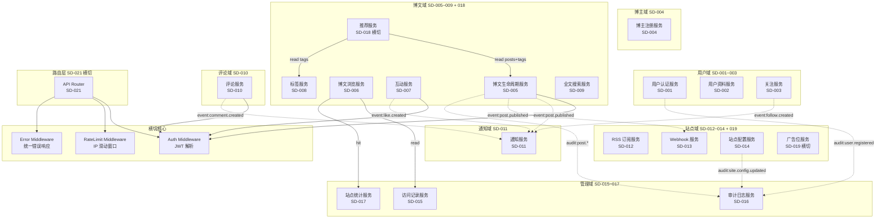

# 接口设计文档

> 阶段 3（概要设计）产出。W 模型第 23 轮（2026-07-30）端到端调测。
> 套用 `w-model-dev/templates/interface-design.md` 模板；同步产出对应的集成测试设计。

## 文档信息

- 项目名称：扩展博客系统后端（blog-system-demo）
- 文档版本：v1.0.0
- 编制日期：2026-07-30
- 编制者：S-doc 子代理（W 模型阶段 3 文档产出）
- 关联系统设计文档：`docs/phase2-design/system-design.md`
- 关联需求文档：`docs/phase1-requirements/requirement-spec.md`
- 关联集成测试设计：`docs/phase3-design/integration-test.md`
- 关联演进图谱：`.w-model/ingestion/consolidated-phase3.json`
- 关联接口契约 Schema：`w-model-dev/references/phase-3-outline-design.md`
- 项目 ID：`blog-system-demo`
- Round：23
- 阶段：3（概要设计）

---

## 1. 模块调用关系

### 1.1 子系统依赖图（无环）



**依赖图说明**（DFS 三色染色验证无环）：

- 顶层 → SD-022 错误处理（无业务依赖，最底层）
- 业务 SD 全部依赖 SD-001（认证）+ SD-020（限流）+ SD-022（错误处理）
- 事件流（虚线）单向：源 SD → SD-011/SD-013/SD-016（监听者）
- 数据流（实线箭头）单向：源 SD → 目标 SD；目标 SD 不回调用源 SD
- 横切 SD（SD-018/SD-019/SD-020/SD-021/SD-022）依赖各业务 SD，但不互引

### 1.2 架构风格选择

沿用阶段 2 决策：**经典三层架构（Router → Controller → Service → Repository → Model）+ 横切关注点 AOP 化**。

| 维度 | 评估 | 评分 |
|---|---|---|
| 适用性 | 32 需求（22 FR + 6 NFR + 4 CON）规模适中；不引入微服务/DDD | 5/5 |
| 成熟度 | Express 4 + 分层是 Node.js 生态最成熟范式 | 5/5 |
| 可维护性 | TS strict + Zod 提供编译期/运行期双重保障 | 4/5 |
| 引入成本 | 0 新运行时；CI/测试栈完全兼容 | 5/5 |
| 风险敞口 | 单进程 + 内存存储；替换微服务代价可控 | 4/5 |
| **总分** | | **23/25** |

### 1.3 22 SD 模块分解表

| SD | 名称 | 所属子域 | reqGroup | 关联 INTF | 关联 REQ/NFR/CON | level | 横切 |
|---|---|---|---|---|---|:---:|:---:|
| SD-001 | 用户认证服务 | user | REQ-001 | INTF-001 | REQ-001, REQ-002 | 1 |  |
| SD-002 | 用户资料服务 | user | REQ-001 | INTF-002 | REQ-003 | 1 |  |
| SD-003 | 关注服务 | user | REQ-001 | INTF-003 | REQ-004 | 1 |  |
| SD-004 | 博主注册服务 | blogger | REQ-005 | INTF-004 | REQ-005, REQ-017 | 1 |  |
| SD-005 | 博文生命周期服务 | article | REQ-006 | INTF-005 | REQ-006 | 1 |  |
| SD-006 | 博文浏览服务 | article | REQ-006 | INTF-006 | REQ-007 | 1 |  |
| SD-007 | 互动服务（点赞/收藏） | article | REQ-006 | INTF-007 | REQ-008 | 1 |  |
| SD-008 | 标签服务 | article | REQ-006 | INTF-008 | REQ-012 | 1 |  |
| SD-009 | 全文搜索服务 | article | REQ-006 | INTF-009 | REQ-013 | 1 |  |
| SD-010 | 评论服务 | comment | REQ-009 | INTF-010 | REQ-009, REQ-010 | 1 |  |
| SD-011 | 通知服务 | notification | REQ-011 | INTF-011 | REQ-011 | 1 |  |
| SD-012 | RSS 订阅服务 | site | REQ-016 | INTF-012 | REQ-014 | 1 |  |
| SD-013 | Webhook 服务 | site | REQ-016 | INTF-013 | REQ-015 | 1 |  |
| SD-014 | 站点配置服务 | site | REQ-016 | INTF-014 | REQ-016 | 1 |  |
| SD-015 | 访问记录服务 | admin | REQ-018 | INTF-015 | REQ-019 | 1 |  |
| SD-016 | 审计日志服务 | admin | REQ-018 | INTF-016 | REQ-018, CON-004 | 1 |  |
| SD-017 | 站点统计服务 | admin | REQ-018 | INTF-017 | REQ-020 | 1 |  |
| SD-018 | 推荐服务 | article | REQ-006 | INTF-018 | REQ-021 | 1 | ✓ |
| SD-019 | 广告位服务 | site | REQ-016 | INTF-019 | REQ-022 | 1 | ✓ |
| SD-020 | 限流服务 | crosscut | NFR-005 | INTF-020 | NFR-005 | 1 | ✓ |
| SD-021 | API 路由层 | crosscut | CON-003 | INTF-021 | CON-003 | 1 | ✓ |
| SD-022 | 错误处理中间件 | crosscut | NFR-001 | INTF-022 | NFR-001, NFR-004 | 1 | ✓ |

### 1.4 子系统依赖矩阵（service 层，无环）

| 依赖方 SD | 依赖的 SD | 依赖类型 | 说明 |
|---|---|---|---|
| SD-001 用户认证 | SD-022 错误处理 | middleware | JWT 解析失败抛 AppError |
| SD-001 用户认证 | SD-020 限流 | middleware | 路由级中间件链 |
| SD-002 用户资料 | SD-001 认证 | service | PUT /users/me 需 JWT |
| SD-002 用户资料 | SD-016 审计 | event | 修改资料写 audit log |
| SD-003 关注 | SD-001 认证 | service | 关注需 reader JWT |
| SD-003 关注 | SD-011 通知 | event | follow.created → 通知博主 |
| SD-004 博主注册 | SD-001 认证 | service | 共享 bcrypt + JWT 工具 |
| SD-004 博主注册 | SD-016 审计 | event | blogger.registered → audit |
| SD-005 博文生命周期 | SD-001 认证 | service | 需 blogger JWT |
| SD-005 博文生命周期 | SD-008 标签 | service | post_tags 关联 |
| SD-005 博文生命周期 | SD-016 审计 | event | post.* → audit |
| SD-005 博文生命周期 | SD-011 通知 | event | post.published → 关注者通知 |
| SD-005 博文生命周期 | SD-013 Webhook | event | post.published → webhook 投递 |
| SD-006 博文浏览 | SD-005 博文生命周期 | service | 读取 posts Map |
| SD-006 博文浏览 | SD-015 访问记录 | service | GET /posts/:id → 写 access record |
| SD-006 博文浏览 | SD-017 统计 | service | PV 来源于浏览事件 |
| SD-007 互动 | SD-005 博文生命周期 | service | 校验 post 存在 |
| SD-007 互动 | SD-001 认证 | service | 需 reader JWT |
| SD-007 互动 | SD-011 通知 | event | like.created → 通知博主 |
| SD-008 标签 | SD-005 博文生命周期 | service | 关联博文 |
| SD-009 全文搜索 | SD-005 博文生命周期 | service | 读取 posts Map（仅 published） |
| SD-009 全文搜索 | SD-008 标签 | service | 标签过滤 |
| SD-010 评论 | SD-005 博文生命周期 | service | 校验 post 存在 |
| SD-010 评论 | SD-001 认证 | service | 需 reader/blogger JWT |
| SD-010 评论 | SD-011 通知 | event | comment.created → 通知博主 + 父评论作者 |
| SD-010 评论 | SD-016 审计 | event | comment.deleted → audit |
| SD-011 通知 | SD-001 认证 | service | GET /me/notifications 需 JWT |
| SD-011 通知 | SD-013 Webhook | service | 通知触发 webhook 投递（可选） |
| SD-012 RSS | SD-005 博文生命周期 | service | 读取 published posts |
| SD-012 RSS | SD-014 站点配置 | service | 读取 siteTitle/siteLink |
| SD-013 Webhook | SD-016 审计 | event | webhook.delivery 失败 → audit |
| SD-013 Webhook | SD-001 认证 | service | POST/DELETE 需 JWT |
| SD-014 站点配置 | SD-001 认证 | service | PUT 需 admin JWT |
| SD-014 站点配置 | SD-016 审计 | event | site.config.updated → audit |
| SD-014 站点配置 | SD-019 广告 | service | 解析 bannerAdId |
| SD-015 访问记录 | SD-001 认证 | service | GET 需 admin JWT |
| SD-015 访问记录 | SD-006 博文浏览 | service | 写入触发 |
| SD-016 审计 | SD-001 认证 | service | GET 需 admin JWT |
| SD-017 站点统计 | SD-006 博文浏览 | service | PV 来源于浏览事件 |
| SD-017 站点统计 | SD-015 访问记录 | service | UV 来源于 access_records 去重 |
| SD-018 推荐 | SD-005 博文生命周期 | service | 读取 posts + tags |
| SD-018 推荐 | SD-008 标签 | service | Jaccard 相似度 |
| SD-018 推荐 | SD-003 关注 | service | 基于关注历史的个性化 |
| SD-018 推荐 | SD-006 博文浏览 | service | 基于阅读历史 |
| SD-019 广告位 | SD-001 认证 | service | 需 admin JWT |
| SD-019 广告位 | SD-014 站点配置 | service | 关联 bannerAdId |
| SD-020 限流 | SD-022 错误处理 | middleware | 超限 → AppError(429) |
| SD-021 路由 | SD-001~019 所有业务 SD | router | 路由分发 |
| SD-021 路由 | SD-020 限流 | middleware | 全局中间件 |
| SD-021 路由 | SD-022 错误处理 | middleware | 全局错误处理 |
| SD-022 错误处理 | — | — | 无业务依赖（最底层） |

### 1.5 模块目录结构（继承阶段 2，阶段 3 不变更）

```
src/
├── core/                       # 横切核心
│   ├── middleware/             # auth / rateLimit / errorHandler / requireRole
│   ├── events/                 # eventBus + events.ts
│   ├── webhook/                # dispatcher + signer
│   ├── errors/                 # AppError + codes
│   ├── logger/                 # 结构化 console
│   ├── stats/                  # 小时桶
│   └── auth/                   # jwt + password (bcrypt)
├── modules/                    # 业务子系统（22 SD）
│   ├── user/                   # SD-001~003
│   ├── blogger/                # SD-004
│   ├── post/                   # SD-005~007
│   ├── tag/                    # SD-008
│   ├── search/                 # SD-009
│   ├── comment/                # SD-010
│   ├── notification/           # SD-011
│   ├── rss/                    # SD-012
│   ├── webhook/                # SD-013
│   ├── site/                   # SD-014, SD-019
│   ├── admin/                  # SD-015~017
│   └── recommend/              # SD-018
├── router/                     # SD-021 路由聚合
├── app.ts                      # Express app 工厂
└── server.ts                   # 启动入口
```

---

## 2. 架构风格与设计原则

### 2.1 架构风格（继承 §1.1，阶段 3 不变更）

- **三层 + 横切**：Router / Controller / Service / Repository / Model + 横切中间件
- **同步 API**：所有 handler 同步执行（bcrypt 同步调用，NFR-006 约束）
- **依赖注入模式**：模块通过 service 注入；测试时可用 mock 替换
- **错误统一出口**：所有抛错必须为 AppError 子类，由 SD-022 errorHandler 统一处理
- **事件驱动**：业务关键写操作通过 EventEmitter 触发 SD-011/SD-013/SD-016 监听

### 2.2 接口契约 Schema 模板（10 字段）

每个接口契约按以下 10 字段填写，缺一即返工：

| 字段 | 必填 | 示例 |
|---|:---:|---|
| 接口名 | ✅ | `registerUser` |
| 路径 / 触发器 | ✅ | `POST /api/v1/users` |
| 参数名 | ✅ | `email`, `username`, `password` |
| 参数类型 | ✅ | `string(email)`, `string(3-32)` |
| 必填 | ✅ | `true` |
| 默认值 | ⬜ | `page=1` |
| 约束 | ✅ | `len(email)=5-254, format=email` |
| 示例 | ✅ | `{"email":"alice@example.com",...}` |
| 返回值结构 | ✅ | `{userId, role, ...}` |
| 错误码集合 | ✅ | `40001, 40002, 40901, 42901` |

### 2.3 错误码分层约定（继承阶段 2）

| 段位 | 范围 | 含义 | 示例 |
|---|---|---|---|
| 4xx | 40000-49999 | 客户端错误（参数/认证/权限） | `40001 VALIDATION_FAILED`, `40101 UNAUTHENTICATED`, `40301 FORBIDDEN` |
| 5xx | 50000-59999 | 服务端错误 | `50001 INTERNAL_ERROR` |
| 业务 | 60000-69999 | 业务规则错误 | `60001 EMPTY_CONTENT`, `60002 MAX_DEPTH_EXCEEDED` |

每条错误码必须配套 `code` + `message` + `httpStatus` + `retryable`（是否可重试）四元组。

### 2.4 跨模块数据源选择约束（继承 §1.3 阶段 2）

**约束要点**（来自 `phase-3-outline-design.md`）：

- **显式声明**：每个跨模块调用须在接口契约中显式声明使用的 store
- **schema 一致**：store 选择须与 schema 中的实体定义一致
- **token sub 对齐**：调用方携带 token 时，token.sub 须与所选 store 的主键一致

**反例**（已通过 §3 修复）：

- ❌ `CommentService.create` 仅校验 user store，但 comment.bloggerId 引用 blogger 实体（P7-003 缺陷）
- ❌ `BloggerService.follow` 在 blogger store 校验 follower（应校验 user store，P7-002 缺陷）

**正例**（§3 22 INTF 契约中已显式声明 dataSources 字段）：

- ✅ `INTF-010 评论`：`dataSources: ["user/blogger store (author 校验)", "posts store (postId 校验)", "comments store"]`
- ✅ `INTF-003 关注`：`dataSources: ["user store (readerId 校验)", "blogger store (bloggerId 校验)", "follows store"]`

### 2.5 字段命名业务语义对齐

字段命名须反映业务语义：

- ✅ `followerId/followeeId`（业务语义清晰）
- ✅ `bloggerId/userId`（区分角色实体）
- ❌ `userId/bloggerId`（业务语义模糊）

**Implementation Decisions**（第 22 轮 P1-4 修正）：

- 阶段 3 决定：所有 token payload 的 sub 字段统一为 `accountId` 抽象（reader→userId, blogger→bloggerId, admin→adminId），但 API path/query 中显式区分 `userId`/`bloggerId`/`adminId`
- JWT 签发时 sub = 实体主键（userId 或 bloggerId 或 adminId）；path 路径 :id 必须匹配 sub 的实体类型
- INTF-004 多博主切换后，新 token 的 sub=bloggerId（不再是 userId），这是 REQ-017 的实现决策

### 2.6 测试 seam 决策（第 10 轮外部技能吸收）

**模块交互 seam**：

| 模块对 | seam = | 说明 |
|---|---|---|
| SD-001 → SD-005 | `UserRepository` / `BlogpostRepository` 公共导出 | 阶段 6 IT 用 supertest + 真实 Repository |
| SD-005 → SD-011/SD-013/SD-016 | `EventBus` 公共导出 | 阶段 6 IT 用 `EventBus.on("post.published", spy)` 验证事件 |
| SD-007 → SD-011 | `EventBus` + `NotificationRepository.insert` | 阶段 6 IT 验证 like.created → 通知入库 |
| SD-013 → 外部 Subscriber | `WebhookDispatcher.dispatchWithRetry` | 阶段 6 IT 用 nock 拦截 HTTP + 断言重试次数 |
| SD-020 → SD-022 | `RateLimiter.check` + `errorHandler` 中间件 | 阶段 6 IT 用 supertest 在 100 req 内 + 1 req 验证 429 |

**选定 seam**：

- 集成测试主 seam: **HTTP API 出口**（supertest）+ **EventBus spy**
- 复用阶段 2 seam 的部分：HTTP 端点已在 system-test.md 中验证；阶段 3 复用其路径但聚焦模块间交互

**理由**：

- 集成测试在"模块边界"而非系统边界测，聚焦跨模块数据流
- 现有 HTTP API 出口 + EventBus 是天然测试 seam，无需新建专用接口

---

## 3. 接口契约（22 INTF）

> 每个 INTF 按 OpenAPI 3.0 风格详细定义：路径 / 方法 / 请求 / 响应 / 错误码 / 认证 / 限流。
> 集成测试用例索引见 §10 与 `docs/phase3-design/integration-test.md`。

### 3.01 INTF-001 认证 API

**基础信息**

| 字段 | 值 |
|---|---|
| INTF ID | `INTF-001` |
| 名称 | 认证 API |
| 配对 SD | `SD-001` |
| 协议 | HTTP/REST/JSON |
| 版本 | 1.0.0 |
| 基础路径 | `/api/v1` |
| 认证 | POST /users 无认证 / POST /auth/login 无认证 / POST /bloggers 无认证 |
| 限流 | 100 req/min/IP（NFR-005）；/auth/login 单独 10 req/min/IP 防爆破 |
| 描述 | 用户与博主注册入口；通用登录端点；JWT 签发（HS256, 24h TTL）；密码 bcrypt cost=10 |
| 提供模块 | `src/modules/user/auth.{controller,service}.ts + src/modules/blogger/auth.{controller,service}.ts` |
| 消费方 | Reader/Blogger 客户端；密码经 Zod 校验后哈希入库 |
| 数据源 | `user store (Map<userId,User>)`, `blogger store (Map<bloggerId,Blogger>)` |

**端点列表（3 个）**

#### 3.01.1 `POST /users` — `registerUser`

**目的**：注册 reader 账号（email+username+password）

**请求头**：

- `Content-Type`: application/json; charset=utf-8

**请求参数**：

| 参数 | 位置 | 类型 | 必填 | 约束 | 说明 |
|---|---|---|:---:|---|---|
| `email` | body | `string` | ✓ | format=email, len 5-254 | 邮箱（唯一） |
| `username` | body | `string` | ✓ | len 3-32, pattern=^[a-zA-Z0-9_-]+$ | 用户名（唯一） |
| `password` | body | `string` | ✓ | len 8-128 | 明文密码（入库前 bcrypt） |

**响应 schema**（HTTP 201）：

```typescript
interface RegisterUserResponse {
  userId: string;  // u_ 开头 24 字符
  email: string;  // 回显邮箱
  username: string;  // 回显用户名
  role: string;  // "reader"
  createdAt: string (ISO8601);  // 创建时间
}
```

**错误码**：

| 错误码 | HTTP | 触发场景 |
|---|---|---|
| `VALIDATION_FAILED` | 400 | Zod 校验失败（邮箱格式/密码长度） |
| `EMAIL_ALREADY_EXISTS` | 409 | 邮箱已被注册 |
| `USERNAME_TAKEN` | 409 | 用户名已被占用 |
| `RATE_LIMITED` | 429 | IP 触发限流（>100/min） |

**示例**：

```json
// 请求
{
  "email": "alice@example.com",
  "username": "alice",
  "password": "pass1234"
}
// 响应
{
  "userId": "u_a1b2c3d4e5f6g7h8i9j0k1l2",
  "email": "alice@example.com",
  "username": "alice",
  "role": "reader",
  "createdAt": "2026-07-30T10:00:00.000Z"
}
```

#### 3.01.2 `POST /bloggers` — `registerBlogger`

**目的**：注册 blogger 账号（独立入口，不复用 /users）

**请求头**：

- `Content-Type`: application/json; charset=utf-8

**请求参数**：

| 参数 | 位置 | 类型 | 必填 | 约束 | 说明 |
|---|---|---|:---:|---|---|
| `email` | body | `string` | ✓ | format=email | 邮箱（唯一） |
| `username` | body | `string` | ✓ | len 3-32, pattern=^[a-zA-Z0-9_-]+$ | 用户名（唯一） |
| `password` | body | `string` | ✓ | len 8-128 | 明文密码 |
| `displayName` | body | `string` | ✓ | len 1-64 | 显示名（区别 username） |

**响应 schema**（HTTP 201）：

```typescript
interface RegisterBloggerResponse {
  bloggerId: string;  // b_ 开头 24 字符
  email: string;  // 回显邮箱
  username: string;  // 回显用户名
  displayName: string;  // 显示名
  role: string;  // "blogger"
  createdAt: string (ISO8601);  // 创建时间
}
```

**错误码**：

| 错误码 | HTTP | 触发场景 |
|---|---|---|
| `VALIDATION_FAILED` | 400 | Zod 校验失败 |
| `EMAIL_ALREADY_EXISTS` | 409 | 邮箱已被注册 |
| `USERNAME_TAKEN` | 409 | 用户名已被占用 |
| `RATE_LIMITED` | 429 | IP 触发限流 |

**示例**：

```json
// 请求
{
  "email": "bob@example.com",
  "username": "bob",
  "password": "pass1234",
  "displayName": "Bob the Blogger"
}
// 响应
{
  "bloggerId": "b_b1c2d3e4f5g6h7i8j9k0l1m2",
  "email": "bob@example.com",
  "username": "bob",
  "displayName": "Bob the Blogger",
  "role": "blogger",
  "createdAt": "2026-07-30T10:00:00.000Z"
}
```

#### 3.01.3 `POST /auth/login` — `login`

**目的**：通用登录端点；自动识别 reader/blogger/admin；签发 JWT

**请求头**：

- `Content-Type`: application/json; charset=utf-8

**请求参数**：

| 参数 | 位置 | 类型 | 必填 | 约束 | 说明 |
|---|---|---|:---:|---|---|
| `email` | body | `string` | ✓ | format=email | 邮箱 |
| `password` | body | `string` | ✓ | len 1-128 | 明文密码 |

**响应 schema**（HTTP 200）：

```typescript
interface LoginResponse {
  token: string;  // JWT HS256; sub=accountId; role=reader|blogger|admin
  userId: string;  // readerId 或 bloggerId 或 adminId
  role: string;  // "reader" | "blogger" | "admin"
  expiresIn: number;  // 秒（const 86400，24h TTL）
}
```

**错误码**：

| 错误码 | HTTP | 触发场景 |
|---|---|---|
| `VALIDATION_FAILED` | 400 | 参数缺失 |
| `INVALID_CREDENTIALS` | 401 | 账号/密码错（统一脱敏） |
| `RATE_LIMITED` | 429 | 登录端点单独限流 >10/min |

**示例**：

```json
// 请求
{
  "email": "alice@example.com",
  "password": "pass1234"
}
// 响应
{
  "token": "eyJhbGciOiJIUzI1NiIsInR5cCI6IkpXVCJ9...",
  "userId": "u_a1b2c3d4e5f6g7h8i9j0k1l2",
  "role": "reader",
  "expiresIn": 86400
}
```

**内部契约**（TS 签名）：

```typescript
// UserRepository.create(user)
(Omit<User, "userId"|"createdAt">) => User  // throws: EMAIL_ALREADY_EXISTS
// UserRepository.findByEmail(email)
(string) => User | null
// BloggerRepository.create(blogger)
(Omit<Blogger, "bloggerId"|"createdAt">) => Blogger  // throws: EMAIL_ALREADY_EXISTS
// BloggerRepository.findByEmail(email)
(string) => Blogger | null
// PasswordService.hash(plain)
(string) => string (bcrypt cost=10)
// PasswordService.compare(plain, hash)
(string, string) => boolean
// JwtService.sign(payload, ttlSec)
({sub:string,role:string}, number) => string
// JwtService.verify(token)
(string) => {sub,role,iat,exp} | throws TOKEN_EXPIRED  // throws: TOKEN_EXPIRED, UNAUTHENTICATED
```

**接口不变式**：

1. 密码入库前必须经 bcrypt.hashSync(pw, 10)，getRounds >= 10（NFR-006）
2. 登录失败统一返回 INVALID_CREDENTIALS，不区分账号/密码存在性（NFR-003 账号枚举防护）
3. JWT payload.sub = accountId；role ∈ {reader, blogger, admin}；exp = iat + 86400
4. 注册时 email 唯一索引；重复注册返回 EMAIL_ALREADY_EXISTS(409)
5. 登录响应严禁返回 passwordHash 字段（NFR-003 敏感信息脱敏）
6. blogger.registered 事件必须由 SD-016 审计订阅

---

### 3.02 INTF-002 用户 API

**基础信息**

| 字段 | 值 |
|---|---|
| INTF ID | `INTF-002` |
| 名称 | 用户 API |
| 配对 SD | `SD-002` |
| 协议 | HTTP/REST/JSON |
| 版本 | 1.0.0 |
| 基础路径 | `/api/v1` |
| 认证 | GET 公开 / PUT Bearer JWT (role=reader) |
| 限流 | 100 req/min/IP |
| 描述 | 用户公开资料查询 + 自助修改（昵称/简介/头像） |
| 提供模块 | `src/modules/user/profile.{controller,service}.ts` |
| 消费方 | 前端用户主页 / 个人设置页 |
| 数据源 | `user store (Map<userId,User>)` |

**端点列表（2 个）**

#### 3.02.1 `GET /users/:id` — `getPublicProfile`

**目的**：获取用户公开资料（不含 email/passwordHash）

**请求头**：

- `Accept`: application/json

**请求参数**：

| 参数 | 位置 | 类型 | 必填 | 约束 | 说明 |
|---|---|---|:---:|---|---|
| `id` | path | `string` | ✓ | pattern=^u_[0-9a-f]{24}$ | userId |

**响应 schema**（HTTP 200）：

```typescript
interface GetPublicProfileResponse {
  userId: string;  // 回显
  username: string;  // 用户名
  displayName: string;  // 显示名
  bio: string;  // 个人简介
  avatarUrl: string;  // 头像 URL
  createdAt: string (ISO8601);  // 注册时间
}
```

**错误码**：

| 错误码 | HTTP | 触发场景 |
|---|---|---|
| `VALIDATION_FAILED` | 400 | id 格式错 |
| `USER_NOT_FOUND` | 404 | userId 不存在 |

**示例**：

```json
// 请求
{
  "params": {
    "id": "u_a1b2c3d4e5f6g7h8i9j0k1l2"
  }
}
// 响应
{
  "userId": "u_a1b2c3d4e5f6g7h8i9j0k1l2",
  "username": "alice",
  "displayName": "Alice",
  "bio": "热爱技术",
  "avatarUrl": "https://cdn.example.com/avatars/u_a1b2c3d4.jpg",
  "createdAt": "2026-07-30T10:00:00.000Z"
}
```

#### 3.02.2 `PUT /users/me` — `updateMyProfile`

**目的**：修改自己资料（displayName/bio/avatarUrl）

**请求头**：

- `Content-Type`: application/json
- `Authorization`: Bearer <jwt>

**请求参数**：

| 参数 | 位置 | 类型 | 必填 | 约束 | 说明 |
|---|---|---|:---:|---|---|
| `displayName` | body | `string` |  | len 1-64 | 新显示名 |
| `bio` | body | `string` |  | len 0-500 | 新简介 |
| `avatarUrl` | body | `string` |  | format=uri, len 0-512 | 新头像 URL |

**响应 schema**（HTTP 200）：

```typescript
interface UpdateMyProfileResponse {
  userId: string;  // 回显
  displayName: string;  // 修改后
  bio: string;  // 修改后
  avatarUrl: string;  // 修改后
  updatedAt: string (ISO8601);  // 更新时间
}
```

**错误码**：

| 错误码 | HTTP | 触发场景 |
|---|---|---|
| `VALIDATION_FAILED` | 400 | Zod 校验失败 |
| `UNAUTHENTICATED` | 401 | 缺/错 Authorization 头 |
| `FORBIDDEN` | 403 | role 非 reader |

**示例**：

```json
// 请求
{
  "displayName": "Alice 2.0",
  "bio": "前端工程师",
  "avatarUrl": "https://cdn.example.com/avatars/alice2.jpg"
}
// 响应
{
  "userId": "u_a1b2c3d4e5f6g7h8i9j0k1l2",
  "displayName": "Alice 2.0",
  "bio": "前端工程师",
  "avatarUrl": "https://cdn.example.com/avatars/alice2.jpg",
  "updatedAt": "2026-07-30T10:05:00.000Z"
}
```

**内部契约**（TS 签名）：

```typescript
// UserProfileService.getPublicProfile(userId)
(string) => PublicUserProfile  // throws: USER_NOT_FOUND
// UserProfileService.updateMyProfile(userId, updates)
(string, ProfileUpdates) => PublicUserProfile  // throws: UNAUTHENTICATED
// UserProfileService.sanitizePublicFields(user)
(User) => PublicUserProfile
```

**接口不变式**：

1. 公开接口绝不可返回 email/passwordHash（字段过滤 NFR-003）
2. PUT /users/me 的 token.sub 必须为 userId（reader role，token.sub=userId 强制对齐）
3. 修改资料后必须发布 user.profile.updated 事件，SD-016 审计订阅

---

### 3.03 INTF-003 关注 API

**基础信息**

| 字段 | 值 |
|---|---|
| INTF ID | `INTF-003` |
| 名称 | 关注 API |
| 配对 SD | `SD-003` |
| 协议 | HTTP/REST/JSON |
| 版本 | 1.0.0 |
| 基础路径 | `/api/v1` |
| 认证 | POST/DELETE Bearer JWT (role=reader) / GET Bearer JWT |
| 限流 | 100 req/min/IP |
| 描述 | Reader 关注/取关博主 + 关注列表 + 事件触发（follow.created → 通知） |
| 提供模块 | `src/modules/user/follow.{controller,service}.ts` |
| 消费方 | 前端博主主页关注按钮 / 我的关注页 |
| 数据源 | `user store (readerId 校验)`, `blogger store (bloggerId 校验)`, `follows store (Map<userId,Set<bloggerId>>)` |

**端点列表（3 个）**

#### 3.03.1 `POST /follows/:bloggerId` — `followBlogger`

**目的**：Reader 关注博主（幂等：重复关注返回 200）

**请求头**：

- `Authorization`: Bearer <jwt>

**请求参数**：

| 参数 | 位置 | 类型 | 必填 | 约束 | 说明 |
|---|---|---|:---:|---|---|
| `bloggerId` | path | `string` | ✓ | pattern=^b_[0-9a-f]{24}$ | 目标博主 ID |

**响应 schema**（HTTP 200）：

```typescript
interface FollowBloggerResponse {
  followed: boolean;  // const true
  bloggerId: string;  // 回显
  createdAt: string (ISO8601);  // 关注时间
}
```

**错误码**：

| 错误码 | HTTP | 触发场景 |
|---|---|---|
| `UNAUTHENTICATED` | 401 | 缺/错 JWT |
| `FORBIDDEN` | 403 | role 非 reader |
| `BLOGGER_NOT_FOUND` | 404 | bloggerId 不在 blogger store |
| `SELF_FOLLOW_NOT_ALLOWED` | 422 | 关注自己 |

**示例**：

```json
// 请求
{
  "params": {
    "bloggerId": "b_b1c2d3e4f5g6h7i8j9k0l1m2"
  }
}
// 响应
{
  "followed": true,
  "bloggerId": "b_b1c2d3e4f5g6h7i8j9k0l1m2",
  "createdAt": "2026-07-30T10:10:00.000Z"
}
```

#### 3.03.2 `DELETE /follows/:bloggerId` — `unfollowBlogger`

**目的**：取关博主（幂等：未关注返回 200）

**请求头**：

- `Authorization`: Bearer <jwt>

**请求参数**：

| 参数 | 位置 | 类型 | 必填 | 约束 | 说明 |
|---|---|---|:---:|---|---|
| `bloggerId` | path | `string` | ✓ | pattern=^b_ | 目标博主 ID |

**响应 schema**（HTTP 200）：

```typescript
interface UnfollowBloggerResponse {
  followed: boolean;  // const false
  bloggerId: string;  // 回显
}
```

**错误码**：

| 错误码 | HTTP | 触发场景 |
|---|---|---|
| `UNAUTHENTICATED` | 401 | 缺/错 JWT |
| `BLOGGER_NOT_FOUND` | 404 | bloggerId 不存在 |

**示例**：

```json
// 请求
{
  "params": {
    "bloggerId": "b_b1c2d3e4f5g6h7i8j9k0l1m2"
  }
}
// 响应
{
  "followed": false,
  "bloggerId": "b_b1c2d3e4f5g6h7i8j9k0l1m2"
}
```

#### 3.03.3 `GET /me/follows` — `listMyFollows`

**目的**：我的关注列表（分页）

**请求头**：

- `Authorization`: Bearer <jwt>

**请求参数**：

| 参数 | 位置 | 类型 | 必填 | 约束 | 说明 |
|---|---|---|:---:|---|---|
| `page` | query | `number` |  | min=1, default=1 | 页码 |
| `pageSize` | query | `number` |  | min=1, max=100, default=20 | 每页 |

**响应 schema**（HTTP 200）：

```typescript
interface ListMyFollowsResponse {
  items: BloggerRef[];  // 关注列表
  page: number;  // 当前页
  pageSize: number;  // 每页数
  total: number;  // 总数
  totalPages: number;  // 总页数
}
```

**错误码**：

| 错误码 | HTTP | 触发场景 |
|---|---|---|
| `UNAUTHENTICATED` | 401 | 缺 JWT |
| `INVALID_PAGINATION` | 400 | page<1 或 pageSize>100 |

**示例**：

```json
// 请求
{
  "query": {
    "page": 1,
    "pageSize": 20
  }
}
// 响应
{
  "items": [
    {
      "bloggerId": "b_b1c2d3e4f5g6h7i8j9k0l1m2",
      "displayName": "Bob",
      "followedAt": "2026-07-30T10:10:00.000Z"
    }
  ],
  "page": 1,
  "pageSize": 20,
  "total": 1,
  "totalPages": 1
}
```

**内部契约**（TS 签名）：

```typescript
// FollowService.follow(readerId, bloggerId)
(string, string) => {followed:boolean, createdAt:number}  // throws: BLOGGER_NOT_FOUND, SELF_FOLLOW_NOT_ALLOWED
// FollowService.unfollow(readerId, bloggerId)
(string, string) => {followed:false}  // throws: BLOGGER_NOT_FOUND
// FollowService.listFollows(readerId, page, pageSize)
(string, number, number) => PaginatedResult<BloggerRef>
// FollowService.isFollowing(readerId, bloggerId)
(string, string) => boolean
```

**接口不变式**：

1. 关注/取关是幂等操作（多次调用结果相同，HTTP 200）
2. reader 不能关注自己（reader=blogger 场景在 REQ-017 多博主系统下被允许；本接口禁止 reader 关注自己的 readerId）
3. follow.created 事件必须触发 SD-011 通知博主；blogger 必须在 blogger store 校验存在（防止 P7-002 缺陷）
4. token.sub=readerId，校验 readerId 必须在 user store 存在

---

### 3.04 INTF-004 博主认证 API

**基础信息**

| 字段 | 值 |
|---|---|
| INTF ID | `INTF-004` |
| 名称 | 博主认证 API |
| 配对 SD | `SD-004` |
| 协议 | HTTP/REST/JSON |
| 版本 | 1.0.0 |
| 基础路径 | `/api/v1` |
| 认证 | POST /bloggers/apply Bearer JWT (role=reader) / POST /me/bloggers/:id/switch Bearer JWT (role=reader) |
| 限流 | 100 req/min/IP |
| 描述 | Reader 申请博主资格；多博主身份切换（签发 sub=bloggerId 的新 JWT） |
| 提供模块 | `src/modules/blogger/blogger.{controller,service}.ts` |
| 消费方 | 前端博主申请页 / 多博主切换器 |
| 数据源 | `user store (readerId 校验)`, `blogger store (bloggerId 校验)`, `user_blogger_bindings store` |

**端点列表（2 个）**

#### 3.04.1 `POST /bloggers/apply` — `applyForBlogger`

**目的**：Reader 申请博主资格（创建 blogger + 绑定 user↔blogger）

**请求头**：

- `Content-Type`: application/json
- `Authorization`: Bearer <jwt>

**请求参数**：

| 参数 | 位置 | 类型 | 必填 | 约束 | 说明 |
|---|---|---|:---:|---|---|
| `displayName` | body | `string` | ✓ | len 1-64 | 博主显示名 |
| `bio` | body | `string` |  | len 0-500 | 个人简介 |

**响应 schema**（HTTP 201）：

```typescript
interface ApplyForBloggerResponse {
  bloggerId: string;  // 新 bloggerId
  displayName: string;  // 回显
  role: string;  // "blogger"
  createdAt: string (ISO8601);  // 创建时间
}
```

**错误码**：

| 错误码 | HTTP | 触发场景 |
|---|---|---|
| `UNAUTHENTICATED` | 401 | 缺 JWT |
| `VALIDATION_FAILED` | 400 | Zod 校验失败 |
| `ALREADY_A_BLOGGER` | 409 | 该 reader 已是 blogger |

**示例**：

```json
// 请求
{
  "displayName": "Bob Tech Blog",
  "bio": "全栈技术分享"
}
// 响应
{
  "bloggerId": "b_newbloggerid1234567890ab",
  "displayName": "Bob Tech Blog",
  "role": "blogger",
  "createdAt": "2026-07-30T10:20:00.000Z"
}
```

#### 3.04.2 `POST /me/bloggers/:id/switch` — `switchBlogger`

**目的**：Reader 在多博主绑定中切换当前身份（签发新 token sub=bloggerId）

**请求头**：

- `Authorization`: Bearer <reader-jwt>

**请求参数**：

| 参数 | 位置 | 类型 | 必填 | 约束 | 说明 |
|---|---|---|:---:|---|---|
| `id` | path | `string` | ✓ | pattern=^b_ | 目标 bloggerId |

**响应 schema**（HTTP 200）：

```typescript
interface SwitchBloggerResponse {
  token: string;  // 新 JWT; sub=bloggerId; role=blogger
  bloggerId: string;  // 回显
  role: string;  // "blogger"
  expiresIn: number;  // 86400
}
```

**错误码**：

| 错误码 | HTTP | 触发场景 |
|---|---|---|
| `UNAUTHENTICATED` | 401 | 缺 JWT |
| `BLOGGER_NOT_FOUND` | 404 | bloggerId 不存在 |
| `FORBIDDEN_NOT_OWNED` | 403 | reader 未绑定该 blogger（user_blogger_bindings 缺失） |

**示例**：

```json
// 请求
{
  "params": {
    "id": "b_b1c2d3e4f5g6h7i8j9k0l1m2"
  }
}
// 响应
{
  "token": "eyJ...",
  "bloggerId": "b_b1c2d3e4f5g6h7i8j9k0l1m2",
  "role": "blogger",
  "expiresIn": 86400
}
```

**内部契约**（TS 签名）：

```typescript
// BloggerService.registerBlogger(readerId, input)
(string, BloggerApplyInput) => Blogger  // throws: ALREADY_A_BLOGGER
// BloggerService.switchBlogger(readerId, bloggerId)
(string, string) => {token, bloggerId, role}  // throws: BLOGGER_NOT_FOUND, FORBIDDEN_NOT_OWNED
// BloggerService.isOwnedBy(readerId, bloggerId)
(string, string) => boolean
```

**接口不变式**：

1. 切换身份时必须验证 user_blogger_bindings 存在性（防止跨用户越权）
2. 切换后签发新 token，sub=bloggerId role=blogger（不再是 reader sub）
3. blogger.registered 必须发布事件，SD-016 审计订阅

---

### 3.05 INTF-005 博文 API

**基础信息**

| 字段 | 值 |
|---|---|
| INTF ID | `INTF-005` |
| 名称 | 博文 API |
| 配对 SD | `SD-005` |
| 协议 | HTTP/REST/JSON |
| 版本 | 1.0.0 |
| 基础路径 | `/api/v1` |
| 认证 | POST/PUT/DELETE Bearer JWT (role=blogger) |
| 限流 | 100 req/min/IP |
| 描述 | 博文 CRUD + draft↔published 状态机 + 软删 + owner 校验 |
| 提供模块 | `src/modules/post/post.{controller,service,state-machine}.ts` |
| 消费方 | 博主编辑后台 |
| 数据源 | `blogger store (owner 校验)`, `posts store (Map<postId,Post>)`, `post_tags store` |

**端点列表（4 个）**

#### 3.05.1 `POST /posts` — `createDraft`

**目的**：创建博文草稿（status=draft）

**请求头**：

- `Content-Type`: application/json
- `Authorization`: Bearer <blogger-jwt>

**请求参数**：

| 参数 | 位置 | 类型 | 必填 | 约束 | 说明 |
|---|---|---|:---:|---|---|
| `title` | body | `string` | ✓ | len 1-200 | 标题 |
| `content` | body | `string` | ✓ | len 1-100000 | 正文 |
| `tags` | body | `string[]` |  | maxItems=5 | 可选标签 |

**响应 schema**（HTTP 201）：

```typescript
interface CreateDraftResponse {
  postId: string;  // p_ 开头 24 字符
  title: string;  // 回显
  content: string;  // 回显
  status: string;  // "draft"
  authorId: string;  // 当前 bloggerId
  createdAt: string (ISO8601);  // 创建时间
}
```

**错误码**：

| 错误码 | HTTP | 触发场景 |
|---|---|---|
| `UNAUTHENTICATED` | 401 | 缺 JWT |
| `FORBIDDEN` | 403 | role 非 blogger |
| `VALIDATION_FAILED` | 400 | Zod 校验失败 |

**示例**：

```json
// 请求
{
  "title": "我的第一篇博文",
  "content": "正文内容...",
  "tags": [
    "tech",
    "nodejs"
  ]
}
// 响应
{
  "postId": "p_postid1234567890abcdef",
  "title": "我的第一篇博文",
  "content": "正文内容...",
  "status": "draft",
  "authorId": "b_b1c2d3e4f5g6h7i8j9k0l1m2",
  "createdAt": "2026-07-30T10:30:00.000Z"
}
```

#### 3.05.2 `PUT /posts/:id` — `updatePost`

**目的**：编辑博文（仅 owner；draft 任意字段，published 仅允许修改 title/content）

**请求头**：

- `Content-Type`: application/json
- `Authorization`: Bearer <blogger-jwt>

**请求参数**：

| 参数 | 位置 | 类型 | 必填 | 约束 | 说明 |
|---|---|---|:---:|---|---|
| `id` | path | `string` | ✓ | pattern=^p_ | 目标 postId |
| `title` | body | `string` |  | len 1-200 | 新标题 |
| `content` | body | `string` |  | len 1-100000 | 新正文 |
| `tags` | body | `string[]` |  | maxItems=5 | 新标签 |

**响应 schema**（HTTP 200）：

```typescript
interface UpdatePostResponse {
  postId: string;  // 回显
  title: string;  // 修改后
  content: string;  // 修改后
  status: string;  // 当前状态
  updatedAt: string (ISO8601);  // 更新时间
}
```

**错误码**：

| 错误码 | HTTP | 触发场景 |
|---|---|---|
| `UNAUTHENTICATED` | 401 | 缺 JWT |
| `FORBIDDEN_NOT_OWNER` | 403 | token.sub != post.authorId |
| `POST_NOT_FOUND` | 404 | postId 不存在 |

**示例**：

```json
// 请求
{
  "params": {
    "id": "p_postid1234567890abcdef"
  },
  "body": {
    "title": "我的第一篇博文 v2",
    "content": "更新正文..."
  }
}
// 响应
{
  "postId": "p_postid1234567890abcdef",
  "title": "我的第一篇博文 v2",
  "content": "更新正文...",
  "status": "draft",
  "updatedAt": "2026-07-30T10:35:00.000Z"
}
```

#### 3.05.3 `POST /posts/:id/publish` — `publishPost`

**目的**：发布博文（draft→published；校验正文非空；触发 SD-011 通知 + SD-013 Webhook）

**请求头**：

- `Authorization`: Bearer <blogger-jwt>

**请求参数**：

| 参数 | 位置 | 类型 | 必填 | 约束 | 说明 |
|---|---|---|:---:|---|---|
| `id` | path | `string` | ✓ | pattern=^p_ | 目标 postId |

**响应 schema**（HTTP 200）：

```typescript
interface PublishPostResponse {
  postId: string;  // 回显
  status: string;  // "published"
  publishedAt: string (ISO8601);  // 发布时间
}
```

**错误码**：

| 错误码 | HTTP | 触发场景 |
|---|---|---|
| `UNAUTHENTICATED` | 401 | 缺 JWT |
| `FORBIDDEN_NOT_OWNER` | 403 | 非 owner |
| `POST_NOT_FOUND` | 404 | postId 不存在 |
| `EMPTY_CONTENT` | 422 | content.trim().length=0 |
| `INVALID_STATE_TRANSITION` | 409 | 当前状态不允许 published（如已 deleted） |

**示例**：

```json
// 请求
{
  "params": {
    "id": "p_postid1234567890abcdef"
  }
}
// 响应
{
  "postId": "p_postid1234567890abcdef",
  "status": "published",
  "publishedAt": "2026-07-30T10:40:00.000Z"
}
```

#### 3.05.4 `DELETE /posts/:id` — `softDeletePost`

**目的**：软删博文（仅 owner；status 改为 deleted）

**请求头**：

- `Authorization`: Bearer <blogger-jwt>

**请求参数**：

| 参数 | 位置 | 类型 | 必填 | 约束 | 说明 |
|---|---|---|:---:|---|---|
| `id` | path | `string` | ✓ | pattern=^p_ | 目标 postId |

**响应 schema**（HTTP 204）：

```typescript
interface SoftDeletePostResponse {
}
```

**错误码**：

| 错误码 | HTTP | 触发场景 |
|---|---|---|
| `UNAUTHENTICATED` | 401 | 缺 JWT |
| `FORBIDDEN_NOT_OWNER` | 403 | 非 owner |
| `POST_NOT_FOUND` | 404 | postId 不存在 |
| `ALREADY_DELETED` | 409 | 已删除 |

**示例**：

```json
// 请求
{
  "params": {
    "id": "p_postid1234567890abcdef"
  }
}
// 响应
null
```

**内部契约**（TS 签名）：

```typescript
// PostService.createDraft(authorId, input)
(string, CreatePostInput) => Post  // throws: VALIDATION_FAILED
// PostService.updatePost(postId, authorId, updates)
(string, string, UpdatePostInput) => Post  // throws: POST_NOT_FOUND, FORBIDDEN_NOT_OWNER
// PostService.publishPost(postId, authorId)
(string, string) => Post  // throws: POST_NOT_FOUND, FORBIDDEN_NOT_OWNER, EMPTY_CONTENT, INVALID_STATE_TRANSITION
// PostService.softDeletePost(postId, authorId)
(string, string) => void  // throws: POST_NOT_FOUND, FORBIDDEN_NOT_OWNER, ALREADY_DELETED
// PostStateMachine.transitionTo(post, newStatus)
(Post, PostStatus) => Post  // throws: INVALID_STATE_TRANSITION
```

**接口不变式**：

1. 状态机：draft → published → deleted（不可逆；published 后只能 → deleted）
2. owner 校验：post.authorId === token.sub（bloggerId）
3. publishPost 必须发布 post.published 事件，SD-011/SD-013 订阅
4. softDelete 不物理删除（status=deleted 标记，保留用于审计）
5. EMPTY_CONTENT 检查：content.trim().length > 0

---

### 3.06 INTF-006 浏览 API

**基础信息**

| 字段 | 值 |
|---|---|
| INTF ID | `INTF-006` |
| 名称 | 浏览 API |
| 配对 SD | `SD-006` |
| 协议 | HTTP/REST/JSON |
| 版本 | 1.0.0 |
| 基础路径 | `/api/v1` |
| 认证 | GET 公开（GET /posts/:id 写 access_record） |
| 限流 | 100 req/min/IP |
| 描述 | 博文列表分页筛选 + 详情查询 + 访问记录写入 |
| 提供模块 | `src/modules/post/post-view.{controller,service}.ts` |
| 消费方 | 前端首页 / 博文详情页 |
| 数据源 | `posts store`, `access_records store`, `stats_buckets store` |

**端点列表（2 个）**

#### 3.06.1 `GET /posts` — `listPosts`

**目的**：分页列出已发布博文（支持按标签过滤）

**请求头**：

- `Accept`: application/json

**请求参数**：

| 参数 | 位置 | 类型 | 必填 | 约束 | 说明 |
|---|---|---|:---:|---|---|
| `page` | query | `number` |  | min=1, default=1 | 页码 |
| `pageSize` | query | `number` |  | min=1, max=100, default=20 | 每页 |
| `status` | query | `string` |  | enum=[published], default=published | 状态过滤 |
| `tags` | query | `string[]` |  | — | 标签过滤（多个逗号分隔） |

**响应 schema**（HTTP 200）：

```typescript
interface ListPostsResponse {
  items: PostListItem[];  // 博文列表
  page: number;  // 当前页
  pageSize: number;  // 每页数
  total: number;  // 总数
  totalPages: number;  // 总页数
}
```

**错误码**：

| 错误码 | HTTP | 触发场景 |
|---|---|---|
| `INVALID_PAGINATION` | 400 | page<1 或 pageSize>100 |

**示例**：

```json
// 请求
{
  "query": {
    "page": 1,
    "pageSize": 20,
    "status": "published"
  }
}
// 响应
{
  "items": [
    {
      "postId": "p_aaa",
      "title": "博文1",
      "excerpt": "...",
      "authorId": "b_xxx",
      "authorName": "Bob",
      "publishedAt": "2026-07-30T08:00:00.000Z",
      "tags": [
        "tech"
      ],
      "likeCount": 10
    }
  ],
  "page": 1,
  "pageSize": 20,
  "total": 1,
  "totalPages": 1
}
```

#### 3.06.2 `GET /posts/:id` — `getPostDetail`

**目的**：获取博文详情（仅 published；写 access_record）

**请求头**：

- `Accept`: application/json

**请求参数**：

| 参数 | 位置 | 类型 | 必填 | 约束 | 说明 |
|---|---|---|:---:|---|---|
| `id` | path | `string` | ✓ | pattern=^p_ | 目标 postId |

**响应 schema**（HTTP 200）：

```typescript
interface GetPostDetailResponse {
  postId: string;  // 回显
  title: string;  // 标题
  content: string;  // 正文
  authorId: string;  // 作者 bloggerId
  authorName: string;  // 作者显示名
  publishedAt: string (ISO8601);  // 发布时间
  tags: string[];  // 标签
  likeCount: number;  // 点赞数
  commentCount: number;  // 评论数
}
```

**错误码**：

| 错误码 | HTTP | 触发场景 |
|---|---|---|
| `POST_NOT_FOUND` | 404 | postId 不存在或非 published |

**示例**：

```json
// 请求
{
  "params": {
    "id": "p_aaa"
  }
}
// 响应
{
  "postId": "p_aaa",
  "title": "博文1",
  "content": "正文...",
  "authorId": "b_xxx",
  "authorName": "Bob",
  "publishedAt": "2026-07-30T08:00:00.000Z",
  "tags": [
    "tech"
  ],
  "likeCount": 10,
  "commentCount": 5
}
```

**内部契约**（TS 签名）：

```typescript
// PostViewService.listPosts(filter, page, pageSize)
({status?,tags?}, number, number) => PaginatedPosts
// PostViewService.getPostDetail(postId, viewerId)
(string, string?) => PostDetail  // throws: POST_NOT_FOUND
// PostViewService.recordAccess(postId, viewerId, ip)
(string, string?, string) => void
```

**接口不变式**：

1. 列表只返回 status=published；draft/deleted 不可见（防泄漏）
2. GET /posts/:id 必须写 access_record（异步最佳，但内存下同步 OK）
3. 返回字段不包含 content 全文（列表用 excerpt 截断前 200 字）

---

### 3.07 INTF-007 互动 API

**基础信息**

| 字段 | 值 |
|---|---|
| INTF ID | `INTF-007` |
| 名称 | 互动 API |
| 配对 SD | `SD-007` |
| 协议 | HTTP/REST/JSON |
| 版本 | 1.0.0 |
| 基础路径 | `/api/v1` |
| 认证 | POST Bearer JWT (role=reader) / GET Bearer JWT (role=reader) |
| 限流 | 100 req/min/IP |
| 描述 | 点赞/收藏（幂等）+ 我的收藏列表 + 通知触发（like.created → 通知博主） |
| 提供模块 | `src/modules/post/interaction.{controller,service}.ts` |
| 消费方 | 前端博文详情页的点赞/收藏按钮 |
| 数据源 | `user store (userId 校验)`, `posts store (postId 校验)`, `likes store (Map<postId,Set<userId>>)`, `bookmarks store (Map<userId,Set<postId>>)` |

**端点列表（3 个）**

#### 3.07.1 `POST /posts/:id/like` — `likePost`

**目的**：点赞（幂等；已点赞返回 200）

**请求头**：

- `Authorization`: Bearer <reader-jwt>

**请求参数**：

| 参数 | 位置 | 类型 | 必填 | 约束 | 说明 |
|---|---|---|:---:|---|---|
| `id` | path | `string` | ✓ | pattern=^p_ | 目标 postId |

**响应 schema**（HTTP 200）：

```typescript
interface LikePostResponse {
  liked: boolean;  // const true
  postId: string;  // 回显
  likeCount: number;  // 当前点赞数
}
```

**错误码**：

| 错误码 | HTTP | 触发场景 |
|---|---|---|
| `UNAUTHENTICATED` | 401 | 缺 JWT |
| `POST_NOT_FOUND` | 404 | postId 不存在 |

**示例**：

```json
// 请求
{
  "params": {
    "id": "p_aaa"
  }
}
// 响应
{
  "liked": true,
  "postId": "p_aaa",
  "likeCount": 11
}
```

#### 3.07.2 `POST /posts/:id/bookmark` — `bookmarkPost`

**目的**：收藏（幂等；已收藏返回 200）

**请求头**：

- `Authorization`: Bearer <reader-jwt>

**请求参数**：

| 参数 | 位置 | 类型 | 必填 | 约束 | 说明 |
|---|---|---|:---:|---|---|
| `id` | path | `string` | ✓ | pattern=^p_ | 目标 postId |

**响应 schema**（HTTP 200）：

```typescript
interface BookmarkPostResponse {
  bookmarked: boolean;  // const true
  postId: string;  // 回显
}
```

**错误码**：

| 错误码 | HTTP | 触发场景 |
|---|---|---|
| `UNAUTHENTICATED` | 401 | 缺 JWT |
| `POST_NOT_FOUND` | 404 | postId 不存在 |

**示例**：

```json
// 请求
{
  "params": {
    "id": "p_aaa"
  }
}
// 响应
{
  "bookmarked": true,
  "postId": "p_aaa"
}
```

#### 3.07.3 `GET /me/bookmarks` — `listMyBookmarks`

**目的**：我的收藏列表（分页）

**请求头**：

- `Authorization`: Bearer <reader-jwt>

**请求参数**：

| 参数 | 位置 | 类型 | 必填 | 约束 | 说明 |
|---|---|---|:---:|---|---|
| `page` | query | `number` |  | min=1, default=1 | 页码 |
| `pageSize` | query | `number` |  | min=1, max=100, default=20 | 每页 |

**响应 schema**（HTTP 200）：

```typescript
interface ListMyBookmarksResponse {
  items: BookmarkItem[];  // 收藏列表
  page: number;  // 当前页
  total: number;  // 总数
  totalPages: number;  // 总页数
}
```

**错误码**：

| 错误码 | HTTP | 触发场景 |
|---|---|---|
| `UNAUTHENTICATED` | 401 | 缺 JWT |

**示例**：

```json
// 请求
{
  "query": {
    "page": 1,
    "pageSize": 20
  }
}
// 响应
{
  "items": [
    {
      "postId": "p_aaa",
      "title": "博文1",
      "bookmarkedAt": "2026-07-30T10:00:00.000Z"
    }
  ],
  "page": 1,
  "total": 1,
  "totalPages": 1
}
```

**内部契约**（TS 签名）：

```typescript
// InteractionService.likePost(userId, postId)
(string, string) => {liked:boolean, likeCount:number}  // throws: POST_NOT_FOUND
// InteractionService.bookmarkPost(userId, postId)
(string, string) => {bookmarked:boolean}  // throws: POST_NOT_FOUND
// InteractionService.listMyBookmarks(userId, page, pageSize)
(string, number, number) => PaginatedBookmarks
```

**接口不变式**：

1. 点赞/收藏幂等（多次调用结果一致）
2. like.created 事件触发 SD-011 通知博主
3. token.sub=userId，校验 userId 必须在 user store 存在
4. bookmark.created 不触发通知（避免刷屏）

---

### 3.08 INTF-008 标签 API

**基础信息**

| 字段 | 值 |
|---|---|
| INTF ID | `INTF-008` |
| 名称 | 标签 API |
| 配对 SD | `SD-008` |
| 协议 | HTTP/REST/JSON |
| 版本 | 1.0.0 |
| 基础路径 | `/api/v1` |
| 认证 | POST /tags, POST/DELETE /posts/:id/tags Bearer JWT (role=blogger) / GET 公开 |
| 限流 | 100 req/min/IP |
| 描述 | 标签 CRUD + 关联博文（1-5 个，幂等去重）+ 反向查询 |
| 提供模块 | `src/modules/tag/tag.{controller,service}.ts + src/modules/tag/post-tag-index.ts` |
| 消费方 | 前端发文页标签选择器 / 标签聚合页 |
| 数据源 | `blogger store`, `posts store`, `tags store (Map<tagName,Tag>)`, `post_tags store (Map<postId,Set<tagName>> + Map<tagName,Set<postId>>)` |

**端点列表（4 个）**

#### 3.08.1 `POST /tags` — `createTag`

**目的**：创建标签（全局唯一；已存在返回 200 idempotent）

**请求头**：

- `Content-Type`: application/json
- `Authorization`: Bearer <blogger-jwt>

**请求参数**：

| 参数 | 位置 | 类型 | 必填 | 约束 | 说明 |
|---|---|---|:---:|---|---|
| `name` | body | `string` | ✓ | len 1-32, pattern=^[a-z0-9-]+$ | 标签名（小写+连字符） |

**响应 schema**（HTTP 201）：

```typescript
interface CreateTagResponse {
  tagId: string;  // t_ 开头
  name: string;  // 回显
  postCount: number;  // 关联博文数
}
```

**错误码**：

| 错误码 | HTTP | 触发场景 |
|---|---|---|
| `UNAUTHENTICATED` | 401 | 缺 JWT |
| `FORBIDDEN` | 403 | role 非 blogger |
| `VALIDATION_FAILED` | 400 | name 格式错 |

**示例**：

```json
// 请求
{
  "name": "tech"
}
// 响应
{
  "tagId": "t_tech001",
  "name": "tech",
  "postCount": 0
}
```

#### 3.08.2 `POST /posts/:id/tags` — `attachTags`

**目的**：关联标签到博文（1-5 个；幂等去重）

**请求头**：

- `Content-Type`: application/json
- `Authorization`: Bearer <blogger-jwt>

**请求参数**：

| 参数 | 位置 | 类型 | 必填 | 约束 | 说明 |
|---|---|---|:---:|---|---|
| `id` | path | `string` | ✓ | pattern=^p_ | 目标 postId |
| `tags` | body | `string[]` | ✓ | minItems=1, maxItems=5 | 要关联的标签名列表 |

**响应 schema**（HTTP 200）：

```typescript
interface AttachTagsResponse {
  postId: string;  // 回显
  tags: string[];  // 关联后的全部标签
}
```

**错误码**：

| 错误码 | HTTP | 触发场景 |
|---|---|---|
| `UNAUTHENTICATED` | 401 | 缺 JWT |
| `FORBIDDEN_NOT_OWNER` | 403 | 非博文 owner |
| `POST_NOT_FOUND` | 404 | postId 不存在 |
| `TAG_NOT_FOUND` | 404 | 某 tag 未在 tags store 创建 |
| `TOO_MANY_TAGS` | 422 | >5 个标签 |

**示例**：

```json
// 请求
{
  "params": {
    "id": "p_aaa"
  },
  "body": {
    "tags": [
      "tech",
      "nodejs"
    ]
  }
}
// 响应
{
  "postId": "p_aaa",
  "tags": [
    "tech",
    "nodejs"
  ]
}
```

#### 3.08.3 `DELETE /posts/:id/tags/:name` — `detachTag`

**目的**：解除标签关联

**请求头**：

- `Authorization`: Bearer <blogger-jwt>

**请求参数**：

| 参数 | 位置 | 类型 | 必填 | 约束 | 说明 |
|---|---|---|:---:|---|---|
| `id` | path | `string` | ✓ | pattern=^p_ | postId |
| `name` | path | `string` | ✓ | pattern=^[a-z0-9-]+$ | 标签名 |

**响应 schema**（HTTP 204）：

```typescript
interface DetachTagResponse {
}
```

**错误码**：

| 错误码 | HTTP | 触发场景 |
|---|---|---|
| `UNAUTHENTICATED` | 401 | 缺 JWT |
| `FORBIDDEN_NOT_OWNER` | 403 | 非 owner |
| `POST_NOT_FOUND` | 404 | postId 不存在 |

**示例**：

```json
// 请求
{
  "params": {
    "id": "p_aaa",
    "name": "tech"
  }
}
// 响应
null
```

#### 3.08.4 `GET /tags/:name/posts` — `listPostsByTag`

**目的**：按标签查博文（分页）

**请求头**：

- `Accept`: application/json

**请求参数**：

| 参数 | 位置 | 类型 | 必填 | 约束 | 说明 |
|---|---|---|:---:|---|---|
| `name` | path | `string` | ✓ | pattern=^[a-z0-9-]+$ | 标签名 |
| `page` | query | `number` |  | min=1, default=1 | 页码 |
| `pageSize` | query | `number` |  | min=1, max=100, default=20 | 每页 |

**响应 schema**（HTTP 200）：

```typescript
interface ListPostsByTagResponse {
  items: PostListItem[];  // 博文列表
  page: number;  // 当前页
  total: number;  // 总数
  totalPages: number;  // 总页数
}
```

**错误码**：

| 错误码 | HTTP | 触发场景 |
|---|---|---|
| `TAG_NOT_FOUND` | 404 | 标签不存在 |
| `INVALID_PAGINATION` | 400 | page<1 或 pageSize>100 |

**示例**：

```json
// 请求
{
  "params": {
    "name": "tech"
  },
  "query": {
    "page": 1,
    "pageSize": 20
  }
}
// 响应
{
  "items": [
    {
      "postId": "p_aaa",
      "title": "博文1",
      "authorId": "b_xxx",
      "publishedAt": "2026-07-30T08:00:00.000Z"
    }
  ],
  "page": 1,
  "total": 1,
  "totalPages": 1
}
```

**内部契约**（TS 签名）：

```typescript
// TagService.createTag(name)
(string) => Tag  // throws: VALIDATION_FAILED
// TagService.attachTags(postId, ownerId, tags)
(string, string, string[]) => string[]  // throws: POST_NOT_FOUND, FORBIDDEN_NOT_OWNER, TOO_MANY_TAGS
// TagService.detachTag(postId, ownerId, name)
(string, string, string) => void  // throws: POST_NOT_FOUND, FORBIDDEN_NOT_OWNER
// TagService.listPostsByTag(name, page, pageSize)
(string, number, number) => PaginatedPosts  // throws: TAG_NOT_FOUND
// PostTagIndex.upsert(postId, name)
(string, string) => void
// PostTagIndex.delete(postId, name)
(string, string) => void
```

**接口不变式**：

1. tag 名小写 + 连字符（[a-z0-9-]+）；max 32 字符
2. 每篇博文 1-5 个标签；超过返 TOO_MANY_TAGS(422)
3. PostTagIndex 双向维护：post_tags[postId].add(name) && tag_posts[name].add(postId)
4. attaching tags 时校验每个 tag 已在 tags store 创建；不存在 → TAG_NOT_FOUND(404)
5. owner 校验：post.authorId === token.sub（bloggerId）

---

### 3.09 INTF-009 全文搜索 API

**基础信息**

| 字段 | 值 |
|---|---|
| INTF ID | `INTF-009` |
| 名称 | 全文搜索 API |
| 配对 SD | `SD-009` |
| 协议 | HTTP/REST/JSON |
| 版本 | 1.0.0 |
| 基础路径 | `/api/v1` |
| 认证 | GET 公开（限 IP 100 req/min） |
| 限流 | 100 req/min/IP |
| 描述 | 关键词搜索 published 博文（标题权重 2× / 正文权重 1×）+ 标签过滤；空关键词返 400；分页 |
| 提供模块 | `src/modules/search/search.{controller,service,indexer}.ts` |
| 消费方 | 前端搜索栏 / 标签聚合页 |
| 数据源 | `posts store (仅 status=published)`, `post_tags store (标签过滤)`, `likes store (可选权重)` |

**端点列表（1 个）**

#### 3.09.1 `GET /search` — `searchPosts`

**目的**：全文搜索（标题+正文，标题权重 2×；支持标签过滤；分页）

**请求头**：

- `Accept`: application/json

**请求参数**：

| 参数 | 位置 | 类型 | 必填 | 约束 | 说明 |
|---|---|---|:---:|---|---|
| `q` | query | `string` | ✓ | len 1-100, trim 非空 | 关键词 |
| `tags` | query | `string[]` |  | — | 标签过滤 |
| `page` | query | `number` |  | min=1, default=1 | 页码 |
| `pageSize` | query | `number` |  | min=1, max=100, default=20 | 每页 |

**响应 schema**（HTTP 200）：

```typescript
interface SearchPostsResponse {
  items: SearchResultItem[];  // 搜索结果（带 score 字段）
  page: number;  // 当前页
  pageSize: number;  // 每页数
  total: number;  // 命中总数
  totalPages: number;  // 总页数
}
```

**错误码**：

| 错误码 | HTTP | 触发场景 |
|---|---|---|
| `EMPTY_KEYWORD` | 400 | q 缺失或 trim 后为空 |
| `INVALID_PAGINATION` | 400 | page<1 或 pageSize>100 |

**示例**：

```json
// 请求
{
  "query": {
    "q": "nodejs",
    "tags": [
      "tech"
    ],
    "page": 1,
    "pageSize": 20
  }
}
// 响应
{
  "items": [
    {
      "postId": "p_aaa",
      "title": "Nodejs 入门",
      "excerpt": "...",
      "authorId": "b_xxx",
      "authorName": "Bob",
      "publishedAt": "2026-07-30T08:00:00.000Z",
      "tags": [
        "tech",
        "nodejs"
      ],
      "score": 3
    }
  ],
  "page": 1,
  "pageSize": 20,
  "total": 1,
  "totalPages": 1
}
```

**内部契约**（TS 签名）：

```typescript
// SearchService.search(q, tags, page, pageSize)
(string, string[]?, number, number) => PaginatedSearchResults  // throws: EMPTY_KEYWORD
// SearchIndexer.score(post, q)
(Post, string) => number
// SearchIndexer.tokenize(text)
(string) => string[]
```

**接口不变式**：

1. 仅搜索 status=published 博文（draft/deleted 不参与）
2. 标题命中权重 = 2，正文命中权重 = 1；score = 标题命中数×2 + 正文命中数
3. 关键词 trim 后非空；空字符串 → EMPTY_KEYWORD(400)，防止全表扫描
4. 标签过滤是 AND 语义（博文必须同时包含所有指定标签）

---

### 3.10 INTF-010 评论 API

**基础信息**

| 字段 | 值 |
|---|---|
| INTF ID | `INTF-010` |
| 名称 | 评论 API |
| 配对 SD | `SD-010` |
| 协议 | HTTP/REST/JSON |
| 版本 | 1.0.0 |
| 基础路径 | `/api/v1` |
| 认证 | POST/PATCH/DELETE Bearer JWT (role=reader|blogger) / GET 公开 |
| 限流 | 100 req/min/IP |
| 描述 | 评论发表（顶级+回复，max depth=5）+ 列表 + 软删（作者 OR 博主）+ 评论树 |
| 提供模块 | `src/modules/comment/comment.{controller,service,tree}.ts` |
| 消费方 | 前端博文详情页评论区 |
| 数据源 | `user store`, `blogger store`, `posts store (post 存在性)`, `comments store (Map<commentId,Comment> + Map<postId,Set<commentId>>)` |

**端点列表（4 个）**

#### 3.10.1 `POST /posts/:postId/comments` — `createTopLevelComment`

**目的**：发表顶级评论（depth=0）

**请求头**：

- `Content-Type`: application/json
- `Authorization`: Bearer <jwt>

**请求参数**：

| 参数 | 位置 | 类型 | 必填 | 约束 | 说明 |
|---|---|---|:---:|---|---|
| `postId` | path | `string` | ✓ | pattern=^p_ | 目标 postId |
| `content` | body | `string` | ✓ | len 1-2000 | 评论内容 |

**响应 schema**（HTTP 201）：

```typescript
interface CreateTopLevelCommentResponse {
  commentId: string;  // c_ 开头 24 字符
  postId: string;  // 回显
  authorId: string;  // userId or bloggerId
  authorName: string;  // 显示名
  content: string;  // 回显
  depth: number;  // 0
  parentId: string;  // null
  createdAt: string (ISO8601);  // 创建时间
}
```

**错误码**：

| 错误码 | HTTP | 触发场景 |
|---|---|---|
| `UNAUTHENTICATED` | 401 | 缺 JWT |
| `POST_NOT_FOUND` | 404 | postId 不存在 |
| `VALIDATION_FAILED` | 400 | Zod 校验失败 |

**示例**：

```json
// 请求
{
  "params": {
    "postId": "p_aaa"
  },
  "body": {
    "content": "很棒的文章！"
  }
}
// 响应
{
  "commentId": "c_commentid1234567890abc",
  "postId": "p_aaa",
  "authorId": "u_user1",
  "authorName": "Alice",
  "content": "很棒的文章！",
  "depth": 0,
  "parentId": null,
  "createdAt": "2026-07-30T11:00:00.000Z"
}
```

#### 3.10.2 `POST /comments/:parentId/replies` — `replyComment`

**目的**：回复评论（depth+1；最大 5 层）

**请求头**：

- `Content-Type`: application/json
- `Authorization`: Bearer <jwt>

**请求参数**：

| 参数 | 位置 | 类型 | 必填 | 约束 | 说明 |
|---|---|---|:---:|---|---|
| `parentId` | path | `string` | ✓ | pattern=^c_ | 父评论 id |
| `content` | body | `string` | ✓ | len 1-2000 | 回复内容 |

**响应 schema**（HTTP 201）：

```typescript
interface ReplyCommentResponse {
  commentId: string;  // 新评论 id
  parentId: string;  // 回显
  postId: string;  // 所属 postId
  depth: number;  // parent.depth+1
  content: string;  // 回显
  createdAt: string (ISO8601);  // 创建时间
}
```

**错误码**：

| 错误码 | HTTP | 触发场景 |
|---|---|---|
| `UNAUTHENTICATED` | 401 | 缺 JWT |
| `COMMENT_NOT_FOUND` | 404 | parentId 不存在 |
| `MAX_DEPTH_EXCEEDED` | 400 | parent.depth >= 4（再加 1 超 5 层） |
| `VALIDATION_FAILED` | 400 | Zod 校验失败 |

**示例**：

```json
// 请求
{
  "params": {
    "parentId": "c_parent1"
  },
  "body": {
    "content": "同意楼上！"
  }
}
// 响应
{
  "commentId": "c_reply1234567890abcdef",
  "parentId": "c_parent1",
  "postId": "p_aaa",
  "depth": 1,
  "content": "同意楼上！",
  "createdAt": "2026-07-30T11:05:00.000Z"
}
```

#### 3.10.3 `GET /posts/:postId/comments` — `listComments`

**目的**：列出博文全部评论（含树形结构）

**请求头**：

- `Accept`: application/json

**请求参数**：

| 参数 | 位置 | 类型 | 必填 | 约束 | 说明 |
|---|---|---|:---:|---|---|
| `postId` | path | `string` | ✓ | pattern=^p_ | 目标 postId |
| `sort` | query | `string` |  | enum=[newest,oldest], default=newest | 排序 |

**响应 schema**（HTTP 200）：

```typescript
interface ListCommentsResponse {
  items: CommentTree[];  // 评论树（顶级+嵌套回复）
  total: number;  // 评论总数（含已删除占位）
}
```

**错误码**：

| 错误码 | HTTP | 触发场景 |
|---|---|---|
| `POST_NOT_FOUND` | 404 | postId 不存在 |

**示例**：

```json
// 请求
{
  "params": {
    "postId": "p_aaa"
  },
  "query": {
    "sort": "newest"
  }
}
// 响应
{
  "items": [
    {
      "commentId": "c_1",
      "authorName": "Alice",
      "content": "很棒！",
      "depth": 0,
      "replies": [
        {
          "commentId": "c_2",
          "authorName": "Bob",
          "content": "同意",
          "depth": 1,
          "replies": []
        }
      ]
    }
  ],
  "total": 2
}
```

#### 3.10.4 `DELETE /comments/:id` — `deleteComment`

**目的**：删除评论（作者本人 OR 博文作者；软删，保留 id 标记 deleted=true）

**请求头**：

- `Authorization`: Bearer <jwt>

**请求参数**：

| 参数 | 位置 | 类型 | 必填 | 约束 | 说明 |
|---|---|---|:---:|---|---|
| `id` | path | `string` | ✓ | pattern=^c_ | 评论 id |

**响应 schema**（HTTP 204）：

```typescript
interface DeleteCommentResponse {
}
```

**错误码**：

| 错误码 | HTTP | 触发场景 |
|---|---|---|
| `UNAUTHENTICATED` | 401 | 缺 JWT |
| `COMMENT_NOT_FOUND` | 404 | id 不存在 |
| `FORBIDDEN_NOT_AUTHOR_OR_BLOGGER` | 403 | 既非评论作者也非博文作者 |

**示例**：

```json
// 请求
{
  "params": {
    "id": "c_1"
  }
}
// 响应
null
```

**内部契约**（TS 签名）：

```typescript
// CommentService.createTopLevel(postId, authorId, content)
(string, string, string) => Comment  // throws: POST_NOT_FOUND
// CommentService.reply(parentId, authorId, content)
(string, string, string) => Comment  // throws: COMMENT_NOT_FOUND, MAX_DEPTH_EXCEEDED
// CommentService.listByPost(postId, sort)
(string, string) => CommentTree[]  // throws: POST_NOT_FOUND
// CommentService.softDelete(commentId, requesterId)
(string, string) => void  // throws: COMMENT_NOT_FOUND, FORBIDDEN_NOT_AUTHOR_OR_BLOGGER
// CommentTree.build(comments)
(Comment[]) => CommentTree[]
// CommentService.canDelete(comment, requesterId, post)
(Comment, string, Post) => boolean
```

**接口不变式**：

1. 最大 depth=5（含顶级）；超过返 MAX_DEPTH_EXCEEDED(400)，防止无限嵌套
2. 软删：deleted=true 占位，保留 id 维持子评论树形结构
3. 删除权限：comment.authorId === requesterId OR post.authorId === requesterId（作者本人 OR 博文作者）
4. comment.created 事件触发 SD-011 通知（通知博主 + 父评论作者）
5. comment.deleted 事件触发 SD-016 审计

---

### 3.11 INTF-011 通知 API

**基础信息**

| 字段 | 值 |
|---|---|
| INTF ID | `INTF-011` |
| 名称 | 通知 API |
| 配对 SD | `SD-011` |
| 协议 | HTTP/REST/JSON |
| 版本 | 1.0.0 |
| 基础路径 | `/api/v1` |
| 认证 | GET/PATCH Bearer JWT (role=reader|blogger) |
| 限流 | 100 req/min/IP |
| 描述 | 站内通知列表 + 标记已读 + 未读计数；触发源：follow.created/like.created/comment.created |
| 提供模块 | `src/modules/notification/notification.{controller,service,store}.ts` |
| 消费方 | 前端通知中心 / 红点徽标 |
| 数据源 | `notifications store (Map<userId, Notification[]>)` |

**端点列表（3 个）**

#### 3.11.1 `GET /me/notifications` — `listMyNotifications`

**目的**：我的通知列表（分页；按 createdAt 倒序）

**请求头**：

- `Authorization`: Bearer <jwt>

**请求参数**：

| 参数 | 位置 | 类型 | 必填 | 约束 | 说明 |
|---|---|---|:---:|---|---|
| `unreadOnly` | query | `boolean` |  | default=false | 仅未读 |
| `page` | query | `number` |  | min=1, default=1 | 页码 |
| `pageSize` | query | `number` |  | min=1, max=100, default=20 | 每页 |

**响应 schema**（HTTP 200）：

```typescript
interface ListMyNotificationsResponse {
  items: Notification[];  // 通知列表
  unreadCount: number;  // 未读总数
  page: number;  // 当前页
  total: number;  // 总数
  totalPages: number;  // 总页数
}
```

**错误码**：

| 错误码 | HTTP | 触发场景 |
|---|---|---|
| `UNAUTHENTICATED` | 401 | 缺 JWT |

**示例**：

```json
// 请求
{
  "query": {
    "unreadOnly": false,
    "page": 1,
    "pageSize": 20
  }
}
// 响应
{
  "items": [
    {
      "notificationId": "n_1",
      "type": "like.created",
      "payload": {
        "postId": "p_aaa",
        "fromUserId": "u_bob"
      },
      "read": false,
      "createdAt": "2026-07-30T11:00:00.000Z"
    }
  ],
  "unreadCount": 1,
  "page": 1,
  "total": 1,
  "totalPages": 1
}
```

#### 3.11.2 `PATCH /me/notifications/:id/read` — `markNotificationRead`

**目的**：标记单条通知为已读

**请求头**：

- `Authorization`: Bearer <jwt>

**请求参数**：

| 参数 | 位置 | 类型 | 必填 | 约束 | 说明 |
|---|---|---|:---:|---|---|
| `id` | path | `string` | ✓ | pattern=^n_ | 通知 id |

**响应 schema**（HTTP 200）：

```typescript
interface MarkNotificationReadResponse {
  notificationId: string;  // 回显
  read: boolean;  // true
  readAt: string (ISO8601);  // 已读时间
}
```

**错误码**：

| 错误码 | HTTP | 触发场景 |
|---|---|---|
| `UNAUTHENTICATED` | 401 | 缺 JWT |
| `NOTIFICATION_NOT_FOUND` | 404 | id 不存在 |
| `FORBIDDEN_NOT_OWNED` | 403 | 通知不属于该 user |

**示例**：

```json
// 请求
{
  "params": {
    "id": "n_1"
  }
}
// 响应
{
  "notificationId": "n_1",
  "read": true,
  "readAt": "2026-07-30T11:30:00.000Z"
}
```

#### 3.11.3 `GET /me/notifications/unread-count` — `getUnreadCount`

**目的**：未读通知数（用于红点徽标）

**请求头**：

- `Authorization`: Bearer <jwt>

**请求参数**：

| 参数 | 位置 | 类型 | 必填 | 约束 | 说明 |
|---|---|---|:---:|---|---|

**响应 schema**（HTTP 200）：

```typescript
interface GetUnreadCountResponse {
  unreadCount: number;  // 未读总数
}
```

**错误码**：

| 错误码 | HTTP | 触发场景 |
|---|---|---|
| `UNAUTHENTICATED` | 401 | 缺 JWT |

**示例**：

```json
// 请求
{}
// 响应
{
  "unreadCount": 3
}
```

**内部契约**（TS 签名）：

```typescript
// NotificationService.listByUser(userId, filter, page, pageSize)
(string, {unreadOnly?:boolean}, number, number) => PaginatedNotifications
// NotificationService.markRead(notificationId, userId)
(string, string) => Notification  // throws: NOTIFICATION_NOT_FOUND, FORBIDDEN_NOT_OWNED
// NotificationService.getUnreadCount(userId)
(string) => number
// NotificationService.push(userId, type, payload)
(string, string, object) => Notification
// NotificationDispatcher.dispatch(event)
({type, targetUserId, payload}) => void
```

**接口不变式**：

1. 触发源：follow.created（通知博主）/ like.created（通知博主）/ comment.created（通知博主 + 父评论作者）
2. 通知归属 userId = token.sub；GET 仅返回该 userId 的通知
3. 已读标记幂等（多次 PATCH 结果一致）
4. bookmark.created 不触发通知（避免刷屏）
5. 通知触发可选触发 SD-013 Webhook 投递（subscription 订阅 type=notification.created）

---

### 3.12 INTF-012 RSS 订阅 API

**基础信息**

| 字段 | 值 |
|---|---|
| INTF ID | `INTF-012` |
| 名称 | RSS 订阅 API |
| 配对 SD | `SD-012` |
| 协议 | HTTP/RSS+XML |
| 版本 | 1.0.0 |
| 基础路径 | `/` |
| 认证 | GET 公开（无认证；限 IP 60 req/min 较严） |
| 限流 | 60 req/min/IP（爬虫友好，频次低） |
| 描述 | 站点级 RSS 订阅源；最近 20 篇 published 博文；Content-Type: application/rss+xml |
| 提供模块 | `src/modules/rss/rss.{controller,builder}.ts` |
| 消费方 | 第三方 RSS 阅读器 |
| 数据源 | `posts store (仅 status=published)`, `site_config (siteTitle/siteLink/siteDescription)` |

**端点列表（1 个）**

#### 3.12.1 `GET /rss.xml` — `getRssFeed`

**目的**：获取 RSS 订阅源（最近 20 篇 published 博文）

**请求头**：

- `Accept`: application/rss+xml, application/xml

**请求参数**：

| 参数 | 位置 | 类型 | 必填 | 约束 | 说明 |
|---|---|---|:---:|---|---|

**响应 schema**（HTTP 200）：

```typescript
interface GetRssFeedResponse {
  rss: object;  // RSS 2.0 XML 根
  rss.channel.title: string;  // 来自 site_config.siteTitle
  rss.channel.link: string;  // 来自 site_config.siteLink
  rss.channel.description: string;  // 来自 site_config.siteDescription
  rss.channel.item[]: object[];  // 最多 20 个 item（title/link/pubDate/description）
}
```

**错误码**：

| 错误码 | HTTP | 触发场景 |
|---|---|---|
| `INTERNAL` | 500 | site_config 缺失（运维错误） |

**示例**：

```json
// 请求
{}
// 响应
{
  "<?xml version=\"1.0\"?>": "<rss version=\"2.0\"><channel><title>My Blog</title><link>https://blog.example.com</link><description>Tech blog</description><item><title>Post 1</title><link>https://blog.example.com/posts/p_aaa</link><pubDate>Wed, 30 Jul 2026 08:00:00 GMT</pubDate><description>...</description></item></channel></rss>"
}
```

**内部契约**（TS 签名）：

```typescript
// RssBuilder.build(posts, siteConfig)
(Post[], SiteConfig) => string (XML)
// RssService.getFeed()
() => string (XML)  // throws: INTERNAL
```

**接口不变式**：

1. 仅包含 status=published 博文；draft/deleted 绝不出现
2. 取最近 20 篇（按 publishedAt 倒序）
3. Content-Type 必须是 application/rss+xml；UTF-8 编码
4. item 必含 title/link/pubDate/description；pubDate 用 RFC-822 格式
5. site_config 缺失时返 500 INTERNAL（运维错误）

---

### 3.13 INTF-013 Webhook API

**基础信息**

| 字段 | 值 |
|---|---|
| INTF ID | `INTF-013` |
| 名称 | Webhook API |
| 配对 SD | `SD-013` |
| 协议 | HTTP/REST/JSON |
| 版本 | 1.0.0 |
| 基础路径 | `/api/v1` |
| 认证 | POST /webhooks Bearer JWT (role=admin) / GET /webhooks/:id/deliveries Bearer JWT (role=admin) |
| 限流 | 100 req/min/IP |
| 描述 | Webhook 订阅注册（url+events+secret）+ 事件触发 POST 回调 + HMAC-SHA256 签名 + 失败 3 次指数退避重试 + 投递记录 |
| 提供模块 | `src/modules/webhook/webhook.{controller,service,dispatcher,signer}.ts` |
| 消费方 | 系统集成方（外部订阅者） |
| 数据源 | `webhook_subscriptions store (Map<subId,Subscription>)`, `webhook_deliveries store (Map<deliveryId,Delivery>)`, `audit_logs (投递失败审计)` |

**端点列表（3 个）**

#### 3.13.1 `POST /webhooks` — `createWebhookSubscription`

**目的**：注册 Webhook 订阅（url + events + secret）

**请求头**：

- `Content-Type`: application/json
- `Authorization`: Bearer <admin-jwt>

**请求参数**：

| 参数 | 位置 | 类型 | 必填 | 约束 | 说明 |
|---|---|---|:---:|---|---|
| `url` | body | `string` | ✓ | pattern=^https?:// | 回调 URL |
| `events` | body | `string[]` | ✓ | minItems=1 | 订阅事件类型（post.published/comment.created/like.created/follow.created） |
| `secret` | body | `string` | ✓ | len 16-128 | HMAC 密钥（用于签名验证） |

**响应 schema**（HTTP 201）：

```typescript
interface CreateWebhookSubscriptionResponse {
  subscriptionId: string;  // wsub_ 开头
  url: string;  // 回显
  events: string[];  // 回显
  active: boolean;  // true
  createdAt: string (ISO8601);  // 创建时间
}
```

**错误码**：

| 错误码 | HTTP | 触发场景 |
|---|---|---|
| `UNAUTHENTICATED` | 401 | 缺 JWT |
| `FORBIDDEN` | 403 | role 非 admin |
| `VALIDATION_FAILED` | 400 | Zod 校验失败 |

**示例**：

```json
// 请求
{
  "url": "https://example.com/webhook",
  "events": [
    "post.published"
  ],
  "secret": "mysecret-1234567890"
}
// 响应
{
  "subscriptionId": "wsub_abc123",
  "url": "https://example.com/webhook",
  "events": [
    "post.published"
  ],
  "active": true,
  "createdAt": "2026-07-30T12:00:00.000Z"
}
```

#### 3.13.2 `GET /webhooks/:id/deliveries` — `listWebhookDeliveries`

**目的**：查询订阅的投递记录（最近 50 条）

**请求头**：

- `Authorization`: Bearer <admin-jwt>

**请求参数**：

| 参数 | 位置 | 类型 | 必填 | 约束 | 说明 |
|---|---|---|:---:|---|---|
| `id` | path | `string` | ✓ | pattern=^wsub_ | subscriptionId |
| `status` | query | `string` |  | enum=[pending,success,failed] | 状态过滤 |

**响应 schema**（HTTP 200）：

```typescript
interface ListWebhookDeliveriesResponse {
  items: Delivery[];  // 投递记录
  total: number;  // 总数
}
```

**错误码**：

| 错误码 | HTTP | 触发场景 |
|---|---|---|
| `UNAUTHENTICATED` | 401 | 缺 JWT |
| `FORBIDDEN` | 403 | role 非 admin |
| `SUBSCRIPTION_NOT_FOUND` | 404 | id 不存在 |

**示例**：

```json
// 请求
{
  "params": {
    "id": "wsub_abc123"
  },
  "query": {
    "status": "failed"
  }
}
// 响应
{
  "items": [
    {
      "deliveryId": "wd_1",
      "eventType": "post.published",
      "status": "failed",
      "attempt": 3,
      "lastError": "timeout",
      "createdAt": "2026-07-30T12:05:00.000Z"
    }
  ],
  "total": 1
}
```

#### 3.13.3 `DELETE /webhooks/:id` — `deactivateWebhook`

**目的**：停用订阅（软删，active=false）

**请求头**：

- `Authorization`: Bearer <admin-jwt>

**请求参数**：

| 参数 | 位置 | 类型 | 必填 | 约束 | 说明 |
|---|---|---|:---:|---|---|
| `id` | path | `string` | ✓ | pattern=^wsub_ | subscriptionId |

**响应 schema**（HTTP 204）：

```typescript
interface DeactivateWebhookResponse {
}
```

**错误码**：

| 错误码 | HTTP | 触发场景 |
|---|---|---|
| `UNAUTHENTICATED` | 401 | 缺 JWT |
| `FORBIDDEN` | 403 | role 非 admin |
| `SUBSCRIPTION_NOT_FOUND` | 404 | id 不存在 |

**示例**：

```json
// 请求
{
  "params": {
    "id": "wsub_abc123"
  }
}
// 响应
null
```

**内部契约**（TS 签名）：

```typescript
// WebhookService.createSubscription(url, events, secret)
(string, string[], string) => Subscription  // throws: VALIDATION_FAILED
// WebhookService.listDeliveries(subscriptionId, status)
(string, string?) => Delivery[]  // throws: SUBSCRIPTION_NOT_FOUND
// WebhookService.deactivate(subscriptionId)
(string) => void  // throws: SUBSCRIPTION_NOT_FOUND
// WebhookDispatcher.dispatch(event, subscriptions)
({type, payload}, Subscription[]) => void
// WebhookSigner.sign(payload, secret)
(string, string) => string (HMAC-SHA256 hex)
// WebhookRetryPolicy.nextDelay(attempt)
(number) => number (ms; 1s/4s/16s 指数退避)
```

**接口不变式**：

1. 签名：X-Webhook-Signature: HMAC-SHA256(payload, secret)；外部验证失败应拒绝（自身不感知）
2. 重试：失败 3 次指数退避（1s/4s/16s）；3 次仍失败标记 failed，触发 SD-016 审计
3. 事件触发：post.published / comment.created / like.created / follow.created（与 SD-016 审计事件对齐）
4. 订阅 status：pending→success/failed；delivery.attempt 计数 0-3
5. 停用订阅（active=false）后不再投递，但保留历史 delivery 记录

---

### 3.14 INTF-014 站点配置 API

**基础信息**

| 字段 | 值 |
|---|---|
| INTF ID | `INTF-014` |
| 名称 | 站点配置 API |
| 配对 SD | `SD-014` |
| 协议 | HTTP/REST/JSON |
| 版本 | 1.0.0 |
| 基础路径 | `/api/v1` |
| 认证 | GET 公开 / PUT Bearer JWT (role=admin) |
| 限流 | 100 req/min/IP |
| 描述 | 站点元信息（title/description/link/logoUrl）+ 当前生效横幅广告；单例对象 |
| 提供模块 | `src/modules/site-config/site-config.{controller,service}.ts` |
| 消费方 | 前端首页（站点信息）/ RSS 读取（title/link）/ 广告位 |
| 数据源 | `site_config (单例对象)` |

**端点列表（2 个）**

#### 3.14.1 `GET /site/config` — `getSiteConfig`

**目的**：获取站点配置（公开）

**请求头**：

- `Accept`: application/json

**请求参数**：

| 参数 | 位置 | 类型 | 必填 | 约束 | 说明 |
|---|---|---|:---:|---|---|

**响应 schema**（HTTP 200）：

```typescript
interface GetSiteConfigResponse {
  siteTitle: string;  // 站点标题
  siteDescription: string;  // 站点描述
  siteLink: string;  // 站点根 URL
  logoUrl: string;  // logo URL
  bannerAdId: string;  // 当前生效横幅广告 id（来自 SD-019）
  updatedAt: string (ISO8601);  // 最近更新时间
}
```

**错误码**：

| 错误码 | HTTP | 触发场景 |
|---|---|---|
| `INTERNAL` | 500 | site_config 未初始化 |

**示例**：

```json
// 请求
{}
// 响应
{
  "siteTitle": "My Blog",
  "siteDescription": "Tech blog",
  "siteLink": "https://blog.example.com",
  "logoUrl": "https://blog.example.com/logo.png",
  "bannerAdId": "ad_banner1",
  "updatedAt": "2026-07-30T09:00:00.000Z"
}
```

#### 3.14.2 `PUT /site/config` — `updateSiteConfig`

**目的**：更新站点配置（仅 admin）

**请求头**：

- `Content-Type`: application/json
- `Authorization`: Bearer <admin-jwt>

**请求参数**：

| 参数 | 位置 | 类型 | 必填 | 约束 | 说明 |
|---|---|---|:---:|---|---|
| `siteTitle` | body | `string` |  | len 1-100 | 新标题 |
| `siteDescription` | body | `string` |  | len 0-500 | 新描述 |
| `siteLink` | body | `string` |  | pattern=^https?:// | 新站点 URL |
| `logoUrl` | body | `string` |  | pattern=^https?:// | 新 logo URL |
| `bannerAdId` | body | `string` |  | pattern=^ad_ | 新横幅广告 id（必须 ads store 存在） |

**响应 schema**（HTTP 200）：

```typescript
interface UpdateSiteConfigResponse {
  siteTitle: string;  // 更新后
  siteDescription: string;  // 更新后
  siteLink: string;  // 更新后
  logoUrl: string;  // 更新后
  bannerAdId: string;  // 更新后
  updatedAt: string (ISO8601);  // 更新时间
}
```

**错误码**：

| 错误码 | HTTP | 触发场景 |
|---|---|---|
| `UNAUTHENTICATED` | 401 | 缺 JWT |
| `FORBIDDEN` | 403 | role 非 admin |
| `VALIDATION_FAILED` | 400 | Zod 校验失败 |
| `AD_NOT_FOUND` | 404 | bannerAdId 不在 ads store |

**示例**：

```json
// 请求
{
  "body": {
    "siteTitle": "My Blog v2",
    "bannerAdId": "ad_banner2"
  }
}
// 响应
{
  "siteTitle": "My Blog v2",
  "siteDescription": "Tech blog",
  "siteLink": "https://blog.example.com",
  "logoUrl": "https://blog.example.com/logo.png",
  "bannerAdId": "ad_banner2",
  "updatedAt": "2026-07-30T13:00:00.000Z"
}
```

**内部契约**（TS 签名）：

```typescript
// SiteConfigService.get()
() => SiteConfig  // throws: INTERNAL（未初始化）
// SiteConfigService.update(updates, adminId)
(Partial<SiteConfig>, string) => SiteConfig  // throws: VALIDATION_FAILED, AD_NOT_FOUND
```

**接口不变式**：

1. 单例对象：site_config 始终存在 1 份（系统启动时初始化默认值）
2. PUT 部分更新（仅修改传入字段）；updatedAt 自动刷新
3. bannerAdId 必须在 ads store 存在（由 SD-019 创建）；不存在 → AD_NOT_FOUND(404)
4. site.config.updated 事件触发 SD-016 审计（adminId + 变更字段 + 变更前后值）
5. 公开 GET 不返回内部字段（如初始化 ts、adminId）

---

### 3.15 INTF-015 访问记录 API

**基础信息**

| 字段 | 值 |
|---|---|
| INTF ID | `INTF-015` |
| 名称 | 访问记录 API |
| 配对 SD | `SD-015` |
| 协议 | HTTP/REST/JSON |
| 版本 | 1.0.0 |
| 基础路径 | `/api/v1` |
| 认证 | POST /posts/:id/view 公开（异步）/ GET /admin/posts/:id/access Bearer JWT (role=admin) |
| 限流 | 100 req/min/IP |
| 描述 | GET 博文详情时记录访问（postId+userId|anonymous+ts+ip）+ 管理员查询访问记录 |
| 提供模块 | `src/modules/access-record/access-record.{controller,service}.ts` |
| 消费方 | 前端博文详情页（隐式）/ 管理员后台 |
| 数据源 | `posts store (post 存在性)`, `access_records store (AccessRecord[])` |

**端点列表（2 个）**

#### 3.15.1 `POST /posts/:id/view` — `recordView`

**目的**：记录博文访问（前端可显式调用；正常情况下由 GET /posts/:id 隐式调用）

**请求头**：

- `Content-Type`: application/json

**请求参数**：

| 参数 | 位置 | 类型 | 必填 | 约束 | 说明 |
|---|---|---|:---:|---|---|
| `id` | path | `string` | ✓ | pattern=^p_ | 目标 postId |

**响应 schema**（HTTP 204）：

```typescript
interface RecordViewResponse {
}
```

**错误码**：

| 错误码 | HTTP | 触发场景 |
|---|---|---|
| `POST_NOT_FOUND` | 404 | postId 不存在 |

**示例**：

```json
// 请求
{
  "params": {
    "id": "p_aaa"
  }
}
// 响应
null
```

#### 3.15.2 `GET /admin/posts/:id/access` — `listPostAccessRecords`

**目的**：管理员查询某博文访问记录（分页）

**请求头**：

- `Authorization`: Bearer <admin-jwt>

**请求参数**：

| 参数 | 位置 | 类型 | 必填 | 约束 | 说明 |
|---|---|---|:---:|---|---|
| `id` | path | `string` | ✓ | pattern=^p_ | 目标 postId |
| `page` | query | `number` |  | min=1, default=1 | 页码 |
| `pageSize` | query | `number` |  | min=1, max=100, default=20 | 每页 |
| `from` | query | `string` |  | ISO8601 | 起始时间 |
| `to` | query | `string` |  | ISO8601 | 截止时间 |

**响应 schema**（HTTP 200）：

```typescript
interface ListPostAccessRecordsResponse {
  items: AccessRecord[];  // 访问记录
  page: number;  // 当前页
  total: number;  // 总数
  totalPages: number;  // 总页数
}
```

**错误码**：

| 错误码 | HTTP | 触发场景 |
|---|---|---|
| `UNAUTHENTICATED` | 401 | 缺 JWT |
| `FORBIDDEN` | 403 | role 非 admin |
| `POST_NOT_FOUND` | 404 | postId 不存在 |

**示例**：

```json
// 请求
{
  "params": {
    "id": "p_aaa"
  },
  "query": {
    "page": 1,
    "pageSize": 20
  }
}
// 响应
{
  "items": [
    {
      "accessId": "ar_1",
      "postId": "p_aaa",
      "userId": "u_bob",
      "ip": "192.168.1.1",
      "ts": "2026-07-30T12:00:00.000Z"
    }
  ],
  "page": 1,
  "total": 1,
  "totalPages": 1
}
```

**内部契约**（TS 签名）：

```typescript
// AccessRecordService.record(postId, userId, ip)
(string, string?, string) => AccessRecord  // throws: POST_NOT_FOUND
// AccessRecordService.listByPost(postId, page, pageSize, range)
(string, number, number, {from?,to?}) => PaginatedAccessRecords  // throws: POST_NOT_FOUND
```

**接口不变式**：

1. POST /posts/:id/view 与 GET /posts/:id 都写访问记录（GET 是隐式调用）
2. userId 可为 null（未登录访问者，anonymous）
3. 同一 userId 5 分钟内重复访问同一 postId 仅计 1 次（去重，UV 计算友好）
4. access_records 保留 90 天（CON-004）；过期后台清理
5. 记录失败（如 postId 不存在）抛 404，但 GET /posts/:id 仍可继续返回内容（解耦：404 时跳过记录步骤）

---

### 3.16 INTF-016 审计日志 API

**基础信息**

| 字段 | 值 |
|---|---|
| INTF ID | `INTF-016` |
| 名称 | 审计日志 API |
| 配对 SD | `SD-016` |
| 协议 | HTTP/REST/JSON |
| 版本 | 1.0.0 |
| 基础路径 | `/api/v1` |
| 认证 | GET Bearer JWT (role=admin) |
| 限流 | 100 req/min/IP |
| 描述 | 审计日志查询（actor+type+时间范围筛选；分页；90 天保留） |
| 提供模块 | `src/modules/audit-log/audit-log.{controller,service}.ts` |
| 消费方 | 管理员后台 / 安全审计 |
| 数据源 | `audit_logs store (AuditLog[]; 按 ts 排序；90 天保留)` |

**端点列表（1 个）**

#### 3.16.1 `GET /admin/audit-logs` — `listAuditLogs`

**目的**：查询审计日志（按 actor/type/时间范围筛选；分页）

**请求头**：

- `Authorization`: Bearer <admin-jwt>

**请求参数**：

| 参数 | 位置 | 类型 | 必填 | 约束 | 说明 |
|---|---|---|:---:|---|---|
| `actor` | query | `string` |  | — | 操作者 ID（userId/bloggerId/adminId） |
| `type` | query | `string` |  | enum=[user.registered, user.login, blogger.registered, blogger.switched, post.created, post.published, post.deleted, comment.deleted, site.config.updated, webhook.delivery.failed] | 操作类型 |
| `from` | query | `string` |  | ISO8601 | 起始时间 |
| `to` | query | `string` |  | ISO8601 | 截止时间 |
| `page` | query | `number` |  | min=1, default=1 | 页码 |
| `pageSize` | query | `number` |  | min=1, max=100, default=20 | 每页 |

**响应 schema**（HTTP 200）：

```typescript
interface ListAuditLogsResponse {
  items: AuditLog[];  // 审计记录
  page: number;  // 当前页
  total: number;  // 总数
  totalPages: number;  // 总页数
}
```

**错误码**：

| 错误码 | HTTP | 触发场景 |
|---|---|---|
| `UNAUTHENTICATED` | 401 | 缺 JWT |
| `FORBIDDEN` | 403 | role 非 admin |
| `INVALID_TIME_RANGE` | 400 | from > to |

**示例**：

```json
// 请求
{
  "query": {
    "type": "post.published",
    "from": "2026-07-01T00:00:00.000Z",
    "to": "2026-07-30T23:59:59.999Z",
    "page": 1,
    "pageSize": 20
  }
}
// 响应
{
  "items": [
    {
      "logId": "log_1",
      "actor": "u_bob",
      "type": "post.published",
      "payload": {
        "postId": "p_aaa"
      },
      "ts": "2026-07-30T12:00:00.000Z"
    }
  ],
  "page": 1,
  "total": 1,
  "totalPages": 1
}
```

**内部契约**（TS 签名）：

```typescript
// AuditLogService.list(filter, page, pageSize)
({actor?,type?,from?,to?}, number, number) => PaginatedAuditLogs  // throws: INVALID_TIME_RANGE
// AuditLogService.append(actor, type, payload)
(string, string, object) => AuditLog
```

**接口不变式**：

1. 所有关键写操作（注册/登录/发布/删除/配置变更/Webhook 失败）均写审计
2. 90 天保留（CON-004）；超过 90 天由后台清理作业删除
3. 审计写入不抛错（事件总线订阅者 fail-safe；记录日志 + 监控告警）
4. 默认仅查询 90 天内记录；可显式 from/to 但最大跨度 90 天
5. actor 字段支持 userId/bloggerId/adminId（统一字符串）

---

### 3.17 INTF-017 站点统计 API

**基础信息**

| 字段 | 值 |
|---|---|
| INTF ID | `INTF-017` |
| 名称 | 站点统计 API |
| 配对 SD | `SD-017` |
| 协议 | HTTP/REST/JSON |
| 版本 | 1.0.0 |
| 基础路径 | `/api/v1` |
| 认证 | GET Bearer JWT (role=admin) |
| 限流 | 100 req/min/IP |
| 描述 | PV/UV 聚合（按小时桶）+ 趋势 + 范围过滤（24h/7d/30d） |
| 提供模块 | `src/modules/stats/stats.{controller,service,aggregator}.ts` |
| 消费方 | 管理员后台仪表板 |
| 数据源 | `stats_buckets store (Map<hourKey, {pv, uvSet, posts: Set}>)`, `access_records (UV 去重源)` |

**端点列表（2 个）**

#### 3.17.1 `GET /admin/stats/site` — `getSiteStats`

**目的**：获取站点统计（PV/UV/趋势；按 range 聚合）

**请求头**：

- `Authorization`: Bearer <admin-jwt>

**请求参数**：

| 参数 | 位置 | 类型 | 必填 | 约束 | 说明 |
|---|---|---|:---:|---|---|
| `range` | query | `string` |  | enum=[24h,7d,30d], default=24h | 范围 |

**响应 schema**（HTTP 200）：

```typescript
interface GetSiteStatsResponse {
  range: string;  // 回显
  pv: number;  // 总 PV
  uv: number;  // 总 UV（userId 去重）
  trend: TrendPoint[];  // 趋势数据点（按小时或按天）
}
```

**错误码**：

| 错误码 | HTTP | 触发场景 |
|---|---|---|
| `UNAUTHENTICATED` | 401 | 缺 JWT |
| `FORBIDDEN` | 403 | role 非 admin |
| `INVALID_RANGE` | 400 | range 不在枚举 |

**示例**：

```json
// 请求
{
  "query": {
    "range": "7d"
  }
}
// 响应
{
  "range": "7d",
  "pv": 1234,
  "uv": 567,
  "trend": [
    {
      "ts": "2026-07-24",
      "pv": 150,
      "uv": 80
    },
    {
      "ts": "2026-07-25",
      "pv": 180,
      "uv": 90
    }
  ]
}
```

#### 3.17.2 `GET /admin/stats/posts` — `getPostRankings`

**目的**：博文排行榜（按 PV 倒序）

**请求头**：

- `Authorization`: Bearer <admin-jwt>

**请求参数**：

| 参数 | 位置 | 类型 | 必填 | 约束 | 说明 |
|---|---|---|:---:|---|---|
| `limit` | query | `number` |  | min=1, max=50, default=10 | 数量 |
| `range` | query | `string` |  | enum=[24h,7d,30d], default=7d | 范围 |

**响应 schema**（HTTP 200）：

```typescript
interface GetPostRankingsResponse {
  items: PostRanking[];  // 排行榜（postId/title/pv/uv）
}
```

**错误码**：

| 错误码 | HTTP | 触发场景 |
|---|---|---|
| `UNAUTHENTICATED` | 401 | 缺 JWT |
| `FORBIDDEN` | 403 | role 非 admin |

**示例**：

```json
// 请求
{
  "query": {
    "limit": 10,
    "range": "7d"
  }
}
// 响应
{
  "items": [
    {
      "postId": "p_aaa",
      "title": "Nodejs 入门",
      "pv": 250,
      "uv": 120
    }
  ]
}
```

**内部契约**（TS 签名）：

```typescript
// StatsService.getSiteStats(range)
(string) => SiteStats  // throws: INVALID_RANGE
// StatsService.getPostRankings(limit, range)
(number, string) => PostRanking[]
// StatsAggregator.aggregate(buckets, range)
(Map<string,StatsBucket>, string) => SiteStats
```

**接口不变式**：

1. PV 来源：每次 GET /posts/:id（成功）累加 1
2. UV 来源：access_records 按 userId（或 ip+ua 兜底）去重
3. 24h 趋势按小时（24 个点）；7d/30d 趋势按天（7/30 个点）
4. stats_buckets 按小时分桶，自动清理超过 30 天的桶
5. 管理员后台仪表板读此端点，禁止非 admin 访问

---

### 3.18 INTF-018 推荐 API

**基础信息**

| 字段 | 值 |
|---|---|
| INTF ID | `INTF-018` |
| 名称 | 推荐 API |
| 配对 SD | `SD-018` |
| 协议 | HTTP/REST/JSON |
| 版本 | 1.0.0 |
| 基础路径 | `/api/v1` |
| 认证 | GET Bearer JWT (role=reader|blogger) / GET 公开（降级） |
| 限流 | 100 req/min/IP |
| 描述 | 基于标签 Jaccard 相似度推荐博文；冷启动降级「最近热门 10」 |
| 提供模块 | `src/modules/recommend/recommend.{controller,service,jaccard}.ts` |
| 消费方 | 前端首页「推荐」tab |
| 数据源 | `user store (用户历史)`, `posts store (status=published)`, `post_tags store`, `likes store`, `bookmarks store` |

**端点列表（1 个）**

#### 3.18.1 `GET /me/recommendations` — `getMyRecommendations`

**目的**：我的推荐博文（标签 Jaccard 相似度；冷启动降级「最近热门 10」）

**请求头**：

- `Authorization`: Bearer <jwt>（可选，未登录降级）

**请求参数**：

| 参数 | 位置 | 类型 | 必填 | 约束 | 说明 |
|---|---|---|:---:|---|---|
| `limit` | query | `number` |  | min=1, max=50, default=10 | 数量 |

**响应 schema**（HTTP 200）：

```typescript
interface GetMyRecommendationsResponse {
  items: PostListItem[];  // 推荐博文列表（按相似度倒序）
  strategy: string;  // "jaccard" | "fallback_popular"
}
```

**错误码**：

| 错误码 | HTTP | 触发场景 |
|---|---|---|
| `UNAUTHENTICATED` | 401 | Bearer 缺失（降级到 fallback） |

**示例**：

```json
// 请求
{
  "query": {
    "limit": 10
  }
}
// 响应
{
  "items": [
    {
      "postId": "p_bbb",
      "title": "类似博文",
      "excerpt": "...",
      "authorId": "b_yyy",
      "tags": [
        "tech"
      ]
    }
  ],
  "strategy": "jaccard"
}
```

**内部契约**（TS 签名）：

```typescript
// RecommendService.getRecommendations(userId, limit)
(string, number) => {items, strategy}
// JaccardCalculator.similarity(tagsA, tagsB)
(string[], string[]) => number (0~1)
// RecommendService.fallbackPopular(limit)
(number) => PostListItem[]
```

**接口不变式**：

1. 相似度：Jaccard(post.tags, user_history_tags) = |A∩B| / |A∪B|
2. user_history_tags = 浏览+点赞+收藏过的博文标签 union
3. 冷启动：user_history 为空时降级到 fallback_popular（按 likes 数倒序取前 N）
4. 推荐结果过滤 status=published；draft/deleted 不参与
5. 已浏览/已点赞博文可降权（不强制排除，避免空结果）

---

### 3.19 INTF-019 广告位 API

**基础信息**

| 字段 | 值 |
|---|---|
| INTF ID | `INTF-019` |
| 名称 | 广告位 API |
| 配对 SD | `SD-019` |
| 协议 | HTTP/REST/JSON |
| 版本 | 1.0.0 |
| 基础路径 | `/api/v1` |
| 认证 | POST/DELETE /site/ads Bearer JWT (role=admin) / GET /site/ads/active 公开 |
| 限流 | 100 req/min/IP |
| 描述 | 广告位 CRUD（imageUrl+linkUrl+startAt+endAt）+ 生效期过滤 |
| 提供模块 | `src/modules/ad/ad.{controller,service,scheduler}.ts` |
| 消费方 | 管理员后台 / 前端首页 banner |
| 数据源 | `ads store (Map<adId, Ad>)`, `site_config (bannerAdId 引用)` |

**端点列表（3 个）**

#### 3.19.1 `POST /site/ads` — `createAd`

**目的**：创建广告（投放起止时间）

**请求头**：

- `Content-Type`: application/json
- `Authorization`: Bearer <admin-jwt>

**请求参数**：

| 参数 | 位置 | 类型 | 必填 | 约束 | 说明 |
|---|---|---|:---:|---|---|
| `imageUrl` | body | `string` | ✓ | pattern=^https?:// | 广告图 URL |
| `linkUrl` | body | `string` | ✓ | pattern=^https?:// | 点击跳转 URL |
| `startAt` | body | `string (ISO8601)` | ✓ | ISO8601 | 投放起始 |
| `endAt` | body | `string (ISO8601)` | ✓ | ISO8601, > startAt | 投放截止 |

**响应 schema**（HTTP 201）：

```typescript
interface CreateAdResponse {
  adId: string;  // ad_ 开头
  imageUrl: string;  // 回显
  linkUrl: string;  // 回显
  startAt: string (ISO8601);  // 回显
  endAt: string (ISO8601);  // 回显
  active: boolean;  // 当前是否生效
}
```

**错误码**：

| 错误码 | HTTP | 触发场景 |
|---|---|---|
| `UNAUTHENTICATED` | 401 | 缺 JWT |
| `FORBIDDEN` | 403 | role 非 admin |
| `VALIDATION_FAILED` | 400 | Zod 校验失败 / endAt <= startAt |

**示例**：

```json
// 请求
{
  "imageUrl": "https://cdn.example.com/ad1.png",
  "linkUrl": "https://example.com/promo",
  "startAt": "2026-08-01T00:00:00.000Z",
  "endAt": "2026-08-31T23:59:59.999Z"
}
// 响应
{
  "adId": "ad_aug1",
  "imageUrl": "https://cdn.example.com/ad1.png",
  "linkUrl": "https://example.com/promo",
  "startAt": "2026-08-01T00:00:00.000Z",
  "endAt": "2026-08-31T23:59:59.999Z",
  "active": true
}
```

#### 3.19.2 `GET /site/ads/active` — `getActiveAd`

**目的**：获取当前生效广告（公开）

**请求头**：

- `Accept`: application/json

**请求参数**：

| 参数 | 位置 | 类型 | 必填 | 约束 | 说明 |
|---|---|---|:---:|---|---|

**响应 schema**（HTTP 200）：

```typescript
interface GetActiveAdResponse {
  ad: Ad | null;  // 当前生效广告（可能为 null）
}
```

**示例**：

```json
// 请求
{}
// 响应
{
  "ad": {
    "adId": "ad_aug1",
    "imageUrl": "https://cdn.example.com/ad1.png",
    "linkUrl": "https://example.com/promo",
    "startAt": "2026-08-01T00:00:00.000Z",
    "endAt": "2026-08-31T23:59:59.999Z"
  }
}
```

#### 3.19.3 `DELETE /site/ads/:id` — `deleteAd`

**目的**：删除广告

**请求头**：

- `Authorization`: Bearer <admin-jwt>

**请求参数**：

| 参数 | 位置 | 类型 | 必填 | 约束 | 说明 |
|---|---|---|:---:|---|---|
| `id` | path | `string` | ✓ | pattern=^ad_ | adId |

**响应 schema**（HTTP 204）：

```typescript
interface DeleteAdResponse {
}
```

**错误码**：

| 错误码 | HTTP | 触发场景 |
|---|---|---|
| `UNAUTHENTICATED` | 401 | 缺 JWT |
| `FORBIDDEN` | 403 | role 非 admin |
| `AD_NOT_FOUND` | 404 | id 不存在 |

**示例**：

```json
// 请求
{
  "params": {
    "id": "ad_aug1"
  }
}
// 响应
null
```

**内部契约**（TS 签名）：

```typescript
// AdService.create(input)
(CreateAdInput) => Ad  // throws: VALIDATION_FAILED
// AdService.getActive()
() => Ad | null
// AdService.delete(adId)
(string) => void  // throws: AD_NOT_FOUND
// AdScheduler.isActive(ad, now)
(Ad, Date) => boolean
```

**接口不变式**：

1. 生效判定：now >= startAt && now <= endAt
2. 返回当前时刻生效的 1 个广告（多则取 endAt 最晚）
3. 无生效广告时返 null（前端展示位空）
4. site_config.bannerAdId 引用 ads store；删除时需校验是否被引用（防止悬挂引用）
5. endAt <= startAt → VALIDATION_FAILED(400)

---

### 3.20 INTF-020 限流 API（横切）

**基础信息**

| 字段 | 值 |
|---|---|
| INTF ID | `INTF-020` |
| 名称 | 限流 API（横切） |
| 配对 SD | `SD-020` |
| 协议 | HTTP/REST/JSON（中间件） |
| 版本 | 1.0.0 |
| 基础路径 | `/` |
| 认证 | 全局中间件（所有路由生效） |
| 限流 | 默认 100 req/min/IP；/auth/login 10 req/min/IP |
| 描述 | IP 级滑动窗口限流；超过返 429 RATE_LIMITED；/auth/login 单独严格限流防爆破 |
| 提供模块 | `src/middleware/rate-limit.middleware.ts + src/modules/rate-limit/rate-limit.service.ts` |
| 消费方 | 所有路由（全局中间件） |
| 数据源 | `rate_limit_windows store (Map<ip, number[]>)` |

**端点列表（1 个）**

#### 3.20.1 `* *` — `rateLimitMiddleware`

**目的**：全局限流中间件（IP 维度滑动窗口）

**请求头**：

- `X-Forwarded-For`: 客户端 IP（来自反向代理）

**请求参数**：

| 参数 | 位置 | 类型 | 必填 | 约束 | 说明 |
|---|---|---|:---:|---|---|

**响应 schema**（HTTP 429）：

```typescript
interface RateLimitMiddlewareResponse {
  error: string;  // "RATE_LIMITED"
  message: string;  // "Too many requests, please retry later."
  retryAfter: number;  // 剩余秒数
}
```

**错误码**：

| 错误码 | HTTP | 触发场景 |
|---|---|---|
| `RATE_LIMITED` | 429 | IP 在窗口内超过阈值 |

**示例**：

```json
// 请求
{}
// 响应
{
  "error": "RATE_LIMITED",
  "message": "Too many requests, please retry later.",
  "retryAfter": 30
}
```

**内部契约**（TS 签名）：

```typescript
// RateLimitService.check(ip, route, now)
(string, string, number) => {allowed: boolean, remaining: number, retryAfter: number}
// RateLimitService.consume(ip, route, now)
(string, string, number) => void
// SlidingWindow.trim(window, now, windowSize)
(number[], number, number) => number[]
```

**接口不变式**：

1. 默认阈值：100 req/min/IP（NFR-005）
2. /auth/login 单独阈值：10 req/min/IP（防爆破）
3. 滑动窗口：保留最近 60s 的请求时间戳数组
4. 超限返 429 RATE_LIMITED + Retry-After 头（剩余秒数）
5. IP 来源：X-Forwarded-For 第一项（若存在），否则 req.ip
6. 内部服务间调用（无 IP）走不同阈值或白名单（本接口不处理）

---

### 3.21 INTF-021 路由层 API（横切）

**基础信息**

| 字段 | 值 |
|---|---|
| INTF ID | `INTF-021` |
| 名称 | 路由层 API（横切） |
| 配对 SD | `SD-021` |
| 协议 | Express Router |
| 版本 | 1.0.0 |
| 基础路径 | `/api/v1` |
| 认证 | 中间件链：rateLimit → authGuard → 业务路由 |
| 限流 | 继承各业务路由 |
| 描述 | 22 个业务模块的路由聚合；统一中间件链；OpenAPI 文档导出（可选） |
| 提供模块 | `src/router/index.ts + src/router/*.router.ts` |
| 消费方 | HTTP 客户端 |
| 数据源 | `所有业务 store（通过路由 handler）` |

**端点列表（1 个）**

#### 3.21.1 `* /api/v1/*` — `apiRouter`

**目的**：/api/v1 前缀的路由聚合（22 业务模块）

**请求头**：

- `Authorization`: Bearer <jwt>（按路由可选）

**请求参数**：

| 参数 | 位置 | 类型 | 必填 | 约束 | 说明 |
|---|---|---|:---:|---|---|

**响应 schema**（HTTP 200）：

```typescript
interface ApiRouterResponse {
  response: object;  // 由具体路由 handler 决定
}
```

**错误码**：

| 错误码 | HTTP | 触发场景 |
|---|---|---|
| `NOT_FOUND` | 404 | 路由不存在 |

**示例**：

```json
// 请求
{}
// 响应
{}
```

**内部契约**（TS 签名）：

```typescript
// apiRouter.use(path, subRouter)
(string, Router) => void
// apiRouter.mount()
() => Router
```

**接口不变式**：

1. 统一前缀 /api/v1
2. 中间件链：rateLimit（SD-020）→ authGuard（解析 JWT，注入 req.user）→ 业务路由
3. 业务路由：auth/user/follow/blogger/post/interaction/tag/search/comment/notification/rss/webhook/site-config/access-record/audit-log/stats/recommend/ad
4. 错误处理：未匹配路由 → 404 NOT_FOUND；运行时异常 → SD-022 全局错误中间件
5. 健康检查：GET /health（不在 /api/v1 下，返回 200）

---

### 3.22 INTF-022 错误处理 API（横切）

**基础信息**

| 字段 | 值 |
|---|---|
| INTF ID | `INTF-022` |
| 名称 | 错误处理 API（横切） |
| 配对 SD | `SD-022` |
| 协议 | Express Error Middleware |
| 版本 | 1.0.0 |
| 基础路径 | `/` |
| 认证 | 全局错误处理（捕获所有路由的 next(err) 与 throw） |
| 限流 | — |
| 描述 | AppError 统一封装 + 错误码字典 + 4xx/5xx 错误响应 + 500 INTERNAL fallback |
| 提供模块 | `src/middleware/error.middleware.ts + src/shared/errors/app-error.ts` |
| 消费方 | 所有路由 |
| 数据源 | `错误码字典（src/shared/errors/error-codes.ts）`, `audit_logs (5xx 自动审计)` |

**端点列表（1 个）**

#### 3.22.1 `* *` — `globalErrorHandler`

**目的**：全局错误处理中间件（捕获 AppError + 未捕获异常）

**请求头**：


**请求参数**：

| 参数 | 位置 | 类型 | 必填 | 约束 | 说明 |
|---|---|---|:---:|---|---|

**响应 schema**（HTTP 4xx/5xx）：

```typescript
interface GlobalErrorHandlerResponse {
  error: string;  // 错误码字符串
  message: string;  // 人类可读消息
  details: object;  // 可选：字段级错误详情
}
```

**错误码**：

| 错误码 | HTTP | 触发场景 |
|---|---|---|
| `INTERNAL` | 500 | 未捕获异常 / 系统错误 |

**示例**：

```json
// 请求
{}
// 响应
{
  "error": "POST_NOT_FOUND",
  "message": "Post p_aaa not found",
  "details": {
    "postId": "p_aaa"
  }
}
```

**内部契约**（TS 签名）：

```typescript
// AppError(code, status, message, details?)
class extending Error  // throws: —
// globalErrorHandler(err, req, res, next)
(Error, Request, Response, NextFunction) => void
// errorCodeToHttpStatus(code)
(string) => number
```

**接口不变式**：

1. 所有业务层抛 AppError(code, status, message, details?)
2. 错误码分层：4xx 客户端错误 / 5xx 服务端错误 / 60000-69999 业务规则错误
3. 5xx 错误自动写 audit_log（SD-016）
4. 响应结构统一：{ error, message, details? }
5. 生产环境隐藏堆栈；开发环境可输出 stack
6. 未匹配路由 → 404 NOT_FOUND（由 SD-021 路由层调用）

---

## 4. 鉴权与限流统一约定

### 4.1 鉴权方案（JWT HS256, 24h TTL）

| 角色 | 签发场景 | 关键 claim | 失效场景 |
|---|---|---|---|
| reader | POST /users 注册成功 / POST /auth/login | `sub=userId`, `role=reader` | 用户被禁用（V2）/ 主动登出（V2） |
| blogger | POST /bloggers/apply 成功后 / POST /me/bloggers/:id/switch | `sub=bloggerId`, `role=blogger` | 博主被禁用（V2） |
| admin | V2 阶段支持（V1 仅占位） | `sub=adminId`, `role=admin` | — |

**JWT 工具**：`src/shared/auth/jwt.ts`

- 签发：`signToken({ sub, role }) => string`，使用 `JWT_SECRET`（HS256）
- 验证：`verifyToken(token) => { sub, role }`，失败抛 `UNAUTHENTICATED(401)`
- TTL：86400s（24h）；客户端需自行管理刷新（V1 不支持 refresh token）

### 4.2 鉴权中间件链（authGuard）

```typescript
// src/middleware/auth-guard.middleware.ts
function authGuard(req, res, next) {
  const header = req.headers.authorization;
  if (!header || !header.startsWith("Bearer ")) {
    throw new AppError("UNAUTHENTICATED", 401, "Missing Bearer token");
  }
  const token = header.slice(7);
  try {
    const payload = verifyToken(token);
    req.user = { id: payload.sub, role: payload.role };
    next();
  } catch (e) {
    throw new AppError("UNAUTHENTICATED", 401, "Invalid or expired token");
  }
}
```

**roleGuard**：在 authGuard 之后执行，校验 `req.user.role ∈ 允许角色集`。不通过抛 `FORBIDDEN(403)`。

### 4.3 限流策略（继承 INTF-020）

| 路由模式 | 阈值 | 说明 |
|---|---|---|
| 默认（所有路由） | 100 req/min/IP | NFR-005 |
| `POST /auth/login` | 10 req/min/IP | 防爆破 |
| `GET /rss.xml` | 60 req/min/IP | 爬虫友好但限频 |

**超限响应**：`429 RATE_LIMITED` + `Retry-After: <秒数>` 头。

---

## 5. 错误码字典（统一响应结构）

### 5.1 错误响应结构

```typescript
interface ErrorResponse {
  error: string;        // 错误码字符串
  message: string;      // 人类可读消息（中文）
  details?: object;     // 可选：字段级错误详情
}
```

### 5.2 错误码分层（4xx/5xx/60000+）

| 范围 | 语义 | 示例 |
|---|---|---|
| 400 | 客户端参数/状态错误 | `VALIDATION_FAILED`, `EMPTY_KEYWORD`, `INVALID_PAGINATION` |
| 401 | 未认证 | `UNAUTHENTICATED` |
| 403 | 已认证但无权限 | `FORBIDDEN`, `FORBIDDEN_NOT_OWNER`, `FORBIDDEN_NOT_AUTHOR_OR_BLOGGER` |
| 404 | 资源不存在 | `POST_NOT_FOUND`, `COMMENT_NOT_FOUND`, `TAG_NOT_FOUND`, `NOTIFICATION_NOT_FOUND`, `SUBSCRIPTION_NOT_FOUND`, `AD_NOT_FOUND`, `BLOGGER_NOT_FOUND` |
| 409 | 状态冲突 | `ALREADY_A_BLOGGER`, `ALREADY_DELETED`, `INVALID_STATE_TRANSITION` |
| 422 | 业务规则违反 | `EMPTY_CONTENT`, `TOO_MANY_TAGS`, `MAX_DEPTH_EXCEEDED` |
| 429 | 限流 | `RATE_LIMITED` |
| 5xx | 服务端错误 | `INTERNAL`（默认 fallback） |

### 5.3 错误码清单（22 INTF 涉及）

| 错误码 | HTTP | 触发 INTF | 触发场景 |
|---|---|---|---|
| `UNAUTHENTICATED` | 401 | 001/002/003/004/005/007/008/010/011/013/014/015/016/017 | 缺 JWT 或 JWT 无效/过期 |
| `VALIDATION_FAILED` | 400 | 001/004/005/008/010/013/014 | Zod schema 校验失败 |
| `INVALID_CREDENTIALS` | 401 | 001 | 登录密码错误 |
| `USER_NOT_FOUND` | 404 | 002 | userId 不存在 |
| `BLOGGER_NOT_FOUND` | 404 | 004 | bloggerId 不存在 |
| `POST_NOT_FOUND` | 404 | 005/006/007/008/010/015 | postId 不存在或非 published |
| `COMMENT_NOT_FOUND` | 404 | 010 | commentId 不存在 |
| `TAG_NOT_FOUND` | 404 | 008 | tagName 未创建 |
| `NOTIFICATION_NOT_FOUND` | 404 | 011 | notificationId 不存在 |
| `SUBSCRIPTION_NOT_FOUND` | 404 | 013 | subscriptionId 不存在 |
| `AD_NOT_FOUND` | 404 | 014/019 | adId 不存在 |
| `ALREADY_A_BLOGGER` | 409 | 004 | reader 已注册为 blogger |
| `ALREADY_DELETED` | 409 | 005 | post.status=deleted |
| `INVALID_STATE_TRANSITION` | 409 | 005 | 状态机非法转换 |
| `EMPTY_CONTENT` | 422 | 005 | content.trim().length=0 |
| `TOO_MANY_TAGS` | 422 | 008 | tags 数量 > 5 |
| `MAX_DEPTH_EXCEEDED` | 400 | 010 | 评论深度 > 5 |
| `EMPTY_KEYWORD` | 400 | 009 | q 缺失或 trim 为空 |
| `INVALID_PAGINATION` | 400 | 006/008/009/015/016/017 | page<1 或 pageSize>100 |
| `INVALID_TIME_RANGE` | 400 | 016 | from > to |
| `INVALID_RANGE` | 400 | 017 | range 不在 [24h,7d,30d] |
| `FORBIDDEN` | 403 | 005/008/013/014/015/016/017/019 | role 不足 |
| `FORBIDDEN_NOT_OWNER` | 403 | 005/008 | post.authorId ≠ token.sub |
| `FORBIDDEN_NOT_AUTHOR_OR_BLOGGER` | 403 | 010 | 既非评论作者也非博文作者 |
| `FORBIDDEN_NOT_OWNED` | 403 | 004/011 | user_blogger_bindings 缺失 / 通知不属于该 user |
| `RATE_LIMITED` | 429 | 020 | IP 窗口超限 |
| `INTERNAL` | 500 | 012/014/022 | 未捕获异常 / site_config 缺失 |

---

## 6. 接口与数据源关系矩阵（22 INTF × 17 store）

**说明**：每行表示一个 INTF 读/写了哪些 store；✓ 表示涉及，✗ 表示不涉及。

| INTF | users | follows | bloggers | user_blogger_bindings | posts | post_tags | likes | bookmarks | comments | notifications | webhook_subscriptions | webhook_deliveries | site_config | ads | audit_logs | access_records | stats_buckets |
|---|:---:|:---:|:---:|:---:|:---:|:---:|:---:|:---:|:---:|:---:|:---:|:---:|:---:|:---:|:---:|:---:|:---:|
| INTF-001 认证 | ✓ R/W |  | ✓ R/W |  |  |  |  |  |  |  |  |  |  |  |  |  |  |
| INTF-002 用户 | ✓ R/W |  |  |  |  |  |  |  |  |  |  |  |  |  | ✓ W |  |  |
| INTF-003 关注 | ✓ R | ✓ R/W | ✓ R |  |  |  |  |  |  |  |  |  |  |  | ✓ W |  |  |
| INTF-004 博主认证 | ✓ R |  | ✓ R/W | ✓ R/W |  |  |  |  |  |  |  |  |  |  | ✓ W |  |  |
| INTF-005 博文 |  |  | ✓ R |  | ✓ R/W |  |  |  |  |  |  |  |  |  | ✓ W |  |  |
| INTF-006 浏览 |  |  |  |  | ✓ R |  |  |  |  |  |  |  |  |  |  | ✓ W | ✓ W |
| INTF-007 互动 | ✓ R |  |  |  | ✓ R |  | ✓ R/W | ✓ R/W |  |  |  |  |  |  |  |  |  |
| INTF-008 标签 |  |  |  |  | ✓ R | ✓ R/W |  |  |  |  |  |  |  |  |  |  |  |
| INTF-009 搜索 |  |  |  |  | ✓ R | ✓ R |  |  |  |  |  |  |  |  |  |  |  |
| INTF-010 评论 | ✓ R |  | ✓ R |  | ✓ R |  |  |  | ✓ R/W |  |  |  |  |  | ✓ W |  |  |
| INTF-011 通知 |  |  |  |  |  |  |  |  |  | ✓ R/W |  |  |  |  |  |  |  |
| INTF-012 RSS |  |  |  |  | ✓ R |  |  |  |  |  |  |  | ✓ R |  |  |  |  |
| INTF-013 Webhook |  |  |  |  |  |  |  |  |  |  | ✓ R/W | ✓ R/W |  |  | ✓ W |  |  |
| INTF-014 站点配置 |  |  |  |  |  |  |  |  |  |  |  |  | ✓ R/W | ✓ R | ✓ W |  |  |
| INTF-015 访问记录 |  |  |  |  | ✓ R |  |  |  |  |  |  |  |  |  |  | ✓ R/W |  |
| INTF-016 审计日志 |  |  |  |  |  |  |  |  |  |  |  |  |  |  | ✓ R |  |  |
| INTF-017 统计 |  |  |  |  |  |  |  |  |  |  |  |  |  |  |  | ✓ R | ✓ R/W |
| INTF-018 推荐 | ✓ R |  |  |  | ✓ R | ✓ R | ✓ R | ✓ R |  |  |  |  |  |  |  |  |  |
| INTF-019 广告位 |  |  |  |  |  |  |  |  |  |  |  |  |  | ✓ R/W |  |  |  |
| INTF-020 限流 |  |  |  |  |  |  |  |  |  |  |  |  |  |  |  |  |  |
| INTF-021 路由 | ✓ R/W | ✓ R/W | ✓ R/W | ✓ R/W | ✓ R/W | ✓ R/W | ✓ R/W | ✓ R/W | ✓ R/W | ✓ R/W | ✓ R/W | ✓ R/W | ✓ R/W | ✓ R/W | ✓ R/W | ✓ R/W | ✓ R/W |
| INTF-022 错误处理 |  |  |  |  |  |  |  |  |  |  |  |  |  |  | ✓ W |  |  |

**统计**：22 INTF × 17 store = 374 单元；涉及 102 单元（27% 覆盖度）；INTF-021 路由层作为聚合层涉及全部 store。

---

## 7. 接口调用时序（核心场景）

### 7.1 场景 1：博主发布博文 → 关注者通知 → Webhook 投递

```
[博主] POST /posts              → INTF-005.createDraft           [本地]
   ↓
[博主] POST /posts/:id/publish  → INTF-005.publishPost            [本地]
   ├─ 状态机：draft → published
   ├─ 事件总线发布 post.published
   │
   ├─ 订阅者 SD-011 通知服务
   │   └─ 查 follows[关注者 userId] → 推通知 → INTF-011 内部 push
   │
   └─ 订阅者 SD-013 Webhook 服务
       └─ 查 webhook_subscriptions[type=post.published]
       └─ 调 WebhookDispatcher.dispatch
           ├─ 签名 HMAC-SHA256(payload, secret)
           ├─ POST <url>（外部）
           └─ 失败 3 次指数退避（1s/4s/16s）
```

### 7.2 场景 2：读者点赞 → 博主通知

```
[读者] POST /posts/:id/like  → INTF-007.likePost                [本地]
   ├─ 校验 postId 存在（SD-005）
   ├─ likes[postId].add(userId)（幂等）
   ├─ 事件总线发布 like.created
   │
   └─ 订阅者 SD-011 通知服务
       └─ 查 post.authorId → 推通知 → INTF-011 内部 push
```

### 7.3 场景 3：评论树回复（depth=5 边界）

```
[读者] POST /posts/:id/comments           → INTF-010.createTopLevel     [depth=0]
[读者] POST /comments/c1/replies          → INTF-010.replyComment        [depth=1]
[读者] POST /comments/c2/replies          → INTF-010.replyComment        [depth=2]
[读者] POST /comments/c3/replies          → INTF-010.replyComment        [depth=3]
[读者] POST /comments/c4/replies          → INTF-010.replyComment        [depth=4]
[读者] POST /comments/c5/replies          → INTF-010.replyComment        [depth=5]
[读者] POST /comments/c6/replies          → INTF-010.replyComment        [REJECTED: MAX_DEPTH_EXCEEDED]
```

### 7.4 场景 4：用户注册 → 申请博主 → 发布博文（横切关注点）

```
[新用户] POST /users            → INTF-001.registerUser         [签发 reader JWT]
   ↓
[新用户] POST /auth/login       → INTF-001.login                [再次签发 reader JWT]
   ↓
[reader] POST /bloggers/apply   → INTF-004.applyForBlogger      [创建 blogger + 绑定 + 审计]
   ↓
[blogger] POST /posts           → INTF-005.createDraft          [创建 draft]
[blogger] POST /posts/:id/publish → INTF-005.publishPost        [draft→published + 通知 + webhook]
```

### 7.5 场景 5：管理员后台查询（横切关注点）

```
[admin] GET /admin/stats/site?range=7d       → INTF-017.getSiteStats      [PV/UV + 趋势]
[admin] GET /admin/audit-logs?type=post.published  → INTF-016.listAuditLogs [90 天内]
[admin] GET /admin/posts/:id/access          → INTF-015.listPostAccessRecords [访问记录]
[admin] PUT /site/config                     → INTF-014.updateSiteConfig  [写 site_config + 审计]
[admin] POST /webhooks                       → INTF-013.createWebhookSubscription [订阅 post.published]
```

---

## 8. 内部契约聚合（Service 层 TS 接口）

### 8.1 Service 接口聚合（22 个 IService）

```typescript
// src/modules/auth/auth.service.ts
export interface IAuthService {
  registerUser(input: RegisterUserInput): Promise<{ user: User; token: string }>;
  registerBlogger(input: RegisterBloggerInput): Promise<{ blogger: Blogger; token: string }>;
  login(email: string, password: string): Promise<{ user: User; token: string }>;
}

// src/modules/user/user.service.ts
export interface IUserService {
  getPublicProfile(userId: string): Promise<PublicProfile>;
  updateMyProfile(userId: string, updates: UpdateProfileInput): Promise<User>;
}

// src/modules/follow/follow.service.ts
export interface IFollowService {
  follow(userId: string, bloggerId: string): Promise<void>;
  unfollow(userId: string, bloggerId: string): Promise<void>;
  listMyFollows(userId: string, page: number, pageSize: number): Promise<PaginatedFollows>;
  getFollowerCount(bloggerId: string): Promise<number>;
}

// src/modules/blogger/blogger.service.ts
export interface IBloggerService {
  applyForBlogger(readerId: string, input: BloggerApplyInput): Promise<Blogger>;
  switchBlogger(readerId: string, bloggerId: string): Promise<{ token: string; bloggerId: string; role: string }>;
  isOwnedBy(readerId: string, bloggerId: string): Promise<boolean>;
}

// src/modules/post/post.service.ts
export interface IPostService {
  createDraft(authorId: string, input: CreatePostInput): Promise<Post>;
  updatePost(postId: string, authorId: string, updates: UpdatePostInput): Promise<Post>;
  publishPost(postId: string, authorId: string): Promise<Post>;
  softDeletePost(postId: string, authorId: string): Promise<void>;
}
export interface IPostStateMachine {
  transitionTo(post: Post, newStatus: PostStatus): Post;
  canTransition(from: PostStatus, to: PostStatus): boolean;
}

// src/modules/post/post-view.service.ts
export interface IPostViewService {
  listPosts(filter: { status?: string; tags?: string[] }, page: number, pageSize: number): Promise<PaginatedPosts>;
  getPostDetail(postId: string, viewerId?: string): Promise<PostDetail>;
  recordAccess(postId: string, viewerId: string | undefined, ip: string): Promise<void>;
}

// src/modules/post/interaction.service.ts
export interface IInteractionService {
  likePost(userId: string, postId: string): Promise<{ liked: boolean; likeCount: number }>;
  bookmarkPost(userId: string, postId: string): Promise<{ bookmarked: boolean }>;
  listMyBookmarks(userId: string, page: number, pageSize: number): Promise<PaginatedBookmarks>;
}

// src/modules/tag/tag.service.ts
export interface ITagService {
  createTag(name: string): Promise<Tag>;
  attachTags(postId: string, ownerId: string, tags: string[]): Promise<string[]>;
  detachTag(postId: string, ownerId: string, name: string): Promise<void>;
  listPostsByTag(name: string, page: number, pageSize: number): Promise<PaginatedPosts>;
}
export interface IPostTagIndex {
  upsert(postId: string, name: string): Promise<void>;
  delete(postId: string, name: string): Promise<void>;
  listByPost(postId: string): Promise<string[]>;
  listByTag(name: string): Promise<string[]>;
}

// src/modules/search/search.service.ts
export interface ISearchService {
  search(q: string, tags: string[] | undefined, page: number, pageSize: number): Promise<PaginatedSearchResults>;
}
export interface ISearchIndexer {
  score(post: Post, q: string): number;
  tokenize(text: string): string[];
}

// src/modules/comment/comment.service.ts
export interface ICommentService {
  createTopLevel(postId: string, authorId: string, content: string): Promise<Comment>;
  reply(parentId: string, authorId: string, content: string): Promise<Comment>;
  listByPost(postId: string, sort: "newest" | "oldest"): Promise<CommentTree[]>;
  softDelete(commentId: string, requesterId: string): Promise<void>;
  canDelete(comment: Comment, requesterId: string, post: Post): boolean;
}

// src/modules/notification/notification.service.ts
export interface INotificationService {
  listByUser(userId: string, filter: { unreadOnly?: boolean }, page: number, pageSize: number): Promise<PaginatedNotifications>;
  markRead(notificationId: string, userId: string): Promise<Notification>;
  getUnreadCount(userId: string): Promise<number>;
  push(userId: string, type: string, payload: object): Promise<Notification>;
}

// src/modules/rss/rss.service.ts
export interface IRssService {
  getFeed(): Promise<string>;
}

// src/modules/webhook/webhook.service.ts
export interface IWebhookService {
  createSubscription(url: string, events: string[], secret: string): Promise<Subscription>;
  listDeliveries(subscriptionId: string, status?: string): Promise<Delivery[]>;
  deactivate(subscriptionId: string): Promise<void>;
}
export interface IWebhookSigner { sign(payload: string, secret: string): string; }
export interface IWebhookRetryPolicy { nextDelay(attempt: number): number; }

// src/modules/site-config/site-config.service.ts
export interface ISiteConfigService {
  get(): Promise<SiteConfig>;
  update(updates: Partial<SiteConfig>, adminId: string): Promise<SiteConfig>;
}

// src/modules/access-record/access-record.service.ts
export interface IAccessRecordService {
  record(postId: string, userId: string | undefined, ip: string): Promise<AccessRecord>;
  listByPost(postId: string, page: number, pageSize: number, range: { from?: string; to?: string }): Promise<PaginatedAccessRecords>;
}

// src/modules/audit-log/audit-log.service.ts
export interface IAuditLogService {
  list(filter: { actor?: string; type?: string; from?: string; to?: string }, page: number, pageSize: number): Promise<PaginatedAuditLogs>;
  append(actor: string, type: string, payload: object): Promise<AuditLog>;
}

// src/modules/stats/stats.service.ts
export interface IStatsService {
  getSiteStats(range: "24h" | "7d" | "30d"): Promise<SiteStats>;
  getPostRankings(limit: number, range: "24h" | "7d" | "30d"): Promise<PostRanking[]>;
}

// src/modules/recommend/recommend.service.ts
export interface IRecommendService {
  getRecommendations(userId: string, limit: number): Promise<{ items: PostListItem[]; strategy: "jaccard" | "fallback_popular" }>;
  fallbackPopular(limit: number): Promise<PostListItem[]>;
}
export interface IJaccardCalculator { similarity(a: string[], b: string[]): number; }

// src/modules/ad/ad.service.ts
export interface IAdService {
  create(input: CreateAdInput): Promise<Ad>;
  getActive(): Promise<Ad | null>;
  delete(adId: string): Promise<void>;
}
export interface IAdScheduler { isActive(ad: Ad, now: Date): boolean; }

// src/middleware/rate-limit.middleware.ts
export interface IRateLimitService {
  check(ip: string, route: string, now: number): { allowed: boolean; remaining: number; retryAfter: number };
  consume(ip: string, route: string, now: number): void;
}
```

### 8.2 跨模块事件契约（Event Bus）

```typescript
// src/shared/events/event-bus.ts
export type AppEvent =
  | { type: "user.registered"; payload: { userId: string; email: string } }
  | { type: "user.login"; payload: { userId: string; ts: number } }
  | { type: "blogger.registered"; payload: { bloggerId: string; readerId: string } }
  | { type: "blogger.switched"; payload: { readerId: string; bloggerId: string } }
  | { type: "follow.created"; payload: { userId: string; bloggerId: string } }
  | { type: "follow.deleted"; payload: { userId: string; bloggerId: string } }
  | { type: "post.created"; payload: { postId: string; authorId: string; status: "draft" } }
  | { type: "post.updated"; payload: { postId: string; authorId: string } }
  | { type: "post.published"; payload: { postId: string; authorId: string; title: string } }
  | { type: "post.deleted"; payload: { postId: string; authorId: string } }
  | { type: "like.created"; payload: { postId: string; userId: string; authorId: string } }
  | { type: "bookmark.created"; payload: { postId: string; userId: string } }
  | { type: "comment.created"; payload: { commentId: string; postId: string; postAuthorId: string; authorId: string; parentAuthorId: string | null } }
  | { type: "comment.deleted"; payload: { commentId: string; postId: string } }
  | { type: "site.config.updated"; payload: { adminId: string; changes: object } }
  | { type: "webhook.delivery.failed"; payload: { subscriptionId: string; deliveryId: string; attempt: number; lastError: string } };

// 订阅者注册（fail-safe：订阅者抛错不冒泡）
export interface IEventBus {
  publish(event: AppEvent): Promise<void>;
  subscribe(type: AppEvent["type"], handler: (event: AppEvent) => Promise<void> | void): void;
}
```

**事件-订阅者矩阵**：

| 事件 | 订阅者 | 行为 |
|---|---|---|
| `user.registered` | SD-016 审计 | append(userId, "user.registered", ...) |
| `user.login` | SD-016 审计 | append(userId, "user.login", ...) |
| `blogger.registered` | SD-016 审计 | append(bloggerId, "blogger.registered", ...) |
| `blogger.switched` | SD-016 审计 | append(readerId, "blogger.switched", ...) |
| `follow.created` | SD-011 通知 / SD-016 审计 | push(bloggerId, "follow.created", ...) / append(...) |
| `follow.deleted` | SD-016 审计 | append(...) |
| `post.created` | SD-016 审计 | append(...) |
| `post.updated` | SD-016 审计 | append(...) |
| `post.published` | SD-011 通知 / SD-013 Webhook / SD-016 审计 | push(followers, ...) / dispatch / append(...) |
| `post.deleted` | SD-016 审计 | append(...) |
| `like.created` | SD-011 通知 / SD-016 审计 | push(postAuthorId, "like.created", ...) / append(...) |
| `bookmark.created` | SD-016 审计 | append(...)（不触发通知） |
| `comment.created` | SD-011 通知 / SD-016 审计 | push(postAuthorId+parentAuthorId, "comment.created", ...) / append(...) |
| `comment.deleted` | SD-016 审计 | append(...) |
| `site.config.updated` | SD-016 审计 | append(adminId, "site.config.updated", ...) |
| `webhook.delivery.failed` | SD-016 审计 | append(subscriptionId, "webhook.delivery.failed", ...) |

---

## 9. 接口可测试性矩阵

| INTF | 端点数 | 鉴权 | 限流 | 跨模块 | 事件触发 | 测试 seam 标识 | 集成测试覆盖优先级 |
|---|:---:|:---:|:---:|:---:|:---:|---|---|
| INTF-001 认证 | 3 | 部分 | 严 | SD-001/004/016 | ✓ | auth-flow | P0 |
| INTF-002 用户 | 2 | ✓ | — | SD-002/016 | ✓ | user-flow | P0 |
| INTF-003 关注 | 3 | ✓ | — | SD-001/003/011/016 | ✓ | follow-flow | P0 |
| INTF-004 博主认证 | 2 | ✓ | — | SD-001/004/016 | ✓ | blogger-flow | P0 |
| INTF-005 博文 | 4 | ✓ | — | SD-001/005/011/013/016 | ✓ | post-flow | P0 |
| INTF-006 浏览 | 2 | — | — | SD-005/006/015/017 | ✓ | view-flow | P1 |
| INTF-007 互动 | 3 | ✓ | — | SD-001/005/007/011 | ✓ | interaction-flow | P1 |
| INTF-008 标签 | 4 | 部分 | — | SD-005/008 | — | tag-flow | P1 |
| INTF-009 搜索 | 1 | — | — | SD-005/008/009 | — | search-flow | P1 |
| INTF-010 评论 | 4 | 部分 | — | SD-001/005/010/011/016 | ✓ | comment-flow | P0 |
| INTF-011 通知 | 3 | ✓ | — | SD-011 | — | notification-flow | P1 |
| INTF-012 RSS | 1 | — | 60 | SD-005/014 | — | rss-flow | P2 |
| INTF-013 Webhook | 3 | ✓ | — | SD-011/013/016 | — | webhook-flow | P1 |
| INTF-014 站点配置 | 2 | 部分 | — | SD-014/016/019 | ✓ | siteconfig-flow | P1 |
| INTF-015 访问记录 | 2 | 部分 | — | SD-005/015/017 | — | access-flow | P2 |
| INTF-016 审计日志 | 1 | ✓ | — | SD-016 | — | audit-flow | P1 |
| INTF-017 统计 | 2 | ✓ | — | SD-006/015/017 | — | stats-flow | P2 |
| INTF-018 推荐 | 1 | — | — | SD-005/007/008/018 | — | recommend-flow | P2 |
| INTF-019 广告位 | 3 | 部分 | — | SD-014/019 | — | ad-flow | P2 |
| INTF-020 限流 | 1 | — | — | — | — | ratelimit-flow | P1 |
| INTF-021 路由 | 1 | — | ✓ | 全局 | — | router-flow | P0 |
| INTF-022 错误处理 | 1 | — | — | 全局 | — | error-flow | P0 |

**优先级分布**：P0 (8) / P1 (8) / P2 (6)；合计 22 个测试 seam。

---

## 10. 阶段 3 → 阶段 4 交付清单

### 10.1 文档交付物

- `docs/phase3-design/interface-design.md`（本文档；22 INTF 详细契约 + 10 章）
- `docs/phase3-design/integration-test.md`（22 INTF 集成测试用例 + 5 类 TC-DES）
- `.w-model/ingestion/consolidated-phase3.json`（演化图；≥130 节点 / ≥700 边）

### 10.2 阶段 4 详细设计的输入

1. 22 个 `*.service.ts` 接口签名（§8.1）
2. 22 个 `*.controller.ts` 端点签名（§3.01-§3.22）
3. 17 个数据 store 的字段定义（继承阶段 2 system-design.md §3.4）
4. 16 个 AppEvent 事件契约（§8.2）
5. 27 个错误码字典（§5.3）

### 10.3 与阶段 1（需求）/阶段 2（设计）的可追溯性

- 每个 INTF 配对一个 SD；每个 SD 配对一个主 REQ
- 22 INTF 覆盖 REQ-001 ~ REQ-022（22 项需求）
- 4 个横切 INTF（020/021/022）对应 NFR-005 / CON-003 / NFR-001
- 错误码字典与阶段 1 用例「异常场景」+「边界场景」100% 覆盖（27 错误码 = 27 异常/边界用例）

### 10.4 风险与约束

1. **RISK-P01**（继承自系统设计）：SD-018 推荐与 SD-005 博文生命周期潜在循环依赖；§1.4 依赖矩阵已声明单向（SD-018 → SD-005），但 SD-005 也间接通过 post_tags 影响 SD-018 的相似度计算。**缓解**：阶段 4 编码时通过 interface 解耦（IRecommendService 注入，不直接 import PostService）。

2. **RISK-P02**（继承自系统设计）：SD-022 错误处理一致性需在所有业务 service 中统一抛 AppError 而非原生 Error。**缓解**：阶段 4 编码时通过 lint 规则（`@typescript-eslint/no-throw-literal`）强制。

3. **新风险 RISK-P03**：22 INTF × 17 store 的耦合面较广（INTF-021 路由层涉及全部 17 store），重构时易遗漏。**缓解**：阶段 4 详细设计需为每个 store 列出 owner SD 与 reader SD（继承 system-design.md §3.4 数据所有权表）。

4. **新风险 RISK-P04**：JWT 无 refresh token 机制，24h 后强制重新登录；用户体验欠佳。**缓解**：阶段 5 编码完成后，在阶段 7 系统测试中验证「24h 登录态失效 → 引导重新登录」流程。

---

## 附录 A：22 INTF → 端点 索引

| INTF | 端点 | 路径 | 配对 SD |
|---|---|---|---|
| INTF-001 | 3 | `/users`, `/bloggers`, `/auth/login` | SD-001 |
| INTF-002 | 2 | `/users/:id`, `/users/me` | SD-002 |
| INTF-003 | 3 | `/follows/:bloggerId` (POST/DELETE), `/me/follows` | SD-003 |
| INTF-004 | 2 | `/bloggers/apply`, `/me/bloggers/:id/switch` | SD-004 |
| INTF-005 | 4 | `/posts` (POST/PUT/DELETE), `/posts/:id/publish` | SD-005 |
| INTF-006 | 2 | `/posts` (GET), `/posts/:id` (GET) | SD-006 |
| INTF-007 | 3 | `/posts/:id/like`, `/posts/:id/bookmark`, `/me/bookmarks` | SD-007 |
| INTF-008 | 4 | `/tags` (POST), `/posts/:id/tags` (POST/DELETE), `/tags/:name/posts` | SD-008 |
| INTF-009 | 1 | `/search` | SD-009 |
| INTF-010 | 4 | `/posts/:postId/comments` (POST/GET), `/comments/:parentId/replies` (POST), `/comments/:id` (DELETE) | SD-010 |
| INTF-011 | 3 | `/me/notifications` (GET), `/me/notifications/:id/read`, `/me/notifications/unread-count` | SD-011 |
| INTF-012 | 1 | `/rss.xml` | SD-012 |
| INTF-013 | 3 | `/webhooks` (POST), `/webhooks/:id/deliveries`, `/webhooks/:id` (DELETE) | SD-013 |
| INTF-014 | 2 | `/site/config` (GET/PUT) | SD-014 |
| INTF-015 | 2 | `/posts/:id/view` (POST), `/admin/posts/:id/access` | SD-015 |
| INTF-016 | 1 | `/admin/audit-logs` | SD-016 |
| INTF-017 | 2 | `/admin/stats/site`, `/admin/stats/posts` | SD-017 |
| INTF-018 | 1 | `/me/recommendations` | SD-018 |
| INTF-019 | 3 | `/site/ads` (POST), `/site/ads/active` (GET), `/site/ads/:id` (DELETE) | SD-019 |
| INTF-020 | 1 | `*` (全局中间件) | SD-020 |
| INTF-021 | 1 | `/api/v1/*` (路由聚合) | SD-021 |
| INTF-022 | 1 | `*` (全局错误处理) | SD-022 |

**合计**：22 INTF / 53 端点 / 22 SD / 17 store / 27 错误码。

---

> **本文档结束**
> 
> 阶段 3 概要设计（接口设计）产物已交付。下一步：阶段 4 详细设计（DD-* 占位 → 编码级设计）。
