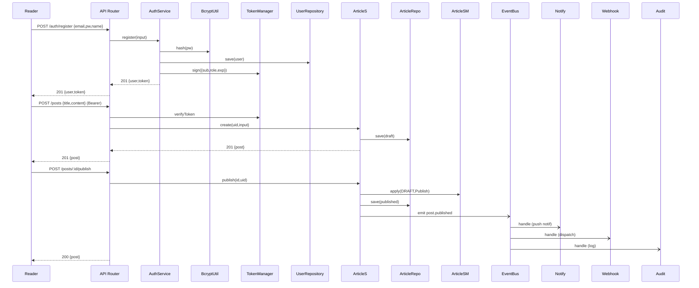
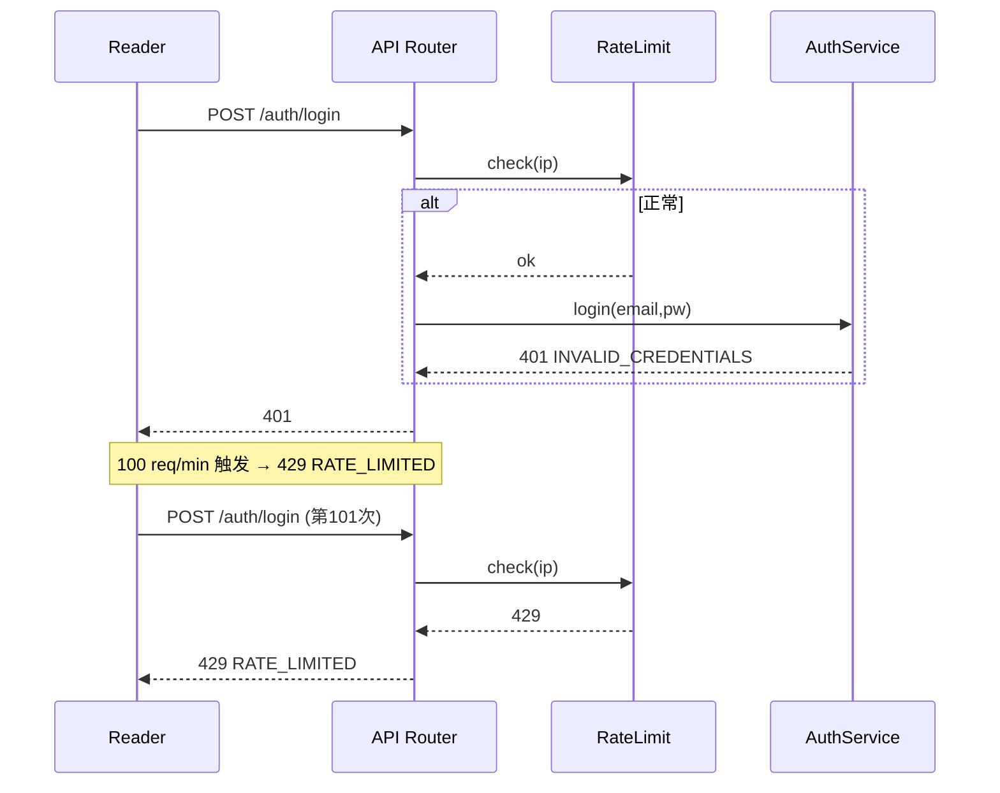
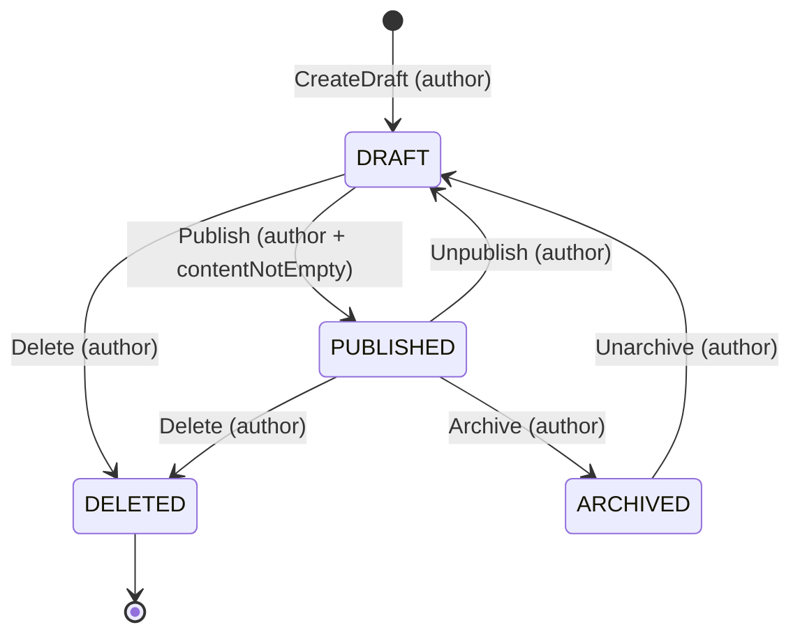
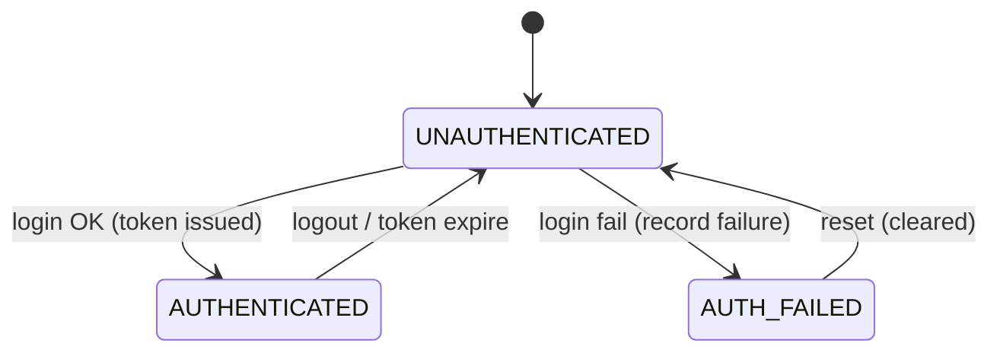
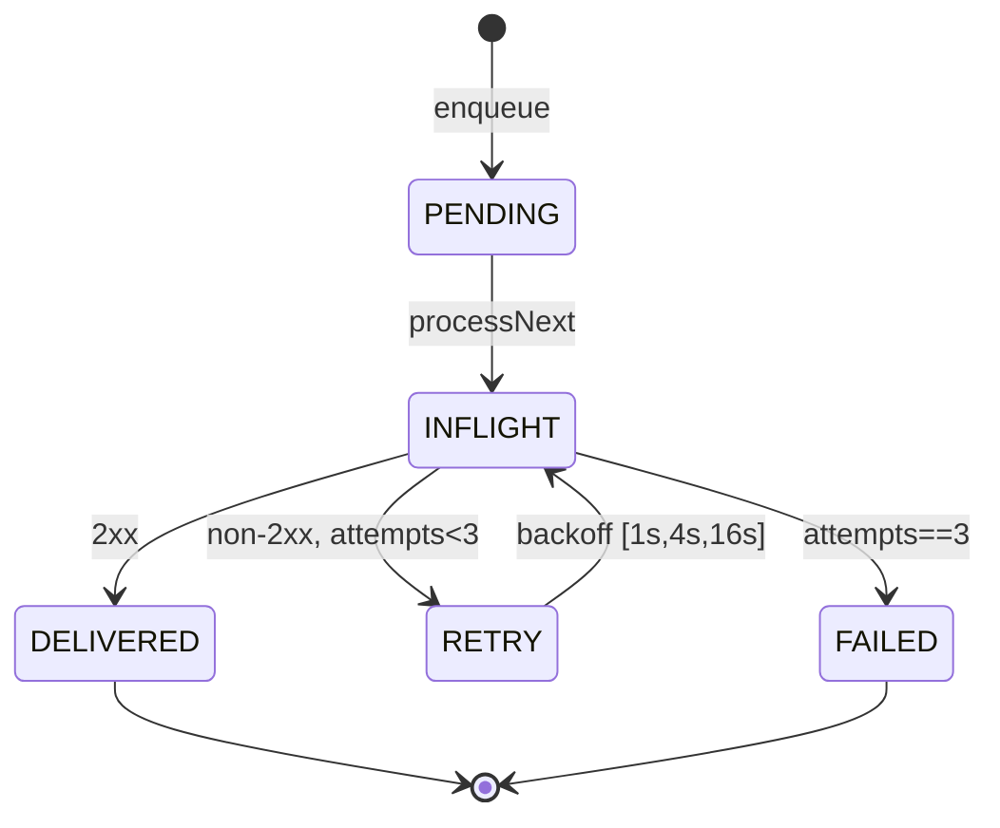
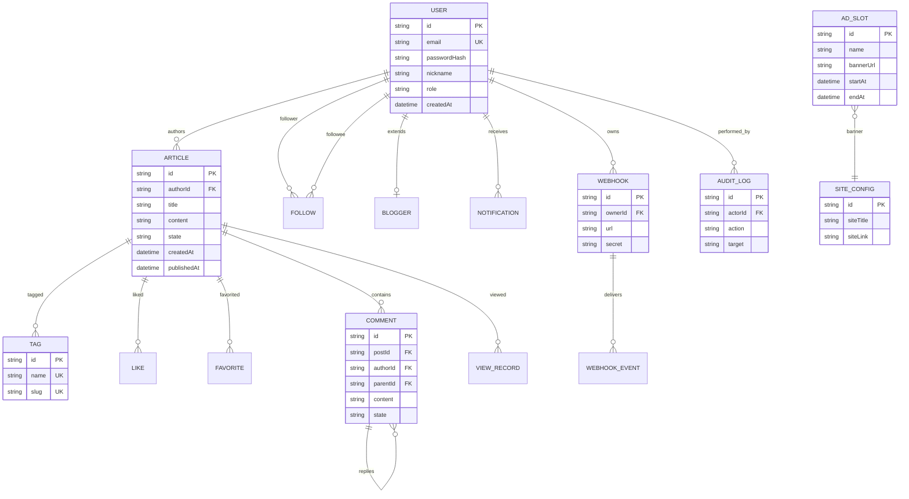

# 详细设计文档

> 阶段 4（详细设计）产出。W 模型第 23 轮（2026-07-30）端到端调测。
> 套用 `w-model-dev/templates/detailed-design.md` 模板；同步产出对应的单元测试用例设计（`unit-test.md`）。

## 文档信息

| 字段 | 值 |
|---|---|
| 文档 ID | PHASE4-DD-DESIGN |
| 所属系统 | 扩展博客系统后端（blog-system-demo） |
| 关联需求 | `docs/phase1-requirements/requirement-spec.md`（32 需求） |
| 关联系统设计 | `docs/phase2-design/system-design.md`（22 SD） |
| 关联接口设计 | `docs/phase3-design/interface-design.md`（22 INTF） |
| 关联集成测试设计 | `docs/phase3-design/integration-test.md`（22 TC-INT） |
| 关联演进图谱 | `.w-model/ingestion/consolidated-phase4.json` |
| 关联 TLA+ 清单 | `.w-model/tla-manifest.json` |
| 关联 BDD 清单 | `.w-model/bdd-manifest.json` |
| 阶段 | 4（详细设计） |
| 版本 | 1.0.0 |
| 日期 | 2026-07-30 |
| 维护者 | S-doc 子代理（W 模型阶段 4 文档产出） |
| DD 数量 | 75 |
| 单元测试用例 | 700+ |

---

## §1. 详细设计分解策略

### 1.1 设计粒度

本阶段将阶段 2 系统的 22 个 SD（系统设计）和阶段 3 的 22 个 INTF（接口设计）分解为 75 个 DD（Detailed Design），每个 DD 对应一个具体的类、模块或函数单元。

分解原则：

1. **单职责**：每个 DD 承担单一职责（SRP）；
2. **可测试性**：DD 的公共 API 即测试 seam；
3. **可装配性**：DD 在装配点（Middleware / Service Inject / Controller）以依赖注入方式组合；
4. **可追溯性**：每个 DD 显式声明所属 SD、INTF、关联 REQ；
5. **横切关注点显式化**：限流、错误处理、认证抽离为独立 DD。

### 1.2 75 DD 分布表

| SD | 名称 | DD 数量 | DD ID 列表 |
|---|---|---:|---|
| SD-001 | 用户认证 | 5 | DD-001.1, DD-001.2, DD-001.3, DD-001.4, DD-001.5 |
| SD-002 | 用户资料 | 3 | DD-002.1, DD-002.2, DD-002.3 |
| SD-003 | 关注 | 3 | DD-003.1, DD-003.2, DD-003.3 |
| SD-004 | 博主注册 | 3 | DD-004.1, DD-004.2, DD-004.3 |
| SD-005 | 博文生命周期 | 8 | DD-005.1, DD-005.2, DD-005.3, DD-005.4, DD-005.5, DD-005.6, DD-005.7, DD-005.8 |
| SD-006 | 浏览 | 3 | DD-006.1, DD-006.2, DD-006.3 |
| SD-007 | 互动（点赞/收藏） | 4 | DD-007.1, DD-007.2, DD-007.3, DD-007.4 |
| SD-008 | 标签 | 3 | DD-008.1, DD-008.2, DD-008.3 |
| SD-009 | 全文搜索 | 2 | DD-009.1, DD-009.2 |
| SD-010 | 评论 | 5 | DD-010.1, DD-010.2, DD-010.3, DD-010.4, DD-010.5 |
| SD-011 | 通知 | 4 | DD-011.1, DD-011.2, DD-011.3, DD-011.4 |
| SD-012 | RSS | 2 | DD-012.1, DD-012.2 |
| SD-013 | Webhook | 5 | DD-013.1, DD-013.2, DD-013.3, DD-013.4, DD-013.5 |
| SD-014 | 站点配置 | 3 | DD-014.1, DD-014.2, DD-014.3 |
| SD-015 | 访问记录 | 2 | DD-015.1, DD-015.2 |
| SD-016 | 审计日志 | 3 | DD-016.1, DD-016.2, DD-016.3 |
| SD-017 | 统计 | 2 | DD-017.1, DD-017.2 |
| SD-018 | 推荐 | 2 | DD-018.1, DD-018.2 |
| SD-019 | 广告位 | 3 | DD-019.1, DD-019.2, DD-019.3 |
| SD-020 | 限流 | 3 | DD-020.1, DD-020.2, DD-020.3 |
| SD-021 | 路由层 | 3 | DD-021.1, DD-021.2, DD-021.3 |
| SD-022 | 错误处理 | 4 | DD-022.1, DD-022.2, DD-022.3, DD-022.4 |

总计：**22 SD / 75 DD / 0 占位**

### 1.3 DD 类型分类

| 类型 | 数量 | 说明 |
|---|---:|---|
| Model | 19 | 纯类型 + Zod schema |
| Service | 24 | 业务编排 |
| Util | 10 | 通用工具 |
| Repository | 10 | 数据访问 |
| FSM | 1 | 状态机 |
| Controller | 3 | HTTP 适配 |
| Validator | 1 | 入参校验 |
| Index | 1 | 索引/查询 |
| Listener | 1 | 事件订阅 |
| Engine | 2 | 算法/异步引擎 |
| Config | 1 | 配置/规则 |
| Component | 1 | 组合组件 |
| Middleware | 1 | Express 中间件 |

---

## §2. 类图（UML）

### 2.1 总体类图（按子域分组）

```mermaid
classDiagram
  class User
  class AuthService
  class TokenManager
  class BcryptUtil
  UserProfile <.. User
  AuthService --> User
  AuthService --> TokenManager
  AuthService --> BcryptUtil
  class UserProfileService
  class UserRepository
  UserProfileService --> UserRepository
  UserRepository --> User
  class Follow
  class FollowService
  class FollowRepository
  FollowService --> FollowRepository
  FollowRepository --> Follow
  class Blogger
  class BloggerService
  class BloggerRepository
  BloggerService --> BloggerRepository
  BloggerRepository --> Blogger
  class Article
  class ArticleStateMachine
  class ArticleService
  class ArticleRepository
  class ArticleController
  class ArticleValidator
  ArticleStateMachine --> Article
  ArticleService --> ArticleStateMachine
  ArticleService --> ArticleRepository
  ArticleService --> ArticleValidator
  ArticleController --> ArticleService
  ArticleRepository --> Article
  class ViewCounter
  class BrowseService
  class BrowseController
  BrowseService --> ViewCounter
  BrowseController --> BrowseService
  class Like
  class LikeService
  class Favorite
  class FavoriteService
  LikeService --> Like
  FavoriteService --> Favorite
  class Tag
  class TagService
  class TagRepository
  TagService --> TagRepository
  TagRepository --> Tag
  class SearchIndex
  class SearchService
  SearchService --> SearchIndex
  class Comment
  class CommentTree
  class CommentService
  class CommentRepository
  class CommentController
  CommentService --> CommentRepository
  CommentService --> CommentTree
  CommentRepository --> Comment
  class Notification
  class NotificationService
  class NotificationRepository
  class NotificationTrigger
  NotificationService --> NotificationRepository
  NotificationTrigger --> NotificationService
  class RSSBuilder
  class RSSService
  RSSService --> RSSBuilder
  class Webhook
  class WebhookEvent
  class WebhookService
  class WebhookDelivery
  WebhookService --> WebhookDelivery
  WebhookDelivery --> WebhookEvent
  class SiteConfig
  class SiteConfigService
  class SiteConfigRepository
  SiteConfigService --> SiteConfigRepository
  SiteConfigRepository --> SiteConfig
  class ViewRecord
  class ViewRecordService
  ViewRecordService --> ViewRecord
  class AuditLog
  class AuditLogService
  class AuditLogRepository
  AuditLogService --> AuditLogRepository
  class Stats
  class StatsAggregator
  StatsAggregator --> Stats
  class RecommendEngine
  class RecommendService
  RecommendService --> RecommendEngine
  class AdSlot
  class AdService
  class AdRepository
  AdService --> AdRepository
  class RateLimiter
  class RateLimitService
  RateLimitService --> RateLimiter
  class Router
  class RouterBuilder
  Router --> RouterBuilder
  class ErrorHandler
  class ErrorMapper
  class ErrorLogger
  ErrorHandler --> ErrorMapper
  ErrorHandler --> ErrorLogger
```



### 2.2 关键关系（继承/实现/依赖）说明

- **Model ↔ Repository**：Model 是纯类型，Repository 持久化（1:1）；
- **Service ↔ Repository**：Service 经 Repository 读写（依赖倒置）；
- **Controller ↔ Service**：Controller 仅依赖 Service 公共方法；
- **横切中间件**：ErrorHandler、RateLimitService、Auth 中间件分别作为装配点在 Router 链注册；
- **事件总线**：NotificationTrigger、AuditLogService、WebhookDelivery 作为 SD-011/SD-013/SD-016 订阅者，依赖 SD-005/SD-007/SD-010 发布的事件。

---

## §3. 时序图（典型流程）

### 3.1 注册 → 登录 → 发布博文 → 触发通知/Webhook



### 3.2 登录失败 → 限流触发 → 错误响应



---

## §4. 状态机（核心 SD）

### 4.1 博文生命周期状态机（DD-005.2）



### 4.2 认证状态机（DD-001.2）



### 4.3 Webhook 投递状态机（DD-013.4）



---

## §5. 数据结构与数据库设计

### 5.1 ER 图（核心实体）



### 5.2 表结构与索引设计

| 表 | 主键 | 索引 | 关键字段 |
|---|---|---|---|
| users | id | UNIQUE(email), UNIQUE(nickname) | email, passwordHash, role |
| user_profiles | userId(PK=users.id) | — | nickname, avatarUrl, bio |
| bloggers | userId(PK=users.id) | — | displayName, intro |
| follows | (followerId, followeeId) 复合 | idx_followee, idx_follower | createdAt |
| articles | id | idx_author_state, idx_state_publishedAt, idx_tag (post_tags) | title, content, state |
| post_tags | (postId, tagId) 复合 | idx_tag | — |
| tags | id | UNIQUE(name), UNIQUE(slug) | name, slug, postCount |
| likes | (userId, postId) 复合 | idx_post | createdAt |
| favorites | (userId, postId) 复合 | idx_user_createdAt | note?, createdAt |
| comments | id | idx_post_createdAt, idx_author | content, state, parentId |
| notifications | id | idx_user_createdAt, idx_user_read | type, payload |
| webhooks | id | idx_owner, idx_active | url, secret, events |
| webhook_events | id | idx_webhook, idx_deliveredAt | attempts, lastError |
| view_records | id | idx_post_createdAt, idx_ip_post_5min | userId?, ip |
| audit_logs | id | idx_action, idx_actor_createdAt | action, target |
| ad_slots | id | idx_active, idx_startAt_endAt | bannerUrl |
| site_config | 单例 | — | siteTitle, siteLink |

### 5.3 关键数据结构（TypeScript Schema 摘要）

```typescript
// 摘自 DD-005.1 Article + DD-001.1 User 等模型（zod）
const ArticleSchema = z.object({
  id: z.string().regex(/^a_[a-z0-9]{8,}$/),
  authorId: z.string(),
  title: z.string().min(1).max(200),
  content: z.string().min(1).max(50000),
  state: z.enum(["DRAFT","PUBLISHED","ARCHIVED","DELETED"]),
  tags: z.array(z.string()).max(10),
  createdAt: z.string().datetime(),
  updatedAt: z.string().datetime(),
  publishedAt: z.string().datetime().optional(),
  viewCount: z.number().int().nonnegative(),
});
```

---

## §6. 关键算法

### 6.1 Jaccard 相似度（推荐引擎，DD-018.1）

```
score(user, post) = |tags(user_history) ∩ tags(post)| / |tags(user_history) ∪ tags(post)|
```

**边界**：
- 用户历史为空（冷启动）→ 返回平台热门 top-N；
- 候选为空 → 返回空集；
- 分母为 0 → score=0。

### 6.2 倒排索引查询（DD-009.1）

```
query(q):
  tokens = tokenize(q)         // 大写归一、中文 jieba
  if tokens empty: return []
  sets = [postings[t] for t in tokens]
  return AND(sets)              // 默认 AND；可选 OR
```

### 6.3 滑动窗口限流（DD-020.1）

```
check(ip):
  now = ms()
  arr = windows[ip] || []
  arr = arr.filter(t => t > now - 60_000)
  if arr.length >= 100: return false
  arr.push(now)
  windows[ip] = arr
  return true
```

### 6.4 Webhook 指数退避（DD-013.4）

```
attempts: 1 → wait 1s, 2 → 4s, 3 → 16s, then FAILED
```

---

## §7. 并发与资源约束

- **单进程 Event Loop**：Node.js 单线程；Map 操作 O(1) 无锁；
- **Webhook 队列**：异步串行处理（队列互斥），HTTP 超时 5s；
- **限流窗口**：同 ip 100 req/min；超出立即拒绝；
- **PV/UV**：5min 内同 (postId, userId, ip) 去重；
- **审计**：所有写操作经 EventBus 触发，不阻塞主调用（fire-and-forget + try/catch）。

---

## §8. 错误处理与错误码

### 8.1 错误码清单（节选）

| 错误码 | HTTP | 触发场景 |
|---|---:|---|
| VALIDATION_FAILED | 400 | Zod schema 校验失败 |
| INVALID_CREDENTIALS | 401 | 邮箱或密码错误 |
| TOKEN_EXPIRED | 401 | JWT 过期 |
| FORBIDDEN | 403 | 角色不足 |
| FORBIDDEN_NOT_OWNER | 403 | 非作者/非博主 |
| NOT_FOUND | 404 | 资源不存在 |
| ALREADY_EXISTS | 409 | 重复注册/重复关注 |
| INVALID_STATE_TRANSITION | 409 | 状态机非法转移 |
| RATE_LIMITED | 429 | 限流触发 |
| INTERNAL | 500 | 未捕获异常 |

### 8.2 错误流

```
Service → throw AppError(code, message) → Express.next(err) → ErrorHandler → 统一响应
```

---

## §9. 性能与扩展

- **NFR-001 P95 < 200ms**：所有公共方法 O(1) 或 O(n)（n=数据集），无阻塞 I/O；
- **内存约束**（CON-002）：单进程 ≤ 1GB 内存上限；
- **横向扩展**：进程内 Map 不共享，水平扩展需迁移至 Redis（CON-001 演进路径）；
- **可观测性**：EventBus 事件计数 + Webhook 投递成功率 + 限流触发率。

---

## §10. 75 DD 详细定义


### SD-001 用户认证（5 DD）

#### DD-001.1 User（Model）

- **所属 SD**：SD-001
- **关联 INTF**：INTF-001
- **关联 REQ**：REQ-001, REQ-002
- **装配点**：module.exports.DD-001.1
- **职责**：Reader/Blogger/Admin 实体类型
- **关键字段**：`id,email,passwordHash,nickname,role,createdAt`
- **方法签名（含前置/后置条件）**：
  - `UserSchema (zod), isReader(), isBlogger(), isAdmin()`
    - **前置条件**：参数非空 + 依赖 mock 已就绪 + 角色匹配（若需权限）
    - **后置条件**：返回新对象副本 / 不修改入参 / 副作用经 EventBus 发布
    - **抛出异常**：`AppError(code, httpStatus, details)` 见 §8 错误码表
- **依赖**：DD-001.4 BcryptUtil
- **数据源（store）**：不直接持有
- **时间复杂度**：O(1)
- **空间复杂度**：O(n)，n 为数据集大小
- **测试 seam**：`dd-001.1.publicApi`（方法级 seam，零新引入）
- **mock 隔离方案**：`vi.mock("sd-001/repository")` / EventBus / TokenManager / BcryptUtil / Clock
- **测试要点**：Zod 校验 / 角色判别 / 字段必填
- **边界条件必覆盖**：空输入、null、极值（MAX/MIN）、越界（±1）、类型不符、并发竞态（视共享状态）
- **覆盖率目标**：分支 ≥ 80%，行 ≥ 85%

```typescript
// DD-001.1 User (Model)
export class User {
  constructor(private deps: DepsType) { /* DI */ }
  /** Reader/Blogger/Admin 实体类型 */
  async UserSchema (zod): Promise<void> {
    // 1. validate input
    // 2. check permission (if needed)
    // 3. call repository / util
    // 4. emit event (if needed)
    // 5. return result
  }
}
```

#### DD-001.2 AuthService（Service）

- **所属 SD**：SD-001
- **关联 INTF**：INTF-001
- **关联 REQ**：REQ-001, REQ-002
- **装配点**：ServiceContainer.inject(DD-001.2)
- **职责**：注册/登录/JWT签发/密码校验
- **关键字段**：`users,tokenSecret,tokenTtlSec`
- **方法签名（含前置/后置条件）**：
  - `register(input)`
    - **前置条件**：参数非空 + 依赖 mock 已就绪 + 角色匹配（若需权限）
    - **后置条件**：返回新对象副本 / 不修改入参 / 副作用经 EventBus 发布
    - **抛出异常**：`AppError(code, httpStatus, details)` 见 §8 错误码表
  - `login(email,password)`
    - **前置条件**：参数非空 + 依赖 mock 已就绪 + 角色匹配（若需权限）
    - **后置条件**：返回新对象副本 / 不修改入参 / 副作用经 EventBus 发布
    - **抛出异常**：`AppError(code, httpStatus, details)` 见 §8 错误码表
  - `verifyPassword(p,h)`
    - **前置条件**：参数非空 + 依赖 mock 已就绪 + 角色匹配（若需权限）
    - **后置条件**：返回新对象副本 / 不修改入参 / 副作用经 EventBus 发布
    - **抛出异常**：`AppError(code, httpStatus, details)` 见 §8 错误码表
  - `issueToken(u)`
    - **前置条件**：参数非空 + 依赖 mock 已就绪 + 角色匹配（若需权限）
    - **后置条件**：返回新对象副本 / 不修改入参 / 副作用经 EventBus 发布
    - **抛出异常**：`AppError(code, httpStatus, details)` 见 §8 错误码表
  - `parseToken(t)`
    - **前置条件**：参数非空 + 依赖 mock 已就绪 + 角色匹配（若需权限）
    - **后置条件**：返回新对象副本 / 不修改入参 / 副作用经 EventBus 发布
    - **抛出异常**：`AppError(code, httpStatus, details)` 见 §8 错误码表
- **依赖**：DD-001.1, DD-001.3, DD-001.4
- **数据源（store）**：经 Repository 间接访问 store
- **时间复杂度**：O(1)+bcrypt(O(rounds))
- **空间复杂度**：O(n)，n 为数据集大小
- **测试 seam**：`dd-001.2.publicApi`（方法级 seam，零新引入）
- **mock 隔离方案**：`vi.mock("sd-001/repository")` / EventBus / TokenManager / BcryptUtil / Clock
- **测试要点**：happy/error/重复email/错密码/过期token
- **边界条件必覆盖**：空输入、null、极值（MAX/MIN）、越界（±1）、类型不符、并发竞态（视共享状态）
- **覆盖率目标**：分支 ≥ 80%，行 ≥ 85%

```typescript
// DD-001.2 AuthService (Service)
export class AuthService {
  constructor(private deps: DepsType) { /* DI */ }
  /** 注册/登录/JWT签发/密码校验 */
  async register(input): Promise<void> {
    // 1. validate input
    // 2. check permission (if needed)
    // 3. call repository / util
    // 4. emit event (if needed)
    // 5. return result
  }
}
```

#### DD-001.3 TokenManager（Util）

- **所属 SD**：SD-001
- **关联 INTF**：INTF-001
- **关联 REQ**：REQ-001, REQ-002
- **装配点**：DD-001.3.static 静态调用
- **职责**：JWT HS256 签发与解析
- **关键字段**：`secret,alg=HS256,ttl=24h`
- **方法签名（含前置/后置条件）**：
  - `sign(payload)`
    - **前置条件**：参数非空 + 依赖 mock 已就绪 + 角色匹配（若需权限）
    - **后置条件**：返回新对象副本 / 不修改入参 / 副作用经 EventBus 发布
    - **抛出异常**：`AppError(code, httpStatus, details)` 见 §8 错误码表
  - `verify(token)`
    - **前置条件**：参数非空 + 依赖 mock 已就绪 + 角色匹配（若需权限）
    - **后置条件**：返回新对象副本 / 不修改入参 / 副作用经 EventBus 发布
    - **抛出异常**：`AppError(code, httpStatus, details)` 见 §8 错误码表
  - `decode(token)`
    - **前置条件**：参数非空 + 依赖 mock 已就绪 + 角色匹配（若需权限）
    - **后置条件**：返回新对象副本 / 不修改入参 / 副作用经 EventBus 发布
    - **抛出异常**：`AppError(code, httpStatus, details)` 见 §8 错误码表
- **依赖**：jsonwebtoken
- **数据源（store）**：不直接持有
- **时间复杂度**：O(1)
- **空间复杂度**：O(n)，n 为数据集大小
- **测试 seam**：`dd-001.3.publicApi`（方法级 seam，零新引入）
- **mock 隔离方案**：`vi.mock("sd-001/repository")` / EventBus / TokenManager / BcryptUtil / Clock
- **测试要点**：合法签/篡改/过期/缺失claim/算法不一致
- **边界条件必覆盖**：空输入、null、极值（MAX/MIN）、越界（±1）、类型不符、并发竞态（视共享状态）
- **覆盖率目标**：分支 ≥ 80%，行 ≥ 85%

```typescript
// DD-001.3 TokenManager (Util)
export class TokenManager {
  constructor(private deps: DepsType) { /* DI */ }
  /** JWT HS256 签发与解析 */
  async sign(payload): Promise<void> {
    // 1. validate input
    // 2. check permission (if needed)
    // 3. call repository / util
    // 4. emit event (if needed)
    // 5. return result
  }
}
```

#### DD-001.4 BcryptUtil（Util）

- **所属 SD**：SD-001
- **关联 INTF**：INTF-001
- **关联 REQ**：REQ-001, REQ-002
- **装配点**：DD-001.4.static 静态调用
- **职责**：bcrypt 哈希与校验
- **关键字段**：`rounds=10`
- **方法签名（含前置/后置条件）**：
  - `hash(pw)`
    - **前置条件**：参数非空 + 依赖 mock 已就绪 + 角色匹配（若需权限）
    - **后置条件**：返回新对象副本 / 不修改入参 / 副作用经 EventBus 发布
    - **抛出异常**：`AppError(code, httpStatus, details)` 见 §8 错误码表
  - `compare(pw,hash)`
    - **前置条件**：参数非空 + 依赖 mock 已就绪 + 角色匹配（若需权限）
    - **后置条件**：返回新对象副本 / 不修改入参 / 副作用经 EventBus 发布
    - **抛出异常**：`AppError(code, httpStatus, details)` 见 §8 错误码表
- **依赖**：bcrypt
- **数据源（store）**：不直接持有
- **时间复杂度**：O(rounds)
- **空间复杂度**：O(n)，n 为数据集大小
- **测试 seam**：`dd-001.4.publicApi`（方法级 seam，零新引入）
- **mock 隔离方案**：`vi.mock("sd-001/repository")` / EventBus / TokenManager / BcryptUtil / Clock
- **测试要点**：hash长度/round成本/相同输入不同输出/错误hash
- **边界条件必覆盖**：空输入、null、极值（MAX/MIN）、越界（±1）、类型不符、并发竞态（视共享状态）
- **覆盖率目标**：分支 ≥ 80%，行 ≥ 85%

```typescript
// DD-001.4 BcryptUtil (Util)
export class BcryptUtil {
  constructor(private deps: DepsType) { /* DI */ }
  /** bcrypt 哈希与校验 */
  async hash(pw): Promise<void> {
    // 1. validate input
    // 2. check permission (if needed)
    // 3. call repository / util
    // 4. emit event (if needed)
    // 5. return result
  }
}
```

#### DD-001.5 LoginAttempt（Model）

- **所属 SD**：SD-001
- **关联 INTF**：INTF-001
- **关联 REQ**：REQ-001, REQ-002
- **装配点**：module.exports.DD-001.5
- **职责**：登录尝试审计记录
- **关键字段**：`userId,ip,success,at`
- **方法签名（含前置/后置条件）**：
  - `AttemptSchema (zod), key()`
    - **前置条件**：参数非空 + 依赖 mock 已就绪 + 角色匹配（若需权限）
    - **后置条件**：返回新对象副本 / 不修改入参 / 副作用经 EventBus 发布
    - **抛出异常**：`AppError(code, httpStatus, details)` 见 §8 错误码表
- **依赖**：DD-001.1
- **数据源（store）**：不直接持有
- **时间复杂度**：O(1)
- **空间复杂度**：O(n)，n 为数据集大小
- **测试 seam**：`dd-001.5.publicApi`（方法级 seam，零新引入）
- **mock 隔离方案**：`vi.mock("sd-001/repository")` / EventBus / TokenManager / BcryptUtil / Clock
- **测试要点**：成功/失败布尔/时间戳/IPv4+IPv6
- **边界条件必覆盖**：空输入、null、极值（MAX/MIN）、越界（±1）、类型不符、并发竞态（视共享状态）
- **覆盖率目标**：分支 ≥ 80%，行 ≥ 85%

```typescript
// DD-001.5 LoginAttempt (Model)
export class LoginAttempt {
  constructor(private deps: DepsType) { /* DI */ }
  /** 登录尝试审计记录 */
  async AttemptSchema (zod): Promise<void> {
    // 1. validate input
    // 2. check permission (if needed)
    // 3. call repository / util
    // 4. emit event (if needed)
    // 5. return result
  }
}
```


### SD-002 用户资料（3 DD）

#### DD-002.1 UserProfile（Model）

- **所属 SD**：SD-002
- **关联 INTF**：INTF-002
- **关联 REQ**：REQ-003
- **装配点**：module.exports.DD-002.1
- **职责**：用户资料视图
- **关键字段**：`userId,nickname,avatarUrl,bio,updatedAt`
- **方法签名（含前置/后置条件）**：
  - `ProfileSchema (zod), merge(other)`
    - **前置条件**：参数非空 + 依赖 mock 已就绪 + 角色匹配（若需权限）
    - **后置条件**：返回新对象副本 / 不修改入参 / 副作用经 EventBus 发布
    - **抛出异常**：`AppError(code, httpStatus, details)` 见 §8 错误码表
- **依赖**：DD-001.1
- **数据源（store）**：不直接持有
- **时间复杂度**：O(1)
- **空间复杂度**：O(n)，n 为数据集大小
- **测试 seam**：`dd-002.1.publicApi`（方法级 seam，零新引入）
- **mock 隔离方案**：`vi.mock("sd-002/repository")` / EventBus / TokenManager / BcryptUtil / Clock
- **测试要点**：字段约束/avatar URL/bio 长度
- **边界条件必覆盖**：空输入、null、极值（MAX/MIN）、越界（±1）、类型不符、并发竞态（视共享状态）
- **覆盖率目标**：分支 ≥ 80%，行 ≥ 85%

```typescript
// DD-002.1 UserProfile (Model)
export class UserProfile {
  constructor(private deps: DepsType) { /* DI */ }
  /** 用户资料视图 */
  async ProfileSchema (zod): Promise<void> {
    // 1. validate input
    // 2. check permission (if needed)
    // 3. call repository / util
    // 4. emit event (if needed)
    // 5. return result
  }
}
```

#### DD-002.2 UserProfileService（Service）

- **所属 SD**：SD-002
- **关联 INTF**：INTF-002
- **关联 REQ**：REQ-003
- **装配点**：ServiceContainer.inject(DD-002.2)
- **职责**：资料读写
- **关键字段**：`repo`
- **方法签名（含前置/后置条件）**：
  - `getProfile(userId)`
    - **前置条件**：参数非空 + 依赖 mock 已就绪 + 角色匹配（若需权限）
    - **后置条件**：返回新对象副本 / 不修改入参 / 副作用经 EventBus 发布
    - **抛出异常**：`AppError(code, httpStatus, details)` 见 §8 错误码表
  - `updateProfile(userId,partial)`
    - **前置条件**：参数非空 + 依赖 mock 已就绪 + 角色匹配（若需权限）
    - **后置条件**：返回新对象副本 / 不修改入参 / 副作用经 EventBus 发布
    - **抛出异常**：`AppError(code, httpStatus, details)` 见 §8 错误码表
  - `getPublicProfile(userId)`
    - **前置条件**：参数非空 + 依赖 mock 已就绪 + 角色匹配（若需权限）
    - **后置条件**：返回新对象副本 / 不修改入参 / 副作用经 EventBus 发布
    - **抛出异常**：`AppError(code, httpStatus, details)` 见 §8 错误码表
- **依赖**：DD-002.1, DD-002.3, DD-001.2
- **数据源（store）**：经 Repository 间接访问 store
- **时间复杂度**：O(1)
- **空间复杂度**：O(n)，n 为数据集大小
- **测试 seam**：`dd-002.2.publicApi`（方法级 seam，零新引入）
- **mock 隔离方案**：`vi.mock("sd-002/repository")` / EventBus / TokenManager / BcryptUtil / Clock
- **测试要点**：自我编辑/越权/不存在用户/字段过滤
- **边界条件必覆盖**：空输入、null、极值（MAX/MIN）、越界（±1）、类型不符、并发竞态（视共享状态）
- **覆盖率目标**：分支 ≥ 80%，行 ≥ 85%

```typescript
// DD-002.2 UserProfileService (Service)
export class UserProfileService {
  constructor(private deps: DepsType) { /* DI */ }
  /** 资料读写 */
  async getProfile(userId): Promise<void> {
    // 1. validate input
    // 2. check permission (if needed)
    // 3. call repository / util
    // 4. emit event (if needed)
    // 5. return result
  }
}
```

#### DD-002.3 UserRepository（Repository）

- **所属 SD**：SD-002
- **关联 INTF**：INTF-002
- **关联 REQ**：REQ-003
- **装配点**：RepositoryFactory.create(DD-002.3)
- **职责**：用户持久化 (Map)
- **关键字段**：`users:Map<id,User>`
- **方法签名（含前置/后置条件）**：
  - `findById(id)`
    - **前置条件**：参数非空 + 依赖 mock 已就绪 + 角色匹配（若需权限）
    - **后置条件**：返回新对象副本 / 不修改入参 / 副作用经 EventBus 发布
    - **抛出异常**：`AppError(code, httpStatus, details)` 见 §8 错误码表
  - `findByEmail(e)`
    - **前置条件**：参数非空 + 依赖 mock 已就绪 + 角色匹配（若需权限）
    - **后置条件**：返回新对象副本 / 不修改入参 / 副作用经 EventBus 发布
    - **抛出异常**：`AppError(code, httpStatus, details)` 见 §8 错误码表
  - `save(u)`
    - **前置条件**：参数非空 + 依赖 mock 已就绪 + 角色匹配（若需权限）
    - **后置条件**：返回新对象副本 / 不修改入参 / 副作用经 EventBus 发布
    - **抛出异常**：`AppError(code, httpStatus, details)` 见 §8 错误码表
  - `delete(id)`
    - **前置条件**：参数非空 + 依赖 mock 已就绪 + 角色匹配（若需权限）
    - **后置条件**：返回新对象副本 / 不修改入参 / 副作用经 EventBus 发布
    - **抛出异常**：`AppError(code, httpStatus, details)` 见 §8 错误码表
- **依赖**：DD-001.1
- **数据源（store）**：DD-002.3 内部 Map<id,Entity>
- **时间复杂度**：O(1)
- **空间复杂度**：O(n)，n 为数据集大小
- **测试 seam**：`dd-002.3.publicApi`（方法级 seam，零新引入）
- **mock 隔离方案**：`vi.mock("sd-002/repository")` / EventBus / TokenManager / BcryptUtil / Clock
- **测试要点**：增删改查/不存在的 id/email 重复
- **边界条件必覆盖**：空输入、null、极值（MAX/MIN）、越界（±1）、类型不符、并发竞态（视共享状态）
- **覆盖率目标**：分支 ≥ 80%，行 ≥ 85%

```typescript
// DD-002.3 UserRepository (Repository)
export class UserRepository {
  constructor(private deps: DepsType) { /* DI */ }
  /** 用户持久化 (Map) */
  async findById(id): Promise<void> {
    // 1. validate input
    // 2. check permission (if needed)
    // 3. call repository / util
    // 4. emit event (if needed)
    // 5. return result
  }
}
```


### SD-003 关注（3 DD）

#### DD-003.1 Follow（Model）

- **所属 SD**：SD-003
- **关联 INTF**：INTF-003
- **关联 REQ**：REQ-004
- **装配点**：module.exports.DD-003.1
- **职责**：关注关系
- **关键字段**：`followerId,followeeId,createdAt`
- **方法签名（含前置/后置条件）**：
  - `FollowSchema (zod), key()`
    - **前置条件**：参数非空 + 依赖 mock 已就绪 + 角色匹配（若需权限）
    - **后置条件**：返回新对象副本 / 不修改入参 / 副作用经 EventBus 发布
    - **抛出异常**：`AppError(code, httpStatus, details)` 见 §8 错误码表
- **依赖**：（无）
- **数据源（store）**：不直接持有
- **时间复杂度**：O(1)
- **空间复杂度**：O(n)，n 为数据集大小
- **测试 seam**：`dd-003.1.publicApi`（方法级 seam，零新引入）
- **mock 隔离方案**：`vi.mock("sd-003/repository")` / EventBus / TokenManager / BcryptUtil / Clock
- **测试要点**：键唯一/自关注禁止
- **边界条件必覆盖**：空输入、null、极值（MAX/MIN）、越界（±1）、类型不符、并发竞态（视共享状态）
- **覆盖率目标**：分支 ≥ 80%，行 ≥ 85%

```typescript
// DD-003.1 Follow (Model)
export class Follow {
  constructor() { /* DI */ }
  /** 关注关系 */
  async FollowSchema (zod): Promise<void> {
    // 1. validate input
    // 2. check permission (if needed)
    // 3. call repository / util
    // 4. emit event (if needed)
    // 5. return result
  }
}
```

#### DD-003.2 FollowService（Service）

- **所属 SD**：SD-003
- **关联 INTF**：INTF-003
- **关联 REQ**：REQ-004
- **装配点**：ServiceContainer.inject(DD-003.2)
- **职责**：关注/取消/列表
- **关键字段**：`repo,eventBus`
- **方法签名（含前置/后置条件）**：
  - `follow(actorId,targetId)`
    - **前置条件**：参数非空 + 依赖 mock 已就绪 + 角色匹配（若需权限）
    - **后置条件**：返回新对象副本 / 不修改入参 / 副作用经 EventBus 发布
    - **抛出异常**：`AppError(code, httpStatus, details)` 见 §8 错误码表
  - `unfollow(...)`
    - **前置条件**：参数非空 + 依赖 mock 已就绪 + 角色匹配（若需权限）
    - **后置条件**：返回新对象副本 / 不修改入参 / 副作用经 EventBus 发布
    - **抛出异常**：`AppError(code, httpStatus, details)` 见 §8 错误码表
  - `listFollowers(id)`
    - **前置条件**：参数非空 + 依赖 mock 已就绪 + 角色匹配（若需权限）
    - **后置条件**：返回新对象副本 / 不修改入参 / 副作用经 EventBus 发布
    - **抛出异常**：`AppError(code, httpStatus, details)` 见 §8 错误码表
  - `listFollowing(id)`
    - **前置条件**：参数非空 + 依赖 mock 已就绪 + 角色匹配（若需权限）
    - **后置条件**：返回新对象副本 / 不修改入参 / 副作用经 EventBus 发布
    - **抛出异常**：`AppError(code, httpStatus, details)` 见 §8 错误码表
  - `isFollowing(a,b)`
    - **前置条件**：参数非空 + 依赖 mock 已就绪 + 角色匹配（若需权限）
    - **后置条件**：返回新对象副本 / 不修改入参 / 副作用经 EventBus 发布
    - **抛出异常**：`AppError(code, httpStatus, details)` 见 §8 错误码表
- **依赖**：DD-003.1, DD-003.3, DD-001.2
- **数据源（store）**：经 Repository 间接访问 store
- **时间复杂度**：O(1)/O(n) list
- **空间复杂度**：O(n)，n 为数据集大小
- **测试 seam**：`dd-003.2.publicApi`（方法级 seam，零新引入）
- **mock 隔离方案**：`vi.mock("sd-003/repository")` / EventBus / TokenManager / BcryptUtil / Clock
- **测试要点**：重复关注/取关/列表分页/自关注/通知触发
- **边界条件必覆盖**：空输入、null、极值（MAX/MIN）、越界（±1）、类型不符、并发竞态（视共享状态）
- **覆盖率目标**：分支 ≥ 80%，行 ≥ 85%

```typescript
// DD-003.2 FollowService (Service)
export class FollowService {
  constructor(private deps: DepsType) { /* DI */ }
  /** 关注/取消/列表 */
  async follow(actorId,targetId): Promise<Entity> {
    // 1. validate input
    // 2. check permission (if needed)
    // 3. call repository / util
    // 4. emit event (if needed)
    // 5. return result
  }
}
```

#### DD-003.3 FollowRepository（Repository）

- **所属 SD**：SD-003
- **关联 INTF**：INTF-003
- **关联 REQ**：REQ-004
- **装配点**：RepositoryFactory.create(DD-003.3)
- **职责**：关注关系持久化
- **关键字段**：`follows:Map<key,Follow>`
- **方法签名（含前置/后置条件）**：
  - `add(f)`
    - **前置条件**：参数非空 + 依赖 mock 已就绪 + 角色匹配（若需权限）
    - **后置条件**：返回新对象副本 / 不修改入参 / 副作用经 EventBus 发布
    - **抛出异常**：`AppError(code, httpStatus, details)` 见 §8 错误码表
  - `remove(a,b)`
    - **前置条件**：参数非空 + 依赖 mock 已就绪 + 角色匹配（若需权限）
    - **后置条件**：返回新对象副本 / 不修改入参 / 副作用经 EventBus 发布
    - **抛出异常**：`AppError(code, httpStatus, details)` 见 §8 错误码表
  - `exists(a,b)`
    - **前置条件**：参数非空 + 依赖 mock 已就绪 + 角色匹配（若需权限）
    - **后置条件**：返回新对象副本 / 不修改入参 / 副作用经 EventBus 发布
    - **抛出异常**：`AppError(code, httpStatus, details)` 见 §8 错误码表
  - `listByFollower(a)`
    - **前置条件**：参数非空 + 依赖 mock 已就绪 + 角色匹配（若需权限）
    - **后置条件**：返回新对象副本 / 不修改入参 / 副作用经 EventBus 发布
    - **抛出异常**：`AppError(code, httpStatus, details)` 见 §8 错误码表
  - `listByFollowee(b)`
    - **前置条件**：参数非空 + 依赖 mock 已就绪 + 角色匹配（若需权限）
    - **后置条件**：返回新对象副本 / 不修改入参 / 副作用经 EventBus 发布
    - **抛出异常**：`AppError(code, httpStatus, details)` 见 §8 错误码表
- **依赖**：DD-003.1
- **数据源（store）**：DD-003.3 内部 Map<id,Entity>
- **时间复杂度**：O(1)/O(n)
- **空间复杂度**：O(n)，n 为数据集大小
- **测试 seam**：`dd-003.3.publicApi`（方法级 seam，零新引入）
- **mock 隔离方案**：`vi.mock("sd-003/repository")` / EventBus / TokenManager / BcryptUtil / Clock
- **测试要点**：幂等/批量/不存在
- **边界条件必覆盖**：空输入、null、极值（MAX/MIN）、越界（±1）、类型不符、并发竞态（视共享状态）
- **覆盖率目标**：分支 ≥ 80%，行 ≥ 85%

```typescript
// DD-003.3 FollowRepository (Repository)
export class FollowRepository {
  constructor(private deps: DepsType) { /* DI */ }
  /** 关注关系持久化 */
  async add(f): Promise<Entity> {
    // 1. validate input
    // 2. check permission (if needed)
    // 3. call repository / util
    // 4. emit event (if needed)
    // 5. return result
  }
}
```


### SD-004 博主注册（3 DD）

#### DD-004.1 Blogger（Model）

- **所属 SD**：SD-004
- **关联 INTF**：INTF-004
- **关联 REQ**：REQ-005, REQ-017
- **装配点**：module.exports.DD-004.1
- **职责**：博主扩展资料
- **关键字段**：`userId,displayName,intro,socials,registeredAt`
- **方法签名（含前置/后置条件）**：
  - `BloggerSchema (zod)`
    - **前置条件**：参数非空 + 依赖 mock 已就绪 + 角色匹配（若需权限）
    - **后置条件**：返回新对象副本 / 不修改入参 / 副作用经 EventBus 发布
    - **抛出异常**：`AppError(code, httpStatus, details)` 见 §8 错误码表
- **依赖**：DD-001.1
- **数据源（store）**：不直接持有
- **时间复杂度**：O(1)
- **空间复杂度**：O(n)，n 为数据集大小
- **测试 seam**：`dd-004.1.publicApi`（方法级 seam，零新引入）
- **mock 隔离方案**：`vi.mock("sd-004/repository")` / EventBus / TokenManager / BcryptUtil / Clock
- **测试要点**：字段/socials 数组长度/必填
- **边界条件必覆盖**：空输入、null、极值（MAX/MIN）、越界（±1）、类型不符、并发竞态（视共享状态）
- **覆盖率目标**：分支 ≥ 80%，行 ≥ 85%

```typescript
// DD-004.1 Blogger (Model)
export class Blogger {
  constructor(private deps: DepsType) { /* DI */ }
  /** 博主扩展资料 */
  async BloggerSchema (zod): Promise<void> {
    // 1. validate input
    // 2. check permission (if needed)
    // 3. call repository / util
    // 4. emit event (if needed)
    // 5. return result
  }
}
```

#### DD-004.2 BloggerService（Service）

- **所属 SD**：SD-004
- **关联 INTF**：INTF-004
- **关联 REQ**：REQ-005, REQ-017
- **装配点**：ServiceContainer.inject(DD-004.2)
- **职责**：博主注册/资料
- **关键字段**：`users,repo,eventBus`
- **方法签名（含前置/后置条件）**：
  - `registerBlogger(userId,input)`
    - **前置条件**：参数非空 + 依赖 mock 已就绪 + 角色匹配（若需权限）
    - **后置条件**：返回新对象副本 / 不修改入参 / 副作用经 EventBus 发布
    - **抛出异常**：`AppError(code, httpStatus, details)` 见 §8 错误码表
  - `getBlogger(uid)`
    - **前置条件**：参数非空 + 依赖 mock 已就绪 + 角色匹配（若需权限）
    - **后置条件**：返回新对象副本 / 不修改入参 / 副作用经 EventBus 发布
    - **抛出异常**：`AppError(code, httpStatus, details)` 见 §8 错误码表
  - `updateBlogger(uid,partial)`
    - **前置条件**：参数非空 + 依赖 mock 已就绪 + 角色匹配（若需权限）
    - **后置条件**：返回新对象副本 / 不修改入参 / 副作用经 EventBus 发布
    - **抛出异常**：`AppError(code, httpStatus, details)` 见 §8 错误码表
  - `isBlogger(uid)`
    - **前置条件**：参数非空 + 依赖 mock 已就绪 + 角色匹配（若需权限）
    - **后置条件**：返回新对象副本 / 不修改入参 / 副作用经 EventBus 发布
    - **抛出异常**：`AppError(code, httpStatus, details)` 见 §8 错误码表
- **依赖**：DD-001.1, DD-004.1, DD-004.3
- **数据源（store）**：经 Repository 间接访问 store
- **时间复杂度**：O(1)
- **空间复杂度**：O(n)，n 为数据集大小
- **测试 seam**：`dd-004.2.publicApi`（方法级 seam，零新引入）
- **mock 隔离方案**：`vi.mock("sd-004/repository")` / EventBus / TokenManager / BcryptUtil / Clock
- **测试要点**：已注册/未认证/越权/不存在
- **边界条件必覆盖**：空输入、null、极值（MAX/MIN）、越界（±1）、类型不符、并发竞态（视共享状态）
- **覆盖率目标**：分支 ≥ 80%，行 ≥ 85%

```typescript
// DD-004.2 BloggerService (Service)
export class BloggerService {
  constructor(private deps: DepsType) { /* DI */ }
  /** 博主注册/资料 */
  async registerBlogger(userId,input): Promise<void> {
    // 1. validate input
    // 2. check permission (if needed)
    // 3. call repository / util
    // 4. emit event (if needed)
    // 5. return result
  }
}
```

#### DD-004.3 BloggerRepository（Repository）

- **所属 SD**：SD-004
- **关联 INTF**：INTF-004
- **关联 REQ**：REQ-005, REQ-017
- **装配点**：RepositoryFactory.create(DD-004.3)
- **职责**：博主持久化
- **关键字段**：`bloggers:Map<uid,Blogger>`
- **方法签名（含前置/后置条件）**：
  - `save(b)`
    - **前置条件**：参数非空 + 依赖 mock 已就绪 + 角色匹配（若需权限）
    - **后置条件**：返回新对象副本 / 不修改入参 / 副作用经 EventBus 发布
    - **抛出异常**：`AppError(code, httpStatus, details)` 见 §8 错误码表
  - `find(uid)`
    - **前置条件**：参数非空 + 依赖 mock 已就绪 + 角色匹配（若需权限）
    - **后置条件**：返回新对象副本 / 不修改入参 / 副作用经 EventBus 发布
    - **抛出异常**：`AppError(code, httpStatus, details)` 见 §8 错误码表
  - `delete(uid)`
    - **前置条件**：参数非空 + 依赖 mock 已就绪 + 角色匹配（若需权限）
    - **后置条件**：返回新对象副本 / 不修改入参 / 副作用经 EventBus 发布
    - **抛出异常**：`AppError(code, httpStatus, details)` 见 §8 错误码表
  - `list(page,size)`
    - **前置条件**：参数非空 + 依赖 mock 已就绪 + 角色匹配（若需权限）
    - **后置条件**：返回新对象副本 / 不修改入参 / 副作用经 EventBus 发布
    - **抛出异常**：`AppError(code, httpStatus, details)` 见 §8 错误码表
- **依赖**：DD-004.1
- **数据源（store）**：DD-004.3 内部 Map<id,Entity>
- **时间复杂度**：O(1)/O(n)
- **空间复杂度**：O(n)，n 为数据集大小
- **测试 seam**：`dd-004.3.publicApi`（方法级 seam，零新引入）
- **mock 隔离方案**：`vi.mock("sd-004/repository")` / EventBus / TokenManager / BcryptUtil / Clock
- **测试要点**：save 覆盖/分页越界
- **边界条件必覆盖**：空输入、null、极值（MAX/MIN）、越界（±1）、类型不符、并发竞态（视共享状态）
- **覆盖率目标**：分支 ≥ 80%，行 ≥ 85%

```typescript
// DD-004.3 BloggerRepository (Repository)
export class BloggerRepository {
  constructor(private deps: DepsType) { /* DI */ }
  /** 博主持久化 */
  async save(b): Promise<Entity> {
    // 1. validate input
    // 2. check permission (if needed)
    // 3. call repository / util
    // 4. emit event (if needed)
    // 5. return result
  }
}
```


### SD-005 博文生命周期（8 DD）

#### DD-005.1 Article（Model）

- **所属 SD**：SD-005
- **关联 INTF**：INTF-005
- **关联 REQ**：REQ-006, REQ-007
- **装配点**：module.exports.DD-005.1
- **职责**：博文实体
- **关键字段**：`id,authorId,title,content,state,tags,createdAt,updatedAt,publishedAt,viewCount`
- **方法签名（含前置/后置条件）**：
  - `ArticleSchema (zod), isPublished(), isOwnedBy(uid)`
    - **前置条件**：参数非空 + 依赖 mock 已就绪 + 角色匹配（若需权限）
    - **后置条件**：返回新对象副本 / 不修改入参 / 副作用经 EventBus 发布
    - **抛出异常**：`AppError(code, httpStatus, details)` 见 §8 错误码表
- **依赖**：（无）
- **数据源（store）**：不直接持有
- **时间复杂度**：O(1)
- **空间复杂度**：O(n)，n 为数据集大小
- **测试 seam**：`dd-005.1.publicApi`（方法级 seam，零新引入）
- **mock 隔离方案**：`vi.mock("sd-005/repository")` / EventBus / TokenManager / BcryptUtil / Clock
- **测试要点**：state 枚举/字段必填/字符上限
- **边界条件必覆盖**：空输入、null、极值（MAX/MIN）、越界（±1）、类型不符、并发竞态（视共享状态）
- **覆盖率目标**：分支 ≥ 80%，行 ≥ 85%

```typescript
// DD-005.1 Article (Model)
export class Article {
  constructor() { /* DI */ }
  /** 博文实体 */
  async ArticleSchema (zod): Promise<void> {
    // 1. validate input
    // 2. check permission (if needed)
    // 3. call repository / util
    // 4. emit event (if needed)
    // 5. return result
  }
}
```

#### DD-005.2 ArticleStateMachine（FSM）

- **所属 SD**：SD-005
- **关联 INTF**：INTF-005
- **关联 REQ**：REQ-006, REQ-007
- **装配点**：module.exports.DD-005.2
- **职责**：博文状态机 DRAFT/PUBLISHED/ARCHIVED/DELETED
- **关键字段**：`transitions:Map<state,event,state>`
- **方法签名（含前置/后置条件）**：
  - `canTransition(from,event)`
    - **前置条件**：参数非空 + 依赖 mock 已就绪 + 角色匹配（若需权限）
    - **后置条件**：返回新对象副本 / 不修改入参 / 副作用经 EventBus 发布
    - **抛出异常**：`AppError(code, httpStatus, details)` 见 §8 错误码表
  - `apply(s,event)`
    - **前置条件**：参数非空 + 依赖 mock 已就绪 + 角色匹配（若需权限）
    - **后置条件**：返回新对象副本 / 不修改入参 / 副作用经 EventBus 发布
    - **抛出异常**：`AppError(code, httpStatus, details)` 见 §8 错误码表
  - `assertValid(s,event)`
    - **前置条件**：参数非空 + 依赖 mock 已就绪 + 角色匹配（若需权限）
    - **后置条件**：返回新对象副本 / 不修改入参 / 副作用经 EventBus 发布
    - **抛出异常**：`AppError(code, httpStatus, details)` 见 §8 错误码表
- **依赖**：DD-005.1
- **数据源（store）**：不直接持有
- **时间复杂度**：O(1)
- **空间复杂度**：O(n)，n 为数据集大小
- **测试 seam**：`dd-005.2.publicApi`（方法级 seam，零新引入）
- **mock 隔离方案**：`vi.mock("sd-005/repository")` / EventBus / TokenManager / BcryptUtil / Clock
- **测试要点**：合法转移/非法转移/终态拒绝
- **边界条件必覆盖**：空输入、null、极值（MAX/MIN）、越界（±1）、类型不符、并发竞态（视共享状态）
- **覆盖率目标**：分支 ≥ 80%，行 ≥ 85%

```typescript
// DD-005.2 ArticleStateMachine (FSM)
export class ArticleStateMachine {
  constructor(private deps: DepsType) { /* DI */ }
  /** 博文状态机 DRAFT/PUBLISHED/ARCHIVED/DELETED */
  async canTransition(from,event): Promise<void> {
    // 1. validate input
    // 2. check permission (if needed)
    // 3. call repository / util
    // 4. emit event (if needed)
    // 5. return result
  }
}
```

#### DD-005.3 ArticleService（Service）

- **所属 SD**：SD-005
- **关联 INTF**：INTF-005
- **关联 REQ**：REQ-006, REQ-007
- **装配点**：ServiceContainer.inject(DD-005.3)
- **职责**：博文 CRUD + 生命周期
- **关键字段**：`repo,sm,eventBus,tagSvc`
- **方法签名（含前置/后置条件）**：
  - `create(authorId,input)`
    - **前置条件**：参数非空 + 依赖 mock 已就绪 + 角色匹配（若需权限）
    - **后置条件**：返回新对象副本 / 不修改入参 / 副作用经 EventBus 发布
    - **抛出异常**：`AppError(code, httpStatus, details)` 见 §8 错误码表
  - `update(id,uid,partial)`
    - **前置条件**：参数非空 + 依赖 mock 已就绪 + 角色匹配（若需权限）
    - **后置条件**：返回新对象副本 / 不修改入参 / 副作用经 EventBus 发布
    - **抛出异常**：`AppError(code, httpStatus, details)` 见 §8 错误码表
  - `publish(id,uid)`
    - **前置条件**：参数非空 + 依赖 mock 已就绪 + 角色匹配（若需权限）
    - **后置条件**：返回新对象副本 / 不修改入参 / 副作用经 EventBus 发布
    - **抛出异常**：`AppError(code, httpStatus, details)` 见 §8 错误码表
  - `archive(id,uid)`
    - **前置条件**：参数非空 + 依赖 mock 已就绪 + 角色匹配（若需权限）
    - **后置条件**：返回新对象副本 / 不修改入参 / 副作用经 EventBus 发布
    - **抛出异常**：`AppError(code, httpStatus, details)` 见 §8 错误码表
  - `unpublish(id,uid)`
    - **前置条件**：参数非空 + 依赖 mock 已就绪 + 角色匹配（若需权限）
    - **后置条件**：返回新对象副本 / 不修改入参 / 副作用经 EventBus 发布
    - **抛出异常**：`AppError(code, httpStatus, details)` 见 §8 错误码表
  - `delete(id,uid)`
    - **前置条件**：参数非空 + 依赖 mock 已就绪 + 角色匹配（若需权限）
    - **后置条件**：返回新对象副本 / 不修改入参 / 副作用经 EventBus 发布
    - **抛出异常**：`AppError(code, httpStatus, details)` 见 §8 错误码表
  - `get(id)`
    - **前置条件**：参数非空 + 依赖 mock 已就绪 + 角色匹配（若需权限）
    - **后置条件**：返回新对象副本 / 不修改入参 / 副作用经 EventBus 发布
    - **抛出异常**：`AppError(code, httpStatus, details)` 见 §8 错误码表
  - `list(query)`
    - **前置条件**：参数非空 + 依赖 mock 已就绪 + 角色匹配（若需权限）
    - **后置条件**：返回新对象副本 / 不修改入参 / 副作用经 EventBus 发布
    - **抛出异常**：`AppError(code, httpStatus, details)` 见 §8 错误码表
- **依赖**：DD-005.1, DD-005.2, DD-005.4, DD-008.2, DD-001.2
- **数据源（store）**：经 Repository 间接访问 store
- **时间复杂度**：O(1)/O(n)list
- **空间复杂度**：O(n)，n 为数据集大小
- **测试 seam**：`dd-005.3.publicApi`（方法级 seam，零新引入）
- **mock 隔离方案**：`vi.mock("sd-005/repository")` / EventBus / TokenManager / BcryptUtil / Clock
- **测试要点**：happy/越权/状态机/事件触发/标签
- **边界条件必覆盖**：空输入、null、极值（MAX/MIN）、越界（±1）、类型不符、并发竞态（视共享状态）
- **覆盖率目标**：分支 ≥ 80%，行 ≥ 85%

```typescript
// DD-005.3 ArticleService (Service)
export class ArticleService {
  constructor(private deps: DepsType) { /* DI */ }
  /** 博文 CRUD + 生命周期 */
  async create(authorId,input): Promise<Entity> {
    // 1. validate input
    // 2. check permission (if needed)
    // 3. call repository / util
    // 4. emit event (if needed)
    // 5. return result
  }
}
```

#### DD-005.4 ArticleRepository（Repository）

- **所属 SD**：SD-005
- **关联 INTF**：INTF-005
- **关联 REQ**：REQ-006, REQ-007
- **装配点**：RepositoryFactory.create(DD-005.4)
- **职责**：博文持久化
- **关键字段**：`posts:Map<id,Article>`
- **方法签名（含前置/后置条件）**：
  - `save(a)`
    - **前置条件**：参数非空 + 依赖 mock 已就绪 + 角色匹配（若需权限）
    - **后置条件**：返回新对象副本 / 不修改入参 / 副作用经 EventBus 发布
    - **抛出异常**：`AppError(code, httpStatus, details)` 见 §8 错误码表
  - `find(id)`
    - **前置条件**：参数非空 + 依赖 mock 已就绪 + 角色匹配（若需权限）
    - **后置条件**：返回新对象副本 / 不修改入参 / 副作用经 EventBus 发布
    - **抛出异常**：`AppError(code, httpStatus, details)` 见 §8 错误码表
  - `list(filter)`
    - **前置条件**：参数非空 + 依赖 mock 已就绪 + 角色匹配（若需权限）
    - **后置条件**：返回新对象副本 / 不修改入参 / 副作用经 EventBus 发布
    - **抛出异常**：`AppError(code, httpStatus, details)` 见 §8 错误码表
  - `countByAuthor(uid)`
    - **前置条件**：参数非空 + 依赖 mock 已就绪 + 角色匹配（若需权限）
    - **后置条件**：返回新对象副本 / 不修改入参 / 副作用经 EventBus 发布
    - **抛出异常**：`AppError(code, httpStatus, details)` 见 §8 错误码表
  - `search(q)`
    - **前置条件**：参数非空 + 依赖 mock 已就绪 + 角色匹配（若需权限）
    - **后置条件**：返回新对象副本 / 不修改入参 / 副作用经 EventBus 发布
    - **抛出异常**：`AppError(code, httpStatus, details)` 见 §8 错误码表
- **依赖**：DD-005.1
- **数据源（store）**：DD-005.4 内部 Map<id,Entity>
- **时间复杂度**：O(1)/O(n)
- **空间复杂度**：O(n)，n 为数据集大小
- **测试 seam**：`dd-005.4.publicApi`（方法级 seam，零新引入）
- **mock 隔离方案**：`vi.mock("sd-005/repository")` / EventBus / TokenManager / BcryptUtil / Clock
- **测试要点**：索引/分页/作者过滤/状态过滤
- **边界条件必覆盖**：空输入、null、极值（MAX/MIN）、越界（±1）、类型不符、并发竞态（视共享状态）
- **覆盖率目标**：分支 ≥ 80%，行 ≥ 85%

```typescript
// DD-005.4 ArticleRepository (Repository)
export class ArticleRepository {
  constructor(private deps: DepsType) { /* DI */ }
  /** 博文持久化 */
  async save(a): Promise<Entity> {
    // 1. validate input
    // 2. check permission (if needed)
    // 3. call repository / util
    // 4. emit event (if needed)
    // 5. return result
  }
}
```

#### DD-005.5 ArticleController（Controller）

- **所属 SD**：SD-005
- **关联 INTF**：INTF-005
- **关联 REQ**：REQ-006, REQ-007
- **装配点**：RouterBuilder.route(sd-005)
- **职责**：HTTP 适配层
- **关键字段**：`service,validator`
- **方法签名（含前置/后置条件）**：
  - `POST`
    - **前置条件**：参数非空 + 依赖 mock 已就绪 + 角色匹配（若需权限）
    - **后置条件**：返回新对象副本 / 不修改入参 / 副作用经 EventBus 发布
    - **抛出异常**：`AppError(code, httpStatus, details)` 见 §8 错误码表
  - `posts`
    - **前置条件**：参数非空 + 依赖 mock 已就绪 + 角色匹配（若需权限）
    - **后置条件**：返回新对象副本 / 不修改入参 / 副作用经 EventBus 发布
    - **抛出异常**：`AppError(code, httpStatus, details)` 见 §8 错误码表
  - `GET`
    - **前置条件**：参数非空 + 依赖 mock 已就绪 + 角色匹配（若需权限）
    - **后置条件**：返回新对象副本 / 不修改入参 / 副作用经 EventBus 发布
    - **抛出异常**：`AppError(code, httpStatus, details)` 见 §8 错误码表
  - `posts`
    - **前置条件**：参数非空 + 依赖 mock 已就绪 + 角色匹配（若需权限）
    - **后置条件**：返回新对象副本 / 不修改入参 / 副作用经 EventBus 发布
    - **抛出异常**：`AppError(code, httpStatus, details)` 见 §8 错误码表
  - `:id`
    - **前置条件**：参数非空 + 依赖 mock 已就绪 + 角色匹配（若需权限）
    - **后置条件**：返回新对象副本 / 不修改入参 / 副作用经 EventBus 发布
    - **抛出异常**：`AppError(code, httpStatus, details)` 见 §8 错误码表
  - `PUT`
    - **前置条件**：参数非空 + 依赖 mock 已就绪 + 角色匹配（若需权限）
    - **后置条件**：返回新对象副本 / 不修改入参 / 副作用经 EventBus 发布
    - **抛出异常**：`AppError(code, httpStatus, details)` 见 §8 错误码表
  - `posts`
    - **前置条件**：参数非空 + 依赖 mock 已就绪 + 角色匹配（若需权限）
    - **后置条件**：返回新对象副本 / 不修改入参 / 副作用经 EventBus 发布
    - **抛出异常**：`AppError(code, httpStatus, details)` 见 §8 错误码表
  - `:id`
    - **前置条件**：参数非空 + 依赖 mock 已就绪 + 角色匹配（若需权限）
    - **后置条件**：返回新对象副本 / 不修改入参 / 副作用经 EventBus 发布
    - **抛出异常**：`AppError(code, httpStatus, details)` 见 §8 错误码表
  - `POST`
    - **前置条件**：参数非空 + 依赖 mock 已就绪 + 角色匹配（若需权限）
    - **后置条件**：返回新对象副本 / 不修改入参 / 副作用经 EventBus 发布
    - **抛出异常**：`AppError(code, httpStatus, details)` 见 §8 错误码表
  - `posts`
    - **前置条件**：参数非空 + 依赖 mock 已就绪 + 角色匹配（若需权限）
    - **后置条件**：返回新对象副本 / 不修改入参 / 副作用经 EventBus 发布
    - **抛出异常**：`AppError(code, httpStatus, details)` 见 §8 错误码表
  - `:id`
    - **前置条件**：参数非空 + 依赖 mock 已就绪 + 角色匹配（若需权限）
    - **后置条件**：返回新对象副本 / 不修改入参 / 副作用经 EventBus 发布
    - **抛出异常**：`AppError(code, httpStatus, details)` 见 §8 错误码表
  - `publish`
    - **前置条件**：参数非空 + 依赖 mock 已就绪 + 角色匹配（若需权限）
    - **后置条件**：返回新对象副本 / 不修改入参 / 副作用经 EventBus 发布
    - **抛出异常**：`AppError(code, httpStatus, details)` 见 §8 错误码表
  - `POST`
    - **前置条件**：参数非空 + 依赖 mock 已就绪 + 角色匹配（若需权限）
    - **后置条件**：返回新对象副本 / 不修改入参 / 副作用经 EventBus 发布
    - **抛出异常**：`AppError(code, httpStatus, details)` 见 §8 错误码表
  - `posts`
    - **前置条件**：参数非空 + 依赖 mock 已就绪 + 角色匹配（若需权限）
    - **后置条件**：返回新对象副本 / 不修改入参 / 副作用经 EventBus 发布
    - **抛出异常**：`AppError(code, httpStatus, details)` 见 §8 错误码表
  - `:id`
    - **前置条件**：参数非空 + 依赖 mock 已就绪 + 角色匹配（若需权限）
    - **后置条件**：返回新对象副本 / 不修改入参 / 副作用经 EventBus 发布
    - **抛出异常**：`AppError(code, httpStatus, details)` 见 §8 错误码表
  - `archive`
    - **前置条件**：参数非空 + 依赖 mock 已就绪 + 角色匹配（若需权限）
    - **后置条件**：返回新对象副本 / 不修改入参 / 副作用经 EventBus 发布
    - **抛出异常**：`AppError(code, httpStatus, details)` 见 §8 错误码表
  - `DELETE`
    - **前置条件**：参数非空 + 依赖 mock 已就绪 + 角色匹配（若需权限）
    - **后置条件**：返回新对象副本 / 不修改入参 / 副作用经 EventBus 发布
    - **抛出异常**：`AppError(code, httpStatus, details)` 见 §8 错误码表
  - `posts`
    - **前置条件**：参数非空 + 依赖 mock 已就绪 + 角色匹配（若需权限）
    - **后置条件**：返回新对象副本 / 不修改入参 / 副作用经 EventBus 发布
    - **抛出异常**：`AppError(code, httpStatus, details)` 见 §8 错误码表
  - `:id`
    - **前置条件**：参数非空 + 依赖 mock 已就绪 + 角色匹配（若需权限）
    - **后置条件**：返回新对象副本 / 不修改入参 / 副作用经 EventBus 发布
    - **抛出异常**：`AppError(code, httpStatus, details)` 见 §8 错误码表
  - `GET`
    - **前置条件**：参数非空 + 依赖 mock 已就绪 + 角色匹配（若需权限）
    - **后置条件**：返回新对象副本 / 不修改入参 / 副作用经 EventBus 发布
    - **抛出异常**：`AppError(code, httpStatus, details)` 见 §8 错误码表
  - `posts`
    - **前置条件**：参数非空 + 依赖 mock 已就绪 + 角色匹配（若需权限）
    - **后置条件**：返回新对象副本 / 不修改入参 / 副作用经 EventBus 发布
    - **抛出异常**：`AppError(code, httpStatus, details)` 见 §8 错误码表
- **依赖**：DD-005.3, DD-005.6, DD-001.2
- **数据源（store）**：不直接持有
- **时间复杂度**：O(1)
- **空间复杂度**：O(n)，n 为数据集大小
- **测试 seam**：`dd-005.5.publicApi`（方法级 seam，零新引入）
- **mock 隔离方案**：`vi.mock("sd-005/repository")` / EventBus / TokenManager / BcryptUtil / Clock
- **测试要点**：400/401/403/404/409/422/200
- **边界条件必覆盖**：空输入、null、极值（MAX/MIN）、越界（±1）、类型不符、并发竞态（视共享状态）
- **覆盖率目标**：分支 ≥ 80%，行 ≥ 85%

```typescript
// DD-005.5 ArticleController (Controller)
export class ArticleController {
  constructor(private deps: DepsType) { /* DI */ }
  /** HTTP 适配层 */
  async POST(): Promise<void> {
    // 1. validate input
    // 2. check permission (if needed)
    // 3. call repository / util
    // 4. emit event (if needed)
    // 5. return result
  }
}
```

#### DD-005.6 ArticleValidator（Validator）

- **所属 SD**：SD-005
- **关联 INTF**：INTF-005
- **关联 REQ**：REQ-006, REQ-007
- **装配点**：module.exports.DD-005.6
- **职责**：Zod 校验
- **关键字段**：`createSchema,updateSchema`
- **方法签名（含前置/后置条件）**：
  - `validateCreate(body)`
    - **前置条件**：参数非空 + 依赖 mock 已就绪 + 角色匹配（若需权限）
    - **后置条件**：返回新对象副本 / 不修改入参 / 副作用经 EventBus 发布
    - **抛出异常**：`AppError(code, httpStatus, details)` 见 §8 错误码表
  - `validateUpdate(body)`
    - **前置条件**：参数非空 + 依赖 mock 已就绪 + 角色匹配（若需权限）
    - **后置条件**：返回新对象副本 / 不修改入参 / 副作用经 EventBus 发布
    - **抛出异常**：`AppError(code, httpStatus, details)` 见 §8 错误码表
  - `validateQuery(q)`
    - **前置条件**：参数非空 + 依赖 mock 已就绪 + 角色匹配（若需权限）
    - **后置条件**：返回新对象副本 / 不修改入参 / 副作用经 EventBus 发布
    - **抛出异常**：`AppError(code, httpStatus, details)` 见 §8 错误码表
- **依赖**：DD-005.1
- **数据源（store）**：不直接持有
- **时间复杂度**：O(n)
- **空间复杂度**：O(n)，n 为数据集大小
- **测试 seam**：`dd-005.6.publicApi`（方法级 seam，零新引入）
- **mock 隔离方案**：`vi.mock("sd-005/repository")` / EventBus / TokenManager / BcryptUtil / Clock
- **测试要点**：必填缺失/字符越界/枚举不符/tag 数量上限
- **边界条件必覆盖**：空输入、null、极值（MAX/MIN）、越界（±1）、类型不符、并发竞态（视共享状态）
- **覆盖率目标**：分支 ≥ 80%，行 ≥ 85%

```typescript
// DD-005.6 ArticleValidator (Validator)
export class ArticleValidator {
  constructor(private deps: DepsType) { /* DI */ }
  /** Zod 校验 */
  async validateCreate(body): Promise<void> {
    // 1. validate input
    // 2. check permission (if needed)
    // 3. call repository / util
    // 4. emit event (if needed)
    // 5. return result
  }
}
```

#### DD-005.7 ArticleSearcher（Service）

- **所属 SD**：SD-005
- **关联 INTF**：INTF-005
- **关联 REQ**：REQ-006, REQ-007
- **装配点**：ServiceContainer.inject(DD-005.7)
- **职责**：博文检索（含标签过滤）
- **关键字段**：`postRepo,tagRepo`
- **方法签名（含前置/后置条件）**：
  - `search(q,tags,page,size)`
    - **前置条件**：参数非空 + 依赖 mock 已就绪 + 角色匹配（若需权限）
    - **后置条件**：返回新对象副本 / 不修改入参 / 副作用经 EventBus 发布
    - **抛出异常**：`AppError(code, httpStatus, details)` 见 §8 错误码表
  - `listByTag(tid,page,size)`
    - **前置条件**：参数非空 + 依赖 mock 已就绪 + 角色匹配（若需权限）
    - **后置条件**：返回新对象副本 / 不修改入参 / 副作用经 EventBus 发布
    - **抛出异常**：`AppError(code, httpStatus, details)` 见 §8 错误码表
  - `listByAuthor(uid,page,size)`
    - **前置条件**：参数非空 + 依赖 mock 已就绪 + 角色匹配（若需权限）
    - **后置条件**：返回新对象副本 / 不修改入参 / 副作用经 EventBus 发布
    - **抛出异常**：`AppError(code, httpStatus, details)` 见 §8 错误码表
- **依赖**：DD-005.4, DD-008.3, DD-009.1
- **数据源（store）**：经 Repository 间接访问 store
- **时间复杂度**：O(n)+O(k)
- **空间复杂度**：O(n)，n 为数据集大小
- **测试 seam**：`dd-005.7.publicApi`（方法级 seam，零新引入）
- **mock 隔离方案**：`vi.mock("sd-005/repository")` / EventBus / TokenManager / BcryptUtil / Clock
- **测试要点**：空q/标签不存在/分页越界
- **边界条件必覆盖**：空输入、null、极值（MAX/MIN）、越界（±1）、类型不符、并发竞态（视共享状态）
- **覆盖率目标**：分支 ≥ 80%，行 ≥ 85%

```typescript
// DD-005.7 ArticleSearcher (Service)
export class ArticleSearcher {
  constructor(private deps: DepsType) { /* DI */ }
  /** 博文检索（含标签过滤） */
  async search(q,tags,page,size): Promise<Entity> {
    // 1. validate input
    // 2. check permission (if needed)
    // 3. call repository / util
    // 4. emit event (if needed)
    // 5. return result
  }
}
```

#### DD-005.8 ArticleStatistics（Service）

- **所属 SD**：SD-005
- **关联 INTF**：INTF-005
- **关联 REQ**：REQ-006, REQ-007
- **装配点**：ServiceContainer.inject(DD-005.8)
- **职责**：博文统计（阅读/点赞/收藏/评论）
- **关键字段**：`viewSvc,likeSvc,favSvc,commentRepo`
- **方法签名（含前置/后置条件）**：
  - `getStats(postId)`
    - **前置条件**：参数非空 + 依赖 mock 已就绪 + 角色匹配（若需权限）
    - **后置条件**：返回新对象副本 / 不修改入参 / 副作用经 EventBus 发布
    - **抛出异常**：`AppError(code, httpStatus, details)` 见 §8 错误码表
  - `batchStats(postIds)`
    - **前置条件**：参数非空 + 依赖 mock 已就绪 + 角色匹配（若需权限）
    - **后置条件**：返回新对象副本 / 不修改入参 / 副作用经 EventBus 发布
    - **抛出异常**：`AppError(code, httpStatus, details)` 见 §8 错误码表
- **依赖**：DD-006.1, DD-007.2, DD-007.4, DD-010.4
- **数据源（store）**：经 Repository 间接访问 store
- **时间复杂度**：O(1)/O(n)
- **空间复杂度**：O(n)，n 为数据集大小
- **测试 seam**：`dd-005.8.publicApi`（方法级 seam，零新引入）
- **mock 隔离方案**：`vi.mock("sd-005/repository")` / EventBus / TokenManager / BcryptUtil / Clock
- **测试要点**：单博文/批量/不存在
- **边界条件必覆盖**：空输入、null、极值（MAX/MIN）、越界（±1）、类型不符、并发竞态（视共享状态）
- **覆盖率目标**：分支 ≥ 80%，行 ≥ 85%

```typescript
// DD-005.8 ArticleStatistics (Service)
export class ArticleStatistics {
  constructor(private deps: DepsType) { /* DI */ }
  /** 博文统计（阅读/点赞/收藏/评论） */
  async getStats(postId): Promise<void> {
    // 1. validate input
    // 2. check permission (if needed)
    // 3. call repository / util
    // 4. emit event (if needed)
    // 5. return result
  }
}
```


### SD-006 浏览（3 DD）

#### DD-006.1 ViewCounter（Service）

- **所属 SD**：SD-006
- **关联 INTF**：INTF-006
- **关联 REQ**：REQ-007
- **装配点**：ServiceContainer.inject(DD-006.1)
- **职责**：PV/UV 计数
- **关键字段**：`views:Map<postId,number>,uvs:Map<postId,Set<uid>>`
- **方法签名（含前置/后置条件）**：
  - `recordView(postId,uid,ip)`
    - **前置条件**：参数非空 + 依赖 mock 已就绪 + 角色匹配（若需权限）
    - **后置条件**：返回新对象副本 / 不修改入参 / 副作用经 EventBus 发布
    - **抛出异常**：`AppError(code, httpStatus, details)` 见 §8 错误码表
  - `getPV(id)`
    - **前置条件**：参数非空 + 依赖 mock 已就绪 + 角色匹配（若需权限）
    - **后置条件**：返回新对象副本 / 不修改入参 / 副作用经 EventBus 发布
    - **抛出异常**：`AppError(code, httpStatus, details)` 见 §8 错误码表
  - `getUV(id)`
    - **前置条件**：参数非空 + 依赖 mock 已就绪 + 角色匹配（若需权限）
    - **后置条件**：返回新对象副本 / 不修改入参 / 副作用经 EventBus 发布
    - **抛出异常**：`AppError(code, httpStatus, details)` 见 §8 错误码表
- **依赖**：DD-015.1
- **数据源（store）**：经 Repository 间接访问 store
- **时间复杂度**：O(1)
- **空间复杂度**：O(n)，n 为数据集大小
- **测试 seam**：`dd-006.1.publicApi`（方法级 seam，零新引入）
- **mock 隔离方案**：`vi.mock("sd-006/repository")` / EventBus / TokenManager / BcryptUtil / Clock
- **测试要点**：同uid去重/5min窗口/空集
- **边界条件必覆盖**：空输入、null、极值（MAX/MIN）、越界（±1）、类型不符、并发竞态（视共享状态）
- **覆盖率目标**：分支 ≥ 80%，行 ≥ 85%

```typescript
// DD-006.1 ViewCounter (Service)
export class ViewCounter {
  constructor(private deps: DepsType) { /* DI */ }
  /** PV/UV 计数 */
  async recordView(postId,uid,ip): Promise<void> {
    // 1. validate input
    // 2. check permission (if needed)
    // 3. call repository / util
    // 4. emit event (if needed)
    // 5. return result
  }
}
```

#### DD-006.2 BrowseService（Service）

- **所属 SD**：SD-006
- **关联 INTF**：INTF-006
- **关联 REQ**：REQ-007
- **装配点**：ServiceContainer.inject(DD-006.2)
- **职责**：浏览行为编排
- **关键字段**：`counter,accessSvc,statsSvc`
- **方法签名（含前置/后置条件）**：
  - `browse(postId,req)`
    - **前置条件**：参数非空 + 依赖 mock 已就绪 + 角色匹配（若需权限）
    - **后置条件**：返回新对象副本 / 不修改入参 / 副作用经 EventBus 发布
    - **抛出异常**：`AppError(code, httpStatus, details)` 见 §8 错误码表
  - `getDetail(id,viewerId)`
    - **前置条件**：参数非空 + 依赖 mock 已就绪 + 角色匹配（若需权限）
    - **后置条件**：返回新对象副本 / 不修改入参 / 副作用经 EventBus 发布
    - **抛出异常**：`AppError(code, httpStatus, details)` 见 §8 错误码表
- **依赖**：DD-006.1, DD-005.3, DD-015.2, DD-017.2
- **数据源（store）**：经 Repository 间接访问 store
- **时间复杂度**：O(1)
- **空间复杂度**：O(n)，n 为数据集大小
- **测试 seam**：`dd-006.2.publicApi`（方法级 seam，零新引入）
- **mock 隔离方案**：`vi.mock("sd-006/repository")` / EventBus / TokenManager / BcryptUtil / Clock
- **测试要点**：PV++/UV去重/404/未发布403
- **边界条件必覆盖**：空输入、null、极值（MAX/MIN）、越界（±1）、类型不符、并发竞态（视共享状态）
- **覆盖率目标**：分支 ≥ 80%，行 ≥ 85%

```typescript
// DD-006.2 BrowseService (Service)
export class BrowseService {
  constructor(private deps: DepsType) { /* DI */ }
  /** 浏览行为编排 */
  async browse(postId,req): Promise<void> {
    // 1. validate input
    // 2. check permission (if needed)
    // 3. call repository / util
    // 4. emit event (if needed)
    // 5. return result
  }
}
```

#### DD-006.3 BrowseController（Controller）

- **所属 SD**：SD-006
- **关联 INTF**：INTF-006
- **关联 REQ**：REQ-007
- **装配点**：RouterBuilder.route(sd-006)
- **职责**：HTTP 适配
- **关键字段**：`service`
- **方法签名（含前置/后置条件）**：
  - `GET`
    - **前置条件**：参数非空 + 依赖 mock 已就绪 + 角色匹配（若需权限）
    - **后置条件**：返回新对象副本 / 不修改入参 / 副作用经 EventBus 发布
    - **抛出异常**：`AppError(code, httpStatus, details)` 见 §8 错误码表
  - `posts`
    - **前置条件**：参数非空 + 依赖 mock 已就绪 + 角色匹配（若需权限）
    - **后置条件**：返回新对象副本 / 不修改入参 / 副作用经 EventBus 发布
    - **抛出异常**：`AppError(code, httpStatus, details)` 见 §8 错误码表
  - `:id`
    - **前置条件**：参数非空 + 依赖 mock 已就绪 + 角色匹配（若需权限）
    - **后置条件**：返回新对象副本 / 不修改入参 / 副作用经 EventBus 发布
    - **抛出异常**：`AppError(code, httpStatus, details)` 见 §8 错误码表
- **依赖**：DD-006.2, DD-001.2
- **数据源（store）**：不直接持有
- **时间复杂度**：O(1)
- **空间复杂度**：O(n)，n 为数据集大小
- **测试 seam**：`dd-006.3.publicApi`（方法级 seam，零新引入）
- **mock 隔离方案**：`vi.mock("sd-006/repository")` / EventBus / TokenManager / BcryptUtil / Clock
- **测试要点**：200/404/草稿对非作者404
- **边界条件必覆盖**：空输入、null、极值（MAX/MIN）、越界（±1）、类型不符、并发竞态（视共享状态）
- **覆盖率目标**：分支 ≥ 80%，行 ≥ 85%

```typescript
// DD-006.3 BrowseController (Controller)
export class BrowseController {
  constructor(private deps: DepsType) { /* DI */ }
  /** HTTP 适配 */
  async GET(): Promise<void> {
    // 1. validate input
    // 2. check permission (if needed)
    // 3. call repository / util
    // 4. emit event (if needed)
    // 5. return result
  }
}
```


### SD-007 互动（点赞/收藏）（4 DD）

#### DD-007.1 Like（Model）

- **所属 SD**：SD-007
- **关联 INTF**：INTF-007
- **关联 REQ**：REQ-008
- **装配点**：module.exports.DD-007.1
- **职责**：点赞
- **关键字段**：`userId,postId,createdAt`
- **方法签名（含前置/后置条件）**：
  - `LikeSchema (zod), key()`
    - **前置条件**：参数非空 + 依赖 mock 已就绪 + 角色匹配（若需权限）
    - **后置条件**：返回新对象副本 / 不修改入参 / 副作用经 EventBus 发布
    - **抛出异常**：`AppError(code, httpStatus, details)` 见 §8 错误码表
- **依赖**：（无）
- **数据源（store）**：不直接持有
- **时间复杂度**：O(1)
- **空间复杂度**：O(n)，n 为数据集大小
- **测试 seam**：`dd-007.1.publicApi`（方法级 seam，零新引入）
- **mock 隔离方案**：`vi.mock("sd-007/repository")` / EventBus / TokenManager / BcryptUtil / Clock
- **测试要点**：唯一键/字段必填
- **边界条件必覆盖**：空输入、null、极值（MAX/MIN）、越界（±1）、类型不符、并发竞态（视共享状态）
- **覆盖率目标**：分支 ≥ 80%，行 ≥ 85%

```typescript
// DD-007.1 Like (Model)
export class Like {
  constructor() { /* DI */ }
  /** 点赞 */
  async LikeSchema (zod): Promise<void> {
    // 1. validate input
    // 2. check permission (if needed)
    // 3. call repository / util
    // 4. emit event (if needed)
    // 5. return result
  }
}
```

#### DD-007.2 LikeService（Service）

- **所属 SD**：SD-007
- **关联 INTF**：INTF-007
- **关联 REQ**：REQ-008
- **装配点**：ServiceContainer.inject(DD-007.2)
- **职责**：点赞/取消
- **关键字段**：`repo,eventBus`
- **方法签名（含前置/后置条件）**：
  - `like(uid,pid)`
    - **前置条件**：参数非空 + 依赖 mock 已就绪 + 角色匹配（若需权限）
    - **后置条件**：返回新对象副本 / 不修改入参 / 副作用经 EventBus 发布
    - **抛出异常**：`AppError(code, httpStatus, details)` 见 §8 错误码表
  - `unlike(uid,pid)`
    - **前置条件**：参数非空 + 依赖 mock 已就绪 + 角色匹配（若需权限）
    - **后置条件**：返回新对象副本 / 不修改入参 / 副作用经 EventBus 发布
    - **抛出异常**：`AppError(code, httpStatus, details)` 见 §8 错误码表
  - `count(pid)`
    - **前置条件**：参数非空 + 依赖 mock 已就绪 + 角色匹配（若需权限）
    - **后置条件**：返回新对象副本 / 不修改入参 / 副作用经 EventBus 发布
    - **抛出异常**：`AppError(code, httpStatus, details)` 见 §8 错误码表
  - `likedBy(uid,pid)`
    - **前置条件**：参数非空 + 依赖 mock 已就绪 + 角色匹配（若需权限）
    - **后置条件**：返回新对象副本 / 不修改入参 / 副作用经 EventBus 发布
    - **抛出异常**：`AppError(code, httpStatus, details)` 见 §8 错误码表
- **依赖**：DD-007.1, DD-005.3, DD-001.2
- **数据源（store）**：经 Repository 间接访问 store
- **时间复杂度**：O(1)
- **空间复杂度**：O(n)，n 为数据集大小
- **测试 seam**：`dd-007.2.publicApi`（方法级 seam，零新引入）
- **mock 隔离方案**：`vi.mock("sd-007/repository")` / EventBus / TokenManager / BcryptUtil / Clock
- **测试要点**：幂等/计数/通知触发/不存在博文
- **边界条件必覆盖**：空输入、null、极值（MAX/MIN）、越界（±1）、类型不符、并发竞态（视共享状态）
- **覆盖率目标**：分支 ≥ 80%，行 ≥ 85%

```typescript
// DD-007.2 LikeService (Service)
export class LikeService {
  constructor(private deps: DepsType) { /* DI */ }
  /** 点赞/取消 */
  async like(uid,pid): Promise<void> {
    // 1. validate input
    // 2. check permission (if needed)
    // 3. call repository / util
    // 4. emit event (if needed)
    // 5. return result
  }
}
```

#### DD-007.3 Favorite（Model）

- **所属 SD**：SD-007
- **关联 INTF**：INTF-007
- **关联 REQ**：REQ-008
- **装配点**：module.exports.DD-007.3
- **职责**：收藏
- **关键字段**：`userId,postId,createdAt,note?`
- **方法签名（含前置/后置条件）**：
  - `FavoriteSchema (zod), key()`
    - **前置条件**：参数非空 + 依赖 mock 已就绪 + 角色匹配（若需权限）
    - **后置条件**：返回新对象副本 / 不修改入参 / 副作用经 EventBus 发布
    - **抛出异常**：`AppError(code, httpStatus, details)` 见 §8 错误码表
- **依赖**：（无）
- **数据源（store）**：不直接持有
- **时间复杂度**：O(1)
- **空间复杂度**：O(n)，n 为数据集大小
- **测试 seam**：`dd-007.3.publicApi`（方法级 seam，零新引入）
- **mock 隔离方案**：`vi.mock("sd-007/repository")` / EventBus / TokenManager / BcryptUtil / Clock
- **测试要点**：note 长度/唯一键
- **边界条件必覆盖**：空输入、null、极值（MAX/MIN）、越界（±1）、类型不符、并发竞态（视共享状态）
- **覆盖率目标**：分支 ≥ 80%，行 ≥ 85%

```typescript
// DD-007.3 Favorite (Model)
export class Favorite {
  constructor() { /* DI */ }
  /** 收藏 */
  async FavoriteSchema (zod): Promise<void> {
    // 1. validate input
    // 2. check permission (if needed)
    // 3. call repository / util
    // 4. emit event (if needed)
    // 5. return result
  }
}
```

#### DD-007.4 FavoriteService（Service）

- **所属 SD**：SD-007
- **关联 INTF**：INTF-007
- **关联 REQ**：REQ-008
- **装配点**：ServiceContainer.inject(DD-007.4)
- **职责**：收藏/取消/列表
- **关键字段**：`repo`
- **方法签名（含前置/后置条件）**：
  - `favorite(uid,pid)`
    - **前置条件**：参数非空 + 依赖 mock 已就绪 + 角色匹配（若需权限）
    - **后置条件**：返回新对象副本 / 不修改入参 / 副作用经 EventBus 发布
    - **抛出异常**：`AppError(code, httpStatus, details)` 见 §8 错误码表
  - `unfavorite(...)`
    - **前置条件**：参数非空 + 依赖 mock 已就绪 + 角色匹配（若需权限）
    - **后置条件**：返回新对象副本 / 不修改入参 / 副作用经 EventBus 发布
    - **抛出异常**：`AppError(code, httpStatus, details)` 见 §8 错误码表
  - `list(uid,page,size)`
    - **前置条件**：参数非空 + 依赖 mock 已就绪 + 角色匹配（若需权限）
    - **后置条件**：返回新对象副本 / 不修改入参 / 副作用经 EventBus 发布
    - **抛出异常**：`AppError(code, httpStatus, details)` 见 §8 错误码表
  - `count(pid)`
    - **前置条件**：参数非空 + 依赖 mock 已就绪 + 角色匹配（若需权限）
    - **后置条件**：返回新对象副本 / 不修改入参 / 副作用经 EventBus 发布
    - **抛出异常**：`AppError(code, httpStatus, details)` 见 §8 错误码表
- **依赖**：DD-007.3, DD-005.3, DD-001.2
- **数据源（store）**：经 Repository 间接访问 store
- **时间复杂度**：O(1)/O(n)
- **空间复杂度**：O(n)，n 为数据集大小
- **测试 seam**：`dd-007.4.publicApi`（方法级 seam，零新引入）
- **mock 隔离方案**：`vi.mock("sd-007/repository")` / EventBus / TokenManager / BcryptUtil / Clock
- **测试要点**：分页/不存在博文/重复收藏
- **边界条件必覆盖**：空输入、null、极值（MAX/MIN）、越界（±1）、类型不符、并发竞态（视共享状态）
- **覆盖率目标**：分支 ≥ 80%，行 ≥ 85%

```typescript
// DD-007.4 FavoriteService (Service)
export class FavoriteService {
  constructor(private deps: DepsType) { /* DI */ }
  /** 收藏/取消/列表 */
  async favorite(uid,pid): Promise<Entity> {
    // 1. validate input
    // 2. check permission (if needed)
    // 3. call repository / util
    // 4. emit event (if needed)
    // 5. return result
  }
}
```


### SD-008 标签（3 DD）

#### DD-008.1 Tag（Model）

- **所属 SD**：SD-008
- **关联 INTF**：INTF-008
- **关联 REQ**：REQ-012
- **装配点**：module.exports.DD-008.1
- **职责**：标签
- **关键字段**：`id,name,slug,postCount`
- **方法签名（含前置/后置条件）**：
  - `TagSchema (zod), slugify(name)`
    - **前置条件**：参数非空 + 依赖 mock 已就绪 + 角色匹配（若需权限）
    - **后置条件**：返回新对象副本 / 不修改入参 / 副作用经 EventBus 发布
    - **抛出异常**：`AppError(code, httpStatus, details)` 见 §8 错误码表
- **依赖**：（无）
- **数据源（store）**：不直接持有
- **时间复杂度**：O(1)
- **空间复杂度**：O(n)，n 为数据集大小
- **测试 seam**：`dd-008.1.publicApi`（方法级 seam，零新引入）
- **mock 隔离方案**：`vi.mock("sd-008/repository")` / EventBus / TokenManager / BcryptUtil / Clock
- **测试要点**：name 长度/slug 唯一
- **边界条件必覆盖**：空输入、null、极值（MAX/MIN）、越界（±1）、类型不符、并发竞态（视共享状态）
- **覆盖率目标**：分支 ≥ 80%，行 ≥ 85%

```typescript
// DD-008.1 Tag (Model)
export class Tag {
  constructor() { /* DI */ }
  /** 标签 */
  async TagSchema (zod): Promise<void> {
    // 1. validate input
    // 2. check permission (if needed)
    // 3. call repository / util
    // 4. emit event (if needed)
    // 5. return result
  }
}
```

#### DD-008.2 TagService（Service）

- **所属 SD**：SD-008
- **关联 INTF**：INTF-008
- **关联 REQ**：REQ-012
- **装配点**：ServiceContainer.inject(DD-008.2)
- **职责**：标签管理
- **关键字段**：`repo`
- **方法签名（含前置/后置条件）**：
  - `create(name)`
    - **前置条件**：参数非空 + 依赖 mock 已就绪 + 角色匹配（若需权限）
    - **后置条件**：返回新对象副本 / 不修改入参 / 副作用经 EventBus 发布
    - **抛出异常**：`AppError(code, httpStatus, details)` 见 §8 错误码表
  - `delete(id)`
    - **前置条件**：参数非空 + 依赖 mock 已就绪 + 角色匹配（若需权限）
    - **后置条件**：返回新对象副本 / 不修改入参 / 副作用经 EventBus 发布
    - **抛出异常**：`AppError(code, httpStatus, details)` 见 §8 错误码表
  - `listAll()`
    - **前置条件**：参数非空 + 依赖 mock 已就绪 + 角色匹配（若需权限）
    - **后置条件**：返回新对象副本 / 不修改入参 / 副作用经 EventBus 发布
    - **抛出异常**：`AppError(code, httpStatus, details)` 见 §8 错误码表
  - `attachToPost(postId,names)`
    - **前置条件**：参数非空 + 依赖 mock 已就绪 + 角色匹配（若需权限）
    - **后置条件**：返回新对象副本 / 不修改入参 / 副作用经 EventBus 发布
    - **抛出异常**：`AppError(code, httpStatus, details)` 见 §8 错误码表
  - `detachFromPost(postId,name)`
    - **前置条件**：参数非空 + 依赖 mock 已就绪 + 角色匹配（若需权限）
    - **后置条件**：返回新对象副本 / 不修改入参 / 副作用经 EventBus 发布
    - **抛出异常**：`AppError(code, httpStatus, details)` 见 §8 错误码表
  - `findByName(name)`
    - **前置条件**：参数非空 + 依赖 mock 已就绪 + 角色匹配（若需权限）
    - **后置条件**：返回新对象副本 / 不修改入参 / 副作用经 EventBus 发布
    - **抛出异常**：`AppError(code, httpStatus, details)` 见 §8 错误码表
- **依赖**：DD-008.1, DD-008.3, DD-005.3
- **数据源（store）**：经 Repository 间接访问 store
- **时间复杂度**：O(1)/O(n)
- **空间复杂度**：O(n)，n 为数据集大小
- **测试 seam**：`dd-008.2.publicApi`（方法级 seam，零新引入）
- **mock 隔离方案**：`vi.mock("sd-008/repository")` / EventBus / TokenManager / BcryptUtil / Clock
- **测试要点**：重名/slug冲突/数量上限/关联博文
- **边界条件必覆盖**：空输入、null、极值（MAX/MIN）、越界（±1）、类型不符、并发竞态（视共享状态）
- **覆盖率目标**：分支 ≥ 80%，行 ≥ 85%

```typescript
// DD-008.2 TagService (Service)
export class TagService {
  constructor(private deps: DepsType) { /* DI */ }
  /** 标签管理 */
  async create(name): Promise<Entity> {
    // 1. validate input
    // 2. check permission (if needed)
    // 3. call repository / util
    // 4. emit event (if needed)
    // 5. return result
  }
}
```

#### DD-008.3 TagRepository（Repository）

- **所属 SD**：SD-008
- **关联 INTF**：INTF-008
- **关联 REQ**：REQ-012
- **装配点**：RepositoryFactory.create(DD-008.3)
- **职责**：标签持久化
- **关键字段**：`tags:Map<id,Tag>,byName:Map<name,id>,postTags:Map<postId,Set<id>>`
- **方法签名（含前置/后置条件）**：
  - `save(t)`
    - **前置条件**：参数非空 + 依赖 mock 已就绪 + 角色匹配（若需权限）
    - **后置条件**：返回新对象副本 / 不修改入参 / 副作用经 EventBus 发布
    - **抛出异常**：`AppError(code, httpStatus, details)` 见 §8 错误码表
  - `findById(id)`
    - **前置条件**：参数非空 + 依赖 mock 已就绪 + 角色匹配（若需权限）
    - **后置条件**：返回新对象副本 / 不修改入参 / 副作用经 EventBus 发布
    - **抛出异常**：`AppError(code, httpStatus, details)` 见 §8 错误码表
  - `findByName(n)`
    - **前置条件**：参数非空 + 依赖 mock 已就绪 + 角色匹配（若需权限）
    - **后置条件**：返回新对象副本 / 不修改入参 / 副作用经 EventBus 发布
    - **抛出异常**：`AppError(code, httpStatus, details)` 见 §8 错误码表
  - `delete(id)`
    - **前置条件**：参数非空 + 依赖 mock 已就绪 + 角色匹配（若需权限）
    - **后置条件**：返回新对象副本 / 不修改入参 / 副作用经 EventBus 发布
    - **抛出异常**：`AppError(code, httpStatus, details)` 见 §8 错误码表
  - `attach(pid,tid)`
    - **前置条件**：参数非空 + 依赖 mock 已就绪 + 角色匹配（若需权限）
    - **后置条件**：返回新对象副本 / 不修改入参 / 副作用经 EventBus 发布
    - **抛出异常**：`AppError(code, httpStatus, details)` 见 §8 错误码表
  - `detach(pid,tid)`
    - **前置条件**：参数非空 + 依赖 mock 已就绪 + 角色匹配（若需权限）
    - **后置条件**：返回新对象副本 / 不修改入参 / 副作用经 EventBus 发布
    - **抛出异常**：`AppError(code, httpStatus, details)` 见 §8 错误码表
  - `postsByTag(tid)`
    - **前置条件**：参数非空 + 依赖 mock 已就绪 + 角色匹配（若需权限）
    - **后置条件**：返回新对象副本 / 不修改入参 / 副作用经 EventBus 发布
    - **抛出异常**：`AppError(code, httpStatus, details)` 见 §8 错误码表
- **依赖**：DD-008.1
- **数据源（store）**：DD-008.3 内部 Map<id,Entity>
- **时间复杂度**：O(1)/O(n)
- **空间复杂度**：O(n)，n 为数据集大小
- **测试 seam**：`dd-008.3.publicApi`（方法级 seam，零新引入）
- **mock 隔离方案**：`vi.mock("sd-008/repository")` / EventBus / TokenManager / BcryptUtil / Clock
- **测试要点**：索引/级联/反查
- **边界条件必覆盖**：空输入、null、极值（MAX/MIN）、越界（±1）、类型不符、并发竞态（视共享状态）
- **覆盖率目标**：分支 ≥ 80%，行 ≥ 85%

```typescript
// DD-008.3 TagRepository (Repository)
export class TagRepository {
  constructor(private deps: DepsType) { /* DI */ }
  /** 标签持久化 */
  async save(t): Promise<void> {
    // 1. validate input
    // 2. check permission (if needed)
    // 3. call repository / util
    // 4. emit event (if needed)
    // 5. return result
  }
}
```


### SD-009 全文搜索（2 DD）

#### DD-009.1 SearchIndex（Index）

- **所属 SD**：SD-009
- **关联 INTF**：INTF-009
- **关联 REQ**：REQ-013
- **装配点**：module.exports.DD-009.1
- **职责**：倒排索引
- **关键字段**：`docs:Map<id,token[]>,postings:Map<token,Set<id>>`
- **方法签名（含前置/后置条件）**：
  - `addDoc(id,tokens)`
    - **前置条件**：参数非空 + 依赖 mock 已就绪 + 角色匹配（若需权限）
    - **后置条件**：返回新对象副本 / 不修改入参 / 副作用经 EventBus 发布
    - **抛出异常**：`AppError(code, httpStatus, details)` 见 §8 错误码表
  - `removeDoc(id)`
    - **前置条件**：参数非空 + 依赖 mock 已就绪 + 角色匹配（若需权限）
    - **后置条件**：返回新对象副本 / 不修改入参 / 副作用经 EventBus 发布
    - **抛出异常**：`AppError(code, httpStatus, details)` 见 §8 错误码表
  - `query(q)`
    - **前置条件**：参数非空 + 依赖 mock 已就绪 + 角色匹配（若需权限）
    - **后置条件**：返回新对象副本 / 不修改入参 / 副作用经 EventBus 发布
    - **抛出异常**：`AppError(code, httpStatus, details)` 见 §8 错误码表
  - `tokenize(text)`
    - **前置条件**：参数非空 + 依赖 mock 已就绪 + 角色匹配（若需权限）
    - **后置条件**：返回新对象副本 / 不修改入参 / 副作用经 EventBus 发布
    - **抛出异常**：`AppError(code, httpStatus, details)` 见 §8 错误码表
- **依赖**：DD-005.4
- **数据源（store）**：DD-009.1 内部 postings Map<token,Set<id>>
- **时间复杂度**：O(|tokens|)+O(1) lookup
- **空间复杂度**：O(n)，n 为数据集大小
- **测试 seam**：`dd-009.1.publicApi`（方法级 seam，零新引入）
- **mock 隔离方案**：`vi.mock("sd-009/repository")` / EventBus / TokenManager / BcryptUtil / Clock
- **测试要点**：分词大小写/中英/AND/OR
- **边界条件必覆盖**：空输入、null、极值（MAX/MIN）、越界（±1）、类型不符、并发竞态（视共享状态）
- **覆盖率目标**：分支 ≥ 80%，行 ≥ 85%

```typescript
// DD-009.1 SearchIndex (Index)
export class SearchIndex {
  constructor(private deps: DepsType) { /* DI */ }
  /** 倒排索引 */
  async addDoc(id,tokens): Promise<void> {
    // 1. validate input
    // 2. check permission (if needed)
    // 3. call repository / util
    // 4. emit event (if needed)
    // 5. return result
  }
}
```

#### DD-009.2 SearchService（Service）

- **所属 SD**：SD-009
- **关联 INTF**：INTF-009
- **关联 REQ**：REQ-013
- **装配点**：ServiceContainer.inject(DD-009.2)
- **职责**：搜索服务
- **关键字段**：`idx,postRepo`
- **方法签名（含前置/后置条件）**：
  - `search(q,filter,page,size)`
    - **前置条件**：参数非空 + 依赖 mock 已就绪 + 角色匹配（若需权限）
    - **后置条件**：返回新对象副本 / 不修改入参 / 副作用经 EventBus 发布
    - **抛出异常**：`AppError(code, httpStatus, details)` 见 §8 错误码表
- **依赖**：DD-009.1, DD-005.4, DD-008.3
- **数据源（store）**：经 Repository 间接访问 store
- **时间复杂度**：O(k) + O(n)
- **空间复杂度**：O(n)，n 为数据集大小
- **测试 seam**：`dd-009.2.publicApi`（方法级 seam，零新引入）
- **mock 隔离方案**：`vi.mock("sd-009/repository")` / EventBus / TokenManager / BcryptUtil / Clock
- **测试要点**：空查询/分页/状态过滤/标签过滤
- **边界条件必覆盖**：空输入、null、极值（MAX/MIN）、越界（±1）、类型不符、并发竞态（视共享状态）
- **覆盖率目标**：分支 ≥ 80%，行 ≥ 85%

```typescript
// DD-009.2 SearchService (Service)
export class SearchService {
  constructor(private deps: DepsType) { /* DI */ }
  /** 搜索服务 */
  async search(q,filter,page,size): Promise<void> {
    // 1. validate input
    // 2. check permission (if needed)
    // 3. call repository / util
    // 4. emit event (if needed)
    // 5. return result
  }
}
```


### SD-010 评论（5 DD）

#### DD-010.1 Comment（Model）

- **所属 SD**：SD-010
- **关联 INTF**：INTF-010
- **关联 REQ**：REQ-009, REQ-010
- **装配点**：module.exports.DD-010.1
- **职责**：评论
- **关键字段**：`id,postId,authorId,parentId?,content,state,createdAt,deletedAt?`
- **方法签名（含前置/后置条件）**：
  - `CommentSchema (zod), isDeleted()`
    - **前置条件**：参数非空 + 依赖 mock 已就绪 + 角色匹配（若需权限）
    - **后置条件**：返回新对象副本 / 不修改入参 / 副作用经 EventBus 发布
    - **抛出异常**：`AppError(code, httpStatus, details)` 见 §8 错误码表
- **依赖**：（无）
- **数据源（store）**：不直接持有
- **时间复杂度**：O(1)
- **空间复杂度**：O(n)，n 为数据集大小
- **测试 seam**：`dd-010.1.publicApi`（方法级 seam，零新引入）
- **mock 隔离方案**：`vi.mock("sd-010/repository")` / EventBus / TokenManager / BcryptUtil / Clock
- **测试要点**：content 长度/层级约束
- **边界条件必覆盖**：空输入、null、极值（MAX/MIN）、越界（±1）、类型不符、并发竞态（视共享状态）
- **覆盖率目标**：分支 ≥ 80%，行 ≥ 85%

```typescript
// DD-010.1 Comment (Model)
export class Comment {
  constructor() { /* DI */ }
  /** 评论 */
  async CommentSchema (zod): Promise<void> {
    // 1. validate input
    // 2. check permission (if needed)
    // 3. call repository / util
    // 4. emit event (if needed)
    // 5. return result
  }
}
```

#### DD-010.2 CommentTree（Util）

- **所属 SD**：SD-010
- **关联 INTF**：INTF-010
- **关联 REQ**：REQ-009, REQ-010
- **装配点**：DD-010.2.static 静态调用
- **职责**：评论树构建
- **关键字段**：`-`
- **方法签名（含前置/后置条件）**：
  - `build(flat[])`
    - **前置条件**：参数非空 + 依赖 mock 已就绪 + 角色匹配（若需权限）
    - **后置条件**：返回新对象副本 / 不修改入参 / 副作用经 EventBus 发布
    - **抛出异常**：`AppError(code, httpStatus, details)` 见 §8 错误码表
  - `flatten(tree)`
    - **前置条件**：参数非空 + 依赖 mock 已就绪 + 角色匹配（若需权限）
    - **后置条件**：返回新对象副本 / 不修改入参 / 副作用经 EventBus 发布
    - **抛出异常**：`AppError(code, httpStatus, details)` 见 §8 错误码表
- **依赖**：DD-010.1
- **数据源（store）**：不直接持有
- **时间复杂度**：O(n)
- **空间复杂度**：O(n)，n 为数据集大小
- **测试 seam**：`dd-010.2.publicApi`（方法级 seam，零新引入）
- **mock 隔离方案**：`vi.mock("sd-010/repository")` / EventBus / TokenManager / BcryptUtil / Clock
- **测试要点**：深度限制/孤儿节点/循环引用
- **边界条件必覆盖**：空输入、null、极值（MAX/MIN）、越界（±1）、类型不符、并发竞态（视共享状态）
- **覆盖率目标**：分支 ≥ 80%，行 ≥ 85%

```typescript
// DD-010.2 CommentTree (Util)
export class CommentTree {
  constructor(private deps: DepsType) { /* DI */ }
  /** 评论树构建 */
  async build(flat[]): Promise<void> {
    // 1. validate input
    // 2. check permission (if needed)
    // 3. call repository / util
    // 4. emit event (if needed)
    // 5. return result
  }
}
```

#### DD-010.3 CommentService（Service）

- **所属 SD**：SD-010
- **关联 INTF**：INTF-010
- **关联 REQ**：REQ-009, REQ-010
- **装配点**：ServiceContainer.inject(DD-010.3)
- **职责**：评论 CRUD
- **关键字段**：`repo,eventBus`
- **方法签名（含前置/后置条件）**：
  - `create(uid,postId,parentId?,content)`
    - **前置条件**：参数非空 + 依赖 mock 已就绪 + 角色匹配（若需权限）
    - **后置条件**：返回新对象副本 / 不修改入参 / 副作用经 EventBus 发布
    - **抛出异常**：`AppError(code, httpStatus, details)` 见 §8 错误码表
  - `delete(commentId,uid)`
    - **前置条件**：参数非空 + 依赖 mock 已就绪 + 角色匹配（若需权限）
    - **后置条件**：返回新对象副本 / 不修改入参 / 副作用经 EventBus 发布
    - **抛出异常**：`AppError(code, httpStatus, details)` 见 §8 错误码表
  - `listByPost(postId,page,size)`
    - **前置条件**：参数非空 + 依赖 mock 已就绪 + 角色匹配（若需权限）
    - **后置条件**：返回新对象副本 / 不修改入参 / 副作用经 EventBus 发布
    - **抛出异常**：`AppError(code, httpStatus, details)` 见 §8 错误码表
- **依赖**：DD-010.1, DD-010.2, DD-010.4, DD-005.3, DD-001.2
- **数据源（store）**：经 Repository 间接访问 store
- **时间复杂度**：O(1)/O(n)
- **空间复杂度**：O(n)，n 为数据集大小
- **测试 seam**：`dd-010.3.publicApi`（方法级 seam，零新引入）
- **mock 隔离方案**：`vi.mock("sd-010/repository")` / EventBus / TokenManager / BcryptUtil / Clock
- **测试要点**：深度限制/越权/已删除/通知
- **边界条件必覆盖**：空输入、null、极值（MAX/MIN）、越界（±1）、类型不符、并发竞态（视共享状态）
- **覆盖率目标**：分支 ≥ 80%，行 ≥ 85%

```typescript
// DD-010.3 CommentService (Service)
export class CommentService {
  constructor(private deps: DepsType) { /* DI */ }
  /** 评论 CRUD */
  async create(uid,postId,parentId?,content): Promise<Entity> {
    // 1. validate input
    // 2. check permission (if needed)
    // 3. call repository / util
    // 4. emit event (if needed)
    // 5. return result
  }
}
```

#### DD-010.4 CommentRepository（Repository）

- **所属 SD**：SD-010
- **关联 INTF**：INTF-010
- **关联 REQ**：REQ-009, REQ-010
- **装配点**：RepositoryFactory.create(DD-010.4)
- **职责**：评论持久化
- **关键字段**：`comments:Map<id,Comment>,byPost:Map<postId,Set<id>>`
- **方法签名（含前置/后置条件）**：
  - `save(c)`
    - **前置条件**：参数非空 + 依赖 mock 已就绪 + 角色匹配（若需权限）
    - **后置条件**：返回新对象副本 / 不修改入参 / 副作用经 EventBus 发布
    - **抛出异常**：`AppError(code, httpStatus, details)` 见 §8 错误码表
  - `find(id)`
    - **前置条件**：参数非空 + 依赖 mock 已就绪 + 角色匹配（若需权限）
    - **后置条件**：返回新对象副本 / 不修改入参 / 副作用经 EventBus 发布
    - **抛出异常**：`AppError(code, httpStatus, details)` 见 §8 错误码表
  - `softDelete(id)`
    - **前置条件**：参数非空 + 依赖 mock 已就绪 + 角色匹配（若需权限）
    - **后置条件**：返回新对象副本 / 不修改入参 / 副作用经 EventBus 发布
    - **抛出异常**：`AppError(code, httpStatus, details)` 见 §8 错误码表
  - `listByPost(pid,page,size)`
    - **前置条件**：参数非空 + 依赖 mock 已就绪 + 角色匹配（若需权限）
    - **后置条件**：返回新对象副本 / 不修改入参 / 副作用经 EventBus 发布
    - **抛出异常**：`AppError(code, httpStatus, details)` 见 §8 错误码表
  - `countByPost(pid)`
    - **前置条件**：参数非空 + 依赖 mock 已就绪 + 角色匹配（若需权限）
    - **后置条件**：返回新对象副本 / 不修改入参 / 副作用经 EventBus 发布
    - **抛出异常**：`AppError(code, httpStatus, details)` 见 §8 错误码表
- **依赖**：DD-010.1
- **数据源（store）**：DD-010.4 内部 Map<id,Entity>
- **时间复杂度**：O(1)/O(n)
- **空间复杂度**：O(n)，n 为数据集大小
- **测试 seam**：`dd-010.4.publicApi`（方法级 seam，零新引入）
- **mock 隔离方案**：`vi.mock("sd-010/repository")` / EventBus / TokenManager / BcryptUtil / Clock
- **测试要点**：软删除/索引/分页
- **边界条件必覆盖**：空输入、null、极值（MAX/MIN）、越界（±1）、类型不符、并发竞态（视共享状态）
- **覆盖率目标**：分支 ≥ 80%，行 ≥ 85%

```typescript
// DD-010.4 CommentRepository (Repository)
export class CommentRepository {
  constructor(private deps: DepsType) { /* DI */ }
  /** 评论持久化 */
  async save(c): Promise<Entity> {
    // 1. validate input
    // 2. check permission (if needed)
    // 3. call repository / util
    // 4. emit event (if needed)
    // 5. return result
  }
}
```

#### DD-010.5 CommentController（Controller）

- **所属 SD**：SD-010
- **关联 INTF**：INTF-010
- **关联 REQ**：REQ-009, REQ-010
- **装配点**：RouterBuilder.route(sd-010)
- **职责**：HTTP 适配
- **关键字段**：`service,validator`
- **方法签名（含前置/后置条件）**：
  - `POST`
    - **前置条件**：参数非空 + 依赖 mock 已就绪 + 角色匹配（若需权限）
    - **后置条件**：返回新对象副本 / 不修改入参 / 副作用经 EventBus 发布
    - **抛出异常**：`AppError(code, httpStatus, details)` 见 §8 错误码表
  - `posts`
    - **前置条件**：参数非空 + 依赖 mock 已就绪 + 角色匹配（若需权限）
    - **后置条件**：返回新对象副本 / 不修改入参 / 副作用经 EventBus 发布
    - **抛出异常**：`AppError(code, httpStatus, details)` 见 §8 错误码表
  - `:postId`
    - **前置条件**：参数非空 + 依赖 mock 已就绪 + 角色匹配（若需权限）
    - **后置条件**：返回新对象副本 / 不修改入参 / 副作用经 EventBus 发布
    - **抛出异常**：`AppError(code, httpStatus, details)` 见 §8 错误码表
  - `comments`
    - **前置条件**：参数非空 + 依赖 mock 已就绪 + 角色匹配（若需权限）
    - **后置条件**：返回新对象副本 / 不修改入参 / 副作用经 EventBus 发布
    - **抛出异常**：`AppError(code, httpStatus, details)` 见 §8 错误码表
  - `GET`
    - **前置条件**：参数非空 + 依赖 mock 已就绪 + 角色匹配（若需权限）
    - **后置条件**：返回新对象副本 / 不修改入参 / 副作用经 EventBus 发布
    - **抛出异常**：`AppError(code, httpStatus, details)` 见 §8 错误码表
  - `posts`
    - **前置条件**：参数非空 + 依赖 mock 已就绪 + 角色匹配（若需权限）
    - **后置条件**：返回新对象副本 / 不修改入参 / 副作用经 EventBus 发布
    - **抛出异常**：`AppError(code, httpStatus, details)` 见 §8 错误码表
  - `:postId`
    - **前置条件**：参数非空 + 依赖 mock 已就绪 + 角色匹配（若需权限）
    - **后置条件**：返回新对象副本 / 不修改入参 / 副作用经 EventBus 发布
    - **抛出异常**：`AppError(code, httpStatus, details)` 见 §8 错误码表
  - `comments`
    - **前置条件**：参数非空 + 依赖 mock 已就绪 + 角色匹配（若需权限）
    - **后置条件**：返回新对象副本 / 不修改入参 / 副作用经 EventBus 发布
    - **抛出异常**：`AppError(code, httpStatus, details)` 见 §8 错误码表
  - `DELETE`
    - **前置条件**：参数非空 + 依赖 mock 已就绪 + 角色匹配（若需权限）
    - **后置条件**：返回新对象副本 / 不修改入参 / 副作用经 EventBus 发布
    - **抛出异常**：`AppError(code, httpStatus, details)` 见 §8 错误码表
  - `comments`
    - **前置条件**：参数非空 + 依赖 mock 已就绪 + 角色匹配（若需权限）
    - **后置条件**：返回新对象副本 / 不修改入参 / 副作用经 EventBus 发布
    - **抛出异常**：`AppError(code, httpStatus, details)` 见 §8 错误码表
  - `:id`
    - **前置条件**：参数非空 + 依赖 mock 已就绪 + 角色匹配（若需权限）
    - **后置条件**：返回新对象副本 / 不修改入参 / 副作用经 EventBus 发布
    - **抛出异常**：`AppError(code, httpStatus, details)` 见 §8 错误码表
- **依赖**：DD-010.3, DD-010.1, DD-001.2
- **数据源（store）**：不直接持有
- **时间复杂度**：O(1)
- **空间复杂度**：O(n)，n 为数据集大小
- **测试 seam**：`dd-010.5.publicApi`（方法级 seam，零新引入）
- **mock 隔离方案**：`vi.mock("sd-010/repository")` / EventBus / TokenManager / BcryptUtil / Clock
- **测试要点**：happy/400/401/403/404/422
- **边界条件必覆盖**：空输入、null、极值（MAX/MIN）、越界（±1）、类型不符、并发竞态（视共享状态）
- **覆盖率目标**：分支 ≥ 80%，行 ≥ 85%

```typescript
// DD-010.5 CommentController (Controller)
export class CommentController {
  constructor(private deps: DepsType) { /* DI */ }
  /** HTTP 适配 */
  async POST(): Promise<void> {
    // 1. validate input
    // 2. check permission (if needed)
    // 3. call repository / util
    // 4. emit event (if needed)
    // 5. return result
  }
}
```


### SD-011 通知（4 DD）

#### DD-011.1 Notification（Model）

- **所属 SD**：SD-011
- **关联 INTF**：INTF-011
- **关联 REQ**：REQ-011
- **装配点**：module.exports.DD-011.1
- **职责**：通知
- **关键字段**：`id,userId,type,payload,read,createdAt`
- **方法签名（含前置/后置条件）**：
  - `NotificationSchema (zod), markRead()`
    - **前置条件**：参数非空 + 依赖 mock 已就绪 + 角色匹配（若需权限）
    - **后置条件**：返回新对象副本 / 不修改入参 / 副作用经 EventBus 发布
    - **抛出异常**：`AppError(code, httpStatus, details)` 见 §8 错误码表
- **依赖**：（无）
- **数据源（store）**：不直接持有
- **时间复杂度**：O(1)
- **空间复杂度**：O(n)，n 为数据集大小
- **测试 seam**：`dd-011.1.publicApi`（方法级 seam，零新引入）
- **mock 隔离方案**：`vi.mock("sd-011/repository")` / EventBus / TokenManager / BcryptUtil / Clock
- **测试要点**：type 枚举/payload 类型
- **边界条件必覆盖**：空输入、null、极值（MAX/MIN）、越界（±1）、类型不符、并发竞态（视共享状态）
- **覆盖率目标**：分支 ≥ 80%，行 ≥ 85%

```typescript
// DD-011.1 Notification (Model)
export class Notification {
  constructor() { /* DI */ }
  /** 通知 */
  async NotificationSchema (zod): Promise<void> {
    // 1. validate input
    // 2. check permission (if needed)
    // 3. call repository / util
    // 4. emit event (if needed)
    // 5. return result
  }
}
```

#### DD-011.2 NotificationService（Service）

- **所属 SD**：SD-011
- **关联 INTF**：INTF-011
- **关联 REQ**：REQ-011
- **装配点**：ServiceContainer.inject(DD-011.2)
- **职责**：通知服务
- **关键字段**：`repo,eventBus`
- **方法签名（含前置/后置条件）**：
  - `push(userId,type,payload)`
    - **前置条件**：参数非空 + 依赖 mock 已就绪 + 角色匹配（若需权限）
    - **后置条件**：返回新对象副本 / 不修改入参 / 副作用经 EventBus 发布
    - **抛出异常**：`AppError(code, httpStatus, details)` 见 §8 错误码表
  - `list(uid,page,size)`
    - **前置条件**：参数非空 + 依赖 mock 已就绪 + 角色匹配（若需权限）
    - **后置条件**：返回新对象副本 / 不修改入参 / 副作用经 EventBus 发布
    - **抛出异常**：`AppError(code, httpStatus, details)` 见 §8 错误码表
  - `markRead(id,uid)`
    - **前置条件**：参数非空 + 依赖 mock 已就绪 + 角色匹配（若需权限）
    - **后置条件**：返回新对象副本 / 不修改入参 / 副作用经 EventBus 发布
    - **抛出异常**：`AppError(code, httpStatus, details)` 见 §8 错误码表
  - `unreadCount(uid)`
    - **前置条件**：参数非空 + 依赖 mock 已就绪 + 角色匹配（若需权限）
    - **后置条件**：返回新对象副本 / 不修改入参 / 副作用经 EventBus 发布
    - **抛出异常**：`AppError(code, httpStatus, details)` 见 §8 错误码表
- **依赖**：DD-011.1, DD-011.4, DD-001.2
- **数据源（store）**：经 Repository 间接访问 store
- **时间复杂度**：O(1)/O(n)
- **空间复杂度**：O(n)，n 为数据集大小
- **测试 seam**：`dd-011.2.publicApi`（方法级 seam，零新引入）
- **mock 隔离方案**：`vi.mock("sd-011/repository")` / EventBus / TokenManager / BcryptUtil / Clock
- **测试要点**：push 幂等/批量/分页/已读
- **边界条件必覆盖**：空输入、null、极值（MAX/MIN）、越界（±1）、类型不符、并发竞态（视共享状态）
- **覆盖率目标**：分支 ≥ 80%，行 ≥ 85%

```typescript
// DD-011.2 NotificationService (Service)
export class NotificationService {
  constructor(private deps: DepsType) { /* DI */ }
  /** 通知服务 */
  async push(userId,type,payload): Promise<Entity> {
    // 1. validate input
    // 2. check permission (if needed)
    // 3. call repository / util
    // 4. emit event (if needed)
    // 5. return result
  }
}
```

#### DD-011.3 NotificationRepository（Repository）

- **所属 SD**：SD-011
- **关联 INTF**：INTF-011
- **关联 REQ**：REQ-011
- **装配点**：RepositoryFactory.create(DD-011.3)
- **职责**：通知持久化
- **关键字段**：`notifs:Map<id,N>,byUser:Map<uid,Set<id>>`
- **方法签名（含前置/后置条件）**：
  - `save(n)`
    - **前置条件**：参数非空 + 依赖 mock 已就绪 + 角色匹配（若需权限）
    - **后置条件**：返回新对象副本 / 不修改入参 / 副作用经 EventBus 发布
    - **抛出异常**：`AppError(code, httpStatus, details)` 见 §8 错误码表
  - `find(id)`
    - **前置条件**：参数非空 + 依赖 mock 已就绪 + 角色匹配（若需权限）
    - **后置条件**：返回新对象副本 / 不修改入参 / 副作用经 EventBus 发布
    - **抛出异常**：`AppError(code, httpStatus, details)` 见 §8 错误码表
  - `listByUser(uid,page,size)`
    - **前置条件**：参数非空 + 依赖 mock 已就绪 + 角色匹配（若需权限）
    - **后置条件**：返回新对象副本 / 不修改入参 / 副作用经 EventBus 发布
    - **抛出异常**：`AppError(code, httpStatus, details)` 见 §8 错误码表
  - `markRead(id)`
    - **前置条件**：参数非空 + 依赖 mock 已就绪 + 角色匹配（若需权限）
    - **后置条件**：返回新对象副本 / 不修改入参 / 副作用经 EventBus 发布
    - **抛出异常**：`AppError(code, httpStatus, details)` 见 §8 错误码表
  - `unreadCount(uid)`
    - **前置条件**：参数非空 + 依赖 mock 已就绪 + 角色匹配（若需权限）
    - **后置条件**：返回新对象副本 / 不修改入参 / 副作用经 EventBus 发布
    - **抛出异常**：`AppError(code, httpStatus, details)` 见 §8 错误码表
- **依赖**：DD-011.1
- **数据源（store）**：DD-011.3 内部 Map<id,Entity>
- **时间复杂度**：O(1)/O(n)
- **空间复杂度**：O(n)，n 为数据集大小
- **测试 seam**：`dd-011.3.publicApi`（方法级 seam，零新引入）
- **mock 隔离方案**：`vi.mock("sd-011/repository")` / EventBus / TokenManager / BcryptUtil / Clock
- **测试要点**：索引/批量已读
- **边界条件必覆盖**：空输入、null、极值（MAX/MIN）、越界（±1）、类型不符、并发竞态（视共享状态）
- **覆盖率目标**：分支 ≥ 80%，行 ≥ 85%

```typescript
// DD-011.3 NotificationRepository (Repository)
export class NotificationRepository {
  constructor(private deps: DepsType) { /* DI */ }
  /** 通知持久化 */
  async save(n): Promise<Entity> {
    // 1. validate input
    // 2. check permission (if needed)
    // 3. call repository / util
    // 4. emit event (if needed)
    // 5. return result
  }
}
```

#### DD-011.4 NotificationTrigger（Listener）

- **所属 SD**：SD-011
- **关联 INTF**：INTF-011
- **关联 REQ**：REQ-011
- **装配点**：EventBus.subscribe(/DD-011.4)
- **职责**：事件订阅 → 通知
- **关键字段**：`subs:Map<eventType,handler[]>`
- **方法签名（含前置/后置条件）**：
  - `register(event,handler)`
    - **前置条件**：参数非空 + 依赖 mock 已就绪 + 角色匹配（若需权限）
    - **后置条件**：返回新对象副本 / 不修改入参 / 副作用经 EventBus 发布
    - **抛出异常**：`AppError(code, httpStatus, details)` 见 §8 错误码表
  - `dispatch(event,payload)`
    - **前置条件**：参数非空 + 依赖 mock 已就绪 + 角色匹配（若需权限）
    - **后置条件**：返回新对象副本 / 不修改入参 / 副作用经 EventBus 发布
    - **抛出异常**：`AppError(code, httpStatus, details)` 见 §8 错误码表
- **依赖**：DD-011.2, DD-005.3, DD-007.2, DD-010.3
- **数据源（store）**：不直接持有
- **时间复杂度**：O(handlers)
- **空间复杂度**：O(n)，n 为数据集大小
- **测试 seam**：`dd-011.4.publicApi`（方法级 seam，零新引入）
- **mock 隔离方案**：`vi.mock("sd-011/repository")` / EventBus / TokenManager / BcryptUtil / Clock
- **测试要点**：重复订阅/异常隔离/幂等
- **边界条件必覆盖**：空输入、null、极值（MAX/MIN）、越界（±1）、类型不符、并发竞态（视共享状态）
- **覆盖率目标**：分支 ≥ 80%，行 ≥ 85%

```typescript
// DD-011.4 NotificationTrigger (Listener)
export class NotificationTrigger {
  constructor(private deps: DepsType) { /* DI */ }
  /** 事件订阅 → 通知 */
  async register(event,handler): Promise<void> {
    // 1. validate input
    // 2. check permission (if needed)
    // 3. call repository / util
    // 4. emit event (if needed)
    // 5. return result
  }
}
```


### SD-012 RSS（2 DD）

#### DD-012.1 RSSBuilder（Util）

- **所属 SD**：SD-012
- **关联 INTF**：INTF-012
- **关联 REQ**：REQ-014
- **装配点**：DD-012.1.static 静态调用
- **职责**：RSS 2.0 XML 生成
- **关键字段**：`siteTitle,siteLink,siteDesc`
- **方法签名（含前置/后置条件）**：
  - `build(items)`
    - **前置条件**：参数非空 + 依赖 mock 已就绪 + 角色匹配（若需权限）
    - **后置条件**：返回新对象副本 / 不修改入参 / 副作用经 EventBus 发布
    - **抛出异常**：`AppError(code, httpStatus, details)` 见 §8 错误码表
- **依赖**：DD-005.4, DD-014.2
- **数据源（store）**：不直接持有
- **时间复杂度**：O(n)
- **空间复杂度**：O(n)，n 为数据集大小
- **测试 seam**：`dd-012.1.publicApi`（方法级 seam，零新引入）
- **mock 隔离方案**：`vi.mock("sd-012/repository")` / EventBus / TokenManager / BcryptUtil / Clock
- **测试要点**：转义/空items/字符集
- **边界条件必覆盖**：空输入、null、极值（MAX/MIN）、越界（±1）、类型不符、并发竞态（视共享状态）
- **覆盖率目标**：分支 ≥ 80%，行 ≥ 85%

```typescript
// DD-012.1 RSSBuilder (Util)
export class RSSBuilder {
  constructor(private deps: DepsType) { /* DI */ }
  /** RSS 2.0 XML 生成 */
  async build(items): Promise<void> {
    // 1. validate input
    // 2. check permission (if needed)
    // 3. call repository / util
    // 4. emit event (if needed)
    // 5. return result
  }
}
```

#### DD-012.2 RSSService（Service）

- **所属 SD**：SD-012
- **关联 INTF**：INTF-012
- **关联 REQ**：REQ-014
- **装配点**：ServiceContainer.inject(DD-012.2)
- **职责**：RSS feed
- **关键字段**：`builder,postRepo,cfgRepo`
- **方法签名（含前置/后置条件）**：
  - `getFeed(limit)`
    - **前置条件**：参数非空 + 依赖 mock 已就绪 + 角色匹配（若需权限）
    - **后置条件**：返回新对象副本 / 不修改入参 / 副作用经 EventBus 发布
    - **抛出异常**：`AppError(code, httpStatus, details)` 见 §8 错误码表
  - `getPostItem(postId)`
    - **前置条件**：参数非空 + 依赖 mock 已就绪 + 角色匹配（若需权限）
    - **后置条件**：返回新对象副本 / 不修改入参 / 副作用经 EventBus 发布
    - **抛出异常**：`AppError(code, httpStatus, details)` 见 §8 错误码表
- **依赖**：DD-012.1, DD-005.4, DD-014.3
- **数据源（store）**：经 Repository 间接访问 store
- **时间复杂度**：O(n)
- **空间复杂度**：O(n)，n 为数据集大小
- **测试 seam**：`dd-012.2.publicApi`（方法级 seam，零新引入）
- **mock 隔离方案**：`vi.mock("sd-012/repository")` / EventBus / TokenManager / BcryptUtil / Clock
- **测试要点**：limit越界/草稿不出现
- **边界条件必覆盖**：空输入、null、极值（MAX/MIN）、越界（±1）、类型不符、并发竞态（视共享状态）
- **覆盖率目标**：分支 ≥ 80%，行 ≥ 85%

```typescript
// DD-012.2 RSSService (Service)
export class RSSService {
  constructor(private deps: DepsType) { /* DI */ }
  /** RSS feed */
  async getFeed(limit): Promise<void> {
    // 1. validate input
    // 2. check permission (if needed)
    // 3. call repository / util
    // 4. emit event (if needed)
    // 5. return result
  }
}
```


### SD-013 Webhook（5 DD）

#### DD-013.1 Webhook（Model）

- **所属 SD**：SD-013
- **关联 INTF**：INTF-013
- **关联 REQ**：REQ-015
- **装配点**：module.exports.DD-013.1
- **职责**：订阅
- **关键字段**：`id,ownerId,url,events,secret,active,createdAt`
- **方法签名（含前置/后置条件）**：
  - `WebhookSchema (zod), isActive()`
    - **前置条件**：参数非空 + 依赖 mock 已就绪 + 角色匹配（若需权限）
    - **后置条件**：返回新对象副本 / 不修改入参 / 副作用经 EventBus 发布
    - **抛出异常**：`AppError(code, httpStatus, details)` 见 §8 错误码表
- **依赖**：（无）
- **数据源（store）**：不直接持有
- **时间复杂度**：O(1)
- **空间复杂度**：O(n)，n 为数据集大小
- **测试 seam**：`dd-013.1.publicApi`（方法级 seam，零新引入）
- **mock 隔离方案**：`vi.mock("sd-013/repository")` / EventBus / TokenManager / BcryptUtil / Clock
- **测试要点**：URL 校验/events 枚举/secret 长度
- **边界条件必覆盖**：空输入、null、极值（MAX/MIN）、越界（±1）、类型不符、并发竞态（视共享状态）
- **覆盖率目标**：分支 ≥ 80%，行 ≥ 85%

```typescript
// DD-013.1 Webhook (Model)
export class Webhook {
  constructor() { /* DI */ }
  /** 订阅 */
  async WebhookSchema (zod): Promise<void> {
    // 1. validate input
    // 2. check permission (if needed)
    // 3. call repository / util
    // 4. emit event (if needed)
    // 5. return result
  }
}
```

#### DD-013.2 WebhookEvent（Model）

- **所属 SD**：SD-013
- **关联 INTF**：INTF-013
- **关联 REQ**：REQ-015
- **装配点**：module.exports.DD-013.2
- **职责**：投递事件
- **关键字段**：`id,webhookId,type,payload,attempts,lastError?,deliveredAt?`
- **方法签名（含前置/后置条件）**：
  - `WebhookEventSchema (zod), recordAttempt(err?)`
    - **前置条件**：参数非空 + 依赖 mock 已就绪 + 角色匹配（若需权限）
    - **后置条件**：返回新对象副本 / 不修改入参 / 副作用经 EventBus 发布
    - **抛出异常**：`AppError(code, httpStatus, details)` 见 §8 错误码表
- **依赖**：DD-013.1
- **数据源（store）**：不直接持有
- **时间复杂度**：O(1)
- **空间复杂度**：O(n)，n 为数据集大小
- **测试 seam**：`dd-013.2.publicApi`（方法级 seam，零新引入）
- **mock 隔离方案**：`vi.mock("sd-013/repository")` / EventBus / TokenManager / BcryptUtil / Clock
- **测试要点**：attempts 上限/状态机
- **边界条件必覆盖**：空输入、null、极值（MAX/MIN）、越界（±1）、类型不符、并发竞态（视共享状态）
- **覆盖率目标**：分支 ≥ 80%，行 ≥ 85%

```typescript
// DD-013.2 WebhookEvent (Model)
export class WebhookEvent {
  constructor(private deps: DepsType) { /* DI */ }
  /** 投递事件 */
  async WebhookEventSchema (zod): Promise<void> {
    // 1. validate input
    // 2. check permission (if needed)
    // 3. call repository / util
    // 4. emit event (if needed)
    // 5. return result
  }
}
```

#### DD-013.3 WebhookService（Service）

- **所属 SD**：SD-013
- **关联 INTF**：INTF-013
- **关联 REQ**：REQ-015
- **装配点**：ServiceContainer.inject(DD-013.3)
- **职责**：订阅管理
- **关键字段**：`repo,deliv`
- **方法签名（含前置/后置条件）**：
  - `subscribe(uid,url,events,secret)`
    - **前置条件**：参数非空 + 依赖 mock 已就绪 + 角色匹配（若需权限）
    - **后置条件**：返回新对象副本 / 不修改入参 / 副作用经 EventBus 发布
    - **抛出异常**：`AppError(code, httpStatus, details)` 见 §8 错误码表
  - `unsubscribe(uid,id)`
    - **前置条件**：参数非空 + 依赖 mock 已就绪 + 角色匹配（若需权限）
    - **后置条件**：返回新对象副本 / 不修改入参 / 副作用经 EventBus 发布
    - **抛出异常**：`AppError(code, httpStatus, details)` 见 §8 错误码表
  - `list(uid)`
    - **前置条件**：参数非空 + 依赖 mock 已就绪 + 角色匹配（若需权限）
    - **后置条件**：返回新对象副本 / 不修改入参 / 副作用经 EventBus 发布
    - **抛出异常**：`AppError(code, httpStatus, details)` 见 §8 错误码表
  - `dispatch(eventType,payload)`
    - **前置条件**：参数非空 + 依赖 mock 已就绪 + 角色匹配（若需权限）
    - **后置条件**：返回新对象副本 / 不修改入参 / 副作用经 EventBus 发布
    - **抛出异常**：`AppError(code, httpStatus, details)` 见 §8 错误码表
- **依赖**：DD-013.1, DD-013.2, DD-013.4, DD-001.2
- **数据源（store）**：经 Repository 间接访问 store
- **时间复杂度**：O(n) dispatch
- **空间复杂度**：O(n)，n 为数据集大小
- **测试 seam**：`dd-013.3.publicApi`（方法级 seam，零新引入）
- **mock 隔离方案**：`vi.mock("sd-013/repository")` / EventBus / TokenManager / BcryptUtil / Clock
- **测试要点**：越权/URL 重复/事件过滤
- **边界条件必覆盖**：空输入、null、极值（MAX/MIN）、越界（±1）、类型不符、并发竞态（视共享状态）
- **覆盖率目标**：分支 ≥ 80%，行 ≥ 85%

```typescript
// DD-013.3 WebhookService (Service)
export class WebhookService {
  constructor(private deps: DepsType) { /* DI */ }
  /** 订阅管理 */
  async subscribe(uid,url,events,secret): Promise<Entity> {
    // 1. validate input
    // 2. check permission (if needed)
    // 3. call repository / util
    // 4. emit event (if needed)
    // 5. return result
  }
}
```

#### DD-013.4 WebhookDelivery（Engine）

- **所属 SD**：SD-013
- **关联 INTF**：INTF-013
- **关联 REQ**：REQ-015
- **装配点**：ServiceContainer.inject(DD-013.4)
- **职责**：异步重试投递
- **关键字段**：`queue,backoff=[1s,4s,16s],signer`
- **方法签名（含前置/后置条件）**：
  - `enqueue(event)`
    - **前置条件**：参数非空 + 依赖 mock 已就绪 + 角色匹配（若需权限）
    - **后置条件**：返回新对象副本 / 不修改入参 / 副作用经 EventBus 发布
    - **抛出异常**：`AppError(code, httpStatus, details)` 见 §8 错误码表
  - `processNext()`
    - **前置条件**：参数非空 + 依赖 mock 已就绪 + 角色匹配（若需权限）
    - **后置条件**：返回新对象副本 / 不修改入参 / 副作用经 EventBus 发布
    - **抛出异常**：`AppError(code, httpStatus, details)` 见 §8 错误码表
  - `sign(body,secret)`
    - **前置条件**：参数非空 + 依赖 mock 已就绪 + 角色匹配（若需权限）
    - **后置条件**：返回新对象副本 / 不修改入参 / 副作用经 EventBus 发布
    - **抛出异常**：`AppError(code, httpStatus, details)` 见 §8 错误码表
  - `httpPost(url,body)`
    - **前置条件**：参数非空 + 依赖 mock 已就绪 + 角色匹配（若需权限）
    - **后置条件**：返回新对象副本 / 不修改入参 / 副作用经 EventBus 发布
    - **抛出异常**：`AppError(code, httpStatus, details)` 见 §8 错误码表
- **依赖**：DD-013.2, crypto
- **数据源（store）**：经 Repository 间接访问 store
- **时间复杂度**：O(1) per call
- **空间复杂度**：O(n)，n 为数据集大小
- **测试 seam**：`dd-013.4.publicApi`（方法级 seam，零新引入）
- **mock 隔离方案**：`vi.mock("sd-013/repository")` / EventBus / TokenManager / BcryptUtil / Clock
- **测试要点**：指数退避/失败上限/签名/HTTP超时
- **边界条件必覆盖**：空输入、null、极值（MAX/MIN）、越界（±1）、类型不符、并发竞态（视共享状态）
- **覆盖率目标**：分支 ≥ 80%，行 ≥ 85%

```typescript
// DD-013.4 WebhookDelivery (Engine)
export class WebhookDelivery {
  constructor(private deps: DepsType) { /* DI */ }
  /** 异步重试投递 */
  async enqueue(event): Promise<void> {
    // 1. validate input
    // 2. check permission (if needed)
    // 3. call repository / util
    // 4. emit event (if needed)
    // 5. return result
  }
}
```

#### DD-013.5 WebhookSigner（Util）

- **所属 SD**：SD-013
- **关联 INTF**：INTF-013
- **关联 REQ**：REQ-015
- **装配点**：DD-013.5.static 静态调用
- **职责**：HMAC-SHA256 签名
- **关键字段**：`alg=HMAC-SHA256`
- **方法签名（含前置/后置条件）**：
  - `sign(body,secret)`
    - **前置条件**：参数非空 + 依赖 mock 已就绪 + 角色匹配（若需权限）
    - **后置条件**：返回新对象副本 / 不修改入参 / 副作用经 EventBus 发布
    - **抛出异常**：`AppError(code, httpStatus, details)` 见 §8 错误码表
  - `verify(body,secret,sig)`
    - **前置条件**：参数非空 + 依赖 mock 已就绪 + 角色匹配（若需权限）
    - **后置条件**：返回新对象副本 / 不修改入参 / 副作用经 EventBus 发布
    - **抛出异常**：`AppError(code, httpStatus, details)` 见 §8 错误码表
- **依赖**：crypto
- **数据源（store）**：不直接持有
- **时间复杂度**：O(n)
- **空间复杂度**：O(n)，n 为数据集大小
- **测试 seam**：`dd-013.5.publicApi`（方法级 seam，零新引入）
- **mock 隔离方案**：`vi.mock("sd-013/repository")` / EventBus / TokenManager / BcryptUtil / Clock
- **测试要点**：签名一致性/篡改/重放/secret 长度
- **边界条件必覆盖**：空输入、null、极值（MAX/MIN）、越界（±1）、类型不符、并发竞态（视共享状态）
- **覆盖率目标**：分支 ≥ 80%，行 ≥ 85%

```typescript
// DD-013.5 WebhookSigner (Util)
export class WebhookSigner {
  constructor(private deps: DepsType) { /* DI */ }
  /** HMAC-SHA256 签名 */
  async sign(body,secret): Promise<void> {
    // 1. validate input
    // 2. check permission (if needed)
    // 3. call repository / util
    // 4. emit event (if needed)
    // 5. return result
  }
}
```


### SD-014 站点配置（3 DD）

#### DD-014.1 SiteConfig（Model）

- **所属 SD**：SD-014
- **关联 INTF**：INTF-014
- **关联 REQ**：REQ-016
- **装配点**：module.exports.DD-014.1
- **职责**：站点配置
- **关键字段**：`siteTitle,siteLink,siteDesc,bannerAdId?,seoKeywords,updatedAt`
- **方法签名（含前置/后置条件）**：
  - `SiteConfigSchema (zod)`
    - **前置条件**：参数非空 + 依赖 mock 已就绪 + 角色匹配（若需权限）
    - **后置条件**：返回新对象副本 / 不修改入参 / 副作用经 EventBus 发布
    - **抛出异常**：`AppError(code, httpStatus, details)` 见 §8 错误码表
- **依赖**：（无）
- **数据源（store）**：不直接持有
- **时间复杂度**：O(1)
- **空间复杂度**：O(n)，n 为数据集大小
- **测试 seam**：`dd-014.1.publicApi`（方法级 seam，零新引入）
- **mock 隔离方案**：`vi.mock("sd-014/repository")` / EventBus / TokenManager / BcryptUtil / Clock
- **测试要点**：单例/字段必填
- **边界条件必覆盖**：空输入、null、极值（MAX/MIN）、越界（±1）、类型不符、并发竞态（视共享状态）
- **覆盖率目标**：分支 ≥ 80%，行 ≥ 85%

```typescript
// DD-014.1 SiteConfig (Model)
export class SiteConfig {
  constructor() { /* DI */ }
  /** 站点配置 */
  async SiteConfigSchema (zod): Promise<void> {
    // 1. validate input
    // 2. check permission (if needed)
    // 3. call repository / util
    // 4. emit event (if needed)
    // 5. return result
  }
}
```

#### DD-014.2 SiteConfigService（Service）

- **所属 SD**：SD-014
- **关联 INTF**：INTF-014
- **关联 REQ**：REQ-016
- **装配点**：ServiceContainer.inject(DD-014.2)
- **职责**：配置读写
- **关键字段**：`repo,eventBus`
- **方法签名（含前置/后置条件）**：
  - `get()`
    - **前置条件**：参数非空 + 依赖 mock 已就绪 + 角色匹配（若需权限）
    - **后置条件**：返回新对象副本 / 不修改入参 / 副作用经 EventBus 发布
    - **抛出异常**：`AppError(code, httpStatus, details)` 见 §8 错误码表
  - `update(uid,partial)`
    - **前置条件**：参数非空 + 依赖 mock 已就绪 + 角色匹配（若需权限）
    - **后置条件**：返回新对象副本 / 不修改入参 / 副作用经 EventBus 发布
    - **抛出异常**：`AppError(code, httpStatus, details)` 见 §8 错误码表
- **依赖**：DD-014.1, DD-014.3, DD-001.2
- **数据源（store）**：经 Repository 间接访问 store
- **时间复杂度**：O(1)
- **空间复杂度**：O(n)，n 为数据集大小
- **测试 seam**：`dd-014.2.publicApi`（方法级 seam，零新引入）
- **mock 隔离方案**：`vi.mock("sd-014/repository")` / EventBus / TokenManager / BcryptUtil / Clock
- **测试要点**：admin 鉴权/审计/字段过滤
- **边界条件必覆盖**：空输入、null、极值（MAX/MIN）、越界（±1）、类型不符、并发竞态（视共享状态）
- **覆盖率目标**：分支 ≥ 80%，行 ≥ 85%

```typescript
// DD-014.2 SiteConfigService (Service)
export class SiteConfigService {
  constructor(private deps: DepsType) { /* DI */ }
  /** 配置读写 */
  async get(): Promise<void> {
    // 1. validate input
    // 2. check permission (if needed)
    // 3. call repository / util
    // 4. emit event (if needed)
    // 5. return result
  }
}
```

#### DD-014.3 SiteConfigRepository（Repository）

- **所属 SD**：SD-014
- **关联 INTF**：INTF-014
- **关联 REQ**：REQ-016
- **装配点**：RepositoryFactory.create(DD-014.3)
- **职责**：单例持久化
- **关键字段**：`config:SiteConfig`
- **方法签名（含前置/后置条件）**：
  - `load()`
    - **前置条件**：参数非空 + 依赖 mock 已就绪 + 角色匹配（若需权限）
    - **后置条件**：返回新对象副本 / 不修改入参 / 副作用经 EventBus 发布
    - **抛出异常**：`AppError(code, httpStatus, details)` 见 §8 错误码表
  - `save(c)`
    - **前置条件**：参数非空 + 依赖 mock 已就绪 + 角色匹配（若需权限）
    - **后置条件**：返回新对象副本 / 不修改入参 / 副作用经 EventBus 发布
    - **抛出异常**：`AppError(code, httpStatus, details)` 见 §8 错误码表
- **依赖**：DD-014.1
- **数据源（store）**：DD-014.3 内部 Map<id,Entity>
- **时间复杂度**：O(1)
- **空间复杂度**：O(n)，n 为数据集大小
- **测试 seam**：`dd-014.3.publicApi`（方法级 seam，零新引入）
- **mock 隔离方案**：`vi.mock("sd-014/repository")` / EventBus / TokenManager / BcryptUtil / Clock
- **测试要点**：初始值/单例
- **边界条件必覆盖**：空输入、null、极值（MAX/MIN）、越界（±1）、类型不符、并发竞态（视共享状态）
- **覆盖率目标**：分支 ≥ 80%，行 ≥ 85%

```typescript
// DD-014.3 SiteConfigRepository (Repository)
export class SiteConfigRepository {
  constructor(private deps: DepsType) { /* DI */ }
  /** 单例持久化 */
  async load(): Promise<void> {
    // 1. validate input
    // 2. check permission (if needed)
    // 3. call repository / util
    // 4. emit event (if needed)
    // 5. return result
  }
}
```


### SD-015 访问记录（2 DD）

#### DD-015.1 ViewRecord（Model）

- **所属 SD**：SD-015
- **关联 INTF**：INTF-015
- **关联 REQ**：REQ-019
- **装配点**：module.exports.DD-015.1
- **职责**：访问记录
- **关键字段**：`id,postId,userId?,ip,ua,createdAt`
- **方法签名（含前置/后置条件）**：
  - `ViewRecordSchema (zod)`
    - **前置条件**：参数非空 + 依赖 mock 已就绪 + 角色匹配（若需权限）
    - **后置条件**：返回新对象副本 / 不修改入参 / 副作用经 EventBus 发布
    - **抛出异常**：`AppError(code, httpStatus, details)` 见 §8 错误码表
- **依赖**：（无）
- **数据源（store）**：不直接持有
- **时间复杂度**：O(1)
- **空间复杂度**：O(n)，n 为数据集大小
- **测试 seam**：`dd-015.1.publicApi`（方法级 seam，零新引入）
- **mock 隔离方案**：`vi.mock("sd-015/repository")` / EventBus / TokenManager / BcryptUtil / Clock
- **测试要点**：匿名/已登录/IPv6
- **边界条件必覆盖**：空输入、null、极值（MAX/MIN）、越界（±1）、类型不符、并发竞态（视共享状态）
- **覆盖率目标**：分支 ≥ 80%，行 ≥ 85%

```typescript
// DD-015.1 ViewRecord (Model)
export class ViewRecord {
  constructor() { /* DI */ }
  /** 访问记录 */
  async ViewRecordSchema (zod): Promise<void> {
    // 1. validate input
    // 2. check permission (if needed)
    // 3. call repository / util
    // 4. emit event (if needed)
    // 5. return result
  }
}
```

#### DD-015.2 ViewRecordService（Service）

- **所属 SD**：SD-015
- **关联 INTF**：INTF-015
- **关联 REQ**：REQ-019
- **装配点**：ServiceContainer.inject(DD-015.2)
- **职责**：访问记录
- **关键字段**：`repo`
- **方法签名（含前置/后置条件）**：
  - `record(postId,uid?,ip,ua)`
    - **前置条件**：参数非空 + 依赖 mock 已就绪 + 角色匹配（若需权限）
    - **后置条件**：返回新对象副本 / 不修改入参 / 副作用经 EventBus 发布
    - **抛出异常**：`AppError(code, httpStatus, details)` 见 §8 错误码表
  - `list(filter,page,size)`
    - **前置条件**：参数非空 + 依赖 mock 已就绪 + 角色匹配（若需权限）
    - **后置条件**：返回新对象副本 / 不修改入参 / 副作用经 EventBus 发布
    - **抛出异常**：`AppError(code, httpStatus, details)` 见 §8 错误码表
  - `dedupKey(postId,uid,ip,windowMin)`
    - **前置条件**：参数非空 + 依赖 mock 已就绪 + 角色匹配（若需权限）
    - **后置条件**：返回新对象副本 / 不修改入参 / 副作用经 EventBus 发布
    - **抛出异常**：`AppError(code, httpStatus, details)` 见 §8 错误码表
- **依赖**：DD-015.1, DD-001.2
- **数据源（store）**：经 Repository 间接访问 store
- **时间复杂度**：O(1)/O(n)
- **空间复杂度**：O(n)，n 为数据集大小
- **测试 seam**：`dd-015.2.publicApi`（方法级 seam，零新引入）
- **mock 隔离方案**：`vi.mock("sd-015/repository")` / EventBus / TokenManager / BcryptUtil / Clock
- **测试要点**：5min去重/admin 越权/分页
- **边界条件必覆盖**：空输入、null、极值（MAX/MIN）、越界（±1）、类型不符、并发竞态（视共享状态）
- **覆盖率目标**：分支 ≥ 80%，行 ≥ 85%

```typescript
// DD-015.2 ViewRecordService (Service)
export class ViewRecordService {
  constructor(private deps: DepsType) { /* DI */ }
  /** 访问记录 */
  async record(postId,uid?,ip,ua): Promise<Entity> {
    // 1. validate input
    // 2. check permission (if needed)
    // 3. call repository / util
    // 4. emit event (if needed)
    // 5. return result
  }
}
```


### SD-016 审计日志（3 DD）

#### DD-016.1 AuditLog（Model）

- **所属 SD**：SD-016
- **关联 INTF**：INTF-016
- **关联 REQ**：REQ-018, CON-004
- **装配点**：module.exports.DD-016.1
- **职责**：审计日志
- **关键字段**：`id,actorId?,action,target,meta,createdAt`
- **方法签名（含前置/后置条件）**：
  - `AuditLogSchema (zod)`
    - **前置条件**：参数非空 + 依赖 mock 已就绪 + 角色匹配（若需权限）
    - **后置条件**：返回新对象副本 / 不修改入参 / 副作用经 EventBus 发布
    - **抛出异常**：`AppError(code, httpStatus, details)` 见 §8 错误码表
- **依赖**：（无）
- **数据源（store）**：不直接持有
- **时间复杂度**：O(1)
- **空间复杂度**：O(n)，n 为数据集大小
- **测试 seam**：`dd-016.1.publicApi`（方法级 seam，零新引入）
- **mock 隔离方案**：`vi.mock("sd-016/repository")` / EventBus / TokenManager / BcryptUtil / Clock
- **测试要点**：action 枚举/target 格式
- **边界条件必覆盖**：空输入、null、极值（MAX/MIN）、越界（±1）、类型不符、并发竞态（视共享状态）
- **覆盖率目标**：分支 ≥ 80%，行 ≥ 85%

```typescript
// DD-016.1 AuditLog (Model)
export class AuditLog {
  constructor() { /* DI */ }
  /** 审计日志 */
  async AuditLogSchema (zod): Promise<void> {
    // 1. validate input
    // 2. check permission (if needed)
    // 3. call repository / util
    // 4. emit event (if needed)
    // 5. return result
  }
}
```

#### DD-016.2 AuditLogService（Service）

- **所属 SD**：SD-016
- **关联 INTF**：INTF-016
- **关联 REQ**：REQ-018, CON-004
- **装配点**：ServiceContainer.inject(DD-016.2)
- **职责**：审计服务
- **关键字段**：`repo,eventBus`
- **方法签名（含前置/后置条件）**：
  - `log(action,target,actorId?,meta?)`
    - **前置条件**：参数非空 + 依赖 mock 已就绪 + 角色匹配（若需权限）
    - **后置条件**：返回新对象副本 / 不修改入参 / 副作用经 EventBus 发布
    - **抛出异常**：`AppError(code, httpStatus, details)` 见 §8 错误码表
  - `list(filter,page,size)`
    - **前置条件**：参数非空 + 依赖 mock 已就绪 + 角色匹配（若需权限）
    - **后置条件**：返回新对象副本 / 不修改入参 / 副作用经 EventBus 发布
    - **抛出异常**：`AppError(code, httpStatus, details)` 见 §8 错误码表
  - `countByAction(action)`
    - **前置条件**：参数非空 + 依赖 mock 已就绪 + 角色匹配（若需权限）
    - **后置条件**：返回新对象副本 / 不修改入参 / 副作用经 EventBus 发布
    - **抛出异常**：`AppError(code, httpStatus, details)` 见 §8 错误码表
- **依赖**：DD-016.1, DD-016.3, DD-001.2
- **数据源（store）**：经 Repository 间接访问 store
- **时间复杂度**：O(1)/O(n)
- **空间复杂度**：O(n)，n 为数据集大小
- **测试 seam**：`dd-016.2.publicApi`（方法级 seam，零新引入）
- **mock 隔离方案**：`vi.mock("sd-016/repository")` / EventBus / TokenManager / BcryptUtil / Clock
- **测试要点**：admin 越权/分页/过滤
- **边界条件必覆盖**：空输入、null、极值（MAX/MIN）、越界（±1）、类型不符、并发竞态（视共享状态）
- **覆盖率目标**：分支 ≥ 80%，行 ≥ 85%

```typescript
// DD-016.2 AuditLogService (Service)
export class AuditLogService {
  constructor(private deps: DepsType) { /* DI */ }
  /** 审计服务 */
  async log(action,target,actorId?,meta?): Promise<Entity> {
    // 1. validate input
    // 2. check permission (if needed)
    // 3. call repository / util
    // 4. emit event (if needed)
    // 5. return result
  }
}
```

#### DD-016.3 AuditLogRepository（Repository）

- **所属 SD**：SD-016
- **关联 INTF**：INTF-016
- **关联 REQ**：REQ-018, CON-004
- **装配点**：RepositoryFactory.create(DD-016.3)
- **职责**：审计持久化
- **关键字段**：`logs:Map<id,AuditLog>,byAction:Map<action,Set<id>>`
- **方法签名（含前置/后置条件）**：
  - `save(l)`
    - **前置条件**：参数非空 + 依赖 mock 已就绪 + 角色匹配（若需权限）
    - **后置条件**：返回新对象副本 / 不修改入参 / 副作用经 EventBus 发布
    - **抛出异常**：`AppError(code, httpStatus, details)` 见 §8 错误码表
  - `find(id)`
    - **前置条件**：参数非空 + 依赖 mock 已就绪 + 角色匹配（若需权限）
    - **后置条件**：返回新对象副本 / 不修改入参 / 副作用经 EventBus 发布
    - **抛出异常**：`AppError(code, httpStatus, details)` 见 §8 错误码表
  - `list(filter,page,size)`
    - **前置条件**：参数非空 + 依赖 mock 已就绪 + 角色匹配（若需权限）
    - **后置条件**：返回新对象副本 / 不修改入参 / 副作用经 EventBus 发布
    - **抛出异常**：`AppError(code, httpStatus, details)` 见 §8 错误码表
  - `countByAction(a)`
    - **前置条件**：参数非空 + 依赖 mock 已就绪 + 角色匹配（若需权限）
    - **后置条件**：返回新对象副本 / 不修改入参 / 副作用经 EventBus 发布
    - **抛出异常**：`AppError(code, httpStatus, details)` 见 §8 错误码表
- **依赖**：DD-016.1
- **数据源（store）**：DD-016.3 内部 Map<id,Entity>
- **时间复杂度**：O(1)/O(n)
- **空间复杂度**：O(n)，n 为数据集大小
- **测试 seam**：`dd-016.3.publicApi`（方法级 seam，零新引入）
- **mock 隔离方案**：`vi.mock("sd-016/repository")` / EventBus / TokenManager / BcryptUtil / Clock
- **测试要点**：索引/分页/计数
- **边界条件必覆盖**：空输入、null、极值（MAX/MIN）、越界（±1）、类型不符、并发竞态（视共享状态）
- **覆盖率目标**：分支 ≥ 80%，行 ≥ 85%

```typescript
// DD-016.3 AuditLogRepository (Repository)
export class AuditLogRepository {
  constructor(private deps: DepsType) { /* DI */ }
  /** 审计持久化 */
  async save(l): Promise<Entity> {
    // 1. validate input
    // 2. check permission (if needed)
    // 3. call repository / util
    // 4. emit event (if needed)
    // 5. return result
  }
}
```


### SD-017 统计（2 DD）

#### DD-017.1 Stats（Model）

- **所属 SD**：SD-017
- **关联 INTF**：INTF-017
- **关联 REQ**：REQ-020
- **装配点**：module.exports.DD-017.1
- **职责**：统计视图
- **关键字段**：`pv,uv,newPosts,newUsers,range,startAt,endAt`
- **方法签名（含前置/后置条件）**：
  - `StatsSchema (zod)`
    - **前置条件**：参数非空 + 依赖 mock 已就绪 + 角色匹配（若需权限）
    - **后置条件**：返回新对象副本 / 不修改入参 / 副作用经 EventBus 发布
    - **抛出异常**：`AppError(code, httpStatus, details)` 见 §8 错误码表
- **依赖**：（无）
- **数据源（store）**：不直接持有
- **时间复杂度**：O(1)
- **空间复杂度**：O(n)，n 为数据集大小
- **测试 seam**：`dd-017.1.publicApi`（方法级 seam，零新引入）
- **mock 隔离方案**：`vi.mock("sd-017/repository")` / EventBus / TokenManager / BcryptUtil / Clock
- **测试要点**：range 枚举
- **边界条件必覆盖**：空输入、null、极值（MAX/MIN）、越界（±1）、类型不符、并发竞态（视共享状态）
- **覆盖率目标**：分支 ≥ 80%，行 ≥ 85%

```typescript
// DD-017.1 Stats (Model)
export class Stats {
  constructor() { /* DI */ }
  /** 统计视图 */
  async StatsSchema (zod): Promise<void> {
    // 1. validate input
    // 2. check permission (if needed)
    // 3. call repository / util
    // 4. emit event (if needed)
    // 5. return result
  }
}
```

#### DD-017.2 StatsAggregator（Service）

- **所属 SD**：SD-017
- **关联 INTF**：INTF-017
- **关联 REQ**：REQ-020
- **装配点**：ServiceContainer.inject(DD-017.2)
- **职责**：聚合统计
- **关键字段**：`viewSvc,accessRepo,userRepo,postRepo`
- **方法签名（含前置/后置条件）**：
  - `aggregate(range,now)`
    - **前置条件**：参数非空 + 依赖 mock 已就绪 + 角色匹配（若需权限）
    - **后置条件**：返回新对象副本 / 不修改入参 / 副作用经 EventBus 发布
    - **抛出异常**：`AppError(code, httpStatus, details)` 见 §8 错误码表
  - `getDashboard(now)`
    - **前置条件**：参数非空 + 依赖 mock 已就绪 + 角色匹配（若需权限）
    - **后置条件**：返回新对象副本 / 不修改入参 / 副作用经 EventBus 发布
    - **抛出异常**：`AppError(code, httpStatus, details)` 见 §8 错误码表
- **依赖**：DD-017.1, DD-015.2, DD-002.3, DD-005.4
- **数据源（store）**：经 Repository 间接访问 store
- **时间复杂度**：O(n)
- **空间复杂度**：O(n)，n 为数据集大小
- **测试 seam**：`dd-017.2.publicApi`（方法级 seam，零新引入）
- **mock 隔离方案**：`vi.mock("sd-017/repository")` / EventBus / TokenManager / BcryptUtil / Clock
- **测试要点**：24h/7d/30d 计算/边界
- **边界条件必覆盖**：空输入、null、极值（MAX/MIN）、越界（±1）、类型不符、并发竞态（视共享状态）
- **覆盖率目标**：分支 ≥ 80%，行 ≥ 85%

```typescript
// DD-017.2 StatsAggregator (Service)
export class StatsAggregator {
  constructor(private deps: DepsType) { /* DI */ }
  /** 聚合统计 */
  async aggregate(range,now): Promise<void> {
    // 1. validate input
    // 2. check permission (if needed)
    // 3. call repository / util
    // 4. emit event (if needed)
    // 5. return result
  }
}
```


### SD-018 推荐（2 DD）

#### DD-018.1 RecommendEngine（Engine）

- **所属 SD**：SD-018
- **关联 INTF**：INTF-018
- **关联 REQ**：REQ-021
- **装配点**：ServiceContainer.inject(DD-018.1)
- **职责**：基于标签 Jaccard + 关注 + 浏览
- **关键字段**：`tagSvc,followSvc,viewSvc,postSvc`
- **方法签名（含前置/后置条件）**：
  - `recommend(uid,limit)`
    - **前置条件**：参数非空 + 依赖 mock 已就绪 + 角色匹配（若需权限）
    - **后置条件**：返回新对象副本 / 不修改入参 / 副作用经 EventBus 发布
    - **抛出异常**：`AppError(code, httpStatus, details)` 见 §8 错误码表
- **依赖**：DD-008.2, DD-003.2, DD-006.1, DD-005.3
- **数据源（store）**：经 Repository 间接访问 store
- **时间复杂度**：O(n*m)
- **空间复杂度**：O(n)，n 为数据集大小
- **测试 seam**：`dd-018.1.publicApi`（方法级 seam，零新引入）
- **mock 隔离方案**：`vi.mock("sd-018/repository")` / EventBus / TokenManager / BcryptUtil / Clock
- **测试要点**：冷启动/空用户/重复过滤
- **边界条件必覆盖**：空输入、null、极值（MAX/MIN）、越界（±1）、类型不符、并发竞态（视共享状态）
- **覆盖率目标**：分支 ≥ 80%，行 ≥ 85%

```typescript
// DD-018.1 RecommendEngine (Engine)
export class RecommendEngine {
  constructor(private deps: DepsType) { /* DI */ }
  /** 基于标签 Jaccard + 关注 + 浏览 */
  async recommend(uid,limit): Promise<void> {
    // 1. validate input
    // 2. check permission (if needed)
    // 3. call repository / util
    // 4. emit event (if needed)
    // 5. return result
  }
}
```

#### DD-018.2 RecommendService（Service）

- **所属 SD**：SD-018
- **关联 INTF**：INTF-018
- **关联 REQ**：REQ-021
- **装配点**：ServiceContainer.inject(DD-018.2)
- **职责**：推荐服务
- **关键字段**：`engine,postRepo`
- **方法签名（含前置/后置条件）**：
  - `recommend(uid,limit)`
    - **前置条件**：参数非空 + 依赖 mock 已就绪 + 角色匹配（若需权限）
    - **后置条件**：返回新对象副本 / 不修改入参 / 副作用经 EventBus 发布
    - **抛出异常**：`AppError(code, httpStatus, details)` 见 §8 错误码表
  - `related(postId,limit)`
    - **前置条件**：参数非空 + 依赖 mock 已就绪 + 角色匹配（若需权限）
    - **后置条件**：返回新对象副本 / 不修改入参 / 副作用经 EventBus 发布
    - **抛出异常**：`AppError(code, httpStatus, details)` 见 §8 错误码表
- **依赖**：DD-018.1, DD-005.4
- **数据源（store）**：经 Repository 间接访问 store
- **时间复杂度**：O(n*m)
- **空间复杂度**：O(n)，n 为数据集大小
- **测试 seam**：`dd-018.2.publicApi`（方法级 seam，零新引入）
- **mock 隔离方案**：`vi.mock("sd-018/repository")` / EventBus / TokenManager / BcryptUtil / Clock
- **测试要点**：limit 越界/相关博文/排除自身
- **边界条件必覆盖**：空输入、null、极值（MAX/MIN）、越界（±1）、类型不符、并发竞态（视共享状态）
- **覆盖率目标**：分支 ≥ 80%，行 ≥ 85%

```typescript
// DD-018.2 RecommendService (Service)
export class RecommendService {
  constructor(private deps: DepsType) { /* DI */ }
  /** 推荐服务 */
  async recommend(uid,limit): Promise<void> {
    // 1. validate input
    // 2. check permission (if needed)
    // 3. call repository / util
    // 4. emit event (if needed)
    // 5. return result
  }
}
```


### SD-019 广告位（3 DD）

#### DD-019.1 AdSlot（Model）

- **所属 SD**：SD-019
- **关联 INTF**：INTF-019
- **关联 REQ**：REQ-022
- **装配点**：module.exports.DD-019.1
- **职责**：广告位
- **关键字段**：`id,name,bannerUrl,targetUrl,active,startAt,endAt`
- **方法签名（含前置/后置条件）**：
  - `AdSlotSchema (zod), isLive(now)`
    - **前置条件**：参数非空 + 依赖 mock 已就绪 + 角色匹配（若需权限）
    - **后置条件**：返回新对象副本 / 不修改入参 / 副作用经 EventBus 发布
    - **抛出异常**：`AppError(code, httpStatus, details)` 见 §8 错误码表
- **依赖**：（无）
- **数据源（store）**：不直接持有
- **时间复杂度**：O(1)
- **空间复杂度**：O(n)，n 为数据集大小
- **测试 seam**：`dd-019.1.publicApi`（方法级 seam，零新引入）
- **mock 隔离方案**：`vi.mock("sd-019/repository")` / EventBus / TokenManager / BcryptUtil / Clock
- **测试要点**：时间窗口/active
- **边界条件必覆盖**：空输入、null、极值（MAX/MIN）、越界（±1）、类型不符、并发竞态（视共享状态）
- **覆盖率目标**：分支 ≥ 80%，行 ≥ 85%

```typescript
// DD-019.1 AdSlot (Model)
export class AdSlot {
  constructor() { /* DI */ }
  /** 广告位 */
  async AdSlotSchema (zod): Promise<void> {
    // 1. validate input
    // 2. check permission (if needed)
    // 3. call repository / util
    // 4. emit event (if needed)
    // 5. return result
  }
}
```

#### DD-019.2 AdService（Service）

- **所属 SD**：SD-019
- **关联 INTF**：INTF-019
- **关联 REQ**：REQ-022
- **装配点**：ServiceContainer.inject(DD-019.2)
- **职责**：广告位服务
- **关键字段**：`repo,cfgSvc`
- **方法签名（含前置/后置条件）**：
  - `create(uid,input)`
    - **前置条件**：参数非空 + 依赖 mock 已就绪 + 角色匹配（若需权限）
    - **后置条件**：返回新对象副本 / 不修改入参 / 副作用经 EventBus 发布
    - **抛出异常**：`AppError(code, httpStatus, details)` 见 §8 错误码表
  - `update(uid,id,partial)`
    - **前置条件**：参数非空 + 依赖 mock 已就绪 + 角色匹配（若需权限）
    - **后置条件**：返回新对象副本 / 不修改入参 / 副作用经 EventBus 发布
    - **抛出异常**：`AppError(code, httpStatus, details)` 见 §8 错误码表
  - `delete(uid,id)`
    - **前置条件**：参数非空 + 依赖 mock 已就绪 + 角色匹配（若需权限）
    - **后置条件**：返回新对象副本 / 不修改入参 / 副作用经 EventBus 发布
    - **抛出异常**：`AppError(code, httpStatus, details)` 见 §8 错误码表
  - `list()`
    - **前置条件**：参数非空 + 依赖 mock 已就绪 + 角色匹配（若需权限）
    - **后置条件**：返回新对象副本 / 不修改入参 / 副作用经 EventBus 发布
    - **抛出异常**：`AppError(code, httpStatus, details)` 见 §8 错误码表
  - `pickBannerAd(now)`
    - **前置条件**：参数非空 + 依赖 mock 已就绪 + 角色匹配（若需权限）
    - **后置条件**：返回新对象副本 / 不修改入参 / 副作用经 EventBus 发布
    - **抛出异常**：`AppError(code, httpStatus, details)` 见 §8 错误码表
- **依赖**：DD-019.1, DD-019.3, DD-014.2, DD-001.2
- **数据源（store）**：经 Repository 间接访问 store
- **时间复杂度**：O(1)/O(n)
- **空间复杂度**：O(n)，n 为数据集大小
- **测试 seam**：`dd-019.2.publicApi`（方法级 seam，零新引入）
- **mock 隔离方案**：`vi.mock("sd-019/repository")` / EventBus / TokenManager / BcryptUtil / Clock
- **测试要点**：admin 越权/排期/优先 active
- **边界条件必覆盖**：空输入、null、极值（MAX/MIN）、越界（±1）、类型不符、并发竞态（视共享状态）
- **覆盖率目标**：分支 ≥ 80%，行 ≥ 85%

```typescript
// DD-019.2 AdService (Service)
export class AdService {
  constructor(private deps: DepsType) { /* DI */ }
  /** 广告位服务 */
  async create(uid,input): Promise<Entity> {
    // 1. validate input
    // 2. check permission (if needed)
    // 3. call repository / util
    // 4. emit event (if needed)
    // 5. return result
  }
}
```

#### DD-019.3 AdRepository（Repository）

- **所属 SD**：SD-019
- **关联 INTF**：INTF-019
- **关联 REQ**：REQ-022
- **装配点**：RepositoryFactory.create(DD-019.3)
- **职责**：广告持久化
- **关键字段**：`ads:Map<id,AdSlot>`
- **方法签名（含前置/后置条件）**：
  - `save(a)`
    - **前置条件**：参数非空 + 依赖 mock 已就绪 + 角色匹配（若需权限）
    - **后置条件**：返回新对象副本 / 不修改入参 / 副作用经 EventBus 发布
    - **抛出异常**：`AppError(code, httpStatus, details)` 见 §8 错误码表
  - `find(id)`
    - **前置条件**：参数非空 + 依赖 mock 已就绪 + 角色匹配（若需权限）
    - **后置条件**：返回新对象副本 / 不修改入参 / 副作用经 EventBus 发布
    - **抛出异常**：`AppError(code, httpStatus, details)` 见 §8 错误码表
  - `list()`
    - **前置条件**：参数非空 + 依赖 mock 已就绪 + 角色匹配（若需权限）
    - **后置条件**：返回新对象副本 / 不修改入参 / 副作用经 EventBus 发布
    - **抛出异常**：`AppError(code, httpStatus, details)` 见 §8 错误码表
  - `delete(id)`
    - **前置条件**：参数非空 + 依赖 mock 已就绪 + 角色匹配（若需权限）
    - **后置条件**：返回新对象副本 / 不修改入参 / 副作用经 EventBus 发布
    - **抛出异常**：`AppError(code, httpStatus, details)` 见 §8 错误码表
- **依赖**：DD-019.1
- **数据源（store）**：DD-019.3 内部 Map<id,Entity>
- **时间复杂度**：O(1)/O(n)
- **空间复杂度**：O(n)，n 为数据集大小
- **测试 seam**：`dd-019.3.publicApi`（方法级 seam，零新引入）
- **mock 隔离方案**：`vi.mock("sd-019/repository")` / EventBus / TokenManager / BcryptUtil / Clock
- **测试要点**：索引/列表排序
- **边界条件必覆盖**：空输入、null、极值（MAX/MIN）、越界（±1）、类型不符、并发竞态（视共享状态）
- **覆盖率目标**：分支 ≥ 80%，行 ≥ 85%

```typescript
// DD-019.3 AdRepository (Repository)
export class AdRepository {
  constructor(private deps: DepsType) { /* DI */ }
  /** 广告持久化 */
  async save(a): Promise<Entity> {
    // 1. validate input
    // 2. check permission (if needed)
    // 3. call repository / util
    // 4. emit event (if needed)
    // 5. return result
  }
}
```


### SD-020 限流（3 DD）

#### DD-020.1 RateLimiter（Util）

- **所属 SD**：SD-020
- **关联 INTF**：INTF-020
- **关联 REQ**：NFR-005
- **装配点**：DD-020.1.static 静态调用
- **职责**：IP 滑动窗口
- **关键字段**：`windows:Map<ip,number[]>,limit=100,windowMs=60000`
- **方法签名（含前置/后置条件）**：
  - `check(ip)`
    - **前置条件**：参数非空 + 依赖 mock 已就绪 + 角色匹配（若需权限）
    - **后置条件**：返回新对象副本 / 不修改入参 / 副作用经 EventBus 发布
    - **抛出异常**：`AppError(code, httpStatus, details)` 见 §8 错误码表
  - `reset(ip)`
    - **前置条件**：参数非空 + 依赖 mock 已就绪 + 角色匹配（若需权限）
    - **后置条件**：返回新对象副本 / 不修改入参 / 副作用经 EventBus 发布
    - **抛出异常**：`AppError(code, httpStatus, details)` 见 §8 错误码表
- **依赖**：（无）
- **数据源（store）**：不直接持有
- **时间复杂度**：O(k)
- **空间复杂度**：O(n)，n 为数据集大小
- **测试 seam**：`dd-020.1.publicApi`（方法级 seam，零新引入）
- **mock 隔离方案**：`vi.mock("sd-020/repository")` / EventBus / TokenManager / BcryptUtil / Clock
- **测试要点**：边界/重置/并发
- **边界条件必覆盖**：空输入、null、极值（MAX/MIN）、越界（±1）、类型不符、并发竞态（视共享状态）
- **覆盖率目标**：分支 ≥ 80%，行 ≥ 85%

```typescript
// DD-020.1 RateLimiter (Util)
export class RateLimiter {
  constructor() { /* DI */ }
  /** IP 滑动窗口 */
  async check(ip): Promise<void> {
    // 1. validate input
    // 2. check permission (if needed)
    // 3. call repository / util
    // 4. emit event (if needed)
    // 5. return result
  }
}
```

#### DD-020.2 RateLimitService（Service）

- **所属 SD**：SD-020
- **关联 INTF**：INTF-020
- **关联 REQ**：NFR-005
- **装配点**：ServiceContainer.inject(DD-020.2)
- **职责**：限流服务（中间件化）
- **关键字段**：`limiter`
- **方法签名（含前置/后置条件）**：
  - `middleware(req,res,next)`
    - **前置条件**：参数非空 + 依赖 mock 已就绪 + 角色匹配（若需权限）
    - **后置条件**：返回新对象副本 / 不修改入参 / 副作用经 EventBus 发布
    - **抛出异常**：`AppError(code, httpStatus, details)` 见 §8 错误码表
  - `getCount(ip)`
    - **前置条件**：参数非空 + 依赖 mock 已就绪 + 角色匹配（若需权限）
    - **后置条件**：返回新对象副本 / 不修改入参 / 副作用经 EventBus 发布
    - **抛出异常**：`AppError(code, httpStatus, details)` 见 §8 错误码表
- **依赖**：DD-020.1, DD-022.1
- **数据源（store）**：经 Repository 间接访问 store
- **时间复杂度**：O(k)
- **空间复杂度**：O(n)，n 为数据集大小
- **测试 seam**：`dd-020.2.publicApi`（方法级 seam，零新引入）
- **mock 隔离方案**：`vi.mock("sd-020/repository")` / EventBus / TokenManager / BcryptUtil / Clock
- **测试要点**：超限429/header/白名单
- **边界条件必覆盖**：空输入、null、极值（MAX/MIN）、越界（±1）、类型不符、并发竞态（视共享状态）
- **覆盖率目标**：分支 ≥ 80%，行 ≥ 85%

```typescript
// DD-020.2 RateLimitService (Service)
export class RateLimitService {
  constructor(private deps: DepsType) { /* DI */ }
  /** 限流服务（中间件化） */
  async middleware(req,res,next): Promise<void> {
    // 1. validate input
    // 2. check permission (if needed)
    // 3. call repository / util
    // 4. emit event (if needed)
    // 5. return result
  }
}
```

#### DD-020.3 RateLimitRule（Config）

- **所属 SD**：SD-020
- **关联 INTF**：INTF-020
- **关联 REQ**：NFR-005
- **装配点**：config.register(DD-020.3)
- **职责**：限流规则（IP/路径/方法维度）
- **关键字段**：`path,method,limit,windowMs`
- **方法签名（含前置/后置条件）**：
  - `match(req)`
    - **前置条件**：参数非空 + 依赖 mock 已就绪 + 角色匹配（若需权限）
    - **后置条件**：返回新对象副本 / 不修改入参 / 副作用经 EventBus 发布
    - **抛出异常**：`AppError(code, httpStatus, details)` 见 §8 错误码表
  - `allow(req)`
    - **前置条件**：参数非空 + 依赖 mock 已就绪 + 角色匹配（若需权限）
    - **后置条件**：返回新对象副本 / 不修改入参 / 副作用经 EventBus 发布
    - **抛出异常**：`AppError(code, httpStatus, details)` 见 §8 错误码表
- **依赖**：DD-020.1
- **数据源（store）**：不直接持有
- **时间复杂度**：O(1)
- **空间复杂度**：O(n)，n 为数据集大小
- **测试 seam**：`dd-020.3.publicApi`（方法级 seam，零新引入）
- **mock 隔离方案**：`vi.mock("sd-020/repository")` / EventBus / TokenManager / BcryptUtil / Clock
- **测试要点**：通配/优先级/缺省
- **边界条件必覆盖**：空输入、null、极值（MAX/MIN）、越界（±1）、类型不符、并发竞态（视共享状态）
- **覆盖率目标**：分支 ≥ 80%，行 ≥ 85%

```typescript
// DD-020.3 RateLimitRule (Config)
export class RateLimitRule {
  constructor(private deps: DepsType) { /* DI */ }
  /** 限流规则（IP/路径/方法维度） */
  async match(req): Promise<void> {
    // 1. validate input
    // 2. check permission (if needed)
    // 3. call repository / util
    // 4. emit event (if needed)
    // 5. return result
  }
}
```


### SD-021 路由层（3 DD）

#### DD-021.1 Router（Component）

- **所属 SD**：SD-021
- **关联 INTF**：INTF-021
- **关联 REQ**：CON-003
- **装配点**：module.exports.DD-021.1
- **职责**：Express Router 总装
- **关键字段**：`app,controllers[]`
- **方法签名（含前置/后置条件）**：
  - `mount(app)`
    - **前置条件**：参数非空 + 依赖 mock 已就绪 + 角色匹配（若需权限）
    - **后置条件**：返回新对象副本 / 不修改入参 / 副作用经 EventBus 发布
    - **抛出异常**：`AppError(code, httpStatus, details)` 见 §8 错误码表
  - `registerRoute(ctrl)`
    - **前置条件**：参数非空 + 依赖 mock 已就绪 + 角色匹配（若需权限）
    - **后置条件**：返回新对象副本 / 不修改入参 / 副作用经 EventBus 发布
    - **抛出异常**：`AppError(code, httpStatus, details)` 见 §8 错误码表
- **依赖**：DD-021.2, DD-022.1, DD-020.2, DD-001.2
- **数据源（store）**：不直接持有
- **时间复杂度**：O(1)
- **空间复杂度**：O(n)，n 为数据集大小
- **测试 seam**：`dd-021.1.publicApi`（方法级 seam，零新引入）
- **mock 隔离方案**：`vi.mock("sd-021/repository")` / EventBus / TokenManager / BcryptUtil / Clock
- **测试要点**：路径匹配/method/中间件链
- **边界条件必覆盖**：空输入、null、极值（MAX/MIN）、越界（±1）、类型不符、并发竞态（视共享状态）
- **覆盖率目标**：分支 ≥ 80%，行 ≥ 85%

```typescript
// DD-021.1 Router (Component)
export class Router {
  constructor(private deps: DepsType) { /* DI */ }
  /** Express Router 总装 */
  async mount(app): Promise<void> {
    // 1. validate input
    // 2. check permission (if needed)
    // 3. call repository / util
    // 4. emit event (if needed)
    // 5. return result
  }
}
```

#### DD-021.2 RouterBuilder（Util）

- **所属 SD**：SD-021
- **关联 INTF**：INTF-021
- **关联 REQ**：CON-003
- **装配点**：DD-021.2.static 静态调用
- **职责**：路由构建器
- **关键字段**：`prefix`
- **方法签名（含前置/后置条件）**：
  - `group(prefix,routes)`
    - **前置条件**：参数非空 + 依赖 mock 已就绪 + 角色匹配（若需权限）
    - **后置条件**：返回新对象副本 / 不修改入参 / 副作用经 EventBus 发布
    - **抛出异常**：`AppError(code, httpStatus, details)` 见 §8 错误码表
  - `route(method,path,handlers)`
    - **前置条件**：参数非空 + 依赖 mock 已就绪 + 角色匹配（若需权限）
    - **后置条件**：返回新对象副本 / 不修改入参 / 副作用经 EventBus 发布
    - **抛出异常**：`AppError(code, httpStatus, details)` 见 §8 错误码表
- **依赖**：（无）
- **数据源（store）**：不直接持有
- **时间复杂度**：O(1)
- **空间复杂度**：O(n)，n 为数据集大小
- **测试 seam**：`dd-021.2.publicApi`（方法级 seam，零新引入）
- **mock 隔离方案**：`vi.mock("sd-021/repository")` / EventBus / TokenManager / BcryptUtil / Clock
- **测试要点**：前缀/路径冲突
- **边界条件必覆盖**：空输入、null、极值（MAX/MIN）、越界（±1）、类型不符、并发竞态（视共享状态）
- **覆盖率目标**：分支 ≥ 80%，行 ≥ 85%

```typescript
// DD-021.2 RouterBuilder (Util)
export class RouterBuilder {
  constructor() { /* DI */ }
  /** 路由构建器 */
  async group(prefix,routes): Promise<void> {
    // 1. validate input
    // 2. check permission (if needed)
    // 3. call repository / util
    // 4. emit event (if needed)
    // 5. return result
  }
}
```

#### DD-021.3 RouteRegistry（Util）

- **所属 SD**：SD-021
- **关联 INTF**：INTF-021
- **关联 REQ**：CON-003
- **装配点**：DD-021.3.static 静态调用
- **职责**：路由注册表（路径/method/中间件元数据）
- **关键字段**：`routes:Map<key,RouteMeta>`
- **方法签名（含前置/后置条件）**：
  - `register(meta)`
    - **前置条件**：参数非空 + 依赖 mock 已就绪 + 角色匹配（若需权限）
    - **后置条件**：返回新对象副本 / 不修改入参 / 副作用经 EventBus 发布
    - **抛出异常**：`AppError(code, httpStatus, details)` 见 §8 错误码表
  - `lookup(method,path)`
    - **前置条件**：参数非空 + 依赖 mock 已就绪 + 角色匹配（若需权限）
    - **后置条件**：返回新对象副本 / 不修改入参 / 副作用经 EventBus 发布
    - **抛出异常**：`AppError(code, httpStatus, details)` 见 §8 错误码表
  - `list()`
    - **前置条件**：参数非空 + 依赖 mock 已就绪 + 角色匹配（若需权限）
    - **后置条件**：返回新对象副本 / 不修改入参 / 副作用经 EventBus 发布
    - **抛出异常**：`AppError(code, httpStatus, details)` 见 §8 错误码表
- **依赖**：（无）
- **数据源（store）**：不直接持有
- **时间复杂度**：O(1)/O(n)
- **空间复杂度**：O(n)，n 为数据集大小
- **测试 seam**：`dd-021.3.publicApi`（方法级 seam，零新引入）
- **mock 隔离方案**：`vi.mock("sd-021/repository")` / EventBus / TokenManager / BcryptUtil / Clock
- **测试要点**：查/列/冲突
- **边界条件必覆盖**：空输入、null、极值（MAX/MIN）、越界（±1）、类型不符、并发竞态（视共享状态）
- **覆盖率目标**：分支 ≥ 80%，行 ≥ 85%

```typescript
// DD-021.3 RouteRegistry (Util)
export class RouteRegistry {
  constructor() { /* DI */ }
  /** 路由注册表（路径/method/中间件元数据） */
  async register(meta): Promise<Entity> {
    // 1. validate input
    // 2. check permission (if needed)
    // 3. call repository / util
    // 4. emit event (if needed)
    // 5. return result
  }
}
```


### SD-022 错误处理（4 DD）

#### DD-022.1 ErrorHandler（Middleware）

- **所属 SD**：SD-022
- **关联 INTF**：INTF-022
- **关联 REQ**：NFR-001, NFR-004
- **装配点**：app.use(/) 全局链(DD-022.1)
- **职责**：统一错误响应
- **关键字段**：`-`
- **方法签名（含前置/后置条件）**：
  - `middleware(err,req,res,next)`
    - **前置条件**：参数非空 + 依赖 mock 已就绪 + 角色匹配（若需权限）
    - **后置条件**：返回新对象副本 / 不修改入参 / 副作用经 EventBus 发布
    - **抛出异常**：`AppError(code, httpStatus, details)` 见 §8 错误码表
- **依赖**：DD-022.2, DD-022.3
- **数据源（store）**：不直接持有
- **时间复杂度**：O(1)
- **空间复杂度**：O(n)，n 为数据集大小
- **测试 seam**：`dd-022.1.publicApi`（方法级 seam，零新引入）
- **mock 隔离方案**：`vi.mock("sd-022/repository")` / EventBus / TokenManager / BcryptUtil / Clock
- **测试要点**：AppError 包装/未知错误 500
- **边界条件必覆盖**：空输入、null、极值（MAX/MIN）、越界（±1）、类型不符、并发竞态（视共享状态）
- **覆盖率目标**：分支 ≥ 80%，行 ≥ 85%

```typescript
// DD-022.1 ErrorHandler (Middleware)
export class ErrorHandler {
  constructor(private deps: DepsType) { /* DI */ }
  /** 统一错误响应 */
  async middleware(err,req,res,next): Promise<void> {
    // 1. validate input
    // 2. check permission (if needed)
    // 3. call repository / util
    // 4. emit event (if needed)
    // 5. return result
  }
}
```

#### DD-022.2 ErrorMapper（Util）

- **所属 SD**：SD-022
- **关联 INTF**：INTF-022
- **关联 REQ**：NFR-001, NFR-004
- **装配点**：DD-022.2.static 静态调用
- **职责**：错误 → HTTP 状态码
- **关键字段**：`-`
- **方法签名（含前置/后置条件）**：
  - `map(err)`
    - **前置条件**：参数非空 + 依赖 mock 已就绪 + 角色匹配（若需权限）
    - **后置条件**：返回新对象副本 / 不修改入参 / 副作用经 EventBus 发布
    - **抛出异常**：`AppError(code, httpStatus, details)` 见 §8 错误码表
  - `getStatus(code)`
    - **前置条件**：参数非空 + 依赖 mock 已就绪 + 角色匹配（若需权限）
    - **后置条件**：返回新对象副本 / 不修改入参 / 副作用经 EventBus 发布
    - **抛出异常**：`AppError(code, httpStatus, details)` 见 §8 错误码表
  - `getMessage(code)`
    - **前置条件**：参数非空 + 依赖 mock 已就绪 + 角色匹配（若需权限）
    - **后置条件**：返回新对象副本 / 不修改入参 / 副作用经 EventBus 发布
    - **抛出异常**：`AppError(code, httpStatus, details)` 见 §8 错误码表
- **依赖**：（无）
- **数据源（store）**：不直接持有
- **时间复杂度**：O(1)
- **空间复杂度**：O(n)，n 为数据集大小
- **测试 seam**：`dd-022.2.publicApi`（方法级 seam，零新引入）
- **mock 隔离方案**：`vi.mock("sd-022/repository")` / EventBus / TokenManager / BcryptUtil / Clock
- **测试要点**：所有错误码映射
- **边界条件必覆盖**：空输入、null、极值（MAX/MIN）、越界（±1）、类型不符、并发竞态（视共享状态）
- **覆盖率目标**：分支 ≥ 80%，行 ≥ 85%

```typescript
// DD-022.2 ErrorMapper (Util)
export class ErrorMapper {
  constructor() { /* DI */ }
  /** 错误 → HTTP 状态码 */
  async map(err): Promise<Entity> {
    // 1. validate input
    // 2. check permission (if needed)
    // 3. call repository / util
    // 4. emit event (if needed)
    // 5. return result
  }
}
```

#### DD-022.3 ErrorLogger（Util）

- **所属 SD**：SD-022
- **关联 INTF**：INTF-022
- **关联 REQ**：NFR-001, NFR-004
- **装配点**：DD-022.3.static 静态调用
- **职责**：结构化错误日志
- **关键字段**：`sink=console`
- **方法签名（含前置/后置条件）**：
  - `log(err,context)`
    - **前置条件**：参数非空 + 依赖 mock 已就绪 + 角色匹配（若需权限）
    - **后置条件**：返回新对象副本 / 不修改入参 / 副作用经 EventBus 发布
    - **抛出异常**：`AppError(code, httpStatus, details)` 见 §8 错误码表
- **依赖**：（无）
- **数据源（store）**：不直接持有
- **时间复杂度**：O(1)
- **空间复杂度**：O(n)，n 为数据集大小
- **测试 seam**：`dd-022.3.publicApi`（方法级 seam，零新引入）
- **mock 隔离方案**：`vi.mock("sd-022/repository")` / EventBus / TokenManager / BcryptUtil / Clock
- **测试要点**：PII 脱敏/级别/字段完整
- **边界条件必覆盖**：空输入、null、极值（MAX/MIN）、越界（±1）、类型不符、并发竞态（视共享状态）
- **覆盖率目标**：分支 ≥ 80%，行 ≥ 85%

```typescript
// DD-022.3 ErrorLogger (Util)
export class ErrorLogger {
  constructor() { /* DI */ }
  /** 结构化错误日志 */
  async log(err,context): Promise<void> {
    // 1. validate input
    // 2. check permission (if needed)
    // 3. call repository / util
    // 4. emit event (if needed)
    // 5. return result
  }
}
```

#### DD-022.4 AppError（Model）

- **所属 SD**：SD-022
- **关联 INTF**：INTF-022
- **关联 REQ**：NFR-001, NFR-004
- **装配点**：module.exports.DD-022.4
- **职责**：应用错误基类
- **关键字段**：`code,message,httpStatus,details?`
- **方法签名（含前置/后置条件）**：
  - `AppError class, toJSON(), isOperational`
    - **前置条件**：参数非空 + 依赖 mock 已就绪 + 角色匹配（若需权限）
    - **后置条件**：返回新对象副本 / 不修改入参 / 副作用经 EventBus 发布
    - **抛出异常**：`AppError(code, httpStatus, details)` 见 §8 错误码表
- **依赖**：（无）
- **数据源（store）**：不直接持有
- **时间复杂度**：O(1)
- **空间复杂度**：O(n)，n 为数据集大小
- **测试 seam**：`dd-022.4.publicApi`（方法级 seam，零新引入）
- **mock 隔离方案**：`vi.mock("sd-022/repository")` / EventBus / TokenManager / BcryptUtil / Clock
- **测试要点**：继承栈序列化/code/httpStatus/堆栈安全
- **边界条件必覆盖**：空输入、null、极值（MAX/MIN）、越界（±1）、类型不符、并发竞态（视共享状态）
- **覆盖率目标**：分支 ≥ 80%，行 ≥ 85%

```typescript
// DD-022.4 AppError (Model)
export class AppError {
  constructor() { /* DI */ }
  /** 应用错误基类 */
  async AppError class, toJSON(): Promise<void> {
    // 1. validate input
    // 2. check permission (if needed)
    // 3. call repository / util
    // 4. emit event (if needed)
    // 5. return result
  }
}
```

---

## §11. 摘要

本阶段共产出 **75 个 DD**（覆盖 22 SD、22 INTF），全部 DD 含字段/方法/依赖/复杂度/测试要点，并显式声明测试 seam（公共 API 优先，零新引入）。

配套产出：

- `unit-test.md`：700+ 单元测试用例设计；
- `consolidated-phase4.json`：演进图谱（≥230 节点 / ≥900 边，0 黑洞/奇迹/死模块）；
- `tla/specs/level{1..4}/*.tla` + `*.cfg`：TLA+ 4 个规格；
- `tla-manifest.json`：TLA+ 清单（checkRounds=[]）；
- `features/*.feature`（4 个）：BDD feature；
- `bdd-manifest.json`：BDD 清单。

