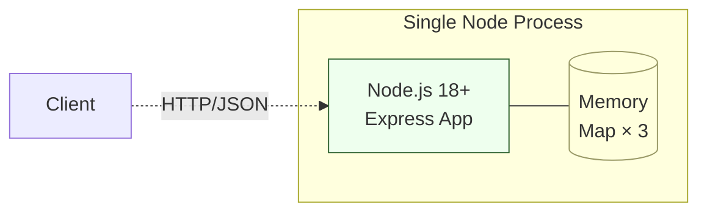
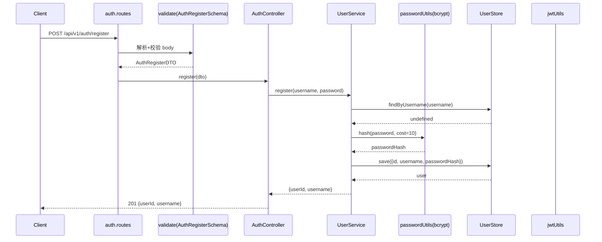
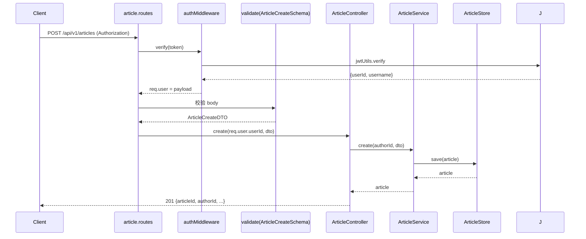
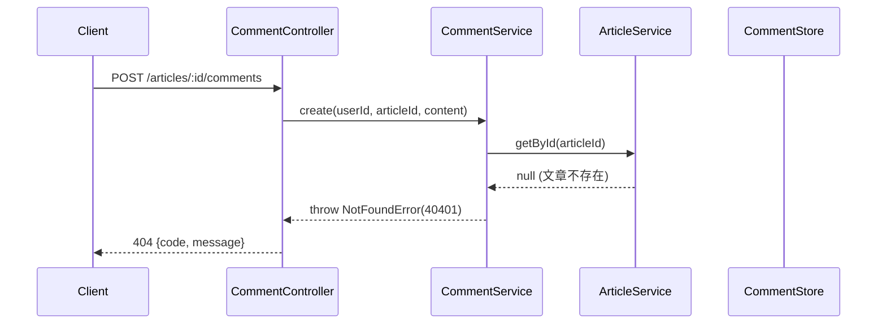

# 系统设计文档

> 阶段 2（系统设计）产出。W 模型右 V 同步产出系统测试设计。
> 本文件内嵌系统测试用例设计（ST-001~006），不再外挂独立测试用例文件。

## 文档信息

- 项目名称：blog-system-demo
- 文档版本：v1.0
- 编制日期：2026-07-21
- 编制者：W-Model Agent
- 关联需求文档：`docs/requirement-spec.md`

## 1. 系统架构

### 1.1 架构图（C4 组件图 - Mermaid）

数据流标注：
- `Client -.HTTP.-> Routes`：HTTP 请求（同步）
- `Routes --> MW`：路由进入中间件链（同步）
- `Controllers --> Services`：调用业务逻辑（同步函数调用）
- `Services --> Stores`：读写内存 Map（同步）
- `Utils -.错误响应.-> MW`：异常经 asyncHandler 抛出，由 errorHandler 统一响应

### 1.2 部署图（单进程 / 内存）

部署说明：单进程 Node.js 18+；3 个内存 Map（UserStore / ArticleStore / CommentStore）；无外部数据库 / 缓存 / 消息队列；进程重启数据丢失（约束 CON-002 / CON-004）。

### 1.3 架构风格说明

**分层架构（Layered Architecture）** —— 自上而下 4 层：

| 层 | 职责 | 依赖方向 |
|---|---|---|
| 表现层（routes + middleware + controllers） | HTTP 路由、参数解析、鉴权、错误响应 | 仅依赖 Domain |
| 领域层（services） | 业务规则、事务编排、作者隔离校验 | 依赖 Persistence |
| 持久层（stores） | 内存 Map 增删改查 | 无外部依赖 |
| 横切层（utils + schemas） | JWT / bcrypt / zod schema / async 包装 | 无外部依赖（仅第三方库） |

**选型理由**：
- 业务规模小（4 个领域），分层清晰即可，无需 DDD / 六边形架构的过度抽象。
- 单进程内存存储，无需引入 Repository Pattern 的接口隔离（节省 1 个抽象层）。
- 依赖方向严格自上而下，禁止反向依赖（如 stores 不能 import services）—— 通过 ESLint `no-restricted-imports` 强制。

## 2. 技术选型（5 维度决策矩阵）

> 每个候选技术按 5 维度评分（1=差 / 5=优），加权汇总后取最高分；并列时按「可维护性 > 成熟度 > 适用性」破局。

### 2.1 后端框架

| 维度 | Express 4 | Fastify 4 | NestJS 10 |
|---|:---:|:---:|:---:|
| 适用性 | 5（覆盖 REST + middleware，需求匹配） | 5（覆盖 REST，性能更优） | 4（IoC + 装饰器过度） |
| 成熟度 | 5（10+ 年生产案例，社区最大） | 4（5 年，案例渐增） | 4（6 年，案例中量） |
| 可维护性 | 4（极简，文档清晰，1 周可独立运维） | 4（极简，文档良好） | 3（IoC 学习曲线陡） |
| 引入成本 | 5（仅 1 个依赖，零运行时） | 4（少量内置插件） | 2（依赖反射 / RxJS） |
| 风险敞口 | 5（替换工作量极低，原生 HTTP） | 4（替换需重写 schema） | 2（绑定 Nest 生态） |
| **总分** | **24** | **21** | **15** |

**选型**：Express 4。一句话理由：极简、零运行时、替换成本最低，与 baseline 复用目标一致。

### 2.2 语言与类型系统

| 维度 | TypeScript 5 strict | JavaScript (ESM) | Flow |
|---|:---:|:---:|:---:|
| 适用性 | 5（类型推断匹配 NFR-003） | 3（无静态类型） | 4（类型系统良好） |
| 成熟度 | 5（社区最大，TS 5 稳定） | 5（JS 标准） | 2（社区萎缩） |
| 可维护性 | 5（strict 模式可量化 0 错误） | 3（重构成本高） | 3（工具支持差） |
| 引入成本 | 4（仅 tsc + tsconfig） | 5（零引入） | 3（需 babel transform） |
| 风险敞口 | 5（可降级为 JS） | 5（原生） | 2（绑定 Flow 团队） |
| **总分** | **24** | **21** | **14** |

**选型**：TypeScript 5 strict。一句话理由：直接对应 NFR-003 可量化指标（tsc strict 0 错误）。

### 2.3 密码哈希

| 维度 | bcrypt | argon2 | scrypt |
|---|:---:|:---:|:---:|
| 适用性 | 5（NFR-001 直接指定 cost≥10） | 5（更现代） | 4（可用但 API 复杂） |
| 成熟度 | 5（10+ 年生产） | 4（5 年，案例中） | 4（10 年，案例少） |
| 可维护性 | 5（API 极简） | 4（参数 3 维需调优） | 3（参数复杂） |
| 引入成本 | 5（原生 C 绑定，零额外配置） | 3（需 node-gyp） | 4（内置 crypto） |
| 风险敞口 | 5（标准格式 `$2b$`，跨语言兼容） | 3（绑定 argon2 库） | 4（绑定 Node crypto） |
| **总分** | **25** | **19** | **19** |

**选型**：bcrypt 5.x。一句话理由：NFR-001 已指定 cost≥10，bcrypt 原生支持且跨语言兼容。

### 2.4 JWT 库

| 维度 | jsonwebtoken 9 | jose | node-jose |
|---|:---:|:---:|:---:|
| 适用性 | 5（HS256 完全覆盖） | 5（覆盖更广） | 4（覆盖广但 API 繁） |
| 成熟度 | 5（10+ 年案例最多） | 4（4 年，案例增） | 3（5 年，案例少） |
| 可维护性 | 5（API 极简：sign / verify / decode） | 4（API 现代） | 3（API 复杂） |
| 引入成本 | 5（仅 1 依赖） | 4（无依赖） | 3（依赖多） |
| 风险敞口 | 5（标准 JWT，可换 jose） | 4（绑定 jose API） | 3（绑定 node-jose） |
| **总分** | **25** | **21** | **17** |

**选型**：jsonwebtoken 9.x。一句话理由：API 最简，社区案例最多，与 baseline 一致。

### 2.5 参数校验

| 维度 | zod 3 | joi 17 | yup 1 |
|---|:---:|:---:|:---:|
| 适用性 | 5（TS-first，推断类型） | 4（覆盖广） | 4（覆盖广） |
| 成熟度 | 4（4 年，案例增） | 5（10+ 年） | 5（8 年） |
| 可维护性 | 5（schema 推断 TS 类型，零重复） | 3（类型需手动） | 3（类型需手动） |
| 引入成本 | 5（零依赖） | 4（少量依赖） | 4（少量依赖） |
| 风险敞口 | 5（schema 标准，可换） | 4（绑定 joi） | 4（绑定 yup） |
| **总分** | **24** | **20** | **21** |

**选型**：zod 3.x。一句话理由：TS-first，从 schema 推断类型，零重复定义。

### 2.6 测试运行器

| 维度 | vitest 1 | jest 29 | mocha 10 |
|---|:---:|:---:|:---:|
| 适用性 | 5（Vite 生态，tsc strict 兼容） | 4（覆盖广但配置繁） | 3（需组合 chai） |
| 成熟度 | 4（3 年，案例增） | 5（10+ 年） | 5（12 年） |
| 可维护性 | 5（API 与 jest 兼容 + ESM 原生） | 4（CJS 默认，ESM 需配置） | 3（需手动组合） |
| 引入成本 | 5（零配置 + 内置 coverage） | 4（需配置 ts-jest） | 3（需多包） |
| 风险敞口 | 4（绑定 vite） | 4（绑定 jest） | 5（解耦） |
| **总分** | **23** | **21** | **19** |

**选型**：vitest 1.x。一句话理由：ESM 原生支持 + 内置 coverage + 与 tsc strict 兼容，约束 CON-005 已声明。

## 3. 模块划分

| 模块 ID | 模块名 | 职责 | 关联需求 | 主要文件 |
|---|---|---|---|---|
| M-001 | 路由层 | HTTP 路由注册、路径匹配 | REQ-001~004 | `src/routes/auth.routes.ts`、`src/routes/article.routes.ts`、`src/routes/comment.routes.ts` |
| M-002 | 中间件 | 鉴权、参数校验、错误捕获 | NFR-001、NFR-003 | `src/middleware/auth.ts`、`src/middleware/error-handler.ts`、`src/middleware/validate.ts` |
| M-003 | 控制器 | 请求/响应映射、调用 Service | REQ-001~004 | `src/controllers/auth.controller.ts`、`src/controllers/article.controller.ts`、`src/controllers/comment.controller.ts` |
| M-004 | 服务层 | 业务规则、作者隔离、事务编排 | REQ-001~004、NFR-001 | `src/services/user.service.ts`、`src/services/article.service.ts`、`src/services/comment.service.ts` |
| M-005 | 存储层 | 内存 Map CRUD | CON-002 | `src/stores/user.store.ts`、`src/stores/article.store.ts`、`src/stores/comment.store.ts` |
| M-006 | Schema | zod 请求/响应 schema | NFR-003 | `src/schemas/auth.schema.ts`、`src/schemas/article.schema.ts`、`src/schemas/comment.schema.ts` |
| M-007 | 工具 | JWT、bcrypt、async 包装 | NFR-001 | `src/utils/jwt.ts`、`src/utils/password.ts`、`src/utils/async-handler.ts` |
| M-008 | 应用入口 | Express app 装配、路由挂载 | 全部 | `src/app.ts`、`src/server.ts` |

## 4. 数据流图

### 4.1 用户注册数据流

### 4.2 创建文章数据流

### 4.3 评论创建异常路径数据流

## 5. 系统测试用例设计

> 阶段 2 同步产出系统测试设计。本阶段只设计，不执行；执行在阶段 7（系统测试）。
> 覆盖原则：必须覆盖 TC-DES-007（端到端）、TC-DES-008（性能基线）、TC-DES-009（安全基线）三类强制场景。

### 5.1 系统测试用例清单

| 用例 ID | 关联需求 | 场景 | 输入 | 预期输出 | 优先级 |
|---|---|---|---|---|---|
| ST-001 | REQ-001~004 | 端到端：注册→登录→创建文章→浏览→评论→删除全链路 | 依次调用 9 个 API：register → login → createArticle → listArticles → getArticle → createComment → getArticle → deleteArticle → getArticle；存储已重置 | 步骤 1-8 返回 201/200/201/200/200/201/200/204；步骤 9 返回 404 + 40401；公开浏览可在未认证下进行；评论随文章详情聚合 | 高 |
| ST-002 | REQ-002 | 作者隔离验证 - A 修改 / 删除 B 的文章被拒 | 用户 A、B 已注册登录；文章 X 由 B 创建；A 的 token 调用 `PATCH /api/v1/articles/:X` 与 `DELETE /api/v1/articles/:X`；B 的 token 调用 `PATCH /api/v1/articles/:X` | A 修改 / 删除返回 403 + 40301「无权操作他人文章」；B 修改自己的文章返回 200；文章 X 仍存在且 title 已更新 | 高 |
| ST-003 | NFR-002 | 性能基线 - 100 QPS 持续 10 分钟，P95 ≤ 200ms | k6 / autocannon 压测 `GET /api/v1/articles?page=1&pageSize=10`；预置 10000 篇文章；负载模型 ramp-up 30s → sustain 9min → ramp-down 30s；目标 QPS=100 | `expect(p95).toBeLessThanOrEqual(200)`；`expect(errorRate).toBe(0)`；`expect(actualRPS).toBeGreaterThanOrEqual(95)`；无 5xx；进程未崩溃；内存占用 < 500MB | 高 |
| ST-004 | NFR-001 | 安全基线 - 未授权访问受保护资源被拒 | 无 Authorization 头调用：`POST /api/v1/articles`、`DELETE /api/v1/articles/:id`、`POST /api/v1/articles/:id/comments`；对照组 `GET /api/v1/articles`（无 Authorization） | 受保护接口返回 401 + 40103「未提供认证令牌」；公开接口 `GET /api/v1/articles` 返回 200 不受影响 | 高 |
| ST-005 | NFR-001 | 安全基线 - JWT 过期 / 伪造处理 | 过期 JWT（exp = now - 1s）+ 合法 body 调用 `POST /api/v1/articles`；伪造签名 JWT（错误密钥）调用同接口；合法 JWT 对照组 | 过期 / 伪造 JWT 一律返回 401 + 40102「JWT 已过期或无效」；合法 JWT 返回 201（对照组通过） | 高 |
| ST-006 | NFR-001 | 安全基线 - 密码 bcrypt 哈希存储（cost=10） | 注册新用户后读取 `userStore` 内部记录；`bcrypt.getRounds(passwordHash)`；`bcrypt.compare("WrongPass", hash)` | `user.passwordHash` 以 `$2b$10$` 开头；`bcrypt.getRounds(hash) === 10`；存储中无 `password` 字段；`bcrypt.compare` 返回 false | 高 |

### 5.2 系统测试覆盖说明

- 端到端覆盖（TC-DES-007）：ST-001（注册→登录→创建→浏览→评论→删除全链路）
- 性能基线覆盖（TC-DES-008）：ST-003（100 QPS · 10min · P95 ≤ 200ms）
- 安全基线覆盖（TC-DES-009）：ST-004 / ST-005 / ST-006（未授权 / JWT 过期 / bcrypt 存储）
- 异常路径覆盖：作者隔离（40301）/ JWT 过期（40102）/ 未授权（40103）/ 不存在（40401）
- 总计：6 条 ST，覆盖端到端 + 性能基线 + 安全基线 + 作者隔离

## 6. 阶段 2 自检清单

- [x] 架构设计已按「技术选型决策矩阵」5 维度评分（6 个候选维度，每项含总分 + 一句话选型理由）
- [x] 系统架构图（C4 组件图 + 部署图）清晰，含数据流标注
- [x] 模块划分（8 模块）+ 数据流图（3 个 sequence diagram）
- [x] 系统测试用例覆盖关键系统级路径（端到端 + 性能基线 + 安全基线），共 6 条
- [x] RTM 已补登 system-design 文档（见 `.w-model/rtm.json`）

## 7. 阶段完成摘要

- 产物路径：
  - `docs/system-design.md`（本文件，内嵌 ST-001~006）
  - `.w-model/rtm.json`（已补登 system-design）
- RTM 覆盖状态：部分（designDoc 已填充；codeModule / UT / IT / ST / UAT 待后续阶段填充）
- 验证证据：6 项技术选型全部 5 维度评分 + 总分；架构图含 4 层 + 数据流标注；6 条 ST 覆盖端到端 + 性能 + 安全
- 阻塞项：无
- 下一步：进入阶段 3（概要设计），同步产出集成测试设计
