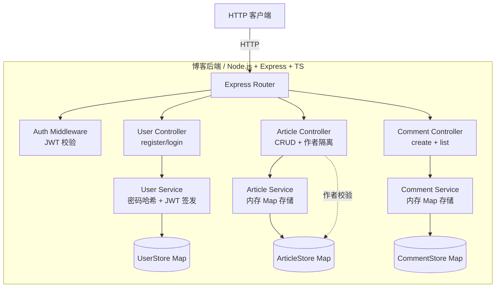

# 系统设计文档

> 阶段 2（系统设计）产出。项目：博客系统（W 模型端到端调测）。

## 文档信息

- 项目名称：博客系统（blog-system-demo）
- 文档版本：v1.0
- 编制日期：2026-07-20
- 关联需求文档：[requirement-spec.md](./requirement-spec.md)

## 1. 系统架构

### 1.1 架构图

### 1.2 架构风格说明

- **分层架构**：Router → Middleware → Controller → Service → Store。每层职责单一、依赖单向（上层依赖下层）。
- **内存存储**：用三个 `Map` 分别承载 users / articles / comments，便于端到端调测，无需 DB 依赖；后续可替换为 SQLite 不改 Service 接口。
- **认证与业务解耦**：JWT 校验由 Auth Middleware 统一处理，Controller 只关注业务逻辑；公开路由（GET /articles、GET /articles/:id、GET /articles/:id/comments）不走 Auth Middleware。

## 2. 技术选型

| 层次 | 技术 | 版本 | 选型理由 |
|---|---|---|---|
| 后端 | Node.js | ≥20 | 项目约束 |
| Web 框架 | Express | 4 | 轻量、生态成熟、TS 支持好 |
| 语言 | TypeScript | 5 | 严格模式，NFR-003 要求 |
| 输入校验 | zod | 3 | 与 TS 类型联动，运行时 + 编译时双重保障 |
| 认证 | jsonwebtoken | 9 | JWT 标准实现 |
| 密码哈希 | bcrypt | 5 | NFR-001 要求 cost ≥ 10 |
| 测试框架 | vitest | 1 | 与 TS/ESM 原生集成，速度快 |
| 数据存储 | Map（内存） | — | 端到端调测，无外部依赖 |

## 3. 模块划分

| 模块 ID | 模块名 | 职责 | 关联需求 |
|---|---|---|---|
| M-001 | 用户认证模块 | 注册（用户名查重 + bcrypt 哈希）、登录（验密 + JWT 签发）、JWT 校验中间件 | REQ-001 |
| M-002 | 文章管理模块 | 文章 CRUD（含作者隔离校验）、列表/详情查询 | REQ-002 / REQ-003 |
| M-003 | 评论模块 | 对文章发表评论（需认证 + 文章存在校验）、查询文章评论列表 | REQ-004 |
| M-004 | 公共层 | 路由聚合、错误处理中间件、统一响应格式、输入校验 | 全部 |

## 4. 部署架构

- **单进程部署**：`tsx src/server.ts` 启动，监听 3000 端口。
- **环境变量**：`JWT_SECRET`（必填，缺省启动报错）、`PORT`（默认 3000）。
- **无外部依赖**：不需要数据库、缓存、消息队列，可任意单机部署。
- **已知限制**：进程重启后内存数据丢失（RISK-001）。

## 5. API 路由总览

| Method | Path | 鉴权 | 模块 | 关联需求 |
|---|---|---|---|---|
| POST | /api/auth/register | 否 | M-001 | REQ-001 |
| POST | /api/auth/login | 否 | M-001 | REQ-001 |
| POST | /api/articles | 是 | M-002 | REQ-002 |
| GET | /api/articles | 否 | M-002 | REQ-003 |
| GET | /api/articles/:id | 否 | M-002 | REQ-003 |
| PUT | /api/articles/:id | 是 + 作者 | M-002 | REQ-002 |
| DELETE | /api/articles/:id | 是 + 作者 | M-002 | REQ-002 |
| POST | /api/articles/:id/comments | 是 | M-003 | REQ-004 |
| GET | /api/articles/:id/comments | 否 | M-003 | REQ-004 |

## 6. 跨模块约定

- **统一响应**：成功返回 `{id?, ...data}`；错误返回 `{error: "message"}` + 对应 HTTP 状态码。
- **错误码**：400（输入校验失败）/ 401（未认证）/ 403（无权限）/ 404（资源不存在）/ 409（冲突）/ 500（未处理异常）。
- **作者隔离**：写文章接口在 Service 层校验 `article.authorId === userId`，不匹配抛 `ForbiddenError`。
- **ID 生成**：使用 `crypto.randomUUID()`，无顺序保证但全局唯一。

## 7. 系统测试用例索引

> 详细用例见 [system-test-cases.md](./system-test-cases.md)。

| 用例 ID | 关联模块 | 场景 | 优先级 |
|---|---|---|---|
| ST-001 | M-001 | 注册→登录→创建文章→浏览 全链路 | 高 |
| ST-002 | M-002 | 作者隔离：A 创建文章，B 尝试改/删被拒 | 高 |
| ST-003 | M-002 + M-003 | 删除文章后该文章评论不可再创建 | 中 |
| ST-004 | M-001 | JWT 过期后访问受保护接口被拒（用 1s 过期 token 模拟） | 中 |
| ST-005 | M-004 | 输入校验：缺字段 / 字段类型错误 → 400 | 高 |
| ST-006 | M-002 | 并发创建文章产生不同 articleId（2 个并发请求） | 中 |
