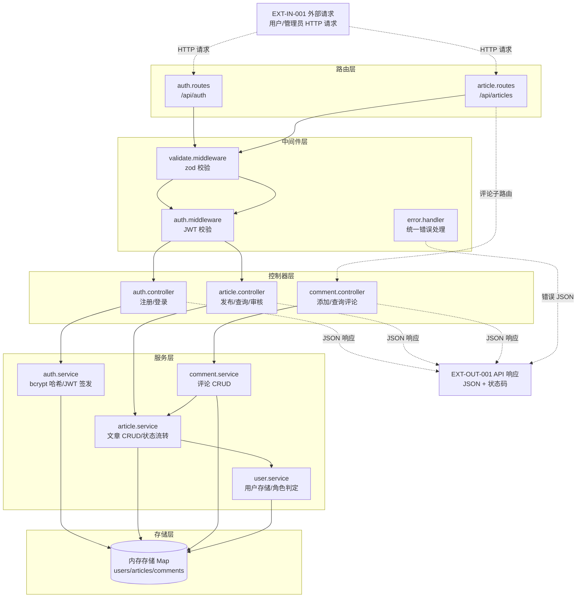
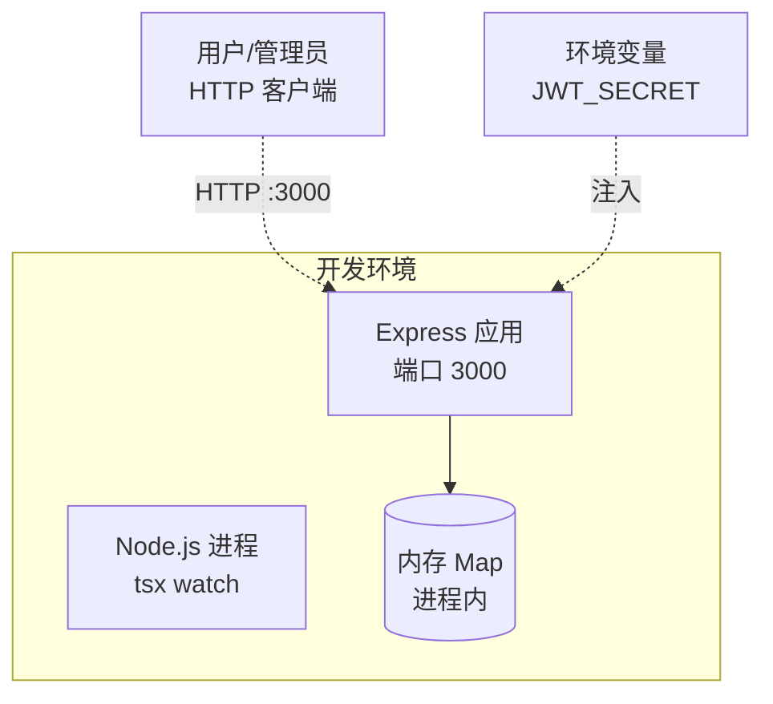

# 系统设计文档

> 阶段 2（系统设计）产出。套用 `templates/system-design.md` 模板填充。

## 文档信息

- 项目名称：blog-system-demo
- 文档版本：v1.0
- 编制日期：2026-07-24
- 关联需求文档：docs/requirement-spec.md

## 1. 系统架构

### 1.1 架构图（C4 组件图 + 数据流）



### 1.2 架构风格说明

采用**经典分层架构（Layered Architecture）**，自上而下四层：

| 层次 | 职责 | 组件 |
|---|---|---|
| 路由层 | HTTP 路由分发、路径参数解析 | auth.routes / article.routes |
| 中间件层 | 横切关注点：鉴权、输入校验、错误处理 | auth.middleware / validate.middleware / error.handler |
| 控制器层 | 请求-响应编排、HTTP 状态码决策 | auth.controller / article.controller / comment.controller |
| 服务层 | 业务逻辑：密码哈希、JWT 签发、文章状态流转 | auth.service / article.service / comment.service / user.service |
| 存储层 | 数据持久化（内存 Map） | store（users/articles/comments 三个 Map） |

**选型理由**：
1. 项目规模小（4 个业务模块、~10 个 API），分层架构足够清晰，无需微服务引入分布式复杂度。
2. 分层使职责边界明确：控制器不直接操作存储，服务层不感知 HTTP，便于阶段 5 单元测试逐层 mock。
3. 中间件链复用 Express 原生能力，鉴权与校验可声明式挂载到路由。

**数据流标注**（图中 `-.->` 为数据流箭头）：
- 输入流：外部请求 → 路由 → 中间件（校验/鉴权）→ 控制器 → 服务 → 存储
- 输出流：存储 → 服务 → 控制器 → JSON 响应 → 外部
- 错误流：任意层抛错 → error.handler 中间件 → 统一错误 JSON 响应

## 2. 技术选型

### 2.1 技术选型决策矩阵

每个候选按 5 维度评分（1=差 / 5=优），加权汇总取最高分；并列时按「可维护性 > 成熟度 > 适用性」破局。

**后端框架**：

| 候选 | 适用性 | 成熟度 | 可维护性 | 引入成本 | 风险敞口 | 总分 | 选型理由 |
|---|---|---|---|---|---|---|---|
| **Express 4** | 5 | 5 | 5 | 5 | 4 | **24** | 生态最成熟，中间件模型契合分层架构，团队 1 周内可独立运维 |
| Koa 2 | 4 | 4 | 4 | 3 | 4 | 19 | async 优雅但中间件生态小于 Express，demo 无需 async-first |
| NestJS | 4 | 4 | 3 | 2 | 3 | 16 | 装饰器 + DI 过重，约束禁止引入额外框架 |

**决策**：采用 Express 4（约束已指定，评分矩阵佐证其为最优）。

**密码哈希**：

| 候选 | 适用性 | 成熟度 | 可维护性 | 引入成本 | 风险敞口 | 总分 | 选型理由 |
|---|---|---|---|---|---|---|---|
| **bcrypt** | 5 | 5 | 5 | 5 | 4 | **24** | cost factor 可调（=10），NFR-001 要求 cost≥10，原生支持 |
| argon2 | 5 | 4 | 4 | 3 | 4 | 20 | 抗 GPU/ASIC 更强但需 native 编译，引入成本高 |

**决策**：采用 bcrypt（约束已指定，cost factor = 10）。

**鉴权**：

| 候选 | 适用性 | 成熟度 | 可维护性 | 引入成本 | 风险敞口 | 总分 | 选型理由 |
|---|---|---|---|---|---|---|---|
| **jsonwebtoken** | 5 | 5 | 5 | 5 | 4 | **24** | 无状态 JWT 契合内存存储（无 session 存储），NFR-002 要求 JWT 鉴权 |
| express-session | 3 | 5 | 4 | 4 | 3 | 19 | 需服务端 session 存储，与内存存储重启丢数据冲突 |

**决策**：采用 jsonwebtoken（JWT 无状态，契合内存存储）。

**输入校验**：

| 候选 | 适用性 | 成熟度 | 可维护性 | 引入成本 | 风险敞口 | 总分 | 选型理由 |
|---|---|---|---|---|---|---|---|
| **zod** | 5 | 4 | 5 | 5 | 4 | **23** | TypeScript-first，schema 可推导类型，NFR-003 要求 zod 校验 |
| joi | 4 | 5 | 4 | 4 | 4 | 21 | 成熟但非 TS-first，需额外类型维护 |

**决策**：采用 zod（约束已指定，TS 类型推导减少重复定义）。

**存储**：

| 候选 | 适用性 | 成熟度 | 可维护性 | 引入成本 | 风险敞口 | 总分 | 选型理由 |
|---|---|---|---|---|---|---|---|
| **内存存储 Map** | 5 | 5 | 4 | 5 | 3 | **22** | 约束要求内存存储，demo 自包含无外部依赖；封装接口便于后续替换 |
| SQLite | 3 | 5 | 5 | 3 | 4 | 20 | 约束禁止引入外部数据库 |

**决策**：采用内存存储 Map（约束指定，封装 store 接口降低替换成本，对应 RISK-001 缓解）。

### 2.2 技术选型汇总

| 层次 | 技术 | 版本 | 选型理由 |
|---|---|---|---|
| 后端框架 | Express | 4.x | 生态成熟，中间件模型契合分层架构（决策矩阵 24 分） |
| 语言 | TypeScript | 5.x (strict) | NFR-004 要求 strict 模式 0 错误；禁止 any/unknown 绕过 |
| 密码哈希 | bcrypt | 5.x | NFR-001 要求 cost≥10；cost factor=10（决策矩阵 24 分） |
| 鉴权 | jsonwebtoken | 9.x | NFR-002 要求 JWT 鉴权；无状态契合内存存储（决策矩阵 24 分） |
| 输入校验 | zod | 3.x | NFR-003 要求 zod 校验；TS-first 类型推导（决策矩阵 23 分） |
| 存储 | 内存 Map | - | 约束要求内存存储，封装 store 接口（决策矩阵 22 分） |
| 测试 | vitest | 1.x | NFR-005 要求覆盖率≥80%；Vite 原生速度快 |
| 测试工具 | supertest | 6.x | HTTP 接口集成测试 |
| 运行时 | tsx | 4.x | TypeScript 直接执行，无需预编译 |

## 3. 模块划分

| 模块 ID | 模块名 | 职责 | 关联需求 | 关联子系统 |
|---|---|---|---|---|
| M-001 | auth 模块 | 用户注册（bcrypt 哈希）、登录（JWT 签发）、登出 | REQ-002 | SD-AUTH |
| M-002 | article 模块 | 文章发布、列表查询、详情查询、状态审核流转 | REQ-003, REQ-005 | SD-ARTICLE, SD-REVIEW |
| M-003 | comment 模块 | 评论添加、评论列表查询 | REQ-004 | SD-COMMENT |
| M-004 | user 模块 | 用户存储、角色判定（admin/user） | REQ-001 | SD-AUTH |
| M-005 | middleware 模块 | JWT 鉴权中间件、zod 校验中间件、错误处理中间件 | REQ-001 | 横切 |
| M-006 | utils 模块 | JWT 签发/验证、bcrypt 封装、类型定义 | REQ-002 | SD-AUTH |

**模块依赖方向**（无环）：
```
routes → middleware → controllers → services → store
article.controller → comment.controller → article.service（评论依赖文章存在）
article.service → user.service（文章发布需用户身份）
auth.service → user.service（注册需存储用户）
```
> 依赖方向自上而下单向，无循环依赖。comment.service 依赖 article.service（评论须文章存在），article.service 依赖 user.service（发布须登录用户），均为单向。

### 3.1 子系统定义（SD 节点）

> 每个 SD 节点 parent=REQ-001（系统根），通过 implements 边追溯实现对应 REQ。

#### SD-AUTH（认证子系统）

- **parent**: REQ-001
- **implements**: REQ-002（用户身份认证）
- **职责**: 用户注册（用户名+密码，bcrypt 哈希存储）、登录（JWT 颁发）、登出、JWT 校验
- **模块**: auth 模块（M-001）、user 模块（M-004）、utils 模块（M-006）
- **状态机**: 注册 → 已注册；登录 → 已登录（持 JWT）；登出 → 未登录
- **关键约束**: 密码 bcrypt cost=10；JWT 过期 ≤1 小时；JWT_SECRET 环境变量注入

#### SD-ARTICLE（文章子系统）

- **parent**: REQ-001
- **implements**: REQ-003（文章发布与查询）
- **职责**: 文章发布（已登录用户）、文章列表查询、文章详情查询、文章状态管理
- **模块**: article 模块（M-002）
- **状态机**: none → pending（发布）→ approved/rejected（审核）；普通用户仅可见 approved
- **关键约束**: 发布须登录；初始状态 pending；普通用户列表不返回 rejected

#### SD-COMMENT（评论子系统）

- **parent**: REQ-001
- **implements**: REQ-004（评论添加与查询）
- **职责**: 已登录用户对文章添加评论、查询文章下评论列表
- **模块**: comment 模块（M-003）
- **状态机**: 无评论 → 有评论（评论数递增）
- **关键约束**: 添加须登录；文章须存在（pending/approved 可评论）；查询无需登录

#### SD-REVIEW（审核子系统）

- **parent**: REQ-001
- **implements**: REQ-005（管理员内容审核）
- **职责**: 管理员将 pending 文章审核为 approved/rejected；rejected 对普通用户不可见
- **模块**: article 模块审核部分（M-002 审核接口）
- **状态机**: pending → approved（通过）；pending → rejected（驳回）
- **关键约束**: 仅管理员（role=admin）可调用；目标文章须为 pending；rejected 文章对普通用户列表/详情不可见

## 4. 部署架构

### 4.1 部署图



### 4.2 环境说明

| 环境 | 配置 | 说明 |
|---|---|---|
| 开发 | `npm run dev`（tsx watch） | 热重载，JWT_SECRET=test-secret-blog-demo |
| 测试 | `npm test`（vitest） | cross-env JWT_SECRET=test-secret-blog-demo 固化 |
| 生产 | 不适用 | demo 范围，内存存储重启丢数据（RISK-001） |

**单进程单实例**：Express 单实例运行，内存 Map 存储于进程内，无并发问题（RISK-005 缓解）。

## 5. 系统测试用例索引

> 详细用例见 `docs/system-test-cases.md`。本阶段只设计，阶段 7 执行。

| 用例 ID | 关联模块 | 场景 | 优先级 |
|---|---|---|---|
| ST-001 | SD-AUTH, SD-ARTICLE | 端到端：注册→登录→发布文章→审核→查询 | 高 |
| ST-002 | SD-ARTICLE, SD-COMMENT | 端到端：发布文章→添加评论→查询评论 | 高 |
| ST-003 | SD-REVIEW | 安全：非管理员调用审核接口被拒（403） | 高 |
| ST-004 | SD-AUTH | 安全：无效 JWT 访问受保护接口（401） | 高 |
| ST-005 | SD-ARTICLE | 安全：rejected 文章对普通用户不可见 | 高 |
| ST-006 | 全模块 | 性能基线：100 QPS 持续 10min，P95 < 2s | 高 |
| ST-007 | 全模块 | 性能基线：单接口响应 < 500ms | 高 |
| ST-008 | SD-AUTH | 安全：密码 bcrypt 哈希存储（无明文） | 高 |
| ST-009 | 全模块 | 异常：zod 校验非法输入返回 400 | 中 |
| ST-010 | SD-ARTICLE | 异常：文章不存在返回 404 | 中 |

## 6. 子系统协作

### 6.1 子系统间信息流

| from | to | 信息 | 说明 |
|---|---|---|---|
| SD-AUTH | SD-ARTICLE | JWT + 用户身份 | 文章发布须登录用户 |
| SD-AUTH | SD-COMMENT | JWT + 用户身份 | 评论添加须登录用户 |
| SD-ARTICLE | SD-COMMENT | 文章存在性 | 评论须文章存在 |
| SD-REVIEW | SD-ARTICLE | 审核状态 | 审核改变文章状态，影响查询可见性 |
| SD-ARTICLE | SD-REVIEW | pending 文章 | 审核目标为 pending 文章 |

### 6.2 数据模型

```typescript
// 用户
interface User { id: string; username: string; passwordHash: string; role: 'admin' | 'user' }
// 文章
interface Article { id: string; authorId: string; title: string; content: string; status: 'pending' | 'approved' | 'rejected'; createdAt: string }
// 评论
interface Comment { id: string; articleId: string; authorId: string; content: string; createdAt: string }
```

存储层使用三个独立 Map：`Map<string, User>` / `Map<string, Article>` / `Map<string, Comment>`，键为实体 ID。
