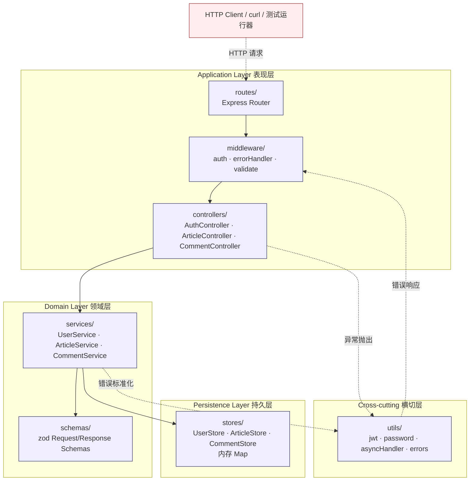
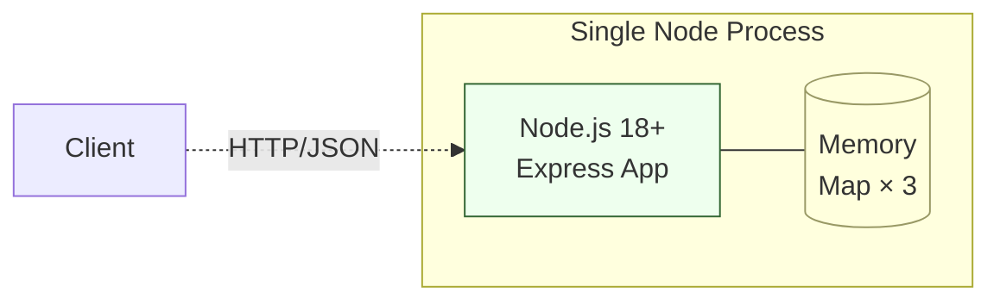

# 系统设计文档

> 阶段 2（系统设计）产出。W 模型右 V 同步产出系统测试设计。
> 系统测试用例 ST-001~008 的详细步骤见 `docs/system-test-cases.md`，本文件内嵌用例索引与覆盖说明。

## 文档信息

- 项目名称：blog-system-demo
- 文档版本：v1.0
- 编制日期：2026-07-23
- 编制者：W-Model Agent（self-as-verifier 回归调测）
- 关联需求文档：`docs/requirement-spec.md`
- 关联 W 模型阶段：阶段 2（系统设计 → 同步系统测试设计）

## 1. 系统架构

### 1.1 架构图（C4 组件图 - Mermaid）



数据流标注：
- `Client -.HTTP 请求.-> Routes`：HTTP 请求（同步）
- `Routes --> MW`：路由进入中间件链（同步）
- `Controllers --> Services`：调用业务逻辑（同步函数调用）
- `Services --> Stores`：读写内存 Map（同步）
- `Utils -.错误响应.-> MW`：异常经 asyncHandler 抛出，由 errorHandler 统一响应

### 1.2 部署图（单进程 / 内存）



部署说明：单进程 Node.js 18+；3 个内存 Map（UserStore / ArticleStore / CommentStore）；无外部数据库 / 缓存 / 消息队列；进程重启数据丢失（约束 CON-002 / CON-004）。

### 1.3 架构风格说明

**分层架构（Layered Architecture）** —— 自上而下 4 层，依赖方向严格自上而下：

| 层 | 职责 | 依赖方向 | 关联设计节点 |
|---|---|---|---|
| 表现层（routes + middleware + controllers） | HTTP 路由、参数解析、鉴权、错误响应 | 仅依赖 Domain | SD-001~004、SD-005 |
| 领域层（services + schemas） | 业务规则、事务编排、作者隔离校验、zod 校验 | 依赖 Persistence | SD-001~004、SD-006 |
| 持久层（stores） | 内存 Map 增删改查 | 无外部依赖 | SD-007 |
| 横切层（utils） | JWT / bcrypt / async 包装 / 错误码标准化 | 无外部依赖（仅第三方库） | SD-005、SD-008 |

选型理由：
- 业务规模小（3 个业务域），分层清晰即可，无需 DDD / 六边形架构的过度抽象。
- 单进程内存存储，无需引入 Repository Pattern 的接口隔离（节省 1 个抽象层）。
- 依赖方向严格自上而下，禁止反向依赖（如 stores 不能 import services）—— 通过 ESLint `no-restricted-imports` 强制（NFR-003 可维护性）。

## 2. 技术选型（5 维度决策矩阵）

> 每个候选技术按 5 维度评分（1=差 / 5=优），加权汇总后取最高分；并列时按「可维护性 > 成熟度 > 适用性」破局。无评分依据的选型一律返工。

### 2.1 后端框架

| 维度 | Express 4 | Fastify 4 | NestJS 10 |
|---|:---:|:---:|:---:|
| 适用性 | 5（覆盖 REST + middleware，需求匹配） | 5（覆盖 REST，性能更优） | 4（IoC + 装饰器过度） |
| 成熟度 | 5（10+ 年生产案例，社区最大） | 4（5 年，案例渐增） | 4（6 年，案例中量） |
| 可维护性 | 4（极简，文档清晰，1 周可独立运维） | 4（极简，文档良好） | 3（IoC 学习曲线陡） |
| 引入成本 | 5（仅 1 个依赖，零运行时） | 4（少量内置插件） | 2（依赖反射 / RxJS） |
| 风险敞口 | 5（替换工作量极低，原生 HTTP） | 4（替换需重写 schema） | 2（绑定 Nest 生态） |
| **总分** | **24** | **21** | **15** |

选型：Express 4。一句话理由：极简、零运行时、替换成本最低，与 CON-001 约束一致。

### 2.2 语言与类型系统

| 维度 | TypeScript 5 strict | JavaScript (ESM) | Flow |
|---|:---:|:---:|:---:|
| 适用性 | 5（类型推断匹配 NFR-003） | 3（无静态类型） | 4（类型系统良好） |
| 成熟度 | 5（社区最大，TS 5 稳定） | 5（JS 标准） | 2（社区萎缩） |
| 可维护性 | 5（strict 模式可量化 0 错误） | 3（重构成本高） | 3（工具支持差） |
| 引入成本 | 4（仅 tsc + tsconfig） | 5（零引入） | 3（需 babel transform） |
| 风险敞口 | 5（可降级为 JS） | 5（原生） | 2（绑定 Flow 团队） |
| **总分** | **24** | **21** | **14** |

选型：TypeScript 5 strict。一句话理由：直接对应 NFR-003 可量化指标（tsc strict 0 错误）。

### 2.3 密码哈希

| 维度 | bcrypt 5 | argon2 | scrypt |
|---|:---:|:---:|:---:|
| 适用性 | 5（NFR-001 直接指定 cost≥10） | 5（更现代） | 4（可用但 API 复杂） |
| 成熟度 | 5（10+ 年生产） | 4（5 年，案例中） | 4（10 年，案例少） |
| 可维护性 | 5（API 极简） | 4（参数 3 维需调优） | 3（参数复杂） |
| 引入成本 | 5（原生 C 绑定，零额外配置） | 3（需 node-gyp） | 4（内置 crypto） |
| 风险敞口 | 5（标准格式 `$2b$`，跨语言兼容） | 3（绑定 argon2 库） | 4（绑定 Node crypto） |
| **总分** | **25** | **19** | **19** |

选型：bcrypt 5.x。一句话理由：NFR-001 已指定 cost≥10，bcrypt 原生支持且跨语言兼容。

### 2.4 JWT 库

| 维度 | jsonwebtoken 9 | jose | node-jose |
|---|:---:|:---:|:---:|
| 适用性 | 5（HS256 完全覆盖） | 5（覆盖更广） | 4（覆盖广但 API 繁） |
| 成熟度 | 5（10+ 年案例最多） | 4（4 年，案例增） | 3（5 年，案例少） |
| 可维护性 | 5（API 极简：sign / verify / decode） | 4（API 现代） | 3（API 复杂） |
| 引入成本 | 5（仅 1 依赖） | 4（无依赖） | 3（依赖多） |
| 风险敞口 | 5（标准 JWT，可换 jose） | 4（绑定 jose API） | 3（绑定 node-jose） |
| **总分** | **25** | **21** | **17** |

选型：jsonwebtoken 9.x。一句话理由：API 最简，社区案例最多，与 CON-006 仅 HS256 约束一致。

### 2.5 参数校验

| 维度 | zod 3 | joi 17 | yup 1 |
|---|:---:|:---:|:---:|
| 适用性 | 5（TS-first，推断类型） | 4（覆盖广） | 4（覆盖广） |
| 成熟度 | 4（4 年，案例增） | 5（10+ 年） | 5（8 年） |
| 可维护性 | 5（schema 推断 TS 类型，零重复） | 3（类型需手动） | 3（类型需手动） |
| 引入成本 | 5（零依赖） | 4（少量依赖） | 4（少量依赖） |
| 风险敞口 | 5（schema 标准，可换） | 4（绑定 joi） | 4（绑定 yup） |
| **总分** | **24** | **20** | **21** |

选型：zod 3.x。一句话理由：TS-first，从 schema 推断类型，零重复定义，直接对应 NFR-003。

### 2.6 测试运行器

| 维度 | vitest 1 | jest 29 | mocha 10 |
|---|:---:|:---:|:---:|
| 适用性 | 5（Vite 生态，tsc strict 兼容） | 4（覆盖广但配置繁） | 3（需组合 chai） |
| 成熟度 | 4（3 年，案例增） | 5（10+ 年） | 5（12 年） |
| 可维护性 | 5（API 与 jest 兼容 + ESM 原生） | 4（CJS 默认，ESM 需配置） | 3（需手动组合） |
| 引入成本 | 5（零配置 + 内置 coverage） | 4（需配置 ts-jest） | 3（需多包） |
| 风险敞口 | 4（绑定 vite） | 4（绑定 jest） | 5（解耦） |
| **总分** | **23** | **21** | **19** |

选型：vitest 1.x。一句话理由：ESM 原生支持 + 内置 coverage + 与 tsc strict 兼容，约束 CON-005 已声明不引入 jest。

## 3. 模块划分

> 三大业务域（auth / article / comment）+ 共享 middleware / utils / stores。模块 ID 与图谱 SD 节点一一对应，每模块 implements 对应需求。

| 模块 ID | 模块名 | 职责 | 关联需求 | 主要文件 |
|---|---|---|---|---|
| SD-001 | 认证域 | 注册（bcrypt 哈希）/ 登录（颁发 JWT）/ JWT 校验中间件 | REQ-001 | `src/routes/auth.routes.ts`、`src/controllers/auth.controller.ts`、`src/services/user.service.ts` |
| SD-002 | 文章管理域 | 文章 CRUD + 作者隔离校验 | REQ-002 | `src/routes/article.routes.ts`、`src/controllers/article.controller.ts`、`src/services/article.service.ts` |
| SD-003 | 公开浏览域 | 分页列表 + 文章详情（含评论聚合） | REQ-003 | `src/services/article.service.ts`（list/getDetail）、`src/controllers/article.controller.ts` |
| SD-004 | 评论域 | 评论增删查 + 文章存在性校验 | REQ-004 | `src/routes/comment.routes.ts`、`src/controllers/comment.controller.ts`、`src/services/comment.service.ts` |
| SD-005 | 安全中间件 | 鉴权中间件、JWT 校验、bcrypt 包装、密钥管理 | NFR-001 | `src/middleware/auth.ts`、`src/utils/jwt.ts`、`src/utils/password.ts` |
| SD-006 | 校验与类型 | zod 请求/响应 schema、TS strict 类型边界 | NFR-003 | `src/schemas/auth.schema.ts`、`src/schemas/article.schema.ts`、`src/schemas/comment.schema.ts`、`src/middleware/validate.ts` |
| SD-007 | 内存存储 | UserStore / ArticleStore / CommentStore 内存 Map CRUD | NFR-004 | `src/stores/user.store.ts`、`src/stores/article.store.ts`、`src/stores/comment.store.ts` |
| SD-008 | 性能保障 | 分页查询、单进程事件循环、错误处理中间件 | NFR-002 | `src/middleware/error-handler.ts`、`src/utils/async-handler.ts`、`src/app.ts` |

模块循环依赖检测：阶段 5 编码后执行 `npx madge --circular --extensions ts,js src`，退出码须为 0；本阶段设计已通过依赖方向自上而下（stores ↛ services ↛ controllers）规避循环。

## 4. API 契约清单

> RESTful 端点，统一前缀 `/api/v1`。所有入参经 zod schema 校验（SD-006）。

### 4.1 认证 API（SD-001）

| 方法 | 路径 | 鉴权 | 请求体 | 成功响应 | 失败响应 |
|---|---|---|---|---|---|
| POST | `/api/v1/auth/register` | 无 | `{username: string, password: string}` | 201 `{userId, username}` | 40001 参数错误 / 40901 用户名已存在 |
| POST | `/api/v1/auth/login` | 无 | `{username: string, password: string}` | 200 `{token, expiresIn: 3600}` | 40001 参数错误 / 40101 用户名或密码错误 |

### 4.2 文章 API（SD-002 / SD-003）

| 方法 | 路径 | 鉴权 | 请求体 / 参数 | 成功响应 | 失败响应 |
|---|---|---|---|---|---|
| POST | `/api/v1/articles` | Bearer | `{title, content, tags[]}` | 201 `{articleId, authorId, title, content, tags, createdAt}` | 40001 / 40102 / 40103 |
| GET | `/api/v1/articles` | 无 | `?page=1&pageSize=10` | 200 `{items[], total, page, pageSize}` | 40001 分页越界 |
| GET | `/api/v1/articles/:id` | 无 | path: id | 200 `{articleId, authorId, title, content, tags, createdAt, comments[]}` | 40401 不存在 |
| PUT | `/api/v1/articles/:id` | Bearer | `{title?, content?, tags?}` | 200 更新后文章 | 40102 / 40301 非作者 / 40401 |
| DELETE | `/api/v1/articles/:id` | Bearer | path: id | 204 空响应 | 40102 / 40301 非作者 / 40401 |

### 4.3 评论 API（SD-004）

| 方法 | 路径 | 鉴权 | 请求体 / 参数 | 成功响应 | 失败响应 |
|---|---|---|---|---|---|
| POST | `/api/v1/articles/:id/comments` | Bearer | `{content: string}` | 201 `{commentId, articleId, authorId, content, createdAt}` | 40001 / 40102 / 40401 文章不存在 |
| DELETE | `/api/v1/comments/:commentId` | Bearer | path: commentId | 204 空响应 | 40102 / 40301 非作者 / 40401 |
| GET | `/api/v1/articles/:id` | 无 | （随文章详情返回 comments[]） | 200 含 comments[] | 40401 |

### 4.4 测试维护端点

| 方法 | 路径 | 鉴权 | 用途 |
|---|---|---|---|
| POST | `/__test/reset` | 无 | 重置内存存储（RISK-001 缓解，仅 ST/IT 使用） |

## 5. 数据模型概要

> 三大实体，均存储于内存 Map（SD-007）。ID 采用 UUID v4。

### 5.1 User 实体

```typescript
interface User {
  id: string;            // UUID v4，注册时生成
  username: string;      // 唯一，长度 3-32
  passwordHash: string;  // bcrypt $2b$10$ 格式，明文不入存储
  createdAt: string;     // ISO 8601
}
```

### 5.2 Article 实体

```typescript
interface Article {
  id: string;          // UUID v4
  authorId: string;    // = JWT.userId，作者隔离依据
  title: string;       // 长度 1-200
  content: string;     // 长度 1-10000
  tags: string[];      // 0-10 个
  createdAt: string;   // ISO 8601
  updatedAt: string;   // ISO 8601，初始 = createdAt
}
```

### 5.3 Comment 实体

```typescript
interface Comment {
  id: string;         // UUID v4
  articleId: string;  // 关联文章
  authorId: string;   // = JWT.userId，不取自 body
  content: string;    // 长度 1-1000
  createdAt: string;  // ISO 8601，列表按此升序
}
```

## 6. 安全设计

> 对应 NFR-001，落地于 SD-005 安全中间件。

| 安全项 | 设计决策 | 实现位置 |
|---|---|---|
| 密码哈希 | bcrypt cost = 10；`$2b$10$` 格式；明文密码不入日志 / 响应 / 存储 | `utils/password.ts`、`services/user.service.ts` |
| JWT 签名 | HS256；exp = 3600s（iat+3600）；payload 仅含 `{userId, username}` | `utils/jwt.ts` |
| JWT 密钥 | 来自 `process.env.JWT_SECRET`；启动时缺失即抛错退出（RISK-003/008） | `utils/jwt.ts`、`server.ts` |
| JWT 校验 | 过期 / 伪造签名 / 格式错误一律返回 40102；缺失 Authorization 返回 40103 | `middleware/auth.ts` |
| 入参校验 | 所有公开接口入参经 zod schema 校验（NFR-003） | `middleware/validate.ts`、`schemas/*.ts` |
| 作者隔离 | 修改 / 删除前校验 `article.authorId === req.user.userId`，不匹配返回 40301 | `services/article.service.ts`、`services/comment.service.ts` |
| 密码复杂度 | 长度 ≥ 8 + 至少 1 字母 + 1 数字（RISK-006 量化） | `schemas/auth.schema.ts` |
| 错误信息 | 不泄露内部堆栈；错误响应统一 `{code, message}` 结构 | `middleware/error-handler.ts` |

## 7. 错误码规范

> 统一错误响应格式 `{code: number, message: string}`。code 编码规则：HTTP 状态码 × 100 + 序号。

| 错误码 | HTTP 状态 | 含义 | 触发场景 |
|---|---|---|---|
| 40001 | 400 | 参数校验失败 | zod 校验不通过；分页参数越界（page<1 / pageSize>100） |
| 40101 | 401 | 用户名或密码错误 | 登录密码不匹配（不区分用户名不存在与密码错误） |
| 40102 | 401 | JWT 已过期或无效 | JWT 过期 / 伪造签名 / 格式错误 |
| 40103 | 401 | 未提供认证令牌 | 受保护接口缺失 Authorization 头 |
| 40301 | 403 | 无权操作他人资源 | 非作者修改 / 删除文章或评论 |
| 40401 | 404 | 资源不存在 | 文章 / 评论 ID 不存在 |
| 40901 | 409 | 资源冲突 | 注册时用户名已存在 |
| 50001 | 500 | 服务器内部错误 | errorHandler 兜底（不应出现于正常路径） |

## 8. 系统测试用例索引

> 阶段 2 同步产出系统测试设计。本阶段只设计，不执行；执行在阶段 7（系统测试）。
> 详细步骤见 `docs/system-test-cases.md`。覆盖 TC-DES-007（端到端）/ TC-DES-008（性能基线）/ TC-DES-009（安全基线）三类强制场景。

| 用例 ID | 关联需求 | 场景 | 优先级 |
|---|---|---|---|
| ST-001 | REQ-001~004 | 端到端：注册→登录→创建文章→浏览→评论→删除全链路 | 高 |
| ST-002 | REQ-002 | 作者隔离 - A 修改 / 删除 B 的文章被拒 | 高 |
| ST-003 | REQ-004 | 评论增删 + 删除他人评论被拒 + 评论随详情聚合 | 高 |
| ST-004 | NFR-002 | 性能基线 - 100 QPS 持续 10min，P95 ≤ 200ms | 高 |
| ST-005 | NFR-001 | 安全基线 - 未授权访问受保护资源被拒 | 高 |
| ST-006 | NFR-001 | 安全基线 - JWT 过期 / 伪造处理 | 高 |
| ST-007 | NFR-001 | 安全基线 - 密码 bcrypt 哈希存储（cost=10） | 高 |
| ST-008 | REQ-003、NFR-003 | 异常路径 - 分页越界 + zod 校验 + 不存在文章 | 中 |

### 8.1 系统测试覆盖说明

- 端到端覆盖（TC-DES-007）：ST-001（注册→登录→创建→浏览→评论→删除全链路）
- 性能基线覆盖（TC-DES-008）：ST-004（100 QPS · 10min · P95 ≤ 200ms）
- 安全基线覆盖（TC-DES-009）：ST-005 / ST-006 / ST-007（未授权 / JWT 过期 / bcrypt 存储）
- 异常路径覆盖：作者隔离（40301）/ JWT 过期（40102）/ 未授权（40103）/ 不存在（40401）/ 参数越界（40001）/ 用户名冲突（40901）
- 总计：8 条 ST，覆盖端到端 + 性能基线 + 安全基线 + 作者隔离 + 异常路径

## 9. 阶段 2 自检清单

- [x] 架构设计已按「技术选型决策矩阵」5 维度评分（6 个候选维度，每项含总分 + 一句话选型理由）
- [x] 系统架构图（C4 组件图 + 部署图）清晰，含数据流标注
- [x] 模块划分（8 个 SD 模块，三大业务域 + 共享 middleware/utils/stores）
- [x] API 契约清单完整（认证 / 文章 / 评论 / 维护端点）
- [x] 数据模型概要（User / Article / Comment 实体字段）
- [x] 安全设计（bcrypt cost=10 / JWT exp=3600s / JWT_SECRET env / zod 校验）
- [x] 错误码规范（40001 / 40101 / 40102 / 40103 / 40301 / 40401 / 40901 / 50001）
- [x] 系统测试用例覆盖关键系统级路径（端到端 + 性能基线 + 安全基线），共 8 条
- [x] RTM 已补登 system-design 文档与系统测试映射（见 `.w-model/rtm.json`）

## 10. 阶段完成摘要

- 产物路径：
  - `docs/system-design.md`（本文件）
  - `docs/system-test-cases.md`（ST-001~008 详细用例）
  - `.w-model/rtm.json`（已补登 designs SD-001~008 + tests.system ST-001~008）
  - `.w-model/ingestion/consolidated.json`（阶段 2 图谱，check-requirement-graph.ts --phase=2 退出码 0）
- RTM 覆盖状态：部分（designDoc 已填充 SD-001~008；codeModule / UT / IT 待后续阶段填充；systemTest 已填 ST-001~008）
- 验证证据：6 项技术选型全部 5 维度评分 + 总分；架构图含 4 层 + 数据流标注；8 条 ST 覆盖端到端 + 性能 + 安全 + 异常路径；图谱 SD 节点均有 implements 追溯边，信息流零违反
- 阻塞项：无
- 下一步：进入阶段 3（概要设计），同步产出集成测试设计
