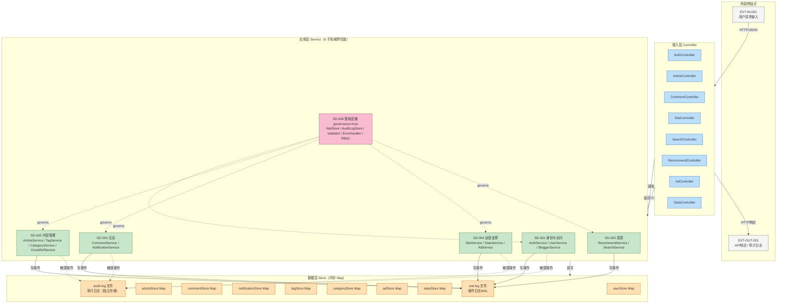
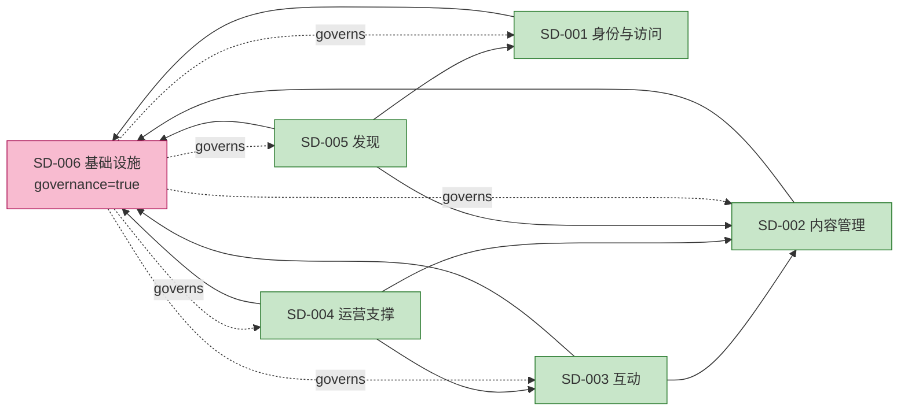
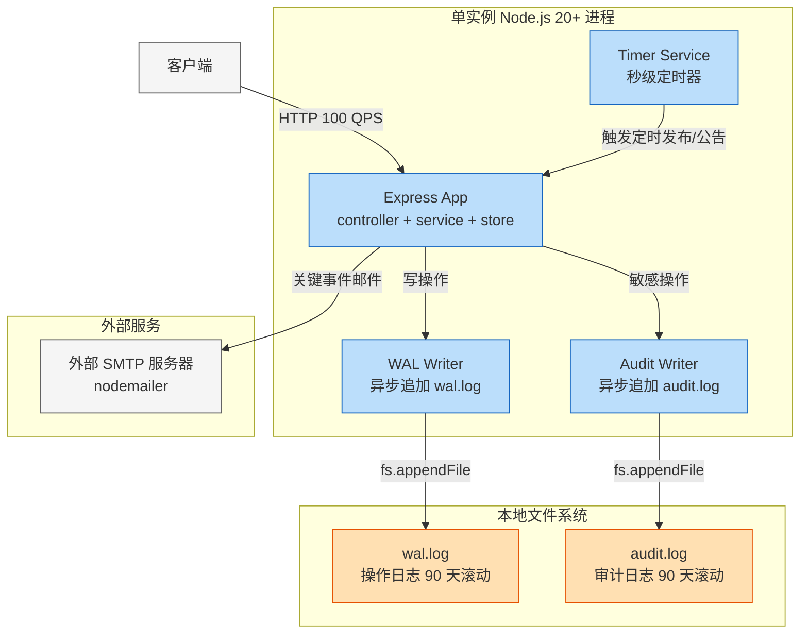
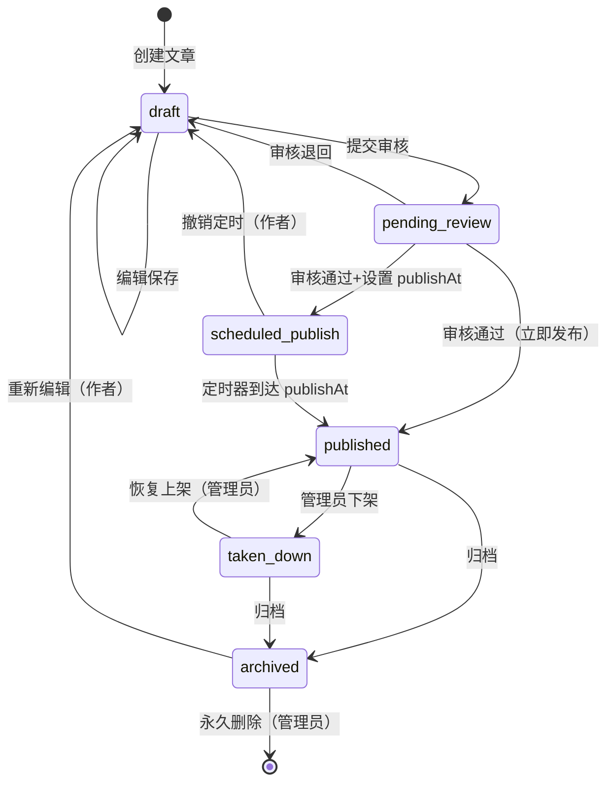

# 系统设计文档

> 阶段 2（系统设计）产出。W 模型第 6 轮端到端调测。
> 套用 `templates/system-design.md` 模板，所有 `{{}}` 占位符已替换为实际内容。
> 子系统分解（A-evolve 已落入 `.w-model/ingestion/graph.json`，6 个 SD 节点）：
> SD-001 身份与访问 / SD-002 内容管理 / SD-003 互动 / SD-004 运营支撑 / SD-005 发现 / SD-006 基础设施（governance=true，governs SD-001~005）。

## 文档信息

- 项目名称：blog-system-demo（扩展博客系统后端）
- 文档版本：v1.0
- 编制日期：2026-07-24
- 编制者：W 模型阶段 2 子代理（S-doc 生产者-文档）
- 关联需求文档：`docs/requirement-spec.md`（v1.0，21 条需求）
- 关联验收测试：`docs/acceptance-test-cases.md`（49 条 UAT）
- 关联风险评估：`docs/risk-assessment.md`（12 条 RISK + 2 条 CONFLICT + 12 条 GAP）
- 关联系统测试：`docs/system-test-design.md`（系统测试用例，本阶段同步产出）
- 当前阶段：阶段 2 系统设计

## 1. 系统架构

### 1.1 架构图（Mermaid C4 组件图）

> 分层架构：接入层（controller）→ 应用层（service）→ 数据层（store + 内存 Map）。
> 6 子系统作为跨切面横切各层；SD-006 基础设施子系统为 governance 节点，统辖 SD-001~005。


```mermaid
graph TD
    subgraph EXT["外部终结点"]
        EXTIN["EXT-IN-001<br/>用户请求输入"]
        EXTOUT["EXT-OUT-001<br/>API响应 / 审计日志"]
    end

    subgraph LAYER_CTRL["接入层 Controller"]
        CTRL_AUTH[AuthController]
        CTRL_ART[ArticleController]
        CTRL_CMT[CommentController]
        CTRL_SITE[SiteController]
        CTRL_SEARCH[SearchController]
        CTRL_REC[RecommendController]
        CTRL_AD[AdController]
        CTRL_STATS[StatsController]
    end

    subgraph LAYER_SVC["应用层 Service（6 子系统跨切面）"]
        SD1["SD-001 身份与访问<br/>AuthService / UserService / BloggerService"]
        SD2["SD-002 内容管理<br/>ArticleService / TagService / CategoryService / CrossRefService"]
        SD3["SD-003 互动<br/>CommentService / NotificationService"]
        SD4["SD-004 运营支撑<br/>SiteService / StatsService / AdService"]
        SD5["SD-005 发现<br/>RecommendService / SearchService"]
        SD6["SD-006 基础设施 governance=true<br/>WalStore / AuditLogStore / Validator / ErrorHandler / RBAC"]
    end

    subgraph LAYER_STORE["数据层 Store（内存 Map）"]
        STORE_USER[userStore Map]
        STORE_ART[articleStore Map]
        STORE_CMT[commentStore Map]
        STORE_NOTIFY[notificationStore Map]
        STORE_TAG[tagStore Map]
        STORE_CAT[categoryStore Map]
        STORE_AD[adStore Map]
        STORE_STATS[statsStore Map]
        STORE_WAL["wal.log 文件<br/>操作日志WAL"]
        STORE_AUDIT["audit.log 文件<br/>审计日志（独立存储）"]
    end

    EXTIN -->|HTTP/JSON| LAYER_CTRL
    LAYER_CTRL -->|调用| LAYER_SVC
    LAYER_SVC -->|读写| LAYER_STORE
    LAYER_SVC -->|返回 DTO| LAYER_CTRL
    LAYER_CTRL -->|HTTP响应| EXTOUT

    SD6 -.governs.-> SD1
    SD6 -.governs.-> SD2
    SD6 -.governs.-> SD3
    SD6 -.governs.-> SD4
    SD6 -.governs.-> SD5

    SD1 -->|写操作| STORE_WAL
    SD2 -->|写操作| STORE_WAL
    SD3 -->|写操作| STORE_WAL
    SD4 -->|写操作| STORE_WAL
    SD5 -->|写操作| STORE_WAL
    SD1 -.敏感操作.-> STORE_AUDIT
    SD2 -.敏感操作.-> STORE_AUDIT
    SD3 -.敏感操作.-> STORE_AUDIT
    SD4 -.敏感操作.-> STORE_AUDIT

    classDef ctrl fill:#bbdefb,stroke:#1565c0
    classDef svc fill:#c8e6c9,stroke:#2e7d32
    classDef store fill:#ffe0b2,stroke:#e65100
    classDef ext fill:#f5f5f5,stroke:#616161
    classDef gov fill:#f8bbd0,stroke:#ad1457
    class CTRL_AUTH,CTRL_ART,CTRL_CMT,CTRL_SITE,CTRL_SEARCH,CTRL_REC,CTRL_AD,CTRL_STATS ctrl
    class SD1,SD2,SD3,SD4,SD5 svc
    class SD6 gov
    class STORE_USER,STORE_ART,STORE_CMT,STORE_NOTIFY,STORE_TAG,STORE_CAT,STORE_AD,STORE_STATS,STORE_WAL,STORE_AUDIT store
    class EXTIN,EXTOUT ext
```

### 1.2 架构风格说明

**风格：分层架构（Layered） + 子系统跨切面（Cross-cutting Subsystem） + 治理节点（Governance）**

| 决策点 | 选择 | 理由 |
|---|---|---|
| 总体风格 | 分层架构（controller→service→store） | 单实例 + 内存存储约束（CON-001/CON-002）下，分层最易实现 NFR-005 可维护性目标（模块化分层、`tsc --noEmit` strict 0 错误）；避免引入微服务的网络/序列化开销 |
| 子系统划分 | 6 跨切面子系统（SD-001~006） | 对应需求图谱 13 功能领域 + 5 NFR + 3 CON 的内聚划分，SD-006 作为 governance 节点统辖 SD-001~005 的横切关注点（WAL/审计/校验/错误处理/RBAC） |
| 数据流 | EXT-IN → controller → service → store → service → controller → EXT-OUT | 与 L1 TLA+ 规格的 `ReceiveRequest→ProcessRequest→SendResponse` 端到端闭合一致 |
| 治理关系 | SD-006 governs SD-001~005 | NFR-001~005 与 CON-001~003 是横切所有功能子系统的非功能约束，governance=true 表明基础设施为统辖节点而非被统辖 |
| 崩溃恢复 | WAL 重放（操作日志必需）+ 审计日志独立存储 | 落实 CONFLICT-002 决策：操作日志覆盖所有写操作用于崩溃重建，审计日志不参与重建 |

**与图谱一致性**：本架构图节点与 `.w-model/ingestion/graph.json` 的 24 节点（REQ-000 根 + 21 REQ + EXT-IN-001 + EXT-OUT-001）及 6 个 SD 节点（SD-001~006）保持映射；SD-006 `attributes.governance=true` 与图 governance 边一致。

### 1.3 数据流标注

| 数据流 | 类型 | 方向 | 说明 |
|---|---|---|---|
| EXT-IN → Controller | 同步 HTTP/JSON | 输入 | 用户请求经 zod schema 校验后入队 |
| Controller → Service | 同步函数调用 | 内部 | DTO 传递，无网络开销 |
| Service → Store | 同步函数调用 | 内部 | Map 读写 + WAL 追加 |
| Service → WAL | 异步追加写 | 输出（持久化） | 写操作记录用于崩溃重建（CONFLICT-002） |
| Service → AuditLog | 异步追加写 | 输出（审计） | 敏感读/写操作记录，独立存储不参与重建 |
| Controller → EXT-OUT | 同步 HTTP/JSON | 输出 | API 响应 + 审计日志外部化 |

## 2. 技术选型

### 2.1 技术选型决策矩阵

> 每项候选按 5 维度评分（1=差 / 5=优），加权汇总（适用性×0.25 + 成熟度×0.20 + 可维护性×0.25 + 引入成本×0.15 + 风险敞口×0.15）。并列时按「可维护性 > 成熟度 > 适用性」破局。

#### 2.1.1 后端框架

| 候选 | 适用性 | 成熟度 | 可维护性 | 引入成本 | 风险敞口 | 总分 | 选型理由 |
|---|---|---|---|---|---|---|---|
| **Express 4**（选定） | 5 | 5 | 5 | 5 | 4 | **4.85** | CON-001 指定；与 TypeScript strict 兼容；社区案例 ≥3（Netflix/PayPal/IBM）；LTS；替换为 Fastify 工作量中 |
| Fastify 4 | 4 | 4 | 4 | 3 | 4 | 3.85 | 性能更优但与 CON-001 冲突；schema 校验内建但与 zod 重复 |
| Koa 2 | 4 | 4 | 4 | 3 | 4 | 3.80 | 中间件优雅但生态小于 Express；与 CON-001 冲突 |

#### 2.1.2 语言与类型系统

| 候选 | 适用性 | 成熟度 | 可维护性 | 引入成本 | 风险敞口 | 总分 | 选型理由 |
|---|---|---|---|---|---|---|---|
| **TypeScript 5 strict**（选定） | 5 | 5 | 5 | 4 | 5 | **4.85** | CON-001 指定；strict 模式满足 NFR-005；社区活跃；可降级为 JS 但 strict 已是项目硬约束 |
| JavaScript (ES2022) | 4 | 5 | 3 | 5 | 3 | 3.90 | 与 NFR-005 `tsc --noEmit` 0 错误冲突 |
| Node.js + JSDoc | 3 | 5 | 3 | 4 | 3 | 3.50 | 类型推断弱，RBAC 权限矩阵（RISK-003）难以静态校验 |

#### 2.1.3 数据存储

| 候选 | 适用性 | 成熟度 | 可维护性 | 引入成本 | 风险敞口 | 总分 | 选型理由 |
|---|---|---|---|---|---|---|---|
| **内存 Map + WAL 文件**（选定） | 5 | 5 | 4 | 5 | 5 | **4.80** | CON-001 禁止数据库；Map 满足 100 QPS（NFR-001）；WAL 满足 NFR-002 崩溃重建；零引入成本 |
| 内存 Map（无 WAL） | 3 | 5 | 4 | 5 | 2 | 3.65 | 与 NFR-002 崩溃重建冲突（RISK-001）；CONFLICT-002 已决策操作日志必需 |
| SQLite | 2 | 5 | 4 | 3 | 3 | 3.30 | 与 CON-001 禁止数据库冲突 |

#### 2.1.4 校验库

| 候选 | 适用性 | 成熟度 | 可维护性 | 引入成本 | 风险敞口 | 总分 | 选型理由 |
|---|---|---|---|---|---|---|---|
| **zod 3**（选定） | 5 | 5 | 5 | 5 | 5 | **5.00** | CON-001 指定；TS-first，类型推断与 schema 同源；防原型链污染（NFR-003）；零运行时依赖 |
| Joi | 4 | 5 | 4 | 4 | 4 | 4.20 | 与 CON-001 冲突；非 TS-first |
| class-validator | 4 | 4 | 4 | 3 | 3 | 3.65 | 装饰器依赖，与 Express 4 中间件风格不一致 |

#### 2.1.5 认证与加密

| 候选 | 适用性 | 成熟度 | 可维护性 | 引入成本 | 风险敞口 | 总分 | 选型理由 |
|---|---|---|---|---|---|---|---|
| **bcrypt + jsonwebtoken**（选定） | 5 | 5 | 5 | 5 | 4 | **4.85** | CON-001 指定；bcrypt cost≥10（GAP-001）；JWT 2h access + 7d refresh（GAP-004）；社区成熟 |
| argon2 + jose | 5 | 4 | 4 | 3 | 4 | 4.05 | 更安全但与 CON-001 冲突 |
| scrypt + jsonwebtoken | 4 | 4 | 4 | 4 | 4 | 4.00 | Node 内置但 API 不友好 |

#### 2.1.6 测试框架

| 候选 | 适用性 | 成熟度 | 可维护性 | 引入成本 | 风险敞口 | 总分 | 选型理由 |
|---|---|---|---|---|---|---|---|
| **vitest 1**（选定） | 5 | 5 | 5 | 5 | 5 | **5.00** | CON-001 指定；ESM 原生；coverage-v8 内建满足 NFR-004 lines≥80%；与 tsx 兼容 |
| jest 29 | 4 | 5 | 4 | 4 | 4 | 4.15 | 与 CON-001 冲突；ESM 支持弱 |
| mocha + chai | 3 | 5 | 3 | 4 | 4 | 3.65 | 配置繁琐，coverage 需 nyc 额外引入 |

#### 2.1.7 邮件通知（可选能力）

| 候选 | 适用性 | 成熟度 | 可维护性 | 引入成本 | 风险敞口 | 总分 | 选型理由 |
|---|---|---|---|---|---|---|---|
| **nodemailer**（选定，GAP-007 已确认允许） | 5 | 5 | 4 | 4 | 4 | **4.45** | CONFLICT-001 已决策邮件为系统必需能力；GAP-007 允许引入；SMTP 环境变量配置；可降级为仅站内通知 |
| 不实现（仅站内通知） | 2 | 5 | 5 | 5 | 5 | 3.85 | 与 CONFLICT-001 决策冲突 |
| @sendgrid/mail | 4 | 4 | 4 | 3 | 3 | 3.65 | 锁定单一供应商，风险敞口大 |

### 2.2 选型汇总

| 层次 | 技术 | 版本 | 选型理由 |
|---|---|---|---|
| 后端框架 | Express | ^4.19.2 | CON-001 指定；社区成熟；与 TS strict 兼容 |
| 语言 | TypeScript | ^5.5.3 (strict) | CON-001 指定；NFR-005 要求 strict 0 错误 |
| 数据存储 | 内存 Map + WAL 文件 | Node 内建 | CON-001 禁止数据库；NFR-002 崩溃重建依赖 WAL |
| 校验 | zod | ^3.23.8 | CON-001 指定；TS-first；防原型链污染 |
| 认证加密 | bcrypt + jsonwebtoken | ^5.1.1 / ^9.0.2 | CON-001 指定；cost≥10；JWT 2h+7d |
| 测试框架 | vitest + @vitest/coverage-v8 | ^1.6.0 | CON-001 指定；ESM 原生；coverage 内建 |
| HTTP 测试 | supertest | ^7.2.2 | Express 集成测试事实标准 |
| 运行时 | Node.js | 20+ | CON-002 指定单实例部署 |
| 邮件（可选） | nodemailer | ^6.9.x（待引入） | CONFLICT-001 决策；GAP-007 允许；SMTP 环境变量配置 |

> ⚠️ nodemailer 尚未在 package.json 登记依赖，阶段 5 编码时由 implementer 子代理按 GAP-007 决策引入。

## 3. 模块划分

### 3.1 子系统划分表（SD-001~006）

| 模块 ID | 模块名 | 职责 | 关联需求 | 依赖子系统 | governance |
|---|---|---|---|---|---|
| SD-001 | 身份与访问子系统 | 用户/博主注册登录、JWT 签发与校验、RBAC 权限校验、密码哈希、角色分级、用户封禁/解禁、博主关注关系 | REQ-002（多博主）+ REQ-003（多用户） | SD-006（依赖 WAL/审计/RBAC 中间件） | false |
| SD-002 | 内容管理子系统 | 文章 CRUD、6 状态机、定时发布、文章系列、标签 CRUD/合并、分类树/导航、交叉引用图谱 | REQ-012（多博文）+ REQ-008（标签）+ REQ-009（分类）+ REQ-013（交叉引用） | SD-006；SD-003（被引用触发通知） | false |
| SD-003 | 互动子系统 | 评论多级回复（≤3级）、敏感词过滤、评论审核/举报/点赞、站内通知、邮件通知、通知设置/已读管理 | REQ-010（评论）+ REQ-011（通知） | SD-006；SD-002（评论挂在文章上） | false |
| SD-004 | 运营支撑子系统 | 站点配置/开关/公告、维护模式、4 类统计（文章/用户/博主/站点）、CSV/JSON 导出、广告位/投放/审核/CTR 统计 | REQ-001（站点管理）+ REQ-006（统计）+ REQ-005（广告） | SD-006；SD-002（统计依赖文章）；SD-003（统计依赖评论） | false |
| SD-005 | 发现子系统 | 推荐算法（等权 1/3 + 7 天衰减）、推荐流（个性化/热门/最新）、推荐位管理、博主推荐、全文搜索、标签/分类/博主搜索、搜索建议、搜索历史 | REQ-004（推荐）+ REQ-007（搜索） | SD-006；SD-002（推荐/搜索依赖文章）；SD-001（个性化依赖用户） | false |
| SD-006 | 基础设施子系统（governance=true） | WAL 操作日志（必需，崩溃重建）、审计日志（必需，独立存储）、zod 校验中间件、统一错误处理、RBAC 权限中间件、敏感词词库（内置≥20词+可扩展）、定时器（秒级）、JWT 工具、bcrypt 工具、HTTP 上下文 | NFR-001~005（性能/可用/安全/可测试/可维护）+ CON-001~003（技术栈/部署/数据规模） | 无（被 SD-001~005 依赖，自身不依赖功能子系统） | **true** |

### 3.2 模块依赖关系图


```mermaid
graph LR
    SD006[SD-006 基础设施<br/>governance=true]
    SD001[SD-001 身份与访问]
    SD002[SD-002 内容管理]
    SD003[SD-003 互动]
    SD004[SD-004 运营支撑]
    SD005[SD-005 发现]

    SD001 --> SD006
    SD002 --> SD006
    SD003 --> SD006
    SD004 --> SD006
    SD005 --> SD006

    SD003 --> SD002
    SD004 --> SD002
    SD004 --> SD003
    SD005 --> SD002
    SD005 --> SD001

    SD006 -.governs.-> SD001
    SD006 -.governs.-> SD002
    SD006 -.governs.-> SD003
    SD006 -.governs.-> SD004
    SD006 -.governs.-> SD005

    classDef gov fill:#f8bbd0,stroke:#ad1457
    classDef svc fill:#c8e6c9,stroke:#2e7d32
    class SD006 gov
    class SD001,SD002,SD003,SD004,SD005 svc
```

**循环依赖检查**：依赖关系为有向无环图（DAG），SD-006 为根被依赖节点，SD-002 为内容核心被 SD-003/004/005 依赖，无环。阶段 3 概要设计时由 `madge --circular --extensions ts` 复检。

### 3.3 模块目录结构（建议）

```
src/
├── controllers/          # 接入层（HTTP 路由 + 参数解析）
│   ├── auth.controller.ts
│   ├── article.controller.ts
│   ├── comment.controller.ts
│   ├── site.controller.ts
│   ├── search.controller.ts
│   ├── recommend.controller.ts
│   ├── ad.controller.ts
│   └── stats.controller.ts
├── services/             # 应用层（业务逻辑，6 子系统）
│   ├── identity/         # SD-001
│   ├── content/          # SD-002
│   ├── interaction/      # SD-003
│   ├── operation/        # SD-004
│   ├── discovery/        # SD-005
│   └── infrastructure/   # SD-006 governance
├── stores/               # 数据层（内存 Map + WAL）
│   ├── user.store.ts
│   ├── article.store.ts
│   ├── comment.store.ts
│   ├── notification.store.ts
│   ├── tag.store.ts
│   ├── category.store.ts
│   ├── ad.store.ts
│   ├── stats.store.ts
│   ├── wal.store.ts      # 操作日志（必需，崩溃重建）
│   └── audit.store.ts    # 审计日志（独立存储）
├── middlewares/          # 中间件（SD-006 跨切面）
│   ├── auth.middleware.ts
│   ├── rbac.middleware.ts
│   ├── validate.middleware.ts
│   ├── error.middleware.ts
│   └── maintenance.middleware.ts
├── utils/                # 公共工具（SD-006）
│   ├── jwt.util.ts
│   ├── bcrypt.util.ts
│   ├── sensitive-words.util.ts
│   ├── timer.util.ts
│   └── heat.util.ts      # 热度/活跃度/留存率公式
├── schemas/              # zod schema
├── types/                # TS 类型
└── server.ts            # 入口
```

## 4. 部署架构

### 4.1 部署图


```mermaid
graph TD
    subgraph NODE["单实例 Node.js 20+ 进程"]
        APP[Express App<br/>controller + service + store]
        WAL[WAL Writer<br/>异步追加 wal.log]
        AUDIT[Audit Writer<br/>异步追加 audit.log]
        TIMER[Timer Service<br/>秒级定时器]
    end

    subgraph FS["本地文件系统"]
        WALFILE[wal.log<br/>操作日志 90 天滚动]
        AUDITFILE[audit.log<br/>审计日志 90 天滚动]
    end

    subgraph EXT_SVC["外部服务"]
        SMTP[外部 SMTP 服务器<br/>nodemailer]
    end

    CLIENT[客户端] -->|HTTP 100 QPS| APP
    APP -->|写操作| WAL
    APP -->|敏感操作| AUDIT
    WAL -->|fs.appendFile| WALFILE
    AUDIT -->|fs.appendFile| AUDITFILE
    APP -->|关键事件邮件| SMTP
    TIMER -->|触发定时发布/公告| APP

    classDef node fill:#bbdefb,stroke:#1565c0
    classDef fs fill:#ffe0b2,stroke:#e65100
    classDef ext fill:#f5f5f5,stroke:#616161
    class APP,WAL,AUDIT,TIMER node
    class WALFILE,AUDITFILE fs
    class SMTP,CLIENT ext
```

### 4.2 部署说明

| 项 | 说明 |
|---|---|
| 部署模式 | 单实例（CON-002） |
| 运行时 | Node.js 20+ |
| 进程模型 | 单进程单线程（Event Loop），不启用 cluster（单实例约束） |
| 内存存储 | Map 数据结构，进程内驻留；进程崩溃后通过 wal.log 重放重建 |
| WAL 文件 | `wal.log`，异步追加写（`fs.appendFile`），90 天滚动覆盖（GAP-009） |
| 审计日志文件 | `audit.log`，独立存储不参与崩溃重建（CONFLICT-002），90 天滚动覆盖 |
| 定时器 | 秒级精度（GAP-003），`setInterval` 1s 轮询触发定时发布/公告/统计聚合 |
| SMTP | 外部 SMTP 服务器，通过环境变量 `SMTP_HOST`/`SMTP_PORT`/`SMTP_USER`/`SMTP_PASS` 配置；失败降级为仅站内通知 |
| 环境变量 | `JWT_SECRET`（必需，JWT 签名密钥）、`SMTP_*`（可选）、`PORT`（默认 3000）、`NODE_ENV` |
| 启动脚本 | `npm run dev`（tsx 直跑）/ `npm run build && node dist/server.js`（编译后运行） |
| 崩溃恢复 | 启动时读取 wal.log 重放写操作重建 Map 状态（NFR-002，UAT-042 验证） |

### 4.3 数据规模约束（CON-003）

| 阶段 | 文章上限 | 用户上限 | 说明 |
|---|---|---|---|
| 单元测试 | ≤ 100 | ≤ 50 | 阶段 5 |
| 集成测试 | ≤ 1000 | ≤ 200 | 阶段 6 |
| 系统测试 | ≤ 1000 | ≤ 200 | 阶段 7，搜索 P95≤500ms 在此规模验证（RISK-012） |

## 5. 数据模型概要

### 5.1 核心实体

#### 5.1.1 User（用户，SD-001）

```typescript
interface User {
  id: string;                  // UUID
  email: string;               // 唯一，zod email 校验
  passwordHash: string;        // bcrypt cost≥10（GAP-001）
  nickname: string;
  avatar?: string;
  bio?: string;
  role: 'user' | 'blogger' | 'admin' | 'super_admin';  // 4 类角色（REQ-003）
  bloggerLevel?: 'normal' | 'verified' | 'featured';    // 博主 3 级分级（REQ-002），仅 role=blogger 时
  status: 'active' | 'banned';  // 封禁状态
  banReason?: string;          // 封禁原因（REQ-003 UAT-012）
  banAt?: number;              // 封禁时间戳
  createdAt: number;           // Unix 秒
  updatedAt: number;
  lastLoginAt: number;         // 用于活跃度计算
  notificationSettings: {     // 通知设置（REQ-011）
    commentReply: boolean;
    like: boolean;
    follow: boolean;
    auditResult: boolean;
    cited: boolean;
    email: {                   // 邮件通知开关（CONFLICT-001）
      commentReply: boolean;
      auditResult: boolean;
      cited: boolean;
    };
  };
}
```

#### 5.1.2 Blogger Profile（博主资料，SD-001）

```typescript
interface BloggerProfile {
  userId: string;              // 关联 User.id
  socialLinks?: {              // 社交链接（REQ-002）
    twitter?: string;
    github?: string;
    website?: string;
  };
  followerIds: string[];       // 粉丝列表
  followingIds: string[];      // 关注列表
  intro?: string;              // 个人介绍
}
```

#### 5.1.3 Article（文章，SD-002）

```typescript
interface Article {
  id: string;
  authorId: string;            // 博主 userId
  title: string;
  content: string;            // Markdown
  summary?: string;
  coverImage?: string;
  status: 'draft' | 'pending_review' | 'scheduled_publish' | 'published' | 'taken_down' | 'archived';
  // 6 状态机（REQ-012，阶段1 CHECKPOINT 确认 scheduled_publish 为第6状态）
  publishAt?: number;          // 定时发布时间戳（Unix 秒，GAP-003）
  seriesId?: string;           // 文章系列
  seriesOrder?: number;        // 系列内顺序
  tagIds: string[];            // 标签绑定
  categoryId?: string;         // 分类归属
  citeArticleIds: string[];    // 显式引用的文章（REQ-013）
  stats: {
    views: number;
    likes: number;
    comments: number;
    shares: number;
    heat: number;              // 热度 = likes*2 + comments*3 + views*1（7天衰减，GAP-006）
  };
  createdAt: number;
  updatedAt: number;
  publishedAt?: number;
}
```

#### 5.1.4 Comment（评论，SD-003）

```typescript
interface Comment {
  id: string;
  articleId: string;
  parentId?: string;           // 父评论 ID（楼中楼，≤3 级，GAP-008）
  depth: number;               // 嵌套深度 1/2/3
  authorId: string;
  content: string;
  status: 'published' | 'pending_review' | 'rejected' | 'reported';
  likes: number;
  likedBy: string[];           // 点赞用户 ID 列表
  reportReason?: string;       // 举报原因
  reportStatus?: 'pending' | 'resolved' | 'rejected';
  sensitiveHit?: string[];     // 命中的敏感词（REQ-010）
  createdAt: number;
  updatedAt: number;
}
```

#### 5.1.5 Notification（通知，SD-003）

```typescript
interface Notification {
  id: string;
  userId: string;              // 接收方
  type: 'system' | 'comment_reply' | 'like' | 'follow' | 'audit_result' | 'cited';
  title: string;
  content: string;
  refType?: 'article' | 'comment' | 'user';
  refId?: string;
  read: boolean;
  createdAt: number;
  channel: 'in_app' | 'email' | 'both';  // CONFLICT-001 决策
}
```

#### 5.1.6 Tag（标签，SD-002）

```typescript
interface Tag {
  id: string;
  name: string;                // 唯一
  usageCount: number;          // 使用频次（标签云排序）
  mergedToId?: string;         // 合并目标（合并后旧标签指向新标签，REQ-008）
  createdAt: number;
}
```

#### 5.1.7 Category（分类，SD-002）

```typescript
interface Category {
  id: string;
  name: string;
  parentId?: string;           // 父分类（多级树，REQ-009）
  order: number;               // 排序
  articleCount: number;
  createdAt: number;
}
// 循环引用检测：插入/更新时遍历 parent 链禁止成环（UAT-026）
```

#### 5.1.8 Ad（广告，SD-004）

```typescript
interface Ad {
  id: string;
  slot: 'sidebar' | 'in_article' | 'home_banner';  // 广告位（REQ-005）
  title: string;
  content: string;
  imageUrl?: string;
  targetUrl: string;
  startAt: number;             // 投放时间范围
  endAt: number;
  targetUserRoles?: string[];  // 目标用户
  maxImpressionsPerUserPerDay: number;  // ≤100（GAP-012）
  status: 'pending_review' | 'approved' | 'rejected' | 'taken_down';
  stats: {
    impressions: number;
    clicks: number;
    ctr: number;                // clicks / impressions（UAT-017）
    userDailyImpressions: Map<string, number>;  // userId -> 当日展示数
  };
  createdAt: number;
  updatedAt: number;
}
```

#### 5.1.9 Stats（统计聚合，SD-004）

```typescript
interface StatsSnapshot {
  articleStats: {               // 文章统计
    totalArticles: number;
    totalViews: number;
    totalLikes: number;
    totalComments: number;
    totalShares: number;
  };
  userStats: {                  // 用户统计
    totalUsers: number;
    activeRate: number;         // 活跃度 = 7日登录天数 / 7（GAP-006）
    retentionRate: number;      // 留存率 = 第N日活跃 / 注册日活跃（GAP-006）
    registrationTrend: { date: number; count: number }[];
  };
  bloggerStats: {               // 博主统计
    articleOutput: number;      // 文章产出
    interactionRate: number;    // 互动率
    followerGrowth: number;
  };
  siteStats: {                  // 站点统计
    pv: number;
    uv: number;
    visits: { date: number; count: number }[];
    sources: { source: string; count: number }[];
  };
  snapshotAt: number;
}
```

#### 5.1.10 SiteConfig（站点配置，SD-004）

```typescript
interface SiteConfig {
  name: string;
  description: string;
  logo: string;
  icp: string;                 // 备案信息
  switches: {
    maintenanceMode: boolean;  // 维护模式（UAT-002）
    registrationOpen: boolean; // 注册开关
    commentOpen: boolean;      // 评论开关
  };
  announcements: {
    id: string;
    title: string;
    content: string;
    publishAt: number;          // 定时发布（秒级，GAP-003）
    status: 'scheduled' | 'published' | 'archived';
  }[];
}
```

#### 5.1.11 RecommendSlot（推荐位，SD-005）

```typescript
interface RecommendSlot {
  id: string;
  name: string;
  type: 'personalized' | 'hot' | 'latest' | 'blogger';
  articleIds: string[];         // 配置的文章列表
  maxCount: number;            // ≤20（GAP-011）
  active: boolean;
  updatedAt: number;
}
```

#### 5.1.12 SearchHistory（搜索历史，SD-005）

```typescript
interface SearchHistory {
  userId: string;
  queries: { query: string; searchedAt: number }[];  // FIFO，≤50 条（GAP-010）
}
```

### 5.2 实体关系

```mermaid
graph LR
    User ||--o{ BloggerProfile : has
    User ||--o{ Article : authors
    User ||--o{ Comment : authors
    User ||--o{ Notification : receives
    User }o--o{ User : follows
    Article ||--o{ Comment : has
    Article }o--o{ Tag : tagged
    Article }o--|| Category : belongs
    Article }o--o{ Article : cites
    Comment ||--o{ Comment : replies
    Article ||--o{ StatsSnapshot : aggregates
    SiteConfig ||--o{ Ad : manages

    classDef entity fill:#bbdefb,stroke:#1565c0
    class User,BloggerProfile,Article,Comment,Notification,Tag,Category,Ad,StatsSnapshot,SiteConfig,RecommendSlot,SearchHistory entity
```

## 6. RBAC 权限矩阵

### 6.1 角色定义（4 类，REQ-003）

| 角色 | role 字段 | 说明 |
|---|---|---|
| 普通用户 | `user` | 默认角色，可评论/点赞/关注/搜索 |
| 博主 | `blogger` | 含普通用户权限 + 发文/管理自己文章；分级 normal/verified/featured（REQ-002） |
| 管理员 | `admin` | 含博主权限 + 站点管理/审核/统计/广告/标签合并/批量下架 |
| 超级管理员 | `super_admin` | 含管理员权限 + 用户封禁/解禁/角色升降级/系统级配置 |

### 6.2 权限矩阵（角色 × 资源 × 操作）

> ✅=允许 / ❌=禁止 / 🔒=仅自己（博主仅能操作自己资源）。基于 RISK-003 缓解措施。

| 资源 | 操作 | user | blogger | admin | super_admin |
|---|---|---|---|---|---|
| **文章 Article** | 创建 | ❌ | ✅ | ✅ | ✅ |
| | 读取（已发布） | ✅ | ✅ | ✅ | ✅ |
| | 读取（任意状态） | ❌ | 🔒(自己) | ✅ | ✅ |
| | 更新 | ❌ | 🔒(自己) | ✅ | ✅ |
| | 删除 | ❌ | 🔒(自己) | ✅ | ✅ |
| | 状态转换（自己） | ❌ | ✅ | ✅ | ✅ |
| | 批量下架/归档 | ❌ | ❌ | ✅ | ✅ |
| **评论 Comment** | 创建 | ✅ | ✅ | ✅ | ✅ |
| | 读取 | ✅ | ✅ | ✅ | ✅ |
| | 删除（自己） | ✅ | ✅ | ✅ | ✅ |
| | 删除（他人） | ❌ | ❌ | ✅ | ✅ |
| | 审核（通过/拒绝） | ❌ | ❌ | ✅ | ✅ |
| **用户 User** | 注册/登录 | ✅ | ✅ | ✅ | ✅ |
| | 读取自己资料 | ✅ | ✅ | ✅ | ✅ |
| | 读取他人公开资料 | ✅ | ✅ | ✅ | ✅ |
| | 更新自己资料 | ✅ | ✅ | ✅ | ✅ |
| | 封禁/解禁 | ❌ | ❌ | ❌ | ✅ |
| | 角色升降级 | ❌ | ❌ | ❌ | ✅ |
| **标签 Tag** | 创建/绑定 | ❌ | ✅ | ✅ | ✅ |
| | 标签云读取 | ✅ | ✅ | ✅ | ✅ |
| | 合并标签 | ❌ | ❌ | ✅ | ✅ |
| **分类 Category** | 读取 | ✅ | ✅ | ✅ | ✅ |
| | 增删改 | ❌ | ❌ | ✅ | ✅ |
| **站点 SiteConfig** | 读取 | ✅ | ✅ | ✅ | ✅ |
| | 更新配置/开关 | ❌ | ❌ | ✅ | ✅ |
| | 维护模式开关 | ❌ | ❌ | ✅ | ✅ |
| **公告 Announcement** | 读取（已发布） | ✅ | ✅ | ✅ | ✅ |
| | 增删改 | ❌ | ❌ | ✅ | ✅ |
| **统计 Stats** | 读取公开统计 | ✅ | ✅ | ✅ | ✅ |
| | 读取详细统计 | ❌ | 🔒(自己) | ✅ | ✅ |
| | 导出 CSV/JSON | ❌ | 🔒(自己) | ✅ | ✅ |
| **广告 Ad** | 读取（已审核） | ✅ | ✅ | ✅ | ✅ |
| | 增删改 | ❌ | ❌ | ✅ | ✅ |
| | 审核 | ❌ | ❌ | ✅ | ✅ |
| **推荐 RecommendSlot** | 读取推荐流 | ✅ | ✅ | ✅ | ✅ |
| | 配置推荐位 | ❌ | ❌ | ✅ | ✅ |
| **通知 Notification** | 读取自己 | ✅ | ✅ | ✅ | ✅ |
| | 标记已读/全部已读 | ✅ | ✅ | ✅ | ✅ |
| | 通知设置 | ✅ | ✅ | ✅ | ✅ |
| **搜索 Search** | 全文搜索 | ✅ | ✅ | ✅ | ✅ |
| | 搜索建议/历史 | ✅ | ✅ | ✅ | ✅ |
| **交叉引用 CrossRef** | 创建引用 | ❌ | ✅ | ✅ | ✅ |
| | 读取图谱 | ✅ | ✅ | ✅ | ✅ |

### 6.3 权限校验实现

- **中间件层**：`rbac.middleware.ts`（SD-006）在每个受保护路由前校验 `req.user.role` 是否在允许列表
- **资源所有权校验**：博主更新文章时，service 层校验 `article.authorId === req.user.id`，不符返回 403（UAT-007）
- **策略对象模式**：阶段 4 详设用 `Map<resource, Map<operation, allowedRoles[]>>` 实现，避免 if-else 膨胀（RISK-003 缓解）
- **测试覆盖**：UAT-007（跨博主编辑 403）/ UAT-010（4 类角色边界）/ UAT-012（封禁用户 403）

## 7. 文章状态机（REQ-012）

### 7.1 状态机图

> 6 状态（阶段 1 CHECKPOINT 已确认 scheduled_publish 为第 6 状态）。


```mermaid
stateDiagram-v2
    [*] --> draft : 创建文章
    draft --> pending_review : 提交审核
    draft --> draft : 编辑保存
    pending_review --> scheduled_publish : 审核通过+设置 publishAt
    pending_review --> published : 审核通过（立即发布）
    pending_review --> draft : 审核退回
    scheduled_publish --> published : 定时器到达 publishAt
    scheduled_publish --> draft : 撤销定时（作者）
    published --> taken_down : 管理员下架
    published --> archived : 归档
    taken_down --> published : 恢复上架（管理员）
    taken_down --> archived : 归档
    archived --> draft : 重新编辑（作者）
    archived --> [*] : 永久删除（管理员）
```

### 7.2 合法转换表

| # | 起始状态 | 目标状态 | 触发条件 | 操作者 | 守卫 |
|---|---|---|---|---|---|
| 1 | (初始) | draft | 创建文章 | 博主/管理员 | 标题+内容非空 |
| 2 | draft | draft | 编辑保存 | 作者/管理员 | authorId 匹配 |
| 3 | draft | pending_review | 提交审核 | 作者/管理员 | 内容非空 |
| 4 | pending_review | draft | 审核退回 | 管理员 | 退回原因非空 |
| 5 | pending_review | published | 审核通过（立即） | 管理员 | — |
| 6 | pending_review | scheduled_publish | 审核通过+设 publishAt | 管理员 | publishAt > now |
| 7 | scheduled_publish | published | 定时器到达 | 系统（定时器） | now ≥ publishAt |
| 8 | scheduled_publish | draft | 撤销定时 | 作者/管理员 | — |
| 9 | published | taken_down | 下架 | 管理员 | 下架原因非空 |
| 10 | published | archived | 归档 | 管理员/作者 | — |
| 11 | taken_down | published | 恢复上架 | 管理员 | — |
| 12 | taken_down | archived | 归档 | 管理员 | — |
| 13 | archived | draft | 重新编辑 | 作者 | — |
| 14 | archived | (终态) | 永久删除 | 管理员 | — |

### 7.3 非法转换（返回 409，UAT-035）

- draft → published（跳过审核）
- draft → taken_down（未发布不可下架）
- pending_review → taken_down（未发布不可下架）
- scheduled_publish → taken_down（定时中不可下架，须先撤销或等发布）
- published → draft（已发布不可回退草稿，须先下架）
- archived → published（归档不可直接发布，须先转 draft）
- taken_down → draft（下架不可直接编辑，须先恢复或归档）

### 7.4 实现约束

- 状态字段为字符串字面量联合类型，TS 静态校验非法值
- 守卫函数 `canTransition(from, to): boolean` 用 `Set<[from, to]>` 白名单实现（RISK-004 缓解）
- 定时发布由 SD-006 秒级定时器轮询 `scheduled_publish` 状态文章的 `publishAt`，到达后转 `published`
- 所有状态转换写 WAL + 审计日志

## 8. 关键算法与公式

### 8.1 热度公式（GAP-006，REQ-004/006）

```
heat(article, t) = (likes × 2 + comments × 3 + views × 1) × decay(t - publishedAt)
decay(Δt) = 0.5 ^ (Δt / 7d)   // 7 天半衰期
```

### 8.2 推荐算法（GAP-002，REQ-004）

```
score(article, user) = (1/3) × heatScore + (1/3) × freshnessScore + (1/3) × preferenceScore
  heatScore = heat(article) / maxHeat
  freshnessScore = 1 / (1 + (now - publishedAt) / 1d)
  preferenceScore = |tags(article) ∩ tags(user.liked)| / |tags(user.liked)|
```

等权 1/3 + 7 天衰减（GAP-002 确认）。

### 8.3 活跃度与留存率（GAP-006，REQ-006）

```
activeRate(user) = (7日内登录天数) / 7
retentionRate(cohort, N) = (注册日活跃用户中第N日仍活跃数) / (注册日活跃用户数)
```

### 8.4 敏感词过滤（GAP-005，REQ-010）

- 内置词库 ≥ 20 词（覆盖政治/色情/暴力最小集）
- 管理员可通过接口扩展词库
- 评论提交时扫描，命中则状态置 `pending_review` 并记录 `sensitiveHit`

### 8.5 密码策略（GAP-001，REQ-002/003）

- 最小 8 字符 + 至少 1 字母 + 1 数字
- bcrypt cost ≥ 10
- zod schema: `z.string().min(8).regex(/[a-zA-Z]/).regex(/[0-9]/)`

### 8.6 JWT 策略（GAP-004，NFR-003）

- access token: 2h（7200s）
- refresh token: 7d（604800s）
- 均 ≤ 24h（NFR-003 约束）

## 9. 阶段 1 决策落实表

| 决策 ID | 决策内容 | 落实位置 |
|---|---|---|
| CONFLICT-001 | 邮件通知=系统必需能力，用户可关闭某类；允许 nodemailer | §2.1.7 选型 / §5.1.1 Notification.channel / §5.1.1 notificationSettings.email |
| CONFLICT-002 | 操作日志=写操作WAL(必需,崩溃重建)；审计日志=独立存储(不参与重建) | §1.1 架构图 / §4.1 部署图 / §3.3 wal.store.ts + audit.store.ts |
| GAP-001 | 密码 8字符+1字母+1数字, bcrypt cost≥10 | §8.5 / §5.1.1 User.passwordHash |
| GAP-002 | 推荐 等权1/3+7天衰减 | §8.2 |
| GAP-003 | 定时 秒级 | §4.2 / §5.1.10 publishAt / §7 状态机 |
| GAP-004 | JWT 2h access+7d refresh | §8.6 |
| GAP-005 | 敏感词 内置≥20词+可扩展 | §8.4 |
| GAP-006 | 热度=点赞×2+评论×3+阅读×1(7天衰减); 活跃度=7日登录天数/7; 留存率=第N日活跃/注册日活跃 | §8.1 / §8.3 / §5.1.9 StatsSnapshot |
| GAP-007 | 允许 nodemailer | §2.1.7 / §2.2 |
| GAP-008 | 评论嵌套≤3级 | §5.1.4 Comment.depth |
| GAP-009 | 操作日志90天滚动 | §4.2 |
| GAP-010 | 搜索历史50条/用户FIFO | §5.1.12 SearchHistory.queries |
| GAP-011 | 推荐位≤20 | §5.1.11 RecommendSlot.maxCount |
| GAP-012 | 广告≤100次/用户/日 | §5.1.8 Ad.maxImpressionsPerUserPerDay |
| REQ-012状态机 | 6状态 draft→pending_review→scheduled_publish→published→taken_down→archived | §7 |

## 10. 系统测试用例索引

> 详细用例见 `docs/system-test-design.md`（系统测试，本阶段同步产出）。

| 用例 ID | 关联模块 | 场景 | 优先级 |
|---|---|---|---|
| TC-DES-001 | SD-001~006 全部 | 架构设计验证（分层+治理+数据流） | 高 |
| TC-DES-005 | SD-001~005 | 系统测试用例生成（覆盖系统级功能） | 高 |
| TC-DES-007 | SD-001~003 | 端到端流程（注册→登录→发文→评论→通知全链路） | 高 |
| TC-DES-008 | SD-006 + 全部 | 性能基线（P95≤200ms, 100QPS 持续 10min） | 高 |
| TC-DES-009 | SD-006 + SD-001 | 安全基线（原型链污染/RBAC越权/JWT篡改/zod校验） | 高 |
| TC-DES-010 | SD-002 + SD-004 + SD-005 | 跨子系统：发文→触发统计→影响推荐流 | 高 |
| TC-DES-011 | SD-002 + SD-003 + SD-005 | 跨子系统：评论→触发通知→影响热度→影响搜索排序 | 中 |
| TC-DES-012 | SD-006 + 全部 | 崩溃恢复：WAL 重放后状态一致 | 高 |

## 11. 阶段门自检

- [x] Mermaid C4 架构图（分层 controller→service→store + 6 子系统跨切面 + 治理关系）
- [x] 技术选型决策矩阵（7 类候选 × 5 维度评分 + 总分 + 选型理由）
- [x] 模块划分表（SD-001~006 对应 REQ 映射、职责、依赖关系、governance 标注）
- [x] 部署架构（单实例 Node.js 20+，内存 Map 存储，WAL 文件 + 审计日志独立存储）
- [x] 数据模型概要（User/Blogger/Article/Comment/Notification/Tag/Category/Ad/Stats/SiteConfig/RecommendSlot/SearchHistory 12 实体）
- [x] RBAC 权限矩阵（4 角色 × 12 资源 × 操作，含所有权校验说明）
- [x] 文章状态机图（6 状态 + 14 合法转换表 + 7 非法转换列表）
- [x] 关键算法公式（热度/推荐/活跃度/留存率/敏感词/密码/JWT）
- [x] 阶段 1 决策落实表（CONFLICT-001/002 + GAP-001~012 + REQ-012 状态机）
- [x] 系统测试用例索引（指向 system-test-design.md）
- [x] 无 `{{}}` 占位符残留
- [x] 未创建 TLA+ 文件，未修改 graph.json / tla-manifest.json

> 🔴 **CHECKPOINT · 阶段门放行**：本设计文档需用户在阶段门评审中确认「架构图 / 技术选型 / 模块划分 / RBAC 权限矩阵 / 状态机 / 关键算法公式」后方可放行进入阶段 3（概要设计）。架构图缺失或 RBAC 权限矩阵不全 → 一律返工。
