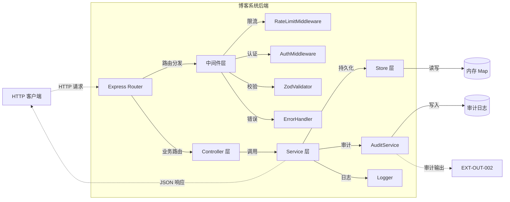
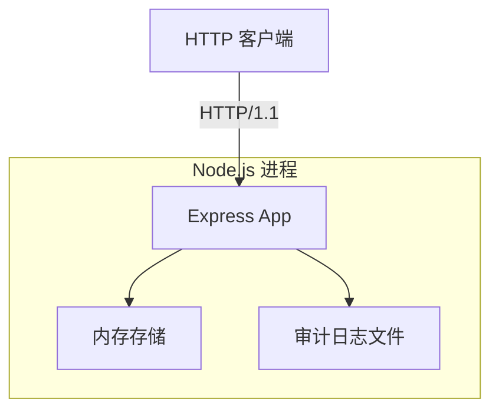

# 系统设计文档（System Design）

> 阶段 2 产出。对应需求规格 `docs/requirement-spec.md`（32 需求 = 22 REQ + 6 NFR + 4 CON）。
> 建模方法：分层架构 + 子系统划分；技术栈遵循 CON-001（Express 4 + TypeScript 5 + 内存存储）。
> 本文含 22 个 SD 条目（SD-001 ~ SD-022），逐条对应 REQ-001 ~ REQ-022。

## §1 系统概述

### §1.1 系统边界

博客系统后端是一个独立运行的 HTTP 服务，对外提供 RESTful API。系统边界由两组节点定义（与 graph.json EXT-IN/EXT-OUT 对齐）：

- **EXT-IN-001** HTTP 请求输入：客户端 HTTP 请求
- **EXT-IN-002** 业务背景/需求输入：业务背景信息与需求描述
- **EXT-OUT-001** HTTP 响应输出：API JSON 响应
- **EXT-OUT-002** 审计日志输出：审计日志持久化输出

### §1.2 系统状态（沿用 L1_blog_system）

L1 状态机定义了系统级状态枚举（0=idle / 1=receiving / 2=processing / 3=responding），L2 子系统规格在此基础上展开内部状态转移。

### §1.3 技术选型决策矩阵

候选技术按 5 维度评分（1=差 / 5=优），加权汇总后取最高分；并列时按「可维护性 > 成熟度 > 适用性」破局。

#### §1.3.1 后端框架

| 候选 | 适用性 | 成熟度 | 可维护性 | 引入成本 | 风险敞口 | 总分 | 选型理由 |
|---|---|---|---|---|---|---|---|
| Express 4 | 5 | 5 | 5 | 5 | 5 | 25 | CON-001 强制约束；社区成熟、生态完备 |
| Fastify 4 | 5 | 4 | 4 | 3 | 4 | 20 | 性能更优但违反 CON-001 |
| Koa 2 | 4 | 4 | 4 | 4 | 4 | 20 | 中间件机制优雅但生态较小 |

**选型**：Express 4（与 CON-001 一致）。

#### §1.3.2 数据存储

| 候选 | 适用性 | 成熟度 | 可维护性 | 引入成本 | 风险敞口 | 总分 | 选型理由 |
|---|---|---|---|---|---|---|---|
| 内存存储（Map） | 5 | 5 | 5 | 5 | 5 | 25 | CON-001 强制约束；NFR-004 已量化容量上限 10000 |
| SQLite | 4 | 5 | 4 | 3 | 4 | 20 | 违反 CON-001 |
| Redis | 4 | 5 | 4 | 2 | 3 | 18 | 违反 CON-001 |

**选型**：内存存储（Map）。

#### §1.3.3 认证方案

| 候选 | 适用性 | 成熟度 | 可维护性 | 引入成本 | 风险敞口 | 总分 | 选型理由 |
|---|---|---|---|---|---|---|---|
| JWT (HS256) | 5 | 5 | 5 | 5 | 4 | 24 | CON-002 强制约束；NFR-002 要求密钥 ≥256 位 |
| Session+Cookie | 4 | 5 | 4 | 4 | 4 | 21 | 违反 CON-002 |
| OAuth2 | 3 | 4 | 3 | 2 | 3 | 15 | 过度设计 |

**选型**：JWT (HS256)（与 CON-002 一致）。

## §2 系统架构图

### §2.1 C4 组件图（Mermaid）

```mermaid
flowchart LR
    Client[HTTP 客户端] -.->|HTTP 请求| Router
    subgraph BlogSystem[博客系统后端]
        Router[Express Router] -->|路由分发| MW[中间件层]
        MW -->|限流| RL[RateLimitMiddleware]
        MW -->|认证| Auth[AuthMiddleware]
        MW -->|校验| Val[ZodValidator]
        MW -->|错误| Err[ErrorHandler]
        Router -->|业务路由| Ctrl[Controller 层]
        Ctrl -->|调用| Svc[Service 层]
        Svc -->|持久化| Store[Store 层]
        Svc -->|审计| Audit[AuditService]
        Svc -->|日志| Log[Logger]
    end
    Store -->|读写| Mem[(内存 Map)]
    Audit -->|写入| AuditLog[(审计日志)]
    Svc -.->|JSON 响应| Client
    Audit -.->|审计输出| Sink[EXT-OUT-002]
```

### §2.2 部署图

```mermaid
flowchart TB
    subgraph Node[Node.js 进程]
        App[Express App] --> MemStore[内存存储]
        App --> AuditFile[审计日志文件]
    end
    Client[HTTP 客户端] -->|HTTP/1.1| App
```

### §2.3 模块划分（分层 + 子系统）

| 层 | 职责 | 组件 |
|---|---|---|
| Router 层 | 路由分发 | Express Router |
| Middleware 层 | 限流 / 认证 / 校验 / 错误处理 | RateLimitMiddleware / AuthMiddleware / ZodValidator / ErrorHandler |
| Controller 层 | HTTP 请求/响应适配 | 各模块 Controller |
| Service 层 | 业务逻辑 | 各模块 Service |
| Store 层 | 内存持久化 | 各模块 Store（Map） |
| 横切 | 审计 / 日志 / 错误响应 | AuditService / Logger / ErrorResponse |

## §3 SD 条目（22 个）

> 每个 SD 含：ID / 子系统 / 关联 REQ / 职责 / 组件 / 依赖 / 接口契约 / 数据模型 / 算法 / 性能 / 安全。

### SD-001 系统根（blog-system）

- **关联 REQ**：REQ-001
- **职责**：系统对外代理；组装 Express App；挂载全部中间件与路由；定义统一错误响应格式（NFR-003）。
- **组件**：`src/app.ts`（Express 实例）、`src/server.ts`（HTTP 监听）
- **依赖**：SD-002 ~ SD-022（全部子系统通过路由挂载依赖根）
- **接口契约**：`GET /health` → 200 `{status:"ok"}`
- **数据模型**：无（仅装配）
- **算法**：无
- **性能**：启动时间 < 1s（NFR-001）
- **安全**：信任代理配置、CORS 白名单

### SD-002 用户注册模块

- **关联 REQ**：REQ-002
- **职责**：邮箱+密码+角色注册；bcrypt 哈希；邮箱唯一性校验（NFR-005 zod schema）
- **组件**：`src/controllers/userController.ts#register`、`src/services/userService.ts#createUser`、`src/stores/userStore.ts`
- **依赖**：SD-004（角色权限校验）
- **接口契约**：`POST /api/users/register`
  - 请求：`{email, password, role}`（zod schema）
  - 响应：201 `{id, email, role, createdAt}`
  - 错误：400（参数错误）/ 409（邮箱已存在）
- **数据模型**：`User {id: string, email: string, passwordHash: string, role: 'admin'|'author'|'reader', createdAt: string, updatedAt: string}`
- **算法**：bcrypt（saltRounds=10）；UUIDv4 生成 ID
- **性能**：P95 < 200ms（NFR-001）
- **安全**：密码不明文存储；邮箱格式校验；角色枚举校验

### SD-003 用户登录模块

- **关联 REQ**：REQ-003
- **职责**：JWT 签发；密码比对；登录失败计数
- **组件**：`src/controllers/userController.ts#login`、`src/services/authService.ts#login`
- **依赖**：SD-002（用户存在性）
- **接口契约**：`POST /api/users/login`
  - 请求：`{email, password}`
  - 响应：200 `{token, expiresIn}`
  - 错误：401（凭据无效）/ 429（限流）
- **数据模型**：`AuthToken {token: string, expiresIn: number}`
- **算法**：jsonwebtoken.sign（HS256，密钥 ≥256 位 NFR-002）；expiresIn=3600s（CON-002）
- **性能**：P95 < 200ms
- **安全**：JWT_SECRET 来自环境变量；失败计数防爆破

### SD-004 角色权限模块

- **关联 REQ**：REQ-004
- **职责**：RBAC 三角色（admin/author/reader）；权限中间件
- **组件**：`src/middleware/authMiddleware.ts#requireRole`、`src/services/rbacService.ts`
- **依赖**：SD-003（JWT 解码）
- **接口契约**：中间件签名 `(roles: Role[]) => RequestHandler`
- **数据模型**：`Permission {role, resource, action}`
- **算法**：JWT payload.role 与 required roles 集合交集判定
- **性能**：O(1) 集合查找
- **安全**：默认拒绝；admin 全权限；author 管理自己的文章；reader 只读

### SD-005 文章创建模块

- **关联 REQ**：REQ-005
- **职责**：标题+正文+标签+分类创建文章；作者权限校验
- **组件**：`src/controllers/articleController.ts#create`、`src/services/articleService.ts#create`、`src/stores/articleStore.ts`
- **依赖**：SD-013（标签存在性）、SD-014（分类存在性）、SD-019（审计）
- **接口契约**：`POST /api/articles`
  - 请求：`{title, content, tagIds[], categoryId}`（zod schema）
  - 响应：201 `{id, title, content, tags[], category, authorId, status:'draft', createdAt}`
  - 错误：400 / 401 / 403 / 404（标签/分类不存在）
- **数据模型**：`Article {id, title, content, tagIds[], categoryId, authorId, status:'draft'|'published', likeCount, createdAt, updatedAt}`
- **算法**：UUIDv4；状态机初始态 draft
- **性能**：P95 < 200ms；单表 ≥10000 条（NFR-004）
- **安全**：requireRole(['admin','author'])；输入校验

### SD-006 文章列表查询模块

- **关联 REQ**：REQ-006
- **职责**：分页+排序查询文章列表
- **组件**：`src/controllers/articleController.ts#list`、`src/services/articleService.ts#list`
- **依赖**：SD-005（文章存储）
- **接口契约**：`GET /api/articles?page=1&limit=20&sort=createdAt&order=desc`
  - 响应：200 `{items[], total, page, limit}`
- **数据模型**：复用 Article
- **算法**：Map.values() → filter → sort → slice
- **性能**：P95 < 200ms；分页避免全量返回
- **安全**：reader 可访问；已发布文章可见

### SD-007 文章详情查询模块

- **关联 REQ**：REQ-007
- **职责**：按 ID 查询文章详情
- **组件**：`src/controllers/articleController.ts#getById`、`src/services/articleService.ts#getById`
- **依赖**：SD-005（文章存储）
- **接口契约**：`GET /api/articles/:id`
  - 响应：200 `{id, title, content, tags[], category, authorId, status, likeCount, createdAt, updatedAt}`
  - 错误：404
- **数据模型**：复用 Article
- **算法**：Map.get(id)
- **性能**：O(1) 查找
- **安全**：草稿仅作者/admin 可见

### SD-008 文章更新模块

- **关联 REQ**：REQ-008
- **职责**：更新文章；权限校验（仅作者本人或 admin）
- **组件**：`src/controllers/articleController.ts#update`、`src/services/articleService.ts#update`
- **依赖**：SD-005（文章存储）、SD-004（权限）、SD-019（审计）
- **接口契约**：`PUT /api/articles/:id`
  - 请求：`{title?, content?, tagIds?, categoryId?}`
  - 响应：200 `{更新后的 Article}`
  - 错误：400 / 401 / 403 / 404
- **数据模型**：复用 Article；updatedAt 刷新
- **算法**：浅合并；权限校验 authorId === jwt.sub || role === 'admin'
- **性能**：O(1)
- **安全**：requireRole(['admin','author'])；所有权校验

### SD-009 文章删除模块

- **关联 REQ**：REQ-009
- **职责**：删除文章；级联删除评论；权限校验
- **组件**：`src/controllers/articleController.ts#remove`、`src/services/articleService.ts#remove`
- **依赖**：SD-005（文章存储）、SD-010 ~ SD-012（评论级联）、SD-019（审计）
- **接口契约**：`DELETE /api/articles/:id`
  - 响应：204
  - 错误：401 / 403 / 404
- **数据模型**：Article + Comment 级联删除
- **算法**：Map.delete + 关联评论 Map 过滤删除
- **性能**：O(n) 评论扫描
- **安全**：requireRole(['admin','author'])；所有权校验

### SD-010 评论创建模块

- **关联 REQ**：REQ-010
- **职责**：关联文章+用户创建评论
- **组件**：`src/controllers/commentController.ts#create`、`src/services/commentService.ts#create`、`src/stores/commentStore.ts`
- **依赖**：SD-007（文章存在性）、SD-002（用户存在性）
- **接口契约**：`POST /api/articles/:id/comments`
  - 请求：`{content}`
  - 响应：201 `{id, articleId, userId, content, createdAt}`
  - 错误：400 / 401 / 404（文章不存在）
- **数据模型**：`Comment {id, articleId, userId, content, createdAt, updatedAt}`
- **算法**：UUIDv4；文章存在性校验
- **性能**：O(1)
- **安全**：requireRole(['admin','author','reader'])；内容长度限制

### SD-011 评论列表查询模块

- **关联 REQ**：REQ-011
- **职责**：按文章查询评论列表（分页）
- **组件**：`src/controllers/commentController.ts#listByArticle`、`src/services/commentService.ts#listByArticle`
- **依赖**：SD-010（评论存储）、SD-007（文章存在性）
- **接口契约**：`GET /api/articles/:id/comments?page=1&limit=20`
  - 响应：200 `{items[], total, page, limit}`
- **数据模型**：复用 Comment
- **算法**：Map.values() → filter(articleId) → sort → slice
- **性能**：O(n) 过滤
- **安全**：公开可读

### SD-012 评论删除模块

- **关联 REQ**：REQ-012
- **职责**：删除评论；权限校验（评论作者本人或 admin）
- **组件**：`src/controllers/commentController.ts#remove`、`src/services/commentService.ts#remove`
- **依赖**：SD-010（评论存储）、SD-004（权限）、SD-019（审计）
- **接口契约**：`DELETE /api/comments/:id`
  - 响应：204
  - 错误：401 / 403 / 404
- **数据模型**：复用 Comment
- **算法**：Map.delete；权限校验 userId === jwt.sub || role === 'admin'
- **性能**：O(1)
- **安全**：所有权校验

### SD-013 标签管理模块

- **关联 REQ**：REQ-013
- **职责**：标签 CRUD
- **组件**：`src/controllers/tagController.ts`、`src/services/tagService.ts`、`src/stores/tagStore.ts`
- **依赖**：SD-004（权限：admin）
- **接口契约**：
  - `GET /api/tags` → 200 `{items[]}`
  - `POST /api/tags` → 201 `{id, name, createdAt}`（admin）
  - `PUT /api/tags/:id` → 200（admin）
  - `DELETE /api/tags/:id` → 204（admin）
- **数据模型**：`Tag {id, name, createdAt, updatedAt}`；name 唯一
- **算法**：UUIDv4；name 唯一性校验
- **性能**：O(1) 单条；O(n) 列表
- **安全**：写操作 requireRole(['admin'])

### SD-014 分类管理模块

- **关联 REQ**：REQ-014
- **职责**：分类 CRUD；分类树（parentCategoryId 可空，无环约束）
- **组件**：`src/controllers/categoryController.ts`、`src/services/categoryService.ts`、`src/stores/categoryStore.ts`
- **依赖**：SD-004（权限：admin）
- **接口契约**：
  - `GET /api/categories` → 200
  - `POST /api/categories` → 201（admin）
  - `PUT /api/categories/:id` → 200（admin）
  - `DELETE /api/categories/:id` → 204（admin）
- **数据模型**：`Category {id, name, parentCategoryId: string|null, createdAt, updatedAt}`
- **算法**：UUIDv4；无环校验（DFS 检测 parentCategoryId 链）
- **性能**：O(n) 无环校验
- **安全**：写操作 requireRole(['admin'])；删除前校验文章引用

### SD-015 文章搜索模块

- **关联 REQ**：REQ-015
- **职责**：关键词+标签+分类组合搜索
- **组件**：`src/controllers/searchController.ts#search`、`src/services/searchService.ts`
- **依赖**：SD-005（文章存储）、SD-013（标签）、SD-014（分类）
- **接口契约**：`GET /api/search?q=keyword&tagId=&categoryId=&page=1&limit=20`
  - 响应：200 `{items[], total, page, limit}`
- **数据模型**：复用 Article + Tag + Category
- **算法**：Map.values() → keyword 模糊匹配（title/content） → tagId/categoryId 过滤 → 分页
- **性能**：O(n) 线性扫描；n ≤ 10000（NFR-004）
- **安全**：reader 可访问；仅搜索已发布文章

### SD-016 密码重置模块

- **关联 REQ**：REQ-016
- **职责**：邮箱验证流程；重置令牌签发与校验
- **组件**：`src/controllers/userController.ts#passwordResetRequest`、`src/controllers/userController.ts#passwordReset`、`src/services/passwordResetService.ts`、`src/stores/passwordResetStore.ts`
- **依赖**：SD-002（用户存在性）、SD-003（JWT）
- **接口契约**：
  - `POST /api/users/password/reset-request` 请求 `{email}` → 200 `{tokenSent:true}`（无论邮箱是否存在，防枚举）
  - `POST /api/users/password/reset` 请求 `{token, newPassword}` → 200 `{reset:true}`
  - 错误：400 / 404 / 410（令牌过期）
- **数据模型**：`PasswordResetToken {token, userId, expiresAt, used: boolean}`
- **算法**：JWT 签发短期令牌（15min）；bcrypt 哈希新密码；令牌一次性使用
- **性能**：O(1)
- **安全**：令牌一次性；防邮箱枚举（统一返回 200）；新密码强度校验

### SD-017 草稿/发布工作流模块

- **关联 REQ**：REQ-017
- **职责**：draft→published 状态机；publish/unpublish 接口
- **组件**：`src/controllers/articleController.ts#publish`、`src/controllers/articleController.ts#unpublish`、`src/services/articleWorkflowService.ts`
- **依赖**：SD-005（文章存储）、SD-004（权限）、SD-019（审计）
- **接口契约**：
  - `POST /api/articles/:id/publish` → 200 `{status:'published', publishedAt}`（admin/author 本人）
  - `POST /api/articles/:id/unpublish` → 200 `{status:'draft'}`（admin/author 本人）
  - 错误：400（非法状态转移）/ 401 / 403 / 404
- **数据模型**：Article.status: 'draft' | 'published'；publishedAt: string|null
- **算法**：状态机校验：draft↔published 双向；非法转移返回 400
- **性能**：O(1)
- **安全**：requireRole(['admin','author'])；所有权校验

### SD-018 文章点赞模块

- **关联 REQ**：REQ-018
- **职责**：点赞去重+计数
- **组件**：`src/controllers/articleController.ts#like`、`src/services/likeService.ts`、`src/stores/likeStore.ts`
- **依赖**：SD-007（文章存在性）、SD-002（用户存在性）
- **接口契约**：`POST /api/articles/:id/like`
  - 响应：200 `{likeCount, liked: true}`；重复点赞 → 200 `{likeCount, liked: false}`（幂等）
  - 错误：401 / 404
- **数据模型**：`Like {userId, articleId, createdAt}`；复合主键 (userId, articleId)
- **算法**：Set/Map 复合键去重；Article.likeCount 同步更新
- **性能**：O(1)
- **安全**：requireRole(['admin','author','reader'])；幂等

### SD-019 审计日志模块

- **关联 REQ**：REQ-019
- **职责**：记录关键操作；admin 查询审计日志
- **组件**：`src/services/auditService.ts#log`、`src/controllers/auditLogController.ts#list`、`src/stores/auditLogStore.ts`
- **依赖**：SD-004（权限：admin 查询）
- **接口契约**：
  - 内部 API：`auditService.log({userId, action, resource, resourceId, meta})`
  - `GET /api/audit-logs?page=1&limit=50&action=&userId=` → 200 `{items[], total}`（admin）
  - 错误：401 / 403
- **数据模型**：`AuditLog {id, userId, action, resource, resourceId, meta: object, timestamp}`
- **算法**：UUIDv4；追加写入；分页查询过滤
- **性能**：O(1) 写入；O(n) 查询
- **安全**：查询 requireRole(['admin'])；EXT-OUT-002 信息汇

### SD-020 RSS 订阅模块

- **关联 REQ**：REQ-020
- **职责**：Atom XML 格式输出已发布文章
- **组件**：`src/controllers/rssController.ts#feed`、`src/services/rssService.ts`
- **依赖**：SD-006（已发布文章列表）
- **接口契约**：`GET /api/rss`
  - 响应：200 `Content-Type: application/atom+xml`；Atom 1.0 格式
- **数据模型**：复用 Article；映射为 Atom `<entry>`
- **算法**：取最近 20 篇已发布文章；XML 模板渲染；XML 转义
- **性能**：O(n) n≤20
- **安全**：公开访问；XML 转义防 XSS

### SD-021 用户资料管理模块

- **关联 REQ**：REQ-021
- **职责**：昵称+头像+简介管理
- **组件**：`src/controllers/userController.ts#updateProfile`、`src/controllers/userController.ts#getProfile`、`src/services/userProfileService.ts`
- **依赖**：SD-002（用户存储）、SD-004（权限）
- **接口契约**：
  - `PUT /api/users/profile` 请求 `{nickname?, avatar?, bio?}` → 200 `{更新后的 Profile}`（本人）
  - `GET /api/users/:id/profile` → 200 `{nickname, avatar, bio}`（公开）
  - 错误：400 / 401 / 404
- **数据模型**：`UserProfile {userId, nickname, avatar, bio, updatedAt}`
- **算法**：浅合并；URL 格式校验
- **性能**：O(1)
- **安全**：更新仅本人；公开读取不含敏感字段

### SD-022 文章归档查询模块

- **关联 REQ**：REQ-022
- **职责**：按月份分组统计已发布文章
- **组件**：`src/controllers/articleController.ts#archive`、`src/services/articleService.ts#archive`
- **依赖**：SD-006（文章列表）
- **接口契约**：`GET /api/articles/archive`
  - 响应：200 `{items: [{year, month, count}]}`
- **数据模型**：复用 Article
- **算法**：Map.values() → filter(status='published') → groupBy(createdAt 年月) → count
- **性能**：O(n) n≤10000
- **安全**：公开访问；仅已发布文章

## §4 信息流（与 graph.json produces 边对齐）

| 信息流 | from → to | 说明 |
|---|---|---|
| HTTP 请求 | EXT-IN-001 → SD-001 | 客户端请求经 Router 进入系统 |
| 业务背景 | EXT-IN-002 → SD-001 | 需求背景驱动设计 |
| JSON 响应 | SD-001 → EXT-OUT-001 | 统一响应格式输出 |
| 审计输出 | SD-019 → EXT-OUT-002 | 审计日志持久化 |

## §5 测试 seam 决策（吸收 to-spec seam-first testing）

### §5.1 候选 seam 列表

- seam-http：HTTP API 边界（Express Router 入口）— 钩住点：HTTP
- seam-cli：CLI 入口（无）— 不适用
- seam-module：模块导出边界（Service/Store 单元）— 钩住点：模块导出
- seam-process：进程边界（无外部进程）— 不适用

### §5.2 选定 seam

- **系统测试主 seam**：seam-http（HTTP API 边界）
- **系统测试辅 seam**：seam-module（仅当主 seam 无法覆盖时，如内部审计写入 EXT-OUT-002 的副作用）

### §5.3 理由

- HTTP API 是博客系统后端的最高 seam（外部可观测点），覆盖最广、最稳定
- 禁止为了覆盖率在系统层引入新 seam（遵循 fewer seams better）
- 阶段 3 概要设计须显式引用本 seam 决策

## §6 RTM 补登

`rtm.json` 的 `designDoc` 列由「待阶段2系统设计映射」更新为对应 SD 编号（如 REQ-001 → SD-001）；`systemTest` 列由阶段 2 系统测试设计补登（见 `docs/system-test-design.md`）。

## §7 验收标准对齐

- [x] 架构设计已按「技术选型决策矩阵」5 维度评分（§1.3）
- [x] 系统架构图（C4 组件图 §2.1 + 部署图 §2.2）、模块划分（§2.3）清晰
- [x] 系统测试用例覆盖关键系统级路径（见 `docs/system-test-design.md`）
- [x] RTM 已补登设计文档与系统测试映射（见 `.w-model/rtm.json`）
