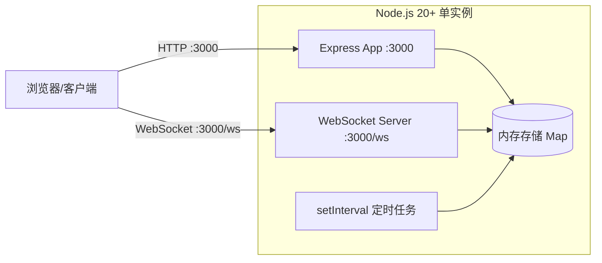

# 系统设计文档

> 阶段 2（系统设计）产出。覆盖 17 个 SD 子系统、17 个 INTF 接口、25 需求追溯。
> 套用 `templates/system-design.md` 模板。

## 文档信息

- 项目名称：blog-system-demo（扩展博客系统后端）
- 文档版本：v1.0
- 编制日期：2026-07-25
- 关联需求文档：`docs/requirement-spec.md`
- 编制者：S-doc 子代理（第 8 轮 W 模型端到端调测，阶段 2）

## 1. 系统架构

### 1.1 架构图（C4 组件图 + 数据流）


```mermaid
graph TD
    EXTIN[EXT-IN 外部信息源<br/>HTTP 客户端 / WebSocket 客户端]

    subgraph IF[Interfaces 接口层]
        R1[REST Router Express 4]
        WS1[WebSocket Server ws 库]
        MW1[中间件: auth/validate/error]
    end

    subgraph SV[Services 服务层 - 17 SD]
        SD1[SD-001 站点管理]
        SD2[SD-002 多博主]
        SD3[SD-003 多用户]
        SD4[SD-004 推荐]
        SD5[SD-005 广告]
        SD6[SD-006 统计]
        SD7[SD-007 搜索]
        SD8[SD-008 标签]
        SD9[SD-009 分类]
        SD10[SD-010 评论]
        SD11[SD-011 通知]
        SD12[SD-012 多博文]
        SD13[SD-013 交叉引用]
        SD14[SD-014 消息推送]
        SD15[SD-015 文件上传]
        SD16[SD-016 订阅]
        SD17[SD-017 数据导出与备份]
    end

    subgraph ST[Stores 存储层]
        MEM[(内存存储 Map)]
        IDX[(倒排索引/标签云/分类树索引)]
        FS[(文件 Buffer + 元数据 Map)]
        LOG[(操作日志/审计日志)]
    end

    subgraph INFR[Infrastructure 基础设施层]
        AUTH[auth 工具: JWT+bcrypt]
        ZOD[zod 校验]
        ERR[error-handler]
        CRON[setInterval 定时任务]
    end

    EXTOUT[EXT-OUT 外部信息汇<br/>HTTP 响应 / WebSocket 推送 / 文件下载]

    EXTIN -.->|HTTP 请求| R1
    EXTIN -.->|WS 连接| WS1
    R1 --> MW1
    MW1 --> SD1 & SD2 & SD3 & SD4 & SD5 & SD6 & SD7 & SD8 & SD9 & SD10 & SD11 & SD12 & SD13 & SD14 & SD15 & SD16 & SD17
    WS1 --> SD14
    SD1 & SD2 & SD3 & SD4 & SD5 & SD6 & SD7 & SD8 & SD9 & SD10 & SD11 & SD12 & SD13 & SD14 & SD15 & SD16 & SD17 --> MEM
    SD7 --> IDX
    SD8 --> IDX
    SD9 --> IDX
    SD15 --> FS
    SD3 & SD17 --> LOG
    SD1 & SD3 & SD17 --> AUTH
    SD1 & SD2 & SD3 --> ZOD
    SD1 & SD12 & SD16 --> CRON
    SD1 & SD2 & SD3 & SD4 & SD5 & SD6 & SD7 & SD8 & SD9 & SD10 & SD11 & SD12 & SD13 & SD14 & SD15 & SD16 & SD17 -.->|响应| EXTOUT
    SD14 -.->|推送| EXTOUT
    SD17 -.->|文件下载| EXTOUT
```

### 1.2 部署图


```mermaid
graph LR
    subgraph NODE[Node.js 20+ 单实例]
        APP[Express App :3000]
        WSPORT[WebSocket Server :3000/ws]
        JOB[setInterval 定时任务]
        MEM[(内存存储 Map)]
    end
    CLIENT[浏览器/客户端] -->|HTTP :3000| APP
    CLIENT -->|WebSocket :3000/ws| WSPORT
    APP --> MEM
    WSPORT --> MEM
    JOB --> MEM
```

### 1.3 架构风格说明

采用**分层 + 模块化单体**架构，理由：

1. **分层**（interfaces → services → stores → infrastructure）：符合 NFR-005 可维护性「三层分层 controller → service → store」要求；Express 4 单实例内存存储场景下，分层降低耦合、提升可测试性（NFR-004 覆盖率≥80%）。
2. **模块化单体**而非微服务：CON-002 约束单实例部署，CON-001 内存存储不引入数据库，微服务化无收益反增复杂度；17 个 SD 子系统以独立模块（controller+service+store）共存于单进程，模块边界清晰、依赖通过 depends-on 显式声明。
3. **横切治理**：NFR/CON 作为治理类节点（governance=true）通过 governs 边横切治理功能子系统，不破坏分层主结构。

## 2. 技术选型（决策矩阵 5 维度评分）

> 候选技术按 适用性/成熟度/可维护性/引入成本/风险敞口 5 维度评分（1=差/5=优），加权汇总取最高。

### 2.1 后端框架

| 候选 | 适用性 | 成熟度 | 可维护性 | 引入成本 | 风险敞口 | 总分 | 选型理由 |
|---|---|---|---|---|---|---|---|
| **Express 4**（选定） | 5 | 5 | 5 | 5 | 5 | **25** | CON-001 指定；内存存储场景最轻量；生态成熟、团队 1 周可运维 |
| Koa 2 | 4 | 4 | 4 | 3 | 4 | 19 | 异步更优雅但生态略小，与 CON-001 冲突 |
| Fastify | 4 | 4 | 4 | 3 | 4 | 19 | 性能更优但偏离 CON-001 指定栈 |

### 2.2 WebSocket 库

| 候选 | 适用性 | 成熟度 | 可维护性 | 引入成本 | 风险敞口 | 总分 | 选型理由 |
|---|---|---|---|---|---|---|---|
| **ws**（选定） | 5 | 5 | 5 | 5 | 5 | **25** | CON-001 明确指定；轻量无依赖；仅消息推送模块使用 |
| Socket.IO | 4 | 5 | 4 | 3 | 3 | 19 | 功能全但重，引入额外协议层，偏离 CON-001 |

### 2.3 数据存储

| 候选 | 适用性 | 成熟度 | 可维护性 | 引入成本 | 风险敞口 | 总分 | 选型理由 |
|---|---|---|---|---|---|---|---|
| **内存 Map**（选定） | 5 | 5 | 5 | 5 | 5 | **25** | CON-001 明确不引入数据库；崩溃可从操作日志重建（NFR-002） |
| SQLite | 3 | 5 | 4 | 3 | 3 | 18 | 与 CON-001「内存存储不引入数据库」冲突 |

### 2.4 技术栈总览

| 层次 | 技术 | 版本 | 选型理由 |
|---|---|---|---|
| 运行时 | Node.js | 20+ | CON-002 指定 |
| 后端框架 | Express | 4.x | CON-001 指定，决策矩阵最高分 |
| 语言 | TypeScript | 5.x strict | NFR-005 strict 0 错误 |
| WebSocket | ws | 8.x | CON-001 指定，仅消息推送模块 |
| 校验 | zod | 3.x | NFR-003 输入校验全覆盖 |
| 认证 | jsonwebtoken + bcrypt | jwt 9.x / bcrypt 5.x | NFR-003 JWT+bcrypt |
| 测试 | vitest | 1.x | CON-001 指定 |
| 文件上传 | Node.js stream（自行实现） | - | CON-001 不引入 multer |
| 数据存储 | Map（内存） | - | CON-001 不引入数据库 |

## 3. 模块划分（17 SD 子系统）

| SD ID | 模块名 | 职责 | 关联需求 | 依赖（depends-on） |
|---|---|---|---|---|
| SD-001 | 站点管理 | 站点配置/开关/公告/统计概览 | REQ-001 | - |
| SD-002 | 多博主 | 博主注册/分级/主页/关注/权限隔离 | REQ-002 | SD-003 |
| SD-003 | 多用户 | 用户注册/JWT/角色/封禁/审计 | REQ-003 | - |
| SD-004 | 推荐 | 推荐算法/推荐流/博主推荐/推荐位 | REQ-004 | SD-006 |
| SD-005 | 广告 | 广告位/投放/点击统计/审核 | REQ-005 | SD-003 |
| SD-006 | 统计 | 文章/用户/博主/站点统计 | REQ-006 | SD-001 |
| SD-007 | 搜索 | 全文/多维搜索/排序/建议/历史 | REQ-007 | SD-008, SD-009 |
| SD-008 | 标签 | 标签创建/云/关注/合并审核 | REQ-008 | SD-012 |
| SD-009 | 分类 | 分类树/文章列表/导航/管理 | REQ-009 | SD-012 |
| SD-010 | 评论 | 多级回复/审核/点赞/举报/分页 | REQ-010 | SD-012 |
| SD-011 | 通知 | 站内通知/触发/已读/设置 | REQ-011 | SD-003 |
| SD-012 | 多博文 | 文章CRUD/状态机/系列/定时/批量 | REQ-012 | - |
| SD-013 | 交叉引用 | 引用/反向链接/图谱/相关推荐/通知 | REQ-013 | SD-012 |
| SD-014 | 消息推送 | WebSocket推送/通道/在线状态/重试/离线合并 | REQ-014 | SD-011 |
| SD-015 | 文件上传 | 图片/附件上传/配额/元数据/安全校验/存储抽象 | REQ-015 | SD-012 |
| SD-016 | 订阅 | 博主/标签/分类订阅/权限分级/聚合/图谱 | REQ-016 | SD-002, SD-012 |
| SD-017 | 数据导出与备份 | 导出/备份/恢复/增量/任务管理/GDPR | REQ-017 | SD-006 |

### 3.1 子系统职责与接口详述

#### SD-001 站点管理子系统
- **职责**：站点级配置（siteName/description/logoUrl/icpRecord）；站点开关（维护模式/注册开关/评论开关）；全局公告 CRUD + 定时发布；站点统计概览（userCount/articleCount/commentCount/visitCount）。
- **接口**：INTF-001 站点管理接口（REST）。
- **关键逻辑**：维护模式中间件拦截非管理员请求返回 503；公告定时发布由 setInterval 扫描 pending→published。
- **依赖**：无上游 SD；被 SD-006（统计依赖站点数据）依赖。

#### SD-002 多博主子系统
- **职责**：博主注册（邮箱+密码，bcrypt 哈希，邮箱全局唯一）；角色分级（normal/verified/invited）；博主主页（profile+articles+socialLinks）；关注/取关（幂等）；权限隔离（仅自己可编辑自己文章）。
- **接口**：INTF-002 多博主接口（REST）。
- **依赖**：SD-003（博主是特殊用户角色）。

#### SD-003 多用户子系统
- **职责**：用户注册登录（JWT 24h）；角色四级（user/blogger/admin/super_admin）；资料管理；封禁/解禁（token 立即失效）；操作审计日志。
- **接口**：INTF-003 多用户接口（REST）。
- **横切**：提供 auth 工具（JWT 签发/校验、bcrypt 哈希）供全局复用（NFR-005 公共工具）。
- **依赖**：无上游；被 SD-002/SD-005/SD-011 依赖。

#### SD-004 推荐子系统
- **职责**：推荐算法（热度 0.4 + 点赞 0.3 + 评论 0.3 + 新鲜度 7 天衰减 + 用户偏好标签匹配）；三模式推荐流（personalized/hot/latest）；博主推荐（相似+热门）；推荐位管理。
- **接口**：INTF-004 推荐接口（REST）。
- **依赖**：SD-006（统计数据流入推荐）。

#### SD-005 广告子系统
- **职责**：广告位（sidebar/in_article/homepage_banner）；广告投放（时间范围/目标用户/展示频次）；点击统计（CTR）；审核（pending→approved/rejected）。
- **接口**：INTF-005 广告接口（REST）。
- **依赖**：SD-003（目标用户角色判定）。

#### SD-006 统计子系统
- **职责**：文章统计（viewCount/likeCount/commentCount/shareCount）；用户统计（注册趋势/活跃度/留存）；博主统计（产出/互动率/粉丝增长）；站点统计（PV/UV/来源）；仅管理员访问。
- **接口**：INTF-006 统计接口（REST）。
- **依赖**：SD-001（站点数据流入统计）。

#### SD-007 搜索子系统
- **职责**：全文搜索（标题/内容/摘要，分词）；多维搜索（tags/categories/bloggers）；排序（relevance/time/hotness）；自动补全（≤10）；热门搜索；搜索历史（FIFO 100 条）；倒排索引预构建。
- **接口**：INTF-007 搜索接口（REST）。
- **依赖**：SD-008、SD-009（标签/分类数据流入搜索）。

#### SD-008 标签子系统
- **职责**：标签创建与绑定（文章≤10 标签）；标签云（≤50，按 count 降序）；标签关注；标签合并（源→目标迁移）；新标签审核（pending→approved）。
- **接口**：INTF-008 标签接口（REST）。
- **依赖**：SD-012（文章绑定标签）。

#### SD-009 分类子系统
- **职责**：分类树（≤5 层，parentId）；分类下文章列表（分页/排序）；面包屑导航；分类管理（CRUD/级联删除/合并/排序）。
- **接口**：INTF-009 分类接口（REST）。
- **依赖**：SD-012（文章归属分类）。

#### SD-010 评论子系统
- **职责**：多级回复（≤5 层）；评论审核（敏感词过滤 pending→approved/rejected）；评论点赞（幂等）；举报（reported→resolved）；分页排序（time/hotness）。
- **接口**：INTF-010 评论接口（REST）。
- **依赖**：SD-012（评论归属文章）。

#### SD-011 通知子系统
- **职责**：站内通知（system/interaction/follow/audit）；事件触发（评论回复/点赞/关注/审核结果）；已读管理（单条/全部/未读数）；通知设置（开关每类，默认全开）。
- **接口**：INTF-011 通知接口（REST）。
- **依赖**：SD-003（通知需用户身份）；被 SD-014 依赖（推送是通知传输层）。

#### SD-012 多博文子系统
- **职责**：文章 CRUD（title/content/summary/coverImageUrl/status）；状态机（draft→pending_review→published→offline→archived，禁止逆向）；文章系列；定时发布；批量管理（下架/归档，软删除）。
- **接口**：INTF-012 多博文接口（REST）。
- **依赖**：无上游；被 SD-008/009/010/013/015/016 依赖（核心内容源）。

#### SD-013 交叉引用子系统
- **职责**：文章间引用（显式链接+自动反向链接）；引用图谱（citedByCount/citingCount）；相关文章推荐（共同标签 0.5 + 共同分类 0.3 + 引用 0.2）；引用通知；禁止自引用。
- **接口**：INTF-013 交叉引用接口（REST）。
- **依赖**：SD-012（引用基于文章）。

#### SD-014 消息推送子系统 ★第 8 轮新增
- **职责**：WebSocket 长连接（connectionId→userId 映射）；推送场景（新评论/新关注/新文章/系统公告）；推送订阅管理（comment/follow/article/announcement）；在线状态感知（上下线广播）；推送失败重试（3 次，1s/2s/4s 指数退避）；离线消息合并（同类合并，保留 24h）。
- **接口**：INTF-014 消息推送接口（WebSocket + REST）。
- **依赖**：SD-011（通知触发推送）；与 SD-016 协作（订阅新文章通过推送送达）。

#### SD-015 文件上传子系统 ★第 8 轮新增
- **职责**：图片上传（JPG/PNG/WebP/GIF）；附件上传（PDF/Markdown/ZIP，≤10MB）；配额管理（用户日 50MB/博主月 500MB/站点 10GB）；文件元数据（MIME/大小/上传者/SHA-256）；安全校验（魔数校验/文件名消毒）；流式处理（Node stream，不引入 multer）；内存 Buffer+Map 存储。
- **接口**：INTF-015 文件上传接口（REST，流式 multipart）。
- **依赖**：SD-012（文章封面/内图通过上传）。

#### SD-016 订阅子系统 ★第 8 轮新增
- **职责**：博主/标签/分类订阅；订阅触发新文章推送（经 SD-014）；权限分级（free/paid 占位/invitation 邀请码）；通知聚合（每小时聚合一次避免洪水）；订阅关系图谱（双向查询）；取消订阅幂等。
- **接口**：INTF-016 订阅接口（REST）。
- **依赖**：SD-002、SD-012；与 SD-014 协作。

#### SD-017 数据导出与备份子系统 ★第 8 轮新增
- **职责**：用户/博主导出（CSV/JSON）；管理员全量备份（JSON+版本号+timestamp）；备份恢复（SHA-256 完整性校验，不一致返回 422）；增量导出（时间范围）；导出任务异步管理（pending/running/completed/failed，进度查询，结果下载）；GDPR 占位（标记删除 30 天后清除）。
- **接口**：INTF-017 数据导出与备份接口（REST）。
- **依赖**：SD-006（导出含统计）。

## 4. 接口清单（17 INTF 概览）

> 详细 API 规格见 `docs/interface-design.md`。

| INTF ID | 接口名 | 协议 | 路径前缀 | 关联 SD | 认证 |
|---|---|---|---|---|---|
| INTF-001 | 站点管理接口 | REST | /api/site | SD-001 | 部分（管理员写） |
| INTF-002 | 多博主接口 | REST | /api/bloggers | SD-002 | 部分 |
| INTF-003 | 多用户接口 | REST | /api/users, /api/auth | SD-003 | 部分 |
| INTF-004 | 推荐接口 | REST | /api/recommendations | SD-004 | 部分（personalized 需登录） |
| INTF-005 | 广告接口 | REST | /api/ads | SD-005 | 部分（管理员审核） |
| INTF-006 | 统计接口 | REST | /api/stats | SD-006 | 管理员 |
| INTF-007 | 搜索接口 | REST | /api/search | SD-007 | 部分（历史需登录） |
| INTF-008 | 标签接口 | REST | /api/tags | SD-008 | 部分 |
| INTF-009 | 分类接口 | REST | /api/categories | SD-009 | 部分 |
| INTF-010 | 评论接口 | REST | /api/comments | SD-010 | 部分 |
| INTF-011 | 通知接口 | REST | /api/notifications | SD-011 | 是 |
| INTF-012 | 多博文接口 | REST | /api/articles | SD-012 | 部分 |
| INTF-013 | 交叉引用接口 | REST | /api/articles/:id/citations | SD-013 | 部分 |
| INTF-014 | 消息推送接口 | WebSocket + REST | /ws, /api/push | SD-014 | 是 |
| INTF-015 | 文件上传接口 | REST（流式） | /api/files | SD-015 | 是 |
| INTF-016 | 订阅接口 | REST | /api/subscriptions | SD-016 | 是 |
| INTF-017 | 数据导出与备份接口 | REST | /api/exports, /api/backups | SD-017 | 是（备份管理员） |

## 5. 数据模型（核心实体）

### 5.1 用户域

```ts
interface User {
  id: string;            // UUID
  email: string;         // 全局唯一
  passwordHash: string;  // bcrypt
  nickname: string;      // 1-30
  avatarUrl?: string;
  bio?: string;          // ≤200
  role: 'user' | 'blogger' | 'admin' | 'super_admin';
  status: 'active' | 'banned';
  banReason?: string;    // 封禁时必填
  createdAt: string;     // ISO 8601
  updatedAt: string;
}

interface Blogger extends User {
  bloggerRole: 'normal' | 'verified' | 'invited';
  socialLinks: { platform: string; url: string }[];
}

interface Follow {        // 关注关系（博主间）
  followerId: string;
  followeeId: string;
  createdAt: string;
}

interface AuditLog {
  id: string;
  userId: string;
  action: string;        // 操作类型
  targetResource: string;
  timestamp: string;
}
```

### 5.2 内容域

```ts
interface Article {
  id: string;
  authorId: string;      // 博主 ID
  title: string;         // 1-200
  content: string;       // 1-50000
  summary?: string;      // 0-500
  coverImageUrl?: string;
  status: 'draft' | 'pending_review' | 'published' | 'offline' | 'archived';
  scheduledAt?: string;  // 定时发布
  seriesId?: string;
  seriesOrder?: number;  // ≥0
  tagIds: string[];      // ≤10
  categoryId?: string;
  viewCount: number;
  likeCount: number;
  commentCount: number;
  shareCount: number;
  createdAt: string;
  updatedAt: string;
}

interface Series {
  id: string;
  name: string;
  description?: string;
  authorId: string;
}

interface Tag {
  id: string;
  name: string;          // 1-20，大小写不敏感唯一
  status: 'pending' | 'approved' | 'rejected';
  usageCount: number;
}

interface Category {
  id: string;
  name: string;          // 1-30，同级唯一
  parentId: string | null;
  sortOrder: number;     // ≥0
}

interface Citation {
  id: string;
  sourceArticleId: string;   // 引用方
  targetArticleId: string;   // 被引用方
  createdAt: string;
}
```

### 5.3 互动域

```ts
interface Comment {
  id: string;
  articleId: string;
  authorId: string;
  parentId: string | null;   // ≤5 层嵌套
  content: string;           // 1-1000
  status: 'pending' | 'approved' | 'rejected' | 'reported' | 'resolved';
  likeCount: number;
  reportReason?: string;     // 举报 1-200
  createdAt: string;
}

interface CommentLike {
  userId: string;
  commentId: string;
  createdAt: string;
}

interface Notification {
  id: string;
  userId: string;            // 接收者
  type: 'system' | 'interaction' | 'follow' | 'audit';
  title: string;             // 1-100
  content: string;           // 1-500
  isRead: boolean;
  createdAt: string;
}

interface NotificationSetting {
  userId: string;
  system: boolean;           // 默认 true
  interaction: boolean;
  follow: boolean;
  audit: boolean;
}
```

### 5.4 推送与订阅域

```ts
interface WsConnection {
  connectionId: string;
  userId: string;
  connectedAt: string;
  status: 'online' | 'offline';
}

interface PushChannel {       // 推送通道订阅
  userId: string;
  channel: 'comment' | 'follow' | 'article' | 'announcement';
  subscribed: boolean;        // 默认 true
}

interface OfflineMessage {
  id: string;
  userId: string;
  channel: string;
  payload: object;            // 合并后内容
  createdAt: string;
  expireAt: string;           // 24h
}

interface Subscription {
  id: string;
  subscriberId: string;
  targetType: 'blogger' | 'tag' | 'category';
  targetId: string;
  permission: 'free' | 'paid' | 'invitation';
  invitationCode?: string;    // invitation 必填 8-32
  createdAt: string;
}

interface SubscriptionAggregate {  // 聚合推送窗口
  userId: string;
  targetType: string;
  targetId: string;
  windowStart: string;        // 整点
  articleIds: string[];
}
```

### 5.5 文件与备份域

```ts
interface FileMeta {
  id: string;
  originalName: string;
  sanitizedName: string;      // 消毒后
  mimeType: string;
  size: number;               // bytes
  uploaderId: string;
  sha256: string;             // 64 hex
  uploadedAt: string;
}

interface UploadQuota {
  userId: string;
  dailyUsed: number;          // bytes，每日重置
  monthlyUsed: number;        // 博主月配额
}

interface BackupSnapshot {
  version: string;            // v{timestamp}
  timestamp: string;
  sha256: string;             // 完整性校验
  data: {
    users: User[]; bloggers: Blogger[]; articles: Article[];
    comments: Comment[]; tags: Tag[]; categories: Category[];
    notifications: Notification[]; subscriptions: Subscription[];
  };
}

interface ExportTask {
  id: string;
  type: 'user_export' | 'blogger_export' | 'admin_backup' | 'incremental';
  status: 'pending' | 'running' | 'completed' | 'failed';
  format: 'csv' | 'json';
  startTime?: string;
  endTime?: string;
  progress: number;           // 0-100
  resultUrl?: string;
  createdAt: string;
}
```

### 5.6 站点与运营域

```ts
interface SiteConfig {
  siteName: string;           // 1-50
  description: string;        // 0-200
  logoUrl?: string;
  icpRecord?: string;
  maintenanceMode: boolean;
  maintenanceMessage?: string;
  registrationOpen: boolean;
  commentOpen: boolean;
}

interface Announcement {
  id: string;
  title: string;              // 1-100
  content: string;            // 1-2000
  status: 'pending' | 'published' | 'archived';
  publishedAt?: string;       // 未来时间则 pending
  createdAt: string;
}

interface Ad {
  id: string;
  title: string;
  imageUrl: string;
  targetUrl: string;
  slot: 'sidebar' | 'in_article' | 'homepage_banner';
  startTime: string;
  endTime: string;
  targetAudience: 'all' | 'logged_in' | 'specific_role';
  maxImpressions: number;
  impressions: number;
  clicks: number;
  status: 'pending' | 'approved' | 'rejected';
}

interface RecommendationSlot {
  id: string;
  name: string;
  type: 'personalized' | 'hot' | 'latest';
  position: 'sidebar' | 'homepage' | 'article_detail';
  active: boolean;
}
```

## 6. 安全设计

### 6.1 认证与授权
- **JWT 认证**（NFR-003）：用户登录签发 JWT，有效期 24h（86400s），后续请求携带 `Authorization: Bearer <token>`；封禁用户 token 立即失效（黑名单 Map）。
- **bcrypt 密码哈希**（NFR-003）：密码 ≥8 字符，bcrypt 哈希存储，cost factor=10。
- **RBAC 四级角色**（NFR-003）：user < blogger < admin < super_admin；中间件 `requireRole(...roles)` 校验；越权返回 403。

### 6.2 输入校验与防注入
- **zod schema 校验**（NFR-003）：所有接口入参经 zod schema 校验，非法返回 400。
- **防原型链污染**（NFR-003）：禁止 `Object.assign` 合并用户输入到原型；使用 `Object.create(null)` 或显式字段拷贝；JSON.parse 后白名单取值。
- **SQL 注入**：内存存储 N/A，但搜索/标签拼接仍做转义。

### 6.3 文件上传安全（NFR-003 + REQ-015）
- **MIME 白名单**：图片 image/jpeg|png|webp|gif；附件 application/pdf、text/markdown、application/zip。
- **魔数校验**：读取文件头字节验证与声明 MIME 一致（防伪造扩展名）。
- **大小限制**：单文件 ≤10MB，超限 413。
- **文件名消毒**：去除 `../` 路径穿越字符、特殊字符，使用 sanitizedName 存储。
- **SHA-256 摘要**：上传后计算，用于去重与完整性校验。

### 6.4 审计与敏感操作
- **审计日志**（NFR-003）：用户封禁/解禁、文章批量下架/归档、广告审核、备份恢复记录审计日志（userId/action/target/timestamp）。
- **维护模式**：开启后非管理员请求 503 + maintenanceMessage。

## 7. 性能设计

### 7.1 性能指标（NFR-001）

| 指标 | 目标 | 设计措施 |
|---|---|---|
| 接口响应 P95 | ≤200ms | 内存存储 O(1) 查找；倒排索引预构建；避免 N+1 遍历 |
| 单实例并发 | ≥100 QPS | 单线程异步非阻塞；Map 查找无锁；流式上传不阻塞 |
| 搜索响应 P95 | ≤500ms | 倒排索引 Map 预构建；分词结果缓存；CON-003 限制数据规模 |
| 文件上传 P95 | ≤1s（10MB） | Node stream 流式处理；分片写入 Buffer；SHA-256 流式计算 |
| WebSocket 推送 | ≤100ms | ws 长连接直推；连接池 Map O(1) 查找；离线消息合并减少推送量 |

### 7.2 性能保障措施
1. **内存存储**：Map 查找 O(1)，无 DB 网络开销。
2. **倒排索引**：SD-007 搜索预构建 `term → articleIds[]` Map；SD-008 标签云预排序；SD-009 分类树预构建 parentId→children Map。
3. **流式上传**：SD-015 使用 Node stream 边接收边校验边写入，避免全量缓冲。
4. **WebSocket 连接池**：SD-014 维护 `connectionId → connection` Map，推送 O(1) 查找。
5. **定时任务轻量化**：setInterval 扫描公告/聚合订阅/定时发布，扫描窗口可配置。
6. **错误率 ≤0.1%**（NFR-002）：统一 error-handler 中间件兜底；zod 校验前置拦截非法输入。

## 8. 部署设计

### 8.1 部署架构（CON-002）
- **单实例部署**：Node.js 20+ 单进程，Express + WebSocket 共用 :3000 端口。
- **内存存储**：所有状态存 Map，进程重启丢失，靠操作日志可选重建（NFR-002）。
- **无外部依赖**：不引入数据库/缓存/消息队列，CON-001 合规。

### 8.2 运行时配置
- 端口：3000（HTTP + WebSocket 同端口，WebSocket 走 /ws 路径升级）
- JWT 密钥：环境变量 `JWT_SECRET`
- 文件配额：环境变量可覆盖默认值（用户日 50MB/博主月 500MB/站点 10GB）
- 数据规模（CON-003）：单测 ≤100 文章/50 用户/50 文件；集成 ≤1000 文章/200 用户/200 文件；备份 ≤10MB。

### 8.3 可用性（NFR-002）
- 错误率 ≤0.1%：统一 error-handler + zod 前置校验。
- 备份恢复成功率 ≥99%：恢复前 SHA-256 校验，不一致返回 422。
- 崩溃重建：操作日志可选持久化，崩溃后从日志重放重建内存状态。

## 9. 需求追溯映射（25 需求 → 17 SD）

| 需求 ID | 需求名 | 实现 SD | 设计章节 | INTF |
|---|---|---|---|---|
| REQ-001 | 站点管理 | SD-001 | §3.1 SD-001 | INTF-001 |
| REQ-002 | 多博主 | SD-002 | §3.1 SD-002 | INTF-002 |
| REQ-003 | 多用户 | SD-003 | §3.1 SD-003 | INTF-003 |
| REQ-004 | 推荐 | SD-004 | §3.1 SD-004 | INTF-004 |
| REQ-005 | 广告 | SD-005 | §3.1 SD-005 | INTF-005 |
| REQ-006 | 统计 | SD-006 | §3.1 SD-006 | INTF-006 |
| REQ-007 | 搜索 | SD-007 | §3.1 SD-007 | INTF-007 |
| REQ-008 | 标签 | SD-008 | §3.1 SD-008 | INTF-008 |
| REQ-009 | 分类 | SD-009 | §3.1 SD-009 | INTF-009 |
| REQ-010 | 评论 | SD-010 | §3.1 SD-010 | INTF-010 |
| REQ-011 | 通知 | SD-011 | §3.1 SD-011 | INTF-011 |
| REQ-012 | 多博文 | SD-012 | §3.1 SD-012 | INTF-012 |
| REQ-013 | 交叉引用 | SD-013 | §3.1 SD-013 | INTF-013 |
| REQ-014 | 消息推送 ★ | SD-014 | §3.1 SD-014 | INTF-014 |
| REQ-015 | 文件上传 ★ | SD-015 | §3.1 SD-015 | INTF-015 |
| REQ-016 | 订阅 ★ | SD-016 | §3.1 SD-016 | INTF-016 |
| REQ-017 | 数据导出与备份 ★ | SD-017 | §3.1 SD-017 | INTF-017 |
| NFR-001 | 性能 | 治理 SD-001/007/012/014 | §7 性能设计 | - |
| NFR-002 | 可用性 | 治理 SD-001/012/017 | §8.3 可用性 | - |
| NFR-003 | 安全 | 治理 SD-003/010/014/015/017 | §6 安全设计 | - |
| NFR-004 | 可测试性 | 治理 SD-001/002/003 | 系统测试设计 | - |
| NFR-005 | 可维护性 | 治理 SD-001/002/003 | §1.3 分层架构 | - |
| CON-001 | 技术栈 | 治理 SD-014/015 | §2 技术选型 | - |
| CON-002 | 部署 | 全局 | §8 部署设计 | - |
| CON-003 | 数据规模 | 全局 | §8.2 运行时配置 | - |

> ★ 标记为第 8 轮新增功能域。

## 10. 系统测试用例索引

> 详细用例见 `docs/system-test-design.md`。共 64 个 TC-SYS 用例（覆盖 17 SD 端到端 + 性能基线 + 安全基线 + 异常路径）。

| 用例 ID | 关联 SD | 场景 | 优先级 |
|---|---|---|---|
| TC-SYS-001 | SD-001 | 站点配置→维护模式→公告定时发布端到端 | 高 |
| TC-SYS-002 | SD-003/002 | 用户注册→博主注册→登录→权限隔离端到端 | 高 |
| ... | ... | ... | ... |
| TC-SYS-061 | SD-014 | WebSocket 推送延迟基线 ≤100ms | 高 |
| TC-SYS-062 | SD-003 | JWT 伪造与 RBAC 越权安全基线 | 高 |
| TC-SYS-063 | SD-015 | 文件上传魔数校验与原型链污染安全基线 | 高 |
| TC-SYS-064 | SD-012/017 | 全链路：发布文章→评论→通知→推送→备份恢复 | 高 |

## 11. 设计完整性自检

| 检查项 | 状态 | 说明 |
|---|---|---|
| 17 SD 子系统覆盖 | ✅ | SD-001~017 全部含职责/接口/依赖 |
| 25 需求追溯 | ✅ | 17 REQ + 5 NFR + 3 CON 全部映射到 SD/章节 |
| 17 INTF 接口清单 | ✅ | INTF-001~017 含路径/协议/认证 |
| 架构图（C4 + 部署） | ✅ | Mermaid 组件图 + 部署图，含数据流标注 |
| 技术选型决策矩阵 | ✅ | 5 维度评分，含候选/总分/选型理由 |
| 安全设计 | ✅ | JWT+bcrypt+RBAC+zod+文件安全+审计 |
| 性能设计 | ✅ | P95≤200ms/QPS≥100/推送≤100ms 保障措施 |
| 部署设计 | ✅ | 单实例 Node.js 20+，CON-002 合规 |
| 第 8 轮新增 4 域 | ✅ | SD-014/015/016/017 完整设计 |
