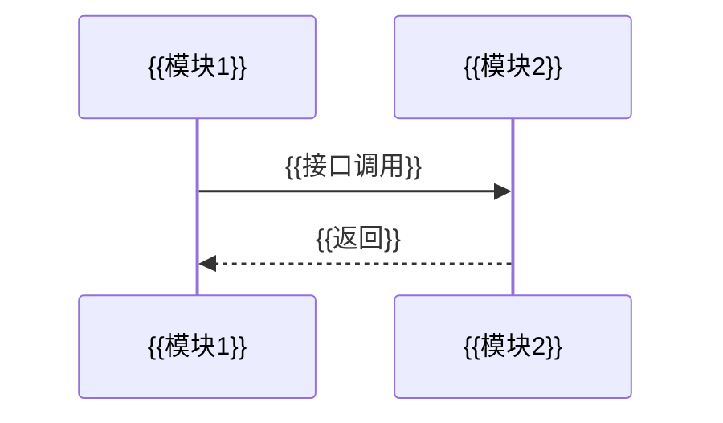

# UML 模块级建模（UML Module-Level Modeling）

> 对应 DESIGN.md 附录 A UML 2.0 系统建模图表集（模块级子集）。模块级建模仅包图 + 序列图 + 通信图；
> 系统级图表（部署图/顶层组件图）由阶段 2 承接，类级图表（类图/ER 图/状态机图）由阶段 4 承接，不在此重复。
> **阶段边界**：本文件只产模块级 UML，越界即返工（FM-OD-06）。
> 模板版本：v1.0。主文档引用块：`> UML 模块级建模详见 [{{module}}-uml-modeling.md](./{{module}}-uml-modeling.md)`。

## A.1 包图

> 模块/包依赖。包 = 主文档 §2 接口定义的模块分组（FM-OD-04 检测信号）。

```mermaid
graph TB
  {{包1}} --> {{包2}}
```

## A.2 序列图

> 模块间交互时序。交互 = 主文档 §2 接口定义的接口调用（FM-OD-04 检测信号）。
> 注：mermaid 无独立序列图语法，用 `sequenceDiagram` 表达交互时序。



## A.3 通信图

> 模块间通信结构。通信链路 = 主文档 §1 模块调用关系的调用链（FM-OD-04 检测信号）。

```mermaid
graph LR
  {{模块1}} -->|{{接口名}}| {{模块2}}
  {{模块2}} -->|{{接口名}}| {{模块3}}
```

> 门禁：`check-requirement-graph.ts` R12 校验本文件 mermaid 块首尾定界行一一配对（批 3 实现）。
