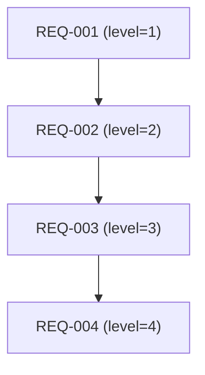

# 需求规格说明书

> 阶段 1（需求分析）产出。套用时替换 `{{}}` 占位符。
>
> **第 20 轮四维识别与豁免审批增强（v20.0.0）**：§4-§7 为四维识别强制节，禁止省略任一节。
> 强制项见各节「强制项」标注；豁免须经 S→R→V→人类四阶段审批（见 [phase-1-requirements.md](../references/phase-1-requirements.md)「豁免审批治理」节）。

## 文档信息

- 项目名称：{{项目名称}}
- 文档版本：{{v1.0}}
- 编制日期：{{YYYY-MM-DD}}
- 编制者：{{编制者}}

## 1. 问题陈述与背景

### 1.1 项目背景
{{业务背景}}

### 1.2 项目目标
{{项目目标}}

### 1.3 范围
- 包含：{{包含范围}}
- 不包含：{{不包含范围}}

## 2. 解决方案概述

{{解决方案概述：技术选型、总体架构方向、关键设计取舍。避免具体文件路径与代码片段。}}

- 技术栈：{{技术栈}}
- 总体架构：{{总体架构方向}}
- 关键取舍：{{关键设计取舍与替代方案对比}}

## 3. User Stories

> 覆盖正常/异常/边界/NFR/CON 全场景。每条 user story 对应 ≥1 个 REQ 行（RTM 可追溯）。

1. As a <actor>, I want <feature>, so that <benefit>
2. As a <actor>, I want <feature>, so that <benefit>
...

## 4. 需求层级树【维度1】

> REQ 内部 4 层：domain（level=1）→ module（level=2）→ feature（level=3）→ acceptance（level=4）。
> 每个节点须标注 level（1-4，强制必填）/ priority（P0-P3，可选）/ reqGroup（level≥2 节点须指向 level=1 祖先）。

### 4.1 层级树图

### 4.2 层级节点表

> **强制项**：每个 REQ 必须出现；level 字段必填（1-4），无降级；level≥2 节点的 reqGroup 须指向 level=1 祖先。
> **禁止行为**：层级表与 graph.json 节点不一致。

| 需求 ID | level | priority | reqGroup | parent | 类型 | 描述 | 验收标准 |
|---|---|---|---|---|---|---|---|
| REQ-001 | 1 | P0 | REQ-001 | — | domain | {{领域描述}} | — |
| REQ-002 | 2 | P0 | REQ-001 | REQ-001 | module | {{模块描述}} | — |
| REQ-003 | 3 | P1 | REQ-001 | REQ-002 | feature | {{功能点描述}} | — |
| REQ-004 | 4 | P1 | REQ-001 | REQ-003 | acceptance | {{验收标准描述}} | {{可量化标准}} |
| NFR-001 | {{1-4}} | P{{0-3}} | {{level=1 祖先}} | {{parent}} | NFR | {{描述}} | {{指标}} |
| CON-001 | {{1-4}} | P{{0-3}} | {{level=1 祖先}} | {{parent}} | CON | {{描述}} | {{约束}} |

<!-- NFR 可测量性提示（sig-007）：
每个 NFR 必须包含：
1. 量化指标（如「P95 响应时间」「代码覆盖率」「错误率」）
2. 验收阈值（如「P95 ≤ 200ms」「覆盖率 ≥ 80%」「错误率 = 0%」）
3. 测量方法（如「k6 压测」「vitest coverage」「日志统计」）
禁止「性能良好」「高可用」「易扩展」等不可测量表述。
-->

### 4.3 层级规则

- **level 单调**：沿 parent 链 level 严格递减（子节点 level = 父节点 level + 1）。
- **单根**：level=1 节点可有多个（每个 domain 一个根），但每个 level≥2 节点有且仅有一个 parent。
- **reqGroup 一致**：level≥2 节点的 reqGroup 须指向其 level=1 祖先；level=1 节点的 reqGroup 指向自身。
- **验收标准可量化**：level=4 节点须含可量化验收标准（禁止「快速」「友好」等主观词）。
- **NFR/CON 入树**：NFR/CON 节点同样须标注 level 并挂入层级树（横切治理类可挂 level=1 domain 下）。

## 5. 候选子系统划分（REQ-group）【维度2】

> level=1 REQ 即 REQ-group 候选（每个 domain 对应一个候选子系统）。
> 正式子系统划分待阶段 2 系统设计决策；本节仅产出候选清单。

### 5.1 REQ-group 清单

> **强制项**：至少 1 个 group；每个 group 须对应一个 level=1 REQ。

| group ID | 对应 level=1 REQ | group 名称 | 包含 module（level=2） | 候选子系统说明 |
|---|---|---|---|---|
| GROUP-001 | REQ-001 | {{domain 名称}} | REQ-002, REQ-005 | {{候选子系统说明}} |

### 5.2 group 划分依据

{{说明每个 group 为何独立成子系统：业务边界、数据所有权、部署独立性、团队所有权等。}}

### 5.3 待阶段 2 决策事项

- {{如：GROUP-001 与 GROUP-002 是否合并为一个子系统}}
- {{如：某 module 的 group 归属待定}}
- {{如：横切关注点（认证/日志）是否抽为独立子系统}}

## 6. 需求交叉逻辑矩阵【维度3】

> 四类边：depends-on（依赖）/ precedes（时序先于）/ conflicts-with（冲突互斥）/ cross-cuts（横切）。
> **强制项**：§6.1-§6.4 每类必须出现；无内容时填「无」并加说明（禁止只写「无」而不加说明）。

### 6.1 依赖逻辑（depends-on）

> A depends-on B：A 的实现依赖 B 先行提供能力/数据。

| 源 REQ | 目标 REQ | 依赖类型 | 说明 |
|---|---|---|---|
| REQ-003 | REQ-002 | data | {{A 依赖 B 的数据}} |

（无内容时填：「无——本阶段未识别 depends-on 边，原因：{{说明}}」）

### 6.2 横切关注点（cross-cuts）

> A cross-cuts B：A 横切影响 B（如 NFR/CON 横切多个 feature）。

| 源 REQ | 目标 REQ | 横切类型 | 说明 |
|---|---|---|---|
| NFR-001 | REQ-003 | security | {{安全 NFR 横切该 feature}} |

（无内容时填：「无——本阶段未识别 cross-cuts 边，原因：{{说明}}」）

### 6.3 冲突互斥（conflicts-with）

> A conflicts-with B：A 与 B 互斥/矛盾，须经豁免审批或用户决策。

| 源 REQ | 目标 REQ | 冲突类型 | 处置 |
|---|---|---|---|
| REQ-007 | REQ-009 | 互斥 | {{须经用户决策或申请豁免}} |

（无内容时填：「无——本阶段未识别 conflicts-with 边，原因：{{说明}}」）

> conflicts-with 边一经识别，须同步写入 graph.json，并进入豁免审批流程（见 §豁免审批治理）。

### 6.4 时序优先级（precedes）

> A precedes B：A 须先于 B 交付/上线。

| 源 REQ | 目标 REQ | 时序约束 | 说明 |
|---|---|---|---|
| REQ-002 | REQ-005 | delivery | {{B 依赖 A 上线}} |

（无内容时填：「无——本阶段未识别 precedes 边，原因：{{说明}}」）

### 6.5 交叉逻辑总览

| 边类型 | 数量 | 是否含异常项 | 异常项处置 |
|---|---|---|---|
| depends-on | {{N}} | 是/否 | {{如冲突未解决→豁免审批}} |
| cross-cuts | {{N}} | 是/否 | — |
| conflicts-with | {{N}} | 是/否 | {{每条须有处置}} |
| precedes | {{N}} | 是/否 | — |

## 7. 需求覆盖分析【维度4】

> **强制项**：§7.1-§7.4 四张矩阵必须出现；§7.5 每维度覆盖率须 100%。
> 覆盖缺失项须经豁免审批（FM-4D-01/02/03/05），不得隐式遗漏。

### 7.1 stakeholder 覆盖矩阵

| stakeholder | 关联 REQ | 是否全覆盖 | 缺失项 |
|---|---|---|---|
| {{最终用户}} | REQ-003, REQ-004 | ✅ | — |
| {{运维}} | — | ⚠️ | {{缺失→FM-4D-01 豁免审批}} |

### 7.2 业务场景覆盖矩阵

| 场景类型 | 关联 REQ | 是否覆盖 | 缺失项 |
|---|---|---|---|
| 正常场景 | REQ-003 | ✅ | — |
| 异常场景 | REQ-004 | ✅ | — |
| 边界场景 | — | ⚠️ | {{缺失→FM-4D-02 豁免审批}} |

### 7.3 需求类型覆盖矩阵

| 需求类型 | 关联 REQ | 是否覆盖 | 缺失项 |
|---|---|---|---|
| 功能需求（FR） | REQ-001~004 | ✅ | — |
| 非功能需求（NFR） | NFR-001 | ✅ | — |
| 约束需求（CON） | CON-001 | ✅ | — |

### 7.4 NFR/CON 横切覆盖矩阵

| NFR/CON ID | 横切的 SD/feature 清单 | 是否挂载 | 缺失项 |
|---|---|---|---|
| NFR-001 | REQ-003, REQ-005 | ✅ | — |
| CON-001 | 横切（全局） | ✅ | — |

> NFR/CON 须在 RTM `designDoc` 字段登记横切 SD 清单或「横切」标识（见 [phase-1-requirements.md](../references/phase-1-requirements.md)「NFR/CON 横切治理字段登记」节）。

### 7.5 覆盖率指标汇总

> **强制项**：每维度覆盖率须 100%；不达标项须经豁免审批（FM-4D-03/05）。

| 覆盖维度 | 覆盖率 | 是否达标 | 未达标处置 |
|---|---|---|---|
| stakeholder 覆盖 | {{100%}} | ✅/⚠️ | {{<100% → FM-4D-03 豁免审批}} |
| 业务场景覆盖 | {{100%}} | ✅/⚠️ | {{<100% → FM-4D-03 豁免审批}} |
| 需求类型覆盖 | {{100%}} | ✅/⚠️ | {{<100% → FM-4D-03 豁免审批}} |
| NFR/CON 横切覆盖 | {{100%}} | ✅/⚠️ | {{<100% → FM-4D-05 豁免审批}} |

## 8. Out of Scope

> 显式声明排除的功能/场景。覆盖缺失项须在此声明并关联豁免审批。
> 至少 1 条（即使是「无」也要显式声明）。Brownfield 项目须明确不动哪些历史模块。

- {{明确排除的功能/场景}}
- {{原因：依赖未就绪/范围过大/下轮迭代}}
- {{覆盖缺失声明：§7 未覆盖项 X 经豁免审批 EXEMPT-NNN 处置}}

## 9. Implementation Decisions

> 架构/模块/接口/Schema/API 契约决策。避免具体文件路径与代码片段（除非 prototype 产出的决策密集片段）。

- {{架构/模块/接口/Schema/API 契约决策}}

## 10. Testing Decisions

> 测试 seam 选择及理由；哪些模块测试、参考哪些既有测试。

- {{测试 seam 选择及理由}}
- {{哪些模块测试、参考哪些既有测试}}

## 11. 风险与缓解

> 含需求完整性检查、冲突检测、风险评估。

### 11.1 需求完整性检查

| 检查项 | 状态 | 说明 |
|---|---|---|
| 功能需求闭环 | ✅/⚠️ | {{说明}} |
| 非功能需求覆盖 | ✅/⚠️ | {{说明}} |
| 冲突检测 | ✅/⚠️ | {{说明}} |

### 11.2 风险评估

| 风险 ID | 风险描述 | 等级 | 缓解措施 |
|---|---|---|---|
| RISK-001 | {{风险}} | 高/中/低 | {{缓解措施}} |

## 12. RTM 登记

> 详细用例见对应测试用例文档。RTM 维护规则见 [rtm-guide.md](../references/rtm-guide.md)。

| 用例 ID | 关联需求 | 场景 | 优先级 |
|---|---|---|---|
| UAT-001 | REQ-001 | {{场景}} | 高 |

### 12.1 NFR/CON 横切治理字段登记

| 行类型 | `designDoc` 登记要求 | 示例值 |
|---|---|---|
| `NFR-001~005` | 须登记横切 SD 清单（多 SD 用逗号分隔） | `"SD-001,SD-004,SD-007"` |
| `CON-001~003` | 须登记 `designDoc="横切"` | `"横切"` |

> 阶段 1 门禁校验：`check-artifact-gate.ts --phase=1` 校验 NFR/CON 行的 `designDoc` 字段非空。

### NFR 性能基线双字段（第24轮新增）

> 对应 Round 24 P2 问题 4。性能基线须区分生产目标值与测试环境基线。

每个性能类 NFR 须包含以下双字段：

| 字段 | 含义 | 示例 |
|---|---|---|
| `targetValue` | 生产目标值（生产环境须达成的指标） | `p95 响应时间 ≤ 200ms` |
| `testThreshold` | 测试环境基线（CI/full-suite/isolated 环境的放宽阈值） | `CI 环境 p95 ≤ 400ms（生产 2 倍放宽）` |

**示例 NFR 条目**：

| NFR-ID | 类型 | 描述 | targetValue | testThreshold |
|---|---|---|---|---|
| NFR-001 | 性能 | 用户登录 API p95 响应时间 | ≤ 200ms（生产） | ≤ 400ms（CI）/ ≤ 300ms（full-suite）/ ≤ 250ms（isolated） |
| NFR-002 | 性能 | 文章列表查询 p99 响应时间 | ≤ 500ms（生产） | ≤ 1000ms（CI）/ ≤ 800ms（full-suite）/ ≤ 600ms（isolated） |

**说明**：
- `targetValue` 是生产环境的硬性目标，未达成视为性能不达标
- `testThreshold` 是测试环境的放宽阈值（因 CI 资源受限等），须明确声明放宽倍数与原因
- 测试环境类型须在 `system-test.md` 的「性能度量环境声明」节中定义
